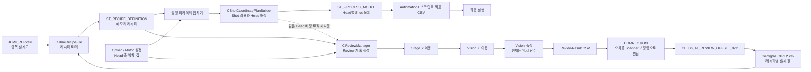
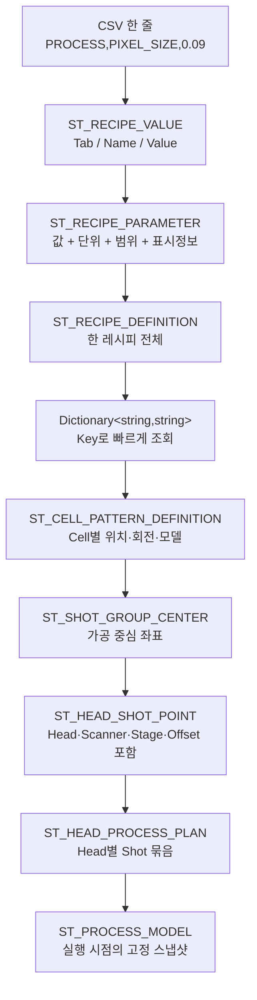
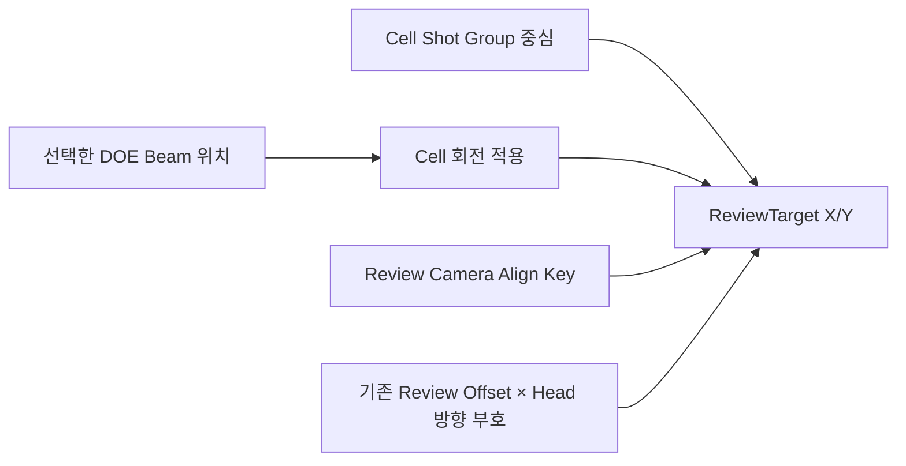
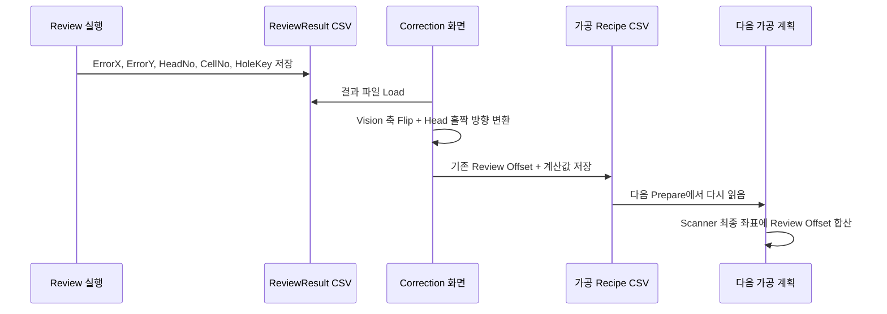
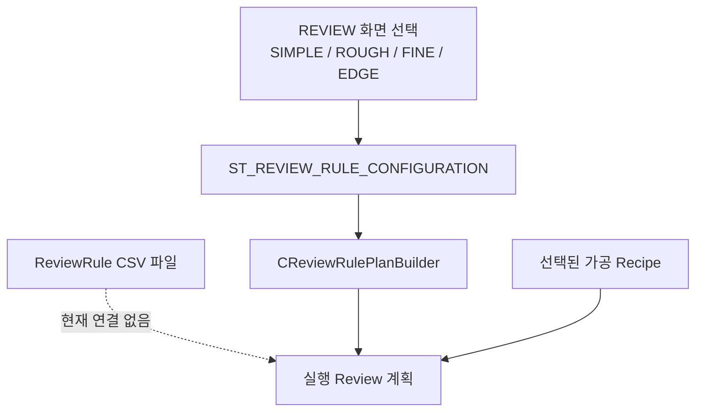
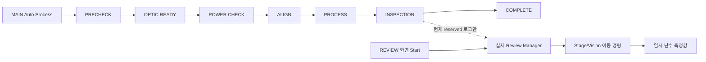

# 한눈에 보는 데이터 흐름

## 30초 요약

이 프로그램의 중심 흐름은 아래 한 줄입니다.

> 레시피 CSV를 읽는다 → 셀마다 가공 위치를 만든다 → 각 위치를 Head에 나눈다 → Automation1 스크립트로 가공한다 → Review 결과를 CSV로 저장한다 → 오차를 보정값으로 바꿔 같은 가공 레시피에 다시 넣는다.

다만 현재 버전에는 두 가지 큰 단절이 있습니다.

- 메인 자동 공정의 `INSPECTION` 단계와 실제 REVIEW 실행이 연결되어 있지 않습니다.
- REVIEW의 Vision 측정값은 실제 장비 응답이 아니라 임시 난수입니다.

## 먼저 알아둘 쉬운 용어

| 용어 | 쉬운 뜻 |
|---|---|
| Recipe | 장비가 어떻게 가공할지 적은 작업 지시서 |
| Cell | 글라스 위에 반복 배치된 하나의 제품 영역 |
| Pixel | Cell 안의 가장 작은 설계 격자 |
| PITCH | 모든 Pixel을 가공하지 않고 몇 칸마다 한 번 가공할지 정하는 간격 |
| Shot Group | Scanner가 한 번 이동해 가공하는 중심 위치. 코드에서 Review의 `Hole`도 사실상 이 단위 |
| DOE Beam | 한 Shot Group에서 갈라지는 작은 빔. `SPLITED_BEAM_COUNT=4`이면 4×4, 즉 16개 |
| Head | 가공을 담당하는 레이저/Scanner 묶음. 최대 8개 |
| Recipe Offset | 작업자가 레시피에 직접 지정한 Shot별 보정값 |
| Review Offset | Review 오차를 바탕으로 누적 저장하는 Shot별 보정값 |
| Head Default Offset | Head 자체의 기본 보정값 |

## 전체 왕복 흐름



점선은 “Review가 별도로 좌표를 추측하지 않고, 가공 좌표 생성기의 Head 배정 결과를 다시 사용한다”는 뜻입니다.

## 레시피 데이터의 모양이 바뀌는 과정



핵심은 `ST_PROCESS_MODEL`이 만들어진 뒤에는 그 실행이 **당시 값의 복사본**을 쓴다는 점입니다. 레시피를 나중에 수정해도 이미 준비된 모델이 자동으로 바뀌는 것이 아닙니다. 다만 실제 Auto Cycle 시작 직전에 `PrepareInitialProcess()`를 다시 호출하므로 정상 화면 흐름에서는 최신 캐시 레시피로 새 모델을 준비합니다.

## 좌표 한 점에 더해지는 값

가공용 최종 Scanner 보정량은 다음처럼 계산됩니다.

```text
FinalScannerOffset X
  = Shot별 Recipe Offset X
  + 축 변환을 거친 Head Default Offset X
  + Shot별 Review Offset X

FinalScannerOffset Y
  = Shot별 Recipe Offset Y
  + 축 변환을 거친 Head Default Offset Y
  + Shot별 Review Offset Y

Scanner Gx/Gy = 기본 Scanner 좌표 + FinalScannerOffset X/Y
```

소스 근거: [`CShotCoordinatePlanBuilder.cs` 106~116행](https://github.com/kjuws10-rgb/A3_LD_Process_SW_IPS/blob/702fefcaff524ae29209dc5c8c3bcfa626101b9c/Drilling.Common/Recipe/CShotCoordinatePlanBuilder.cs#L106-L116)

## Review는 무엇을 검사하는가

이 코드에서 Review의 `Hole`은 개별 Pixel이나 16개 DOE Beam 전체를 뜻하지 않습니다.

- `HoleNo` = 가공의 `ShotGroupNo`
- 사용자가 `Beam1`~`Beam16` 중 하나를 선택
- 선택한 Beam의 로컬 오프셋을 Cell 회전각만큼 회전
- Review 카메라 기준 위치와 Shot 중심, 기존 Review Offset을 합쳐 이동 목표를 만듦



소스 근거: [`CReviewManager.cs` 1093~1216행](https://github.com/kjuws10-rgb/A3_LD_Process_SW_IPS/blob/702fefcaff524ae29209dc5c8c3bcfa626101b9c/Drilling.Common/Review/CReviewManager.cs#L1093-L1216)

## 리뷰 결과가 다시 레시피로 돌아가는 길



실제 저장 키 예시는 아래와 같습니다.

```text
CELL1_A1_REVIEW_OFFSET_X
CELL1_A1_REVIEW_OFFSET_Y
CELL7_C14_REVIEW_OFFSET_X
CELL7_C14_REVIEW_OFFSET_Y
```

`A1`은 “1열 1행”인 Shot Group 이름입니다. 열은 A, B, ..., Z, AA 순이고 뒤 숫자가 행입니다.

## 파일은 있는데 실제로 쓰이지 않는 리뷰 규칙

저장소에는 다음 파일이 있습니다.

```text
Config/JHMI_REVIEW_RULE.csv
Config/ReviewRule/ALL_POINT.csv
Config/ReviewRule/UserSampling.csv
Config/RECIPE/*.csv 의 REVIEW_RULE_FILE 값
```

하지만 전체 C# 소스를 검색하면 이 파일을 읽는 클래스나 메서드가 없습니다. 실제 실행 규칙은 `CMenuReview`의 메모리 필드와 `CReviewRulePlanBuilder`가 만듭니다.



## 실제 연결과 미연결을 구분한 그림



- 메인 공정의 예약 상태: [`CStationProcess.RunReviewStep()`](https://github.com/kjuws10-rgb/A3_LD_Process_SW_IPS/blob/702fefcaff524ae29209dc5c8c3bcfa626101b9c/Drilling.Common/Station/CStationProcess.cs#L1349-L1353)
- 임시 난수 측정: [`CReviewManager.MeasureVision()`](https://github.com/kjuws10-rgb/A3_LD_Process_SW_IPS/blob/702fefcaff524ae29209dc5c8c3bcfa626101b9c/Drilling.Common/Review/CReviewManager.cs#L1583-L1655)

## 작은 숫자로 이해하는 예

가정:

- Pixel 수: X 20, Y 10
- `PITCH=5`
- `SPLITED_BEAM_COUNT=4`
- Pixel 크기: 0.09 mm

계산:

1. X Shot Group 수 = `20 / 5 = 4`
2. Y Shot Group 수 = `10 / 5 = 2`
3. 한 Cell의 Shot Group = `4 × 2 = 8`
4. Shot Group 사이 거리 = `0.09 × 5 = 0.45 mm`
5. 한 Shot Group의 DOE Beam = `4 × 4 = 16개`
6. Beam 사이 거리 = `0.45 / 4 = 0.1125 mm`

나누어떨어지지 않는 Pixel은 오류가 아니라 끝부분 제외 수량으로 기록됩니다. 예를 들어 Pixel X가 22라면 `22 / 5 = 4`개 그룹을 만들고 나머지 2 Pixel은 제외됩니다.

## 다음 문서로 이어서 보기

- 가공의 세부 계산: [02_가공레시피_데이터구조와흐름.md](./02_가공레시피_데이터구조와흐름.md)
- 리뷰 규칙과 측정·보정: [03_리뷰레시피_데이터구조와흐름.md](./03_리뷰레시피_데이터구조와흐름.md)
- 위험 항목과 발생 조건: [06_발견사항_위험도_개선방향.md](./06_발견사항_위험도_개선방향.md)
