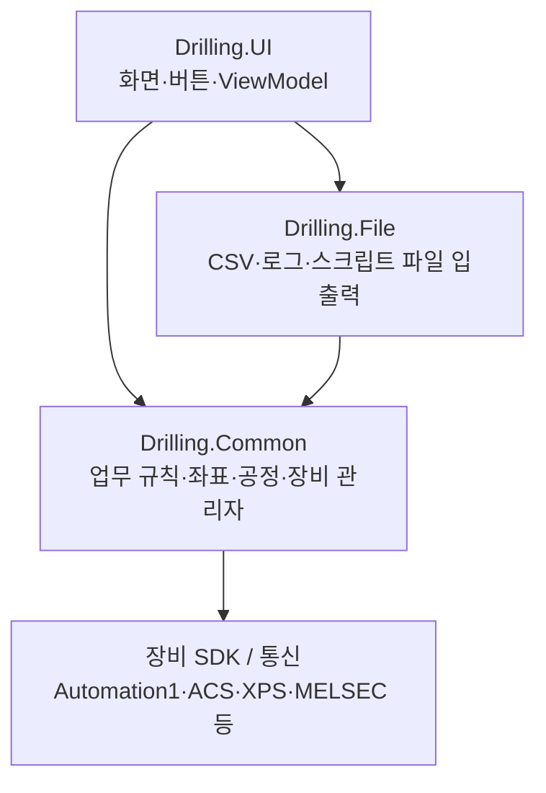
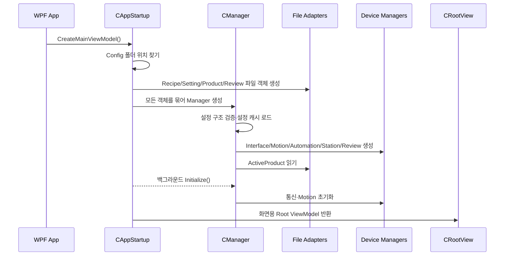
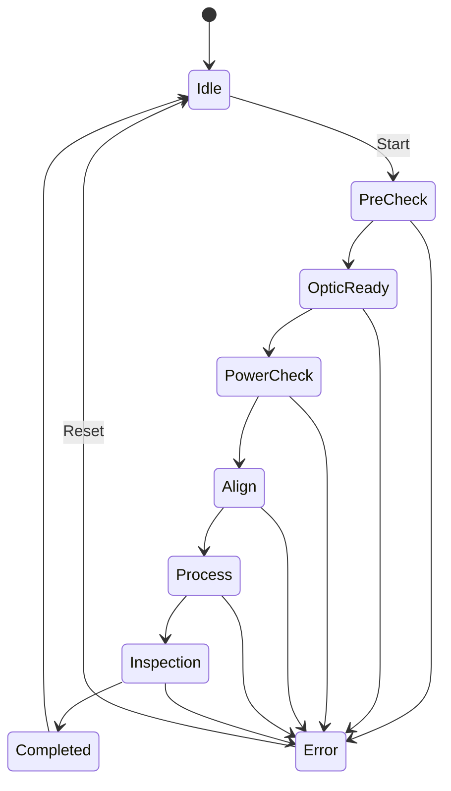
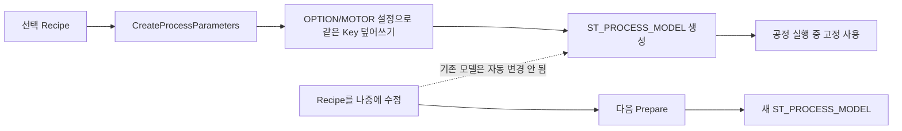

# 전체 구조 — 초보자 안내

## 프로그램의 역할

이 프로그램은 레이저 드릴 장비의 작업 조건을 레시피로 관리하고, Cell별 가공 좌표를 만든 뒤, 여러 Head에 작업을 나누어 Automation1 스크립트로 실행하는 WPF 장비 제어 프로그램입니다. 가공 후에는 Review 위치로 Stage와 Vision을 이동하고, 결과를 저장·보정하는 구조도 포함합니다.

분석 기준 코드는 `.NET 8`이며 Windows 전용 WPF UI입니다.

## 3개 핵심 프로젝트



| 프로젝트 | 쉽게 말하면 | 대표 내용 |
|---|---|---|
| `Drilling.UI` | 사람이 보는 화면과 버튼 | MAIN, RECIPE, REVIEW, CORRECTION 화면, WPF XAML |
| `Drilling.Common` | 실제 판단과 계산을 하는 두뇌 | 레시피 모델, 좌표 계산, 공정 상태, Review 규칙, 장비 Manager |
| `Drilling.File` | 파일을 읽고 쓰는 손 | JHMI CSV, 레시피 CSV, Product CSV, Review 결과, Automation1 스크립트 |

프로젝트 선언: [`Drilling.UI.csproj`](https://github.com/kjuws10-rgb/A3_LD_Process_SW_IPS/blob/702fefcaff524ae29209dc5c8c3bcfa626101b9c/Drilling.UI/Drilling.UI.csproj), [`Drilling.Common.csproj`](https://github.com/kjuws10-rgb/A3_LD_Process_SW_IPS/blob/702fefcaff524ae29209dc5c8c3bcfa626101b9c/Drilling.Common/Drilling.Common.csproj), [`Drilling.File.csproj`](https://github.com/kjuws10-rgb/A3_LD_Process_SW_IPS/blob/702fefcaff524ae29209dc5c8c3bcfa626101b9c/Drilling.File/Drilling.File.csproj)

## 프로그램이 켜질 때



진입점은 [`CAppStartup.CreateMainViewModel()`](https://github.com/kjuws10-rgb/A3_LD_Process_SW_IPS/blob/702fefcaff524ae29209dc5c8c3bcfa626101b9c/Drilling.UI/CAppStartup.cs#L13-L37)입니다.

### Config 경로 찾기

실행 파일 위치에서 부모 폴더를 올라가며 `Drilling.sln`을 찾고, 찾은 프로젝트 루트의 `Config`를 사용합니다. 찾지 못하면 현재 작업 폴더의 `Config`를 씁니다. 소스 근거: [`CAppStartup.cs` 89~103행](https://github.com/kjuws10-rgb/A3_LD_Process_SW_IPS/blob/702fefcaff524ae29209dc5c8c3bcfa626101b9c/Drilling.UI/CAppStartup.cs#L89-L103)

## 핵심 Manager 지도

`CManager`가 여러 관리자를 조립하는 중심입니다.

| 관리자 | 맡은 일 | 주요 입력/출력 |
|---|---|---|
| `CRecipeManager` | 레시피 목록 캐시, 저장·이름 변경·삭제 | `ST_RECIPE_DEFINITION` |
| `CSettingManager` | OPTION/MOTOR 등 설정 캐시 | `ST_SYSTEM_PARAMETER` |
| `CStationManager` / `CStationProcess` | 자동 공정 상태와 실행 | `ST_PROCESS_MODEL`, 공정 Snapshot |
| `CReviewManager` | Review 계획·이동·측정·결과 저장 | `ST_REVIEW_PLAN`, 결과 CSV |
| `CProductManager` | 현재 Glass/Product의 공정 상태 | `ST_PRODUCT_DATA` |
| `CAutomationManager` | Automation1 업로드·실행·상태 확인 | Head별 스크립트 |
| `CInterfaceManager` | 장비 통신의 공통 창구 | WonikCtrl, Vision, Laser, BET 등 |
| `CMotionManager` | 축 초기화와 Motion 장비 제어 | Motor 설정, 축 상태 |
| `CAlarmManager` / `CInterLockManager` | 알람과 운전 가능 조건 | Alarm/Interlock 상태 |

조립 위치: [`CManager` 생성자](https://github.com/kjuws10-rgb/A3_LD_Process_SW_IPS/blob/702fefcaff524ae29209dc5c8c3bcfa626101b9c/Drilling.Common/Managers/CManager.cs#L117-L159)

## 주요 저장 위치

| 위치 | 역할 | 누가 주로 읽고/쓰는가 |
|---|---|---|
| `Config/JHMI_RCP.csv` | 가공 레시피 항목 설계도 | `CJhmiRecipeFile` 읽기 |
| `Config/RECIPE/*.csv` | 레시피별 실제 값 | RECIPE 화면·Correction 읽기/쓰기 |
| `Config/JHMI_SETTING.csv` | 설정 항목 설계도 | `CSettingFile` |
| `Config/Setting/Setting.csv` | OPTION/MOTOR 실제 설정 | `CSettingManager` |
| `Data/Product/ActiveProduct.csv` | 현재 Product와 레시피 복사본, Review 상태 | `CProductFile` |
| `Data/ReviewResult/yyyyMMdd/*.csv` | Review 결과 | `CReviewResultFile` |
| `Data/Script/...` 또는 설정 경로 | Head별 Automation1 스크립트·좌표표 | `CAutomation1ScriptFile` |
| `Data/Log/...` | 공정·레시피 변경 이력 | `CLogManager` |

## 자동 가공 공정 상태

메인 자동 공정은 다음 상태를 순서대로 진행합니다.



코드상 상태 목록은 [`CStationProcess.ProcessFlowItems`](https://github.com/kjuws10-rgb/A3_LD_Process_SW_IPS/blob/702fefcaff524ae29209dc5c8c3bcfa626101b9c/Drilling.Common/Station/CStationProcess.cs#L59-L60), 실행 분기는 [`Run()`](https://github.com/kjuws10-rgb/A3_LD_Process_SW_IPS/blob/702fefcaff524ae29209dc5c8c3bcfa626101b9c/Drilling.Common/Station/CStationProcess.cs#L188-L225)에 있습니다.

### 단계별 실제 상태

| 단계 | 코드가 하는 일 | 주의 |
|---|---|---|
| `PRECHECK` | Interlock, Process Model 확인 | 실행 전 방어 단계 |
| `OPTIC READY` | Laser, BET, Attenuator 준비 | 설정과 장비 응답 사용 |
| `POWER CHECK` | 현재는 PowerMeter 상태를 읽고 예약 로그 기록 | 완전한 검사 절차인지 별도 확인 필요 |
| `ALIGN` | 정렬 명령과 Product 상태 갱신 | 설정에 따라 Skip 가능 |
| `PROCESS` | 스크립트 생성 → 업로드 → Head별 실행 대기 | Standard/Buffered 방식 |
| `INSPECTION` | 현재 “추후 연결” 로그만 기록 | `CReviewManager`를 호출하지 않음 |
| `COMPLETE` | 결과와 Product 상태 완료 처리 | 성공/실패/중지 기록 |

`PROCESS`의 실제 호출 순서: [`RunProcessStep()`](https://github.com/kjuws10-rgb/A3_LD_Process_SW_IPS/blob/702fefcaff524ae29209dc5c8c3bcfa626101b9c/Drilling.Common/Station/CStationProcess.cs#L786-L793)

`INSPECTION`의 현재 예약 구현: [`RunReviewStep()`](https://github.com/kjuws10-rgb/A3_LD_Process_SW_IPS/blob/702fefcaff524ae29209dc5c8c3bcfa626101b9c/Drilling.Common/Station/CStationProcess.cs#L1349-L1353)

## 공정 준비와 실행 데이터의 수명



우선순위는 다음과 같습니다.

1. 가공 레시피 파라미터를 먼저 Dictionary에 넣음
2. ProductId/PanelId/LotId와 기본값을 보충
3. `OPTION`, `MOTOR` 설정의 동일 Key가 레시피 값을 덮어씀
4. 그 결과로 좌표와 `ST_PROCESS_MODEL`을 만듦

근거:

- 레시피를 Dictionary로 변환: [`CRootView.CreateProcessParameters()`](https://github.com/kjuws10-rgb/A3_LD_Process_SW_IPS/blob/702fefcaff524ae29209dc5c8c3bcfa626101b9c/Drilling.UI/CRootView.cs#L1136-L1165)
- 설정 덮어쓰기: [`CStationProcess.BuildRuntimeParameters()`](https://github.com/kjuws10-rgb/A3_LD_Process_SW_IPS/blob/702fefcaff524ae29209dc5c8c3bcfa626101b9c/Drilling.Common/Station/CStationProcess.cs#L1705-L1722)
- 실행 모델 생성: [`BuildProcessModel()`](https://github.com/kjuws10-rgb/A3_LD_Process_SW_IPS/blob/702fefcaff524ae29209dc5c8c3bcfa626101b9c/Drilling.Common/Station/CStationProcess.cs#L1724-L1773)

## Product 데이터는 왜 따로 있는가

레시피는 “어떻게 작업할지”이고 Product는 “어느 Glass가 지금 어떤 상태인지”입니다.

```text
ST_PRODUCT_DATA
├─ Product      : Glass ID, Lot, Process ID, Recipe ID, 상태, 시간
├─ Recipe       : 작업 시작 때 사용한 파라미터 복사본
├─ Align        : 정렬 상태와 Offset
├─ Distortion   : 왜곡 상태와 Max DA
├─ Review       : Review 상태와 결과 목록
└─ Runtime      : Head별 진행·결과
```

주요 구조: [`CProductManager.cs` 41~177행](https://github.com/kjuws10-rgb/A3_LD_Process_SW_IPS/blob/702fefcaff524ae29209dc5c8c3bcfa626101b9c/Drilling.Common/Product/CProductManager.cs#L41-L177)

Review는 현재 Product의 Recipe ID가 Review Plan의 Recipe ID와 같을 때 연결됩니다. 그렇지 않아도 Review 자체는 `UNLINKED REVIEW`로 실행할 수 있으나 Product 상태에는 반영되지 않습니다.

## 코드 규모와 저장소 상태

생성물 폴더를 제외한 분석 대상은 대략 다음과 같습니다.

| 항목 | 수치 |
|---|---:|
| 실제 C# 파일 | 105개 |
| C# 줄 수 | 약 71,042줄 |
| XAML 파일 | 21개 |
| CSV 파일 | 97개 |
| Git 추적 전체 파일 | 6,150개 |
| 이 중 `.vs/bin/obj` 등 생성 파일 | 5,327개 |

가장 큰 업무 파일은 `CMenuMonitor.cs`, `CMenuManual.cs`, `CMenuReview.cs`, `CMenuRecipe.cs`, `CStationProcess.cs`, `CMenuMain.cs` 순입니다. 화면 Controller 하나가 수천 줄인 경우가 많아, 특정 기능을 바꿀 때 관련 없는 UI 상태까지 함께 영향을 받을 가능성이 큽니다.

## 빌드와 문서 상태

- `Drilling.UI.csproj`만 빌드하면 Release 기준 성공합니다.
- `Drilling.sln`에는 현재 저장소에 없는 `Drilling.Regression`, `Drilling.UI.Regression` 프로젝트가 남아 있어 전체 솔루션 빌드는 실패합니다.
- README가 가리키는 `docs/UI_CONTRACT.md`, `docs/MENU_STRUCTURE.md`, `docs/COMMUNICATION_STRUCTURE.md`의 `docs` 폴더가 현재 커밋에는 없습니다.
- `CRootView.CanAccessMenu()`는 첫 줄에서 항상 `true`를 반환하므로 이후 접근 제한 로직이 도달 불가입니다. 별도 복제본 빌드에서 이 부분이 경고 2개로 확인되었습니다.

상세 검증 기록은 [07_분석근거와_검증기록.md](./07_분석근거와_검증기록.md)를 참고하면 됩니다.
