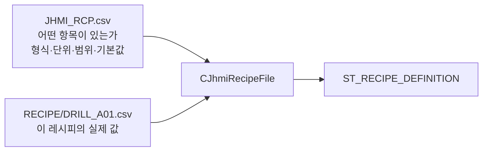
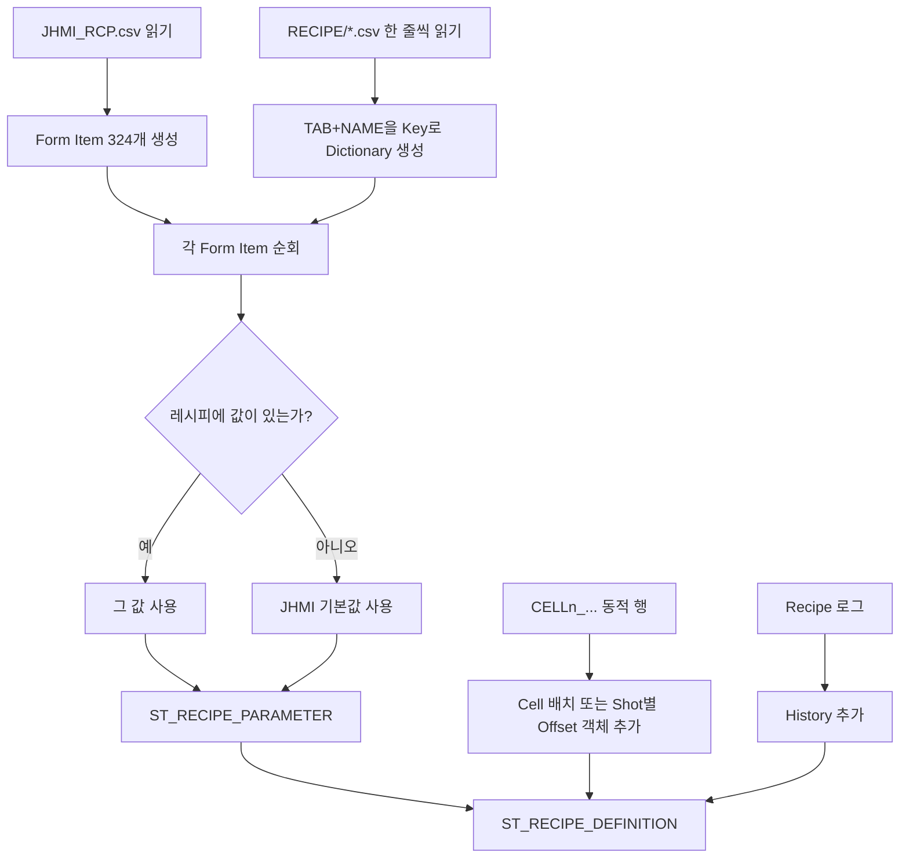
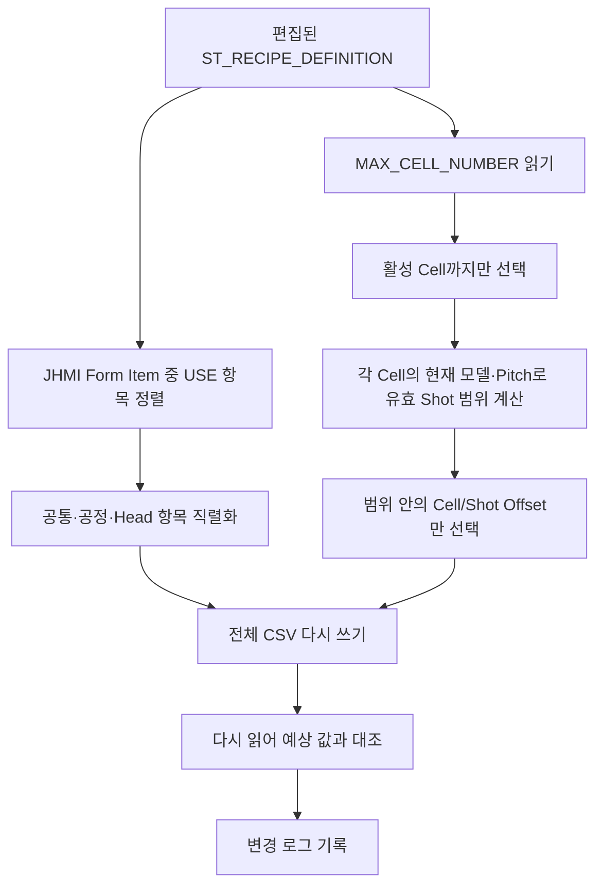
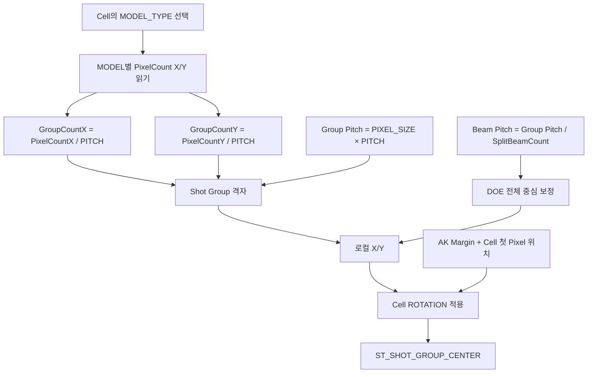
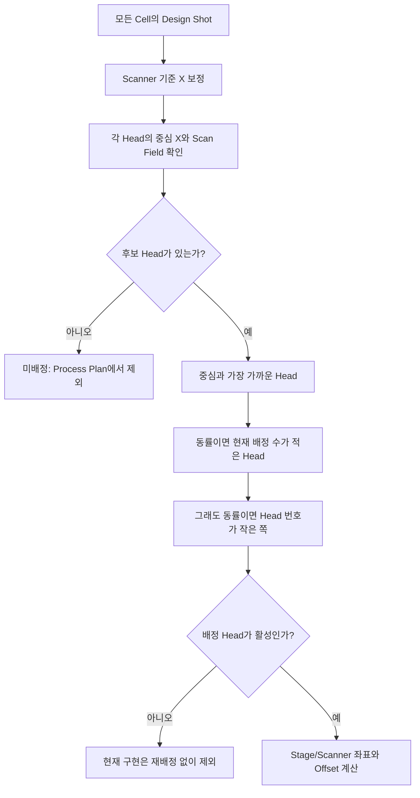
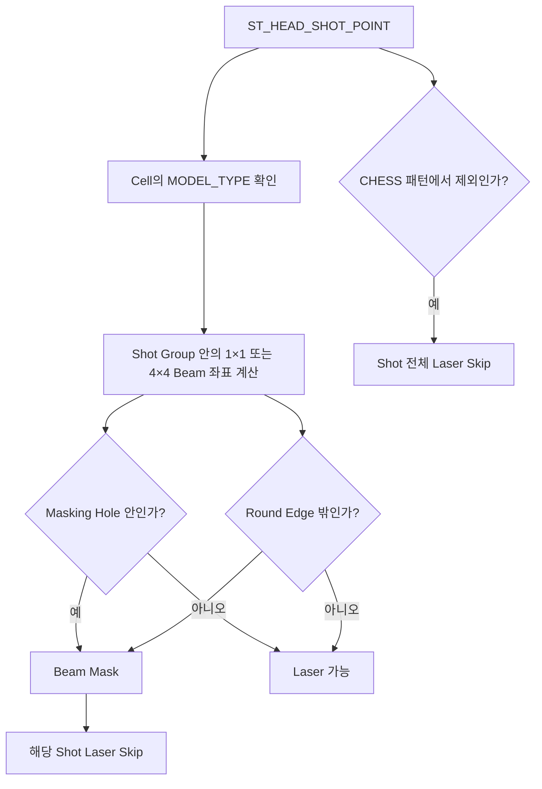
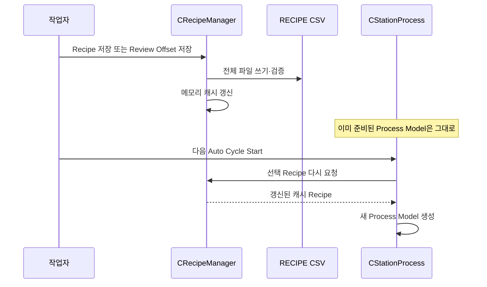

# 가공 레시피 — 데이터 구조와 흐름

## 1. 가공 레시피는 “설계도 + 값”의 두 층이다



### 1층: `Config/JHMI_RCP.csv`

이 파일은 화면과 검증에 필요한 항목 정의입니다. 분석 시점에 324개 항목이 있습니다.

| 열 | 뜻 |
|---|---|
| `TAB`, `GROUP` | 화면에서 항목을 묶는 위치 |
| `NAME` | 코드가 찾는 Key |
| `DISPLAY NAME` | 화면 표시명 |
| `CIM NAME` | 외부/CIM 이름 |
| `DATA TYPE` | STRING, INT, DOUBLE, BOOL |
| `UNIT` | mm, pixel, count 등 |
| `SHOW`, `USE` | 화면 표시·실제 사용 여부 |
| `VALUE` | 기본값 |
| `SCALE` | 값 배율 정보 |
| `CHANGE LIMIT` | 변경 한계 정보 |
| `MIN`, `MAX` | 허용 범위 |
| `DESCRIPTION` | 설명 |
| `ORDER` | 표시·저장 순서 |

코드 구조는 [`ST_RECIPE_FORM_ITEM`](https://github.com/kjuws10-rgb/A3_LD_Process_SW_IPS/blob/702fefcaff524ae29209dc5c8c3bcfa626101b9c/Drilling.Common/Managers/CRecipeManager.cs#L17-L21), 읽기는 [`CJhmiRecipeFile.LoadFormItems()`](https://github.com/kjuws10-rgb/A3_LD_Process_SW_IPS/blob/702fefcaff524ae29209dc5c8c3bcfa626101b9c/Drilling.File/JHMI/CJhmiRecipeFile.cs#L753-L775)가 담당합니다.

### 2층: `Config/RECIPE/*.csv`

레시피 파일에는 헤더 없이 한 줄에 세 값이 저장됩니다.

```csv
DEFAULT,RECIPE_NAME,DRILL_A01
DEFAULT,RECIPE_ID,DRILL_A01
COMMON,MAX_CELL_NUMBER,45
PROCESS,PIXEL_SIZE,0.09
CELL,CELL1_ALIGN_TO_1ST_PIXEL_X,12.34
CELL,CELL1_A1_REVIEW_OFFSET_X,0.006
```

형식은 다음과 같습니다.

```text
TAB, NAME, VALUE
```

따라서 레시피 값 파일만 보면 단위나 범위를 알 수 없습니다. 그 정보는 `JHMI_RCP.csv`에서 합쳐집니다.

## 2. 메모리 데이터 구조

```text
ST_RECIPE_DEFINITION
├─ Id           : 파일명에서 얻은 레시피 ID
├─ Name         : DEFAULT,RECIPE_NAME 값
├─ Parameters[] : 모든 공통·공정·Head·Cell·Shot Group 항목
└─ History[]    : 로그 파일에서 읽은 최근 변경 이력
```

각 `Parameters[]` 항목은 다음 정보를 함께 가집니다.

```text
ST_RECIPE_PARAMETER
├─ Name / Key / Value
├─ Tab / Group
├─ Unit / Range / DefaultValue
├─ DataType
├─ Show / Use / DisplayOrder
├─ ChangeLimit / Min / Max
└─ Extra
```

즉, 실행 계산에는 주로 `Key`와 `Value`를 쓰지만, 같은 객체가 화면 표시와 입력 검증 정보도 같이 들고 다닙니다.

구조 정의: [`CRecipeManager.cs` 9~29행](https://github.com/kjuws10-rgb/A3_LD_Process_SW_IPS/blob/702fefcaff524ae29209dc5c8c3bcfa626101b9c/Drilling.Common/Managers/CRecipeManager.cs#L9-L29)

## 3. 레시피를 읽을 때



중요한 규칙은 다음과 같습니다.

- 같은 `TAB + NAME`이 여러 번 나오면 마지막 값이 사용됩니다.
- JHMI에만 있고 레시피에 없는 항목은 JHMI 기본값을 씁니다.
- Cell별 배치값과 Shot별 Offset은 행 수가 고정되지 않아 동적으로 추가합니다.
- 알 수 없는 `CELLn_...` 값은 아무 값이나 받아들이는 것이 아니라, 지원하는 배치 Key 또는 Offset 패턴일 때만 객체로 만듭니다.
- 변경 이력은 레시피 CSV 안이 아니라 로그에서 별도로 읽습니다.

근거: [`LoadRecipe()`](https://github.com/kjuws10-rgb/A3_LD_Process_SW_IPS/blob/702fefcaff524ae29209dc5c8c3bcfa626101b9c/Drilling.File/JHMI/CJhmiRecipeFile.cs#L393-L504)

## 4. 동적 Cell·Shot Group Key

### Cell별 배치값

```text
CELL1_ALIGN_TO_1ST_PIXEL_X
CELL1_ALIGN_TO_1ST_PIXEL_Y
CELL1_ROTATION
CELL1_MODEL_TYPE

CELL2_ALIGN_TO_1ST_PIXEL_X
...
```

`MAX_CELL_NUMBER`만큼 반복됩니다.

### Shot Group별 보정값

```text
CELL{셀번호}_{행렬이름}_RECIPE_OFFSET_X
CELL{셀번호}_{행렬이름}_RECIPE_OFFSET_Y
CELL{셀번호}_{행렬이름}_REVIEW_OFFSET_X
CELL{셀번호}_{행렬이름}_REVIEW_OFFSET_Y
```

예:

```text
CELL1_A1_RECIPE_OFFSET_X
CELL1_A1_REVIEW_OFFSET_Y
CELL2_B1_RECIPE_OFFSET_X
CELL12_AA25_REVIEW_OFFSET_Y
```

행렬 이름은 `A1, B1, ... Z1, AA1 ...`처럼 **열을 문자, 행을 숫자**로 나타냅니다.

동적 Offset 인식: [`TryGetShotGroupOverrideMetadata()`](https://github.com/kjuws10-rgb/A3_LD_Process_SW_IPS/blob/702fefcaff524ae29209dc5c8c3bcfa626101b9c/Drilling.File/JHMI/CJhmiRecipeFile.cs#L691-L750)

## 5. 저장할 때



저장 특징:

- 파일 일부만 수정하지 않고 레시피 전체를 다시 씁니다.
- 활성 Cell 수보다 큰 `CELLn_...` 항목은 저장하지 않습니다.
- 현재 모델의 Shot 행·열 범위를 벗어난 Offset도 저장하지 않습니다.
- 쓰기 직후 다시 읽어 모든 예상 Key/Value가 있는지 확인합니다.
- 한 프로세스 안에서는 `SemaphoreSlim`으로 파일 작업을 한 번에 하나씩 처리합니다.
- 이름 변경은 새 파일 작성·검증 후 기존 파일을 삭제합니다.
- 일반 Save는 임시 파일에 쓴 뒤 원자적으로 교체하는 방식은 아닙니다.

근거: [`SaveCore()`](https://github.com/kjuws10-rgb/A3_LD_Process_SW_IPS/blob/702fefcaff524ae29209dc5c8c3bcfa626101b9c/Drilling.File/JHMI/CJhmiRecipeFile.cs#L95-L216), [`ValidateSavedRecipeFile()`](https://github.com/kjuws10-rgb/A3_LD_Process_SW_IPS/blob/702fefcaff524ae29209dc5c8c3bcfa626101b9c/Drilling.File/JHMI/CJhmiRecipeFile.cs#L958-L989)

## 6. 레시피별 실제 규모

아래 수치는 레시피의 Cell 모델, Pixel 수, Pitch만으로 계산한 **이론상 Shot Group 수**입니다. Head Scan Field 밖이거나 비활성 Head로 배정된 점은 실제 Process Plan에서 빠질 수 있습니다. Masking과 CHESS는 Shot을 목록에서 삭제하지 않고 해당 위치의 레이저 발진을 생략합니다.

| 레시피 | Cell | Pitch | Split | 모델 사용 | 이론상 Shot Group | Beam/Group |
|---|---:|---:|---:|---|---:|---:|
| `animotion` | 5 | 10 | 4 | M1~M5 각 1 Cell | 1,750 | 16 |
| `DRILL_A01` | 45 | 10 | 4 | M1:8, M2:9, M3:8, M4:8, M5:12 | 15,750 | 16 |
| `sample3` | 1 | 1 | 1 | M1:1 | 25 | 1 |
| `simple2` | 180 | 10 | 4 | M1~M5 각 36 Cell | 101,808 | 16 |
| `wizardtest` | 180 | 10 | 4 | M1:90, M2:36, M3~M5 각 18 | 82,404 | 16 |

모델별 Pixel 크기:

- `DRILL_A01`, `animotion`: 모든 모델이 144×256
- `sample3`: 모든 모델이 5×5
- `simple2`, `wizardtest`: M1 144×256, M2 256×144, M3 288×512, M4/M5 144×256

따라서 `simple2`, `wizardtest`는 Cell마다 Review Point 수가 달라질 수 있는 실제 예제입니다.

## 7. Cell에서 Shot Group 좌표 만들기

Cell 하나를 계산하는 입력 구조는 다음과 같습니다.

```text
ST_CELL_PATTERN_DEFINITION
├─ CellNo
├─ FirstTargetX / FirstTargetY
├─ RotationDegrees
├─ PixelSizeMillimeters
├─ PixelCountX / PixelCountY
├─ ProcessPitch
├─ SplitBeamCount
└─ OriginX / OriginY      ← AK Margin
```

### 계산 순서



수식:

```text
GroupCountX = floor(PixelCountX / PITCH)
GroupCountY = floor(PixelCountY / PITCH)
GroupPitch  = PIXEL_SIZE × PITCH
BeamPitch   = GroupPitch / SPLITED_BEAM_COUNT
BeamHalfSpan = BeamPitch × (SPLITED_BEAM_COUNT - 1) / 2

localX = column × GroupPitch + BeamHalfSpan
localY = row    × GroupPitch + BeamHalfSpan

DesignX = OriginX + FirstTargetX + localX×cosθ - localY×sinθ
DesignY = OriginY + FirstTargetY + localX×sinθ + localY×cosθ
```

`BeamHalfSpan`을 더하는 이유는 Shot Group 중심을 DOE 빔 배열의 한쪽 끝이 아니라 전체 배열 중심에 맞추기 위해서입니다.

제한:

- `SPLITED_BEAM_COUNT`는 코드상 1 또는 4만 지원
- Cell당 Shot Group 최대 500,000개
- 전체 Shot Group 최대 500,000개
- Pixel 수가 Pitch로 나누어떨어지지 않으면 나머지는 제외 수량으로 기록

근거: [`CCellPatternCalculator.Calculate()`](https://github.com/kjuws10-rgb/A3_LD_Process_SW_IPS/blob/702fefcaff524ae29209dc5c8c3bcfa626101b9c/Drilling.Common/Recipe/CCellPatternCalculator.cs#L117-L239)

## 8. 전체 Cell 좌표를 Head에 나누기

`CShotCoordinatePlanBuilder`가 모든 Cell의 Shot Group을 모아 실제 Head와 Stage/Scanner 좌표를 붙입니다.



Head 중심 X 기본식:

```text
HeadCenterX = AK_MARGIN_X
            + H01_AK_POSITION_X
            + (HeadNo - 1) × HeadGapX
```

각 Head의 `Hxx_SCAN_FIELD_WIDTH_X` 범위 안에 들어오는지 확인합니다.

중요한 구현 특성은 후보를 만들 때 활성 Head만 쓰는 것이 아니라 `1..HEAD_COUNT` 전체를 사용한 뒤, 선택 결과가 비활성 Head이면 그 Shot을 버린다는 점입니다. 겹치는 활성 Head가 있어도 다시 배정하지 않습니다. 소스 근거: [`CShotCoordinatePlanBuilder.cs` 22~52행](https://github.com/kjuws10-rgb/A3_LD_Process_SW_IPS/blob/702fefcaff524ae29209dc5c8c3bcfa626101b9c/Drilling.Common/Recipe/CShotCoordinatePlanBuilder.cs#L22-L52)

## 9. Stage·Scanner·Offset 계산

최종 한 점은 `ST_HEAD_SHOT_POINT`가 됩니다.

```text
ST_HEAD_SHOT_POINT
├─ 식별: SequenceNo, ShotKey, HeadNo, CellNo, ShotGroupNo
├─ 격자: GroupColumn/Row, GroupCountX/Y
├─ 설계: DesignX/Y
├─ 장비: ScannerGx/Gy, StageX/Y, EncoderWaitPosition
├─ 보정: RecipeOffsetX/Y
├─ 보정: HeadDefaultOffsetX/Y
├─ 보정: ReviewOffsetX/Y
└─ 합계: FinalScannerOffsetX/Y
```

좌표 핵심:

```text
Recipe Y를 Stage Y로 바꿀 때 부호 반전: StageY basis = -RecipeY

FinalScannerOffset
  = Recipe Offset
  + Scanner 축 변환을 적용한 Head Default Offset
  + Review Offset

Scanner G
  = Scanner Base + FinalScannerOffset
```

Head별 축 교환·X/Y Flip은 `CScannerAxisTransform`이 적용합니다. 최종 필드 구조와 계산은 [`CShotCoordinatePlanBuilder.cs` 5~127행](https://github.com/kjuws10-rgb/A3_LD_Process_SW_IPS/blob/702fefcaff524ae29209dc5c8c3bcfa626101b9c/Drilling.Common/Recipe/CShotCoordinatePlanBuilder.cs#L5-L127)에 있습니다.

## 10. 가공 순서 정렬

1. `EncoderWaitPosition`을 소수 6자리로 반올림해 같은 Stage 행을 묶음
2. Stage Scan 방향에 따라 행을 위→아래 또는 아래→위 정렬
3. 같은 행에서는 Head 번호순
4. Head 안에서는 변화 폭이 더 큰 Scanner 축을 가공축으로 보고 음의 방향에서 양의 방향으로 정렬
5. Cell 번호와 Shot Group 번호로 최종 동률 해소

근거: [`OrderShots()`](https://github.com/kjuws10-rgb/A3_LD_Process_SW_IPS/blob/702fefcaff524ae29209dc5c8c3bcfa626101b9c/Drilling.Common/Recipe/CShotCoordinatePlanBuilder.cs#L169-L257)

## 11. Masking과 CHESS

Masking은 좌표 목록을 없애는 것이 아니라, 스크립트가 그 위치로 이동한 뒤 **레이저 발진만 생략**하게 합니다.



CHESS 판정:

```text
CHESS > 1 이고
positiveModulo(GroupColumn - GroupRow, CHESS) != 0 이면 Laser Skip
```

Masking 계산: [`CRecipeShotMaskingPlan.EvaluateShot()`](https://github.com/kjuws10-rgb/A3_LD_Process_SW_IPS/blob/702fefcaff524ae29209dc5c8c3bcfa626101b9c/Drilling.Common/Recipe/CRecipeShotMaskingPlan.cs#L87-L147)

스크립트 반영: [`CAutomation1ScriptFile.cs` 359~399행](https://github.com/kjuws10-rgb/A3_LD_Process_SW_IPS/blob/702fefcaff524ae29209dc5c8c3bcfa626101b9c/Drilling.File/Script/CAutomation1ScriptFile.cs#L359-L399)

## 12. Process Model과 Automation1 출력

좌표 계획은 활성 Head별로 나뉘어 다음 구조가 됩니다.

```text
ST_PROCESS_MODEL
├─ ProcessId / RecipeId / ProductId / PanelId / LotId
├─ Parameters                   ← 실행 시점 전체 Dictionary
├─ CreatedAt
└─ HeadPlans[]
   └─ ST_HEAD_PROCESS_PLAN
      ├─ HeadNo / AutomationNo / TaskNo
      ├─ LaserPower / Frequency / ShotCount / Delay
      ├─ MarkSpeed / JumpSpeed / DoeZPosition
      ├─ ScriptFileName
      └─ Shots[]                ← ST_HEAD_SHOT_POINT
```

스크립트 빌드 결과:

```text
실행별 격리 폴더
├─ PROCESS_SHOT_COORDINATE.csv  ← 모든 좌표·Offset 추적용
├─ PROCESS_COORDINATE_LIST.txt  ← Head별 요약과 Shot 표시명
├─ PROCESS_H01.ascript
├─ PROCESS_H02.ascript
└─ ... 활성 Head
```

파일 생성: [`CAutomation1ScriptFile.Build()`](https://github.com/kjuws10-rgb/A3_LD_Process_SW_IPS/blob/702fefcaff524ae29209dc5c8c3bcfa626101b9c/Drilling.File/Script/CAutomation1ScriptFile.cs#L43-L89)

공정에서는 `Build → Upload → Run → Task 완료 대기` 순서입니다. [`CStationProcess.cs` 864~954행](https://github.com/kjuws10-rgb/A3_LD_Process_SW_IPS/blob/702fefcaff524ae29209dc5c8c3bcfa626101b9c/Drilling.Common/Station/CStationProcess.cs#L864-L954)

## 13. 같은 위치를 부르는 여러 이름

| 사용 위치 | 예 | 뜻 |
|---|---|---|
| Process 내부 Key | `CELL001_SHOT0001` | Cell 1, Shot Group 1 |
| Review 내부 Key | `CELL001_HOLE0001` | 같은 물리 Shot Group |
| 레시피/Review 결과 Key | `CELL1_A1` | 같은 점을 행렬 이름으로 표시 |
| 레시피 보정 Key | `CELL1_A1_REVIEW_OFFSET_X` | 그 점의 X Review 보정 |
| Automation Shot List | `A01` | Row 문자를 먼저, Column 숫자를 뒤에 표시 |

주의할 점:

- Review/레시피의 `A1`은 **Column=A, Row=1**입니다.
- Automation Shot List의 `A01`은 코드상 **Row=A, Column=01**입니다.
- 같은 물리점이지만 축 표기 순서와 숫자 자릿수가 다릅니다.

Process Key: [`ToShotKey()`](https://github.com/kjuws10-rgb/A3_LD_Process_SW_IPS/blob/702fefcaff524ae29209dc5c8c3bcfa626101b9c/Drilling.Common/Recipe/CShotCoordinatePlanBuilder.cs#L429-L432)

Review 행렬명: [`CReviewHoleNameFormatter`](https://github.com/kjuws10-rgb/A3_LD_Process_SW_IPS/blob/702fefcaff524ae29209dc5c8c3bcfa626101b9c/Drilling.Common/Review/CReviewManager.cs#L124-L151)

Automation 표시명: [`FormatShotName()`](https://github.com/kjuws10-rgb/A3_LD_Process_SW_IPS/blob/702fefcaff524ae29209dc5c8c3bcfa626101b9c/Drilling.File/Script/CAutomation1ScriptFile.cs#L746-L784)

## 14. 레시피 수정값은 언제 다음 공정에 반영되는가



프로그램 내부 저장을 거치면 캐시도 함께 바뀝니다. 반대로 프로그램 실행 중 외부 편집기로 CSV만 수정하면 `CRecipeManager`에는 캐시 무효화 기능이 없어 변경이 자동 반영되지 않습니다.

캐시 동작: [`CRecipeManager.LoadRecipes()`와 `SaveRecipe()`](https://github.com/kjuws10-rgb/A3_LD_Process_SW_IPS/blob/702fefcaff524ae29209dc5c8c3bcfa626101b9c/Drilling.Common/Managers/CRecipeManager.cs#L31-L71)

## 15. 가공 레시피에서 바로 확인할 항목

- `MAX_CELL_NUMBER`와 실제 `CELLn_...` 행 수가 맞는가
- 각 Cell의 `CELLn_MODEL_TYPE`이 `CELL_MODEL_TYPE_COUNT` 안인가
- 모델별 Pixel X/Y가 Pitch보다 작지 않은가
- Pixel 수를 Pitch로 나눈 나머지를 의도적으로 제외하는가
- `SPLITED_BEAM_COUNT`가 1 또는 4인가
- 비활성 Head의 Scan Field에 가까운 Shot이 사라지지 않는가
- Head Scan Field 밖의 미배정 Shot 수가 0인가
- CHESS/Masking으로 Laser가 생략되는 수량이 예상과 맞는가
- Recipe/Review/Head Offset의 좌표계와 부호가 맞는가
- 실제 실행 전에 새 `ST_PROCESS_MODEL`이 준비되었는가

발견된 구체적 위험과 우선순위는 [06_발견사항_위험도_개선방향.md](./06_발견사항_위험도_개선방향.md)에 정리했습니다.
