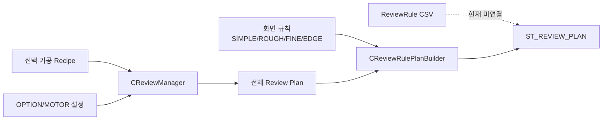
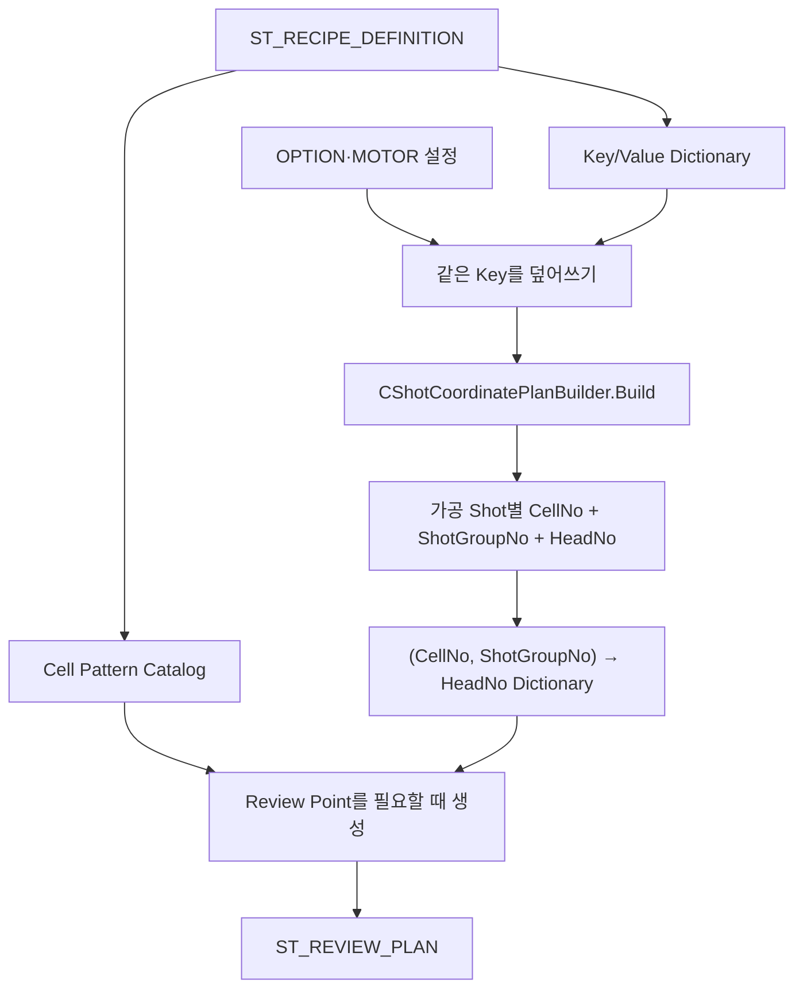
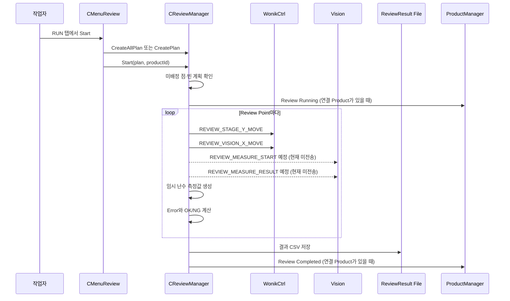
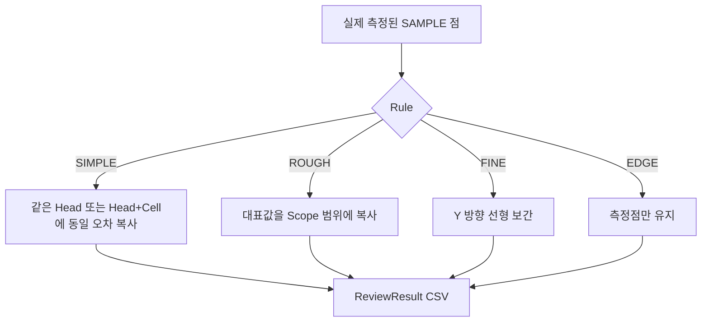
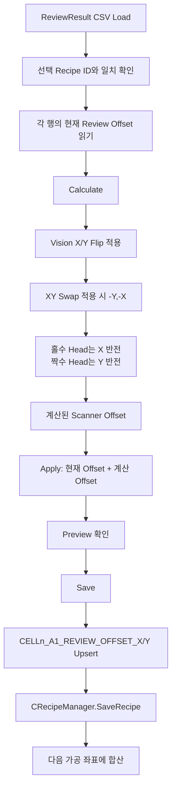

# 리뷰 레시피 — 데이터 구조와 흐름

## 1. 먼저 정리: 현재 코드에는 두 종류의 “리뷰 레시피”가 보인다

### A. 파일로 보이는 리뷰 규칙

```text
Config/JHMI_REVIEW_RULE.csv
Config/ReviewRule/ALL_POINT.csv
Config/ReviewRule/UserSampling.csv
Config/RECIPE/*.csv 안의 REVIEW_RULE_FILE=ALL_POINT.csv
```

이 파일들은 형식과 샘플 값을 갖고 있지만, 현재 C# 코드에는 이를 읽어 실행 계획으로 바꾸는 로더가 없습니다. 전체 `.cs`와 `.xaml` 참조를 검색했을 때 `REVIEW_RULE_FILE`, 파일명, `JHMI_REVIEW_RULE`을 소비하는 실행 코드가 나오지 않았습니다. 시작 시 Config 구조 검사 목록에도 포함되지 않습니다.

### B. 실제로 동작하는 리뷰 규칙

```text
선택된 가공 Recipe
  + REVIEW 화면에서 고른 Mode/Rule/Scope/Beam
  + OPTION/MOTOR의 Head·축 설정
  = 실제 ST_REVIEW_PLAN
```

따라서 이 문서에서 “실행 리뷰 레시피”라고 부르는 것은 B입니다.



## 2. Review 데이터 구조

### 전체 계획

```text
ST_REVIEW_PLAN
├─ RecipeId / RecipeName
├─ HeadCount / CellCount
├─ ToleranceX / ToleranceY
├─ VisionAxisMode
├─ CreatedAt
├─ Points[]
└─ ResultProjection?          ← Sample 결과를 전체 범위로 펼치는 규칙
```

### 한 검사점

```text
ST_REVIEW_PLAN_POINT
├─ 식별: PointNo, HoleKey, HeadNo, CellNo, HoleNo
├─ 격자: PixelCountX/Y
├─ 실행: Use, State, Judge
├─ 설계: DesignX/Y
├─ 이동: ReviewTargetX/Y
├─ 결과: ErrorX/Y
├─ BeamNo, BeamOffsetGx/Gy
├─ ReviewOffsetX/Y
└─ StageXToGxSign / StageYToGySign
```

주의: `PixelCountX`, `PixelCountY`라는 필드명과 달리 실제 대입값은 원 Pixel 수가 아니라 **Shot Group의 열·행 수**입니다. [`BuildHolePoints()`의 생성 부분](https://github.com/kjuws10-rgb/A3_LD_Process_SW_IPS/blob/702fefcaff524ae29209dc5c8c3bcfa626101b9c/Drilling.Common/Review/CReviewManager.cs#L1189-L1215)을 보면 `GroupCountX/Y`가 들어갑니다.

전체 record 정의: [`CReviewManager.cs` 35~216행](https://github.com/kjuws10-rgb/A3_LD_Process_SW_IPS/blob/702fefcaff524ae29209dc5c8c3bcfa626101b9c/Drilling.Common/Review/CReviewManager.cs#L35-L216)

## 3. Review 계획은 가공 계획에서 Head 배정을 다시 가져온다

Review가 가공과 다른 방식으로 Head를 추측하지 않도록 다음 경로를 사용합니다.



핵심 순서:

1. 선택 가공 레시피의 Key/Value를 Dictionary로 변환
2. `OPTION`, `MOTOR` 설정을 같은 방식으로 덮어씀
3. 가공과 동일한 `CShotCoordinatePlanBuilder` 실행
4. `(CellNo, ShotGroupNo)`별 실제 가공 Head를 Dictionary로 만듦
5. Cell Pattern을 다시 만들되, Head 번호는 위 Dictionary에서 가져옴
6. 선택한 DOE Beam의 위치와 Review Camera 기준을 더해 목표 좌표 생성

근거: [`CreatePlanCore()`](https://github.com/kjuws10-rgb/A3_LD_Process_SW_IPS/blob/702fefcaff524ae29209dc5c8c3bcfa626101b9c/Drilling.Common/Review/CReviewManager.cs#L823-L903)

## 4. Review Point를 전부 메모리에 만들지 않는 이유

180개 Cell과 큰 모델에서는 Review Point가 수만~10만 개가 됩니다. 코드는 `CRecipeCellPatternCatalog`와 `CLazyReviewPointList`를 사용해 목록의 모든 객체를 미리 만들지 않고, 인덱스로 요청될 때 한 점을 계산합니다.

```text
CRecipeCellPatternCatalog
├─ Cell별 Definition
├─ Cell별 Layout
├─ 전체 목록에서 시작 Index
└─ Cell별 Count

CLazyReviewPointList[index]
  → 어느 Cell인지 이진 탐색
  → Cell 안의 row/column 계산
  → 그때 ST_REVIEW_PLAN_POINT 생성
```

근거:

- [`CRecipeCellPatternCatalog`](https://github.com/kjuws10-rgb/A3_LD_Process_SW_IPS/blob/702fefcaff524ae29209dc5c8c3bcfa626101b9c/Drilling.Common/Recipe/CRecipeCellPatternCatalog.cs)
- [`CLazyReviewPointList`](https://github.com/kjuws10-rgb/A3_LD_Process_SW_IPS/blob/702fefcaff524ae29209dc5c8c3bcfa626101b9c/Drilling.Common/Review/CReviewManager.cs#L1406-L1455)

## 5. Review 목표 좌표 계산

Review는 Shot Group 중심에서 선택한 DOE Beam 하나를 검사합니다.

```text
DOE Beam 번호
  → Beam의 column / row
  → Beam Offset X/Y
  → Cell Rotation 적용

ReviewTargetX
  = ReviewCameraAlignKeyPosX
  + (ShotDesignX - AK_MARGIN_X)
  + 회전된 BeamOffsetX
  + ReviewOffsetX × Head의 StageX→Gx 부호

ReviewTargetY
  = ReviewCameraAlignKeyPosY
  + (ShotDesignY - AK_MARGIN_Y)
  + 회전된 BeamOffsetY
  + ReviewOffsetY × Head의 StageY→Gy 부호
```

`SPLITED_BEAM_COUNT=4`이면 선택 가능한 Beam은 1~16입니다. Beam Pitch는 다음과 같습니다.

```text
DOE Beam Pitch = PIXEL_SIZE × PITCH / SPLITED_BEAM_COUNT
```

계산 근거: [`CalculateBeamOffset()`와 `CalculateReviewTarget()`](https://github.com/kjuws10-rgb/A3_LD_Process_SW_IPS/blob/702fefcaff524ae29209dc5c8c3bcfa626101b9c/Drilling.Common/Review/CReviewManager.cs#L1457-L1524)

## 6. 화면에서 선택하는 Review Mode

REVIEW 화면의 실행 Mode는 다음과 같습니다.

| Mode | 동작 |
|---|---|
| `ALL HOLE` | Head가 배정된 모든 Shot Group 검사 |
| `SAMPLE HOLE` | SIMPLE/ROUGH/FINE/EDGE 규칙으로 뽑은 일부 검사 |
| `ZERO DEFENSE` | 전체 Design Y 중앙선에 가장 가까운 최대 5개 점 검사 |

화면 탭은 현재 `RUN`, `SAMPLE SELECT` 두 개만 지원합니다. `ONE HOLE` 관련 코드와 저장 로직은 남아 있지만 탭 선택 메서드가 옛 이름을 거부하므로 정상 사용자 흐름에서는 들어갈 수 없습니다. 근거: [`SelectTab()`](https://github.com/kjuws10-rgb/A3_LD_Process_SW_IPS/blob/702fefcaff524ae29209dc5c8c3bcfa626101b9c/Drilling.UI/Menu/Menus/CMenuReview.cs#L733-L765)

## 7. SAMPLE 규칙

규칙 구조:

```text
ST_REVIEW_RULE_CONFIGURATION
├─ Rule             : Simple / Rough / Fine / Edge
├─ Scope            : Head / HeadCell
├─ BeamNo
├─ ReferenceHoleKey : SIMPLE 기준점
├─ RoughReference   : First / Center / Last
└─ FineLineCount    : 1 / 3 / 5 / 7
```

### SIMPLE

- 작업자가 기준 Shot 1개를 선택
- 그 한 점을 실제 측정
- 결과 파일을 만들 때 같은 Head 또는 같은 Head+Cell 범위에 동일 오차를 복사

### ROUGH

- `FIRST`, `CENTER`, `LAST` 중 기준 Y 위치 선택
- Scope가 `HEAD`이면 Head마다 대표 1점
- Scope가 `HEAD+CELL`이면 해당 기준선에서 Head+Cell마다 대표 1점
- 보간하지 않고 같은 범위에 대표값을 복사

### FINE

- 글라스 전체 Y 범위에 1, 3, 5, 7개 기준선을 균등 배치
- 선택된 물리 행의 가공점을 측정
- 결과 파일을 만들 때 같은 Head·X 열에서 Y 방향 선형 보간

### EDGE

- 각 Cell의 첫/마지막 행 또는 첫/마지막 열에 있는 외곽점
- 측정한 점만 결과로 사용하고 전체 내부로 복사하지 않음

규칙 생성 코드: [`CReviewRulePlanBuilder.Build()`](https://github.com/kjuws10-rgb/A3_LD_Process_SW_IPS/blob/702fefcaff524ae29209dc5c8c3bcfa626101b9c/Drilling.Common/Review/CReviewRulePlanBuilder.cs#L33-L49)

화면 설정을 구조로 만드는 코드: [`CreateCorrectionRuleConfiguration()`](https://github.com/kjuws10-rgb/A3_LD_Process_SW_IPS/blob/702fefcaff524ae29209dc5c8c3bcfa626101b9c/Drilling.UI/Menu/Menus/CMenuReview.cs#L3332-L3368)

### 선택 내용의 저장 여부

SIMPLE 기준 Key, Rule, Scope, Rough 기준, Fine 선 수는 `CMenuReview`의 필드에만 있습니다. ReviewRule CSV나 Setting 파일로 저장하는 코드가 없어 프로그램 재시작 후 영구 복원되는 구조가 아닙니다.

## 8. Review 실행 흐름



실행 상태는 `Idle → Running → Completed/Stopped/Failed`입니다. Stop 요청은 원자 플래그로 기록하고, 각 이동·측정 사이에서 확인합니다.

실행 루프: [`CReviewManager.Start()`](https://github.com/kjuws10-rgb/A3_LD_Process_SW_IPS/blob/702fefcaff524ae29209dc5c8c3bcfa626101b9c/Drilling.Common/Review/CReviewManager.cs#L437-L568)

실행 순서는 Design Y 행을 기준으로 묶고 X 방향을 번갈아 이동하는 Serpentine 방식입니다.

## 9. 현재 Vision 측정은 실측이 아니다

`MeasureVision()`은 명령 문자열만 만들고 실제 전송하지 않습니다.

```text
REVIEW_MEASURE_START 문자열 생성 → 사용하지 않음
Simulation일 때만 3초 Delay
REVIEW_MEASURE_RESULT 문자열 생성 → 사용하지 않음
CreateTemporaryVisionMeasurement() 반환
```

임시 결과는 다음 방식입니다.

- 보통 X/Y 오차를 ±0.0200 안에서 난수 생성
- 10% 확률로 한 축을 최소 0.0350 이상으로 만들어 NG 샘플 생성
- 소수 4자리로 반올림
- 실기/시뮬레이션 여부와 관계없이 마지막 반환값은 이 임시 난수

소스 근거: [`MeasureVision()`과 `CreateTemporaryVisionMeasurement()`](https://github.com/kjuws10-rgb/A3_LD_Process_SW_IPS/blob/702fefcaff524ae29209dc5c8c3bcfa626101b9c/Drilling.Common/Review/CReviewManager.cs#L1583-L1656)

실제 응답을 해석하는 `ParseVisionResponse()`는 이미 있지만 현재 호출되지 않습니다. [`ParseVisionResponse()`](https://github.com/kjuws10-rgb/A3_LD_Process_SW_IPS/blob/702fefcaff524ae29209dc5c8c3bcfa626101b9c/Drilling.Common/Review/CReviewManager.cs#L1732-L1762)

## 10. 오차와 판정

```text
ErrorX = MeasuredX - ReviewTargetX
ErrorY = MeasuredY - ReviewTargetY

Vision 응답에 유효 Judge가 있으면 그 값을 사용
그렇지 않으면:
  abs(ErrorX) <= REVIEW_TOLERANCE_X
  AND
  abs(ErrorY) <= REVIEW_TOLERANCE_Y
  이면 OK, 아니면 NG
```

근거: [`ApplyMeasurement()`](https://github.com/kjuws10-rgb/A3_LD_Process_SW_IPS/blob/702fefcaff524ae29209dc5c8c3bcfa626101b9c/Drilling.Common/Review/CReviewManager.cs#L1694-L1720)

## 11. 결과 Projection — 측정하지 않은 점의 결과를 만드는 과정

SAMPLE Review는 일부 점만 측정하지만 Correction에 전체 범위 Offset을 제공하기 위해 결과 파일을 확장할 수 있습니다.



파일에는 각 행의 출처가 기록됩니다.

| `RESULT_SOURCE` | 뜻 |
|---|---|
| `MEASURED` | 실제 Review 루프에서 측정한 점 |
| `COPIED` | SIMPLE/ROUGH 대표값을 복사한 점 |
| `INTERPOLATED` | FINE 선형 보간으로 만든 점 |

중요한 차이: **ReviewResult CSV는 Projection된 전체 행을 저장하지만, `ProductManager.SetReviewCompleted()`에는 원래 측정한 결과만 전달**합니다. 따라서 같은 실행의 Product Review 결과 수와 CSV 행 수가 다를 수 있습니다.

근거: [`SaveResultForProduct()`](https://github.com/kjuws10-rgb/A3_LD_Process_SW_IPS/blob/702fefcaff524ae29209dc5c8c3bcfa626101b9c/Drilling.Common/Review/CReviewManager.cs#L680-L714), [`ProjectResultFileRows()`](https://github.com/kjuws10-rgb/A3_LD_Process_SW_IPS/blob/702fefcaff524ae29209dc5c8c3bcfa626101b9c/Drilling.Common/Review/CReviewManager.cs#L1219-L1250)

## 12. Review 결과 파일

경로:

```text
Data/ReviewResult/yyyyMMdd/ReviewResult_{RecipeId}_{HHmmss}.csv
```

열:

```text
SAVED_AT, RECIPE_ID, RULE, RESULT_SOURCE,
SHOT_NAME, ROW, COLUMN, DESIGN_X, DESIGN_Y,
HOLE_KEY, HEAD_NO, CELL_NO, ERROR_X, ERROR_Y, JUDGE
```

예시 형태:

```csv
2026-09-20 14:10:11.123,DRILL_A01,DIRECT,MEASURED,A1,1,1,...,CELL1_A1,1,1,0.004,-0.003,OK
```

저장 구현: [`CReviewResultFile.Save()`](https://github.com/kjuws10-rgb/A3_LD_Process_SW_IPS/blob/702fefcaff524ae29209dc5c8c3bcfa626101b9c/Drilling.File/ReviewResult/CReviewResultFile.cs#L87-L106)

## 13. 결과를 보정값으로 바꾸는 CORRECTION 흐름



변환 순서:

1. `VisionXFlip`이면 Error X 부호 반전
2. `VisionYFlip`이면 Error Y 부호 반전
3. `VisionXyFlip`이면 `(X,Y) = (-Y,-X)`로 교환
4. 홀수 Head면 X를 한 번 더 반전
5. 짝수 Head면 Y를 한 번 더 반전

변환 코드: [`CReviewCoordinateTransformer.VisionErrorToScannerOffset()`](https://github.com/kjuws10-rgb/A3_LD_Process_SW_IPS/blob/702fefcaff524ae29209dc5c8c3bcfa626101b9c/Drilling.Common/Review/CReviewCoordinateTransformer.cs#L15-L35)

저장 코드: [`CMenuCorrection.SaveAppliedReviewOffsets()`](https://github.com/kjuws10-rgb/A3_LD_Process_SW_IPS/blob/702fefcaff524ae29209dc5c8c3bcfa626101b9c/Drilling.UI/Menu/Menus/CMenuCorrection.cs#L919-L1024)

### Calculate는 OK와 NG를 모두 처리한다

`CalculateReviewOffsets()`는 결과의 `Judge`를 표시 상태에 넣지만 계산·Apply 대상에서 NG만 고르거나 OK를 제외하지 않습니다. 파일의 모든 행에 대해 Offset을 만들고 현재 값에 더합니다. 이것이 공정 의도인지 확인이 필요합니다.

근거: [`CMenuCorrection.cs` 789~804행](https://github.com/kjuws10-rgb/A3_LD_Process_SW_IPS/blob/702fefcaff524ae29209dc5c8c3bcfa626101b9c/Drilling.UI/Menu/Menus/CMenuCorrection.cs#L789-L804)

## 14. 키 이름 변환

| 단계 | Key 예 | 비고 |
|---|---|---|
| Review 내부 | `CELL001_HOLE0001` | 고정 폭 숫자 |
| Review 결과 CSV | `CELL1_A1` | 행렬명으로 바꿔 저장 |
| Correction 저장 | `CELL1_A1_REVIEW_OFFSET_X` | 가공 좌표 Builder가 읽는 형식 |

프로그램이 스스로 만든 결과 파일은 이 왕복이 맞습니다. 하지만 외부 시스템이 내부 형식인 `CELL001_HOLE0001`을 `HOLE_KEY`로 넣어 주면 Correction의 정규화는 이를 `CELL1_A1`로 바꾸지 않습니다. 그러면 `CELL001_HOLE0001_REVIEW_OFFSET_X` 같은 Key가 생겨 가공 Builder가 읽지 못합니다.

결과 Key 생성: [`CReviewResultFile.ToRow()`](https://github.com/kjuws10-rgb/A3_LD_Process_SW_IPS/blob/702fefcaff524ae29209dc5c8c3bcfa626101b9c/Drilling.File/ReviewResult/CReviewResultFile.cs#L188-L224)

Correction 정규화: [`NormalizeReviewHoleKey()`](https://github.com/kjuws10-rgb/A3_LD_Process_SW_IPS/blob/702fefcaff524ae29209dc5c8c3bcfa626101b9c/Drilling.UI/Menu/Menus/CMenuCorrection.cs#L1118-L1127)

## 15. Product 연결

Review 시작 시 현재 Product가 다음 조건을 만족하면 연결합니다.

- Product Recipe ID = Review Plan Recipe ID
- Station Process와 Product Process ID가 같거나, 마지막 완료 Product
- Product가 Skipped 상태가 아님

연결되지 않아도 Review는 실행되지만 화면에 `UNLINKED REVIEW`가 표시되고 Product Review 상태는 갱신하지 않습니다.

근거: [`CMenuReview.ResolveReviewProduct()`](https://github.com/kjuws10-rgb/A3_LD_Process_SW_IPS/blob/702fefcaff524ae29209dc5c8c3bcfa626101b9c/Drilling.UI/Menu/Menus/CMenuReview.cs#L1873-L1902)

## 16. 메인 자동 공정과의 관계

REVIEW 화면의 `CReviewManager.Start()`는 실제로 위 시퀀스를 실행합니다. 하지만 메인 Auto 공정의 `INSPECTION` 단계는 이것을 호출하지 않습니다.

```text
MAIN Auto Cycle:
PROCESS → INSPECTION(예약 로그만) → COMPLETE

실제 Review:
작업자가 REVIEW 화면 RUN 탭에서 별도로 Start
```

따라서 “가공 완료 후 자동 Review”를 기대하면 현재 코드와 다릅니다.

## 17. 모델 크기가 다른 Cell에서의 선택 Review 주의

전체 Review Plan은 Cell별 시작 Index와 Count를 아는 `CRecipeCellPatternCatalog`를 사용하므로 서로 다른 모델 크기를 처리할 수 있습니다. 그러나 일부 선택 경로는 다음처럼 전체 점 수를 Cell 수로 나누어 모든 Cell이 같은 크기라고 가정합니다.

```text
holesPerCell = allPlan.Points.Count / allPlan.CellCount
index = (cellNo - 1) × holesPerCell + holeNo - 1
```

이 계산은 `simple2`, `wizardtest`처럼 Cell 모델별 Pixel 크기가 다른 레시피에서 잘못된 점을 선택하거나 유효한 점을 제외할 수 있습니다.

영향 위치:

- [`CReviewManager.CreatePlan()`](https://github.com/kjuws10-rgb/A3_LD_Process_SW_IPS/blob/702fefcaff524ae29209dc5c8c3bcfa626101b9c/Drilling.Common/Review/CReviewManager.cs#L332-L379)
- [`CReviewRulePlanBuilder.TryGetPoint()`](https://github.com/kjuws10-rgb/A3_LD_Process_SW_IPS/blob/702fefcaff524ae29209dc5c8c3bcfa626101b9c/Drilling.Common/Review/CReviewRulePlanBuilder.cs#L558-L568)
- 기본 Sample Key 생성에도 같은 평균 방식이 남아 있음

반대로 ROUGH/FINE/EDGE의 주 경로는 `IReviewCellPointSource.GetCellRange()`를 이용해 Cell별 크기를 알기 때문에 이 문제를 피하려는 구조가 들어가 있습니다.

## 18. Review 운전 전 확인표

- 메인 Auto `INSPECTION`이 아니라 REVIEW 화면에서 시작한다는 점을 알고 있는가
- 현재 측정값이 실제 Vision 응답이 아닌 난수임을 알고 있는가
- 선택 Beam 번호가 Split 값에 맞는가: Split 1→Beam1, Split 4→Beam1~16
- Head 배정이 가공 계획과 일치하는가
- `ReviewTargetX/Y` 좌표계와 Stage/Vision 장비 명령의 단위가 일치하는가
- Vision Flip과 Head 홀짝 부호가 설비 실좌표와 맞는가
- 결과 CSV의 `RESULT_SOURCE`가 MEASURED인지 COPIED/INTERPOLATED인지 구분하는가
- Projection된 CSV와 Product 결과 건수가 다를 수 있음을 알고 있는가
- 외부 결과 파일의 `HOLE_KEY`가 `CELL1_A1` 형식인가
- 같은 결과를 두 번 Apply하지 않았는가
- 모델 크기가 다른 레시피에서 선택 Review Key가 정확한가

우선순위와 권장 검증 순서는 [06_발견사항_위험도_개선방향.md](./06_발견사항_위험도_개선방향.md)를 참고하면 됩니다.
