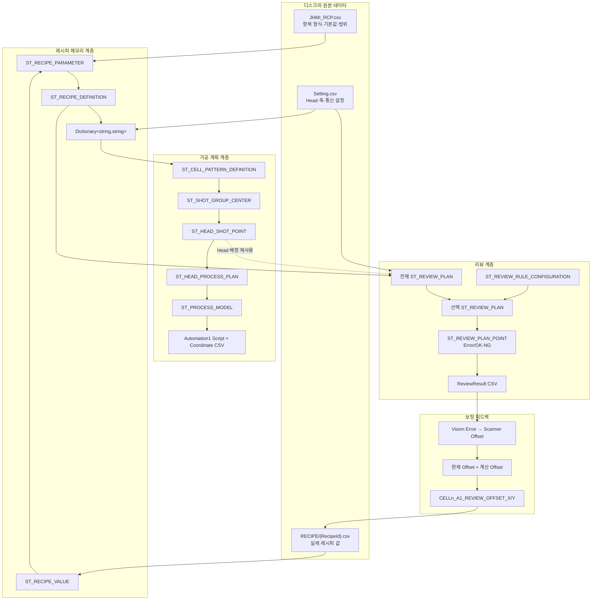
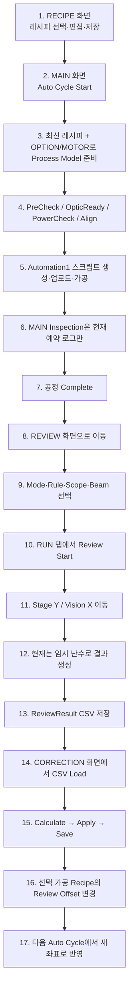
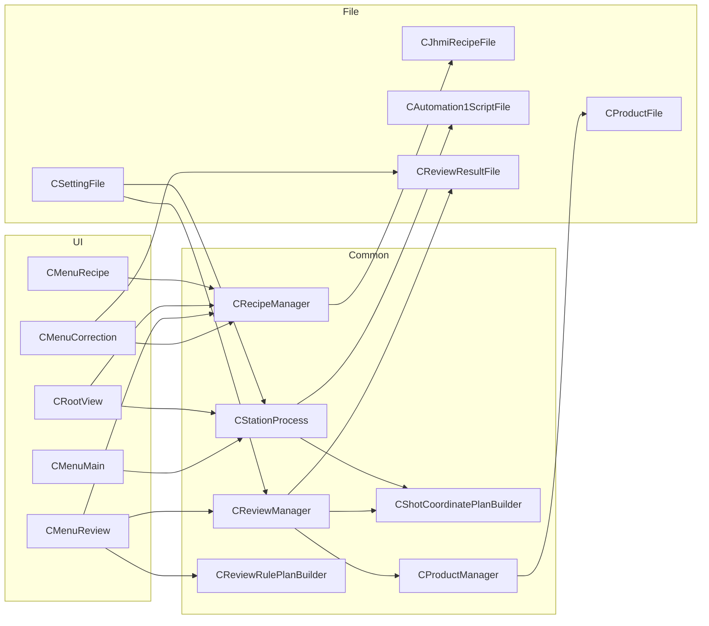
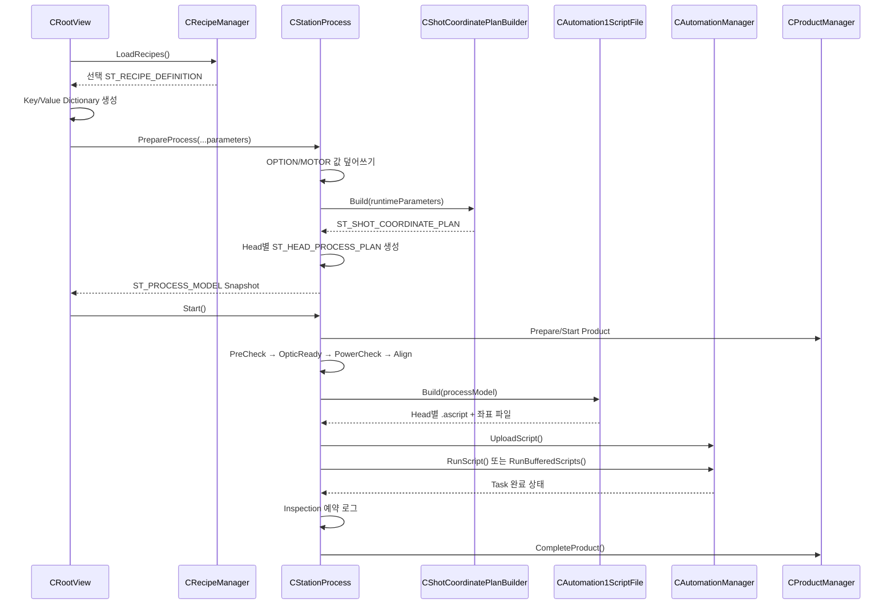
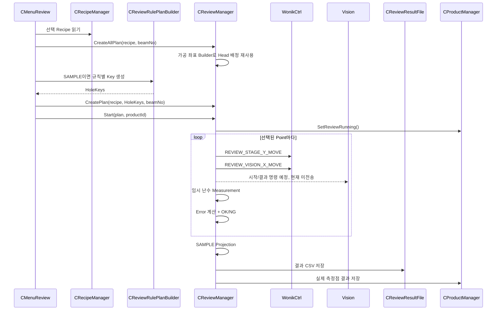
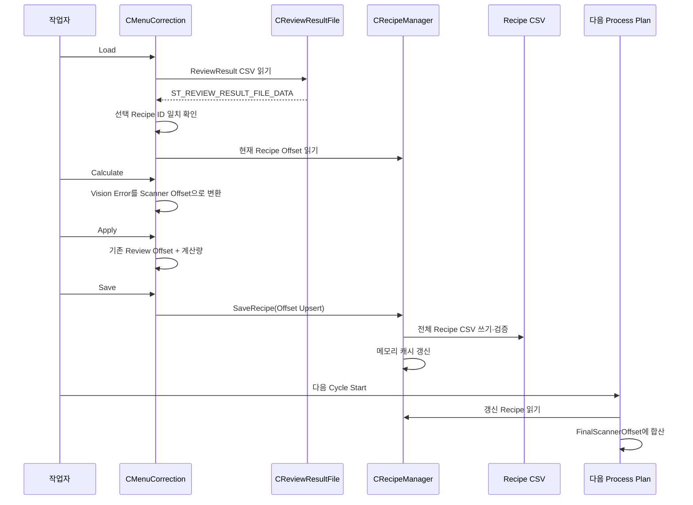
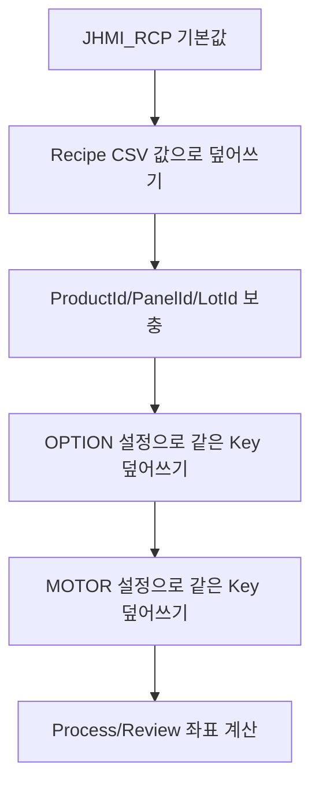

# 가공·리뷰·보정 통합 흐름도

## 1. 전체 데이터 계보



## 2. 작업자 관점의 실제 운전 순서



## 3. 컴포넌트별 읽기·쓰기 흐름



## 4. 가공 실행 시퀀스



## 5. Review 실행 시퀀스



## 6. Correction 피드백 시퀀스



## 7. 상태가 바뀌는 위치

### Process 상태

| 시점 | 주요 상태 |
|---|---|
| Prepare 직후 | `ProcessStep=Idle`, `ScriptStatus=NotCreated` |
| Start | `Sequence=PreCheck` |
| Script 생성 | `ScriptStatus=Created` |
| Scanner 실행 | `ProcessStep=Process`, `ScriptStatus=Running` |
| 정상 완료 | `ProcessStep=Completed`, `ScriptStatus=Completed` |
| Stop | `ProcessStep=Stopped` |
| 예외 | `ProcessStep=Error`, `ScriptStatus=Error` |

### Review 상태

| 시점 | Sequence | Point 상태 |
|---|---|---|
| 계획 생성 | `Idle` | `Ready` 또는 `Skip` |
| 현재 점 이동·측정 | `Running` | `Current` |
| 판정 후 | `Running` | `Ok` 또는 `Ng` |
| Stop 요청 | `Stopping` | 현재 이후 미측정점은 다시 `Ready` |
| 정상 완료 | `Completed` | 측정점 `Ok/Ng` |
| 예외 | `Failed` | 완료 전 상태가 남을 수 있음 |

### Product 상태

```text
Created/Prepared
  → Running
  → Head별 Running/Completed/Error
  → Align/Distortion 상태
  → Review Running/Completed/Stopped/Error
  → Product Completed/Stopped/Error/Scrapped
```

Review가 Product와 연결되지 않은 경우 Review 상태와 파일은 만들어져도 Product 상태는 바뀌지 않습니다.

## 8. 데이터 저장소별 진실의 원천

| 데이터 | 실행 중 진실의 원천 | 영구 저장 원천 | 주의 |
|---|---|---|---|
| 레시피 항목 정의 | `ST_RECIPE_FORM_ITEM` | `JHMI_RCP.csv` | 실행 중 캐시와 별개 |
| 선택 레시피 값 | `CRecipeManager` 캐시 | `RECIPE/*.csv` | 외부 파일 수정은 캐시에 자동 반영 안 됨 |
| 실행 좌표 | `ST_PROCESS_MODEL` | 생성된 좌표 CSV | Recipe가 바뀌어도 기존 모델은 고정 |
| Review 화면 규칙 | `CMenuReview` 필드 | 없음 | 프로그램 재시작 시 영속성 없음 |
| Review 실행 결과 | `CReviewManager.CurrentPlan` | ReviewResult CSV | 현재 Vision 값은 임시 난수 |
| Product Review 결과 | `CProductManager.Current` | ActiveProduct.csv | Projection 전 실제 측정점만 저장 |
| 보정 적용 여부 | `CMenuCorrection` HashSet | 없음 | 재시작 후 같은 파일 재적용 가능 |
| 최종 Review Offset | Recipe 파라미터/캐시 | Recipe CSV | 다음 Process Prepare에서 사용 |

## 9. 한 점이 끝까지 이동하는 예

가정:

```text
Cell = 1
Shot Group = 1
행렬명 = A1
Head = 1
Recipe Offset = (+0.002, -0.001)
Head Default Offset 변환 결과 = (+0.004, +0.003)
기존 Review Offset = (+0.006, -0.004)
```

가공 직전:

```text
FinalScannerOffsetX = 0.002 + 0.004 + 0.006 = +0.012 mm
FinalScannerOffsetY = -0.001 + 0.003 - 0.004 = -0.002 mm
```

Review에서 측정된 Vision 오차가 `(ErrorX=+0.005, ErrorY=-0.002)`이고 축 Flip이 없으며 Head 1이 홀수이면:

```text
Scanner 보정 DeltaX = -0.005
Scanner 보정 DeltaY = -0.002

새 ReviewOffsetX = +0.006 + (-0.005) = +0.001
새 ReviewOffsetY = -0.004 + (-0.002) = -0.006
```

레시피 저장:

```text
CELL1_A1_REVIEW_OFFSET_X,0.001000
CELL1_A1_REVIEW_OFFSET_Y,-0.006000
```

다음 공정의 최종값:

```text
FinalScannerOffsetX = 0.002 + 0.004 + 0.001 = +0.007 mm
FinalScannerOffsetY = -0.001 + 0.003 - 0.006 = -0.004 mm
```

이 예는 코드의 합산 방향을 설명하기 위한 예시이며, 실제 설비에서 오차가 줄어드는 부호인지는 Vision/Stage/Scanner 좌표계 실측 검증이 반드시 필요합니다.

## 10. 어디서 값이 덮어써지는가



실행 결과는 마지막 값이므로 같은 Key가 Recipe와 Setting 양쪽에 있으면 Setting이 이깁니다. 특히 Head 사용 여부, Head 위치, Scan Field, 축 방향은 Setting 쪽 값을 우선 확인해야 합니다.

## 11. 빠른 장애 추적 순서

### 가공 위치가 이상할 때

1. `RECIPE/*.csv`의 Cell 첫 Pixel 위치·회전·모델 확인
2. 모델 Pixel X/Y, `PITCH`, `PIXEL_SIZE`, `SPLITED_BEAM_COUNT` 확인
3. `Setting.csv`의 Head 위치·Scan Field·Use 확인
4. 생성된 `PROCESS_SHOT_COORDINATE.csv`에서 Design → Offset → Scanner 값을 분리 확인
5. Recipe/Head/Review Offset 각각을 0으로 놓고 어느 층에서 차이가 생기는지 확인
6. 축 Swap/Flip과 Stage Y 부호 확인

### Review 위치가 이상할 때

1. 같은 `(CellNo, ShotGroupNo)`의 가공 Head 확인
2. Review Camera Align Key 확인
3. 선택 Beam 번호와 DOE Pitch 확인
4. Cell Rotation 후 Beam Offset 확인
5. Head별 `STAGE_X_TO_GX_SIGN`, `STAGE_Y_TO_GY_SIGN` 확인
6. 기존 Review Offset이 두 번 들어갔는지 확인

### 다음 가공에 보정이 안 들어갈 때

1. 결과 CSV `HOLE_KEY`가 `CELL1_A1` 형태인지 확인
2. 선택 Recipe ID와 결과 Recipe ID가 같은지 확인
3. CORRECTION에서 Calculate → Apply → Save를 모두 했는지 확인
4. Recipe CSV에 `CELLn_..._REVIEW_OFFSET_X/Y`가 실제 저장됐는지 확인
5. 새 Auto Cycle에서 Process Model을 다시 준비했는지 확인
6. 생성 좌표 CSV의 `ReviewOffsetX/Y`와 `TotalScannerX/Y`를 확인
