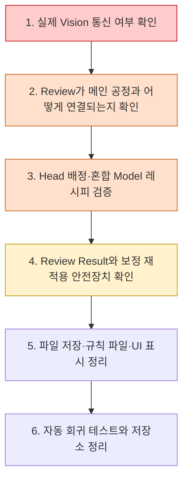
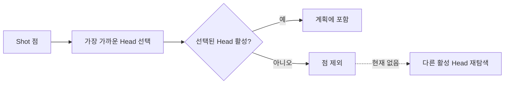

# 발견 사항, 위험도, 확인·개선 방향

> 이 문서는 **분석 결과와 확인 권고**를 정리한 문서입니다.
> 원본 `A3_LD_Process_SW_IPS` 저장소의 코드·설정·데이터는 수정하지 않았습니다.

## 1. 먼저 알아둘 점

아래 항목은 모두 같은 확실도를 갖지는 않습니다.

- **코드로 확인**: 현재 코드에서 실제로 그렇게 동작하는 것을 정적 분석으로 확인했습니다.
- **운영 확인 필요**: 코드상 위험 가능성이 있으나 장비 구성, 운용 규칙, 외부 프로그램과의 약속을 함께 확인해야 최종 판단할 수 있습니다.
- **개선 제안**: 당장 오류라고 단정하기보다 유지보수성과 안전성을 높이기 위한 방향입니다.

위험도는 다음 뜻으로 사용했습니다.

| 위험도 | 뜻 |
|---|---|
| 매우 높음 | 실제 장비 결과나 검사 신뢰도에 직접 영향을 줄 가능성이 커서 우선 확인이 필요함 |
| 높음 | 특정 레시피·설정·재시도 조건에서 데이터 누락 또는 잘못된 계산으로 이어질 수 있음 |
| 보통 | 즉시 장애가 아니더라도 운영 혼동, 추적 어려움, 유지보수 비용을 키울 수 있음 |
| 낮음 | 구조 정리, 테스트, 저장소 관리 품질에 관한 개선 사항 |

---

## 2. 우선 확인 순서 요약



---

## 3. 매우 높은 우선순위

### 3.1 Review 측정값이 실장비 모드에서도 임시 난수로 만들어짐

**코드로 확인**

Review 실행 중 `MeasureVision()`은 Vision 명령 문자열을 만들지만 실제 송신·응답 수신 부분은 `TODO` 상태입니다. 그 뒤에는 시뮬레이션 여부와 관계없이 `CreateTemporaryVisionMeasurement()`가 호출되어 임시 측정값을 반환합니다.

즉, 현재 코드만 놓고 보면 다음과 같습니다.

```text
스테이지 이동
  → Vision 명령 문자열 생성
  → 실제 송신/응답 없음
  → 난수 기반 임시 X/Y/Theta 생성
  → OK/NG 판정 및 결과 CSV 저장
```

**왜 중요한가**

- 화면에 Review가 정상 완료된 것처럼 보일 수 있습니다.
- 난수 결과가 Review Result CSV에 저장됩니다.
- 그 파일을 보정 메뉴에서 사용하면 실제 측정이 아닌 값으로 레시피 오프셋을 바꿀 위험이 있습니다.

**확인·개선 방향**

1. 실장비 배포본에서 별도 Vision 통신 모듈이 주입되는지 먼저 확인합니다.
2. 임시 측정은 `SimulationMode == true`일 때만 허용하도록 경계를 명확히 합니다.
3. 실장비 모드에서 통신 구현이 없거나 응답 해석에 실패하면 즉시 Review를 실패 처리합니다.
4. 결과에 `RESULT_SOURCE=SIMULATION/LIVE`를 기록할 뿐 아니라, 보정 적용 단계에서도 Simulation 결과를 차단하거나 명시 승인을 요구하는 것이 안전합니다.

### 3.2 메인 공정의 `INSPECTION` 단계와 실제 Review 실행이 연결되어 있지 않음

**코드로 확인**

메인 공정 순서에는 `INSPECTION` 단계가 있지만 `RunReviewStep()`은 현재 예약 단계라는 로그만 남깁니다. 실제 Review는 Review 화면에서 별도 시작합니다.

**쉽게 말하면**

```text
자동 가공 공정: ... → PROCESS → INSPECTION(예약 로그) → COMPLETED
실제 Review: 사용자가 Review 화면에서 별도로 시작
```

**왜 중요한가**

- 사용자는 `INSPECTION` 단계가 끝났으므로 실제 검사가 수행됐다고 오해할 수 있습니다.
- 가공 완료와 Review 완료의 추적 ID가 자동으로 이어지지 않습니다.
- 제품 데이터가 Review 결과와 연결되지 않은 채 완료될 수 있습니다.

**확인·개선 방향**

- 의도적으로 독립 운영하는 것이라면 화면과 로그에서 `INSPECTION RESERVED` 또는 `REVIEW NOT RUN`을 분명히 표시합니다.
- 자동 연계가 목적이라면 공정 상태, 취소, 오류, 제품 ID, 레시피 ID를 포함한 정식 Review 단계 계약을 정의합니다.

---

## 4. 높은 우선순위

### 4.1 비활성 Head가 선택되면 같은 위치를 처리할 다른 활성 Head를 다시 찾지 않음

**코드로 확인, 장비 운용 규칙 확인 필요**

Shot 좌표를 Head에 배정할 때는 전체 Head를 후보로 계산합니다. 가장 가까운 Head가 정해진 뒤 그 Head가 비활성이면 해당 점을 제외합니다. 같은 점을 처리할 수 있는 다른 활성 Head가 겹쳐 있어도 다시 배정하지 않습니다.



**위험**: Head 일부만 끈 운전에서 가공점이 조용히 누락될 가능성이 있습니다.

**확인·개선 방향**

- Head 후보 목록을 만들 때부터 활성 Head만 포함하는 방법을 검토합니다.
- 제외된 점 수와 이유를 사용자에게 표시하고, 예상 점 수와 실제 배정 점 수가 다르면 시작을 막는 검증이 필요합니다.

### 4.2 서로 다른 크기의 Model을 섞은 레시피에서 Review 선택 인덱스가 어긋날 수 있음

**코드로 확인**

일부 Review 선택 로직은 전체 Hole 수를 Cell 수로 나눈 평균값을 `holesPerCell`로 사용합니다. 하지만 `simple2`, `wizardtest`처럼 Model마다 Pixel 크기가 다른 레시피는 Cell별 Hole 수가 같지 않습니다.

예를 들면 다음 방식은 안전하지 않습니다.

```text
전체 Hole 수 ÷ 전체 Cell 수 = Cell당 Hole 수라고 가정
Cell 번호 × 평균 Hole 수 + Hole 번호 = 목록 인덱스
```

Cell마다 실제 Hole 수가 다르면 다른 Cell의 점을 가리키거나 범위를 벗어날 수 있습니다.

**확인·개선 방향**

- `(CellNo, HoleNo)`를 평균값으로 환산하지 말고 이미 만들어진 Hole 카탈로그의 키로 직접 찾습니다.
- 서로 다른 2개 이상 Model 크기를 포함한 회귀 테스트를 추가합니다.

### 4.3 Review 규칙 파일이 존재하지만 실제 실행에서는 읽히지 않음

**코드로 확인, 제품 요구사항 확인 필요**

다음 파일·항목이 저장소에 있습니다.

- `Config/JHMI_REVIEW_RULE.csv`
- `Config/ReviewRule/ALL_POINT.csv`
- `Config/ReviewRule/UserSampling.csv`
- 레시피의 `REVIEW_RULE_FILE`

그러나 현재 C#/XAML 참조를 추적한 결과, 실제 Review 계획을 만들 때 이 파일을 읽는 로더를 찾지 못했습니다. Review 규칙은 화면 메모리와 코드에 정의된 규칙으로 만들어집니다.

**위험**

- 운영자가 CSV를 바꿔도 실행 결과가 변하지 않을 수 있습니다.
- 레시피에 저장된 `REVIEW_RULE_FILE`이 동작한다고 오해할 수 있습니다.

**확인·개선 방향**

- 해당 파일들이 과거 잔재인지, 미완성 기능인지, 외부 프로그램용인지 결정합니다.
- 사용하지 않는다면 화면·문서·레시피 항목에서 명확히 폐기 표시를 합니다.
- 사용해야 한다면 로드→검증→계획 생성→결과 기록의 한 경로로 통합합니다.

### 4.4 같은 레시피의 Review를 같은 초 안에 저장하면 파일명이 겹침

**코드로 확인**

Review Result 파일명에는 날짜 폴더와 `HHmmss`까지만 들어갑니다.

```text
Data/ReviewResult/yyyyMMdd/ReviewResult_{RecipeId}_{HHmmss}.csv
```

같은 레시피가 같은 초 안에 두 번 저장되면 같은 경로가 만들어져 기존 파일을 덮어쓸 수 있습니다.

**개선 방향**: 밀리초, 실행 고유 ID(UUID), 또는 충돌 시 순번을 추가하고 `CreateNew` 의미의 저장 방식으로 중복을 감지합니다.

### 4.5 보정 결과의 중복 적용 방지가 프로그램 실행 중 메모리에만 존재함

**코드로 확인**

보정 메뉴는 이미 적용한 Review Result 경로를 메모리 집합으로 기억합니다. 프로그램 재시작 후에는 기억이 사라지고, 같은 파일을 다른 경로로 복사해도 다른 파일로 인식합니다.

**위험**: 같은 오차값을 두 번 더해 레시피 보정값이 과도하게 변할 수 있습니다.

**개선 방향**

- 결과 내용 해시 + 레시피 ID + 적용 시각 + 적용 전/후 값을 영구 감사 기록에 저장합니다.
- 레시피 파일에도 마지막 적용 ID를 기록하거나 별도 트랜잭션 원장을 둡니다.
- 적용 전 차이 미리보기와 재적용 경고가 필요합니다.

### 4.6 예제 레시피의 Cell 수와 JHMI 저장 허용 범위가 서로 다름

**코드와 파일로 확인**

JHMI 정의에서 `MAX_CELL_NUMBER`의 최소값은 30인데, 저장소 예제에는 1 Cell인 `sample3`, 5 Cell인 `animotion`이 있습니다. 파일은 읽힐 수 있지만 화면에서 다시 저장할 때 검증에 걸릴 가능성이 있습니다.

**확인·개선 방향**

- 이 파일들이 현재 유효한 예제인지 확인합니다.
- 유효하다면 스키마 최소값과 UI 검증을 실제 허용 정책에 맞춥니다.
- 과거 파일이라면 샘플/보관 영역으로 분리해 운영 레시피와 혼동되지 않게 합니다.

---

## 5. 보통 우선순위

### 5.1 Review 결과에서 CSV와 Product가 뜻하는 행의 범위가 다를 수 있음

**코드로 확인**

SAMPLE Review에서 `FINE` 규칙은 일부 실측점 사이 값을 보간해 CSV에 투영 행을 추가합니다. 반면 Product 객체에는 원래 실측 결과 목록을 넘깁니다.

| 대상 | 포함 내용 |
|---|---|
| Review Result CSV | 실측 행 + 규칙에 따라 생성한 투영/보간 행 |
| Product Review 결과 | 원래 실측 행 중심 |

따라서 같은 실행인데도 행 개수와 값의 의미가 다를 수 있습니다.

**개선 방향**: `MEASURED`, `PROJECTED`를 공통 모델로 명확히 나누고 CSV, 화면, Product 저장 정책을 문서화합니다.

### 5.2 Hole Key 이름 형식이 여러 층에서 다름

**코드로 확인**

| 위치 | 예시 | 뜻 |
|---|---|---|
| Process 내부 ID | `CELL001_SHOT0001` | Cell 1, Shot Group 1 |
| Review 내부 ID | `CELL001_HOLE0001` | Cell 1, Review Hole 1 |
| 레시피·결과 Key | `CELL1_A1` | Cell 1, A열 1행 형태 |
| Automation Shot List | `A01` | 행 문자 + 열 숫자 형태 |

특히 `A1`과 `A01`은 글자·숫자 축의 의미도 서로 달라 운영자가 헷갈리기 쉽습니다.

외부 Review 결과가 `CELL001_HOLE0001` 형식으로 들어오면 보정 저장에서 `CELL1_A1`로 자동 변환되지 않아, 실제 계산에서 사용되지 않는 새 키가 생길 가능성도 있습니다.

**개선 방향**: 내부 고유 키는 `(CellNo, GroupNo, BeamNo)` 숫자 구조로 통일하고, 화면 표시용 이름만 별도 변환합니다. 입력 파일은 허용 형식을 검증하고 정규화합니다.

### 5.3 Review Result 입력 검증 범위가 좁음

**코드로 확인**

현재 로드는 공통 레시피 ID 등 일부 형식을 확인하지만 다음 항목은 더 강하게 검증할 필요가 있습니다.

- 같은 `HOLE_KEY` 중복
- Cell/Head 번호 범위
- 해당 레시피에 실제 존재하는 Hole인지
- `JUDGE` 값의 허용 목록
- 숫자가 `NaN`, `Infinity` 같은 비정상 실수인지
- 같은 실행의 행인지, 파일이 완전하게 기록됐는지

**개선 방향**: 파일 전체를 먼저 검증한 뒤 한 건이라도 오류면 적용을 중단하고, 행 번호와 이유를 보여줍니다.

### 5.4 보정 계산이 OK/NG 구분 없이 모든 결과 행을 대상으로 함

**코드로 확인, 의도 확인 필요**

보정 계산은 `Judge` 값을 상태 표시로 사용하지만 계산 대상 필터로는 사용하지 않습니다. 즉 OK와 NG가 모두 델타 계산에 들어갑니다.

이것이 의도라면 문제는 아니지만, NG가 측정 실패나 신뢰 불가를 뜻한다면 잘못된 오프셋이 적용될 수 있습니다.

**확인 방향**: `NG=허용 범위 밖의 유효 측정`인지 `NG=측정 신뢰 불가`인지 업무 정의를 먼저 확정해야 합니다.

### 5.5 레시피 캐시가 외부 파일 변경을 자동 감지하지 않음

**코드로 확인**

`CRecipeManager`는 읽은 레시피를 메모리에 보관합니다. 프로그램 실행 중 다른 도구가 같은 CSV를 바꿔도 파일 변경 시각이나 해시를 비교해 자동 새로고침하지 않습니다.

**개선 방향**: 외부 변경을 허용하지 않는 운영 정책을 두거나, 명시적 새로고침/버전 검사를 추가합니다.

### 5.6 일반 레시피 저장이 임시 파일 후 원자적 교체 방식이 아님

**코드로 확인**

저장은 파일 작업을 직렬화하고 다시 읽어 검증하지만, 일반 저장은 임시 파일에 완성본을 쓴 뒤 한 번에 교체하는 형태가 아닙니다. 전원 차단, 디스크 오류, 프로세스 종료 시 부분 파일 위험을 더 줄일 여지가 있습니다.

**개선 방향**

```text
새 임시 파일 작성 → Flush → 다시 읽어 검증 → 원본 백업 → 원자적 교체
```

레시피 버전과 이전본 복구 기능도 함께 두면 안전합니다.

### 5.7 Process 시작 전 스테이지 스캔 시작점 이동 호출이 주석 처리됨

**코드로 확인, 장비 시퀀스 확인 필요**

`RunProcessStep()` 안에서 `MoveStageToScanStart` 호출이 주석 처리되어 있습니다. 다른 계층이나 스크립트가 시작 위치를 보장할 수도 있으므로 즉시 오류라고 단정할 수는 없습니다.

**확인 방향**: 실제 장비에서 누가, 언제, 어떤 좌표계로 시작 위치를 보장하는지 시퀀스 문서와 대조해야 합니다.

### 5.8 Sample Select 실행 분기와 ONE HOLE 기능에 미완성 흔적이 있음

**코드로 확인**

- Review 시작 시 Sample Select 실행 상태를 먼저 막은 뒤, 뒤에서 그 상태를 검사하는 분기가 있어 사실상 도달하기 어려워 보입니다.
- `ONE HOLE` 관련 내부 메서드는 남아 있지만 현재 화면 흐름에서는 차단되거나 제거된 상태입니다.

**개선 방향**: 실제 지원 기능과 보류 기능을 구분하고 도달 불가능한 분기에는 테스트 또는 명시적 기능 플래그를 둡니다.

### 5.9 `SPLITED_BEAM_COUNT` 설정 허용 범위와 계산기 지원 범위가 다름

**코드와 설정으로 확인**

JHMI 스키마는 1~64를 허용하지만 현재 좌표 계산기는 1 또는 4만 지원합니다. 이름의 `4`는 실제로 4×4, 즉 16개 Beam을 뜻합니다.

**개선 방향**: UI/스키마에서 1과 4만 선택하게 하거나, 계산기에서 다른 값을 정식 지원하고 의미를 명확히 표시합니다.

---

## 6. 낮은 우선순위와 유지보수 품질

### 6.1 솔루션에 등록된 회귀 테스트 프로젝트 파일이 없음

**코드로 확인**

솔루션은 `Drilling.Regression`, `Drilling.UI.Regression` 프로젝트를 참조하지만 저장소에 해당 `.csproj`가 없습니다. 그래서 솔루션 전체 빌드는 실패합니다. 실제 UI 프로젝트 단독 Release 빌드는 성공했습니다.

**개선 방향**: 테스트 프로젝트를 복구하거나 솔루션에서 오래된 참조를 정리합니다. 특히 아래 자동 테스트가 우선입니다.

1. 고정 크기/혼합 크기 Model의 Shot·Review 점 수
2. Head 활성/비활성 조합
3. Split 1/4와 CHESS 마스크
4. 좌표 회전, Y축 반전, Head별 부호
5. Review 실측/투영 구분
6. 보정 1회 적용과 중복 적용 차단
7. 파일 저장 중단 후 복구

### 6.2 생성 산출물이 많이 추적되고 있음

**파일 목록으로 확인**

전체 추적 파일 6,150개 중 약 5,327개가 `bin`, `obj`, `.vs` 등 생성 산출물에 해당했습니다. 저장소 크기, 변경 검토, 검색 결과의 잡음을 크게 만듭니다.

**개선 방향**: 필요한 배포 산출물과 소스 저장소를 분리하고 `.gitignore` 정책을 정리합니다. 기존 파일 삭제는 영향 범위를 검토한 별도 작업으로 진행해야 합니다.

### 6.3 메뉴 접근 권한 검사에 도달 불가능 코드 경고가 있음

**빌드로 확인**

UI Release 빌드는 성공했지만 `CRootView`의 메뉴 접근 메서드가 앞에서 항상 `true`를 반환하여 뒤 코드가 도달 불가능하다는 경고가 발생했습니다.

**확인 방향**: 현재 모든 메뉴 허용이 개발 임시 설정인지, 실제 권한 정책인지 확인합니다.

### 6.4 일부 History 화면 데이터가 실제 기록이 아닌 고정 예시값임

**코드로 확인**

Review 등 일부 화면의 History 행에 고정 시각과 예시 데이터가 들어 있습니다. 실제 저장 결과와 연결된 이력으로 오해될 수 있습니다.

**개선 방향**: 예시라면 `DEMO` 표시를 하고, 운영 화면에서는 실제 결과 파일/데이터베이스와 연결합니다.

---

## 7. 권장 실행 계획

### 1단계: 장비 투입 전 안전 확인

- 실장비 모드에서 임시 Vision 측정이 절대 사용되지 않는지 확인
- Review 미실행 상태가 제품 완료로 표시되는지 확인
- 보정 메뉴에서 Simulation 결과와 중복 결과를 차단
- Head 비활성 시 예상 가공점 수와 실제 배정점 수 비교

### 2단계: 데이터 구조 안정화

- `(CellNo, GroupNo, BeamNo)` 기반 공통 키 도입
- 혼합 Model 크기를 지원하는 키 기반 조회로 변경
- Review Rule의 진짜 원천을 하나로 정함
- Review Result에 실행 고유 ID, 생성 원천, 측정/투영 구분 추가

### 3단계: 파일 안전성과 추적성

- 레시피 원자적 저장 및 이전본 백업
- 보정 적용 영구 원장과 전/후 차이 기록
- 중복 파일명 방지
- 외부 입력 전체 검증과 유한 숫자 검사

### 4단계: 회귀 테스트와 정리

- 누락된 테스트 프로젝트 복구
- 좌표·마스크·배정·보정 골든 데이터 테스트
- 생성 산출물 저장소 정리
- 예약/미완성 UI 기능과 실제 기능의 표시 통일

---

## 8. 결론

가공 레시피의 **파일 읽기 → 좌표 계산 → Head 배정 → 가공 실행** 구조 자체는 층별로 나뉘어 있어 따라갈 수 있습니다. Review도 같은 Shot 좌표 계획을 재사용해 가공점과 검사점을 연결하려는 방향이 보입니다.

다만 현재 가장 먼저 확인해야 할 부분은 **실제 Vision 측정 연결**, **메인 공정과 Review의 관계**, **비활성 Head의 점 누락 가능성**, **혼합 Model 크기에서의 Review 인덱스**, **보정 결과의 재적용 안전성**입니다. 이 다섯 가지는 단순 화면 문제보다 실제 가공·검사·보정 데이터의 신뢰도에 직접 연결됩니다.
