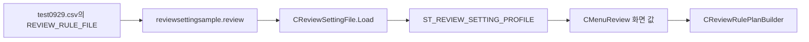
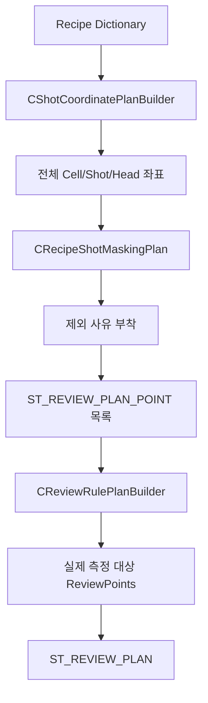
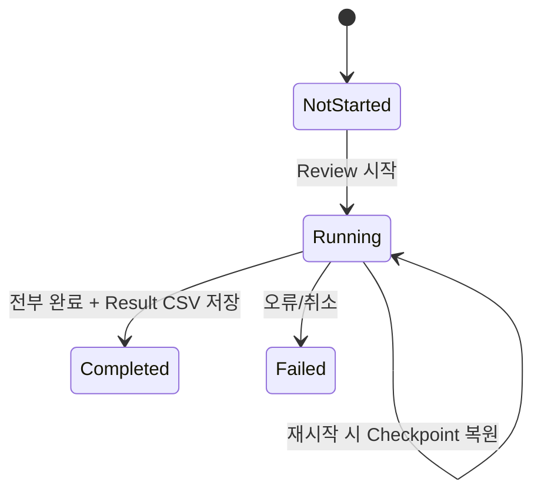

# 변경된 데이터 구조와 흐름

이 문서는 “어떤 값이 어느 그릇에 담겨 다음 단계로 이동하는가”를 초보자 관점에서 설명합니다.

## 1. Review Setting: 새 규칙 파일

### 저장 위치

```text
Config/
└─ ReviewSetting/
   └─ <RecipeId>/
      └─ <설정이름>.review
```

예: `Config/ReviewSetting/test0929/reviewsettingsample.review`

### 파일 모양

```csv
NAME,VALUE
RECIPE_ID,test0929
RULE,ROUGH
SCOPE,HEAD
ROUGH_REFERENCE,FIRST
FINE_LINE_COUNT,3
BEAM_NO,7
INSPECTION_METHOD,P2P
SIMPLE_SHOT,
```

### 메모리 구조

`ST_REVIEW_SETTING_PROFILE`은 위 값을 다음 8개 필드로 들고 다닙니다.

| 필드 | 쉬운 뜻 | 주요 값 |
|---|---|---|
| `RecipeId` | 어느 가공 Recipe용인가 | `test0929` |
| `Rule` | 어떻게 표본을 고를까 | `SIMPLE`, `ROUGH`, `FINE` |
| `Scope` | 측정값을 어디까지 공유할까 | `HEAD`, `HEAD_CELL` |
| `RoughReference` | 앞·가운데·뒤 중 어디를 볼까 | `FIRST`, `CENTER`, `LAST` |
| `FineLineCount` | 전체 Y 구간에서 몇 줄을 볼까 | 1, 3, 5, 7 |
| `BeamNo` | 몇 번 Beam 기준인가 | 1 이상 |
| `InspectionMethod` | 정지 측정/비행 측정 | `P2P`, `IOF` |
| `SimpleShot` | SIMPLE에서 측정할 Shot | 예: `CELL1_D4` |

구조 정의: [CReviewSettingFileBase.cs L3-L46](https://github.com/kjuws10-rgb/A3_LD_Process_SW_IPS/blob/6b19d7aaf0de81271468ab7dac0fa15493172f38/Drilling.Common/Review/CReviewSettingFileBase.cs#L3-L46).

### 읽기와 쓰기

[CReviewSettingFile](https://github.com/kjuws10-rgb/A3_LD_Process_SW_IPS/blob/6b19d7aaf0de81271468ab7dac0fa15493172f38/Drilling.File/Review/CReviewSettingFile.cs#L7-L176)이 목록 조회, Load, Save, Rename, Delete, Recipe 이름 변경을 담당합니다. 앱 시작 때 이 객체가 [Review 화면에 주입](https://github.com/kjuws10-rgb/A3_LD_Process_SW_IPS/blob/6b19d7aaf0de81271468ab7dac0fa15493172f38/Drilling.UI/CAppStartup.cs#L14-L20)됩니다.



## 2. Review Plan Point: Hole에서 Shot으로 이름 정리

핵심 단위는 [ST_REVIEW_PLAN_POINT](https://github.com/kjuws10-rgb/A3_LD_Process_SW_IPS/blob/6b19d7aaf0de81271468ab7dac0fa15493172f38/Drilling.Common/Review/CReviewManager.cs#L74-L123)입니다. 이전의 `HoleKey/HoleNo`가 `ShotKey/ShotNo`로 바뀌었습니다.

### 한 Point가 가진 주요 값

| 묶음 | 필드 예 | 의미 |
|---|---|---|
| 식별 | `ShotKey`, `ShotNo`, `ShotName` | 어떤 Cell의 어느 Shot인가 |
| 위치 | `DesignX/Y`, `StageY`, `VisionX` | 설계·장비 이동 좌표 |
| 소속 | `HeadNo`, `CellNo`, `ModelType` | Head/Cell/Model 연결 |
| Beam | `BeamNo`, `BeamOffsetX/Y` | 선택 Beam과 중심에서의 차이 |
| 보정 | `ReviewOffsetX/Y` | 이전 Review 결과로 저장된 Offset |
| 축 | `ScannerXSign/YSign` | Scanner Flip을 반영할 부호 |
| 상태 | `Use`, `State`, `Judge` | 측정 대상과 결과 |
| 제외 이유 | `ExclusionReason` | CHESS, Hole Mask, Edge Mask 등 |

`ShotKey`는 보통 `CELL1_D4`와 같이 Recipe에서 Offset 키를 찾는 기준이 됩니다.

## 3. Review Plan: 측정 목록과 규칙을 함께 보관

[ST_REVIEW_PLAN](https://github.com/kjuws10-rgb/A3_LD_Process_SW_IPS/blob/6b19d7aaf0de81271468ab7dac0fa15493172f38/Drilling.Common/Review/CReviewManager.cs#L160-L257)은 다음을 한 묶음으로 보관합니다.

- Recipe ID와 전체 후보 Shot
- 실제 측정할 `ReviewPoints`
- SIMPLE/ROUGH/FINE 투영 규칙인 `ResultProjection`
- `P2P` 또는 `IOF`
- Stage 스캔 방향
- Cell별/ShotKey별 빠른 조회 인덱스

Plan 작성 순서는 다음과 같습니다.



근거: [Plan 생성과 Masking 연결](https://github.com/kjuws10-rgb/A3_LD_Process_SW_IPS/blob/6b19d7aaf0de81271468ab7dac0fa15493172f38/Drilling.Common/Review/CReviewManager.cs#L1272-L1389), [Shot Point 변환](https://github.com/kjuws10-rgb/A3_LD_Process_SW_IPS/blob/6b19d7aaf0de81271468ab7dac0fa15493172f38/Drilling.Common/Review/CReviewManager.cs#L1580-L1708).

## 4. Review Result: 측정값과 “측정 조건”을 같이 저장

결과 CSV의 새 열은 다음과 같습니다.

```text
SAVED_AT, GLASS_ID, RECIPE_ID, INSPECTION_METHOD,
RESULT_STATUS, TOTAL_COUNT, RULE, RULE_SCOPE, BEAM_NO,
REFERENCE_CELL_NO, REFERENCE_SHOT, ROUGH_REFERENCE,
FINE_LINE_COUNT, RESULT_SOURCE, SHOT_NAME, ROW, COLUMN,
DESIGN_X, DESIGN_Y, SHOT_KEY, HEAD_NO, CELL_NO,
ERROR_X, ERROR_Y, JUDGE
```

정의: [CReviewResultFile.cs L9-L48](https://github.com/kjuws10-rgb/A3_LD_Process_SW_IPS/blob/6b19d7aaf0de81271468ab7dac0fa15493172f38/Drilling.File/ReviewResult/CReviewResultFile.cs#L9-L48).

### 호환성

- 새 파일은 `SHOT_KEY`를 씁니다.
- 예전 파일의 `HOLE_KEY`도 읽을 수 있습니다.
- 저장할 때는 실제 측정 완료 상태가 `OK` 또는 `NG`인 Point만 기록합니다.

근거: [구형/신형 Key 읽기](https://github.com/kjuws10-rgb/A3_LD_Process_SW_IPS/blob/6b19d7aaf0de81271468ab7dac0fa15493172f38/Drilling.File/ReviewResult/CReviewResultFile.cs#L160-L233), [측정 완료 행만 저장](https://github.com/kjuws10-rgb/A3_LD_Process_SW_IPS/blob/6b19d7aaf0de81271468ab7dac0fa15493172f38/Drilling.File/ReviewResult/CReviewResultFile.cs#L121-L158).

### 저장 위치

```text
Data/ReviewResult/<yyyyMMdd>/<GlassId>/<P2P|IOF>/
└─ ReviewResult_<규칙상세>_<HHmmss>.csv
```

예를 들면 `ReviewResult_ROUGH_HEAD_FIRST_103500.csv`와 같은 형태입니다. 예전 `Data/Result`도 검색 대상으로 남겨 두었습니다. 근거: [새/구형 Root](https://github.com/kjuws10-rgb/A3_LD_Process_SW_IPS/blob/6b19d7aaf0de81271468ab7dac0fa15493172f38/Drilling.File/ReviewResult/CReviewResultFile.cs#L50-L65), [저장 경로와 행 구성](https://github.com/kjuws10-rgb/A3_LD_Process_SW_IPS/blob/6b19d7aaf0de81271468ab7dac0fa15493172f38/Drilling.File/ReviewResult/CReviewResultFile.cs#L235-L290).

## 5. Product: Review 진행 상태를 이어가기 위한 저장소

Product 안의 Review 데이터는 이제 결과 숫자뿐 아니라 다음 실행 조건도 저장합니다.

- Recipe ID
- Inspection Method
- Rule / Scope / Beam
- Reference Cell/Shot 또는 Rough/Fine 설정
- 현재 진행 수와 전체 수
- 각 Shot의 Error X/Y와 판정

데이터 구조와 저장 메서드: [CProductManager.cs L43-L89](https://github.com/kjuws10-rgb/A3_LD_Process_SW_IPS/blob/6b19d7aaf0de81271468ab7dac0fa15493172f38/Drilling.Common/Product/CProductManager.cs#L43-L89), [Running/Progress/Completed 저장](https://github.com/kjuws10-rgb/A3_LD_Process_SW_IPS/blob/6b19d7aaf0de81271468ab7dac0fa15493172f38/Drilling.Common/Product/CProductManager.cs#L639-L708).



## 6. Correction Offset: 측정점을 전체 가공점으로 펼침

측정점이 적어도 Rule에 따라 전체 Shot의 Offset을 만들 수 있습니다.

| Rule | 펼치는 방법 |
|---|---|
| SIMPLE | 한 측정값을 같은 Head 또는 같은 Head+Cell에 복사 |
| ROUGH | FIRST/CENTER/LAST 기준 측정값을 Scope 범위에 복사 |
| FINE | 같은 Head와 X 계열에서 Y 방향으로 선형 보간 |

투영 구현: [CReviewManager.cs L1727-L1910](https://github.com/kjuws10-rgb/A3_LD_Process_SW_IPS/blob/6b19d7aaf0de81271468ab7dac0fa15493172f38/Drilling.Common/Review/CReviewManager.cs#L1727-L1910).

최종 저장 키는 다음 모양입니다.

```text
CELL1_D4_REVIEW_OFFSET_X
CELL1_D4_REVIEW_OFFSET_Y
```

Correction 화면은 현재 Recipe로 좌표를 다시 만들고, Result의 ShotKey/Head와 맞는지 검사한 후 Offset을 계산합니다. [결과 Load·계산](https://github.com/kjuws10-rgb/A3_LD_Process_SW_IPS/blob/6b19d7aaf0de81271468ab7dac0fa15493172f38/Drilling.UI/Menu/Menus/CMenuCorrection.cs#L794-L973), [Recipe Offset 저장](https://github.com/kjuws10-rgb/A3_LD_Process_SW_IPS/blob/6b19d7aaf0de81271468ab7dac0fa15493172f38/Drilling.UI/Menu/Menus/CMenuCorrection.cs#L1125-L1266), [측정 행에서 전체 보정 행 재구성](https://github.com/kjuws10-rgb/A3_LD_Process_SW_IPS/blob/6b19d7aaf0de81271468ab7dac0fa15493172f38/Drilling.UI/Menu/Menus/CMenuCorrection.cs#L1332-L1434).

## 7. 중요한 데이터 계보 한 줄 요약

```text
JHMI 정의 → Recipe CSV → 좌표 Plan → Mask/Head 판정 → 가공 Script
                       └→ Review Setting → Review Plan → Vision 측정
                                              └→ Product Checkpoint
                                              └→ ReviewResult CSV
                                                   └→ Correction 투영
                                                        └→ Recipe REVIEW_OFFSET
                                                             └→ 다음 가공 좌표
```
