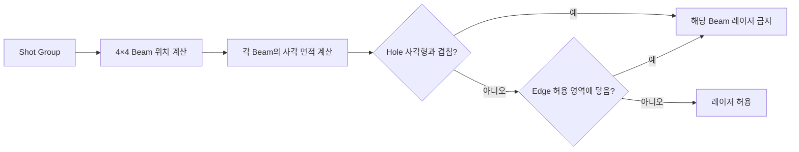
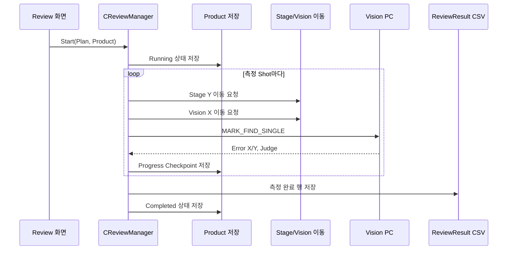
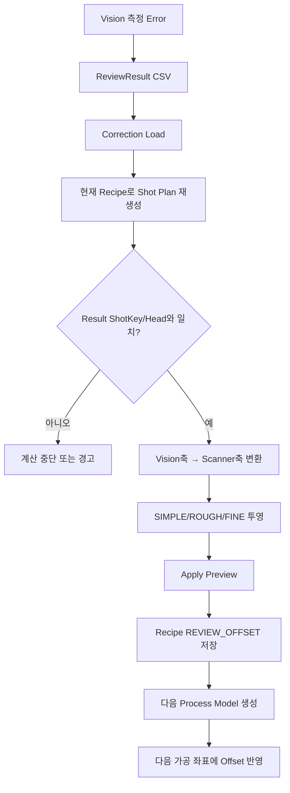

# 가공·Review 영향 분석

## 1. test0929 가공 좌표가 만들어지는 순서

### 1단계: Cell 기준점

45개 Cell은 9열 × 5행으로 배치됩니다.

- X: 0, 100, 200, …, 800 mm
- Y: 0, 200, 400, 600, 800 mm

Cell 1과 Cell 45의 실제 CSV 근거는 [test0929.csv L275-L276 및 L452-L453](https://github.com/kjuws10-rgb/A3_LD_Process_SW_IPS/blob/6b19d7aaf0de81271468ab7dac0fa15493172f38/Config/RECIPE/test0929.csv#L275-L453)입니다.

### 2단계: Model Pixel을 Shot Group으로 변환

Model 1은 864 × 512 Pixel이고 Pixel 크기는 0.09 mm입니다. `PITCH=30`이므로 Group 간격은 다음과 같습니다.

```text
Group 간격 = PIXEL_SIZE × PITCH
           = 0.09 × 30
           = 2.7 mm
```

`SPLITED_BEAM_COUNT=4`이므로 Beam 하나의 간격은 0.675 mm입니다. 좌표 Plan 작성 코드는 [CShotCoordinatePlanBuilder.cs L12-L127](https://github.com/kjuws10-rgb/A3_LD_Process_SW_IPS/blob/6b19d7aaf0de81271468ab7dac0fa15493172f38/Drilling.Common/Recipe/CShotCoordinatePlanBuilder.cs#L12-L127)에 있습니다.

### 3단계: Head 배정

설계 X 좌표와 Head 간격을 이용해 Head를 배정합니다. 현재 설정은 H01만 켜져 있으므로 H01 대상만 실제 H01 스크립트로 생성됩니다. Head 선택 로직은 [CShotCoordinatePlanBuilder.cs L259-L366](https://github.com/kjuws10-rgb/A3_LD_Process_SW_IPS/blob/6b19d7aaf0de81271468ab7dac0fa15493172f38/Drilling.Common/Recipe/CShotCoordinatePlanBuilder.cs#L259-L366)입니다.

### 4단계: Scanner 축 변환

최종 설정은 `XY Flip=OFF`, `X Flip=OFF`, `Y Flip=ON`입니다. 따라서 설계 좌표 축은 서로 바뀌지 않고 Y 부호만 반전됩니다. 공용 변환은 [CScannerAxisTransform.cs L5-L78](https://github.com/kjuws10-rgb/A3_LD_Process_SW_IPS/blob/6b19d7aaf0de81271468ab7dac0fa15493172f38/Drilling.Common/Recipe/CScannerAxisTransform.cs#L5-L78)에서 수행합니다.

`SCAN_START_DELAY_LENGTH_Y=500`까지 반영되면서 첫 줄 Scanner Y가 `-501.0125`가 되고 마지막 줄은 `-1344.2125`가 됩니다.

### 5단계: Encoder 축

`H01_ENCODER_AXIS=GY_1`이므로 생성 스크립트는 다음 형태가 됩니다.

```text
GalvoEncoderScaleFactorSet(GY_1, ... / 1000)
DriveSetAuxiliaryFeedback(GY_1, 0)
wait(StatusGetAxisItem(GY_1, AxisStatusItem.AuxiliaryFeedback) <= ...)
```

축 선택 코드는 [CAutomation1ScriptFile.cs L240-L262](https://github.com/kjuws10-rgb/A3_LD_Process_SW_IPS/blob/6b19d7aaf0de81271468ab7dac0fa15493172f38/Drilling.File/Script/CAutomation1ScriptFile.cs#L240-L262)에 있습니다.

## 2. 2,380개 좌표 검증 결과

별도 검증 Clone에서 최신 소스를 참조하는 작은 좌표 하네스를 실행했습니다.

```text
Head1Count=2380
1     -28.4875, -501.0125     SKIP
2     -25.7875, -501.0125     LASER
3     -23.0875, -501.0125     LASER
4     -20.3875, -501.0125     LASER
5     -17.6875, -501.0125     LASER
6     -14.9875, -501.0125     LASER
...
2378   39.0125, -1344.2125    LASER
2379   41.7125, -1344.2125    LASER
2380   44.4125, -1344.2125    SKIP
LaserOn=2245 LaserSkipped=135
```

따라서 사용자가 제시한 첫 6개 좌표와 마지막 2,380번째 좌표 조건은 최신 Commit에서 일치합니다.

## 3. Masking 의미가 바뀐 영향

### Hole Masking

예전 방식은 대체로 Beam 중심점이 Hole 안에 있는지 보는 방식이었습니다. 최신 방식은 **Beam이 차지하는 작은 사각형과 Hole 사각형이 조금이라도 겹치는지** 봅니다.



근거: [Beam 면적과 Hole 교차 판정](https://github.com/kjuws10-rgb/A3_LD_Process_SW_IPS/blob/6b19d7aaf0de81271468ab7dac0fa15493172f38/Drilling.Common/Recipe/CRecipeShotMaskingPlan.cs#L87-L145), [사각형 교차 함수](https://github.com/kjuws10-rgb/A3_LD_Process_SW_IPS/blob/6b19d7aaf0de81271468ab7dac0fa15493172f38/Drilling.Common/Recipe/CRecipeShotMaskingPlan.cs#L284-L305).

영향: Hole 경계에 가까운 Beam은 중심이 Hole 밖이어도 미가공될 수 있습니다. 이전보다 보수적인 판정입니다.

### Edge Masking

`CELL_*_ROUND_X/Y`라는 이름은 남아 있지만 최신 구현은 둥근 원호를 계산하지 않습니다. 네 모서리의 양수 Offset으로 “가공 허용 직사각형”을 만들고 Beam 면적이 경계에 닿으면 제외합니다. 근거: [Edge 입력 처리](https://github.com/kjuws10-rgb/A3_LD_Process_SW_IPS/blob/6b19d7aaf0de81271468ab7dac0fa15493172f38/Drilling.Common/Recipe/CRecipeShotMaskingPlan.cs#L175-L203), [허용 영역 계산](https://github.com/kjuws10-rgb/A3_LD_Process_SW_IPS/blob/6b19d7aaf0de81271468ab7dac0fa15493172f38/Drilling.Common/Recipe/CRecipeShotMaskingPlan.cs#L308-L324).

### Hole 개수 제한

- 코드 최대값: 3개
- JHMI 입력 최대값: 3개
- 기존 Hole 4/5와 위·아래 Radius 정의: 삭제

근거: [코드 상한](https://github.com/kjuws10-rgb/A3_LD_Process_SW_IPS/blob/6b19d7aaf0de81271468ab7dac0fa15493172f38/Drilling.Common/Recipe/CRecipeShotMaskingPlan.cs#L26-L30), [JHMI Model 1 정의](https://github.com/kjuws10-rgb/A3_LD_Process_SW_IPS/blob/6b19d7aaf0de81271468ab7dac0fa15493172f38/Config/JHMI_RCP.csv#L49-L69).

외부에서 만든 구형 Recipe가 Hole 4/5 또는 Radius에 의존했다면 최신 코드에서는 그 값이 무시됩니다.

## 4. Review Setting별 실제 대상 선택

### SIMPLE

사용자가 지정한 Shot 하나를 측정합니다. 그 측정값은 `HEAD` 또는 `HEAD_CELL` 범위로 복사됩니다.

### ROUGH

각 Head 또는 Head+Cell에서 설계 Y 기준 `FIRST`, `CENTER`, `LAST` 위치를 고릅니다. `reviewsettingsample.review`는 다음 설정입니다.

| 항목 | 값 |
|---|---|
| Rule | ROUGH |
| Scope | HEAD |
| Reference | FIRST |
| Beam | 7 |
| Method | P2P |

### FINE

실제 가공된 Y 범위 전체에서 1/3/5/7개의 줄을 고릅니다. 보정 때 같은 Head와 X 계열을 따라 Y 방향으로 선형 보간합니다.

규칙 분기는 [CReviewRulePlanBuilder.cs L35-L56](https://github.com/kjuws10-rgb/A3_LD_Process_SW_IPS/blob/6b19d7aaf0de81271468ab7dac0fa15493172f38/Drilling.Common/Review/CReviewRulePlanBuilder.cs#L35-L56), ROUGH는 [L58-L185](https://github.com/kjuws10-rgb/A3_LD_Process_SW_IPS/blob/6b19d7aaf0de81271468ab7dac0fa15493172f38/Drilling.Common/Review/CReviewRulePlanBuilder.cs#L58-L185), FINE은 [L375-L566](https://github.com/kjuws10-rgb/A3_LD_Process_SW_IPS/blob/6b19d7aaf0de81271468ab7dac0fa15493172f38/Drilling.Common/Review/CReviewRulePlanBuilder.cs#L375-L566)에 있습니다.

## 5. Review 실행 데이터 흐름

P2P 기준 한 Shot의 흐름입니다.



중요: 위 그림의 `Move` 단계는 현재 코드에서 **요청 문자열만 만들고 장비로 보내지 않습니다.** 반면 Vision 요청은 실제 통신할 수 있습니다. 이 불균형 때문에 현재 실장비 Review 결과를 신뢰할 수 없습니다.

P2P 실행 루프: [CReviewManager.cs L623-L731](https://github.com/kjuws10-rgb/A3_LD_Process_SW_IPS/blob/6b19d7aaf0de81271468ab7dac0fa15493172f38/Drilling.Common/Review/CReviewManager.cs#L623-L731). Vision 요청: [CReviewManager.cs L2103-L2150](https://github.com/kjuws10-rgb/A3_LD_Process_SW_IPS/blob/6b19d7aaf0de81271468ab7dac0fa15493172f38/Drilling.Common/Review/CReviewManager.cs#L2103-L2150). Vision 프로토콜 해석: [CVisionComm.cs L387-L468](https://github.com/kjuws10-rgb/A3_LD_Process_SW_IPS/blob/6b19d7aaf0de81271468ab7dac0fa15493172f38/Drilling.Common/Interface/Vision/CVisionComm.cs#L387-L468).

## 6. Vision 오차가 Scanner Offset이 되는 흐름

Vision 좌표축과 Scanner 좌표축은 방향이 다를 수 있으므로 두 번 변환합니다.

```text
Vision Error X/Y
  → VisionXFlip / VisionYFlip / VisionXyFlip
  → Hxx_SCANNER_X/Y/XY_FLIP
  → Scanner용 Offset X/Y
  → Rule별 복사 또는 보간
  → CELLn_<Shot>_REVIEW_OFFSET_X/Y
```

공용 변환 근거: [CReviewCoordinateTransformer.cs L15-L65](https://github.com/kjuws10-rgb/A3_LD_Process_SW_IPS/blob/6b19d7aaf0de81271468ab7dac0fa15493172f38/Drilling.Common/Review/CReviewCoordinateTransformer.cs#L15-L65). Correction은 계산 후 Apply 전에 Flip 설정이 바뀌었는지도 다시 검사합니다: [CMenuCorrection.cs L976-L1032](https://github.com/kjuws10-rgb/A3_LD_Process_SW_IPS/blob/6b19d7aaf0de81271468ab7dac0fa15493172f38/Drilling.UI/Menu/Menus/CMenuCorrection.cs#L976-L1032).

## 7. 자동 공정과 Review의 관계

메인 자동 공정에는 `INSPECTION` 단계가 있지만, 현재 `RunReviewStep`은 실제 Review를 시작하지 않고 예약 로그만 남깁니다. 근거: [INSPECTION 호출](https://github.com/kjuws10-rgb/A3_LD_Process_SW_IPS/blob/6b19d7aaf0de81271468ab7dac0fa15493172f38/Drilling.Common/Station/CStationProcess.cs#L860-L863), [예약 구현](https://github.com/kjuws10-rgb/A3_LD_Process_SW_IPS/blob/6b19d7aaf0de81271468ab7dac0fa15493172f38/Drilling.Common/Station/CStationProcess.cs#L1350-L1354).

따라서 `AUTO_INSPECTION_USE=ON`으로 바꾸기만 해서는 Review가 자동 실행되지 않습니다. 현재 Review는 Review 화면의 Start 경로가 실질적인 실행 진입점입니다.

## 8. 다음 가공으로 돌아가는 보정 왕복



Recipe ID만 같고 Recipe 내용이 바뀐 경우를 완전히 막는 Hash/Version은 없습니다. 이것은 별도 위험 항목으로 관리해야 합니다.
