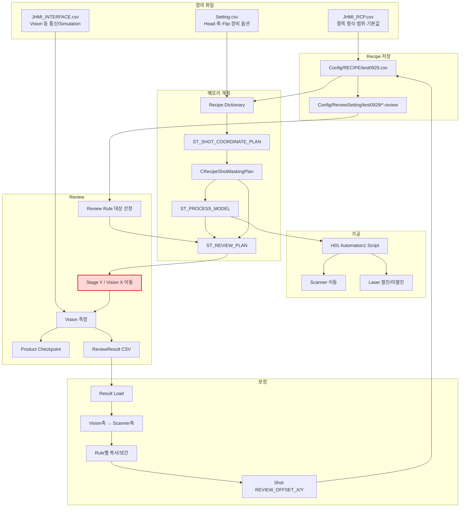
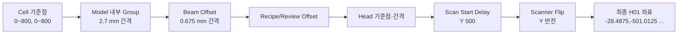
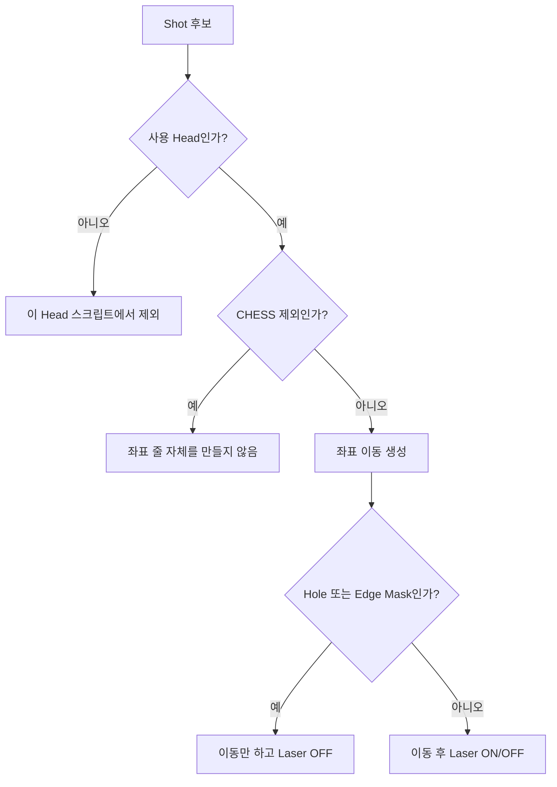
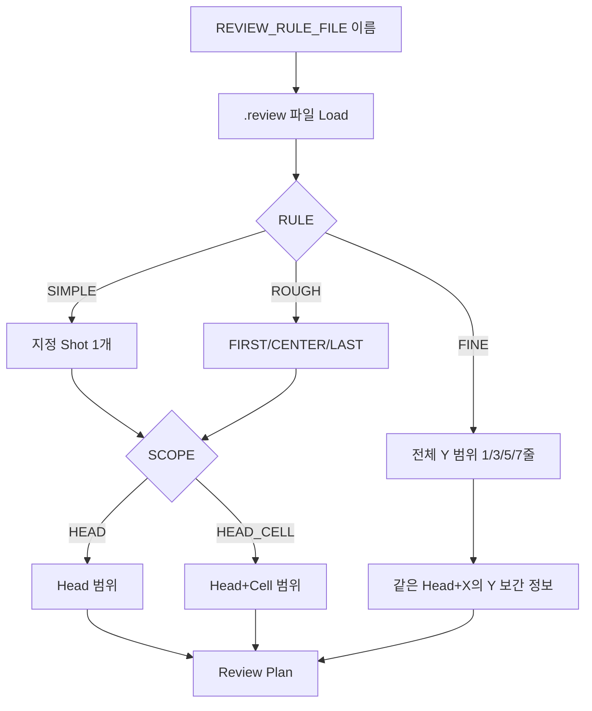
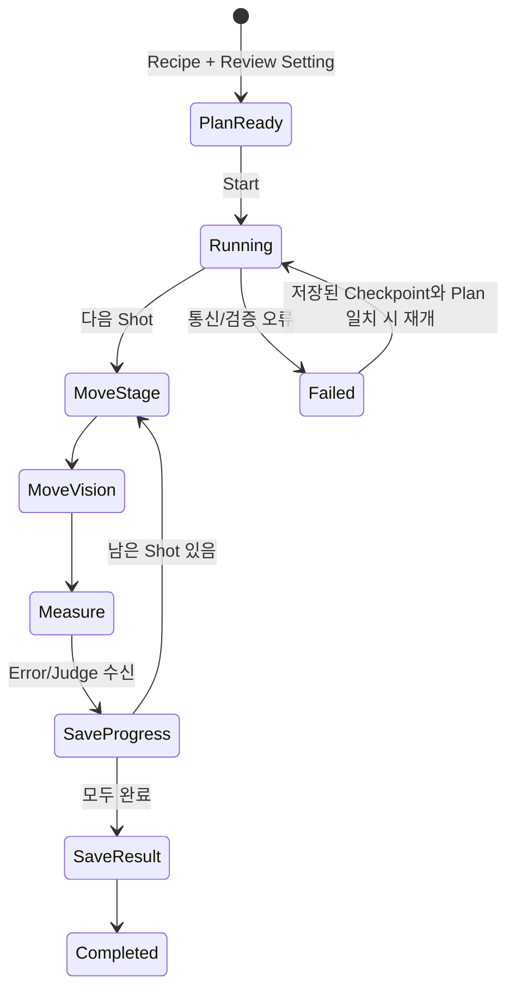
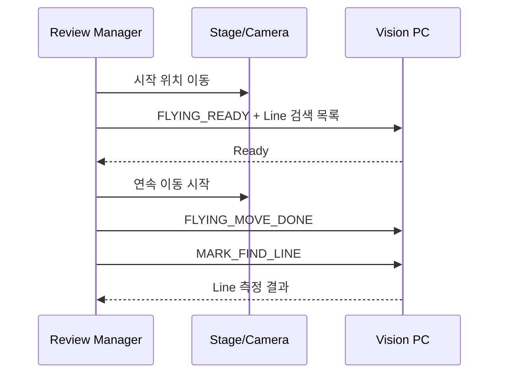
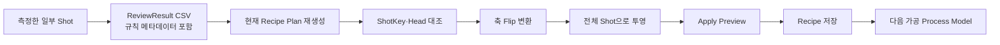

# 갱신된 통합 흐름도

## 1. 전체 데이터 흐름

빨간 `Stage Y / Vision X 이동` 상자는 현재 실제 장비 전송이 빠진 구간입니다.

## 2. 좌표가 바뀌는 단계

### 초보자용 비유

- Cell 기준점: 종이 위에 큰 칸을 놓는 위치
- Model Group: 큰 칸 안의 작은 격자
- Beam Offset: 한 격자 안에서 여러 레이저 점이 떨어지는 위치
- Head 기준점: 어느 스캐너가 맡을지 정하는 기준
- Scan Delay/Flip: 실제 장비 좌표계에 맞춰 원점과 방향을 바꾸는 과정

## 3. 한 Shot의 가공 판단

가공 스크립트와 Review는 같은 Masking 판정을 사용하도록 바뀌었습니다. 따라서 Review가 레이저를 쏘지 않은 Shot을 측정 대상으로 잡는 문제를 줄입니다.

## 4. Review Setting에서 측정점이 되는 과정

## 5. P2P 실행 상태 흐름

현재 코드에서는 `MoveStage`와 `MoveVision` 상태가 실제 이동 완료를 보증하지 않습니다. 단순 지연 후 다음 단계로 넘어갈 수 있습니다.

## 6. IOF 실행 흐름과 현재 한계

Vision 프로토콜은 구현되어 있지만 Move 쪽 MELSEC 전송·Handshake가 미연결입니다. 그러므로 IOF도 실장비 완료 상태가 아닙니다.

## 7. Review 결과에서 다음 가공까지

이 왕복에서 가장 중요한 연결 키는 `RecipeId + ShotKey + HeadNo`입니다. 현재는 Recipe 내용 자체의 Hash가 없으므로 같은 ID의 Recipe 내용이 바뀌면 추가 확인이 필요합니다.

## 8. 저장 파일별 책임

| 파일/폴더 | 읽는 주체 | 쓰는 주체 | 역할 |
|---|---|---|---|
| `Config/JHMI_RCP.csv` | Recipe UI/검증 | 개발·설정 배포 | 필드 사전 |
| `Config/RECIPE/*.csv` | Recipe/Process/Review/Correction | Recipe UI/Correction | 실제 가공값과 Offset |
| `Config/ReviewSetting/<id>/*.review` | Review 화면 | Review 화면 | 표본 선택 규칙 |
| Product 파일 | 공정/Review | Product Manager | Glass별 진행·재개 상태 |
| `Data/ReviewResult/.../*.csv` | Correction | Review Result File | 실측 오차와 규칙 메타데이터 |
| Automation1 Script | Scanner 실행기 | Script File | 실제 이동·Laser 명령 |
