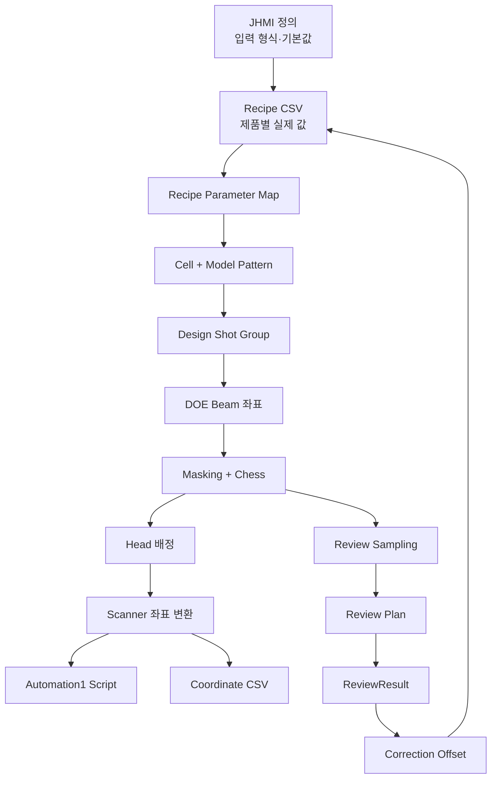
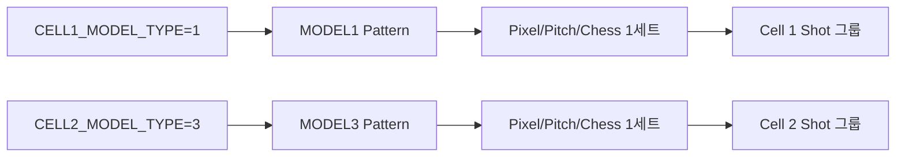
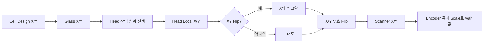
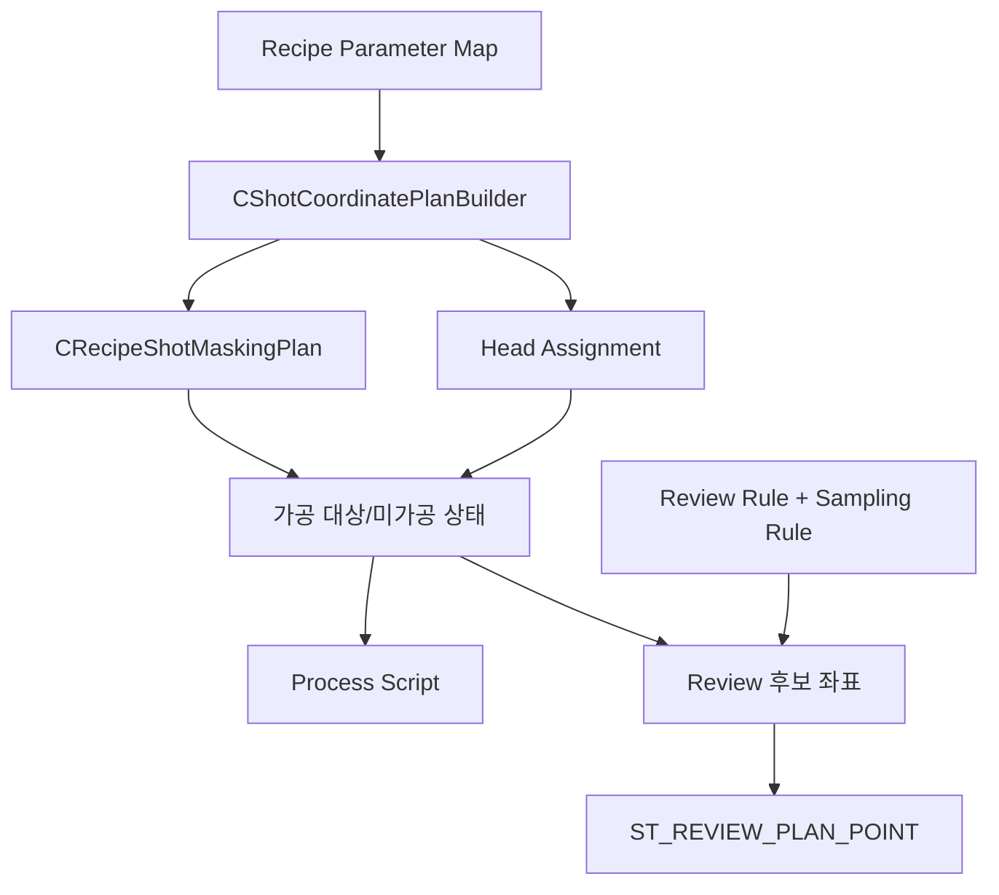

# 02. 변경된 데이터 구조와 흐름

## 1. 큰 그림: 데이터가 지나가는 층

초보자는 아래 네 층으로 나누어 보면 이해하기 쉽습니다.

| 층 | 쉬운 뜻 | 대표 데이터 |
|---|---|---|
| 정의 | 어떤 입력칸이 있고 기본값이 무엇인지 | `JHMI_RCP.csv`, `JHMI_INTERFACE.csv`, `JHMI_MELSEC_MAP.csv` |
| 저장 | 특정 제품을 실제로 어떻게 가공할지 | `Config/RECIPE/*.csv`, Review Rule, ReviewResult CSV |
| 계산 | 저장값을 좌표와 ON/OFF 판단으로 바꿈 | Cell/Model Pattern, Shot Group, Beam, Masking, Head Plan |
| 실행·표시 | Script를 만들거나 Review/Monitor 화면에 보임 | Automation1 Script, Coordinate CSV, Review Plan, Monitor |



## 2. JHMI 정의와 Recipe CSV가 합쳐지는 방법

`CJhmiRecipeFile.LoadRecipe`는 Recipe CSV 행만 그대로 반환하지 않습니다. 먼저 JHMI Form 정의를 읽고, 각 항목에 대해 다음 순서로 값을 정합니다.

1. Recipe CSV에 같은 `TAB + NAME`이 있으면 그 값을 사용합니다.
2. 없으면 JHMI 정의의 `DefaultValue`를 사용합니다.
3. Cell 위치나 Shot별 Offset처럼 반복되는 항목은 별도 Cell scoped parameter로 붙입니다.

근거: [CJhmiRecipeFile.cs L389-L499](https://github.com/kjuws10-rgb/A3_LD_Process_SW_IPS/blob/a25ba3cdfd70cff5d78172d13ec957318704b1e1/Drilling.File/JHMI/CJhmiRecipeFile.cs#L389-L499).

따라서 UI를 통한 정상 Load에서는 구형 Recipe에 새 `MODELn_PITCH`가 없더라도 JHMI 기본값이 채워질 가능성이 큽니다. 하지만 다음 경우에는 직접 Reader의 기본값 `1`이 사용될 수 있습니다.

- 외부 프로그램이나 시험 코드가 CSV를 JHMI 정의 없이 Dictionary로 만들 때
- 배포 폴더의 `JHMI_RCP.csv`와 실행 파일 버전이 서로 다를 때
- 일부 Recipe를 다른 경로로 가져와 Parameter Map을 직접 구성할 때

이 때문에 “Repository 내부 6개 Recipe가 이관됐다”와 “현장에 존재하는 모든 Recipe가 안전하다”는 같은 뜻이 아닙니다.

## 3. 이번에 추가된 Model 패턴 구조

핵심 새 구조는 아래 record입니다.

```text
ST_RECIPE_MODEL_PATTERN
├─ PixelCountX
├─ PixelCountY
├─ ProcessPitch
├─ Chess
└─ ChessType
```

코드: [CRecipeModelPixelCountReader.cs L5-L49](https://github.com/kjuws10-rgb/A3_LD_Process_SW_IPS/blob/a25ba3cdfd70cff5d78172d13ec957318704b1e1/Drilling.Common/Recipe/CRecipeModelPixelCountReader.cs#L5-L49).

각 값은 다음 의미입니다.

| 필드 | 쉬운 설명 | 좌표에 미치는 영향 |
|---|---|---|
| `PixelCountX/Y` | Model의 Pixel 폭과 높이 | 전체 Shot 격자 크기 |
| `ProcessPitch` | 몇 Pixel마다 Shot 중심을 만들지 | Shot 간 거리와 개수 |
| `Chess` | Shot 그룹을 몇 칸 간격으로 남길지 | Script에 포함되는 Shot 수 |
| `ChessType` | 남기는 패턴의 모양 | `0=세로 줄식`, `1=대각 교차식` |

### Cell과 Model의 관계



`test0929`는 45개 Cell이 모두 Model 1을 사용합니다. Model 2~5 설정이 파일에 있어도 현재 Cell 배정에서는 잠자는 값입니다.

## 4. Cell → Shot Group → Beam 구조

이번 변경에서 `ShotGroupNo`라는 이름이 `CellShotNo`로 정리됐습니다. 의미는 “그 Cell 안에서 몇 번째 Shot 그룹인가”입니다. 외부 식별 키는 여전히 `CELLnnn_SHOTnnnn` 형태를 유지합니다.

```text
Cell
└─ CellShotNo (Shot 중심 한 곳)
   ├─ Beam 1
   ├─ Beam 2
   ├─ ...
   └─ Beam N
```

`SPLITED_BEAM_COUNT=4`일 때 한 Shot 중심에서 4×4, 즉 16개 Beam 좌표가 만들어집니다. Cell Pattern 계산기는 Model의 Pixel 수와 Pitch로 Shot 중심을 만들고, DOE 분할 수로 Beam 간격을 계산합니다: [CCellPatternCalculator.cs L134-L176](https://github.com/kjuws10-rgb/A3_LD_Process_SW_IPS/blob/a25ba3cdfd70cff5d78172d13ec957318704b1e1/Drilling.Common/Recipe/CCellPatternCalculator.cs#L134-L176).

## 5. Chess와 Masking은 서로 다른 제외 방법이다

이 둘을 같은 “미가공”으로 보면 CSV 수량을 잘못 해석하기 쉽습니다.

| 판정 | 결과 | Script/좌표 CSV에 행이 남나? |
|---|---|---|
| Chess 제외 | Shot 그룹 전체를 건너뜀 | **남지 않음** |
| Hole Mask | 좌표까지 이동하지만 Laser OFF | 남음, `미가공` |
| Edge/Corner Mask | 좌표까지 이동하지만 Laser OFF | 남음, `미가공` |
| 아무 Mask 없음 | Laser ON | 남음, `가공` |

Chess 계산은 [CRecipeShotMaskingPlan.cs L163-L173](https://github.com/kjuws10-rgb/A3_LD_Process_SW_IPS/blob/a25ba3cdfd70cff5d78172d13ec957318704b1e1/Drilling.Common/Recipe/CRecipeShotMaskingPlan.cs#L163-L173), 공정에서 Chess 제외점을 먼저 거르는 부분은 [CStationProcess.cs L1723-L1732](https://github.com/kjuws10-rgb/A3_LD_Process_SW_IPS/blob/a25ba3cdfd70cff5d78172d13ec957318704b1e1/Drilling.Common/Station/CStationProcess.cs#L1723-L1732)에 있습니다.

### ChessType 0: ONEWAY

```text
Chess=3 예시
열 0: 남김
열 1: 제외
열 2: 제외
열 3: 남김
```

### ChessType 1: NORMAL

행이 바뀔 때 남기는 열도 함께 이동합니다. 코드상 `(열 - 행) mod Chess == 0`인 그룹을 남깁니다.

```text
Chess=3 예시
행 0: O . . O . .
행 1: . O . . O .
행 2: . . O . . O
```

### Corner Mask의 실제 형상

Recipe 이름에는 `UP_LEFT_ROUND_X` 같은 이름이 남아 있지만 최신 알고리즘은 원호를 계산하지 않습니다. Model 외곽 네 모서리에 X×Y 직사각형 영역을 만들고 Beam 사각형이 겹치면 Edge Mask로 판단합니다: [CRecipeShotMaskingPlan.cs L330-L368](https://github.com/kjuws10-rgb/A3_LD_Process_SW_IPS/blob/a25ba3cdfd70cff5d78172d13ec957318704b1e1/Drilling.Common/Recipe/CRecipeShotMaskingPlan.cs#L330-L368).

## 6. 좌표는 여러 단계에서 변한다

같은 숫자가 여러 좌표계에 등장하므로 이름을 분리해야 합니다.

| 단계 | 좌표 | 주요 입력 |
|---|---|---|
| 1 | Cell 내부 Design 좌표 | 첫 Pixel 위치, 회전, Pixel Size, Pitch |
| 2 | Glass 좌표 | AK Margin, Cell 배치, Review Offset |
| 3 | Head 배정 좌표 | 활성 Head, Scan Field, Head Gap |
| 4 | Scanner 명령 좌표 | XY Swap, X/Y Flip, Head 기본 Offset |
| 5 | Encoder 대기값 | Scanner 명령 축, Encoder 축, Scale, Feedback Flip |



Scanner 축 교환·부호 변환은 [CScannerAxisTransform.cs L5-L54](https://github.com/kjuws10-rgb/A3_LD_Process_SW_IPS/blob/a25ba3cdfd70cff5d78172d13ec957318704b1e1/Drilling.Common/Recipe/CScannerAxisTransform.cs#L5-L54)에서 수행합니다.

## 7. Head Plan 데이터

Head Plan은 좌표 목록뿐 아니라 Script 실행 조건도 함께 운반합니다.

```text
Head Plan
├─ Head 번호 / Automation / Task
├─ X축 / Y축 / Encoder축
├─ Scanner Flip / Encoder Flip / Scale
├─ Scan Field / Head Gap / Offset
├─ X/Y/Z Ramp와 Speed
├─ Laser Power / Frequency / Shot Count / Delay
└─ 해당 Head가 처리할 Shot 목록
```

이번 Commit에서는 X/Y/Z Ramp, Z Speed, Acceleration Limit 전달이 강화됐습니다. Script 생성기는 이 값을 `SetupAxisRampValue`, `SetupCoordinatedRampValue`, Z축 이동 등에 씁니다: [CAutomation1ScriptFile.cs L250-L345](https://github.com/kjuws10-rgb/A3_LD_Process_SW_IPS/blob/a25ba3cdfd70cff5d78172d13ec957318704b1e1/Drilling.File/Script/CAutomation1ScriptFile.cs#L250-L345).

## 8. 가공과 Review가 공유하는 데이터

가공과 Review는 따로 보이지만, 좌표의 뿌리는 같습니다.



Review가 같은 Builder와 Masking을 사용하기 때문에 Model별 Pitch/Chess 변경은 가공 Script뿐 아니라 Review 후보점에도 영향을 줍니다. “가공 점 수만 바뀌고 Review 점은 그대로”라고 가정하면 안 됩니다.

## 9. Review Plan 구조 변경

이번 변경은 중복 값을 줄이고 보정 책임을 분리했습니다.

### 이전 개념

```text
Review Plan Point
├─ ReviewOffsetX/Y
├─ StageXToGxSign / StageYToGySign
└─ 좌표와 표시용 중복 Property
```

### 현재 개념

```text
ST_REVIEW_PLAN
├─ Points: ST_REVIEW_PLAN_POINT 목록
├─ Sampling/측정 설정
└─ CorrectionPlan: ST_REVIEW_CORRECTION_PLAN
```

Plan Point는 측정할 위치와 식별정보에 집중하고, Result에서 Recipe Offset으로 투영하는 정보는 `CorrectionPlan`이 담당합니다. 코드: [CReviewManager.cs L82-L235](https://github.com/kjuws10-rgb/A3_LD_Process_SW_IPS/blob/a25ba3cdfd70cff5d78172d13ec957318704b1e1/Drilling.Common/Review/CReviewManager.cs#L82-L235).

## 10. ReviewResult와 Correction Offset 저장

ReviewResult CSV의 실제 저장 열은 이번 Commit에서 바뀌지 않았습니다. Result 행은 Shot/Beam 식별값, 목표 위치, 측정 위치, 오차, 판정 등을 보관합니다. Metadata에는 Recipe/Glass/Process/Review 정보가 들어갑니다: [CReviewResultFile.cs L251-L338](https://github.com/kjuws10-rgb/A3_LD_Process_SW_IPS/blob/a25ba3cdfd70cff5d78172d13ec957318704b1e1/Drilling.File/ReviewResult/CReviewResultFile.cs#L251-L338).

Correction 저장 흐름은 다음과 같습니다.


실제 Save와 Upsert 코드는 [CMenuCorrection.cs L1168-L1262](https://github.com/kjuws10-rgb/A3_LD_Process_SW_IPS/blob/a25ba3cdfd70cff5d78172d13ec957318704b1e1/Drilling.UI/Menu/Menus/CMenuCorrection.cs#L1168-L1262)에 있습니다.

`IReviewManager.ApplyReviewOffset`가 제거됐으므로 측정 직후 현재 Plan을 메모리에서 바로 바꾸는 경로는 없어졌습니다. 대신 Preview→Save→Recipe 재사용이라는 추적 가능한 경로가 중심이 됩니다.

## 11. 저장 형식 변화 요약

| 파일/출력 | 변화 | 호환성 확인점 |
|---|---|---|
| Recipe CSV | 공통 `PITCH/CHESS` 제거, `MODEL1~5_*` 추가 | 현장 외부 Recipe 이관 필요 |
| 좌표 CSV | `ProductId`→`GlassId`, `가공여부` 추가 | 외부 CSV Parser 열 이름 확인 |
| 좌표 Text Header | Product/Panel 표현 정리, Glass 중심 | 로그 수집 Parser 확인 |
| ReviewResult CSV | 열 구조 유지 | 내부 속성 이름 변경은 외부 파일 영향 없음 |
| MELSEC Map | 29개 Placeholder 신호 추가 | 실제 PLC 주소 확정 전 사용 금지 |
| Product 저장 | 직접 변경 없음 | 좌표 CSV 식별 열만 확인 |

## 12. 데이터 정리 로직의 남은 구형 키

Recipe 실행 계산은 `MODELn_PITCH`를 쓰지만, Recipe 저장 중 Shot Override 범위를 확인하는 함수는 아직 공통 `PITCH`를 읽습니다: [CJhmiRecipeFile.cs L537-L577](https://github.com/kjuws10-rgb/A3_LD_Process_SW_IPS/blob/a25ba3cdfd70cff5d78172d13ec957318704b1e1/Drilling.File/JHMI/CJhmiRecipeFile.cs#L537-L577).

그 결과 새 형식에서는 범위를 계산하지 못해, 현재 Cell/Model 격자 밖의 오래된 `CELLnnn_SHOTnnnn_*` Offset도 저장 파일에서 제거되지 않을 수 있습니다. 좌표 실행이 곧바로 틀어지는 문제는 아니지만, Recipe가 커지고 Correction이 엉뚱한 과거 키를 계속 보유할 수 있는 데이터 정합성 위험입니다.
