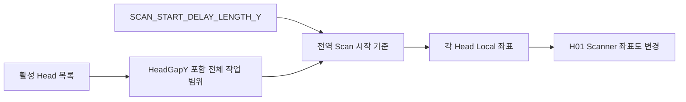
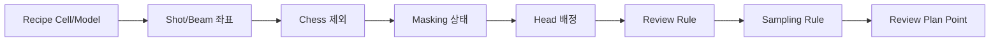

# 03. 가공·Review 영향 분석

## 1. 이번 분석의 기준 목표

사용자가 지정한 H01 정상 조건은 다음과 같습니다.

```text
1번    (-28.4875,  -501.0125)  미가공
2번    (-25.7875,  -501.0125)  가공
3번    (-23.0875,  -501.0125)  가공
4번    (-20.3875,  -501.0125)  가공
5번    (-17.6875,  -501.0125)  가공
6번    (-14.9875,  -501.0125)  가공
...
2380번 ( 44.4125, -1344.2125)  미가공
```

좌표 순서와 Laser 상태를 각각 검증했습니다. 좌표 두 숫자가 같아도 순서가 바뀌면 실제 Scanner 축이 다르므로 정상으로 볼 수 없습니다.

## 2. 최신 Commit 그대로 계산한 결과

### 전체

| 항목 | 결과 |
|---|---:|
| Plan/Script Shot | 20,740 |
| Laser ON | 19,525 |
| Laser OFF 이동 | 1,215 |
| 활성 Head | H01~H08 모두 |

### Head별

| Head | 점 수 | 가공 | 미가공 | 첫 점 | 마지막 점 |
|---|---:|---:|---:|---|---|
| H01 | 2,380 | 2,245 | 135 | `(-501.0125,-28.4875)` 미가공 | `(-1344.2125,44.4125)` 가공 |
| H02 | 2,380 | 2,245 | 135 | `(-121.0125,-38.4875)` 미가공 | `(-964.2125,34.4125)` 가공 |
| H03 | 2,550 | 2,405 | 145 | `(-501.0125,-48.4875)` 미가공 | `(-1344.2125,54.2125)` 가공 |
| H04 | 2,635 | 2,500 | 135 | `(-121.0125,-53.0875)` 가공 | `(-964.2125,52.3125)` 가공 |
| H05 | 2,720 | 2,535 | 185 | `(-501.0125,-54.9875)` 가공 | `(-1344.2125,53.1125)` 가공 |
| H06 | 2,720 | 2,510 | 210 | `(-121.0125,-54.1875)` 가공 | `(-964.2125,53.9125)` 가공 |
| H07 | 2,720 | 2,585 | 135 | `(-501.0125,-53.3875)` 가공 | `(-1344.2125,54.7125)` 가공 |
| H08 | 2,635 | 2,500 | 135 | `(-121.0125,-52.5875)` 가공 | `(-964.2125,52.8125)` 가공 |

이 결과는 최신 `Setting.csv`와 `test0929.csv`를 실제 좌표 Builder와 Script Builder에 넣은 별도 하네스 결과입니다. 목표의 첫 좌표와 마지막 좌표 문자열은 최신 결과에서 발견되지 않았습니다.

## 3. 왜 X와 Y가 바뀌었나

이번 Commit은 H01을 다음처럼 바꿨습니다.

```text
이전: XY_SWAP=OFF, X_FLIP=OFF, Y_FLIP=ON, Encoder=GY_1
현재: XY_SWAP=ON,  X_FLIP=ON,  Y_FLIP=OFF, Encoder=GX_1
```

`XY_SWAP=ON`은 좌표의 X와 Y 자리를 먼저 바꿉니다. 그 후 X/Y Flip이 부호를 바꿉니다. 그래서 목표 `(-28.4875,-501.0125)`가 최신 Script에서는 `(-501.0125,-28.4875)` 방향으로 나옵니다. 변환 구현은 [CScannerAxisTransform.cs L35-L54](https://github.com/kjuws10-rgb/A3_LD_Process_SW_IPS/blob/a25ba3cdfd70cff5d78172d13ec957318704b1e1/Drilling.Common/Recipe/CScannerAxisTransform.cs#L35-L54)에 있습니다.

Encoder 축도 `GY_1→GX_1`로 바뀌었으므로 `MoveRapid`만 바뀐 것이 아닙니다. 각 이동 뒤 `wait(StatusGetAxisItem(...AuxiliaryFeedback))`가 감시하는 물리축도 함께 바뀝니다. 축 설정과 실제 배선 방향이 일치하지 않으면 대기 조건이 반대로 움직이거나 끝나지 않을 수 있습니다.

## 4. 왜 다른 Head가 H01 시작점에 영향을 주나

검증에서 발견한 중요한 결합입니다.

- H01만 켜고 최신 `SCAN_START_DELAY_LENGTH_Y=120`을 쓰면 H01 범위는 대략 `-121...-964` 쪽이 됩니다.
- H01~H08을 모두 켠 최신 설정에서는 H01이 `-501...-1344` 범위가 됩니다.
- 차이 380은 설정의 `HeadGapY=380`과 일치합니다.

즉 스캔 시작 기준을 만들 때 활성 Head 전체의 배치 범위를 함께 고려합니다. 다른 Head를 켜는 행동이 H01에 독립적이지 않습니다.



따라서 다음 두 시험을 따로 해야 합니다.

1. H01 단독 좌표 검증
2. H01~H08 동시 활성 상태에서 H01 좌표가 유지되는지 회귀 검증

## 5. 목표 좌표를 재현하는 설정 조합

하네스에서 아래 조합은 H01 첫 좌표와 마지막 좌표를 정확히 목표 방향으로 만들었습니다.

| 설정 | 검증값 |
|---|---|
| H01_USE | ON |
| H02_USE~H08_USE | OFF |
| H01_SCANNER_XY_FLIP | OFF |
| H01_SCANNER_X_FLIP | OFF |
| H01_SCANNER_Y_FLIP | ON |
| H01_ENCODER_AXIS | GY_1 |
| SCAN_START_DELAY_LENGTH_Y | 500 |

결과:

```text
점 수 2,380
첫 점  (-28.4875,-501.0125) 미가공
두 번째 (-25.7875,-501.0125) 가공
마지막 (44.4125,-1344.2125) 가공
```

좌표 위치는 맞지만 마지막 Laser 상태가 목표와 다릅니다. 즉 **Scanner 설정 복원과 Recipe Masking 복원을 분리해서 판단해야 합니다.**

## 6. 마지막 2,380번째 점이 가공으로 바뀐 이유

이전 Recipe는 Model 1 Hole 3에 다음 아주 작은 영역을 가지고 있었습니다.

```text
X=72.9, Y=43.2, SizeX=0.1, SizeY=0.1
```

이번 Commit은 Hole 개수를 3→1로 줄이고 Hole 3 위치·크기를 모두 0으로 만들었습니다. 동시에 네 Corner 값을 0→2로 바꾸고 Edge Mask 알고리즘을 네 모서리 직사각형 방식으로 바꿨습니다.

최신 `2×2` 오른쪽 아래 Corner 영역은 마지막 Beam 그룹과 충분히 겹치지 않아 마지막 점이 가공으로 남습니다. 시험용으로 `MODEL1_CELL_DOWN_RIGHT_ROUND_X=2.75`를 주면 마지막 점은 미가공으로 바뀌었습니다.

그러나 결과는 다음과 같습니다.

| 조건 | 가공 | 미가공 | 마지막 |
|---|---:|---:|---|
| 축/지연만 목표 설정 | 2,245 | 135 | 가공 |
| 오른쪽 아래 Corner X=2.75 | 2,240 | 140 | 미가공 |

마지막 한 점만 바꾸려 했지만 총 5점이 추가로 미가공되었습니다. 따라서 `2.75`를 권장 최종값으로 단정하면 안 됩니다. 선택지는 다음과 같습니다.

- 제품 도면 기준으로 Corner X/Y를 다시 산정하고, 영향받는 5개 좌표를 승인
- 과거 작은 Hole 3의 목적을 확인한 뒤 필요하면 복원하고 전체 Masking 수량 검증
- 마지막 점 전용 마스크가 필요하다면 명시적인 Shot Override 또는 별도 기능 설계

실장비 적용 전에는 최소한 첫 6점, 네 모서리, 마지막 6점, 전체 미가공 좌표 목록을 비교해야 합니다.

## 7. Model별 Pitch/Chess가 가공에 주는 영향

### Pitch

Pitch가 작아지면 더 촘촘히 Shot 중심을 만들므로 점 수가 늘어납니다. Pitch가 커지면 점 수가 줄어듭니다. Model의 Pixel 크기와 결합되므로 한 값만 보고 점 수를 예측하면 안 됩니다.

### Chess

Chess는 생성된 Shot 그룹 중 일부를 통째로 제외합니다. 제외된 그룹은 좌표 CSV에 `미가공`으로 남지 않습니다. 따라서 다음 수식으로 생각하면 쉽습니다.

```text
원래 Shot 그룹
  - Chess 제외 그룹 (파일에 없음)
  = Script에 들어갈 그룹
  - Hole/Corner Mask (행은 있고 Laser OFF)
  = 실제 Laser ON 그룹
```

### test0929에서의 실제 활성도

45개 Cell이 모두 Model 1이므로 현재는 `MODEL1_PITCH=30`, `MODEL1_CHESS=1`, `MODEL1_CHESS_TYPE=1`만 실질적으로 쓰입니다. Model 2~4의 Chess 2/3/4는 Cell 배정이 바뀔 때부터 가공/Review 점 수를 바꿉니다.

## 8. Shot 시간과 Script 영향

Script 생성에서 임의 `ShotTimeDelayMs`를 덮어쓰는 경로가 제거되고, Laser 주파수와 Shot Count로 시간을 계산합니다. 현재 `H01_LASER_FREQUENCY=200`, `H01_SHOT_COUNT=1`이면 펄스 주기와 발진 대기 시간이 이 값에서 파생됩니다.

또한 Plan의 X/Y/Z Ramp와 Z Speed가 Script 명령으로 직접 전달됩니다. 현재 Recipe Ramp 값은 0이므로 Script에도 0이 들어가지만, 향후 Recipe 값 변경이 실제 이동 프로파일로 연결됩니다. 설정 범위 검증 없이 큰 값을 넣으면 실제 Scanner/DOE Z 움직임에 직접 영향이 생깁니다.

## 9. Review 후보 좌표에 미치는 영향

Review는 가공과 같은 좌표 Builder, Head 배정, Masking, Chess 결과를 사용합니다. 흐름은 아래와 같습니다.



따라서 이번 설정으로는 다음이 함께 바뀔 수 있습니다.

- H02~H08 활성화로 Review 대상 Head가 늘어남
- Scanner 좌표축 변화로 표시/목표 좌표 방향 변화
- Model별 Chess로 Review 후보 Shot 그룹 수 변화
- Hole/Corner Masking 변화로 가공점/미가공점 선택 결과 변화
- Model 2~5 Pixel 증가로 해당 Model 사용 시 Review 후보 수 급증

Review Rule이 같은 파일이어도 입력 후보 집합이 달라졌기 때문에 최종 Review Plan은 같다고 볼 수 없습니다.

## 10. Review 실행은 아직 실제 이동이 아니다

### Station 자동 검사

`AUTO_INSPECTION_USE=ON`이지만 공정 Sequence의 Review 단계는 아래 로그만 남깁니다.

```text
Review step reserved. Stage PC Y move, Vision X move,
and Vision measure will be connected later.
```

코드: [CStationProcess.cs L1350-L1354](https://github.com/kjuws10-rgb/A3_LD_Process_SW_IPS/blob/a25ba3cdfd70cff5d78172d13ec957318704b1e1/Drilling.Common/Station/CStationProcess.cs#L1350-L1354).

즉 Auto Process 중 Review가 실제로 완료됐다는 뜻이 아닙니다.

### Review 화면 실행

Review Manager에는 계획과 측정 루프가 있지만 이동 함수는 아직 전송하지 않습니다.

- Stage Y: 명령 문자열 생성 후 `_ = command`
- Vision X: 명령 문자열 생성 후 `_ = command`
- 실제 MELSEC 주소/Handshake 연결 TODO

근거: [CReviewManager.cs L1907-L1953](https://github.com/kjuws10-rgb/A3_LD_Process_SW_IPS/blob/a25ba3cdfd70cff5d78172d13ec957318704b1e1/Drilling.Common/Review/CReviewManager.cs#L1907-L1953).

이번 Commit에서는 Vision과 MELSEC가 모두 Simulation 모드이므로 측정은 임시 결과를 만들 수 있습니다: [CReviewManager.cs L1956-L1989](https://github.com/kjuws10-rgb/A3_LD_Process_SW_IPS/blob/a25ba3cdfd70cff5d78172d13ec957318704b1e1/Drilling.Common/Review/CReviewManager.cs#L1956-L1989). 이는 UI/데이터 흐름 시험에는 유용하지만 실물 위치를 측정한 증거는 아닙니다.

## 11. ReviewResult와 Correction 영향

ReviewResult CSV 열은 유지됐으므로 기존 파일을 읽는 큰 호환성 변화는 없습니다. 다만 Plan 구조에서 `ResultProjection`이 `CorrectionPlan`으로 바뀌고, 즉시 메모리 보정 API가 제거됐습니다.

현재 권장 흐름은 다음처럼 명확합니다.

1. ReviewResult를 불러옵니다.
2. 현재 Recipe와 ShotKey를 대조합니다.
3. Correction 후보를 계산합니다.
4. Apply Preview에서 변경량을 확인합니다.
5. 사용자가 Save하면 `CELLnnn_SHOTnnnn_REVIEW_OFFSET_X/Y`로 Recipe에 저장됩니다.
6. 다음 Process/Review Plan을 다시 만들 때 Offset이 반영됩니다.

Save 구현: [CMenuCorrection.cs L1168-L1262](https://github.com/kjuws10-rgb/A3_LD_Process_SW_IPS/blob/a25ba3cdfd70cff5d78172d13ec957318704b1e1/Drilling.UI/Menu/Menus/CMenuCorrection.cs#L1168-L1262).

## 12. MELSEC Monitor 영향

새 신호 맵과 화면은 아래 시나리오를 한눈에 볼 수 있게 합니다.

- DoReady
- Process
- Review
- Process Move
- IOF
- Top Powermeter

하지만 이 화면은 현재 “신호 관찰판”입니다.

- 주소 설명이 `placeholder`
- Simulation write echo 존재
- 상태 글자는 계산된 상태가 아니라 항상 `WAIT`
- 순서 위반·Timeout·상호 Interlock을 실행하는 상태 머신 없음

따라서 화면이 생긴 것과 자동 Handshake가 완성된 것은 별개입니다.

## 13. 안전한 적용 순서

1. H01 단독 기준으로 Flip/Encoder/Start Delay를 목표값에 맞춥니다.
2. Laser는 끄고 좌표 Script와 Encoder wait 축만 비교합니다.
3. Masking 전체 목록을 뽑아 목표 135개인지, 또는 승인된 새 수량인지 확인합니다.
4. 첫 6점과 마지막 6점의 좌표·가공여부를 자동 검사합니다.
5. H02~H08을 한 개씩 켜며 H01 기준점이 움직이지 않는지 확인합니다.
6. 전체 Head 동시 Plan의 Field/Gap 겹침과 점 수를 승인합니다.
7. Review는 Simulation 결과와 실제 측정 결과를 구분해 저장합니다.
8. MELSEC 주소와 Handshake가 확정되기 전 Auto Inspection 완료 판정을 금지합니다.

이 순서는 코드 수정 제안이 아니라 현재 변경을 안전하게 검증하기 위한 운영 순서입니다.
