# 04. 갱신된 통합 흐름도

이 문서는 세부 코드를 읽지 않아도 데이터가 어디서 생기고, 어디서 걸러지고, 어디에 저장되는지 한눈에 볼 수 있도록 만든 그림 모음입니다.

## 1. 전체 프로그램 데이터 흐름

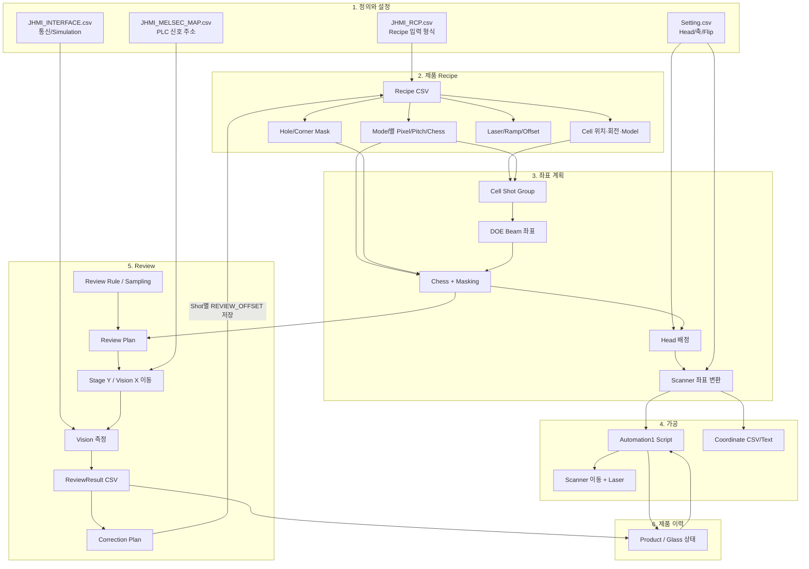

현재 `MOVE`는 명령 문자열만 만들고 MELSEC로 보내지 않으며, Station의 자동 Review 단계도 예약 로그만 남깁니다. 그림은 의도된 연결까지 포함하지만 이 두 화살표는 아직 완성된 실장비 동작이 아닙니다.

## 2. JHMI 기본값과 Recipe 실제값 합치기

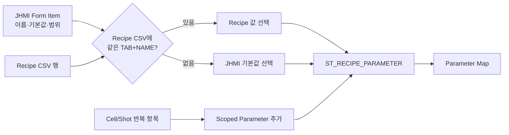

중요한 예외는 외부 도구가 JHMI 병합 없이 Parameter Map을 직접 만드는 경우입니다. 이때 새 Model별 키가 없으면 Reader 자체 기본값을 사용합니다.

## 3. Model별 가공 패턴

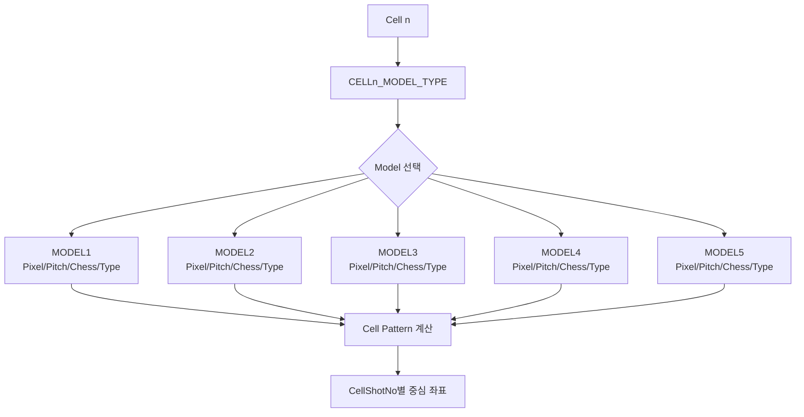

## 4. Shot과 Beam이 걸러지는 순서

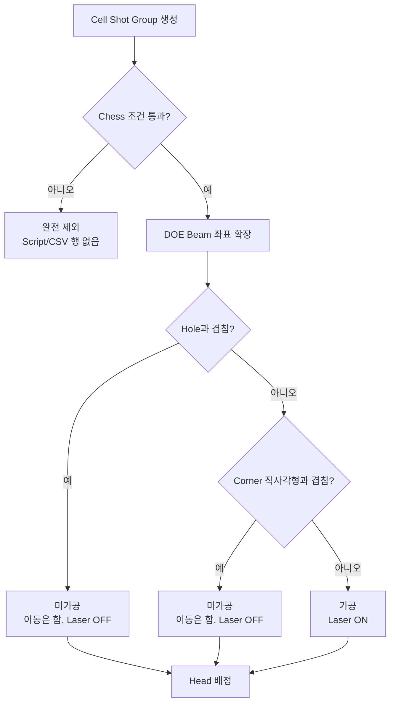

`가공여부` 열은 이 마지막 ON/OFF를 나타냅니다. Chess에서 빠진 그룹은 `미가공` 행으로도 남지 않습니다.

## 5. Glass 좌표에서 Scanner 좌표로 바꾸기

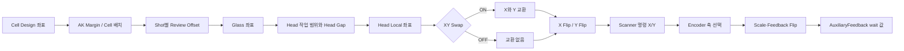

이번 Commit에서 H01의 `XY Swap`, X/Y Flip, Encoder 축이 모두 바뀌어 목표 좌표가 서로 바뀐 형태로 출력됐습니다.

## 6. 활성 Head가 H01에 미치는 전역 영향

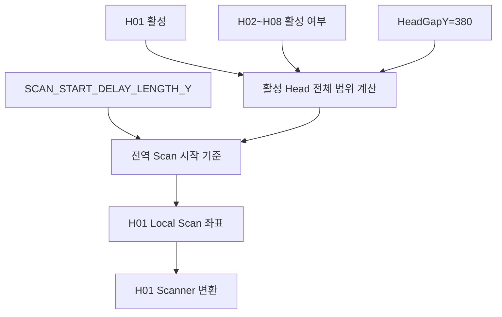

따라서 H02~H08을 켜는 것은 H01과 독립적인 설정이 아닙니다. 회귀 시험도 Head 단독/전체 두 조건으로 나눠야 합니다.

## 7. 목표 H01 좌표 복원과 남은 Masking 문제

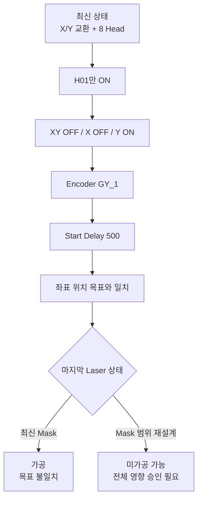

## 8. Review Plan과 측정 결과

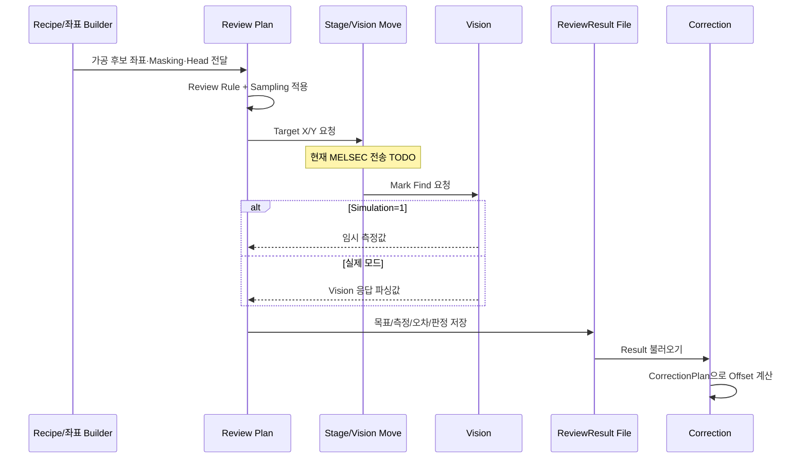

## 9. Correction Offset의 되먹임

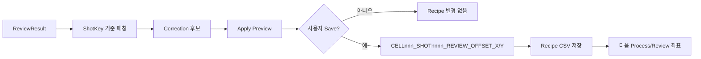

이번 변경으로 메모리에서 즉시 Review Offset을 적용하는 API는 제거되고, 저장 가능한 Correction 경로가 더 분명해졌습니다.

## 10. Product/Glass 상태 연결

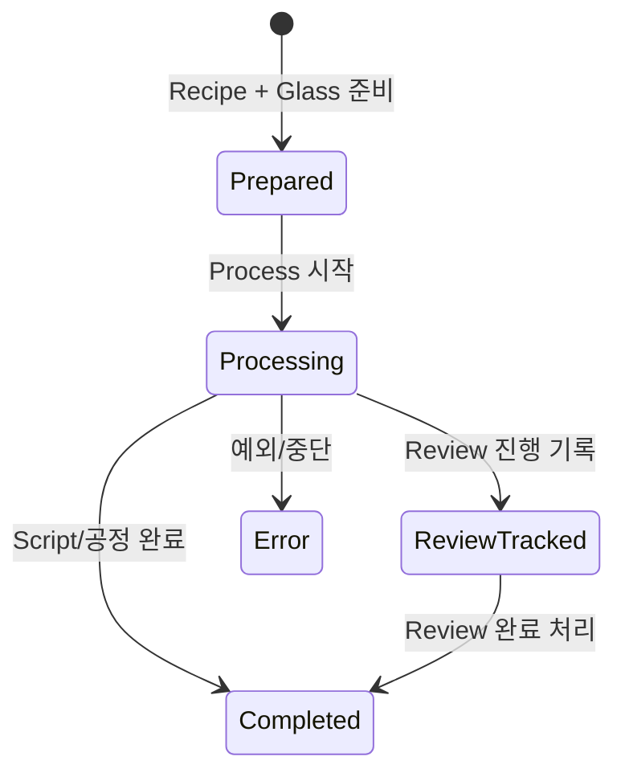

Product 저장 로직 자체는 이번 Commit에서 바뀌지 않았습니다. 좌표 출력의 식별 열만 `ProductId`에서 `GlassId`로 정리됐습니다.

## 11. MELSEC Monitor의 현재 수준

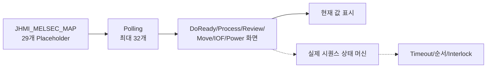

점선 부분은 아직 구현된 것으로 확인되지 않았습니다. Monitor의 상태 문자열도 현재 `WAIT` 고정값입니다.
