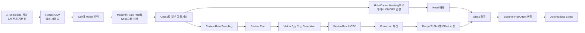

# A3 변경 분석 — 2026-10-02 09:02:10 KST

이 폴더는 `A3_LD_Process_SW_IPS`의 이전 분석 기준 이후 변경분을 **읽기 전용으로 분석**한 결과입니다. 원본 저장소에는 파일 추가·수정·삭제·Commit·Push를 하지 않았고, 분석 Clone의 Push URL도 `DISABLED`로 바꿨습니다.

## 분석 기준

| 항목 | 값 |
|---|---|
| 이전 기준 Commit | [`6b19d7aaf0de81271468ab7dac0fa15493172f38`](https://github.com/kjuws10-rgb/A3_LD_Process_SW_IPS/tree/6b19d7aaf0de81271468ab7dac0fa15493172f38) |
| 이번 최신 Commit | [`a25ba3cdfd70cff5d78172d13ec957318704b1e1`](https://github.com/kjuws10-rgb/A3_LD_Process_SW_IPS/tree/a25ba3cdfd70cff5d78172d13ec957318704b1e1) |
| 비교 범위 | [`6b19d7a...a25ba3c`](https://github.com/kjuws10-rgb/A3_LD_Process_SW_IPS/compare/6b19d7aaf0de81271468ab7dac0fa15493172f38...a25ba3cdfd70cff5d78172d13ec957318704b1e1) |
| 포함 Commit 수 | 1개 (`auto commit`, 2026-10-01 18:56:39 KST) |
| 전체 Git 차이 | 341 files, +3,997 / -1,321 |
| 실제 소스·설정·화면 변경 | 34개: CSV 10, C# 22, XAML 2 |
| 생성물·IDE 파일 | 307개: `.vs`, `bin`, `obj`, `BuildCheck`, `.buildcheck` 등 |
| 분석 방법 | Git diff, 호출 관계 추적, 설정 대조, 별도 검증 Clone 빌드, 좌표 계산 하네스 |
| 원본 변경 여부 | 없음 |

## 가장 먼저 봐야 할 결론

### 1. 최신 설정은 확인된 H01 목표 좌표와 다시 어긋난다

이전 분석에서 확인한 정상 목표는 다음과 같습니다.

| 순번 | 목표 Scanner 좌표 | 레이저 |
|---:|---:|---|
| 1 | `(-28.4875, -501.0125)` | 미가공 |
| 2 | `(-25.7875, -501.0125)` | 가공 |
| 3 | `(-23.0875, -501.0125)` | 가공 |
| 4 | `(-20.3875, -501.0125)` | 가공 |
| 5 | `(-17.6875, -501.0125)` | 가공 |
| 6 | `(-14.9875, -501.0125)` | 가공 |
| 2,380 | `(44.4125, -1344.2125)` | 미가공 |

이번 최신 설정을 그대로 계산하면 H01은 아래처럼 나옵니다.

| 항목 | 최신 계산 결과 | 목표 대비 |
|---|---:|---|
| H01 첫 점 | `(-501.0125, -28.4875)` / 미가공 | X와 Y가 바뀜 |
| H01 마지막 점 | `(-1344.2125, 44.4125)` / **가공** | X와 Y가 바뀌고 마지막 레이저 상태도 다름 |
| H01 점 수 | 2,380개 | 수량은 같음 |
| 전체 Head 점 수 | 20,740개 | H02~H08까지 활성화됨 |
| 전체 레이저 가공 | 19,525개 | 8개 Head 합계 |
| 전체 미가공 이동 | 1,215개 | 8개 Head 합계 |

직접 원인은 [Setting.csv의 Head 활성화·Flip·Encoder 축 변경](https://github.com/kjuws10-rgb/A3_LD_Process_SW_IPS/blob/a25ba3cdfd70cff5d78172d13ec957318704b1e1/Config/Setting/Setting.csv#L52-L97)과 [test0929의 시작 지연 길이·Masking 변경](https://github.com/kjuws10-rgb/A3_LD_Process_SW_IPS/blob/a25ba3cdfd70cff5d78172d13ec957318704b1e1/Config/RECIPE/test0929.csv#L30-L79)입니다.

> 좌표 검증에서 확인한 중요한 점: H01 좌표는 H01 설정만으로 결정되지 않습니다. 다른 Head를 켜면 `HeadGapY`가 전역 스캔 시작점 계산에 섞입니다. 따라서 “H01만 시험”과 “8 Head 동시 시험”은 같은 H01 좌표를 만들지 않을 수 있습니다.

### 2. 좌표축만 되돌리면 끝나지 않는다

별도 하네스에서 다음 값을 되돌리면 H01의 첫 좌표와 마지막 좌표 자체는 목표와 일치했습니다.

- H01만 `ON`, H02~H08은 `OFF`
- `H01_SCANNER_XY_FLIP=OFF`
- `H01_SCANNER_X_FLIP=OFF`
- `H01_SCANNER_Y_FLIP=ON`
- `H01_ENCODER_AXIS=GY_1`
- `SCAN_START_DELAY_LENGTH_Y=500`

하지만 최신 Masking 규칙과 레시피에서는 마지막 점이 여전히 **가공**입니다. 이번 Commit에서 과거의 아주 작은 Hole 3 마스크가 지워지고, 네 모서리 마스크가 새 직사각형 방식으로 바뀌었기 때문입니다. 시험용으로 오른쪽 아래 모서리 X를 `2.75`까지 넓히면 마지막 점은 미가공이 되었지만, 미가공 점 수가 135개에서 140개로 5개 증가했습니다. 이 값은 곧바로 실장비에 적용할 정답이 아니라, **마지막 점을 끄기 위해서는 Masking 범위를 제품 기준으로 다시 승인해야 한다는 증거**입니다.

### 3. Recipe 구조는 “전체 공통 Pitch/Chess”에서 “Model별 Pitch/Chess”로 좋아졌다

이제 Model 1~5가 각각 다음 세 값을 가집니다.

- `MODELn_PITCH`: 몇 Pixel 간격으로 Shot 중심을 만들지
- `MODELn_CHESS`: 몇 번째 Shot 그룹만 남길지
- `MODELn_CHESS_TYPE`: `0=ONEWAY`, `1=NORMAL`

Cell은 `CELLn_MODEL_TYPE`으로 Model을 선택하고, 선택한 Model의 Pixel 크기·Pitch·Chess를 함께 사용합니다. 가공 좌표와 Review 좌표가 같은 계산기를 사용하므로 두 경로의 기준도 일치합니다. 근거는 [Model 패턴 읽기](https://github.com/kjuws10-rgb/A3_LD_Process_SW_IPS/blob/a25ba3cdfd70cff5d78172d13ec957318704b1e1/Drilling.Common/Recipe/CRecipeModelPixelCountReader.cs#L5-L49), [좌표 계획 생성](https://github.com/kjuws10-rgb/A3_LD_Process_SW_IPS/blob/a25ba3cdfd70cff5d78172d13ec957318704b1e1/Drilling.Common/Recipe/CShotCoordinatePlanBuilder.cs#L127-L161), [Masking/Chess 판정](https://github.com/kjuws10-rgb/A3_LD_Process_SW_IPS/blob/a25ba3cdfd70cff5d78172d13ec957318704b1e1/Drilling.Common/Recipe/CRecipeShotMaskingPlan.cs#L51-L173)입니다.

### 4. 자동 검사와 MELSEC 화면은 “완성된 자동 운전”이 아니다

- `AUTO_INSPECTION_USE`가 `ON`으로 바뀌었지만 Station의 Review 단계는 “나중에 연결” 로그만 남깁니다: [CStationProcess.cs L1350-L1354](https://github.com/kjuws10-rgb/A3_LD_Process_SW_IPS/blob/a25ba3cdfd70cff5d78172d13ec957318704b1e1/Drilling.Common/Station/CStationProcess.cs#L1350-L1354)
- Review의 Stage Y와 Vision X 이동도 명령 문자열만 만들고 전송하지 않습니다: [CReviewManager.cs L1907-L1953](https://github.com/kjuws10-rgb/A3_LD_Process_SW_IPS/blob/a25ba3cdfd70cff5d78172d13ec957318704b1e1/Drilling.Common/Review/CReviewManager.cs#L1907-L1953)
- 새 MELSEC 주소 설명에는 모두 `placeholder`가 적혀 있고, Monitor 상태는 실제 시퀀스 판정 없이 `WAIT`를 고정 반환합니다: [JHMI_MELSEC_MAP.csv L39-L67](https://github.com/kjuws10-rgb/A3_LD_Process_SW_IPS/blob/a25ba3cdfd70cff5d78172d13ec957318704b1e1/Config/JHMI_MELSEC_MAP.csv#L39-L67), [CMenuMonitor.cs L284-L289](https://github.com/kjuws10-rgb/A3_LD_Process_SW_IPS/blob/a25ba3cdfd70cff5d78172d13ec957318704b1e1/Drilling.UI/Menu/Menus/CMenuMonitor.cs#L284-L289)

따라서 화면에 신호가 보이더라도 자동 Handshake나 실장비 Review 이동이 완성됐다고 판단하면 안 됩니다.

## 초보자용 전체 흐름

## 문서 안내

| 문서 | 내용 |
|---|---|
| [01_Commit_변경_요약.md](./01_Commit_변경_요약.md) | 파일·Commit 단위 변경과 영향 범위 |
| [02_변경된_데이터구조와_흐름.md](./02_변경된_데이터구조와_흐름.md) | Model/Cell/Shot/Beam/Head/CSV 데이터가 이동하는 방법 |
| [03_가공_Review_영향_분석.md](./03_가공_Review_영향_분석.md) | 목표 좌표 대조, Masking, Review, Vision, Correction 상세 |
| [04_갱신된_통합_흐름도.md](./04_갱신된_통합_흐름도.md) | 전체 흐름과 좌표 변환을 Mermaid로 정리 |
| [05_위험도별_발견사항.md](./05_위험도별_발견사항.md) | 즉시 확인할 위험과 권장 순서 |
| [06_분석근거와_검증기록.md](./06_분석근거와_검증기록.md) | 빌드·좌표 하네스·링크·원본 무변경 기록 |

## 빌드 판정

- `Drilling.UI/Drilling.UI.csproj -c Release`: **성공**, 오류 0, 경고 2
- 경고: `CRootView.cs`의 도달 불가 코드 `CS0162` 2건
- `Drilling.sln -c Release`: **실패** — 저장소에 없는 `Drilling.Regression`과 `Drilling.UI.Regression` 프로젝트를 솔루션이 참조함
- 실제 Stage, Scanner, Laser, Vision, MELSEC 장비 시험: 수행하지 않음

> 이 문서는 코드 변경물이 아니라 분석 결과입니다. 좌표 하네스 결과는 “현재 코드가 어떤 좌표와 레이저 상태를 만든다”는 뜻이며, 실제 장비의 안전한 이동·발진을 보증하지 않습니다.
