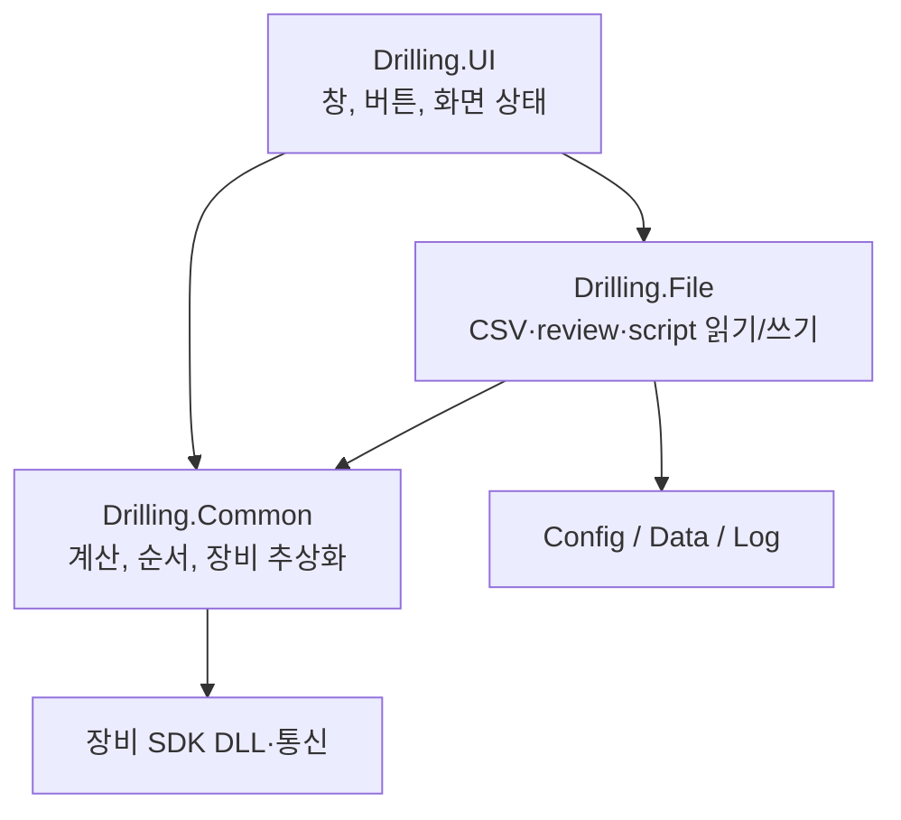
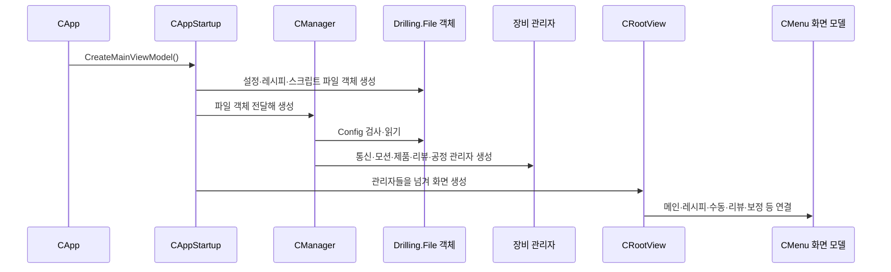
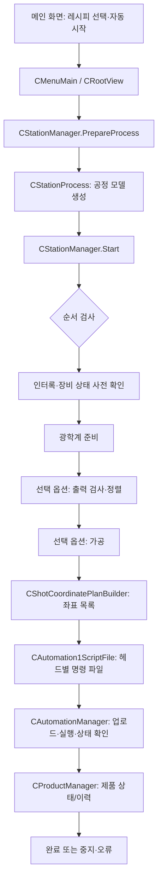

# 01. 전원 켠 뒤 버튼을 누를 때까지

## 세 프로젝트는 어떻게 붙나?

`Drilling.sln`이 묶는 실행 파일은 `Drilling.UI`이다. `UI → Common + File`, `File → Common` 참조다. `Common`은 “무엇을 할까”를 결정하는 쪽, `File`은 “디스크에 어떻게 적을까”를 맡는다. 그래서 이름이 비슷한 `CRecipeManager`와 `CJhmiRecipeFile`은 경쟁자가 아니라 앞뒤 단계다. 참조는 각 [`csproj`](https://github.com/kjuws10-rgb/A3_LD_Process_SW_IPS/blob/a25ba3cdfd70cff5d78172d13ec957318704b1e1/Drilling.UI/Drilling.UI.csproj#L1)에 적혀 있다.

## 시작 순서: 누가 누구를 만든다

1. [`App.xaml`](https://github.com/kjuws10-rgb/A3_LD_Process_SW_IPS/blob/a25ba3cdfd70cff5d78172d13ec957318704b1e1/Drilling.UI/App.xaml#L1)이 앱 창의 자원을 정하고, [`CApp.xaml.cs`](https://github.com/kjuws10-rgb/A3_LD_Process_SW_IPS/blob/a25ba3cdfd70cff5d78172d13ec957318704b1e1/Drilling.UI/CApp.xaml.cs#L22)가 `CRootView`를 연다.
2. [`CAppStartup`](https://github.com/kjuws10-rgb/A3_LD_Process_SW_IPS/blob/a25ba3cdfd70cff5d78172d13ec957318704b1e1/Drilling.UI/CAppStartup.cs#L14)는 Config 경로를 찾고 파일 입출력 담당 객체를 `CManager`에 넘긴다. 이를 **조립**이라고 생각하면 된다.
3. [`CManager.Initialize`](https://github.com/kjuws10-rgb/A3_LD_Process_SW_IPS/blob/a25ba3cdfd70cff5d78172d13ec957318704b1e1/Drilling.Common/Managers/CManager.cs#L117)가 파일 형식 검사, 설정 읽기, 장비 목록 등록, 모터·제품·리뷰·공정·레시피 관리자 만들기를 이어간다.
4. [`CRootView.CreateMenus`](https://github.com/kjuws10-rgb/A3_LD_Process_SW_IPS/blob/a25ba3cdfd70cff5d78172d13ec957318704b1e1/Drilling.UI/CRootView.cs#L1638)는 화면별 `CMenu...` 객체를 만들고 관리자들과 연결한다. `Views/*.xaml`은 보이는 모양, `CMenu...cs`는 버튼 동작과 화면에 보여 줄 값을 준비한다.

## 자동 가공의 큰 순서

`CStationProcess`의 흐름은 [`PrepareProcess`](https://github.com/kjuws10-rgb/A3_LD_Process_SW_IPS/blob/a25ba3cdfd70cff5d78172d13ec957318704b1e1/Drilling.Common/Station/CStationProcess.cs#L135), [`Start`](https://github.com/kjuws10-rgb/A3_LD_Process_SW_IPS/blob/a25ba3cdfd70cff5d78172d13ec957318704b1e1/Drilling.Common/Station/CStationProcess.cs#L163), [`RunProcessStep`](https://github.com/kjuws10-rgb/A3_LD_Process_SW_IPS/blob/a25ba3cdfd70cff5d78172d13ec957318704b1e1/Drilling.Common/Station/CStationProcess.cs#L787)에 있다. 설정의 `AUTO_PROCESS_USE` 등에 따라 일부 단계는 건너뛸 수 있다. 준비·실행을 혼동하면 안 된다. **준비는 계산과 목록 만들기**, **실행은 장비에 명령 보내기**다.

## 리뷰는 같은 자동 가공 흐름인가?

아니다. 현재 소스의 자동 공정 안 [`RunReviewStep`](https://github.com/kjuws10-rgb/A3_LD_Process_SW_IPS/blob/a25ba3cdfd70cff5d78172d13ec957318704b1e1/Drilling.Common/Station/CStationProcess.cs#L1350)은 예약 메시지 단계다. 리뷰 화면에서 사용하는 [`CReviewManager.Start`](https://github.com/kjuws10-rgb/A3_LD_Process_SW_IPS/blob/a25ba3cdfd70cff5d78172d13ec957318704b1e1/Drilling.Common/Review/CReviewManager.cs#L521)는 별도의 리뷰 순서다. 이 둘을 “자동 가공 뒤 자동으로 실측 리뷰까지 끝난다”로 읽으면 안 된다. 리뷰 쪽도 Vision 통신/시뮬레이션 및 스테이지 이동 구현 여부를 실제 장비에서 확인해야 한다.

## 중지·오류는 어디서 보나?

`CInterLockManager`는 문·비상정지 등 허용 조건을 모으고, `CAlarmManager`는 알람 상태를 모은다. `CStationProcess`가 가공 진행/중지/실패를 관리하며 `CProductManager`에 결과를 반영한다. 화면의 `CMenuAlarm`, `CMenuMonitor`, `CMenuMain`이 각각 이를 보여 준다. 통신 오류가 나면 단순히 CSV를 고치는 문제가 아닐 수 있으므로 [07번 연결표](07_연결표와_용어.md)에서 해당 층을 찾아가자.
