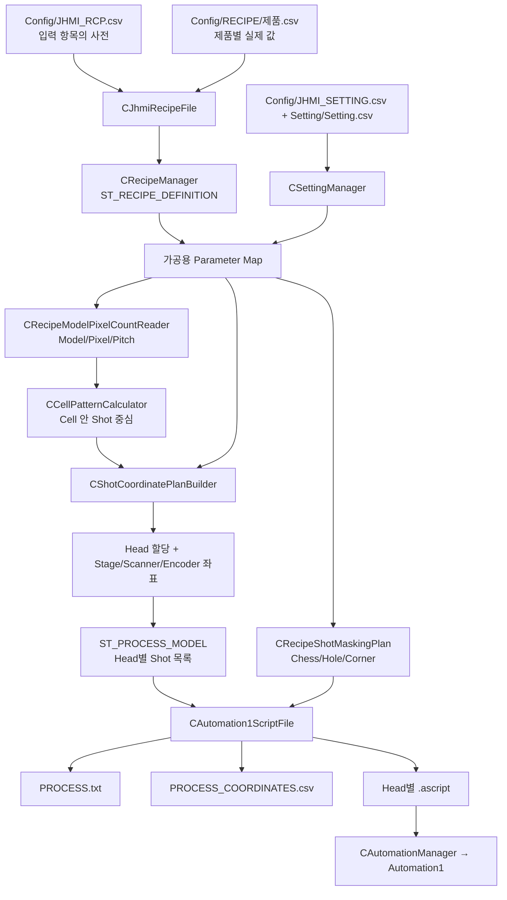
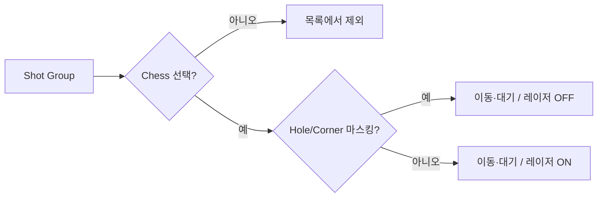

# 02. 가공 레시피가 스캐너 명령이 되기까지

## 단어를 먼저 잡자

**레시피**는 제품별 숫자 묶음이다. **Cell**은 유리 위 반복 배치된 작업 구역, **Model**은 그 Cell에 적용할 패턴 형식, **Shot Group**은 한 번의 스캐너 위치로 묶인 목표점, **Beam**은 분할 빔의 개별 점이다. **Head**는 여러 스캐너/레이저 중 어느 장비가 맡는지 나타낸다. **설계 좌표**는 제품 도면 쪽 좌표, **스테이지/스캐너 좌표**는 장비에 보낼 값이다. 이름이 모두 “좌표”라 해도 같은 숫자가 아니다.

## 한눈에 보는 지도

## 종이 레시피가 메모리 객체가 되는 과정

[`Config/JHMI_RCP.csv`](https://github.com/kjuws10-rgb/A3_LD_Process_SW_IPS/blob/a25ba3cdfd70cff5d78172d13ec957318704b1e1/Config/JHMI_RCP.csv#L1)은 항목 이름, 화면 표시명, 타입, 기본값, 최소·최대 등을 정의한다. [`Config/RECIPE/test0929.csv`](https://github.com/kjuws10-rgb/A3_LD_Process_SW_IPS/blob/a25ba3cdfd70cff5d78172d13ec957318704b1e1/Config/RECIPE/test0929.csv#L1) 같은 파일은 실제 제품 값을 담는다. [`CJhmiRecipeFile`](https://github.com/kjuws10-rgb/A3_LD_Process_SW_IPS/blob/a25ba3cdfd70cff5d78172d13ec957318704b1e1/Drilling.File/JHMI/CJhmiRecipeFile.cs#L389)이 둘을 읽어 `ST_RECIPE_DEFINITION`/`ST_RECIPE_PARAMETER`로 바꾸고 [`CRecipeManager`](https://github.com/kjuws10-rgb/A3_LD_Process_SW_IPS/blob/a25ba3cdfd70cff5d78172d13ec957318704b1e1/Drilling.Common/Managers/CRecipeManager.cs#L17)가 화면과 공정에 제공한다. 예: `CELL10_ALIGN_TO_1ST_PIXEL_X`는 10번 셀의 첫 픽셀 배치 X, `MODEL1_NUM_OF_PIXEL_X`는 1번 모델의 X 픽셀 수. 일부 Cell/Shot 반복 키는 폼의 틀에서 활성 셀 수만큼 전개한다. 새 레시피 키가 소스의 읽기 경로까지 연결되지 않으면 CSV에 적어도 가공에 쓰인다고 단정할 수 없다.

[`CStationProcess.PrepareProcess`](https://github.com/kjuws10-rgb/A3_LD_Process_SW_IPS/blob/a25ba3cdfd70cff5d78172d13ec957318704b1e1/Drilling.Common/Station/CStationProcess.cs#L135)가 레시피와 장비 설정을 가공용 값 묶음으로 모으고 `ST_PROCESS_MODEL`을 준비한다. 핵심 구조는 다음과 같다.

| 구조 | 쉬운 뜻 | 주로 들어 있는 것 |
| --- | --- | --- |
| `ST_RECIPE_DEFINITION` | 제품 레시피 한 장 | ID, 이름, 항목 목록, 변경 이력 |
| `IReadOnlyDictionary<string,string>` | 항목명 → 값 표 | Cell/Model/Head/Flip/속도/오프셋 |
| `ST_HEAD_SHOT_POINT` | 한 Shot의 장비용 계산 결과 | 순서, ShotKey, Cell, Head, 설계 X/Y, Scanner GX/GY, Stage X/Y, Offset, Encoder 대기점 |
| `ST_HEAD_PROCESS_PLAN` | 한 Head의 작업 묶음 | 레이저/속도/태스크/Shot 목록 |
| `ST_PROCESS_MODEL` | 이번 한 장의 가공 계획 | ProcessId, RecipeId, GlassId, Head 계획, 전체 파라미터 |

구조 선언 근거: [`CRecipeManager`](https://github.com/kjuws10-rgb/A3_LD_Process_SW_IPS/blob/a25ba3cdfd70cff5d78172d13ec957318704b1e1/Drilling.Common/Managers/CRecipeManager.cs#L17), [`CShotCoordinatePlanBuilder`](https://github.com/kjuws10-rgb/A3_LD_Process_SW_IPS/blob/a25ba3cdfd70cff5d78172d13ec957318704b1e1/Drilling.Common/Recipe/CShotCoordinatePlanBuilder.cs#L5), [`CStationManager`](https://github.com/kjuws10-rgb/A3_LD_Process_SW_IPS/blob/a25ba3cdfd70cff5d78172d13ec957318704b1e1/Drilling.Common/Station/CStationManager.cs#L75).

## 좌표 계산을 다섯 단계로 쪼개기

1. [`CRecipeModelPixelCountReader`](https://github.com/kjuws10-rgb/A3_LD_Process_SW_IPS/blob/a25ba3cdfd70cff5d78172d13ec957318704b1e1/Drilling.Common/Recipe/CRecipeModelPixelCountReader.cs#L8)가 Cell의 Model 번호와 그 Model의 픽셀 수·Pitch·Chess 값을 읽는다.
2. [`CCellPatternCalculator`](https://github.com/kjuws10-rgb/A3_LD_Process_SW_IPS/blob/a25ba3cdfd70cff5d78172d13ec957318704b1e1/Drilling.Common/Recipe/CCellPatternCalculator.cs#L36)가 셀 배치·회전·픽셀 간격으로 Shot Group 중심점들을 만든다.
3. [`CShotCoordinatePlanBuilder.BuildDesignShots`](https://github.com/kjuws10-rgb/A3_LD_Process_SW_IPS/blob/a25ba3cdfd70cff5d78172d13ec957318704b1e1/Drilling.Common/Recipe/CShotCoordinatePlanBuilder.cs#L130)가 모든 Cell의 중심점에 Cell/Shot별 Recipe·Review Offset을 붙인다. ShotKey는 `CELL001_SHOT0001` 같은 안정적인 이름이다.
4. 같은 파일의 [`Build`](https://github.com/kjuws10-rgb/A3_LD_Process_SW_IPS/blob/a25ba3cdfd70cff5d78172d13ec957318704b1e1/Drilling.Common/Recipe/CShotCoordinatePlanBuilder.cs#L10)가 활성 Head와 작업 폭을 보고 담당 Head를 정한다. 스테이지 시작·진행 방향, Head 기준 위치와 X/Y 축 Flip/교환을 적용해 Scanner GX/GY 및 Encoder 대기값을 만든다. **설계 X/Y를 곧바로 `MoveRapid`에 넣지 않는다.**
5. [`OrderShots`](https://github.com/kjuws10-rgb/A3_LD_Process_SW_IPS/blob/a25ba3cdfd70cff5d78172d13ec957318704b1e1/Drilling.Common/Recipe/CShotCoordinatePlanBuilder.cs#L168)가 이동 순서를 정한다. 이 순서와 좌표 표시용 CSV의 행 정렬 순서가 같은 것은 아니다. CSV는 [`BuildShotCoordinateCsvLines`](https://github.com/kjuws10-rgb/A3_LD_Process_SW_IPS/blob/a25ba3cdfd70cff5d78172d13ec957318704b1e1/Drilling.File/Script/CAutomation1ScriptFile.cs#L105)에서 Cell/행/열 기준으로 별도 정렬한다.

## “이동”과 “가공”은 다르다

[`CRecipeShotMaskingPlan`](https://github.com/kjuws10-rgb/A3_LD_Process_SW_IPS/blob/a25ba3cdfd70cff5d78172d13ec957318704b1e1/Drilling.Common/Recipe/CRecipeShotMaskingPlan.cs#L41)은 Chess/마스킹 홀/모서리 영역을 판단한다. Chess로 빠진 그룹은 스크립트 대상에서 제외된다. 홀이나 모서리에 걸린 그룹은 좌표 이동은 남아도 레이저 ON이 생략될 수 있다. [`CAutomation1ScriptFile.Build`](https://github.com/kjuws10-rgb/A3_LD_Process_SW_IPS/blob/a25ba3cdfd70cff5d78172d13ec957318704b1e1/Drilling.File/Script/CAutomation1ScriptFile.cs#L48)에서 Head별 `.ascript`, `PROCESS_COORDINATES.csv`, `PROCESS.txt`를 만든다. CSV의 `가공여부`는 Masking 판정이고, 실제 실행 성공 여부가 아니다. 스크립트의 `MoveRapid`는 위치 이동, `GalvoLaserOutput(...On)`은 발진 명령이다.

## 현장 확인 포인트

`PROCESS_COORDINATES.csv`의 `DesignX/Y`, `ScannerGx/Gy`, `TotalScannerX/Y`, `가공여부`를 비교하면 **계산·출력 단계**를 살필 수 있다. `.ascript`의 이동 순서와 ON/OFF를 확인해야 **장비 명령 단계**를 알 수 있다. `EncoderFeedbackFlip`, Head별 축 이름·Scale, `STAGE_SCAN_DIRECTION_Y`, `SCAN_START_JUMP_STEP`, Head Flip/XY Flip은 단순 화면 표시가 아니라 이동·대기 조건에 영향을 준다. 이 문서는 설정 변경을 제안하거나 적용하지 않는다. 레이저 동작은 반드시 장비의 안전 절차와 시뮬레이션 검증을 거쳐야 한다.
