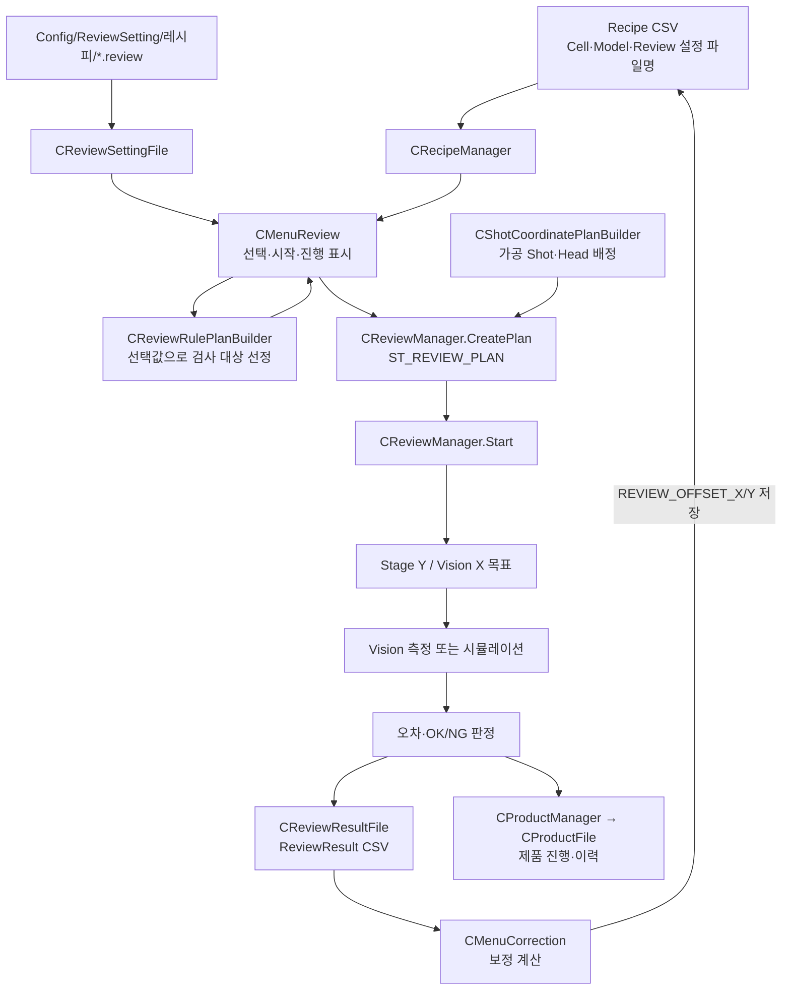
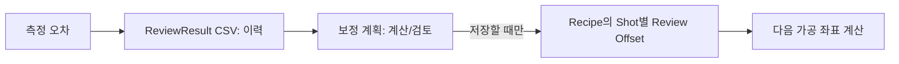

# 03. 리뷰: 무엇을 검사하고 결과를 어디에 쓰나

가공 레시피가 “어디를 뚫을까”라면, 리뷰 설정은 “그중 어디를 확인할까”다. 리뷰는 가공 계획의 Cell/Shot/Head 정보와 레시피의 검사 설정을 다시 읽어 대상 목록을 만든다.

## 입력 파일과 현재 연결 상태를 헷갈리지 말자

| 입력 | 쉬운 뜻 | 담당 코드 |
| --- | --- | --- |
| `Config/RECIPE/*.csv` | 검사 대상의 **원래 위치와 모델** | [`CJhmiRecipeFile`](https://github.com/kjuws10-rgb/A3_LD_Process_SW_IPS/blob/a25ba3cdfd70cff5d78172d13ec957318704b1e1/Drilling.File/JHMI/CJhmiRecipeFile.cs#L13) |
| `Config/ReviewSetting/<RecipeId>/*.review` | 작업자가 고른 규칙·범위·Beam·P2P/IOF 등의 **실행 프로필** | [`CReviewSettingFile`](https://github.com/kjuws10-rgb/A3_LD_Process_SW_IPS/blob/a25ba3cdfd70cff5d78172d13ec957318704b1e1/Drilling.File/Review/CReviewSettingFile.cs#L7) |
| `Config/ReviewRule/*.csv` | 별도 규칙 CSV 샘플 | 현재 C# 실행 경로에서 이 파일을 `CReviewRulePlanBuilder`에 직접 읽어 넣는 연결은 확인되지 않음 |

샘플 `.review`는 `NAME,VALUE` 형식이며 `RULE`, `SCOPE`, `BEAM_NO`, `INSPECTION_METHOD` 같은 행을 가진다. 규칙 CSV는 `GROUP,KEY,VALUE,DESCRIPTION` 형식이다. 둘은 같은 파일이 아니다. 현재 [`CMenuReview.GetOrBuildCorrectionRulePlan`](https://github.com/kjuws10-rgb/A3_LD_Process_SW_IPS/blob/a25ba3cdfd70cff5d78172d13ec957318704b1e1/Drilling.UI/Menu/Menus/CMenuReview.cs#L3563)이 화면 선택값으로 구성한 규칙을 [`CReviewRulePlanBuilder.Build`](https://github.com/kjuws10-rgb/A3_LD_Process_SW_IPS/blob/a25ba3cdfd70cff5d78172d13ec957318704b1e1/Drilling.Common/Review/CReviewRulePlanBuilder.cs#L35)에 전달한다. [`CReviewSampleRuleSelector`](https://github.com/kjuws10-rgb/A3_LD_Process_SW_IPS/blob/a25ba3cdfd70cff5d78172d13ec957318704b1e1/Drilling.Common/Review/CReviewSampleRuleSelector.cs#L2)는 화면에서 Edge/Center 샘플 Shot을 고르는 보조 계산이다.

## 리뷰 계획이란?

[`CReviewManager.CreatePlan`](https://github.com/kjuws10-rgb/A3_LD_Process_SW_IPS/blob/a25ba3cdfd70cff5d78172d13ec957318704b1e1/Drilling.Common/Review/CReviewManager.cs#L408)은 레시피와 선택한 ShotKey, Beam 번호를 받아 실행할 점만 모은다. `CreateAllPlan`은 후보 전체를 만들고 Head가 지정되지 않았거나 사용 불가한 점을 거른다. 결과 `ST_REVIEW_PLAN` 안에는 `ST_REVIEW_PLAN_POINT` 목록이 있다. 각 점은 `ShotKey`, Cell·Head·Beam, 이동 목표, 측정 오차, 판정, 진행 상태를 가진다. 좌표 변환은 [`CReviewCoordinateTransformer`](https://github.com/kjuws10-rgb/A3_LD_Process_SW_IPS/blob/a25ba3cdfd70cff5d78172d13ec957318704b1e1/Drilling.Common/Review/CReviewCoordinateTransformer.cs#L15)이 맡는다.

| 상태 | 초보자식 해석 |
| --- | --- |
| Ready | 검사할 예정 |
| Current | 지금 검사하는 점 |
| Ok / Ng | 측정 뒤 기준 통과 / 불통과 |
| Stopped / Failed / Completed | 실행 전체가 멈춤 / 오류 / 완료 |

## 시작을 누른 뒤

[`CMenuReview`](https://github.com/kjuws10-rgb/A3_LD_Process_SW_IPS/blob/a25ba3cdfd70cff5d78172d13ec957318704b1e1/Drilling.UI/Menu/Menus/CMenuReview.cs#L16)가 선택값을 만들고 [`CReviewManager.Start`](https://github.com/kjuws10-rgb/A3_LD_Process_SW_IPS/blob/a25ba3cdfd70cff5d78172d13ec957318704b1e1/Drilling.Common/Review/CReviewManager.cs#L521)를 호출한다. 관리자는 중복 실행을 막고 제품 리뷰 상태를 Running으로 바꾼다. P2P이면 점을 순서대로 반복하여 (1) Stage Y 목표, (2) Vision X 목표, (3) Vision 측정, (4) 오차/판정, (5) 중간 Product 상태 저장을 거친다. IOF는 별도 분기다. 끝나면 리뷰 결과 파일과 Product에 최종 결과를 남긴다. 중지·예외는 별도 상태로 기록된다.

**중요한 구현 경계:** 현재 [`MoveStageY`](https://github.com/kjuws10-rgb/A3_LD_Process_SW_IPS/blob/a25ba3cdfd70cff5d78172d13ec957318704b1e1/Drilling.Common/Review/CReviewManager.cs#L1907)와 [`MoveVisionX`](https://github.com/kjuws10-rgb/A3_LD_Process_SW_IPS/blob/a25ba3cdfd70cff5d78172d13ec957318704b1e1/Drilling.Common/Review/CReviewManager.cs#L1928)는 명령 문자열을 만드는 부분과 실제 전송이 완성되었는지 구분해 보아야 한다. 해당 코드에는 TODO/미사용 명령 경로가 있다. [`MeasureVision`](https://github.com/kjuws10-rgb/A3_LD_Process_SW_IPS/blob/a25ba3cdfd70cff5d78172d13ec957318704b1e1/Drilling.Common/Review/CReviewManager.cs#L1956)은 시뮬레이션과 Vision 요청 경로가 갈린다. 리뷰 완료 표시가 곧 실제 축 이동·실측 완료를 뜻한다고 단정하면 위험하다.

## 결과와 보정은 다른 데이터다

[`CReviewResultFile`](https://github.com/kjuws10-rgb/A3_LD_Process_SW_IPS/blob/a25ba3cdfd70cff5d78172d13ec957318704b1e1/Drilling.File/ReviewResult/CReviewResultFile.cs#L121)은 `Data/ReviewResult/<날짜>/<GlassId>/<검사방식>/ReviewResult_*.csv`로 결과를 저장한다([경로 조립 코드](https://github.com/kjuws10-rgb/A3_LD_Process_SW_IPS/blob/a25ba3cdfd70cff5d78172d13ec957318704b1e1/Drilling.File/ReviewResult/CReviewResultFile.cs#L235)). 측정값과 OK/NG는 “이번 검사에서 본 것”이다. [`CProductFile`](https://github.com/kjuws10-rgb/A3_LD_Process_SW_IPS/blob/a25ba3cdfd70cff5d78172d13ec957318704b1e1/Drilling.File/Product/CProductFile.cs#L11)은 `Data/Product/ActiveProduct.csv`와 날짜별 이력으로 “이번 제품 전체의 진행 상태”를 남긴다. [`CMenuCorrection`](https://github.com/kjuws10-rgb/A3_LD_Process_SW_IPS/blob/a25ba3cdfd70cff5d78172d13ec957318704b1e1/Drilling.UI/Menu/Menus/CMenuCorrection.cs#L13)은 결과를 바탕으로 Shot별 보정 계획을 만들고 선택·저장 시 레시피의 `*_REVIEW_OFFSET_X/Y`로 연결한다. 즉 **결과 CSV는 관찰 기록**, **Review Offset은 다음 좌표 계산에 들어갈 수정값**이다. 저장 전에 화면에서 대상·부호·범위를 확인해야 한다.

