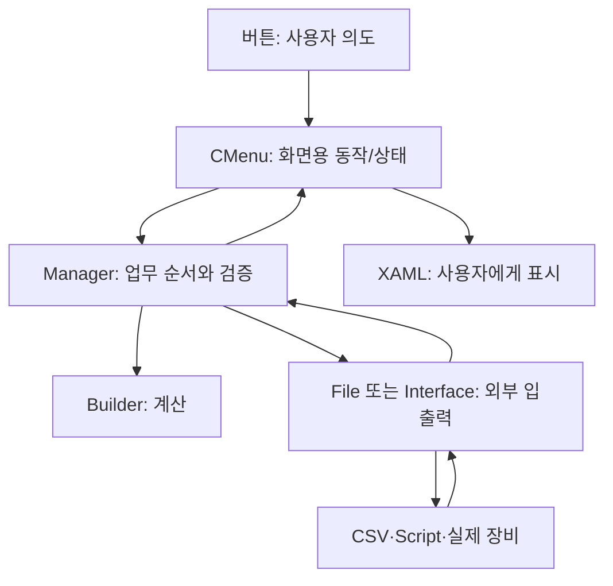

# 07. 연결표, 초보자 용어, 구현 상태

## 목적별로 따라가는 파일 사슬

| 내가 하는 일 | 순서대로 열어 볼 파일 | 마지막에 보는 데이터 |
| --- | --- | --- |
| 앱이 안 켜진다 | `CApp.xaml.cs` → `CAppStartup.cs` → `CManager.cs` → `CConfigStructureFile.cs` → `JHMI_*` | 시작 로그, 설정 검사 결과 |
| 레시피를 선택·편집한다 | `CRecipeView.xaml` → `CMenuRecipe.cs` → `CRecipeManager.cs` → `CJhmiRecipeFile.cs` | `Config/RECIPE/*.csv` |
| 자동 가공을 시작한다 | `CMainView.xaml` → `CMenuMain.cs`/`CRootView.cs` → `CStationManager.cs` → `CStationProcess.cs` | 공정 상태, Product |
| 좌표가 이상하다 | `JHMI_RCP.csv` + `RECIPE/*.csv` + `Setting.csv` → `CRecipeModelPixelCountReader.cs` → `CCellPatternCalculator.cs` → `CShotCoordinatePlanBuilder.cs` → `CScannerAxisTransform.cs` | `PROCESS_COORDINATES.csv`, `.ascript` |
| Laser ON/OFF가 이상하다 | `RECIPE/*.csv` → `CRecipeShotMaskingPlan.cs` → `CAutomation1ScriptFile.cs` | `.ascript`의 ON/OFF·CSV 가공여부 |
| 장비에 스크립트가 안 간다 | `CStationProcess.cs` → `CAutomationManager.cs` → `CInterfaceManager.cs` → `CAutomation1Comm.cs` | Automation1 통신 Trace |
| 리뷰 대상이 이상하다 | `RECIPE/*.csv` + `.review` → `CMenuReview.cs` → `CReviewRulePlanBuilder.cs`/`CReviewSampleRuleSelector.cs` → `CReviewManager.cs` → `CReviewGlassPreviewBuilder.cs` | 리뷰 화면의 계획 (`ReviewRule/*.csv` 직접 로드는 미확인) |
| 리뷰 측정·보정이 이상하다 | `CMenuReview.cs` → `CReviewManager.cs` → `CVisionProtocol.cs`/`CReviewResultFile.cs` → `CMenuCorrection.cs` → `CJhmiRecipeFile.cs` | ReviewResult CSV, Shot별 Offset |
| 축/IO가 안 움직인다 | `JHMI_INTERFACE.csv` + `JHMI_MOTOR.csv` + `JHMI_IO.csv` → `CInterfaceManager.cs`/`CMotionManager.cs` → 해당 제조사 파일 | 장비 상태·알람·Trace |

위 표의 파일들은 각각 [04 Common 사전](04_Common_파일사전.md), [05 File/UI 사전](05_File_UI_파일사전.md), [06 설정 사전](06_설정과_운영파일.md)에 바로 열리는 링크가 있다. **화살표는 정보/호출의 대표 흐름**이며 모든 메서드가 일직선으로 실행된다는 뜻은 아니다.

## “파일들이 연결된다”의 세 가지 뜻

1. **프로젝트 참조:** `UI → Common·File`, `File → Common`. 컴파일할 때 필요한 관계다.
2. **호출 관계:** 화면의 `CMenuMain`이 `CStationManager`의 메서드를 호출하는 관계다. 프로그램 실행 중 객체 사이를 이동한다.
3. **데이터 관계:** `CJhmiRecipeFile`이 레시피 CSV를 읽고 `CShotCoordinatePlanBuilder`가 그 값을 소비하는 관계다. 두 클래스가 서로 직접 호출하지 않아도 같은 데이터 사슬에 있다.

## 헷갈리기 쉬운 용어

| 용어 | 가장 쉬운 뜻 |
| --- | --- |
| `C...` | C#의 클래스, 일을 하는 담당자 |
| `ST_...` | 여러 값을 한 묶음으로 담은 데이터 상자 |
| `EN_...` | 정해진 선택지/상태 이름 |
| Manager | 순서, 현재 상태, 다른 담당자와의 연결을 관리 |
| Builder / Calculator | 입력 숫자에서 새 계획·좌표를 계산 |
| File | 디스크 파일 형식을 아는 입출력 담당 |
| Interface / Comm | 장비와 말하는 통신 담당 |
| XAML | 화면 배치 문서 |
| View | 실제 보이는 화면 조각 |
| CMenu | View에 보여 줄 값과 버튼 동작을 붙이는 화면 모델 |
| Config / Data / Log | 설정 입력 / 실행 산출물·제품 기록 / 진단 기록 |
| Head / Cell / Shot / Beam | 장비 머리 / 유리 구역 / 가공 위치 묶음 / 분할 빔의 점 |
| Stage / Scanner / Encoder | 유리나 장비의 큰 이동축 / 빠른 광축 / 위치 피드백 값 |
| Masking / Chess | 레이저 발진을 막는 영역 / 일정 규칙으로 Shot을 골라 건너뜀 |

## 그림을 읽을 때 조심할 부분

| 영역 | 현재 소스에서 확인한 상태 | 읽는 방법 |
| --- | --- | --- |
| 자동 공정 리뷰 | [`CStationProcess.RunReviewStep`](https://github.com/kjuws10-rgb/A3_LD_Process_SW_IPS/blob/a25ba3cdfd70cff5d78172d13ec957318704b1e1/Drilling.Common/Station/CStationProcess.cs#L1350)은 예약 로그를 남긴다. | 자동 가공 완료가 자동 리뷰 완료라는 뜻은 아님. |
| 리뷰 축 이동 | [`CReviewManager.MoveStageY`](https://github.com/kjuws10-rgb/A3_LD_Process_SW_IPS/blob/a25ba3cdfd70cff5d78172d13ec957318704b1e1/Drilling.Common/Review/CReviewManager.cs#L1907)와 [`MoveVisionX`](https://github.com/kjuws10-rgb/A3_LD_Process_SW_IPS/blob/a25ba3cdfd70cff5d78172d13ec957318704b1e1/Drilling.Common/Review/CReviewManager.cs#L1928)에 전송 미완성 경로가 있다. | 목표 좌표가 계산돼도 실제 축 이동을 보증하지 않음. |
| 시뮬레이션 | 장비·Vision·Automation 설정에 따라 응답을 흉내 낼 수 있다. | 화면 “성공”과 실장비 성공을 분리해서 확인. |
| 출력 CSV | `PROCESS_COORDINATES.csv`는 좌표·가공 판정을 **기록**한다. | 최종 레이저 출력은 `.ascript`와 장비 상태·안전 로그도 확인. |
| 솔루션 빌드 | [`Drilling.sln`](https://github.com/kjuws10-rgb/A3_LD_Process_SW_IPS/blob/a25ba3cdfd70cff5d78172d13ec957318704b1e1/Drilling.sln#L1)에 없는 두 Regression 프로젝트가 적혀 있다. | 현재 체크아웃만으로 전체 솔루션 빌드가 안 될 수 있음. |

## 이 문서를 만든 방식

2026-10-03 KST에 Git 원본 `main`이 `a25ba3cdfd70cff5d78172d13ec957318704b1e1`임을 원격 조회로 확인했다. 별도 분석 Clone은 깨끗하며 Push URL이 `DISABLED`였다. 기능 원본 129개를 전부 파일 사전에 한 번씩 대조하고, Config 32개도 전부 대조했다. Git이 추적하는 전체 6,583개는 [99번 목록](99_전체_추적파일_목록.txt)에 실었다. 파일 수와 분류는 **Git 추적 파일 기준**이므로 로컬 장비가 새로 만든 미추적 파일은 포함하지 않는다. 이 작업에서 장비에 명령을 보내거나 새 빌드를 실행하지 않았다.
