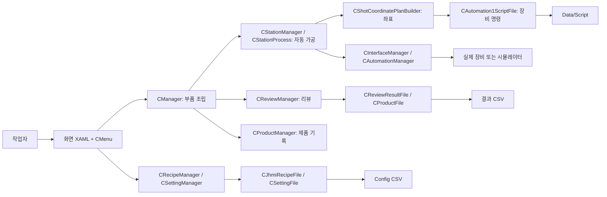

# A3 프로그램: 처음 보는 사람을 위한 전체 지도

> 분석 대상: [A3_LD_Process_SW_IPS `a25ba3cdfd70cff5d78172d13ec957318704b1e1`](https://github.com/kjuws10-rgb/A3_LD_Process_SW_IPS/tree/a25ba3cdfd70cff5d78172d13ec957318704b1e1) (`main`, 2026-10-03 확인). 원본은 읽기만 했고 수정·커밋·푸시하지 않았다. 이 문서는 **그 시점의 소스가 말하는 동작**이며 장비에서 정상 가공됨을 보증하지 않는다.

## 딱 30초짜리 요약

이 프로그램은 유리의 어느 지점을 레이저로 가공할지 계산하고, 장비에 보낼 명령 파일을 만들고, 선택한 지점을 카메라로 확인하는 Windows 화면 프로그램이다. **화면(UI)**은 사용자의 클릭을 받고, **공통 로직(Common)**은 계산·순서를 결정하며, **파일 계층(File)**은 CSV·리뷰 설정·스크립트를 읽고 쓴다. 장비는 별도의 **통신/모션 객체**로 연결된다.

## 문서 읽는 순서

1. [01 시작부터 종료까지](01_시작과_전체흐름.md): 버튼을 누르면 어떤 객체를 거치는지.
2. [02 가공 레시피와 좌표](02_가공_데이터흐름.md): CSV → 셀 → Shot → Head → 스캐너 → 스크립트.
3. [03 리뷰와 보정](03_리뷰_데이터흐름.md): 리뷰 설정 → 측정 → 결과 → 보정값.
4. [04 Common 파일별 역할](04_Common_파일사전.md): 계산·장비·관리자 파일 전부.
5. [05 File·UI 파일별 역할](05_File_UI_파일사전.md): 저장 담당과 화면 파일 전부.
6. [06 설정·생성 파일](06_설정과_운영파일.md): Config 32개 및 생성 파일의 주인.
7. [07 연결표·용어·주의](07_연결표와_용어.md): 빠른 탐색과 구현 상태 구분.
8. [전체 Git 추적 파일 목록](99_전체_추적파일_목록.txt): 빌드 산출물까지 빠짐없는 경로 색인. 파일의 **역할**은 위 파일 사전과 범주 설명을 함께 본다.

## 파일 수를 먼저 이해하기

이 Commit의 Git 추적 파일은 **6,583개**다. 이 중 약 **5,901개**는 `.vs`, `bin`, `obj`, 빌드 검사 폴더처럼 사람이 직접 수정하는 기능 소스가 아닌 산출물이다. 주요 기능을 이해할 때 볼 파일은 **C# 108개, XAML 21개, 프로젝트 파일 3개, 솔루션 1개**다. `Config` 32개, 이미 생성된 `Data/Script` 441개, `Data/Product` 21개, 로그 31개도 추적 중이다. 동일 기능의 과거 실행 스크립트 수백 개는 하나하나 독립 기능으로 취급하면 흐름을 오히려 놓친다. 각각의 이름은 99번 색인에 싣고, 생성 규칙·담당 코드는 06번에 묶었다.

## 실무에서 가장 먼저 찾을 곳

| 궁금한 것 | 시작할 파일 |
| --- | --- |
| 앱이 어디서 시작하나? | [`CApp.xaml.cs`](https://github.com/kjuws10-rgb/A3_LD_Process_SW_IPS/blob/a25ba3cdfd70cff5d78172d13ec957318704b1e1/Drilling.UI/CApp.xaml.cs#L22) → [`CAppStartup.cs`](https://github.com/kjuws10-rgb/A3_LD_Process_SW_IPS/blob/a25ba3cdfd70cff5d78172d13ec957318704b1e1/Drilling.UI/CAppStartup.cs#L14) |
| 화면 버튼은 어디로 가나? | [`CRootView.cs`](https://github.com/kjuws10-rgb/A3_LD_Process_SW_IPS/blob/a25ba3cdfd70cff5d78172d13ec957318704b1e1/Drilling.UI/CRootView.cs#L1638) → `CMenu...cs` |
| 가공 좌표는 누가 만드나? | [`CShotCoordinatePlanBuilder.cs`](https://github.com/kjuws10-rgb/A3_LD_Process_SW_IPS/blob/a25ba3cdfd70cff5d78172d13ec957318704b1e1/Drilling.Common/Recipe/CShotCoordinatePlanBuilder.cs#L10) |
| 레이저 명령은 누가 쓰나? | [`CAutomation1ScriptFile.cs`](https://github.com/kjuws10-rgb/A3_LD_Process_SW_IPS/blob/a25ba3cdfd70cff5d78172d13ec957318704b1e1/Drilling.File/Script/CAutomation1ScriptFile.cs#L43) |
| 리뷰 결과는 어디에 남나? | [`CReviewManager.cs`](https://github.com/kjuws10-rgb/A3_LD_Process_SW_IPS/blob/a25ba3cdfd70cff5d78172d13ec957318704b1e1/Drilling.Common/Review/CReviewManager.cs#L361) → [`CReviewResultFile.cs`](https://github.com/kjuws10-rgb/A3_LD_Process_SW_IPS/blob/a25ba3cdfd70cff5d78172d13ec957318704b1e1/Drilling.File/ReviewResult/CReviewResultFile.cs#L121) |

## 분석 범위와 확인 방법

Git 추적 경로를 기준으로 전수 분류했다. 호출 흐름은 객체 생성, 생성자 주입, 메서드 호출, 파일 경로를 소스에서 대조했다. Mermaid 그림은 이해를 돕기 위한 **요약도**이고 실제 모든 분기·예외·동시 실행 순서를 의미하지 않는다. 현재 커밋에 실제 존재하는 파일을 링크했으며, 색인은 같은 커밋의 `git ls-files`를 기록했다. 장비 실동작·레이저 발진은 검증하지 않았다.
