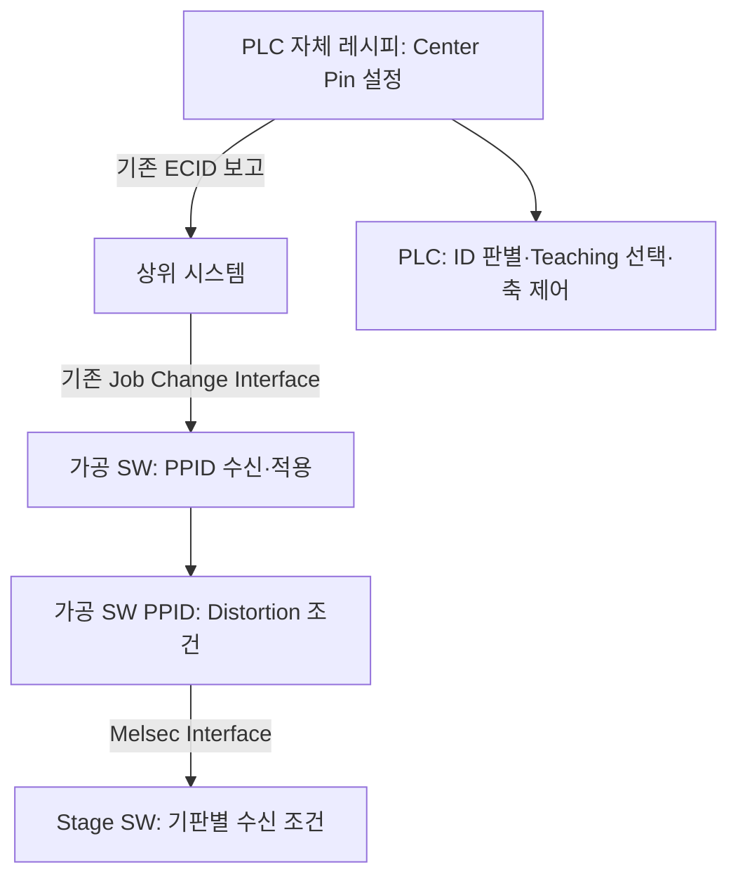
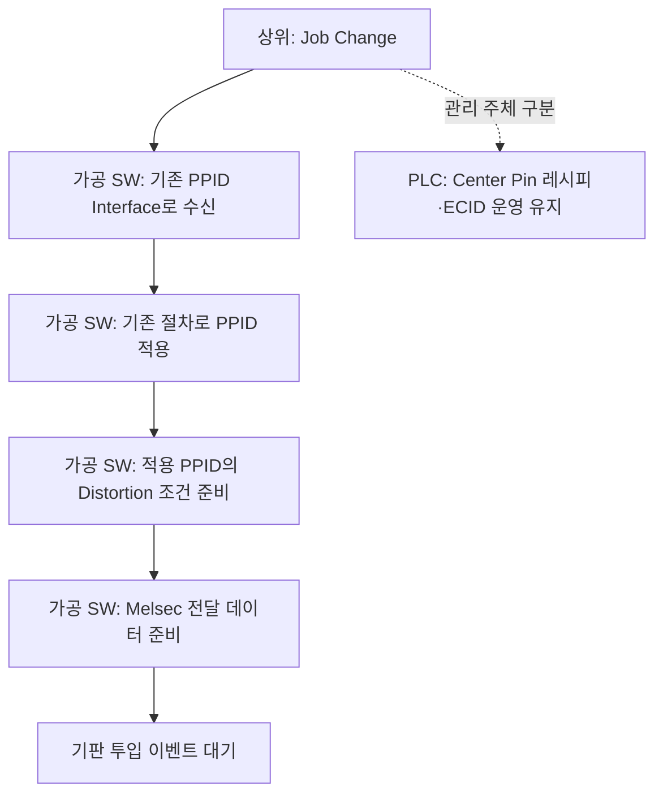
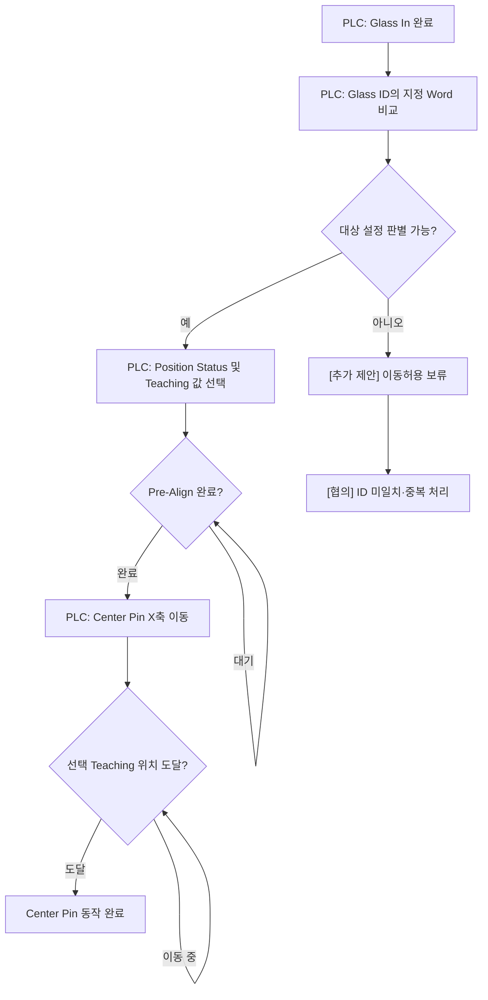
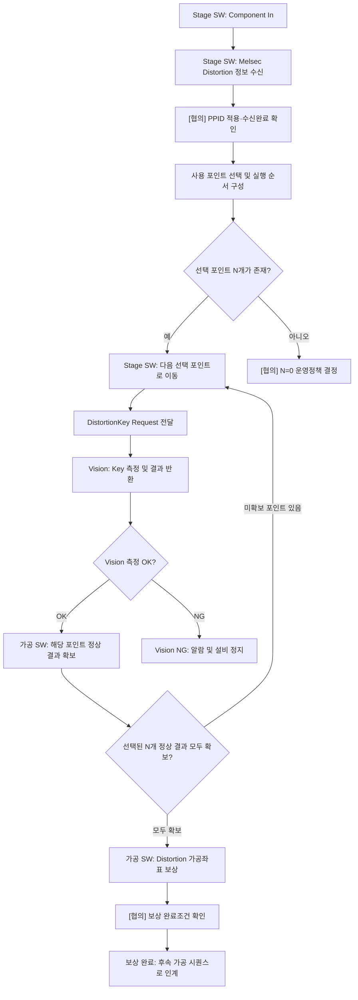
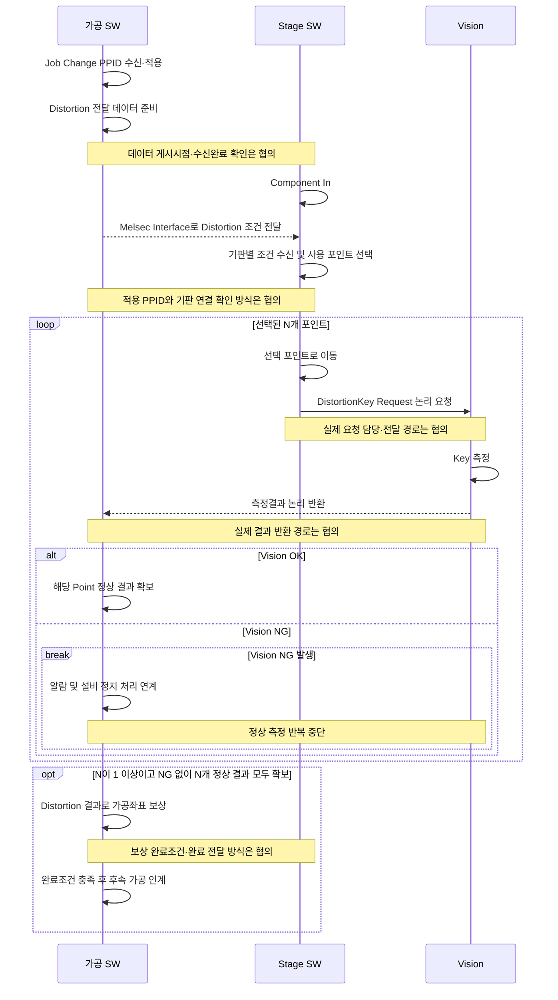

# A3 LD · Job Change / Center Pin / Distortion 운영 시나리오

> **문서 상태: 고객사 미팅 제안안 · 검토 중**  
> 작성일: 2026-10-07  
> 작성 기준: 제공된 운영안. 기존 A3 LD 구조 문서와 같이 **담당 주체 → 데이터 흐름 → 실행 흐름 → 완료조건** 순서로 정리했습니다.  
> 그림의 [협의]는 미확정 사항이며, [추가 제안]은 실행 오류를 방지하기 위해 보완한 조건입니다. 이 문서는 제안할 운영 시나리오를 설명합니다.

## 1. 누가 무엇을 관리하고 실행하나?

**Job Change의 PPID 수신·적용 Interface는 기존과 동일하게 가공 SW가 수행합니다.** Center Pin은 PLC 자체 레시피로 관리하고, Distortion 측정조건은 가공 SW PPID에서 단일 관리하는 방향입니다.

| 구분 | 설정 원본·관리 주체 | 실행 주체 | 전달·보고 방식 | 실행 시점 |
| --- | --- | --- | --- | --- |
| Job Change / PPID | 가공 SW | 가공 SW | 기존 PPID Interface 유지 | Job Change 시 수신·적용 |
| Center Pin | PLC 자체 레시피, PLC UI 최대 20개 설정 | PLC | 상위 보고는 기존 ECID 방식 유지 | Glass In 후 ID 판별 및 Pre-Align 완료조건 충족 시 |
| Distortion 측정조건 | 가공 SW PPID | Stage SW가 수신한 조건으로 동작 | 가공 SW → Melsec Interface → Stage SW | Component In 시 해당 기판의 조건 수신 |
| Distortion Key 측정 | PPID에서 선택된 포인트 | Stage SW 이동, Vision 측정 | DistortionKey Request 및 결과 반환 | 선택된 포인트마다 이동 후 측정 |
| Distortion 좌표 보상 | 가공 SW | 가공 SW | N개 정상 결과를 이용해 가공좌표 보상 | 선택된 N개 포인트 정상 결과 확보 후 |
| Vision NG | 해당 측정 시퀀스 | 알람·정지 담당 연계 | 알람 발생 및 설비 정지 | Vision NG 발생 시 |

Center Pin 설정은 가공 SW의 PPID 관리대상에 통합하지 않습니다. Stage SW는 Distortion 조건을 별도 레시피로 중복 관리하지 않고, 가공 SW에서 받은 정보를 기판별 실행조건으로 사용합니다.

## 2. 설정값은 어디에서 어디로 전달되나?

| 데이터 | 관리 위치 | 사용 위치 | 관리 원칙 |
| --- | --- | --- | --- |
| Center Pin의 Glass ID 비교조건 | PLC 자체 레시피 | PLC | 지정 Word 비교로 대상 설정 판별 |
| Position Status / Teaching Position | PLC 자체 레시피 | PLC | PLC UI 최대 20개 설정과 연결 |
| Distortion 포인트 목록 | 가공 SW PPID | Stage SW / 가공 SW | 동일 PPID 기준으로 동작과 결과 연결 |
| Distortion Step / Direction | 가공 SW PPID | Stage SW | 세부 의미·실행 순서·코드 정의는 협의 |
| 위치별 사용옵션 | 가공 SW PPID | Stage SW / 가공 SW | 사용으로 선택된 포인트만 측정 |
| Distortion 측정결과 | 가공 SW에서 보상에 사용 | 가공 SW | 반환 경로·보관 위치·보관 기간은 협의 |

**PLC의 최대 20개 설정은 Center Pin 설정 기준입니다.** Distortion 포인트 수의 상한은 별도 협의사항이며, 20개로 해석하지 않습니다.

## 3. Job Change: PPID 준비 시나리오

Job Change에서는 가공 SW가 PPID를 수신·적용하고 Distortion 전달 데이터를 준비합니다. **Center Pin X축 이동은 실제 Glass In 및 Pre-Align 완료조건으로 PLC가 실행합니다.**

| 단계 | 주체 | 처리 내용 |
| --- | --- | --- |
| J-01 | 가공 SW | 기존 Interface로 PPID 수신 |
| J-02 | 가공 SW | 기존 절차에 따라 PPID 적용 |
| J-03 | 가공 SW | 적용 PPID의 포인트 목록·Step·Direction·사용옵션 준비 |
| J-04 | 가공 SW | Stage SW에 전달할 Melsec 데이터 준비 |
| J-05 | PLC / Stage SW | 각자의 기판 투입 이벤트에 따라 후속 시퀀스 실행 |

**[협의]** J-02의 적용 완료시점, Melsec 데이터 게시시점, Stage SW 수신완료 확인 및 Job Change 완료 보고와의 관계를 확정해야 합니다. J-04는 데이터 준비를 나타내며, Job Change 때 Stage SW 수신까지 완료된다고 가정하지 않습니다.

## 4. Center Pin: Glass In부터 X축 도달까지

| 단계 | 주체 | 처리 내용 | 다음 단계 조건 |
| --- | --- | --- | --- |
| C-01 | PLC | Glass In 완료 확인 | Glass In 완료 |
| C-02 | PLC | Glass ID의 지정 Word를 설정조건과 비교 | 대상 설정 판별 |
| C-03 | PLC | 판별결과에 연결된 Position Status / Teaching 값 선택 | 사용할 값 선택 완료 |
| C-04 | PLC | Pre-Align 완료 확인 | Pre-Align 완료 |
| C-05 | PLC | Center Pin X축을 선택된 Teaching 위치로 이동 | 이동 명령 수행 |
| C-06 | PLC | X축 도달 확인 | 선택 Teaching 위치 도달 |

### PLC UI 최대 20개 설정의 연결 개념

| 설정 항목 | 용도 |
| --- | --- |
| 설정 번호 1~20 | Center Pin 설정 구분 |
| Glass ID 지정 Word 비교조건 | 투입 기판과 해당 설정의 연결 |
| Position Status | 판별결과에 연결해 선택할 상태값 |
| Teaching Position | Center Pin X축 목표 위치 |

Position Status의 세부 의미, Glass ID Word의 위치·길이·비교규칙, 중복조건의 우선순위 및 X축 도달 판정기준은 PLC 사양과 고객사 협의로 확정합니다.

**[추가 제안]** ID 미일치 또는 중복으로 사용할 Teaching 값이 정해지지 않으면 이동허용을 보류합니다. 이 경우의 알람·정지 여부와 Pre-Align 대기·축 도달 Timeout 정책은 별도 협의사항입니다.

## 5. Distortion: Component In부터 좌표 보상까지

| 단계 | 주체 | 처리 내용 | 다음 단계 조건 |
| --- | --- | --- | --- |
| D-01 | Stage SW | Component In 감지 | 해당 기판 시퀀스 시작 |
| D-02 | Stage SW | 가공 SW가 전달한 Distortion 조건 수신 | 적용 PPID / 수신완료 확인 방식 협의 |
| D-03 | Stage SW | 사용옵션으로 포인트 선택, Step / Direction에 따른 실행 순서 구성 | N개 대상 및 실행 순서 결정 |
| D-04 | Stage SW | 다음 선택 포인트로 Stage 이동 | 측정 가능한 위치 도달 |
| D-05 | 요청 담당 | DistortionKey Request 전달 | Request 담당·경로 협의 |
| D-06 | Vision | Key 측정, OK / NG 및 결과 반환 | 측정결과 반환 |
| D-07 | 가공 SW | 해당 선택 포인트의 정상 결과 확보 | 전체 N개 완료 여부 확인 |
| D-08 | Stage SW / Vision | 미확보 포인트가 있으면 D-04부터 반복 | 선택 N개 모두 정상 결과 확보 |
| D-09 | 가공 SW | Distortion 결과에 따른 가공좌표 보상 | 보상 완료조건 협의 |
| D-10 | 가공 SW | 보상 완료 후 후속 가공 시퀀스로 인계 | 완료조건 충족 |

### 선택된 N개 포인트란?

위치별 사용옵션이 켜진 포인트의 집합을 $S$라고 하면, 측정 대상 수는 다음과 같습니다.

$$
N = |S| = \sum_{i=1}^{M} \mathbf{1}(\text{Use}_i = \text{ON})
$$

여기서 $M$은 PPID에 등록된 전체 포인트 수입니다. 전체 목록에 등록되어 있어도 사용옵션이 꺼진 포인트는 N에 포함하지 않습니다.

예를 들어 6개 등록 포인트 중 1·3·6번만 사용하면 **N=3**입니다. 1·3번의 정상 결과만 있으면 측정은 미완료이고, 6번까지 정상 결과가 확보되어야 보상 단계로 진행합니다.

**[추가 제안]** 완료 여부는 정상 응답 횟수만 세지 않고, 선택된 각 Point ID의 결과 확보 여부로 판정합니다. 동일 포인트의 결과가 두 번 와도 미측정 포인트를 대신할 수 없습니다.

**[협의]** N=0일 때의 Distortion 생략·가공 허용·알람 정책은 미확정입니다. 본 흐름도에서는 보상 완료로 자동 연결하지 않습니다. Step이 측정 순번·이동 간격 등 어떤 의미인지와 Direction의 코드·정렬 규칙도 확정해야 합니다.

## 6. Distortion 담당 SW 사이의 논리 시퀀스

아래 그림은 **담당 주체와 논리 요청 순서**를 나타냅니다. Stage SW → Vision의 직접 통신 여부, 가공 SW 경유 여부 및 실제 통신수단은 협의사항입니다.

결과의 보상 사용 주체는 가공 SW입니다. 그림의 결과 화살표는 최종 사용 주체를 표시하며, Vision이 가공 SW로 직접 반환하도록 통신 경로를 확정한 의미는 아닙니다.

## 7. 두 실행 흐름은 어떤 이벤트로 시작하나?

| 구분 | 시작 이벤트 | 실행 준비조건 | 완료 지점 |
| --- | --- | --- | --- |
| PPID 준비 | Job Change | 기존 PPID 수신·적용 절차 | 적용 PPID의 Distortion 데이터 준비 |
| Center Pin | Glass In 완료 | ID 판별·Teaching 선택·Pre-Align 완료 | Center Pin X축 도달 |
| Distortion | Component In | 해당 기판의 Distortion 조건 수신 | N개 정상 결과 확보 후 가공좌표 보상 완료 |

**Glass In과 Component In의 선후관계, Center Pin 완료와 Distortion 시작 사이의 연계조건은 제공 운영안에서 확정하지 않았습니다.** 두 시퀀스의 연결은 고객사 Timing Chart 협의로 결정합니다.

Center Pin 완료만으로 Distortion 완료를 의미하지 않습니다. 또한 Distortion 측정 완료와 가공좌표 보상 완료는 별도 단계로 구분합니다.

## 8. 정상 완료와 예외를 어떻게 판단하나?

| 상황 | 제안 운영안에 포함된 처리 | 추가 협의·보완사항 |
| --- | --- | --- |
| 선택된 N개 포인트가 모두 Vision OK | 가공 SW 좌표 보상 진행 | 보상 완료조건·후속 가공 허용조건 |
| 선택 포인트에서 Vision NG | 알람 및 설비 정지 | 알람 발생 주체·정지 전달 경로·복구 절차 |
| 일부 포인트 결과 미확보 | N개 정상 결과 확보조건 미충족 | 결과 대기시간·통신 Timeout·정지 정책 |
| 중복 Point 결과 수신 | [추가 제안] Point별로 한 번만 완료 인정 | Point ID / 요청 ID 연결 방식 |
| 다른 기판 또는 이전 PPID 결과 수신 | [추가 제안] 현재 기판 결과로 사용 보류 | 기판 식별·PPID 적용 구분·결과 유효성 확인 |
| Center Pin ID 미일치·중복 | [추가 제안] 이동허용 보류 | 기본값·우선순위·알람 정책 |
| Pre-Align 미완료 | Center Pin 이동 전 대기 | Timeout 및 실패 처리 |
| Center Pin X축 미도달 | 도달 완료조건 미충족 | 도달 판정·축 오류·Timeout 처리 |
| N=0 | 완료 경로 미정 | 생략·가공 허용·알람 정책 |
| 보상 계산 실패 또는 미완료 | 후속 인계조건 미충족 | 실패 판정·알람·설비 정지 처리 |

기판별 결과와 보상값을 연결하고, 이전 기판의 결과가 다음 기판에 섞이지 않게 하는 확인조건은 구현 협의 항목으로 제안합니다.

## 9. 고객사 미팅에서 확정할 항목

| 협의 항목 | 결정할 내용 |
| --- | --- |
| PPID 적용시점 | 수신 완료·적용 완료·Job Change 완료 사이의 관계, 진행 중 기판에 대한 변경 적용 |
| Melsec 전달·수신완료 | 데이터 게시시점, 수신완료 확인, 주소·자료형·배율·Handshake |
| 기판과 PPID의 연결 | Component In 시 어떤 적용 PPID를 사용하는지, 기판별 조건 고정 방식 |
| Center Pin 판별조건 | Glass ID 지정 Word 위치·길이·비교규칙, 최대 20개 설정의 선택·중복 처리 |
| Center Pin 동작조건 | Position Status 의미, Teaching 선택, Pre-Align 완료신호, 도달 및 Timeout 조건 |
| Distortion PPID 정의 | 포인트 수 상한, 좌표 기준·단위, Step 의미, Direction 코드, 위치별 사용옵션 |
| 측정 요청·결과 경로 | DistortionKey Request 담당, Vision 요청 경로, 결과 반환·수신확인 방식 |
| 결과 보관 | 관리 주체·저장 위치·기판/PPID/Point 연결·보관 기간 |
| 보상 완료조건 | 사용할 보상 모델, 최소 유효점 조건, 보상 적용 좌표·처리 순서, 완료 확인 |
| 예외·복구 | Vision NG 정지 연계, 미수신·Timeout·N=0 정책, 재측정·재시작 시 결과 처리 |
| 전체 Timing Chart | Glass In / Component In / Pre-Align / Center Pin / Distortion / 가공의 연결 |

## 10. 형식 참고 문서

- [A3 LD · 시작과 전체흐름](https://github.com/kjuws10-rgb/Shared/blob/main/20261003_080704/01_시작과_전체흐름.md)
- [A3 LD · 가공·리뷰·보정 통합흐름도](https://github.com/kjuws10-rgb/Shared/blob/main/20260920_140857/04_가공_리뷰_보정_통합흐름도.md)

위 문서의 역할별 구조도·실행 흐름도·단계 설명 형식을 참고했습니다. 이번 운영 시나리오의 기준은 2026-10-07 제공된 고객사 제안 방향입니다.

