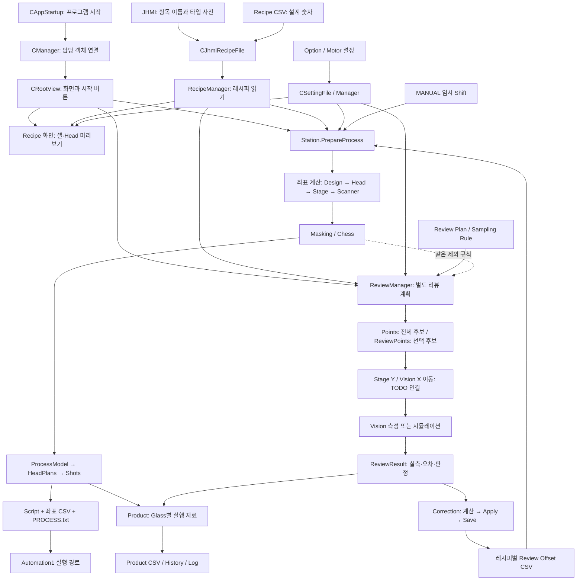
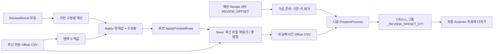
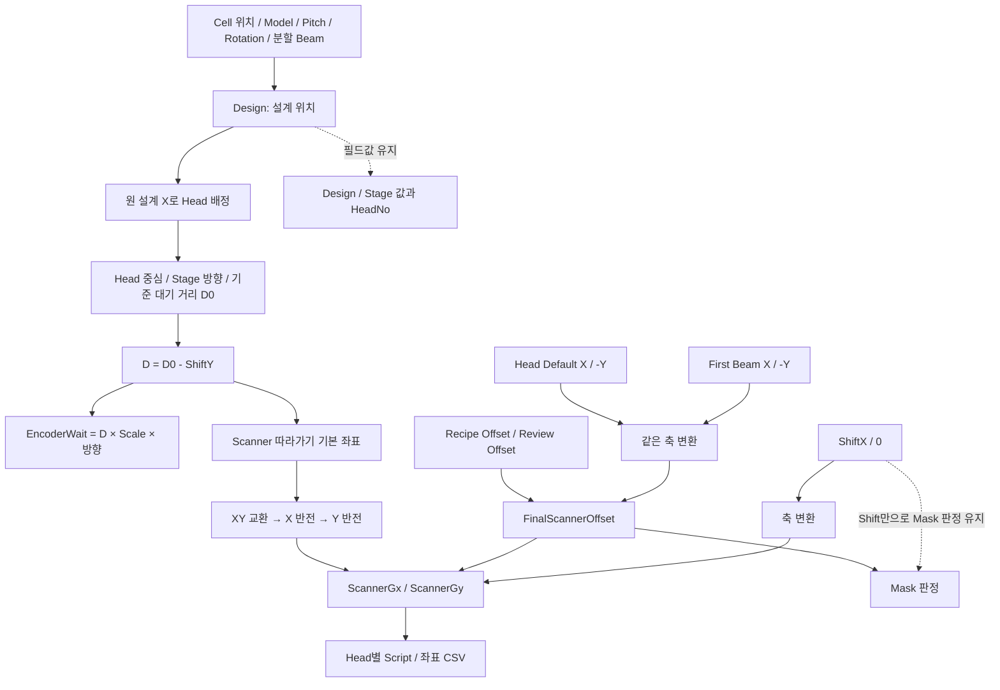
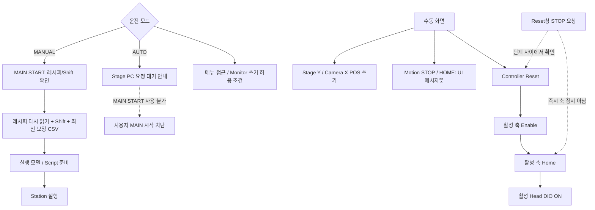
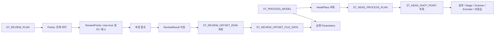

# 04. 통합 흐름도 — 입력부터 가공·검사·보정까지

실선은 자료 전달 또는 호출, 점선은 별도 경로/주의 관계입니다. “계획”은 앞으로 사용할 위치표이고 “결과”는 측정 후 얻은 기록입니다. 장비 연결 TODO는 구현 완료로 표시하지 않았습니다.

## 1. 프로그램 전체와 자료 저장소

관찰할 점: Review는 ProcessModel을 그대로 검사 좌표로 변환하는 단일 파이프가 아니라 Recipe/설정을 다시 읽는 가지입니다. 자동 Station Review 단계도 위 ReviewManager 실동작과 같은 것으로 보면 안 됩니다.

## 2. 보정 저장 장소가 바뀐 흐름

주의: 예전 Recipe 값 → 새 CSV로 자동 이전하는 화살표는 없습니다. Apply만 누르면 저장 파일이 생기지 않습니다. Save 이후에도 이미 만든 Script에 값이 저절로 반영되는 것은 아닙니다.

## 3. 한 Shot의 좌표와 Head 배정

First Beam을 Shift와 합쳐 같은 값으로 취급하면 안 됩니다. FinalScannerOffset 합계에 First Beam은 들어가고 ShiftScannerOffset은 들어가지 않습니다.

## 4. 운전 모드와 수동 기능

## 5. 구조체 포함 관계

흐름도 근거: [객체 연결](https://github.com/kjuws10-rgb/A3_LD_Process_SW_IPS/blob/05215afc0621fc38f7e29bcdf4d1b9d2bface72f/Drilling.UI/CAppStartup.cs#L15-L39), [실행 모델 생성](https://github.com/kjuws10-rgb/A3_LD_Process_SW_IPS/blob/05215afc0621fc38f7e29bcdf4d1b9d2bface72f/Drilling.Common/Station/CStationProcess.cs#L1708-L1805), [Review 계획](https://github.com/kjuws10-rgb/A3_LD_Process_SW_IPS/blob/05215afc0621fc38f7e29bcdf4d1b9d2bface72f/Drilling.Common/Review/CReviewManager.cs#L1240-L1357), [Offset 저장](https://github.com/kjuws10-rgb/A3_LD_Process_SW_IPS/blob/05215afc0621fc38f7e29bcdf4d1b9d2bface72f/Drilling.UI/Menu/Menus/CMenuCorrection.cs#L1156-L1256).
