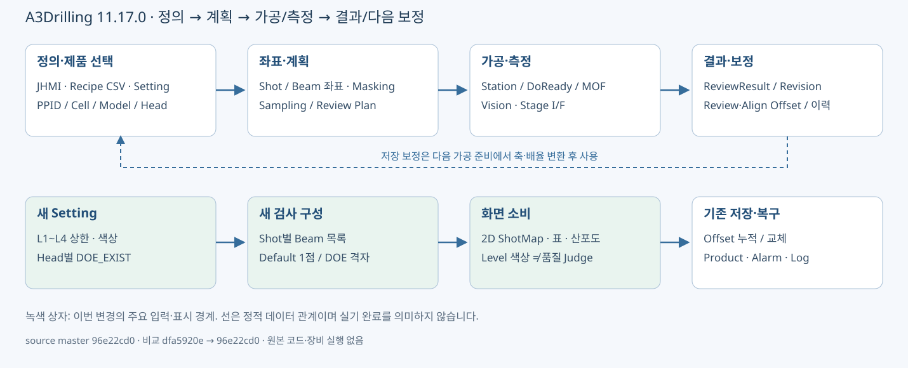
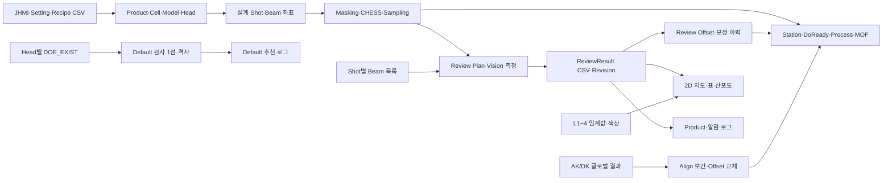

# 통합 흐름도

```mermaid
flowchart LR
 J["JHMI·Setting·Recipe CSV"] --> P["Product·Cell·Model·Head"]
 P --> D["설계 Shot·Beam 좌표"]
 D --> M["Masking·CHESS·Sampling"]
 M --> A["Station·DoReady·Process·MOF"]
 M --> V["Review Plan·Vision 측정"]
 B["Shot별 Beam 목록"] --> V
 E["Head별 DOE_EXIST"] --> X["Default 검사 1점·격자"]
 X --> O["Default 추천·로그"]
 V --> F["ReviewResult CSV·Revision"]
 F --> C["Review Offset·보정 이력"]
 K["AK/DK 글로벌 결과"] --> L["Align 보간·Offset 교체"]
 C --> A
 L --> A
 F --> U["2D 지도·표·산포도"]
 T["L1~4 임계값·색상"] --> U
 F --> Q["Product·알람·로그"]
```

레벨 색과 품질 Judge는 별도이고, DOE_EXIST의 새 분기는 Default 검사에 한정됩니다. 선은 정적 생산자·소비자 관계를 보여주며 실제 설비 완료 신호·좌표 부호의 실기 합격을 뜻하지 않습니다.
