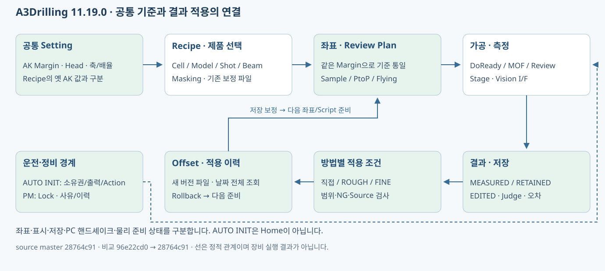
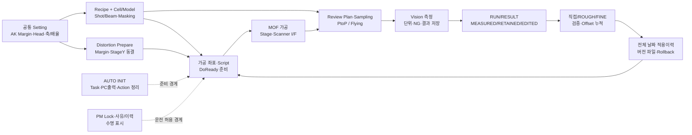

# 통합 흐름도

```mermaid
flowchart LR
    S[공통 Setting
AK Margin·Head·축/배율] --> G[Recipe + Cell/Model
Shot/Beam·Masking]
    G --> P[가공 좌표·Script
DoReady 준비]
    P --> M[MOF 가공
Stage·Scanner I/F]
    G --> R[Review Plan·Sampling
PtoP / Flying]
    M --> R
    R --> V[Vision 측정
단위·NG·결과 저장]
    V --> D[RUN/RESULT
MEASURED/RETAINED/EDITED]
    D --> O[직접/ROUGH/FINE
검증·Offset 누적]
    O --> H[전체 날짜 적용이력
버전 파일·Rollback]
    H --> P
    S --> A[Distortion Prepare
Margin·StageY 동결]
    A --> P
    I[AUTO INIT
Task·PC출력·Action 정리] -. 준비 경계 .-> P
    Q[PM Lock·사유/이력
수명 표시] -. 운전 허용 경계 .-> P
```

선은 정적 데이터/호출 관계를 설명하며 실기 완료 신호가 아닙니다. Stage 요청, PC 출력, 내부 Action, 장비 준비 상태는 서로 다른 상태입니다. 각 실제 I/F와 저장 실패 처리는 상세장과 검증 계획을 함께 확인합니다.
