# Drilling.Common/Correction/CDefaultOffsetCalibration.cs

| 항목 | 내용 |
| --- | --- |
| 원본 저장소 | https://github.com/kjuws10-rgb/A3Drilling.git |
| 원본 Commit | 28764c91d521777b8ee068dd7aaf2d3902ce9fe2 |
| 원본 SHA256 | 806ffafa140d6f0baa1d791225aec09a033f799f8a440b1aa07effeb3602a641 |
| 파일 분류 | code |
| 원본 크기/행 | 24,068 bytes / 340 physical lines |
| 인코딩 | utf-8-sig |
| 검토 범위 | 구문/부분 의미 분석에서 추출한 사실. 동작·물리 단위·실장비 합격을 보증하지 않습니다. |
| 원본 링크 | [고정 Commit 원본](https://github.com/kjuws10-rgb/A3Drilling/blob/28764c91d521777b8ee068dd7aaf2d3902ce9fe2/Drilling.Common/Correction/CDefaultOffsetCalibration.cs) |

## 파일의 역할과 읽는 순서

보정 계산·설정·원본/적용값의 관계를 다루는 계층입니다. 값의 좌표계와 단위는 호출부의 근거를 따릅니다.

## 네임스페이스·타입·상속

| 타입 | 구분 | 원본 범위 | 선언/상속 |
| --- | --- | --- | --- |
| CDefaultOffsetCalibration | ClassDeclaration | 12–296 | CDefaultOffsetCalibration |
| EN_DEFAULT_MACHINING_MODE | EnumDeclaration | 298–298 | EN_DEFAULT_MACHINING_MODE |
| ST_DEFAULT_OFFSET_OPTIONS | RecordDeclaration | 299–322 | ST_DEFAULT_OFFSET_OPTIONS |
| ST_DEFAULT_HEAD_GEOMETRY | RecordDeclaration | 323–323 | ST_DEFAULT_HEAD_GEOMETRY |
| ST_DEFAULT_PREVIEW_POINT | RecordDeclaration | 324–324 | ST_DEFAULT_PREVIEW_POINT |
| ST_DEFAULT_OFFSET_MARK | RecordDeclaration | 325–325 | ST_DEFAULT_OFFSET_MARK |
| ST_DEFAULT_OFFSET_FIT | RecordDeclaration | 326–326 | ST_DEFAULT_OFFSET_FIT |
| ST_DEFAULT_OFFSET_HEAD_RESULT | RecordDeclaration | 327–339 | ST_DEFAULT_OFFSET_HEAD_RESULT |
| ST_DEFAULT_OFFSET_LOG | RecordDeclaration | 340–340 | ST_DEFAULT_OFFSET_LOG |

## 멤버 빠른 목록

| 이름 | 종류 | 범위 | 서명 |
| --- | --- | --- | --- |
| Parameters | MethodDeclaration | L14–20 | System.Collections.Generic.IReadOnlyDictionary<string, string> Drilling.Common.Correction.CDefaultOffsetCalibration.Parameters(Drilling.Common.Managers.ST_RECIPE_DEFINITION, System.Collections.Generic.IEnumerable<Drilling.Common.Managers.ST_SYSTEM_PARAMETER>) |
| Number | MethodDeclaration | L22–27 | double Drilling.Common.Correction.CDefaultOffsetCalibration.Number(System.Collections.Generic.IReadOnlyDictionary<string, string>, string) |
| DoeExists | MethodDeclaration | L29–41 | bool Drilling.Common.Correction.CDefaultOffsetCalibration.DoeExists(System.Collections.Generic.IReadOnlyDictionary<string, string>, int) |
| DefaultInspectionGridSize | MethodDeclaration | L44–48 | int Drilling.Common.Correction.CDefaultOffsetCalibration.DefaultInspectionGridSize(System.Collections.Generic.IReadOnlyDictionary<string, string>, int, Drilling.Common.Correction.ST_DEFAULT_OFFSET_OPTIONS) |
| DefaultInspectionPointCount | MethodDeclaration | L50–54 | int Drilling.Common.Correction.CDefaultOffsetCalibration.DefaultInspectionPointCount(System.Collections.Generic.IReadOnlyDictionary<string, string>, int, Drilling.Common.Correction.ST_DEFAULT_OFFSET_OPTIONS) |
| DefaultInspectionDescription | MethodDeclaration | L56–62 | string Drilling.Common.Correction.CDefaultOffsetCalibration.DefaultInspectionDescription(System.Collections.Generic.IReadOnlyDictionary<string, string>, int, Drilling.Common.Correction.ST_DEFAULT_OFFSET_OPTIONS) |
| Conditions | MethodDeclaration | L67–79 | Drilling.Common.Correction.ST_DEFAULT_OFFSET_OPTIONS Drilling.Common.Correction.CDefaultOffsetCalibration.Conditions(System.Collections.Generic.IReadOnlyDictionary<string, string>, double?) |
| DesignAlignKey3ReviewX | MethodDeclaration | L81–91 | double Drilling.Common.Correction.CDefaultOffsetCalibration.DesignAlignKey3ReviewX(System.Collections.Generic.IReadOnlyDictionary<string, string>) |
| HeadGeometry | MethodDeclaration | L93–103 | Drilling.Common.Correction.ST_DEFAULT_HEAD_GEOMETRY Drilling.Common.Correction.CDefaultOffsetCalibration.HeadGeometry(System.Collections.Generic.IReadOnlyDictionary<string, string>, int) |
| PredictCenter | MethodDeclaration | L105–122 | Drilling.Common.Correction.ST_DEFAULT_PREVIEW_POINT Drilling.Common.Correction.CDefaultOffsetCalibration.PredictCenter(System.Collections.Generic.IReadOnlyDictionary<string, string>, int, double) |
| FitsField | MethodDeclaration | L126–130 | bool Drilling.Common.Correction.CDefaultOffsetCalibration.FitsField(System.Collections.Generic.IReadOnlyDictionary<string, string>, int, double, double) |
| ValidateOptions | MethodDeclaration | L132–144 | void Drilling.Common.Correction.CDefaultOffsetCalibration.ValidateOptions(Drilling.Common.Correction.ST_DEFAULT_OFFSET_OPTIONS) |
| CenterScannerTargets | MethodDeclaration | L147–160 | System.Collections.Generic.IReadOnlyList<(double X, double Y)> Drilling.Common.Correction.CDefaultOffsetCalibration.CenterScannerTargets(System.Collections.Generic.IReadOnlyDictionary<string, string>, int, Drilling.Common.Correction.ST_DEFAULT_OFFSET_OPTIONS) |
| BeamGridSize | MethodDeclaration | L162–168 | int Drilling.Common.Correction.CDefaultOffsetCalibration.BeamGridSize(System.Collections.Generic.IReadOnlyDictionary<string, string>) |
| Pitch | MethodDeclaration | L170–178 | double Drilling.Common.Correction.CDefaultOffsetCalibration.Pitch(System.Collections.Generic.IReadOnlyDictionary<string, string>, int) |
| Slot | MethodDeclaration | L180–191 | (double X, double Y) Drilling.Common.Correction.CDefaultOffsetCalibration.Slot(int, int, double, double) |
| Fit | MethodDeclaration | L193–236 | Drilling.Common.Correction.ST_DEFAULT_OFFSET_FIT Drilling.Common.Correction.CDefaultOffsetCalibration.Fit(System.Collections.Generic.IReadOnlyList<Drilling.Common.Correction.ST_DEFAULT_OFFSET_MARK>, int, double, double, double) |
| Coefficient | LocalFunctionStatement | L214–214 | double Coefficient(bool, bool) |
| WithHeadReference | MethodDeclaration | L241–266 | Drilling.Common.Correction.ST_DEFAULT_OFFSET_HEAD_RESULT Drilling.Common.Correction.CDefaultOffsetCalibration.WithHeadReference(System.Collections.Generic.IReadOnlyDictionary<string, string>, Drilling.Common.Correction.ST_DEFAULT_OFFSET_OPTIONS, Drilling.Common.Correction.ST_DEFAULT_OFFSET_HEAD_RESULT) |
| ActiveHeads | MethodDeclaration | L268–269 | int[] Drilling.Common.Correction.CDefaultOffsetCalibration.ActiveHeads(System.Collections.Generic.IReadOnlyDictionary<string, string>) |
| Recommend | MethodDeclaration | L271–295 | System.Collections.Generic.IReadOnlyDictionary<string, string> Drilling.Common.Correction.CDefaultOffsetCalibration.Recommend(System.Collections.Generic.IReadOnlyDictionary<string, string>, Drilling.Common.Correction.ST_DEFAULT_OFFSET_OPTIONS, System.Collections.Generic.IReadOnlyCollection<Drilling.Common.Correction.ST_DEFAULT_OFFSET_HEAD_RESULT>, System.Collections.Generic.IReadOnlyCollection<int>?) |
| Shot | EnumMemberDeclaration | L298–298 | Drilling.Common.Correction.EN_DEFAULT_MACHINING_MODE.Shot |
| Cross | EnumMemberDeclaration | L298–298 | Drilling.Common.Correction.EN_DEFAULT_MACHINING_MODE.Cross |
| BoardCenterX | PropertyDeclaration | L301–301 | double Drilling.Common.Correction.ST_DEFAULT_OFFSET_OPTIONS.BoardCenterX |
| MachiningMode | PropertyDeclaration | L302–302 | Drilling.Common.Correction.EN_DEFAULT_MACHINING_MODE Drilling.Common.Correction.ST_DEFAULT_OFFSET_OPTIONS.MachiningMode |
| get_MachiningMode | GetAccessorDeclaration | L302–302 | Drilling.Common.Correction.EN_DEFAULT_MACHINING_MODE Drilling.Common.Correction.ST_DEFAULT_OFFSET_OPTIONS.MachiningMode.get |
| set_MachiningMode | InitAccessorDeclaration | L302–302 | void Drilling.Common.Correction.ST_DEFAULT_OFFSET_OPTIONS.MachiningMode.init |
| CrossSize | PropertyDeclaration | L303–303 | double Drilling.Common.Correction.ST_DEFAULT_OFFSET_OPTIONS.CrossSize |
| get_CrossSize | GetAccessorDeclaration | L303–303 | double Drilling.Common.Correction.ST_DEFAULT_OFFSET_OPTIONS.CrossSize.get |
| set_CrossSize | InitAccessorDeclaration | L303–303 | void Drilling.Common.Correction.ST_DEFAULT_OFFSET_OPTIONS.CrossSize.init |
| DoeBeamGridSize | PropertyDeclaration | L304–304 | int Drilling.Common.Correction.ST_DEFAULT_OFFSET_OPTIONS.DoeBeamGridSize |
| get_DoeBeamGridSize | GetAccessorDeclaration | L304–304 | int Drilling.Common.Correction.ST_DEFAULT_OFFSET_OPTIONS.DoeBeamGridSize.get |
| set_DoeBeamGridSize | InitAccessorDeclaration | L304–304 | void Drilling.Common.Correction.ST_DEFAULT_OFFSET_OPTIONS.DoeBeamGridSize.init |
| InspectionPointCount | PropertyDeclaration | L307–307 | int Drilling.Common.Correction.ST_DEFAULT_OFFSET_OPTIONS.InspectionPointCount |
| VisionMethod | PropertyDeclaration | L312–314 | Drilling.Common.Review.EN_ONE_SHOT_METHOD Drilling.Common.Correction.ST_DEFAULT_OFFSET_OPTIONS.VisionMethod |
| InspectionDescription | PropertyDeclaration | L315–317 | string Drilling.Common.Correction.ST_DEFAULT_OFFSET_OPTIONS.InspectionDescription |
| MachiningDescription | PropertyDeclaration | L318–320 | string Drilling.Common.Correction.ST_DEFAULT_OFFSET_OPTIONS.MachiningDescription |
| VisionDescription | PropertyDeclaration | L321–321 | string Drilling.Common.Correction.ST_DEFAULT_OFFSET_OPTIONS.VisionDescription |
| DoeExists | PropertyDeclaration | L329–329 | bool Drilling.Common.Correction.ST_DEFAULT_OFFSET_HEAD_RESULT.DoeExists |
| get_DoeExists | GetAccessorDeclaration | L329–329 | bool Drilling.Common.Correction.ST_DEFAULT_OFFSET_HEAD_RESULT.DoeExists.get |
| set_DoeExists | InitAccessorDeclaration | L329–329 | void Drilling.Common.Correction.ST_DEFAULT_OFFSET_HEAD_RESULT.DoeExists.init |
| Model | PropertyDeclaration | L330–330 | int Drilling.Common.Correction.ST_DEFAULT_OFFSET_HEAD_RESULT.Model |
| get_Model | GetAccessorDeclaration | L330–330 | int Drilling.Common.Correction.ST_DEFAULT_OFFSET_HEAD_RESULT.Model.get |
| set_Model | InitAccessorDeclaration | L330–330 | void Drilling.Common.Correction.ST_DEFAULT_OFFSET_HEAD_RESULT.Model.init |
| ReferenceCell | PropertyDeclaration | L331–331 | int Drilling.Common.Correction.ST_DEFAULT_OFFSET_HEAD_RESULT.ReferenceCell |
| get_ReferenceCell | GetAccessorDeclaration | L331–331 | int Drilling.Common.Correction.ST_DEFAULT_OFFSET_HEAD_RESULT.ReferenceCell.get |
| set_ReferenceCell | InitAccessorDeclaration | L331–331 | void Drilling.Common.Correction.ST_DEFAULT_OFFSET_HEAD_RESULT.ReferenceCell.init |
| Geometry | PropertyDeclaration | L332–332 | Drilling.Common.Correction.ST_DEFAULT_HEAD_GEOMETRY? Drilling.Common.Correction.ST_DEFAULT_OFFSET_HEAD_RESULT.Geometry |
| get_Geometry | GetAccessorDeclaration | L332–332 | Drilling.Common.Correction.ST_DEFAULT_HEAD_GEOMETRY? Drilling.Common.Correction.ST_DEFAULT_OFFSET_HEAD_RESULT.Geometry.get |
| set_Geometry | InitAccessorDeclaration | L332–332 | void Drilling.Common.Correction.ST_DEFAULT_OFFSET_HEAD_RESULT.Geometry.init |
| TargetReviewX | PropertyDeclaration | L333–333 | double Drilling.Common.Correction.ST_DEFAULT_OFFSET_HEAD_RESULT.TargetReviewX |
| get_TargetReviewX | GetAccessorDeclaration | L333–333 | double Drilling.Common.Correction.ST_DEFAULT_OFFSET_HEAD_RESULT.TargetReviewX.get |
| set_TargetReviewX | InitAccessorDeclaration | L333–333 | void Drilling.Common.Correction.ST_DEFAULT_OFFSET_HEAD_RESULT.TargetReviewX.init |
| TargetStageY | PropertyDeclaration | L334–334 | double Drilling.Common.Correction.ST_DEFAULT_OFFSET_HEAD_RESULT.TargetStageY |
| get_TargetStageY | GetAccessorDeclaration | L334–334 | double Drilling.Common.Correction.ST_DEFAULT_OFFSET_HEAD_RESULT.TargetStageY.get |
| set_TargetStageY | InitAccessorDeclaration | L334–334 | void Drilling.Common.Correction.ST_DEFAULT_OFFSET_HEAD_RESULT.TargetStageY.init |
| CenterReviewX | PropertyDeclaration | L335–335 | double Drilling.Common.Correction.ST_DEFAULT_OFFSET_HEAD_RESULT.CenterReviewX |
| get_CenterReviewX | GetAccessorDeclaration | L335–335 | double Drilling.Common.Correction.ST_DEFAULT_OFFSET_HEAD_RESULT.CenterReviewX.get |
| set_CenterReviewX | InitAccessorDeclaration | L335–335 | void Drilling.Common.Correction.ST_DEFAULT_OFFSET_HEAD_RESULT.CenterReviewX.init |
| CenterStageY | PropertyDeclaration | L336–336 | double Drilling.Common.Correction.ST_DEFAULT_OFFSET_HEAD_RESULT.CenterStageY |
| get_CenterStageY | GetAccessorDeclaration | L336–336 | double Drilling.Common.Correction.ST_DEFAULT_OFFSET_HEAD_RESULT.CenterStageY.get |
| set_CenterStageY | InitAccessorDeclaration | L336–336 | void Drilling.Common.Correction.ST_DEFAULT_OFFSET_HEAD_RESULT.CenterStageY.init |
| CenterErrorX | PropertyDeclaration | L337–337 | double Drilling.Common.Correction.ST_DEFAULT_OFFSET_HEAD_RESULT.CenterErrorX |
| get_CenterErrorX | GetAccessorDeclaration | L337–337 | double Drilling.Common.Correction.ST_DEFAULT_OFFSET_HEAD_RESULT.CenterErrorX.get |
| set_CenterErrorX | InitAccessorDeclaration | L337–337 | void Drilling.Common.Correction.ST_DEFAULT_OFFSET_HEAD_RESULT.CenterErrorX.init |
| CenterErrorY | PropertyDeclaration | L338–338 | double Drilling.Common.Correction.ST_DEFAULT_OFFSET_HEAD_RESULT.CenterErrorY |
| get_CenterErrorY | GetAccessorDeclaration | L338–338 | double Drilling.Common.Correction.ST_DEFAULT_OFFSET_HEAD_RESULT.CenterErrorY.get |
| set_CenterErrorY | InitAccessorDeclaration | L338–338 | void Drilling.Common.Correction.ST_DEFAULT_OFFSET_HEAD_RESULT.CenterErrorY.init |

## 멤버별 상세 계약·호출·처리 해설

### MethodDeclaration `Parameters` · L14–20

[Drilling.Common/Correction/CDefaultOffsetCalibration.cs:14–20](https://github.com/kjuws10-rgb/A3Drilling/blob/28764c91d521777b8ee068dd7aaf2d3902ce9fe2/Drilling.Common/Correction/CDefaultOffsetCalibration.cs#L14-L20)

| 항목 | 실제 추출 값 |
| --- | --- |
| 서명 | System.Collections.Generic.IReadOnlyDictionary<string, string> Drilling.Common.Correction.CDefaultOffsetCalibration.Parameters(Drilling.Common.Managers.ST_RECIPE_DEFINITION, System.Collections.Generic.IEnumerable<Drilling.Common.Managers.ST_SYSTEM_PARAMETER>) |
| 접근/수식자 | Public / public, static |
| 반환/값 타입 | System.Collections.Generic.IReadOnlyDictionary<string, string> |
| 소속 타입 | NamedType:Drilling.Common.Correction.CDefaultOffsetCalibration |

입력 계약:

| 이름 | 타입 | 전달 | 선택/기본값 |
| --- | --- | --- | --- |
| recipe | Drilling.Common.Managers.ST_RECIPE_DEFINITION | None | False /  |
| settings | System.Collections.Generic.IEnumerable<Drilling.Common.Managers.ST_SYSTEM_PARAMETER> | None | False /  |

정적 호출자로 확인된 위치:

| 호출 파일/행 | 호출 표현식 | 런타임 분기 가능 |
| --- | --- | --- |
| [Drilling.UI/Menu/Menus/CMenuCorrection.cs:3290–3290](https://github.com/kjuws10-rgb/A3Drilling/blob/28764c91d521777b8ee068dd7aaf2d3902ce9fe2/Drilling.UI/Menu/Menus/CMenuCorrection.cs#L3290-L3290) | CDefaultOffsetCalibration.Parameters | False |
| [Drilling.UI/Menu/Menus/CMenuCorrection.cs:3570–3570](https://github.com/kjuws10-rgb/A3Drilling/blob/28764c91d521777b8ee068dd7aaf2d3902ce9fe2/Drilling.UI/Menu/Menus/CMenuCorrection.cs#L3570-L3570) | CDefaultOffsetCalibration.Parameters | False |
| [Drilling.UI/Menu/Menus/CMenuCorrection.cs:3935–3935](https://github.com/kjuws10-rgb/A3Drilling/blob/28764c91d521777b8ee068dd7aaf2d3902ce9fe2/Drilling.UI/Menu/Menus/CMenuCorrection.cs#L3935-L3935) | CDefaultOffsetCalibration.Parameters | False |

호출하는 대상과 해석 범위:

| 원본 행 | 표현식 | 분석 상태 | 대상/소스 위치 |
| --- | --- | --- | --- |
| 16 | new Dictionary<string, string> | resolved | System.Collections.Generic.Dictionary<string, string>.Dictionary(System.Collections.Generic.IEqualityComparer<string>?) |

본문의 실제 연산·분기·예외·반환 순서(원문 위치 순):

| 원본 행 | 종류 | 주석 해설 |
| --- | --- | --- |
| 16 | call | 함수·델리게이트 또는 객체 생성자를 호출합니다: new Dictionary<string, string>(StringComparer.OrdinalIgnoreCase) |
| 16 | local-declaration | 지역 변수를 선언합니다: var values = new Dictionary<string, string>(StringComparer.OrdinalIgnoreCase); |
| 16 | variable-initializer | 변수의 초기값을 지정합니다: values = new Dictionary<string, string>(StringComparer.OrdinalIgnoreCase) |
| 17 | assignment | 값을 대상에 대입합니다: values[p.Key] = p.Value |
| 17 | foreach | 컬렉션 요소를 순회합니다: foreach (var p in settings) |
| 18 | assignment | 값을 대상에 대입합니다: values[p.Key] = p.Value |
| 18 | foreach | 컬렉션 요소를 순회합니다: foreach (var p in recipe.Parameters) |
| 19 | return | 호출자에게 값 또는 제어를 반환합니다: return values; |

제어 구문의 포함 구조(실제 실행 순서/CFG가 아닌 구문 탐색 그림):

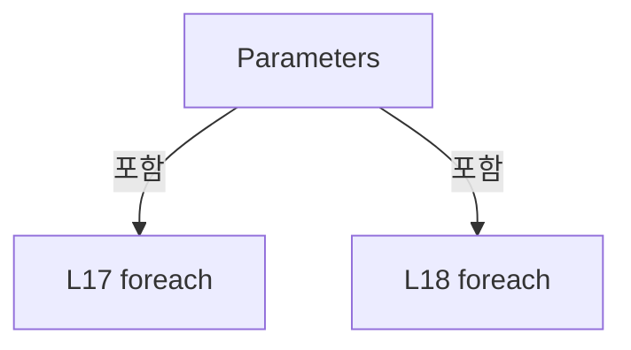
```mermaid
flowchart TD
 M["Parameters"]
 N0["L17 foreach"]
 M -->|포함| N0
 N1["L18 foreach"]
 M -->|포함| N1
```

변경 전 점검: 입력/반환 타입, 위 호출자, 예외/취소 경로, 공유 상태와 저장·전송 소비자를 함께 확인합니다. 값의 단위나 물리 방향을 이름만으로 확정하지 않습니다.

### MethodDeclaration `Number` · L22–27

[Drilling.Common/Correction/CDefaultOffsetCalibration.cs:22–27](https://github.com/kjuws10-rgb/A3Drilling/blob/28764c91d521777b8ee068dd7aaf2d3902ce9fe2/Drilling.Common/Correction/CDefaultOffsetCalibration.cs#L22-L27)

| 항목 | 실제 추출 값 |
| --- | --- |
| 서명 | double Drilling.Common.Correction.CDefaultOffsetCalibration.Number(System.Collections.Generic.IReadOnlyDictionary<string, string>, string) |
| 접근/수식자 | Public / public, static |
| 반환/값 타입 | double |
| 소속 타입 | NamedType:Drilling.Common.Correction.CDefaultOffsetCalibration |

입력 계약:

| 이름 | 타입 | 전달 | 선택/기본값 |
| --- | --- | --- | --- |
| values | System.Collections.Generic.IReadOnlyDictionary<string, string> | None | False /  |
| key | string | None | False /  |

정적 호출자로 확인된 위치:

| 호출 파일/행 | 호출 표현식 | 런타임 분기 가능 |
| --- | --- | --- |
| [Drilling.Common/Correction/CDefaultOffsetCalibration.cs:69–69](https://github.com/kjuws10-rgb/A3Drilling/blob/28764c91d521777b8ee068dd7aaf2d3902ce9fe2/Drilling.Common/Correction/CDefaultOffsetCalibration.cs#L69-L69) | Number | False |
| [Drilling.Common/Correction/CDefaultOffsetCalibration.cs:71–71](https://github.com/kjuws10-rgb/A3Drilling/blob/28764c91d521777b8ee068dd7aaf2d3902ce9fe2/Drilling.Common/Correction/CDefaultOffsetCalibration.cs#L71-L71) | Number | False |
| [Drilling.Common/Correction/CDefaultOffsetCalibration.cs:72–72](https://github.com/kjuws10-rgb/A3Drilling/blob/28764c91d521777b8ee068dd7aaf2d3902ce9fe2/Drilling.Common/Correction/CDefaultOffsetCalibration.cs#L72-L72) | Number | False |
| [Drilling.Common/Correction/CDefaultOffsetCalibration.cs:72–72](https://github.com/kjuws10-rgb/A3Drilling/blob/28764c91d521777b8ee068dd7aaf2d3902ce9fe2/Drilling.Common/Correction/CDefaultOffsetCalibration.cs#L72-L72) | Number | False |
| [Drilling.Common/Correction/CDefaultOffsetCalibration.cs:83–83](https://github.com/kjuws10-rgb/A3Drilling/blob/28764c91d521777b8ee068dd7aaf2d3902ce9fe2/Drilling.Common/Correction/CDefaultOffsetCalibration.cs#L83-L83) | Number | False |
| [Drilling.Common/Correction/CDefaultOffsetCalibration.cs:84–84](https://github.com/kjuws10-rgb/A3Drilling/blob/28764c91d521777b8ee068dd7aaf2d3902ce9fe2/Drilling.Common/Correction/CDefaultOffsetCalibration.cs#L84-L84) | Number | False |
| [Drilling.Common/Correction/CDefaultOffsetCalibration.cs:85–85](https://github.com/kjuws10-rgb/A3Drilling/blob/28764c91d521777b8ee068dd7aaf2d3902ce9fe2/Drilling.Common/Correction/CDefaultOffsetCalibration.cs#L85-L85) | Number | False |
| [Drilling.Common/Correction/CDefaultOffsetCalibration.cs:97–97](https://github.com/kjuws10-rgb/A3Drilling/blob/28764c91d521777b8ee068dd7aaf2d3902ce9fe2/Drilling.Common/Correction/CDefaultOffsetCalibration.cs#L97-L97) | Number | False |
| [Drilling.Common/Correction/CDefaultOffsetCalibration.cs:98–98](https://github.com/kjuws10-rgb/A3Drilling/blob/28764c91d521777b8ee068dd7aaf2d3902ce9fe2/Drilling.Common/Correction/CDefaultOffsetCalibration.cs#L98-L98) | Number | False |
| [Drilling.Common/Correction/CDefaultOffsetCalibration.cs:99–99](https://github.com/kjuws10-rgb/A3Drilling/blob/28764c91d521777b8ee068dd7aaf2d3902ce9fe2/Drilling.Common/Correction/CDefaultOffsetCalibration.cs#L99-L99) | Number | False |
| [Drilling.Common/Correction/CDefaultOffsetCalibration.cs:109–109](https://github.com/kjuws10-rgb/A3Drilling/blob/28764c91d521777b8ee068dd7aaf2d3902ce9fe2/Drilling.Common/Correction/CDefaultOffsetCalibration.cs#L109-L109) | Number | False |
| [Drilling.Common/Correction/CDefaultOffsetCalibration.cs:111–111](https://github.com/kjuws10-rgb/A3Drilling/blob/28764c91d521777b8ee068dd7aaf2d3902ce9fe2/Drilling.Common/Correction/CDefaultOffsetCalibration.cs#L111-L111) | Number | False |
| [Drilling.Common/Correction/CDefaultOffsetCalibration.cs:112–112](https://github.com/kjuws10-rgb/A3Drilling/blob/28764c91d521777b8ee068dd7aaf2d3902ce9fe2/Drilling.Common/Correction/CDefaultOffsetCalibration.cs#L112-L112) | Number | False |
| [Drilling.Common/Correction/CDefaultOffsetCalibration.cs:112–112](https://github.com/kjuws10-rgb/A3Drilling/blob/28764c91d521777b8ee068dd7aaf2d3902ce9fe2/Drilling.Common/Correction/CDefaultOffsetCalibration.cs#L112-L112) | Number | False |
| [Drilling.Common/Correction/CDefaultOffsetCalibration.cs:116–116](https://github.com/kjuws10-rgb/A3Drilling/blob/28764c91d521777b8ee068dd7aaf2d3902ce9fe2/Drilling.Common/Correction/CDefaultOffsetCalibration.cs#L116-L116) | Number | False |
| [Drilling.Common/Correction/CDefaultOffsetCalibration.cs:116–116](https://github.com/kjuws10-rgb/A3Drilling/blob/28764c91d521777b8ee068dd7aaf2d3902ce9fe2/Drilling.Common/Correction/CDefaultOffsetCalibration.cs#L116-L116) | Number | False |
| [Drilling.Common/Correction/CDefaultOffsetCalibration.cs:117–117](https://github.com/kjuws10-rgb/A3Drilling/blob/28764c91d521777b8ee068dd7aaf2d3902ce9fe2/Drilling.Common/Correction/CDefaultOffsetCalibration.cs#L117-L117) | Number | False |
| [Drilling.Common/Correction/CDefaultOffsetCalibration.cs:117–117](https://github.com/kjuws10-rgb/A3Drilling/blob/28764c91d521777b8ee068dd7aaf2d3902ce9fe2/Drilling.Common/Correction/CDefaultOffsetCalibration.cs#L117-L117) | Number | False |
| [Drilling.Common/Correction/CDefaultOffsetCalibration.cs:117–117](https://github.com/kjuws10-rgb/A3Drilling/blob/28764c91d521777b8ee068dd7aaf2d3902ce9fe2/Drilling.Common/Correction/CDefaultOffsetCalibration.cs#L117-L117) | Number | False |
| [Drilling.Common/Correction/CDefaultOffsetCalibration.cs:117–117](https://github.com/kjuws10-rgb/A3Drilling/blob/28764c91d521777b8ee068dd7aaf2d3902ce9fe2/Drilling.Common/Correction/CDefaultOffsetCalibration.cs#L117-L117) | Number | False |
| [Drilling.Common/Correction/CDefaultOffsetCalibration.cs:118–118](https://github.com/kjuws10-rgb/A3Drilling/blob/28764c91d521777b8ee068dd7aaf2d3902ce9fe2/Drilling.Common/Correction/CDefaultOffsetCalibration.cs#L118-L118) | Number | False |
| [Drilling.Common/Correction/CDefaultOffsetCalibration.cs:119–119](https://github.com/kjuws10-rgb/A3Drilling/blob/28764c91d521777b8ee068dd7aaf2d3902ce9fe2/Drilling.Common/Correction/CDefaultOffsetCalibration.cs#L119-L119) | Number | False |
| [Drilling.Common/Correction/CDefaultOffsetCalibration.cs:119–119](https://github.com/kjuws10-rgb/A3Drilling/blob/28764c91d521777b8ee068dd7aaf2d3902ce9fe2/Drilling.Common/Correction/CDefaultOffsetCalibration.cs#L119-L119) | Number | False |
| [Drilling.Common/Correction/CDefaultOffsetCalibration.cs:150–150](https://github.com/kjuws10-rgb/A3Drilling/blob/28764c91d521777b8ee068dd7aaf2d3902ce9fe2/Drilling.Common/Correction/CDefaultOffsetCalibration.cs#L150-L150) | Number | False |
| [Drilling.Common/Correction/CDefaultOffsetCalibration.cs:151–151](https://github.com/kjuws10-rgb/A3Drilling/blob/28764c91d521777b8ee068dd7aaf2d3902ce9fe2/Drilling.Common/Correction/CDefaultOffsetCalibration.cs#L151-L151) | Number | False |
| [Drilling.Common/Correction/CDefaultOffsetCalibration.cs:164–164](https://github.com/kjuws10-rgb/A3Drilling/blob/28764c91d521777b8ee068dd7aaf2d3902ce9fe2/Drilling.Common/Correction/CDefaultOffsetCalibration.cs#L164-L164) | Number | False |
| [Drilling.Common/Correction/CDefaultOffsetCalibration.cs:175–175](https://github.com/kjuws10-rgb/A3Drilling/blob/28764c91d521777b8ee068dd7aaf2d3902ce9fe2/Drilling.Common/Correction/CDefaultOffsetCalibration.cs#L175-L175) | Number | False |
| [Drilling.Common/Correction/CDefaultOffsetCalibration.cs:250–250](https://github.com/kjuws10-rgb/A3Drilling/blob/28764c91d521777b8ee068dd7aaf2d3902ce9fe2/Drilling.Common/Correction/CDefaultOffsetCalibration.cs#L250-L250) | Number | False |
| [Drilling.Common/Correction/CDefaultOffsetCalibration.cs:252–252](https://github.com/kjuws10-rgb/A3Drilling/blob/28764c91d521777b8ee068dd7aaf2d3902ce9fe2/Drilling.Common/Correction/CDefaultOffsetCalibration.cs#L252-L252) | Number | False |
| [Drilling.Common/Correction/CDefaultOffsetCalibration.cs:253–253](https://github.com/kjuws10-rgb/A3Drilling/blob/28764c91d521777b8ee068dd7aaf2d3902ce9fe2/Drilling.Common/Correction/CDefaultOffsetCalibration.cs#L253-L253) | Number | False |
| [Drilling.Common/Correction/CDefaultOffsetCalibration.cs:253–253](https://github.com/kjuws10-rgb/A3Drilling/blob/28764c91d521777b8ee068dd7aaf2d3902ce9fe2/Drilling.Common/Correction/CDefaultOffsetCalibration.cs#L253-L253) | Number | False |
| [Drilling.Common/Correction/CDefaultOffsetCalibration.cs:289–289](https://github.com/kjuws10-rgb/A3Drilling/blob/28764c91d521777b8ee068dd7aaf2d3902ce9fe2/Drilling.Common/Correction/CDefaultOffsetCalibration.cs#L289-L289) | Number | False |
| [Drilling.UI/Menu/Menus/CMenuCorrection.cs:3615–3615](https://github.com/kjuws10-rgb/A3Drilling/blob/28764c91d521777b8ee068dd7aaf2d3902ce9fe2/Drilling.UI/Menu/Menus/CMenuCorrection.cs#L3615-L3615) | CDefaultOffsetCalibration.Number | False |
| [Drilling.UI/Menu/Menus/CMenuCorrection.cs:3703–3703](https://github.com/kjuws10-rgb/A3Drilling/blob/28764c91d521777b8ee068dd7aaf2d3902ce9fe2/Drilling.UI/Menu/Menus/CMenuCorrection.cs#L3703-L3703) | CDefaultOffsetCalibration.Number | False |
| [Drilling.UI/Menu/Menus/CMenuCorrection.cs:3731–3731](https://github.com/kjuws10-rgb/A3Drilling/blob/28764c91d521777b8ee068dd7aaf2d3902ce9fe2/Drilling.UI/Menu/Menus/CMenuCorrection.cs#L3731-L3731) | CDefaultOffsetCalibration.Number | False |
| [Drilling.UI/Menu/Menus/CMenuCorrection.cs:3751–3751](https://github.com/kjuws10-rgb/A3Drilling/blob/28764c91d521777b8ee068dd7aaf2d3902ce9fe2/Drilling.UI/Menu/Menus/CMenuCorrection.cs#L3751-L3751) | CDefaultOffsetCalibration.Number | False |
| [Drilling.UI/Menu/Menus/CMenuCorrection.cs:3843–3843](https://github.com/kjuws10-rgb/A3Drilling/blob/28764c91d521777b8ee068dd7aaf2d3902ce9fe2/Drilling.UI/Menu/Menus/CMenuCorrection.cs#L3843-L3843) | CDefaultOffsetCalibration.Number | False |
| [Drilling.UI/Menu/Menus/CMenuCorrection.cs:3893–3893](https://github.com/kjuws10-rgb/A3Drilling/blob/28764c91d521777b8ee068dd7aaf2d3902ce9fe2/Drilling.UI/Menu/Menus/CMenuCorrection.cs#L3893-L3893) | CDefaultOffsetCalibration.Number | False |
| [Drilling.UI/Menu/Menus/CMenuCorrection.cs:3893–3893](https://github.com/kjuws10-rgb/A3Drilling/blob/28764c91d521777b8ee068dd7aaf2d3902ce9fe2/Drilling.UI/Menu/Menus/CMenuCorrection.cs#L3893-L3893) | CDefaultOffsetCalibration.Number | False |
| [Drilling.UI/Menu/Menus/CMenuCorrection.cs:3893–3893](https://github.com/kjuws10-rgb/A3Drilling/blob/28764c91d521777b8ee068dd7aaf2d3902ce9fe2/Drilling.UI/Menu/Menus/CMenuCorrection.cs#L3893-L3893) | CDefaultOffsetCalibration.Number | False |
| [Drilling.UI/Menu/Menus/CMenuCorrection.cs:3898–3898](https://github.com/kjuws10-rgb/A3Drilling/blob/28764c91d521777b8ee068dd7aaf2d3902ce9fe2/Drilling.UI/Menu/Menus/CMenuCorrection.cs#L3898-L3898) | CDefaultOffsetCalibration.Number | False |
| [Drilling.UI/Menu/Menus/CMenuCorrection.cs:3898–3898](https://github.com/kjuws10-rgb/A3Drilling/blob/28764c91d521777b8ee068dd7aaf2d3902ce9fe2/Drilling.UI/Menu/Menus/CMenuCorrection.cs#L3898-L3898) | CDefaultOffsetCalibration.Number | False |
| [Drilling.UI/Menu/Menus/CMenuCorrection.cs:3898–3898](https://github.com/kjuws10-rgb/A3Drilling/blob/28764c91d521777b8ee068dd7aaf2d3902ce9fe2/Drilling.UI/Menu/Menus/CMenuCorrection.cs#L3898-L3898) | CDefaultOffsetCalibration.Number | False |
| [Drilling.UI/Menu/Menus/CMenuCorrection.cs:3898–3898](https://github.com/kjuws10-rgb/A3Drilling/blob/28764c91d521777b8ee068dd7aaf2d3902ce9fe2/Drilling.UI/Menu/Menus/CMenuCorrection.cs#L3898-L3898) | CDefaultOffsetCalibration.Number | False |
| [Drilling.UI/Menu/Menus/CMenuCorrection.cs:3899–3899](https://github.com/kjuws10-rgb/A3Drilling/blob/28764c91d521777b8ee068dd7aaf2d3902ce9fe2/Drilling.UI/Menu/Menus/CMenuCorrection.cs#L3899-L3899) | CDefaultOffsetCalibration.Number | False |

호출하는 대상과 해석 범위:

| 원본 행 | 표현식 | 분석 상태 | 대상/소스 위치 |
| --- | --- | --- | --- |
| 24 | values.TryGetValue | resolved · 동적 구현 선택 가능 | bool System.Collections.Generic.IReadOnlyDictionary<string, string>.TryGetValue(string, out string) |
| 24 | double.TryParse | resolved | bool double.TryParse(string?, System.Globalization.NumberStyles, System.IFormatProvider?, out double) |
| 24 | double.IsFinite | resolved | bool double.IsFinite(double) |
| 25 | new InvalidOperationException | resolved | System.InvalidOperationException.InvalidOperationException(string?) |

본문의 실제 연산·분기·예외·반환 순서(원문 위치 순):

| 원본 행 | 종류 | 주석 해설 |
| --- | --- | --- |
| 24 | call | 함수·델리게이트 또는 객체 생성자를 호출합니다: values.TryGetValue(key, out var text) |
| 24 | call | 함수·델리게이트 또는 객체 생성자를 호출합니다: double.TryParse(text, NumberStyles.Float, CultureInfo.InvariantCulture, out var number) |
| 24 | call | 함수·델리게이트 또는 객체 생성자를 호출합니다: double.IsFinite(number) |
| 24 | if | 조건에 따라 분기합니다: if (!values.TryGetValue(key, out var text) &#124;&#124; !double.TryParse(text, NumberStyles.Float, CultureInfo.InvariantCulture, out var number) &#124;&#124; !double.IsFinite(number)) |
| 25 | call | 함수·델리게이트 또는 객체 생성자를 호출합니다: new InvalidOperationException($"Default 측정 설정을 확인해 주세요: {key}") |
| 25 | throw | 예외를 발생/전달합니다: throw new InvalidOperationException($"Default 측정 설정을 확인해 주세요: {key}"); |
| 26 | return | 호출자에게 값 또는 제어를 반환합니다: return number; |

제어 구문의 포함 구조(실제 실행 순서/CFG가 아닌 구문 탐색 그림):

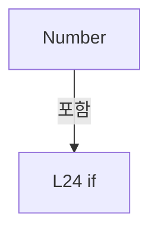
```mermaid
flowchart TD
 M["Number"]
 N0["L24 if"]
 M -->|포함| N0
```

변경 전 점검: 입력/반환 타입, 위 호출자, 예외/취소 경로, 공유 상태와 저장·전송 소비자를 함께 확인합니다. 값의 단위나 물리 방향을 이름만으로 확정하지 않습니다.

### MethodDeclaration `DoeExists` · L29–41

[Drilling.Common/Correction/CDefaultOffsetCalibration.cs:29–41](https://github.com/kjuws10-rgb/A3Drilling/blob/28764c91d521777b8ee068dd7aaf2d3902ce9fe2/Drilling.Common/Correction/CDefaultOffsetCalibration.cs#L29-L41)

| 항목 | 실제 추출 값 |
| --- | --- |
| 서명 | bool Drilling.Common.Correction.CDefaultOffsetCalibration.DoeExists(System.Collections.Generic.IReadOnlyDictionary<string, string>, int) |
| 접근/수식자 | Public / public, static |
| 반환/값 타입 | bool |
| 소속 타입 | NamedType:Drilling.Common.Correction.CDefaultOffsetCalibration |

입력 계약:

| 이름 | 타입 | 전달 | 선택/기본값 |
| --- | --- | --- | --- |
| values | System.Collections.Generic.IReadOnlyDictionary<string, string> | None | False /  |
| head | int | None | False /  |

정적 호출자로 확인된 위치:

| 호출 파일/행 | 호출 표현식 | 런타임 분기 가능 |
| --- | --- | --- |
| [Drilling.Common/Correction/CDefaultOffsetCalibration.cs:47–47](https://github.com/kjuws10-rgb/A3Drilling/blob/28764c91d521777b8ee068dd7aaf2d3902ce9fe2/Drilling.Common/Correction/CDefaultOffsetCalibration.cs#L47-L47) | DoeExists | False |
| [Drilling.Common/Correction/CDefaultOffsetCalibration.cs:58–58](https://github.com/kjuws10-rgb/A3Drilling/blob/28764c91d521777b8ee068dd7aaf2d3902ce9fe2/Drilling.Common/Correction/CDefaultOffsetCalibration.cs#L58-L58) | DoeExists | False |
| [Drilling.UI/Menu/Menus/CMenuCorrection.cs:3303–3303](https://github.com/kjuws10-rgb/A3Drilling/blob/28764c91d521777b8ee068dd7aaf2d3902ce9fe2/Drilling.UI/Menu/Menus/CMenuCorrection.cs#L3303-L3303) | CDefaultOffsetCalibration.DoeExists | False |
| [Drilling.UI/Menu/Menus/CMenuCorrection.cs:3744–3744](https://github.com/kjuws10-rgb/A3Drilling/blob/28764c91d521777b8ee068dd7aaf2d3902ce9fe2/Drilling.UI/Menu/Menus/CMenuCorrection.cs#L3744-L3744) | CDefaultOffsetCalibration.DoeExists | False |
| [Drilling.UI/Menu/Menus/CMenuCorrection.cs:3904–3904](https://github.com/kjuws10-rgb/A3Drilling/blob/28764c91d521777b8ee068dd7aaf2d3902ce9fe2/Drilling.UI/Menu/Menus/CMenuCorrection.cs#L3904-L3904) | CDefaultOffsetCalibration.DoeExists | False |
| [Drilling.UI/Menu/Menus/CMenuCorrection.cs:4590–4590](https://github.com/kjuws10-rgb/A3Drilling/blob/28764c91d521777b8ee068dd7aaf2d3902ce9fe2/Drilling.UI/Menu/Menus/CMenuCorrection.cs#L4590-L4590) | CDefaultOffsetCalibration.DoeExists | False |
| [Drilling.UI/Menu/Menus/CMenuCorrection.cs:4781–4781](https://github.com/kjuws10-rgb/A3Drilling/blob/28764c91d521777b8ee068dd7aaf2d3902ce9fe2/Drilling.UI/Menu/Menus/CMenuCorrection.cs#L4781-L4781) | CDefaultOffsetCalibration.DoeExists | False |
| [Drilling.UI/Menu/Menus/CMenuCorrection.cs:4857–4857](https://github.com/kjuws10-rgb/A3Drilling/blob/28764c91d521777b8ee068dd7aaf2d3902ce9fe2/Drilling.UI/Menu/Menus/CMenuCorrection.cs#L4857-L4857) | CDefaultOffsetCalibration.DoeExists | False |

호출하는 대상과 해석 범위:

| 원본 행 | 표현식 | 분석 상태 | 대상/소스 위치 |
| --- | --- | --- | --- |
| 31 | new ArgumentOutOfRangeException | resolved | System.ArgumentOutOfRangeException.ArgumentOutOfRangeException(string?) |
| 31 | nameof | unresolved | None |
| 33 | values.TryGetValue | resolved · 동적 구현 선택 가능 | bool System.Collections.Generic.IReadOnlyDictionary<string, string>.TryGetValue(string, out string) |
| 34 | new InvalidOperationException | resolved | System.InvalidOperationException.InvalidOperationException(string?) |
| 35 | text.Trim().ToUpperInvariant | resolved | string string.ToUpperInvariant() |
| 35 | text.Trim | resolved | string string.Trim() |
| 39 | new InvalidOperationException | resolved | System.InvalidOperationException.InvalidOperationException(string?) |

본문의 실제 연산·분기·예외·반환 순서(원문 위치 순):

| 원본 행 | 종류 | 주석 해설 |
| --- | --- | --- |
| 31 | call | 함수·델리게이트 또는 객체 생성자를 호출합니다: new ArgumentOutOfRangeException(nameof(head)) |
| 31 | call | 함수·델리게이트 또는 객체 생성자를 호출합니다: nameof(head) |
| 31 | if | 조건에 따라 분기합니다: if (head is < 1 or > 8) |
| 31 | throw | 예외를 발생/전달합니다: throw new ArgumentOutOfRangeException(nameof(head)); |
| 32 | local-declaration | 지역 변수를 선언합니다: var key = $"H{head:00}_DOE_EXIST"; |
| 32 | variable-initializer | 변수의 초기값을 지정합니다: key = $"H{head:00}_DOE_EXIST" |
| 33 | call | 함수·델리게이트 또는 객체 생성자를 호출합니다: values.TryGetValue(key, out var text) |
| 33 | if | 조건에 따라 분기합니다: if (!values.TryGetValue(key, out var text)) |
| 34 | call | 함수·델리게이트 또는 객체 생성자를 호출합니다: new InvalidOperationException($"Default 측정 설정을 확인해 주세요: {key}") |
| 34 | throw | 예외를 발생/전달합니다: throw new InvalidOperationException($"Default 측정 설정을 확인해 주세요: {key}"); |
| 35 | call | 함수·델리게이트 또는 객체 생성자를 호출합니다: text.Trim().ToUpperInvariant() |
| 35 | call | 함수·델리게이트 또는 객체 생성자를 호출합니다: text.Trim() |
| 35 | return | 호출자에게 값 또는 제어를 반환합니다: return text.Trim().ToUpperInvariant() switch { "ON" or "1" or "TRUE" => true, "OFF" or "0" or "FALSE" => false, _ => throw new InvalidOperationException($"Default 측정 설정은 ON 또는 OFF여야 합니다: {key}") }; |
| 35 | switch-expression | 값별 결과식을 선택합니다: text.Trim().ToUpperInvariant() switch { "ON" or "1" or "TRUE" => true, "OFF" or "0" or "FALSE" => false, _ => throw new InvalidOperationException($"Default 측정 설정은 ON 또는 OFF여야 합니다: {key}") } |
| 39 | call | 함수·델리게이트 또는 객체 생성자를 호출합니다: new InvalidOperationException($"Default 측정 설정은 ON 또는 OFF여야 합니다: {key}") |
| 39 | throw | 예외를 발생/전달합니다: throw new InvalidOperationException($"Default 측정 설정은 ON 또는 OFF여야 합니다: {key}") |

제어 구문의 포함 구조(실제 실행 순서/CFG가 아닌 구문 탐색 그림):

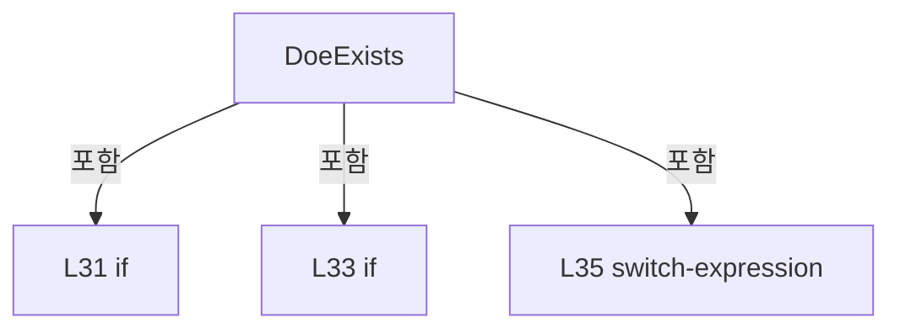
```mermaid
flowchart TD
 M["DoeExists"]
 N0["L31 if"]
 M -->|포함| N0
 N1["L33 if"]
 M -->|포함| N1
 N2["L35 switch-expression"]
 M -->|포함| N2
```

변경 전 점검: 입력/반환 타입, 위 호출자, 예외/취소 경로, 공유 상태와 저장·전송 소비자를 함께 확인합니다. 값의 단위나 물리 방향을 이름만으로 확정하지 않습니다.

### MethodDeclaration `DefaultInspectionGridSize` · L44–48

[Drilling.Common/Correction/CDefaultOffsetCalibration.cs:44–48](https://github.com/kjuws10-rgb/A3Drilling/blob/28764c91d521777b8ee068dd7aaf2d3902ce9fe2/Drilling.Common/Correction/CDefaultOffsetCalibration.cs#L44-L48)

| 항목 | 실제 추출 값 |
| --- | --- |
| 서명 | int Drilling.Common.Correction.CDefaultOffsetCalibration.DefaultInspectionGridSize(System.Collections.Generic.IReadOnlyDictionary<string, string>, int, Drilling.Common.Correction.ST_DEFAULT_OFFSET_OPTIONS) |
| 접근/수식자 | Public / public, static |
| 반환/값 타입 | int |
| 소속 타입 | NamedType:Drilling.Common.Correction.CDefaultOffsetCalibration |

입력 계약:

| 이름 | 타입 | 전달 | 선택/기본값 |
| --- | --- | --- | --- |
| values | System.Collections.Generic.IReadOnlyDictionary<string, string> | None | False /  |
| head | int | None | False /  |
| options | Drilling.Common.Correction.ST_DEFAULT_OFFSET_OPTIONS | None | False /  |

정적 호출자로 확인된 위치:

| 호출 파일/행 | 호출 표현식 | 런타임 분기 가능 |
| --- | --- | --- |
| [Drilling.Common/Correction/CDefaultOffsetCalibration.cs:52–52](https://github.com/kjuws10-rgb/A3Drilling/blob/28764c91d521777b8ee068dd7aaf2d3902ce9fe2/Drilling.Common/Correction/CDefaultOffsetCalibration.cs#L52-L52) | DefaultInspectionGridSize | False |
| [Drilling.UI/Menu/Menus/CMenuCorrection.cs:3905–3905](https://github.com/kjuws10-rgb/A3Drilling/blob/28764c91d521777b8ee068dd7aaf2d3902ce9fe2/Drilling.UI/Menu/Menus/CMenuCorrection.cs#L3905-L3905) | CDefaultOffsetCalibration.DefaultInspectionGridSize | False |
| [Drilling.UI/Menu/Menus/CMenuCorrection.cs:4782–4782](https://github.com/kjuws10-rgb/A3Drilling/blob/28764c91d521777b8ee068dd7aaf2d3902ce9fe2/Drilling.UI/Menu/Menus/CMenuCorrection.cs#L4782-L4782) | CDefaultOffsetCalibration.DefaultInspectionGridSize | False |
| [Drilling.UI/Menu/Menus/CMenuCorrection.cs:4860–4860](https://github.com/kjuws10-rgb/A3Drilling/blob/28764c91d521777b8ee068dd7aaf2d3902ce9fe2/Drilling.UI/Menu/Menus/CMenuCorrection.cs#L4860-L4860) | CDefaultOffsetCalibration.DefaultInspectionGridSize | False |

호출하는 대상과 해석 범위:

| 원본 행 | 표현식 | 분석 상태 | 대상/소스 위치 |
| --- | --- | --- | --- |
| 46 | ValidateOptions | resolved | void Drilling.Common.Correction.CDefaultOffsetCalibration.ValidateOptions(Drilling.Common.Correction.ST_DEFAULT_OFFSET_OPTIONS) · Drilling.Common/Correction/CDefaultOffsetCalibration.cs:132 |
| 47 | DoeExists | resolved | bool Drilling.Common.Correction.CDefaultOffsetCalibration.DoeExists(System.Collections.Generic.IReadOnlyDictionary<string, string>, int) · Drilling.Common/Correction/CDefaultOffsetCalibration.cs:29 |

본문의 실제 연산·분기·예외·반환 순서(원문 위치 순):

| 원본 행 | 종류 | 주석 해설 |
| --- | --- | --- |
| 46 | call | 함수·델리게이트 또는 객체 생성자를 호출합니다: ValidateOptions(options) |
| 47 | call | 함수·델리게이트 또는 객체 생성자를 호출합니다: DoeExists(values, head) |
| 47 | conditional-expression | 조건에 따라 결과식을 선택합니다: DoeExists(values, head) ? options.DoeBeamGridSize : 1 |
| 47 | return | 호출자에게 값 또는 제어를 반환합니다: return DoeExists(values, head) ? options.DoeBeamGridSize : 1; |

변경 전 점검: 입력/반환 타입, 위 호출자, 예외/취소 경로, 공유 상태와 저장·전송 소비자를 함께 확인합니다. 값의 단위나 물리 방향을 이름만으로 확정하지 않습니다.

### MethodDeclaration `DefaultInspectionPointCount` · L50–54

[Drilling.Common/Correction/CDefaultOffsetCalibration.cs:50–54](https://github.com/kjuws10-rgb/A3Drilling/blob/28764c91d521777b8ee068dd7aaf2d3902ce9fe2/Drilling.Common/Correction/CDefaultOffsetCalibration.cs#L50-L54)

| 항목 | 실제 추출 값 |
| --- | --- |
| 서명 | int Drilling.Common.Correction.CDefaultOffsetCalibration.DefaultInspectionPointCount(System.Collections.Generic.IReadOnlyDictionary<string, string>, int, Drilling.Common.Correction.ST_DEFAULT_OFFSET_OPTIONS) |
| 접근/수식자 | Public / public, static |
| 반환/값 타입 | int |
| 소속 타입 | NamedType:Drilling.Common.Correction.CDefaultOffsetCalibration |

입력 계약:

| 이름 | 타입 | 전달 | 선택/기본값 |
| --- | --- | --- | --- |
| values | System.Collections.Generic.IReadOnlyDictionary<string, string> | None | False /  |
| head | int | None | False /  |
| options | Drilling.Common.Correction.ST_DEFAULT_OFFSET_OPTIONS | None | False /  |

현재 부분 분석에서 직접 연결된 호출자는 없습니다. XAML/이벤트/인터페이스·델리게이트·외부 진입을 추가 확인해야 하며, 미사용으로 판정한 것이 아닙니다.

호출하는 대상과 해석 범위:

| 원본 행 | 표현식 | 분석 상태 | 대상/소스 위치 |
| --- | --- | --- | --- |
| 52 | DefaultInspectionGridSize | resolved | int Drilling.Common.Correction.CDefaultOffsetCalibration.DefaultInspectionGridSize(System.Collections.Generic.IReadOnlyDictionary<string, string>, int, Drilling.Common.Correction.ST_DEFAULT_OFFSET_OPTIONS) · Drilling.Common/Correction/CDefaultOffsetCalibration.cs:44 |

본문의 실제 연산·분기·예외·반환 순서(원문 위치 순):

| 원본 행 | 종류 | 주석 해설 |
| --- | --- | --- |
| 52 | call | 함수·델리게이트 또는 객체 생성자를 호출합니다: DefaultInspectionGridSize(values, head, options) |
| 52 | local-declaration | 지역 변수를 선언합니다: var gridSize = DefaultInspectionGridSize(values, head, options); |
| 52 | variable-initializer | 변수의 초기값을 지정합니다: gridSize = DefaultInspectionGridSize(values, head, options) |
| 53 | return | 호출자에게 값 또는 제어를 반환합니다: return gridSize * gridSize; |

변경 전 점검: 입력/반환 타입, 위 호출자, 예외/취소 경로, 공유 상태와 저장·전송 소비자를 함께 확인합니다. 값의 단위나 물리 방향을 이름만으로 확정하지 않습니다.

### MethodDeclaration `DefaultInspectionDescription` · L56–62

[Drilling.Common/Correction/CDefaultOffsetCalibration.cs:56–62](https://github.com/kjuws10-rgb/A3Drilling/blob/28764c91d521777b8ee068dd7aaf2d3902ce9fe2/Drilling.Common/Correction/CDefaultOffsetCalibration.cs#L56-L62)

| 항목 | 실제 추출 값 |
| --- | --- |
| 서명 | string Drilling.Common.Correction.CDefaultOffsetCalibration.DefaultInspectionDescription(System.Collections.Generic.IReadOnlyDictionary<string, string>, int, Drilling.Common.Correction.ST_DEFAULT_OFFSET_OPTIONS) |
| 접근/수식자 | Public / public, static |
| 반환/값 타입 | string |
| 소속 타입 | NamedType:Drilling.Common.Correction.CDefaultOffsetCalibration |

입력 계약:

| 이름 | 타입 | 전달 | 선택/기본값 |
| --- | --- | --- | --- |
| values | System.Collections.Generic.IReadOnlyDictionary<string, string> | None | False /  |
| head | int | None | False /  |
| options | Drilling.Common.Correction.ST_DEFAULT_OFFSET_OPTIONS | None | False /  |

정적 호출자로 확인된 위치:

| 호출 파일/행 | 호출 표현식 | 런타임 분기 가능 |
| --- | --- | --- |
| [Drilling.UI/Menu/Menus/CMenuCorrection.cs:3838–3838](https://github.com/kjuws10-rgb/A3Drilling/blob/28764c91d521777b8ee068dd7aaf2d3902ce9fe2/Drilling.UI/Menu/Menus/CMenuCorrection.cs#L3838-L3838) | CDefaultOffsetCalibration.DefaultInspectionDescription | False |

호출하는 대상과 해석 범위:

| 원본 행 | 표현식 | 분석 상태 | 대상/소스 위치 |
| --- | --- | --- | --- |
| 58 | DoeExists | resolved | bool Drilling.Common.Correction.CDefaultOffsetCalibration.DoeExists(System.Collections.Generic.IReadOnlyDictionary<string, string>, int) · Drilling.Common/Correction/CDefaultOffsetCalibration.cs:29 |

본문의 실제 연산·분기·예외·반환 순서(원문 위치 순):

| 원본 행 | 종류 | 주석 해설 |
| --- | --- | --- |
| 58 | call | 함수·델리게이트 또는 객체 생성자를 호출합니다: DoeExists(values, head) |
| 58 | if | 조건에 따라 분기합니다: if (DoeExists(values, head)) |
| 58 | return | 호출자에게 값 또는 제어를 반환합니다: return options.InspectionDescription; |
| 59 | conditional-expression | 조건에 따라 결과식을 선택합니다: options.MachiningMode == EN_DEFAULT_MACHINING_MODE.Cross ? "DOE OFF · 중앙 십자 1점 측정" : "DOE OFF · 중앙 1점 측정" |
| 59 | return | 호출자에게 값 또는 제어를 반환합니다: return options.MachiningMode == EN_DEFAULT_MACHINING_MODE.Cross ? "DOE OFF · 중앙 십자 1점 측정" : "DOE OFF · 중앙 1점 측정"; |

제어 구문의 포함 구조(실제 실행 순서/CFG가 아닌 구문 탐색 그림):

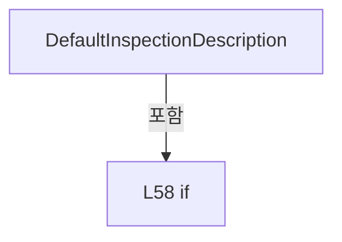
```mermaid
flowchart TD
 M["DefaultInspectionDescription"]
 N0["L58 if"]
 M -->|포함| N0
```

변경 전 점검: 입력/반환 타입, 위 호출자, 예외/취소 경로, 공유 상태와 저장·전송 소비자를 함께 확인합니다. 값의 단위나 물리 방향을 이름만으로 확정하지 않습니다.

### MethodDeclaration `Conditions` · L67–79

[Drilling.Common/Correction/CDefaultOffsetCalibration.cs:67–79](https://github.com/kjuws10-rgb/A3Drilling/blob/28764c91d521777b8ee068dd7aaf2d3902ce9fe2/Drilling.Common/Correction/CDefaultOffsetCalibration.cs#L67-L79)

| 항목 | 실제 추출 값 |
| --- | --- |
| 서명 | Drilling.Common.Correction.ST_DEFAULT_OFFSET_OPTIONS Drilling.Common.Correction.CDefaultOffsetCalibration.Conditions(System.Collections.Generic.IReadOnlyDictionary<string, string>, double?) |
| 접근/수식자 | Public / public, static |
| 반환/값 타입 | Drilling.Common.Correction.ST_DEFAULT_OFFSET_OPTIONS |
| 소속 타입 | NamedType:Drilling.Common.Correction.CDefaultOffsetCalibration |

입력 계약:

| 이름 | 타입 | 전달 | 선택/기본값 |
| --- | --- | --- | --- |
| values | System.Collections.Generic.IReadOnlyDictionary<string, string> | None | False /  |
| testStageY | double? | None | True / null |

정적 호출자로 확인된 위치:

| 호출 파일/행 | 호출 표현식 | 런타임 분기 가능 |
| --- | --- | --- |
| [Drilling.UI/Menu/Menus/CMenuCorrection.cs:3459–3459](https://github.com/kjuws10-rgb/A3Drilling/blob/28764c91d521777b8ee068dd7aaf2d3902ce9fe2/Drilling.UI/Menu/Menus/CMenuCorrection.cs#L3459-L3459) | CDefaultOffsetCalibration.Conditions | False |

호출하는 대상과 해석 범위:

| 원본 행 | 표현식 | 분석 상태 | 대상/소스 위치 |
| --- | --- | --- | --- |
| 69 | Number | resolved | double Drilling.Common.Correction.CDefaultOffsetCalibration.Number(System.Collections.Generic.IReadOnlyDictionary<string, string>, string) · Drilling.Common/Correction/CDefaultOffsetCalibration.cs:22 |
| 70 | DesignAlignKey3ReviewX | resolved | double Drilling.Common.Correction.CDefaultOffsetCalibration.DesignAlignKey3ReviewX(System.Collections.Generic.IReadOnlyDictionary<string, string>) · Drilling.Common/Correction/CDefaultOffsetCalibration.cs:81 |
| 71 | Number | resolved | double Drilling.Common.Correction.CDefaultOffsetCalibration.Number(System.Collections.Generic.IReadOnlyDictionary<string, string>, string) · Drilling.Common/Correction/CDefaultOffsetCalibration.cs:22 |
| 72 | Math.Min | resolved | double System.Math.Min(double, double) |
| 72 | Number | resolved | double Drilling.Common.Correction.CDefaultOffsetCalibration.Number(System.Collections.Generic.IReadOnlyDictionary<string, string>, string) · Drilling.Common/Correction/CDefaultOffsetCalibration.cs:22 |
| 72 | Number | resolved | double Drilling.Common.Correction.CDefaultOffsetCalibration.Number(System.Collections.Generic.IReadOnlyDictionary<string, string>, string) · Drilling.Common/Correction/CDefaultOffsetCalibration.cs:22 |
| 73 | double.IsFinite | resolved | bool double.IsFinite(double) |
| 73 | double.IsFinite | resolved | bool double.IsFinite(double) |
| 74 | new InvalidOperationException | resolved | System.InvalidOperationException.InvalidOperationException(string?) |
| 75 | new | resolved | Drilling.Common.Correction.ST_DEFAULT_OFFSET_OPTIONS.ST_DEFAULT_OFFSET_OPTIONS(double, double, double, double) · Drilling.Common/Correction/CDefaultOffsetCalibration.cs:299 |
| 77 | BeamGridSize | resolved | int Drilling.Common.Correction.CDefaultOffsetCalibration.BeamGridSize(System.Collections.Generic.IReadOnlyDictionary<string, string>) · Drilling.Common/Correction/CDefaultOffsetCalibration.cs:162 |

본문의 실제 연산·분기·예외·반환 순서(원문 위치 순):

| 원본 행 | 종류 | 주석 해설 |
| --- | --- | --- |
| 69 | call | 함수·델리게이트 또는 객체 생성자를 호출합니다: Number(values, "REVIEW_CAMERA_ALIGN_KEY_POS_X") |
| 69 | local-declaration | 지역 변수를 선언합니다: var alignKey1ReviewX = Number(values, "REVIEW_CAMERA_ALIGN_KEY_POS_X"); |
| 69 | variable-initializer | 변수의 초기값을 지정합니다: alignKey1ReviewX = Number(values, "REVIEW_CAMERA_ALIGN_KEY_POS_X") |
| 70 | call | 함수·델리게이트 또는 객체 생성자를 호출합니다: DesignAlignKey3ReviewX(values) |
| 70 | local-declaration | 지역 변수를 선언합니다: var alignKey3ReviewX = DesignAlignKey3ReviewX(values); |
| 70 | variable-initializer | 변수의 초기값을 지정합니다: alignKey3ReviewX = DesignAlignKey3ReviewX(values) |
| 71 | call | 함수·델리게이트 또는 객체 생성자를 호출합니다: Number(values, "STAGE_START_POS_Y") |
| 71 | local-declaration | 지역 변수를 선언합니다: var stageY = testStageY ?? Number(values, "STAGE_START_POS_Y"); |
| 71 | variable-initializer | 변수의 초기값을 지정합니다: stageY = testStageY ?? Number(values, "STAGE_START_POS_Y") |
| 72 | call | 함수·델리게이트 또는 객체 생성자를 호출합니다: Math.Min(Number(values, "REVIEW_TOLERANCE_X"), Number(values, "REVIEW_TOLERANCE_Y")) |
| 72 | call | 함수·델리게이트 또는 객체 생성자를 호출합니다: Number(values, "REVIEW_TOLERANCE_X") |
| 72 | call | 함수·델리게이트 또는 객체 생성자를 호출합니다: Number(values, "REVIEW_TOLERANCE_Y") |
| 72 | local-declaration | 지역 변수를 선언합니다: var tolerance = Math.Min(Number(values, "REVIEW_TOLERANCE_X"), Number(values, "REVIEW_TOLERANCE_Y")); |
| 72 | variable-initializer | 변수의 초기값을 지정합니다: tolerance = Math.Min(Number(values, "REVIEW_TOLERANCE_X"), Number(values, "REVIEW_TOLERANCE_Y")) |
| 73 | call | 함수·델리게이트 또는 객체 생성자를 호출합니다: double.IsFinite(stageY) |
| 73 | call | 함수·델리게이트 또는 객체 생성자를 호출합니다: double.IsFinite(tolerance) |
| 73 | if | 조건에 따라 분기합니다: if (!double.IsFinite(stageY) &#124;&#124; !double.IsFinite(tolerance) &#124;&#124; tolerance <= 0) |
| 74 | call | 함수·델리게이트 또는 객체 생성자를 호출합니다: new InvalidOperationException("Recipe의 Review 허용오차와 Stage Y 위치를 확인해 주세요.") |
| 74 | throw | 예외를 발생/전달합니다: throw new InvalidOperationException("Recipe의 Review 허용오차와 Stage Y 위치를 확인해 주세요."); |
| 75 | call | 함수·델리게이트 또는 객체 생성자를 호출합니다: new(alignKey1ReviewX, alignKey3ReviewX, stageY, tolerance) { DoeBeamGridSize = BeamGridSize(values) } |
| 75 | return | 호출자에게 값 또는 제어를 반환합니다: return new(alignKey1ReviewX, alignKey3ReviewX, stageY, tolerance) { DoeBeamGridSize = BeamGridSize(values) }; |
| 77 | assignment | 값을 대상에 대입합니다: DoeBeamGridSize = BeamGridSize(values) |
| 77 | call | 함수·델리게이트 또는 객체 생성자를 호출합니다: BeamGridSize(values) |

제어 구문의 포함 구조(실제 실행 순서/CFG가 아닌 구문 탐색 그림):

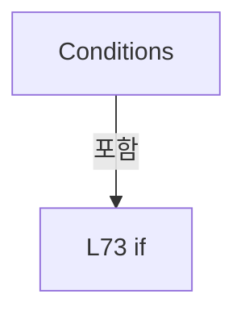
```mermaid
flowchart TD
 M["Conditions"]
 N0["L73 if"]
 M -->|포함| N0
```

변경 전 점검: 입력/반환 타입, 위 호출자, 예외/취소 경로, 공유 상태와 저장·전송 소비자를 함께 확인합니다. 값의 단위나 물리 방향을 이름만으로 확정하지 않습니다.

### MethodDeclaration `DesignAlignKey3ReviewX` · L81–91

[Drilling.Common/Correction/CDefaultOffsetCalibration.cs:81–91](https://github.com/kjuws10-rgb/A3Drilling/blob/28764c91d521777b8ee068dd7aaf2d3902ce9fe2/Drilling.Common/Correction/CDefaultOffsetCalibration.cs#L81-L91)

| 항목 | 실제 추출 값 |
| --- | --- |
| 서명 | double Drilling.Common.Correction.CDefaultOffsetCalibration.DesignAlignKey3ReviewX(System.Collections.Generic.IReadOnlyDictionary<string, string>) |
| 접근/수식자 | Public / public, static |
| 반환/값 타입 | double |
| 소속 타입 | NamedType:Drilling.Common.Correction.CDefaultOffsetCalibration |

입력 계약:

| 이름 | 타입 | 전달 | 선택/기본값 |
| --- | --- | --- | --- |
| values | System.Collections.Generic.IReadOnlyDictionary<string, string> | None | False /  |

정적 호출자로 확인된 위치:

| 호출 파일/행 | 호출 표현식 | 런타임 분기 가능 |
| --- | --- | --- |
| [Drilling.Common/Correction/CDefaultOffsetCalibration.cs:70–70](https://github.com/kjuws10-rgb/A3Drilling/blob/28764c91d521777b8ee068dd7aaf2d3902ce9fe2/Drilling.Common/Correction/CDefaultOffsetCalibration.cs#L70-L70) | DesignAlignKey3ReviewX | False |
| [Drilling.UI/Menu/Menus/CMenuCorrection.cs:3305–3305](https://github.com/kjuws10-rgb/A3Drilling/blob/28764c91d521777b8ee068dd7aaf2d3902ce9fe2/Drilling.UI/Menu/Menus/CMenuCorrection.cs#L3305-L3305) | CDefaultOffsetCalibration.DesignAlignKey3ReviewX | False |

호출하는 대상과 해석 범위:

| 원본 행 | 표현식 | 분석 상태 | 대상/소스 위치 |
| --- | --- | --- | --- |
| 83 | Number | resolved | double Drilling.Common.Correction.CDefaultOffsetCalibration.Number(System.Collections.Generic.IReadOnlyDictionary<string, string>, string) · Drilling.Common/Correction/CDefaultOffsetCalibration.cs:22 |
| 84 | Number | resolved | double Drilling.Common.Correction.CDefaultOffsetCalibration.Number(System.Collections.Generic.IReadOnlyDictionary<string, string>, string) · Drilling.Common/Correction/CDefaultOffsetCalibration.cs:22 |
| 85 | Number | resolved | double Drilling.Common.Correction.CDefaultOffsetCalibration.Number(System.Collections.Generic.IReadOnlyDictionary<string, string>, string) · Drilling.Common/Correction/CDefaultOffsetCalibration.cs:22 |
| 88 | double.IsFinite | resolved | bool double.IsFinite(double) |
| 89 | new InvalidOperationException | resolved | System.InvalidOperationException.InvalidOperationException(string?) |

본문의 실제 연산·분기·예외·반환 순서(원문 위치 순):

| 원본 행 | 종류 | 주석 해설 |
| --- | --- | --- |
| 83 | call | 함수·델리게이트 또는 객체 생성자를 호출합니다: Number(values, "REVIEW_CAMERA_ALIGN_KEY_POS_X") |
| 83 | local-declaration | 지역 변수를 선언합니다: var alignKey1ReviewX = Number(values, "REVIEW_CAMERA_ALIGN_KEY_POS_X"); |
| 83 | variable-initializer | 변수의 초기값을 지정합니다: alignKey1ReviewX = Number(values, "REVIEW_CAMERA_ALIGN_KEY_POS_X") |
| 84 | call | 함수·델리게이트 또는 객체 생성자를 호출합니다: Number(values, "GLASS_SIZE_X") |
| 84 | local-declaration | 지역 변수를 선언합니다: var glassWidth = Number(values, "GLASS_SIZE_X"); |
| 84 | variable-initializer | 변수의 초기값을 지정합니다: glassWidth = Number(values, "GLASS_SIZE_X") |
| 85 | call | 함수·델리게이트 또는 객체 생성자를 호출합니다: Number(values, "AK_MARGIN_X") |
| 85 | local-declaration | 지역 변수를 선언합니다: var marginX = Number(values, "AK_MARGIN_X"); |
| 85 | variable-initializer | 변수의 초기값을 지정합니다: marginX = Number(values, "AK_MARGIN_X") |
| 86 | local-declaration | 지역 변수를 선언합니다: var alignKeySpan = glassWidth - 2 * marginX; |
| 86 | variable-initializer | 변수의 초기값을 지정합니다: alignKeySpan = glassWidth - 2 * marginX |
| 87 | local-declaration | 지역 변수를 선언합니다: var alignKey3ReviewX = alignKey1ReviewX + alignKeySpan; |
| 87 | variable-initializer | 변수의 초기값을 지정합니다: alignKey3ReviewX = alignKey1ReviewX + alignKeySpan |
| 88 | call | 함수·델리게이트 또는 객체 생성자를 호출합니다: double.IsFinite(alignKey3ReviewX) |
| 88 | if | 조건에 따라 분기합니다: if (!double.IsFinite(alignKey3ReviewX) &#124;&#124; alignKeySpan <= 0) |
| 89 | call | 함수·델리게이트 또는 객체 생성자를 호출합니다: new InvalidOperationException("Glass Size X와 AK Margin X로 AK3 설계 Review X를 계산할 수 없습니다.") |
| 89 | throw | 예외를 발생/전달합니다: throw new InvalidOperationException("Glass Size X와 AK Margin X로 AK3 설계 Review X를 계산할 수 없습니다."); |
| 90 | return | 호출자에게 값 또는 제어를 반환합니다: return alignKey3ReviewX; |

제어 구문의 포함 구조(실제 실행 순서/CFG가 아닌 구문 탐색 그림):

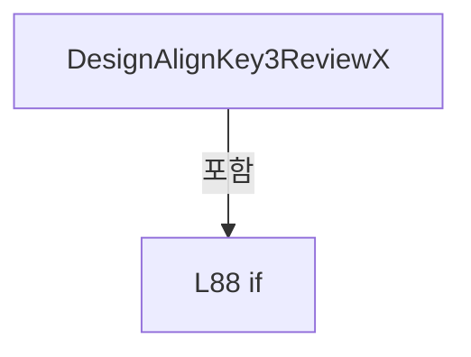
```mermaid
flowchart TD
 M["DesignAlignKey3ReviewX"]
 N0["L88 if"]
 M -->|포함| N0
```

변경 전 점검: 입력/반환 타입, 위 호출자, 예외/취소 경로, 공유 상태와 저장·전송 소비자를 함께 확인합니다. 값의 단위나 물리 방향을 이름만으로 확정하지 않습니다.

### MethodDeclaration `HeadGeometry` · L93–103

[Drilling.Common/Correction/CDefaultOffsetCalibration.cs:93–103](https://github.com/kjuws10-rgb/A3Drilling/blob/28764c91d521777b8ee068dd7aaf2d3902ce9fe2/Drilling.Common/Correction/CDefaultOffsetCalibration.cs#L93-L103)

| 항목 | 실제 추출 값 |
| --- | --- |
| 서명 | Drilling.Common.Correction.ST_DEFAULT_HEAD_GEOMETRY Drilling.Common.Correction.CDefaultOffsetCalibration.HeadGeometry(System.Collections.Generic.IReadOnlyDictionary<string, string>, int) |
| 접근/수식자 | Public / public, static |
| 반환/값 타입 | Drilling.Common.Correction.ST_DEFAULT_HEAD_GEOMETRY |
| 소속 타입 | NamedType:Drilling.Common.Correction.CDefaultOffsetCalibration |

입력 계약:

| 이름 | 타입 | 전달 | 선택/기본값 |
| --- | --- | --- | --- |
| values | System.Collections.Generic.IReadOnlyDictionary<string, string> | None | False /  |
| head | int | None | False /  |

정적 호출자로 확인된 위치:

| 호출 파일/행 | 호출 표현식 | 런타임 분기 가능 |
| --- | --- | --- |
| [Drilling.Common/Correction/CDefaultOffsetCalibration.cs:128–128](https://github.com/kjuws10-rgb/A3Drilling/blob/28764c91d521777b8ee068dd7aaf2d3902ce9fe2/Drilling.Common/Correction/CDefaultOffsetCalibration.cs#L128-L128) | HeadGeometry | False |
| [Drilling.UI/Menu/Menus/CMenuCorrection.cs:3302–3302](https://github.com/kjuws10-rgb/A3Drilling/blob/28764c91d521777b8ee068dd7aaf2d3902ce9fe2/Drilling.UI/Menu/Menus/CMenuCorrection.cs#L3302-L3302) | CDefaultOffsetCalibration.HeadGeometry | False |
| [Drilling.UI/Menu/Menus/CMenuCorrection.cs:3743–3743](https://github.com/kjuws10-rgb/A3Drilling/blob/28764c91d521777b8ee068dd7aaf2d3902ce9fe2/Drilling.UI/Menu/Menus/CMenuCorrection.cs#L3743-L3743) | CDefaultOffsetCalibration.HeadGeometry | False |
| [Drilling.UI/Menu/Menus/CMenuCorrection.cs:3903–3903](https://github.com/kjuws10-rgb/A3Drilling/blob/28764c91d521777b8ee068dd7aaf2d3902ce9fe2/Drilling.UI/Menu/Menus/CMenuCorrection.cs#L3903-L3903) | CDefaultOffsetCalibration.HeadGeometry | False |

호출하는 대상과 해석 범위:

| 원본 행 | 표현식 | 분석 상태 | 대상/소스 위치 |
| --- | --- | --- | --- |
| 95 | new ArgumentOutOfRangeException | resolved | System.ArgumentOutOfRangeException.ArgumentOutOfRangeException(string?) |
| 95 | nameof | unresolved | None |
| 97 | Number | resolved | double Drilling.Common.Correction.CDefaultOffsetCalibration.Number(System.Collections.Generic.IReadOnlyDictionary<string, string>, string) · Drilling.Common/Correction/CDefaultOffsetCalibration.cs:22 |
| 98 | Number | resolved | double Drilling.Common.Correction.CDefaultOffsetCalibration.Number(System.Collections.Generic.IReadOnlyDictionary<string, string>, string) · Drilling.Common/Correction/CDefaultOffsetCalibration.cs:22 |
| 99 | Number | resolved | double Drilling.Common.Correction.CDefaultOffsetCalibration.Number(System.Collections.Generic.IReadOnlyDictionary<string, string>, string) · Drilling.Common/Correction/CDefaultOffsetCalibration.cs:22 |
| 100 | new InvalidOperationException | resolved | System.InvalidOperationException.InvalidOperationException(string?) |
| 102 | new | resolved | Drilling.Common.Correction.ST_DEFAULT_HEAD_GEOMETRY.ST_DEFAULT_HEAD_GEOMETRY(double, double, double) · Drilling.Common/Correction/CDefaultOffsetCalibration.cs:323 |

본문의 실제 연산·분기·예외·반환 순서(원문 위치 순):

| 원본 행 | 종류 | 주석 해설 |
| --- | --- | --- |
| 95 | call | 함수·델리게이트 또는 객체 생성자를 호출합니다: new ArgumentOutOfRangeException(nameof(head)) |
| 95 | call | 함수·델리게이트 또는 객체 생성자를 호출합니다: nameof(head) |
| 95 | if | 조건에 따라 분기합니다: if (head is < 1 or > 8) |
| 95 | throw | 예외를 발생/전달합니다: throw new ArgumentOutOfRangeException(nameof(head)); |
| 96 | local-declaration | 지역 변수를 선언합니다: var prefix = $"H{head:00}_"; |
| 96 | variable-initializer | 변수의 초기값을 지정합니다: prefix = $"H{head:00}_" |
| 97 | call | 함수·델리게이트 또는 객체 생성자를 호출합니다: Number(values, prefix + "SCAN_FIELD_WIDTH_X") |
| 97 | local-declaration | 지역 변수를 선언합니다: var x = Number(values, prefix + "SCAN_FIELD_WIDTH_X"); |
| 97 | variable-initializer | 변수의 초기값을 지정합니다: x = Number(values, prefix + "SCAN_FIELD_WIDTH_X") |
| 98 | call | 함수·델리게이트 또는 객체 생성자를 호출합니다: Number(values, prefix + "SCAN_FIELD_HEIGHT_Y") |
| 98 | local-declaration | 지역 변수를 선언합니다: var y = Number(values, prefix + "SCAN_FIELD_HEIGHT_Y"); |
| 98 | variable-initializer | 변수의 초기값을 지정합니다: y = Number(values, prefix + "SCAN_FIELD_HEIGHT_Y") |
| 99 | call | 함수·델리게이트 또는 객체 생성자를 호출합니다: Number(values, prefix + "DOE_ROTATION_ANGLE") |
| 99 | local-declaration | 지역 변수를 선언합니다: var angle = Number(values, prefix + "DOE_ROTATION_ANGLE"); |
| 99 | variable-initializer | 변수의 초기값을 지정합니다: angle = Number(values, prefix + "DOE_ROTATION_ANGLE") |
| 100 | call | 함수·델리게이트 또는 객체 생성자를 호출합니다: new InvalidOperationException($"HEAD {head:00}의 Setting Scan Field X/Y는 0보다 커야 합니다.") |
| 100 | if | 조건에 따라 분기합니다: if (x <= 0 &#124;&#124; y <= 0) |
| 100 | throw | 예외를 발생/전달합니다: throw new InvalidOperationException($"HEAD {head:00}의 Setting Scan Field X/Y는 0보다 커야 합니다."); |
| 102 | call | 함수·델리게이트 또는 객체 생성자를 호출합니다: new(x / 2, y / 2, angle) |
| 102 | return | 호출자에게 값 또는 제어를 반환합니다: return new(x / 2, y / 2, angle); |

제어 구문의 포함 구조(실제 실행 순서/CFG가 아닌 구문 탐색 그림):

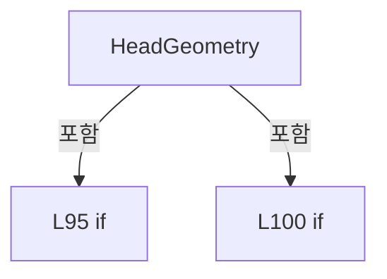
```mermaid
flowchart TD
 M["HeadGeometry"]
 N0["L95 if"]
 M -->|포함| N0
 N1["L100 if"]
 M -->|포함| N1
```

변경 전 점검: 입력/반환 타입, 위 호출자, 예외/취소 경로, 공유 상태와 저장·전송 소비자를 함께 확인합니다. 값의 단위나 물리 방향을 이름만으로 확정하지 않습니다.

### MethodDeclaration `PredictCenter` · L105–122

[Drilling.Common/Correction/CDefaultOffsetCalibration.cs:105–122](https://github.com/kjuws10-rgb/A3Drilling/blob/28764c91d521777b8ee068dd7aaf2d3902ce9fe2/Drilling.Common/Correction/CDefaultOffsetCalibration.cs#L105-L122)

| 항목 | 실제 추출 값 |
| --- | --- |
| 서명 | Drilling.Common.Correction.ST_DEFAULT_PREVIEW_POINT Drilling.Common.Correction.CDefaultOffsetCalibration.PredictCenter(System.Collections.Generic.IReadOnlyDictionary<string, string>, int, double) |
| 접근/수식자 | Public / public, static |
| 반환/값 타입 | Drilling.Common.Correction.ST_DEFAULT_PREVIEW_POINT |
| 소속 타입 | NamedType:Drilling.Common.Correction.CDefaultOffsetCalibration |

입력 계약:

| 이름 | 타입 | 전달 | 선택/기본값 |
| --- | --- | --- | --- |
| values | System.Collections.Generic.IReadOnlyDictionary<string, string> | None | False /  |
| head | int | None | False /  |
| stageY | double | None | False /  |

정적 호출자로 확인된 위치:

| 호출 파일/행 | 호출 표현식 | 런타임 분기 가능 |
| --- | --- | --- |
| [Drilling.UI/Menu/Menus/CMenuCorrection.cs:4751–4752](https://github.com/kjuws10-rgb/A3Drilling/blob/28764c91d521777b8ee068dd7aaf2d3902ce9fe2/Drilling.UI/Menu/Menus/CMenuCorrection.cs#L4751-L4752) | CDefaultOffsetCalibration.PredictCenter | False |

호출하는 대상과 해석 범위:

| 원본 행 | 표현식 | 분석 상태 | 대상/소스 위치 |
| --- | --- | --- | --- |
| 107 | new ArgumentOutOfRangeException | resolved | System.ArgumentOutOfRangeException.ArgumentOutOfRangeException(string?) |
| 107 | nameof | unresolved | None |
| 108 | double.IsFinite | resolved | bool double.IsFinite(double) |
| 108 | new ArgumentOutOfRangeException | resolved | System.ArgumentOutOfRangeException.ArgumentOutOfRangeException(string?) |
| 108 | nameof | unresolved | None |
| 109 | Number | resolved | double Drilling.Common.Correction.CDefaultOffsetCalibration.Number(System.Collections.Generic.IReadOnlyDictionary<string, string>, string) · Drilling.Common/Correction/CDefaultOffsetCalibration.cs:22 |
| 110 | CScannerAxisTransform.ReadStageDirection | resolved | double Drilling.Common.Recipe.CScannerAxisTransform.ReadStageDirection(System.Collections.Generic.IReadOnlyDictionary<string, string>) · Drilling.Common/Recipe/CShotCoordinatePlanBuilder.cs:1256 |
| 111 | values.ContainsKey | resolved · 동적 구현 선택 가능 | bool System.Collections.Generic.IReadOnlyDictionary<string, string>.ContainsKey(string) |
| 111 | Number | resolved | double Drilling.Common.Correction.CDefaultOffsetCalibration.Number(System.Collections.Generic.IReadOnlyDictionary<string, string>, string) · Drilling.Common/Correction/CDefaultOffsetCalibration.cs:22 |
| 112 | Number | resolved | double Drilling.Common.Correction.CDefaultOffsetCalibration.Number(System.Collections.Generic.IReadOnlyDictionary<string, string>, string) · Drilling.Common/Correction/CDefaultOffsetCalibration.cs:22 |
| 112 | Number | resolved | double Drilling.Common.Correction.CDefaultOffsetCalibration.Number(System.Collections.Generic.IReadOnlyDictionary<string, string>, string) · Drilling.Common/Correction/CDefaultOffsetCalibration.cs:22 |
| 116 | Number | resolved | double Drilling.Common.Correction.CDefaultOffsetCalibration.Number(System.Collections.Generic.IReadOnlyDictionary<string, string>, string) · Drilling.Common/Correction/CDefaultOffsetCalibration.cs:22 |
| 116 | Number | resolved | double Drilling.Common.Correction.CDefaultOffsetCalibration.Number(System.Collections.Generic.IReadOnlyDictionary<string, string>, string) · Drilling.Common/Correction/CDefaultOffsetCalibration.cs:22 |
| 117 | Number | resolved | double Drilling.Common.Correction.CDefaultOffsetCalibration.Number(System.Collections.Generic.IReadOnlyDictionary<string, string>, string) · Drilling.Common/Correction/CDefaultOffsetCalibration.cs:22 |
| 117 | Number | resolved | double Drilling.Common.Correction.CDefaultOffsetCalibration.Number(System.Collections.Generic.IReadOnlyDictionary<string, string>, string) · Drilling.Common/Correction/CDefaultOffsetCalibration.cs:22 |
| 117 | Number | resolved | double Drilling.Common.Correction.CDefaultOffsetCalibration.Number(System.Collections.Generic.IReadOnlyDictionary<string, string>, string) · Drilling.Common/Correction/CDefaultOffsetCalibration.cs:22 |
| 117 | Number | resolved | double Drilling.Common.Correction.CDefaultOffsetCalibration.Number(System.Collections.Generic.IReadOnlyDictionary<string, string>, string) · Drilling.Common/Correction/CDefaultOffsetCalibration.cs:22 |
| 118 | Number | resolved | double Drilling.Common.Correction.CDefaultOffsetCalibration.Number(System.Collections.Generic.IReadOnlyDictionary<string, string>, string) · Drilling.Common/Correction/CDefaultOffsetCalibration.cs:22 |
| 119 | Number | resolved | double Drilling.Common.Correction.CDefaultOffsetCalibration.Number(System.Collections.Generic.IReadOnlyDictionary<string, string>, string) · Drilling.Common/Correction/CDefaultOffsetCalibration.cs:22 |
| 119 | Number | resolved | double Drilling.Common.Correction.CDefaultOffsetCalibration.Number(System.Collections.Generic.IReadOnlyDictionary<string, string>, string) · Drilling.Common/Correction/CDefaultOffsetCalibration.cs:22 |
| 120 | double.IsFinite | resolved | bool double.IsFinite(double) |
| 120 | double.IsFinite | resolved | bool double.IsFinite(double) |
| 120 | new InvalidOperationException | resolved | System.InvalidOperationException.InvalidOperationException(string?) |
| 121 | new | resolved | Drilling.Common.Correction.ST_DEFAULT_PREVIEW_POINT.ST_DEFAULT_PREVIEW_POINT(int, double, double, double, bool) · Drilling.Common/Correction/CDefaultOffsetCalibration.cs:324 |

본문의 실제 연산·분기·예외·반환 순서(원문 위치 순):

| 원본 행 | 종류 | 주석 해설 |
| --- | --- | --- |
| 107 | call | 함수·델리게이트 또는 객체 생성자를 호출합니다: new ArgumentOutOfRangeException(nameof(head)) |
| 107 | call | 함수·델리게이트 또는 객체 생성자를 호출합니다: nameof(head) |
| 107 | if | 조건에 따라 분기합니다: if (head is < 1 or > 8) |
| 107 | throw | 예외를 발생/전달합니다: throw new ArgumentOutOfRangeException(nameof(head)); |
| 108 | call | 함수·델리게이트 또는 객체 생성자를 호출합니다: double.IsFinite(stageY) |
| 108 | call | 함수·델리게이트 또는 객체 생성자를 호출합니다: new ArgumentOutOfRangeException(nameof(stageY)) |
| 108 | call | 함수·델리게이트 또는 객체 생성자를 호출합니다: nameof(stageY) |
| 108 | if | 조건에 따라 분기합니다: if (!double.IsFinite(stageY)) |
| 108 | throw | 예외를 발생/전달합니다: throw new ArgumentOutOfRangeException(nameof(stageY)); |
| 109 | call | 함수·델리게이트 또는 객체 생성자를 호출합니다: Number(values, "STAGE_START_POS_Y") |
| 109 | local-declaration | 지역 변수를 선언합니다: var start = Number(values, "STAGE_START_POS_Y"); |
| 109 | variable-initializer | 변수의 초기값을 지정합니다: start = Number(values, "STAGE_START_POS_Y") |
| 110 | call | 함수·델리게이트 또는 객체 생성자를 호출합니다: CScannerAxisTransform.ReadStageDirection(values) |
| 110 | local-declaration | 지역 변수를 선언합니다: var direction = CScannerAxisTransform.ReadStageDirection(values); |
| 110 | variable-initializer | 변수의 초기값을 지정합니다: direction = CScannerAxisTransform.ReadStageDirection(values) |
| 111 | call | 함수·델리게이트 또는 객체 생성자를 호출합니다: values.ContainsKey($"H{head:00}_AK_POSITION_Y") |
| 111 | call | 함수·델리게이트 또는 객체 생성자를 호출합니다: Number(values, $"H{head:00}_AK_POSITION_Y") |
| 111 | conditional-expression | 조건에 따라 결과식을 선택합니다: values.ContainsKey($"H{head:00}_AK_POSITION_Y") ? Number(values, $"H{head:00}_AK_POSITION_Y") : Number(values, "REVIEW_TO_HEAD1_GAP_Y") + (head % 2 == 0 ? Number(values, "HeadGapY") : 0) |
| 111 | local-declaration | 지역 변수를 선언합니다: var gap = values.ContainsKey($"H{head:00}_AK_POSITION_Y") ? Number(values, $"H{head:00}_AK_POSITION_Y") : Number(values, "REVIEW_TO_HEAD1_GAP_Y") + (head % 2 == 0 ? Number(values, "HeadGapY") : 0); |
| 111 | variable-initializer | 변수의 초기값을 지정합니다: gap = values.ContainsKey($"H{head:00}_AK_POSITION_Y") ? Number(values, $"H{head:00}_AK_POSITION_Y") : Number(values, "REVIEW_TO_HEAD1_GAP_Y") + (head % 2 == 0 ? Number(values, "HeadGapY") : 0) |
| 112 | call | 함수·델리게이트 또는 객체 생성자를 호출합니다: Number(values, "REVIEW_TO_HEAD1_GAP_Y") |
| 112 | call | 함수·델리게이트 또는 객체 생성자를 호출합니다: Number(values, "HeadGapY") |
| 112 | conditional-expression | 조건에 따라 결과식을 선택합니다: head % 2 == 0 ? Number(values, "HeadGapY") : 0 |
| 116 | call | 함수·델리게이트 또는 객체 생성자를 호출합니다: Number(values, "REVIEW_CAMERA_ALIGN_KEY_POS_Y") |
| 116 | call | 함수·델리게이트 또는 객체 생성자를 호출합니다: Number(values, "AK_MARGIN_Y") |
| 116 | local-declaration | 지역 변수를 선언합니다: var yAtStart = (start - direction * gap - Number(values, "REVIEW_CAMERA_ALIGN_KEY_POS_Y")) / direction + Number(values, "AK_MARGIN_Y"); |
| 116 | variable-initializer | 변수의 초기값을 지정합니다: yAtStart = (start - direction * gap - Number(values, "REVIEW_CAMERA_ALIGN_KEY_POS_Y")) / direction + Number(values, "AK_MARGIN_Y") |
| 117 | call | 함수·델리게이트 또는 객체 생성자를 호출합니다: Number(values, "AK_MARGIN_X") |
| 117 | call | 함수·델리게이트 또는 객체 생성자를 호출합니다: Number(values, "H01_AK_POSITION_X") |
| 117 | call | 함수·델리게이트 또는 객체 생성자를 호출합니다: Number(values, "HeadGapX") |
| 117 | call | 함수·델리게이트 또는 객체 생성자를 호출합니다: Number(values, $"H{head:00}_DEFAULT_OFFSET_X") |
| 117 | local-declaration | 지역 변수를 선언합니다: var x = Number(values, "AK_MARGIN_X") + Number(values, "H01_AK_POSITION_X") + (head - 1) * Number(values, "HeadGapX") + Number(values, $"H{head:00}_DEFAULT_OFFSET_X"); |
| 117 | variable-initializer | 변수의 초기값을 지정합니다: x = Number(values, "AK_MARGIN_X") + Number(values, "H01_AK_POSITION_X") + (head - 1) * Number(values, "HeadGapX") + Number(values, $"H{head:00}_DEFAULT_OFFSET_X") |
| 118 | call | 함수·델리게이트 또는 객체 생성자를 호출합니다: Number(values, $"H{head:00}_DEFAULT_OFFSET_Y") |
| 118 | local-declaration | 지역 변수를 선언합니다: var y = yAtStart + (stageY - start) / direction + Number(values, $"H{head:00}_DEFAULT_OFFSET_Y"); |
| 118 | variable-initializer | 변수의 초기값을 지정합니다: y = yAtStart + (stageY - start) / direction + Number(values, $"H{head:00}_DEFAULT_OFFSET_Y") |
| 119 | call | 함수·델리게이트 또는 객체 생성자를 호출합니다: Number(values, "GLASS_SIZE_X") |
| 119 | call | 함수·델리게이트 또는 객체 생성자를 호출합니다: Number(values, "GLASS_SIZE_Y") |
| 119 | local-declaration | 지역 변수를 선언합니다: var width = Number(values, "GLASS_SIZE_X"); |
| 119 | local-declaration | 지역 변수를 선언합니다: var height = Number(values, "GLASS_SIZE_Y"); |
| 119 | variable-initializer | 변수의 초기값을 지정합니다: width = Number(values, "GLASS_SIZE_X") |
| 119 | variable-initializer | 변수의 초기값을 지정합니다: height = Number(values, "GLASS_SIZE_Y") |
| 120 | call | 함수·델리게이트 또는 객체 생성자를 호출합니다: double.IsFinite(x) |
| 120 | call | 함수·델리게이트 또는 객체 생성자를 호출합니다: double.IsFinite(y) |
| 120 | call | 함수·델리게이트 또는 객체 생성자를 호출합니다: new InvalidOperationException("예상 가공 위치의 Recipe·Setting 기준값을 확인해 주세요.") |
| 120 | if | 조건에 따라 분기합니다: if (!double.IsFinite(x) &#124;&#124; !double.IsFinite(y) &#124;&#124; width <= 0 &#124;&#124; height <= 0) |
| 120 | throw | 예외를 발생/전달합니다: throw new InvalidOperationException("예상 가공 위치의 Recipe·Setting 기준값을 확인해 주세요."); |
| 121 | call | 함수·델리게이트 또는 객체 생성자를 호출합니다: new(head, stageY, x, y, x >= 0 && x <= width && y >= 0 && y <= height) |
| 121 | return | 호출자에게 값 또는 제어를 반환합니다: return new(head, stageY, x, y, x >= 0 && x <= width && y >= 0 && y <= height); |

제어 구문의 포함 구조(실제 실행 순서/CFG가 아닌 구문 탐색 그림):

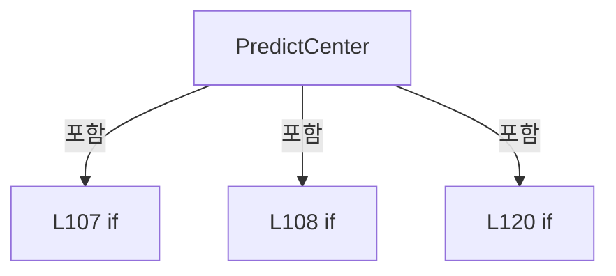
```mermaid
flowchart TD
 M["PredictCenter"]
 N0["L107 if"]
 M -->|포함| N0
 N1["L108 if"]
 M -->|포함| N1
 N2["L120 if"]
 M -->|포함| N2
```

변경 전 점검: 입력/반환 타입, 위 호출자, 예외/취소 경로, 공유 상태와 저장·전송 소비자를 함께 확인합니다. 값의 단위나 물리 방향을 이름만으로 확정하지 않습니다.

### MethodDeclaration `FitsField` · L126–130

[Drilling.Common/Correction/CDefaultOffsetCalibration.cs:126–130](https://github.com/kjuws10-rgb/A3Drilling/blob/28764c91d521777b8ee068dd7aaf2d3902ce9fe2/Drilling.Common/Correction/CDefaultOffsetCalibration.cs#L126-L130)

| 항목 | 실제 추출 값 |
| --- | --- |
| 서명 | bool Drilling.Common.Correction.CDefaultOffsetCalibration.FitsField(System.Collections.Generic.IReadOnlyDictionary<string, string>, int, double, double) |
| 접근/수식자 | Public / public, static |
| 반환/값 타입 | bool |
| 소속 타입 | NamedType:Drilling.Common.Correction.CDefaultOffsetCalibration |

입력 계약:

| 이름 | 타입 | 전달 | 선택/기본값 |
| --- | --- | --- | --- |
| values | System.Collections.Generic.IReadOnlyDictionary<string, string> | None | False /  |
| head | int | None | False /  |
| x | double | None | False /  |
| y | double | None | False /  |

정적 호출자로 확인된 위치:

| 호출 파일/행 | 호출 표현식 | 런타임 분기 가능 |
| --- | --- | --- |
| [Drilling.Common/Correction/CDefaultOffsetCalibration.cs:157–157](https://github.com/kjuws10-rgb/A3Drilling/blob/28764c91d521777b8ee068dd7aaf2d3902ce9fe2/Drilling.Common/Correction/CDefaultOffsetCalibration.cs#L157-L157) | FitsField | False |

호출하는 대상과 해석 범위:

| 원본 행 | 표현식 | 분석 상태 | 대상/소스 위치 |
| --- | --- | --- | --- |
| 128 | HeadGeometry | resolved | Drilling.Common.Correction.ST_DEFAULT_HEAD_GEOMETRY Drilling.Common.Correction.CDefaultOffsetCalibration.HeadGeometry(System.Collections.Generic.IReadOnlyDictionary<string, string>, int) · Drilling.Common/Correction/CDefaultOffsetCalibration.cs:93 |
| 129 | double.IsFinite | resolved | bool double.IsFinite(double) |
| 129 | double.IsFinite | resolved | bool double.IsFinite(double) |
| 129 | Math.Abs | resolved | double System.Math.Abs(double) |
| 129 | Math.Abs | resolved | double System.Math.Abs(double) |

본문의 실제 연산·분기·예외·반환 순서(원문 위치 순):

| 원본 행 | 종류 | 주석 해설 |
| --- | --- | --- |
| 128 | call | 함수·델리게이트 또는 객체 생성자를 호출합니다: HeadGeometry(values, head) |
| 128 | local-declaration | 지역 변수를 선언합니다: var field = HeadGeometry(values, head); |
| 128 | variable-initializer | 변수의 초기값을 지정합니다: field = HeadGeometry(values, head) |
| 129 | call | 함수·델리게이트 또는 객체 생성자를 호출합니다: double.IsFinite(x) |
| 129 | call | 함수·델리게이트 또는 객체 생성자를 호출합니다: double.IsFinite(y) |
| 129 | call | 함수·델리게이트 또는 객체 생성자를 호출합니다: Math.Abs(x) |
| 129 | call | 함수·델리게이트 또는 객체 생성자를 호출합니다: Math.Abs(y) |
| 129 | return | 호출자에게 값 또는 제어를 반환합니다: return double.IsFinite(x) && double.IsFinite(y) && Math.Abs(x) <= field.FieldHalfX && Math.Abs(y) <= field.FieldHalfY; |

변경 전 점검: 입력/반환 타입, 위 호출자, 예외/취소 경로, 공유 상태와 저장·전송 소비자를 함께 확인합니다. 값의 단위나 물리 방향을 이름만으로 확정하지 않습니다.

### MethodDeclaration `ValidateOptions` · L132–144

[Drilling.Common/Correction/CDefaultOffsetCalibration.cs:132–144](https://github.com/kjuws10-rgb/A3Drilling/blob/28764c91d521777b8ee068dd7aaf2d3902ce9fe2/Drilling.Common/Correction/CDefaultOffsetCalibration.cs#L132-L144)

| 항목 | 실제 추출 값 |
| --- | --- |
| 서명 | void Drilling.Common.Correction.CDefaultOffsetCalibration.ValidateOptions(Drilling.Common.Correction.ST_DEFAULT_OFFSET_OPTIONS) |
| 접근/수식자 | Public / public, static |
| 반환/값 타입 | void |
| 소속 타입 | NamedType:Drilling.Common.Correction.CDefaultOffsetCalibration |

입력 계약:

| 이름 | 타입 | 전달 | 선택/기본값 |
| --- | --- | --- | --- |
| options | Drilling.Common.Correction.ST_DEFAULT_OFFSET_OPTIONS | None | False /  |

정적 호출자로 확인된 위치:

| 호출 파일/행 | 호출 표현식 | 런타임 분기 가능 |
| --- | --- | --- |
| [Drilling.Common/Correction/CDefaultOffsetCalibration.cs:46–46](https://github.com/kjuws10-rgb/A3Drilling/blob/28764c91d521777b8ee068dd7aaf2d3902ce9fe2/Drilling.Common/Correction/CDefaultOffsetCalibration.cs#L46-L46) | ValidateOptions | False |
| [Drilling.Common/Correction/CDefaultOffsetCalibration.cs:149–149](https://github.com/kjuws10-rgb/A3Drilling/blob/28764c91d521777b8ee068dd7aaf2d3902ce9fe2/Drilling.Common/Correction/CDefaultOffsetCalibration.cs#L149-L149) | ValidateOptions | False |
| [Drilling.Common/Correction/CDefaultOffsetCalibration.cs:243–243](https://github.com/kjuws10-rgb/A3Drilling/blob/28764c91d521777b8ee068dd7aaf2d3902ce9fe2/Drilling.Common/Correction/CDefaultOffsetCalibration.cs#L243-L243) | ValidateOptions | False |
| [Drilling.Common/Correction/CDefaultOffsetCalibration.cs:273–273](https://github.com/kjuws10-rgb/A3Drilling/blob/28764c91d521777b8ee068dd7aaf2d3902ce9fe2/Drilling.Common/Correction/CDefaultOffsetCalibration.cs#L273-L273) | ValidateOptions | False |
| [Drilling.UI/Menu/Menus/CMenuCorrection.cs:3590–3590](https://github.com/kjuws10-rgb/A3Drilling/blob/28764c91d521777b8ee068dd7aaf2d3902ce9fe2/Drilling.UI/Menu/Menus/CMenuCorrection.cs#L3590-L3590) | CDefaultOffsetCalibration.ValidateOptions | False |
| [Drilling.UI/Views/CDefaultOffsetView.xaml.cs:190–190](https://github.com/kjuws10-rgb/A3Drilling/blob/28764c91d521777b8ee068dd7aaf2d3902ce9fe2/Drilling.UI/Views/CDefaultOffsetView.xaml.cs#L190-L190) | CDefaultOffsetCalibration.ValidateOptions | False |

호출하는 대상과 해석 범위:

| 원본 행 | 표현식 | 분석 상태 | 대상/소스 위치 |
| --- | --- | --- | --- |
| 134 | new[] { options.AlignKey1ReviewX, options.AlignKey3ReviewX, options.BoardCenterX, options.TestStageY, options.Tolerance }.Any | resolved | bool System.Collections.Generic.IEnumerable<double>.Any<double>(System.Func<double, bool>) |
| 134 | double.IsFinite | resolved | bool double.IsFinite(double) |
| 135 | new InvalidOperationException | resolved | System.InvalidOperationException.InvalidOperationException(string?) |
| 136 | Math.Abs | resolved | double System.Math.Abs(double) |
| 137 | new InvalidOperationException | resolved | System.InvalidOperationException.InvalidOperationException(string?) |
| 138 | Enum.IsDefined | resolved | bool System.Enum.IsDefined<Drilling.Common.Correction.EN_DEFAULT_MACHINING_MODE>(Drilling.Common.Correction.EN_DEFAULT_MACHINING_MODE) |
| 139 | new InvalidOperationException | resolved | System.InvalidOperationException.InvalidOperationException(string?) |
| 141 | new InvalidOperationException | resolved | System.InvalidOperationException.InvalidOperationException(string?) |
| 142 | double.IsFinite | resolved | bool double.IsFinite(double) |
| 143 | new InvalidOperationException | resolved | System.InvalidOperationException.InvalidOperationException(string?) |

본문의 실제 연산·분기·예외·반환 순서(원문 위치 순):

| 원본 행 | 종류 | 주석 해설 |
| --- | --- | --- |
| 134 | call | 함수·델리게이트 또는 객체 생성자를 호출합니다: new[] { options.AlignKey1ReviewX, options.AlignKey3ReviewX, options.BoardCenterX, options.TestStageY, options.Tolerance }.Any(v => !double.IsFinite(v)) |
| 134 | call | 함수·델리게이트 또는 객체 생성자를 호출합니다: double.IsFinite(v) |
| 134 | if | 조건에 따라 분기합니다: if (new[] { options.AlignKey1ReviewX, options.AlignKey3ReviewX, options.BoardCenterX, options.TestStageY, options.Tolerance }.Any(v => !double.IsFinite(v)) &#124;&#124; options.Tolerance <= 0) |
| 135 | call | 함수·델리게이트 또는 객체 생성자를 호출합니다: new InvalidOperationException("AK1·AK3 Review X, 가공할 Stage Y 위치와 Recipe Review 허용오차를 확인해 주세요.") |
| 135 | throw | 예외를 발생/전달합니다: throw new InvalidOperationException("AK1·AK3 Review X, 가공할 Stage Y 위치와 Recipe Review 허용오차를 확인해 주세요."); |
| 136 | call | 함수·델리게이트 또는 객체 생성자를 호출합니다: Math.Abs(options.AlignKey3ReviewX - options.AlignKey1ReviewX) |
| 136 | if | 조건에 따라 분기합니다: if (Math.Abs(options.AlignKey3ReviewX - options.AlignKey1ReviewX) <= double.Epsilon) |
| 137 | call | 함수·델리게이트 또는 객체 생성자를 호출합니다: new InvalidOperationException("AK1과 AK3 Review X 위치는 서로 달라야 합니다.") |
| 137 | throw | 예외를 발생/전달합니다: throw new InvalidOperationException("AK1과 AK3 Review X 위치는 서로 달라야 합니다."); |
| 138 | call | 함수·델리게이트 또는 객체 생성자를 호출합니다: Enum.IsDefined(options.MachiningMode) |
| 138 | if | 조건에 따라 분기합니다: if (!Enum.IsDefined(options.MachiningMode)) |
| 139 | call | 함수·델리게이트 또는 객체 생성자를 호출합니다: new InvalidOperationException("Default 가공 방식을 확인해 주세요.") |
| 139 | throw | 예외를 발생/전달합니다: throw new InvalidOperationException("Default 가공 방식을 확인해 주세요."); |
| 140 | if | 조건에 따라 분기합니다: if (options.DoeBeamGridSize is not (1 or 4)) |
| 141 | call | 함수·델리게이트 또는 객체 생성자를 호출합니다: new InvalidOperationException("Default 측정의 DOE Beam Count는 1 또는 4여야 합니다.") |
| 141 | throw | 예외를 발생/전달합니다: throw new InvalidOperationException("Default 측정의 DOE Beam Count는 1 또는 4여야 합니다."); |
| 142 | call | 함수·델리게이트 또는 객체 생성자를 호출합니다: double.IsFinite(options.CrossSize) |
| 142 | if | 조건에 따라 분기합니다: if (options.MachiningMode == EN_DEFAULT_MACHINING_MODE.Cross && (!double.IsFinite(options.CrossSize) &#124;&#124; options.CrossSize <= 0)) |
| 143 | call | 함수·델리게이트 또는 객체 생성자를 호출합니다: new InvalidOperationException("십자 전체 길이는 0보다 큰 유한한 mm 값이어야 합니다.") |
| 143 | throw | 예외를 발생/전달합니다: throw new InvalidOperationException("십자 전체 길이는 0보다 큰 유한한 mm 값이어야 합니다."); |

제어 구문의 포함 구조(실제 실행 순서/CFG가 아닌 구문 탐색 그림):

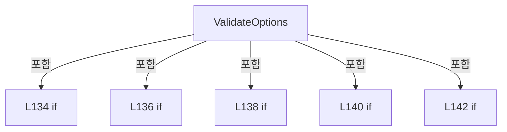
```mermaid
flowchart TD
 M["ValidateOptions"]
 N0["L134 if"]
 M -->|포함| N0
 N1["L136 if"]
 M -->|포함| N1
 N2["L138 if"]
 M -->|포함| N2
 N3["L140 if"]
 M -->|포함| N3
 N4["L142 if"]
 M -->|포함| N4
```

변경 전 점검: 입력/반환 타입, 위 호출자, 예외/취소 경로, 공유 상태와 저장·전송 소비자를 함께 확인합니다. 값의 단위나 물리 방향을 이름만으로 확정하지 않습니다.

### MethodDeclaration `CenterScannerTargets` · L147–160

[Drilling.Common/Correction/CDefaultOffsetCalibration.cs:147–160](https://github.com/kjuws10-rgb/A3Drilling/blob/28764c91d521777b8ee068dd7aaf2d3902ce9fe2/Drilling.Common/Correction/CDefaultOffsetCalibration.cs#L147-L160)

| 항목 | 실제 추출 값 |
| --- | --- |
| 서명 | System.Collections.Generic.IReadOnlyList<(double X, double Y)> Drilling.Common.Correction.CDefaultOffsetCalibration.CenterScannerTargets(System.Collections.Generic.IReadOnlyDictionary<string, string>, int, Drilling.Common.Correction.ST_DEFAULT_OFFSET_OPTIONS) |
| 접근/수식자 | Public / public, static |
| 반환/값 타입 | System.Collections.Generic.IReadOnlyList<(double X, double Y)> |
| 소속 타입 | NamedType:Drilling.Common.Correction.CDefaultOffsetCalibration |

입력 계약:

| 이름 | 타입 | 전달 | 선택/기본값 |
| --- | --- | --- | --- |
| values | System.Collections.Generic.IReadOnlyDictionary<string, string> | None | False /  |
| head | int | None | False /  |
| options | Drilling.Common.Correction.ST_DEFAULT_OFFSET_OPTIONS | None | False /  |

정적 호출자로 확인된 위치:

| 호출 파일/행 | 호출 표현식 | 런타임 분기 가능 |
| --- | --- | --- |
| [Drilling.UI/Menu/Menus/CMenuCorrection.cs:3619–3619](https://github.com/kjuws10-rgb/A3Drilling/blob/28764c91d521777b8ee068dd7aaf2d3902ce9fe2/Drilling.UI/Menu/Menus/CMenuCorrection.cs#L3619-L3619) | CDefaultOffsetCalibration.CenterScannerTargets | False |
| [Drilling.UI/Menu/Menus/CMenuCorrection.cs:3754–3754](https://github.com/kjuws10-rgb/A3Drilling/blob/28764c91d521777b8ee068dd7aaf2d3902ce9fe2/Drilling.UI/Menu/Menus/CMenuCorrection.cs#L3754-L3754) | CDefaultOffsetCalibration.CenterScannerTargets | False |
| [Drilling.UI/Menu/Menus/CMenuCorrection.cs:3842–3842](https://github.com/kjuws10-rgb/A3Drilling/blob/28764c91d521777b8ee068dd7aaf2d3902ce9fe2/Drilling.UI/Menu/Menus/CMenuCorrection.cs#L3842-L3842) | CDefaultOffsetCalibration.CenterScannerTargets | False |

호출하는 대상과 해석 범위:

| 원본 행 | 표현식 | 분석 상태 | 대상/소스 위치 |
| --- | --- | --- | --- |
| 149 | ValidateOptions | resolved | void Drilling.Common.Correction.CDefaultOffsetCalibration.ValidateOptions(Drilling.Common.Correction.ST_DEFAULT_OFFSET_OPTIONS) · Drilling.Common/Correction/CDefaultOffsetCalibration.cs:132 |
| 150 | Number | resolved | double Drilling.Common.Correction.CDefaultOffsetCalibration.Number(System.Collections.Generic.IReadOnlyDictionary<string, string>, string) · Drilling.Common/Correction/CDefaultOffsetCalibration.cs:22 |
| 151 | Number | resolved | double Drilling.Common.Correction.CDefaultOffsetCalibration.Number(System.Collections.Generic.IReadOnlyDictionary<string, string>, string) · Drilling.Common/Correction/CDefaultOffsetCalibration.cs:22 |
| 152 | CScannerAxisTransform.Read | resolved | Drilling.Common.Recipe.ST_SCANNER_AXIS_TRANSFORM Drilling.Common.Recipe.CScannerAxisTransform.Read(System.Collections.Generic.IReadOnlyDictionary<string, string>, int) · Drilling.Common/Recipe/CShotCoordinatePlanBuilder.cs:1262 |
| 156 | design.Select(p => transform.Apply(p.X, -p.Y)).ToArray | resolved | (double X, double Y)[] System.Collections.Generic.IEnumerable<(double X, double Y)>.ToArray<(double X, double Y)>() |
| 156 | design.Select | resolved | System.Collections.Generic.IEnumerable<(double X, double Y)> System.Collections.Generic.IEnumerable<(double X, double Y)>.Select<(double X, double Y), (double X, double Y)>(System.Func<(double X, double Y), (double X, double Y)>) |
| 156 | transform.Apply | resolved | (double X, double Y) Drilling.Common.Recipe.ST_SCANNER_AXIS_TRANSFORM.Apply(double, double) · Drilling.Common/Recipe/CShotCoordinatePlanBuilder.cs:1233 |
| 157 | targets.Any | resolved | bool System.Collections.Generic.IEnumerable<(double X, double Y)>.Any<(double X, double Y)>(System.Func<(double X, double Y), bool>) |
| 157 | FitsField | resolved | bool Drilling.Common.Correction.CDefaultOffsetCalibration.FitsField(System.Collections.Generic.IReadOnlyDictionary<string, string>, int, double, double) · Drilling.Common/Correction/CDefaultOffsetCalibration.cs:126 |
| 158 | new InvalidOperationException | resolved | System.InvalidOperationException.InvalidOperationException(string?) |

본문의 실제 연산·분기·예외·반환 순서(원문 위치 순):

| 원본 행 | 종류 | 주석 해설 |
| --- | --- | --- |
| 149 | call | 함수·델리게이트 또는 객체 생성자를 호출합니다: ValidateOptions(options) |
| 150 | call | 함수·델리게이트 또는 객체 생성자를 호출합니다: Number(values, $"H{head:00}_DEFAULT_OFFSET_X") |
| 150 | local-declaration | 지역 변수를 선언합니다: var x = Number(values, $"H{head:00}_DEFAULT_OFFSET_X"); |
| 150 | variable-initializer | 변수의 초기값을 지정합니다: x = Number(values, $"H{head:00}_DEFAULT_OFFSET_X") |
| 151 | call | 함수·델리게이트 또는 객체 생성자를 호출합니다: Number(values, $"H{head:00}_DEFAULT_OFFSET_Y") |
| 151 | local-declaration | 지역 변수를 선언합니다: var y = Number(values, $"H{head:00}_DEFAULT_OFFSET_Y"); |
| 151 | variable-initializer | 변수의 초기값을 지정합니다: y = Number(values, $"H{head:00}_DEFAULT_OFFSET_Y") |
| 152 | call | 함수·델리게이트 또는 객체 생성자를 호출합니다: CScannerAxisTransform.Read(values, head) |
| 152 | local-declaration | 지역 변수를 선언합니다: var transform = CScannerAxisTransform.Read(values, head); |
| 152 | variable-initializer | 변수의 초기값을 지정합니다: transform = CScannerAxisTransform.Read(values, head) |
| 153 | local-declaration | 지역 변수를 선언합니다: var half = options.CrossSize / 2; |
| 153 | variable-initializer | 변수의 초기값을 지정합니다: half = options.CrossSize / 2 |
| 154 | conditional-expression | 조건에 따라 결과식을 선택합니다: options.MachiningMode == EN_DEFAULT_MACHINING_MODE.Cross ? [(x - half, y), (x + half, y), (x, y - half), (x, y + half)] : [(x, y)] |
| 154 | local-declaration | 지역 변수를 선언합니다: (double X, double Y)[] design = options.MachiningMode == EN_DEFAULT_MACHINING_MODE.Cross ? [(x - half, y), (x + half, y), (x, y - half), (x, y + half)] : [(x, y)]; |
| 154 | variable-initializer | 변수의 초기값을 지정합니다: design = options.MachiningMode == EN_DEFAULT_MACHINING_MODE.Cross ? [(x - half, y), (x + half, y), (x, y - half), (x, y + half)] : [(x, y)] |
| 156 | call | 함수·델리게이트 또는 객체 생성자를 호출합니다: design.Select(p => transform.Apply(p.X, -p.Y)).ToArray() |
| 156 | call | 함수·델리게이트 또는 객체 생성자를 호출합니다: design.Select(p => transform.Apply(p.X, -p.Y)) |
| 156 | call | 함수·델리게이트 또는 객체 생성자를 호출합니다: transform.Apply(p.X, -p.Y) |
| 156 | local-declaration | 지역 변수를 선언합니다: var targets = design.Select(p => transform.Apply(p.X, -p.Y)).ToArray(); |
| 156 | variable-initializer | 변수의 초기값을 지정합니다: targets = design.Select(p => transform.Apply(p.X, -p.Y)).ToArray() |
| 157 | call | 함수·델리게이트 또는 객체 생성자를 호출합니다: targets.Any(p => !FitsField(values, head, p.X, p.Y)) |
| 157 | call | 함수·델리게이트 또는 객체 생성자를 호출합니다: FitsField(values, head, p.X, p.Y) |
| 157 | if | 조건에 따라 분기합니다: if (targets.Any(p => !FitsField(values, head, p.X, p.Y))) |
| 158 | call | 함수·델리게이트 또는 객체 생성자를 호출합니다: new InvalidOperationException($"HEAD {head:00} CENTER {options.MachiningMode} 스캐너 목표가 설정된 이동 범위를 초과합니다.") |
| 158 | throw | 예외를 발생/전달합니다: throw new InvalidOperationException($"HEAD {head:00} CENTER {options.MachiningMode} 스캐너 목표가 설정된 이동 범위를 초과합니다."); |
| 159 | return | 호출자에게 값 또는 제어를 반환합니다: return targets; |

제어 구문의 포함 구조(실제 실행 순서/CFG가 아닌 구문 탐색 그림):

```mermaid
flowchart TD
 M["CenterScannerTargets"]
 N0["L157 if"]
 M -->|포함| N0
```

변경 전 점검: 입력/반환 타입, 위 호출자, 예외/취소 경로, 공유 상태와 저장·전송 소비자를 함께 확인합니다. 값의 단위나 물리 방향을 이름만으로 확정하지 않습니다.

### MethodDeclaration `BeamGridSize` · L162–168

[Drilling.Common/Correction/CDefaultOffsetCalibration.cs:162–168](https://github.com/kjuws10-rgb/A3Drilling/blob/28764c91d521777b8ee068dd7aaf2d3902ce9fe2/Drilling.Common/Correction/CDefaultOffsetCalibration.cs#L162-L168)

| 항목 | 실제 추출 값 |
| --- | --- |
| 서명 | int Drilling.Common.Correction.CDefaultOffsetCalibration.BeamGridSize(System.Collections.Generic.IReadOnlyDictionary<string, string>) |
| 접근/수식자 | Public / public, static |
| 반환/값 타입 | int |
| 소속 타입 | NamedType:Drilling.Common.Correction.CDefaultOffsetCalibration |

입력 계약:

| 이름 | 타입 | 전달 | 선택/기본값 |
| --- | --- | --- | --- |
| values | System.Collections.Generic.IReadOnlyDictionary<string, string> | None | False /  |

정적 호출자로 확인된 위치:

| 호출 파일/행 | 호출 표현식 | 런타임 분기 가능 |
| --- | --- | --- |
| [Drilling.Common/Correction/CDefaultOffsetCalibration.cs:77–77](https://github.com/kjuws10-rgb/A3Drilling/blob/28764c91d521777b8ee068dd7aaf2d3902ce9fe2/Drilling.Common/Correction/CDefaultOffsetCalibration.cs#L77-L77) | BeamGridSize | False |
| [Drilling.Common/Correction/CDefaultOffsetCalibration.cs:172–172](https://github.com/kjuws10-rgb/A3Drilling/blob/28764c91d521777b8ee068dd7aaf2d3902ce9fe2/Drilling.Common/Correction/CDefaultOffsetCalibration.cs#L172-L172) | BeamGridSize | False |

호출하는 대상과 해석 범위:

| 원본 행 | 표현식 | 분석 상태 | 대상/소스 위치 |
| --- | --- | --- | --- |
| 164 | Number | resolved | double Drilling.Common.Correction.CDefaultOffsetCalibration.Number(System.Collections.Generic.IReadOnlyDictionary<string, string>, string) · Drilling.Common/Correction/CDefaultOffsetCalibration.cs:22 |
| 165 | Math.Truncate | resolved | double System.Math.Truncate(double) |
| 166 | new InvalidOperationException | resolved | System.InvalidOperationException.InvalidOperationException(string?) |

본문의 실제 연산·분기·예외·반환 순서(원문 위치 순):

| 원본 행 | 종류 | 주석 해설 |
| --- | --- | --- |
| 164 | call | 함수·델리게이트 또는 객체 생성자를 호출합니다: Number(values, "SPLITED_BEAM_COUNT") |
| 164 | local-declaration | 지역 변수를 선언합니다: var value = Number(values, "SPLITED_BEAM_COUNT"); |
| 164 | variable-initializer | 변수의 초기값을 지정합니다: value = Number(values, "SPLITED_BEAM_COUNT") |
| 165 | call | 함수·델리게이트 또는 객체 생성자를 호출합니다: Math.Truncate(value) |
| 165 | if | 조건에 따라 분기합니다: if (value != Math.Truncate(value) &#124;&#124; value is not (1 or 4)) |
| 166 | call | 함수·델리게이트 또는 객체 생성자를 호출합니다: new InvalidOperationException("Default 측정의 DOE Beam Count는 1 또는 4여야 합니다.") |
| 166 | throw | 예외를 발생/전달합니다: throw new InvalidOperationException("Default 측정의 DOE Beam Count는 1 또는 4여야 합니다."); |
| 167 | return | 호출자에게 값 또는 제어를 반환합니다: return (int)value; |

제어 구문의 포함 구조(실제 실행 순서/CFG가 아닌 구문 탐색 그림):

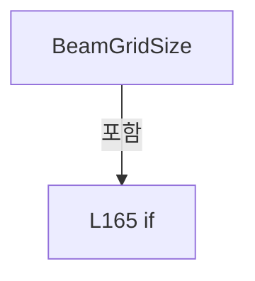
```mermaid
flowchart TD
 M["BeamGridSize"]
 N0["L165 if"]
 M -->|포함| N0
```

변경 전 점검: 입력/반환 타입, 위 호출자, 예외/취소 경로, 공유 상태와 저장·전송 소비자를 함께 확인합니다. 값의 단위나 물리 방향을 이름만으로 확정하지 않습니다.

### MethodDeclaration `Pitch` · L170–178

[Drilling.Common/Correction/CDefaultOffsetCalibration.cs:170–178](https://github.com/kjuws10-rgb/A3Drilling/blob/28764c91d521777b8ee068dd7aaf2d3902ce9fe2/Drilling.Common/Correction/CDefaultOffsetCalibration.cs#L170-L178)

| 항목 | 실제 추출 값 |
| --- | --- |
| 서명 | double Drilling.Common.Correction.CDefaultOffsetCalibration.Pitch(System.Collections.Generic.IReadOnlyDictionary<string, string>, int) |
| 접근/수식자 | Public / public, static |
| 반환/값 타입 | double |
| 소속 타입 | NamedType:Drilling.Common.Correction.CDefaultOffsetCalibration |

입력 계약:

| 이름 | 타입 | 전달 | 선택/기본값 |
| --- | --- | --- | --- |
| values | System.Collections.Generic.IReadOnlyDictionary<string, string> | None | False /  |
| model | int | None | False /  |

정적 호출자로 확인된 위치:

| 호출 파일/행 | 호출 표현식 | 런타임 분기 가능 |
| --- | --- | --- |
| [Drilling.UI/Menu/Menus/CMenuCorrection.cs:3309–3309](https://github.com/kjuws10-rgb/A3Drilling/blob/28764c91d521777b8ee068dd7aaf2d3902ce9fe2/Drilling.UI/Menu/Menus/CMenuCorrection.cs#L3309-L3309) | CDefaultOffsetCalibration.Pitch | False |
| [Drilling.UI/Menu/Menus/CMenuCorrection.cs:4784–4784](https://github.com/kjuws10-rgb/A3Drilling/blob/28764c91d521777b8ee068dd7aaf2d3902ce9fe2/Drilling.UI/Menu/Menus/CMenuCorrection.cs#L4784-L4784) | CDefaultOffsetCalibration.Pitch | False |

호출하는 대상과 해석 범위:

| 원본 행 | 표현식 | 분석 상태 | 대상/소스 위치 |
| --- | --- | --- | --- |
| 172 | BeamGridSize | resolved | int Drilling.Common.Correction.CDefaultOffsetCalibration.BeamGridSize(System.Collections.Generic.IReadOnlyDictionary<string, string>) · Drilling.Common/Correction/CDefaultOffsetCalibration.cs:162 |
| 174 | CRecipeModelPixelCountReader.ReadPatternForModel | resolved | Drilling.Common.Recipe.ST_RECIPE_MODEL_PATTERN Drilling.Common.Recipe.CRecipeModelPixelCountReader.ReadPatternForModel(System.Collections.Generic.IReadOnlyDictionary<string, string>, int) · Drilling.Common/Recipe/CCellPatternCalculator.cs:455 |
| 175 | Number | resolved | double Drilling.Common.Correction.CDefaultOffsetCalibration.Number(System.Collections.Generic.IReadOnlyDictionary<string, string>, string) · Drilling.Common/Correction/CDefaultOffsetCalibration.cs:22 |
| 176 | double.IsFinite | resolved | bool double.IsFinite(double) |
| 176 | new InvalidOperationException | resolved | System.InvalidOperationException.InvalidOperationException(string?) |

본문의 실제 연산·분기·예외·반환 순서(원문 위치 순):

| 원본 행 | 종류 | 주석 해설 |
| --- | --- | --- |
| 172 | call | 함수·델리게이트 또는 객체 생성자를 호출합니다: BeamGridSize(values) |
| 172 | local-declaration | 지역 변수를 선언합니다: var gridSize = BeamGridSize(values); |
| 172 | variable-initializer | 변수의 초기값을 지정합니다: gridSize = BeamGridSize(values) |
| 173 | if | 조건에 따라 분기합니다: if (gridSize == 1) |
| 173 | return | 호출자에게 값 또는 제어를 반환합니다: return 0; |
| 174 | call | 함수·델리게이트 또는 객체 생성자를 호출합니다: CRecipeModelPixelCountReader.ReadPatternForModel(values, model) |
| 174 | local-declaration | 지역 변수를 선언합니다: var pattern = CRecipeModelPixelCountReader.ReadPatternForModel(values, model); |
| 174 | variable-initializer | 변수의 초기값을 지정합니다: pattern = CRecipeModelPixelCountReader.ReadPatternForModel(values, model) |
| 175 | call | 함수·델리게이트 또는 객체 생성자를 호출합니다: Number(values, "PIXEL_SIZE") |
| 175 | local-declaration | 지역 변수를 선언합니다: var pitch = Number(values, "PIXEL_SIZE") * pattern.ProcessPitch / gridSize; |
| 175 | variable-initializer | 변수의 초기값을 지정합니다: pitch = Number(values, "PIXEL_SIZE") * pattern.ProcessPitch / gridSize |
| 176 | call | 함수·델리게이트 또는 객체 생성자를 호출합니다: double.IsFinite(pitch) |
| 176 | call | 함수·델리게이트 또는 객체 생성자를 호출합니다: new InvalidOperationException("DOE 빔 간격은 0보다 커야 합니다.") |
| 176 | if | 조건에 따라 분기합니다: if (!double.IsFinite(pitch) &#124;&#124; pitch <= 0) |
| 176 | throw | 예외를 발생/전달합니다: throw new InvalidOperationException("DOE 빔 간격은 0보다 커야 합니다."); |
| 177 | return | 호출자에게 값 또는 제어를 반환합니다: return pitch; |

제어 구문의 포함 구조(실제 실행 순서/CFG가 아닌 구문 탐색 그림):

```mermaid
flowchart TD
 M["Pitch"]
 N0["L173 if"]
 M -->|포함| N0
 N1["L176 if"]
 M -->|포함| N1
```

변경 전 점검: 입력/반환 타입, 위 호출자, 예외/취소 경로, 공유 상태와 저장·전송 소비자를 함께 확인합니다. 값의 단위나 물리 방향을 이름만으로 확정하지 않습니다.

### MethodDeclaration `Slot` · L180–191

[Drilling.Common/Correction/CDefaultOffsetCalibration.cs:180–191](https://github.com/kjuws10-rgb/A3Drilling/blob/28764c91d521777b8ee068dd7aaf2d3902ce9fe2/Drilling.Common/Correction/CDefaultOffsetCalibration.cs#L180-L191)

| 항목 | 실제 추출 값 |
| --- | --- |
| 서명 | (double X, double Y) Drilling.Common.Correction.CDefaultOffsetCalibration.Slot(int, int, double, double) |
| 접근/수식자 | Public / public, static |
| 반환/값 타입 | (double X, double Y) |
| 소속 타입 | NamedType:Drilling.Common.Correction.CDefaultOffsetCalibration |

입력 계약:

| 이름 | 타입 | 전달 | 선택/기본값 |
| --- | --- | --- | --- |
| beam | int | None | False /  |
| gridSize | int | None | False /  |
| pitch | double | None | False /  |
| angle | double | None | False /  |

정적 호출자로 확인된 위치:

| 호출 파일/행 | 호출 표현식 | 런타임 분기 가능 |
| --- | --- | --- |
| [Drilling.UI/Menu/Menus/CMenuCorrection.cs:3913–3913](https://github.com/kjuws10-rgb/A3Drilling/blob/28764c91d521777b8ee068dd7aaf2d3902ce9fe2/Drilling.UI/Menu/Menus/CMenuCorrection.cs#L3913-L3913) | CDefaultOffsetCalibration.Slot | False |
| [Drilling.UI/Menu/Menus/CMenuCorrection.cs:4787–4787](https://github.com/kjuws10-rgb/A3Drilling/blob/28764c91d521777b8ee068dd7aaf2d3902ce9fe2/Drilling.UI/Menu/Menus/CMenuCorrection.cs#L4787-L4787) | CDefaultOffsetCalibration.Slot | False |
| [Drilling.UI/Menu/Menus/CMenuCorrection.cs:4828–4828](https://github.com/kjuws10-rgb/A3Drilling/blob/28764c91d521777b8ee068dd7aaf2d3902ce9fe2/Drilling.UI/Menu/Menus/CMenuCorrection.cs#L4828-L4828) | CDefaultOffsetCalibration.Slot | False |
| [Drilling.UI/Menu/Menus/CMenuCorrection.cs:4896–4896](https://github.com/kjuws10-rgb/A3Drilling/blob/28764c91d521777b8ee068dd7aaf2d3902ce9fe2/Drilling.UI/Menu/Menus/CMenuCorrection.cs#L4896-L4896) | CDefaultOffsetCalibration.Slot | False |

호출하는 대상과 해석 범위:

| 원본 행 | 표현식 | 분석 상태 | 대상/소스 위치 |
| --- | --- | --- | --- |
| 182 | double.IsFinite | resolved | bool double.IsFinite(double) |
| 183 | double.IsFinite | resolved | bool double.IsFinite(double) |
| 184 | new ArgumentException | resolved | System.ArgumentException.ArgumentException(string?) |
| 190 | Math.Cos | resolved | double System.Math.Cos(double) |
| 190 | Math.Sin | resolved | double System.Math.Sin(double) |
| 190 | Math.Sin | resolved | double System.Math.Sin(double) |
| 190 | Math.Cos | resolved | double System.Math.Cos(double) |

본문의 실제 연산·분기·예외·반환 순서(원문 위치 순):

| 원본 행 | 종류 | 주석 해설 |
| --- | --- | --- |
| 182 | call | 함수·델리게이트 또는 객체 생성자를 호출합니다: double.IsFinite(pitch) |
| 182 | if | 조건에 따라 분기합니다: if (gridSize is not (1 or 4) &#124;&#124; beam < 1 &#124;&#124; beam > gridSize * gridSize &#124;&#124; !double.IsFinite(pitch) &#124;&#124; (gridSize == 4 && pitch <= 0) &#124;&#124; (gridSize == 1 && pitch != 0) &#124;&#124; !double.IsFinite(angle)) |
| 183 | call | 함수·델리게이트 또는 객체 생성자를 호출합니다: double.IsFinite(angle) |
| 184 | call | 함수·델리게이트 또는 객체 생성자를 호출합니다: new ArgumentException("DOE 빔 슬롯 설정 오류") |
| 184 | throw | 예외를 발생/전달합니다: throw new ArgumentException("DOE 빔 슬롯 설정 오류"); |
| 185 | if | 조건에 따라 분기합니다: if (gridSize == 1) |
| 185 | return | 호출자에게 값 또는 제어를 반환합니다: return (0, 0); |
| 186 | local-declaration | 지역 변수를 선언합니다: var center = (gridSize - 1) / 2.0; |
| 186 | variable-initializer | 변수의 초기값을 지정합니다: center = (gridSize - 1) / 2.0 |
| 187 | local-declaration | 지역 변수를 선언합니다: var x = ((beam - 1) % gridSize - center) * pitch; |
| 187 | variable-initializer | 변수의 초기값을 지정합니다: x = ((beam - 1) % gridSize - center) * pitch |
| 188 | local-declaration | 지역 변수를 선언합니다: var y = ((beam - 1) / gridSize - center) * pitch; |
| 188 | variable-initializer | 변수의 초기값을 지정합니다: y = ((beam - 1) / gridSize - center) * pitch |
| 189 | local-declaration | 지역 변수를 선언합니다: var radians = angle * Math.PI / 180; |
| 189 | variable-initializer | 변수의 초기값을 지정합니다: radians = angle * Math.PI / 180 |
| 190 | call | 함수·델리게이트 또는 객체 생성자를 호출합니다: Math.Cos(radians) |
| 190 | call | 함수·델리게이트 또는 객체 생성자를 호출합니다: Math.Sin(radians) |
| 190 | call | 함수·델리게이트 또는 객체 생성자를 호출합니다: Math.Sin(radians) |
| 190 | call | 함수·델리게이트 또는 객체 생성자를 호출합니다: Math.Cos(radians) |
| 190 | return | 호출자에게 값 또는 제어를 반환합니다: return (x * Math.Cos(radians) - y * Math.Sin(radians), x * Math.Sin(radians) + y * Math.Cos(radians)); |

제어 구문의 포함 구조(실제 실행 순서/CFG가 아닌 구문 탐색 그림):

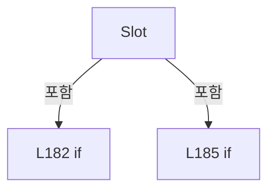
```mermaid
flowchart TD
 M["Slot"]
 N0["L182 if"]
 M -->|포함| N0
 N1["L185 if"]
 M -->|포함| N1
```

변경 전 점검: 입력/반환 타입, 위 호출자, 예외/취소 경로, 공유 상태와 저장·전송 소비자를 함께 확인합니다. 값의 단위나 물리 방향을 이름만으로 확정하지 않습니다.

### MethodDeclaration `Fit` · L193–236

[Drilling.Common/Correction/CDefaultOffsetCalibration.cs:193–236](https://github.com/kjuws10-rgb/A3Drilling/blob/28764c91d521777b8ee068dd7aaf2d3902ce9fe2/Drilling.Common/Correction/CDefaultOffsetCalibration.cs#L193-L236)

| 항목 | 실제 추출 값 |
| --- | --- |
| 서명 | Drilling.Common.Correction.ST_DEFAULT_OFFSET_FIT Drilling.Common.Correction.CDefaultOffsetCalibration.Fit(System.Collections.Generic.IReadOnlyList<Drilling.Common.Correction.ST_DEFAULT_OFFSET_MARK>, int, double, double, double) |
| 접근/수식자 | Public / public, static |
| 반환/값 타입 | Drilling.Common.Correction.ST_DEFAULT_OFFSET_FIT |
| 소속 타입 | NamedType:Drilling.Common.Correction.CDefaultOffsetCalibration |

입력 계약:

| 이름 | 타입 | 전달 | 선택/기본값 |
| --- | --- | --- | --- |
| marks | System.Collections.Generic.IReadOnlyList<Drilling.Common.Correction.ST_DEFAULT_OFFSET_MARK> | None | False /  |
| gridSize | int | None | False /  |
| pitch | double | None | False /  |
| angle | double | None | False /  |
| residualTolerance | double | None | False /  |

정적 호출자로 확인된 위치:

| 호출 파일/행 | 호출 표현식 | 런타임 분기 가능 |
| --- | --- | --- |
| [Drilling.UI/Menu/Menus/CMenuCorrection.cs:3919–3919](https://github.com/kjuws10-rgb/A3Drilling/blob/28764c91d521777b8ee068dd7aaf2d3902ce9fe2/Drilling.UI/Menu/Menus/CMenuCorrection.cs#L3919-L3919) | CDefaultOffsetCalibration.Fit | False |

호출하는 대상과 해석 범위:

| 원본 행 | 표현식 | 분석 상태 | 대상/소스 위치 |
| --- | --- | --- | --- |
| 195 | double.IsFinite | resolved | bool double.IsFinite(double) |
| 196 | new ArgumentException | resolved | System.ArgumentException.ArgumentException(string?) |
| 197 | new ArgumentException | resolved | System.ArgumentException.ArgumentException(string?) |
| 198 | double.IsFinite | resolved | bool double.IsFinite(double) |
| 198 | double.IsFinite | resolved | bool double.IsFinite(double) |
| 199 | new ArgumentException | resolved | System.ArgumentException.ArgumentException(string?) |
| 201 | marks.Select(m => m.Beam).Order().SequenceEqual | resolved | bool System.Collections.Generic.IEnumerable<int>.SequenceEqual<int>(System.Collections.Generic.IEnumerable<int>) |
| 201 | marks.Select(m => m.Beam).Order | resolved | System.Linq.IOrderedEnumerable<int> System.Collections.Generic.IEnumerable<int>.Order<int>() |
| 201 | marks.Select | resolved | System.Collections.Generic.IEnumerable<int> System.Collections.Generic.IEnumerable<Drilling.Common.Correction.ST_DEFAULT_OFFSET_MARK>.Select<Drilling.Common.Correction.ST_DEFAULT_OFFSET_MARK, int>(System.Func<Drilling.Common.Correction.ST_DEFAULT_OFFSET_MARK, int>) |
| 201 | Enumerable.Range | resolved | System.Collections.Generic.IEnumerable<int> System.Linq.Enumerable.Range(int, int) |
| 202 | new InvalidOperationException | resolved | System.InvalidOperationException.InvalidOperationException(string?) |
| 203 | marks.Any | resolved | bool System.Collections.Generic.IEnumerable<Drilling.Common.Correction.ST_DEFAULT_OFFSET_MARK>.Any<Drilling.Common.Correction.ST_DEFAULT_OFFSET_MARK>(System.Func<Drilling.Common.Correction.ST_DEFAULT_OFFSET_MARK, bool>) |
| 203 | new[] { m.X, m.Y, m.RawX, m.RawY, m.CorrectionX, m.CorrectionY, m.EncoderX, m.EncoderY }.Any | resolved | bool System.Collections.Generic.IEnumerable<double>.Any<double>(System.Func<double, bool>) |
| 203 | double.IsFinite | resolved | bool double.IsFinite(double) |
| 204 | new InvalidOperationException | resolved | System.InvalidOperationException.InvalidOperationException(string?) |
| 207 | new | resolved | Drilling.Common.Correction.ST_DEFAULT_OFFSET_FIT.ST_DEFAULT_OFFSET_FIT(double, double, double, double, double) · Drilling.Common/Correction/CDefaultOffsetCalibration.cs:326 |
| 210 | marks.Average | resolved | double System.Collections.Generic.IEnumerable<Drilling.Common.Correction.ST_DEFAULT_OFFSET_MARK>.Average<Drilling.Common.Correction.ST_DEFAULT_OFFSET_MARK>(System.Func<Drilling.Common.Correction.ST_DEFAULT_OFFSET_MARK, double>) |
| 210 | marks.Average | resolved | double System.Collections.Generic.IEnumerable<Drilling.Common.Correction.ST_DEFAULT_OFFSET_MARK>.Average<Drilling.Common.Correction.ST_DEFAULT_OFFSET_MARK>(System.Func<Drilling.Common.Correction.ST_DEFAULT_OFFSET_MARK, double>) |
| 212 | Enumerable.Range(1, beamCount).Sum | resolved | double System.Collections.Generic.IEnumerable<int>.Sum<int>(System.Func<int, double>) |
| 212 | Enumerable.Range | resolved | System.Collections.Generic.IEnumerable<int> System.Linq.Enumerable.Range(int, int) |
| 212 | Math.Pow | resolved | double System.Math.Pow(double, double) |
| 213 | double.IsFinite | resolved | bool double.IsFinite(double) |
| 213 | new InvalidOperationException | resolved | System.InvalidOperationException.InvalidOperationException(string?) |
| 215 | Coefficient | resolved | double Coefficient(bool, bool) · Drilling.Common/Correction/CDefaultOffsetCalibration.cs:214 |
| 215 | Coefficient | resolved | double Coefficient(bool, bool) · Drilling.Common/Correction/CDefaultOffsetCalibration.cs:214 |
| 216 | Coefficient | resolved | double Coefficient(bool, bool) · Drilling.Common/Correction/CDefaultOffsetCalibration.cs:214 |
| 216 | Coefficient | resolved | double Coefficient(bool, bool) · Drilling.Common/Correction/CDefaultOffsetCalibration.cs:214 |
| 217 | Math.Sqrt | resolved | double System.Math.Sqrt(double) |
| 217 | Math.Sqrt | resolved | double System.Math.Sqrt(double) |
| 219 | Math.Cos | resolved | double System.Math.Cos(double) |
| 219 | Math.Sin | resolved | double System.Math.Sin(double) |
| 219 | Math.Sin | resolved | double System.Math.Sin(double) |
| 219 | Math.Cos | resolved | double System.Math.Cos(double) |
| 222 | Enumerable.Range(1, beamCount).Max | resolved | double System.Collections.Generic.IEnumerable<int>.Max<int>(System.Func<int, double>) |
| 222 | Enumerable.Range | resolved | System.Collections.Generic.IEnumerable<int> System.Linq.Enumerable.Range(int, int) |
| 225 | Math.Sqrt | resolved | double System.Math.Sqrt(double) |
| 225 | Math.Pow | resolved | double System.Math.Pow(double, double) |
| 225 | Math.Pow | resolved | double System.Math.Pow(double, double) |
| 227 | double.IsFinite | resolved | bool double.IsFinite(double) |
| 227 | double.IsFinite | resolved | bool double.IsFinite(double) |
| 227 | double.IsFinite | resolved | bool double.IsFinite(double) |
| 228 | new InvalidOperationException | resolved | System.InvalidOperationException.InvalidOperationException(string?) |
| 229 | marks.Max | resolved | double System.Collections.Generic.IEnumerable<Drilling.Common.Correction.ST_DEFAULT_OFFSET_MARK>.Max<Drilling.Common.Correction.ST_DEFAULT_OFFSET_MARK>(System.Func<Drilling.Common.Correction.ST_DEFAULT_OFFSET_MARK, double>) |
| 232 | Math.Sqrt | resolved | double System.Math.Sqrt(double) |
| 232 | Math.Pow | resolved | double System.Math.Pow(double, double) |
| 232 | Math.Pow | resolved | double System.Math.Pow(double, double) |
| 234 | double.IsFinite | resolved | bool double.IsFinite(double) |
| 234 | new InvalidOperationException | resolved | System.InvalidOperationException.InvalidOperationException(string?) |
| 235 | new | resolved | Drilling.Common.Correction.ST_DEFAULT_OFFSET_FIT.ST_DEFAULT_OFFSET_FIT(double, double, double, double, double) · Drilling.Common/Correction/CDefaultOffsetCalibration.cs:326 |

본문의 실제 연산·분기·예외·반환 순서(원문 위치 순):

| 원본 행 | 종류 | 주석 해설 |
| --- | --- | --- |
| 195 | call | 함수·델리게이트 또는 객체 생성자를 호출합니다: double.IsFinite(residualTolerance) |
| 195 | if | 조건에 따라 분기합니다: if (!double.IsFinite(residualTolerance) &#124;&#124; residualTolerance <= 0) |
| 196 | call | 함수·델리게이트 또는 객체 생성자를 호출합니다: new ArgumentException("중심 위치·Beam 간격 허용오차를 확인해 주세요.") |
| 196 | throw | 예외를 발생/전달합니다: throw new ArgumentException("중심 위치·Beam 간격 허용오차를 확인해 주세요."); |
| 197 | call | 함수·델리게이트 또는 객체 생성자를 호출합니다: new ArgumentException("DOE Beam Count는 1 또는 4여야 합니다.") |
| 197 | if | 조건에 따라 분기합니다: if (gridSize is not (1 or 4)) |
| 197 | throw | 예외를 발생/전달합니다: throw new ArgumentException("DOE Beam Count는 1 또는 4여야 합니다."); |
| 198 | call | 함수·델리게이트 또는 객체 생성자를 호출합니다: double.IsFinite(pitch) |
| 198 | call | 함수·델리게이트 또는 객체 생성자를 호출합니다: double.IsFinite(angle) |
| 198 | if | 조건에 따라 분기합니다: if (!double.IsFinite(pitch) &#124;&#124; (gridSize == 4 && pitch <= 0) &#124;&#124; (gridSize == 1 && pitch != 0) &#124;&#124; !double.IsFinite(angle)) |
| 199 | call | 함수·델리게이트 또는 객체 생성자를 호출합니다: new ArgumentException("DOE 빔 간격 또는 회전 각도를 확인해 주세요.") |
| 199 | throw | 예외를 발생/전달합니다: throw new ArgumentException("DOE 빔 간격 또는 회전 각도를 확인해 주세요."); |
| 200 | local-declaration | 지역 변수를 선언합니다: var beamCount = gridSize * gridSize; |
| 200 | variable-initializer | 변수의 초기값을 지정합니다: beamCount = gridSize * gridSize |
| 201 | call | 함수·델리게이트 또는 객체 생성자를 호출합니다: marks.Select(m => m.Beam).Order().SequenceEqual(Enumerable.Range(1, beamCount)) |
| 201 | call | 함수·델리게이트 또는 객체 생성자를 호출합니다: marks.Select(m => m.Beam).Order() |
| 201 | call | 함수·델리게이트 또는 객체 생성자를 호출합니다: marks.Select(m => m.Beam) |
| 201 | call | 함수·델리게이트 또는 객체 생성자를 호출합니다: Enumerable.Range(1, beamCount) |
| 201 | if | 조건에 따라 분기합니다: if (marks.Count != beamCount &#124;&#124; !marks.Select(m => m.Beam).Order().SequenceEqual(Enumerable.Range(1, beamCount))) |
| 202 | call | 함수·델리게이트 또는 객체 생성자를 호출합니다: new InvalidOperationException($"서로 다른 {beamCount}개 DOE 빔이 모두 측정되어야 합니다.") |
| 202 | throw | 예외를 발생/전달합니다: throw new InvalidOperationException($"서로 다른 {beamCount}개 DOE 빔이 모두 측정되어야 합니다."); |
| 203 | call | 함수·델리게이트 또는 객체 생성자를 호출합니다: marks.Any(m => m.Judge != "OK" &#124;&#124; new[] { m.X, m.Y, m.RawX, m.RawY, m.CorrectionX, m.CorrectionY, m.EncoderX, m.EncoderY }.Any(v => !double.IsFinite(v))) |
| 203 | call | 함수·델리게이트 또는 객체 생성자를 호출합니다: new[] { m.X, m.Y, m.RawX, m.RawY, m.CorrectionX, m.CorrectionY, m.EncoderX, m.EncoderY }.Any(v => !double.IsFinite(v)) |
| 203 | call | 함수·델리게이트 또는 객체 생성자를 호출합니다: double.IsFinite(v) |
| 203 | if | 조건에 따라 분기합니다: if (marks.Any(m => m.Judge != "OK" &#124;&#124; new[] { m.X, m.Y, m.RawX, m.RawY, m.CorrectionX, m.CorrectionY, m.EncoderX, m.EncoderY }.Any(v => !double.IsFinite(v)))) |
| 204 | call | 함수·델리게이트 또는 객체 생성자를 호출합니다: new InvalidOperationException("NG 또는 유효하지 않은 빔 측정값이 있습니다. 해당 Head를 다시 측정해 주세요.") |
| 204 | throw | 예외를 발생/전달합니다: throw new InvalidOperationException("NG 또는 유효하지 않은 빔 측정값이 있습니다. 해당 Head를 다시 측정해 주세요."); |
| 206 | if | 조건에 따라 분기합니다: if (gridSize == 1) |
| 207 | call | 함수·델리게이트 또는 객체 생성자를 호출합니다: new(marks[0].X, marks[0].Y, 0, 0, 0) |
| 207 | return | 호출자에게 값 또는 제어를 반환합니다: return new(marks[0].X, marks[0].Y, 0, 0, 0); |
| 210 | call | 함수·델리게이트 또는 객체 생성자를 호출합니다: marks.Average(m => m.X) |
| 210 | call | 함수·델리게이트 또는 객체 생성자를 호출합니다: marks.Average(m => m.Y) |
| 210 | local-declaration | 지역 변수를 선언합니다: var cx = marks.Average(m => m.X); |
| 210 | local-declaration | 지역 변수를 선언합니다: var cy = marks.Average(m => m.Y); |
| 210 | variable-initializer | 변수의 초기값을 지정합니다: cx = marks.Average(m => m.X) |
| 210 | variable-initializer | 변수의 초기값을 지정합니다: cy = marks.Average(m => m.Y) |
| 211 | local-declaration | 지역 변수를 선언합니다: var center = (gridSize - 1) / 2.0; |
| 211 | variable-initializer | 변수의 초기값을 지정합니다: center = (gridSize - 1) / 2.0 |
| 212 | call | 함수·델리게이트 또는 객체 생성자를 호출합니다: Enumerable.Range(1, beamCount).Sum(beam => Math.Pow(((beam - 1) % gridSize - center) * pitch, 2)) |
| 212 | call | 함수·델리게이트 또는 객체 생성자를 호출합니다: Enumerable.Range(1, beamCount) |
| 212 | call | 함수·델리게이트 또는 객체 생성자를 호출합니다: Math.Pow(((beam - 1) % gridSize - center) * pitch, 2) |
| 212 | local-declaration | 지역 변수를 선언합니다: var square = Enumerable.Range(1, beamCount).Sum(beam => Math.Pow(((beam - 1) % gridSize - center) * pitch, 2)); |
| 212 | variable-initializer | 변수의 초기값을 지정합니다: square = Enumerable.Range(1, beamCount).Sum(beam => Math.Pow(((beam - 1) % gridSize - center) * pitch, 2)) |
| 213 | call | 함수·델리게이트 또는 객체 생성자를 호출합니다: double.IsFinite(square) |
| 213 | call | 함수·델리게이트 또는 객체 생성자를 호출합니다: new InvalidOperationException("DOE 격자 크기를 확인해 주세요.") |
| 213 | if | 조건에 따라 분기합니다: if (!double.IsFinite(square) &#124;&#124; square <= 0) |
| 213 | throw | 예외를 발생/전달합니다: throw new InvalidOperationException("DOE 격자 크기를 확인해 주세요."); |
| 215 | call | 함수·델리게이트 또는 객체 생성자를 호출합니다: Coefficient(true, true) |
| 215 | call | 함수·델리게이트 또는 객체 생성자를 호출합니다: Coefficient(true, false) |
| 215 | local-declaration | 지역 변수를 선언합니다: var a = Coefficient(true, true); |
| 215 | local-declaration | 지역 변수를 선언합니다: var b = Coefficient(true, false); |
| 215 | variable-initializer | 변수의 초기값을 지정합니다: a = Coefficient(true, true) |
| 215 | variable-initializer | 변수의 초기값을 지정합니다: b = Coefficient(true, false) |
| 216 | call | 함수·델리게이트 또는 객체 생성자를 호출합니다: Coefficient(false, true) |
| 216 | call | 함수·델리게이트 또는 객체 생성자를 호출합니다: Coefficient(false, false) |
| 216 | local-declaration | 지역 변수를 선언합니다: var c = Coefficient(false, true); |
| 216 | local-declaration | 지역 변수를 선언합니다: var d = Coefficient(false, false); |
| 216 | variable-initializer | 변수의 초기값을 지정합니다: c = Coefficient(false, true) |
| 216 | variable-initializer | 변수의 초기값을 지정합니다: d = Coefficient(false, false) |
| 217 | call | 함수·델리게이트 또는 객체 생성자를 호출합니다: Math.Sqrt(a * a + c * c) |
| 217 | call | 함수·델리게이트 또는 객체 생성자를 호출합니다: Math.Sqrt(b * b + d * d) |
| 217 | local-declaration | 지역 변수를 선언합니다: var px = pitch * Math.Sqrt(a * a + c * c); |
| 217 | local-declaration | 지역 변수를 선언합니다: var py = pitch * Math.Sqrt(b * b + d * d); |
| 217 | variable-initializer | 변수의 초기값을 지정합니다: px = pitch * Math.Sqrt(a * a + c * c) |
| 217 | variable-initializer | 변수의 초기값을 지정합니다: py = pitch * Math.Sqrt(b * b + d * d) |
| 218 | local-declaration | 지역 변수를 선언합니다: var radians = angle * Math.PI / 180; |
| 218 | variable-initializer | 변수의 초기값을 지정합니다: radians = angle * Math.PI / 180 |
| 219 | call | 함수·델리게이트 또는 객체 생성자를 호출합니다: Math.Cos(radians) |
| 219 | call | 함수·델리게이트 또는 객체 생성자를 호출합니다: Math.Sin(radians) |
| 219 | call | 함수·델리게이트 또는 객체 생성자를 호출합니다: Math.Sin(radians) |
| 219 | call | 함수·델리게이트 또는 객체 생성자를 호출합니다: Math.Cos(radians) |
| 219 | local-declaration | 지역 변수를 선언합니다: var expected = new[] { Math.Cos(radians), -Math.Sin(radians), Math.Sin(radians), Math.Cos(radians) }; |
| 219 | variable-initializer | 변수의 초기값을 지정합니다: expected = new[] { Math.Cos(radians), -Math.Sin(radians), Math.Sin(radians), Math.Cos(radians) } |
| 222 | call | 함수·델리게이트 또는 객체 생성자를 호출합니다: Enumerable.Range(1, beamCount) |
| 222 | call | 함수·델리게이트 또는 객체 생성자를 호출합니다: Enumerable.Range(1, beamCount).Max(beam => { var u = ((beam - 1) % gridSize - center) * pitch; var v = ((beam - 1) / gridSize - center) * pitch; return Math.Sqrt(Math.Pow((a - expected[0]) * u + (b - expected[1]) * v, 2)… |
| 222 | local-declaration | 지역 변수를 선언합니다: var gridError = Enumerable.Range(1, beamCount).Max(beam => { var u = ((beam - 1) % gridSize - center) * pitch; var v = ((beam - 1) / gridSize - center) * pitch; return Math.Sqrt(Math.Pow((a - expected[0]) * u + (b - expected[1]) * |
| 222 | variable-initializer | 변수의 초기값을 지정합니다: gridError = Enumerable.Range(1, beamCount).Max(beam => { var u = ((beam - 1) % gridSize - center) * pitch; var v = ((beam - 1) / gridSize - center) * pitch; return Math.Sqrt(Math.Pow((a - expected[0]) * u + (b - expected[1]) * v,  |
| 224 | local-declaration | 지역 변수를 선언합니다: var u = ((beam - 1) % gridSize - center) * pitch; |
| 224 | local-declaration | 지역 변수를 선언합니다: var v = ((beam - 1) / gridSize - center) * pitch; |
| 224 | variable-initializer | 변수의 초기값을 지정합니다: u = ((beam - 1) % gridSize - center) * pitch |
| 224 | variable-initializer | 변수의 초기값을 지정합니다: v = ((beam - 1) / gridSize - center) * pitch |
| 225 | call | 함수·델리게이트 또는 객체 생성자를 호출합니다: Math.Sqrt(Math.Pow((a - expected[0]) * u + (b - expected[1]) * v, 2) + Math.Pow((c - expected[2]) * u + (d - expected[3]) * v, 2)) |
| 225 | call | 함수·델리게이트 또는 객체 생성자를 호출합니다: Math.Pow((a - expected[0]) * u + (b - expected[1]) * v, 2) |
| 225 | call | 함수·델리게이트 또는 객체 생성자를 호출합니다: Math.Pow((c - expected[2]) * u + (d - expected[3]) * v, 2) |
| 225 | return | 호출자에게 값 또는 제어를 반환합니다: return Math.Sqrt(Math.Pow((a - expected[0]) * u + (b - expected[1]) * v, 2) + Math.Pow((c - expected[2]) * u + (d - expected[3]) * v, 2)); |
| 227 | call | 함수·델리게이트 또는 객체 생성자를 호출합니다: double.IsFinite(px) |
| 227 | call | 함수·델리게이트 또는 객체 생성자를 호출합니다: double.IsFinite(py) |
| 227 | call | 함수·델리게이트 또는 객체 생성자를 호출합니다: double.IsFinite(gridError) |
| 227 | if | 조건에 따라 분기합니다: if (!double.IsFinite(px) &#124;&#124; !double.IsFinite(py) &#124;&#124; !double.IsFinite(gridError) &#124;&#124; gridError > residualTolerance) |
| 228 | call | 함수·델리게이트 또는 객체 생성자를 호출합니다: new InvalidOperationException("실측 Pitch/방향이 예상 DOE 배열과 다릅니다. 슬롯·DOE 각도·Vision Flip을 확인해 주세요.") |
| 228 | throw | 예외를 발생/전달합니다: throw new InvalidOperationException("실측 Pitch/방향이 예상 DOE 배열과 다릅니다. 슬롯·DOE 각도·Vision Flip을 확인해 주세요."); |
| 229 | call | 함수·델리게이트 또는 객체 생성자를 호출합니다: marks.Max(m => { var u = ((m.Beam - 1) % gridSize - center) * pitch; var v = ((m.Beam - 1) / gridSize - center) * pitch; return Math.Sqrt(Math.Pow(m.X - cx - a * u - b * v, 2) + Math.Pow(m.Y - cy - c * u - d * v, 2)); }) |
| 229 | local-declaration | 지역 변수를 선언합니다: var residual = marks.Max(m => { var u = ((m.Beam - 1) % gridSize - center) * pitch; var v = ((m.Beam - 1) / gridSize - center) * pitch; return Math.Sqrt(Math.Pow(m.X - cx - a * u - b * v, 2) + Math.Pow(m.Y - cy - c * u - d * v, 2) |
| 229 | variable-initializer | 변수의 초기값을 지정합니다: residual = marks.Max(m => { var u = ((m.Beam - 1) % gridSize - center) * pitch; var v = ((m.Beam - 1) / gridSize - center) * pitch; return Math.Sqrt(Math.Pow(m.X - cx - a * u - b * v, 2) + Math.Pow(m.Y - cy - c * u - d * v, 2)); } |
| 231 | local-declaration | 지역 변수를 선언합니다: var u = ((m.Beam - 1) % gridSize - center) * pitch; |
| 231 | local-declaration | 지역 변수를 선언합니다: var v = ((m.Beam - 1) / gridSize - center) * pitch; |
| 231 | variable-initializer | 변수의 초기값을 지정합니다: u = ((m.Beam - 1) % gridSize - center) * pitch |
| 231 | variable-initializer | 변수의 초기값을 지정합니다: v = ((m.Beam - 1) / gridSize - center) * pitch |
| 232 | call | 함수·델리게이트 또는 객체 생성자를 호출합니다: Math.Sqrt(Math.Pow(m.X - cx - a * u - b * v, 2) + Math.Pow(m.Y - cy - c * u - d * v, 2)) |
| 232 | call | 함수·델리게이트 또는 객체 생성자를 호출합니다: Math.Pow(m.X - cx - a * u - b * v, 2) |
| 232 | call | 함수·델리게이트 또는 객체 생성자를 호출합니다: Math.Pow(m.Y - cy - c * u - d * v, 2) |
| 232 | return | 호출자에게 값 또는 제어를 반환합니다: return Math.Sqrt(Math.Pow(m.X - cx - a * u - b * v, 2) + Math.Pow(m.Y - cy - c * u - d * v, 2)); |
| 234 | call | 함수·델리게이트 또는 객체 생성자를 호출합니다: double.IsFinite(residual) |
| 234 | call | 함수·델리게이트 또는 객체 생성자를 호출합니다: new InvalidOperationException($"{beamCount}빔 위치 오차 {residual:0.0000} mm가 허용값을 초과했습니다.") |
| 234 | if | 조건에 따라 분기합니다: if (!double.IsFinite(residual) &#124;&#124; residual > residualTolerance) |
| 234 | throw | 예외를 발생/전달합니다: throw new InvalidOperationException($"{beamCount}빔 위치 오차 {residual:0.0000} mm가 허용값을 초과했습니다."); |
| 235 | call | 함수·델리게이트 또는 객체 생성자를 호출합니다: new(cx, cy, residual, px, py) |
| 235 | return | 호출자에게 값 또는 제어를 반환합니다: return new(cx, cy, residual, px, py); |

제어 구문의 포함 구조(실제 실행 순서/CFG가 아닌 구문 탐색 그림):

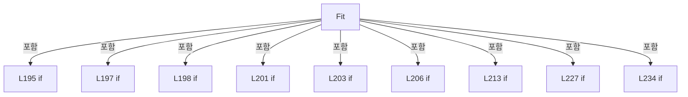
```mermaid
flowchart TD
 M["Fit"]
 N0["L195 if"]
 M -->|포함| N0
 N1["L197 if"]
 M -->|포함| N1
 N2["L198 if"]
 M -->|포함| N2
 N3["L201 if"]
 M -->|포함| N3
 N4["L203 if"]
 M -->|포함| N4
 N5["L206 if"]
 M -->|포함| N5
 N6["L213 if"]
 M -->|포함| N6
 N7["L227 if"]
 M -->|포함| N7
 N8["L234 if"]
 M -->|포함| N8
```

변경 전 점검: 입력/반환 타입, 위 호출자, 예외/취소 경로, 공유 상태와 저장·전송 소비자를 함께 확인합니다. 값의 단위나 물리 방향을 이름만으로 확정하지 않습니다.

### LocalFunctionStatement `Coefficient` · L214–214

[Drilling.Common/Correction/CDefaultOffsetCalibration.cs:214–214](https://github.com/kjuws10-rgb/A3Drilling/blob/28764c91d521777b8ee068dd7aaf2d3902ce9fe2/Drilling.Common/Correction/CDefaultOffsetCalibration.cs#L214-L214)

| 항목 | 실제 추출 값 |
| --- | --- |
| 서명 | double Coefficient(bool, bool) |
| 접근/수식자 | Private /  |
| 반환/값 타입 | double |
| 소속 타입 | NamedType:Drilling.Common.Correction.CDefaultOffsetCalibration |

입력 계약:

| 이름 | 타입 | 전달 | 선택/기본값 |
| --- | --- | --- | --- |
| x | bool | None | False /  |
| column | bool | None | False /  |

정적 호출자로 확인된 위치:

| 호출 파일/행 | 호출 표현식 | 런타임 분기 가능 |
| --- | --- | --- |
| [Drilling.Common/Correction/CDefaultOffsetCalibration.cs:215–215](https://github.com/kjuws10-rgb/A3Drilling/blob/28764c91d521777b8ee068dd7aaf2d3902ce9fe2/Drilling.Common/Correction/CDefaultOffsetCalibration.cs#L215-L215) | Coefficient | False |
| [Drilling.Common/Correction/CDefaultOffsetCalibration.cs:215–215](https://github.com/kjuws10-rgb/A3Drilling/blob/28764c91d521777b8ee068dd7aaf2d3902ce9fe2/Drilling.Common/Correction/CDefaultOffsetCalibration.cs#L215-L215) | Coefficient | False |
| [Drilling.Common/Correction/CDefaultOffsetCalibration.cs:216–216](https://github.com/kjuws10-rgb/A3Drilling/blob/28764c91d521777b8ee068dd7aaf2d3902ce9fe2/Drilling.Common/Correction/CDefaultOffsetCalibration.cs#L216-L216) | Coefficient | False |
| [Drilling.Common/Correction/CDefaultOffsetCalibration.cs:216–216](https://github.com/kjuws10-rgb/A3Drilling/blob/28764c91d521777b8ee068dd7aaf2d3902ce9fe2/Drilling.Common/Correction/CDefaultOffsetCalibration.cs#L216-L216) | Coefficient | False |

호출하는 대상과 해석 범위:

| 원본 행 | 표현식 | 분석 상태 | 대상/소스 위치 |
| --- | --- | --- | --- |
| 214 | marks.Sum | resolved | double System.Collections.Generic.IEnumerable<Drilling.Common.Correction.ST_DEFAULT_OFFSET_MARK>.Sum<Drilling.Common.Correction.ST_DEFAULT_OFFSET_MARK>(System.Func<Drilling.Common.Correction.ST_DEFAULT_OFFSET_MARK, double>) |

본문의 실제 연산·분기·예외·반환 순서(원문 위치 순):

| 원본 행 | 종류 | 주석 해설 |
| --- | --- | --- |
| 214 | call | 함수·델리게이트 또는 객체 생성자를 호출합니다: marks.Sum(m => ((column ? (m.Beam - 1) % gridSize : (m.Beam - 1) / gridSize) - center) * pitch * (x ? m.X - cx : m.Y - cy)) |
| 214 | conditional-expression | 조건에 따라 결과식을 선택합니다: column ? (m.Beam - 1) % gridSize : (m.Beam - 1) / gridSize |
| 214 | conditional-expression | 조건에 따라 결과식을 선택합니다: x ? m.X - cx : m.Y - cy |

변경 전 점검: 입력/반환 타입, 위 호출자, 예외/취소 경로, 공유 상태와 저장·전송 소비자를 함께 확인합니다. 값의 단위나 물리 방향을 이름만으로 확정하지 않습니다.

### MethodDeclaration `WithHeadReference` · L241–266

[Drilling.Common/Correction/CDefaultOffsetCalibration.cs:241–266](https://github.com/kjuws10-rgb/A3Drilling/blob/28764c91d521777b8ee068dd7aaf2d3902ce9fe2/Drilling.Common/Correction/CDefaultOffsetCalibration.cs#L241-L266)

| 항목 | 실제 추출 값 |
| --- | --- |
| 서명 | Drilling.Common.Correction.ST_DEFAULT_OFFSET_HEAD_RESULT Drilling.Common.Correction.CDefaultOffsetCalibration.WithHeadReference(System.Collections.Generic.IReadOnlyDictionary<string, string>, Drilling.Common.Correction.ST_DEFAULT_OFFSET_OPTIONS, Drilling.Common.Correction.ST_DEFAULT_OFFSET_HEAD_RESULT) |
| 접근/수식자 | Public / public, static |
| 반환/값 타입 | Drilling.Common.Correction.ST_DEFAULT_OFFSET_HEAD_RESULT |
| 소속 타입 | NamedType:Drilling.Common.Correction.CDefaultOffsetCalibration |

입력 계약:

| 이름 | 타입 | 전달 | 선택/기본값 |
| --- | --- | --- | --- |
| values | System.Collections.Generic.IReadOnlyDictionary<string, string> | None | False /  |
| options | Drilling.Common.Correction.ST_DEFAULT_OFFSET_OPTIONS | None | False /  |
| result | Drilling.Common.Correction.ST_DEFAULT_OFFSET_HEAD_RESULT | None | False /  |

정적 호출자로 확인된 위치:

| 호출 파일/행 | 호출 표현식 | 런타임 분기 가능 |
| --- | --- | --- |
| [Drilling.Common/Correction/CDefaultOffsetCalibration.cs:283–283](https://github.com/kjuws10-rgb/A3Drilling/blob/28764c91d521777b8ee068dd7aaf2d3902ce9fe2/Drilling.Common/Correction/CDefaultOffsetCalibration.cs#L283-L283) | WithHeadReference | False |
| [Drilling.UI/Menu/Menus/CMenuCorrection.cs:3920–3922](https://github.com/kjuws10-rgb/A3Drilling/blob/28764c91d521777b8ee068dd7aaf2d3902ce9fe2/Drilling.UI/Menu/Menus/CMenuCorrection.cs#L3920-L3922) | CDefaultOffsetCalibration.WithHeadReference | False |

호출하는 대상과 해석 범위:

| 원본 행 | 표현식 | 분석 상태 | 대상/소스 위치 |
| --- | --- | --- | --- |
| 243 | ValidateOptions | resolved | void Drilling.Common.Correction.CDefaultOffsetCalibration.ValidateOptions(Drilling.Common.Correction.ST_DEFAULT_OFFSET_OPTIONS) · Drilling.Common/Correction/CDefaultOffsetCalibration.cs:132 |
| 245 | result.Marks.Select(m => m.Beam).Order().SequenceEqual | resolved | bool System.Collections.Generic.IEnumerable<int>.SequenceEqual<int>(System.Collections.Generic.IEnumerable<int>) |
| 245 | result.Marks.Select(m => m.Beam).Order | resolved | System.Linq.IOrderedEnumerable<int> System.Collections.Generic.IEnumerable<int>.Order<int>() |
| 245 | result.Marks.Select | resolved | System.Collections.Generic.IEnumerable<int> System.Collections.Generic.IEnumerable<Drilling.Common.Correction.ST_DEFAULT_OFFSET_MARK>.Select<Drilling.Common.Correction.ST_DEFAULT_OFFSET_MARK, int>(System.Func<Drilling.Common.Correction.ST_DEFAULT_OFFSET_MARK, int>) |
| 245 | Enumerable.Range | resolved | System.Collections.Generic.IEnumerable<int> System.Linq.Enumerable.Range(int, int) |
| 246 | double.IsFinite | resolved | bool double.IsFinite(double) |
| 247 | result.Marks.Any | resolved | bool System.Collections.Generic.IEnumerable<Drilling.Common.Correction.ST_DEFAULT_OFFSET_MARK>.Any<Drilling.Common.Correction.ST_DEFAULT_OFFSET_MARK>(System.Func<Drilling.Common.Correction.ST_DEFAULT_OFFSET_MARK, bool>) |
| 247 | double.IsFinite | resolved | bool double.IsFinite(double) |
| 247 | double.IsFinite | resolved | bool double.IsFinite(double) |
| 248 | double.IsFinite | resolved | bool double.IsFinite(double) |
| 248 | double.IsFinite | resolved | bool double.IsFinite(double) |
| 249 | new InvalidOperationException | resolved | System.InvalidOperationException.InvalidOperationException(string?) |
| 250 | Number | resolved | double Drilling.Common.Correction.CDefaultOffsetCalibration.Number(System.Collections.Generic.IReadOnlyDictionary<string, string>, string) · Drilling.Common/Correction/CDefaultOffsetCalibration.cs:22 |
| 251 | CScannerAxisTransform.ReadStageDirection | resolved | double Drilling.Common.Recipe.CScannerAxisTransform.ReadStageDirection(System.Collections.Generic.IReadOnlyDictionary<string, string>) · Drilling.Common/Recipe/CShotCoordinatePlanBuilder.cs:1256 |
| 252 | values.ContainsKey | resolved · 동적 구현 선택 가능 | bool System.Collections.Generic.IReadOnlyDictionary<string, string>.ContainsKey(string) |
| 252 | Number | resolved | double Drilling.Common.Correction.CDefaultOffsetCalibration.Number(System.Collections.Generic.IReadOnlyDictionary<string, string>, string) · Drilling.Common/Correction/CDefaultOffsetCalibration.cs:22 |
| 253 | Number | resolved | double Drilling.Common.Correction.CDefaultOffsetCalibration.Number(System.Collections.Generic.IReadOnlyDictionary<string, string>, string) · Drilling.Common/Correction/CDefaultOffsetCalibration.cs:22 |
| 253 | Number | resolved | double Drilling.Common.Correction.CDefaultOffsetCalibration.Number(System.Collections.Generic.IReadOnlyDictionary<string, string>, string) · Drilling.Common/Correction/CDefaultOffsetCalibration.cs:22 |
| 259 | result.Marks.Average | resolved | double System.Collections.Generic.IEnumerable<Drilling.Common.Correction.ST_DEFAULT_OFFSET_MARK>.Average<Drilling.Common.Correction.ST_DEFAULT_OFFSET_MARK>(System.Func<Drilling.Common.Correction.ST_DEFAULT_OFFSET_MARK, double>) |
| 260 | result.Marks.Average | resolved | double System.Collections.Generic.IEnumerable<Drilling.Common.Correction.ST_DEFAULT_OFFSET_MARK>.Average<Drilling.Common.Correction.ST_DEFAULT_OFFSET_MARK>(System.Func<Drilling.Common.Correction.ST_DEFAULT_OFFSET_MARK, double>) |
| 261 | new[] { targetX, targetY, actualX, actualY }.Any | resolved | bool System.Collections.Generic.IEnumerable<double>.Any<double>(System.Func<double, bool>) |
| 261 | double.IsFinite | resolved | bool double.IsFinite(double) |
| 262 | new InvalidOperationException | resolved | System.InvalidOperationException.InvalidOperationException(string?) |

본문의 실제 연산·분기·예외·반환 순서(원문 위치 순):

| 원본 행 | 종류 | 주석 해설 |
| --- | --- | --- |
| 243 | call | 함수·델리게이트 또는 객체 생성자를 호출합니다: ValidateOptions(options) |
| 244 | local-declaration | 지역 변수를 선언합니다: var hasCompleteDoeMeasurement = result.Marks.Count is 1 or 16 && result.Marks.Select(m => m.Beam).Order().SequenceEqual(Enumerable.Range(1, result.Marks.Count)); |
| 244 | variable-initializer | 변수의 초기값을 지정합니다: hasCompleteDoeMeasurement = result.Marks.Count is 1 or 16 && result.Marks.Select(m => m.Beam).Order().SequenceEqual(Enumerable.Range(1, result.Marks.Count)) |
| 245 | call | 함수·델리게이트 또는 객체 생성자를 호출합니다: result.Marks.Select(m => m.Beam).Order().SequenceEqual(Enumerable.Range(1, result.Marks.Count)) |
| 245 | call | 함수·델리게이트 또는 객체 생성자를 호출합니다: result.Marks.Select(m => m.Beam).Order() |
| 245 | call | 함수·델리게이트 또는 객체 생성자를 호출합니다: result.Marks.Select(m => m.Beam) |
| 245 | call | 함수·델리게이트 또는 객체 생성자를 호출합니다: Enumerable.Range(1, result.Marks.Count) |
| 246 | call | 함수·델리게이트 또는 객체 생성자를 호출합니다: double.IsFinite(result.Q) |
| 246 | if | 조건에 따라 분기합니다: if (result.Head is < 1 or > 8 &#124;&#124; !double.IsFinite(result.Q) &#124;&#124; !hasCompleteDoeMeasurement &#124;&#124; result.Marks.Any(m => !double.IsFinite(m.EncoderX) &#124;&#124; !double.IsFinite(m.EncoderY) &#124;&#124; !double.IsFinite(m.CorrectionX) &#124;&#124; !double.Is…) |
| 247 | call | 함수·델리게이트 또는 객체 생성자를 호출합니다: double.IsFinite(m.EncoderX) |
| 247 | call | 함수·델리게이트 또는 객체 생성자를 호출합니다: double.IsFinite(m.EncoderY) |
| 247 | call | 함수·델리게이트 또는 객체 생성자를 호출합니다: result.Marks.Any(m => !double.IsFinite(m.EncoderX) &#124;&#124; !double.IsFinite(m.EncoderY) &#124;&#124; !double.IsFinite(m.CorrectionX) &#124;&#124; !double.IsFinite(m.CorrectionY)) |
| 248 | call | 함수·델리게이트 또는 객체 생성자를 호출합니다: double.IsFinite(m.CorrectionX) |
| 248 | call | 함수·델리게이트 또는 객체 생성자를 호출합니다: double.IsFinite(m.CorrectionY) |
| 249 | call | 함수·델리게이트 또는 객체 생성자를 호출합니다: new InvalidOperationException("Head 중심 계산에 중앙 1점 또는 완전한 DOE 16점 측정 좌표가 필요합니다.") |
| 249 | throw | 예외를 발생/전달합니다: throw new InvalidOperationException("Head 중심 계산에 중앙 1점 또는 완전한 DOE 16점 측정 좌표가 필요합니다."); |
| 250 | call | 함수·델리게이트 또는 객체 생성자를 호출합니다: Number(values, "HeadGapX") |
| 250 | local-declaration | 지역 변수를 선언합니다: var targetX = options.BoardCenterX + (result.Head - 4.5) * Number(values, "HeadGapX"); |
| 250 | variable-initializer | 변수의 초기값을 지정합니다: targetX = options.BoardCenterX + (result.Head - 4.5) * Number(values, "HeadGapX") |
| 251 | call | 함수·델리게이트 또는 객체 생성자를 호출합니다: CScannerAxisTransform.ReadStageDirection(values) |
| 251 | local-declaration | 지역 변수를 선언합니다: var direction = CScannerAxisTransform.ReadStageDirection(values); |
| 251 | variable-initializer | 변수의 초기값을 지정합니다: direction = CScannerAxisTransform.ReadStageDirection(values) |
| 252 | call | 함수·델리게이트 또는 객체 생성자를 호출합니다: values.ContainsKey($"H{result.Head:00}_AK_POSITION_Y") |
| 252 | call | 함수·델리게이트 또는 객체 생성자를 호출합니다: Number(values, $"H{result.Head:00}_AK_POSITION_Y") |
| 252 | conditional-expression | 조건에 따라 결과식을 선택합니다: values.ContainsKey($"H{result.Head:00}_AK_POSITION_Y") ? Number(values, $"H{result.Head:00}_AK_POSITION_Y") : Number(values, "REVIEW_TO_HEAD1_GAP_Y") + (result.Head % 2 == 0 ? Number(values, "HeadGapY") : 0) |
| 252 | local-declaration | 지역 변수를 선언합니다: var gapY = values.ContainsKey($"H{result.Head:00}_AK_POSITION_Y") ? Number(values, $"H{result.Head:00}_AK_POSITION_Y") : Number(values, "REVIEW_TO_HEAD1_GAP_Y") + (result.Head % 2 == 0 ? Number(values, "HeadGapY") : 0); |
| 252 | variable-initializer | 변수의 초기값을 지정합니다: gapY = values.ContainsKey($"H{result.Head:00}_AK_POSITION_Y") ? Number(values, $"H{result.Head:00}_AK_POSITION_Y") : Number(values, "REVIEW_TO_HEAD1_GAP_Y") + (result.Head % 2 == 0 ? Number(values, "HeadGapY") : 0) |
| 253 | call | 함수·델리게이트 또는 객체 생성자를 호출합니다: Number(values, "REVIEW_TO_HEAD1_GAP_Y") |
| 253 | call | 함수·델리게이트 또는 객체 생성자를 호출합니다: Number(values, "HeadGapY") |
| 253 | conditional-expression | 조건에 따라 결과식을 선택합니다: result.Head % 2 == 0 ? Number(values, "HeadGapY") : 0 |
| 254 | local-declaration | 지역 변수를 선언합니다: var targetY = result.Q - direction * gapY; |
| 254 | variable-initializer | 변수의 초기값을 지정합니다: targetY = result.Q - direction * gapY |
| 259 | call | 함수·델리게이트 또는 객체 생성자를 호출합니다: result.Marks.Average(m => m.EncoderX - m.CorrectionX) |
| 259 | local-declaration | 지역 변수를 선언합니다: var actualX = result.Marks.Average(m => m.EncoderX - m.CorrectionX); |
| 259 | variable-initializer | 변수의 초기값을 지정합니다: actualX = result.Marks.Average(m => m.EncoderX - m.CorrectionX) |
| 260 | call | 함수·델리게이트 또는 객체 생성자를 호출합니다: result.Marks.Average(m => m.EncoderY - direction * m.CorrectionY) |
| 260 | local-declaration | 지역 변수를 선언합니다: var actualY = result.Marks.Average(m => m.EncoderY - direction * m.CorrectionY); |
| 260 | variable-initializer | 변수의 초기값을 지정합니다: actualY = result.Marks.Average(m => m.EncoderY - direction * m.CorrectionY) |
| 261 | call | 함수·델리게이트 또는 객체 생성자를 호출합니다: new[] { targetX, targetY, actualX, actualY }.Any(v => !double.IsFinite(v)) |
| 261 | call | 함수·델리게이트 또는 객체 생성자를 호출합니다: double.IsFinite(v) |
| 261 | if | 조건에 따라 분기합니다: if (new[] { targetX, targetY, actualX, actualY }.Any(v => !double.IsFinite(v))) |
| 262 | call | 함수·델리게이트 또는 객체 생성자를 호출합니다: new InvalidOperationException("글래스 기준 목표 중심 또는 실측 중심 좌표를 확인해 주세요.") |
| 262 | throw | 예외를 발생/전달합니다: throw new InvalidOperationException("글래스 기준 목표 중심 또는 실측 중심 좌표를 확인해 주세요."); |
| 263 | assignment | 값을 대상에 대입합니다: TargetReviewX = targetX |
| 263 | assignment | 값을 대상에 대입합니다: TargetStageY = targetY |
| 263 | return | 호출자에게 값 또는 제어를 반환합니다: return result with { TargetReviewX = targetX, TargetStageY = targetY, CenterReviewX = actualX, CenterStageY = actualY, CenterErrorX = actualX - targetX, CenterErrorY = (actualY - targetY) / direction }; |
| 264 | assignment | 값을 대상에 대입합니다: CenterReviewX = actualX |
| 264 | assignment | 값을 대상에 대입합니다: CenterStageY = actualY |
| 265 | assignment | 값을 대상에 대입합니다: CenterErrorX = actualX - targetX |
| 265 | assignment | 값을 대상에 대입합니다: CenterErrorY = (actualY - targetY) / direction |

제어 구문의 포함 구조(실제 실행 순서/CFG가 아닌 구문 탐색 그림):

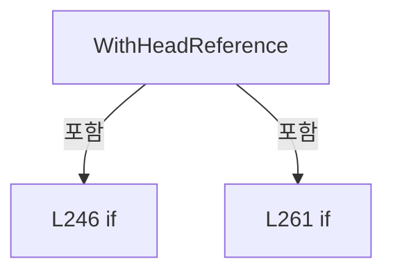
```mermaid
flowchart TD
 M["WithHeadReference"]
 N0["L246 if"]
 M -->|포함| N0
 N1["L261 if"]
 M -->|포함| N1
```

변경 전 점검: 입력/반환 타입, 위 호출자, 예외/취소 경로, 공유 상태와 저장·전송 소비자를 함께 확인합니다. 값의 단위나 물리 방향을 이름만으로 확정하지 않습니다.

### MethodDeclaration `ActiveHeads` · L268–269

[Drilling.Common/Correction/CDefaultOffsetCalibration.cs:268–269](https://github.com/kjuws10-rgb/A3Drilling/blob/28764c91d521777b8ee068dd7aaf2d3902ce9fe2/Drilling.Common/Correction/CDefaultOffsetCalibration.cs#L268-L269)

| 항목 | 실제 추출 값 |
| --- | --- |
| 서명 | int[] Drilling.Common.Correction.CDefaultOffsetCalibration.ActiveHeads(System.Collections.Generic.IReadOnlyDictionary<string, string>) |
| 접근/수식자 | Public / public, static |
| 반환/값 타입 | int[] |
| 소속 타입 | NamedType:Drilling.Common.Correction.CDefaultOffsetCalibration |

입력 계약:

| 이름 | 타입 | 전달 | 선택/기본값 |
| --- | --- | --- | --- |
| values | System.Collections.Generic.IReadOnlyDictionary<string, string> | None | False /  |

정적 호출자로 확인된 위치:

| 호출 파일/행 | 호출 표현식 | 런타임 분기 가능 |
| --- | --- | --- |
| [Drilling.Common/Correction/CDefaultOffsetCalibration.cs:274–274](https://github.com/kjuws10-rgb/A3Drilling/blob/28764c91d521777b8ee068dd7aaf2d3902ce9fe2/Drilling.Common/Correction/CDefaultOffsetCalibration.cs#L274-L274) | ActiveHeads | False |
| [Drilling.UI/Menu/Menus/CMenuCorrection.cs:3330–3330](https://github.com/kjuws10-rgb/A3Drilling/blob/28764c91d521777b8ee068dd7aaf2d3902ce9fe2/Drilling.UI/Menu/Menus/CMenuCorrection.cs#L3330-L3330) | CDefaultOffsetCalibration.ActiveHeads | False |
| [Drilling.UI/Menu/Menus/CMenuCorrection.cs:3349–3349](https://github.com/kjuws10-rgb/A3Drilling/blob/28764c91d521777b8ee068dd7aaf2d3902ce9fe2/Drilling.UI/Menu/Menus/CMenuCorrection.cs#L3349-L3349) | CDefaultOffsetCalibration.ActiveHeads | False |
| [Drilling.UI/Menu/Menus/CMenuCorrection.cs:3463–3463](https://github.com/kjuws10-rgb/A3Drilling/blob/28764c91d521777b8ee068dd7aaf2d3902ce9fe2/Drilling.UI/Menu/Menus/CMenuCorrection.cs#L3463-L3463) | CDefaultOffsetCalibration.ActiveHeads | False |
| [Drilling.UI/Menu/Menus/CMenuCorrection.cs:3942–3942](https://github.com/kjuws10-rgb/A3Drilling/blob/28764c91d521777b8ee068dd7aaf2d3902ce9fe2/Drilling.UI/Menu/Menus/CMenuCorrection.cs#L3942-L3942) | CDefaultOffsetCalibration.ActiveHeads | False |

호출하는 대상과 해석 범위:

| 원본 행 | 표현식 | 분석 상태 | 대상/소스 위치 |
| --- | --- | --- | --- |
| 269 | Enumerable.Range(1, 8).Where(h => CScannerAxisConfiguration.IsHeadEnabled(values, h)).ToArray | resolved | int[] System.Collections.Generic.IEnumerable<int>.ToArray<int>() |
| 269 | Enumerable.Range(1, 8).Where | resolved | System.Collections.Generic.IEnumerable<int> System.Collections.Generic.IEnumerable<int>.Where<int>(System.Func<int, bool>) |
| 269 | Enumerable.Range | resolved | System.Collections.Generic.IEnumerable<int> System.Linq.Enumerable.Range(int, int) |
| 269 | CScannerAxisConfiguration.IsHeadEnabled | resolved | bool Drilling.Common.Automation.CScannerAxisConfiguration.IsHeadEnabled(System.Collections.Generic.IReadOnlyDictionary<string, string>, int) · Drilling.Common/Automation/CScannerAxisConfiguration.cs:166 |

본문의 실제 연산·분기·예외·반환 순서(원문 위치 순):

| 원본 행 | 종류 | 주석 해설 |
| --- | --- | --- |
| 269 | call | 함수·델리게이트 또는 객체 생성자를 호출합니다: Enumerable.Range(1, 8).Where(h => CScannerAxisConfiguration.IsHeadEnabled(values, h)).ToArray() |
| 269 | call | 함수·델리게이트 또는 객체 생성자를 호출합니다: Enumerable.Range(1, 8).Where(h => CScannerAxisConfiguration.IsHeadEnabled(values, h)) |
| 269 | call | 함수·델리게이트 또는 객체 생성자를 호출합니다: Enumerable.Range(1, 8) |
| 269 | call | 함수·델리게이트 또는 객체 생성자를 호출합니다: CScannerAxisConfiguration.IsHeadEnabled(values, h) |

변경 전 점검: 입력/반환 타입, 위 호출자, 예외/취소 경로, 공유 상태와 저장·전송 소비자를 함께 확인합니다. 값의 단위나 물리 방향을 이름만으로 확정하지 않습니다.

### MethodDeclaration `Recommend` · L271–295

[Drilling.Common/Correction/CDefaultOffsetCalibration.cs:271–295](https://github.com/kjuws10-rgb/A3Drilling/blob/28764c91d521777b8ee068dd7aaf2d3902ce9fe2/Drilling.Common/Correction/CDefaultOffsetCalibration.cs#L271-L295)

| 항목 | 실제 추출 값 |
| --- | --- |
| 서명 | System.Collections.Generic.IReadOnlyDictionary<string, string> Drilling.Common.Correction.CDefaultOffsetCalibration.Recommend(System.Collections.Generic.IReadOnlyDictionary<string, string>, Drilling.Common.Correction.ST_DEFAULT_OFFSET_OPTIONS, System.Collections.Generic.IReadOnlyCollection<Drilling.Common.Correction.ST_DEFAULT_OFFSET_HEAD_RESULT>, System.Collections.Generic.IReadOnlyCollection<int>?) |
| 접근/수식자 | Public / public, static |
| 반환/값 타입 | System.Collections.Generic.IReadOnlyDictionary<string, string> |
| 소속 타입 | NamedType:Drilling.Common.Correction.CDefaultOffsetCalibration |

입력 계약:

| 이름 | 타입 | 전달 | 선택/기본값 |
| --- | --- | --- | --- |
| values | System.Collections.Generic.IReadOnlyDictionary<string, string> | None | False /  |
| options | Drilling.Common.Correction.ST_DEFAULT_OFFSET_OPTIONS | None | False /  |
| results | System.Collections.Generic.IReadOnlyCollection<Drilling.Common.Correction.ST_DEFAULT_OFFSET_HEAD_RESULT> | None | False /  |
| targetHeads | System.Collections.Generic.IReadOnlyCollection<int>? | None | True / null |

정적 호출자로 확인된 위치:

| 호출 파일/행 | 호출 표현식 | 런타임 분기 가능 |
| --- | --- | --- |
| [Drilling.UI/Menu/Menus/CMenuCorrection.cs:3319–3319](https://github.com/kjuws10-rgb/A3Drilling/blob/28764c91d521777b8ee068dd7aaf2d3902ce9fe2/Drilling.UI/Menu/Menus/CMenuCorrection.cs#L3319-L3319) | CDefaultOffsetCalibration.Recommend | False |
| [Drilling.UI/Menu/Menus/CMenuCorrection.cs:3499–3499](https://github.com/kjuws10-rgb/A3Drilling/blob/28764c91d521777b8ee068dd7aaf2d3902ce9fe2/Drilling.UI/Menu/Menus/CMenuCorrection.cs#L3499-L3499) | CDefaultOffsetCalibration.Recommend | False |

호출하는 대상과 해석 범위:

| 원본 행 | 표현식 | 분석 상태 | 대상/소스 위치 |
| --- | --- | --- | --- |
| 273 | ValidateOptions | resolved | void Drilling.Common.Correction.CDefaultOffsetCalibration.ValidateOptions(Drilling.Common.Correction.ST_DEFAULT_OFFSET_OPTIONS) · Drilling.Common/Correction/CDefaultOffsetCalibration.cs:132 |
| 274 | ActiveHeads(values).ToHashSet | resolved | System.Collections.Generic.HashSet<int> System.Collections.Generic.IEnumerable<int>.ToHashSet<int>() |
| 274 | ActiveHeads | resolved | int[] Drilling.Common.Correction.CDefaultOffsetCalibration.ActiveHeads(System.Collections.Generic.IReadOnlyDictionary<string, string>) · Drilling.Common/Correction/CDefaultOffsetCalibration.cs:268 |
| 275 | (targetHeads ?? active).Order().ToArray | resolved | int[] System.Collections.Generic.IEnumerable<int>.ToArray<int>() |
| 275 | (targetHeads ?? active).Order | resolved | System.Linq.IOrderedEnumerable<int> System.Collections.Generic.IEnumerable<int>.Order<int>() |
| 276 | targets.Distinct().Count | resolved | int System.Collections.Generic.IEnumerable<int>.Count<int>() |
| 276 | targets.Distinct | resolved | System.Collections.Generic.IEnumerable<int> System.Collections.Generic.IEnumerable<int>.Distinct<int>() |
| 276 | targets.Any | resolved | bool System.Collections.Generic.IEnumerable<int>.Any<int>(System.Func<int, bool>) |
| 276 | active.Contains | resolved | bool System.Collections.Generic.HashSet<int>.Contains(int) |
| 277 | new InvalidOperationException | resolved | System.InvalidOperationException.InvalidOperationException(string?) |
| 278 | results.Select(r => r.Head).Order().SequenceEqual | resolved | bool System.Collections.Generic.IEnumerable<int>.SequenceEqual<int>(System.Collections.Generic.IEnumerable<int>) |
| 278 | results.Select(r => r.Head).Order | resolved | System.Linq.IOrderedEnumerable<int> System.Collections.Generic.IEnumerable<int>.Order<int>() |
| 278 | results.Select | resolved | System.Collections.Generic.IEnumerable<int> System.Collections.Generic.IEnumerable<Drilling.Common.Correction.ST_DEFAULT_OFFSET_HEAD_RESULT>.Select<Drilling.Common.Correction.ST_DEFAULT_OFFSET_HEAD_RESULT, int>(System.Func<Drilling.Common.Correction.ST_DEFAULT_OFFSET_HEAD_RESULT, int>) |
| 279 | new InvalidOperationException | resolved | System.InvalidOperationException.InvalidOperationException(string?) |
| 280 | new Dictionary<string, string> | resolved | System.Collections.Generic.Dictionary<string, string>.Dictionary(System.Collections.Generic.IEqualityComparer<string>?) |
| 283 | WithHeadReference | resolved | Drilling.Common.Correction.ST_DEFAULT_OFFSET_HEAD_RESULT Drilling.Common.Correction.CDefaultOffsetCalibration.WithHeadReference(System.Collections.Generic.IReadOnlyDictionary<string, string>, Drilling.Common.Correction.ST_DEFAULT_OFFSET_OPTIONS, Drilling.Common.Correction.ST_DEFAULT_OFFSET_HEAD_RESULT) · Drilling.Common/Correction/CDefaultOffsetCalibration.cs:241 |
| 289 | Math.Round | resolved | double System.Math.Round(double, int, System.MidpointRounding) |
| 289 | Number | resolved | double Drilling.Common.Correction.CDefaultOffsetCalibration.Number(System.Collections.Generic.IReadOnlyDictionary<string, string>, string) · Drilling.Common/Correction/CDefaultOffsetCalibration.cs:22 |
| 290 | double.IsFinite | resolved | bool double.IsFinite(double) |
| 290 | Math.Abs | resolved | double System.Math.Abs(double) |
| 290 | new InvalidOperationException | resolved | System.InvalidOperationException.InvalidOperationException(string?) |
| 291 | next.ToString | resolved | string double.ToString(string?, System.IFormatProvider?) |

본문의 실제 연산·분기·예외·반환 순서(원문 위치 순):

| 원본 행 | 종류 | 주석 해설 |
| --- | --- | --- |
| 273 | call | 함수·델리게이트 또는 객체 생성자를 호출합니다: ValidateOptions(options) |
| 274 | call | 함수·델리게이트 또는 객체 생성자를 호출합니다: ActiveHeads(values).ToHashSet() |
| 274 | call | 함수·델리게이트 또는 객체 생성자를 호출합니다: ActiveHeads(values) |
| 274 | local-declaration | 지역 변수를 선언합니다: var active = ActiveHeads(values).ToHashSet(); |
| 274 | variable-initializer | 변수의 초기값을 지정합니다: active = ActiveHeads(values).ToHashSet() |
| 275 | call | 함수·델리게이트 또는 객체 생성자를 호출합니다: (targetHeads ?? active).Order().ToArray() |
| 275 | call | 함수·델리게이트 또는 객체 생성자를 호출합니다: (targetHeads ?? active).Order() |
| 275 | local-declaration | 지역 변수를 선언합니다: var targets = (targetHeads ?? active).Order().ToArray(); |
| 275 | variable-initializer | 변수의 초기값을 지정합니다: targets = (targetHeads ?? active).Order().ToArray() |
| 276 | call | 함수·델리게이트 또는 객체 생성자를 호출합니다: targets.Distinct().Count() |
| 276 | call | 함수·델리게이트 또는 객체 생성자를 호출합니다: targets.Distinct() |
| 276 | call | 함수·델리게이트 또는 객체 생성자를 호출합니다: targets.Any(h => !active.Contains(h)) |
| 276 | call | 함수·델리게이트 또는 객체 생성자를 호출합니다: active.Contains(h) |
| 276 | if | 조건에 따라 분기합니다: if (targets.Length == 0 &#124;&#124; targets.Distinct().Count() != targets.Length &#124;&#124; targets.Any(h => !active.Contains(h))) |
| 277 | call | 함수·델리게이트 또는 객체 생성자를 호출합니다: new InvalidOperationException("USE인 가공 대상 Head를 확인해 주세요.") |
| 277 | throw | 예외를 발생/전달합니다: throw new InvalidOperationException("USE인 가공 대상 Head를 확인해 주세요."); |
| 278 | call | 함수·델리게이트 또는 객체 생성자를 호출합니다: results.Select(r => r.Head).Order().SequenceEqual(targets) |
| 278 | call | 함수·델리게이트 또는 객체 생성자를 호출합니다: results.Select(r => r.Head).Order() |
| 278 | call | 함수·델리게이트 또는 객체 생성자를 호출합니다: results.Select(r => r.Head) |
| 278 | if | 조건에 따라 분기합니다: if (results.Count != targets.Length &#124;&#124; !results.Select(r => r.Head).Order().SequenceEqual(targets)) |
| 279 | call | 함수·델리게이트 또는 객체 생성자를 호출합니다: new InvalidOperationException($"{targets.Length}개 Head(USE)의 유효한 측정을 모두 완료해 주세요.") |
| 279 | throw | 예외를 발생/전달합니다: throw new InvalidOperationException($"{targets.Length}개 Head(USE)의 유효한 측정을 모두 완료해 주세요."); |
| 280 | call | 함수·델리게이트 또는 객체 생성자를 호출합니다: new Dictionary<string, string>(StringComparer.OrdinalIgnoreCase) |
| 280 | local-declaration | 지역 변수를 선언합니다: var changes = new Dictionary<string, string>(StringComparer.OrdinalIgnoreCase); |
| 280 | variable-initializer | 변수의 초기값을 지정합니다: changes = new Dictionary<string, string>(StringComparer.OrdinalIgnoreCase) |
| 281 | foreach | 컬렉션 요소를 순회합니다: foreach (var r in results) |
| 283 | call | 함수·델리게이트 또는 객체 생성자를 호출합니다: WithHeadReference(values, options, r) |
| 283 | local-declaration | 지역 변수를 선언합니다: var center = WithHeadReference(values, options, r); |
| 283 | variable-initializer | 변수의 초기값을 지정합니다: center = WithHeadReference(values, options, r) |
| 286 | foreach | 컬렉션 요소를 순회합니다: foreach (var (axis, error) in new[] { ("X", center.CenterErrorX), ("Y", center.CenterErrorY) }) { var key = $"H{r.Head:00}_DEFAULT_OFFSET_{axis}"; var next = Math.Round(Number(values, key) - error, 5, MidpointRounding.AwayFromZero |
| 288 | local-declaration | 지역 변수를 선언합니다: var key = $"H{r.Head:00}_DEFAULT_OFFSET_{axis}"; |
| 288 | variable-initializer | 변수의 초기값을 지정합니다: key = $"H{r.Head:00}_DEFAULT_OFFSET_{axis}" |
| 289 | call | 함수·델리게이트 또는 객체 생성자를 호출합니다: Math.Round(Number(values, key) - error, 5, MidpointRounding.AwayFromZero) |
| 289 | call | 함수·델리게이트 또는 객체 생성자를 호출합니다: Number(values, key) |
| 289 | local-declaration | 지역 변수를 선언합니다: var next = Math.Round(Number(values, key) - error, 5, MidpointRounding.AwayFromZero); |
| 289 | variable-initializer | 변수의 초기값을 지정합니다: next = Math.Round(Number(values, key) - error, 5, MidpointRounding.AwayFromZero) |
| 290 | call | 함수·델리게이트 또는 객체 생성자를 호출합니다: double.IsFinite(next) |
| 290 | call | 함수·델리게이트 또는 객체 생성자를 호출합니다: Math.Abs(next) |
| 290 | call | 함수·델리게이트 또는 객체 생성자를 호출합니다: new InvalidOperationException($"HEAD {r.Head:00} Default {axis}가 레시피 허용범위 ±100 mm를 초과합니다.") |
| 290 | if | 조건에 따라 분기합니다: if (!double.IsFinite(next) &#124;&#124; Math.Abs(next) > 100) |
| 290 | throw | 예외를 발생/전달합니다: throw new InvalidOperationException($"HEAD {r.Head:00} Default {axis}가 레시피 허용범위 ±100 mm를 초과합니다."); |
| 291 | assignment | 값을 대상에 대입합니다: changes[key] = next.ToString("0.00000", CultureInfo.InvariantCulture) |
| 291 | call | 함수·델리게이트 또는 객체 생성자를 호출합니다: next.ToString("0.00000", CultureInfo.InvariantCulture) |
| 294 | return | 호출자에게 값 또는 제어를 반환합니다: return changes; |

제어 구문의 포함 구조(실제 실행 순서/CFG가 아닌 구문 탐색 그림):

```mermaid
flowchart TD
 M["Recommend"]
 N0["L276 if"]
 M -->|포함| N0
 N1["L278 if"]
 M -->|포함| N1
 N2["L281 foreach"]
 M -->|포함| N2
 N3["L286 foreach"]
 N2 -->|포함| N3
 N4["L290 if"]
 N3 -->|포함| N4
```

변경 전 점검: 입력/반환 타입, 위 호출자, 예외/취소 경로, 공유 상태와 저장·전송 소비자를 함께 확인합니다. 값의 단위나 물리 방향을 이름만으로 확정하지 않습니다.

### EnumMemberDeclaration `Shot` · L298–298

[Drilling.Common/Correction/CDefaultOffsetCalibration.cs:298–298](https://github.com/kjuws10-rgb/A3Drilling/blob/28764c91d521777b8ee068dd7aaf2d3902ce9fe2/Drilling.Common/Correction/CDefaultOffsetCalibration.cs#L298-L298)

| 항목 | 실제 추출 값 |
| --- | --- |
| 서명 | Drilling.Common.Correction.EN_DEFAULT_MACHINING_MODE.Shot |
| 접근/수식자 | Public /  |
| 반환/값 타입 | Drilling.Common.Correction.EN_DEFAULT_MACHINING_MODE |
| 소속 타입 | NamedType:Drilling.Common.Correction.EN_DEFAULT_MACHINING_MODE |

현재 부분 분석에서 직접 연결된 호출자는 없습니다. XAML/이벤트/인터페이스·델리게이트·외부 진입을 추가 확인해야 하며, 미사용으로 판정한 것이 아닙니다.

변경 전 점검: 입력/반환 타입, 위 호출자, 예외/취소 경로, 공유 상태와 저장·전송 소비자를 함께 확인합니다. 값의 단위나 물리 방향을 이름만으로 확정하지 않습니다.

### EnumMemberDeclaration `Cross` · L298–298

[Drilling.Common/Correction/CDefaultOffsetCalibration.cs:298–298](https://github.com/kjuws10-rgb/A3Drilling/blob/28764c91d521777b8ee068dd7aaf2d3902ce9fe2/Drilling.Common/Correction/CDefaultOffsetCalibration.cs#L298-L298)

| 항목 | 실제 추출 값 |
| --- | --- |
| 서명 | Drilling.Common.Correction.EN_DEFAULT_MACHINING_MODE.Cross |
| 접근/수식자 | Public /  |
| 반환/값 타입 | Drilling.Common.Correction.EN_DEFAULT_MACHINING_MODE |
| 소속 타입 | NamedType:Drilling.Common.Correction.EN_DEFAULT_MACHINING_MODE |

현재 부분 분석에서 직접 연결된 호출자는 없습니다. XAML/이벤트/인터페이스·델리게이트·외부 진입을 추가 확인해야 하며, 미사용으로 판정한 것이 아닙니다.

변경 전 점검: 입력/반환 타입, 위 호출자, 예외/취소 경로, 공유 상태와 저장·전송 소비자를 함께 확인합니다. 값의 단위나 물리 방향을 이름만으로 확정하지 않습니다.

### PropertyDeclaration `BoardCenterX` · L301–301

[Drilling.Common/Correction/CDefaultOffsetCalibration.cs:301–301](https://github.com/kjuws10-rgb/A3Drilling/blob/28764c91d521777b8ee068dd7aaf2d3902ce9fe2/Drilling.Common/Correction/CDefaultOffsetCalibration.cs#L301-L301)

| 항목 | 실제 추출 값 |
| --- | --- |
| 서명 | double Drilling.Common.Correction.ST_DEFAULT_OFFSET_OPTIONS.BoardCenterX |
| 접근/수식자 | Public / public |
| 반환/값 타입 | double |
| 소속 타입 | NamedType:Drilling.Common.Correction.ST_DEFAULT_OFFSET_OPTIONS |

현재 부분 분석에서 직접 연결된 호출자는 없습니다. XAML/이벤트/인터페이스·델리게이트·외부 진입을 추가 확인해야 하며, 미사용으로 판정한 것이 아닙니다.

변경 전 점검: 입력/반환 타입, 위 호출자, 예외/취소 경로, 공유 상태와 저장·전송 소비자를 함께 확인합니다. 값의 단위나 물리 방향을 이름만으로 확정하지 않습니다.

### PropertyDeclaration `MachiningMode` · L302–302

[Drilling.Common/Correction/CDefaultOffsetCalibration.cs:302–302](https://github.com/kjuws10-rgb/A3Drilling/blob/28764c91d521777b8ee068dd7aaf2d3902ce9fe2/Drilling.Common/Correction/CDefaultOffsetCalibration.cs#L302-L302)

| 항목 | 실제 추출 값 |
| --- | --- |
| 서명 | Drilling.Common.Correction.EN_DEFAULT_MACHINING_MODE Drilling.Common.Correction.ST_DEFAULT_OFFSET_OPTIONS.MachiningMode |
| 접근/수식자 | Public / public |
| 반환/값 타입 | Drilling.Common.Correction.EN_DEFAULT_MACHINING_MODE |
| 소속 타입 | NamedType:Drilling.Common.Correction.ST_DEFAULT_OFFSET_OPTIONS |

현재 부분 분석에서 직접 연결된 호출자는 없습니다. XAML/이벤트/인터페이스·델리게이트·외부 진입을 추가 확인해야 하며, 미사용으로 판정한 것이 아닙니다.

변경 전 점검: 입력/반환 타입, 위 호출자, 예외/취소 경로, 공유 상태와 저장·전송 소비자를 함께 확인합니다. 값의 단위나 물리 방향을 이름만으로 확정하지 않습니다.

### GetAccessorDeclaration `get_MachiningMode` · L302–302

[Drilling.Common/Correction/CDefaultOffsetCalibration.cs:302–302](https://github.com/kjuws10-rgb/A3Drilling/blob/28764c91d521777b8ee068dd7aaf2d3902ce9fe2/Drilling.Common/Correction/CDefaultOffsetCalibration.cs#L302-L302)

| 항목 | 실제 추출 값 |
| --- | --- |
| 서명 | Drilling.Common.Correction.EN_DEFAULT_MACHINING_MODE Drilling.Common.Correction.ST_DEFAULT_OFFSET_OPTIONS.MachiningMode.get |
| 접근/수식자 | Public / get |
| 반환/값 타입 | Drilling.Common.Correction.EN_DEFAULT_MACHINING_MODE |
| 소속 타입 | NamedType:Drilling.Common.Correction.ST_DEFAULT_OFFSET_OPTIONS |

현재 부분 분석에서 직접 연결된 호출자는 없습니다. XAML/이벤트/인터페이스·델리게이트·외부 진입을 추가 확인해야 하며, 미사용으로 판정한 것이 아닙니다.

변경 전 점검: 입력/반환 타입, 위 호출자, 예외/취소 경로, 공유 상태와 저장·전송 소비자를 함께 확인합니다. 값의 단위나 물리 방향을 이름만으로 확정하지 않습니다.

### InitAccessorDeclaration `set_MachiningMode` · L302–302

[Drilling.Common/Correction/CDefaultOffsetCalibration.cs:302–302](https://github.com/kjuws10-rgb/A3Drilling/blob/28764c91d521777b8ee068dd7aaf2d3902ce9fe2/Drilling.Common/Correction/CDefaultOffsetCalibration.cs#L302-L302)

| 항목 | 실제 추출 값 |
| --- | --- |
| 서명 | void Drilling.Common.Correction.ST_DEFAULT_OFFSET_OPTIONS.MachiningMode.init |
| 접근/수식자 | Public / init |
| 반환/값 타입 | void |
| 소속 타입 | NamedType:Drilling.Common.Correction.ST_DEFAULT_OFFSET_OPTIONS |

입력 계약:

| 이름 | 타입 | 전달 | 선택/기본값 |
| --- | --- | --- | --- |
| value | Drilling.Common.Correction.EN_DEFAULT_MACHINING_MODE | None | False /  |

현재 부분 분석에서 직접 연결된 호출자는 없습니다. XAML/이벤트/인터페이스·델리게이트·외부 진입을 추가 확인해야 하며, 미사용으로 판정한 것이 아닙니다.

변경 전 점검: 입력/반환 타입, 위 호출자, 예외/취소 경로, 공유 상태와 저장·전송 소비자를 함께 확인합니다. 값의 단위나 물리 방향을 이름만으로 확정하지 않습니다.

### PropertyDeclaration `CrossSize` · L303–303

[Drilling.Common/Correction/CDefaultOffsetCalibration.cs:303–303](https://github.com/kjuws10-rgb/A3Drilling/blob/28764c91d521777b8ee068dd7aaf2d3902ce9fe2/Drilling.Common/Correction/CDefaultOffsetCalibration.cs#L303-L303)

| 항목 | 실제 추출 값 |
| --- | --- |
| 서명 | double Drilling.Common.Correction.ST_DEFAULT_OFFSET_OPTIONS.CrossSize |
| 접근/수식자 | Public / public |
| 반환/값 타입 | double |
| 소속 타입 | NamedType:Drilling.Common.Correction.ST_DEFAULT_OFFSET_OPTIONS |

현재 부분 분석에서 직접 연결된 호출자는 없습니다. XAML/이벤트/인터페이스·델리게이트·외부 진입을 추가 확인해야 하며, 미사용으로 판정한 것이 아닙니다.

변경 전 점검: 입력/반환 타입, 위 호출자, 예외/취소 경로, 공유 상태와 저장·전송 소비자를 함께 확인합니다. 값의 단위나 물리 방향을 이름만으로 확정하지 않습니다.

### GetAccessorDeclaration `get_CrossSize` · L303–303

[Drilling.Common/Correction/CDefaultOffsetCalibration.cs:303–303](https://github.com/kjuws10-rgb/A3Drilling/blob/28764c91d521777b8ee068dd7aaf2d3902ce9fe2/Drilling.Common/Correction/CDefaultOffsetCalibration.cs#L303-L303)

| 항목 | 실제 추출 값 |
| --- | --- |
| 서명 | double Drilling.Common.Correction.ST_DEFAULT_OFFSET_OPTIONS.CrossSize.get |
| 접근/수식자 | Public / get |
| 반환/값 타입 | double |
| 소속 타입 | NamedType:Drilling.Common.Correction.ST_DEFAULT_OFFSET_OPTIONS |

현재 부분 분석에서 직접 연결된 호출자는 없습니다. XAML/이벤트/인터페이스·델리게이트·외부 진입을 추가 확인해야 하며, 미사용으로 판정한 것이 아닙니다.

변경 전 점검: 입력/반환 타입, 위 호출자, 예외/취소 경로, 공유 상태와 저장·전송 소비자를 함께 확인합니다. 값의 단위나 물리 방향을 이름만으로 확정하지 않습니다.

### InitAccessorDeclaration `set_CrossSize` · L303–303

[Drilling.Common/Correction/CDefaultOffsetCalibration.cs:303–303](https://github.com/kjuws10-rgb/A3Drilling/blob/28764c91d521777b8ee068dd7aaf2d3902ce9fe2/Drilling.Common/Correction/CDefaultOffsetCalibration.cs#L303-L303)

| 항목 | 실제 추출 값 |
| --- | --- |
| 서명 | void Drilling.Common.Correction.ST_DEFAULT_OFFSET_OPTIONS.CrossSize.init |
| 접근/수식자 | Public / init |
| 반환/값 타입 | void |
| 소속 타입 | NamedType:Drilling.Common.Correction.ST_DEFAULT_OFFSET_OPTIONS |

입력 계약:

| 이름 | 타입 | 전달 | 선택/기본값 |
| --- | --- | --- | --- |
| value | double | None | False /  |

현재 부분 분석에서 직접 연결된 호출자는 없습니다. XAML/이벤트/인터페이스·델리게이트·외부 진입을 추가 확인해야 하며, 미사용으로 판정한 것이 아닙니다.

변경 전 점검: 입력/반환 타입, 위 호출자, 예외/취소 경로, 공유 상태와 저장·전송 소비자를 함께 확인합니다. 값의 단위나 물리 방향을 이름만으로 확정하지 않습니다.

### PropertyDeclaration `DoeBeamGridSize` · L304–304

[Drilling.Common/Correction/CDefaultOffsetCalibration.cs:304–304](https://github.com/kjuws10-rgb/A3Drilling/blob/28764c91d521777b8ee068dd7aaf2d3902ce9fe2/Drilling.Common/Correction/CDefaultOffsetCalibration.cs#L304-L304)

| 항목 | 실제 추출 값 |
| --- | --- |
| 서명 | int Drilling.Common.Correction.ST_DEFAULT_OFFSET_OPTIONS.DoeBeamGridSize |
| 접근/수식자 | Public / public |
| 반환/값 타입 | int |
| 소속 타입 | NamedType:Drilling.Common.Correction.ST_DEFAULT_OFFSET_OPTIONS |

현재 부분 분석에서 직접 연결된 호출자는 없습니다. XAML/이벤트/인터페이스·델리게이트·외부 진입을 추가 확인해야 하며, 미사용으로 판정한 것이 아닙니다.

변경 전 점검: 입력/반환 타입, 위 호출자, 예외/취소 경로, 공유 상태와 저장·전송 소비자를 함께 확인합니다. 값의 단위나 물리 방향을 이름만으로 확정하지 않습니다.

### GetAccessorDeclaration `get_DoeBeamGridSize` · L304–304

[Drilling.Common/Correction/CDefaultOffsetCalibration.cs:304–304](https://github.com/kjuws10-rgb/A3Drilling/blob/28764c91d521777b8ee068dd7aaf2d3902ce9fe2/Drilling.Common/Correction/CDefaultOffsetCalibration.cs#L304-L304)

| 항목 | 실제 추출 값 |
| --- | --- |
| 서명 | int Drilling.Common.Correction.ST_DEFAULT_OFFSET_OPTIONS.DoeBeamGridSize.get |
| 접근/수식자 | Public / get |
| 반환/값 타입 | int |
| 소속 타입 | NamedType:Drilling.Common.Correction.ST_DEFAULT_OFFSET_OPTIONS |

현재 부분 분석에서 직접 연결된 호출자는 없습니다. XAML/이벤트/인터페이스·델리게이트·외부 진입을 추가 확인해야 하며, 미사용으로 판정한 것이 아닙니다.

변경 전 점검: 입력/반환 타입, 위 호출자, 예외/취소 경로, 공유 상태와 저장·전송 소비자를 함께 확인합니다. 값의 단위나 물리 방향을 이름만으로 확정하지 않습니다.

### InitAccessorDeclaration `set_DoeBeamGridSize` · L304–304

[Drilling.Common/Correction/CDefaultOffsetCalibration.cs:304–304](https://github.com/kjuws10-rgb/A3Drilling/blob/28764c91d521777b8ee068dd7aaf2d3902ce9fe2/Drilling.Common/Correction/CDefaultOffsetCalibration.cs#L304-L304)

| 항목 | 실제 추출 값 |
| --- | --- |
| 서명 | void Drilling.Common.Correction.ST_DEFAULT_OFFSET_OPTIONS.DoeBeamGridSize.init |
| 접근/수식자 | Public / init |
| 반환/값 타입 | void |
| 소속 타입 | NamedType:Drilling.Common.Correction.ST_DEFAULT_OFFSET_OPTIONS |

입력 계약:

| 이름 | 타입 | 전달 | 선택/기본값 |
| --- | --- | --- | --- |
| value | int | None | False /  |

현재 부분 분석에서 직접 연결된 호출자는 없습니다. XAML/이벤트/인터페이스·델리게이트·외부 진입을 추가 확인해야 하며, 미사용으로 판정한 것이 아닙니다.

변경 전 점검: 입력/반환 타입, 위 호출자, 예외/취소 경로, 공유 상태와 저장·전송 소비자를 함께 확인합니다. 값의 단위나 물리 방향을 이름만으로 확정하지 않습니다.

### PropertyDeclaration `InspectionPointCount` · L307–307

[Drilling.Common/Correction/CDefaultOffsetCalibration.cs:307–307](https://github.com/kjuws10-rgb/A3Drilling/blob/28764c91d521777b8ee068dd7aaf2d3902ce9fe2/Drilling.Common/Correction/CDefaultOffsetCalibration.cs#L307-L307)

| 항목 | 실제 추출 값 |
| --- | --- |
| 서명 | int Drilling.Common.Correction.ST_DEFAULT_OFFSET_OPTIONS.InspectionPointCount |
| 접근/수식자 | Public / public |
| 반환/값 타입 | int |
| 소속 타입 | NamedType:Drilling.Common.Correction.ST_DEFAULT_OFFSET_OPTIONS |

현재 부분 분석에서 직접 연결된 호출자는 없습니다. XAML/이벤트/인터페이스·델리게이트·외부 진입을 추가 확인해야 하며, 미사용으로 판정한 것이 아닙니다.

변경 전 점검: 입력/반환 타입, 위 호출자, 예외/취소 경로, 공유 상태와 저장·전송 소비자를 함께 확인합니다. 값의 단위나 물리 방향을 이름만으로 확정하지 않습니다.

### PropertyDeclaration `VisionMethod` · L312–314

[Drilling.Common/Correction/CDefaultOffsetCalibration.cs:312–314](https://github.com/kjuws10-rgb/A3Drilling/blob/28764c91d521777b8ee068dd7aaf2d3902ce9fe2/Drilling.Common/Correction/CDefaultOffsetCalibration.cs#L312-L314)

| 항목 | 실제 추출 값 |
| --- | --- |
| 서명 | Drilling.Common.Review.EN_ONE_SHOT_METHOD Drilling.Common.Correction.ST_DEFAULT_OFFSET_OPTIONS.VisionMethod |
| 접근/수식자 | Public / public |
| 반환/값 타입 | Drilling.Common.Review.EN_ONE_SHOT_METHOD |
| 소속 타입 | NamedType:Drilling.Common.Correction.ST_DEFAULT_OFFSET_OPTIONS |

현재 부분 분석에서 직접 연결된 호출자는 없습니다. XAML/이벤트/인터페이스·델리게이트·외부 진입을 추가 확인해야 하며, 미사용으로 판정한 것이 아닙니다.

본문의 실제 연산·분기·예외·반환 순서(원문 위치 순):

| 원본 행 | 종류 | 주석 해설 |
| --- | --- | --- |
| 312 | conditional-expression | 조건에 따라 결과식을 선택합니다: MachiningMode == EN_DEFAULT_MACHINING_MODE.Cross ? EN_ONE_SHOT_METHOD.MarkFindSettingSingle : EN_ONE_SHOT_METHOD.MarkFindSingle |

변경 전 점검: 입력/반환 타입, 위 호출자, 예외/취소 경로, 공유 상태와 저장·전송 소비자를 함께 확인합니다. 값의 단위나 물리 방향을 이름만으로 확정하지 않습니다.

### PropertyDeclaration `InspectionDescription` · L315–317

[Drilling.Common/Correction/CDefaultOffsetCalibration.cs:315–317](https://github.com/kjuws10-rgb/A3Drilling/blob/28764c91d521777b8ee068dd7aaf2d3902ce9fe2/Drilling.Common/Correction/CDefaultOffsetCalibration.cs#L315-L317)

| 항목 | 실제 추출 값 |
| --- | --- |
| 서명 | string Drilling.Common.Correction.ST_DEFAULT_OFFSET_OPTIONS.InspectionDescription |
| 접근/수식자 | Public / public |
| 반환/값 타입 | string |
| 소속 타입 | NamedType:Drilling.Common.Correction.ST_DEFAULT_OFFSET_OPTIONS |

현재 부분 분석에서 직접 연결된 호출자는 없습니다. XAML/이벤트/인터페이스·델리게이트·외부 진입을 추가 확인해야 하며, 미사용으로 판정한 것이 아닙니다.

본문의 실제 연산·분기·예외·반환 순서(원문 위치 순):

| 원본 행 | 종류 | 주석 해설 |
| --- | --- | --- |
| 315 | conditional-expression | 조건에 따라 결과식을 선택합니다: MachiningMode == EN_DEFAULT_MACHINING_MODE.Cross ? $"DOE ON {InspectionPointCount}개 십자 / DOE OFF 중앙 십자 1점 측정" : $"DOE ON {InspectionPointCount}빔 / DOE OFF 중앙 1점 측정" |

변경 전 점검: 입력/반환 타입, 위 호출자, 예외/취소 경로, 공유 상태와 저장·전송 소비자를 함께 확인합니다. 값의 단위나 물리 방향을 이름만으로 확정하지 않습니다.

### PropertyDeclaration `MachiningDescription` · L318–320

[Drilling.Common/Correction/CDefaultOffsetCalibration.cs:318–320](https://github.com/kjuws10-rgb/A3Drilling/blob/28764c91d521777b8ee068dd7aaf2d3902ce9fe2/Drilling.Common/Correction/CDefaultOffsetCalibration.cs#L318-L320)

| 항목 | 실제 추출 값 |
| --- | --- |
| 서명 | string Drilling.Common.Correction.ST_DEFAULT_OFFSET_OPTIONS.MachiningDescription |
| 접근/수식자 | Public / public |
| 반환/값 타입 | string |
| 소속 타입 | NamedType:Drilling.Common.Correction.ST_DEFAULT_OFFSET_OPTIONS |

현재 부분 분석에서 직접 연결된 호출자는 없습니다. XAML/이벤트/인터페이스·델리게이트·외부 진입을 추가 확인해야 하며, 미사용으로 판정한 것이 아닙니다.

호출하는 대상과 해석 범위:

| 원본 행 | 표현식 | 분석 상태 | 대상/소스 위치 |
| --- | --- | --- | --- |
| 319 | CrossSize.ToString | resolved | string double.ToString(string?, System.IFormatProvider?) |

본문의 실제 연산·분기·예외·반환 순서(원문 위치 순):

| 원본 행 | 종류 | 주석 해설 |
| --- | --- | --- |
| 318 | conditional-expression | 조건에 따라 결과식을 선택합니다: MachiningMode == EN_DEFAULT_MACHINING_MODE.Cross ? $"십자 가공 · DOE ON {DoeBeamGridSize}×{DoeBeamGridSize} / DOE OFF 중앙 1개 형상 · 전체 길이 {CrossSize.ToString("0.#####", CultureInfo.InvariantCulture)} mm · Head Jump Speed 사용" : $"샷 가공 · D |
| 319 | call | 함수·델리게이트 또는 객체 생성자를 호출합니다: CrossSize.ToString("0.#####", CultureInfo.InvariantCulture) |

변경 전 점검: 입력/반환 타입, 위 호출자, 예외/취소 경로, 공유 상태와 저장·전송 소비자를 함께 확인합니다. 값의 단위나 물리 방향을 이름만으로 확정하지 않습니다.

### PropertyDeclaration `VisionDescription` · L321–321

[Drilling.Common/Correction/CDefaultOffsetCalibration.cs:321–321](https://github.com/kjuws10-rgb/A3Drilling/blob/28764c91d521777b8ee068dd7aaf2d3902ce9fe2/Drilling.Common/Correction/CDefaultOffsetCalibration.cs#L321-L321)

| 항목 | 실제 추출 값 |
| --- | --- |
| 서명 | string Drilling.Common.Correction.ST_DEFAULT_OFFSET_OPTIONS.VisionDescription |
| 접근/수식자 | Public / public |
| 반환/값 타입 | string |
| 소속 타입 | NamedType:Drilling.Common.Correction.ST_DEFAULT_OFFSET_OPTIONS |

현재 부분 분석에서 직접 연결된 호출자는 없습니다. XAML/이벤트/인터페이스·델리게이트·외부 진입을 추가 확인해야 하며, 미사용으로 판정한 것이 아닙니다.

본문의 실제 연산·분기·예외·반환 순서(원문 위치 순):

| 원본 행 | 종류 | 주석 해설 |
| --- | --- | --- |
| 321 | conditional-expression | 조건에 따라 결과식을 선택합니다: VisionMethod == EN_ONE_SHOT_METHOD.MarkFindSettingSingle ? "Mark Find Setting Single" : "Mark Find Single" |

변경 전 점검: 입력/반환 타입, 위 호출자, 예외/취소 경로, 공유 상태와 저장·전송 소비자를 함께 확인합니다. 값의 단위나 물리 방향을 이름만으로 확정하지 않습니다.

### PropertyDeclaration `DoeExists` · L329–329

[Drilling.Common/Correction/CDefaultOffsetCalibration.cs:329–329](https://github.com/kjuws10-rgb/A3Drilling/blob/28764c91d521777b8ee068dd7aaf2d3902ce9fe2/Drilling.Common/Correction/CDefaultOffsetCalibration.cs#L329-L329)

| 항목 | 실제 추출 값 |
| --- | --- |
| 서명 | bool Drilling.Common.Correction.ST_DEFAULT_OFFSET_HEAD_RESULT.DoeExists |
| 접근/수식자 | Public / public |
| 반환/값 타입 | bool |
| 소속 타입 | NamedType:Drilling.Common.Correction.ST_DEFAULT_OFFSET_HEAD_RESULT |

현재 부분 분석에서 직접 연결된 호출자는 없습니다. XAML/이벤트/인터페이스·델리게이트·외부 진입을 추가 확인해야 하며, 미사용으로 판정한 것이 아닙니다.

변경 전 점검: 입력/반환 타입, 위 호출자, 예외/취소 경로, 공유 상태와 저장·전송 소비자를 함께 확인합니다. 값의 단위나 물리 방향을 이름만으로 확정하지 않습니다.

### GetAccessorDeclaration `get_DoeExists` · L329–329

[Drilling.Common/Correction/CDefaultOffsetCalibration.cs:329–329](https://github.com/kjuws10-rgb/A3Drilling/blob/28764c91d521777b8ee068dd7aaf2d3902ce9fe2/Drilling.Common/Correction/CDefaultOffsetCalibration.cs#L329-L329)

| 항목 | 실제 추출 값 |
| --- | --- |
| 서명 | bool Drilling.Common.Correction.ST_DEFAULT_OFFSET_HEAD_RESULT.DoeExists.get |
| 접근/수식자 | Public / get |
| 반환/값 타입 | bool |
| 소속 타입 | NamedType:Drilling.Common.Correction.ST_DEFAULT_OFFSET_HEAD_RESULT |

현재 부분 분석에서 직접 연결된 호출자는 없습니다. XAML/이벤트/인터페이스·델리게이트·외부 진입을 추가 확인해야 하며, 미사용으로 판정한 것이 아닙니다.

변경 전 점검: 입력/반환 타입, 위 호출자, 예외/취소 경로, 공유 상태와 저장·전송 소비자를 함께 확인합니다. 값의 단위나 물리 방향을 이름만으로 확정하지 않습니다.

### InitAccessorDeclaration `set_DoeExists` · L329–329

[Drilling.Common/Correction/CDefaultOffsetCalibration.cs:329–329](https://github.com/kjuws10-rgb/A3Drilling/blob/28764c91d521777b8ee068dd7aaf2d3902ce9fe2/Drilling.Common/Correction/CDefaultOffsetCalibration.cs#L329-L329)

| 항목 | 실제 추출 값 |
| --- | --- |
| 서명 | void Drilling.Common.Correction.ST_DEFAULT_OFFSET_HEAD_RESULT.DoeExists.init |
| 접근/수식자 | Public / init |
| 반환/값 타입 | void |
| 소속 타입 | NamedType:Drilling.Common.Correction.ST_DEFAULT_OFFSET_HEAD_RESULT |

입력 계약:

| 이름 | 타입 | 전달 | 선택/기본값 |
| --- | --- | --- | --- |
| value | bool | None | False /  |

현재 부분 분석에서 직접 연결된 호출자는 없습니다. XAML/이벤트/인터페이스·델리게이트·외부 진입을 추가 확인해야 하며, 미사용으로 판정한 것이 아닙니다.

변경 전 점검: 입력/반환 타입, 위 호출자, 예외/취소 경로, 공유 상태와 저장·전송 소비자를 함께 확인합니다. 값의 단위나 물리 방향을 이름만으로 확정하지 않습니다.

### PropertyDeclaration `Model` · L330–330

[Drilling.Common/Correction/CDefaultOffsetCalibration.cs:330–330](https://github.com/kjuws10-rgb/A3Drilling/blob/28764c91d521777b8ee068dd7aaf2d3902ce9fe2/Drilling.Common/Correction/CDefaultOffsetCalibration.cs#L330-L330)

| 항목 | 실제 추출 값 |
| --- | --- |
| 서명 | int Drilling.Common.Correction.ST_DEFAULT_OFFSET_HEAD_RESULT.Model |
| 접근/수식자 | Public / public |
| 반환/값 타입 | int |
| 소속 타입 | NamedType:Drilling.Common.Correction.ST_DEFAULT_OFFSET_HEAD_RESULT |

현재 부분 분석에서 직접 연결된 호출자는 없습니다. XAML/이벤트/인터페이스·델리게이트·외부 진입을 추가 확인해야 하며, 미사용으로 판정한 것이 아닙니다.

변경 전 점검: 입력/반환 타입, 위 호출자, 예외/취소 경로, 공유 상태와 저장·전송 소비자를 함께 확인합니다. 값의 단위나 물리 방향을 이름만으로 확정하지 않습니다.

### GetAccessorDeclaration `get_Model` · L330–330

[Drilling.Common/Correction/CDefaultOffsetCalibration.cs:330–330](https://github.com/kjuws10-rgb/A3Drilling/blob/28764c91d521777b8ee068dd7aaf2d3902ce9fe2/Drilling.Common/Correction/CDefaultOffsetCalibration.cs#L330-L330)

| 항목 | 실제 추출 값 |
| --- | --- |
| 서명 | int Drilling.Common.Correction.ST_DEFAULT_OFFSET_HEAD_RESULT.Model.get |
| 접근/수식자 | Public / get |
| 반환/값 타입 | int |
| 소속 타입 | NamedType:Drilling.Common.Correction.ST_DEFAULT_OFFSET_HEAD_RESULT |

현재 부분 분석에서 직접 연결된 호출자는 없습니다. XAML/이벤트/인터페이스·델리게이트·외부 진입을 추가 확인해야 하며, 미사용으로 판정한 것이 아닙니다.

변경 전 점검: 입력/반환 타입, 위 호출자, 예외/취소 경로, 공유 상태와 저장·전송 소비자를 함께 확인합니다. 값의 단위나 물리 방향을 이름만으로 확정하지 않습니다.

### InitAccessorDeclaration `set_Model` · L330–330

[Drilling.Common/Correction/CDefaultOffsetCalibration.cs:330–330](https://github.com/kjuws10-rgb/A3Drilling/blob/28764c91d521777b8ee068dd7aaf2d3902ce9fe2/Drilling.Common/Correction/CDefaultOffsetCalibration.cs#L330-L330)

| 항목 | 실제 추출 값 |
| --- | --- |
| 서명 | void Drilling.Common.Correction.ST_DEFAULT_OFFSET_HEAD_RESULT.Model.init |
| 접근/수식자 | Public / init |
| 반환/값 타입 | void |
| 소속 타입 | NamedType:Drilling.Common.Correction.ST_DEFAULT_OFFSET_HEAD_RESULT |

입력 계약:

| 이름 | 타입 | 전달 | 선택/기본값 |
| --- | --- | --- | --- |
| value | int | None | False /  |

현재 부분 분석에서 직접 연결된 호출자는 없습니다. XAML/이벤트/인터페이스·델리게이트·외부 진입을 추가 확인해야 하며, 미사용으로 판정한 것이 아닙니다.

변경 전 점검: 입력/반환 타입, 위 호출자, 예외/취소 경로, 공유 상태와 저장·전송 소비자를 함께 확인합니다. 값의 단위나 물리 방향을 이름만으로 확정하지 않습니다.

### PropertyDeclaration `ReferenceCell` · L331–331

[Drilling.Common/Correction/CDefaultOffsetCalibration.cs:331–331](https://github.com/kjuws10-rgb/A3Drilling/blob/28764c91d521777b8ee068dd7aaf2d3902ce9fe2/Drilling.Common/Correction/CDefaultOffsetCalibration.cs#L331-L331)

| 항목 | 실제 추출 값 |
| --- | --- |
| 서명 | int Drilling.Common.Correction.ST_DEFAULT_OFFSET_HEAD_RESULT.ReferenceCell |
| 접근/수식자 | Public / public |
| 반환/값 타입 | int |
| 소속 타입 | NamedType:Drilling.Common.Correction.ST_DEFAULT_OFFSET_HEAD_RESULT |

현재 부분 분석에서 직접 연결된 호출자는 없습니다. XAML/이벤트/인터페이스·델리게이트·외부 진입을 추가 확인해야 하며, 미사용으로 판정한 것이 아닙니다.

변경 전 점검: 입력/반환 타입, 위 호출자, 예외/취소 경로, 공유 상태와 저장·전송 소비자를 함께 확인합니다. 값의 단위나 물리 방향을 이름만으로 확정하지 않습니다.

### GetAccessorDeclaration `get_ReferenceCell` · L331–331

[Drilling.Common/Correction/CDefaultOffsetCalibration.cs:331–331](https://github.com/kjuws10-rgb/A3Drilling/blob/28764c91d521777b8ee068dd7aaf2d3902ce9fe2/Drilling.Common/Correction/CDefaultOffsetCalibration.cs#L331-L331)

| 항목 | 실제 추출 값 |
| --- | --- |
| 서명 | int Drilling.Common.Correction.ST_DEFAULT_OFFSET_HEAD_RESULT.ReferenceCell.get |
| 접근/수식자 | Public / get |
| 반환/값 타입 | int |
| 소속 타입 | NamedType:Drilling.Common.Correction.ST_DEFAULT_OFFSET_HEAD_RESULT |

현재 부분 분석에서 직접 연결된 호출자는 없습니다. XAML/이벤트/인터페이스·델리게이트·외부 진입을 추가 확인해야 하며, 미사용으로 판정한 것이 아닙니다.

변경 전 점검: 입력/반환 타입, 위 호출자, 예외/취소 경로, 공유 상태와 저장·전송 소비자를 함께 확인합니다. 값의 단위나 물리 방향을 이름만으로 확정하지 않습니다.

### InitAccessorDeclaration `set_ReferenceCell` · L331–331

[Drilling.Common/Correction/CDefaultOffsetCalibration.cs:331–331](https://github.com/kjuws10-rgb/A3Drilling/blob/28764c91d521777b8ee068dd7aaf2d3902ce9fe2/Drilling.Common/Correction/CDefaultOffsetCalibration.cs#L331-L331)

| 항목 | 실제 추출 값 |
| --- | --- |
| 서명 | void Drilling.Common.Correction.ST_DEFAULT_OFFSET_HEAD_RESULT.ReferenceCell.init |
| 접근/수식자 | Public / init |
| 반환/값 타입 | void |
| 소속 타입 | NamedType:Drilling.Common.Correction.ST_DEFAULT_OFFSET_HEAD_RESULT |

입력 계약:

| 이름 | 타입 | 전달 | 선택/기본값 |
| --- | --- | --- | --- |
| value | int | None | False /  |

현재 부분 분석에서 직접 연결된 호출자는 없습니다. XAML/이벤트/인터페이스·델리게이트·외부 진입을 추가 확인해야 하며, 미사용으로 판정한 것이 아닙니다.

변경 전 점검: 입력/반환 타입, 위 호출자, 예외/취소 경로, 공유 상태와 저장·전송 소비자를 함께 확인합니다. 값의 단위나 물리 방향을 이름만으로 확정하지 않습니다.

### PropertyDeclaration `Geometry` · L332–332

[Drilling.Common/Correction/CDefaultOffsetCalibration.cs:332–332](https://github.com/kjuws10-rgb/A3Drilling/blob/28764c91d521777b8ee068dd7aaf2d3902ce9fe2/Drilling.Common/Correction/CDefaultOffsetCalibration.cs#L332-L332)

| 항목 | 실제 추출 값 |
| --- | --- |
| 서명 | Drilling.Common.Correction.ST_DEFAULT_HEAD_GEOMETRY? Drilling.Common.Correction.ST_DEFAULT_OFFSET_HEAD_RESULT.Geometry |
| 접근/수식자 | Public / public |
| 반환/값 타입 | Drilling.Common.Correction.ST_DEFAULT_HEAD_GEOMETRY? |
| 소속 타입 | NamedType:Drilling.Common.Correction.ST_DEFAULT_OFFSET_HEAD_RESULT |

현재 부분 분석에서 직접 연결된 호출자는 없습니다. XAML/이벤트/인터페이스·델리게이트·외부 진입을 추가 확인해야 하며, 미사용으로 판정한 것이 아닙니다.

변경 전 점검: 입력/반환 타입, 위 호출자, 예외/취소 경로, 공유 상태와 저장·전송 소비자를 함께 확인합니다. 값의 단위나 물리 방향을 이름만으로 확정하지 않습니다.

### GetAccessorDeclaration `get_Geometry` · L332–332

[Drilling.Common/Correction/CDefaultOffsetCalibration.cs:332–332](https://github.com/kjuws10-rgb/A3Drilling/blob/28764c91d521777b8ee068dd7aaf2d3902ce9fe2/Drilling.Common/Correction/CDefaultOffsetCalibration.cs#L332-L332)

| 항목 | 실제 추출 값 |
| --- | --- |
| 서명 | Drilling.Common.Correction.ST_DEFAULT_HEAD_GEOMETRY? Drilling.Common.Correction.ST_DEFAULT_OFFSET_HEAD_RESULT.Geometry.get |
| 접근/수식자 | Public / get |
| 반환/값 타입 | Drilling.Common.Correction.ST_DEFAULT_HEAD_GEOMETRY? |
| 소속 타입 | NamedType:Drilling.Common.Correction.ST_DEFAULT_OFFSET_HEAD_RESULT |

현재 부분 분석에서 직접 연결된 호출자는 없습니다. XAML/이벤트/인터페이스·델리게이트·외부 진입을 추가 확인해야 하며, 미사용으로 판정한 것이 아닙니다.

변경 전 점검: 입력/반환 타입, 위 호출자, 예외/취소 경로, 공유 상태와 저장·전송 소비자를 함께 확인합니다. 값의 단위나 물리 방향을 이름만으로 확정하지 않습니다.

### InitAccessorDeclaration `set_Geometry` · L332–332

[Drilling.Common/Correction/CDefaultOffsetCalibration.cs:332–332](https://github.com/kjuws10-rgb/A3Drilling/blob/28764c91d521777b8ee068dd7aaf2d3902ce9fe2/Drilling.Common/Correction/CDefaultOffsetCalibration.cs#L332-L332)

| 항목 | 실제 추출 값 |
| --- | --- |
| 서명 | void Drilling.Common.Correction.ST_DEFAULT_OFFSET_HEAD_RESULT.Geometry.init |
| 접근/수식자 | Public / init |
| 반환/값 타입 | void |
| 소속 타입 | NamedType:Drilling.Common.Correction.ST_DEFAULT_OFFSET_HEAD_RESULT |

입력 계약:

| 이름 | 타입 | 전달 | 선택/기본값 |
| --- | --- | --- | --- |
| value | Drilling.Common.Correction.ST_DEFAULT_HEAD_GEOMETRY? | None | False /  |

현재 부분 분석에서 직접 연결된 호출자는 없습니다. XAML/이벤트/인터페이스·델리게이트·외부 진입을 추가 확인해야 하며, 미사용으로 판정한 것이 아닙니다.

변경 전 점검: 입력/반환 타입, 위 호출자, 예외/취소 경로, 공유 상태와 저장·전송 소비자를 함께 확인합니다. 값의 단위나 물리 방향을 이름만으로 확정하지 않습니다.

### PropertyDeclaration `TargetReviewX` · L333–333

[Drilling.Common/Correction/CDefaultOffsetCalibration.cs:333–333](https://github.com/kjuws10-rgb/A3Drilling/blob/28764c91d521777b8ee068dd7aaf2d3902ce9fe2/Drilling.Common/Correction/CDefaultOffsetCalibration.cs#L333-L333)

| 항목 | 실제 추출 값 |
| --- | --- |
| 서명 | double Drilling.Common.Correction.ST_DEFAULT_OFFSET_HEAD_RESULT.TargetReviewX |
| 접근/수식자 | Public / public |
| 반환/값 타입 | double |
| 소속 타입 | NamedType:Drilling.Common.Correction.ST_DEFAULT_OFFSET_HEAD_RESULT |

현재 부분 분석에서 직접 연결된 호출자는 없습니다. XAML/이벤트/인터페이스·델리게이트·외부 진입을 추가 확인해야 하며, 미사용으로 판정한 것이 아닙니다.

변경 전 점검: 입력/반환 타입, 위 호출자, 예외/취소 경로, 공유 상태와 저장·전송 소비자를 함께 확인합니다. 값의 단위나 물리 방향을 이름만으로 확정하지 않습니다.

### GetAccessorDeclaration `get_TargetReviewX` · L333–333

[Drilling.Common/Correction/CDefaultOffsetCalibration.cs:333–333](https://github.com/kjuws10-rgb/A3Drilling/blob/28764c91d521777b8ee068dd7aaf2d3902ce9fe2/Drilling.Common/Correction/CDefaultOffsetCalibration.cs#L333-L333)

| 항목 | 실제 추출 값 |
| --- | --- |
| 서명 | double Drilling.Common.Correction.ST_DEFAULT_OFFSET_HEAD_RESULT.TargetReviewX.get |
| 접근/수식자 | Public / get |
| 반환/값 타입 | double |
| 소속 타입 | NamedType:Drilling.Common.Correction.ST_DEFAULT_OFFSET_HEAD_RESULT |

현재 부분 분석에서 직접 연결된 호출자는 없습니다. XAML/이벤트/인터페이스·델리게이트·외부 진입을 추가 확인해야 하며, 미사용으로 판정한 것이 아닙니다.

변경 전 점검: 입력/반환 타입, 위 호출자, 예외/취소 경로, 공유 상태와 저장·전송 소비자를 함께 확인합니다. 값의 단위나 물리 방향을 이름만으로 확정하지 않습니다.

### InitAccessorDeclaration `set_TargetReviewX` · L333–333

[Drilling.Common/Correction/CDefaultOffsetCalibration.cs:333–333](https://github.com/kjuws10-rgb/A3Drilling/blob/28764c91d521777b8ee068dd7aaf2d3902ce9fe2/Drilling.Common/Correction/CDefaultOffsetCalibration.cs#L333-L333)

| 항목 | 실제 추출 값 |
| --- | --- |
| 서명 | void Drilling.Common.Correction.ST_DEFAULT_OFFSET_HEAD_RESULT.TargetReviewX.init |
| 접근/수식자 | Public / init |
| 반환/값 타입 | void |
| 소속 타입 | NamedType:Drilling.Common.Correction.ST_DEFAULT_OFFSET_HEAD_RESULT |

입력 계약:

| 이름 | 타입 | 전달 | 선택/기본값 |
| --- | --- | --- | --- |
| value | double | None | False /  |

현재 부분 분석에서 직접 연결된 호출자는 없습니다. XAML/이벤트/인터페이스·델리게이트·외부 진입을 추가 확인해야 하며, 미사용으로 판정한 것이 아닙니다.

변경 전 점검: 입력/반환 타입, 위 호출자, 예외/취소 경로, 공유 상태와 저장·전송 소비자를 함께 확인합니다. 값의 단위나 물리 방향을 이름만으로 확정하지 않습니다.

### PropertyDeclaration `TargetStageY` · L334–334

[Drilling.Common/Correction/CDefaultOffsetCalibration.cs:334–334](https://github.com/kjuws10-rgb/A3Drilling/blob/28764c91d521777b8ee068dd7aaf2d3902ce9fe2/Drilling.Common/Correction/CDefaultOffsetCalibration.cs#L334-L334)

| 항목 | 실제 추출 값 |
| --- | --- |
| 서명 | double Drilling.Common.Correction.ST_DEFAULT_OFFSET_HEAD_RESULT.TargetStageY |
| 접근/수식자 | Public / public |
| 반환/값 타입 | double |
| 소속 타입 | NamedType:Drilling.Common.Correction.ST_DEFAULT_OFFSET_HEAD_RESULT |

현재 부분 분석에서 직접 연결된 호출자는 없습니다. XAML/이벤트/인터페이스·델리게이트·외부 진입을 추가 확인해야 하며, 미사용으로 판정한 것이 아닙니다.

변경 전 점검: 입력/반환 타입, 위 호출자, 예외/취소 경로, 공유 상태와 저장·전송 소비자를 함께 확인합니다. 값의 단위나 물리 방향을 이름만으로 확정하지 않습니다.

### GetAccessorDeclaration `get_TargetStageY` · L334–334

[Drilling.Common/Correction/CDefaultOffsetCalibration.cs:334–334](https://github.com/kjuws10-rgb/A3Drilling/blob/28764c91d521777b8ee068dd7aaf2d3902ce9fe2/Drilling.Common/Correction/CDefaultOffsetCalibration.cs#L334-L334)

| 항목 | 실제 추출 값 |
| --- | --- |
| 서명 | double Drilling.Common.Correction.ST_DEFAULT_OFFSET_HEAD_RESULT.TargetStageY.get |
| 접근/수식자 | Public / get |
| 반환/값 타입 | double |
| 소속 타입 | NamedType:Drilling.Common.Correction.ST_DEFAULT_OFFSET_HEAD_RESULT |

현재 부분 분석에서 직접 연결된 호출자는 없습니다. XAML/이벤트/인터페이스·델리게이트·외부 진입을 추가 확인해야 하며, 미사용으로 판정한 것이 아닙니다.

변경 전 점검: 입력/반환 타입, 위 호출자, 예외/취소 경로, 공유 상태와 저장·전송 소비자를 함께 확인합니다. 값의 단위나 물리 방향을 이름만으로 확정하지 않습니다.

### InitAccessorDeclaration `set_TargetStageY` · L334–334

[Drilling.Common/Correction/CDefaultOffsetCalibration.cs:334–334](https://github.com/kjuws10-rgb/A3Drilling/blob/28764c91d521777b8ee068dd7aaf2d3902ce9fe2/Drilling.Common/Correction/CDefaultOffsetCalibration.cs#L334-L334)

| 항목 | 실제 추출 값 |
| --- | --- |
| 서명 | void Drilling.Common.Correction.ST_DEFAULT_OFFSET_HEAD_RESULT.TargetStageY.init |
| 접근/수식자 | Public / init |
| 반환/값 타입 | void |
| 소속 타입 | NamedType:Drilling.Common.Correction.ST_DEFAULT_OFFSET_HEAD_RESULT |

입력 계약:

| 이름 | 타입 | 전달 | 선택/기본값 |
| --- | --- | --- | --- |
| value | double | None | False /  |

현재 부분 분석에서 직접 연결된 호출자는 없습니다. XAML/이벤트/인터페이스·델리게이트·외부 진입을 추가 확인해야 하며, 미사용으로 판정한 것이 아닙니다.

변경 전 점검: 입력/반환 타입, 위 호출자, 예외/취소 경로, 공유 상태와 저장·전송 소비자를 함께 확인합니다. 값의 단위나 물리 방향을 이름만으로 확정하지 않습니다.

### PropertyDeclaration `CenterReviewX` · L335–335

[Drilling.Common/Correction/CDefaultOffsetCalibration.cs:335–335](https://github.com/kjuws10-rgb/A3Drilling/blob/28764c91d521777b8ee068dd7aaf2d3902ce9fe2/Drilling.Common/Correction/CDefaultOffsetCalibration.cs#L335-L335)

| 항목 | 실제 추출 값 |
| --- | --- |
| 서명 | double Drilling.Common.Correction.ST_DEFAULT_OFFSET_HEAD_RESULT.CenterReviewX |
| 접근/수식자 | Public / public |
| 반환/값 타입 | double |
| 소속 타입 | NamedType:Drilling.Common.Correction.ST_DEFAULT_OFFSET_HEAD_RESULT |

현재 부분 분석에서 직접 연결된 호출자는 없습니다. XAML/이벤트/인터페이스·델리게이트·외부 진입을 추가 확인해야 하며, 미사용으로 판정한 것이 아닙니다.

변경 전 점검: 입력/반환 타입, 위 호출자, 예외/취소 경로, 공유 상태와 저장·전송 소비자를 함께 확인합니다. 값의 단위나 물리 방향을 이름만으로 확정하지 않습니다.

### GetAccessorDeclaration `get_CenterReviewX` · L335–335

[Drilling.Common/Correction/CDefaultOffsetCalibration.cs:335–335](https://github.com/kjuws10-rgb/A3Drilling/blob/28764c91d521777b8ee068dd7aaf2d3902ce9fe2/Drilling.Common/Correction/CDefaultOffsetCalibration.cs#L335-L335)

| 항목 | 실제 추출 값 |
| --- | --- |
| 서명 | double Drilling.Common.Correction.ST_DEFAULT_OFFSET_HEAD_RESULT.CenterReviewX.get |
| 접근/수식자 | Public / get |
| 반환/값 타입 | double |
| 소속 타입 | NamedType:Drilling.Common.Correction.ST_DEFAULT_OFFSET_HEAD_RESULT |

현재 부분 분석에서 직접 연결된 호출자는 없습니다. XAML/이벤트/인터페이스·델리게이트·외부 진입을 추가 확인해야 하며, 미사용으로 판정한 것이 아닙니다.

변경 전 점검: 입력/반환 타입, 위 호출자, 예외/취소 경로, 공유 상태와 저장·전송 소비자를 함께 확인합니다. 값의 단위나 물리 방향을 이름만으로 확정하지 않습니다.

### InitAccessorDeclaration `set_CenterReviewX` · L335–335

[Drilling.Common/Correction/CDefaultOffsetCalibration.cs:335–335](https://github.com/kjuws10-rgb/A3Drilling/blob/28764c91d521777b8ee068dd7aaf2d3902ce9fe2/Drilling.Common/Correction/CDefaultOffsetCalibration.cs#L335-L335)

| 항목 | 실제 추출 값 |
| --- | --- |
| 서명 | void Drilling.Common.Correction.ST_DEFAULT_OFFSET_HEAD_RESULT.CenterReviewX.init |
| 접근/수식자 | Public / init |
| 반환/값 타입 | void |
| 소속 타입 | NamedType:Drilling.Common.Correction.ST_DEFAULT_OFFSET_HEAD_RESULT |

입력 계약:

| 이름 | 타입 | 전달 | 선택/기본값 |
| --- | --- | --- | --- |
| value | double | None | False /  |

현재 부분 분석에서 직접 연결된 호출자는 없습니다. XAML/이벤트/인터페이스·델리게이트·외부 진입을 추가 확인해야 하며, 미사용으로 판정한 것이 아닙니다.

변경 전 점검: 입력/반환 타입, 위 호출자, 예외/취소 경로, 공유 상태와 저장·전송 소비자를 함께 확인합니다. 값의 단위나 물리 방향을 이름만으로 확정하지 않습니다.

### PropertyDeclaration `CenterStageY` · L336–336

[Drilling.Common/Correction/CDefaultOffsetCalibration.cs:336–336](https://github.com/kjuws10-rgb/A3Drilling/blob/28764c91d521777b8ee068dd7aaf2d3902ce9fe2/Drilling.Common/Correction/CDefaultOffsetCalibration.cs#L336-L336)

| 항목 | 실제 추출 값 |
| --- | --- |
| 서명 | double Drilling.Common.Correction.ST_DEFAULT_OFFSET_HEAD_RESULT.CenterStageY |
| 접근/수식자 | Public / public |
| 반환/값 타입 | double |
| 소속 타입 | NamedType:Drilling.Common.Correction.ST_DEFAULT_OFFSET_HEAD_RESULT |

현재 부분 분석에서 직접 연결된 호출자는 없습니다. XAML/이벤트/인터페이스·델리게이트·외부 진입을 추가 확인해야 하며, 미사용으로 판정한 것이 아닙니다.

변경 전 점검: 입력/반환 타입, 위 호출자, 예외/취소 경로, 공유 상태와 저장·전송 소비자를 함께 확인합니다. 값의 단위나 물리 방향을 이름만으로 확정하지 않습니다.

### GetAccessorDeclaration `get_CenterStageY` · L336–336

[Drilling.Common/Correction/CDefaultOffsetCalibration.cs:336–336](https://github.com/kjuws10-rgb/A3Drilling/blob/28764c91d521777b8ee068dd7aaf2d3902ce9fe2/Drilling.Common/Correction/CDefaultOffsetCalibration.cs#L336-L336)

| 항목 | 실제 추출 값 |
| --- | --- |
| 서명 | double Drilling.Common.Correction.ST_DEFAULT_OFFSET_HEAD_RESULT.CenterStageY.get |
| 접근/수식자 | Public / get |
| 반환/값 타입 | double |
| 소속 타입 | NamedType:Drilling.Common.Correction.ST_DEFAULT_OFFSET_HEAD_RESULT |

현재 부분 분석에서 직접 연결된 호출자는 없습니다. XAML/이벤트/인터페이스·델리게이트·외부 진입을 추가 확인해야 하며, 미사용으로 판정한 것이 아닙니다.

변경 전 점검: 입력/반환 타입, 위 호출자, 예외/취소 경로, 공유 상태와 저장·전송 소비자를 함께 확인합니다. 값의 단위나 물리 방향을 이름만으로 확정하지 않습니다.

### InitAccessorDeclaration `set_CenterStageY` · L336–336

[Drilling.Common/Correction/CDefaultOffsetCalibration.cs:336–336](https://github.com/kjuws10-rgb/A3Drilling/blob/28764c91d521777b8ee068dd7aaf2d3902ce9fe2/Drilling.Common/Correction/CDefaultOffsetCalibration.cs#L336-L336)

| 항목 | 실제 추출 값 |
| --- | --- |
| 서명 | void Drilling.Common.Correction.ST_DEFAULT_OFFSET_HEAD_RESULT.CenterStageY.init |
| 접근/수식자 | Public / init |
| 반환/값 타입 | void |
| 소속 타입 | NamedType:Drilling.Common.Correction.ST_DEFAULT_OFFSET_HEAD_RESULT |

입력 계약:

| 이름 | 타입 | 전달 | 선택/기본값 |
| --- | --- | --- | --- |
| value | double | None | False /  |

현재 부분 분석에서 직접 연결된 호출자는 없습니다. XAML/이벤트/인터페이스·델리게이트·외부 진입을 추가 확인해야 하며, 미사용으로 판정한 것이 아닙니다.

변경 전 점검: 입력/반환 타입, 위 호출자, 예외/취소 경로, 공유 상태와 저장·전송 소비자를 함께 확인합니다. 값의 단위나 물리 방향을 이름만으로 확정하지 않습니다.

### PropertyDeclaration `CenterErrorX` · L337–337

[Drilling.Common/Correction/CDefaultOffsetCalibration.cs:337–337](https://github.com/kjuws10-rgb/A3Drilling/blob/28764c91d521777b8ee068dd7aaf2d3902ce9fe2/Drilling.Common/Correction/CDefaultOffsetCalibration.cs#L337-L337)

| 항목 | 실제 추출 값 |
| --- | --- |
| 서명 | double Drilling.Common.Correction.ST_DEFAULT_OFFSET_HEAD_RESULT.CenterErrorX |
| 접근/수식자 | Public / public |
| 반환/값 타입 | double |
| 소속 타입 | NamedType:Drilling.Common.Correction.ST_DEFAULT_OFFSET_HEAD_RESULT |

현재 부분 분석에서 직접 연결된 호출자는 없습니다. XAML/이벤트/인터페이스·델리게이트·외부 진입을 추가 확인해야 하며, 미사용으로 판정한 것이 아닙니다.

변경 전 점검: 입력/반환 타입, 위 호출자, 예외/취소 경로, 공유 상태와 저장·전송 소비자를 함께 확인합니다. 값의 단위나 물리 방향을 이름만으로 확정하지 않습니다.

### GetAccessorDeclaration `get_CenterErrorX` · L337–337

[Drilling.Common/Correction/CDefaultOffsetCalibration.cs:337–337](https://github.com/kjuws10-rgb/A3Drilling/blob/28764c91d521777b8ee068dd7aaf2d3902ce9fe2/Drilling.Common/Correction/CDefaultOffsetCalibration.cs#L337-L337)

| 항목 | 실제 추출 값 |
| --- | --- |
| 서명 | double Drilling.Common.Correction.ST_DEFAULT_OFFSET_HEAD_RESULT.CenterErrorX.get |
| 접근/수식자 | Public / get |
| 반환/값 타입 | double |
| 소속 타입 | NamedType:Drilling.Common.Correction.ST_DEFAULT_OFFSET_HEAD_RESULT |

현재 부분 분석에서 직접 연결된 호출자는 없습니다. XAML/이벤트/인터페이스·델리게이트·외부 진입을 추가 확인해야 하며, 미사용으로 판정한 것이 아닙니다.

변경 전 점검: 입력/반환 타입, 위 호출자, 예외/취소 경로, 공유 상태와 저장·전송 소비자를 함께 확인합니다. 값의 단위나 물리 방향을 이름만으로 확정하지 않습니다.

### InitAccessorDeclaration `set_CenterErrorX` · L337–337

[Drilling.Common/Correction/CDefaultOffsetCalibration.cs:337–337](https://github.com/kjuws10-rgb/A3Drilling/blob/28764c91d521777b8ee068dd7aaf2d3902ce9fe2/Drilling.Common/Correction/CDefaultOffsetCalibration.cs#L337-L337)

| 항목 | 실제 추출 값 |
| --- | --- |
| 서명 | void Drilling.Common.Correction.ST_DEFAULT_OFFSET_HEAD_RESULT.CenterErrorX.init |
| 접근/수식자 | Public / init |
| 반환/값 타입 | void |
| 소속 타입 | NamedType:Drilling.Common.Correction.ST_DEFAULT_OFFSET_HEAD_RESULT |

입력 계약:

| 이름 | 타입 | 전달 | 선택/기본값 |
| --- | --- | --- | --- |
| value | double | None | False /  |

현재 부분 분석에서 직접 연결된 호출자는 없습니다. XAML/이벤트/인터페이스·델리게이트·외부 진입을 추가 확인해야 하며, 미사용으로 판정한 것이 아닙니다.

변경 전 점검: 입력/반환 타입, 위 호출자, 예외/취소 경로, 공유 상태와 저장·전송 소비자를 함께 확인합니다. 값의 단위나 물리 방향을 이름만으로 확정하지 않습니다.

### PropertyDeclaration `CenterErrorY` · L338–338

[Drilling.Common/Correction/CDefaultOffsetCalibration.cs:338–338](https://github.com/kjuws10-rgb/A3Drilling/blob/28764c91d521777b8ee068dd7aaf2d3902ce9fe2/Drilling.Common/Correction/CDefaultOffsetCalibration.cs#L338-L338)

| 항목 | 실제 추출 값 |
| --- | --- |
| 서명 | double Drilling.Common.Correction.ST_DEFAULT_OFFSET_HEAD_RESULT.CenterErrorY |
| 접근/수식자 | Public / public |
| 반환/값 타입 | double |
| 소속 타입 | NamedType:Drilling.Common.Correction.ST_DEFAULT_OFFSET_HEAD_RESULT |

현재 부분 분석에서 직접 연결된 호출자는 없습니다. XAML/이벤트/인터페이스·델리게이트·외부 진입을 추가 확인해야 하며, 미사용으로 판정한 것이 아닙니다.

변경 전 점검: 입력/반환 타입, 위 호출자, 예외/취소 경로, 공유 상태와 저장·전송 소비자를 함께 확인합니다. 값의 단위나 물리 방향을 이름만으로 확정하지 않습니다.

### GetAccessorDeclaration `get_CenterErrorY` · L338–338

[Drilling.Common/Correction/CDefaultOffsetCalibration.cs:338–338](https://github.com/kjuws10-rgb/A3Drilling/blob/28764c91d521777b8ee068dd7aaf2d3902ce9fe2/Drilling.Common/Correction/CDefaultOffsetCalibration.cs#L338-L338)

| 항목 | 실제 추출 값 |
| --- | --- |
| 서명 | double Drilling.Common.Correction.ST_DEFAULT_OFFSET_HEAD_RESULT.CenterErrorY.get |
| 접근/수식자 | Public / get |
| 반환/값 타입 | double |
| 소속 타입 | NamedType:Drilling.Common.Correction.ST_DEFAULT_OFFSET_HEAD_RESULT |

현재 부분 분석에서 직접 연결된 호출자는 없습니다. XAML/이벤트/인터페이스·델리게이트·외부 진입을 추가 확인해야 하며, 미사용으로 판정한 것이 아닙니다.

변경 전 점검: 입력/반환 타입, 위 호출자, 예외/취소 경로, 공유 상태와 저장·전송 소비자를 함께 확인합니다. 값의 단위나 물리 방향을 이름만으로 확정하지 않습니다.

### InitAccessorDeclaration `set_CenterErrorY` · L338–338

[Drilling.Common/Correction/CDefaultOffsetCalibration.cs:338–338](https://github.com/kjuws10-rgb/A3Drilling/blob/28764c91d521777b8ee068dd7aaf2d3902ce9fe2/Drilling.Common/Correction/CDefaultOffsetCalibration.cs#L338-L338)

| 항목 | 실제 추출 값 |
| --- | --- |
| 서명 | void Drilling.Common.Correction.ST_DEFAULT_OFFSET_HEAD_RESULT.CenterErrorY.init |
| 접근/수식자 | Public / init |
| 반환/값 타입 | void |
| 소속 타입 | NamedType:Drilling.Common.Correction.ST_DEFAULT_OFFSET_HEAD_RESULT |

입력 계약:

| 이름 | 타입 | 전달 | 선택/기본값 |
| --- | --- | --- | --- |
| value | double | None | False /  |

현재 부분 분석에서 직접 연결된 호출자는 없습니다. XAML/이벤트/인터페이스·델리게이트·외부 진입을 추가 확인해야 하며, 미사용으로 판정한 것이 아닙니다.

변경 전 점검: 입력/반환 타입, 위 호출자, 예외/취소 경로, 공유 상태와 저장·전송 소비자를 함께 확인합니다. 값의 단위나 물리 방향을 이름만으로 확정하지 않습니다.

## 구문·바인딩 한계

전체 WPF/벤더 SDK/프로젝트별 빌드 조건을 로드한 정식 빌드가 아닙니다. `resolved`는 이 부분 컴파일에서의 심볼 연결이며 virtual/interface/delegate/이벤트/Reflection/XAML의 실제 런타임 구현을 확정하지 않습니다. `candidate`와 `unresolved`는 후속 확인 대상으로 남깁니다.

## 원문 전체 주석 해설본

[원본 모든 행과 행별 해설 보기](../../../annotated/Drilling.Common/Correction/CDefaultOffsetCalibration.cs.annotated.txt)

원본을 빠뜨리거나 임의로 줄이지 않았습니다. `L000001 |` 표시는 원본 행 번호, `// 해설`은 별도 설명입니다. 실행용 소스가 아닌 문서입니다.

## 수정·재검증 체크

- 원본 Commit과 현재 작업 파일 SHA가 같은지 먼저 확인합니다. 다르면 이 문서를 과거 버전 자료로 취급합니다.
- 선언·직접 호출·이벤트/인터페이스 경계·설정 소비를 함께 확인합니다. 정적 연결의 빈 곳을 정상 경로로 추정하지 않습니다.
- 저장 형식/단위/식별자·재시도·취소·예외·롤백에 영향을 주는 변경은 상세 해설장과 호출자를 다시 검토합니다.
- 도구의 구문 추출과 별도 정적 추적 해설, 실제 빌드·시뮬레이션·실장비 검증 결과를 분리합니다.
