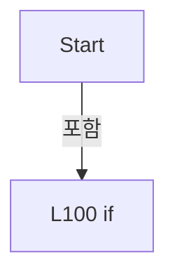
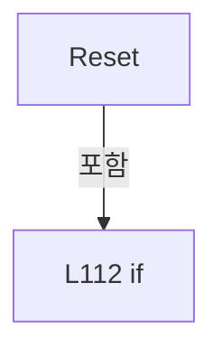
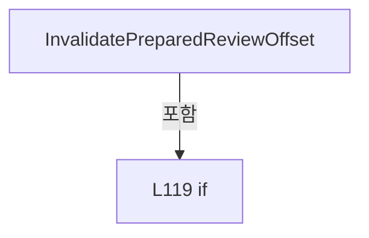
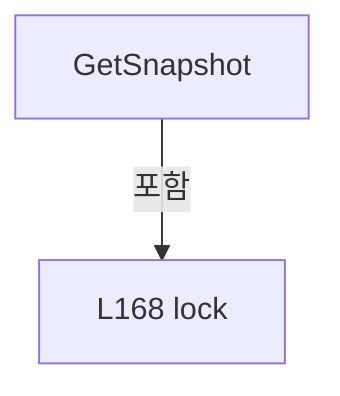
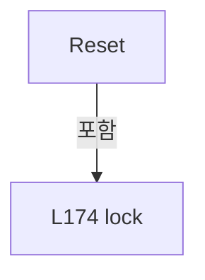
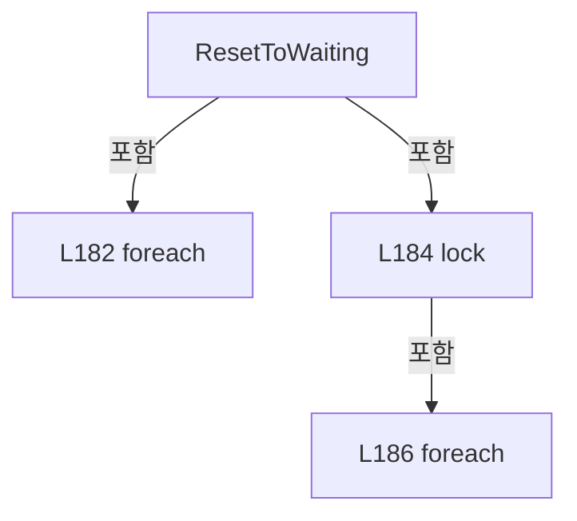
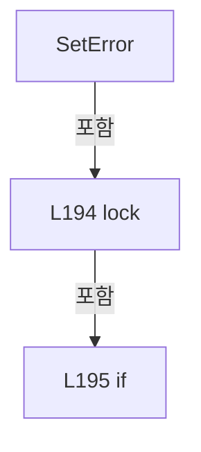
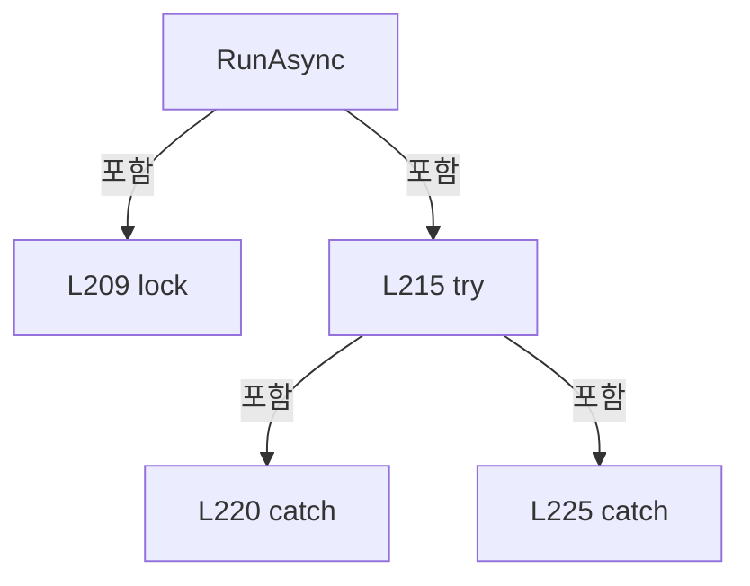
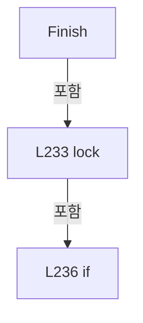
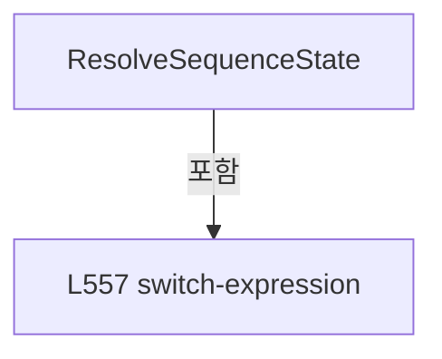

# Drilling.Common/Station/CStationManager.cs

| 항목 | 내용 |
| --- | --- |
| 원본 저장소 | https://github.com/kjuws10-rgb/A3Drilling.git |
| 원본 Commit | 28764c91d521777b8ee068dd7aaf2d3902ce9fe2 |
| 원본 SHA256 | 0d239bcb1b55c4a0653a684b3e2f7e8235917dbee1a61d0cace96489442db63b |
| 파일 분류 | code |
| 원본 크기/행 | 27,830 bytes / 582 physical lines |
| 인코딩 | utf-8-sig |
| 검토 범위 | 구문/부분 의미 분석에서 추출한 사실. 동작·물리 단위·실장비 합격을 보증하지 않습니다. |
| 원본 링크 | [고정 Commit 원본](https://github.com/kjuws10-rgb/A3Drilling/blob/28764c91d521777b8ee068dd7aaf2d3902ce9fe2/Drilling.Common/Station/CStationManager.cs) |

## 파일의 역할과 읽는 순서

설비·가공·Stage 시퀀스와 단계 상태를 연결하는 계층입니다. 실제 호출 순서는 본문·상태 조건과 수동 해설장을 함께 확인합니다.

## 네임스페이스·타입·상속

| 타입 | 구분 | 원본 범위 | 선언/상속 |
| --- | --- | --- | --- |
| CStationManager | ClassDeclaration | 15–123 | CStationManager |
| EN_SEQUENCE_ACTION_STATE | EnumDeclaration | 125–132 | EN_SEQUENCE_ACTION_STATE |
| ST_SEQUENCE_ACTION_STATUS | RecordDeclaration | 134–134 | ST_SEQUENCE_ACTION_STATUS |
| CSequenceActionIds | ClassDeclaration | 135–158 | CSequenceActionIds |
| CSequenceActionStatusStore | ClassDeclaration | 161–241 | CSequenceActionStatusStore |
| EN_SCRIPT_STATUS | EnumDeclaration | 243–250 | EN_SCRIPT_STATUS |
| EN_PROCESS_STEP | EnumDeclaration | 252–262 | EN_PROCESS_STEP |
| EN_STATION_SEQUENCE | EnumDeclaration | 264–275 | EN_STATION_SEQUENCE |
| EN_HEAD_PROCESS_STATUS | EnumDeclaration | 277–284 | EN_HEAD_PROCESS_STATUS |
| EN_STATION_ID | EnumDeclaration | 286–289 | EN_STATION_ID |
| EN_STATION_STATE | EnumDeclaration | 291–299 | EN_STATION_STATE |
| ST_HEAD_PROCESS_PLAN | RecordDeclaration | 301–320 | ST_HEAD_PROCESS_PLAN |
| ST_PROCESS_MODEL | RecordDeclaration | 322–330 | ST_PROCESS_MODEL |
| ST_HEAD_PREVIEW_DATA | RecordDeclaration | 331–331 | ST_HEAD_PREVIEW_DATA |
| ST_PROCESS_RESULT | RecordDeclaration | 332–332 | ST_PROCESS_RESULT |
| ST_PROCESS_DISPLAY_ITEM | RecordDeclaration | 333–333 | ST_PROCESS_DISPLAY_ITEM |
| ST_PROCESS_LOG_ITEM | RecordDeclaration | 334–334 | ST_PROCESS_LOG_ITEM |
| ST_PROCESS_STATISTICS | RecordDeclaration | 335–335 | ST_PROCESS_STATISTICS |
| ST_SCRIPT_BUILD_RESULT | RecordDeclaration | 336–339 | ST_SCRIPT_BUILD_RESULT |
| ST_HEAD_SCRIPT_RESULT | RecordDeclaration | 341–341 | ST_HEAD_SCRIPT_RESULT |
| EN_AEROTECH_PSO_MODE | EnumDeclaration | 342–349 | EN_AEROTECH_PSO_MODE |
| EN_AEROTECH_MODE | EnumDeclaration | 351–356 | EN_AEROTECH_MODE |
| CAutomation1ScriptBase | ClassDeclaration | 358–482 | CAutomation1ScriptBase |
| CAutomationScriptFileBase | ClassDeclaration | 484–492 | CAutomationScriptFileBase |
| ST_STATION_PROCESS_STATUS | RecordDeclaration | 494–514 | ST_STATION_PROCESS_STATUS |
| ST_STATION_STATUS | RecordDeclaration | 516–570 | ST_STATION_STATUS |
| ST_STATION_PROCESS_FLOW_ITEM | RecordDeclaration | 572–581 | ST_STATION_PROCESS_FLOW_ITEM |

## 멤버 빠른 목록

| 이름 | 종류 | 범위 | 서명 |
| --- | --- | --- | --- |
| StartZeroLinePrewaitMonitoring | MethodDeclaration | L17–17 | void Drilling.Common.Station.CStationManager.StartZeroLinePrewaitMonitoring(System.Func<string>) |
| StopZeroLinePrewaitMonitoring | MethodDeclaration | L18–18 | System.Threading.Tasks.Task Drilling.Common.Station.CStationManager.StopZeroLinePrewaitMonitoring() |
| CompleteZeroLineFollowUp | MethodDeclaration | L19–19 | System.Threading.Tasks.Task Drilling.Common.Station.CStationManager.CompleteZeroLineFollowUp(System.Guid, System.Threading.CancellationToken) |
| StartProtectWindowCompletionMonitoring | MethodDeclaration | L20–20 | void Drilling.Common.Station.CStationManager.StartProtectWindowCompletionMonitoring(System.Func<string>) |
| StopProtectWindowCompletionMonitoring | MethodDeclaration | L21–21 | System.Threading.Tasks.Task Drilling.Common.Station.CStationManager.StopProtectWindowCompletionMonitoring() |
| ManualMofStatus | PropertyDeclaration | L22–22 | Drilling.Common.Station.ST_MANUAL_MOF_STATUS Drilling.Common.Station.CStationManager.ManualMofStatus |
| LastCompletedManualMof | PropertyDeclaration | L23–23 | Drilling.Common.Station.ST_MANUAL_MOF_COMPLETION? Drilling.Common.Station.CStationManager.LastCompletedManualMof |
| RunManualMofAsync | MethodDeclaration | L25–25 | System.Threading.Tasks.Task Drilling.Common.Station.CStationManager.RunManualMofAsync(Drilling.Common.Station.ST_STAGE_PROCESS_REQUEST, System.Collections.Generic.IReadOnlySet<int>, System.Threading.CancellationToken) |
| StopManualMofAsync | MethodDeclaration | L26–26 | System.Threading.Tasks.Task Drilling.Common.Station.CStationManager.StopManualMofAsync() |
| StageRequests | PropertyDeclaration | L27–27 | Drilling.Common.Station.CStageRequestSequence Drilling.Common.Station.CStationManager.StageRequests |
| CanReset | PropertyDeclaration | L28–28 | bool Drilling.Common.Station.CStationManager.CanReset |
| StartStageRequests | MethodDeclaration | L30–30 | void Drilling.Common.Station.CStationManager.StartStageRequests(System.Func<System.Threading.CancellationToken, System.Threading.Tasks.Task<Drilling.Common.Station.ST_STAGE_PROCESS_REQUEST>>, Drilling.Common.Station.ST_STAGE_REVIEW_ACTIONS?, Drilling.Common.Station.ST_STAGE_TPM_ACTIONS?, Drilling.Common.Station.ST_STAGE_DISTORTION_ACTIONS?) |
| ResetStageRequestsAsync | MethodDeclaration | L31–31 | System.Threading.Tasks.Task Drilling.Common.Station.CStationManager.ResetStageRequestsAsync(System.Threading.CancellationToken) |
| _processStation | FieldDeclaration | L32–32 | Drilling.Common.Station.CStationProcess Drilling.Common.Station.CStationManager._processStation |
| .ctor | ConstructorDeclaration | L33–64 | Drilling.Common.Station.CStationManager.CStationManager(Drilling.Common.Interface.CInterfaceManager, Drilling.Common.Motion.CMotionManager, Drilling.Common.InterLock.CInterLockManager, Drilling.Common.Managers.CSettingManager, Drilling.Common.Station.CAutomationScriptFileBase, Drilling.Common.Automation.CAutomationManager, Drilling.Common.Review.CReviewOffsetFileBase?, Drilling.Common.Product.CProductManager?, CLogManager?, string?, Drilling.Common.Managers.CRecipeManager?, Drilling.Common.Review.CReviewManager?, System.Action<Drilling.Common.Station.ST_PROTECT_WINDOW_RETRY_EXHAUSTED>?) |
| GetStatus | MethodDeclaration | L66–70 | Drilling.Common.Station.ST_STATION_PROCESS_STATUS Drilling.Common.Station.CStationManager.GetStatus(System.Threading.CancellationToken) |
| GetLiveInterlockItems | MethodDeclaration | L72–72 | System.Collections.Generic.IReadOnlyList<Drilling.Common.InterLock.ST_INTERLOCK_ITEM> Drilling.Common.Station.CStationManager.GetLiveInterlockItems(System.Collections.Generic.IReadOnlyDictionary<string, string>, System.Threading.CancellationToken) |
| GetLiveInterlockItems | MethodDeclaration | L73–77 | System.Collections.Generic.IReadOnlyList<Drilling.Common.InterLock.ST_INTERLOCK_ITEM> Drilling.Common.Station.CStationManager.GetLiveInterlockItems(System.Threading.CancellationToken) |
| GetManualInterlockItems | MethodDeclaration | L79–79 | System.Collections.Generic.IReadOnlyList<Drilling.Common.InterLock.ST_INTERLOCK_ITEM> Drilling.Common.Station.CStationManager.GetManualInterlockItems(System.Collections.Generic.IReadOnlyDictionary<string, string>, System.Collections.Generic.IReadOnlySet<int>, System.Threading.CancellationToken) |
| GetStationStatus | MethodDeclaration | L80–84 | System.Collections.Generic.IReadOnlyList<Drilling.Common.Station.ST_STATION_STATUS> Drilling.Common.Station.CStationManager.GetStationStatus(System.Threading.CancellationToken) |
| GetProcessFlow | MethodDeclaration | L86–89 | System.Collections.Generic.IReadOnlyList<Drilling.Common.Station.ST_STATION_PROCESS_FLOW_ITEM> Drilling.Common.Station.CStationManager.GetProcessFlow() |
| PrepareProcess | MethodDeclaration | L91–96 | Drilling.Common.Station.ST_STATION_PROCESS_STATUS Drilling.Common.Station.CStationManager.PrepareProcess(string, string, string, string, System.Collections.Generic.IReadOnlyDictionary<string, string>, System.Threading.CancellationToken) |
| Start | MethodDeclaration | L98–103 | Drilling.Common.Station.ST_STATION_PROCESS_STATUS Drilling.Common.Station.CStationManager.Start(System.Threading.CancellationToken) |
| Stop | MethodDeclaration | L105–108 | Drilling.Common.Station.ST_STATION_PROCESS_STATUS Drilling.Common.Station.CStationManager.Stop(System.Threading.CancellationToken) |
| Reset | MethodDeclaration | L110–115 | Drilling.Common.Station.ST_STATION_PROCESS_STATUS Drilling.Common.Station.CStationManager.Reset(System.Threading.CancellationToken) |
| InvalidatePreparedReviewOffset | MethodDeclaration | L117–122 | void Drilling.Common.Station.CStationManager.InvalidatePreparedReviewOffset() |
| Waiting | EnumMemberDeclaration | L127–127 | Drilling.Common.Station.EN_SEQUENCE_ACTION_STATE.Waiting |
| Running | EnumMemberDeclaration | L128–128 | Drilling.Common.Station.EN_SEQUENCE_ACTION_STATE.Running |
| Completed | EnumMemberDeclaration | L129–129 | Drilling.Common.Station.EN_SEQUENCE_ACTION_STATE.Completed |
| Error | EnumMemberDeclaration | L130–130 | Drilling.Common.Station.EN_SEQUENCE_ACTION_STATE.Error |
| Stopped | EnumMemberDeclaration | L131–131 | Drilling.Common.Station.EN_SEQUENCE_ACTION_STATE.Stopped |
| PrepareData | FieldDeclaration | L137–137 | string Drilling.Common.Station.CSequenceActionIds.PrepareData |
| DistortionPrepare | FieldDeclaration | L138–138 | string Drilling.Common.Station.CSequenceActionIds.DistortionPrepare |
| DistortionLoad | FieldDeclaration | L139–139 | string Drilling.Common.Station.CSequenceActionIds.DistortionLoad |
| DistortionCalculate | FieldDeclaration | L140–140 | string Drilling.Common.Station.CSequenceActionIds.DistortionCalculate |
| DistortionSave | FieldDeclaration | L141–141 | string Drilling.Common.Station.CSequenceActionIds.DistortionSave |
| DistortionSignalsClear | FieldDeclaration | L142–142 | string Drilling.Common.Station.CSequenceActionIds.DistortionSignalsClear |
| BuildUploadScript | FieldDeclaration | L143–143 | string Drilling.Common.Station.CSequenceActionIds.BuildUploadScript |
| DoReadySignalsClear | FieldDeclaration | L144–144 | string Drilling.Common.Station.CSequenceActionIds.DoReadySignalsClear |
| ProcessReadyPosition | FieldDeclaration | L145–145 | string Drilling.Common.Station.CSequenceActionIds.ProcessReadyPosition |
| ProcessMofZero | FieldDeclaration | L146–146 | string Drilling.Common.Station.CSequenceActionIds.ProcessMofZero |
| ProcessTaskRun | FieldDeclaration | L147–147 | string Drilling.Common.Station.CSequenceActionIds.ProcessTaskRun |
| ProcessMachining | FieldDeclaration | L148–148 | string Drilling.Common.Station.CSequenceActionIds.ProcessMachining |
| ProcessResults | FieldDeclaration | L149–149 | string Drilling.Common.Station.CSequenceActionIds.ProcessResults |
| ProcessZeroPrepare | FieldDeclaration | L150–150 | string Drilling.Common.Station.CSequenceActionIds.ProcessZeroPrepare |
| ProcessZeroMeasure | FieldDeclaration | L151–151 | string Drilling.Common.Station.CSequenceActionIds.ProcessZeroMeasure |
| ProcessZeroResults | FieldDeclaration | L152–152 | string Drilling.Common.Station.CSequenceActionIds.ProcessZeroResults |
| ProcessSignalsClear | FieldDeclaration | L153–153 | string Drilling.Common.Station.CSequenceActionIds.ProcessSignalsClear |
| ReviewPlan | FieldDeclaration | L154–154 | string Drilling.Common.Station.CSequenceActionIds.ReviewPlan |
| ReviewMeasure | FieldDeclaration | L155–155 | string Drilling.Common.Station.CSequenceActionIds.ReviewMeasure |
| ReviewResults | FieldDeclaration | L156–156 | string Drilling.Common.Station.CSequenceActionIds.ReviewResults |
| ReviewSignalsClear | FieldDeclaration | L157–157 | string Drilling.Common.Station.CSequenceActionIds.ReviewSignalsClear |
| _sync | FieldDeclaration | L163–163 | object Drilling.Common.Station.CSequenceActionStatusStore._sync |
| _states | FieldDeclaration | L164–164 | System.Collections.Generic.Dictionary<string, (long Run, Drilling.Common.Station.ST_SEQUENCE_ACTION_STATUS Status)> Drilling.Common.Station.CSequenceActionStatusStore._states |
| _run | FieldDeclaration | L165–165 | long Drilling.Common.Station.CSequenceActionStatusStore._run |
| GetSnapshot | MethodDeclaration | L166–170 | System.Collections.Generic.IReadOnlyDictionary<string, Drilling.Common.Station.ST_SEQUENCE_ACTION_STATUS> Drilling.Common.Station.CSequenceActionStatusStore.GetSnapshot() |
| Reset | MethodDeclaration | L172–176 | void Drilling.Common.Station.CSequenceActionStatusStore.Reset() |
| ResetToWaiting | MethodDeclaration | L178–190 | void Drilling.Common.Station.CSequenceActionStatusStore.ResetToWaiting(System.Collections.Generic.IEnumerable<string>) |
| SetError | MethodDeclaration | L192–197 | void Drilling.Common.Station.CSequenceActionStatusStore.SetError(string, string) |
| Run | MethodDeclaration | L199–203 | void Drilling.Common.Station.CSequenceActionStatusStore.Run(string, System.Action) |
| RunAsync | MethodDeclaration | L204–240 | System.Threading.Tasks.Task Drilling.Common.Station.CSequenceActionStatusStore.RunAsync(string, System.Func<System.Threading.Tasks.Task>, bool) |
| Finish | LocalFunctionStatement | L231–239 | void Finish(Drilling.Common.Station.EN_SEQUENCE_ACTION_STATE, string) |
| NotCreated | EnumMemberDeclaration | L245–245 | Drilling.Common.Station.EN_SCRIPT_STATUS.NotCreated |
| Created | EnumMemberDeclaration | L246–246 | Drilling.Common.Station.EN_SCRIPT_STATUS.Created |
| Running | EnumMemberDeclaration | L247–247 | Drilling.Common.Station.EN_SCRIPT_STATUS.Running |
| Completed | EnumMemberDeclaration | L248–248 | Drilling.Common.Station.EN_SCRIPT_STATUS.Completed |
| Error | EnumMemberDeclaration | L249–249 | Drilling.Common.Station.EN_SCRIPT_STATUS.Error |
| Idle | EnumMemberDeclaration | L254–254 | Drilling.Common.Station.EN_PROCESS_STEP.Idle |
| PowerCheck | EnumMemberDeclaration | L255–255 | Drilling.Common.Station.EN_PROCESS_STEP.PowerCheck |
| Align | EnumMemberDeclaration | L256–256 | Drilling.Common.Station.EN_PROCESS_STEP.Align |
| Process | EnumMemberDeclaration | L257–257 | Drilling.Common.Station.EN_PROCESS_STEP.Process |
| Inspection | EnumMemberDeclaration | L258–258 | Drilling.Common.Station.EN_PROCESS_STEP.Inspection |
| Completed | EnumMemberDeclaration | L259–259 | Drilling.Common.Station.EN_PROCESS_STEP.Completed |
| Stopped | EnumMemberDeclaration | L260–260 | Drilling.Common.Station.EN_PROCESS_STEP.Stopped |
| Error | EnumMemberDeclaration | L261–261 | Drilling.Common.Station.EN_PROCESS_STEP.Error |
| Ready | EnumMemberDeclaration | L266–266 | Drilling.Common.Station.EN_STATION_SEQUENCE.Ready |
| PowerCheck | EnumMemberDeclaration | L267–267 | Drilling.Common.Station.EN_STATION_SEQUENCE.PowerCheck |
| Align | EnumMemberDeclaration | L268–268 | Drilling.Common.Station.EN_STATION_SEQUENCE.Align |
| Process | EnumMemberDeclaration | L269–269 | Drilling.Common.Station.EN_STATION_SEQUENCE.Process |
| Inspection | EnumMemberDeclaration | L270–270 | Drilling.Common.Station.EN_STATION_SEQUENCE.Inspection |
| Complete | EnumMemberDeclaration | L271–271 | Drilling.Common.Station.EN_STATION_SEQUENCE.Complete |
| Stop | EnumMemberDeclaration | L272–272 | Drilling.Common.Station.EN_STATION_SEQUENCE.Stop |
| Reset | EnumMemberDeclaration | L273–273 | Drilling.Common.Station.EN_STATION_SEQUENCE.Reset |
| Error | EnumMemberDeclaration | L274–274 | Drilling.Common.Station.EN_STATION_SEQUENCE.Error |
| Ready | EnumMemberDeclaration | L279–279 | Drilling.Common.Station.EN_HEAD_PROCESS_STATUS.Ready |
| Running | EnumMemberDeclaration | L280–280 | Drilling.Common.Station.EN_HEAD_PROCESS_STATUS.Running |
| Completed | EnumMemberDeclaration | L281–281 | Drilling.Common.Station.EN_HEAD_PROCESS_STATUS.Completed |
| Error | EnumMemberDeclaration | L282–282 | Drilling.Common.Station.EN_HEAD_PROCESS_STATUS.Error |
| Disabled | EnumMemberDeclaration | L283–283 | Drilling.Common.Station.EN_HEAD_PROCESS_STATUS.Disabled |
| Process | EnumMemberDeclaration | L288–288 | Drilling.Common.Station.EN_STATION_ID.Process |
| Idle | EnumMemberDeclaration | L293–293 | Drilling.Common.Station.EN_STATION_STATE.Idle |
| Check | EnumMemberDeclaration | L294–294 | Drilling.Common.Station.EN_STATION_STATE.Check |
| Process | EnumMemberDeclaration | L295–295 | Drilling.Common.Station.EN_STATION_STATE.Process |
| Complete | EnumMemberDeclaration | L296–296 | Drilling.Common.Station.EN_STATION_STATE.Complete |
| Alarm | EnumMemberDeclaration | L297–297 | Drilling.Common.Station.EN_STATION_STATE.Alarm |
| Stopped | EnumMemberDeclaration | L298–298 | Drilling.Common.Station.EN_STATION_STATE.Stopped |
| AutomationNo | PropertyDeclaration | L317–317 | int Drilling.Common.Station.ST_HEAD_PROCESS_PLAN.AutomationNo |
| get_AutomationNo | GetAccessorDeclaration | L317–317 | int Drilling.Common.Station.ST_HEAD_PROCESS_PLAN.AutomationNo.get |
| set_AutomationNo | InitAccessorDeclaration | L317–317 | void Drilling.Common.Station.ST_HEAD_PROCESS_PLAN.AutomationNo.init |
| TaskNo | PropertyDeclaration | L318–318 | int Drilling.Common.Station.ST_HEAD_PROCESS_PLAN.TaskNo |
| get_TaskNo | GetAccessorDeclaration | L318–318 | int Drilling.Common.Station.ST_HEAD_PROCESS_PLAN.TaskNo.get |
| set_TaskNo | InitAccessorDeclaration | L318–318 | void Drilling.Common.Station.ST_HEAD_PROCESS_PLAN.TaskNo.init |
| ScriptFileName | PropertyDeclaration | L319–319 | string Drilling.Common.Station.ST_HEAD_PROCESS_PLAN.ScriptFileName |
| get_ScriptFileName | GetAccessorDeclaration | L319–319 | string Drilling.Common.Station.ST_HEAD_PROCESS_PLAN.ScriptFileName.get |
| set_ScriptFileName | InitAccessorDeclaration | L319–319 | void Drilling.Common.Station.ST_HEAD_PROCESS_PLAN.ScriptFileName.init |
| MofReadyRunId | PropertyDeclaration | L338–338 | long Drilling.Common.Station.ST_SCRIPT_BUILD_RESULT.MofReadyRunId |
| get_MofReadyRunId | GetAccessorDeclaration | L338–338 | long Drilling.Common.Station.ST_SCRIPT_BUILD_RESULT.MofReadyRunId.get |
| set_MofReadyRunId | InitAccessorDeclaration | L338–338 | void Drilling.Common.Station.ST_SCRIPT_BUILD_RESULT.MofReadyRunId.init |
| Unused | EnumMemberDeclaration | L344–344 | Drilling.Common.Station.EN_AEROTECH_PSO_MODE.Unused |
| WindowMask | EnumMemberDeclaration | L345–345 | Drilling.Common.Station.EN_AEROTECH_PSO_MODE.WindowMask |
| ExtSync | EnumMemberDeclaration | L346–346 | Drilling.Common.Station.EN_AEROTECH_PSO_MODE.ExtSync |
| LaserMask | EnumMemberDeclaration | L347–347 | Drilling.Common.Station.EN_AEROTECH_PSO_MODE.LaserMask |
| ExtSyncGalvo | EnumMemberDeclaration | L348–348 | Drilling.Common.Station.EN_AEROTECH_PSO_MODE.ExtSyncGalvo |
| Mof | EnumMemberDeclaration | L353–353 | Drilling.Common.Station.EN_AEROTECH_MODE.Mof |
| Ifov | EnumMemberDeclaration | L354–354 | Drilling.Common.Station.EN_AEROTECH_MODE.Ifov |
| Scanner | EnumMemberDeclaration | L355–355 | Drilling.Common.Station.EN_AEROTECH_MODE.Scanner |
| FileName | PropertyDeclaration | L360–360 | string Drilling.Common.Station.CAutomation1ScriptBase.FileName |
| get_FileName | GetAccessorDeclaration | L360–360 | string Drilling.Common.Station.CAutomation1ScriptBase.FileName.get |
| FilePath | PropertyDeclaration | L361–361 | string Drilling.Common.Station.CAutomation1ScriptBase.FilePath |
| get_FilePath | GetAccessorDeclaration | L361–361 | string Drilling.Common.Station.CAutomation1ScriptBase.FilePath.get |
| Lines | PropertyDeclaration | L362–362 | System.Collections.Generic.IReadOnlyList<string> Drilling.Common.Station.CAutomation1ScriptBase.Lines |
| get_Lines | GetAccessorDeclaration | L362–362 | System.Collections.Generic.IReadOnlyList<string> Drilling.Common.Station.CAutomation1ScriptBase.Lines.get |
| Clear | MethodDeclaration | L364–364 | void Drilling.Common.Station.CAutomation1ScriptBase.Clear() |
| AddLine | MethodDeclaration | L365–365 | void Drilling.Common.Station.CAutomation1ScriptBase.AddLine(string) |
| Start | MethodDeclaration | L366–366 | void Drilling.Common.Station.CAutomation1ScriptBase.Start(string) |
| SetDeviceNo | MethodDeclaration | L367–367 | void Drilling.Common.Station.CAutomation1ScriptBase.SetDeviceNo(int) |
| SetNMarkDriveLaserControl | MethodDeclaration | L368–368 | void Drilling.Common.Station.CAutomation1ScriptBase.SetNMarkDriveLaserControl(bool) |
| SetScanPlannerStageEncoderMode | MethodDeclaration | L369–369 | void Drilling.Common.Station.CAutomation1ScriptBase.SetScanPlannerStageEncoderMode(bool) |
| DefaultSetting | MethodDeclaration | L370–370 | void Drilling.Common.Station.CAutomation1ScriptBase.DefaultSetting(double, int, int, bool) |
| DefaultFigureScanSetting | MethodDeclaration | L371–371 | void Drilling.Common.Station.CAutomation1ScriptBase.DefaultFigureScanSetting(int, int, bool) |
| SetAxis | MethodDeclaration | L372–372 | void Drilling.Common.Station.CAutomation1ScriptBase.SetAxis(string, string, string?) |
| SetStageAxis | MethodDeclaration | L373–373 | void Drilling.Common.Station.CAutomation1ScriptBase.SetStageAxis(string, string) |
| SetFrequency | MethodDeclaration | L374–374 | void Drilling.Common.Station.CAutomation1ScriptBase.SetFrequency(double) |
| SetLaserPower | MethodDeclaration | L375–375 | void Drilling.Common.Station.CAutomation1ScriptBase.SetLaserPower(double, double, bool) |
| SetLaserPowerNoDelay | MethodDeclaration | L376–376 | void Drilling.Common.Station.CAutomation1ScriptBase.SetLaserPowerNoDelay(double, double) |
| SetPulseOnTimeLaserPower | MethodDeclaration | L377–377 | void Drilling.Common.Station.CAutomation1ScriptBase.SetPulseOnTimeLaserPower(double, double, double) |
| SetLaserMode | MethodDeclaration | L378–378 | void Drilling.Common.Station.CAutomation1ScriptBase.SetLaserMode(int) |
| SetLaserDelay | MethodDeclaration | L379–379 | void Drilling.Common.Station.CAutomation1ScriptBase.SetLaserDelay(double, double) |
| SetJumpSpeed | MethodDeclaration | L380–380 | void Drilling.Common.Station.CAutomation1ScriptBase.SetJumpSpeed(double) |
| SetJumpSpeedRate | MethodDeclaration | L381–381 | void Drilling.Common.Station.CAutomation1ScriptBase.SetJumpSpeedRate(double, double) |
| SetMarkSpeed | MethodDeclaration | L382–382 | void Drilling.Common.Station.CAutomation1ScriptBase.SetMarkSpeed(double) |
| SetStageSpeed | MethodDeclaration | L383–383 | void Drilling.Common.Station.CAutomation1ScriptBase.SetStageSpeed(double, double) |
| SetScannerAcc | MethodDeclaration | L384–384 | void Drilling.Common.Station.CAutomation1ScriptBase.SetScannerAcc(double) |
| SetMarkAcc | MethodDeclaration | L385–385 | void Drilling.Common.Station.CAutomation1ScriptBase.SetMarkAcc(double) |
| SetIFOV | MethodDeclaration | L386–386 | void Drilling.Common.Station.CAutomation1ScriptBase.SetIFOV(bool) |
| SetIFOVEmulatedQuadratureDivider | MethodDeclaration | L387–387 | void Drilling.Common.Station.CAutomation1ScriptBase.SetIFOVEmulatedQuadratureDivider() |
| SetIFOVIO | MethodDeclaration | L388–388 | void Drilling.Common.Station.CAutomation1ScriptBase.SetIFOVIO(bool) |
| SetIFOVScaleXY | MethodDeclaration | L389–389 | void Drilling.Common.Station.CAutomation1ScriptBase.SetIFOVScaleXY() |
| SetIFOVTime | MethodDeclaration | L390–390 | void Drilling.Common.Station.CAutomation1ScriptBase.SetIFOVTime(long) |
| SetIFOVSize | MethodDeclaration | L391–391 | void Drilling.Common.Station.CAutomation1ScriptBase.SetIFOVSize(double) |
| SetIFOVTrackingSpeed | MethodDeclaration | L392–392 | void Drilling.Common.Station.CAutomation1ScriptBase.SetIFOVTrackingSpeed(long) |
| SetIFOVTrackingAccel | MethodDeclaration | L393–393 | void Drilling.Common.Station.CAutomation1ScriptBase.SetIFOVTrackingAccel(long) |
| SetIFOVPair | MethodDeclaration | L394–394 | void Drilling.Common.Station.CAutomation1ScriptBase.SetIFOVPair(string, string, bool, bool) |
| SetIFOVSyncAxis | MethodDeclaration | L395–395 | void Drilling.Common.Station.CAutomation1ScriptBase.SetIFOVSyncAxis() |
| SetMoveBlending | MethodDeclaration | L396–396 | void Drilling.Common.Station.CAutomation1ScriptBase.SetMoveBlending(bool) |
| SetAbsoluteMode | MethodDeclaration | L397–397 | void Drilling.Common.Station.CAutomation1ScriptBase.SetAbsoluteMode() |
| SetIncrementalMode | MethodDeclaration | L398–398 | void Drilling.Common.Station.CAutomation1ScriptBase.SetIncrementalMode() |
| SetWaitModeAuto | MethodDeclaration | L399–399 | void Drilling.Common.Station.CAutomation1ScriptBase.SetWaitModeAuto() |
| SetMoveDelay | MethodDeclaration | L400–400 | void Drilling.Common.Station.CAutomation1ScriptBase.SetMoveDelay(double, bool, bool) |
| SetExecuteLineCount | MethodDeclaration | L401–401 | void Drilling.Common.Station.CAutomation1ScriptBase.SetExecuteLineCount(int) |
| SetScannerRotate | MethodDeclaration | L402–402 | void Drilling.Common.Station.CAutomation1ScriptBase.SetScannerRotate(double) |
| SetScannerRotate | MethodDeclaration | L403–403 | void Drilling.Common.Station.CAutomation1ScriptBase.SetScannerRotate(string, double) |
| SetMoveUpdateRate | MethodDeclaration | L404–404 | void Drilling.Common.Station.CAutomation1ScriptBase.SetMoveUpdateRate(int) |
| SetCoordinatedAccelLimit | MethodDeclaration | L405–405 | void Drilling.Common.Station.CAutomation1ScriptBase.SetCoordinatedAccelLimit(long, long) |
| SetTaskAccelLimit | MethodDeclaration | L406–406 | void Drilling.Common.Station.CAutomation1ScriptBase.SetTaskAccelLimit(long, long) |
| SetScanTrajectoryFIRFilterX | MethodDeclaration | L407–407 | void Drilling.Common.Station.CAutomation1ScriptBase.SetScanTrajectoryFIRFilterX(long) |
| SetScanTrajectoryFIRFilterY | MethodDeclaration | L408–408 | void Drilling.Common.Station.CAutomation1ScriptBase.SetScanTrajectoryFIRFilterY(long) |
| SetStageTrajectoryFIRFilterX | MethodDeclaration | L409–409 | void Drilling.Common.Station.CAutomation1ScriptBase.SetStageTrajectoryFIRFilterX(long) |
| SetStageTrajectoryFIRFilterY | MethodDeclaration | L410–410 | void Drilling.Common.Station.CAutomation1ScriptBase.SetStageTrajectoryFIRFilterY(long) |
| SetProjection | MethodDeclaration | L411–411 | void Drilling.Common.Station.CAutomation1ScriptBase.SetProjection(string, double, double, double) |
| SetProjectionOff | MethodDeclaration | L412–412 | void Drilling.Common.Station.CAutomation1ScriptBase.SetProjectionOff(string) |
| SetGearing | MethodDeclaration | L413–413 | void Drilling.Common.Station.CAutomation1ScriptBase.SetGearing(string, string) |
| SetGearingOff | MethodDeclaration | L414–414 | void Drilling.Common.Station.CAutomation1ScriptBase.SetGearingOff(string) |
| SetSoftwareLimitSetup | MethodDeclaration | L415–415 | void Drilling.Common.Station.CAutomation1ScriptBase.SetSoftwareLimitSetup(bool) |
| SetAerotechEncoderReset | MethodDeclaration | L416–416 | void Drilling.Common.Station.CAutomation1ScriptBase.SetAerotechEncoderReset(string, string) |
| SetScanPlannerStageEncoder | MethodDeclaration | L417–417 | void Drilling.Common.Station.CAutomation1ScriptBase.SetScanPlannerStageEncoder(string) |
| SetEmulatedQuadratureDividerX | MethodDeclaration | L418–418 | void Drilling.Common.Station.CAutomation1ScriptBase.SetEmulatedQuadratureDividerX(int) |
| SetEmulatedQuadratureDividerY | MethodDeclaration | L419–419 | void Drilling.Common.Station.CAutomation1ScriptBase.SetEmulatedQuadratureDividerY(int) |
| SetStageEmulatedQuadratureDivider | MethodDeclaration | L420–420 | void Drilling.Common.Station.CAutomation1ScriptBase.SetStageEmulatedQuadratureDivider(int, int) |
| SetPSO | MethodDeclaration | L421–433 | void Drilling.Common.Station.CAutomation1ScriptBase.SetPSO(double, double, double, double, Drilling.Common.Station.EN_AEROTECH_MODE, Drilling.Common.Station.EN_AEROTECH_PSO_MODE, double, double, int, double, bool) |
| SetPSODistance | MethodDeclaration | L434–434 | void Drilling.Common.Station.CAutomation1ScriptBase.SetPSODistance(double) |
| SetPSOOnOff | MethodDeclaration | L435–435 | void Drilling.Common.Station.CAutomation1ScriptBase.SetPSOOnOff(bool) |
| SetPSOChangePower | MethodDeclaration | L436–436 | void Drilling.Common.Station.CAutomation1ScriptBase.SetPSOChangePower(double, double) |
| SetPSOFire | MethodDeclaration | L437–437 | void Drilling.Common.Station.CAutomation1ScriptBase.SetPSOFire(double, double, int, double, Drilling.Common.Station.EN_AEROTECH_MODE) |
| SetPSOLaserWindowMask | MethodDeclaration | L438–438 | void Drilling.Common.Station.CAutomation1ScriptBase.SetPSOLaserWindowMask(bool, double, double) |
| DeclareEncoderVariable | MethodDeclaration | L439–439 | void Drilling.Common.Station.CAutomation1ScriptBase.DeclareEncoderVariable(string, bool) |
| InitDeclareVariable | MethodDeclaration | L440–440 | void Drilling.Common.Station.CAutomation1ScriptBase.InitDeclareVariable() |
| InitDeclareVariableIFOV | MethodDeclaration | L441–441 | void Drilling.Common.Station.CAutomation1ScriptBase.InitDeclareVariableIFOV() |
| SetWaitForEncoder | MethodDeclaration | L442–442 | void Drilling.Common.Station.CAutomation1ScriptBase.SetWaitForEncoder(string, double, bool) |
| SetWaitForEncoder | MethodDeclaration | L443–443 | void Drilling.Common.Station.CAutomation1ScriptBase.SetWaitForEncoder(string, bool, double, double, double) |
| SetWaitForEncoder2Axis | MethodDeclaration | L444–444 | void Drilling.Common.Station.CAutomation1ScriptBase.SetWaitForEncoder2Axis(string, string, bool, double, double, double, double) |
| SetWaitForStartAxis2 | MethodDeclaration | L445–445 | void Drilling.Common.Station.CAutomation1ScriptBase.SetWaitForStartAxis2(string, string, bool, double, double, double, double) |
| SetEncoderScaleFactor | MethodDeclaration | L446–446 | void Drilling.Common.Station.CAutomation1ScriptBase.SetEncoderScaleFactor(string, string, int) |
| SetEncoderScaleFactor | MethodDeclaration | L447–447 | void Drilling.Common.Station.CAutomation1ScriptBase.SetEncoderScaleFactor(string, string, bool) |
| SetEncoderScaleFactor | MethodDeclaration | L448–448 | void Drilling.Common.Station.CAutomation1ScriptBase.SetEncoderScaleFactor(string, string, double, double, bool) |
| SetEncoderScaleFactorByPrimaryDivider | MethodDeclaration | L449–449 | void Drilling.Common.Station.CAutomation1ScriptBase.SetEncoderScaleFactorByPrimaryDivider(string, string, bool) |
| InitEncoderCount | MethodDeclaration | L450–450 | void Drilling.Common.Station.CAutomation1ScriptBase.InitEncoderCount(string) |
| EncoderNotFeedback | MethodDeclaration | L451–451 | void Drilling.Common.Station.CAutomation1ScriptBase.EncoderNotFeedback(string) |
| ReleaseEncoderScaleFactor | MethodDeclaration | L452–452 | void Drilling.Common.Station.CAutomation1ScriptBase.ReleaseEncoderScaleFactor(string) |
| LaserAuto | MethodDeclaration | L453–453 | void Drilling.Common.Station.CAutomation1ScriptBase.LaserAuto() |
| LaserOn | MethodDeclaration | L454–454 | void Drilling.Common.Station.CAutomation1ScriptBase.LaserOn() |
| LaserOff | MethodDeclaration | L455–455 | void Drilling.Common.Station.CAutomation1ScriptBase.LaserOff() |
| PsoLaserControl | MethodDeclaration | L456–456 | void Drilling.Common.Station.CAutomation1ScriptBase.PsoLaserControl(bool, bool) |
| LaserFire | MethodDeclaration | L457–457 | void Drilling.Common.Station.CAutomation1ScriptBase.LaserFire(bool) |
| Jump | MethodDeclaration | L458–458 | void Drilling.Common.Station.CAutomation1ScriptBase.Jump(double, double) |
| Mark | MethodDeclaration | L459–459 | void Drilling.Common.Station.CAutomation1ScriptBase.Mark(double, double) |
| GCodeMove | MethodDeclaration | L460–460 | void Drilling.Common.Station.CAutomation1ScriptBase.GCodeMove(double, double) |
| JumpRel | MethodDeclaration | L461–461 | void Drilling.Common.Station.CAutomation1ScriptBase.JumpRel(double, double) |
| MarkRel | MethodDeclaration | L462–462 | void Drilling.Common.Station.CAutomation1ScriptBase.MarkRel(double, double) |
| Arc | MethodDeclaration | L463–463 | void Drilling.Common.Station.CAutomation1ScriptBase.Arc(double, double, double, double, double, double, double) |
| JumpLinear | MethodDeclaration | L464–464 | void Drilling.Common.Station.CAutomation1ScriptBase.JumpLinear(double, double) |
| WaitMoveDone | MethodDeclaration | L465–465 | void Drilling.Common.Station.CAutomation1ScriptBase.WaitMoveDone() |
| Dwell | MethodDeclaration | L466–466 | void Drilling.Common.Station.CAutomation1ScriptBase.Dwell(double) |
| EnableAxisPair | MethodDeclaration | L467–467 | void Drilling.Common.Station.CAutomation1ScriptBase.EnableAxisPair() |
| DisableAxisPair | MethodDeclaration | L468–468 | void Drilling.Common.Station.CAutomation1ScriptBase.DisableAxisPair() |
| FaultAckAxisPair | MethodDeclaration | L469–469 | void Drilling.Common.Station.CAutomation1ScriptBase.FaultAckAxisPair() |
| HomeAxisPair | MethodDeclaration | L470–470 | void Drilling.Common.Station.CAutomation1ScriptBase.HomeAxisPair() |
| OffsetClearAxisPair | MethodDeclaration | L471–471 | void Drilling.Common.Station.CAutomation1ScriptBase.OffsetClearAxisPair() |
| OffsetSetAxisPair | MethodDeclaration | L472–472 | void Drilling.Common.Station.CAutomation1ScriptBase.OffsetSetAxisPair(double, double) |
| SetSignalLogTrigger | MethodDeclaration | L473–473 | void Drilling.Common.Station.CAutomation1ScriptBase.SetSignalLogTrigger(bool) |
| ProgramStart | MethodDeclaration | L474–474 | void Drilling.Common.Station.CAutomation1ScriptBase.ProgramStart() |
| ProgramEnd | MethodDeclaration | L475–475 | void Drilling.Common.Station.CAutomation1ScriptBase.ProgramEnd() |
| BufferedEnd | MethodDeclaration | L476–476 | void Drilling.Common.Station.CAutomation1ScriptBase.BufferedEnd() |
| WaitInpos | MethodDeclaration | L477–477 | void Drilling.Common.Station.CAutomation1ScriptBase.WaitInpos() |
| SetHomePos | MethodDeclaration | L478–478 | void Drilling.Common.Station.CAutomation1ScriptBase.SetHomePos() |
| SetGalvoPosZero | MethodDeclaration | L479–479 | void Drilling.Common.Station.CAutomation1ScriptBase.SetGalvoPosZero() |
| End | MethodDeclaration | L480–480 | void Drilling.Common.Station.CAutomation1ScriptBase.End(bool) |
| Save | MethodDeclaration | L481–481 | Drilling.Common.Station.ST_SCRIPT_BUILD_RESULT Drilling.Common.Station.CAutomation1ScriptBase.Save(System.Threading.CancellationToken) |
| ScriptFileName | PropertyDeclaration | L486–486 | string Drilling.Common.Station.CAutomationScriptFileBase.ScriptFileName |
| get_ScriptFileName | GetAccessorDeclaration | L486–486 | string Drilling.Common.Station.CAutomationScriptFileBase.ScriptFileName.get |
| Create | MethodDeclaration | L488–488 | Drilling.Common.Station.CAutomation1ScriptBase Drilling.Common.Station.CAutomationScriptFileBase.Create(string?) |
| Build | MethodDeclaration | L489–489 | Drilling.Common.Station.ST_SCRIPT_BUILD_RESULT Drilling.Common.Station.CAutomationScriptFileBase.Build(Drilling.Common.Station.ST_PROCESS_MODEL, System.Threading.CancellationToken) |
| Build | MethodDeclaration | L490–490 | Drilling.Common.Station.ST_SCRIPT_BUILD_RESULT Drilling.Common.Station.CAutomationScriptFileBase.Build(Drilling.Common.Station.ST_PROCESS_MODEL, string, System.Threading.CancellationToken) |
| LoadLatest | MethodDeclaration | L491–491 | Drilling.Common.Station.ST_SCRIPT_BUILD_RESULT Drilling.Common.Station.CAutomationScriptFileBase.LoadLatest(Drilling.Common.Station.ST_PROCESS_MODEL, string, System.Threading.CancellationToken) |
| SequenceActions | PropertyDeclaration | L510–510 | System.Collections.Generic.IReadOnlyDictionary<string, Drilling.Common.Station.ST_SEQUENCE_ACTION_STATUS> Drilling.Common.Station.ST_STATION_PROCESS_STATUS.SequenceActions |
| get_SequenceActions | GetAccessorDeclaration | L510–510 | System.Collections.Generic.IReadOnlyDictionary<string, Drilling.Common.Station.ST_SEQUENCE_ACTION_STATUS> Drilling.Common.Station.ST_STATION_PROCESS_STATUS.SequenceActions.get |
| set_SequenceActions | InitAccessorDeclaration | L510–510 | void Drilling.Common.Station.ST_STATION_PROCESS_STATUS.SequenceActions.init |
| StageRequest | PropertyDeclaration | L511–511 | Drilling.Common.Station.ST_STAGE_REQUEST_STATUS? Drilling.Common.Station.ST_STATION_PROCESS_STATUS.StageRequest |
| get_StageRequest | GetAccessorDeclaration | L511–511 | Drilling.Common.Station.ST_STAGE_REQUEST_STATUS? Drilling.Common.Station.ST_STATION_PROCESS_STATUS.StageRequest.get |
| set_StageRequest | InitAccessorDeclaration | L511–511 | void Drilling.Common.Station.ST_STATION_PROCESS_STATUS.StageRequest.init |
| ZeroLinePrewait | PropertyDeclaration | L512–512 | Drilling.Common.Station.ST_ZERO_LINE_PREWAIT_STATUS? Drilling.Common.Station.ST_STATION_PROCESS_STATUS.ZeroLinePrewait |
| get_ZeroLinePrewait | GetAccessorDeclaration | L512–512 | Drilling.Common.Station.ST_ZERO_LINE_PREWAIT_STATUS? Drilling.Common.Station.ST_STATION_PROCESS_STATUS.ZeroLinePrewait.get |
| set_ZeroLinePrewait | InitAccessorDeclaration | L512–512 | void Drilling.Common.Station.ST_STATION_PROCESS_STATUS.ZeroLinePrewait.init |
| ZeroLine | PropertyDeclaration | L513–513 | Drilling.Common.Review.ST_ZERO_LINE_CYCLE_STATUS? Drilling.Common.Station.ST_STATION_PROCESS_STATUS.ZeroLine |
| get_ZeroLine | GetAccessorDeclaration | L513–513 | Drilling.Common.Review.ST_ZERO_LINE_CYCLE_STATUS? Drilling.Common.Station.ST_STATION_PROCESS_STATUS.ZeroLine.get |
| set_ZeroLine | InitAccessorDeclaration | L513–513 | void Drilling.Common.Station.ST_STATION_PROCESS_STATUS.ZeroLine.init |
| ExplicitSequenceState | PropertyDeclaration | L526–526 | Drilling.Common.Station.EN_STATION_SEQUENCE? Drilling.Common.Station.ST_STATION_STATUS.ExplicitSequenceState |
| get_ExplicitSequenceState | GetAccessorDeclaration | L526–526 | Drilling.Common.Station.EN_STATION_SEQUENCE? Drilling.Common.Station.ST_STATION_STATUS.ExplicitSequenceState.get |
| set_ExplicitSequenceState | InitAccessorDeclaration | L526–526 | void Drilling.Common.Station.ST_STATION_STATUS.ExplicitSequenceState.init |
| ExplicitSequenceProcessStep | PropertyDeclaration | L527–527 | Drilling.Common.Station.EN_PROCESS_STEP? Drilling.Common.Station.ST_STATION_STATUS.ExplicitSequenceProcessStep |
| get_ExplicitSequenceProcessStep | GetAccessorDeclaration | L527–527 | Drilling.Common.Station.EN_PROCESS_STEP? Drilling.Common.Station.ST_STATION_STATUS.ExplicitSequenceProcessStep.get |
| set_ExplicitSequenceProcessStep | InitAccessorDeclaration | L527–527 | void Drilling.Common.Station.ST_STATION_STATUS.ExplicitSequenceProcessStep.init |
| SequenceState | PropertyDeclaration | L529–535 | Drilling.Common.Station.EN_STATION_SEQUENCE Drilling.Common.Station.ST_STATION_STATUS.SequenceState |
| get_SequenceState | GetAccessorDeclaration | L531–534 | Drilling.Common.Station.EN_STATION_SEQUENCE Drilling.Common.Station.ST_STATION_STATUS.SequenceState.get |
| WithSequenceState | MethodDeclaration | L537–553 | Drilling.Common.Station.ST_STATION_STATUS Drilling.Common.Station.ST_STATION_STATUS.WithSequenceState(Drilling.Common.Station.EN_STATION_SEQUENCE?) |
| ResolveSequenceState | MethodDeclaration | L555–569 | Drilling.Common.Station.EN_STATION_SEQUENCE Drilling.Common.Station.ST_STATION_STATUS.ResolveSequenceState(Drilling.Common.Station.EN_PROCESS_STEP) |

## 멤버별 상세 계약·호출·처리 해설

### MethodDeclaration `StartZeroLinePrewaitMonitoring` · L17–17

[Drilling.Common/Station/CStationManager.cs:17–17](https://github.com/kjuws10-rgb/A3Drilling/blob/28764c91d521777b8ee068dd7aaf2d3902ce9fe2/Drilling.Common/Station/CStationManager.cs#L17-L17)

| 항목 | 실제 추출 값 |
| --- | --- |
| 서명 | void Drilling.Common.Station.CStationManager.StartZeroLinePrewaitMonitoring(System.Func<string>) |
| 접근/수식자 | Public / public |
| 반환/값 타입 | void |
| 소속 타입 | NamedType:Drilling.Common.Station.CStationManager |

입력 계약:

| 이름 | 타입 | 전달 | 선택/기본값 |
| --- | --- | --- | --- |
| selectedRecipe | System.Func<string> | None | False /  |

정적 호출자로 확인된 위치:

| 호출 파일/행 | 호출 표현식 | 런타임 분기 가능 |
| --- | --- | --- |
| [Drilling.Common/Managers/CManager.cs:269–269](https://github.com/kjuws10-rgb/A3Drilling/blob/28764c91d521777b8ee068dd7aaf2d3902ce9fe2/Drilling.Common/Managers/CManager.cs#L269-L269) | _stationManager.StartZeroLinePrewaitMonitoring | False |

호출하는 대상과 해석 범위:

| 원본 행 | 표현식 | 분석 상태 | 대상/소스 위치 |
| --- | --- | --- | --- |
| 17 | _processStation.StartZeroLinePrewaitMonitoring | resolved | void Drilling.Common.Station.CStationProcess.StartZeroLinePrewaitMonitoring(System.Func<string>) · Drilling.Common/Station/CStationProcess.cs:4325 |

본문의 실제 연산·분기·예외·반환 순서(원문 위치 순):

| 원본 행 | 종류 | 주석 해설 |
| --- | --- | --- |
| 17 | call | 함수·델리게이트 또는 객체 생성자를 호출합니다: _processStation.StartZeroLinePrewaitMonitoring(selectedRecipe) |

변경 전 점검: 입력/반환 타입, 위 호출자, 예외/취소 경로, 공유 상태와 저장·전송 소비자를 함께 확인합니다. 값의 단위나 물리 방향을 이름만으로 확정하지 않습니다.

### MethodDeclaration `StopZeroLinePrewaitMonitoring` · L18–18

[Drilling.Common/Station/CStationManager.cs:18–18](https://github.com/kjuws10-rgb/A3Drilling/blob/28764c91d521777b8ee068dd7aaf2d3902ce9fe2/Drilling.Common/Station/CStationManager.cs#L18-L18)

| 항목 | 실제 추출 값 |
| --- | --- |
| 서명 | System.Threading.Tasks.Task Drilling.Common.Station.CStationManager.StopZeroLinePrewaitMonitoring() |
| 접근/수식자 | Public / public |
| 반환/값 타입 | System.Threading.Tasks.Task |
| 소속 타입 | NamedType:Drilling.Common.Station.CStationManager |

정적 호출자로 확인된 위치:

| 호출 파일/행 | 호출 표현식 | 런타임 분기 가능 |
| --- | --- | --- |
| [Drilling.Common/Managers/CManager.cs:281–281](https://github.com/kjuws10-rgb/A3Drilling/blob/28764c91d521777b8ee068dd7aaf2d3902ce9fe2/Drilling.Common/Managers/CManager.cs#L281-L281) | _stationManager.StopZeroLinePrewaitMonitoring | False |

호출하는 대상과 해석 범위:

| 원본 행 | 표현식 | 분석 상태 | 대상/소스 위치 |
| --- | --- | --- | --- |
| 18 | _processStation.StopZeroLinePrewaitMonitoring | resolved | System.Threading.Tasks.Task Drilling.Common.Station.CStationProcess.StopZeroLinePrewaitMonitoring() · Drilling.Common/Station/CStationProcess.cs:4335 |

본문의 실제 연산·분기·예외·반환 순서(원문 위치 순):

| 원본 행 | 종류 | 주석 해설 |
| --- | --- | --- |
| 18 | call | 함수·델리게이트 또는 객체 생성자를 호출합니다: _processStation.StopZeroLinePrewaitMonitoring() |

변경 전 점검: 입력/반환 타입, 위 호출자, 예외/취소 경로, 공유 상태와 저장·전송 소비자를 함께 확인합니다. 값의 단위나 물리 방향을 이름만으로 확정하지 않습니다.

### MethodDeclaration `CompleteZeroLineFollowUp` · L19–19

[Drilling.Common/Station/CStationManager.cs:19–19](https://github.com/kjuws10-rgb/A3Drilling/blob/28764c91d521777b8ee068dd7aaf2d3902ce9fe2/Drilling.Common/Station/CStationManager.cs#L19-L19)

| 항목 | 실제 추출 값 |
| --- | --- |
| 서명 | System.Threading.Tasks.Task Drilling.Common.Station.CStationManager.CompleteZeroLineFollowUp(System.Guid, System.Threading.CancellationToken) |
| 접근/수식자 | Public / public |
| 반환/값 타입 | System.Threading.Tasks.Task |
| 소속 타입 | NamedType:Drilling.Common.Station.CStationManager |

입력 계약:

| 이름 | 타입 | 전달 | 선택/기본값 |
| --- | --- | --- | --- |
| runId | System.Guid | None | False /  |
| token | System.Threading.CancellationToken | None | True / null |

정적 호출자로 확인된 위치:

| 호출 파일/행 | 호출 표현식 | 런타임 분기 가능 |
| --- | --- | --- |
| [Drilling.UI/CRootView.cs:3207–3207](https://github.com/kjuws10-rgb/A3Drilling/blob/28764c91d521777b8ee068dd7aaf2d3902ce9fe2/Drilling.UI/CRootView.cs#L3207-L3207) | _stationManager.CompleteZeroLineFollowUp | False |
| [Drilling.UI/CRootView.cs:3216–3216](https://github.com/kjuws10-rgb/A3Drilling/blob/28764c91d521777b8ee068dd7aaf2d3902ce9fe2/Drilling.UI/CRootView.cs#L3216-L3216) | _stationManager.CompleteZeroLineFollowUp | False |

호출하는 대상과 해석 범위:

| 원본 행 | 표현식 | 분석 상태 | 대상/소스 위치 |
| --- | --- | --- | --- |
| 19 | _processStation.CompleteZeroLineFollowUp | resolved | System.Threading.Tasks.Task Drilling.Common.Station.CStationProcess.CompleteZeroLineFollowUp(System.Guid, System.Threading.CancellationToken) · Drilling.Common/Station/CStationProcess.cs:4312 |

본문의 실제 연산·분기·예외·반환 순서(원문 위치 순):

| 원본 행 | 종류 | 주석 해설 |
| --- | --- | --- |
| 19 | call | 함수·델리게이트 또는 객체 생성자를 호출합니다: _processStation.CompleteZeroLineFollowUp(runId, token) |

변경 전 점검: 입력/반환 타입, 위 호출자, 예외/취소 경로, 공유 상태와 저장·전송 소비자를 함께 확인합니다. 값의 단위나 물리 방향을 이름만으로 확정하지 않습니다.

### MethodDeclaration `StartProtectWindowCompletionMonitoring` · L20–20

[Drilling.Common/Station/CStationManager.cs:20–20](https://github.com/kjuws10-rgb/A3Drilling/blob/28764c91d521777b8ee068dd7aaf2d3902ce9fe2/Drilling.Common/Station/CStationManager.cs#L20-L20)

| 항목 | 실제 추출 값 |
| --- | --- |
| 서명 | void Drilling.Common.Station.CStationManager.StartProtectWindowCompletionMonitoring(System.Func<string>) |
| 접근/수식자 | Public / public |
| 반환/값 타입 | void |
| 소속 타입 | NamedType:Drilling.Common.Station.CStationManager |

입력 계약:

| 이름 | 타입 | 전달 | 선택/기본값 |
| --- | --- | --- | --- |
| selectedRecipe | System.Func<string> | None | False /  |

정적 호출자로 확인된 위치:

| 호출 파일/행 | 호출 표현식 | 런타임 분기 가능 |
| --- | --- | --- |
| [Drilling.Common/Managers/CManager.cs:270–270](https://github.com/kjuws10-rgb/A3Drilling/blob/28764c91d521777b8ee068dd7aaf2d3902ce9fe2/Drilling.Common/Managers/CManager.cs#L270-L270) | _stationManager.StartProtectWindowCompletionMonitoring | False |

호출하는 대상과 해석 범위:

| 원본 행 | 표현식 | 분석 상태 | 대상/소스 위치 |
| --- | --- | --- | --- |
| 20 | _processStation.StartProtectWindowCompletionMonitoring | resolved | void Drilling.Common.Station.CStationProcess.StartProtectWindowCompletionMonitoring(System.Func<string>) · Drilling.Common/Station/CStationProcess.cs:3770 |

본문의 실제 연산·분기·예외·반환 순서(원문 위치 순):

| 원본 행 | 종류 | 주석 해설 |
| --- | --- | --- |
| 20 | call | 함수·델리게이트 또는 객체 생성자를 호출합니다: _processStation.StartProtectWindowCompletionMonitoring(selectedRecipe) |

변경 전 점검: 입력/반환 타입, 위 호출자, 예외/취소 경로, 공유 상태와 저장·전송 소비자를 함께 확인합니다. 값의 단위나 물리 방향을 이름만으로 확정하지 않습니다.

### MethodDeclaration `StopProtectWindowCompletionMonitoring` · L21–21

[Drilling.Common/Station/CStationManager.cs:21–21](https://github.com/kjuws10-rgb/A3Drilling/blob/28764c91d521777b8ee068dd7aaf2d3902ce9fe2/Drilling.Common/Station/CStationManager.cs#L21-L21)

| 항목 | 실제 추출 값 |
| --- | --- |
| 서명 | System.Threading.Tasks.Task Drilling.Common.Station.CStationManager.StopProtectWindowCompletionMonitoring() |
| 접근/수식자 | Public / public |
| 반환/값 타입 | System.Threading.Tasks.Task |
| 소속 타입 | NamedType:Drilling.Common.Station.CStationManager |

정적 호출자로 확인된 위치:

| 호출 파일/행 | 호출 표현식 | 런타임 분기 가능 |
| --- | --- | --- |
| [Drilling.Common/Managers/CManager.cs:282–282](https://github.com/kjuws10-rgb/A3Drilling/blob/28764c91d521777b8ee068dd7aaf2d3902ce9fe2/Drilling.Common/Managers/CManager.cs#L282-L282) | _stationManager.StopProtectWindowCompletionMonitoring | False |

호출하는 대상과 해석 범위:

| 원본 행 | 표현식 | 분석 상태 | 대상/소스 위치 |
| --- | --- | --- | --- |
| 21 | _processStation.StopProtectWindowCompletionMonitoring | resolved | System.Threading.Tasks.Task Drilling.Common.Station.CStationProcess.StopProtectWindowCompletionMonitoring() · Drilling.Common/Station/CStationProcess.cs:3771 |

본문의 실제 연산·분기·예외·반환 순서(원문 위치 순):

| 원본 행 | 종류 | 주석 해설 |
| --- | --- | --- |
| 21 | call | 함수·델리게이트 또는 객체 생성자를 호출합니다: _processStation.StopProtectWindowCompletionMonitoring() |

변경 전 점검: 입력/반환 타입, 위 호출자, 예외/취소 경로, 공유 상태와 저장·전송 소비자를 함께 확인합니다. 값의 단위나 물리 방향을 이름만으로 확정하지 않습니다.

### PropertyDeclaration `ManualMofStatus` · L22–22

[Drilling.Common/Station/CStationManager.cs:22–22](https://github.com/kjuws10-rgb/A3Drilling/blob/28764c91d521777b8ee068dd7aaf2d3902ce9fe2/Drilling.Common/Station/CStationManager.cs#L22-L22)

| 항목 | 실제 추출 값 |
| --- | --- |
| 서명 | Drilling.Common.Station.ST_MANUAL_MOF_STATUS Drilling.Common.Station.CStationManager.ManualMofStatus |
| 접근/수식자 | Public / public |
| 반환/값 타입 | Drilling.Common.Station.ST_MANUAL_MOF_STATUS |
| 소속 타입 | NamedType:Drilling.Common.Station.CStationManager |

현재 부분 분석에서 직접 연결된 호출자는 없습니다. XAML/이벤트/인터페이스·델리게이트·외부 진입을 추가 확인해야 하며, 미사용으로 판정한 것이 아닙니다.

변경 전 점검: 입력/반환 타입, 위 호출자, 예외/취소 경로, 공유 상태와 저장·전송 소비자를 함께 확인합니다. 값의 단위나 물리 방향을 이름만으로 확정하지 않습니다.

### PropertyDeclaration `LastCompletedManualMof` · L23–23

[Drilling.Common/Station/CStationManager.cs:23–23](https://github.com/kjuws10-rgb/A3Drilling/blob/28764c91d521777b8ee068dd7aaf2d3902ce9fe2/Drilling.Common/Station/CStationManager.cs#L23-L23)

| 항목 | 실제 추출 값 |
| --- | --- |
| 서명 | Drilling.Common.Station.ST_MANUAL_MOF_COMPLETION? Drilling.Common.Station.CStationManager.LastCompletedManualMof |
| 접근/수식자 | Public / public |
| 반환/값 타입 | Drilling.Common.Station.ST_MANUAL_MOF_COMPLETION? |
| 소속 타입 | NamedType:Drilling.Common.Station.CStationManager |

현재 부분 분석에서 직접 연결된 호출자는 없습니다. XAML/이벤트/인터페이스·델리게이트·외부 진입을 추가 확인해야 하며, 미사용으로 판정한 것이 아닙니다.

변경 전 점검: 입력/반환 타입, 위 호출자, 예외/취소 경로, 공유 상태와 저장·전송 소비자를 함께 확인합니다. 값의 단위나 물리 방향을 이름만으로 확정하지 않습니다.

### MethodDeclaration `RunManualMofAsync` · L25–25

[Drilling.Common/Station/CStationManager.cs:25–25](https://github.com/kjuws10-rgb/A3Drilling/blob/28764c91d521777b8ee068dd7aaf2d3902ce9fe2/Drilling.Common/Station/CStationManager.cs#L25-L25)

| 항목 | 실제 추출 값 |
| --- | --- |
| 서명 | System.Threading.Tasks.Task Drilling.Common.Station.CStationManager.RunManualMofAsync(Drilling.Common.Station.ST_STAGE_PROCESS_REQUEST, System.Collections.Generic.IReadOnlySet<int>, System.Threading.CancellationToken) |
| 접근/수식자 | Public / public |
| 반환/값 타입 | System.Threading.Tasks.Task |
| 소속 타입 | NamedType:Drilling.Common.Station.CStationManager |

입력 계약:

| 이름 | 타입 | 전달 | 선택/기본값 |
| --- | --- | --- | --- |
| request | Drilling.Common.Station.ST_STAGE_PROCESS_REQUEST | None | False /  |
| heads | System.Collections.Generic.IReadOnlySet<int> | None | False /  |
| token | System.Threading.CancellationToken | None | True / null |

정적 호출자로 확인된 위치:

| 호출 파일/행 | 호출 표현식 | 런타임 분기 가능 |
| --- | --- | --- |
| [Drilling.UI/Menu/Menus/CMenuManual.cs:3368–3368](https://github.com/kjuws10-rgb/A3Drilling/blob/28764c91d521777b8ee068dd7aaf2d3902ce9fe2/Drilling.UI/Menu/Menus/CMenuManual.cs#L3368-L3368) | _manager.Station().RunManualMofAsync | False |

호출하는 대상과 해석 범위:

| 원본 행 | 표현식 | 분석 상태 | 대상/소스 위치 |
| --- | --- | --- | --- |
| 25 | _processStation.RunManualMofAsync | resolved | System.Threading.Tasks.Task Drilling.Common.Station.CStationProcess.RunManualMofAsync(Drilling.Common.Station.ST_STAGE_PROCESS_REQUEST, System.Collections.Generic.IReadOnlySet<int>, System.Threading.CancellationToken) · Drilling.Common/Station/CStationProcess.cs:3420 |

본문의 실제 연산·분기·예외·반환 순서(원문 위치 순):

| 원본 행 | 종류 | 주석 해설 |
| --- | --- | --- |
| 25 | call | 함수·델리게이트 또는 객체 생성자를 호출합니다: _processStation.RunManualMofAsync(request, heads, token) |

변경 전 점검: 입력/반환 타입, 위 호출자, 예외/취소 경로, 공유 상태와 저장·전송 소비자를 함께 확인합니다. 값의 단위나 물리 방향을 이름만으로 확정하지 않습니다.

### MethodDeclaration `StopManualMofAsync` · L26–26

[Drilling.Common/Station/CStationManager.cs:26–26](https://github.com/kjuws10-rgb/A3Drilling/blob/28764c91d521777b8ee068dd7aaf2d3902ce9fe2/Drilling.Common/Station/CStationManager.cs#L26-L26)

| 항목 | 실제 추출 값 |
| --- | --- |
| 서명 | System.Threading.Tasks.Task Drilling.Common.Station.CStationManager.StopManualMofAsync() |
| 접근/수식자 | Public / public |
| 반환/값 타입 | System.Threading.Tasks.Task |
| 소속 타입 | NamedType:Drilling.Common.Station.CStationManager |

정적 호출자로 확인된 위치:

| 호출 파일/행 | 호출 표현식 | 런타임 분기 가능 |
| --- | --- | --- |
| [Drilling.UI/Menu/Menus/CMenuManual.cs:3399–3399](https://github.com/kjuws10-rgb/A3Drilling/blob/28764c91d521777b8ee068dd7aaf2d3902ce9fe2/Drilling.UI/Menu/Menus/CMenuManual.cs#L3399-L3399) | _manager.Station().StopManualMofAsync | False |

호출하는 대상과 해석 범위:

| 원본 행 | 표현식 | 분석 상태 | 대상/소스 위치 |
| --- | --- | --- | --- |
| 26 | _processStation.StopManualMofAsync | resolved | System.Threading.Tasks.Task Drilling.Common.Station.CStationProcess.StopManualMofAsync() · Drilling.Common/Station/CStationProcess.cs:3449 |

본문의 실제 연산·분기·예외·반환 순서(원문 위치 순):

| 원본 행 | 종류 | 주석 해설 |
| --- | --- | --- |
| 26 | call | 함수·델리게이트 또는 객체 생성자를 호출합니다: _processStation.StopManualMofAsync() |

변경 전 점검: 입력/반환 타입, 위 호출자, 예외/취소 경로, 공유 상태와 저장·전송 소비자를 함께 확인합니다. 값의 단위나 물리 방향을 이름만으로 확정하지 않습니다.

### PropertyDeclaration `StageRequests` · L27–27

[Drilling.Common/Station/CStationManager.cs:27–27](https://github.com/kjuws10-rgb/A3Drilling/blob/28764c91d521777b8ee068dd7aaf2d3902ce9fe2/Drilling.Common/Station/CStationManager.cs#L27-L27)

| 항목 | 실제 추출 값 |
| --- | --- |
| 서명 | Drilling.Common.Station.CStageRequestSequence Drilling.Common.Station.CStationManager.StageRequests |
| 접근/수식자 | Public / public |
| 반환/값 타입 | Drilling.Common.Station.CStageRequestSequence |
| 소속 타입 | NamedType:Drilling.Common.Station.CStationManager |

현재 부분 분석에서 직접 연결된 호출자는 없습니다. XAML/이벤트/인터페이스·델리게이트·외부 진입을 추가 확인해야 하며, 미사용으로 판정한 것이 아닙니다.

변경 전 점검: 입력/반환 타입, 위 호출자, 예외/취소 경로, 공유 상태와 저장·전송 소비자를 함께 확인합니다. 값의 단위나 물리 방향을 이름만으로 확정하지 않습니다.

### PropertyDeclaration `CanReset` · L28–28

[Drilling.Common/Station/CStationManager.cs:28–28](https://github.com/kjuws10-rgb/A3Drilling/blob/28764c91d521777b8ee068dd7aaf2d3902ce9fe2/Drilling.Common/Station/CStationManager.cs#L28-L28)

| 항목 | 실제 추출 값 |
| --- | --- |
| 서명 | bool Drilling.Common.Station.CStationManager.CanReset |
| 접근/수식자 | Public / public |
| 반환/값 타입 | bool |
| 소속 타입 | NamedType:Drilling.Common.Station.CStationManager |

현재 부분 분석에서 직접 연결된 호출자는 없습니다. XAML/이벤트/인터페이스·델리게이트·외부 진입을 추가 확인해야 하며, 미사용으로 판정한 것이 아닙니다.

변경 전 점검: 입력/반환 타입, 위 호출자, 예외/취소 경로, 공유 상태와 저장·전송 소비자를 함께 확인합니다. 값의 단위나 물리 방향을 이름만으로 확정하지 않습니다.

### MethodDeclaration `StartStageRequests` · L30–30

[Drilling.Common/Station/CStationManager.cs:30–30](https://github.com/kjuws10-rgb/A3Drilling/blob/28764c91d521777b8ee068dd7aaf2d3902ce9fe2/Drilling.Common/Station/CStationManager.cs#L30-L30)

| 항목 | 실제 추출 값 |
| --- | --- |
| 서명 | void Drilling.Common.Station.CStationManager.StartStageRequests(System.Func<System.Threading.CancellationToken, System.Threading.Tasks.Task<Drilling.Common.Station.ST_STAGE_PROCESS_REQUEST>>, Drilling.Common.Station.ST_STAGE_REVIEW_ACTIONS?, Drilling.Common.Station.ST_STAGE_TPM_ACTIONS?, Drilling.Common.Station.ST_STAGE_DISTORTION_ACTIONS?) |
| 접근/수식자 | Public / public |
| 반환/값 타입 | void |
| 소속 타입 | NamedType:Drilling.Common.Station.CStationManager |

입력 계약:

| 이름 | 타입 | 전달 | 선택/기본값 |
| --- | --- | --- | --- |
| request | System.Func<System.Threading.CancellationToken, System.Threading.Tasks.Task<Drilling.Common.Station.ST_STAGE_PROCESS_REQUEST>> | None | False /  |
| review | Drilling.Common.Station.ST_STAGE_REVIEW_ACTIONS? | None | True / null |
| tpm | Drilling.Common.Station.ST_STAGE_TPM_ACTIONS? | None | True / null |
| distortion | Drilling.Common.Station.ST_STAGE_DISTORTION_ACTIONS? | None | True / null |

정적 호출자로 확인된 위치:

| 호출 파일/행 | 호출 표현식 | 런타임 분기 가능 |
| --- | --- | --- |
| [Drilling.UI/CRootView.cs:729–729](https://github.com/kjuws10-rgb/A3Drilling/blob/28764c91d521777b8ee068dd7aaf2d3902ce9fe2/Drilling.UI/CRootView.cs#L729-L729) | _stationManager.StartStageRequests | False |
| [Drilling.UI/CRootView.cs:785–785](https://github.com/kjuws10-rgb/A3Drilling/blob/28764c91d521777b8ee068dd7aaf2d3902ce9fe2/Drilling.UI/CRootView.cs#L785-L785) | _stationManager.StartStageRequests | False |

호출하는 대상과 해석 범위:

| 원본 행 | 표현식 | 분석 상태 | 대상/소스 위치 |
| --- | --- | --- | --- |
| 30 | _processStation.StartStageRequests | resolved | void Drilling.Common.Station.CStationProcess.StartStageRequests(System.Func<System.Threading.CancellationToken, System.Threading.Tasks.Task<Drilling.Common.Station.ST_STAGE_PROCESS_REQUEST>>, Drilling.Common.Station.ST_STAGE_REVIEW_ACTIONS?, Drilling.Common.Station.ST_STAGE_TPM_ACTIONS?, Drilling.Common.Station.ST_STAGE_DISTORTION_ACTIONS?) · Drilling.Common/Station/CStationProcess.cs:4026 |

본문의 실제 연산·분기·예외·반환 순서(원문 위치 순):

| 원본 행 | 종류 | 주석 해설 |
| --- | --- | --- |
| 30 | call | 함수·델리게이트 또는 객체 생성자를 호출합니다: _processStation.StartStageRequests(request, review, tpm, distortion) |

변경 전 점검: 입력/반환 타입, 위 호출자, 예외/취소 경로, 공유 상태와 저장·전송 소비자를 함께 확인합니다. 값의 단위나 물리 방향을 이름만으로 확정하지 않습니다.

### MethodDeclaration `ResetStageRequestsAsync` · L31–31

[Drilling.Common/Station/CStationManager.cs:31–31](https://github.com/kjuws10-rgb/A3Drilling/blob/28764c91d521777b8ee068dd7aaf2d3902ce9fe2/Drilling.Common/Station/CStationManager.cs#L31-L31)

| 항목 | 실제 추출 값 |
| --- | --- |
| 서명 | System.Threading.Tasks.Task Drilling.Common.Station.CStationManager.ResetStageRequestsAsync(System.Threading.CancellationToken) |
| 접근/수식자 | Public / public |
| 반환/값 타입 | System.Threading.Tasks.Task |
| 소속 타입 | NamedType:Drilling.Common.Station.CStationManager |

입력 계약:

| 이름 | 타입 | 전달 | 선택/기본값 |
| --- | --- | --- | --- |
| token | System.Threading.CancellationToken | None | True / null |

정적 호출자로 확인된 위치:

| 호출 파일/행 | 호출 표현식 | 런타임 분기 가능 |
| --- | --- | --- |
| [Drilling.UI/CRootView.cs:781–781](https://github.com/kjuws10-rgb/A3Drilling/blob/28764c91d521777b8ee068dd7aaf2d3902ce9fe2/Drilling.UI/CRootView.cs#L781-L781) | _stationManager.ResetStageRequestsAsync | False |

호출하는 대상과 해석 범위:

| 원본 행 | 표현식 | 분석 상태 | 대상/소스 위치 |
| --- | --- | --- | --- |
| 31 | _processStation.ResetStageRequestsAsync | resolved | System.Threading.Tasks.Task Drilling.Common.Station.CStationProcess.ResetStageRequestsAsync(System.Threading.CancellationToken) · Drilling.Common/Station/CStationProcess.cs:3912 |

본문의 실제 연산·분기·예외·반환 순서(원문 위치 순):

| 원본 행 | 종류 | 주석 해설 |
| --- | --- | --- |
| 31 | call | 함수·델리게이트 또는 객체 생성자를 호출합니다: _processStation.ResetStageRequestsAsync(token) |

변경 전 점검: 입력/반환 타입, 위 호출자, 예외/취소 경로, 공유 상태와 저장·전송 소비자를 함께 확인합니다. 값의 단위나 물리 방향을 이름만으로 확정하지 않습니다.

### FieldDeclaration `_processStation` · L32–32

[Drilling.Common/Station/CStationManager.cs:32–32](https://github.com/kjuws10-rgb/A3Drilling/blob/28764c91d521777b8ee068dd7aaf2d3902ce9fe2/Drilling.Common/Station/CStationManager.cs#L32-L32)

| 항목 | 실제 추출 값 |
| --- | --- |
| 서명 | Drilling.Common.Station.CStationProcess Drilling.Common.Station.CStationManager._processStation |
| 접근/수식자 | Private / private, readonly |
| 반환/값 타입 | Drilling.Common.Station.CStationProcess |
| 소속 타입 | NamedType:Drilling.Common.Station.CStationManager |

현재 부분 분석에서 직접 연결된 호출자는 없습니다. XAML/이벤트/인터페이스·델리게이트·외부 진입을 추가 확인해야 하며, 미사용으로 판정한 것이 아닙니다.

변경 전 점검: 입력/반환 타입, 위 호출자, 예외/취소 경로, 공유 상태와 저장·전송 소비자를 함께 확인합니다. 값의 단위나 물리 방향을 이름만으로 확정하지 않습니다.

### ConstructorDeclaration `.ctor` · L33–64

[Drilling.Common/Station/CStationManager.cs:33–64](https://github.com/kjuws10-rgb/A3Drilling/blob/28764c91d521777b8ee068dd7aaf2d3902ce9fe2/Drilling.Common/Station/CStationManager.cs#L33-L64)

| 항목 | 실제 추출 값 |
| --- | --- |
| 서명 | Drilling.Common.Station.CStationManager.CStationManager(Drilling.Common.Interface.CInterfaceManager, Drilling.Common.Motion.CMotionManager, Drilling.Common.InterLock.CInterLockManager, Drilling.Common.Managers.CSettingManager, Drilling.Common.Station.CAutomationScriptFileBase, Drilling.Common.Automation.CAutomationManager, Drilling.Common.Review.CReviewOffsetFileBase?, Drilling.Common.Product.CProductManager?, CLogManager?, string?, Drilling.Common.Managers.CRecipeManager?, Drilling.Common.Review.CReviewManager?, System.Action<Drilling.Common.Station.ST_PROTECT_WINDOW_RETRY_EXHAUSTED>?) |
| 접근/수식자 | Public / public |
| 반환/값 타입 | void |
| 소속 타입 | NamedType:Drilling.Common.Station.CStationManager |

입력 계약:

| 이름 | 타입 | 전달 | 선택/기본값 |
| --- | --- | --- | --- |
| interfaceManager | Drilling.Common.Interface.CInterfaceManager | None | False /  |
| motionManager | Drilling.Common.Motion.CMotionManager | None | False /  |
| interLockManager | Drilling.Common.InterLock.CInterLockManager | None | False /  |
| settingManager | Drilling.Common.Managers.CSettingManager | None | False /  |
| automationScriptFile | Drilling.Common.Station.CAutomationScriptFileBase | None | False /  |
| automationManager | Drilling.Common.Automation.CAutomationManager | None | False /  |
| reviewOffsetFile | Drilling.Common.Review.CReviewOffsetFileBase? | None | True / null |
| productManager | Drilling.Common.Product.CProductManager? | None | True / null |
| logManager | CLogManager? | None | True / null |
| scriptDirectory | string? | None | True / null |
| recipeManager | Drilling.Common.Managers.CRecipeManager? | None | True / null |
| zeroLineReview | Drilling.Common.Review.CReviewManager? | None | True / null |
| protectWindowRetryExhausted | System.Action<Drilling.Common.Station.ST_PROTECT_WINDOW_RETRY_EXHAUSTED>? | None | True / null |

현재 부분 분석에서 직접 연결된 호출자는 없습니다. XAML/이벤트/인터페이스·델리게이트·외부 진입을 추가 확인해야 하며, 미사용으로 판정한 것이 아닙니다.

호출하는 대상과 해석 범위:

| 원본 행 | 표현식 | 분석 상태 | 대상/소스 위치 |
| --- | --- | --- | --- |
| 49 | new CStationProcess | resolved | Drilling.Common.Station.CStationProcess.CStationProcess(Drilling.Common.Interface.CInterfaceManager, Drilling.Common.Motion.CMotionManager, Drilling.Common.InterLock.CInterLockManager, Drilling.Common.Managers.CSettingManager, Drilling.Common.Station.CAutomationScriptFileBase, Drilling.Common.Automation.CAutomationManager, Drilling.Common.Review.CReviewOffsetFileBase?, Drilling.Common.Product.CProductManager?, CLogManager?, string, string?, Drilling.Common.Managers.CRecipeManager?, Drilling.Common.Review.CReviewManager?, System.Action<Drilling.Common.Station.ST_PROTECT_WINDOW_RETRY_EXHAUSTED>?) · Drilling.Common/Station/CStationProcess.cs:123 |

본문의 실제 연산·분기·예외·반환 순서(원문 위치 순):

| 원본 행 | 종류 | 주석 해설 |
| --- | --- | --- |
| 49 | assignment | 값을 대상에 대입합니다: _processStation = new CStationProcess( interfaceManager, motionManager, interLockManager, settingManager, automationScriptFile, automationManager, reviewOffsetFile, productManager, logManager, scriptDirectory: scriptDirectory, rec |
| 49 | call | 함수·델리게이트 또는 객체 생성자를 호출합니다: new CStationProcess( interfaceManager, motionManager, interLockManager, settingManager, automationScriptFile, automationManager, reviewOffsetFile, productManager, logManager, scriptDirectory: scriptDirectory, recipeManag… |

변경 전 점검: 입력/반환 타입, 위 호출자, 예외/취소 경로, 공유 상태와 저장·전송 소비자를 함께 확인합니다. 값의 단위나 물리 방향을 이름만으로 확정하지 않습니다.

### MethodDeclaration `GetStatus` · L66–70

[Drilling.Common/Station/CStationManager.cs:66–70](https://github.com/kjuws10-rgb/A3Drilling/blob/28764c91d521777b8ee068dd7aaf2d3902ce9fe2/Drilling.Common/Station/CStationManager.cs#L66-L70)

| 항목 | 실제 추출 값 |
| --- | --- |
| 서명 | Drilling.Common.Station.ST_STATION_PROCESS_STATUS Drilling.Common.Station.CStationManager.GetStatus(System.Threading.CancellationToken) |
| 접근/수식자 | Public / public |
| 반환/값 타입 | Drilling.Common.Station.ST_STATION_PROCESS_STATUS |
| 소속 타입 | NamedType:Drilling.Common.Station.CStationManager |

입력 계약:

| 이름 | 타입 | 전달 | 선택/기본값 |
| --- | --- | --- | --- |
| cancellationToken | System.Threading.CancellationToken | None | True / null |

정적 호출자로 확인된 위치:

| 호출 파일/행 | 호출 표현식 | 런타임 분기 가능 |
| --- | --- | --- |
| [Drilling.UI/CRootView.cs:3227–3227](https://github.com/kjuws10-rgb/A3Drilling/blob/28764c91d521777b8ee068dd7aaf2d3902ce9fe2/Drilling.UI/CRootView.cs#L3227-L3227) | _stationManager.GetStatus | False |
| [Drilling.UI/Menu/Menus/CMenuAlarm.cs:129–129](https://github.com/kjuws10-rgb/A3Drilling/blob/28764c91d521777b8ee068dd7aaf2d3902ce9fe2/Drilling.UI/Menu/Menus/CMenuAlarm.cs#L129-L129) | stationManager.GetStatus | False |
| [Drilling.UI/Menu/Menus/CMenuAlarm.cs:131–131](https://github.com/kjuws10-rgb/A3Drilling/blob/28764c91d521777b8ee068dd7aaf2d3902ce9fe2/Drilling.UI/Menu/Menus/CMenuAlarm.cs#L131-L131) | stationManager.GetStatus | False |
| [Drilling.UI/Menu/Menus/CMenuMain.cs:694–694](https://github.com/kjuws10-rgb/A3Drilling/blob/28764c91d521777b8ee068dd7aaf2d3902ce9fe2/Drilling.UI/Menu/Menus/CMenuMain.cs#L694-L694) | stationManager.GetStatus | False |
| [Drilling.UI/Menu/Menus/CMenuMain.cs:776–776](https://github.com/kjuws10-rgb/A3Drilling/blob/28764c91d521777b8ee068dd7aaf2d3902ce9fe2/Drilling.UI/Menu/Menus/CMenuMain.cs#L776-L776) | stationManager.GetStatus | False |
| [Drilling.UI/Menu/Menus/CMenuMain.cs:785–785](https://github.com/kjuws10-rgb/A3Drilling/blob/28764c91d521777b8ee068dd7aaf2d3902ce9fe2/Drilling.UI/Menu/Menus/CMenuMain.cs#L785-L785) | stationManager.GetStatus | False |
| [Drilling.UI/Menu/Menus/CMenuMain.cs:2352–2352](https://github.com/kjuws10-rgb/A3Drilling/blob/28764c91d521777b8ee068dd7aaf2d3902ce9fe2/Drilling.UI/Menu/Menus/CMenuMain.cs#L2352-L2352) | .GetStatus | False |
| [Drilling.UI/Menu/Menus/CMenuManual.cs:1331–1331](https://github.com/kjuws10-rgb/A3Drilling/blob/28764c91d521777b8ee068dd7aaf2d3902ce9fe2/Drilling.UI/Menu/Menus/CMenuManual.cs#L1331-L1331) | _manager.Station().GetStatus | False |
| [Drilling.UI/Menu/Menus/CMenuManual.cs:1909–1909](https://github.com/kjuws10-rgb/A3Drilling/blob/28764c91d521777b8ee068dd7aaf2d3902ce9fe2/Drilling.UI/Menu/Menus/CMenuManual.cs#L1909-L1909) | _manager.Station().GetStatus | False |
| [Drilling.UI/Menu/Menus/CMenuReview.cs:4379–4379](https://github.com/kjuws10-rgb/A3Drilling/blob/28764c91d521777b8ee068dd7aaf2d3902ce9fe2/Drilling.UI/Menu/Menus/CMenuReview.cs#L4379-L4379) | _stationManager.GetStatus | False |

호출하는 대상과 해석 범위:

| 원본 행 | 표현식 | 분석 상태 | 대상/소스 위치 |
| --- | --- | --- | --- |
| 68 | cancellationToken.ThrowIfCancellationRequested | resolved | void System.Threading.CancellationToken.ThrowIfCancellationRequested() |

본문의 실제 연산·분기·예외·반환 순서(원문 위치 순):

| 원본 행 | 종류 | 주석 해설 |
| --- | --- | --- |
| 68 | call | 함수·델리게이트 또는 객체 생성자를 호출합니다: cancellationToken.ThrowIfCancellationRequested() |
| 69 | return | 호출자에게 값 또는 제어를 반환합니다: return _processStation.Current; |

변경 전 점검: 입력/반환 타입, 위 호출자, 예외/취소 경로, 공유 상태와 저장·전송 소비자를 함께 확인합니다. 값의 단위나 물리 방향을 이름만으로 확정하지 않습니다.

### MethodDeclaration `GetLiveInterlockItems` · L72–72

[Drilling.Common/Station/CStationManager.cs:72–72](https://github.com/kjuws10-rgb/A3Drilling/blob/28764c91d521777b8ee068dd7aaf2d3902ce9fe2/Drilling.Common/Station/CStationManager.cs#L72-L72)

| 항목 | 실제 추출 값 |
| --- | --- |
| 서명 | System.Collections.Generic.IReadOnlyList<Drilling.Common.InterLock.ST_INTERLOCK_ITEM> Drilling.Common.Station.CStationManager.GetLiveInterlockItems(System.Collections.Generic.IReadOnlyDictionary<string, string>, System.Threading.CancellationToken) |
| 접근/수식자 | Public / public |
| 반환/값 타입 | System.Collections.Generic.IReadOnlyList<Drilling.Common.InterLock.ST_INTERLOCK_ITEM> |
| 소속 타입 | NamedType:Drilling.Common.Station.CStationManager |

입력 계약:

| 이름 | 타입 | 전달 | 선택/기본값 |
| --- | --- | --- | --- |
| parameters | System.Collections.Generic.IReadOnlyDictionary<string, string> | None | False /  |
| cancellationToken | System.Threading.CancellationToken | None | True / null |

정적 호출자로 확인된 위치:

| 호출 파일/행 | 호출 표현식 | 런타임 분기 가능 |
| --- | --- | --- |
| [Drilling.UI/Menu/Menus/CMenuCorrection.cs:3658–3658](https://github.com/kjuws10-rgb/A3Drilling/blob/28764c91d521777b8ee068dd7aaf2d3902ce9fe2/Drilling.UI/Menu/Menus/CMenuCorrection.cs#L3658-L3658) | manager.Station().GetLiveInterlockItems | False |
| [Drilling.UI/Menu/Menus/CMenuMain.cs:2082–2082](https://github.com/kjuws10-rgb/A3Drilling/blob/28764c91d521777b8ee068dd7aaf2d3902ce9fe2/Drilling.UI/Menu/Menus/CMenuMain.cs#L2082-L2082) | stationManager.GetLiveInterlockItems | False |

호출하는 대상과 해석 범위:

| 원본 행 | 표현식 | 분석 상태 | 대상/소스 위치 |
| --- | --- | --- | --- |
| 72 | _processStation.GetLiveInterlockItems | resolved | System.Collections.Generic.IReadOnlyList<Drilling.Common.InterLock.ST_INTERLOCK_ITEM> Drilling.Common.Station.CStationProcess.GetLiveInterlockItems(System.Collections.Generic.IReadOnlyDictionary<string, string>, System.Threading.CancellationToken) · Drilling.Common/Station/CStationProcess.cs:461 |

본문의 실제 연산·분기·예외·반환 순서(원문 위치 순):

| 원본 행 | 종류 | 주석 해설 |
| --- | --- | --- |
| 72 | call | 함수·델리게이트 또는 객체 생성자를 호출합니다: _processStation.GetLiveInterlockItems(parameters, cancellationToken) |

변경 전 점검: 입력/반환 타입, 위 호출자, 예외/취소 경로, 공유 상태와 저장·전송 소비자를 함께 확인합니다. 값의 단위나 물리 방향을 이름만으로 확정하지 않습니다.

### MethodDeclaration `GetLiveInterlockItems` · L73–77

[Drilling.Common/Station/CStationManager.cs:73–77](https://github.com/kjuws10-rgb/A3Drilling/blob/28764c91d521777b8ee068dd7aaf2d3902ce9fe2/Drilling.Common/Station/CStationManager.cs#L73-L77)

| 항목 | 실제 추출 값 |
| --- | --- |
| 서명 | System.Collections.Generic.IReadOnlyList<Drilling.Common.InterLock.ST_INTERLOCK_ITEM> Drilling.Common.Station.CStationManager.GetLiveInterlockItems(System.Threading.CancellationToken) |
| 접근/수식자 | Public / public |
| 반환/값 타입 | System.Collections.Generic.IReadOnlyList<Drilling.Common.InterLock.ST_INTERLOCK_ITEM> |
| 소속 타입 | NamedType:Drilling.Common.Station.CStationManager |

입력 계약:

| 이름 | 타입 | 전달 | 선택/기본값 |
| --- | --- | --- | --- |
| cancellationToken | System.Threading.CancellationToken | None | True / null |

현재 부분 분석에서 직접 연결된 호출자는 없습니다. XAML/이벤트/인터페이스·델리게이트·외부 진입을 추가 확인해야 하며, 미사용으로 판정한 것이 아닙니다.

호출하는 대상과 해석 범위:

| 원본 행 | 표현식 | 분석 상태 | 대상/소스 위치 |
| --- | --- | --- | --- |
| 75 | cancellationToken.ThrowIfCancellationRequested | resolved | void System.Threading.CancellationToken.ThrowIfCancellationRequested() |
| 76 | _processStation.GetLiveInterlockItems | resolved | System.Collections.Generic.IReadOnlyList<Drilling.Common.InterLock.ST_INTERLOCK_ITEM> Drilling.Common.Station.CStationProcess.GetLiveInterlockItems(System.Threading.CancellationToken) · Drilling.Common/Station/CStationProcess.cs:460 |

본문의 실제 연산·분기·예외·반환 순서(원문 위치 순):

| 원본 행 | 종류 | 주석 해설 |
| --- | --- | --- |
| 75 | call | 함수·델리게이트 또는 객체 생성자를 호출합니다: cancellationToken.ThrowIfCancellationRequested() |
| 76 | call | 함수·델리게이트 또는 객체 생성자를 호출합니다: _processStation.GetLiveInterlockItems(cancellationToken) |
| 76 | return | 호출자에게 값 또는 제어를 반환합니다: return _processStation.GetLiveInterlockItems(cancellationToken); |

변경 전 점검: 입력/반환 타입, 위 호출자, 예외/취소 경로, 공유 상태와 저장·전송 소비자를 함께 확인합니다. 값의 단위나 물리 방향을 이름만으로 확정하지 않습니다.

### MethodDeclaration `GetManualInterlockItems` · L79–79

[Drilling.Common/Station/CStationManager.cs:79–79](https://github.com/kjuws10-rgb/A3Drilling/blob/28764c91d521777b8ee068dd7aaf2d3902ce9fe2/Drilling.Common/Station/CStationManager.cs#L79-L79)

| 항목 | 실제 추출 값 |
| --- | --- |
| 서명 | System.Collections.Generic.IReadOnlyList<Drilling.Common.InterLock.ST_INTERLOCK_ITEM> Drilling.Common.Station.CStationManager.GetManualInterlockItems(System.Collections.Generic.IReadOnlyDictionary<string, string>, System.Collections.Generic.IReadOnlySet<int>, System.Threading.CancellationToken) |
| 접근/수식자 | Public / public |
| 반환/값 타입 | System.Collections.Generic.IReadOnlyList<Drilling.Common.InterLock.ST_INTERLOCK_ITEM> |
| 소속 타입 | NamedType:Drilling.Common.Station.CStationManager |

입력 계약:

| 이름 | 타입 | 전달 | 선택/기본값 |
| --- | --- | --- | --- |
| parameters | System.Collections.Generic.IReadOnlyDictionary<string, string> | None | False /  |
| selectedHeads | System.Collections.Generic.IReadOnlySet<int> | None | False /  |
| cancellationToken | System.Threading.CancellationToken | None | True / null |

정적 호출자로 확인된 위치:

| 호출 파일/행 | 호출 표현식 | 런타임 분기 가능 |
| --- | --- | --- |
| [Drilling.UI/Menu/Menus/CMenuManual.cs:3328–3328](https://github.com/kjuws10-rgb/A3Drilling/blob/28764c91d521777b8ee068dd7aaf2d3902ce9fe2/Drilling.UI/Menu/Menus/CMenuManual.cs#L3328-L3328) | _manager.Station().GetManualInterlockItems | False |

호출하는 대상과 해석 범위:

| 원본 행 | 표현식 | 분석 상태 | 대상/소스 위치 |
| --- | --- | --- | --- |
| 79 | _processStation.GetManualInterlockItems | resolved | System.Collections.Generic.IReadOnlyList<Drilling.Common.InterLock.ST_INTERLOCK_ITEM> Drilling.Common.Station.CStationProcess.GetManualInterlockItems(System.Collections.Generic.IReadOnlyDictionary<string, string>, System.Collections.Generic.IReadOnlySet<int>, System.Threading.CancellationToken) · Drilling.Common/Station/CStationProcess.cs:462 |

본문의 실제 연산·분기·예외·반환 순서(원문 위치 순):

| 원본 행 | 종류 | 주석 해설 |
| --- | --- | --- |
| 79 | call | 함수·델리게이트 또는 객체 생성자를 호출합니다: _processStation.GetManualInterlockItems(parameters, selectedHeads, cancellationToken) |

변경 전 점검: 입력/반환 타입, 위 호출자, 예외/취소 경로, 공유 상태와 저장·전송 소비자를 함께 확인합니다. 값의 단위나 물리 방향을 이름만으로 확정하지 않습니다.

### MethodDeclaration `GetStationStatus` · L80–84

[Drilling.Common/Station/CStationManager.cs:80–84](https://github.com/kjuws10-rgb/A3Drilling/blob/28764c91d521777b8ee068dd7aaf2d3902ce9fe2/Drilling.Common/Station/CStationManager.cs#L80-L84)

| 항목 | 실제 추출 값 |
| --- | --- |
| 서명 | System.Collections.Generic.IReadOnlyList<Drilling.Common.Station.ST_STATION_STATUS> Drilling.Common.Station.CStationManager.GetStationStatus(System.Threading.CancellationToken) |
| 접근/수식자 | Public / public |
| 반환/값 타입 | System.Collections.Generic.IReadOnlyList<Drilling.Common.Station.ST_STATION_STATUS> |
| 소속 타입 | NamedType:Drilling.Common.Station.CStationManager |

입력 계약:

| 이름 | 타입 | 전달 | 선택/기본값 |
| --- | --- | --- | --- |
| cancellationToken | System.Threading.CancellationToken | None | True / null |

정적 호출자로 확인된 위치:

| 호출 파일/행 | 호출 표현식 | 런타임 분기 가능 |
| --- | --- | --- |
| [Drilling.UI/CRootView.cs:2189–2189](https://github.com/kjuws10-rgb/A3Drilling/blob/28764c91d521777b8ee068dd7aaf2d3902ce9fe2/Drilling.UI/CRootView.cs#L2189-L2189) | _stationManager.GetStationStatus | False |
| [Drilling.UI/CRootView.cs:3088–3088](https://github.com/kjuws10-rgb/A3Drilling/blob/28764c91d521777b8ee068dd7aaf2d3902ce9fe2/Drilling.UI/CRootView.cs#L3088-L3088) | _stationManager.GetStationStatus | False |

호출하는 대상과 해석 범위:

| 원본 행 | 표현식 | 분석 상태 | 대상/소스 위치 |
| --- | --- | --- | --- |
| 82 | cancellationToken.ThrowIfCancellationRequested | resolved | void System.Threading.CancellationToken.ThrowIfCancellationRequested() |

본문의 실제 연산·분기·예외·반환 순서(원문 위치 순):

| 원본 행 | 종류 | 주석 해설 |
| --- | --- | --- |
| 82 | call | 함수·델리게이트 또는 객체 생성자를 호출합니다: cancellationToken.ThrowIfCancellationRequested() |
| 83 | return | 호출자에게 값 또는 제어를 반환합니다: return[_processStation.Status]; |

변경 전 점검: 입력/반환 타입, 위 호출자, 예외/취소 경로, 공유 상태와 저장·전송 소비자를 함께 확인합니다. 값의 단위나 물리 방향을 이름만으로 확정하지 않습니다.

### MethodDeclaration `GetProcessFlow` · L86–89

[Drilling.Common/Station/CStationManager.cs:86–89](https://github.com/kjuws10-rgb/A3Drilling/blob/28764c91d521777b8ee068dd7aaf2d3902ce9fe2/Drilling.Common/Station/CStationManager.cs#L86-L89)

| 항목 | 실제 추출 값 |
| --- | --- |
| 서명 | System.Collections.Generic.IReadOnlyList<Drilling.Common.Station.ST_STATION_PROCESS_FLOW_ITEM> Drilling.Common.Station.CStationManager.GetProcessFlow() |
| 접근/수식자 | Public / public |
| 반환/값 타입 | System.Collections.Generic.IReadOnlyList<Drilling.Common.Station.ST_STATION_PROCESS_FLOW_ITEM> |
| 소속 타입 | NamedType:Drilling.Common.Station.CStationManager |

현재 부분 분석에서 직접 연결된 호출자는 없습니다. XAML/이벤트/인터페이스·델리게이트·외부 진입을 추가 확인해야 하며, 미사용으로 판정한 것이 아닙니다.

호출하는 대상과 해석 범위:

| 원본 행 | 표현식 | 분석 상태 | 대상/소스 위치 |
| --- | --- | --- | --- |
| 88 | CStationProcess.GetProcessFlow | resolved | System.Collections.Generic.IReadOnlyList<Drilling.Common.Station.ST_STATION_PROCESS_FLOW_ITEM> Drilling.Common.Station.CStationProcess.GetProcessFlow() · Drilling.Common/Station/CStationProcess.cs:206 |

본문의 실제 연산·분기·예외·반환 순서(원문 위치 순):

| 원본 행 | 종류 | 주석 해설 |
| --- | --- | --- |
| 88 | call | 함수·델리게이트 또는 객체 생성자를 호출합니다: CStationProcess.GetProcessFlow() |
| 88 | return | 호출자에게 값 또는 제어를 반환합니다: return CStationProcess.GetProcessFlow(); |

변경 전 점검: 입력/반환 타입, 위 호출자, 예외/취소 경로, 공유 상태와 저장·전송 소비자를 함께 확인합니다. 값의 단위나 물리 방향을 이름만으로 확정하지 않습니다.

### MethodDeclaration `PrepareProcess` · L91–96

[Drilling.Common/Station/CStationManager.cs:91–96](https://github.com/kjuws10-rgb/A3Drilling/blob/28764c91d521777b8ee068dd7aaf2d3902ce9fe2/Drilling.Common/Station/CStationManager.cs#L91-L96)

| 항목 | 실제 추출 값 |
| --- | --- |
| 서명 | Drilling.Common.Station.ST_STATION_PROCESS_STATUS Drilling.Common.Station.CStationManager.PrepareProcess(string, string, string, string, System.Collections.Generic.IReadOnlyDictionary<string, string>, System.Threading.CancellationToken) |
| 접근/수식자 | Public / public |
| 반환/값 타입 | Drilling.Common.Station.ST_STATION_PROCESS_STATUS |
| 소속 타입 | NamedType:Drilling.Common.Station.CStationManager |

입력 계약:

| 이름 | 타입 | 전달 | 선택/기본값 |
| --- | --- | --- | --- |
| processId | string | None | False /  |
| recipeId | string | None | False /  |
| glassId | string | None | False /  |
| lotId | string | None | False /  |
| parameters | System.Collections.Generic.IReadOnlyDictionary<string, string> | None | False /  |
| cancellationToken | System.Threading.CancellationToken | None | True / null |

정적 호출자로 확인된 위치:

| 호출 파일/행 | 호출 표현식 | 런타임 분기 가능 |
| --- | --- | --- |
| [Drilling.UI/CRootView.cs:1651–1651](https://github.com/kjuws10-rgb/A3Drilling/blob/28764c91d521777b8ee068dd7aaf2d3902ce9fe2/Drilling.UI/CRootView.cs#L1651-L1651) | _stationManager.PrepareProcess | False |

호출하는 대상과 해석 범위:

| 원본 행 | 표현식 | 분석 상태 | 대상/소스 위치 |
| --- | --- | --- | --- |
| 94 | new InvalidOperationException | resolved | System.InvalidOperationException.InvalidOperationException(string?) |
| 95 | _processStation.PrepareProcess | resolved | Drilling.Common.Station.ST_STATION_PROCESS_STATUS Drilling.Common.Station.CStationProcess.PrepareProcess(string, string, string, string, System.Collections.Generic.IReadOnlyDictionary<string, string>, System.Threading.CancellationToken, bool) · Drilling.Common/Station/CStationProcess.cs:211 |

본문의 실제 연산·분기·예외·반환 순서(원문 위치 순):

| 원본 행 | 종류 | 주석 해설 |
| --- | --- | --- |
| 93 | if | 조건에 따라 분기합니다: if (StageRequests.IsRunning) |
| 94 | call | 함수·델리게이트 또는 객체 생성자를 호출합니다: new InvalidOperationException("AUTO Stage request monitoring is active.") |
| 94 | throw | 예외를 발생/전달합니다: throw new InvalidOperationException("AUTO Stage request monitoring is active."); |
| 95 | call | 함수·델리게이트 또는 객체 생성자를 호출합니다: _processStation.PrepareProcess(processId, recipeId, glassId, lotId, parameters, cancellationToken) |
| 95 | return | 호출자에게 값 또는 제어를 반환합니다: return _processStation.PrepareProcess(processId, recipeId, glassId, lotId, parameters, cancellationToken); |

제어 구문의 포함 구조(실제 실행 순서/CFG가 아닌 구문 탐색 그림):

```mermaid
flowchart TD
 M["PrepareProcess"]
 N0["L93 if"]
 M -->|포함| N0
```

변경 전 점검: 입력/반환 타입, 위 호출자, 예외/취소 경로, 공유 상태와 저장·전송 소비자를 함께 확인합니다. 값의 단위나 물리 방향을 이름만으로 확정하지 않습니다.

### MethodDeclaration `Start` · L98–103

[Drilling.Common/Station/CStationManager.cs:98–103](https://github.com/kjuws10-rgb/A3Drilling/blob/28764c91d521777b8ee068dd7aaf2d3902ce9fe2/Drilling.Common/Station/CStationManager.cs#L98-L103)

| 항목 | 실제 추출 값 |
| --- | --- |
| 서명 | Drilling.Common.Station.ST_STATION_PROCESS_STATUS Drilling.Common.Station.CStationManager.Start(System.Threading.CancellationToken) |
| 접근/수식자 | Public / public |
| 반환/값 타입 | Drilling.Common.Station.ST_STATION_PROCESS_STATUS |
| 소속 타입 | NamedType:Drilling.Common.Station.CStationManager |

입력 계약:

| 이름 | 타입 | 전달 | 선택/기본값 |
| --- | --- | --- | --- |
| cancellationToken | System.Threading.CancellationToken | None | True / null |

정적 호출자로 확인된 위치:

| 호출 파일/행 | 호출 표현식 | 런타임 분기 가능 |
| --- | --- | --- |
| [Drilling.UI/CRootView.cs:2018–2018](https://github.com/kjuws10-rgb/A3Drilling/blob/28764c91d521777b8ee068dd7aaf2d3902ce9fe2/Drilling.UI/CRootView.cs#L2018-L2018) | _stationManager.Start | False |

호출하는 대상과 해석 범위:

| 원본 행 | 표현식 | 분석 상태 | 대상/소스 위치 |
| --- | --- | --- | --- |
| 101 | new InvalidOperationException | resolved | System.InvalidOperationException.InvalidOperationException(string?) |
| 102 | _processStation.Start | resolved | Drilling.Common.Station.ST_STATION_PROCESS_STATUS Drilling.Common.Station.CStationProcess.Start(System.Threading.CancellationToken) · Drilling.Common/Station/CStationProcess.cs:272 |

본문의 실제 연산·분기·예외·반환 순서(원문 위치 순):

| 원본 행 | 종류 | 주석 해설 |
| --- | --- | --- |
| 100 | if | 조건에 따라 분기합니다: if (StageRequests.IsRunning) |
| 101 | call | 함수·델리게이트 또는 객체 생성자를 호출합니다: new InvalidOperationException("AUTO execution is controlled by Stage requests.") |
| 101 | throw | 예외를 발생/전달합니다: throw new InvalidOperationException("AUTO execution is controlled by Stage requests."); |
| 102 | call | 함수·델리게이트 또는 객체 생성자를 호출합니다: _processStation.Start(cancellationToken) |
| 102 | return | 호출자에게 값 또는 제어를 반환합니다: return _processStation.Start(cancellationToken); |

제어 구문의 포함 구조(실제 실행 순서/CFG가 아닌 구문 탐색 그림):

```mermaid
flowchart TD
 M["Start"]
 N0["L100 if"]
 M -->|포함| N0
```

변경 전 점검: 입력/반환 타입, 위 호출자, 예외/취소 경로, 공유 상태와 저장·전송 소비자를 함께 확인합니다. 값의 단위나 물리 방향을 이름만으로 확정하지 않습니다.

### MethodDeclaration `Stop` · L105–108

[Drilling.Common/Station/CStationManager.cs:105–108](https://github.com/kjuws10-rgb/A3Drilling/blob/28764c91d521777b8ee068dd7aaf2d3902ce9fe2/Drilling.Common/Station/CStationManager.cs#L105-L108)

| 항목 | 실제 추출 값 |
| --- | --- |
| 서명 | Drilling.Common.Station.ST_STATION_PROCESS_STATUS Drilling.Common.Station.CStationManager.Stop(System.Threading.CancellationToken) |
| 접근/수식자 | Public / public |
| 반환/값 타입 | Drilling.Common.Station.ST_STATION_PROCESS_STATUS |
| 소속 타입 | NamedType:Drilling.Common.Station.CStationManager |

입력 계약:

| 이름 | 타입 | 전달 | 선택/기본값 |
| --- | --- | --- | --- |
| cancellationToken | System.Threading.CancellationToken | None | True / null |

정적 호출자로 확인된 위치:

| 호출 파일/행 | 호출 표현식 | 런타임 분기 가능 |
| --- | --- | --- |
| [Drilling.UI/CRootView.cs:2095–2095](https://github.com/kjuws10-rgb/A3Drilling/blob/28764c91d521777b8ee068dd7aaf2d3902ce9fe2/Drilling.UI/CRootView.cs#L2095-L2095) | _stationManager.Stop | False |
| [Drilling.UI/CRootView.cs:3065–3065](https://github.com/kjuws10-rgb/A3Drilling/blob/28764c91d521777b8ee068dd7aaf2d3902ce9fe2/Drilling.UI/CRootView.cs#L3065-L3065) | _stationManager.Stop | False |
| [Drilling.UI/CRootView.cs:3086–3086](https://github.com/kjuws10-rgb/A3Drilling/blob/28764c91d521777b8ee068dd7aaf2d3902ce9fe2/Drilling.UI/CRootView.cs#L3086-L3086) | _stationManager.Stop | False |
| [Drilling.UI/Menu/Menus/CMenuManual.cs:4784–4784](https://github.com/kjuws10-rgb/A3Drilling/blob/28764c91d521777b8ee068dd7aaf2d3902ce9fe2/Drilling.UI/Menu/Menus/CMenuManual.cs#L4784-L4784) | _manager.Station().Stop | False |

호출하는 대상과 해석 범위:

| 원본 행 | 표현식 | 분석 상태 | 대상/소스 위치 |
| --- | --- | --- | --- |
| 107 | _processStation.Stop | resolved | Drilling.Common.Station.ST_STATION_PROCESS_STATUS Drilling.Common.Station.CStationProcess.Stop(System.Threading.CancellationToken) · Drilling.Common/Station/CStationProcess.cs:1190 |

본문의 실제 연산·분기·예외·반환 순서(원문 위치 순):

| 원본 행 | 종류 | 주석 해설 |
| --- | --- | --- |
| 107 | call | 함수·델리게이트 또는 객체 생성자를 호출합니다: _processStation.Stop(cancellationToken) |
| 107 | return | 호출자에게 값 또는 제어를 반환합니다: return _processStation.Stop(cancellationToken); |

변경 전 점검: 입력/반환 타입, 위 호출자, 예외/취소 경로, 공유 상태와 저장·전송 소비자를 함께 확인합니다. 값의 단위나 물리 방향을 이름만으로 확정하지 않습니다.

### MethodDeclaration `Reset` · L110–115

[Drilling.Common/Station/CStationManager.cs:110–115](https://github.com/kjuws10-rgb/A3Drilling/blob/28764c91d521777b8ee068dd7aaf2d3902ce9fe2/Drilling.Common/Station/CStationManager.cs#L110-L115)

| 항목 | 실제 추출 값 |
| --- | --- |
| 서명 | Drilling.Common.Station.ST_STATION_PROCESS_STATUS Drilling.Common.Station.CStationManager.Reset(System.Threading.CancellationToken) |
| 접근/수식자 | Public / public |
| 반환/값 타입 | Drilling.Common.Station.ST_STATION_PROCESS_STATUS |
| 소속 타입 | NamedType:Drilling.Common.Station.CStationManager |

입력 계약:

| 이름 | 타입 | 전달 | 선택/기본값 |
| --- | --- | --- | --- |
| cancellationToken | System.Threading.CancellationToken | None | True / null |

정적 호출자로 확인된 위치:

| 호출 파일/행 | 호출 표현식 | 런타임 분기 가능 |
| --- | --- | --- |
| [Drilling.UI/Menu/Menus/CMenuAlarm.cs:126–126](https://github.com/kjuws10-rgb/A3Drilling/blob/28764c91d521777b8ee068dd7aaf2d3902ce9fe2/Drilling.UI/Menu/Menus/CMenuAlarm.cs#L126-L126) | stationManager.Reset | False |

호출하는 대상과 해석 범위:

| 원본 행 | 표현식 | 분석 상태 | 대상/소스 위치 |
| --- | --- | --- | --- |
| 113 | new InvalidOperationException | resolved | System.InvalidOperationException.InvalidOperationException(string?) |
| 114 | _processStation.Reset | resolved | Drilling.Common.Station.ST_STATION_PROCESS_STATUS Drilling.Common.Station.CStationProcess.Reset(System.Threading.CancellationToken) · Drilling.Common/Station/CStationProcess.cs:1258 |

본문의 실제 연산·분기·예외·반환 순서(원문 위치 순):

| 원본 행 | 종류 | 주석 해설 |
| --- | --- | --- |
| 112 | if | 조건에 따라 분기합니다: if (StageRequests.IsRunning) |
| 113 | call | 함수·델리게이트 또는 객체 생성자를 호출합니다: new InvalidOperationException("Stop AUTO Stage request monitoring before RESET.") |
| 113 | throw | 예외를 발생/전달합니다: throw new InvalidOperationException("Stop AUTO Stage request monitoring before RESET."); |
| 114 | call | 함수·델리게이트 또는 객체 생성자를 호출합니다: _processStation.Reset(cancellationToken) |
| 114 | return | 호출자에게 값 또는 제어를 반환합니다: return _processStation.Reset(cancellationToken); |

제어 구문의 포함 구조(실제 실행 순서/CFG가 아닌 구문 탐색 그림):

```mermaid
flowchart TD
 M["Reset"]
 N0["L112 if"]
 M -->|포함| N0
```

변경 전 점검: 입력/반환 타입, 위 호출자, 예외/취소 경로, 공유 상태와 저장·전송 소비자를 함께 확인합니다. 값의 단위나 물리 방향을 이름만으로 확정하지 않습니다.

### MethodDeclaration `InvalidatePreparedReviewOffset` · L117–122

[Drilling.Common/Station/CStationManager.cs:117–122](https://github.com/kjuws10-rgb/A3Drilling/blob/28764c91d521777b8ee068dd7aaf2d3902ce9fe2/Drilling.Common/Station/CStationManager.cs#L117-L122)

| 항목 | 실제 추출 값 |
| --- | --- |
| 서명 | void Drilling.Common.Station.CStationManager.InvalidatePreparedReviewOffset() |
| 접근/수식자 | Public / public |
| 반환/값 타입 | void |
| 소속 타입 | NamedType:Drilling.Common.Station.CStationManager |

정적 호출자로 확인된 위치:

| 호출 파일/행 | 호출 표현식 | 런타임 분기 가능 |
| --- | --- | --- |
| [Drilling.UI/Menu/Menus/CMenuCorrection.cs:4211–4211](https://github.com/kjuws10-rgb/A3Drilling/blob/28764c91d521777b8ee068dd7aaf2d3902ce9fe2/Drilling.UI/Menu/Menus/CMenuCorrection.cs#L4211-L4211) | .Station().InvalidatePreparedReviewOffset | False |

호출하는 대상과 해석 범위:

| 원본 행 | 표현식 | 분석 상태 | 대상/소스 위치 |
| --- | --- | --- | --- |
| 120 | new InvalidOperationException | resolved | System.InvalidOperationException.InvalidOperationException(string?) |
| 121 | _processStation.InvalidatePreparedReviewOffset | resolved | void Drilling.Common.Station.CStationProcess.InvalidatePreparedReviewOffset() · Drilling.Common/Station/CStationProcess.cs:1567 |

본문의 실제 연산·분기·예외·반환 순서(원문 위치 순):

| 원본 행 | 종류 | 주석 해설 |
| --- | --- | --- |
| 119 | if | 조건에 따라 분기합니다: if (StageRequests.IsRunning) |
| 120 | call | 함수·델리게이트 또는 객체 생성자를 호출합니다: new InvalidOperationException("AUTO Stage request monitoring이 실행 중일 때 Review Offset을 롤백할 수 없습니다.") |
| 120 | throw | 예외를 발생/전달합니다: throw new InvalidOperationException("AUTO Stage request monitoring이 실행 중일 때 Review Offset을 롤백할 수 없습니다."); |
| 121 | call | 함수·델리게이트 또는 객체 생성자를 호출합니다: _processStation.InvalidatePreparedReviewOffset() |

제어 구문의 포함 구조(실제 실행 순서/CFG가 아닌 구문 탐색 그림):

```mermaid
flowchart TD
 M["InvalidatePreparedReviewOffset"]
 N0["L119 if"]
 M -->|포함| N0
```

변경 전 점검: 입력/반환 타입, 위 호출자, 예외/취소 경로, 공유 상태와 저장·전송 소비자를 함께 확인합니다. 값의 단위나 물리 방향을 이름만으로 확정하지 않습니다.

### EnumMemberDeclaration `Waiting` · L127–127

[Drilling.Common/Station/CStationManager.cs:127–127](https://github.com/kjuws10-rgb/A3Drilling/blob/28764c91d521777b8ee068dd7aaf2d3902ce9fe2/Drilling.Common/Station/CStationManager.cs#L127-L127)

| 항목 | 실제 추출 값 |
| --- | --- |
| 서명 | Drilling.Common.Station.EN_SEQUENCE_ACTION_STATE.Waiting |
| 접근/수식자 | Public /  |
| 반환/값 타입 | Drilling.Common.Station.EN_SEQUENCE_ACTION_STATE |
| 소속 타입 | NamedType:Drilling.Common.Station.EN_SEQUENCE_ACTION_STATE |

현재 부분 분석에서 직접 연결된 호출자는 없습니다. XAML/이벤트/인터페이스·델리게이트·외부 진입을 추가 확인해야 하며, 미사용으로 판정한 것이 아닙니다.

변경 전 점검: 입력/반환 타입, 위 호출자, 예외/취소 경로, 공유 상태와 저장·전송 소비자를 함께 확인합니다. 값의 단위나 물리 방향을 이름만으로 확정하지 않습니다.

### EnumMemberDeclaration `Running` · L128–128

[Drilling.Common/Station/CStationManager.cs:128–128](https://github.com/kjuws10-rgb/A3Drilling/blob/28764c91d521777b8ee068dd7aaf2d3902ce9fe2/Drilling.Common/Station/CStationManager.cs#L128-L128)

| 항목 | 실제 추출 값 |
| --- | --- |
| 서명 | Drilling.Common.Station.EN_SEQUENCE_ACTION_STATE.Running |
| 접근/수식자 | Public /  |
| 반환/값 타입 | Drilling.Common.Station.EN_SEQUENCE_ACTION_STATE |
| 소속 타입 | NamedType:Drilling.Common.Station.EN_SEQUENCE_ACTION_STATE |

현재 부분 분석에서 직접 연결된 호출자는 없습니다. XAML/이벤트/인터페이스·델리게이트·외부 진입을 추가 확인해야 하며, 미사용으로 판정한 것이 아닙니다.

변경 전 점검: 입력/반환 타입, 위 호출자, 예외/취소 경로, 공유 상태와 저장·전송 소비자를 함께 확인합니다. 값의 단위나 물리 방향을 이름만으로 확정하지 않습니다.

### EnumMemberDeclaration `Completed` · L129–129

[Drilling.Common/Station/CStationManager.cs:129–129](https://github.com/kjuws10-rgb/A3Drilling/blob/28764c91d521777b8ee068dd7aaf2d3902ce9fe2/Drilling.Common/Station/CStationManager.cs#L129-L129)

| 항목 | 실제 추출 값 |
| --- | --- |
| 서명 | Drilling.Common.Station.EN_SEQUENCE_ACTION_STATE.Completed |
| 접근/수식자 | Public /  |
| 반환/값 타입 | Drilling.Common.Station.EN_SEQUENCE_ACTION_STATE |
| 소속 타입 | NamedType:Drilling.Common.Station.EN_SEQUENCE_ACTION_STATE |

현재 부분 분석에서 직접 연결된 호출자는 없습니다. XAML/이벤트/인터페이스·델리게이트·외부 진입을 추가 확인해야 하며, 미사용으로 판정한 것이 아닙니다.

변경 전 점검: 입력/반환 타입, 위 호출자, 예외/취소 경로, 공유 상태와 저장·전송 소비자를 함께 확인합니다. 값의 단위나 물리 방향을 이름만으로 확정하지 않습니다.

### EnumMemberDeclaration `Error` · L130–130

[Drilling.Common/Station/CStationManager.cs:130–130](https://github.com/kjuws10-rgb/A3Drilling/blob/28764c91d521777b8ee068dd7aaf2d3902ce9fe2/Drilling.Common/Station/CStationManager.cs#L130-L130)

| 항목 | 실제 추출 값 |
| --- | --- |
| 서명 | Drilling.Common.Station.EN_SEQUENCE_ACTION_STATE.Error |
| 접근/수식자 | Public /  |
| 반환/값 타입 | Drilling.Common.Station.EN_SEQUENCE_ACTION_STATE |
| 소속 타입 | NamedType:Drilling.Common.Station.EN_SEQUENCE_ACTION_STATE |

현재 부분 분석에서 직접 연결된 호출자는 없습니다. XAML/이벤트/인터페이스·델리게이트·외부 진입을 추가 확인해야 하며, 미사용으로 판정한 것이 아닙니다.

변경 전 점검: 입력/반환 타입, 위 호출자, 예외/취소 경로, 공유 상태와 저장·전송 소비자를 함께 확인합니다. 값의 단위나 물리 방향을 이름만으로 확정하지 않습니다.

### EnumMemberDeclaration `Stopped` · L131–131

[Drilling.Common/Station/CStationManager.cs:131–131](https://github.com/kjuws10-rgb/A3Drilling/blob/28764c91d521777b8ee068dd7aaf2d3902ce9fe2/Drilling.Common/Station/CStationManager.cs#L131-L131)

| 항목 | 실제 추출 값 |
| --- | --- |
| 서명 | Drilling.Common.Station.EN_SEQUENCE_ACTION_STATE.Stopped |
| 접근/수식자 | Public /  |
| 반환/값 타입 | Drilling.Common.Station.EN_SEQUENCE_ACTION_STATE |
| 소속 타입 | NamedType:Drilling.Common.Station.EN_SEQUENCE_ACTION_STATE |

현재 부분 분석에서 직접 연결된 호출자는 없습니다. XAML/이벤트/인터페이스·델리게이트·외부 진입을 추가 확인해야 하며, 미사용으로 판정한 것이 아닙니다.

변경 전 점검: 입력/반환 타입, 위 호출자, 예외/취소 경로, 공유 상태와 저장·전송 소비자를 함께 확인합니다. 값의 단위나 물리 방향을 이름만으로 확정하지 않습니다.

### FieldDeclaration `PrepareData` · L137–137

[Drilling.Common/Station/CStationManager.cs:137–137](https://github.com/kjuws10-rgb/A3Drilling/blob/28764c91d521777b8ee068dd7aaf2d3902ce9fe2/Drilling.Common/Station/CStationManager.cs#L137-L137)

| 항목 | 실제 추출 값 |
| --- | --- |
| 서명 | string Drilling.Common.Station.CSequenceActionIds.PrepareData |
| 접근/수식자 | Public / public, const |
| 반환/값 타입 | string |
| 소속 타입 | NamedType:Drilling.Common.Station.CSequenceActionIds |

현재 부분 분석에서 직접 연결된 호출자는 없습니다. XAML/이벤트/인터페이스·델리게이트·외부 진입을 추가 확인해야 하며, 미사용으로 판정한 것이 아닙니다.

본문의 실제 연산·분기·예외·반환 순서(원문 위치 순):

| 원본 행 | 종류 | 주석 해설 |
| --- | --- | --- |
| 137 | variable-initializer | 변수의 초기값을 지정합니다: PrepareData = "DOREADY_DATA_PREPARE" |

변경 전 점검: 입력/반환 타입, 위 호출자, 예외/취소 경로, 공유 상태와 저장·전송 소비자를 함께 확인합니다. 값의 단위나 물리 방향을 이름만으로 확정하지 않습니다.

### FieldDeclaration `DistortionPrepare` · L138–138

[Drilling.Common/Station/CStationManager.cs:138–138](https://github.com/kjuws10-rgb/A3Drilling/blob/28764c91d521777b8ee068dd7aaf2d3902ce9fe2/Drilling.Common/Station/CStationManager.cs#L138-L138)

| 항목 | 실제 추출 값 |
| --- | --- |
| 서명 | string Drilling.Common.Station.CSequenceActionIds.DistortionPrepare |
| 접근/수식자 | Public / public, const |
| 반환/값 타입 | string |
| 소속 타입 | NamedType:Drilling.Common.Station.CSequenceActionIds |

현재 부분 분석에서 직접 연결된 호출자는 없습니다. XAML/이벤트/인터페이스·델리게이트·외부 진입을 추가 확인해야 하며, 미사용으로 판정한 것이 아닙니다.

본문의 실제 연산·분기·예외·반환 순서(원문 위치 순):

| 원본 행 | 종류 | 주석 해설 |
| --- | --- | --- |
| 138 | variable-initializer | 변수의 초기값을 지정합니다: DistortionPrepare = "DISTORTION_PREPARE" |

변경 전 점검: 입력/반환 타입, 위 호출자, 예외/취소 경로, 공유 상태와 저장·전송 소비자를 함께 확인합니다. 값의 단위나 물리 방향을 이름만으로 확정하지 않습니다.

### FieldDeclaration `DistortionLoad` · L139–139

[Drilling.Common/Station/CStationManager.cs:139–139](https://github.com/kjuws10-rgb/A3Drilling/blob/28764c91d521777b8ee068dd7aaf2d3902ce9fe2/Drilling.Common/Station/CStationManager.cs#L139-L139)

| 항목 | 실제 추출 값 |
| --- | --- |
| 서명 | string Drilling.Common.Station.CSequenceActionIds.DistortionLoad |
| 접근/수식자 | Public / public, const |
| 반환/값 타입 | string |
| 소속 타입 | NamedType:Drilling.Common.Station.CSequenceActionIds |

현재 부분 분석에서 직접 연결된 호출자는 없습니다. XAML/이벤트/인터페이스·델리게이트·외부 진입을 추가 확인해야 하며, 미사용으로 판정한 것이 아닙니다.

본문의 실제 연산·분기·예외·반환 순서(원문 위치 순):

| 원본 행 | 종류 | 주석 해설 |
| --- | --- | --- |
| 139 | variable-initializer | 변수의 초기값을 지정합니다: DistortionLoad = "DISTORTION_LOAD" |

변경 전 점검: 입력/반환 타입, 위 호출자, 예외/취소 경로, 공유 상태와 저장·전송 소비자를 함께 확인합니다. 값의 단위나 물리 방향을 이름만으로 확정하지 않습니다.

### FieldDeclaration `DistortionCalculate` · L140–140

[Drilling.Common/Station/CStationManager.cs:140–140](https://github.com/kjuws10-rgb/A3Drilling/blob/28764c91d521777b8ee068dd7aaf2d3902ce9fe2/Drilling.Common/Station/CStationManager.cs#L140-L140)

| 항목 | 실제 추출 값 |
| --- | --- |
| 서명 | string Drilling.Common.Station.CSequenceActionIds.DistortionCalculate |
| 접근/수식자 | Public / public, const |
| 반환/값 타입 | string |
| 소속 타입 | NamedType:Drilling.Common.Station.CSequenceActionIds |

현재 부분 분석에서 직접 연결된 호출자는 없습니다. XAML/이벤트/인터페이스·델리게이트·외부 진입을 추가 확인해야 하며, 미사용으로 판정한 것이 아닙니다.

본문의 실제 연산·분기·예외·반환 순서(원문 위치 순):

| 원본 행 | 종류 | 주석 해설 |
| --- | --- | --- |
| 140 | variable-initializer | 변수의 초기값을 지정합니다: DistortionCalculate = "DISTORTION_CALCULATE" |

변경 전 점검: 입력/반환 타입, 위 호출자, 예외/취소 경로, 공유 상태와 저장·전송 소비자를 함께 확인합니다. 값의 단위나 물리 방향을 이름만으로 확정하지 않습니다.

### FieldDeclaration `DistortionSave` · L141–141

[Drilling.Common/Station/CStationManager.cs:141–141](https://github.com/kjuws10-rgb/A3Drilling/blob/28764c91d521777b8ee068dd7aaf2d3902ce9fe2/Drilling.Common/Station/CStationManager.cs#L141-L141)

| 항목 | 실제 추출 값 |
| --- | --- |
| 서명 | string Drilling.Common.Station.CSequenceActionIds.DistortionSave |
| 접근/수식자 | Public / public, const |
| 반환/값 타입 | string |
| 소속 타입 | NamedType:Drilling.Common.Station.CSequenceActionIds |

현재 부분 분석에서 직접 연결된 호출자는 없습니다. XAML/이벤트/인터페이스·델리게이트·외부 진입을 추가 확인해야 하며, 미사용으로 판정한 것이 아닙니다.

본문의 실제 연산·분기·예외·반환 순서(원문 위치 순):

| 원본 행 | 종류 | 주석 해설 |
| --- | --- | --- |
| 141 | variable-initializer | 변수의 초기값을 지정합니다: DistortionSave = "DISTORTION_SAVE" |

변경 전 점검: 입력/반환 타입, 위 호출자, 예외/취소 경로, 공유 상태와 저장·전송 소비자를 함께 확인합니다. 값의 단위나 물리 방향을 이름만으로 확정하지 않습니다.

### FieldDeclaration `DistortionSignalsClear` · L142–142

[Drilling.Common/Station/CStationManager.cs:142–142](https://github.com/kjuws10-rgb/A3Drilling/blob/28764c91d521777b8ee068dd7aaf2d3902ce9fe2/Drilling.Common/Station/CStationManager.cs#L142-L142)

| 항목 | 실제 추출 값 |
| --- | --- |
| 서명 | string Drilling.Common.Station.CSequenceActionIds.DistortionSignalsClear |
| 접근/수식자 | Public / public, const |
| 반환/값 타입 | string |
| 소속 타입 | NamedType:Drilling.Common.Station.CSequenceActionIds |

현재 부분 분석에서 직접 연결된 호출자는 없습니다. XAML/이벤트/인터페이스·델리게이트·외부 진입을 추가 확인해야 하며, 미사용으로 판정한 것이 아닙니다.

본문의 실제 연산·분기·예외·반환 순서(원문 위치 순):

| 원본 행 | 종류 | 주석 해설 |
| --- | --- | --- |
| 142 | variable-initializer | 변수의 초기값을 지정합니다: DistortionSignalsClear = "DISTORTION_SIGNALS_CLEAR" |

변경 전 점검: 입력/반환 타입, 위 호출자, 예외/취소 경로, 공유 상태와 저장·전송 소비자를 함께 확인합니다. 값의 단위나 물리 방향을 이름만으로 확정하지 않습니다.

### FieldDeclaration `BuildUploadScript` · L143–143

[Drilling.Common/Station/CStationManager.cs:143–143](https://github.com/kjuws10-rgb/A3Drilling/blob/28764c91d521777b8ee068dd7aaf2d3902ce9fe2/Drilling.Common/Station/CStationManager.cs#L143-L143)

| 항목 | 실제 추출 값 |
| --- | --- |
| 서명 | string Drilling.Common.Station.CSequenceActionIds.BuildUploadScript |
| 접근/수식자 | Public / public, const |
| 반환/값 타입 | string |
| 소속 타입 | NamedType:Drilling.Common.Station.CSequenceActionIds |

현재 부분 분석에서 직접 연결된 호출자는 없습니다. XAML/이벤트/인터페이스·델리게이트·외부 진입을 추가 확인해야 하며, 미사용으로 판정한 것이 아닙니다.

본문의 실제 연산·분기·예외·반환 순서(원문 위치 순):

| 원본 행 | 종류 | 주석 해설 |
| --- | --- | --- |
| 143 | variable-initializer | 변수의 초기값을 지정합니다: BuildUploadScript = "DOREADY_SCRIPT_BUILD_UPLOAD" |

변경 전 점검: 입력/반환 타입, 위 호출자, 예외/취소 경로, 공유 상태와 저장·전송 소비자를 함께 확인합니다. 값의 단위나 물리 방향을 이름만으로 확정하지 않습니다.

### FieldDeclaration `DoReadySignalsClear` · L144–144

[Drilling.Common/Station/CStationManager.cs:144–144](https://github.com/kjuws10-rgb/A3Drilling/blob/28764c91d521777b8ee068dd7aaf2d3902ce9fe2/Drilling.Common/Station/CStationManager.cs#L144-L144)

| 항목 | 실제 추출 값 |
| --- | --- |
| 서명 | string Drilling.Common.Station.CSequenceActionIds.DoReadySignalsClear |
| 접근/수식자 | Public / public, const |
| 반환/값 타입 | string |
| 소속 타입 | NamedType:Drilling.Common.Station.CSequenceActionIds |

현재 부분 분석에서 직접 연결된 호출자는 없습니다. XAML/이벤트/인터페이스·델리게이트·외부 진입을 추가 확인해야 하며, 미사용으로 판정한 것이 아닙니다.

본문의 실제 연산·분기·예외·반환 순서(원문 위치 순):

| 원본 행 | 종류 | 주석 해설 |
| --- | --- | --- |
| 144 | variable-initializer | 변수의 초기값을 지정합니다: DoReadySignalsClear = "DOREADY_SIGNALS_CLEAR" |

변경 전 점검: 입력/반환 타입, 위 호출자, 예외/취소 경로, 공유 상태와 저장·전송 소비자를 함께 확인합니다. 값의 단위나 물리 방향을 이름만으로 확정하지 않습니다.

### FieldDeclaration `ProcessReadyPosition` · L145–145

[Drilling.Common/Station/CStationManager.cs:145–145](https://github.com/kjuws10-rgb/A3Drilling/blob/28764c91d521777b8ee068dd7aaf2d3902ce9fe2/Drilling.Common/Station/CStationManager.cs#L145-L145)

| 항목 | 실제 추출 값 |
| --- | --- |
| 서명 | string Drilling.Common.Station.CSequenceActionIds.ProcessReadyPosition |
| 접근/수식자 | Public / public, const |
| 반환/값 타입 | string |
| 소속 타입 | NamedType:Drilling.Common.Station.CSequenceActionIds |

현재 부분 분석에서 직접 연결된 호출자는 없습니다. XAML/이벤트/인터페이스·델리게이트·외부 진입을 추가 확인해야 하며, 미사용으로 판정한 것이 아닙니다.

본문의 실제 연산·분기·예외·반환 순서(원문 위치 순):

| 원본 행 | 종류 | 주석 해설 |
| --- | --- | --- |
| 145 | variable-initializer | 변수의 초기값을 지정합니다: ProcessReadyPosition = "PROCESS_READY_POSITION" |

변경 전 점검: 입력/반환 타입, 위 호출자, 예외/취소 경로, 공유 상태와 저장·전송 소비자를 함께 확인합니다. 값의 단위나 물리 방향을 이름만으로 확정하지 않습니다.

### FieldDeclaration `ProcessMofZero` · L146–146

[Drilling.Common/Station/CStationManager.cs:146–146](https://github.com/kjuws10-rgb/A3Drilling/blob/28764c91d521777b8ee068dd7aaf2d3902ce9fe2/Drilling.Common/Station/CStationManager.cs#L146-L146)

| 항목 | 실제 추출 값 |
| --- | --- |
| 서명 | string Drilling.Common.Station.CSequenceActionIds.ProcessMofZero |
| 접근/수식자 | Public / public, const |
| 반환/값 타입 | string |
| 소속 타입 | NamedType:Drilling.Common.Station.CSequenceActionIds |

현재 부분 분석에서 직접 연결된 호출자는 없습니다. XAML/이벤트/인터페이스·델리게이트·외부 진입을 추가 확인해야 하며, 미사용으로 판정한 것이 아닙니다.

본문의 실제 연산·분기·예외·반환 순서(원문 위치 순):

| 원본 행 | 종류 | 주석 해설 |
| --- | --- | --- |
| 146 | variable-initializer | 변수의 초기값을 지정합니다: ProcessMofZero = "PROCESS_MOF_ZERO" |

변경 전 점검: 입력/반환 타입, 위 호출자, 예외/취소 경로, 공유 상태와 저장·전송 소비자를 함께 확인합니다. 값의 단위나 물리 방향을 이름만으로 확정하지 않습니다.

### FieldDeclaration `ProcessTaskRun` · L147–147

[Drilling.Common/Station/CStationManager.cs:147–147](https://github.com/kjuws10-rgb/A3Drilling/blob/28764c91d521777b8ee068dd7aaf2d3902ce9fe2/Drilling.Common/Station/CStationManager.cs#L147-L147)

| 항목 | 실제 추출 값 |
| --- | --- |
| 서명 | string Drilling.Common.Station.CSequenceActionIds.ProcessTaskRun |
| 접근/수식자 | Public / public, const |
| 반환/값 타입 | string |
| 소속 타입 | NamedType:Drilling.Common.Station.CSequenceActionIds |

현재 부분 분석에서 직접 연결된 호출자는 없습니다. XAML/이벤트/인터페이스·델리게이트·외부 진입을 추가 확인해야 하며, 미사용으로 판정한 것이 아닙니다.

본문의 실제 연산·분기·예외·반환 순서(원문 위치 순):

| 원본 행 | 종류 | 주석 해설 |
| --- | --- | --- |
| 147 | variable-initializer | 변수의 초기값을 지정합니다: ProcessTaskRun = "PROCESS_TASK_RUN" |

변경 전 점검: 입력/반환 타입, 위 호출자, 예외/취소 경로, 공유 상태와 저장·전송 소비자를 함께 확인합니다. 값의 단위나 물리 방향을 이름만으로 확정하지 않습니다.

### FieldDeclaration `ProcessMachining` · L148–148

[Drilling.Common/Station/CStationManager.cs:148–148](https://github.com/kjuws10-rgb/A3Drilling/blob/28764c91d521777b8ee068dd7aaf2d3902ce9fe2/Drilling.Common/Station/CStationManager.cs#L148-L148)

| 항목 | 실제 추출 값 |
| --- | --- |
| 서명 | string Drilling.Common.Station.CSequenceActionIds.ProcessMachining |
| 접근/수식자 | Public / public, const |
| 반환/값 타입 | string |
| 소속 타입 | NamedType:Drilling.Common.Station.CSequenceActionIds |

현재 부분 분석에서 직접 연결된 호출자는 없습니다. XAML/이벤트/인터페이스·델리게이트·외부 진입을 추가 확인해야 하며, 미사용으로 판정한 것이 아닙니다.

본문의 실제 연산·분기·예외·반환 순서(원문 위치 순):

| 원본 행 | 종류 | 주석 해설 |
| --- | --- | --- |
| 148 | variable-initializer | 변수의 초기값을 지정합니다: ProcessMachining = "PROCESS_MACHINING_INSPECTION" |

변경 전 점검: 입력/반환 타입, 위 호출자, 예외/취소 경로, 공유 상태와 저장·전송 소비자를 함께 확인합니다. 값의 단위나 물리 방향을 이름만으로 확정하지 않습니다.

### FieldDeclaration `ProcessResults` · L149–149

[Drilling.Common/Station/CStationManager.cs:149–149](https://github.com/kjuws10-rgb/A3Drilling/blob/28764c91d521777b8ee068dd7aaf2d3902ce9fe2/Drilling.Common/Station/CStationManager.cs#L149-L149)

| 항목 | 실제 추출 값 |
| --- | --- |
| 서명 | string Drilling.Common.Station.CSequenceActionIds.ProcessResults |
| 접근/수식자 | Public / public, const |
| 반환/값 타입 | string |
| 소속 타입 | NamedType:Drilling.Common.Station.CSequenceActionIds |

현재 부분 분석에서 직접 연결된 호출자는 없습니다. XAML/이벤트/인터페이스·델리게이트·외부 진입을 추가 확인해야 하며, 미사용으로 판정한 것이 아닙니다.

본문의 실제 연산·분기·예외·반환 순서(원문 위치 순):

| 원본 행 | 종류 | 주석 해설 |
| --- | --- | --- |
| 149 | variable-initializer | 변수의 초기값을 지정합니다: ProcessResults = "PROCESS_RESULTS" |

변경 전 점검: 입력/반환 타입, 위 호출자, 예외/취소 경로, 공유 상태와 저장·전송 소비자를 함께 확인합니다. 값의 단위나 물리 방향을 이름만으로 확정하지 않습니다.

### FieldDeclaration `ProcessZeroPrepare` · L150–150

[Drilling.Common/Station/CStationManager.cs:150–150](https://github.com/kjuws10-rgb/A3Drilling/blob/28764c91d521777b8ee068dd7aaf2d3902ce9fe2/Drilling.Common/Station/CStationManager.cs#L150-L150)

| 항목 | 실제 추출 값 |
| --- | --- |
| 서명 | string Drilling.Common.Station.CSequenceActionIds.ProcessZeroPrepare |
| 접근/수식자 | Public / public, const |
| 반환/값 타입 | string |
| 소속 타입 | NamedType:Drilling.Common.Station.CSequenceActionIds |

현재 부분 분석에서 직접 연결된 호출자는 없습니다. XAML/이벤트/인터페이스·델리게이트·외부 진입을 추가 확인해야 하며, 미사용으로 판정한 것이 아닙니다.

본문의 실제 연산·분기·예외·반환 순서(원문 위치 순):

| 원본 행 | 종류 | 주석 해설 |
| --- | --- | --- |
| 150 | variable-initializer | 변수의 초기값을 지정합니다: ProcessZeroPrepare = "PROCESS_ZERO_PREPARE" |

변경 전 점검: 입력/반환 타입, 위 호출자, 예외/취소 경로, 공유 상태와 저장·전송 소비자를 함께 확인합니다. 값의 단위나 물리 방향을 이름만으로 확정하지 않습니다.

### FieldDeclaration `ProcessZeroMeasure` · L151–151

[Drilling.Common/Station/CStationManager.cs:151–151](https://github.com/kjuws10-rgb/A3Drilling/blob/28764c91d521777b8ee068dd7aaf2d3902ce9fe2/Drilling.Common/Station/CStationManager.cs#L151-L151)

| 항목 | 실제 추출 값 |
| --- | --- |
| 서명 | string Drilling.Common.Station.CSequenceActionIds.ProcessZeroMeasure |
| 접근/수식자 | Public / public, const |
| 반환/값 타입 | string |
| 소속 타입 | NamedType:Drilling.Common.Station.CSequenceActionIds |

현재 부분 분석에서 직접 연결된 호출자는 없습니다. XAML/이벤트/인터페이스·델리게이트·외부 진입을 추가 확인해야 하며, 미사용으로 판정한 것이 아닙니다.

본문의 실제 연산·분기·예외·반환 순서(원문 위치 순):

| 원본 행 | 종류 | 주석 해설 |
| --- | --- | --- |
| 151 | variable-initializer | 변수의 초기값을 지정합니다: ProcessZeroMeasure = "PROCESS_ZERO_MEASURE" |

변경 전 점검: 입력/반환 타입, 위 호출자, 예외/취소 경로, 공유 상태와 저장·전송 소비자를 함께 확인합니다. 값의 단위나 물리 방향을 이름만으로 확정하지 않습니다.

### FieldDeclaration `ProcessZeroResults` · L152–152

[Drilling.Common/Station/CStationManager.cs:152–152](https://github.com/kjuws10-rgb/A3Drilling/blob/28764c91d521777b8ee068dd7aaf2d3902ce9fe2/Drilling.Common/Station/CStationManager.cs#L152-L152)

| 항목 | 실제 추출 값 |
| --- | --- |
| 서명 | string Drilling.Common.Station.CSequenceActionIds.ProcessZeroResults |
| 접근/수식자 | Public / public, const |
| 반환/값 타입 | string |
| 소속 타입 | NamedType:Drilling.Common.Station.CSequenceActionIds |

현재 부분 분석에서 직접 연결된 호출자는 없습니다. XAML/이벤트/인터페이스·델리게이트·외부 진입을 추가 확인해야 하며, 미사용으로 판정한 것이 아닙니다.

본문의 실제 연산·분기·예외·반환 순서(원문 위치 순):

| 원본 행 | 종류 | 주석 해설 |
| --- | --- | --- |
| 152 | variable-initializer | 변수의 초기값을 지정합니다: ProcessZeroResults = "PROCESS_ZERO_RESULTS" |

변경 전 점검: 입력/반환 타입, 위 호출자, 예외/취소 경로, 공유 상태와 저장·전송 소비자를 함께 확인합니다. 값의 단위나 물리 방향을 이름만으로 확정하지 않습니다.

### FieldDeclaration `ProcessSignalsClear` · L153–153

[Drilling.Common/Station/CStationManager.cs:153–153](https://github.com/kjuws10-rgb/A3Drilling/blob/28764c91d521777b8ee068dd7aaf2d3902ce9fe2/Drilling.Common/Station/CStationManager.cs#L153-L153)

| 항목 | 실제 추출 값 |
| --- | --- |
| 서명 | string Drilling.Common.Station.CSequenceActionIds.ProcessSignalsClear |
| 접근/수식자 | Public / public, const |
| 반환/값 타입 | string |
| 소속 타입 | NamedType:Drilling.Common.Station.CSequenceActionIds |

현재 부분 분석에서 직접 연결된 호출자는 없습니다. XAML/이벤트/인터페이스·델리게이트·외부 진입을 추가 확인해야 하며, 미사용으로 판정한 것이 아닙니다.

본문의 실제 연산·분기·예외·반환 순서(원문 위치 순):

| 원본 행 | 종류 | 주석 해설 |
| --- | --- | --- |
| 153 | variable-initializer | 변수의 초기값을 지정합니다: ProcessSignalsClear = "PROCESS_SIGNALS_CLEAR" |

변경 전 점검: 입력/반환 타입, 위 호출자, 예외/취소 경로, 공유 상태와 저장·전송 소비자를 함께 확인합니다. 값의 단위나 물리 방향을 이름만으로 확정하지 않습니다.

### FieldDeclaration `ReviewPlan` · L154–154

[Drilling.Common/Station/CStationManager.cs:154–154](https://github.com/kjuws10-rgb/A3Drilling/blob/28764c91d521777b8ee068dd7aaf2d3902ce9fe2/Drilling.Common/Station/CStationManager.cs#L154-L154)

| 항목 | 실제 추출 값 |
| --- | --- |
| 서명 | string Drilling.Common.Station.CSequenceActionIds.ReviewPlan |
| 접근/수식자 | Public / public, const |
| 반환/값 타입 | string |
| 소속 타입 | NamedType:Drilling.Common.Station.CSequenceActionIds |

현재 부분 분석에서 직접 연결된 호출자는 없습니다. XAML/이벤트/인터페이스·델리게이트·외부 진입을 추가 확인해야 하며, 미사용으로 판정한 것이 아닙니다.

본문의 실제 연산·분기·예외·반환 순서(원문 위치 순):

| 원본 행 | 종류 | 주석 해설 |
| --- | --- | --- |
| 154 | variable-initializer | 변수의 초기값을 지정합니다: ReviewPlan = "REVIEW_PLAN" |

변경 전 점검: 입력/반환 타입, 위 호출자, 예외/취소 경로, 공유 상태와 저장·전송 소비자를 함께 확인합니다. 값의 단위나 물리 방향을 이름만으로 확정하지 않습니다.

### FieldDeclaration `ReviewMeasure` · L155–155

[Drilling.Common/Station/CStationManager.cs:155–155](https://github.com/kjuws10-rgb/A3Drilling/blob/28764c91d521777b8ee068dd7aaf2d3902ce9fe2/Drilling.Common/Station/CStationManager.cs#L155-L155)

| 항목 | 실제 추출 값 |
| --- | --- |
| 서명 | string Drilling.Common.Station.CSequenceActionIds.ReviewMeasure |
| 접근/수식자 | Public / public, const |
| 반환/값 타입 | string |
| 소속 타입 | NamedType:Drilling.Common.Station.CSequenceActionIds |

현재 부분 분석에서 직접 연결된 호출자는 없습니다. XAML/이벤트/인터페이스·델리게이트·외부 진입을 추가 확인해야 하며, 미사용으로 판정한 것이 아닙니다.

본문의 실제 연산·분기·예외·반환 순서(원문 위치 순):

| 원본 행 | 종류 | 주석 해설 |
| --- | --- | --- |
| 155 | variable-initializer | 변수의 초기값을 지정합니다: ReviewMeasure = "REVIEW_MEASURE" |

변경 전 점검: 입력/반환 타입, 위 호출자, 예외/취소 경로, 공유 상태와 저장·전송 소비자를 함께 확인합니다. 값의 단위나 물리 방향을 이름만으로 확정하지 않습니다.

### FieldDeclaration `ReviewResults` · L156–156

[Drilling.Common/Station/CStationManager.cs:156–156](https://github.com/kjuws10-rgb/A3Drilling/blob/28764c91d521777b8ee068dd7aaf2d3902ce9fe2/Drilling.Common/Station/CStationManager.cs#L156-L156)

| 항목 | 실제 추출 값 |
| --- | --- |
| 서명 | string Drilling.Common.Station.CSequenceActionIds.ReviewResults |
| 접근/수식자 | Public / public, const |
| 반환/값 타입 | string |
| 소속 타입 | NamedType:Drilling.Common.Station.CSequenceActionIds |

현재 부분 분석에서 직접 연결된 호출자는 없습니다. XAML/이벤트/인터페이스·델리게이트·외부 진입을 추가 확인해야 하며, 미사용으로 판정한 것이 아닙니다.

본문의 실제 연산·분기·예외·반환 순서(원문 위치 순):

| 원본 행 | 종류 | 주석 해설 |
| --- | --- | --- |
| 156 | variable-initializer | 변수의 초기값을 지정합니다: ReviewResults = "REVIEW_RESULTS" |

변경 전 점검: 입력/반환 타입, 위 호출자, 예외/취소 경로, 공유 상태와 저장·전송 소비자를 함께 확인합니다. 값의 단위나 물리 방향을 이름만으로 확정하지 않습니다.

### FieldDeclaration `ReviewSignalsClear` · L157–157

[Drilling.Common/Station/CStationManager.cs:157–157](https://github.com/kjuws10-rgb/A3Drilling/blob/28764c91d521777b8ee068dd7aaf2d3902ce9fe2/Drilling.Common/Station/CStationManager.cs#L157-L157)

| 항목 | 실제 추출 값 |
| --- | --- |
| 서명 | string Drilling.Common.Station.CSequenceActionIds.ReviewSignalsClear |
| 접근/수식자 | Public / public, const |
| 반환/값 타입 | string |
| 소속 타입 | NamedType:Drilling.Common.Station.CSequenceActionIds |

현재 부분 분석에서 직접 연결된 호출자는 없습니다. XAML/이벤트/인터페이스·델리게이트·외부 진입을 추가 확인해야 하며, 미사용으로 판정한 것이 아닙니다.

본문의 실제 연산·분기·예외·반환 순서(원문 위치 순):

| 원본 행 | 종류 | 주석 해설 |
| --- | --- | --- |
| 157 | variable-initializer | 변수의 초기값을 지정합니다: ReviewSignalsClear = "REVIEW_SIGNALS_CLEAR" |

변경 전 점검: 입력/반환 타입, 위 호출자, 예외/취소 경로, 공유 상태와 저장·전송 소비자를 함께 확인합니다. 값의 단위나 물리 방향을 이름만으로 확정하지 않습니다.

### FieldDeclaration `_sync` · L163–163

[Drilling.Common/Station/CStationManager.cs:163–163](https://github.com/kjuws10-rgb/A3Drilling/blob/28764c91d521777b8ee068dd7aaf2d3902ce9fe2/Drilling.Common/Station/CStationManager.cs#L163-L163)

| 항목 | 실제 추출 값 |
| --- | --- |
| 서명 | object Drilling.Common.Station.CSequenceActionStatusStore._sync |
| 접근/수식자 | Private / private, readonly |
| 반환/값 타입 | object |
| 소속 타입 | NamedType:Drilling.Common.Station.CSequenceActionStatusStore |

현재 부분 분석에서 직접 연결된 호출자는 없습니다. XAML/이벤트/인터페이스·델리게이트·외부 진입을 추가 확인해야 하며, 미사용으로 판정한 것이 아닙니다.

호출하는 대상과 해석 범위:

| 원본 행 | 표현식 | 분석 상태 | 대상/소스 위치 |
| --- | --- | --- | --- |
| 163 | new | resolved | object.Object() |

본문의 실제 연산·분기·예외·반환 순서(원문 위치 순):

| 원본 행 | 종류 | 주석 해설 |
| --- | --- | --- |
| 163 | call | 함수·델리게이트 또는 객체 생성자를 호출합니다: new() |
| 163 | variable-initializer | 변수의 초기값을 지정합니다: _sync = new() |

변경 전 점검: 입력/반환 타입, 위 호출자, 예외/취소 경로, 공유 상태와 저장·전송 소비자를 함께 확인합니다. 값의 단위나 물리 방향을 이름만으로 확정하지 않습니다.

### FieldDeclaration `_states` · L164–164

[Drilling.Common/Station/CStationManager.cs:164–164](https://github.com/kjuws10-rgb/A3Drilling/blob/28764c91d521777b8ee068dd7aaf2d3902ce9fe2/Drilling.Common/Station/CStationManager.cs#L164-L164)

| 항목 | 실제 추출 값 |
| --- | --- |
| 서명 | System.Collections.Generic.Dictionary<string, (long Run, Drilling.Common.Station.ST_SEQUENCE_ACTION_STATUS Status)> Drilling.Common.Station.CSequenceActionStatusStore._states |
| 접근/수식자 | Private / private, readonly |
| 반환/값 타입 | System.Collections.Generic.Dictionary<string, (long Run, Drilling.Common.Station.ST_SEQUENCE_ACTION_STATUS Status)> |
| 소속 타입 | NamedType:Drilling.Common.Station.CSequenceActionStatusStore |

현재 부분 분석에서 직접 연결된 호출자는 없습니다. XAML/이벤트/인터페이스·델리게이트·외부 진입을 추가 확인해야 하며, 미사용으로 판정한 것이 아닙니다.

호출하는 대상과 해석 범위:

| 원본 행 | 표현식 | 분석 상태 | 대상/소스 위치 |
| --- | --- | --- | --- |
| 164 | new | resolved | System.Collections.Generic.Dictionary<string, (long Run, Drilling.Common.Station.ST_SEQUENCE_ACTION_STATUS Status)>.Dictionary(System.Collections.Generic.IEqualityComparer<string>?) |

본문의 실제 연산·분기·예외·반환 순서(원문 위치 순):

| 원본 행 | 종류 | 주석 해설 |
| --- | --- | --- |
| 164 | call | 함수·델리게이트 또는 객체 생성자를 호출합니다: new(StringComparer.OrdinalIgnoreCase) |
| 164 | variable-initializer | 변수의 초기값을 지정합니다: _states = new(StringComparer.OrdinalIgnoreCase) |

변경 전 점검: 입력/반환 타입, 위 호출자, 예외/취소 경로, 공유 상태와 저장·전송 소비자를 함께 확인합니다. 값의 단위나 물리 방향을 이름만으로 확정하지 않습니다.

### FieldDeclaration `_run` · L165–165

[Drilling.Common/Station/CStationManager.cs:165–165](https://github.com/kjuws10-rgb/A3Drilling/blob/28764c91d521777b8ee068dd7aaf2d3902ce9fe2/Drilling.Common/Station/CStationManager.cs#L165-L165)

| 항목 | 실제 추출 값 |
| --- | --- |
| 서명 | long Drilling.Common.Station.CSequenceActionStatusStore._run |
| 접근/수식자 | Private / private |
| 반환/값 타입 | long |
| 소속 타입 | NamedType:Drilling.Common.Station.CSequenceActionStatusStore |

현재 부분 분석에서 직접 연결된 호출자는 없습니다. XAML/이벤트/인터페이스·델리게이트·외부 진입을 추가 확인해야 하며, 미사용으로 판정한 것이 아닙니다.

변경 전 점검: 입력/반환 타입, 위 호출자, 예외/취소 경로, 공유 상태와 저장·전송 소비자를 함께 확인합니다. 값의 단위나 물리 방향을 이름만으로 확정하지 않습니다.

### MethodDeclaration `GetSnapshot` · L166–170

[Drilling.Common/Station/CStationManager.cs:166–170](https://github.com/kjuws10-rgb/A3Drilling/blob/28764c91d521777b8ee068dd7aaf2d3902ce9fe2/Drilling.Common/Station/CStationManager.cs#L166-L170)

| 항목 | 실제 추출 값 |
| --- | --- |
| 서명 | System.Collections.Generic.IReadOnlyDictionary<string, Drilling.Common.Station.ST_SEQUENCE_ACTION_STATUS> Drilling.Common.Station.CSequenceActionStatusStore.GetSnapshot() |
| 접근/수식자 | Public / public |
| 반환/값 타입 | System.Collections.Generic.IReadOnlyDictionary<string, Drilling.Common.Station.ST_SEQUENCE_ACTION_STATUS> |
| 소속 타입 | NamedType:Drilling.Common.Station.CSequenceActionStatusStore |

정적 호출자로 확인된 위치:

| 호출 파일/행 | 호출 표현식 | 런타임 분기 가능 |
| --- | --- | --- |
| [Drilling.Common/Station/CStationProcess.cs:176–176](https://github.com/kjuws10-rgb/A3Drilling/blob/28764c91d521777b8ee068dd7aaf2d3902ce9fe2/Drilling.Common/Station/CStationProcess.cs#L176-L176) | _sequenceActions.GetSnapshot | False |
| [Drilling.Common/Station/CStationProcess.cs:178–178](https://github.com/kjuws10-rgb/A3Drilling/blob/28764c91d521777b8ee068dd7aaf2d3902ce9fe2/Drilling.Common/Station/CStationProcess.cs#L178-L178) | _interfaceManager.StageReviewSequences.Actions.GetSnapshot | False |
| [Drilling.Common/Station/CStationProcess.cs:3407–3407](https://github.com/kjuws10-rgb/A3Drilling/blob/28764c91d521777b8ee068dd7aaf2d3902ce9fe2/Drilling.Common/Station/CStationProcess.cs#L3407-L3407) | _manualMofActions.GetSnapshot | False |
| [Drilling.Common/Station/CStationProcess.cs:4255–4255](https://github.com/kjuws10-rgb/A3Drilling/blob/28764c91d521777b8ee068dd7aaf2d3902ce9fe2/Drilling.Common/Station/CStationProcess.cs#L4255-L4255) | _sequenceActions.GetSnapshot | False |

호출하는 대상과 해석 범위:

| 원본 행 | 표현식 | 분석 상태 | 대상/소스 위치 |
| --- | --- | --- | --- |
| 169 | _states.ToDictionary | resolved | System.Collections.Generic.Dictionary<string, Drilling.Common.Station.ST_SEQUENCE_ACTION_STATUS> System.Collections.Generic.IEnumerable<System.Collections.Generic.KeyValuePair<string, (long Run, Drilling.Common.Station.ST_SEQUENCE_ACTION_STATUS Status)>>.ToDictionary<System.Collections.Generic.KeyValuePair<string, (long Run, Drilling.Common.Station.ST_SEQUENCE_ACTION_STATUS Status)>, string, Drilling.Common.Station.ST_SEQUENCE_ACTION_STATUS>(System.Func<System.Collections.Generic.KeyValuePair<string, (long Run, Drilling.Common.Station.ST_SEQUENCE_ACTION_STATUS Status)>, string>, System.Func<System.Collections.Generic.KeyValuePair<string, (long Run, Drilling.Common.Station.ST_SEQUENCE_ACTION_STATUS Status)>, Drilling.Common.Station.ST_SEQUENCE_ACTION_STATUS>, System.Collections.Generic.IEqualityComparer<string>?) |

본문의 실제 연산·분기·예외·반환 순서(원문 위치 순):

| 원본 행 | 종류 | 주석 해설 |
| --- | --- | --- |
| 168 | lock | 공유 상태의 임계 구역에 진입합니다: lock (_sync) |
| 169 | call | 함수·델리게이트 또는 객체 생성자를 호출합니다: _states.ToDictionary(pair => pair.Key, pair => pair.Value.Status, StringComparer.OrdinalIgnoreCase) |
| 169 | return | 호출자에게 값 또는 제어를 반환합니다: return _states.ToDictionary(pair => pair.Key, pair => pair.Value.Status, StringComparer.OrdinalIgnoreCase); |

제어 구문의 포함 구조(실제 실행 순서/CFG가 아닌 구문 탐색 그림):

```mermaid
flowchart TD
 M["GetSnapshot"]
 N0["L168 lock"]
 M -->|포함| N0
```

변경 전 점검: 입력/반환 타입, 위 호출자, 예외/취소 경로, 공유 상태와 저장·전송 소비자를 함께 확인합니다. 값의 단위나 물리 방향을 이름만으로 확정하지 않습니다.

### MethodDeclaration `Reset` · L172–176

[Drilling.Common/Station/CStationManager.cs:172–176](https://github.com/kjuws10-rgb/A3Drilling/blob/28764c91d521777b8ee068dd7aaf2d3902ce9fe2/Drilling.Common/Station/CStationManager.cs#L172-L176)

| 항목 | 실제 추출 값 |
| --- | --- |
| 서명 | void Drilling.Common.Station.CSequenceActionStatusStore.Reset() |
| 접근/수식자 | Public / public |
| 반환/값 타입 | void |
| 소속 타입 | NamedType:Drilling.Common.Station.CSequenceActionStatusStore |

정적 호출자로 확인된 위치:

| 호출 파일/행 | 호출 표현식 | 런타임 분기 가능 |
| --- | --- | --- |
| [Drilling.Common/Station/CStationProcess.cs:1802–1802](https://github.com/kjuws10-rgb/A3Drilling/blob/28764c91d521777b8ee068dd7aaf2d3902ce9fe2/Drilling.Common/Station/CStationProcess.cs#L1802-L1802) | _sequenceActions.Reset | False |
| [Drilling.Common/Station/CStationProcess.cs:3944–3944](https://github.com/kjuws10-rgb/A3Drilling/blob/28764c91d521777b8ee068dd7aaf2d3902ce9fe2/Drilling.Common/Station/CStationProcess.cs#L3944-L3944) | _sequenceActions.Reset | False |
| [Drilling.Common/Station/CStationProcess.cs:3945–3945](https://github.com/kjuws10-rgb/A3Drilling/blob/28764c91d521777b8ee068dd7aaf2d3902ce9fe2/Drilling.Common/Station/CStationProcess.cs#L3945-L3945) | _interfaceManager.StageReviewSequences.Actions.Reset | False |
| [Drilling.Common/Station/CStationProcess.cs:5110–5110](https://github.com/kjuws10-rgb/A3Drilling/blob/28764c91d521777b8ee068dd7aaf2d3902ce9fe2/Drilling.Common/Station/CStationProcess.cs#L5110-L5110) | actions.Reset | False |
| [Drilling.Common/Station/CStationProcess.cs:5245–5245](https://github.com/kjuws10-rgb/A3Drilling/blob/28764c91d521777b8ee068dd7aaf2d3902ce9fe2/Drilling.Common/Station/CStationProcess.cs#L5245-L5245) | actions.Reset | False |
| [Drilling.Common/Station/CStationProcess.cs:5262–5262](https://github.com/kjuws10-rgb/A3Drilling/blob/28764c91d521777b8ee068dd7aaf2d3902ce9fe2/Drilling.Common/Station/CStationProcess.cs#L5262-L5262) | actions.Reset | False |

호출하는 대상과 해석 범위:

| 원본 행 | 표현식 | 분석 상태 | 대상/소스 위치 |
| --- | --- | --- | --- |
| 175 | _states.Clear | resolved | void System.Collections.Generic.Dictionary<string, (long Run, Drilling.Common.Station.ST_SEQUENCE_ACTION_STATUS Status)>.Clear() |

본문의 실제 연산·분기·예외·반환 순서(원문 위치 순):

| 원본 행 | 종류 | 주석 해설 |
| --- | --- | --- |
| 174 | lock | 공유 상태의 임계 구역에 진입합니다: lock (_sync) |
| 175 | call | 함수·델리게이트 또는 객체 생성자를 호출합니다: _states.Clear() |

제어 구문의 포함 구조(실제 실행 순서/CFG가 아닌 구문 탐색 그림):

```mermaid
flowchart TD
 M["Reset"]
 N0["L174 lock"]
 M -->|포함| N0
```

변경 전 점검: 입력/반환 타입, 위 호출자, 예외/취소 경로, 공유 상태와 저장·전송 소비자를 함께 확인합니다. 값의 단위나 물리 방향을 이름만으로 확정하지 않습니다.

### MethodDeclaration `ResetToWaiting` · L178–190

[Drilling.Common/Station/CStationManager.cs:178–190](https://github.com/kjuws10-rgb/A3Drilling/blob/28764c91d521777b8ee068dd7aaf2d3902ce9fe2/Drilling.Common/Station/CStationManager.cs#L178-L190)

| 항목 | 실제 추출 값 |
| --- | --- |
| 서명 | void Drilling.Common.Station.CSequenceActionStatusStore.ResetToWaiting(System.Collections.Generic.IEnumerable<string>) |
| 접근/수식자 | Public / public |
| 반환/값 타입 | void |
| 소속 타입 | NamedType:Drilling.Common.Station.CSequenceActionStatusStore |

입력 계약:

| 이름 | 타입 | 전달 | 선택/기본값 |
| --- | --- | --- | --- |
| ids | System.Collections.Generic.IEnumerable<string> | None | False /  |

정적 호출자로 확인된 위치:

| 호출 파일/행 | 호출 표현식 | 런타임 분기 가능 |
| --- | --- | --- |
| [Drilling.Common/Station/CStageReviewSequences.cs:563–563](https://github.com/kjuws10-rgb/A3Drilling/blob/28764c91d521777b8ee068dd7aaf2d3902ce9fe2/Drilling.Common/Station/CStageReviewSequences.cs#L563-L563) | _owner.Actions.ResetToWaiting | False |
| [Drilling.Common/Station/CStageReviewSequences.cs:758–758](https://github.com/kjuws10-rgb/A3Drilling/blob/28764c91d521777b8ee068dd7aaf2d3902ce9fe2/Drilling.Common/Station/CStageReviewSequences.cs#L758-L758) | _owner.Actions.ResetToWaiting | False |
| [Drilling.Common/Station/CStationProcess.cs:3442–3442](https://github.com/kjuws10-rgb/A3Drilling/blob/28764c91d521777b8ee068dd7aaf2d3902ce9fe2/Drilling.Common/Station/CStationProcess.cs#L3442-L3442) | _manualMofActions.ResetToWaiting | False |
| [Drilling.Common/Station/CStationProcess.cs:4287–4287](https://github.com/kjuws10-rgb/A3Drilling/blob/28764c91d521777b8ee068dd7aaf2d3902ce9fe2/Drilling.Common/Station/CStationProcess.cs#L4287-L4287) | _sequenceActions.ResetToWaiting | False |
| [Drilling.Common/Station/CStationProcess.cs:5250–5250](https://github.com/kjuws10-rgb/A3Drilling/blob/28764c91d521777b8ee068dd7aaf2d3902ce9fe2/Drilling.Common/Station/CStationProcess.cs#L5250-L5250) | actions.ResetToWaiting | False |
| [Drilling.Common/Station/CStationProcess.cs:5289–5289](https://github.com/kjuws10-rgb/A3Drilling/blob/28764c91d521777b8ee068dd7aaf2d3902ce9fe2/Drilling.Common/Station/CStationProcess.cs#L5289-L5289) | actions.ResetToWaiting | False |
| [Drilling.Common/Station/CStationProcess.cs:5738–5738](https://github.com/kjuws10-rgb/A3Drilling/blob/28764c91d521777b8ee068dd7aaf2d3902ce9fe2/Drilling.Common/Station/CStationProcess.cs#L5738-L5738) | actions.ResetToWaiting | False |
| [Drilling.Common/Station/CStationProcess.cs:5780–5780](https://github.com/kjuws10-rgb/A3Drilling/blob/28764c91d521777b8ee068dd7aaf2d3902ce9fe2/Drilling.Common/Station/CStationProcess.cs#L5780-L5780) | actions.ResetToWaiting | False |
| [Drilling.Common/Station/CStationProcess.cs:5806–5806](https://github.com/kjuws10-rgb/A3Drilling/blob/28764c91d521777b8ee068dd7aaf2d3902ce9fe2/Drilling.Common/Station/CStationProcess.cs#L5806-L5806) | actions.ResetToWaiting | False |
| [Drilling.Common/Station/CStationProcess.cs:5822–5822](https://github.com/kjuws10-rgb/A3Drilling/blob/28764c91d521777b8ee068dd7aaf2d3902ce9fe2/Drilling.Common/Station/CStationProcess.cs#L5822-L5822) | actions.ResetToWaiting | False |
| [Drilling.Common/Station/CStationProcess.cs:5840–5840](https://github.com/kjuws10-rgb/A3Drilling/blob/28764c91d521777b8ee068dd7aaf2d3902ce9fe2/Drilling.Common/Station/CStationProcess.cs#L5840-L5840) | actions.ResetToWaiting | False |
| [Drilling.Common/Station/CStationProcess.cs:5858–5858](https://github.com/kjuws10-rgb/A3Drilling/blob/28764c91d521777b8ee068dd7aaf2d3902ce9fe2/Drilling.Common/Station/CStationProcess.cs#L5858-L5858) | actions.ResetToWaiting | False |
| [Drilling.Common/Station/CStationProcess.cs:5891–5891](https://github.com/kjuws10-rgb/A3Drilling/blob/28764c91d521777b8ee068dd7aaf2d3902ce9fe2/Drilling.Common/Station/CStationProcess.cs#L5891-L5891) | actions.ResetToWaiting | False |
| [Drilling.Common/Station/CStationProcess.cs:6376–6376](https://github.com/kjuws10-rgb/A3Drilling/blob/28764c91d521777b8ee068dd7aaf2d3902ce9fe2/Drilling.Common/Station/CStationProcess.cs#L6376-L6376) | interfaces.StageReviewSequences.Actions.ResetToWaiting | False |

호출하는 대상과 해석 범위:

| 원본 행 | 표현식 | 분석 상태 | 대상/소스 위치 |
| --- | --- | --- | --- |
| 180 | ArgumentNullException.ThrowIfNull | resolved | void System.ArgumentNullException.ThrowIfNull(object?, string?) |
| 181 | ids.Distinct(StringComparer.OrdinalIgnoreCase).ToArray | resolved | string[] System.Collections.Generic.IEnumerable<string>.ToArray<string>() |
| 181 | ids.Distinct | resolved | System.Collections.Generic.IEnumerable<string> System.Collections.Generic.IEnumerable<string>.Distinct<string>(System.Collections.Generic.IEqualityComparer<string>?) |
| 183 | ArgumentException.ThrowIfNullOrWhiteSpace | resolved | void System.ArgumentException.ThrowIfNullOrWhiteSpace(string?, string?) |
| 188 | new | resolved | Drilling.Common.Station.ST_SEQUENCE_ACTION_STATUS.ST_SEQUENCE_ACTION_STATUS(string, Drilling.Common.Station.EN_SEQUENCE_ACTION_STATE, string) · Drilling.Common/Station/CStationManager.cs:134 |

본문의 실제 연산·분기·예외·반환 순서(원문 위치 순):

| 원본 행 | 종류 | 주석 해설 |
| --- | --- | --- |
| 180 | call | 함수·델리게이트 또는 객체 생성자를 호출합니다: ArgumentNullException.ThrowIfNull(ids) |
| 181 | call | 함수·델리게이트 또는 객체 생성자를 호출합니다: ids.Distinct(StringComparer.OrdinalIgnoreCase).ToArray() |
| 181 | call | 함수·델리게이트 또는 객체 생성자를 호출합니다: ids.Distinct(StringComparer.OrdinalIgnoreCase) |
| 181 | local-declaration | 지역 변수를 선언합니다: var selected = ids.Distinct(StringComparer.OrdinalIgnoreCase).ToArray(); |
| 181 | variable-initializer | 변수의 초기값을 지정합니다: selected = ids.Distinct(StringComparer.OrdinalIgnoreCase).ToArray() |
| 182 | foreach | 컬렉션 요소를 순회합니다: foreach (var id in selected) |
| 183 | call | 함수·델리게이트 또는 객체 생성자를 호출합니다: ArgumentException.ThrowIfNullOrWhiteSpace(id) |
| 184 | lock | 공유 상태의 임계 구역에 진입합니다: lock (_sync) |
| 186 | foreach | 컬렉션 요소를 순회합니다: foreach (var id in selected) |
| 188 | assignment | 값을 대상에 대입합니다: _states[id] = (++_run, new(id, EN_SEQUENCE_ACTION_STATE.Waiting)) |
| 188 | call | 함수·델리게이트 또는 객체 생성자를 호출합니다: new(id, EN_SEQUENCE_ACTION_STATE.Waiting) |

제어 구문의 포함 구조(실제 실행 순서/CFG가 아닌 구문 탐색 그림):

```mermaid
flowchart TD
 M["ResetToWaiting"]
 N0["L182 foreach"]
 M -->|포함| N0
 N1["L184 lock"]
 M -->|포함| N1
 N2["L186 foreach"]
 N1 -->|포함| N2
```

변경 전 점검: 입력/반환 타입, 위 호출자, 예외/취소 경로, 공유 상태와 저장·전송 소비자를 함께 확인합니다. 값의 단위나 물리 방향을 이름만으로 확정하지 않습니다.

### MethodDeclaration `SetError` · L192–197

[Drilling.Common/Station/CStationManager.cs:192–197](https://github.com/kjuws10-rgb/A3Drilling/blob/28764c91d521777b8ee068dd7aaf2d3902ce9fe2/Drilling.Common/Station/CStationManager.cs#L192-L197)

| 항목 | 실제 추출 값 |
| --- | --- |
| 서명 | void Drilling.Common.Station.CSequenceActionStatusStore.SetError(string, string) |
| 접근/수식자 | Public / public |
| 반환/값 타입 | void |
| 소속 타입 | NamedType:Drilling.Common.Station.CSequenceActionStatusStore |

입력 계약:

| 이름 | 타입 | 전달 | 선택/기본값 |
| --- | --- | --- | --- |
| id | string | None | False /  |
| detail | string | None | False /  |

정적 호출자로 확인된 위치:

| 호출 파일/행 | 호출 표현식 | 런타임 분기 가능 |
| --- | --- | --- |
| [Drilling.Common/Station/CStageReviewSequences.cs:712–712](https://github.com/kjuws10-rgb/A3Drilling/blob/28764c91d521777b8ee068dd7aaf2d3902ce9fe2/Drilling.Common/Station/CStageReviewSequences.cs#L712-L712) | _owner.Actions.SetError | False |
| [Drilling.Common/Station/CStationProcess.cs:4257–4257](https://github.com/kjuws10-rgb/A3Drilling/blob/28764c91d521777b8ee068dd7aaf2d3902ce9fe2/Drilling.Common/Station/CStationProcess.cs#L4257-L4257) | _sequenceActions.SetError | False |
| [Drilling.Common/Station/CStationProcess.cs:6377–6377](https://github.com/kjuws10-rgb/A3Drilling/blob/28764c91d521777b8ee068dd7aaf2d3902ce9fe2/Drilling.Common/Station/CStationProcess.cs#L6377-L6377) | interfaces.StageReviewSequences.Actions.SetError | False |

호출하는 대상과 해석 범위:

| 원본 행 | 표현식 | 분석 상태 | 대상/소스 위치 |
| --- | --- | --- | --- |
| 195 | _states.TryGetValue | resolved | bool System.Collections.Generic.Dictionary<string, (long Run, Drilling.Common.Station.ST_SEQUENCE_ACTION_STATUS Status)>.TryGetValue(string, out (long Run, Drilling.Common.Station.ST_SEQUENCE_ACTION_STATUS Status)) |
| 196 | new | resolved | Drilling.Common.Station.ST_SEQUENCE_ACTION_STATUS.ST_SEQUENCE_ACTION_STATUS(string, Drilling.Common.Station.EN_SEQUENCE_ACTION_STATE, string) · Drilling.Common/Station/CStationManager.cs:134 |

본문의 실제 연산·분기·예외·반환 순서(원문 위치 순):

| 원본 행 | 종류 | 주석 해설 |
| --- | --- | --- |
| 194 | lock | 공유 상태의 임계 구역에 진입합니다: lock (_sync) |
| 195 | call | 함수·델리게이트 또는 객체 생성자를 호출합니다: _states.TryGetValue(id, out var entry) |
| 195 | if | 조건에 따라 분기합니다: if (_states.TryGetValue(id, out var entry)) |
| 196 | assignment | 값을 대상에 대입합니다: _states[id] = (entry.Run, new(id, EN_SEQUENCE_ACTION_STATE.Error, detail)) |
| 196 | call | 함수·델리게이트 또는 객체 생성자를 호출합니다: new(id, EN_SEQUENCE_ACTION_STATE.Error, detail) |

제어 구문의 포함 구조(실제 실행 순서/CFG가 아닌 구문 탐색 그림):

```mermaid
flowchart TD
 M["SetError"]
 N0["L194 lock"]
 M -->|포함| N0
 N1["L195 if"]
 N0 -->|포함| N1
```

변경 전 점검: 입력/반환 타입, 위 호출자, 예외/취소 경로, 공유 상태와 저장·전송 소비자를 함께 확인합니다. 값의 단위나 물리 방향을 이름만으로 확정하지 않습니다.

### MethodDeclaration `Run` · L199–203

[Drilling.Common/Station/CStationManager.cs:199–203](https://github.com/kjuws10-rgb/A3Drilling/blob/28764c91d521777b8ee068dd7aaf2d3902ce9fe2/Drilling.Common/Station/CStationManager.cs#L199-L203)

| 항목 | 실제 추출 값 |
| --- | --- |
| 서명 | void Drilling.Common.Station.CSequenceActionStatusStore.Run(string, System.Action) |
| 접근/수식자 | Public / public |
| 반환/값 타입 | void |
| 소속 타입 | NamedType:Drilling.Common.Station.CSequenceActionStatusStore |

입력 계약:

| 이름 | 타입 | 전달 | 선택/기본값 |
| --- | --- | --- | --- |
| id | string | None | False /  |
| action | System.Action | None | False /  |

정적 호출자로 확인된 위치:

| 호출 파일/행 | 호출 표현식 | 런타임 분기 가능 |
| --- | --- | --- |
| [Drilling.Common/Station/CStationProcess.cs:567–571](https://github.com/kjuws10-rgb/A3Drilling/blob/28764c91d521777b8ee068dd7aaf2d3902ce9fe2/Drilling.Common/Station/CStationProcess.cs#L567-L571) | _sequenceActions.Run | False |

호출하는 대상과 해석 범위:

| 원본 행 | 표현식 | 분석 상태 | 대상/소스 위치 |
| --- | --- | --- | --- |
| 199 | RunAsync(id, () => { action(); return Task.CompletedTask; }).GetAwaiter().GetResult | resolved | void System.Runtime.CompilerServices.TaskAwaiter.GetResult() |
| 199 | RunAsync(id, () => { action(); return Task.CompletedTask; }).GetAwaiter | resolved | System.Runtime.CompilerServices.TaskAwaiter System.Threading.Tasks.Task.GetAwaiter() |
| 199 | RunAsync | resolved | System.Threading.Tasks.Task Drilling.Common.Station.CSequenceActionStatusStore.RunAsync(string, System.Func<System.Threading.Tasks.Task>, bool) · Drilling.Common/Station/CStationManager.cs:204 |
| 201 | action | resolved · 동적 구현 선택 가능 | void System.Action.Invoke() |

본문의 실제 연산·분기·예외·반환 순서(원문 위치 순):

| 원본 행 | 종류 | 주석 해설 |
| --- | --- | --- |
| 199 | call | 함수·델리게이트 또는 객체 생성자를 호출합니다: RunAsync(id, () => { action(); return Task.CompletedTask; }).GetAwaiter().GetResult() |
| 199 | call | 함수·델리게이트 또는 객체 생성자를 호출합니다: RunAsync(id, () => { action(); return Task.CompletedTask; }).GetAwaiter() |
| 199 | call | 함수·델리게이트 또는 객체 생성자를 호출합니다: RunAsync(id, () => { action(); return Task.CompletedTask; }) |
| 201 | call | 함수·델리게이트 또는 객체 생성자를 호출합니다: action() |
| 202 | return | 호출자에게 값 또는 제어를 반환합니다: return Task.CompletedTask; |

변경 전 점검: 입력/반환 타입, 위 호출자, 예외/취소 경로, 공유 상태와 저장·전송 소비자를 함께 확인합니다. 값의 단위나 물리 방향을 이름만으로 확정하지 않습니다.

### MethodDeclaration `RunAsync` · L204–240

[Drilling.Common/Station/CStationManager.cs:204–240](https://github.com/kjuws10-rgb/A3Drilling/blob/28764c91d521777b8ee068dd7aaf2d3902ce9fe2/Drilling.Common/Station/CStationManager.cs#L204-L240)

| 항목 | 실제 추출 값 |
| --- | --- |
| 서명 | System.Threading.Tasks.Task Drilling.Common.Station.CSequenceActionStatusStore.RunAsync(string, System.Func<System.Threading.Tasks.Task>, bool) |
| 접근/수식자 | Public / public, async |
| 반환/값 타입 | System.Threading.Tasks.Task |
| 소속 타입 | NamedType:Drilling.Common.Station.CSequenceActionStatusStore |

입력 계약:

| 이름 | 타입 | 전달 | 선택/기본값 |
| --- | --- | --- | --- |
| id | string | None | False /  |
| action | System.Func<System.Threading.Tasks.Task> | None | False /  |
| resetToWaitingOnSuccess | bool | None | True / false |

정적 호출자로 확인된 위치:

| 호출 파일/행 | 호출 표현식 | 런타임 분기 가능 |
| --- | --- | --- |
| [Drilling.Common/Station/CStageReviewSequences.cs:463–463](https://github.com/kjuws10-rgb/A3Drilling/blob/28764c91d521777b8ee068dd7aaf2d3902ce9fe2/Drilling.Common/Station/CStageReviewSequences.cs#L463-L463) | _owner.Actions.RunAsync | False |
| [Drilling.Common/Station/CStationManager.cs:199–203](https://github.com/kjuws10-rgb/A3Drilling/blob/28764c91d521777b8ee068dd7aaf2d3902ce9fe2/Drilling.Common/Station/CStationManager.cs#L199-L203) | RunAsync | False |
| [Drilling.Common/Station/CStationProcess.cs:3509–3529](https://github.com/kjuws10-rgb/A3Drilling/blob/28764c91d521777b8ee068dd7aaf2d3902ce9fe2/Drilling.Common/Station/CStationProcess.cs#L3509-L3529) | _manualMofActions.RunAsync | False |
| [Drilling.Common/Station/CStationProcess.cs:3531–3540](https://github.com/kjuws10-rgb/A3Drilling/blob/28764c91d521777b8ee068dd7aaf2d3902ce9fe2/Drilling.Common/Station/CStationProcess.cs#L3531-L3540) | _manualMofActions.RunAsync | False |
| [Drilling.Common/Station/CStationProcess.cs:3541–3545](https://github.com/kjuws10-rgb/A3Drilling/blob/28764c91d521777b8ee068dd7aaf2d3902ce9fe2/Drilling.Common/Station/CStationProcess.cs#L3541-L3545) | _manualMofActions.RunAsync | False |
| [Drilling.Common/Station/CStationProcess.cs:3546–3551](https://github.com/kjuws10-rgb/A3Drilling/blob/28764c91d521777b8ee068dd7aaf2d3902ce9fe2/Drilling.Common/Station/CStationProcess.cs#L3546-L3551) | _manualMofActions.RunAsync | False |
| [Drilling.Common/Station/CStationProcess.cs:3552–3552](https://github.com/kjuws10-rgb/A3Drilling/blob/28764c91d521777b8ee068dd7aaf2d3902ce9fe2/Drilling.Common/Station/CStationProcess.cs#L3552-L3552) | _manualMofActions.RunAsync | False |
| [Drilling.Common/Station/CStationProcess.cs:3553–3581](https://github.com/kjuws10-rgb/A3Drilling/blob/28764c91d521777b8ee068dd7aaf2d3902ce9fe2/Drilling.Common/Station/CStationProcess.cs#L3553-L3581) | _manualMofActions.RunAsync | False |
| [Drilling.Common/Station/CStationProcess.cs:3582–3582](https://github.com/kjuws10-rgb/A3Drilling/blob/28764c91d521777b8ee068dd7aaf2d3902ce9fe2/Drilling.Common/Station/CStationProcess.cs#L3582-L3582) | _manualMofActions.RunAsync | False |
| [Drilling.Common/Station/CStationProcess.cs:5426–5443](https://github.com/kjuws10-rgb/A3Drilling/blob/28764c91d521777b8ee068dd7aaf2d3902ce9fe2/Drilling.Common/Station/CStationProcess.cs#L5426-L5443) | actions.RunAsync | False |

호출하는 대상과 해석 범위:

| 원본 행 | 표현식 | 분석 상태 | 대상/소스 위치 |
| --- | --- | --- | --- |
| 206 | ArgumentException.ThrowIfNullOrWhiteSpace | resolved | void System.ArgumentException.ThrowIfNullOrWhiteSpace(string?, string?) |
| 207 | ArgumentNullException.ThrowIfNull | resolved | void System.ArgumentNullException.ThrowIfNull(object?, string?) |
| 212 | new | resolved | Drilling.Common.Station.ST_SEQUENCE_ACTION_STATUS.ST_SEQUENCE_ACTION_STATUS(string, Drilling.Common.Station.EN_SEQUENCE_ACTION_STATE, string) · Drilling.Common/Station/CStationManager.cs:134 |
| 217 | action().ConfigureAwait | resolved | System.Runtime.CompilerServices.ConfiguredTaskAwaitable System.Threading.Tasks.Task.ConfigureAwait(bool) |
| 217 | action | resolved · 동적 구현 선택 가능 | System.Threading.Tasks.Task System.Func<System.Threading.Tasks.Task>.Invoke() |
| 218 | Finish | resolved | void Finish(Drilling.Common.Station.EN_SEQUENCE_ACTION_STATE, string) · Drilling.Common/Station/CStationManager.cs:231 |
| 222 | Finish | resolved | void Finish(Drilling.Common.Station.EN_SEQUENCE_ACTION_STATE, string) · Drilling.Common/Station/CStationManager.cs:231 |
| 227 | Finish | resolved | void Finish(Drilling.Common.Station.EN_SEQUENCE_ACTION_STATE, string) · Drilling.Common/Station/CStationManager.cs:231 |

본문의 실제 연산·분기·예외·반환 순서(원문 위치 순):

| 원본 행 | 종류 | 주석 해설 |
| --- | --- | --- |
| 206 | call | 함수·델리게이트 또는 객체 생성자를 호출합니다: ArgumentException.ThrowIfNullOrWhiteSpace(id) |
| 207 | call | 함수·델리게이트 또는 객체 생성자를 호출합니다: ArgumentNullException.ThrowIfNull(action) |
| 208 | local-declaration | 지역 변수를 선언합니다: long run; |
| 209 | lock | 공유 상태의 임계 구역에 진입합니다: lock (_sync) |
| 211 | assignment | 값을 대상에 대입합니다: run = ++_run |
| 212 | assignment | 값을 대상에 대입합니다: _states[id] = (run, new(id, EN_SEQUENCE_ACTION_STATE.Running)) |
| 212 | call | 함수·델리게이트 또는 객체 생성자를 호출합니다: new(id, EN_SEQUENCE_ACTION_STATE.Running) |
| 215 | try | 예외 처리 범위입니다: try |
| 217 | await | 비동기 완료를 기다립니다: await action().ConfigureAwait(false) |
| 217 | call | 함수·델리게이트 또는 객체 생성자를 호출합니다: action().ConfigureAwait(false) |
| 217 | call | 함수·델리게이트 또는 객체 생성자를 호출합니다: action() |
| 218 | call | 함수·델리게이트 또는 객체 생성자를 호출합니다: Finish(resetToWaitingOnSuccess ? EN_SEQUENCE_ACTION_STATE.Waiting : EN_SEQUENCE_ACTION_STATE.Completed, "") |
| 218 | conditional-expression | 조건에 따라 결과식을 선택합니다: resetToWaitingOnSuccess ? EN_SEQUENCE_ACTION_STATE.Waiting : EN_SEQUENCE_ACTION_STATE.Completed |
| 220 | catch | 지정 예외를 처리합니다: catch (OperationCanceledException exception) |
| 222 | call | 함수·델리게이트 또는 객체 생성자를 호출합니다: Finish(EN_SEQUENCE_ACTION_STATE.Stopped, exception.Message) |
| 223 | throw | 예외를 발생/전달합니다: throw; |
| 225 | catch | 지정 예외를 처리합니다: catch (Exception exception) |
| 227 | call | 함수·델리게이트 또는 객체 생성자를 호출합니다: Finish(EN_SEQUENCE_ACTION_STATE.Error, exception.Message) |
| 228 | throw | 예외를 발생/전달합니다: throw; |

제어 구문의 포함 구조(실제 실행 순서/CFG가 아닌 구문 탐색 그림):

```mermaid
flowchart TD
 M["RunAsync"]
 N0["L209 lock"]
 M -->|포함| N0
 N1["L215 try"]
 M -->|포함| N1
 N2["L220 catch"]
 N1 -->|포함| N2
 N3["L225 catch"]
 N1 -->|포함| N3
```

변경 전 점검: 입력/반환 타입, 위 호출자, 예외/취소 경로, 공유 상태와 저장·전송 소비자를 함께 확인합니다. 값의 단위나 물리 방향을 이름만으로 확정하지 않습니다.

### LocalFunctionStatement `Finish` · L231–239

[Drilling.Common/Station/CStationManager.cs:231–239](https://github.com/kjuws10-rgb/A3Drilling/blob/28764c91d521777b8ee068dd7aaf2d3902ce9fe2/Drilling.Common/Station/CStationManager.cs#L231-L239)

| 항목 | 실제 추출 값 |
| --- | --- |
| 서명 | void Finish(Drilling.Common.Station.EN_SEQUENCE_ACTION_STATE, string) |
| 접근/수식자 | Private /  |
| 반환/값 타입 | void |
| 소속 타입 | NamedType:Drilling.Common.Station.CSequenceActionStatusStore |

입력 계약:

| 이름 | 타입 | 전달 | 선택/기본값 |
| --- | --- | --- | --- |
| state | Drilling.Common.Station.EN_SEQUENCE_ACTION_STATE | None | False /  |
| detail | string | None | False /  |

정적 호출자로 확인된 위치:

| 호출 파일/행 | 호출 표현식 | 런타임 분기 가능 |
| --- | --- | --- |
| [Drilling.Common/Station/CStationManager.cs:218–218](https://github.com/kjuws10-rgb/A3Drilling/blob/28764c91d521777b8ee068dd7aaf2d3902ce9fe2/Drilling.Common/Station/CStationManager.cs#L218-L218) | Finish | False |
| [Drilling.Common/Station/CStationManager.cs:222–222](https://github.com/kjuws10-rgb/A3Drilling/blob/28764c91d521777b8ee068dd7aaf2d3902ce9fe2/Drilling.Common/Station/CStationManager.cs#L222-L222) | Finish | False |
| [Drilling.Common/Station/CStationManager.cs:227–227](https://github.com/kjuws10-rgb/A3Drilling/blob/28764c91d521777b8ee068dd7aaf2d3902ce9fe2/Drilling.Common/Station/CStationManager.cs#L227-L227) | Finish | False |

호출하는 대상과 해석 범위:

| 원본 행 | 표현식 | 분석 상태 | 대상/소스 위치 |
| --- | --- | --- | --- |
| 236 | _states.TryGetValue | resolved | bool System.Collections.Generic.Dictionary<string, (long Run, Drilling.Common.Station.ST_SEQUENCE_ACTION_STATUS Status)>.TryGetValue(string, out (long Run, Drilling.Common.Station.ST_SEQUENCE_ACTION_STATUS Status)) |
| 237 | new | resolved | Drilling.Common.Station.ST_SEQUENCE_ACTION_STATUS.ST_SEQUENCE_ACTION_STATUS(string, Drilling.Common.Station.EN_SEQUENCE_ACTION_STATE, string) · Drilling.Common/Station/CStationManager.cs:134 |

본문의 실제 연산·분기·예외·반환 순서(원문 위치 순):

| 원본 행 | 종류 | 주석 해설 |
| --- | --- | --- |
| 233 | lock | 공유 상태의 임계 구역에 진입합니다: lock (_sync) |
| 236 | call | 함수·델리게이트 또는 객체 생성자를 호출합니다: _states.TryGetValue(id, out var entry) |
| 236 | if | 조건에 따라 분기합니다: if (_states.TryGetValue(id, out var entry) && entry.Run == run) |
| 237 | assignment | 값을 대상에 대입합니다: _states[id] = (run, new(id, state, detail)) |
| 237 | call | 함수·델리게이트 또는 객체 생성자를 호출합니다: new(id, state, detail) |

제어 구문의 포함 구조(실제 실행 순서/CFG가 아닌 구문 탐색 그림):

```mermaid
flowchart TD
 M["Finish"]
 N0["L233 lock"]
 M -->|포함| N0
 N1["L236 if"]
 N0 -->|포함| N1
```

변경 전 점검: 입력/반환 타입, 위 호출자, 예외/취소 경로, 공유 상태와 저장·전송 소비자를 함께 확인합니다. 값의 단위나 물리 방향을 이름만으로 확정하지 않습니다.

### EnumMemberDeclaration `NotCreated` · L245–245

[Drilling.Common/Station/CStationManager.cs:245–245](https://github.com/kjuws10-rgb/A3Drilling/blob/28764c91d521777b8ee068dd7aaf2d3902ce9fe2/Drilling.Common/Station/CStationManager.cs#L245-L245)

| 항목 | 실제 추출 값 |
| --- | --- |
| 서명 | Drilling.Common.Station.EN_SCRIPT_STATUS.NotCreated |
| 접근/수식자 | Public /  |
| 반환/값 타입 | Drilling.Common.Station.EN_SCRIPT_STATUS |
| 소속 타입 | NamedType:Drilling.Common.Station.EN_SCRIPT_STATUS |

현재 부분 분석에서 직접 연결된 호출자는 없습니다. XAML/이벤트/인터페이스·델리게이트·외부 진입을 추가 확인해야 하며, 미사용으로 판정한 것이 아닙니다.

변경 전 점검: 입력/반환 타입, 위 호출자, 예외/취소 경로, 공유 상태와 저장·전송 소비자를 함께 확인합니다. 값의 단위나 물리 방향을 이름만으로 확정하지 않습니다.

### EnumMemberDeclaration `Created` · L246–246

[Drilling.Common/Station/CStationManager.cs:246–246](https://github.com/kjuws10-rgb/A3Drilling/blob/28764c91d521777b8ee068dd7aaf2d3902ce9fe2/Drilling.Common/Station/CStationManager.cs#L246-L246)

| 항목 | 실제 추출 값 |
| --- | --- |
| 서명 | Drilling.Common.Station.EN_SCRIPT_STATUS.Created |
| 접근/수식자 | Public /  |
| 반환/값 타입 | Drilling.Common.Station.EN_SCRIPT_STATUS |
| 소속 타입 | NamedType:Drilling.Common.Station.EN_SCRIPT_STATUS |

현재 부분 분석에서 직접 연결된 호출자는 없습니다. XAML/이벤트/인터페이스·델리게이트·외부 진입을 추가 확인해야 하며, 미사용으로 판정한 것이 아닙니다.

변경 전 점검: 입력/반환 타입, 위 호출자, 예외/취소 경로, 공유 상태와 저장·전송 소비자를 함께 확인합니다. 값의 단위나 물리 방향을 이름만으로 확정하지 않습니다.

### EnumMemberDeclaration `Running` · L247–247

[Drilling.Common/Station/CStationManager.cs:247–247](https://github.com/kjuws10-rgb/A3Drilling/blob/28764c91d521777b8ee068dd7aaf2d3902ce9fe2/Drilling.Common/Station/CStationManager.cs#L247-L247)

| 항목 | 실제 추출 값 |
| --- | --- |
| 서명 | Drilling.Common.Station.EN_SCRIPT_STATUS.Running |
| 접근/수식자 | Public /  |
| 반환/값 타입 | Drilling.Common.Station.EN_SCRIPT_STATUS |
| 소속 타입 | NamedType:Drilling.Common.Station.EN_SCRIPT_STATUS |

현재 부분 분석에서 직접 연결된 호출자는 없습니다. XAML/이벤트/인터페이스·델리게이트·외부 진입을 추가 확인해야 하며, 미사용으로 판정한 것이 아닙니다.

변경 전 점검: 입력/반환 타입, 위 호출자, 예외/취소 경로, 공유 상태와 저장·전송 소비자를 함께 확인합니다. 값의 단위나 물리 방향을 이름만으로 확정하지 않습니다.

### EnumMemberDeclaration `Completed` · L248–248

[Drilling.Common/Station/CStationManager.cs:248–248](https://github.com/kjuws10-rgb/A3Drilling/blob/28764c91d521777b8ee068dd7aaf2d3902ce9fe2/Drilling.Common/Station/CStationManager.cs#L248-L248)

| 항목 | 실제 추출 값 |
| --- | --- |
| 서명 | Drilling.Common.Station.EN_SCRIPT_STATUS.Completed |
| 접근/수식자 | Public /  |
| 반환/값 타입 | Drilling.Common.Station.EN_SCRIPT_STATUS |
| 소속 타입 | NamedType:Drilling.Common.Station.EN_SCRIPT_STATUS |

현재 부분 분석에서 직접 연결된 호출자는 없습니다. XAML/이벤트/인터페이스·델리게이트·외부 진입을 추가 확인해야 하며, 미사용으로 판정한 것이 아닙니다.

변경 전 점검: 입력/반환 타입, 위 호출자, 예외/취소 경로, 공유 상태와 저장·전송 소비자를 함께 확인합니다. 값의 단위나 물리 방향을 이름만으로 확정하지 않습니다.

### EnumMemberDeclaration `Error` · L249–249

[Drilling.Common/Station/CStationManager.cs:249–249](https://github.com/kjuws10-rgb/A3Drilling/blob/28764c91d521777b8ee068dd7aaf2d3902ce9fe2/Drilling.Common/Station/CStationManager.cs#L249-L249)

| 항목 | 실제 추출 값 |
| --- | --- |
| 서명 | Drilling.Common.Station.EN_SCRIPT_STATUS.Error |
| 접근/수식자 | Public /  |
| 반환/값 타입 | Drilling.Common.Station.EN_SCRIPT_STATUS |
| 소속 타입 | NamedType:Drilling.Common.Station.EN_SCRIPT_STATUS |

현재 부분 분석에서 직접 연결된 호출자는 없습니다. XAML/이벤트/인터페이스·델리게이트·외부 진입을 추가 확인해야 하며, 미사용으로 판정한 것이 아닙니다.

변경 전 점검: 입력/반환 타입, 위 호출자, 예외/취소 경로, 공유 상태와 저장·전송 소비자를 함께 확인합니다. 값의 단위나 물리 방향을 이름만으로 확정하지 않습니다.

### EnumMemberDeclaration `Idle` · L254–254

[Drilling.Common/Station/CStationManager.cs:254–254](https://github.com/kjuws10-rgb/A3Drilling/blob/28764c91d521777b8ee068dd7aaf2d3902ce9fe2/Drilling.Common/Station/CStationManager.cs#L254-L254)

| 항목 | 실제 추출 값 |
| --- | --- |
| 서명 | Drilling.Common.Station.EN_PROCESS_STEP.Idle |
| 접근/수식자 | Public /  |
| 반환/값 타입 | Drilling.Common.Station.EN_PROCESS_STEP |
| 소속 타입 | NamedType:Drilling.Common.Station.EN_PROCESS_STEP |

현재 부분 분석에서 직접 연결된 호출자는 없습니다. XAML/이벤트/인터페이스·델리게이트·외부 진입을 추가 확인해야 하며, 미사용으로 판정한 것이 아닙니다.

변경 전 점검: 입력/반환 타입, 위 호출자, 예외/취소 경로, 공유 상태와 저장·전송 소비자를 함께 확인합니다. 값의 단위나 물리 방향을 이름만으로 확정하지 않습니다.

### EnumMemberDeclaration `PowerCheck` · L255–255

[Drilling.Common/Station/CStationManager.cs:255–255](https://github.com/kjuws10-rgb/A3Drilling/blob/28764c91d521777b8ee068dd7aaf2d3902ce9fe2/Drilling.Common/Station/CStationManager.cs#L255-L255)

| 항목 | 실제 추출 값 |
| --- | --- |
| 서명 | Drilling.Common.Station.EN_PROCESS_STEP.PowerCheck |
| 접근/수식자 | Public /  |
| 반환/값 타입 | Drilling.Common.Station.EN_PROCESS_STEP |
| 소속 타입 | NamedType:Drilling.Common.Station.EN_PROCESS_STEP |

현재 부분 분석에서 직접 연결된 호출자는 없습니다. XAML/이벤트/인터페이스·델리게이트·외부 진입을 추가 확인해야 하며, 미사용으로 판정한 것이 아닙니다.

변경 전 점검: 입력/반환 타입, 위 호출자, 예외/취소 경로, 공유 상태와 저장·전송 소비자를 함께 확인합니다. 값의 단위나 물리 방향을 이름만으로 확정하지 않습니다.

### EnumMemberDeclaration `Align` · L256–256

[Drilling.Common/Station/CStationManager.cs:256–256](https://github.com/kjuws10-rgb/A3Drilling/blob/28764c91d521777b8ee068dd7aaf2d3902ce9fe2/Drilling.Common/Station/CStationManager.cs#L256-L256)

| 항목 | 실제 추출 값 |
| --- | --- |
| 서명 | Drilling.Common.Station.EN_PROCESS_STEP.Align |
| 접근/수식자 | Public /  |
| 반환/값 타입 | Drilling.Common.Station.EN_PROCESS_STEP |
| 소속 타입 | NamedType:Drilling.Common.Station.EN_PROCESS_STEP |

현재 부분 분석에서 직접 연결된 호출자는 없습니다. XAML/이벤트/인터페이스·델리게이트·외부 진입을 추가 확인해야 하며, 미사용으로 판정한 것이 아닙니다.

변경 전 점검: 입력/반환 타입, 위 호출자, 예외/취소 경로, 공유 상태와 저장·전송 소비자를 함께 확인합니다. 값의 단위나 물리 방향을 이름만으로 확정하지 않습니다.

### EnumMemberDeclaration `Process` · L257–257

[Drilling.Common/Station/CStationManager.cs:257–257](https://github.com/kjuws10-rgb/A3Drilling/blob/28764c91d521777b8ee068dd7aaf2d3902ce9fe2/Drilling.Common/Station/CStationManager.cs#L257-L257)

| 항목 | 실제 추출 값 |
| --- | --- |
| 서명 | Drilling.Common.Station.EN_PROCESS_STEP.Process |
| 접근/수식자 | Public /  |
| 반환/값 타입 | Drilling.Common.Station.EN_PROCESS_STEP |
| 소속 타입 | NamedType:Drilling.Common.Station.EN_PROCESS_STEP |

현재 부분 분석에서 직접 연결된 호출자는 없습니다. XAML/이벤트/인터페이스·델리게이트·외부 진입을 추가 확인해야 하며, 미사용으로 판정한 것이 아닙니다.

변경 전 점검: 입력/반환 타입, 위 호출자, 예외/취소 경로, 공유 상태와 저장·전송 소비자를 함께 확인합니다. 값의 단위나 물리 방향을 이름만으로 확정하지 않습니다.

### EnumMemberDeclaration `Inspection` · L258–258

[Drilling.Common/Station/CStationManager.cs:258–258](https://github.com/kjuws10-rgb/A3Drilling/blob/28764c91d521777b8ee068dd7aaf2d3902ce9fe2/Drilling.Common/Station/CStationManager.cs#L258-L258)

| 항목 | 실제 추출 값 |
| --- | --- |
| 서명 | Drilling.Common.Station.EN_PROCESS_STEP.Inspection |
| 접근/수식자 | Public /  |
| 반환/값 타입 | Drilling.Common.Station.EN_PROCESS_STEP |
| 소속 타입 | NamedType:Drilling.Common.Station.EN_PROCESS_STEP |

현재 부분 분석에서 직접 연결된 호출자는 없습니다. XAML/이벤트/인터페이스·델리게이트·외부 진입을 추가 확인해야 하며, 미사용으로 판정한 것이 아닙니다.

변경 전 점검: 입력/반환 타입, 위 호출자, 예외/취소 경로, 공유 상태와 저장·전송 소비자를 함께 확인합니다. 값의 단위나 물리 방향을 이름만으로 확정하지 않습니다.

### EnumMemberDeclaration `Completed` · L259–259

[Drilling.Common/Station/CStationManager.cs:259–259](https://github.com/kjuws10-rgb/A3Drilling/blob/28764c91d521777b8ee068dd7aaf2d3902ce9fe2/Drilling.Common/Station/CStationManager.cs#L259-L259)

| 항목 | 실제 추출 값 |
| --- | --- |
| 서명 | Drilling.Common.Station.EN_PROCESS_STEP.Completed |
| 접근/수식자 | Public /  |
| 반환/값 타입 | Drilling.Common.Station.EN_PROCESS_STEP |
| 소속 타입 | NamedType:Drilling.Common.Station.EN_PROCESS_STEP |

현재 부분 분석에서 직접 연결된 호출자는 없습니다. XAML/이벤트/인터페이스·델리게이트·외부 진입을 추가 확인해야 하며, 미사용으로 판정한 것이 아닙니다.

변경 전 점검: 입력/반환 타입, 위 호출자, 예외/취소 경로, 공유 상태와 저장·전송 소비자를 함께 확인합니다. 값의 단위나 물리 방향을 이름만으로 확정하지 않습니다.

### EnumMemberDeclaration `Stopped` · L260–260

[Drilling.Common/Station/CStationManager.cs:260–260](https://github.com/kjuws10-rgb/A3Drilling/blob/28764c91d521777b8ee068dd7aaf2d3902ce9fe2/Drilling.Common/Station/CStationManager.cs#L260-L260)

| 항목 | 실제 추출 값 |
| --- | --- |
| 서명 | Drilling.Common.Station.EN_PROCESS_STEP.Stopped |
| 접근/수식자 | Public /  |
| 반환/값 타입 | Drilling.Common.Station.EN_PROCESS_STEP |
| 소속 타입 | NamedType:Drilling.Common.Station.EN_PROCESS_STEP |

현재 부분 분석에서 직접 연결된 호출자는 없습니다. XAML/이벤트/인터페이스·델리게이트·외부 진입을 추가 확인해야 하며, 미사용으로 판정한 것이 아닙니다.

변경 전 점검: 입력/반환 타입, 위 호출자, 예외/취소 경로, 공유 상태와 저장·전송 소비자를 함께 확인합니다. 값의 단위나 물리 방향을 이름만으로 확정하지 않습니다.

### EnumMemberDeclaration `Error` · L261–261

[Drilling.Common/Station/CStationManager.cs:261–261](https://github.com/kjuws10-rgb/A3Drilling/blob/28764c91d521777b8ee068dd7aaf2d3902ce9fe2/Drilling.Common/Station/CStationManager.cs#L261-L261)

| 항목 | 실제 추출 값 |
| --- | --- |
| 서명 | Drilling.Common.Station.EN_PROCESS_STEP.Error |
| 접근/수식자 | Public /  |
| 반환/값 타입 | Drilling.Common.Station.EN_PROCESS_STEP |
| 소속 타입 | NamedType:Drilling.Common.Station.EN_PROCESS_STEP |

현재 부분 분석에서 직접 연결된 호출자는 없습니다. XAML/이벤트/인터페이스·델리게이트·외부 진입을 추가 확인해야 하며, 미사용으로 판정한 것이 아닙니다.

변경 전 점검: 입력/반환 타입, 위 호출자, 예외/취소 경로, 공유 상태와 저장·전송 소비자를 함께 확인합니다. 값의 단위나 물리 방향을 이름만으로 확정하지 않습니다.

### EnumMemberDeclaration `Ready` · L266–266

[Drilling.Common/Station/CStationManager.cs:266–266](https://github.com/kjuws10-rgb/A3Drilling/blob/28764c91d521777b8ee068dd7aaf2d3902ce9fe2/Drilling.Common/Station/CStationManager.cs#L266-L266)

| 항목 | 실제 추출 값 |
| --- | --- |
| 서명 | Drilling.Common.Station.EN_STATION_SEQUENCE.Ready |
| 접근/수식자 | Public /  |
| 반환/값 타입 | Drilling.Common.Station.EN_STATION_SEQUENCE |
| 소속 타입 | NamedType:Drilling.Common.Station.EN_STATION_SEQUENCE |

현재 부분 분석에서 직접 연결된 호출자는 없습니다. XAML/이벤트/인터페이스·델리게이트·외부 진입을 추가 확인해야 하며, 미사용으로 판정한 것이 아닙니다.

변경 전 점검: 입력/반환 타입, 위 호출자, 예외/취소 경로, 공유 상태와 저장·전송 소비자를 함께 확인합니다. 값의 단위나 물리 방향을 이름만으로 확정하지 않습니다.

### EnumMemberDeclaration `PowerCheck` · L267–267

[Drilling.Common/Station/CStationManager.cs:267–267](https://github.com/kjuws10-rgb/A3Drilling/blob/28764c91d521777b8ee068dd7aaf2d3902ce9fe2/Drilling.Common/Station/CStationManager.cs#L267-L267)

| 항목 | 실제 추출 값 |
| --- | --- |
| 서명 | Drilling.Common.Station.EN_STATION_SEQUENCE.PowerCheck |
| 접근/수식자 | Public /  |
| 반환/값 타입 | Drilling.Common.Station.EN_STATION_SEQUENCE |
| 소속 타입 | NamedType:Drilling.Common.Station.EN_STATION_SEQUENCE |

현재 부분 분석에서 직접 연결된 호출자는 없습니다. XAML/이벤트/인터페이스·델리게이트·외부 진입을 추가 확인해야 하며, 미사용으로 판정한 것이 아닙니다.

변경 전 점검: 입력/반환 타입, 위 호출자, 예외/취소 경로, 공유 상태와 저장·전송 소비자를 함께 확인합니다. 값의 단위나 물리 방향을 이름만으로 확정하지 않습니다.

### EnumMemberDeclaration `Align` · L268–268

[Drilling.Common/Station/CStationManager.cs:268–268](https://github.com/kjuws10-rgb/A3Drilling/blob/28764c91d521777b8ee068dd7aaf2d3902ce9fe2/Drilling.Common/Station/CStationManager.cs#L268-L268)

| 항목 | 실제 추출 값 |
| --- | --- |
| 서명 | Drilling.Common.Station.EN_STATION_SEQUENCE.Align |
| 접근/수식자 | Public /  |
| 반환/값 타입 | Drilling.Common.Station.EN_STATION_SEQUENCE |
| 소속 타입 | NamedType:Drilling.Common.Station.EN_STATION_SEQUENCE |

현재 부분 분석에서 직접 연결된 호출자는 없습니다. XAML/이벤트/인터페이스·델리게이트·외부 진입을 추가 확인해야 하며, 미사용으로 판정한 것이 아닙니다.

변경 전 점검: 입력/반환 타입, 위 호출자, 예외/취소 경로, 공유 상태와 저장·전송 소비자를 함께 확인합니다. 값의 단위나 물리 방향을 이름만으로 확정하지 않습니다.

### EnumMemberDeclaration `Process` · L269–269

[Drilling.Common/Station/CStationManager.cs:269–269](https://github.com/kjuws10-rgb/A3Drilling/blob/28764c91d521777b8ee068dd7aaf2d3902ce9fe2/Drilling.Common/Station/CStationManager.cs#L269-L269)

| 항목 | 실제 추출 값 |
| --- | --- |
| 서명 | Drilling.Common.Station.EN_STATION_SEQUENCE.Process |
| 접근/수식자 | Public /  |
| 반환/값 타입 | Drilling.Common.Station.EN_STATION_SEQUENCE |
| 소속 타입 | NamedType:Drilling.Common.Station.EN_STATION_SEQUENCE |

현재 부분 분석에서 직접 연결된 호출자는 없습니다. XAML/이벤트/인터페이스·델리게이트·외부 진입을 추가 확인해야 하며, 미사용으로 판정한 것이 아닙니다.

변경 전 점검: 입력/반환 타입, 위 호출자, 예외/취소 경로, 공유 상태와 저장·전송 소비자를 함께 확인합니다. 값의 단위나 물리 방향을 이름만으로 확정하지 않습니다.

### EnumMemberDeclaration `Inspection` · L270–270

[Drilling.Common/Station/CStationManager.cs:270–270](https://github.com/kjuws10-rgb/A3Drilling/blob/28764c91d521777b8ee068dd7aaf2d3902ce9fe2/Drilling.Common/Station/CStationManager.cs#L270-L270)

| 항목 | 실제 추출 값 |
| --- | --- |
| 서명 | Drilling.Common.Station.EN_STATION_SEQUENCE.Inspection |
| 접근/수식자 | Public /  |
| 반환/값 타입 | Drilling.Common.Station.EN_STATION_SEQUENCE |
| 소속 타입 | NamedType:Drilling.Common.Station.EN_STATION_SEQUENCE |

현재 부분 분석에서 직접 연결된 호출자는 없습니다. XAML/이벤트/인터페이스·델리게이트·외부 진입을 추가 확인해야 하며, 미사용으로 판정한 것이 아닙니다.

변경 전 점검: 입력/반환 타입, 위 호출자, 예외/취소 경로, 공유 상태와 저장·전송 소비자를 함께 확인합니다. 값의 단위나 물리 방향을 이름만으로 확정하지 않습니다.

### EnumMemberDeclaration `Complete` · L271–271

[Drilling.Common/Station/CStationManager.cs:271–271](https://github.com/kjuws10-rgb/A3Drilling/blob/28764c91d521777b8ee068dd7aaf2d3902ce9fe2/Drilling.Common/Station/CStationManager.cs#L271-L271)

| 항목 | 실제 추출 값 |
| --- | --- |
| 서명 | Drilling.Common.Station.EN_STATION_SEQUENCE.Complete |
| 접근/수식자 | Public /  |
| 반환/값 타입 | Drilling.Common.Station.EN_STATION_SEQUENCE |
| 소속 타입 | NamedType:Drilling.Common.Station.EN_STATION_SEQUENCE |

현재 부분 분석에서 직접 연결된 호출자는 없습니다. XAML/이벤트/인터페이스·델리게이트·외부 진입을 추가 확인해야 하며, 미사용으로 판정한 것이 아닙니다.

변경 전 점검: 입력/반환 타입, 위 호출자, 예외/취소 경로, 공유 상태와 저장·전송 소비자를 함께 확인합니다. 값의 단위나 물리 방향을 이름만으로 확정하지 않습니다.

### EnumMemberDeclaration `Stop` · L272–272

[Drilling.Common/Station/CStationManager.cs:272–272](https://github.com/kjuws10-rgb/A3Drilling/blob/28764c91d521777b8ee068dd7aaf2d3902ce9fe2/Drilling.Common/Station/CStationManager.cs#L272-L272)

| 항목 | 실제 추출 값 |
| --- | --- |
| 서명 | Drilling.Common.Station.EN_STATION_SEQUENCE.Stop |
| 접근/수식자 | Public /  |
| 반환/값 타입 | Drilling.Common.Station.EN_STATION_SEQUENCE |
| 소속 타입 | NamedType:Drilling.Common.Station.EN_STATION_SEQUENCE |

현재 부분 분석에서 직접 연결된 호출자는 없습니다. XAML/이벤트/인터페이스·델리게이트·외부 진입을 추가 확인해야 하며, 미사용으로 판정한 것이 아닙니다.

변경 전 점검: 입력/반환 타입, 위 호출자, 예외/취소 경로, 공유 상태와 저장·전송 소비자를 함께 확인합니다. 값의 단위나 물리 방향을 이름만으로 확정하지 않습니다.

### EnumMemberDeclaration `Reset` · L273–273

[Drilling.Common/Station/CStationManager.cs:273–273](https://github.com/kjuws10-rgb/A3Drilling/blob/28764c91d521777b8ee068dd7aaf2d3902ce9fe2/Drilling.Common/Station/CStationManager.cs#L273-L273)

| 항목 | 실제 추출 값 |
| --- | --- |
| 서명 | Drilling.Common.Station.EN_STATION_SEQUENCE.Reset |
| 접근/수식자 | Public /  |
| 반환/값 타입 | Drilling.Common.Station.EN_STATION_SEQUENCE |
| 소속 타입 | NamedType:Drilling.Common.Station.EN_STATION_SEQUENCE |

현재 부분 분석에서 직접 연결된 호출자는 없습니다. XAML/이벤트/인터페이스·델리게이트·외부 진입을 추가 확인해야 하며, 미사용으로 판정한 것이 아닙니다.

변경 전 점검: 입력/반환 타입, 위 호출자, 예외/취소 경로, 공유 상태와 저장·전송 소비자를 함께 확인합니다. 값의 단위나 물리 방향을 이름만으로 확정하지 않습니다.

### EnumMemberDeclaration `Error` · L274–274

[Drilling.Common/Station/CStationManager.cs:274–274](https://github.com/kjuws10-rgb/A3Drilling/blob/28764c91d521777b8ee068dd7aaf2d3902ce9fe2/Drilling.Common/Station/CStationManager.cs#L274-L274)

| 항목 | 실제 추출 값 |
| --- | --- |
| 서명 | Drilling.Common.Station.EN_STATION_SEQUENCE.Error |
| 접근/수식자 | Public /  |
| 반환/값 타입 | Drilling.Common.Station.EN_STATION_SEQUENCE |
| 소속 타입 | NamedType:Drilling.Common.Station.EN_STATION_SEQUENCE |

현재 부분 분석에서 직접 연결된 호출자는 없습니다. XAML/이벤트/인터페이스·델리게이트·외부 진입을 추가 확인해야 하며, 미사용으로 판정한 것이 아닙니다.

변경 전 점검: 입력/반환 타입, 위 호출자, 예외/취소 경로, 공유 상태와 저장·전송 소비자를 함께 확인합니다. 값의 단위나 물리 방향을 이름만으로 확정하지 않습니다.

### EnumMemberDeclaration `Ready` · L279–279

[Drilling.Common/Station/CStationManager.cs:279–279](https://github.com/kjuws10-rgb/A3Drilling/blob/28764c91d521777b8ee068dd7aaf2d3902ce9fe2/Drilling.Common/Station/CStationManager.cs#L279-L279)

| 항목 | 실제 추출 값 |
| --- | --- |
| 서명 | Drilling.Common.Station.EN_HEAD_PROCESS_STATUS.Ready |
| 접근/수식자 | Public /  |
| 반환/값 타입 | Drilling.Common.Station.EN_HEAD_PROCESS_STATUS |
| 소속 타입 | NamedType:Drilling.Common.Station.EN_HEAD_PROCESS_STATUS |

현재 부분 분석에서 직접 연결된 호출자는 없습니다. XAML/이벤트/인터페이스·델리게이트·외부 진입을 추가 확인해야 하며, 미사용으로 판정한 것이 아닙니다.

변경 전 점검: 입력/반환 타입, 위 호출자, 예외/취소 경로, 공유 상태와 저장·전송 소비자를 함께 확인합니다. 값의 단위나 물리 방향을 이름만으로 확정하지 않습니다.

### EnumMemberDeclaration `Running` · L280–280

[Drilling.Common/Station/CStationManager.cs:280–280](https://github.com/kjuws10-rgb/A3Drilling/blob/28764c91d521777b8ee068dd7aaf2d3902ce9fe2/Drilling.Common/Station/CStationManager.cs#L280-L280)

| 항목 | 실제 추출 값 |
| --- | --- |
| 서명 | Drilling.Common.Station.EN_HEAD_PROCESS_STATUS.Running |
| 접근/수식자 | Public /  |
| 반환/값 타입 | Drilling.Common.Station.EN_HEAD_PROCESS_STATUS |
| 소속 타입 | NamedType:Drilling.Common.Station.EN_HEAD_PROCESS_STATUS |

현재 부분 분석에서 직접 연결된 호출자는 없습니다. XAML/이벤트/인터페이스·델리게이트·외부 진입을 추가 확인해야 하며, 미사용으로 판정한 것이 아닙니다.

변경 전 점검: 입력/반환 타입, 위 호출자, 예외/취소 경로, 공유 상태와 저장·전송 소비자를 함께 확인합니다. 값의 단위나 물리 방향을 이름만으로 확정하지 않습니다.

### EnumMemberDeclaration `Completed` · L281–281

[Drilling.Common/Station/CStationManager.cs:281–281](https://github.com/kjuws10-rgb/A3Drilling/blob/28764c91d521777b8ee068dd7aaf2d3902ce9fe2/Drilling.Common/Station/CStationManager.cs#L281-L281)

| 항목 | 실제 추출 값 |
| --- | --- |
| 서명 | Drilling.Common.Station.EN_HEAD_PROCESS_STATUS.Completed |
| 접근/수식자 | Public /  |
| 반환/값 타입 | Drilling.Common.Station.EN_HEAD_PROCESS_STATUS |
| 소속 타입 | NamedType:Drilling.Common.Station.EN_HEAD_PROCESS_STATUS |

현재 부분 분석에서 직접 연결된 호출자는 없습니다. XAML/이벤트/인터페이스·델리게이트·외부 진입을 추가 확인해야 하며, 미사용으로 판정한 것이 아닙니다.

변경 전 점검: 입력/반환 타입, 위 호출자, 예외/취소 경로, 공유 상태와 저장·전송 소비자를 함께 확인합니다. 값의 단위나 물리 방향을 이름만으로 확정하지 않습니다.

### EnumMemberDeclaration `Error` · L282–282

[Drilling.Common/Station/CStationManager.cs:282–282](https://github.com/kjuws10-rgb/A3Drilling/blob/28764c91d521777b8ee068dd7aaf2d3902ce9fe2/Drilling.Common/Station/CStationManager.cs#L282-L282)

| 항목 | 실제 추출 값 |
| --- | --- |
| 서명 | Drilling.Common.Station.EN_HEAD_PROCESS_STATUS.Error |
| 접근/수식자 | Public /  |
| 반환/값 타입 | Drilling.Common.Station.EN_HEAD_PROCESS_STATUS |
| 소속 타입 | NamedType:Drilling.Common.Station.EN_HEAD_PROCESS_STATUS |

현재 부분 분석에서 직접 연결된 호출자는 없습니다. XAML/이벤트/인터페이스·델리게이트·외부 진입을 추가 확인해야 하며, 미사용으로 판정한 것이 아닙니다.

변경 전 점검: 입력/반환 타입, 위 호출자, 예외/취소 경로, 공유 상태와 저장·전송 소비자를 함께 확인합니다. 값의 단위나 물리 방향을 이름만으로 확정하지 않습니다.

### EnumMemberDeclaration `Disabled` · L283–283

[Drilling.Common/Station/CStationManager.cs:283–283](https://github.com/kjuws10-rgb/A3Drilling/blob/28764c91d521777b8ee068dd7aaf2d3902ce9fe2/Drilling.Common/Station/CStationManager.cs#L283-L283)

| 항목 | 실제 추출 값 |
| --- | --- |
| 서명 | Drilling.Common.Station.EN_HEAD_PROCESS_STATUS.Disabled |
| 접근/수식자 | Public /  |
| 반환/값 타입 | Drilling.Common.Station.EN_HEAD_PROCESS_STATUS |
| 소속 타입 | NamedType:Drilling.Common.Station.EN_HEAD_PROCESS_STATUS |

현재 부분 분석에서 직접 연결된 호출자는 없습니다. XAML/이벤트/인터페이스·델리게이트·외부 진입을 추가 확인해야 하며, 미사용으로 판정한 것이 아닙니다.

변경 전 점검: 입력/반환 타입, 위 호출자, 예외/취소 경로, 공유 상태와 저장·전송 소비자를 함께 확인합니다. 값의 단위나 물리 방향을 이름만으로 확정하지 않습니다.

### EnumMemberDeclaration `Process` · L288–288

[Drilling.Common/Station/CStationManager.cs:288–288](https://github.com/kjuws10-rgb/A3Drilling/blob/28764c91d521777b8ee068dd7aaf2d3902ce9fe2/Drilling.Common/Station/CStationManager.cs#L288-L288)

| 항목 | 실제 추출 값 |
| --- | --- |
| 서명 | Drilling.Common.Station.EN_STATION_ID.Process |
| 접근/수식자 | Public /  |
| 반환/값 타입 | Drilling.Common.Station.EN_STATION_ID |
| 소속 타입 | NamedType:Drilling.Common.Station.EN_STATION_ID |

현재 부분 분석에서 직접 연결된 호출자는 없습니다. XAML/이벤트/인터페이스·델리게이트·외부 진입을 추가 확인해야 하며, 미사용으로 판정한 것이 아닙니다.

변경 전 점검: 입력/반환 타입, 위 호출자, 예외/취소 경로, 공유 상태와 저장·전송 소비자를 함께 확인합니다. 값의 단위나 물리 방향을 이름만으로 확정하지 않습니다.

### EnumMemberDeclaration `Idle` · L293–293

[Drilling.Common/Station/CStationManager.cs:293–293](https://github.com/kjuws10-rgb/A3Drilling/blob/28764c91d521777b8ee068dd7aaf2d3902ce9fe2/Drilling.Common/Station/CStationManager.cs#L293-L293)

| 항목 | 실제 추출 값 |
| --- | --- |
| 서명 | Drilling.Common.Station.EN_STATION_STATE.Idle |
| 접근/수식자 | Public /  |
| 반환/값 타입 | Drilling.Common.Station.EN_STATION_STATE |
| 소속 타입 | NamedType:Drilling.Common.Station.EN_STATION_STATE |

현재 부분 분석에서 직접 연결된 호출자는 없습니다. XAML/이벤트/인터페이스·델리게이트·외부 진입을 추가 확인해야 하며, 미사용으로 판정한 것이 아닙니다.

변경 전 점검: 입력/반환 타입, 위 호출자, 예외/취소 경로, 공유 상태와 저장·전송 소비자를 함께 확인합니다. 값의 단위나 물리 방향을 이름만으로 확정하지 않습니다.

### EnumMemberDeclaration `Check` · L294–294

[Drilling.Common/Station/CStationManager.cs:294–294](https://github.com/kjuws10-rgb/A3Drilling/blob/28764c91d521777b8ee068dd7aaf2d3902ce9fe2/Drilling.Common/Station/CStationManager.cs#L294-L294)

| 항목 | 실제 추출 값 |
| --- | --- |
| 서명 | Drilling.Common.Station.EN_STATION_STATE.Check |
| 접근/수식자 | Public /  |
| 반환/값 타입 | Drilling.Common.Station.EN_STATION_STATE |
| 소속 타입 | NamedType:Drilling.Common.Station.EN_STATION_STATE |

현재 부분 분석에서 직접 연결된 호출자는 없습니다. XAML/이벤트/인터페이스·델리게이트·외부 진입을 추가 확인해야 하며, 미사용으로 판정한 것이 아닙니다.

변경 전 점검: 입력/반환 타입, 위 호출자, 예외/취소 경로, 공유 상태와 저장·전송 소비자를 함께 확인합니다. 값의 단위나 물리 방향을 이름만으로 확정하지 않습니다.

### EnumMemberDeclaration `Process` · L295–295

[Drilling.Common/Station/CStationManager.cs:295–295](https://github.com/kjuws10-rgb/A3Drilling/blob/28764c91d521777b8ee068dd7aaf2d3902ce9fe2/Drilling.Common/Station/CStationManager.cs#L295-L295)

| 항목 | 실제 추출 값 |
| --- | --- |
| 서명 | Drilling.Common.Station.EN_STATION_STATE.Process |
| 접근/수식자 | Public /  |
| 반환/값 타입 | Drilling.Common.Station.EN_STATION_STATE |
| 소속 타입 | NamedType:Drilling.Common.Station.EN_STATION_STATE |

현재 부분 분석에서 직접 연결된 호출자는 없습니다. XAML/이벤트/인터페이스·델리게이트·외부 진입을 추가 확인해야 하며, 미사용으로 판정한 것이 아닙니다.

변경 전 점검: 입력/반환 타입, 위 호출자, 예외/취소 경로, 공유 상태와 저장·전송 소비자를 함께 확인합니다. 값의 단위나 물리 방향을 이름만으로 확정하지 않습니다.

### EnumMemberDeclaration `Complete` · L296–296

[Drilling.Common/Station/CStationManager.cs:296–296](https://github.com/kjuws10-rgb/A3Drilling/blob/28764c91d521777b8ee068dd7aaf2d3902ce9fe2/Drilling.Common/Station/CStationManager.cs#L296-L296)

| 항목 | 실제 추출 값 |
| --- | --- |
| 서명 | Drilling.Common.Station.EN_STATION_STATE.Complete |
| 접근/수식자 | Public /  |
| 반환/값 타입 | Drilling.Common.Station.EN_STATION_STATE |
| 소속 타입 | NamedType:Drilling.Common.Station.EN_STATION_STATE |

현재 부분 분석에서 직접 연결된 호출자는 없습니다. XAML/이벤트/인터페이스·델리게이트·외부 진입을 추가 확인해야 하며, 미사용으로 판정한 것이 아닙니다.

변경 전 점검: 입력/반환 타입, 위 호출자, 예외/취소 경로, 공유 상태와 저장·전송 소비자를 함께 확인합니다. 값의 단위나 물리 방향을 이름만으로 확정하지 않습니다.

### EnumMemberDeclaration `Alarm` · L297–297

[Drilling.Common/Station/CStationManager.cs:297–297](https://github.com/kjuws10-rgb/A3Drilling/blob/28764c91d521777b8ee068dd7aaf2d3902ce9fe2/Drilling.Common/Station/CStationManager.cs#L297-L297)

| 항목 | 실제 추출 값 |
| --- | --- |
| 서명 | Drilling.Common.Station.EN_STATION_STATE.Alarm |
| 접근/수식자 | Public /  |
| 반환/값 타입 | Drilling.Common.Station.EN_STATION_STATE |
| 소속 타입 | NamedType:Drilling.Common.Station.EN_STATION_STATE |

현재 부분 분석에서 직접 연결된 호출자는 없습니다. XAML/이벤트/인터페이스·델리게이트·외부 진입을 추가 확인해야 하며, 미사용으로 판정한 것이 아닙니다.

변경 전 점검: 입력/반환 타입, 위 호출자, 예외/취소 경로, 공유 상태와 저장·전송 소비자를 함께 확인합니다. 값의 단위나 물리 방향을 이름만으로 확정하지 않습니다.

### EnumMemberDeclaration `Stopped` · L298–298

[Drilling.Common/Station/CStationManager.cs:298–298](https://github.com/kjuws10-rgb/A3Drilling/blob/28764c91d521777b8ee068dd7aaf2d3902ce9fe2/Drilling.Common/Station/CStationManager.cs#L298-L298)

| 항목 | 실제 추출 값 |
| --- | --- |
| 서명 | Drilling.Common.Station.EN_STATION_STATE.Stopped |
| 접근/수식자 | Public /  |
| 반환/값 타입 | Drilling.Common.Station.EN_STATION_STATE |
| 소속 타입 | NamedType:Drilling.Common.Station.EN_STATION_STATE |

현재 부분 분석에서 직접 연결된 호출자는 없습니다. XAML/이벤트/인터페이스·델리게이트·외부 진입을 추가 확인해야 하며, 미사용으로 판정한 것이 아닙니다.

변경 전 점검: 입력/반환 타입, 위 호출자, 예외/취소 경로, 공유 상태와 저장·전송 소비자를 함께 확인합니다. 값의 단위나 물리 방향을 이름만으로 확정하지 않습니다.

### PropertyDeclaration `AutomationNo` · L317–317

[Drilling.Common/Station/CStationManager.cs:317–317](https://github.com/kjuws10-rgb/A3Drilling/blob/28764c91d521777b8ee068dd7aaf2d3902ce9fe2/Drilling.Common/Station/CStationManager.cs#L317-L317)

| 항목 | 실제 추출 값 |
| --- | --- |
| 서명 | int Drilling.Common.Station.ST_HEAD_PROCESS_PLAN.AutomationNo |
| 접근/수식자 | Public / public |
| 반환/값 타입 | int |
| 소속 타입 | NamedType:Drilling.Common.Station.ST_HEAD_PROCESS_PLAN |

현재 부분 분석에서 직접 연결된 호출자는 없습니다. XAML/이벤트/인터페이스·델리게이트·외부 진입을 추가 확인해야 하며, 미사용으로 판정한 것이 아닙니다.

변경 전 점검: 입력/반환 타입, 위 호출자, 예외/취소 경로, 공유 상태와 저장·전송 소비자를 함께 확인합니다. 값의 단위나 물리 방향을 이름만으로 확정하지 않습니다.

### GetAccessorDeclaration `get_AutomationNo` · L317–317

[Drilling.Common/Station/CStationManager.cs:317–317](https://github.com/kjuws10-rgb/A3Drilling/blob/28764c91d521777b8ee068dd7aaf2d3902ce9fe2/Drilling.Common/Station/CStationManager.cs#L317-L317)

| 항목 | 실제 추출 값 |
| --- | --- |
| 서명 | int Drilling.Common.Station.ST_HEAD_PROCESS_PLAN.AutomationNo.get |
| 접근/수식자 | Public / get |
| 반환/값 타입 | int |
| 소속 타입 | NamedType:Drilling.Common.Station.ST_HEAD_PROCESS_PLAN |

현재 부분 분석에서 직접 연결된 호출자는 없습니다. XAML/이벤트/인터페이스·델리게이트·외부 진입을 추가 확인해야 하며, 미사용으로 판정한 것이 아닙니다.

변경 전 점검: 입력/반환 타입, 위 호출자, 예외/취소 경로, 공유 상태와 저장·전송 소비자를 함께 확인합니다. 값의 단위나 물리 방향을 이름만으로 확정하지 않습니다.

### InitAccessorDeclaration `set_AutomationNo` · L317–317

[Drilling.Common/Station/CStationManager.cs:317–317](https://github.com/kjuws10-rgb/A3Drilling/blob/28764c91d521777b8ee068dd7aaf2d3902ce9fe2/Drilling.Common/Station/CStationManager.cs#L317-L317)

| 항목 | 실제 추출 값 |
| --- | --- |
| 서명 | void Drilling.Common.Station.ST_HEAD_PROCESS_PLAN.AutomationNo.init |
| 접근/수식자 | Public / init |
| 반환/값 타입 | void |
| 소속 타입 | NamedType:Drilling.Common.Station.ST_HEAD_PROCESS_PLAN |

입력 계약:

| 이름 | 타입 | 전달 | 선택/기본값 |
| --- | --- | --- | --- |
| value | int | None | False /  |

현재 부분 분석에서 직접 연결된 호출자는 없습니다. XAML/이벤트/인터페이스·델리게이트·외부 진입을 추가 확인해야 하며, 미사용으로 판정한 것이 아닙니다.

변경 전 점검: 입력/반환 타입, 위 호출자, 예외/취소 경로, 공유 상태와 저장·전송 소비자를 함께 확인합니다. 값의 단위나 물리 방향을 이름만으로 확정하지 않습니다.

### PropertyDeclaration `TaskNo` · L318–318

[Drilling.Common/Station/CStationManager.cs:318–318](https://github.com/kjuws10-rgb/A3Drilling/blob/28764c91d521777b8ee068dd7aaf2d3902ce9fe2/Drilling.Common/Station/CStationManager.cs#L318-L318)

| 항목 | 실제 추출 값 |
| --- | --- |
| 서명 | int Drilling.Common.Station.ST_HEAD_PROCESS_PLAN.TaskNo |
| 접근/수식자 | Public / public |
| 반환/값 타입 | int |
| 소속 타입 | NamedType:Drilling.Common.Station.ST_HEAD_PROCESS_PLAN |

현재 부분 분석에서 직접 연결된 호출자는 없습니다. XAML/이벤트/인터페이스·델리게이트·외부 진입을 추가 확인해야 하며, 미사용으로 판정한 것이 아닙니다.

변경 전 점검: 입력/반환 타입, 위 호출자, 예외/취소 경로, 공유 상태와 저장·전송 소비자를 함께 확인합니다. 값의 단위나 물리 방향을 이름만으로 확정하지 않습니다.

### GetAccessorDeclaration `get_TaskNo` · L318–318

[Drilling.Common/Station/CStationManager.cs:318–318](https://github.com/kjuws10-rgb/A3Drilling/blob/28764c91d521777b8ee068dd7aaf2d3902ce9fe2/Drilling.Common/Station/CStationManager.cs#L318-L318)

| 항목 | 실제 추출 값 |
| --- | --- |
| 서명 | int Drilling.Common.Station.ST_HEAD_PROCESS_PLAN.TaskNo.get |
| 접근/수식자 | Public / get |
| 반환/값 타입 | int |
| 소속 타입 | NamedType:Drilling.Common.Station.ST_HEAD_PROCESS_PLAN |

현재 부분 분석에서 직접 연결된 호출자는 없습니다. XAML/이벤트/인터페이스·델리게이트·외부 진입을 추가 확인해야 하며, 미사용으로 판정한 것이 아닙니다.

변경 전 점검: 입력/반환 타입, 위 호출자, 예외/취소 경로, 공유 상태와 저장·전송 소비자를 함께 확인합니다. 값의 단위나 물리 방향을 이름만으로 확정하지 않습니다.

### InitAccessorDeclaration `set_TaskNo` · L318–318

[Drilling.Common/Station/CStationManager.cs:318–318](https://github.com/kjuws10-rgb/A3Drilling/blob/28764c91d521777b8ee068dd7aaf2d3902ce9fe2/Drilling.Common/Station/CStationManager.cs#L318-L318)

| 항목 | 실제 추출 값 |
| --- | --- |
| 서명 | void Drilling.Common.Station.ST_HEAD_PROCESS_PLAN.TaskNo.init |
| 접근/수식자 | Public / init |
| 반환/값 타입 | void |
| 소속 타입 | NamedType:Drilling.Common.Station.ST_HEAD_PROCESS_PLAN |

입력 계약:

| 이름 | 타입 | 전달 | 선택/기본값 |
| --- | --- | --- | --- |
| value | int | None | False /  |

현재 부분 분석에서 직접 연결된 호출자는 없습니다. XAML/이벤트/인터페이스·델리게이트·외부 진입을 추가 확인해야 하며, 미사용으로 판정한 것이 아닙니다.

변경 전 점검: 입력/반환 타입, 위 호출자, 예외/취소 경로, 공유 상태와 저장·전송 소비자를 함께 확인합니다. 값의 단위나 물리 방향을 이름만으로 확정하지 않습니다.

### PropertyDeclaration `ScriptFileName` · L319–319

[Drilling.Common/Station/CStationManager.cs:319–319](https://github.com/kjuws10-rgb/A3Drilling/blob/28764c91d521777b8ee068dd7aaf2d3902ce9fe2/Drilling.Common/Station/CStationManager.cs#L319-L319)

| 항목 | 실제 추출 값 |
| --- | --- |
| 서명 | string Drilling.Common.Station.ST_HEAD_PROCESS_PLAN.ScriptFileName |
| 접근/수식자 | Public / public |
| 반환/값 타입 | string |
| 소속 타입 | NamedType:Drilling.Common.Station.ST_HEAD_PROCESS_PLAN |

현재 부분 분석에서 직접 연결된 호출자는 없습니다. XAML/이벤트/인터페이스·델리게이트·외부 진입을 추가 확인해야 하며, 미사용으로 판정한 것이 아닙니다.

변경 전 점검: 입력/반환 타입, 위 호출자, 예외/취소 경로, 공유 상태와 저장·전송 소비자를 함께 확인합니다. 값의 단위나 물리 방향을 이름만으로 확정하지 않습니다.

### GetAccessorDeclaration `get_ScriptFileName` · L319–319

[Drilling.Common/Station/CStationManager.cs:319–319](https://github.com/kjuws10-rgb/A3Drilling/blob/28764c91d521777b8ee068dd7aaf2d3902ce9fe2/Drilling.Common/Station/CStationManager.cs#L319-L319)

| 항목 | 실제 추출 값 |
| --- | --- |
| 서명 | string Drilling.Common.Station.ST_HEAD_PROCESS_PLAN.ScriptFileName.get |
| 접근/수식자 | Public / get |
| 반환/값 타입 | string |
| 소속 타입 | NamedType:Drilling.Common.Station.ST_HEAD_PROCESS_PLAN |

현재 부분 분석에서 직접 연결된 호출자는 없습니다. XAML/이벤트/인터페이스·델리게이트·외부 진입을 추가 확인해야 하며, 미사용으로 판정한 것이 아닙니다.

변경 전 점검: 입력/반환 타입, 위 호출자, 예외/취소 경로, 공유 상태와 저장·전송 소비자를 함께 확인합니다. 값의 단위나 물리 방향을 이름만으로 확정하지 않습니다.

### InitAccessorDeclaration `set_ScriptFileName` · L319–319

[Drilling.Common/Station/CStationManager.cs:319–319](https://github.com/kjuws10-rgb/A3Drilling/blob/28764c91d521777b8ee068dd7aaf2d3902ce9fe2/Drilling.Common/Station/CStationManager.cs#L319-L319)

| 항목 | 실제 추출 값 |
| --- | --- |
| 서명 | void Drilling.Common.Station.ST_HEAD_PROCESS_PLAN.ScriptFileName.init |
| 접근/수식자 | Public / init |
| 반환/값 타입 | void |
| 소속 타입 | NamedType:Drilling.Common.Station.ST_HEAD_PROCESS_PLAN |

입력 계약:

| 이름 | 타입 | 전달 | 선택/기본값 |
| --- | --- | --- | --- |
| value | string | None | False /  |

현재 부분 분석에서 직접 연결된 호출자는 없습니다. XAML/이벤트/인터페이스·델리게이트·외부 진입을 추가 확인해야 하며, 미사용으로 판정한 것이 아닙니다.

변경 전 점검: 입력/반환 타입, 위 호출자, 예외/취소 경로, 공유 상태와 저장·전송 소비자를 함께 확인합니다. 값의 단위나 물리 방향을 이름만으로 확정하지 않습니다.

### PropertyDeclaration `MofReadyRunId` · L338–338

[Drilling.Common/Station/CStationManager.cs:338–338](https://github.com/kjuws10-rgb/A3Drilling/blob/28764c91d521777b8ee068dd7aaf2d3902ce9fe2/Drilling.Common/Station/CStationManager.cs#L338-L338)

| 항목 | 실제 추출 값 |
| --- | --- |
| 서명 | long Drilling.Common.Station.ST_SCRIPT_BUILD_RESULT.MofReadyRunId |
| 접근/수식자 | Public / public |
| 반환/값 타입 | long |
| 소속 타입 | NamedType:Drilling.Common.Station.ST_SCRIPT_BUILD_RESULT |

현재 부분 분석에서 직접 연결된 호출자는 없습니다. XAML/이벤트/인터페이스·델리게이트·외부 진입을 추가 확인해야 하며, 미사용으로 판정한 것이 아닙니다.

변경 전 점검: 입력/반환 타입, 위 호출자, 예외/취소 경로, 공유 상태와 저장·전송 소비자를 함께 확인합니다. 값의 단위나 물리 방향을 이름만으로 확정하지 않습니다.

### GetAccessorDeclaration `get_MofReadyRunId` · L338–338

[Drilling.Common/Station/CStationManager.cs:338–338](https://github.com/kjuws10-rgb/A3Drilling/blob/28764c91d521777b8ee068dd7aaf2d3902ce9fe2/Drilling.Common/Station/CStationManager.cs#L338-L338)

| 항목 | 실제 추출 값 |
| --- | --- |
| 서명 | long Drilling.Common.Station.ST_SCRIPT_BUILD_RESULT.MofReadyRunId.get |
| 접근/수식자 | Public / get |
| 반환/값 타입 | long |
| 소속 타입 | NamedType:Drilling.Common.Station.ST_SCRIPT_BUILD_RESULT |

현재 부분 분석에서 직접 연결된 호출자는 없습니다. XAML/이벤트/인터페이스·델리게이트·외부 진입을 추가 확인해야 하며, 미사용으로 판정한 것이 아닙니다.

변경 전 점검: 입력/반환 타입, 위 호출자, 예외/취소 경로, 공유 상태와 저장·전송 소비자를 함께 확인합니다. 값의 단위나 물리 방향을 이름만으로 확정하지 않습니다.

### InitAccessorDeclaration `set_MofReadyRunId` · L338–338

[Drilling.Common/Station/CStationManager.cs:338–338](https://github.com/kjuws10-rgb/A3Drilling/blob/28764c91d521777b8ee068dd7aaf2d3902ce9fe2/Drilling.Common/Station/CStationManager.cs#L338-L338)

| 항목 | 실제 추출 값 |
| --- | --- |
| 서명 | void Drilling.Common.Station.ST_SCRIPT_BUILD_RESULT.MofReadyRunId.init |
| 접근/수식자 | Public / init |
| 반환/값 타입 | void |
| 소속 타입 | NamedType:Drilling.Common.Station.ST_SCRIPT_BUILD_RESULT |

입력 계약:

| 이름 | 타입 | 전달 | 선택/기본값 |
| --- | --- | --- | --- |
| value | long | None | False /  |

현재 부분 분석에서 직접 연결된 호출자는 없습니다. XAML/이벤트/인터페이스·델리게이트·외부 진입을 추가 확인해야 하며, 미사용으로 판정한 것이 아닙니다.

변경 전 점검: 입력/반환 타입, 위 호출자, 예외/취소 경로, 공유 상태와 저장·전송 소비자를 함께 확인합니다. 값의 단위나 물리 방향을 이름만으로 확정하지 않습니다.

### EnumMemberDeclaration `Unused` · L344–344

[Drilling.Common/Station/CStationManager.cs:344–344](https://github.com/kjuws10-rgb/A3Drilling/blob/28764c91d521777b8ee068dd7aaf2d3902ce9fe2/Drilling.Common/Station/CStationManager.cs#L344-L344)

| 항목 | 실제 추출 값 |
| --- | --- |
| 서명 | Drilling.Common.Station.EN_AEROTECH_PSO_MODE.Unused |
| 접근/수식자 | Public /  |
| 반환/값 타입 | Drilling.Common.Station.EN_AEROTECH_PSO_MODE |
| 소속 타입 | NamedType:Drilling.Common.Station.EN_AEROTECH_PSO_MODE |

현재 부분 분석에서 직접 연결된 호출자는 없습니다. XAML/이벤트/인터페이스·델리게이트·외부 진입을 추가 확인해야 하며, 미사용으로 판정한 것이 아닙니다.

변경 전 점검: 입력/반환 타입, 위 호출자, 예외/취소 경로, 공유 상태와 저장·전송 소비자를 함께 확인합니다. 값의 단위나 물리 방향을 이름만으로 확정하지 않습니다.

### EnumMemberDeclaration `WindowMask` · L345–345

[Drilling.Common/Station/CStationManager.cs:345–345](https://github.com/kjuws10-rgb/A3Drilling/blob/28764c91d521777b8ee068dd7aaf2d3902ce9fe2/Drilling.Common/Station/CStationManager.cs#L345-L345)

| 항목 | 실제 추출 값 |
| --- | --- |
| 서명 | Drilling.Common.Station.EN_AEROTECH_PSO_MODE.WindowMask |
| 접근/수식자 | Public /  |
| 반환/값 타입 | Drilling.Common.Station.EN_AEROTECH_PSO_MODE |
| 소속 타입 | NamedType:Drilling.Common.Station.EN_AEROTECH_PSO_MODE |

현재 부분 분석에서 직접 연결된 호출자는 없습니다. XAML/이벤트/인터페이스·델리게이트·외부 진입을 추가 확인해야 하며, 미사용으로 판정한 것이 아닙니다.

변경 전 점검: 입력/반환 타입, 위 호출자, 예외/취소 경로, 공유 상태와 저장·전송 소비자를 함께 확인합니다. 값의 단위나 물리 방향을 이름만으로 확정하지 않습니다.

### EnumMemberDeclaration `ExtSync` · L346–346

[Drilling.Common/Station/CStationManager.cs:346–346](https://github.com/kjuws10-rgb/A3Drilling/blob/28764c91d521777b8ee068dd7aaf2d3902ce9fe2/Drilling.Common/Station/CStationManager.cs#L346-L346)

| 항목 | 실제 추출 값 |
| --- | --- |
| 서명 | Drilling.Common.Station.EN_AEROTECH_PSO_MODE.ExtSync |
| 접근/수식자 | Public /  |
| 반환/값 타입 | Drilling.Common.Station.EN_AEROTECH_PSO_MODE |
| 소속 타입 | NamedType:Drilling.Common.Station.EN_AEROTECH_PSO_MODE |

현재 부분 분석에서 직접 연결된 호출자는 없습니다. XAML/이벤트/인터페이스·델리게이트·외부 진입을 추가 확인해야 하며, 미사용으로 판정한 것이 아닙니다.

변경 전 점검: 입력/반환 타입, 위 호출자, 예외/취소 경로, 공유 상태와 저장·전송 소비자를 함께 확인합니다. 값의 단위나 물리 방향을 이름만으로 확정하지 않습니다.

### EnumMemberDeclaration `LaserMask` · L347–347

[Drilling.Common/Station/CStationManager.cs:347–347](https://github.com/kjuws10-rgb/A3Drilling/blob/28764c91d521777b8ee068dd7aaf2d3902ce9fe2/Drilling.Common/Station/CStationManager.cs#L347-L347)

| 항목 | 실제 추출 값 |
| --- | --- |
| 서명 | Drilling.Common.Station.EN_AEROTECH_PSO_MODE.LaserMask |
| 접근/수식자 | Public /  |
| 반환/값 타입 | Drilling.Common.Station.EN_AEROTECH_PSO_MODE |
| 소속 타입 | NamedType:Drilling.Common.Station.EN_AEROTECH_PSO_MODE |

현재 부분 분석에서 직접 연결된 호출자는 없습니다. XAML/이벤트/인터페이스·델리게이트·외부 진입을 추가 확인해야 하며, 미사용으로 판정한 것이 아닙니다.

변경 전 점검: 입력/반환 타입, 위 호출자, 예외/취소 경로, 공유 상태와 저장·전송 소비자를 함께 확인합니다. 값의 단위나 물리 방향을 이름만으로 확정하지 않습니다.

### EnumMemberDeclaration `ExtSyncGalvo` · L348–348

[Drilling.Common/Station/CStationManager.cs:348–348](https://github.com/kjuws10-rgb/A3Drilling/blob/28764c91d521777b8ee068dd7aaf2d3902ce9fe2/Drilling.Common/Station/CStationManager.cs#L348-L348)

| 항목 | 실제 추출 값 |
| --- | --- |
| 서명 | Drilling.Common.Station.EN_AEROTECH_PSO_MODE.ExtSyncGalvo |
| 접근/수식자 | Public /  |
| 반환/값 타입 | Drilling.Common.Station.EN_AEROTECH_PSO_MODE |
| 소속 타입 | NamedType:Drilling.Common.Station.EN_AEROTECH_PSO_MODE |

현재 부분 분석에서 직접 연결된 호출자는 없습니다. XAML/이벤트/인터페이스·델리게이트·외부 진입을 추가 확인해야 하며, 미사용으로 판정한 것이 아닙니다.

변경 전 점검: 입력/반환 타입, 위 호출자, 예외/취소 경로, 공유 상태와 저장·전송 소비자를 함께 확인합니다. 값의 단위나 물리 방향을 이름만으로 확정하지 않습니다.

### EnumMemberDeclaration `Mof` · L353–353

[Drilling.Common/Station/CStationManager.cs:353–353](https://github.com/kjuws10-rgb/A3Drilling/blob/28764c91d521777b8ee068dd7aaf2d3902ce9fe2/Drilling.Common/Station/CStationManager.cs#L353-L353)

| 항목 | 실제 추출 값 |
| --- | --- |
| 서명 | Drilling.Common.Station.EN_AEROTECH_MODE.Mof |
| 접근/수식자 | Public /  |
| 반환/값 타입 | Drilling.Common.Station.EN_AEROTECH_MODE |
| 소속 타입 | NamedType:Drilling.Common.Station.EN_AEROTECH_MODE |

현재 부분 분석에서 직접 연결된 호출자는 없습니다. XAML/이벤트/인터페이스·델리게이트·외부 진입을 추가 확인해야 하며, 미사용으로 판정한 것이 아닙니다.

변경 전 점검: 입력/반환 타입, 위 호출자, 예외/취소 경로, 공유 상태와 저장·전송 소비자를 함께 확인합니다. 값의 단위나 물리 방향을 이름만으로 확정하지 않습니다.

### EnumMemberDeclaration `Ifov` · L354–354

[Drilling.Common/Station/CStationManager.cs:354–354](https://github.com/kjuws10-rgb/A3Drilling/blob/28764c91d521777b8ee068dd7aaf2d3902ce9fe2/Drilling.Common/Station/CStationManager.cs#L354-L354)

| 항목 | 실제 추출 값 |
| --- | --- |
| 서명 | Drilling.Common.Station.EN_AEROTECH_MODE.Ifov |
| 접근/수식자 | Public /  |
| 반환/값 타입 | Drilling.Common.Station.EN_AEROTECH_MODE |
| 소속 타입 | NamedType:Drilling.Common.Station.EN_AEROTECH_MODE |

현재 부분 분석에서 직접 연결된 호출자는 없습니다. XAML/이벤트/인터페이스·델리게이트·외부 진입을 추가 확인해야 하며, 미사용으로 판정한 것이 아닙니다.

변경 전 점검: 입력/반환 타입, 위 호출자, 예외/취소 경로, 공유 상태와 저장·전송 소비자를 함께 확인합니다. 값의 단위나 물리 방향을 이름만으로 확정하지 않습니다.

### EnumMemberDeclaration `Scanner` · L355–355

[Drilling.Common/Station/CStationManager.cs:355–355](https://github.com/kjuws10-rgb/A3Drilling/blob/28764c91d521777b8ee068dd7aaf2d3902ce9fe2/Drilling.Common/Station/CStationManager.cs#L355-L355)

| 항목 | 실제 추출 값 |
| --- | --- |
| 서명 | Drilling.Common.Station.EN_AEROTECH_MODE.Scanner |
| 접근/수식자 | Public /  |
| 반환/값 타입 | Drilling.Common.Station.EN_AEROTECH_MODE |
| 소속 타입 | NamedType:Drilling.Common.Station.EN_AEROTECH_MODE |

현재 부분 분석에서 직접 연결된 호출자는 없습니다. XAML/이벤트/인터페이스·델리게이트·외부 진입을 추가 확인해야 하며, 미사용으로 판정한 것이 아닙니다.

변경 전 점검: 입력/반환 타입, 위 호출자, 예외/취소 경로, 공유 상태와 저장·전송 소비자를 함께 확인합니다. 값의 단위나 물리 방향을 이름만으로 확정하지 않습니다.

### PropertyDeclaration `FileName` · L360–360

[Drilling.Common/Station/CStationManager.cs:360–360](https://github.com/kjuws10-rgb/A3Drilling/blob/28764c91d521777b8ee068dd7aaf2d3902ce9fe2/Drilling.Common/Station/CStationManager.cs#L360-L360)

| 항목 | 실제 추출 값 |
| --- | --- |
| 서명 | string Drilling.Common.Station.CAutomation1ScriptBase.FileName |
| 접근/수식자 | Public / public, abstract |
| 반환/값 타입 | string |
| 소속 타입 | NamedType:Drilling.Common.Station.CAutomation1ScriptBase |

현재 부분 분석에서 직접 연결된 호출자는 없습니다. XAML/이벤트/인터페이스·델리게이트·외부 진입을 추가 확인해야 하며, 미사용으로 판정한 것이 아닙니다.

변경 전 점검: 입력/반환 타입, 위 호출자, 예외/취소 경로, 공유 상태와 저장·전송 소비자를 함께 확인합니다. 값의 단위나 물리 방향을 이름만으로 확정하지 않습니다.

### GetAccessorDeclaration `get_FileName` · L360–360

[Drilling.Common/Station/CStationManager.cs:360–360](https://github.com/kjuws10-rgb/A3Drilling/blob/28764c91d521777b8ee068dd7aaf2d3902ce9fe2/Drilling.Common/Station/CStationManager.cs#L360-L360)

| 항목 | 실제 추출 값 |
| --- | --- |
| 서명 | string Drilling.Common.Station.CAutomation1ScriptBase.FileName.get |
| 접근/수식자 | Public / get |
| 반환/값 타입 | string |
| 소속 타입 | NamedType:Drilling.Common.Station.CAutomation1ScriptBase |

현재 부분 분석에서 직접 연결된 호출자는 없습니다. XAML/이벤트/인터페이스·델리게이트·외부 진입을 추가 확인해야 하며, 미사용으로 판정한 것이 아닙니다.

변경 전 점검: 입력/반환 타입, 위 호출자, 예외/취소 경로, 공유 상태와 저장·전송 소비자를 함께 확인합니다. 값의 단위나 물리 방향을 이름만으로 확정하지 않습니다.

### PropertyDeclaration `FilePath` · L361–361

[Drilling.Common/Station/CStationManager.cs:361–361](https://github.com/kjuws10-rgb/A3Drilling/blob/28764c91d521777b8ee068dd7aaf2d3902ce9fe2/Drilling.Common/Station/CStationManager.cs#L361-L361)

| 항목 | 실제 추출 값 |
| --- | --- |
| 서명 | string Drilling.Common.Station.CAutomation1ScriptBase.FilePath |
| 접근/수식자 | Public / public, abstract |
| 반환/값 타입 | string |
| 소속 타입 | NamedType:Drilling.Common.Station.CAutomation1ScriptBase |

현재 부분 분석에서 직접 연결된 호출자는 없습니다. XAML/이벤트/인터페이스·델리게이트·외부 진입을 추가 확인해야 하며, 미사용으로 판정한 것이 아닙니다.

변경 전 점검: 입력/반환 타입, 위 호출자, 예외/취소 경로, 공유 상태와 저장·전송 소비자를 함께 확인합니다. 값의 단위나 물리 방향을 이름만으로 확정하지 않습니다.

### GetAccessorDeclaration `get_FilePath` · L361–361

[Drilling.Common/Station/CStationManager.cs:361–361](https://github.com/kjuws10-rgb/A3Drilling/blob/28764c91d521777b8ee068dd7aaf2d3902ce9fe2/Drilling.Common/Station/CStationManager.cs#L361-L361)

| 항목 | 실제 추출 값 |
| --- | --- |
| 서명 | string Drilling.Common.Station.CAutomation1ScriptBase.FilePath.get |
| 접근/수식자 | Public / get |
| 반환/값 타입 | string |
| 소속 타입 | NamedType:Drilling.Common.Station.CAutomation1ScriptBase |

현재 부분 분석에서 직접 연결된 호출자는 없습니다. XAML/이벤트/인터페이스·델리게이트·외부 진입을 추가 확인해야 하며, 미사용으로 판정한 것이 아닙니다.

변경 전 점검: 입력/반환 타입, 위 호출자, 예외/취소 경로, 공유 상태와 저장·전송 소비자를 함께 확인합니다. 값의 단위나 물리 방향을 이름만으로 확정하지 않습니다.

### PropertyDeclaration `Lines` · L362–362

[Drilling.Common/Station/CStationManager.cs:362–362](https://github.com/kjuws10-rgb/A3Drilling/blob/28764c91d521777b8ee068dd7aaf2d3902ce9fe2/Drilling.Common/Station/CStationManager.cs#L362-L362)

| 항목 | 실제 추출 값 |
| --- | --- |
| 서명 | System.Collections.Generic.IReadOnlyList<string> Drilling.Common.Station.CAutomation1ScriptBase.Lines |
| 접근/수식자 | Public / public, abstract |
| 반환/값 타입 | System.Collections.Generic.IReadOnlyList<string> |
| 소속 타입 | NamedType:Drilling.Common.Station.CAutomation1ScriptBase |

현재 부분 분석에서 직접 연결된 호출자는 없습니다. XAML/이벤트/인터페이스·델리게이트·외부 진입을 추가 확인해야 하며, 미사용으로 판정한 것이 아닙니다.

변경 전 점검: 입력/반환 타입, 위 호출자, 예외/취소 경로, 공유 상태와 저장·전송 소비자를 함께 확인합니다. 값의 단위나 물리 방향을 이름만으로 확정하지 않습니다.

### GetAccessorDeclaration `get_Lines` · L362–362

[Drilling.Common/Station/CStationManager.cs:362–362](https://github.com/kjuws10-rgb/A3Drilling/blob/28764c91d521777b8ee068dd7aaf2d3902ce9fe2/Drilling.Common/Station/CStationManager.cs#L362-L362)

| 항목 | 실제 추출 값 |
| --- | --- |
| 서명 | System.Collections.Generic.IReadOnlyList<string> Drilling.Common.Station.CAutomation1ScriptBase.Lines.get |
| 접근/수식자 | Public / get |
| 반환/값 타입 | System.Collections.Generic.IReadOnlyList<string> |
| 소속 타입 | NamedType:Drilling.Common.Station.CAutomation1ScriptBase |

현재 부분 분석에서 직접 연결된 호출자는 없습니다. XAML/이벤트/인터페이스·델리게이트·외부 진입을 추가 확인해야 하며, 미사용으로 판정한 것이 아닙니다.

변경 전 점검: 입력/반환 타입, 위 호출자, 예외/취소 경로, 공유 상태와 저장·전송 소비자를 함께 확인합니다. 값의 단위나 물리 방향을 이름만으로 확정하지 않습니다.

### MethodDeclaration `Clear` · L364–364

[Drilling.Common/Station/CStationManager.cs:364–364](https://github.com/kjuws10-rgb/A3Drilling/blob/28764c91d521777b8ee068dd7aaf2d3902ce9fe2/Drilling.Common/Station/CStationManager.cs#L364-L364)

| 항목 | 실제 추출 값 |
| --- | --- |
| 서명 | void Drilling.Common.Station.CAutomation1ScriptBase.Clear() |
| 접근/수식자 | Public / public, abstract |
| 반환/값 타입 | void |
| 소속 타입 | NamedType:Drilling.Common.Station.CAutomation1ScriptBase |

현재 부분 분석에서 직접 연결된 호출자는 없습니다. XAML/이벤트/인터페이스·델리게이트·외부 진입을 추가 확인해야 하며, 미사용으로 판정한 것이 아닙니다.

변경 전 점검: 입력/반환 타입, 위 호출자, 예외/취소 경로, 공유 상태와 저장·전송 소비자를 함께 확인합니다. 값의 단위나 물리 방향을 이름만으로 확정하지 않습니다.

### MethodDeclaration `AddLine` · L365–365

[Drilling.Common/Station/CStationManager.cs:365–365](https://github.com/kjuws10-rgb/A3Drilling/blob/28764c91d521777b8ee068dd7aaf2d3902ce9fe2/Drilling.Common/Station/CStationManager.cs#L365-L365)

| 항목 | 실제 추출 값 |
| --- | --- |
| 서명 | void Drilling.Common.Station.CAutomation1ScriptBase.AddLine(string) |
| 접근/수식자 | Public / public, abstract |
| 반환/값 타입 | void |
| 소속 타입 | NamedType:Drilling.Common.Station.CAutomation1ScriptBase |

입력 계약:

| 이름 | 타입 | 전달 | 선택/기본값 |
| --- | --- | --- | --- |
| line | string | None | False /  |

정적 호출자로 확인된 위치:

| 호출 파일/행 | 호출 표현식 | 런타임 분기 가능 |
| --- | --- | --- |
| [Drilling.UI/Menu/Menus/CMenuCorrection.cs:3774–3774](https://github.com/kjuws10-rgb/A3Drilling/blob/28764c91d521777b8ee068dd7aaf2d3902ce9fe2/Drilling.UI/Menu/Menus/CMenuCorrection.cs#L3774-L3774) | script.AddLine | False |
| [Drilling.UI/Menu/Menus/CMenuCorrection.cs:3775–3775](https://github.com/kjuws10-rgb/A3Drilling/blob/28764c91d521777b8ee068dd7aaf2d3902ce9fe2/Drilling.UI/Menu/Menus/CMenuCorrection.cs#L3775-L3775) | script.AddLine | False |
| [Drilling.UI/Menu/Menus/CMenuCorrection.cs:3844–3844](https://github.com/kjuws10-rgb/A3Drilling/blob/28764c91d521777b8ee068dd7aaf2d3902ce9fe2/Drilling.UI/Menu/Menus/CMenuCorrection.cs#L3844-L3844) | script.AddLine | False |
| [Drilling.UI/Menu/Menus/CMenuManual.cs:2015–2015](https://github.com/kjuws10-rgb/A3Drilling/blob/28764c91d521777b8ee068dd7aaf2d3902ce9fe2/Drilling.UI/Menu/Menus/CMenuManual.cs#L2015-L2015) | script.AddLine | False |
| [Drilling.UI/Menu/Menus/CMenuManual.cs:2641–2641](https://github.com/kjuws10-rgb/A3Drilling/blob/28764c91d521777b8ee068dd7aaf2d3902ce9fe2/Drilling.UI/Menu/Menus/CMenuManual.cs#L2641-L2641) | script.AddLine | False |
| [Drilling.UI/Menu/Menus/CMenuManual.cs:3766–3766](https://github.com/kjuws10-rgb/A3Drilling/blob/28764c91d521777b8ee068dd7aaf2d3902ce9fe2/Drilling.UI/Menu/Menus/CMenuManual.cs#L3766-L3766) | script.AddLine | False |
| [Drilling.UI/Menu/Menus/CMenuManual.cs:3767–3767](https://github.com/kjuws10-rgb/A3Drilling/blob/28764c91d521777b8ee068dd7aaf2d3902ce9fe2/Drilling.UI/Menu/Menus/CMenuManual.cs#L3767-L3767) | script.AddLine | False |
| [Drilling.UI/Menu/Menus/CMenuManual.cs:3768–3768](https://github.com/kjuws10-rgb/A3Drilling/blob/28764c91d521777b8ee068dd7aaf2d3902ce9fe2/Drilling.UI/Menu/Menus/CMenuManual.cs#L3768-L3768) | script.AddLine | False |
| [Drilling.UI/Menu/Menus/CMenuManual.cs:3769–3769](https://github.com/kjuws10-rgb/A3Drilling/blob/28764c91d521777b8ee068dd7aaf2d3902ce9fe2/Drilling.UI/Menu/Menus/CMenuManual.cs#L3769-L3769) | script.AddLine | False |
| [Drilling.UI/Menu/Menus/CMenuManual.cs:3770–3770](https://github.com/kjuws10-rgb/A3Drilling/blob/28764c91d521777b8ee068dd7aaf2d3902ce9fe2/Drilling.UI/Menu/Menus/CMenuManual.cs#L3770-L3770) | script.AddLine | False |
| [Drilling.UI/Menu/Menus/CMenuManual.cs:3771–3771](https://github.com/kjuws10-rgb/A3Drilling/blob/28764c91d521777b8ee068dd7aaf2d3902ce9fe2/Drilling.UI/Menu/Menus/CMenuManual.cs#L3771-L3771) | script.AddLine | False |
| [Drilling.UI/Menu/Menus/CMenuManual.cs:4140–4140](https://github.com/kjuws10-rgb/A3Drilling/blob/28764c91d521777b8ee068dd7aaf2d3902ce9fe2/Drilling.UI/Menu/Menus/CMenuManual.cs#L4140-L4140) | script.AddLine | False |
| [Drilling.UI/Menu/Menus/CMenuManual.cs:4141–4141](https://github.com/kjuws10-rgb/A3Drilling/blob/28764c91d521777b8ee068dd7aaf2d3902ce9fe2/Drilling.UI/Menu/Menus/CMenuManual.cs#L4141-L4141) | script.AddLine | False |
| [Drilling.UI/Menu/Menus/CMenuManual.cs:4142–4142](https://github.com/kjuws10-rgb/A3Drilling/blob/28764c91d521777b8ee068dd7aaf2d3902ce9fe2/Drilling.UI/Menu/Menus/CMenuManual.cs#L4142-L4142) | script.AddLine | False |
| [Drilling.UI/Menu/Menus/CMenuManual.cs:4143–4143](https://github.com/kjuws10-rgb/A3Drilling/blob/28764c91d521777b8ee068dd7aaf2d3902ce9fe2/Drilling.UI/Menu/Menus/CMenuManual.cs#L4143-L4143) | script.AddLine | False |
| [Drilling.UI/Menu/Menus/CMenuManual.cs:4144–4144](https://github.com/kjuws10-rgb/A3Drilling/blob/28764c91d521777b8ee068dd7aaf2d3902ce9fe2/Drilling.UI/Menu/Menus/CMenuManual.cs#L4144-L4144) | script.AddLine | False |
| [Drilling.UI/Menu/Menus/CMenuManual.cs:4145–4145](https://github.com/kjuws10-rgb/A3Drilling/blob/28764c91d521777b8ee068dd7aaf2d3902ce9fe2/Drilling.UI/Menu/Menus/CMenuManual.cs#L4145-L4145) | script.AddLine | False |
| [Drilling.UI/Menu/Menus/CMenuManual.cs:4146–4146](https://github.com/kjuws10-rgb/A3Drilling/blob/28764c91d521777b8ee068dd7aaf2d3902ce9fe2/Drilling.UI/Menu/Menus/CMenuManual.cs#L4146-L4146) | script.AddLine | False |
| [Drilling.UI/Menu/Menus/CMenuManual.cs:4147–4147](https://github.com/kjuws10-rgb/A3Drilling/blob/28764c91d521777b8ee068dd7aaf2d3902ce9fe2/Drilling.UI/Menu/Menus/CMenuManual.cs#L4147-L4147) | script.AddLine | False |
| [Drilling.UI/Menu/Menus/CMenuManual.cs:4148–4148](https://github.com/kjuws10-rgb/A3Drilling/blob/28764c91d521777b8ee068dd7aaf2d3902ce9fe2/Drilling.UI/Menu/Menus/CMenuManual.cs#L4148-L4148) | script.AddLine | False |
| [Drilling.UI/Menu/Menus/CMenuManual.cs:4149–4149](https://github.com/kjuws10-rgb/A3Drilling/blob/28764c91d521777b8ee068dd7aaf2d3902ce9fe2/Drilling.UI/Menu/Menus/CMenuManual.cs#L4149-L4149) | script.AddLine | False |
| [Drilling.UI/Menu/Menus/CMenuManual.cs:4417–4417](https://github.com/kjuws10-rgb/A3Drilling/blob/28764c91d521777b8ee068dd7aaf2d3902ce9fe2/Drilling.UI/Menu/Menus/CMenuManual.cs#L4417-L4417) | script.AddLine | False |
| [Drilling.UI/Menu/Menus/CMenuManual.cs:4686–4686](https://github.com/kjuws10-rgb/A3Drilling/blob/28764c91d521777b8ee068dd7aaf2d3902ce9fe2/Drilling.UI/Menu/Menus/CMenuManual.cs#L4686-L4686) | script.AddLine | False |
| [Drilling.UI/Menu/Menus/CMenuManual.cs:4687–4687](https://github.com/kjuws10-rgb/A3Drilling/blob/28764c91d521777b8ee068dd7aaf2d3902ce9fe2/Drilling.UI/Menu/Menus/CMenuManual.cs#L4687-L4687) | script.AddLine | False |
| [Drilling.UI/Menu/Menus/CMenuManual.cs:4692–4692](https://github.com/kjuws10-rgb/A3Drilling/blob/28764c91d521777b8ee068dd7aaf2d3902ce9fe2/Drilling.UI/Menu/Menus/CMenuManual.cs#L4692-L4692) | script.AddLine | False |
| [Drilling.UI/Menu/Menus/CMenuManual.cs:4754–4754](https://github.com/kjuws10-rgb/A3Drilling/blob/28764c91d521777b8ee068dd7aaf2d3902ce9fe2/Drilling.UI/Menu/Menus/CMenuManual.cs#L4754-L4754) | script.AddLine | False |
| [Drilling.UI/Menu/Menus/CMenuManual.cs:4757–4757](https://github.com/kjuws10-rgb/A3Drilling/blob/28764c91d521777b8ee068dd7aaf2d3902ce9fe2/Drilling.UI/Menu/Menus/CMenuManual.cs#L4757-L4757) | script.AddLine | False |
| [Drilling.UI/Menu/Menus/CMenuManual.cs:5232–5232](https://github.com/kjuws10-rgb/A3Drilling/blob/28764c91d521777b8ee068dd7aaf2d3902ce9fe2/Drilling.UI/Menu/Menus/CMenuManual.cs#L5232-L5232) | script.AddLine | False |
| [Drilling.UI/Menu/Menus/CMenuManual.cs:5239–5239](https://github.com/kjuws10-rgb/A3Drilling/blob/28764c91d521777b8ee068dd7aaf2d3902ce9fe2/Drilling.UI/Menu/Menus/CMenuManual.cs#L5239-L5239) | script.AddLine | False |
| [Drilling.UI/Menu/Menus/CMenuManual.cs:5582–5582](https://github.com/kjuws10-rgb/A3Drilling/blob/28764c91d521777b8ee068dd7aaf2d3902ce9fe2/Drilling.UI/Menu/Menus/CMenuManual.cs#L5582-L5582) | script.AddLine | False |
| [Drilling.UI/Menu/Menus/CMenuManual.cs:5583–5583](https://github.com/kjuws10-rgb/A3Drilling/blob/28764c91d521777b8ee068dd7aaf2d3902ce9fe2/Drilling.UI/Menu/Menus/CMenuManual.cs#L5583-L5583) | script.AddLine | False |
| [Drilling.UI/Menu/Menus/CMenuManual.cs:5584–5584](https://github.com/kjuws10-rgb/A3Drilling/blob/28764c91d521777b8ee068dd7aaf2d3902ce9fe2/Drilling.UI/Menu/Menus/CMenuManual.cs#L5584-L5584) | script.AddLine | False |
| [Drilling.UI/Menu/Menus/CMenuManual.cs:5585–5585](https://github.com/kjuws10-rgb/A3Drilling/blob/28764c91d521777b8ee068dd7aaf2d3902ce9fe2/Drilling.UI/Menu/Menus/CMenuManual.cs#L5585-L5585) | script.AddLine | False |
| [Drilling.UI/Menu/Menus/CMenuManual.cs:5586–5586](https://github.com/kjuws10-rgb/A3Drilling/blob/28764c91d521777b8ee068dd7aaf2d3902ce9fe2/Drilling.UI/Menu/Menus/CMenuManual.cs#L5586-L5586) | script.AddLine | False |
| [Drilling.UI/Menu/Menus/CMenuManual.cs:5587–5587](https://github.com/kjuws10-rgb/A3Drilling/blob/28764c91d521777b8ee068dd7aaf2d3902ce9fe2/Drilling.UI/Menu/Menus/CMenuManual.cs#L5587-L5587) | script.AddLine | False |

변경 전 점검: 입력/반환 타입, 위 호출자, 예외/취소 경로, 공유 상태와 저장·전송 소비자를 함께 확인합니다. 값의 단위나 물리 방향을 이름만으로 확정하지 않습니다.

### MethodDeclaration `Start` · L366–366

[Drilling.Common/Station/CStationManager.cs:366–366](https://github.com/kjuws10-rgb/A3Drilling/blob/28764c91d521777b8ee068dd7aaf2d3902ce9fe2/Drilling.Common/Station/CStationManager.cs#L366-L366)

| 항목 | 실제 추출 값 |
| --- | --- |
| 서명 | void Drilling.Common.Station.CAutomation1ScriptBase.Start(string) |
| 접근/수식자 | Public / public, abstract |
| 반환/값 타입 | void |
| 소속 타입 | NamedType:Drilling.Common.Station.CAutomation1ScriptBase |

입력 계약:

| 이름 | 타입 | 전달 | 선택/기본값 |
| --- | --- | --- | --- |
| title | string | None | True / "" |

정적 호출자로 확인된 위치:

| 호출 파일/행 | 호출 표현식 | 런타임 분기 가능 |
| --- | --- | --- |
| [Drilling.UI/Menu/Menus/CMenuCorrection.cs:3773–3773](https://github.com/kjuws10-rgb/A3Drilling/blob/28764c91d521777b8ee068dd7aaf2d3902ce9fe2/Drilling.UI/Menu/Menus/CMenuCorrection.cs#L3773-L3773) | script.Start | False |
| [Drilling.UI/Menu/Menus/CMenuManual.cs:2640–2640](https://github.com/kjuws10-rgb/A3Drilling/blob/28764c91d521777b8ee068dd7aaf2d3902ce9fe2/Drilling.UI/Menu/Menus/CMenuManual.cs#L2640-L2640) | script.Start | False |
| [Drilling.UI/Menu/Menus/CMenuManual.cs:3678–3678](https://github.com/kjuws10-rgb/A3Drilling/blob/28764c91d521777b8ee068dd7aaf2d3902ce9fe2/Drilling.UI/Menu/Menus/CMenuManual.cs#L3678-L3678) | script.Start | False |
| [Drilling.UI/Menu/Menus/CMenuManual.cs:4095–4095](https://github.com/kjuws10-rgb/A3Drilling/blob/28764c91d521777b8ee068dd7aaf2d3902ce9fe2/Drilling.UI/Menu/Menus/CMenuManual.cs#L4095-L4095) | script.Start | False |
| [Drilling.UI/Menu/Menus/CMenuManual.cs:4413–4413](https://github.com/kjuws10-rgb/A3Drilling/blob/28764c91d521777b8ee068dd7aaf2d3902ce9fe2/Drilling.UI/Menu/Menus/CMenuManual.cs#L4413-L4413) | script.Start | False |
| [Drilling.UI/Menu/Menus/CMenuManual.cs:4688–4688](https://github.com/kjuws10-rgb/A3Drilling/blob/28764c91d521777b8ee068dd7aaf2d3902ce9fe2/Drilling.UI/Menu/Menus/CMenuManual.cs#L4688-L4688) | script.Start | False |
| [Drilling.UI/Menu/Menus/CMenuManual.cs:5307–5307](https://github.com/kjuws10-rgb/A3Drilling/blob/28764c91d521777b8ee068dd7aaf2d3902ce9fe2/Drilling.UI/Menu/Menus/CMenuManual.cs#L5307-L5307) | script.Start | False |

변경 전 점검: 입력/반환 타입, 위 호출자, 예외/취소 경로, 공유 상태와 저장·전송 소비자를 함께 확인합니다. 값의 단위나 물리 방향을 이름만으로 확정하지 않습니다.

### MethodDeclaration `SetDeviceNo` · L367–367

[Drilling.Common/Station/CStationManager.cs:367–367](https://github.com/kjuws10-rgb/A3Drilling/blob/28764c91d521777b8ee068dd7aaf2d3902ce9fe2/Drilling.Common/Station/CStationManager.cs#L367-L367)

| 항목 | 실제 추출 값 |
| --- | --- |
| 서명 | void Drilling.Common.Station.CAutomation1ScriptBase.SetDeviceNo(int) |
| 접근/수식자 | Public / public, abstract |
| 반환/값 타입 | void |
| 소속 타입 | NamedType:Drilling.Common.Station.CAutomation1ScriptBase |

입력 계약:

| 이름 | 타입 | 전달 | 선택/기본값 |
| --- | --- | --- | --- |
| deviceNo | int | None | False /  |

정적 호출자로 확인된 위치:

| 호출 파일/행 | 호출 표현식 | 런타임 분기 가능 |
| --- | --- | --- |
| [Drilling.UI/Menu/Menus/CMenuCorrection.cs:3773–3773](https://github.com/kjuws10-rgb/A3Drilling/blob/28764c91d521777b8ee068dd7aaf2d3902ce9fe2/Drilling.UI/Menu/Menus/CMenuCorrection.cs#L3773-L3773) | script.SetDeviceNo | False |
| [Drilling.UI/Menu/Menus/CMenuManual.cs:3677–3677](https://github.com/kjuws10-rgb/A3Drilling/blob/28764c91d521777b8ee068dd7aaf2d3902ce9fe2/Drilling.UI/Menu/Menus/CMenuManual.cs#L3677-L3677) | script.SetDeviceNo | False |
| [Drilling.UI/Menu/Menus/CMenuManual.cs:4094–4094](https://github.com/kjuws10-rgb/A3Drilling/blob/28764c91d521777b8ee068dd7aaf2d3902ce9fe2/Drilling.UI/Menu/Menus/CMenuManual.cs#L4094-L4094) | script.SetDeviceNo | False |
| [Drilling.UI/Menu/Menus/CMenuManual.cs:4410–4410](https://github.com/kjuws10-rgb/A3Drilling/blob/28764c91d521777b8ee068dd7aaf2d3902ce9fe2/Drilling.UI/Menu/Menus/CMenuManual.cs#L4410-L4410) | script.SetDeviceNo | False |
| [Drilling.UI/Menu/Menus/CMenuManual.cs:4683–4683](https://github.com/kjuws10-rgb/A3Drilling/blob/28764c91d521777b8ee068dd7aaf2d3902ce9fe2/Drilling.UI/Menu/Menus/CMenuManual.cs#L4683-L4683) | script.SetDeviceNo | False |
| [Drilling.UI/Menu/Menus/CMenuManual.cs:5304–5304](https://github.com/kjuws10-rgb/A3Drilling/blob/28764c91d521777b8ee068dd7aaf2d3902ce9fe2/Drilling.UI/Menu/Menus/CMenuManual.cs#L5304-L5304) | script.SetDeviceNo | False |

변경 전 점검: 입력/반환 타입, 위 호출자, 예외/취소 경로, 공유 상태와 저장·전송 소비자를 함께 확인합니다. 값의 단위나 물리 방향을 이름만으로 확정하지 않습니다.

### MethodDeclaration `SetNMarkDriveLaserControl` · L368–368

[Drilling.Common/Station/CStationManager.cs:368–368](https://github.com/kjuws10-rgb/A3Drilling/blob/28764c91d521777b8ee068dd7aaf2d3902ce9fe2/Drilling.Common/Station/CStationManager.cs#L368-L368)

| 항목 | 실제 추출 값 |
| --- | --- |
| 서명 | void Drilling.Common.Station.CAutomation1ScriptBase.SetNMarkDriveLaserControl(bool) |
| 접근/수식자 | Public / public, abstract |
| 반환/값 타입 | void |
| 소속 타입 | NamedType:Drilling.Common.Station.CAutomation1ScriptBase |

입력 계약:

| 이름 | 타입 | 전달 | 선택/기본값 |
| --- | --- | --- | --- |
| use | bool | None | False /  |

현재 부분 분석에서 직접 연결된 호출자는 없습니다. XAML/이벤트/인터페이스·델리게이트·외부 진입을 추가 확인해야 하며, 미사용으로 판정한 것이 아닙니다.

변경 전 점검: 입력/반환 타입, 위 호출자, 예외/취소 경로, 공유 상태와 저장·전송 소비자를 함께 확인합니다. 값의 단위나 물리 방향을 이름만으로 확정하지 않습니다.

### MethodDeclaration `SetScanPlannerStageEncoderMode` · L369–369

[Drilling.Common/Station/CStationManager.cs:369–369](https://github.com/kjuws10-rgb/A3Drilling/blob/28764c91d521777b8ee068dd7aaf2d3902ce9fe2/Drilling.Common/Station/CStationManager.cs#L369-L369)

| 항목 | 실제 추출 값 |
| --- | --- |
| 서명 | void Drilling.Common.Station.CAutomation1ScriptBase.SetScanPlannerStageEncoderMode(bool) |
| 접근/수식자 | Public / public, abstract |
| 반환/값 타입 | void |
| 소속 타입 | NamedType:Drilling.Common.Station.CAutomation1ScriptBase |

입력 계약:

| 이름 | 타입 | 전달 | 선택/기본값 |
| --- | --- | --- | --- |
| use | bool | None | False /  |

현재 부분 분석에서 직접 연결된 호출자는 없습니다. XAML/이벤트/인터페이스·델리게이트·외부 진입을 추가 확인해야 하며, 미사용으로 판정한 것이 아닙니다.

변경 전 점검: 입력/반환 타입, 위 호출자, 예외/취소 경로, 공유 상태와 저장·전송 소비자를 함께 확인합니다. 값의 단위나 물리 방향을 이름만으로 확정하지 않습니다.

### MethodDeclaration `DefaultSetting` · L370–370

[Drilling.Common/Station/CStationManager.cs:370–370](https://github.com/kjuws10-rgb/A3Drilling/blob/28764c91d521777b8ee068dd7aaf2d3902ce9fe2/Drilling.Common/Station/CStationManager.cs#L370-L370)

| 항목 | 실제 추출 값 |
| --- | --- |
| 서명 | void Drilling.Common.Station.CAutomation1ScriptBase.DefaultSetting(double, int, int, bool) |
| 접근/수식자 | Public / public, abstract |
| 반환/값 타입 | void |
| 소속 타입 | NamedType:Drilling.Common.Station.CAutomation1ScriptBase |

입력 계약:

| 이름 | 타입 | 전달 | 선택/기본값 |
| --- | --- | --- | --- |
| scannerAcc | double | None | True / 500000 |
| motionUpdateRate | int | None | True / 0 |
| executeLineCount | int | None | True / 110 |
| resetPso | bool | None | True / true |

정적 호출자로 확인된 위치:

| 호출 파일/행 | 호출 표현식 | 런타임 분기 가능 |
| --- | --- | --- |
| [Drilling.UI/Menu/Menus/CMenuManual.cs:4727–4727](https://github.com/kjuws10-rgb/A3Drilling/blob/28764c91d521777b8ee068dd7aaf2d3902ce9fe2/Drilling.UI/Menu/Menus/CMenuManual.cs#L4727-L4727) | script.DefaultSetting | False |
| [Drilling.UI/Menu/Menus/CMenuManual.cs:5547–5547](https://github.com/kjuws10-rgb/A3Drilling/blob/28764c91d521777b8ee068dd7aaf2d3902ce9fe2/Drilling.UI/Menu/Menus/CMenuManual.cs#L5547-L5547) | script.DefaultSetting | False |
| [Drilling.UI/Menu/Menus/CMenuManual.cs:5562–5562](https://github.com/kjuws10-rgb/A3Drilling/blob/28764c91d521777b8ee068dd7aaf2d3902ce9fe2/Drilling.UI/Menu/Menus/CMenuManual.cs#L5562-L5562) | script.DefaultSetting | False |

변경 전 점검: 입력/반환 타입, 위 호출자, 예외/취소 경로, 공유 상태와 저장·전송 소비자를 함께 확인합니다. 값의 단위나 물리 방향을 이름만으로 확정하지 않습니다.

### MethodDeclaration `DefaultFigureScanSetting` · L371–371

[Drilling.Common/Station/CStationManager.cs:371–371](https://github.com/kjuws10-rgb/A3Drilling/blob/28764c91d521777b8ee068dd7aaf2d3902ce9fe2/Drilling.Common/Station/CStationManager.cs#L371-L371)

| 항목 | 실제 추출 값 |
| --- | --- |
| 서명 | void Drilling.Common.Station.CAutomation1ScriptBase.DefaultFigureScanSetting(int, int, bool) |
| 접근/수식자 | Public / public, abstract |
| 반환/값 타입 | void |
| 소속 타입 | NamedType:Drilling.Common.Station.CAutomation1ScriptBase |

입력 계약:

| 이름 | 타입 | 전달 | 선택/기본값 |
| --- | --- | --- | --- |
| motionUpdateRate | int | None | True / 100 |
| executeLineCount | int | None | True / 110 |
| moveToCenter | bool | None | True / true |

정적 호출자로 확인된 위치:

| 호출 파일/행 | 호출 표현식 | 런타임 분기 가능 |
| --- | --- | --- |
| [Drilling.UI/Menu/Menus/CMenuCorrection.cs:3776–3776](https://github.com/kjuws10-rgb/A3Drilling/blob/28764c91d521777b8ee068dd7aaf2d3902ce9fe2/Drilling.UI/Menu/Menus/CMenuCorrection.cs#L3776-L3776) | script.DefaultFigureScanSetting | False |
| [Drilling.UI/Menu/Menus/CMenuManual.cs:5567–5567](https://github.com/kjuws10-rgb/A3Drilling/blob/28764c91d521777b8ee068dd7aaf2d3902ce9fe2/Drilling.UI/Menu/Menus/CMenuManual.cs#L5567-L5567) | script.DefaultFigureScanSetting | False |

변경 전 점검: 입력/반환 타입, 위 호출자, 예외/취소 경로, 공유 상태와 저장·전송 소비자를 함께 확인합니다. 값의 단위나 물리 방향을 이름만으로 확정하지 않습니다.

### MethodDeclaration `SetAxis` · L372–372

[Drilling.Common/Station/CStationManager.cs:372–372](https://github.com/kjuws10-rgb/A3Drilling/blob/28764c91d521777b8ee068dd7aaf2d3902ce9fe2/Drilling.Common/Station/CStationManager.cs#L372-L372)

| 항목 | 실제 추출 값 |
| --- | --- |
| 서명 | void Drilling.Common.Station.CAutomation1ScriptBase.SetAxis(string, string, string?) |
| 접근/수식자 | Public / public, abstract |
| 반환/값 타입 | void |
| 소속 타입 | NamedType:Drilling.Common.Station.CAutomation1ScriptBase |

입력 계약:

| 이름 | 타입 | 전달 | 선택/기본값 |
| --- | --- | --- | --- |
| xAxis | string | None | False /  |
| yAxis | string | None | False /  |
| laserAxis | string? | None | True / null |

정적 호출자로 확인된 위치:

| 호출 파일/행 | 호출 표현식 | 런타임 분기 가능 |
| --- | --- | --- |
| [Drilling.UI/Menu/Menus/CMenuCorrection.cs:3773–3773](https://github.com/kjuws10-rgb/A3Drilling/blob/28764c91d521777b8ee068dd7aaf2d3902ce9fe2/Drilling.UI/Menu/Menus/CMenuCorrection.cs#L3773-L3773) | script.SetAxis | False |
| [Drilling.UI/Menu/Menus/CMenuManual.cs:3765–3765](https://github.com/kjuws10-rgb/A3Drilling/blob/28764c91d521777b8ee068dd7aaf2d3902ce9fe2/Drilling.UI/Menu/Menus/CMenuManual.cs#L3765-L3765) | script.SetAxis | False |
| [Drilling.UI/Menu/Menus/CMenuManual.cs:4411–4411](https://github.com/kjuws10-rgb/A3Drilling/blob/28764c91d521777b8ee068dd7aaf2d3902ce9fe2/Drilling.UI/Menu/Menus/CMenuManual.cs#L4411-L4411) | script.SetAxis | False |
| [Drilling.UI/Menu/Menus/CMenuManual.cs:4684–4684](https://github.com/kjuws10-rgb/A3Drilling/blob/28764c91d521777b8ee068dd7aaf2d3902ce9fe2/Drilling.UI/Menu/Menus/CMenuManual.cs#L4684-L4684) | script.SetAxis | False |
| [Drilling.UI/Menu/Menus/CMenuManual.cs:5361–5361](https://github.com/kjuws10-rgb/A3Drilling/blob/28764c91d521777b8ee068dd7aaf2d3902ce9fe2/Drilling.UI/Menu/Menus/CMenuManual.cs#L5361-L5361) | script.SetAxis | False |

변경 전 점검: 입력/반환 타입, 위 호출자, 예외/취소 경로, 공유 상태와 저장·전송 소비자를 함께 확인합니다. 값의 단위나 물리 방향을 이름만으로 확정하지 않습니다.

### MethodDeclaration `SetStageAxis` · L373–373

[Drilling.Common/Station/CStationManager.cs:373–373](https://github.com/kjuws10-rgb/A3Drilling/blob/28764c91d521777b8ee068dd7aaf2d3902ce9fe2/Drilling.Common/Station/CStationManager.cs#L373-L373)

| 항목 | 실제 추출 값 |
| --- | --- |
| 서명 | void Drilling.Common.Station.CAutomation1ScriptBase.SetStageAxis(string, string) |
| 접근/수식자 | Public / public, abstract |
| 반환/값 타입 | void |
| 소속 타입 | NamedType:Drilling.Common.Station.CAutomation1ScriptBase |

입력 계약:

| 이름 | 타입 | 전달 | 선택/기본값 |
| --- | --- | --- | --- |
| xAxis | string | None | False /  |
| yAxis | string | None | False /  |

현재 부분 분석에서 직접 연결된 호출자는 없습니다. XAML/이벤트/인터페이스·델리게이트·외부 진입을 추가 확인해야 하며, 미사용으로 판정한 것이 아닙니다.

변경 전 점검: 입력/반환 타입, 위 호출자, 예외/취소 경로, 공유 상태와 저장·전송 소비자를 함께 확인합니다. 값의 단위나 물리 방향을 이름만으로 확정하지 않습니다.

### MethodDeclaration `SetFrequency` · L374–374

[Drilling.Common/Station/CStationManager.cs:374–374](https://github.com/kjuws10-rgb/A3Drilling/blob/28764c91d521777b8ee068dd7aaf2d3902ce9fe2/Drilling.Common/Station/CStationManager.cs#L374-L374)

| 항목 | 실제 추출 값 |
| --- | --- |
| 서명 | void Drilling.Common.Station.CAutomation1ScriptBase.SetFrequency(double) |
| 접근/수식자 | Public / public, abstract |
| 반환/값 타입 | void |
| 소속 타입 | NamedType:Drilling.Common.Station.CAutomation1ScriptBase |

입력 계약:

| 이름 | 타입 | 전달 | 선택/기본값 |
| --- | --- | --- | --- |
| frequencyKhz | double | None | False /  |

정적 호출자로 확인된 위치:

| 호출 파일/행 | 호출 표현식 | 런타임 분기 가능 |
| --- | --- | --- |
| [Drilling.UI/Menu/Menus/CMenuCorrection.cs:3776–3776](https://github.com/kjuws10-rgb/A3Drilling/blob/28764c91d521777b8ee068dd7aaf2d3902ce9fe2/Drilling.UI/Menu/Menus/CMenuCorrection.cs#L3776-L3776) | script.SetFrequency | False |
| [Drilling.UI/Menu/Menus/CMenuManual.cs:4731–4731](https://github.com/kjuws10-rgb/A3Drilling/blob/28764c91d521777b8ee068dd7aaf2d3902ce9fe2/Drilling.UI/Menu/Menus/CMenuManual.cs#L4731-L4731) | script.SetFrequency | False |
| [Drilling.UI/Menu/Menus/CMenuManual.cs:5548–5548](https://github.com/kjuws10-rgb/A3Drilling/blob/28764c91d521777b8ee068dd7aaf2d3902ce9fe2/Drilling.UI/Menu/Menus/CMenuManual.cs#L5548-L5548) | script.SetFrequency | False |
| [Drilling.UI/Menu/Menus/CMenuManual.cs:5573–5573](https://github.com/kjuws10-rgb/A3Drilling/blob/28764c91d521777b8ee068dd7aaf2d3902ce9fe2/Drilling.UI/Menu/Menus/CMenuManual.cs#L5573-L5573) | script.SetFrequency | False |

변경 전 점검: 입력/반환 타입, 위 호출자, 예외/취소 경로, 공유 상태와 저장·전송 소비자를 함께 확인합니다. 값의 단위나 물리 방향을 이름만으로 확정하지 않습니다.

### MethodDeclaration `SetLaserPower` · L375–375

[Drilling.Common/Station/CStationManager.cs:375–375](https://github.com/kjuws10-rgb/A3Drilling/blob/28764c91d521777b8ee068dd7aaf2d3902ce9fe2/Drilling.Common/Station/CStationManager.cs#L375-L375)

| 항목 | 실제 추출 값 |
| --- | --- |
| 서명 | void Drilling.Common.Station.CAutomation1ScriptBase.SetLaserPower(double, double, bool) |
| 접근/수식자 | Public / public, abstract |
| 반환/값 타입 | void |
| 소속 타입 | NamedType:Drilling.Common.Station.CAutomation1ScriptBase |

입력 계약:

| 이름 | 타입 | 전달 | 선택/기본값 |
| --- | --- | --- | --- |
| powerPercent | double | None | False /  |
| outputRate | double | None | True / 100 |
| analogOutputUse | bool | None | True / false |

정적 호출자로 확인된 위치:

| 호출 파일/행 | 호출 표현식 | 런타임 분기 가능 |
| --- | --- | --- |
| [Drilling.UI/Menu/Menus/CMenuCorrection.cs:3776–3776](https://github.com/kjuws10-rgb/A3Drilling/blob/28764c91d521777b8ee068dd7aaf2d3902ce9fe2/Drilling.UI/Menu/Menus/CMenuCorrection.cs#L3776-L3776) | script.SetLaserPower | False |
| [Drilling.UI/Menu/Menus/CMenuManual.cs:5550–5550](https://github.com/kjuws10-rgb/A3Drilling/blob/28764c91d521777b8ee068dd7aaf2d3902ce9fe2/Drilling.UI/Menu/Menus/CMenuManual.cs#L5550-L5550) | script.SetLaserPower | False |

변경 전 점검: 입력/반환 타입, 위 호출자, 예외/취소 경로, 공유 상태와 저장·전송 소비자를 함께 확인합니다. 값의 단위나 물리 방향을 이름만으로 확정하지 않습니다.

### MethodDeclaration `SetLaserPowerNoDelay` · L376–376

[Drilling.Common/Station/CStationManager.cs:376–376](https://github.com/kjuws10-rgb/A3Drilling/blob/28764c91d521777b8ee068dd7aaf2d3902ce9fe2/Drilling.Common/Station/CStationManager.cs#L376-L376)

| 항목 | 실제 추출 값 |
| --- | --- |
| 서명 | void Drilling.Common.Station.CAutomation1ScriptBase.SetLaserPowerNoDelay(double, double) |
| 접근/수식자 | Public / public, abstract |
| 반환/값 타입 | void |
| 소속 타입 | NamedType:Drilling.Common.Station.CAutomation1ScriptBase |

입력 계약:

| 이름 | 타입 | 전달 | 선택/기본값 |
| --- | --- | --- | --- |
| powerPercent | double | None | False /  |
| outputRate | double | None | True / 100 |

정적 호출자로 확인된 위치:

| 호출 파일/행 | 호출 표현식 | 런타임 분기 가능 |
| --- | --- | --- |
| [Drilling.UI/Menu/Menus/CMenuManual.cs:4733–4733](https://github.com/kjuws10-rgb/A3Drilling/blob/28764c91d521777b8ee068dd7aaf2d3902ce9fe2/Drilling.UI/Menu/Menus/CMenuManual.cs#L4733-L4733) | script.SetLaserPowerNoDelay | False |
| [Drilling.UI/Menu/Menus/CMenuManual.cs:5575–5575](https://github.com/kjuws10-rgb/A3Drilling/blob/28764c91d521777b8ee068dd7aaf2d3902ce9fe2/Drilling.UI/Menu/Menus/CMenuManual.cs#L5575-L5575) | script.SetLaserPowerNoDelay | False |

변경 전 점검: 입력/반환 타입, 위 호출자, 예외/취소 경로, 공유 상태와 저장·전송 소비자를 함께 확인합니다. 값의 단위나 물리 방향을 이름만으로 확정하지 않습니다.

### MethodDeclaration `SetPulseOnTimeLaserPower` · L377–377

[Drilling.Common/Station/CStationManager.cs:377–377](https://github.com/kjuws10-rgb/A3Drilling/blob/28764c91d521777b8ee068dd7aaf2d3902ce9fe2/Drilling.Common/Station/CStationManager.cs#L377-L377)

| 항목 | 실제 추출 값 |
| --- | --- |
| 서명 | void Drilling.Common.Station.CAutomation1ScriptBase.SetPulseOnTimeLaserPower(double, double, double) |
| 접근/수식자 | Public / public, abstract |
| 반환/값 타입 | void |
| 소속 타입 | NamedType:Drilling.Common.Station.CAutomation1ScriptBase |

입력 계약:

| 이름 | 타입 | 전달 | 선택/기본값 |
| --- | --- | --- | --- |
| powerPercent | double | None | False /  |
| dutyPercent | double | None | False /  |
| outputRate | double | None | True / 100 |

현재 부분 분석에서 직접 연결된 호출자는 없습니다. XAML/이벤트/인터페이스·델리게이트·외부 진입을 추가 확인해야 하며, 미사용으로 판정한 것이 아닙니다.

변경 전 점검: 입력/반환 타입, 위 호출자, 예외/취소 경로, 공유 상태와 저장·전송 소비자를 함께 확인합니다. 값의 단위나 물리 방향을 이름만으로 확정하지 않습니다.

### MethodDeclaration `SetLaserMode` · L378–378

[Drilling.Common/Station/CStationManager.cs:378–378](https://github.com/kjuws10-rgb/A3Drilling/blob/28764c91d521777b8ee068dd7aaf2d3902ce9fe2/Drilling.Common/Station/CStationManager.cs#L378-L378)

| 항목 | 실제 추출 값 |
| --- | --- |
| 서명 | void Drilling.Common.Station.CAutomation1ScriptBase.SetLaserMode(int) |
| 접근/수식자 | Public / public, abstract |
| 반환/값 타입 | void |
| 소속 타입 | NamedType:Drilling.Common.Station.CAutomation1ScriptBase |

입력 계약:

| 이름 | 타입 | 전달 | 선택/기본값 |
| --- | --- | --- | --- |
| mode | int | None | False /  |

정적 호출자로 확인된 위치:

| 호출 파일/행 | 호출 표현식 | 런타임 분기 가능 |
| --- | --- | --- |
| [Drilling.UI/Menu/Menus/CMenuManual.cs:4734–4734](https://github.com/kjuws10-rgb/A3Drilling/blob/28764c91d521777b8ee068dd7aaf2d3902ce9fe2/Drilling.UI/Menu/Menus/CMenuManual.cs#L4734-L4734) | script.SetLaserMode | False |
| [Drilling.UI/Menu/Menus/CMenuManual.cs:5576–5576](https://github.com/kjuws10-rgb/A3Drilling/blob/28764c91d521777b8ee068dd7aaf2d3902ce9fe2/Drilling.UI/Menu/Menus/CMenuManual.cs#L5576-L5576) | script.SetLaserMode | False |

변경 전 점검: 입력/반환 타입, 위 호출자, 예외/취소 경로, 공유 상태와 저장·전송 소비자를 함께 확인합니다. 값의 단위나 물리 방향을 이름만으로 확정하지 않습니다.

### MethodDeclaration `SetLaserDelay` · L379–379

[Drilling.Common/Station/CStationManager.cs:379–379](https://github.com/kjuws10-rgb/A3Drilling/blob/28764c91d521777b8ee068dd7aaf2d3902ce9fe2/Drilling.Common/Station/CStationManager.cs#L379-L379)

| 항목 | 실제 추출 값 |
| --- | --- |
| 서명 | void Drilling.Common.Station.CAutomation1ScriptBase.SetLaserDelay(double, double) |
| 접근/수식자 | Public / public, abstract |
| 반환/값 타입 | void |
| 소속 타입 | NamedType:Drilling.Common.Station.CAutomation1ScriptBase |

입력 계약:

| 이름 | 타입 | 전달 | 선택/기본값 |
| --- | --- | --- | --- |
| onDelay | double | None | False /  |
| offDelay | double | None | False /  |

정적 호출자로 확인된 위치:

| 호출 파일/행 | 호출 표현식 | 런타임 분기 가능 |
| --- | --- | --- |
| [Drilling.UI/Menu/Menus/CMenuManual.cs:4730–4730](https://github.com/kjuws10-rgb/A3Drilling/blob/28764c91d521777b8ee068dd7aaf2d3902ce9fe2/Drilling.UI/Menu/Menus/CMenuManual.cs#L4730-L4730) | script.SetLaserDelay | False |
| [Drilling.UI/Menu/Menus/CMenuManual.cs:5549–5549](https://github.com/kjuws10-rgb/A3Drilling/blob/28764c91d521777b8ee068dd7aaf2d3902ce9fe2/Drilling.UI/Menu/Menus/CMenuManual.cs#L5549-L5549) | script.SetLaserDelay | False |
| [Drilling.UI/Menu/Menus/CMenuManual.cs:5572–5572](https://github.com/kjuws10-rgb/A3Drilling/blob/28764c91d521777b8ee068dd7aaf2d3902ce9fe2/Drilling.UI/Menu/Menus/CMenuManual.cs#L5572-L5572) | script.SetLaserDelay | False |

변경 전 점검: 입력/반환 타입, 위 호출자, 예외/취소 경로, 공유 상태와 저장·전송 소비자를 함께 확인합니다. 값의 단위나 물리 방향을 이름만으로 확정하지 않습니다.

### MethodDeclaration `SetJumpSpeed` · L380–380

[Drilling.Common/Station/CStationManager.cs:380–380](https://github.com/kjuws10-rgb/A3Drilling/blob/28764c91d521777b8ee068dd7aaf2d3902ce9fe2/Drilling.Common/Station/CStationManager.cs#L380-L380)

| 항목 | 실제 추출 값 |
| --- | --- |
| 서명 | void Drilling.Common.Station.CAutomation1ScriptBase.SetJumpSpeed(double) |
| 접근/수식자 | Public / public, abstract |
| 반환/값 타입 | void |
| 소속 타입 | NamedType:Drilling.Common.Station.CAutomation1ScriptBase |

입력 계약:

| 이름 | 타입 | 전달 | 선택/기본값 |
| --- | --- | --- | --- |
| speedMeterPerSec | double | None | False /  |

정적 호출자로 확인된 위치:

| 호출 파일/행 | 호출 표현식 | 런타임 분기 가능 |
| --- | --- | --- |
| [Drilling.UI/Menu/Menus/CMenuCorrection.cs:3777–3777](https://github.com/kjuws10-rgb/A3Drilling/blob/28764c91d521777b8ee068dd7aaf2d3902ce9fe2/Drilling.UI/Menu/Menus/CMenuCorrection.cs#L3777-L3777) | script.SetJumpSpeed | False |
| [Drilling.UI/Menu/Menus/CMenuManual.cs:3772–3772](https://github.com/kjuws10-rgb/A3Drilling/blob/28764c91d521777b8ee068dd7aaf2d3902ce9fe2/Drilling.UI/Menu/Menus/CMenuManual.cs#L3772-L3772) | script.SetJumpSpeed | False |
| [Drilling.UI/Menu/Menus/CMenuManual.cs:4729–4729](https://github.com/kjuws10-rgb/A3Drilling/blob/28764c91d521777b8ee068dd7aaf2d3902ce9fe2/Drilling.UI/Menu/Menus/CMenuManual.cs#L4729-L4729) | script.SetJumpSpeed | False |
| [Drilling.UI/Menu/Menus/CMenuManual.cs:5551–5551](https://github.com/kjuws10-rgb/A3Drilling/blob/28764c91d521777b8ee068dd7aaf2d3902ce9fe2/Drilling.UI/Menu/Menus/CMenuManual.cs#L5551-L5551) | script.SetJumpSpeed | False |
| [Drilling.UI/Menu/Menus/CMenuManual.cs:5568–5568](https://github.com/kjuws10-rgb/A3Drilling/blob/28764c91d521777b8ee068dd7aaf2d3902ce9fe2/Drilling.UI/Menu/Menus/CMenuManual.cs#L5568-L5568) | script.SetJumpSpeed | False |

변경 전 점검: 입력/반환 타입, 위 호출자, 예외/취소 경로, 공유 상태와 저장·전송 소비자를 함께 확인합니다. 값의 단위나 물리 방향을 이름만으로 확정하지 않습니다.

### MethodDeclaration `SetJumpSpeedRate` · L381–381

[Drilling.Common/Station/CStationManager.cs:381–381](https://github.com/kjuws10-rgb/A3Drilling/blob/28764c91d521777b8ee068dd7aaf2d3902ce9fe2/Drilling.Common/Station/CStationManager.cs#L381-L381)

| 항목 | 실제 추출 값 |
| --- | --- |
| 서명 | void Drilling.Common.Station.CAutomation1ScriptBase.SetJumpSpeedRate(double, double) |
| 접근/수식자 | Public / public, abstract |
| 반환/값 타입 | void |
| 소속 타입 | NamedType:Drilling.Common.Station.CAutomation1ScriptBase |

입력 계약:

| 이름 | 타입 | 전달 | 선택/기본값 |
| --- | --- | --- | --- |
| speedMeterPerSec | double | None | False /  |
| rate | double | None | True / 1 |

현재 부분 분석에서 직접 연결된 호출자는 없습니다. XAML/이벤트/인터페이스·델리게이트·외부 진입을 추가 확인해야 하며, 미사용으로 판정한 것이 아닙니다.

변경 전 점검: 입력/반환 타입, 위 호출자, 예외/취소 경로, 공유 상태와 저장·전송 소비자를 함께 확인합니다. 값의 단위나 물리 방향을 이름만으로 확정하지 않습니다.

### MethodDeclaration `SetMarkSpeed` · L382–382

[Drilling.Common/Station/CStationManager.cs:382–382](https://github.com/kjuws10-rgb/A3Drilling/blob/28764c91d521777b8ee068dd7aaf2d3902ce9fe2/Drilling.Common/Station/CStationManager.cs#L382-L382)

| 항목 | 실제 추출 값 |
| --- | --- |
| 서명 | void Drilling.Common.Station.CAutomation1ScriptBase.SetMarkSpeed(double) |
| 접근/수식자 | Public / public, abstract |
| 반환/값 타입 | void |
| 소속 타입 | NamedType:Drilling.Common.Station.CAutomation1ScriptBase |

입력 계약:

| 이름 | 타입 | 전달 | 선택/기본값 |
| --- | --- | --- | --- |
| speedMeterPerSec | double | None | False /  |

정적 호출자로 확인된 위치:

| 호출 파일/행 | 호출 표현식 | 런타임 분기 가능 |
| --- | --- | --- |
| [Drilling.UI/Menu/Menus/CMenuCorrection.cs:3848–3848](https://github.com/kjuws10-rgb/A3Drilling/blob/28764c91d521777b8ee068dd7aaf2d3902ce9fe2/Drilling.UI/Menu/Menus/CMenuCorrection.cs#L3848-L3848) | script.SetMarkSpeed | False |
| [Drilling.UI/Menu/Menus/CMenuManual.cs:5552–5552](https://github.com/kjuws10-rgb/A3Drilling/blob/28764c91d521777b8ee068dd7aaf2d3902ce9fe2/Drilling.UI/Menu/Menus/CMenuManual.cs#L5552-L5552) | script.SetMarkSpeed | False |
| [Drilling.UI/Menu/Menus/CMenuManual.cs:5569–5569](https://github.com/kjuws10-rgb/A3Drilling/blob/28764c91d521777b8ee068dd7aaf2d3902ce9fe2/Drilling.UI/Menu/Menus/CMenuManual.cs#L5569-L5569) | script.SetMarkSpeed | False |

변경 전 점검: 입력/반환 타입, 위 호출자, 예외/취소 경로, 공유 상태와 저장·전송 소비자를 함께 확인합니다. 값의 단위나 물리 방향을 이름만으로 확정하지 않습니다.

### MethodDeclaration `SetStageSpeed` · L383–383

[Drilling.Common/Station/CStationManager.cs:383–383](https://github.com/kjuws10-rgb/A3Drilling/blob/28764c91d521777b8ee068dd7aaf2d3902ce9fe2/Drilling.Common/Station/CStationManager.cs#L383-L383)

| 항목 | 실제 추출 값 |
| --- | --- |
| 서명 | void Drilling.Common.Station.CAutomation1ScriptBase.SetStageSpeed(double, double) |
| 접근/수식자 | Public / public, abstract |
| 반환/값 타입 | void |
| 소속 타입 | NamedType:Drilling.Common.Station.CAutomation1ScriptBase |

입력 계약:

| 이름 | 타입 | 전달 | 선택/기본값 |
| --- | --- | --- | --- |
| speedX | double | None | False /  |
| speedY | double | None | False /  |

현재 부분 분석에서 직접 연결된 호출자는 없습니다. XAML/이벤트/인터페이스·델리게이트·외부 진입을 추가 확인해야 하며, 미사용으로 판정한 것이 아닙니다.

변경 전 점검: 입력/반환 타입, 위 호출자, 예외/취소 경로, 공유 상태와 저장·전송 소비자를 함께 확인합니다. 값의 단위나 물리 방향을 이름만으로 확정하지 않습니다.

### MethodDeclaration `SetScannerAcc` · L384–384

[Drilling.Common/Station/CStationManager.cs:384–384](https://github.com/kjuws10-rgb/A3Drilling/blob/28764c91d521777b8ee068dd7aaf2d3902ce9fe2/Drilling.Common/Station/CStationManager.cs#L384-L384)

| 항목 | 실제 추출 값 |
| --- | --- |
| 서명 | void Drilling.Common.Station.CAutomation1ScriptBase.SetScannerAcc(double) |
| 접근/수식자 | Public / public, abstract |
| 반환/값 타입 | void |
| 소속 타입 | NamedType:Drilling.Common.Station.CAutomation1ScriptBase |

입력 계약:

| 이름 | 타입 | 전달 | 선택/기본값 |
| --- | --- | --- | --- |
| acc | double | None | False /  |

정적 호출자로 확인된 위치:

| 호출 파일/행 | 호출 표현식 | 런타임 분기 가능 |
| --- | --- | --- |
| [Drilling.UI/Menu/Menus/CMenuManual.cs:5571–5571](https://github.com/kjuws10-rgb/A3Drilling/blob/28764c91d521777b8ee068dd7aaf2d3902ce9fe2/Drilling.UI/Menu/Menus/CMenuManual.cs#L5571-L5571) | script.SetScannerAcc | False |

변경 전 점검: 입력/반환 타입, 위 호출자, 예외/취소 경로, 공유 상태와 저장·전송 소비자를 함께 확인합니다. 값의 단위나 물리 방향을 이름만으로 확정하지 않습니다.

### MethodDeclaration `SetMarkAcc` · L385–385

[Drilling.Common/Station/CStationManager.cs:385–385](https://github.com/kjuws10-rgb/A3Drilling/blob/28764c91d521777b8ee068dd7aaf2d3902ce9fe2/Drilling.Common/Station/CStationManager.cs#L385-L385)

| 항목 | 실제 추출 값 |
| --- | --- |
| 서명 | void Drilling.Common.Station.CAutomation1ScriptBase.SetMarkAcc(double) |
| 접근/수식자 | Public / public, abstract |
| 반환/값 타입 | void |
| 소속 타입 | NamedType:Drilling.Common.Station.CAutomation1ScriptBase |

입력 계약:

| 이름 | 타입 | 전달 | 선택/기본값 |
| --- | --- | --- | --- |
| acc | double | None | False /  |

현재 부분 분석에서 직접 연결된 호출자는 없습니다. XAML/이벤트/인터페이스·델리게이트·외부 진입을 추가 확인해야 하며, 미사용으로 판정한 것이 아닙니다.

변경 전 점검: 입력/반환 타입, 위 호출자, 예외/취소 경로, 공유 상태와 저장·전송 소비자를 함께 확인합니다. 값의 단위나 물리 방향을 이름만으로 확정하지 않습니다.

### MethodDeclaration `SetIFOV` · L386–386

[Drilling.Common/Station/CStationManager.cs:386–386](https://github.com/kjuws10-rgb/A3Drilling/blob/28764c91d521777b8ee068dd7aaf2d3902ce9fe2/Drilling.Common/Station/CStationManager.cs#L386-L386)

| 항목 | 실제 추출 값 |
| --- | --- |
| 서명 | void Drilling.Common.Station.CAutomation1ScriptBase.SetIFOV(bool) |
| 접근/수식자 | Public / public, abstract |
| 반환/값 타입 | void |
| 소속 타입 | NamedType:Drilling.Common.Station.CAutomation1ScriptBase |

입력 계약:

| 이름 | 타입 | 전달 | 선택/기본값 |
| --- | --- | --- | --- |
| use | bool | None | False /  |

현재 부분 분석에서 직접 연결된 호출자는 없습니다. XAML/이벤트/인터페이스·델리게이트·외부 진입을 추가 확인해야 하며, 미사용으로 판정한 것이 아닙니다.

변경 전 점검: 입력/반환 타입, 위 호출자, 예외/취소 경로, 공유 상태와 저장·전송 소비자를 함께 확인합니다. 값의 단위나 물리 방향을 이름만으로 확정하지 않습니다.

### MethodDeclaration `SetIFOVEmulatedQuadratureDivider` · L387–387

[Drilling.Common/Station/CStationManager.cs:387–387](https://github.com/kjuws10-rgb/A3Drilling/blob/28764c91d521777b8ee068dd7aaf2d3902ce9fe2/Drilling.Common/Station/CStationManager.cs#L387-L387)

| 항목 | 실제 추출 값 |
| --- | --- |
| 서명 | void Drilling.Common.Station.CAutomation1ScriptBase.SetIFOVEmulatedQuadratureDivider() |
| 접근/수식자 | Public / public, abstract |
| 반환/값 타입 | void |
| 소속 타입 | NamedType:Drilling.Common.Station.CAutomation1ScriptBase |

현재 부분 분석에서 직접 연결된 호출자는 없습니다. XAML/이벤트/인터페이스·델리게이트·외부 진입을 추가 확인해야 하며, 미사용으로 판정한 것이 아닙니다.

변경 전 점검: 입력/반환 타입, 위 호출자, 예외/취소 경로, 공유 상태와 저장·전송 소비자를 함께 확인합니다. 값의 단위나 물리 방향을 이름만으로 확정하지 않습니다.

### MethodDeclaration `SetIFOVIO` · L388–388

[Drilling.Common/Station/CStationManager.cs:388–388](https://github.com/kjuws10-rgb/A3Drilling/blob/28764c91d521777b8ee068dd7aaf2d3902ce9fe2/Drilling.Common/Station/CStationManager.cs#L388-L388)

| 항목 | 실제 추출 값 |
| --- | --- |
| 서명 | void Drilling.Common.Station.CAutomation1ScriptBase.SetIFOVIO(bool) |
| 접근/수식자 | Public / public, abstract |
| 반환/값 타입 | void |
| 소속 타입 | NamedType:Drilling.Common.Station.CAutomation1ScriptBase |

입력 계약:

| 이름 | 타입 | 전달 | 선택/기본값 |
| --- | --- | --- | --- |
| use | bool | None | True / true |

현재 부분 분석에서 직접 연결된 호출자는 없습니다. XAML/이벤트/인터페이스·델리게이트·외부 진입을 추가 확인해야 하며, 미사용으로 판정한 것이 아닙니다.

변경 전 점검: 입력/반환 타입, 위 호출자, 예외/취소 경로, 공유 상태와 저장·전송 소비자를 함께 확인합니다. 값의 단위나 물리 방향을 이름만으로 확정하지 않습니다.

### MethodDeclaration `SetIFOVScaleXY` · L389–389

[Drilling.Common/Station/CStationManager.cs:389–389](https://github.com/kjuws10-rgb/A3Drilling/blob/28764c91d521777b8ee068dd7aaf2d3902ce9fe2/Drilling.Common/Station/CStationManager.cs#L389-L389)

| 항목 | 실제 추출 값 |
| --- | --- |
| 서명 | void Drilling.Common.Station.CAutomation1ScriptBase.SetIFOVScaleXY() |
| 접근/수식자 | Public / public, abstract |
| 반환/값 타입 | void |
| 소속 타입 | NamedType:Drilling.Common.Station.CAutomation1ScriptBase |

현재 부분 분석에서 직접 연결된 호출자는 없습니다. XAML/이벤트/인터페이스·델리게이트·외부 진입을 추가 확인해야 하며, 미사용으로 판정한 것이 아닙니다.

변경 전 점검: 입력/반환 타입, 위 호출자, 예외/취소 경로, 공유 상태와 저장·전송 소비자를 함께 확인합니다. 값의 단위나 물리 방향을 이름만으로 확정하지 않습니다.

### MethodDeclaration `SetIFOVTime` · L390–390

[Drilling.Common/Station/CStationManager.cs:390–390](https://github.com/kjuws10-rgb/A3Drilling/blob/28764c91d521777b8ee068dd7aaf2d3902ce9fe2/Drilling.Common/Station/CStationManager.cs#L390-L390)

| 항목 | 실제 추출 값 |
| --- | --- |
| 서명 | void Drilling.Common.Station.CAutomation1ScriptBase.SetIFOVTime(long) |
| 접근/수식자 | Public / public, abstract |
| 반환/값 타입 | void |
| 소속 타입 | NamedType:Drilling.Common.Station.CAutomation1ScriptBase |

입력 계약:

| 이름 | 타입 | 전달 | 선택/기본값 |
| --- | --- | --- | --- |
| time | long | None | False /  |

현재 부분 분석에서 직접 연결된 호출자는 없습니다. XAML/이벤트/인터페이스·델리게이트·외부 진입을 추가 확인해야 하며, 미사용으로 판정한 것이 아닙니다.

변경 전 점검: 입력/반환 타입, 위 호출자, 예외/취소 경로, 공유 상태와 저장·전송 소비자를 함께 확인합니다. 값의 단위나 물리 방향을 이름만으로 확정하지 않습니다.

### MethodDeclaration `SetIFOVSize` · L391–391

[Drilling.Common/Station/CStationManager.cs:391–391](https://github.com/kjuws10-rgb/A3Drilling/blob/28764c91d521777b8ee068dd7aaf2d3902ce9fe2/Drilling.Common/Station/CStationManager.cs#L391-L391)

| 항목 | 실제 추출 값 |
| --- | --- |
| 서명 | void Drilling.Common.Station.CAutomation1ScriptBase.SetIFOVSize(double) |
| 접근/수식자 | Public / public, abstract |
| 반환/값 타입 | void |
| 소속 타입 | NamedType:Drilling.Common.Station.CAutomation1ScriptBase |

입력 계약:

| 이름 | 타입 | 전달 | 선택/기본값 |
| --- | --- | --- | --- |
| size | double | None | False /  |

현재 부분 분석에서 직접 연결된 호출자는 없습니다. XAML/이벤트/인터페이스·델리게이트·외부 진입을 추가 확인해야 하며, 미사용으로 판정한 것이 아닙니다.

변경 전 점검: 입력/반환 타입, 위 호출자, 예외/취소 경로, 공유 상태와 저장·전송 소비자를 함께 확인합니다. 값의 단위나 물리 방향을 이름만으로 확정하지 않습니다.

### MethodDeclaration `SetIFOVTrackingSpeed` · L392–392

[Drilling.Common/Station/CStationManager.cs:392–392](https://github.com/kjuws10-rgb/A3Drilling/blob/28764c91d521777b8ee068dd7aaf2d3902ce9fe2/Drilling.Common/Station/CStationManager.cs#L392-L392)

| 항목 | 실제 추출 값 |
| --- | --- |
| 서명 | void Drilling.Common.Station.CAutomation1ScriptBase.SetIFOVTrackingSpeed(long) |
| 접근/수식자 | Public / public, abstract |
| 반환/값 타입 | void |
| 소속 타입 | NamedType:Drilling.Common.Station.CAutomation1ScriptBase |

입력 계약:

| 이름 | 타입 | 전달 | 선택/기본값 |
| --- | --- | --- | --- |
| speed | long | None | False /  |

현재 부분 분석에서 직접 연결된 호출자는 없습니다. XAML/이벤트/인터페이스·델리게이트·외부 진입을 추가 확인해야 하며, 미사용으로 판정한 것이 아닙니다.

변경 전 점검: 입력/반환 타입, 위 호출자, 예외/취소 경로, 공유 상태와 저장·전송 소비자를 함께 확인합니다. 값의 단위나 물리 방향을 이름만으로 확정하지 않습니다.

### MethodDeclaration `SetIFOVTrackingAccel` · L393–393

[Drilling.Common/Station/CStationManager.cs:393–393](https://github.com/kjuws10-rgb/A3Drilling/blob/28764c91d521777b8ee068dd7aaf2d3902ce9fe2/Drilling.Common/Station/CStationManager.cs#L393-L393)

| 항목 | 실제 추출 값 |
| --- | --- |
| 서명 | void Drilling.Common.Station.CAutomation1ScriptBase.SetIFOVTrackingAccel(long) |
| 접근/수식자 | Public / public, abstract |
| 반환/값 타입 | void |
| 소속 타입 | NamedType:Drilling.Common.Station.CAutomation1ScriptBase |

입력 계약:

| 이름 | 타입 | 전달 | 선택/기본값 |
| --- | --- | --- | --- |
| acc | long | None | False /  |

현재 부분 분석에서 직접 연결된 호출자는 없습니다. XAML/이벤트/인터페이스·델리게이트·외부 진입을 추가 확인해야 하며, 미사용으로 판정한 것이 아닙니다.

변경 전 점검: 입력/반환 타입, 위 호출자, 예외/취소 경로, 공유 상태와 저장·전송 소비자를 함께 확인합니다. 값의 단위나 물리 방향을 이름만으로 확정하지 않습니다.

### MethodDeclaration `SetIFOVPair` · L394–394

[Drilling.Common/Station/CStationManager.cs:394–394](https://github.com/kjuws10-rgb/A3Drilling/blob/28764c91d521777b8ee068dd7aaf2d3902ce9fe2/Drilling.Common/Station/CStationManager.cs#L394-L394)

| 항목 | 실제 추출 값 |
| --- | --- |
| 서명 | void Drilling.Common.Station.CAutomation1ScriptBase.SetIFOVPair(string, string, bool, bool) |
| 접근/수식자 | Public / public, abstract |
| 반환/값 타입 | void |
| 소속 타입 | NamedType:Drilling.Common.Station.CAutomation1ScriptBase |

입력 계약:

| 이름 | 타입 | 전달 | 선택/기본값 |
| --- | --- | --- | --- |
| xStageAxis | string | None | False /  |
| yStageAxis | string | None | False /  |
| xDirection | bool | None | False /  |
| yDirection | bool | None | False /  |

현재 부분 분석에서 직접 연결된 호출자는 없습니다. XAML/이벤트/인터페이스·델리게이트·외부 진입을 추가 확인해야 하며, 미사용으로 판정한 것이 아닙니다.

변경 전 점검: 입력/반환 타입, 위 호출자, 예외/취소 경로, 공유 상태와 저장·전송 소비자를 함께 확인합니다. 값의 단위나 물리 방향을 이름만으로 확정하지 않습니다.

### MethodDeclaration `SetIFOVSyncAxis` · L395–395

[Drilling.Common/Station/CStationManager.cs:395–395](https://github.com/kjuws10-rgb/A3Drilling/blob/28764c91d521777b8ee068dd7aaf2d3902ce9fe2/Drilling.Common/Station/CStationManager.cs#L395-L395)

| 항목 | 실제 추출 값 |
| --- | --- |
| 서명 | void Drilling.Common.Station.CAutomation1ScriptBase.SetIFOVSyncAxis() |
| 접근/수식자 | Public / public, abstract |
| 반환/값 타입 | void |
| 소속 타입 | NamedType:Drilling.Common.Station.CAutomation1ScriptBase |

현재 부분 분석에서 직접 연결된 호출자는 없습니다. XAML/이벤트/인터페이스·델리게이트·외부 진입을 추가 확인해야 하며, 미사용으로 판정한 것이 아닙니다.

변경 전 점검: 입력/반환 타입, 위 호출자, 예외/취소 경로, 공유 상태와 저장·전송 소비자를 함께 확인합니다. 값의 단위나 물리 방향을 이름만으로 확정하지 않습니다.

### MethodDeclaration `SetMoveBlending` · L396–396

[Drilling.Common/Station/CStationManager.cs:396–396](https://github.com/kjuws10-rgb/A3Drilling/blob/28764c91d521777b8ee068dd7aaf2d3902ce9fe2/Drilling.Common/Station/CStationManager.cs#L396-L396)

| 항목 | 실제 추출 값 |
| --- | --- |
| 서명 | void Drilling.Common.Station.CAutomation1ScriptBase.SetMoveBlending(bool) |
| 접근/수식자 | Public / public, abstract |
| 반환/값 타입 | void |
| 소속 타입 | NamedType:Drilling.Common.Station.CAutomation1ScriptBase |

입력 계약:

| 이름 | 타입 | 전달 | 선택/기본값 |
| --- | --- | --- | --- |
| use | bool | None | False /  |

정적 호출자로 확인된 위치:

| 호출 파일/행 | 호출 표현식 | 런타임 분기 가능 |
| --- | --- | --- |
| [Drilling.UI/Menu/Menus/CMenuManual.cs:4728–4728](https://github.com/kjuws10-rgb/A3Drilling/blob/28764c91d521777b8ee068dd7aaf2d3902ce9fe2/Drilling.UI/Menu/Menus/CMenuManual.cs#L4728-L4728) | script.SetMoveBlending | False |

변경 전 점검: 입력/반환 타입, 위 호출자, 예외/취소 경로, 공유 상태와 저장·전송 소비자를 함께 확인합니다. 값의 단위나 물리 방향을 이름만으로 확정하지 않습니다.

### MethodDeclaration `SetAbsoluteMode` · L397–397

[Drilling.Common/Station/CStationManager.cs:397–397](https://github.com/kjuws10-rgb/A3Drilling/blob/28764c91d521777b8ee068dd7aaf2d3902ce9fe2/Drilling.Common/Station/CStationManager.cs#L397-L397)

| 항목 | 실제 추출 값 |
| --- | --- |
| 서명 | void Drilling.Common.Station.CAutomation1ScriptBase.SetAbsoluteMode() |
| 접근/수식자 | Public / public, abstract |
| 반환/값 타입 | void |
| 소속 타입 | NamedType:Drilling.Common.Station.CAutomation1ScriptBase |

현재 부분 분석에서 직접 연결된 호출자는 없습니다. XAML/이벤트/인터페이스·델리게이트·외부 진입을 추가 확인해야 하며, 미사용으로 판정한 것이 아닙니다.

변경 전 점검: 입력/반환 타입, 위 호출자, 예외/취소 경로, 공유 상태와 저장·전송 소비자를 함께 확인합니다. 값의 단위나 물리 방향을 이름만으로 확정하지 않습니다.

### MethodDeclaration `SetIncrementalMode` · L398–398

[Drilling.Common/Station/CStationManager.cs:398–398](https://github.com/kjuws10-rgb/A3Drilling/blob/28764c91d521777b8ee068dd7aaf2d3902ce9fe2/Drilling.Common/Station/CStationManager.cs#L398-L398)

| 항목 | 실제 추출 값 |
| --- | --- |
| 서명 | void Drilling.Common.Station.CAutomation1ScriptBase.SetIncrementalMode() |
| 접근/수식자 | Public / public, abstract |
| 반환/값 타입 | void |
| 소속 타입 | NamedType:Drilling.Common.Station.CAutomation1ScriptBase |

현재 부분 분석에서 직접 연결된 호출자는 없습니다. XAML/이벤트/인터페이스·델리게이트·외부 진입을 추가 확인해야 하며, 미사용으로 판정한 것이 아닙니다.

변경 전 점검: 입력/반환 타입, 위 호출자, 예외/취소 경로, 공유 상태와 저장·전송 소비자를 함께 확인합니다. 값의 단위나 물리 방향을 이름만으로 확정하지 않습니다.

### MethodDeclaration `SetWaitModeAuto` · L399–399

[Drilling.Common/Station/CStationManager.cs:399–399](https://github.com/kjuws10-rgb/A3Drilling/blob/28764c91d521777b8ee068dd7aaf2d3902ce9fe2/Drilling.Common/Station/CStationManager.cs#L399-L399)

| 항목 | 실제 추출 값 |
| --- | --- |
| 서명 | void Drilling.Common.Station.CAutomation1ScriptBase.SetWaitModeAuto() |
| 접근/수식자 | Public / public, abstract |
| 반환/값 타입 | void |
| 소속 타입 | NamedType:Drilling.Common.Station.CAutomation1ScriptBase |

현재 부분 분석에서 직접 연결된 호출자는 없습니다. XAML/이벤트/인터페이스·델리게이트·외부 진입을 추가 확인해야 하며, 미사용으로 판정한 것이 아닙니다.

변경 전 점검: 입력/반환 타입, 위 호출자, 예외/취소 경로, 공유 상태와 저장·전송 소비자를 함께 확인합니다. 값의 단위나 물리 방향을 이름만으로 확정하지 않습니다.

### MethodDeclaration `SetMoveDelay` · L400–400

[Drilling.Common/Station/CStationManager.cs:400–400](https://github.com/kjuws10-rgb/A3Drilling/blob/28764c91d521777b8ee068dd7aaf2d3902ce9fe2/Drilling.Common/Station/CStationManager.cs#L400-L400)

| 항목 | 실제 추출 값 |
| --- | --- |
| 서명 | void Drilling.Common.Station.CAutomation1ScriptBase.SetMoveDelay(double, bool, bool) |
| 접근/수식자 | Public / public, abstract |
| 반환/값 타입 | void |
| 소속 타입 | NamedType:Drilling.Common.Station.CAutomation1ScriptBase |

입력 계약:

| 이름 | 타입 | 전달 | 선택/기본값 |
| --- | --- | --- | --- |
| delaySeconds | double | None | False /  |
| addTactTime | bool | None | True / true |
| applyMinimumDelay | bool | None | True / true |

정적 호출자로 확인된 위치:

| 호출 파일/행 | 호출 표현식 | 런타임 분기 가능 |
| --- | --- | --- |
| [Drilling.UI/Menu/Menus/CMenuManual.cs:4745–4745](https://github.com/kjuws10-rgb/A3Drilling/blob/28764c91d521777b8ee068dd7aaf2d3902ce9fe2/Drilling.UI/Menu/Menus/CMenuManual.cs#L4745-L4745) | script.SetMoveDelay | False |
| [Drilling.UI/Menu/Menus/CMenuManual.cs:4747–4747](https://github.com/kjuws10-rgb/A3Drilling/blob/28764c91d521777b8ee068dd7aaf2d3902ce9fe2/Drilling.UI/Menu/Menus/CMenuManual.cs#L4747-L4747) | script.SetMoveDelay | False |
| [Drilling.UI/Menu/Menus/CMenuManual.cs:4749–4749](https://github.com/kjuws10-rgb/A3Drilling/blob/28764c91d521777b8ee068dd7aaf2d3902ce9fe2/Drilling.UI/Menu/Menus/CMenuManual.cs#L4749-L4749) | script.SetMoveDelay | False |
| [Drilling.UI/Menu/Menus/CMenuManual.cs:4756–4756](https://github.com/kjuws10-rgb/A3Drilling/blob/28764c91d521777b8ee068dd7aaf2d3902ce9fe2/Drilling.UI/Menu/Menus/CMenuManual.cs#L4756-L4756) | script.SetMoveDelay | False |
| [Drilling.UI/Menu/Menus/CMenuManual.cs:5222–5222](https://github.com/kjuws10-rgb/A3Drilling/blob/28764c91d521777b8ee068dd7aaf2d3902ce9fe2/Drilling.UI/Menu/Menus/CMenuManual.cs#L5222-L5222) | script.SetMoveDelay | False |
| [Drilling.UI/Menu/Menus/CMenuManual.cs:5224–5224](https://github.com/kjuws10-rgb/A3Drilling/blob/28764c91d521777b8ee068dd7aaf2d3902ce9fe2/Drilling.UI/Menu/Menus/CMenuManual.cs#L5224-L5224) | script.SetMoveDelay | False |
| [Drilling.UI/Menu/Menus/CMenuManual.cs:5226–5226](https://github.com/kjuws10-rgb/A3Drilling/blob/28764c91d521777b8ee068dd7aaf2d3902ce9fe2/Drilling.UI/Menu/Menus/CMenuManual.cs#L5226-L5226) | script.SetMoveDelay | False |
| [Drilling.UI/Menu/Menus/CMenuManual.cs:5236–5236](https://github.com/kjuws10-rgb/A3Drilling/blob/28764c91d521777b8ee068dd7aaf2d3902ce9fe2/Drilling.UI/Menu/Menus/CMenuManual.cs#L5236-L5236) | script.SetMoveDelay | False |
| [Drilling.UI/Menu/Menus/CMenuManual.cs:5263–5263](https://github.com/kjuws10-rgb/A3Drilling/blob/28764c91d521777b8ee068dd7aaf2d3902ce9fe2/Drilling.UI/Menu/Menus/CMenuManual.cs#L5263-L5263) | script.SetMoveDelay | False |
| [Drilling.UI/Menu/Menus/CMenuManual.cs:5265–5265](https://github.com/kjuws10-rgb/A3Drilling/blob/28764c91d521777b8ee068dd7aaf2d3902ce9fe2/Drilling.UI/Menu/Menus/CMenuManual.cs#L5265-L5265) | script.SetMoveDelay | False |
| [Drilling.UI/Menu/Menus/CMenuManual.cs:5267–5267](https://github.com/kjuws10-rgb/A3Drilling/blob/28764c91d521777b8ee068dd7aaf2d3902ce9fe2/Drilling.UI/Menu/Menus/CMenuManual.cs#L5267-L5267) | script.SetMoveDelay | False |
| [Drilling.UI/Menu/Menus/CMenuManual.cs:5570–5570](https://github.com/kjuws10-rgb/A3Drilling/blob/28764c91d521777b8ee068dd7aaf2d3902ce9fe2/Drilling.UI/Menu/Menus/CMenuManual.cs#L5570-L5570) | script.SetMoveDelay | False |
| [Drilling.UI/Menu/Menus/CMenuManual.cs:5660–5660](https://github.com/kjuws10-rgb/A3Drilling/blob/28764c91d521777b8ee068dd7aaf2d3902ce9fe2/Drilling.UI/Menu/Menus/CMenuManual.cs#L5660-L5660) | script.SetMoveDelay | False |
| [Drilling.UI/Menu/Menus/CMenuManual.cs:5662–5662](https://github.com/kjuws10-rgb/A3Drilling/blob/28764c91d521777b8ee068dd7aaf2d3902ce9fe2/Drilling.UI/Menu/Menus/CMenuManual.cs#L5662-L5662) | script.SetMoveDelay | False |
| [Drilling.UI/Menu/Menus/CMenuManual.cs:5697–5697](https://github.com/kjuws10-rgb/A3Drilling/blob/28764c91d521777b8ee068dd7aaf2d3902ce9fe2/Drilling.UI/Menu/Menus/CMenuManual.cs#L5697-L5697) | script.SetMoveDelay | False |
| [Drilling.UI/Menu/Menus/CMenuManual.cs:5699–5699](https://github.com/kjuws10-rgb/A3Drilling/blob/28764c91d521777b8ee068dd7aaf2d3902ce9fe2/Drilling.UI/Menu/Menus/CMenuManual.cs#L5699-L5699) | script.SetMoveDelay | False |

변경 전 점검: 입력/반환 타입, 위 호출자, 예외/취소 경로, 공유 상태와 저장·전송 소비자를 함께 확인합니다. 값의 단위나 물리 방향을 이름만으로 확정하지 않습니다.

### MethodDeclaration `SetExecuteLineCount` · L401–401

[Drilling.Common/Station/CStationManager.cs:401–401](https://github.com/kjuws10-rgb/A3Drilling/blob/28764c91d521777b8ee068dd7aaf2d3902ce9fe2/Drilling.Common/Station/CStationManager.cs#L401-L401)

| 항목 | 실제 추출 값 |
| --- | --- |
| 서명 | void Drilling.Common.Station.CAutomation1ScriptBase.SetExecuteLineCount(int) |
| 접근/수식자 | Public / public, abstract |
| 반환/값 타입 | void |
| 소속 타입 | NamedType:Drilling.Common.Station.CAutomation1ScriptBase |

입력 계약:

| 이름 | 타입 | 전달 | 선택/기본값 |
| --- | --- | --- | --- |
| lineCount | int | None | False /  |

현재 부분 분석에서 직접 연결된 호출자는 없습니다. XAML/이벤트/인터페이스·델리게이트·외부 진입을 추가 확인해야 하며, 미사용으로 판정한 것이 아닙니다.

변경 전 점검: 입력/반환 타입, 위 호출자, 예외/취소 경로, 공유 상태와 저장·전송 소비자를 함께 확인합니다. 값의 단위나 물리 방향을 이름만으로 확정하지 않습니다.

### MethodDeclaration `SetScannerRotate` · L402–402

[Drilling.Common/Station/CStationManager.cs:402–402](https://github.com/kjuws10-rgb/A3Drilling/blob/28764c91d521777b8ee068dd7aaf2d3902ce9fe2/Drilling.Common/Station/CStationManager.cs#L402-L402)

| 항목 | 실제 추출 값 |
| --- | --- |
| 서명 | void Drilling.Common.Station.CAutomation1ScriptBase.SetScannerRotate(double) |
| 접근/수식자 | Public / public, abstract |
| 반환/값 타입 | void |
| 소속 타입 | NamedType:Drilling.Common.Station.CAutomation1ScriptBase |

입력 계약:

| 이름 | 타입 | 전달 | 선택/기본값 |
| --- | --- | --- | --- |
| angle | double | None | False /  |

현재 부분 분석에서 직접 연결된 호출자는 없습니다. XAML/이벤트/인터페이스·델리게이트·외부 진입을 추가 확인해야 하며, 미사용으로 판정한 것이 아닙니다.

변경 전 점검: 입력/반환 타입, 위 호출자, 예외/취소 경로, 공유 상태와 저장·전송 소비자를 함께 확인합니다. 값의 단위나 물리 방향을 이름만으로 확정하지 않습니다.

### MethodDeclaration `SetScannerRotate` · L403–403

[Drilling.Common/Station/CStationManager.cs:403–403](https://github.com/kjuws10-rgb/A3Drilling/blob/28764c91d521777b8ee068dd7aaf2d3902ce9fe2/Drilling.Common/Station/CStationManager.cs#L403-L403)

| 항목 | 실제 추출 값 |
| --- | --- |
| 서명 | void Drilling.Common.Station.CAutomation1ScriptBase.SetScannerRotate(string, double) |
| 접근/수식자 | Public / public, abstract |
| 반환/값 타입 | void |
| 소속 타입 | NamedType:Drilling.Common.Station.CAutomation1ScriptBase |

입력 계약:

| 이름 | 타입 | 전달 | 선택/기본값 |
| --- | --- | --- | --- |
| laserAxis | string | None | False /  |
| angle | double | None | False /  |

현재 부분 분석에서 직접 연결된 호출자는 없습니다. XAML/이벤트/인터페이스·델리게이트·외부 진입을 추가 확인해야 하며, 미사용으로 판정한 것이 아닙니다.

변경 전 점검: 입력/반환 타입, 위 호출자, 예외/취소 경로, 공유 상태와 저장·전송 소비자를 함께 확인합니다. 값의 단위나 물리 방향을 이름만으로 확정하지 않습니다.

### MethodDeclaration `SetMoveUpdateRate` · L404–404

[Drilling.Common/Station/CStationManager.cs:404–404](https://github.com/kjuws10-rgb/A3Drilling/blob/28764c91d521777b8ee068dd7aaf2d3902ce9fe2/Drilling.Common/Station/CStationManager.cs#L404-L404)

| 항목 | 실제 추출 값 |
| --- | --- |
| 서명 | void Drilling.Common.Station.CAutomation1ScriptBase.SetMoveUpdateRate(int) |
| 접근/수식자 | Public / public, abstract |
| 반환/값 타입 | void |
| 소속 타입 | NamedType:Drilling.Common.Station.CAutomation1ScriptBase |

입력 계약:

| 이름 | 타입 | 전달 | 선택/기본값 |
| --- | --- | --- | --- |
| rate | int | None | False /  |

현재 부분 분석에서 직접 연결된 호출자는 없습니다. XAML/이벤트/인터페이스·델리게이트·외부 진입을 추가 확인해야 하며, 미사용으로 판정한 것이 아닙니다.

변경 전 점검: 입력/반환 타입, 위 호출자, 예외/취소 경로, 공유 상태와 저장·전송 소비자를 함께 확인합니다. 값의 단위나 물리 방향을 이름만으로 확정하지 않습니다.

### MethodDeclaration `SetCoordinatedAccelLimit` · L405–405

[Drilling.Common/Station/CStationManager.cs:405–405](https://github.com/kjuws10-rgb/A3Drilling/blob/28764c91d521777b8ee068dd7aaf2d3902ce9fe2/Drilling.Common/Station/CStationManager.cs#L405-L405)

| 항목 | 실제 추출 값 |
| --- | --- |
| 서명 | void Drilling.Common.Station.CAutomation1ScriptBase.SetCoordinatedAccelLimit(long, long) |
| 접근/수식자 | Public / public, abstract |
| 반환/값 타입 | void |
| 소속 타입 | NamedType:Drilling.Common.Station.CAutomation1ScriptBase |

입력 계약:

| 이름 | 타입 | 전달 | 선택/기본값 |
| --- | --- | --- | --- |
| acc | long | None | False /  |
| arcAcc | long | None | False /  |

현재 부분 분석에서 직접 연결된 호출자는 없습니다. XAML/이벤트/인터페이스·델리게이트·외부 진입을 추가 확인해야 하며, 미사용으로 판정한 것이 아닙니다.

변경 전 점검: 입력/반환 타입, 위 호출자, 예외/취소 경로, 공유 상태와 저장·전송 소비자를 함께 확인합니다. 값의 단위나 물리 방향을 이름만으로 확정하지 않습니다.

### MethodDeclaration `SetTaskAccelLimit` · L406–406

[Drilling.Common/Station/CStationManager.cs:406–406](https://github.com/kjuws10-rgb/A3Drilling/blob/28764c91d521777b8ee068dd7aaf2d3902ce9fe2/Drilling.Common/Station/CStationManager.cs#L406-L406)

| 항목 | 실제 추출 값 |
| --- | --- |
| 서명 | void Drilling.Common.Station.CAutomation1ScriptBase.SetTaskAccelLimit(long, long) |
| 접근/수식자 | Public / public, abstract |
| 반환/값 타입 | void |
| 소속 타입 | NamedType:Drilling.Common.Station.CAutomation1ScriptBase |

입력 계약:

| 이름 | 타입 | 전달 | 선택/기본값 |
| --- | --- | --- | --- |
| acc | long | None | False /  |
| arcAcc | long | None | False /  |

현재 부분 분석에서 직접 연결된 호출자는 없습니다. XAML/이벤트/인터페이스·델리게이트·외부 진입을 추가 확인해야 하며, 미사용으로 판정한 것이 아닙니다.

변경 전 점검: 입력/반환 타입, 위 호출자, 예외/취소 경로, 공유 상태와 저장·전송 소비자를 함께 확인합니다. 값의 단위나 물리 방향을 이름만으로 확정하지 않습니다.

### MethodDeclaration `SetScanTrajectoryFIRFilterX` · L407–407

[Drilling.Common/Station/CStationManager.cs:407–407](https://github.com/kjuws10-rgb/A3Drilling/blob/28764c91d521777b8ee068dd7aaf2d3902ce9fe2/Drilling.Common/Station/CStationManager.cs#L407-L407)

| 항목 | 실제 추출 값 |
| --- | --- |
| 서명 | void Drilling.Common.Station.CAutomation1ScriptBase.SetScanTrajectoryFIRFilterX(long) |
| 접근/수식자 | Public / public, abstract |
| 반환/값 타입 | void |
| 소속 타입 | NamedType:Drilling.Common.Station.CAutomation1ScriptBase |

입력 계약:

| 이름 | 타입 | 전달 | 선택/기본값 |
| --- | --- | --- | --- |
| delay | long | None | False /  |

현재 부분 분석에서 직접 연결된 호출자는 없습니다. XAML/이벤트/인터페이스·델리게이트·외부 진입을 추가 확인해야 하며, 미사용으로 판정한 것이 아닙니다.

변경 전 점검: 입력/반환 타입, 위 호출자, 예외/취소 경로, 공유 상태와 저장·전송 소비자를 함께 확인합니다. 값의 단위나 물리 방향을 이름만으로 확정하지 않습니다.

### MethodDeclaration `SetScanTrajectoryFIRFilterY` · L408–408

[Drilling.Common/Station/CStationManager.cs:408–408](https://github.com/kjuws10-rgb/A3Drilling/blob/28764c91d521777b8ee068dd7aaf2d3902ce9fe2/Drilling.Common/Station/CStationManager.cs#L408-L408)

| 항목 | 실제 추출 값 |
| --- | --- |
| 서명 | void Drilling.Common.Station.CAutomation1ScriptBase.SetScanTrajectoryFIRFilterY(long) |
| 접근/수식자 | Public / public, abstract |
| 반환/값 타입 | void |
| 소속 타입 | NamedType:Drilling.Common.Station.CAutomation1ScriptBase |

입력 계약:

| 이름 | 타입 | 전달 | 선택/기본값 |
| --- | --- | --- | --- |
| delay | long | None | False /  |

현재 부분 분석에서 직접 연결된 호출자는 없습니다. XAML/이벤트/인터페이스·델리게이트·외부 진입을 추가 확인해야 하며, 미사용으로 판정한 것이 아닙니다.

변경 전 점검: 입력/반환 타입, 위 호출자, 예외/취소 경로, 공유 상태와 저장·전송 소비자를 함께 확인합니다. 값의 단위나 물리 방향을 이름만으로 확정하지 않습니다.

### MethodDeclaration `SetStageTrajectoryFIRFilterX` · L409–409

[Drilling.Common/Station/CStationManager.cs:409–409](https://github.com/kjuws10-rgb/A3Drilling/blob/28764c91d521777b8ee068dd7aaf2d3902ce9fe2/Drilling.Common/Station/CStationManager.cs#L409-L409)

| 항목 | 실제 추출 값 |
| --- | --- |
| 서명 | void Drilling.Common.Station.CAutomation1ScriptBase.SetStageTrajectoryFIRFilterX(long) |
| 접근/수식자 | Public / public, abstract |
| 반환/값 타입 | void |
| 소속 타입 | NamedType:Drilling.Common.Station.CAutomation1ScriptBase |

입력 계약:

| 이름 | 타입 | 전달 | 선택/기본값 |
| --- | --- | --- | --- |
| delay | long | None | False /  |

현재 부분 분석에서 직접 연결된 호출자는 없습니다. XAML/이벤트/인터페이스·델리게이트·외부 진입을 추가 확인해야 하며, 미사용으로 판정한 것이 아닙니다.

변경 전 점검: 입력/반환 타입, 위 호출자, 예외/취소 경로, 공유 상태와 저장·전송 소비자를 함께 확인합니다. 값의 단위나 물리 방향을 이름만으로 확정하지 않습니다.

### MethodDeclaration `SetStageTrajectoryFIRFilterY` · L410–410

[Drilling.Common/Station/CStationManager.cs:410–410](https://github.com/kjuws10-rgb/A3Drilling/blob/28764c91d521777b8ee068dd7aaf2d3902ce9fe2/Drilling.Common/Station/CStationManager.cs#L410-L410)

| 항목 | 실제 추출 값 |
| --- | --- |
| 서명 | void Drilling.Common.Station.CAutomation1ScriptBase.SetStageTrajectoryFIRFilterY(long) |
| 접근/수식자 | Public / public, abstract |
| 반환/값 타입 | void |
| 소속 타입 | NamedType:Drilling.Common.Station.CAutomation1ScriptBase |

입력 계약:

| 이름 | 타입 | 전달 | 선택/기본값 |
| --- | --- | --- | --- |
| delay | long | None | False /  |

현재 부분 분석에서 직접 연결된 호출자는 없습니다. XAML/이벤트/인터페이스·델리게이트·외부 진입을 추가 확인해야 하며, 미사용으로 판정한 것이 아닙니다.

변경 전 점검: 입력/반환 타입, 위 호출자, 예외/취소 경로, 공유 상태와 저장·전송 소비자를 함께 확인합니다. 값의 단위나 물리 방향을 이름만으로 확정하지 않습니다.

### MethodDeclaration `SetProjection` · L411–411

[Drilling.Common/Station/CStationManager.cs:411–411](https://github.com/kjuws10-rgb/A3Drilling/blob/28764c91d521777b8ee068dd7aaf2d3902ce9fe2/Drilling.Common/Station/CStationManager.cs#L411-L411)

| 항목 | 실제 추출 값 |
| --- | --- |
| 서명 | void Drilling.Common.Station.CAutomation1ScriptBase.SetProjection(string, double, double, double) |
| 접근/수식자 | Public / public, abstract |
| 반환/값 타입 | void |
| 소속 타입 | NamedType:Drilling.Common.Station.CAutomation1ScriptBase |

입력 계약:

| 이름 | 타입 | 전달 | 선택/기본값 |
| --- | --- | --- | --- |
| axis | string | None | False /  |
| offsetX | double | None | False /  |
| offsetY | double | None | False /  |
| offsetT | double | None | False /  |

현재 부분 분석에서 직접 연결된 호출자는 없습니다. XAML/이벤트/인터페이스·델리게이트·외부 진입을 추가 확인해야 하며, 미사용으로 판정한 것이 아닙니다.

변경 전 점검: 입력/반환 타입, 위 호출자, 예외/취소 경로, 공유 상태와 저장·전송 소비자를 함께 확인합니다. 값의 단위나 물리 방향을 이름만으로 확정하지 않습니다.

### MethodDeclaration `SetProjectionOff` · L412–412

[Drilling.Common/Station/CStationManager.cs:412–412](https://github.com/kjuws10-rgb/A3Drilling/blob/28764c91d521777b8ee068dd7aaf2d3902ce9fe2/Drilling.Common/Station/CStationManager.cs#L412-L412)

| 항목 | 실제 추출 값 |
| --- | --- |
| 서명 | void Drilling.Common.Station.CAutomation1ScriptBase.SetProjectionOff(string) |
| 접근/수식자 | Public / public, abstract |
| 반환/값 타입 | void |
| 소속 타입 | NamedType:Drilling.Common.Station.CAutomation1ScriptBase |

입력 계약:

| 이름 | 타입 | 전달 | 선택/기본값 |
| --- | --- | --- | --- |
| axis | string | None | False /  |

현재 부분 분석에서 직접 연결된 호출자는 없습니다. XAML/이벤트/인터페이스·델리게이트·외부 진입을 추가 확인해야 하며, 미사용으로 판정한 것이 아닙니다.

변경 전 점검: 입력/반환 타입, 위 호출자, 예외/취소 경로, 공유 상태와 저장·전송 소비자를 함께 확인합니다. 값의 단위나 물리 방향을 이름만으로 확정하지 않습니다.

### MethodDeclaration `SetGearing` · L413–413

[Drilling.Common/Station/CStationManager.cs:413–413](https://github.com/kjuws10-rgb/A3Drilling/blob/28764c91d521777b8ee068dd7aaf2d3902ce9fe2/Drilling.Common/Station/CStationManager.cs#L413-L413)

| 항목 | 실제 추출 값 |
| --- | --- |
| 서명 | void Drilling.Common.Station.CAutomation1ScriptBase.SetGearing(string, string) |
| 접근/수식자 | Public / public, abstract |
| 반환/값 타입 | void |
| 소속 타입 | NamedType:Drilling.Common.Station.CAutomation1ScriptBase |

입력 계약:

| 이름 | 타입 | 전달 | 선택/기본값 |
| --- | --- | --- | --- |
| masterAxis | string | None | False /  |
| slaveAxis | string | None | False /  |

현재 부분 분석에서 직접 연결된 호출자는 없습니다. XAML/이벤트/인터페이스·델리게이트·외부 진입을 추가 확인해야 하며, 미사용으로 판정한 것이 아닙니다.

변경 전 점검: 입력/반환 타입, 위 호출자, 예외/취소 경로, 공유 상태와 저장·전송 소비자를 함께 확인합니다. 값의 단위나 물리 방향을 이름만으로 확정하지 않습니다.

### MethodDeclaration `SetGearingOff` · L414–414

[Drilling.Common/Station/CStationManager.cs:414–414](https://github.com/kjuws10-rgb/A3Drilling/blob/28764c91d521777b8ee068dd7aaf2d3902ce9fe2/Drilling.Common/Station/CStationManager.cs#L414-L414)

| 항목 | 실제 추출 값 |
| --- | --- |
| 서명 | void Drilling.Common.Station.CAutomation1ScriptBase.SetGearingOff(string) |
| 접근/수식자 | Public / public, abstract |
| 반환/값 타입 | void |
| 소속 타입 | NamedType:Drilling.Common.Station.CAutomation1ScriptBase |

입력 계약:

| 이름 | 타입 | 전달 | 선택/기본값 |
| --- | --- | --- | --- |
| slaveAxis | string | None | True / "AUTO" |

현재 부분 분석에서 직접 연결된 호출자는 없습니다. XAML/이벤트/인터페이스·델리게이트·외부 진입을 추가 확인해야 하며, 미사용으로 판정한 것이 아닙니다.

변경 전 점검: 입력/반환 타입, 위 호출자, 예외/취소 경로, 공유 상태와 저장·전송 소비자를 함께 확인합니다. 값의 단위나 물리 방향을 이름만으로 확정하지 않습니다.

### MethodDeclaration `SetSoftwareLimitSetup` · L415–415

[Drilling.Common/Station/CStationManager.cs:415–415](https://github.com/kjuws10-rgb/A3Drilling/blob/28764c91d521777b8ee068dd7aaf2d3902ce9fe2/Drilling.Common/Station/CStationManager.cs#L415-L415)

| 항목 | 실제 추출 값 |
| --- | --- |
| 서명 | void Drilling.Common.Station.CAutomation1ScriptBase.SetSoftwareLimitSetup(bool) |
| 접근/수식자 | Public / public, abstract |
| 반환/값 타입 | void |
| 소속 타입 | NamedType:Drilling.Common.Station.CAutomation1ScriptBase |

입력 계약:

| 이름 | 타입 | 전달 | 선택/기본값 |
| --- | --- | --- | --- |
| use | bool | None | True / true |

현재 부분 분석에서 직접 연결된 호출자는 없습니다. XAML/이벤트/인터페이스·델리게이트·외부 진입을 추가 확인해야 하며, 미사용으로 판정한 것이 아닙니다.

변경 전 점검: 입력/반환 타입, 위 호출자, 예외/취소 경로, 공유 상태와 저장·전송 소비자를 함께 확인합니다. 값의 단위나 물리 방향을 이름만으로 확정하지 않습니다.

### MethodDeclaration `SetAerotechEncoderReset` · L416–416

[Drilling.Common/Station/CStationManager.cs:416–416](https://github.com/kjuws10-rgb/A3Drilling/blob/28764c91d521777b8ee068dd7aaf2d3902ce9fe2/Drilling.Common/Station/CStationManager.cs#L416-L416)

| 항목 | 실제 추출 값 |
| --- | --- |
| 서명 | void Drilling.Common.Station.CAutomation1ScriptBase.SetAerotechEncoderReset(string, string) |
| 접근/수식자 | Public / public, abstract |
| 반환/값 타입 | void |
| 소속 타입 | NamedType:Drilling.Common.Station.CAutomation1ScriptBase |

입력 계약:

| 이름 | 타입 | 전달 | 선택/기본값 |
| --- | --- | --- | --- |
| axisX | string | None | False /  |
| axisY | string | None | False /  |

현재 부분 분석에서 직접 연결된 호출자는 없습니다. XAML/이벤트/인터페이스·델리게이트·외부 진입을 추가 확인해야 하며, 미사용으로 판정한 것이 아닙니다.

변경 전 점검: 입력/반환 타입, 위 호출자, 예외/취소 경로, 공유 상태와 저장·전송 소비자를 함께 확인합니다. 값의 단위나 물리 방향을 이름만으로 확정하지 않습니다.

### MethodDeclaration `SetScanPlannerStageEncoder` · L417–417

[Drilling.Common/Station/CStationManager.cs:417–417](https://github.com/kjuws10-rgb/A3Drilling/blob/28764c91d521777b8ee068dd7aaf2d3902ce9fe2/Drilling.Common/Station/CStationManager.cs#L417-L417)

| 항목 | 실제 추출 값 |
| --- | --- |
| 서명 | void Drilling.Common.Station.CAutomation1ScriptBase.SetScanPlannerStageEncoder(string) |
| 접근/수식자 | Public / public, abstract |
| 반환/값 타입 | void |
| 소속 타입 | NamedType:Drilling.Common.Station.CAutomation1ScriptBase |

입력 계약:

| 이름 | 타입 | 전달 | 선택/기본값 |
| --- | --- | --- | --- |
| stageAxis | string | None | False /  |

현재 부분 분석에서 직접 연결된 호출자는 없습니다. XAML/이벤트/인터페이스·델리게이트·외부 진입을 추가 확인해야 하며, 미사용으로 판정한 것이 아닙니다.

변경 전 점검: 입력/반환 타입, 위 호출자, 예외/취소 경로, 공유 상태와 저장·전송 소비자를 함께 확인합니다. 값의 단위나 물리 방향을 이름만으로 확정하지 않습니다.

### MethodDeclaration `SetEmulatedQuadratureDividerX` · L418–418

[Drilling.Common/Station/CStationManager.cs:418–418](https://github.com/kjuws10-rgb/A3Drilling/blob/28764c91d521777b8ee068dd7aaf2d3902ce9fe2/Drilling.Common/Station/CStationManager.cs#L418-L418)

| 항목 | 실제 추출 값 |
| --- | --- |
| 서명 | void Drilling.Common.Station.CAutomation1ScriptBase.SetEmulatedQuadratureDividerX(int) |
| 접근/수식자 | Public / public, abstract |
| 반환/값 타입 | void |
| 소속 타입 | NamedType:Drilling.Common.Station.CAutomation1ScriptBase |

입력 계약:

| 이름 | 타입 | 전달 | 선택/기본값 |
| --- | --- | --- | --- |
| value | int | None | False /  |

현재 부분 분석에서 직접 연결된 호출자는 없습니다. XAML/이벤트/인터페이스·델리게이트·외부 진입을 추가 확인해야 하며, 미사용으로 판정한 것이 아닙니다.

변경 전 점검: 입력/반환 타입, 위 호출자, 예외/취소 경로, 공유 상태와 저장·전송 소비자를 함께 확인합니다. 값의 단위나 물리 방향을 이름만으로 확정하지 않습니다.

### MethodDeclaration `SetEmulatedQuadratureDividerY` · L419–419

[Drilling.Common/Station/CStationManager.cs:419–419](https://github.com/kjuws10-rgb/A3Drilling/blob/28764c91d521777b8ee068dd7aaf2d3902ce9fe2/Drilling.Common/Station/CStationManager.cs#L419-L419)

| 항목 | 실제 추출 값 |
| --- | --- |
| 서명 | void Drilling.Common.Station.CAutomation1ScriptBase.SetEmulatedQuadratureDividerY(int) |
| 접근/수식자 | Public / public, abstract |
| 반환/값 타입 | void |
| 소속 타입 | NamedType:Drilling.Common.Station.CAutomation1ScriptBase |

입력 계약:

| 이름 | 타입 | 전달 | 선택/기본값 |
| --- | --- | --- | --- |
| value | int | None | False /  |

현재 부분 분석에서 직접 연결된 호출자는 없습니다. XAML/이벤트/인터페이스·델리게이트·외부 진입을 추가 확인해야 하며, 미사용으로 판정한 것이 아닙니다.

변경 전 점검: 입력/반환 타입, 위 호출자, 예외/취소 경로, 공유 상태와 저장·전송 소비자를 함께 확인합니다. 값의 단위나 물리 방향을 이름만으로 확정하지 않습니다.

### MethodDeclaration `SetStageEmulatedQuadratureDivider` · L420–420

[Drilling.Common/Station/CStationManager.cs:420–420](https://github.com/kjuws10-rgb/A3Drilling/blob/28764c91d521777b8ee068dd7aaf2d3902ce9fe2/Drilling.Common/Station/CStationManager.cs#L420-L420)

| 항목 | 실제 추출 값 |
| --- | --- |
| 서명 | void Drilling.Common.Station.CAutomation1ScriptBase.SetStageEmulatedQuadratureDivider(int, int) |
| 접근/수식자 | Public / public, abstract |
| 반환/값 타입 | void |
| 소속 타입 | NamedType:Drilling.Common.Station.CAutomation1ScriptBase |

입력 계약:

| 이름 | 타입 | 전달 | 선택/기본값 |
| --- | --- | --- | --- |
| xValue | int | None | False /  |
| yValue | int | None | False /  |

현재 부분 분석에서 직접 연결된 호출자는 없습니다. XAML/이벤트/인터페이스·델리게이트·외부 진입을 추가 확인해야 하며, 미사용으로 판정한 것이 아닙니다.

변경 전 점검: 입력/반환 타입, 위 호출자, 예외/취소 경로, 공유 상태와 저장·전송 소비자를 함께 확인합니다. 값의 단위나 물리 방향을 이름만으로 확정하지 않습니다.

### MethodDeclaration `SetPSO` · L421–433

[Drilling.Common/Station/CStationManager.cs:421–433](https://github.com/kjuws10-rgb/A3Drilling/blob/28764c91d521777b8ee068dd7aaf2d3902ce9fe2/Drilling.Common/Station/CStationManager.cs#L421-L433)

| 항목 | 실제 추출 값 |
| --- | --- |
| 서명 | void Drilling.Common.Station.CAutomation1ScriptBase.SetPSO(double, double, double, double, Drilling.Common.Station.EN_AEROTECH_MODE, Drilling.Common.Station.EN_AEROTECH_PSO_MODE, double, double, int, double, bool) |
| 접근/수식자 | Public / public, abstract |
| 반환/값 타입 | void |
| 소속 타입 | NamedType:Drilling.Common.Station.CAutomation1ScriptBase |

입력 계약:

| 이름 | 타입 | 전달 | 선택/기본값 |
| --- | --- | --- | --- |
| pulseDistance | double | None | False /  |
| totalTime | double | None | False /  |
| laserOnTime | double | None | False /  |
| delay | double | None | False /  |
| mode | Drilling.Common.Station.EN_AEROTECH_MODE | None | False /  |
| psoMode | Drilling.Common.Station.EN_AEROTECH_PSO_MODE | None | False /  |
| frequencyKhz | double | None | False /  |
| powerPercent | double | None | False /  |
| windowMaskDirection | int | None | False /  |
| markSpeed | double | None | False /  |
| manual | bool | None | True / false |

현재 부분 분석에서 직접 연결된 호출자는 없습니다. XAML/이벤트/인터페이스·델리게이트·외부 진입을 추가 확인해야 하며, 미사용으로 판정한 것이 아닙니다.

변경 전 점검: 입력/반환 타입, 위 호출자, 예외/취소 경로, 공유 상태와 저장·전송 소비자를 함께 확인합니다. 값의 단위나 물리 방향을 이름만으로 확정하지 않습니다.

### MethodDeclaration `SetPSODistance` · L434–434

[Drilling.Common/Station/CStationManager.cs:434–434](https://github.com/kjuws10-rgb/A3Drilling/blob/28764c91d521777b8ee068dd7aaf2d3902ce9fe2/Drilling.Common/Station/CStationManager.cs#L434-L434)

| 항목 | 실제 추출 값 |
| --- | --- |
| 서명 | void Drilling.Common.Station.CAutomation1ScriptBase.SetPSODistance(double) |
| 접근/수식자 | Public / public, abstract |
| 반환/값 타입 | void |
| 소속 타입 | NamedType:Drilling.Common.Station.CAutomation1ScriptBase |

입력 계약:

| 이름 | 타입 | 전달 | 선택/기본값 |
| --- | --- | --- | --- |
| pulseDistance | double | None | False /  |

현재 부분 분석에서 직접 연결된 호출자는 없습니다. XAML/이벤트/인터페이스·델리게이트·외부 진입을 추가 확인해야 하며, 미사용으로 판정한 것이 아닙니다.

변경 전 점검: 입력/반환 타입, 위 호출자, 예외/취소 경로, 공유 상태와 저장·전송 소비자를 함께 확인합니다. 값의 단위나 물리 방향을 이름만으로 확정하지 않습니다.

### MethodDeclaration `SetPSOOnOff` · L435–435

[Drilling.Common/Station/CStationManager.cs:435–435](https://github.com/kjuws10-rgb/A3Drilling/blob/28764c91d521777b8ee068dd7aaf2d3902ce9fe2/Drilling.Common/Station/CStationManager.cs#L435-L435)

| 항목 | 실제 추출 값 |
| --- | --- |
| 서명 | void Drilling.Common.Station.CAutomation1ScriptBase.SetPSOOnOff(bool) |
| 접근/수식자 | Public / public, abstract |
| 반환/값 타입 | void |
| 소속 타입 | NamedType:Drilling.Common.Station.CAutomation1ScriptBase |

입력 계약:

| 이름 | 타입 | 전달 | 선택/기본값 |
| --- | --- | --- | --- |
| on | bool | None | False /  |

현재 부분 분석에서 직접 연결된 호출자는 없습니다. XAML/이벤트/인터페이스·델리게이트·외부 진입을 추가 확인해야 하며, 미사용으로 판정한 것이 아닙니다.

변경 전 점검: 입력/반환 타입, 위 호출자, 예외/취소 경로, 공유 상태와 저장·전송 소비자를 함께 확인합니다. 값의 단위나 물리 방향을 이름만으로 확정하지 않습니다.

### MethodDeclaration `SetPSOChangePower` · L436–436

[Drilling.Common/Station/CStationManager.cs:436–436](https://github.com/kjuws10-rgb/A3Drilling/blob/28764c91d521777b8ee068dd7aaf2d3902ce9fe2/Drilling.Common/Station/CStationManager.cs#L436-L436)

| 항목 | 실제 추출 값 |
| --- | --- |
| 서명 | void Drilling.Common.Station.CAutomation1ScriptBase.SetPSOChangePower(double, double) |
| 접근/수식자 | Public / public, abstract |
| 반환/값 타입 | void |
| 소속 타입 | NamedType:Drilling.Common.Station.CAutomation1ScriptBase |

입력 계약:

| 이름 | 타입 | 전달 | 선택/기본값 |
| --- | --- | --- | --- |
| frequencyKhz | double | None | False /  |
| powerPercent | double | None | False /  |

현재 부분 분석에서 직접 연결된 호출자는 없습니다. XAML/이벤트/인터페이스·델리게이트·외부 진입을 추가 확인해야 하며, 미사용으로 판정한 것이 아닙니다.

변경 전 점검: 입력/반환 타입, 위 호출자, 예외/취소 경로, 공유 상태와 저장·전송 소비자를 함께 확인합니다. 값의 단위나 물리 방향을 이름만으로 확정하지 않습니다.

### MethodDeclaration `SetPSOFire` · L437–437

[Drilling.Common/Station/CStationManager.cs:437–437](https://github.com/kjuws10-rgb/A3Drilling/blob/28764c91d521777b8ee068dd7aaf2d3902ce9fe2/Drilling.Common/Station/CStationManager.cs#L437-L437)

| 항목 | 실제 추출 값 |
| --- | --- |
| 서명 | void Drilling.Common.Station.CAutomation1ScriptBase.SetPSOFire(double, double, int, double, Drilling.Common.Station.EN_AEROTECH_MODE) |
| 접근/수식자 | Public / public, abstract |
| 반환/값 타입 | void |
| 소속 타입 | NamedType:Drilling.Common.Station.CAutomation1ScriptBase |

입력 계약:

| 이름 | 타입 | 전달 | 선택/기본값 |
| --- | --- | --- | --- |
| totalTime | double | None | False /  |
| laserOnTime | double | None | False /  |
| count | int | None | False /  |
| delay | double | None | False /  |
| mode | Drilling.Common.Station.EN_AEROTECH_MODE | None | False /  |

현재 부분 분석에서 직접 연결된 호출자는 없습니다. XAML/이벤트/인터페이스·델리게이트·외부 진입을 추가 확인해야 하며, 미사용으로 판정한 것이 아닙니다.

변경 전 점검: 입력/반환 타입, 위 호출자, 예외/취소 경로, 공유 상태와 저장·전송 소비자를 함께 확인합니다. 값의 단위나 물리 방향을 이름만으로 확정하지 않습니다.

### MethodDeclaration `SetPSOLaserWindowMask` · L438–438

[Drilling.Common/Station/CStationManager.cs:438–438](https://github.com/kjuws10-rgb/A3Drilling/blob/28764c91d521777b8ee068dd7aaf2d3902ce9fe2/Drilling.Common/Station/CStationManager.cs#L438-L438)

| 항목 | 실제 추출 값 |
| --- | --- |
| 서명 | void Drilling.Common.Station.CAutomation1ScriptBase.SetPSOLaserWindowMask(bool, double, double) |
| 접근/수식자 | Public / public, abstract |
| 반환/값 타입 | void |
| 소속 타입 | NamedType:Drilling.Common.Station.CAutomation1ScriptBase |

입력 계약:

| 이름 | 타입 | 전달 | 선택/기본값 |
| --- | --- | --- | --- |
| on | bool | None | False /  |
| windowStartRange | double | None | True / 0 |
| windowEndRange | double | None | True / 0 |

현재 부분 분석에서 직접 연결된 호출자는 없습니다. XAML/이벤트/인터페이스·델리게이트·외부 진입을 추가 확인해야 하며, 미사용으로 판정한 것이 아닙니다.

변경 전 점검: 입력/반환 타입, 위 호출자, 예외/취소 경로, 공유 상태와 저장·전송 소비자를 함께 확인합니다. 값의 단위나 물리 방향을 이름만으로 확정하지 않습니다.

### MethodDeclaration `DeclareEncoderVariable` · L439–439

[Drilling.Common/Station/CStationManager.cs:439–439](https://github.com/kjuws10-rgb/A3Drilling/blob/28764c91d521777b8ee068dd7aaf2d3902ce9fe2/Drilling.Common/Station/CStationManager.cs#L439-L439)

| 항목 | 실제 추출 값 |
| --- | --- |
| 서명 | void Drilling.Common.Station.CAutomation1ScriptBase.DeclareEncoderVariable(string, bool) |
| 접근/수식자 | Public / public, abstract |
| 반환/값 타입 | void |
| 소속 타입 | NamedType:Drilling.Common.Station.CAutomation1ScriptBase |

입력 계약:

| 이름 | 타입 | 전달 | 선택/기본값 |
| --- | --- | --- | --- |
| axis | string | None | True / "" |
| useFeedback | bool | None | True / false |

현재 부분 분석에서 직접 연결된 호출자는 없습니다. XAML/이벤트/인터페이스·델리게이트·외부 진입을 추가 확인해야 하며, 미사용으로 판정한 것이 아닙니다.

변경 전 점검: 입력/반환 타입, 위 호출자, 예외/취소 경로, 공유 상태와 저장·전송 소비자를 함께 확인합니다. 값의 단위나 물리 방향을 이름만으로 확정하지 않습니다.

### MethodDeclaration `InitDeclareVariable` · L440–440

[Drilling.Common/Station/CStationManager.cs:440–440](https://github.com/kjuws10-rgb/A3Drilling/blob/28764c91d521777b8ee068dd7aaf2d3902ce9fe2/Drilling.Common/Station/CStationManager.cs#L440-L440)

| 항목 | 실제 추출 값 |
| --- | --- |
| 서명 | void Drilling.Common.Station.CAutomation1ScriptBase.InitDeclareVariable() |
| 접근/수식자 | Public / public, abstract |
| 반환/값 타입 | void |
| 소속 타입 | NamedType:Drilling.Common.Station.CAutomation1ScriptBase |

현재 부분 분석에서 직접 연결된 호출자는 없습니다. XAML/이벤트/인터페이스·델리게이트·외부 진입을 추가 확인해야 하며, 미사용으로 판정한 것이 아닙니다.

변경 전 점검: 입력/반환 타입, 위 호출자, 예외/취소 경로, 공유 상태와 저장·전송 소비자를 함께 확인합니다. 값의 단위나 물리 방향을 이름만으로 확정하지 않습니다.

### MethodDeclaration `InitDeclareVariableIFOV` · L441–441

[Drilling.Common/Station/CStationManager.cs:441–441](https://github.com/kjuws10-rgb/A3Drilling/blob/28764c91d521777b8ee068dd7aaf2d3902ce9fe2/Drilling.Common/Station/CStationManager.cs#L441-L441)

| 항목 | 실제 추출 값 |
| --- | --- |
| 서명 | void Drilling.Common.Station.CAutomation1ScriptBase.InitDeclareVariableIFOV() |
| 접근/수식자 | Public / public, abstract |
| 반환/값 타입 | void |
| 소속 타입 | NamedType:Drilling.Common.Station.CAutomation1ScriptBase |

현재 부분 분석에서 직접 연결된 호출자는 없습니다. XAML/이벤트/인터페이스·델리게이트·외부 진입을 추가 확인해야 하며, 미사용으로 판정한 것이 아닙니다.

변경 전 점검: 입력/반환 타입, 위 호출자, 예외/취소 경로, 공유 상태와 저장·전송 소비자를 함께 확인합니다. 값의 단위나 물리 방향을 이름만으로 확정하지 않습니다.

### MethodDeclaration `SetWaitForEncoder` · L442–442

[Drilling.Common/Station/CStationManager.cs:442–442](https://github.com/kjuws10-rgb/A3Drilling/blob/28764c91d521777b8ee068dd7aaf2d3902ce9fe2/Drilling.Common/Station/CStationManager.cs#L442-L442)

| 항목 | 실제 추출 값 |
| --- | --- |
| 서명 | void Drilling.Common.Station.CAutomation1ScriptBase.SetWaitForEncoder(string, double, bool) |
| 접근/수식자 | Public / public, abstract |
| 반환/값 타입 | void |
| 소속 타입 | NamedType:Drilling.Common.Station.CAutomation1ScriptBase |

입력 계약:

| 이름 | 타입 | 전달 | 선택/기본값 |
| --- | --- | --- | --- |
| axis | string | None | False /  |
| position | double | None | False /  |
| directionPlus | bool | None | True / true |

현재 부분 분석에서 직접 연결된 호출자는 없습니다. XAML/이벤트/인터페이스·델리게이트·외부 진입을 추가 확인해야 하며, 미사용으로 판정한 것이 아닙니다.

변경 전 점검: 입력/반환 타입, 위 호출자, 예외/취소 경로, 공유 상태와 저장·전송 소비자를 함께 확인합니다. 값의 단위나 물리 방향을 이름만으로 확정하지 않습니다.

### MethodDeclaration `SetWaitForEncoder` · L443–443

[Drilling.Common/Station/CStationManager.cs:443–443](https://github.com/kjuws10-rgb/A3Drilling/blob/28764c91d521777b8ee068dd7aaf2d3902ce9fe2/Drilling.Common/Station/CStationManager.cs#L443-L443)

| 항목 | 실제 추출 값 |
| --- | --- |
| 서명 | void Drilling.Common.Station.CAutomation1ScriptBase.SetWaitForEncoder(string, bool, double, double, double) |
| 접근/수식자 | Public / public, abstract |
| 반환/값 타입 | void |
| 소속 타입 | NamedType:Drilling.Common.Station.CAutomation1ScriptBase |

입력 계약:

| 이름 | 타입 | 전달 | 선택/기본값 |
| --- | --- | --- | --- |
| axis | string | None | False /  |
| directionPlus | bool | None | False /  |
| position | double | None | False /  |
| limit | double | None | False /  |
| encoderScale | double | None | True / 1 |

현재 부분 분석에서 직접 연결된 호출자는 없습니다. XAML/이벤트/인터페이스·델리게이트·외부 진입을 추가 확인해야 하며, 미사용으로 판정한 것이 아닙니다.

변경 전 점검: 입력/반환 타입, 위 호출자, 예외/취소 경로, 공유 상태와 저장·전송 소비자를 함께 확인합니다. 값의 단위나 물리 방향을 이름만으로 확정하지 않습니다.

### MethodDeclaration `SetWaitForEncoder2Axis` · L444–444

[Drilling.Common/Station/CStationManager.cs:444–444](https://github.com/kjuws10-rgb/A3Drilling/blob/28764c91d521777b8ee068dd7aaf2d3902ce9fe2/Drilling.Common/Station/CStationManager.cs#L444-L444)

| 항목 | 실제 추출 값 |
| --- | --- |
| 서명 | void Drilling.Common.Station.CAutomation1ScriptBase.SetWaitForEncoder2Axis(string, string, bool, double, double, double, double) |
| 접근/수식자 | Public / public, abstract |
| 반환/값 타입 | void |
| 소속 타입 | NamedType:Drilling.Common.Station.CAutomation1ScriptBase |

입력 계약:

| 이름 | 타입 | 전달 | 선택/기본값 |
| --- | --- | --- | --- |
| axisX | string | None | False /  |
| axisY | string | None | False /  |
| inToOut | bool | None | False /  |
| posX | double | None | False /  |
| posY | double | None | False /  |
| limitX | double | None | False /  |
| limitY | double | None | False /  |

현재 부분 분석에서 직접 연결된 호출자는 없습니다. XAML/이벤트/인터페이스·델리게이트·외부 진입을 추가 확인해야 하며, 미사용으로 판정한 것이 아닙니다.

변경 전 점검: 입력/반환 타입, 위 호출자, 예외/취소 경로, 공유 상태와 저장·전송 소비자를 함께 확인합니다. 값의 단위나 물리 방향을 이름만으로 확정하지 않습니다.

### MethodDeclaration `SetWaitForStartAxis2` · L445–445

[Drilling.Common/Station/CStationManager.cs:445–445](https://github.com/kjuws10-rgb/A3Drilling/blob/28764c91d521777b8ee068dd7aaf2d3902ce9fe2/Drilling.Common/Station/CStationManager.cs#L445-L445)

| 항목 | 실제 추출 값 |
| --- | --- |
| 서명 | void Drilling.Common.Station.CAutomation1ScriptBase.SetWaitForStartAxis2(string, string, bool, double, double, double, double) |
| 접근/수식자 | Public / public, abstract |
| 반환/값 타입 | void |
| 소속 타입 | NamedType:Drilling.Common.Station.CAutomation1ScriptBase |

입력 계약:

| 이름 | 타입 | 전달 | 선택/기본값 |
| --- | --- | --- | --- |
| axisX | string | None | False /  |
| axisY | string | None | False /  |
| inToOut | bool | None | False /  |
| posX | double | None | False /  |
| posY | double | None | False /  |
| limitX | double | None | False /  |
| limitY | double | None | False /  |

현재 부분 분석에서 직접 연결된 호출자는 없습니다. XAML/이벤트/인터페이스·델리게이트·외부 진입을 추가 확인해야 하며, 미사용으로 판정한 것이 아닙니다.

변경 전 점검: 입력/반환 타입, 위 호출자, 예외/취소 경로, 공유 상태와 저장·전송 소비자를 함께 확인합니다. 값의 단위나 물리 방향을 이름만으로 확정하지 않습니다.

### MethodDeclaration `SetEncoderScaleFactor` · L446–446

[Drilling.Common/Station/CStationManager.cs:446–446](https://github.com/kjuws10-rgb/A3Drilling/blob/28764c91d521777b8ee068dd7aaf2d3902ce9fe2/Drilling.Common/Station/CStationManager.cs#L446-L446)

| 항목 | 실제 추출 값 |
| --- | --- |
| 서명 | void Drilling.Common.Station.CAutomation1ScriptBase.SetEncoderScaleFactor(string, string, int) |
| 접근/수식자 | Public / public, abstract |
| 반환/값 타입 | void |
| 소속 타입 | NamedType:Drilling.Common.Station.CAutomation1ScriptBase |

입력 계약:

| 이름 | 타입 | 전달 | 선택/기본값 |
| --- | --- | --- | --- |
| galvoAxis | string | None | False /  |
| encoderAxis | string | None | False /  |
| scale | int | None | False /  |

현재 부분 분석에서 직접 연결된 호출자는 없습니다. XAML/이벤트/인터페이스·델리게이트·외부 진입을 추가 확인해야 하며, 미사용으로 판정한 것이 아닙니다.

변경 전 점검: 입력/반환 타입, 위 호출자, 예외/취소 경로, 공유 상태와 저장·전송 소비자를 함께 확인합니다. 값의 단위나 물리 방향을 이름만으로 확정하지 않습니다.

### MethodDeclaration `SetEncoderScaleFactor` · L447–447

[Drilling.Common/Station/CStationManager.cs:447–447](https://github.com/kjuws10-rgb/A3Drilling/blob/28764c91d521777b8ee068dd7aaf2d3902ce9fe2/Drilling.Common/Station/CStationManager.cs#L447-L447)

| 항목 | 실제 추출 값 |
| --- | --- |
| 서명 | void Drilling.Common.Station.CAutomation1ScriptBase.SetEncoderScaleFactor(string, string, bool) |
| 접근/수식자 | Public / public, abstract |
| 반환/값 타입 | void |
| 소속 타입 | NamedType:Drilling.Common.Station.CAutomation1ScriptBase |

입력 계약:

| 이름 | 타입 | 전달 | 선택/기본값 |
| --- | --- | --- | --- |
| galvoAxis | string | None | False /  |
| encoderAxis | string | None | False /  |
| directionPlus | bool | None | False /  |

현재 부분 분석에서 직접 연결된 호출자는 없습니다. XAML/이벤트/인터페이스·델리게이트·외부 진입을 추가 확인해야 하며, 미사용으로 판정한 것이 아닙니다.

변경 전 점검: 입력/반환 타입, 위 호출자, 예외/취소 경로, 공유 상태와 저장·전송 소비자를 함께 확인합니다. 값의 단위나 물리 방향을 이름만으로 확정하지 않습니다.

### MethodDeclaration `SetEncoderScaleFactor` · L448–448

[Drilling.Common/Station/CStationManager.cs:448–448](https://github.com/kjuws10-rgb/A3Drilling/blob/28764c91d521777b8ee068dd7aaf2d3902ce9fe2/Drilling.Common/Station/CStationManager.cs#L448-L448)

| 항목 | 실제 추출 값 |
| --- | --- |
| 서명 | void Drilling.Common.Station.CAutomation1ScriptBase.SetEncoderScaleFactor(string, string, double, double, bool) |
| 접근/수식자 | Public / public, abstract |
| 반환/값 타입 | void |
| 소속 타입 | NamedType:Drilling.Common.Station.CAutomation1ScriptBase |

입력 계약:

| 이름 | 타입 | 전달 | 선택/기본값 |
| --- | --- | --- | --- |
| galvoAxis | string | None | False /  |
| encoderAxis | string | None | False /  |
| encoderX | double | None | False /  |
| encoderY | double | None | False /  |
| directionPlus | bool | None | False /  |

현재 부분 분석에서 직접 연결된 호출자는 없습니다. XAML/이벤트/인터페이스·델리게이트·외부 진입을 추가 확인해야 하며, 미사용으로 판정한 것이 아닙니다.

변경 전 점검: 입력/반환 타입, 위 호출자, 예외/취소 경로, 공유 상태와 저장·전송 소비자를 함께 확인합니다. 값의 단위나 물리 방향을 이름만으로 확정하지 않습니다.

### MethodDeclaration `SetEncoderScaleFactorByPrimaryDivider` · L449–449

[Drilling.Common/Station/CStationManager.cs:449–449](https://github.com/kjuws10-rgb/A3Drilling/blob/28764c91d521777b8ee068dd7aaf2d3902ce9fe2/Drilling.Common/Station/CStationManager.cs#L449-L449)

| 항목 | 실제 추출 값 |
| --- | --- |
| 서명 | void Drilling.Common.Station.CAutomation1ScriptBase.SetEncoderScaleFactorByPrimaryDivider(string, string, bool) |
| 접근/수식자 | Public / public, abstract |
| 반환/값 타입 | void |
| 소속 타입 | NamedType:Drilling.Common.Station.CAutomation1ScriptBase |

입력 계약:

| 이름 | 타입 | 전달 | 선택/기본값 |
| --- | --- | --- | --- |
| galvoAxis | string | None | False /  |
| encoderAxis | string | None | False /  |
| directionPlus | bool | None | False /  |

현재 부분 분석에서 직접 연결된 호출자는 없습니다. XAML/이벤트/인터페이스·델리게이트·외부 진입을 추가 확인해야 하며, 미사용으로 판정한 것이 아닙니다.

변경 전 점검: 입력/반환 타입, 위 호출자, 예외/취소 경로, 공유 상태와 저장·전송 소비자를 함께 확인합니다. 값의 단위나 물리 방향을 이름만으로 확정하지 않습니다.

### MethodDeclaration `InitEncoderCount` · L450–450

[Drilling.Common/Station/CStationManager.cs:450–450](https://github.com/kjuws10-rgb/A3Drilling/blob/28764c91d521777b8ee068dd7aaf2d3902ce9fe2/Drilling.Common/Station/CStationManager.cs#L450-L450)

| 항목 | 실제 추출 값 |
| --- | --- |
| 서명 | void Drilling.Common.Station.CAutomation1ScriptBase.InitEncoderCount(string) |
| 접근/수식자 | Public / public, abstract |
| 반환/값 타입 | void |
| 소속 타입 | NamedType:Drilling.Common.Station.CAutomation1ScriptBase |

입력 계약:

| 이름 | 타입 | 전달 | 선택/기본값 |
| --- | --- | --- | --- |
| galvoAxis | string | None | False /  |

현재 부분 분석에서 직접 연결된 호출자는 없습니다. XAML/이벤트/인터페이스·델리게이트·외부 진입을 추가 확인해야 하며, 미사용으로 판정한 것이 아닙니다.

변경 전 점검: 입력/반환 타입, 위 호출자, 예외/취소 경로, 공유 상태와 저장·전송 소비자를 함께 확인합니다. 값의 단위나 물리 방향을 이름만으로 확정하지 않습니다.

### MethodDeclaration `EncoderNotFeedback` · L451–451

[Drilling.Common/Station/CStationManager.cs:451–451](https://github.com/kjuws10-rgb/A3Drilling/blob/28764c91d521777b8ee068dd7aaf2d3902ce9fe2/Drilling.Common/Station/CStationManager.cs#L451-L451)

| 항목 | 실제 추출 값 |
| --- | --- |
| 서명 | void Drilling.Common.Station.CAutomation1ScriptBase.EncoderNotFeedback(string) |
| 접근/수식자 | Public / public, abstract |
| 반환/값 타입 | void |
| 소속 타입 | NamedType:Drilling.Common.Station.CAutomation1ScriptBase |

입력 계약:

| 이름 | 타입 | 전달 | 선택/기본값 |
| --- | --- | --- | --- |
| axis | string | None | False /  |

현재 부분 분석에서 직접 연결된 호출자는 없습니다. XAML/이벤트/인터페이스·델리게이트·외부 진입을 추가 확인해야 하며, 미사용으로 판정한 것이 아닙니다.

변경 전 점검: 입력/반환 타입, 위 호출자, 예외/취소 경로, 공유 상태와 저장·전송 소비자를 함께 확인합니다. 값의 단위나 물리 방향을 이름만으로 확정하지 않습니다.

### MethodDeclaration `ReleaseEncoderScaleFactor` · L452–452

[Drilling.Common/Station/CStationManager.cs:452–452](https://github.com/kjuws10-rgb/A3Drilling/blob/28764c91d521777b8ee068dd7aaf2d3902ce9fe2/Drilling.Common/Station/CStationManager.cs#L452-L452)

| 항목 | 실제 추출 값 |
| --- | --- |
| 서명 | void Drilling.Common.Station.CAutomation1ScriptBase.ReleaseEncoderScaleFactor(string) |
| 접근/수식자 | Public / public, abstract |
| 반환/값 타입 | void |
| 소속 타입 | NamedType:Drilling.Common.Station.CAutomation1ScriptBase |

입력 계약:

| 이름 | 타입 | 전달 | 선택/기본값 |
| --- | --- | --- | --- |
| galvoAxis | string | None | False /  |

현재 부분 분석에서 직접 연결된 호출자는 없습니다. XAML/이벤트/인터페이스·델리게이트·외부 진입을 추가 확인해야 하며, 미사용으로 판정한 것이 아닙니다.

변경 전 점검: 입력/반환 타입, 위 호출자, 예외/취소 경로, 공유 상태와 저장·전송 소비자를 함께 확인합니다. 값의 단위나 물리 방향을 이름만으로 확정하지 않습니다.

### MethodDeclaration `LaserAuto` · L453–453

[Drilling.Common/Station/CStationManager.cs:453–453](https://github.com/kjuws10-rgb/A3Drilling/blob/28764c91d521777b8ee068dd7aaf2d3902ce9fe2/Drilling.Common/Station/CStationManager.cs#L453-L453)

| 항목 | 실제 추출 값 |
| --- | --- |
| 서명 | void Drilling.Common.Station.CAutomation1ScriptBase.LaserAuto() |
| 접근/수식자 | Public / public, abstract |
| 반환/값 타입 | void |
| 소속 타입 | NamedType:Drilling.Common.Station.CAutomation1ScriptBase |

정적 호출자로 확인된 위치:

| 호출 파일/행 | 호출 표현식 | 런타임 분기 가능 |
| --- | --- | --- |
| [Drilling.UI/Menu/Menus/CMenuManual.cs:5577–5577](https://github.com/kjuws10-rgb/A3Drilling/blob/28764c91d521777b8ee068dd7aaf2d3902ce9fe2/Drilling.UI/Menu/Menus/CMenuManual.cs#L5577-L5577) | script.LaserAuto | False |

변경 전 점검: 입력/반환 타입, 위 호출자, 예외/취소 경로, 공유 상태와 저장·전송 소비자를 함께 확인합니다. 값의 단위나 물리 방향을 이름만으로 확정하지 않습니다.

### MethodDeclaration `LaserOn` · L454–454

[Drilling.Common/Station/CStationManager.cs:454–454](https://github.com/kjuws10-rgb/A3Drilling/blob/28764c91d521777b8ee068dd7aaf2d3902ce9fe2/Drilling.Common/Station/CStationManager.cs#L454-L454)

| 항목 | 실제 추출 값 |
| --- | --- |
| 서명 | void Drilling.Common.Station.CAutomation1ScriptBase.LaserOn() |
| 접근/수식자 | Public / public, abstract |
| 반환/값 타입 | void |
| 소속 타입 | NamedType:Drilling.Common.Station.CAutomation1ScriptBase |

정적 호출자로 확인된 위치:

| 호출 파일/행 | 호출 표현식 | 런타임 분기 가능 |
| --- | --- | --- |
| [Drilling.UI/Menu/Menus/CMenuCorrection.cs:3854–3854](https://github.com/kjuws10-rgb/A3Drilling/blob/28764c91d521777b8ee068dd7aaf2d3902ce9fe2/Drilling.UI/Menu/Menus/CMenuCorrection.cs#L3854-L3854) | script.LaserOn | False |
| [Drilling.UI/Menu/Menus/CMenuCorrection.cs:3864–3864](https://github.com/kjuws10-rgb/A3Drilling/blob/28764c91d521777b8ee068dd7aaf2d3902ce9fe2/Drilling.UI/Menu/Menus/CMenuCorrection.cs#L3864-L3864) | script.LaserOn | False |
| [Drilling.UI/Menu/Menus/CMenuManual.cs:4746–4746](https://github.com/kjuws10-rgb/A3Drilling/blob/28764c91d521777b8ee068dd7aaf2d3902ce9fe2/Drilling.UI/Menu/Menus/CMenuManual.cs#L4746-L4746) | script.LaserOn | False |
| [Drilling.UI/Menu/Menus/CMenuManual.cs:5223–5223](https://github.com/kjuws10-rgb/A3Drilling/blob/28764c91d521777b8ee068dd7aaf2d3902ce9fe2/Drilling.UI/Menu/Menus/CMenuManual.cs#L5223-L5223) | script.LaserOn | False |
| [Drilling.UI/Menu/Menus/CMenuManual.cs:5264–5264](https://github.com/kjuws10-rgb/A3Drilling/blob/28764c91d521777b8ee068dd7aaf2d3902ce9fe2/Drilling.UI/Menu/Menus/CMenuManual.cs#L5264-L5264) | script.LaserOn | False |

변경 전 점검: 입력/반환 타입, 위 호출자, 예외/취소 경로, 공유 상태와 저장·전송 소비자를 함께 확인합니다. 값의 단위나 물리 방향을 이름만으로 확정하지 않습니다.

### MethodDeclaration `LaserOff` · L455–455

[Drilling.Common/Station/CStationManager.cs:455–455](https://github.com/kjuws10-rgb/A3Drilling/blob/28764c91d521777b8ee068dd7aaf2d3902ce9fe2/Drilling.Common/Station/CStationManager.cs#L455-L455)

| 항목 | 실제 추출 값 |
| --- | --- |
| 서명 | void Drilling.Common.Station.CAutomation1ScriptBase.LaserOff() |
| 접근/수식자 | Public / public, abstract |
| 반환/값 타입 | void |
| 소속 타입 | NamedType:Drilling.Common.Station.CAutomation1ScriptBase |

정적 호출자로 확인된 위치:

| 호출 파일/행 | 호출 표현식 | 런타임 분기 가능 |
| --- | --- | --- |
| [Drilling.UI/Menu/Menus/CMenuCorrection.cs:3776–3776](https://github.com/kjuws10-rgb/A3Drilling/blob/28764c91d521777b8ee068dd7aaf2d3902ce9fe2/Drilling.UI/Menu/Menus/CMenuCorrection.cs#L3776-L3776) | script.LaserOff | False |
| [Drilling.UI/Menu/Menus/CMenuCorrection.cs:3851–3851](https://github.com/kjuws10-rgb/A3Drilling/blob/28764c91d521777b8ee068dd7aaf2d3902ce9fe2/Drilling.UI/Menu/Menus/CMenuCorrection.cs#L3851-L3851) | script.LaserOff | False |
| [Drilling.UI/Menu/Menus/CMenuCorrection.cs:3856–3856](https://github.com/kjuws10-rgb/A3Drilling/blob/28764c91d521777b8ee068dd7aaf2d3902ce9fe2/Drilling.UI/Menu/Menus/CMenuCorrection.cs#L3856-L3856) | script.LaserOff | False |
| [Drilling.UI/Menu/Menus/CMenuCorrection.cs:3864–3864](https://github.com/kjuws10-rgb/A3Drilling/blob/28764c91d521777b8ee068dd7aaf2d3902ce9fe2/Drilling.UI/Menu/Menus/CMenuCorrection.cs#L3864-L3864) | script.LaserOff | False |
| [Drilling.UI/Menu/Menus/CMenuManual.cs:4414–4414](https://github.com/kjuws10-rgb/A3Drilling/blob/28764c91d521777b8ee068dd7aaf2d3902ce9fe2/Drilling.UI/Menu/Menus/CMenuManual.cs#L4414-L4414) | script.LaserOff | False |
| [Drilling.UI/Menu/Menus/CMenuManual.cs:4420–4420](https://github.com/kjuws10-rgb/A3Drilling/blob/28764c91d521777b8ee068dd7aaf2d3902ce9fe2/Drilling.UI/Menu/Menus/CMenuManual.cs#L4420-L4420) | script.LaserOff | False |
| [Drilling.UI/Menu/Menus/CMenuManual.cs:4689–4689](https://github.com/kjuws10-rgb/A3Drilling/blob/28764c91d521777b8ee068dd7aaf2d3902ce9fe2/Drilling.UI/Menu/Menus/CMenuManual.cs#L4689-L4689) | script.LaserOff | False |
| [Drilling.UI/Menu/Menus/CMenuManual.cs:4748–4748](https://github.com/kjuws10-rgb/A3Drilling/blob/28764c91d521777b8ee068dd7aaf2d3902ce9fe2/Drilling.UI/Menu/Menus/CMenuManual.cs#L4748-L4748) | script.LaserOff | False |
| [Drilling.UI/Menu/Menus/CMenuManual.cs:5225–5225](https://github.com/kjuws10-rgb/A3Drilling/blob/28764c91d521777b8ee068dd7aaf2d3902ce9fe2/Drilling.UI/Menu/Menus/CMenuManual.cs#L5225-L5225) | script.LaserOff | False |
| [Drilling.UI/Menu/Menus/CMenuManual.cs:5266–5266](https://github.com/kjuws10-rgb/A3Drilling/blob/28764c91d521777b8ee068dd7aaf2d3902ce9fe2/Drilling.UI/Menu/Menus/CMenuManual.cs#L5266-L5266) | script.LaserOff | False |

변경 전 점검: 입력/반환 타입, 위 호출자, 예외/취소 경로, 공유 상태와 저장·전송 소비자를 함께 확인합니다. 값의 단위나 물리 방향을 이름만으로 확정하지 않습니다.

### MethodDeclaration `PsoLaserControl` · L456–456

[Drilling.Common/Station/CStationManager.cs:456–456](https://github.com/kjuws10-rgb/A3Drilling/blob/28764c91d521777b8ee068dd7aaf2d3902ce9fe2/Drilling.Common/Station/CStationManager.cs#L456-L456)

| 항목 | 실제 추출 값 |
| --- | --- |
| 서명 | void Drilling.Common.Station.CAutomation1ScriptBase.PsoLaserControl(bool, bool) |
| 접근/수식자 | Public / public, abstract |
| 반환/값 타입 | void |
| 소속 타입 | NamedType:Drilling.Common.Station.CAutomation1ScriptBase |

입력 계약:

| 이름 | 타입 | 전달 | 선택/기본값 |
| --- | --- | --- | --- |
| on | bool | None | False /  |
| manual | bool | None | True / false |

현재 부분 분석에서 직접 연결된 호출자는 없습니다. XAML/이벤트/인터페이스·델리게이트·외부 진입을 추가 확인해야 하며, 미사용으로 판정한 것이 아닙니다.

변경 전 점검: 입력/반환 타입, 위 호출자, 예외/취소 경로, 공유 상태와 저장·전송 소비자를 함께 확인합니다. 값의 단위나 물리 방향을 이름만으로 확정하지 않습니다.

### MethodDeclaration `LaserFire` · L457–457

[Drilling.Common/Station/CStationManager.cs:457–457](https://github.com/kjuws10-rgb/A3Drilling/blob/28764c91d521777b8ee068dd7aaf2d3902ce9fe2/Drilling.Common/Station/CStationManager.cs#L457-L457)

| 항목 | 실제 추출 값 |
| --- | --- |
| 서명 | void Drilling.Common.Station.CAutomation1ScriptBase.LaserFire(bool) |
| 접근/수식자 | Public / public, abstract |
| 반환/값 타입 | void |
| 소속 타입 | NamedType:Drilling.Common.Station.CAutomation1ScriptBase |

입력 계약:

| 이름 | 타입 | 전달 | 선택/기본값 |
| --- | --- | --- | --- |
| on | bool | None | False /  |

현재 부분 분석에서 직접 연결된 호출자는 없습니다. XAML/이벤트/인터페이스·델리게이트·외부 진입을 추가 확인해야 하며, 미사용으로 판정한 것이 아닙니다.

변경 전 점검: 입력/반환 타입, 위 호출자, 예외/취소 경로, 공유 상태와 저장·전송 소비자를 함께 확인합니다. 값의 단위나 물리 방향을 이름만으로 확정하지 않습니다.

### MethodDeclaration `Jump` · L458–458

[Drilling.Common/Station/CStationManager.cs:458–458](https://github.com/kjuws10-rgb/A3Drilling/blob/28764c91d521777b8ee068dd7aaf2d3902ce9fe2/Drilling.Common/Station/CStationManager.cs#L458-L458)

| 항목 | 실제 추출 값 |
| --- | --- |
| 서명 | void Drilling.Common.Station.CAutomation1ScriptBase.Jump(double, double) |
| 접근/수식자 | Public / public, abstract |
| 반환/값 타입 | void |
| 소속 타입 | NamedType:Drilling.Common.Station.CAutomation1ScriptBase |

입력 계약:

| 이름 | 타입 | 전달 | 선택/기본값 |
| --- | --- | --- | --- |
| x | double | None | False /  |
| y | double | None | False /  |

정적 호출자로 확인된 위치:

| 호출 파일/행 | 호출 표현식 | 런타임 분기 가능 |
| --- | --- | --- |
| [Drilling.UI/Menu/Menus/CMenuCorrection.cs:3852–3852](https://github.com/kjuws10-rgb/A3Drilling/blob/28764c91d521777b8ee068dd7aaf2d3902ce9fe2/Drilling.UI/Menu/Menus/CMenuCorrection.cs#L3852-L3852) | script.Jump | False |
| [Drilling.UI/Menu/Menus/CMenuCorrection.cs:3861–3861](https://github.com/kjuws10-rgb/A3Drilling/blob/28764c91d521777b8ee068dd7aaf2d3902ce9fe2/Drilling.UI/Menu/Menus/CMenuCorrection.cs#L3861-L3861) | script.Jump | False |
| [Drilling.UI/Menu/Menus/CMenuManual.cs:3773–3773](https://github.com/kjuws10-rgb/A3Drilling/blob/28764c91d521777b8ee068dd7aaf2d3902ce9fe2/Drilling.UI/Menu/Menus/CMenuManual.cs#L3773-L3773) | script.Jump | False |
| [Drilling.UI/Menu/Menus/CMenuManual.cs:3977–3977](https://github.com/kjuws10-rgb/A3Drilling/blob/28764c91d521777b8ee068dd7aaf2d3902ce9fe2/Drilling.UI/Menu/Menus/CMenuManual.cs#L3977-L3977) | script.Jump | False |
| [Drilling.UI/Menu/Menus/CMenuManual.cs:4011–4011](https://github.com/kjuws10-rgb/A3Drilling/blob/28764c91d521777b8ee068dd7aaf2d3902ce9fe2/Drilling.UI/Menu/Menus/CMenuManual.cs#L4011-L4011) | script.Jump | False |
| [Drilling.UI/Menu/Menus/CMenuManual.cs:4693–4693](https://github.com/kjuws10-rgb/A3Drilling/blob/28764c91d521777b8ee068dd7aaf2d3902ce9fe2/Drilling.UI/Menu/Menus/CMenuManual.cs#L4693-L4693) | script.Jump | False |
| [Drilling.UI/Menu/Menus/CMenuManual.cs:5261–5261](https://github.com/kjuws10-rgb/A3Drilling/blob/28764c91d521777b8ee068dd7aaf2d3902ce9fe2/Drilling.UI/Menu/Menus/CMenuManual.cs#L5261-L5261) | script.Jump | False |
| [Drilling.UI/Menu/Menus/CMenuManual.cs:5659–5659](https://github.com/kjuws10-rgb/A3Drilling/blob/28764c91d521777b8ee068dd7aaf2d3902ce9fe2/Drilling.UI/Menu/Menus/CMenuManual.cs#L5659-L5659) | script.Jump | False |
| [Drilling.UI/Menu/Menus/CMenuManual.cs:5696–5696](https://github.com/kjuws10-rgb/A3Drilling/blob/28764c91d521777b8ee068dd7aaf2d3902ce9fe2/Drilling.UI/Menu/Menus/CMenuManual.cs#L5696-L5696) | script.Jump | False |

변경 전 점검: 입력/반환 타입, 위 호출자, 예외/취소 경로, 공유 상태와 저장·전송 소비자를 함께 확인합니다. 값의 단위나 물리 방향을 이름만으로 확정하지 않습니다.

### MethodDeclaration `Mark` · L459–459

[Drilling.Common/Station/CStationManager.cs:459–459](https://github.com/kjuws10-rgb/A3Drilling/blob/28764c91d521777b8ee068dd7aaf2d3902ce9fe2/Drilling.Common/Station/CStationManager.cs#L459-L459)

| 항목 | 실제 추출 값 |
| --- | --- |
| 서명 | void Drilling.Common.Station.CAutomation1ScriptBase.Mark(double, double) |
| 접근/수식자 | Public / public, abstract |
| 반환/값 타입 | void |
| 소속 타입 | NamedType:Drilling.Common.Station.CAutomation1ScriptBase |

입력 계약:

| 이름 | 타입 | 전달 | 선택/기본값 |
| --- | --- | --- | --- |
| x | double | None | False /  |
| y | double | None | False /  |

정적 호출자로 확인된 위치:

| 호출 파일/행 | 호출 표현식 | 런타임 분기 가능 |
| --- | --- | --- |
| [Drilling.UI/Menu/Menus/CMenuCorrection.cs:3855–3855](https://github.com/kjuws10-rgb/A3Drilling/blob/28764c91d521777b8ee068dd7aaf2d3902ce9fe2/Drilling.UI/Menu/Menus/CMenuCorrection.cs#L3855-L3855) | script.Mark | False |
| [Drilling.UI/Menu/Menus/CMenuManual.cs:5661–5661](https://github.com/kjuws10-rgb/A3Drilling/blob/28764c91d521777b8ee068dd7aaf2d3902ce9fe2/Drilling.UI/Menu/Menus/CMenuManual.cs#L5661-L5661) | script.Mark | False |

변경 전 점검: 입력/반환 타입, 위 호출자, 예외/취소 경로, 공유 상태와 저장·전송 소비자를 함께 확인합니다. 값의 단위나 물리 방향을 이름만으로 확정하지 않습니다.

### MethodDeclaration `GCodeMove` · L460–460

[Drilling.Common/Station/CStationManager.cs:460–460](https://github.com/kjuws10-rgb/A3Drilling/blob/28764c91d521777b8ee068dd7aaf2d3902ce9fe2/Drilling.Common/Station/CStationManager.cs#L460-L460)

| 항목 | 실제 추출 값 |
| --- | --- |
| 서명 | void Drilling.Common.Station.CAutomation1ScriptBase.GCodeMove(double, double) |
| 접근/수식자 | Public / public, abstract |
| 반환/값 타입 | void |
| 소속 타입 | NamedType:Drilling.Common.Station.CAutomation1ScriptBase |

입력 계약:

| 이름 | 타입 | 전달 | 선택/기본값 |
| --- | --- | --- | --- |
| x | double | None | False /  |
| y | double | None | False /  |

현재 부분 분석에서 직접 연결된 호출자는 없습니다. XAML/이벤트/인터페이스·델리게이트·외부 진입을 추가 확인해야 하며, 미사용으로 판정한 것이 아닙니다.

변경 전 점검: 입력/반환 타입, 위 호출자, 예외/취소 경로, 공유 상태와 저장·전송 소비자를 함께 확인합니다. 값의 단위나 물리 방향을 이름만으로 확정하지 않습니다.

### MethodDeclaration `JumpRel` · L461–461

[Drilling.Common/Station/CStationManager.cs:461–461](https://github.com/kjuws10-rgb/A3Drilling/blob/28764c91d521777b8ee068dd7aaf2d3902ce9fe2/Drilling.Common/Station/CStationManager.cs#L461-L461)

| 항목 | 실제 추출 값 |
| --- | --- |
| 서명 | void Drilling.Common.Station.CAutomation1ScriptBase.JumpRel(double, double) |
| 접근/수식자 | Public / public, abstract |
| 반환/값 타입 | void |
| 소속 타입 | NamedType:Drilling.Common.Station.CAutomation1ScriptBase |

입력 계약:

| 이름 | 타입 | 전달 | 선택/기본값 |
| --- | --- | --- | --- |
| x | double | None | False /  |
| y | double | None | False /  |

현재 부분 분석에서 직접 연결된 호출자는 없습니다. XAML/이벤트/인터페이스·델리게이트·외부 진입을 추가 확인해야 하며, 미사용으로 판정한 것이 아닙니다.

변경 전 점검: 입력/반환 타입, 위 호출자, 예외/취소 경로, 공유 상태와 저장·전송 소비자를 함께 확인합니다. 값의 단위나 물리 방향을 이름만으로 확정하지 않습니다.

### MethodDeclaration `MarkRel` · L462–462

[Drilling.Common/Station/CStationManager.cs:462–462](https://github.com/kjuws10-rgb/A3Drilling/blob/28764c91d521777b8ee068dd7aaf2d3902ce9fe2/Drilling.Common/Station/CStationManager.cs#L462-L462)

| 항목 | 실제 추출 값 |
| --- | --- |
| 서명 | void Drilling.Common.Station.CAutomation1ScriptBase.MarkRel(double, double) |
| 접근/수식자 | Public / public, abstract |
| 반환/값 타입 | void |
| 소속 타입 | NamedType:Drilling.Common.Station.CAutomation1ScriptBase |

입력 계약:

| 이름 | 타입 | 전달 | 선택/기본값 |
| --- | --- | --- | --- |
| x | double | None | False /  |
| y | double | None | False /  |

현재 부분 분석에서 직접 연결된 호출자는 없습니다. XAML/이벤트/인터페이스·델리게이트·외부 진입을 추가 확인해야 하며, 미사용으로 판정한 것이 아닙니다.

변경 전 점검: 입력/반환 타입, 위 호출자, 예외/취소 경로, 공유 상태와 저장·전송 소비자를 함께 확인합니다. 값의 단위나 물리 방향을 이름만으로 확정하지 않습니다.

### MethodDeclaration `Arc` · L463–463

[Drilling.Common/Station/CStationManager.cs:463–463](https://github.com/kjuws10-rgb/A3Drilling/blob/28764c91d521777b8ee068dd7aaf2d3902ce9fe2/Drilling.Common/Station/CStationManager.cs#L463-L463)

| 항목 | 실제 추출 값 |
| --- | --- |
| 서명 | void Drilling.Common.Station.CAutomation1ScriptBase.Arc(double, double, double, double, double, double, double) |
| 접근/수식자 | Public / public, abstract |
| 반환/값 타입 | void |
| 소속 타입 | NamedType:Drilling.Common.Station.CAutomation1ScriptBase |

입력 계약:

| 이름 | 타입 | 전달 | 선택/기본값 |
| --- | --- | --- | --- |
| startX | double | None | False /  |
| startY | double | None | False /  |
| endX | double | None | False /  |
| endY | double | None | False /  |
| centerX | double | None | False /  |
| centerY | double | None | False /  |
| angle | double | None | False /  |

정적 호출자로 확인된 위치:

| 호출 파일/행 | 호출 표현식 | 런타임 분기 가능 |
| --- | --- | --- |
| [Drilling.UI/Menu/Menus/CMenuManual.cs:5698–5698](https://github.com/kjuws10-rgb/A3Drilling/blob/28764c91d521777b8ee068dd7aaf2d3902ce9fe2/Drilling.UI/Menu/Menus/CMenuManual.cs#L5698-L5698) | script.Arc | False |

변경 전 점검: 입력/반환 타입, 위 호출자, 예외/취소 경로, 공유 상태와 저장·전송 소비자를 함께 확인합니다. 값의 단위나 물리 방향을 이름만으로 확정하지 않습니다.

### MethodDeclaration `JumpLinear` · L464–464

[Drilling.Common/Station/CStationManager.cs:464–464](https://github.com/kjuws10-rgb/A3Drilling/blob/28764c91d521777b8ee068dd7aaf2d3902ce9fe2/Drilling.Common/Station/CStationManager.cs#L464-L464)

| 항목 | 실제 추출 값 |
| --- | --- |
| 서명 | void Drilling.Common.Station.CAutomation1ScriptBase.JumpLinear(double, double) |
| 접근/수식자 | Public / public, abstract |
| 반환/값 타입 | void |
| 소속 타입 | NamedType:Drilling.Common.Station.CAutomation1ScriptBase |

입력 계약:

| 이름 | 타입 | 전달 | 선택/기본값 |
| --- | --- | --- | --- |
| x | double | None | False /  |
| y | double | None | False /  |

현재 부분 분석에서 직접 연결된 호출자는 없습니다. XAML/이벤트/인터페이스·델리게이트·외부 진입을 추가 확인해야 하며, 미사용으로 판정한 것이 아닙니다.

변경 전 점검: 입력/반환 타입, 위 호출자, 예외/취소 경로, 공유 상태와 저장·전송 소비자를 함께 확인합니다. 값의 단위나 물리 방향을 이름만으로 확정하지 않습니다.

### MethodDeclaration `WaitMoveDone` · L465–465

[Drilling.Common/Station/CStationManager.cs:465–465](https://github.com/kjuws10-rgb/A3Drilling/blob/28764c91d521777b8ee068dd7aaf2d3902ce9fe2/Drilling.Common/Station/CStationManager.cs#L465-L465)

| 항목 | 실제 추출 값 |
| --- | --- |
| 서명 | void Drilling.Common.Station.CAutomation1ScriptBase.WaitMoveDone() |
| 접근/수식자 | Public / public, abstract |
| 반환/값 타입 | void |
| 소속 타입 | NamedType:Drilling.Common.Station.CAutomation1ScriptBase |

정적 호출자로 확인된 위치:

| 호출 파일/행 | 호출 표현식 | 런타임 분기 가능 |
| --- | --- | --- |
| [Drilling.UI/Menu/Menus/CMenuCorrection.cs:3852–3852](https://github.com/kjuws10-rgb/A3Drilling/blob/28764c91d521777b8ee068dd7aaf2d3902ce9fe2/Drilling.UI/Menu/Menus/CMenuCorrection.cs#L3852-L3852) | script.WaitMoveDone | False |
| [Drilling.UI/Menu/Menus/CMenuCorrection.cs:3855–3855](https://github.com/kjuws10-rgb/A3Drilling/blob/28764c91d521777b8ee068dd7aaf2d3902ce9fe2/Drilling.UI/Menu/Menus/CMenuCorrection.cs#L3855-L3855) | script.WaitMoveDone | False |
| [Drilling.UI/Menu/Menus/CMenuCorrection.cs:3861–3861](https://github.com/kjuws10-rgb/A3Drilling/blob/28764c91d521777b8ee068dd7aaf2d3902ce9fe2/Drilling.UI/Menu/Menus/CMenuCorrection.cs#L3861-L3861) | script.WaitMoveDone | False |
| [Drilling.UI/Menu/Menus/CMenuManual.cs:3774–3774](https://github.com/kjuws10-rgb/A3Drilling/blob/28764c91d521777b8ee068dd7aaf2d3902ce9fe2/Drilling.UI/Menu/Menus/CMenuManual.cs#L3774-L3774) | script.WaitMoveDone | False |
| [Drilling.UI/Menu/Menus/CMenuManual.cs:3978–3978](https://github.com/kjuws10-rgb/A3Drilling/blob/28764c91d521777b8ee068dd7aaf2d3902ce9fe2/Drilling.UI/Menu/Menus/CMenuManual.cs#L3978-L3978) | script.WaitMoveDone | False |
| [Drilling.UI/Menu/Menus/CMenuManual.cs:4012–4012](https://github.com/kjuws10-rgb/A3Drilling/blob/28764c91d521777b8ee068dd7aaf2d3902ce9fe2/Drilling.UI/Menu/Menus/CMenuManual.cs#L4012-L4012) | script.WaitMoveDone | False |
| [Drilling.UI/Menu/Menus/CMenuManual.cs:4419–4419](https://github.com/kjuws10-rgb/A3Drilling/blob/28764c91d521777b8ee068dd7aaf2d3902ce9fe2/Drilling.UI/Menu/Menus/CMenuManual.cs#L4419-L4419) | script.WaitMoveDone | False |
| [Drilling.UI/Menu/Menus/CMenuManual.cs:4694–4694](https://github.com/kjuws10-rgb/A3Drilling/blob/28764c91d521777b8ee068dd7aaf2d3902ce9fe2/Drilling.UI/Menu/Menus/CMenuManual.cs#L4694-L4694) | script.WaitMoveDone | False |
| [Drilling.UI/Menu/Menus/CMenuManual.cs:5262–5262](https://github.com/kjuws10-rgb/A3Drilling/blob/28764c91d521777b8ee068dd7aaf2d3902ce9fe2/Drilling.UI/Menu/Menus/CMenuManual.cs#L5262-L5262) | script.WaitMoveDone | False |

변경 전 점검: 입력/반환 타입, 위 호출자, 예외/취소 경로, 공유 상태와 저장·전송 소비자를 함께 확인합니다. 값의 단위나 물리 방향을 이름만으로 확정하지 않습니다.

### MethodDeclaration `Dwell` · L466–466

[Drilling.Common/Station/CStationManager.cs:466–466](https://github.com/kjuws10-rgb/A3Drilling/blob/28764c91d521777b8ee068dd7aaf2d3902ce9fe2/Drilling.Common/Station/CStationManager.cs#L466-L466)

| 항목 | 실제 추출 값 |
| --- | --- |
| 서명 | void Drilling.Common.Station.CAutomation1ScriptBase.Dwell(double) |
| 접근/수식자 | Public / public, abstract |
| 반환/값 타입 | void |
| 소속 타입 | NamedType:Drilling.Common.Station.CAutomation1ScriptBase |

입력 계약:

| 이름 | 타입 | 전달 | 선택/기본값 |
| --- | --- | --- | --- |
| delay | double | None | False /  |

현재 부분 분석에서 직접 연결된 호출자는 없습니다. XAML/이벤트/인터페이스·델리게이트·외부 진입을 추가 확인해야 하며, 미사용으로 판정한 것이 아닙니다.

변경 전 점검: 입력/반환 타입, 위 호출자, 예외/취소 경로, 공유 상태와 저장·전송 소비자를 함께 확인합니다. 값의 단위나 물리 방향을 이름만으로 확정하지 않습니다.

### MethodDeclaration `EnableAxisPair` · L467–467

[Drilling.Common/Station/CStationManager.cs:467–467](https://github.com/kjuws10-rgb/A3Drilling/blob/28764c91d521777b8ee068dd7aaf2d3902ce9fe2/Drilling.Common/Station/CStationManager.cs#L467-L467)

| 항목 | 실제 추출 값 |
| --- | --- |
| 서명 | void Drilling.Common.Station.CAutomation1ScriptBase.EnableAxisPair() |
| 접근/수식자 | Public / public, abstract |
| 반환/값 타입 | void |
| 소속 타입 | NamedType:Drilling.Common.Station.CAutomation1ScriptBase |

현재 부분 분석에서 직접 연결된 호출자는 없습니다. XAML/이벤트/인터페이스·델리게이트·외부 진입을 추가 확인해야 하며, 미사용으로 판정한 것이 아닙니다.

변경 전 점검: 입력/반환 타입, 위 호출자, 예외/취소 경로, 공유 상태와 저장·전송 소비자를 함께 확인합니다. 값의 단위나 물리 방향을 이름만으로 확정하지 않습니다.

### MethodDeclaration `DisableAxisPair` · L468–468

[Drilling.Common/Station/CStationManager.cs:468–468](https://github.com/kjuws10-rgb/A3Drilling/blob/28764c91d521777b8ee068dd7aaf2d3902ce9fe2/Drilling.Common/Station/CStationManager.cs#L468-L468)

| 항목 | 실제 추출 값 |
| --- | --- |
| 서명 | void Drilling.Common.Station.CAutomation1ScriptBase.DisableAxisPair() |
| 접근/수식자 | Public / public, abstract |
| 반환/값 타입 | void |
| 소속 타입 | NamedType:Drilling.Common.Station.CAutomation1ScriptBase |

현재 부분 분석에서 직접 연결된 호출자는 없습니다. XAML/이벤트/인터페이스·델리게이트·외부 진입을 추가 확인해야 하며, 미사용으로 판정한 것이 아닙니다.

변경 전 점검: 입력/반환 타입, 위 호출자, 예외/취소 경로, 공유 상태와 저장·전송 소비자를 함께 확인합니다. 값의 단위나 물리 방향을 이름만으로 확정하지 않습니다.

### MethodDeclaration `FaultAckAxisPair` · L469–469

[Drilling.Common/Station/CStationManager.cs:469–469](https://github.com/kjuws10-rgb/A3Drilling/blob/28764c91d521777b8ee068dd7aaf2d3902ce9fe2/Drilling.Common/Station/CStationManager.cs#L469-L469)

| 항목 | 실제 추출 값 |
| --- | --- |
| 서명 | void Drilling.Common.Station.CAutomation1ScriptBase.FaultAckAxisPair() |
| 접근/수식자 | Public / public, abstract |
| 반환/값 타입 | void |
| 소속 타입 | NamedType:Drilling.Common.Station.CAutomation1ScriptBase |

현재 부분 분석에서 직접 연결된 호출자는 없습니다. XAML/이벤트/인터페이스·델리게이트·외부 진입을 추가 확인해야 하며, 미사용으로 판정한 것이 아닙니다.

변경 전 점검: 입력/반환 타입, 위 호출자, 예외/취소 경로, 공유 상태와 저장·전송 소비자를 함께 확인합니다. 값의 단위나 물리 방향을 이름만으로 확정하지 않습니다.

### MethodDeclaration `HomeAxisPair` · L470–470

[Drilling.Common/Station/CStationManager.cs:470–470](https://github.com/kjuws10-rgb/A3Drilling/blob/28764c91d521777b8ee068dd7aaf2d3902ce9fe2/Drilling.Common/Station/CStationManager.cs#L470-L470)

| 항목 | 실제 추출 값 |
| --- | --- |
| 서명 | void Drilling.Common.Station.CAutomation1ScriptBase.HomeAxisPair() |
| 접근/수식자 | Public / public, abstract |
| 반환/값 타입 | void |
| 소속 타입 | NamedType:Drilling.Common.Station.CAutomation1ScriptBase |

현재 부분 분석에서 직접 연결된 호출자는 없습니다. XAML/이벤트/인터페이스·델리게이트·외부 진입을 추가 확인해야 하며, 미사용으로 판정한 것이 아닙니다.

변경 전 점검: 입력/반환 타입, 위 호출자, 예외/취소 경로, 공유 상태와 저장·전송 소비자를 함께 확인합니다. 값의 단위나 물리 방향을 이름만으로 확정하지 않습니다.

### MethodDeclaration `OffsetClearAxisPair` · L471–471

[Drilling.Common/Station/CStationManager.cs:471–471](https://github.com/kjuws10-rgb/A3Drilling/blob/28764c91d521777b8ee068dd7aaf2d3902ce9fe2/Drilling.Common/Station/CStationManager.cs#L471-L471)

| 항목 | 실제 추출 값 |
| --- | --- |
| 서명 | void Drilling.Common.Station.CAutomation1ScriptBase.OffsetClearAxisPair() |
| 접근/수식자 | Public / public, abstract |
| 반환/값 타입 | void |
| 소속 타입 | NamedType:Drilling.Common.Station.CAutomation1ScriptBase |

현재 부분 분석에서 직접 연결된 호출자는 없습니다. XAML/이벤트/인터페이스·델리게이트·외부 진입을 추가 확인해야 하며, 미사용으로 판정한 것이 아닙니다.

변경 전 점검: 입력/반환 타입, 위 호출자, 예외/취소 경로, 공유 상태와 저장·전송 소비자를 함께 확인합니다. 값의 단위나 물리 방향을 이름만으로 확정하지 않습니다.

### MethodDeclaration `OffsetSetAxisPair` · L472–472

[Drilling.Common/Station/CStationManager.cs:472–472](https://github.com/kjuws10-rgb/A3Drilling/blob/28764c91d521777b8ee068dd7aaf2d3902ce9fe2/Drilling.Common/Station/CStationManager.cs#L472-L472)

| 항목 | 실제 추출 값 |
| --- | --- |
| 서명 | void Drilling.Common.Station.CAutomation1ScriptBase.OffsetSetAxisPair(double, double) |
| 접근/수식자 | Public / public, abstract |
| 반환/값 타입 | void |
| 소속 타입 | NamedType:Drilling.Common.Station.CAutomation1ScriptBase |

입력 계약:

| 이름 | 타입 | 전달 | 선택/기본값 |
| --- | --- | --- | --- |
| x | double | None | False /  |
| y | double | None | False /  |

현재 부분 분석에서 직접 연결된 호출자는 없습니다. XAML/이벤트/인터페이스·델리게이트·외부 진입을 추가 확인해야 하며, 미사용으로 판정한 것이 아닙니다.

변경 전 점검: 입력/반환 타입, 위 호출자, 예외/취소 경로, 공유 상태와 저장·전송 소비자를 함께 확인합니다. 값의 단위나 물리 방향을 이름만으로 확정하지 않습니다.

### MethodDeclaration `SetSignalLogTrigger` · L473–473

[Drilling.Common/Station/CStationManager.cs:473–473](https://github.com/kjuws10-rgb/A3Drilling/blob/28764c91d521777b8ee068dd7aaf2d3902ce9fe2/Drilling.Common/Station/CStationManager.cs#L473-L473)

| 항목 | 실제 추출 값 |
| --- | --- |
| 서명 | void Drilling.Common.Station.CAutomation1ScriptBase.SetSignalLogTrigger(bool) |
| 접근/수식자 | Public / public, abstract |
| 반환/값 타입 | void |
| 소속 타입 | NamedType:Drilling.Common.Station.CAutomation1ScriptBase |

입력 계약:

| 이름 | 타입 | 전달 | 선택/기본값 |
| --- | --- | --- | --- |
| use | bool | None | False /  |

현재 부분 분석에서 직접 연결된 호출자는 없습니다. XAML/이벤트/인터페이스·델리게이트·외부 진입을 추가 확인해야 하며, 미사용으로 판정한 것이 아닙니다.

변경 전 점검: 입력/반환 타입, 위 호출자, 예외/취소 경로, 공유 상태와 저장·전송 소비자를 함께 확인합니다. 값의 단위나 물리 방향을 이름만으로 확정하지 않습니다.

### MethodDeclaration `ProgramStart` · L474–474

[Drilling.Common/Station/CStationManager.cs:474–474](https://github.com/kjuws10-rgb/A3Drilling/blob/28764c91d521777b8ee068dd7aaf2d3902ce9fe2/Drilling.Common/Station/CStationManager.cs#L474-L474)

| 항목 | 실제 추출 값 |
| --- | --- |
| 서명 | void Drilling.Common.Station.CAutomation1ScriptBase.ProgramStart() |
| 접근/수식자 | Public / public, abstract |
| 반환/값 타입 | void |
| 소속 타입 | NamedType:Drilling.Common.Station.CAutomation1ScriptBase |

현재 부분 분석에서 직접 연결된 호출자는 없습니다. XAML/이벤트/인터페이스·델리게이트·외부 진입을 추가 확인해야 하며, 미사용으로 판정한 것이 아닙니다.

변경 전 점검: 입력/반환 타입, 위 호출자, 예외/취소 경로, 공유 상태와 저장·전송 소비자를 함께 확인합니다. 값의 단위나 물리 방향을 이름만으로 확정하지 않습니다.

### MethodDeclaration `ProgramEnd` · L475–475

[Drilling.Common/Station/CStationManager.cs:475–475](https://github.com/kjuws10-rgb/A3Drilling/blob/28764c91d521777b8ee068dd7aaf2d3902ce9fe2/Drilling.Common/Station/CStationManager.cs#L475-L475)

| 항목 | 실제 추출 값 |
| --- | --- |
| 서명 | void Drilling.Common.Station.CAutomation1ScriptBase.ProgramEnd() |
| 접근/수식자 | Public / public, abstract |
| 반환/값 타입 | void |
| 소속 타입 | NamedType:Drilling.Common.Station.CAutomation1ScriptBase |

현재 부분 분석에서 직접 연결된 호출자는 없습니다. XAML/이벤트/인터페이스·델리게이트·외부 진입을 추가 확인해야 하며, 미사용으로 판정한 것이 아닙니다.

변경 전 점검: 입력/반환 타입, 위 호출자, 예외/취소 경로, 공유 상태와 저장·전송 소비자를 함께 확인합니다. 값의 단위나 물리 방향을 이름만으로 확정하지 않습니다.

### MethodDeclaration `BufferedEnd` · L476–476

[Drilling.Common/Station/CStationManager.cs:476–476](https://github.com/kjuws10-rgb/A3Drilling/blob/28764c91d521777b8ee068dd7aaf2d3902ce9fe2/Drilling.Common/Station/CStationManager.cs#L476-L476)

| 항목 | 실제 추출 값 |
| --- | --- |
| 서명 | void Drilling.Common.Station.CAutomation1ScriptBase.BufferedEnd() |
| 접근/수식자 | Public / public, abstract |
| 반환/값 타입 | void |
| 소속 타입 | NamedType:Drilling.Common.Station.CAutomation1ScriptBase |

현재 부분 분석에서 직접 연결된 호출자는 없습니다. XAML/이벤트/인터페이스·델리게이트·외부 진입을 추가 확인해야 하며, 미사용으로 판정한 것이 아닙니다.

변경 전 점검: 입력/반환 타입, 위 호출자, 예외/취소 경로, 공유 상태와 저장·전송 소비자를 함께 확인합니다. 값의 단위나 물리 방향을 이름만으로 확정하지 않습니다.

### MethodDeclaration `WaitInpos` · L477–477

[Drilling.Common/Station/CStationManager.cs:477–477](https://github.com/kjuws10-rgb/A3Drilling/blob/28764c91d521777b8ee068dd7aaf2d3902ce9fe2/Drilling.Common/Station/CStationManager.cs#L477-L477)

| 항목 | 실제 추출 값 |
| --- | --- |
| 서명 | void Drilling.Common.Station.CAutomation1ScriptBase.WaitInpos() |
| 접근/수식자 | Public / public, abstract |
| 반환/값 타입 | void |
| 소속 타입 | NamedType:Drilling.Common.Station.CAutomation1ScriptBase |

현재 부분 분석에서 직접 연결된 호출자는 없습니다. XAML/이벤트/인터페이스·델리게이트·외부 진입을 추가 확인해야 하며, 미사용으로 판정한 것이 아닙니다.

변경 전 점검: 입력/반환 타입, 위 호출자, 예외/취소 경로, 공유 상태와 저장·전송 소비자를 함께 확인합니다. 값의 단위나 물리 방향을 이름만으로 확정하지 않습니다.

### MethodDeclaration `SetHomePos` · L478–478

[Drilling.Common/Station/CStationManager.cs:478–478](https://github.com/kjuws10-rgb/A3Drilling/blob/28764c91d521777b8ee068dd7aaf2d3902ce9fe2/Drilling.Common/Station/CStationManager.cs#L478-L478)

| 항목 | 실제 추출 값 |
| --- | --- |
| 서명 | void Drilling.Common.Station.CAutomation1ScriptBase.SetHomePos() |
| 접근/수식자 | Public / public, abstract |
| 반환/값 타입 | void |
| 소속 타입 | NamedType:Drilling.Common.Station.CAutomation1ScriptBase |

현재 부분 분석에서 직접 연결된 호출자는 없습니다. XAML/이벤트/인터페이스·델리게이트·외부 진입을 추가 확인해야 하며, 미사용으로 판정한 것이 아닙니다.

변경 전 점검: 입력/반환 타입, 위 호출자, 예외/취소 경로, 공유 상태와 저장·전송 소비자를 함께 확인합니다. 값의 단위나 물리 방향을 이름만으로 확정하지 않습니다.

### MethodDeclaration `SetGalvoPosZero` · L479–479

[Drilling.Common/Station/CStationManager.cs:479–479](https://github.com/kjuws10-rgb/A3Drilling/blob/28764c91d521777b8ee068dd7aaf2d3902ce9fe2/Drilling.Common/Station/CStationManager.cs#L479-L479)

| 항목 | 실제 추출 값 |
| --- | --- |
| 서명 | void Drilling.Common.Station.CAutomation1ScriptBase.SetGalvoPosZero() |
| 접근/수식자 | Public / public, abstract |
| 반환/값 타입 | void |
| 소속 타입 | NamedType:Drilling.Common.Station.CAutomation1ScriptBase |

현재 부분 분석에서 직접 연결된 호출자는 없습니다. XAML/이벤트/인터페이스·델리게이트·외부 진입을 추가 확인해야 하며, 미사용으로 판정한 것이 아닙니다.

변경 전 점검: 입력/반환 타입, 위 호출자, 예외/취소 경로, 공유 상태와 저장·전송 소비자를 함께 확인합니다. 값의 단위나 물리 방향을 이름만으로 확정하지 않습니다.

### MethodDeclaration `End` · L480–480

[Drilling.Common/Station/CStationManager.cs:480–480](https://github.com/kjuws10-rgb/A3Drilling/blob/28764c91d521777b8ee068dd7aaf2d3902ce9fe2/Drilling.Common/Station/CStationManager.cs#L480-L480)

| 항목 | 실제 추출 값 |
| --- | --- |
| 서명 | void Drilling.Common.Station.CAutomation1ScriptBase.End(bool) |
| 접근/수식자 | Public / public, abstract |
| 반환/값 타입 | void |
| 소속 타입 | NamedType:Drilling.Common.Station.CAutomation1ScriptBase |

입력 계약:

| 이름 | 타입 | 전달 | 선택/기본값 |
| --- | --- | --- | --- |
| bufferedRun | bool | None | True / false |

정적 호출자로 확인된 위치:

| 호출 파일/행 | 호출 표현식 | 런타임 분기 가능 |
| --- | --- | --- |
| [Drilling.UI/Menu/Menus/CMenuCorrection.cs:3779–3779](https://github.com/kjuws10-rgb/A3Drilling/blob/28764c91d521777b8ee068dd7aaf2d3902ce9fe2/Drilling.UI/Menu/Menus/CMenuCorrection.cs#L3779-L3779) | script.End | False |
| [Drilling.UI/Menu/Menus/CMenuManual.cs:2642–2642](https://github.com/kjuws10-rgb/A3Drilling/blob/28764c91d521777b8ee068dd7aaf2d3902ce9fe2/Drilling.UI/Menu/Menus/CMenuManual.cs#L2642-L2642) | script.End | False |
| [Drilling.UI/Menu/Menus/CMenuManual.cs:3680–3680](https://github.com/kjuws10-rgb/A3Drilling/blob/28764c91d521777b8ee068dd7aaf2d3902ce9fe2/Drilling.UI/Menu/Menus/CMenuManual.cs#L3680-L3680) | script.End | False |
| [Drilling.UI/Menu/Menus/CMenuManual.cs:4097–4097](https://github.com/kjuws10-rgb/A3Drilling/blob/28764c91d521777b8ee068dd7aaf2d3902ce9fe2/Drilling.UI/Menu/Menus/CMenuManual.cs#L4097-L4097) | script.End | False |
| [Drilling.UI/Menu/Menus/CMenuManual.cs:4421–4421](https://github.com/kjuws10-rgb/A3Drilling/blob/28764c91d521777b8ee068dd7aaf2d3902ce9fe2/Drilling.UI/Menu/Menus/CMenuManual.cs#L4421-L4421) | script.End | False |
| [Drilling.UI/Menu/Menus/CMenuManual.cs:4696–4696](https://github.com/kjuws10-rgb/A3Drilling/blob/28764c91d521777b8ee068dd7aaf2d3902ce9fe2/Drilling.UI/Menu/Menus/CMenuManual.cs#L4696-L4696) | script.End | False |
| [Drilling.UI/Menu/Menus/CMenuManual.cs:5310–5310](https://github.com/kjuws10-rgb/A3Drilling/blob/28764c91d521777b8ee068dd7aaf2d3902ce9fe2/Drilling.UI/Menu/Menus/CMenuManual.cs#L5310-L5310) | script.End | False |

변경 전 점검: 입력/반환 타입, 위 호출자, 예외/취소 경로, 공유 상태와 저장·전송 소비자를 함께 확인합니다. 값의 단위나 물리 방향을 이름만으로 확정하지 않습니다.

### MethodDeclaration `Save` · L481–481

[Drilling.Common/Station/CStationManager.cs:481–481](https://github.com/kjuws10-rgb/A3Drilling/blob/28764c91d521777b8ee068dd7aaf2d3902ce9fe2/Drilling.Common/Station/CStationManager.cs#L481-L481)

| 항목 | 실제 추출 값 |
| --- | --- |
| 서명 | Drilling.Common.Station.ST_SCRIPT_BUILD_RESULT Drilling.Common.Station.CAutomation1ScriptBase.Save(System.Threading.CancellationToken) |
| 접근/수식자 | Public / public, abstract |
| 반환/값 타입 | Drilling.Common.Station.ST_SCRIPT_BUILD_RESULT |
| 소속 타입 | NamedType:Drilling.Common.Station.CAutomation1ScriptBase |

입력 계약:

| 이름 | 타입 | 전달 | 선택/기본값 |
| --- | --- | --- | --- |
| cancellationToken | System.Threading.CancellationToken | None | True / null |

정적 호출자로 확인된 위치:

| 호출 파일/행 | 호출 표현식 | 런타임 분기 가능 |
| --- | --- | --- |
| [Drilling.UI/Menu/Menus/CMenuCorrection.cs:3780–3780](https://github.com/kjuws10-rgb/A3Drilling/blob/28764c91d521777b8ee068dd7aaf2d3902ce9fe2/Drilling.UI/Menu/Menus/CMenuCorrection.cs#L3780-L3780) | script.Save | False |
| [Drilling.UI/Menu/Menus/CMenuManual.cs:2016–2016](https://github.com/kjuws10-rgb/A3Drilling/blob/28764c91d521777b8ee068dd7aaf2d3902ce9fe2/Drilling.UI/Menu/Menus/CMenuManual.cs#L2016-L2016) | script.Save | False |
| [Drilling.UI/Menu/Menus/CMenuManual.cs:2643–2643](https://github.com/kjuws10-rgb/A3Drilling/blob/28764c91d521777b8ee068dd7aaf2d3902ce9fe2/Drilling.UI/Menu/Menus/CMenuManual.cs#L2643-L2643) | script.Save | False |
| [Drilling.UI/Menu/Menus/CMenuManual.cs:3681–3681](https://github.com/kjuws10-rgb/A3Drilling/blob/28764c91d521777b8ee068dd7aaf2d3902ce9fe2/Drilling.UI/Menu/Menus/CMenuManual.cs#L3681-L3681) | script.Save | False |
| [Drilling.UI/Menu/Menus/CMenuManual.cs:4098–4098](https://github.com/kjuws10-rgb/A3Drilling/blob/28764c91d521777b8ee068dd7aaf2d3902ce9fe2/Drilling.UI/Menu/Menus/CMenuManual.cs#L4098-L4098) | script.Save | False |
| [Drilling.UI/Menu/Menus/CMenuManual.cs:4422–4422](https://github.com/kjuws10-rgb/A3Drilling/blob/28764c91d521777b8ee068dd7aaf2d3902ce9fe2/Drilling.UI/Menu/Menus/CMenuManual.cs#L4422-L4422) | script.Save | False |
| [Drilling.UI/Menu/Menus/CMenuManual.cs:4697–4697](https://github.com/kjuws10-rgb/A3Drilling/blob/28764c91d521777b8ee068dd7aaf2d3902ce9fe2/Drilling.UI/Menu/Menus/CMenuManual.cs#L4697-L4697) | script.Save | False |
| [Drilling.UI/Menu/Menus/CMenuManual.cs:5311–5311](https://github.com/kjuws10-rgb/A3Drilling/blob/28764c91d521777b8ee068dd7aaf2d3902ce9fe2/Drilling.UI/Menu/Menus/CMenuManual.cs#L5311-L5311) | script.Save | False |

변경 전 점검: 입력/반환 타입, 위 호출자, 예외/취소 경로, 공유 상태와 저장·전송 소비자를 함께 확인합니다. 값의 단위나 물리 방향을 이름만으로 확정하지 않습니다.

### PropertyDeclaration `ScriptFileName` · L486–486

[Drilling.Common/Station/CStationManager.cs:486–486](https://github.com/kjuws10-rgb/A3Drilling/blob/28764c91d521777b8ee068dd7aaf2d3902ce9fe2/Drilling.Common/Station/CStationManager.cs#L486-L486)

| 항목 | 실제 추출 값 |
| --- | --- |
| 서명 | string Drilling.Common.Station.CAutomationScriptFileBase.ScriptFileName |
| 접근/수식자 | Public / public, abstract |
| 반환/값 타입 | string |
| 소속 타입 | NamedType:Drilling.Common.Station.CAutomationScriptFileBase |

현재 부분 분석에서 직접 연결된 호출자는 없습니다. XAML/이벤트/인터페이스·델리게이트·외부 진입을 추가 확인해야 하며, 미사용으로 판정한 것이 아닙니다.

변경 전 점검: 입력/반환 타입, 위 호출자, 예외/취소 경로, 공유 상태와 저장·전송 소비자를 함께 확인합니다. 값의 단위나 물리 방향을 이름만으로 확정하지 않습니다.

### GetAccessorDeclaration `get_ScriptFileName` · L486–486

[Drilling.Common/Station/CStationManager.cs:486–486](https://github.com/kjuws10-rgb/A3Drilling/blob/28764c91d521777b8ee068dd7aaf2d3902ce9fe2/Drilling.Common/Station/CStationManager.cs#L486-L486)

| 항목 | 실제 추출 값 |
| --- | --- |
| 서명 | string Drilling.Common.Station.CAutomationScriptFileBase.ScriptFileName.get |
| 접근/수식자 | Public / get |
| 반환/값 타입 | string |
| 소속 타입 | NamedType:Drilling.Common.Station.CAutomationScriptFileBase |

현재 부분 분석에서 직접 연결된 호출자는 없습니다. XAML/이벤트/인터페이스·델리게이트·외부 진입을 추가 확인해야 하며, 미사용으로 판정한 것이 아닙니다.

변경 전 점검: 입력/반환 타입, 위 호출자, 예외/취소 경로, 공유 상태와 저장·전송 소비자를 함께 확인합니다. 값의 단위나 물리 방향을 이름만으로 확정하지 않습니다.

### MethodDeclaration `Create` · L488–488

[Drilling.Common/Station/CStationManager.cs:488–488](https://github.com/kjuws10-rgb/A3Drilling/blob/28764c91d521777b8ee068dd7aaf2d3902ce9fe2/Drilling.Common/Station/CStationManager.cs#L488-L488)

| 항목 | 실제 추출 값 |
| --- | --- |
| 서명 | Drilling.Common.Station.CAutomation1ScriptBase Drilling.Common.Station.CAutomationScriptFileBase.Create(string?) |
| 접근/수식자 | Public / public, abstract |
| 반환/값 타입 | Drilling.Common.Station.CAutomation1ScriptBase |
| 소속 타입 | NamedType:Drilling.Common.Station.CAutomationScriptFileBase |

입력 계약:

| 이름 | 타입 | 전달 | 선택/기본값 |
| --- | --- | --- | --- |
| fileName | string? | None | True / null |

정적 호출자로 확인된 위치:

| 호출 파일/행 | 호출 표현식 | 런타임 분기 가능 |
| --- | --- | --- |
| [Drilling.UI/Menu/Menus/CMenuCorrection.cs:3772–3772](https://github.com/kjuws10-rgb/A3Drilling/blob/28764c91d521777b8ee068dd7aaf2d3902ce9fe2/Drilling.UI/Menu/Menus/CMenuCorrection.cs#L3772-L3772) | _defaultScriptFile!.Create | False |
| [Drilling.UI/Menu/Menus/CMenuManual.cs:2013–2013](https://github.com/kjuws10-rgb/A3Drilling/blob/28764c91d521777b8ee068dd7aaf2d3902ce9fe2/Drilling.UI/Menu/Menus/CMenuManual.cs#L2013-L2013) | _scriptFile.Create | False |
| [Drilling.UI/Menu/Menus/CMenuManual.cs:2639–2639](https://github.com/kjuws10-rgb/A3Drilling/blob/28764c91d521777b8ee068dd7aaf2d3902ce9fe2/Drilling.UI/Menu/Menus/CMenuManual.cs#L2639-L2639) | _scriptFile.Create | False |
| [Drilling.UI/Menu/Menus/CMenuManual.cs:3676–3676](https://github.com/kjuws10-rgb/A3Drilling/blob/28764c91d521777b8ee068dd7aaf2d3902ce9fe2/Drilling.UI/Menu/Menus/CMenuManual.cs#L3676-L3676) | _scriptFile.Create | False |
| [Drilling.UI/Menu/Menus/CMenuManual.cs:4093–4093](https://github.com/kjuws10-rgb/A3Drilling/blob/28764c91d521777b8ee068dd7aaf2d3902ce9fe2/Drilling.UI/Menu/Menus/CMenuManual.cs#L4093-L4093) | _scriptFile.Create | False |
| [Drilling.UI/Menu/Menus/CMenuManual.cs:4409–4409](https://github.com/kjuws10-rgb/A3Drilling/blob/28764c91d521777b8ee068dd7aaf2d3902ce9fe2/Drilling.UI/Menu/Menus/CMenuManual.cs#L4409-L4409) | _scriptFile.Create | False |
| [Drilling.UI/Menu/Menus/CMenuManual.cs:4682–4682](https://github.com/kjuws10-rgb/A3Drilling/blob/28764c91d521777b8ee068dd7aaf2d3902ce9fe2/Drilling.UI/Menu/Menus/CMenuManual.cs#L4682-L4682) | _scriptFile.Create | False |
| [Drilling.UI/Menu/Menus/CMenuManual.cs:5303–5303](https://github.com/kjuws10-rgb/A3Drilling/blob/28764c91d521777b8ee068dd7aaf2d3902ce9fe2/Drilling.UI/Menu/Menus/CMenuManual.cs#L5303-L5303) | _scriptFile.Create | False |

변경 전 점검: 입력/반환 타입, 위 호출자, 예외/취소 경로, 공유 상태와 저장·전송 소비자를 함께 확인합니다. 값의 단위나 물리 방향을 이름만으로 확정하지 않습니다.

### MethodDeclaration `Build` · L489–489

[Drilling.Common/Station/CStationManager.cs:489–489](https://github.com/kjuws10-rgb/A3Drilling/blob/28764c91d521777b8ee068dd7aaf2d3902ce9fe2/Drilling.Common/Station/CStationManager.cs#L489-L489)

| 항목 | 실제 추출 값 |
| --- | --- |
| 서명 | Drilling.Common.Station.ST_SCRIPT_BUILD_RESULT Drilling.Common.Station.CAutomationScriptFileBase.Build(Drilling.Common.Station.ST_PROCESS_MODEL, System.Threading.CancellationToken) |
| 접근/수식자 | Public / public, abstract |
| 반환/값 타입 | Drilling.Common.Station.ST_SCRIPT_BUILD_RESULT |
| 소속 타입 | NamedType:Drilling.Common.Station.CAutomationScriptFileBase |

입력 계약:

| 이름 | 타입 | 전달 | 선택/기본값 |
| --- | --- | --- | --- |
| processModel | Drilling.Common.Station.ST_PROCESS_MODEL | None | False /  |
| cancellationToken | System.Threading.CancellationToken | None | True / null |

현재 부분 분석에서 직접 연결된 호출자는 없습니다. XAML/이벤트/인터페이스·델리게이트·외부 진입을 추가 확인해야 하며, 미사용으로 판정한 것이 아닙니다.

변경 전 점검: 입력/반환 타입, 위 호출자, 예외/취소 경로, 공유 상태와 저장·전송 소비자를 함께 확인합니다. 값의 단위나 물리 방향을 이름만으로 확정하지 않습니다.

### MethodDeclaration `Build` · L490–490

[Drilling.Common/Station/CStationManager.cs:490–490](https://github.com/kjuws10-rgb/A3Drilling/blob/28764c91d521777b8ee068dd7aaf2d3902ce9fe2/Drilling.Common/Station/CStationManager.cs#L490-L490)

| 항목 | 실제 추출 값 |
| --- | --- |
| 서명 | Drilling.Common.Station.ST_SCRIPT_BUILD_RESULT Drilling.Common.Station.CAutomationScriptFileBase.Build(Drilling.Common.Station.ST_PROCESS_MODEL, string, System.Threading.CancellationToken) |
| 접근/수식자 | Public / public, abstract |
| 반환/값 타입 | Drilling.Common.Station.ST_SCRIPT_BUILD_RESULT |
| 소속 타입 | NamedType:Drilling.Common.Station.CAutomationScriptFileBase |

입력 계약:

| 이름 | 타입 | 전달 | 선택/기본값 |
| --- | --- | --- | --- |
| processModel | Drilling.Common.Station.ST_PROCESS_MODEL | None | False /  |
| subDirectoryName | string | None | False /  |
| cancellationToken | System.Threading.CancellationToken | None | True / null |

정적 호출자로 확인된 위치:

| 호출 파일/행 | 호출 표현식 | 런타임 분기 가능 |
| --- | --- | --- |
| [Drilling.Common/Station/CStationProcess.cs:662–662](https://github.com/kjuws10-rgb/A3Drilling/blob/28764c91d521777b8ee068dd7aaf2d3902ce9fe2/Drilling.Common/Station/CStationProcess.cs#L662-L662) | _automationScriptFile.Build | False |
| [Drilling.Common/Station/CStationProcess.cs:3535–3535](https://github.com/kjuws10-rgb/A3Drilling/blob/28764c91d521777b8ee068dd7aaf2d3902ce9fe2/Drilling.Common/Station/CStationProcess.cs#L3535-L3535) | _automationScriptFile.Build | False |

변경 전 점검: 입력/반환 타입, 위 호출자, 예외/취소 경로, 공유 상태와 저장·전송 소비자를 함께 확인합니다. 값의 단위나 물리 방향을 이름만으로 확정하지 않습니다.

### MethodDeclaration `LoadLatest` · L491–491

[Drilling.Common/Station/CStationManager.cs:491–491](https://github.com/kjuws10-rgb/A3Drilling/blob/28764c91d521777b8ee068dd7aaf2d3902ce9fe2/Drilling.Common/Station/CStationManager.cs#L491-L491)

| 항목 | 실제 추출 값 |
| --- | --- |
| 서명 | Drilling.Common.Station.ST_SCRIPT_BUILD_RESULT Drilling.Common.Station.CAutomationScriptFileBase.LoadLatest(Drilling.Common.Station.ST_PROCESS_MODEL, string, System.Threading.CancellationToken) |
| 접근/수식자 | Public / public, abstract |
| 반환/값 타입 | Drilling.Common.Station.ST_SCRIPT_BUILD_RESULT |
| 소속 타입 | NamedType:Drilling.Common.Station.CAutomationScriptFileBase |

입력 계약:

| 이름 | 타입 | 전달 | 선택/기본값 |
| --- | --- | --- | --- |
| processModel | Drilling.Common.Station.ST_PROCESS_MODEL | None | False /  |
| subDirectoryName | string | None | False /  |
| cancellationToken | System.Threading.CancellationToken | None | True / null |

정적 호출자로 확인된 위치:

| 호출 파일/행 | 호출 표현식 | 런타임 분기 가능 |
| --- | --- | --- |
| [Drilling.Common/Station/CStationProcess.cs:4077–4077](https://github.com/kjuws10-rgb/A3Drilling/blob/28764c91d521777b8ee068dd7aaf2d3902ce9fe2/Drilling.Common/Station/CStationProcess.cs#L4077-L4077) | _automationScriptFile.LoadLatest | False |

변경 전 점검: 입력/반환 타입, 위 호출자, 예외/취소 경로, 공유 상태와 저장·전송 소비자를 함께 확인합니다. 값의 단위나 물리 방향을 이름만으로 확정하지 않습니다.

### PropertyDeclaration `SequenceActions` · L510–510

[Drilling.Common/Station/CStationManager.cs:510–510](https://github.com/kjuws10-rgb/A3Drilling/blob/28764c91d521777b8ee068dd7aaf2d3902ce9fe2/Drilling.Common/Station/CStationManager.cs#L510-L510)

| 항목 | 실제 추출 값 |
| --- | --- |
| 서명 | System.Collections.Generic.IReadOnlyDictionary<string, Drilling.Common.Station.ST_SEQUENCE_ACTION_STATUS> Drilling.Common.Station.ST_STATION_PROCESS_STATUS.SequenceActions |
| 접근/수식자 | Public / public |
| 반환/값 타입 | System.Collections.Generic.IReadOnlyDictionary<string, Drilling.Common.Station.ST_SEQUENCE_ACTION_STATUS> |
| 소속 타입 | NamedType:Drilling.Common.Station.ST_STATION_PROCESS_STATUS |

현재 부분 분석에서 직접 연결된 호출자는 없습니다. XAML/이벤트/인터페이스·델리게이트·외부 진입을 추가 확인해야 하며, 미사용으로 판정한 것이 아닙니다.

호출하는 대상과 해석 범위:

| 원본 행 | 표현식 | 분석 상태 | 대상/소스 위치 |
| --- | --- | --- | --- |
| 510 | new Dictionary<string, ST_SEQUENCE_ACTION_STATUS> | resolved | System.Collections.Generic.Dictionary<string, Drilling.Common.Station.ST_SEQUENCE_ACTION_STATUS>.Dictionary() |

본문의 실제 연산·분기·예외·반환 순서(원문 위치 순):

| 원본 행 | 종류 | 주석 해설 |
| --- | --- | --- |
| 510 | call | 함수·델리게이트 또는 객체 생성자를 호출합니다: new Dictionary<string, ST_SEQUENCE_ACTION_STATUS>() |

변경 전 점검: 입력/반환 타입, 위 호출자, 예외/취소 경로, 공유 상태와 저장·전송 소비자를 함께 확인합니다. 값의 단위나 물리 방향을 이름만으로 확정하지 않습니다.

### GetAccessorDeclaration `get_SequenceActions` · L510–510

[Drilling.Common/Station/CStationManager.cs:510–510](https://github.com/kjuws10-rgb/A3Drilling/blob/28764c91d521777b8ee068dd7aaf2d3902ce9fe2/Drilling.Common/Station/CStationManager.cs#L510-L510)

| 항목 | 실제 추출 값 |
| --- | --- |
| 서명 | System.Collections.Generic.IReadOnlyDictionary<string, Drilling.Common.Station.ST_SEQUENCE_ACTION_STATUS> Drilling.Common.Station.ST_STATION_PROCESS_STATUS.SequenceActions.get |
| 접근/수식자 | Public / get |
| 반환/값 타입 | System.Collections.Generic.IReadOnlyDictionary<string, Drilling.Common.Station.ST_SEQUENCE_ACTION_STATUS> |
| 소속 타입 | NamedType:Drilling.Common.Station.ST_STATION_PROCESS_STATUS |

현재 부분 분석에서 직접 연결된 호출자는 없습니다. XAML/이벤트/인터페이스·델리게이트·외부 진입을 추가 확인해야 하며, 미사용으로 판정한 것이 아닙니다.

변경 전 점검: 입력/반환 타입, 위 호출자, 예외/취소 경로, 공유 상태와 저장·전송 소비자를 함께 확인합니다. 값의 단위나 물리 방향을 이름만으로 확정하지 않습니다.

### InitAccessorDeclaration `set_SequenceActions` · L510–510

[Drilling.Common/Station/CStationManager.cs:510–510](https://github.com/kjuws10-rgb/A3Drilling/blob/28764c91d521777b8ee068dd7aaf2d3902ce9fe2/Drilling.Common/Station/CStationManager.cs#L510-L510)

| 항목 | 실제 추출 값 |
| --- | --- |
| 서명 | void Drilling.Common.Station.ST_STATION_PROCESS_STATUS.SequenceActions.init |
| 접근/수식자 | Public / init |
| 반환/값 타입 | void |
| 소속 타입 | NamedType:Drilling.Common.Station.ST_STATION_PROCESS_STATUS |

입력 계약:

| 이름 | 타입 | 전달 | 선택/기본값 |
| --- | --- | --- | --- |
| value | System.Collections.Generic.IReadOnlyDictionary<string, Drilling.Common.Station.ST_SEQUENCE_ACTION_STATUS> | None | False /  |

현재 부분 분석에서 직접 연결된 호출자는 없습니다. XAML/이벤트/인터페이스·델리게이트·외부 진입을 추가 확인해야 하며, 미사용으로 판정한 것이 아닙니다.

변경 전 점검: 입력/반환 타입, 위 호출자, 예외/취소 경로, 공유 상태와 저장·전송 소비자를 함께 확인합니다. 값의 단위나 물리 방향을 이름만으로 확정하지 않습니다.

### PropertyDeclaration `StageRequest` · L511–511

[Drilling.Common/Station/CStationManager.cs:511–511](https://github.com/kjuws10-rgb/A3Drilling/blob/28764c91d521777b8ee068dd7aaf2d3902ce9fe2/Drilling.Common/Station/CStationManager.cs#L511-L511)

| 항목 | 실제 추출 값 |
| --- | --- |
| 서명 | Drilling.Common.Station.ST_STAGE_REQUEST_STATUS? Drilling.Common.Station.ST_STATION_PROCESS_STATUS.StageRequest |
| 접근/수식자 | Public / public |
| 반환/값 타입 | Drilling.Common.Station.ST_STAGE_REQUEST_STATUS? |
| 소속 타입 | NamedType:Drilling.Common.Station.ST_STATION_PROCESS_STATUS |

현재 부분 분석에서 직접 연결된 호출자는 없습니다. XAML/이벤트/인터페이스·델리게이트·외부 진입을 추가 확인해야 하며, 미사용으로 판정한 것이 아닙니다.

변경 전 점검: 입력/반환 타입, 위 호출자, 예외/취소 경로, 공유 상태와 저장·전송 소비자를 함께 확인합니다. 값의 단위나 물리 방향을 이름만으로 확정하지 않습니다.

### GetAccessorDeclaration `get_StageRequest` · L511–511

[Drilling.Common/Station/CStationManager.cs:511–511](https://github.com/kjuws10-rgb/A3Drilling/blob/28764c91d521777b8ee068dd7aaf2d3902ce9fe2/Drilling.Common/Station/CStationManager.cs#L511-L511)

| 항목 | 실제 추출 값 |
| --- | --- |
| 서명 | Drilling.Common.Station.ST_STAGE_REQUEST_STATUS? Drilling.Common.Station.ST_STATION_PROCESS_STATUS.StageRequest.get |
| 접근/수식자 | Public / get |
| 반환/값 타입 | Drilling.Common.Station.ST_STAGE_REQUEST_STATUS? |
| 소속 타입 | NamedType:Drilling.Common.Station.ST_STATION_PROCESS_STATUS |

현재 부분 분석에서 직접 연결된 호출자는 없습니다. XAML/이벤트/인터페이스·델리게이트·외부 진입을 추가 확인해야 하며, 미사용으로 판정한 것이 아닙니다.

변경 전 점검: 입력/반환 타입, 위 호출자, 예외/취소 경로, 공유 상태와 저장·전송 소비자를 함께 확인합니다. 값의 단위나 물리 방향을 이름만으로 확정하지 않습니다.

### InitAccessorDeclaration `set_StageRequest` · L511–511

[Drilling.Common/Station/CStationManager.cs:511–511](https://github.com/kjuws10-rgb/A3Drilling/blob/28764c91d521777b8ee068dd7aaf2d3902ce9fe2/Drilling.Common/Station/CStationManager.cs#L511-L511)

| 항목 | 실제 추출 값 |
| --- | --- |
| 서명 | void Drilling.Common.Station.ST_STATION_PROCESS_STATUS.StageRequest.init |
| 접근/수식자 | Public / init |
| 반환/값 타입 | void |
| 소속 타입 | NamedType:Drilling.Common.Station.ST_STATION_PROCESS_STATUS |

입력 계약:

| 이름 | 타입 | 전달 | 선택/기본값 |
| --- | --- | --- | --- |
| value | Drilling.Common.Station.ST_STAGE_REQUEST_STATUS? | None | False /  |

현재 부분 분석에서 직접 연결된 호출자는 없습니다. XAML/이벤트/인터페이스·델리게이트·외부 진입을 추가 확인해야 하며, 미사용으로 판정한 것이 아닙니다.

변경 전 점검: 입력/반환 타입, 위 호출자, 예외/취소 경로, 공유 상태와 저장·전송 소비자를 함께 확인합니다. 값의 단위나 물리 방향을 이름만으로 확정하지 않습니다.

### PropertyDeclaration `ZeroLinePrewait` · L512–512

[Drilling.Common/Station/CStationManager.cs:512–512](https://github.com/kjuws10-rgb/A3Drilling/blob/28764c91d521777b8ee068dd7aaf2d3902ce9fe2/Drilling.Common/Station/CStationManager.cs#L512-L512)

| 항목 | 실제 추출 값 |
| --- | --- |
| 서명 | Drilling.Common.Station.ST_ZERO_LINE_PREWAIT_STATUS? Drilling.Common.Station.ST_STATION_PROCESS_STATUS.ZeroLinePrewait |
| 접근/수식자 | Public / public |
| 반환/값 타입 | Drilling.Common.Station.ST_ZERO_LINE_PREWAIT_STATUS? |
| 소속 타입 | NamedType:Drilling.Common.Station.ST_STATION_PROCESS_STATUS |

현재 부분 분석에서 직접 연결된 호출자는 없습니다. XAML/이벤트/인터페이스·델리게이트·외부 진입을 추가 확인해야 하며, 미사용으로 판정한 것이 아닙니다.

변경 전 점검: 입력/반환 타입, 위 호출자, 예외/취소 경로, 공유 상태와 저장·전송 소비자를 함께 확인합니다. 값의 단위나 물리 방향을 이름만으로 확정하지 않습니다.

### GetAccessorDeclaration `get_ZeroLinePrewait` · L512–512

[Drilling.Common/Station/CStationManager.cs:512–512](https://github.com/kjuws10-rgb/A3Drilling/blob/28764c91d521777b8ee068dd7aaf2d3902ce9fe2/Drilling.Common/Station/CStationManager.cs#L512-L512)

| 항목 | 실제 추출 값 |
| --- | --- |
| 서명 | Drilling.Common.Station.ST_ZERO_LINE_PREWAIT_STATUS? Drilling.Common.Station.ST_STATION_PROCESS_STATUS.ZeroLinePrewait.get |
| 접근/수식자 | Public / get |
| 반환/값 타입 | Drilling.Common.Station.ST_ZERO_LINE_PREWAIT_STATUS? |
| 소속 타입 | NamedType:Drilling.Common.Station.ST_STATION_PROCESS_STATUS |

현재 부분 분석에서 직접 연결된 호출자는 없습니다. XAML/이벤트/인터페이스·델리게이트·외부 진입을 추가 확인해야 하며, 미사용으로 판정한 것이 아닙니다.

변경 전 점검: 입력/반환 타입, 위 호출자, 예외/취소 경로, 공유 상태와 저장·전송 소비자를 함께 확인합니다. 값의 단위나 물리 방향을 이름만으로 확정하지 않습니다.

### InitAccessorDeclaration `set_ZeroLinePrewait` · L512–512

[Drilling.Common/Station/CStationManager.cs:512–512](https://github.com/kjuws10-rgb/A3Drilling/blob/28764c91d521777b8ee068dd7aaf2d3902ce9fe2/Drilling.Common/Station/CStationManager.cs#L512-L512)

| 항목 | 실제 추출 값 |
| --- | --- |
| 서명 | void Drilling.Common.Station.ST_STATION_PROCESS_STATUS.ZeroLinePrewait.init |
| 접근/수식자 | Public / init |
| 반환/값 타입 | void |
| 소속 타입 | NamedType:Drilling.Common.Station.ST_STATION_PROCESS_STATUS |

입력 계약:

| 이름 | 타입 | 전달 | 선택/기본값 |
| --- | --- | --- | --- |
| value | Drilling.Common.Station.ST_ZERO_LINE_PREWAIT_STATUS? | None | False /  |

현재 부분 분석에서 직접 연결된 호출자는 없습니다. XAML/이벤트/인터페이스·델리게이트·외부 진입을 추가 확인해야 하며, 미사용으로 판정한 것이 아닙니다.

변경 전 점검: 입력/반환 타입, 위 호출자, 예외/취소 경로, 공유 상태와 저장·전송 소비자를 함께 확인합니다. 값의 단위나 물리 방향을 이름만으로 확정하지 않습니다.

### PropertyDeclaration `ZeroLine` · L513–513

[Drilling.Common/Station/CStationManager.cs:513–513](https://github.com/kjuws10-rgb/A3Drilling/blob/28764c91d521777b8ee068dd7aaf2d3902ce9fe2/Drilling.Common/Station/CStationManager.cs#L513-L513)

| 항목 | 실제 추출 값 |
| --- | --- |
| 서명 | Drilling.Common.Review.ST_ZERO_LINE_CYCLE_STATUS? Drilling.Common.Station.ST_STATION_PROCESS_STATUS.ZeroLine |
| 접근/수식자 | Public / public |
| 반환/값 타입 | Drilling.Common.Review.ST_ZERO_LINE_CYCLE_STATUS? |
| 소속 타입 | NamedType:Drilling.Common.Station.ST_STATION_PROCESS_STATUS |

현재 부분 분석에서 직접 연결된 호출자는 없습니다. XAML/이벤트/인터페이스·델리게이트·외부 진입을 추가 확인해야 하며, 미사용으로 판정한 것이 아닙니다.

변경 전 점검: 입력/반환 타입, 위 호출자, 예외/취소 경로, 공유 상태와 저장·전송 소비자를 함께 확인합니다. 값의 단위나 물리 방향을 이름만으로 확정하지 않습니다.

### GetAccessorDeclaration `get_ZeroLine` · L513–513

[Drilling.Common/Station/CStationManager.cs:513–513](https://github.com/kjuws10-rgb/A3Drilling/blob/28764c91d521777b8ee068dd7aaf2d3902ce9fe2/Drilling.Common/Station/CStationManager.cs#L513-L513)

| 항목 | 실제 추출 값 |
| --- | --- |
| 서명 | Drilling.Common.Review.ST_ZERO_LINE_CYCLE_STATUS? Drilling.Common.Station.ST_STATION_PROCESS_STATUS.ZeroLine.get |
| 접근/수식자 | Public / get |
| 반환/값 타입 | Drilling.Common.Review.ST_ZERO_LINE_CYCLE_STATUS? |
| 소속 타입 | NamedType:Drilling.Common.Station.ST_STATION_PROCESS_STATUS |

현재 부분 분석에서 직접 연결된 호출자는 없습니다. XAML/이벤트/인터페이스·델리게이트·외부 진입을 추가 확인해야 하며, 미사용으로 판정한 것이 아닙니다.

변경 전 점검: 입력/반환 타입, 위 호출자, 예외/취소 경로, 공유 상태와 저장·전송 소비자를 함께 확인합니다. 값의 단위나 물리 방향을 이름만으로 확정하지 않습니다.

### InitAccessorDeclaration `set_ZeroLine` · L513–513

[Drilling.Common/Station/CStationManager.cs:513–513](https://github.com/kjuws10-rgb/A3Drilling/blob/28764c91d521777b8ee068dd7aaf2d3902ce9fe2/Drilling.Common/Station/CStationManager.cs#L513-L513)

| 항목 | 실제 추출 값 |
| --- | --- |
| 서명 | void Drilling.Common.Station.ST_STATION_PROCESS_STATUS.ZeroLine.init |
| 접근/수식자 | Public / init |
| 반환/값 타입 | void |
| 소속 타입 | NamedType:Drilling.Common.Station.ST_STATION_PROCESS_STATUS |

입력 계약:

| 이름 | 타입 | 전달 | 선택/기본값 |
| --- | --- | --- | --- |
| value | Drilling.Common.Review.ST_ZERO_LINE_CYCLE_STATUS? | None | False /  |

현재 부분 분석에서 직접 연결된 호출자는 없습니다. XAML/이벤트/인터페이스·델리게이트·외부 진입을 추가 확인해야 하며, 미사용으로 판정한 것이 아닙니다.

변경 전 점검: 입력/반환 타입, 위 호출자, 예외/취소 경로, 공유 상태와 저장·전송 소비자를 함께 확인합니다. 값의 단위나 물리 방향을 이름만으로 확정하지 않습니다.

### PropertyDeclaration `ExplicitSequenceState` · L526–526

[Drilling.Common/Station/CStationManager.cs:526–526](https://github.com/kjuws10-rgb/A3Drilling/blob/28764c91d521777b8ee068dd7aaf2d3902ce9fe2/Drilling.Common/Station/CStationManager.cs#L526-L526)

| 항목 | 실제 추출 값 |
| --- | --- |
| 서명 | Drilling.Common.Station.EN_STATION_SEQUENCE? Drilling.Common.Station.ST_STATION_STATUS.ExplicitSequenceState |
| 접근/수식자 | Public / public |
| 반환/값 타입 | Drilling.Common.Station.EN_STATION_SEQUENCE? |
| 소속 타입 | NamedType:Drilling.Common.Station.ST_STATION_STATUS |

현재 부분 분석에서 직접 연결된 호출자는 없습니다. XAML/이벤트/인터페이스·델리게이트·외부 진입을 추가 확인해야 하며, 미사용으로 판정한 것이 아닙니다.

변경 전 점검: 입력/반환 타입, 위 호출자, 예외/취소 경로, 공유 상태와 저장·전송 소비자를 함께 확인합니다. 값의 단위나 물리 방향을 이름만으로 확정하지 않습니다.

### GetAccessorDeclaration `get_ExplicitSequenceState` · L526–526

[Drilling.Common/Station/CStationManager.cs:526–526](https://github.com/kjuws10-rgb/A3Drilling/blob/28764c91d521777b8ee068dd7aaf2d3902ce9fe2/Drilling.Common/Station/CStationManager.cs#L526-L526)

| 항목 | 실제 추출 값 |
| --- | --- |
| 서명 | Drilling.Common.Station.EN_STATION_SEQUENCE? Drilling.Common.Station.ST_STATION_STATUS.ExplicitSequenceState.get |
| 접근/수식자 | Public / get |
| 반환/값 타입 | Drilling.Common.Station.EN_STATION_SEQUENCE? |
| 소속 타입 | NamedType:Drilling.Common.Station.ST_STATION_STATUS |

현재 부분 분석에서 직접 연결된 호출자는 없습니다. XAML/이벤트/인터페이스·델리게이트·외부 진입을 추가 확인해야 하며, 미사용으로 판정한 것이 아닙니다.

변경 전 점검: 입력/반환 타입, 위 호출자, 예외/취소 경로, 공유 상태와 저장·전송 소비자를 함께 확인합니다. 값의 단위나 물리 방향을 이름만으로 확정하지 않습니다.

### InitAccessorDeclaration `set_ExplicitSequenceState` · L526–526

[Drilling.Common/Station/CStationManager.cs:526–526](https://github.com/kjuws10-rgb/A3Drilling/blob/28764c91d521777b8ee068dd7aaf2d3902ce9fe2/Drilling.Common/Station/CStationManager.cs#L526-L526)

| 항목 | 실제 추출 값 |
| --- | --- |
| 서명 | void Drilling.Common.Station.ST_STATION_STATUS.ExplicitSequenceState.init |
| 접근/수식자 | Public / init |
| 반환/값 타입 | void |
| 소속 타입 | NamedType:Drilling.Common.Station.ST_STATION_STATUS |

입력 계약:

| 이름 | 타입 | 전달 | 선택/기본값 |
| --- | --- | --- | --- |
| value | Drilling.Common.Station.EN_STATION_SEQUENCE? | None | False /  |

현재 부분 분석에서 직접 연결된 호출자는 없습니다. XAML/이벤트/인터페이스·델리게이트·외부 진입을 추가 확인해야 하며, 미사용으로 판정한 것이 아닙니다.

변경 전 점검: 입력/반환 타입, 위 호출자, 예외/취소 경로, 공유 상태와 저장·전송 소비자를 함께 확인합니다. 값의 단위나 물리 방향을 이름만으로 확정하지 않습니다.

### PropertyDeclaration `ExplicitSequenceProcessStep` · L527–527

[Drilling.Common/Station/CStationManager.cs:527–527](https://github.com/kjuws10-rgb/A3Drilling/blob/28764c91d521777b8ee068dd7aaf2d3902ce9fe2/Drilling.Common/Station/CStationManager.cs#L527-L527)

| 항목 | 실제 추출 값 |
| --- | --- |
| 서명 | Drilling.Common.Station.EN_PROCESS_STEP? Drilling.Common.Station.ST_STATION_STATUS.ExplicitSequenceProcessStep |
| 접근/수식자 | Public / public |
| 반환/값 타입 | Drilling.Common.Station.EN_PROCESS_STEP? |
| 소속 타입 | NamedType:Drilling.Common.Station.ST_STATION_STATUS |

현재 부분 분석에서 직접 연결된 호출자는 없습니다. XAML/이벤트/인터페이스·델리게이트·외부 진입을 추가 확인해야 하며, 미사용으로 판정한 것이 아닙니다.

변경 전 점검: 입력/반환 타입, 위 호출자, 예외/취소 경로, 공유 상태와 저장·전송 소비자를 함께 확인합니다. 값의 단위나 물리 방향을 이름만으로 확정하지 않습니다.

### GetAccessorDeclaration `get_ExplicitSequenceProcessStep` · L527–527

[Drilling.Common/Station/CStationManager.cs:527–527](https://github.com/kjuws10-rgb/A3Drilling/blob/28764c91d521777b8ee068dd7aaf2d3902ce9fe2/Drilling.Common/Station/CStationManager.cs#L527-L527)

| 항목 | 실제 추출 값 |
| --- | --- |
| 서명 | Drilling.Common.Station.EN_PROCESS_STEP? Drilling.Common.Station.ST_STATION_STATUS.ExplicitSequenceProcessStep.get |
| 접근/수식자 | Public / get |
| 반환/값 타입 | Drilling.Common.Station.EN_PROCESS_STEP? |
| 소속 타입 | NamedType:Drilling.Common.Station.ST_STATION_STATUS |

현재 부분 분석에서 직접 연결된 호출자는 없습니다. XAML/이벤트/인터페이스·델리게이트·외부 진입을 추가 확인해야 하며, 미사용으로 판정한 것이 아닙니다.

변경 전 점검: 입력/반환 타입, 위 호출자, 예외/취소 경로, 공유 상태와 저장·전송 소비자를 함께 확인합니다. 값의 단위나 물리 방향을 이름만으로 확정하지 않습니다.

### InitAccessorDeclaration `set_ExplicitSequenceProcessStep` · L527–527

[Drilling.Common/Station/CStationManager.cs:527–527](https://github.com/kjuws10-rgb/A3Drilling/blob/28764c91d521777b8ee068dd7aaf2d3902ce9fe2/Drilling.Common/Station/CStationManager.cs#L527-L527)

| 항목 | 실제 추출 값 |
| --- | --- |
| 서명 | void Drilling.Common.Station.ST_STATION_STATUS.ExplicitSequenceProcessStep.init |
| 접근/수식자 | Public / init |
| 반환/값 타입 | void |
| 소속 타입 | NamedType:Drilling.Common.Station.ST_STATION_STATUS |

입력 계약:

| 이름 | 타입 | 전달 | 선택/기본값 |
| --- | --- | --- | --- |
| value | Drilling.Common.Station.EN_PROCESS_STEP? | None | False /  |

현재 부분 분석에서 직접 연결된 호출자는 없습니다. XAML/이벤트/인터페이스·델리게이트·외부 진입을 추가 확인해야 하며, 미사용으로 판정한 것이 아닙니다.

변경 전 점검: 입력/반환 타입, 위 호출자, 예외/취소 경로, 공유 상태와 저장·전송 소비자를 함께 확인합니다. 값의 단위나 물리 방향을 이름만으로 확정하지 않습니다.

### PropertyDeclaration `SequenceState` · L529–535

[Drilling.Common/Station/CStationManager.cs:529–535](https://github.com/kjuws10-rgb/A3Drilling/blob/28764c91d521777b8ee068dd7aaf2d3902ce9fe2/Drilling.Common/Station/CStationManager.cs#L529-L535)

| 항목 | 실제 추출 값 |
| --- | --- |
| 서명 | Drilling.Common.Station.EN_STATION_SEQUENCE Drilling.Common.Station.ST_STATION_STATUS.SequenceState |
| 접근/수식자 | Public / public |
| 반환/값 타입 | Drilling.Common.Station.EN_STATION_SEQUENCE |
| 소속 타입 | NamedType:Drilling.Common.Station.ST_STATION_STATUS |

현재 부분 분석에서 직접 연결된 호출자는 없습니다. XAML/이벤트/인터페이스·델리게이트·외부 진입을 추가 확인해야 하며, 미사용으로 판정한 것이 아닙니다.

변경 전 점검: 입력/반환 타입, 위 호출자, 예외/취소 경로, 공유 상태와 저장·전송 소비자를 함께 확인합니다. 값의 단위나 물리 방향을 이름만으로 확정하지 않습니다.

### GetAccessorDeclaration `get_SequenceState` · L531–534

[Drilling.Common/Station/CStationManager.cs:531–534](https://github.com/kjuws10-rgb/A3Drilling/blob/28764c91d521777b8ee068dd7aaf2d3902ce9fe2/Drilling.Common/Station/CStationManager.cs#L531-L534)

| 항목 | 실제 추출 값 |
| --- | --- |
| 서명 | Drilling.Common.Station.EN_STATION_SEQUENCE Drilling.Common.Station.ST_STATION_STATUS.SequenceState.get |
| 접근/수식자 | Public / get |
| 반환/값 타입 | Drilling.Common.Station.EN_STATION_SEQUENCE |
| 소속 타입 | NamedType:Drilling.Common.Station.ST_STATION_STATUS |

현재 부분 분석에서 직접 연결된 호출자는 없습니다. XAML/이벤트/인터페이스·델리게이트·외부 진입을 추가 확인해야 하며, 미사용으로 판정한 것이 아닙니다.

호출하는 대상과 해석 범위:

| 원본 행 | 표현식 | 분석 상태 | 대상/소스 위치 |
| --- | --- | --- | --- |
| 533 | ResolveSequenceState | resolved | Drilling.Common.Station.EN_STATION_SEQUENCE Drilling.Common.Station.ST_STATION_STATUS.ResolveSequenceState(Drilling.Common.Station.EN_PROCESS_STEP) · Drilling.Common/Station/CStationManager.cs:555 |

본문의 실제 연산·분기·예외·반환 순서(원문 위치 순):

| 원본 행 | 종류 | 주석 해설 |
| --- | --- | --- |
| 533 | call | 함수·델리게이트 또는 객체 생성자를 호출합니다: ResolveSequenceState(ProcessStep) |
| 533 | conditional-expression | 조건에 따라 결과식을 선택합니다: ExplicitSequenceState is { } sequenceState && ExplicitSequenceProcessStep == ProcessStep ? sequenceState : ResolveSequenceState(ProcessStep) |
| 533 | return | 호출자에게 값 또는 제어를 반환합니다: return ExplicitSequenceState is { } sequenceState && ExplicitSequenceProcessStep == ProcessStep ? sequenceState : ResolveSequenceState(ProcessStep); |

변경 전 점검: 입력/반환 타입, 위 호출자, 예외/취소 경로, 공유 상태와 저장·전송 소비자를 함께 확인합니다. 값의 단위나 물리 방향을 이름만으로 확정하지 않습니다.

### MethodDeclaration `WithSequenceState` · L537–553

[Drilling.Common/Station/CStationManager.cs:537–553](https://github.com/kjuws10-rgb/A3Drilling/blob/28764c91d521777b8ee068dd7aaf2d3902ce9fe2/Drilling.Common/Station/CStationManager.cs#L537-L553)

| 항목 | 실제 추출 값 |
| --- | --- |
| 서명 | Drilling.Common.Station.ST_STATION_STATUS Drilling.Common.Station.ST_STATION_STATUS.WithSequenceState(Drilling.Common.Station.EN_STATION_SEQUENCE?) |
| 접근/수식자 | Public / public |
| 반환/값 타입 | Drilling.Common.Station.ST_STATION_STATUS |
| 소속 타입 | NamedType:Drilling.Common.Station.ST_STATION_STATUS |

입력 계약:

| 이름 | 타입 | 전달 | 선택/기본값 |
| --- | --- | --- | --- |
| sequenceState | Drilling.Common.Station.EN_STATION_SEQUENCE? | None | False /  |

정적 호출자로 확인된 위치:

| 호출 파일/행 | 호출 표현식 | 런타임 분기 가능 |
| --- | --- | --- |
| [Drilling.Common/Station/CStationProcess.cs:313–318](https://github.com/kjuws10-rgb/A3Drilling/blob/28764c91d521777b8ee068dd7aaf2d3902ce9fe2/Drilling.Common/Station/CStationProcess.cs#L313-L318) | (_stationStatus with { ChangedAt = DateTimeOffset.Now } ).WithSequenceState | False |
| [Drilling.Common/Station/CStationProcess.cs:413–418](https://github.com/kjuws10-rgb/A3Drilling/blob/28764c91d521777b8ee068dd7aaf2d3902ce9fe2/Drilling.Common/Station/CStationProcess.cs#L413-L418) | (_stationStatus with { ChangedAt = DateTimeOffset.Now } ).WithSequenceState | False |
| [Drilling.Common/Station/CStationProcess.cs:1210–1215](https://github.com/kjuws10-rgb/A3Drilling/blob/28764c91d521777b8ee068dd7aaf2d3902ce9fe2/Drilling.Common/Station/CStationProcess.cs#L1210-L1215) | (_stationStatus with { ChangedAt = DateTimeOffset.Now } ).WithSequenceState | False |
| [Drilling.Common/Station/CStationProcess.cs:1271–1276](https://github.com/kjuws10-rgb/A3Drilling/blob/28764c91d521777b8ee068dd7aaf2d3902ce9fe2/Drilling.Common/Station/CStationProcess.cs#L1271-L1276) | (_stationStatus with { ChangedAt = DateTimeOffset.Now } ).WithSequenceState | False |
| [Drilling.Common/Station/CStationProcess.cs:2305–2310](https://github.com/kjuws10-rgb/A3Drilling/blob/28764c91d521777b8ee068dd7aaf2d3902ce9fe2/Drilling.Common/Station/CStationProcess.cs#L2305-L2310) | (_stationStatus with { ChangedAt = DateTimeOffset.Now } ).WithSequenceState | False |
| [Drilling.Common/Station/CStationProcess.cs:2324–2329](https://github.com/kjuws10-rgb/A3Drilling/blob/28764c91d521777b8ee068dd7aaf2d3902ce9fe2/Drilling.Common/Station/CStationProcess.cs#L2324-L2329) | (_stationStatus with { ChangedAt = DateTimeOffset.Now } ).WithSequenceState | False |
| [Drilling.Common/Station/CStationProcess.cs:2355–2364](https://github.com/kjuws10-rgb/A3Drilling/blob/28764c91d521777b8ee068dd7aaf2d3902ce9fe2/Drilling.Common/Station/CStationProcess.cs#L2355-L2364) | (_stationStatus with { State = state, ProcessStep = processStep, ScriptStatus = scriptStatus, LastMessage = message, ChangedAt = DateTimeOffset.Now } ).WithSequenceState | False |

호출하는 대상과 해석 범위:

| 원본 행 | 표현식 | 분석 상태 | 대상/소스 위치 |
| --- | --- | --- | --- |
| 539 | ResolveSequenceState | resolved | Drilling.Common.Station.EN_STATION_SEQUENCE Drilling.Common.Station.ST_STATION_STATUS.ResolveSequenceState(Drilling.Common.Station.EN_PROCESS_STEP) · Drilling.Common/Station/CStationManager.cs:555 |

본문의 실제 연산·분기·예외·반환 순서(원문 위치 순):

| 원본 행 | 종류 | 주석 해설 |
| --- | --- | --- |
| 539 | call | 함수·델리게이트 또는 객체 생성자를 호출합니다: ResolveSequenceState(ProcessStep) |
| 539 | if | 조건에 따라 분기합니다: if (sequenceState is null &#124;&#124; sequenceState == ResolveSequenceState(ProcessStep)) |
| 541 | return | 호출자에게 값 또는 제어를 반환합니다: return this with { ExplicitSequenceState = null, ExplicitSequenceProcessStep = null }; |
| 543 | assignment | 값을 대상에 대입합니다: ExplicitSequenceState = null |
| 544 | assignment | 값을 대상에 대입합니다: ExplicitSequenceProcessStep = null |
| 548 | return | 호출자에게 값 또는 제어를 반환합니다: return this with { ExplicitSequenceState = sequenceState, ExplicitSequenceProcessStep = ProcessStep }; |
| 550 | assignment | 값을 대상에 대입합니다: ExplicitSequenceState = sequenceState |
| 551 | assignment | 값을 대상에 대입합니다: ExplicitSequenceProcessStep = ProcessStep |

제어 구문의 포함 구조(실제 실행 순서/CFG가 아닌 구문 탐색 그림):

```mermaid
flowchart TD
 M["WithSequenceState"]
 N0["L539 if"]
 M -->|포함| N0
```

변경 전 점검: 입력/반환 타입, 위 호출자, 예외/취소 경로, 공유 상태와 저장·전송 소비자를 함께 확인합니다. 값의 단위나 물리 방향을 이름만으로 확정하지 않습니다.

### MethodDeclaration `ResolveSequenceState` · L555–569

[Drilling.Common/Station/CStationManager.cs:555–569](https://github.com/kjuws10-rgb/A3Drilling/blob/28764c91d521777b8ee068dd7aaf2d3902ce9fe2/Drilling.Common/Station/CStationManager.cs#L555-L569)

| 항목 | 실제 추출 값 |
| --- | --- |
| 서명 | Drilling.Common.Station.EN_STATION_SEQUENCE Drilling.Common.Station.ST_STATION_STATUS.ResolveSequenceState(Drilling.Common.Station.EN_PROCESS_STEP) |
| 접근/수식자 | Private / private, static |
| 반환/값 타입 | Drilling.Common.Station.EN_STATION_SEQUENCE |
| 소속 타입 | NamedType:Drilling.Common.Station.ST_STATION_STATUS |

입력 계약:

| 이름 | 타입 | 전달 | 선택/기본값 |
| --- | --- | --- | --- |
| processStep | Drilling.Common.Station.EN_PROCESS_STEP | None | False /  |

정적 호출자로 확인된 위치:

| 호출 파일/행 | 호출 표현식 | 런타임 분기 가능 |
| --- | --- | --- |
| [Drilling.Common/Station/CStationManager.cs:533–533](https://github.com/kjuws10-rgb/A3Drilling/blob/28764c91d521777b8ee068dd7aaf2d3902ce9fe2/Drilling.Common/Station/CStationManager.cs#L533-L533) | ResolveSequenceState | False |
| [Drilling.Common/Station/CStationManager.cs:539–539](https://github.com/kjuws10-rgb/A3Drilling/blob/28764c91d521777b8ee068dd7aaf2d3902ce9fe2/Drilling.Common/Station/CStationManager.cs#L539-L539) | ResolveSequenceState | False |

본문의 실제 연산·분기·예외·반환 순서(원문 위치 순):

| 원본 행 | 종류 | 주석 해설 |
| --- | --- | --- |
| 557 | return | 호출자에게 값 또는 제어를 반환합니다: return processStep switch { EN_PROCESS_STEP.Idle => EN_STATION_SEQUENCE.Ready, EN_PROCESS_STEP.PowerCheck => EN_STATION_SEQUENCE.PowerCheck, EN_PROCESS_STEP.Align => EN_STATION_SEQUENCE.Align, EN_PROCESS_STEP.Process => EN_STATION |
| 557 | switch-expression | 값별 결과식을 선택합니다: processStep switch { EN_PROCESS_STEP.Idle => EN_STATION_SEQUENCE.Ready, EN_PROCESS_STEP.PowerCheck => EN_STATION_SEQUENCE.PowerCheck, EN_PROCESS_STEP.Align => EN_STATION_SEQUENCE.Align, EN_PROCESS_STEP.Process => EN_STATION_SEQUEN |

제어 구문의 포함 구조(실제 실행 순서/CFG가 아닌 구문 탐색 그림):

```mermaid
flowchart TD
 M["ResolveSequenceState"]
 N0["L557 switch-expression"]
 M -->|포함| N0
```

변경 전 점검: 입력/반환 타입, 위 호출자, 예외/취소 경로, 공유 상태와 저장·전송 소비자를 함께 확인합니다. 값의 단위나 물리 방향을 이름만으로 확정하지 않습니다.

## 구문·바인딩 한계

전체 WPF/벤더 SDK/프로젝트별 빌드 조건을 로드한 정식 빌드가 아닙니다. `resolved`는 이 부분 컴파일에서의 심볼 연결이며 virtual/interface/delegate/이벤트/Reflection/XAML의 실제 런타임 구현을 확정하지 않습니다. `candidate`와 `unresolved`는 후속 확인 대상으로 남깁니다.

## 원문 전체 주석 해설본

[원본 모든 행과 행별 해설 보기](../../../annotated/Drilling.Common/Station/CStationManager.cs.annotated.txt)

원본을 빠뜨리거나 임의로 줄이지 않았습니다. `L000001 |` 표시는 원본 행 번호, `// 해설`은 별도 설명입니다. 실행용 소스가 아닌 문서입니다.

## 수정·재검증 체크

- 원본 Commit과 현재 작업 파일 SHA가 같은지 먼저 확인합니다. 다르면 이 문서를 과거 버전 자료로 취급합니다.
- 선언·직접 호출·이벤트/인터페이스 경계·설정 소비를 함께 확인합니다. 정적 연결의 빈 곳을 정상 경로로 추정하지 않습니다.
- 저장 형식/단위/식별자·재시도·취소·예외·롤백에 영향을 주는 변경은 상세 해설장과 호출자를 다시 검토합니다.
- 도구의 구문 추출과 별도 정적 추적 해설, 실제 빌드·시뮬레이션·실장비 검증 결과를 분리합니다.
