# Drilling.File/ReviewResult/CReviewResultFile.cs

| 항목 | 내용 |
| --- | --- |
| 원본 저장소 | https://github.com/kjuws10-rgb/A3Drilling.git |
| 원본 Commit | dfa5920e6301d9ec4b0eab1452ae59521aafc986 |
| 원본 SHA256 | 6a0a8dc27d14e56e7e5bfb3abff4845393e6bfb266763edeee713a9ae4e0e1aa |
| 파일 분류 | code |
| 원본 크기/행 | 74,456 bytes / 1,347 physical lines |
| 인코딩 | utf-8-sig |
| 검토 범위 | 구문/부분 의미 분석에서 추출한 사실. 동작·물리 단위·실장비 합격을 보증하지 않습니다. |
| 원본 링크 | [고정 Commit 원본](https://github.com/kjuws10-rgb/A3Drilling/blob/dfa5920e6301d9ec4b0eab1452ae59521aafc986/Drilling.File/ReviewResult/CReviewResultFile.cs) |

## 파일의 역할과 읽는 순서

정의·설정·레시피·결과·스크립트의 파일 입출력과 데이터 형식을 담당합니다. 저장 필드를 통신 송신 필드로 단정하지 않습니다.

## 네임스페이스·타입·상속

| 타입 | 구분 | 원본 범위 | 선언/상속 |
| --- | --- | --- | --- |
| CReviewResultFile | ClassDeclaration | 9–1346 | CReviewResultFile: CReviewResultFileBase |
| ST_REVIEW_RESULT_METADATA | RecordDeclaration | 802–802 | ST_REVIEW_RESULT_METADATA |

## 멤버 빠른 목록

| 이름 | 종류 | 범위 | 서명 |
| --- | --- | --- | --- |
| BeamInspectionBaseHeaders | FieldDeclaration | L12–12 | string[] Drilling.File.ReviewResult.CReviewResultFile.BeamInspectionBaseHeaders |
| BeamInspectionHeaders | FieldDeclaration | L13–13 | string[] Drilling.File.ReviewResult.CReviewResultFile.BeamInspectionHeaders |
| Headers | FieldDeclaration | L14–50 | System.Collections.Generic.IReadOnlyList<string> Drilling.File.ReviewResult.CReviewResultFile.Headers |
| _reviewRoot | FieldDeclaration | L51–51 | string Drilling.File.ReviewResult.CReviewResultFile._reviewRoot |
| _lastSavedPath | FieldDeclaration | L52–52 | string? Drilling.File.ReviewResult.CReviewResultFile._lastSavedPath |
| RootPath | PropertyDeclaration | L55–55 | string Drilling.File.ReviewResult.CReviewResultFile.RootPath |
| SearchRootPaths | PropertyDeclaration | L56–56 | System.Collections.Generic.IReadOnlyList<string> Drilling.File.ReviewResult.CReviewResultFile.SearchRootPaths |
| LastSavedPath | PropertyDeclaration | L57–57 | string? Drilling.File.ReviewResult.CReviewResultFile.LastSavedPath |
| Load | MethodDeclaration | L59–103 | System.Threading.Tasks.Task<Drilling.Common.Review.ST_REVIEW_RESULT_FILE_DATA> Drilling.File.ReviewResult.CReviewResultFile.Load(string, System.Threading.CancellationToken) |
| Save | MethodDeclaration | L105–140 | System.Threading.Tasks.Task Drilling.File.ReviewResult.CReviewResultFile.Save(Drilling.Common.Review.ST_REVIEW_RESULT_DATA, System.Threading.CancellationToken) |
| SaveReinspectionRevision | MethodDeclaration | L142–155 | System.Threading.Tasks.Task<string> Drilling.File.ReviewResult.CReviewResultFile.SaveReinspectionRevision(Drilling.Common.Review.ST_REVIEW_RESULT_FILE_DATA, System.Collections.Generic.IReadOnlyList<Drilling.Common.Review.ST_REVIEW_REINSPECTION_UPDATE>, System.DateTimeOffset, System.Threading.CancellationToken) |
| SaveEditedRevision | MethodDeclaration | L157–184 | System.Threading.Tasks.Task<string> Drilling.File.ReviewResult.CReviewResultFile.SaveEditedRevision(Drilling.Common.Review.ST_REVIEW_RESULT_FILE_DATA, System.Collections.Generic.IReadOnlyList<Drilling.Common.Review.ST_REVIEW_RESULT_EDIT_UPDATE>, System.DateTimeOffset, System.Threading.CancellationToken) |
| SaveRevision | MethodDeclaration | L186–257 | System.Threading.Tasks.Task<string> Drilling.File.ReviewResult.CReviewResultFile.SaveRevision(Drilling.Common.Review.ST_REVIEW_RESULT_FILE_DATA, System.Collections.Generic.IReadOnlyList<Drilling.Common.Review.ST_REVIEW_REINSPECTION_UPDATE>, System.DateTimeOffset, string, System.Action<System.Collections.Generic.IDictionary<string, string>, System.Collections.Generic.IReadOnlySet<string>, Drilling.Common.Review.ST_REVIEW_REINSPECTION_UPDATE>, System.Threading.CancellationToken) |
| StripRevisionSuffix | MethodDeclaration | L259–268 | string Drilling.File.ReviewResult.CReviewResultFile.StripRevisionSuffix(string) |
| ValidateReinspectionUpdate | MethodDeclaration | L270–295 | void Drilling.File.ReviewResult.CReviewResultFile.ValidateReinspectionUpdate(Drilling.Common.Review.ST_REVIEW_REINSPECTION_UPDATE) |
| FindReinspectionRowIndex | MethodDeclaration | L297–324 | int Drilling.File.ReviewResult.CReviewResultFile.FindReinspectionRowIndex(System.Collections.Generic.IReadOnlyList<System.Collections.Generic.Dictionary<string, string>>, Drilling.Common.Review.ST_REVIEW_REINSPECTION_UPDATE) |
| IsReinspectionTargetRow | MethodDeclaration | L326–349 | bool Drilling.File.ReviewResult.CReviewResultFile.IsReinspectionTargetRow(System.Collections.Generic.IReadOnlyDictionary<string, string>, Drilling.Common.Review.ST_REVIEW_REINSPECTION_UPDATE) |
| ApplyReinspectionUpdate | MethodDeclaration | L351–374 | void Drilling.File.ReviewResult.CReviewResultFile.ApplyReinspectionUpdate(System.Collections.Generic.IDictionary<string, string>, System.Collections.Generic.IReadOnlySet<string>, Drilling.Common.Review.ST_REVIEW_REINSPECTION_UPDATE) |
| ApplyEditedResultUpdate | MethodDeclaration | L376–401 | void Drilling.File.ReviewResult.CReviewResultFile.ApplyEditedResultUpdate(System.Collections.Generic.IDictionary<string, string>, System.Collections.Generic.IReadOnlySet<string>, Drilling.Common.Review.ST_REVIEW_REINSPECTION_UPDATE) |
| SetCoordinatePair | MethodDeclaration | L403–426 | bool Drilling.File.ReviewResult.CReviewResultFile.SetCoordinatePair(System.Collections.Generic.IDictionary<string, string>, System.Collections.Generic.IReadOnlySet<string>, string, string, double, double) |
| SetIfPresent | MethodDeclaration | L428–438 | void Drilling.File.ReviewResult.CReviewResultFile.SetIfPresent(System.Collections.Generic.IDictionary<string, string>, System.Collections.Generic.IReadOnlySet<string>, string, string) |
| FormatRevisionSavedAt | MethodDeclaration | L440–445 | string Drilling.File.ReviewResult.CReviewResultFile.FormatRevisionSavedAt(string, System.DateTimeOffset) |
| ToResultRows | MethodDeclaration | L447–475 | System.Collections.Generic.IReadOnlyList<Drilling.Common.Review.ST_REVIEW_RESULT_FILE_ROW> Drilling.File.ReviewResult.CReviewResultFile.ToResultRows(System.Collections.Generic.IReadOnlyDictionary<string, string>, int) |
| ToResultRow | MethodDeclaration | L477–522 | Drilling.Common.Review.ST_REVIEW_RESULT_FILE_ROW Drilling.File.ReviewResult.CReviewResultFile.ToResultRow(System.Collections.Generic.IReadOnlyDictionary<string, string>, int, int?, double?, double?, string?) |
| ToRow | MethodDeclaration | L524–571 | System.Collections.Generic.IReadOnlyDictionary<string, string> Drilling.File.ReviewResult.CReviewResultFile.ToRow(Drilling.Common.Review.ST_REVIEW_RESULT_DATA, Drilling.Common.Review.ST_REVIEW_PLAN_POINT, Drilling.File.ReviewResult.CReviewResultFile.ST_REVIEW_RESULT_METADATA) |
| CreateMetadata | MethodDeclaration | L573–607 | Drilling.File.ReviewResult.CReviewResultFile.ST_REVIEW_RESULT_METADATA Drilling.File.ReviewResult.CReviewResultFile.CreateMetadata(Drilling.Common.Review.ST_REVIEW_RESULT_DATA) |
| FormatShotName | MethodDeclaration | L609–612 | string Drilling.File.ReviewResult.CReviewResultFile.FormatShotName(Drilling.Common.Review.ST_REVIEW_PLAN_POINT?) |
| CreateResultFileName | MethodDeclaration | L614–625 | string Drilling.File.ReviewResult.CReviewResultFile.CreateResultFileName(Drilling.File.ReviewResult.CReviewResultFile.ST_REVIEW_RESULT_METADATA, System.DateTimeOffset) |
| ReadOptionalInt | MethodDeclaration | L627–630 | int Drilling.File.ReviewResult.CReviewResultFile.ReadOptionalInt(System.Collections.Generic.IReadOnlyDictionary<string, string>, string, int) |
| ReadFirstText | MethodDeclaration | L632–644 | string Drilling.File.ReviewResult.CReviewResultFile.ReadFirstText(System.Collections.Generic.IReadOnlyDictionary<string, string>, params string[]) |
| ReadRequiredPositiveInt | MethodDeclaration | L646–661 | int Drilling.File.ReviewResult.CReviewResultFile.ReadRequiredPositiveInt(System.Collections.Generic.IReadOnlyDictionary<string, string>, int, params string[]) |
| ReadOneBasedIndex | MethodDeclaration | L663–669 | int Drilling.File.ReviewResult.CReviewResultFile.ReadOneBasedIndex(System.Collections.Generic.IReadOnlyDictionary<string, string>, params string[]) |
| ReadOptionalFiniteDouble | MethodDeclaration | L671–674 | double Drilling.File.ReviewResult.CReviewResultFile.ReadOptionalFiniteDouble(System.Collections.Generic.IReadOnlyDictionary<string, string>, params string[]) |
| ReadOptionalDouble | MethodDeclaration | L676–684 | double Drilling.File.ReviewResult.CReviewResultFile.ReadOptionalDouble(System.Collections.Generic.IReadOnlyDictionary<string, string>, string) |
| ReadOptionalNullableFiniteDouble | MethodDeclaration | L686–692 | double? Drilling.File.ReviewResult.CReviewResultFile.ReadOptionalNullableFiniteDouble(System.Collections.Generic.IReadOnlyDictionary<string, string>, params string[]) |
| NormalizeResultStatus | MethodDeclaration | L694–699 | string Drilling.File.ReviewResult.CReviewResultFile.NormalizeResultStatus(string?) |
| NormalizeInspectionMethod | MethodDeclaration | L701–704 | string Drilling.File.ReviewResult.CReviewResultFile.NormalizeInspectionMethod(string?) |
| ReadOptionalNullableInt | MethodDeclaration | L706–709 | int? Drilling.File.ReviewResult.CReviewResultFile.ReadOptionalNullableInt(System.Collections.Generic.IReadOnlyDictionary<string, string>, string) |
| FormatDate | MethodDeclaration | L711–714 | string Drilling.File.ReviewResult.CReviewResultFile.FormatDate(System.DateTimeOffset?) |
| FormatDouble | MethodDeclaration | L716–719 | string Drilling.File.ReviewResult.CReviewResultFile.FormatDouble(double) |
| SanitizeFileName | MethodDeclaration | L721–726 | string Drilling.File.ReviewResult.CReviewResultFile.SanitizeFileName(string) |
| ManualDirectory | MethodDeclaration | L728–728 | string Drilling.File.ReviewResult.CReviewResultFile.ManualDirectory(string, string) |
| AutoDirectory | MethodDeclaration | L729–729 | string Drilling.File.ReviewResult.CReviewResultFile.AutoDirectory(string) |
| ZeroDefenceDirectory | MethodDeclaration | L730–730 | string Drilling.File.ReviewResult.CReviewResultFile.ZeroDefenceDirectory(string, string) |
| ResultFileStem | MethodDeclaration | L731–731 | string Drilling.File.ReviewResult.CReviewResultFile.ResultFileStem(string, System.DateTimeOffset) |
| WriteUniqueCsv | MethodDeclaration | L733–766 | string Drilling.File.ReviewResult.CReviewResultFile.WriteUniqueCsv(string, string, System.Collections.Generic.IReadOnlyList<string>, System.Collections.Generic.IEnumerable<System.Collections.Generic.IReadOnlyDictionary<string, string>>, System.Threading.CancellationToken) |
| WriteUniqueLines | MethodDeclaration | L768–800 | System.Threading.Tasks.Task<string> Drilling.File.ReviewResult.CReviewResultFile.WriteUniqueLines(string, string, System.Collections.Generic.IReadOnlyList<string>, System.Threading.CancellationToken) |
| SaveBeamInspection | MethodDeclaration | L805–850 | System.Threading.Tasks.Task<string> Drilling.File.ReviewResult.CReviewResultFile.SaveBeamInspection(Drilling.Common.Review.ST_BEAM_INSPECTION_SNAPSHOT, string, System.DateTimeOffset, System.Threading.CancellationToken) |
| LoadLastBeamInspection | MethodDeclaration | L852–852 | System.Threading.Tasks.Task<Drilling.Common.Review.ST_BEAM_INSPECTION_RESULT_FILE_DATA?> Drilling.File.ReviewResult.CReviewResultFile.LoadLastBeamInspection(System.Threading.CancellationToken) |
| LoadLastBeamInspectionCore | MethodDeclaration | L853–988 | Drilling.Common.Review.ST_BEAM_INSPECTION_RESULT_FILE_DATA? Drilling.File.ReviewResult.CReviewResultFile.LoadLastBeamInspectionCore(System.Threading.CancellationToken) |
| Get | LocalFunctionStatement | L907–907 | string Get(string) |
| RequireName | LocalFunctionStatement | L908–914 | string RequireName(string) |
| ReadNameNumber | MethodDeclaration | L990–996 | int Drilling.File.ReviewResult.CReviewResultFile.ReadNameNumber(string, string, long) |
| ReadFinite | MethodDeclaration | L998–1008 | double Drilling.File.ReviewResult.CReviewResultFile.ReadFinite(string, long, int, string) |
| ReadFiniteValue | MethodDeclaration | L1010–1015 | double Drilling.File.ReviewResult.CReviewResultFile.ReadFiniteValue(string, long, string) |
| Error | MethodDeclaration | L1017–1017 | System.IO.InvalidDataException Drilling.File.ReviewResult.CReviewResultFile.Error(long, string) |
| ParseOnOff | MethodDeclaration | L1018–1018 | bool Drilling.File.ReviewResult.CReviewResultFile.ParseOnOff(string?) |
| SaveOneShot | MethodDeclaration | L1021–1079 | System.Threading.Tasks.Task<string> Drilling.File.ReviewResult.CReviewResultFile.SaveOneShot(Drilling.Common.Review.ST_ONE_SHOT_RESULT_DATA, System.Threading.CancellationToken) |
| SaveFineCorrection | MethodDeclaration | L1082–1218 | System.Threading.Tasks.Task<string> Drilling.File.ReviewResult.CReviewResultFile.SaveFineCorrection(Drilling.Common.Review.ST_FINE_REVIEW_RESULT_DATA, System.Threading.CancellationToken) |
| SaveRoughCorrection | MethodDeclaration | L1220–1320 | System.Threading.Tasks.Task<string> Drilling.File.ReviewResult.CReviewResultFile.SaveRoughCorrection(Drilling.Common.Review.ST_ROUGH_REVIEW_RESULT_DATA, System.Threading.CancellationToken) |
| Int | MethodDeclaration | L1322–1322 | string Drilling.File.ReviewResult.CReviewResultFile.Int(int) |
| Number | MethodDeclaration | L1323–1323 | string Drilling.File.ReviewResult.CReviewResultFile.Number(double) |
| SaveZeroLine | MethodDeclaration | L1324–1344 | System.Threading.Tasks.Task<string> Drilling.File.ReviewResult.CReviewResultFile.SaveZeroLine(Drilling.Common.Review.ST_ZERO_LINE_RESULT_DATA, System.Threading.CancellationToken) |
| Field | LocalFunctionStatement | L1327–1327 | string Field(object?) |

## 멤버별 상세 계약·호출·처리 해설

### FieldDeclaration `BeamInspectionBaseHeaders` · L12–12

[Drilling.File/ReviewResult/CReviewResultFile.cs:12–12](https://github.com/kjuws10-rgb/A3Drilling/blob/dfa5920e6301d9ec4b0eab1452ae59521aafc986/Drilling.File/ReviewResult/CReviewResultFile.cs#L12-L12)

| 항목 | 실제 추출 값 |
| --- | --- |
| 서명 | string[] Drilling.File.ReviewResult.CReviewResultFile.BeamInspectionBaseHeaders |
| 접근/수식자 | Private / private, static, readonly |
| 반환/값 타입 | string[] |
| 소속 타입 | NamedType:Drilling.File.ReviewResult.CReviewResultFile |

현재 부분 분석에서 직접 연결된 호출자는 없습니다. XAML/이벤트/인터페이스·델리게이트·외부 진입을 추가 확인해야 하며, 미사용으로 판정한 것이 아닙니다.

호출하는 대상과 해석 범위:

| 원본 행 | 표현식 | 분석 상태 | 대상/소스 위치 |
| --- | --- | --- | --- |
| 12 | Enumerable.Range(1, 16).SelectMany | resolved | System.Collections.Generic.IEnumerable<string> System.Collections.Generic.IEnumerable<int>.SelectMany<int, string>(System.Func<int, System.Collections.Generic.IEnumerable<string>>) |
| 12 | Enumerable.Range | resolved | System.Collections.Generic.IEnumerable<int> System.Linq.Enumerable.Range(int, int) |

본문의 실제 연산·분기·예외·반환 순서(원문 위치 순):

| 원본 행 | 종류 | 주석 해설 |
| --- | --- | --- |
| 12 | call | 함수·델리게이트 또는 객체 생성자를 호출합니다: Enumerable.Range(1, 16).SelectMany(beam => new[] { $"BEAM{beam}_X_MM", $"BEAM{beam}_Y_MM", $"BEAM{beam}_JUDGE" }) |
| 12 | call | 함수·델리게이트 또는 객체 생성자를 호출합니다: Enumerable.Range(1, 16) |
| 12 | variable-initializer | 변수의 초기값을 지정합니다: BeamInspectionBaseHeaders = ["SAVED_AT", "RECIPE_ID", "RESULT_STATUS", "STAGE_SIMULATION", "VISION_SIMULATION", "GLASS_NAME", "HEAD_NAME", "CELL_NAME", "SHOT_NAME", ..Enumerable.Range(1, 16).SelectMany(beam => new[] { $"BEAM{beam} |

변경 전 점검: 입력/반환 타입, 위 호출자, 예외/취소 경로, 공유 상태와 저장·전송 소비자를 함께 확인합니다. 값의 단위나 물리 방향을 이름만으로 확정하지 않습니다.

### FieldDeclaration `BeamInspectionHeaders` · L13–13

[Drilling.File/ReviewResult/CReviewResultFile.cs:13–13](https://github.com/kjuws10-rgb/A3Drilling/blob/dfa5920e6301d9ec4b0eab1452ae59521aafc986/Drilling.File/ReviewResult/CReviewResultFile.cs#L13-L13)

| 항목 | 실제 추출 값 |
| --- | --- |
| 서명 | string[] Drilling.File.ReviewResult.CReviewResultFile.BeamInspectionHeaders |
| 접근/수식자 | Private / private, static, readonly |
| 반환/값 타입 | string[] |
| 소속 타입 | NamedType:Drilling.File.ReviewResult.CReviewResultFile |

현재 부분 분석에서 직접 연결된 호출자는 없습니다. XAML/이벤트/인터페이스·델리게이트·외부 진입을 추가 확인해야 하며, 미사용으로 판정한 것이 아닙니다.

호출하는 대상과 해석 범위:

| 원본 행 | 표현식 | 분석 상태 | 대상/소스 위치 |
| --- | --- | --- | --- |
| 13 | Enumerable.Range(1, 16).SelectMany | resolved | System.Collections.Generic.IEnumerable<string> System.Collections.Generic.IEnumerable<int>.SelectMany<int, string>(System.Func<int, System.Collections.Generic.IEnumerable<string>>) |
| 13 | Enumerable.Range | resolved | System.Collections.Generic.IEnumerable<int> System.Linq.Enumerable.Range(int, int) |

본문의 실제 연산·분기·예외·반환 순서(원문 위치 순):

| 원본 행 | 종류 | 주석 해설 |
| --- | --- | --- |
| 13 | call | 함수·델리게이트 또는 객체 생성자를 호출합니다: Enumerable.Range(1, 16).SelectMany(beam => new[] { $"BEAM{beam}_X_MM", $"BEAM{beam}_Y_MM", $"BEAM{beam}_JUDGE" }) |
| 13 | call | 함수·델리게이트 또는 객체 생성자를 호출합니다: Enumerable.Range(1, 16) |
| 13 | variable-initializer | 변수의 초기값을 지정합니다: BeamInspectionHeaders = ["SAVED_AT", "RECIPE_ID", "RESULT_STATUS", "STAGE_SIMULATION", "VISION_SIMULATION", "GLASS_NAME", "HEAD_NAME", "CELL_NAME", "SHOT_NAME", "SHIFT_OFFSET_X", "SHIFT_OFFSET_Y", ..Enumerable.Range(1, 16).SelectM |

변경 전 점검: 입력/반환 타입, 위 호출자, 예외/취소 경로, 공유 상태와 저장·전송 소비자를 함께 확인합니다. 값의 단위나 물리 방향을 이름만으로 확정하지 않습니다.

### FieldDeclaration `Headers` · L14–50

[Drilling.File/ReviewResult/CReviewResultFile.cs:14–50](https://github.com/kjuws10-rgb/A3Drilling/blob/dfa5920e6301d9ec4b0eab1452ae59521aafc986/Drilling.File/ReviewResult/CReviewResultFile.cs#L14-L50)

| 항목 | 실제 추출 값 |
| --- | --- |
| 서명 | System.Collections.Generic.IReadOnlyList<string> Drilling.File.ReviewResult.CReviewResultFile.Headers |
| 접근/수식자 | Private / private, static, readonly |
| 반환/값 타입 | System.Collections.Generic.IReadOnlyList<string> |
| 소속 타입 | NamedType:Drilling.File.ReviewResult.CReviewResultFile |

현재 부분 분석에서 직접 연결된 호출자는 없습니다. XAML/이벤트/인터페이스·델리게이트·외부 진입을 추가 확인해야 하며, 미사용으로 판정한 것이 아닙니다.

본문의 실제 연산·분기·예외·반환 순서(원문 위치 순):

| 원본 행 | 종류 | 주석 해설 |
| --- | --- | --- |
| 14 | variable-initializer | 변수의 초기값을 지정합니다: Headers = [ "SAVED_AT", "GLASS_ID", "RECIPE_ID", "INSPECTION_METHOD", "RUN_TYPE", "RESULT_STATUS", "TOTAL_COUNT", "RULE", "RULE_SCOPE", "BEAM_NO", "REFERENCE_CELL_NO", "REFERENCE_SHOT", "ROUGH_REFERENCE", "FINE_LINE_COUNT", "SHIFT |

변경 전 점검: 입력/반환 타입, 위 호출자, 예외/취소 경로, 공유 상태와 저장·전송 소비자를 함께 확인합니다. 값의 단위나 물리 방향을 이름만으로 확정하지 않습니다.

### FieldDeclaration `_reviewRoot` · L51–51

[Drilling.File/ReviewResult/CReviewResultFile.cs:51–51](https://github.com/kjuws10-rgb/A3Drilling/blob/dfa5920e6301d9ec4b0eab1452ae59521aafc986/Drilling.File/ReviewResult/CReviewResultFile.cs#L51-L51)

| 항목 | 실제 추출 값 |
| --- | --- |
| 서명 | string Drilling.File.ReviewResult.CReviewResultFile._reviewRoot |
| 접근/수식자 | Private / private, readonly |
| 반환/값 타입 | string |
| 소속 타입 | NamedType:Drilling.File.ReviewResult.CReviewResultFile |

현재 부분 분석에서 직접 연결된 호출자는 없습니다. XAML/이벤트/인터페이스·델리게이트·외부 진입을 추가 확인해야 하며, 미사용으로 판정한 것이 아닙니다.

호출하는 대상과 해석 범위:

| 원본 행 | 표현식 | 분석 상태 | 대상/소스 위치 |
| --- | --- | --- | --- |
| 51 | Path.Combine | resolved | string System.IO.Path.Combine(string, string, string) |
| 51 | Directory.GetParent | resolved | System.IO.DirectoryInfo? System.IO.Directory.GetParent(string) |

본문의 실제 연산·분기·예외·반환 순서(원문 위치 순):

| 원본 행 | 종류 | 주석 해설 |
| --- | --- | --- |
| 51 | call | 함수·델리게이트 또는 객체 생성자를 호출합니다: Path.Combine(Directory.GetParent(configRoot)?.FullName ?? configRoot, "Data", "Review") |
| 51 | call | 함수·델리게이트 또는 객체 생성자를 호출합니다: Directory.GetParent(configRoot) |
| 51 | variable-initializer | 변수의 초기값을 지정합니다: _reviewRoot = Path.Combine(Directory.GetParent(configRoot)?.FullName ?? configRoot, "Data", "Review") |

변경 전 점검: 입력/반환 타입, 위 호출자, 예외/취소 경로, 공유 상태와 저장·전송 소비자를 함께 확인합니다. 값의 단위나 물리 방향을 이름만으로 확정하지 않습니다.

### FieldDeclaration `_lastSavedPath` · L52–52

[Drilling.File/ReviewResult/CReviewResultFile.cs:52–52](https://github.com/kjuws10-rgb/A3Drilling/blob/dfa5920e6301d9ec4b0eab1452ae59521aafc986/Drilling.File/ReviewResult/CReviewResultFile.cs#L52-L52)

| 항목 | 실제 추출 값 |
| --- | --- |
| 서명 | string? Drilling.File.ReviewResult.CReviewResultFile._lastSavedPath |
| 접근/수식자 | Private / private |
| 반환/값 타입 | string? |
| 소속 타입 | NamedType:Drilling.File.ReviewResult.CReviewResultFile |

현재 부분 분석에서 직접 연결된 호출자는 없습니다. XAML/이벤트/인터페이스·델리게이트·외부 진입을 추가 확인해야 하며, 미사용으로 판정한 것이 아닙니다.

변경 전 점검: 입력/반환 타입, 위 호출자, 예외/취소 경로, 공유 상태와 저장·전송 소비자를 함께 확인합니다. 값의 단위나 물리 방향을 이름만으로 확정하지 않습니다.

### PropertyDeclaration `RootPath` · L55–55

[Drilling.File/ReviewResult/CReviewResultFile.cs:55–55](https://github.com/kjuws10-rgb/A3Drilling/blob/dfa5920e6301d9ec4b0eab1452ae59521aafc986/Drilling.File/ReviewResult/CReviewResultFile.cs#L55-L55)

| 항목 | 실제 추출 값 |
| --- | --- |
| 서명 | string Drilling.File.ReviewResult.CReviewResultFile.RootPath |
| 접근/수식자 | Public / public, override |
| 반환/값 타입 | string |
| 소속 타입 | NamedType:Drilling.File.ReviewResult.CReviewResultFile |

현재 부분 분석에서 직접 연결된 호출자는 없습니다. XAML/이벤트/인터페이스·델리게이트·외부 진입을 추가 확인해야 하며, 미사용으로 판정한 것이 아닙니다.

변경 전 점검: 입력/반환 타입, 위 호출자, 예외/취소 경로, 공유 상태와 저장·전송 소비자를 함께 확인합니다. 값의 단위나 물리 방향을 이름만으로 확정하지 않습니다.

### PropertyDeclaration `SearchRootPaths` · L56–56

[Drilling.File/ReviewResult/CReviewResultFile.cs:56–56](https://github.com/kjuws10-rgb/A3Drilling/blob/dfa5920e6301d9ec4b0eab1452ae59521aafc986/Drilling.File/ReviewResult/CReviewResultFile.cs#L56-L56)

| 항목 | 실제 추출 값 |
| --- | --- |
| 서명 | System.Collections.Generic.IReadOnlyList<string> Drilling.File.ReviewResult.CReviewResultFile.SearchRootPaths |
| 접근/수식자 | Public / public, override |
| 반환/값 타입 | System.Collections.Generic.IReadOnlyList<string> |
| 소속 타입 | NamedType:Drilling.File.ReviewResult.CReviewResultFile |

현재 부분 분석에서 직접 연결된 호출자는 없습니다. XAML/이벤트/인터페이스·델리게이트·외부 진입을 추가 확인해야 하며, 미사용으로 판정한 것이 아닙니다.

변경 전 점검: 입력/반환 타입, 위 호출자, 예외/취소 경로, 공유 상태와 저장·전송 소비자를 함께 확인합니다. 값의 단위나 물리 방향을 이름만으로 확정하지 않습니다.

### PropertyDeclaration `LastSavedPath` · L57–57

[Drilling.File/ReviewResult/CReviewResultFile.cs:57–57](https://github.com/kjuws10-rgb/A3Drilling/blob/dfa5920e6301d9ec4b0eab1452ae59521aafc986/Drilling.File/ReviewResult/CReviewResultFile.cs#L57-L57)

| 항목 | 실제 추출 값 |
| --- | --- |
| 서명 | string? Drilling.File.ReviewResult.CReviewResultFile.LastSavedPath |
| 접근/수식자 | Public / public, override |
| 반환/값 타입 | string? |
| 소속 타입 | NamedType:Drilling.File.ReviewResult.CReviewResultFile |

현재 부분 분석에서 직접 연결된 호출자는 없습니다. XAML/이벤트/인터페이스·델리게이트·외부 진입을 추가 확인해야 하며, 미사용으로 판정한 것이 아닙니다.

변경 전 점검: 입력/반환 타입, 위 호출자, 예외/취소 경로, 공유 상태와 저장·전송 소비자를 함께 확인합니다. 값의 단위나 물리 방향을 이름만으로 확정하지 않습니다.

### MethodDeclaration `Load` · L59–103

[Drilling.File/ReviewResult/CReviewResultFile.cs:59–103](https://github.com/kjuws10-rgb/A3Drilling/blob/dfa5920e6301d9ec4b0eab1452ae59521aafc986/Drilling.File/ReviewResult/CReviewResultFile.cs#L59-L103)

| 항목 | 실제 추출 값 |
| --- | --- |
| 서명 | System.Threading.Tasks.Task<Drilling.Common.Review.ST_REVIEW_RESULT_FILE_DATA> Drilling.File.ReviewResult.CReviewResultFile.Load(string, System.Threading.CancellationToken) |
| 접근/수식자 | Public / public, override |
| 반환/값 타입 | System.Threading.Tasks.Task<Drilling.Common.Review.ST_REVIEW_RESULT_FILE_DATA> |
| 소속 타입 | NamedType:Drilling.File.ReviewResult.CReviewResultFile |

입력 계약:

| 이름 | 타입 | 전달 | 선택/기본값 |
| --- | --- | --- | --- |
| path | string | None | False /  |
| cancellationToken | System.Threading.CancellationToken | None | True / null |

현재 부분 분석에서 직접 연결된 호출자는 없습니다. XAML/이벤트/인터페이스·델리게이트·외부 진입을 추가 확인해야 하며, 미사용으로 판정한 것이 아닙니다.

호출하는 대상과 해석 범위:

| 원본 행 | 표현식 | 분석 상태 | 대상/소스 위치 |
| --- | --- | --- | --- |
| 61 | cancellationToken.ThrowIfCancellationRequested | resolved | void System.Threading.CancellationToken.ThrowIfCancellationRequested() |
| 62 | CCsvParser.Read | resolved | System.Collections.Generic.IReadOnlyList<System.Collections.Generic.IReadOnlyDictionary<string, string>> Drilling.File.Parser.CCsvParser.Read(string) · Drilling.File/Parser/CCsvParser.cs:12 |
| 65 | new InvalidDataException | resolved | System.IO.InvalidDataException.InvalidDataException(string?) |
| 68 | sourceRows .SelectMany((row, index) => ToResultRows(row, index + 2)) .ToArray | resolved | Drilling.Common.Review.ST_REVIEW_RESULT_FILE_ROW[] System.Collections.Generic.IEnumerable<Drilling.Common.Review.ST_REVIEW_RESULT_FILE_ROW>.ToArray<Drilling.Common.Review.ST_REVIEW_RESULT_FILE_ROW>() |
| 68 | sourceRows .SelectMany | resolved | System.Collections.Generic.IEnumerable<Drilling.Common.Review.ST_REVIEW_RESULT_FILE_ROW> System.Collections.Generic.IEnumerable<System.Collections.Generic.IReadOnlyDictionary<string, string>>.SelectMany<System.Collections.Generic.IReadOnlyDictionary<string, string>, Drilling.Common.Review.ST_REVIEW_RESULT_FILE_ROW>(System.Func<System.Collections.Generic.IReadOnlyDictionary<string, string>, int, System.Collections.Generic.IEnumerable<Drilling.Common.Review.ST_REVIEW_RESULT_FILE_ROW>>) |
| 69 | ToResultRows | resolved | System.Collections.Generic.IReadOnlyList<Drilling.Common.Review.ST_REVIEW_RESULT_FILE_ROW> Drilling.File.ReviewResult.CReviewResultFile.ToResultRows(System.Collections.Generic.IReadOnlyDictionary<string, string>, int) · Drilling.File/ReviewResult/CReviewResultFile.cs:447 |
| 73 | new InvalidDataException | resolved | System.IO.InvalidDataException.InvalidDataException(string?) |
| 76 | rows.Select(row => row.RecipeId).Distinct(StringComparer.OrdinalIgnoreCase).ToArray | resolved | string[] System.Collections.Generic.IEnumerable<string>.ToArray<string>() |
| 76 | rows.Select(row => row.RecipeId).Distinct | resolved | System.Collections.Generic.IEnumerable<string> System.Collections.Generic.IEnumerable<string>.Distinct<string>(System.Collections.Generic.IEqualityComparer<string>?) |
| 76 | rows.Select | resolved | System.Collections.Generic.IEnumerable<string> System.Collections.Generic.IEnumerable<Drilling.Common.Review.ST_REVIEW_RESULT_FILE_ROW>.Select<Drilling.Common.Review.ST_REVIEW_RESULT_FILE_ROW, string>(System.Func<Drilling.Common.Review.ST_REVIEW_RESULT_FILE_ROW, string>) |
| 79 | new InvalidDataException | resolved | System.IO.InvalidDataException.InvalidDataException(string?) |
| 82 | Path.GetFullPath | resolved | string System.IO.Path.GetFullPath(string) |
| 84 | Task.FromResult | resolved | System.Threading.Tasks.Task<Drilling.Common.Review.ST_REVIEW_RESULT_FILE_DATA> System.Threading.Tasks.Task.FromResult<Drilling.Common.Review.ST_REVIEW_RESULT_FILE_DATA>(Drilling.Common.Review.ST_REVIEW_RESULT_FILE_DATA) |
| 84 | new ST_REVIEW_RESULT_FILE_DATA | resolved | Drilling.Common.Review.ST_REVIEW_RESULT_FILE_DATA.ST_REVIEW_RESULT_FILE_DATA(string, string, string, System.DateTimeOffset, System.Collections.Generic.IReadOnlyList<Drilling.Common.Review.ST_REVIEW_RESULT_FILE_ROW>) · Drilling.Common/Review/CReviewManager.cs:4187 |
| 84 | Path.GetFileName | resolved | string? System.IO.Path.GetFileName(string?) |
| 84 | rows.Max | resolved | System.DateTimeOffset System.Collections.Generic.IEnumerable<Drilling.Common.Review.ST_REVIEW_RESULT_FILE_ROW>.Max<Drilling.Common.Review.ST_REVIEW_RESULT_FILE_ROW, System.DateTimeOffset>(System.Func<Drilling.Common.Review.ST_REVIEW_RESULT_FILE_ROW, System.DateTimeOffset>) |
| 86 | ReadFirstText | resolved | string Drilling.File.ReviewResult.CReviewResultFile.ReadFirstText(System.Collections.Generic.IReadOnlyDictionary<string, string>, params string[]) · Drilling.File/ReviewResult/CReviewResultFile.cs:632 |
| 87 | ReadFirstText | resolved | string Drilling.File.ReviewResult.CReviewResultFile.ReadFirstText(System.Collections.Generic.IReadOnlyDictionary<string, string>, params string[]) · Drilling.File/ReviewResult/CReviewResultFile.cs:632 |
| 88 | ReadFirstText | resolved | string Drilling.File.ReviewResult.CReviewResultFile.ReadFirstText(System.Collections.Generic.IReadOnlyDictionary<string, string>, params string[]) · Drilling.File/ReviewResult/CReviewResultFile.cs:632 |
| 89 | NormalizeResultStatus | resolved | string Drilling.File.ReviewResult.CReviewResultFile.NormalizeResultStatus(string?) · Drilling.File/ReviewResult/CReviewResultFile.cs:694 |
| 89 | ReadFirstText | resolved | string Drilling.File.ReviewResult.CReviewResultFile.ReadFirstText(System.Collections.Generic.IReadOnlyDictionary<string, string>, params string[]) · Drilling.File/ReviewResult/CReviewResultFile.cs:632 |
| 90 | ReadOptionalInt | resolved | int Drilling.File.ReviewResult.CReviewResultFile.ReadOptionalInt(System.Collections.Generic.IReadOnlyDictionary<string, string>, string, int) · Drilling.File/ReviewResult/CReviewResultFile.cs:627 |
| 91 | CCsvParser.Get | resolved | string Drilling.File.Parser.CCsvParser.Get(System.Collections.Generic.IReadOnlyDictionary<string, string>, string) · Drilling.File/Parser/CCsvParser.cs:168 |
| 92 | CCsvParser.Get | resolved | string Drilling.File.Parser.CCsvParser.Get(System.Collections.Generic.IReadOnlyDictionary<string, string>, string) · Drilling.File/Parser/CCsvParser.cs:168 |
| 93 | ReadOptionalInt | resolved | int Drilling.File.ReviewResult.CReviewResultFile.ReadOptionalInt(System.Collections.Generic.IReadOnlyDictionary<string, string>, string, int) · Drilling.File/ReviewResult/CReviewResultFile.cs:627 |
| 94 | ReadOptionalNullableInt | resolved | int? Drilling.File.ReviewResult.CReviewResultFile.ReadOptionalNullableInt(System.Collections.Generic.IReadOnlyDictionary<string, string>, string) · Drilling.File/ReviewResult/CReviewResultFile.cs:706 |
| 95 | CCsvParser.Get | resolved | string Drilling.File.Parser.CCsvParser.Get(System.Collections.Generic.IReadOnlyDictionary<string, string>, string) · Drilling.File/Parser/CCsvParser.cs:168 |
| 96 | CCsvParser.Get | resolved | string Drilling.File.Parser.CCsvParser.Get(System.Collections.Generic.IReadOnlyDictionary<string, string>, string) · Drilling.File/Parser/CCsvParser.cs:168 |
| 97 | ReadOptionalInt | resolved | int Drilling.File.ReviewResult.CReviewResultFile.ReadOptionalInt(System.Collections.Generic.IReadOnlyDictionary<string, string>, string, int) · Drilling.File/ReviewResult/CReviewResultFile.cs:627 |
| 98 | CCsvParser.Get | resolved | string Drilling.File.Parser.CCsvParser.Get(System.Collections.Generic.IReadOnlyDictionary<string, string>, string) · Drilling.File/Parser/CCsvParser.cs:168 |
| 99 | ReadOptionalInt | resolved | int Drilling.File.ReviewResult.CReviewResultFile.ReadOptionalInt(System.Collections.Generic.IReadOnlyDictionary<string, string>, string, int) · Drilling.File/ReviewResult/CReviewResultFile.cs:627 |
| 100 | ReadOptionalDouble | resolved | double Drilling.File.ReviewResult.CReviewResultFile.ReadOptionalDouble(System.Collections.Generic.IReadOnlyDictionary<string, string>, string) · Drilling.File/ReviewResult/CReviewResultFile.cs:676 |
| 101 | ReadOptionalDouble | resolved | double Drilling.File.ReviewResult.CReviewResultFile.ReadOptionalDouble(System.Collections.Generic.IReadOnlyDictionary<string, string>, string) · Drilling.File/ReviewResult/CReviewResultFile.cs:676 |

본문의 실제 연산·분기·예외·반환 순서(원문 위치 순):

| 원본 행 | 종류 | 주석 해설 |
| --- | --- | --- |
| 61 | call | 함수·델리게이트 또는 객체 생성자를 호출합니다: cancellationToken.ThrowIfCancellationRequested() |
| 62 | call | 함수·델리게이트 또는 객체 생성자를 호출합니다: CCsvParser.Read(path) |
| 62 | local-declaration | 지역 변수를 선언합니다: var sourceRows = CCsvParser.Read(path); |
| 62 | variable-initializer | 변수의 초기값을 지정합니다: sourceRows = CCsvParser.Read(path) |
| 63 | if | 조건에 따라 분기합니다: if (sourceRows.Count == 0) |
| 65 | call | 함수·델리게이트 또는 객체 생성자를 호출합니다: new InvalidDataException("Review Result validation failed. Result row is empty.") |
| 65 | throw | 예외를 발생/전달합니다: throw new InvalidDataException("Review Result validation failed. Result row is empty."); |
| 68 | call | 함수·델리게이트 또는 객체 생성자를 호출합니다: sourceRows .SelectMany((row, index) => ToResultRows(row, index + 2)) |
| 68 | call | 함수·델리게이트 또는 객체 생성자를 호출합니다: sourceRows .SelectMany((row, index) => ToResultRows(row, index + 2)) .ToArray() |
| 68 | local-declaration | 지역 변수를 선언합니다: var rows = sourceRows .SelectMany((row, index) => ToResultRows(row, index + 2)) .ToArray(); |
| 68 | variable-initializer | 변수의 초기값을 지정합니다: rows = sourceRows .SelectMany((row, index) => ToResultRows(row, index + 2)) .ToArray() |
| 69 | call | 함수·델리게이트 또는 객체 생성자를 호출합니다: ToResultRows(row, index + 2) |
| 71 | if | 조건에 따라 분기합니다: if (rows.Length == 0) |
| 73 | call | 함수·델리게이트 또는 객체 생성자를 호출합니다: new InvalidDataException("Review Result validation failed. There is no displayable result row.") |
| 73 | throw | 예외를 발생/전달합니다: throw new InvalidDataException("Review Result validation failed. There is no displayable result row."); |
| 76 | call | 함수·델리게이트 또는 객체 생성자를 호출합니다: rows.Select(row => row.RecipeId).Distinct(StringComparer.OrdinalIgnoreCase).ToArray() |
| 76 | call | 함수·델리게이트 또는 객체 생성자를 호출합니다: rows.Select(row => row.RecipeId).Distinct(StringComparer.OrdinalIgnoreCase) |
| 76 | call | 함수·델리게이트 또는 객체 생성자를 호출합니다: rows.Select(row => row.RecipeId) |
| 76 | local-declaration | 지역 변수를 선언합니다: var recipeIds = rows.Select(row => row.RecipeId).Distinct(StringComparer.OrdinalIgnoreCase).ToArray(); |
| 76 | variable-initializer | 변수의 초기값을 지정합니다: recipeIds = rows.Select(row => row.RecipeId).Distinct(StringComparer.OrdinalIgnoreCase).ToArray() |
| 77 | if | 조건에 따라 분기합니다: if (recipeIds.Length != 1) |
| 79 | call | 함수·델리게이트 또는 객체 생성자를 호출합니다: new InvalidDataException("Review Result validation failed. All rows must have the same RECIPE_ID.") |
| 79 | throw | 예외를 발생/전달합니다: throw new InvalidDataException("Review Result validation failed. All rows must have the same RECIPE_ID."); |
| 82 | call | 함수·델리게이트 또는 객체 생성자를 호출합니다: Path.GetFullPath(path) |
| 82 | local-declaration | 지역 변수를 선언합니다: var fullPath = Path.GetFullPath(path); |
| 82 | variable-initializer | 변수의 초기값을 지정합니다: fullPath = Path.GetFullPath(path) |
| 83 | local-declaration | 지역 변수를 선언합니다: var metadataRow = sourceRows[0]; |
| 83 | variable-initializer | 변수의 초기값을 지정합니다: metadataRow = sourceRows[0] |
| 84 | call | 함수·델리게이트 또는 객체 생성자를 호출합니다: Path.GetFileName(fullPath) |
| 84 | call | 함수·델리게이트 또는 객체 생성자를 호출합니다: rows.Max(row => row.SavedAt) |
| 84 | call | 함수·델리게이트 또는 객체 생성자를 호출합니다: Task.FromResult(new ST_REVIEW_RESULT_FILE_DATA(fullPath, Path.GetFileName(fullPath), recipeIds[0], rows.Max(row => row.SavedAt), rows) { GlassId = ReadFirstText(metadataRow, "GLASS_ID", "GLASS_NAME"), InspectionMethod = … |
| 84 | call | 함수·델리게이트 또는 객체 생성자를 호출합니다: new ST_REVIEW_RESULT_FILE_DATA(fullPath, Path.GetFileName(fullPath), recipeIds[0], rows.Max(row => row.SavedAt), rows) { GlassId = ReadFirstText(metadataRow, "GLASS_ID", "GLASS_NAME"), InspectionMethod = ReadFirstText(me… |
| 84 | return | 호출자에게 값 또는 제어를 반환합니다: return Task.FromResult(new ST_REVIEW_RESULT_FILE_DATA(fullPath, Path.GetFileName(fullPath), recipeIds[0], rows.Max(row => row.SavedAt), rows) { GlassId = ReadFirstText(metadataRow, "GLASS_ID", "GLASS_NAME"), InspectionMethod = Rea |
| 86 | assignment | 값을 대상에 대입합니다: GlassId = ReadFirstText(metadataRow, "GLASS_ID", "GLASS_NAME") |
| 86 | call | 함수·델리게이트 또는 객체 생성자를 호출합니다: ReadFirstText(metadataRow, "GLASS_ID", "GLASS_NAME") |
| 87 | assignment | 값을 대상에 대입합니다: InspectionMethod = ReadFirstText(metadataRow, "INSPECTION_METHOD", "METHOD") |
| 87 | call | 함수·델리게이트 또는 객체 생성자를 호출합니다: ReadFirstText(metadataRow, "INSPECTION_METHOD", "METHOD") |
| 88 | assignment | 값을 대상에 대입합니다: RunType = ReadFirstText(metadataRow, "RUN_TYPE", "ORIGIN") |
| 88 | call | 함수·델리게이트 또는 객체 생성자를 호출합니다: ReadFirstText(metadataRow, "RUN_TYPE", "ORIGIN") |
| 89 | assignment | 값을 대상에 대입합니다: ResultStatus = NormalizeResultStatus(ReadFirstText(metadataRow, "RESULT_STATUS", "STATE")) |
| 89 | call | 함수·델리게이트 또는 객체 생성자를 호출합니다: NormalizeResultStatus(ReadFirstText(metadataRow, "RESULT_STATUS", "STATE")) |
| 89 | call | 함수·델리게이트 또는 객체 생성자를 호출합니다: ReadFirstText(metadataRow, "RESULT_STATUS", "STATE") |
| 90 | assignment | 값을 대상에 대입합니다: TotalCount = ReadOptionalInt(metadataRow, "TOTAL_COUNT", rows.Length) |
| 90 | call | 함수·델리게이트 또는 객체 생성자를 호출합니다: ReadOptionalInt(metadataRow, "TOTAL_COUNT", rows.Length) |
| 91 | assignment | 값을 대상에 대입합니다: Rule = CCsvParser.Get(metadataRow, "RULE") |
| 91 | call | 함수·델리게이트 또는 객체 생성자를 호출합니다: CCsvParser.Get(metadataRow, "RULE") |
| 92 | assignment | 값을 대상에 대입합니다: RuleScope = CCsvParser.Get(metadataRow, "RULE_SCOPE") |
| 92 | call | 함수·델리게이트 또는 객체 생성자를 호출합니다: CCsvParser.Get(metadataRow, "RULE_SCOPE") |
| 93 | assignment | 값을 대상에 대입합니다: BeamNo = ReadOptionalInt(metadataRow, "BEAM_NO", 1) |
| 93 | call | 함수·델리게이트 또는 객체 생성자를 호출합니다: ReadOptionalInt(metadataRow, "BEAM_NO", 1) |
| 94 | assignment | 값을 대상에 대입합니다: ReferenceCellNo = ReadOptionalNullableInt(metadataRow, "REFERENCE_CELL_NO") |
| 94 | call | 함수·델리게이트 또는 객체 생성자를 호출합니다: ReadOptionalNullableInt(metadataRow, "REFERENCE_CELL_NO") |
| 95 | assignment | 값을 대상에 대입합니다: ReferenceShot = CCsvParser.Get(metadataRow, "REFERENCE_SHOT") |
| 95 | call | 함수·델리게이트 또는 객체 생성자를 호출합니다: CCsvParser.Get(metadataRow, "REFERENCE_SHOT") |
| 96 | assignment | 값을 대상에 대입합니다: RoughReference = CCsvParser.Get(metadataRow, "ROUGH_REFERENCE") |
| 96 | call | 함수·델리게이트 또는 객체 생성자를 호출합니다: CCsvParser.Get(metadataRow, "ROUGH_REFERENCE") |
| 97 | assignment | 값을 대상에 대입합니다: FineLineCount = ReadOptionalInt(metadataRow, "FINE_LINE_COUNT", 0) |
| 97 | call | 함수·델리게이트 또는 객체 생성자를 호출합니다: ReadOptionalInt(metadataRow, "FINE_LINE_COUNT", 0) |
| 98 | assignment | 값을 대상에 대입합니다: Origin = CCsvParser.Get(metadataRow, "ORIGIN") |
| 98 | call | 함수·델리게이트 또는 객체 생성자를 호출합니다: CCsvParser.Get(metadataRow, "ORIGIN") |
| 99 | assignment | 값을 대상에 대입합니다: LineCount = ReadOptionalInt(metadataRow, "LINE_COUNT", 0) |
| 99 | call | 함수·델리게이트 또는 객체 생성자를 호출합니다: ReadOptionalInt(metadataRow, "LINE_COUNT", 0) |
| 100 | assignment | 값을 대상에 대입합니다: ShiftOffsetX = ReadOptionalDouble(metadataRow, "SHIFT_OFFSET_X") |
| 100 | call | 함수·델리게이트 또는 객체 생성자를 호출합니다: ReadOptionalDouble(metadataRow, "SHIFT_OFFSET_X") |
| 101 | assignment | 값을 대상에 대입합니다: ShiftOffsetY = ReadOptionalDouble(metadataRow, "SHIFT_OFFSET_Y") |
| 101 | call | 함수·델리게이트 또는 객체 생성자를 호출합니다: ReadOptionalDouble(metadataRow, "SHIFT_OFFSET_Y") |

제어 구문의 포함 구조(실제 실행 순서/CFG가 아닌 구문 탐색 그림):

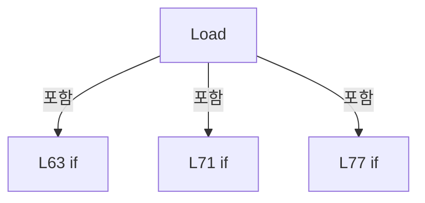
```mermaid
flowchart TD
 M["Load"]
 N0["L63 if"]
 M -->|포함| N0
 N1["L71 if"]
 M -->|포함| N1
 N2["L77 if"]
 M -->|포함| N2
```

변경 전 점검: 입력/반환 타입, 위 호출자, 예외/취소 경로, 공유 상태와 저장·전송 소비자를 함께 확인합니다. 값의 단위나 물리 방향을 이름만으로 확정하지 않습니다.

### MethodDeclaration `Save` · L105–140

[Drilling.File/ReviewResult/CReviewResultFile.cs:105–140](https://github.com/kjuws10-rgb/A3Drilling/blob/dfa5920e6301d9ec4b0eab1452ae59521aafc986/Drilling.File/ReviewResult/CReviewResultFile.cs#L105-L140)

| 항목 | 실제 추출 값 |
| --- | --- |
| 서명 | System.Threading.Tasks.Task Drilling.File.ReviewResult.CReviewResultFile.Save(Drilling.Common.Review.ST_REVIEW_RESULT_DATA, System.Threading.CancellationToken) |
| 접근/수식자 | Public / public, override |
| 반환/값 타입 | System.Threading.Tasks.Task |
| 소속 타입 | NamedType:Drilling.File.ReviewResult.CReviewResultFile |

입력 계약:

| 이름 | 타입 | 전달 | 선택/기본값 |
| --- | --- | --- | --- |
| result | Drilling.Common.Review.ST_REVIEW_RESULT_DATA | None | False /  |
| cancellationToken | System.Threading.CancellationToken | None | True / null |

현재 부분 분석에서 직접 연결된 호출자는 없습니다. XAML/이벤트/인터페이스·델리게이트·외부 진입을 추가 확인해야 하며, 미사용으로 판정한 것이 아닙니다.

호출하는 대상과 해석 범위:

| 원본 행 | 표현식 | 분석 상태 | 대상/소스 위치 |
| --- | --- | --- | --- |
| 107 | cancellationToken.ThrowIfCancellationRequested | resolved | void System.Threading.CancellationToken.ThrowIfCancellationRequested() |
| 109 | new List<ST_REVIEW_PLAN_POINT> | resolved | System.Collections.Generic.List<Drilling.Common.Review.ST_REVIEW_PLAN_POINT>.List() |
| 114 | rows.Add | resolved | void System.Collections.Generic.List<Drilling.Common.Review.ST_REVIEW_PLAN_POINT>.Add(Drilling.Common.Review.ST_REVIEW_PLAN_POINT) |
| 120 | new InvalidDataException | resolved | System.IO.InvalidDataException.InvalidDataException(string?) |
| 123 | CreateMetadata | resolved | Drilling.File.ReviewResult.CReviewResultFile.ST_REVIEW_RESULT_METADATA Drilling.File.ReviewResult.CReviewResultFile.CreateMetadata(Drilling.Common.Review.ST_REVIEW_RESULT_DATA) · Drilling.File/ReviewResult/CReviewResultFile.cs:573 |
| 125 | string.IsNullOrWhiteSpace | resolved | bool string.IsNullOrWhiteSpace(string?) |
| 127 | result.Plan.ResultType.Equals | resolved | bool string.Equals(string?, System.StringComparison) |
| 130 | ManualDirectory | resolved | string Drilling.File.ReviewResult.CReviewResultFile.ManualDirectory(string, string) · Drilling.File/ReviewResult/CReviewResultFile.cs:728 |
| 131 | WriteUniqueCsv | resolved | string Drilling.File.ReviewResult.CReviewResultFile.WriteUniqueCsv(string, string, System.Collections.Generic.IReadOnlyList<string>, System.Collections.Generic.IEnumerable<System.Collections.Generic.IReadOnlyDictionary<string, string>>, System.Threading.CancellationToken) · Drilling.File/ReviewResult/CReviewResultFile.cs:733 |
| 131 | ResultFileStem | resolved | string Drilling.File.ReviewResult.CReviewResultFile.ResultFileStem(string, System.DateTimeOffset) · Drilling.File/ReviewResult/CReviewResultFile.cs:731 |
| 131 | rows.Select | resolved | System.Collections.Generic.IEnumerable<System.Collections.Generic.IReadOnlyDictionary<string, string>> System.Collections.Generic.IEnumerable<Drilling.Common.Review.ST_REVIEW_PLAN_POINT>.Select<Drilling.Common.Review.ST_REVIEW_PLAN_POINT, System.Collections.Generic.IReadOnlyDictionary<string, string>>(System.Func<Drilling.Common.Review.ST_REVIEW_PLAN_POINT, System.Collections.Generic.IReadOnlyDictionary<string, string>>) |
| 131 | ToRow | resolved | System.Collections.Generic.IReadOnlyDictionary<string, string> Drilling.File.ReviewResult.CReviewResultFile.ToRow(Drilling.Common.Review.ST_REVIEW_RESULT_DATA, Drilling.Common.Review.ST_REVIEW_PLAN_POINT, Drilling.File.ReviewResult.CReviewResultFile.ST_REVIEW_RESULT_METADATA) · Drilling.File/ReviewResult/CReviewResultFile.cs:524 |
| 135 | Path.GetFullPath | resolved | string System.IO.Path.GetFullPath(string) |
| 136 | CCsvParser.Write | resolved | void Drilling.File.Parser.CCsvParser.Write(string, System.Collections.Generic.IReadOnlyList<string>, System.Collections.Generic.IEnumerable<System.Collections.Generic.IReadOnlyDictionary<string, string>>) · Drilling.File/Parser/CCsvParser.cs:58 |
| 136 | rows.Select | resolved | System.Collections.Generic.IEnumerable<System.Collections.Generic.IReadOnlyDictionary<string, string>> System.Collections.Generic.IEnumerable<Drilling.Common.Review.ST_REVIEW_PLAN_POINT>.Select<Drilling.Common.Review.ST_REVIEW_PLAN_POINT, System.Collections.Generic.IReadOnlyDictionary<string, string>>(System.Func<Drilling.Common.Review.ST_REVIEW_PLAN_POINT, System.Collections.Generic.IReadOnlyDictionary<string, string>>) |
| 136 | ToRow | resolved | System.Collections.Generic.IReadOnlyDictionary<string, string> Drilling.File.ReviewResult.CReviewResultFile.ToRow(Drilling.Common.Review.ST_REVIEW_RESULT_DATA, Drilling.Common.Review.ST_REVIEW_PLAN_POINT, Drilling.File.ReviewResult.CReviewResultFile.ST_REVIEW_RESULT_METADATA) · Drilling.File/ReviewResult/CReviewResultFile.cs:524 |

본문의 실제 연산·분기·예외·반환 순서(원문 위치 순):

| 원본 행 | 종류 | 주석 해설 |
| --- | --- | --- |
| 107 | call | 함수·델리게이트 또는 객체 생성자를 호출합니다: cancellationToken.ThrowIfCancellationRequested() |
| 108 | conditional-expression | 조건에 따라 결과식을 선택합니다: result.Results.Count > 0 ? result.Results : result.Plan.ReviewPoints |
| 108 | local-declaration | 지역 변수를 선언합니다: var sourceRows = result.Results.Count > 0 ? result.Results : result.Plan.ReviewPoints; |
| 108 | variable-initializer | 변수의 초기값을 지정합니다: sourceRows = result.Results.Count > 0 ? result.Results : result.Plan.ReviewPoints |
| 109 | call | 함수·델리게이트 또는 객체 생성자를 호출합니다: new List<ST_REVIEW_PLAN_POINT>() |
| 109 | local-declaration | 지역 변수를 선언합니다: var rows = new List<ST_REVIEW_PLAN_POINT>(); |
| 109 | variable-initializer | 변수의 초기값을 지정합니다: rows = new List<ST_REVIEW_PLAN_POINT>() |
| 110 | foreach | 컬렉션 요소를 순회합니다: foreach (var point in sourceRows) |
| 112 | if | 조건에 따라 분기합니다: if (point.Use && point.State is EN_REVIEW_POINT_STATE.Ok or EN_REVIEW_POINT_STATE.Ng) |
| 114 | call | 함수·델리게이트 또는 객체 생성자를 호출합니다: rows.Add(point) |
| 118 | if | 조건에 따라 분기합니다: if (rows.Count == 0) |
| 120 | call | 함수·델리게이트 또는 객체 생성자를 호출합니다: new InvalidDataException("Review Result save failed. There are no measured Shots.") |
| 120 | throw | 예외를 발생/전달합니다: throw new InvalidDataException("Review Result save failed. There are no measured Shots."); |
| 123 | call | 함수·델리게이트 또는 객체 생성자를 호출합니다: CreateMetadata(result) |
| 123 | local-declaration | 지역 변수를 선언합니다: var metadata = CreateMetadata(result); |
| 123 | variable-initializer | 변수의 초기값을 지정합니다: metadata = CreateMetadata(result) |
| 124 | assignment | 값을 대상에 대입합니다: _lastSavedPath = null |
| 125 | call | 함수·델리게이트 또는 객체 생성자를 호출합니다: string.IsNullOrWhiteSpace(result.TargetFilePath) |
| 125 | if | 조건에 따라 분기합니다: if (string.IsNullOrWhiteSpace(result.TargetFilePath)) |
| 127 | call | 함수·델리게이트 또는 객체 생성자를 호출합니다: result.Plan.ResultType.Equals("ONE_LINE", StringComparison.OrdinalIgnoreCase) |
| 127 | conditional-expression | 조건에 따라 결과식을 선택합니다: result.Plan.ResultType.Equals("ONE_LINE", StringComparison.OrdinalIgnoreCase) ? "ONE_LINE" : "ALL_SHOT" |
| 127 | local-declaration | 지역 변수를 선언합니다: var resultType = result.Plan.ResultType.Equals("ONE_LINE", StringComparison.OrdinalIgnoreCase) ? "ONE_LINE" : "ALL_SHOT"; |
| 127 | variable-initializer | 변수의 초기값을 지정합니다: resultType = result.Plan.ResultType.Equals("ONE_LINE", StringComparison.OrdinalIgnoreCase) ? "ONE_LINE" : "ALL_SHOT" |
| 130 | call | 함수·델리게이트 또는 객체 생성자를 호출합니다: ManualDirectory(result.Plan.RecipeId, resultType) |
| 130 | local-declaration | 지역 변수를 선언합니다: var directory = ManualDirectory(result.Plan.RecipeId, resultType); |
| 130 | variable-initializer | 변수의 초기값을 지정합니다: directory = ManualDirectory(result.Plan.RecipeId, resultType) |
| 131 | assignment | 값을 대상에 대입합니다: _lastSavedPath = WriteUniqueCsv(directory, ResultFileStem(result.GlassId, result.SavedAt), Headers, rows.Select(point => ToRow(result, point, metadata)), cancellationToken) |
| 131 | call | 함수·델리게이트 또는 객체 생성자를 호출합니다: WriteUniqueCsv(directory, ResultFileStem(result.GlassId, result.SavedAt), Headers, rows.Select(point => ToRow(result, point, metadata)), cancellationToken) |
| 131 | call | 함수·델리게이트 또는 객체 생성자를 호출합니다: ResultFileStem(result.GlassId, result.SavedAt) |
| 131 | call | 함수·델리게이트 또는 객체 생성자를 호출합니다: rows.Select(point => ToRow(result, point, metadata)) |
| 131 | call | 함수·델리게이트 또는 객체 생성자를 호출합니다: ToRow(result, point, metadata) |
| 133 | else | 앞 조건이 거짓인 경로입니다: else |
| 135 | call | 함수·델리게이트 또는 객체 생성자를 호출합니다: Path.GetFullPath(result.TargetFilePath) |
| 135 | local-declaration | 지역 변수를 선언합니다: var resultPath = Path.GetFullPath(result.TargetFilePath); |
| 135 | variable-initializer | 변수의 초기값을 지정합니다: resultPath = Path.GetFullPath(result.TargetFilePath) |
| 136 | call | 함수·델리게이트 또는 객체 생성자를 호출합니다: CCsvParser.Write(resultPath, Headers, rows.Select(point => ToRow(result, point, metadata))) |
| 136 | call | 함수·델리게이트 또는 객체 생성자를 호출합니다: rows.Select(point => ToRow(result, point, metadata)) |
| 136 | call | 함수·델리게이트 또는 객체 생성자를 호출합니다: ToRow(result, point, metadata) |
| 137 | assignment | 값을 대상에 대입합니다: _lastSavedPath = resultPath |
| 139 | return | 호출자에게 값 또는 제어를 반환합니다: return Task.CompletedTask; |

제어 구문의 포함 구조(실제 실행 순서/CFG가 아닌 구문 탐색 그림):

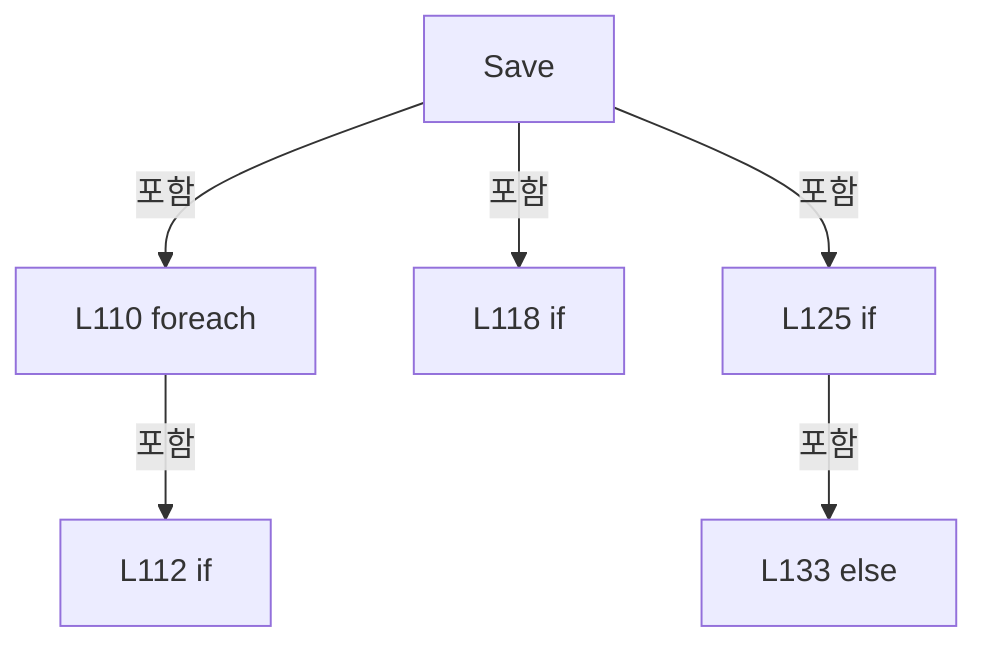
```mermaid
flowchart TD
 M["Save"]
 N0["L110 foreach"]
 M -->|포함| N0
 N1["L112 if"]
 N0 -->|포함| N1
 N2["L118 if"]
 M -->|포함| N2
 N3["L125 if"]
 M -->|포함| N3
 N4["L133 else"]
 N3 -->|포함| N4
```

변경 전 점검: 입력/반환 타입, 위 호출자, 예외/취소 경로, 공유 상태와 저장·전송 소비자를 함께 확인합니다. 값의 단위나 물리 방향을 이름만으로 확정하지 않습니다.

### MethodDeclaration `SaveReinspectionRevision` · L142–155

[Drilling.File/ReviewResult/CReviewResultFile.cs:142–155](https://github.com/kjuws10-rgb/A3Drilling/blob/dfa5920e6301d9ec4b0eab1452ae59521aafc986/Drilling.File/ReviewResult/CReviewResultFile.cs#L142-L155)

| 항목 | 실제 추출 값 |
| --- | --- |
| 서명 | System.Threading.Tasks.Task<string> Drilling.File.ReviewResult.CReviewResultFile.SaveReinspectionRevision(Drilling.Common.Review.ST_REVIEW_RESULT_FILE_DATA, System.Collections.Generic.IReadOnlyList<Drilling.Common.Review.ST_REVIEW_REINSPECTION_UPDATE>, System.DateTimeOffset, System.Threading.CancellationToken) |
| 접근/수식자 | Public / public, override |
| 반환/값 타입 | System.Threading.Tasks.Task<string> |
| 소속 타입 | NamedType:Drilling.File.ReviewResult.CReviewResultFile |

입력 계약:

| 이름 | 타입 | 전달 | 선택/기본값 |
| --- | --- | --- | --- |
| source | Drilling.Common.Review.ST_REVIEW_RESULT_FILE_DATA | None | False /  |
| updates | System.Collections.Generic.IReadOnlyList<Drilling.Common.Review.ST_REVIEW_REINSPECTION_UPDATE> | None | False /  |
| savedAt | System.DateTimeOffset | None | False /  |
| cancellationToken | System.Threading.CancellationToken | None | True / null |

현재 부분 분석에서 직접 연결된 호출자는 없습니다. XAML/이벤트/인터페이스·델리게이트·외부 진입을 추가 확인해야 하며, 미사용으로 판정한 것이 아닙니다.

호출하는 대상과 해석 범위:

| 원본 행 | 표현식 | 분석 상태 | 대상/소스 위치 |
| --- | --- | --- | --- |
| 148 | SaveRevision | resolved | System.Threading.Tasks.Task<string> Drilling.File.ReviewResult.CReviewResultFile.SaveRevision(Drilling.Common.Review.ST_REVIEW_RESULT_FILE_DATA, System.Collections.Generic.IReadOnlyList<Drilling.Common.Review.ST_REVIEW_REINSPECTION_UPDATE>, System.DateTimeOffset, string, System.Action<System.Collections.Generic.IDictionary<string, string>, System.Collections.Generic.IReadOnlySet<string>, Drilling.Common.Review.ST_REVIEW_REINSPECTION_UPDATE>, System.Threading.CancellationToken) · Drilling.File/ReviewResult/CReviewResultFile.cs:186 |

본문의 실제 연산·분기·예외·반환 순서(원문 위치 순):

| 원본 행 | 종류 | 주석 해설 |
| --- | --- | --- |
| 148 | call | 함수·델리게이트 또는 객체 생성자를 호출합니다: SaveRevision( source, updates, savedAt, "REINSP", ApplyReinspectionUpdate, cancellationToken) |
| 148 | return | 호출자에게 값 또는 제어를 반환합니다: return SaveRevision( source, updates, savedAt, "REINSP", ApplyReinspectionUpdate, cancellationToken); |

변경 전 점검: 입력/반환 타입, 위 호출자, 예외/취소 경로, 공유 상태와 저장·전송 소비자를 함께 확인합니다. 값의 단위나 물리 방향을 이름만으로 확정하지 않습니다.

### MethodDeclaration `SaveEditedRevision` · L157–184

[Drilling.File/ReviewResult/CReviewResultFile.cs:157–184](https://github.com/kjuws10-rgb/A3Drilling/blob/dfa5920e6301d9ec4b0eab1452ae59521aafc986/Drilling.File/ReviewResult/CReviewResultFile.cs#L157-L184)

| 항목 | 실제 추출 값 |
| --- | --- |
| 서명 | System.Threading.Tasks.Task<string> Drilling.File.ReviewResult.CReviewResultFile.SaveEditedRevision(Drilling.Common.Review.ST_REVIEW_RESULT_FILE_DATA, System.Collections.Generic.IReadOnlyList<Drilling.Common.Review.ST_REVIEW_RESULT_EDIT_UPDATE>, System.DateTimeOffset, System.Threading.CancellationToken) |
| 접근/수식자 | Public / public, override |
| 반환/값 타입 | System.Threading.Tasks.Task<string> |
| 소속 타입 | NamedType:Drilling.File.ReviewResult.CReviewResultFile |

입력 계약:

| 이름 | 타입 | 전달 | 선택/기본값 |
| --- | --- | --- | --- |
| source | Drilling.Common.Review.ST_REVIEW_RESULT_FILE_DATA | None | False /  |
| updates | System.Collections.Generic.IReadOnlyList<Drilling.Common.Review.ST_REVIEW_RESULT_EDIT_UPDATE> | None | False /  |
| savedAt | System.DateTimeOffset | None | False /  |
| cancellationToken | System.Threading.CancellationToken | None | True / null |

현재 부분 분석에서 직접 연결된 호출자는 없습니다. XAML/이벤트/인터페이스·델리게이트·외부 진입을 추가 확인해야 하며, 미사용으로 판정한 것이 아닙니다.

호출하는 대상과 해석 범위:

| 원본 행 | 표현식 | 분석 상태 | 대상/소스 위치 |
| --- | --- | --- | --- |
| 163 | ArgumentNullException.ThrowIfNull | resolved | void System.ArgumentNullException.ThrowIfNull(object?, string?) |
| 164 | updates .Select(update => new ST_REVIEW_REINSPECTION_UPDATE( update.CellNo, update.ShotKey, update.ShotName, update.SourceBeamNo, update.SourceBeamNo, update.ResultX, update.ResultY, update.ResultX, update.ResultY, update.Judge)) .ToArray | resolved | Drilling.Common.Review.ST_REVIEW_REINSPECTION_UPDATE[] System.Collections.Generic.IEnumerable<Drilling.Common.Review.ST_REVIEW_REINSPECTION_UPDATE>.ToArray<Drilling.Common.Review.ST_REVIEW_REINSPECTION_UPDATE>() |
| 164 | updates .Select | resolved | System.Collections.Generic.IEnumerable<Drilling.Common.Review.ST_REVIEW_REINSPECTION_UPDATE> System.Collections.Generic.IEnumerable<Drilling.Common.Review.ST_REVIEW_RESULT_EDIT_UPDATE>.Select<Drilling.Common.Review.ST_REVIEW_RESULT_EDIT_UPDATE, Drilling.Common.Review.ST_REVIEW_REINSPECTION_UPDATE>(System.Func<Drilling.Common.Review.ST_REVIEW_RESULT_EDIT_UPDATE, Drilling.Common.Review.ST_REVIEW_REINSPECTION_UPDATE>) |
| 165 | new ST_REVIEW_REINSPECTION_UPDATE | resolved | Drilling.Common.Review.ST_REVIEW_REINSPECTION_UPDATE.ST_REVIEW_REINSPECTION_UPDATE(int, string, string, int, int, double, double, double, double, string) · Drilling.Common/Review/CReviewManager.cs:4207 |
| 177 | SaveRevision | resolved | System.Threading.Tasks.Task<string> Drilling.File.ReviewResult.CReviewResultFile.SaveRevision(Drilling.Common.Review.ST_REVIEW_RESULT_FILE_DATA, System.Collections.Generic.IReadOnlyList<Drilling.Common.Review.ST_REVIEW_REINSPECTION_UPDATE>, System.DateTimeOffset, string, System.Action<System.Collections.Generic.IDictionary<string, string>, System.Collections.Generic.IReadOnlySet<string>, Drilling.Common.Review.ST_REVIEW_REINSPECTION_UPDATE>, System.Threading.CancellationToken) · Drilling.File/ReviewResult/CReviewResultFile.cs:186 |

본문의 실제 연산·분기·예외·반환 순서(원문 위치 순):

| 원본 행 | 종류 | 주석 해설 |
| --- | --- | --- |
| 163 | call | 함수·델리게이트 또는 객체 생성자를 호출합니다: ArgumentNullException.ThrowIfNull(updates) |
| 164 | call | 함수·델리게이트 또는 객체 생성자를 호출합니다: updates .Select(update => new ST_REVIEW_REINSPECTION_UPDATE( update.CellNo, update.ShotKey, update.ShotName, update.SourceBeamNo, update.SourceBeamNo, update.ResultX, update.ResultY, update.ResultX, update.ResultY, updat… |
| 164 | call | 함수·델리게이트 또는 객체 생성자를 호출합니다: updates .Select(update => new ST_REVIEW_REINSPECTION_UPDATE( update.CellNo, update.ShotKey, update.ShotName, update.SourceBeamNo, update.SourceBeamNo, update.ResultX, update.ResultY, update.ResultX, update.ResultY, updat… |
| 164 | local-declaration | 지역 변수를 선언합니다: var revisionUpdates = updates .Select(update => new ST_REVIEW_REINSPECTION_UPDATE( update.CellNo, update.ShotKey, update.ShotName, update.SourceBeamNo, update.SourceBeamNo, update.ResultX, update.ResultY, update.ResultX, update.Re |
| 164 | variable-initializer | 변수의 초기값을 지정합니다: revisionUpdates = updates .Select(update => new ST_REVIEW_REINSPECTION_UPDATE( update.CellNo, update.ShotKey, update.ShotName, update.SourceBeamNo, update.SourceBeamNo, update.ResultX, update.ResultY, update.ResultX, update.Result |
| 165 | call | 함수·델리게이트 또는 객체 생성자를 호출합니다: new ST_REVIEW_REINSPECTION_UPDATE( update.CellNo, update.ShotKey, update.ShotName, update.SourceBeamNo, update.SourceBeamNo, update.ResultX, update.ResultY, update.ResultX, update.ResultY, update.Judge) |
| 177 | call | 함수·델리게이트 또는 객체 생성자를 호출합니다: SaveRevision( source, revisionUpdates, savedAt, "EDIT", ApplyEditedResultUpdate, cancellationToken) |
| 177 | return | 호출자에게 값 또는 제어를 반환합니다: return SaveRevision( source, revisionUpdates, savedAt, "EDIT", ApplyEditedResultUpdate, cancellationToken); |

변경 전 점검: 입력/반환 타입, 위 호출자, 예외/취소 경로, 공유 상태와 저장·전송 소비자를 함께 확인합니다. 값의 단위나 물리 방향을 이름만으로 확정하지 않습니다.

### MethodDeclaration `SaveRevision` · L186–257

[Drilling.File/ReviewResult/CReviewResultFile.cs:186–257](https://github.com/kjuws10-rgb/A3Drilling/blob/dfa5920e6301d9ec4b0eab1452ae59521aafc986/Drilling.File/ReviewResult/CReviewResultFile.cs#L186-L257)

| 항목 | 실제 추출 값 |
| --- | --- |
| 서명 | System.Threading.Tasks.Task<string> Drilling.File.ReviewResult.CReviewResultFile.SaveRevision(Drilling.Common.Review.ST_REVIEW_RESULT_FILE_DATA, System.Collections.Generic.IReadOnlyList<Drilling.Common.Review.ST_REVIEW_REINSPECTION_UPDATE>, System.DateTimeOffset, string, System.Action<System.Collections.Generic.IDictionary<string, string>, System.Collections.Generic.IReadOnlySet<string>, Drilling.Common.Review.ST_REVIEW_REINSPECTION_UPDATE>, System.Threading.CancellationToken) |
| 접근/수식자 | Private / private |
| 반환/값 타입 | System.Threading.Tasks.Task<string> |
| 소속 타입 | NamedType:Drilling.File.ReviewResult.CReviewResultFile |

입력 계약:

| 이름 | 타입 | 전달 | 선택/기본값 |
| --- | --- | --- | --- |
| source | Drilling.Common.Review.ST_REVIEW_RESULT_FILE_DATA | None | False /  |
| updates | System.Collections.Generic.IReadOnlyList<Drilling.Common.Review.ST_REVIEW_REINSPECTION_UPDATE> | None | False /  |
| savedAt | System.DateTimeOffset | None | False /  |
| revisionType | string | None | False /  |
| applyUpdate | System.Action<System.Collections.Generic.IDictionary<string, string>, System.Collections.Generic.IReadOnlySet<string>, Drilling.Common.Review.ST_REVIEW_REINSPECTION_UPDATE> | None | False /  |
| cancellationToken | System.Threading.CancellationToken | None | False /  |

정적 호출자로 확인된 위치:

| 호출 파일/행 | 호출 표현식 | 런타임 분기 가능 |
| --- | --- | --- |
| [Drilling.File/ReviewResult/CReviewResultFile.cs:148–154](https://github.com/kjuws10-rgb/A3Drilling/blob/dfa5920e6301d9ec4b0eab1452ae59521aafc986/Drilling.File/ReviewResult/CReviewResultFile.cs#L148-L154) | SaveRevision | False |
| [Drilling.File/ReviewResult/CReviewResultFile.cs:177–183](https://github.com/kjuws10-rgb/A3Drilling/blob/dfa5920e6301d9ec4b0eab1452ae59521aafc986/Drilling.File/ReviewResult/CReviewResultFile.cs#L177-L183) | SaveRevision | False |

호출하는 대상과 해석 범위:

| 원본 행 | 표현식 | 분석 상태 | 대상/소스 위치 |
| --- | --- | --- | --- |
| 194 | cancellationToken.ThrowIfCancellationRequested | resolved | void System.Threading.CancellationToken.ThrowIfCancellationRequested() |
| 195 | ArgumentNullException.ThrowIfNull | resolved | void System.ArgumentNullException.ThrowIfNull(object?, string?) |
| 196 | ArgumentNullException.ThrowIfNull | resolved | void System.ArgumentNullException.ThrowIfNull(object?, string?) |
| 199 | new InvalidDataException | resolved | System.IO.InvalidDataException.InvalidDataException(string?) |
| 202 | Path.GetFullPath | resolved | string System.IO.Path.GetFullPath(string) |
| 203 | System.IO.File.Exists | resolved | bool System.IO.File.Exists(string?) |
| 205 | new FileNotFoundException | resolved | System.IO.FileNotFoundException.FileNotFoundException(string?, string?) |
| 208 | CCsvParser.ReadHeaders | resolved | System.Collections.Generic.IReadOnlyList<string> Drilling.File.Parser.CCsvParser.ReadHeaders(string) · Drilling.File/Parser/CCsvParser.cs:253 |
| 211 | new InvalidDataException | resolved | System.IO.InvalidDataException.InvalidDataException(string?) |
| 214 | headers.ToHashSet | resolved | System.Collections.Generic.HashSet<string> System.Collections.Generic.IEnumerable<string>.ToHashSet<string>(System.Collections.Generic.IEqualityComparer<string>?) |
| 215 | headerSet.Contains | resolved | bool System.Collections.Generic.HashSet<string>.Contains(string) |
| 217 | new InvalidOperationException | resolved | System.InvalidOperationException.InvalidOperationException(string?) |
| 220 | CCsvParser.Read(sourcePath) .Select(row => new Dictionary<string, string>(row, StringComparer.OrdinalIgnoreCase)) .ToArray | resolved | System.Collections.Generic.Dictionary<string, string>[] System.Collections.Generic.IEnumerable<System.Collections.Generic.Dictionary<string, string>>.ToArray<System.Collections.Generic.Dictionary<string, string>>() |
| 220 | CCsvParser.Read(sourcePath) .Select | resolved | System.Collections.Generic.IEnumerable<System.Collections.Generic.Dictionary<string, string>> System.Collections.Generic.IEnumerable<System.Collections.Generic.IReadOnlyDictionary<string, string>>.Select<System.Collections.Generic.IReadOnlyDictionary<string, string>, System.Collections.Generic.Dictionary<string, string>>(System.Func<System.Collections.Generic.IReadOnlyDictionary<string, string>, System.Collections.Generic.Dictionary<string, string>>) |
| 220 | CCsvParser.Read | resolved | System.Collections.Generic.IReadOnlyList<System.Collections.Generic.IReadOnlyDictionary<string, string>> Drilling.File.Parser.CCsvParser.Read(string) · Drilling.File/Parser/CCsvParser.cs:12 |
| 221 | new Dictionary<string, string> | resolved | System.Collections.Generic.Dictionary<string, string>.Dictionary(System.Collections.Generic.IEnumerable<System.Collections.Generic.KeyValuePair<string, string>>, System.Collections.Generic.IEqualityComparer<string>?) |
| 225 | new InvalidDataException | resolved | System.IO.InvalidDataException.InvalidDataException(string?) |
| 230 | cancellationToken.ThrowIfCancellationRequested | resolved | void System.Threading.CancellationToken.ThrowIfCancellationRequested() |
| 231 | headerSet.Contains | resolved | bool System.Collections.Generic.HashSet<string>.Contains(string) |
| 233 | FormatRevisionSavedAt | resolved | string Drilling.File.ReviewResult.CReviewResultFile.FormatRevisionSavedAt(string, System.DateTimeOffset) · Drilling.File/ReviewResult/CReviewResultFile.cs:440 |
| 233 | row.GetValueOrDefault | resolved | string? System.Collections.Generic.IReadOnlyDictionary<string, string>.GetValueOrDefault<string, string>(string) |
| 237 | new HashSet<int> | resolved | System.Collections.Generic.HashSet<int>.HashSet() |
| 240 | cancellationToken.ThrowIfCancellationRequested | resolved | void System.Threading.CancellationToken.ThrowIfCancellationRequested() |
| 241 | ValidateReinspectionUpdate | resolved | void Drilling.File.ReviewResult.CReviewResultFile.ValidateReinspectionUpdate(Drilling.Common.Review.ST_REVIEW_REINSPECTION_UPDATE) · Drilling.File/ReviewResult/CReviewResultFile.cs:270 |
| 242 | FindReinspectionRowIndex | resolved | int Drilling.File.ReviewResult.CReviewResultFile.FindReinspectionRowIndex(System.Collections.Generic.IReadOnlyList<System.Collections.Generic.Dictionary<string, string>>, Drilling.Common.Review.ST_REVIEW_REINSPECTION_UPDATE) · Drilling.File/ReviewResult/CReviewResultFile.cs:297 |
| 243 | updatedRowIndexes.Add | resolved | bool System.Collections.Generic.HashSet<int>.Add(int) |
| 245 | new InvalidDataException | resolved | System.IO.InvalidDataException.InvalidDataException(string?) |
| 248 | applyUpdate | resolved · 동적 구현 선택 가능 | void System.Action<System.Collections.Generic.IDictionary<string, string>, System.Collections.Generic.IReadOnlySet<string>, Drilling.Common.Review.ST_REVIEW_REINSPECTION_UPDATE>.Invoke(System.Collections.Generic.IDictionary<string, string>, System.Collections.Generic.IReadOnlySet<string>, Drilling.Common.Review.ST_REVIEW_REINSPECTION_UPDATE) |
| 251 | Path.GetDirectoryName | resolved | string? System.IO.Path.GetDirectoryName(string?) |
| 252 | new InvalidDataException | resolved | System.IO.InvalidDataException.InvalidDataException(string?) |
| 253 | StripRevisionSuffix | resolved | string Drilling.File.ReviewResult.CReviewResultFile.StripRevisionSuffix(string) · Drilling.File/ReviewResult/CReviewResultFile.cs:259 |
| 253 | Path.GetFileNameWithoutExtension | resolved | string? System.IO.Path.GetFileNameWithoutExtension(string?) |
| 255 | WriteUniqueCsv | resolved | string Drilling.File.ReviewResult.CReviewResultFile.WriteUniqueCsv(string, string, System.Collections.Generic.IReadOnlyList<string>, System.Collections.Generic.IEnumerable<System.Collections.Generic.IReadOnlyDictionary<string, string>>, System.Threading.CancellationToken) · Drilling.File/ReviewResult/CReviewResultFile.cs:733 |
| 256 | Task.FromResult | resolved | System.Threading.Tasks.Task<string> System.Threading.Tasks.Task.FromResult<string>(string) |

본문의 실제 연산·분기·예외·반환 순서(원문 위치 순):

| 원본 행 | 종류 | 주석 해설 |
| --- | --- | --- |
| 194 | call | 함수·델리게이트 또는 객체 생성자를 호출합니다: cancellationToken.ThrowIfCancellationRequested() |
| 195 | call | 함수·델리게이트 또는 객체 생성자를 호출합니다: ArgumentNullException.ThrowIfNull(source) |
| 196 | call | 함수·델리게이트 또는 객체 생성자를 호출합니다: ArgumentNullException.ThrowIfNull(updates) |
| 197 | if | 조건에 따라 분기합니다: if (updates.Count == 0) |
| 199 | call | 함수·델리게이트 또는 객체 생성자를 호출합니다: new InvalidDataException("결과 갱신 대상이 없습니다.") |
| 199 | throw | 예외를 발생/전달합니다: throw new InvalidDataException("결과 갱신 대상이 없습니다."); |
| 202 | call | 함수·델리게이트 또는 객체 생성자를 호출합니다: Path.GetFullPath(source.FilePath) |
| 202 | local-declaration | 지역 변수를 선언합니다: var sourcePath = Path.GetFullPath(source.FilePath); |
| 202 | variable-initializer | 변수의 초기값을 지정합니다: sourcePath = Path.GetFullPath(source.FilePath) |
| 203 | call | 함수·델리게이트 또는 객체 생성자를 호출합니다: System.IO.File.Exists(sourcePath) |
| 203 | if | 조건에 따라 분기합니다: if (!System.IO.File.Exists(sourcePath)) |
| 205 | call | 함수·델리게이트 또는 객체 생성자를 호출합니다: new FileNotFoundException("BASE 검사 결과 파일을 찾을 수 없습니다.", sourcePath) |
| 205 | throw | 예외를 발생/전달합니다: throw new FileNotFoundException("BASE 검사 결과 파일을 찾을 수 없습니다.", sourcePath); |
| 208 | call | 함수·델리게이트 또는 객체 생성자를 호출합니다: CCsvParser.ReadHeaders(sourcePath) |
| 208 | local-declaration | 지역 변수를 선언합니다: var headers = CCsvParser.ReadHeaders(sourcePath); |
| 208 | variable-initializer | 변수의 초기값을 지정합니다: headers = CCsvParser.ReadHeaders(sourcePath) |
| 209 | if | 조건에 따라 분기합니다: if (headers.Count == 0) |
| 211 | call | 함수·델리게이트 또는 객체 생성자를 호출합니다: new InvalidDataException("BASE 검사 결과 파일의 CSV 헤더가 없습니다.") |
| 211 | throw | 예외를 발생/전달합니다: throw new InvalidDataException("BASE 검사 결과 파일의 CSV 헤더가 없습니다."); |
| 214 | call | 함수·델리게이트 또는 객체 생성자를 호출합니다: headers.ToHashSet(StringComparer.OrdinalIgnoreCase) |
| 214 | local-declaration | 지역 변수를 선언합니다: var headerSet = headers.ToHashSet(StringComparer.OrdinalIgnoreCase); |
| 214 | variable-initializer | 변수의 초기값을 지정합니다: headerSet = headers.ToHashSet(StringComparer.OrdinalIgnoreCase) |
| 215 | call | 함수·델리게이트 또는 객체 생성자를 호출합니다: headerSet.Contains("BEAM1_JUDGE") |
| 215 | if | 조건에 따라 분기합니다: if (headerSet.Contains("BEAM1_JUDGE")) |
| 217 | call | 함수·델리게이트 또는 객체 생성자를 호출합니다: new InvalidOperationException("BEAM INSPECTION 결과는 결과 갱신 파일로 저장할 수 없습니다.") |
| 217 | throw | 예외를 발생/전달합니다: throw new InvalidOperationException("BEAM INSPECTION 결과는 결과 갱신 파일로 저장할 수 없습니다."); |
| 220 | call | 함수·델리게이트 또는 객체 생성자를 호출합니다: CCsvParser.Read(sourcePath) |
| 220 | call | 함수·델리게이트 또는 객체 생성자를 호출합니다: CCsvParser.Read(sourcePath) .Select(row => new Dictionary<string, string>(row, StringComparer.OrdinalIgnoreCase)) |
| 220 | call | 함수·델리게이트 또는 객체 생성자를 호출합니다: CCsvParser.Read(sourcePath) .Select(row => new Dictionary<string, string>(row, StringComparer.OrdinalIgnoreCase)) .ToArray() |
| 220 | local-declaration | 지역 변수를 선언합니다: var rows = CCsvParser.Read(sourcePath) .Select(row => new Dictionary<string, string>(row, StringComparer.OrdinalIgnoreCase)) .ToArray(); |
| 220 | variable-initializer | 변수의 초기값을 지정합니다: rows = CCsvParser.Read(sourcePath) .Select(row => new Dictionary<string, string>(row, StringComparer.OrdinalIgnoreCase)) .ToArray() |
| 221 | call | 함수·델리게이트 또는 객체 생성자를 호출합니다: new Dictionary<string, string>(row, StringComparer.OrdinalIgnoreCase) |
| 223 | if | 조건에 따라 분기합니다: if (rows.Length == 0) |
| 225 | call | 함수·델리게이트 또는 객체 생성자를 호출합니다: new InvalidDataException("BASE 검사 결과 파일에 결과 행이 없습니다.") |
| 225 | throw | 예외를 발생/전달합니다: throw new InvalidDataException("BASE 검사 결과 파일에 결과 행이 없습니다."); |
| 228 | foreach | 컬렉션 요소를 순회합니다: foreach (var row in rows) |
| 230 | call | 함수·델리게이트 또는 객체 생성자를 호출합니다: cancellationToken.ThrowIfCancellationRequested() |
| 231 | call | 함수·델리게이트 또는 객체 생성자를 호출합니다: headerSet.Contains("SAVED_AT") |
| 231 | if | 조건에 따라 분기합니다: if (headerSet.Contains("SAVED_AT")) |
| 233 | assignment | 값을 대상에 대입합니다: row["SAVED_AT"] = FormatRevisionSavedAt(row.GetValueOrDefault("SAVED_AT") ?? "", savedAt) |
| 233 | call | 함수·델리게이트 또는 객체 생성자를 호출합니다: FormatRevisionSavedAt(row.GetValueOrDefault("SAVED_AT") ?? "", savedAt) |
| 233 | call | 함수·델리게이트 또는 객체 생성자를 호출합니다: row.GetValueOrDefault("SAVED_AT") |
| 237 | call | 함수·델리게이트 또는 객체 생성자를 호출합니다: new HashSet<int>() |
| 237 | local-declaration | 지역 변수를 선언합니다: var updatedRowIndexes = new HashSet<int>(); |
| 237 | variable-initializer | 변수의 초기값을 지정합니다: updatedRowIndexes = new HashSet<int>() |
| 238 | foreach | 컬렉션 요소를 순회합니다: foreach (var update in updates) |
| 240 | call | 함수·델리게이트 또는 객체 생성자를 호출합니다: cancellationToken.ThrowIfCancellationRequested() |
| 241 | call | 함수·델리게이트 또는 객체 생성자를 호출합니다: ValidateReinspectionUpdate(update) |
| 242 | call | 함수·델리게이트 또는 객체 생성자를 호출합니다: FindReinspectionRowIndex(rows, update) |
| 242 | local-declaration | 지역 변수를 선언합니다: var rowIndex = FindReinspectionRowIndex(rows, update); |
| 242 | variable-initializer | 변수의 초기값을 지정합니다: rowIndex = FindReinspectionRowIndex(rows, update) |
| 243 | call | 함수·델리게이트 또는 객체 생성자를 호출합니다: updatedRowIndexes.Add(rowIndex) |
| 243 | if | 조건에 따라 분기합니다: if (!updatedRowIndexes.Add(rowIndex)) |
| 245 | call | 함수·델리게이트 또는 객체 생성자를 호출합니다: new InvalidDataException($"동일한 BASE 결과 행이 갱신 목록에 중복되었습니다. CELL{update.CellNo:00} / {update.ShotName}") |
| 245 | throw | 예외를 발생/전달합니다: throw new InvalidDataException($"동일한 BASE 결과 행이 갱신 목록에 중복되었습니다. CELL{update.CellNo:00} / {update.ShotName}"); |
| 248 | call | 함수·델리게이트 또는 객체 생성자를 호출합니다: applyUpdate(rows[rowIndex], headerSet, update) |
| 251 | call | 함수·델리게이트 또는 객체 생성자를 호출합니다: Path.GetDirectoryName(sourcePath) |
| 251 | local-declaration | 지역 변수를 선언합니다: var directory = Path.GetDirectoryName(sourcePath) ?? throw new InvalidDataException("BASE 검사 결과 파일의 저장 폴더를 확인할 수 없습니다."); |
| 251 | variable-initializer | 변수의 초기값을 지정합니다: directory = Path.GetDirectoryName(sourcePath) ?? throw new InvalidDataException("BASE 검사 결과 파일의 저장 폴더를 확인할 수 없습니다.") |
| 252 | call | 함수·델리게이트 또는 객체 생성자를 호출합니다: new InvalidDataException("BASE 검사 결과 파일의 저장 폴더를 확인할 수 없습니다.") |
| 252 | throw | 예외를 발생/전달합니다: throw new InvalidDataException("BASE 검사 결과 파일의 저장 폴더를 확인할 수 없습니다.") |
| 253 | call | 함수·델리게이트 또는 객체 생성자를 호출합니다: StripRevisionSuffix(Path.GetFileNameWithoutExtension(sourcePath)) |
| 253 | call | 함수·델리게이트 또는 객체 생성자를 호출합니다: Path.GetFileNameWithoutExtension(sourcePath) |
| 253 | local-declaration | 지역 변수를 선언합니다: var baseStem = StripRevisionSuffix(Path.GetFileNameWithoutExtension(sourcePath)); |
| 253 | variable-initializer | 변수의 초기값을 지정합니다: baseStem = StripRevisionSuffix(Path.GetFileNameWithoutExtension(sourcePath)) |
| 254 | local-declaration | 지역 변수를 선언합니다: var fileStem = $"{baseStem}_{revisionType}_{savedAt:yyyyMMdd_HHmmss_fff}"; |
| 254 | variable-initializer | 변수의 초기값을 지정합니다: fileStem = $"{baseStem}_{revisionType}_{savedAt:yyyyMMdd_HHmmss_fff}" |
| 255 | assignment | 값을 대상에 대입합니다: _lastSavedPath = WriteUniqueCsv(directory, fileStem, headers, rows, cancellationToken) |
| 255 | call | 함수·델리게이트 또는 객체 생성자를 호출합니다: WriteUniqueCsv(directory, fileStem, headers, rows, cancellationToken) |
| 256 | call | 함수·델리게이트 또는 객체 생성자를 호출합니다: Task.FromResult(_lastSavedPath) |
| 256 | return | 호출자에게 값 또는 제어를 반환합니다: return Task.FromResult(_lastSavedPath); |

제어 구문의 포함 구조(실제 실행 순서/CFG가 아닌 구문 탐색 그림):

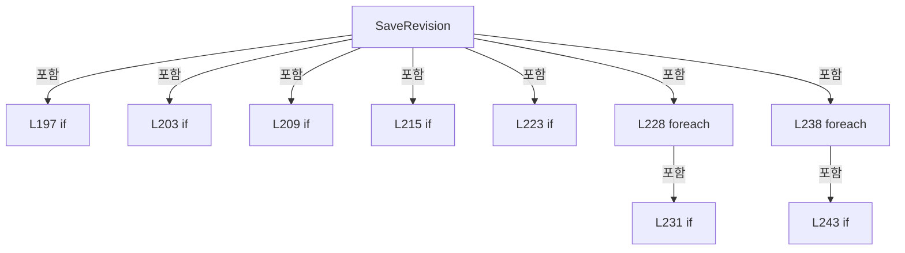
```mermaid
flowchart TD
 M["SaveRevision"]
 N0["L197 if"]
 M -->|포함| N0
 N1["L203 if"]
 M -->|포함| N1
 N2["L209 if"]
 M -->|포함| N2
 N3["L215 if"]
 M -->|포함| N3
 N4["L223 if"]
 M -->|포함| N4
 N5["L228 foreach"]
 M -->|포함| N5
 N6["L231 if"]
 N5 -->|포함| N6
 N7["L238 foreach"]
 M -->|포함| N7
 N8["L243 if"]
 N7 -->|포함| N8
```

변경 전 점검: 입력/반환 타입, 위 호출자, 예외/취소 경로, 공유 상태와 저장·전송 소비자를 함께 확인합니다. 값의 단위나 물리 방향을 이름만으로 확정하지 않습니다.

### MethodDeclaration `StripRevisionSuffix` · L259–268

[Drilling.File/ReviewResult/CReviewResultFile.cs:259–268](https://github.com/kjuws10-rgb/A3Drilling/blob/dfa5920e6301d9ec4b0eab1452ae59521aafc986/Drilling.File/ReviewResult/CReviewResultFile.cs#L259-L268)

| 항목 | 실제 추출 값 |
| --- | --- |
| 서명 | string Drilling.File.ReviewResult.CReviewResultFile.StripRevisionSuffix(string) |
| 접근/수식자 | Private / private, static |
| 반환/값 타입 | string |
| 소속 타입 | NamedType:Drilling.File.ReviewResult.CReviewResultFile |

입력 계약:

| 이름 | 타입 | 전달 | 선택/기본값 |
| --- | --- | --- | --- |
| fileStem | string | None | False /  |

정적 호출자로 확인된 위치:

| 호출 파일/행 | 호출 표현식 | 런타임 분기 가능 |
| --- | --- | --- |
| [Drilling.File/ReviewResult/CReviewResultFile.cs:253–253](https://github.com/kjuws10-rgb/A3Drilling/blob/dfa5920e6301d9ec4b0eab1452ae59521aafc986/Drilling.File/ReviewResult/CReviewResultFile.cs#L253-L253) | StripRevisionSuffix | False |

호출하는 대상과 해석 범위:

| 원본 행 | 표현식 | 분석 상태 | 대상/소스 위치 |
| --- | --- | --- | --- |
| 263 | fileStem.LastIndexOf | resolved | int string.LastIndexOf(string, System.StringComparison) |
| 264 | fileStem.LastIndexOf | resolved | int string.LastIndexOf(string, System.StringComparison) |
| 266 | markers.Where(index => index > 0).DefaultIfEmpty(-1).Min | resolved | int System.Collections.Generic.IEnumerable<int>.Min() |
| 266 | markers.Where(index => index > 0).DefaultIfEmpty | resolved | System.Collections.Generic.IEnumerable<int> System.Collections.Generic.IEnumerable<int>.DefaultIfEmpty<int>(int) |
| 266 | markers.Where | resolved | System.Collections.Generic.IEnumerable<int> System.Collections.Generic.IEnumerable<int>.Where<int>(System.Func<int, bool>) |

본문의 실제 연산·분기·예외·반환 순서(원문 위치 순):

| 원본 행 | 종류 | 주석 해설 |
| --- | --- | --- |
| 261 | local-declaration | 지역 변수를 선언합니다: var markers = new[] { fileStem.LastIndexOf("_REINSP_", StringComparison.OrdinalIgnoreCase), fileStem.LastIndexOf("_EDIT_", StringComparison.OrdinalIgnoreCase) }; |
| 261 | variable-initializer | 변수의 초기값을 지정합니다: markers = new[] { fileStem.LastIndexOf("_REINSP_", StringComparison.OrdinalIgnoreCase), fileStem.LastIndexOf("_EDIT_", StringComparison.OrdinalIgnoreCase) } |
| 263 | call | 함수·델리게이트 또는 객체 생성자를 호출합니다: fileStem.LastIndexOf("_REINSP_", StringComparison.OrdinalIgnoreCase) |
| 264 | call | 함수·델리게이트 또는 객체 생성자를 호출합니다: fileStem.LastIndexOf("_EDIT_", StringComparison.OrdinalIgnoreCase) |
| 266 | call | 함수·델리게이트 또는 객체 생성자를 호출합니다: markers.Where(index => index > 0).DefaultIfEmpty(-1).Min() |
| 266 | call | 함수·델리게이트 또는 객체 생성자를 호출합니다: markers.Where(index => index > 0).DefaultIfEmpty(-1) |
| 266 | call | 함수·델리게이트 또는 객체 생성자를 호출합니다: markers.Where(index => index > 0) |
| 266 | local-declaration | 지역 변수를 선언합니다: var marker = markers.Where(index => index > 0).DefaultIfEmpty(-1).Min(); |
| 266 | variable-initializer | 변수의 초기값을 지정합니다: marker = markers.Where(index => index > 0).DefaultIfEmpty(-1).Min() |
| 267 | conditional-expression | 조건에 따라 결과식을 선택합니다: marker > 0 ? fileStem[..marker] : fileStem |
| 267 | return | 호출자에게 값 또는 제어를 반환합니다: return marker > 0 ? fileStem[..marker] : fileStem; |

변경 전 점검: 입력/반환 타입, 위 호출자, 예외/취소 경로, 공유 상태와 저장·전송 소비자를 함께 확인합니다. 값의 단위나 물리 방향을 이름만으로 확정하지 않습니다.

### MethodDeclaration `ValidateReinspectionUpdate` · L270–295

[Drilling.File/ReviewResult/CReviewResultFile.cs:270–295](https://github.com/kjuws10-rgb/A3Drilling/blob/dfa5920e6301d9ec4b0eab1452ae59521aafc986/Drilling.File/ReviewResult/CReviewResultFile.cs#L270-L295)

| 항목 | 실제 추출 값 |
| --- | --- |
| 서명 | void Drilling.File.ReviewResult.CReviewResultFile.ValidateReinspectionUpdate(Drilling.Common.Review.ST_REVIEW_REINSPECTION_UPDATE) |
| 접근/수식자 | Private / private, static |
| 반환/값 타입 | void |
| 소속 타입 | NamedType:Drilling.File.ReviewResult.CReviewResultFile |

입력 계약:

| 이름 | 타입 | 전달 | 선택/기본값 |
| --- | --- | --- | --- |
| update | Drilling.Common.Review.ST_REVIEW_REINSPECTION_UPDATE | None | False /  |

정적 호출자로 확인된 위치:

| 호출 파일/행 | 호출 표현식 | 런타임 분기 가능 |
| --- | --- | --- |
| [Drilling.File/ReviewResult/CReviewResultFile.cs:241–241](https://github.com/kjuws10-rgb/A3Drilling/blob/dfa5920e6301d9ec4b0eab1452ae59521aafc986/Drilling.File/ReviewResult/CReviewResultFile.cs#L241-L241) | ValidateReinspectionUpdate | False |

호출하는 대상과 해석 범위:

| 원본 행 | 표현식 | 분석 상태 | 대상/소스 위치 |
| --- | --- | --- | --- |
| 272 | string.IsNullOrWhiteSpace | resolved | bool string.IsNullOrWhiteSpace(string?) |
| 274 | new InvalidDataException | resolved | System.IO.InvalidDataException.InvalidDataException(string?) |
| 279 | new InvalidDataException | resolved | System.IO.InvalidDataException.InvalidDataException(string?) |
| 282 | double.IsFinite | resolved | bool double.IsFinite(double) |
| 283 | double.IsFinite | resolved | bool double.IsFinite(double) |
| 284 | double.IsFinite | resolved | bool double.IsFinite(double) |
| 285 | double.IsFinite | resolved | bool double.IsFinite(double) |
| 287 | new InvalidDataException | resolved | System.IO.InvalidDataException.InvalidDataException(string?) |
| 290 | update.Judge.Equals | resolved | bool string.Equals(string?, System.StringComparison) |
| 291 | update.Judge.Equals | resolved | bool string.Equals(string?, System.StringComparison) |
| 293 | new InvalidDataException | resolved | System.IO.InvalidDataException.InvalidDataException(string?) |

본문의 실제 연산·분기·예외·반환 순서(원문 위치 순):

| 원본 행 | 종류 | 주석 해설 |
| --- | --- | --- |
| 272 | call | 함수·델리게이트 또는 객체 생성자를 호출합니다: string.IsNullOrWhiteSpace(update.ShotName) |
| 272 | if | 조건에 따라 분기합니다: if (update.CellNo <= 0 &#124;&#124; string.IsNullOrWhiteSpace(update.ShotName)) |
| 274 | call | 함수·델리게이트 또는 객체 생성자를 호출합니다: new InvalidDataException("재검사 결과의 Cell 또는 Shot 정보가 올바르지 않습니다.") |
| 274 | throw | 예외를 발생/전달합니다: throw new InvalidDataException("재검사 결과의 Cell 또는 Shot 정보가 올바르지 않습니다."); |
| 277 | if | 조건에 따라 분기합니다: if (update.BeamNo is < 1 or > 16) |
| 279 | call | 함수·델리게이트 또는 객체 생성자를 호출합니다: new InvalidDataException($"재검사 Beam 번호는 1~16이어야 합니다. CELL{update.CellNo:00} / {update.ShotName}") |
| 279 | throw | 예외를 발생/전달합니다: throw new InvalidDataException($"재검사 Beam 번호는 1~16이어야 합니다. CELL{update.CellNo:00} / {update.ShotName}"); |
| 282 | call | 함수·델리게이트 또는 객체 생성자를 호출합니다: double.IsFinite(update.RawResultX) |
| 282 | if | 조건에 따라 분기합니다: if (!double.IsFinite(update.RawResultX) &#124;&#124; !double.IsFinite(update.RawResultY) &#124;&#124; !double.IsFinite(update.ResultX) &#124;&#124; !double.IsFinite(update.ResultY)) |
| 283 | call | 함수·델리게이트 또는 객체 생성자를 호출합니다: double.IsFinite(update.RawResultY) |
| 284 | call | 함수·델리게이트 또는 객체 생성자를 호출합니다: double.IsFinite(update.ResultX) |
| 285 | call | 함수·델리게이트 또는 객체 생성자를 호출합니다: double.IsFinite(update.ResultY) |
| 287 | call | 함수·델리게이트 또는 객체 생성자를 호출합니다: new InvalidDataException($"재검사 결과 좌표는 유한한 숫자여야 합니다. CELL{update.CellNo:00} / {update.ShotName}") |
| 287 | throw | 예외를 발생/전달합니다: throw new InvalidDataException($"재검사 결과 좌표는 유한한 숫자여야 합니다. CELL{update.CellNo:00} / {update.ShotName}"); |
| 290 | call | 함수·델리게이트 또는 객체 생성자를 호출합니다: update.Judge.Equals("OK", StringComparison.OrdinalIgnoreCase) |
| 290 | if | 조건에 따라 분기합니다: if (!update.Judge.Equals("OK", StringComparison.OrdinalIgnoreCase) && !update.Judge.Equals("NG", StringComparison.OrdinalIgnoreCase)) |
| 291 | call | 함수·델리게이트 또는 객체 생성자를 호출합니다: update.Judge.Equals("NG", StringComparison.OrdinalIgnoreCase) |
| 293 | call | 함수·델리게이트 또는 객체 생성자를 호출합니다: new InvalidDataException($"재검사 판정은 OK 또는 NG여야 합니다. CELL{update.CellNo:00} / {update.ShotName}") |
| 293 | throw | 예외를 발생/전달합니다: throw new InvalidDataException($"재검사 판정은 OK 또는 NG여야 합니다. CELL{update.CellNo:00} / {update.ShotName}"); |

제어 구문의 포함 구조(실제 실행 순서/CFG가 아닌 구문 탐색 그림):

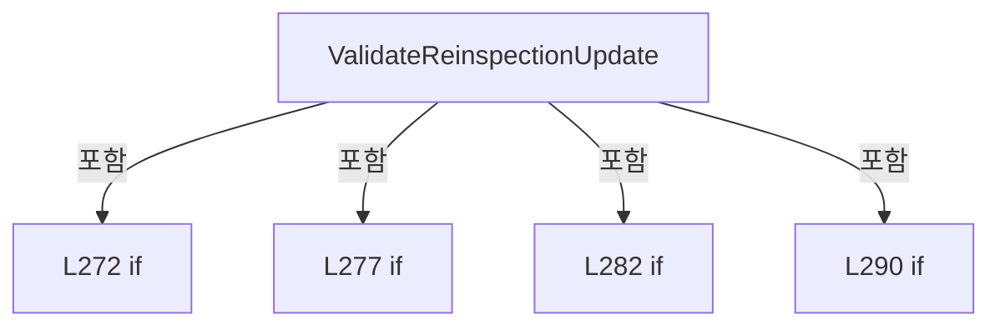
```mermaid
flowchart TD
 M["ValidateReinspectionUpdate"]
 N0["L272 if"]
 M -->|포함| N0
 N1["L277 if"]
 M -->|포함| N1
 N2["L282 if"]
 M -->|포함| N2
 N3["L290 if"]
 M -->|포함| N3
```

변경 전 점검: 입력/반환 타입, 위 호출자, 예외/취소 경로, 공유 상태와 저장·전송 소비자를 함께 확인합니다. 값의 단위나 물리 방향을 이름만으로 확정하지 않습니다.

### MethodDeclaration `FindReinspectionRowIndex` · L297–324

[Drilling.File/ReviewResult/CReviewResultFile.cs:297–324](https://github.com/kjuws10-rgb/A3Drilling/blob/dfa5920e6301d9ec4b0eab1452ae59521aafc986/Drilling.File/ReviewResult/CReviewResultFile.cs#L297-L324)

| 항목 | 실제 추출 값 |
| --- | --- |
| 서명 | int Drilling.File.ReviewResult.CReviewResultFile.FindReinspectionRowIndex(System.Collections.Generic.IReadOnlyList<System.Collections.Generic.Dictionary<string, string>>, Drilling.Common.Review.ST_REVIEW_REINSPECTION_UPDATE) |
| 접근/수식자 | Private / private, static |
| 반환/값 타입 | int |
| 소속 타입 | NamedType:Drilling.File.ReviewResult.CReviewResultFile |

입력 계약:

| 이름 | 타입 | 전달 | 선택/기본값 |
| --- | --- | --- | --- |
| rows | System.Collections.Generic.IReadOnlyList<System.Collections.Generic.Dictionary<string, string>> | None | False /  |
| update | Drilling.Common.Review.ST_REVIEW_REINSPECTION_UPDATE | None | False /  |

정적 호출자로 확인된 위치:

| 호출 파일/행 | 호출 표현식 | 런타임 분기 가능 |
| --- | --- | --- |
| [Drilling.File/ReviewResult/CReviewResultFile.cs:242–242](https://github.com/kjuws10-rgb/A3Drilling/blob/dfa5920e6301d9ec4b0eab1452ae59521aafc986/Drilling.File/ReviewResult/CReviewResultFile.cs#L242-L242) | FindReinspectionRowIndex | False |

호출하는 대상과 해석 범위:

| 원본 행 | 표현식 | 분석 상태 | 대상/소스 위치 |
| --- | --- | --- | --- |
| 301 | rows .Select((row, index) => (row, index)) .Where(pair => IsReinspectionTargetRow(pair.row, update)) .ToArray | resolved | (System.Collections.Generic.Dictionary<string, string> row, int index)[] System.Collections.Generic.IEnumerable<(System.Collections.Generic.Dictionary<string, string> row, int index)>.ToArray<(System.Collections.Generic.Dictionary<string, string> row, int index)>() |
| 301 | rows .Select((row, index) => (row, index)) .Where | resolved | System.Collections.Generic.IEnumerable<(System.Collections.Generic.Dictionary<string, string> row, int index)> System.Collections.Generic.IEnumerable<(System.Collections.Generic.Dictionary<string, string> row, int index)>.Where<(System.Collections.Generic.Dictionary<string, string> row, int index)>(System.Func<(System.Collections.Generic.Dictionary<string, string> row, int index), bool>) |
| 301 | rows .Select | resolved | System.Collections.Generic.IEnumerable<(System.Collections.Generic.Dictionary<string, string> row, int index)> System.Collections.Generic.IEnumerable<System.Collections.Generic.Dictionary<string, string>>.Select<System.Collections.Generic.Dictionary<string, string>, (System.Collections.Generic.Dictionary<string, string> row, int index)>(System.Func<System.Collections.Generic.Dictionary<string, string>, int, (System.Collections.Generic.Dictionary<string, string> row, int index)>) |
| 303 | IsReinspectionTargetRow | resolved | bool Drilling.File.ReviewResult.CReviewResultFile.IsReinspectionTargetRow(System.Collections.Generic.IReadOnlyDictionary<string, string>, Drilling.Common.Review.ST_REVIEW_REINSPECTION_UPDATE) · Drilling.File/ReviewResult/CReviewResultFile.cs:326 |
| 307 | new InvalidDataException | resolved | System.IO.InvalidDataException.InvalidDataException(string?) |
| 315 | candidates .Where(pair => ReadOptionalInt(pair.row, "BEAM_NO", 0) == update.SourceBeamNo) .ToArray | resolved | (System.Collections.Generic.Dictionary<string, string> row, int index)[] System.Collections.Generic.IEnumerable<(System.Collections.Generic.Dictionary<string, string> row, int index)>.ToArray<(System.Collections.Generic.Dictionary<string, string> row, int index)>() |
| 315 | candidates .Where | resolved | System.Collections.Generic.IEnumerable<(System.Collections.Generic.Dictionary<string, string> row, int index)> System.Collections.Generic.IEnumerable<(System.Collections.Generic.Dictionary<string, string> row, int index)>.Where<(System.Collections.Generic.Dictionary<string, string> row, int index)>(System.Func<(System.Collections.Generic.Dictionary<string, string> row, int index), bool>) |
| 316 | ReadOptionalInt | resolved | int Drilling.File.ReviewResult.CReviewResultFile.ReadOptionalInt(System.Collections.Generic.IReadOnlyDictionary<string, string>, string, int) · Drilling.File/ReviewResult/CReviewResultFile.cs:627 |
| 323 | new InvalidDataException | resolved | System.IO.InvalidDataException.InvalidDataException(string?) |

본문의 실제 연산·분기·예외·반환 순서(원문 위치 순):

| 원본 행 | 종류 | 주석 해설 |
| --- | --- | --- |
| 301 | call | 함수·델리게이트 또는 객체 생성자를 호출합니다: rows .Select((row, index) => (row, index)) |
| 301 | call | 함수·델리게이트 또는 객체 생성자를 호출합니다: rows .Select((row, index) => (row, index)) .Where(pair => IsReinspectionTargetRow(pair.row, update)) |
| 301 | call | 함수·델리게이트 또는 객체 생성자를 호출합니다: rows .Select((row, index) => (row, index)) .Where(pair => IsReinspectionTargetRow(pair.row, update)) .ToArray() |
| 301 | local-declaration | 지역 변수를 선언합니다: var candidates = rows .Select((row, index) => (row, index)) .Where(pair => IsReinspectionTargetRow(pair.row, update)) .ToArray(); |
| 301 | variable-initializer | 변수의 초기값을 지정합니다: candidates = rows .Select((row, index) => (row, index)) .Where(pair => IsReinspectionTargetRow(pair.row, update)) .ToArray() |
| 303 | call | 함수·델리게이트 또는 객체 생성자를 호출합니다: IsReinspectionTargetRow(pair.row, update) |
| 305 | if | 조건에 따라 분기합니다: if (candidates.Length == 0) |
| 307 | call | 함수·델리게이트 또는 객체 생성자를 호출합니다: new InvalidDataException($"BASE 검사 결과에서 재검사 Shot을 찾을 수 없습니다. CELL{update.CellNo:00} / {update.ShotName}") |
| 307 | throw | 예외를 발생/전달합니다: throw new InvalidDataException($"BASE 검사 결과에서 재검사 Shot을 찾을 수 없습니다. CELL{update.CellNo:00} / {update.ShotName}"); |
| 310 | if | 조건에 따라 분기합니다: if (candidates.Length == 1) |
| 312 | return | 호출자에게 값 또는 제어를 반환합니다: return candidates[0].index; |
| 315 | call | 함수·델리게이트 또는 객체 생성자를 호출합니다: candidates .Where(pair => ReadOptionalInt(pair.row, "BEAM_NO", 0) == update.SourceBeamNo) |
| 315 | call | 함수·델리게이트 또는 객체 생성자를 호출합니다: candidates .Where(pair => ReadOptionalInt(pair.row, "BEAM_NO", 0) == update.SourceBeamNo) .ToArray() |
| 315 | local-declaration | 지역 변수를 선언합니다: var beamCandidates = candidates .Where(pair => ReadOptionalInt(pair.row, "BEAM_NO", 0) == update.SourceBeamNo) .ToArray(); |
| 315 | variable-initializer | 변수의 초기값을 지정합니다: beamCandidates = candidates .Where(pair => ReadOptionalInt(pair.row, "BEAM_NO", 0) == update.SourceBeamNo) .ToArray() |
| 316 | call | 함수·델리게이트 또는 객체 생성자를 호출합니다: ReadOptionalInt(pair.row, "BEAM_NO", 0) |
| 318 | if | 조건에 따라 분기합니다: if (beamCandidates.Length == 1) |
| 320 | return | 호출자에게 값 또는 제어를 반환합니다: return beamCandidates[0].index; |
| 323 | call | 함수·델리게이트 또는 객체 생성자를 호출합니다: new InvalidDataException($"BASE 검사 결과에서 재검사 Shot 행을 하나로 식별할 수 없습니다. CELL{update.CellNo:00} / {update.ShotName}") |
| 323 | throw | 예외를 발생/전달합니다: throw new InvalidDataException($"BASE 검사 결과에서 재검사 Shot 행을 하나로 식별할 수 없습니다. CELL{update.CellNo:00} / {update.ShotName}"); |

제어 구문의 포함 구조(실제 실행 순서/CFG가 아닌 구문 탐색 그림):

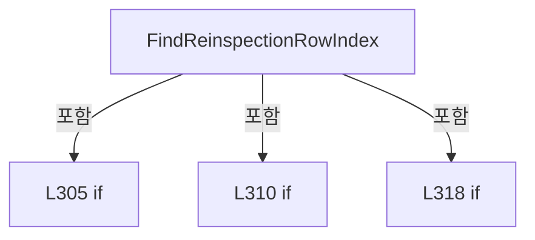
```mermaid
flowchart TD
 M["FindReinspectionRowIndex"]
 N0["L305 if"]
 M -->|포함| N0
 N1["L310 if"]
 M -->|포함| N1
 N2["L318 if"]
 M -->|포함| N2
```

변경 전 점검: 입력/반환 타입, 위 호출자, 예외/취소 경로, 공유 상태와 저장·전송 소비자를 함께 확인합니다. 값의 단위나 물리 방향을 이름만으로 확정하지 않습니다.

### MethodDeclaration `IsReinspectionTargetRow` · L326–349

[Drilling.File/ReviewResult/CReviewResultFile.cs:326–349](https://github.com/kjuws10-rgb/A3Drilling/blob/dfa5920e6301d9ec4b0eab1452ae59521aafc986/Drilling.File/ReviewResult/CReviewResultFile.cs#L326-L349)

| 항목 | 실제 추출 값 |
| --- | --- |
| 서명 | bool Drilling.File.ReviewResult.CReviewResultFile.IsReinspectionTargetRow(System.Collections.Generic.IReadOnlyDictionary<string, string>, Drilling.Common.Review.ST_REVIEW_REINSPECTION_UPDATE) |
| 접근/수식자 | Private / private, static |
| 반환/값 타입 | bool |
| 소속 타입 | NamedType:Drilling.File.ReviewResult.CReviewResultFile |

입력 계약:

| 이름 | 타입 | 전달 | 선택/기본값 |
| --- | --- | --- | --- |
| row | System.Collections.Generic.IReadOnlyDictionary<string, string> | None | False /  |
| update | Drilling.Common.Review.ST_REVIEW_REINSPECTION_UPDATE | None | False /  |

정적 호출자로 확인된 위치:

| 호출 파일/행 | 호출 표현식 | 런타임 분기 가능 |
| --- | --- | --- |
| [Drilling.File/ReviewResult/CReviewResultFile.cs:303–303](https://github.com/kjuws10-rgb/A3Drilling/blob/dfa5920e6301d9ec4b0eab1452ae59521aafc986/Drilling.File/ReviewResult/CReviewResultFile.cs#L303-L303) | IsReinspectionTargetRow | False |

호출하는 대상과 해석 범위:

| 원본 행 | 표현식 | 분석 상태 | 대상/소스 위치 |
| --- | --- | --- | --- |
| 330 | ReadFirstText | resolved | string Drilling.File.ReviewResult.CReviewResultFile.ReadFirstText(System.Collections.Generic.IReadOnlyDictionary<string, string>, params string[]) · Drilling.File/ReviewResult/CReviewResultFile.cs:632 |
| 331 | new string | resolved | string.String(char[]?) |
| 331 | cellText.Where(char.IsDigit).ToArray | resolved | char[] System.Collections.Generic.IEnumerable<char>.ToArray<char>() |
| 331 | cellText.Where | resolved | System.Collections.Generic.IEnumerable<char> System.Collections.Generic.IEnumerable<char>.Where<char>(System.Func<char, bool>) |
| 332 | int.TryParse | resolved | bool int.TryParse(string?, System.Globalization.NumberStyles, System.IFormatProvider?, out int) |
| 338 | CReviewManager.NormalizeShotKey | resolved | string Drilling.Common.Review.CReviewManager.NormalizeShotKey(string) · Drilling.Common/Review/CReviewManager.cs:1238 |
| 338 | ReadFirstText | resolved | string Drilling.File.ReviewResult.CReviewResultFile.ReadFirstText(System.Collections.Generic.IReadOnlyDictionary<string, string>, params string[]) · Drilling.File/ReviewResult/CReviewResultFile.cs:632 |
| 339 | CReviewManager.NormalizeShotKey | resolved | string Drilling.Common.Review.CReviewManager.NormalizeShotKey(string) · Drilling.Common/Review/CReviewManager.cs:1238 |
| 340 | string.IsNullOrWhiteSpace | resolved | bool string.IsNullOrWhiteSpace(string?) |
| 341 | string.IsNullOrWhiteSpace | resolved | bool string.IsNullOrWhiteSpace(string?) |
| 342 | sourceKey.Equals | resolved | bool string.Equals(string?, System.StringComparison) |
| 347 | ReadFirstText(row, "SHOT_NAME") .Equals | resolved | bool string.Equals(string?, System.StringComparison) |
| 347 | ReadFirstText | resolved | string Drilling.File.ReviewResult.CReviewResultFile.ReadFirstText(System.Collections.Generic.IReadOnlyDictionary<string, string>, params string[]) · Drilling.File/ReviewResult/CReviewResultFile.cs:632 |

본문의 실제 연산·분기·예외·반환 순서(원문 위치 순):

| 원본 행 | 종류 | 주석 해설 |
| --- | --- | --- |
| 330 | call | 함수·델리게이트 또는 객체 생성자를 호출합니다: ReadFirstText(row, "CELL_NO", "CELL_NAME") |
| 330 | local-declaration | 지역 변수를 선언합니다: var cellText = ReadFirstText(row, "CELL_NO", "CELL_NAME"); |
| 330 | variable-initializer | 변수의 초기값을 지정합니다: cellText = ReadFirstText(row, "CELL_NO", "CELL_NAME") |
| 331 | call | 함수·델리게이트 또는 객체 생성자를 호출합니다: new string(cellText.Where(char.IsDigit).ToArray()) |
| 331 | call | 함수·델리게이트 또는 객체 생성자를 호출합니다: cellText.Where(char.IsDigit).ToArray() |
| 331 | call | 함수·델리게이트 또는 객체 생성자를 호출합니다: cellText.Where(char.IsDigit) |
| 331 | local-declaration | 지역 변수를 선언합니다: var cellDigits = new string(cellText.Where(char.IsDigit).ToArray()); |
| 331 | variable-initializer | 변수의 초기값을 지정합니다: cellDigits = new string(cellText.Where(char.IsDigit).ToArray()) |
| 332 | call | 함수·델리게이트 또는 객체 생성자를 호출합니다: int.TryParse(cellDigits, NumberStyles.Integer, CultureInfo.InvariantCulture, out var cellNo) |
| 332 | if | 조건에 따라 분기합니다: if (!int.TryParse(cellDigits, NumberStyles.Integer, CultureInfo.InvariantCulture, out var cellNo) &#124;&#124; cellNo != update.CellNo) |
| 335 | return | 호출자에게 값 또는 제어를 반환합니다: return false; |
| 338 | call | 함수·델리게이트 또는 객체 생성자를 호출합니다: CReviewManager.NormalizeShotKey(ReadFirstText(row, "SHOT_KEY", "HOLE_KEY")) |
| 338 | call | 함수·델리게이트 또는 객체 생성자를 호출합니다: ReadFirstText(row, "SHOT_KEY", "HOLE_KEY") |
| 338 | local-declaration | 지역 변수를 선언합니다: var sourceKey = CReviewManager.NormalizeShotKey(ReadFirstText(row, "SHOT_KEY", "HOLE_KEY")); |
| 338 | variable-initializer | 변수의 초기값을 지정합니다: sourceKey = CReviewManager.NormalizeShotKey(ReadFirstText(row, "SHOT_KEY", "HOLE_KEY")) |
| 339 | call | 함수·델리게이트 또는 객체 생성자를 호출합니다: CReviewManager.NormalizeShotKey(update.ShotKey) |
| 339 | local-declaration | 지역 변수를 선언합니다: var targetKey = CReviewManager.NormalizeShotKey(update.ShotKey); |
| 339 | variable-initializer | 변수의 초기값을 지정합니다: targetKey = CReviewManager.NormalizeShotKey(update.ShotKey) |
| 340 | call | 함수·델리게이트 또는 객체 생성자를 호출합니다: string.IsNullOrWhiteSpace(sourceKey) |
| 340 | if | 조건에 따라 분기합니다: if (!string.IsNullOrWhiteSpace(sourceKey) && !string.IsNullOrWhiteSpace(targetKey) && sourceKey.Equals(targetKey, StringComparison.OrdinalIgnoreCase)) |
| 341 | call | 함수·델리게이트 또는 객체 생성자를 호출합니다: string.IsNullOrWhiteSpace(targetKey) |
| 342 | call | 함수·델리게이트 또는 객체 생성자를 호출합니다: sourceKey.Equals(targetKey, StringComparison.OrdinalIgnoreCase) |
| 344 | return | 호출자에게 값 또는 제어를 반환합니다: return true; |
| 347 | call | 함수·델리게이트 또는 객체 생성자를 호출합니다: ReadFirstText(row, "SHOT_NAME") |
| 347 | call | 함수·델리게이트 또는 객체 생성자를 호출합니다: ReadFirstText(row, "SHOT_NAME") .Equals(update.ShotName, StringComparison.OrdinalIgnoreCase) |
| 347 | return | 호출자에게 값 또는 제어를 반환합니다: return ReadFirstText(row, "SHOT_NAME") .Equals(update.ShotName, StringComparison.OrdinalIgnoreCase); |

제어 구문의 포함 구조(실제 실행 순서/CFG가 아닌 구문 탐색 그림):

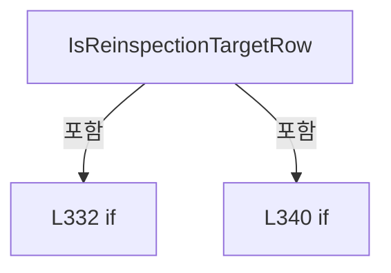
```mermaid
flowchart TD
 M["IsReinspectionTargetRow"]
 N0["L332 if"]
 M -->|포함| N0
 N1["L340 if"]
 M -->|포함| N1
```

변경 전 점검: 입력/반환 타입, 위 호출자, 예외/취소 경로, 공유 상태와 저장·전송 소비자를 함께 확인합니다. 값의 단위나 물리 방향을 이름만으로 확정하지 않습니다.

### MethodDeclaration `ApplyReinspectionUpdate` · L351–374

[Drilling.File/ReviewResult/CReviewResultFile.cs:351–374](https://github.com/kjuws10-rgb/A3Drilling/blob/dfa5920e6301d9ec4b0eab1452ae59521aafc986/Drilling.File/ReviewResult/CReviewResultFile.cs#L351-L374)

| 항목 | 실제 추출 값 |
| --- | --- |
| 서명 | void Drilling.File.ReviewResult.CReviewResultFile.ApplyReinspectionUpdate(System.Collections.Generic.IDictionary<string, string>, System.Collections.Generic.IReadOnlySet<string>, Drilling.Common.Review.ST_REVIEW_REINSPECTION_UPDATE) |
| 접근/수식자 | Private / private, static |
| 반환/값 타입 | void |
| 소속 타입 | NamedType:Drilling.File.ReviewResult.CReviewResultFile |

입력 계약:

| 이름 | 타입 | 전달 | 선택/기본값 |
| --- | --- | --- | --- |
| row | System.Collections.Generic.IDictionary<string, string> | None | False /  |
| headers | System.Collections.Generic.IReadOnlySet<string> | None | False /  |
| update | Drilling.Common.Review.ST_REVIEW_REINSPECTION_UPDATE | None | False /  |

현재 부분 분석에서 직접 연결된 호출자는 없습니다. XAML/이벤트/인터페이스·델리게이트·외부 진입을 추가 확인해야 하며, 미사용으로 판정한 것이 아닙니다.

호출하는 대상과 해석 범위:

| 원본 행 | 표현식 | 분석 상태 | 대상/소스 위치 |
| --- | --- | --- | --- |
| 356 | SetIfPresent | resolved | void Drilling.File.ReviewResult.CReviewResultFile.SetIfPresent(System.Collections.Generic.IDictionary<string, string>, System.Collections.Generic.IReadOnlySet<string>, string, string) · Drilling.File/ReviewResult/CReviewResultFile.cs:428 |
| 356 | update.BeamNo.ToString | resolved | string int.ToString(System.IFormatProvider?) |
| 359 | SetCoordinatePair | resolved | bool Drilling.File.ReviewResult.CReviewResultFile.SetCoordinatePair(System.Collections.Generic.IDictionary<string, string>, System.Collections.Generic.IReadOnlySet<string>, string, string, double, double) · Drilling.File/ReviewResult/CReviewResultFile.cs:403 |
| 360 | SetCoordinatePair | resolved | bool Drilling.File.ReviewResult.CReviewResultFile.SetCoordinatePair(System.Collections.Generic.IDictionary<string, string>, System.Collections.Generic.IReadOnlySet<string>, string, string, double, double) · Drilling.File/ReviewResult/CReviewResultFile.cs:403 |
| 361 | SetCoordinatePair | resolved | bool Drilling.File.ReviewResult.CReviewResultFile.SetCoordinatePair(System.Collections.Generic.IDictionary<string, string>, System.Collections.Generic.IReadOnlySet<string>, string, string, double, double) · Drilling.File/ReviewResult/CReviewResultFile.cs:403 |
| 362 | SetCoordinatePair | resolved | bool Drilling.File.ReviewResult.CReviewResultFile.SetCoordinatePair(System.Collections.Generic.IDictionary<string, string>, System.Collections.Generic.IReadOnlySet<string>, string, string, double, double) · Drilling.File/ReviewResult/CReviewResultFile.cs:403 |
| 363 | SetCoordinatePair | resolved | bool Drilling.File.ReviewResult.CReviewResultFile.SetCoordinatePair(System.Collections.Generic.IDictionary<string, string>, System.Collections.Generic.IReadOnlySet<string>, string, string, double, double) · Drilling.File/ReviewResult/CReviewResultFile.cs:403 |
| 366 | new InvalidDataException | resolved | System.IO.InvalidDataException.InvalidDataException(string?) |
| 369 | SetIfPresent | resolved | void Drilling.File.ReviewResult.CReviewResultFile.SetIfPresent(System.Collections.Generic.IDictionary<string, string>, System.Collections.Generic.IReadOnlySet<string>, string, string) · Drilling.File/ReviewResult/CReviewResultFile.cs:428 |
| 369 | update.Judge.ToUpperInvariant | resolved | string string.ToUpperInvariant() |
| 370 | SetIfPresent | resolved | void Drilling.File.ReviewResult.CReviewResultFile.SetIfPresent(System.Collections.Generic.IDictionary<string, string>, System.Collections.Generic.IReadOnlySet<string>, string, string) · Drilling.File/ReviewResult/CReviewResultFile.cs:428 |
| 370 | update.Judge.ToUpperInvariant | resolved | string string.ToUpperInvariant() |
| 371 | SetIfPresent | resolved | void Drilling.File.ReviewResult.CReviewResultFile.SetIfPresent(System.Collections.Generic.IDictionary<string, string>, System.Collections.Generic.IReadOnlySet<string>, string, string) · Drilling.File/ReviewResult/CReviewResultFile.cs:428 |
| 372 | SetIfPresent | resolved | void Drilling.File.ReviewResult.CReviewResultFile.SetIfPresent(System.Collections.Generic.IDictionary<string, string>, System.Collections.Generic.IReadOnlySet<string>, string, string) · Drilling.File/ReviewResult/CReviewResultFile.cs:428 |
| 373 | SetIfPresent | resolved | void Drilling.File.ReviewResult.CReviewResultFile.SetIfPresent(System.Collections.Generic.IDictionary<string, string>, System.Collections.Generic.IReadOnlySet<string>, string, string) · Drilling.File/ReviewResult/CReviewResultFile.cs:428 |
| 373 | update.Judge.Equals | resolved | bool string.Equals(string?, System.StringComparison) |

본문의 실제 연산·분기·예외·반환 순서(원문 위치 순):

| 원본 행 | 종류 | 주석 해설 |
| --- | --- | --- |
| 356 | call | 함수·델리게이트 또는 객체 생성자를 호출합니다: SetIfPresent(row, headers, "BEAM_NO", update.BeamNo.ToString(CultureInfo.InvariantCulture)) |
| 356 | call | 함수·델리게이트 또는 객체 생성자를 호출합니다: update.BeamNo.ToString(CultureInfo.InvariantCulture) |
| 358 | local-declaration | 지역 변수를 선언합니다: var hasCoordinates = false; |
| 358 | variable-initializer | 변수의 초기값을 지정합니다: hasCoordinates = false |
| 359 | assignment | 값을 대상에 대입합니다: hasCoordinates &#124;= SetCoordinatePair(row, headers, "RECV_TARGET_MINUS_HOLE_X", "RECV_TARGET_MINUS_HOLE_Y", update.RawResultX, update.RawResultY) |
| 359 | call | 함수·델리게이트 또는 객체 생성자를 호출합니다: SetCoordinatePair(row, headers, "RECV_TARGET_MINUS_HOLE_X", "RECV_TARGET_MINUS_HOLE_Y", update.RawResultX, update.RawResultY) |
| 360 | assignment | 값을 대상에 대입합니다: hasCoordinates &#124;= SetCoordinatePair(row, headers, "RECV_X", "RECV_Y", update.RawResultX, update.RawResultY) |
| 360 | call | 함수·델리게이트 또는 객체 생성자를 호출합니다: SetCoordinatePair(row, headers, "RECV_X", "RECV_Y", update.RawResultX, update.RawResultY) |
| 361 | assignment | 값을 대상에 대입합니다: hasCoordinates &#124;= SetCoordinatePair(row, headers, "VISION_FLIP_CONVERT_X", "VISION_FLIP_CONVERT_Y", update.ResultX, update.ResultY) |
| 361 | call | 함수·델리게이트 또는 객체 생성자를 호출합니다: SetCoordinatePair(row, headers, "VISION_FLIP_CONVERT_X", "VISION_FLIP_CONVERT_Y", update.ResultX, update.ResultY) |
| 362 | assignment | 값을 대상에 대입합니다: hasCoordinates &#124;= SetCoordinatePair(row, headers, "CONVERTED_X", "CONVERTED_Y", update.ResultX, update.ResultY) |
| 362 | call | 함수·델리게이트 또는 객체 생성자를 호출합니다: SetCoordinatePair(row, headers, "CONVERTED_X", "CONVERTED_Y", update.ResultX, update.ResultY) |
| 363 | assignment | 값을 대상에 대입합니다: hasCoordinates &#124;= SetCoordinatePair(row, headers, "ERROR_X", "ERROR_Y", update.ResultX, update.ResultY) |
| 363 | call | 함수·델리게이트 또는 객체 생성자를 호출합니다: SetCoordinatePair(row, headers, "ERROR_X", "ERROR_Y", update.ResultX, update.ResultY) |
| 364 | if | 조건에 따라 분기합니다: if (!hasCoordinates) |
| 366 | call | 함수·델리게이트 또는 객체 생성자를 호출합니다: new InvalidDataException("BASE 검사 결과 파일에 갱신 가능한 X/Y 결과 열이 없습니다.") |
| 366 | throw | 예외를 발생/전달합니다: throw new InvalidDataException("BASE 검사 결과 파일에 갱신 가능한 X/Y 결과 열이 없습니다."); |
| 369 | call | 함수·델리게이트 또는 객체 생성자를 호출합니다: SetIfPresent(row, headers, "JUDGE", update.Judge.ToUpperInvariant()) |
| 369 | call | 함수·델리게이트 또는 객체 생성자를 호출합니다: update.Judge.ToUpperInvariant() |
| 370 | call | 함수·델리게이트 또는 객체 생성자를 호출합니다: SetIfPresent(row, headers, "STATE", update.Judge.ToUpperInvariant()) |
| 370 | call | 함수·델리게이트 또는 객체 생성자를 호출합니다: update.Judge.ToUpperInvariant() |
| 371 | call | 함수·델리게이트 또는 객체 생성자를 호출합니다: SetIfPresent(row, headers, "RESULT_SOURCE", "MEASURED") |
| 372 | call | 함수·델리게이트 또는 객체 생성자를 호출합니다: SetIfPresent(row, headers, "VISION_RESULT_CODE", "") |
| 373 | call | 함수·델리게이트 또는 객체 생성자를 호출합니다: SetIfPresent(row, headers, "NG_REASON", update.Judge.Equals("NG", StringComparison.OrdinalIgnoreCase) ? CReviewNgReasons.Reinspection : "") |
| 373 | call | 함수·델리게이트 또는 객체 생성자를 호출합니다: update.Judge.Equals("NG", StringComparison.OrdinalIgnoreCase) |
| 373 | conditional-expression | 조건에 따라 결과식을 선택합니다: update.Judge.Equals("NG", StringComparison.OrdinalIgnoreCase) ? CReviewNgReasons.Reinspection : "" |

제어 구문의 포함 구조(실제 실행 순서/CFG가 아닌 구문 탐색 그림):

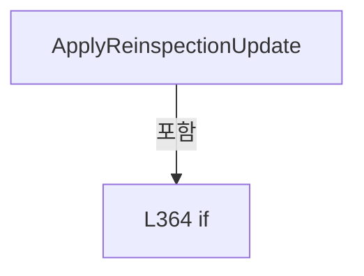
```mermaid
flowchart TD
 M["ApplyReinspectionUpdate"]
 N0["L364 if"]
 M -->|포함| N0
```

변경 전 점검: 입력/반환 타입, 위 호출자, 예외/취소 경로, 공유 상태와 저장·전송 소비자를 함께 확인합니다. 값의 단위나 물리 방향을 이름만으로 확정하지 않습니다.

### MethodDeclaration `ApplyEditedResultUpdate` · L376–401

[Drilling.File/ReviewResult/CReviewResultFile.cs:376–401](https://github.com/kjuws10-rgb/A3Drilling/blob/dfa5920e6301d9ec4b0eab1452ae59521aafc986/Drilling.File/ReviewResult/CReviewResultFile.cs#L376-L401)

| 항목 | 실제 추출 값 |
| --- | --- |
| 서명 | void Drilling.File.ReviewResult.CReviewResultFile.ApplyEditedResultUpdate(System.Collections.Generic.IDictionary<string, string>, System.Collections.Generic.IReadOnlySet<string>, Drilling.Common.Review.ST_REVIEW_REINSPECTION_UPDATE) |
| 접근/수식자 | Private / private, static |
| 반환/값 타입 | void |
| 소속 타입 | NamedType:Drilling.File.ReviewResult.CReviewResultFile |

입력 계약:

| 이름 | 타입 | 전달 | 선택/기본값 |
| --- | --- | --- | --- |
| row | System.Collections.Generic.IDictionary<string, string> | None | False /  |
| headers | System.Collections.Generic.IReadOnlySet<string> | None | False /  |
| update | Drilling.Common.Review.ST_REVIEW_REINSPECTION_UPDATE | None | False /  |

현재 부분 분석에서 직접 연결된 호출자는 없습니다. XAML/이벤트/인터페이스·델리게이트·외부 진입을 추가 확인해야 하며, 미사용으로 판정한 것이 아닙니다.

호출하는 대상과 해석 범위:

| 원본 행 | 표현식 | 분석 상태 | 대상/소스 위치 |
| --- | --- | --- | --- |
| 382 | SetCoordinatePair | resolved | bool Drilling.File.ReviewResult.CReviewResultFile.SetCoordinatePair(System.Collections.Generic.IDictionary<string, string>, System.Collections.Generic.IReadOnlySet<string>, string, string, double, double) · Drilling.File/ReviewResult/CReviewResultFile.cs:403 |
| 383 | SetCoordinatePair | resolved | bool Drilling.File.ReviewResult.CReviewResultFile.SetCoordinatePair(System.Collections.Generic.IDictionary<string, string>, System.Collections.Generic.IReadOnlySet<string>, string, string, double, double) · Drilling.File/ReviewResult/CReviewResultFile.cs:403 |
| 384 | SetCoordinatePair | resolved | bool Drilling.File.ReviewResult.CReviewResultFile.SetCoordinatePair(System.Collections.Generic.IDictionary<string, string>, System.Collections.Generic.IReadOnlySet<string>, string, string, double, double) · Drilling.File/ReviewResult/CReviewResultFile.cs:403 |
| 387 | SetCoordinatePair | resolved | bool Drilling.File.ReviewResult.CReviewResultFile.SetCoordinatePair(System.Collections.Generic.IDictionary<string, string>, System.Collections.Generic.IReadOnlySet<string>, string, string, double, double) · Drilling.File/ReviewResult/CReviewResultFile.cs:403 |
| 388 | SetCoordinatePair | resolved | bool Drilling.File.ReviewResult.CReviewResultFile.SetCoordinatePair(System.Collections.Generic.IDictionary<string, string>, System.Collections.Generic.IReadOnlySet<string>, string, string, double, double) · Drilling.File/ReviewResult/CReviewResultFile.cs:403 |
| 393 | new InvalidDataException | resolved | System.IO.InvalidDataException.InvalidDataException(string?) |
| 396 | SetIfPresent | resolved | void Drilling.File.ReviewResult.CReviewResultFile.SetIfPresent(System.Collections.Generic.IDictionary<string, string>, System.Collections.Generic.IReadOnlySet<string>, string, string) · Drilling.File/ReviewResult/CReviewResultFile.cs:428 |
| 396 | update.Judge.ToUpperInvariant | resolved | string string.ToUpperInvariant() |
| 397 | SetIfPresent | resolved | void Drilling.File.ReviewResult.CReviewResultFile.SetIfPresent(System.Collections.Generic.IDictionary<string, string>, System.Collections.Generic.IReadOnlySet<string>, string, string) · Drilling.File/ReviewResult/CReviewResultFile.cs:428 |
| 397 | update.Judge.ToUpperInvariant | resolved | string string.ToUpperInvariant() |
| 398 | SetIfPresent | resolved | void Drilling.File.ReviewResult.CReviewResultFile.SetIfPresent(System.Collections.Generic.IDictionary<string, string>, System.Collections.Generic.IReadOnlySet<string>, string, string) · Drilling.File/ReviewResult/CReviewResultFile.cs:428 |
| 399 | SetIfPresent | resolved | void Drilling.File.ReviewResult.CReviewResultFile.SetIfPresent(System.Collections.Generic.IDictionary<string, string>, System.Collections.Generic.IReadOnlySet<string>, string, string) · Drilling.File/ReviewResult/CReviewResultFile.cs:428 |
| 400 | SetIfPresent | resolved | void Drilling.File.ReviewResult.CReviewResultFile.SetIfPresent(System.Collections.Generic.IDictionary<string, string>, System.Collections.Generic.IReadOnlySet<string>, string, string) · Drilling.File/ReviewResult/CReviewResultFile.cs:428 |
| 400 | update.Judge.Equals | resolved | bool string.Equals(string?, System.StringComparison) |

본문의 실제 연산·분기·예외·반환 순서(원문 위치 순):

| 원본 행 | 종류 | 주석 해설 |
| --- | --- | --- |
| 381 | local-declaration | 지역 변수를 선언합니다: var hasCoordinates = false; |
| 381 | variable-initializer | 변수의 초기값을 지정합니다: hasCoordinates = false |
| 382 | assignment | 값을 대상에 대입합니다: hasCoordinates &#124;= SetCoordinatePair(row, headers, "VISION_FLIP_CONVERT_X", "VISION_FLIP_CONVERT_Y", update.ResultX, update.ResultY) |
| 382 | call | 함수·델리게이트 또는 객체 생성자를 호출합니다: SetCoordinatePair(row, headers, "VISION_FLIP_CONVERT_X", "VISION_FLIP_CONVERT_Y", update.ResultX, update.ResultY) |
| 383 | assignment | 값을 대상에 대입합니다: hasCoordinates &#124;= SetCoordinatePair(row, headers, "CONVERTED_X", "CONVERTED_Y", update.ResultX, update.ResultY) |
| 383 | call | 함수·델리게이트 또는 객체 생성자를 호출합니다: SetCoordinatePair(row, headers, "CONVERTED_X", "CONVERTED_Y", update.ResultX, update.ResultY) |
| 384 | assignment | 값을 대상에 대입합니다: hasCoordinates &#124;= SetCoordinatePair(row, headers, "ERROR_X", "ERROR_Y", update.ResultX, update.ResultY) |
| 384 | call | 함수·델리게이트 또는 객체 생성자를 호출합니다: SetCoordinatePair(row, headers, "ERROR_X", "ERROR_Y", update.ResultX, update.ResultY) |
| 385 | if | 조건에 따라 분기합니다: if (!hasCoordinates) |
| 387 | assignment | 값을 대상에 대입합니다: hasCoordinates &#124;= SetCoordinatePair(row, headers, "RECV_TARGET_MINUS_HOLE_X", "RECV_TARGET_MINUS_HOLE_Y", update.ResultX, update.ResultY) |
| 387 | call | 함수·델리게이트 또는 객체 생성자를 호출합니다: SetCoordinatePair(row, headers, "RECV_TARGET_MINUS_HOLE_X", "RECV_TARGET_MINUS_HOLE_Y", update.ResultX, update.ResultY) |
| 388 | assignment | 값을 대상에 대입합니다: hasCoordinates &#124;= SetCoordinatePair(row, headers, "RECV_X", "RECV_Y", update.ResultX, update.ResultY) |
| 388 | call | 함수·델리게이트 또는 객체 생성자를 호출합니다: SetCoordinatePair(row, headers, "RECV_X", "RECV_Y", update.ResultX, update.ResultY) |
| 391 | if | 조건에 따라 분기합니다: if (!hasCoordinates) |
| 393 | call | 함수·델리게이트 또는 객체 생성자를 호출합니다: new InvalidDataException("BASE 검사 결과 파일에 수정 가능한 X/Y 결과 열이 없습니다.") |
| 393 | throw | 예외를 발생/전달합니다: throw new InvalidDataException("BASE 검사 결과 파일에 수정 가능한 X/Y 결과 열이 없습니다."); |
| 396 | call | 함수·델리게이트 또는 객체 생성자를 호출합니다: SetIfPresent(row, headers, "JUDGE", update.Judge.ToUpperInvariant()) |
| 396 | call | 함수·델리게이트 또는 객체 생성자를 호출합니다: update.Judge.ToUpperInvariant() |
| 397 | call | 함수·델리게이트 또는 객체 생성자를 호출합니다: SetIfPresent(row, headers, "STATE", update.Judge.ToUpperInvariant()) |
| 397 | call | 함수·델리게이트 또는 객체 생성자를 호출합니다: update.Judge.ToUpperInvariant() |
| 398 | call | 함수·델리게이트 또는 객체 생성자를 호출합니다: SetIfPresent(row, headers, "RESULT_SOURCE", "EDITED") |
| 399 | call | 함수·델리게이트 또는 객체 생성자를 호출합니다: SetIfPresent(row, headers, "VISION_RESULT_CODE", "") |
| 400 | call | 함수·델리게이트 또는 객체 생성자를 호출합니다: SetIfPresent(row, headers, "NG_REASON", update.Judge.Equals("NG", StringComparison.OrdinalIgnoreCase) ? "RESULT_EDIT" : "") |
| 400 | call | 함수·델리게이트 또는 객체 생성자를 호출합니다: update.Judge.Equals("NG", StringComparison.OrdinalIgnoreCase) |
| 400 | conditional-expression | 조건에 따라 결과식을 선택합니다: update.Judge.Equals("NG", StringComparison.OrdinalIgnoreCase) ? "RESULT_EDIT" : "" |

제어 구문의 포함 구조(실제 실행 순서/CFG가 아닌 구문 탐색 그림):

```mermaid
flowchart TD
 M["ApplyEditedResultUpdate"]
 N0["L385 if"]
 M -->|포함| N0
 N1["L391 if"]
 M -->|포함| N1
```

변경 전 점검: 입력/반환 타입, 위 호출자, 예외/취소 경로, 공유 상태와 저장·전송 소비자를 함께 확인합니다. 값의 단위나 물리 방향을 이름만으로 확정하지 않습니다.

### MethodDeclaration `SetCoordinatePair` · L403–426

[Drilling.File/ReviewResult/CReviewResultFile.cs:403–426](https://github.com/kjuws10-rgb/A3Drilling/blob/dfa5920e6301d9ec4b0eab1452ae59521aafc986/Drilling.File/ReviewResult/CReviewResultFile.cs#L403-L426)

| 항목 | 실제 추출 값 |
| --- | --- |
| 서명 | bool Drilling.File.ReviewResult.CReviewResultFile.SetCoordinatePair(System.Collections.Generic.IDictionary<string, string>, System.Collections.Generic.IReadOnlySet<string>, string, string, double, double) |
| 접근/수식자 | Private / private, static |
| 반환/값 타입 | bool |
| 소속 타입 | NamedType:Drilling.File.ReviewResult.CReviewResultFile |

입력 계약:

| 이름 | 타입 | 전달 | 선택/기본값 |
| --- | --- | --- | --- |
| row | System.Collections.Generic.IDictionary<string, string> | None | False /  |
| headers | System.Collections.Generic.IReadOnlySet<string> | None | False /  |
| xHeader | string | None | False /  |
| yHeader | string | None | False /  |
| x | double | None | False /  |
| y | double | None | False /  |

정적 호출자로 확인된 위치:

| 호출 파일/행 | 호출 표현식 | 런타임 분기 가능 |
| --- | --- | --- |
| [Drilling.File/ReviewResult/CReviewResultFile.cs:359–359](https://github.com/kjuws10-rgb/A3Drilling/blob/dfa5920e6301d9ec4b0eab1452ae59521aafc986/Drilling.File/ReviewResult/CReviewResultFile.cs#L359-L359) | SetCoordinatePair | False |
| [Drilling.File/ReviewResult/CReviewResultFile.cs:360–360](https://github.com/kjuws10-rgb/A3Drilling/blob/dfa5920e6301d9ec4b0eab1452ae59521aafc986/Drilling.File/ReviewResult/CReviewResultFile.cs#L360-L360) | SetCoordinatePair | False |
| [Drilling.File/ReviewResult/CReviewResultFile.cs:361–361](https://github.com/kjuws10-rgb/A3Drilling/blob/dfa5920e6301d9ec4b0eab1452ae59521aafc986/Drilling.File/ReviewResult/CReviewResultFile.cs#L361-L361) | SetCoordinatePair | False |
| [Drilling.File/ReviewResult/CReviewResultFile.cs:362–362](https://github.com/kjuws10-rgb/A3Drilling/blob/dfa5920e6301d9ec4b0eab1452ae59521aafc986/Drilling.File/ReviewResult/CReviewResultFile.cs#L362-L362) | SetCoordinatePair | False |
| [Drilling.File/ReviewResult/CReviewResultFile.cs:363–363](https://github.com/kjuws10-rgb/A3Drilling/blob/dfa5920e6301d9ec4b0eab1452ae59521aafc986/Drilling.File/ReviewResult/CReviewResultFile.cs#L363-L363) | SetCoordinatePair | False |
| [Drilling.File/ReviewResult/CReviewResultFile.cs:382–382](https://github.com/kjuws10-rgb/A3Drilling/blob/dfa5920e6301d9ec4b0eab1452ae59521aafc986/Drilling.File/ReviewResult/CReviewResultFile.cs#L382-L382) | SetCoordinatePair | False |
| [Drilling.File/ReviewResult/CReviewResultFile.cs:383–383](https://github.com/kjuws10-rgb/A3Drilling/blob/dfa5920e6301d9ec4b0eab1452ae59521aafc986/Drilling.File/ReviewResult/CReviewResultFile.cs#L383-L383) | SetCoordinatePair | False |
| [Drilling.File/ReviewResult/CReviewResultFile.cs:384–384](https://github.com/kjuws10-rgb/A3Drilling/blob/dfa5920e6301d9ec4b0eab1452ae59521aafc986/Drilling.File/ReviewResult/CReviewResultFile.cs#L384-L384) | SetCoordinatePair | False |
| [Drilling.File/ReviewResult/CReviewResultFile.cs:387–387](https://github.com/kjuws10-rgb/A3Drilling/blob/dfa5920e6301d9ec4b0eab1452ae59521aafc986/Drilling.File/ReviewResult/CReviewResultFile.cs#L387-L387) | SetCoordinatePair | False |
| [Drilling.File/ReviewResult/CReviewResultFile.cs:388–388](https://github.com/kjuws10-rgb/A3Drilling/blob/dfa5920e6301d9ec4b0eab1452ae59521aafc986/Drilling.File/ReviewResult/CReviewResultFile.cs#L388-L388) | SetCoordinatePair | False |

호출하는 대상과 해석 범위:

| 원본 행 | 표현식 | 분석 상태 | 대상/소스 위치 |
| --- | --- | --- | --- |
| 411 | headers.Contains | resolved · 동적 구현 선택 가능 | bool System.Collections.Generic.IReadOnlySet<string>.Contains(string) |
| 412 | headers.Contains | resolved · 동적 구현 선택 가능 | bool System.Collections.Generic.IReadOnlySet<string>.Contains(string) |
| 415 | new InvalidDataException | resolved | System.IO.InvalidDataException.InvalidDataException(string?) |
| 423 | FormatDouble | resolved | string Drilling.File.ReviewResult.CReviewResultFile.FormatDouble(double) · Drilling.File/ReviewResult/CReviewResultFile.cs:716 |
| 424 | FormatDouble | resolved | string Drilling.File.ReviewResult.CReviewResultFile.FormatDouble(double) · Drilling.File/ReviewResult/CReviewResultFile.cs:716 |

본문의 실제 연산·분기·예외·반환 순서(원문 위치 순):

| 원본 행 | 종류 | 주석 해설 |
| --- | --- | --- |
| 411 | call | 함수·델리게이트 또는 객체 생성자를 호출합니다: headers.Contains(xHeader) |
| 411 | local-declaration | 지역 변수를 선언합니다: var hasX = headers.Contains(xHeader); |
| 411 | variable-initializer | 변수의 초기값을 지정합니다: hasX = headers.Contains(xHeader) |
| 412 | call | 함수·델리게이트 또는 객체 생성자를 호출합니다: headers.Contains(yHeader) |
| 412 | local-declaration | 지역 변수를 선언합니다: var hasY = headers.Contains(yHeader); |
| 412 | variable-initializer | 변수의 초기값을 지정합니다: hasY = headers.Contains(yHeader) |
| 413 | if | 조건에 따라 분기합니다: if (hasX != hasY) |
| 415 | call | 함수·델리게이트 또는 객체 생성자를 호출합니다: new InvalidDataException($"BASE 검사 결과의 {xHeader}/{yHeader} 열 구성이 올바르지 않습니다.") |
| 415 | throw | 예외를 발생/전달합니다: throw new InvalidDataException($"BASE 검사 결과의 {xHeader}/{yHeader} 열 구성이 올바르지 않습니다."); |
| 418 | if | 조건에 따라 분기합니다: if (!hasX) |
| 420 | return | 호출자에게 값 또는 제어를 반환합니다: return false; |
| 423 | assignment | 값을 대상에 대입합니다: row[xHeader] = FormatDouble(x) |
| 423 | call | 함수·델리게이트 또는 객체 생성자를 호출합니다: FormatDouble(x) |
| 424 | assignment | 값을 대상에 대입합니다: row[yHeader] = FormatDouble(y) |
| 424 | call | 함수·델리게이트 또는 객체 생성자를 호출합니다: FormatDouble(y) |
| 425 | return | 호출자에게 값 또는 제어를 반환합니다: return true; |

제어 구문의 포함 구조(실제 실행 순서/CFG가 아닌 구문 탐색 그림):

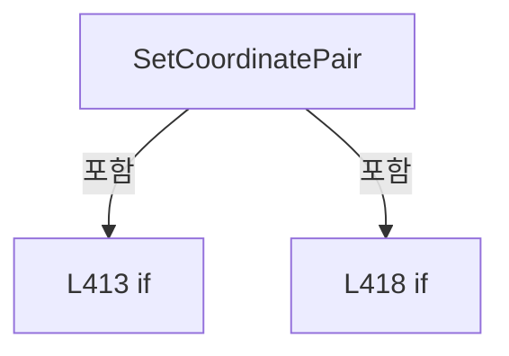
```mermaid
flowchart TD
 M["SetCoordinatePair"]
 N0["L413 if"]
 M -->|포함| N0
 N1["L418 if"]
 M -->|포함| N1
```

변경 전 점검: 입력/반환 타입, 위 호출자, 예외/취소 경로, 공유 상태와 저장·전송 소비자를 함께 확인합니다. 값의 단위나 물리 방향을 이름만으로 확정하지 않습니다.

### MethodDeclaration `SetIfPresent` · L428–438

[Drilling.File/ReviewResult/CReviewResultFile.cs:428–438](https://github.com/kjuws10-rgb/A3Drilling/blob/dfa5920e6301d9ec4b0eab1452ae59521aafc986/Drilling.File/ReviewResult/CReviewResultFile.cs#L428-L438)

| 항목 | 실제 추출 값 |
| --- | --- |
| 서명 | void Drilling.File.ReviewResult.CReviewResultFile.SetIfPresent(System.Collections.Generic.IDictionary<string, string>, System.Collections.Generic.IReadOnlySet<string>, string, string) |
| 접근/수식자 | Private / private, static |
| 반환/값 타입 | void |
| 소속 타입 | NamedType:Drilling.File.ReviewResult.CReviewResultFile |

입력 계약:

| 이름 | 타입 | 전달 | 선택/기본값 |
| --- | --- | --- | --- |
| row | System.Collections.Generic.IDictionary<string, string> | None | False /  |
| headers | System.Collections.Generic.IReadOnlySet<string> | None | False /  |
| header | string | None | False /  |
| value | string | None | False /  |

정적 호출자로 확인된 위치:

| 호출 파일/행 | 호출 표현식 | 런타임 분기 가능 |
| --- | --- | --- |
| [Drilling.File/ReviewResult/CReviewResultFile.cs:356–356](https://github.com/kjuws10-rgb/A3Drilling/blob/dfa5920e6301d9ec4b0eab1452ae59521aafc986/Drilling.File/ReviewResult/CReviewResultFile.cs#L356-L356) | SetIfPresent | False |
| [Drilling.File/ReviewResult/CReviewResultFile.cs:369–369](https://github.com/kjuws10-rgb/A3Drilling/blob/dfa5920e6301d9ec4b0eab1452ae59521aafc986/Drilling.File/ReviewResult/CReviewResultFile.cs#L369-L369) | SetIfPresent | False |
| [Drilling.File/ReviewResult/CReviewResultFile.cs:370–370](https://github.com/kjuws10-rgb/A3Drilling/blob/dfa5920e6301d9ec4b0eab1452ae59521aafc986/Drilling.File/ReviewResult/CReviewResultFile.cs#L370-L370) | SetIfPresent | False |
| [Drilling.File/ReviewResult/CReviewResultFile.cs:371–371](https://github.com/kjuws10-rgb/A3Drilling/blob/dfa5920e6301d9ec4b0eab1452ae59521aafc986/Drilling.File/ReviewResult/CReviewResultFile.cs#L371-L371) | SetIfPresent | False |
| [Drilling.File/ReviewResult/CReviewResultFile.cs:372–372](https://github.com/kjuws10-rgb/A3Drilling/blob/dfa5920e6301d9ec4b0eab1452ae59521aafc986/Drilling.File/ReviewResult/CReviewResultFile.cs#L372-L372) | SetIfPresent | False |
| [Drilling.File/ReviewResult/CReviewResultFile.cs:373–373](https://github.com/kjuws10-rgb/A3Drilling/blob/dfa5920e6301d9ec4b0eab1452ae59521aafc986/Drilling.File/ReviewResult/CReviewResultFile.cs#L373-L373) | SetIfPresent | False |
| [Drilling.File/ReviewResult/CReviewResultFile.cs:396–396](https://github.com/kjuws10-rgb/A3Drilling/blob/dfa5920e6301d9ec4b0eab1452ae59521aafc986/Drilling.File/ReviewResult/CReviewResultFile.cs#L396-L396) | SetIfPresent | False |
| [Drilling.File/ReviewResult/CReviewResultFile.cs:397–397](https://github.com/kjuws10-rgb/A3Drilling/blob/dfa5920e6301d9ec4b0eab1452ae59521aafc986/Drilling.File/ReviewResult/CReviewResultFile.cs#L397-L397) | SetIfPresent | False |
| [Drilling.File/ReviewResult/CReviewResultFile.cs:398–398](https://github.com/kjuws10-rgb/A3Drilling/blob/dfa5920e6301d9ec4b0eab1452ae59521aafc986/Drilling.File/ReviewResult/CReviewResultFile.cs#L398-L398) | SetIfPresent | False |
| [Drilling.File/ReviewResult/CReviewResultFile.cs:399–399](https://github.com/kjuws10-rgb/A3Drilling/blob/dfa5920e6301d9ec4b0eab1452ae59521aafc986/Drilling.File/ReviewResult/CReviewResultFile.cs#L399-L399) | SetIfPresent | False |
| [Drilling.File/ReviewResult/CReviewResultFile.cs:400–400](https://github.com/kjuws10-rgb/A3Drilling/blob/dfa5920e6301d9ec4b0eab1452ae59521aafc986/Drilling.File/ReviewResult/CReviewResultFile.cs#L400-L400) | SetIfPresent | False |

호출하는 대상과 해석 범위:

| 원본 행 | 표현식 | 분석 상태 | 대상/소스 위치 |
| --- | --- | --- | --- |
| 434 | headers.Contains | resolved · 동적 구현 선택 가능 | bool System.Collections.Generic.IReadOnlySet<string>.Contains(string) |

본문의 실제 연산·분기·예외·반환 순서(원문 위치 순):

| 원본 행 | 종류 | 주석 해설 |
| --- | --- | --- |
| 434 | call | 함수·델리게이트 또는 객체 생성자를 호출합니다: headers.Contains(header) |
| 434 | if | 조건에 따라 분기합니다: if (headers.Contains(header)) |
| 436 | assignment | 값을 대상에 대입합니다: row[header] = value |

제어 구문의 포함 구조(실제 실행 순서/CFG가 아닌 구문 탐색 그림):

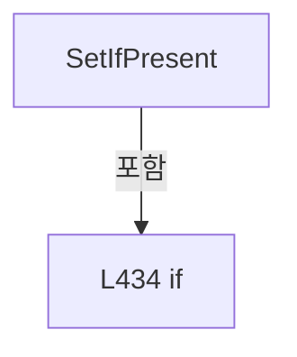
```mermaid
flowchart TD
 M["SetIfPresent"]
 N0["L434 if"]
 M -->|포함| N0
```

변경 전 점검: 입력/반환 타입, 위 호출자, 예외/취소 경로, 공유 상태와 저장·전송 소비자를 함께 확인합니다. 값의 단위나 물리 방향을 이름만으로 확정하지 않습니다.

### MethodDeclaration `FormatRevisionSavedAt` · L440–445

[Drilling.File/ReviewResult/CReviewResultFile.cs:440–445](https://github.com/kjuws10-rgb/A3Drilling/blob/dfa5920e6301d9ec4b0eab1452ae59521aafc986/Drilling.File/ReviewResult/CReviewResultFile.cs#L440-L445)

| 항목 | 실제 추출 값 |
| --- | --- |
| 서명 | string Drilling.File.ReviewResult.CReviewResultFile.FormatRevisionSavedAt(string, System.DateTimeOffset) |
| 접근/수식자 | Private / private, static |
| 반환/값 타입 | string |
| 소속 타입 | NamedType:Drilling.File.ReviewResult.CReviewResultFile |

입력 계약:

| 이름 | 타입 | 전달 | 선택/기본값 |
| --- | --- | --- | --- |
| sourceValue | string | None | False /  |
| savedAt | System.DateTimeOffset | None | False /  |

정적 호출자로 확인된 위치:

| 호출 파일/행 | 호출 표현식 | 런타임 분기 가능 |
| --- | --- | --- |
| [Drilling.File/ReviewResult/CReviewResultFile.cs:233–233](https://github.com/kjuws10-rgb/A3Drilling/blob/dfa5920e6301d9ec4b0eab1452ae59521aafc986/Drilling.File/ReviewResult/CReviewResultFile.cs#L233-L233) | FormatRevisionSavedAt | False |

호출하는 대상과 해석 범위:

| 원본 행 | 표현식 | 분석 상태 | 대상/소스 위치 |
| --- | --- | --- | --- |
| 442 | sourceValue.Contains | resolved | bool string.Contains(char) |
| 443 | savedAt.ToString | resolved | string System.DateTimeOffset.ToString(string?, System.IFormatProvider?) |
| 444 | FormatDate | resolved | string Drilling.File.ReviewResult.CReviewResultFile.FormatDate(System.DateTimeOffset?) · Drilling.File/ReviewResult/CReviewResultFile.cs:711 |

본문의 실제 연산·분기·예외·반환 순서(원문 위치 순):

| 원본 행 | 종류 | 주석 해설 |
| --- | --- | --- |
| 442 | call | 함수·델리게이트 또는 객체 생성자를 호출합니다: sourceValue.Contains('T') |
| 442 | conditional-expression | 조건에 따라 결과식을 선택합니다: sourceValue.Contains('T') ? savedAt.ToString("O", CultureInfo.InvariantCulture) : FormatDate(savedAt) |
| 442 | return | 호출자에게 값 또는 제어를 반환합니다: return sourceValue.Contains('T') ? savedAt.ToString("O", CultureInfo.InvariantCulture) : FormatDate(savedAt); |
| 443 | call | 함수·델리게이트 또는 객체 생성자를 호출합니다: savedAt.ToString("O", CultureInfo.InvariantCulture) |
| 444 | call | 함수·델리게이트 또는 객체 생성자를 호출합니다: FormatDate(savedAt) |

변경 전 점검: 입력/반환 타입, 위 호출자, 예외/취소 경로, 공유 상태와 저장·전송 소비자를 함께 확인합니다. 값의 단위나 물리 방향을 이름만으로 확정하지 않습니다.

### MethodDeclaration `ToResultRows` · L447–475

[Drilling.File/ReviewResult/CReviewResultFile.cs:447–475](https://github.com/kjuws10-rgb/A3Drilling/blob/dfa5920e6301d9ec4b0eab1452ae59521aafc986/Drilling.File/ReviewResult/CReviewResultFile.cs#L447-L475)

| 항목 | 실제 추출 값 |
| --- | --- |
| 서명 | System.Collections.Generic.IReadOnlyList<Drilling.Common.Review.ST_REVIEW_RESULT_FILE_ROW> Drilling.File.ReviewResult.CReviewResultFile.ToResultRows(System.Collections.Generic.IReadOnlyDictionary<string, string>, int) |
| 접근/수식자 | Private / private, static |
| 반환/값 타입 | System.Collections.Generic.IReadOnlyList<Drilling.Common.Review.ST_REVIEW_RESULT_FILE_ROW> |
| 소속 타입 | NamedType:Drilling.File.ReviewResult.CReviewResultFile |

입력 계약:

| 이름 | 타입 | 전달 | 선택/기본값 |
| --- | --- | --- | --- |
| row | System.Collections.Generic.IReadOnlyDictionary<string, string> | None | False /  |
| rowNo | int | None | False /  |

정적 호출자로 확인된 위치:

| 호출 파일/행 | 호출 표현식 | 런타임 분기 가능 |
| --- | --- | --- |
| [Drilling.File/ReviewResult/CReviewResultFile.cs:69–69](https://github.com/kjuws10-rgb/A3Drilling/blob/dfa5920e6301d9ec4b0eab1452ae59521aafc986/Drilling.File/ReviewResult/CReviewResultFile.cs#L69-L69) | ToResultRows | False |

호출하는 대상과 해석 범위:

| 원본 행 | 표현식 | 분석 상태 | 대상/소스 위치 |
| --- | --- | --- | --- |
| 449 | row.Keys.Any | resolved | bool System.Collections.Generic.IEnumerable<string>.Any<string>(System.Func<string, bool>) |
| 449 | key.Equals | resolved | bool string.Equals(string?, System.StringComparison) |
| 451 | ToResultRow | resolved | Drilling.Common.Review.ST_REVIEW_RESULT_FILE_ROW Drilling.File.ReviewResult.CReviewResultFile.ToResultRow(System.Collections.Generic.IReadOnlyDictionary<string, string>, int, int?, double?, double?, string?) · Drilling.File/ReviewResult/CReviewResultFile.cs:477 |
| 454 | new List<ST_REVIEW_RESULT_FILE_ROW> | resolved | System.Collections.Generic.List<Drilling.Common.Review.ST_REVIEW_RESULT_FILE_ROW>.List() |
| 457 | CCsvParser.Get(row, $"BEAM{beamNo}_JUDGE").Trim | resolved | string string.Trim() |
| 457 | CCsvParser.Get | resolved | string Drilling.File.Parser.CCsvParser.Get(System.Collections.Generic.IReadOnlyDictionary<string, string>, string) · Drilling.File/Parser/CCsvParser.cs:168 |
| 458 | string.IsNullOrWhiteSpace | resolved | bool string.IsNullOrWhiteSpace(string?) |
| 458 | judge.Equals | resolved | bool string.Equals(string?, System.StringComparison) |
| 463 | beamRows.Add | resolved | void System.Collections.Generic.List<Drilling.Common.Review.ST_REVIEW_RESULT_FILE_ROW>.Add(Drilling.Common.Review.ST_REVIEW_RESULT_FILE_ROW) |
| 463 | ToResultRow | resolved | Drilling.Common.Review.ST_REVIEW_RESULT_FILE_ROW Drilling.File.ReviewResult.CReviewResultFile.ToResultRow(System.Collections.Generic.IReadOnlyDictionary<string, string>, int, int?, double?, double?, string?) · Drilling.File/ReviewResult/CReviewResultFile.cs:477 |
| 467 | ReadOptionalFiniteDouble | resolved | double Drilling.File.ReviewResult.CReviewResultFile.ReadOptionalFiniteDouble(System.Collections.Generic.IReadOnlyDictionary<string, string>, params string[]) · Drilling.File/ReviewResult/CReviewResultFile.cs:671 |
| 468 | ReadOptionalFiniteDouble | resolved | double Drilling.File.ReviewResult.CReviewResultFile.ReadOptionalFiniteDouble(System.Collections.Generic.IReadOnlyDictionary<string, string>, params string[]) · Drilling.File/ReviewResult/CReviewResultFile.cs:671 |
| 474 | ToResultRow | resolved | Drilling.Common.Review.ST_REVIEW_RESULT_FILE_ROW Drilling.File.ReviewResult.CReviewResultFile.ToResultRow(System.Collections.Generic.IReadOnlyDictionary<string, string>, int, int?, double?, double?, string?) · Drilling.File/ReviewResult/CReviewResultFile.cs:477 |

본문의 실제 연산·분기·예외·반환 순서(원문 위치 순):

| 원본 행 | 종류 | 주석 해설 |
| --- | --- | --- |
| 449 | call | 함수·델리게이트 또는 객체 생성자를 호출합니다: row.Keys.Any(key => key.Equals("BEAM1_JUDGE", StringComparison.OrdinalIgnoreCase)) |
| 449 | call | 함수·델리게이트 또는 객체 생성자를 호출합니다: key.Equals("BEAM1_JUDGE", StringComparison.OrdinalIgnoreCase) |
| 449 | if | 조건에 따라 분기합니다: if (!row.Keys.Any(key => key.Equals("BEAM1_JUDGE", StringComparison.OrdinalIgnoreCase))) |
| 451 | call | 함수·델리게이트 또는 객체 생성자를 호출합니다: ToResultRow(row, rowNo) |
| 451 | return | 호출자에게 값 또는 제어를 반환합니다: return [ToResultRow(row, rowNo)]; |
| 454 | call | 함수·델리게이트 또는 객체 생성자를 호출합니다: new List<ST_REVIEW_RESULT_FILE_ROW>() |
| 454 | local-declaration | 지역 변수를 선언합니다: var beamRows = new List<ST_REVIEW_RESULT_FILE_ROW>(); |
| 454 | variable-initializer | 변수의 초기값을 지정합니다: beamRows = new List<ST_REVIEW_RESULT_FILE_ROW>() |
| 455 | variable-initializer | 변수의 초기값을 지정합니다: beamNo = 1 |
| 455 | for | 초기화·조건·증감이 있는 반복입니다: for (var beamNo = 1; beamNo <= 16; beamNo++) |
| 457 | call | 함수·델리게이트 또는 객체 생성자를 호출합니다: CCsvParser.Get(row, $"BEAM{beamNo}_JUDGE").Trim() |
| 457 | call | 함수·델리게이트 또는 객체 생성자를 호출합니다: CCsvParser.Get(row, $"BEAM{beamNo}_JUDGE") |
| 457 | local-declaration | 지역 변수를 선언합니다: var judge = CCsvParser.Get(row, $"BEAM{beamNo}_JUDGE").Trim(); |
| 457 | variable-initializer | 변수의 초기값을 지정합니다: judge = CCsvParser.Get(row, $"BEAM{beamNo}_JUDGE").Trim() |
| 458 | call | 함수·델리게이트 또는 객체 생성자를 호출합니다: string.IsNullOrWhiteSpace(judge) |
| 458 | call | 함수·델리게이트 또는 객체 생성자를 호출합니다: judge.Equals("미검사", StringComparison.OrdinalIgnoreCase) |
| 458 | if | 조건에 따라 분기합니다: if (string.IsNullOrWhiteSpace(judge) &#124;&#124; judge.Equals("미검사", StringComparison.OrdinalIgnoreCase)) |
| 460 | continue | 다음 반복으로 진행합니다: continue; |
| 463 | call | 함수·델리게이트 또는 객체 생성자를 호출합니다: beamRows.Add(ToResultRow( row, rowNo, beamNo, ReadOptionalFiniteDouble(row, $"BEAM{beamNo}_X_MM"), ReadOptionalFiniteDouble(row, $"BEAM{beamNo}_Y_MM"), judge)) |
| 463 | call | 함수·델리게이트 또는 객체 생성자를 호출합니다: ToResultRow( row, rowNo, beamNo, ReadOptionalFiniteDouble(row, $"BEAM{beamNo}_X_MM"), ReadOptionalFiniteDouble(row, $"BEAM{beamNo}_Y_MM"), judge) |
| 467 | call | 함수·델리게이트 또는 객체 생성자를 호출합니다: ReadOptionalFiniteDouble(row, $"BEAM{beamNo}_X_MM") |
| 468 | call | 함수·델리게이트 또는 객체 생성자를 호출합니다: ReadOptionalFiniteDouble(row, $"BEAM{beamNo}_Y_MM") |
| 472 | conditional-expression | 조건에 따라 결과식을 선택합니다: beamRows.Count > 0 ? beamRows : [ToResultRow(row, rowNo, 0, 0.0, 0.0, "UNMEASURED")] |
| 472 | return | 호출자에게 값 또는 제어를 반환합니다: return beamRows.Count > 0 ? beamRows : [ToResultRow(row, rowNo, 0, 0.0, 0.0, "UNMEASURED")]; |
| 474 | call | 함수·델리게이트 또는 객체 생성자를 호출합니다: ToResultRow(row, rowNo, 0, 0.0, 0.0, "UNMEASURED") |

제어 구문의 포함 구조(실제 실행 순서/CFG가 아닌 구문 탐색 그림):

```mermaid
flowchart TD
 M["ToResultRows"]
 N0["L449 if"]
 M -->|포함| N0
 N1["L455 for"]
 M -->|포함| N1
 N2["L458 if"]
 N1 -->|포함| N2
```

변경 전 점검: 입력/반환 타입, 위 호출자, 예외/취소 경로, 공유 상태와 저장·전송 소비자를 함께 확인합니다. 값의 단위나 물리 방향을 이름만으로 확정하지 않습니다.

### MethodDeclaration `ToResultRow` · L477–522

[Drilling.File/ReviewResult/CReviewResultFile.cs:477–522](https://github.com/kjuws10-rgb/A3Drilling/blob/dfa5920e6301d9ec4b0eab1452ae59521aafc986/Drilling.File/ReviewResult/CReviewResultFile.cs#L477-L522)

| 항목 | 실제 추출 값 |
| --- | --- |
| 서명 | Drilling.Common.Review.ST_REVIEW_RESULT_FILE_ROW Drilling.File.ReviewResult.CReviewResultFile.ToResultRow(System.Collections.Generic.IReadOnlyDictionary<string, string>, int, int?, double?, double?, string?) |
| 접근/수식자 | Private / private, static |
| 반환/값 타입 | Drilling.Common.Review.ST_REVIEW_RESULT_FILE_ROW |
| 소속 타입 | NamedType:Drilling.File.ReviewResult.CReviewResultFile |

입력 계약:

| 이름 | 타입 | 전달 | 선택/기본값 |
| --- | --- | --- | --- |
| row | System.Collections.Generic.IReadOnlyDictionary<string, string> | None | False /  |
| rowNo | int | None | False /  |
| beamNoOverride | int? | None | True / null |
| errorXOverride | double? | None | True / null |
| errorYOverride | double? | None | True / null |
| judgeOverride | string? | None | True / null |

정적 호출자로 확인된 위치:

| 호출 파일/행 | 호출 표현식 | 런타임 분기 가능 |
| --- | --- | --- |
| [Drilling.File/ReviewResult/CReviewResultFile.cs:451–451](https://github.com/kjuws10-rgb/A3Drilling/blob/dfa5920e6301d9ec4b0eab1452ae59521aafc986/Drilling.File/ReviewResult/CReviewResultFile.cs#L451-L451) | ToResultRow | False |
| [Drilling.File/ReviewResult/CReviewResultFile.cs:463–469](https://github.com/kjuws10-rgb/A3Drilling/blob/dfa5920e6301d9ec4b0eab1452ae59521aafc986/Drilling.File/ReviewResult/CReviewResultFile.cs#L463-L469) | ToResultRow | False |
| [Drilling.File/ReviewResult/CReviewResultFile.cs:474–474](https://github.com/kjuws10-rgb/A3Drilling/blob/dfa5920e6301d9ec4b0eab1452ae59521aafc986/Drilling.File/ReviewResult/CReviewResultFile.cs#L474-L474) | ToResultRow | False |

호출하는 대상과 해석 범위:

| 원본 행 | 표현식 | 분석 상태 | 대상/소스 위치 |
| --- | --- | --- | --- |
| 485 | CCsvParser.RequireText | resolved | string Drilling.File.Parser.CCsvParser.RequireText(System.Collections.Generic.IReadOnlyDictionary<string, string>, string, int, params string[]) · Drilling.File/Parser/CCsvParser.cs:187 |
| 486 | DateTimeOffset.TryParse | resolved | bool System.DateTimeOffset.TryParse(string?, System.IFormatProvider?, System.Globalization.DateTimeStyles, out System.DateTimeOffset) |
| 488 | new InvalidDataException | resolved | System.IO.InvalidDataException.InvalidDataException(string?) |
| 491 | CCsvParser.RequireText | resolved | string Drilling.File.Parser.CCsvParser.RequireText(System.Collections.Generic.IReadOnlyDictionary<string, string>, string, int, params string[]) · Drilling.File/Parser/CCsvParser.cs:187 |
| 492 | ReadFirstText | resolved | string Drilling.File.ReviewResult.CReviewResultFile.ReadFirstText(System.Collections.Generic.IReadOnlyDictionary<string, string>, params string[]) · Drilling.File/ReviewResult/CReviewResultFile.cs:632 |
| 493 | CCsvParser.Get | resolved | string Drilling.File.Parser.CCsvParser.Get(System.Collections.Generic.IReadOnlyDictionary<string, string>, string) · Drilling.File/Parser/CCsvParser.cs:168 |
| 494 | CReviewManager.NormalizeShotKey | resolved | string Drilling.Common.Review.CReviewManager.NormalizeShotKey(string) · Drilling.Common/Review/CReviewManager.cs:1238 |
| 495 | string.IsNullOrWhiteSpace | resolved | bool string.IsNullOrWhiteSpace(string?) |
| 496 | string.IsNullOrWhiteSpace | resolved | bool string.IsNullOrWhiteSpace(string?) |
| 496 | string.IsNullOrWhiteSpace | resolved | bool string.IsNullOrWhiteSpace(string?) |
| 498 | new InvalidDataException | resolved | System.IO.InvalidDataException.InvalidDataException(string?) |
| 501 | ReadRequiredPositiveInt | resolved | int Drilling.File.ReviewResult.CReviewResultFile.ReadRequiredPositiveInt(System.Collections.Generic.IReadOnlyDictionary<string, string>, int, params string[]) · Drilling.File/ReviewResult/CReviewResultFile.cs:646 |
| 502 | ReadRequiredPositiveInt | resolved | int Drilling.File.ReviewResult.CReviewResultFile.ReadRequiredPositiveInt(System.Collections.Generic.IReadOnlyDictionary<string, string>, int, params string[]) · Drilling.File/ReviewResult/CReviewResultFile.cs:646 |
| 503 | ReadOptionalFiniteDouble | resolved | double Drilling.File.ReviewResult.CReviewResultFile.ReadOptionalFiniteDouble(System.Collections.Generic.IReadOnlyDictionary<string, string>, params string[]) · Drilling.File/ReviewResult/CReviewResultFile.cs:671 |
| 504 | ReadOptionalFiniteDouble | resolved | double Drilling.File.ReviewResult.CReviewResultFile.ReadOptionalFiniteDouble(System.Collections.Generic.IReadOnlyDictionary<string, string>, params string[]) · Drilling.File/ReviewResult/CReviewResultFile.cs:671 |
| 505 | (judgeOverride ?? ReadFirstText(row, "JUDGE", "GROUP_JUDGE", "STATE")).Trim().ToUpperInvariant | resolved | string string.ToUpperInvariant() |
| 505 | (judgeOverride ?? ReadFirstText(row, "JUDGE", "GROUP_JUDGE", "STATE")).Trim | resolved | string string.Trim() |
| 505 | ReadFirstText | resolved | string Drilling.File.ReviewResult.CReviewResultFile.ReadFirstText(System.Collections.Generic.IReadOnlyDictionary<string, string>, params string[]) · Drilling.File/ReviewResult/CReviewResultFile.cs:632 |
| 506 | string.IsNullOrWhiteSpace | resolved | bool string.IsNullOrWhiteSpace(string?) |
| 511 | new ST_REVIEW_RESULT_FILE_ROW | resolved | Drilling.Common.Review.ST_REVIEW_RESULT_FILE_ROW.ST_REVIEW_RESULT_FILE_ROW(System.DateTimeOffset, string, string, string, int, int, double, double, string) · Drilling.Common/Review/CReviewManager.cs:4176 |
| 513 | ReadOptionalInt | resolved | int Drilling.File.ReviewResult.CReviewResultFile.ReadOptionalInt(System.Collections.Generic.IReadOnlyDictionary<string, string>, string, int) · Drilling.File/ReviewResult/CReviewResultFile.cs:627 |
| 514 | ReadOneBasedIndex | resolved | int Drilling.File.ReviewResult.CReviewResultFile.ReadOneBasedIndex(System.Collections.Generic.IReadOnlyDictionary<string, string>, params string[]) · Drilling.File/ReviewResult/CReviewResultFile.cs:663 |
| 515 | ReadOneBasedIndex | resolved | int Drilling.File.ReviewResult.CReviewResultFile.ReadOneBasedIndex(System.Collections.Generic.IReadOnlyDictionary<string, string>, params string[]) · Drilling.File/ReviewResult/CReviewResultFile.cs:663 |
| 516 | ReadOptionalNullableFiniteDouble | resolved | double? Drilling.File.ReviewResult.CReviewResultFile.ReadOptionalNullableFiniteDouble(System.Collections.Generic.IReadOnlyDictionary<string, string>, params string[]) · Drilling.File/ReviewResult/CReviewResultFile.cs:686 |
| 517 | ReadOptionalNullableFiniteDouble | resolved | double? Drilling.File.ReviewResult.CReviewResultFile.ReadOptionalNullableFiniteDouble(System.Collections.Generic.IReadOnlyDictionary<string, string>, params string[]) · Drilling.File/ReviewResult/CReviewResultFile.cs:686 |
| 518 | CCsvParser.Get(row, "RESULT_SOURCE").Trim().ToUpperInvariant | resolved | string string.ToUpperInvariant() |
| 518 | CCsvParser.Get(row, "RESULT_SOURCE").Trim | resolved | string string.Trim() |
| 518 | CCsvParser.Get | resolved | string Drilling.File.Parser.CCsvParser.Get(System.Collections.Generic.IReadOnlyDictionary<string, string>, string) · Drilling.File/Parser/CCsvParser.cs:168 |
| 519 | ReadOptionalNullableInt | resolved | int? Drilling.File.ReviewResult.CReviewResultFile.ReadOptionalNullableInt(System.Collections.Generic.IReadOnlyDictionary<string, string>, string) · Drilling.File/ReviewResult/CReviewResultFile.cs:706 |
| 520 | CCsvParser.Get(row, "NG_REASON").Trim().ToUpperInvariant | resolved | string string.ToUpperInvariant() |
| 520 | CCsvParser.Get(row, "NG_REASON").Trim | resolved | string string.Trim() |
| 520 | CCsvParser.Get | resolved | string Drilling.File.Parser.CCsvParser.Get(System.Collections.Generic.IReadOnlyDictionary<string, string>, string) · Drilling.File/Parser/CCsvParser.cs:168 |

본문의 실제 연산·분기·예외·반환 순서(원문 위치 순):

| 원본 행 | 종류 | 주석 해설 |
| --- | --- | --- |
| 485 | call | 함수·델리게이트 또는 객체 생성자를 호출합니다: CCsvParser.RequireText(row, "Review Result", rowNo, "SAVED_AT") |
| 485 | local-declaration | 지역 변수를 선언합니다: var savedAtText = CCsvParser.RequireText(row, "Review Result", rowNo, "SAVED_AT"); |
| 485 | variable-initializer | 변수의 초기값을 지정합니다: savedAtText = CCsvParser.RequireText(row, "Review Result", rowNo, "SAVED_AT") |
| 486 | call | 함수·델리게이트 또는 객체 생성자를 호출합니다: DateTimeOffset.TryParse(savedAtText, CultureInfo.InvariantCulture, DateTimeStyles.AssumeLocal, out var savedAt) |
| 486 | if | 조건에 따라 분기합니다: if (!DateTimeOffset.TryParse(savedAtText, CultureInfo.InvariantCulture, DateTimeStyles.AssumeLocal, out var savedAt)) |
| 488 | call | 함수·델리게이트 또는 객체 생성자를 호출합니다: new InvalidDataException($"Review Result validation failed. Row {rowNo} / SAVED_AT must be a date and time.") |
| 488 | throw | 예외를 발생/전달합니다: throw new InvalidDataException($"Review Result validation failed. Row {rowNo} / SAVED_AT must be a date and time."); |
| 491 | call | 함수·델리게이트 또는 객체 생성자를 호출합니다: CCsvParser.RequireText(row, "Review Result", rowNo, "RECIPE_ID") |
| 491 | local-declaration | 지역 변수를 선언합니다: var recipeId = CCsvParser.RequireText(row, "Review Result", rowNo, "RECIPE_ID"); |
| 491 | variable-initializer | 변수의 초기값을 지정합니다: recipeId = CCsvParser.RequireText(row, "Review Result", rowNo, "RECIPE_ID") |
| 492 | call | 함수·델리게이트 또는 객체 생성자를 호출합니다: ReadFirstText(row, "SHOT_KEY", "HOLE_KEY") |
| 492 | local-declaration | 지역 변수를 선언합니다: var sourceShotKey = ReadFirstText(row, "SHOT_KEY", "HOLE_KEY"); |
| 492 | variable-initializer | 변수의 초기값을 지정합니다: sourceShotKey = ReadFirstText(row, "SHOT_KEY", "HOLE_KEY") |
| 493 | call | 함수·델리게이트 또는 객체 생성자를 호출합니다: CCsvParser.Get(row, "SHOT_NAME") |
| 493 | local-declaration | 지역 변수를 선언합니다: var shotName = CCsvParser.Get(row, "SHOT_NAME"); |
| 493 | variable-initializer | 변수의 초기값을 지정합니다: shotName = CCsvParser.Get(row, "SHOT_NAME") |
| 494 | call | 함수·델리게이트 또는 객체 생성자를 호출합니다: CReviewManager.NormalizeShotKey(sourceShotKey) |
| 494 | local-declaration | 지역 변수를 선언합니다: var normalizedShotKey = CReviewManager.NormalizeShotKey(sourceShotKey); |
| 494 | variable-initializer | 변수의 초기값을 지정합니다: normalizedShotKey = CReviewManager.NormalizeShotKey(sourceShotKey) |
| 495 | call | 함수·델리게이트 또는 객체 생성자를 호출합니다: string.IsNullOrWhiteSpace(normalizedShotKey) |
| 495 | conditional-expression | 조건에 따라 결과식을 선택합니다: string.IsNullOrWhiteSpace(normalizedShotKey) ? sourceShotKey : normalizedShotKey |
| 495 | local-declaration | 지역 변수를 선언합니다: var shotKey = string.IsNullOrWhiteSpace(normalizedShotKey) ? sourceShotKey : normalizedShotKey; |
| 495 | variable-initializer | 변수의 초기값을 지정합니다: shotKey = string.IsNullOrWhiteSpace(normalizedShotKey) ? sourceShotKey : normalizedShotKey |
| 496 | call | 함수·델리게이트 또는 객체 생성자를 호출합니다: string.IsNullOrWhiteSpace(shotKey) |
| 496 | call | 함수·델리게이트 또는 객체 생성자를 호출합니다: string.IsNullOrWhiteSpace(shotName) |
| 496 | if | 조건에 따라 분기합니다: if (string.IsNullOrWhiteSpace(shotKey) && string.IsNullOrWhiteSpace(shotName)) |
| 498 | call | 함수·델리게이트 또는 객체 생성자를 호출합니다: new InvalidDataException($"Review Result validation failed. Row {rowNo} / SHOT_KEY or SHOT_NAME is required.") |
| 498 | throw | 예외를 발생/전달합니다: throw new InvalidDataException($"Review Result validation failed. Row {rowNo} / SHOT_KEY or SHOT_NAME is required."); |
| 501 | call | 함수·델리게이트 또는 객체 생성자를 호출합니다: ReadRequiredPositiveInt(row, rowNo, "HEAD_NO", "HEAD_NAME") |
| 501 | local-declaration | 지역 변수를 선언합니다: var headNo = ReadRequiredPositiveInt(row, rowNo, "HEAD_NO", "HEAD_NAME"); |
| 501 | variable-initializer | 변수의 초기값을 지정합니다: headNo = ReadRequiredPositiveInt(row, rowNo, "HEAD_NO", "HEAD_NAME") |
| 502 | call | 함수·델리게이트 또는 객체 생성자를 호출합니다: ReadRequiredPositiveInt(row, rowNo, "CELL_NO", "CELL_NAME") |
| 502 | local-declaration | 지역 변수를 선언합니다: var cellNo = ReadRequiredPositiveInt(row, rowNo, "CELL_NO", "CELL_NAME"); |
| 502 | variable-initializer | 변수의 초기값을 지정합니다: cellNo = ReadRequiredPositiveInt(row, rowNo, "CELL_NO", "CELL_NAME") |
| 503 | call | 함수·델리게이트 또는 객체 생성자를 호출합니다: ReadOptionalFiniteDouble(row, "ERROR_X", "VISION_FLIP_CONVERT_X", "CONVERTED_X", "RECV_TARGET_MINUS_HOLE_X") |
| 503 | local-declaration | 지역 변수를 선언합니다: var errorX = errorXOverride ?? ReadOptionalFiniteDouble(row, "ERROR_X", "VISION_FLIP_CONVERT_X", "CONVERTED_X", "RECV_TARGET_MINUS_HOLE_X"); |
| 503 | variable-initializer | 변수의 초기값을 지정합니다: errorX = errorXOverride ?? ReadOptionalFiniteDouble(row, "ERROR_X", "VISION_FLIP_CONVERT_X", "CONVERTED_X", "RECV_TARGET_MINUS_HOLE_X") |
| 504 | call | 함수·델리게이트 또는 객체 생성자를 호출합니다: ReadOptionalFiniteDouble(row, "ERROR_Y", "VISION_FLIP_CONVERT_Y", "CONVERTED_Y", "RECV_TARGET_MINUS_HOLE_Y") |
| 504 | local-declaration | 지역 변수를 선언합니다: var errorY = errorYOverride ?? ReadOptionalFiniteDouble(row, "ERROR_Y", "VISION_FLIP_CONVERT_Y", "CONVERTED_Y", "RECV_TARGET_MINUS_HOLE_Y"); |
| 504 | variable-initializer | 변수의 초기값을 지정합니다: errorY = errorYOverride ?? ReadOptionalFiniteDouble(row, "ERROR_Y", "VISION_FLIP_CONVERT_Y", "CONVERTED_Y", "RECV_TARGET_MINUS_HOLE_Y") |
| 505 | call | 함수·델리게이트 또는 객체 생성자를 호출합니다: (judgeOverride ?? ReadFirstText(row, "JUDGE", "GROUP_JUDGE", "STATE")).Trim().ToUpperInvariant() |
| 505 | call | 함수·델리게이트 또는 객체 생성자를 호출합니다: (judgeOverride ?? ReadFirstText(row, "JUDGE", "GROUP_JUDGE", "STATE")).Trim() |
| 505 | call | 함수·델리게이트 또는 객체 생성자를 호출합니다: ReadFirstText(row, "JUDGE", "GROUP_JUDGE", "STATE") |
| 505 | local-declaration | 지역 변수를 선언합니다: var judge = (judgeOverride ?? ReadFirstText(row, "JUDGE", "GROUP_JUDGE", "STATE")).Trim().ToUpperInvariant(); |
| 505 | variable-initializer | 변수의 초기값을 지정합니다: judge = (judgeOverride ?? ReadFirstText(row, "JUDGE", "GROUP_JUDGE", "STATE")).Trim().ToUpperInvariant() |
| 506 | call | 함수·델리게이트 또는 객체 생성자를 호출합니다: string.IsNullOrWhiteSpace(judge) |
| 506 | if | 조건에 따라 분기합니다: if (string.IsNullOrWhiteSpace(judge)) |
| 508 | assignment | 값을 대상에 대입합니다: judge = "UNKNOWN" |
| 511 | call | 함수·델리게이트 또는 객체 생성자를 호출합니다: new ST_REVIEW_RESULT_FILE_ROW(savedAt, recipeId, shotKey, shotName, headNo, cellNo, errorX, errorY, judge) { BeamNo = beamNoOverride ?? ReadOptionalInt(row, "BEAM_NO", 0), GroupColumn = ReadOneBasedIndex(row, "INDEX_X", … |
| 511 | return | 호출자에게 값 또는 제어를 반환합니다: return new ST_REVIEW_RESULT_FILE_ROW(savedAt, recipeId, shotKey, shotName, headNo, cellNo, errorX, errorY, judge) { BeamNo = beamNoOverride ?? ReadOptionalInt(row, "BEAM_NO", 0), GroupColumn = ReadOneBasedIndex(row, "INDEX_X", "CO |
| 513 | assignment | 값을 대상에 대입합니다: BeamNo = beamNoOverride ?? ReadOptionalInt(row, "BEAM_NO", 0) |
| 513 | call | 함수·델리게이트 또는 객체 생성자를 호출합니다: ReadOptionalInt(row, "BEAM_NO", 0) |
| 514 | assignment | 값을 대상에 대입합니다: GroupColumn = ReadOneBasedIndex(row, "INDEX_X", "COLUMN") |
| 514 | call | 함수·델리게이트 또는 객체 생성자를 호출합니다: ReadOneBasedIndex(row, "INDEX_X", "COLUMN") |
| 515 | assignment | 값을 대상에 대입합니다: GroupRow = ReadOneBasedIndex(row, "INDEX_Y", "ROW") |
| 515 | call | 함수·델리게이트 또는 객체 생성자를 호출합니다: ReadOneBasedIndex(row, "INDEX_Y", "ROW") |
| 516 | assignment | 값을 대상에 대입합니다: DesignX = ReadOptionalNullableFiniteDouble(row, "DESIGN_X") |
| 516 | call | 함수·델리게이트 또는 객체 생성자를 호출합니다: ReadOptionalNullableFiniteDouble(row, "DESIGN_X") |
| 517 | assignment | 값을 대상에 대입합니다: DesignY = ReadOptionalNullableFiniteDouble(row, "DESIGN_Y") |
| 517 | call | 함수·델리게이트 또는 객체 생성자를 호출합니다: ReadOptionalNullableFiniteDouble(row, "DESIGN_Y") |
| 518 | assignment | 값을 대상에 대입합니다: ResultSource = CCsvParser.Get(row, "RESULT_SOURCE").Trim().ToUpperInvariant() |
| 518 | call | 함수·델리게이트 또는 객체 생성자를 호출합니다: CCsvParser.Get(row, "RESULT_SOURCE").Trim().ToUpperInvariant() |
| 518 | call | 함수·델리게이트 또는 객체 생성자를 호출합니다: CCsvParser.Get(row, "RESULT_SOURCE").Trim() |
| 518 | call | 함수·델리게이트 또는 객체 생성자를 호출합니다: CCsvParser.Get(row, "RESULT_SOURCE") |
| 519 | assignment | 값을 대상에 대입합니다: VisionResultCode = ReadOptionalNullableInt(row, "VISION_RESULT_CODE") |
| 519 | call | 함수·델리게이트 또는 객체 생성자를 호출합니다: ReadOptionalNullableInt(row, "VISION_RESULT_CODE") |
| 520 | assignment | 값을 대상에 대입합니다: NgReason = CCsvParser.Get(row, "NG_REASON").Trim().ToUpperInvariant() |
| 520 | call | 함수·델리게이트 또는 객체 생성자를 호출합니다: CCsvParser.Get(row, "NG_REASON").Trim().ToUpperInvariant() |
| 520 | call | 함수·델리게이트 또는 객체 생성자를 호출합니다: CCsvParser.Get(row, "NG_REASON").Trim() |
| 520 | call | 함수·델리게이트 또는 객체 생성자를 호출합니다: CCsvParser.Get(row, "NG_REASON") |

제어 구문의 포함 구조(실제 실행 순서/CFG가 아닌 구문 탐색 그림):

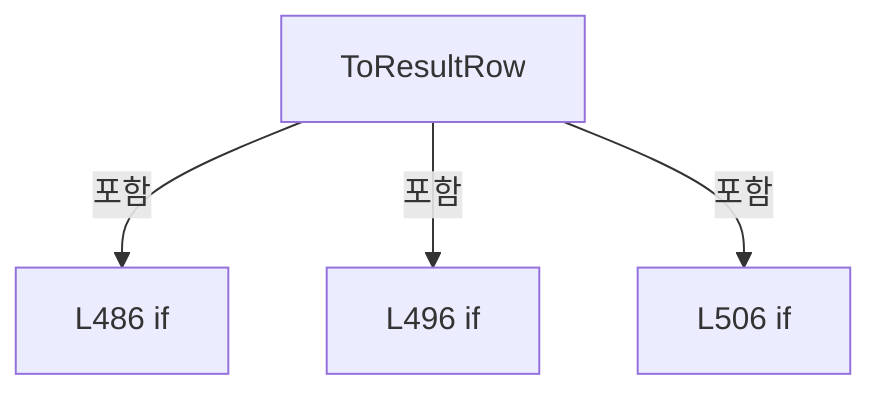
```mermaid
flowchart TD
 M["ToResultRow"]
 N0["L486 if"]
 M -->|포함| N0
 N1["L496 if"]
 M -->|포함| N1
 N2["L506 if"]
 M -->|포함| N2
```

변경 전 점검: 입력/반환 타입, 위 호출자, 예외/취소 경로, 공유 상태와 저장·전송 소비자를 함께 확인합니다. 값의 단위나 물리 방향을 이름만으로 확정하지 않습니다.

### MethodDeclaration `ToRow` · L524–571

[Drilling.File/ReviewResult/CReviewResultFile.cs:524–571](https://github.com/kjuws10-rgb/A3Drilling/blob/dfa5920e6301d9ec4b0eab1452ae59521aafc986/Drilling.File/ReviewResult/CReviewResultFile.cs#L524-L571)

| 항목 | 실제 추출 값 |
| --- | --- |
| 서명 | System.Collections.Generic.IReadOnlyDictionary<string, string> Drilling.File.ReviewResult.CReviewResultFile.ToRow(Drilling.Common.Review.ST_REVIEW_RESULT_DATA, Drilling.Common.Review.ST_REVIEW_PLAN_POINT, Drilling.File.ReviewResult.CReviewResultFile.ST_REVIEW_RESULT_METADATA) |
| 접근/수식자 | Private / private, static |
| 반환/값 타입 | System.Collections.Generic.IReadOnlyDictionary<string, string> |
| 소속 타입 | NamedType:Drilling.File.ReviewResult.CReviewResultFile |

입력 계약:

| 이름 | 타입 | 전달 | 선택/기본값 |
| --- | --- | --- | --- |
| result | Drilling.Common.Review.ST_REVIEW_RESULT_DATA | None | False /  |
| point | Drilling.Common.Review.ST_REVIEW_PLAN_POINT | None | False /  |
| metadata | Drilling.File.ReviewResult.CReviewResultFile.ST_REVIEW_RESULT_METADATA | None | False /  |

정적 호출자로 확인된 위치:

| 호출 파일/행 | 호출 표현식 | 런타임 분기 가능 |
| --- | --- | --- |
| [Drilling.File/ReviewResult/CReviewResultFile.cs:131–131](https://github.com/kjuws10-rgb/A3Drilling/blob/dfa5920e6301d9ec4b0eab1452ae59521aafc986/Drilling.File/ReviewResult/CReviewResultFile.cs#L131-L131) | ToRow | False |
| [Drilling.File/ReviewResult/CReviewResultFile.cs:136–136](https://github.com/kjuws10-rgb/A3Drilling/blob/dfa5920e6301d9ec4b0eab1452ae59521aafc986/Drilling.File/ReviewResult/CReviewResultFile.cs#L136-L136) | ToRow | False |

호출하는 대상과 해석 범위:

| 원본 행 | 표현식 | 분석 상태 | 대상/소스 위치 |
| --- | --- | --- | --- |
| 527 | Math.Max | resolved | int System.Math.Max(int, int) |
| 528 | Math.Max | resolved | int System.Math.Max(int, int) |
| 531 | FormatShotName | resolved | string Drilling.File.ReviewResult.CReviewResultFile.FormatShotName(Drilling.Common.Review.ST_REVIEW_PLAN_POINT?) · Drilling.File/ReviewResult/CReviewResultFile.cs:609 |
| 532 | CReviewManager.VisionErrorToStageOffset | resolved | Drilling.Common.Review.ST_REVIEW_COORDINATE_OFFSET Drilling.Common.Review.CReviewManager.VisionErrorToStageOffset(double, double, Drilling.Common.Review.EN_VISION_FLIP_TYPE) · Drilling.Common/Review/CReviewManager.cs:3607 |
| 533 | new Dictionary<string, string> | resolved | System.Collections.Generic.Dictionary<string, string>.Dictionary(System.Collections.Generic.IEqualityComparer<string>?) |
| 535 | FormatDate | resolved | string Drilling.File.ReviewResult.CReviewResultFile.FormatDate(System.DateTimeOffset?) · Drilling.File/ReviewResult/CReviewResultFile.cs:711 |
| 540 | NormalizeResultStatus | resolved | string Drilling.File.ReviewResult.CReviewResultFile.NormalizeResultStatus(string?) · Drilling.File/ReviewResult/CReviewResultFile.cs:694 |
| 541 | Math.Max(result.TotalCount, plan.ReviewPoints.Count).ToString | resolved | string int.ToString(System.IFormatProvider?) |
| 541 | Math.Max | resolved | int System.Math.Max(int, int) |
| 544 | metadata.BeamNo.ToString | resolved | string int.ToString(System.IFormatProvider?) |
| 545 | .ToString | resolved | string int.ToString(System.IFormatProvider?) |
| 548 | metadata.FineLineCount.ToString | resolved | string int.ToString(System.IFormatProvider?) |
| 549 | FormatDouble | resolved | string Drilling.File.ReviewResult.CReviewResultFile.FormatDouble(double) · Drilling.File/ReviewResult/CReviewResultFile.cs:716 |
| 550 | FormatDouble | resolved | string Drilling.File.ReviewResult.CReviewResultFile.FormatDouble(double) · Drilling.File/ReviewResult/CReviewResultFile.cs:716 |
| 553 | rowNo.ToString | resolved | string int.ToString(System.IFormatProvider?) |
| 554 | columnNo.ToString | resolved | string int.ToString(System.IFormatProvider?) |
| 555 | FormatDouble | resolved | string Drilling.File.ReviewResult.CReviewResultFile.FormatDouble(double) · Drilling.File/ReviewResult/CReviewResultFile.cs:716 |
| 556 | FormatDouble | resolved | string Drilling.File.ReviewResult.CReviewResultFile.FormatDouble(double) · Drilling.File/ReviewResult/CReviewResultFile.cs:716 |
| 558 | point.HeadNo.ToString | resolved | string int.ToString(System.IFormatProvider?) |
| 559 | point.CellNo.ToString | resolved | string int.ToString(System.IFormatProvider?) |
| 560 | plan.VisionFlipType.HasFlag | resolved | bool System.Enum.HasFlag(System.Enum) |
| 561 | plan.VisionFlipType.HasFlag | resolved | bool System.Enum.HasFlag(System.Enum) |
| 562 | plan.VisionFlipType.HasFlag | resolved | bool System.Enum.HasFlag(System.Enum) |
| 563 | FormatDouble | resolved | string Drilling.File.ReviewResult.CReviewResultFile.FormatDouble(double) · Drilling.File/ReviewResult/CReviewResultFile.cs:716 |
| 564 | FormatDouble | resolved | string Drilling.File.ReviewResult.CReviewResultFile.FormatDouble(double) · Drilling.File/ReviewResult/CReviewResultFile.cs:716 |
| 565 | FormatDouble | resolved | string Drilling.File.ReviewResult.CReviewResultFile.FormatDouble(double) · Drilling.File/ReviewResult/CReviewResultFile.cs:716 |
| 566 | FormatDouble | resolved | string Drilling.File.ReviewResult.CReviewResultFile.FormatDouble(double) · Drilling.File/ReviewResult/CReviewResultFile.cs:716 |
| 567 | .ToString | resolved | string int.ToString(System.IFormatProvider?) |

본문의 실제 연산·분기·예외·반환 순서(원문 위치 순):

| 원본 행 | 종류 | 주석 해설 |
| --- | --- | --- |
| 526 | local-declaration | 지역 변수를 선언합니다: var plan = result.Plan; |
| 526 | variable-initializer | 변수의 초기값을 지정합니다: plan = result.Plan |
| 527 | call | 함수·델리게이트 또는 객체 생성자를 호출합니다: Math.Max(1, point.PixelCountX) |
| 527 | local-declaration | 지역 변수를 선언합니다: var columnCount = Math.Max(1, point.PixelCountX); |
| 527 | variable-initializer | 변수의 초기값을 지정합니다: columnCount = Math.Max(1, point.PixelCountX) |
| 528 | call | 함수·델리게이트 또는 객체 생성자를 호출합니다: Math.Max(0, point.ShotNo - 1) |
| 528 | local-declaration | 지역 변수를 선언합니다: var zeroBasedShotNo = Math.Max(0, point.ShotNo - 1); |
| 528 | variable-initializer | 변수의 초기값을 지정합니다: zeroBasedShotNo = Math.Max(0, point.ShotNo - 1) |
| 529 | local-declaration | 지역 변수를 선언합니다: var rowNo = (zeroBasedShotNo / columnCount) + 1; |
| 529 | variable-initializer | 변수의 초기값을 지정합니다: rowNo = (zeroBasedShotNo / columnCount) + 1 |
| 530 | local-declaration | 지역 변수를 선언합니다: var columnNo = (zeroBasedShotNo % columnCount) + 1; |
| 530 | variable-initializer | 변수의 초기값을 지정합니다: columnNo = (zeroBasedShotNo % columnCount) + 1 |
| 531 | call | 함수·델리게이트 또는 객체 생성자를 호출합니다: FormatShotName(point) |
| 531 | local-declaration | 지역 변수를 선언합니다: var shotName = FormatShotName(point); |
| 531 | variable-initializer | 변수의 초기값을 지정합니다: shotName = FormatShotName(point) |
| 532 | call | 함수·델리게이트 또는 객체 생성자를 호출합니다: CReviewManager.VisionErrorToStageOffset(point.ErrorX, point.ErrorY, plan.VisionFlipType) |
| 532 | local-declaration | 지역 변수를 선언합니다: var converted = CReviewManager.VisionErrorToStageOffset(point.ErrorX, point.ErrorY, plan.VisionFlipType); |
| 532 | variable-initializer | 변수의 초기값을 지정합니다: converted = CReviewManager.VisionErrorToStageOffset(point.ErrorX, point.ErrorY, plan.VisionFlipType) |
| 533 | call | 함수·델리게이트 또는 객체 생성자를 호출합니다: new Dictionary<string, string>(StringComparer.OrdinalIgnoreCase) { ["SAVED_AT"] = FormatDate(result.SavedAt), ["GLASS_ID"] = result.GlassId, ["RECIPE_ID"] = plan.RecipeId, ["INSPECTION_METHOD"] = result.InspectionMethod,… |
| 533 | return | 호출자에게 값 또는 제어를 반환합니다: return new Dictionary<string, string>(StringComparer.OrdinalIgnoreCase) { ["SAVED_AT"] = FormatDate(result.SavedAt), ["GLASS_ID"] = result.GlassId, ["RECIPE_ID"] = plan.RecipeId, ["INSPECTION_METHOD"] = result.InspectionMethod, [" |
| 535 | assignment | 값을 대상에 대입합니다: ["SAVED_AT"] = FormatDate(result.SavedAt) |
| 535 | call | 함수·델리게이트 또는 객체 생성자를 호출합니다: FormatDate(result.SavedAt) |
| 536 | assignment | 값을 대상에 대입합니다: ["GLASS_ID"] = result.GlassId |
| 537 | assignment | 값을 대상에 대입합니다: ["RECIPE_ID"] = plan.RecipeId |
| 538 | assignment | 값을 대상에 대입합니다: ["INSPECTION_METHOD"] = result.InspectionMethod |
| 539 | assignment | 값을 대상에 대입합니다: ["RUN_TYPE"] = plan.ResultType |
| 540 | assignment | 값을 대상에 대입합니다: ["RESULT_STATUS"] = NormalizeResultStatus(result.ResultStatus) |
| 540 | call | 함수·델리게이트 또는 객체 생성자를 호출합니다: NormalizeResultStatus(result.ResultStatus) |
| 541 | assignment | 값을 대상에 대입합니다: ["TOTAL_COUNT"] = Math.Max(result.TotalCount, plan.ReviewPoints.Count).ToString(CultureInfo.InvariantCulture) |
| 541 | call | 함수·델리게이트 또는 객체 생성자를 호출합니다: Math.Max(result.TotalCount, plan.ReviewPoints.Count).ToString(CultureInfo.InvariantCulture) |
| 541 | call | 함수·델리게이트 또는 객체 생성자를 호출합니다: Math.Max(result.TotalCount, plan.ReviewPoints.Count) |
| 542 | assignment | 값을 대상에 대입합니다: ["RULE"] = metadata.Rule |
| 543 | assignment | 값을 대상에 대입합니다: ["RULE_SCOPE"] = metadata.RuleScope |
| 544 | assignment | 값을 대상에 대입합니다: ["BEAM_NO"] = metadata.BeamNo.ToString(CultureInfo.InvariantCulture) |
| 544 | call | 함수·델리게이트 또는 객체 생성자를 호출합니다: metadata.BeamNo.ToString(CultureInfo.InvariantCulture) |
| 545 | assignment | 값을 대상에 대입합니다: ["REFERENCE_CELL_NO"] = metadata.ReferenceCellNo?.ToString(CultureInfo.InvariantCulture) ?? "" |
| 545 | call | 함수·델리게이트 또는 객체 생성자를 호출합니다: .ToString(CultureInfo.InvariantCulture) |
| 546 | assignment | 값을 대상에 대입합니다: ["REFERENCE_SHOT"] = metadata.ReferenceShot |
| 547 | assignment | 값을 대상에 대입합니다: ["ROUGH_REFERENCE"] = metadata.RoughReference |
| 548 | assignment | 값을 대상에 대입합니다: ["FINE_LINE_COUNT"] = metadata.FineLineCount > 0 ? metadata.FineLineCount.ToString(CultureInfo.InvariantCulture) : "" |
| 548 | call | 함수·델리게이트 또는 객체 생성자를 호출합니다: metadata.FineLineCount.ToString(CultureInfo.InvariantCulture) |
| 548 | conditional-expression | 조건에 따라 결과식을 선택합니다: metadata.FineLineCount > 0 ? metadata.FineLineCount.ToString(CultureInfo.InvariantCulture) : "" |
| 549 | assignment | 값을 대상에 대입합니다: ["SHIFT_OFFSET_X"] = FormatDouble(plan.ShiftOffsetX) |
| 549 | call | 함수·델리게이트 또는 객체 생성자를 호출합니다: FormatDouble(plan.ShiftOffsetX) |
| 550 | assignment | 값을 대상에 대입합니다: ["SHIFT_OFFSET_Y"] = FormatDouble(plan.ShiftOffsetY) |
| 550 | call | 함수·델리게이트 또는 객체 생성자를 호출합니다: FormatDouble(plan.ShiftOffsetY) |
| 551 | assignment | 값을 대상에 대입합니다: ["RESULT_SOURCE"] = "MEASURED" |
| 552 | assignment | 값을 대상에 대입합니다: ["SHOT_NAME"] = shotName |
| 553 | assignment | 값을 대상에 대입합니다: ["ROW"] = rowNo.ToString(CultureInfo.InvariantCulture) |
| 553 | call | 함수·델리게이트 또는 객체 생성자를 호출합니다: rowNo.ToString(CultureInfo.InvariantCulture) |
| 554 | assignment | 값을 대상에 대입합니다: ["COLUMN"] = columnNo.ToString(CultureInfo.InvariantCulture) |
| 554 | call | 함수·델리게이트 또는 객체 생성자를 호출합니다: columnNo.ToString(CultureInfo.InvariantCulture) |
| 555 | assignment | 값을 대상에 대입합니다: ["DESIGN_X"] = FormatDouble(point.DesignX) |
| 555 | call | 함수·델리게이트 또는 객체 생성자를 호출합니다: FormatDouble(point.DesignX) |
| 556 | assignment | 값을 대상에 대입합니다: ["DESIGN_Y"] = FormatDouble(point.DesignY) |
| 556 | call | 함수·델리게이트 또는 객체 생성자를 호출합니다: FormatDouble(point.DesignY) |
| 557 | assignment | 값을 대상에 대입합니다: ["SHOT_KEY"] = $"CELL{point.CellNo}_{shotName}" |
| 558 | assignment | 값을 대상에 대입합니다: ["HEAD_NO"] = point.HeadNo.ToString(CultureInfo.InvariantCulture) |
| 558 | call | 함수·델리게이트 또는 객체 생성자를 호출합니다: point.HeadNo.ToString(CultureInfo.InvariantCulture) |
| 559 | assignment | 값을 대상에 대입합니다: ["CELL_NO"] = point.CellNo.ToString(CultureInfo.InvariantCulture) |
| 559 | call | 함수·델리게이트 또는 객체 생성자를 호출합니다: point.CellNo.ToString(CultureInfo.InvariantCulture) |
| 560 | assignment | 값을 대상에 대입합니다: ["VISION_X_FLIP"] = plan.VisionFlipType.HasFlag(EN_VISION_FLIP_TYPE.XFlip) ? "ON" : "OFF" |
| 560 | call | 함수·델리게이트 또는 객체 생성자를 호출합니다: plan.VisionFlipType.HasFlag(EN_VISION_FLIP_TYPE.XFlip) |
| 560 | conditional-expression | 조건에 따라 결과식을 선택합니다: plan.VisionFlipType.HasFlag(EN_VISION_FLIP_TYPE.XFlip) ? "ON" : "OFF" |
| 561 | assignment | 값을 대상에 대입합니다: ["VISION_Y_FLIP"] = plan.VisionFlipType.HasFlag(EN_VISION_FLIP_TYPE.YFlip) ? "ON" : "OFF" |
| 561 | call | 함수·델리게이트 또는 객체 생성자를 호출합니다: plan.VisionFlipType.HasFlag(EN_VISION_FLIP_TYPE.YFlip) |
| 561 | conditional-expression | 조건에 따라 결과식을 선택합니다: plan.VisionFlipType.HasFlag(EN_VISION_FLIP_TYPE.YFlip) ? "ON" : "OFF" |
| 562 | assignment | 값을 대상에 대입합니다: ["VISION_XY_FLIP"] = plan.VisionFlipType.HasFlag(EN_VISION_FLIP_TYPE.XyFlip) ? "ON" : "OFF" |
| 562 | call | 함수·델리게이트 또는 객체 생성자를 호출합니다: plan.VisionFlipType.HasFlag(EN_VISION_FLIP_TYPE.XyFlip) |
| 562 | conditional-expression | 조건에 따라 결과식을 선택합니다: plan.VisionFlipType.HasFlag(EN_VISION_FLIP_TYPE.XyFlip) ? "ON" : "OFF" |
| 563 | assignment | 값을 대상에 대입합니다: ["RECV_TARGET_MINUS_HOLE_X"] = FormatDouble(point.ErrorX) |
| 563 | call | 함수·델리게이트 또는 객체 생성자를 호출합니다: FormatDouble(point.ErrorX) |
| 564 | assignment | 값을 대상에 대입합니다: ["RECV_TARGET_MINUS_HOLE_Y"] = FormatDouble(point.ErrorY) |
| 564 | call | 함수·델리게이트 또는 객체 생성자를 호출합니다: FormatDouble(point.ErrorY) |
| 565 | assignment | 값을 대상에 대입합니다: ["VISION_FLIP_CONVERT_X"] = FormatDouble(converted.X) |
| 565 | call | 함수·델리게이트 또는 객체 생성자를 호출합니다: FormatDouble(converted.X) |
| 566 | assignment | 값을 대상에 대입합니다: ["VISION_FLIP_CONVERT_Y"] = FormatDouble(converted.Y) |
| 566 | call | 함수·델리게이트 또는 객체 생성자를 호출합니다: FormatDouble(converted.Y) |
| 567 | assignment | 값을 대상에 대입합니다: ["VISION_RESULT_CODE"] = point.VisionResultCode?.ToString(CultureInfo.InvariantCulture) ?? "" |
| 567 | call | 함수·델리게이트 또는 객체 생성자를 호출합니다: .ToString(CultureInfo.InvariantCulture) |
| 568 | assignment | 값을 대상에 대입합니다: ["NG_REASON"] = point.NgReason |
| 569 | assignment | 값을 대상에 대입합니다: ["JUDGE"] = point.Judge |

변경 전 점검: 입력/반환 타입, 위 호출자, 예외/취소 경로, 공유 상태와 저장·전송 소비자를 함께 확인합니다. 값의 단위나 물리 방향을 이름만으로 확정하지 않습니다.

### MethodDeclaration `CreateMetadata` · L573–607

[Drilling.File/ReviewResult/CReviewResultFile.cs:573–607](https://github.com/kjuws10-rgb/A3Drilling/blob/dfa5920e6301d9ec4b0eab1452ae59521aafc986/Drilling.File/ReviewResult/CReviewResultFile.cs#L573-L607)

| 항목 | 실제 추출 값 |
| --- | --- |
| 서명 | Drilling.File.ReviewResult.CReviewResultFile.ST_REVIEW_RESULT_METADATA Drilling.File.ReviewResult.CReviewResultFile.CreateMetadata(Drilling.Common.Review.ST_REVIEW_RESULT_DATA) |
| 접근/수식자 | Private / private, static |
| 반환/값 타입 | Drilling.File.ReviewResult.CReviewResultFile.ST_REVIEW_RESULT_METADATA |
| 소속 타입 | NamedType:Drilling.File.ReviewResult.CReviewResultFile |

입력 계약:

| 이름 | 타입 | 전달 | 선택/기본값 |
| --- | --- | --- | --- |
| result | Drilling.Common.Review.ST_REVIEW_RESULT_DATA | None | False /  |

정적 호출자로 확인된 위치:

| 호출 파일/행 | 호출 표현식 | 런타임 분기 가능 |
| --- | --- | --- |
| [Drilling.File/ReviewResult/CReviewResultFile.cs:123–123](https://github.com/kjuws10-rgb/A3Drilling/blob/dfa5920e6301d9ec4b0eab1452ae59521aafc986/Drilling.File/ReviewResult/CReviewResultFile.cs#L123-L123) | CreateMetadata | False |

호출하는 대상과 해석 범위:

| 원본 행 | 표현식 | 분석 상태 | 대상/소스 위치 |
| --- | --- | --- | --- |
| 576 | .Rule.ToString().ToUpperInvariant | resolved | string string.ToUpperInvariant() |
| 576 | .Rule.ToString | resolved · 동적 구현 선택 가능 | string System.Enum.ToString() |
| 598 | new ST_REVIEW_RESULT_METADATA | resolved | Drilling.File.ReviewResult.CReviewResultFile.ST_REVIEW_RESULT_METADATA.ST_REVIEW_RESULT_METADATA(string, string, int, int?, string, string, int) · Drilling.File/ReviewResult/CReviewResultFile.cs:802 |
| 603 | FormatShotName | resolved | string Drilling.File.ReviewResult.CReviewResultFile.FormatShotName(Drilling.Common.Review.ST_REVIEW_PLAN_POINT?) · Drilling.File/ReviewResult/CReviewResultFile.cs:609 |
| 604 | projection!.RoughReference.ToString().ToUpperInvariant | resolved | string string.ToUpperInvariant() |
| 604 | projection!.RoughReference.ToString | resolved · 동적 구현 선택 가능 | string System.Enum.ToString() |

본문의 실제 연산·분기·예외·반환 순서(원문 위치 순):

| 원본 행 | 종류 | 주석 해설 |
| --- | --- | --- |
| 575 | local-declaration | 지역 변수를 선언합니다: var projection = result.Plan.CorrectionPlan; |
| 575 | variable-initializer | 변수의 초기값을 지정합니다: projection = result.Plan.CorrectionPlan |
| 576 | call | 함수·델리게이트 또는 객체 생성자를 호출합니다: .Rule.ToString().ToUpperInvariant() |
| 576 | call | 함수·델리게이트 또는 객체 생성자를 호출합니다: .Rule.ToString() |
| 576 | local-declaration | 지역 변수를 선언합니다: var rule = projection?.Rule.ToString().ToUpperInvariant() ?? "ALL"; |
| 576 | variable-initializer | 변수의 초기값을 지정합니다: rule = projection?.Rule.ToString().ToUpperInvariant() ?? "ALL" |
| 577 | conditional-expression | 조건에 따라 결과식을 선택합니다: projection is null ? "" : projection.Scope == EN_REVIEW_CORRECTION_SCOPE.HeadCell ? "HEAD_CELL" : "HEAD" |
| 577 | conditional-expression | 조건에 따라 결과식을 선택합니다: projection.Scope == EN_REVIEW_CORRECTION_SCOPE.HeadCell ? "HEAD_CELL" : "HEAD" |
| 577 | local-declaration | 지역 변수를 선언합니다: var ruleScope = projection is null ? "" : projection.Scope == EN_REVIEW_CORRECTION_SCOPE.HeadCell ? "HEAD_CELL" : "HEAD"; |
| 577 | variable-initializer | 변수의 초기값을 지정합니다: ruleScope = projection is null ? "" : projection.Scope == EN_REVIEW_CORRECTION_SCOPE.HeadCell ? "HEAD_CELL" : "HEAD" |
| 578 | local-declaration | 지역 변수를 선언합니다: ST_REVIEW_PLAN_POINT? referencePoint = null; |
| 578 | variable-initializer | 변수의 초기값을 지정합니다: referencePoint = null |
| 579 | foreach | 컬렉션 요소를 순회합니다: foreach (var point in result.Plan.ReviewPoints) |
| 581 | assignment | 값을 대상에 대입합니다: referencePoint ??= point |
| 582 | if | 조건에 따라 분기합니다: if (point.State is EN_REVIEW_POINT_STATE.Ok or EN_REVIEW_POINT_STATE.Ng) |
| 584 | assignment | 값을 대상에 대입합니다: referencePoint = point |
| 585 | break | 해당 반복/분기 구간을 종료합니다: break; |
| 589 | local-declaration | 지역 변수를 선언합니다: ST_REVIEW_PLAN_POINT? beamPoint = referencePoint; |
| 589 | variable-initializer | 변수의 초기값을 지정합니다: beamPoint = referencePoint |
| 590 | if | 조건에 따라 분기합니다: if (beamPoint is null && result.Results.Count > 0) |
| 592 | assignment | 값을 대상에 대입합니다: beamPoint = result.Results[0] |
| 595 | local-declaration | 지역 변수를 선언합니다: var isSimple = projection?.Rule == EN_REVIEW_CORRECTION_RULE.Simple; |
| 595 | variable-initializer | 변수의 초기값을 지정합니다: isSimple = projection?.Rule == EN_REVIEW_CORRECTION_RULE.Simple |
| 596 | local-declaration | 지역 변수를 선언합니다: var isRough = projection?.Rule == EN_REVIEW_CORRECTION_RULE.Rough; |
| 596 | variable-initializer | 변수의 초기값을 지정합니다: isRough = projection?.Rule == EN_REVIEW_CORRECTION_RULE.Rough |
| 597 | local-declaration | 지역 변수를 선언합니다: var isFine = projection?.Rule == EN_REVIEW_CORRECTION_RULE.Fine; |
| 597 | variable-initializer | 변수의 초기값을 지정합니다: isFine = projection?.Rule == EN_REVIEW_CORRECTION_RULE.Fine |
| 598 | call | 함수·델리게이트 또는 객체 생성자를 호출합니다: new ST_REVIEW_RESULT_METADATA( rule, ruleScope, beamPoint?.BeamNo ?? 1, isSimple ? referencePoint?.CellNo : null, isSimple ? FormatShotName(referencePoint) : "", isRough ? projection!.RoughReference.ToString().ToUpperInv… |
| 598 | return | 호출자에게 값 또는 제어를 반환합니다: return new ST_REVIEW_RESULT_METADATA( rule, ruleScope, beamPoint?.BeamNo ?? 1, isSimple ? referencePoint?.CellNo : null, isSimple ? FormatShotName(referencePoint) : "", isRough ? projection!.RoughReference.ToString().ToUpperInvari |
| 602 | conditional-expression | 조건에 따라 결과식을 선택합니다: isSimple ? referencePoint?.CellNo : null |
| 603 | call | 함수·델리게이트 또는 객체 생성자를 호출합니다: FormatShotName(referencePoint) |
| 603 | conditional-expression | 조건에 따라 결과식을 선택합니다: isSimple ? FormatShotName(referencePoint) : "" |
| 604 | call | 함수·델리게이트 또는 객체 생성자를 호출합니다: projection!.RoughReference.ToString().ToUpperInvariant() |
| 604 | call | 함수·델리게이트 또는 객체 생성자를 호출합니다: projection!.RoughReference.ToString() |
| 604 | conditional-expression | 조건에 따라 결과식을 선택합니다: isRough ? projection!.RoughReference.ToString().ToUpperInvariant() : "" |
| 605 | conditional-expression | 조건에 따라 결과식을 선택합니다: isFine ? projection!.FineLineCount : 0 |

제어 구문의 포함 구조(실제 실행 순서/CFG가 아닌 구문 탐색 그림):

```mermaid
flowchart TD
 M["CreateMetadata"]
 N0["L579 foreach"]
 M -->|포함| N0
 N1["L582 if"]
 N0 -->|포함| N1
 N2["L590 if"]
 M -->|포함| N2
```

변경 전 점검: 입력/반환 타입, 위 호출자, 예외/취소 경로, 공유 상태와 저장·전송 소비자를 함께 확인합니다. 값의 단위나 물리 방향을 이름만으로 확정하지 않습니다.

### MethodDeclaration `FormatShotName` · L609–612

[Drilling.File/ReviewResult/CReviewResultFile.cs:609–612](https://github.com/kjuws10-rgb/A3Drilling/blob/dfa5920e6301d9ec4b0eab1452ae59521aafc986/Drilling.File/ReviewResult/CReviewResultFile.cs#L609-L612)

| 항목 | 실제 추출 값 |
| --- | --- |
| 서명 | string Drilling.File.ReviewResult.CReviewResultFile.FormatShotName(Drilling.Common.Review.ST_REVIEW_PLAN_POINT?) |
| 접근/수식자 | Private / private, static |
| 반환/값 타입 | string |
| 소속 타입 | NamedType:Drilling.File.ReviewResult.CReviewResultFile |

입력 계약:

| 이름 | 타입 | 전달 | 선택/기본값 |
| --- | --- | --- | --- |
| point | Drilling.Common.Review.ST_REVIEW_PLAN_POINT? | None | False /  |

정적 호출자로 확인된 위치:

| 호출 파일/행 | 호출 표현식 | 런타임 분기 가능 |
| --- | --- | --- |
| [Drilling.File/ReviewResult/CReviewResultFile.cs:531–531](https://github.com/kjuws10-rgb/A3Drilling/blob/dfa5920e6301d9ec4b0eab1452ae59521aafc986/Drilling.File/ReviewResult/CReviewResultFile.cs#L531-L531) | FormatShotName | False |
| [Drilling.File/ReviewResult/CReviewResultFile.cs:603–603](https://github.com/kjuws10-rgb/A3Drilling/blob/dfa5920e6301d9ec4b0eab1452ae59521aafc986/Drilling.File/ReviewResult/CReviewResultFile.cs#L603-L603) | FormatShotName | False |

호출하는 대상과 해석 범위:

| 원본 행 | 표현식 | 분석 상태 | 대상/소스 위치 |
| --- | --- | --- | --- |
| 611 | CReviewShotNameFormatter.ToMatrixName | resolved | string Drilling.Common.Review.CReviewShotNameFormatter.ToMatrixName(int, int) · Drilling.Common/Review/CReviewManager.cs:4057 |

본문의 실제 연산·분기·예외·반환 순서(원문 위치 순):

| 원본 행 | 종류 | 주석 해설 |
| --- | --- | --- |
| 611 | call | 함수·델리게이트 또는 객체 생성자를 호출합니다: CReviewShotNameFormatter.ToMatrixName(point.ShotNo, point.PixelCountX) |
| 611 | conditional-expression | 조건에 따라 결과식을 선택합니다: point is null ? "" : CReviewShotNameFormatter.ToMatrixName(point.ShotNo, point.PixelCountX) |
| 611 | return | 호출자에게 값 또는 제어를 반환합니다: return point is null ? "" : CReviewShotNameFormatter.ToMatrixName(point.ShotNo, point.PixelCountX); |

변경 전 점검: 입력/반환 타입, 위 호출자, 예외/취소 경로, 공유 상태와 저장·전송 소비자를 함께 확인합니다. 값의 단위나 물리 방향을 이름만으로 확정하지 않습니다.

### MethodDeclaration `CreateResultFileName` · L614–625

[Drilling.File/ReviewResult/CReviewResultFile.cs:614–625](https://github.com/kjuws10-rgb/A3Drilling/blob/dfa5920e6301d9ec4b0eab1452ae59521aafc986/Drilling.File/ReviewResult/CReviewResultFile.cs#L614-L625)

| 항목 | 실제 추출 값 |
| --- | --- |
| 서명 | string Drilling.File.ReviewResult.CReviewResultFile.CreateResultFileName(Drilling.File.ReviewResult.CReviewResultFile.ST_REVIEW_RESULT_METADATA, System.DateTimeOffset) |
| 접근/수식자 | Private / private, static |
| 반환/값 타입 | string |
| 소속 타입 | NamedType:Drilling.File.ReviewResult.CReviewResultFile |

입력 계약:

| 이름 | 타입 | 전달 | 선택/기본값 |
| --- | --- | --- | --- |
| metadata | Drilling.File.ReviewResult.CReviewResultFile.ST_REVIEW_RESULT_METADATA | None | False /  |
| savedAt | System.DateTimeOffset | None | False /  |

현재 부분 분석에서 직접 연결된 호출자는 없습니다. XAML/이벤트/인터페이스·델리게이트·외부 진입을 추가 확인해야 하며, 미사용으로 판정한 것이 아닙니다.

호출하는 대상과 해석 범위:

| 원본 행 | 표현식 | 분석 상태 | 대상/소스 위치 |
| --- | --- | --- | --- |
| 618 | .ToString | resolved | string int.ToString(System.IFormatProvider?) |
| 620 | metadata.FineLineCount.ToString | resolved | string int.ToString(System.IFormatProvider?) |
| 624 | SanitizeFileName | resolved | string Drilling.File.ReviewResult.CReviewResultFile.SanitizeFileName(string) · Drilling.File/ReviewResult/CReviewResultFile.cs:721 |

본문의 실제 연산·분기·예외·반환 순서(원문 위치 순):

| 원본 행 | 종류 | 주석 해설 |
| --- | --- | --- |
| 616 | local-declaration | 지역 변수를 선언합니다: var detail = metadata.Rule switch { "SIMPLE" => $"SIMPLE_Cell{metadata.ReferenceCellNo?.ToString(CultureInfo.InvariantCulture) ?? ""}_{metadata.ReferenceShot}", "ROUGH" => $"ROUGH_{metadata.RuleScope}_{metadata.RoughReference}", " |
| 616 | switch-expression | 값별 결과식을 선택합니다: metadata.Rule switch { "SIMPLE" => $"SIMPLE_Cell{metadata.ReferenceCellNo?.ToString(CultureInfo.InvariantCulture) ?? ""}_{metadata.ReferenceShot}", "ROUGH" => $"ROUGH_{metadata.RuleScope}_{metadata.RoughReference}", "FINE" => $"FI |
| 616 | variable-initializer | 변수의 초기값을 지정합니다: detail = metadata.Rule switch { "SIMPLE" => $"SIMPLE_Cell{metadata.ReferenceCellNo?.ToString(CultureInfo.InvariantCulture) ?? ""}_{metadata.ReferenceShot}", "ROUGH" => $"ROUGH_{metadata.RuleScope}_{metadata.RoughReference}", "FINE |
| 618 | call | 함수·델리게이트 또는 객체 생성자를 호출합니다: .ToString(CultureInfo.InvariantCulture) |
| 620 | call | 함수·델리게이트 또는 객체 생성자를 호출합니다: metadata.FineLineCount.ToString(CultureInfo.InvariantCulture) |
| 624 | call | 함수·델리게이트 또는 객체 생성자를 호출합니다: SanitizeFileName(detail) |
| 624 | return | 호출자에게 값 또는 제어를 반환합니다: return $"ReviewResult_{SanitizeFileName(detail)}_{savedAt:HHmmss}.csv"; |

제어 구문의 포함 구조(실제 실행 순서/CFG가 아닌 구문 탐색 그림):

```mermaid
flowchart TD
 M["CreateResultFileName"]
 N0["L616 switch-expression"]
 M -->|포함| N0
```

변경 전 점검: 입력/반환 타입, 위 호출자, 예외/취소 경로, 공유 상태와 저장·전송 소비자를 함께 확인합니다. 값의 단위나 물리 방향을 이름만으로 확정하지 않습니다.

### MethodDeclaration `ReadOptionalInt` · L627–630

[Drilling.File/ReviewResult/CReviewResultFile.cs:627–630](https://github.com/kjuws10-rgb/A3Drilling/blob/dfa5920e6301d9ec4b0eab1452ae59521aafc986/Drilling.File/ReviewResult/CReviewResultFile.cs#L627-L630)

| 항목 | 실제 추출 값 |
| --- | --- |
| 서명 | int Drilling.File.ReviewResult.CReviewResultFile.ReadOptionalInt(System.Collections.Generic.IReadOnlyDictionary<string, string>, string, int) |
| 접근/수식자 | Private / private, static |
| 반환/값 타입 | int |
| 소속 타입 | NamedType:Drilling.File.ReviewResult.CReviewResultFile |

입력 계약:

| 이름 | 타입 | 전달 | 선택/기본값 |
| --- | --- | --- | --- |
| row | System.Collections.Generic.IReadOnlyDictionary<string, string> | None | False /  |
| name | string | None | False /  |
| defaultValue | int | None | False /  |

정적 호출자로 확인된 위치:

| 호출 파일/행 | 호출 표현식 | 런타임 분기 가능 |
| --- | --- | --- |
| [Drilling.File/ReviewResult/CReviewResultFile.cs:90–90](https://github.com/kjuws10-rgb/A3Drilling/blob/dfa5920e6301d9ec4b0eab1452ae59521aafc986/Drilling.File/ReviewResult/CReviewResultFile.cs#L90-L90) | ReadOptionalInt | False |
| [Drilling.File/ReviewResult/CReviewResultFile.cs:93–93](https://github.com/kjuws10-rgb/A3Drilling/blob/dfa5920e6301d9ec4b0eab1452ae59521aafc986/Drilling.File/ReviewResult/CReviewResultFile.cs#L93-L93) | ReadOptionalInt | False |
| [Drilling.File/ReviewResult/CReviewResultFile.cs:97–97](https://github.com/kjuws10-rgb/A3Drilling/blob/dfa5920e6301d9ec4b0eab1452ae59521aafc986/Drilling.File/ReviewResult/CReviewResultFile.cs#L97-L97) | ReadOptionalInt | False |
| [Drilling.File/ReviewResult/CReviewResultFile.cs:99–99](https://github.com/kjuws10-rgb/A3Drilling/blob/dfa5920e6301d9ec4b0eab1452ae59521aafc986/Drilling.File/ReviewResult/CReviewResultFile.cs#L99-L99) | ReadOptionalInt | False |
| [Drilling.File/ReviewResult/CReviewResultFile.cs:316–316](https://github.com/kjuws10-rgb/A3Drilling/blob/dfa5920e6301d9ec4b0eab1452ae59521aafc986/Drilling.File/ReviewResult/CReviewResultFile.cs#L316-L316) | ReadOptionalInt | False |
| [Drilling.File/ReviewResult/CReviewResultFile.cs:513–513](https://github.com/kjuws10-rgb/A3Drilling/blob/dfa5920e6301d9ec4b0eab1452ae59521aafc986/Drilling.File/ReviewResult/CReviewResultFile.cs#L513-L513) | ReadOptionalInt | False |

호출하는 대상과 해석 범위:

| 원본 행 | 표현식 | 분석 상태 | 대상/소스 위치 |
| --- | --- | --- | --- |
| 629 | int.TryParse | resolved | bool int.TryParse(string?, System.Globalization.NumberStyles, System.IFormatProvider?, out int) |
| 629 | CCsvParser.Get | resolved | string Drilling.File.Parser.CCsvParser.Get(System.Collections.Generic.IReadOnlyDictionary<string, string>, string) · Drilling.File/Parser/CCsvParser.cs:168 |

본문의 실제 연산·분기·예외·반환 순서(원문 위치 순):

| 원본 행 | 종류 | 주석 해설 |
| --- | --- | --- |
| 629 | call | 함수·델리게이트 또는 객체 생성자를 호출합니다: int.TryParse(CCsvParser.Get(row, name), NumberStyles.Integer, CultureInfo.InvariantCulture, out var value) |
| 629 | call | 함수·델리게이트 또는 객체 생성자를 호출합니다: CCsvParser.Get(row, name) |
| 629 | conditional-expression | 조건에 따라 결과식을 선택합니다: int.TryParse(CCsvParser.Get(row, name), NumberStyles.Integer, CultureInfo.InvariantCulture, out var value) ? value : defaultValue |
| 629 | return | 호출자에게 값 또는 제어를 반환합니다: return int.TryParse(CCsvParser.Get(row, name), NumberStyles.Integer, CultureInfo.InvariantCulture, out var value) ? value : defaultValue; |

변경 전 점검: 입력/반환 타입, 위 호출자, 예외/취소 경로, 공유 상태와 저장·전송 소비자를 함께 확인합니다. 값의 단위나 물리 방향을 이름만으로 확정하지 않습니다.

### MethodDeclaration `ReadFirstText` · L632–644

[Drilling.File/ReviewResult/CReviewResultFile.cs:632–644](https://github.com/kjuws10-rgb/A3Drilling/blob/dfa5920e6301d9ec4b0eab1452ae59521aafc986/Drilling.File/ReviewResult/CReviewResultFile.cs#L632-L644)

| 항목 | 실제 추출 값 |
| --- | --- |
| 서명 | string Drilling.File.ReviewResult.CReviewResultFile.ReadFirstText(System.Collections.Generic.IReadOnlyDictionary<string, string>, params string[]) |
| 접근/수식자 | Private / private, static |
| 반환/값 타입 | string |
| 소속 타입 | NamedType:Drilling.File.ReviewResult.CReviewResultFile |

입력 계약:

| 이름 | 타입 | 전달 | 선택/기본값 |
| --- | --- | --- | --- |
| row | System.Collections.Generic.IReadOnlyDictionary<string, string> | None | False /  |
| names | string[] | None | False /  |

정적 호출자로 확인된 위치:

| 호출 파일/행 | 호출 표현식 | 런타임 분기 가능 |
| --- | --- | --- |
| [Drilling.File/ReviewResult/CReviewResultFile.cs:86–86](https://github.com/kjuws10-rgb/A3Drilling/blob/dfa5920e6301d9ec4b0eab1452ae59521aafc986/Drilling.File/ReviewResult/CReviewResultFile.cs#L86-L86) | ReadFirstText | False |
| [Drilling.File/ReviewResult/CReviewResultFile.cs:87–87](https://github.com/kjuws10-rgb/A3Drilling/blob/dfa5920e6301d9ec4b0eab1452ae59521aafc986/Drilling.File/ReviewResult/CReviewResultFile.cs#L87-L87) | ReadFirstText | False |
| [Drilling.File/ReviewResult/CReviewResultFile.cs:88–88](https://github.com/kjuws10-rgb/A3Drilling/blob/dfa5920e6301d9ec4b0eab1452ae59521aafc986/Drilling.File/ReviewResult/CReviewResultFile.cs#L88-L88) | ReadFirstText | False |
| [Drilling.File/ReviewResult/CReviewResultFile.cs:89–89](https://github.com/kjuws10-rgb/A3Drilling/blob/dfa5920e6301d9ec4b0eab1452ae59521aafc986/Drilling.File/ReviewResult/CReviewResultFile.cs#L89-L89) | ReadFirstText | False |
| [Drilling.File/ReviewResult/CReviewResultFile.cs:330–330](https://github.com/kjuws10-rgb/A3Drilling/blob/dfa5920e6301d9ec4b0eab1452ae59521aafc986/Drilling.File/ReviewResult/CReviewResultFile.cs#L330-L330) | ReadFirstText | False |
| [Drilling.File/ReviewResult/CReviewResultFile.cs:338–338](https://github.com/kjuws10-rgb/A3Drilling/blob/dfa5920e6301d9ec4b0eab1452ae59521aafc986/Drilling.File/ReviewResult/CReviewResultFile.cs#L338-L338) | ReadFirstText | False |
| [Drilling.File/ReviewResult/CReviewResultFile.cs:347–347](https://github.com/kjuws10-rgb/A3Drilling/blob/dfa5920e6301d9ec4b0eab1452ae59521aafc986/Drilling.File/ReviewResult/CReviewResultFile.cs#L347-L347) | ReadFirstText | False |
| [Drilling.File/ReviewResult/CReviewResultFile.cs:492–492](https://github.com/kjuws10-rgb/A3Drilling/blob/dfa5920e6301d9ec4b0eab1452ae59521aafc986/Drilling.File/ReviewResult/CReviewResultFile.cs#L492-L492) | ReadFirstText | False |
| [Drilling.File/ReviewResult/CReviewResultFile.cs:505–505](https://github.com/kjuws10-rgb/A3Drilling/blob/dfa5920e6301d9ec4b0eab1452ae59521aafc986/Drilling.File/ReviewResult/CReviewResultFile.cs#L505-L505) | ReadFirstText | False |
| [Drilling.File/ReviewResult/CReviewResultFile.cs:648–648](https://github.com/kjuws10-rgb/A3Drilling/blob/dfa5920e6301d9ec4b0eab1452ae59521aafc986/Drilling.File/ReviewResult/CReviewResultFile.cs#L648-L648) | ReadFirstText | False |
| [Drilling.File/ReviewResult/CReviewResultFile.cs:665–665](https://github.com/kjuws10-rgb/A3Drilling/blob/dfa5920e6301d9ec4b0eab1452ae59521aafc986/Drilling.File/ReviewResult/CReviewResultFile.cs#L665-L665) | ReadFirstText | False |
| [Drilling.File/ReviewResult/CReviewResultFile.cs:688–688](https://github.com/kjuws10-rgb/A3Drilling/blob/dfa5920e6301d9ec4b0eab1452ae59521aafc986/Drilling.File/ReviewResult/CReviewResultFile.cs#L688-L688) | ReadFirstText | False |

호출하는 대상과 해석 범위:

| 원본 행 | 표현식 | 분석 상태 | 대상/소스 위치 |
| --- | --- | --- | --- |
| 636 | CCsvParser.Get(row, name).Trim | resolved | string string.Trim() |
| 636 | CCsvParser.Get | resolved | string Drilling.File.Parser.CCsvParser.Get(System.Collections.Generic.IReadOnlyDictionary<string, string>, string) · Drilling.File/Parser/CCsvParser.cs:168 |
| 637 | string.IsNullOrWhiteSpace | resolved | bool string.IsNullOrWhiteSpace(string?) |

본문의 실제 연산·분기·예외·반환 순서(원문 위치 순):

| 원본 행 | 종류 | 주석 해설 |
| --- | --- | --- |
| 634 | foreach | 컬렉션 요소를 순회합니다: foreach (var name in names) |
| 636 | call | 함수·델리게이트 또는 객체 생성자를 호출합니다: CCsvParser.Get(row, name).Trim() |
| 636 | call | 함수·델리게이트 또는 객체 생성자를 호출합니다: CCsvParser.Get(row, name) |
| 636 | local-declaration | 지역 변수를 선언합니다: var value = CCsvParser.Get(row, name).Trim(); |
| 636 | variable-initializer | 변수의 초기값을 지정합니다: value = CCsvParser.Get(row, name).Trim() |
| 637 | call | 함수·델리게이트 또는 객체 생성자를 호출합니다: string.IsNullOrWhiteSpace(value) |
| 637 | if | 조건에 따라 분기합니다: if (!string.IsNullOrWhiteSpace(value)) |
| 639 | return | 호출자에게 값 또는 제어를 반환합니다: return value; |
| 643 | return | 호출자에게 값 또는 제어를 반환합니다: return ""; |

제어 구문의 포함 구조(실제 실행 순서/CFG가 아닌 구문 탐색 그림):

```mermaid
flowchart TD
 M["ReadFirstText"]
 N0["L634 foreach"]
 M -->|포함| N0
 N1["L637 if"]
 N0 -->|포함| N1
```

변경 전 점검: 입력/반환 타입, 위 호출자, 예외/취소 경로, 공유 상태와 저장·전송 소비자를 함께 확인합니다. 값의 단위나 물리 방향을 이름만으로 확정하지 않습니다.

### MethodDeclaration `ReadRequiredPositiveInt` · L646–661

[Drilling.File/ReviewResult/CReviewResultFile.cs:646–661](https://github.com/kjuws10-rgb/A3Drilling/blob/dfa5920e6301d9ec4b0eab1452ae59521aafc986/Drilling.File/ReviewResult/CReviewResultFile.cs#L646-L661)

| 항목 | 실제 추출 값 |
| --- | --- |
| 서명 | int Drilling.File.ReviewResult.CReviewResultFile.ReadRequiredPositiveInt(System.Collections.Generic.IReadOnlyDictionary<string, string>, int, params string[]) |
| 접근/수식자 | Private / private, static |
| 반환/값 타입 | int |
| 소속 타입 | NamedType:Drilling.File.ReviewResult.CReviewResultFile |

입력 계약:

| 이름 | 타입 | 전달 | 선택/기본값 |
| --- | --- | --- | --- |
| row | System.Collections.Generic.IReadOnlyDictionary<string, string> | None | False /  |
| rowNo | int | None | False /  |
| names | string[] | None | False /  |

정적 호출자로 확인된 위치:

| 호출 파일/행 | 호출 표현식 | 런타임 분기 가능 |
| --- | --- | --- |
| [Drilling.File/ReviewResult/CReviewResultFile.cs:501–501](https://github.com/kjuws10-rgb/A3Drilling/blob/dfa5920e6301d9ec4b0eab1452ae59521aafc986/Drilling.File/ReviewResult/CReviewResultFile.cs#L501-L501) | ReadRequiredPositiveInt | False |
| [Drilling.File/ReviewResult/CReviewResultFile.cs:502–502](https://github.com/kjuws10-rgb/A3Drilling/blob/dfa5920e6301d9ec4b0eab1452ae59521aafc986/Drilling.File/ReviewResult/CReviewResultFile.cs#L502-L502) | ReadRequiredPositiveInt | False |

호출하는 대상과 해석 범위:

| 원본 행 | 표현식 | 분석 상태 | 대상/소스 위치 |
| --- | --- | --- | --- |
| 648 | ReadFirstText | resolved | string Drilling.File.ReviewResult.CReviewResultFile.ReadFirstText(System.Collections.Generic.IReadOnlyDictionary<string, string>, params string[]) · Drilling.File/ReviewResult/CReviewResultFile.cs:632 |
| 649 | int.TryParse | resolved | bool int.TryParse(string?, System.Globalization.NumberStyles, System.IFormatProvider?, out int) |
| 654 | new string | resolved | string.String(char[]?) |
| 654 | text.Where(char.IsDigit).ToArray | resolved | char[] System.Collections.Generic.IEnumerable<char>.ToArray<char>() |
| 654 | text.Where | resolved | System.Collections.Generic.IEnumerable<char> System.Collections.Generic.IEnumerable<char>.Where<char>(System.Func<char, bool>) |
| 655 | int.TryParse | resolved | bool int.TryParse(string?, System.Globalization.NumberStyles, System.IFormatProvider?, out int) |
| 660 | new InvalidDataException | resolved | System.IO.InvalidDataException.InvalidDataException(string?) |
| 660 | string.Join | resolved | string string.Join(string?, params string?[]) |

본문의 실제 연산·분기·예외·반환 순서(원문 위치 순):

| 원본 행 | 종류 | 주석 해설 |
| --- | --- | --- |
| 648 | call | 함수·델리게이트 또는 객체 생성자를 호출합니다: ReadFirstText(row, names) |
| 648 | local-declaration | 지역 변수를 선언합니다: var text = ReadFirstText(row, names); |
| 648 | variable-initializer | 변수의 초기값을 지정합니다: text = ReadFirstText(row, names) |
| 649 | call | 함수·델리게이트 또는 객체 생성자를 호출합니다: int.TryParse(text, NumberStyles.Integer, CultureInfo.InvariantCulture, out var value) |
| 649 | if | 조건에 따라 분기합니다: if (int.TryParse(text, NumberStyles.Integer, CultureInfo.InvariantCulture, out var value) && value > 0) |
| 651 | return | 호출자에게 값 또는 제어를 반환합니다: return value; |
| 654 | call | 함수·델리게이트 또는 객체 생성자를 호출합니다: new string(text.Where(char.IsDigit).ToArray()) |
| 654 | call | 함수·델리게이트 또는 객체 생성자를 호출합니다: text.Where(char.IsDigit).ToArray() |
| 654 | call | 함수·델리게이트 또는 객체 생성자를 호출합니다: text.Where(char.IsDigit) |
| 654 | local-declaration | 지역 변수를 선언합니다: var digits = new string(text.Where(char.IsDigit).ToArray()); |
| 654 | variable-initializer | 변수의 초기값을 지정합니다: digits = new string(text.Where(char.IsDigit).ToArray()) |
| 655 | call | 함수·델리게이트 또는 객체 생성자를 호출합니다: int.TryParse(digits, NumberStyles.Integer, CultureInfo.InvariantCulture, out value) |
| 655 | if | 조건에 따라 분기합니다: if (int.TryParse(digits, NumberStyles.Integer, CultureInfo.InvariantCulture, out value) && value > 0) |
| 657 | return | 호출자에게 값 또는 제어를 반환합니다: return value; |
| 660 | call | 함수·델리게이트 또는 객체 생성자를 호출합니다: new InvalidDataException($"Review Result validation failed. Row {rowNo} / {string.Join(" or ", names)} must identify a positive number.") |
| 660 | call | 함수·델리게이트 또는 객체 생성자를 호출합니다: string.Join(" or ", names) |
| 660 | throw | 예외를 발생/전달합니다: throw new InvalidDataException($"Review Result validation failed. Row {rowNo} / {string.Join(" or ", names)} must identify a positive number."); |

제어 구문의 포함 구조(실제 실행 순서/CFG가 아닌 구문 탐색 그림):

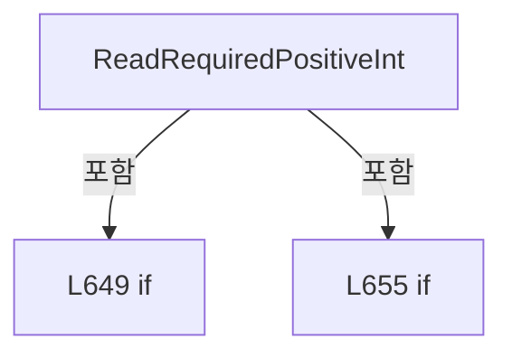
```mermaid
flowchart TD
 M["ReadRequiredPositiveInt"]
 N0["L649 if"]
 M -->|포함| N0
 N1["L655 if"]
 M -->|포함| N1
```

변경 전 점검: 입력/반환 타입, 위 호출자, 예외/취소 경로, 공유 상태와 저장·전송 소비자를 함께 확인합니다. 값의 단위나 물리 방향을 이름만으로 확정하지 않습니다.

### MethodDeclaration `ReadOneBasedIndex` · L663–669

[Drilling.File/ReviewResult/CReviewResultFile.cs:663–669](https://github.com/kjuws10-rgb/A3Drilling/blob/dfa5920e6301d9ec4b0eab1452ae59521aafc986/Drilling.File/ReviewResult/CReviewResultFile.cs#L663-L669)

| 항목 | 실제 추출 값 |
| --- | --- |
| 서명 | int Drilling.File.ReviewResult.CReviewResultFile.ReadOneBasedIndex(System.Collections.Generic.IReadOnlyDictionary<string, string>, params string[]) |
| 접근/수식자 | Private / private, static |
| 반환/값 타입 | int |
| 소속 타입 | NamedType:Drilling.File.ReviewResult.CReviewResultFile |

입력 계약:

| 이름 | 타입 | 전달 | 선택/기본값 |
| --- | --- | --- | --- |
| row | System.Collections.Generic.IReadOnlyDictionary<string, string> | None | False /  |
| names | string[] | None | False /  |

정적 호출자로 확인된 위치:

| 호출 파일/행 | 호출 표현식 | 런타임 분기 가능 |
| --- | --- | --- |
| [Drilling.File/ReviewResult/CReviewResultFile.cs:514–514](https://github.com/kjuws10-rgb/A3Drilling/blob/dfa5920e6301d9ec4b0eab1452ae59521aafc986/Drilling.File/ReviewResult/CReviewResultFile.cs#L514-L514) | ReadOneBasedIndex | False |
| [Drilling.File/ReviewResult/CReviewResultFile.cs:515–515](https://github.com/kjuws10-rgb/A3Drilling/blob/dfa5920e6301d9ec4b0eab1452ae59521aafc986/Drilling.File/ReviewResult/CReviewResultFile.cs#L515-L515) | ReadOneBasedIndex | False |

호출하는 대상과 해석 범위:

| 원본 행 | 표현식 | 분석 상태 | 대상/소스 위치 |
| --- | --- | --- | --- |
| 665 | ReadFirstText | resolved | string Drilling.File.ReviewResult.CReviewResultFile.ReadFirstText(System.Collections.Generic.IReadOnlyDictionary<string, string>, params string[]) · Drilling.File/ReviewResult/CReviewResultFile.cs:632 |
| 666 | int.TryParse | resolved | bool int.TryParse(string?, System.Globalization.NumberStyles, System.IFormatProvider?, out int) |

본문의 실제 연산·분기·예외·반환 순서(원문 위치 순):

| 원본 행 | 종류 | 주석 해설 |
| --- | --- | --- |
| 665 | call | 함수·델리게이트 또는 객체 생성자를 호출합니다: ReadFirstText(row, names) |
| 665 | local-declaration | 지역 변수를 선언합니다: var text = ReadFirstText(row, names); |
| 665 | variable-initializer | 변수의 초기값을 지정합니다: text = ReadFirstText(row, names) |
| 666 | call | 함수·델리게이트 또는 객체 생성자를 호출합니다: int.TryParse(text, NumberStyles.Integer, CultureInfo.InvariantCulture, out var value) |
| 666 | conditional-expression | 조건에 따라 결과식을 선택합니다: int.TryParse(text, NumberStyles.Integer, CultureInfo.InvariantCulture, out var value) && value > 0 ? value - 1 : -1 |
| 666 | return | 호출자에게 값 또는 제어를 반환합니다: return int.TryParse(text, NumberStyles.Integer, CultureInfo.InvariantCulture, out var value) && value > 0 ? value - 1 : -1; |

변경 전 점검: 입력/반환 타입, 위 호출자, 예외/취소 경로, 공유 상태와 저장·전송 소비자를 함께 확인합니다. 값의 단위나 물리 방향을 이름만으로 확정하지 않습니다.

### MethodDeclaration `ReadOptionalFiniteDouble` · L671–674

[Drilling.File/ReviewResult/CReviewResultFile.cs:671–674](https://github.com/kjuws10-rgb/A3Drilling/blob/dfa5920e6301d9ec4b0eab1452ae59521aafc986/Drilling.File/ReviewResult/CReviewResultFile.cs#L671-L674)

| 항목 | 실제 추출 값 |
| --- | --- |
| 서명 | double Drilling.File.ReviewResult.CReviewResultFile.ReadOptionalFiniteDouble(System.Collections.Generic.IReadOnlyDictionary<string, string>, params string[]) |
| 접근/수식자 | Private / private, static |
| 반환/값 타입 | double |
| 소속 타입 | NamedType:Drilling.File.ReviewResult.CReviewResultFile |

입력 계약:

| 이름 | 타입 | 전달 | 선택/기본값 |
| --- | --- | --- | --- |
| row | System.Collections.Generic.IReadOnlyDictionary<string, string> | None | False /  |
| names | string[] | None | False /  |

정적 호출자로 확인된 위치:

| 호출 파일/행 | 호출 표현식 | 런타임 분기 가능 |
| --- | --- | --- |
| [Drilling.File/ReviewResult/CReviewResultFile.cs:467–467](https://github.com/kjuws10-rgb/A3Drilling/blob/dfa5920e6301d9ec4b0eab1452ae59521aafc986/Drilling.File/ReviewResult/CReviewResultFile.cs#L467-L467) | ReadOptionalFiniteDouble | False |
| [Drilling.File/ReviewResult/CReviewResultFile.cs:468–468](https://github.com/kjuws10-rgb/A3Drilling/blob/dfa5920e6301d9ec4b0eab1452ae59521aafc986/Drilling.File/ReviewResult/CReviewResultFile.cs#L468-L468) | ReadOptionalFiniteDouble | False |
| [Drilling.File/ReviewResult/CReviewResultFile.cs:503–503](https://github.com/kjuws10-rgb/A3Drilling/blob/dfa5920e6301d9ec4b0eab1452ae59521aafc986/Drilling.File/ReviewResult/CReviewResultFile.cs#L503-L503) | ReadOptionalFiniteDouble | False |
| [Drilling.File/ReviewResult/CReviewResultFile.cs:504–504](https://github.com/kjuws10-rgb/A3Drilling/blob/dfa5920e6301d9ec4b0eab1452ae59521aafc986/Drilling.File/ReviewResult/CReviewResultFile.cs#L504-L504) | ReadOptionalFiniteDouble | False |

호출하는 대상과 해석 범위:

| 원본 행 | 표현식 | 분석 상태 | 대상/소스 위치 |
| --- | --- | --- | --- |
| 673 | ReadOptionalNullableFiniteDouble | resolved | double? Drilling.File.ReviewResult.CReviewResultFile.ReadOptionalNullableFiniteDouble(System.Collections.Generic.IReadOnlyDictionary<string, string>, params string[]) · Drilling.File/ReviewResult/CReviewResultFile.cs:686 |

본문의 실제 연산·분기·예외·반환 순서(원문 위치 순):

| 원본 행 | 종류 | 주석 해설 |
| --- | --- | --- |
| 673 | call | 함수·델리게이트 또는 객체 생성자를 호출합니다: ReadOptionalNullableFiniteDouble(row, names) |
| 673 | return | 호출자에게 값 또는 제어를 반환합니다: return ReadOptionalNullableFiniteDouble(row, names) ?? 0.0; |

변경 전 점검: 입력/반환 타입, 위 호출자, 예외/취소 경로, 공유 상태와 저장·전송 소비자를 함께 확인합니다. 값의 단위나 물리 방향을 이름만으로 확정하지 않습니다.

### MethodDeclaration `ReadOptionalDouble` · L676–684

[Drilling.File/ReviewResult/CReviewResultFile.cs:676–684](https://github.com/kjuws10-rgb/A3Drilling/blob/dfa5920e6301d9ec4b0eab1452ae59521aafc986/Drilling.File/ReviewResult/CReviewResultFile.cs#L676-L684)

| 항목 | 실제 추출 값 |
| --- | --- |
| 서명 | double Drilling.File.ReviewResult.CReviewResultFile.ReadOptionalDouble(System.Collections.Generic.IReadOnlyDictionary<string, string>, string) |
| 접근/수식자 | Private / private, static |
| 반환/값 타입 | double |
| 소속 타입 | NamedType:Drilling.File.ReviewResult.CReviewResultFile |

입력 계약:

| 이름 | 타입 | 전달 | 선택/기본값 |
| --- | --- | --- | --- |
| row | System.Collections.Generic.IReadOnlyDictionary<string, string> | None | False /  |
| name | string | None | False /  |

정적 호출자로 확인된 위치:

| 호출 파일/행 | 호출 표현식 | 런타임 분기 가능 |
| --- | --- | --- |
| [Drilling.File/ReviewResult/CReviewResultFile.cs:100–100](https://github.com/kjuws10-rgb/A3Drilling/blob/dfa5920e6301d9ec4b0eab1452ae59521aafc986/Drilling.File/ReviewResult/CReviewResultFile.cs#L100-L100) | ReadOptionalDouble | False |
| [Drilling.File/ReviewResult/CReviewResultFile.cs:101–101](https://github.com/kjuws10-rgb/A3Drilling/blob/dfa5920e6301d9ec4b0eab1452ae59521aafc986/Drilling.File/ReviewResult/CReviewResultFile.cs#L101-L101) | ReadOptionalDouble | False |

호출하는 대상과 해석 범위:

| 원본 행 | 표현식 | 분석 상태 | 대상/소스 위치 |
| --- | --- | --- | --- |
| 678 | CCsvParser.Get | resolved | string Drilling.File.Parser.CCsvParser.Get(System.Collections.Generic.IReadOnlyDictionary<string, string>, string) · Drilling.File/Parser/CCsvParser.cs:168 |
| 679 | string.IsNullOrWhiteSpace | resolved | bool string.IsNullOrWhiteSpace(string?) |
| 681 | double.TryParse | resolved | bool double.TryParse(string?, System.Globalization.NumberStyles, System.IFormatProvider?, out double) |
| 681 | double.IsFinite | resolved | bool double.IsFinite(double) |
| 682 | new InvalidDataException | resolved | System.IO.InvalidDataException.InvalidDataException(string?) |

본문의 실제 연산·분기·예외·반환 순서(원문 위치 순):

| 원본 행 | 종류 | 주석 해설 |
| --- | --- | --- |
| 678 | call | 함수·델리게이트 또는 객체 생성자를 호출합니다: CCsvParser.Get(row, name) |
| 678 | local-declaration | 지역 변수를 선언합니다: var text = CCsvParser.Get(row, name); |
| 678 | variable-initializer | 변수의 초기값을 지정합니다: text = CCsvParser.Get(row, name) |
| 679 | call | 함수·델리게이트 또는 객체 생성자를 호출합니다: string.IsNullOrWhiteSpace(text) |
| 679 | if | 조건에 따라 분기합니다: if (string.IsNullOrWhiteSpace(text)) |
| 680 | return | 호출자에게 값 또는 제어를 반환합니다: return 0.0; |
| 681 | call | 함수·델리게이트 또는 객체 생성자를 호출합니다: double.TryParse(text, NumberStyles.Float, CultureInfo.InvariantCulture, out var value) |
| 681 | call | 함수·델리게이트 또는 객체 생성자를 호출합니다: double.IsFinite(value) |
| 681 | if | 조건에 따라 분기합니다: if (!double.TryParse(text, NumberStyles.Float, CultureInfo.InvariantCulture, out var value) &#124;&#124; !double.IsFinite(value)) |
| 682 | call | 함수·델리게이트 또는 객체 생성자를 호출합니다: new InvalidDataException($"Review Result validation failed. {name} must be a finite number.") |
| 682 | throw | 예외를 발생/전달합니다: throw new InvalidDataException($"Review Result validation failed. {name} must be a finite number."); |
| 683 | return | 호출자에게 값 또는 제어를 반환합니다: return value; |

제어 구문의 포함 구조(실제 실행 순서/CFG가 아닌 구문 탐색 그림):

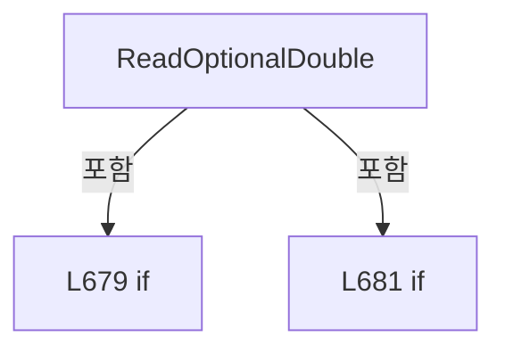
```mermaid
flowchart TD
 M["ReadOptionalDouble"]
 N0["L679 if"]
 M -->|포함| N0
 N1["L681 if"]
 M -->|포함| N1
```

변경 전 점검: 입력/반환 타입, 위 호출자, 예외/취소 경로, 공유 상태와 저장·전송 소비자를 함께 확인합니다. 값의 단위나 물리 방향을 이름만으로 확정하지 않습니다.

### MethodDeclaration `ReadOptionalNullableFiniteDouble` · L686–692

[Drilling.File/ReviewResult/CReviewResultFile.cs:686–692](https://github.com/kjuws10-rgb/A3Drilling/blob/dfa5920e6301d9ec4b0eab1452ae59521aafc986/Drilling.File/ReviewResult/CReviewResultFile.cs#L686-L692)

| 항목 | 실제 추출 값 |
| --- | --- |
| 서명 | double? Drilling.File.ReviewResult.CReviewResultFile.ReadOptionalNullableFiniteDouble(System.Collections.Generic.IReadOnlyDictionary<string, string>, params string[]) |
| 접근/수식자 | Private / private, static |
| 반환/값 타입 | double? |
| 소속 타입 | NamedType:Drilling.File.ReviewResult.CReviewResultFile |

입력 계약:

| 이름 | 타입 | 전달 | 선택/기본값 |
| --- | --- | --- | --- |
| row | System.Collections.Generic.IReadOnlyDictionary<string, string> | None | False /  |
| names | string[] | None | False /  |

정적 호출자로 확인된 위치:

| 호출 파일/행 | 호출 표현식 | 런타임 분기 가능 |
| --- | --- | --- |
| [Drilling.File/ReviewResult/CReviewResultFile.cs:516–516](https://github.com/kjuws10-rgb/A3Drilling/blob/dfa5920e6301d9ec4b0eab1452ae59521aafc986/Drilling.File/ReviewResult/CReviewResultFile.cs#L516-L516) | ReadOptionalNullableFiniteDouble | False |
| [Drilling.File/ReviewResult/CReviewResultFile.cs:517–517](https://github.com/kjuws10-rgb/A3Drilling/blob/dfa5920e6301d9ec4b0eab1452ae59521aafc986/Drilling.File/ReviewResult/CReviewResultFile.cs#L517-L517) | ReadOptionalNullableFiniteDouble | False |
| [Drilling.File/ReviewResult/CReviewResultFile.cs:673–673](https://github.com/kjuws10-rgb/A3Drilling/blob/dfa5920e6301d9ec4b0eab1452ae59521aafc986/Drilling.File/ReviewResult/CReviewResultFile.cs#L673-L673) | ReadOptionalNullableFiniteDouble | False |

호출하는 대상과 해석 범위:

| 원본 행 | 표현식 | 분석 상태 | 대상/소스 위치 |
| --- | --- | --- | --- |
| 688 | ReadFirstText | resolved | string Drilling.File.ReviewResult.CReviewResultFile.ReadFirstText(System.Collections.Generic.IReadOnlyDictionary<string, string>, params string[]) · Drilling.File/ReviewResult/CReviewResultFile.cs:632 |
| 689 | double.TryParse | resolved | bool double.TryParse(string?, System.Globalization.NumberStyles, System.IFormatProvider?, out double) |
| 689 | double.IsFinite | resolved | bool double.IsFinite(double) |

본문의 실제 연산·분기·예외·반환 순서(원문 위치 순):

| 원본 행 | 종류 | 주석 해설 |
| --- | --- | --- |
| 688 | call | 함수·델리게이트 또는 객체 생성자를 호출합니다: ReadFirstText(row, names) |
| 688 | local-declaration | 지역 변수를 선언합니다: var text = ReadFirstText(row, names); |
| 688 | variable-initializer | 변수의 초기값을 지정합니다: text = ReadFirstText(row, names) |
| 689 | call | 함수·델리게이트 또는 객체 생성자를 호출합니다: double.TryParse(text, NumberStyles.Float, CultureInfo.InvariantCulture, out var value) |
| 689 | call | 함수·델리게이트 또는 객체 생성자를 호출합니다: double.IsFinite(value) |
| 689 | conditional-expression | 조건에 따라 결과식을 선택합니다: double.TryParse(text, NumberStyles.Float, CultureInfo.InvariantCulture, out var value) && double.IsFinite(value) ? value : null |
| 689 | return | 호출자에게 값 또는 제어를 반환합니다: return double.TryParse(text, NumberStyles.Float, CultureInfo.InvariantCulture, out var value) && double.IsFinite(value) ? value : null; |

변경 전 점검: 입력/반환 타입, 위 호출자, 예외/취소 경로, 공유 상태와 저장·전송 소비자를 함께 확인합니다. 값의 단위나 물리 방향을 이름만으로 확정하지 않습니다.

### MethodDeclaration `NormalizeResultStatus` · L694–699

[Drilling.File/ReviewResult/CReviewResultFile.cs:694–699](https://github.com/kjuws10-rgb/A3Drilling/blob/dfa5920e6301d9ec4b0eab1452ae59521aafc986/Drilling.File/ReviewResult/CReviewResultFile.cs#L694-L699)

| 항목 | 실제 추출 값 |
| --- | --- |
| 서명 | string Drilling.File.ReviewResult.CReviewResultFile.NormalizeResultStatus(string?) |
| 접근/수식자 | Private / private, static |
| 반환/값 타입 | string |
| 소속 타입 | NamedType:Drilling.File.ReviewResult.CReviewResultFile |

입력 계약:

| 이름 | 타입 | 전달 | 선택/기본값 |
| --- | --- | --- | --- |
| resultStatus | string? | None | False /  |

정적 호출자로 확인된 위치:

| 호출 파일/행 | 호출 표현식 | 런타임 분기 가능 |
| --- | --- | --- |
| [Drilling.File/ReviewResult/CReviewResultFile.cs:89–89](https://github.com/kjuws10-rgb/A3Drilling/blob/dfa5920e6301d9ec4b0eab1452ae59521aafc986/Drilling.File/ReviewResult/CReviewResultFile.cs#L89-L89) | NormalizeResultStatus | False |
| [Drilling.File/ReviewResult/CReviewResultFile.cs:540–540](https://github.com/kjuws10-rgb/A3Drilling/blob/dfa5920e6301d9ec4b0eab1452ae59521aafc986/Drilling.File/ReviewResult/CReviewResultFile.cs#L540-L540) | NormalizeResultStatus | False |

호출하는 대상과 해석 범위:

| 원본 행 | 표현식 | 분석 상태 | 대상/소스 위치 |
| --- | --- | --- | --- |
| 696 | string.IsNullOrWhiteSpace | resolved | bool string.IsNullOrWhiteSpace(string?) |
| 698 | resultStatus.Trim().ToUpperInvariant | resolved | string string.ToUpperInvariant() |
| 698 | resultStatus.Trim | resolved | string string.Trim() |

본문의 실제 연산·분기·예외·반환 순서(원문 위치 순):

| 원본 행 | 종류 | 주석 해설 |
| --- | --- | --- |
| 696 | call | 함수·델리게이트 또는 객체 생성자를 호출합니다: string.IsNullOrWhiteSpace(resultStatus) |
| 696 | conditional-expression | 조건에 따라 결과식을 선택합니다: string.IsNullOrWhiteSpace(resultStatus) ? "COMPLETED" : resultStatus.Trim().ToUpperInvariant() |
| 696 | return | 호출자에게 값 또는 제어를 반환합니다: return string.IsNullOrWhiteSpace(resultStatus) ? "COMPLETED" : resultStatus.Trim().ToUpperInvariant(); |
| 698 | call | 함수·델리게이트 또는 객체 생성자를 호출합니다: resultStatus.Trim().ToUpperInvariant() |
| 698 | call | 함수·델리게이트 또는 객체 생성자를 호출합니다: resultStatus.Trim() |

변경 전 점검: 입력/반환 타입, 위 호출자, 예외/취소 경로, 공유 상태와 저장·전송 소비자를 함께 확인합니다. 값의 단위나 물리 방향을 이름만으로 확정하지 않습니다.

### MethodDeclaration `NormalizeInspectionMethod` · L701–704

[Drilling.File/ReviewResult/CReviewResultFile.cs:701–704](https://github.com/kjuws10-rgb/A3Drilling/blob/dfa5920e6301d9ec4b0eab1452ae59521aafc986/Drilling.File/ReviewResult/CReviewResultFile.cs#L701-L704)

| 항목 | 실제 추출 값 |
| --- | --- |
| 서명 | string Drilling.File.ReviewResult.CReviewResultFile.NormalizeInspectionMethod(string?) |
| 접근/수식자 | Private / private, static |
| 반환/값 타입 | string |
| 소속 타입 | NamedType:Drilling.File.ReviewResult.CReviewResultFile |

입력 계약:

| 이름 | 타입 | 전달 | 선택/기본값 |
| --- | --- | --- | --- |
| inspectionMethod | string? | None | False /  |

현재 부분 분석에서 직접 연결된 호출자는 없습니다. XAML/이벤트/인터페이스·델리게이트·외부 진입을 추가 확인해야 하며, 미사용으로 판정한 것이 아닙니다.

호출하는 대상과 해석 범위:

| 원본 행 | 표현식 | 분석 상태 | 대상/소스 위치 |
| --- | --- | --- | --- |
| 703 | .Trim().Equals | resolved | bool string.Equals(string?, System.StringComparison) |
| 703 | .Trim | resolved | string string.Trim() |

본문의 실제 연산·분기·예외·반환 순서(원문 위치 순):

| 원본 행 | 종류 | 주석 해설 |
| --- | --- | --- |
| 703 | call | 함수·델리게이트 또는 객체 생성자를 호출합니다: .Trim().Equals("IOF", StringComparison.OrdinalIgnoreCase) |
| 703 | call | 함수·델리게이트 또는 객체 생성자를 호출합니다: .Trim() |
| 703 | conditional-expression | 조건에 따라 결과식을 선택합니다: inspectionMethod?.Trim().Equals("IOF", StringComparison.OrdinalIgnoreCase) == true ? "IOF" : "P2P" |
| 703 | return | 호출자에게 값 또는 제어를 반환합니다: return inspectionMethod?.Trim().Equals("IOF", StringComparison.OrdinalIgnoreCase) == true ? "IOF" : "P2P"; |

변경 전 점검: 입력/반환 타입, 위 호출자, 예외/취소 경로, 공유 상태와 저장·전송 소비자를 함께 확인합니다. 값의 단위나 물리 방향을 이름만으로 확정하지 않습니다.

### MethodDeclaration `ReadOptionalNullableInt` · L706–709

[Drilling.File/ReviewResult/CReviewResultFile.cs:706–709](https://github.com/kjuws10-rgb/A3Drilling/blob/dfa5920e6301d9ec4b0eab1452ae59521aafc986/Drilling.File/ReviewResult/CReviewResultFile.cs#L706-L709)

| 항목 | 실제 추출 값 |
| --- | --- |
| 서명 | int? Drilling.File.ReviewResult.CReviewResultFile.ReadOptionalNullableInt(System.Collections.Generic.IReadOnlyDictionary<string, string>, string) |
| 접근/수식자 | Private / private, static |
| 반환/값 타입 | int? |
| 소속 타입 | NamedType:Drilling.File.ReviewResult.CReviewResultFile |

입력 계약:

| 이름 | 타입 | 전달 | 선택/기본값 |
| --- | --- | --- | --- |
| row | System.Collections.Generic.IReadOnlyDictionary<string, string> | None | False /  |
| name | string | None | False /  |

정적 호출자로 확인된 위치:

| 호출 파일/행 | 호출 표현식 | 런타임 분기 가능 |
| --- | --- | --- |
| [Drilling.File/ReviewResult/CReviewResultFile.cs:94–94](https://github.com/kjuws10-rgb/A3Drilling/blob/dfa5920e6301d9ec4b0eab1452ae59521aafc986/Drilling.File/ReviewResult/CReviewResultFile.cs#L94-L94) | ReadOptionalNullableInt | False |
| [Drilling.File/ReviewResult/CReviewResultFile.cs:519–519](https://github.com/kjuws10-rgb/A3Drilling/blob/dfa5920e6301d9ec4b0eab1452ae59521aafc986/Drilling.File/ReviewResult/CReviewResultFile.cs#L519-L519) | ReadOptionalNullableInt | False |

호출하는 대상과 해석 범위:

| 원본 행 | 표현식 | 분석 상태 | 대상/소스 위치 |
| --- | --- | --- | --- |
| 708 | int.TryParse | resolved | bool int.TryParse(string?, System.Globalization.NumberStyles, System.IFormatProvider?, out int) |
| 708 | CCsvParser.Get | resolved | string Drilling.File.Parser.CCsvParser.Get(System.Collections.Generic.IReadOnlyDictionary<string, string>, string) · Drilling.File/Parser/CCsvParser.cs:168 |

본문의 실제 연산·분기·예외·반환 순서(원문 위치 순):

| 원본 행 | 종류 | 주석 해설 |
| --- | --- | --- |
| 708 | call | 함수·델리게이트 또는 객체 생성자를 호출합니다: int.TryParse(CCsvParser.Get(row, name), NumberStyles.Integer, CultureInfo.InvariantCulture, out var value) |
| 708 | call | 함수·델리게이트 또는 객체 생성자를 호출합니다: CCsvParser.Get(row, name) |
| 708 | conditional-expression | 조건에 따라 결과식을 선택합니다: int.TryParse(CCsvParser.Get(row, name), NumberStyles.Integer, CultureInfo.InvariantCulture, out var value) ? value : null |
| 708 | return | 호출자에게 값 또는 제어를 반환합니다: return int.TryParse(CCsvParser.Get(row, name), NumberStyles.Integer, CultureInfo.InvariantCulture, out var value) ? value : null; |

변경 전 점검: 입력/반환 타입, 위 호출자, 예외/취소 경로, 공유 상태와 저장·전송 소비자를 함께 확인합니다. 값의 단위나 물리 방향을 이름만으로 확정하지 않습니다.

### MethodDeclaration `FormatDate` · L711–714

[Drilling.File/ReviewResult/CReviewResultFile.cs:711–714](https://github.com/kjuws10-rgb/A3Drilling/blob/dfa5920e6301d9ec4b0eab1452ae59521aafc986/Drilling.File/ReviewResult/CReviewResultFile.cs#L711-L714)

| 항목 | 실제 추출 값 |
| --- | --- |
| 서명 | string Drilling.File.ReviewResult.CReviewResultFile.FormatDate(System.DateTimeOffset?) |
| 접근/수식자 | Private / private, static |
| 반환/값 타입 | string |
| 소속 타입 | NamedType:Drilling.File.ReviewResult.CReviewResultFile |

입력 계약:

| 이름 | 타입 | 전달 | 선택/기본값 |
| --- | --- | --- | --- |
| value | System.DateTimeOffset? | None | False /  |

정적 호출자로 확인된 위치:

| 호출 파일/행 | 호출 표현식 | 런타임 분기 가능 |
| --- | --- | --- |
| [Drilling.File/ReviewResult/CReviewResultFile.cs:444–444](https://github.com/kjuws10-rgb/A3Drilling/blob/dfa5920e6301d9ec4b0eab1452ae59521aafc986/Drilling.File/ReviewResult/CReviewResultFile.cs#L444-L444) | FormatDate | False |
| [Drilling.File/ReviewResult/CReviewResultFile.cs:535–535](https://github.com/kjuws10-rgb/A3Drilling/blob/dfa5920e6301d9ec4b0eab1452ae59521aafc986/Drilling.File/ReviewResult/CReviewResultFile.cs#L535-L535) | FormatDate | False |
| [Drilling.File/ReviewResult/CReviewResultFile.cs:823–823](https://github.com/kjuws10-rgb/A3Drilling/blob/dfa5920e6301d9ec4b0eab1452ae59521aafc986/Drilling.File/ReviewResult/CReviewResultFile.cs#L823-L823) | FormatDate | False |
| [Drilling.File/ReviewResult/CReviewResultFile.cs:1039–1039](https://github.com/kjuws10-rgb/A3Drilling/blob/dfa5920e6301d9ec4b0eab1452ae59521aafc986/Drilling.File/ReviewResult/CReviewResultFile.cs#L1039-L1039) | FormatDate | False |
| [Drilling.File/ReviewResult/CReviewResultFile.cs:1152–1152](https://github.com/kjuws10-rgb/A3Drilling/blob/dfa5920e6301d9ec4b0eab1452ae59521aafc986/Drilling.File/ReviewResult/CReviewResultFile.cs#L1152-L1152) | FormatDate | False |
| [Drilling.File/ReviewResult/CReviewResultFile.cs:1157–1157](https://github.com/kjuws10-rgb/A3Drilling/blob/dfa5920e6301d9ec4b0eab1452ae59521aafc986/Drilling.File/ReviewResult/CReviewResultFile.cs#L1157-L1157) | FormatDate | False |
| [Drilling.File/ReviewResult/CReviewResultFile.cs:1279–1279](https://github.com/kjuws10-rgb/A3Drilling/blob/dfa5920e6301d9ec4b0eab1452ae59521aafc986/Drilling.File/ReviewResult/CReviewResultFile.cs#L1279-L1279) | FormatDate | False |

호출하는 대상과 해석 범위:

| 원본 행 | 표현식 | 분석 상태 | 대상/소스 위치 |
| --- | --- | --- | --- |
| 713 | .ToString | resolved | string System.DateTimeOffset.ToString(string?, System.IFormatProvider?) |

본문의 실제 연산·분기·예외·반환 순서(원문 위치 순):

| 원본 행 | 종류 | 주석 해설 |
| --- | --- | --- |
| 713 | call | 함수·델리게이트 또는 객체 생성자를 호출합니다: .ToString("yyyy-MM-dd HH:mm:ss.fff", CultureInfo.InvariantCulture) |
| 713 | return | 호출자에게 값 또는 제어를 반환합니다: return value?.ToString("yyyy-MM-dd HH:mm:ss.fff", CultureInfo.InvariantCulture) ?? ""; |

변경 전 점검: 입력/반환 타입, 위 호출자, 예외/취소 경로, 공유 상태와 저장·전송 소비자를 함께 확인합니다. 값의 단위나 물리 방향을 이름만으로 확정하지 않습니다.

### MethodDeclaration `FormatDouble` · L716–719

[Drilling.File/ReviewResult/CReviewResultFile.cs:716–719](https://github.com/kjuws10-rgb/A3Drilling/blob/dfa5920e6301d9ec4b0eab1452ae59521aafc986/Drilling.File/ReviewResult/CReviewResultFile.cs#L716-L719)

| 항목 | 실제 추출 값 |
| --- | --- |
| 서명 | string Drilling.File.ReviewResult.CReviewResultFile.FormatDouble(double) |
| 접근/수식자 | Private / private, static |
| 반환/값 타입 | string |
| 소속 타입 | NamedType:Drilling.File.ReviewResult.CReviewResultFile |

입력 계약:

| 이름 | 타입 | 전달 | 선택/기본값 |
| --- | --- | --- | --- |
| value | double | None | False /  |

정적 호출자로 확인된 위치:

| 호출 파일/행 | 호출 표현식 | 런타임 분기 가능 |
| --- | --- | --- |
| [Drilling.File/ReviewResult/CReviewResultFile.cs:423–423](https://github.com/kjuws10-rgb/A3Drilling/blob/dfa5920e6301d9ec4b0eab1452ae59521aafc986/Drilling.File/ReviewResult/CReviewResultFile.cs#L423-L423) | FormatDouble | False |
| [Drilling.File/ReviewResult/CReviewResultFile.cs:424–424](https://github.com/kjuws10-rgb/A3Drilling/blob/dfa5920e6301d9ec4b0eab1452ae59521aafc986/Drilling.File/ReviewResult/CReviewResultFile.cs#L424-L424) | FormatDouble | False |
| [Drilling.File/ReviewResult/CReviewResultFile.cs:549–549](https://github.com/kjuws10-rgb/A3Drilling/blob/dfa5920e6301d9ec4b0eab1452ae59521aafc986/Drilling.File/ReviewResult/CReviewResultFile.cs#L549-L549) | FormatDouble | False |
| [Drilling.File/ReviewResult/CReviewResultFile.cs:550–550](https://github.com/kjuws10-rgb/A3Drilling/blob/dfa5920e6301d9ec4b0eab1452ae59521aafc986/Drilling.File/ReviewResult/CReviewResultFile.cs#L550-L550) | FormatDouble | False |
| [Drilling.File/ReviewResult/CReviewResultFile.cs:555–555](https://github.com/kjuws10-rgb/A3Drilling/blob/dfa5920e6301d9ec4b0eab1452ae59521aafc986/Drilling.File/ReviewResult/CReviewResultFile.cs#L555-L555) | FormatDouble | False |
| [Drilling.File/ReviewResult/CReviewResultFile.cs:556–556](https://github.com/kjuws10-rgb/A3Drilling/blob/dfa5920e6301d9ec4b0eab1452ae59521aafc986/Drilling.File/ReviewResult/CReviewResultFile.cs#L556-L556) | FormatDouble | False |
| [Drilling.File/ReviewResult/CReviewResultFile.cs:563–563](https://github.com/kjuws10-rgb/A3Drilling/blob/dfa5920e6301d9ec4b0eab1452ae59521aafc986/Drilling.File/ReviewResult/CReviewResultFile.cs#L563-L563) | FormatDouble | False |
| [Drilling.File/ReviewResult/CReviewResultFile.cs:564–564](https://github.com/kjuws10-rgb/A3Drilling/blob/dfa5920e6301d9ec4b0eab1452ae59521aafc986/Drilling.File/ReviewResult/CReviewResultFile.cs#L564-L564) | FormatDouble | False |
| [Drilling.File/ReviewResult/CReviewResultFile.cs:565–565](https://github.com/kjuws10-rgb/A3Drilling/blob/dfa5920e6301d9ec4b0eab1452ae59521aafc986/Drilling.File/ReviewResult/CReviewResultFile.cs#L565-L565) | FormatDouble | False |
| [Drilling.File/ReviewResult/CReviewResultFile.cs:566–566](https://github.com/kjuws10-rgb/A3Drilling/blob/dfa5920e6301d9ec4b0eab1452ae59521aafc986/Drilling.File/ReviewResult/CReviewResultFile.cs#L566-L566) | FormatDouble | False |
| [Drilling.File/ReviewResult/CReviewResultFile.cs:832–832](https://github.com/kjuws10-rgb/A3Drilling/blob/dfa5920e6301d9ec4b0eab1452ae59521aafc986/Drilling.File/ReviewResult/CReviewResultFile.cs#L832-L832) | FormatDouble | False |
| [Drilling.File/ReviewResult/CReviewResultFile.cs:833–833](https://github.com/kjuws10-rgb/A3Drilling/blob/dfa5920e6301d9ec4b0eab1452ae59521aafc986/Drilling.File/ReviewResult/CReviewResultFile.cs#L833-L833) | FormatDouble | False |
| [Drilling.File/ReviewResult/CReviewResultFile.cs:840–840](https://github.com/kjuws10-rgb/A3Drilling/blob/dfa5920e6301d9ec4b0eab1452ae59521aafc986/Drilling.File/ReviewResult/CReviewResultFile.cs#L840-L840) | FormatDouble | False |
| [Drilling.File/ReviewResult/CReviewResultFile.cs:841–841](https://github.com/kjuws10-rgb/A3Drilling/blob/dfa5920e6301d9ec4b0eab1452ae59521aafc986/Drilling.File/ReviewResult/CReviewResultFile.cs#L841-L841) | FormatDouble | False |

호출하는 대상과 해석 범위:

| 원본 행 | 표현식 | 분석 상태 | 대상/소스 위치 |
| --- | --- | --- | --- |
| 718 | value.ToString | resolved | string double.ToString(string?, System.IFormatProvider?) |

본문의 실제 연산·분기·예외·반환 순서(원문 위치 순):

| 원본 행 | 종류 | 주석 해설 |
| --- | --- | --- |
| 718 | call | 함수·델리게이트 또는 객체 생성자를 호출합니다: value.ToString("0.000000", CultureInfo.InvariantCulture) |
| 718 | return | 호출자에게 값 또는 제어를 반환합니다: return value.ToString("0.000000", CultureInfo.InvariantCulture); |

변경 전 점검: 입력/반환 타입, 위 호출자, 예외/취소 경로, 공유 상태와 저장·전송 소비자를 함께 확인합니다. 값의 단위나 물리 방향을 이름만으로 확정하지 않습니다.

### MethodDeclaration `SanitizeFileName` · L721–726

[Drilling.File/ReviewResult/CReviewResultFile.cs:721–726](https://github.com/kjuws10-rgb/A3Drilling/blob/dfa5920e6301d9ec4b0eab1452ae59521aafc986/Drilling.File/ReviewResult/CReviewResultFile.cs#L721-L726)

| 항목 | 실제 추출 값 |
| --- | --- |
| 서명 | string Drilling.File.ReviewResult.CReviewResultFile.SanitizeFileName(string) |
| 접근/수식자 | Private / private, static |
| 반환/값 타입 | string |
| 소속 타입 | NamedType:Drilling.File.ReviewResult.CReviewResultFile |

입력 계약:

| 이름 | 타입 | 전달 | 선택/기본값 |
| --- | --- | --- | --- |
| value | string | None | False /  |

정적 호출자로 확인된 위치:

| 호출 파일/행 | 호출 표현식 | 런타임 분기 가능 |
| --- | --- | --- |
| [Drilling.File/ReviewResult/CReviewResultFile.cs:624–624](https://github.com/kjuws10-rgb/A3Drilling/blob/dfa5920e6301d9ec4b0eab1452ae59521aafc986/Drilling.File/ReviewResult/CReviewResultFile.cs#L624-L624) | SanitizeFileName | False |
| [Drilling.File/ReviewResult/CReviewResultFile.cs:728–728](https://github.com/kjuws10-rgb/A3Drilling/blob/dfa5920e6301d9ec4b0eab1452ae59521aafc986/Drilling.File/ReviewResult/CReviewResultFile.cs#L728-L728) | SanitizeFileName | False |
| [Drilling.File/ReviewResult/CReviewResultFile.cs:729–729](https://github.com/kjuws10-rgb/A3Drilling/blob/dfa5920e6301d9ec4b0eab1452ae59521aafc986/Drilling.File/ReviewResult/CReviewResultFile.cs#L729-L729) | SanitizeFileName | False |
| [Drilling.File/ReviewResult/CReviewResultFile.cs:730–730](https://github.com/kjuws10-rgb/A3Drilling/blob/dfa5920e6301d9ec4b0eab1452ae59521aafc986/Drilling.File/ReviewResult/CReviewResultFile.cs#L730-L730) | SanitizeFileName | False |
| [Drilling.File/ReviewResult/CReviewResultFile.cs:730–730](https://github.com/kjuws10-rgb/A3Drilling/blob/dfa5920e6301d9ec4b0eab1452ae59521aafc986/Drilling.File/ReviewResult/CReviewResultFile.cs#L730-L730) | SanitizeFileName | False |
| [Drilling.File/ReviewResult/CReviewResultFile.cs:731–731](https://github.com/kjuws10-rgb/A3Drilling/blob/dfa5920e6301d9ec4b0eab1452ae59521aafc986/Drilling.File/ReviewResult/CReviewResultFile.cs#L731-L731) | SanitizeFileName | False |

호출하는 대상과 해석 범위:

| 원본 행 | 표현식 | 분석 상태 | 대상/소스 위치 |
| --- | --- | --- | --- |
| 723 | Path.GetInvalidFileNameChars | resolved | char[] System.IO.Path.GetInvalidFileNameChars() |
| 724 | new string | resolved | string.String(char[]?) |
| 724 | value.Select(character => invalidChars.Contains(character) ? '_' : character).ToArray | resolved | char[] System.Collections.Generic.IEnumerable<char>.ToArray<char>() |
| 724 | value.Select | resolved | System.Collections.Generic.IEnumerable<char> System.Collections.Generic.IEnumerable<char>.Select<char, char>(System.Func<char, char>) |
| 724 | invalidChars.Contains | resolved | bool System.ReadOnlySpan<char>.Contains<char>(char) |
| 725 | string.IsNullOrWhiteSpace | resolved | bool string.IsNullOrWhiteSpace(string?) |

본문의 실제 연산·분기·예외·반환 순서(원문 위치 순):

| 원본 행 | 종류 | 주석 해설 |
| --- | --- | --- |
| 723 | call | 함수·델리게이트 또는 객체 생성자를 호출합니다: Path.GetInvalidFileNameChars() |
| 723 | local-declaration | 지역 변수를 선언합니다: var invalidChars = Path.GetInvalidFileNameChars(); |
| 723 | variable-initializer | 변수의 초기값을 지정합니다: invalidChars = Path.GetInvalidFileNameChars() |
| 724 | call | 함수·델리게이트 또는 객체 생성자를 호출합니다: new string (value.Select(character => invalidChars.Contains(character) ? '_' : character).ToArray()) |
| 724 | call | 함수·델리게이트 또는 객체 생성자를 호출합니다: value.Select(character => invalidChars.Contains(character) ? '_' : character).ToArray() |
| 724 | call | 함수·델리게이트 또는 객체 생성자를 호출합니다: value.Select(character => invalidChars.Contains(character) ? '_' : character) |
| 724 | call | 함수·델리게이트 또는 객체 생성자를 호출합니다: invalidChars.Contains(character) |
| 724 | conditional-expression | 조건에 따라 결과식을 선택합니다: invalidChars.Contains(character) ? '_' : character |
| 724 | local-declaration | 지역 변수를 선언합니다: var sanitized = new string (value.Select(character => invalidChars.Contains(character) ? '_' : character).ToArray()); |
| 724 | variable-initializer | 변수의 초기값을 지정합니다: sanitized = new string (value.Select(character => invalidChars.Contains(character) ? '_' : character).ToArray()) |
| 725 | call | 함수·델리게이트 또는 객체 생성자를 호출합니다: string.IsNullOrWhiteSpace(sanitized) |
| 725 | conditional-expression | 조건에 따라 결과식을 선택합니다: string.IsNullOrWhiteSpace(sanitized) ? "UNLINKED" : sanitized |
| 725 | return | 호출자에게 값 또는 제어를 반환합니다: return string.IsNullOrWhiteSpace(sanitized) ? "UNLINKED" : sanitized; |

변경 전 점검: 입력/반환 타입, 위 호출자, 예외/취소 경로, 공유 상태와 저장·전송 소비자를 함께 확인합니다. 값의 단위나 물리 방향을 이름만으로 확정하지 않습니다.

### MethodDeclaration `ManualDirectory` · L728–728

[Drilling.File/ReviewResult/CReviewResultFile.cs:728–728](https://github.com/kjuws10-rgb/A3Drilling/blob/dfa5920e6301d9ec4b0eab1452ae59521aafc986/Drilling.File/ReviewResult/CReviewResultFile.cs#L728-L728)

| 항목 | 실제 추출 값 |
| --- | --- |
| 서명 | string Drilling.File.ReviewResult.CReviewResultFile.ManualDirectory(string, string) |
| 접근/수식자 | Private / private |
| 반환/값 타입 | string |
| 소속 타입 | NamedType:Drilling.File.ReviewResult.CReviewResultFile |

입력 계약:

| 이름 | 타입 | 전달 | 선택/기본값 |
| --- | --- | --- | --- |
| recipeId | string | None | False /  |
| resultType | string | None | False /  |

정적 호출자로 확인된 위치:

| 호출 파일/행 | 호출 표현식 | 런타임 분기 가능 |
| --- | --- | --- |
| [Drilling.File/ReviewResult/CReviewResultFile.cs:130–130](https://github.com/kjuws10-rgb/A3Drilling/blob/dfa5920e6301d9ec4b0eab1452ae59521aafc986/Drilling.File/ReviewResult/CReviewResultFile.cs#L130-L130) | ManualDirectory | False |
| [Drilling.File/ReviewResult/CReviewResultFile.cs:847–847](https://github.com/kjuws10-rgb/A3Drilling/blob/dfa5920e6301d9ec4b0eab1452ae59521aafc986/Drilling.File/ReviewResult/CReviewResultFile.cs#L847-L847) | ManualDirectory | False |
| [Drilling.File/ReviewResult/CReviewResultFile.cs:1076–1076](https://github.com/kjuws10-rgb/A3Drilling/blob/dfa5920e6301d9ec4b0eab1452ae59521aafc986/Drilling.File/ReviewResult/CReviewResultFile.cs#L1076-L1076) | ManualDirectory | False |
| [Drilling.File/ReviewResult/CReviewResultFile.cs:1212–1212](https://github.com/kjuws10-rgb/A3Drilling/blob/dfa5920e6301d9ec4b0eab1452ae59521aafc986/Drilling.File/ReviewResult/CReviewResultFile.cs#L1212-L1212) | ManualDirectory | False |
| [Drilling.File/ReviewResult/CReviewResultFile.cs:1317–1317](https://github.com/kjuws10-rgb/A3Drilling/blob/dfa5920e6301d9ec4b0eab1452ae59521aafc986/Drilling.File/ReviewResult/CReviewResultFile.cs#L1317-L1317) | ManualDirectory | False |

호출하는 대상과 해석 범위:

| 원본 행 | 표현식 | 분석 상태 | 대상/소스 위치 |
| --- | --- | --- | --- |
| 728 | Path.Combine | resolved | string System.IO.Path.Combine(string, string, string, string) |
| 728 | SanitizeFileName | resolved | string Drilling.File.ReviewResult.CReviewResultFile.SanitizeFileName(string) · Drilling.File/ReviewResult/CReviewResultFile.cs:721 |

본문의 실제 연산·분기·예외·반환 순서(원문 위치 순):

| 원본 행 | 종류 | 주석 해설 |
| --- | --- | --- |
| 728 | call | 함수·델리게이트 또는 객체 생성자를 호출합니다: Path.Combine(_reviewRoot, "Manual", SanitizeFileName(recipeId), resultType) |
| 728 | call | 함수·델리게이트 또는 객체 생성자를 호출합니다: SanitizeFileName(recipeId) |

변경 전 점검: 입력/반환 타입, 위 호출자, 예외/취소 경로, 공유 상태와 저장·전송 소비자를 함께 확인합니다. 값의 단위나 물리 방향을 이름만으로 확정하지 않습니다.

### MethodDeclaration `AutoDirectory` · L729–729

[Drilling.File/ReviewResult/CReviewResultFile.cs:729–729](https://github.com/kjuws10-rgb/A3Drilling/blob/dfa5920e6301d9ec4b0eab1452ae59521aafc986/Drilling.File/ReviewResult/CReviewResultFile.cs#L729-L729)

| 항목 | 실제 추출 값 |
| --- | --- |
| 서명 | string Drilling.File.ReviewResult.CReviewResultFile.AutoDirectory(string) |
| 접근/수식자 | Private / private |
| 반환/값 타입 | string |
| 소속 타입 | NamedType:Drilling.File.ReviewResult.CReviewResultFile |

입력 계약:

| 이름 | 타입 | 전달 | 선택/기본값 |
| --- | --- | --- | --- |
| recipeId | string | None | False /  |

정적 호출자로 확인된 위치:

| 호출 파일/행 | 호출 표현식 | 런타임 분기 가능 |
| --- | --- | --- |
| [Drilling.File/ReviewResult/CReviewResultFile.cs:1211–1211](https://github.com/kjuws10-rgb/A3Drilling/blob/dfa5920e6301d9ec4b0eab1452ae59521aafc986/Drilling.File/ReviewResult/CReviewResultFile.cs#L1211-L1211) | AutoDirectory | False |

호출하는 대상과 해석 범위:

| 원본 행 | 표현식 | 분석 상태 | 대상/소스 위치 |
| --- | --- | --- | --- |
| 729 | Path.Combine | resolved | string System.IO.Path.Combine(string, string, string) |
| 729 | SanitizeFileName | resolved | string Drilling.File.ReviewResult.CReviewResultFile.SanitizeFileName(string) · Drilling.File/ReviewResult/CReviewResultFile.cs:721 |

본문의 실제 연산·분기·예외·반환 순서(원문 위치 순):

| 원본 행 | 종류 | 주석 해설 |
| --- | --- | --- |
| 729 | call | 함수·델리게이트 또는 객체 생성자를 호출합니다: Path.Combine(_reviewRoot, "Auto", SanitizeFileName(recipeId)) |
| 729 | call | 함수·델리게이트 또는 객체 생성자를 호출합니다: SanitizeFileName(recipeId) |

변경 전 점검: 입력/반환 타입, 위 호출자, 예외/취소 경로, 공유 상태와 저장·전송 소비자를 함께 확인합니다. 값의 단위나 물리 방향을 이름만으로 확정하지 않습니다.

### MethodDeclaration `ZeroDefenceDirectory` · L730–730

[Drilling.File/ReviewResult/CReviewResultFile.cs:730–730](https://github.com/kjuws10-rgb/A3Drilling/blob/dfa5920e6301d9ec4b0eab1452ae59521aafc986/Drilling.File/ReviewResult/CReviewResultFile.cs#L730-L730)

| 항목 | 실제 추출 값 |
| --- | --- |
| 서명 | string Drilling.File.ReviewResult.CReviewResultFile.ZeroDefenceDirectory(string, string) |
| 접근/수식자 | Private / private |
| 반환/값 타입 | string |
| 소속 타입 | NamedType:Drilling.File.ReviewResult.CReviewResultFile |

입력 계약:

| 이름 | 타입 | 전달 | 선택/기본값 |
| --- | --- | --- | --- |
| recipeId | string | None | False /  |
| glassId | string | None | False /  |

정적 호출자로 확인된 위치:

| 호출 파일/행 | 호출 표현식 | 런타임 분기 가능 |
| --- | --- | --- |
| [Drilling.File/ReviewResult/CReviewResultFile.cs:1209–1209](https://github.com/kjuws10-rgb/A3Drilling/blob/dfa5920e6301d9ec4b0eab1452ae59521aafc986/Drilling.File/ReviewResult/CReviewResultFile.cs#L1209-L1209) | ZeroDefenceDirectory | False |
| [Drilling.File/ReviewResult/CReviewResultFile.cs:1326–1326](https://github.com/kjuws10-rgb/A3Drilling/blob/dfa5920e6301d9ec4b0eab1452ae59521aafc986/Drilling.File/ReviewResult/CReviewResultFile.cs#L1326-L1326) | ZeroDefenceDirectory | False |

호출하는 대상과 해석 범위:

| 원본 행 | 표현식 | 분석 상태 | 대상/소스 위치 |
| --- | --- | --- | --- |
| 730 | Path.Combine | resolved | string System.IO.Path.Combine(string, string, string, string) |
| 730 | SanitizeFileName | resolved | string Drilling.File.ReviewResult.CReviewResultFile.SanitizeFileName(string) · Drilling.File/ReviewResult/CReviewResultFile.cs:721 |
| 730 | SanitizeFileName | resolved | string Drilling.File.ReviewResult.CReviewResultFile.SanitizeFileName(string) · Drilling.File/ReviewResult/CReviewResultFile.cs:721 |

본문의 실제 연산·분기·예외·반환 순서(원문 위치 순):

| 원본 행 | 종류 | 주석 해설 |
| --- | --- | --- |
| 730 | call | 함수·델리게이트 또는 객체 생성자를 호출합니다: Path.Combine(_reviewRoot, "ZeroDefence", SanitizeFileName(recipeId), SanitizeFileName(glassId)) |
| 730 | call | 함수·델리게이트 또는 객체 생성자를 호출합니다: SanitizeFileName(recipeId) |
| 730 | call | 함수·델리게이트 또는 객체 생성자를 호출합니다: SanitizeFileName(glassId) |

변경 전 점검: 입력/반환 타입, 위 호출자, 예외/취소 경로, 공유 상태와 저장·전송 소비자를 함께 확인합니다. 값의 단위나 물리 방향을 이름만으로 확정하지 않습니다.

### MethodDeclaration `ResultFileStem` · L731–731

[Drilling.File/ReviewResult/CReviewResultFile.cs:731–731](https://github.com/kjuws10-rgb/A3Drilling/blob/dfa5920e6301d9ec4b0eab1452ae59521aafc986/Drilling.File/ReviewResult/CReviewResultFile.cs#L731-L731)

| 항목 | 실제 추출 값 |
| --- | --- |
| 서명 | string Drilling.File.ReviewResult.CReviewResultFile.ResultFileStem(string, System.DateTimeOffset) |
| 접근/수식자 | Private / private, static |
| 반환/값 타입 | string |
| 소속 타입 | NamedType:Drilling.File.ReviewResult.CReviewResultFile |

입력 계약:

| 이름 | 타입 | 전달 | 선택/기본값 |
| --- | --- | --- | --- |
| glassId | string | None | False /  |
| savedAt | System.DateTimeOffset | None | False /  |

정적 호출자로 확인된 위치:

| 호출 파일/행 | 호출 표현식 | 런타임 분기 가능 |
| --- | --- | --- |
| [Drilling.File/ReviewResult/CReviewResultFile.cs:131–131](https://github.com/kjuws10-rgb/A3Drilling/blob/dfa5920e6301d9ec4b0eab1452ae59521aafc986/Drilling.File/ReviewResult/CReviewResultFile.cs#L131-L131) | ResultFileStem | False |
| [Drilling.File/ReviewResult/CReviewResultFile.cs:847–847](https://github.com/kjuws10-rgb/A3Drilling/blob/dfa5920e6301d9ec4b0eab1452ae59521aafc986/Drilling.File/ReviewResult/CReviewResultFile.cs#L847-L847) | ResultFileStem | False |
| [Drilling.File/ReviewResult/CReviewResultFile.cs:1076–1076](https://github.com/kjuws10-rgb/A3Drilling/blob/dfa5920e6301d9ec4b0eab1452ae59521aafc986/Drilling.File/ReviewResult/CReviewResultFile.cs#L1076-L1076) | ResultFileStem | False |
| [Drilling.File/ReviewResult/CReviewResultFile.cs:1215–1215](https://github.com/kjuws10-rgb/A3Drilling/blob/dfa5920e6301d9ec4b0eab1452ae59521aafc986/Drilling.File/ReviewResult/CReviewResultFile.cs#L1215-L1215) | ResultFileStem | False |
| [Drilling.File/ReviewResult/CReviewResultFile.cs:1317–1317](https://github.com/kjuws10-rgb/A3Drilling/blob/dfa5920e6301d9ec4b0eab1452ae59521aafc986/Drilling.File/ReviewResult/CReviewResultFile.cs#L1317-L1317) | ResultFileStem | False |

호출하는 대상과 해석 범위:

| 원본 행 | 표현식 | 분석 상태 | 대상/소스 위치 |
| --- | --- | --- | --- |
| 731 | SanitizeFileName | resolved | string Drilling.File.ReviewResult.CReviewResultFile.SanitizeFileName(string) · Drilling.File/ReviewResult/CReviewResultFile.cs:721 |

본문의 실제 연산·분기·예외·반환 순서(원문 위치 순):

| 원본 행 | 종류 | 주석 해설 |
| --- | --- | --- |
| 731 | call | 함수·델리게이트 또는 객체 생성자를 호출합니다: SanitizeFileName(glassId) |

변경 전 점검: 입력/반환 타입, 위 호출자, 예외/취소 경로, 공유 상태와 저장·전송 소비자를 함께 확인합니다. 값의 단위나 물리 방향을 이름만으로 확정하지 않습니다.

### MethodDeclaration `WriteUniqueCsv` · L733–766

[Drilling.File/ReviewResult/CReviewResultFile.cs:733–766](https://github.com/kjuws10-rgb/A3Drilling/blob/dfa5920e6301d9ec4b0eab1452ae59521aafc986/Drilling.File/ReviewResult/CReviewResultFile.cs#L733-L766)

| 항목 | 실제 추출 값 |
| --- | --- |
| 서명 | string Drilling.File.ReviewResult.CReviewResultFile.WriteUniqueCsv(string, string, System.Collections.Generic.IReadOnlyList<string>, System.Collections.Generic.IEnumerable<System.Collections.Generic.IReadOnlyDictionary<string, string>>, System.Threading.CancellationToken) |
| 접근/수식자 | Private / private, static |
| 반환/값 타입 | string |
| 소속 타입 | NamedType:Drilling.File.ReviewResult.CReviewResultFile |

입력 계약:

| 이름 | 타입 | 전달 | 선택/기본값 |
| --- | --- | --- | --- |
| directory | string | None | False /  |
| fileStem | string | None | False /  |
| headers | System.Collections.Generic.IReadOnlyList<string> | None | False /  |
| rows | System.Collections.Generic.IEnumerable<System.Collections.Generic.IReadOnlyDictionary<string, string>> | None | False /  |
| cancellationToken | System.Threading.CancellationToken | None | False /  |

정적 호출자로 확인된 위치:

| 호출 파일/행 | 호출 표현식 | 런타임 분기 가능 |
| --- | --- | --- |
| [Drilling.File/ReviewResult/CReviewResultFile.cs:131–131](https://github.com/kjuws10-rgb/A3Drilling/blob/dfa5920e6301d9ec4b0eab1452ae59521aafc986/Drilling.File/ReviewResult/CReviewResultFile.cs#L131-L131) | WriteUniqueCsv | False |
| [Drilling.File/ReviewResult/CReviewResultFile.cs:255–255](https://github.com/kjuws10-rgb/A3Drilling/blob/dfa5920e6301d9ec4b0eab1452ae59521aafc986/Drilling.File/ReviewResult/CReviewResultFile.cs#L255-L255) | WriteUniqueCsv | False |
| [Drilling.File/ReviewResult/CReviewResultFile.cs:847–847](https://github.com/kjuws10-rgb/A3Drilling/blob/dfa5920e6301d9ec4b0eab1452ae59521aafc986/Drilling.File/ReviewResult/CReviewResultFile.cs#L847-L847) | WriteUniqueCsv | False |
| [Drilling.File/ReviewResult/CReviewResultFile.cs:1076–1076](https://github.com/kjuws10-rgb/A3Drilling/blob/dfa5920e6301d9ec4b0eab1452ae59521aafc986/Drilling.File/ReviewResult/CReviewResultFile.cs#L1076-L1076) | WriteUniqueCsv | False |
| [Drilling.File/ReviewResult/CReviewResultFile.cs:1216–1216](https://github.com/kjuws10-rgb/A3Drilling/blob/dfa5920e6301d9ec4b0eab1452ae59521aafc986/Drilling.File/ReviewResult/CReviewResultFile.cs#L1216-L1216) | WriteUniqueCsv | False |
| [Drilling.File/ReviewResult/CReviewResultFile.cs:1317–1317](https://github.com/kjuws10-rgb/A3Drilling/blob/dfa5920e6301d9ec4b0eab1452ae59521aafc986/Drilling.File/ReviewResult/CReviewResultFile.cs#L1317-L1317) | WriteUniqueCsv | False |

호출하는 대상과 해석 범위:

| 원본 행 | 표현식 | 분석 상태 | 대상/소스 위치 |
| --- | --- | --- | --- |
| 740 | cancellationToken.ThrowIfCancellationRequested | resolved | void System.Threading.CancellationToken.ThrowIfCancellationRequested() |
| 741 | Directory.CreateDirectory | resolved | System.IO.DirectoryInfo System.IO.Directory.CreateDirectory(string) |
| 742 | Path.Combine | resolved | string System.IO.Path.Combine(string, string) |
| 742 | Guid.NewGuid | resolved | System.Guid System.Guid.NewGuid() |
| 745 | CCsvParser.Write | resolved | void Drilling.File.Parser.CCsvParser.Write(string, System.Collections.Generic.IReadOnlyList<string>, System.Collections.Generic.IEnumerable<System.Collections.Generic.IReadOnlyDictionary<string, string>>) · Drilling.File/Parser/CCsvParser.cs:58 |
| 748 | cancellationToken.ThrowIfCancellationRequested | resolved | void System.Threading.CancellationToken.ThrowIfCancellationRequested() |
| 750 | Path.Combine | resolved | string System.IO.Path.Combine(string, string) |
| 753 | System.IO.File.Move | resolved | void System.IO.File.Move(string, string, bool) |
| 754 | Path.GetFullPath | resolved | string System.IO.Path.GetFullPath(string) |
| 756 | System.IO.File.Exists | resolved | bool System.IO.File.Exists(string?) |
| 763 | System.IO.File.Exists | resolved | bool System.IO.File.Exists(string?) |
| 764 | System.IO.File.Delete | resolved | void System.IO.File.Delete(string) |

본문의 실제 연산·분기·예외·반환 순서(원문 위치 순):

| 원본 행 | 종류 | 주석 해설 |
| --- | --- | --- |
| 740 | call | 함수·델리게이트 또는 객체 생성자를 호출합니다: cancellationToken.ThrowIfCancellationRequested() |
| 741 | call | 함수·델리게이트 또는 객체 생성자를 호출합니다: Directory.CreateDirectory(directory) |
| 742 | call | 함수·델리게이트 또는 객체 생성자를 호출합니다: Path.Combine(directory, $".{Guid.NewGuid():N}.tmp") |
| 742 | call | 함수·델리게이트 또는 객체 생성자를 호출합니다: Guid.NewGuid() |
| 742 | local-declaration | 지역 변수를 선언합니다: var temporaryPath = Path.Combine(directory, $".{Guid.NewGuid():N}.tmp"); |
| 742 | variable-initializer | 변수의 초기값을 지정합니다: temporaryPath = Path.Combine(directory, $".{Guid.NewGuid():N}.tmp") |
| 743 | try | 예외 처리 범위입니다: try |
| 745 | call | 함수·델리게이트 또는 객체 생성자를 호출합니다: CCsvParser.Write(temporaryPath, headers, rows) |
| 746 | variable-initializer | 변수의 초기값을 지정합니다: duplicate = 0 |
| 746 | for | 초기화·조건·증감이 있는 반복입니다: for (var duplicate = 0; ; duplicate++) |
| 748 | call | 함수·델리게이트 또는 객체 생성자를 호출합니다: cancellationToken.ThrowIfCancellationRequested() |
| 749 | conditional-expression | 조건에 따라 결과식을 선택합니다: duplicate == 0 ? "" : $"_{duplicate:00}" |
| 749 | local-declaration | 지역 변수를 선언합니다: var suffix = duplicate == 0 ? "" : $"_{duplicate:00}"; |
| 749 | variable-initializer | 변수의 초기값을 지정합니다: suffix = duplicate == 0 ? "" : $"_{duplicate:00}" |
| 750 | call | 함수·델리게이트 또는 객체 생성자를 호출합니다: Path.Combine(directory, fileStem + suffix + ".csv") |
| 750 | local-declaration | 지역 변수를 선언합니다: var path = Path.Combine(directory, fileStem + suffix + ".csv"); |
| 750 | variable-initializer | 변수의 초기값을 지정합니다: path = Path.Combine(directory, fileStem + suffix + ".csv") |
| 751 | try | 예외 처리 범위입니다: try |
| 753 | call | 함수·델리게이트 또는 객체 생성자를 호출합니다: System.IO.File.Move(temporaryPath, path, overwrite: false) |
| 754 | call | 함수·델리게이트 또는 객체 생성자를 호출합니다: Path.GetFullPath(path) |
| 754 | return | 호출자에게 값 또는 제어를 반환합니다: return Path.GetFullPath(path); |
| 756 | call | 함수·델리게이트 또는 객체 생성자를 호출합니다: System.IO.File.Exists(path) |
| 756 | catch | 지정 예외를 처리합니다: catch (IOException) when (System.IO.File.Exists(path)) |
| 761 | finally | 종료 정리 구간입니다: finally |
| 763 | call | 함수·델리게이트 또는 객체 생성자를 호출합니다: System.IO.File.Exists(temporaryPath) |
| 763 | if | 조건에 따라 분기합니다: if (System.IO.File.Exists(temporaryPath)) |
| 764 | call | 함수·델리게이트 또는 객체 생성자를 호출합니다: System.IO.File.Delete(temporaryPath) |

제어 구문의 포함 구조(실제 실행 순서/CFG가 아닌 구문 탐색 그림):

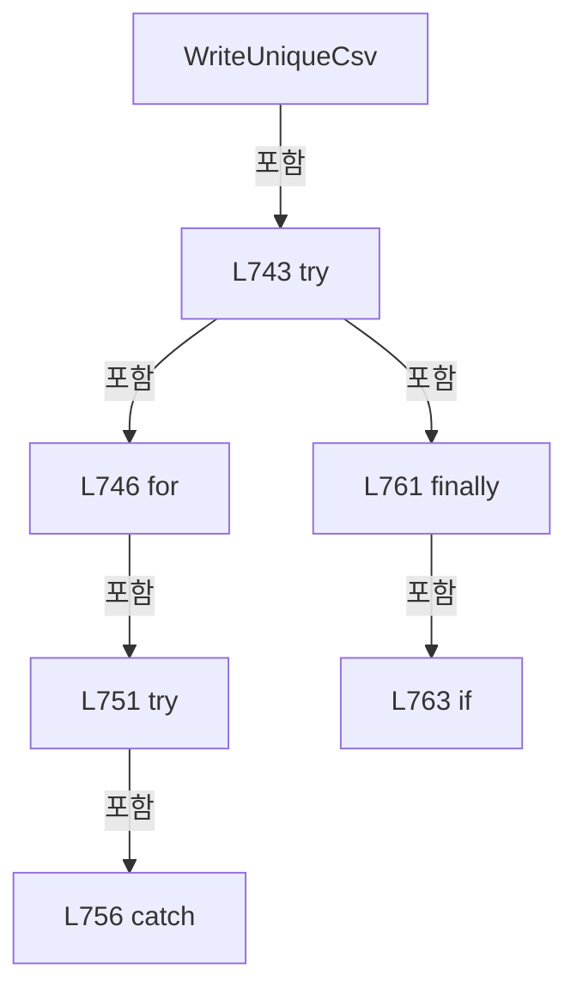
```mermaid
flowchart TD
 M["WriteUniqueCsv"]
 N0["L743 try"]
 M -->|포함| N0
 N1["L746 for"]
 N0 -->|포함| N1
 N2["L751 try"]
 N1 -->|포함| N2
 N3["L756 catch"]
 N2 -->|포함| N3
 N4["L761 finally"]
 N0 -->|포함| N4
 N5["L763 if"]
 N4 -->|포함| N5
```

변경 전 점검: 입력/반환 타입, 위 호출자, 예외/취소 경로, 공유 상태와 저장·전송 소비자를 함께 확인합니다. 값의 단위나 물리 방향을 이름만으로 확정하지 않습니다.

### MethodDeclaration `WriteUniqueLines` · L768–800

[Drilling.File/ReviewResult/CReviewResultFile.cs:768–800](https://github.com/kjuws10-rgb/A3Drilling/blob/dfa5920e6301d9ec4b0eab1452ae59521aafc986/Drilling.File/ReviewResult/CReviewResultFile.cs#L768-L800)

| 항목 | 실제 추출 값 |
| --- | --- |
| 서명 | System.Threading.Tasks.Task<string> Drilling.File.ReviewResult.CReviewResultFile.WriteUniqueLines(string, string, System.Collections.Generic.IReadOnlyList<string>, System.Threading.CancellationToken) |
| 접근/수식자 | Private / private, static, async |
| 반환/값 타입 | System.Threading.Tasks.Task<string> |
| 소속 타입 | NamedType:Drilling.File.ReviewResult.CReviewResultFile |

입력 계약:

| 이름 | 타입 | 전달 | 선택/기본값 |
| --- | --- | --- | --- |
| directory | string | None | False /  |
| fileStem | string | None | False /  |
| lines | System.Collections.Generic.IReadOnlyList<string> | None | False /  |
| cancellationToken | System.Threading.CancellationToken | None | False /  |

정적 호출자로 확인된 위치:

| 호출 파일/행 | 호출 표현식 | 런타임 분기 가능 |
| --- | --- | --- |
| [Drilling.File/ReviewResult/CReviewResultFile.cs:1341–1341](https://github.com/kjuws10-rgb/A3Drilling/blob/dfa5920e6301d9ec4b0eab1452ae59521aafc986/Drilling.File/ReviewResult/CReviewResultFile.cs#L1341-L1341) | WriteUniqueLines | False |

호출하는 대상과 해석 범위:

| 원본 행 | 표현식 | 분석 상태 | 대상/소스 위치 |
| --- | --- | --- | --- |
| 774 | cancellationToken.ThrowIfCancellationRequested | resolved | void System.Threading.CancellationToken.ThrowIfCancellationRequested() |
| 775 | Directory.CreateDirectory | resolved | System.IO.DirectoryInfo System.IO.Directory.CreateDirectory(string) |
| 776 | Path.Combine | resolved | string System.IO.Path.Combine(string, string) |
| 776 | Guid.NewGuid | resolved | System.Guid System.Guid.NewGuid() |
| 779 | System.IO.File.WriteAllLinesAsync(temporaryPath, lines, new UTF8Encoding(true), cancellationToken).ConfigureAwait | resolved | System.Runtime.CompilerServices.ConfiguredTaskAwaitable System.Threading.Tasks.Task.ConfigureAwait(bool) |
| 779 | System.IO.File.WriteAllLinesAsync | resolved | System.Threading.Tasks.Task System.IO.File.WriteAllLinesAsync(string, System.Collections.Generic.IEnumerable<string>, System.Text.Encoding, System.Threading.CancellationToken) |
| 779 | new UTF8Encoding | resolved | System.Text.UTF8Encoding.UTF8Encoding(bool) |
| 782 | cancellationToken.ThrowIfCancellationRequested | resolved | void System.Threading.CancellationToken.ThrowIfCancellationRequested() |
| 784 | Path.Combine | resolved | string System.IO.Path.Combine(string, string) |
| 787 | System.IO.File.Move | resolved | void System.IO.File.Move(string, string, bool) |
| 788 | Path.GetFullPath | resolved | string System.IO.Path.GetFullPath(string) |
| 790 | System.IO.File.Exists | resolved | bool System.IO.File.Exists(string?) |
| 797 | System.IO.File.Exists | resolved | bool System.IO.File.Exists(string?) |
| 798 | System.IO.File.Delete | resolved | void System.IO.File.Delete(string) |

본문의 실제 연산·분기·예외·반환 순서(원문 위치 순):

| 원본 행 | 종류 | 주석 해설 |
| --- | --- | --- |
| 774 | call | 함수·델리게이트 또는 객체 생성자를 호출합니다: cancellationToken.ThrowIfCancellationRequested() |
| 775 | call | 함수·델리게이트 또는 객체 생성자를 호출합니다: Directory.CreateDirectory(directory) |
| 776 | call | 함수·델리게이트 또는 객체 생성자를 호출합니다: Path.Combine(directory, $".{Guid.NewGuid():N}.tmp") |
| 776 | call | 함수·델리게이트 또는 객체 생성자를 호출합니다: Guid.NewGuid() |
| 776 | local-declaration | 지역 변수를 선언합니다: var temporaryPath = Path.Combine(directory, $".{Guid.NewGuid():N}.tmp"); |
| 776 | variable-initializer | 변수의 초기값을 지정합니다: temporaryPath = Path.Combine(directory, $".{Guid.NewGuid():N}.tmp") |
| 777 | try | 예외 처리 범위입니다: try |
| 779 | await | 비동기 완료를 기다립니다: await System.IO.File.WriteAllLinesAsync(temporaryPath, lines, new UTF8Encoding(true), cancellationToken).ConfigureAwait(false) |
| 779 | call | 함수·델리게이트 또는 객체 생성자를 호출합니다: System.IO.File.WriteAllLinesAsync(temporaryPath, lines, new UTF8Encoding(true), cancellationToken).ConfigureAwait(false) |
| 779 | call | 함수·델리게이트 또는 객체 생성자를 호출합니다: System.IO.File.WriteAllLinesAsync(temporaryPath, lines, new UTF8Encoding(true), cancellationToken) |
| 779 | call | 함수·델리게이트 또는 객체 생성자를 호출합니다: new UTF8Encoding(true) |
| 780 | variable-initializer | 변수의 초기값을 지정합니다: duplicate = 0 |
| 780 | for | 초기화·조건·증감이 있는 반복입니다: for (var duplicate = 0; ; duplicate++) |
| 782 | call | 함수·델리게이트 또는 객체 생성자를 호출합니다: cancellationToken.ThrowIfCancellationRequested() |
| 783 | conditional-expression | 조건에 따라 결과식을 선택합니다: duplicate == 0 ? "" : $"_{duplicate:00}" |
| 783 | local-declaration | 지역 변수를 선언합니다: var suffix = duplicate == 0 ? "" : $"_{duplicate:00}"; |
| 783 | variable-initializer | 변수의 초기값을 지정합니다: suffix = duplicate == 0 ? "" : $"_{duplicate:00}" |
| 784 | call | 함수·델리게이트 또는 객체 생성자를 호출합니다: Path.Combine(directory, fileStem + suffix + ".csv") |
| 784 | local-declaration | 지역 변수를 선언합니다: var path = Path.Combine(directory, fileStem + suffix + ".csv"); |
| 784 | variable-initializer | 변수의 초기값을 지정합니다: path = Path.Combine(directory, fileStem + suffix + ".csv") |
| 785 | try | 예외 처리 범위입니다: try |
| 787 | call | 함수·델리게이트 또는 객체 생성자를 호출합니다: System.IO.File.Move(temporaryPath, path, overwrite: false) |
| 788 | call | 함수·델리게이트 또는 객체 생성자를 호출합니다: Path.GetFullPath(path) |
| 788 | return | 호출자에게 값 또는 제어를 반환합니다: return Path.GetFullPath(path); |
| 790 | call | 함수·델리게이트 또는 객체 생성자를 호출합니다: System.IO.File.Exists(path) |
| 790 | catch | 지정 예외를 처리합니다: catch (IOException) when (System.IO.File.Exists(path)) |
| 795 | finally | 종료 정리 구간입니다: finally |
| 797 | call | 함수·델리게이트 또는 객체 생성자를 호출합니다: System.IO.File.Exists(temporaryPath) |
| 797 | if | 조건에 따라 분기합니다: if (System.IO.File.Exists(temporaryPath)) |
| 798 | call | 함수·델리게이트 또는 객체 생성자를 호출합니다: System.IO.File.Delete(temporaryPath) |

제어 구문의 포함 구조(실제 실행 순서/CFG가 아닌 구문 탐색 그림):

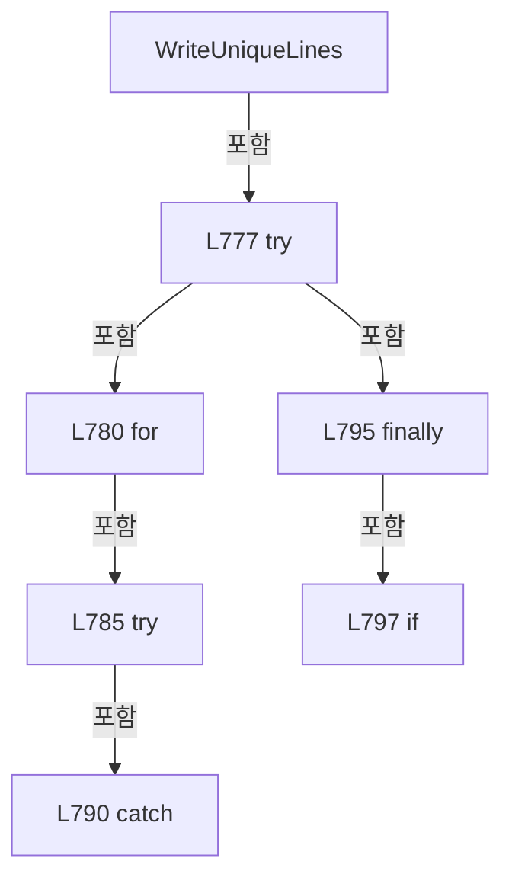
```mermaid
flowchart TD
 M["WriteUniqueLines"]
 N0["L777 try"]
 M -->|포함| N0
 N1["L780 for"]
 N0 -->|포함| N1
 N2["L785 try"]
 N1 -->|포함| N2
 N3["L790 catch"]
 N2 -->|포함| N3
 N4["L795 finally"]
 N0 -->|포함| N4
 N5["L797 if"]
 N4 -->|포함| N5
```

변경 전 점검: 입력/반환 타입, 위 호출자, 예외/취소 경로, 공유 상태와 저장·전송 소비자를 함께 확인합니다. 값의 단위나 물리 방향을 이름만으로 확정하지 않습니다.

### MethodDeclaration `SaveBeamInspection` · L805–850

[Drilling.File/ReviewResult/CReviewResultFile.cs:805–850](https://github.com/kjuws10-rgb/A3Drilling/blob/dfa5920e6301d9ec4b0eab1452ae59521aafc986/Drilling.File/ReviewResult/CReviewResultFile.cs#L805-L850)

| 항목 | 실제 추출 값 |
| --- | --- |
| 서명 | System.Threading.Tasks.Task<string> Drilling.File.ReviewResult.CReviewResultFile.SaveBeamInspection(Drilling.Common.Review.ST_BEAM_INSPECTION_SNAPSHOT, string, System.DateTimeOffset, System.Threading.CancellationToken) |
| 접근/수식자 | Public / public, override |
| 반환/값 타입 | System.Threading.Tasks.Task<string> |
| 소속 타입 | NamedType:Drilling.File.ReviewResult.CReviewResultFile |

입력 계약:

| 이름 | 타입 | 전달 | 선택/기본값 |
| --- | --- | --- | --- |
| result | Drilling.Common.Review.ST_BEAM_INSPECTION_SNAPSHOT | None | False /  |
| glassId | string | None | False /  |
| savedAt | System.DateTimeOffset | None | False /  |
| cancellationToken | System.Threading.CancellationToken | None | True / null |

현재 부분 분석에서 직접 연결된 호출자는 없습니다. XAML/이벤트/인터페이스·델리게이트·외부 진입을 추가 확인해야 하며, 미사용으로 판정한 것이 아닙니다.

호출하는 대상과 해석 범위:

| 원본 행 | 표현식 | 분석 상태 | 대상/소스 위치 |
| --- | --- | --- | --- |
| 807 | cancellationToken.ThrowIfCancellationRequested | resolved | void System.Threading.CancellationToken.ThrowIfCancellationRequested() |
| 808 | result.Points.Any | resolved | bool System.Collections.Generic.IEnumerable<Drilling.Common.Review.ST_REVIEW_PLAN_POINT>.Any<Drilling.Common.Review.ST_REVIEW_PLAN_POINT>(System.Func<Drilling.Common.Review.ST_REVIEW_PLAN_POINT, bool>) |
| 809 | new InvalidDataException | resolved | System.IO.InvalidDataException.InvalidDataException(string?) |
| 817 | result.Points.GroupBy(p => (p.HeadNo, p.CellNo, p.ShotNo)).OrderBy(g => g.Key.HeadNo).ThenBy(g => g.Key.CellNo).ThenBy(g => g.Key.ShotNo).Select(group => { var point = group.First(); var beams = group.ToDictionary(p => p.BeamNo); var row = new Dictionary<string, string> { ["SAVED_AT"] = FormatDate(savedAt), ["RECIPE_ID"] = result.RecipeId, ["RESULT… | resolved | System.Collections.Generic.Dictionary<string, string>[] System.Collections.Generic.IEnumerable<System.Collections.Generic.Dictionary<string, string>>.ToArray<System.Collections.Generic.Dictionary<string, string>>() |
| 817 | result.Points.GroupBy(p => (p.HeadNo, p.CellNo, p.ShotNo)).OrderBy(g => g.Key.HeadNo).ThenBy(g => g.Key.CellNo).ThenBy(g => g.Key.ShotNo).Select | resolved | System.Collections.Generic.IEnumerable<System.Collections.Generic.Dictionary<string, string>> System.Collections.Generic.IEnumerable<System.Linq.IGrouping<(int HeadNo, int CellNo, int ShotNo), Drilling.Common.Review.ST_REVIEW_PLAN_POINT>>.Select<System.Linq.IGrouping<(int HeadNo, int CellNo, int ShotNo), Drilling.Common.Review.ST_REVIEW_PLAN_POINT>, System.Collections.Generic.Dictionary<string, string>>(System.Func<System.Linq.IGrouping<(int HeadNo, int CellNo, int ShotNo), Drilling.Common.Review.ST_REVIEW_PLAN_POINT>, System.Collections.Generic.Dictionary<string, string>>) |
| 817 | result.Points.GroupBy(p => (p.HeadNo, p.CellNo, p.ShotNo)).OrderBy(g => g.Key.HeadNo).ThenBy(g => g.Key.CellNo).ThenBy | resolved | System.Linq.IOrderedEnumerable<System.Linq.IGrouping<(int HeadNo, int CellNo, int ShotNo), Drilling.Common.Review.ST_REVIEW_PLAN_POINT>> System.Linq.IOrderedEnumerable<System.Linq.IGrouping<(int HeadNo, int CellNo, int ShotNo), Drilling.Common.Review.ST_REVIEW_PLAN_POINT>>.ThenBy<System.Linq.IGrouping<(int HeadNo, int CellNo, int ShotNo), Drilling.Common.Review.ST_REVIEW_PLAN_POINT>, int>(System.Func<System.Linq.IGrouping<(int HeadNo, int CellNo, int ShotNo), Drilling.Common.Review.ST_REVIEW_PLAN_POINT>, int>) |
| 817 | result.Points.GroupBy(p => (p.HeadNo, p.CellNo, p.ShotNo)).OrderBy(g => g.Key.HeadNo).ThenBy | resolved | System.Linq.IOrderedEnumerable<System.Linq.IGrouping<(int HeadNo, int CellNo, int ShotNo), Drilling.Common.Review.ST_REVIEW_PLAN_POINT>> System.Linq.IOrderedEnumerable<System.Linq.IGrouping<(int HeadNo, int CellNo, int ShotNo), Drilling.Common.Review.ST_REVIEW_PLAN_POINT>>.ThenBy<System.Linq.IGrouping<(int HeadNo, int CellNo, int ShotNo), Drilling.Common.Review.ST_REVIEW_PLAN_POINT>, int>(System.Func<System.Linq.IGrouping<(int HeadNo, int CellNo, int ShotNo), Drilling.Common.Review.ST_REVIEW_PLAN_POINT>, int>) |
| 817 | result.Points.GroupBy(p => (p.HeadNo, p.CellNo, p.ShotNo)).OrderBy | resolved | System.Linq.IOrderedEnumerable<System.Linq.IGrouping<(int HeadNo, int CellNo, int ShotNo), Drilling.Common.Review.ST_REVIEW_PLAN_POINT>> System.Collections.Generic.IEnumerable<System.Linq.IGrouping<(int HeadNo, int CellNo, int ShotNo), Drilling.Common.Review.ST_REVIEW_PLAN_POINT>>.OrderBy<System.Linq.IGrouping<(int HeadNo, int CellNo, int ShotNo), Drilling.Common.Review.ST_REVIEW_PLAN_POINT>, int>(System.Func<System.Linq.IGrouping<(int HeadNo, int CellNo, int ShotNo), Drilling.Common.Review.ST_REVIEW_PLAN_POINT>, int>) |
| 817 | result.Points.GroupBy | resolved | System.Collections.Generic.IEnumerable<System.Linq.IGrouping<(int HeadNo, int CellNo, int ShotNo), Drilling.Common.Review.ST_REVIEW_PLAN_POINT>> System.Collections.Generic.IEnumerable<Drilling.Common.Review.ST_REVIEW_PLAN_POINT>.GroupBy<Drilling.Common.Review.ST_REVIEW_PLAN_POINT, (int HeadNo, int CellNo, int ShotNo)>(System.Func<Drilling.Common.Review.ST_REVIEW_PLAN_POINT, (int HeadNo, int CellNo, int ShotNo)>) |
| 819 | group.First | resolved | Drilling.Common.Review.ST_REVIEW_PLAN_POINT System.Collections.Generic.IEnumerable<Drilling.Common.Review.ST_REVIEW_PLAN_POINT>.First<Drilling.Common.Review.ST_REVIEW_PLAN_POINT>() |
| 820 | group.ToDictionary | resolved | System.Collections.Generic.Dictionary<int, Drilling.Common.Review.ST_REVIEW_PLAN_POINT> System.Collections.Generic.IEnumerable<Drilling.Common.Review.ST_REVIEW_PLAN_POINT>.ToDictionary<Drilling.Common.Review.ST_REVIEW_PLAN_POINT, int>(System.Func<Drilling.Common.Review.ST_REVIEW_PLAN_POINT, int>) |
| 821 | new Dictionary<string, string> | resolved | System.Collections.Generic.Dictionary<string, string>.Dictionary() |
| 823 | FormatDate | resolved | string Drilling.File.ReviewResult.CReviewResultFile.FormatDate(System.DateTimeOffset?) · Drilling.File/ReviewResult/CReviewResultFile.cs:711 |
| 828 | string.IsNullOrWhiteSpace | resolved | bool string.IsNullOrWhiteSpace(string?) |
| 831 | CReviewShotNameFormatter.ToMatrixName | resolved | string Drilling.Common.Review.CReviewShotNameFormatter.ToMatrixName(int, int) · Drilling.Common/Review/CReviewManager.cs:4057 |
| 832 | FormatDouble | resolved | string Drilling.File.ReviewResult.CReviewResultFile.FormatDouble(double) · Drilling.File/ReviewResult/CReviewResultFile.cs:716 |
| 833 | FormatDouble | resolved | string Drilling.File.ReviewResult.CReviewResultFile.FormatDouble(double) · Drilling.File/ReviewResult/CReviewResultFile.cs:716 |
| 837 | beams.TryGetValue | resolved | bool System.Collections.Generic.Dictionary<int, Drilling.Common.Review.ST_REVIEW_PLAN_POINT>.TryGetValue(int, out Drilling.Common.Review.ST_REVIEW_PLAN_POINT) |
| 840 | FormatDouble | resolved | string Drilling.File.ReviewResult.CReviewResultFile.FormatDouble(double) · Drilling.File/ReviewResult/CReviewResultFile.cs:716 |
| 841 | FormatDouble | resolved | string Drilling.File.ReviewResult.CReviewResultFile.FormatDouble(double) · Drilling.File/ReviewResult/CReviewResultFile.cs:716 |
| 847 | WriteUniqueCsv | resolved | string Drilling.File.ReviewResult.CReviewResultFile.WriteUniqueCsv(string, string, System.Collections.Generic.IReadOnlyList<string>, System.Collections.Generic.IEnumerable<System.Collections.Generic.IReadOnlyDictionary<string, string>>, System.Threading.CancellationToken) · Drilling.File/ReviewResult/CReviewResultFile.cs:733 |
| 847 | ManualDirectory | resolved | string Drilling.File.ReviewResult.CReviewResultFile.ManualDirectory(string, string) · Drilling.File/ReviewResult/CReviewResultFile.cs:728 |
| 847 | ResultFileStem | resolved | string Drilling.File.ReviewResult.CReviewResultFile.ResultFileStem(string, System.DateTimeOffset) · Drilling.File/ReviewResult/CReviewResultFile.cs:731 |
| 849 | Task.FromResult | resolved | System.Threading.Tasks.Task<string> System.Threading.Tasks.Task.FromResult<string>(string) |

본문의 실제 연산·분기·예외·반환 순서(원문 위치 순):

| 원본 행 | 종류 | 주석 해설 |
| --- | --- | --- |
| 807 | call | 함수·델리게이트 또는 객체 생성자를 호출합니다: cancellationToken.ThrowIfCancellationRequested() |
| 808 | call | 함수·델리게이트 또는 객체 생성자를 호출합니다: result.Points.Any(p => p.BeamNo is < 1 or > 16) |
| 808 | if | 조건에 따라 분기합니다: if (result.Points.Count == 0 &#124;&#124; result.Points.Any(p => p.BeamNo is < 1 or > 16)) |
| 809 | call | 함수·델리게이트 또는 객체 생성자를 호출합니다: new InvalidDataException("Beam Inspection 결과에는 1~16번 Beam이 필요합니다.") |
| 809 | throw | 예외를 발생/전달합니다: throw new InvalidDataException("Beam Inspection 결과에는 1~16번 Beam이 필요합니다."); |
| 810 | local-declaration | 지역 변수를 선언합니다: var status = result.State switch { EN_REVIEW_SEQUENCE_STATE.Completed => "COMPLETED", EN_REVIEW_SEQUENCE_STATE.Stopped => "STOPPED", EN_REVIEW_SEQUENCE_STATE.Failed => "FAILED", _ => "UNKNOWN" }; |
| 810 | switch-expression | 값별 결과식을 선택합니다: result.State switch { EN_REVIEW_SEQUENCE_STATE.Completed => "COMPLETED", EN_REVIEW_SEQUENCE_STATE.Stopped => "STOPPED", EN_REVIEW_SEQUENCE_STATE.Failed => "FAILED", _ => "UNKNOWN" } |
| 810 | variable-initializer | 변수의 초기값을 지정합니다: status = result.State switch { EN_REVIEW_SEQUENCE_STATE.Completed => "COMPLETED", EN_REVIEW_SEQUENCE_STATE.Stopped => "STOPPED", EN_REVIEW_SEQUENCE_STATE.Failed => "FAILED", _ => "UNKNOWN" } |
| 817 | call | 함수·델리게이트 또는 객체 생성자를 호출합니다: result.Points.GroupBy(p => (p.HeadNo, p.CellNo, p.ShotNo)).OrderBy(g => g.Key.HeadNo).ThenBy(g => g.Key.CellNo).ThenBy(g => g.Key.ShotNo) |
| 817 | call | 함수·델리게이트 또는 객체 생성자를 호출합니다: result.Points.GroupBy(p => (p.HeadNo, p.CellNo, p.ShotNo)).OrderBy(g => g.Key.HeadNo).ThenBy(g => g.Key.CellNo) |
| 817 | call | 함수·델리게이트 또는 객체 생성자를 호출합니다: result.Points.GroupBy(p => (p.HeadNo, p.CellNo, p.ShotNo)).OrderBy(g => g.Key.HeadNo) |
| 817 | call | 함수·델리게이트 또는 객체 생성자를 호출합니다: result.Points.GroupBy(p => (p.HeadNo, p.CellNo, p.ShotNo)) |
| 817 | call | 함수·델리게이트 또는 객체 생성자를 호출합니다: result.Points.GroupBy(p => (p.HeadNo, p.CellNo, p.ShotNo)).OrderBy(g => g.Key.HeadNo).ThenBy(g => g.Key.CellNo).ThenBy(g => g.Key.ShotNo).Select(group => { var point = group.First(); var beams = group.ToDictionary(p => p… |
| 817 | call | 함수·델리게이트 또는 객체 생성자를 호출합니다: result.Points.GroupBy(p => (p.HeadNo, p.CellNo, p.ShotNo)).OrderBy(g => g.Key.HeadNo).ThenBy(g => g.Key.CellNo).ThenBy(g => g.Key.ShotNo).Select(group => { var point = group.First(); var beams = group.ToDictionary(p => p… |
| 817 | local-declaration | 지역 변수를 선언합니다: var rows = result.Points.GroupBy(p => (p.HeadNo, p.CellNo, p.ShotNo)).OrderBy(g => g.Key.HeadNo).ThenBy(g => g.Key.CellNo).ThenBy(g => g.Key.ShotNo).Select(group => { var point = group.First(); var beams = group.ToDictionary(p =>  |
| 817 | variable-initializer | 변수의 초기값을 지정합니다: rows = result.Points.GroupBy(p => (p.HeadNo, p.CellNo, p.ShotNo)).OrderBy(g => g.Key.HeadNo).ThenBy(g => g.Key.CellNo).ThenBy(g => g.Key.ShotNo).Select(group => { var point = group.First(); var beams = group.ToDictionary(p => p.Be |
| 819 | call | 함수·델리게이트 또는 객체 생성자를 호출합니다: group.First() |
| 819 | local-declaration | 지역 변수를 선언합니다: var point = group.First(); |
| 819 | variable-initializer | 변수의 초기값을 지정합니다: point = group.First() |
| 820 | call | 함수·델리게이트 또는 객체 생성자를 호출합니다: group.ToDictionary(p => p.BeamNo) |
| 820 | local-declaration | 지역 변수를 선언합니다: var beams = group.ToDictionary(p => p.BeamNo); |
| 820 | variable-initializer | 변수의 초기값을 지정합니다: beams = group.ToDictionary(p => p.BeamNo) |
| 821 | call | 함수·델리게이트 또는 객체 생성자를 호출합니다: new Dictionary<string, string> { ["SAVED_AT"] = FormatDate(savedAt), ["RECIPE_ID"] = result.RecipeId, ["RESULT_STATUS"] = status, ["STAGE_SIMULATION"] = result.IsStageSimulation ? "ON" : "OFF", ["VISION_SIMULATION"] = re… |
| 821 | local-declaration | 지역 변수를 선언합니다: var row = new Dictionary<string, string> { ["SAVED_AT"] = FormatDate(savedAt), ["RECIPE_ID"] = result.RecipeId, ["RESULT_STATUS"] = status, ["STAGE_SIMULATION"] = result.IsStageSimulation ? "ON" : "OFF", ["VISION_SIMULATION"] = re |
| 821 | variable-initializer | 변수의 초기값을 지정합니다: row = new Dictionary<string, string> { ["SAVED_AT"] = FormatDate(savedAt), ["RECIPE_ID"] = result.RecipeId, ["RESULT_STATUS"] = status, ["STAGE_SIMULATION"] = result.IsStageSimulation ? "ON" : "OFF", ["VISION_SIMULATION"] = result |
| 823 | assignment | 값을 대상에 대입합니다: ["SAVED_AT"] = FormatDate(savedAt) |
| 823 | call | 함수·델리게이트 또는 객체 생성자를 호출합니다: FormatDate(savedAt) |
| 824 | assignment | 값을 대상에 대입합니다: ["RECIPE_ID"] = result.RecipeId |
| 825 | assignment | 값을 대상에 대입합니다: ["RESULT_STATUS"] = status |
| 826 | assignment | 값을 대상에 대입합니다: ["STAGE_SIMULATION"] = result.IsStageSimulation ? "ON" : "OFF" |
| 826 | conditional-expression | 조건에 따라 결과식을 선택합니다: result.IsStageSimulation ? "ON" : "OFF" |
| 827 | assignment | 값을 대상에 대입합니다: ["VISION_SIMULATION"] = result.IsVisionSimulation ? "ON" : "OFF" |
| 827 | conditional-expression | 조건에 따라 결과식을 선택합니다: result.IsVisionSimulation ? "ON" : "OFF" |
| 828 | assignment | 값을 대상에 대입합니다: ["GLASS_NAME"] = string.IsNullOrWhiteSpace(glassId) ? "UNLINKED" : glassId |
| 828 | call | 함수·델리게이트 또는 객체 생성자를 호출합니다: string.IsNullOrWhiteSpace(glassId) |
| 828 | conditional-expression | 조건에 따라 결과식을 선택합니다: string.IsNullOrWhiteSpace(glassId) ? "UNLINKED" : glassId |
| 829 | assignment | 값을 대상에 대입합니다: ["HEAD_NAME"] = $"HEAD {point.HeadNo:00}" |
| 830 | assignment | 값을 대상에 대입합니다: ["CELL_NAME"] = $"CELL {point.CellNo:00}" |
| 831 | assignment | 값을 대상에 대입합니다: ["SHOT_NAME"] = CReviewShotNameFormatter.ToMatrixName(point.ShotNo, point.PixelCountX) |
| 831 | call | 함수·델리게이트 또는 객체 생성자를 호출합니다: CReviewShotNameFormatter.ToMatrixName(point.ShotNo, point.PixelCountX) |
| 832 | assignment | 값을 대상에 대입합니다: ["SHIFT_OFFSET_X"] = FormatDouble(result.ShiftOffsetX) |
| 832 | call | 함수·델리게이트 또는 객체 생성자를 호출합니다: FormatDouble(result.ShiftOffsetX) |
| 833 | assignment | 값을 대상에 대입합니다: ["SHIFT_OFFSET_Y"] = FormatDouble(result.ShiftOffsetY) |
| 833 | call | 함수·델리게이트 또는 객체 생성자를 호출합니다: FormatDouble(result.ShiftOffsetY) |
| 835 | variable-initializer | 변수의 초기값을 지정합니다: beam = 1 |
| 835 | for | 초기화·조건·증감이 있는 반복입니다: for (var beam = 1; beam <= 16; beam++) |
| 837 | call | 함수·델리게이트 또는 객체 생성자를 호출합니다: beams.TryGetValue(beam, out var measurement) |
| 838 | local-declaration | 지역 변수를 선언합니다: var measured = measurement?.State is EN_REVIEW_POINT_STATE.Ok or EN_REVIEW_POINT_STATE.Ng; |
| 838 | variable-initializer | 변수의 초기값을 지정합니다: measured = measurement?.State is EN_REVIEW_POINT_STATE.Ok or EN_REVIEW_POINT_STATE.Ng |
| 840 | assignment | 값을 대상에 대입합니다: row[$"BEAM{beam}_X_MM"] = measured ? FormatDouble(measurement!.ErrorX) : "미검사" |
| 840 | call | 함수·델리게이트 또는 객체 생성자를 호출합니다: FormatDouble(measurement!.ErrorX) |
| 840 | conditional-expression | 조건에 따라 결과식을 선택합니다: measured ? FormatDouble(measurement!.ErrorX) : "미검사" |
| 841 | assignment | 값을 대상에 대입합니다: row[$"BEAM{beam}_Y_MM"] = measured ? FormatDouble(measurement!.ErrorY) : "미검사" |
| 841 | call | 함수·델리게이트 또는 객체 생성자를 호출합니다: FormatDouble(measurement!.ErrorY) |
| 841 | conditional-expression | 조건에 따라 결과식을 선택합니다: measured ? FormatDouble(measurement!.ErrorY) : "미검사" |
| 842 | assignment | 값을 대상에 대입합니다: row[$"BEAM{beam}_JUDGE"] = !measured ? "미검사" : measurement!.State == EN_REVIEW_POINT_STATE.Ok ? "OK" : "NG" |
| 842 | conditional-expression | 조건에 따라 결과식을 선택합니다: !measured ? "미검사" : measurement!.State == EN_REVIEW_POINT_STATE.Ok ? "OK" : "NG" |
| 842 | conditional-expression | 조건에 따라 결과식을 선택합니다: measurement!.State == EN_REVIEW_POINT_STATE.Ok ? "OK" : "NG" |
| 845 | return | 호출자에게 값 또는 제어를 반환합니다: return row; |
| 847 | call | 함수·델리게이트 또는 객체 생성자를 호출합니다: WriteUniqueCsv(ManualDirectory(result.RecipeId, "BEAM_INSPECTION"), ResultFileStem(glassId, savedAt), BeamInspectionHeaders, rows, cancellationToken) |
| 847 | call | 함수·델리게이트 또는 객체 생성자를 호출합니다: ManualDirectory(result.RecipeId, "BEAM_INSPECTION") |
| 847 | call | 함수·델리게이트 또는 객체 생성자를 호출합니다: ResultFileStem(glassId, savedAt) |
| 847 | local-declaration | 지역 변수를 선언합니다: var path = WriteUniqueCsv(ManualDirectory(result.RecipeId, "BEAM_INSPECTION"), ResultFileStem(glassId, savedAt), BeamInspectionHeaders, rows, cancellationToken); |
| 847 | variable-initializer | 변수의 초기값을 지정합니다: path = WriteUniqueCsv(ManualDirectory(result.RecipeId, "BEAM_INSPECTION"), ResultFileStem(glassId, savedAt), BeamInspectionHeaders, rows, cancellationToken) |
| 848 | assignment | 값을 대상에 대입합니다: _lastSavedPath = path |
| 849 | call | 함수·델리게이트 또는 객체 생성자를 호출합니다: Task.FromResult(path) |
| 849 | return | 호출자에게 값 또는 제어를 반환합니다: return Task.FromResult(path); |

제어 구문의 포함 구조(실제 실행 순서/CFG가 아닌 구문 탐색 그림):

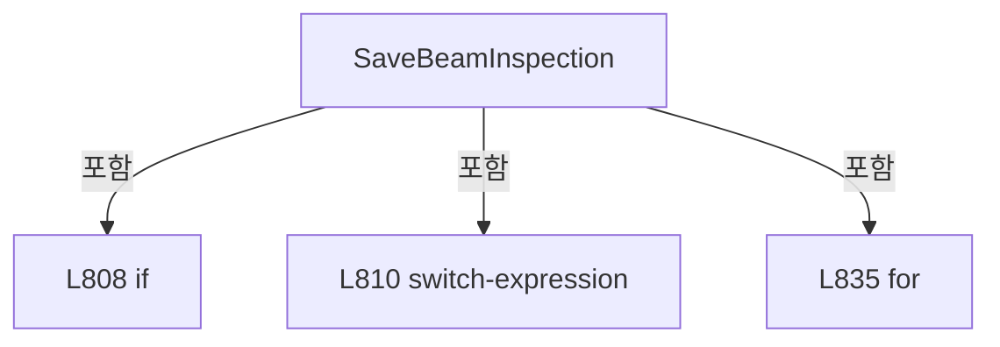
```mermaid
flowchart TD
 M["SaveBeamInspection"]
 N0["L808 if"]
 M -->|포함| N0
 N1["L810 switch-expression"]
 M -->|포함| N1
 N2["L835 for"]
 M -->|포함| N2
```

변경 전 점검: 입력/반환 타입, 위 호출자, 예외/취소 경로, 공유 상태와 저장·전송 소비자를 함께 확인합니다. 값의 단위나 물리 방향을 이름만으로 확정하지 않습니다.

### MethodDeclaration `LoadLastBeamInspection` · L852–852

[Drilling.File/ReviewResult/CReviewResultFile.cs:852–852](https://github.com/kjuws10-rgb/A3Drilling/blob/dfa5920e6301d9ec4b0eab1452ae59521aafc986/Drilling.File/ReviewResult/CReviewResultFile.cs#L852-L852)

| 항목 | 실제 추출 값 |
| --- | --- |
| 서명 | System.Threading.Tasks.Task<Drilling.Common.Review.ST_BEAM_INSPECTION_RESULT_FILE_DATA?> Drilling.File.ReviewResult.CReviewResultFile.LoadLastBeamInspection(System.Threading.CancellationToken) |
| 접근/수식자 | Public / public, override |
| 반환/값 타입 | System.Threading.Tasks.Task<Drilling.Common.Review.ST_BEAM_INSPECTION_RESULT_FILE_DATA?> |
| 소속 타입 | NamedType:Drilling.File.ReviewResult.CReviewResultFile |

입력 계약:

| 이름 | 타입 | 전달 | 선택/기본값 |
| --- | --- | --- | --- |
| cancellationToken | System.Threading.CancellationToken | None | True / null |

현재 부분 분석에서 직접 연결된 호출자는 없습니다. XAML/이벤트/인터페이스·델리게이트·외부 진입을 추가 확인해야 하며, 미사용으로 판정한 것이 아닙니다.

호출하는 대상과 해석 범위:

| 원본 행 | 표현식 | 분석 상태 | 대상/소스 위치 |
| --- | --- | --- | --- |
| 852 | Task.Run | resolved | System.Threading.Tasks.Task<Drilling.Common.Review.ST_BEAM_INSPECTION_RESULT_FILE_DATA?> System.Threading.Tasks.Task.Run<Drilling.Common.Review.ST_BEAM_INSPECTION_RESULT_FILE_DATA?>(System.Func<Drilling.Common.Review.ST_BEAM_INSPECTION_RESULT_FILE_DATA?>, System.Threading.CancellationToken) |
| 852 | LoadLastBeamInspectionCore | resolved | Drilling.Common.Review.ST_BEAM_INSPECTION_RESULT_FILE_DATA? Drilling.File.ReviewResult.CReviewResultFile.LoadLastBeamInspectionCore(System.Threading.CancellationToken) · Drilling.File/ReviewResult/CReviewResultFile.cs:853 |

본문의 실제 연산·분기·예외·반환 순서(원문 위치 순):

| 원본 행 | 종류 | 주석 해설 |
| --- | --- | --- |
| 852 | call | 함수·델리게이트 또는 객체 생성자를 호출합니다: Task.Run(() => LoadLastBeamInspectionCore(cancellationToken), cancellationToken) |
| 852 | call | 함수·델리게이트 또는 객체 생성자를 호출합니다: LoadLastBeamInspectionCore(cancellationToken) |

변경 전 점검: 입력/반환 타입, 위 호출자, 예외/취소 경로, 공유 상태와 저장·전송 소비자를 함께 확인합니다. 값의 단위나 물리 방향을 이름만으로 확정하지 않습니다.

### MethodDeclaration `LoadLastBeamInspectionCore` · L853–988

[Drilling.File/ReviewResult/CReviewResultFile.cs:853–988](https://github.com/kjuws10-rgb/A3Drilling/blob/dfa5920e6301d9ec4b0eab1452ae59521aafc986/Drilling.File/ReviewResult/CReviewResultFile.cs#L853-L988)

| 항목 | 실제 추출 값 |
| --- | --- |
| 서명 | Drilling.Common.Review.ST_BEAM_INSPECTION_RESULT_FILE_DATA? Drilling.File.ReviewResult.CReviewResultFile.LoadLastBeamInspectionCore(System.Threading.CancellationToken) |
| 접근/수식자 | Private / private |
| 반환/값 타입 | Drilling.Common.Review.ST_BEAM_INSPECTION_RESULT_FILE_DATA? |
| 소속 타입 | NamedType:Drilling.File.ReviewResult.CReviewResultFile |

입력 계약:

| 이름 | 타입 | 전달 | 선택/기본값 |
| --- | --- | --- | --- |
| cancellationToken | System.Threading.CancellationToken | None | False /  |

정적 호출자로 확인된 위치:

| 호출 파일/행 | 호출 표현식 | 런타임 분기 가능 |
| --- | --- | --- |
| [Drilling.File/ReviewResult/CReviewResultFile.cs:852–852](https://github.com/kjuws10-rgb/A3Drilling/blob/dfa5920e6301d9ec4b0eab1452ae59521aafc986/Drilling.File/ReviewResult/CReviewResultFile.cs#L852-L852) | LoadLastBeamInspectionCore | False |

호출하는 대상과 해석 범위:

| 원본 행 | 표현식 | 분석 상태 | 대상/소스 위치 |
| --- | --- | --- | --- |
| 855 | cancellationToken.ThrowIfCancellationRequested | resolved | void System.Threading.CancellationToken.ThrowIfCancellationRequested() |
| 856 | Path.Combine | resolved | string System.IO.Path.Combine(string, string) |
| 857 | Directory.Exists | resolved | bool System.IO.Directory.Exists(string?) |
| 863 | Directory.EnumerateFiles(root, "*.csv", System.IO.SearchOption.AllDirectories).Where(path => string.Equals(Path.GetFileName(Path.GetDirectoryName(path)), "BEAM_INSPECTION", StringComparison.OrdinalIgnoreCase)).Select(path => { cancellationToken.ThrowIfCancellationRequested(); return new FileInfo(path); }).OrderByDescending(file => file.LastWriteTim… | resolved | System.IO.FileInfo? System.Collections.Generic.IEnumerable<System.IO.FileInfo>.FirstOrDefault<System.IO.FileInfo>() |
| 863 | Directory.EnumerateFiles(root, "*.csv", System.IO.SearchOption.AllDirectories).Where(path => string.Equals(Path.GetFileName(Path.GetDirectoryName(path)), "BEAM_INSPECTION", StringComparison.OrdinalIgnoreCase)).Select(path => { cancellationToken.ThrowIfCancellationRequested(); return new FileInfo(path); }).OrderByDescending(file => file.LastWriteTim… | resolved | System.Linq.IOrderedEnumerable<System.IO.FileInfo> System.Linq.IOrderedEnumerable<System.IO.FileInfo>.ThenBy<System.IO.FileInfo, string>(System.Func<System.IO.FileInfo, string>, System.Collections.Generic.IComparer<string>?) |
| 863 | Directory.EnumerateFiles(root, "*.csv", System.IO.SearchOption.AllDirectories).Where(path => string.Equals(Path.GetFileName(Path.GetDirectoryName(path)), "BEAM_INSPECTION", StringComparison.OrdinalIgnoreCase)).Select(path => { cancellationToken.ThrowIfCancellationRequested(); return new FileInfo(path); }).OrderByDescending(file => file.LastWriteTim… | resolved | System.Linq.IOrderedEnumerable<System.IO.FileInfo> System.Linq.IOrderedEnumerable<System.IO.FileInfo>.ThenBy<System.IO.FileInfo, string>(System.Func<System.IO.FileInfo, string>, System.Collections.Generic.IComparer<string>?) |
| 863 | Directory.EnumerateFiles(root, "*.csv", System.IO.SearchOption.AllDirectories).Where(path => string.Equals(Path.GetFileName(Path.GetDirectoryName(path)), "BEAM_INSPECTION", StringComparison.OrdinalIgnoreCase)).Select(path => { cancellationToken.ThrowIfCancellationRequested(); return new FileInfo(path); }).OrderByDescending | resolved | System.Linq.IOrderedEnumerable<System.IO.FileInfo> System.Collections.Generic.IEnumerable<System.IO.FileInfo>.OrderByDescending<System.IO.FileInfo, System.DateTime>(System.Func<System.IO.FileInfo, System.DateTime>) |
| 863 | Directory.EnumerateFiles(root, "*.csv", System.IO.SearchOption.AllDirectories).Where(path => string.Equals(Path.GetFileName(Path.GetDirectoryName(path)), "BEAM_INSPECTION", StringComparison.OrdinalIgnoreCase)).Select | resolved | System.Collections.Generic.IEnumerable<System.IO.FileInfo> System.Collections.Generic.IEnumerable<string>.Select<string, System.IO.FileInfo>(System.Func<string, System.IO.FileInfo>) |
| 863 | Directory.EnumerateFiles(root, "*.csv", System.IO.SearchOption.AllDirectories).Where | resolved | System.Collections.Generic.IEnumerable<string> System.Collections.Generic.IEnumerable<string>.Where<string>(System.Func<string, bool>) |
| 863 | Directory.EnumerateFiles | resolved | System.Collections.Generic.IEnumerable<string> System.IO.Directory.EnumerateFiles(string, string, System.IO.SearchOption) |
| 863 | string.Equals | resolved | bool string.Equals(string?, string?, System.StringComparison) |
| 863 | Path.GetFileName | resolved | string? System.IO.Path.GetFileName(string?) |
| 863 | Path.GetDirectoryName | resolved | string? System.IO.Path.GetDirectoryName(string?) |
| 865 | cancellationToken.ThrowIfCancellationRequested | resolved | void System.Threading.CancellationToken.ThrowIfCancellationRequested() |
| 866 | new FileInfo | resolved | System.IO.FileInfo.FileInfo(string) |
| 871 | new InvalidDataException | resolved | System.IO.InvalidDataException.InvalidDataException(string?, System.Exception?) |
| 876 | cancellationToken.ThrowIfCancellationRequested | resolved | void System.Threading.CancellationToken.ThrowIfCancellationRequested() |
| 880 | new TextFieldParser | resolved | Microsoft.VisualBasic.FileIO.TextFieldParser.TextFieldParser(string, System.Text.Encoding, bool) |
| 880 | new UTF8Encoding | resolved | System.Text.UTF8Encoding.UTF8Encoding(bool, bool) |
| 885 | parser.SetDelimiters | resolved | void Microsoft.VisualBasic.FileIO.TextFieldParser.SetDelimiters(params string[]) |
| 886 | parser.ReadFields | resolved | string[] Microsoft.VisualBasic.FileIO.TextFieldParser.ReadFields() |
| 886 | .Select(header => header.Trim()).ToArray | resolved | string[] System.Collections.Generic.IEnumerable<string>.ToArray<string>() |
| 886 | .Select | resolved | System.Collections.Generic.IEnumerable<string> System.Collections.Generic.IEnumerable<string>.Select<string, string>(System.Func<string, string>) |
| 886 | header.Trim | resolved | string string.Trim() |
| 887 | .ToHashSet | resolved | System.Collections.Generic.HashSet<string> System.Collections.Generic.IEnumerable<string>.ToHashSet<string>(System.Collections.Generic.IEqualityComparer<string>?) |
| 888 | .SetEquals | resolved | bool System.Collections.Generic.HashSet<string>.SetEquals(System.Collections.Generic.IEnumerable<string>) |
| 889 | .SetEquals | resolved | bool System.Collections.Generic.HashSet<string>.SetEquals(System.Collections.Generic.IEnumerable<string>) |
| 890 | headers.Distinct(StringComparer.OrdinalIgnoreCase).Count | resolved | int System.Collections.Generic.IEnumerable<string>.Count<string>() |
| 890 | headers.Distinct | resolved | System.Collections.Generic.IEnumerable<string> System.Collections.Generic.IEnumerable<string>.Distinct<string>(System.Collections.Generic.IEqualityComparer<string>?) |
| 891 | new InvalidDataException | resolved | System.IO.InvalidDataException.InvalidDataException(string?) |
| 892 | headers.Select((name, index) => (name, index)).ToDictionary | resolved | System.Collections.Generic.Dictionary<string, int> System.Collections.Generic.IEnumerable<(string name, int index)>.ToDictionary<(string name, int index), string, int>(System.Func<(string name, int index), string>, System.Func<(string name, int index), int>, System.Collections.Generic.IEqualityComparer<string>?) |
| 892 | headers.Select | resolved | System.Collections.Generic.IEnumerable<(string name, int index)> System.Collections.Generic.IEnumerable<string>.Select<string, (string name, int index)>(System.Func<string, int, (string name, int index)>) |
| 893 | new List<ST_BEAM_INSPECTION_RESULT_SHOT> | resolved | System.Collections.Generic.List<Drilling.Common.Review.ST_BEAM_INSPECTION_RESULT_SHOT>.List() |
| 894 | new HashSet<(int Head, int Cell, string Shot)> | resolved | System.Collections.Generic.HashSet<(int Head, int Cell, string Shot)>.HashSet() |
| 900 | cancellationToken.ThrowIfCancellationRequested | resolved | void System.Threading.CancellationToken.ThrowIfCancellationRequested() |
| 902 | parser.ReadFields | resolved | string[] Microsoft.VisualBasic.FileIO.TextFieldParser.ReadFields() |
| 906 | Error | resolved | System.IO.InvalidDataException Drilling.File.ReviewResult.CReviewResultFile.Error(long, string) · Drilling.File/ReviewResult/CReviewResultFile.cs:1017 |
| 916 | RequireName | resolved | string RequireName(string) · Drilling.File/ReviewResult/CReviewResultFile.cs:908 |
| 917 | glass.Equals | resolved | bool string.Equals(string?, System.StringComparison) |
| 918 | Error | resolved | System.IO.InvalidDataException Drilling.File.ReviewResult.CReviewResultFile.Error(long, string) · Drilling.File/ReviewResult/CReviewResultFile.cs:1017 |
| 920 | RequireName | resolved | string RequireName(string) · Drilling.File/ReviewResult/CReviewResultFile.cs:908 |
| 921 | RequireName | resolved | string RequireName(string) · Drilling.File/ReviewResult/CReviewResultFile.cs:908 |
| 922 | RequireName | resolved | string RequireName(string) · Drilling.File/ReviewResult/CReviewResultFile.cs:908 |
| 925 | ReadFiniteValue | resolved | double Drilling.File.ReviewResult.CReviewResultFile.ReadFiniteValue(string, long, string) · Drilling.File/ReviewResult/CReviewResultFile.cs:1010 |
| 925 | Get | resolved | string Get(string) · Drilling.File/ReviewResult/CReviewResultFile.cs:907 |
| 926 | ReadFiniteValue | resolved | double Drilling.File.ReviewResult.CReviewResultFile.ReadFiniteValue(string, long, string) · Drilling.File/ReviewResult/CReviewResultFile.cs:1010 |
| 926 | Get | resolved | string Get(string) · Drilling.File/ReviewResult/CReviewResultFile.cs:907 |
| 928 | Error | resolved | System.IO.InvalidDataException Drilling.File.ReviewResult.CReviewResultFile.Error(long, string) · Drilling.File/ReviewResult/CReviewResultFile.cs:1017 |
| 932 | ReadNameNumber | resolved | int Drilling.File.ReviewResult.CReviewResultFile.ReadNameNumber(string, string, long) · Drilling.File/ReviewResult/CReviewResultFile.cs:990 |
| 933 | ReadNameNumber | resolved | int Drilling.File.ReviewResult.CReviewResultFile.ReadNameNumber(string, string, long) · Drilling.File/ReviewResult/CReviewResultFile.cs:990 |
| 935 | Error | resolved | System.IO.InvalidDataException Drilling.File.ReviewResult.CReviewResultFile.Error(long, string) · Drilling.File/ReviewResult/CReviewResultFile.cs:1017 |
| 936 | identities.Add | resolved | bool System.Collections.Generic.HashSet<(int Head, int Cell, string Shot)>.Add((int Head, int Cell, string Shot)) |
| 937 | Error | resolved | System.IO.InvalidDataException Drilling.File.ReviewResult.CReviewResultFile.Error(long, string) · Drilling.File/ReviewResult/CReviewResultFile.cs:1017 |
| 938 | new List<ST_BEAM_INSPECTION_RESULT_BEAM> | resolved | System.Collections.Generic.List<Drilling.Common.Review.ST_BEAM_INSPECTION_RESULT_BEAM>.List(int) |
| 941 | Get($"BEAM{beam}_X_MM").Trim | resolved | string string.Trim() |
| 941 | Get | resolved | string Get(string) · Drilling.File/ReviewResult/CReviewResultFile.cs:907 |
| 942 | Get($"BEAM{beam}_Y_MM").Trim | resolved | string string.Trim() |
| 942 | Get | resolved | string Get(string) · Drilling.File/ReviewResult/CReviewResultFile.cs:907 |
| 943 | Get($"BEAM{beam}_JUDGE").Trim().ToUpperInvariant | resolved | string string.ToUpperInvariant() |
| 943 | Get($"BEAM{beam}_JUDGE").Trim | resolved | string string.Trim() |
| 943 | Get | resolved | string Get(string) · Drilling.File/ReviewResult/CReviewResultFile.cs:907 |
| 947 | Error | resolved | System.IO.InvalidDataException Drilling.File.ReviewResult.CReviewResultFile.Error(long, string) · Drilling.File/ReviewResult/CReviewResultFile.cs:1017 |
| 948 | beams.Add | resolved | void System.Collections.Generic.List<Drilling.Common.Review.ST_BEAM_INSPECTION_RESULT_BEAM>.Add(Drilling.Common.Review.ST_BEAM_INSPECTION_RESULT_BEAM) |
| 948 | new | resolved | Drilling.Common.Review.ST_BEAM_INSPECTION_RESULT_BEAM.ST_BEAM_INSPECTION_RESULT_BEAM(int, double?, double?, string) · Drilling.Common/Review/CReviewManager.cs:3922 |
| 952 | beams.Add | resolved | void System.Collections.Generic.List<Drilling.Common.Review.ST_BEAM_INSPECTION_RESULT_BEAM>.Add(Drilling.Common.Review.ST_BEAM_INSPECTION_RESULT_BEAM) |
| 952 | new | resolved | Drilling.Common.Review.ST_BEAM_INSPECTION_RESULT_BEAM.ST_BEAM_INSPECTION_RESULT_BEAM(int, double?, double?, string) · Drilling.Common/Review/CReviewManager.cs:3922 |
| 952 | ReadFinite | resolved | double Drilling.File.ReviewResult.CReviewResultFile.ReadFinite(string, long, int, string) · Drilling.File/ReviewResult/CReviewResultFile.cs:998 |
| 952 | ReadFinite | resolved | double Drilling.File.ReviewResult.CReviewResultFile.ReadFinite(string, long, int, string) · Drilling.File/ReviewResult/CReviewResultFile.cs:998 |
| 955 | Error | resolved | System.IO.InvalidDataException Drilling.File.ReviewResult.CReviewResultFile.Error(long, string) · Drilling.File/ReviewResult/CReviewResultFile.cs:1017 |
| 958 | shots.Add | resolved | void System.Collections.Generic.List<Drilling.Common.Review.ST_BEAM_INSPECTION_RESULT_SHOT>.Add(Drilling.Common.Review.ST_BEAM_INSPECTION_RESULT_SHOT) |
| 958 | new | resolved | Drilling.Common.Review.ST_BEAM_INSPECTION_RESULT_SHOT.ST_BEAM_INSPECTION_RESULT_SHOT(string, string, int, string, int, string, System.Collections.Generic.IReadOnlyList<Drilling.Common.Review.ST_BEAM_INSPECTION_RESULT_BEAM>) · Drilling.Common/Review/CReviewManager.cs:3927 |
| 958 | beams.AsReadOnly | resolved | System.Collections.ObjectModel.ReadOnlyCollection<Drilling.Common.Review.ST_BEAM_INSPECTION_RESULT_BEAM> System.Collections.Generic.List<Drilling.Common.Review.ST_BEAM_INSPECTION_RESULT_BEAM>.AsReadOnly() |
| 962 | new InvalidDataException | resolved | System.IO.InvalidDataException.InvalidDataException(string?) |
| 964 | new TextFieldParser | resolved | Microsoft.VisualBasic.FileIO.TextFieldParser.TextFieldParser(string, System.Text.Encoding, bool) |
| 964 | new UTF8Encoding | resolved | System.Text.UTF8Encoding.UTF8Encoding(bool, bool) |
| 969 | metadataParser.SetDelimiters | resolved | void Microsoft.VisualBasic.FileIO.TextFieldParser.SetDelimiters(params string[]) |
| 970 | metadataParser.ReadFields | resolved | string[] Microsoft.VisualBasic.FileIO.TextFieldParser.ReadFields() |
| 971 | metadataParser.ReadFields | resolved | string[] Microsoft.VisualBasic.FileIO.TextFieldParser.ReadFields() |
| 972 | metadataHeaders.Select((name, index) => (name, value: index < metadataFields.Length ? metadataFields[index] : "")).ToDictionary | resolved | System.Collections.Generic.Dictionary<string, string> System.Collections.Generic.IEnumerable<(string name, string value)>.ToDictionary<(string name, string value), string, string>(System.Func<(string name, string value), string>, System.Func<(string name, string value), string>, System.Collections.Generic.IEqualityComparer<string>?) |
| 972 | metadataHeaders.Select | resolved | System.Collections.Generic.IEnumerable<(string name, string value)> System.Collections.Generic.IEnumerable<string>.Select<string, (string name, string value)>(System.Func<string, int, (string name, string value)>) |
| 973 | ParseOnOff | resolved | bool Drilling.File.ReviewResult.CReviewResultFile.ParseOnOff(string?) · Drilling.File/ReviewResult/CReviewResultFile.cs:1018 |
| 973 | metadata.GetValueOrDefault | resolved | string? System.Collections.Generic.IReadOnlyDictionary<string, string>.GetValueOrDefault<string, string>(string) |
| 973 | ParseOnOff | resolved | bool Drilling.File.ReviewResult.CReviewResultFile.ParseOnOff(string?) · Drilling.File/ReviewResult/CReviewResultFile.cs:1018 |
| 973 | metadata.GetValueOrDefault | resolved | string? System.Collections.Generic.IReadOnlyDictionary<string, string>.GetValueOrDefault<string, string>(string) |
| 974 | DateTimeOffset.TryParse | resolved | bool System.DateTimeOffset.TryParse(string?, System.IFormatProvider?, System.Globalization.DateTimeStyles, out System.DateTimeOffset) |
| 974 | metadata.GetValueOrDefault | resolved | string? System.Collections.Generic.IReadOnlyDictionary<string, string>.GetValueOrDefault<string, string>(string) |
| 976 | new DateTimeOffset(latest.LastWriteTimeUtc).ToLocalTime | resolved | System.DateTimeOffset System.DateTimeOffset.ToLocalTime() |
| 976 | new DateTimeOffset | resolved | System.DateTimeOffset.DateTimeOffset(System.DateTime) |
| 977 | new | resolved | Drilling.Common.Review.ST_BEAM_INSPECTION_RESULT_FILE_DATA.ST_BEAM_INSPECTION_RESULT_FILE_DATA(string, string, System.DateTimeOffset, bool, string, System.Collections.Generic.IReadOnlyList<Drilling.Common.Review.ST_BEAM_INSPECTION_RESULT_SHOT>) · Drilling.Common/Review/CReviewManager.cs:3928 |
| 977 | shots.AsReadOnly | resolved | System.Collections.ObjectModel.ReadOnlyCollection<Drilling.Common.Review.ST_BEAM_INSPECTION_RESULT_SHOT> System.Collections.Generic.List<Drilling.Common.Review.ST_BEAM_INSPECTION_RESULT_SHOT>.AsReadOnly() |
| 986 | new InvalidDataException | resolved | System.IO.InvalidDataException.InvalidDataException(string?, System.Exception?) |

본문의 실제 연산·분기·예외·반환 순서(원문 위치 순):

| 원본 행 | 종류 | 주석 해설 |
| --- | --- | --- |
| 855 | call | 함수·델리게이트 또는 객체 생성자를 호출합니다: cancellationToken.ThrowIfCancellationRequested() |
| 856 | call | 함수·델리게이트 또는 객체 생성자를 호출합니다: Path.Combine(_reviewRoot, "Manual") |
| 856 | local-declaration | 지역 변수를 선언합니다: var root = Path.Combine(_reviewRoot, "Manual"); |
| 856 | variable-initializer | 변수의 초기값을 지정합니다: root = Path.Combine(_reviewRoot, "Manual") |
| 857 | call | 함수·델리게이트 또는 객체 생성자를 호출합니다: Directory.Exists(root) |
| 857 | if | 조건에 따라 분기합니다: if (!Directory.Exists(root)) |
| 858 | return | 호출자에게 값 또는 제어를 반환합니다: return null; |
| 859 | local-declaration | 지역 변수를 선언합니다: FileInfo? latest; |
| 860 | try | 예외 처리 범위입니다: try |
| 863 | call | 함수·델리게이트 또는 객체 생성자를 호출합니다: Directory.EnumerateFiles(root, "*.csv", System.IO.SearchOption.AllDirectories).Where(path => string.Equals(Path.GetFileName(Path.GetDirectoryName(path)), "BEAM_INSPECTION", StringComparison.OrdinalIgnoreCase)) |
| 863 | call | 함수·델리게이트 또는 객체 생성자를 호출합니다: Directory.EnumerateFiles(root, "*.csv", System.IO.SearchOption.AllDirectories) |
| 863 | call | 함수·델리게이트 또는 객체 생성자를 호출합니다: string.Equals(Path.GetFileName(Path.GetDirectoryName(path)), "BEAM_INSPECTION", StringComparison.OrdinalIgnoreCase) |
| 863 | call | 함수·델리게이트 또는 객체 생성자를 호출합니다: Path.GetFileName(Path.GetDirectoryName(path)) |
| 863 | call | 함수·델리게이트 또는 객체 생성자를 호출합니다: Path.GetDirectoryName(path) |
| 863 | assignment | 값을 대상에 대입합니다: latest = Directory.EnumerateFiles(root, "*.csv", System.IO.SearchOption.AllDirectories).Where(path => string.Equals(Path.GetFileName(Path.GetDirectoryName(path)), "BEAM_INSPECTION", StringComparison.OrdinalIgnoreCase)).Select(path |
| 863 | call | 함수·델리게이트 또는 객체 생성자를 호출합니다: Directory.EnumerateFiles(root, "*.csv", System.IO.SearchOption.AllDirectories).Where(path => string.Equals(Path.GetFileName(Path.GetDirectoryName(path)), "BEAM_INSPECTION", StringComparison.OrdinalIgnoreCase)).Select(pat… |
| 863 | call | 함수·델리게이트 또는 객체 생성자를 호출합니다: Directory.EnumerateFiles(root, "*.csv", System.IO.SearchOption.AllDirectories).Where(path => string.Equals(Path.GetFileName(Path.GetDirectoryName(path)), "BEAM_INSPECTION", StringComparison.OrdinalIgnoreCase)).Select(pat… |
| 863 | call | 함수·델리게이트 또는 객체 생성자를 호출합니다: Directory.EnumerateFiles(root, "*.csv", System.IO.SearchOption.AllDirectories).Where(path => string.Equals(Path.GetFileName(Path.GetDirectoryName(path)), "BEAM_INSPECTION", StringComparison.OrdinalIgnoreCase)).Select(pat… |
| 863 | call | 함수·델리게이트 또는 객체 생성자를 호출합니다: Directory.EnumerateFiles(root, "*.csv", System.IO.SearchOption.AllDirectories).Where(path => string.Equals(Path.GetFileName(Path.GetDirectoryName(path)), "BEAM_INSPECTION", StringComparison.OrdinalIgnoreCase)).Select(pat… |
| 863 | call | 함수·델리게이트 또는 객체 생성자를 호출합니다: Directory.EnumerateFiles(root, "*.csv", System.IO.SearchOption.AllDirectories).Where(path => string.Equals(Path.GetFileName(Path.GetDirectoryName(path)), "BEAM_INSPECTION", StringComparison.OrdinalIgnoreCase)).Select(pat… |
| 865 | call | 함수·델리게이트 또는 객체 생성자를 호출합니다: cancellationToken.ThrowIfCancellationRequested() |
| 866 | call | 함수·델리게이트 또는 객체 생성자를 호출합니다: new FileInfo(path) |
| 866 | return | 호출자에게 값 또는 제어를 반환합니다: return new FileInfo(path); |
| 869 | catch | 지정 예외를 처리합니다: catch (Exception exception) when (exception is IOException or UnauthorizedAccessException) |
| 871 | call | 함수·델리게이트 또는 객체 생성자를 호출합니다: new InvalidDataException($"최근 Beam Inspection 결과를 검색하지 못했습니다.\n경로: {root}\n{exception.Message}", exception) |
| 871 | throw | 예외를 발생/전달합니다: throw new InvalidDataException($"최근 Beam Inspection 결과를 검색하지 못했습니다.\n경로: {root}\n{exception.Message}", exception); |
| 874 | if | 조건에 따라 분기합니다: if (latest is null) |
| 875 | return | 호출자에게 값 또는 제어를 반환합니다: return null; |
| 876 | call | 함수·델리게이트 또는 객체 생성자를 호출합니다: cancellationToken.ThrowIfCancellationRequested() |
| 877 | try | 예외 처리 범위입니다: try |
| 880 | call | 함수·델리게이트 또는 객체 생성자를 호출합니다: new UTF8Encoding(false, true) |
| 880 | call | 함수·델리게이트 또는 객체 생성자를 호출합니다: new TextFieldParser(latest.FullName, new UTF8Encoding(false, true), detectEncoding: true) { HasFieldsEnclosedInQuotes = true, TrimWhiteSpace = false } |
| 880 | using-declaration | 정리할 자원을 선언합니다: using var parser = new TextFieldParser(latest.FullName, new UTF8Encoding(false, true), detectEncoding: true) { HasFieldsEnclosedInQuotes = true, TrimWhiteSpace = false }; |
| 880 | variable-initializer | 변수의 초기값을 지정합니다: parser = new TextFieldParser(latest.FullName, new UTF8Encoding(false, true), detectEncoding: true) { HasFieldsEnclosedInQuotes = true, TrimWhiteSpace = false } |
| 882 | assignment | 값을 대상에 대입합니다: HasFieldsEnclosedInQuotes = true |
| 883 | assignment | 값을 대상에 대입합니다: TrimWhiteSpace = false |
| 885 | call | 함수·델리게이트 또는 객체 생성자를 호출합니다: parser.SetDelimiters(",") |
| 886 | call | 함수·델리게이트 또는 객체 생성자를 호출합니다: parser.ReadFields() |
| 886 | call | 함수·델리게이트 또는 객체 생성자를 호출합니다: .Select(header => header.Trim()).ToArray() |
| 886 | call | 함수·델리게이트 또는 객체 생성자를 호출합니다: .Select(header => header.Trim()) |
| 886 | call | 함수·델리게이트 또는 객체 생성자를 호출합니다: header.Trim() |
| 886 | local-declaration | 지역 변수를 선언합니다: var headers = parser.ReadFields()?.Select(header => header.Trim()).ToArray(); |
| 886 | variable-initializer | 변수의 초기값을 지정합니다: headers = parser.ReadFields()?.Select(header => header.Trim()).ToArray() |
| 887 | call | 함수·델리게이트 또는 객체 생성자를 호출합니다: .ToHashSet(StringComparer.OrdinalIgnoreCase) |
| 887 | local-declaration | 지역 변수를 선언합니다: var headerSet = headers?.ToHashSet(StringComparer.OrdinalIgnoreCase); |
| 887 | variable-initializer | 변수의 초기값을 지정합니다: headerSet = headers?.ToHashSet(StringComparer.OrdinalIgnoreCase) |
| 888 | call | 함수·델리게이트 또는 객체 생성자를 호출합니다: .SetEquals(BeamInspectionHeaders) |
| 888 | local-declaration | 지역 변수를 선언합니다: var hasShiftOffset = headerSet?.SetEquals(BeamInspectionHeaders) == true; |
| 888 | variable-initializer | 변수의 초기값을 지정합니다: hasShiftOffset = headerSet?.SetEquals(BeamInspectionHeaders) == true |
| 889 | call | 함수·델리게이트 또는 객체 생성자를 호출합니다: .SetEquals(BeamInspectionBaseHeaders) |
| 889 | local-declaration | 지역 변수를 선언합니다: var isBaseFormat = headerSet?.SetEquals(BeamInspectionBaseHeaders) == true; |
| 889 | variable-initializer | 변수의 초기값을 지정합니다: isBaseFormat = headerSet?.SetEquals(BeamInspectionBaseHeaders) == true |
| 890 | call | 함수·델리게이트 또는 객체 생성자를 호출합니다: headers.Distinct(StringComparer.OrdinalIgnoreCase).Count() |
| 890 | call | 함수·델리게이트 또는 객체 생성자를 호출합니다: headers.Distinct(StringComparer.OrdinalIgnoreCase) |
| 890 | if | 조건에 따라 분기합니다: if (headers is null &#124;&#124; headers.Distinct(StringComparer.OrdinalIgnoreCase).Count() != headers.Length &#124;&#124; !hasShiftOffset && !isBaseFormat) |
| 891 | call | 함수·델리게이트 또는 객체 생성자를 호출합니다: new InvalidDataException("CSV 헤더에는 Beam Inspection 메타데이터, 선택적인 SHIFT_OFFSET_X/Y와 1~16번 Beam의 X_MM/Y_MM/JUDGE가 필요합니다.") |
| 891 | throw | 예외를 발생/전달합니다: throw new InvalidDataException("CSV 헤더에는 Beam Inspection 메타데이터, 선택적인 SHIFT_OFFSET_X/Y와 1~16번 Beam의 X_MM/Y_MM/JUDGE가 필요합니다."); |
| 892 | call | 함수·델리게이트 또는 객체 생성자를 호출합니다: headers.Select((name, index) => (name, index)).ToDictionary(pair => pair.name, pair => pair.index, StringComparer.OrdinalIgnoreCase) |
| 892 | call | 함수·델리게이트 또는 객체 생성자를 호출합니다: headers.Select((name, index) => (name, index)) |
| 892 | local-declaration | 지역 변수를 선언합니다: var indexes = headers.Select((name, index) => (name, index)).ToDictionary(pair => pair.name, pair => pair.index, StringComparer.OrdinalIgnoreCase); |
| 892 | variable-initializer | 변수의 초기값을 지정합니다: indexes = headers.Select((name, index) => (name, index)).ToDictionary(pair => pair.name, pair => pair.index, StringComparer.OrdinalIgnoreCase) |
| 893 | call | 함수·델리게이트 또는 객체 생성자를 호출합니다: new List<ST_BEAM_INSPECTION_RESULT_SHOT>() |
| 893 | local-declaration | 지역 변수를 선언합니다: var shots = new List<ST_BEAM_INSPECTION_RESULT_SHOT>(); |
| 893 | variable-initializer | 변수의 초기값을 지정합니다: shots = new List<ST_BEAM_INSPECTION_RESULT_SHOT>() |
| 894 | call | 함수·델리게이트 또는 객체 생성자를 호출합니다: new HashSet<(int Head, int Cell, string Shot)>() |
| 894 | local-declaration | 지역 변수를 선언합니다: var identities = new HashSet<(int Head, int Cell, string Shot)>(); |
| 894 | variable-initializer | 변수의 초기값을 지정합니다: identities = new HashSet<(int Head, int Cell, string Shot)>() |
| 895 | local-declaration | 지역 변수를 선언합니다: string? glassName = null; |
| 895 | variable-initializer | 변수의 초기값을 지정합니다: glassName = null |
| 896 | local-declaration | 지역 변수를 선언합니다: double? shiftOffsetX = null; |
| 896 | variable-initializer | 변수의 초기값을 지정합니다: shiftOffsetX = null |
| 897 | local-declaration | 지역 변수를 선언합니다: double? shiftOffsetY = null; |
| 897 | variable-initializer | 변수의 초기값을 지정합니다: shiftOffsetY = null |
| 898 | while | 조건을 먼저 확인하며 반복합니다: while (!parser.EndOfData) |
| 900 | call | 함수·델리게이트 또는 객체 생성자를 호출합니다: cancellationToken.ThrowIfCancellationRequested() |
| 901 | local-declaration | 지역 변수를 선언합니다: var rowNo = parser.LineNumber; |
| 901 | variable-initializer | 변수의 초기값을 지정합니다: rowNo = parser.LineNumber |
| 902 | call | 함수·델리게이트 또는 객체 생성자를 호출합니다: parser.ReadFields() |
| 902 | local-declaration | 지역 변수를 선언합니다: var fields = parser.ReadFields(); |
| 902 | variable-initializer | 변수의 초기값을 지정합니다: fields = parser.ReadFields() |
| 903 | if | 조건에 따라 분기합니다: if (fields is null) |
| 904 | break | 해당 반복/분기 구간을 종료합니다: break; |
| 905 | if | 조건에 따라 분기합니다: if (fields.Length != headers.Length) |
| 906 | call | 함수·델리게이트 또는 객체 생성자를 호출합니다: Error(rowNo, $"열 개수가 {fields.Length}개입니다. 헤더와 동일한 {headers.Length}개 열이 필요합니다.") |
| 906 | throw | 예외를 발생/전달합니다: throw Error(rowNo, $"열 개수가 {fields.Length}개입니다. 헤더와 동일한 {headers.Length}개 열이 필요합니다."); |
| 916 | call | 함수·델리게이트 또는 객체 생성자를 호출합니다: RequireName("GLASS_NAME") |
| 916 | local-declaration | 지역 변수를 선언합니다: var glass = RequireName("GLASS_NAME"); |
| 916 | variable-initializer | 변수의 초기값을 지정합니다: glass = RequireName("GLASS_NAME") |
| 917 | call | 함수·델리게이트 또는 객체 생성자를 호출합니다: glass.Equals(glassName, StringComparison.Ordinal) |
| 917 | if | 조건에 따라 분기합니다: if (glassName is not null && !glass.Equals(glassName, StringComparison.Ordinal)) |
| 918 | call | 함수·델리게이트 또는 객체 생성자를 호출합니다: Error(rowNo, "한 결과 파일의 GLASS_NAME은 모두 같아야 합니다.") |
| 918 | throw | 예외를 발생/전달합니다: throw Error(rowNo, "한 결과 파일의 GLASS_NAME은 모두 같아야 합니다."); |
| 919 | assignment | 값을 대상에 대입합니다: glassName ??= glass |
| 920 | call | 함수·델리게이트 또는 객체 생성자를 호출합니다: RequireName("HEAD_NAME") |
| 920 | local-declaration | 지역 변수를 선언합니다: var headName = RequireName("HEAD_NAME"); |
| 920 | variable-initializer | 변수의 초기값을 지정합니다: headName = RequireName("HEAD_NAME") |
| 921 | call | 함수·델리게이트 또는 객체 생성자를 호출합니다: RequireName("CELL_NAME") |
| 921 | local-declaration | 지역 변수를 선언합니다: var cellName = RequireName("CELL_NAME"); |
| 921 | variable-initializer | 변수의 초기값을 지정합니다: cellName = RequireName("CELL_NAME") |
| 922 | call | 함수·델리게이트 또는 객체 생성자를 호출합니다: RequireName("SHOT_NAME") |
| 922 | local-declaration | 지역 변수를 선언합니다: var shotName = RequireName("SHOT_NAME"); |
| 922 | variable-initializer | 변수의 초기값을 지정합니다: shotName = RequireName("SHOT_NAME") |
| 923 | if | 조건에 따라 분기합니다: if (hasShiftOffset) |
| 925 | call | 함수·델리게이트 또는 객체 생성자를 호출합니다: ReadFiniteValue(Get("SHIFT_OFFSET_X"), rowNo, "SHIFT_OFFSET_X") |
| 925 | call | 함수·델리게이트 또는 객체 생성자를 호출합니다: Get("SHIFT_OFFSET_X") |
| 925 | local-declaration | 지역 변수를 선언합니다: var rowShiftX = ReadFiniteValue(Get("SHIFT_OFFSET_X"), rowNo, "SHIFT_OFFSET_X"); |
| 925 | variable-initializer | 변수의 초기값을 지정합니다: rowShiftX = ReadFiniteValue(Get("SHIFT_OFFSET_X"), rowNo, "SHIFT_OFFSET_X") |
| 926 | call | 함수·델리게이트 또는 객체 생성자를 호출합니다: ReadFiniteValue(Get("SHIFT_OFFSET_Y"), rowNo, "SHIFT_OFFSET_Y") |
| 926 | call | 함수·델리게이트 또는 객체 생성자를 호출합니다: Get("SHIFT_OFFSET_Y") |
| 926 | local-declaration | 지역 변수를 선언합니다: var rowShiftY = ReadFiniteValue(Get("SHIFT_OFFSET_Y"), rowNo, "SHIFT_OFFSET_Y"); |
| 926 | variable-initializer | 변수의 초기값을 지정합니다: rowShiftY = ReadFiniteValue(Get("SHIFT_OFFSET_Y"), rowNo, "SHIFT_OFFSET_Y") |
| 927 | if | 조건에 따라 분기합니다: if (shiftOffsetX.HasValue && (shiftOffsetX.Value != rowShiftX &#124;&#124; shiftOffsetY!.Value != rowShiftY)) |
| 928 | call | 함수·델리게이트 또는 객체 생성자를 호출합니다: Error(rowNo, "한 결과 파일의 SHIFT_OFFSET_X/Y는 모든 Shot 행에서 같아야 합니다.") |
| 928 | throw | 예외를 발생/전달합니다: throw Error(rowNo, "한 결과 파일의 SHIFT_OFFSET_X/Y는 모든 Shot 행에서 같아야 합니다."); |
| 929 | assignment | 값을 대상에 대입합니다: shiftOffsetX = rowShiftX |
| 930 | assignment | 값을 대상에 대입합니다: shiftOffsetY = rowShiftY |
| 932 | call | 함수·델리게이트 또는 객체 생성자를 호출합니다: ReadNameNumber(headName, "HEAD", rowNo) |
| 932 | local-declaration | 지역 변수를 선언합니다: var headNo = ReadNameNumber(headName, "HEAD", rowNo); |
| 932 | variable-initializer | 변수의 초기값을 지정합니다: headNo = ReadNameNumber(headName, "HEAD", rowNo) |
| 933 | call | 함수·델리게이트 또는 객체 생성자를 호출합니다: ReadNameNumber(cellName, "CELL", rowNo) |
| 933 | local-declaration | 지역 변수를 선언합니다: var cellNo = ReadNameNumber(cellName, "CELL", rowNo); |
| 933 | variable-initializer | 변수의 초기값을 지정합니다: cellNo = ReadNameNumber(cellName, "CELL", rowNo) |
| 934 | if | 조건에 따라 분기합니다: if (headNo > 8) |
| 935 | call | 함수·델리게이트 또는 객체 생성자를 호출합니다: Error(rowNo, "HEAD_NAME의 Head 번호는 1~8이어야 합니다.") |
| 935 | throw | 예외를 발생/전달합니다: throw Error(rowNo, "HEAD_NAME의 Head 번호는 1~8이어야 합니다."); |
| 936 | call | 함수·델리게이트 또는 객체 생성자를 호출합니다: identities.Add((headNo, cellNo, shotName)) |
| 936 | if | 조건에 따라 분기합니다: if (!identities.Add((headNo, cellNo, shotName))) |
| 937 | call | 함수·델리게이트 또는 객체 생성자를 호출합니다: Error(rowNo, $"동일한 Head/Cell/Shot이 중복되었습니다. {headName} / {cellName} / {shotName}") |
| 937 | throw | 예외를 발생/전달합니다: throw Error(rowNo, $"동일한 Head/Cell/Shot이 중복되었습니다. {headName} / {cellName} / {shotName}"); |
| 938 | call | 함수·델리게이트 또는 객체 생성자를 호출합니다: new List<ST_BEAM_INSPECTION_RESULT_BEAM>(16) |
| 938 | local-declaration | 지역 변수를 선언합니다: var beams = new List<ST_BEAM_INSPECTION_RESULT_BEAM>(16); |
| 938 | variable-initializer | 변수의 초기값을 지정합니다: beams = new List<ST_BEAM_INSPECTION_RESULT_BEAM>(16) |
| 939 | variable-initializer | 변수의 초기값을 지정합니다: beam = 1 |
| 939 | for | 초기화·조건·증감이 있는 반복입니다: for (var beam = 1; beam <= 16; beam++) |
| 941 | call | 함수·델리게이트 또는 객체 생성자를 호출합니다: Get($"BEAM{beam}_X_MM").Trim() |
| 941 | call | 함수·델리게이트 또는 객체 생성자를 호출합니다: Get($"BEAM{beam}_X_MM") |
| 941 | local-declaration | 지역 변수를 선언합니다: var x = Get($"BEAM{beam}_X_MM").Trim(); |
| 941 | variable-initializer | 변수의 초기값을 지정합니다: x = Get($"BEAM{beam}_X_MM").Trim() |
| 942 | call | 함수·델리게이트 또는 객체 생성자를 호출합니다: Get($"BEAM{beam}_Y_MM").Trim() |
| 942 | call | 함수·델리게이트 또는 객체 생성자를 호출합니다: Get($"BEAM{beam}_Y_MM") |
| 942 | local-declaration | 지역 변수를 선언합니다: var y = Get($"BEAM{beam}_Y_MM").Trim(); |
| 942 | variable-initializer | 변수의 초기값을 지정합니다: y = Get($"BEAM{beam}_Y_MM").Trim() |
| 943 | call | 함수·델리게이트 또는 객체 생성자를 호출합니다: Get($"BEAM{beam}_JUDGE").Trim().ToUpperInvariant() |
| 943 | call | 함수·델리게이트 또는 객체 생성자를 호출합니다: Get($"BEAM{beam}_JUDGE").Trim() |
| 943 | call | 함수·델리게이트 또는 객체 생성자를 호출합니다: Get($"BEAM{beam}_JUDGE") |
| 943 | local-declaration | 지역 변수를 선언합니다: var judge = Get($"BEAM{beam}_JUDGE").Trim().ToUpperInvariant(); |
| 943 | variable-initializer | 변수의 초기값을 지정합니다: judge = Get($"BEAM{beam}_JUDGE").Trim().ToUpperInvariant() |
| 944 | if | 조건에 따라 분기합니다: if (judge == "미검사") |
| 946 | if | 조건에 따라 분기합니다: if (x != "미검사" &#124;&#124; y != "미검사") |
| 947 | call | 함수·델리게이트 또는 객체 생성자를 호출합니다: Error(rowNo, $"Beam {beam}: 미검사 결과의 X/Y/JUDGE는 모두 '미검사'여야 합니다.") |
| 947 | throw | 예외를 발생/전달합니다: throw Error(rowNo, $"Beam {beam}: 미검사 결과의 X/Y/JUDGE는 모두 '미검사'여야 합니다."); |
| 948 | call | 함수·델리게이트 또는 객체 생성자를 호출합니다: beams.Add(new(beam, null, null, "미검사")) |
| 948 | call | 함수·델리게이트 또는 객체 생성자를 호출합니다: new(beam, null, null, "미검사") |
| 950 | else | 앞 조건이 거짓인 경로입니다: else |
| 950 | if | 조건에 따라 분기합니다: if (judge is "OK" or "NG") |
| 952 | call | 함수·델리게이트 또는 객체 생성자를 호출합니다: beams.Add(new(beam, ReadFinite(x, rowNo, beam, "X_MM"), ReadFinite(y, rowNo, beam, "Y_MM"), judge)) |
| 952 | call | 함수·델리게이트 또는 객체 생성자를 호출합니다: new(beam, ReadFinite(x, rowNo, beam, "X_MM"), ReadFinite(y, rowNo, beam, "Y_MM"), judge) |
| 952 | call | 함수·델리게이트 또는 객체 생성자를 호출합니다: ReadFinite(x, rowNo, beam, "X_MM") |
| 952 | call | 함수·델리게이트 또는 객체 생성자를 호출합니다: ReadFinite(y, rowNo, beam, "Y_MM") |
| 954 | else | 앞 조건이 거짓인 경로입니다: else |
| 955 | call | 함수·델리게이트 또는 객체 생성자를 호출합니다: Error(rowNo, $"Beam {beam}: JUDGE는 OK, NG 또는 미검사여야 합니다. 입력: {judge}") |
| 955 | throw | 예외를 발생/전달합니다: throw Error(rowNo, $"Beam {beam}: JUDGE는 OK, NG 또는 미검사여야 합니다. 입력: {judge}"); |
| 958 | call | 함수·델리게이트 또는 객체 생성자를 호출합니다: shots.Add(new(glass, headName, headNo, cellName, cellNo, shotName, beams.AsReadOnly())) |
| 958 | call | 함수·델리게이트 또는 객체 생성자를 호출합니다: new(glass, headName, headNo, cellName, cellNo, shotName, beams.AsReadOnly()) |
| 958 | call | 함수·델리게이트 또는 객체 생성자를 호출합니다: beams.AsReadOnly() |
| 961 | if | 조건에 따라 분기합니다: if (shots.Count == 0) |
| 962 | call | 함수·델리게이트 또는 객체 생성자를 호출합니다: new InvalidDataException("CSV에 Shot 결과 행이 없습니다.") |
| 962 | throw | 예외를 발생/전달합니다: throw new InvalidDataException("CSV에 Shot 결과 행이 없습니다."); |
| 963 | local-declaration | 지역 변수를 선언합니다: var simulation = false; |
| 963 | variable-initializer | 변수의 초기값을 지정합니다: simulation = false |
| 964 | call | 함수·델리게이트 또는 객체 생성자를 호출합니다: new UTF8Encoding(false, true) |
| 964 | call | 함수·델리게이트 또는 객체 생성자를 호출합니다: new TextFieldParser(latest.FullName, new UTF8Encoding(false, true), detectEncoding: true) { HasFieldsEnclosedInQuotes = true, TrimWhiteSpace = false } |
| 964 | using-declaration | 정리할 자원을 선언합니다: using var metadataParser = new TextFieldParser(latest.FullName, new UTF8Encoding(false, true), detectEncoding: true) { HasFieldsEnclosedInQuotes = true, TrimWhiteSpace = false }; |
| 964 | variable-initializer | 변수의 초기값을 지정합니다: metadataParser = new TextFieldParser(latest.FullName, new UTF8Encoding(false, true), detectEncoding: true) { HasFieldsEnclosedInQuotes = true, TrimWhiteSpace = false } |
| 966 | assignment | 값을 대상에 대입합니다: HasFieldsEnclosedInQuotes = true |
| 967 | assignment | 값을 대상에 대입합니다: TrimWhiteSpace = false |
| 969 | call | 함수·델리게이트 또는 객체 생성자를 호출합니다: metadataParser.SetDelimiters(",") |
| 970 | call | 함수·델리게이트 또는 객체 생성자를 호출합니다: metadataParser.ReadFields() |
| 970 | local-declaration | 지역 변수를 선언합니다: var metadataHeaders = metadataParser.ReadFields()!; |
| 970 | variable-initializer | 변수의 초기값을 지정합니다: metadataHeaders = metadataParser.ReadFields()! |
| 971 | call | 함수·델리게이트 또는 객체 생성자를 호출합니다: metadataParser.ReadFields() |
| 971 | local-declaration | 지역 변수를 선언합니다: var metadataFields = metadataParser.ReadFields()!; |
| 971 | variable-initializer | 변수의 초기값을 지정합니다: metadataFields = metadataParser.ReadFields()! |
| 972 | call | 함수·델리게이트 또는 객체 생성자를 호출합니다: metadataHeaders.Select((name, index) => (name, value: index < metadataFields.Length ? metadataFields[index] : "")).ToDictionary(pair => pair.name, pair => pair.value, StringComparer.OrdinalIgnoreCase) |
| 972 | call | 함수·델리게이트 또는 객체 생성자를 호출합니다: metadataHeaders.Select((name, index) => (name, value: index < metadataFields.Length ? metadataFields[index] : "")) |
| 972 | conditional-expression | 조건에 따라 결과식을 선택합니다: index < metadataFields.Length ? metadataFields[index] : "" |
| 972 | local-declaration | 지역 변수를 선언합니다: var metadata = metadataHeaders.Select((name, index) => (name, value: index < metadataFields.Length ? metadataFields[index] : "")).ToDictionary(pair => pair.name, pair => pair.value, StringComparer.OrdinalIgnoreCase); |
| 972 | variable-initializer | 변수의 초기값을 지정합니다: metadata = metadataHeaders.Select((name, index) => (name, value: index < metadataFields.Length ? metadataFields[index] : "")).ToDictionary(pair => pair.name, pair => pair.value, StringComparer.OrdinalIgnoreCase) |
| 973 | assignment | 값을 대상에 대입합니다: simulation = ParseOnOff(metadata.GetValueOrDefault("STAGE_SIMULATION")) &#124;&#124; ParseOnOff(metadata.GetValueOrDefault("VISION_SIMULATION")) |
| 973 | call | 함수·델리게이트 또는 객체 생성자를 호출합니다: ParseOnOff(metadata.GetValueOrDefault("STAGE_SIMULATION")) |
| 973 | call | 함수·델리게이트 또는 객체 생성자를 호출합니다: metadata.GetValueOrDefault("STAGE_SIMULATION") |
| 973 | call | 함수·델리게이트 또는 객체 생성자를 호출합니다: ParseOnOff(metadata.GetValueOrDefault("VISION_SIMULATION")) |
| 973 | call | 함수·델리게이트 또는 객체 생성자를 호출합니다: metadata.GetValueOrDefault("VISION_SIMULATION") |
| 974 | call | 함수·델리게이트 또는 객체 생성자를 호출합니다: DateTimeOffset.TryParse(metadata.GetValueOrDefault("SAVED_AT"), CultureInfo.InvariantCulture, DateTimeStyles.AssumeLocal, out var parsedSavedAt) |
| 974 | call | 함수·델리게이트 또는 객체 생성자를 호출합니다: metadata.GetValueOrDefault("SAVED_AT") |
| 974 | conditional-expression | 조건에 따라 결과식을 선택합니다: DateTimeOffset.TryParse(metadata.GetValueOrDefault("SAVED_AT"), CultureInfo.InvariantCulture, DateTimeStyles.AssumeLocal, out var parsedSavedAt) ? parsedSavedAt : new DateTimeOffset(latest.LastWriteTimeUtc).ToLocalTime() |
| 974 | local-declaration | 지역 변수를 선언합니다: var savedAt = DateTimeOffset.TryParse(metadata.GetValueOrDefault("SAVED_AT"), CultureInfo.InvariantCulture, DateTimeStyles.AssumeLocal, out var parsedSavedAt) ? parsedSavedAt : new DateTimeOffset(latest.LastWriteTimeUtc).ToLocalTi |
| 974 | variable-initializer | 변수의 초기값을 지정합니다: savedAt = DateTimeOffset.TryParse(metadata.GetValueOrDefault("SAVED_AT"), CultureInfo.InvariantCulture, DateTimeStyles.AssumeLocal, out var parsedSavedAt) ? parsedSavedAt : new DateTimeOffset(latest.LastWriteTimeUtc).ToLocalTime() |
| 976 | call | 함수·델리게이트 또는 객체 생성자를 호출합니다: new DateTimeOffset(latest.LastWriteTimeUtc).ToLocalTime() |
| 976 | call | 함수·델리게이트 또는 객체 생성자를 호출합니다: new DateTimeOffset(latest.LastWriteTimeUtc) |
| 977 | call | 함수·델리게이트 또는 객체 생성자를 호출합니다: shots.AsReadOnly() |
| 977 | call | 함수·델리게이트 또는 객체 생성자를 호출합니다: new(latest.FullName, latest.Name, savedAt, simulation, glassName!, shots.AsReadOnly()) { ShiftOffsetX = shiftOffsetX ?? 0.0, ShiftOffsetY = shiftOffsetY ?? 0.0 } |
| 977 | return | 호출자에게 값 또는 제어를 반환합니다: return new(latest.FullName, latest.Name, savedAt, simulation, glassName!, shots.AsReadOnly()) { ShiftOffsetX = shiftOffsetX ?? 0.0, ShiftOffsetY = shiftOffsetY ?? 0.0 }; |
| 979 | assignment | 값을 대상에 대입합니다: ShiftOffsetX = shiftOffsetX ?? 0.0 |
| 980 | assignment | 값을 대상에 대입합니다: ShiftOffsetY = shiftOffsetY ?? 0.0 |
| 983 | catch | 지정 예외를 처리합니다: catch (Exception exception) when (exception is InvalidDataException or IOException or UnauthorizedAccessException or MalformedLineException or DecoderFallbackException) |
| 986 | call | 함수·델리게이트 또는 객체 생성자를 호출합니다: new InvalidDataException($"최근 Beam Inspection 결과를 불러오지 못했습니다.\n파일: {latest.FullName}\n{exception.Message}", exception) |
| 986 | throw | 예외를 발생/전달합니다: throw new InvalidDataException($"최근 Beam Inspection 결과를 불러오지 못했습니다.\n파일: {latest.FullName}\n{exception.Message}", exception); |

제어 구문의 포함 구조(실제 실행 순서/CFG가 아닌 구문 탐색 그림):

```mermaid
flowchart TD
 M["LoadLastBeamInspectionCore"]
 N0["L857 if"]
 M -->|포함| N0
 N1["L860 try"]
 M -->|포함| N1
 N2["L869 catch"]
 N1 -->|포함| N2
 N3["L874 if"]
 M -->|포함| N3
 N4["L877 try"]
 M -->|포함| N4
 N5["L890 if"]
 N4 -->|포함| N5
 N6["L898 while"]
 N4 -->|포함| N6
 N7["L903 if"]
 N6 -->|포함| N7
 N8["L905 if"]
 N6 -->|포함| N8
 N9["L917 if"]
 N6 -->|포함| N9
 N10["L923 if"]
 N6 -->|포함| N10
 N11["L927 if"]
 N10 -->|포함| N11
 N12["L934 if"]
 N6 -->|포함| N12
 N13["L936 if"]
 N6 -->|포함| N13
 N14["L939 for"]
 N6 -->|포함| N14
 N15["L944 if"]
 N14 -->|포함| N15
 N16["L946 if"]
 N15 -->|포함| N16
 N17["L950 else"]
 N15 -->|포함| N17
 N18["L950 if"]
 N15 -->|포함| N18
 N19["L954 else"]
 N17 -->|포함| N19
 N20["L961 if"]
 N4 -->|포함| N20
 N21["L983 catch"]
 N4 -->|포함| N21
```

변경 전 점검: 입력/반환 타입, 위 호출자, 예외/취소 경로, 공유 상태와 저장·전송 소비자를 함께 확인합니다. 값의 단위나 물리 방향을 이름만으로 확정하지 않습니다.

### LocalFunctionStatement `Get` · L907–907

[Drilling.File/ReviewResult/CReviewResultFile.cs:907–907](https://github.com/kjuws10-rgb/A3Drilling/blob/dfa5920e6301d9ec4b0eab1452ae59521aafc986/Drilling.File/ReviewResult/CReviewResultFile.cs#L907-L907)

| 항목 | 실제 추출 값 |
| --- | --- |
| 서명 | string Get(string) |
| 접근/수식자 | Private /  |
| 반환/값 타입 | string |
| 소속 타입 | NamedType:Drilling.File.ReviewResult.CReviewResultFile |

입력 계약:

| 이름 | 타입 | 전달 | 선택/기본값 |
| --- | --- | --- | --- |
| name | string | None | False /  |

정적 호출자로 확인된 위치:

| 호출 파일/행 | 호출 표현식 | 런타임 분기 가능 |
| --- | --- | --- |
| [Drilling.File/ReviewResult/CReviewResultFile.cs:910–910](https://github.com/kjuws10-rgb/A3Drilling/blob/dfa5920e6301d9ec4b0eab1452ae59521aafc986/Drilling.File/ReviewResult/CReviewResultFile.cs#L910-L910) | Get | False |
| [Drilling.File/ReviewResult/CReviewResultFile.cs:925–925](https://github.com/kjuws10-rgb/A3Drilling/blob/dfa5920e6301d9ec4b0eab1452ae59521aafc986/Drilling.File/ReviewResult/CReviewResultFile.cs#L925-L925) | Get | False |
| [Drilling.File/ReviewResult/CReviewResultFile.cs:926–926](https://github.com/kjuws10-rgb/A3Drilling/blob/dfa5920e6301d9ec4b0eab1452ae59521aafc986/Drilling.File/ReviewResult/CReviewResultFile.cs#L926-L926) | Get | False |
| [Drilling.File/ReviewResult/CReviewResultFile.cs:941–941](https://github.com/kjuws10-rgb/A3Drilling/blob/dfa5920e6301d9ec4b0eab1452ae59521aafc986/Drilling.File/ReviewResult/CReviewResultFile.cs#L941-L941) | Get | False |
| [Drilling.File/ReviewResult/CReviewResultFile.cs:942–942](https://github.com/kjuws10-rgb/A3Drilling/blob/dfa5920e6301d9ec4b0eab1452ae59521aafc986/Drilling.File/ReviewResult/CReviewResultFile.cs#L942-L942) | Get | False |
| [Drilling.File/ReviewResult/CReviewResultFile.cs:943–943](https://github.com/kjuws10-rgb/A3Drilling/blob/dfa5920e6301d9ec4b0eab1452ae59521aafc986/Drilling.File/ReviewResult/CReviewResultFile.cs#L943-L943) | Get | False |

변경 전 점검: 입력/반환 타입, 위 호출자, 예외/취소 경로, 공유 상태와 저장·전송 소비자를 함께 확인합니다. 값의 단위나 물리 방향을 이름만으로 확정하지 않습니다.

### LocalFunctionStatement `RequireName` · L908–914

[Drilling.File/ReviewResult/CReviewResultFile.cs:908–914](https://github.com/kjuws10-rgb/A3Drilling/blob/dfa5920e6301d9ec4b0eab1452ae59521aafc986/Drilling.File/ReviewResult/CReviewResultFile.cs#L908-L914)

| 항목 | 실제 추출 값 |
| --- | --- |
| 서명 | string RequireName(string) |
| 접근/수식자 | Private /  |
| 반환/값 타입 | string |
| 소속 타입 | NamedType:Drilling.File.ReviewResult.CReviewResultFile |

입력 계약:

| 이름 | 타입 | 전달 | 선택/기본값 |
| --- | --- | --- | --- |
| name | string | None | False /  |

정적 호출자로 확인된 위치:

| 호출 파일/행 | 호출 표현식 | 런타임 분기 가능 |
| --- | --- | --- |
| [Drilling.File/ReviewResult/CReviewResultFile.cs:916–916](https://github.com/kjuws10-rgb/A3Drilling/blob/dfa5920e6301d9ec4b0eab1452ae59521aafc986/Drilling.File/ReviewResult/CReviewResultFile.cs#L916-L916) | RequireName | False |
| [Drilling.File/ReviewResult/CReviewResultFile.cs:920–920](https://github.com/kjuws10-rgb/A3Drilling/blob/dfa5920e6301d9ec4b0eab1452ae59521aafc986/Drilling.File/ReviewResult/CReviewResultFile.cs#L920-L920) | RequireName | False |
| [Drilling.File/ReviewResult/CReviewResultFile.cs:921–921](https://github.com/kjuws10-rgb/A3Drilling/blob/dfa5920e6301d9ec4b0eab1452ae59521aafc986/Drilling.File/ReviewResult/CReviewResultFile.cs#L921-L921) | RequireName | False |
| [Drilling.File/ReviewResult/CReviewResultFile.cs:922–922](https://github.com/kjuws10-rgb/A3Drilling/blob/dfa5920e6301d9ec4b0eab1452ae59521aafc986/Drilling.File/ReviewResult/CReviewResultFile.cs#L922-L922) | RequireName | False |

호출하는 대상과 해석 범위:

| 원본 행 | 표현식 | 분석 상태 | 대상/소스 위치 |
| --- | --- | --- | --- |
| 910 | Get | resolved | string Get(string) · Drilling.File/ReviewResult/CReviewResultFile.cs:907 |
| 911 | string.IsNullOrWhiteSpace | resolved | bool string.IsNullOrWhiteSpace(string?) |
| 912 | Error | resolved | System.IO.InvalidDataException Drilling.File.ReviewResult.CReviewResultFile.Error(long, string) · Drilling.File/ReviewResult/CReviewResultFile.cs:1017 |

본문의 실제 연산·분기·예외·반환 순서(원문 위치 순):

| 원본 행 | 종류 | 주석 해설 |
| --- | --- | --- |
| 910 | call | 함수·델리게이트 또는 객체 생성자를 호출합니다: Get(name) |
| 910 | local-declaration | 지역 변수를 선언합니다: var value = Get(name); |
| 910 | variable-initializer | 변수의 초기값을 지정합니다: value = Get(name) |
| 911 | call | 함수·델리게이트 또는 객체 생성자를 호출합니다: string.IsNullOrWhiteSpace(value) |
| 911 | if | 조건에 따라 분기합니다: if (string.IsNullOrWhiteSpace(value)) |
| 912 | call | 함수·델리게이트 또는 객체 생성자를 호출합니다: Error(rowNo, $"{name} 값이 없습니다.") |
| 912 | throw | 예외를 발생/전달합니다: throw Error(rowNo, $"{name} 값이 없습니다."); |
| 913 | return | 호출자에게 값 또는 제어를 반환합니다: return value; |

제어 구문의 포함 구조(실제 실행 순서/CFG가 아닌 구문 탐색 그림):

```mermaid
flowchart TD
 M["RequireName"]
 N0["L911 if"]
 M -->|포함| N0
```

변경 전 점검: 입력/반환 타입, 위 호출자, 예외/취소 경로, 공유 상태와 저장·전송 소비자를 함께 확인합니다. 값의 단위나 물리 방향을 이름만으로 확정하지 않습니다.

### MethodDeclaration `ReadNameNumber` · L990–996

[Drilling.File/ReviewResult/CReviewResultFile.cs:990–996](https://github.com/kjuws10-rgb/A3Drilling/blob/dfa5920e6301d9ec4b0eab1452ae59521aafc986/Drilling.File/ReviewResult/CReviewResultFile.cs#L990-L996)

| 항목 | 실제 추출 값 |
| --- | --- |
| 서명 | int Drilling.File.ReviewResult.CReviewResultFile.ReadNameNumber(string, string, long) |
| 접근/수식자 | Private / private, static |
| 반환/값 타입 | int |
| 소속 타입 | NamedType:Drilling.File.ReviewResult.CReviewResultFile |

입력 계약:

| 이름 | 타입 | 전달 | 선택/기본값 |
| --- | --- | --- | --- |
| name | string | None | False /  |
| prefix | string | None | False /  |
| rowNo | long | None | False /  |

정적 호출자로 확인된 위치:

| 호출 파일/행 | 호출 표현식 | 런타임 분기 가능 |
| --- | --- | --- |
| [Drilling.File/ReviewResult/CReviewResultFile.cs:932–932](https://github.com/kjuws10-rgb/A3Drilling/blob/dfa5920e6301d9ec4b0eab1452ae59521aafc986/Drilling.File/ReviewResult/CReviewResultFile.cs#L932-L932) | ReadNameNumber | False |
| [Drilling.File/ReviewResult/CReviewResultFile.cs:933–933](https://github.com/kjuws10-rgb/A3Drilling/blob/dfa5920e6301d9ec4b0eab1452ae59521aafc986/Drilling.File/ReviewResult/CReviewResultFile.cs#L933-L933) | ReadNameNumber | False |

호출하는 대상과 해석 범위:

| 원본 행 | 표현식 | 분석 상태 | 대상/소스 위치 |
| --- | --- | --- | --- |
| 992 | name.Split | resolved | string[] string.Split(char[]?, System.StringSplitOptions) |
| 993 | parts[0].Equals | resolved | bool string.Equals(string?, System.StringComparison) |
| 993 | int.TryParse | resolved | bool int.TryParse(string?, System.Globalization.NumberStyles, System.IFormatProvider?, out int) |
| 994 | Error | resolved | System.IO.InvalidDataException Drilling.File.ReviewResult.CReviewResultFile.Error(long, string) · Drilling.File/ReviewResult/CReviewResultFile.cs:1017 |

본문의 실제 연산·분기·예외·반환 순서(원문 위치 순):

| 원본 행 | 종류 | 주석 해설 |
| --- | --- | --- |
| 992 | call | 함수·델리게이트 또는 객체 생성자를 호출합니다: name.Split((char[]? )null, StringSplitOptions.RemoveEmptyEntries) |
| 992 | local-declaration | 지역 변수를 선언합니다: var parts = name.Split((char[]? )null, StringSplitOptions.RemoveEmptyEntries); |
| 992 | variable-initializer | 변수의 초기값을 지정합니다: parts = name.Split((char[]? )null, StringSplitOptions.RemoveEmptyEntries) |
| 993 | call | 함수·델리게이트 또는 객체 생성자를 호출합니다: parts[0].Equals(prefix, StringComparison.OrdinalIgnoreCase) |
| 993 | call | 함수·델리게이트 또는 객체 생성자를 호출합니다: int.TryParse(parts[1], NumberStyles.None, CultureInfo.InvariantCulture, out var number) |
| 993 | if | 조건에 따라 분기합니다: if (parts.Length != 2 &#124;&#124; !parts[0].Equals(prefix, StringComparison.OrdinalIgnoreCase) &#124;&#124; !int.TryParse(parts[1], NumberStyles.None, CultureInfo.InvariantCulture, out var number) &#124;&#124; number < 1) |
| 994 | call | 함수·델리게이트 또는 객체 생성자를 호출합니다: Error(rowNo, $"{prefix}_NAME 형식이 잘못되었습니다. 예: {prefix} 01. 입력: {name}") |
| 994 | throw | 예외를 발생/전달합니다: throw Error(rowNo, $"{prefix}_NAME 형식이 잘못되었습니다. 예: {prefix} 01. 입력: {name}"); |
| 995 | return | 호출자에게 값 또는 제어를 반환합니다: return number; |

제어 구문의 포함 구조(실제 실행 순서/CFG가 아닌 구문 탐색 그림):

```mermaid
flowchart TD
 M["ReadNameNumber"]
 N0["L993 if"]
 M -->|포함| N0
```

변경 전 점검: 입력/반환 타입, 위 호출자, 예외/취소 경로, 공유 상태와 저장·전송 소비자를 함께 확인합니다. 값의 단위나 물리 방향을 이름만으로 확정하지 않습니다.

### MethodDeclaration `ReadFinite` · L998–1008

[Drilling.File/ReviewResult/CReviewResultFile.cs:998–1008](https://github.com/kjuws10-rgb/A3Drilling/blob/dfa5920e6301d9ec4b0eab1452ae59521aafc986/Drilling.File/ReviewResult/CReviewResultFile.cs#L998-L1008)

| 항목 | 실제 추출 값 |
| --- | --- |
| 서명 | double Drilling.File.ReviewResult.CReviewResultFile.ReadFinite(string, long, int, string) |
| 접근/수식자 | Private / private, static |
| 반환/값 타입 | double |
| 소속 타입 | NamedType:Drilling.File.ReviewResult.CReviewResultFile |

입력 계약:

| 이름 | 타입 | 전달 | 선택/기본값 |
| --- | --- | --- | --- |
| text | string | None | False /  |
| rowNo | long | None | False /  |
| beam | int | None | False /  |
| name | string | None | False /  |

정적 호출자로 확인된 위치:

| 호출 파일/행 | 호출 표현식 | 런타임 분기 가능 |
| --- | --- | --- |
| [Drilling.File/ReviewResult/CReviewResultFile.cs:952–952](https://github.com/kjuws10-rgb/A3Drilling/blob/dfa5920e6301d9ec4b0eab1452ae59521aafc986/Drilling.File/ReviewResult/CReviewResultFile.cs#L952-L952) | ReadFinite | False |
| [Drilling.File/ReviewResult/CReviewResultFile.cs:952–952](https://github.com/kjuws10-rgb/A3Drilling/blob/dfa5920e6301d9ec4b0eab1452ae59521aafc986/Drilling.File/ReviewResult/CReviewResultFile.cs#L952-L952) | ReadFinite | False |

호출하는 대상과 해석 범위:

| 원본 행 | 표현식 | 분석 상태 | 대상/소스 위치 |
| --- | --- | --- | --- |
| 1002 | ReadFiniteValue | resolved | double Drilling.File.ReviewResult.CReviewResultFile.ReadFiniteValue(string, long, string) · Drilling.File/ReviewResult/CReviewResultFile.cs:1010 |
| 1006 | Error | resolved | System.IO.InvalidDataException Drilling.File.ReviewResult.CReviewResultFile.Error(long, string) · Drilling.File/ReviewResult/CReviewResultFile.cs:1017 |

본문의 실제 연산·분기·예외·반환 순서(원문 위치 순):

| 원본 행 | 종류 | 주석 해설 |
| --- | --- | --- |
| 1000 | try | 예외 처리 범위입니다: try |
| 1002 | call | 함수·델리게이트 또는 객체 생성자를 호출합니다: ReadFiniteValue(text, rowNo, name) |
| 1002 | return | 호출자에게 값 또는 제어를 반환합니다: return ReadFiniteValue(text, rowNo, name); |
| 1004 | catch | 지정 예외를 처리합니다: catch (InvalidDataException exception) |
| 1006 | call | 함수·델리게이트 또는 객체 생성자를 호출합니다: Error(rowNo, $"Beam {beam}: {exception.Message}") |
| 1006 | throw | 예외를 발생/전달합니다: throw Error(rowNo, $"Beam {beam}: {exception.Message}"); |

제어 구문의 포함 구조(실제 실행 순서/CFG가 아닌 구문 탐색 그림):

```mermaid
flowchart TD
 M["ReadFinite"]
 N0["L1000 try"]
 M -->|포함| N0
 N1["L1004 catch"]
 N0 -->|포함| N1
```

변경 전 점검: 입력/반환 타입, 위 호출자, 예외/취소 경로, 공유 상태와 저장·전송 소비자를 함께 확인합니다. 값의 단위나 물리 방향을 이름만으로 확정하지 않습니다.

### MethodDeclaration `ReadFiniteValue` · L1010–1015

[Drilling.File/ReviewResult/CReviewResultFile.cs:1010–1015](https://github.com/kjuws10-rgb/A3Drilling/blob/dfa5920e6301d9ec4b0eab1452ae59521aafc986/Drilling.File/ReviewResult/CReviewResultFile.cs#L1010-L1015)

| 항목 | 실제 추출 값 |
| --- | --- |
| 서명 | double Drilling.File.ReviewResult.CReviewResultFile.ReadFiniteValue(string, long, string) |
| 접근/수식자 | Private / private, static |
| 반환/값 타입 | double |
| 소속 타입 | NamedType:Drilling.File.ReviewResult.CReviewResultFile |

입력 계약:

| 이름 | 타입 | 전달 | 선택/기본값 |
| --- | --- | --- | --- |
| text | string | None | False /  |
| rowNo | long | None | False /  |
| name | string | None | False /  |

정적 호출자로 확인된 위치:

| 호출 파일/행 | 호출 표현식 | 런타임 분기 가능 |
| --- | --- | --- |
| [Drilling.File/ReviewResult/CReviewResultFile.cs:925–925](https://github.com/kjuws10-rgb/A3Drilling/blob/dfa5920e6301d9ec4b0eab1452ae59521aafc986/Drilling.File/ReviewResult/CReviewResultFile.cs#L925-L925) | ReadFiniteValue | False |
| [Drilling.File/ReviewResult/CReviewResultFile.cs:926–926](https://github.com/kjuws10-rgb/A3Drilling/blob/dfa5920e6301d9ec4b0eab1452ae59521aafc986/Drilling.File/ReviewResult/CReviewResultFile.cs#L926-L926) | ReadFiniteValue | False |
| [Drilling.File/ReviewResult/CReviewResultFile.cs:1002–1002](https://github.com/kjuws10-rgb/A3Drilling/blob/dfa5920e6301d9ec4b0eab1452ae59521aafc986/Drilling.File/ReviewResult/CReviewResultFile.cs#L1002-L1002) | ReadFiniteValue | False |

호출하는 대상과 해석 범위:

| 원본 행 | 표현식 | 분석 상태 | 대상/소스 위치 |
| --- | --- | --- | --- |
| 1012 | double.TryParse | resolved | bool double.TryParse(string?, System.Globalization.NumberStyles, System.IFormatProvider?, out double) |
| 1012 | double.IsFinite | resolved | bool double.IsFinite(double) |
| 1013 | new InvalidDataException | resolved | System.IO.InvalidDataException.InvalidDataException(string?) |

본문의 실제 연산·분기·예외·반환 순서(원문 위치 순):

| 원본 행 | 종류 | 주석 해설 |
| --- | --- | --- |
| 1012 | call | 함수·델리게이트 또는 객체 생성자를 호출합니다: double.TryParse(text, NumberStyles.Float, CultureInfo.InvariantCulture, out var value) |
| 1012 | call | 함수·델리게이트 또는 객체 생성자를 호출합니다: double.IsFinite(value) |
| 1012 | if | 조건에 따라 분기합니다: if (!double.TryParse(text, NumberStyles.Float, CultureInfo.InvariantCulture, out var value) &#124;&#124; !double.IsFinite(value)) |
| 1013 | call | 함수·델리게이트 또는 객체 생성자를 호출합니다: new InvalidDataException($"{name}은 유한한 숫자여야 합니다. 소수점은 '.'을 사용하세요. 입력: {text}") |
| 1013 | throw | 예외를 발생/전달합니다: throw new InvalidDataException($"{name}은 유한한 숫자여야 합니다. 소수점은 '.'을 사용하세요. 입력: {text}"); |
| 1014 | return | 호출자에게 값 또는 제어를 반환합니다: return value; |

제어 구문의 포함 구조(실제 실행 순서/CFG가 아닌 구문 탐색 그림):

```mermaid
flowchart TD
 M["ReadFiniteValue"]
 N0["L1012 if"]
 M -->|포함| N0
```

변경 전 점검: 입력/반환 타입, 위 호출자, 예외/취소 경로, 공유 상태와 저장·전송 소비자를 함께 확인합니다. 값의 단위나 물리 방향을 이름만으로 확정하지 않습니다.

### MethodDeclaration `Error` · L1017–1017

[Drilling.File/ReviewResult/CReviewResultFile.cs:1017–1017](https://github.com/kjuws10-rgb/A3Drilling/blob/dfa5920e6301d9ec4b0eab1452ae59521aafc986/Drilling.File/ReviewResult/CReviewResultFile.cs#L1017-L1017)

| 항목 | 실제 추출 값 |
| --- | --- |
| 서명 | System.IO.InvalidDataException Drilling.File.ReviewResult.CReviewResultFile.Error(long, string) |
| 접근/수식자 | Private / private, static |
| 반환/값 타입 | System.IO.InvalidDataException |
| 소속 타입 | NamedType:Drilling.File.ReviewResult.CReviewResultFile |

입력 계약:

| 이름 | 타입 | 전달 | 선택/기본값 |
| --- | --- | --- | --- |
| rowNo | long | None | False /  |
| detail | string | None | False /  |

정적 호출자로 확인된 위치:

| 호출 파일/행 | 호출 표현식 | 런타임 분기 가능 |
| --- | --- | --- |
| [Drilling.File/ReviewResult/CReviewResultFile.cs:906–906](https://github.com/kjuws10-rgb/A3Drilling/blob/dfa5920e6301d9ec4b0eab1452ae59521aafc986/Drilling.File/ReviewResult/CReviewResultFile.cs#L906-L906) | Error | False |
| [Drilling.File/ReviewResult/CReviewResultFile.cs:912–912](https://github.com/kjuws10-rgb/A3Drilling/blob/dfa5920e6301d9ec4b0eab1452ae59521aafc986/Drilling.File/ReviewResult/CReviewResultFile.cs#L912-L912) | Error | False |
| [Drilling.File/ReviewResult/CReviewResultFile.cs:918–918](https://github.com/kjuws10-rgb/A3Drilling/blob/dfa5920e6301d9ec4b0eab1452ae59521aafc986/Drilling.File/ReviewResult/CReviewResultFile.cs#L918-L918) | Error | False |
| [Drilling.File/ReviewResult/CReviewResultFile.cs:928–928](https://github.com/kjuws10-rgb/A3Drilling/blob/dfa5920e6301d9ec4b0eab1452ae59521aafc986/Drilling.File/ReviewResult/CReviewResultFile.cs#L928-L928) | Error | False |
| [Drilling.File/ReviewResult/CReviewResultFile.cs:935–935](https://github.com/kjuws10-rgb/A3Drilling/blob/dfa5920e6301d9ec4b0eab1452ae59521aafc986/Drilling.File/ReviewResult/CReviewResultFile.cs#L935-L935) | Error | False |
| [Drilling.File/ReviewResult/CReviewResultFile.cs:937–937](https://github.com/kjuws10-rgb/A3Drilling/blob/dfa5920e6301d9ec4b0eab1452ae59521aafc986/Drilling.File/ReviewResult/CReviewResultFile.cs#L937-L937) | Error | False |
| [Drilling.File/ReviewResult/CReviewResultFile.cs:947–947](https://github.com/kjuws10-rgb/A3Drilling/blob/dfa5920e6301d9ec4b0eab1452ae59521aafc986/Drilling.File/ReviewResult/CReviewResultFile.cs#L947-L947) | Error | False |
| [Drilling.File/ReviewResult/CReviewResultFile.cs:955–955](https://github.com/kjuws10-rgb/A3Drilling/blob/dfa5920e6301d9ec4b0eab1452ae59521aafc986/Drilling.File/ReviewResult/CReviewResultFile.cs#L955-L955) | Error | False |
| [Drilling.File/ReviewResult/CReviewResultFile.cs:994–994](https://github.com/kjuws10-rgb/A3Drilling/blob/dfa5920e6301d9ec4b0eab1452ae59521aafc986/Drilling.File/ReviewResult/CReviewResultFile.cs#L994-L994) | Error | False |
| [Drilling.File/ReviewResult/CReviewResultFile.cs:1006–1006](https://github.com/kjuws10-rgb/A3Drilling/blob/dfa5920e6301d9ec4b0eab1452ae59521aafc986/Drilling.File/ReviewResult/CReviewResultFile.cs#L1006-L1006) | Error | False |

호출하는 대상과 해석 범위:

| 원본 행 | 표현식 | 분석 상태 | 대상/소스 위치 |
| --- | --- | --- | --- |
| 1017 | new | resolved | System.IO.InvalidDataException.InvalidDataException(string?) |

본문의 실제 연산·분기·예외·반환 순서(원문 위치 순):

| 원본 행 | 종류 | 주석 해설 |
| --- | --- | --- |
| 1017 | call | 함수·델리게이트 또는 객체 생성자를 호출합니다: new($"CSV {rowNo}행: {detail}") |

변경 전 점검: 입력/반환 타입, 위 호출자, 예외/취소 경로, 공유 상태와 저장·전송 소비자를 함께 확인합니다. 값의 단위나 물리 방향을 이름만으로 확정하지 않습니다.

### MethodDeclaration `ParseOnOff` · L1018–1018

[Drilling.File/ReviewResult/CReviewResultFile.cs:1018–1018](https://github.com/kjuws10-rgb/A3Drilling/blob/dfa5920e6301d9ec4b0eab1452ae59521aafc986/Drilling.File/ReviewResult/CReviewResultFile.cs#L1018-L1018)

| 항목 | 실제 추출 값 |
| --- | --- |
| 서명 | bool Drilling.File.ReviewResult.CReviewResultFile.ParseOnOff(string?) |
| 접근/수식자 | Private / private, static |
| 반환/값 타입 | bool |
| 소속 타입 | NamedType:Drilling.File.ReviewResult.CReviewResultFile |

입력 계약:

| 이름 | 타입 | 전달 | 선택/기본값 |
| --- | --- | --- | --- |
| value | string? | None | False /  |

정적 호출자로 확인된 위치:

| 호출 파일/행 | 호출 표현식 | 런타임 분기 가능 |
| --- | --- | --- |
| [Drilling.File/ReviewResult/CReviewResultFile.cs:973–973](https://github.com/kjuws10-rgb/A3Drilling/blob/dfa5920e6301d9ec4b0eab1452ae59521aafc986/Drilling.File/ReviewResult/CReviewResultFile.cs#L973-L973) | ParseOnOff | False |
| [Drilling.File/ReviewResult/CReviewResultFile.cs:973–973](https://github.com/kjuws10-rgb/A3Drilling/blob/dfa5920e6301d9ec4b0eab1452ae59521aafc986/Drilling.File/ReviewResult/CReviewResultFile.cs#L973-L973) | ParseOnOff | False |

호출하는 대상과 해석 범위:

| 원본 행 | 표현식 | 분석 상태 | 대상/소스 위치 |
| --- | --- | --- | --- |
| 1018 | .Trim().Equals | resolved | bool string.Equals(string?, System.StringComparison) |
| 1018 | .Trim | resolved | string string.Trim() |

본문의 실제 연산·분기·예외·반환 순서(원문 위치 순):

| 원본 행 | 종류 | 주석 해설 |
| --- | --- | --- |
| 1018 | call | 함수·델리게이트 또는 객체 생성자를 호출합니다: .Trim().Equals("ON", StringComparison.OrdinalIgnoreCase) |
| 1018 | call | 함수·델리게이트 또는 객체 생성자를 호출합니다: .Trim() |

변경 전 점검: 입력/반환 타입, 위 호출자, 예외/취소 경로, 공유 상태와 저장·전송 소비자를 함께 확인합니다. 값의 단위나 물리 방향을 이름만으로 확정하지 않습니다.

### MethodDeclaration `SaveOneShot` · L1021–1079

[Drilling.File/ReviewResult/CReviewResultFile.cs:1021–1079](https://github.com/kjuws10-rgb/A3Drilling/blob/dfa5920e6301d9ec4b0eab1452ae59521aafc986/Drilling.File/ReviewResult/CReviewResultFile.cs#L1021-L1079)

| 항목 | 실제 추출 값 |
| --- | --- |
| 서명 | System.Threading.Tasks.Task<string> Drilling.File.ReviewResult.CReviewResultFile.SaveOneShot(Drilling.Common.Review.ST_ONE_SHOT_RESULT_DATA, System.Threading.CancellationToken) |
| 접근/수식자 | Public / public, override |
| 반환/값 타입 | System.Threading.Tasks.Task<string> |
| 소속 타입 | NamedType:Drilling.File.ReviewResult.CReviewResultFile |

입력 계약:

| 이름 | 타입 | 전달 | 선택/기본값 |
| --- | --- | --- | --- |
| data | Drilling.Common.Review.ST_ONE_SHOT_RESULT_DATA | None | False /  |
| cancellationToken | System.Threading.CancellationToken | None | True / null |

현재 부분 분석에서 직접 연결된 호출자는 없습니다. XAML/이벤트/인터페이스·델리게이트·외부 진입을 추가 확인해야 하며, 미사용으로 판정한 것이 아닙니다.

호출하는 대상과 해석 범위:

| 원본 행 | 표현식 | 분석 상태 | 대상/소스 위치 |
| --- | --- | --- | --- |
| 1023 | cancellationToken.ThrowIfCancellationRequested | resolved | void System.Threading.CancellationToken.ThrowIfCancellationRequested() |
| 1025 | new InvalidDataException | resolved | System.IO.InvalidDataException.InvalidDataException(string?) |
| 1026 | CReviewManager.VisionErrorToStageOffset | resolved | Drilling.Common.Review.ST_REVIEW_COORDINATE_OFFSET Drilling.Common.Review.CReviewManager.VisionErrorToStageOffset(double, double, Drilling.Common.Review.EN_VISION_FLIP_TYPE) · Drilling.Common/Review/CReviewManager.cs:3607 |
| 1037 | new Dictionary<string, string> | resolved | System.Collections.Generic.Dictionary<string, string>.Dictionary(System.Collections.Generic.IEqualityComparer<string>?) |
| 1039 | FormatDate | resolved | string Drilling.File.ReviewResult.CReviewResultFile.FormatDate(System.DateTimeOffset?) · Drilling.File/ReviewResult/CReviewResultFile.cs:711 |
| 1041 | string.IsNullOrWhiteSpace | resolved | bool string.IsNullOrWhiteSpace(string?) |
| 1044 | data.Method.ToString().ToUpperInvariant | resolved | string string.ToUpperInvariant() |
| 1044 | data.Method.ToString | resolved · 동적 구현 선택 가능 | string System.Enum.ToString() |
| 1045 | data.Action.ToString().ToUpperInvariant | resolved | string string.ToUpperInvariant() |
| 1045 | data.Action.ToString | resolved · 동적 구현 선택 가능 | string System.Enum.ToString() |
| 1049 | Int | resolved | string Drilling.File.ReviewResult.CReviewResultFile.Int(int) · Drilling.File/ReviewResult/CReviewResultFile.cs:1322 |
| 1050 | Int | resolved | string Drilling.File.ReviewResult.CReviewResultFile.Int(int) · Drilling.File/ReviewResult/CReviewResultFile.cs:1322 |
| 1051 | CReviewShotNameFormatter.ToMatrixName | resolved | string Drilling.Common.Review.CReviewShotNameFormatter.ToMatrixName(int, int) · Drilling.Common/Review/CReviewManager.cs:4057 |
| 1053 | Int | resolved | string Drilling.File.ReviewResult.CReviewResultFile.Int(int) · Drilling.File/ReviewResult/CReviewResultFile.cs:1322 |
| 1054 | Number | resolved | string Drilling.File.ReviewResult.CReviewResultFile.Number(double) · Drilling.File/ReviewResult/CReviewResultFile.cs:1323 |
| 1055 | Number | resolved | string Drilling.File.ReviewResult.CReviewResultFile.Number(double) · Drilling.File/ReviewResult/CReviewResultFile.cs:1323 |
| 1056 | Number | resolved | string Drilling.File.ReviewResult.CReviewResultFile.Number(double) · Drilling.File/ReviewResult/CReviewResultFile.cs:1323 |
| 1057 | Number | resolved | string Drilling.File.ReviewResult.CReviewResultFile.Number(double) · Drilling.File/ReviewResult/CReviewResultFile.cs:1323 |
| 1058 | Int | resolved | string Drilling.File.ReviewResult.CReviewResultFile.Int(int) · Drilling.File/ReviewResult/CReviewResultFile.cs:1322 |
| 1059 | Number | resolved | string Drilling.File.ReviewResult.CReviewResultFile.Number(double) · Drilling.File/ReviewResult/CReviewResultFile.cs:1323 |
| 1060 | Number | resolved | string Drilling.File.ReviewResult.CReviewResultFile.Number(double) · Drilling.File/ReviewResult/CReviewResultFile.cs:1323 |
| 1061 | Number | resolved | string Drilling.File.ReviewResult.CReviewResultFile.Number(double) · Drilling.File/ReviewResult/CReviewResultFile.cs:1323 |
| 1062 | Number | resolved | string Drilling.File.ReviewResult.CReviewResultFile.Number(double) · Drilling.File/ReviewResult/CReviewResultFile.cs:1323 |
| 1063 | Number | resolved | string Drilling.File.ReviewResult.CReviewResultFile.Number(double) · Drilling.File/ReviewResult/CReviewResultFile.cs:1323 |
| 1064 | data.Plan.VisionFlipType.HasFlag | resolved | bool System.Enum.HasFlag(System.Enum) |
| 1065 | data.Plan.VisionFlipType.HasFlag | resolved | bool System.Enum.HasFlag(System.Enum) |
| 1066 | data.Plan.VisionFlipType.HasFlag | resolved | bool System.Enum.HasFlag(System.Enum) |
| 1067 | Number | resolved | string Drilling.File.ReviewResult.CReviewResultFile.Number(double) · Drilling.File/ReviewResult/CReviewResultFile.cs:1323 |
| 1068 | Number | resolved | string Drilling.File.ReviewResult.CReviewResultFile.Number(double) · Drilling.File/ReviewResult/CReviewResultFile.cs:1323 |
| 1069 | Number | resolved | string Drilling.File.ReviewResult.CReviewResultFile.Number(double) · Drilling.File/ReviewResult/CReviewResultFile.cs:1323 |
| 1070 | Number | resolved | string Drilling.File.ReviewResult.CReviewResultFile.Number(double) · Drilling.File/ReviewResult/CReviewResultFile.cs:1323 |
| 1071 | .ToString | resolved | string int.ToString(System.IFormatProvider?) |
| 1076 | WriteUniqueCsv | resolved | string Drilling.File.ReviewResult.CReviewResultFile.WriteUniqueCsv(string, string, System.Collections.Generic.IReadOnlyList<string>, System.Collections.Generic.IEnumerable<System.Collections.Generic.IReadOnlyDictionary<string, string>>, System.Threading.CancellationToken) · Drilling.File/ReviewResult/CReviewResultFile.cs:733 |
| 1076 | ManualDirectory | resolved | string Drilling.File.ReviewResult.CReviewResultFile.ManualDirectory(string, string) · Drilling.File/ReviewResult/CReviewResultFile.cs:728 |
| 1076 | ResultFileStem | resolved | string Drilling.File.ReviewResult.CReviewResultFile.ResultFileStem(string, System.DateTimeOffset) · Drilling.File/ReviewResult/CReviewResultFile.cs:731 |
| 1078 | Task.FromResult | resolved | System.Threading.Tasks.Task<string> System.Threading.Tasks.Task.FromResult<string>(string) |

본문의 실제 연산·분기·예외·반환 순서(원문 위치 순):

| 원본 행 | 종류 | 주석 해설 |
| --- | --- | --- |
| 1023 | call | 함수·델리게이트 또는 객체 생성자를 호출합니다: cancellationToken.ThrowIfCancellationRequested() |
| 1024 | local-declaration | 지역 변수를 선언합니다: var point = data.Result.Point; |
| 1024 | variable-initializer | 변수의 초기값을 지정합니다: point = data.Result.Point |
| 1025 | call | 함수·델리게이트 또는 객체 생성자를 호출합니다: new InvalidDataException("ONE SHOT 검사 결과에 Vision Mark가 없습니다.") |
| 1025 | local-declaration | 지역 변수를 선언합니다: var mark = data.Result.Mark ?? throw new InvalidDataException("ONE SHOT 검사 결과에 Vision Mark가 없습니다."); |
| 1025 | throw | 예외를 발생/전달합니다: throw new InvalidDataException("ONE SHOT 검사 결과에 Vision Mark가 없습니다.") |
| 1025 | variable-initializer | 변수의 초기값을 지정합니다: mark = data.Result.Mark ?? throw new InvalidDataException("ONE SHOT 검사 결과에 Vision Mark가 없습니다.") |
| 1026 | call | 함수·델리게이트 또는 객체 생성자를 호출합니다: CReviewManager.VisionErrorToStageOffset(point.ErrorX, point.ErrorY, data.Plan.VisionFlipType) |
| 1026 | local-declaration | 지역 변수를 선언합니다: var converted = CReviewManager.VisionErrorToStageOffset(point.ErrorX, point.ErrorY, data.Plan.VisionFlipType); |
| 1026 | variable-initializer | 변수의 초기값을 지정합니다: converted = CReviewManager.VisionErrorToStageOffset(point.ErrorX, point.ErrorY, data.Plan.VisionFlipType) |
| 1027 | local-declaration | 지역 변수를 선언합니다: string[] headers = [ "SAVED_AT", "RECIPE_ID", "GLASS_ID", "RESULT_STATUS", "RUN_TYPE", "METHOD", "ACTION", "TOTAL_COUNT", "STAGE_SIMULATION", "VISION_SIMULATION", "HEAD_NO", "CELL_NO", "SHOT_NAME", "SHOT_KEY", "BEAM_NO", "DESIGN_X |
| 1027 | variable-initializer | 변수의 초기값을 지정합니다: headers = [ "SAVED_AT", "RECIPE_ID", "GLASS_ID", "RESULT_STATUS", "RUN_TYPE", "METHOD", "ACTION", "TOTAL_COUNT", "STAGE_SIMULATION", "VISION_SIMULATION", "HEAD_NO", "CELL_NO", "SHOT_NAME", "SHOT_KEY", "BEAM_NO", "DESIGN_X", "DESIG |
| 1035 | local-declaration | 지역 변수를 선언합니다: IReadOnlyDictionary<string, string>[] rows = [ new Dictionary<string, string>(StringComparer.OrdinalIgnoreCase) { ["SAVED_AT"] = FormatDate(data.SavedAt), ["RECIPE_ID"] = data.Plan.RecipeId, ["GLASS_ID"] = string.IsNullOrWhiteSpac |
| 1035 | variable-initializer | 변수의 초기값을 지정합니다: rows = [ new Dictionary<string, string>(StringComparer.OrdinalIgnoreCase) { ["SAVED_AT"] = FormatDate(data.SavedAt), ["RECIPE_ID"] = data.Plan.RecipeId, ["GLASS_ID"] = string.IsNullOrWhiteSpace(data.GlassId) ? "UNLINKED" : data.Gl |
| 1037 | call | 함수·델리게이트 또는 객체 생성자를 호출합니다: new Dictionary<string, string>(StringComparer.OrdinalIgnoreCase) { ["SAVED_AT"] = FormatDate(data.SavedAt), ["RECIPE_ID"] = data.Plan.RecipeId, ["GLASS_ID"] = string.IsNullOrWhiteSpace(data.GlassId) ? "UNLINKED" : data.G… |
| 1039 | assignment | 값을 대상에 대입합니다: ["SAVED_AT"] = FormatDate(data.SavedAt) |
| 1039 | call | 함수·델리게이트 또는 객체 생성자를 호출합니다: FormatDate(data.SavedAt) |
| 1040 | assignment | 값을 대상에 대입합니다: ["RECIPE_ID"] = data.Plan.RecipeId |
| 1041 | assignment | 값을 대상에 대입합니다: ["GLASS_ID"] = string.IsNullOrWhiteSpace(data.GlassId) ? "UNLINKED" : data.GlassId |
| 1041 | call | 함수·델리게이트 또는 객체 생성자를 호출합니다: string.IsNullOrWhiteSpace(data.GlassId) |
| 1041 | conditional-expression | 조건에 따라 결과식을 선택합니다: string.IsNullOrWhiteSpace(data.GlassId) ? "UNLINKED" : data.GlassId |
| 1042 | assignment | 값을 대상에 대입합니다: ["RESULT_STATUS"] = "COMPLETED" |
| 1043 | assignment | 값을 대상에 대입합니다: ["RUN_TYPE"] = "MANUAL" |
| 1044 | assignment | 값을 대상에 대입합니다: ["METHOD"] = data.Method.ToString().ToUpperInvariant() |
| 1044 | call | 함수·델리게이트 또는 객체 생성자를 호출합니다: data.Method.ToString().ToUpperInvariant() |
| 1044 | call | 함수·델리게이트 또는 객체 생성자를 호출합니다: data.Method.ToString() |
| 1045 | assignment | 값을 대상에 대입합니다: ["ACTION"] = data.Action.ToString().ToUpperInvariant() |
| 1045 | call | 함수·델리게이트 또는 객체 생성자를 호출합니다: data.Action.ToString().ToUpperInvariant() |
| 1045 | call | 함수·델리게이트 또는 객체 생성자를 호출합니다: data.Action.ToString() |
| 1046 | assignment | 값을 대상에 대입합니다: ["TOTAL_COUNT"] = "1" |
| 1047 | assignment | 값을 대상에 대입합니다: ["STAGE_SIMULATION"] = data.Result.IsStageSimulation ? "ON" : "OFF" |
| 1047 | conditional-expression | 조건에 따라 결과식을 선택합니다: data.Result.IsStageSimulation ? "ON" : "OFF" |
| 1048 | assignment | 값을 대상에 대입합니다: ["VISION_SIMULATION"] = data.Result.IsVisionSimulation ? "ON" : "OFF" |
| 1048 | conditional-expression | 조건에 따라 결과식을 선택합니다: data.Result.IsVisionSimulation ? "ON" : "OFF" |
| 1049 | assignment | 값을 대상에 대입합니다: ["HEAD_NO"] = Int(point.HeadNo) |
| 1049 | call | 함수·델리게이트 또는 객체 생성자를 호출합니다: Int(point.HeadNo) |
| 1050 | assignment | 값을 대상에 대입합니다: ["CELL_NO"] = Int(point.CellNo) |
| 1050 | call | 함수·델리게이트 또는 객체 생성자를 호출합니다: Int(point.CellNo) |
| 1051 | assignment | 값을 대상에 대입합니다: ["SHOT_NAME"] = CReviewShotNameFormatter.ToMatrixName(point.ShotNo, point.PixelCountX) |
| 1051 | call | 함수·델리게이트 또는 객체 생성자를 호출합니다: CReviewShotNameFormatter.ToMatrixName(point.ShotNo, point.PixelCountX) |
| 1052 | assignment | 값을 대상에 대입합니다: ["SHOT_KEY"] = point.ShotKey |
| 1053 | assignment | 값을 대상에 대입합니다: ["BEAM_NO"] = Int(point.BeamNo) |
| 1053 | call | 함수·델리게이트 또는 객체 생성자를 호출합니다: Int(point.BeamNo) |
| 1054 | assignment | 값을 대상에 대입합니다: ["DESIGN_X"] = Number(point.DesignX) |
| 1054 | call | 함수·델리게이트 또는 객체 생성자를 호출합니다: Number(point.DesignX) |
| 1055 | assignment | 값을 대상에 대입합니다: ["DESIGN_Y"] = Number(point.DesignY) |
| 1055 | call | 함수·델리게이트 또는 객체 생성자를 호출합니다: Number(point.DesignY) |
| 1056 | assignment | 값을 대상에 대입합니다: ["REVIEW_X_TARGET"] = Number(point.ReviewTargetX) |
| 1056 | call | 함수·델리게이트 또는 객체 생성자를 호출합니다: Number(point.ReviewTargetX) |
| 1057 | assignment | 값을 대상에 대입합니다: ["STAGE_Y_TARGET"] = Number(point.ReviewTargetY) |
| 1057 | call | 함수·델리게이트 또는 객체 생성자를 호출합니다: Number(point.ReviewTargetY) |
| 1058 | assignment | 값을 대상에 대입합니다: ["RESOLUTION"] = Int(data.Result.Resolution) |
| 1058 | call | 함수·델리게이트 또는 객체 생성자를 호출합니다: Int(data.Result.Resolution) |
| 1059 | assignment | 값을 대상에 대입합니다: ["CAMERA_RESOLUTION"] = Number(data.Result.CameraResolution) |
| 1059 | call | 함수·델리게이트 또는 객체 생성자를 호출합니다: Number(data.Result.CameraResolution) |
| 1060 | assignment | 값을 대상에 대입합니다: ["TARGET_X"] = Number(mark.TargetMarkX) |
| 1060 | call | 함수·델리게이트 또는 객체 생성자를 호출합니다: Number(mark.TargetMarkX) |
| 1061 | assignment | 값을 대상에 대입합니다: ["TARGET_Y"] = Number(mark.TargetMarkY) |
| 1061 | call | 함수·델리게이트 또는 객체 생성자를 호출합니다: Number(mark.TargetMarkY) |
| 1062 | assignment | 값을 대상에 대입합니다: ["HOLE_X"] = Number(mark.HoleX) |
| 1062 | call | 함수·델리게이트 또는 객체 생성자를 호출합니다: Number(mark.HoleX) |
| 1063 | assignment | 값을 대상에 대입합니다: ["HOLE_Y"] = Number(mark.HoleY) |
| 1063 | call | 함수·델리게이트 또는 객체 생성자를 호출합니다: Number(mark.HoleY) |
| 1064 | assignment | 값을 대상에 대입합니다: ["VISION_X_FLIP"] = data.Plan.VisionFlipType.HasFlag(EN_VISION_FLIP_TYPE.XFlip) ? "ON" : "OFF" |
| 1064 | call | 함수·델리게이트 또는 객체 생성자를 호출합니다: data.Plan.VisionFlipType.HasFlag(EN_VISION_FLIP_TYPE.XFlip) |
| 1064 | conditional-expression | 조건에 따라 결과식을 선택합니다: data.Plan.VisionFlipType.HasFlag(EN_VISION_FLIP_TYPE.XFlip) ? "ON" : "OFF" |
| 1065 | assignment | 값을 대상에 대입합니다: ["VISION_Y_FLIP"] = data.Plan.VisionFlipType.HasFlag(EN_VISION_FLIP_TYPE.YFlip) ? "ON" : "OFF" |
| 1065 | call | 함수·델리게이트 또는 객체 생성자를 호출합니다: data.Plan.VisionFlipType.HasFlag(EN_VISION_FLIP_TYPE.YFlip) |
| 1065 | conditional-expression | 조건에 따라 결과식을 선택합니다: data.Plan.VisionFlipType.HasFlag(EN_VISION_FLIP_TYPE.YFlip) ? "ON" : "OFF" |
| 1066 | assignment | 값을 대상에 대입합니다: ["VISION_XY_FLIP"] = data.Plan.VisionFlipType.HasFlag(EN_VISION_FLIP_TYPE.XyFlip) ? "ON" : "OFF" |
| 1066 | call | 함수·델리게이트 또는 객체 생성자를 호출합니다: data.Plan.VisionFlipType.HasFlag(EN_VISION_FLIP_TYPE.XyFlip) |
| 1066 | conditional-expression | 조건에 따라 결과식을 선택합니다: data.Plan.VisionFlipType.HasFlag(EN_VISION_FLIP_TYPE.XyFlip) ? "ON" : "OFF" |
| 1067 | assignment | 값을 대상에 대입합니다: ["RECV_TARGET_MINUS_HOLE_X"] = Number(point.ErrorX) |
| 1067 | call | 함수·델리게이트 또는 객체 생성자를 호출합니다: Number(point.ErrorX) |
| 1068 | assignment | 값을 대상에 대입합니다: ["RECV_TARGET_MINUS_HOLE_Y"] = Number(point.ErrorY) |
| 1068 | call | 함수·델리게이트 또는 객체 생성자를 호출합니다: Number(point.ErrorY) |
| 1069 | assignment | 값을 대상에 대입합니다: ["VISION_FLIP_CONVERT_X"] = Number(converted.X) |
| 1069 | call | 함수·델리게이트 또는 객체 생성자를 호출합니다: Number(converted.X) |
| 1070 | assignment | 값을 대상에 대입합니다: ["VISION_FLIP_CONVERT_Y"] = Number(converted.Y) |
| 1070 | call | 함수·델리게이트 또는 객체 생성자를 호출합니다: Number(converted.Y) |
| 1071 | assignment | 값을 대상에 대입합니다: ["VISION_RESULT_CODE"] = point.VisionResultCode?.ToString(CultureInfo.InvariantCulture) ?? "" |
| 1071 | call | 함수·델리게이트 또는 객체 생성자를 호출합니다: .ToString(CultureInfo.InvariantCulture) |
| 1072 | assignment | 값을 대상에 대입합니다: ["NG_REASON"] = point.NgReason |
| 1073 | assignment | 값을 대상에 대입합니다: ["JUDGE"] = point.Judge |
| 1076 | call | 함수·델리게이트 또는 객체 생성자를 호출합니다: WriteUniqueCsv(ManualDirectory(data.Plan.RecipeId, "ONE_SHOT"), ResultFileStem(data.GlassId, data.SavedAt), headers, rows, cancellationToken) |
| 1076 | call | 함수·델리게이트 또는 객체 생성자를 호출합니다: ManualDirectory(data.Plan.RecipeId, "ONE_SHOT") |
| 1076 | call | 함수·델리게이트 또는 객체 생성자를 호출합니다: ResultFileStem(data.GlassId, data.SavedAt) |
| 1076 | local-declaration | 지역 변수를 선언합니다: var path = WriteUniqueCsv(ManualDirectory(data.Plan.RecipeId, "ONE_SHOT"), ResultFileStem(data.GlassId, data.SavedAt), headers, rows, cancellationToken); |
| 1076 | variable-initializer | 변수의 초기값을 지정합니다: path = WriteUniqueCsv(ManualDirectory(data.Plan.RecipeId, "ONE_SHOT"), ResultFileStem(data.GlassId, data.SavedAt), headers, rows, cancellationToken) |
| 1077 | assignment | 값을 대상에 대입합니다: _lastSavedPath = path |
| 1078 | call | 함수·델리게이트 또는 객체 생성자를 호출합니다: Task.FromResult(path) |
| 1078 | return | 호출자에게 값 또는 제어를 반환합니다: return Task.FromResult(path); |

변경 전 점검: 입력/반환 타입, 위 호출자, 예외/취소 경로, 공유 상태와 저장·전송 소비자를 함께 확인합니다. 값의 단위나 물리 방향을 이름만으로 확정하지 않습니다.

### MethodDeclaration `SaveFineCorrection` · L1082–1218

[Drilling.File/ReviewResult/CReviewResultFile.cs:1082–1218](https://github.com/kjuws10-rgb/A3Drilling/blob/dfa5920e6301d9ec4b0eab1452ae59521aafc986/Drilling.File/ReviewResult/CReviewResultFile.cs#L1082-L1218)

| 항목 | 실제 추출 값 |
| --- | --- |
| 서명 | System.Threading.Tasks.Task<string> Drilling.File.ReviewResult.CReviewResultFile.SaveFineCorrection(Drilling.Common.Review.ST_FINE_REVIEW_RESULT_DATA, System.Threading.CancellationToken) |
| 접근/수식자 | Public / public, override |
| 반환/값 타입 | System.Threading.Tasks.Task<string> |
| 소속 타입 | NamedType:Drilling.File.ReviewResult.CReviewResultFile |

입력 계약:

| 이름 | 타입 | 전달 | 선택/기본값 |
| --- | --- | --- | --- |
| result | Drilling.Common.Review.ST_FINE_REVIEW_RESULT_DATA | None | False /  |
| cancellationToken | System.Threading.CancellationToken | None | True / null |

현재 부분 분석에서 직접 연결된 호출자는 없습니다. XAML/이벤트/인터페이스·델리게이트·외부 진입을 추가 확인해야 하며, 미사용으로 판정한 것이 아닙니다.

호출하는 대상과 해석 범위:

| 원본 행 | 표현식 | 분석 상태 | 대상/소스 위치 |
| --- | --- | --- | --- |
| 1084 | cancellationToken.ThrowIfCancellationRequested | resolved | void System.Threading.CancellationToken.ThrowIfCancellationRequested() |
| 1087 | new InvalidDataException | resolved | System.IO.InvalidDataException.InvalidDataException(string?) |
| 1093 | new InvalidDataException | resolved | System.IO.InvalidDataException.InvalidDataException(string?) |
| 1143 | string.IsNullOrWhiteSpace | resolved | bool string.IsNullOrWhiteSpace(string?) |
| 1144 | snapshot.Lines.SelectMany(line => line.Points.Select(point => { var measured = point.State is EN_REVIEW_POINT_STATE.Ok or EN_REVIEW_POINT_STATE.Ng; var converted = CReviewManager.VisionErrorToStageOffset(point.ErrorX, point.ErrorY, plan.VisionFlipType); var indexX = (point.ShotNo - 1) % Math.Max(1, point.PixelCountX) + 1; var indexY = (point.ShotNo… | resolved | System.Collections.Generic.IReadOnlyDictionary<string, string>[] System.Collections.Generic.IEnumerable<System.Collections.Generic.IReadOnlyDictionary<string, string>>.ToArray<System.Collections.Generic.IReadOnlyDictionary<string, string>>() |
| 1144 | snapshot.Lines.SelectMany | resolved | System.Collections.Generic.IEnumerable<System.Collections.Generic.IReadOnlyDictionary<string, string>> System.Collections.Generic.IEnumerable<Drilling.Common.Review.ST_FINE_REVIEW_LINE>.SelectMany<Drilling.Common.Review.ST_FINE_REVIEW_LINE, System.Collections.Generic.IReadOnlyDictionary<string, string>>(System.Func<Drilling.Common.Review.ST_FINE_REVIEW_LINE, System.Collections.Generic.IEnumerable<System.Collections.Generic.IReadOnlyDictionary<string, string>>>) |
| 1144 | line.Points.Select | resolved | System.Collections.Generic.IEnumerable<System.Collections.Generic.IReadOnlyDictionary<string, string>> System.Collections.Generic.IEnumerable<Drilling.Common.Review.ST_REVIEW_PLAN_POINT>.Select<Drilling.Common.Review.ST_REVIEW_PLAN_POINT, System.Collections.Generic.IReadOnlyDictionary<string, string>>(System.Func<Drilling.Common.Review.ST_REVIEW_PLAN_POINT, System.Collections.Generic.IReadOnlyDictionary<string, string>>) |
| 1147 | CReviewManager.VisionErrorToStageOffset | resolved | Drilling.Common.Review.ST_REVIEW_COORDINATE_OFFSET Drilling.Common.Review.CReviewManager.VisionErrorToStageOffset(double, double, Drilling.Common.Review.EN_VISION_FLIP_TYPE) · Drilling.Common/Review/CReviewManager.cs:3607 |
| 1148 | Math.Max | resolved | int System.Math.Max(int, int) |
| 1149 | Math.Max | resolved | int System.Math.Max(int, int) |
| 1150 | new Dictionary<string, string> | resolved | System.Collections.Generic.Dictionary<string, string>.Dictionary() |
| 1152 | FormatDate | resolved | string Drilling.File.ReviewResult.CReviewResultFile.FormatDate(System.DateTimeOffset?) · Drilling.File/ReviewResult/CReviewResultFile.cs:711 |
| 1156 | .ToString | resolved | string System.Guid.ToString(string?, System.IFormatProvider?) |
| 1157 | FormatDate | resolved | string Drilling.File.ReviewResult.CReviewResultFile.FormatDate(System.DateTimeOffset?) · Drilling.File/ReviewResult/CReviewResultFile.cs:711 |
| 1159 | Int | resolved | string Drilling.File.ReviewResult.CReviewResultFile.Int(int) · Drilling.File/ReviewResult/CReviewResultFile.cs:1322 |
| 1161 | Int | resolved | string Drilling.File.ReviewResult.CReviewResultFile.Int(int) · Drilling.File/ReviewResult/CReviewResultFile.cs:1322 |
| 1162 | Int | resolved | string Drilling.File.ReviewResult.CReviewResultFile.Int(int) · Drilling.File/ReviewResult/CReviewResultFile.cs:1322 |
| 1162 | result.CaptureAttempts.GetValueOrDefault | resolved | int System.Collections.Generic.IReadOnlyDictionary<string, int>.GetValueOrDefault<string, int>(string) |
| 1164 | Int | resolved | string Drilling.File.ReviewResult.CReviewResultFile.Int(int) · Drilling.File/ReviewResult/CReviewResultFile.cs:1322 |
| 1169 | Int | resolved | string Drilling.File.ReviewResult.CReviewResultFile.Int(int) · Drilling.File/ReviewResult/CReviewResultFile.cs:1322 |
| 1170 | Int | resolved | string Drilling.File.ReviewResult.CReviewResultFile.Int(int) · Drilling.File/ReviewResult/CReviewResultFile.cs:1322 |
| 1172 | line.State.ToString().ToUpperInvariant | resolved | string string.ToUpperInvariant() |
| 1172 | line.State.ToString | resolved · 동적 구현 선택 가능 | string System.Enum.ToString() |
| 1173 | Int | resolved | string Drilling.File.ReviewResult.CReviewResultFile.Int(int) · Drilling.File/ReviewResult/CReviewResultFile.cs:1322 |
| 1174 | Int | resolved | string Drilling.File.ReviewResult.CReviewResultFile.Int(int) · Drilling.File/ReviewResult/CReviewResultFile.cs:1322 |
| 1175 | CReviewShotNameFormatter.ToMatrixName | resolved | string Drilling.Common.Review.CReviewShotNameFormatter.ToMatrixName(int, int) · Drilling.Common/Review/CReviewManager.cs:4057 |
| 1177 | Int | resolved | string Drilling.File.ReviewResult.CReviewResultFile.Int(int) · Drilling.File/ReviewResult/CReviewResultFile.cs:1322 |
| 1178 | Int | resolved | string Drilling.File.ReviewResult.CReviewResultFile.Int(int) · Drilling.File/ReviewResult/CReviewResultFile.cs:1322 |
| 1179 | Int | resolved | string Drilling.File.ReviewResult.CReviewResultFile.Int(int) · Drilling.File/ReviewResult/CReviewResultFile.cs:1322 |
| 1180 | Int | resolved | string Drilling.File.ReviewResult.CReviewResultFile.Int(int) · Drilling.File/ReviewResult/CReviewResultFile.cs:1322 |
| 1181 | Number | resolved | string Drilling.File.ReviewResult.CReviewResultFile.Number(double) · Drilling.File/ReviewResult/CReviewResultFile.cs:1323 |
| 1182 | Number | resolved | string Drilling.File.ReviewResult.CReviewResultFile.Number(double) · Drilling.File/ReviewResult/CReviewResultFile.cs:1323 |
| 1183 | Number | resolved | string Drilling.File.ReviewResult.CReviewResultFile.Number(double) · Drilling.File/ReviewResult/CReviewResultFile.cs:1323 |
| 1184 | Number | resolved | string Drilling.File.ReviewResult.CReviewResultFile.Number(double) · Drilling.File/ReviewResult/CReviewResultFile.cs:1323 |
| 1185 | Number | resolved | string Drilling.File.ReviewResult.CReviewResultFile.Number(double) · Drilling.File/ReviewResult/CReviewResultFile.cs:1323 |
| 1186 | Number | resolved | string Drilling.File.ReviewResult.CReviewResultFile.Number(double) · Drilling.File/ReviewResult/CReviewResultFile.cs:1323 |
| 1187 | plan.VisionFlipType.HasFlag | resolved | bool System.Enum.HasFlag(System.Enum) |
| 1188 | plan.VisionFlipType.HasFlag | resolved | bool System.Enum.HasFlag(System.Enum) |
| 1189 | plan.VisionFlipType.HasFlag | resolved | bool System.Enum.HasFlag(System.Enum) |
| 1190 | Number | resolved | string Drilling.File.ReviewResult.CReviewResultFile.Number(double) · Drilling.File/ReviewResult/CReviewResultFile.cs:1323 |
| 1191 | Number | resolved | string Drilling.File.ReviewResult.CReviewResultFile.Number(double) · Drilling.File/ReviewResult/CReviewResultFile.cs:1323 |
| 1192 | Number | resolved | string Drilling.File.ReviewResult.CReviewResultFile.Number(double) · Drilling.File/ReviewResult/CReviewResultFile.cs:1323 |
| 1193 | Number | resolved | string Drilling.File.ReviewResult.CReviewResultFile.Number(double) · Drilling.File/ReviewResult/CReviewResultFile.cs:1323 |
| 1194 | result.AttemptedShotKeys.Contains | resolved · 동적 구현 선택 가능 | bool System.Collections.Generic.IReadOnlySet<string>.Contains(string) |
| 1195 | .ToString | resolved | string int.ToString(System.IFormatProvider?) |
| 1203 | new InvalidDataException | resolved | System.IO.InvalidDataException.InvalidDataException(string?) |
| 1206 | new InvalidDataException | resolved | System.IO.InvalidDataException.InvalidDataException(string?) |
| 1207 | .Origin.Equals | resolved | bool string.Equals(string?, System.StringComparison) |
| 1209 | ZeroDefenceDirectory | resolved | string Drilling.File.ReviewResult.CReviewResultFile.ZeroDefenceDirectory(string, string) · Drilling.File/ReviewResult/CReviewResultFile.cs:730 |
| 1211 | AutoDirectory | resolved | string Drilling.File.ReviewResult.CReviewResultFile.AutoDirectory(string) · Drilling.File/ReviewResult/CReviewResultFile.cs:729 |
| 1212 | ManualDirectory | resolved | string Drilling.File.ReviewResult.CReviewResultFile.ManualDirectory(string, string) · Drilling.File/ReviewResult/CReviewResultFile.cs:728 |
| 1215 | ResultFileStem | resolved | string Drilling.File.ReviewResult.CReviewResultFile.ResultFileStem(string, System.DateTimeOffset) · Drilling.File/ReviewResult/CReviewResultFile.cs:731 |
| 1216 | WriteUniqueCsv | resolved | string Drilling.File.ReviewResult.CReviewResultFile.WriteUniqueCsv(string, string, System.Collections.Generic.IReadOnlyList<string>, System.Collections.Generic.IEnumerable<System.Collections.Generic.IReadOnlyDictionary<string, string>>, System.Threading.CancellationToken) · Drilling.File/ReviewResult/CReviewResultFile.cs:733 |
| 1217 | Task.FromResult | resolved | System.Threading.Tasks.Task<string> System.Threading.Tasks.Task.FromResult<string>(string) |

본문의 실제 연산·분기·예외·반환 순서(원문 위치 순):

| 원본 행 | 종류 | 주석 해설 |
| --- | --- | --- |
| 1084 | call | 함수·델리게이트 또는 객체 생성자를 호출합니다: cancellationToken.ThrowIfCancellationRequested() |
| 1085 | local-declaration | 지역 변수를 선언합니다: var snapshot = result.Snapshot; |
| 1085 | variable-initializer | 변수의 초기값을 지정합니다: snapshot = result.Snapshot |
| 1086 | if | 조건에 따라 분기합니다: if (snapshot.RecipeId != result.Request.Plan.RecipeId &#124;&#124; snapshot.Lines.Count == 0) |
| 1087 | call | 함수·델리게이트 또는 객체 생성자를 호출합니다: new InvalidDataException("FINE 검사 결과 대상 또는 레시피가 올바르지 않습니다.") |
| 1087 | throw | 예외를 발생/전달합니다: throw new InvalidDataException("FINE 검사 결과 대상 또는 레시피가 올바르지 않습니다."); |
| 1088 | local-declaration | 지역 변수를 선언합니다: var status = snapshot.State switch { EN_REVIEW_SEQUENCE_STATE.Completed => "COMPLETED", EN_REVIEW_SEQUENCE_STATE.Stopped => snapshot.IsNgPause ? "NG_PAUSED" : "STOPPED", EN_REVIEW_SEQUENCE_STATE.Failed => "FAILED", _ => throw new  |
| 1088 | switch-expression | 값별 결과식을 선택합니다: snapshot.State switch { EN_REVIEW_SEQUENCE_STATE.Completed => "COMPLETED", EN_REVIEW_SEQUENCE_STATE.Stopped => snapshot.IsNgPause ? "NG_PAUSED" : "STOPPED", EN_REVIEW_SEQUENCE_STATE.Failed => "FAILED", _ => throw new InvalidDataEx |
| 1088 | variable-initializer | 변수의 초기값을 지정합니다: status = snapshot.State switch { EN_REVIEW_SEQUENCE_STATE.Completed => "COMPLETED", EN_REVIEW_SEQUENCE_STATE.Stopped => snapshot.IsNgPause ? "NG_PAUSED" : "STOPPED", EN_REVIEW_SEQUENCE_STATE.Failed => "FAILED", _ => throw new Inva |
| 1091 | conditional-expression | 조건에 따라 결과식을 선택합니다: snapshot.IsNgPause ? "NG_PAUSED" : "STOPPED" |
| 1093 | call | 함수·델리게이트 또는 객체 생성자를 호출합니다: new InvalidDataException("FINE 검사 종료 상태가 아닙니다.") |
| 1093 | throw | 예외를 발생/전달합니다: throw new InvalidDataException("FINE 검사 종료 상태가 아닙니다.") |
| 1094 | local-declaration | 지역 변수를 선언합니다: string[] headers = [ "SAVED_AT", "RECIPE_ID", "GLASS_ID", "ORIGIN", "ZERO_LINE_RUN_ID", "ZERO_LINE_SAVED_AT", "METHOD", "LINE_COUNT", "IMMEDIATE_RETRY", "RETRY_LIMIT", "CAPTURE_ATTEMPT", "RUN_TYPE", "START_LINE", "RESULT_STATUS",  |
| 1094 | variable-initializer | 변수의 초기값을 지정합니다: headers = [ "SAVED_AT", "RECIPE_ID", "GLASS_ID", "ORIGIN", "ZERO_LINE_RUN_ID", "ZERO_LINE_SAVED_AT", "METHOD", "LINE_COUNT", "IMMEDIATE_RETRY", "RETRY_LIMIT", "CAPTURE_ATTEMPT", "RUN_TYPE", "START_LINE", "RESULT_STATUS", "RESULT_M |
| 1142 | local-declaration | 지역 변수를 선언합니다: var plan = result.Request.Plan; |
| 1142 | variable-initializer | 변수의 초기값을 지정합니다: plan = result.Request.Plan |
| 1143 | call | 함수·델리게이트 또는 객체 생성자를 호출합니다: string.IsNullOrWhiteSpace(result.GlassId) |
| 1143 | conditional-expression | 조건에 따라 결과식을 선택합니다: string.IsNullOrWhiteSpace(result.GlassId) ? result.Request.Context?.GlassId ?? "UNLINKED" : result.GlassId |
| 1143 | local-declaration | 지역 변수를 선언합니다: var glassId = string.IsNullOrWhiteSpace(result.GlassId) ? result.Request.Context?.GlassId ?? "UNLINKED" : result.GlassId; |
| 1143 | variable-initializer | 변수의 초기값을 지정합니다: glassId = string.IsNullOrWhiteSpace(result.GlassId) ? result.Request.Context?.GlassId ?? "UNLINKED" : result.GlassId |
| 1144 | call | 함수·델리게이트 또는 객체 생성자를 호출합니다: snapshot.Lines.SelectMany(line => line.Points.Select(point => { var measured = point.State is EN_REVIEW_POINT_STATE.Ok or EN_REVIEW_POINT_STATE.Ng; var converted = CReviewManager.VisionErrorToStageOffset(point.ErrorX, po… |
| 1144 | call | 함수·델리게이트 또는 객체 생성자를 호출합니다: snapshot.Lines.SelectMany(line => line.Points.Select(point => { var measured = point.State is EN_REVIEW_POINT_STATE.Ok or EN_REVIEW_POINT_STATE.Ng; var converted = CReviewManager.VisionErrorToStageOffset(point.ErrorX, po… |
| 1144 | call | 함수·델리게이트 또는 객체 생성자를 호출합니다: line.Points.Select(point => { var measured = point.State is EN_REVIEW_POINT_STATE.Ok or EN_REVIEW_POINT_STATE.Ng; var converted = CReviewManager.VisionErrorToStageOffset(point.ErrorX, point.ErrorY, plan.VisionFlipType); … |
| 1144 | local-declaration | 지역 변수를 선언합니다: var rows = snapshot.Lines.SelectMany(line => line.Points.Select(point => { var measured = point.State is EN_REVIEW_POINT_STATE.Ok or EN_REVIEW_POINT_STATE.Ng; var converted = CReviewManager.VisionErrorToStageOffset(point.ErrorX, p |
| 1144 | variable-initializer | 변수의 초기값을 지정합니다: rows = snapshot.Lines.SelectMany(line => line.Points.Select(point => { var measured = point.State is EN_REVIEW_POINT_STATE.Ok or EN_REVIEW_POINT_STATE.Ng; var converted = CReviewManager.VisionErrorToStageOffset(point.ErrorX, point |
| 1146 | local-declaration | 지역 변수를 선언합니다: var measured = point.State is EN_REVIEW_POINT_STATE.Ok or EN_REVIEW_POINT_STATE.Ng; |
| 1146 | variable-initializer | 변수의 초기값을 지정합니다: measured = point.State is EN_REVIEW_POINT_STATE.Ok or EN_REVIEW_POINT_STATE.Ng |
| 1147 | call | 함수·델리게이트 또는 객체 생성자를 호출합니다: CReviewManager.VisionErrorToStageOffset(point.ErrorX, point.ErrorY, plan.VisionFlipType) |
| 1147 | local-declaration | 지역 변수를 선언합니다: var converted = CReviewManager.VisionErrorToStageOffset(point.ErrorX, point.ErrorY, plan.VisionFlipType); |
| 1147 | variable-initializer | 변수의 초기값을 지정합니다: converted = CReviewManager.VisionErrorToStageOffset(point.ErrorX, point.ErrorY, plan.VisionFlipType) |
| 1148 | call | 함수·델리게이트 또는 객체 생성자를 호출합니다: Math.Max(1, point.PixelCountX) |
| 1148 | local-declaration | 지역 변수를 선언합니다: var indexX = (point.ShotNo - 1) % Math.Max(1, point.PixelCountX) + 1; |
| 1148 | variable-initializer | 변수의 초기값을 지정합니다: indexX = (point.ShotNo - 1) % Math.Max(1, point.PixelCountX) + 1 |
| 1149 | call | 함수·델리게이트 또는 객체 생성자를 호출합니다: Math.Max(1, point.PixelCountX) |
| 1149 | local-declaration | 지역 변수를 선언합니다: var indexY = (point.ShotNo - 1) / Math.Max(1, point.PixelCountX) + 1; |
| 1149 | variable-initializer | 변수의 초기값을 지정합니다: indexY = (point.ShotNo - 1) / Math.Max(1, point.PixelCountX) + 1 |
| 1150 | call | 함수·델리게이트 또는 객체 생성자를 호출합니다: new Dictionary<string, string> { ["SAVED_AT"] = FormatDate(result.SavedAt), ["RECIPE_ID"] = snapshot.RecipeId, ["GLASS_ID"] = glassId, ["ORIGIN"] = result.Request.Context?.ZeroLineFollowUp == true ? "AUTO ZERO_LINE_FOLLO… |
| 1150 | return | 호출자에게 값 또는 제어를 반환합니다: return (IReadOnlyDictionary<string, string>)new Dictionary<string, string> { ["SAVED_AT"] = FormatDate(result.SavedAt), ["RECIPE_ID"] = snapshot.RecipeId, ["GLASS_ID"] = glassId, ["ORIGIN"] = result.Request.Context?.ZeroLineFollow |
| 1152 | assignment | 값을 대상에 대입합니다: ["SAVED_AT"] = FormatDate(result.SavedAt) |
| 1152 | call | 함수·델리게이트 또는 객체 생성자를 호출합니다: FormatDate(result.SavedAt) |
| 1153 | assignment | 값을 대상에 대입합니다: ["RECIPE_ID"] = snapshot.RecipeId |
| 1154 | assignment | 값을 대상에 대입합니다: ["GLASS_ID"] = glassId |
| 1155 | assignment | 값을 대상에 대입합니다: ["ORIGIN"] = result.Request.Context?.ZeroLineFollowUp == true ? "AUTO ZERO_LINE_FOLLOWUP (INSPECTION ONLY)" : result.Request.Context?.Origin ?? "MANUAL FINE" |
| 1155 | conditional-expression | 조건에 따라 결과식을 선택합니다: result.Request.Context?.ZeroLineFollowUp == true ? "AUTO ZERO_LINE_FOLLOWUP (INSPECTION ONLY)" : result.Request.Context?.Origin ?? "MANUAL FINE" |
| 1156 | assignment | 값을 대상에 대입합니다: ["ZERO_LINE_RUN_ID"] = result.Request.Context?.ZeroLineRunId?.ToString("N", CultureInfo.InvariantCulture) ?? "" |
| 1156 | call | 함수·델리게이트 또는 객체 생성자를 호출합니다: .ToString("N", CultureInfo.InvariantCulture) |
| 1157 | assignment | 값을 대상에 대입합니다: ["ZERO_LINE_SAVED_AT"] = FormatDate(result.Request.Context?.ZeroLineSavedAt) |
| 1157 | call | 함수·델리게이트 또는 객체 생성자를 호출합니다: FormatDate(result.Request.Context?.ZeroLineSavedAt) |
| 1158 | assignment | 값을 대상에 대입합니다: ["METHOD"] = result.Request.Method == EN_FINE_INSPECTION_METHOD.Flying ? "FLYING" : "P2P" |
| 1158 | conditional-expression | 조건에 따라 결과식을 선택합니다: result.Request.Method == EN_FINE_INSPECTION_METHOD.Flying ? "FLYING" : "P2P" |
| 1159 | assignment | 값을 대상에 대입합니다: ["LINE_COUNT"] = Int(result.Request.Context?.LinesPerCell ?? result.Request.Lines.Count) |
| 1159 | call | 함수·델리게이트 또는 객체 생성자를 호출합니다: Int(result.Request.Context?.LinesPerCell ?? result.Request.Lines.Count) |
| 1160 | assignment | 값을 대상에 대입합니다: ["IMMEDIATE_RETRY"] = result.Request.ImmediateRetry ? "ON" : "OFF" |
| 1160 | conditional-expression | 조건에 따라 결과식을 선택합니다: result.Request.ImmediateRetry ? "ON" : "OFF" |
| 1161 | assignment | 값을 대상에 대입합니다: ["RETRY_LIMIT"] = Int(result.Request.CountMismatchRetries) |
| 1161 | call | 함수·델리게이트 또는 객체 생성자를 호출합니다: Int(result.Request.CountMismatchRetries) |
| 1162 | assignment | 값을 대상에 대입합니다: ["CAPTURE_ATTEMPT"] = Int(result.CaptureAttempts.GetValueOrDefault(point.ShotKey)) |
| 1162 | call | 함수·델리게이트 또는 객체 생성자를 호출합니다: Int(result.CaptureAttempts.GetValueOrDefault(point.ShotKey)) |
| 1162 | call | 함수·델리게이트 또는 객체 생성자를 호출합니다: result.CaptureAttempts.GetValueOrDefault(point.ShotKey) |
| 1163 | assignment | 값을 대상에 대입합니다: ["RUN_TYPE"] = result.Request.IsResume ? "RESUME_NG" : "INITIAL" |
| 1163 | conditional-expression | 조건에 따라 결과식을 선택합니다: result.Request.IsResume ? "RESUME_NG" : "INITIAL" |
| 1164 | assignment | 값을 대상에 대입합니다: ["START_LINE"] = Int(result.Request.StartLineNo) |
| 1164 | call | 함수·델리게이트 또는 객체 생성자를 호출합니다: Int(result.Request.StartLineNo) |
| 1165 | assignment | 값을 대상에 대입합니다: ["RESULT_STATUS"] = status |
| 1166 | assignment | 값을 대상에 대입합니다: ["RESULT_MESSAGE"] = snapshot.Message |
| 1167 | assignment | 값을 대상에 대입합니다: ["STAGE_SIMULATION"] = result.IsStageSimulation ? "ON" : "OFF" |
| 1167 | conditional-expression | 조건에 따라 결과식을 선택합니다: result.IsStageSimulation ? "ON" : "OFF" |
| 1168 | assignment | 값을 대상에 대입합니다: ["VISION_SIMULATION"] = result.IsVisionSimulation ? "ON" : "OFF" |
| 1168 | conditional-expression | 조건에 따라 결과식을 선택합니다: result.IsVisionSimulation ? "ON" : "OFF" |
| 1169 | assignment | 값을 대상에 대입합니다: ["INSPECTION_LINE"] = Int(line.Number) |
| 1169 | call | 함수·델리게이트 또는 객체 생성자를 호출합니다: Int(line.Number) |
| 1170 | assignment | 값을 대상에 대입합니다: ["MODEL_NO"] = Int(line.ModelNo) |
| 1170 | call | 함수·델리게이트 또는 객체 생성자를 호출합니다: Int(line.ModelNo) |
| 1171 | assignment | 값을 대상에 대입합니다: ["DIRECTION"] = line.Points[0].ReviewTargetX <= line.Points[^1].ReviewTargetX ? "X+" : "X-" |
| 1171 | conditional-expression | 조건에 따라 결과식을 선택합니다: line.Points[0].ReviewTargetX <= line.Points[^1].ReviewTargetX ? "X+" : "X-" |
| 1172 | assignment | 값을 대상에 대입합니다: ["LINE_STATE"] = line.State.ToString().ToUpperInvariant() |
| 1172 | call | 함수·델리게이트 또는 객체 생성자를 호출합니다: line.State.ToString().ToUpperInvariant() |
| 1172 | call | 함수·델리게이트 또는 객체 생성자를 호출합니다: line.State.ToString() |
| 1173 | assignment | 값을 대상에 대입합니다: ["HEAD_NO"] = Int(point.HeadNo) |
| 1173 | call | 함수·델리게이트 또는 객체 생성자를 호출합니다: Int(point.HeadNo) |
| 1174 | assignment | 값을 대상에 대입합니다: ["CELL_NO"] = Int(point.CellNo) |
| 1174 | call | 함수·델리게이트 또는 객체 생성자를 호출합니다: Int(point.CellNo) |
| 1175 | assignment | 값을 대상에 대입합니다: ["SHOT_NAME"] = CReviewShotNameFormatter.ToMatrixName(point.ShotNo, point.PixelCountX) |
| 1175 | call | 함수·델리게이트 또는 객체 생성자를 호출합니다: CReviewShotNameFormatter.ToMatrixName(point.ShotNo, point.PixelCountX) |
| 1176 | assignment | 값을 대상에 대입합니다: ["SHOT_KEY"] = point.ShotKey |
| 1177 | assignment | 값을 대상에 대입합니다: ["BEAM_NO"] = Int(point.BeamNo) |
| 1177 | call | 함수·델리게이트 또는 객체 생성자를 호출합니다: Int(point.BeamNo) |
| 1178 | assignment | 값을 대상에 대입합니다: ["LINE_NO"] = Int(indexY) |
| 1178 | call | 함수·델리게이트 또는 객체 생성자를 호출합니다: Int(indexY) |
| 1179 | assignment | 값을 대상에 대입합니다: ["INDEX_X"] = Int(indexX) |
| 1179 | call | 함수·델리게이트 또는 객체 생성자를 호출합니다: Int(indexX) |
| 1180 | assignment | 값을 대상에 대입합니다: ["INDEX_Y"] = Int(indexY) |
| 1180 | call | 함수·델리게이트 또는 객체 생성자를 호출합니다: Int(indexY) |
| 1181 | assignment | 값을 대상에 대입합니다: ["DESIGN_X"] = Number(point.DesignX) |
| 1181 | call | 함수·델리게이트 또는 객체 생성자를 호출합니다: Number(point.DesignX) |
| 1182 | assignment | 값을 대상에 대입합니다: ["DESIGN_Y"] = Number(point.DesignY) |
| 1182 | call | 함수·델리게이트 또는 객체 생성자를 호출합니다: Number(point.DesignY) |
| 1183 | assignment | 값을 대상에 대입합니다: ["SHIFT_OFFSET_X"] = Number(plan.ShiftOffsetX) |
| 1183 | call | 함수·델리게이트 또는 객체 생성자를 호출합니다: Number(plan.ShiftOffsetX) |
| 1184 | assignment | 값을 대상에 대입합니다: ["SHIFT_OFFSET_Y"] = Number(plan.ShiftOffsetY) |
| 1184 | call | 함수·델리게이트 또는 객체 생성자를 호출합니다: Number(plan.ShiftOffsetY) |
| 1185 | assignment | 값을 대상에 대입합니다: ["REVIEW_X_TARGET"] = Number(point.ReviewTargetX) |
| 1185 | call | 함수·델리게이트 또는 객체 생성자를 호출합니다: Number(point.ReviewTargetX) |
| 1186 | assignment | 값을 대상에 대입합니다: ["STAGE_Y_TARGET"] = Number(point.ReviewTargetY) |
| 1186 | call | 함수·델리게이트 또는 객체 생성자를 호출합니다: Number(point.ReviewTargetY) |
| 1187 | assignment | 값을 대상에 대입합니다: ["VISION_X_FLIP"] = plan.VisionFlipType.HasFlag(EN_VISION_FLIP_TYPE.XFlip) ? "ON" : "OFF" |
| 1187 | call | 함수·델리게이트 또는 객체 생성자를 호출합니다: plan.VisionFlipType.HasFlag(EN_VISION_FLIP_TYPE.XFlip) |
| 1187 | conditional-expression | 조건에 따라 결과식을 선택합니다: plan.VisionFlipType.HasFlag(EN_VISION_FLIP_TYPE.XFlip) ? "ON" : "OFF" |
| 1188 | assignment | 값을 대상에 대입합니다: ["VISION_Y_FLIP"] = plan.VisionFlipType.HasFlag(EN_VISION_FLIP_TYPE.YFlip) ? "ON" : "OFF" |
| 1188 | call | 함수·델리게이트 또는 객체 생성자를 호출합니다: plan.VisionFlipType.HasFlag(EN_VISION_FLIP_TYPE.YFlip) |
| 1188 | conditional-expression | 조건에 따라 결과식을 선택합니다: plan.VisionFlipType.HasFlag(EN_VISION_FLIP_TYPE.YFlip) ? "ON" : "OFF" |
| 1189 | assignment | 값을 대상에 대입합니다: ["VISION_XY_FLIP"] = plan.VisionFlipType.HasFlag(EN_VISION_FLIP_TYPE.XyFlip) ? "ON" : "OFF" |
| 1189 | call | 함수·델리게이트 또는 객체 생성자를 호출합니다: plan.VisionFlipType.HasFlag(EN_VISION_FLIP_TYPE.XyFlip) |
| 1189 | conditional-expression | 조건에 따라 결과식을 선택합니다: plan.VisionFlipType.HasFlag(EN_VISION_FLIP_TYPE.XyFlip) ? "ON" : "OFF" |
| 1190 | assignment | 값을 대상에 대입합니다: ["RECV_TARGET_MINUS_HOLE_X"] = measured ? Number(point.ErrorX) : "미검사" |
| 1190 | call | 함수·델리게이트 또는 객체 생성자를 호출합니다: Number(point.ErrorX) |
| 1190 | conditional-expression | 조건에 따라 결과식을 선택합니다: measured ? Number(point.ErrorX) : "미검사" |
| 1191 | assignment | 값을 대상에 대입합니다: ["RECV_TARGET_MINUS_HOLE_Y"] = measured ? Number(point.ErrorY) : "미검사" |
| 1191 | call | 함수·델리게이트 또는 객체 생성자를 호출합니다: Number(point.ErrorY) |
| 1191 | conditional-expression | 조건에 따라 결과식을 선택합니다: measured ? Number(point.ErrorY) : "미검사" |
| 1192 | assignment | 값을 대상에 대입합니다: ["VISION_FLIP_CONVERT_X"] = measured ? Number(converted.X) : "미검사" |
| 1192 | call | 함수·델리게이트 또는 객체 생성자를 호출합니다: Number(converted.X) |
| 1192 | conditional-expression | 조건에 따라 결과식을 선택합니다: measured ? Number(converted.X) : "미검사" |
| 1193 | assignment | 값을 대상에 대입합니다: ["VISION_FLIP_CONVERT_Y"] = measured ? Number(converted.Y) : "미검사" |
| 1193 | call | 함수·델리게이트 또는 객체 생성자를 호출합니다: Number(converted.Y) |
| 1193 | conditional-expression | 조건에 따라 결과식을 선택합니다: measured ? Number(converted.Y) : "미검사" |
| 1194 | assignment | 값을 대상에 대입합니다: ["RESULT_SOURCE"] = measured ? result.AttemptedShotKeys.Contains(point.ShotKey) ? "MEASURED" : "RETAINED" : point.Judge == "ERROR" ? "ERROR" : "UNMEASURED" |
| 1194 | call | 함수·델리게이트 또는 객체 생성자를 호출합니다: result.AttemptedShotKeys.Contains(point.ShotKey) |
| 1194 | conditional-expression | 조건에 따라 결과식을 선택합니다: measured ? result.AttemptedShotKeys.Contains(point.ShotKey) ? "MEASURED" : "RETAINED" : point.Judge == "ERROR" ? "ERROR" : "UNMEASURED" |
| 1194 | conditional-expression | 조건에 따라 결과식을 선택합니다: result.AttemptedShotKeys.Contains(point.ShotKey) ? "MEASURED" : "RETAINED" |
| 1194 | conditional-expression | 조건에 따라 결과식을 선택합니다: point.Judge == "ERROR" ? "ERROR" : "UNMEASURED" |
| 1195 | assignment | 값을 대상에 대입합니다: ["VISION_RESULT_CODE"] = measured ? point.VisionResultCode?.ToString(CultureInfo.InvariantCulture) ?? "" : "" |
| 1195 | call | 함수·델리게이트 또는 객체 생성자를 호출합니다: .ToString(CultureInfo.InvariantCulture) |
| 1195 | conditional-expression | 조건에 따라 결과식을 선택합니다: measured ? point.VisionResultCode?.ToString(CultureInfo.InvariantCulture) ?? "" : "" |
| 1196 | assignment | 값을 대상에 대입합니다: ["NG_REASON"] = measured ? point.NgReason : "" |
| 1196 | conditional-expression | 조건에 따라 결과식을 선택합니다: measured ? point.NgReason : "" |
| 1197 | assignment | 값을 대상에 대입합니다: ["JUDGE"] = measured ? point.State == EN_REVIEW_POINT_STATE.Ok ? "OK" : "NG" : point.Judge == "ERROR" ? "ERROR" : "미검사" |
| 1197 | conditional-expression | 조건에 따라 결과식을 선택합니다: measured ? point.State == EN_REVIEW_POINT_STATE.Ok ? "OK" : "NG" : point.Judge == "ERROR" ? "ERROR" : "미검사" |
| 1197 | conditional-expression | 조건에 따라 결과식을 선택합니다: point.State == EN_REVIEW_POINT_STATE.Ok ? "OK" : "NG" |
| 1197 | conditional-expression | 조건에 따라 결과식을 선택합니다: point.Judge == "ERROR" ? "ERROR" : "미검사" |
| 1200 | local-declaration | 지역 변수를 선언합니다: var zeroLineFollowUp = result.Request.Context?.ZeroLineFollowUp == true; |
| 1200 | variable-initializer | 변수의 초기값을 지정합니다: zeroLineFollowUp = result.Request.Context?.ZeroLineFollowUp == true |
| 1201 | local-declaration | 지역 변수를 선언합니다: var zeroLineRunId = result.Request.Context?.ZeroLineRunId; |
| 1201 | variable-initializer | 변수의 초기값을 지정합니다: zeroLineRunId = result.Request.Context?.ZeroLineRunId |
| 1202 | if | 조건에 따라 분기합니다: if (zeroLineFollowUp && (zeroLineRunId is null &#124;&#124; zeroLineRunId == Guid.Empty)) |
| 1203 | call | 함수·델리게이트 또는 객체 생성자를 호출합니다: new InvalidDataException("0선 후속 검사 결과에 부모 0선 Run ID가 없습니다.") |
| 1203 | throw | 예외를 발생/전달합니다: throw new InvalidDataException("0선 후속 검사 결과에 부모 0선 Run ID가 없습니다."); |
| 1204 | local-declaration | 지역 변수를 선언합니다: var zeroLineSavedAt = result.Request.Context?.ZeroLineSavedAt; |
| 1204 | variable-initializer | 변수의 초기값을 지정합니다: zeroLineSavedAt = result.Request.Context?.ZeroLineSavedAt |
| 1205 | if | 조건에 따라 분기합니다: if (zeroLineFollowUp && zeroLineSavedAt is null) |
| 1206 | call | 함수·델리게이트 또는 객체 생성자를 호출합니다: new InvalidDataException("0선 후속 검사 결과에 부모 0선 저장 시각이 없습니다.") |
| 1206 | throw | 예외를 발생/전달합니다: throw new InvalidDataException("0선 후속 검사 결과에 부모 0선 저장 시각이 없습니다."); |
| 1207 | call | 함수·델리게이트 또는 객체 생성자를 호출합니다: .Origin.Equals("AUTO", StringComparison.OrdinalIgnoreCase) |
| 1207 | local-declaration | 지역 변수를 선언합니다: var automatic = result.Request.Context?.Origin.Equals("AUTO", StringComparison.OrdinalIgnoreCase) == true; |
| 1207 | variable-initializer | 변수의 초기값을 지정합니다: automatic = result.Request.Context?.Origin.Equals("AUTO", StringComparison.OrdinalIgnoreCase) == true |
| 1208 | conditional-expression | 조건에 따라 결과식을 선택합니다: zeroLineFollowUp ? ZeroDefenceDirectory(plan.RecipeId, glassId) : automatic ? AutoDirectory(plan.RecipeId) : ManualDirectory(plan.RecipeId, "FINE") |
| 1208 | local-declaration | 지역 변수를 선언합니다: var directory = zeroLineFollowUp ? ZeroDefenceDirectory(plan.RecipeId, glassId) : automatic ? AutoDirectory(plan.RecipeId) : ManualDirectory(plan.RecipeId, "FINE"); |
| 1208 | variable-initializer | 변수의 초기값을 지정합니다: directory = zeroLineFollowUp ? ZeroDefenceDirectory(plan.RecipeId, glassId) : automatic ? AutoDirectory(plan.RecipeId) : ManualDirectory(plan.RecipeId, "FINE") |
| 1209 | call | 함수·델리게이트 또는 객체 생성자를 호출합니다: ZeroDefenceDirectory(plan.RecipeId, glassId) |
| 1210 | conditional-expression | 조건에 따라 결과식을 선택합니다: automatic ? AutoDirectory(plan.RecipeId) : ManualDirectory(plan.RecipeId, "FINE") |
| 1211 | call | 함수·델리게이트 또는 객체 생성자를 호출합니다: AutoDirectory(plan.RecipeId) |
| 1212 | call | 함수·델리게이트 또는 객체 생성자를 호출합니다: ManualDirectory(plan.RecipeId, "FINE") |
| 1213 | conditional-expression | 조건에 따라 결과식을 선택합니다: zeroLineFollowUp ? $"{zeroLineSavedAt!.Value:yyyyMMdd_HHmmss_fff}_FOLLOWUP" : ResultFileStem(glassId, result.SavedAt) |
| 1213 | local-declaration | 지역 변수를 선언합니다: var fileStem = zeroLineFollowUp ? $"{zeroLineSavedAt!.Value:yyyyMMdd_HHmmss_fff}_FOLLOWUP" : ResultFileStem(glassId, result.SavedAt); |
| 1213 | variable-initializer | 변수의 초기값을 지정합니다: fileStem = zeroLineFollowUp ? $"{zeroLineSavedAt!.Value:yyyyMMdd_HHmmss_fff}_FOLLOWUP" : ResultFileStem(glassId, result.SavedAt) |
| 1215 | call | 함수·델리게이트 또는 객체 생성자를 호출합니다: ResultFileStem(glassId, result.SavedAt) |
| 1216 | assignment | 값을 대상에 대입합니다: _lastSavedPath = WriteUniqueCsv(directory, fileStem, headers, rows, cancellationToken) |
| 1216 | call | 함수·델리게이트 또는 객체 생성자를 호출합니다: WriteUniqueCsv(directory, fileStem, headers, rows, cancellationToken) |
| 1217 | call | 함수·델리게이트 또는 객체 생성자를 호출합니다: Task.FromResult(_lastSavedPath) |
| 1217 | return | 호출자에게 값 또는 제어를 반환합니다: return Task.FromResult(_lastSavedPath); |

제어 구문의 포함 구조(실제 실행 순서/CFG가 아닌 구문 탐색 그림):

```mermaid
flowchart TD
 M["SaveFineCorrection"]
 N0["L1086 if"]
 M -->|포함| N0
 N1["L1088 switch-expression"]
 M -->|포함| N1
 N2["L1202 if"]
 M -->|포함| N2
 N3["L1205 if"]
 M -->|포함| N3
```

변경 전 점검: 입력/반환 타입, 위 호출자, 예외/취소 경로, 공유 상태와 저장·전송 소비자를 함께 확인합니다. 값의 단위나 물리 방향을 이름만으로 확정하지 않습니다.

### MethodDeclaration `SaveRoughCorrection` · L1220–1320

[Drilling.File/ReviewResult/CReviewResultFile.cs:1220–1320](https://github.com/kjuws10-rgb/A3Drilling/blob/dfa5920e6301d9ec4b0eab1452ae59521aafc986/Drilling.File/ReviewResult/CReviewResultFile.cs#L1220-L1320)

| 항목 | 실제 추출 값 |
| --- | --- |
| 서명 | System.Threading.Tasks.Task<string> Drilling.File.ReviewResult.CReviewResultFile.SaveRoughCorrection(Drilling.Common.Review.ST_ROUGH_REVIEW_RESULT_DATA, System.Threading.CancellationToken) |
| 접근/수식자 | Public / public, override |
| 반환/값 타입 | System.Threading.Tasks.Task<string> |
| 소속 타입 | NamedType:Drilling.File.ReviewResult.CReviewResultFile |

입력 계약:

| 이름 | 타입 | 전달 | 선택/기본값 |
| --- | --- | --- | --- |
| result | Drilling.Common.Review.ST_ROUGH_REVIEW_RESULT_DATA | None | False /  |
| cancellationToken | System.Threading.CancellationToken | None | True / null |

현재 부분 분석에서 직접 연결된 호출자는 없습니다. XAML/이벤트/인터페이스·델리게이트·외부 진입을 추가 확인해야 하며, 미사용으로 판정한 것이 아닙니다.

호출하는 대상과 해석 범위:

| 원본 행 | 표현식 | 분석 상태 | 대상/소스 위치 |
| --- | --- | --- | --- |
| 1222 | cancellationToken.ThrowIfCancellationRequested | resolved | void System.Threading.CancellationToken.ThrowIfCancellationRequested() |
| 1224 | new InvalidDataException | resolved | System.IO.InvalidDataException.InvalidDataException(string?) |
| 1269 | new InvalidDataException | resolved | System.IO.InvalidDataException.InvalidDataException(string?) |
| 1270 | result.Snapshot.Points.Select(point => { var measured = point.State is EN_REVIEW_POINT_STATE.Ok or EN_REVIEW_POINT_STATE.Ng; var error = point.Judge == "ERROR"; var design = CReviewManager.VisionErrorToStageOffset(point.ErrorX, point.ErrorY, flip); var x = (Math.Max(1, point.ShotNo) - 1) % Math.Max(1, point.PixelCountX) + 1; var y = (Math.Max(1, po… | resolved | System.Collections.Generic.IReadOnlyDictionary<string, string>[] System.Collections.Generic.IEnumerable<System.Collections.Generic.IReadOnlyDictionary<string, string>>.ToArray<System.Collections.Generic.IReadOnlyDictionary<string, string>>() |
| 1270 | result.Snapshot.Points.Select | resolved | System.Collections.Generic.IEnumerable<System.Collections.Generic.IReadOnlyDictionary<string, string>> System.Collections.Generic.IEnumerable<Drilling.Common.Review.ST_REVIEW_PLAN_POINT>.Select<Drilling.Common.Review.ST_REVIEW_PLAN_POINT, System.Collections.Generic.IReadOnlyDictionary<string, string>>(System.Func<Drilling.Common.Review.ST_REVIEW_PLAN_POINT, System.Collections.Generic.IReadOnlyDictionary<string, string>>) |
| 1274 | CReviewManager.VisionErrorToStageOffset | resolved | Drilling.Common.Review.ST_REVIEW_COORDINATE_OFFSET Drilling.Common.Review.CReviewManager.VisionErrorToStageOffset(double, double, Drilling.Common.Review.EN_VISION_FLIP_TYPE) · Drilling.Common/Review/CReviewManager.cs:3607 |
| 1275 | Math.Max | resolved | int System.Math.Max(int, int) |
| 1275 | Math.Max | resolved | int System.Math.Max(int, int) |
| 1276 | Math.Max | resolved | int System.Math.Max(int, int) |
| 1276 | Math.Max | resolved | int System.Math.Max(int, int) |
| 1277 | new Dictionary<string, string> | resolved | System.Collections.Generic.Dictionary<string, string>.Dictionary() |
| 1279 | FormatDate | resolved | string Drilling.File.ReviewResult.CReviewResultFile.FormatDate(System.DateTimeOffset?) · Drilling.File/ReviewResult/CReviewResultFile.cs:711 |
| 1281 | string.IsNullOrWhiteSpace | resolved | bool string.IsNullOrWhiteSpace(string?) |
| 1288 | Int | resolved | string Drilling.File.ReviewResult.CReviewResultFile.Int(int) · Drilling.File/ReviewResult/CReviewResultFile.cs:1322 |
| 1289 | Int | resolved | string Drilling.File.ReviewResult.CReviewResultFile.Int(int) · Drilling.File/ReviewResult/CReviewResultFile.cs:1322 |
| 1290 | Int | resolved | string Drilling.File.ReviewResult.CReviewResultFile.Int(int) · Drilling.File/ReviewResult/CReviewResultFile.cs:1322 |
| 1291 | Int | resolved | string Drilling.File.ReviewResult.CReviewResultFile.Int(int) · Drilling.File/ReviewResult/CReviewResultFile.cs:1322 |
| 1292 | CReviewShotNameFormatter.ToMatrixName | resolved | string Drilling.Common.Review.CReviewShotNameFormatter.ToMatrixName(int, int) · Drilling.Common/Review/CReviewManager.cs:4057 |
| 1294 | Int | resolved | string Drilling.File.ReviewResult.CReviewResultFile.Int(int) · Drilling.File/ReviewResult/CReviewResultFile.cs:1322 |
| 1295 | Int | resolved | string Drilling.File.ReviewResult.CReviewResultFile.Int(int) · Drilling.File/ReviewResult/CReviewResultFile.cs:1322 |
| 1296 | Int | resolved | string Drilling.File.ReviewResult.CReviewResultFile.Int(int) · Drilling.File/ReviewResult/CReviewResultFile.cs:1322 |
| 1297 | Int | resolved | string Drilling.File.ReviewResult.CReviewResultFile.Int(int) · Drilling.File/ReviewResult/CReviewResultFile.cs:1322 |
| 1298 | Number | resolved | string Drilling.File.ReviewResult.CReviewResultFile.Number(double) · Drilling.File/ReviewResult/CReviewResultFile.cs:1323 |
| 1299 | Number | resolved | string Drilling.File.ReviewResult.CReviewResultFile.Number(double) · Drilling.File/ReviewResult/CReviewResultFile.cs:1323 |
| 1300 | Number | resolved | string Drilling.File.ReviewResult.CReviewResultFile.Number(double) · Drilling.File/ReviewResult/CReviewResultFile.cs:1323 |
| 1301 | Number | resolved | string Drilling.File.ReviewResult.CReviewResultFile.Number(double) · Drilling.File/ReviewResult/CReviewResultFile.cs:1323 |
| 1302 | Number | resolved | string Drilling.File.ReviewResult.CReviewResultFile.Number(double) · Drilling.File/ReviewResult/CReviewResultFile.cs:1323 |
| 1303 | Number | resolved | string Drilling.File.ReviewResult.CReviewResultFile.Number(double) · Drilling.File/ReviewResult/CReviewResultFile.cs:1323 |
| 1304 | flip.HasFlag | resolved | bool System.Enum.HasFlag(System.Enum) |
| 1305 | flip.HasFlag | resolved | bool System.Enum.HasFlag(System.Enum) |
| 1306 | flip.HasFlag | resolved | bool System.Enum.HasFlag(System.Enum) |
| 1307 | Number | resolved | string Drilling.File.ReviewResult.CReviewResultFile.Number(double) · Drilling.File/ReviewResult/CReviewResultFile.cs:1323 |
| 1308 | Number | resolved | string Drilling.File.ReviewResult.CReviewResultFile.Number(double) · Drilling.File/ReviewResult/CReviewResultFile.cs:1323 |
| 1309 | Number | resolved | string Drilling.File.ReviewResult.CReviewResultFile.Number(double) · Drilling.File/ReviewResult/CReviewResultFile.cs:1323 |
| 1310 | Number | resolved | string Drilling.File.ReviewResult.CReviewResultFile.Number(double) · Drilling.File/ReviewResult/CReviewResultFile.cs:1323 |
| 1311 | result.AttemptedShotKeys.Contains | resolved · 동적 구현 선택 가능 | bool System.Collections.Generic.IReadOnlySet<string>.Contains(string) |
| 1312 | .ToString | resolved | string int.ToString(System.IFormatProvider?) |
| 1317 | WriteUniqueCsv | resolved | string Drilling.File.ReviewResult.CReviewResultFile.WriteUniqueCsv(string, string, System.Collections.Generic.IReadOnlyList<string>, System.Collections.Generic.IEnumerable<System.Collections.Generic.IReadOnlyDictionary<string, string>>, System.Threading.CancellationToken) · Drilling.File/ReviewResult/CReviewResultFile.cs:733 |
| 1317 | ManualDirectory | resolved | string Drilling.File.ReviewResult.CReviewResultFile.ManualDirectory(string, string) · Drilling.File/ReviewResult/CReviewResultFile.cs:728 |
| 1317 | ResultFileStem | resolved | string Drilling.File.ReviewResult.CReviewResultFile.ResultFileStem(string, System.DateTimeOffset) · Drilling.File/ReviewResult/CReviewResultFile.cs:731 |
| 1319 | Task.FromResult | resolved | System.Threading.Tasks.Task<string> System.Threading.Tasks.Task.FromResult<string>(string) |

본문의 실제 연산·분기·예외·반환 순서(원문 위치 순):

| 원본 행 | 종류 | 주석 해설 |
| --- | --- | --- |
| 1222 | call | 함수·델리게이트 또는 객체 생성자를 호출합니다: cancellationToken.ThrowIfCancellationRequested() |
| 1223 | if | 조건에 따라 분기합니다: if (result.Snapshot.Points.Count == 0 &#124;&#124; result.Snapshot.RecipeId != result.Plan.RecipeId) |
| 1224 | call | 함수·델리게이트 또는 객체 생성자를 호출합니다: new InvalidDataException("ROUGH 검사 결과의 대상 또는 레시피가 올바르지 않습니다.") |
| 1224 | throw | 예외를 발생/전달합니다: throw new InvalidDataException("ROUGH 검사 결과의 대상 또는 레시피가 올바르지 않습니다."); |
| 1225 | local-declaration | 지역 변수를 선언합니다: string[] headers = [ "SAVED_AT", "RECIPE_ID", "GLASS_ID", "RUN_TYPE", "RULE_SCOPE", "RESULT_STATUS", "RESULT_MESSAGE", "STAGE_SIMULATION", "VISION_SIMULATION", "TOTAL_COUNT", "POINT_NO", "HEAD_NO", "CELL_NO", "SHOT_NAME", "SHOT_KE |
| 1225 | variable-initializer | 변수의 초기값을 지정합니다: headers = [ "SAVED_AT", "RECIPE_ID", "GLASS_ID", "RUN_TYPE", "RULE_SCOPE", "RESULT_STATUS", "RESULT_MESSAGE", "STAGE_SIMULATION", "VISION_SIMULATION", "TOTAL_COUNT", "POINT_NO", "HEAD_NO", "CELL_NO", "SHOT_NAME", "SHOT_KEY", "BEAM |
| 1263 | local-declaration | 지역 변수를 선언합니다: var flip = result.Plan.VisionFlipType; |
| 1263 | variable-initializer | 변수의 초기값을 지정합니다: flip = result.Plan.VisionFlipType |
| 1264 | local-declaration | 지역 변수를 선언합니다: var status = result.Snapshot.State switch { EN_REVIEW_SEQUENCE_STATE.Completed => "COMPLETED", EN_REVIEW_SEQUENCE_STATE.Stopped => "STOPPED", EN_REVIEW_SEQUENCE_STATE.Failed => "FAILED", _ => throw new InvalidDataException("ROUGH  |
| 1264 | switch-expression | 값별 결과식을 선택합니다: result.Snapshot.State switch { EN_REVIEW_SEQUENCE_STATE.Completed => "COMPLETED", EN_REVIEW_SEQUENCE_STATE.Stopped => "STOPPED", EN_REVIEW_SEQUENCE_STATE.Failed => "FAILED", _ => throw new InvalidDataException("ROUGH 검사 종료 상태가 아닙니 |
| 1264 | variable-initializer | 변수의 초기값을 지정합니다: status = result.Snapshot.State switch { EN_REVIEW_SEQUENCE_STATE.Completed => "COMPLETED", EN_REVIEW_SEQUENCE_STATE.Stopped => "STOPPED", EN_REVIEW_SEQUENCE_STATE.Failed => "FAILED", _ => throw new InvalidDataException("ROUGH 검사 종 |
| 1269 | call | 함수·델리게이트 또는 객체 생성자를 호출합니다: new InvalidDataException("ROUGH 검사 종료 상태가 아닙니다.") |
| 1269 | throw | 예외를 발생/전달합니다: throw new InvalidDataException("ROUGH 검사 종료 상태가 아닙니다.") |
| 1270 | call | 함수·델리게이트 또는 객체 생성자를 호출합니다: result.Snapshot.Points.Select(point => { var measured = point.State is EN_REVIEW_POINT_STATE.Ok or EN_REVIEW_POINT_STATE.Ng; var error = point.Judge == "ERROR"; var design = CReviewManager.VisionErrorToStageOffset(point.… |
| 1270 | call | 함수·델리게이트 또는 객체 생성자를 호출합니다: result.Snapshot.Points.Select(point => { var measured = point.State is EN_REVIEW_POINT_STATE.Ok or EN_REVIEW_POINT_STATE.Ng; var error = point.Judge == "ERROR"; var design = CReviewManager.VisionErrorToStageOffset(point.… |
| 1270 | local-declaration | 지역 변수를 선언합니다: var rows = result.Snapshot.Points.Select(point => { var measured = point.State is EN_REVIEW_POINT_STATE.Ok or EN_REVIEW_POINT_STATE.Ng; var error = point.Judge == "ERROR"; var design = CReviewManager.VisionErrorToStageOffset(point |
| 1270 | variable-initializer | 변수의 초기값을 지정합니다: rows = result.Snapshot.Points.Select(point => { var measured = point.State is EN_REVIEW_POINT_STATE.Ok or EN_REVIEW_POINT_STATE.Ng; var error = point.Judge == "ERROR"; var design = CReviewManager.VisionErrorToStageOffset(point.Err |
| 1272 | local-declaration | 지역 변수를 선언합니다: var measured = point.State is EN_REVIEW_POINT_STATE.Ok or EN_REVIEW_POINT_STATE.Ng; |
| 1272 | variable-initializer | 변수의 초기값을 지정합니다: measured = point.State is EN_REVIEW_POINT_STATE.Ok or EN_REVIEW_POINT_STATE.Ng |
| 1273 | local-declaration | 지역 변수를 선언합니다: var error = point.Judge == "ERROR"; |
| 1273 | variable-initializer | 변수의 초기값을 지정합니다: error = point.Judge == "ERROR" |
| 1274 | call | 함수·델리게이트 또는 객체 생성자를 호출합니다: CReviewManager.VisionErrorToStageOffset(point.ErrorX, point.ErrorY, flip) |
| 1274 | local-declaration | 지역 변수를 선언합니다: var design = CReviewManager.VisionErrorToStageOffset(point.ErrorX, point.ErrorY, flip); |
| 1274 | variable-initializer | 변수의 초기값을 지정합니다: design = CReviewManager.VisionErrorToStageOffset(point.ErrorX, point.ErrorY, flip) |
| 1275 | call | 함수·델리게이트 또는 객체 생성자를 호출합니다: Math.Max(1, point.ShotNo) |
| 1275 | call | 함수·델리게이트 또는 객체 생성자를 호출합니다: Math.Max(1, point.PixelCountX) |
| 1275 | local-declaration | 지역 변수를 선언합니다: var x = (Math.Max(1, point.ShotNo) - 1) % Math.Max(1, point.PixelCountX) + 1; |
| 1275 | variable-initializer | 변수의 초기값을 지정합니다: x = (Math.Max(1, point.ShotNo) - 1) % Math.Max(1, point.PixelCountX) + 1 |
| 1276 | call | 함수·델리게이트 또는 객체 생성자를 호출합니다: Math.Max(1, point.ShotNo) |
| 1276 | call | 함수·델리게이트 또는 객체 생성자를 호출합니다: Math.Max(1, point.PixelCountX) |
| 1276 | local-declaration | 지역 변수를 선언합니다: var y = (Math.Max(1, point.ShotNo) - 1) / Math.Max(1, point.PixelCountX) + 1; |
| 1276 | variable-initializer | 변수의 초기값을 지정합니다: y = (Math.Max(1, point.ShotNo) - 1) / Math.Max(1, point.PixelCountX) + 1 |
| 1277 | call | 함수·델리게이트 또는 객체 생성자를 호출합니다: new Dictionary<string, string> { ["SAVED_AT"] = FormatDate(result.SavedAt), ["RECIPE_ID"] = result.Plan.RecipeId, ["GLASS_ID"] = string.IsNullOrWhiteSpace(result.GlassId) ? "UNLINKED" : result.GlassId, ["RUN_TYPE"] = res… |
| 1277 | return | 호출자에게 값 또는 제어를 반환합니다: return (IReadOnlyDictionary<string, string>)new Dictionary<string, string> { ["SAVED_AT"] = FormatDate(result.SavedAt), ["RECIPE_ID"] = result.Plan.RecipeId, ["GLASS_ID"] = string.IsNullOrWhiteSpace(result.GlassId) ? "UNLINKED" :  |
| 1279 | assignment | 값을 대상에 대입합니다: ["SAVED_AT"] = FormatDate(result.SavedAt) |
| 1279 | call | 함수·델리게이트 또는 객체 생성자를 호출합니다: FormatDate(result.SavedAt) |
| 1280 | assignment | 값을 대상에 대입합니다: ["RECIPE_ID"] = result.Plan.RecipeId |
| 1281 | assignment | 값을 대상에 대입합니다: ["GLASS_ID"] = string.IsNullOrWhiteSpace(result.GlassId) ? "UNLINKED" : result.GlassId |
| 1281 | call | 함수·델리게이트 또는 객체 생성자를 호출합니다: string.IsNullOrWhiteSpace(result.GlassId) |
| 1281 | conditional-expression | 조건에 따라 결과식을 선택합니다: string.IsNullOrWhiteSpace(result.GlassId) ? "UNLINKED" : result.GlassId |
| 1282 | assignment | 값을 대상에 대입합니다: ["RUN_TYPE"] = result.IsNgRetry ? "NG_RETRY" : "INITIAL" |
| 1282 | conditional-expression | 조건에 따라 결과식을 선택합니다: result.IsNgRetry ? "NG_RETRY" : "INITIAL" |
| 1283 | assignment | 값을 대상에 대입합니다: ["RULE_SCOPE"] = result.Plan.CorrectionPlan?.Scope == EN_REVIEW_CORRECTION_SCOPE.HeadCell ? "HEAD_CELL" : "HEAD" |
| 1283 | conditional-expression | 조건에 따라 결과식을 선택합니다: result.Plan.CorrectionPlan?.Scope == EN_REVIEW_CORRECTION_SCOPE.HeadCell ? "HEAD_CELL" : "HEAD" |
| 1284 | assignment | 값을 대상에 대입합니다: ["RESULT_STATUS"] = status |
| 1285 | assignment | 값을 대상에 대입합니다: ["RESULT_MESSAGE"] = result.Snapshot.Message |
| 1286 | assignment | 값을 대상에 대입합니다: ["STAGE_SIMULATION"] = result.IsStageSimulation ? "ON" : "OFF" |
| 1286 | conditional-expression | 조건에 따라 결과식을 선택합니다: result.IsStageSimulation ? "ON" : "OFF" |
| 1287 | assignment | 값을 대상에 대입합니다: ["VISION_SIMULATION"] = result.IsVisionSimulation ? "ON" : "OFF" |
| 1287 | conditional-expression | 조건에 따라 결과식을 선택합니다: result.IsVisionSimulation ? "ON" : "OFF" |
| 1288 | assignment | 값을 대상에 대입합니다: ["TOTAL_COUNT"] = Int(result.Snapshot.Points.Count) |
| 1288 | call | 함수·델리게이트 또는 객체 생성자를 호출합니다: Int(result.Snapshot.Points.Count) |
| 1289 | assignment | 값을 대상에 대입합니다: ["POINT_NO"] = Int(point.PointNo) |
| 1289 | call | 함수·델리게이트 또는 객체 생성자를 호출합니다: Int(point.PointNo) |
| 1290 | assignment | 값을 대상에 대입합니다: ["HEAD_NO"] = Int(point.HeadNo) |
| 1290 | call | 함수·델리게이트 또는 객체 생성자를 호출합니다: Int(point.HeadNo) |
| 1291 | assignment | 값을 대상에 대입합니다: ["CELL_NO"] = Int(point.CellNo) |
| 1291 | call | 함수·델리게이트 또는 객체 생성자를 호출합니다: Int(point.CellNo) |
| 1292 | assignment | 값을 대상에 대입합니다: ["SHOT_NAME"] = CReviewShotNameFormatter.ToMatrixName(point.ShotNo, point.PixelCountX) |
| 1292 | call | 함수·델리게이트 또는 객체 생성자를 호출합니다: CReviewShotNameFormatter.ToMatrixName(point.ShotNo, point.PixelCountX) |
| 1293 | assignment | 값을 대상에 대입합니다: ["SHOT_KEY"] = point.ShotKey |
| 1294 | assignment | 값을 대상에 대입합니다: ["BEAM_NO"] = Int(point.BeamNo) |
| 1294 | call | 함수·델리게이트 또는 객체 생성자를 호출합니다: Int(point.BeamNo) |
| 1295 | assignment | 값을 대상에 대입합니다: ["LINE_NO"] = Int(y) |
| 1295 | call | 함수·델리게이트 또는 객체 생성자를 호출합니다: Int(y) |
| 1296 | assignment | 값을 대상에 대입합니다: ["INDEX_X"] = Int(x) |
| 1296 | call | 함수·델리게이트 또는 객체 생성자를 호출합니다: Int(x) |
| 1297 | assignment | 값을 대상에 대입합니다: ["INDEX_Y"] = Int(y) |
| 1297 | call | 함수·델리게이트 또는 객체 생성자를 호출합니다: Int(y) |
| 1298 | assignment | 값을 대상에 대입합니다: ["DESIGN_X"] = Number(point.DesignX) |
| 1298 | call | 함수·델리게이트 또는 객체 생성자를 호출합니다: Number(point.DesignX) |
| 1299 | assignment | 값을 대상에 대입합니다: ["DESIGN_Y"] = Number(point.DesignY) |
| 1299 | call | 함수·델리게이트 또는 객체 생성자를 호출합니다: Number(point.DesignY) |
| 1300 | assignment | 값을 대상에 대입합니다: ["SHIFT_OFFSET_X"] = Number(result.Plan.ShiftOffsetX) |
| 1300 | call | 함수·델리게이트 또는 객체 생성자를 호출합니다: Number(result.Plan.ShiftOffsetX) |
| 1301 | assignment | 값을 대상에 대입합니다: ["SHIFT_OFFSET_Y"] = Number(result.Plan.ShiftOffsetY) |
| 1301 | call | 함수·델리게이트 또는 객체 생성자를 호출합니다: Number(result.Plan.ShiftOffsetY) |
| 1302 | assignment | 값을 대상에 대입합니다: ["REVIEW_X_TARGET"] = Number(point.ReviewTargetX) |
| 1302 | call | 함수·델리게이트 또는 객체 생성자를 호출합니다: Number(point.ReviewTargetX) |
| 1303 | assignment | 값을 대상에 대입합니다: ["STAGE_Y_TARGET"] = Number(point.ReviewTargetY) |
| 1303 | call | 함수·델리게이트 또는 객체 생성자를 호출합니다: Number(point.ReviewTargetY) |
| 1304 | assignment | 값을 대상에 대입합니다: ["VISION_X_FLIP"] = flip.HasFlag(EN_VISION_FLIP_TYPE.XFlip) ? "ON" : "OFF" |
| 1304 | call | 함수·델리게이트 또는 객체 생성자를 호출합니다: flip.HasFlag(EN_VISION_FLIP_TYPE.XFlip) |
| 1304 | conditional-expression | 조건에 따라 결과식을 선택합니다: flip.HasFlag(EN_VISION_FLIP_TYPE.XFlip) ? "ON" : "OFF" |
| 1305 | assignment | 값을 대상에 대입합니다: ["VISION_Y_FLIP"] = flip.HasFlag(EN_VISION_FLIP_TYPE.YFlip) ? "ON" : "OFF" |
| 1305 | call | 함수·델리게이트 또는 객체 생성자를 호출합니다: flip.HasFlag(EN_VISION_FLIP_TYPE.YFlip) |
| 1305 | conditional-expression | 조건에 따라 결과식을 선택합니다: flip.HasFlag(EN_VISION_FLIP_TYPE.YFlip) ? "ON" : "OFF" |
| 1306 | assignment | 값을 대상에 대입합니다: ["VISION_XY_FLIP"] = flip.HasFlag(EN_VISION_FLIP_TYPE.XyFlip) ? "ON" : "OFF" |
| 1306 | call | 함수·델리게이트 또는 객체 생성자를 호출합니다: flip.HasFlag(EN_VISION_FLIP_TYPE.XyFlip) |
| 1306 | conditional-expression | 조건에 따라 결과식을 선택합니다: flip.HasFlag(EN_VISION_FLIP_TYPE.XyFlip) ? "ON" : "OFF" |
| 1307 | assignment | 값을 대상에 대입합니다: ["RECV_TARGET_MINUS_HOLE_X"] = measured ? Number(point.ErrorX) : "미검사" |
| 1307 | call | 함수·델리게이트 또는 객체 생성자를 호출합니다: Number(point.ErrorX) |
| 1307 | conditional-expression | 조건에 따라 결과식을 선택합니다: measured ? Number(point.ErrorX) : "미검사" |
| 1308 | assignment | 값을 대상에 대입합니다: ["RECV_TARGET_MINUS_HOLE_Y"] = measured ? Number(point.ErrorY) : "미검사" |
| 1308 | call | 함수·델리게이트 또는 객체 생성자를 호출합니다: Number(point.ErrorY) |
| 1308 | conditional-expression | 조건에 따라 결과식을 선택합니다: measured ? Number(point.ErrorY) : "미검사" |
| 1309 | assignment | 값을 대상에 대입합니다: ["VISION_FLIP_CONVERT_X"] = measured ? Number(design.X) : "미검사" |
| 1309 | call | 함수·델리게이트 또는 객체 생성자를 호출합니다: Number(design.X) |
| 1309 | conditional-expression | 조건에 따라 결과식을 선택합니다: measured ? Number(design.X) : "미검사" |
| 1310 | assignment | 값을 대상에 대입합니다: ["VISION_FLIP_CONVERT_Y"] = measured ? Number(design.Y) : "미검사" |
| 1310 | call | 함수·델리게이트 또는 객체 생성자를 호출합니다: Number(design.Y) |
| 1310 | conditional-expression | 조건에 따라 결과식을 선택합니다: measured ? Number(design.Y) : "미검사" |
| 1311 | assignment | 값을 대상에 대입합니다: ["RESULT_SOURCE"] = measured ? result.AttemptedShotKeys.Contains(point.ShotKey) ? "MEASURED" : "RETAINED" : error ? "ERROR" : "UNMEASURED" |
| 1311 | call | 함수·델리게이트 또는 객체 생성자를 호출합니다: result.AttemptedShotKeys.Contains(point.ShotKey) |
| 1311 | conditional-expression | 조건에 따라 결과식을 선택합니다: measured ? result.AttemptedShotKeys.Contains(point.ShotKey) ? "MEASURED" : "RETAINED" : error ? "ERROR" : "UNMEASURED" |
| 1311 | conditional-expression | 조건에 따라 결과식을 선택합니다: result.AttemptedShotKeys.Contains(point.ShotKey) ? "MEASURED" : "RETAINED" |
| 1311 | conditional-expression | 조건에 따라 결과식을 선택합니다: error ? "ERROR" : "UNMEASURED" |
| 1312 | assignment | 값을 대상에 대입합니다: ["VISION_RESULT_CODE"] = measured ? point.VisionResultCode?.ToString(CultureInfo.InvariantCulture) ?? "" : "" |
| 1312 | call | 함수·델리게이트 또는 객체 생성자를 호출합니다: .ToString(CultureInfo.InvariantCulture) |
| 1312 | conditional-expression | 조건에 따라 결과식을 선택합니다: measured ? point.VisionResultCode?.ToString(CultureInfo.InvariantCulture) ?? "" : "" |
| 1313 | assignment | 값을 대상에 대입합니다: ["NG_REASON"] = measured ? point.NgReason : "" |
| 1313 | conditional-expression | 조건에 따라 결과식을 선택합니다: measured ? point.NgReason : "" |
| 1314 | assignment | 값을 대상에 대입합니다: ["JUDGE"] = measured ? point.State == EN_REVIEW_POINT_STATE.Ok ? "OK" : "NG" : error ? "ERROR" : "미검사" |
| 1314 | conditional-expression | 조건에 따라 결과식을 선택합니다: measured ? point.State == EN_REVIEW_POINT_STATE.Ok ? "OK" : "NG" : error ? "ERROR" : "미검사" |
| 1314 | conditional-expression | 조건에 따라 결과식을 선택합니다: point.State == EN_REVIEW_POINT_STATE.Ok ? "OK" : "NG" |
| 1314 | conditional-expression | 조건에 따라 결과식을 선택합니다: error ? "ERROR" : "미검사" |
| 1317 | call | 함수·델리게이트 또는 객체 생성자를 호출합니다: WriteUniqueCsv(ManualDirectory(result.Plan.RecipeId, "ROUGH"), ResultFileStem(result.GlassId, result.SavedAt), headers, rows, cancellationToken) |
| 1317 | call | 함수·델리게이트 또는 객체 생성자를 호출합니다: ManualDirectory(result.Plan.RecipeId, "ROUGH") |
| 1317 | call | 함수·델리게이트 또는 객체 생성자를 호출합니다: ResultFileStem(result.GlassId, result.SavedAt) |
| 1317 | local-declaration | 지역 변수를 선언합니다: var path = WriteUniqueCsv(ManualDirectory(result.Plan.RecipeId, "ROUGH"), ResultFileStem(result.GlassId, result.SavedAt), headers, rows, cancellationToken); |
| 1317 | variable-initializer | 변수의 초기값을 지정합니다: path = WriteUniqueCsv(ManualDirectory(result.Plan.RecipeId, "ROUGH"), ResultFileStem(result.GlassId, result.SavedAt), headers, rows, cancellationToken) |
| 1318 | assignment | 값을 대상에 대입합니다: _lastSavedPath = path |
| 1319 | call | 함수·델리게이트 또는 객체 생성자를 호출합니다: Task.FromResult(path) |
| 1319 | return | 호출자에게 값 또는 제어를 반환합니다: return Task.FromResult(path); |

제어 구문의 포함 구조(실제 실행 순서/CFG가 아닌 구문 탐색 그림):

```mermaid
flowchart TD
 M["SaveRoughCorrection"]
 N0["L1223 if"]
 M -->|포함| N0
 N1["L1264 switch-expression"]
 M -->|포함| N1
```

변경 전 점검: 입력/반환 타입, 위 호출자, 예외/취소 경로, 공유 상태와 저장·전송 소비자를 함께 확인합니다. 값의 단위나 물리 방향을 이름만으로 확정하지 않습니다.

### MethodDeclaration `Int` · L1322–1322

[Drilling.File/ReviewResult/CReviewResultFile.cs:1322–1322](https://github.com/kjuws10-rgb/A3Drilling/blob/dfa5920e6301d9ec4b0eab1452ae59521aafc986/Drilling.File/ReviewResult/CReviewResultFile.cs#L1322-L1322)

| 항목 | 실제 추출 값 |
| --- | --- |
| 서명 | string Drilling.File.ReviewResult.CReviewResultFile.Int(int) |
| 접근/수식자 | Private / private, static |
| 반환/값 타입 | string |
| 소속 타입 | NamedType:Drilling.File.ReviewResult.CReviewResultFile |

입력 계약:

| 이름 | 타입 | 전달 | 선택/기본값 |
| --- | --- | --- | --- |
| value | int | None | False /  |

정적 호출자로 확인된 위치:

| 호출 파일/행 | 호출 표현식 | 런타임 분기 가능 |
| --- | --- | --- |
| [Drilling.File/ReviewResult/CReviewResultFile.cs:1049–1049](https://github.com/kjuws10-rgb/A3Drilling/blob/dfa5920e6301d9ec4b0eab1452ae59521aafc986/Drilling.File/ReviewResult/CReviewResultFile.cs#L1049-L1049) | Int | False |
| [Drilling.File/ReviewResult/CReviewResultFile.cs:1050–1050](https://github.com/kjuws10-rgb/A3Drilling/blob/dfa5920e6301d9ec4b0eab1452ae59521aafc986/Drilling.File/ReviewResult/CReviewResultFile.cs#L1050-L1050) | Int | False |
| [Drilling.File/ReviewResult/CReviewResultFile.cs:1053–1053](https://github.com/kjuws10-rgb/A3Drilling/blob/dfa5920e6301d9ec4b0eab1452ae59521aafc986/Drilling.File/ReviewResult/CReviewResultFile.cs#L1053-L1053) | Int | False |
| [Drilling.File/ReviewResult/CReviewResultFile.cs:1058–1058](https://github.com/kjuws10-rgb/A3Drilling/blob/dfa5920e6301d9ec4b0eab1452ae59521aafc986/Drilling.File/ReviewResult/CReviewResultFile.cs#L1058-L1058) | Int | False |
| [Drilling.File/ReviewResult/CReviewResultFile.cs:1159–1159](https://github.com/kjuws10-rgb/A3Drilling/blob/dfa5920e6301d9ec4b0eab1452ae59521aafc986/Drilling.File/ReviewResult/CReviewResultFile.cs#L1159-L1159) | Int | False |
| [Drilling.File/ReviewResult/CReviewResultFile.cs:1161–1161](https://github.com/kjuws10-rgb/A3Drilling/blob/dfa5920e6301d9ec4b0eab1452ae59521aafc986/Drilling.File/ReviewResult/CReviewResultFile.cs#L1161-L1161) | Int | False |
| [Drilling.File/ReviewResult/CReviewResultFile.cs:1162–1162](https://github.com/kjuws10-rgb/A3Drilling/blob/dfa5920e6301d9ec4b0eab1452ae59521aafc986/Drilling.File/ReviewResult/CReviewResultFile.cs#L1162-L1162) | Int | False |
| [Drilling.File/ReviewResult/CReviewResultFile.cs:1164–1164](https://github.com/kjuws10-rgb/A3Drilling/blob/dfa5920e6301d9ec4b0eab1452ae59521aafc986/Drilling.File/ReviewResult/CReviewResultFile.cs#L1164-L1164) | Int | False |
| [Drilling.File/ReviewResult/CReviewResultFile.cs:1169–1169](https://github.com/kjuws10-rgb/A3Drilling/blob/dfa5920e6301d9ec4b0eab1452ae59521aafc986/Drilling.File/ReviewResult/CReviewResultFile.cs#L1169-L1169) | Int | False |
| [Drilling.File/ReviewResult/CReviewResultFile.cs:1170–1170](https://github.com/kjuws10-rgb/A3Drilling/blob/dfa5920e6301d9ec4b0eab1452ae59521aafc986/Drilling.File/ReviewResult/CReviewResultFile.cs#L1170-L1170) | Int | False |
| [Drilling.File/ReviewResult/CReviewResultFile.cs:1173–1173](https://github.com/kjuws10-rgb/A3Drilling/blob/dfa5920e6301d9ec4b0eab1452ae59521aafc986/Drilling.File/ReviewResult/CReviewResultFile.cs#L1173-L1173) | Int | False |
| [Drilling.File/ReviewResult/CReviewResultFile.cs:1174–1174](https://github.com/kjuws10-rgb/A3Drilling/blob/dfa5920e6301d9ec4b0eab1452ae59521aafc986/Drilling.File/ReviewResult/CReviewResultFile.cs#L1174-L1174) | Int | False |
| [Drilling.File/ReviewResult/CReviewResultFile.cs:1177–1177](https://github.com/kjuws10-rgb/A3Drilling/blob/dfa5920e6301d9ec4b0eab1452ae59521aafc986/Drilling.File/ReviewResult/CReviewResultFile.cs#L1177-L1177) | Int | False |
| [Drilling.File/ReviewResult/CReviewResultFile.cs:1178–1178](https://github.com/kjuws10-rgb/A3Drilling/blob/dfa5920e6301d9ec4b0eab1452ae59521aafc986/Drilling.File/ReviewResult/CReviewResultFile.cs#L1178-L1178) | Int | False |
| [Drilling.File/ReviewResult/CReviewResultFile.cs:1179–1179](https://github.com/kjuws10-rgb/A3Drilling/blob/dfa5920e6301d9ec4b0eab1452ae59521aafc986/Drilling.File/ReviewResult/CReviewResultFile.cs#L1179-L1179) | Int | False |
| [Drilling.File/ReviewResult/CReviewResultFile.cs:1180–1180](https://github.com/kjuws10-rgb/A3Drilling/blob/dfa5920e6301d9ec4b0eab1452ae59521aafc986/Drilling.File/ReviewResult/CReviewResultFile.cs#L1180-L1180) | Int | False |
| [Drilling.File/ReviewResult/CReviewResultFile.cs:1288–1288](https://github.com/kjuws10-rgb/A3Drilling/blob/dfa5920e6301d9ec4b0eab1452ae59521aafc986/Drilling.File/ReviewResult/CReviewResultFile.cs#L1288-L1288) | Int | False |
| [Drilling.File/ReviewResult/CReviewResultFile.cs:1289–1289](https://github.com/kjuws10-rgb/A3Drilling/blob/dfa5920e6301d9ec4b0eab1452ae59521aafc986/Drilling.File/ReviewResult/CReviewResultFile.cs#L1289-L1289) | Int | False |
| [Drilling.File/ReviewResult/CReviewResultFile.cs:1290–1290](https://github.com/kjuws10-rgb/A3Drilling/blob/dfa5920e6301d9ec4b0eab1452ae59521aafc986/Drilling.File/ReviewResult/CReviewResultFile.cs#L1290-L1290) | Int | False |
| [Drilling.File/ReviewResult/CReviewResultFile.cs:1291–1291](https://github.com/kjuws10-rgb/A3Drilling/blob/dfa5920e6301d9ec4b0eab1452ae59521aafc986/Drilling.File/ReviewResult/CReviewResultFile.cs#L1291-L1291) | Int | False |
| [Drilling.File/ReviewResult/CReviewResultFile.cs:1294–1294](https://github.com/kjuws10-rgb/A3Drilling/blob/dfa5920e6301d9ec4b0eab1452ae59521aafc986/Drilling.File/ReviewResult/CReviewResultFile.cs#L1294-L1294) | Int | False |
| [Drilling.File/ReviewResult/CReviewResultFile.cs:1295–1295](https://github.com/kjuws10-rgb/A3Drilling/blob/dfa5920e6301d9ec4b0eab1452ae59521aafc986/Drilling.File/ReviewResult/CReviewResultFile.cs#L1295-L1295) | Int | False |
| [Drilling.File/ReviewResult/CReviewResultFile.cs:1296–1296](https://github.com/kjuws10-rgb/A3Drilling/blob/dfa5920e6301d9ec4b0eab1452ae59521aafc986/Drilling.File/ReviewResult/CReviewResultFile.cs#L1296-L1296) | Int | False |
| [Drilling.File/ReviewResult/CReviewResultFile.cs:1297–1297](https://github.com/kjuws10-rgb/A3Drilling/blob/dfa5920e6301d9ec4b0eab1452ae59521aafc986/Drilling.File/ReviewResult/CReviewResultFile.cs#L1297-L1297) | Int | False |

호출하는 대상과 해석 범위:

| 원본 행 | 표현식 | 분석 상태 | 대상/소스 위치 |
| --- | --- | --- | --- |
| 1322 | value.ToString | resolved | string int.ToString(System.IFormatProvider?) |

본문의 실제 연산·분기·예외·반환 순서(원문 위치 순):

| 원본 행 | 종류 | 주석 해설 |
| --- | --- | --- |
| 1322 | call | 함수·델리게이트 또는 객체 생성자를 호출합니다: value.ToString(CultureInfo.InvariantCulture) |

변경 전 점검: 입력/반환 타입, 위 호출자, 예외/취소 경로, 공유 상태와 저장·전송 소비자를 함께 확인합니다. 값의 단위나 물리 방향을 이름만으로 확정하지 않습니다.

### MethodDeclaration `Number` · L1323–1323

[Drilling.File/ReviewResult/CReviewResultFile.cs:1323–1323](https://github.com/kjuws10-rgb/A3Drilling/blob/dfa5920e6301d9ec4b0eab1452ae59521aafc986/Drilling.File/ReviewResult/CReviewResultFile.cs#L1323-L1323)

| 항목 | 실제 추출 값 |
| --- | --- |
| 서명 | string Drilling.File.ReviewResult.CReviewResultFile.Number(double) |
| 접근/수식자 | Private / private, static |
| 반환/값 타입 | string |
| 소속 타입 | NamedType:Drilling.File.ReviewResult.CReviewResultFile |

입력 계약:

| 이름 | 타입 | 전달 | 선택/기본값 |
| --- | --- | --- | --- |
| value | double | None | False /  |

정적 호출자로 확인된 위치:

| 호출 파일/행 | 호출 표현식 | 런타임 분기 가능 |
| --- | --- | --- |
| [Drilling.File/ReviewResult/CReviewResultFile.cs:1054–1054](https://github.com/kjuws10-rgb/A3Drilling/blob/dfa5920e6301d9ec4b0eab1452ae59521aafc986/Drilling.File/ReviewResult/CReviewResultFile.cs#L1054-L1054) | Number | False |
| [Drilling.File/ReviewResult/CReviewResultFile.cs:1055–1055](https://github.com/kjuws10-rgb/A3Drilling/blob/dfa5920e6301d9ec4b0eab1452ae59521aafc986/Drilling.File/ReviewResult/CReviewResultFile.cs#L1055-L1055) | Number | False |
| [Drilling.File/ReviewResult/CReviewResultFile.cs:1056–1056](https://github.com/kjuws10-rgb/A3Drilling/blob/dfa5920e6301d9ec4b0eab1452ae59521aafc986/Drilling.File/ReviewResult/CReviewResultFile.cs#L1056-L1056) | Number | False |
| [Drilling.File/ReviewResult/CReviewResultFile.cs:1057–1057](https://github.com/kjuws10-rgb/A3Drilling/blob/dfa5920e6301d9ec4b0eab1452ae59521aafc986/Drilling.File/ReviewResult/CReviewResultFile.cs#L1057-L1057) | Number | False |
| [Drilling.File/ReviewResult/CReviewResultFile.cs:1059–1059](https://github.com/kjuws10-rgb/A3Drilling/blob/dfa5920e6301d9ec4b0eab1452ae59521aafc986/Drilling.File/ReviewResult/CReviewResultFile.cs#L1059-L1059) | Number | False |
| [Drilling.File/ReviewResult/CReviewResultFile.cs:1060–1060](https://github.com/kjuws10-rgb/A3Drilling/blob/dfa5920e6301d9ec4b0eab1452ae59521aafc986/Drilling.File/ReviewResult/CReviewResultFile.cs#L1060-L1060) | Number | False |
| [Drilling.File/ReviewResult/CReviewResultFile.cs:1061–1061](https://github.com/kjuws10-rgb/A3Drilling/blob/dfa5920e6301d9ec4b0eab1452ae59521aafc986/Drilling.File/ReviewResult/CReviewResultFile.cs#L1061-L1061) | Number | False |
| [Drilling.File/ReviewResult/CReviewResultFile.cs:1062–1062](https://github.com/kjuws10-rgb/A3Drilling/blob/dfa5920e6301d9ec4b0eab1452ae59521aafc986/Drilling.File/ReviewResult/CReviewResultFile.cs#L1062-L1062) | Number | False |
| [Drilling.File/ReviewResult/CReviewResultFile.cs:1063–1063](https://github.com/kjuws10-rgb/A3Drilling/blob/dfa5920e6301d9ec4b0eab1452ae59521aafc986/Drilling.File/ReviewResult/CReviewResultFile.cs#L1063-L1063) | Number | False |
| [Drilling.File/ReviewResult/CReviewResultFile.cs:1067–1067](https://github.com/kjuws10-rgb/A3Drilling/blob/dfa5920e6301d9ec4b0eab1452ae59521aafc986/Drilling.File/ReviewResult/CReviewResultFile.cs#L1067-L1067) | Number | False |
| [Drilling.File/ReviewResult/CReviewResultFile.cs:1068–1068](https://github.com/kjuws10-rgb/A3Drilling/blob/dfa5920e6301d9ec4b0eab1452ae59521aafc986/Drilling.File/ReviewResult/CReviewResultFile.cs#L1068-L1068) | Number | False |
| [Drilling.File/ReviewResult/CReviewResultFile.cs:1069–1069](https://github.com/kjuws10-rgb/A3Drilling/blob/dfa5920e6301d9ec4b0eab1452ae59521aafc986/Drilling.File/ReviewResult/CReviewResultFile.cs#L1069-L1069) | Number | False |
| [Drilling.File/ReviewResult/CReviewResultFile.cs:1070–1070](https://github.com/kjuws10-rgb/A3Drilling/blob/dfa5920e6301d9ec4b0eab1452ae59521aafc986/Drilling.File/ReviewResult/CReviewResultFile.cs#L1070-L1070) | Number | False |
| [Drilling.File/ReviewResult/CReviewResultFile.cs:1181–1181](https://github.com/kjuws10-rgb/A3Drilling/blob/dfa5920e6301d9ec4b0eab1452ae59521aafc986/Drilling.File/ReviewResult/CReviewResultFile.cs#L1181-L1181) | Number | False |
| [Drilling.File/ReviewResult/CReviewResultFile.cs:1182–1182](https://github.com/kjuws10-rgb/A3Drilling/blob/dfa5920e6301d9ec4b0eab1452ae59521aafc986/Drilling.File/ReviewResult/CReviewResultFile.cs#L1182-L1182) | Number | False |
| [Drilling.File/ReviewResult/CReviewResultFile.cs:1183–1183](https://github.com/kjuws10-rgb/A3Drilling/blob/dfa5920e6301d9ec4b0eab1452ae59521aafc986/Drilling.File/ReviewResult/CReviewResultFile.cs#L1183-L1183) | Number | False |
| [Drilling.File/ReviewResult/CReviewResultFile.cs:1184–1184](https://github.com/kjuws10-rgb/A3Drilling/blob/dfa5920e6301d9ec4b0eab1452ae59521aafc986/Drilling.File/ReviewResult/CReviewResultFile.cs#L1184-L1184) | Number | False |
| [Drilling.File/ReviewResult/CReviewResultFile.cs:1185–1185](https://github.com/kjuws10-rgb/A3Drilling/blob/dfa5920e6301d9ec4b0eab1452ae59521aafc986/Drilling.File/ReviewResult/CReviewResultFile.cs#L1185-L1185) | Number | False |
| [Drilling.File/ReviewResult/CReviewResultFile.cs:1186–1186](https://github.com/kjuws10-rgb/A3Drilling/blob/dfa5920e6301d9ec4b0eab1452ae59521aafc986/Drilling.File/ReviewResult/CReviewResultFile.cs#L1186-L1186) | Number | False |
| [Drilling.File/ReviewResult/CReviewResultFile.cs:1190–1190](https://github.com/kjuws10-rgb/A3Drilling/blob/dfa5920e6301d9ec4b0eab1452ae59521aafc986/Drilling.File/ReviewResult/CReviewResultFile.cs#L1190-L1190) | Number | False |
| [Drilling.File/ReviewResult/CReviewResultFile.cs:1191–1191](https://github.com/kjuws10-rgb/A3Drilling/blob/dfa5920e6301d9ec4b0eab1452ae59521aafc986/Drilling.File/ReviewResult/CReviewResultFile.cs#L1191-L1191) | Number | False |
| [Drilling.File/ReviewResult/CReviewResultFile.cs:1192–1192](https://github.com/kjuws10-rgb/A3Drilling/blob/dfa5920e6301d9ec4b0eab1452ae59521aafc986/Drilling.File/ReviewResult/CReviewResultFile.cs#L1192-L1192) | Number | False |
| [Drilling.File/ReviewResult/CReviewResultFile.cs:1193–1193](https://github.com/kjuws10-rgb/A3Drilling/blob/dfa5920e6301d9ec4b0eab1452ae59521aafc986/Drilling.File/ReviewResult/CReviewResultFile.cs#L1193-L1193) | Number | False |
| [Drilling.File/ReviewResult/CReviewResultFile.cs:1298–1298](https://github.com/kjuws10-rgb/A3Drilling/blob/dfa5920e6301d9ec4b0eab1452ae59521aafc986/Drilling.File/ReviewResult/CReviewResultFile.cs#L1298-L1298) | Number | False |
| [Drilling.File/ReviewResult/CReviewResultFile.cs:1299–1299](https://github.com/kjuws10-rgb/A3Drilling/blob/dfa5920e6301d9ec4b0eab1452ae59521aafc986/Drilling.File/ReviewResult/CReviewResultFile.cs#L1299-L1299) | Number | False |
| [Drilling.File/ReviewResult/CReviewResultFile.cs:1300–1300](https://github.com/kjuws10-rgb/A3Drilling/blob/dfa5920e6301d9ec4b0eab1452ae59521aafc986/Drilling.File/ReviewResult/CReviewResultFile.cs#L1300-L1300) | Number | False |
| [Drilling.File/ReviewResult/CReviewResultFile.cs:1301–1301](https://github.com/kjuws10-rgb/A3Drilling/blob/dfa5920e6301d9ec4b0eab1452ae59521aafc986/Drilling.File/ReviewResult/CReviewResultFile.cs#L1301-L1301) | Number | False |
| [Drilling.File/ReviewResult/CReviewResultFile.cs:1302–1302](https://github.com/kjuws10-rgb/A3Drilling/blob/dfa5920e6301d9ec4b0eab1452ae59521aafc986/Drilling.File/ReviewResult/CReviewResultFile.cs#L1302-L1302) | Number | False |
| [Drilling.File/ReviewResult/CReviewResultFile.cs:1303–1303](https://github.com/kjuws10-rgb/A3Drilling/blob/dfa5920e6301d9ec4b0eab1452ae59521aafc986/Drilling.File/ReviewResult/CReviewResultFile.cs#L1303-L1303) | Number | False |
| [Drilling.File/ReviewResult/CReviewResultFile.cs:1307–1307](https://github.com/kjuws10-rgb/A3Drilling/blob/dfa5920e6301d9ec4b0eab1452ae59521aafc986/Drilling.File/ReviewResult/CReviewResultFile.cs#L1307-L1307) | Number | False |
| [Drilling.File/ReviewResult/CReviewResultFile.cs:1308–1308](https://github.com/kjuws10-rgb/A3Drilling/blob/dfa5920e6301d9ec4b0eab1452ae59521aafc986/Drilling.File/ReviewResult/CReviewResultFile.cs#L1308-L1308) | Number | False |
| [Drilling.File/ReviewResult/CReviewResultFile.cs:1309–1309](https://github.com/kjuws10-rgb/A3Drilling/blob/dfa5920e6301d9ec4b0eab1452ae59521aafc986/Drilling.File/ReviewResult/CReviewResultFile.cs#L1309-L1309) | Number | False |
| [Drilling.File/ReviewResult/CReviewResultFile.cs:1310–1310](https://github.com/kjuws10-rgb/A3Drilling/blob/dfa5920e6301d9ec4b0eab1452ae59521aafc986/Drilling.File/ReviewResult/CReviewResultFile.cs#L1310-L1310) | Number | False |

호출하는 대상과 해석 범위:

| 원본 행 | 표현식 | 분석 상태 | 대상/소스 위치 |
| --- | --- | --- | --- |
| 1323 | Math.Round(value, 3, MidpointRounding.AwayFromZero).ToString | resolved | string double.ToString(string?, System.IFormatProvider?) |
| 1323 | Math.Round | resolved | double System.Math.Round(double, int, System.MidpointRounding) |

본문의 실제 연산·분기·예외·반환 순서(원문 위치 순):

| 원본 행 | 종류 | 주석 해설 |
| --- | --- | --- |
| 1323 | call | 함수·델리게이트 또는 객체 생성자를 호출합니다: Math.Round(value, 3, MidpointRounding.AwayFromZero).ToString("0.000", CultureInfo.InvariantCulture) |
| 1323 | call | 함수·델리게이트 또는 객체 생성자를 호출합니다: Math.Round(value, 3, MidpointRounding.AwayFromZero) |

변경 전 점검: 입력/반환 타입, 위 호출자, 예외/취소 경로, 공유 상태와 저장·전송 소비자를 함께 확인합니다. 값의 단위나 물리 방향을 이름만으로 확정하지 않습니다.

### MethodDeclaration `SaveZeroLine` · L1324–1344

[Drilling.File/ReviewResult/CReviewResultFile.cs:1324–1344](https://github.com/kjuws10-rgb/A3Drilling/blob/dfa5920e6301d9ec4b0eab1452ae59521aafc986/Drilling.File/ReviewResult/CReviewResultFile.cs#L1324-L1344)

| 항목 | 실제 추출 값 |
| --- | --- |
| 서명 | System.Threading.Tasks.Task<string> Drilling.File.ReviewResult.CReviewResultFile.SaveZeroLine(Drilling.Common.Review.ST_ZERO_LINE_RESULT_DATA, System.Threading.CancellationToken) |
| 접근/수식자 | Public / public, override, async |
| 반환/값 타입 | System.Threading.Tasks.Task<string> |
| 소속 타입 | NamedType:Drilling.File.ReviewResult.CReviewResultFile |

입력 계약:

| 이름 | 타입 | 전달 | 선택/기본값 |
| --- | --- | --- | --- |
| data | Drilling.Common.Review.ST_ZERO_LINE_RESULT_DATA | None | False /  |
| token | System.Threading.CancellationToken | None | True / null |

현재 부분 분석에서 직접 연결된 호출자는 없습니다. XAML/이벤트/인터페이스·델리게이트·외부 진입을 추가 확인해야 하며, 미사용으로 판정한 것이 아닙니다.

호출하는 대상과 해석 범위:

| 원본 행 | 표현식 | 분석 상태 | 대상/소스 위치 |
| --- | --- | --- | --- |
| 1326 | ZeroDefenceDirectory | resolved | string Drilling.File.ReviewResult.CReviewResultFile.ZeroDefenceDirectory(string, string) · Drilling.File/ReviewResult/CReviewResultFile.cs:730 |
| 1328 | new List<string> | resolved | System.Collections.Generic.List<string>.List() |
| 1332 | new InvalidDataException | resolved | System.IO.InvalidDataException.InvalidDataException(string?) |
| 1336 | CReviewManager.VisionErrorToStageOffset | resolved | Drilling.Common.Review.ST_REVIEW_COORDINATE_OFFSET Drilling.Common.Review.CReviewManager.VisionErrorToStageOffset(double, double, Drilling.Common.Review.EN_VISION_FLIP_TYPE) · Drilling.Common/Review/CReviewManager.cs:3607 |
| 1338 | lines.Add | resolved | void System.Collections.Generic.List<string>.Add(string) |
| 1338 | string.Join | resolved | string string.Join(string?, System.Collections.Generic.IEnumerable<string?>) |
| 1338 | new object? [] { data.SavedAt.ToString("O"), data.Plan.RunId, data.Plan.RecipeId, data.Plan.GlassId, data.Plan.Group, data.Status.State, data.Status.Judge, p.HeadNo, p.CellNo, CReviewShotNameFormatter.ToMatrixName(p.ShotNo, p.PixelCountX), p.BeamNo, p.ReviewTargetX, p.ReviewTargetY, result.State, result.Resolution, result.Mark?.TargetMarkX, result.… | resolved | System.Collections.Generic.IEnumerable<string> System.Collections.Generic.IEnumerable<object?>.Select<object?, string>(System.Func<object?, string>) |
| 1338 | data.SavedAt.ToString | resolved | string System.DateTimeOffset.ToString(string?) |
| 1338 | CReviewShotNameFormatter.ToMatrixName | resolved | string Drilling.Common.Review.CReviewShotNameFormatter.ToMatrixName(int, int) · Drilling.Common/Review/CReviewManager.cs:4057 |
| 1341 | WriteUniqueLines(directory, $"{data.SavedAt:yyyyMMdd_HHmmss_fff}_ZERO_DEFENCE", lines, token).ConfigureAwait | resolved | System.Runtime.CompilerServices.ConfiguredTaskAwaitable<string> System.Threading.Tasks.Task<string>.ConfigureAwait(bool) |
| 1341 | WriteUniqueLines | resolved | System.Threading.Tasks.Task<string> Drilling.File.ReviewResult.CReviewResultFile.WriteUniqueLines(string, string, System.Collections.Generic.IReadOnlyList<string>, System.Threading.CancellationToken) · Drilling.File/ReviewResult/CReviewResultFile.cs:768 |

본문의 실제 연산·분기·예외·반환 순서(원문 위치 순):

| 원본 행 | 종류 | 주석 해설 |
| --- | --- | --- |
| 1326 | call | 함수·델리게이트 또는 객체 생성자를 호출합니다: ZeroDefenceDirectory(data.Plan.RecipeId, data.Plan.GlassId) |
| 1326 | local-declaration | 지역 변수를 선언합니다: var directory = ZeroDefenceDirectory(data.Plan.RecipeId, data.Plan.GlassId); |
| 1326 | variable-initializer | 변수의 초기값을 지정합니다: directory = ZeroDefenceDirectory(data.Plan.RecipeId, data.Plan.GlassId) |
| 1328 | call | 함수·델리게이트 또는 객체 생성자를 호출합니다: new List<string> { "SAVED_AT,RUN_ID,RECIPE_ID,GLASS_ID,GROUP,RESULT_STATUS,GROUP_JUDGE,HEAD_NO,CELL_NO,SHOT_NAME,BEAM_NO,REVIEW_X_TARGET,STAGE_Y_TARGET,STATE,RESOLUTION,TARGET_X,TARGET_Y,HOLE_X,HOLE_Y,RECV_X,RECV_Y,CONVE… |
| 1328 | local-declaration | 지역 변수를 선언합니다: var lines = new List<string> { "SAVED_AT,RUN_ID,RECIPE_ID,GLASS_ID,GROUP,RESULT_STATUS,GROUP_JUDGE,HEAD_NO,CELL_NO,SHOT_NAME,BEAM_NO,REVIEW_X_TARGET,STAGE_Y_TARGET,STATE,RESOLUTION,TARGET_X,TARGET_Y,HOLE_X,HOLE_Y,RECV_X,RECV_Y,CON |
| 1328 | variable-initializer | 변수의 초기값을 지정합니다: lines = new List<string> { "SAVED_AT,RUN_ID,RECIPE_ID,GLASS_ID,GROUP,RESULT_STATUS,GROUP_JUDGE,HEAD_NO,CELL_NO,SHOT_NAME,BEAM_NO,REVIEW_X_TARGET,STAGE_Y_TARGET,STATE,RESOLUTION,TARGET_X,TARGET_Y,HOLE_X,HOLE_Y,RECV_X,RECV_Y,CONVERT |
| 1332 | call | 함수·델리게이트 또는 객체 생성자를 호출합니다: new InvalidDataException("0선 결과가 없습니다.") |
| 1332 | local-declaration | 지역 변수를 선언합니다: var results = data.Status.Results ?? throw new InvalidDataException("0선 결과가 없습니다."); |
| 1332 | throw | 예외를 발생/전달합니다: throw new InvalidDataException("0선 결과가 없습니다.") |
| 1332 | variable-initializer | 변수의 초기값을 지정합니다: results = data.Status.Results ?? throw new InvalidDataException("0선 결과가 없습니다.") |
| 1333 | foreach | 컬렉션 요소를 순회합니다: foreach (var result in results) |
| 1335 | local-declaration | 지역 변수를 선언합니다: var p = result.Point; |
| 1335 | variable-initializer | 변수의 초기값을 지정합니다: p = result.Point |
| 1336 | call | 함수·델리게이트 또는 객체 생성자를 호출합니다: CReviewManager.VisionErrorToStageOffset(p.ErrorX, p.ErrorY, data.Plan.VisionPlan.VisionFlipType) |
| 1336 | local-declaration | 지역 변수를 선언합니다: var converted = CReviewManager.VisionErrorToStageOffset(p.ErrorX, p.ErrorY, data.Plan.VisionPlan.VisionFlipType); |
| 1336 | variable-initializer | 변수의 초기값을 지정합니다: converted = CReviewManager.VisionErrorToStageOffset(p.ErrorX, p.ErrorY, data.Plan.VisionPlan.VisionFlipType) |
| 1337 | local-declaration | 지역 변수를 선언합니다: var measured = result.Mark.HasValue; |
| 1337 | variable-initializer | 변수의 초기값을 지정합니다: measured = result.Mark.HasValue |
| 1338 | call | 함수·델리게이트 또는 객체 생성자를 호출합니다: lines.Add(string.Join(",", new object? [] { data.SavedAt.ToString("O"), data.Plan.RunId, data.Plan.RecipeId, data.Plan.GlassId, data.Plan.Group, data.Status.State, data.Status.Judge, p.HeadNo, p.CellNo, CReviewShotNameFo… |
| 1338 | call | 함수·델리게이트 또는 객체 생성자를 호출합니다: string.Join(",", new object? [] { data.SavedAt.ToString("O"), data.Plan.RunId, data.Plan.RecipeId, data.Plan.GlassId, data.Plan.Group, data.Status.State, data.Status.Judge, p.HeadNo, p.CellNo, CReviewShotNameFormatter.To… |
| 1338 | call | 함수·델리게이트 또는 객체 생성자를 호출합니다: new object? [] { data.SavedAt.ToString("O"), data.Plan.RunId, data.Plan.RecipeId, data.Plan.GlassId, data.Plan.Group, data.Status.State, data.Status.Judge, p.HeadNo, p.CellNo, CReviewShotNameFormatter.ToMatrixName(p.Shot… |
| 1338 | call | 함수·델리게이트 또는 객체 생성자를 호출합니다: data.SavedAt.ToString("O") |
| 1338 | call | 함수·델리게이트 또는 객체 생성자를 호출합니다: CReviewShotNameFormatter.ToMatrixName(p.ShotNo, p.PixelCountX) |
| 1338 | conditional-expression | 조건에 따라 결과식을 선택합니다: measured ? p.ErrorX : null |
| 1338 | conditional-expression | 조건에 따라 결과식을 선택합니다: measured ? p.ErrorY : null |
| 1338 | conditional-expression | 조건에 따라 결과식을 선택합니다: measured ? converted.X : null |
| 1338 | conditional-expression | 조건에 따라 결과식을 선택합니다: measured ? converted.Y : null |
| 1341 | await | 비동기 완료를 기다립니다: await WriteUniqueLines(directory, $"{data.SavedAt:yyyyMMdd_HHmmss_fff}_ZERO_DEFENCE", lines, token).ConfigureAwait(false) |
| 1341 | call | 함수·델리게이트 또는 객체 생성자를 호출합니다: WriteUniqueLines(directory, $"{data.SavedAt:yyyyMMdd_HHmmss_fff}_ZERO_DEFENCE", lines, token).ConfigureAwait(false) |
| 1341 | call | 함수·델리게이트 또는 객체 생성자를 호출합니다: WriteUniqueLines(directory, $"{data.SavedAt:yyyyMMdd_HHmmss_fff}_ZERO_DEFENCE", lines, token) |
| 1341 | local-declaration | 지역 변수를 선언합니다: var path = await WriteUniqueLines(directory, $"{data.SavedAt:yyyyMMdd_HHmmss_fff}_ZERO_DEFENCE", lines, token).ConfigureAwait(false); |
| 1341 | variable-initializer | 변수의 초기값을 지정합니다: path = await WriteUniqueLines(directory, $"{data.SavedAt:yyyyMMdd_HHmmss_fff}_ZERO_DEFENCE", lines, token).ConfigureAwait(false) |
| 1342 | assignment | 값을 대상에 대입합니다: _lastSavedPath = path |
| 1343 | return | 호출자에게 값 또는 제어를 반환합니다: return path; |

제어 구문의 포함 구조(실제 실행 순서/CFG가 아닌 구문 탐색 그림):

```mermaid
flowchart TD
 M["SaveZeroLine"]
 N0["L1333 foreach"]
 M -->|포함| N0
```

변경 전 점검: 입력/반환 타입, 위 호출자, 예외/취소 경로, 공유 상태와 저장·전송 소비자를 함께 확인합니다. 값의 단위나 물리 방향을 이름만으로 확정하지 않습니다.

### LocalFunctionStatement `Field` · L1327–1327

[Drilling.File/ReviewResult/CReviewResultFile.cs:1327–1327](https://github.com/kjuws10-rgb/A3Drilling/blob/dfa5920e6301d9ec4b0eab1452ae59521aafc986/Drilling.File/ReviewResult/CReviewResultFile.cs#L1327-L1327)

| 항목 | 실제 추출 값 |
| --- | --- |
| 서명 | string Field(object?) |
| 접근/수식자 | Private / static |
| 반환/값 타입 | string |
| 소속 타입 | NamedType:Drilling.File.ReviewResult.CReviewResultFile |

입력 계약:

| 이름 | 타입 | 전달 | 선택/기본값 |
| --- | --- | --- | --- |
| value | object? | None | False /  |

현재 부분 분석에서 직접 연결된 호출자는 없습니다. XAML/이벤트/인터페이스·델리게이트·외부 진입을 추가 확인해야 하며, 미사용으로 판정한 것이 아닙니다.

호출하는 대상과 해석 범위:

| 원본 행 | 표현식 | 분석 상태 | 대상/소스 위치 |
| --- | --- | --- | --- |
| 1327 | (Convert.ToString(value, CultureInfo.InvariantCulture) ?? "").Replace | resolved | string string.Replace(string, string?) |
| 1327 | Convert.ToString | resolved | string? System.Convert.ToString(object?, System.IFormatProvider?) |

본문의 실제 연산·분기·예외·반환 순서(원문 위치 순):

| 원본 행 | 종류 | 주석 해설 |
| --- | --- | --- |
| 1327 | call | 함수·델리게이트 또는 객체 생성자를 호출합니다: (Convert.ToString(value, CultureInfo.InvariantCulture) ?? "").Replace("\"", "\"\"") |
| 1327 | call | 함수·델리게이트 또는 객체 생성자를 호출합니다: Convert.ToString(value, CultureInfo.InvariantCulture) |

변경 전 점검: 입력/반환 타입, 위 호출자, 예외/취소 경로, 공유 상태와 저장·전송 소비자를 함께 확인합니다. 값의 단위나 물리 방향을 이름만으로 확정하지 않습니다.

## 구문·바인딩 한계

전체 WPF/벤더 SDK/프로젝트별 빌드 조건을 로드한 정식 빌드가 아닙니다. `resolved`는 이 부분 컴파일에서의 심볼 연결이며 virtual/interface/delegate/이벤트/Reflection/XAML의 실제 런타임 구현을 확정하지 않습니다. `candidate`와 `unresolved`는 후속 확인 대상으로 남깁니다.

## 원문 전체 주석 해설본

[원본 모든 행과 행별 해설 보기](../../../annotated/Drilling.File/ReviewResult/CReviewResultFile.cs.annotated.txt)

원본을 빠뜨리거나 임의로 줄이지 않았습니다. `L000001 |` 표시는 원본 행 번호, `// 해설`은 별도 설명입니다. 실행용 소스가 아닌 문서입니다.

## 수정·재검증 체크

- 원본 Commit과 현재 작업 파일 SHA가 같은지 먼저 확인합니다. 다르면 이 문서를 과거 버전 자료로 취급합니다.
- 선언·직접 호출·이벤트/인터페이스 경계·설정 소비를 함께 확인합니다. 정적 연결의 빈 곳을 정상 경로로 추정하지 않습니다.
- 저장 형식/단위/식별자·재시도·취소·예외·롤백에 영향을 주는 변경은 상세 해설장과 호출자를 다시 검토합니다.
- 도구의 구문 추출과 별도 정적 추적 해설, 실제 빌드·시뮬레이션·실장비 검증 결과를 분리합니다.
