# Drilling.UI/CRootView.cs

| 항목 | 내용 |
| --- | --- |
| 원본 저장소 | https://github.com/kjuws10-rgb/A3Drilling.git |
| 원본 Commit | dfa5920e6301d9ec4b0eab1452ae59521aafc986 |
| 원본 SHA256 | 47cdf3c77b3f372eb23037d22d99def3ed8b796f5c5825fb62aa73c4ecaebc56 |
| 파일 분류 | code |
| 원본 크기/행 | 126,392 bytes / 2,970 physical lines |
| 인코딩 | utf-8-sig |
| 검토 범위 | 구문/부분 의미 분석에서 추출한 사실. 동작·물리 단위·실장비 합격을 보증하지 않습니다. |
| 원본 링크 | [고정 Commit 원본](https://github.com/kjuws10-rgb/A3Drilling/blob/dfa5920e6301d9ec4b0eab1452ae59521aafc986/Drilling.UI/CRootView.cs) |

## 파일의 역할과 읽는 순서

WPF 화면·사용자 명령·표시 상태를 구성합니다. XAML 이벤트와 코드 비하인드, RootView의 조립 경로를 함께 추적합니다.

## 네임스페이스·타입·상속

| 타입 | 구분 | 원본 범위 | 선언/상속 |
| --- | --- | --- | --- |
| CRootView | ClassDeclaration | 23–2946 | CRootView: CBindingBase |
| EN_AUTO_CYCLE_STATE | EnumDeclaration | 240–246 | EN_AUTO_CYCLE_STATE |
| CAlarmNavigationTracker | ClassDeclaration | 2949–2959 | CAlarmNavigationTracker |
| ST_SYSTEM_STATUS_SOURCE | RecordDeclaration | 2961–2967 | ST_SYSTEM_STATUS_SOURCE |
| ST_SYSTEM_STATUS_SNAPSHOT | RecordDeclaration | 2968–2968 | ST_SYSTEM_STATUS_SNAPSHOT |

## 멤버 빠른 목록

| 이름 | 종류 | 범위 | 서명 |
| --- | --- | --- | --- |
| SoftwareVersion | PropertyDeclaration | L25–25 | string Drilling.UI.CRootView.SoftwareVersion |
| _alarmDispatcher | FieldDeclaration | L28–28 | Dispatcher Drilling.UI.CRootView._alarmDispatcher |
| _alarmNavigation | FieldDeclaration | L29–29 | Drilling.UI.CAlarmNavigationTracker Drilling.UI.CRootView._alarmNavigation |
| _heavyOccurrences | FieldDeclaration | L30–30 | System.Collections.Generic.HashSet<(int Code, System.DateTimeOffset Time)> Drilling.UI.CRootView._heavyOccurrences |
| _alarmRefreshQueued | FieldDeclaration | L31–31 | int Drilling.UI.CRootView._alarmRefreshQueued |
| _isAlarmNavigation | FieldDeclaration | L32–32 | bool Drilling.UI.CRootView._isAlarmNavigation |
| _isHeaderAlarmResetRunning | FieldDeclaration | L33–33 | bool Drilling.UI.CRootView._isHeaderAlarmResetRunning |
| _heavyRecoveryBlocked | FieldDeclaration | L34–34 | bool Drilling.UI.CRootView._heavyRecoveryBlocked |
| _heavyAlarmRecoveryTask | FieldDeclaration | L35–35 | System.Threading.Tasks.Task? Drilling.UI.CRootView._heavyAlarmRecoveryTask |
| _alarmRecoveryStatus | FieldDeclaration | L36–36 | string Drilling.UI.CRootView._alarmRecoveryStatus |
| _alarmPopup | FieldDeclaration | L37–37 | Drilling.UI.Popup.CAlarmPopupDialog? Drilling.UI.CRootView._alarmPopup |
| _headerAlarmResetCommand | FieldDeclaration | L38–38 | Drilling.UI.Menu.CButtonCommand? Drilling.UI.CRootView._headerAlarmResetCommand |
| MainLiveStatusRefreshInterval | FieldDeclaration | L39–39 | System.TimeSpan Drilling.UI.CRootView.MainLiveStatusRefreshInterval |
| MainLiveStatusTimeout | FieldDeclaration | L40–40 | System.TimeSpan Drilling.UI.CRootView.MainLiveStatusTimeout |
| MonitorDefaultRefreshInterval | FieldDeclaration | L41–41 | System.TimeSpan Drilling.UI.CRootView.MonitorDefaultRefreshInterval |
| MonitorShellStatusRefreshInterval | FieldDeclaration | L42–42 | System.TimeSpan Drilling.UI.CRootView.MonitorShellStatusRefreshInterval |
| ErrorReportInterval | FieldDeclaration | L43–43 | System.TimeSpan Drilling.UI.CRootView.ErrorReportInterval |
| SelectRecipeSettingKey | FieldDeclaration | L44–44 | string Drilling.UI.CRootView.SelectRecipeSettingKey |
| DefaultRecipeId | FieldDeclaration | L45–45 | string Drilling.UI.CRootView.DefaultRecipeId |
| ShiftOffsetXKey | FieldDeclaration | L46–46 | string Drilling.UI.CRootView.ShiftOffsetXKey |
| ShiftOffsetYKey | FieldDeclaration | L47–47 | string Drilling.UI.CRootView.ShiftOffsetYKey |
| OperatorMenus | FieldDeclaration | L48–48 | System.Collections.Generic.IReadOnlyList<Drilling.UI.Menu.Menus.EN_MENU> Drilling.UI.CRootView.OperatorMenus |
| AutoModeMenus | FieldDeclaration | L49–55 | System.Collections.Generic.IReadOnlySet<Drilling.UI.Menu.Menus.EN_MENU> Drilling.UI.CRootView.AutoModeMenus |
| HeaderModules | FieldDeclaration | L56–66 | System.Collections.Generic.IReadOnlyList<Drilling.Common.Interface.EN_EQP_MODULE> Drilling.UI.CRootView.HeaderModules |
| _stationManager | FieldDeclaration | L67–67 | Drilling.Common.Station.CStationManager Drilling.UI.CRootView._stationManager |
| _manager | FieldDeclaration | L68–68 | Drilling.Common.Managers.CManager Drilling.UI.CRootView._manager |
| _interfaceManager | FieldDeclaration | L69–69 | Drilling.Common.Interface.CInterfaceManager Drilling.UI.CRootView._interfaceManager |
| _motionManager | FieldDeclaration | L70–70 | Drilling.Common.Motion.CMotionManager Drilling.UI.CRootView._motionManager |
| _alarmManager | FieldDeclaration | L71–71 | Drilling.Common.Alarm.CAlarmManager Drilling.UI.CRootView._alarmManager |
| _interLockManager | FieldDeclaration | L72–72 | Drilling.Common.InterLock.CInterLockManager Drilling.UI.CRootView._interLockManager |
| _recipeManager | FieldDeclaration | L73–73 | Drilling.Common.Managers.CRecipeManager Drilling.UI.CRootView._recipeManager |
| _productManager | FieldDeclaration | L74–74 | Drilling.Common.Product.CProductManager Drilling.UI.CRootView._productManager |
| _reviewManager | FieldDeclaration | L75–75 | Drilling.Common.Review.CReviewManager Drilling.UI.CRootView._reviewManager |
| _menus | FieldDeclaration | L76–76 | System.Collections.Generic.IReadOnlyDictionary<Drilling.UI.Menu.Menus.EN_MENU, Drilling.UI.Menu.Menus.CMenuBase> Drilling.UI.CRootView._menus |
| _selectedHeaderModuleIndexes | FieldDeclaration | L77–77 | System.Collections.Generic.Dictionary<Drilling.Common.Interface.EN_EQP_MODULE, int> Drilling.UI.CRootView._selectedHeaderModuleIndexes |
| _processPreparationGate | FieldDeclaration | L78–78 | System.Threading.SemaphoreSlim Drilling.UI.CRootView._processPreparationGate |
| _initialProcessModelCts | FieldDeclaration | L79–79 | System.Threading.CancellationTokenSource Drilling.UI.CRootView._initialProcessModelCts |
| _initialProcessModelTask | FieldDeclaration | L80–80 | System.Threading.Tasks.Task Drilling.UI.CRootView._initialProcessModelTask |
| _selectedMenu | FieldDeclaration | L81–81 | Drilling.UI.Menu.Menus.CMenuItem Drilling.UI.CRootView._selectedMenu |
| _currentScreen | FieldDeclaration | L82–82 | Drilling.UI.Menu.Menus.CScreenViewModel Drilling.UI.CRootView._currentScreen |
| _systemStatus | FieldDeclaration | L83–83 | Drilling.Common.Managers.ST_SYSTEM_STATUS Drilling.UI.CRootView._systemStatus |
| _interfaceCommStatuses | FieldDeclaration | L84–84 | System.Collections.Generic.IReadOnlyList<Drilling.Common.Interface.ST_INTERFACE_COMM_STATUS> Drilling.UI.CRootView._interfaceCommStatuses |
| _statusMessage | FieldDeclaration | L85–85 | string Drilling.UI.CRootView._statusMessage |
| _currentDateText | FieldDeclaration | L86–86 | string Drilling.UI.CRootView._currentDateText |
| _currentTimeText | FieldDeclaration | L87–87 | string Drilling.UI.CRootView._currentTimeText |
| _selectedHeadNo | FieldDeclaration | L88–88 | int Drilling.UI.CRootView._selectedHeadNo |
| _selectedManualSettingName | FieldDeclaration | L89–89 | string Drilling.UI.CRootView._selectedManualSettingName |
| _selectedRecipeId | FieldDeclaration | L90–90 | string Drilling.UI.CRootView._selectedRecipeId |
| _viewRecipeId | FieldDeclaration | L91–91 | string Drilling.UI.CRootView._viewRecipeId |
| _selectedRecipeCategory | FieldDeclaration | L92–92 | string Drilling.UI.CRootView._selectedRecipeCategory |
| _selectedSettingTab | FieldDeclaration | L93–93 | string Drilling.UI.CRootView._selectedSettingTab |
| _selectedSettingGroup | FieldDeclaration | L94–94 | string Drilling.UI.CRootView._selectedSettingGroup |
| _selectedMonitorTab | FieldDeclaration | L95–95 | string Drilling.UI.CRootView._selectedMonitorTab |
| _shiftOffsetX | FieldDeclaration | L96–96 | string Drilling.UI.CRootView._shiftOffsetX |
| _shiftOffsetY | FieldDeclaration | L97–97 | string Drilling.UI.CRootView._shiftOffsetY |
| _operationMode | FieldDeclaration | L98–98 | Drilling.Common.Managers.EN_SYSTEM_MODE Drilling.UI.CRootView._operationMode |
| _autoCycleState | FieldDeclaration | L99–99 | Drilling.UI.CRootView.EN_AUTO_CYCLE_STATE Drilling.UI.CRootView._autoCycleState |
| _autoCycleCts | FieldDeclaration | L100–100 | System.Threading.CancellationTokenSource? Drilling.UI.CRootView._autoCycleCts |
| _autoCycleCompletion | FieldDeclaration | L101–101 | System.Threading.Tasks.TaskCompletionSource<bool>? Drilling.UI.CRootView._autoCycleCompletion |
| _currentTheme | FieldDeclaration | L102–102 | Drilling.UI.EN_UI_THEME Drilling.UI.CRootView._currentTheme |
| _statusRefreshRunning | FieldDeclaration | L103–103 | bool Drilling.UI.CRootView._statusRefreshRunning |
| _screenRefreshRunning | FieldDeclaration | L104–104 | int Drilling.UI.CRootView._screenRefreshRunning |
| _screenRefreshPending | FieldDeclaration | L105–105 | bool Drilling.UI.CRootView._screenRefreshPending |
| _monitorLiveRefreshRunning | FieldDeclaration | L106–106 | bool Drilling.UI.CRootView._monitorLiveRefreshRunning |
| _manualScannerStatusRefreshRunning | FieldDeclaration | L107–107 | bool Drilling.UI.CRootView._manualScannerStatusRefreshRunning |
| _mainLiveRefreshRunning | FieldDeclaration | L108–108 | bool Drilling.UI.CRootView._mainLiveRefreshRunning |
| _mainLiveStatusErrorActive | FieldDeclaration | L109–109 | bool Drilling.UI.CRootView._mainLiveStatusErrorActive |
| _mainLiveStatusRefreshCts | FieldDeclaration | L110–110 | System.Threading.CancellationTokenSource? Drilling.UI.CRootView._mainLiveStatusRefreshCts |
| _lastMonitorScreenRefreshTimestamp | FieldDeclaration | L111–111 | long Drilling.UI.CRootView._lastMonitorScreenRefreshTimestamp |
| _lastMonitorShellStatusRefreshTimestamp | FieldDeclaration | L112–112 | long Drilling.UI.CRootView._lastMonitorShellStatusRefreshTimestamp |
| _lastMainLiveStatusRefreshTimestamp | FieldDeclaration | L113–113 | long Drilling.UI.CRootView._lastMainLiveStatusRefreshTimestamp |
| _lastMainLiveStatusErrorReportTimestamp | FieldDeclaration | L114–114 | long Drilling.UI.CRootView._lastMainLiveStatusErrorReportTimestamp |
| _lastClockTickErrorReportTimestamp | FieldDeclaration | L115–115 | long Drilling.UI.CRootView._lastClockTickErrorReportTimestamp |
| _lastMainLiveStatusError | FieldDeclaration | L116–116 | string Drilling.UI.CRootView._lastMainLiveStatusError |
| _lastClockTickError | FieldDeclaration | L117–117 | string Drilling.UI.CRootView._lastClockTickError |
| _pmLockStatus | FieldDeclaration | L118–118 | Drilling.Common.Managers.ST_PM_LOCK_STATUS Drilling.UI.CRootView._pmLockStatus |
| AutoCycleStopTimeout | FieldDeclaration | L119–119 | System.TimeSpan Drilling.UI.CRootView.AutoCycleStopTimeout |
| _protectWindowNotice | FieldDeclaration | L120–120 | Drilling.UI.Popup.CProtectWindowRequestNotice? Drilling.UI.CRootView._protectWindowNotice |
| _autoFineReview | FieldDeclaration | L121–121 | Drilling.Common.Review.CAutoFineReviewCoordinator? Drilling.UI.CRootView._autoFineReview |
| _autoDistortion | FieldDeclaration | L122–122 | Drilling.Common.Correction.CAlignDistortionCycle? Drilling.UI.CRootView._autoDistortion |
| _stageSimulationDialog | FieldDeclaration | L123–123 | Drilling.UI.Popup.CMelsecStageSimulationDialog? Drilling.UI.CRootView._stageSimulationDialog |
| MelsecSimulatorVisibilityChanged | EventFieldDeclaration | L124–124 | System.EventHandler? Drilling.UI.CRootView.MelsecSimulatorVisibilityChanged |
| _lastSimulatorVisibility | FieldDeclaration | L125–125 | Visibility? Drilling.UI.CRootView._lastSimulatorVisibility |
| .ctor | ConstructorDeclaration | L128–236 | Drilling.UI.CRootView.CRootView(Drilling.Common.Managers.CManager, Drilling.Common.Station.CStationManager, Drilling.Common.Interface.CInterfaceManager, Drilling.Common.Motion.CMotionManager, Drilling.Common.Alarm.CAlarmManager, Drilling.Common.InterLock.CInterLockManager, Drilling.Common.Managers.CManualScanFileBase, Drilling.Common.Managers.CRecipeManager, Drilling.Common.Managers.CSettingManager, Drilling.Common.Product.CProductManager, Drilling.Common.Review.CReviewManager, Drilling.Common.Station.CAutomationScriptFileBase) |
| BuildCMenuItem | LocalFunctionStatement | L160–163 | Drilling.UI.Menu.Menus.CMenuItem BuildCMenuItem(Drilling.UI.Menu.Menus.EN_MENU) |
| StartCallback | LocalFunctionStatement | L173–176 | void StartCallback(object?) |
| CanExecuteStartCommand | LocalFunctionStatement | L178–181 | bool CanExecuteStartCommand(object?) |
| StopCallback | LocalFunctionStatement | L184–187 | void StopCallback(object?) |
| CanExecuteStopCommand | LocalFunctionStatement | L189–192 | bool CanExecuteStopCommand(object?) |
| SelectHeadCallback | LocalFunctionStatement | L195–198 | void SelectHeadCallback(object?) |
| CanExecuteSelectHeadCommand | LocalFunctionStatement | L200–203 | bool CanExecuteSelectHeadCommand(object?) |
| ToggleThemeCallback | LocalFunctionStatement | L206–209 | void ToggleThemeCallback(object?) |
| ToggleOperationModeCallback | LocalFunctionStatement | L213–216 | void ToggleOperationModeCallback(object?) |
| CanExecuteToggleOperationModeCommand | LocalFunctionStatement | L218–221 | bool CanExecuteToggleOperationModeCommand(object?) |
| Ready | EnumMemberDeclaration | L242–242 | Drilling.UI.CRootView.EN_AUTO_CYCLE_STATE.Ready |
| Preparing | EnumMemberDeclaration | L243–243 | Drilling.UI.CRootView.EN_AUTO_CYCLE_STATE.Preparing |
| Running | EnumMemberDeclaration | L244–244 | Drilling.UI.CRootView.EN_AUTO_CYCLE_STATE.Running |
| Stopping | EnumMemberDeclaration | L245–245 | Drilling.UI.CRootView.EN_AUTO_CYCLE_STATE.Stopping |
| StopAutomationStatusAcquisition | MethodDeclaration | L248–255 | void Drilling.UI.CRootView.StopAutomationStatusAcquisition() |
| Menus | PropertyDeclaration | L257–257 | System.Collections.ObjectModel.ObservableCollection<Drilling.UI.Menu.Menus.CMenuItem> Drilling.UI.CRootView.Menus |
| get_Menus | GetAccessorDeclaration | L257–257 | System.Collections.ObjectModel.ObservableCollection<Drilling.UI.Menu.Menus.CMenuItem> Drilling.UI.CRootView.Menus.get |
| HeaderStatusItems | PropertyDeclaration | L258–258 | System.Collections.ObjectModel.ObservableCollection<Drilling.UI.Menu.Menus.ST_HEADER_STATUS_ITEM> Drilling.UI.CRootView.HeaderStatusItems |
| get_HeaderStatusItems | GetAccessorDeclaration | L258–258 | System.Collections.ObjectModel.ObservableCollection<Drilling.UI.Menu.Menus.ST_HEADER_STATUS_ITEM> Drilling.UI.CRootView.HeaderStatusItems.get |
| HeaderContextStatusItems | PropertyDeclaration | L259–259 | System.Collections.ObjectModel.ObservableCollection<Drilling.UI.Menu.Menus.ST_HEADER_STATUS_ITEM> Drilling.UI.CRootView.HeaderContextStatusItems |
| get_HeaderContextStatusItems | GetAccessorDeclaration | L259–259 | System.Collections.ObjectModel.ObservableCollection<Drilling.UI.Menu.Menus.ST_HEADER_STATUS_ITEM> Drilling.UI.CRootView.HeaderContextStatusItems.get |
| HeaderCommunicationStatusItems | PropertyDeclaration | L260–260 | System.Collections.ObjectModel.ObservableCollection<Drilling.UI.Menu.Menus.ST_HEADER_STATUS_ITEM> Drilling.UI.CRootView.HeaderCommunicationStatusItems |
| get_HeaderCommunicationStatusItems | GetAccessorDeclaration | L260–260 | System.Collections.ObjectModel.ObservableCollection<Drilling.UI.Menu.Menus.ST_HEADER_STATUS_ITEM> Drilling.UI.CRootView.HeaderCommunicationStatusItems.get |
| FooterStatusItems | PropertyDeclaration | L261–261 | System.Collections.ObjectModel.ObservableCollection<Drilling.UI.Menu.Menus.ST_HEADER_STATUS_ITEM> Drilling.UI.CRootView.FooterStatusItems |
| get_FooterStatusItems | GetAccessorDeclaration | L261–261 | System.Collections.ObjectModel.ObservableCollection<Drilling.UI.Menu.Menus.ST_HEADER_STATUS_ITEM> Drilling.UI.CRootView.FooterStatusItems.get |
| SelectedMenu | PropertyDeclaration | L263–332 | Drilling.UI.Menu.Menus.CMenuItem Drilling.UI.CRootView.SelectedMenu |
| get_SelectedMenu | GetAccessorDeclaration | L265–268 | Drilling.UI.Menu.Menus.CMenuItem Drilling.UI.CRootView.SelectedMenu.get |
| set_SelectedMenu | SetAccessorDeclaration | L270–331 | void Drilling.UI.CRootView.SelectedMenu.set |
| CurrentScreen | PropertyDeclaration | L334–345 | Drilling.UI.Menu.Menus.CScreenViewModel Drilling.UI.CRootView.CurrentScreen |
| get_CurrentScreen | GetAccessorDeclaration | L336–339 | Drilling.UI.Menu.Menus.CScreenViewModel Drilling.UI.CRootView.CurrentScreen.get |
| set_CurrentScreen | SetAccessorDeclaration | L341–344 | void Drilling.UI.CRootView.CurrentScreen.set |
| StatusMessage | PropertyDeclaration | L347–358 | string Drilling.UI.CRootView.StatusMessage |
| get_StatusMessage | GetAccessorDeclaration | L349–352 | string Drilling.UI.CRootView.StatusMessage.get |
| set_StatusMessage | SetAccessorDeclaration | L354–357 | void Drilling.UI.CRootView.StatusMessage.set |
| CurrentDateText | PropertyDeclaration | L360–371 | string Drilling.UI.CRootView.CurrentDateText |
| get_CurrentDateText | GetAccessorDeclaration | L362–365 | string Drilling.UI.CRootView.CurrentDateText.get |
| set_CurrentDateText | SetAccessorDeclaration | L367–370 | void Drilling.UI.CRootView.CurrentDateText.set |
| CurrentTimeText | PropertyDeclaration | L373–384 | string Drilling.UI.CRootView.CurrentTimeText |
| get_CurrentTimeText | GetAccessorDeclaration | L375–378 | string Drilling.UI.CRootView.CurrentTimeText.get |
| set_CurrentTimeText | SetAccessorDeclaration | L380–383 | void Drilling.UI.CRootView.CurrentTimeText.set |
| CurrentUserText | PropertyDeclaration | L386–392 | string Drilling.UI.CRootView.CurrentUserText |
| get_CurrentUserText | GetAccessorDeclaration | L388–391 | string Drilling.UI.CRootView.CurrentUserText.get |
| ThemeToggleText | PropertyDeclaration | L394–400 | string Drilling.UI.CRootView.ThemeToggleText |
| get_ThemeToggleText | GetAccessorDeclaration | L396–399 | string Drilling.UI.CRootView.ThemeToggleText.get |
| ThemeModeText | PropertyDeclaration | L402–408 | string Drilling.UI.CRootView.ThemeModeText |
| get_ThemeModeText | GetAccessorDeclaration | L404–407 | string Drilling.UI.CRootView.ThemeModeText.get |
| StartCommand | PropertyDeclaration | L410–410 | Drilling.UI.Menu.CButtonCommand Drilling.UI.CRootView.StartCommand |
| get_StartCommand | GetAccessorDeclaration | L410–410 | Drilling.UI.Menu.CButtonCommand Drilling.UI.CRootView.StartCommand.get |
| StopCommand | PropertyDeclaration | L411–411 | Drilling.UI.Menu.CButtonCommand Drilling.UI.CRootView.StopCommand |
| get_StopCommand | GetAccessorDeclaration | L411–411 | Drilling.UI.Menu.CButtonCommand Drilling.UI.CRootView.StopCommand.get |
| SelectHeadCommand | PropertyDeclaration | L412–412 | Drilling.UI.Menu.CButtonCommand Drilling.UI.CRootView.SelectHeadCommand |
| get_SelectHeadCommand | GetAccessorDeclaration | L412–412 | Drilling.UI.Menu.CButtonCommand Drilling.UI.CRootView.SelectHeadCommand.get |
| ToggleThemeCommand | PropertyDeclaration | L413–413 | Drilling.UI.Menu.CButtonCommand Drilling.UI.CRootView.ToggleThemeCommand |
| get_ToggleThemeCommand | GetAccessorDeclaration | L413–413 | Drilling.UI.Menu.CButtonCommand Drilling.UI.CRootView.ToggleThemeCommand.get |
| ToggleOperationModeCommand | PropertyDeclaration | L414–414 | Drilling.UI.Menu.CButtonCommand Drilling.UI.CRootView.ToggleOperationModeCommand |
| get_ToggleOperationModeCommand | GetAccessorDeclaration | L414–414 | Drilling.UI.Menu.CButtonCommand Drilling.UI.CRootView.ToggleOperationModeCommand.get |
| ShiftOffsetX | PropertyDeclaration | L416–427 | string Drilling.UI.CRootView.ShiftOffsetX |
| get_ShiftOffsetX | GetAccessorDeclaration | L418–421 | string Drilling.UI.CRootView.ShiftOffsetX.get |
| set_ShiftOffsetX | SetAccessorDeclaration | L423–426 | void Drilling.UI.CRootView.ShiftOffsetX.set |
| ShiftOffsetY | PropertyDeclaration | L429–440 | string Drilling.UI.CRootView.ShiftOffsetY |
| get_ShiftOffsetY | GetAccessorDeclaration | L431–434 | string Drilling.UI.CRootView.ShiftOffsetY.get |
| set_ShiftOffsetY | SetAccessorDeclaration | L436–439 | void Drilling.UI.CRootView.ShiftOffsetY.set |
| IsManualShiftOffsetVisible | PropertyDeclaration | L442–448 | bool Drilling.UI.CRootView.IsManualShiftOffsetVisible |
| get_IsManualShiftOffsetVisible | GetAccessorDeclaration | L444–447 | bool Drilling.UI.CRootView.IsManualShiftOffsetVisible.get |
| CanSelectHead | PropertyDeclaration | L450–456 | bool Drilling.UI.CRootView.CanSelectHead |
| get_CanSelectHead | GetAccessorDeclaration | L452–455 | bool Drilling.UI.CRootView.CanSelectHead.get |
| IsSimulationEnvironment | PropertyDeclaration | L458–464 | bool Drilling.UI.CRootView.IsSimulationEnvironment |
| get_IsSimulationEnvironment | GetAccessorDeclaration | L460–463 | bool Drilling.UI.CRootView.IsSimulationEnvironment.get |
| CanStartAutoCycle | MethodDeclaration | L466–469 | bool Drilling.UI.CRootView.CanStartAutoCycle() |
| CanStopAutoCycle | MethodDeclaration | L471–474 | bool Drilling.UI.CRootView.CanStopAutoCycle() |
| IsManualStartEligible | MethodDeclaration | L476–479 | bool Drilling.UI.CRootView.IsManualStartEligible() |
| RefreshCurrentScreen | MethodDeclaration | L481–540 | System.Threading.Tasks.Task Drilling.UI.CRootView.RefreshCurrentScreen() |
| ResetMenuStateOnOpen | MethodDeclaration | L542–553 | void Drilling.UI.CRootView.ResetMenuStateOnOpen(Drilling.UI.Menu.Menus.EN_MENU, Drilling.UI.Menu.Menus.EN_MENU) |
| ResetSelectedManualHead | MethodDeclaration | L555–572 | void Drilling.UI.CRootView.ResetSelectedManualHead() |
| ToggleTheme | MethodDeclaration | L574–582 | System.Threading.Tasks.Task Drilling.UI.CRootView.ToggleTheme() |
| ToggleOperationMode | MethodDeclaration | L584–643 | System.Threading.Tasks.Task Drilling.UI.CRootView.ToggleOperationMode(System.Func<string, string, bool>?, System.Action<string, string>?) |
| CheckAutoModeInterlocks | MethodDeclaration | L645–671 | System.Threading.Tasks.Task<bool> Drilling.UI.CRootView.CheckAutoModeInterlocks(System.Action<string, string>) |
| CheckStageMotionOwnership | MethodDeclaration | L673–682 | bool Drilling.UI.CRootView.CheckStageMotionOwnership(System.Action<string, string>, string) |
| CanAccessMenu | MethodDeclaration | L684–692 | bool Drilling.UI.CRootView.CanAccessMenu(Drilling.UI.Menu.Menus.EN_MENU) |
| IsReviewNavigationLocked | MethodDeclaration | L694–708 | bool Drilling.UI.CRootView.IsReviewNavigationLocked(Drilling.UI.Menu.Menus.EN_MENU) |
| ApplyMenuAccessForOperationMode | MethodDeclaration | L710–716 | void Drilling.UI.CRootView.ApplyMenuAccessForOperationMode() |
| RefreshOperationModeAccess | MethodDeclaration | L718–734 | void Drilling.UI.CRootView.RefreshOperationModeAccess() |
| MatchesItem | LocalFunctionStatement | L720–723 | bool MatchesItem(Drilling.UI.Menu.Menus.CMenuItem) |
| RefreshShellStatusItems | MethodDeclaration | L736–747 | void Drilling.UI.CRootView.RefreshShellStatusItems() |
| RefreshSystemStatus | MethodDeclaration | L749–769 | System.Threading.Tasks.Task Drilling.UI.CRootView.RefreshSystemStatus() |
| WaitForInitialProcessModelPreparation | MethodDeclaration | L771–785 | System.Threading.Tasks.Task Drilling.UI.CRootView.WaitForInitialProcessModelPreparation(System.Threading.CancellationToken) |
| RefreshMonitorLiveData | MethodDeclaration | L787–817 | System.Threading.Tasks.Task Drilling.UI.CRootView.RefreshMonitorLiveData() |
| RefreshMainLiveStatus | MethodDeclaration | L819–871 | System.Threading.Tasks.Task Drilling.UI.CRootView.RefreshMainLiveStatus() |
| RefreshManualScannerStatus | MethodDeclaration | L873–899 | void Drilling.UI.CRootView.RefreshManualScannerStatus() |
| CancelMainLiveStatusRefresh | MethodDeclaration | L901–911 | void Drilling.UI.CRootView.CancelMainLiveStatusRefresh() |
| StopMainScannerStatusPolling | MethodDeclaration | L913–921 | void Drilling.UI.CRootView.StopMainScannerStatusPolling() |
| QueueMainScannerStatusPollingStop | MethodDeclaration | L923–938 | void Drilling.UI.CRootView.QueueMainScannerStatusPollingStop() |
| StopPolling | LocalFunctionStatement | L925–935 | void StopPolling() |
| StopManualScannerStatusPolling | MethodDeclaration | L940–948 | void Drilling.UI.CRootView.StopManualScannerStatusPolling() |
| QueueManualScannerStatusPollingStop | MethodDeclaration | L950–965 | void Drilling.UI.CRootView.QueueManualScannerStatusPollingStop() |
| StopPolling | LocalFunctionStatement | L952–962 | void StopPolling() |
| IsMainLiveStatusTargetCurrent | MethodDeclaration | L967–970 | bool Drilling.UI.CRootView.IsMainLiveStatusTargetCurrent(Drilling.UI.Menu.Menus.CScreenViewModel, Drilling.UI.Menu.Menus.CMenuMain?) |
| ReportMainLiveStatusError | MethodDeclaration | L972–987 | void Drilling.UI.CRootView.ReportMainLiveStatusError(System.Exception) |
| ReportStaleMainLiveStatusError | MethodDeclaration | L989–998 | void Drilling.UI.CRootView.ReportStaleMainLiveStatusError(System.Exception) |
| ReportMainLiveStatusRestored | MethodDeclaration | L1000–1011 | void Drilling.UI.CRootView.ReportMainLiveStatusRestored() |
| ReportClockTickError | MethodDeclaration | L1013–1027 | void Drilling.UI.CRootView.ReportClockTickError(System.Exception) |
| QueueStationStateLog | MethodDeclaration | L1029–1045 | void Drilling.UI.CRootView.QueueStationStateLog(string, string, string) |
| WriteStationStateLog | LocalFunctionStatement | L1032–1042 | void WriteStationStateLog() |
| HasElapsed | MethodDeclaration | L1047–1057 | bool Drilling.UI.CRootView.HasElapsed(long, long, System.TimeSpan) |
| RefreshShellCommunicationStatus | MethodDeclaration | L1059–1072 | System.Threading.Tasks.Task Drilling.UI.CRootView.RefreshShellCommunicationStatus(System.Threading.CancellationToken) |
| GetSystemStatusSnapshot | MethodDeclaration | L1074–1090 | System.Threading.Tasks.Task<Drilling.UI.ST_SYSTEM_STATUS_SNAPSHOT> Drilling.UI.CRootView.GetSystemStatusSnapshot(System.Threading.CancellationToken) |
| ReadSystemStatusSource | LocalFunctionStatement | L1079–1084 | Drilling.UI.ST_SYSTEM_STATUS_SOURCE ReadSystemStatusSource() |
| ApplySystemStatusSnapshot | MethodDeclaration | L1092–1102 | void Drilling.UI.CRootView.ApplySystemStatusSnapshot(Drilling.UI.ST_SYSTEM_STATUS_SNAPSHOT, bool) |
| GetPMLockStatus | MethodDeclaration | L1104–1107 | Drilling.Common.Managers.ST_PM_LOCK_STATUS Drilling.UI.CRootView.GetPMLockStatus() |
| EnterPMLock | MethodDeclaration | L1109–1117 | void Drilling.UI.CRootView.EnterPMLock() |
| Replace | MethodDeclaration | L1119–1132 | void Drilling.UI.CRootView.Replace<T>(System.Collections.ObjectModel.ObservableCollection<T>, System.Collections.Generic.IEnumerable<T>) |
| CreateHeaderStatusItems | MethodDeclaration | L1134–1151 | System.Collections.Generic.IReadOnlyList<Drilling.UI.Menu.Menus.ST_HEADER_STATUS_ITEM> Drilling.UI.CRootView.CreateHeaderStatusItems() |
| SelectItem | LocalFunctionStatement | L1143–1146 | Drilling.UI.Menu.Menus.ST_HEADER_STATUS_ITEM SelectItem(Drilling.Common.Interface.EN_EQP_MODULE) |
| IsHeaderContextStatusItem | MethodDeclaration | L1153–1156 | bool Drilling.UI.CRootView.IsHeaderContextStatusItem(Drilling.UI.Menu.Menus.ST_HEADER_STATUS_ITEM) |
| CreateFooterStatusItems | MethodDeclaration | L1158–1229 | System.Collections.Generic.IReadOnlyList<Drilling.UI.Menu.Menus.ST_HEADER_STATUS_ITEM> Drilling.UI.CRootView.CreateFooterStatusItems(Drilling.UI.Menu.Menus.EN_MENU) |
| IsIsEdited | LocalFunctionStatement | L1171–1174 | bool IsIsEdited(Drilling.UI.Menu.Menus.ST_RECIPE_PARAMETER_EDITOR_ITEM) |
| IsIsModified | LocalFunctionStatement | L1186–1189 | bool IsIsModified(Drilling.UI.Menu.Menus.ST_SYSTEM_PARAMETER_ROW) |
| InitializeProcessModel | MethodDeclaration | L1231–1247 | System.Threading.Tasks.Task Drilling.UI.CRootView.InitializeProcessModel(System.Threading.CancellationToken) |
| PrepareInitialProcess | MethodDeclaration | L1249–1283 | System.Threading.Tasks.Task Drilling.UI.CRootView.PrepareInitialProcess(bool, System.Threading.CancellationToken) |
| FindSelectedRecipe | MethodDeclaration | L1285–1312 | Drilling.Common.Managers.ST_RECIPE_DEFINITION? Drilling.UI.CRootView.FindSelectedRecipe(System.Collections.Generic.IReadOnlyList<Drilling.Common.Managers.ST_RECIPE_DEFINITION>) |
| MatchesItem | LocalFunctionStatement | L1292–1295 | bool MatchesItem(Drilling.Common.Managers.ST_RECIPE_DEFINITION) |
| MatchesItem2 | LocalFunctionStatement | L1306–1309 | bool MatchesItem2(Drilling.Common.Managers.ST_RECIPE_DEFINITION) |
| CreateProcessParameters | MethodDeclaration | L1314–1344 | System.Collections.Generic.IReadOnlyDictionary<string, string> Drilling.UI.CRootView.CreateProcessParameters(Drilling.Common.Managers.ST_RECIPE_DEFINITION?, string, string, double, double) |
| HasRecipeParameterKey | LocalFunctionStatement | L1316–1319 | bool HasRecipeParameterKey(Drilling.Common.Managers.ST_RECIPE_PARAMETER) |
| SelectKey | LocalFunctionStatement | L1321–1324 | string SelectKey(Drilling.Common.Managers.ST_RECIPE_PARAMETER) |
| SelectRecipeParameterGroupKey | LocalFunctionStatement | L1326–1329 | string SelectRecipeParameterGroupKey(System.Linq.IGrouping<string, Drilling.Common.Managers.ST_RECIPE_PARAMETER>) |
| SelectValue | LocalFunctionStatement | L1331–1334 | string SelectValue(System.Linq.IGrouping<string, Drilling.Common.Managers.ST_RECIPE_PARAMETER>) |
| ReadShiftOffset | MethodDeclaration | L1346–1349 | (double X, double Y) Drilling.UI.CRootView.ReadShiftOffset() |
| OpenShiftOffsetDialog | MethodDeclaration | L1351–1384 | System.Threading.Tasks.Task Drilling.UI.CRootView.OpenShiftOffsetDialog(Window?) |
| BuildRows | LocalFunctionStatement | L1358–1361 | System.Collections.Generic.IReadOnlyList<Drilling.UI.Popup.ST_SHIFT_OFFSET_HEAD_ROW> BuildRows(double, double) |
| ValidateApply | LocalFunctionStatement | L1363–1366 | string? ValidateApply(double, double) |
| CreateShiftOffsetPreviewParameters | MethodDeclaration | L1386–1418 | System.Collections.Generic.IReadOnlyDictionary<string, string> Drilling.UI.CRootView.CreateShiftOffsetPreviewParameters(Drilling.Common.Managers.ST_RECIPE_DEFINITION?) |
| BuildShiftOffsetHeadRows | MethodDeclaration | L1420–1440 | System.Collections.Generic.IReadOnlyList<Drilling.UI.Popup.ST_SHIFT_OFFSET_HEAD_ROW> Drilling.UI.CRootView.BuildShiftOffsetHeadRows(System.Collections.Generic.IReadOnlyDictionary<string, string>, double, double) |
| CreateShiftOffsetParameters | MethodDeclaration | L1442–1449 | System.Collections.Generic.Dictionary<string, string> Drilling.UI.CRootView.CreateShiftOffsetParameters(System.Collections.Generic.IReadOnlyDictionary<string, string>, double, double) |
| CreateShiftOffsetShotKey | MethodDeclaration | L1451–1454 | string Drilling.UI.CRootView.CreateShiftOffsetShotKey(Drilling.Common.Recipe.ST_HEAD_SHOT_POINT) |
| ValidateShiftOffsetApply | MethodDeclaration | L1456–1506 | string? Drilling.UI.CRootView.ValidateShiftOffsetApply(System.Collections.Generic.IReadOnlyDictionary<string, string>, double, double) |
| AddShiftOffsetIssue | MethodDeclaration | L1508–1514 | void Drilling.UI.CRootView.AddShiftOffsetIssue(System.Collections.Generic.ICollection<string>, string) |
| IsOutsideRange | MethodDeclaration | L1516–1519 | bool Drilling.UI.CRootView.IsOutsideRange(double, double, double, double) |
| FormatShiftOffsetShot | MethodDeclaration | L1521–1524 | string Drilling.UI.CRootView.FormatShiftOffsetShot(Drilling.Common.Recipe.ST_HEAD_SHOT_POINT) |
| ReadShiftOffsetHeadCenterX | MethodDeclaration | L1526–1534 | double Drilling.UI.CRootView.ReadShiftOffsetHeadCenterX(System.Collections.Generic.IReadOnlyDictionary<string, string>, int) |
| ReadShiftOffsetHeadScanFieldHalfWidth | MethodDeclaration | L1536–1545 | double Drilling.UI.CRootView.ReadShiftOffsetHeadScanFieldHalfWidth(System.Collections.Generic.IReadOnlyDictionary<string, string>, int) |
| ReadShiftOffsetScannerReferenceOffsetX | MethodDeclaration | L1547–1552 | double Drilling.UI.CRootView.ReadShiftOffsetScannerReferenceOffsetX(System.Collections.Generic.IReadOnlyDictionary<string, string>) |
| ReadShiftOffsetPreviewInt | MethodDeclaration | L1554–1565 | int Drilling.UI.CRootView.ReadShiftOffsetPreviewInt(System.Collections.Generic.IReadOnlyDictionary<string, string>, int, params string[]) |
| ReadShiftOffsetPreviewDouble | MethodDeclaration | L1567–1578 | double Drilling.UI.CRootView.ReadShiftOffsetPreviewDouble(System.Collections.Generic.IReadOnlyDictionary<string, string>, double, params string[]) |
| FormatShiftOffsetPreviewValue | MethodDeclaration | L1580–1583 | string Drilling.UI.CRootView.FormatShiftOffsetPreviewValue(double) |
| ReadShiftOffsetValue | MethodDeclaration | L1585–1588 | double Drilling.UI.CRootView.ReadShiftOffsetValue(string) |
| NormalizeShiftOffsetText | MethodDeclaration | L1590–1598 | string Drilling.UI.CRootView.NormalizeShiftOffsetText(string?) |
| StartCycle | MethodDeclaration | L1600–1701 | System.Threading.Tasks.Task Drilling.UI.CRootView.StartCycle() |
| StopCycle | MethodDeclaration | L1703–1768 | System.Threading.Tasks.Task Drilling.UI.CRootView.StopCycle() |
| CompleteStopAfterTimeout | MethodDeclaration | L1770–1799 | System.Threading.Tasks.Task Drilling.UI.CRootView.CompleteStopAfterTimeout(System.Threading.Tasks.TaskCompletionSource<bool>?) |
| WaitForStationCycleFinished | MethodDeclaration | L1801–1812 | System.Threading.Tasks.Task<Drilling.Common.Station.ST_STATION_STATUS> Drilling.UI.CRootView.WaitForStationCycleFinished(System.TimeSpan) |
| WaitForStationCycleFinished | MethodDeclaration | L1814–1827 | System.Threading.Tasks.Task<Drilling.Common.Station.ST_STATION_STATUS> Drilling.UI.CRootView.WaitForStationCycleFinished(System.Threading.CancellationToken) |
| IsStationCycleFinished | MethodDeclaration | L1829–1842 | bool Drilling.UI.CRootView.IsStationCycleFinished(Drilling.Common.Station.ST_STATION_STATUS?) |
| SetAutoCycleState | MethodDeclaration | L1844–1854 | void Drilling.UI.CRootView.SetAutoCycleState(Drilling.UI.CRootView.EN_AUTO_CYCLE_STATE) |
| NotifyOperationCommandStates | MethodDeclaration | L1856–1861 | void Drilling.UI.CRootView.NotifyOperationCommandStates() |
| SelectHead | MethodDeclaration | L1863–1889 | System.Threading.Tasks.Task Drilling.UI.CRootView.SelectHead(object?) |
| CanSelectHeadParameter | MethodDeclaration | L1891–1901 | bool Drilling.UI.CRootView.CanSelectHeadParameter(object?) |
| IsHeadEnabled | MethodDeclaration | L1903–1919 | bool Drilling.UI.CRootView.IsHeadEnabled(int) |
| StartClock | MethodDeclaration | L1921–1975 | void Drilling.UI.CRootView.StartClock() |
| CreateMenus | MethodDeclaration | L1977–2271 | System.Collections.Generic.IReadOnlyDictionary<Drilling.UI.Menu.Menus.EN_MENU, Drilling.UI.Menu.Menus.CMenuBase> Drilling.UI.CRootView.CreateMenus(Drilling.Common.Station.CStationManager, Drilling.Common.Interface.CInterfaceManager, Drilling.Common.Motion.CMotionManager, Drilling.Common.Alarm.CAlarmManager, Drilling.Common.InterLock.CInterLockManager, Drilling.Common.Managers.CManualScanFileBase, Drilling.Common.Managers.CRecipeManager, Drilling.Common.Managers.CSettingManager, Drilling.Common.Product.CProductManager, Drilling.Common.Review.CReviewManager, Drilling.Common.Station.CAutomationScriptFileBase) |
| SelectSelectedRecipeId | LocalFunctionStatement | L1991–1994 | string SelectSelectedRecipeId() |
| SetMainStatusMessage | LocalFunctionStatement | L1996–1999 | void SetMainStatusMessage(string) |
| SelectSelectedHeadNo | LocalFunctionStatement | L2001–2004 | int SelectSelectedHeadNo() |
| SelectSelectedManualSettingName | LocalFunctionStatement | L2006–2009 | string SelectSelectedManualSettingName() |
| SetSelectedManualSettingName | LocalFunctionStatement | L2011–2014 | void SetSelectedManualSettingName(string) |
| SetManualStatusMessage | LocalFunctionStatement | L2016–2019 | void SetManualStatusMessage(string) |
| SelectSelectedRecipeId2 | LocalFunctionStatement | L2021–2024 | string SelectSelectedRecipeId2() |
| SetSelectedRecipeId | LocalFunctionStatement | L2026–2029 | void SetSelectedRecipeId(string) |
| SelectViewRecipeId | LocalFunctionStatement | L2031–2034 | string SelectViewRecipeId() |
| SetViewRecipeId | LocalFunctionStatement | L2036–2039 | void SetViewRecipeId(string) |
| SelectRecipe | LocalFunctionStatement | L2041–2044 | Drilling.UI.Menu.Menus.CMenuRecipe? SelectRecipe() |
| SelectSelectedRecipeCategory | LocalFunctionStatement | L2046–2049 | string SelectSelectedRecipeCategory() |
| SetSelectedRecipeCategory | LocalFunctionStatement | L2051–2054 | void SetSelectedRecipeCategory(string) |
| SetRecipeStatusMessage | LocalFunctionStatement | L2056–2059 | void SetRecipeStatusMessage(string) |
| ShowRecipeLoadingScreen | LocalFunctionStatement | L2061–2064 | void ShowRecipeLoadingScreen(Drilling.UI.Menu.Menus.EN_MENU, string) |
| SelectSelectedSettingTab | LocalFunctionStatement | L2066–2069 | string SelectSelectedSettingTab() |
| SetSelectedSettingTab | LocalFunctionStatement | L2071–2074 | void SetSelectedSettingTab(string) |
| SelectSelectedSettingGroup | LocalFunctionStatement | L2076–2079 | string SelectSelectedSettingGroup() |
| SetSelectedSettingGroup | LocalFunctionStatement | L2081–2084 | void SetSelectedSettingGroup(string) |
| SelectSetting | LocalFunctionStatement | L2086–2089 | Drilling.UI.Menu.Menus.CMenuSetting? SelectSetting() |
| SetSettingStatusMessage | LocalFunctionStatement | L2091–2094 | void SetSettingStatusMessage(string) |
| ShowSettingLoadingScreen | LocalFunctionStatement | L2096–2099 | void ShowSettingLoadingScreen(Drilling.UI.Menu.Menus.EN_MENU, string) |
| SetAlarmStatusMessage | LocalFunctionStatement | L2101–2104 | void SetAlarmStatusMessage(string) |
| SelectSelectedRecipeId3 | LocalFunctionStatement | L2106–2109 | string SelectSelectedRecipeId3() |
| SelectSelectedMonitorTab | LocalFunctionStatement | L2111–2114 | string SelectSelectedMonitorTab() |
| SetSelectedMonitorTab | LocalFunctionStatement | L2116–2119 | void SetSelectedMonitorTab(string) |
| SetMonitorStatusMessage | LocalFunctionStatement | L2121–2124 | void SetMonitorStatusMessage(string) |
| CanExecuteMonitorWriteCommand | LocalFunctionStatement | L2126–2129 | bool CanExecuteMonitorWriteCommand() |
| SelectSelectedRecipeId4 | LocalFunctionStatement | L2131–2134 | string SelectSelectedRecipeId4() |
| SetReviewStatusMessage | LocalFunctionStatement | L2136–2139 | void SetReviewStatusMessage(string) |
| RefreshMenuAccessAfterReview | LocalFunctionStatement | L2141–2144 | void RefreshMenuAccessAfterReview() |
| SelectSelectedRecipeId5 | LocalFunctionStatement | L2146–2149 | string SelectSelectedRecipeId5() |
| SetCorrectionStatusMessage | LocalFunctionStatement | L2151–2154 | void SetCorrectionStatusMessage(string) |
| IsCorrectionMenuItem | LocalFunctionStatement | L2170–2173 | bool IsCorrectionMenuItem(Drilling.UI.Menu.Menus.CMenuItem) |
| OpenCorrectionReview | LocalFunctionStatement | L2175–2180 | void OpenCorrectionReview() |
| SelectMenu | LocalFunctionStatement | L2259–2262 | Drilling.UI.Menu.Menus.EN_MENU SelectMenu(Drilling.UI.Menu.Menus.CMenuBase) |
| CreateLoadingScreen | MethodDeclaration | L2273–2276 | Drilling.UI.Menu.Menus.CScreenViewModel Drilling.UI.CRootView.CreateLoadingScreen(Drilling.UI.Menu.Menus.EN_MENU, string) |
| GetHeaderRecipeId | MethodDeclaration | L2278–2281 | string Drilling.UI.CRootView.GetHeaderRecipeId(Drilling.Common.Managers.ST_SYSTEM_STATUS) |
| SyncSelectedManualSettingFromScreen | MethodDeclaration | L2283–2290 | void Drilling.UI.CRootView.SyncSelectedManualSettingFromScreen() |
| SyncSelectedSettingSelectionFromScreen | MethodDeclaration | L2292–2301 | void Drilling.UI.CRootView.SyncSelectedSettingSelectionFromScreen() |
| GetSelectedRecipeFileText | MethodDeclaration | L2303–2311 | string Drilling.UI.CRootView.GetSelectedRecipeFileText() |
| NormalizeRecipeId | MethodDeclaration | L2313–2316 | string Drilling.UI.CRootView.NormalizeRecipeId(string) |
| CreateMonitorFooterStatusItems | MethodDeclaration | L2318–2333 | System.Collections.Generic.IReadOnlyList<Drilling.UI.Menu.Menus.ST_HEADER_STATUS_ITEM> Drilling.UI.CRootView.CreateMonitorFooterStatusItems() |
| NormalizeMonitorTab | MethodDeclaration | L2335–2348 | string Drilling.UI.CRootView.NormalizeMonitorTab(string) |
| CreateFallbackST_SYSTEM_STATUS | MethodDeclaration | L2350–2367 | Drilling.Common.Managers.ST_SYSTEM_STATUS Drilling.UI.CRootView.CreateFallbackST_SYSTEM_STATUS() |
| NormalizeCommunicationStatuses | MethodDeclaration | L2369–2382 | System.Collections.Generic.IReadOnlyList<Drilling.Common.Interface.ST_DEVICE_COMM_STATUS> Drilling.UI.CRootView.NormalizeCommunicationStatuses(System.Collections.Generic.IReadOnlyList<Drilling.Common.Interface.ST_DEVICE_COMM_STATUS>) |
| SelectItem | LocalFunctionStatement | L2371–2379 | Drilling.Common.Interface.ST_DEVICE_COMM_STATUS SelectItem(Drilling.Common.Interface.EN_EQP_MODULE) |
| MatchesItem | LocalFunctionStatement | L2373–2376 | bool MatchesItem(Drilling.Common.Interface.ST_DEVICE_COMM_STATUS) |
| ModuleHeader | MethodDeclaration | L2384–2426 | Drilling.UI.Menu.Menus.ST_HEADER_STATUS_ITEM Drilling.UI.CRootView.ModuleHeader(Drilling.Common.Managers.ST_SYSTEM_STATUS, Drilling.Common.Interface.EN_EQP_MODULE) |
| SelectPreviousModuleStatusCallback | LocalFunctionStatement | L2401–2404 | void SelectPreviousModuleStatusCallback(object?) |
| SelectNextModuleStatusCallback | LocalFunctionStatement | L2406–2409 | void SelectNextModuleStatusCallback(object?) |
| ShowModuleStatusPopupCallback | LocalFunctionStatement | L2411–2414 | void ShowModuleStatusPopupCallback(object?) |
| GetModuleCommunicationStatuses | MethodDeclaration | L2428–2446 | System.Collections.Generic.IReadOnlyList<Drilling.Common.Interface.ST_INTERFACE_COMM_STATUS> Drilling.UI.CRootView.GetModuleCommunicationStatuses(Drilling.Common.Interface.EN_EQP_MODULE) |
| ShouldIncludeItem | LocalFunctionStatement | L2430–2433 | bool ShouldIncludeItem(Drilling.Common.Interface.ST_INTERFACE_COMM_STATUS) |
| SelectNumber | LocalFunctionStatement | L2435–2438 | int SelectNumber(Drilling.Common.Interface.ST_INTERFACE_COMM_STATUS) |
| SelectNickName | LocalFunctionStatement | L2440–2443 | string SelectNickName(Drilling.Common.Interface.ST_INTERFACE_COMM_STATUS) |
| GetSelectedModuleIndex | MethodDeclaration | L2448–2463 | int Drilling.UI.CRootView.GetSelectedModuleIndex(Drilling.Common.Interface.EN_EQP_MODULE, int) |
| SelectPreviousModuleStatus | MethodDeclaration | L2465–2468 | void Drilling.UI.CRootView.SelectPreviousModuleStatus(Drilling.Common.Interface.EN_EQP_MODULE) |
| SelectNextModuleStatus | MethodDeclaration | L2470–2473 | void Drilling.UI.CRootView.SelectNextModuleStatus(Drilling.Common.Interface.EN_EQP_MODULE) |
| SelectModuleStatus | MethodDeclaration | L2475–2486 | void Drilling.UI.CRootView.SelectModuleStatus(Drilling.Common.Interface.EN_EQP_MODULE, int) |
| ShowModuleStatusPopup | MethodDeclaration | L2488–2504 | void Drilling.UI.CRootView.ShowModuleStatusPopup(Drilling.Common.Interface.EN_EQP_MODULE) |
| ModuleDisplayName | MethodDeclaration | L2506–2521 | string Drilling.UI.CRootView.ModuleDisplayName(Drilling.Common.Interface.EN_EQP_MODULE) |
| ConnectionStateValue | MethodDeclaration | L2523–2531 | string Drilling.UI.CRootView.ConnectionStateValue(Drilling.Common.Interface.EN_COMM_STATE) |
| OperationModeValue | MethodDeclaration | L2533–2541 | string Drilling.UI.CRootView.OperationModeValue(Drilling.Common.Managers.EN_SYSTEM_MODE) |
| OperationModeHeaderValue | MethodDeclaration | L2543–2547 | string Drilling.UI.CRootView.OperationModeHeaderValue(Drilling.Common.Managers.EN_SYSTEM_MODE, bool) |
| OperationModeState | MethodDeclaration | L2549–2552 | string Drilling.UI.CRootView.OperationModeState(bool) |
| AlarmStateValue | MethodDeclaration | L2554–2557 | string Drilling.UI.CRootView.AlarmStateValue(Drilling.Common.Alarm.EN_ALARM_STATE) |
| GetMenuDisplayName | MethodDeclaration | L2559–2574 | string Drilling.UI.CRootView.GetMenuDisplayName(Drilling.UI.Menu.Menus.EN_MENU) |
| EnsureHeavyAlarmRecovery | MethodDeclaration | L2578–2578 | System.Threading.Tasks.Task Drilling.UI.CRootView.EnsureHeavyAlarmRecovery() |
| HeaderAlarmResetCommand | PropertyDeclaration | L2579–2579 | Drilling.UI.Menu.CButtonCommand Drilling.UI.CRootView.HeaderAlarmResetCommand |
| CheckHeavyAlarmForOperation | MethodDeclaration | L2581–2588 | bool Drilling.UI.CRootView.CheckHeavyAlarmForOperation(string) |
| ShowAlarmPopup | MethodDeclaration | L2590–2609 | void Drilling.UI.CRootView.ShowAlarmPopup() |
| ConfirmHeaderAlarmReset | MethodDeclaration | L2611–2633 | System.Threading.Tasks.Task Drilling.UI.CRootView.ConfirmHeaderAlarmReset() |
| SetAlarmRecoveryStatus | MethodDeclaration | L2635–2639 | void Drilling.UI.CRootView.SetAlarmRecoveryStatus(string) |
| RecoverHeavyAlarm | MethodDeclaration | L2641–2736 | System.Threading.Tasks.Task Drilling.UI.CRootView.RecoverHeavyAlarm() |
| Stop | LocalFunctionStatement | L2653–2663 | System.Threading.Tasks.Task Stop(System.Func<System.Threading.Tasks.Task>) |
| OnCurrentAlarmsChanged | MethodDeclaration | L2738–2765 | void Drilling.UI.CRootView.OnCurrentAlarmsChanged() |
| StartProtectWindowRequestNotice | MethodDeclaration | L2769–2774 | void Drilling.UI.CRootView.StartProtectWindowRequestNotice(Window) |
| CreateAutoPowerActions | MethodDeclaration | L2778–2790 | Drilling.Common.Station.ST_STAGE_TPM_ACTIONS Drilling.UI.CRootView.CreateAutoPowerActions() |
| _autoReviewZeroLineRunId | FieldDeclaration | L2792–2792 | System.Guid? Drilling.UI.CRootView._autoReviewZeroLineRunId |
| CreateAutoReviewActions | MethodDeclaration | L2793–2834 | Drilling.Common.Station.ST_STAGE_REVIEW_ACTIONS Drilling.UI.CRootView.CreateAutoReviewActions() |
| RaiseDuplicateSourceAlarm | LocalFunctionStatement | L2795–2803 | void RaiseDuplicateSourceAlarm(Drilling.Common.Review.CReviewOffsetDuplicateSourceException) |
| CreateStageReviewInput | MethodDeclaration | L2836–2872 | System.Threading.Tasks.Task<Drilling.Common.Review.ST_AUTO_REVIEW_INPUT> Drilling.UI.CRootView.CreateStageReviewInput(System.Threading.CancellationToken) |
| CreateAutoDistortionActions | MethodDeclaration | L2874–2882 | Drilling.Common.Station.ST_STAGE_DISTORTION_ACTIONS Drilling.UI.CRootView.CreateAutoDistortionActions() |
| CreateStageProcessRequest | MethodDeclaration | L2885–2891 | System.Threading.Tasks.Task<Drilling.Common.Station.ST_STAGE_PROCESS_REQUEST> Drilling.UI.CRootView.CreateStageProcessRequest(System.Threading.CancellationToken) |
| CreateStageProcessRequestCore | MethodDeclaration | L2894–2908 | System.Threading.Tasks.Task<Drilling.Common.Station.ST_STAGE_PROCESS_REQUEST> Drilling.UI.CRootView.CreateStageProcessRequestCore(System.Threading.CancellationToken) |
| OpenMelsecStageSimulationCommand | PropertyDeclaration | L2912–2912 | Drilling.UI.Menu.CButtonCommand Drilling.UI.CRootView.OpenMelsecStageSimulationCommand |
| get_OpenMelsecStageSimulationCommand | GetAccessorDeclaration | L2912–2912 | Drilling.UI.Menu.CButtonCommand Drilling.UI.CRootView.OpenMelsecStageSimulationCommand.get |
| RefreshMelsecSimulatorVisibility | MethodDeclaration | L2914–2921 | void Drilling.UI.CRootView.RefreshMelsecSimulatorVisibility() |
| MelsecSimulatorVisibility | PropertyDeclaration | L2923–2923 | Visibility Drilling.UI.CRootView.MelsecSimulatorVisibility |
| OpenMelsecStageSimulation | MethodDeclaration | L2925–2944 | void Drilling.UI.CRootView.OpenMelsecStageSimulation() |
| _handledOccurrence | FieldDeclaration | L2951–2951 | long Drilling.UI.CAlarmNavigationTracker._handledOccurrence |
| ShouldNavigate | MethodDeclaration | L2952–2958 | bool Drilling.UI.CAlarmNavigationTracker.ShouldNavigate(Drilling.Common.Alarm.ST_CURRENT_ALARM_SNAPSHOT) |

## 멤버별 상세 계약·호출·처리 해설

### PropertyDeclaration `SoftwareVersion` · L25–25

[Drilling.UI/CRootView.cs:25–25](https://github.com/kjuws10-rgb/A3Drilling/blob/dfa5920e6301d9ec4b0eab1452ae59521aafc986/Drilling.UI/CRootView.cs#L25-L25)

| 항목 | 실제 추출 값 |
| --- | --- |
| 서명 | string Drilling.UI.CRootView.SoftwareVersion |
| 접근/수식자 | Public / public |
| 반환/값 타입 | string |
| 소속 타입 | NamedType:Drilling.UI.CRootView |

현재 부분 분석에서 직접 연결된 호출자는 없습니다. XAML/이벤트/인터페이스·델리게이트·외부 진입을 추가 확인해야 하며, 미사용으로 판정한 것이 아닙니다.

호출하는 대상과 해석 범위:

| 원본 행 | 표현식 | 분석 상태 | 대상/소스 위치 |
| --- | --- | --- | --- |
| 25 | typeof(CRootView).Assembly.GetName | resolved · 동적 구현 선택 가능 | System.Reflection.AssemblyName System.Reflection.Assembly.GetName() |

본문의 실제 연산·분기·예외·반환 순서(원문 위치 순):

| 원본 행 | 종류 | 주석 해설 |
| --- | --- | --- |
| 25 | call | 함수·델리게이트 또는 객체 생성자를 호출합니다: typeof(CRootView).Assembly.GetName() |

변경 전 점검: 입력/반환 타입, 위 호출자, 예외/취소 경로, 공유 상태와 저장·전송 소비자를 함께 확인합니다. 값의 단위나 물리 방향을 이름만으로 확정하지 않습니다.

### FieldDeclaration `_alarmDispatcher` · L28–28

[Drilling.UI/CRootView.cs:28–28](https://github.com/kjuws10-rgb/A3Drilling/blob/dfa5920e6301d9ec4b0eab1452ae59521aafc986/Drilling.UI/CRootView.cs#L28-L28)

| 항목 | 실제 추출 값 |
| --- | --- |
| 서명 | Dispatcher Drilling.UI.CRootView._alarmDispatcher |
| 접근/수식자 | Private / private, readonly |
| 반환/값 타입 | Dispatcher |
| 소속 타입 | NamedType:Drilling.UI.CRootView |

현재 부분 분석에서 직접 연결된 호출자는 없습니다. XAML/이벤트/인터페이스·델리게이트·외부 진입을 추가 확인해야 하며, 미사용으로 판정한 것이 아닙니다.

본문의 실제 연산·분기·예외·반환 순서(원문 위치 순):

| 원본 행 | 종류 | 주석 해설 |
| --- | --- | --- |
| 28 | variable-initializer | 변수의 초기값을 지정합니다: _alarmDispatcher = Dispatcher.CurrentDispatcher |

변경 전 점검: 입력/반환 타입, 위 호출자, 예외/취소 경로, 공유 상태와 저장·전송 소비자를 함께 확인합니다. 값의 단위나 물리 방향을 이름만으로 확정하지 않습니다.

### FieldDeclaration `_alarmNavigation` · L29–29

[Drilling.UI/CRootView.cs:29–29](https://github.com/kjuws10-rgb/A3Drilling/blob/dfa5920e6301d9ec4b0eab1452ae59521aafc986/Drilling.UI/CRootView.cs#L29-L29)

| 항목 | 실제 추출 값 |
| --- | --- |
| 서명 | Drilling.UI.CAlarmNavigationTracker Drilling.UI.CRootView._alarmNavigation |
| 접근/수식자 | Private / private, readonly |
| 반환/값 타입 | Drilling.UI.CAlarmNavigationTracker |
| 소속 타입 | NamedType:Drilling.UI.CRootView |

현재 부분 분석에서 직접 연결된 호출자는 없습니다. XAML/이벤트/인터페이스·델리게이트·외부 진입을 추가 확인해야 하며, 미사용으로 판정한 것이 아닙니다.

호출하는 대상과 해석 범위:

| 원본 행 | 표현식 | 분석 상태 | 대상/소스 위치 |
| --- | --- | --- | --- |
| 29 | new | resolved | Drilling.UI.CAlarmNavigationTracker.CAlarmNavigationTracker() · Drilling.UI/CRootView.cs:2949 |

본문의 실제 연산·분기·예외·반환 순서(원문 위치 순):

| 원본 행 | 종류 | 주석 해설 |
| --- | --- | --- |
| 29 | call | 함수·델리게이트 또는 객체 생성자를 호출합니다: new() |
| 29 | variable-initializer | 변수의 초기값을 지정합니다: _alarmNavigation = new() |

변경 전 점검: 입력/반환 타입, 위 호출자, 예외/취소 경로, 공유 상태와 저장·전송 소비자를 함께 확인합니다. 값의 단위나 물리 방향을 이름만으로 확정하지 않습니다.

### FieldDeclaration `_heavyOccurrences` · L30–30

[Drilling.UI/CRootView.cs:30–30](https://github.com/kjuws10-rgb/A3Drilling/blob/dfa5920e6301d9ec4b0eab1452ae59521aafc986/Drilling.UI/CRootView.cs#L30-L30)

| 항목 | 실제 추출 값 |
| --- | --- |
| 서명 | System.Collections.Generic.HashSet<(int Code, System.DateTimeOffset Time)> Drilling.UI.CRootView._heavyOccurrences |
| 접근/수식자 | Private / private, readonly |
| 반환/값 타입 | System.Collections.Generic.HashSet<(int Code, System.DateTimeOffset Time)> |
| 소속 타입 | NamedType:Drilling.UI.CRootView |

현재 부분 분석에서 직접 연결된 호출자는 없습니다. XAML/이벤트/인터페이스·델리게이트·외부 진입을 추가 확인해야 하며, 미사용으로 판정한 것이 아닙니다.

본문의 실제 연산·분기·예외·반환 순서(원문 위치 순):

| 원본 행 | 종류 | 주석 해설 |
| --- | --- | --- |
| 30 | variable-initializer | 변수의 초기값을 지정합니다: _heavyOccurrences = [] |

변경 전 점검: 입력/반환 타입, 위 호출자, 예외/취소 경로, 공유 상태와 저장·전송 소비자를 함께 확인합니다. 값의 단위나 물리 방향을 이름만으로 확정하지 않습니다.

### FieldDeclaration `_alarmRefreshQueued` · L31–31

[Drilling.UI/CRootView.cs:31–31](https://github.com/kjuws10-rgb/A3Drilling/blob/dfa5920e6301d9ec4b0eab1452ae59521aafc986/Drilling.UI/CRootView.cs#L31-L31)

| 항목 | 실제 추출 값 |
| --- | --- |
| 서명 | int Drilling.UI.CRootView._alarmRefreshQueued |
| 접근/수식자 | Private / private |
| 반환/값 타입 | int |
| 소속 타입 | NamedType:Drilling.UI.CRootView |

현재 부분 분석에서 직접 연결된 호출자는 없습니다. XAML/이벤트/인터페이스·델리게이트·외부 진입을 추가 확인해야 하며, 미사용으로 판정한 것이 아닙니다.

변경 전 점검: 입력/반환 타입, 위 호출자, 예외/취소 경로, 공유 상태와 저장·전송 소비자를 함께 확인합니다. 값의 단위나 물리 방향을 이름만으로 확정하지 않습니다.

### FieldDeclaration `_isAlarmNavigation` · L32–32

[Drilling.UI/CRootView.cs:32–32](https://github.com/kjuws10-rgb/A3Drilling/blob/dfa5920e6301d9ec4b0eab1452ae59521aafc986/Drilling.UI/CRootView.cs#L32-L32)

| 항목 | 실제 추출 값 |
| --- | --- |
| 서명 | bool Drilling.UI.CRootView._isAlarmNavigation |
| 접근/수식자 | Private / private |
| 반환/값 타입 | bool |
| 소속 타입 | NamedType:Drilling.UI.CRootView |

현재 부분 분석에서 직접 연결된 호출자는 없습니다. XAML/이벤트/인터페이스·델리게이트·외부 진입을 추가 확인해야 하며, 미사용으로 판정한 것이 아닙니다.

본문의 실제 연산·분기·예외·반환 순서(원문 위치 순):

| 원본 행 | 종류 | 주석 해설 |
| --- | --- | --- |
| 32 | variable-initializer | 변수의 초기값을 지정합니다: _isAlarmNavigation = false |

변경 전 점검: 입력/반환 타입, 위 호출자, 예외/취소 경로, 공유 상태와 저장·전송 소비자를 함께 확인합니다. 값의 단위나 물리 방향을 이름만으로 확정하지 않습니다.

### FieldDeclaration `_isHeaderAlarmResetRunning` · L33–33

[Drilling.UI/CRootView.cs:33–33](https://github.com/kjuws10-rgb/A3Drilling/blob/dfa5920e6301d9ec4b0eab1452ae59521aafc986/Drilling.UI/CRootView.cs#L33-L33)

| 항목 | 실제 추출 값 |
| --- | --- |
| 서명 | bool Drilling.UI.CRootView._isHeaderAlarmResetRunning |
| 접근/수식자 | Private / private |
| 반환/값 타입 | bool |
| 소속 타입 | NamedType:Drilling.UI.CRootView |

현재 부분 분석에서 직접 연결된 호출자는 없습니다. XAML/이벤트/인터페이스·델리게이트·외부 진입을 추가 확인해야 하며, 미사용으로 판정한 것이 아닙니다.

변경 전 점검: 입력/반환 타입, 위 호출자, 예외/취소 경로, 공유 상태와 저장·전송 소비자를 함께 확인합니다. 값의 단위나 물리 방향을 이름만으로 확정하지 않습니다.

### FieldDeclaration `_heavyRecoveryBlocked` · L34–34

[Drilling.UI/CRootView.cs:34–34](https://github.com/kjuws10-rgb/A3Drilling/blob/dfa5920e6301d9ec4b0eab1452ae59521aafc986/Drilling.UI/CRootView.cs#L34-L34)

| 항목 | 실제 추출 값 |
| --- | --- |
| 서명 | bool Drilling.UI.CRootView._heavyRecoveryBlocked |
| 접근/수식자 | Private / private |
| 반환/값 타입 | bool |
| 소속 타입 | NamedType:Drilling.UI.CRootView |

현재 부분 분석에서 직접 연결된 호출자는 없습니다. XAML/이벤트/인터페이스·델리게이트·외부 진입을 추가 확인해야 하며, 미사용으로 판정한 것이 아닙니다.

변경 전 점검: 입력/반환 타입, 위 호출자, 예외/취소 경로, 공유 상태와 저장·전송 소비자를 함께 확인합니다. 값의 단위나 물리 방향을 이름만으로 확정하지 않습니다.

### FieldDeclaration `_heavyAlarmRecoveryTask` · L35–35

[Drilling.UI/CRootView.cs:35–35](https://github.com/kjuws10-rgb/A3Drilling/blob/dfa5920e6301d9ec4b0eab1452ae59521aafc986/Drilling.UI/CRootView.cs#L35-L35)

| 항목 | 실제 추출 값 |
| --- | --- |
| 서명 | System.Threading.Tasks.Task? Drilling.UI.CRootView._heavyAlarmRecoveryTask |
| 접근/수식자 | Private / private |
| 반환/값 타입 | System.Threading.Tasks.Task? |
| 소속 타입 | NamedType:Drilling.UI.CRootView |

현재 부분 분석에서 직접 연결된 호출자는 없습니다. XAML/이벤트/인터페이스·델리게이트·외부 진입을 추가 확인해야 하며, 미사용으로 판정한 것이 아닙니다.

변경 전 점검: 입력/반환 타입, 위 호출자, 예외/취소 경로, 공유 상태와 저장·전송 소비자를 함께 확인합니다. 값의 단위나 물리 방향을 이름만으로 확정하지 않습니다.

### FieldDeclaration `_alarmRecoveryStatus` · L36–36

[Drilling.UI/CRootView.cs:36–36](https://github.com/kjuws10-rgb/A3Drilling/blob/dfa5920e6301d9ec4b0eab1452ae59521aafc986/Drilling.UI/CRootView.cs#L36-L36)

| 항목 | 실제 추출 값 |
| --- | --- |
| 서명 | string Drilling.UI.CRootView._alarmRecoveryStatus |
| 접근/수식자 | Private / private |
| 반환/값 타입 | string |
| 소속 타입 | NamedType:Drilling.UI.CRootView |

현재 부분 분석에서 직접 연결된 호출자는 없습니다. XAML/이벤트/인터페이스·델리게이트·외부 진입을 추가 확인해야 하며, 미사용으로 판정한 것이 아닙니다.

본문의 실제 연산·분기·예외·반환 순서(원문 위치 순):

| 원본 행 | 종류 | 주석 해설 |
| --- | --- | --- |
| 36 | variable-initializer | 변수의 초기값을 지정합니다: _alarmRecoveryStatus = "" |

변경 전 점검: 입력/반환 타입, 위 호출자, 예외/취소 경로, 공유 상태와 저장·전송 소비자를 함께 확인합니다. 값의 단위나 물리 방향을 이름만으로 확정하지 않습니다.

### FieldDeclaration `_alarmPopup` · L37–37

[Drilling.UI/CRootView.cs:37–37](https://github.com/kjuws10-rgb/A3Drilling/blob/dfa5920e6301d9ec4b0eab1452ae59521aafc986/Drilling.UI/CRootView.cs#L37-L37)

| 항목 | 실제 추출 값 |
| --- | --- |
| 서명 | Drilling.UI.Popup.CAlarmPopupDialog? Drilling.UI.CRootView._alarmPopup |
| 접근/수식자 | Private / private |
| 반환/값 타입 | Drilling.UI.Popup.CAlarmPopupDialog? |
| 소속 타입 | NamedType:Drilling.UI.CRootView |

현재 부분 분석에서 직접 연결된 호출자는 없습니다. XAML/이벤트/인터페이스·델리게이트·외부 진입을 추가 확인해야 하며, 미사용으로 판정한 것이 아닙니다.

변경 전 점검: 입력/반환 타입, 위 호출자, 예외/취소 경로, 공유 상태와 저장·전송 소비자를 함께 확인합니다. 값의 단위나 물리 방향을 이름만으로 확정하지 않습니다.

### FieldDeclaration `_headerAlarmResetCommand` · L38–38

[Drilling.UI/CRootView.cs:38–38](https://github.com/kjuws10-rgb/A3Drilling/blob/dfa5920e6301d9ec4b0eab1452ae59521aafc986/Drilling.UI/CRootView.cs#L38-L38)

| 항목 | 실제 추출 값 |
| --- | --- |
| 서명 | Drilling.UI.Menu.CButtonCommand? Drilling.UI.CRootView._headerAlarmResetCommand |
| 접근/수식자 | Private / private |
| 반환/값 타입 | Drilling.UI.Menu.CButtonCommand? |
| 소속 타입 | NamedType:Drilling.UI.CRootView |

현재 부분 분석에서 직접 연결된 호출자는 없습니다. XAML/이벤트/인터페이스·델리게이트·외부 진입을 추가 확인해야 하며, 미사용으로 판정한 것이 아닙니다.

변경 전 점검: 입력/반환 타입, 위 호출자, 예외/취소 경로, 공유 상태와 저장·전송 소비자를 함께 확인합니다. 값의 단위나 물리 방향을 이름만으로 확정하지 않습니다.

### FieldDeclaration `MainLiveStatusRefreshInterval` · L39–39

[Drilling.UI/CRootView.cs:39–39](https://github.com/kjuws10-rgb/A3Drilling/blob/dfa5920e6301d9ec4b0eab1452ae59521aafc986/Drilling.UI/CRootView.cs#L39-L39)

| 항목 | 실제 추출 값 |
| --- | --- |
| 서명 | System.TimeSpan Drilling.UI.CRootView.MainLiveStatusRefreshInterval |
| 접근/수식자 | Private / private, static, readonly |
| 반환/값 타입 | System.TimeSpan |
| 소속 타입 | NamedType:Drilling.UI.CRootView |

현재 부분 분석에서 직접 연결된 호출자는 없습니다. XAML/이벤트/인터페이스·델리게이트·외부 진입을 추가 확인해야 하며, 미사용으로 판정한 것이 아닙니다.

호출하는 대상과 해석 범위:

| 원본 행 | 표현식 | 분석 상태 | 대상/소스 위치 |
| --- | --- | --- | --- |
| 39 | TimeSpan.FromSeconds | resolved | System.TimeSpan System.TimeSpan.FromSeconds(long) |

본문의 실제 연산·분기·예외·반환 순서(원문 위치 순):

| 원본 행 | 종류 | 주석 해설 |
| --- | --- | --- |
| 39 | call | 함수·델리게이트 또는 객체 생성자를 호출합니다: TimeSpan.FromSeconds(1) |
| 39 | variable-initializer | 변수의 초기값을 지정합니다: MainLiveStatusRefreshInterval = TimeSpan.FromSeconds(1) |

변경 전 점검: 입력/반환 타입, 위 호출자, 예외/취소 경로, 공유 상태와 저장·전송 소비자를 함께 확인합니다. 값의 단위나 물리 방향을 이름만으로 확정하지 않습니다.

### FieldDeclaration `MainLiveStatusTimeout` · L40–40

[Drilling.UI/CRootView.cs:40–40](https://github.com/kjuws10-rgb/A3Drilling/blob/dfa5920e6301d9ec4b0eab1452ae59521aafc986/Drilling.UI/CRootView.cs#L40-L40)

| 항목 | 실제 추출 값 |
| --- | --- |
| 서명 | System.TimeSpan Drilling.UI.CRootView.MainLiveStatusTimeout |
| 접근/수식자 | Private / private, static, readonly |
| 반환/값 타입 | System.TimeSpan |
| 소속 타입 | NamedType:Drilling.UI.CRootView |

현재 부분 분석에서 직접 연결된 호출자는 없습니다. XAML/이벤트/인터페이스·델리게이트·외부 진입을 추가 확인해야 하며, 미사용으로 판정한 것이 아닙니다.

호출하는 대상과 해석 범위:

| 원본 행 | 표현식 | 분석 상태 | 대상/소스 위치 |
| --- | --- | --- | --- |
| 40 | TimeSpan.FromSeconds | resolved | System.TimeSpan System.TimeSpan.FromSeconds(long) |

본문의 실제 연산·분기·예외·반환 순서(원문 위치 순):

| 원본 행 | 종류 | 주석 해설 |
| --- | --- | --- |
| 40 | call | 함수·델리게이트 또는 객체 생성자를 호출합니다: TimeSpan.FromSeconds(5) |
| 40 | variable-initializer | 변수의 초기값을 지정합니다: MainLiveStatusTimeout = TimeSpan.FromSeconds(5) |

변경 전 점검: 입력/반환 타입, 위 호출자, 예외/취소 경로, 공유 상태와 저장·전송 소비자를 함께 확인합니다. 값의 단위나 물리 방향을 이름만으로 확정하지 않습니다.

### FieldDeclaration `MonitorDefaultRefreshInterval` · L41–41

[Drilling.UI/CRootView.cs:41–41](https://github.com/kjuws10-rgb/A3Drilling/blob/dfa5920e6301d9ec4b0eab1452ae59521aafc986/Drilling.UI/CRootView.cs#L41-L41)

| 항목 | 실제 추출 값 |
| --- | --- |
| 서명 | System.TimeSpan Drilling.UI.CRootView.MonitorDefaultRefreshInterval |
| 접근/수식자 | Private / private, static, readonly |
| 반환/값 타입 | System.TimeSpan |
| 소속 타입 | NamedType:Drilling.UI.CRootView |

현재 부분 분석에서 직접 연결된 호출자는 없습니다. XAML/이벤트/인터페이스·델리게이트·외부 진입을 추가 확인해야 하며, 미사용으로 판정한 것이 아닙니다.

호출하는 대상과 해석 범위:

| 원본 행 | 표현식 | 분석 상태 | 대상/소스 위치 |
| --- | --- | --- | --- |
| 41 | TimeSpan.FromSeconds | resolved | System.TimeSpan System.TimeSpan.FromSeconds(long) |

본문의 실제 연산·분기·예외·반환 순서(원문 위치 순):

| 원본 행 | 종류 | 주석 해설 |
| --- | --- | --- |
| 41 | call | 함수·델리게이트 또는 객체 생성자를 호출합니다: TimeSpan.FromSeconds(2) |
| 41 | variable-initializer | 변수의 초기값을 지정합니다: MonitorDefaultRefreshInterval = TimeSpan.FromSeconds(2) |

변경 전 점검: 입력/반환 타입, 위 호출자, 예외/취소 경로, 공유 상태와 저장·전송 소비자를 함께 확인합니다. 값의 단위나 물리 방향을 이름만으로 확정하지 않습니다.

### FieldDeclaration `MonitorShellStatusRefreshInterval` · L42–42

[Drilling.UI/CRootView.cs:42–42](https://github.com/kjuws10-rgb/A3Drilling/blob/dfa5920e6301d9ec4b0eab1452ae59521aafc986/Drilling.UI/CRootView.cs#L42-L42)

| 항목 | 실제 추출 값 |
| --- | --- |
| 서명 | System.TimeSpan Drilling.UI.CRootView.MonitorShellStatusRefreshInterval |
| 접근/수식자 | Private / private, static, readonly |
| 반환/값 타입 | System.TimeSpan |
| 소속 타입 | NamedType:Drilling.UI.CRootView |

현재 부분 분석에서 직접 연결된 호출자는 없습니다. XAML/이벤트/인터페이스·델리게이트·외부 진입을 추가 확인해야 하며, 미사용으로 판정한 것이 아닙니다.

호출하는 대상과 해석 범위:

| 원본 행 | 표현식 | 분석 상태 | 대상/소스 위치 |
| --- | --- | --- | --- |
| 42 | TimeSpan.FromSeconds | resolved | System.TimeSpan System.TimeSpan.FromSeconds(long) |

본문의 실제 연산·분기·예외·반환 순서(원문 위치 순):

| 원본 행 | 종류 | 주석 해설 |
| --- | --- | --- |
| 42 | call | 함수·델리게이트 또는 객체 생성자를 호출합니다: TimeSpan.FromSeconds(5) |
| 42 | variable-initializer | 변수의 초기값을 지정합니다: MonitorShellStatusRefreshInterval = TimeSpan.FromSeconds(5) |

변경 전 점검: 입력/반환 타입, 위 호출자, 예외/취소 경로, 공유 상태와 저장·전송 소비자를 함께 확인합니다. 값의 단위나 물리 방향을 이름만으로 확정하지 않습니다.

### FieldDeclaration `ErrorReportInterval` · L43–43

[Drilling.UI/CRootView.cs:43–43](https://github.com/kjuws10-rgb/A3Drilling/blob/dfa5920e6301d9ec4b0eab1452ae59521aafc986/Drilling.UI/CRootView.cs#L43-L43)

| 항목 | 실제 추출 값 |
| --- | --- |
| 서명 | System.TimeSpan Drilling.UI.CRootView.ErrorReportInterval |
| 접근/수식자 | Private / private, static, readonly |
| 반환/값 타입 | System.TimeSpan |
| 소속 타입 | NamedType:Drilling.UI.CRootView |

현재 부분 분석에서 직접 연결된 호출자는 없습니다. XAML/이벤트/인터페이스·델리게이트·외부 진입을 추가 확인해야 하며, 미사용으로 판정한 것이 아닙니다.

호출하는 대상과 해석 범위:

| 원본 행 | 표현식 | 분석 상태 | 대상/소스 위치 |
| --- | --- | --- | --- |
| 43 | TimeSpan.FromSeconds | resolved | System.TimeSpan System.TimeSpan.FromSeconds(long) |

본문의 실제 연산·분기·예외·반환 순서(원문 위치 순):

| 원본 행 | 종류 | 주석 해설 |
| --- | --- | --- |
| 43 | call | 함수·델리게이트 또는 객체 생성자를 호출합니다: TimeSpan.FromSeconds(10) |
| 43 | variable-initializer | 변수의 초기값을 지정합니다: ErrorReportInterval = TimeSpan.FromSeconds(10) |

변경 전 점검: 입력/반환 타입, 위 호출자, 예외/취소 경로, 공유 상태와 저장·전송 소비자를 함께 확인합니다. 값의 단위나 물리 방향을 이름만으로 확정하지 않습니다.

### FieldDeclaration `SelectRecipeSettingKey` · L44–44

[Drilling.UI/CRootView.cs:44–44](https://github.com/kjuws10-rgb/A3Drilling/blob/dfa5920e6301d9ec4b0eab1452ae59521aafc986/Drilling.UI/CRootView.cs#L44-L44)

| 항목 | 실제 추출 값 |
| --- | --- |
| 서명 | string Drilling.UI.CRootView.SelectRecipeSettingKey |
| 접근/수식자 | Private / private, const |
| 반환/값 타입 | string |
| 소속 타입 | NamedType:Drilling.UI.CRootView |

현재 부분 분석에서 직접 연결된 호출자는 없습니다. XAML/이벤트/인터페이스·델리게이트·외부 진입을 추가 확인해야 하며, 미사용으로 판정한 것이 아닙니다.

본문의 실제 연산·분기·예외·반환 순서(원문 위치 순):

| 원본 행 | 종류 | 주석 해설 |
| --- | --- | --- |
| 44 | variable-initializer | 변수의 초기값을 지정합니다: SelectRecipeSettingKey = "SELECT_RECIPE" |

변경 전 점검: 입력/반환 타입, 위 호출자, 예외/취소 경로, 공유 상태와 저장·전송 소비자를 함께 확인합니다. 값의 단위나 물리 방향을 이름만으로 확정하지 않습니다.

### FieldDeclaration `DefaultRecipeId` · L45–45

[Drilling.UI/CRootView.cs:45–45](https://github.com/kjuws10-rgb/A3Drilling/blob/dfa5920e6301d9ec4b0eab1452ae59521aafc986/Drilling.UI/CRootView.cs#L45-L45)

| 항목 | 실제 추출 값 |
| --- | --- |
| 서명 | string Drilling.UI.CRootView.DefaultRecipeId |
| 접근/수식자 | Private / private, const |
| 반환/값 타입 | string |
| 소속 타입 | NamedType:Drilling.UI.CRootView |

현재 부분 분석에서 직접 연결된 호출자는 없습니다. XAML/이벤트/인터페이스·델리게이트·외부 진입을 추가 확인해야 하며, 미사용으로 판정한 것이 아닙니다.

본문의 실제 연산·분기·예외·반환 순서(원문 위치 순):

| 원본 행 | 종류 | 주석 해설 |
| --- | --- | --- |
| 45 | variable-initializer | 변수의 초기값을 지정합니다: DefaultRecipeId = "DRILL_A01" |

변경 전 점검: 입력/반환 타입, 위 호출자, 예외/취소 경로, 공유 상태와 저장·전송 소비자를 함께 확인합니다. 값의 단위나 물리 방향을 이름만으로 확정하지 않습니다.

### FieldDeclaration `ShiftOffsetXKey` · L46–46

[Drilling.UI/CRootView.cs:46–46](https://github.com/kjuws10-rgb/A3Drilling/blob/dfa5920e6301d9ec4b0eab1452ae59521aafc986/Drilling.UI/CRootView.cs#L46-L46)

| 항목 | 실제 추출 값 |
| --- | --- |
| 서명 | string Drilling.UI.CRootView.ShiftOffsetXKey |
| 접근/수식자 | Private / private, const |
| 반환/값 타입 | string |
| 소속 타입 | NamedType:Drilling.UI.CRootView |

현재 부분 분석에서 직접 연결된 호출자는 없습니다. XAML/이벤트/인터페이스·델리게이트·외부 진입을 추가 확인해야 하며, 미사용으로 판정한 것이 아닙니다.

본문의 실제 연산·분기·예외·반환 순서(원문 위치 순):

| 원본 행 | 종류 | 주석 해설 |
| --- | --- | --- |
| 46 | variable-initializer | 변수의 초기값을 지정합니다: ShiftOffsetXKey = "SHIFT_OFFSET_X" |

변경 전 점검: 입력/반환 타입, 위 호출자, 예외/취소 경로, 공유 상태와 저장·전송 소비자를 함께 확인합니다. 값의 단위나 물리 방향을 이름만으로 확정하지 않습니다.

### FieldDeclaration `ShiftOffsetYKey` · L47–47

[Drilling.UI/CRootView.cs:47–47](https://github.com/kjuws10-rgb/A3Drilling/blob/dfa5920e6301d9ec4b0eab1452ae59521aafc986/Drilling.UI/CRootView.cs#L47-L47)

| 항목 | 실제 추출 값 |
| --- | --- |
| 서명 | string Drilling.UI.CRootView.ShiftOffsetYKey |
| 접근/수식자 | Private / private, const |
| 반환/값 타입 | string |
| 소속 타입 | NamedType:Drilling.UI.CRootView |

현재 부분 분석에서 직접 연결된 호출자는 없습니다. XAML/이벤트/인터페이스·델리게이트·외부 진입을 추가 확인해야 하며, 미사용으로 판정한 것이 아닙니다.

본문의 실제 연산·분기·예외·반환 순서(원문 위치 순):

| 원본 행 | 종류 | 주석 해설 |
| --- | --- | --- |
| 47 | variable-initializer | 변수의 초기값을 지정합니다: ShiftOffsetYKey = "SHIFT_OFFSET_Y" |

변경 전 점검: 입력/반환 타입, 위 호출자, 예외/취소 경로, 공유 상태와 저장·전송 소비자를 함께 확인합니다. 값의 단위나 물리 방향을 이름만으로 확정하지 않습니다.

### FieldDeclaration `OperatorMenus` · L48–48

[Drilling.UI/CRootView.cs:48–48](https://github.com/kjuws10-rgb/A3Drilling/blob/dfa5920e6301d9ec4b0eab1452ae59521aafc986/Drilling.UI/CRootView.cs#L48-L48)

| 항목 | 실제 추출 값 |
| --- | --- |
| 서명 | System.Collections.Generic.IReadOnlyList<Drilling.UI.Menu.Menus.EN_MENU> Drilling.UI.CRootView.OperatorMenus |
| 접근/수식자 | Private / private, static, readonly |
| 반환/값 타입 | System.Collections.Generic.IReadOnlyList<Drilling.UI.Menu.Menus.EN_MENU> |
| 소속 타입 | NamedType:Drilling.UI.CRootView |

현재 부분 분석에서 직접 연결된 호출자는 없습니다. XAML/이벤트/인터페이스·델리게이트·외부 진입을 추가 확인해야 하며, 미사용으로 판정한 것이 아닙니다.

본문의 실제 연산·분기·예외·반환 순서(원문 위치 순):

| 원본 행 | 종류 | 주석 해설 |
| --- | --- | --- |
| 48 | variable-initializer | 변수의 초기값을 지정합니다: OperatorMenus = [EN_MENU.Main, EN_MENU.Manual, EN_MENU.Recipe, EN_MENU.Setting, EN_MENU.Correction, EN_MENU.Alarm, EN_MENU.Monitor, EN_MENU.Pm] |

변경 전 점검: 입력/반환 타입, 위 호출자, 예외/취소 경로, 공유 상태와 저장·전송 소비자를 함께 확인합니다. 값의 단위나 물리 방향을 이름만으로 확정하지 않습니다.

### FieldDeclaration `AutoModeMenus` · L49–55

[Drilling.UI/CRootView.cs:49–55](https://github.com/kjuws10-rgb/A3Drilling/blob/dfa5920e6301d9ec4b0eab1452ae59521aafc986/Drilling.UI/CRootView.cs#L49-L55)

| 항목 | 실제 추출 값 |
| --- | --- |
| 서명 | System.Collections.Generic.IReadOnlySet<Drilling.UI.Menu.Menus.EN_MENU> Drilling.UI.CRootView.AutoModeMenus |
| 접근/수식자 | Private / private, static, readonly |
| 반환/값 타입 | System.Collections.Generic.IReadOnlySet<Drilling.UI.Menu.Menus.EN_MENU> |
| 소속 타입 | NamedType:Drilling.UI.CRootView |

현재 부분 분석에서 직접 연결된 호출자는 없습니다. XAML/이벤트/인터페이스·델리게이트·외부 진입을 추가 확인해야 하며, 미사용으로 판정한 것이 아닙니다.

호출하는 대상과 해석 범위:

| 원본 행 | 표현식 | 분석 상태 | 대상/소스 위치 |
| --- | --- | --- | --- |
| 49 | new HashSet<EN_MENU> | resolved | System.Collections.Generic.HashSet<Drilling.UI.Menu.Menus.EN_MENU>.HashSet() |

본문의 실제 연산·분기·예외·반환 순서(원문 위치 순):

| 원본 행 | 종류 | 주석 해설 |
| --- | --- | --- |
| 49 | call | 함수·델리게이트 또는 객체 생성자를 호출합니다: new HashSet<EN_MENU> { EN_MENU.Main, EN_MENU.Alarm, EN_MENU.Monitor, EN_MENU.Pm } |
| 49 | variable-initializer | 변수의 초기값을 지정합니다: AutoModeMenus = new HashSet<EN_MENU> { EN_MENU.Main, EN_MENU.Alarm, EN_MENU.Monitor, EN_MENU.Pm } |

변경 전 점검: 입력/반환 타입, 위 호출자, 예외/취소 경로, 공유 상태와 저장·전송 소비자를 함께 확인합니다. 값의 단위나 물리 방향을 이름만으로 확정하지 않습니다.

### FieldDeclaration `HeaderModules` · L56–66

[Drilling.UI/CRootView.cs:56–66](https://github.com/kjuws10-rgb/A3Drilling/blob/dfa5920e6301d9ec4b0eab1452ae59521aafc986/Drilling.UI/CRootView.cs#L56-L66)

| 항목 | 실제 추출 값 |
| --- | --- |
| 서명 | System.Collections.Generic.IReadOnlyList<Drilling.Common.Interface.EN_EQP_MODULE> Drilling.UI.CRootView.HeaderModules |
| 접근/수식자 | Private / private, static, readonly |
| 반환/값 타입 | System.Collections.Generic.IReadOnlyList<Drilling.Common.Interface.EN_EQP_MODULE> |
| 소속 타입 | NamedType:Drilling.UI.CRootView |

현재 부분 분석에서 직접 연결된 호출자는 없습니다. XAML/이벤트/인터페이스·델리게이트·외부 진입을 추가 확인해야 하며, 미사용으로 판정한 것이 아닙니다.

본문의 실제 연산·분기·예외·반환 순서(원문 위치 순):

| 원본 행 | 종류 | 주석 해설 |
| --- | --- | --- |
| 56 | variable-initializer | 변수의 초기값을 지정합니다: HeaderModules = [ EN_EQP_MODULE.Automation1, EN_EQP_MODULE.Vision, EN_EQP_MODULE.TalonLaser, EN_EQP_MODULE.Attenuator, EN_EQP_MODULE.Bet, EN_EQP_MODULE.PowerMeter, EN_EQP_MODULE.Motion, EN_EQP_MODULE.PicoMotor, EN_EQP_MODULE.Melse |

변경 전 점검: 입력/반환 타입, 위 호출자, 예외/취소 경로, 공유 상태와 저장·전송 소비자를 함께 확인합니다. 값의 단위나 물리 방향을 이름만으로 확정하지 않습니다.

### FieldDeclaration `_stationManager` · L67–67

[Drilling.UI/CRootView.cs:67–67](https://github.com/kjuws10-rgb/A3Drilling/blob/dfa5920e6301d9ec4b0eab1452ae59521aafc986/Drilling.UI/CRootView.cs#L67-L67)

| 항목 | 실제 추출 값 |
| --- | --- |
| 서명 | Drilling.Common.Station.CStationManager Drilling.UI.CRootView._stationManager |
| 접근/수식자 | Private / private, readonly |
| 반환/값 타입 | Drilling.Common.Station.CStationManager |
| 소속 타입 | NamedType:Drilling.UI.CRootView |

현재 부분 분석에서 직접 연결된 호출자는 없습니다. XAML/이벤트/인터페이스·델리게이트·외부 진입을 추가 확인해야 하며, 미사용으로 판정한 것이 아닙니다.

변경 전 점검: 입력/반환 타입, 위 호출자, 예외/취소 경로, 공유 상태와 저장·전송 소비자를 함께 확인합니다. 값의 단위나 물리 방향을 이름만으로 확정하지 않습니다.

### FieldDeclaration `_manager` · L68–68

[Drilling.UI/CRootView.cs:68–68](https://github.com/kjuws10-rgb/A3Drilling/blob/dfa5920e6301d9ec4b0eab1452ae59521aafc986/Drilling.UI/CRootView.cs#L68-L68)

| 항목 | 실제 추출 값 |
| --- | --- |
| 서명 | Drilling.Common.Managers.CManager Drilling.UI.CRootView._manager |
| 접근/수식자 | Private / private, readonly |
| 반환/값 타입 | Drilling.Common.Managers.CManager |
| 소속 타입 | NamedType:Drilling.UI.CRootView |

현재 부분 분석에서 직접 연결된 호출자는 없습니다. XAML/이벤트/인터페이스·델리게이트·외부 진입을 추가 확인해야 하며, 미사용으로 판정한 것이 아닙니다.

변경 전 점검: 입력/반환 타입, 위 호출자, 예외/취소 경로, 공유 상태와 저장·전송 소비자를 함께 확인합니다. 값의 단위나 물리 방향을 이름만으로 확정하지 않습니다.

### FieldDeclaration `_interfaceManager` · L69–69

[Drilling.UI/CRootView.cs:69–69](https://github.com/kjuws10-rgb/A3Drilling/blob/dfa5920e6301d9ec4b0eab1452ae59521aafc986/Drilling.UI/CRootView.cs#L69-L69)

| 항목 | 실제 추출 값 |
| --- | --- |
| 서명 | Drilling.Common.Interface.CInterfaceManager Drilling.UI.CRootView._interfaceManager |
| 접근/수식자 | Private / private, readonly |
| 반환/값 타입 | Drilling.Common.Interface.CInterfaceManager |
| 소속 타입 | NamedType:Drilling.UI.CRootView |

현재 부분 분석에서 직접 연결된 호출자는 없습니다. XAML/이벤트/인터페이스·델리게이트·외부 진입을 추가 확인해야 하며, 미사용으로 판정한 것이 아닙니다.

변경 전 점검: 입력/반환 타입, 위 호출자, 예외/취소 경로, 공유 상태와 저장·전송 소비자를 함께 확인합니다. 값의 단위나 물리 방향을 이름만으로 확정하지 않습니다.

### FieldDeclaration `_motionManager` · L70–70

[Drilling.UI/CRootView.cs:70–70](https://github.com/kjuws10-rgb/A3Drilling/blob/dfa5920e6301d9ec4b0eab1452ae59521aafc986/Drilling.UI/CRootView.cs#L70-L70)

| 항목 | 실제 추출 값 |
| --- | --- |
| 서명 | Drilling.Common.Motion.CMotionManager Drilling.UI.CRootView._motionManager |
| 접근/수식자 | Private / private, readonly |
| 반환/값 타입 | Drilling.Common.Motion.CMotionManager |
| 소속 타입 | NamedType:Drilling.UI.CRootView |

현재 부분 분석에서 직접 연결된 호출자는 없습니다. XAML/이벤트/인터페이스·델리게이트·외부 진입을 추가 확인해야 하며, 미사용으로 판정한 것이 아닙니다.

변경 전 점검: 입력/반환 타입, 위 호출자, 예외/취소 경로, 공유 상태와 저장·전송 소비자를 함께 확인합니다. 값의 단위나 물리 방향을 이름만으로 확정하지 않습니다.

### FieldDeclaration `_alarmManager` · L71–71

[Drilling.UI/CRootView.cs:71–71](https://github.com/kjuws10-rgb/A3Drilling/blob/dfa5920e6301d9ec4b0eab1452ae59521aafc986/Drilling.UI/CRootView.cs#L71-L71)

| 항목 | 실제 추출 값 |
| --- | --- |
| 서명 | Drilling.Common.Alarm.CAlarmManager Drilling.UI.CRootView._alarmManager |
| 접근/수식자 | Private / private, readonly |
| 반환/값 타입 | Drilling.Common.Alarm.CAlarmManager |
| 소속 타입 | NamedType:Drilling.UI.CRootView |

현재 부분 분석에서 직접 연결된 호출자는 없습니다. XAML/이벤트/인터페이스·델리게이트·외부 진입을 추가 확인해야 하며, 미사용으로 판정한 것이 아닙니다.

변경 전 점검: 입력/반환 타입, 위 호출자, 예외/취소 경로, 공유 상태와 저장·전송 소비자를 함께 확인합니다. 값의 단위나 물리 방향을 이름만으로 확정하지 않습니다.

### FieldDeclaration `_interLockManager` · L72–72

[Drilling.UI/CRootView.cs:72–72](https://github.com/kjuws10-rgb/A3Drilling/blob/dfa5920e6301d9ec4b0eab1452ae59521aafc986/Drilling.UI/CRootView.cs#L72-L72)

| 항목 | 실제 추출 값 |
| --- | --- |
| 서명 | Drilling.Common.InterLock.CInterLockManager Drilling.UI.CRootView._interLockManager |
| 접근/수식자 | Private / private, readonly |
| 반환/값 타입 | Drilling.Common.InterLock.CInterLockManager |
| 소속 타입 | NamedType:Drilling.UI.CRootView |

현재 부분 분석에서 직접 연결된 호출자는 없습니다. XAML/이벤트/인터페이스·델리게이트·외부 진입을 추가 확인해야 하며, 미사용으로 판정한 것이 아닙니다.

변경 전 점검: 입력/반환 타입, 위 호출자, 예외/취소 경로, 공유 상태와 저장·전송 소비자를 함께 확인합니다. 값의 단위나 물리 방향을 이름만으로 확정하지 않습니다.

### FieldDeclaration `_recipeManager` · L73–73

[Drilling.UI/CRootView.cs:73–73](https://github.com/kjuws10-rgb/A3Drilling/blob/dfa5920e6301d9ec4b0eab1452ae59521aafc986/Drilling.UI/CRootView.cs#L73-L73)

| 항목 | 실제 추출 값 |
| --- | --- |
| 서명 | Drilling.Common.Managers.CRecipeManager Drilling.UI.CRootView._recipeManager |
| 접근/수식자 | Private / private, readonly |
| 반환/값 타입 | Drilling.Common.Managers.CRecipeManager |
| 소속 타입 | NamedType:Drilling.UI.CRootView |

현재 부분 분석에서 직접 연결된 호출자는 없습니다. XAML/이벤트/인터페이스·델리게이트·외부 진입을 추가 확인해야 하며, 미사용으로 판정한 것이 아닙니다.

변경 전 점검: 입력/반환 타입, 위 호출자, 예외/취소 경로, 공유 상태와 저장·전송 소비자를 함께 확인합니다. 값의 단위나 물리 방향을 이름만으로 확정하지 않습니다.

### FieldDeclaration `_productManager` · L74–74

[Drilling.UI/CRootView.cs:74–74](https://github.com/kjuws10-rgb/A3Drilling/blob/dfa5920e6301d9ec4b0eab1452ae59521aafc986/Drilling.UI/CRootView.cs#L74-L74)

| 항목 | 실제 추출 값 |
| --- | --- |
| 서명 | Drilling.Common.Product.CProductManager Drilling.UI.CRootView._productManager |
| 접근/수식자 | Private / private, readonly |
| 반환/값 타입 | Drilling.Common.Product.CProductManager |
| 소속 타입 | NamedType:Drilling.UI.CRootView |

현재 부분 분석에서 직접 연결된 호출자는 없습니다. XAML/이벤트/인터페이스·델리게이트·외부 진입을 추가 확인해야 하며, 미사용으로 판정한 것이 아닙니다.

변경 전 점검: 입력/반환 타입, 위 호출자, 예외/취소 경로, 공유 상태와 저장·전송 소비자를 함께 확인합니다. 값의 단위나 물리 방향을 이름만으로 확정하지 않습니다.

### FieldDeclaration `_reviewManager` · L75–75

[Drilling.UI/CRootView.cs:75–75](https://github.com/kjuws10-rgb/A3Drilling/blob/dfa5920e6301d9ec4b0eab1452ae59521aafc986/Drilling.UI/CRootView.cs#L75-L75)

| 항목 | 실제 추출 값 |
| --- | --- |
| 서명 | Drilling.Common.Review.CReviewManager Drilling.UI.CRootView._reviewManager |
| 접근/수식자 | Private / private, readonly |
| 반환/값 타입 | Drilling.Common.Review.CReviewManager |
| 소속 타입 | NamedType:Drilling.UI.CRootView |

현재 부분 분석에서 직접 연결된 호출자는 없습니다. XAML/이벤트/인터페이스·델리게이트·외부 진입을 추가 확인해야 하며, 미사용으로 판정한 것이 아닙니다.

변경 전 점검: 입력/반환 타입, 위 호출자, 예외/취소 경로, 공유 상태와 저장·전송 소비자를 함께 확인합니다. 값의 단위나 물리 방향을 이름만으로 확정하지 않습니다.

### FieldDeclaration `_menus` · L76–76

[Drilling.UI/CRootView.cs:76–76](https://github.com/kjuws10-rgb/A3Drilling/blob/dfa5920e6301d9ec4b0eab1452ae59521aafc986/Drilling.UI/CRootView.cs#L76-L76)

| 항목 | 실제 추출 값 |
| --- | --- |
| 서명 | System.Collections.Generic.IReadOnlyDictionary<Drilling.UI.Menu.Menus.EN_MENU, Drilling.UI.Menu.Menus.CMenuBase> Drilling.UI.CRootView._menus |
| 접근/수식자 | Private / private, readonly |
| 반환/값 타입 | System.Collections.Generic.IReadOnlyDictionary<Drilling.UI.Menu.Menus.EN_MENU, Drilling.UI.Menu.Menus.CMenuBase> |
| 소속 타입 | NamedType:Drilling.UI.CRootView |

현재 부분 분석에서 직접 연결된 호출자는 없습니다. XAML/이벤트/인터페이스·델리게이트·외부 진입을 추가 확인해야 하며, 미사용으로 판정한 것이 아닙니다.

변경 전 점검: 입력/반환 타입, 위 호출자, 예외/취소 경로, 공유 상태와 저장·전송 소비자를 함께 확인합니다. 값의 단위나 물리 방향을 이름만으로 확정하지 않습니다.

### FieldDeclaration `_selectedHeaderModuleIndexes` · L77–77

[Drilling.UI/CRootView.cs:77–77](https://github.com/kjuws10-rgb/A3Drilling/blob/dfa5920e6301d9ec4b0eab1452ae59521aafc986/Drilling.UI/CRootView.cs#L77-L77)

| 항목 | 실제 추출 값 |
| --- | --- |
| 서명 | System.Collections.Generic.Dictionary<Drilling.Common.Interface.EN_EQP_MODULE, int> Drilling.UI.CRootView._selectedHeaderModuleIndexes |
| 접근/수식자 | Private / private, readonly |
| 반환/값 타입 | System.Collections.Generic.Dictionary<Drilling.Common.Interface.EN_EQP_MODULE, int> |
| 소속 타입 | NamedType:Drilling.UI.CRootView |

현재 부분 분석에서 직접 연결된 호출자는 없습니다. XAML/이벤트/인터페이스·델리게이트·외부 진입을 추가 확인해야 하며, 미사용으로 판정한 것이 아닙니다.

호출하는 대상과 해석 범위:

| 원본 행 | 표현식 | 분석 상태 | 대상/소스 위치 |
| --- | --- | --- | --- |
| 77 | new | resolved | System.Collections.Generic.Dictionary<Drilling.Common.Interface.EN_EQP_MODULE, int>.Dictionary() |

본문의 실제 연산·분기·예외·반환 순서(원문 위치 순):

| 원본 행 | 종류 | 주석 해설 |
| --- | --- | --- |
| 77 | call | 함수·델리게이트 또는 객체 생성자를 호출합니다: new() |
| 77 | variable-initializer | 변수의 초기값을 지정합니다: _selectedHeaderModuleIndexes = new() |

변경 전 점검: 입력/반환 타입, 위 호출자, 예외/취소 경로, 공유 상태와 저장·전송 소비자를 함께 확인합니다. 값의 단위나 물리 방향을 이름만으로 확정하지 않습니다.

### FieldDeclaration `_processPreparationGate` · L78–78

[Drilling.UI/CRootView.cs:78–78](https://github.com/kjuws10-rgb/A3Drilling/blob/dfa5920e6301d9ec4b0eab1452ae59521aafc986/Drilling.UI/CRootView.cs#L78-L78)

| 항목 | 실제 추출 값 |
| --- | --- |
| 서명 | System.Threading.SemaphoreSlim Drilling.UI.CRootView._processPreparationGate |
| 접근/수식자 | Private / private, readonly |
| 반환/값 타입 | System.Threading.SemaphoreSlim |
| 소속 타입 | NamedType:Drilling.UI.CRootView |

현재 부분 분석에서 직접 연결된 호출자는 없습니다. XAML/이벤트/인터페이스·델리게이트·외부 진입을 추가 확인해야 하며, 미사용으로 판정한 것이 아닙니다.

호출하는 대상과 해석 범위:

| 원본 행 | 표현식 | 분석 상태 | 대상/소스 위치 |
| --- | --- | --- | --- |
| 78 | new | resolved | System.Threading.SemaphoreSlim.SemaphoreSlim(int, int) |

본문의 실제 연산·분기·예외·반환 순서(원문 위치 순):

| 원본 행 | 종류 | 주석 해설 |
| --- | --- | --- |
| 78 | call | 함수·델리게이트 또는 객체 생성자를 호출합니다: new(1, 1) |
| 78 | variable-initializer | 변수의 초기값을 지정합니다: _processPreparationGate = new(1, 1) |

변경 전 점검: 입력/반환 타입, 위 호출자, 예외/취소 경로, 공유 상태와 저장·전송 소비자를 함께 확인합니다. 값의 단위나 물리 방향을 이름만으로 확정하지 않습니다.

### FieldDeclaration `_initialProcessModelCts` · L79–79

[Drilling.UI/CRootView.cs:79–79](https://github.com/kjuws10-rgb/A3Drilling/blob/dfa5920e6301d9ec4b0eab1452ae59521aafc986/Drilling.UI/CRootView.cs#L79-L79)

| 항목 | 실제 추출 값 |
| --- | --- |
| 서명 | System.Threading.CancellationTokenSource Drilling.UI.CRootView._initialProcessModelCts |
| 접근/수식자 | Private / private, readonly |
| 반환/값 타입 | System.Threading.CancellationTokenSource |
| 소속 타입 | NamedType:Drilling.UI.CRootView |

현재 부분 분석에서 직접 연결된 호출자는 없습니다. XAML/이벤트/인터페이스·델리게이트·외부 진입을 추가 확인해야 하며, 미사용으로 판정한 것이 아닙니다.

호출하는 대상과 해석 범위:

| 원본 행 | 표현식 | 분석 상태 | 대상/소스 위치 |
| --- | --- | --- | --- |
| 79 | new | resolved | System.Threading.CancellationTokenSource.CancellationTokenSource() |

본문의 실제 연산·분기·예외·반환 순서(원문 위치 순):

| 원본 행 | 종류 | 주석 해설 |
| --- | --- | --- |
| 79 | call | 함수·델리게이트 또는 객체 생성자를 호출합니다: new() |
| 79 | variable-initializer | 변수의 초기값을 지정합니다: _initialProcessModelCts = new() |

변경 전 점검: 입력/반환 타입, 위 호출자, 예외/취소 경로, 공유 상태와 저장·전송 소비자를 함께 확인합니다. 값의 단위나 물리 방향을 이름만으로 확정하지 않습니다.

### FieldDeclaration `_initialProcessModelTask` · L80–80

[Drilling.UI/CRootView.cs:80–80](https://github.com/kjuws10-rgb/A3Drilling/blob/dfa5920e6301d9ec4b0eab1452ae59521aafc986/Drilling.UI/CRootView.cs#L80-L80)

| 항목 | 실제 추출 값 |
| --- | --- |
| 서명 | System.Threading.Tasks.Task Drilling.UI.CRootView._initialProcessModelTask |
| 접근/수식자 | Private / private, readonly |
| 반환/값 타입 | System.Threading.Tasks.Task |
| 소속 타입 | NamedType:Drilling.UI.CRootView |

현재 부분 분석에서 직접 연결된 호출자는 없습니다. XAML/이벤트/인터페이스·델리게이트·외부 진입을 추가 확인해야 하며, 미사용으로 판정한 것이 아닙니다.

변경 전 점검: 입력/반환 타입, 위 호출자, 예외/취소 경로, 공유 상태와 저장·전송 소비자를 함께 확인합니다. 값의 단위나 물리 방향을 이름만으로 확정하지 않습니다.

### FieldDeclaration `_selectedMenu` · L81–81

[Drilling.UI/CRootView.cs:81–81](https://github.com/kjuws10-rgb/A3Drilling/blob/dfa5920e6301d9ec4b0eab1452ae59521aafc986/Drilling.UI/CRootView.cs#L81-L81)

| 항목 | 실제 추출 값 |
| --- | --- |
| 서명 | Drilling.UI.Menu.Menus.CMenuItem Drilling.UI.CRootView._selectedMenu |
| 접근/수식자 | Private / private |
| 반환/값 타입 | Drilling.UI.Menu.Menus.CMenuItem |
| 소속 타입 | NamedType:Drilling.UI.CRootView |

현재 부분 분석에서 직접 연결된 호출자는 없습니다. XAML/이벤트/인터페이스·델리게이트·외부 진입을 추가 확인해야 하며, 미사용으로 판정한 것이 아닙니다.

변경 전 점검: 입력/반환 타입, 위 호출자, 예외/취소 경로, 공유 상태와 저장·전송 소비자를 함께 확인합니다. 값의 단위나 물리 방향을 이름만으로 확정하지 않습니다.

### FieldDeclaration `_currentScreen` · L82–82

[Drilling.UI/CRootView.cs:82–82](https://github.com/kjuws10-rgb/A3Drilling/blob/dfa5920e6301d9ec4b0eab1452ae59521aafc986/Drilling.UI/CRootView.cs#L82-L82)

| 항목 | 실제 추출 값 |
| --- | --- |
| 서명 | Drilling.UI.Menu.Menus.CScreenViewModel Drilling.UI.CRootView._currentScreen |
| 접근/수식자 | Private / private |
| 반환/값 타입 | Drilling.UI.Menu.Menus.CScreenViewModel |
| 소속 타입 | NamedType:Drilling.UI.CRootView |

현재 부분 분석에서 직접 연결된 호출자는 없습니다. XAML/이벤트/인터페이스·델리게이트·외부 진입을 추가 확인해야 하며, 미사용으로 판정한 것이 아닙니다.

변경 전 점검: 입력/반환 타입, 위 호출자, 예외/취소 경로, 공유 상태와 저장·전송 소비자를 함께 확인합니다. 값의 단위나 물리 방향을 이름만으로 확정하지 않습니다.

### FieldDeclaration `_systemStatus` · L83–83

[Drilling.UI/CRootView.cs:83–83](https://github.com/kjuws10-rgb/A3Drilling/blob/dfa5920e6301d9ec4b0eab1452ae59521aafc986/Drilling.UI/CRootView.cs#L83-L83)

| 항목 | 실제 추출 값 |
| --- | --- |
| 서명 | Drilling.Common.Managers.ST_SYSTEM_STATUS Drilling.UI.CRootView._systemStatus |
| 접근/수식자 | Private / private |
| 반환/값 타입 | Drilling.Common.Managers.ST_SYSTEM_STATUS |
| 소속 타입 | NamedType:Drilling.UI.CRootView |

현재 부분 분석에서 직접 연결된 호출자는 없습니다. XAML/이벤트/인터페이스·델리게이트·외부 진입을 추가 확인해야 하며, 미사용으로 판정한 것이 아닙니다.

호출하는 대상과 해석 범위:

| 원본 행 | 표현식 | 분석 상태 | 대상/소스 위치 |
| --- | --- | --- | --- |
| 83 | CreateFallbackST_SYSTEM_STATUS | resolved | Drilling.Common.Managers.ST_SYSTEM_STATUS Drilling.UI.CRootView.CreateFallbackST_SYSTEM_STATUS() · Drilling.UI/CRootView.cs:2350 |

본문의 실제 연산·분기·예외·반환 순서(원문 위치 순):

| 원본 행 | 종류 | 주석 해설 |
| --- | --- | --- |
| 83 | call | 함수·델리게이트 또는 객체 생성자를 호출합니다: CreateFallbackST_SYSTEM_STATUS() |
| 83 | variable-initializer | 변수의 초기값을 지정합니다: _systemStatus = CreateFallbackST_SYSTEM_STATUS() |

변경 전 점검: 입력/반환 타입, 위 호출자, 예외/취소 경로, 공유 상태와 저장·전송 소비자를 함께 확인합니다. 값의 단위나 물리 방향을 이름만으로 확정하지 않습니다.

### FieldDeclaration `_interfaceCommStatuses` · L84–84

[Drilling.UI/CRootView.cs:84–84](https://github.com/kjuws10-rgb/A3Drilling/blob/dfa5920e6301d9ec4b0eab1452ae59521aafc986/Drilling.UI/CRootView.cs#L84-L84)

| 항목 | 실제 추출 값 |
| --- | --- |
| 서명 | System.Collections.Generic.IReadOnlyList<Drilling.Common.Interface.ST_INTERFACE_COMM_STATUS> Drilling.UI.CRootView._interfaceCommStatuses |
| 접근/수식자 | Private / private |
| 반환/값 타입 | System.Collections.Generic.IReadOnlyList<Drilling.Common.Interface.ST_INTERFACE_COMM_STATUS> |
| 소속 타입 | NamedType:Drilling.UI.CRootView |

현재 부분 분석에서 직접 연결된 호출자는 없습니다. XAML/이벤트/인터페이스·델리게이트·외부 진입을 추가 확인해야 하며, 미사용으로 판정한 것이 아닙니다.

본문의 실제 연산·분기·예외·반환 순서(원문 위치 순):

| 원본 행 | 종류 | 주석 해설 |
| --- | --- | --- |
| 84 | variable-initializer | 변수의 초기값을 지정합니다: _interfaceCommStatuses = [] |

변경 전 점검: 입력/반환 타입, 위 호출자, 예외/취소 경로, 공유 상태와 저장·전송 소비자를 함께 확인합니다. 값의 단위나 물리 방향을 이름만으로 확정하지 않습니다.

### FieldDeclaration `_statusMessage` · L85–85

[Drilling.UI/CRootView.cs:85–85](https://github.com/kjuws10-rgb/A3Drilling/blob/dfa5920e6301d9ec4b0eab1452ae59521aafc986/Drilling.UI/CRootView.cs#L85-L85)

| 항목 | 실제 추출 값 |
| --- | --- |
| 서명 | string Drilling.UI.CRootView._statusMessage |
| 접근/수식자 | Private / private |
| 반환/값 타입 | string |
| 소속 타입 | NamedType:Drilling.UI.CRootView |

현재 부분 분석에서 직접 연결된 호출자는 없습니다. XAML/이벤트/인터페이스·델리게이트·외부 진입을 추가 확인해야 하며, 미사용으로 판정한 것이 아닙니다.

본문의 실제 연산·분기·예외·반환 순서(원문 위치 순):

| 원본 행 | 종류 | 주석 해설 |
| --- | --- | --- |
| 85 | variable-initializer | 변수의 초기값을 지정합니다: _statusMessage = "Simulation mode ready." |

변경 전 점검: 입력/반환 타입, 위 호출자, 예외/취소 경로, 공유 상태와 저장·전송 소비자를 함께 확인합니다. 값의 단위나 물리 방향을 이름만으로 확정하지 않습니다.

### FieldDeclaration `_currentDateText` · L86–86

[Drilling.UI/CRootView.cs:86–86](https://github.com/kjuws10-rgb/A3Drilling/blob/dfa5920e6301d9ec4b0eab1452ae59521aafc986/Drilling.UI/CRootView.cs#L86-L86)

| 항목 | 실제 추출 값 |
| --- | --- |
| 서명 | string Drilling.UI.CRootView._currentDateText |
| 접근/수식자 | Private / private |
| 반환/값 타입 | string |
| 소속 타입 | NamedType:Drilling.UI.CRootView |

현재 부분 분석에서 직접 연결된 호출자는 없습니다. XAML/이벤트/인터페이스·델리게이트·외부 진입을 추가 확인해야 하며, 미사용으로 판정한 것이 아닙니다.

호출하는 대상과 해석 범위:

| 원본 행 | 표현식 | 분석 상태 | 대상/소스 위치 |
| --- | --- | --- | --- |
| 86 | DateTime.Now.ToString | resolved | string System.DateTime.ToString(string?) |

본문의 실제 연산·분기·예외·반환 순서(원문 위치 순):

| 원본 행 | 종류 | 주석 해설 |
| --- | --- | --- |
| 86 | call | 함수·델리게이트 또는 객체 생성자를 호출합니다: DateTime.Now.ToString("yyyy-MM-dd") |
| 86 | variable-initializer | 변수의 초기값을 지정합니다: _currentDateText = DateTime.Now.ToString("yyyy-MM-dd") |

변경 전 점검: 입력/반환 타입, 위 호출자, 예외/취소 경로, 공유 상태와 저장·전송 소비자를 함께 확인합니다. 값의 단위나 물리 방향을 이름만으로 확정하지 않습니다.

### FieldDeclaration `_currentTimeText` · L87–87

[Drilling.UI/CRootView.cs:87–87](https://github.com/kjuws10-rgb/A3Drilling/blob/dfa5920e6301d9ec4b0eab1452ae59521aafc986/Drilling.UI/CRootView.cs#L87-L87)

| 항목 | 실제 추출 값 |
| --- | --- |
| 서명 | string Drilling.UI.CRootView._currentTimeText |
| 접근/수식자 | Private / private |
| 반환/값 타입 | string |
| 소속 타입 | NamedType:Drilling.UI.CRootView |

현재 부분 분석에서 직접 연결된 호출자는 없습니다. XAML/이벤트/인터페이스·델리게이트·외부 진입을 추가 확인해야 하며, 미사용으로 판정한 것이 아닙니다.

호출하는 대상과 해석 범위:

| 원본 행 | 표현식 | 분석 상태 | 대상/소스 위치 |
| --- | --- | --- | --- |
| 87 | DateTime.Now.ToString | resolved | string System.DateTime.ToString(string?) |

본문의 실제 연산·분기·예외·반환 순서(원문 위치 순):

| 원본 행 | 종류 | 주석 해설 |
| --- | --- | --- |
| 87 | call | 함수·델리게이트 또는 객체 생성자를 호출합니다: DateTime.Now.ToString("HH:mm:ss") |
| 87 | variable-initializer | 변수의 초기값을 지정합니다: _currentTimeText = DateTime.Now.ToString("HH:mm:ss") |

변경 전 점검: 입력/반환 타입, 위 호출자, 예외/취소 경로, 공유 상태와 저장·전송 소비자를 함께 확인합니다. 값의 단위나 물리 방향을 이름만으로 확정하지 않습니다.

### FieldDeclaration `_selectedHeadNo` · L88–88

[Drilling.UI/CRootView.cs:88–88](https://github.com/kjuws10-rgb/A3Drilling/blob/dfa5920e6301d9ec4b0eab1452ae59521aafc986/Drilling.UI/CRootView.cs#L88-L88)

| 항목 | 실제 추출 값 |
| --- | --- |
| 서명 | int Drilling.UI.CRootView._selectedHeadNo |
| 접근/수식자 | Private / private |
| 반환/값 타입 | int |
| 소속 타입 | NamedType:Drilling.UI.CRootView |

현재 부분 분석에서 직접 연결된 호출자는 없습니다. XAML/이벤트/인터페이스·델리게이트·외부 진입을 추가 확인해야 하며, 미사용으로 판정한 것이 아닙니다.

본문의 실제 연산·분기·예외·반환 순서(원문 위치 순):

| 원본 행 | 종류 | 주석 해설 |
| --- | --- | --- |
| 88 | variable-initializer | 변수의 초기값을 지정합니다: _selectedHeadNo = 1 |

변경 전 점검: 입력/반환 타입, 위 호출자, 예외/취소 경로, 공유 상태와 저장·전송 소비자를 함께 확인합니다. 값의 단위나 물리 방향을 이름만으로 확정하지 않습니다.

### FieldDeclaration `_selectedManualSettingName` · L89–89

[Drilling.UI/CRootView.cs:89–89](https://github.com/kjuws10-rgb/A3Drilling/blob/dfa5920e6301d9ec4b0eab1452ae59521aafc986/Drilling.UI/CRootView.cs#L89-L89)

| 항목 | 실제 추출 값 |
| --- | --- |
| 서명 | string Drilling.UI.CRootView._selectedManualSettingName |
| 접근/수식자 | Private / private |
| 반환/값 타입 | string |
| 소속 타입 | NamedType:Drilling.UI.CRootView |

현재 부분 분석에서 직접 연결된 호출자는 없습니다. XAML/이벤트/인터페이스·델리게이트·외부 진입을 추가 확인해야 하며, 미사용으로 판정한 것이 아닙니다.

본문의 실제 연산·분기·예외·반환 순서(원문 위치 순):

| 원본 행 | 종류 | 주석 해설 |
| --- | --- | --- |
| 89 | variable-initializer | 변수의 초기값을 지정합니다: _selectedManualSettingName = "CIRCLE_TEST.scan" |

변경 전 점검: 입력/반환 타입, 위 호출자, 예외/취소 경로, 공유 상태와 저장·전송 소비자를 함께 확인합니다. 값의 단위나 물리 방향을 이름만으로 확정하지 않습니다.

### FieldDeclaration `_selectedRecipeId` · L90–90

[Drilling.UI/CRootView.cs:90–90](https://github.com/kjuws10-rgb/A3Drilling/blob/dfa5920e6301d9ec4b0eab1452ae59521aafc986/Drilling.UI/CRootView.cs#L90-L90)

| 항목 | 실제 추출 값 |
| --- | --- |
| 서명 | string Drilling.UI.CRootView._selectedRecipeId |
| 접근/수식자 | Private / private |
| 반환/값 타입 | string |
| 소속 타입 | NamedType:Drilling.UI.CRootView |

현재 부분 분석에서 직접 연결된 호출자는 없습니다. XAML/이벤트/인터페이스·델리게이트·외부 진입을 추가 확인해야 하며, 미사용으로 판정한 것이 아닙니다.

본문의 실제 연산·분기·예외·반환 순서(원문 위치 순):

| 원본 행 | 종류 | 주석 해설 |
| --- | --- | --- |
| 90 | variable-initializer | 변수의 초기값을 지정합니다: _selectedRecipeId = "" |

변경 전 점검: 입력/반환 타입, 위 호출자, 예외/취소 경로, 공유 상태와 저장·전송 소비자를 함께 확인합니다. 값의 단위나 물리 방향을 이름만으로 확정하지 않습니다.

### FieldDeclaration `_viewRecipeId` · L91–91

[Drilling.UI/CRootView.cs:91–91](https://github.com/kjuws10-rgb/A3Drilling/blob/dfa5920e6301d9ec4b0eab1452ae59521aafc986/Drilling.UI/CRootView.cs#L91-L91)

| 항목 | 실제 추출 값 |
| --- | --- |
| 서명 | string Drilling.UI.CRootView._viewRecipeId |
| 접근/수식자 | Private / private |
| 반환/값 타입 | string |
| 소속 타입 | NamedType:Drilling.UI.CRootView |

현재 부분 분석에서 직접 연결된 호출자는 없습니다. XAML/이벤트/인터페이스·델리게이트·외부 진입을 추가 확인해야 하며, 미사용으로 판정한 것이 아닙니다.

본문의 실제 연산·분기·예외·반환 순서(원문 위치 순):

| 원본 행 | 종류 | 주석 해설 |
| --- | --- | --- |
| 91 | variable-initializer | 변수의 초기값을 지정합니다: _viewRecipeId = "" |

변경 전 점검: 입력/반환 타입, 위 호출자, 예외/취소 경로, 공유 상태와 저장·전송 소비자를 함께 확인합니다. 값의 단위나 물리 방향을 이름만으로 확정하지 않습니다.

### FieldDeclaration `_selectedRecipeCategory` · L92–92

[Drilling.UI/CRootView.cs:92–92](https://github.com/kjuws10-rgb/A3Drilling/blob/dfa5920e6301d9ec4b0eab1452ae59521aafc986/Drilling.UI/CRootView.cs#L92-L92)

| 항목 | 실제 추출 값 |
| --- | --- |
| 서명 | string Drilling.UI.CRootView._selectedRecipeCategory |
| 접근/수식자 | Private / private |
| 반환/값 타입 | string |
| 소속 타입 | NamedType:Drilling.UI.CRootView |

현재 부분 분석에서 직접 연결된 호출자는 없습니다. XAML/이벤트/인터페이스·델리게이트·외부 진입을 추가 확인해야 하며, 미사용으로 판정한 것이 아닙니다.

본문의 실제 연산·분기·예외·반환 순서(원문 위치 순):

| 원본 행 | 종류 | 주석 해설 |
| --- | --- | --- |
| 92 | variable-initializer | 변수의 초기값을 지정합니다: _selectedRecipeCategory = "ALL" |

변경 전 점검: 입력/반환 타입, 위 호출자, 예외/취소 경로, 공유 상태와 저장·전송 소비자를 함께 확인합니다. 값의 단위나 물리 방향을 이름만으로 확정하지 않습니다.

### FieldDeclaration `_selectedSettingTab` · L93–93

[Drilling.UI/CRootView.cs:93–93](https://github.com/kjuws10-rgb/A3Drilling/blob/dfa5920e6301d9ec4b0eab1452ae59521aafc986/Drilling.UI/CRootView.cs#L93-L93)

| 항목 | 실제 추출 값 |
| --- | --- |
| 서명 | string Drilling.UI.CRootView._selectedSettingTab |
| 접근/수식자 | Private / private |
| 반환/값 타입 | string |
| 소속 타입 | NamedType:Drilling.UI.CRootView |

현재 부분 분석에서 직접 연결된 호출자는 없습니다. XAML/이벤트/인터페이스·델리게이트·외부 진입을 추가 확인해야 하며, 미사용으로 판정한 것이 아닙니다.

본문의 실제 연산·분기·예외·반환 순서(원문 위치 순):

| 원본 행 | 종류 | 주석 해설 |
| --- | --- | --- |
| 93 | variable-initializer | 변수의 초기값을 지정합니다: _selectedSettingTab = "OPTION" |

변경 전 점검: 입력/반환 타입, 위 호출자, 예외/취소 경로, 공유 상태와 저장·전송 소비자를 함께 확인합니다. 값의 단위나 물리 방향을 이름만으로 확정하지 않습니다.

### FieldDeclaration `_selectedSettingGroup` · L94–94

[Drilling.UI/CRootView.cs:94–94](https://github.com/kjuws10-rgb/A3Drilling/blob/dfa5920e6301d9ec4b0eab1452ae59521aafc986/Drilling.UI/CRootView.cs#L94-L94)

| 항목 | 실제 추출 값 |
| --- | --- |
| 서명 | string Drilling.UI.CRootView._selectedSettingGroup |
| 접근/수식자 | Private / private |
| 반환/값 타입 | string |
| 소속 타입 | NamedType:Drilling.UI.CRootView |

현재 부분 분석에서 직접 연결된 호출자는 없습니다. XAML/이벤트/인터페이스·델리게이트·외부 진입을 추가 확인해야 하며, 미사용으로 판정한 것이 아닙니다.

본문의 실제 연산·분기·예외·반환 순서(원문 위치 순):

| 원본 행 | 종류 | 주석 해설 |
| --- | --- | --- |
| 94 | variable-initializer | 변수의 초기값을 지정합니다: _selectedSettingGroup = "ALL" |

변경 전 점검: 입력/반환 타입, 위 호출자, 예외/취소 경로, 공유 상태와 저장·전송 소비자를 함께 확인합니다. 값의 단위나 물리 방향을 이름만으로 확정하지 않습니다.

### FieldDeclaration `_selectedMonitorTab` · L95–95

[Drilling.UI/CRootView.cs:95–95](https://github.com/kjuws10-rgb/A3Drilling/blob/dfa5920e6301d9ec4b0eab1452ae59521aafc986/Drilling.UI/CRootView.cs#L95-L95)

| 항목 | 실제 추출 값 |
| --- | --- |
| 서명 | string Drilling.UI.CRootView._selectedMonitorTab |
| 접근/수식자 | Private / private |
| 반환/값 타입 | string |
| 소속 타입 | NamedType:Drilling.UI.CRootView |

현재 부분 분석에서 직접 연결된 호출자는 없습니다. XAML/이벤트/인터페이스·델리게이트·외부 진입을 추가 확인해야 하며, 미사용으로 판정한 것이 아닙니다.

본문의 실제 연산·분기·예외·반환 순서(원문 위치 순):

| 원본 행 | 종류 | 주석 해설 |
| --- | --- | --- |
| 95 | variable-initializer | 변수의 초기값을 지정합니다: _selectedMonitorTab = "PRODUCT" |

변경 전 점검: 입력/반환 타입, 위 호출자, 예외/취소 경로, 공유 상태와 저장·전송 소비자를 함께 확인합니다. 값의 단위나 물리 방향을 이름만으로 확정하지 않습니다.

### FieldDeclaration `_shiftOffsetX` · L96–96

[Drilling.UI/CRootView.cs:96–96](https://github.com/kjuws10-rgb/A3Drilling/blob/dfa5920e6301d9ec4b0eab1452ae59521aafc986/Drilling.UI/CRootView.cs#L96-L96)

| 항목 | 실제 추출 값 |
| --- | --- |
| 서명 | string Drilling.UI.CRootView._shiftOffsetX |
| 접근/수식자 | Private / private |
| 반환/값 타입 | string |
| 소속 타입 | NamedType:Drilling.UI.CRootView |

현재 부분 분석에서 직접 연결된 호출자는 없습니다. XAML/이벤트/인터페이스·델리게이트·외부 진입을 추가 확인해야 하며, 미사용으로 판정한 것이 아닙니다.

본문의 실제 연산·분기·예외·반환 순서(원문 위치 순):

| 원본 행 | 종류 | 주석 해설 |
| --- | --- | --- |
| 96 | variable-initializer | 변수의 초기값을 지정합니다: _shiftOffsetX = "0" |

변경 전 점검: 입력/반환 타입, 위 호출자, 예외/취소 경로, 공유 상태와 저장·전송 소비자를 함께 확인합니다. 값의 단위나 물리 방향을 이름만으로 확정하지 않습니다.

### FieldDeclaration `_shiftOffsetY` · L97–97

[Drilling.UI/CRootView.cs:97–97](https://github.com/kjuws10-rgb/A3Drilling/blob/dfa5920e6301d9ec4b0eab1452ae59521aafc986/Drilling.UI/CRootView.cs#L97-L97)

| 항목 | 실제 추출 값 |
| --- | --- |
| 서명 | string Drilling.UI.CRootView._shiftOffsetY |
| 접근/수식자 | Private / private |
| 반환/값 타입 | string |
| 소속 타입 | NamedType:Drilling.UI.CRootView |

현재 부분 분석에서 직접 연결된 호출자는 없습니다. XAML/이벤트/인터페이스·델리게이트·외부 진입을 추가 확인해야 하며, 미사용으로 판정한 것이 아닙니다.

본문의 실제 연산·분기·예외·반환 순서(원문 위치 순):

| 원본 행 | 종류 | 주석 해설 |
| --- | --- | --- |
| 97 | variable-initializer | 변수의 초기값을 지정합니다: _shiftOffsetY = "0" |

변경 전 점검: 입력/반환 타입, 위 호출자, 예외/취소 경로, 공유 상태와 저장·전송 소비자를 함께 확인합니다. 값의 단위나 물리 방향을 이름만으로 확정하지 않습니다.

### FieldDeclaration `_operationMode` · L98–98

[Drilling.UI/CRootView.cs:98–98](https://github.com/kjuws10-rgb/A3Drilling/blob/dfa5920e6301d9ec4b0eab1452ae59521aafc986/Drilling.UI/CRootView.cs#L98-L98)

| 항목 | 실제 추출 값 |
| --- | --- |
| 서명 | Drilling.Common.Managers.EN_SYSTEM_MODE Drilling.UI.CRootView._operationMode |
| 접근/수식자 | Private / private |
| 반환/값 타입 | Drilling.Common.Managers.EN_SYSTEM_MODE |
| 소속 타입 | NamedType:Drilling.UI.CRootView |

현재 부분 분석에서 직접 연결된 호출자는 없습니다. XAML/이벤트/인터페이스·델리게이트·외부 진입을 추가 확인해야 하며, 미사용으로 판정한 것이 아닙니다.

본문의 실제 연산·분기·예외·반환 순서(원문 위치 순):

| 원본 행 | 종류 | 주석 해설 |
| --- | --- | --- |
| 98 | variable-initializer | 변수의 초기값을 지정합니다: _operationMode = EN_SYSTEM_MODE.Manual |

변경 전 점검: 입력/반환 타입, 위 호출자, 예외/취소 경로, 공유 상태와 저장·전송 소비자를 함께 확인합니다. 값의 단위나 물리 방향을 이름만으로 확정하지 않습니다.

### FieldDeclaration `_autoCycleState` · L99–99

[Drilling.UI/CRootView.cs:99–99](https://github.com/kjuws10-rgb/A3Drilling/blob/dfa5920e6301d9ec4b0eab1452ae59521aafc986/Drilling.UI/CRootView.cs#L99-L99)

| 항목 | 실제 추출 값 |
| --- | --- |
| 서명 | Drilling.UI.CRootView.EN_AUTO_CYCLE_STATE Drilling.UI.CRootView._autoCycleState |
| 접근/수식자 | Private / private |
| 반환/값 타입 | Drilling.UI.CRootView.EN_AUTO_CYCLE_STATE |
| 소속 타입 | NamedType:Drilling.UI.CRootView |

현재 부분 분석에서 직접 연결된 호출자는 없습니다. XAML/이벤트/인터페이스·델리게이트·외부 진입을 추가 확인해야 하며, 미사용으로 판정한 것이 아닙니다.

본문의 실제 연산·분기·예외·반환 순서(원문 위치 순):

| 원본 행 | 종류 | 주석 해설 |
| --- | --- | --- |
| 99 | variable-initializer | 변수의 초기값을 지정합니다: _autoCycleState = EN_AUTO_CYCLE_STATE.Ready |

변경 전 점검: 입력/반환 타입, 위 호출자, 예외/취소 경로, 공유 상태와 저장·전송 소비자를 함께 확인합니다. 값의 단위나 물리 방향을 이름만으로 확정하지 않습니다.

### FieldDeclaration `_autoCycleCts` · L100–100

[Drilling.UI/CRootView.cs:100–100](https://github.com/kjuws10-rgb/A3Drilling/blob/dfa5920e6301d9ec4b0eab1452ae59521aafc986/Drilling.UI/CRootView.cs#L100-L100)

| 항목 | 실제 추출 값 |
| --- | --- |
| 서명 | System.Threading.CancellationTokenSource? Drilling.UI.CRootView._autoCycleCts |
| 접근/수식자 | Private / private |
| 반환/값 타입 | System.Threading.CancellationTokenSource? |
| 소속 타입 | NamedType:Drilling.UI.CRootView |

현재 부분 분석에서 직접 연결된 호출자는 없습니다. XAML/이벤트/인터페이스·델리게이트·외부 진입을 추가 확인해야 하며, 미사용으로 판정한 것이 아닙니다.

변경 전 점검: 입력/반환 타입, 위 호출자, 예외/취소 경로, 공유 상태와 저장·전송 소비자를 함께 확인합니다. 값의 단위나 물리 방향을 이름만으로 확정하지 않습니다.

### FieldDeclaration `_autoCycleCompletion` · L101–101

[Drilling.UI/CRootView.cs:101–101](https://github.com/kjuws10-rgb/A3Drilling/blob/dfa5920e6301d9ec4b0eab1452ae59521aafc986/Drilling.UI/CRootView.cs#L101-L101)

| 항목 | 실제 추출 값 |
| --- | --- |
| 서명 | System.Threading.Tasks.TaskCompletionSource<bool>? Drilling.UI.CRootView._autoCycleCompletion |
| 접근/수식자 | Private / private |
| 반환/값 타입 | System.Threading.Tasks.TaskCompletionSource<bool>? |
| 소속 타입 | NamedType:Drilling.UI.CRootView |

현재 부분 분석에서 직접 연결된 호출자는 없습니다. XAML/이벤트/인터페이스·델리게이트·외부 진입을 추가 확인해야 하며, 미사용으로 판정한 것이 아닙니다.

변경 전 점검: 입력/반환 타입, 위 호출자, 예외/취소 경로, 공유 상태와 저장·전송 소비자를 함께 확인합니다. 값의 단위나 물리 방향을 이름만으로 확정하지 않습니다.

### FieldDeclaration `_currentTheme` · L102–102

[Drilling.UI/CRootView.cs:102–102](https://github.com/kjuws10-rgb/A3Drilling/blob/dfa5920e6301d9ec4b0eab1452ae59521aafc986/Drilling.UI/CRootView.cs#L102-L102)

| 항목 | 실제 추출 값 |
| --- | --- |
| 서명 | Drilling.UI.EN_UI_THEME Drilling.UI.CRootView._currentTheme |
| 접근/수식자 | Private / private |
| 반환/값 타입 | Drilling.UI.EN_UI_THEME |
| 소속 타입 | NamedType:Drilling.UI.CRootView |

현재 부분 분석에서 직접 연결된 호출자는 없습니다. XAML/이벤트/인터페이스·델리게이트·외부 진입을 추가 확인해야 하며, 미사용으로 판정한 것이 아닙니다.

본문의 실제 연산·분기·예외·반환 순서(원문 위치 순):

| 원본 행 | 종류 | 주석 해설 |
| --- | --- | --- |
| 102 | variable-initializer | 변수의 초기값을 지정합니다: _currentTheme = EN_UI_THEME.Light |

변경 전 점검: 입력/반환 타입, 위 호출자, 예외/취소 경로, 공유 상태와 저장·전송 소비자를 함께 확인합니다. 값의 단위나 물리 방향을 이름만으로 확정하지 않습니다.

### FieldDeclaration `_statusRefreshRunning` · L103–103

[Drilling.UI/CRootView.cs:103–103](https://github.com/kjuws10-rgb/A3Drilling/blob/dfa5920e6301d9ec4b0eab1452ae59521aafc986/Drilling.UI/CRootView.cs#L103-L103)

| 항목 | 실제 추출 값 |
| --- | --- |
| 서명 | bool Drilling.UI.CRootView._statusRefreshRunning |
| 접근/수식자 | Private / private |
| 반환/값 타입 | bool |
| 소속 타입 | NamedType:Drilling.UI.CRootView |

현재 부분 분석에서 직접 연결된 호출자는 없습니다. XAML/이벤트/인터페이스·델리게이트·외부 진입을 추가 확인해야 하며, 미사용으로 판정한 것이 아닙니다.

변경 전 점검: 입력/반환 타입, 위 호출자, 예외/취소 경로, 공유 상태와 저장·전송 소비자를 함께 확인합니다. 값의 단위나 물리 방향을 이름만으로 확정하지 않습니다.

### FieldDeclaration `_screenRefreshRunning` · L104–104

[Drilling.UI/CRootView.cs:104–104](https://github.com/kjuws10-rgb/A3Drilling/blob/dfa5920e6301d9ec4b0eab1452ae59521aafc986/Drilling.UI/CRootView.cs#L104-L104)

| 항목 | 실제 추출 값 |
| --- | --- |
| 서명 | int Drilling.UI.CRootView._screenRefreshRunning |
| 접근/수식자 | Private / private |
| 반환/값 타입 | int |
| 소속 타입 | NamedType:Drilling.UI.CRootView |

현재 부분 분석에서 직접 연결된 호출자는 없습니다. XAML/이벤트/인터페이스·델리게이트·외부 진입을 추가 확인해야 하며, 미사용으로 판정한 것이 아닙니다.

변경 전 점검: 입력/반환 타입, 위 호출자, 예외/취소 경로, 공유 상태와 저장·전송 소비자를 함께 확인합니다. 값의 단위나 물리 방향을 이름만으로 확정하지 않습니다.

### FieldDeclaration `_screenRefreshPending` · L105–105

[Drilling.UI/CRootView.cs:105–105](https://github.com/kjuws10-rgb/A3Drilling/blob/dfa5920e6301d9ec4b0eab1452ae59521aafc986/Drilling.UI/CRootView.cs#L105-L105)

| 항목 | 실제 추출 값 |
| --- | --- |
| 서명 | bool Drilling.UI.CRootView._screenRefreshPending |
| 접근/수식자 | Private / private |
| 반환/값 타입 | bool |
| 소속 타입 | NamedType:Drilling.UI.CRootView |

현재 부분 분석에서 직접 연결된 호출자는 없습니다. XAML/이벤트/인터페이스·델리게이트·외부 진입을 추가 확인해야 하며, 미사용으로 판정한 것이 아닙니다.

변경 전 점검: 입력/반환 타입, 위 호출자, 예외/취소 경로, 공유 상태와 저장·전송 소비자를 함께 확인합니다. 값의 단위나 물리 방향을 이름만으로 확정하지 않습니다.

### FieldDeclaration `_monitorLiveRefreshRunning` · L106–106

[Drilling.UI/CRootView.cs:106–106](https://github.com/kjuws10-rgb/A3Drilling/blob/dfa5920e6301d9ec4b0eab1452ae59521aafc986/Drilling.UI/CRootView.cs#L106-L106)

| 항목 | 실제 추출 값 |
| --- | --- |
| 서명 | bool Drilling.UI.CRootView._monitorLiveRefreshRunning |
| 접근/수식자 | Private / private |
| 반환/값 타입 | bool |
| 소속 타입 | NamedType:Drilling.UI.CRootView |

현재 부분 분석에서 직접 연결된 호출자는 없습니다. XAML/이벤트/인터페이스·델리게이트·외부 진입을 추가 확인해야 하며, 미사용으로 판정한 것이 아닙니다.

변경 전 점검: 입력/반환 타입, 위 호출자, 예외/취소 경로, 공유 상태와 저장·전송 소비자를 함께 확인합니다. 값의 단위나 물리 방향을 이름만으로 확정하지 않습니다.

### FieldDeclaration `_manualScannerStatusRefreshRunning` · L107–107

[Drilling.UI/CRootView.cs:107–107](https://github.com/kjuws10-rgb/A3Drilling/blob/dfa5920e6301d9ec4b0eab1452ae59521aafc986/Drilling.UI/CRootView.cs#L107-L107)

| 항목 | 실제 추출 값 |
| --- | --- |
| 서명 | bool Drilling.UI.CRootView._manualScannerStatusRefreshRunning |
| 접근/수식자 | Private / private |
| 반환/값 타입 | bool |
| 소속 타입 | NamedType:Drilling.UI.CRootView |

현재 부분 분석에서 직접 연결된 호출자는 없습니다. XAML/이벤트/인터페이스·델리게이트·외부 진입을 추가 확인해야 하며, 미사용으로 판정한 것이 아닙니다.

변경 전 점검: 입력/반환 타입, 위 호출자, 예외/취소 경로, 공유 상태와 저장·전송 소비자를 함께 확인합니다. 값의 단위나 물리 방향을 이름만으로 확정하지 않습니다.

### FieldDeclaration `_mainLiveRefreshRunning` · L108–108

[Drilling.UI/CRootView.cs:108–108](https://github.com/kjuws10-rgb/A3Drilling/blob/dfa5920e6301d9ec4b0eab1452ae59521aafc986/Drilling.UI/CRootView.cs#L108-L108)

| 항목 | 실제 추출 값 |
| --- | --- |
| 서명 | bool Drilling.UI.CRootView._mainLiveRefreshRunning |
| 접근/수식자 | Private / private |
| 반환/값 타입 | bool |
| 소속 타입 | NamedType:Drilling.UI.CRootView |

현재 부분 분석에서 직접 연결된 호출자는 없습니다. XAML/이벤트/인터페이스·델리게이트·외부 진입을 추가 확인해야 하며, 미사용으로 판정한 것이 아닙니다.

변경 전 점검: 입력/반환 타입, 위 호출자, 예외/취소 경로, 공유 상태와 저장·전송 소비자를 함께 확인합니다. 값의 단위나 물리 방향을 이름만으로 확정하지 않습니다.

### FieldDeclaration `_mainLiveStatusErrorActive` · L109–109

[Drilling.UI/CRootView.cs:109–109](https://github.com/kjuws10-rgb/A3Drilling/blob/dfa5920e6301d9ec4b0eab1452ae59521aafc986/Drilling.UI/CRootView.cs#L109-L109)

| 항목 | 실제 추출 값 |
| --- | --- |
| 서명 | bool Drilling.UI.CRootView._mainLiveStatusErrorActive |
| 접근/수식자 | Private / private |
| 반환/값 타입 | bool |
| 소속 타입 | NamedType:Drilling.UI.CRootView |

현재 부분 분석에서 직접 연결된 호출자는 없습니다. XAML/이벤트/인터페이스·델리게이트·외부 진입을 추가 확인해야 하며, 미사용으로 판정한 것이 아닙니다.

변경 전 점검: 입력/반환 타입, 위 호출자, 예외/취소 경로, 공유 상태와 저장·전송 소비자를 함께 확인합니다. 값의 단위나 물리 방향을 이름만으로 확정하지 않습니다.

### FieldDeclaration `_mainLiveStatusRefreshCts` · L110–110

[Drilling.UI/CRootView.cs:110–110](https://github.com/kjuws10-rgb/A3Drilling/blob/dfa5920e6301d9ec4b0eab1452ae59521aafc986/Drilling.UI/CRootView.cs#L110-L110)

| 항목 | 실제 추출 값 |
| --- | --- |
| 서명 | System.Threading.CancellationTokenSource? Drilling.UI.CRootView._mainLiveStatusRefreshCts |
| 접근/수식자 | Private / private |
| 반환/값 타입 | System.Threading.CancellationTokenSource? |
| 소속 타입 | NamedType:Drilling.UI.CRootView |

현재 부분 분석에서 직접 연결된 호출자는 없습니다. XAML/이벤트/인터페이스·델리게이트·외부 진입을 추가 확인해야 하며, 미사용으로 판정한 것이 아닙니다.

변경 전 점검: 입력/반환 타입, 위 호출자, 예외/취소 경로, 공유 상태와 저장·전송 소비자를 함께 확인합니다. 값의 단위나 물리 방향을 이름만으로 확정하지 않습니다.

### FieldDeclaration `_lastMonitorScreenRefreshTimestamp` · L111–111

[Drilling.UI/CRootView.cs:111–111](https://github.com/kjuws10-rgb/A3Drilling/blob/dfa5920e6301d9ec4b0eab1452ae59521aafc986/Drilling.UI/CRootView.cs#L111-L111)

| 항목 | 실제 추출 값 |
| --- | --- |
| 서명 | long Drilling.UI.CRootView._lastMonitorScreenRefreshTimestamp |
| 접근/수식자 | Private / private |
| 반환/값 타입 | long |
| 소속 타입 | NamedType:Drilling.UI.CRootView |

현재 부분 분석에서 직접 연결된 호출자는 없습니다. XAML/이벤트/인터페이스·델리게이트·외부 진입을 추가 확인해야 하며, 미사용으로 판정한 것이 아닙니다.

변경 전 점검: 입력/반환 타입, 위 호출자, 예외/취소 경로, 공유 상태와 저장·전송 소비자를 함께 확인합니다. 값의 단위나 물리 방향을 이름만으로 확정하지 않습니다.

### FieldDeclaration `_lastMonitorShellStatusRefreshTimestamp` · L112–112

[Drilling.UI/CRootView.cs:112–112](https://github.com/kjuws10-rgb/A3Drilling/blob/dfa5920e6301d9ec4b0eab1452ae59521aafc986/Drilling.UI/CRootView.cs#L112-L112)

| 항목 | 실제 추출 값 |
| --- | --- |
| 서명 | long Drilling.UI.CRootView._lastMonitorShellStatusRefreshTimestamp |
| 접근/수식자 | Private / private |
| 반환/값 타입 | long |
| 소속 타입 | NamedType:Drilling.UI.CRootView |

현재 부분 분석에서 직접 연결된 호출자는 없습니다. XAML/이벤트/인터페이스·델리게이트·외부 진입을 추가 확인해야 하며, 미사용으로 판정한 것이 아닙니다.

변경 전 점검: 입력/반환 타입, 위 호출자, 예외/취소 경로, 공유 상태와 저장·전송 소비자를 함께 확인합니다. 값의 단위나 물리 방향을 이름만으로 확정하지 않습니다.

### FieldDeclaration `_lastMainLiveStatusRefreshTimestamp` · L113–113

[Drilling.UI/CRootView.cs:113–113](https://github.com/kjuws10-rgb/A3Drilling/blob/dfa5920e6301d9ec4b0eab1452ae59521aafc986/Drilling.UI/CRootView.cs#L113-L113)

| 항목 | 실제 추출 값 |
| --- | --- |
| 서명 | long Drilling.UI.CRootView._lastMainLiveStatusRefreshTimestamp |
| 접근/수식자 | Private / private |
| 반환/값 타입 | long |
| 소속 타입 | NamedType:Drilling.UI.CRootView |

현재 부분 분석에서 직접 연결된 호출자는 없습니다. XAML/이벤트/인터페이스·델리게이트·외부 진입을 추가 확인해야 하며, 미사용으로 판정한 것이 아닙니다.

변경 전 점검: 입력/반환 타입, 위 호출자, 예외/취소 경로, 공유 상태와 저장·전송 소비자를 함께 확인합니다. 값의 단위나 물리 방향을 이름만으로 확정하지 않습니다.

### FieldDeclaration `_lastMainLiveStatusErrorReportTimestamp` · L114–114

[Drilling.UI/CRootView.cs:114–114](https://github.com/kjuws10-rgb/A3Drilling/blob/dfa5920e6301d9ec4b0eab1452ae59521aafc986/Drilling.UI/CRootView.cs#L114-L114)

| 항목 | 실제 추출 값 |
| --- | --- |
| 서명 | long Drilling.UI.CRootView._lastMainLiveStatusErrorReportTimestamp |
| 접근/수식자 | Private / private |
| 반환/값 타입 | long |
| 소속 타입 | NamedType:Drilling.UI.CRootView |

현재 부분 분석에서 직접 연결된 호출자는 없습니다. XAML/이벤트/인터페이스·델리게이트·외부 진입을 추가 확인해야 하며, 미사용으로 판정한 것이 아닙니다.

변경 전 점검: 입력/반환 타입, 위 호출자, 예외/취소 경로, 공유 상태와 저장·전송 소비자를 함께 확인합니다. 값의 단위나 물리 방향을 이름만으로 확정하지 않습니다.

### FieldDeclaration `_lastClockTickErrorReportTimestamp` · L115–115

[Drilling.UI/CRootView.cs:115–115](https://github.com/kjuws10-rgb/A3Drilling/blob/dfa5920e6301d9ec4b0eab1452ae59521aafc986/Drilling.UI/CRootView.cs#L115-L115)

| 항목 | 실제 추출 값 |
| --- | --- |
| 서명 | long Drilling.UI.CRootView._lastClockTickErrorReportTimestamp |
| 접근/수식자 | Private / private |
| 반환/값 타입 | long |
| 소속 타입 | NamedType:Drilling.UI.CRootView |

현재 부분 분석에서 직접 연결된 호출자는 없습니다. XAML/이벤트/인터페이스·델리게이트·외부 진입을 추가 확인해야 하며, 미사용으로 판정한 것이 아닙니다.

변경 전 점검: 입력/반환 타입, 위 호출자, 예외/취소 경로, 공유 상태와 저장·전송 소비자를 함께 확인합니다. 값의 단위나 물리 방향을 이름만으로 확정하지 않습니다.

### FieldDeclaration `_lastMainLiveStatusError` · L116–116

[Drilling.UI/CRootView.cs:116–116](https://github.com/kjuws10-rgb/A3Drilling/blob/dfa5920e6301d9ec4b0eab1452ae59521aafc986/Drilling.UI/CRootView.cs#L116-L116)

| 항목 | 실제 추출 값 |
| --- | --- |
| 서명 | string Drilling.UI.CRootView._lastMainLiveStatusError |
| 접근/수식자 | Private / private |
| 반환/값 타입 | string |
| 소속 타입 | NamedType:Drilling.UI.CRootView |

현재 부분 분석에서 직접 연결된 호출자는 없습니다. XAML/이벤트/인터페이스·델리게이트·외부 진입을 추가 확인해야 하며, 미사용으로 판정한 것이 아닙니다.

본문의 실제 연산·분기·예외·반환 순서(원문 위치 순):

| 원본 행 | 종류 | 주석 해설 |
| --- | --- | --- |
| 116 | variable-initializer | 변수의 초기값을 지정합니다: _lastMainLiveStatusError = "" |

변경 전 점검: 입력/반환 타입, 위 호출자, 예외/취소 경로, 공유 상태와 저장·전송 소비자를 함께 확인합니다. 값의 단위나 물리 방향을 이름만으로 확정하지 않습니다.

### FieldDeclaration `_lastClockTickError` · L117–117

[Drilling.UI/CRootView.cs:117–117](https://github.com/kjuws10-rgb/A3Drilling/blob/dfa5920e6301d9ec4b0eab1452ae59521aafc986/Drilling.UI/CRootView.cs#L117-L117)

| 항목 | 실제 추출 값 |
| --- | --- |
| 서명 | string Drilling.UI.CRootView._lastClockTickError |
| 접근/수식자 | Private / private |
| 반환/값 타입 | string |
| 소속 타입 | NamedType:Drilling.UI.CRootView |

현재 부분 분석에서 직접 연결된 호출자는 없습니다. XAML/이벤트/인터페이스·델리게이트·외부 진입을 추가 확인해야 하며, 미사용으로 판정한 것이 아닙니다.

본문의 실제 연산·분기·예외·반환 순서(원문 위치 순):

| 원본 행 | 종류 | 주석 해설 |
| --- | --- | --- |
| 117 | variable-initializer | 변수의 초기값을 지정합니다: _lastClockTickError = "" |

변경 전 점검: 입력/반환 타입, 위 호출자, 예외/취소 경로, 공유 상태와 저장·전송 소비자를 함께 확인합니다. 값의 단위나 물리 방향을 이름만으로 확정하지 않습니다.

### FieldDeclaration `_pmLockStatus` · L118–118

[Drilling.UI/CRootView.cs:118–118](https://github.com/kjuws10-rgb/A3Drilling/blob/dfa5920e6301d9ec4b0eab1452ae59521aafc986/Drilling.UI/CRootView.cs#L118-L118)

| 항목 | 실제 추출 값 |
| --- | --- |
| 서명 | Drilling.Common.Managers.ST_PM_LOCK_STATUS Drilling.UI.CRootView._pmLockStatus |
| 접근/수식자 | Private / private |
| 반환/값 타입 | Drilling.Common.Managers.ST_PM_LOCK_STATUS |
| 소속 타입 | NamedType:Drilling.UI.CRootView |

현재 부분 분석에서 직접 연결된 호출자는 없습니다. XAML/이벤트/인터페이스·델리게이트·외부 진입을 추가 확인해야 하며, 미사용으로 판정한 것이 아닙니다.

호출하는 대상과 해석 범위:

| 원본 행 | 표현식 | 분석 상태 | 대상/소스 위치 |
| --- | --- | --- | --- |
| 118 | new | resolved | Drilling.Common.Managers.ST_PM_LOCK_STATUS.ST_PM_LOCK_STATUS(bool, System.DateTimeOffset?) · Drilling.Common/Managers/CManager.cs:762 |

본문의 실제 연산·분기·예외·반환 순서(원문 위치 순):

| 원본 행 | 종류 | 주석 해설 |
| --- | --- | --- |
| 118 | call | 함수·델리게이트 또는 객체 생성자를 호출합니다: new(false, null) |
| 118 | variable-initializer | 변수의 초기값을 지정합니다: _pmLockStatus = new(false, null) |

변경 전 점검: 입력/반환 타입, 위 호출자, 예외/취소 경로, 공유 상태와 저장·전송 소비자를 함께 확인합니다. 값의 단위나 물리 방향을 이름만으로 확정하지 않습니다.

### FieldDeclaration `AutoCycleStopTimeout` · L119–119

[Drilling.UI/CRootView.cs:119–119](https://github.com/kjuws10-rgb/A3Drilling/blob/dfa5920e6301d9ec4b0eab1452ae59521aafc986/Drilling.UI/CRootView.cs#L119-L119)

| 항목 | 실제 추출 값 |
| --- | --- |
| 서명 | System.TimeSpan Drilling.UI.CRootView.AutoCycleStopTimeout |
| 접근/수식자 | Private / private, static, readonly |
| 반환/값 타입 | System.TimeSpan |
| 소속 타입 | NamedType:Drilling.UI.CRootView |

현재 부분 분석에서 직접 연결된 호출자는 없습니다. XAML/이벤트/인터페이스·델리게이트·외부 진입을 추가 확인해야 하며, 미사용으로 판정한 것이 아닙니다.

호출하는 대상과 해석 범위:

| 원본 행 | 표현식 | 분석 상태 | 대상/소스 위치 |
| --- | --- | --- | --- |
| 119 | TimeSpan.FromSeconds | resolved | System.TimeSpan System.TimeSpan.FromSeconds(long) |

본문의 실제 연산·분기·예외·반환 순서(원문 위치 순):

| 원본 행 | 종류 | 주석 해설 |
| --- | --- | --- |
| 119 | call | 함수·델리게이트 또는 객체 생성자를 호출합니다: TimeSpan.FromSeconds(10) |
| 119 | variable-initializer | 변수의 초기값을 지정합니다: AutoCycleStopTimeout = TimeSpan.FromSeconds(10) |

변경 전 점검: 입력/반환 타입, 위 호출자, 예외/취소 경로, 공유 상태와 저장·전송 소비자를 함께 확인합니다. 값의 단위나 물리 방향을 이름만으로 확정하지 않습니다.

### FieldDeclaration `_protectWindowNotice` · L120–120

[Drilling.UI/CRootView.cs:120–120](https://github.com/kjuws10-rgb/A3Drilling/blob/dfa5920e6301d9ec4b0eab1452ae59521aafc986/Drilling.UI/CRootView.cs#L120-L120)

| 항목 | 실제 추출 값 |
| --- | --- |
| 서명 | Drilling.UI.Popup.CProtectWindowRequestNotice? Drilling.UI.CRootView._protectWindowNotice |
| 접근/수식자 | Private / private |
| 반환/값 타입 | Drilling.UI.Popup.CProtectWindowRequestNotice? |
| 소속 타입 | NamedType:Drilling.UI.CRootView |

현재 부분 분석에서 직접 연결된 호출자는 없습니다. XAML/이벤트/인터페이스·델리게이트·외부 진입을 추가 확인해야 하며, 미사용으로 판정한 것이 아닙니다.

변경 전 점검: 입력/반환 타입, 위 호출자, 예외/취소 경로, 공유 상태와 저장·전송 소비자를 함께 확인합니다. 값의 단위나 물리 방향을 이름만으로 확정하지 않습니다.

### FieldDeclaration `_autoFineReview` · L121–121

[Drilling.UI/CRootView.cs:121–121](https://github.com/kjuws10-rgb/A3Drilling/blob/dfa5920e6301d9ec4b0eab1452ae59521aafc986/Drilling.UI/CRootView.cs#L121-L121)

| 항목 | 실제 추출 값 |
| --- | --- |
| 서명 | Drilling.Common.Review.CAutoFineReviewCoordinator? Drilling.UI.CRootView._autoFineReview |
| 접근/수식자 | Private / private |
| 반환/값 타입 | Drilling.Common.Review.CAutoFineReviewCoordinator? |
| 소속 타입 | NamedType:Drilling.UI.CRootView |

현재 부분 분석에서 직접 연결된 호출자는 없습니다. XAML/이벤트/인터페이스·델리게이트·외부 진입을 추가 확인해야 하며, 미사용으로 판정한 것이 아닙니다.

변경 전 점검: 입력/반환 타입, 위 호출자, 예외/취소 경로, 공유 상태와 저장·전송 소비자를 함께 확인합니다. 값의 단위나 물리 방향을 이름만으로 확정하지 않습니다.

### FieldDeclaration `_autoDistortion` · L122–122

[Drilling.UI/CRootView.cs:122–122](https://github.com/kjuws10-rgb/A3Drilling/blob/dfa5920e6301d9ec4b0eab1452ae59521aafc986/Drilling.UI/CRootView.cs#L122-L122)

| 항목 | 실제 추출 값 |
| --- | --- |
| 서명 | Drilling.Common.Correction.CAlignDistortionCycle? Drilling.UI.CRootView._autoDistortion |
| 접근/수식자 | Private / private |
| 반환/값 타입 | Drilling.Common.Correction.CAlignDistortionCycle? |
| 소속 타입 | NamedType:Drilling.UI.CRootView |

현재 부분 분석에서 직접 연결된 호출자는 없습니다. XAML/이벤트/인터페이스·델리게이트·외부 진입을 추가 확인해야 하며, 미사용으로 판정한 것이 아닙니다.

변경 전 점검: 입력/반환 타입, 위 호출자, 예외/취소 경로, 공유 상태와 저장·전송 소비자를 함께 확인합니다. 값의 단위나 물리 방향을 이름만으로 확정하지 않습니다.

### FieldDeclaration `_stageSimulationDialog` · L123–123

[Drilling.UI/CRootView.cs:123–123](https://github.com/kjuws10-rgb/A3Drilling/blob/dfa5920e6301d9ec4b0eab1452ae59521aafc986/Drilling.UI/CRootView.cs#L123-L123)

| 항목 | 실제 추출 값 |
| --- | --- |
| 서명 | Drilling.UI.Popup.CMelsecStageSimulationDialog? Drilling.UI.CRootView._stageSimulationDialog |
| 접근/수식자 | Private / private |
| 반환/값 타입 | Drilling.UI.Popup.CMelsecStageSimulationDialog? |
| 소속 타입 | NamedType:Drilling.UI.CRootView |

현재 부분 분석에서 직접 연결된 호출자는 없습니다. XAML/이벤트/인터페이스·델리게이트·외부 진입을 추가 확인해야 하며, 미사용으로 판정한 것이 아닙니다.

변경 전 점검: 입력/반환 타입, 위 호출자, 예외/취소 경로, 공유 상태와 저장·전송 소비자를 함께 확인합니다. 값의 단위나 물리 방향을 이름만으로 확정하지 않습니다.

### EventFieldDeclaration `MelsecSimulatorVisibilityChanged` · L124–124

[Drilling.UI/CRootView.cs:124–124](https://github.com/kjuws10-rgb/A3Drilling/blob/dfa5920e6301d9ec4b0eab1452ae59521aafc986/Drilling.UI/CRootView.cs#L124-L124)

| 항목 | 실제 추출 값 |
| --- | --- |
| 서명 | System.EventHandler? Drilling.UI.CRootView.MelsecSimulatorVisibilityChanged |
| 접근/수식자 | Public / public, event |
| 반환/값 타입 | System.EventHandler? |
| 소속 타입 | NamedType:Drilling.UI.CRootView |

현재 부분 분석에서 직접 연결된 호출자는 없습니다. XAML/이벤트/인터페이스·델리게이트·외부 진입을 추가 확인해야 하며, 미사용으로 판정한 것이 아닙니다.

변경 전 점검: 입력/반환 타입, 위 호출자, 예외/취소 경로, 공유 상태와 저장·전송 소비자를 함께 확인합니다. 값의 단위나 물리 방향을 이름만으로 확정하지 않습니다.

### FieldDeclaration `_lastSimulatorVisibility` · L125–125

[Drilling.UI/CRootView.cs:125–125](https://github.com/kjuws10-rgb/A3Drilling/blob/dfa5920e6301d9ec4b0eab1452ae59521aafc986/Drilling.UI/CRootView.cs#L125-L125)

| 항목 | 실제 추출 값 |
| --- | --- |
| 서명 | Visibility? Drilling.UI.CRootView._lastSimulatorVisibility |
| 접근/수식자 | Private / private |
| 반환/값 타입 | Visibility? |
| 소속 타입 | NamedType:Drilling.UI.CRootView |

현재 부분 분석에서 직접 연결된 호출자는 없습니다. XAML/이벤트/인터페이스·델리게이트·외부 진입을 추가 확인해야 하며, 미사용으로 판정한 것이 아닙니다.

변경 전 점검: 입력/반환 타입, 위 호출자, 예외/취소 경로, 공유 상태와 저장·전송 소비자를 함께 확인합니다. 값의 단위나 물리 방향을 이름만으로 확정하지 않습니다.

### ConstructorDeclaration `.ctor` · L128–236

[Drilling.UI/CRootView.cs:128–236](https://github.com/kjuws10-rgb/A3Drilling/blob/dfa5920e6301d9ec4b0eab1452ae59521aafc986/Drilling.UI/CRootView.cs#L128-L236)

| 항목 | 실제 추출 값 |
| --- | --- |
| 서명 | Drilling.UI.CRootView.CRootView(Drilling.Common.Managers.CManager, Drilling.Common.Station.CStationManager, Drilling.Common.Interface.CInterfaceManager, Drilling.Common.Motion.CMotionManager, Drilling.Common.Alarm.CAlarmManager, Drilling.Common.InterLock.CInterLockManager, Drilling.Common.Managers.CManualScanFileBase, Drilling.Common.Managers.CRecipeManager, Drilling.Common.Managers.CSettingManager, Drilling.Common.Product.CProductManager, Drilling.Common.Review.CReviewManager, Drilling.Common.Station.CAutomationScriptFileBase) |
| 접근/수식자 | Public / public |
| 반환/값 타입 | void |
| 소속 타입 | NamedType:Drilling.UI.CRootView |

입력 계약:

| 이름 | 타입 | 전달 | 선택/기본값 |
| --- | --- | --- | --- |
| manager | Drilling.Common.Managers.CManager | None | False /  |
| stationManager | Drilling.Common.Station.CStationManager | None | False /  |
| interfaceManager | Drilling.Common.Interface.CInterfaceManager | None | False /  |
| motionManager | Drilling.Common.Motion.CMotionManager | None | False /  |
| alarmManager | Drilling.Common.Alarm.CAlarmManager | None | False /  |
| interLockManager | Drilling.Common.InterLock.CInterLockManager | None | False /  |
| manualScanFile | Drilling.Common.Managers.CManualScanFileBase | None | False /  |
| recipeManager | Drilling.Common.Managers.CRecipeManager | None | False /  |
| settingManager | Drilling.Common.Managers.CSettingManager | None | False /  |
| productManager | Drilling.Common.Product.CProductManager | None | False /  |
| reviewManager | Drilling.Common.Review.CReviewManager | None | False /  |
| automationScriptFile | Drilling.Common.Station.CAutomationScriptFileBase | None | False /  |

정적 호출자로 확인된 위치:

| 호출 파일/행 | 호출 표현식 | 런타임 분기 가능 |
| --- | --- | --- |
| [Drilling.UI/CAppStartup.cs:53–66](https://github.com/kjuws10-rgb/A3Drilling/blob/dfa5920e6301d9ec4b0eab1452ae59521aafc986/Drilling.UI/CAppStartup.cs#L53-L66) | new CRootView | False |

호출하는 대상과 해석 범위:

| 원본 행 | 표현식 | 분석 상태 | 대상/소스 위치 |
| --- | --- | --- | --- |
| 152 | NormalizeRecipeId | resolved | string Drilling.UI.CRootView.NormalizeRecipeId(string) · Drilling.UI/CRootView.cs:2313 |
| 152 | settingManager.GetValue | resolved | string Drilling.Common.Managers.CSettingManager.GetValue(Drilling.Common.Managers.EN_SETTING_TAB, string, string, System.Threading.CancellationToken) · Drilling.Common/Managers/CSettingManager.cs:59 |
| 153 | string.IsNullOrWhiteSpace | resolved | bool string.IsNullOrWhiteSpace(string?) |
| 159 | CThemeManager.Apply | resolved | void Drilling.UI.CThemeManager.Apply(Drilling.UI.EN_UI_THEME) · Drilling.UI/CThemeManager.cs:10 |
| 165 | new ObservableCollection<CMenuItem> | resolved | System.Collections.ObjectModel.ObservableCollection<Drilling.UI.Menu.Menus.CMenuItem>.ObservableCollection(System.Collections.Generic.IEnumerable<Drilling.UI.Menu.Menus.CMenuItem>) |
| 165 | OperatorMenus.Select | resolved | System.Collections.Generic.IEnumerable<Drilling.UI.Menu.Menus.CMenuItem> System.Collections.Generic.IEnumerable<Drilling.UI.Menu.Menus.EN_MENU>.Select<Drilling.UI.Menu.Menus.EN_MENU, Drilling.UI.Menu.Menus.CMenuItem>(System.Func<Drilling.UI.Menu.Menus.EN_MENU, Drilling.UI.Menu.Menus.CMenuItem>) |
| 167 | ApplyMenuAccessForOperationMode | resolved | void Drilling.UI.CRootView.ApplyMenuAccessForOperationMode() · Drilling.UI/CRootView.cs:710 |
| 168 | new ObservableCollection<ST_HEADER_STATUS_ITEM> | resolved | System.Collections.ObjectModel.ObservableCollection<Drilling.UI.Menu.Menus.ST_HEADER_STATUS_ITEM>.ObservableCollection() |
| 169 | new ObservableCollection<ST_HEADER_STATUS_ITEM> | resolved | System.Collections.ObjectModel.ObservableCollection<Drilling.UI.Menu.Menus.ST_HEADER_STATUS_ITEM>.ObservableCollection() |
| 170 | new ObservableCollection<ST_HEADER_STATUS_ITEM> | resolved | System.Collections.ObjectModel.ObservableCollection<Drilling.UI.Menu.Menus.ST_HEADER_STATUS_ITEM>.ObservableCollection() |
| 171 | new ObservableCollection<ST_HEADER_STATUS_ITEM> | resolved | System.Collections.ObjectModel.ObservableCollection<Drilling.UI.Menu.Menus.ST_HEADER_STATUS_ITEM>.ObservableCollection() |
| 172 | CreateLoadingScreen | resolved | Drilling.UI.Menu.Menus.CScreenViewModel Drilling.UI.CRootView.CreateLoadingScreen(Drilling.UI.Menu.Menus.EN_MENU, string) · Drilling.UI/CRootView.cs:2273 |
| 183 | new CButtonCommand | resolved | Drilling.UI.Menu.CButtonCommand.CButtonCommand(System.Action<object?>, System.Predicate<object?>?) · Drilling.UI/Menu/CButtonCommand.cs:9 |
| 194 | new CButtonCommand | resolved | Drilling.UI.Menu.CButtonCommand.CButtonCommand(System.Action<object?>, System.Predicate<object?>?) · Drilling.UI/Menu/CButtonCommand.cs:9 |
| 205 | new CButtonCommand | resolved | Drilling.UI.Menu.CButtonCommand.CButtonCommand(System.Action<object?>, System.Predicate<object?>?) · Drilling.UI/Menu/CButtonCommand.cs:9 |
| 211 | new CButtonCommand | resolved | Drilling.UI.Menu.CButtonCommand.CButtonCommand(System.Action<object?>, System.Predicate<object?>?) · Drilling.UI/Menu/CButtonCommand.cs:9 |
| 212 | new CButtonCommand | resolved | Drilling.UI.Menu.CButtonCommand.CButtonCommand(System.Action<object?>, System.Predicate<object?>?) · Drilling.UI/Menu/CButtonCommand.cs:9 |
| 212 | OpenMelsecStageSimulation | resolved | void Drilling.UI.CRootView.OpenMelsecStageSimulation() · Drilling.UI/CRootView.cs:2925 |
| 223 | new CButtonCommand | resolved | Drilling.UI.Menu.CButtonCommand.CButtonCommand(System.Action<object?>, System.Predicate<object?>?) · Drilling.UI/Menu/CButtonCommand.cs:9 |
| 228 | OnPropertyChanged | resolved | void Drilling.UI.Menu.CBindingBase.OnPropertyChanged(string?) · Drilling.UI/Menu/CBindingBase.cs:761 |
| 228 | nameof | unresolved | None |
| 229 | RefreshShellStatusItems | resolved | void Drilling.UI.CRootView.RefreshShellStatusItems() · Drilling.UI/CRootView.cs:736 |
| 230 | CreateMenus | resolved | System.Collections.Generic.IReadOnlyDictionary<Drilling.UI.Menu.Menus.EN_MENU, Drilling.UI.Menu.Menus.CMenuBase> Drilling.UI.CRootView.CreateMenus(Drilling.Common.Station.CStationManager, Drilling.Common.Interface.CInterfaceManager, Drilling.Common.Motion.CMotionManager, Drilling.Common.Alarm.CAlarmManager, Drilling.Common.InterLock.CInterLockManager, Drilling.Common.Managers.CManualScanFileBase, Drilling.Common.Managers.CRecipeManager, Drilling.Common.Managers.CSettingManager, Drilling.Common.Product.CProductManager, Drilling.Common.Review.CReviewManager, Drilling.Common.Station.CAutomationScriptFileBase) · Drilling.UI/CRootView.cs:1977 |
| 231 | _menus[_selectedMenu.Menu].OnActivated | resolved · 동적 구현 선택 가능 | void Drilling.UI.Menu.Menus.CMenuBase.OnActivated() · Drilling.UI/Menu/Menus/CMenuBase.cs:20 |
| 233 | OnCurrentAlarmsChanged | resolved | void Drilling.UI.CRootView.OnCurrentAlarmsChanged() · Drilling.UI/CRootView.cs:2738 |
| 234 | StartClock | resolved | void Drilling.UI.CRootView.StartClock() · Drilling.UI/CRootView.cs:1921 |
| 235 | InitializeProcessModel | resolved | System.Threading.Tasks.Task Drilling.UI.CRootView.InitializeProcessModel(System.Threading.CancellationToken) · Drilling.UI/CRootView.cs:1231 |

본문의 실제 연산·분기·예외·반환 순서(원문 위치 순):

| 원본 행 | 종류 | 주석 해설 |
| --- | --- | --- |
| 143 | assignment | 값을 대상에 대입합니다: _manager = manager |
| 144 | assignment | 값을 대상에 대입합니다: _stationManager = stationManager |
| 145 | assignment | 값을 대상에 대입합니다: _interfaceManager = interfaceManager |
| 146 | assignment | 값을 대상에 대입합니다: _motionManager = motionManager |
| 147 | assignment | 값을 대상에 대입합니다: _alarmManager = alarmManager |
| 148 | assignment | 값을 대상에 대입합니다: _interLockManager = interLockManager |
| 149 | assignment | 값을 대상에 대입합니다: _recipeManager = recipeManager |
| 150 | assignment | 값을 대상에 대입합니다: _productManager = productManager |
| 151 | assignment | 값을 대상에 대입합니다: _reviewManager = reviewManager |
| 152 | assignment | 값을 대상에 대입합니다: _selectedRecipeId = NormalizeRecipeId(settingManager.GetValue(EN_SETTING_TAB.Option, SelectRecipeSettingKey, DefaultRecipeId)) |
| 152 | call | 함수·델리게이트 또는 객체 생성자를 호출합니다: NormalizeRecipeId(settingManager.GetValue(EN_SETTING_TAB.Option, SelectRecipeSettingKey, DefaultRecipeId)) |
| 152 | call | 함수·델리게이트 또는 객체 생성자를 호출합니다: settingManager.GetValue(EN_SETTING_TAB.Option, SelectRecipeSettingKey, DefaultRecipeId) |
| 153 | call | 함수·델리게이트 또는 객체 생성자를 호출합니다: string.IsNullOrWhiteSpace(_selectedRecipeId) |
| 153 | if | 조건에 따라 분기합니다: if (string.IsNullOrWhiteSpace(_selectedRecipeId)) |
| 155 | assignment | 값을 대상에 대입합니다: _selectedRecipeId = DefaultRecipeId |
| 158 | assignment | 값을 대상에 대입합니다: _viewRecipeId = _selectedRecipeId |
| 159 | call | 함수·델리게이트 또는 객체 생성자를 호출합니다: CThemeManager.Apply(_currentTheme) |
| 165 | assignment | 값을 대상에 대입합니다: Menus = new ObservableCollection<CMenuItem>(OperatorMenus.Select(BuildCMenuItem)) |
| 165 | call | 함수·델리게이트 또는 객체 생성자를 호출합니다: new ObservableCollection<CMenuItem>(OperatorMenus.Select(BuildCMenuItem)) |
| 165 | call | 함수·델리게이트 또는 객체 생성자를 호출합니다: OperatorMenus.Select(BuildCMenuItem) |
| 166 | assignment | 값을 대상에 대입합니다: _selectedMenu = Menus[0] |
| 167 | call | 함수·델리게이트 또는 객체 생성자를 호출합니다: ApplyMenuAccessForOperationMode() |
| 168 | assignment | 값을 대상에 대입합니다: HeaderStatusItems = new ObservableCollection<ST_HEADER_STATUS_ITEM>() |
| 168 | call | 함수·델리게이트 또는 객체 생성자를 호출합니다: new ObservableCollection<ST_HEADER_STATUS_ITEM>() |
| 169 | assignment | 값을 대상에 대입합니다: HeaderContextStatusItems = new ObservableCollection<ST_HEADER_STATUS_ITEM>() |
| 169 | call | 함수·델리게이트 또는 객체 생성자를 호출합니다: new ObservableCollection<ST_HEADER_STATUS_ITEM>() |
| 170 | assignment | 값을 대상에 대입합니다: HeaderCommunicationStatusItems = new ObservableCollection<ST_HEADER_STATUS_ITEM>() |
| 170 | call | 함수·델리게이트 또는 객체 생성자를 호출합니다: new ObservableCollection<ST_HEADER_STATUS_ITEM>() |
| 171 | assignment | 값을 대상에 대입합니다: FooterStatusItems = new ObservableCollection<ST_HEADER_STATUS_ITEM>() |
| 171 | call | 함수·델리게이트 또는 객체 생성자를 호출합니다: new ObservableCollection<ST_HEADER_STATUS_ITEM>() |
| 172 | assignment | 값을 대상에 대입합니다: _currentScreen = CreateLoadingScreen(EN_MENU.Main, "MAIN") |
| 172 | call | 함수·델리게이트 또는 객체 생성자를 호출합니다: CreateLoadingScreen(EN_MENU.Main, "MAIN") |
| 183 | assignment | 값을 대상에 대입합니다: StartCommand = new CButtonCommand(StartCallback, CanExecuteStartCommand) |
| 183 | call | 함수·델리게이트 또는 객체 생성자를 호출합니다: new CButtonCommand(StartCallback, CanExecuteStartCommand) |
| 194 | assignment | 값을 대상에 대입합니다: StopCommand = new CButtonCommand(StopCallback, CanExecuteStopCommand) |
| 194 | call | 함수·델리게이트 또는 객체 생성자를 호출합니다: new CButtonCommand(StopCallback, CanExecuteStopCommand) |
| 205 | assignment | 값을 대상에 대입합니다: SelectHeadCommand = new CButtonCommand(SelectHeadCallback, CanExecuteSelectHeadCommand) |
| 205 | call | 함수·델리게이트 또는 객체 생성자를 호출합니다: new CButtonCommand(SelectHeadCallback, CanExecuteSelectHeadCommand) |
| 211 | assignment | 값을 대상에 대입합니다: ToggleThemeCommand = new CButtonCommand(ToggleThemeCallback) |
| 211 | call | 함수·델리게이트 또는 객체 생성자를 호출합니다: new CButtonCommand(ToggleThemeCallback) |
| 212 | assignment | 값을 대상에 대입합니다: OpenMelsecStageSimulationCommand = new CButtonCommand(_ => OpenMelsecStageSimulation()) |
| 212 | call | 함수·델리게이트 또는 객체 생성자를 호출합니다: new CButtonCommand(_ => OpenMelsecStageSimulation()) |
| 212 | call | 함수·델리게이트 또는 객체 생성자를 호출합니다: OpenMelsecStageSimulation() |
| 223 | assignment | 값을 대상에 대입합니다: ToggleOperationModeCommand = new CButtonCommand(ToggleOperationModeCallback, CanExecuteToggleOperationModeCommand) |
| 223 | call | 함수·델리게이트 또는 객체 생성자를 호출합니다: new CButtonCommand(ToggleOperationModeCallback, CanExecuteToggleOperationModeCommand) |
| 224 | assignment | 값을 대상에 대입합니다: _systemStatus = _systemStatus with { OperationMode = _operationMode } |
| 226 | assignment | 값을 대상에 대입합니다: OperationMode = _operationMode |
| 228 | call | 함수·델리게이트 또는 객체 생성자를 호출합니다: OnPropertyChanged(nameof(IsManualShiftOffsetVisible)) |
| 228 | call | 함수·델리게이트 또는 객체 생성자를 호출합니다: nameof(IsManualShiftOffsetVisible) |
| 229 | call | 함수·델리게이트 또는 객체 생성자를 호출합니다: RefreshShellStatusItems() |
| 230 | assignment | 값을 대상에 대입합니다: _menus = CreateMenus(stationManager, interfaceManager, motionManager, alarmManager, interLockManager, manualScanFile, recipeManager, settingManager, productManager, reviewManager, automationScriptFile) |
| 230 | call | 함수·델리게이트 또는 객체 생성자를 호출합니다: CreateMenus(stationManager, interfaceManager, motionManager, alarmManager, interLockManager, manualScanFile, recipeManager, settingManager, productManager, reviewManager, automationScriptFile) |
| 231 | call | 함수·델리게이트 또는 객체 생성자를 호출합니다: _menus[_selectedMenu.Menu].OnActivated() |
| 232 | compound-assignment-or-event-subscription | 복합 대입 또는 이벤트 구독/해지 표현입니다: _alarmManager.CurrentChanged += OnCurrentAlarmsChanged |
| 233 | call | 함수·델리게이트 또는 객체 생성자를 호출합니다: OnCurrentAlarmsChanged() |
| 234 | call | 함수·델리게이트 또는 객체 생성자를 호출합니다: StartClock() |
| 235 | assignment | 값을 대상에 대입합니다: _initialProcessModelTask = InitializeProcessModel(_initialProcessModelCts.Token) |
| 235 | call | 함수·델리게이트 또는 객체 생성자를 호출합니다: InitializeProcessModel(_initialProcessModelCts.Token) |

제어 구문의 포함 구조(실제 실행 순서/CFG가 아닌 구문 탐색 그림):

```mermaid
flowchart TD
 M[".ctor"]
 N0["L153 if"]
 M -->|포함| N0
```

변경 전 점검: 입력/반환 타입, 위 호출자, 예외/취소 경로, 공유 상태와 저장·전송 소비자를 함께 확인합니다. 값의 단위나 물리 방향을 이름만으로 확정하지 않습니다.

### LocalFunctionStatement `BuildCMenuItem` · L160–163

[Drilling.UI/CRootView.cs:160–163](https://github.com/kjuws10-rgb/A3Drilling/blob/dfa5920e6301d9ec4b0eab1452ae59521aafc986/Drilling.UI/CRootView.cs#L160-L163)

| 항목 | 실제 추출 값 |
| --- | --- |
| 서명 | Drilling.UI.Menu.Menus.CMenuItem BuildCMenuItem(Drilling.UI.Menu.Menus.EN_MENU) |
| 접근/수식자 | Private /  |
| 반환/값 타입 | Drilling.UI.Menu.Menus.CMenuItem |
| 소속 타입 | NamedType:Drilling.UI.CRootView |

입력 계약:

| 이름 | 타입 | 전달 | 선택/기본값 |
| --- | --- | --- | --- |
| menu | Drilling.UI.Menu.Menus.EN_MENU | None | False /  |

현재 부분 분석에서 직접 연결된 호출자는 없습니다. XAML/이벤트/인터페이스·델리게이트·외부 진입을 추가 확인해야 하며, 미사용으로 판정한 것이 아닙니다.

호출하는 대상과 해석 범위:

| 원본 행 | 표현식 | 분석 상태 | 대상/소스 위치 |
| --- | --- | --- | --- |
| 162 | new CMenuItem | resolved | Drilling.UI.Menu.Menus.CMenuItem.CMenuItem(Drilling.UI.Menu.Menus.EN_MENU, string) · Drilling.UI/Menu/Menus/CMenuBase.cs:526 |
| 162 | GetMenuDisplayName | resolved | string Drilling.UI.CRootView.GetMenuDisplayName(Drilling.UI.Menu.Menus.EN_MENU) · Drilling.UI/CRootView.cs:2559 |

본문의 실제 연산·분기·예외·반환 순서(원문 위치 순):

| 원본 행 | 종류 | 주석 해설 |
| --- | --- | --- |
| 162 | call | 함수·델리게이트 또는 객체 생성자를 호출합니다: new CMenuItem(menu, GetMenuDisplayName(menu)) |
| 162 | call | 함수·델리게이트 또는 객체 생성자를 호출합니다: GetMenuDisplayName(menu) |
| 162 | return | 호출자에게 값 또는 제어를 반환합니다: return new CMenuItem(menu, GetMenuDisplayName(menu)); |

변경 전 점검: 입력/반환 타입, 위 호출자, 예외/취소 경로, 공유 상태와 저장·전송 소비자를 함께 확인합니다. 값의 단위나 물리 방향을 이름만으로 확정하지 않습니다.

### LocalFunctionStatement `StartCallback` · L173–176

[Drilling.UI/CRootView.cs:173–176](https://github.com/kjuws10-rgb/A3Drilling/blob/dfa5920e6301d9ec4b0eab1452ae59521aafc986/Drilling.UI/CRootView.cs#L173-L176)

| 항목 | 실제 추출 값 |
| --- | --- |
| 서명 | void StartCallback(object?) |
| 접근/수식자 | Private / async |
| 반환/값 타입 | void |
| 소속 타입 | NamedType:Drilling.UI.CRootView |

입력 계약:

| 이름 | 타입 | 전달 | 선택/기본값 |
| --- | --- | --- | --- |
| arg0 | object? | None | False /  |

현재 부분 분석에서 직접 연결된 호출자는 없습니다. XAML/이벤트/인터페이스·델리게이트·외부 진입을 추가 확인해야 하며, 미사용으로 판정한 것이 아닙니다.

호출하는 대상과 해석 범위:

| 원본 행 | 표현식 | 분석 상태 | 대상/소스 위치 |
| --- | --- | --- | --- |
| 175 | StartCycle | resolved | System.Threading.Tasks.Task Drilling.UI.CRootView.StartCycle() · Drilling.UI/CRootView.cs:1600 |

본문의 실제 연산·분기·예외·반환 순서(원문 위치 순):

| 원본 행 | 종류 | 주석 해설 |
| --- | --- | --- |
| 175 | await | 비동기 완료를 기다립니다: await StartCycle() |
| 175 | call | 함수·델리게이트 또는 객체 생성자를 호출합니다: StartCycle() |

변경 전 점검: 입력/반환 타입, 위 호출자, 예외/취소 경로, 공유 상태와 저장·전송 소비자를 함께 확인합니다. 값의 단위나 물리 방향을 이름만으로 확정하지 않습니다.

### LocalFunctionStatement `CanExecuteStartCommand` · L178–181

[Drilling.UI/CRootView.cs:178–181](https://github.com/kjuws10-rgb/A3Drilling/blob/dfa5920e6301d9ec4b0eab1452ae59521aafc986/Drilling.UI/CRootView.cs#L178-L181)

| 항목 | 실제 추출 값 |
| --- | --- |
| 서명 | bool CanExecuteStartCommand(object?) |
| 접근/수식자 | Private /  |
| 반환/값 타입 | bool |
| 소속 타입 | NamedType:Drilling.UI.CRootView |

입력 계약:

| 이름 | 타입 | 전달 | 선택/기본값 |
| --- | --- | --- | --- |
| arg0 | object? | None | False /  |

현재 부분 분석에서 직접 연결된 호출자는 없습니다. XAML/이벤트/인터페이스·델리게이트·외부 진입을 추가 확인해야 하며, 미사용으로 판정한 것이 아닙니다.

호출하는 대상과 해석 범위:

| 원본 행 | 표현식 | 분석 상태 | 대상/소스 위치 |
| --- | --- | --- | --- |
| 180 | CanStartAutoCycle | resolved | bool Drilling.UI.CRootView.CanStartAutoCycle() · Drilling.UI/CRootView.cs:466 |

본문의 실제 연산·분기·예외·반환 순서(원문 위치 순):

| 원본 행 | 종류 | 주석 해설 |
| --- | --- | --- |
| 180 | call | 함수·델리게이트 또는 객체 생성자를 호출합니다: CanStartAutoCycle() |
| 180 | return | 호출자에게 값 또는 제어를 반환합니다: return SelectedMenu.Menu == EN_MENU.Main && CanStartAutoCycle(); |

변경 전 점검: 입력/반환 타입, 위 호출자, 예외/취소 경로, 공유 상태와 저장·전송 소비자를 함께 확인합니다. 값의 단위나 물리 방향을 이름만으로 확정하지 않습니다.

### LocalFunctionStatement `StopCallback` · L184–187

[Drilling.UI/CRootView.cs:184–187](https://github.com/kjuws10-rgb/A3Drilling/blob/dfa5920e6301d9ec4b0eab1452ae59521aafc986/Drilling.UI/CRootView.cs#L184-L187)

| 항목 | 실제 추출 값 |
| --- | --- |
| 서명 | void StopCallback(object?) |
| 접근/수식자 | Private / async |
| 반환/값 타입 | void |
| 소속 타입 | NamedType:Drilling.UI.CRootView |

입력 계약:

| 이름 | 타입 | 전달 | 선택/기본값 |
| --- | --- | --- | --- |
| arg0 | object? | None | False /  |

현재 부분 분석에서 직접 연결된 호출자는 없습니다. XAML/이벤트/인터페이스·델리게이트·외부 진입을 추가 확인해야 하며, 미사용으로 판정한 것이 아닙니다.

호출하는 대상과 해석 범위:

| 원본 행 | 표현식 | 분석 상태 | 대상/소스 위치 |
| --- | --- | --- | --- |
| 186 | StopCycle | resolved | System.Threading.Tasks.Task Drilling.UI.CRootView.StopCycle() · Drilling.UI/CRootView.cs:1703 |

본문의 실제 연산·분기·예외·반환 순서(원문 위치 순):

| 원본 행 | 종류 | 주석 해설 |
| --- | --- | --- |
| 186 | await | 비동기 완료를 기다립니다: await StopCycle() |
| 186 | call | 함수·델리게이트 또는 객체 생성자를 호출합니다: StopCycle() |

변경 전 점검: 입력/반환 타입, 위 호출자, 예외/취소 경로, 공유 상태와 저장·전송 소비자를 함께 확인합니다. 값의 단위나 물리 방향을 이름만으로 확정하지 않습니다.

### LocalFunctionStatement `CanExecuteStopCommand` · L189–192

[Drilling.UI/CRootView.cs:189–192](https://github.com/kjuws10-rgb/A3Drilling/blob/dfa5920e6301d9ec4b0eab1452ae59521aafc986/Drilling.UI/CRootView.cs#L189-L192)

| 항목 | 실제 추출 값 |
| --- | --- |
| 서명 | bool CanExecuteStopCommand(object?) |
| 접근/수식자 | Private /  |
| 반환/값 타입 | bool |
| 소속 타입 | NamedType:Drilling.UI.CRootView |

입력 계약:

| 이름 | 타입 | 전달 | 선택/기본값 |
| --- | --- | --- | --- |
| arg0 | object? | None | False /  |

현재 부분 분석에서 직접 연결된 호출자는 없습니다. XAML/이벤트/인터페이스·델리게이트·외부 진입을 추가 확인해야 하며, 미사용으로 판정한 것이 아닙니다.

호출하는 대상과 해석 범위:

| 원본 행 | 표현식 | 분석 상태 | 대상/소스 위치 |
| --- | --- | --- | --- |
| 191 | CanStopAutoCycle | resolved | bool Drilling.UI.CRootView.CanStopAutoCycle() · Drilling.UI/CRootView.cs:471 |

본문의 실제 연산·분기·예외·반환 순서(원문 위치 순):

| 원본 행 | 종류 | 주석 해설 |
| --- | --- | --- |
| 191 | call | 함수·델리게이트 또는 객체 생성자를 호출합니다: CanStopAutoCycle() |
| 191 | return | 호출자에게 값 또는 제어를 반환합니다: return SelectedMenu.Menu == EN_MENU.Main && CanStopAutoCycle(); |

변경 전 점검: 입력/반환 타입, 위 호출자, 예외/취소 경로, 공유 상태와 저장·전송 소비자를 함께 확인합니다. 값의 단위나 물리 방향을 이름만으로 확정하지 않습니다.

### LocalFunctionStatement `SelectHeadCallback` · L195–198

[Drilling.UI/CRootView.cs:195–198](https://github.com/kjuws10-rgb/A3Drilling/blob/dfa5920e6301d9ec4b0eab1452ae59521aafc986/Drilling.UI/CRootView.cs#L195-L198)

| 항목 | 실제 추출 값 |
| --- | --- |
| 서명 | void SelectHeadCallback(object?) |
| 접근/수식자 | Private / async |
| 반환/값 타입 | void |
| 소속 타입 | NamedType:Drilling.UI.CRootView |

입력 계약:

| 이름 | 타입 | 전달 | 선택/기본값 |
| --- | --- | --- | --- |
| parameter | object? | None | False /  |

현재 부분 분석에서 직접 연결된 호출자는 없습니다. XAML/이벤트/인터페이스·델리게이트·외부 진입을 추가 확인해야 하며, 미사용으로 판정한 것이 아닙니다.

호출하는 대상과 해석 범위:

| 원본 행 | 표현식 | 분석 상태 | 대상/소스 위치 |
| --- | --- | --- | --- |
| 197 | SelectHead | resolved | System.Threading.Tasks.Task Drilling.UI.CRootView.SelectHead(object?) · Drilling.UI/CRootView.cs:1863 |

본문의 실제 연산·분기·예외·반환 순서(원문 위치 순):

| 원본 행 | 종류 | 주석 해설 |
| --- | --- | --- |
| 197 | await | 비동기 완료를 기다립니다: await SelectHead(parameter) |
| 197 | call | 함수·델리게이트 또는 객체 생성자를 호출합니다: SelectHead(parameter) |

변경 전 점검: 입력/반환 타입, 위 호출자, 예외/취소 경로, 공유 상태와 저장·전송 소비자를 함께 확인합니다. 값의 단위나 물리 방향을 이름만으로 확정하지 않습니다.

### LocalFunctionStatement `CanExecuteSelectHeadCommand` · L200–203

[Drilling.UI/CRootView.cs:200–203](https://github.com/kjuws10-rgb/A3Drilling/blob/dfa5920e6301d9ec4b0eab1452ae59521aafc986/Drilling.UI/CRootView.cs#L200-L203)

| 항목 | 실제 추출 값 |
| --- | --- |
| 서명 | bool CanExecuteSelectHeadCommand(object?) |
| 접근/수식자 | Private /  |
| 반환/값 타입 | bool |
| 소속 타입 | NamedType:Drilling.UI.CRootView |

입력 계약:

| 이름 | 타입 | 전달 | 선택/기본값 |
| --- | --- | --- | --- |
| parameter | object? | None | False /  |

현재 부분 분석에서 직접 연결된 호출자는 없습니다. XAML/이벤트/인터페이스·델리게이트·외부 진입을 추가 확인해야 하며, 미사용으로 판정한 것이 아닙니다.

호출하는 대상과 해석 범위:

| 원본 행 | 표현식 | 분석 상태 | 대상/소스 위치 |
| --- | --- | --- | --- |
| 202 | CanSelectHeadParameter | resolved | bool Drilling.UI.CRootView.CanSelectHeadParameter(object?) · Drilling.UI/CRootView.cs:1891 |

본문의 실제 연산·분기·예외·반환 순서(원문 위치 순):

| 원본 행 | 종류 | 주석 해설 |
| --- | --- | --- |
| 202 | call | 함수·델리게이트 또는 객체 생성자를 호출합니다: CanSelectHeadParameter(parameter) |
| 202 | return | 호출자에게 값 또는 제어를 반환합니다: return CanSelectHead && (parameter is null &#124;&#124; CanSelectHeadParameter(parameter)); |

변경 전 점검: 입력/반환 타입, 위 호출자, 예외/취소 경로, 공유 상태와 저장·전송 소비자를 함께 확인합니다. 값의 단위나 물리 방향을 이름만으로 확정하지 않습니다.

### LocalFunctionStatement `ToggleThemeCallback` · L206–209

[Drilling.UI/CRootView.cs:206–209](https://github.com/kjuws10-rgb/A3Drilling/blob/dfa5920e6301d9ec4b0eab1452ae59521aafc986/Drilling.UI/CRootView.cs#L206-L209)

| 항목 | 실제 추출 값 |
| --- | --- |
| 서명 | void ToggleThemeCallback(object?) |
| 접근/수식자 | Private / async |
| 반환/값 타입 | void |
| 소속 타입 | NamedType:Drilling.UI.CRootView |

입력 계약:

| 이름 | 타입 | 전달 | 선택/기본값 |
| --- | --- | --- | --- |
| arg0 | object? | None | False /  |

현재 부분 분석에서 직접 연결된 호출자는 없습니다. XAML/이벤트/인터페이스·델리게이트·외부 진입을 추가 확인해야 하며, 미사용으로 판정한 것이 아닙니다.

호출하는 대상과 해석 범위:

| 원본 행 | 표현식 | 분석 상태 | 대상/소스 위치 |
| --- | --- | --- | --- |
| 208 | ToggleTheme | resolved | System.Threading.Tasks.Task Drilling.UI.CRootView.ToggleTheme() · Drilling.UI/CRootView.cs:574 |

본문의 실제 연산·분기·예외·반환 순서(원문 위치 순):

| 원본 행 | 종류 | 주석 해설 |
| --- | --- | --- |
| 208 | await | 비동기 완료를 기다립니다: await ToggleTheme() |
| 208 | call | 함수·델리게이트 또는 객체 생성자를 호출합니다: ToggleTheme() |

변경 전 점검: 입력/반환 타입, 위 호출자, 예외/취소 경로, 공유 상태와 저장·전송 소비자를 함께 확인합니다. 값의 단위나 물리 방향을 이름만으로 확정하지 않습니다.

### LocalFunctionStatement `ToggleOperationModeCallback` · L213–216

[Drilling.UI/CRootView.cs:213–216](https://github.com/kjuws10-rgb/A3Drilling/blob/dfa5920e6301d9ec4b0eab1452ae59521aafc986/Drilling.UI/CRootView.cs#L213-L216)

| 항목 | 실제 추출 값 |
| --- | --- |
| 서명 | void ToggleOperationModeCallback(object?) |
| 접근/수식자 | Private / async |
| 반환/값 타입 | void |
| 소속 타입 | NamedType:Drilling.UI.CRootView |

입력 계약:

| 이름 | 타입 | 전달 | 선택/기본값 |
| --- | --- | --- | --- |
| arg0 | object? | None | False /  |

현재 부분 분석에서 직접 연결된 호출자는 없습니다. XAML/이벤트/인터페이스·델리게이트·외부 진입을 추가 확인해야 하며, 미사용으로 판정한 것이 아닙니다.

호출하는 대상과 해석 범위:

| 원본 행 | 표현식 | 분석 상태 | 대상/소스 위치 |
| --- | --- | --- | --- |
| 215 | ToggleOperationMode | resolved | System.Threading.Tasks.Task Drilling.UI.CRootView.ToggleOperationMode(System.Func<string, string, bool>?, System.Action<string, string>?) · Drilling.UI/CRootView.cs:584 |

본문의 실제 연산·분기·예외·반환 순서(원문 위치 순):

| 원본 행 | 종류 | 주석 해설 |
| --- | --- | --- |
| 215 | await | 비동기 완료를 기다립니다: await ToggleOperationMode() |
| 215 | call | 함수·델리게이트 또는 객체 생성자를 호출합니다: ToggleOperationMode() |

변경 전 점검: 입력/반환 타입, 위 호출자, 예외/취소 경로, 공유 상태와 저장·전송 소비자를 함께 확인합니다. 값의 단위나 물리 방향을 이름만으로 확정하지 않습니다.

### LocalFunctionStatement `CanExecuteToggleOperationModeCommand` · L218–221

[Drilling.UI/CRootView.cs:218–221](https://github.com/kjuws10-rgb/A3Drilling/blob/dfa5920e6301d9ec4b0eab1452ae59521aafc986/Drilling.UI/CRootView.cs#L218-L221)

| 항목 | 실제 추출 값 |
| --- | --- |
| 서명 | bool CanExecuteToggleOperationModeCommand(object?) |
| 접근/수식자 | Private /  |
| 반환/값 타입 | bool |
| 소속 타입 | NamedType:Drilling.UI.CRootView |

입력 계약:

| 이름 | 타입 | 전달 | 선택/기본값 |
| --- | --- | --- | --- |
| arg0 | object? | None | False /  |

현재 부분 분석에서 직접 연결된 호출자는 없습니다. XAML/이벤트/인터페이스·델리게이트·외부 진입을 추가 확인해야 하며, 미사용으로 판정한 것이 아닙니다.

본문의 실제 연산·분기·예외·반환 순서(원문 위치 순):

| 원본 행 | 종류 | 주석 해설 |
| --- | --- | --- |
| 220 | return | 호출자에게 값 또는 제어를 반환합니다: return _autoCycleState == EN_AUTO_CYCLE_STATE.Ready; |

변경 전 점검: 입력/반환 타입, 위 호출자, 예외/취소 경로, 공유 상태와 저장·전송 소비자를 함께 확인합니다. 값의 단위나 물리 방향을 이름만으로 확정하지 않습니다.

### EnumMemberDeclaration `Ready` · L242–242

[Drilling.UI/CRootView.cs:242–242](https://github.com/kjuws10-rgb/A3Drilling/blob/dfa5920e6301d9ec4b0eab1452ae59521aafc986/Drilling.UI/CRootView.cs#L242-L242)

| 항목 | 실제 추출 값 |
| --- | --- |
| 서명 | Drilling.UI.CRootView.EN_AUTO_CYCLE_STATE.Ready |
| 접근/수식자 | Public /  |
| 반환/값 타입 | Drilling.UI.CRootView.EN_AUTO_CYCLE_STATE |
| 소속 타입 | NamedType:Drilling.UI.CRootView.EN_AUTO_CYCLE_STATE |

현재 부분 분석에서 직접 연결된 호출자는 없습니다. XAML/이벤트/인터페이스·델리게이트·외부 진입을 추가 확인해야 하며, 미사용으로 판정한 것이 아닙니다.

변경 전 점검: 입력/반환 타입, 위 호출자, 예외/취소 경로, 공유 상태와 저장·전송 소비자를 함께 확인합니다. 값의 단위나 물리 방향을 이름만으로 확정하지 않습니다.

### EnumMemberDeclaration `Preparing` · L243–243

[Drilling.UI/CRootView.cs:243–243](https://github.com/kjuws10-rgb/A3Drilling/blob/dfa5920e6301d9ec4b0eab1452ae59521aafc986/Drilling.UI/CRootView.cs#L243-L243)

| 항목 | 실제 추출 값 |
| --- | --- |
| 서명 | Drilling.UI.CRootView.EN_AUTO_CYCLE_STATE.Preparing |
| 접근/수식자 | Public /  |
| 반환/값 타입 | Drilling.UI.CRootView.EN_AUTO_CYCLE_STATE |
| 소속 타입 | NamedType:Drilling.UI.CRootView.EN_AUTO_CYCLE_STATE |

현재 부분 분석에서 직접 연결된 호출자는 없습니다. XAML/이벤트/인터페이스·델리게이트·외부 진입을 추가 확인해야 하며, 미사용으로 판정한 것이 아닙니다.

변경 전 점검: 입력/반환 타입, 위 호출자, 예외/취소 경로, 공유 상태와 저장·전송 소비자를 함께 확인합니다. 값의 단위나 물리 방향을 이름만으로 확정하지 않습니다.

### EnumMemberDeclaration `Running` · L244–244

[Drilling.UI/CRootView.cs:244–244](https://github.com/kjuws10-rgb/A3Drilling/blob/dfa5920e6301d9ec4b0eab1452ae59521aafc986/Drilling.UI/CRootView.cs#L244-L244)

| 항목 | 실제 추출 값 |
| --- | --- |
| 서명 | Drilling.UI.CRootView.EN_AUTO_CYCLE_STATE.Running |
| 접근/수식자 | Public /  |
| 반환/값 타입 | Drilling.UI.CRootView.EN_AUTO_CYCLE_STATE |
| 소속 타입 | NamedType:Drilling.UI.CRootView.EN_AUTO_CYCLE_STATE |

현재 부분 분석에서 직접 연결된 호출자는 없습니다. XAML/이벤트/인터페이스·델리게이트·외부 진입을 추가 확인해야 하며, 미사용으로 판정한 것이 아닙니다.

변경 전 점검: 입력/반환 타입, 위 호출자, 예외/취소 경로, 공유 상태와 저장·전송 소비자를 함께 확인합니다. 값의 단위나 물리 방향을 이름만으로 확정하지 않습니다.

### EnumMemberDeclaration `Stopping` · L245–245

[Drilling.UI/CRootView.cs:245–245](https://github.com/kjuws10-rgb/A3Drilling/blob/dfa5920e6301d9ec4b0eab1452ae59521aafc986/Drilling.UI/CRootView.cs#L245-L245)

| 항목 | 실제 추출 값 |
| --- | --- |
| 서명 | Drilling.UI.CRootView.EN_AUTO_CYCLE_STATE.Stopping |
| 접근/수식자 | Public /  |
| 반환/값 타입 | Drilling.UI.CRootView.EN_AUTO_CYCLE_STATE |
| 소속 타입 | NamedType:Drilling.UI.CRootView.EN_AUTO_CYCLE_STATE |

현재 부분 분석에서 직접 연결된 호출자는 없습니다. XAML/이벤트/인터페이스·델리게이트·외부 진입을 추가 확인해야 하며, 미사용으로 판정한 것이 아닙니다.

변경 전 점검: 입력/반환 타입, 위 호출자, 예외/취소 경로, 공유 상태와 저장·전송 소비자를 함께 확인합니다. 값의 단위나 물리 방향을 이름만으로 확정하지 않습니다.

### MethodDeclaration `StopAutomationStatusAcquisition` · L248–255

[Drilling.UI/CRootView.cs:248–255](https://github.com/kjuws10-rgb/A3Drilling/blob/dfa5920e6301d9ec4b0eab1452ae59521aafc986/Drilling.UI/CRootView.cs#L248-L255)

| 항목 | 실제 추출 값 |
| --- | --- |
| 서명 | void Drilling.UI.CRootView.StopAutomationStatusAcquisition() |
| 접근/수식자 | Public / public |
| 반환/값 타입 | void |
| 소속 타입 | NamedType:Drilling.UI.CRootView |

정적 호출자로 확인된 위치:

| 호출 파일/행 | 호출 표현식 | 런타임 분기 가능 |
| --- | --- | --- |
| [Drilling.UI/CApp.xaml.cs:49–49](https://github.com/kjuws10-rgb/A3Drilling/blob/dfa5920e6301d9ec4b0eab1452ae59521aafc986/Drilling.UI/CApp.xaml.cs#L49-L49) | .StopAutomationStatusAcquisition | False |

호출하는 대상과 해석 범위:

| 원본 행 | 표현식 | 분석 상태 | 대상/소스 위치 |
| --- | --- | --- | --- |
| 250 | .Dispose | resolved | void Drilling.UI.Popup.CProtectWindowRequestNotice.Dispose() · Drilling.UI/Popup/CProtectWindowRequestDialog.xaml.cs:110 |
| 251 | .Close | unresolved | None |
| 252 | .Close | unresolved | None |
| 254 | _manager.StopBackgroundMonitoring().GetAwaiter().GetResult | resolved | void System.Runtime.CompilerServices.TaskAwaiter.GetResult() |
| 254 | _manager.StopBackgroundMonitoring().GetAwaiter | resolved | System.Runtime.CompilerServices.TaskAwaiter System.Threading.Tasks.Task.GetAwaiter() |
| 254 | _manager.StopBackgroundMonitoring | resolved | System.Threading.Tasks.Task Drilling.Common.Managers.CManager.StopBackgroundMonitoring() · Drilling.Common/Managers/CManager.cs:278 |

본문의 실제 연산·분기·예외·반환 순서(원문 위치 순):

| 원본 행 | 종류 | 주석 해설 |
| --- | --- | --- |
| 250 | call | 함수·델리게이트 또는 객체 생성자를 호출합니다: .Dispose() |
| 251 | call | 함수·델리게이트 또는 객체 생성자를 호출합니다: .Close() |
| 252 | call | 함수·델리게이트 또는 객체 생성자를 호출합니다: .Close() |
| 253 | compound-assignment-or-event-subscription | 복합 대입 또는 이벤트 구독/해지 표현입니다: _alarmManager.CurrentChanged -= OnCurrentAlarmsChanged |
| 254 | call | 함수·델리게이트 또는 객체 생성자를 호출합니다: _manager.StopBackgroundMonitoring().GetAwaiter().GetResult() |
| 254 | call | 함수·델리게이트 또는 객체 생성자를 호출합니다: _manager.StopBackgroundMonitoring().GetAwaiter() |
| 254 | call | 함수·델리게이트 또는 객체 생성자를 호출합니다: _manager.StopBackgroundMonitoring() |

변경 전 점검: 입력/반환 타입, 위 호출자, 예외/취소 경로, 공유 상태와 저장·전송 소비자를 함께 확인합니다. 값의 단위나 물리 방향을 이름만으로 확정하지 않습니다.

### PropertyDeclaration `Menus` · L257–257

[Drilling.UI/CRootView.cs:257–257](https://github.com/kjuws10-rgb/A3Drilling/blob/dfa5920e6301d9ec4b0eab1452ae59521aafc986/Drilling.UI/CRootView.cs#L257-L257)

| 항목 | 실제 추출 값 |
| --- | --- |
| 서명 | System.Collections.ObjectModel.ObservableCollection<Drilling.UI.Menu.Menus.CMenuItem> Drilling.UI.CRootView.Menus |
| 접근/수식자 | Public / public |
| 반환/값 타입 | System.Collections.ObjectModel.ObservableCollection<Drilling.UI.Menu.Menus.CMenuItem> |
| 소속 타입 | NamedType:Drilling.UI.CRootView |

현재 부분 분석에서 직접 연결된 호출자는 없습니다. XAML/이벤트/인터페이스·델리게이트·외부 진입을 추가 확인해야 하며, 미사용으로 판정한 것이 아닙니다.

변경 전 점검: 입력/반환 타입, 위 호출자, 예외/취소 경로, 공유 상태와 저장·전송 소비자를 함께 확인합니다. 값의 단위나 물리 방향을 이름만으로 확정하지 않습니다.

### GetAccessorDeclaration `get_Menus` · L257–257

[Drilling.UI/CRootView.cs:257–257](https://github.com/kjuws10-rgb/A3Drilling/blob/dfa5920e6301d9ec4b0eab1452ae59521aafc986/Drilling.UI/CRootView.cs#L257-L257)

| 항목 | 실제 추출 값 |
| --- | --- |
| 서명 | System.Collections.ObjectModel.ObservableCollection<Drilling.UI.Menu.Menus.CMenuItem> Drilling.UI.CRootView.Menus.get |
| 접근/수식자 | Public / get |
| 반환/값 타입 | System.Collections.ObjectModel.ObservableCollection<Drilling.UI.Menu.Menus.CMenuItem> |
| 소속 타입 | NamedType:Drilling.UI.CRootView |

현재 부분 분석에서 직접 연결된 호출자는 없습니다. XAML/이벤트/인터페이스·델리게이트·외부 진입을 추가 확인해야 하며, 미사용으로 판정한 것이 아닙니다.

변경 전 점검: 입력/반환 타입, 위 호출자, 예외/취소 경로, 공유 상태와 저장·전송 소비자를 함께 확인합니다. 값의 단위나 물리 방향을 이름만으로 확정하지 않습니다.

### PropertyDeclaration `HeaderStatusItems` · L258–258

[Drilling.UI/CRootView.cs:258–258](https://github.com/kjuws10-rgb/A3Drilling/blob/dfa5920e6301d9ec4b0eab1452ae59521aafc986/Drilling.UI/CRootView.cs#L258-L258)

| 항목 | 실제 추출 값 |
| --- | --- |
| 서명 | System.Collections.ObjectModel.ObservableCollection<Drilling.UI.Menu.Menus.ST_HEADER_STATUS_ITEM> Drilling.UI.CRootView.HeaderStatusItems |
| 접근/수식자 | Public / public |
| 반환/값 타입 | System.Collections.ObjectModel.ObservableCollection<Drilling.UI.Menu.Menus.ST_HEADER_STATUS_ITEM> |
| 소속 타입 | NamedType:Drilling.UI.CRootView |

현재 부분 분석에서 직접 연결된 호출자는 없습니다. XAML/이벤트/인터페이스·델리게이트·외부 진입을 추가 확인해야 하며, 미사용으로 판정한 것이 아닙니다.

변경 전 점검: 입력/반환 타입, 위 호출자, 예외/취소 경로, 공유 상태와 저장·전송 소비자를 함께 확인합니다. 값의 단위나 물리 방향을 이름만으로 확정하지 않습니다.

### GetAccessorDeclaration `get_HeaderStatusItems` · L258–258

[Drilling.UI/CRootView.cs:258–258](https://github.com/kjuws10-rgb/A3Drilling/blob/dfa5920e6301d9ec4b0eab1452ae59521aafc986/Drilling.UI/CRootView.cs#L258-L258)

| 항목 | 실제 추출 값 |
| --- | --- |
| 서명 | System.Collections.ObjectModel.ObservableCollection<Drilling.UI.Menu.Menus.ST_HEADER_STATUS_ITEM> Drilling.UI.CRootView.HeaderStatusItems.get |
| 접근/수식자 | Public / get |
| 반환/값 타입 | System.Collections.ObjectModel.ObservableCollection<Drilling.UI.Menu.Menus.ST_HEADER_STATUS_ITEM> |
| 소속 타입 | NamedType:Drilling.UI.CRootView |

현재 부분 분석에서 직접 연결된 호출자는 없습니다. XAML/이벤트/인터페이스·델리게이트·외부 진입을 추가 확인해야 하며, 미사용으로 판정한 것이 아닙니다.

변경 전 점검: 입력/반환 타입, 위 호출자, 예외/취소 경로, 공유 상태와 저장·전송 소비자를 함께 확인합니다. 값의 단위나 물리 방향을 이름만으로 확정하지 않습니다.

### PropertyDeclaration `HeaderContextStatusItems` · L259–259

[Drilling.UI/CRootView.cs:259–259](https://github.com/kjuws10-rgb/A3Drilling/blob/dfa5920e6301d9ec4b0eab1452ae59521aafc986/Drilling.UI/CRootView.cs#L259-L259)

| 항목 | 실제 추출 값 |
| --- | --- |
| 서명 | System.Collections.ObjectModel.ObservableCollection<Drilling.UI.Menu.Menus.ST_HEADER_STATUS_ITEM> Drilling.UI.CRootView.HeaderContextStatusItems |
| 접근/수식자 | Public / public |
| 반환/값 타입 | System.Collections.ObjectModel.ObservableCollection<Drilling.UI.Menu.Menus.ST_HEADER_STATUS_ITEM> |
| 소속 타입 | NamedType:Drilling.UI.CRootView |

현재 부분 분석에서 직접 연결된 호출자는 없습니다. XAML/이벤트/인터페이스·델리게이트·외부 진입을 추가 확인해야 하며, 미사용으로 판정한 것이 아닙니다.

변경 전 점검: 입력/반환 타입, 위 호출자, 예외/취소 경로, 공유 상태와 저장·전송 소비자를 함께 확인합니다. 값의 단위나 물리 방향을 이름만으로 확정하지 않습니다.

### GetAccessorDeclaration `get_HeaderContextStatusItems` · L259–259

[Drilling.UI/CRootView.cs:259–259](https://github.com/kjuws10-rgb/A3Drilling/blob/dfa5920e6301d9ec4b0eab1452ae59521aafc986/Drilling.UI/CRootView.cs#L259-L259)

| 항목 | 실제 추출 값 |
| --- | --- |
| 서명 | System.Collections.ObjectModel.ObservableCollection<Drilling.UI.Menu.Menus.ST_HEADER_STATUS_ITEM> Drilling.UI.CRootView.HeaderContextStatusItems.get |
| 접근/수식자 | Public / get |
| 반환/값 타입 | System.Collections.ObjectModel.ObservableCollection<Drilling.UI.Menu.Menus.ST_HEADER_STATUS_ITEM> |
| 소속 타입 | NamedType:Drilling.UI.CRootView |

현재 부분 분석에서 직접 연결된 호출자는 없습니다. XAML/이벤트/인터페이스·델리게이트·외부 진입을 추가 확인해야 하며, 미사용으로 판정한 것이 아닙니다.

변경 전 점검: 입력/반환 타입, 위 호출자, 예외/취소 경로, 공유 상태와 저장·전송 소비자를 함께 확인합니다. 값의 단위나 물리 방향을 이름만으로 확정하지 않습니다.

### PropertyDeclaration `HeaderCommunicationStatusItems` · L260–260

[Drilling.UI/CRootView.cs:260–260](https://github.com/kjuws10-rgb/A3Drilling/blob/dfa5920e6301d9ec4b0eab1452ae59521aafc986/Drilling.UI/CRootView.cs#L260-L260)

| 항목 | 실제 추출 값 |
| --- | --- |
| 서명 | System.Collections.ObjectModel.ObservableCollection<Drilling.UI.Menu.Menus.ST_HEADER_STATUS_ITEM> Drilling.UI.CRootView.HeaderCommunicationStatusItems |
| 접근/수식자 | Public / public |
| 반환/값 타입 | System.Collections.ObjectModel.ObservableCollection<Drilling.UI.Menu.Menus.ST_HEADER_STATUS_ITEM> |
| 소속 타입 | NamedType:Drilling.UI.CRootView |

현재 부분 분석에서 직접 연결된 호출자는 없습니다. XAML/이벤트/인터페이스·델리게이트·외부 진입을 추가 확인해야 하며, 미사용으로 판정한 것이 아닙니다.

변경 전 점검: 입력/반환 타입, 위 호출자, 예외/취소 경로, 공유 상태와 저장·전송 소비자를 함께 확인합니다. 값의 단위나 물리 방향을 이름만으로 확정하지 않습니다.

### GetAccessorDeclaration `get_HeaderCommunicationStatusItems` · L260–260

[Drilling.UI/CRootView.cs:260–260](https://github.com/kjuws10-rgb/A3Drilling/blob/dfa5920e6301d9ec4b0eab1452ae59521aafc986/Drilling.UI/CRootView.cs#L260-L260)

| 항목 | 실제 추출 값 |
| --- | --- |
| 서명 | System.Collections.ObjectModel.ObservableCollection<Drilling.UI.Menu.Menus.ST_HEADER_STATUS_ITEM> Drilling.UI.CRootView.HeaderCommunicationStatusItems.get |
| 접근/수식자 | Public / get |
| 반환/값 타입 | System.Collections.ObjectModel.ObservableCollection<Drilling.UI.Menu.Menus.ST_HEADER_STATUS_ITEM> |
| 소속 타입 | NamedType:Drilling.UI.CRootView |

현재 부분 분석에서 직접 연결된 호출자는 없습니다. XAML/이벤트/인터페이스·델리게이트·외부 진입을 추가 확인해야 하며, 미사용으로 판정한 것이 아닙니다.

변경 전 점검: 입력/반환 타입, 위 호출자, 예외/취소 경로, 공유 상태와 저장·전송 소비자를 함께 확인합니다. 값의 단위나 물리 방향을 이름만으로 확정하지 않습니다.

### PropertyDeclaration `FooterStatusItems` · L261–261

[Drilling.UI/CRootView.cs:261–261](https://github.com/kjuws10-rgb/A3Drilling/blob/dfa5920e6301d9ec4b0eab1452ae59521aafc986/Drilling.UI/CRootView.cs#L261-L261)

| 항목 | 실제 추출 값 |
| --- | --- |
| 서명 | System.Collections.ObjectModel.ObservableCollection<Drilling.UI.Menu.Menus.ST_HEADER_STATUS_ITEM> Drilling.UI.CRootView.FooterStatusItems |
| 접근/수식자 | Public / public |
| 반환/값 타입 | System.Collections.ObjectModel.ObservableCollection<Drilling.UI.Menu.Menus.ST_HEADER_STATUS_ITEM> |
| 소속 타입 | NamedType:Drilling.UI.CRootView |

현재 부분 분석에서 직접 연결된 호출자는 없습니다. XAML/이벤트/인터페이스·델리게이트·외부 진입을 추가 확인해야 하며, 미사용으로 판정한 것이 아닙니다.

변경 전 점검: 입력/반환 타입, 위 호출자, 예외/취소 경로, 공유 상태와 저장·전송 소비자를 함께 확인합니다. 값의 단위나 물리 방향을 이름만으로 확정하지 않습니다.

### GetAccessorDeclaration `get_FooterStatusItems` · L261–261

[Drilling.UI/CRootView.cs:261–261](https://github.com/kjuws10-rgb/A3Drilling/blob/dfa5920e6301d9ec4b0eab1452ae59521aafc986/Drilling.UI/CRootView.cs#L261-L261)

| 항목 | 실제 추출 값 |
| --- | --- |
| 서명 | System.Collections.ObjectModel.ObservableCollection<Drilling.UI.Menu.Menus.ST_HEADER_STATUS_ITEM> Drilling.UI.CRootView.FooterStatusItems.get |
| 접근/수식자 | Public / get |
| 반환/값 타입 | System.Collections.ObjectModel.ObservableCollection<Drilling.UI.Menu.Menus.ST_HEADER_STATUS_ITEM> |
| 소속 타입 | NamedType:Drilling.UI.CRootView |

현재 부분 분석에서 직접 연결된 호출자는 없습니다. XAML/이벤트/인터페이스·델리게이트·외부 진입을 추가 확인해야 하며, 미사용으로 판정한 것이 아닙니다.

변경 전 점검: 입력/반환 타입, 위 호출자, 예외/취소 경로, 공유 상태와 저장·전송 소비자를 함께 확인합니다. 값의 단위나 물리 방향을 이름만으로 확정하지 않습니다.

### PropertyDeclaration `SelectedMenu` · L263–332

[Drilling.UI/CRootView.cs:263–332](https://github.com/kjuws10-rgb/A3Drilling/blob/dfa5920e6301d9ec4b0eab1452ae59521aafc986/Drilling.UI/CRootView.cs#L263-L332)

| 항목 | 실제 추출 값 |
| --- | --- |
| 서명 | Drilling.UI.Menu.Menus.CMenuItem Drilling.UI.CRootView.SelectedMenu |
| 접근/수식자 | Public / public |
| 반환/값 타입 | Drilling.UI.Menu.Menus.CMenuItem |
| 소속 타입 | NamedType:Drilling.UI.CRootView |

현재 부분 분석에서 직접 연결된 호출자는 없습니다. XAML/이벤트/인터페이스·델리게이트·외부 진입을 추가 확인해야 하며, 미사용으로 판정한 것이 아닙니다.

변경 전 점검: 입력/반환 타입, 위 호출자, 예외/취소 경로, 공유 상태와 저장·전송 소비자를 함께 확인합니다. 값의 단위나 물리 방향을 이름만으로 확정하지 않습니다.

### GetAccessorDeclaration `get_SelectedMenu` · L265–268

[Drilling.UI/CRootView.cs:265–268](https://github.com/kjuws10-rgb/A3Drilling/blob/dfa5920e6301d9ec4b0eab1452ae59521aafc986/Drilling.UI/CRootView.cs#L265-L268)

| 항목 | 실제 추출 값 |
| --- | --- |
| 서명 | Drilling.UI.Menu.Menus.CMenuItem Drilling.UI.CRootView.SelectedMenu.get |
| 접근/수식자 | Public / get |
| 반환/값 타입 | Drilling.UI.Menu.Menus.CMenuItem |
| 소속 타입 | NamedType:Drilling.UI.CRootView |

현재 부분 분석에서 직접 연결된 호출자는 없습니다. XAML/이벤트/인터페이스·델리게이트·외부 진입을 추가 확인해야 하며, 미사용으로 판정한 것이 아닙니다.

본문의 실제 연산·분기·예외·반환 순서(원문 위치 순):

| 원본 행 | 종류 | 주석 해설 |
| --- | --- | --- |
| 267 | return | 호출자에게 값 또는 제어를 반환합니다: return _selectedMenu; |

변경 전 점검: 입력/반환 타입, 위 호출자, 예외/취소 경로, 공유 상태와 저장·전송 소비자를 함께 확인합니다. 값의 단위나 물리 방향을 이름만으로 확정하지 않습니다.

### SetAccessorDeclaration `set_SelectedMenu` · L270–331

[Drilling.UI/CRootView.cs:270–331](https://github.com/kjuws10-rgb/A3Drilling/blob/dfa5920e6301d9ec4b0eab1452ae59521aafc986/Drilling.UI/CRootView.cs#L270-L331)

| 항목 | 실제 추출 값 |
| --- | --- |
| 서명 | void Drilling.UI.CRootView.SelectedMenu.set |
| 접근/수식자 | Public / set |
| 반환/값 타입 | void |
| 소속 타입 | NamedType:Drilling.UI.CRootView |

입력 계약:

| 이름 | 타입 | 전달 | 선택/기본값 |
| --- | --- | --- | --- |
| value | Drilling.UI.Menu.Menus.CMenuItem | None | False /  |

현재 부분 분석에서 직접 연결된 호출자는 없습니다. XAML/이벤트/인터페이스·델리게이트·외부 진입을 추가 확인해야 하며, 미사용으로 판정한 것이 아닙니다.

호출하는 대상과 해석 범위:

| 원본 행 | 표현식 | 분석 상태 | 대상/소스 위치 |
| --- | --- | --- | --- |
| 272 | IsReviewNavigationLocked | resolved | bool Drilling.UI.CRootView.IsReviewNavigationLocked(Drilling.UI.Menu.Menus.EN_MENU) · Drilling.UI/CRootView.cs:694 |
| 275 | OnPropertyChanged | resolved | void Drilling.UI.Menu.CBindingBase.OnPropertyChanged(string?) · Drilling.UI/Menu/CBindingBase.cs:761 |
| 275 | nameof | unresolved | None |
| 276 | CRecipeConfirmDialog.ShowWarning | resolved | void Drilling.UI.Popup.CRecipeConfirmDialog.ShowWarning(string, string, Window?) · Drilling.UI/Popup/CRecipeConfirmDialog.xaml.cs:86 |
| 280 | CanAccessMenu | resolved | bool Drilling.UI.CRootView.CanAccessMenu(Drilling.UI.Menu.Menus.EN_MENU) · Drilling.UI/CRootView.cs:684 |
| 285 | CRecipeConfirmDialog.ShowWarning | resolved | void Drilling.UI.Popup.CRecipeConfirmDialog.ShowWarning(string, string, Window?) · Drilling.UI/Popup/CRecipeConfirmDialog.xaml.cs:86 |
| 288 | OnPropertyChanged | resolved | void Drilling.UI.Menu.CBindingBase.OnPropertyChanged(string?) · Drilling.UI/Menu/CBindingBase.cs:761 |
| 288 | nameof | unresolved | None |
| 293 | SetProperty | resolved | bool Drilling.UI.Menu.CBindingBase.SetProperty<Drilling.UI.Menu.Menus.CMenuItem>(ref Drilling.UI.Menu.Menus.CMenuItem, Drilling.UI.Menu.Menus.CMenuItem, string?) · Drilling.UI/Menu/CBindingBase.cs:737 |
| 298 | CUiLogService.WriteClick | resolved | void Drilling.UI.CUiLogService.WriteClick(string, string, string, string) · Drilling.UI/CUiLogService.cs:33 |
| 301 | CancelMainLiveStatusRefresh | resolved | void Drilling.UI.CRootView.CancelMainLiveStatusRefresh() · Drilling.UI/CRootView.cs:901 |
| 302 | QueueMainScannerStatusPollingStop | resolved | void Drilling.UI.CRootView.QueueMainScannerStatusPollingStop() · Drilling.UI/CRootView.cs:923 |
| 307 | QueueManualScannerStatusPollingStop | resolved | void Drilling.UI.CRootView.QueueManualScannerStatusPollingStop() · Drilling.UI/CRootView.cs:950 |
| 310 | _menus.TryGetValue | resolved · 동적 구현 선택 가능 | bool System.Collections.Generic.IReadOnlyDictionary<Drilling.UI.Menu.Menus.EN_MENU, Drilling.UI.Menu.Menus.CMenuBase>.TryGetValue(Drilling.UI.Menu.Menus.EN_MENU, out Drilling.UI.Menu.Menus.CMenuBase) |
| 312 | previousMenuViewModel.OnDeactivated | resolved · 동적 구현 선택 가능 | void Drilling.UI.Menu.Menus.CMenuBase.OnDeactivated() · Drilling.UI/Menu/Menus/CMenuBase.cs:24 |
| 315 | _menus.TryGetValue | resolved · 동적 구현 선택 가능 | bool System.Collections.Generic.IReadOnlyDictionary<Drilling.UI.Menu.Menus.EN_MENU, Drilling.UI.Menu.Menus.CMenuBase>.TryGetValue(Drilling.UI.Menu.Menus.EN_MENU, out Drilling.UI.Menu.Menus.CMenuBase) |
| 317 | selectedMenuViewModel.OnActivated | resolved · 동적 구현 선택 가능 | void Drilling.UI.Menu.Menus.CMenuBase.OnActivated() · Drilling.UI/Menu/Menus/CMenuBase.cs:20 |
| 320 | ResetMenuStateOnOpen | resolved | void Drilling.UI.CRootView.ResetMenuStateOnOpen(Drilling.UI.Menu.Menus.EN_MENU, Drilling.UI.Menu.Menus.EN_MENU) · Drilling.UI/CRootView.cs:542 |
| 321 | _menus.TryGetValue | resolved · 동적 구현 선택 가능 | bool System.Collections.Generic.IReadOnlyDictionary<Drilling.UI.Menu.Menus.EN_MENU, Drilling.UI.Menu.Menus.CMenuBase>.TryGetValue(Drilling.UI.Menu.Menus.EN_MENU, out Drilling.UI.Menu.Menus.CMenuBase) |
| 323 | monitor.SetPollingActive | resolved | void Drilling.UI.Menu.Menus.CMenuMonitor.SetPollingActive(bool) · Drilling.UI/Menu/Menus/CMenuMonitor.cs:720 |
| 326 | StartCommand.NotifyCanExecuteChanged | resolved | void Drilling.UI.Menu.CButtonCommand.NotifyCanExecuteChanged() · Drilling.UI/Menu/CButtonCommand.cs:24 |
| 327 | StopCommand.NotifyCanExecuteChanged | resolved | void Drilling.UI.Menu.CButtonCommand.NotifyCanExecuteChanged() · Drilling.UI/Menu/CButtonCommand.cs:24 |
| 328 | SelectHeadCommand.NotifyCanExecuteChanged | resolved | void Drilling.UI.Menu.CButtonCommand.NotifyCanExecuteChanged() · Drilling.UI/Menu/CButtonCommand.cs:24 |
| 329 | RefreshShellStatusItems | resolved | void Drilling.UI.CRootView.RefreshShellStatusItems() · Drilling.UI/CRootView.cs:736 |
| 330 | RefreshCurrentScreen | resolved | System.Threading.Tasks.Task Drilling.UI.CRootView.RefreshCurrentScreen() · Drilling.UI/CRootView.cs:481 |

본문의 실제 연산·분기·예외·반환 순서(원문 위치 순):

| 원본 행 | 종류 | 주석 해설 |
| --- | --- | --- |
| 272 | call | 함수·델리게이트 또는 객체 생성자를 호출합니다: IsReviewNavigationLocked(value.Menu) |
| 272 | if | 조건에 따라 분기합니다: if (!_isAlarmNavigation && value is not null && IsReviewNavigationLocked(value.Menu)) |
| 274 | assignment | 값을 대상에 대입합니다: StatusMessage = "Review is running. Stop the current Review before changing the menu." |
| 275 | call | 함수·델리게이트 또는 객체 생성자를 호출합니다: OnPropertyChanged(nameof(SelectedMenu)) |
| 275 | call | 함수·델리게이트 또는 객체 생성자를 호출합니다: nameof(SelectedMenu) |
| 276 | call | 함수·델리게이트 또는 객체 생성자를 호출합니다: CRecipeConfirmDialog.ShowWarning("검사 진행 중", "검사를 중지한 후 이동해 주세요.") |
| 277 | return | 호출자에게 값 또는 제어를 반환합니다: return; |
| 280 | call | 함수·델리게이트 또는 객체 생성자를 호출합니다: CanAccessMenu(value.Menu) |
| 280 | if | 조건에 따라 분기합니다: if (value is null &#124;&#124; !CanAccessMenu(value.Menu)) |
| 282 | if | 조건에 따라 분기합니다: if (value is not null) |
| 284 | assignment | 값을 대상에 대입합니다: StatusMessage = $"{value.Name} menu is available in MANUAL mode only." |
| 285 | call | 함수·델리게이트 또는 객체 생성자를 호출합니다: CRecipeConfirmDialog.ShowWarning("메뉴 진입 불가", "Manual Mode에서만 진입 가능합니다.") |
| 288 | call | 함수·델리게이트 또는 객체 생성자를 호출합니다: OnPropertyChanged(nameof(SelectedMenu)) |
| 288 | call | 함수·델리게이트 또는 객체 생성자를 호출합니다: nameof(SelectedMenu) |
| 289 | return | 호출자에게 값 또는 제어를 반환합니다: return; |
| 292 | local-declaration | 지역 변수를 선언합니다: var previousMenu = _selectedMenu.Menu; |
| 292 | variable-initializer | 변수의 초기값을 지정합니다: previousMenu = _selectedMenu.Menu |
| 293 | call | 함수·델리게이트 또는 객체 생성자를 호출합니다: SetProperty(ref _selectedMenu, value) |
| 293 | if | 조건에 따라 분기합니다: if (!SetProperty(ref _selectedMenu, value)) |
| 295 | return | 호출자에게 값 또는 제어를 반환합니다: return; |
| 298 | call | 함수·델리게이트 또는 객체 생성자를 호출합니다: CUiLogService.WriteClick("CRootView", "MENU_SELECT", value.Name, $"{previousMenu} -> {value.Menu}") |
| 299 | if | 조건에 따라 분기합니다: if (previousMenu == EN_MENU.Main && value.Menu != EN_MENU.Main) |
| 301 | call | 함수·델리게이트 또는 객체 생성자를 호출합니다: CancelMainLiveStatusRefresh() |
| 302 | call | 함수·델리게이트 또는 객체 생성자를 호출합니다: QueueMainScannerStatusPollingStop() |
| 305 | if | 조건에 따라 분기합니다: if (previousMenu == EN_MENU.Manual && value.Menu != EN_MENU.Manual) |
| 307 | call | 함수·델리게이트 또는 객체 생성자를 호출합니다: QueueManualScannerStatusPollingStop() |
| 310 | call | 함수·델리게이트 또는 객체 생성자를 호출합니다: _menus.TryGetValue(previousMenu, out var previousMenuViewModel) |
| 310 | if | 조건에 따라 분기합니다: if (_menus.TryGetValue(previousMenu, out var previousMenuViewModel)) |
| 312 | call | 함수·델리게이트 또는 객체 생성자를 호출합니다: previousMenuViewModel.OnDeactivated() |
| 315 | call | 함수·델리게이트 또는 객체 생성자를 호출합니다: _menus.TryGetValue(value.Menu, out var selectedMenuViewModel) |
| 315 | if | 조건에 따라 분기합니다: if (_menus.TryGetValue(value.Menu, out var selectedMenuViewModel)) |
| 317 | call | 함수·델리게이트 또는 객체 생성자를 호출합니다: selectedMenuViewModel.OnActivated() |
| 320 | call | 함수·델리게이트 또는 객체 생성자를 호출합니다: ResetMenuStateOnOpen(previousMenu, value.Menu) |
| 321 | call | 함수·델리게이트 또는 객체 생성자를 호출합니다: _menus.TryGetValue(EN_MENU.Monitor, out var monitorMenu) |
| 321 | if | 조건에 따라 분기합니다: if (_menus.TryGetValue(EN_MENU.Monitor, out var monitorMenu) && monitorMenu is CMenuMonitor monitor) |
| 323 | call | 함수·델리게이트 또는 객체 생성자를 호출합니다: monitor.SetPollingActive(value.Menu == EN_MENU.Monitor) |
| 326 | call | 함수·델리게이트 또는 객체 생성자를 호출합니다: StartCommand.NotifyCanExecuteChanged() |
| 327 | call | 함수·델리게이트 또는 객체 생성자를 호출합니다: StopCommand.NotifyCanExecuteChanged() |
| 328 | call | 함수·델리게이트 또는 객체 생성자를 호출합니다: SelectHeadCommand.NotifyCanExecuteChanged() |
| 329 | call | 함수·델리게이트 또는 객체 생성자를 호출합니다: RefreshShellStatusItems() |
| 330 | assignment | 값을 대상에 대입합니다: _ = RefreshCurrentScreen() |
| 330 | call | 함수·델리게이트 또는 객체 생성자를 호출합니다: RefreshCurrentScreen() |

제어 구문의 포함 구조(실제 실행 순서/CFG가 아닌 구문 탐색 그림):

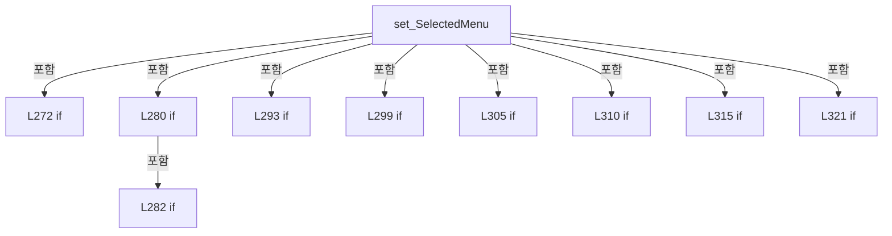
```mermaid
flowchart TD
 M["set_SelectedMenu"]
 N0["L272 if"]
 M -->|포함| N0
 N1["L280 if"]
 M -->|포함| N1
 N2["L282 if"]
 N1 -->|포함| N2
 N3["L293 if"]
 M -->|포함| N3
 N4["L299 if"]
 M -->|포함| N4
 N5["L305 if"]
 M -->|포함| N5
 N6["L310 if"]
 M -->|포함| N6
 N7["L315 if"]
 M -->|포함| N7
 N8["L321 if"]
 M -->|포함| N8
```

변경 전 점검: 입력/반환 타입, 위 호출자, 예외/취소 경로, 공유 상태와 저장·전송 소비자를 함께 확인합니다. 값의 단위나 물리 방향을 이름만으로 확정하지 않습니다.

### PropertyDeclaration `CurrentScreen` · L334–345

[Drilling.UI/CRootView.cs:334–345](https://github.com/kjuws10-rgb/A3Drilling/blob/dfa5920e6301d9ec4b0eab1452ae59521aafc986/Drilling.UI/CRootView.cs#L334-L345)

| 항목 | 실제 추출 값 |
| --- | --- |
| 서명 | Drilling.UI.Menu.Menus.CScreenViewModel Drilling.UI.CRootView.CurrentScreen |
| 접근/수식자 | Public / public |
| 반환/값 타입 | Drilling.UI.Menu.Menus.CScreenViewModel |
| 소속 타입 | NamedType:Drilling.UI.CRootView |

현재 부분 분석에서 직접 연결된 호출자는 없습니다. XAML/이벤트/인터페이스·델리게이트·외부 진입을 추가 확인해야 하며, 미사용으로 판정한 것이 아닙니다.

변경 전 점검: 입력/반환 타입, 위 호출자, 예외/취소 경로, 공유 상태와 저장·전송 소비자를 함께 확인합니다. 값의 단위나 물리 방향을 이름만으로 확정하지 않습니다.

### GetAccessorDeclaration `get_CurrentScreen` · L336–339

[Drilling.UI/CRootView.cs:336–339](https://github.com/kjuws10-rgb/A3Drilling/blob/dfa5920e6301d9ec4b0eab1452ae59521aafc986/Drilling.UI/CRootView.cs#L336-L339)

| 항목 | 실제 추출 값 |
| --- | --- |
| 서명 | Drilling.UI.Menu.Menus.CScreenViewModel Drilling.UI.CRootView.CurrentScreen.get |
| 접근/수식자 | Public / get |
| 반환/값 타입 | Drilling.UI.Menu.Menus.CScreenViewModel |
| 소속 타입 | NamedType:Drilling.UI.CRootView |

현재 부분 분석에서 직접 연결된 호출자는 없습니다. XAML/이벤트/인터페이스·델리게이트·외부 진입을 추가 확인해야 하며, 미사용으로 판정한 것이 아닙니다.

본문의 실제 연산·분기·예외·반환 순서(원문 위치 순):

| 원본 행 | 종류 | 주석 해설 |
| --- | --- | --- |
| 338 | return | 호출자에게 값 또는 제어를 반환합니다: return _currentScreen; |

변경 전 점검: 입력/반환 타입, 위 호출자, 예외/취소 경로, 공유 상태와 저장·전송 소비자를 함께 확인합니다. 값의 단위나 물리 방향을 이름만으로 확정하지 않습니다.

### SetAccessorDeclaration `set_CurrentScreen` · L341–344

[Drilling.UI/CRootView.cs:341–344](https://github.com/kjuws10-rgb/A3Drilling/blob/dfa5920e6301d9ec4b0eab1452ae59521aafc986/Drilling.UI/CRootView.cs#L341-L344)

| 항목 | 실제 추출 값 |
| --- | --- |
| 서명 | void Drilling.UI.CRootView.CurrentScreen.set |
| 접근/수식자 | Private / private, set |
| 반환/값 타입 | void |
| 소속 타입 | NamedType:Drilling.UI.CRootView |

입력 계약:

| 이름 | 타입 | 전달 | 선택/기본값 |
| --- | --- | --- | --- |
| value | Drilling.UI.Menu.Menus.CScreenViewModel | None | False /  |

현재 부분 분석에서 직접 연결된 호출자는 없습니다. XAML/이벤트/인터페이스·델리게이트·외부 진입을 추가 확인해야 하며, 미사용으로 판정한 것이 아닙니다.

호출하는 대상과 해석 범위:

| 원본 행 | 표현식 | 분석 상태 | 대상/소스 위치 |
| --- | --- | --- | --- |
| 343 | SetProperty | resolved | bool Drilling.UI.Menu.CBindingBase.SetProperty<Drilling.UI.Menu.Menus.CScreenViewModel>(ref Drilling.UI.Menu.Menus.CScreenViewModel, Drilling.UI.Menu.Menus.CScreenViewModel, string?) · Drilling.UI/Menu/CBindingBase.cs:737 |

본문의 실제 연산·분기·예외·반환 순서(원문 위치 순):

| 원본 행 | 종류 | 주석 해설 |
| --- | --- | --- |
| 343 | call | 함수·델리게이트 또는 객체 생성자를 호출합니다: SetProperty(ref _currentScreen, value) |

변경 전 점검: 입력/반환 타입, 위 호출자, 예외/취소 경로, 공유 상태와 저장·전송 소비자를 함께 확인합니다. 값의 단위나 물리 방향을 이름만으로 확정하지 않습니다.

### PropertyDeclaration `StatusMessage` · L347–358

[Drilling.UI/CRootView.cs:347–358](https://github.com/kjuws10-rgb/A3Drilling/blob/dfa5920e6301d9ec4b0eab1452ae59521aafc986/Drilling.UI/CRootView.cs#L347-L358)

| 항목 | 실제 추출 값 |
| --- | --- |
| 서명 | string Drilling.UI.CRootView.StatusMessage |
| 접근/수식자 | Public / public |
| 반환/값 타입 | string |
| 소속 타입 | NamedType:Drilling.UI.CRootView |

현재 부분 분석에서 직접 연결된 호출자는 없습니다. XAML/이벤트/인터페이스·델리게이트·외부 진입을 추가 확인해야 하며, 미사용으로 판정한 것이 아닙니다.

변경 전 점검: 입력/반환 타입, 위 호출자, 예외/취소 경로, 공유 상태와 저장·전송 소비자를 함께 확인합니다. 값의 단위나 물리 방향을 이름만으로 확정하지 않습니다.

### GetAccessorDeclaration `get_StatusMessage` · L349–352

[Drilling.UI/CRootView.cs:349–352](https://github.com/kjuws10-rgb/A3Drilling/blob/dfa5920e6301d9ec4b0eab1452ae59521aafc986/Drilling.UI/CRootView.cs#L349-L352)

| 항목 | 실제 추출 값 |
| --- | --- |
| 서명 | string Drilling.UI.CRootView.StatusMessage.get |
| 접근/수식자 | Public / get |
| 반환/값 타입 | string |
| 소속 타입 | NamedType:Drilling.UI.CRootView |

현재 부분 분석에서 직접 연결된 호출자는 없습니다. XAML/이벤트/인터페이스·델리게이트·외부 진입을 추가 확인해야 하며, 미사용으로 판정한 것이 아닙니다.

본문의 실제 연산·분기·예외·반환 순서(원문 위치 순):

| 원본 행 | 종류 | 주석 해설 |
| --- | --- | --- |
| 351 | return | 호출자에게 값 또는 제어를 반환합니다: return _statusMessage; |

변경 전 점검: 입력/반환 타입, 위 호출자, 예외/취소 경로, 공유 상태와 저장·전송 소비자를 함께 확인합니다. 값의 단위나 물리 방향을 이름만으로 확정하지 않습니다.

### SetAccessorDeclaration `set_StatusMessage` · L354–357

[Drilling.UI/CRootView.cs:354–357](https://github.com/kjuws10-rgb/A3Drilling/blob/dfa5920e6301d9ec4b0eab1452ae59521aafc986/Drilling.UI/CRootView.cs#L354-L357)

| 항목 | 실제 추출 값 |
| --- | --- |
| 서명 | void Drilling.UI.CRootView.StatusMessage.set |
| 접근/수식자 | Private / private, set |
| 반환/값 타입 | void |
| 소속 타입 | NamedType:Drilling.UI.CRootView |

입력 계약:

| 이름 | 타입 | 전달 | 선택/기본값 |
| --- | --- | --- | --- |
| value | string | None | False /  |

현재 부분 분석에서 직접 연결된 호출자는 없습니다. XAML/이벤트/인터페이스·델리게이트·외부 진입을 추가 확인해야 하며, 미사용으로 판정한 것이 아닙니다.

호출하는 대상과 해석 범위:

| 원본 행 | 표현식 | 분석 상태 | 대상/소스 위치 |
| --- | --- | --- | --- |
| 356 | SetProperty | resolved | bool Drilling.UI.Menu.CBindingBase.SetProperty<string>(ref string, string, string?) · Drilling.UI/Menu/CBindingBase.cs:737 |

본문의 실제 연산·분기·예외·반환 순서(원문 위치 순):

| 원본 행 | 종류 | 주석 해설 |
| --- | --- | --- |
| 356 | call | 함수·델리게이트 또는 객체 생성자를 호출합니다: SetProperty(ref _statusMessage, value) |

변경 전 점검: 입력/반환 타입, 위 호출자, 예외/취소 경로, 공유 상태와 저장·전송 소비자를 함께 확인합니다. 값의 단위나 물리 방향을 이름만으로 확정하지 않습니다.

### PropertyDeclaration `CurrentDateText` · L360–371

[Drilling.UI/CRootView.cs:360–371](https://github.com/kjuws10-rgb/A3Drilling/blob/dfa5920e6301d9ec4b0eab1452ae59521aafc986/Drilling.UI/CRootView.cs#L360-L371)

| 항목 | 실제 추출 값 |
| --- | --- |
| 서명 | string Drilling.UI.CRootView.CurrentDateText |
| 접근/수식자 | Public / public |
| 반환/값 타입 | string |
| 소속 타입 | NamedType:Drilling.UI.CRootView |

현재 부분 분석에서 직접 연결된 호출자는 없습니다. XAML/이벤트/인터페이스·델리게이트·외부 진입을 추가 확인해야 하며, 미사용으로 판정한 것이 아닙니다.

변경 전 점검: 입력/반환 타입, 위 호출자, 예외/취소 경로, 공유 상태와 저장·전송 소비자를 함께 확인합니다. 값의 단위나 물리 방향을 이름만으로 확정하지 않습니다.

### GetAccessorDeclaration `get_CurrentDateText` · L362–365

[Drilling.UI/CRootView.cs:362–365](https://github.com/kjuws10-rgb/A3Drilling/blob/dfa5920e6301d9ec4b0eab1452ae59521aafc986/Drilling.UI/CRootView.cs#L362-L365)

| 항목 | 실제 추출 값 |
| --- | --- |
| 서명 | string Drilling.UI.CRootView.CurrentDateText.get |
| 접근/수식자 | Public / get |
| 반환/값 타입 | string |
| 소속 타입 | NamedType:Drilling.UI.CRootView |

현재 부분 분석에서 직접 연결된 호출자는 없습니다. XAML/이벤트/인터페이스·델리게이트·외부 진입을 추가 확인해야 하며, 미사용으로 판정한 것이 아닙니다.

본문의 실제 연산·분기·예외·반환 순서(원문 위치 순):

| 원본 행 | 종류 | 주석 해설 |
| --- | --- | --- |
| 364 | return | 호출자에게 값 또는 제어를 반환합니다: return _currentDateText; |

변경 전 점검: 입력/반환 타입, 위 호출자, 예외/취소 경로, 공유 상태와 저장·전송 소비자를 함께 확인합니다. 값의 단위나 물리 방향을 이름만으로 확정하지 않습니다.

### SetAccessorDeclaration `set_CurrentDateText` · L367–370

[Drilling.UI/CRootView.cs:367–370](https://github.com/kjuws10-rgb/A3Drilling/blob/dfa5920e6301d9ec4b0eab1452ae59521aafc986/Drilling.UI/CRootView.cs#L367-L370)

| 항목 | 실제 추출 값 |
| --- | --- |
| 서명 | void Drilling.UI.CRootView.CurrentDateText.set |
| 접근/수식자 | Private / private, set |
| 반환/값 타입 | void |
| 소속 타입 | NamedType:Drilling.UI.CRootView |

입력 계약:

| 이름 | 타입 | 전달 | 선택/기본값 |
| --- | --- | --- | --- |
| value | string | None | False /  |

현재 부분 분석에서 직접 연결된 호출자는 없습니다. XAML/이벤트/인터페이스·델리게이트·외부 진입을 추가 확인해야 하며, 미사용으로 판정한 것이 아닙니다.

호출하는 대상과 해석 범위:

| 원본 행 | 표현식 | 분석 상태 | 대상/소스 위치 |
| --- | --- | --- | --- |
| 369 | SetProperty | resolved | bool Drilling.UI.Menu.CBindingBase.SetProperty<string>(ref string, string, string?) · Drilling.UI/Menu/CBindingBase.cs:737 |

본문의 실제 연산·분기·예외·반환 순서(원문 위치 순):

| 원본 행 | 종류 | 주석 해설 |
| --- | --- | --- |
| 369 | call | 함수·델리게이트 또는 객체 생성자를 호출합니다: SetProperty(ref _currentDateText, value) |

변경 전 점검: 입력/반환 타입, 위 호출자, 예외/취소 경로, 공유 상태와 저장·전송 소비자를 함께 확인합니다. 값의 단위나 물리 방향을 이름만으로 확정하지 않습니다.

### PropertyDeclaration `CurrentTimeText` · L373–384

[Drilling.UI/CRootView.cs:373–384](https://github.com/kjuws10-rgb/A3Drilling/blob/dfa5920e6301d9ec4b0eab1452ae59521aafc986/Drilling.UI/CRootView.cs#L373-L384)

| 항목 | 실제 추출 값 |
| --- | --- |
| 서명 | string Drilling.UI.CRootView.CurrentTimeText |
| 접근/수식자 | Public / public |
| 반환/값 타입 | string |
| 소속 타입 | NamedType:Drilling.UI.CRootView |

현재 부분 분석에서 직접 연결된 호출자는 없습니다. XAML/이벤트/인터페이스·델리게이트·외부 진입을 추가 확인해야 하며, 미사용으로 판정한 것이 아닙니다.

변경 전 점검: 입력/반환 타입, 위 호출자, 예외/취소 경로, 공유 상태와 저장·전송 소비자를 함께 확인합니다. 값의 단위나 물리 방향을 이름만으로 확정하지 않습니다.

### GetAccessorDeclaration `get_CurrentTimeText` · L375–378

[Drilling.UI/CRootView.cs:375–378](https://github.com/kjuws10-rgb/A3Drilling/blob/dfa5920e6301d9ec4b0eab1452ae59521aafc986/Drilling.UI/CRootView.cs#L375-L378)

| 항목 | 실제 추출 값 |
| --- | --- |
| 서명 | string Drilling.UI.CRootView.CurrentTimeText.get |
| 접근/수식자 | Public / get |
| 반환/값 타입 | string |
| 소속 타입 | NamedType:Drilling.UI.CRootView |

현재 부분 분석에서 직접 연결된 호출자는 없습니다. XAML/이벤트/인터페이스·델리게이트·외부 진입을 추가 확인해야 하며, 미사용으로 판정한 것이 아닙니다.

본문의 실제 연산·분기·예외·반환 순서(원문 위치 순):

| 원본 행 | 종류 | 주석 해설 |
| --- | --- | --- |
| 377 | return | 호출자에게 값 또는 제어를 반환합니다: return _currentTimeText; |

변경 전 점검: 입력/반환 타입, 위 호출자, 예외/취소 경로, 공유 상태와 저장·전송 소비자를 함께 확인합니다. 값의 단위나 물리 방향을 이름만으로 확정하지 않습니다.

### SetAccessorDeclaration `set_CurrentTimeText` · L380–383

[Drilling.UI/CRootView.cs:380–383](https://github.com/kjuws10-rgb/A3Drilling/blob/dfa5920e6301d9ec4b0eab1452ae59521aafc986/Drilling.UI/CRootView.cs#L380-L383)

| 항목 | 실제 추출 값 |
| --- | --- |
| 서명 | void Drilling.UI.CRootView.CurrentTimeText.set |
| 접근/수식자 | Private / private, set |
| 반환/값 타입 | void |
| 소속 타입 | NamedType:Drilling.UI.CRootView |

입력 계약:

| 이름 | 타입 | 전달 | 선택/기본값 |
| --- | --- | --- | --- |
| value | string | None | False /  |

현재 부분 분석에서 직접 연결된 호출자는 없습니다. XAML/이벤트/인터페이스·델리게이트·외부 진입을 추가 확인해야 하며, 미사용으로 판정한 것이 아닙니다.

호출하는 대상과 해석 범위:

| 원본 행 | 표현식 | 분석 상태 | 대상/소스 위치 |
| --- | --- | --- | --- |
| 382 | SetProperty | resolved | bool Drilling.UI.Menu.CBindingBase.SetProperty<string>(ref string, string, string?) · Drilling.UI/Menu/CBindingBase.cs:737 |

본문의 실제 연산·분기·예외·반환 순서(원문 위치 순):

| 원본 행 | 종류 | 주석 해설 |
| --- | --- | --- |
| 382 | call | 함수·델리게이트 또는 객체 생성자를 호출합니다: SetProperty(ref _currentTimeText, value) |

변경 전 점검: 입력/반환 타입, 위 호출자, 예외/취소 경로, 공유 상태와 저장·전송 소비자를 함께 확인합니다. 값의 단위나 물리 방향을 이름만으로 확정하지 않습니다.

### PropertyDeclaration `CurrentUserText` · L386–392

[Drilling.UI/CRootView.cs:386–392](https://github.com/kjuws10-rgb/A3Drilling/blob/dfa5920e6301d9ec4b0eab1452ae59521aafc986/Drilling.UI/CRootView.cs#L386-L392)

| 항목 | 실제 추출 값 |
| --- | --- |
| 서명 | string Drilling.UI.CRootView.CurrentUserText |
| 접근/수식자 | Public / public |
| 반환/값 타입 | string |
| 소속 타입 | NamedType:Drilling.UI.CRootView |

현재 부분 분석에서 직접 연결된 호출자는 없습니다. XAML/이벤트/인터페이스·델리게이트·외부 진입을 추가 확인해야 하며, 미사용으로 판정한 것이 아닙니다.

변경 전 점검: 입력/반환 타입, 위 호출자, 예외/취소 경로, 공유 상태와 저장·전송 소비자를 함께 확인합니다. 값의 단위나 물리 방향을 이름만으로 확정하지 않습니다.

### GetAccessorDeclaration `get_CurrentUserText` · L388–391

[Drilling.UI/CRootView.cs:388–391](https://github.com/kjuws10-rgb/A3Drilling/blob/dfa5920e6301d9ec4b0eab1452ae59521aafc986/Drilling.UI/CRootView.cs#L388-L391)

| 항목 | 실제 추출 값 |
| --- | --- |
| 서명 | string Drilling.UI.CRootView.CurrentUserText.get |
| 접근/수식자 | Public / get |
| 반환/값 타입 | string |
| 소속 타입 | NamedType:Drilling.UI.CRootView |

현재 부분 분석에서 직접 연결된 호출자는 없습니다. XAML/이벤트/인터페이스·델리게이트·외부 진입을 추가 확인해야 하며, 미사용으로 판정한 것이 아닙니다.

본문의 실제 연산·분기·예외·반환 순서(원문 위치 순):

| 원본 행 | 종류 | 주석 해설 |
| --- | --- | --- |
| 390 | conditional-expression | 조건에 따라 결과식을 선택합니다: _interfaceManager.IsSimulation && _motionManager.IsSimulation ? "Engineer / Simulation" : "Engineer / Live" |
| 390 | return | 호출자에게 값 또는 제어를 반환합니다: return _interfaceManager.IsSimulation && _motionManager.IsSimulation ? "Engineer / Simulation" : "Engineer / Live"; |

변경 전 점검: 입력/반환 타입, 위 호출자, 예외/취소 경로, 공유 상태와 저장·전송 소비자를 함께 확인합니다. 값의 단위나 물리 방향을 이름만으로 확정하지 않습니다.

### PropertyDeclaration `ThemeToggleText` · L394–400

[Drilling.UI/CRootView.cs:394–400](https://github.com/kjuws10-rgb/A3Drilling/blob/dfa5920e6301d9ec4b0eab1452ae59521aafc986/Drilling.UI/CRootView.cs#L394-L400)

| 항목 | 실제 추출 값 |
| --- | --- |
| 서명 | string Drilling.UI.CRootView.ThemeToggleText |
| 접근/수식자 | Public / public |
| 반환/값 타입 | string |
| 소속 타입 | NamedType:Drilling.UI.CRootView |

현재 부분 분석에서 직접 연결된 호출자는 없습니다. XAML/이벤트/인터페이스·델리게이트·외부 진입을 추가 확인해야 하며, 미사용으로 판정한 것이 아닙니다.

변경 전 점검: 입력/반환 타입, 위 호출자, 예외/취소 경로, 공유 상태와 저장·전송 소비자를 함께 확인합니다. 값의 단위나 물리 방향을 이름만으로 확정하지 않습니다.

### GetAccessorDeclaration `get_ThemeToggleText` · L396–399

[Drilling.UI/CRootView.cs:396–399](https://github.com/kjuws10-rgb/A3Drilling/blob/dfa5920e6301d9ec4b0eab1452ae59521aafc986/Drilling.UI/CRootView.cs#L396-L399)

| 항목 | 실제 추출 값 |
| --- | --- |
| 서명 | string Drilling.UI.CRootView.ThemeToggleText.get |
| 접근/수식자 | Public / get |
| 반환/값 타입 | string |
| 소속 타입 | NamedType:Drilling.UI.CRootView |

현재 부분 분석에서 직접 연결된 호출자는 없습니다. XAML/이벤트/인터페이스·델리게이트·외부 진입을 추가 확인해야 하며, 미사용으로 판정한 것이 아닙니다.

본문의 실제 연산·분기·예외·반환 순서(원문 위치 순):

| 원본 행 | 종류 | 주석 해설 |
| --- | --- | --- |
| 398 | conditional-expression | 조건에 따라 결과식을 선택합니다: _currentTheme == EN_UI_THEME.Light ? "LIGHT MODE" : "DARK MODE" |
| 398 | return | 호출자에게 값 또는 제어를 반환합니다: return _currentTheme == EN_UI_THEME.Light ? "LIGHT MODE" : "DARK MODE"; |

변경 전 점검: 입력/반환 타입, 위 호출자, 예외/취소 경로, 공유 상태와 저장·전송 소비자를 함께 확인합니다. 값의 단위나 물리 방향을 이름만으로 확정하지 않습니다.

### PropertyDeclaration `ThemeModeText` · L402–408

[Drilling.UI/CRootView.cs:402–408](https://github.com/kjuws10-rgb/A3Drilling/blob/dfa5920e6301d9ec4b0eab1452ae59521aafc986/Drilling.UI/CRootView.cs#L402-L408)

| 항목 | 실제 추출 값 |
| --- | --- |
| 서명 | string Drilling.UI.CRootView.ThemeModeText |
| 접근/수식자 | Public / public |
| 반환/값 타입 | string |
| 소속 타입 | NamedType:Drilling.UI.CRootView |

현재 부분 분석에서 직접 연결된 호출자는 없습니다. XAML/이벤트/인터페이스·델리게이트·외부 진입을 추가 확인해야 하며, 미사용으로 판정한 것이 아닙니다.

변경 전 점검: 입력/반환 타입, 위 호출자, 예외/취소 경로, 공유 상태와 저장·전송 소비자를 함께 확인합니다. 값의 단위나 물리 방향을 이름만으로 확정하지 않습니다.

### GetAccessorDeclaration `get_ThemeModeText` · L404–407

[Drilling.UI/CRootView.cs:404–407](https://github.com/kjuws10-rgb/A3Drilling/blob/dfa5920e6301d9ec4b0eab1452ae59521aafc986/Drilling.UI/CRootView.cs#L404-L407)

| 항목 | 실제 추출 값 |
| --- | --- |
| 서명 | string Drilling.UI.CRootView.ThemeModeText.get |
| 접근/수식자 | Public / get |
| 반환/값 타입 | string |
| 소속 타입 | NamedType:Drilling.UI.CRootView |

현재 부분 분석에서 직접 연결된 호출자는 없습니다. XAML/이벤트/인터페이스·델리게이트·외부 진입을 추가 확인해야 하며, 미사용으로 판정한 것이 아닙니다.

본문의 실제 연산·분기·예외·반환 순서(원문 위치 순):

| 원본 행 | 종류 | 주석 해설 |
| --- | --- | --- |
| 406 | conditional-expression | 조건에 따라 결과식을 선택합니다: _currentTheme == EN_UI_THEME.Light ? "Light Theme" : "Dark Theme" |
| 406 | return | 호출자에게 값 또는 제어를 반환합니다: return _currentTheme == EN_UI_THEME.Light ? "Light Theme" : "Dark Theme"; |

변경 전 점검: 입력/반환 타입, 위 호출자, 예외/취소 경로, 공유 상태와 저장·전송 소비자를 함께 확인합니다. 값의 단위나 물리 방향을 이름만으로 확정하지 않습니다.

### PropertyDeclaration `StartCommand` · L410–410

[Drilling.UI/CRootView.cs:410–410](https://github.com/kjuws10-rgb/A3Drilling/blob/dfa5920e6301d9ec4b0eab1452ae59521aafc986/Drilling.UI/CRootView.cs#L410-L410)

| 항목 | 실제 추출 값 |
| --- | --- |
| 서명 | Drilling.UI.Menu.CButtonCommand Drilling.UI.CRootView.StartCommand |
| 접근/수식자 | Public / public |
| 반환/값 타입 | Drilling.UI.Menu.CButtonCommand |
| 소속 타입 | NamedType:Drilling.UI.CRootView |

현재 부분 분석에서 직접 연결된 호출자는 없습니다. XAML/이벤트/인터페이스·델리게이트·외부 진입을 추가 확인해야 하며, 미사용으로 판정한 것이 아닙니다.

변경 전 점검: 입력/반환 타입, 위 호출자, 예외/취소 경로, 공유 상태와 저장·전송 소비자를 함께 확인합니다. 값의 단위나 물리 방향을 이름만으로 확정하지 않습니다.

### GetAccessorDeclaration `get_StartCommand` · L410–410

[Drilling.UI/CRootView.cs:410–410](https://github.com/kjuws10-rgb/A3Drilling/blob/dfa5920e6301d9ec4b0eab1452ae59521aafc986/Drilling.UI/CRootView.cs#L410-L410)

| 항목 | 실제 추출 값 |
| --- | --- |
| 서명 | Drilling.UI.Menu.CButtonCommand Drilling.UI.CRootView.StartCommand.get |
| 접근/수식자 | Public / get |
| 반환/값 타입 | Drilling.UI.Menu.CButtonCommand |
| 소속 타입 | NamedType:Drilling.UI.CRootView |

현재 부분 분석에서 직접 연결된 호출자는 없습니다. XAML/이벤트/인터페이스·델리게이트·외부 진입을 추가 확인해야 하며, 미사용으로 판정한 것이 아닙니다.

변경 전 점검: 입력/반환 타입, 위 호출자, 예외/취소 경로, 공유 상태와 저장·전송 소비자를 함께 확인합니다. 값의 단위나 물리 방향을 이름만으로 확정하지 않습니다.

### PropertyDeclaration `StopCommand` · L411–411

[Drilling.UI/CRootView.cs:411–411](https://github.com/kjuws10-rgb/A3Drilling/blob/dfa5920e6301d9ec4b0eab1452ae59521aafc986/Drilling.UI/CRootView.cs#L411-L411)

| 항목 | 실제 추출 값 |
| --- | --- |
| 서명 | Drilling.UI.Menu.CButtonCommand Drilling.UI.CRootView.StopCommand |
| 접근/수식자 | Public / public |
| 반환/값 타입 | Drilling.UI.Menu.CButtonCommand |
| 소속 타입 | NamedType:Drilling.UI.CRootView |

현재 부분 분석에서 직접 연결된 호출자는 없습니다. XAML/이벤트/인터페이스·델리게이트·외부 진입을 추가 확인해야 하며, 미사용으로 판정한 것이 아닙니다.

변경 전 점검: 입력/반환 타입, 위 호출자, 예외/취소 경로, 공유 상태와 저장·전송 소비자를 함께 확인합니다. 값의 단위나 물리 방향을 이름만으로 확정하지 않습니다.

### GetAccessorDeclaration `get_StopCommand` · L411–411

[Drilling.UI/CRootView.cs:411–411](https://github.com/kjuws10-rgb/A3Drilling/blob/dfa5920e6301d9ec4b0eab1452ae59521aafc986/Drilling.UI/CRootView.cs#L411-L411)

| 항목 | 실제 추출 값 |
| --- | --- |
| 서명 | Drilling.UI.Menu.CButtonCommand Drilling.UI.CRootView.StopCommand.get |
| 접근/수식자 | Public / get |
| 반환/값 타입 | Drilling.UI.Menu.CButtonCommand |
| 소속 타입 | NamedType:Drilling.UI.CRootView |

현재 부분 분석에서 직접 연결된 호출자는 없습니다. XAML/이벤트/인터페이스·델리게이트·외부 진입을 추가 확인해야 하며, 미사용으로 판정한 것이 아닙니다.

변경 전 점검: 입력/반환 타입, 위 호출자, 예외/취소 경로, 공유 상태와 저장·전송 소비자를 함께 확인합니다. 값의 단위나 물리 방향을 이름만으로 확정하지 않습니다.

### PropertyDeclaration `SelectHeadCommand` · L412–412

[Drilling.UI/CRootView.cs:412–412](https://github.com/kjuws10-rgb/A3Drilling/blob/dfa5920e6301d9ec4b0eab1452ae59521aafc986/Drilling.UI/CRootView.cs#L412-L412)

| 항목 | 실제 추출 값 |
| --- | --- |
| 서명 | Drilling.UI.Menu.CButtonCommand Drilling.UI.CRootView.SelectHeadCommand |
| 접근/수식자 | Public / public |
| 반환/값 타입 | Drilling.UI.Menu.CButtonCommand |
| 소속 타입 | NamedType:Drilling.UI.CRootView |

현재 부분 분석에서 직접 연결된 호출자는 없습니다. XAML/이벤트/인터페이스·델리게이트·외부 진입을 추가 확인해야 하며, 미사용으로 판정한 것이 아닙니다.

변경 전 점검: 입력/반환 타입, 위 호출자, 예외/취소 경로, 공유 상태와 저장·전송 소비자를 함께 확인합니다. 값의 단위나 물리 방향을 이름만으로 확정하지 않습니다.

### GetAccessorDeclaration `get_SelectHeadCommand` · L412–412

[Drilling.UI/CRootView.cs:412–412](https://github.com/kjuws10-rgb/A3Drilling/blob/dfa5920e6301d9ec4b0eab1452ae59521aafc986/Drilling.UI/CRootView.cs#L412-L412)

| 항목 | 실제 추출 값 |
| --- | --- |
| 서명 | Drilling.UI.Menu.CButtonCommand Drilling.UI.CRootView.SelectHeadCommand.get |
| 접근/수식자 | Public / get |
| 반환/값 타입 | Drilling.UI.Menu.CButtonCommand |
| 소속 타입 | NamedType:Drilling.UI.CRootView |

현재 부분 분석에서 직접 연결된 호출자는 없습니다. XAML/이벤트/인터페이스·델리게이트·외부 진입을 추가 확인해야 하며, 미사용으로 판정한 것이 아닙니다.

변경 전 점검: 입력/반환 타입, 위 호출자, 예외/취소 경로, 공유 상태와 저장·전송 소비자를 함께 확인합니다. 값의 단위나 물리 방향을 이름만으로 확정하지 않습니다.

### PropertyDeclaration `ToggleThemeCommand` · L413–413

[Drilling.UI/CRootView.cs:413–413](https://github.com/kjuws10-rgb/A3Drilling/blob/dfa5920e6301d9ec4b0eab1452ae59521aafc986/Drilling.UI/CRootView.cs#L413-L413)

| 항목 | 실제 추출 값 |
| --- | --- |
| 서명 | Drilling.UI.Menu.CButtonCommand Drilling.UI.CRootView.ToggleThemeCommand |
| 접근/수식자 | Public / public |
| 반환/값 타입 | Drilling.UI.Menu.CButtonCommand |
| 소속 타입 | NamedType:Drilling.UI.CRootView |

현재 부분 분석에서 직접 연결된 호출자는 없습니다. XAML/이벤트/인터페이스·델리게이트·외부 진입을 추가 확인해야 하며, 미사용으로 판정한 것이 아닙니다.

변경 전 점검: 입력/반환 타입, 위 호출자, 예외/취소 경로, 공유 상태와 저장·전송 소비자를 함께 확인합니다. 값의 단위나 물리 방향을 이름만으로 확정하지 않습니다.

### GetAccessorDeclaration `get_ToggleThemeCommand` · L413–413

[Drilling.UI/CRootView.cs:413–413](https://github.com/kjuws10-rgb/A3Drilling/blob/dfa5920e6301d9ec4b0eab1452ae59521aafc986/Drilling.UI/CRootView.cs#L413-L413)

| 항목 | 실제 추출 값 |
| --- | --- |
| 서명 | Drilling.UI.Menu.CButtonCommand Drilling.UI.CRootView.ToggleThemeCommand.get |
| 접근/수식자 | Public / get |
| 반환/값 타입 | Drilling.UI.Menu.CButtonCommand |
| 소속 타입 | NamedType:Drilling.UI.CRootView |

현재 부분 분석에서 직접 연결된 호출자는 없습니다. XAML/이벤트/인터페이스·델리게이트·외부 진입을 추가 확인해야 하며, 미사용으로 판정한 것이 아닙니다.

변경 전 점검: 입력/반환 타입, 위 호출자, 예외/취소 경로, 공유 상태와 저장·전송 소비자를 함께 확인합니다. 값의 단위나 물리 방향을 이름만으로 확정하지 않습니다.

### PropertyDeclaration `ToggleOperationModeCommand` · L414–414

[Drilling.UI/CRootView.cs:414–414](https://github.com/kjuws10-rgb/A3Drilling/blob/dfa5920e6301d9ec4b0eab1452ae59521aafc986/Drilling.UI/CRootView.cs#L414-L414)

| 항목 | 실제 추출 값 |
| --- | --- |
| 서명 | Drilling.UI.Menu.CButtonCommand Drilling.UI.CRootView.ToggleOperationModeCommand |
| 접근/수식자 | Public / public |
| 반환/값 타입 | Drilling.UI.Menu.CButtonCommand |
| 소속 타입 | NamedType:Drilling.UI.CRootView |

현재 부분 분석에서 직접 연결된 호출자는 없습니다. XAML/이벤트/인터페이스·델리게이트·외부 진입을 추가 확인해야 하며, 미사용으로 판정한 것이 아닙니다.

변경 전 점검: 입력/반환 타입, 위 호출자, 예외/취소 경로, 공유 상태와 저장·전송 소비자를 함께 확인합니다. 값의 단위나 물리 방향을 이름만으로 확정하지 않습니다.

### GetAccessorDeclaration `get_ToggleOperationModeCommand` · L414–414

[Drilling.UI/CRootView.cs:414–414](https://github.com/kjuws10-rgb/A3Drilling/blob/dfa5920e6301d9ec4b0eab1452ae59521aafc986/Drilling.UI/CRootView.cs#L414-L414)

| 항목 | 실제 추출 값 |
| --- | --- |
| 서명 | Drilling.UI.Menu.CButtonCommand Drilling.UI.CRootView.ToggleOperationModeCommand.get |
| 접근/수식자 | Public / get |
| 반환/값 타입 | Drilling.UI.Menu.CButtonCommand |
| 소속 타입 | NamedType:Drilling.UI.CRootView |

현재 부분 분석에서 직접 연결된 호출자는 없습니다. XAML/이벤트/인터페이스·델리게이트·외부 진입을 추가 확인해야 하며, 미사용으로 판정한 것이 아닙니다.

변경 전 점검: 입력/반환 타입, 위 호출자, 예외/취소 경로, 공유 상태와 저장·전송 소비자를 함께 확인합니다. 값의 단위나 물리 방향을 이름만으로 확정하지 않습니다.

### PropertyDeclaration `ShiftOffsetX` · L416–427

[Drilling.UI/CRootView.cs:416–427](https://github.com/kjuws10-rgb/A3Drilling/blob/dfa5920e6301d9ec4b0eab1452ae59521aafc986/Drilling.UI/CRootView.cs#L416-L427)

| 항목 | 실제 추출 값 |
| --- | --- |
| 서명 | string Drilling.UI.CRootView.ShiftOffsetX |
| 접근/수식자 | Public / public |
| 반환/값 타입 | string |
| 소속 타입 | NamedType:Drilling.UI.CRootView |

현재 부분 분석에서 직접 연결된 호출자는 없습니다. XAML/이벤트/인터페이스·델리게이트·외부 진입을 추가 확인해야 하며, 미사용으로 판정한 것이 아닙니다.

변경 전 점검: 입력/반환 타입, 위 호출자, 예외/취소 경로, 공유 상태와 저장·전송 소비자를 함께 확인합니다. 값의 단위나 물리 방향을 이름만으로 확정하지 않습니다.

### GetAccessorDeclaration `get_ShiftOffsetX` · L418–421

[Drilling.UI/CRootView.cs:418–421](https://github.com/kjuws10-rgb/A3Drilling/blob/dfa5920e6301d9ec4b0eab1452ae59521aafc986/Drilling.UI/CRootView.cs#L418-L421)

| 항목 | 실제 추출 값 |
| --- | --- |
| 서명 | string Drilling.UI.CRootView.ShiftOffsetX.get |
| 접근/수식자 | Public / get |
| 반환/값 타입 | string |
| 소속 타입 | NamedType:Drilling.UI.CRootView |

현재 부분 분석에서 직접 연결된 호출자는 없습니다. XAML/이벤트/인터페이스·델리게이트·외부 진입을 추가 확인해야 하며, 미사용으로 판정한 것이 아닙니다.

본문의 실제 연산·분기·예외·반환 순서(원문 위치 순):

| 원본 행 | 종류 | 주석 해설 |
| --- | --- | --- |
| 420 | return | 호출자에게 값 또는 제어를 반환합니다: return _shiftOffsetX; |

변경 전 점검: 입력/반환 타입, 위 호출자, 예외/취소 경로, 공유 상태와 저장·전송 소비자를 함께 확인합니다. 값의 단위나 물리 방향을 이름만으로 확정하지 않습니다.

### SetAccessorDeclaration `set_ShiftOffsetX` · L423–426

[Drilling.UI/CRootView.cs:423–426](https://github.com/kjuws10-rgb/A3Drilling/blob/dfa5920e6301d9ec4b0eab1452ae59521aafc986/Drilling.UI/CRootView.cs#L423-L426)

| 항목 | 실제 추출 값 |
| --- | --- |
| 서명 | void Drilling.UI.CRootView.ShiftOffsetX.set |
| 접근/수식자 | Public / set |
| 반환/값 타입 | void |
| 소속 타입 | NamedType:Drilling.UI.CRootView |

입력 계약:

| 이름 | 타입 | 전달 | 선택/기본값 |
| --- | --- | --- | --- |
| value | string | None | False /  |

현재 부분 분석에서 직접 연결된 호출자는 없습니다. XAML/이벤트/인터페이스·델리게이트·외부 진입을 추가 확인해야 하며, 미사용으로 판정한 것이 아닙니다.

호출하는 대상과 해석 범위:

| 원본 행 | 표현식 | 분석 상태 | 대상/소스 위치 |
| --- | --- | --- | --- |
| 425 | SetProperty | resolved | bool Drilling.UI.Menu.CBindingBase.SetProperty<string>(ref string, string, string?) · Drilling.UI/Menu/CBindingBase.cs:737 |
| 425 | NormalizeShiftOffsetText | resolved | string Drilling.UI.CRootView.NormalizeShiftOffsetText(string?) · Drilling.UI/CRootView.cs:1590 |

본문의 실제 연산·분기·예외·반환 순서(원문 위치 순):

| 원본 행 | 종류 | 주석 해설 |
| --- | --- | --- |
| 425 | call | 함수·델리게이트 또는 객체 생성자를 호출합니다: SetProperty(ref _shiftOffsetX, NormalizeShiftOffsetText(value)) |
| 425 | call | 함수·델리게이트 또는 객체 생성자를 호출합니다: NormalizeShiftOffsetText(value) |

변경 전 점검: 입력/반환 타입, 위 호출자, 예외/취소 경로, 공유 상태와 저장·전송 소비자를 함께 확인합니다. 값의 단위나 물리 방향을 이름만으로 확정하지 않습니다.

### PropertyDeclaration `ShiftOffsetY` · L429–440

[Drilling.UI/CRootView.cs:429–440](https://github.com/kjuws10-rgb/A3Drilling/blob/dfa5920e6301d9ec4b0eab1452ae59521aafc986/Drilling.UI/CRootView.cs#L429-L440)

| 항목 | 실제 추출 값 |
| --- | --- |
| 서명 | string Drilling.UI.CRootView.ShiftOffsetY |
| 접근/수식자 | Public / public |
| 반환/값 타입 | string |
| 소속 타입 | NamedType:Drilling.UI.CRootView |

현재 부분 분석에서 직접 연결된 호출자는 없습니다. XAML/이벤트/인터페이스·델리게이트·외부 진입을 추가 확인해야 하며, 미사용으로 판정한 것이 아닙니다.

변경 전 점검: 입력/반환 타입, 위 호출자, 예외/취소 경로, 공유 상태와 저장·전송 소비자를 함께 확인합니다. 값의 단위나 물리 방향을 이름만으로 확정하지 않습니다.

### GetAccessorDeclaration `get_ShiftOffsetY` · L431–434

[Drilling.UI/CRootView.cs:431–434](https://github.com/kjuws10-rgb/A3Drilling/blob/dfa5920e6301d9ec4b0eab1452ae59521aafc986/Drilling.UI/CRootView.cs#L431-L434)

| 항목 | 실제 추출 값 |
| --- | --- |
| 서명 | string Drilling.UI.CRootView.ShiftOffsetY.get |
| 접근/수식자 | Public / get |
| 반환/값 타입 | string |
| 소속 타입 | NamedType:Drilling.UI.CRootView |

현재 부분 분석에서 직접 연결된 호출자는 없습니다. XAML/이벤트/인터페이스·델리게이트·외부 진입을 추가 확인해야 하며, 미사용으로 판정한 것이 아닙니다.

본문의 실제 연산·분기·예외·반환 순서(원문 위치 순):

| 원본 행 | 종류 | 주석 해설 |
| --- | --- | --- |
| 433 | return | 호출자에게 값 또는 제어를 반환합니다: return _shiftOffsetY; |

변경 전 점검: 입력/반환 타입, 위 호출자, 예외/취소 경로, 공유 상태와 저장·전송 소비자를 함께 확인합니다. 값의 단위나 물리 방향을 이름만으로 확정하지 않습니다.

### SetAccessorDeclaration `set_ShiftOffsetY` · L436–439

[Drilling.UI/CRootView.cs:436–439](https://github.com/kjuws10-rgb/A3Drilling/blob/dfa5920e6301d9ec4b0eab1452ae59521aafc986/Drilling.UI/CRootView.cs#L436-L439)

| 항목 | 실제 추출 값 |
| --- | --- |
| 서명 | void Drilling.UI.CRootView.ShiftOffsetY.set |
| 접근/수식자 | Public / set |
| 반환/값 타입 | void |
| 소속 타입 | NamedType:Drilling.UI.CRootView |

입력 계약:

| 이름 | 타입 | 전달 | 선택/기본값 |
| --- | --- | --- | --- |
| value | string | None | False /  |

현재 부분 분석에서 직접 연결된 호출자는 없습니다. XAML/이벤트/인터페이스·델리게이트·외부 진입을 추가 확인해야 하며, 미사용으로 판정한 것이 아닙니다.

호출하는 대상과 해석 범위:

| 원본 행 | 표현식 | 분석 상태 | 대상/소스 위치 |
| --- | --- | --- | --- |
| 438 | SetProperty | resolved | bool Drilling.UI.Menu.CBindingBase.SetProperty<string>(ref string, string, string?) · Drilling.UI/Menu/CBindingBase.cs:737 |
| 438 | NormalizeShiftOffsetText | resolved | string Drilling.UI.CRootView.NormalizeShiftOffsetText(string?) · Drilling.UI/CRootView.cs:1590 |

본문의 실제 연산·분기·예외·반환 순서(원문 위치 순):

| 원본 행 | 종류 | 주석 해설 |
| --- | --- | --- |
| 438 | call | 함수·델리게이트 또는 객체 생성자를 호출합니다: SetProperty(ref _shiftOffsetY, NormalizeShiftOffsetText(value)) |
| 438 | call | 함수·델리게이트 또는 객체 생성자를 호출합니다: NormalizeShiftOffsetText(value) |

변경 전 점검: 입력/반환 타입, 위 호출자, 예외/취소 경로, 공유 상태와 저장·전송 소비자를 함께 확인합니다. 값의 단위나 물리 방향을 이름만으로 확정하지 않습니다.

### PropertyDeclaration `IsManualShiftOffsetVisible` · L442–448

[Drilling.UI/CRootView.cs:442–448](https://github.com/kjuws10-rgb/A3Drilling/blob/dfa5920e6301d9ec4b0eab1452ae59521aafc986/Drilling.UI/CRootView.cs#L442-L448)

| 항목 | 실제 추출 값 |
| --- | --- |
| 서명 | bool Drilling.UI.CRootView.IsManualShiftOffsetVisible |
| 접근/수식자 | Public / public |
| 반환/값 타입 | bool |
| 소속 타입 | NamedType:Drilling.UI.CRootView |

현재 부분 분석에서 직접 연결된 호출자는 없습니다. XAML/이벤트/인터페이스·델리게이트·외부 진입을 추가 확인해야 하며, 미사용으로 판정한 것이 아닙니다.

변경 전 점검: 입력/반환 타입, 위 호출자, 예외/취소 경로, 공유 상태와 저장·전송 소비자를 함께 확인합니다. 값의 단위나 물리 방향을 이름만으로 확정하지 않습니다.

### GetAccessorDeclaration `get_IsManualShiftOffsetVisible` · L444–447

[Drilling.UI/CRootView.cs:444–447](https://github.com/kjuws10-rgb/A3Drilling/blob/dfa5920e6301d9ec4b0eab1452ae59521aafc986/Drilling.UI/CRootView.cs#L444-L447)

| 항목 | 실제 추출 값 |
| --- | --- |
| 서명 | bool Drilling.UI.CRootView.IsManualShiftOffsetVisible.get |
| 접근/수식자 | Public / get |
| 반환/값 타입 | bool |
| 소속 타입 | NamedType:Drilling.UI.CRootView |

현재 부분 분석에서 직접 연결된 호출자는 없습니다. XAML/이벤트/인터페이스·델리게이트·외부 진입을 추가 확인해야 하며, 미사용으로 판정한 것이 아닙니다.

본문의 실제 연산·분기·예외·반환 순서(원문 위치 순):

| 원본 행 | 종류 | 주석 해설 |
| --- | --- | --- |
| 446 | return | 호출자에게 값 또는 제어를 반환합니다: return _operationMode == EN_SYSTEM_MODE.Manual; |

변경 전 점검: 입력/반환 타입, 위 호출자, 예외/취소 경로, 공유 상태와 저장·전송 소비자를 함께 확인합니다. 값의 단위나 물리 방향을 이름만으로 확정하지 않습니다.

### PropertyDeclaration `CanSelectHead` · L450–456

[Drilling.UI/CRootView.cs:450–456](https://github.com/kjuws10-rgb/A3Drilling/blob/dfa5920e6301d9ec4b0eab1452ae59521aafc986/Drilling.UI/CRootView.cs#L450-L456)

| 항목 | 실제 추출 값 |
| --- | --- |
| 서명 | bool Drilling.UI.CRootView.CanSelectHead |
| 접근/수식자 | Private / private |
| 반환/값 타입 | bool |
| 소속 타입 | NamedType:Drilling.UI.CRootView |

현재 부분 분석에서 직접 연결된 호출자는 없습니다. XAML/이벤트/인터페이스·델리게이트·외부 진입을 추가 확인해야 하며, 미사용으로 판정한 것이 아닙니다.

변경 전 점검: 입력/반환 타입, 위 호출자, 예외/취소 경로, 공유 상태와 저장·전송 소비자를 함께 확인합니다. 값의 단위나 물리 방향을 이름만으로 확정하지 않습니다.

### GetAccessorDeclaration `get_CanSelectHead` · L452–455

[Drilling.UI/CRootView.cs:452–455](https://github.com/kjuws10-rgb/A3Drilling/blob/dfa5920e6301d9ec4b0eab1452ae59521aafc986/Drilling.UI/CRootView.cs#L452-L455)

| 항목 | 실제 추출 값 |
| --- | --- |
| 서명 | bool Drilling.UI.CRootView.CanSelectHead.get |
| 접근/수식자 | Private / get |
| 반환/값 타입 | bool |
| 소속 타입 | NamedType:Drilling.UI.CRootView |

현재 부분 분석에서 직접 연결된 호출자는 없습니다. XAML/이벤트/인터페이스·델리게이트·외부 진입을 추가 확인해야 하며, 미사용으로 판정한 것이 아닙니다.

본문의 실제 연산·분기·예외·반환 순서(원문 위치 순):

| 원본 행 | 종류 | 주석 해설 |
| --- | --- | --- |
| 454 | return | 호출자에게 값 또는 제어를 반환합니다: return SelectedMenu.Menu is EN_MENU.Main or EN_MENU.Manual; |

변경 전 점검: 입력/반환 타입, 위 호출자, 예외/취소 경로, 공유 상태와 저장·전송 소비자를 함께 확인합니다. 값의 단위나 물리 방향을 이름만으로 확정하지 않습니다.

### PropertyDeclaration `IsSimulationEnvironment` · L458–464

[Drilling.UI/CRootView.cs:458–464](https://github.com/kjuws10-rgb/A3Drilling/blob/dfa5920e6301d9ec4b0eab1452ae59521aafc986/Drilling.UI/CRootView.cs#L458-L464)

| 항목 | 실제 추출 값 |
| --- | --- |
| 서명 | bool Drilling.UI.CRootView.IsSimulationEnvironment |
| 접근/수식자 | Private / private |
| 반환/값 타입 | bool |
| 소속 타입 | NamedType:Drilling.UI.CRootView |

현재 부분 분석에서 직접 연결된 호출자는 없습니다. XAML/이벤트/인터페이스·델리게이트·외부 진입을 추가 확인해야 하며, 미사용으로 판정한 것이 아닙니다.

변경 전 점검: 입력/반환 타입, 위 호출자, 예외/취소 경로, 공유 상태와 저장·전송 소비자를 함께 확인합니다. 값의 단위나 물리 방향을 이름만으로 확정하지 않습니다.

### GetAccessorDeclaration `get_IsSimulationEnvironment` · L460–463

[Drilling.UI/CRootView.cs:460–463](https://github.com/kjuws10-rgb/A3Drilling/blob/dfa5920e6301d9ec4b0eab1452ae59521aafc986/Drilling.UI/CRootView.cs#L460-L463)

| 항목 | 실제 추출 값 |
| --- | --- |
| 서명 | bool Drilling.UI.CRootView.IsSimulationEnvironment.get |
| 접근/수식자 | Private / get |
| 반환/값 타입 | bool |
| 소속 타입 | NamedType:Drilling.UI.CRootView |

현재 부분 분석에서 직접 연결된 호출자는 없습니다. XAML/이벤트/인터페이스·델리게이트·외부 진입을 추가 확인해야 하며, 미사용으로 판정한 것이 아닙니다.

본문의 실제 연산·분기·예외·반환 순서(원문 위치 순):

| 원본 행 | 종류 | 주석 해설 |
| --- | --- | --- |
| 462 | return | 호출자에게 값 또는 제어를 반환합니다: return _interfaceManager.IsSimulation && _motionManager.IsSimulation; |

변경 전 점검: 입력/반환 타입, 위 호출자, 예외/취소 경로, 공유 상태와 저장·전송 소비자를 함께 확인합니다. 값의 단위나 물리 방향을 이름만으로 확정하지 않습니다.

### MethodDeclaration `CanStartAutoCycle` · L466–469

[Drilling.UI/CRootView.cs:466–469](https://github.com/kjuws10-rgb/A3Drilling/blob/dfa5920e6301d9ec4b0eab1452ae59521aafc986/Drilling.UI/CRootView.cs#L466-L469)

| 항목 | 실제 추출 값 |
| --- | --- |
| 서명 | bool Drilling.UI.CRootView.CanStartAutoCycle() |
| 접근/수식자 | Private / private |
| 반환/값 타입 | bool |
| 소속 타입 | NamedType:Drilling.UI.CRootView |

정적 호출자로 확인된 위치:

| 호출 파일/행 | 호출 표현식 | 런타임 분기 가능 |
| --- | --- | --- |
| [Drilling.UI/CRootView.cs:180–180](https://github.com/kjuws10-rgb/A3Drilling/blob/dfa5920e6301d9ec4b0eab1452ae59521aafc986/Drilling.UI/CRootView.cs#L180-L180) | CanStartAutoCycle | False |

호출하는 대상과 해석 범위:

| 원본 행 | 표현식 | 분석 상태 | 대상/소스 위치 |
| --- | --- | --- | --- |
| 468 | IsManualStartEligible | resolved | bool Drilling.UI.CRootView.IsManualStartEligible() · Drilling.UI/CRootView.cs:476 |

본문의 실제 연산·분기·예외·반환 순서(원문 위치 순):

| 원본 행 | 종류 | 주석 해설 |
| --- | --- | --- |
| 468 | call | 함수·델리게이트 또는 객체 생성자를 호출합니다: IsManualStartEligible() |
| 468 | return | 호출자에게 값 또는 제어를 반환합니다: return _autoCycleState == EN_AUTO_CYCLE_STATE.Ready && IsManualStartEligible(); |

변경 전 점검: 입력/반환 타입, 위 호출자, 예외/취소 경로, 공유 상태와 저장·전송 소비자를 함께 확인합니다. 값의 단위나 물리 방향을 이름만으로 확정하지 않습니다.

### MethodDeclaration `CanStopAutoCycle` · L471–474

[Drilling.UI/CRootView.cs:471–474](https://github.com/kjuws10-rgb/A3Drilling/blob/dfa5920e6301d9ec4b0eab1452ae59521aafc986/Drilling.UI/CRootView.cs#L471-L474)

| 항목 | 실제 추출 값 |
| --- | --- |
| 서명 | bool Drilling.UI.CRootView.CanStopAutoCycle() |
| 접근/수식자 | Private / private |
| 반환/값 타입 | bool |
| 소속 타입 | NamedType:Drilling.UI.CRootView |

정적 호출자로 확인된 위치:

| 호출 파일/행 | 호출 표현식 | 런타임 분기 가능 |
| --- | --- | --- |
| [Drilling.UI/CRootView.cs:191–191](https://github.com/kjuws10-rgb/A3Drilling/blob/dfa5920e6301d9ec4b0eab1452ae59521aafc986/Drilling.UI/CRootView.cs#L191-L191) | CanStopAutoCycle | False |
| [Drilling.UI/CRootView.cs:1713–1713](https://github.com/kjuws10-rgb/A3Drilling/blob/dfa5920e6301d9ec4b0eab1452ae59521aafc986/Drilling.UI/CRootView.cs#L1713-L1713) | CanStopAutoCycle | False |

본문의 실제 연산·분기·예외·반환 순서(원문 위치 순):

| 원본 행 | 종류 | 주석 해설 |
| --- | --- | --- |
| 473 | return | 호출자에게 값 또는 제어를 반환합니다: return _autoCycleState is EN_AUTO_CYCLE_STATE.Preparing or EN_AUTO_CYCLE_STATE.Running &#124;&#124; (_operationMode == EN_SYSTEM_MODE.Auto && (_stationManager.StageRequests.IsRunning &#124;&#124; _stationManager.StageRequests.NeedsCleanup)); |

변경 전 점검: 입력/반환 타입, 위 호출자, 예외/취소 경로, 공유 상태와 저장·전송 소비자를 함께 확인합니다. 값의 단위나 물리 방향을 이름만으로 확정하지 않습니다.

### MethodDeclaration `IsManualStartEligible` · L476–479

[Drilling.UI/CRootView.cs:476–479](https://github.com/kjuws10-rgb/A3Drilling/blob/dfa5920e6301d9ec4b0eab1452ae59521aafc986/Drilling.UI/CRootView.cs#L476-L479)

| 항목 | 실제 추출 값 |
| --- | --- |
| 서명 | bool Drilling.UI.CRootView.IsManualStartEligible() |
| 접근/수식자 | Private / private |
| 반환/값 타입 | bool |
| 소속 타입 | NamedType:Drilling.UI.CRootView |

정적 호출자로 확인된 위치:

| 호출 파일/행 | 호출 표현식 | 런타임 분기 가능 |
| --- | --- | --- |
| [Drilling.UI/CRootView.cs:468–468](https://github.com/kjuws10-rgb/A3Drilling/blob/dfa5920e6301d9ec4b0eab1452ae59521aafc986/Drilling.UI/CRootView.cs#L468-L468) | IsManualStartEligible | False |
| [Drilling.UI/CRootView.cs:1271–1271](https://github.com/kjuws10-rgb/A3Drilling/blob/dfa5920e6301d9ec4b0eab1452ae59521aafc986/Drilling.UI/CRootView.cs#L1271-L1271) | IsManualStartEligible | False |
| [Drilling.UI/CRootView.cs:1607–1607](https://github.com/kjuws10-rgb/A3Drilling/blob/dfa5920e6301d9ec4b0eab1452ae59521aafc986/Drilling.UI/CRootView.cs#L1607-L1607) | IsManualStartEligible | False |
| [Drilling.UI/CRootView.cs:1622–1622](https://github.com/kjuws10-rgb/A3Drilling/blob/dfa5920e6301d9ec4b0eab1452ae59521aafc986/Drilling.UI/CRootView.cs#L1622-L1622) | IsManualStartEligible | False |
| [Drilling.UI/CRootView.cs:1638–1638](https://github.com/kjuws10-rgb/A3Drilling/blob/dfa5920e6301d9ec4b0eab1452ae59521aafc986/Drilling.UI/CRootView.cs#L1638-L1638) | IsManualStartEligible | False |

본문의 실제 연산·분기·예외·반환 순서(원문 위치 순):

| 원본 행 | 종류 | 주석 해설 |
| --- | --- | --- |
| 478 | return | 호출자에게 값 또는 제어를 반환합니다: return _operationMode == EN_SYSTEM_MODE.Manual; |

변경 전 점검: 입력/반환 타입, 위 호출자, 예외/취소 경로, 공유 상태와 저장·전송 소비자를 함께 확인합니다. 값의 단위나 물리 방향을 이름만으로 확정하지 않습니다.

### MethodDeclaration `RefreshCurrentScreen` · L481–540

[Drilling.UI/CRootView.cs:481–540](https://github.com/kjuws10-rgb/A3Drilling/blob/dfa5920e6301d9ec4b0eab1452ae59521aafc986/Drilling.UI/CRootView.cs#L481-L540)

| 항목 | 실제 추출 값 |
| --- | --- |
| 서명 | System.Threading.Tasks.Task Drilling.UI.CRootView.RefreshCurrentScreen() |
| 접근/수식자 | Private / private, async |
| 반환/값 타입 | System.Threading.Tasks.Task |
| 소속 타입 | NamedType:Drilling.UI.CRootView |

정적 호출자로 확인된 위치:

| 호출 파일/행 | 호출 표현식 | 런타임 분기 가능 |
| --- | --- | --- |
| [Drilling.UI/CRootView.cs:330–330](https://github.com/kjuws10-rgb/A3Drilling/blob/dfa5920e6301d9ec4b0eab1452ae59521aafc986/Drilling.UI/CRootView.cs#L330-L330) | RefreshCurrentScreen | False |
| [Drilling.UI/CRootView.cs:537–537](https://github.com/kjuws10-rgb/A3Drilling/blob/dfa5920e6301d9ec4b0eab1452ae59521aafc986/Drilling.UI/CRootView.cs#L537-L537) | RefreshCurrentScreen | False |
| [Drilling.UI/CRootView.cs:580–580](https://github.com/kjuws10-rgb/A3Drilling/blob/dfa5920e6301d9ec4b0eab1452ae59521aafc986/Drilling.UI/CRootView.cs#L580-L580) | RefreshCurrentScreen | False |
| [Drilling.UI/CRootView.cs:642–642](https://github.com/kjuws10-rgb/A3Drilling/blob/dfa5920e6301d9ec4b0eab1452ae59521aafc986/Drilling.UI/CRootView.cs#L642-L642) | RefreshCurrentScreen | False |
| [Drilling.UI/CRootView.cs:1276–1276](https://github.com/kjuws10-rgb/A3Drilling/blob/dfa5920e6301d9ec4b0eab1452ae59521aafc986/Drilling.UI/CRootView.cs#L1276-L1276) | RefreshCurrentScreen | False |
| [Drilling.UI/CRootView.cs:1670–1670](https://github.com/kjuws10-rgb/A3Drilling/blob/dfa5920e6301d9ec4b0eab1452ae59521aafc986/Drilling.UI/CRootView.cs#L1670-L1670) | RefreshCurrentScreen | False |
| [Drilling.UI/CRootView.cs:1709–1709](https://github.com/kjuws10-rgb/A3Drilling/blob/dfa5920e6301d9ec4b0eab1452ae59521aafc986/Drilling.UI/CRootView.cs#L1709-L1709) | RefreshCurrentScreen | False |
| [Drilling.UI/CRootView.cs:1758–1758](https://github.com/kjuws10-rgb/A3Drilling/blob/dfa5920e6301d9ec4b0eab1452ae59521aafc986/Drilling.UI/CRootView.cs#L1758-L1758) | RefreshCurrentScreen | False |
| [Drilling.UI/CRootView.cs:1792–1792](https://github.com/kjuws10-rgb/A3Drilling/blob/dfa5920e6301d9ec4b0eab1452ae59521aafc986/Drilling.UI/CRootView.cs#L1792-L1792) | RefreshCurrentScreen | False |
| [Drilling.UI/CRootView.cs:1881–1881](https://github.com/kjuws10-rgb/A3Drilling/blob/dfa5920e6301d9ec4b0eab1452ae59521aafc986/Drilling.UI/CRootView.cs#L1881-L1881) | RefreshCurrentScreen | False |
| [Drilling.UI/CRootView.cs:1888–1888](https://github.com/kjuws10-rgb/A3Drilling/blob/dfa5920e6301d9ec4b0eab1452ae59521aafc986/Drilling.UI/CRootView.cs#L1888-L1888) | RefreshCurrentScreen | False |
| [Drilling.UI/CRootView.cs:2143–2143](https://github.com/kjuws10-rgb/A3Drilling/blob/dfa5920e6301d9ec4b0eab1452ae59521aafc986/Drilling.UI/CRootView.cs#L2143-L2143) | RefreshCurrentScreen | False |
| [Drilling.UI/CRootView.cs:2763–2763](https://github.com/kjuws10-rgb/A3Drilling/blob/dfa5920e6301d9ec4b0eab1452ae59521aafc986/Drilling.UI/CRootView.cs#L2763-L2763) | RefreshCurrentScreen | False |

호출하는 대상과 해석 범위:

| 원본 행 | 표현식 | 분석 상태 | 대상/소스 위치 |
| --- | --- | --- | --- |
| 483 | Interlocked.Exchange | resolved | int System.Threading.Interlocked.Exchange(ref int, int) |
| 496 | _menus.TryGetValue | resolved · 동적 구현 선택 가능 | bool System.Collections.Generic.IReadOnlyDictionary<Drilling.UI.Menu.Menus.EN_MENU, Drilling.UI.Menu.Menus.CMenuBase>.TryGetValue(Drilling.UI.Menu.Menus.EN_MENU, out Drilling.UI.Menu.Menus.CMenuBase) |
| 500 | CreateLoadingScreen | resolved | Drilling.UI.Menu.Menus.CScreenViewModel Drilling.UI.CRootView.CreateLoadingScreen(Drilling.UI.Menu.Menus.EN_MENU, string) · Drilling.UI/CRootView.cs:2273 |
| 506 | menu.Build | resolved | System.Threading.Tasks.Task<Drilling.UI.Menu.Menus.CScreenViewModel> Drilling.UI.Menu.Menus.CMenuBase.Build(System.Threading.CancellationToken) · Drilling.UI/Menu/Menus/CMenuBase.cs:19 |
| 516 | SyncSelectedManualSettingFromScreen | resolved | void Drilling.UI.CRootView.SyncSelectedManualSettingFromScreen() · Drilling.UI/CRootView.cs:2283 |
| 521 | SyncSelectedSettingSelectionFromScreen | resolved | void Drilling.UI.CRootView.SyncSelectedSettingSelectionFromScreen() · Drilling.UI/CRootView.cs:2292 |
| 524 | ApplySystemStatusSnapshot | resolved | void Drilling.UI.CRootView.ApplySystemStatusSnapshot(Drilling.UI.ST_SYSTEM_STATUS_SNAPSHOT, bool) · Drilling.UI/CRootView.cs:1092 |
| 524 | GetSystemStatusSnapshot | resolved | System.Threading.Tasks.Task<Drilling.UI.ST_SYSTEM_STATUS_SNAPSHOT> Drilling.UI.CRootView.GetSystemStatusSnapshot(System.Threading.CancellationToken) · Drilling.UI/CRootView.cs:1074 |
| 534 | Interlocked.Exchange | resolved | int System.Threading.Interlocked.Exchange(ref int, int) |
| 537 | RefreshCurrentScreen | resolved | System.Threading.Tasks.Task Drilling.UI.CRootView.RefreshCurrentScreen() · Drilling.UI/CRootView.cs:481 |

본문의 실제 연산·분기·예외·반환 순서(원문 위치 순):

| 원본 행 | 종류 | 주석 해설 |
| --- | --- | --- |
| 483 | call | 함수·델리게이트 또는 객체 생성자를 호출합니다: Interlocked.Exchange(ref _screenRefreshRunning, 1) |
| 483 | if | 조건에 따라 분기합니다: if (Interlocked.Exchange(ref _screenRefreshRunning, 1) != 0) |
| 485 | assignment | 값을 대상에 대입합니다: _screenRefreshPending = true |
| 486 | return | 호출자에게 값 또는 제어를 반환합니다: return; |
| 489 | local-declaration | 지역 변수를 선언합니다: var targetMenu = SelectedMenu; |
| 489 | variable-initializer | 변수의 초기값을 지정합니다: targetMenu = SelectedMenu |
| 490 | try | 예외 처리 범위입니다: try |
| 492 | do | 본문 실행 후 반복 조건을 확인합니다: do ... while (_screenRefreshPending) |
| 494 | assignment | 값을 대상에 대입합니다: targetMenu = SelectedMenu |
| 495 | assignment | 값을 대상에 대입합니다: _screenRefreshPending = false |
| 496 | call | 함수·델리게이트 또는 객체 생성자를 호출합니다: _menus.TryGetValue(targetMenu.Menu, out var menu) |
| 496 | if | 조건에 따라 분기합니다: if (!_menus.TryGetValue(targetMenu.Menu, out var menu)) |
| 498 | if | 조건에 따라 분기합니다: if (SelectedMenu.Menu == targetMenu.Menu) |
| 500 | assignment | 값을 대상에 대입합니다: CurrentScreen = CreateLoadingScreen(targetMenu.Menu, targetMenu.Name) |
| 500 | call | 함수·델리게이트 또는 객체 생성자를 호출합니다: CreateLoadingScreen(targetMenu.Menu, targetMenu.Name) |
| 503 | continue | 다음 반복으로 진행합니다: continue; |
| 506 | await | 비동기 완료를 기다립니다: await menu.Build() |
| 506 | call | 함수·델리게이트 또는 객체 생성자를 호출합니다: menu.Build() |
| 506 | local-declaration | 지역 변수를 선언합니다: var screen = await menu.Build(); |
| 506 | variable-initializer | 변수의 초기값을 지정합니다: screen = await menu.Build() |
| 507 | if | 조건에 따라 분기합니다: if (SelectedMenu.Menu != targetMenu.Menu) |
| 509 | assignment | 값을 대상에 대입합니다: _screenRefreshPending = true |
| 510 | continue | 다음 반복으로 진행합니다: continue; |
| 513 | assignment | 값을 대상에 대입합니다: CurrentScreen = screen |
| 514 | if | 조건에 따라 분기합니다: if (targetMenu.Menu == EN_MENU.Manual) |
| 516 | call | 함수·델리게이트 또는 객체 생성자를 호출합니다: SyncSelectedManualSettingFromScreen() |
| 519 | if | 조건에 따라 분기합니다: if (targetMenu.Menu == EN_MENU.Setting) |
| 521 | call | 함수·델리게이트 또는 객체 생성자를 호출합니다: SyncSelectedSettingSelectionFromScreen() |
| 524 | await | 비동기 완료를 기다립니다: await GetSystemStatusSnapshot() |
| 524 | call | 함수·델리게이트 또는 객체 생성자를 호출합니다: ApplySystemStatusSnapshot(await GetSystemStatusSnapshot(), refreshOperationModeAccess: false) |
| 524 | call | 함수·델리게이트 또는 객체 생성자를 호출합니다: GetSystemStatusSnapshot() |
| 525 | if | 조건에 따라 분기합니다: if (targetMenu.Menu == EN_MENU.Pm) |
| 527 | assignment | 값을 대상에 대입합니다: StatusMessage = "PM lock entered. Operation commands are blocked." |
| 532 | finally | 종료 정리 구간입니다: finally |
| 534 | call | 함수·델리게이트 또는 객체 생성자를 호출합니다: Interlocked.Exchange(ref _screenRefreshRunning, 0) |
| 535 | if | 조건에 따라 분기합니다: if (_screenRefreshPending) |
| 537 | assignment | 값을 대상에 대입합니다: _ = RefreshCurrentScreen() |
| 537 | call | 함수·델리게이트 또는 객체 생성자를 호출합니다: RefreshCurrentScreen() |

제어 구문의 포함 구조(실제 실행 순서/CFG가 아닌 구문 탐색 그림):

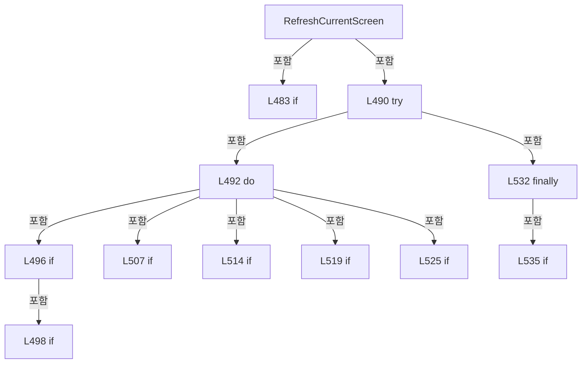
```mermaid
flowchart TD
 M["RefreshCurrentScreen"]
 N0["L483 if"]
 M -->|포함| N0
 N1["L490 try"]
 M -->|포함| N1
 N2["L492 do"]
 N1 -->|포함| N2
 N3["L496 if"]
 N2 -->|포함| N3
 N4["L498 if"]
 N3 -->|포함| N4
 N5["L507 if"]
 N2 -->|포함| N5
 N6["L514 if"]
 N2 -->|포함| N6
 N7["L519 if"]
 N2 -->|포함| N7
 N8["L525 if"]
 N2 -->|포함| N8
 N9["L532 finally"]
 N1 -->|포함| N9
 N10["L535 if"]
 N9 -->|포함| N10
```

변경 전 점검: 입력/반환 타입, 위 호출자, 예외/취소 경로, 공유 상태와 저장·전송 소비자를 함께 확인합니다. 값의 단위나 물리 방향을 이름만으로 확정하지 않습니다.

### MethodDeclaration `ResetMenuStateOnOpen` · L542–553

[Drilling.UI/CRootView.cs:542–553](https://github.com/kjuws10-rgb/A3Drilling/blob/dfa5920e6301d9ec4b0eab1452ae59521aafc986/Drilling.UI/CRootView.cs#L542-L553)

| 항목 | 실제 추출 값 |
| --- | --- |
| 서명 | void Drilling.UI.CRootView.ResetMenuStateOnOpen(Drilling.UI.Menu.Menus.EN_MENU, Drilling.UI.Menu.Menus.EN_MENU) |
| 접근/수식자 | Private / private |
| 반환/값 타입 | void |
| 소속 타입 | NamedType:Drilling.UI.CRootView |

입력 계약:

| 이름 | 타입 | 전달 | 선택/기본값 |
| --- | --- | --- | --- |
| previousMenu | Drilling.UI.Menu.Menus.EN_MENU | None | False /  |
| selectedMenu | Drilling.UI.Menu.Menus.EN_MENU | None | False /  |

정적 호출자로 확인된 위치:

| 호출 파일/행 | 호출 표현식 | 런타임 분기 가능 |
| --- | --- | --- |
| [Drilling.UI/CRootView.cs:320–320](https://github.com/kjuws10-rgb/A3Drilling/blob/dfa5920e6301d9ec4b0eab1452ae59521aafc986/Drilling.UI/CRootView.cs#L320-L320) | ResetMenuStateOnOpen | False |

호출하는 대상과 해석 범위:

| 원본 행 | 표현식 | 분석 상태 | 대상/소스 위치 |
| --- | --- | --- | --- |
| 546 | ResetSelectedManualHead | resolved | void Drilling.UI.CRootView.ResetSelectedManualHead() · Drilling.UI/CRootView.cs:555 |
| 550 | _menus.TryGetValue | resolved · 동적 구현 선택 가능 | bool System.Collections.Generic.IReadOnlyDictionary<Drilling.UI.Menu.Menus.EN_MENU, Drilling.UI.Menu.Menus.CMenuBase>.TryGetValue(Drilling.UI.Menu.Menus.EN_MENU, out Drilling.UI.Menu.Menus.CMenuBase) |
| 552 | .ResetForMenuOpen | resolved | void Drilling.UI.Menu.Menus.CMenuReview.ResetForMenuOpen() · Drilling.UI/Menu/Menus/CMenuReview.cs:378 |

본문의 실제 연산·분기·예외·반환 순서(원문 위치 순):

| 원본 행 | 종류 | 주석 해설 |
| --- | --- | --- |
| 544 | if | 조건에 따라 분기합니다: if (selectedMenu == EN_MENU.Manual && previousMenu != EN_MENU.Manual) |
| 546 | call | 함수·델리게이트 또는 객체 생성자를 호출합니다: ResetSelectedManualHead() |
| 549 | if | 조건에 따라 분기합니다: if (selectedMenu == EN_MENU.Correction && previousMenu != EN_MENU.Correction && _menus.TryGetValue(EN_MENU.Correction, out var correction) && correction is CMenuCorrection correctionMenu) |
| 550 | call | 함수·델리게이트 또는 객체 생성자를 호출합니다: _menus.TryGetValue(EN_MENU.Correction, out var correction) |
| 552 | call | 함수·델리게이트 또는 객체 생성자를 호출합니다: .ResetForMenuOpen() |

제어 구문의 포함 구조(실제 실행 순서/CFG가 아닌 구문 탐색 그림):

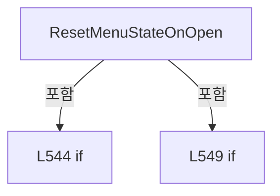
```mermaid
flowchart TD
 M["ResetMenuStateOnOpen"]
 N0["L544 if"]
 M -->|포함| N0
 N1["L549 if"]
 M -->|포함| N1
```

변경 전 점검: 입력/반환 타입, 위 호출자, 예외/취소 경로, 공유 상태와 저장·전송 소비자를 함께 확인합니다. 값의 단위나 물리 방향을 이름만으로 확정하지 않습니다.

### MethodDeclaration `ResetSelectedManualHead` · L555–572

[Drilling.UI/CRootView.cs:555–572](https://github.com/kjuws10-rgb/A3Drilling/blob/dfa5920e6301d9ec4b0eab1452ae59521aafc986/Drilling.UI/CRootView.cs#L555-L572)

| 항목 | 실제 추출 값 |
| --- | --- |
| 서명 | void Drilling.UI.CRootView.ResetSelectedManualHead() |
| 접근/수식자 | Private / private |
| 반환/값 타입 | void |
| 소속 타입 | NamedType:Drilling.UI.CRootView |

정적 호출자로 확인된 위치:

| 호출 파일/행 | 호출 표현식 | 런타임 분기 가능 |
| --- | --- | --- |
| [Drilling.UI/CRootView.cs:546–546](https://github.com/kjuws10-rgb/A3Drilling/blob/dfa5920e6301d9ec4b0eab1452ae59521aafc986/Drilling.UI/CRootView.cs#L546-L546) | ResetSelectedManualHead | False |

호출하는 대상과 해석 범위:

| 원본 행 | 표현식 | 분석 상태 | 대상/소스 위치 |
| --- | --- | --- | --- |
| 559 | _manager.Setting().LoadSection | resolved | System.Collections.Generic.IReadOnlyList<Drilling.Common.Managers.ST_SYSTEM_PARAMETER> Drilling.Common.Managers.CSettingManager.LoadSection(Drilling.Common.Managers.EN_SETTING_TAB, System.Threading.CancellationToken) · Drilling.Common/Managers/CSettingManager.cs:26 |
| 559 | _manager.Setting | resolved | Drilling.Common.Managers.CSettingManager Drilling.Common.Managers.CManager.Setting() · Drilling.Common/Managers/CManager.cs:340 |
| 560 | CScannerStatusSnapshotReader.BuildEnabledHeadNumbers | resolved | System.Collections.Generic.IReadOnlyList<int> Drilling.UI.Menu.Menus.CScannerStatusSnapshotReader.BuildEnabledHeadNumbers(System.Collections.Generic.IReadOnlyList<Drilling.Common.Managers.ST_SYSTEM_PARAMETER>, int) · Drilling.UI/Menu/Menus/CScannerStatusSnapshotReader.cs:126 |
| 571 | Math.Clamp | resolved | int System.Math.Clamp(int, int, int) |

본문의 실제 연산·분기·예외·반환 순서(원문 위치 순):

| 원본 행 | 종류 | 주석 해설 |
| --- | --- | --- |
| 557 | try | 예외 처리 범위입니다: try |
| 559 | call | 함수·델리게이트 또는 객체 생성자를 호출합니다: _manager.Setting().LoadSection(EN_SETTING_TAB.Option, CancellationToken.None) |
| 559 | call | 함수·델리게이트 또는 객체 생성자를 호출합니다: _manager.Setting() |
| 559 | local-declaration | 지역 변수를 선언합니다: var settings = _manager.Setting().LoadSection(EN_SETTING_TAB.Option, CancellationToken.None); |
| 559 | variable-initializer | 변수의 초기값을 지정합니다: settings = _manager.Setting().LoadSection(EN_SETTING_TAB.Option, CancellationToken.None) |
| 560 | call | 함수·델리게이트 또는 객체 생성자를 호출합니다: CScannerStatusSnapshotReader.BuildEnabledHeadNumbers(settings, 8) |
| 560 | local-declaration | 지역 변수를 선언합니다: var enabledHeadNos = CScannerStatusSnapshotReader.BuildEnabledHeadNumbers(settings, 8); |
| 560 | variable-initializer | 변수의 초기값을 지정합니다: enabledHeadNos = CScannerStatusSnapshotReader.BuildEnabledHeadNumbers(settings, 8) |
| 561 | if | 조건에 따라 분기합니다: if (enabledHeadNos.Count > 0) |
| 563 | assignment | 값을 대상에 대입합니다: _selectedHeadNo = enabledHeadNos[0] |
| 564 | return | 호출자에게 값 또는 제어를 반환합니다: return; |
| 567 | catch | 지정 예외를 처리합니다: catch (Exception exception) when (exception is InvalidDataException or IOException) |
| 571 | assignment | 값을 대상에 대입합니다: _selectedHeadNo = Math.Clamp(_selectedHeadNo, 1, 8) |
| 571 | call | 함수·델리게이트 또는 객체 생성자를 호출합니다: Math.Clamp(_selectedHeadNo, 1, 8) |

제어 구문의 포함 구조(실제 실행 순서/CFG가 아닌 구문 탐색 그림):

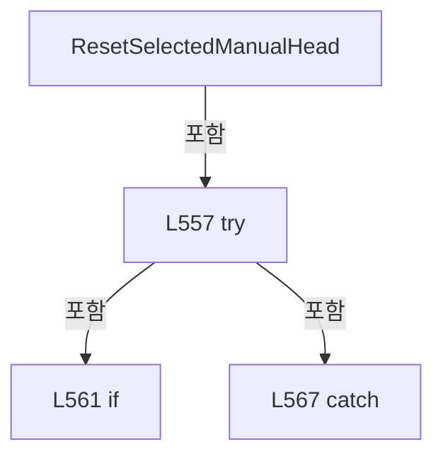
```mermaid
flowchart TD
 M["ResetSelectedManualHead"]
 N0["L557 try"]
 M -->|포함| N0
 N1["L561 if"]
 N0 -->|포함| N1
 N2["L567 catch"]
 N0 -->|포함| N2
```

변경 전 점검: 입력/반환 타입, 위 호출자, 예외/취소 경로, 공유 상태와 저장·전송 소비자를 함께 확인합니다. 값의 단위나 물리 방향을 이름만으로 확정하지 않습니다.

### MethodDeclaration `ToggleTheme` · L574–582

[Drilling.UI/CRootView.cs:574–582](https://github.com/kjuws10-rgb/A3Drilling/blob/dfa5920e6301d9ec4b0eab1452ae59521aafc986/Drilling.UI/CRootView.cs#L574-L582)

| 항목 | 실제 추출 값 |
| --- | --- |
| 서명 | System.Threading.Tasks.Task Drilling.UI.CRootView.ToggleTheme() |
| 접근/수식자 | Private / private, async |
| 반환/값 타입 | System.Threading.Tasks.Task |
| 소속 타입 | NamedType:Drilling.UI.CRootView |

정적 호출자로 확인된 위치:

| 호출 파일/행 | 호출 표현식 | 런타임 분기 가능 |
| --- | --- | --- |
| [Drilling.UI/CRootView.cs:208–208](https://github.com/kjuws10-rgb/A3Drilling/blob/dfa5920e6301d9ec4b0eab1452ae59521aafc986/Drilling.UI/CRootView.cs#L208-L208) | ToggleTheme | False |

호출하는 대상과 해석 범위:

| 원본 행 | 표현식 | 분석 상태 | 대상/소스 위치 |
| --- | --- | --- | --- |
| 576 | CThemeManager.Toggle | resolved | Drilling.UI.EN_UI_THEME Drilling.UI.CThemeManager.Toggle() · Drilling.UI/CThemeManager.cs:33 |
| 577 | OnPropertyChanged | resolved | void Drilling.UI.Menu.CBindingBase.OnPropertyChanged(string?) · Drilling.UI/Menu/CBindingBase.cs:761 |
| 577 | nameof | unresolved | None |
| 578 | OnPropertyChanged | resolved | void Drilling.UI.Menu.CBindingBase.OnPropertyChanged(string?) · Drilling.UI/Menu/CBindingBase.cs:761 |
| 578 | nameof | unresolved | None |
| 579 | RefreshShellStatusItems | resolved | void Drilling.UI.CRootView.RefreshShellStatusItems() · Drilling.UI/CRootView.cs:736 |
| 580 | RefreshCurrentScreen | resolved | System.Threading.Tasks.Task Drilling.UI.CRootView.RefreshCurrentScreen() · Drilling.UI/CRootView.cs:481 |

본문의 실제 연산·분기·예외·반환 순서(원문 위치 순):

| 원본 행 | 종류 | 주석 해설 |
| --- | --- | --- |
| 576 | assignment | 값을 대상에 대입합니다: _currentTheme = CThemeManager.Toggle() |
| 576 | call | 함수·델리게이트 또는 객체 생성자를 호출합니다: CThemeManager.Toggle() |
| 577 | call | 함수·델리게이트 또는 객체 생성자를 호출합니다: OnPropertyChanged(nameof(ThemeToggleText)) |
| 577 | call | 함수·델리게이트 또는 객체 생성자를 호출합니다: nameof(ThemeToggleText) |
| 578 | call | 함수·델리게이트 또는 객체 생성자를 호출합니다: OnPropertyChanged(nameof(ThemeModeText)) |
| 578 | call | 함수·델리게이트 또는 객체 생성자를 호출합니다: nameof(ThemeModeText) |
| 579 | call | 함수·델리게이트 또는 객체 생성자를 호출합니다: RefreshShellStatusItems() |
| 580 | await | 비동기 완료를 기다립니다: await RefreshCurrentScreen() |
| 580 | call | 함수·델리게이트 또는 객체 생성자를 호출합니다: RefreshCurrentScreen() |
| 581 | assignment | 값을 대상에 대입합니다: StatusMessage = $"{ThemeModeText} applied." |

변경 전 점검: 입력/반환 타입, 위 호출자, 예외/취소 경로, 공유 상태와 저장·전송 소비자를 함께 확인합니다. 값의 단위나 물리 방향을 이름만으로 확정하지 않습니다.

### MethodDeclaration `ToggleOperationMode` · L584–643

[Drilling.UI/CRootView.cs:584–643](https://github.com/kjuws10-rgb/A3Drilling/blob/dfa5920e6301d9ec4b0eab1452ae59521aafc986/Drilling.UI/CRootView.cs#L584-L643)

| 항목 | 실제 추출 값 |
| --- | --- |
| 서명 | System.Threading.Tasks.Task Drilling.UI.CRootView.ToggleOperationMode(System.Func<string, string, bool>?, System.Action<string, string>?) |
| 접근/수식자 | Private / private, async |
| 반환/값 타입 | System.Threading.Tasks.Task |
| 소속 타입 | NamedType:Drilling.UI.CRootView |

입력 계약:

| 이름 | 타입 | 전달 | 선택/기본값 |
| --- | --- | --- | --- |
| confirm | System.Func<string, string, bool>? | None | True / null |
| warn | System.Action<string, string>? | None | True / null |

정적 호출자로 확인된 위치:

| 호출 파일/행 | 호출 표현식 | 런타임 분기 가능 |
| --- | --- | --- |
| [Drilling.UI/CRootView.cs:215–215](https://github.com/kjuws10-rgb/A3Drilling/blob/dfa5920e6301d9ec4b0eab1452ae59521aafc986/Drilling.UI/CRootView.cs#L215-L215) | ToggleOperationMode | False |

호출하는 대상과 해석 범위:

| 원본 행 | 표현식 | 분석 상태 | 대상/소스 위치 |
| --- | --- | --- | --- |
| 586 | CRecipeConfirmDialog.ShowConfirmation | resolved | bool Drilling.UI.Popup.CRecipeConfirmDialog.ShowConfirmation(string, string, string, bool) · Drilling.UI/Popup/CRecipeConfirmDialog.xaml.cs:11 |
| 587 | CRecipeConfirmDialog.ShowWarning | resolved | void Drilling.UI.Popup.CRecipeConfirmDialog.ShowWarning(string, string, Window?) · Drilling.UI/Popup/CRecipeConfirmDialog.xaml.cs:86 |
| 596 | CheckAutoModeInterlocks | resolved | System.Threading.Tasks.Task<bool> Drilling.UI.CRootView.CheckAutoModeInterlocks(System.Action<string, string>) · Drilling.UI/CRootView.cs:645 |
| 598 | OperationModeValue | resolved | string Drilling.UI.CRootView.OperationModeValue(Drilling.Common.Managers.EN_SYSTEM_MODE) · Drilling.UI/CRootView.cs:2533 |
| 599 | confirm | resolved · 동적 구현 선택 가능 | bool System.Func<string, string, bool>.Invoke(string, string) |
| 605 | CheckAutoModeInterlocks | resolved | System.Threading.Tasks.Task<bool> Drilling.UI.CRootView.CheckAutoModeInterlocks(System.Action<string, string>) · Drilling.UI/CRootView.cs:645 |
| 613 | WaitForInitialProcessModelPreparation | resolved | System.Threading.Tasks.Task Drilling.UI.CRootView.WaitForInitialProcessModelPreparation(System.Threading.CancellationToken) · Drilling.UI/CRootView.cs:771 |
| 614 | CheckAutoModeInterlocks | resolved | System.Threading.Tasks.Task<bool> Drilling.UI.CRootView.CheckAutoModeInterlocks(System.Action<string, string>) · Drilling.UI/CRootView.cs:645 |
| 616 | _stationManager.StartStageRequests | resolved | void Drilling.Common.Station.CStationManager.StartStageRequests(System.Func<System.Threading.CancellationToken, System.Threading.Tasks.Task<Drilling.Common.Station.ST_STAGE_PROCESS_REQUEST>>, Drilling.Common.Station.ST_STAGE_REVIEW_ACTIONS?, Drilling.Common.Station.ST_STAGE_TPM_ACTIONS?, Drilling.Common.Station.ST_STAGE_DISTORTION_ACTIONS?) · Drilling.Common/Station/CStationManager.cs:30 |
| 616 | CreateAutoReviewActions | resolved | Drilling.Common.Station.ST_STAGE_REVIEW_ACTIONS Drilling.UI.CRootView.CreateAutoReviewActions() · Drilling.UI/CRootView.cs:2793 |
| 616 | CreateAutoPowerActions | resolved | Drilling.Common.Station.ST_STAGE_TPM_ACTIONS Drilling.UI.CRootView.CreateAutoPowerActions() · Drilling.UI/CRootView.cs:2778 |
| 616 | CreateAutoDistortionActions | resolved | Drilling.Common.Station.ST_STAGE_DISTORTION_ACTIONS Drilling.UI.CRootView.CreateAutoDistortionActions() · Drilling.UI/CRootView.cs:2874 |
| 618 | _stationManager.StageRequests.StopAsync | resolved | System.Threading.Tasks.Task<bool> Drilling.Common.Station.CStageRequestSequence.StopAsync() · Drilling.Common/Station/CStationProcess.cs:5067 |
| 621 | warn | resolved · 동적 구현 선택 가능 | void System.Action<string, string>.Invoke(string, string) |
| 628 | warn | resolved · 동적 구현 선택 가능 | void System.Action<string, string>.Invoke(string, string) |
| 633 | RefreshOperationModeAccess | resolved | void Drilling.UI.CRootView.RefreshOperationModeAccess() · Drilling.UI/CRootView.cs:718 |
| 634 | StopCommand.NotifyCanExecuteChanged | resolved | void Drilling.UI.Menu.CButtonCommand.NotifyCanExecuteChanged() · Drilling.UI/Menu/CButtonCommand.cs:24 |
| 639 | OnPropertyChanged | resolved | void Drilling.UI.Menu.CBindingBase.OnPropertyChanged(string?) · Drilling.UI/Menu/CBindingBase.cs:761 |
| 639 | nameof | unresolved | None |
| 640 | RefreshShellStatusItems | resolved | void Drilling.UI.CRootView.RefreshShellStatusItems() · Drilling.UI/CRootView.cs:736 |
| 642 | RefreshCurrentScreen | resolved | System.Threading.Tasks.Task Drilling.UI.CRootView.RefreshCurrentScreen() · Drilling.UI/CRootView.cs:481 |

본문의 실제 연산·분기·예외·반환 순서(원문 위치 순):

| 원본 행 | 종류 | 주석 해설 |
| --- | --- | --- |
| 586 | assignment | 값을 대상에 대입합니다: confirm ??= (title, message) => CRecipeConfirmDialog.ShowConfirmation(title, message) |
| 586 | call | 함수·델리게이트 또는 객체 생성자를 호출합니다: CRecipeConfirmDialog.ShowConfirmation(title, message) |
| 587 | assignment | 값을 대상에 대입합니다: warn ??= (title, message) => CRecipeConfirmDialog.ShowWarning(title, message) |
| 587 | call | 함수·델리게이트 또는 객체 생성자를 호출합니다: CRecipeConfirmDialog.ShowWarning(title, message) |
| 588 | if | 조건에 따라 분기합니다: if (_autoCycleState != EN_AUTO_CYCLE_STATE.Ready) |
| 590 | assignment | 값을 대상에 대입합니다: StatusMessage = "MODE cannot be changed while process is preparing, running, or stopping." |
| 591 | return | 호출자에게 값 또는 제어를 반환합니다: return; |
| 594 | local-declaration | 지역 변수를 선언합니다: var previousMode = _operationMode; |
| 594 | variable-initializer | 변수의 초기값을 지정합니다: previousMode = _operationMode |
| 595 | conditional-expression | 조건에 따라 결과식을 선택합니다: previousMode == EN_SYSTEM_MODE.Auto ? EN_SYSTEM_MODE.Manual : EN_SYSTEM_MODE.Auto |
| 595 | local-declaration | 지역 변수를 선언합니다: var nextMode = previousMode == EN_SYSTEM_MODE.Auto ? EN_SYSTEM_MODE.Manual : EN_SYSTEM_MODE.Auto; |
| 595 | variable-initializer | 변수의 초기값을 지정합니다: nextMode = previousMode == EN_SYSTEM_MODE.Auto ? EN_SYSTEM_MODE.Manual : EN_SYSTEM_MODE.Auto |
| 596 | await | 비동기 완료를 기다립니다: await CheckAutoModeInterlocks(warn) |
| 596 | call | 함수·델리게이트 또는 객체 생성자를 호출합니다: CheckAutoModeInterlocks(warn) |
| 596 | if | 조건에 따라 분기합니다: if (nextMode == EN_SYSTEM_MODE.Auto && !await CheckAutoModeInterlocks(warn)) |
| 597 | return | 호출자에게 값 또는 제어를 반환합니다: return; |
| 598 | call | 함수·델리게이트 또는 객체 생성자를 호출합니다: OperationModeValue(nextMode) |
| 598 | local-declaration | 지역 변수를 선언합니다: var nextModeText = OperationModeValue(nextMode); |
| 598 | variable-initializer | 변수의 초기값을 지정합니다: nextModeText = OperationModeValue(nextMode) |
| 599 | call | 함수·델리게이트 또는 객체 생성자를 호출합니다: confirm("MODE 변경", $"{nextModeText} Mode로 전환하시겠습니까?") |
| 599 | if | 조건에 따라 분기합니다: if (!confirm("MODE 변경", $"{nextModeText} Mode로 전환하시겠습니까?")) |
| 601 | return | 호출자에게 값 또는 제어를 반환합니다: return; |
| 605 | await | 비동기 완료를 기다립니다: await CheckAutoModeInterlocks(warn) |
| 605 | call | 함수·델리게이트 또는 객체 생성자를 호출합니다: CheckAutoModeInterlocks(warn) |
| 605 | if | 조건에 따라 분기합니다: if (nextMode == EN_SYSTEM_MODE.Auto && !await CheckAutoModeInterlocks(warn)) |
| 606 | return | 호출자에게 값 또는 제어를 반환합니다: return; |
| 607 | if | 조건에 따라 분기합니다: if (_autoCycleState != EN_AUTO_CYCLE_STATE.Ready &#124;&#124; _operationMode != previousMode) |
| 608 | return | 호출자에게 값 또는 제어를 반환합니다: return; |
| 609 | try | 예외 처리 범위입니다: try |
| 611 | if | 조건에 따라 분기합니다: if (nextMode == EN_SYSTEM_MODE.Auto) |
| 613 | await | 비동기 완료를 기다립니다: await WaitForInitialProcessModelPreparation(CancellationToken.None) |
| 613 | call | 함수·델리게이트 또는 객체 생성자를 호출합니다: WaitForInitialProcessModelPreparation(CancellationToken.None) |
| 614 | await | 비동기 완료를 기다립니다: await CheckAutoModeInterlocks(warn) |
| 614 | call | 함수·델리게이트 또는 객체 생성자를 호출합니다: CheckAutoModeInterlocks(warn) |
| 614 | if | 조건에 따라 분기합니다: if (!await CheckAutoModeInterlocks(warn)) |
| 615 | return | 호출자에게 값 또는 제어를 반환합니다: return; |
| 616 | call | 함수·델리게이트 또는 객체 생성자를 호출합니다: _stationManager.StartStageRequests(CreateStageProcessRequest, CreateAutoReviewActions(), CreateAutoPowerActions(), CreateAutoDistortionActions()) |
| 616 | call | 함수·델리게이트 또는 객체 생성자를 호출합니다: CreateAutoReviewActions() |
| 616 | call | 함수·델리게이트 또는 객체 생성자를 호출합니다: CreateAutoPowerActions() |
| 616 | call | 함수·델리게이트 또는 객체 생성자를 호출합니다: CreateAutoDistortionActions() |
| 618 | await | 비동기 완료를 기다립니다: await _stationManager.StageRequests.StopAsync() |
| 618 | call | 함수·델리게이트 또는 객체 생성자를 호출합니다: _stationManager.StageRequests.StopAsync() |
| 618 | else | 앞 조건이 거짓인 경로입니다: else |
| 618 | if | 조건에 따라 분기합니다: if (!await _stationManager.StageRequests.StopAsync()) |
| 620 | assignment | 값을 대상에 대입합니다: StatusMessage = "Previous Stage operation is still stopping. MODE change is blocked." |
| 621 | call | 함수·델리게이트 또는 객체 생성자를 호출합니다: warn("MODE 변경 불가", "Stage 동작의 정지 확인을 기다리고 있습니다.") |
| 622 | return | 호출자에게 값 또는 제어를 반환합니다: return; |
| 625 | catch | 지정 예외를 처리합니다: catch (Exception exception) |
| 627 | assignment | 값을 대상에 대입합니다: StatusMessage = $"Stage sequence mode change failed: {exception.Message}" |
| 628 | call | 함수·델리게이트 또는 객체 생성자를 호출합니다: warn("MODE 변경 불가", "Stage 시퀀스를 준비할 수 없습니다.") |
| 629 | return | 호출자에게 값 또는 제어를 반환합니다: return; |
| 632 | assignment | 값을 대상에 대입합니다: _operationMode = nextMode |
| 633 | call | 함수·델리게이트 또는 객체 생성자를 호출합니다: RefreshOperationModeAccess() |
| 634 | call | 함수·델리게이트 또는 객체 생성자를 호출합니다: StopCommand.NotifyCanExecuteChanged() |
| 635 | assignment | 값을 대상에 대입합니다: _systemStatus = _systemStatus with { OperationMode = _operationMode } |
| 637 | assignment | 값을 대상에 대입합니다: OperationMode = _operationMode |
| 639 | call | 함수·델리게이트 또는 객체 생성자를 호출합니다: OnPropertyChanged(nameof(IsManualShiftOffsetVisible)) |
| 639 | call | 함수·델리게이트 또는 객체 생성자를 호출합니다: nameof(IsManualShiftOffsetVisible) |
| 640 | call | 함수·델리게이트 또는 객체 생성자를 호출합니다: RefreshShellStatusItems() |
| 641 | assignment | 값을 대상에 대입합니다: StatusMessage = _operationMode == EN_SYSTEM_MODE.Auto ? "AUTO mode selected. Waiting for Stage PC request." : "MANUAL mode selected. Main START is enabled." |
| 641 | conditional-expression | 조건에 따라 결과식을 선택합니다: _operationMode == EN_SYSTEM_MODE.Auto ? "AUTO mode selected. Waiting for Stage PC request." : "MANUAL mode selected. Main START is enabled." |
| 642 | await | 비동기 완료를 기다립니다: await RefreshCurrentScreen() |
| 642 | call | 함수·델리게이트 또는 객체 생성자를 호출합니다: RefreshCurrentScreen() |

제어 구문의 포함 구조(실제 실행 순서/CFG가 아닌 구문 탐색 그림):

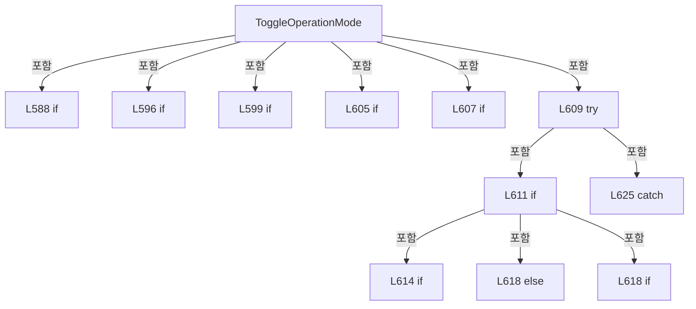
```mermaid
flowchart TD
 M["ToggleOperationMode"]
 N0["L588 if"]
 M -->|포함| N0
 N1["L596 if"]
 M -->|포함| N1
 N2["L599 if"]
 M -->|포함| N2
 N3["L605 if"]
 M -->|포함| N3
 N4["L607 if"]
 M -->|포함| N4
 N5["L609 try"]
 M -->|포함| N5
 N6["L611 if"]
 N5 -->|포함| N6
 N7["L614 if"]
 N6 -->|포함| N7
 N8["L618 else"]
 N6 -->|포함| N8
 N9["L618 if"]
 N6 -->|포함| N9
 N10["L625 catch"]
 N5 -->|포함| N10
```

변경 전 점검: 입력/반환 타입, 위 호출자, 예외/취소 경로, 공유 상태와 저장·전송 소비자를 함께 확인합니다. 값의 단위나 물리 방향을 이름만으로 확정하지 않습니다.

### MethodDeclaration `CheckAutoModeInterlocks` · L645–671

[Drilling.UI/CRootView.cs:645–671](https://github.com/kjuws10-rgb/A3Drilling/blob/dfa5920e6301d9ec4b0eab1452ae59521aafc986/Drilling.UI/CRootView.cs#L645-L671)

| 항목 | 실제 추출 값 |
| --- | --- |
| 서명 | System.Threading.Tasks.Task<bool> Drilling.UI.CRootView.CheckAutoModeInterlocks(System.Action<string, string>) |
| 접근/수식자 | Private / private, async |
| 반환/값 타입 | System.Threading.Tasks.Task<bool> |
| 소속 타입 | NamedType:Drilling.UI.CRootView |

입력 계약:

| 이름 | 타입 | 전달 | 선택/기본값 |
| --- | --- | --- | --- |
| warn | System.Action<string, string> | None | False /  |

정적 호출자로 확인된 위치:

| 호출 파일/행 | 호출 표현식 | 런타임 분기 가능 |
| --- | --- | --- |
| [Drilling.UI/CRootView.cs:596–596](https://github.com/kjuws10-rgb/A3Drilling/blob/dfa5920e6301d9ec4b0eab1452ae59521aafc986/Drilling.UI/CRootView.cs#L596-L596) | CheckAutoModeInterlocks | False |
| [Drilling.UI/CRootView.cs:605–605](https://github.com/kjuws10-rgb/A3Drilling/blob/dfa5920e6301d9ec4b0eab1452ae59521aafc986/Drilling.UI/CRootView.cs#L605-L605) | CheckAutoModeInterlocks | False |
| [Drilling.UI/CRootView.cs:614–614](https://github.com/kjuws10-rgb/A3Drilling/blob/dfa5920e6301d9ec4b0eab1452ae59521aafc986/Drilling.UI/CRootView.cs#L614-L614) | CheckAutoModeInterlocks | False |

호출하는 대상과 해석 범위:

| 원본 행 | 표현식 | 분석 상태 | 대상/소스 위치 |
| --- | --- | --- | --- |
| 647 | _menus.TryGetValue | resolved · 동적 구현 선택 가능 | bool System.Collections.Generic.IReadOnlyDictionary<Drilling.UI.Menu.Menus.EN_MENU, Drilling.UI.Menu.Menus.CMenuBase>.TryGetValue(Drilling.UI.Menu.Menus.EN_MENU, out Drilling.UI.Menu.Menus.CMenuBase) |
| 649 | warn | resolved · 동적 구현 선택 가능 | void System.Action<string, string>.Invoke(string, string) |
| 652 | CheckHeavyAlarmForOperation | resolved | bool Drilling.UI.CRootView.CheckHeavyAlarmForOperation(string) · Drilling.UI/CRootView.cs:2581 |
| 654 | CheckStageMotionOwnership | resolved | bool Drilling.UI.CRootView.CheckStageMotionOwnership(System.Action<string, string>, string) · Drilling.UI/CRootView.cs:673 |
| 658 | ((CMenuMain)_menus[EN_MENU.Main]).GetAutoModeBlockers | resolved | System.Threading.Tasks.Task<System.Collections.Generic.IReadOnlyList<Drilling.Common.InterLock.ST_INTERLOCK_ITEM>> Drilling.UI.Menu.Menus.CMenuMain.GetAutoModeBlockers(System.Threading.CancellationToken) · Drilling.UI/Menu/Menus/CMenuMain.cs:773 |
| 661 | CheckStageMotionOwnership | resolved | bool Drilling.UI.CRootView.CheckStageMotionOwnership(System.Action<string, string>, string) · Drilling.UI/CRootView.cs:673 |
| 669 | warn | resolved · 동적 구현 선택 가능 | void System.Action<string, string>.Invoke(string, string) |

본문의 실제 연산·분기·예외·반환 순서(원문 위치 순):

| 원본 행 | 종류 | 주석 해설 |
| --- | --- | --- |
| 647 | call | 함수·델리게이트 또는 객체 생성자를 호출합니다: _menus.TryGetValue(EN_MENU.Correction, out var correction) |
| 647 | if | 조건에 따라 분기합니다: if (_menus.TryGetValue(EN_MENU.Correction, out var correction) && correction is CMenuCorrection { DefaultBlocksAuto: true }) |
| 649 | call | 함수·델리게이트 또는 객체 생성자를 호출합니다: warn("AUTO 전환 불가", "Default 보정 동작을 종료하고 새 가공 검증을 완료하거나 이전값을 복원해 주세요.") |
| 650 | return | 호출자에게 값 또는 제어를 반환합니다: return false; |
| 652 | call | 함수·델리게이트 또는 객체 생성자를 호출합니다: CheckHeavyAlarmForOperation("AUTO") |
| 652 | if | 조건에 따라 분기합니다: if (!CheckHeavyAlarmForOperation("AUTO")) |
| 653 | return | 호출자에게 값 또는 제어를 반환합니다: return false; |
| 654 | call | 함수·델리게이트 또는 객체 생성자를 호출합니다: CheckStageMotionOwnership(warn, "AUTO") |
| 654 | if | 조건에 따라 분기합니다: if (!CheckStageMotionOwnership(warn, "AUTO")) |
| 655 | return | 호출자에게 값 또는 제어를 반환합니다: return false; |
| 656 | try | 예외 처리 범위입니다: try |
| 658 | await | 비동기 완료를 기다립니다: await ((CMenuMain)_menus[EN_MENU.Main]).GetAutoModeBlockers() |
| 658 | call | 함수·델리게이트 또는 객체 생성자를 호출합니다: ((CMenuMain)_menus[EN_MENU.Main]).GetAutoModeBlockers() |
| 658 | local-declaration | 지역 변수를 선언합니다: var blockers = await ((CMenuMain)_menus[EN_MENU.Main]).GetAutoModeBlockers(); |
| 658 | variable-initializer | 변수의 초기값을 지정합니다: blockers = await ((CMenuMain)_menus[EN_MENU.Main]).GetAutoModeBlockers() |
| 659 | if | 조건에 따라 분기합니다: if (blockers.Count == 0) |
| 661 | call | 함수·델리게이트 또는 객체 생성자를 호출합니다: CheckStageMotionOwnership(warn, "AUTO") |
| 661 | return | 호출자에게 값 또는 제어를 반환합니다: return CheckStageMotionOwnership(warn, "AUTO"); |
| 663 | catch | 지정 예외를 처리합니다: catch (Exception) |
| 668 | assignment | 값을 대상에 대입합니다: StatusMessage = "AUTO mode change blocked by Interlock/Safety." |
| 669 | call | 함수·델리게이트 또는 객체 생성자를 호출합니다: warn("AUTO 전환 불가", "AUTO 모드로 전환할 수 없습니다.\nInterlock/Safety를 확인해 주세요.") |
| 670 | return | 호출자에게 값 또는 제어를 반환합니다: return false; |

제어 구문의 포함 구조(실제 실행 순서/CFG가 아닌 구문 탐색 그림):

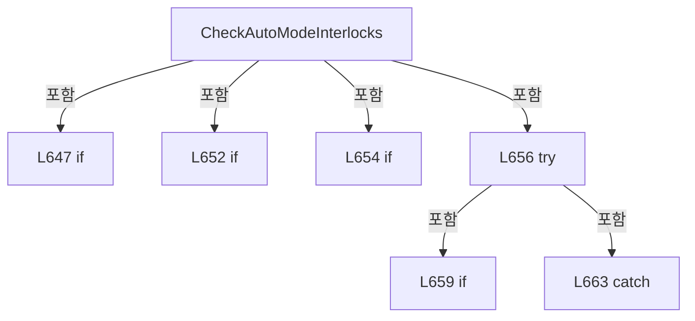
```mermaid
flowchart TD
 M["CheckAutoModeInterlocks"]
 N0["L647 if"]
 M -->|포함| N0
 N1["L652 if"]
 M -->|포함| N1
 N2["L654 if"]
 M -->|포함| N2
 N3["L656 try"]
 M -->|포함| N3
 N4["L659 if"]
 N3 -->|포함| N4
 N5["L663 catch"]
 N3 -->|포함| N5
```

변경 전 점검: 입력/반환 타입, 위 호출자, 예외/취소 경로, 공유 상태와 저장·전송 소비자를 함께 확인합니다. 값의 단위나 물리 방향을 이름만으로 확정하지 않습니다.

### MethodDeclaration `CheckStageMotionOwnership` · L673–682

[Drilling.UI/CRootView.cs:673–682](https://github.com/kjuws10-rgb/A3Drilling/blob/dfa5920e6301d9ec4b0eab1452ae59521aafc986/Drilling.UI/CRootView.cs#L673-L682)

| 항목 | 실제 추출 값 |
| --- | --- |
| 서명 | bool Drilling.UI.CRootView.CheckStageMotionOwnership(System.Action<string, string>, string) |
| 접근/수식자 | Private / private |
| 반환/값 타입 | bool |
| 소속 타입 | NamedType:Drilling.UI.CRootView |

입력 계약:

| 이름 | 타입 | 전달 | 선택/기본값 |
| --- | --- | --- | --- |
| warn | System.Action<string, string> | None | False /  |
| operation | string | None | False /  |

정적 호출자로 확인된 위치:

| 호출 파일/행 | 호출 표현식 | 런타임 분기 가능 |
| --- | --- | --- |
| [Drilling.UI/CRootView.cs:654–654](https://github.com/kjuws10-rgb/A3Drilling/blob/dfa5920e6301d9ec4b0eab1452ae59521aafc986/Drilling.UI/CRootView.cs#L654-L654) | CheckStageMotionOwnership | False |
| [Drilling.UI/CRootView.cs:661–661](https://github.com/kjuws10-rgb/A3Drilling/blob/dfa5920e6301d9ec4b0eab1452ae59521aafc986/Drilling.UI/CRootView.cs#L661-L661) | CheckStageMotionOwnership | False |
| [Drilling.UI/CRootView.cs:1604–1604](https://github.com/kjuws10-rgb/A3Drilling/blob/dfa5920e6301d9ec4b0eab1452ae59521aafc986/Drilling.UI/CRootView.cs#L1604-L1604) | CheckStageMotionOwnership | False |
| [Drilling.UI/CRootView.cs:1613–1613](https://github.com/kjuws10-rgb/A3Drilling/blob/dfa5920e6301d9ec4b0eab1452ae59521aafc986/Drilling.UI/CRootView.cs#L1613-L1613) | CheckStageMotionOwnership | False |
| [Drilling.UI/CRootView.cs:1643–1643](https://github.com/kjuws10-rgb/A3Drilling/blob/dfa5920e6301d9ec4b0eab1452ae59521aafc986/Drilling.UI/CRootView.cs#L1643-L1643) | CheckStageMotionOwnership | False |

호출하는 대상과 해석 범위:

| 원본 행 | 표현식 | 분석 상태 | 대상/소스 위치 |
| --- | --- | --- | --- |
| 675 | _menus.TryGetValue | resolved · 동적 구현 선택 가능 | bool System.Collections.Generic.IReadOnlyDictionary<Drilling.UI.Menu.Menus.EN_MENU, Drilling.UI.Menu.Menus.CMenuBase>.TryGetValue(Drilling.UI.Menu.Menus.EN_MENU, out Drilling.UI.Menu.Menus.CMenuBase) |
| 680 | warn | resolved · 동적 구현 선택 가능 | void System.Action<string, string>.Invoke(string, string) |

본문의 실제 연산·분기·예외·반환 순서(원문 위치 순):

| 원본 행 | 종류 | 주석 해설 |
| --- | --- | --- |
| 675 | call | 함수·델리게이트 또는 객체 생성자를 호출합니다: _menus.TryGetValue(EN_MENU.Manual, out var menu) |
| 675 | local-declaration | 지역 변수를 선언합니다: var manualMovePending = _menus.TryGetValue(EN_MENU.Manual, out var menu) && menu is CMenuManual manual && manual.IsManualStageMovePending; |
| 675 | variable-initializer | 변수의 초기값을 지정합니다: manualMovePending = _menus.TryGetValue(EN_MENU.Manual, out var menu) && menu is CMenuManual manual && manual.IsManualStageMovePending |
| 677 | if | 조건에 따라 분기합니다: if (!manualMovePending && !_interfaceManager.StageReviewSequences.IsActive) |
| 678 | return | 호출자에게 값 또는 제어를 반환합니다: return true; |
| 679 | assignment | 값을 대상에 대입합니다: StatusMessage = $"{operation} blocked while Stage/Review motion or cleanup is active." |
| 680 | call | 함수·델리게이트 또는 객체 생성자를 호출합니다: warn(operation == "AUTO" ? "AUTO 전환 불가" : "공정 시작 불가", "Stage/Review 수동 이동 또는 공통 시퀀스 정리가 진행 중입니다.\n이동 완료 또는 STOP 후 신호 정리와 소유권 해제를 확인해 주세요.") |
| 680 | conditional-expression | 조건에 따라 결과식을 선택합니다: operation == "AUTO" ? "AUTO 전환 불가" : "공정 시작 불가" |
| 681 | return | 호출자에게 값 또는 제어를 반환합니다: return false; |

제어 구문의 포함 구조(실제 실행 순서/CFG가 아닌 구문 탐색 그림):

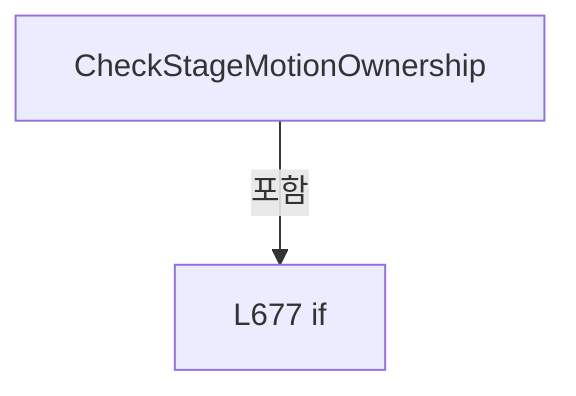
```mermaid
flowchart TD
 M["CheckStageMotionOwnership"]
 N0["L677 if"]
 M -->|포함| N0
```

변경 전 점검: 입력/반환 타입, 위 호출자, 예외/취소 경로, 공유 상태와 저장·전송 소비자를 함께 확인합니다. 값의 단위나 물리 방향을 이름만으로 확정하지 않습니다.

### MethodDeclaration `CanAccessMenu` · L684–692

[Drilling.UI/CRootView.cs:684–692](https://github.com/kjuws10-rgb/A3Drilling/blob/dfa5920e6301d9ec4b0eab1452ae59521aafc986/Drilling.UI/CRootView.cs#L684-L692)

| 항목 | 실제 추출 값 |
| --- | --- |
| 서명 | bool Drilling.UI.CRootView.CanAccessMenu(Drilling.UI.Menu.Menus.EN_MENU) |
| 접근/수식자 | Private / private |
| 반환/값 타입 | bool |
| 소속 타입 | NamedType:Drilling.UI.CRootView |

입력 계약:

| 이름 | 타입 | 전달 | 선택/기본값 |
| --- | --- | --- | --- |
| menu | Drilling.UI.Menu.Menus.EN_MENU | None | False /  |

정적 호출자로 확인된 위치:

| 호출 파일/행 | 호출 표현식 | 런타임 분기 가능 |
| --- | --- | --- |
| [Drilling.UI/CRootView.cs:280–280](https://github.com/kjuws10-rgb/A3Drilling/blob/dfa5920e6301d9ec4b0eab1452ae59521aafc986/Drilling.UI/CRootView.cs#L280-L280) | CanAccessMenu | False |
| [Drilling.UI/CRootView.cs:714–714](https://github.com/kjuws10-rgb/A3Drilling/blob/dfa5920e6301d9ec4b0eab1452ae59521aafc986/Drilling.UI/CRootView.cs#L714-L714) | CanAccessMenu | False |
| [Drilling.UI/CRootView.cs:725–725](https://github.com/kjuws10-rgb/A3Drilling/blob/dfa5920e6301d9ec4b0eab1452ae59521aafc986/Drilling.UI/CRootView.cs#L725-L725) | CanAccessMenu | False |

호출하는 대상과 해석 범위:

| 원본 행 | 표현식 | 분석 상태 | 대상/소스 위치 |
| --- | --- | --- | --- |
| 691 | AutoModeMenus.Contains | resolved · 동적 구현 선택 가능 | bool System.Collections.Generic.IReadOnlySet<Drilling.UI.Menu.Menus.EN_MENU>.Contains(Drilling.UI.Menu.Menus.EN_MENU) |

본문의 실제 연산·분기·예외·반환 순서(원문 위치 순):

| 원본 행 | 종류 | 주석 해설 |
| --- | --- | --- |
| 686 | if | 조건에 따라 분기합니다: if (_autoCycleState != EN_AUTO_CYCLE_STATE.Ready) |
| 688 | return | 호출자에게 값 또는 제어를 반환합니다: return menu is EN_MENU.Main or EN_MENU.Alarm; |
| 691 | call | 함수·델리게이트 또는 객체 생성자를 호출합니다: AutoModeMenus.Contains(menu) |
| 691 | return | 호출자에게 값 또는 제어를 반환합니다: return _operationMode != EN_SYSTEM_MODE.Auto &#124;&#124; AutoModeMenus.Contains(menu); |

제어 구문의 포함 구조(실제 실행 순서/CFG가 아닌 구문 탐색 그림):

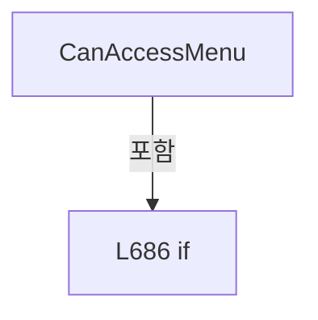
```mermaid
flowchart TD
 M["CanAccessMenu"]
 N0["L686 if"]
 M -->|포함| N0
```

변경 전 점검: 입력/반환 타입, 위 호출자, 예외/취소 경로, 공유 상태와 저장·전송 소비자를 함께 확인합니다. 값의 단위나 물리 방향을 이름만으로 확정하지 않습니다.

### MethodDeclaration `IsReviewNavigationLocked` · L694–708

[Drilling.UI/CRootView.cs:694–708](https://github.com/kjuws10-rgb/A3Drilling/blob/dfa5920e6301d9ec4b0eab1452ae59521aafc986/Drilling.UI/CRootView.cs#L694-L708)

| 항목 | 실제 추출 값 |
| --- | --- |
| 서명 | bool Drilling.UI.CRootView.IsReviewNavigationLocked(Drilling.UI.Menu.Menus.EN_MENU) |
| 접근/수식자 | Private / private |
| 반환/값 타입 | bool |
| 소속 타입 | NamedType:Drilling.UI.CRootView |

입력 계약:

| 이름 | 타입 | 전달 | 선택/기본값 |
| --- | --- | --- | --- |
| targetMenu | Drilling.UI.Menu.Menus.EN_MENU | None | False /  |

정적 호출자로 확인된 위치:

| 호출 파일/행 | 호출 표현식 | 런타임 분기 가능 |
| --- | --- | --- |
| [Drilling.UI/CRootView.cs:272–272](https://github.com/kjuws10-rgb/A3Drilling/blob/dfa5920e6301d9ec4b0eab1452ae59521aafc986/Drilling.UI/CRootView.cs#L272-L272) | IsReviewNavigationLocked | False |

호출하는 대상과 해석 범위:

| 원본 행 | 표현식 | 분석 상태 | 대상/소스 위치 |
| --- | --- | --- | --- |
| 704 | _menus.TryGetValue | resolved · 동적 구현 선택 가능 | bool System.Collections.Generic.IReadOnlyDictionary<Drilling.UI.Menu.Menus.EN_MENU, Drilling.UI.Menu.Menus.CMenuBase>.TryGetValue(Drilling.UI.Menu.Menus.EN_MENU, out Drilling.UI.Menu.Menus.CMenuBase) |

본문의 실제 연산·분기·예외·반환 순서(원문 위치 순):

| 원본 행 | 종류 | 주석 해설 |
| --- | --- | --- |
| 698 | if | 조건에 따라 분기합니다: if (_operationMode != EN_SYSTEM_MODE.Manual &#124;&#124; targetMenu == _selectedMenu.Menu) |
| 699 | return | 호출자에게 값 또는 제어를 반환합니다: return false; |
| 702 | return | 호출자에게 값 또는 제어를 반환합니다: return _selectedMenu.Menu switch { EN_MENU.Correction => _menus.TryGetValue(EN_MENU.Correction, out var correction) && correction is CMenuCorrection { BlocksMenuNavigation: true }, _ => false }; |
| 702 | switch-expression | 값별 결과식을 선택합니다: _selectedMenu.Menu switch { EN_MENU.Correction => _menus.TryGetValue(EN_MENU.Correction, out var correction) && correction is CMenuCorrection { BlocksMenuNavigation: true }, _ => false } |
| 704 | call | 함수·델리게이트 또는 객체 생성자를 호출합니다: _menus.TryGetValue(EN_MENU.Correction, out var correction) |

제어 구문의 포함 구조(실제 실행 순서/CFG가 아닌 구문 탐색 그림):

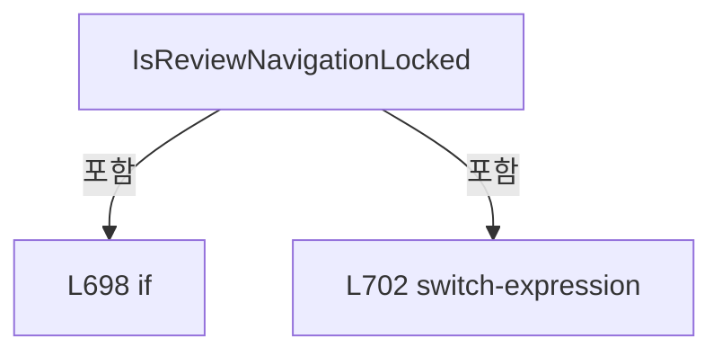
```mermaid
flowchart TD
 M["IsReviewNavigationLocked"]
 N0["L698 if"]
 M -->|포함| N0
 N1["L702 switch-expression"]
 M -->|포함| N1
```

변경 전 점검: 입력/반환 타입, 위 호출자, 예외/취소 경로, 공유 상태와 저장·전송 소비자를 함께 확인합니다. 값의 단위나 물리 방향을 이름만으로 확정하지 않습니다.

### MethodDeclaration `ApplyMenuAccessForOperationMode` · L710–716

[Drilling.UI/CRootView.cs:710–716](https://github.com/kjuws10-rgb/A3Drilling/blob/dfa5920e6301d9ec4b0eab1452ae59521aafc986/Drilling.UI/CRootView.cs#L710-L716)

| 항목 | 실제 추출 값 |
| --- | --- |
| 서명 | void Drilling.UI.CRootView.ApplyMenuAccessForOperationMode() |
| 접근/수식자 | Private / private |
| 반환/값 타입 | void |
| 소속 타입 | NamedType:Drilling.UI.CRootView |

정적 호출자로 확인된 위치:

| 호출 파일/행 | 호출 표현식 | 런타임 분기 가능 |
| --- | --- | --- |
| [Drilling.UI/CRootView.cs:167–167](https://github.com/kjuws10-rgb/A3Drilling/blob/dfa5920e6301d9ec4b0eab1452ae59521aafc986/Drilling.UI/CRootView.cs#L167-L167) | ApplyMenuAccessForOperationMode | False |
| [Drilling.UI/CRootView.cs:730–730](https://github.com/kjuws10-rgb/A3Drilling/blob/dfa5920e6301d9ec4b0eab1452ae59521aafc986/Drilling.UI/CRootView.cs#L730-L730) | ApplyMenuAccessForOperationMode | False |

호출하는 대상과 해석 범위:

| 원본 행 | 표현식 | 분석 상태 | 대상/소스 위치 |
| --- | --- | --- | --- |
| 714 | CanAccessMenu | resolved | bool Drilling.UI.CRootView.CanAccessMenu(Drilling.UI.Menu.Menus.EN_MENU) · Drilling.UI/CRootView.cs:684 |

본문의 실제 연산·분기·예외·반환 순서(원문 위치 순):

| 원본 행 | 종류 | 주석 해설 |
| --- | --- | --- |
| 712 | foreach | 컬렉션 요소를 순회합니다: foreach (var menu in Menus) |
| 714 | assignment | 값을 대상에 대입합니다: menu.IsEnabled = CanAccessMenu(menu.Menu) |
| 714 | call | 함수·델리게이트 또는 객체 생성자를 호출합니다: CanAccessMenu(menu.Menu) |

제어 구문의 포함 구조(실제 실행 순서/CFG가 아닌 구문 탐색 그림):

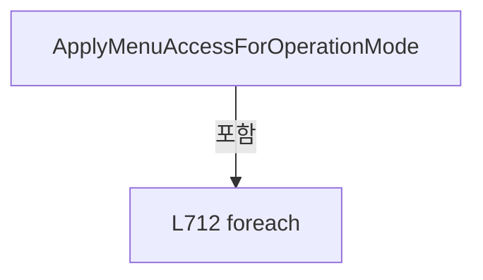
```mermaid
flowchart TD
 M["ApplyMenuAccessForOperationMode"]
 N0["L712 foreach"]
 M -->|포함| N0
```

변경 전 점검: 입력/반환 타입, 위 호출자, 예외/취소 경로, 공유 상태와 저장·전송 소비자를 함께 확인합니다. 값의 단위나 물리 방향을 이름만으로 확정하지 않습니다.

### MethodDeclaration `RefreshOperationModeAccess` · L718–734

[Drilling.UI/CRootView.cs:718–734](https://github.com/kjuws10-rgb/A3Drilling/blob/dfa5920e6301d9ec4b0eab1452ae59521aafc986/Drilling.UI/CRootView.cs#L718-L734)

| 항목 | 실제 추출 값 |
| --- | --- |
| 서명 | void Drilling.UI.CRootView.RefreshOperationModeAccess() |
| 접근/수식자 | Private / private |
| 반환/값 타입 | void |
| 소속 타입 | NamedType:Drilling.UI.CRootView |

정적 호출자로 확인된 위치:

| 호출 파일/행 | 호출 표현식 | 런타임 분기 가능 |
| --- | --- | --- |
| [Drilling.UI/CRootView.cs:633–633](https://github.com/kjuws10-rgb/A3Drilling/blob/dfa5920e6301d9ec4b0eab1452ae59521aafc986/Drilling.UI/CRootView.cs#L633-L633) | RefreshOperationModeAccess | False |
| [Drilling.UI/CRootView.cs:1069–1069](https://github.com/kjuws10-rgb/A3Drilling/blob/dfa5920e6301d9ec4b0eab1452ae59521aafc986/Drilling.UI/CRootView.cs#L1069-L1069) | RefreshOperationModeAccess | False |
| [Drilling.UI/CRootView.cs:1098–1098](https://github.com/kjuws10-rgb/A3Drilling/blob/dfa5920e6301d9ec4b0eab1452ae59521aafc986/Drilling.UI/CRootView.cs#L1098-L1098) | RefreshOperationModeAccess | False |
| [Drilling.UI/CRootView.cs:1852–1852](https://github.com/kjuws10-rgb/A3Drilling/blob/dfa5920e6301d9ec4b0eab1452ae59521aafc986/Drilling.UI/CRootView.cs#L1852-L1852) | RefreshOperationModeAccess | False |
| [Drilling.UI/CRootView.cs:2731–2731](https://github.com/kjuws10-rgb/A3Drilling/blob/dfa5920e6301d9ec4b0eab1452ae59521aafc986/Drilling.UI/CRootView.cs#L2731-L2731) | RefreshOperationModeAccess | False |

호출하는 대상과 해석 범위:

| 원본 행 | 표현식 | 분석 상태 | 대상/소스 위치 |
| --- | --- | --- | --- |
| 725 | CanAccessMenu | resolved | bool Drilling.UI.CRootView.CanAccessMenu(Drilling.UI.Menu.Menus.EN_MENU) · Drilling.UI/CRootView.cs:684 |
| 727 | Menus.First | resolved | Drilling.UI.Menu.Menus.CMenuItem System.Collections.Generic.IEnumerable<Drilling.UI.Menu.Menus.CMenuItem>.First<Drilling.UI.Menu.Menus.CMenuItem>(System.Func<Drilling.UI.Menu.Menus.CMenuItem, bool>) |
| 730 | ApplyMenuAccessForOperationMode | resolved | void Drilling.UI.CRootView.ApplyMenuAccessForOperationMode() · Drilling.UI/CRootView.cs:710 |
| 731 | OnPropertyChanged | resolved | void Drilling.UI.Menu.CBindingBase.OnPropertyChanged(string?) · Drilling.UI/Menu/CBindingBase.cs:761 |
| 731 | nameof | unresolved | None |
| 732 | StartCommand.NotifyCanExecuteChanged | resolved | void Drilling.UI.Menu.CButtonCommand.NotifyCanExecuteChanged() · Drilling.UI/Menu/CButtonCommand.cs:24 |
| 733 | ToggleOperationModeCommand.NotifyCanExecuteChanged | resolved | void Drilling.UI.Menu.CButtonCommand.NotifyCanExecuteChanged() · Drilling.UI/Menu/CButtonCommand.cs:24 |

본문의 실제 연산·분기·예외·반환 순서(원문 위치 순):

| 원본 행 | 종류 | 주석 해설 |
| --- | --- | --- |
| 725 | call | 함수·델리게이트 또는 객체 생성자를 호출합니다: CanAccessMenu(SelectedMenu.Menu) |
| 725 | if | 조건에 따라 분기합니다: if (!CanAccessMenu(SelectedMenu.Menu)) |
| 727 | assignment | 값을 대상에 대입합니다: SelectedMenu = Menus.First(MatchesItem) |
| 727 | call | 함수·델리게이트 또는 객체 생성자를 호출합니다: Menus.First(MatchesItem) |
| 730 | call | 함수·델리게이트 또는 객체 생성자를 호출합니다: ApplyMenuAccessForOperationMode() |
| 731 | call | 함수·델리게이트 또는 객체 생성자를 호출합니다: OnPropertyChanged(nameof(IsManualShiftOffsetVisible)) |
| 731 | call | 함수·델리게이트 또는 객체 생성자를 호출합니다: nameof(IsManualShiftOffsetVisible) |
| 732 | call | 함수·델리게이트 또는 객체 생성자를 호출합니다: StartCommand.NotifyCanExecuteChanged() |
| 733 | call | 함수·델리게이트 또는 객체 생성자를 호출합니다: ToggleOperationModeCommand.NotifyCanExecuteChanged() |

제어 구문의 포함 구조(실제 실행 순서/CFG가 아닌 구문 탐색 그림):

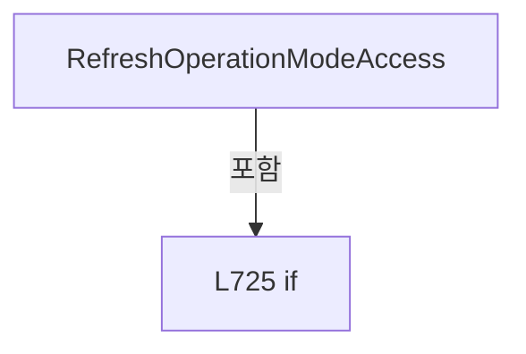
```mermaid
flowchart TD
 M["RefreshOperationModeAccess"]
 N0["L725 if"]
 M -->|포함| N0
```

변경 전 점검: 입력/반환 타입, 위 호출자, 예외/취소 경로, 공유 상태와 저장·전송 소비자를 함께 확인합니다. 값의 단위나 물리 방향을 이름만으로 확정하지 않습니다.

### LocalFunctionStatement `MatchesItem` · L720–723

[Drilling.UI/CRootView.cs:720–723](https://github.com/kjuws10-rgb/A3Drilling/blob/dfa5920e6301d9ec4b0eab1452ae59521aafc986/Drilling.UI/CRootView.cs#L720-L723)

| 항목 | 실제 추출 값 |
| --- | --- |
| 서명 | bool MatchesItem(Drilling.UI.Menu.Menus.CMenuItem) |
| 접근/수식자 | Private /  |
| 반환/값 타입 | bool |
| 소속 타입 | NamedType:Drilling.UI.CRootView |

입력 계약:

| 이름 | 타입 | 전달 | 선택/기본값 |
| --- | --- | --- | --- |
| menu | Drilling.UI.Menu.Menus.CMenuItem | None | False /  |

현재 부분 분석에서 직접 연결된 호출자는 없습니다. XAML/이벤트/인터페이스·델리게이트·외부 진입을 추가 확인해야 하며, 미사용으로 판정한 것이 아닙니다.

본문의 실제 연산·분기·예외·반환 순서(원문 위치 순):

| 원본 행 | 종류 | 주석 해설 |
| --- | --- | --- |
| 722 | return | 호출자에게 값 또는 제어를 반환합니다: return menu.Menu == EN_MENU.Main; |

변경 전 점검: 입력/반환 타입, 위 호출자, 예외/취소 경로, 공유 상태와 저장·전송 소비자를 함께 확인합니다. 값의 단위나 물리 방향을 이름만으로 확정하지 않습니다.

### MethodDeclaration `RefreshShellStatusItems` · L736–747

[Drilling.UI/CRootView.cs:736–747](https://github.com/kjuws10-rgb/A3Drilling/blob/dfa5920e6301d9ec4b0eab1452ae59521aafc986/Drilling.UI/CRootView.cs#L736-L747)

| 항목 | 실제 추출 값 |
| --- | --- |
| 서명 | void Drilling.UI.CRootView.RefreshShellStatusItems() |
| 접근/수식자 | Private / private |
| 반환/값 타입 | void |
| 소속 타입 | NamedType:Drilling.UI.CRootView |

정적 호출자로 확인된 위치:

| 호출 파일/행 | 호출 표현식 | 런타임 분기 가능 |
| --- | --- | --- |
| [Drilling.UI/CRootView.cs:229–229](https://github.com/kjuws10-rgb/A3Drilling/blob/dfa5920e6301d9ec4b0eab1452ae59521aafc986/Drilling.UI/CRootView.cs#L229-L229) | RefreshShellStatusItems | False |
| [Drilling.UI/CRootView.cs:329–329](https://github.com/kjuws10-rgb/A3Drilling/blob/dfa5920e6301d9ec4b0eab1452ae59521aafc986/Drilling.UI/CRootView.cs#L329-L329) | RefreshShellStatusItems | False |
| [Drilling.UI/CRootView.cs:579–579](https://github.com/kjuws10-rgb/A3Drilling/blob/dfa5920e6301d9ec4b0eab1452ae59521aafc986/Drilling.UI/CRootView.cs#L579-L579) | RefreshShellStatusItems | False |
| [Drilling.UI/CRootView.cs:640–640](https://github.com/kjuws10-rgb/A3Drilling/blob/dfa5920e6301d9ec4b0eab1452ae59521aafc986/Drilling.UI/CRootView.cs#L640-L640) | RefreshShellStatusItems | False |
| [Drilling.UI/CRootView.cs:1070–1070](https://github.com/kjuws10-rgb/A3Drilling/blob/dfa5920e6301d9ec4b0eab1452ae59521aafc986/Drilling.UI/CRootView.cs#L1070-L1070) | RefreshShellStatusItems | False |
| [Drilling.UI/CRootView.cs:1101–1101](https://github.com/kjuws10-rgb/A3Drilling/blob/dfa5920e6301d9ec4b0eab1452ae59521aafc986/Drilling.UI/CRootView.cs#L1101-L1101) | RefreshShellStatusItems | False |
| [Drilling.UI/CRootView.cs:1880–1880](https://github.com/kjuws10-rgb/A3Drilling/blob/dfa5920e6301d9ec4b0eab1452ae59521aafc986/Drilling.UI/CRootView.cs#L1880-L1880) | RefreshShellStatusItems | False |
| [Drilling.UI/CRootView.cs:1887–1887](https://github.com/kjuws10-rgb/A3Drilling/blob/dfa5920e6301d9ec4b0eab1452ae59521aafc986/Drilling.UI/CRootView.cs#L1887-L1887) | RefreshShellStatusItems | False |
| [Drilling.UI/CRootView.cs:2485–2485](https://github.com/kjuws10-rgb/A3Drilling/blob/dfa5920e6301d9ec4b0eab1452ae59521aafc986/Drilling.UI/CRootView.cs#L2485-L2485) | RefreshShellStatusItems | False |
| [Drilling.UI/CRootView.cs:2733–2733](https://github.com/kjuws10-rgb/A3Drilling/blob/dfa5920e6301d9ec4b0eab1452ae59521aafc986/Drilling.UI/CRootView.cs#L2733-L2733) | RefreshShellStatusItems | False |
| [Drilling.UI/CRootView.cs:2750–2750](https://github.com/kjuws10-rgb/A3Drilling/blob/dfa5920e6301d9ec4b0eab1452ae59521aafc986/Drilling.UI/CRootView.cs#L2750-L2750) | RefreshShellStatusItems | False |

호출하는 대상과 해석 범위:

| 원본 행 | 표현식 | 분석 상태 | 대상/소스 위치 |
| --- | --- | --- | --- |
| 738 | RefreshMelsecSimulatorVisibility | resolved | void Drilling.UI.CRootView.RefreshMelsecSimulatorVisibility() · Drilling.UI/CRootView.cs:2914 |
| 740 | .Close | unresolved | None |
| 741 | CreateHeaderStatusItems | resolved | System.Collections.Generic.IReadOnlyList<Drilling.UI.Menu.Menus.ST_HEADER_STATUS_ITEM> Drilling.UI.CRootView.CreateHeaderStatusItems() · Drilling.UI/CRootView.cs:1134 |
| 742 | Replace | resolved | void Drilling.UI.CRootView.Replace<Drilling.UI.Menu.Menus.ST_HEADER_STATUS_ITEM>(System.Collections.ObjectModel.ObservableCollection<Drilling.UI.Menu.Menus.ST_HEADER_STATUS_ITEM>, System.Collections.Generic.IEnumerable<Drilling.UI.Menu.Menus.ST_HEADER_STATUS_ITEM>) · Drilling.UI/CRootView.cs:1119 |
| 743 | Replace | resolved | void Drilling.UI.CRootView.Replace<Drilling.UI.Menu.Menus.ST_HEADER_STATUS_ITEM>(System.Collections.ObjectModel.ObservableCollection<Drilling.UI.Menu.Menus.ST_HEADER_STATUS_ITEM>, System.Collections.Generic.IEnumerable<Drilling.UI.Menu.Menus.ST_HEADER_STATUS_ITEM>) · Drilling.UI/CRootView.cs:1119 |
| 743 | headerStatusItems.Where | resolved | System.Collections.Generic.IEnumerable<Drilling.UI.Menu.Menus.ST_HEADER_STATUS_ITEM> System.Collections.Generic.IEnumerable<Drilling.UI.Menu.Menus.ST_HEADER_STATUS_ITEM>.Where<Drilling.UI.Menu.Menus.ST_HEADER_STATUS_ITEM>(System.Func<Drilling.UI.Menu.Menus.ST_HEADER_STATUS_ITEM, bool>) |
| 744 | Replace | resolved | void Drilling.UI.CRootView.Replace<Drilling.UI.Menu.Menus.ST_HEADER_STATUS_ITEM>(System.Collections.ObjectModel.ObservableCollection<Drilling.UI.Menu.Menus.ST_HEADER_STATUS_ITEM>, System.Collections.Generic.IEnumerable<Drilling.UI.Menu.Menus.ST_HEADER_STATUS_ITEM>) · Drilling.UI/CRootView.cs:1119 |
| 744 | headerStatusItems.Where | resolved | System.Collections.Generic.IEnumerable<Drilling.UI.Menu.Menus.ST_HEADER_STATUS_ITEM> System.Collections.Generic.IEnumerable<Drilling.UI.Menu.Menus.ST_HEADER_STATUS_ITEM>.Where<Drilling.UI.Menu.Menus.ST_HEADER_STATUS_ITEM>(System.Func<Drilling.UI.Menu.Menus.ST_HEADER_STATUS_ITEM, bool>) |
| 744 | IsHeaderContextStatusItem | resolved | bool Drilling.UI.CRootView.IsHeaderContextStatusItem(Drilling.UI.Menu.Menus.ST_HEADER_STATUS_ITEM) · Drilling.UI/CRootView.cs:1153 |
| 745 | Replace | resolved | void Drilling.UI.CRootView.Replace<Drilling.UI.Menu.Menus.ST_HEADER_STATUS_ITEM>(System.Collections.ObjectModel.ObservableCollection<Drilling.UI.Menu.Menus.ST_HEADER_STATUS_ITEM>, System.Collections.Generic.IEnumerable<Drilling.UI.Menu.Menus.ST_HEADER_STATUS_ITEM>) · Drilling.UI/CRootView.cs:1119 |
| 745 | CreateFooterStatusItems | resolved | System.Collections.Generic.IReadOnlyList<Drilling.UI.Menu.Menus.ST_HEADER_STATUS_ITEM> Drilling.UI.CRootView.CreateFooterStatusItems(Drilling.UI.Menu.Menus.EN_MENU) · Drilling.UI/CRootView.cs:1158 |
| 746 | OnPropertyChanged | resolved | void Drilling.UI.Menu.CBindingBase.OnPropertyChanged(string?) · Drilling.UI/Menu/CBindingBase.cs:761 |
| 746 | nameof | unresolved | None |

본문의 실제 연산·분기·예외·반환 순서(원문 위치 순):

| 원본 행 | 종류 | 주석 해설 |
| --- | --- | --- |
| 738 | call | 함수·델리게이트 또는 객체 생성자를 호출합니다: RefreshMelsecSimulatorVisibility() |
| 739 | if | 조건에 따라 분기합니다: if (MelsecSimulatorVisibility != Visibility.Visible) |
| 740 | call | 함수·델리게이트 또는 객체 생성자를 호출합니다: .Close() |
| 741 | call | 함수·델리게이트 또는 객체 생성자를 호출합니다: CreateHeaderStatusItems() |
| 741 | local-declaration | 지역 변수를 선언합니다: var headerStatusItems = CreateHeaderStatusItems(); |
| 741 | variable-initializer | 변수의 초기값을 지정합니다: headerStatusItems = CreateHeaderStatusItems() |
| 742 | call | 함수·델리게이트 또는 객체 생성자를 호출합니다: Replace(HeaderStatusItems, headerStatusItems) |
| 743 | call | 함수·델리게이트 또는 객체 생성자를 호출합니다: Replace(HeaderContextStatusItems, headerStatusItems.Where(IsHeaderContextStatusItem)) |
| 743 | call | 함수·델리게이트 또는 객체 생성자를 호출합니다: headerStatusItems.Where(IsHeaderContextStatusItem) |
| 744 | call | 함수·델리게이트 또는 객체 생성자를 호출합니다: Replace(HeaderCommunicationStatusItems, headerStatusItems.Where(item => !IsHeaderContextStatusItem(item))) |
| 744 | call | 함수·델리게이트 또는 객체 생성자를 호출합니다: headerStatusItems.Where(item => !IsHeaderContextStatusItem(item)) |
| 744 | call | 함수·델리게이트 또는 객체 생성자를 호출합니다: IsHeaderContextStatusItem(item) |
| 745 | call | 함수·델리게이트 또는 객체 생성자를 호출합니다: Replace(FooterStatusItems, CreateFooterStatusItems(SelectedMenu.Menu)) |
| 745 | call | 함수·델리게이트 또는 객체 생성자를 호출합니다: CreateFooterStatusItems(SelectedMenu.Menu) |
| 746 | call | 함수·델리게이트 또는 객체 생성자를 호출합니다: OnPropertyChanged(nameof(CurrentUserText)) |
| 746 | call | 함수·델리게이트 또는 객체 생성자를 호출합니다: nameof(CurrentUserText) |

제어 구문의 포함 구조(실제 실행 순서/CFG가 아닌 구문 탐색 그림):

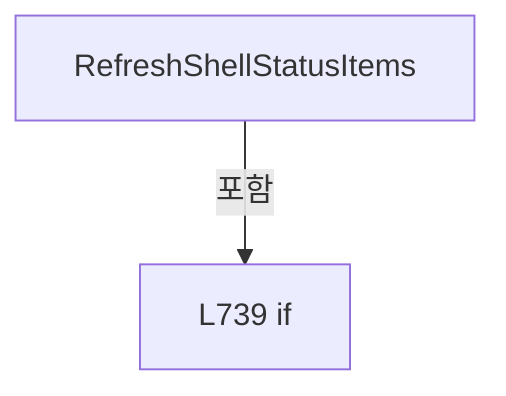
```mermaid
flowchart TD
 M["RefreshShellStatusItems"]
 N0["L739 if"]
 M -->|포함| N0
```

변경 전 점검: 입력/반환 타입, 위 호출자, 예외/취소 경로, 공유 상태와 저장·전송 소비자를 함께 확인합니다. 값의 단위나 물리 방향을 이름만으로 확정하지 않습니다.

### MethodDeclaration `RefreshSystemStatus` · L749–769

[Drilling.UI/CRootView.cs:749–769](https://github.com/kjuws10-rgb/A3Drilling/blob/dfa5920e6301d9ec4b0eab1452ae59521aafc986/Drilling.UI/CRootView.cs#L749-L769)

| 항목 | 실제 추출 값 |
| --- | --- |
| 서명 | System.Threading.Tasks.Task Drilling.UI.CRootView.RefreshSystemStatus() |
| 접근/수식자 | Private / private, async |
| 반환/값 타입 | System.Threading.Tasks.Task |
| 소속 타입 | NamedType:Drilling.UI.CRootView |

정적 호출자로 확인된 위치:

| 호출 파일/행 | 호출 표현식 | 런타임 분기 가능 |
| --- | --- | --- |
| [Drilling.UI/CRootView.cs:1955–1955](https://github.com/kjuws10-rgb/A3Drilling/blob/dfa5920e6301d9ec4b0eab1452ae59521aafc986/Drilling.UI/CRootView.cs#L1955-L1955) | RefreshSystemStatus | False |
| [Drilling.UI/CRootView.cs:1963–1963](https://github.com/kjuws10-rgb/A3Drilling/blob/dfa5920e6301d9ec4b0eab1452ae59521aafc986/Drilling.UI/CRootView.cs#L1963-L1963) | RefreshSystemStatus | False |
| [Drilling.UI/CRootView.cs:1967–1967](https://github.com/kjuws10-rgb/A3Drilling/blob/dfa5920e6301d9ec4b0eab1452ae59521aafc986/Drilling.UI/CRootView.cs#L1967-L1967) | RefreshSystemStatus | False |

호출하는 대상과 해석 범위:

| 원본 행 | 표현식 | 분석 상태 | 대상/소스 위치 |
| --- | --- | --- | --- |
| 759 | ApplySystemStatusSnapshot | resolved | void Drilling.UI.CRootView.ApplySystemStatusSnapshot(Drilling.UI.ST_SYSTEM_STATUS_SNAPSHOT, bool) · Drilling.UI/CRootView.cs:1092 |
| 759 | GetSystemStatusSnapshot | resolved | System.Threading.Tasks.Task<Drilling.UI.ST_SYSTEM_STATUS_SNAPSHOT> Drilling.UI.CRootView.GetSystemStatusSnapshot(System.Threading.CancellationToken) · Drilling.UI/CRootView.cs:1074 |

본문의 실제 연산·분기·예외·반환 순서(원문 위치 순):

| 원본 행 | 종류 | 주석 해설 |
| --- | --- | --- |
| 751 | if | 조건에 따라 분기합니다: if (_statusRefreshRunning) |
| 753 | return | 호출자에게 값 또는 제어를 반환합니다: return; |
| 756 | assignment | 값을 대상에 대입합니다: _statusRefreshRunning = true |
| 757 | try | 예외 처리 범위입니다: try |
| 759 | await | 비동기 완료를 기다립니다: await GetSystemStatusSnapshot() |
| 759 | call | 함수·델리게이트 또는 객체 생성자를 호출합니다: ApplySystemStatusSnapshot(await GetSystemStatusSnapshot()) |
| 759 | call | 함수·델리게이트 또는 객체 생성자를 호출합니다: GetSystemStatusSnapshot() |
| 761 | catch | 지정 예외를 처리합니다: catch  |
| 765 | finally | 종료 정리 구간입니다: finally |
| 767 | assignment | 값을 대상에 대입합니다: _statusRefreshRunning = false |

제어 구문의 포함 구조(실제 실행 순서/CFG가 아닌 구문 탐색 그림):

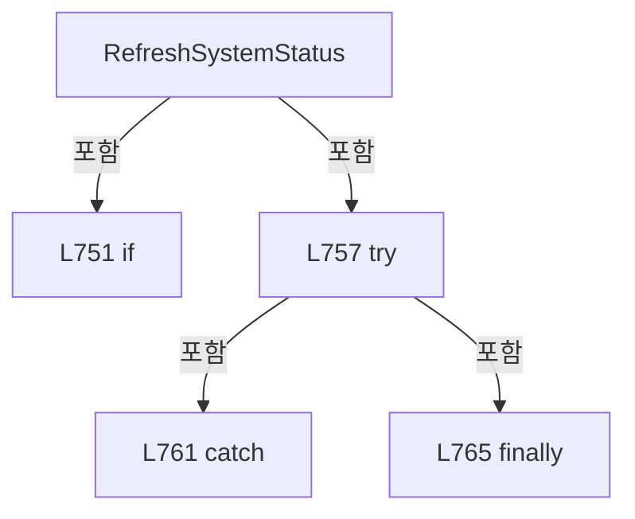
```mermaid
flowchart TD
 M["RefreshSystemStatus"]
 N0["L751 if"]
 M -->|포함| N0
 N1["L757 try"]
 M -->|포함| N1
 N2["L761 catch"]
 N1 -->|포함| N2
 N3["L765 finally"]
 N1 -->|포함| N3
```

변경 전 점검: 입력/반환 타입, 위 호출자, 예외/취소 경로, 공유 상태와 저장·전송 소비자를 함께 확인합니다. 값의 단위나 물리 방향을 이름만으로 확정하지 않습니다.

### MethodDeclaration `WaitForInitialProcessModelPreparation` · L771–785

[Drilling.UI/CRootView.cs:771–785](https://github.com/kjuws10-rgb/A3Drilling/blob/dfa5920e6301d9ec4b0eab1452ae59521aafc986/Drilling.UI/CRootView.cs#L771-L785)

| 항목 | 실제 추출 값 |
| --- | --- |
| 서명 | System.Threading.Tasks.Task Drilling.UI.CRootView.WaitForInitialProcessModelPreparation(System.Threading.CancellationToken) |
| 접근/수식자 | Private / private, async |
| 반환/값 타입 | System.Threading.Tasks.Task |
| 소속 타입 | NamedType:Drilling.UI.CRootView |

입력 계약:

| 이름 | 타입 | 전달 | 선택/기본값 |
| --- | --- | --- | --- |
| cancellationToken | System.Threading.CancellationToken | None | False /  |

정적 호출자로 확인된 위치:

| 호출 파일/행 | 호출 표현식 | 런타임 분기 가능 |
| --- | --- | --- |
| [Drilling.UI/CRootView.cs:613–613](https://github.com/kjuws10-rgb/A3Drilling/blob/dfa5920e6301d9ec4b0eab1452ae59521aafc986/Drilling.UI/CRootView.cs#L613-L613) | WaitForInitialProcessModelPreparation | False |
| [Drilling.UI/CRootView.cs:1636–1636](https://github.com/kjuws10-rgb/A3Drilling/blob/dfa5920e6301d9ec4b0eab1452ae59521aafc986/Drilling.UI/CRootView.cs#L1636-L1636) | WaitForInitialProcessModelPreparation | False |

호출하는 대상과 해석 범위:

| 원본 행 | 표현식 | 분석 상태 | 대상/소스 위치 |
| --- | --- | --- | --- |
| 775 | _initialProcessModelTask.WaitAsync | resolved | System.Threading.Tasks.Task System.Threading.Tasks.Task.WaitAsync(System.Threading.CancellationToken) |
| 783 | Debug.WriteLine | resolved | void System.Diagnostics.Debug.WriteLine(string?) |

본문의 실제 연산·분기·예외·반환 순서(원문 위치 순):

| 원본 행 | 종류 | 주석 해설 |
| --- | --- | --- |
| 773 | try | 예외 처리 범위입니다: try |
| 775 | await | 비동기 완료를 기다립니다: await _initialProcessModelTask.WaitAsync(cancellationToken) |
| 775 | call | 함수·델리게이트 또는 객체 생성자를 호출합니다: _initialProcessModelTask.WaitAsync(cancellationToken) |
| 777 | catch | 지정 예외를 처리합니다: catch (OperationCanceledException) when (cancellationToken.IsCancellationRequested) |
| 779 | throw | 예외를 발생/전달합니다: throw; |
| 781 | catch | 지정 예외를 처리합니다: catch (Exception exception) |
| 783 | call | 함수·델리게이트 또는 객체 생성자를 호출합니다: Debug.WriteLine("Initial process model preparation did not complete before Start. A fresh preparation will be attempted. " + exception) |

제어 구문의 포함 구조(실제 실행 순서/CFG가 아닌 구문 탐색 그림):

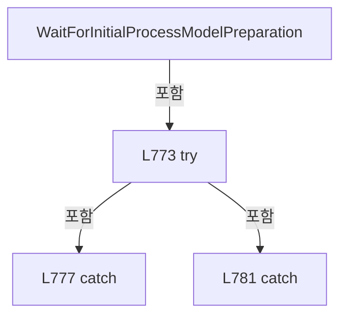
```mermaid
flowchart TD
 M["WaitForInitialProcessModelPreparation"]
 N0["L773 try"]
 M -->|포함| N0
 N1["L777 catch"]
 N0 -->|포함| N1
 N2["L781 catch"]
 N0 -->|포함| N2
```

변경 전 점검: 입력/반환 타입, 위 호출자, 예외/취소 경로, 공유 상태와 저장·전송 소비자를 함께 확인합니다. 값의 단위나 물리 방향을 이름만으로 확정하지 않습니다.

### MethodDeclaration `RefreshMonitorLiveData` · L787–817

[Drilling.UI/CRootView.cs:787–817](https://github.com/kjuws10-rgb/A3Drilling/blob/dfa5920e6301d9ec4b0eab1452ae59521aafc986/Drilling.UI/CRootView.cs#L787-L817)

| 항목 | 실제 추출 값 |
| --- | --- |
| 서명 | System.Threading.Tasks.Task Drilling.UI.CRootView.RefreshMonitorLiveData() |
| 접근/수식자 | Private / private, async |
| 반환/값 타입 | System.Threading.Tasks.Task |
| 소속 타입 | NamedType:Drilling.UI.CRootView |

정적 호출자로 확인된 위치:

| 호출 파일/행 | 호출 표현식 | 런타임 분기 가능 |
| --- | --- | --- |
| [Drilling.UI/CRootView.cs:1948–1948](https://github.com/kjuws10-rgb/A3Drilling/blob/dfa5920e6301d9ec4b0eab1452ae59521aafc986/Drilling.UI/CRootView.cs#L1948-L1948) | RefreshMonitorLiveData | False |

호출하는 대상과 해석 범위:

| 원본 행 | 표현식 | 분석 상태 | 대상/소스 위치 |
| --- | --- | --- | --- |
| 797 | _menus.TryGetValue | resolved · 동적 구현 선택 가능 | bool System.Collections.Generic.IReadOnlyDictionary<Drilling.UI.Menu.Menus.EN_MENU, Drilling.UI.Menu.Menus.CMenuBase>.TryGetValue(Drilling.UI.Menu.Menus.EN_MENU, out Drilling.UI.Menu.Menus.CMenuBase) |
| 799 | monitor.RefreshLiveData | resolved | System.Threading.Tasks.Task Drilling.UI.Menu.Menus.CMenuMonitor.RefreshLiveData(System.Threading.CancellationToken) · Drilling.UI/Menu/Menus/CMenuMonitor.cs:872 |
| 802 | Stopwatch.GetTimestamp | resolved | long System.Diagnostics.Stopwatch.GetTimestamp() |
| 803 | HasElapsed | resolved | bool Drilling.UI.CRootView.HasElapsed(long, long, System.TimeSpan) · Drilling.UI/CRootView.cs:1047 |
| 806 | RefreshShellCommunicationStatus | resolved | System.Threading.Tasks.Task Drilling.UI.CRootView.RefreshShellCommunicationStatus(System.Threading.CancellationToken) · Drilling.UI/CRootView.cs:1059 |

본문의 실제 연산·분기·예외·반환 순서(원문 위치 순):

| 원본 행 | 종류 | 주석 해설 |
| --- | --- | --- |
| 789 | if | 조건에 따라 분기합니다: if (_monitorLiveRefreshRunning) |
| 791 | return | 호출자에게 값 또는 제어를 반환합니다: return; |
| 794 | assignment | 값을 대상에 대입합니다: _monitorLiveRefreshRunning = true |
| 795 | try | 예외 처리 범위입니다: try |
| 797 | call | 함수·델리게이트 또는 객체 생성자를 호출합니다: _menus.TryGetValue(EN_MENU.Monitor, out var menu) |
| 797 | if | 조건에 따라 분기합니다: if (_menus.TryGetValue(EN_MENU.Monitor, out var menu) && menu is CMenuMonitor monitor) |
| 799 | await | 비동기 완료를 기다립니다: await monitor.RefreshLiveData() |
| 799 | call | 함수·델리게이트 또는 객체 생성자를 호출합니다: monitor.RefreshLiveData() |
| 802 | call | 함수·델리게이트 또는 객체 생성자를 호출합니다: Stopwatch.GetTimestamp() |
| 802 | local-declaration | 지역 변수를 선언합니다: var nowTimestamp = Stopwatch.GetTimestamp(); |
| 802 | variable-initializer | 변수의 초기값을 지정합니다: nowTimestamp = Stopwatch.GetTimestamp() |
| 803 | call | 함수·델리게이트 또는 객체 생성자를 호출합니다: HasElapsed(_lastMonitorShellStatusRefreshTimestamp, nowTimestamp, MonitorShellStatusRefreshInterval) |
| 803 | if | 조건에 따라 분기합니다: if (HasElapsed(_lastMonitorShellStatusRefreshTimestamp, nowTimestamp, MonitorShellStatusRefreshInterval)) |
| 805 | assignment | 값을 대상에 대입합니다: _lastMonitorShellStatusRefreshTimestamp = nowTimestamp |
| 806 | await | 비동기 완료를 기다립니다: await RefreshShellCommunicationStatus() |
| 806 | call | 함수·델리게이트 또는 객체 생성자를 호출합니다: RefreshShellCommunicationStatus() |
| 809 | catch | 지정 예외를 처리합니다: catch  |
| 813 | finally | 종료 정리 구간입니다: finally |
| 815 | assignment | 값을 대상에 대입합니다: _monitorLiveRefreshRunning = false |

제어 구문의 포함 구조(실제 실행 순서/CFG가 아닌 구문 탐색 그림):

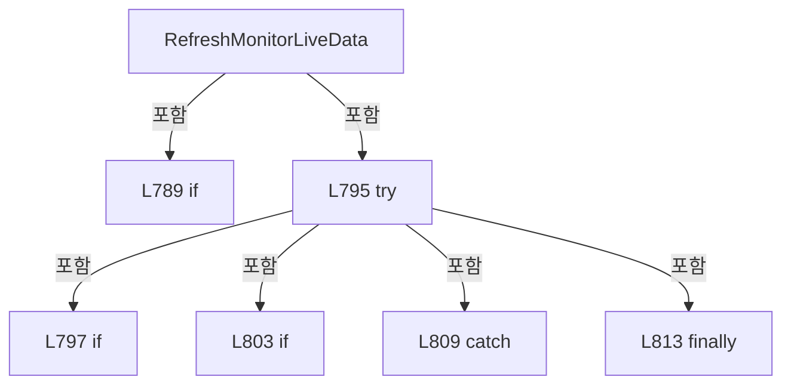
```mermaid
flowchart TD
 M["RefreshMonitorLiveData"]
 N0["L789 if"]
 M -->|포함| N0
 N1["L795 try"]
 M -->|포함| N1
 N2["L797 if"]
 N1 -->|포함| N2
 N3["L803 if"]
 N1 -->|포함| N3
 N4["L809 catch"]
 N1 -->|포함| N4
 N5["L813 finally"]
 N1 -->|포함| N5
```

변경 전 점검: 입력/반환 타입, 위 호출자, 예외/취소 경로, 공유 상태와 저장·전송 소비자를 함께 확인합니다. 값의 단위나 물리 방향을 이름만으로 확정하지 않습니다.

### MethodDeclaration `RefreshMainLiveStatus` · L819–871

[Drilling.UI/CRootView.cs:819–871](https://github.com/kjuws10-rgb/A3Drilling/blob/dfa5920e6301d9ec4b0eab1452ae59521aafc986/Drilling.UI/CRootView.cs#L819-L871)

| 항목 | 실제 추출 값 |
| --- | --- |
| 서명 | System.Threading.Tasks.Task Drilling.UI.CRootView.RefreshMainLiveStatus() |
| 접근/수식자 | Private / private, async |
| 반환/값 타입 | System.Threading.Tasks.Task |
| 소속 타입 | NamedType:Drilling.UI.CRootView |

정적 호출자로 확인된 위치:

| 호출 파일/행 | 호출 표현식 | 런타임 분기 가능 |
| --- | --- | --- |
| [Drilling.UI/CRootView.cs:1962–1962](https://github.com/kjuws10-rgb/A3Drilling/blob/dfa5920e6301d9ec4b0eab1452ae59521aafc986/Drilling.UI/CRootView.cs#L1962-L1962) | RefreshMainLiveStatus | False |

호출하는 대상과 해석 범위:

| 원본 행 | 표현식 | 분석 상태 | 대상/소스 위치 |
| --- | --- | --- | --- |
| 837 | new CancellationTokenSource | resolved | System.Threading.CancellationTokenSource.CancellationTokenSource(System.TimeSpan) |
| 839 | startedMainOperating.RefreshLiveStatus | resolved | System.Threading.Tasks.Task Drilling.UI.Menu.Menus.CMenuMain.RefreshLiveStatus(System.Threading.CancellationToken) · Drilling.UI/Menu/Menus/CMenuMain.cs:783 |
| 840 | IsMainLiveStatusTargetCurrent | resolved | bool Drilling.UI.CRootView.IsMainLiveStatusTargetCurrent(Drilling.UI.Menu.Menus.CScreenViewModel, Drilling.UI.Menu.Menus.CMenuMain?) · Drilling.UI/CRootView.cs:967 |
| 842 | ReportMainLiveStatusRestored | resolved | void Drilling.UI.CRootView.ReportMainLiveStatusRestored() · Drilling.UI/CRootView.cs:1000 |
| 845 | IsMainLiveStatusTargetCurrent | resolved | bool Drilling.UI.CRootView.IsMainLiveStatusTargetCurrent(Drilling.UI.Menu.Menus.CScreenViewModel, Drilling.UI.Menu.Menus.CMenuMain?) · Drilling.UI/CRootView.cs:967 |
| 849 | IsMainLiveStatusTargetCurrent | resolved | bool Drilling.UI.CRootView.IsMainLiveStatusTargetCurrent(Drilling.UI.Menu.Menus.CScreenViewModel, Drilling.UI.Menu.Menus.CMenuMain?) · Drilling.UI/CRootView.cs:967 |
| 851 | ReportMainLiveStatusError | resolved | void Drilling.UI.CRootView.ReportMainLiveStatusError(System.Exception) · Drilling.UI/CRootView.cs:972 |
| 855 | ReportStaleMainLiveStatusError | resolved | void Drilling.UI.CRootView.ReportStaleMainLiveStatusError(System.Exception) · Drilling.UI/CRootView.cs:989 |
| 861 | ReferenceEquals | resolved | bool object.ReferenceEquals(object?, object?) |
| 866 | refreshCts.Dispose | resolved | void System.Threading.CancellationTokenSource.Dispose() |

본문의 실제 연산·분기·예외·반환 순서(원문 위치 순):

| 원본 행 | 종류 | 주석 해설 |
| --- | --- | --- |
| 821 | if | 조건에 따라 분기합니다: if (_mainLiveRefreshRunning) |
| 823 | return | 호출자에게 값 또는 제어를 반환합니다: return; |
| 826 | local-declaration | 지역 변수를 선언합니다: var startedScreen = CurrentScreen; |
| 826 | variable-initializer | 변수의 초기값을 지정합니다: startedScreen = CurrentScreen |
| 827 | local-declaration | 지역 변수를 선언합니다: var startedMainOperating = startedScreen.MainOperating; |
| 827 | variable-initializer | 변수의 초기값을 지정합니다: startedMainOperating = startedScreen.MainOperating |
| 828 | if | 조건에 따라 분기합니다: if (SelectedMenu.Menu != EN_MENU.Main &#124;&#124; startedMainOperating is null) |
| 830 | return | 호출자에게 값 또는 제어를 반환합니다: return; |
| 833 | assignment | 값을 대상에 대입합니다: _mainLiveRefreshRunning = true |
| 834 | local-declaration | 지역 변수를 선언합니다: CancellationTokenSource? refreshCts = null; |
| 834 | variable-initializer | 변수의 초기값을 지정합니다: refreshCts = null |
| 835 | try | 예외 처리 범위입니다: try |
| 837 | assignment | 값을 대상에 대입합니다: refreshCts = new CancellationTokenSource(MainLiveStatusTimeout) |
| 837 | call | 함수·델리게이트 또는 객체 생성자를 호출합니다: new CancellationTokenSource(MainLiveStatusTimeout) |
| 838 | assignment | 값을 대상에 대입합니다: _mainLiveStatusRefreshCts = refreshCts |
| 839 | await | 비동기 완료를 기다립니다: await startedMainOperating.RefreshLiveStatus(refreshCts.Token) |
| 839 | call | 함수·델리게이트 또는 객체 생성자를 호출합니다: startedMainOperating.RefreshLiveStatus(refreshCts.Token) |
| 840 | call | 함수·델리게이트 또는 객체 생성자를 호출합니다: IsMainLiveStatusTargetCurrent(startedScreen, startedMainOperating) |
| 840 | if | 조건에 따라 분기합니다: if (IsMainLiveStatusTargetCurrent(startedScreen, startedMainOperating)) |
| 842 | call | 함수·델리게이트 또는 객체 생성자를 호출합니다: ReportMainLiveStatusRestored() |
| 845 | call | 함수·델리게이트 또는 객체 생성자를 호출합니다: IsMainLiveStatusTargetCurrent(startedScreen, startedMainOperating) |
| 845 | catch | 지정 예외를 처리합니다: catch (OperationCanceledException) when (!IsMainLiveStatusTargetCurrent(startedScreen, startedMainOperating)) |
| 849 | call | 함수·델리게이트 또는 객체 생성자를 호출합니다: IsMainLiveStatusTargetCurrent(startedScreen, startedMainOperating) |
| 849 | catch | 지정 예외를 처리합니다: catch (Exception exception) when (IsMainLiveStatusTargetCurrent(startedScreen, startedMainOperating)) |
| 851 | call | 함수·델리게이트 또는 객체 생성자를 호출합니다: ReportMainLiveStatusError(exception) |
| 853 | catch | 지정 예외를 처리합니다: catch (Exception exception) |
| 855 | call | 함수·델리게이트 또는 객체 생성자를 호출합니다: ReportStaleMainLiveStatusError(exception) |
| 857 | finally | 종료 정리 구간입니다: finally |
| 859 | if | 조건에 따라 분기합니다: if (refreshCts is not null) |
| 861 | call | 함수·델리게이트 또는 객체 생성자를 호출합니다: ReferenceEquals(_mainLiveStatusRefreshCts, refreshCts) |
| 861 | if | 조건에 따라 분기합니다: if (ReferenceEquals(_mainLiveStatusRefreshCts, refreshCts)) |
| 863 | assignment | 값을 대상에 대입합니다: _mainLiveStatusRefreshCts = null |
| 866 | call | 함수·델리게이트 또는 객체 생성자를 호출합니다: refreshCts.Dispose() |
| 869 | assignment | 값을 대상에 대입합니다: _mainLiveRefreshRunning = false |

제어 구문의 포함 구조(실제 실행 순서/CFG가 아닌 구문 탐색 그림):

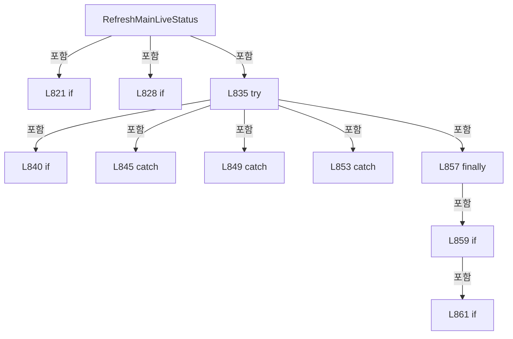
```mermaid
flowchart TD
 M["RefreshMainLiveStatus"]
 N0["L821 if"]
 M -->|포함| N0
 N1["L828 if"]
 M -->|포함| N1
 N2["L835 try"]
 M -->|포함| N2
 N3["L840 if"]
 N2 -->|포함| N3
 N4["L845 catch"]
 N2 -->|포함| N4
 N5["L849 catch"]
 N2 -->|포함| N5
 N6["L853 catch"]
 N2 -->|포함| N6
 N7["L857 finally"]
 N2 -->|포함| N7
 N8["L859 if"]
 N7 -->|포함| N8
 N9["L861 if"]
 N8 -->|포함| N9
```

변경 전 점검: 입력/반환 타입, 위 호출자, 예외/취소 경로, 공유 상태와 저장·전송 소비자를 함께 확인합니다. 값의 단위나 물리 방향을 이름만으로 확정하지 않습니다.

### MethodDeclaration `RefreshManualScannerStatus` · L873–899

[Drilling.UI/CRootView.cs:873–899](https://github.com/kjuws10-rgb/A3Drilling/blob/dfa5920e6301d9ec4b0eab1452ae59521aafc986/Drilling.UI/CRootView.cs#L873-L899)

| 항목 | 실제 추출 값 |
| --- | --- |
| 서명 | void Drilling.UI.CRootView.RefreshManualScannerStatus() |
| 접근/수식자 | Private / private |
| 반환/값 타입 | void |
| 소속 타입 | NamedType:Drilling.UI.CRootView |

정적 호출자로 확인된 위치:

| 호출 파일/행 | 호출 표현식 | 런타임 분기 가능 |
| --- | --- | --- |
| [Drilling.UI/CRootView.cs:1954–1954](https://github.com/kjuws10-rgb/A3Drilling/blob/dfa5920e6301d9ec4b0eab1452ae59521aafc986/Drilling.UI/CRootView.cs#L1954-L1954) | RefreshManualScannerStatus | False |

호출하는 대상과 해석 범위:

| 원본 행 | 표현식 | 분석 상태 | 대상/소스 위치 |
| --- | --- | --- | --- |
| 889 | manualMenu.RefreshScannerStatusSnapshot | resolved | void Drilling.UI.Menu.Menus.CMenuManual.RefreshScannerStatusSnapshot() · Drilling.UI/Menu/Menus/CMenuManual.cs:2086 |

본문의 실제 연산·분기·예외·반환 순서(원문 위치 순):

| 원본 행 | 종류 | 주석 해설 |
| --- | --- | --- |
| 875 | if | 조건에 따라 분기합니다: if (_manualScannerStatusRefreshRunning) |
| 877 | return | 호출자에게 값 또는 제어를 반환합니다: return; |
| 880 | local-declaration | 지역 변수를 선언합니다: var manualMenu = CurrentScreen.Manual; |
| 880 | variable-initializer | 변수의 초기값을 지정합니다: manualMenu = CurrentScreen.Manual |
| 881 | if | 조건에 따라 분기합니다: if (SelectedMenu.Menu != EN_MENU.Manual &#124;&#124; manualMenu is null) |
| 883 | return | 호출자에게 값 또는 제어를 반환합니다: return; |
| 886 | assignment | 값을 대상에 대입합니다: _manualScannerStatusRefreshRunning = true |
| 887 | try | 예외 처리 범위입니다: try |
| 889 | call | 함수·델리게이트 또는 객체 생성자를 호출합니다: manualMenu.RefreshScannerStatusSnapshot() |
| 891 | catch | 지정 예외를 처리합니다: catch  |
| 895 | finally | 종료 정리 구간입니다: finally |
| 897 | assignment | 값을 대상에 대입합니다: _manualScannerStatusRefreshRunning = false |

제어 구문의 포함 구조(실제 실행 순서/CFG가 아닌 구문 탐색 그림):

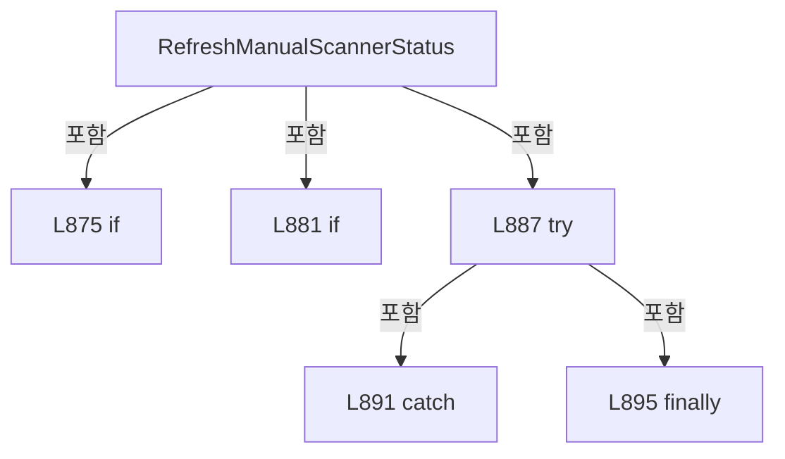
```mermaid
flowchart TD
 M["RefreshManualScannerStatus"]
 N0["L875 if"]
 M -->|포함| N0
 N1["L881 if"]
 M -->|포함| N1
 N2["L887 try"]
 M -->|포함| N2
 N3["L891 catch"]
 N2 -->|포함| N3
 N4["L895 finally"]
 N2 -->|포함| N4
```

변경 전 점검: 입력/반환 타입, 위 호출자, 예외/취소 경로, 공유 상태와 저장·전송 소비자를 함께 확인합니다. 값의 단위나 물리 방향을 이름만으로 확정하지 않습니다.

### MethodDeclaration `CancelMainLiveStatusRefresh` · L901–911

[Drilling.UI/CRootView.cs:901–911](https://github.com/kjuws10-rgb/A3Drilling/blob/dfa5920e6301d9ec4b0eab1452ae59521aafc986/Drilling.UI/CRootView.cs#L901-L911)

| 항목 | 실제 추출 값 |
| --- | --- |
| 서명 | void Drilling.UI.CRootView.CancelMainLiveStatusRefresh() |
| 접근/수식자 | Private / private |
| 반환/값 타입 | void |
| 소속 타입 | NamedType:Drilling.UI.CRootView |

정적 호출자로 확인된 위치:

| 호출 파일/행 | 호출 표현식 | 런타임 분기 가능 |
| --- | --- | --- |
| [Drilling.UI/CRootView.cs:301–301](https://github.com/kjuws10-rgb/A3Drilling/blob/dfa5920e6301d9ec4b0eab1452ae59521aafc986/Drilling.UI/CRootView.cs#L301-L301) | CancelMainLiveStatusRefresh | False |

호출하는 대상과 해석 범위:

| 원본 행 | 표현식 | 분석 상태 | 대상/소스 위치 |
| --- | --- | --- | --- |
| 905 | .Cancel | resolved | void System.Threading.CancellationTokenSource.Cancel() |

본문의 실제 연산·분기·예외·반환 순서(원문 위치 순):

| 원본 행 | 종류 | 주석 해설 |
| --- | --- | --- |
| 903 | try | 예외 처리 범위입니다: try |
| 905 | call | 함수·델리게이트 또는 객체 생성자를 호출합니다: .Cancel() |
| 907 | catch | 지정 예외를 처리합니다: catch (ObjectDisposedException) |

제어 구문의 포함 구조(실제 실행 순서/CFG가 아닌 구문 탐색 그림):

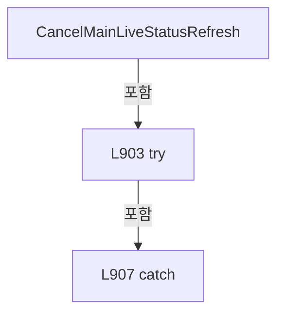
```mermaid
flowchart TD
 M["CancelMainLiveStatusRefresh"]
 N0["L903 try"]
 M -->|포함| N0
 N1["L907 catch"]
 N0 -->|포함| N1
```

변경 전 점검: 입력/반환 타입, 위 호출자, 예외/취소 경로, 공유 상태와 저장·전송 소비자를 함께 확인합니다. 값의 단위나 물리 방향을 이름만으로 확정하지 않습니다.

### MethodDeclaration `StopMainScannerStatusPolling` · L913–921

[Drilling.UI/CRootView.cs:913–921](https://github.com/kjuws10-rgb/A3Drilling/blob/dfa5920e6301d9ec4b0eab1452ae59521aafc986/Drilling.UI/CRootView.cs#L913-L921)

| 항목 | 실제 추출 값 |
| --- | --- |
| 서명 | void Drilling.UI.CRootView.StopMainScannerStatusPolling() |
| 접근/수식자 | Private / private |
| 반환/값 타입 | void |
| 소속 타입 | NamedType:Drilling.UI.CRootView |

정적 호출자로 확인된 위치:

| 호출 파일/행 | 호출 표현식 | 런타임 분기 가능 |
| --- | --- | --- |
| [Drilling.UI/CRootView.cs:929–929](https://github.com/kjuws10-rgb/A3Drilling/blob/dfa5920e6301d9ec4b0eab1452ae59521aafc986/Drilling.UI/CRootView.cs#L929-L929) | StopMainScannerStatusPolling | False |

호출하는 대상과 해석 범위:

| 원본 행 | 표현식 | 분석 상태 | 대상/소스 위치 |
| --- | --- | --- | --- |
| 915 | _menus.TryGetValue | resolved · 동적 구현 선택 가능 | bool System.Collections.Generic.IReadOnlyDictionary<Drilling.UI.Menu.Menus.EN_MENU, Drilling.UI.Menu.Menus.CMenuBase>.TryGetValue(Drilling.UI.Menu.Menus.EN_MENU, out Drilling.UI.Menu.Menus.CMenuBase) |
| 920 | mainMenu.StopScannerStatusPolling | resolved | void Drilling.UI.Menu.Menus.CMenuMain.StopScannerStatusPolling() · Drilling.UI/Menu/Menus/CMenuMain.cs:1077 |

본문의 실제 연산·분기·예외·반환 순서(원문 위치 순):

| 원본 행 | 종류 | 주석 해설 |
| --- | --- | --- |
| 915 | call | 함수·델리게이트 또는 객체 생성자를 호출합니다: _menus.TryGetValue(EN_MENU.Main, out var menu) |
| 915 | if | 조건에 따라 분기합니다: if (!_menus.TryGetValue(EN_MENU.Main, out var menu) &#124;&#124; menu is not CMenuMain mainMenu) |
| 917 | return | 호출자에게 값 또는 제어를 반환합니다: return; |
| 920 | call | 함수·델리게이트 또는 객체 생성자를 호출합니다: mainMenu.StopScannerStatusPolling() |

제어 구문의 포함 구조(실제 실행 순서/CFG가 아닌 구문 탐색 그림):

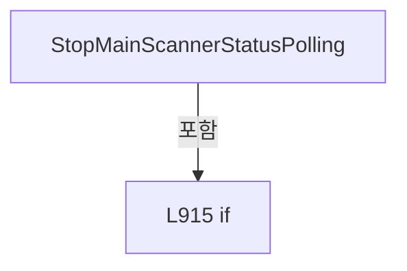
```mermaid
flowchart TD
 M["StopMainScannerStatusPolling"]
 N0["L915 if"]
 M -->|포함| N0
```

변경 전 점검: 입력/반환 타입, 위 호출자, 예외/취소 경로, 공유 상태와 저장·전송 소비자를 함께 확인합니다. 값의 단위나 물리 방향을 이름만으로 확정하지 않습니다.

### MethodDeclaration `QueueMainScannerStatusPollingStop` · L923–938

[Drilling.UI/CRootView.cs:923–938](https://github.com/kjuws10-rgb/A3Drilling/blob/dfa5920e6301d9ec4b0eab1452ae59521aafc986/Drilling.UI/CRootView.cs#L923-L938)

| 항목 | 실제 추출 값 |
| --- | --- |
| 서명 | void Drilling.UI.CRootView.QueueMainScannerStatusPollingStop() |
| 접근/수식자 | Private / private |
| 반환/값 타입 | void |
| 소속 타입 | NamedType:Drilling.UI.CRootView |

정적 호출자로 확인된 위치:

| 호출 파일/행 | 호출 표현식 | 런타임 분기 가능 |
| --- | --- | --- |
| [Drilling.UI/CRootView.cs:302–302](https://github.com/kjuws10-rgb/A3Drilling/blob/dfa5920e6301d9ec4b0eab1452ae59521aafc986/Drilling.UI/CRootView.cs#L302-L302) | QueueMainScannerStatusPollingStop | False |

호출하는 대상과 해석 범위:

| 원본 행 | 표현식 | 분석 상태 | 대상/소스 위치 |
| --- | --- | --- | --- |
| 937 | Task.Run | resolved | System.Threading.Tasks.Task System.Threading.Tasks.Task.Run(System.Action) |

본문의 실제 연산·분기·예외·반환 순서(원문 위치 순):

| 원본 행 | 종류 | 주석 해설 |
| --- | --- | --- |
| 937 | assignment | 값을 대상에 대입합니다: _ = Task.Run(StopPolling) |
| 937 | call | 함수·델리게이트 또는 객체 생성자를 호출합니다: Task.Run(StopPolling) |

변경 전 점검: 입력/반환 타입, 위 호출자, 예외/취소 경로, 공유 상태와 저장·전송 소비자를 함께 확인합니다. 값의 단위나 물리 방향을 이름만으로 확정하지 않습니다.

### LocalFunctionStatement `StopPolling` · L925–935

[Drilling.UI/CRootView.cs:925–935](https://github.com/kjuws10-rgb/A3Drilling/blob/dfa5920e6301d9ec4b0eab1452ae59521aafc986/Drilling.UI/CRootView.cs#L925-L935)

| 항목 | 실제 추출 값 |
| --- | --- |
| 서명 | void StopPolling() |
| 접근/수식자 | Private /  |
| 반환/값 타입 | void |
| 소속 타입 | NamedType:Drilling.UI.CRootView |

현재 부분 분석에서 직접 연결된 호출자는 없습니다. XAML/이벤트/인터페이스·델리게이트·외부 진입을 추가 확인해야 하며, 미사용으로 판정한 것이 아닙니다.

호출하는 대상과 해석 범위:

| 원본 행 | 표현식 | 분석 상태 | 대상/소스 위치 |
| --- | --- | --- | --- |
| 929 | StopMainScannerStatusPolling | resolved | void Drilling.UI.CRootView.StopMainScannerStatusPolling() · Drilling.UI/CRootView.cs:913 |
| 933 | Debug.WriteLine | resolved | void System.Diagnostics.Debug.WriteLine(string?) |

본문의 실제 연산·분기·예외·반환 순서(원문 위치 순):

| 원본 행 | 종류 | 주석 해설 |
| --- | --- | --- |
| 927 | try | 예외 처리 범위입니다: try |
| 929 | call | 함수·델리게이트 또는 객체 생성자를 호출합니다: StopMainScannerStatusPolling() |
| 931 | catch | 지정 예외를 처리합니다: catch (Exception exception) |
| 933 | call | 함수·델리게이트 또는 객체 생성자를 호출합니다: Debug.WriteLine($"Main scanner polling stop failed. {exception}") |

제어 구문의 포함 구조(실제 실행 순서/CFG가 아닌 구문 탐색 그림):

```mermaid
flowchart TD
 M["StopPolling"]
 N0["L927 try"]
 M -->|포함| N0
 N1["L931 catch"]
 N0 -->|포함| N1
```

변경 전 점검: 입력/반환 타입, 위 호출자, 예외/취소 경로, 공유 상태와 저장·전송 소비자를 함께 확인합니다. 값의 단위나 물리 방향을 이름만으로 확정하지 않습니다.

### MethodDeclaration `StopManualScannerStatusPolling` · L940–948

[Drilling.UI/CRootView.cs:940–948](https://github.com/kjuws10-rgb/A3Drilling/blob/dfa5920e6301d9ec4b0eab1452ae59521aafc986/Drilling.UI/CRootView.cs#L940-L948)

| 항목 | 실제 추출 값 |
| --- | --- |
| 서명 | void Drilling.UI.CRootView.StopManualScannerStatusPolling() |
| 접근/수식자 | Private / private |
| 반환/값 타입 | void |
| 소속 타입 | NamedType:Drilling.UI.CRootView |

정적 호출자로 확인된 위치:

| 호출 파일/행 | 호출 표현식 | 런타임 분기 가능 |
| --- | --- | --- |
| [Drilling.UI/CRootView.cs:956–956](https://github.com/kjuws10-rgb/A3Drilling/blob/dfa5920e6301d9ec4b0eab1452ae59521aafc986/Drilling.UI/CRootView.cs#L956-L956) | StopManualScannerStatusPolling | False |

호출하는 대상과 해석 범위:

| 원본 행 | 표현식 | 분석 상태 | 대상/소스 위치 |
| --- | --- | --- | --- |
| 942 | _menus.TryGetValue | resolved · 동적 구현 선택 가능 | bool System.Collections.Generic.IReadOnlyDictionary<Drilling.UI.Menu.Menus.EN_MENU, Drilling.UI.Menu.Menus.CMenuBase>.TryGetValue(Drilling.UI.Menu.Menus.EN_MENU, out Drilling.UI.Menu.Menus.CMenuBase) |
| 947 | manualMenu.StopScannerStatusPolling | resolved | void Drilling.UI.Menu.Menus.CMenuManual.StopScannerStatusPolling() · Drilling.UI/Menu/Menus/CMenuManual.cs:436 |

본문의 실제 연산·분기·예외·반환 순서(원문 위치 순):

| 원본 행 | 종류 | 주석 해설 |
| --- | --- | --- |
| 942 | call | 함수·델리게이트 또는 객체 생성자를 호출합니다: _menus.TryGetValue(EN_MENU.Manual, out var menu) |
| 942 | if | 조건에 따라 분기합니다: if (!_menus.TryGetValue(EN_MENU.Manual, out var menu) &#124;&#124; menu is not CMenuManual manualMenu) |
| 944 | return | 호출자에게 값 또는 제어를 반환합니다: return; |
| 947 | call | 함수·델리게이트 또는 객체 생성자를 호출합니다: manualMenu.StopScannerStatusPolling() |

제어 구문의 포함 구조(실제 실행 순서/CFG가 아닌 구문 탐색 그림):

```mermaid
flowchart TD
 M["StopManualScannerStatusPolling"]
 N0["L942 if"]
 M -->|포함| N0
```

변경 전 점검: 입력/반환 타입, 위 호출자, 예외/취소 경로, 공유 상태와 저장·전송 소비자를 함께 확인합니다. 값의 단위나 물리 방향을 이름만으로 확정하지 않습니다.

### MethodDeclaration `QueueManualScannerStatusPollingStop` · L950–965

[Drilling.UI/CRootView.cs:950–965](https://github.com/kjuws10-rgb/A3Drilling/blob/dfa5920e6301d9ec4b0eab1452ae59521aafc986/Drilling.UI/CRootView.cs#L950-L965)

| 항목 | 실제 추출 값 |
| --- | --- |
| 서명 | void Drilling.UI.CRootView.QueueManualScannerStatusPollingStop() |
| 접근/수식자 | Private / private |
| 반환/값 타입 | void |
| 소속 타입 | NamedType:Drilling.UI.CRootView |

정적 호출자로 확인된 위치:

| 호출 파일/행 | 호출 표현식 | 런타임 분기 가능 |
| --- | --- | --- |
| [Drilling.UI/CRootView.cs:307–307](https://github.com/kjuws10-rgb/A3Drilling/blob/dfa5920e6301d9ec4b0eab1452ae59521aafc986/Drilling.UI/CRootView.cs#L307-L307) | QueueManualScannerStatusPollingStop | False |

호출하는 대상과 해석 범위:

| 원본 행 | 표현식 | 분석 상태 | 대상/소스 위치 |
| --- | --- | --- | --- |
| 964 | Task.Run | resolved | System.Threading.Tasks.Task System.Threading.Tasks.Task.Run(System.Action) |

본문의 실제 연산·분기·예외·반환 순서(원문 위치 순):

| 원본 행 | 종류 | 주석 해설 |
| --- | --- | --- |
| 964 | assignment | 값을 대상에 대입합니다: _ = Task.Run(StopPolling) |
| 964 | call | 함수·델리게이트 또는 객체 생성자를 호출합니다: Task.Run(StopPolling) |

변경 전 점검: 입력/반환 타입, 위 호출자, 예외/취소 경로, 공유 상태와 저장·전송 소비자를 함께 확인합니다. 값의 단위나 물리 방향을 이름만으로 확정하지 않습니다.

### LocalFunctionStatement `StopPolling` · L952–962

[Drilling.UI/CRootView.cs:952–962](https://github.com/kjuws10-rgb/A3Drilling/blob/dfa5920e6301d9ec4b0eab1452ae59521aafc986/Drilling.UI/CRootView.cs#L952-L962)

| 항목 | 실제 추출 값 |
| --- | --- |
| 서명 | void StopPolling() |
| 접근/수식자 | Private /  |
| 반환/값 타입 | void |
| 소속 타입 | NamedType:Drilling.UI.CRootView |

현재 부분 분석에서 직접 연결된 호출자는 없습니다. XAML/이벤트/인터페이스·델리게이트·외부 진입을 추가 확인해야 하며, 미사용으로 판정한 것이 아닙니다.

호출하는 대상과 해석 범위:

| 원본 행 | 표현식 | 분석 상태 | 대상/소스 위치 |
| --- | --- | --- | --- |
| 956 | StopManualScannerStatusPolling | resolved | void Drilling.UI.CRootView.StopManualScannerStatusPolling() · Drilling.UI/CRootView.cs:940 |
| 960 | Debug.WriteLine | resolved | void System.Diagnostics.Debug.WriteLine(string?) |

본문의 실제 연산·분기·예외·반환 순서(원문 위치 순):

| 원본 행 | 종류 | 주석 해설 |
| --- | --- | --- |
| 954 | try | 예외 처리 범위입니다: try |
| 956 | call | 함수·델리게이트 또는 객체 생성자를 호출합니다: StopManualScannerStatusPolling() |
| 958 | catch | 지정 예외를 처리합니다: catch (Exception exception) |
| 960 | call | 함수·델리게이트 또는 객체 생성자를 호출합니다: Debug.WriteLine($"Manual scanner polling stop failed. {exception}") |

제어 구문의 포함 구조(실제 실행 순서/CFG가 아닌 구문 탐색 그림):

```mermaid
flowchart TD
 M["StopPolling"]
 N0["L954 try"]
 M -->|포함| N0
 N1["L958 catch"]
 N0 -->|포함| N1
```

변경 전 점검: 입력/반환 타입, 위 호출자, 예외/취소 경로, 공유 상태와 저장·전송 소비자를 함께 확인합니다. 값의 단위나 물리 방향을 이름만으로 확정하지 않습니다.

### MethodDeclaration `IsMainLiveStatusTargetCurrent` · L967–970

[Drilling.UI/CRootView.cs:967–970](https://github.com/kjuws10-rgb/A3Drilling/blob/dfa5920e6301d9ec4b0eab1452ae59521aafc986/Drilling.UI/CRootView.cs#L967-L970)

| 항목 | 실제 추출 값 |
| --- | --- |
| 서명 | bool Drilling.UI.CRootView.IsMainLiveStatusTargetCurrent(Drilling.UI.Menu.Menus.CScreenViewModel, Drilling.UI.Menu.Menus.CMenuMain?) |
| 접근/수식자 | Private / private |
| 반환/값 타입 | bool |
| 소속 타입 | NamedType:Drilling.UI.CRootView |

입력 계약:

| 이름 | 타입 | 전달 | 선택/기본값 |
| --- | --- | --- | --- |
| startedScreen | Drilling.UI.Menu.Menus.CScreenViewModel | None | False /  |
| startedMainOperating | Drilling.UI.Menu.Menus.CMenuMain? | None | False /  |

정적 호출자로 확인된 위치:

| 호출 파일/행 | 호출 표현식 | 런타임 분기 가능 |
| --- | --- | --- |
| [Drilling.UI/CRootView.cs:840–840](https://github.com/kjuws10-rgb/A3Drilling/blob/dfa5920e6301d9ec4b0eab1452ae59521aafc986/Drilling.UI/CRootView.cs#L840-L840) | IsMainLiveStatusTargetCurrent | False |
| [Drilling.UI/CRootView.cs:845–845](https://github.com/kjuws10-rgb/A3Drilling/blob/dfa5920e6301d9ec4b0eab1452ae59521aafc986/Drilling.UI/CRootView.cs#L845-L845) | IsMainLiveStatusTargetCurrent | False |
| [Drilling.UI/CRootView.cs:849–849](https://github.com/kjuws10-rgb/A3Drilling/blob/dfa5920e6301d9ec4b0eab1452ae59521aafc986/Drilling.UI/CRootView.cs#L849-L849) | IsMainLiveStatusTargetCurrent | False |

호출하는 대상과 해석 범위:

| 원본 행 | 표현식 | 분석 상태 | 대상/소스 위치 |
| --- | --- | --- | --- |
| 969 | ReferenceEquals | resolved | bool object.ReferenceEquals(object?, object?) |
| 969 | ReferenceEquals | resolved | bool object.ReferenceEquals(object?, object?) |

본문의 실제 연산·분기·예외·반환 순서(원문 위치 순):

| 원본 행 | 종류 | 주석 해설 |
| --- | --- | --- |
| 969 | call | 함수·델리게이트 또는 객체 생성자를 호출합니다: ReferenceEquals(CurrentScreen, startedScreen) |
| 969 | call | 함수·델리게이트 또는 객체 생성자를 호출합니다: ReferenceEquals(CurrentScreen.MainOperating, startedMainOperating) |
| 969 | return | 호출자에게 값 또는 제어를 반환합니다: return SelectedMenu.Menu == EN_MENU.Main && ReferenceEquals(CurrentScreen, startedScreen) && ReferenceEquals(CurrentScreen.MainOperating, startedMainOperating); |

변경 전 점검: 입력/반환 타입, 위 호출자, 예외/취소 경로, 공유 상태와 저장·전송 소비자를 함께 확인합니다. 값의 단위나 물리 방향을 이름만으로 확정하지 않습니다.

### MethodDeclaration `ReportMainLiveStatusError` · L972–987

[Drilling.UI/CRootView.cs:972–987](https://github.com/kjuws10-rgb/A3Drilling/blob/dfa5920e6301d9ec4b0eab1452ae59521aafc986/Drilling.UI/CRootView.cs#L972-L987)

| 항목 | 실제 추출 값 |
| --- | --- |
| 서명 | void Drilling.UI.CRootView.ReportMainLiveStatusError(System.Exception) |
| 접근/수식자 | Private / private |
| 반환/값 타입 | void |
| 소속 타입 | NamedType:Drilling.UI.CRootView |

입력 계약:

| 이름 | 타입 | 전달 | 선택/기본값 |
| --- | --- | --- | --- |
| exception | System.Exception | None | False /  |

정적 호출자로 확인된 위치:

| 호출 파일/행 | 호출 표현식 | 런타임 분기 가능 |
| --- | --- | --- |
| [Drilling.UI/CRootView.cs:851–851](https://github.com/kjuws10-rgb/A3Drilling/blob/dfa5920e6301d9ec4b0eab1452ae59521aafc986/Drilling.UI/CRootView.cs#L851-L851) | ReportMainLiveStatusError | False |

호출하는 대상과 해석 범위:

| 원본 행 | 표현식 | 분석 상태 | 대상/소스 위치 |
| --- | --- | --- | --- |
| 974 | Stopwatch.GetTimestamp | resolved | long System.Diagnostics.Stopwatch.GetTimestamp() |
| 975 | exception.GetType | resolved | System.Type System.Exception.GetType() |
| 976 | detail.Equals | resolved | bool string.Equals(string?, System.StringComparison) |
| 976 | HasElapsed | resolved | bool Drilling.UI.CRootView.HasElapsed(long, long, System.TimeSpan) · Drilling.UI/CRootView.cs:1047 |
| 986 | QueueStationStateLog | resolved | void Drilling.UI.CRootView.QueueStationStateLog(string, string, string) · Drilling.UI/CRootView.cs:1029 |

본문의 실제 연산·분기·예외·반환 순서(원문 위치 순):

| 원본 행 | 종류 | 주석 해설 |
| --- | --- | --- |
| 974 | call | 함수·델리게이트 또는 객체 생성자를 호출합니다: Stopwatch.GetTimestamp() |
| 974 | local-declaration | 지역 변수를 선언합니다: var nowTimestamp = Stopwatch.GetTimestamp(); |
| 974 | variable-initializer | 변수의 초기값을 지정합니다: nowTimestamp = Stopwatch.GetTimestamp() |
| 975 | call | 함수·델리게이트 또는 객체 생성자를 호출합니다: exception.GetType() |
| 975 | local-declaration | 지역 변수를 선언합니다: var detail = $"{exception.GetType().Name}: {exception.Message}"; |
| 975 | variable-initializer | 변수의 초기값을 지정합니다: detail = $"{exception.GetType().Name}: {exception.Message}" |
| 976 | call | 함수·델리게이트 또는 객체 생성자를 호출합니다: detail.Equals(_lastMainLiveStatusError, StringComparison.Ordinal) |
| 976 | call | 함수·델리게이트 또는 객체 생성자를 호출합니다: HasElapsed(_lastMainLiveStatusErrorReportTimestamp, nowTimestamp, ErrorReportInterval) |
| 976 | local-declaration | 지역 변수를 선언합니다: var shouldLog = !detail.Equals(_lastMainLiveStatusError, StringComparison.Ordinal) &#124;&#124; HasElapsed(_lastMainLiveStatusErrorReportTimestamp, nowTimestamp, ErrorReportInterval); |
| 976 | variable-initializer | 변수의 초기값을 지정합니다: shouldLog = !detail.Equals(_lastMainLiveStatusError, StringComparison.Ordinal) &#124;&#124; HasElapsed(_lastMainLiveStatusErrorReportTimestamp, nowTimestamp, ErrorReportInterval) |
| 977 | assignment | 값을 대상에 대입합니다: _mainLiveStatusErrorActive = true |
| 978 | assignment | 값을 대상에 대입합니다: StatusMessage = $"Main live status refresh failed. {detail}" |
| 979 | if | 조건에 따라 분기합니다: if (!shouldLog) |
| 981 | return | 호출자에게 값 또는 제어를 반환합니다: return; |
| 984 | assignment | 값을 대상에 대입합니다: _lastMainLiveStatusError = detail |
| 985 | assignment | 값을 대상에 대입합니다: _lastMainLiveStatusErrorReportTimestamp = nowTimestamp |
| 986 | call | 함수·델리게이트 또는 객체 생성자를 호출합니다: QueueStationStateLog("MAIN_LIVE_STATUS", "ERROR", detail) |

제어 구문의 포함 구조(실제 실행 순서/CFG가 아닌 구문 탐색 그림):

```mermaid
flowchart TD
 M["ReportMainLiveStatusError"]
 N0["L979 if"]
 M -->|포함| N0
```

변경 전 점검: 입력/반환 타입, 위 호출자, 예외/취소 경로, 공유 상태와 저장·전송 소비자를 함께 확인합니다. 값의 단위나 물리 방향을 이름만으로 확정하지 않습니다.

### MethodDeclaration `ReportStaleMainLiveStatusError` · L989–998

[Drilling.UI/CRootView.cs:989–998](https://github.com/kjuws10-rgb/A3Drilling/blob/dfa5920e6301d9ec4b0eab1452ae59521aafc986/Drilling.UI/CRootView.cs#L989-L998)

| 항목 | 실제 추출 값 |
| --- | --- |
| 서명 | void Drilling.UI.CRootView.ReportStaleMainLiveStatusError(System.Exception) |
| 접근/수식자 | Private / private |
| 반환/값 타입 | void |
| 소속 타입 | NamedType:Drilling.UI.CRootView |

입력 계약:

| 이름 | 타입 | 전달 | 선택/기본값 |
| --- | --- | --- | --- |
| exception | System.Exception | None | False /  |

정적 호출자로 확인된 위치:

| 호출 파일/행 | 호출 표현식 | 런타임 분기 가능 |
| --- | --- | --- |
| [Drilling.UI/CRootView.cs:855–855](https://github.com/kjuws10-rgb/A3Drilling/blob/dfa5920e6301d9ec4b0eab1452ae59521aafc986/Drilling.UI/CRootView.cs#L855-L855) | ReportStaleMainLiveStatusError | False |

호출하는 대상과 해석 범위:

| 원본 행 | 표현식 | 분석 상태 | 대상/소스 위치 |
| --- | --- | --- | --- |
| 996 | exception.GetType | resolved | System.Type System.Exception.GetType() |
| 997 | QueueStationStateLog | resolved | void Drilling.UI.CRootView.QueueStationStateLog(string, string, string) · Drilling.UI/CRootView.cs:1029 |

본문의 실제 연산·분기·예외·반환 순서(원문 위치 순):

| 원본 행 | 종류 | 주석 해설 |
| --- | --- | --- |
| 991 | if | 조건에 따라 분기합니다: if (exception is OperationCanceledException) |
| 993 | return | 호출자에게 값 또는 제어를 반환합니다: return; |
| 996 | call | 함수·델리게이트 또는 객체 생성자를 호출합니다: exception.GetType() |
| 996 | local-declaration | 지역 변수를 선언합니다: var detail = $"{exception.GetType().Name}: {exception.Message}"; |
| 996 | variable-initializer | 변수의 초기값을 지정합니다: detail = $"{exception.GetType().Name}: {exception.Message}" |
| 997 | call | 함수·델리게이트 또는 객체 생성자를 호출합니다: QueueStationStateLog("MAIN_LIVE_STATUS", "STALE_ERROR", $"Stale Main live status failure ignored for UI. {detail}") |

제어 구문의 포함 구조(실제 실행 순서/CFG가 아닌 구문 탐색 그림):

```mermaid
flowchart TD
 M["ReportStaleMainLiveStatusError"]
 N0["L991 if"]
 M -->|포함| N0
```

변경 전 점검: 입력/반환 타입, 위 호출자, 예외/취소 경로, 공유 상태와 저장·전송 소비자를 함께 확인합니다. 값의 단위나 물리 방향을 이름만으로 확정하지 않습니다.

### MethodDeclaration `ReportMainLiveStatusRestored` · L1000–1011

[Drilling.UI/CRootView.cs:1000–1011](https://github.com/kjuws10-rgb/A3Drilling/blob/dfa5920e6301d9ec4b0eab1452ae59521aafc986/Drilling.UI/CRootView.cs#L1000-L1011)

| 항목 | 실제 추출 값 |
| --- | --- |
| 서명 | void Drilling.UI.CRootView.ReportMainLiveStatusRestored() |
| 접근/수식자 | Private / private |
| 반환/값 타입 | void |
| 소속 타입 | NamedType:Drilling.UI.CRootView |

정적 호출자로 확인된 위치:

| 호출 파일/행 | 호출 표현식 | 런타임 분기 가능 |
| --- | --- | --- |
| [Drilling.UI/CRootView.cs:842–842](https://github.com/kjuws10-rgb/A3Drilling/blob/dfa5920e6301d9ec4b0eab1452ae59521aafc986/Drilling.UI/CRootView.cs#L842-L842) | ReportMainLiveStatusRestored | False |

호출하는 대상과 해석 범위:

| 원본 행 | 표현식 | 분석 상태 | 대상/소스 위치 |
| --- | --- | --- | --- |
| 1010 | QueueStationStateLog | resolved | void Drilling.UI.CRootView.QueueStationStateLog(string, string, string) · Drilling.UI/CRootView.cs:1029 |

본문의 실제 연산·분기·예외·반환 순서(원문 위치 순):

| 원본 행 | 종류 | 주석 해설 |
| --- | --- | --- |
| 1002 | if | 조건에 따라 분기합니다: if (!_mainLiveStatusErrorActive) |
| 1004 | return | 호출자에게 값 또는 제어를 반환합니다: return; |
| 1007 | assignment | 값을 대상에 대입합니다: _mainLiveStatusErrorActive = false |
| 1008 | assignment | 값을 대상에 대입합니다: _lastMainLiveStatusError = "" |
| 1009 | assignment | 값을 대상에 대입합니다: StatusMessage = "Main live status refresh restored." |
| 1010 | call | 함수·델리게이트 또는 객체 생성자를 호출합니다: QueueStationStateLog("MAIN_LIVE_STATUS", "INFO", "Main live status refresh restored.") |

제어 구문의 포함 구조(실제 실행 순서/CFG가 아닌 구문 탐색 그림):

```mermaid
flowchart TD
 M["ReportMainLiveStatusRestored"]
 N0["L1002 if"]
 M -->|포함| N0
```

변경 전 점검: 입력/반환 타입, 위 호출자, 예외/취소 경로, 공유 상태와 저장·전송 소비자를 함께 확인합니다. 값의 단위나 물리 방향을 이름만으로 확정하지 않습니다.

### MethodDeclaration `ReportClockTickError` · L1013–1027

[Drilling.UI/CRootView.cs:1013–1027](https://github.com/kjuws10-rgb/A3Drilling/blob/dfa5920e6301d9ec4b0eab1452ae59521aafc986/Drilling.UI/CRootView.cs#L1013-L1027)

| 항목 | 실제 추출 값 |
| --- | --- |
| 서명 | void Drilling.UI.CRootView.ReportClockTickError(System.Exception) |
| 접근/수식자 | Private / private |
| 반환/값 타입 | void |
| 소속 타입 | NamedType:Drilling.UI.CRootView |

입력 계약:

| 이름 | 타입 | 전달 | 선택/기본값 |
| --- | --- | --- | --- |
| exception | System.Exception | None | False /  |

정적 호출자로 확인된 위치:

| 호출 파일/행 | 호출 표현식 | 런타임 분기 가능 |
| --- | --- | --- |
| [Drilling.UI/CRootView.cs:1971–1971](https://github.com/kjuws10-rgb/A3Drilling/blob/dfa5920e6301d9ec4b0eab1452ae59521aafc986/Drilling.UI/CRootView.cs#L1971-L1971) | ReportClockTickError | False |

호출하는 대상과 해석 범위:

| 원본 행 | 표현식 | 분석 상태 | 대상/소스 위치 |
| --- | --- | --- | --- |
| 1015 | Stopwatch.GetTimestamp | resolved | long System.Diagnostics.Stopwatch.GetTimestamp() |
| 1016 | exception.GetType | resolved | System.Type System.Exception.GetType() |
| 1017 | detail.Equals | resolved | bool string.Equals(string?, System.StringComparison) |
| 1017 | HasElapsed | resolved | bool Drilling.UI.CRootView.HasElapsed(long, long, System.TimeSpan) · Drilling.UI/CRootView.cs:1047 |
| 1026 | QueueStationStateLog | resolved | void Drilling.UI.CRootView.QueueStationStateLog(string, string, string) · Drilling.UI/CRootView.cs:1029 |

본문의 실제 연산·분기·예외·반환 순서(원문 위치 순):

| 원본 행 | 종류 | 주석 해설 |
| --- | --- | --- |
| 1015 | call | 함수·델리게이트 또는 객체 생성자를 호출합니다: Stopwatch.GetTimestamp() |
| 1015 | local-declaration | 지역 변수를 선언합니다: var nowTimestamp = Stopwatch.GetTimestamp(); |
| 1015 | variable-initializer | 변수의 초기값을 지정합니다: nowTimestamp = Stopwatch.GetTimestamp() |
| 1016 | call | 함수·델리게이트 또는 객체 생성자를 호출합니다: exception.GetType() |
| 1016 | local-declaration | 지역 변수를 선언합니다: var detail = $"{exception.GetType().Name}: {exception.Message}"; |
| 1016 | variable-initializer | 변수의 초기값을 지정합니다: detail = $"{exception.GetType().Name}: {exception.Message}" |
| 1017 | call | 함수·델리게이트 또는 객체 생성자를 호출합니다: detail.Equals(_lastClockTickError, StringComparison.Ordinal) |
| 1017 | call | 함수·델리게이트 또는 객체 생성자를 호출합니다: HasElapsed(_lastClockTickErrorReportTimestamp, nowTimestamp, ErrorReportInterval) |
| 1017 | local-declaration | 지역 변수를 선언합니다: var shouldLog = !detail.Equals(_lastClockTickError, StringComparison.Ordinal) &#124;&#124; HasElapsed(_lastClockTickErrorReportTimestamp, nowTimestamp, ErrorReportInterval); |
| 1017 | variable-initializer | 변수의 초기값을 지정합니다: shouldLog = !detail.Equals(_lastClockTickError, StringComparison.Ordinal) &#124;&#124; HasElapsed(_lastClockTickErrorReportTimestamp, nowTimestamp, ErrorReportInterval) |
| 1018 | assignment | 값을 대상에 대입합니다: StatusMessage = $"UI timer refresh failed. {detail}" |
| 1019 | if | 조건에 따라 분기합니다: if (!shouldLog) |
| 1021 | return | 호출자에게 값 또는 제어를 반환합니다: return; |
| 1024 | assignment | 값을 대상에 대입합니다: _lastClockTickError = detail |
| 1025 | assignment | 값을 대상에 대입합니다: _lastClockTickErrorReportTimestamp = nowTimestamp |
| 1026 | call | 함수·델리게이트 또는 객체 생성자를 호출합니다: QueueStationStateLog("UI_CLOCK", "ERROR", detail) |

제어 구문의 포함 구조(실제 실행 순서/CFG가 아닌 구문 탐색 그림):

```mermaid
flowchart TD
 M["ReportClockTickError"]
 N0["L1019 if"]
 M -->|포함| N0
```

변경 전 점검: 입력/반환 타입, 위 호출자, 예외/취소 경로, 공유 상태와 저장·전송 소비자를 함께 확인합니다. 값의 단위나 물리 방향을 이름만으로 확정하지 않습니다.

### MethodDeclaration `QueueStationStateLog` · L1029–1045

[Drilling.UI/CRootView.cs:1029–1045](https://github.com/kjuws10-rgb/A3Drilling/blob/dfa5920e6301d9ec4b0eab1452ae59521aafc986/Drilling.UI/CRootView.cs#L1029-L1045)

| 항목 | 실제 추출 값 |
| --- | --- |
| 서명 | void Drilling.UI.CRootView.QueueStationStateLog(string, string, string) |
| 접근/수식자 | Private / private |
| 반환/값 타입 | void |
| 소속 타입 | NamedType:Drilling.UI.CRootView |

입력 계약:

| 이름 | 타입 | 전달 | 선택/기본값 |
| --- | --- | --- | --- |
| stateName | string | None | False /  |
| action | string | None | False /  |
| detail | string | None | False /  |

정적 호출자로 확인된 위치:

| 호출 파일/행 | 호출 표현식 | 런타임 분기 가능 |
| --- | --- | --- |
| [Drilling.UI/CRootView.cs:986–986](https://github.com/kjuws10-rgb/A3Drilling/blob/dfa5920e6301d9ec4b0eab1452ae59521aafc986/Drilling.UI/CRootView.cs#L986-L986) | QueueStationStateLog | False |
| [Drilling.UI/CRootView.cs:997–997](https://github.com/kjuws10-rgb/A3Drilling/blob/dfa5920e6301d9ec4b0eab1452ae59521aafc986/Drilling.UI/CRootView.cs#L997-L997) | QueueStationStateLog | False |
| [Drilling.UI/CRootView.cs:1010–1010](https://github.com/kjuws10-rgb/A3Drilling/blob/dfa5920e6301d9ec4b0eab1452ae59521aafc986/Drilling.UI/CRootView.cs#L1010-L1010) | QueueStationStateLog | False |
| [Drilling.UI/CRootView.cs:1026–1026](https://github.com/kjuws10-rgb/A3Drilling/blob/dfa5920e6301d9ec4b0eab1452ae59521aafc986/Drilling.UI/CRootView.cs#L1026-L1026) | QueueStationStateLog | False |

호출하는 대상과 해석 범위:

| 원본 행 | 표현식 | 분석 상태 | 대상/소스 위치 |
| --- | --- | --- | --- |
| 1031 | _manager.Log | resolved | CLogManager Drilling.Common.Managers.CManager.Log() · Drilling.Common/Managers/CManager.cs:388 |
| 1044 | Task.Run | resolved | System.Threading.Tasks.Task System.Threading.Tasks.Task.Run(System.Action) |

본문의 실제 연산·분기·예외·반환 순서(원문 위치 순):

| 원본 행 | 종류 | 주석 해설 |
| --- | --- | --- |
| 1031 | call | 함수·델리게이트 또는 객체 생성자를 호출합니다: _manager.Log() |
| 1031 | local-declaration | 지역 변수를 선언합니다: var logManager = _manager.Log(); |
| 1031 | variable-initializer | 변수의 초기값을 지정합니다: logManager = _manager.Log() |
| 1044 | assignment | 값을 대상에 대입합니다: _ = Task.Run(WriteStationStateLog) |
| 1044 | call | 함수·델리게이트 또는 객체 생성자를 호출합니다: Task.Run(WriteStationStateLog) |

변경 전 점검: 입력/반환 타입, 위 호출자, 예외/취소 경로, 공유 상태와 저장·전송 소비자를 함께 확인합니다. 값의 단위나 물리 방향을 이름만으로 확정하지 않습니다.

### LocalFunctionStatement `WriteStationStateLog` · L1032–1042

[Drilling.UI/CRootView.cs:1032–1042](https://github.com/kjuws10-rgb/A3Drilling/blob/dfa5920e6301d9ec4b0eab1452ae59521aafc986/Drilling.UI/CRootView.cs#L1032-L1042)

| 항목 | 실제 추출 값 |
| --- | --- |
| 서명 | void WriteStationStateLog() |
| 접근/수식자 | Private /  |
| 반환/값 타입 | void |
| 소속 타입 | NamedType:Drilling.UI.CRootView |

현재 부분 분석에서 직접 연결된 호출자는 없습니다. XAML/이벤트/인터페이스·델리게이트·외부 진입을 추가 확인해야 하며, 미사용으로 판정한 것이 아닙니다.

호출하는 대상과 해석 범위:

| 원본 행 | 표현식 | 분석 상태 | 대상/소스 위치 |
| --- | --- | --- | --- |
| 1036 | logManager.WriteStationState | unresolved | None |
| 1040 | Debug.WriteLine | resolved | void System.Diagnostics.Debug.WriteLine(string?) |

본문의 실제 연산·분기·예외·반환 순서(원문 위치 순):

| 원본 행 | 종류 | 주석 해설 |
| --- | --- | --- |
| 1034 | try | 예외 처리 범위입니다: try |
| 1036 | call | 함수·델리게이트 또는 객체 생성자를 호출합니다: logManager.WriteStationState("UI", stateName, action, detail) |
| 1038 | catch | 지정 예외를 처리합니다: catch (Exception exception) |
| 1040 | call | 함수·델리게이트 또는 객체 생성자를 호출합니다: Debug.WriteLine($"Station state log failed. {exception}") |

제어 구문의 포함 구조(실제 실행 순서/CFG가 아닌 구문 탐색 그림):

```mermaid
flowchart TD
 M["WriteStationStateLog"]
 N0["L1034 try"]
 M -->|포함| N0
 N1["L1038 catch"]
 N0 -->|포함| N1
```

변경 전 점검: 입력/반환 타입, 위 호출자, 예외/취소 경로, 공유 상태와 저장·전송 소비자를 함께 확인합니다. 값의 단위나 물리 방향을 이름만으로 확정하지 않습니다.

### MethodDeclaration `HasElapsed` · L1047–1057

[Drilling.UI/CRootView.cs:1047–1057](https://github.com/kjuws10-rgb/A3Drilling/blob/dfa5920e6301d9ec4b0eab1452ae59521aafc986/Drilling.UI/CRootView.cs#L1047-L1057)

| 항목 | 실제 추출 값 |
| --- | --- |
| 서명 | bool Drilling.UI.CRootView.HasElapsed(long, long, System.TimeSpan) |
| 접근/수식자 | Private / private, static |
| 반환/값 타입 | bool |
| 소속 타입 | NamedType:Drilling.UI.CRootView |

입력 계약:

| 이름 | 타입 | 전달 | 선택/기본값 |
| --- | --- | --- | --- |
| lastTimestamp | long | None | False /  |
| currentTimestamp | long | None | False /  |
| interval | System.TimeSpan | None | False /  |

정적 호출자로 확인된 위치:

| 호출 파일/행 | 호출 표현식 | 런타임 분기 가능 |
| --- | --- | --- |
| [Drilling.UI/CRootView.cs:803–803](https://github.com/kjuws10-rgb/A3Drilling/blob/dfa5920e6301d9ec4b0eab1452ae59521aafc986/Drilling.UI/CRootView.cs#L803-L803) | HasElapsed | False |
| [Drilling.UI/CRootView.cs:976–976](https://github.com/kjuws10-rgb/A3Drilling/blob/dfa5920e6301d9ec4b0eab1452ae59521aafc986/Drilling.UI/CRootView.cs#L976-L976) | HasElapsed | False |
| [Drilling.UI/CRootView.cs:1017–1017](https://github.com/kjuws10-rgb/A3Drilling/blob/dfa5920e6301d9ec4b0eab1452ae59521aafc986/Drilling.UI/CRootView.cs#L1017-L1017) | HasElapsed | False |
| [Drilling.UI/CRootView.cs:1942–1942](https://github.com/kjuws10-rgb/A3Drilling/blob/dfa5920e6301d9ec4b0eab1452ae59521aafc986/Drilling.UI/CRootView.cs#L1942-L1942) | HasElapsed | False |
| [Drilling.UI/CRootView.cs:1944–1944](https://github.com/kjuws10-rgb/A3Drilling/blob/dfa5920e6301d9ec4b0eab1452ae59521aafc986/Drilling.UI/CRootView.cs#L1944-L1944) | HasElapsed | False |

본문의 실제 연산·분기·예외·반환 순서(원문 위치 순):

| 원본 행 | 종류 | 주석 해설 |
| --- | --- | --- |
| 1049 | if | 조건에 따라 분기합니다: if (lastTimestamp <= 0) |
| 1051 | return | 호출자에게 값 또는 제어를 반환합니다: return true; |
| 1054 | local-declaration | 지역 변수를 선언합니다: var elapsedTicks = currentTimestamp - lastTimestamp; |
| 1054 | variable-initializer | 변수의 초기값을 지정합니다: elapsedTicks = currentTimestamp - lastTimestamp |
| 1055 | local-declaration | 지역 변수를 선언합니다: var requiredTicks = interval.TotalSeconds * Stopwatch.Frequency; |
| 1055 | variable-initializer | 변수의 초기값을 지정합니다: requiredTicks = interval.TotalSeconds * Stopwatch.Frequency |
| 1056 | return | 호출자에게 값 또는 제어를 반환합니다: return elapsedTicks >= requiredTicks; |

제어 구문의 포함 구조(실제 실행 순서/CFG가 아닌 구문 탐색 그림):

```mermaid
flowchart TD
 M["HasElapsed"]
 N0["L1049 if"]
 M -->|포함| N0
```

변경 전 점검: 입력/반환 타입, 위 호출자, 예외/취소 경로, 공유 상태와 저장·전송 소비자를 함께 확인합니다. 값의 단위나 물리 방향을 이름만으로 확정하지 않습니다.

### MethodDeclaration `RefreshShellCommunicationStatus` · L1059–1072

[Drilling.UI/CRootView.cs:1059–1072](https://github.com/kjuws10-rgb/A3Drilling/blob/dfa5920e6301d9ec4b0eab1452ae59521aafc986/Drilling.UI/CRootView.cs#L1059-L1072)

| 항목 | 실제 추출 값 |
| --- | --- |
| 서명 | System.Threading.Tasks.Task Drilling.UI.CRootView.RefreshShellCommunicationStatus(System.Threading.CancellationToken) |
| 접근/수식자 | Private / private |
| 반환/값 타입 | System.Threading.Tasks.Task |
| 소속 타입 | NamedType:Drilling.UI.CRootView |

입력 계약:

| 이름 | 타입 | 전달 | 선택/기본값 |
| --- | --- | --- | --- |
| cancellationToken | System.Threading.CancellationToken | None | True / null |

정적 호출자로 확인된 위치:

| 호출 파일/행 | 호출 표현식 | 런타임 분기 가능 |
| --- | --- | --- |
| [Drilling.UI/CRootView.cs:806–806](https://github.com/kjuws10-rgb/A3Drilling/blob/dfa5920e6301d9ec4b0eab1452ae59521aafc986/Drilling.UI/CRootView.cs#L806-L806) | RefreshShellCommunicationStatus | False |

호출하는 대상과 해석 범위:

| 원본 행 | 표현식 | 분석 상태 | 대상/소스 위치 |
| --- | --- | --- | --- |
| 1061 | _interfaceManager.GetCommunicationStatus | resolved | System.Collections.Generic.IReadOnlyList<Drilling.Common.Interface.ST_DEVICE_COMM_STATUS> Drilling.Common.Interface.CInterfaceManager.GetCommunicationStatus(System.Threading.CancellationToken) · Drilling.Common/Interface/CInterfaceManager.cs:502 |
| 1062 | _interfaceManager.GetInterfaceCommunicationList | resolved | System.Collections.Generic.IReadOnlyList<Drilling.Common.Interface.ST_INTERFACE_COMM_STATUS> Drilling.Common.Interface.CInterfaceManager.GetInterfaceCommunicationList(Drilling.Common.Interface.EN_EQP_MODULE?) · Drilling.Common/Interface/CInterfaceManager.cs:472 |
| 1065 | string.IsNullOrWhiteSpace | resolved | bool string.IsNullOrWhiteSpace(string?) |
| 1067 | NormalizeCommunicationStatuses | resolved | System.Collections.Generic.IReadOnlyList<Drilling.Common.Interface.ST_DEVICE_COMM_STATUS> Drilling.UI.CRootView.NormalizeCommunicationStatuses(System.Collections.Generic.IReadOnlyList<Drilling.Common.Interface.ST_DEVICE_COMM_STATUS>) · Drilling.UI/CRootView.cs:2369 |
| 1069 | RefreshOperationModeAccess | resolved | void Drilling.UI.CRootView.RefreshOperationModeAccess() · Drilling.UI/CRootView.cs:718 |
| 1070 | RefreshShellStatusItems | resolved | void Drilling.UI.CRootView.RefreshShellStatusItems() · Drilling.UI/CRootView.cs:736 |

본문의 실제 연산·분기·예외·반환 순서(원문 위치 순):

| 원본 행 | 종류 | 주석 해설 |
| --- | --- | --- |
| 1061 | call | 함수·델리게이트 또는 객체 생성자를 호출합니다: _interfaceManager.GetCommunicationStatus(cancellationToken) |
| 1061 | local-declaration | 지역 변수를 선언합니다: var modules = _interfaceManager.GetCommunicationStatus(cancellationToken); |
| 1061 | variable-initializer | 변수의 초기값을 지정합니다: modules = _interfaceManager.GetCommunicationStatus(cancellationToken) |
| 1062 | assignment | 값을 대상에 대입합니다: _interfaceCommStatuses = _interfaceManager.GetInterfaceCommunicationList() |
| 1062 | call | 함수·델리게이트 또는 객체 생성자를 호출합니다: _interfaceManager.GetInterfaceCommunicationList() |
| 1063 | assignment | 값을 대상에 대입합니다: _systemStatus = _systemStatus with { CurrentRecipeId = string.IsNullOrWhiteSpace(_selectedRecipeId) ? DefaultRecipeId : _selectedRecipeId, OperationMode = _operationMode, Modules = NormalizeCommunicationStatuses(modules) } |
| 1065 | assignment | 값을 대상에 대입합니다: CurrentRecipeId = string.IsNullOrWhiteSpace(_selectedRecipeId) ? DefaultRecipeId : _selectedRecipeId |
| 1065 | call | 함수·델리게이트 또는 객체 생성자를 호출합니다: string.IsNullOrWhiteSpace(_selectedRecipeId) |
| 1065 | conditional-expression | 조건에 따라 결과식을 선택합니다: string.IsNullOrWhiteSpace(_selectedRecipeId) ? DefaultRecipeId : _selectedRecipeId |
| 1066 | assignment | 값을 대상에 대입합니다: OperationMode = _operationMode |
| 1067 | assignment | 값을 대상에 대입합니다: Modules = NormalizeCommunicationStatuses(modules) |
| 1067 | call | 함수·델리게이트 또는 객체 생성자를 호출합니다: NormalizeCommunicationStatuses(modules) |
| 1069 | call | 함수·델리게이트 또는 객체 생성자를 호출합니다: RefreshOperationModeAccess() |
| 1070 | call | 함수·델리게이트 또는 객체 생성자를 호출합니다: RefreshShellStatusItems() |
| 1071 | return | 호출자에게 값 또는 제어를 반환합니다: return Task.CompletedTask; |

변경 전 점검: 입력/반환 타입, 위 호출자, 예외/취소 경로, 공유 상태와 저장·전송 소비자를 함께 확인합니다. 값의 단위나 물리 방향을 이름만으로 확정하지 않습니다.

### MethodDeclaration `GetSystemStatusSnapshot` · L1074–1090

[Drilling.UI/CRootView.cs:1074–1090](https://github.com/kjuws10-rgb/A3Drilling/blob/dfa5920e6301d9ec4b0eab1452ae59521aafc986/Drilling.UI/CRootView.cs#L1074-L1090)

| 항목 | 실제 추출 값 |
| --- | --- |
| 서명 | System.Threading.Tasks.Task<Drilling.UI.ST_SYSTEM_STATUS_SNAPSHOT> Drilling.UI.CRootView.GetSystemStatusSnapshot(System.Threading.CancellationToken) |
| 접근/수식자 | Private / private, async |
| 반환/값 타입 | System.Threading.Tasks.Task<Drilling.UI.ST_SYSTEM_STATUS_SNAPSHOT> |
| 소속 타입 | NamedType:Drilling.UI.CRootView |

입력 계약:

| 이름 | 타입 | 전달 | 선택/기본값 |
| --- | --- | --- | --- |
| cancellationToken | System.Threading.CancellationToken | None | True / null |

정적 호출자로 확인된 위치:

| 호출 파일/행 | 호출 표현식 | 런타임 분기 가능 |
| --- | --- | --- |
| [Drilling.UI/CRootView.cs:524–524](https://github.com/kjuws10-rgb/A3Drilling/blob/dfa5920e6301d9ec4b0eab1452ae59521aafc986/Drilling.UI/CRootView.cs#L524-L524) | GetSystemStatusSnapshot | False |
| [Drilling.UI/CRootView.cs:759–759](https://github.com/kjuws10-rgb/A3Drilling/blob/dfa5920e6301d9ec4b0eab1452ae59521aafc986/Drilling.UI/CRootView.cs#L759-L759) | GetSystemStatusSnapshot | False |

호출하는 대상과 해석 범위:

| 원본 행 | 표현식 | 분석 상태 | 대상/소스 위치 |
| --- | --- | --- | --- |
| 1076 | string.IsNullOrWhiteSpace | resolved | bool string.IsNullOrWhiteSpace(string?) |
| 1086 | Task.Run | resolved | System.Threading.Tasks.Task<Drilling.UI.ST_SYSTEM_STATUS_SOURCE> System.Threading.Tasks.Task.Run<Drilling.UI.ST_SYSTEM_STATUS_SOURCE>(System.Func<Drilling.UI.ST_SYSTEM_STATUS_SOURCE>, System.Threading.CancellationToken) |
| 1088 | new ST_SYSTEM_STATUS | resolved | Drilling.Common.Managers.ST_SYSTEM_STATUS.ST_SYSTEM_STATUS(string, Drilling.Common.Managers.EN_SYSTEM_MODE, Drilling.Common.Alarm.EN_ALARM_STATE, Drilling.Common.Managers.EN_PM_LOCK_STATE, System.Collections.Generic.IReadOnlyList<Drilling.Common.Interface.ST_DEVICE_COMM_STATUS>) · Drilling.Common/Managers/CManager.cs:746 |
| 1089 | new ST_SYSTEM_STATUS_SNAPSHOT | resolved | Drilling.UI.ST_SYSTEM_STATUS_SNAPSHOT.ST_SYSTEM_STATUS_SNAPSHOT(Drilling.Common.Managers.ST_SYSTEM_STATUS, System.Collections.Generic.IReadOnlyList<Drilling.Common.Interface.ST_INTERFACE_COMM_STATUS>) · Drilling.UI/CRootView.cs:2968 |

본문의 실제 연산·분기·예외·반환 순서(원문 위치 순):

| 원본 행 | 종류 | 주석 해설 |
| --- | --- | --- |
| 1076 | call | 함수·델리게이트 또는 객체 생성자를 호출합니다: string.IsNullOrWhiteSpace(_selectedRecipeId) |
| 1076 | conditional-expression | 조건에 따라 결과식을 선택합니다: string.IsNullOrWhiteSpace(_selectedRecipeId) ? DefaultRecipeId : _selectedRecipeId |
| 1076 | local-declaration | 지역 변수를 선언합니다: var currentRecipeId = string.IsNullOrWhiteSpace(_selectedRecipeId) ? DefaultRecipeId : _selectedRecipeId; |
| 1076 | variable-initializer | 변수의 초기값을 지정합니다: currentRecipeId = string.IsNullOrWhiteSpace(_selectedRecipeId) ? DefaultRecipeId : _selectedRecipeId |
| 1077 | local-declaration | 지역 변수를 선언합니다: var operationMode = _operationMode; |
| 1077 | variable-initializer | 변수의 초기값을 지정합니다: operationMode = _operationMode |
| 1078 | conditional-expression | 조건에 따라 결과식을 선택합니다: _pmLockStatus.IsLocked ? EN_PM_LOCK_STATE.Locked : EN_PM_LOCK_STATE.Released |
| 1078 | local-declaration | 지역 변수를 선언합니다: var pmLockState = _pmLockStatus.IsLocked ? EN_PM_LOCK_STATE.Locked : EN_PM_LOCK_STATE.Released; |
| 1078 | variable-initializer | 변수의 초기값을 지정합니다: pmLockState = _pmLockStatus.IsLocked ? EN_PM_LOCK_STATE.Locked : EN_PM_LOCK_STATE.Released |
| 1086 | await | 비동기 완료를 기다립니다: await Task.Run(ReadSystemStatusSource, cancellationToken) |
| 1086 | call | 함수·델리게이트 또는 객체 생성자를 호출합니다: Task.Run(ReadSystemStatusSource, cancellationToken) |
| 1086 | local-declaration | 지역 변수를 선언합니다: var source = await Task.Run(ReadSystemStatusSource, cancellationToken); |
| 1086 | variable-initializer | 변수의 초기값을 지정합니다: source = await Task.Run(ReadSystemStatusSource, cancellationToken) |
| 1087 | local-declaration | 지역 변수를 선언합니다: var alarms = _alarmManager.CurAlarm; |
| 1087 | variable-initializer | 변수의 초기값을 지정합니다: alarms = _alarmManager.CurAlarm |
| 1088 | call | 함수·델리게이트 또는 객체 생성자를 호출합니다: new ST_SYSTEM_STATUS(source.CurrentRecipeId, source.OperationMode, alarms.Count > 0 ? EN_ALARM_STATE.Occur : EN_ALARM_STATE.Clear, source.PmLockState, source.Modules) |
| 1088 | conditional-expression | 조건에 따라 결과식을 선택합니다: alarms.Count > 0 ? EN_ALARM_STATE.Occur : EN_ALARM_STATE.Clear |
| 1088 | local-declaration | 지역 변수를 선언합니다: var status = new ST_SYSTEM_STATUS(source.CurrentRecipeId, source.OperationMode, alarms.Count > 0 ? EN_ALARM_STATE.Occur : EN_ALARM_STATE.Clear, source.PmLockState, source.Modules); |
| 1088 | variable-initializer | 변수의 초기값을 지정합니다: status = new ST_SYSTEM_STATUS(source.CurrentRecipeId, source.OperationMode, alarms.Count > 0 ? EN_ALARM_STATE.Occur : EN_ALARM_STATE.Clear, source.PmLockState, source.Modules) |
| 1089 | call | 함수·델리게이트 또는 객체 생성자를 호출합니다: new ST_SYSTEM_STATUS_SNAPSHOT(status, source.InterfaceCommunicationStatuses) |
| 1089 | return | 호출자에게 값 또는 제어를 반환합니다: return new ST_SYSTEM_STATUS_SNAPSHOT(status, source.InterfaceCommunicationStatuses); |

변경 전 점검: 입력/반환 타입, 위 호출자, 예외/취소 경로, 공유 상태와 저장·전송 소비자를 함께 확인합니다. 값의 단위나 물리 방향을 이름만으로 확정하지 않습니다.

### LocalFunctionStatement `ReadSystemStatusSource` · L1079–1084

[Drilling.UI/CRootView.cs:1079–1084](https://github.com/kjuws10-rgb/A3Drilling/blob/dfa5920e6301d9ec4b0eab1452ae59521aafc986/Drilling.UI/CRootView.cs#L1079-L1084)

| 항목 | 실제 추출 값 |
| --- | --- |
| 서명 | Drilling.UI.ST_SYSTEM_STATUS_SOURCE ReadSystemStatusSource() |
| 접근/수식자 | Private /  |
| 반환/값 타입 | Drilling.UI.ST_SYSTEM_STATUS_SOURCE |
| 소속 타입 | NamedType:Drilling.UI.CRootView |

현재 부분 분석에서 직접 연결된 호출자는 없습니다. XAML/이벤트/인터페이스·델리게이트·외부 진입을 추가 확인해야 하며, 미사용으로 판정한 것이 아닙니다.

호출하는 대상과 해석 범위:

| 원본 행 | 표현식 | 분석 상태 | 대상/소스 위치 |
| --- | --- | --- | --- |
| 1081 | _interfaceManager.GetCommunicationStatus | resolved | System.Collections.Generic.IReadOnlyList<Drilling.Common.Interface.ST_DEVICE_COMM_STATUS> Drilling.Common.Interface.CInterfaceManager.GetCommunicationStatus(System.Threading.CancellationToken) · Drilling.Common/Interface/CInterfaceManager.cs:502 |
| 1082 | _interfaceManager.GetInterfaceCommunicationList | resolved | System.Collections.Generic.IReadOnlyList<Drilling.Common.Interface.ST_INTERFACE_COMM_STATUS> Drilling.Common.Interface.CInterfaceManager.GetInterfaceCommunicationList(Drilling.Common.Interface.EN_EQP_MODULE?) · Drilling.Common/Interface/CInterfaceManager.cs:472 |
| 1083 | new ST_SYSTEM_STATUS_SOURCE | resolved | Drilling.UI.ST_SYSTEM_STATUS_SOURCE.ST_SYSTEM_STATUS_SOURCE(string, Drilling.Common.Managers.EN_SYSTEM_MODE, Drilling.Common.Managers.EN_PM_LOCK_STATE, System.Collections.Generic.IReadOnlyList<Drilling.Common.Interface.ST_DEVICE_COMM_STATUS>, System.Collections.Generic.IReadOnlyList<Drilling.Common.Interface.ST_INTERFACE_COMM_STATUS>) · Drilling.UI/CRootView.cs:2961 |
| 1083 | NormalizeCommunicationStatuses | resolved | System.Collections.Generic.IReadOnlyList<Drilling.Common.Interface.ST_DEVICE_COMM_STATUS> Drilling.UI.CRootView.NormalizeCommunicationStatuses(System.Collections.Generic.IReadOnlyList<Drilling.Common.Interface.ST_DEVICE_COMM_STATUS>) · Drilling.UI/CRootView.cs:2369 |

본문의 실제 연산·분기·예외·반환 순서(원문 위치 순):

| 원본 행 | 종류 | 주석 해설 |
| --- | --- | --- |
| 1081 | call | 함수·델리게이트 또는 객체 생성자를 호출합니다: _interfaceManager.GetCommunicationStatus(cancellationToken) |
| 1081 | local-declaration | 지역 변수를 선언합니다: var modules = _interfaceManager.GetCommunicationStatus(cancellationToken); |
| 1081 | variable-initializer | 변수의 초기값을 지정합니다: modules = _interfaceManager.GetCommunicationStatus(cancellationToken) |
| 1082 | call | 함수·델리게이트 또는 객체 생성자를 호출합니다: _interfaceManager.GetInterfaceCommunicationList() |
| 1082 | local-declaration | 지역 변수를 선언합니다: var interfaceCommStatuses = _interfaceManager.GetInterfaceCommunicationList(); |
| 1082 | variable-initializer | 변수의 초기값을 지정합니다: interfaceCommStatuses = _interfaceManager.GetInterfaceCommunicationList() |
| 1083 | call | 함수·델리게이트 또는 객체 생성자를 호출합니다: new ST_SYSTEM_STATUS_SOURCE(currentRecipeId, operationMode, pmLockState, NormalizeCommunicationStatuses(modules), interfaceCommStatuses) |
| 1083 | call | 함수·델리게이트 또는 객체 생성자를 호출합니다: NormalizeCommunicationStatuses(modules) |
| 1083 | return | 호출자에게 값 또는 제어를 반환합니다: return new ST_SYSTEM_STATUS_SOURCE(currentRecipeId, operationMode, pmLockState, NormalizeCommunicationStatuses(modules), interfaceCommStatuses); |

변경 전 점검: 입력/반환 타입, 위 호출자, 예외/취소 경로, 공유 상태와 저장·전송 소비자를 함께 확인합니다. 값의 단위나 물리 방향을 이름만으로 확정하지 않습니다.

### MethodDeclaration `ApplySystemStatusSnapshot` · L1092–1102

[Drilling.UI/CRootView.cs:1092–1102](https://github.com/kjuws10-rgb/A3Drilling/blob/dfa5920e6301d9ec4b0eab1452ae59521aafc986/Drilling.UI/CRootView.cs#L1092-L1102)

| 항목 | 실제 추출 값 |
| --- | --- |
| 서명 | void Drilling.UI.CRootView.ApplySystemStatusSnapshot(Drilling.UI.ST_SYSTEM_STATUS_SNAPSHOT, bool) |
| 접근/수식자 | Private / private |
| 반환/값 타입 | void |
| 소속 타입 | NamedType:Drilling.UI.CRootView |

입력 계약:

| 이름 | 타입 | 전달 | 선택/기본값 |
| --- | --- | --- | --- |
| snapshot | Drilling.UI.ST_SYSTEM_STATUS_SNAPSHOT | None | False /  |
| refreshOperationModeAccess | bool | None | True / true |

정적 호출자로 확인된 위치:

| 호출 파일/행 | 호출 표현식 | 런타임 분기 가능 |
| --- | --- | --- |
| [Drilling.UI/CRootView.cs:524–524](https://github.com/kjuws10-rgb/A3Drilling/blob/dfa5920e6301d9ec4b0eab1452ae59521aafc986/Drilling.UI/CRootView.cs#L524-L524) | ApplySystemStatusSnapshot | False |
| [Drilling.UI/CRootView.cs:759–759](https://github.com/kjuws10-rgb/A3Drilling/blob/dfa5920e6301d9ec4b0eab1452ae59521aafc986/Drilling.UI/CRootView.cs#L759-L759) | ApplySystemStatusSnapshot | False |

호출하는 대상과 해석 범위:

| 원본 행 | 표현식 | 분석 상태 | 대상/소스 위치 |
| --- | --- | --- | --- |
| 1098 | RefreshOperationModeAccess | resolved | void Drilling.UI.CRootView.RefreshOperationModeAccess() · Drilling.UI/CRootView.cs:718 |
| 1101 | RefreshShellStatusItems | resolved | void Drilling.UI.CRootView.RefreshShellStatusItems() · Drilling.UI/CRootView.cs:736 |

본문의 실제 연산·분기·예외·반환 순서(원문 위치 순):

| 원본 행 | 종류 | 주석 해설 |
| --- | --- | --- |
| 1094 | assignment | 값을 대상에 대입합니다: _systemStatus = snapshot.Status |
| 1095 | assignment | 값을 대상에 대입합니다: _interfaceCommStatuses = snapshot.InterfaceCommunicationStatuses |
| 1096 | if | 조건에 따라 분기합니다: if (refreshOperationModeAccess) |
| 1098 | call | 함수·델리게이트 또는 객체 생성자를 호출합니다: RefreshOperationModeAccess() |
| 1101 | call | 함수·델리게이트 또는 객체 생성자를 호출합니다: RefreshShellStatusItems() |

제어 구문의 포함 구조(실제 실행 순서/CFG가 아닌 구문 탐색 그림):

```mermaid
flowchart TD
 M["ApplySystemStatusSnapshot"]
 N0["L1096 if"]
 M -->|포함| N0
```

변경 전 점검: 입력/반환 타입, 위 호출자, 예외/취소 경로, 공유 상태와 저장·전송 소비자를 함께 확인합니다. 값의 단위나 물리 방향을 이름만으로 확정하지 않습니다.

### MethodDeclaration `GetPMLockStatus` · L1104–1107

[Drilling.UI/CRootView.cs:1104–1107](https://github.com/kjuws10-rgb/A3Drilling/blob/dfa5920e6301d9ec4b0eab1452ae59521aafc986/Drilling.UI/CRootView.cs#L1104-L1107)

| 항목 | 실제 추출 값 |
| --- | --- |
| 서명 | Drilling.Common.Managers.ST_PM_LOCK_STATUS Drilling.UI.CRootView.GetPMLockStatus() |
| 접근/수식자 | Private / private |
| 반환/값 타입 | Drilling.Common.Managers.ST_PM_LOCK_STATUS |
| 소속 타입 | NamedType:Drilling.UI.CRootView |

현재 부분 분석에서 직접 연결된 호출자는 없습니다. XAML/이벤트/인터페이스·델리게이트·외부 진입을 추가 확인해야 하며, 미사용으로 판정한 것이 아닙니다.

본문의 실제 연산·분기·예외·반환 순서(원문 위치 순):

| 원본 행 | 종류 | 주석 해설 |
| --- | --- | --- |
| 1106 | return | 호출자에게 값 또는 제어를 반환합니다: return _pmLockStatus; |

변경 전 점검: 입력/반환 타입, 위 호출자, 예외/취소 경로, 공유 상태와 저장·전송 소비자를 함께 확인합니다. 값의 단위나 물리 방향을 이름만으로 확정하지 않습니다.

### MethodDeclaration `EnterPMLock` · L1109–1117

[Drilling.UI/CRootView.cs:1109–1117](https://github.com/kjuws10-rgb/A3Drilling/blob/dfa5920e6301d9ec4b0eab1452ae59521aafc986/Drilling.UI/CRootView.cs#L1109-L1117)

| 항목 | 실제 추출 값 |
| --- | --- |
| 서명 | void Drilling.UI.CRootView.EnterPMLock() |
| 접근/수식자 | Private / private |
| 반환/값 타입 | void |
| 소속 타입 | NamedType:Drilling.UI.CRootView |

현재 부분 분석에서 직접 연결된 호출자는 없습니다. XAML/이벤트/인터페이스·델리게이트·외부 진입을 추가 확인해야 하며, 미사용으로 판정한 것이 아닙니다.

호출하는 대상과 해석 범위:

| 원본 행 | 표현식 | 분석 상태 | 대상/소스 위치 |
| --- | --- | --- | --- |
| 1116 | new ST_PM_LOCK_STATUS | resolved | Drilling.Common.Managers.ST_PM_LOCK_STATUS.ST_PM_LOCK_STATUS(bool, System.DateTimeOffset?) · Drilling.Common/Managers/CManager.cs:762 |

본문의 실제 연산·분기·예외·반환 순서(원문 위치 순):

| 원본 행 | 종류 | 주석 해설 |
| --- | --- | --- |
| 1111 | if | 조건에 따라 분기합니다: if (_pmLockStatus.IsLocked) |
| 1113 | return | 호출자에게 값 또는 제어를 반환합니다: return; |
| 1116 | assignment | 값을 대상에 대입합니다: _pmLockStatus = new ST_PM_LOCK_STATUS(true, DateTimeOffset.Now) |
| 1116 | call | 함수·델리게이트 또는 객체 생성자를 호출합니다: new ST_PM_LOCK_STATUS(true, DateTimeOffset.Now) |

제어 구문의 포함 구조(실제 실행 순서/CFG가 아닌 구문 탐색 그림):

```mermaid
flowchart TD
 M["EnterPMLock"]
 N0["L1111 if"]
 M -->|포함| N0
```

변경 전 점검: 입력/반환 타입, 위 호출자, 예외/취소 경로, 공유 상태와 저장·전송 소비자를 함께 확인합니다. 값의 단위나 물리 방향을 이름만으로 확정하지 않습니다.

### MethodDeclaration `Replace` · L1119–1132

[Drilling.UI/CRootView.cs:1119–1132](https://github.com/kjuws10-rgb/A3Drilling/blob/dfa5920e6301d9ec4b0eab1452ae59521aafc986/Drilling.UI/CRootView.cs#L1119-L1132)

| 항목 | 실제 추출 값 |
| --- | --- |
| 서명 | void Drilling.UI.CRootView.Replace<T>(System.Collections.ObjectModel.ObservableCollection<T>, System.Collections.Generic.IEnumerable<T>) |
| 접근/수식자 | Private / private, static |
| 반환/값 타입 | void |
| 소속 타입 | NamedType:Drilling.UI.CRootView |

입력 계약:

| 이름 | 타입 | 전달 | 선택/기본값 |
| --- | --- | --- | --- |
| target | System.Collections.ObjectModel.ObservableCollection<T> | None | False /  |
| items | System.Collections.Generic.IEnumerable<T> | None | False /  |

정적 호출자로 확인된 위치:

| 호출 파일/행 | 호출 표현식 | 런타임 분기 가능 |
| --- | --- | --- |
| [Drilling.UI/CRootView.cs:742–742](https://github.com/kjuws10-rgb/A3Drilling/blob/dfa5920e6301d9ec4b0eab1452ae59521aafc986/Drilling.UI/CRootView.cs#L742-L742) | Replace | False |
| [Drilling.UI/CRootView.cs:743–743](https://github.com/kjuws10-rgb/A3Drilling/blob/dfa5920e6301d9ec4b0eab1452ae59521aafc986/Drilling.UI/CRootView.cs#L743-L743) | Replace | False |
| [Drilling.UI/CRootView.cs:744–744](https://github.com/kjuws10-rgb/A3Drilling/blob/dfa5920e6301d9ec4b0eab1452ae59521aafc986/Drilling.UI/CRootView.cs#L744-L744) | Replace | False |
| [Drilling.UI/CRootView.cs:745–745](https://github.com/kjuws10-rgb/A3Drilling/blob/dfa5920e6301d9ec4b0eab1452ae59521aafc986/Drilling.UI/CRootView.cs#L745-L745) | Replace | False |

호출하는 대상과 해석 범위:

| 원본 행 | 표현식 | 분석 상태 | 대상/소스 위치 |
| --- | --- | --- | --- |
| 1121 | items.ToArray | resolved | T[] System.Collections.Generic.IEnumerable<T>.ToArray<T>() |
| 1122 | target.SequenceEqual | resolved | bool System.Collections.Generic.IEnumerable<T>.SequenceEqual<T>(System.Collections.Generic.IEnumerable<T>) |
| 1127 | target.Clear | resolved | void System.Collections.ObjectModel.Collection<T>.Clear() |
| 1130 | target.Add | resolved | void System.Collections.ObjectModel.Collection<T>.Add(T) |

본문의 실제 연산·분기·예외·반환 순서(원문 위치 순):

| 원본 행 | 종류 | 주석 해설 |
| --- | --- | --- |
| 1121 | call | 함수·델리게이트 또는 객체 생성자를 호출합니다: items.ToArray() |
| 1121 | local-declaration | 지역 변수를 선언합니다: var replacement = items as IReadOnlyList<T> ?? items.ToArray(); |
| 1121 | variable-initializer | 변수의 초기값을 지정합니다: replacement = items as IReadOnlyList<T> ?? items.ToArray() |
| 1122 | call | 함수·델리게이트 또는 객체 생성자를 호출합니다: target.SequenceEqual(replacement) |
| 1122 | if | 조건에 따라 분기합니다: if (target.SequenceEqual(replacement)) |
| 1124 | return | 호출자에게 값 또는 제어를 반환합니다: return; |
| 1127 | call | 함수·델리게이트 또는 객체 생성자를 호출합니다: target.Clear() |
| 1128 | foreach | 컬렉션 요소를 순회합니다: foreach (var item in replacement) |
| 1130 | call | 함수·델리게이트 또는 객체 생성자를 호출합니다: target.Add(item) |

제어 구문의 포함 구조(실제 실행 순서/CFG가 아닌 구문 탐색 그림):

```mermaid
flowchart TD
 M["Replace"]
 N0["L1122 if"]
 M -->|포함| N0
 N1["L1128 foreach"]
 M -->|포함| N1
```

변경 전 점검: 입력/반환 타입, 위 호출자, 예외/취소 경로, 공유 상태와 저장·전송 소비자를 함께 확인합니다. 값의 단위나 물리 방향을 이름만으로 확정하지 않습니다.

### MethodDeclaration `CreateHeaderStatusItems` · L1134–1151

[Drilling.UI/CRootView.cs:1134–1151](https://github.com/kjuws10-rgb/A3Drilling/blob/dfa5920e6301d9ec4b0eab1452ae59521aafc986/Drilling.UI/CRootView.cs#L1134-L1151)

| 항목 | 실제 추출 값 |
| --- | --- |
| 서명 | System.Collections.Generic.IReadOnlyList<Drilling.UI.Menu.Menus.ST_HEADER_STATUS_ITEM> Drilling.UI.CRootView.CreateHeaderStatusItems() |
| 접근/수식자 | Private / private |
| 반환/값 타입 | System.Collections.Generic.IReadOnlyList<Drilling.UI.Menu.Menus.ST_HEADER_STATUS_ITEM> |
| 소속 타입 | NamedType:Drilling.UI.CRootView |

정적 호출자로 확인된 위치:

| 호출 파일/행 | 호출 표현식 | 런타임 분기 가능 |
| --- | --- | --- |
| [Drilling.UI/CRootView.cs:741–741](https://github.com/kjuws10-rgb/A3Drilling/blob/dfa5920e6301d9ec4b0eab1452ae59521aafc986/Drilling.UI/CRootView.cs#L741-L741) | CreateHeaderStatusItems | False |

호출하는 대상과 해석 범위:

| 원본 행 | 표현식 | 분석 상태 | 대상/소스 위치 |
| --- | --- | --- | --- |
| 1137 | AlarmStateValue | resolved | string Drilling.UI.CRootView.AlarmStateValue(Drilling.Common.Alarm.EN_ALARM_STATE) · Drilling.UI/CRootView.cs:2554 |
| 1138 | new List<ST_HEADER_STATUS_ITEM> | resolved | System.Collections.Generic.List<Drilling.UI.Menu.Menus.ST_HEADER_STATUS_ITEM>.List() |
| 1140 | new | resolved | Drilling.UI.Menu.Menus.ST_HEADER_STATUS_ITEM.ST_HEADER_STATUS_ITEM(string, string, string, bool, string, Drilling.UI.Menu.CButtonCommand?, Drilling.UI.Menu.CButtonCommand?, Drilling.UI.Menu.CButtonCommand?) · Drilling.UI/Menu/Menus/CMenuBase.cs:338 |
| 1140 | OperationModeHeaderValue | resolved | string Drilling.UI.CRootView.OperationModeHeaderValue(Drilling.Common.Managers.EN_SYSTEM_MODE, bool) · Drilling.UI/CRootView.cs:2543 |
| 1140 | OperationModeState | resolved | string Drilling.UI.CRootView.OperationModeState(bool) · Drilling.UI/CRootView.cs:2549 |
| 1141 | new | resolved | Drilling.UI.Menu.Menus.ST_HEADER_STATUS_ITEM.ST_HEADER_STATUS_ITEM(string, string, string, bool, string, Drilling.UI.Menu.CButtonCommand?, Drilling.UI.Menu.CButtonCommand?, Drilling.UI.Menu.CButtonCommand?) · Drilling.UI/Menu/Menus/CMenuBase.cs:338 |
| 1141 | GetHeaderRecipeId | resolved | string Drilling.UI.CRootView.GetHeaderRecipeId(Drilling.Common.Managers.ST_SYSTEM_STATUS) · Drilling.UI/CRootView.cs:2278 |
| 1148 | items.AddRange | resolved | void System.Collections.Generic.List<Drilling.UI.Menu.Menus.ST_HEADER_STATUS_ITEM>.AddRange(System.Collections.Generic.IEnumerable<Drilling.UI.Menu.Menus.ST_HEADER_STATUS_ITEM>) |
| 1148 | HeaderModules.Select | resolved | System.Collections.Generic.IEnumerable<Drilling.UI.Menu.Menus.ST_HEADER_STATUS_ITEM> System.Collections.Generic.IEnumerable<Drilling.Common.Interface.EN_EQP_MODULE>.Select<Drilling.Common.Interface.EN_EQP_MODULE, Drilling.UI.Menu.Menus.ST_HEADER_STATUS_ITEM>(System.Func<Drilling.Common.Interface.EN_EQP_MODULE, Drilling.UI.Menu.Menus.ST_HEADER_STATUS_ITEM>) |
| 1149 | items.Add | resolved | void System.Collections.Generic.List<Drilling.UI.Menu.Menus.ST_HEADER_STATUS_ITEM>.Add(Drilling.UI.Menu.Menus.ST_HEADER_STATUS_ITEM) |
| 1149 | new ST_HEADER_STATUS_ITEM | resolved | Drilling.UI.Menu.Menus.ST_HEADER_STATUS_ITEM.ST_HEADER_STATUS_ITEM(string, string, string, bool, string, Drilling.UI.Menu.CButtonCommand?, Drilling.UI.Menu.CButtonCommand?, Drilling.UI.Menu.CButtonCommand?) · Drilling.UI/Menu/Menus/CMenuBase.cs:338 |

본문의 실제 연산·분기·예외·반환 순서(원문 위치 순):

| 원본 행 | 종류 | 주석 해설 |
| --- | --- | --- |
| 1136 | local-declaration | 지역 변수를 선언합니다: var status = _systemStatus; |
| 1136 | variable-initializer | 변수의 초기값을 지정합니다: status = _systemStatus |
| 1137 | call | 함수·델리게이트 또는 객체 생성자를 호출합니다: AlarmStateValue(_alarmManager.CurAlarm.Count > 0 ? EN_ALARM_STATE.Occur : EN_ALARM_STATE.Clear) |
| 1137 | conditional-expression | 조건에 따라 결과식을 선택합니다: _alarmManager.CurAlarm.Count > 0 ? EN_ALARM_STATE.Occur : EN_ALARM_STATE.Clear |
| 1137 | local-declaration | 지역 변수를 선언합니다: var alarmState = AlarmStateValue(_alarmManager.CurAlarm.Count > 0 ? EN_ALARM_STATE.Occur : EN_ALARM_STATE.Clear); |
| 1137 | variable-initializer | 변수의 초기값을 지정합니다: alarmState = AlarmStateValue(_alarmManager.CurAlarm.Count > 0 ? EN_ALARM_STATE.Occur : EN_ALARM_STATE.Clear) |
| 1138 | call | 함수·델리게이트 또는 객체 생성자를 호출합니다: new List<ST_HEADER_STATUS_ITEM> { new("MODE", OperationModeHeaderValue(status.OperationMode, IsSimulationEnvironment), OperationModeState(IsSimulationEnvironment), OpenCommand: ToggleOperationModeCommand), new("RECIPE", … |
| 1138 | local-declaration | 지역 변수를 선언합니다: var items = new List<ST_HEADER_STATUS_ITEM> { new("MODE", OperationModeHeaderValue(status.OperationMode, IsSimulationEnvironment), OperationModeState(IsSimulationEnvironment), OpenCommand: ToggleOperationModeCommand), new("RECIPE" |
| 1138 | variable-initializer | 변수의 초기값을 지정합니다: items = new List<ST_HEADER_STATUS_ITEM> { new("MODE", OperationModeHeaderValue(status.OperationMode, IsSimulationEnvironment), OperationModeState(IsSimulationEnvironment), OpenCommand: ToggleOperationModeCommand), new("RECIPE", Ge |
| 1140 | call | 함수·델리게이트 또는 객체 생성자를 호출합니다: new("MODE", OperationModeHeaderValue(status.OperationMode, IsSimulationEnvironment), OperationModeState(IsSimulationEnvironment), OpenCommand: ToggleOperationModeCommand) |
| 1140 | call | 함수·델리게이트 또는 객체 생성자를 호출합니다: OperationModeHeaderValue(status.OperationMode, IsSimulationEnvironment) |
| 1140 | call | 함수·델리게이트 또는 객체 생성자를 호출합니다: OperationModeState(IsSimulationEnvironment) |
| 1141 | call | 함수·델리게이트 또는 객체 생성자를 호출합니다: new("RECIPE", GetHeaderRecipeId(status), "RECIPE") |
| 1141 | call | 함수·델리게이트 또는 객체 생성자를 호출합니다: GetHeaderRecipeId(status) |
| 1148 | call | 함수·델리게이트 또는 객체 생성자를 호출합니다: items.AddRange(HeaderModules.Select(SelectItem)) |
| 1148 | call | 함수·델리게이트 또는 객체 생성자를 호출합니다: HeaderModules.Select(SelectItem) |
| 1149 | call | 함수·델리게이트 또는 객체 생성자를 호출합니다: items.Add(new ST_HEADER_STATUS_ITEM("ALARM", alarmState, alarmState, OpenCommand: HeaderAlarmResetCommand)) |
| 1149 | call | 함수·델리게이트 또는 객체 생성자를 호출합니다: new ST_HEADER_STATUS_ITEM("ALARM", alarmState, alarmState, OpenCommand: HeaderAlarmResetCommand) |
| 1150 | return | 호출자에게 값 또는 제어를 반환합니다: return items; |

변경 전 점검: 입력/반환 타입, 위 호출자, 예외/취소 경로, 공유 상태와 저장·전송 소비자를 함께 확인합니다. 값의 단위나 물리 방향을 이름만으로 확정하지 않습니다.

### LocalFunctionStatement `SelectItem` · L1143–1146

[Drilling.UI/CRootView.cs:1143–1146](https://github.com/kjuws10-rgb/A3Drilling/blob/dfa5920e6301d9ec4b0eab1452ae59521aafc986/Drilling.UI/CRootView.cs#L1143-L1146)

| 항목 | 실제 추출 값 |
| --- | --- |
| 서명 | Drilling.UI.Menu.Menus.ST_HEADER_STATUS_ITEM SelectItem(Drilling.Common.Interface.EN_EQP_MODULE) |
| 접근/수식자 | Private /  |
| 반환/값 타입 | Drilling.UI.Menu.Menus.ST_HEADER_STATUS_ITEM |
| 소속 타입 | NamedType:Drilling.UI.CRootView |

입력 계약:

| 이름 | 타입 | 전달 | 선택/기본값 |
| --- | --- | --- | --- |
| module | Drilling.Common.Interface.EN_EQP_MODULE | None | False /  |

현재 부분 분석에서 직접 연결된 호출자는 없습니다. XAML/이벤트/인터페이스·델리게이트·외부 진입을 추가 확인해야 하며, 미사용으로 판정한 것이 아닙니다.

호출하는 대상과 해석 범위:

| 원본 행 | 표현식 | 분석 상태 | 대상/소스 위치 |
| --- | --- | --- | --- |
| 1145 | ModuleHeader | resolved | Drilling.UI.Menu.Menus.ST_HEADER_STATUS_ITEM Drilling.UI.CRootView.ModuleHeader(Drilling.Common.Managers.ST_SYSTEM_STATUS, Drilling.Common.Interface.EN_EQP_MODULE) · Drilling.UI/CRootView.cs:2384 |

본문의 실제 연산·분기·예외·반환 순서(원문 위치 순):

| 원본 행 | 종류 | 주석 해설 |
| --- | --- | --- |
| 1145 | call | 함수·델리게이트 또는 객체 생성자를 호출합니다: ModuleHeader(status, module) |
| 1145 | return | 호출자에게 값 또는 제어를 반환합니다: return ModuleHeader(status, module); |

변경 전 점검: 입력/반환 타입, 위 호출자, 예외/취소 경로, 공유 상태와 저장·전송 소비자를 함께 확인합니다. 값의 단위나 물리 방향을 이름만으로 확정하지 않습니다.

### MethodDeclaration `IsHeaderContextStatusItem` · L1153–1156

[Drilling.UI/CRootView.cs:1153–1156](https://github.com/kjuws10-rgb/A3Drilling/blob/dfa5920e6301d9ec4b0eab1452ae59521aafc986/Drilling.UI/CRootView.cs#L1153-L1156)

| 항목 | 실제 추출 값 |
| --- | --- |
| 서명 | bool Drilling.UI.CRootView.IsHeaderContextStatusItem(Drilling.UI.Menu.Menus.ST_HEADER_STATUS_ITEM) |
| 접근/수식자 | Private / private, static |
| 반환/값 타입 | bool |
| 소속 타입 | NamedType:Drilling.UI.CRootView |

입력 계약:

| 이름 | 타입 | 전달 | 선택/기본값 |
| --- | --- | --- | --- |
| item | Drilling.UI.Menu.Menus.ST_HEADER_STATUS_ITEM | None | False /  |

정적 호출자로 확인된 위치:

| 호출 파일/행 | 호출 표현식 | 런타임 분기 가능 |
| --- | --- | --- |
| [Drilling.UI/CRootView.cs:744–744](https://github.com/kjuws10-rgb/A3Drilling/blob/dfa5920e6301d9ec4b0eab1452ae59521aafc986/Drilling.UI/CRootView.cs#L744-L744) | IsHeaderContextStatusItem | False |

호출하는 대상과 해석 범위:

| 원본 행 | 표현식 | 분석 상태 | 대상/소스 위치 |
| --- | --- | --- | --- |
| 1155 | item.Name.Equals | resolved | bool string.Equals(string?, System.StringComparison) |
| 1155 | item.Name.Equals | resolved | bool string.Equals(string?, System.StringComparison) |

본문의 실제 연산·분기·예외·반환 순서(원문 위치 순):

| 원본 행 | 종류 | 주석 해설 |
| --- | --- | --- |
| 1155 | call | 함수·델리게이트 또는 객체 생성자를 호출합니다: item.Name.Equals("MODE", StringComparison.OrdinalIgnoreCase) |
| 1155 | call | 함수·델리게이트 또는 객체 생성자를 호출합니다: item.Name.Equals("RECIPE", StringComparison.OrdinalIgnoreCase) |
| 1155 | return | 호출자에게 값 또는 제어를 반환합니다: return item.Name.Equals("MODE", StringComparison.OrdinalIgnoreCase) &#124;&#124; item.Name.Equals("RECIPE", StringComparison.OrdinalIgnoreCase); |

변경 전 점검: 입력/반환 타입, 위 호출자, 예외/취소 경로, 공유 상태와 저장·전송 소비자를 함께 확인합니다. 값의 단위나 물리 방향을 이름만으로 확정하지 않습니다.

### MethodDeclaration `CreateFooterStatusItems` · L1158–1229

[Drilling.UI/CRootView.cs:1158–1229](https://github.com/kjuws10-rgb/A3Drilling/blob/dfa5920e6301d9ec4b0eab1452ae59521aafc986/Drilling.UI/CRootView.cs#L1158-L1229)

| 항목 | 실제 추출 값 |
| --- | --- |
| 서명 | System.Collections.Generic.IReadOnlyList<Drilling.UI.Menu.Menus.ST_HEADER_STATUS_ITEM> Drilling.UI.CRootView.CreateFooterStatusItems(Drilling.UI.Menu.Menus.EN_MENU) |
| 접근/수식자 | Private / private |
| 반환/값 타입 | System.Collections.Generic.IReadOnlyList<Drilling.UI.Menu.Menus.ST_HEADER_STATUS_ITEM> |
| 소속 타입 | NamedType:Drilling.UI.CRootView |

입력 계약:

| 이름 | 타입 | 전달 | 선택/기본값 |
| --- | --- | --- | --- |
| menu | Drilling.UI.Menu.Menus.EN_MENU | None | False /  |

정적 호출자로 확인된 위치:

| 호출 파일/행 | 호출 표현식 | 런타임 분기 가능 |
| --- | --- | --- |
| [Drilling.UI/CRootView.cs:745–745](https://github.com/kjuws10-rgb/A3Drilling/blob/dfa5920e6301d9ec4b0eab1452ae59521aafc986/Drilling.UI/CRootView.cs#L745-L745) | CreateFooterStatusItems | False |

호출하는 대상과 해석 범위:

| 원본 행 | 표현식 | 분석 상태 | 대상/소스 위치 |
| --- | --- | --- | --- |
| 1163 | new | resolved | Drilling.UI.Menu.Menus.ST_HEADER_STATUS_ITEM.ST_HEADER_STATUS_ITEM(string, string, string, bool, string, Drilling.UI.Menu.CButtonCommand?, Drilling.UI.Menu.CButtonCommand?, Drilling.UI.Menu.CButtonCommand?) · Drilling.UI/Menu/Menus/CMenuBase.cs:338 |
| 1164 | new | resolved | Drilling.UI.Menu.Menus.ST_HEADER_STATUS_ITEM.ST_HEADER_STATUS_ITEM(string, string, string, bool, string, Drilling.UI.Menu.CButtonCommand?, Drilling.UI.Menu.CButtonCommand?, Drilling.UI.Menu.CButtonCommand?) · Drilling.UI/Menu/Menus/CMenuBase.cs:338 |
| 1165 | new | resolved | Drilling.UI.Menu.Menus.ST_HEADER_STATUS_ITEM.ST_HEADER_STATUS_ITEM(string, string, string, bool, string, Drilling.UI.Menu.CButtonCommand?, Drilling.UI.Menu.CButtonCommand?, Drilling.UI.Menu.CButtonCommand?) · Drilling.UI/Menu/Menus/CMenuBase.cs:338 |
| 1166 | new | resolved | Drilling.UI.Menu.Menus.ST_HEADER_STATUS_ITEM.ST_HEADER_STATUS_ITEM(string, string, string, bool, string, Drilling.UI.Menu.CButtonCommand?, Drilling.UI.Menu.CButtonCommand?, Drilling.UI.Menu.CButtonCommand?) · Drilling.UI/Menu/Menus/CMenuBase.cs:338 |
| 1167 | new | resolved | Drilling.UI.Menu.Menus.ST_HEADER_STATUS_ITEM.ST_HEADER_STATUS_ITEM(string, string, string, bool, string, Drilling.UI.Menu.CButtonCommand?, Drilling.UI.Menu.CButtonCommand?, Drilling.UI.Menu.CButtonCommand?) · Drilling.UI/Menu/Menus/CMenuBase.cs:338 |
| 1178 | .AllManagedItems.Any | resolved | bool System.Collections.Generic.IEnumerable<Drilling.UI.Menu.Menus.ST_RECIPE_PARAMETER_EDITOR_ITEM>.Any<Drilling.UI.Menu.Menus.ST_RECIPE_PARAMETER_EDITOR_ITEM>(System.Func<Drilling.UI.Menu.Menus.ST_RECIPE_PARAMETER_EDITOR_ITEM, bool>) |
| 1180 | new | resolved | Drilling.UI.Menu.Menus.ST_HEADER_STATUS_ITEM.ST_HEADER_STATUS_ITEM(string, string, string, bool, string, Drilling.UI.Menu.CButtonCommand?, Drilling.UI.Menu.CButtonCommand?, Drilling.UI.Menu.CButtonCommand?) · Drilling.UI/Menu/Menus/CMenuBase.cs:338 |
| 1181 | new | resolved | Drilling.UI.Menu.Menus.ST_HEADER_STATUS_ITEM.ST_HEADER_STATUS_ITEM(string, string, string, bool, string, Drilling.UI.Menu.CButtonCommand?, Drilling.UI.Menu.CButtonCommand?, Drilling.UI.Menu.CButtonCommand?) · Drilling.UI/Menu/Menus/CMenuBase.cs:338 |
| 1181 | GetSelectedRecipeFileText | resolved | string Drilling.UI.CRootView.GetSelectedRecipeFileText() · Drilling.UI/CRootView.cs:2303 |
| 1182 | new | resolved | Drilling.UI.Menu.Menus.ST_HEADER_STATUS_ITEM.ST_HEADER_STATUS_ITEM(string, string, string, bool, string, Drilling.UI.Menu.CButtonCommand?, Drilling.UI.Menu.CButtonCommand?, Drilling.UI.Menu.CButtonCommand?) · Drilling.UI/Menu/Menus/CMenuBase.cs:338 |
| 1193 | .AllParameterRows.Count | resolved | int System.Collections.Generic.IEnumerable<Drilling.UI.Menu.Menus.ST_SYSTEM_PARAMETER_ROW>.Count<Drilling.UI.Menu.Menus.ST_SYSTEM_PARAMETER_ROW>(System.Func<Drilling.UI.Menu.Menus.ST_SYSTEM_PARAMETER_ROW, bool>) |
| 1195 | new | resolved | Drilling.UI.Menu.Menus.ST_HEADER_STATUS_ITEM.ST_HEADER_STATUS_ITEM(string, string, string, bool, string, Drilling.UI.Menu.CButtonCommand?, Drilling.UI.Menu.CButtonCommand?, Drilling.UI.Menu.CButtonCommand?) · Drilling.UI/Menu/Menus/CMenuBase.cs:338 |
| 1196 | new | resolved | Drilling.UI.Menu.Menus.ST_HEADER_STATUS_ITEM.ST_HEADER_STATUS_ITEM(string, string, string, bool, string, Drilling.UI.Menu.CButtonCommand?, Drilling.UI.Menu.CButtonCommand?, Drilling.UI.Menu.CButtonCommand?) · Drilling.UI/Menu/Menus/CMenuBase.cs:338 |
| 1197 | new | resolved | Drilling.UI.Menu.Menus.ST_HEADER_STATUS_ITEM.ST_HEADER_STATUS_ITEM(string, string, string, bool, string, Drilling.UI.Menu.CButtonCommand?, Drilling.UI.Menu.CButtonCommand?, Drilling.UI.Menu.CButtonCommand?) · Drilling.UI/Menu/Menus/CMenuBase.cs:338 |
| 1203 | AlarmStateValue | resolved | string Drilling.UI.CRootView.AlarmStateValue(Drilling.Common.Alarm.EN_ALARM_STATE) · Drilling.UI/CRootView.cs:2554 |
| 1204 | new | resolved | Drilling.UI.Menu.Menus.ST_HEADER_STATUS_ITEM.ST_HEADER_STATUS_ITEM(string, string, string, bool, string, Drilling.UI.Menu.CButtonCommand?, Drilling.UI.Menu.CButtonCommand?, Drilling.UI.Menu.CButtonCommand?) · Drilling.UI/Menu/Menus/CMenuBase.cs:338 |
| 1204 | new | resolved | Drilling.UI.Menu.Menus.ST_HEADER_STATUS_ITEM.ST_HEADER_STATUS_ITEM(string, string, string, bool, string, Drilling.UI.Menu.CButtonCommand?, Drilling.UI.Menu.CButtonCommand?, Drilling.UI.Menu.CButtonCommand?) · Drilling.UI/Menu/Menus/CMenuBase.cs:338 |
| 1204 | new | resolved | Drilling.UI.Menu.Menus.ST_HEADER_STATUS_ITEM.ST_HEADER_STATUS_ITEM(string, string, string, bool, string, Drilling.UI.Menu.CButtonCommand?, Drilling.UI.Menu.CButtonCommand?, Drilling.UI.Menu.CButtonCommand?) · Drilling.UI/Menu/Menus/CMenuBase.cs:338 |
| 1209 | CreateMonitorFooterStatusItems | resolved | System.Collections.Generic.IReadOnlyList<Drilling.UI.Menu.Menus.ST_HEADER_STATUS_ITEM> Drilling.UI.CRootView.CreateMonitorFooterStatusItems() · Drilling.UI/CRootView.cs:2318 |
| 1214 | new | resolved | Drilling.UI.Menu.Menus.ST_HEADER_STATUS_ITEM.ST_HEADER_STATUS_ITEM(string, string, string, bool, string, Drilling.UI.Menu.CButtonCommand?, Drilling.UI.Menu.CButtonCommand?, Drilling.UI.Menu.CButtonCommand?) · Drilling.UI/Menu/Menus/CMenuBase.cs:338 |
| 1214 | new | resolved | Drilling.UI.Menu.Menus.ST_HEADER_STATUS_ITEM.ST_HEADER_STATUS_ITEM(string, string, string, bool, string, Drilling.UI.Menu.CButtonCommand?, Drilling.UI.Menu.CButtonCommand?, Drilling.UI.Menu.CButtonCommand?) · Drilling.UI/Menu/Menus/CMenuBase.cs:338 |
| 1214 | new | resolved | Drilling.UI.Menu.Menus.ST_HEADER_STATUS_ITEM.ST_HEADER_STATUS_ITEM(string, string, string, bool, string, Drilling.UI.Menu.CButtonCommand?, Drilling.UI.Menu.CButtonCommand?, Drilling.UI.Menu.CButtonCommand?) · Drilling.UI/Menu/Menus/CMenuBase.cs:338 |
| 1219 | new | resolved | Drilling.UI.Menu.Menus.ST_HEADER_STATUS_ITEM.ST_HEADER_STATUS_ITEM(string, string, string, bool, string, Drilling.UI.Menu.CButtonCommand?, Drilling.UI.Menu.CButtonCommand?, Drilling.UI.Menu.CButtonCommand?) · Drilling.UI/Menu/Menus/CMenuBase.cs:338 |
| 1219 | new | resolved | Drilling.UI.Menu.Menus.ST_HEADER_STATUS_ITEM.ST_HEADER_STATUS_ITEM(string, string, string, bool, string, Drilling.UI.Menu.CButtonCommand?, Drilling.UI.Menu.CButtonCommand?, Drilling.UI.Menu.CButtonCommand?) · Drilling.UI/Menu/Menus/CMenuBase.cs:338 |
| 1219 | new | resolved | Drilling.UI.Menu.Menus.ST_HEADER_STATUS_ITEM.ST_HEADER_STATUS_ITEM(string, string, string, bool, string, Drilling.UI.Menu.CButtonCommand?, Drilling.UI.Menu.CButtonCommand?, Drilling.UI.Menu.CButtonCommand?) · Drilling.UI/Menu/Menus/CMenuBase.cs:338 |
| 1225 | new | resolved | Drilling.UI.Menu.Menus.ST_HEADER_STATUS_ITEM.ST_HEADER_STATUS_ITEM(string, string, string, bool, string, Drilling.UI.Menu.CButtonCommand?, Drilling.UI.Menu.CButtonCommand?, Drilling.UI.Menu.CButtonCommand?) · Drilling.UI/Menu/Menus/CMenuBase.cs:338 |
| 1225 | new | resolved | Drilling.UI.Menu.Menus.ST_HEADER_STATUS_ITEM.ST_HEADER_STATUS_ITEM(string, string, string, bool, string, Drilling.UI.Menu.CButtonCommand?, Drilling.UI.Menu.CButtonCommand?, Drilling.UI.Menu.CButtonCommand?) · Drilling.UI/Menu/Menus/CMenuBase.cs:338 |
| 1228 | new | resolved | Drilling.UI.Menu.Menus.ST_HEADER_STATUS_ITEM.ST_HEADER_STATUS_ITEM(string, string, string, bool, string, Drilling.UI.Menu.CButtonCommand?, Drilling.UI.Menu.CButtonCommand?, Drilling.UI.Menu.CButtonCommand?) · Drilling.UI/Menu/Menus/CMenuBase.cs:338 |
| 1228 | new | resolved | Drilling.UI.Menu.Menus.ST_HEADER_STATUS_ITEM.ST_HEADER_STATUS_ITEM(string, string, string, bool, string, Drilling.UI.Menu.CButtonCommand?, Drilling.UI.Menu.CButtonCommand?, Drilling.UI.Menu.CButtonCommand?) · Drilling.UI/Menu/Menus/CMenuBase.cs:338 |
| 1228 | new | resolved | Drilling.UI.Menu.Menus.ST_HEADER_STATUS_ITEM.ST_HEADER_STATUS_ITEM(string, string, string, bool, string, Drilling.UI.Menu.CButtonCommand?, Drilling.UI.Menu.CButtonCommand?, Drilling.UI.Menu.CButtonCommand?) · Drilling.UI/Menu/Menus/CMenuBase.cs:338 |
| 1228 | new | resolved | Drilling.UI.Menu.Menus.ST_HEADER_STATUS_ITEM.ST_HEADER_STATUS_ITEM(string, string, string, bool, string, Drilling.UI.Menu.CButtonCommand?, Drilling.UI.Menu.CButtonCommand?, Drilling.UI.Menu.CButtonCommand?) · Drilling.UI/Menu/Menus/CMenuBase.cs:338 |

본문의 실제 연산·분기·예외·반환 순서(원문 위치 순):

| 원본 행 | 종류 | 주석 해설 |
| --- | --- | --- |
| 1160 | if | 조건에 따라 분기합니다: if (menu == EN_MENU.Manual) |
| 1162 | return | 호출자에게 값 또는 제어를 반환합니다: return[ new("STATE", "Manual Setting Loaded", "SIM"), new("HEAD", $"H{_selectedHeadNo:00} Selected", "SIM"), new("SCRIPT", "Script Created", "ONLINE"), new("TASK", "Task Running", "WAIT"), new("SIM", "Simulation PASS", "ONLINE") ] |
| 1163 | call | 함수·델리게이트 또는 객체 생성자를 호출합니다: new("STATE", "Manual Setting Loaded", "SIM") |
| 1164 | call | 함수·델리게이트 또는 객체 생성자를 호출합니다: new("HEAD", $"H{_selectedHeadNo:00} Selected", "SIM") |
| 1165 | call | 함수·델리게이트 또는 객체 생성자를 호출합니다: new("SCRIPT", "Script Created", "ONLINE") |
| 1166 | call | 함수·델리게이트 또는 객체 생성자를 호출합니다: new("TASK", "Task Running", "WAIT") |
| 1167 | call | 함수·델리게이트 또는 객체 생성자를 호출합니다: new("SIM", "Simulation PASS", "ONLINE") |
| 1176 | if | 조건에 따라 분기합니다: if (menu == EN_MENU.Recipe) |
| 1178 | call | 함수·델리게이트 또는 객체 생성자를 호출합니다: .AllManagedItems.Any(IsIsEdited) |
| 1178 | local-declaration | 지역 변수를 선언합니다: var hasRecipeChanges = CurrentScreen.Recipe?.AllManagedItems.Any(IsIsEdited) == true; |
| 1178 | variable-initializer | 변수의 초기값을 지정합니다: hasRecipeChanges = CurrentScreen.Recipe?.AllManagedItems.Any(IsIsEdited) == true |
| 1179 | return | 호출자에게 값 또는 제어를 반환합니다: return[ new("STATE", hasRecipeChanges ? "Recipe Modified" : "Recipe Loaded", hasRecipeChanges ? "WAIT" : "ONLINE"), new("RECIPE", GetSelectedRecipeFileText(), "SIM"), new("SIM", "Simulation PASS", "ONLINE") ]; |
| 1180 | call | 함수·델리게이트 또는 객체 생성자를 호출합니다: new("STATE", hasRecipeChanges ? "Recipe Modified" : "Recipe Loaded", hasRecipeChanges ? "WAIT" : "ONLINE") |
| 1180 | conditional-expression | 조건에 따라 결과식을 선택합니다: hasRecipeChanges ? "Recipe Modified" : "Recipe Loaded" |
| 1180 | conditional-expression | 조건에 따라 결과식을 선택합니다: hasRecipeChanges ? "WAIT" : "ONLINE" |
| 1181 | call | 함수·델리게이트 또는 객체 생성자를 호출합니다: new("RECIPE", GetSelectedRecipeFileText(), "SIM") |
| 1181 | call | 함수·델리게이트 또는 객체 생성자를 호출합니다: GetSelectedRecipeFileText() |
| 1182 | call | 함수·델리게이트 또는 객체 생성자를 호출합니다: new("SIM", "Simulation PASS", "ONLINE") |
| 1191 | if | 조건에 따라 분기합니다: if (menu == EN_MENU.Setting) |
| 1193 | call | 함수·델리게이트 또는 객체 생성자를 호출합니다: .AllParameterRows.Count(IsIsModified) |
| 1193 | local-declaration | 지역 변수를 선언합니다: var modifiedCount = CurrentScreen.Setting?.AllParameterRows.Count(IsIsModified) ?? 0; |
| 1193 | variable-initializer | 변수의 초기값을 지정합니다: modifiedCount = CurrentScreen.Setting?.AllParameterRows.Count(IsIsModified) ?? 0 |
| 1194 | return | 호출자에게 값 또는 제어를 반환합니다: return[ new("STATE", modifiedCount > 0 ? "SETTING Modified" : "SETTING Loaded", modifiedCount > 0 ? "WAIT" : "ONLINE"), new("GROUP", $"{_selectedSettingTab} / {_selectedSettingGroup}", "SIM"), new("SIM", "Simulation PASS", "ONLINE |
| 1195 | call | 함수·델리게이트 또는 객체 생성자를 호출합니다: new("STATE", modifiedCount > 0 ? "SETTING Modified" : "SETTING Loaded", modifiedCount > 0 ? "WAIT" : "ONLINE") |
| 1195 | conditional-expression | 조건에 따라 결과식을 선택합니다: modifiedCount > 0 ? "SETTING Modified" : "SETTING Loaded" |
| 1195 | conditional-expression | 조건에 따라 결과식을 선택합니다: modifiedCount > 0 ? "WAIT" : "ONLINE" |
| 1196 | call | 함수·델리게이트 또는 객체 생성자를 호출합니다: new("GROUP", $"{_selectedSettingTab} / {_selectedSettingGroup}", "SIM") |
| 1197 | call | 함수·델리게이트 또는 객체 생성자를 호출합니다: new("SIM", "Simulation PASS", "ONLINE") |
| 1201 | if | 조건에 따라 분기합니다: if (menu == EN_MENU.Alarm) |
| 1203 | call | 함수·델리게이트 또는 객체 생성자를 호출합니다: AlarmStateValue(_systemStatus.AlarmState) |
| 1203 | local-declaration | 지역 변수를 선언합니다: var alarmState = AlarmStateValue(_systemStatus.AlarmState); |
| 1203 | variable-initializer | 변수의 초기값을 지정합니다: alarmState = AlarmStateValue(_systemStatus.AlarmState) |
| 1204 | call | 함수·델리게이트 또는 객체 생성자를 호출합니다: new("STATE", $"Alarm {alarmState}", alarmState) |
| 1204 | call | 함수·델리게이트 또는 객체 생성자를 호출합니다: new("BUZZER", "Buzzer OFF", "SIM") |
| 1204 | call | 함수·델리게이트 또는 객체 생성자를 호출합니다: new("SIM", "Simulation PASS", "ONLINE") |
| 1204 | return | 호출자에게 값 또는 제어를 반환합니다: return[new("STATE", $"Alarm {alarmState}", alarmState), new("BUZZER", "Buzzer OFF", "SIM"), new("SIM", "Simulation PASS", "ONLINE")]; |
| 1207 | if | 조건에 따라 분기합니다: if (menu == EN_MENU.Monitor) |
| 1209 | call | 함수·델리게이트 또는 객체 생성자를 호출합니다: CreateMonitorFooterStatusItems() |
| 1209 | return | 호출자에게 값 또는 제어를 반환합니다: return CreateMonitorFooterStatusItems(); |
| 1212 | if | 조건에 따라 분기합니다: if (menu == EN_MENU.Review) |
| 1214 | call | 함수·델리게이트 또는 객체 생성자를 호출합니다: new("SCREEN", "REVIEW / INSPECTION", "SIM") |
| 1214 | call | 함수·델리게이트 또는 객체 생성자를 호출합니다: new("POINT", "Review Standby", "WAIT") |
| 1214 | call | 함수·델리게이트 또는 객체 생성자를 호출합니다: new("SIM", "Simulation PASS", "ONLINE") |
| 1214 | return | 호출자에게 값 또는 제어를 반환합니다: return[new("SCREEN", "REVIEW / INSPECTION", "SIM"), new("POINT", "Review Standby", "WAIT"), new("SIM", "Simulation PASS", "ONLINE")]; |
| 1217 | if | 조건에 따라 분기합니다: if (menu == EN_MENU.Correction) |
| 1219 | call | 함수·델리게이트 또는 객체 생성자를 호출합니다: new("SCREEN", "CORRECTION / OFFSET", "SIM") |
| 1219 | call | 함수·델리게이트 또는 객체 생성자를 호출합니다: new("TABLE", "Correction Standby", "WAIT") |
| 1219 | call | 함수·델리게이트 또는 객체 생성자를 호출합니다: new("SIM", "Simulation PASS", "ONLINE") |
| 1219 | return | 호출자에게 값 또는 제어를 반환합니다: return[new("SCREEN", "CORRECTION / OFFSET", "SIM"), new("TABLE", "Correction Standby", "WAIT"), new("SIM", "Simulation PASS", "ONLINE")]; |
| 1222 | if | 조건에 따라 분기합니다: if (menu == EN_MENU.Pm) |
| 1224 | local-declaration | 지역 변수를 선언합니다: var isLocked = _systemStatus.PMLockState == EN_PM_LOCK_STATE.Locked; |
| 1224 | variable-initializer | 변수의 초기값을 지정합니다: isLocked = _systemStatus.PMLockState == EN_PM_LOCK_STATE.Locked |
| 1225 | call | 함수·델리게이트 또는 객체 생성자를 호출합니다: new("PM", isLocked ? "PM Lock Active" : "PM Lock Ready", isLocked ? "WARN" : "ONLINE") |
| 1225 | call | 함수·델리게이트 또는 객체 생성자를 호출합니다: new("OPERATION", isLocked ? "Operation Disabled" : "Operation Enabled", isLocked ? "OCCUR" : "ONLINE") |
| 1225 | conditional-expression | 조건에 따라 결과식을 선택합니다: isLocked ? "PM Lock Active" : "PM Lock Ready" |
| 1225 | conditional-expression | 조건에 따라 결과식을 선택합니다: isLocked ? "WARN" : "ONLINE" |
| 1225 | conditional-expression | 조건에 따라 결과식을 선택합니다: isLocked ? "Operation Disabled" : "Operation Enabled" |
| 1225 | conditional-expression | 조건에 따라 결과식을 선택합니다: isLocked ? "OCCUR" : "ONLINE" |
| 1225 | return | 호출자에게 값 또는 제어를 반환합니다: return[new("PM", isLocked ? "PM Lock Active" : "PM Lock Ready", isLocked ? "WARN" : "ONLINE"), new("OPERATION", isLocked ? "Operation Disabled" : "Operation Enabled", isLocked ? "OCCUR" : "ONLINE")]; |
| 1228 | call | 함수·델리게이트 또는 객체 생성자를 호출합니다: new("SCRIPT", "Script Created", "ONLINE") |
| 1228 | call | 함수·델리게이트 또는 객체 생성자를 호출합니다: new("TASK", "Task Running", "SIM") |
| 1228 | call | 함수·델리게이트 또는 객체 생성자를 호출합니다: new("SIM", "Simulation PASS", "ONLINE") |
| 1228 | call | 함수·델리게이트 또는 객체 생성자를 호출합니다: new("MODE", "Auto Mode", "READY") |
| 1228 | return | 호출자에게 값 또는 제어를 반환합니다: return[new("SCRIPT", "Script Created", "ONLINE"), new("TASK", "Task Running", "SIM"), new("SIM", "Simulation PASS", "ONLINE"), new("MODE", "Auto Mode", "READY")]; |

제어 구문의 포함 구조(실제 실행 순서/CFG가 아닌 구문 탐색 그림):

```mermaid
flowchart TD
 M["CreateFooterStatusItems"]
 N0["L1160 if"]
 M -->|포함| N0
 N1["L1176 if"]
 M -->|포함| N1
 N2["L1191 if"]
 M -->|포함| N2
 N3["L1201 if"]
 M -->|포함| N3
 N4["L1207 if"]
 M -->|포함| N4
 N5["L1212 if"]
 M -->|포함| N5
 N6["L1217 if"]
 M -->|포함| N6
 N7["L1222 if"]
 M -->|포함| N7
```

변경 전 점검: 입력/반환 타입, 위 호출자, 예외/취소 경로, 공유 상태와 저장·전송 소비자를 함께 확인합니다. 값의 단위나 물리 방향을 이름만으로 확정하지 않습니다.

### LocalFunctionStatement `IsIsEdited` · L1171–1174

[Drilling.UI/CRootView.cs:1171–1174](https://github.com/kjuws10-rgb/A3Drilling/blob/dfa5920e6301d9ec4b0eab1452ae59521aafc986/Drilling.UI/CRootView.cs#L1171-L1174)

| 항목 | 실제 추출 값 |
| --- | --- |
| 서명 | bool IsIsEdited(Drilling.UI.Menu.Menus.ST_RECIPE_PARAMETER_EDITOR_ITEM) |
| 접근/수식자 | Private /  |
| 반환/값 타입 | bool |
| 소속 타입 | NamedType:Drilling.UI.CRootView |

입력 계약:

| 이름 | 타입 | 전달 | 선택/기본값 |
| --- | --- | --- | --- |
| item | Drilling.UI.Menu.Menus.ST_RECIPE_PARAMETER_EDITOR_ITEM | None | False /  |

현재 부분 분석에서 직접 연결된 호출자는 없습니다. XAML/이벤트/인터페이스·델리게이트·외부 진입을 추가 확인해야 하며, 미사용으로 판정한 것이 아닙니다.

본문의 실제 연산·분기·예외·반환 순서(원문 위치 순):

| 원본 행 | 종류 | 주석 해설 |
| --- | --- | --- |
| 1173 | return | 호출자에게 값 또는 제어를 반환합니다: return item.IsEdited; |

변경 전 점검: 입력/반환 타입, 위 호출자, 예외/취소 경로, 공유 상태와 저장·전송 소비자를 함께 확인합니다. 값의 단위나 물리 방향을 이름만으로 확정하지 않습니다.

### LocalFunctionStatement `IsIsModified` · L1186–1189

[Drilling.UI/CRootView.cs:1186–1189](https://github.com/kjuws10-rgb/A3Drilling/blob/dfa5920e6301d9ec4b0eab1452ae59521aafc986/Drilling.UI/CRootView.cs#L1186-L1189)

| 항목 | 실제 추출 값 |
| --- | --- |
| 서명 | bool IsIsModified(Drilling.UI.Menu.Menus.ST_SYSTEM_PARAMETER_ROW) |
| 접근/수식자 | Private /  |
| 반환/값 타입 | bool |
| 소속 타입 | NamedType:Drilling.UI.CRootView |

입력 계약:

| 이름 | 타입 | 전달 | 선택/기본값 |
| --- | --- | --- | --- |
| item | Drilling.UI.Menu.Menus.ST_SYSTEM_PARAMETER_ROW | None | False /  |

현재 부분 분석에서 직접 연결된 호출자는 없습니다. XAML/이벤트/인터페이스·델리게이트·외부 진입을 추가 확인해야 하며, 미사용으로 판정한 것이 아닙니다.

본문의 실제 연산·분기·예외·반환 순서(원문 위치 순):

| 원본 행 | 종류 | 주석 해설 |
| --- | --- | --- |
| 1188 | return | 호출자에게 값 또는 제어를 반환합니다: return item.IsModified; |

변경 전 점검: 입력/반환 타입, 위 호출자, 예외/취소 경로, 공유 상태와 저장·전송 소비자를 함께 확인합니다. 값의 단위나 물리 방향을 이름만으로 확정하지 않습니다.

### MethodDeclaration `InitializeProcessModel` · L1231–1247

[Drilling.UI/CRootView.cs:1231–1247](https://github.com/kjuws10-rgb/A3Drilling/blob/dfa5920e6301d9ec4b0eab1452ae59521aafc986/Drilling.UI/CRootView.cs#L1231-L1247)

| 항목 | 실제 추출 값 |
| --- | --- |
| 서명 | System.Threading.Tasks.Task Drilling.UI.CRootView.InitializeProcessModel(System.Threading.CancellationToken) |
| 접근/수식자 | Private / private, async |
| 반환/값 타입 | System.Threading.Tasks.Task |
| 소속 타입 | NamedType:Drilling.UI.CRootView |

입력 계약:

| 이름 | 타입 | 전달 | 선택/기본값 |
| --- | --- | --- | --- |
| cancellationToken | System.Threading.CancellationToken | None | False /  |

정적 호출자로 확인된 위치:

| 호출 파일/행 | 호출 표현식 | 런타임 분기 가능 |
| --- | --- | --- |
| [Drilling.UI/CRootView.cs:235–235](https://github.com/kjuws10-rgb/A3Drilling/blob/dfa5920e6301d9ec4b0eab1452ae59521aafc986/Drilling.UI/CRootView.cs#L235-L235) | InitializeProcessModel | False |

호출하는 대상과 해석 범위:

| 원본 행 | 표현식 | 분석 상태 | 대상/소스 위치 |
| --- | --- | --- | --- |
| 1235 | PrepareInitialProcess | resolved | System.Threading.Tasks.Task Drilling.UI.CRootView.PrepareInitialProcess(bool, System.Threading.CancellationToken) · Drilling.UI/CRootView.cs:1249 |
| 1245 | .Dispatcher.BeginInvoke | unresolved | None |
| 1245 | new Action | unresolved | None |
| 1245 | CRecipeConfirmDialog.ShowWarning | resolved | void Drilling.UI.Popup.CRecipeConfirmDialog.ShowWarning(string, string, Window?) · Drilling.UI/Popup/CRecipeConfirmDialog.xaml.cs:86 |

본문의 실제 연산·분기·예외·반환 순서(원문 위치 순):

| 원본 행 | 종류 | 주석 해설 |
| --- | --- | --- |
| 1233 | try | 예외 처리 범위입니다: try |
| 1235 | await | 비동기 완료를 기다립니다: await PrepareInitialProcess(cancellationToken: cancellationToken) |
| 1235 | call | 함수·델리게이트 또는 객체 생성자를 호출합니다: PrepareInitialProcess(cancellationToken: cancellationToken) |
| 1237 | catch | 지정 예외를 처리합니다: catch (OperationCanceledException) when (cancellationToken.IsCancellationRequested) |
| 1239 | assignment | 값을 대상에 대입합니다: StatusMessage = "Initial process model preparation was canceled." |
| 1241 | catch | 지정 예외를 처리합니다: catch (Exception ex) |
| 1243 | assignment | 값을 대상에 대입합니다: StatusMessage = $"Initial process model preparation failed: {ex.Message}" |
| 1244 | if | 조건에 따라 분기합니다: if (ex is CReviewOffsetValidationException) |
| 1245 | call | 함수·델리게이트 또는 객체 생성자를 호출합니다: .Dispatcher.BeginInvoke(new Action(() => CRecipeConfirmDialog.ShowWarning("Review Offset 확인", ex.Message))) |
| 1245 | call | 함수·델리게이트 또는 객체 생성자를 호출합니다: new Action(() => CRecipeConfirmDialog.ShowWarning("Review Offset 확인", ex.Message)) |
| 1245 | call | 함수·델리게이트 또는 객체 생성자를 호출합니다: CRecipeConfirmDialog.ShowWarning("Review Offset 확인", ex.Message) |

제어 구문의 포함 구조(실제 실행 순서/CFG가 아닌 구문 탐색 그림):

```mermaid
flowchart TD
 M["InitializeProcessModel"]
 N0["L1233 try"]
 M -->|포함| N0
 N1["L1237 catch"]
 N0 -->|포함| N1
 N2["L1241 catch"]
 N0 -->|포함| N2
 N3["L1244 if"]
 N2 -->|포함| N3
```

변경 전 점검: 입력/반환 타입, 위 호출자, 예외/취소 경로, 공유 상태와 저장·전송 소비자를 함께 확인합니다. 값의 단위나 물리 방향을 이름만으로 확정하지 않습니다.

### MethodDeclaration `PrepareInitialProcess` · L1249–1283

[Drilling.UI/CRootView.cs:1249–1283](https://github.com/kjuws10-rgb/A3Drilling/blob/dfa5920e6301d9ec4b0eab1452ae59521aafc986/Drilling.UI/CRootView.cs#L1249-L1283)

| 항목 | 실제 추출 값 |
| --- | --- |
| 서명 | System.Threading.Tasks.Task Drilling.UI.CRootView.PrepareInitialProcess(bool, System.Threading.CancellationToken) |
| 접근/수식자 | Private / private, async |
| 반환/값 타입 | System.Threading.Tasks.Task |
| 소속 타입 | NamedType:Drilling.UI.CRootView |

입력 계약:

| 이름 | 타입 | 전달 | 선택/기본값 |
| --- | --- | --- | --- |
| applyShiftOffset | bool | None | True / false |
| cancellationToken | System.Threading.CancellationToken | None | True / null |

정적 호출자로 확인된 위치:

| 호출 파일/행 | 호출 표현식 | 런타임 분기 가능 |
| --- | --- | --- |
| [Drilling.UI/CRootView.cs:1235–1235](https://github.com/kjuws10-rgb/A3Drilling/blob/dfa5920e6301d9ec4b0eab1452ae59521aafc986/Drilling.UI/CRootView.cs#L1235-L1235) | PrepareInitialProcess | False |
| [Drilling.UI/CRootView.cs:1637–1637](https://github.com/kjuws10-rgb/A3Drilling/blob/dfa5920e6301d9ec4b0eab1452ae59521aafc986/Drilling.UI/CRootView.cs#L1637-L1637) | PrepareInitialProcess | False |

호출하는 대상과 해석 범위:

| 원본 행 | 표현식 | 분석 상태 | 대상/소스 위치 |
| --- | --- | --- | --- |
| 1251 | _processPreparationGate.WaitAsync | resolved | System.Threading.Tasks.Task System.Threading.SemaphoreSlim.WaitAsync(System.Threading.CancellationToken) |
| 1254 | _recipeManager.LoadRecipes | resolved | System.Threading.Tasks.Task<System.Collections.Generic.IReadOnlyList<Drilling.Common.Managers.ST_RECIPE_DEFINITION>> Drilling.Common.Managers.CRecipeManager.LoadRecipes(System.Threading.CancellationToken) · Drilling.Common/Managers/CRecipeManager.cs:40 |
| 1255 | cancellationToken.ThrowIfCancellationRequested | resolved | void System.Threading.CancellationToken.ThrowIfCancellationRequested() |
| 1256 | FindSelectedRecipe | resolved | Drilling.Common.Managers.ST_RECIPE_DEFINITION? Drilling.UI.CRootView.FindSelectedRecipe(System.Collections.Generic.IReadOnlyList<Drilling.Common.Managers.ST_RECIPE_DEFINITION>) · Drilling.UI/CRootView.cs:1285 |
| 1257 | string.IsNullOrWhiteSpace | resolved | bool string.IsNullOrWhiteSpace(string?) |
| 1259 | string.IsNullOrWhiteSpace | resolved | bool string.IsNullOrWhiteSpace(string?) |
| 1265 | Guid.NewGuid | resolved | System.Guid System.Guid.NewGuid() |
| 1269 | string.IsNullOrWhiteSpace | resolved | bool string.IsNullOrWhiteSpace(string?) |
| 1270 | .Trim | resolved | string string.Trim() |
| 1271 | IsManualStartEligible | resolved | bool Drilling.UI.CRootView.IsManualStartEligible() · Drilling.UI/CRootView.cs:476 |
| 1271 | ReadShiftOffset | resolved | (double X, double Y) Drilling.UI.CRootView.ReadShiftOffset() · Drilling.UI/CRootView.cs:1346 |
| 1272 | CreateProcessParameters | resolved | System.Collections.Generic.IReadOnlyDictionary<string, string> Drilling.UI.CRootView.CreateProcessParameters(Drilling.Common.Managers.ST_RECIPE_DEFINITION?, string, string, double, double) · Drilling.UI/CRootView.cs:1314 |
| 1273 | _stationManager.PrepareProcess | resolved | Drilling.Common.Station.ST_STATION_PROCESS_STATUS Drilling.Common.Station.CStationManager.PrepareProcess(string, string, string, string, System.Collections.Generic.IReadOnlyDictionary<string, string>, System.Threading.CancellationToken) · Drilling.Common/Station/CStationManager.cs:90 |
| 1274 | cancellationToken.ThrowIfCancellationRequested | resolved | void System.Threading.CancellationToken.ThrowIfCancellationRequested() |
| 1276 | RefreshCurrentScreen | resolved | System.Threading.Tasks.Task Drilling.UI.CRootView.RefreshCurrentScreen() · Drilling.UI/CRootView.cs:481 |
| 1277 | cancellationToken.ThrowIfCancellationRequested | resolved | void System.Threading.CancellationToken.ThrowIfCancellationRequested() |
| 1281 | _processPreparationGate.Release | resolved | int System.Threading.SemaphoreSlim.Release() |

본문의 실제 연산·분기·예외·반환 순서(원문 위치 순):

| 원본 행 | 종류 | 주석 해설 |
| --- | --- | --- |
| 1251 | await | 비동기 완료를 기다립니다: await _processPreparationGate.WaitAsync(cancellationToken) |
| 1251 | call | 함수·델리게이트 또는 객체 생성자를 호출합니다: _processPreparationGate.WaitAsync(cancellationToken) |
| 1252 | try | 예외 처리 범위입니다: try |
| 1254 | await | 비동기 완료를 기다립니다: await _recipeManager.LoadRecipes(cancellationToken) |
| 1254 | call | 함수·델리게이트 또는 객체 생성자를 호출합니다: _recipeManager.LoadRecipes(cancellationToken) |
| 1254 | local-declaration | 지역 변수를 선언합니다: var recipes = await _recipeManager.LoadRecipes(cancellationToken); |
| 1254 | variable-initializer | 변수의 초기값을 지정합니다: recipes = await _recipeManager.LoadRecipes(cancellationToken) |
| 1255 | call | 함수·델리게이트 또는 객체 생성자를 호출합니다: cancellationToken.ThrowIfCancellationRequested() |
| 1256 | call | 함수·델리게이트 또는 객체 생성자를 호출합니다: FindSelectedRecipe(recipes) |
| 1256 | local-declaration | 지역 변수를 선언합니다: var selectedRecipe = FindSelectedRecipe(recipes); |
| 1256 | variable-initializer | 변수의 초기값을 지정합니다: selectedRecipe = FindSelectedRecipe(recipes) |
| 1257 | call | 함수·델리게이트 또는 객체 생성자를 호출합니다: string.IsNullOrWhiteSpace(_selectedRecipeId) |
| 1257 | conditional-expression | 조건에 따라 결과식을 선택합니다: string.IsNullOrWhiteSpace(_selectedRecipeId) ? DefaultRecipeId : _selectedRecipeId |
| 1257 | local-declaration | 지역 변수를 선언합니다: var recipeId = selectedRecipe?.Id ?? (string.IsNullOrWhiteSpace(_selectedRecipeId) ? DefaultRecipeId : _selectedRecipeId); |
| 1257 | variable-initializer | 변수의 초기값을 지정합니다: recipeId = selectedRecipe?.Id ?? (string.IsNullOrWhiteSpace(_selectedRecipeId) ? DefaultRecipeId : _selectedRecipeId) |
| 1258 | assignment | 값을 대상에 대입합니다: _selectedRecipeId = recipeId |
| 1259 | call | 함수·델리게이트 또는 객체 생성자를 호출합니다: string.IsNullOrWhiteSpace(_viewRecipeId) |
| 1259 | if | 조건에 따라 분기합니다: if (string.IsNullOrWhiteSpace(_viewRecipeId)) |
| 1261 | assignment | 값을 대상에 대입합니다: _viewRecipeId = recipeId |
| 1264 | local-declaration | 지역 변수를 선언합니다: var preparedAt = DateTime.Now; |
| 1264 | variable-initializer | 변수의 초기값을 지정합니다: preparedAt = DateTime.Now |
| 1265 | call | 함수·델리게이트 또는 객체 생성자를 호출합니다: Guid.NewGuid() |
| 1265 | local-declaration | 지역 변수를 선언합니다: var processId = $"SCAN-{preparedAt:yyyyMMddHHmmssfff}-{Guid.NewGuid():N}"; |
| 1265 | variable-initializer | 변수의 초기값을 지정합니다: processId = $"SCAN-{preparedAt:yyyyMMddHHmmssfff}-{Guid.NewGuid():N}" |
| 1266 | local-declaration | 지역 변수를 선언합니다: var activeProduct = _productManager.Current; |
| 1266 | variable-initializer | 변수의 초기값을 지정합니다: activeProduct = _productManager.Current |
| 1267 | conditional-expression | 조건에 따라 결과식을 선택합니다: activeProduct?.State == EN_PRODUCT_STATE.Completed ? null : activeProduct |
| 1267 | local-declaration | 지역 변수를 선언합니다: var reusableProduct = activeProduct?.State == EN_PRODUCT_STATE.Completed ? null : activeProduct; |
| 1267 | variable-initializer | 변수의 초기값을 지정합니다: reusableProduct = activeProduct?.State == EN_PRODUCT_STATE.Completed ? null : activeProduct |
| 1268 | conditional-expression | 조건에 따라 결과식을 선택합니다: IsSimulationEnvironment ? "SIM" : "DUMMY" |
| 1268 | local-declaration | 지역 변수를 선언합니다: var fallbackGlassId = $"{(IsSimulationEnvironment ? "SIM" : "DUMMY")}_{preparedAt:yyyyMMdd_HHmmssfff}"; |
| 1268 | variable-initializer | 변수의 초기값을 지정합니다: fallbackGlassId = $"{(IsSimulationEnvironment ? "SIM" : "DUMMY")}_{preparedAt:yyyyMMdd_HHmmssfff}" |
| 1269 | call | 함수·델리게이트 또는 객체 생성자를 호출합니다: string.IsNullOrWhiteSpace(reusableProduct?.GlassId) |
| 1269 | conditional-expression | 조건에 따라 결과식을 선택합니다: string.IsNullOrWhiteSpace(reusableProduct?.GlassId) ? fallbackGlassId : reusableProduct.GlassId |
| 1269 | local-declaration | 지역 변수를 선언합니다: var glassId = string.IsNullOrWhiteSpace(reusableProduct?.GlassId) ? fallbackGlassId : reusableProduct.GlassId; |
| 1269 | variable-initializer | 변수의 초기값을 지정합니다: glassId = string.IsNullOrWhiteSpace(reusableProduct?.GlassId) ? fallbackGlassId : reusableProduct.GlassId |
| 1270 | call | 함수·델리게이트 또는 객체 생성자를 호출합니다: .Trim() |
| 1270 | local-declaration | 지역 변수를 선언합니다: var lotId = reusableProduct?.LotId?.Trim() ?? string.Empty; |
| 1270 | variable-initializer | 변수의 초기값을 지정합니다: lotId = reusableProduct?.LotId?.Trim() ?? string.Empty |
| 1271 | call | 함수·델리게이트 또는 객체 생성자를 호출합니다: IsManualStartEligible() |
| 1271 | call | 함수·델리게이트 또는 객체 생성자를 호출합니다: ReadShiftOffset() |
| 1271 | conditional-expression | 조건에 따라 결과식을 선택합니다: applyShiftOffset && IsManualStartEligible() ? ReadShiftOffset() : (X: 0.0, Y: 0.0) |
| 1271 | local-declaration | 지역 변수를 선언합니다: var shiftOffset = applyShiftOffset && IsManualStartEligible() ? ReadShiftOffset() : (X: 0.0, Y: 0.0); |
| 1271 | variable-initializer | 변수의 초기값을 지정합니다: shiftOffset = applyShiftOffset && IsManualStartEligible() ? ReadShiftOffset() : (X: 0.0, Y: 0.0) |
| 1272 | call | 함수·델리게이트 또는 객체 생성자를 호출합니다: CreateProcessParameters(selectedRecipe, glassId, lotId, shiftOffset.X, shiftOffset.Y) |
| 1272 | local-declaration | 지역 변수를 선언합니다: var parameters = CreateProcessParameters(selectedRecipe, glassId, lotId, shiftOffset.X, shiftOffset.Y); |
| 1272 | variable-initializer | 변수의 초기값을 지정합니다: parameters = CreateProcessParameters(selectedRecipe, glassId, lotId, shiftOffset.X, shiftOffset.Y) |
| 1273 | call | 함수·델리게이트 또는 객체 생성자를 호출합니다: _stationManager.PrepareProcess(processId, recipeId, glassId, lotId, parameters, cancellationToken) |
| 1274 | call | 함수·델리게이트 또는 객체 생성자를 호출합니다: cancellationToken.ThrowIfCancellationRequested() |
| 1275 | assignment | 값을 대상에 대입합니다: StatusMessage = selectedRecipe is null ? "Process model prepared with fallback data." : $"Process model prepared from {recipeId}.csv." |
| 1275 | conditional-expression | 조건에 따라 결과식을 선택합니다: selectedRecipe is null ? "Process model prepared with fallback data." : $"Process model prepared from {recipeId}.csv." |
| 1276 | await | 비동기 완료를 기다립니다: await RefreshCurrentScreen() |
| 1276 | call | 함수·델리게이트 또는 객체 생성자를 호출합니다: RefreshCurrentScreen() |
| 1277 | call | 함수·델리게이트 또는 객체 생성자를 호출합니다: cancellationToken.ThrowIfCancellationRequested() |
| 1279 | finally | 종료 정리 구간입니다: finally |
| 1281 | call | 함수·델리게이트 또는 객체 생성자를 호출합니다: _processPreparationGate.Release() |

제어 구문의 포함 구조(실제 실행 순서/CFG가 아닌 구문 탐색 그림):

```mermaid
flowchart TD
 M["PrepareInitialProcess"]
 N0["L1252 try"]
 M -->|포함| N0
 N1["L1259 if"]
 N0 -->|포함| N1
 N2["L1279 finally"]
 N0 -->|포함| N2
```

변경 전 점검: 입력/반환 타입, 위 호출자, 예외/취소 경로, 공유 상태와 저장·전송 소비자를 함께 확인합니다. 값의 단위나 물리 방향을 이름만으로 확정하지 않습니다.

### MethodDeclaration `FindSelectedRecipe` · L1285–1312

[Drilling.UI/CRootView.cs:1285–1312](https://github.com/kjuws10-rgb/A3Drilling/blob/dfa5920e6301d9ec4b0eab1452ae59521aafc986/Drilling.UI/CRootView.cs#L1285-L1312)

| 항목 | 실제 추출 값 |
| --- | --- |
| 서명 | Drilling.Common.Managers.ST_RECIPE_DEFINITION? Drilling.UI.CRootView.FindSelectedRecipe(System.Collections.Generic.IReadOnlyList<Drilling.Common.Managers.ST_RECIPE_DEFINITION>) |
| 접근/수식자 | Private / private |
| 반환/값 타입 | Drilling.Common.Managers.ST_RECIPE_DEFINITION? |
| 소속 타입 | NamedType:Drilling.UI.CRootView |

입력 계약:

| 이름 | 타입 | 전달 | 선택/기본값 |
| --- | --- | --- | --- |
| recipes | System.Collections.Generic.IReadOnlyList<Drilling.Common.Managers.ST_RECIPE_DEFINITION> | None | False /  |

정적 호출자로 확인된 위치:

| 호출 파일/행 | 호출 표현식 | 런타임 분기 가능 |
| --- | --- | --- |
| [Drilling.UI/CRootView.cs:1256–1256](https://github.com/kjuws10-rgb/A3Drilling/blob/dfa5920e6301d9ec4b0eab1452ae59521aafc986/Drilling.UI/CRootView.cs#L1256-L1256) | FindSelectedRecipe | False |
| [Drilling.UI/CRootView.cs:1356–1356](https://github.com/kjuws10-rgb/A3Drilling/blob/dfa5920e6301d9ec4b0eab1452ae59521aafc986/Drilling.UI/CRootView.cs#L1356-L1356) | FindSelectedRecipe | False |

호출하는 대상과 해석 범위:

| 원본 행 | 표현식 | 분석 상태 | 대상/소스 위치 |
| --- | --- | --- | --- |
| 1297 | string.IsNullOrWhiteSpace | resolved | bool string.IsNullOrWhiteSpace(string?) |
| 1299 | recipes.FirstOrDefault | resolved | Drilling.Common.Managers.ST_RECIPE_DEFINITION? System.Collections.Generic.IEnumerable<Drilling.Common.Managers.ST_RECIPE_DEFINITION>.FirstOrDefault<Drilling.Common.Managers.ST_RECIPE_DEFINITION>(System.Func<Drilling.Common.Managers.ST_RECIPE_DEFINITION, bool>) |
| 1311 | recipes.FirstOrDefault | resolved | Drilling.Common.Managers.ST_RECIPE_DEFINITION? System.Collections.Generic.IEnumerable<Drilling.Common.Managers.ST_RECIPE_DEFINITION>.FirstOrDefault<Drilling.Common.Managers.ST_RECIPE_DEFINITION>(System.Func<Drilling.Common.Managers.ST_RECIPE_DEFINITION, bool>) |

본문의 실제 연산·분기·예외·반환 순서(원문 위치 순):

| 원본 행 | 종류 | 주석 해설 |
| --- | --- | --- |
| 1287 | if | 조건에 따라 분기합니다: if (recipes.Count == 0) |
| 1289 | return | 호출자에게 값 또는 제어를 반환합니다: return null; |
| 1297 | call | 함수·델리게이트 또는 객체 생성자를 호출합니다: string.IsNullOrWhiteSpace(_selectedRecipeId) |
| 1297 | if | 조건에 따라 분기합니다: if (!string.IsNullOrWhiteSpace(_selectedRecipeId)) |
| 1299 | call | 함수·델리게이트 또는 객체 생성자를 호출합니다: recipes.FirstOrDefault(MatchesItem) |
| 1299 | local-declaration | 지역 변수를 선언합니다: var selectedRecipe = recipes.FirstOrDefault(MatchesItem); |
| 1299 | variable-initializer | 변수의 초기값을 지정합니다: selectedRecipe = recipes.FirstOrDefault(MatchesItem) |
| 1300 | if | 조건에 따라 분기합니다: if (selectedRecipe is not null) |
| 1302 | return | 호출자에게 값 또는 제어를 반환합니다: return selectedRecipe; |
| 1311 | call | 함수·델리게이트 또는 객체 생성자를 호출합니다: recipes.FirstOrDefault(MatchesItem2) |
| 1311 | return | 호출자에게 값 또는 제어를 반환합니다: return recipes.FirstOrDefault(MatchesItem2) ?? recipes[0]; |

제어 구문의 포함 구조(실제 실행 순서/CFG가 아닌 구문 탐색 그림):

```mermaid
flowchart TD
 M["FindSelectedRecipe"]
 N0["L1287 if"]
 M -->|포함| N0
 N1["L1297 if"]
 M -->|포함| N1
 N2["L1300 if"]
 N1 -->|포함| N2
```

변경 전 점검: 입력/반환 타입, 위 호출자, 예외/취소 경로, 공유 상태와 저장·전송 소비자를 함께 확인합니다. 값의 단위나 물리 방향을 이름만으로 확정하지 않습니다.

### LocalFunctionStatement `MatchesItem` · L1292–1295

[Drilling.UI/CRootView.cs:1292–1295](https://github.com/kjuws10-rgb/A3Drilling/blob/dfa5920e6301d9ec4b0eab1452ae59521aafc986/Drilling.UI/CRootView.cs#L1292-L1295)

| 항목 | 실제 추출 값 |
| --- | --- |
| 서명 | bool MatchesItem(Drilling.Common.Managers.ST_RECIPE_DEFINITION) |
| 접근/수식자 | Private /  |
| 반환/값 타입 | bool |
| 소속 타입 | NamedType:Drilling.UI.CRootView |

입력 계약:

| 이름 | 타입 | 전달 | 선택/기본값 |
| --- | --- | --- | --- |
| recipe | Drilling.Common.Managers.ST_RECIPE_DEFINITION | None | False /  |

현재 부분 분석에서 직접 연결된 호출자는 없습니다. XAML/이벤트/인터페이스·델리게이트·외부 진입을 추가 확인해야 하며, 미사용으로 판정한 것이 아닙니다.

호출하는 대상과 해석 범위:

| 원본 행 | 표현식 | 분석 상태 | 대상/소스 위치 |
| --- | --- | --- | --- |
| 1294 | recipe.Id.Equals | resolved | bool string.Equals(string?, System.StringComparison) |

본문의 실제 연산·분기·예외·반환 순서(원문 위치 순):

| 원본 행 | 종류 | 주석 해설 |
| --- | --- | --- |
| 1294 | call | 함수·델리게이트 또는 객체 생성자를 호출합니다: recipe.Id.Equals(_selectedRecipeId, StringComparison.OrdinalIgnoreCase) |
| 1294 | return | 호출자에게 값 또는 제어를 반환합니다: return recipe.Id.Equals(_selectedRecipeId, StringComparison.OrdinalIgnoreCase); |

변경 전 점검: 입력/반환 타입, 위 호출자, 예외/취소 경로, 공유 상태와 저장·전송 소비자를 함께 확인합니다. 값의 단위나 물리 방향을 이름만으로 확정하지 않습니다.

### LocalFunctionStatement `MatchesItem2` · L1306–1309

[Drilling.UI/CRootView.cs:1306–1309](https://github.com/kjuws10-rgb/A3Drilling/blob/dfa5920e6301d9ec4b0eab1452ae59521aafc986/Drilling.UI/CRootView.cs#L1306-L1309)

| 항목 | 실제 추출 값 |
| --- | --- |
| 서명 | bool MatchesItem2(Drilling.Common.Managers.ST_RECIPE_DEFINITION) |
| 접근/수식자 | Private /  |
| 반환/값 타입 | bool |
| 소속 타입 | NamedType:Drilling.UI.CRootView |

입력 계약:

| 이름 | 타입 | 전달 | 선택/기본값 |
| --- | --- | --- | --- |
| recipe | Drilling.Common.Managers.ST_RECIPE_DEFINITION | None | False /  |

현재 부분 분석에서 직접 연결된 호출자는 없습니다. XAML/이벤트/인터페이스·델리게이트·외부 진입을 추가 확인해야 하며, 미사용으로 판정한 것이 아닙니다.

호출하는 대상과 해석 범위:

| 원본 행 | 표현식 | 분석 상태 | 대상/소스 위치 |
| --- | --- | --- | --- |
| 1308 | recipe.Id.Equals | resolved | bool string.Equals(string?, System.StringComparison) |

본문의 실제 연산·분기·예외·반환 순서(원문 위치 순):

| 원본 행 | 종류 | 주석 해설 |
| --- | --- | --- |
| 1308 | call | 함수·델리게이트 또는 객체 생성자를 호출합니다: recipe.Id.Equals(DefaultRecipeId, StringComparison.OrdinalIgnoreCase) |
| 1308 | return | 호출자에게 값 또는 제어를 반환합니다: return recipe.Id.Equals(DefaultRecipeId, StringComparison.OrdinalIgnoreCase); |

변경 전 점검: 입력/반환 타입, 위 호출자, 예외/취소 경로, 공유 상태와 저장·전송 소비자를 함께 확인합니다. 값의 단위나 물리 방향을 이름만으로 확정하지 않습니다.

### MethodDeclaration `CreateProcessParameters` · L1314–1344

[Drilling.UI/CRootView.cs:1314–1344](https://github.com/kjuws10-rgb/A3Drilling/blob/dfa5920e6301d9ec4b0eab1452ae59521aafc986/Drilling.UI/CRootView.cs#L1314-L1344)

| 항목 | 실제 추출 값 |
| --- | --- |
| 서명 | System.Collections.Generic.IReadOnlyDictionary<string, string> Drilling.UI.CRootView.CreateProcessParameters(Drilling.Common.Managers.ST_RECIPE_DEFINITION?, string, string, double, double) |
| 접근/수식자 | Private / private, static |
| 반환/값 타입 | System.Collections.Generic.IReadOnlyDictionary<string, string> |
| 소속 타입 | NamedType:Drilling.UI.CRootView |

입력 계약:

| 이름 | 타입 | 전달 | 선택/기본값 |
| --- | --- | --- | --- |
| recipe | Drilling.Common.Managers.ST_RECIPE_DEFINITION? | None | False /  |
| glassId | string | None | False /  |
| lotId | string | None | False /  |
| shiftOffsetX | double | None | False /  |
| shiftOffsetY | double | None | False /  |

정적 호출자로 확인된 위치:

| 호출 파일/행 | 호출 표현식 | 런타임 분기 가능 |
| --- | --- | --- |
| [Drilling.UI/CRootView.cs:1272–1272](https://github.com/kjuws10-rgb/A3Drilling/blob/dfa5920e6301d9ec4b0eab1452ae59521aafc986/Drilling.UI/CRootView.cs#L1272-L1272) | CreateProcessParameters | False |
| [Drilling.UI/CRootView.cs:2890–2890](https://github.com/kjuws10-rgb/A3Drilling/blob/dfa5920e6301d9ec4b0eab1452ae59521aafc986/Drilling.UI/CRootView.cs#L2890-L2890) | CreateProcessParameters | False |
| [Drilling.UI/CRootView.cs:2905–2905](https://github.com/kjuws10-rgb/A3Drilling/blob/dfa5920e6301d9ec4b0eab1452ae59521aafc986/Drilling.UI/CRootView.cs#L2905-L2905) | CreateProcessParameters | False |

호출하는 대상과 해석 범위:

| 원본 행 | 표현식 | 분석 상태 | 대상/소스 위치 |
| --- | --- | --- | --- |
| 1336 | .Parameters.Where(HasRecipeParameterKey).GroupBy(SelectKey, StringComparer.OrdinalIgnoreCase).ToDictionary | resolved | System.Collections.Generic.Dictionary<string, string> System.Collections.Generic.IEnumerable<System.Linq.IGrouping<string, Drilling.Common.Managers.ST_RECIPE_PARAMETER>>.ToDictionary<System.Linq.IGrouping<string, Drilling.Common.Managers.ST_RECIPE_PARAMETER>, string, string>(System.Func<System.Linq.IGrouping<string, Drilling.Common.Managers.ST_RECIPE_PARAMETER>, string>, System.Func<System.Linq.IGrouping<string, Drilling.Common.Managers.ST_RECIPE_PARAMETER>, string>, System.Collections.Generic.IEqualityComparer<string>?) |
| 1336 | .Parameters.Where(HasRecipeParameterKey).GroupBy | resolved | System.Collections.Generic.IEnumerable<System.Linq.IGrouping<string, Drilling.Common.Managers.ST_RECIPE_PARAMETER>> System.Collections.Generic.IEnumerable<Drilling.Common.Managers.ST_RECIPE_PARAMETER>.GroupBy<Drilling.Common.Managers.ST_RECIPE_PARAMETER, string>(System.Func<Drilling.Common.Managers.ST_RECIPE_PARAMETER, string>, System.Collections.Generic.IEqualityComparer<string>?) |
| 1336 | .Parameters.Where | resolved | System.Collections.Generic.IEnumerable<Drilling.Common.Managers.ST_RECIPE_PARAMETER> System.Collections.Generic.IEnumerable<Drilling.Common.Managers.ST_RECIPE_PARAMETER>.Where<Drilling.Common.Managers.ST_RECIPE_PARAMETER>(System.Func<Drilling.Common.Managers.ST_RECIPE_PARAMETER, bool>) |
| 1336 | new Dictionary<string, string> | resolved | System.Collections.Generic.Dictionary<string, string>.Dictionary(System.Collections.Generic.IEqualityComparer<string>?) |
| 1339 | shiftOffsetX.ToString | resolved | string double.ToString(string?, System.IFormatProvider?) |
| 1340 | shiftOffsetY.ToString | resolved | string double.ToString(string?, System.IFormatProvider?) |
| 1341 | parameters.TryAdd | resolved | bool System.Collections.Generic.Dictionary<string, string>.TryAdd(string, string) |
| 1342 | parameters.TryAdd | resolved | bool System.Collections.Generic.Dictionary<string, string>.TryAdd(string, string) |

본문의 실제 연산·분기·예외·반환 순서(원문 위치 순):

| 원본 행 | 종류 | 주석 해설 |
| --- | --- | --- |
| 1336 | call | 함수·델리게이트 또는 객체 생성자를 호출합니다: .Parameters.Where(HasRecipeParameterKey).GroupBy(SelectKey, StringComparer.OrdinalIgnoreCase).ToDictionary(SelectRecipeParameterGroupKey, SelectValue, StringComparer.OrdinalIgnoreCase) |
| 1336 | call | 함수·델리게이트 또는 객체 생성자를 호출합니다: .Parameters.Where(HasRecipeParameterKey).GroupBy(SelectKey, StringComparer.OrdinalIgnoreCase) |
| 1336 | call | 함수·델리게이트 또는 객체 생성자를 호출합니다: .Parameters.Where(HasRecipeParameterKey) |
| 1336 | call | 함수·델리게이트 또는 객체 생성자를 호출합니다: new Dictionary<string, string>(StringComparer.OrdinalIgnoreCase) |
| 1336 | local-declaration | 지역 변수를 선언합니다: var parameters = recipe?.Parameters.Where(HasRecipeParameterKey).GroupBy(SelectKey, StringComparer.OrdinalIgnoreCase).ToDictionary(SelectRecipeParameterGroupKey, SelectValue, StringComparer.OrdinalIgnoreCase) ?? new Dictionary<str |
| 1336 | variable-initializer | 변수의 초기값을 지정합니다: parameters = recipe?.Parameters.Where(HasRecipeParameterKey).GroupBy(SelectKey, StringComparer.OrdinalIgnoreCase).ToDictionary(SelectRecipeParameterGroupKey, SelectValue, StringComparer.OrdinalIgnoreCase) ?? new Dictionary<string, |
| 1337 | assignment | 값을 대상에 대입합니다: parameters["GlassId"] = glassId |
| 1338 | assignment | 값을 대상에 대입합니다: parameters["LotId"] = lotId |
| 1339 | assignment | 값을 대상에 대입합니다: parameters[ShiftOffsetXKey] = shiftOffsetX.ToString("0.000000", CultureInfo.InvariantCulture) |
| 1339 | call | 함수·델리게이트 또는 객체 생성자를 호출합니다: shiftOffsetX.ToString("0.000000", CultureInfo.InvariantCulture) |
| 1340 | assignment | 값을 대상에 대입합니다: parameters[ShiftOffsetYKey] = shiftOffsetY.ToString("0.000000", CultureInfo.InvariantCulture) |
| 1340 | call | 함수·델리게이트 또는 객체 생성자를 호출합니다: shiftOffsetY.ToString("0.000000", CultureInfo.InvariantCulture) |
| 1341 | call | 함수·델리게이트 또는 객체 생성자를 호출합니다: parameters.TryAdd("DIAMETER", "0.350") |
| 1342 | call | 함수·델리게이트 또는 객체 생성자를 호출합니다: parameters.TryAdd("HEAD_COUNT", "8") |
| 1343 | return | 호출자에게 값 또는 제어를 반환합니다: return parameters; |

변경 전 점검: 입력/반환 타입, 위 호출자, 예외/취소 경로, 공유 상태와 저장·전송 소비자를 함께 확인합니다. 값의 단위나 물리 방향을 이름만으로 확정하지 않습니다.

### LocalFunctionStatement `HasRecipeParameterKey` · L1316–1319

[Drilling.UI/CRootView.cs:1316–1319](https://github.com/kjuws10-rgb/A3Drilling/blob/dfa5920e6301d9ec4b0eab1452ae59521aafc986/Drilling.UI/CRootView.cs#L1316-L1319)

| 항목 | 실제 추출 값 |
| --- | --- |
| 서명 | bool HasRecipeParameterKey(Drilling.Common.Managers.ST_RECIPE_PARAMETER) |
| 접근/수식자 | Private /  |
| 반환/값 타입 | bool |
| 소속 타입 | NamedType:Drilling.UI.CRootView |

입력 계약:

| 이름 | 타입 | 전달 | 선택/기본값 |
| --- | --- | --- | --- |
| parameter | Drilling.Common.Managers.ST_RECIPE_PARAMETER | None | False /  |

현재 부분 분석에서 직접 연결된 호출자는 없습니다. XAML/이벤트/인터페이스·델리게이트·외부 진입을 추가 확인해야 하며, 미사용으로 판정한 것이 아닙니다.

호출하는 대상과 해석 범위:

| 원본 행 | 표현식 | 분석 상태 | 대상/소스 위치 |
| --- | --- | --- | --- |
| 1318 | string.IsNullOrWhiteSpace | resolved | bool string.IsNullOrWhiteSpace(string?) |

본문의 실제 연산·분기·예외·반환 순서(원문 위치 순):

| 원본 행 | 종류 | 주석 해설 |
| --- | --- | --- |
| 1318 | call | 함수·델리게이트 또는 객체 생성자를 호출합니다: string.IsNullOrWhiteSpace(parameter.Key) |
| 1318 | return | 호출자에게 값 또는 제어를 반환합니다: return !string.IsNullOrWhiteSpace(parameter.Key); |

변경 전 점검: 입력/반환 타입, 위 호출자, 예외/취소 경로, 공유 상태와 저장·전송 소비자를 함께 확인합니다. 값의 단위나 물리 방향을 이름만으로 확정하지 않습니다.

### LocalFunctionStatement `SelectKey` · L1321–1324

[Drilling.UI/CRootView.cs:1321–1324](https://github.com/kjuws10-rgb/A3Drilling/blob/dfa5920e6301d9ec4b0eab1452ae59521aafc986/Drilling.UI/CRootView.cs#L1321-L1324)

| 항목 | 실제 추출 값 |
| --- | --- |
| 서명 | string SelectKey(Drilling.Common.Managers.ST_RECIPE_PARAMETER) |
| 접근/수식자 | Private /  |
| 반환/값 타입 | string |
| 소속 타입 | NamedType:Drilling.UI.CRootView |

입력 계약:

| 이름 | 타입 | 전달 | 선택/기본값 |
| --- | --- | --- | --- |
| parameter | Drilling.Common.Managers.ST_RECIPE_PARAMETER | None | False /  |

현재 부분 분석에서 직접 연결된 호출자는 없습니다. XAML/이벤트/인터페이스·델리게이트·외부 진입을 추가 확인해야 하며, 미사용으로 판정한 것이 아닙니다.

본문의 실제 연산·분기·예외·반환 순서(원문 위치 순):

| 원본 행 | 종류 | 주석 해설 |
| --- | --- | --- |
| 1323 | return | 호출자에게 값 또는 제어를 반환합니다: return parameter.Key; |

변경 전 점검: 입력/반환 타입, 위 호출자, 예외/취소 경로, 공유 상태와 저장·전송 소비자를 함께 확인합니다. 값의 단위나 물리 방향을 이름만으로 확정하지 않습니다.

### LocalFunctionStatement `SelectRecipeParameterGroupKey` · L1326–1329

[Drilling.UI/CRootView.cs:1326–1329](https://github.com/kjuws10-rgb/A3Drilling/blob/dfa5920e6301d9ec4b0eab1452ae59521aafc986/Drilling.UI/CRootView.cs#L1326-L1329)

| 항목 | 실제 추출 값 |
| --- | --- |
| 서명 | string SelectRecipeParameterGroupKey(System.Linq.IGrouping<string, Drilling.Common.Managers.ST_RECIPE_PARAMETER>) |
| 접근/수식자 | Private /  |
| 반환/값 타입 | string |
| 소속 타입 | NamedType:Drilling.UI.CRootView |

입력 계약:

| 이름 | 타입 | 전달 | 선택/기본값 |
| --- | --- | --- | --- |
| group | System.Linq.IGrouping<string, Drilling.Common.Managers.ST_RECIPE_PARAMETER> | None | False /  |

현재 부분 분석에서 직접 연결된 호출자는 없습니다. XAML/이벤트/인터페이스·델리게이트·외부 진입을 추가 확인해야 하며, 미사용으로 판정한 것이 아닙니다.

본문의 실제 연산·분기·예외·반환 순서(원문 위치 순):

| 원본 행 | 종류 | 주석 해설 |
| --- | --- | --- |
| 1328 | return | 호출자에게 값 또는 제어를 반환합니다: return group.Key; |

변경 전 점검: 입력/반환 타입, 위 호출자, 예외/취소 경로, 공유 상태와 저장·전송 소비자를 함께 확인합니다. 값의 단위나 물리 방향을 이름만으로 확정하지 않습니다.

### LocalFunctionStatement `SelectValue` · L1331–1334

[Drilling.UI/CRootView.cs:1331–1334](https://github.com/kjuws10-rgb/A3Drilling/blob/dfa5920e6301d9ec4b0eab1452ae59521aafc986/Drilling.UI/CRootView.cs#L1331-L1334)

| 항목 | 실제 추출 값 |
| --- | --- |
| 서명 | string SelectValue(System.Linq.IGrouping<string, Drilling.Common.Managers.ST_RECIPE_PARAMETER>) |
| 접근/수식자 | Private /  |
| 반환/값 타입 | string |
| 소속 타입 | NamedType:Drilling.UI.CRootView |

입력 계약:

| 이름 | 타입 | 전달 | 선택/기본값 |
| --- | --- | --- | --- |
| group | System.Linq.IGrouping<string, Drilling.Common.Managers.ST_RECIPE_PARAMETER> | None | False /  |

현재 부분 분석에서 직접 연결된 호출자는 없습니다. XAML/이벤트/인터페이스·델리게이트·외부 진입을 추가 확인해야 하며, 미사용으로 판정한 것이 아닙니다.

호출하는 대상과 해석 범위:

| 원본 행 | 표현식 | 분석 상태 | 대상/소스 위치 |
| --- | --- | --- | --- |
| 1333 | group.Last | resolved | Drilling.Common.Managers.ST_RECIPE_PARAMETER System.Collections.Generic.IEnumerable<Drilling.Common.Managers.ST_RECIPE_PARAMETER>.Last<Drilling.Common.Managers.ST_RECIPE_PARAMETER>() |

본문의 실제 연산·분기·예외·반환 순서(원문 위치 순):

| 원본 행 | 종류 | 주석 해설 |
| --- | --- | --- |
| 1333 | call | 함수·델리게이트 또는 객체 생성자를 호출합니다: group.Last() |
| 1333 | return | 호출자에게 값 또는 제어를 반환합니다: return group.Last().Value; |

변경 전 점검: 입력/반환 타입, 위 호출자, 예외/취소 경로, 공유 상태와 저장·전송 소비자를 함께 확인합니다. 값의 단위나 물리 방향을 이름만으로 확정하지 않습니다.

### MethodDeclaration `ReadShiftOffset` · L1346–1349

[Drilling.UI/CRootView.cs:1346–1349](https://github.com/kjuws10-rgb/A3Drilling/blob/dfa5920e6301d9ec4b0eab1452ae59521aafc986/Drilling.UI/CRootView.cs#L1346-L1349)

| 항목 | 실제 추출 값 |
| --- | --- |
| 서명 | (double X, double Y) Drilling.UI.CRootView.ReadShiftOffset() |
| 접근/수식자 | Private / private |
| 반환/값 타입 | (double X, double Y) |
| 소속 타입 | NamedType:Drilling.UI.CRootView |

정적 호출자로 확인된 위치:

| 호출 파일/행 | 호출 표현식 | 런타임 분기 가능 |
| --- | --- | --- |
| [Drilling.UI/CRootView.cs:1271–1271](https://github.com/kjuws10-rgb/A3Drilling/blob/dfa5920e6301d9ec4b0eab1452ae59521aafc986/Drilling.UI/CRootView.cs#L1271-L1271) | ReadShiftOffset | False |
| [Drilling.UI/CRootView.cs:1607–1607](https://github.com/kjuws10-rgb/A3Drilling/blob/dfa5920e6301d9ec4b0eab1452ae59521aafc986/Drilling.UI/CRootView.cs#L1607-L1607) | ReadShiftOffset | False |

호출하는 대상과 해석 범위:

| 원본 행 | 표현식 | 분석 상태 | 대상/소스 위치 |
| --- | --- | --- | --- |
| 1348 | ReadShiftOffsetValue | resolved | double Drilling.UI.CRootView.ReadShiftOffsetValue(string) · Drilling.UI/CRootView.cs:1585 |
| 1348 | ReadShiftOffsetValue | resolved | double Drilling.UI.CRootView.ReadShiftOffsetValue(string) · Drilling.UI/CRootView.cs:1585 |

본문의 실제 연산·분기·예외·반환 순서(원문 위치 순):

| 원본 행 | 종류 | 주석 해설 |
| --- | --- | --- |
| 1348 | call | 함수·델리게이트 또는 객체 생성자를 호출합니다: ReadShiftOffsetValue(ShiftOffsetX) |
| 1348 | call | 함수·델리게이트 또는 객체 생성자를 호출합니다: ReadShiftOffsetValue(ShiftOffsetY) |
| 1348 | return | 호출자에게 값 또는 제어를 반환합니다: return (ReadShiftOffsetValue(ShiftOffsetX), ReadShiftOffsetValue(ShiftOffsetY)); |

변경 전 점검: 입력/반환 타입, 위 호출자, 예외/취소 경로, 공유 상태와 저장·전송 소비자를 함께 확인합니다. 값의 단위나 물리 방향을 이름만으로 확정하지 않습니다.

### MethodDeclaration `OpenShiftOffsetDialog` · L1351–1384

[Drilling.UI/CRootView.cs:1351–1384](https://github.com/kjuws10-rgb/A3Drilling/blob/dfa5920e6301d9ec4b0eab1452ae59521aafc986/Drilling.UI/CRootView.cs#L1351-L1384)

| 항목 | 실제 추출 값 |
| --- | --- |
| 서명 | System.Threading.Tasks.Task Drilling.UI.CRootView.OpenShiftOffsetDialog(Window?) |
| 접근/수식자 | Public / public, async |
| 반환/값 타입 | System.Threading.Tasks.Task |
| 소속 타입 | NamedType:Drilling.UI.CRootView |

입력 계약:

| 이름 | 타입 | 전달 | 선택/기본값 |
| --- | --- | --- | --- |
| owner | Window? | None | False /  |

현재 부분 분석에서 직접 연결된 호출자는 없습니다. XAML/이벤트/인터페이스·델리게이트·외부 진입을 추가 확인해야 하며, 미사용으로 판정한 것이 아닙니다.

호출하는 대상과 해석 범위:

| 원본 행 | 표현식 | 분석 상태 | 대상/소스 위치 |
| --- | --- | --- | --- |
| 1355 | _recipeManager.LoadRecipes | resolved | System.Threading.Tasks.Task<System.Collections.Generic.IReadOnlyList<Drilling.Common.Managers.ST_RECIPE_DEFINITION>> Drilling.Common.Managers.CRecipeManager.LoadRecipes(System.Threading.CancellationToken) · Drilling.Common/Managers/CRecipeManager.cs:40 |
| 1356 | FindSelectedRecipe | resolved | Drilling.Common.Managers.ST_RECIPE_DEFINITION? Drilling.UI.CRootView.FindSelectedRecipe(System.Collections.Generic.IReadOnlyList<Drilling.Common.Managers.ST_RECIPE_DEFINITION>) · Drilling.UI/CRootView.cs:1285 |
| 1357 | CreateShiftOffsetPreviewParameters | resolved | System.Collections.Generic.IReadOnlyDictionary<string, string> Drilling.UI.CRootView.CreateShiftOffsetPreviewParameters(Drilling.Common.Managers.ST_RECIPE_DEFINITION?) · Drilling.UI/CRootView.cs:1386 |
| 1368 | new CShiftOffsetDialog | resolved | Drilling.UI.Popup.CShiftOffsetDialog.CShiftOffsetDialog(string, string, System.Func<double, double, System.Collections.Generic.IReadOnlyList<Drilling.UI.Popup.ST_SHIFT_OFFSET_HEAD_ROW>>, System.Func<double, double, string?>) · Drilling.UI/Popup/CShiftOffsetDialog.xaml.cs:14 |
| 1372 | dialog.ShowDialog | unresolved | None |
| 1382 | CRecipeConfirmDialog.ShowWarning | resolved | void Drilling.UI.Popup.CRecipeConfirmDialog.ShowWarning(string, string, Window?) · Drilling.UI/Popup/CRecipeConfirmDialog.xaml.cs:86 |

본문의 실제 연산·분기·예외·반환 순서(원문 위치 순):

| 원본 행 | 종류 | 주석 해설 |
| --- | --- | --- |
| 1353 | try | 예외 처리 범위입니다: try |
| 1355 | await | 비동기 완료를 기다립니다: await _recipeManager.LoadRecipes() |
| 1355 | call | 함수·델리게이트 또는 객체 생성자를 호출합니다: _recipeManager.LoadRecipes() |
| 1355 | local-declaration | 지역 변수를 선언합니다: var recipes = await _recipeManager.LoadRecipes(); |
| 1355 | variable-initializer | 변수의 초기값을 지정합니다: recipes = await _recipeManager.LoadRecipes() |
| 1356 | call | 함수·델리게이트 또는 객체 생성자를 호출합니다: FindSelectedRecipe(recipes) |
| 1356 | local-declaration | 지역 변수를 선언합니다: var selectedRecipe = FindSelectedRecipe(recipes); |
| 1356 | variable-initializer | 변수의 초기값을 지정합니다: selectedRecipe = FindSelectedRecipe(recipes) |
| 1357 | call | 함수·델리게이트 또는 객체 생성자를 호출합니다: CreateShiftOffsetPreviewParameters(selectedRecipe) |
| 1357 | local-declaration | 지역 변수를 선언합니다: var baseParameters = CreateShiftOffsetPreviewParameters(selectedRecipe); |
| 1357 | variable-initializer | 변수의 초기값을 지정합니다: baseParameters = CreateShiftOffsetPreviewParameters(selectedRecipe) |
| 1368 | call | 함수·델리게이트 또는 객체 생성자를 호출합니다: new CShiftOffsetDialog(ShiftOffsetX, ShiftOffsetY, BuildRows, ValidateApply) { Owner = owner } |
| 1368 | local-declaration | 지역 변수를 선언합니다: var dialog = new CShiftOffsetDialog(ShiftOffsetX, ShiftOffsetY, BuildRows, ValidateApply) { Owner = owner }; |
| 1368 | variable-initializer | 변수의 초기값을 지정합니다: dialog = new CShiftOffsetDialog(ShiftOffsetX, ShiftOffsetY, BuildRows, ValidateApply) { Owner = owner } |
| 1370 | assignment | 값을 대상에 대입합니다: Owner = owner |
| 1372 | call | 함수·델리게이트 또는 객체 생성자를 호출합니다: dialog.ShowDialog() |
| 1372 | if | 조건에 따라 분기합니다: if (dialog.ShowDialog() != true) |
| 1374 | return | 호출자에게 값 또는 제어를 반환합니다: return; |
| 1377 | assignment | 값을 대상에 대입합니다: ShiftOffsetX = dialog.ResultShiftOffsetX |
| 1378 | assignment | 값을 대상에 대입합니다: ShiftOffsetY = dialog.ResultShiftOffsetY |
| 1380 | catch | 지정 예외를 처리합니다: catch (Exception ex) |
| 1382 | call | 함수·델리게이트 또는 객체 생성자를 호출합니다: CRecipeConfirmDialog.ShowWarning("Shift Offset 설정 실패", ex.Message) |

제어 구문의 포함 구조(실제 실행 순서/CFG가 아닌 구문 탐색 그림):

```mermaid
flowchart TD
 M["OpenShiftOffsetDialog"]
 N0["L1353 try"]
 M -->|포함| N0
 N1["L1372 if"]
 N0 -->|포함| N1
 N2["L1380 catch"]
 N0 -->|포함| N2
```

변경 전 점검: 입력/반환 타입, 위 호출자, 예외/취소 경로, 공유 상태와 저장·전송 소비자를 함께 확인합니다. 값의 단위나 물리 방향을 이름만으로 확정하지 않습니다.

### LocalFunctionStatement `BuildRows` · L1358–1361

[Drilling.UI/CRootView.cs:1358–1361](https://github.com/kjuws10-rgb/A3Drilling/blob/dfa5920e6301d9ec4b0eab1452ae59521aafc986/Drilling.UI/CRootView.cs#L1358-L1361)

| 항목 | 실제 추출 값 |
| --- | --- |
| 서명 | System.Collections.Generic.IReadOnlyList<Drilling.UI.Popup.ST_SHIFT_OFFSET_HEAD_ROW> BuildRows(double, double) |
| 접근/수식자 | Private /  |
| 반환/값 타입 | System.Collections.Generic.IReadOnlyList<Drilling.UI.Popup.ST_SHIFT_OFFSET_HEAD_ROW> |
| 소속 타입 | NamedType:Drilling.UI.CRootView |

입력 계약:

| 이름 | 타입 | 전달 | 선택/기본값 |
| --- | --- | --- | --- |
| shiftOffsetX | double | None | False /  |
| shiftOffsetY | double | None | False /  |

현재 부분 분석에서 직접 연결된 호출자는 없습니다. XAML/이벤트/인터페이스·델리게이트·외부 진입을 추가 확인해야 하며, 미사용으로 판정한 것이 아닙니다.

호출하는 대상과 해석 범위:

| 원본 행 | 표현식 | 분석 상태 | 대상/소스 위치 |
| --- | --- | --- | --- |
| 1360 | BuildShiftOffsetHeadRows | resolved | System.Collections.Generic.IReadOnlyList<Drilling.UI.Popup.ST_SHIFT_OFFSET_HEAD_ROW> Drilling.UI.CRootView.BuildShiftOffsetHeadRows(System.Collections.Generic.IReadOnlyDictionary<string, string>, double, double) · Drilling.UI/CRootView.cs:1420 |

본문의 실제 연산·분기·예외·반환 순서(원문 위치 순):

| 원본 행 | 종류 | 주석 해설 |
| --- | --- | --- |
| 1360 | call | 함수·델리게이트 또는 객체 생성자를 호출합니다: BuildShiftOffsetHeadRows(baseParameters, shiftOffsetX, shiftOffsetY) |
| 1360 | return | 호출자에게 값 또는 제어를 반환합니다: return BuildShiftOffsetHeadRows(baseParameters, shiftOffsetX, shiftOffsetY); |

변경 전 점검: 입력/반환 타입, 위 호출자, 예외/취소 경로, 공유 상태와 저장·전송 소비자를 함께 확인합니다. 값의 단위나 물리 방향을 이름만으로 확정하지 않습니다.

### LocalFunctionStatement `ValidateApply` · L1363–1366

[Drilling.UI/CRootView.cs:1363–1366](https://github.com/kjuws10-rgb/A3Drilling/blob/dfa5920e6301d9ec4b0eab1452ae59521aafc986/Drilling.UI/CRootView.cs#L1363-L1366)

| 항목 | 실제 추출 값 |
| --- | --- |
| 서명 | string? ValidateApply(double, double) |
| 접근/수식자 | Private /  |
| 반환/값 타입 | string? |
| 소속 타입 | NamedType:Drilling.UI.CRootView |

입력 계약:

| 이름 | 타입 | 전달 | 선택/기본값 |
| --- | --- | --- | --- |
| shiftOffsetX | double | None | False /  |
| shiftOffsetY | double | None | False /  |

현재 부분 분석에서 직접 연결된 호출자는 없습니다. XAML/이벤트/인터페이스·델리게이트·외부 진입을 추가 확인해야 하며, 미사용으로 판정한 것이 아닙니다.

호출하는 대상과 해석 범위:

| 원본 행 | 표현식 | 분석 상태 | 대상/소스 위치 |
| --- | --- | --- | --- |
| 1365 | ValidateShiftOffsetApply | resolved | string? Drilling.UI.CRootView.ValidateShiftOffsetApply(System.Collections.Generic.IReadOnlyDictionary<string, string>, double, double) · Drilling.UI/CRootView.cs:1456 |

본문의 실제 연산·분기·예외·반환 순서(원문 위치 순):

| 원본 행 | 종류 | 주석 해설 |
| --- | --- | --- |
| 1365 | call | 함수·델리게이트 또는 객체 생성자를 호출합니다: ValidateShiftOffsetApply(baseParameters, shiftOffsetX, shiftOffsetY) |
| 1365 | return | 호출자에게 값 또는 제어를 반환합니다: return ValidateShiftOffsetApply(baseParameters, shiftOffsetX, shiftOffsetY); |

변경 전 점검: 입력/반환 타입, 위 호출자, 예외/취소 경로, 공유 상태와 저장·전송 소비자를 함께 확인합니다. 값의 단위나 물리 방향을 이름만으로 확정하지 않습니다.

### MethodDeclaration `CreateShiftOffsetPreviewParameters` · L1386–1418

[Drilling.UI/CRootView.cs:1386–1418](https://github.com/kjuws10-rgb/A3Drilling/blob/dfa5920e6301d9ec4b0eab1452ae59521aafc986/Drilling.UI/CRootView.cs#L1386-L1418)

| 항목 | 실제 추출 값 |
| --- | --- |
| 서명 | System.Collections.Generic.IReadOnlyDictionary<string, string> Drilling.UI.CRootView.CreateShiftOffsetPreviewParameters(Drilling.Common.Managers.ST_RECIPE_DEFINITION?) |
| 접근/수식자 | Private / private |
| 반환/값 타입 | System.Collections.Generic.IReadOnlyDictionary<string, string> |
| 소속 타입 | NamedType:Drilling.UI.CRootView |

입력 계약:

| 이름 | 타입 | 전달 | 선택/기본값 |
| --- | --- | --- | --- |
| recipe | Drilling.Common.Managers.ST_RECIPE_DEFINITION? | None | False /  |

정적 호출자로 확인된 위치:

| 호출 파일/행 | 호출 표현식 | 런타임 분기 가능 |
| --- | --- | --- |
| [Drilling.UI/CRootView.cs:1357–1357](https://github.com/kjuws10-rgb/A3Drilling/blob/dfa5920e6301d9ec4b0eab1452ae59521aafc986/Drilling.UI/CRootView.cs#L1357-L1357) | CreateShiftOffsetPreviewParameters | False |

호출하는 대상과 해석 범위:

| 원본 행 | 표현식 | 분석 상태 | 대상/소스 위치 |
| --- | --- | --- | --- |
| 1388 | new Dictionary<string, string> | resolved | System.Collections.Generic.Dictionary<string, string>.Dictionary(System.Collections.Generic.IEqualityComparer<string>?) |
| 1393 | string.IsNullOrWhiteSpace | resolved | bool string.IsNullOrWhiteSpace(string?) |
| 1400 | _manager.Setting().LoadSection | resolved | System.Collections.Generic.IReadOnlyList<Drilling.Common.Managers.ST_SYSTEM_PARAMETER> Drilling.Common.Managers.CSettingManager.LoadSection(Drilling.Common.Managers.EN_SETTING_TAB, System.Threading.CancellationToken) · Drilling.Common/Managers/CSettingManager.cs:26 |
| 1400 | _manager.Setting | resolved | Drilling.Common.Managers.CSettingManager Drilling.Common.Managers.CManager.Setting() · Drilling.Common/Managers/CManager.cs:340 |
| 1402 | string.IsNullOrWhiteSpace | resolved | bool string.IsNullOrWhiteSpace(string?) |
| 1408 | _manager.Setting().LoadSection | resolved | System.Collections.Generic.IReadOnlyList<Drilling.Common.Managers.ST_SYSTEM_PARAMETER> Drilling.Common.Managers.CSettingManager.LoadSection(Drilling.Common.Managers.EN_SETTING_TAB, System.Threading.CancellationToken) · Drilling.Common/Managers/CSettingManager.cs:26 |
| 1408 | _manager.Setting | resolved | Drilling.Common.Managers.CSettingManager Drilling.Common.Managers.CManager.Setting() · Drilling.Common/Managers/CManager.cs:340 |
| 1410 | string.IsNullOrWhiteSpace | resolved | bool string.IsNullOrWhiteSpace(string?) |
| 1416 | parameters.TryAdd | resolved | bool System.Collections.Generic.Dictionary<string, string>.TryAdd(string, string) |

본문의 실제 연산·분기·예외·반환 순서(원문 위치 순):

| 원본 행 | 종류 | 주석 해설 |
| --- | --- | --- |
| 1388 | call | 함수·델리게이트 또는 객체 생성자를 호출합니다: new Dictionary<string, string>(StringComparer.OrdinalIgnoreCase) |
| 1388 | local-declaration | 지역 변수를 선언합니다: var parameters = new Dictionary<string, string>(StringComparer.OrdinalIgnoreCase); |
| 1388 | variable-initializer | 변수의 초기값을 지정합니다: parameters = new Dictionary<string, string>(StringComparer.OrdinalIgnoreCase) |
| 1389 | if | 조건에 따라 분기합니다: if (recipe is not null) |
| 1391 | foreach | 컬렉션 요소를 순회합니다: foreach (var parameter in recipe.Parameters) |
| 1393 | call | 함수·델리게이트 또는 객체 생성자를 호출합니다: string.IsNullOrWhiteSpace(parameter.Key) |
| 1393 | if | 조건에 따라 분기합니다: if (!string.IsNullOrWhiteSpace(parameter.Key)) |
| 1395 | assignment | 값을 대상에 대입합니다: parameters[parameter.Key] = parameter.Value |
| 1400 | call | 함수·델리게이트 또는 객체 생성자를 호출합니다: _manager.Setting().LoadSection(EN_SETTING_TAB.Option) |
| 1400 | call | 함수·델리게이트 또는 객체 생성자를 호출합니다: _manager.Setting() |
| 1400 | foreach | 컬렉션 요소를 순회합니다: foreach (var setting in _manager.Setting().LoadSection(EN_SETTING_TAB.Option)) |
| 1402 | call | 함수·델리게이트 또는 객체 생성자를 호출합니다: string.IsNullOrWhiteSpace(setting.Key) |
| 1402 | if | 조건에 따라 분기합니다: if (!string.IsNullOrWhiteSpace(setting.Key)) |
| 1404 | assignment | 값을 대상에 대입합니다: parameters[setting.Key] = setting.Value |
| 1408 | call | 함수·델리게이트 또는 객체 생성자를 호출합니다: _manager.Setting().LoadSection(EN_SETTING_TAB.Motor) |
| 1408 | call | 함수·델리게이트 또는 객체 생성자를 호출합니다: _manager.Setting() |
| 1408 | foreach | 컬렉션 요소를 순회합니다: foreach (var setting in _manager.Setting().LoadSection(EN_SETTING_TAB.Motor)) |
| 1410 | call | 함수·델리게이트 또는 객체 생성자를 호출합니다: string.IsNullOrWhiteSpace(setting.Key) |
| 1410 | if | 조건에 따라 분기합니다: if (!string.IsNullOrWhiteSpace(setting.Key)) |
| 1412 | assignment | 값을 대상에 대입합니다: parameters[setting.Key] = setting.Value |
| 1416 | call | 함수·델리게이트 또는 객체 생성자를 호출합니다: parameters.TryAdd("HEAD_COUNT", "8") |
| 1417 | return | 호출자에게 값 또는 제어를 반환합니다: return parameters; |

제어 구문의 포함 구조(실제 실행 순서/CFG가 아닌 구문 탐색 그림):

```mermaid
flowchart TD
 M["CreateShiftOffsetPreviewParameters"]
 N0["L1389 if"]
 M -->|포함| N0
 N1["L1391 foreach"]
 N0 -->|포함| N1
 N2["L1393 if"]
 N1 -->|포함| N2
 N3["L1400 foreach"]
 M -->|포함| N3
 N4["L1402 if"]
 N3 -->|포함| N4
 N5["L1408 foreach"]
 M -->|포함| N5
 N6["L1410 if"]
 N5 -->|포함| N6
```

변경 전 점검: 입력/반환 타입, 위 호출자, 예외/취소 경로, 공유 상태와 저장·전송 소비자를 함께 확인합니다. 값의 단위나 물리 방향을 이름만으로 확정하지 않습니다.

### MethodDeclaration `BuildShiftOffsetHeadRows` · L1420–1440

[Drilling.UI/CRootView.cs:1420–1440](https://github.com/kjuws10-rgb/A3Drilling/blob/dfa5920e6301d9ec4b0eab1452ae59521aafc986/Drilling.UI/CRootView.cs#L1420-L1440)

| 항목 | 실제 추출 값 |
| --- | --- |
| 서명 | System.Collections.Generic.IReadOnlyList<Drilling.UI.Popup.ST_SHIFT_OFFSET_HEAD_ROW> Drilling.UI.CRootView.BuildShiftOffsetHeadRows(System.Collections.Generic.IReadOnlyDictionary<string, string>, double, double) |
| 접근/수식자 | Private / private, static |
| 반환/값 타입 | System.Collections.Generic.IReadOnlyList<Drilling.UI.Popup.ST_SHIFT_OFFSET_HEAD_ROW> |
| 소속 타입 | NamedType:Drilling.UI.CRootView |

입력 계약:

| 이름 | 타입 | 전달 | 선택/기본값 |
| --- | --- | --- | --- |
| parameters | System.Collections.Generic.IReadOnlyDictionary<string, string> | None | False /  |
| shiftOffsetX | double | None | False /  |
| shiftOffsetY | double | None | False /  |

정적 호출자로 확인된 위치:

| 호출 파일/행 | 호출 표현식 | 런타임 분기 가능 |
| --- | --- | --- |
| [Drilling.UI/CRootView.cs:1360–1360](https://github.com/kjuws10-rgb/A3Drilling/blob/dfa5920e6301d9ec4b0eab1452ae59521aafc986/Drilling.UI/CRootView.cs#L1360-L1360) | BuildShiftOffsetHeadRows | False |

호출하는 대상과 해석 범위:

| 원본 행 | 표현식 | 분석 상태 | 대상/소스 위치 |
| --- | --- | --- | --- |
| 1422 | Math.Clamp | resolved | int System.Math.Clamp(int, int, int) |
| 1422 | ReadShiftOffsetPreviewInt | resolved | int Drilling.UI.CRootView.ReadShiftOffsetPreviewInt(System.Collections.Generic.IReadOnlyDictionary<string, string>, int, params string[]) · Drilling.UI/CRootView.cs:1554 |
| 1423 | CShotCoordinatePlanBuilder.Build | resolved | Drilling.Common.Recipe.ST_SHOT_COORDINATE_PLAN Drilling.Common.Recipe.CShotCoordinatePlanBuilder.Build(System.Collections.Generic.IReadOnlyDictionary<string, string>) · Drilling.Common/Recipe/CShotCoordinatePlanBuilder.cs:11 |
| 1423 | CreateShiftOffsetParameters | resolved | System.Collections.Generic.Dictionary<string, string> Drilling.UI.CRootView.CreateShiftOffsetParameters(System.Collections.Generic.IReadOnlyDictionary<string, string>, double, double) · Drilling.UI/CRootView.cs:1442 |
| 1424 | CShotCoordinatePlanBuilder.Build | resolved | Drilling.Common.Recipe.ST_SHOT_COORDINATE_PLAN Drilling.Common.Recipe.CShotCoordinatePlanBuilder.Build(System.Collections.Generic.IReadOnlyDictionary<string, string>) · Drilling.Common/Recipe/CShotCoordinatePlanBuilder.cs:11 |
| 1424 | CreateShiftOffsetParameters | resolved | System.Collections.Generic.Dictionary<string, string> Drilling.UI.CRootView.CreateShiftOffsetParameters(System.Collections.Generic.IReadOnlyDictionary<string, string>, double, double) · Drilling.UI/CRootView.cs:1442 |
| 1425 | basePlan.Shots.ToDictionary | resolved | System.Collections.Generic.Dictionary<string, Drilling.Common.Recipe.ST_HEAD_SHOT_POINT> System.Collections.Generic.IEnumerable<Drilling.Common.Recipe.ST_HEAD_SHOT_POINT>.ToDictionary<Drilling.Common.Recipe.ST_HEAD_SHOT_POINT, string>(System.Func<Drilling.Common.Recipe.ST_HEAD_SHOT_POINT, string>, System.Collections.Generic.IEqualityComparer<string>?) |
| 1426 | new List<ST_SHIFT_OFFSET_HEAD_ROW> | resolved | System.Collections.Generic.List<Drilling.UI.Popup.ST_SHIFT_OFFSET_HEAD_ROW>.List(int) |
| 1429 | shiftedPlan.Shots.FirstOrDefault | resolved | Drilling.Common.Recipe.ST_HEAD_SHOT_POINT? System.Collections.Generic.IEnumerable<Drilling.Common.Recipe.ST_HEAD_SHOT_POINT>.FirstOrDefault<Drilling.Common.Recipe.ST_HEAD_SHOT_POINT>(System.Func<Drilling.Common.Recipe.ST_HEAD_SHOT_POINT, bool>) |
| 1430 | baseShots.TryGetValue | resolved | bool System.Collections.Generic.Dictionary<string, Drilling.Common.Recipe.ST_HEAD_SHOT_POINT>.TryGetValue(string, out Drilling.Common.Recipe.ST_HEAD_SHOT_POINT) |
| 1430 | CreateShiftOffsetShotKey | resolved | string Drilling.UI.CRootView.CreateShiftOffsetShotKey(Drilling.Common.Recipe.ST_HEAD_SHOT_POINT) · Drilling.UI/CRootView.cs:1451 |
| 1432 | rows.Add | resolved | void System.Collections.Generic.List<Drilling.UI.Popup.ST_SHIFT_OFFSET_HEAD_ROW>.Add(Drilling.UI.Popup.ST_SHIFT_OFFSET_HEAD_ROW) |
| 1432 | new ST_SHIFT_OFFSET_HEAD_ROW | resolved | Drilling.UI.Popup.ST_SHIFT_OFFSET_HEAD_ROW.ST_SHIFT_OFFSET_HEAD_ROW(int, string, string, string) · Drilling.UI/Popup/CShiftOffsetDialog.xaml.cs:288 |
| 1436 | rows.Add | resolved | void System.Collections.Generic.List<Drilling.UI.Popup.ST_SHIFT_OFFSET_HEAD_ROW>.Add(Drilling.UI.Popup.ST_SHIFT_OFFSET_HEAD_ROW) |
| 1436 | new ST_SHIFT_OFFSET_HEAD_ROW | resolved | Drilling.UI.Popup.ST_SHIFT_OFFSET_HEAD_ROW.ST_SHIFT_OFFSET_HEAD_ROW(int, string, string, string) · Drilling.UI/Popup/CShiftOffsetDialog.xaml.cs:288 |
| 1436 | FormatShiftOffsetPreviewValue | resolved | string Drilling.UI.CRootView.FormatShiftOffsetPreviewValue(double) · Drilling.UI/CRootView.cs:1580 |
| 1436 | FormatShiftOffsetPreviewValue | resolved | string Drilling.UI.CRootView.FormatShiftOffsetPreviewValue(double) · Drilling.UI/CRootView.cs:1580 |

본문의 실제 연산·분기·예외·반환 순서(원문 위치 순):

| 원본 행 | 종류 | 주석 해설 |
| --- | --- | --- |
| 1422 | call | 함수·델리게이트 또는 객체 생성자를 호출합니다: Math.Clamp(ReadShiftOffsetPreviewInt(parameters, 8, "HEAD_COUNT"), 1, 8) |
| 1422 | call | 함수·델리게이트 또는 객체 생성자를 호출합니다: ReadShiftOffsetPreviewInt(parameters, 8, "HEAD_COUNT") |
| 1422 | local-declaration | 지역 변수를 선언합니다: var headCount = Math.Clamp(ReadShiftOffsetPreviewInt(parameters, 8, "HEAD_COUNT"), 1, 8); |
| 1422 | variable-initializer | 변수의 초기값을 지정합니다: headCount = Math.Clamp(ReadShiftOffsetPreviewInt(parameters, 8, "HEAD_COUNT"), 1, 8) |
| 1423 | call | 함수·델리게이트 또는 객체 생성자를 호출합니다: CShotCoordinatePlanBuilder.Build(CreateShiftOffsetParameters(parameters, 0.0, 0.0)) |
| 1423 | call | 함수·델리게이트 또는 객체 생성자를 호출합니다: CreateShiftOffsetParameters(parameters, 0.0, 0.0) |
| 1423 | local-declaration | 지역 변수를 선언합니다: var basePlan = CShotCoordinatePlanBuilder.Build(CreateShiftOffsetParameters(parameters, 0.0, 0.0)); |
| 1423 | variable-initializer | 변수의 초기값을 지정합니다: basePlan = CShotCoordinatePlanBuilder.Build(CreateShiftOffsetParameters(parameters, 0.0, 0.0)) |
| 1424 | call | 함수·델리게이트 또는 객체 생성자를 호출합니다: CShotCoordinatePlanBuilder.Build(CreateShiftOffsetParameters(parameters, shiftOffsetX, shiftOffsetY)) |
| 1424 | call | 함수·델리게이트 또는 객체 생성자를 호출합니다: CreateShiftOffsetParameters(parameters, shiftOffsetX, shiftOffsetY) |
| 1424 | local-declaration | 지역 변수를 선언합니다: var shiftedPlan = CShotCoordinatePlanBuilder.Build(CreateShiftOffsetParameters(parameters, shiftOffsetX, shiftOffsetY)); |
| 1424 | variable-initializer | 변수의 초기값을 지정합니다: shiftedPlan = CShotCoordinatePlanBuilder.Build(CreateShiftOffsetParameters(parameters, shiftOffsetX, shiftOffsetY)) |
| 1425 | call | 함수·델리게이트 또는 객체 생성자를 호출합니다: basePlan.Shots.ToDictionary(CreateShiftOffsetShotKey, StringComparer.OrdinalIgnoreCase) |
| 1425 | local-declaration | 지역 변수를 선언합니다: var baseShots = basePlan.Shots.ToDictionary(CreateShiftOffsetShotKey, StringComparer.OrdinalIgnoreCase); |
| 1425 | variable-initializer | 변수의 초기값을 지정합니다: baseShots = basePlan.Shots.ToDictionary(CreateShiftOffsetShotKey, StringComparer.OrdinalIgnoreCase) |
| 1426 | call | 함수·델리게이트 또는 객체 생성자를 호출합니다: new List<ST_SHIFT_OFFSET_HEAD_ROW>(headCount) |
| 1426 | local-declaration | 지역 변수를 선언합니다: var rows = new List<ST_SHIFT_OFFSET_HEAD_ROW>(headCount); |
| 1426 | variable-initializer | 변수의 초기값을 지정합니다: rows = new List<ST_SHIFT_OFFSET_HEAD_ROW>(headCount) |
| 1427 | variable-initializer | 변수의 초기값을 지정합니다: headNo = 1 |
| 1427 | for | 초기화·조건·증감이 있는 반복입니다: for (var headNo = 1; headNo <= headCount; headNo++) |
| 1429 | call | 함수·델리게이트 또는 객체 생성자를 호출합니다: shiftedPlan.Shots.FirstOrDefault(shot => shot.HeadNo == headNo) |
| 1429 | local-declaration | 지역 변수를 선언합니다: var shiftedShot = shiftedPlan.Shots.FirstOrDefault(shot => shot.HeadNo == headNo); |
| 1429 | variable-initializer | 변수의 초기값을 지정합니다: shiftedShot = shiftedPlan.Shots.FirstOrDefault(shot => shot.HeadNo == headNo) |
| 1430 | call | 함수·델리게이트 또는 객체 생성자를 호출합니다: baseShots.TryGetValue(CreateShiftOffsetShotKey(shiftedShot), out var baseShot) |
| 1430 | call | 함수·델리게이트 또는 객체 생성자를 호출합니다: CreateShiftOffsetShotKey(shiftedShot) |
| 1430 | if | 조건에 따라 분기합니다: if (shiftedShot is null &#124;&#124; !baseShots.TryGetValue(CreateShiftOffsetShotKey(shiftedShot), out var baseShot)) |
| 1432 | call | 함수·델리게이트 또는 객체 생성자를 호출합니다: rows.Add(new ST_SHIFT_OFFSET_HEAD_ROW(headNo, $"H{headNo:00}", "-", "-")) |
| 1432 | call | 함수·델리게이트 또는 객체 생성자를 호출합니다: new ST_SHIFT_OFFSET_HEAD_ROW(headNo, $"H{headNo:00}", "-", "-") |
| 1433 | continue | 다음 반복으로 진행합니다: continue; |
| 1436 | call | 함수·델리게이트 또는 객체 생성자를 호출합니다: rows.Add(new ST_SHIFT_OFFSET_HEAD_ROW(headNo, $"H{headNo:00}", FormatShiftOffsetPreviewValue(shiftedShot.ScannerGx - baseShot.ScannerGx), FormatShiftOffsetPreviewValue(shiftedShot.ScannerGy - baseShot.ScannerGy))) |
| 1436 | call | 함수·델리게이트 또는 객체 생성자를 호출합니다: new ST_SHIFT_OFFSET_HEAD_ROW(headNo, $"H{headNo:00}", FormatShiftOffsetPreviewValue(shiftedShot.ScannerGx - baseShot.ScannerGx), FormatShiftOffsetPreviewValue(shiftedShot.ScannerGy - baseShot.ScannerGy)) |
| 1436 | call | 함수·델리게이트 또는 객체 생성자를 호출합니다: FormatShiftOffsetPreviewValue(shiftedShot.ScannerGx - baseShot.ScannerGx) |
| 1436 | call | 함수·델리게이트 또는 객체 생성자를 호출합니다: FormatShiftOffsetPreviewValue(shiftedShot.ScannerGy - baseShot.ScannerGy) |
| 1439 | return | 호출자에게 값 또는 제어를 반환합니다: return rows; |

제어 구문의 포함 구조(실제 실행 순서/CFG가 아닌 구문 탐색 그림):

```mermaid
flowchart TD
 M["BuildShiftOffsetHeadRows"]
 N0["L1427 for"]
 M -->|포함| N0
 N1["L1430 if"]
 N0 -->|포함| N1
```

변경 전 점검: 입력/반환 타입, 위 호출자, 예외/취소 경로, 공유 상태와 저장·전송 소비자를 함께 확인합니다. 값의 단위나 물리 방향을 이름만으로 확정하지 않습니다.

### MethodDeclaration `CreateShiftOffsetParameters` · L1442–1449

[Drilling.UI/CRootView.cs:1442–1449](https://github.com/kjuws10-rgb/A3Drilling/blob/dfa5920e6301d9ec4b0eab1452ae59521aafc986/Drilling.UI/CRootView.cs#L1442-L1449)

| 항목 | 실제 추출 값 |
| --- | --- |
| 서명 | System.Collections.Generic.Dictionary<string, string> Drilling.UI.CRootView.CreateShiftOffsetParameters(System.Collections.Generic.IReadOnlyDictionary<string, string>, double, double) |
| 접근/수식자 | Private / private, static |
| 반환/값 타입 | System.Collections.Generic.Dictionary<string, string> |
| 소속 타입 | NamedType:Drilling.UI.CRootView |

입력 계약:

| 이름 | 타입 | 전달 | 선택/기본값 |
| --- | --- | --- | --- |
| source | System.Collections.Generic.IReadOnlyDictionary<string, string> | None | False /  |
| shiftOffsetX | double | None | False /  |
| shiftOffsetY | double | None | False /  |

정적 호출자로 확인된 위치:

| 호출 파일/행 | 호출 표현식 | 런타임 분기 가능 |
| --- | --- | --- |
| [Drilling.UI/CRootView.cs:1423–1423](https://github.com/kjuws10-rgb/A3Drilling/blob/dfa5920e6301d9ec4b0eab1452ae59521aafc986/Drilling.UI/CRootView.cs#L1423-L1423) | CreateShiftOffsetParameters | False |
| [Drilling.UI/CRootView.cs:1424–1424](https://github.com/kjuws10-rgb/A3Drilling/blob/dfa5920e6301d9ec4b0eab1452ae59521aafc986/Drilling.UI/CRootView.cs#L1424-L1424) | CreateShiftOffsetParameters | False |
| [Drilling.UI/CRootView.cs:1459–1459](https://github.com/kjuws10-rgb/A3Drilling/blob/dfa5920e6301d9ec4b0eab1452ae59521aafc986/Drilling.UI/CRootView.cs#L1459-L1459) | CreateShiftOffsetParameters | False |

호출하는 대상과 해석 범위:

| 원본 행 | 표현식 | 분석 상태 | 대상/소스 위치 |
| --- | --- | --- | --- |
| 1444 | new Dictionary<string, string> | resolved | System.Collections.Generic.Dictionary<string, string>.Dictionary(System.Collections.Generic.IEnumerable<System.Collections.Generic.KeyValuePair<string, string>>, System.Collections.Generic.IEqualityComparer<string>?) |
| 1446 | shiftOffsetX.ToString | resolved | string double.ToString(string?, System.IFormatProvider?) |
| 1447 | shiftOffsetY.ToString | resolved | string double.ToString(string?, System.IFormatProvider?) |

본문의 실제 연산·분기·예외·반환 순서(원문 위치 순):

| 원본 행 | 종류 | 주석 해설 |
| --- | --- | --- |
| 1444 | call | 함수·델리게이트 또는 객체 생성자를 호출합니다: new Dictionary<string, string>(source, StringComparer.OrdinalIgnoreCase) { [ShiftOffsetXKey] = shiftOffsetX.ToString("0.000000", CultureInfo.InvariantCulture), [ShiftOffsetYKey] = shiftOffsetY.ToString("0.000000", Cultur… |
| 1444 | return | 호출자에게 값 또는 제어를 반환합니다: return new Dictionary<string, string>(source, StringComparer.OrdinalIgnoreCase) { [ShiftOffsetXKey] = shiftOffsetX.ToString("0.000000", CultureInfo.InvariantCulture), [ShiftOffsetYKey] = shiftOffsetY.ToString("0.000000", CultureIn |
| 1446 | assignment | 값을 대상에 대입합니다: [ShiftOffsetXKey] = shiftOffsetX.ToString("0.000000", CultureInfo.InvariantCulture) |
| 1446 | call | 함수·델리게이트 또는 객체 생성자를 호출합니다: shiftOffsetX.ToString("0.000000", CultureInfo.InvariantCulture) |
| 1447 | assignment | 값을 대상에 대입합니다: [ShiftOffsetYKey] = shiftOffsetY.ToString("0.000000", CultureInfo.InvariantCulture) |
| 1447 | call | 함수·델리게이트 또는 객체 생성자를 호출합니다: shiftOffsetY.ToString("0.000000", CultureInfo.InvariantCulture) |

변경 전 점검: 입력/반환 타입, 위 호출자, 예외/취소 경로, 공유 상태와 저장·전송 소비자를 함께 확인합니다. 값의 단위나 물리 방향을 이름만으로 확정하지 않습니다.

### MethodDeclaration `CreateShiftOffsetShotKey` · L1451–1454

[Drilling.UI/CRootView.cs:1451–1454](https://github.com/kjuws10-rgb/A3Drilling/blob/dfa5920e6301d9ec4b0eab1452ae59521aafc986/Drilling.UI/CRootView.cs#L1451-L1454)

| 항목 | 실제 추출 값 |
| --- | --- |
| 서명 | string Drilling.UI.CRootView.CreateShiftOffsetShotKey(Drilling.Common.Recipe.ST_HEAD_SHOT_POINT) |
| 접근/수식자 | Private / private, static |
| 반환/값 타입 | string |
| 소속 타입 | NamedType:Drilling.UI.CRootView |

입력 계약:

| 이름 | 타입 | 전달 | 선택/기본값 |
| --- | --- | --- | --- |
| shot | Drilling.Common.Recipe.ST_HEAD_SHOT_POINT | None | False /  |

정적 호출자로 확인된 위치:

| 호출 파일/행 | 호출 표현식 | 런타임 분기 가능 |
| --- | --- | --- |
| [Drilling.UI/CRootView.cs:1430–1430](https://github.com/kjuws10-rgb/A3Drilling/blob/dfa5920e6301d9ec4b0eab1452ae59521aafc986/Drilling.UI/CRootView.cs#L1430-L1430) | CreateShiftOffsetShotKey | False |

본문의 실제 연산·분기·예외·반환 순서(원문 위치 순):

| 원본 행 | 종류 | 주석 해설 |
| --- | --- | --- |
| 1453 | return | 호출자에게 값 또는 제어를 반환합니다: return $"{shot.HeadNo}&#124;{shot.CellNo}&#124;{shot.ShotKey}"; |

변경 전 점검: 입력/반환 타입, 위 호출자, 예외/취소 경로, 공유 상태와 저장·전송 소비자를 함께 확인합니다. 값의 단위나 물리 방향을 이름만으로 확정하지 않습니다.

### MethodDeclaration `ValidateShiftOffsetApply` · L1456–1506

[Drilling.UI/CRootView.cs:1456–1506](https://github.com/kjuws10-rgb/A3Drilling/blob/dfa5920e6301d9ec4b0eab1452ae59521aafc986/Drilling.UI/CRootView.cs#L1456-L1506)

| 항목 | 실제 추출 값 |
| --- | --- |
| 서명 | string? Drilling.UI.CRootView.ValidateShiftOffsetApply(System.Collections.Generic.IReadOnlyDictionary<string, string>, double, double) |
| 접근/수식자 | Private / private, static |
| 반환/값 타입 | string? |
| 소속 타입 | NamedType:Drilling.UI.CRootView |

입력 계약:

| 이름 | 타입 | 전달 | 선택/기본값 |
| --- | --- | --- | --- |
| baseParameters | System.Collections.Generic.IReadOnlyDictionary<string, string> | None | False /  |
| shiftOffsetX | double | None | False /  |
| shiftOffsetY | double | None | False /  |

정적 호출자로 확인된 위치:

| 호출 파일/행 | 호출 표현식 | 런타임 분기 가능 |
| --- | --- | --- |
| [Drilling.UI/CRootView.cs:1365–1365](https://github.com/kjuws10-rgb/A3Drilling/blob/dfa5920e6301d9ec4b0eab1452ae59521aafc986/Drilling.UI/CRootView.cs#L1365-L1365) | ValidateShiftOffsetApply | False |

호출하는 대상과 해석 범위:

| 원본 행 | 표현식 | 분석 상태 | 대상/소스 위치 |
| --- | --- | --- | --- |
| 1459 | CreateShiftOffsetParameters | resolved | System.Collections.Generic.Dictionary<string, string> Drilling.UI.CRootView.CreateShiftOffsetParameters(System.Collections.Generic.IReadOnlyDictionary<string, string>, double, double) · Drilling.UI/CRootView.cs:1442 |
| 1460 | CShotCoordinatePlanBuilder.Build | resolved | Drilling.Common.Recipe.ST_SHOT_COORDINATE_PLAN Drilling.Common.Recipe.CShotCoordinatePlanBuilder.Build(System.Collections.Generic.IReadOnlyDictionary<string, string>) · Drilling.Common/Recipe/CShotCoordinatePlanBuilder.cs:11 |
| 1461 | CRecipeShotMaskingPlan.Build | resolved | Drilling.Common.Recipe.CRecipeShotMaskingPlan Drilling.Common.Recipe.CRecipeShotMaskingPlan.Build(System.Collections.Generic.IReadOnlyDictionary<string, string>) · Drilling.Common/Recipe/CShotCoordinatePlanBuilder.cs:813 |
| 1464 | ReadShiftOffsetScannerReferenceOffsetX | resolved | double Drilling.UI.CRootView.ReadShiftOffsetScannerReferenceOffsetX(System.Collections.Generic.IReadOnlyDictionary<string, string>) · Drilling.UI/CRootView.cs:1547 |
| 1465 | new List<string> | resolved | System.Collections.Generic.List<string>.List() |
| 1469 | maskingPlan.EvaluateShot | resolved | Drilling.Common.Recipe.ST_RECIPE_SHOT_MASKING_RESULT Drilling.Common.Recipe.CRecipeShotMaskingPlan.EvaluateShot(Drilling.Common.Recipe.ST_HEAD_SHOT_POINT) · Drilling.Common/Recipe/CShotCoordinatePlanBuilder.cs:853 |
| 1476 | IsOutsideRange | resolved | bool Drilling.UI.CRootView.IsOutsideRange(double, double, double, double) · Drilling.UI/CRootView.cs:1516 |
| 1476 | IsOutsideRange | resolved | bool Drilling.UI.CRootView.IsOutsideRange(double, double, double, double) · Drilling.UI/CRootView.cs:1516 |
| 1479 | AddShiftOffsetIssue | resolved | void Drilling.UI.CRootView.AddShiftOffsetIssue(System.Collections.Generic.ICollection<string>, string) · Drilling.UI/CRootView.cs:1508 |
| 1479 | FormatShiftOffsetShot | resolved | string Drilling.UI.CRootView.FormatShiftOffsetShot(Drilling.Common.Recipe.ST_HEAD_SHOT_POINT) · Drilling.UI/CRootView.cs:1521 |
| 1479 | FormatShiftOffsetPreviewValue | resolved | string Drilling.UI.CRootView.FormatShiftOffsetPreviewValue(double) · Drilling.UI/CRootView.cs:1580 |
| 1479 | FormatShiftOffsetPreviewValue | resolved | string Drilling.UI.CRootView.FormatShiftOffsetPreviewValue(double) · Drilling.UI/CRootView.cs:1580 |
| 1483 | ReadShiftOffsetHeadCenterX | resolved | double Drilling.UI.CRootView.ReadShiftOffsetHeadCenterX(System.Collections.Generic.IReadOnlyDictionary<string, string>, int) · Drilling.UI/CRootView.cs:1526 |
| 1484 | ReadShiftOffsetHeadScanFieldHalfWidth | resolved | double Drilling.UI.CRootView.ReadShiftOffsetHeadScanFieldHalfWidth(System.Collections.Generic.IReadOnlyDictionary<string, string>, int) · Drilling.UI/CRootView.cs:1536 |
| 1486 | IsOutsideRange | resolved | bool Drilling.UI.CRootView.IsOutsideRange(double, double, double, double) · Drilling.UI/CRootView.cs:1516 |
| 1489 | AddShiftOffsetIssue | resolved | void Drilling.UI.CRootView.AddShiftOffsetIssue(System.Collections.Generic.ICollection<string>, string) · Drilling.UI/CRootView.cs:1508 |
| 1489 | FormatShiftOffsetShot | resolved | string Drilling.UI.CRootView.FormatShiftOffsetShot(Drilling.Common.Recipe.ST_HEAD_SHOT_POINT) · Drilling.UI/CRootView.cs:1521 |
| 1489 | FormatShiftOffsetPreviewValue | resolved | string Drilling.UI.CRootView.FormatShiftOffsetPreviewValue(double) · Drilling.UI/CRootView.cs:1580 |
| 1499 | string.Join | resolved | string string.Join(string?, System.Collections.Generic.IEnumerable<string?>) |

본문의 실제 연산·분기·예외·반환 순서(원문 위치 순):

| 원본 행 | 종류 | 주석 해설 |
| --- | --- | --- |
| 1458 | local-declaration | 지역 변수를 선언합니다: const double tolerance = 0.000001; |
| 1458 | variable-initializer | 변수의 초기값을 지정합니다: tolerance = 0.000001 |
| 1459 | call | 함수·델리게이트 또는 객체 생성자를 호출합니다: CreateShiftOffsetParameters(baseParameters, shiftOffsetX, shiftOffsetY) |
| 1459 | local-declaration | 지역 변수를 선언합니다: var parameters = CreateShiftOffsetParameters(baseParameters, shiftOffsetX, shiftOffsetY); |
| 1459 | variable-initializer | 변수의 초기값을 지정합니다: parameters = CreateShiftOffsetParameters(baseParameters, shiftOffsetX, shiftOffsetY) |
| 1460 | call | 함수·델리게이트 또는 객체 생성자를 호출합니다: CShotCoordinatePlanBuilder.Build(parameters) |
| 1460 | local-declaration | 지역 변수를 선언합니다: var coordinatePlan = CShotCoordinatePlanBuilder.Build(parameters); |
| 1460 | variable-initializer | 변수의 초기값을 지정합니다: coordinatePlan = CShotCoordinatePlanBuilder.Build(parameters) |
| 1461 | call | 함수·델리게이트 또는 객체 생성자를 호출합니다: CRecipeShotMaskingPlan.Build(parameters) |
| 1461 | local-declaration | 지역 변수를 선언합니다: var maskingPlan = CRecipeShotMaskingPlan.Build(parameters); |
| 1461 | variable-initializer | 변수의 초기값을 지정합니다: maskingPlan = CRecipeShotMaskingPlan.Build(parameters) |
| 1462 | local-declaration | 지역 변수를 선언합니다: var glassSizeX = coordinatePlan.GlassSizeX; |
| 1462 | variable-initializer | 변수의 초기값을 지정합니다: glassSizeX = coordinatePlan.GlassSizeX |
| 1463 | local-declaration | 지역 변수를 선언합니다: var glassSizeY = coordinatePlan.GlassSizeY; |
| 1463 | variable-initializer | 변수의 초기값을 지정합니다: glassSizeY = coordinatePlan.GlassSizeY |
| 1464 | call | 함수·델리게이트 또는 객체 생성자를 호출합니다: ReadShiftOffsetScannerReferenceOffsetX(parameters) |
| 1464 | local-declaration | 지역 변수를 선언합니다: var scannerReferenceOffsetX = ReadShiftOffsetScannerReferenceOffsetX(parameters); |
| 1464 | variable-initializer | 변수의 초기값을 지정합니다: scannerReferenceOffsetX = ReadShiftOffsetScannerReferenceOffsetX(parameters) |
| 1465 | call | 함수·델리게이트 또는 객체 생성자를 호출합니다: new List<string>() |
| 1465 | local-declaration | 지역 변수를 선언합니다: var issues = new List<string>(); |
| 1465 | variable-initializer | 변수의 초기값을 지정합니다: issues = new List<string>() |
| 1466 | local-declaration | 지역 변수를 선언합니다: var totalIssueCount = 0; |
| 1466 | variable-initializer | 변수의 초기값을 지정합니다: totalIssueCount = 0 |
| 1467 | foreach | 컬렉션 요소를 순회합니다: foreach (var shot in coordinatePlan.Shots) |
| 1469 | call | 함수·델리게이트 또는 객체 생성자를 호출합니다: maskingPlan.EvaluateShot(shot) |
| 1469 | if | 조건에 따라 분기합니다: if (maskingPlan.EvaluateShot(shot).ShouldSkipLaser) |
| 1471 | continue | 다음 반복으로 진행합니다: continue; |
| 1474 | local-declaration | 지역 변수를 선언합니다: var shiftedGlassX = shot.DesignX + shiftOffsetX; |
| 1474 | variable-initializer | 변수의 초기값을 지정합니다: shiftedGlassX = shot.DesignX + shiftOffsetX |
| 1475 | local-declaration | 지역 변수를 선언합니다: var shiftedGlassY = shot.DesignY - shiftOffsetY; |
| 1475 | variable-initializer | 변수의 초기값을 지정합니다: shiftedGlassY = shot.DesignY - shiftOffsetY |
| 1476 | call | 함수·델리게이트 또는 객체 생성자를 호출합니다: IsOutsideRange(shiftedGlassX, 0.0, glassSizeX, tolerance) |
| 1476 | call | 함수·델리게이트 또는 객체 생성자를 호출합니다: IsOutsideRange(shiftedGlassY, 0.0, glassSizeY, tolerance) |
| 1476 | if | 조건에 따라 분기합니다: if (IsOutsideRange(shiftedGlassX, 0.0, glassSizeX, tolerance) &#124;&#124; IsOutsideRange(shiftedGlassY, 0.0, glassSizeY, tolerance)) |
| 1479 | call | 함수·델리게이트 또는 객체 생성자를 호출합니다: AddShiftOffsetIssue(issues, $"{FormatShiftOffsetShot(shot)}: Glass 영역 밖 X {FormatShiftOffsetPreviewValue(shiftedGlassX)} / Y {FormatShiftOffsetPreviewValue(shiftedGlassY)}") |
| 1479 | call | 함수·델리게이트 또는 객체 생성자를 호출합니다: FormatShiftOffsetShot(shot) |
| 1479 | call | 함수·델리게이트 또는 객체 생성자를 호출합니다: FormatShiftOffsetPreviewValue(shiftedGlassX) |
| 1479 | call | 함수·델리게이트 또는 객체 생성자를 호출합니다: FormatShiftOffsetPreviewValue(shiftedGlassY) |
| 1480 | continue | 다음 반복으로 진행합니다: continue; |
| 1483 | call | 함수·델리게이트 또는 객체 생성자를 호출합니다: ReadShiftOffsetHeadCenterX(parameters, shot.HeadNo) |
| 1483 | local-declaration | 지역 변수를 선언합니다: var headCenterX = ReadShiftOffsetHeadCenterX(parameters, shot.HeadNo); |
| 1483 | variable-initializer | 변수의 초기값을 지정합니다: headCenterX = ReadShiftOffsetHeadCenterX(parameters, shot.HeadNo) |
| 1484 | call | 함수·델리게이트 또는 객체 생성자를 호출합니다: ReadShiftOffsetHeadScanFieldHalfWidth(parameters, shot.HeadNo) |
| 1484 | local-declaration | 지역 변수를 선언합니다: var halfScanFieldX = ReadShiftOffsetHeadScanFieldHalfWidth(parameters, shot.HeadNo); |
| 1484 | variable-initializer | 변수의 초기값을 지정합니다: halfScanFieldX = ReadShiftOffsetHeadScanFieldHalfWidth(parameters, shot.HeadNo) |
| 1485 | local-declaration | 지역 변수를 선언합니다: var shiftedReferenceX = shiftedGlassX + scannerReferenceOffsetX; |
| 1485 | variable-initializer | 변수의 초기값을 지정합니다: shiftedReferenceX = shiftedGlassX + scannerReferenceOffsetX |
| 1486 | call | 함수·델리게이트 또는 객체 생성자를 호출합니다: IsOutsideRange(shiftedReferenceX, headCenterX - halfScanFieldX, headCenterX + halfScanFieldX, tolerance) |
| 1486 | if | 조건에 따라 분기합니다: if (IsOutsideRange(shiftedReferenceX, headCenterX - halfScanFieldX, headCenterX + halfScanFieldX, tolerance)) |
| 1489 | call | 함수·델리게이트 또는 객체 생성자를 호출합니다: AddShiftOffsetIssue(issues, $"{FormatShiftOffsetShot(shot)}: H{shot.HeadNo:00} Scan Field X 초과 ({FormatShiftOffsetPreviewValue(shiftedReferenceX)})") |
| 1489 | call | 함수·델리게이트 또는 객체 생성자를 호출합니다: FormatShiftOffsetShot(shot) |
| 1489 | call | 함수·델리게이트 또는 객체 생성자를 호출합니다: FormatShiftOffsetPreviewValue(shiftedReferenceX) |
| 1493 | if | 조건에 따라 분기합니다: if (totalIssueCount == 0) |
| 1495 | return | 호출자에게 값 또는 제어를 반환합니다: return null; |
| 1498 | local-declaration | 지역 변수를 선언합니다: var hiddenCount = totalIssueCount - issues.Count; |
| 1498 | variable-initializer | 변수의 초기값을 지정합니다: hiddenCount = totalIssueCount - issues.Count |
| 1499 | call | 함수·델리게이트 또는 객체 생성자를 호출합니다: string.Join("\n", issues) |
| 1499 | local-declaration | 지역 변수를 선언합니다: var message = "Shift Offset 적용 시 일부 Laser ON 샷이 가공 가능 영역을 벗어납니다.\n" + "값을 적용하지 않았습니다.\n\n" + string.Join("\n", issues); |
| 1499 | variable-initializer | 변수의 초기값을 지정합니다: message = "Shift Offset 적용 시 일부 Laser ON 샷이 가공 가능 영역을 벗어납니다.\n" + "값을 적용하지 않았습니다.\n\n" + string.Join("\n", issues) |
| 1500 | if | 조건에 따라 분기합니다: if (hiddenCount > 0) |
| 1502 | compound-assignment-or-event-subscription | 복합 대입 또는 이벤트 구독/해지 표현입니다: message += $"\n... 외 {hiddenCount:N0}건" |
| 1505 | return | 호출자에게 값 또는 제어를 반환합니다: return message; |

제어 구문의 포함 구조(실제 실행 순서/CFG가 아닌 구문 탐색 그림):

```mermaid
flowchart TD
 M["ValidateShiftOffsetApply"]
 N0["L1467 foreach"]
 M -->|포함| N0
 N1["L1469 if"]
 N0 -->|포함| N1
 N2["L1476 if"]
 N0 -->|포함| N2
 N3["L1486 if"]
 N0 -->|포함| N3
 N4["L1493 if"]
 M -->|포함| N4
 N5["L1500 if"]
 M -->|포함| N5
```

변경 전 점검: 입력/반환 타입, 위 호출자, 예외/취소 경로, 공유 상태와 저장·전송 소비자를 함께 확인합니다. 값의 단위나 물리 방향을 이름만으로 확정하지 않습니다.

### MethodDeclaration `AddShiftOffsetIssue` · L1508–1514

[Drilling.UI/CRootView.cs:1508–1514](https://github.com/kjuws10-rgb/A3Drilling/blob/dfa5920e6301d9ec4b0eab1452ae59521aafc986/Drilling.UI/CRootView.cs#L1508-L1514)

| 항목 | 실제 추출 값 |
| --- | --- |
| 서명 | void Drilling.UI.CRootView.AddShiftOffsetIssue(System.Collections.Generic.ICollection<string>, string) |
| 접근/수식자 | Private / private, static |
| 반환/값 타입 | void |
| 소속 타입 | NamedType:Drilling.UI.CRootView |

입력 계약:

| 이름 | 타입 | 전달 | 선택/기본값 |
| --- | --- | --- | --- |
| issues | System.Collections.Generic.ICollection<string> | None | False /  |
| issue | string | None | False /  |

정적 호출자로 확인된 위치:

| 호출 파일/행 | 호출 표현식 | 런타임 분기 가능 |
| --- | --- | --- |
| [Drilling.UI/CRootView.cs:1479–1479](https://github.com/kjuws10-rgb/A3Drilling/blob/dfa5920e6301d9ec4b0eab1452ae59521aafc986/Drilling.UI/CRootView.cs#L1479-L1479) | AddShiftOffsetIssue | False |
| [Drilling.UI/CRootView.cs:1489–1489](https://github.com/kjuws10-rgb/A3Drilling/blob/dfa5920e6301d9ec4b0eab1452ae59521aafc986/Drilling.UI/CRootView.cs#L1489-L1489) | AddShiftOffsetIssue | False |

호출하는 대상과 해석 범위:

| 원본 행 | 표현식 | 분석 상태 | 대상/소스 위치 |
| --- | --- | --- | --- |
| 1512 | issues.Add | resolved · 동적 구현 선택 가능 | void System.Collections.Generic.ICollection<string>.Add(string) |

본문의 실제 연산·분기·예외·반환 순서(원문 위치 순):

| 원본 행 | 종류 | 주석 해설 |
| --- | --- | --- |
| 1510 | if | 조건에 따라 분기합니다: if (issues.Count < 8) |
| 1512 | call | 함수·델리게이트 또는 객체 생성자를 호출합니다: issues.Add(issue) |

제어 구문의 포함 구조(실제 실행 순서/CFG가 아닌 구문 탐색 그림):

```mermaid
flowchart TD
 M["AddShiftOffsetIssue"]
 N0["L1510 if"]
 M -->|포함| N0
```

변경 전 점검: 입력/반환 타입, 위 호출자, 예외/취소 경로, 공유 상태와 저장·전송 소비자를 함께 확인합니다. 값의 단위나 물리 방향을 이름만으로 확정하지 않습니다.

### MethodDeclaration `IsOutsideRange` · L1516–1519

[Drilling.UI/CRootView.cs:1516–1519](https://github.com/kjuws10-rgb/A3Drilling/blob/dfa5920e6301d9ec4b0eab1452ae59521aafc986/Drilling.UI/CRootView.cs#L1516-L1519)

| 항목 | 실제 추출 값 |
| --- | --- |
| 서명 | bool Drilling.UI.CRootView.IsOutsideRange(double, double, double, double) |
| 접근/수식자 | Private / private, static |
| 반환/값 타입 | bool |
| 소속 타입 | NamedType:Drilling.UI.CRootView |

입력 계약:

| 이름 | 타입 | 전달 | 선택/기본값 |
| --- | --- | --- | --- |
| value | double | None | False /  |
| minimum | double | None | False /  |
| maximum | double | None | False /  |
| tolerance | double | None | False /  |

정적 호출자로 확인된 위치:

| 호출 파일/행 | 호출 표현식 | 런타임 분기 가능 |
| --- | --- | --- |
| [Drilling.UI/CRootView.cs:1476–1476](https://github.com/kjuws10-rgb/A3Drilling/blob/dfa5920e6301d9ec4b0eab1452ae59521aafc986/Drilling.UI/CRootView.cs#L1476-L1476) | IsOutsideRange | False |
| [Drilling.UI/CRootView.cs:1476–1476](https://github.com/kjuws10-rgb/A3Drilling/blob/dfa5920e6301d9ec4b0eab1452ae59521aafc986/Drilling.UI/CRootView.cs#L1476-L1476) | IsOutsideRange | False |
| [Drilling.UI/CRootView.cs:1486–1486](https://github.com/kjuws10-rgb/A3Drilling/blob/dfa5920e6301d9ec4b0eab1452ae59521aafc986/Drilling.UI/CRootView.cs#L1486-L1486) | IsOutsideRange | False |

본문의 실제 연산·분기·예외·반환 순서(원문 위치 순):

| 원본 행 | 종류 | 주석 해설 |
| --- | --- | --- |
| 1518 | return | 호출자에게 값 또는 제어를 반환합니다: return value < minimum - tolerance &#124;&#124; value > maximum + tolerance; |

변경 전 점검: 입력/반환 타입, 위 호출자, 예외/취소 경로, 공유 상태와 저장·전송 소비자를 함께 확인합니다. 값의 단위나 물리 방향을 이름만으로 확정하지 않습니다.

### MethodDeclaration `FormatShiftOffsetShot` · L1521–1524

[Drilling.UI/CRootView.cs:1521–1524](https://github.com/kjuws10-rgb/A3Drilling/blob/dfa5920e6301d9ec4b0eab1452ae59521aafc986/Drilling.UI/CRootView.cs#L1521-L1524)

| 항목 | 실제 추출 값 |
| --- | --- |
| 서명 | string Drilling.UI.CRootView.FormatShiftOffsetShot(Drilling.Common.Recipe.ST_HEAD_SHOT_POINT) |
| 접근/수식자 | Private / private, static |
| 반환/값 타입 | string |
| 소속 타입 | NamedType:Drilling.UI.CRootView |

입력 계약:

| 이름 | 타입 | 전달 | 선택/기본값 |
| --- | --- | --- | --- |
| shot | Drilling.Common.Recipe.ST_HEAD_SHOT_POINT | None | False /  |

정적 호출자로 확인된 위치:

| 호출 파일/행 | 호출 표현식 | 런타임 분기 가능 |
| --- | --- | --- |
| [Drilling.UI/CRootView.cs:1479–1479](https://github.com/kjuws10-rgb/A3Drilling/blob/dfa5920e6301d9ec4b0eab1452ae59521aafc986/Drilling.UI/CRootView.cs#L1479-L1479) | FormatShiftOffsetShot | False |
| [Drilling.UI/CRootView.cs:1489–1489](https://github.com/kjuws10-rgb/A3Drilling/blob/dfa5920e6301d9ec4b0eab1452ae59521aafc986/Drilling.UI/CRootView.cs#L1489-L1489) | FormatShiftOffsetShot | False |

본문의 실제 연산·분기·예외·반환 순서(원문 위치 순):

| 원본 행 | 종류 | 주석 해설 |
| --- | --- | --- |
| 1523 | return | 호출자에게 값 또는 제어를 반환합니다: return $"H{shot.HeadNo:00} CELL{shot.CellNo} {shot.ShotKey}"; |

변경 전 점검: 입력/반환 타입, 위 호출자, 예외/취소 경로, 공유 상태와 저장·전송 소비자를 함께 확인합니다. 값의 단위나 물리 방향을 이름만으로 확정하지 않습니다.

### MethodDeclaration `ReadShiftOffsetHeadCenterX` · L1526–1534

[Drilling.UI/CRootView.cs:1526–1534](https://github.com/kjuws10-rgb/A3Drilling/blob/dfa5920e6301d9ec4b0eab1452ae59521aafc986/Drilling.UI/CRootView.cs#L1526-L1534)

| 항목 | 실제 추출 값 |
| --- | --- |
| 서명 | double Drilling.UI.CRootView.ReadShiftOffsetHeadCenterX(System.Collections.Generic.IReadOnlyDictionary<string, string>, int) |
| 접근/수식자 | Private / private, static |
| 반환/값 타입 | double |
| 소속 타입 | NamedType:Drilling.UI.CRootView |

입력 계약:

| 이름 | 타입 | 전달 | 선택/기본값 |
| --- | --- | --- | --- |
| parameters | System.Collections.Generic.IReadOnlyDictionary<string, string> | None | False /  |
| headNo | int | None | False /  |

정적 호출자로 확인된 위치:

| 호출 파일/행 | 호출 표현식 | 런타임 분기 가능 |
| --- | --- | --- |
| [Drilling.UI/CRootView.cs:1483–1483](https://github.com/kjuws10-rgb/A3Drilling/blob/dfa5920e6301d9ec4b0eab1452ae59521aafc986/Drilling.UI/CRootView.cs#L1483-L1483) | ReadShiftOffsetHeadCenterX | False |

호출하는 대상과 해석 범위:

| 원본 행 | 표현식 | 분석 상태 | 대상/소스 위치 |
| --- | --- | --- | --- |
| 1530 | ReadShiftOffsetPreviewDouble | resolved | double Drilling.UI.CRootView.ReadShiftOffsetPreviewDouble(System.Collections.Generic.IReadOnlyDictionary<string, string>, double, params string[]) · Drilling.UI/CRootView.cs:1567 |
| 1531 | ReadShiftOffsetPreviewDouble | resolved | double Drilling.UI.CRootView.ReadShiftOffsetPreviewDouble(System.Collections.Generic.IReadOnlyDictionary<string, string>, double, params string[]) · Drilling.UI/CRootView.cs:1567 |
| 1532 | ReadShiftOffsetPreviewDouble | resolved | double Drilling.UI.CRootView.ReadShiftOffsetPreviewDouble(System.Collections.Generic.IReadOnlyDictionary<string, string>, double, params string[]) · Drilling.UI/CRootView.cs:1567 |

본문의 실제 연산·분기·예외·반환 순서(원문 위치 순):

| 원본 행 | 종류 | 주석 해설 |
| --- | --- | --- |
| 1528 | local-declaration | 지역 변수를 선언합니다: const double fallbackHead1PositionX = -5.0; |
| 1528 | variable-initializer | 변수의 초기값을 지정합니다: fallbackHead1PositionX = -5.0 |
| 1529 | local-declaration | 지역 변수를 선언합니다: const double fallbackHeadGapX = 200.0; |
| 1529 | variable-initializer | 변수의 초기값을 지정합니다: fallbackHeadGapX = 200.0 |
| 1530 | call | 함수·델리게이트 또는 객체 생성자를 호출합니다: ReadShiftOffsetPreviewDouble(parameters, fallbackHead1PositionX, "H01_AK_POSITION_X") |
| 1530 | local-declaration | 지역 변수를 선언합니다: var head1PositionX = ReadShiftOffsetPreviewDouble(parameters, fallbackHead1PositionX, "H01_AK_POSITION_X"); |
| 1530 | variable-initializer | 변수의 초기값을 지정합니다: head1PositionX = ReadShiftOffsetPreviewDouble(parameters, fallbackHead1PositionX, "H01_AK_POSITION_X") |
| 1531 | call | 함수·델리게이트 또는 객체 생성자를 호출합니다: ReadShiftOffsetPreviewDouble(parameters, fallbackHeadGapX, "HeadGapX") |
| 1531 | local-declaration | 지역 변수를 선언합니다: var headGapX = ReadShiftOffsetPreviewDouble(parameters, fallbackHeadGapX, "HeadGapX"); |
| 1531 | variable-initializer | 변수의 초기값을 지정합니다: headGapX = ReadShiftOffsetPreviewDouble(parameters, fallbackHeadGapX, "HeadGapX") |
| 1532 | call | 함수·델리게이트 또는 객체 생성자를 호출합니다: ReadShiftOffsetPreviewDouble(parameters, 0.0, "AK_MARGIN_X") |
| 1532 | local-declaration | 지역 변수를 선언합니다: var akMarginX = ReadShiftOffsetPreviewDouble(parameters, 0.0, "AK_MARGIN_X"); |
| 1532 | variable-initializer | 변수의 초기값을 지정합니다: akMarginX = ReadShiftOffsetPreviewDouble(parameters, 0.0, "AK_MARGIN_X") |
| 1533 | return | 호출자에게 값 또는 제어를 반환합니다: return akMarginX + head1PositionX + ((headNo - 1) * headGapX); |

변경 전 점검: 입력/반환 타입, 위 호출자, 예외/취소 경로, 공유 상태와 저장·전송 소비자를 함께 확인합니다. 값의 단위나 물리 방향을 이름만으로 확정하지 않습니다.

### MethodDeclaration `ReadShiftOffsetHeadScanFieldHalfWidth` · L1536–1545

[Drilling.UI/CRootView.cs:1536–1545](https://github.com/kjuws10-rgb/A3Drilling/blob/dfa5920e6301d9ec4b0eab1452ae59521aafc986/Drilling.UI/CRootView.cs#L1536-L1545)

| 항목 | 실제 추출 값 |
| --- | --- |
| 서명 | double Drilling.UI.CRootView.ReadShiftOffsetHeadScanFieldHalfWidth(System.Collections.Generic.IReadOnlyDictionary<string, string>, int) |
| 접근/수식자 | Private / private, static |
| 반환/값 타입 | double |
| 소속 타입 | NamedType:Drilling.UI.CRootView |

입력 계약:

| 이름 | 타입 | 전달 | 선택/기본값 |
| --- | --- | --- | --- |
| parameters | System.Collections.Generic.IReadOnlyDictionary<string, string> | None | False /  |
| headNo | int | None | False /  |

정적 호출자로 확인된 위치:

| 호출 파일/행 | 호출 표현식 | 런타임 분기 가능 |
| --- | --- | --- |
| [Drilling.UI/CRootView.cs:1484–1484](https://github.com/kjuws10-rgb/A3Drilling/blob/dfa5920e6301d9ec4b0eab1452ae59521aafc986/Drilling.UI/CRootView.cs#L1484-L1484) | ReadShiftOffsetHeadScanFieldHalfWidth | False |

호출하는 대상과 해석 범위:

| 원본 행 | 표현식 | 분석 상태 | 대상/소스 위치 |
| --- | --- | --- | --- |
| 1538 | Math.Abs | resolved | double System.Math.Abs(double) |
| 1538 | ReadShiftOffsetPreviewDouble | resolved | double Drilling.UI.CRootView.ReadShiftOffsetPreviewDouble(System.Collections.Generic.IReadOnlyDictionary<string, string>, double, params string[]) · Drilling.UI/CRootView.cs:1567 |

본문의 실제 연산·분기·예외·반환 순서(원문 위치 순):

| 원본 행 | 종류 | 주석 해설 |
| --- | --- | --- |
| 1538 | call | 함수·델리게이트 또는 객체 생성자를 호출합니다: Math.Abs(ReadShiftOffsetPreviewDouble(parameters, 110.0, $"H{headNo:00}_SCAN_FIELD_WIDTH_X", $"H{headNo:00}_HEAD_FIELD_WIDTH_X")) |
| 1538 | call | 함수·델리게이트 또는 객체 생성자를 호출합니다: ReadShiftOffsetPreviewDouble(parameters, 110.0, $"H{headNo:00}_SCAN_FIELD_WIDTH_X", $"H{headNo:00}_HEAD_FIELD_WIDTH_X") |
| 1538 | local-declaration | 지역 변수를 선언합니다: var width = Math.Abs(ReadShiftOffsetPreviewDouble(parameters, 110.0, $"H{headNo:00}_SCAN_FIELD_WIDTH_X", $"H{headNo:00}_HEAD_FIELD_WIDTH_X")); |
| 1538 | variable-initializer | 변수의 초기값을 지정합니다: width = Math.Abs(ReadShiftOffsetPreviewDouble(parameters, 110.0, $"H{headNo:00}_SCAN_FIELD_WIDTH_X", $"H{headNo:00}_HEAD_FIELD_WIDTH_X")) |
| 1539 | if | 조건에 따라 분기합니다: if (width <= 0.000001) |
| 1541 | assignment | 값을 대상에 대입합니다: width = 110.0 |
| 1544 | return | 호출자에게 값 또는 제어를 반환합니다: return width / 2.0; |

제어 구문의 포함 구조(실제 실행 순서/CFG가 아닌 구문 탐색 그림):

```mermaid
flowchart TD
 M["ReadShiftOffsetHeadScanFieldHalfWidth"]
 N0["L1539 if"]
 M -->|포함| N0
```

변경 전 점검: 입력/반환 타입, 위 호출자, 예외/취소 경로, 공유 상태와 저장·전송 소비자를 함께 확인합니다. 값의 단위나 물리 방향을 이름만으로 확정하지 않습니다.

### MethodDeclaration `ReadShiftOffsetScannerReferenceOffsetX` · L1547–1552

[Drilling.UI/CRootView.cs:1547–1552](https://github.com/kjuws10-rgb/A3Drilling/blob/dfa5920e6301d9ec4b0eab1452ae59521aafc986/Drilling.UI/CRootView.cs#L1547-L1552)

| 항목 | 실제 추출 값 |
| --- | --- |
| 서명 | double Drilling.UI.CRootView.ReadShiftOffsetScannerReferenceOffsetX(System.Collections.Generic.IReadOnlyDictionary<string, string>) |
| 접근/수식자 | Private / private, static |
| 반환/값 타입 | double |
| 소속 타입 | NamedType:Drilling.UI.CRootView |

입력 계약:

| 이름 | 타입 | 전달 | 선택/기본값 |
| --- | --- | --- | --- |
| parameters | System.Collections.Generic.IReadOnlyDictionary<string, string> | None | False /  |

정적 호출자로 확인된 위치:

| 호출 파일/행 | 호출 표현식 | 런타임 분기 가능 |
| --- | --- | --- |
| [Drilling.UI/CRootView.cs:1464–1464](https://github.com/kjuws10-rgb/A3Drilling/blob/dfa5920e6301d9ec4b0eab1452ae59521aafc986/Drilling.UI/CRootView.cs#L1464-L1464) | ReadShiftOffsetScannerReferenceOffsetX | False |

호출하는 대상과 해석 범위:

| 원본 행 | 표현식 | 분석 상태 | 대상/소스 위치 |
| --- | --- | --- | --- |
| 1549 | ReadShiftOffsetPreviewDouble | resolved | double Drilling.UI.CRootView.ReadShiftOffsetPreviewDouble(System.Collections.Generic.IReadOnlyDictionary<string, string>, double, params string[]) · Drilling.UI/CRootView.cs:1567 |
| 1550 | ReadShiftOffsetPreviewDouble | resolved | double Drilling.UI.CRootView.ReadShiftOffsetPreviewDouble(System.Collections.Generic.IReadOnlyDictionary<string, string>, double, params string[]) · Drilling.UI/CRootView.cs:1567 |

본문의 실제 연산·분기·예외·반환 순서(원문 위치 순):

| 원본 행 | 종류 | 주석 해설 |
| --- | --- | --- |
| 1549 | call | 함수·델리게이트 또는 객체 생성자를 호출합니다: ReadShiftOffsetPreviewDouble(parameters, 0.0, "ESC_EDGE_TO_GLASS_EDGE", "ESC_EDGE_TO_GLASS_EDGE_X") |
| 1549 | local-declaration | 지역 변수를 선언합니다: var escEdgeToGlassEdge = ReadShiftOffsetPreviewDouble(parameters, 0.0, "ESC_EDGE_TO_GLASS_EDGE", "ESC_EDGE_TO_GLASS_EDGE_X"); |
| 1549 | variable-initializer | 변수의 초기값을 지정합니다: escEdgeToGlassEdge = ReadShiftOffsetPreviewDouble(parameters, 0.0, "ESC_EDGE_TO_GLASS_EDGE", "ESC_EDGE_TO_GLASS_EDGE_X") |
| 1550 | call | 함수·델리게이트 또는 객체 생성자를 호출합니다: ReadShiftOffsetPreviewDouble(parameters, 0.0, "GLASS_CENTER_TO_SCANNER_CENTER", "GLASS_CENTER_TO_SCANNER_CENTER_X") |
| 1550 | local-declaration | 지역 변수를 선언합니다: var glassCenterToScannerCenter = ReadShiftOffsetPreviewDouble(parameters, 0.0, "GLASS_CENTER_TO_SCANNER_CENTER", "GLASS_CENTER_TO_SCANNER_CENTER_X"); |
| 1550 | variable-initializer | 변수의 초기값을 지정합니다: glassCenterToScannerCenter = ReadShiftOffsetPreviewDouble(parameters, 0.0, "GLASS_CENTER_TO_SCANNER_CENTER", "GLASS_CENTER_TO_SCANNER_CENTER_X") |
| 1551 | return | 호출자에게 값 또는 제어를 반환합니다: return escEdgeToGlassEdge + glassCenterToScannerCenter; |

변경 전 점검: 입력/반환 타입, 위 호출자, 예외/취소 경로, 공유 상태와 저장·전송 소비자를 함께 확인합니다. 값의 단위나 물리 방향을 이름만으로 확정하지 않습니다.

### MethodDeclaration `ReadShiftOffsetPreviewInt` · L1554–1565

[Drilling.UI/CRootView.cs:1554–1565](https://github.com/kjuws10-rgb/A3Drilling/blob/dfa5920e6301d9ec4b0eab1452ae59521aafc986/Drilling.UI/CRootView.cs#L1554-L1565)

| 항목 | 실제 추출 값 |
| --- | --- |
| 서명 | int Drilling.UI.CRootView.ReadShiftOffsetPreviewInt(System.Collections.Generic.IReadOnlyDictionary<string, string>, int, params string[]) |
| 접근/수식자 | Private / private, static |
| 반환/값 타입 | int |
| 소속 타입 | NamedType:Drilling.UI.CRootView |

입력 계약:

| 이름 | 타입 | 전달 | 선택/기본값 |
| --- | --- | --- | --- |
| parameters | System.Collections.Generic.IReadOnlyDictionary<string, string> | None | False /  |
| defaultValue | int | None | False /  |
| keys | string[] | None | False /  |

정적 호출자로 확인된 위치:

| 호출 파일/행 | 호출 표현식 | 런타임 분기 가능 |
| --- | --- | --- |
| [Drilling.UI/CRootView.cs:1422–1422](https://github.com/kjuws10-rgb/A3Drilling/blob/dfa5920e6301d9ec4b0eab1452ae59521aafc986/Drilling.UI/CRootView.cs#L1422-L1422) | ReadShiftOffsetPreviewInt | False |

호출하는 대상과 해석 범위:

| 원본 행 | 표현식 | 분석 상태 | 대상/소스 위치 |
| --- | --- | --- | --- |
| 1558 | parameters.TryGetValue | resolved · 동적 구현 선택 가능 | bool System.Collections.Generic.IReadOnlyDictionary<string, string>.TryGetValue(string, out string) |
| 1558 | int.TryParse | resolved | bool int.TryParse(string?, System.Globalization.NumberStyles, System.IFormatProvider?, out int) |

본문의 실제 연산·분기·예외·반환 순서(원문 위치 순):

| 원본 행 | 종류 | 주석 해설 |
| --- | --- | --- |
| 1556 | foreach | 컬렉션 요소를 순회합니다: foreach (var key in keys) |
| 1558 | call | 함수·델리게이트 또는 객체 생성자를 호출합니다: parameters.TryGetValue(key, out var value) |
| 1558 | call | 함수·델리게이트 또는 객체 생성자를 호출합니다: int.TryParse(value, NumberStyles.Integer, CultureInfo.InvariantCulture, out var parsed) |
| 1558 | if | 조건에 따라 분기합니다: if (parameters.TryGetValue(key, out var value) && int.TryParse(value, NumberStyles.Integer, CultureInfo.InvariantCulture, out var parsed)) |
| 1560 | return | 호출자에게 값 또는 제어를 반환합니다: return parsed; |
| 1564 | return | 호출자에게 값 또는 제어를 반환합니다: return defaultValue; |

제어 구문의 포함 구조(실제 실행 순서/CFG가 아닌 구문 탐색 그림):

```mermaid
flowchart TD
 M["ReadShiftOffsetPreviewInt"]
 N0["L1556 foreach"]
 M -->|포함| N0
 N1["L1558 if"]
 N0 -->|포함| N1
```

변경 전 점검: 입력/반환 타입, 위 호출자, 예외/취소 경로, 공유 상태와 저장·전송 소비자를 함께 확인합니다. 값의 단위나 물리 방향을 이름만으로 확정하지 않습니다.

### MethodDeclaration `ReadShiftOffsetPreviewDouble` · L1567–1578

[Drilling.UI/CRootView.cs:1567–1578](https://github.com/kjuws10-rgb/A3Drilling/blob/dfa5920e6301d9ec4b0eab1452ae59521aafc986/Drilling.UI/CRootView.cs#L1567-L1578)

| 항목 | 실제 추출 값 |
| --- | --- |
| 서명 | double Drilling.UI.CRootView.ReadShiftOffsetPreviewDouble(System.Collections.Generic.IReadOnlyDictionary<string, string>, double, params string[]) |
| 접근/수식자 | Private / private, static |
| 반환/값 타입 | double |
| 소속 타입 | NamedType:Drilling.UI.CRootView |

입력 계약:

| 이름 | 타입 | 전달 | 선택/기본값 |
| --- | --- | --- | --- |
| parameters | System.Collections.Generic.IReadOnlyDictionary<string, string> | None | False /  |
| defaultValue | double | None | False /  |
| keys | string[] | None | False /  |

정적 호출자로 확인된 위치:

| 호출 파일/행 | 호출 표현식 | 런타임 분기 가능 |
| --- | --- | --- |
| [Drilling.UI/CRootView.cs:1530–1530](https://github.com/kjuws10-rgb/A3Drilling/blob/dfa5920e6301d9ec4b0eab1452ae59521aafc986/Drilling.UI/CRootView.cs#L1530-L1530) | ReadShiftOffsetPreviewDouble | False |
| [Drilling.UI/CRootView.cs:1531–1531](https://github.com/kjuws10-rgb/A3Drilling/blob/dfa5920e6301d9ec4b0eab1452ae59521aafc986/Drilling.UI/CRootView.cs#L1531-L1531) | ReadShiftOffsetPreviewDouble | False |
| [Drilling.UI/CRootView.cs:1532–1532](https://github.com/kjuws10-rgb/A3Drilling/blob/dfa5920e6301d9ec4b0eab1452ae59521aafc986/Drilling.UI/CRootView.cs#L1532-L1532) | ReadShiftOffsetPreviewDouble | False |
| [Drilling.UI/CRootView.cs:1538–1538](https://github.com/kjuws10-rgb/A3Drilling/blob/dfa5920e6301d9ec4b0eab1452ae59521aafc986/Drilling.UI/CRootView.cs#L1538-L1538) | ReadShiftOffsetPreviewDouble | False |
| [Drilling.UI/CRootView.cs:1549–1549](https://github.com/kjuws10-rgb/A3Drilling/blob/dfa5920e6301d9ec4b0eab1452ae59521aafc986/Drilling.UI/CRootView.cs#L1549-L1549) | ReadShiftOffsetPreviewDouble | False |
| [Drilling.UI/CRootView.cs:1550–1550](https://github.com/kjuws10-rgb/A3Drilling/blob/dfa5920e6301d9ec4b0eab1452ae59521aafc986/Drilling.UI/CRootView.cs#L1550-L1550) | ReadShiftOffsetPreviewDouble | False |

호출하는 대상과 해석 범위:

| 원본 행 | 표현식 | 분석 상태 | 대상/소스 위치 |
| --- | --- | --- | --- |
| 1571 | parameters.TryGetValue | resolved · 동적 구현 선택 가능 | bool System.Collections.Generic.IReadOnlyDictionary<string, string>.TryGetValue(string, out string) |
| 1571 | double.TryParse | resolved | bool double.TryParse(string?, System.Globalization.NumberStyles, System.IFormatProvider?, out double) |

본문의 실제 연산·분기·예외·반환 순서(원문 위치 순):

| 원본 행 | 종류 | 주석 해설 |
| --- | --- | --- |
| 1569 | foreach | 컬렉션 요소를 순회합니다: foreach (var key in keys) |
| 1571 | call | 함수·델리게이트 또는 객체 생성자를 호출합니다: parameters.TryGetValue(key, out var value) |
| 1571 | call | 함수·델리게이트 또는 객체 생성자를 호출합니다: double.TryParse(value, NumberStyles.Float, CultureInfo.InvariantCulture, out var parsed) |
| 1571 | if | 조건에 따라 분기합니다: if (parameters.TryGetValue(key, out var value) && double.TryParse(value, NumberStyles.Float, CultureInfo.InvariantCulture, out var parsed)) |
| 1573 | return | 호출자에게 값 또는 제어를 반환합니다: return parsed; |
| 1577 | return | 호출자에게 값 또는 제어를 반환합니다: return defaultValue; |

제어 구문의 포함 구조(실제 실행 순서/CFG가 아닌 구문 탐색 그림):

```mermaid
flowchart TD
 M["ReadShiftOffsetPreviewDouble"]
 N0["L1569 foreach"]
 M -->|포함| N0
 N1["L1571 if"]
 N0 -->|포함| N1
```

변경 전 점검: 입력/반환 타입, 위 호출자, 예외/취소 경로, 공유 상태와 저장·전송 소비자를 함께 확인합니다. 값의 단위나 물리 방향을 이름만으로 확정하지 않습니다.

### MethodDeclaration `FormatShiftOffsetPreviewValue` · L1580–1583

[Drilling.UI/CRootView.cs:1580–1583](https://github.com/kjuws10-rgb/A3Drilling/blob/dfa5920e6301d9ec4b0eab1452ae59521aafc986/Drilling.UI/CRootView.cs#L1580-L1583)

| 항목 | 실제 추출 값 |
| --- | --- |
| 서명 | string Drilling.UI.CRootView.FormatShiftOffsetPreviewValue(double) |
| 접근/수식자 | Private / private, static |
| 반환/값 타입 | string |
| 소속 타입 | NamedType:Drilling.UI.CRootView |

입력 계약:

| 이름 | 타입 | 전달 | 선택/기본값 |
| --- | --- | --- | --- |
| value | double | None | False /  |

정적 호출자로 확인된 위치:

| 호출 파일/행 | 호출 표현식 | 런타임 분기 가능 |
| --- | --- | --- |
| [Drilling.UI/CRootView.cs:1436–1436](https://github.com/kjuws10-rgb/A3Drilling/blob/dfa5920e6301d9ec4b0eab1452ae59521aafc986/Drilling.UI/CRootView.cs#L1436-L1436) | FormatShiftOffsetPreviewValue | False |
| [Drilling.UI/CRootView.cs:1436–1436](https://github.com/kjuws10-rgb/A3Drilling/blob/dfa5920e6301d9ec4b0eab1452ae59521aafc986/Drilling.UI/CRootView.cs#L1436-L1436) | FormatShiftOffsetPreviewValue | False |
| [Drilling.UI/CRootView.cs:1479–1479](https://github.com/kjuws10-rgb/A3Drilling/blob/dfa5920e6301d9ec4b0eab1452ae59521aafc986/Drilling.UI/CRootView.cs#L1479-L1479) | FormatShiftOffsetPreviewValue | False |
| [Drilling.UI/CRootView.cs:1479–1479](https://github.com/kjuws10-rgb/A3Drilling/blob/dfa5920e6301d9ec4b0eab1452ae59521aafc986/Drilling.UI/CRootView.cs#L1479-L1479) | FormatShiftOffsetPreviewValue | False |
| [Drilling.UI/CRootView.cs:1489–1489](https://github.com/kjuws10-rgb/A3Drilling/blob/dfa5920e6301d9ec4b0eab1452ae59521aafc986/Drilling.UI/CRootView.cs#L1489-L1489) | FormatShiftOffsetPreviewValue | False |

호출하는 대상과 해석 범위:

| 원본 행 | 표현식 | 분석 상태 | 대상/소스 위치 |
| --- | --- | --- | --- |
| 1582 | value.ToString | resolved | string double.ToString(string?, System.IFormatProvider?) |

본문의 실제 연산·분기·예외·반환 순서(원문 위치 순):

| 원본 행 | 종류 | 주석 해설 |
| --- | --- | --- |
| 1582 | call | 함수·델리게이트 또는 객체 생성자를 호출합니다: value.ToString("0.###", CultureInfo.InvariantCulture) |
| 1582 | return | 호출자에게 값 또는 제어를 반환합니다: return value.ToString("0.###", CultureInfo.InvariantCulture); |

변경 전 점검: 입력/반환 타입, 위 호출자, 예외/취소 경로, 공유 상태와 저장·전송 소비자를 함께 확인합니다. 값의 단위나 물리 방향을 이름만으로 확정하지 않습니다.

### MethodDeclaration `ReadShiftOffsetValue` · L1585–1588

[Drilling.UI/CRootView.cs:1585–1588](https://github.com/kjuws10-rgb/A3Drilling/blob/dfa5920e6301d9ec4b0eab1452ae59521aafc986/Drilling.UI/CRootView.cs#L1585-L1588)

| 항목 | 실제 추출 값 |
| --- | --- |
| 서명 | double Drilling.UI.CRootView.ReadShiftOffsetValue(string) |
| 접근/수식자 | Private / private, static |
| 반환/값 타입 | double |
| 소속 타입 | NamedType:Drilling.UI.CRootView |

입력 계약:

| 이름 | 타입 | 전달 | 선택/기본값 |
| --- | --- | --- | --- |
| value | string | None | False /  |

정적 호출자로 확인된 위치:

| 호출 파일/행 | 호출 표현식 | 런타임 분기 가능 |
| --- | --- | --- |
| [Drilling.UI/CRootView.cs:1348–1348](https://github.com/kjuws10-rgb/A3Drilling/blob/dfa5920e6301d9ec4b0eab1452ae59521aafc986/Drilling.UI/CRootView.cs#L1348-L1348) | ReadShiftOffsetValue | False |
| [Drilling.UI/CRootView.cs:1348–1348](https://github.com/kjuws10-rgb/A3Drilling/blob/dfa5920e6301d9ec4b0eab1452ae59521aafc986/Drilling.UI/CRootView.cs#L1348-L1348) | ReadShiftOffsetValue | False |

호출하는 대상과 해석 범위:

| 원본 행 | 표현식 | 분석 상태 | 대상/소스 위치 |
| --- | --- | --- | --- |
| 1587 | double.TryParse | resolved | bool double.TryParse(string?, System.Globalization.NumberStyles, System.IFormatProvider?, out double) |

본문의 실제 연산·분기·예외·반환 순서(원문 위치 순):

| 원본 행 | 종류 | 주석 해설 |
| --- | --- | --- |
| 1587 | call | 함수·델리게이트 또는 객체 생성자를 호출합니다: double.TryParse(value, NumberStyles.Float, CultureInfo.InvariantCulture, out var parsed) |
| 1587 | conditional-expression | 조건에 따라 결과식을 선택합니다: double.TryParse(value, NumberStyles.Float, CultureInfo.InvariantCulture, out var parsed) ? parsed : 0.0 |
| 1587 | return | 호출자에게 값 또는 제어를 반환합니다: return double.TryParse(value, NumberStyles.Float, CultureInfo.InvariantCulture, out var parsed) ? parsed : 0.0; |

변경 전 점검: 입력/반환 타입, 위 호출자, 예외/취소 경로, 공유 상태와 저장·전송 소비자를 함께 확인합니다. 값의 단위나 물리 방향을 이름만으로 확정하지 않습니다.

### MethodDeclaration `NormalizeShiftOffsetText` · L1590–1598

[Drilling.UI/CRootView.cs:1590–1598](https://github.com/kjuws10-rgb/A3Drilling/blob/dfa5920e6301d9ec4b0eab1452ae59521aafc986/Drilling.UI/CRootView.cs#L1590-L1598)

| 항목 | 실제 추출 값 |
| --- | --- |
| 서명 | string Drilling.UI.CRootView.NormalizeShiftOffsetText(string?) |
| 접근/수식자 | Private / private, static |
| 반환/값 타입 | string |
| 소속 타입 | NamedType:Drilling.UI.CRootView |

입력 계약:

| 이름 | 타입 | 전달 | 선택/기본값 |
| --- | --- | --- | --- |
| value | string? | None | False /  |

정적 호출자로 확인된 위치:

| 호출 파일/행 | 호출 표현식 | 런타임 분기 가능 |
| --- | --- | --- |
| [Drilling.UI/CRootView.cs:425–425](https://github.com/kjuws10-rgb/A3Drilling/blob/dfa5920e6301d9ec4b0eab1452ae59521aafc986/Drilling.UI/CRootView.cs#L425-L425) | NormalizeShiftOffsetText | False |
| [Drilling.UI/CRootView.cs:438–438](https://github.com/kjuws10-rgb/A3Drilling/blob/dfa5920e6301d9ec4b0eab1452ae59521aafc986/Drilling.UI/CRootView.cs#L438-L438) | NormalizeShiftOffsetText | False |

호출하는 대상과 해석 범위:

| 원본 행 | 표현식 | 분석 상태 | 대상/소스 위치 |
| --- | --- | --- | --- |
| 1592 | string.IsNullOrWhiteSpace | resolved | bool string.IsNullOrWhiteSpace(string?) |
| 1597 | double.TryParse | resolved | bool double.TryParse(string?, System.Globalization.NumberStyles, System.IFormatProvider?, out double) |
| 1597 | value.Trim | resolved | string string.Trim() |
| 1597 | parsed.ToString | resolved | string double.ToString(string?, System.IFormatProvider?) |
| 1597 | value.Trim | resolved | string string.Trim() |

본문의 실제 연산·분기·예외·반환 순서(원문 위치 순):

| 원본 행 | 종류 | 주석 해설 |
| --- | --- | --- |
| 1592 | call | 함수·델리게이트 또는 객체 생성자를 호출합니다: string.IsNullOrWhiteSpace(value) |
| 1592 | if | 조건에 따라 분기합니다: if (string.IsNullOrWhiteSpace(value)) |
| 1594 | return | 호출자에게 값 또는 제어를 반환합니다: return "0"; |
| 1597 | call | 함수·델리게이트 또는 객체 생성자를 호출합니다: double.TryParse(value.Trim(), NumberStyles.Float, CultureInfo.InvariantCulture, out var parsed) |
| 1597 | call | 함수·델리게이트 또는 객체 생성자를 호출합니다: value.Trim() |
| 1597 | call | 함수·델리게이트 또는 객체 생성자를 호출합니다: parsed.ToString("0.###", CultureInfo.InvariantCulture) |
| 1597 | call | 함수·델리게이트 또는 객체 생성자를 호출합니다: value.Trim() |
| 1597 | conditional-expression | 조건에 따라 결과식을 선택합니다: double.TryParse(value.Trim(), NumberStyles.Float, CultureInfo.InvariantCulture, out var parsed) ? parsed.ToString("0.###", CultureInfo.InvariantCulture) : value.Trim() |
| 1597 | return | 호출자에게 값 또는 제어를 반환합니다: return double.TryParse(value.Trim(), NumberStyles.Float, CultureInfo.InvariantCulture, out var parsed) ? parsed.ToString("0.###", CultureInfo.InvariantCulture) : value.Trim(); |

제어 구문의 포함 구조(실제 실행 순서/CFG가 아닌 구문 탐색 그림):

```mermaid
flowchart TD
 M["NormalizeShiftOffsetText"]
 N0["L1592 if"]
 M -->|포함| N0
```

변경 전 점검: 입력/반환 타입, 위 호출자, 예외/취소 경로, 공유 상태와 저장·전송 소비자를 함께 확인합니다. 값의 단위나 물리 방향을 이름만으로 확정하지 않습니다.

### MethodDeclaration `StartCycle` · L1600–1701

[Drilling.UI/CRootView.cs:1600–1701](https://github.com/kjuws10-rgb/A3Drilling/blob/dfa5920e6301d9ec4b0eab1452ae59521aafc986/Drilling.UI/CRootView.cs#L1600-L1701)

| 항목 | 실제 추출 값 |
| --- | --- |
| 서명 | System.Threading.Tasks.Task Drilling.UI.CRootView.StartCycle() |
| 접근/수식자 | Private / private, async |
| 반환/값 타입 | System.Threading.Tasks.Task |
| 소속 타입 | NamedType:Drilling.UI.CRootView |

정적 호출자로 확인된 위치:

| 호출 파일/행 | 호출 표현식 | 런타임 분기 가능 |
| --- | --- | --- |
| [Drilling.UI/CRootView.cs:175–175](https://github.com/kjuws10-rgb/A3Drilling/blob/dfa5920e6301d9ec4b0eab1452ae59521aafc986/Drilling.UI/CRootView.cs#L175-L175) | StartCycle | False |

호출하는 대상과 해석 범위:

| 원본 행 | 표현식 | 분석 상태 | 대상/소스 위치 |
| --- | --- | --- | --- |
| 1602 | CheckHeavyAlarmForOperation | resolved | bool Drilling.UI.CRootView.CheckHeavyAlarmForOperation(string) · Drilling.UI/CRootView.cs:2581 |
| 1604 | CheckStageMotionOwnership | resolved | bool Drilling.UI.CRootView.CheckStageMotionOwnership(System.Action<string, string>, string) · Drilling.UI/CRootView.cs:673 |
| 1604 | CRecipeConfirmDialog.ShowWarning | resolved | void Drilling.UI.Popup.CRecipeConfirmDialog.ShowWarning(string, string, Window?) · Drilling.UI/Popup/CRecipeConfirmDialog.xaml.cs:86 |
| 1606 | GetSelectedRecipeFileText | resolved | string Drilling.UI.CRootView.GetSelectedRecipeFileText() · Drilling.UI/CRootView.cs:2303 |
| 1607 | IsManualStartEligible | resolved | bool Drilling.UI.CRootView.IsManualStartEligible() · Drilling.UI/CRootView.cs:476 |
| 1607 | ReadShiftOffset | resolved | (double X, double Y) Drilling.UI.CRootView.ReadShiftOffset() · Drilling.UI/CRootView.cs:1346 |
| 1608 | confirmShiftOffset.X.ToString | resolved | string double.ToString(string?, System.IFormatProvider?) |
| 1608 | confirmShiftOffset.Y.ToString | resolved | string double.ToString(string?, System.IFormatProvider?) |
| 1609 | CRecipeConfirmDialog.ShowConfirmation | resolved | bool Drilling.UI.Popup.CRecipeConfirmDialog.ShowConfirmation(string, string, string, bool) · Drilling.UI/Popup/CRecipeConfirmDialog.xaml.cs:11 |
| 1613 | CheckStageMotionOwnership | resolved | bool Drilling.UI.CRootView.CheckStageMotionOwnership(System.Action<string, string>, string) · Drilling.UI/CRootView.cs:673 |
| 1613 | CRecipeConfirmDialog.ShowWarning | resolved | void Drilling.UI.Popup.CRecipeConfirmDialog.ShowWarning(string, string, Window?) · Drilling.UI/Popup/CRecipeConfirmDialog.xaml.cs:86 |
| 1622 | IsManualStartEligible | resolved | bool Drilling.UI.CRootView.IsManualStartEligible() · Drilling.UI/CRootView.cs:476 |
| 1625 | CRecipeConfirmDialog.ShowWarning | resolved | void Drilling.UI.Popup.CRecipeConfirmDialog.ShowWarning(string, string, Window?) · Drilling.UI/Popup/CRecipeConfirmDialog.xaml.cs:86 |
| 1629 | new CancellationTokenSource | resolved | System.Threading.CancellationTokenSource.CancellationTokenSource() |
| 1630 | new TaskCompletionSource<bool> | resolved | System.Threading.Tasks.TaskCompletionSource<bool>.TaskCompletionSource(System.Threading.Tasks.TaskCreationOptions) |
| 1633 | SetAutoCycleState | resolved | void Drilling.UI.CRootView.SetAutoCycleState(Drilling.UI.CRootView.EN_AUTO_CYCLE_STATE) · Drilling.UI/CRootView.cs:1844 |
| 1636 | WaitForInitialProcessModelPreparation | resolved | System.Threading.Tasks.Task Drilling.UI.CRootView.WaitForInitialProcessModelPreparation(System.Threading.CancellationToken) · Drilling.UI/CRootView.cs:771 |
| 1637 | PrepareInitialProcess | resolved | System.Threading.Tasks.Task Drilling.UI.CRootView.PrepareInitialProcess(bool, System.Threading.CancellationToken) · Drilling.UI/CRootView.cs:1249 |
| 1638 | IsManualStartEligible | resolved | bool Drilling.UI.CRootView.IsManualStartEligible() · Drilling.UI/CRootView.cs:476 |
| 1643 | CheckStageMotionOwnership | resolved | bool Drilling.UI.CRootView.CheckStageMotionOwnership(System.Action<string, string>, string) · Drilling.UI/CRootView.cs:673 |
| 1643 | CRecipeConfirmDialog.ShowWarning | resolved | void Drilling.UI.Popup.CRecipeConfirmDialog.ShowWarning(string, string, Window?) · Drilling.UI/Popup/CRecipeConfirmDialog.xaml.cs:86 |
| 1646 | cycleCts.Token.ThrowIfCancellationRequested | resolved | void System.Threading.CancellationToken.ThrowIfCancellationRequested() |
| 1647 | SetAutoCycleState | resolved | void Drilling.UI.CRootView.SetAutoCycleState(Drilling.UI.CRootView.EN_AUTO_CYCLE_STATE) · Drilling.UI/CRootView.cs:1844 |
| 1648 | _stationManager.Start | resolved | Drilling.Common.Station.ST_STATION_PROCESS_STATUS Drilling.Common.Station.CStationManager.Start(System.Threading.CancellationToken) · Drilling.Common/Station/CStationManager.cs:97 |
| 1649 | WaitForStationCycleFinished | resolved | System.Threading.Tasks.Task<Drilling.Common.Station.ST_STATION_STATUS> Drilling.UI.CRootView.WaitForStationCycleFinished(System.Threading.CancellationToken) · Drilling.UI/CRootView.cs:1814 |
| 1650 | cycleCts.Token.ThrowIfCancellationRequested | resolved | void System.Threading.CancellationToken.ThrowIfCancellationRequested() |
| 1654 | finalStatus.LastMessage.Contains | resolved | bool string.Contains(string, System.StringComparison) |
| 1656 | CRecipeConfirmDialog.ShowWarning | resolved | void Drilling.UI.Popup.CRecipeConfirmDialog.ShowWarning(string, string, Window?) · Drilling.UI/Popup/CRecipeConfirmDialog.xaml.cs:86 |
| 1669 | SetAutoCycleState | resolved | void Drilling.UI.CRootView.SetAutoCycleState(Drilling.UI.CRootView.EN_AUTO_CYCLE_STATE) · Drilling.UI/CRootView.cs:1844 |
| 1670 | RefreshCurrentScreen | resolved | System.Threading.Tasks.Task Drilling.UI.CRootView.RefreshCurrentScreen() · Drilling.UI/CRootView.cs:481 |
| 1679 | ex.Message.StartsWith | resolved | bool string.StartsWith(string, System.StringComparison) |
| 1680 | CRecipeConfirmDialog.ShowWarning | resolved | void Drilling.UI.Popup.CRecipeConfirmDialog.ShowWarning(string, string, Window?) · Drilling.UI/Popup/CRecipeConfirmDialog.xaml.cs:86 |
| 1684 | ReferenceEquals | resolved | bool object.ReferenceEquals(object?, object?) |
| 1689 | cycleCts.Dispose | resolved | void System.Threading.CancellationTokenSource.Dispose() |
| 1692 | SetAutoCycleState | resolved | void Drilling.UI.CRootView.SetAutoCycleState(Drilling.UI.CRootView.EN_AUTO_CYCLE_STATE) · Drilling.UI/CRootView.cs:1844 |
| 1695 | cycleCompletion.TrySetResult | resolved | bool System.Threading.Tasks.TaskCompletionSource<bool>.TrySetResult(bool) |
| 1696 | ReferenceEquals | resolved | bool object.ReferenceEquals(object?, object?) |

본문의 실제 연산·분기·예외·반환 순서(원문 위치 순):

| 원본 행 | 종류 | 주석 해설 |
| --- | --- | --- |
| 1602 | call | 함수·델리게이트 또는 객체 생성자를 호출합니다: CheckHeavyAlarmForOperation("START") |
| 1602 | if | 조건에 따라 분기합니다: if (!CheckHeavyAlarmForOperation("START")) |
| 1603 | return | 호출자에게 값 또는 제어를 반환합니다: return; |
| 1604 | call | 함수·델리게이트 또는 객체 생성자를 호출합니다: CheckStageMotionOwnership((title, message) => CRecipeConfirmDialog.ShowWarning(title, message), "START") |
| 1604 | call | 함수·델리게이트 또는 객체 생성자를 호출합니다: CRecipeConfirmDialog.ShowWarning(title, message) |
| 1604 | if | 조건에 따라 분기합니다: if (!CheckStageMotionOwnership((title, message) => CRecipeConfirmDialog.ShowWarning(title, message), "START")) |
| 1605 | return | 호출자에게 값 또는 제어를 반환합니다: return; |
| 1606 | call | 함수·델리게이트 또는 객체 생성자를 호출합니다: GetSelectedRecipeFileText() |
| 1606 | local-declaration | 지역 변수를 선언합니다: var recipeFileText = GetSelectedRecipeFileText(); |
| 1606 | variable-initializer | 변수의 초기값을 지정합니다: recipeFileText = GetSelectedRecipeFileText() |
| 1607 | call | 함수·델리게이트 또는 객체 생성자를 호출합니다: IsManualStartEligible() |
| 1607 | call | 함수·델리게이트 또는 객체 생성자를 호출합니다: ReadShiftOffset() |
| 1607 | conditional-expression | 조건에 따라 결과식을 선택합니다: IsManualStartEligible() ? ReadShiftOffset() : (X: 0.0, Y: 0.0) |
| 1607 | local-declaration | 지역 변수를 선언합니다: var confirmShiftOffset = IsManualStartEligible() ? ReadShiftOffset() : (X: 0.0, Y: 0.0); |
| 1607 | variable-initializer | 변수의 초기값을 지정합니다: confirmShiftOffset = IsManualStartEligible() ? ReadShiftOffset() : (X: 0.0, Y: 0.0) |
| 1608 | call | 함수·델리게이트 또는 객체 생성자를 호출합니다: confirmShiftOffset.X.ToString("0.###", CultureInfo.InvariantCulture) |
| 1608 | call | 함수·델리게이트 또는 객체 생성자를 호출합니다: confirmShiftOffset.Y.ToString("0.###", CultureInfo.InvariantCulture) |
| 1608 | local-declaration | 지역 변수를 선언합니다: var confirmMessage = $"현재 레시피 : {recipeFileText}\n" + $"Shift Offset X : {confirmShiftOffset.X.ToString("0.###", CultureInfo.InvariantCulture)} mm\n" + $"Shift Offset Y : {confirmShiftOffset.Y.ToString("0.###", CultureInfo.Invaria |
| 1608 | variable-initializer | 변수의 초기값을 지정합니다: confirmMessage = $"현재 레시피 : {recipeFileText}\n" + $"Shift Offset X : {confirmShiftOffset.X.ToString("0.###", CultureInfo.InvariantCulture)} mm\n" + $"Shift Offset Y : {confirmShiftOffset.Y.ToString("0.###", CultureInfo.InvariantCu |
| 1609 | call | 함수·델리게이트 또는 객체 생성자를 호출합니다: CRecipeConfirmDialog.ShowConfirmation("공정 시작", confirmMessage) |
| 1609 | if | 조건에 따라 분기합니다: if (!CRecipeConfirmDialog.ShowConfirmation("공정 시작", confirmMessage)) |
| 1611 | return | 호출자에게 값 또는 제어를 반환합니다: return; |
| 1613 | call | 함수·델리게이트 또는 객체 생성자를 호출합니다: CheckStageMotionOwnership((title, message) => CRecipeConfirmDialog.ShowWarning(title, message), "START") |
| 1613 | call | 함수·델리게이트 또는 객체 생성자를 호출합니다: CRecipeConfirmDialog.ShowWarning(title, message) |
| 1613 | if | 조건에 따라 분기합니다: if (!CheckStageMotionOwnership((title, message) => CRecipeConfirmDialog.ShowWarning(title, message), "START")) |
| 1614 | return | 호출자에게 값 또는 제어를 반환합니다: return; |
| 1616 | if | 조건에 따라 분기합니다: if (_autoCycleState != EN_AUTO_CYCLE_STATE.Ready) |
| 1618 | assignment | 값을 대상에 대입합니다: StatusMessage = "Semi Auto Run is already running or stopping." |
| 1619 | return | 호출자에게 값 또는 제어를 반환합니다: return; |
| 1622 | call | 함수·델리게이트 또는 객체 생성자를 호출합니다: IsManualStartEligible() |
| 1622 | if | 조건에 따라 분기합니다: if (!IsManualStartEligible()) |
| 1624 | assignment | 값을 대상에 대입합니다: StatusMessage = "Main START is available in MANUAL mode only." |
| 1625 | call | 함수·델리게이트 또는 객체 생성자를 호출합니다: CRecipeConfirmDialog.ShowWarning("공정 시작 불가", "MAIN START는 MANUAL 모드에서만 사용할 수 있습니다.\nAUTO 모드는 Stage PC 요청을 대기합니다.") |
| 1626 | return | 호출자에게 값 또는 제어를 반환합니다: return; |
| 1629 | call | 함수·델리게이트 또는 객체 생성자를 호출합니다: new CancellationTokenSource() |
| 1629 | local-declaration | 지역 변수를 선언합니다: var cycleCts = new CancellationTokenSource(); |
| 1629 | variable-initializer | 변수의 초기값을 지정합니다: cycleCts = new CancellationTokenSource() |
| 1630 | call | 함수·델리게이트 또는 객체 생성자를 호출합니다: new TaskCompletionSource<bool>(TaskCreationOptions.RunContinuationsAsynchronously) |
| 1630 | local-declaration | 지역 변수를 선언합니다: var cycleCompletion = new TaskCompletionSource<bool>(TaskCreationOptions.RunContinuationsAsynchronously); |
| 1630 | variable-initializer | 변수의 초기값을 지정합니다: cycleCompletion = new TaskCompletionSource<bool>(TaskCreationOptions.RunContinuationsAsynchronously) |
| 1631 | assignment | 값을 대상에 대입합니다: _autoCycleCts = cycleCts |
| 1632 | assignment | 값을 대상에 대입합니다: _autoCycleCompletion = cycleCompletion |
| 1633 | call | 함수·델리게이트 또는 객체 생성자를 호출합니다: SetAutoCycleState(EN_AUTO_CYCLE_STATE.Preparing) |
| 1634 | try | 예외 처리 범위입니다: try |
| 1636 | await | 비동기 완료를 기다립니다: await WaitForInitialProcessModelPreparation(cycleCts.Token) |
| 1636 | call | 함수·델리게이트 또는 객체 생성자를 호출합니다: WaitForInitialProcessModelPreparation(cycleCts.Token) |
| 1637 | await | 비동기 완료를 기다립니다: await PrepareInitialProcess(applyShiftOffset: true, cancellationToken: cycleCts.Token) |
| 1637 | call | 함수·델리게이트 또는 객체 생성자를 호출합니다: PrepareInitialProcess(applyShiftOffset: true, cancellationToken: cycleCts.Token) |
| 1638 | call | 함수·델리게이트 또는 객체 생성자를 호출합니다: IsManualStartEligible() |
| 1638 | if | 조건에 따라 분기합니다: if (!IsManualStartEligible()) |
| 1640 | assignment | 값을 대상에 대입합니다: StatusMessage = "Main START was canceled because AUTO mode was selected." |
| 1641 | return | 호출자에게 값 또는 제어를 반환합니다: return; |
| 1643 | call | 함수·델리게이트 또는 객체 생성자를 호출합니다: CheckStageMotionOwnership((title, message) => CRecipeConfirmDialog.ShowWarning(title, message), "START") |
| 1643 | call | 함수·델리게이트 또는 객체 생성자를 호출합니다: CRecipeConfirmDialog.ShowWarning(title, message) |
| 1643 | if | 조건에 따라 분기합니다: if (!CheckStageMotionOwnership((title, message) => CRecipeConfirmDialog.ShowWarning(title, message), "START")) |
| 1644 | return | 호출자에게 값 또는 제어를 반환합니다: return; |
| 1646 | call | 함수·델리게이트 또는 객체 생성자를 호출합니다: cycleCts.Token.ThrowIfCancellationRequested() |
| 1647 | call | 함수·델리게이트 또는 객체 생성자를 호출합니다: SetAutoCycleState(EN_AUTO_CYCLE_STATE.Running) |
| 1648 | call | 함수·델리게이트 또는 객체 생성자를 호출합니다: _stationManager.Start(cycleCts.Token) |
| 1649 | await | 비동기 완료를 기다립니다: await WaitForStationCycleFinished(cycleCts.Token) |
| 1649 | call | 함수·델리게이트 또는 객체 생성자를 호출합니다: WaitForStationCycleFinished(cycleCts.Token) |
| 1649 | local-declaration | 지역 변수를 선언합니다: var finalStatus = await WaitForStationCycleFinished(cycleCts.Token); |
| 1649 | variable-initializer | 변수의 초기값을 지정합니다: finalStatus = await WaitForStationCycleFinished(cycleCts.Token) |
| 1650 | call | 함수·델리게이트 또는 객체 생성자를 호출합니다: cycleCts.Token.ThrowIfCancellationRequested() |
| 1651 | if | 조건에 따라 분기합니다: if (finalStatus.State == EN_STATION_STATE.Alarm &#124;&#124; finalStatus.SequenceState == EN_STATION_SEQUENCE.Error) |
| 1653 | assignment | 값을 대상에 대입합니다: StatusMessage = $"Semi Auto Run failed: {finalStatus.LastMessage}" |
| 1654 | call | 함수·델리게이트 또는 객체 생성자를 호출합니다: finalStatus.LastMessage.Contains("Glass 정보를 생성하지 못해", StringComparison.Ordinal) |
| 1654 | if | 조건에 따라 분기합니다: if (finalStatus.LastMessage.Contains("Glass 정보를 생성하지 못해", StringComparison.Ordinal)) |
| 1656 | call | 함수·델리게이트 또는 객체 생성자를 호출합니다: CRecipeConfirmDialog.ShowWarning("공정 시작 불가", finalStatus.LastMessage) |
| 1659 | return | 호출자에게 값 또는 제어를 반환합니다: return; |
| 1662 | if | 조건에 따라 분기합니다: if (finalStatus.State == EN_STATION_STATE.Stopped &#124;&#124; finalStatus.SequenceState == EN_STATION_SEQUENCE.Stop) |
| 1664 | assignment | 값을 대상에 대입합니다: StatusMessage = "Semi Auto Run stopped." |
| 1665 | return | 호출자에게 값 또는 제어를 반환합니다: return; |
| 1668 | assignment | 값을 대상에 대입합니다: StatusMessage = IsSimulationEnvironment ? "Cycle completed in simulation mode." : "Cycle completed." |
| 1668 | conditional-expression | 조건에 따라 결과식을 선택합니다: IsSimulationEnvironment ? "Cycle completed in simulation mode." : "Cycle completed." |
| 1669 | call | 함수·델리게이트 또는 객체 생성자를 호출합니다: SetAutoCycleState(EN_AUTO_CYCLE_STATE.Ready) |
| 1670 | await | 비동기 완료를 기다립니다: await RefreshCurrentScreen() |
| 1670 | call | 함수·델리게이트 또는 객체 생성자를 호출합니다: RefreshCurrentScreen() |
| 1672 | catch | 지정 예외를 처리합니다: catch (OperationCanceledException) when (cycleCts.IsCancellationRequested) |
| 1674 | assignment | 값을 대상에 대입합니다: StatusMessage = "Semi Auto Run was canceled by Stop." |
| 1676 | catch | 지정 예외를 처리합니다: catch (Exception ex) |
| 1678 | assignment | 값을 대상에 대입합니다: StatusMessage = $"Semi Auto Run failed: {ex.Message}" |
| 1679 | call | 함수·델리게이트 또는 객체 생성자를 호출합니다: ex.Message.StartsWith("공정 시작에 실패했습니다.", StringComparison.Ordinal) |
| 1679 | conditional-expression | 조건에 따라 결과식을 선택합니다: ex.Message.StartsWith("공정 시작에 실패했습니다.", StringComparison.Ordinal) ? ex.Message : $"공정 시작에 실패했습니다.\n{ex.Message}" |
| 1679 | local-declaration | 지역 변수를 선언합니다: var message = ex.Message.StartsWith("공정 시작에 실패했습니다.", StringComparison.Ordinal) ? ex.Message : $"공정 시작에 실패했습니다.\n{ex.Message}"; |
| 1679 | variable-initializer | 변수의 초기값을 지정합니다: message = ex.Message.StartsWith("공정 시작에 실패했습니다.", StringComparison.Ordinal) ? ex.Message : $"공정 시작에 실패했습니다.\n{ex.Message}" |
| 1680 | call | 함수·델리게이트 또는 객체 생성자를 호출합니다: CRecipeConfirmDialog.ShowWarning("공정 시작 오류", message) |
| 1682 | finally | 종료 정리 구간입니다: finally |
| 1684 | call | 함수·델리게이트 또는 객체 생성자를 호출합니다: ReferenceEquals(_autoCycleCts, cycleCts) |
| 1684 | if | 조건에 따라 분기합니다: if (ReferenceEquals(_autoCycleCts, cycleCts)) |
| 1686 | assignment | 값을 대상에 대입합니다: _autoCycleCts = null |
| 1689 | call | 함수·델리게이트 또는 객체 생성자를 호출합니다: cycleCts.Dispose() |
| 1690 | if | 조건에 따라 분기합니다: if (_autoCycleState is not EN_AUTO_CYCLE_STATE.Stopping) |
| 1692 | call | 함수·델리게이트 또는 객체 생성자를 호출합니다: SetAutoCycleState(EN_AUTO_CYCLE_STATE.Ready) |
| 1695 | call | 함수·델리게이트 또는 객체 생성자를 호출합니다: cycleCompletion.TrySetResult(true) |
| 1696 | call | 함수·델리게이트 또는 객체 생성자를 호출합니다: ReferenceEquals(_autoCycleCompletion, cycleCompletion) |
| 1696 | if | 조건에 따라 분기합니다: if (ReferenceEquals(_autoCycleCompletion, cycleCompletion)) |
| 1698 | assignment | 값을 대상에 대입합니다: _autoCycleCompletion = null |

제어 구문의 포함 구조(실제 실행 순서/CFG가 아닌 구문 탐색 그림):

```mermaid
flowchart TD
 M["StartCycle"]
 N0["L1602 if"]
 M -->|포함| N0
 N1["L1604 if"]
 M -->|포함| N1
 N2["L1609 if"]
 M -->|포함| N2
 N3["L1613 if"]
 M -->|포함| N3
 N4["L1616 if"]
 M -->|포함| N4
 N5["L1622 if"]
 M -->|포함| N5
 N6["L1634 try"]
 M -->|포함| N6
 N7["L1638 if"]
 N6 -->|포함| N7
 N8["L1643 if"]
 N6 -->|포함| N8
 N9["L1651 if"]
 N6 -->|포함| N9
 N10["L1654 if"]
 N9 -->|포함| N10
 N11["L1662 if"]
 N6 -->|포함| N11
 N12["L1672 catch"]
 N6 -->|포함| N12
 N13["L1676 catch"]
 N6 -->|포함| N13
 N14["L1682 finally"]
 N6 -->|포함| N14
 N15["L1684 if"]
 N14 -->|포함| N15
 N16["L1690 if"]
 N14 -->|포함| N16
 N17["L1696 if"]
 N14 -->|포함| N17
```

변경 전 점검: 입력/반환 타입, 위 호출자, 예외/취소 경로, 공유 상태와 저장·전송 소비자를 함께 확인합니다. 값의 단위나 물리 방향을 이름만으로 확정하지 않습니다.

### MethodDeclaration `StopCycle` · L1703–1768

[Drilling.UI/CRootView.cs:1703–1768](https://github.com/kjuws10-rgb/A3Drilling/blob/dfa5920e6301d9ec4b0eab1452ae59521aafc986/Drilling.UI/CRootView.cs#L1703-L1768)

| 항목 | 실제 추출 값 |
| --- | --- |
| 서명 | System.Threading.Tasks.Task Drilling.UI.CRootView.StopCycle() |
| 접근/수식자 | Private / private, async |
| 반환/값 타입 | System.Threading.Tasks.Task |
| 소속 타입 | NamedType:Drilling.UI.CRootView |

정적 호출자로 확인된 위치:

| 호출 파일/행 | 호출 표현식 | 런타임 분기 가능 |
| --- | --- | --- |
| [Drilling.UI/CRootView.cs:186–186](https://github.com/kjuws10-rgb/A3Drilling/blob/dfa5920e6301d9ec4b0eab1452ae59521aafc986/Drilling.UI/CRootView.cs#L186-L186) | StopCycle | False |

호출하는 대상과 해석 범위:

| 원본 행 | 표현식 | 분석 상태 | 대상/소스 위치 |
| --- | --- | --- | --- |
| 1707 | _stationManager.StageRequests.StopAsync | resolved | System.Threading.Tasks.Task<bool> Drilling.Common.Station.CStageRequestSequence.StopAsync() · Drilling.Common/Station/CStationProcess.cs:5067 |
| 1708 | StopCommand.NotifyCanExecuteChanged | resolved | void Drilling.UI.Menu.CButtonCommand.NotifyCanExecuteChanged() · Drilling.UI/Menu/CButtonCommand.cs:24 |
| 1709 | RefreshCurrentScreen | resolved | System.Threading.Tasks.Task Drilling.UI.CRootView.RefreshCurrentScreen() · Drilling.UI/CRootView.cs:481 |
| 1713 | CanStopAutoCycle | resolved | bool Drilling.UI.CRootView.CanStopAutoCycle() · Drilling.UI/CRootView.cs:471 |
| 1718 | SetAutoCycleState | resolved | void Drilling.UI.CRootView.SetAutoCycleState(Drilling.UI.CRootView.EN_AUTO_CYCLE_STATE) · Drilling.UI/CRootView.cs:1844 |
| 1725 | _stationManager.Stop | resolved | Drilling.Common.Station.ST_STATION_PROCESS_STATUS Drilling.Common.Station.CStationManager.Stop(System.Threading.CancellationToken) · Drilling.Common/Station/CStationManager.cs:104 |
| 1729 | .Cancel | resolved | void System.Threading.CancellationTokenSource.Cancel() |
| 1732 | WaitForStationCycleFinished | resolved | System.Threading.Tasks.Task<Drilling.Common.Station.ST_STATION_STATUS> Drilling.UI.CRootView.WaitForStationCycleFinished(System.TimeSpan) · Drilling.UI/CRootView.cs:1801 |
| 1735 | cycleCompletion.Task.WaitAsync | resolved | System.Threading.Tasks.Task<bool> System.Threading.Tasks.Task<bool>.WaitAsync(System.TimeSpan) |
| 1739 | SetAutoCycleState | resolved | void Drilling.UI.CRootView.SetAutoCycleState(Drilling.UI.CRootView.EN_AUTO_CYCLE_STATE) · Drilling.UI/CRootView.cs:1844 |
| 1744 | SetAutoCycleState | resolved | void Drilling.UI.CRootView.SetAutoCycleState(Drilling.UI.CRootView.EN_AUTO_CYCLE_STATE) · Drilling.UI/CRootView.cs:1844 |
| 1745 | CompleteStopAfterTimeout | resolved | System.Threading.Tasks.Task Drilling.UI.CRootView.CompleteStopAfterTimeout(System.Threading.Tasks.TaskCompletionSource<bool>?) · Drilling.UI/CRootView.cs:1770 |
| 1749 | SetAutoCycleState | resolved | void Drilling.UI.CRootView.SetAutoCycleState(Drilling.UI.CRootView.EN_AUTO_CYCLE_STATE) · Drilling.UI/CRootView.cs:1844 |
| 1751 | MessageBox.Show | unresolved | None |
| 1758 | RefreshCurrentScreen | resolved | System.Threading.Tasks.Task Drilling.UI.CRootView.RefreshCurrentScreen() · Drilling.UI/CRootView.cs:481 |

본문의 실제 연산·분기·예외·반환 순서(원문 위치 순):

| 원본 행 | 종류 | 주석 해설 |
| --- | --- | --- |
| 1705 | if | 조건에 따라 분기합니다: if (_operationMode == EN_SYSTEM_MODE.Auto && (_stationManager.StageRequests.IsRunning &#124;&#124; _stationManager.StageRequests.NeedsCleanup)) |
| 1707 | assignment | 값을 대상에 대입합니다: StatusMessage = await _stationManager.StageRequests.StopAsync() ? "Stage sequence stopped. Switch MANUAL → AUTO to resume request monitoring." : "Stage operation is still stopping. Restart remains blocked." |
| 1707 | await | 비동기 완료를 기다립니다: await _stationManager.StageRequests.StopAsync() |
| 1707 | call | 함수·델리게이트 또는 객체 생성자를 호출합니다: _stationManager.StageRequests.StopAsync() |
| 1707 | conditional-expression | 조건에 따라 결과식을 선택합니다: await _stationManager.StageRequests.StopAsync() ? "Stage sequence stopped. Switch MANUAL → AUTO to resume request monitoring." : "Stage operation is still stopping. Restart remains blocked." |
| 1708 | call | 함수·델리게이트 또는 객체 생성자를 호출합니다: StopCommand.NotifyCanExecuteChanged() |
| 1709 | await | 비동기 완료를 기다립니다: await RefreshCurrentScreen() |
| 1709 | call | 함수·델리게이트 또는 객체 생성자를 호출합니다: RefreshCurrentScreen() |
| 1710 | return | 호출자에게 값 또는 제어를 반환합니다: return; |
| 1713 | call | 함수·델리게이트 또는 객체 생성자를 호출합니다: CanStopAutoCycle() |
| 1713 | if | 조건에 따라 분기합니다: if (!CanStopAutoCycle()) |
| 1715 | return | 호출자에게 값 또는 제어를 반환합니다: return; |
| 1718 | call | 함수·델리게이트 또는 객체 생성자를 호출합니다: SetAutoCycleState(EN_AUTO_CYCLE_STATE.Stopping) |
| 1719 | local-declaration | 지역 변수를 선언합니다: var cycleCts = _autoCycleCts; |
| 1719 | variable-initializer | 변수의 초기값을 지정합니다: cycleCts = _autoCycleCts |
| 1720 | local-declaration | 지역 변수를 선언합니다: var cycleCompletion = _autoCycleCompletion; |
| 1720 | variable-initializer | 변수의 초기값을 지정합니다: cycleCompletion = _autoCycleCompletion |
| 1721 | try | 예외 처리 범위입니다: try |
| 1723 | try | 예외 처리 범위입니다: try |
| 1725 | call | 함수·델리게이트 또는 객체 생성자를 호출합니다: _stationManager.Stop() |
| 1727 | finally | 종료 정리 구간입니다: finally |
| 1729 | call | 함수·델리게이트 또는 객체 생성자를 호출합니다: .Cancel() |
| 1732 | await | 비동기 완료를 기다립니다: await WaitForStationCycleFinished(AutoCycleStopTimeout) |
| 1732 | call | 함수·델리게이트 또는 객체 생성자를 호출합니다: WaitForStationCycleFinished(AutoCycleStopTimeout) |
| 1733 | if | 조건에 따라 분기합니다: if (cycleCompletion is not null) |
| 1735 | await | 비동기 완료를 기다립니다: await cycleCompletion.Task.WaitAsync(AutoCycleStopTimeout) |
| 1735 | call | 함수·델리게이트 또는 객체 생성자를 호출합니다: cycleCompletion.Task.WaitAsync(AutoCycleStopTimeout) |
| 1738 | assignment | 값을 대상에 대입합니다: StatusMessage = "Cycle stopped." |
| 1739 | call | 함수·델리게이트 또는 객체 생성자를 호출합니다: SetAutoCycleState(EN_AUTO_CYCLE_STATE.Ready) |
| 1741 | catch | 지정 예외를 처리합니다: catch (TimeoutException) |
| 1743 | assignment | 값을 대상에 대입합니다: StatusMessage = "Stop confirmation timed out. Start has been re-enabled. Verify station status before restarting." |
| 1744 | call | 함수·델리게이트 또는 객체 생성자를 호출합니다: SetAutoCycleState(EN_AUTO_CYCLE_STATE.Ready) |
| 1745 | assignment | 값을 대상에 대입합니다: _ = CompleteStopAfterTimeout(cycleCompletion) |
| 1745 | call | 함수·델리게이트 또는 객체 생성자를 호출합니다: CompleteStopAfterTimeout(cycleCompletion) |
| 1747 | catch | 지정 예외를 처리합니다: catch (Exception ex) |
| 1749 | call | 함수·델리게이트 또는 객체 생성자를 호출합니다: SetAutoCycleState(EN_AUTO_CYCLE_STATE.Ready) |
| 1750 | assignment | 값을 대상에 대입합니다: StatusMessage = $"Cycle stop failed: {ex.Message}" |
| 1751 | call | 함수·델리게이트 또는 객체 생성자를 호출합니다: MessageBox.Show(Application.Current?.MainWindow, $"정지 명령에 실패했습니다. Start는 다시 활성화됩니다. 재시작 전 장비 상태를 확인하세요.\n{ex.Message}", "정지 오류", MessageBoxButton.OK, MessageBoxImage.Error) |
| 1754 | if | 조건에 따라 분기합니다: if (_autoCycleState == EN_AUTO_CYCLE_STATE.Ready) |
| 1756 | try | 예외 처리 범위입니다: try |
| 1758 | await | 비동기 완료를 기다립니다: await RefreshCurrentScreen() |
| 1758 | call | 함수·델리게이트 또는 객체 생성자를 호출합니다: RefreshCurrentScreen() |
| 1760 | catch | 지정 예외를 처리합니다: catch (Exception ex) |
| 1762 | if | 조건에 따라 분기합니다: if (_autoCycleState == EN_AUTO_CYCLE_STATE.Ready) |
| 1764 | assignment | 값을 대상에 대입합니다: StatusMessage = $"Cycle state updated, but screen refresh failed: {ex.Message}" |

제어 구문의 포함 구조(실제 실행 순서/CFG가 아닌 구문 탐색 그림):

```mermaid
flowchart TD
 M["StopCycle"]
 N0["L1705 if"]
 M -->|포함| N0
 N1["L1713 if"]
 M -->|포함| N1
 N2["L1721 try"]
 M -->|포함| N2
 N3["L1723 try"]
 N2 -->|포함| N3
 N4["L1727 finally"]
 N3 -->|포함| N4
 N5["L1733 if"]
 N2 -->|포함| N5
 N6["L1741 catch"]
 N2 -->|포함| N6
 N7["L1747 catch"]
 N2 -->|포함| N7
 N8["L1754 if"]
 M -->|포함| N8
 N9["L1756 try"]
 N8 -->|포함| N9
 N10["L1760 catch"]
 N9 -->|포함| N10
 N11["L1762 if"]
 N10 -->|포함| N11
```

변경 전 점검: 입력/반환 타입, 위 호출자, 예외/취소 경로, 공유 상태와 저장·전송 소비자를 함께 확인합니다. 값의 단위나 물리 방향을 이름만으로 확정하지 않습니다.

### MethodDeclaration `CompleteStopAfterTimeout` · L1770–1799

[Drilling.UI/CRootView.cs:1770–1799](https://github.com/kjuws10-rgb/A3Drilling/blob/dfa5920e6301d9ec4b0eab1452ae59521aafc986/Drilling.UI/CRootView.cs#L1770-L1799)

| 항목 | 실제 추출 값 |
| --- | --- |
| 서명 | System.Threading.Tasks.Task Drilling.UI.CRootView.CompleteStopAfterTimeout(System.Threading.Tasks.TaskCompletionSource<bool>?) |
| 접근/수식자 | Private / private, async |
| 반환/값 타입 | System.Threading.Tasks.Task |
| 소속 타입 | NamedType:Drilling.UI.CRootView |

입력 계약:

| 이름 | 타입 | 전달 | 선택/기본값 |
| --- | --- | --- | --- |
| cycleCompletion | System.Threading.Tasks.TaskCompletionSource<bool>? | None | False /  |

정적 호출자로 확인된 위치:

| 호출 파일/행 | 호출 표현식 | 런타임 분기 가능 |
| --- | --- | --- |
| [Drilling.UI/CRootView.cs:1745–1745](https://github.com/kjuws10-rgb/A3Drilling/blob/dfa5920e6301d9ec4b0eab1452ae59521aafc986/Drilling.UI/CRootView.cs#L1745-L1745) | CompleteStopAfterTimeout | False |

호출하는 대상과 해석 범위:

| 원본 행 | 표현식 | 분석 상태 | 대상/소스 위치 |
| --- | --- | --- | --- |
| 1774 | WaitForStationCycleFinished | resolved | System.Threading.Tasks.Task<Drilling.Common.Station.ST_STATION_STATUS> Drilling.UI.CRootView.WaitForStationCycleFinished(System.Threading.CancellationToken) · Drilling.UI/CRootView.cs:1814 |
| 1781 | SetAutoCycleState | resolved | void Drilling.UI.CRootView.SetAutoCycleState(Drilling.UI.CRootView.EN_AUTO_CYCLE_STATE) · Drilling.UI/CRootView.cs:1844 |
| 1785 | SetAutoCycleState | resolved | void Drilling.UI.CRootView.SetAutoCycleState(Drilling.UI.CRootView.EN_AUTO_CYCLE_STATE) · Drilling.UI/CRootView.cs:1844 |
| 1792 | RefreshCurrentScreen | resolved | System.Threading.Tasks.Task Drilling.UI.CRootView.RefreshCurrentScreen() · Drilling.UI/CRootView.cs:481 |

본문의 실제 연산·분기·예외·반환 순서(원문 위치 순):

| 원본 행 | 종류 | 주석 해설 |
| --- | --- | --- |
| 1772 | try | 예외 처리 범위입니다: try |
| 1774 | await | 비동기 완료를 기다립니다: await WaitForStationCycleFinished(CancellationToken.None) |
| 1774 | call | 함수·델리게이트 또는 객체 생성자를 호출합니다: WaitForStationCycleFinished(CancellationToken.None) |
| 1775 | if | 조건에 따라 분기합니다: if (cycleCompletion is not null) |
| 1777 | await | 비동기 완료를 기다립니다: await cycleCompletion.Task |
| 1780 | assignment | 값을 대상에 대입합니다: StatusMessage = "Cycle stop and termination confirmed." |
| 1781 | call | 함수·델리게이트 또는 객체 생성자를 호출합니다: SetAutoCycleState(EN_AUTO_CYCLE_STATE.Ready) |
| 1783 | catch | 지정 예외를 처리합니다: catch (Exception ex) |
| 1785 | call | 함수·델리게이트 또는 객체 생성자를 호출합니다: SetAutoCycleState(EN_AUTO_CYCLE_STATE.Ready) |
| 1786 | assignment | 값을 대상에 대입합니다: StatusMessage = $"Stop confirmation failed: {ex.Message}" |
| 1788 | finally | 종료 정리 구간입니다: finally |
| 1790 | try | 예외 처리 범위입니다: try |
| 1792 | await | 비동기 완료를 기다립니다: await RefreshCurrentScreen() |
| 1792 | call | 함수·델리게이트 또는 객체 생성자를 호출합니다: RefreshCurrentScreen() |
| 1794 | catch | 지정 예외를 처리합니다: catch (Exception ex) |
| 1796 | assignment | 값을 대상에 대입합니다: StatusMessage = $"Stop confirmation completed, but screen refresh failed: {ex.Message}" |

제어 구문의 포함 구조(실제 실행 순서/CFG가 아닌 구문 탐색 그림):

```mermaid
flowchart TD
 M["CompleteStopAfterTimeout"]
 N0["L1772 try"]
 M -->|포함| N0
 N1["L1775 if"]
 N0 -->|포함| N1
 N2["L1783 catch"]
 N0 -->|포함| N2
 N3["L1788 finally"]
 N0 -->|포함| N3
 N4["L1790 try"]
 N3 -->|포함| N4
 N5["L1794 catch"]
 N4 -->|포함| N5
```

변경 전 점검: 입력/반환 타입, 위 호출자, 예외/취소 경로, 공유 상태와 저장·전송 소비자를 함께 확인합니다. 값의 단위나 물리 방향을 이름만으로 확정하지 않습니다.

### MethodDeclaration `WaitForStationCycleFinished` · L1801–1812

[Drilling.UI/CRootView.cs:1801–1812](https://github.com/kjuws10-rgb/A3Drilling/blob/dfa5920e6301d9ec4b0eab1452ae59521aafc986/Drilling.UI/CRootView.cs#L1801-L1812)

| 항목 | 실제 추출 값 |
| --- | --- |
| 서명 | System.Threading.Tasks.Task<Drilling.Common.Station.ST_STATION_STATUS> Drilling.UI.CRootView.WaitForStationCycleFinished(System.TimeSpan) |
| 접근/수식자 | Private / private, async |
| 반환/값 타입 | System.Threading.Tasks.Task<Drilling.Common.Station.ST_STATION_STATUS> |
| 소속 타입 | NamedType:Drilling.UI.CRootView |

입력 계약:

| 이름 | 타입 | 전달 | 선택/기본값 |
| --- | --- | --- | --- |
| timeout | System.TimeSpan | None | False /  |

정적 호출자로 확인된 위치:

| 호출 파일/행 | 호출 표현식 | 런타임 분기 가능 |
| --- | --- | --- |
| [Drilling.UI/CRootView.cs:1732–1732](https://github.com/kjuws10-rgb/A3Drilling/blob/dfa5920e6301d9ec4b0eab1452ae59521aafc986/Drilling.UI/CRootView.cs#L1732-L1732) | WaitForStationCycleFinished | False |

호출하는 대상과 해석 범위:

| 원본 행 | 표현식 | 분석 상태 | 대상/소스 위치 |
| --- | --- | --- | --- |
| 1803 | new CancellationTokenSource | resolved | System.Threading.CancellationTokenSource.CancellationTokenSource(System.TimeSpan) |
| 1806 | WaitForStationCycleFinished | resolved | System.Threading.Tasks.Task<Drilling.Common.Station.ST_STATION_STATUS> Drilling.UI.CRootView.WaitForStationCycleFinished(System.Threading.CancellationToken) · Drilling.UI/CRootView.cs:1814 |
| 1810 | new TimeoutException | resolved | System.TimeoutException.TimeoutException(string?) |

본문의 실제 연산·분기·예외·반환 순서(원문 위치 순):

| 원본 행 | 종류 | 주석 해설 |
| --- | --- | --- |
| 1803 | call | 함수·델리게이트 또는 객체 생성자를 호출합니다: new CancellationTokenSource(timeout) |
| 1803 | using-declaration | 정리할 자원을 선언합니다: using var timeoutCts = new CancellationTokenSource(timeout); |
| 1803 | variable-initializer | 변수의 초기값을 지정합니다: timeoutCts = new CancellationTokenSource(timeout) |
| 1804 | try | 예외 처리 범위입니다: try |
| 1806 | await | 비동기 완료를 기다립니다: await WaitForStationCycleFinished(timeoutCts.Token) |
| 1806 | call | 함수·델리게이트 또는 객체 생성자를 호출합니다: WaitForStationCycleFinished(timeoutCts.Token) |
| 1806 | return | 호출자에게 값 또는 제어를 반환합니다: return await WaitForStationCycleFinished(timeoutCts.Token); |
| 1808 | catch | 지정 예외를 처리합니다: catch (OperationCanceledException) when (timeoutCts.IsCancellationRequested) |
| 1810 | call | 함수·델리게이트 또는 객체 생성자를 호출합니다: new TimeoutException("Station sequence did not reach a terminal state within the timeout.") |
| 1810 | throw | 예외를 발생/전달합니다: throw new TimeoutException("Station sequence did not reach a terminal state within the timeout."); |

제어 구문의 포함 구조(실제 실행 순서/CFG가 아닌 구문 탐색 그림):

```mermaid
flowchart TD
 M["WaitForStationCycleFinished"]
 N0["L1804 try"]
 M -->|포함| N0
 N1["L1808 catch"]
 N0 -->|포함| N1
```

변경 전 점검: 입력/반환 타입, 위 호출자, 예외/취소 경로, 공유 상태와 저장·전송 소비자를 함께 확인합니다. 값의 단위나 물리 방향을 이름만으로 확정하지 않습니다.

### MethodDeclaration `WaitForStationCycleFinished` · L1814–1827

[Drilling.UI/CRootView.cs:1814–1827](https://github.com/kjuws10-rgb/A3Drilling/blob/dfa5920e6301d9ec4b0eab1452ae59521aafc986/Drilling.UI/CRootView.cs#L1814-L1827)

| 항목 | 실제 추출 값 |
| --- | --- |
| 서명 | System.Threading.Tasks.Task<Drilling.Common.Station.ST_STATION_STATUS> Drilling.UI.CRootView.WaitForStationCycleFinished(System.Threading.CancellationToken) |
| 접근/수식자 | Private / private, async |
| 반환/값 타입 | System.Threading.Tasks.Task<Drilling.Common.Station.ST_STATION_STATUS> |
| 소속 타입 | NamedType:Drilling.UI.CRootView |

입력 계약:

| 이름 | 타입 | 전달 | 선택/기본값 |
| --- | --- | --- | --- |
| cancellationToken | System.Threading.CancellationToken | None | False /  |

정적 호출자로 확인된 위치:

| 호출 파일/행 | 호출 표현식 | 런타임 분기 가능 |
| --- | --- | --- |
| [Drilling.UI/CRootView.cs:1649–1649](https://github.com/kjuws10-rgb/A3Drilling/blob/dfa5920e6301d9ec4b0eab1452ae59521aafc986/Drilling.UI/CRootView.cs#L1649-L1649) | WaitForStationCycleFinished | False |
| [Drilling.UI/CRootView.cs:1774–1774](https://github.com/kjuws10-rgb/A3Drilling/blob/dfa5920e6301d9ec4b0eab1452ae59521aafc986/Drilling.UI/CRootView.cs#L1774-L1774) | WaitForStationCycleFinished | False |
| [Drilling.UI/CRootView.cs:1806–1806](https://github.com/kjuws10-rgb/A3Drilling/blob/dfa5920e6301d9ec4b0eab1452ae59521aafc986/Drilling.UI/CRootView.cs#L1806-L1806) | WaitForStationCycleFinished | False |

호출하는 대상과 해석 범위:

| 원본 행 | 표현식 | 분석 상태 | 대상/소스 위치 |
| --- | --- | --- | --- |
| 1818 | cancellationToken.ThrowIfCancellationRequested | resolved | void System.Threading.CancellationToken.ThrowIfCancellationRequested() |
| 1819 | _stationManager.GetStationStatus(CancellationToken.None).FirstOrDefault | resolved | Drilling.Common.Station.ST_STATION_STATUS? System.Collections.Generic.IEnumerable<Drilling.Common.Station.ST_STATION_STATUS>.FirstOrDefault<Drilling.Common.Station.ST_STATION_STATUS>() |
| 1819 | _stationManager.GetStationStatus | resolved | System.Collections.Generic.IReadOnlyList<Drilling.Common.Station.ST_STATION_STATUS> Drilling.Common.Station.CStationManager.GetStationStatus(System.Threading.CancellationToken) · Drilling.Common/Station/CStationManager.cs:79 |
| 1820 | IsStationCycleFinished | resolved | bool Drilling.UI.CRootView.IsStationCycleFinished(Drilling.Common.Station.ST_STATION_STATUS?) · Drilling.UI/CRootView.cs:1829 |
| 1825 | Task.Delay | resolved | System.Threading.Tasks.Task System.Threading.Tasks.Task.Delay(int, System.Threading.CancellationToken) |

본문의 실제 연산·분기·예외·반환 순서(원문 위치 순):

| 원본 행 | 종류 | 주석 해설 |
| --- | --- | --- |
| 1816 | while | 조건을 먼저 확인하며 반복합니다: while (true) |
| 1818 | call | 함수·델리게이트 또는 객체 생성자를 호출합니다: cancellationToken.ThrowIfCancellationRequested() |
| 1819 | call | 함수·델리게이트 또는 객체 생성자를 호출합니다: _stationManager.GetStationStatus(CancellationToken.None).FirstOrDefault() |
| 1819 | call | 함수·델리게이트 또는 객체 생성자를 호출합니다: _stationManager.GetStationStatus(CancellationToken.None) |
| 1819 | local-declaration | 지역 변수를 선언합니다: var status = _stationManager.GetStationStatus(CancellationToken.None).FirstOrDefault(); |
| 1819 | variable-initializer | 변수의 초기값을 지정합니다: status = _stationManager.GetStationStatus(CancellationToken.None).FirstOrDefault() |
| 1820 | call | 함수·델리게이트 또는 객체 생성자를 호출합니다: IsStationCycleFinished(status) |
| 1820 | if | 조건에 따라 분기합니다: if (IsStationCycleFinished(status)) |
| 1822 | return | 호출자에게 값 또는 제어를 반환합니다: return status!; |
| 1825 | await | 비동기 완료를 기다립니다: await Task.Delay(200, cancellationToken) |
| 1825 | call | 함수·델리게이트 또는 객체 생성자를 호출합니다: Task.Delay(200, cancellationToken) |

제어 구문의 포함 구조(실제 실행 순서/CFG가 아닌 구문 탐색 그림):

```mermaid
flowchart TD
 M["WaitForStationCycleFinished"]
 N0["L1816 while"]
 M -->|포함| N0
 N1["L1820 if"]
 N0 -->|포함| N1
```

변경 전 점검: 입력/반환 타입, 위 호출자, 예외/취소 경로, 공유 상태와 저장·전송 소비자를 함께 확인합니다. 값의 단위나 물리 방향을 이름만으로 확정하지 않습니다.

### MethodDeclaration `IsStationCycleFinished` · L1829–1842

[Drilling.UI/CRootView.cs:1829–1842](https://github.com/kjuws10-rgb/A3Drilling/blob/dfa5920e6301d9ec4b0eab1452ae59521aafc986/Drilling.UI/CRootView.cs#L1829-L1842)

| 항목 | 실제 추출 값 |
| --- | --- |
| 서명 | bool Drilling.UI.CRootView.IsStationCycleFinished(Drilling.Common.Station.ST_STATION_STATUS?) |
| 접근/수식자 | Private / private, static |
| 반환/값 타입 | bool |
| 소속 타입 | NamedType:Drilling.UI.CRootView |

입력 계약:

| 이름 | 타입 | 전달 | 선택/기본값 |
| --- | --- | --- | --- |
| status | Drilling.Common.Station.ST_STATION_STATUS? | None | False /  |

정적 호출자로 확인된 위치:

| 호출 파일/행 | 호출 표현식 | 런타임 분기 가능 |
| --- | --- | --- |
| [Drilling.UI/CRootView.cs:1820–1820](https://github.com/kjuws10-rgb/A3Drilling/blob/dfa5920e6301d9ec4b0eab1452ae59521aafc986/Drilling.UI/CRootView.cs#L1820-L1820) | IsStationCycleFinished | False |

본문의 실제 연산·분기·예외·반환 순서(원문 위치 순):

| 원본 행 | 종류 | 주석 해설 |
| --- | --- | --- |
| 1831 | if | 조건에 따라 분기합니다: if (status is null) |
| 1833 | return | 호출자에게 값 또는 제어를 반환합니다: return false; |
| 1836 | if | 조건에 따라 분기합니다: if (status.SequenceState == EN_STATION_SEQUENCE.Ready) |
| 1838 | return | 호출자에게 값 또는 제어를 반환합니다: return true; |
| 1841 | return | 호출자에게 값 또는 제어를 반환합니다: return status.State is EN_STATION_STATE.Complete or EN_STATION_STATE.Stopped or EN_STATION_STATE.Alarm; |

제어 구문의 포함 구조(실제 실행 순서/CFG가 아닌 구문 탐색 그림):

```mermaid
flowchart TD
 M["IsStationCycleFinished"]
 N0["L1831 if"]
 M -->|포함| N0
 N1["L1836 if"]
 M -->|포함| N1
```

변경 전 점검: 입력/반환 타입, 위 호출자, 예외/취소 경로, 공유 상태와 저장·전송 소비자를 함께 확인합니다. 값의 단위나 물리 방향을 이름만으로 확정하지 않습니다.

### MethodDeclaration `SetAutoCycleState` · L1844–1854

[Drilling.UI/CRootView.cs:1844–1854](https://github.com/kjuws10-rgb/A3Drilling/blob/dfa5920e6301d9ec4b0eab1452ae59521aafc986/Drilling.UI/CRootView.cs#L1844-L1854)

| 항목 | 실제 추출 값 |
| --- | --- |
| 서명 | void Drilling.UI.CRootView.SetAutoCycleState(Drilling.UI.CRootView.EN_AUTO_CYCLE_STATE) |
| 접근/수식자 | Private / private |
| 반환/값 타입 | void |
| 소속 타입 | NamedType:Drilling.UI.CRootView |

입력 계약:

| 이름 | 타입 | 전달 | 선택/기본값 |
| --- | --- | --- | --- |
| state | Drilling.UI.CRootView.EN_AUTO_CYCLE_STATE | None | False /  |

정적 호출자로 확인된 위치:

| 호출 파일/행 | 호출 표현식 | 런타임 분기 가능 |
| --- | --- | --- |
| [Drilling.UI/CRootView.cs:1633–1633](https://github.com/kjuws10-rgb/A3Drilling/blob/dfa5920e6301d9ec4b0eab1452ae59521aafc986/Drilling.UI/CRootView.cs#L1633-L1633) | SetAutoCycleState | False |
| [Drilling.UI/CRootView.cs:1647–1647](https://github.com/kjuws10-rgb/A3Drilling/blob/dfa5920e6301d9ec4b0eab1452ae59521aafc986/Drilling.UI/CRootView.cs#L1647-L1647) | SetAutoCycleState | False |
| [Drilling.UI/CRootView.cs:1669–1669](https://github.com/kjuws10-rgb/A3Drilling/blob/dfa5920e6301d9ec4b0eab1452ae59521aafc986/Drilling.UI/CRootView.cs#L1669-L1669) | SetAutoCycleState | False |
| [Drilling.UI/CRootView.cs:1692–1692](https://github.com/kjuws10-rgb/A3Drilling/blob/dfa5920e6301d9ec4b0eab1452ae59521aafc986/Drilling.UI/CRootView.cs#L1692-L1692) | SetAutoCycleState | False |
| [Drilling.UI/CRootView.cs:1718–1718](https://github.com/kjuws10-rgb/A3Drilling/blob/dfa5920e6301d9ec4b0eab1452ae59521aafc986/Drilling.UI/CRootView.cs#L1718-L1718) | SetAutoCycleState | False |
| [Drilling.UI/CRootView.cs:1739–1739](https://github.com/kjuws10-rgb/A3Drilling/blob/dfa5920e6301d9ec4b0eab1452ae59521aafc986/Drilling.UI/CRootView.cs#L1739-L1739) | SetAutoCycleState | False |
| [Drilling.UI/CRootView.cs:1744–1744](https://github.com/kjuws10-rgb/A3Drilling/blob/dfa5920e6301d9ec4b0eab1452ae59521aafc986/Drilling.UI/CRootView.cs#L1744-L1744) | SetAutoCycleState | False |
| [Drilling.UI/CRootView.cs:1749–1749](https://github.com/kjuws10-rgb/A3Drilling/blob/dfa5920e6301d9ec4b0eab1452ae59521aafc986/Drilling.UI/CRootView.cs#L1749-L1749) | SetAutoCycleState | False |
| [Drilling.UI/CRootView.cs:1781–1781](https://github.com/kjuws10-rgb/A3Drilling/blob/dfa5920e6301d9ec4b0eab1452ae59521aafc986/Drilling.UI/CRootView.cs#L1781-L1781) | SetAutoCycleState | False |
| [Drilling.UI/CRootView.cs:1785–1785](https://github.com/kjuws10-rgb/A3Drilling/blob/dfa5920e6301d9ec4b0eab1452ae59521aafc986/Drilling.UI/CRootView.cs#L1785-L1785) | SetAutoCycleState | False |
| [Drilling.UI/CRootView.cs:2730–2730](https://github.com/kjuws10-rgb/A3Drilling/blob/dfa5920e6301d9ec4b0eab1452ae59521aafc986/Drilling.UI/CRootView.cs#L2730-L2730) | SetAutoCycleState | False |

호출하는 대상과 해석 범위:

| 원본 행 | 표현식 | 분석 상태 | 대상/소스 위치 |
| --- | --- | --- | --- |
| 1852 | RefreshOperationModeAccess | resolved | void Drilling.UI.CRootView.RefreshOperationModeAccess() · Drilling.UI/CRootView.cs:718 |
| 1853 | NotifyOperationCommandStates | resolved | void Drilling.UI.CRootView.NotifyOperationCommandStates() · Drilling.UI/CRootView.cs:1856 |

본문의 실제 연산·분기·예외·반환 순서(원문 위치 순):

| 원본 행 | 종류 | 주석 해설 |
| --- | --- | --- |
| 1846 | if | 조건에 따라 분기합니다: if (_autoCycleState == state) |
| 1848 | return | 호출자에게 값 또는 제어를 반환합니다: return; |
| 1851 | assignment | 값을 대상에 대입합니다: _autoCycleState = state |
| 1852 | call | 함수·델리게이트 또는 객체 생성자를 호출합니다: RefreshOperationModeAccess() |
| 1853 | call | 함수·델리게이트 또는 객체 생성자를 호출합니다: NotifyOperationCommandStates() |

제어 구문의 포함 구조(실제 실행 순서/CFG가 아닌 구문 탐색 그림):

```mermaid
flowchart TD
 M["SetAutoCycleState"]
 N0["L1846 if"]
 M -->|포함| N0
```

변경 전 점검: 입력/반환 타입, 위 호출자, 예외/취소 경로, 공유 상태와 저장·전송 소비자를 함께 확인합니다. 값의 단위나 물리 방향을 이름만으로 확정하지 않습니다.

### MethodDeclaration `NotifyOperationCommandStates` · L1856–1861

[Drilling.UI/CRootView.cs:1856–1861](https://github.com/kjuws10-rgb/A3Drilling/blob/dfa5920e6301d9ec4b0eab1452ae59521aafc986/Drilling.UI/CRootView.cs#L1856-L1861)

| 항목 | 실제 추출 값 |
| --- | --- |
| 서명 | void Drilling.UI.CRootView.NotifyOperationCommandStates() |
| 접근/수식자 | Private / private |
| 반환/값 타입 | void |
| 소속 타입 | NamedType:Drilling.UI.CRootView |

정적 호출자로 확인된 위치:

| 호출 파일/행 | 호출 표현식 | 런타임 분기 가능 |
| --- | --- | --- |
| [Drilling.UI/CRootView.cs:1853–1853](https://github.com/kjuws10-rgb/A3Drilling/blob/dfa5920e6301d9ec4b0eab1452ae59521aafc986/Drilling.UI/CRootView.cs#L1853-L1853) | NotifyOperationCommandStates | False |

호출하는 대상과 해석 범위:

| 원본 행 | 표현식 | 분석 상태 | 대상/소스 위치 |
| --- | --- | --- | --- |
| 1858 | StartCommand.NotifyCanExecuteChanged | resolved | void Drilling.UI.Menu.CButtonCommand.NotifyCanExecuteChanged() · Drilling.UI/Menu/CButtonCommand.cs:24 |
| 1859 | StopCommand.NotifyCanExecuteChanged | resolved | void Drilling.UI.Menu.CButtonCommand.NotifyCanExecuteChanged() · Drilling.UI/Menu/CButtonCommand.cs:24 |
| 1860 | ToggleOperationModeCommand.NotifyCanExecuteChanged | resolved | void Drilling.UI.Menu.CButtonCommand.NotifyCanExecuteChanged() · Drilling.UI/Menu/CButtonCommand.cs:24 |

본문의 실제 연산·분기·예외·반환 순서(원문 위치 순):

| 원본 행 | 종류 | 주석 해설 |
| --- | --- | --- |
| 1858 | call | 함수·델리게이트 또는 객체 생성자를 호출합니다: StartCommand.NotifyCanExecuteChanged() |
| 1859 | call | 함수·델리게이트 또는 객체 생성자를 호출합니다: StopCommand.NotifyCanExecuteChanged() |
| 1860 | call | 함수·델리게이트 또는 객체 생성자를 호출합니다: ToggleOperationModeCommand.NotifyCanExecuteChanged() |

변경 전 점검: 입력/반환 타입, 위 호출자, 예외/취소 경로, 공유 상태와 저장·전송 소비자를 함께 확인합니다. 값의 단위나 물리 방향을 이름만으로 확정하지 않습니다.

### MethodDeclaration `SelectHead` · L1863–1889

[Drilling.UI/CRootView.cs:1863–1889](https://github.com/kjuws10-rgb/A3Drilling/blob/dfa5920e6301d9ec4b0eab1452ae59521aafc986/Drilling.UI/CRootView.cs#L1863-L1889)

| 항목 | 실제 추출 값 |
| --- | --- |
| 서명 | System.Threading.Tasks.Task Drilling.UI.CRootView.SelectHead(object?) |
| 접근/수식자 | Private / private, async |
| 반환/값 타입 | System.Threading.Tasks.Task |
| 소속 타입 | NamedType:Drilling.UI.CRootView |

입력 계약:

| 이름 | 타입 | 전달 | 선택/기본값 |
| --- | --- | --- | --- |
| parameter | object? | None | False /  |

정적 호출자로 확인된 위치:

| 호출 파일/행 | 호출 표현식 | 런타임 분기 가능 |
| --- | --- | --- |
| [Drilling.UI/CRootView.cs:197–197](https://github.com/kjuws10-rgb/A3Drilling/blob/dfa5920e6301d9ec4b0eab1452ae59521aafc986/Drilling.UI/CRootView.cs#L197-L197) | SelectHead | False |

호출하는 대상과 해석 범위:

| 원본 행 | 표현식 | 분석 상태 | 대상/소스 위치 |
| --- | --- | --- | --- |
| 1868 | int.TryParse | resolved | bool int.TryParse(string?, out int) |
| 1877 | IsHeadEnabled | resolved | bool Drilling.UI.CRootView.IsHeadEnabled(int) · Drilling.UI/CRootView.cs:1903 |
| 1880 | RefreshShellStatusItems | resolved | void Drilling.UI.CRootView.RefreshShellStatusItems() · Drilling.UI/CRootView.cs:736 |
| 1881 | RefreshCurrentScreen | resolved | System.Threading.Tasks.Task Drilling.UI.CRootView.RefreshCurrentScreen() · Drilling.UI/CRootView.cs:481 |
| 1887 | RefreshShellStatusItems | resolved | void Drilling.UI.CRootView.RefreshShellStatusItems() · Drilling.UI/CRootView.cs:736 |
| 1888 | RefreshCurrentScreen | resolved | System.Threading.Tasks.Task Drilling.UI.CRootView.RefreshCurrentScreen() · Drilling.UI/CRootView.cs:481 |

본문의 실제 연산·분기·예외·반환 순서(원문 위치 순):

| 원본 행 | 종류 | 주석 해설 |
| --- | --- | --- |
| 1865 | local-declaration | 지역 변수를 선언합니다: var headNo = parameter switch { int value => value, string text when int.TryParse(text, out var parsed) => parsed, ST_HEAD_PREVIEW head => head.HeadNo, _ => _selectedHeadNo }; |
| 1865 | switch-expression | 값별 결과식을 선택합니다: parameter switch { int value => value, string text when int.TryParse(text, out var parsed) => parsed, ST_HEAD_PREVIEW head => head.HeadNo, _ => _selectedHeadNo } |
| 1865 | variable-initializer | 변수의 초기값을 지정합니다: headNo = parameter switch { int value => value, string text when int.TryParse(text, out var parsed) => parsed, ST_HEAD_PREVIEW head => head.HeadNo, _ => _selectedHeadNo } |
| 1868 | call | 함수·델리게이트 또는 객체 생성자를 호출합니다: int.TryParse(text, out var parsed) |
| 1872 | if | 조건에 따라 분기합니다: if (headNo <= 0) |
| 1874 | return | 호출자에게 값 또는 제어를 반환합니다: return; |
| 1877 | call | 함수·델리게이트 또는 객체 생성자를 호출합니다: IsHeadEnabled(headNo) |
| 1877 | if | 조건에 따라 분기합니다: if (!IsHeadEnabled(headNo)) |
| 1879 | assignment | 값을 대상에 대입합니다: StatusMessage = $"HEAD {headNo:00} is disabled by H{headNo:00}_USE." |
| 1880 | call | 함수·델리게이트 또는 객체 생성자를 호출합니다: RefreshShellStatusItems() |
| 1881 | await | 비동기 완료를 기다립니다: await RefreshCurrentScreen() |
| 1881 | call | 함수·델리게이트 또는 객체 생성자를 호출합니다: RefreshCurrentScreen() |
| 1882 | return | 호출자에게 값 또는 제어를 반환합니다: return; |
| 1885 | assignment | 값을 대상에 대입합니다: _selectedHeadNo = headNo |
| 1886 | assignment | 값을 대상에 대입합니다: StatusMessage = $"HEAD {headNo:00} selected. Preview updated." |
| 1887 | call | 함수·델리게이트 또는 객체 생성자를 호출합니다: RefreshShellStatusItems() |
| 1888 | await | 비동기 완료를 기다립니다: await RefreshCurrentScreen() |
| 1888 | call | 함수·델리게이트 또는 객체 생성자를 호출합니다: RefreshCurrentScreen() |

제어 구문의 포함 구조(실제 실행 순서/CFG가 아닌 구문 탐색 그림):

```mermaid
flowchart TD
 M["SelectHead"]
 N0["L1865 switch-expression"]
 M -->|포함| N0
 N1["L1872 if"]
 M -->|포함| N1
 N2["L1877 if"]
 M -->|포함| N2
```

변경 전 점검: 입력/반환 타입, 위 호출자, 예외/취소 경로, 공유 상태와 저장·전송 소비자를 함께 확인합니다. 값의 단위나 물리 방향을 이름만으로 확정하지 않습니다.

### MethodDeclaration `CanSelectHeadParameter` · L1891–1901

[Drilling.UI/CRootView.cs:1891–1901](https://github.com/kjuws10-rgb/A3Drilling/blob/dfa5920e6301d9ec4b0eab1452ae59521aafc986/Drilling.UI/CRootView.cs#L1891-L1901)

| 항목 | 실제 추출 값 |
| --- | --- |
| 서명 | bool Drilling.UI.CRootView.CanSelectHeadParameter(object?) |
| 접근/수식자 | Private / private |
| 반환/값 타입 | bool |
| 소속 타입 | NamedType:Drilling.UI.CRootView |

입력 계약:

| 이름 | 타입 | 전달 | 선택/기본값 |
| --- | --- | --- | --- |
| parameter | object? | None | False /  |

정적 호출자로 확인된 위치:

| 호출 파일/행 | 호출 표현식 | 런타임 분기 가능 |
| --- | --- | --- |
| [Drilling.UI/CRootView.cs:202–202](https://github.com/kjuws10-rgb/A3Drilling/blob/dfa5920e6301d9ec4b0eab1452ae59521aafc986/Drilling.UI/CRootView.cs#L202-L202) | CanSelectHeadParameter | False |

호출하는 대상과 해석 범위:

| 원본 행 | 표현식 | 분석 상태 | 대상/소스 위치 |
| --- | --- | --- | --- |
| 1896 | int.TryParse | resolved | bool int.TryParse(string?, out int) |
| 1900 | IsHeadEnabled | resolved | bool Drilling.UI.CRootView.IsHeadEnabled(int) · Drilling.UI/CRootView.cs:1903 |

본문의 실제 연산·분기·예외·반환 순서(원문 위치 순):

| 원본 행 | 종류 | 주석 해설 |
| --- | --- | --- |
| 1893 | local-declaration | 지역 변수를 선언합니다: var headNo = parameter switch { int value => value, string text when int.TryParse(text, out var parsed) => parsed, ST_HEAD_PREVIEW head => head.HeadNo, _ => _selectedHeadNo }; |
| 1893 | switch-expression | 값별 결과식을 선택합니다: parameter switch { int value => value, string text when int.TryParse(text, out var parsed) => parsed, ST_HEAD_PREVIEW head => head.HeadNo, _ => _selectedHeadNo } |
| 1893 | variable-initializer | 변수의 초기값을 지정합니다: headNo = parameter switch { int value => value, string text when int.TryParse(text, out var parsed) => parsed, ST_HEAD_PREVIEW head => head.HeadNo, _ => _selectedHeadNo } |
| 1896 | call | 함수·델리게이트 또는 객체 생성자를 호출합니다: int.TryParse(text, out var parsed) |
| 1900 | call | 함수·델리게이트 또는 객체 생성자를 호출합니다: IsHeadEnabled(headNo) |
| 1900 | return | 호출자에게 값 또는 제어를 반환합니다: return headNo > 0 && IsHeadEnabled(headNo); |

제어 구문의 포함 구조(실제 실행 순서/CFG가 아닌 구문 탐색 그림):

```mermaid
flowchart TD
 M["CanSelectHeadParameter"]
 N0["L1893 switch-expression"]
 M -->|포함| N0
```

변경 전 점검: 입력/반환 타입, 위 호출자, 예외/취소 경로, 공유 상태와 저장·전송 소비자를 함께 확인합니다. 값의 단위나 물리 방향을 이름만으로 확정하지 않습니다.

### MethodDeclaration `IsHeadEnabled` · L1903–1919

[Drilling.UI/CRootView.cs:1903–1919](https://github.com/kjuws10-rgb/A3Drilling/blob/dfa5920e6301d9ec4b0eab1452ae59521aafc986/Drilling.UI/CRootView.cs#L1903-L1919)

| 항목 | 실제 추출 값 |
| --- | --- |
| 서명 | bool Drilling.UI.CRootView.IsHeadEnabled(int) |
| 접근/수식자 | Private / private |
| 반환/값 타입 | bool |
| 소속 타입 | NamedType:Drilling.UI.CRootView |

입력 계약:

| 이름 | 타입 | 전달 | 선택/기본값 |
| --- | --- | --- | --- |
| headNo | int | None | False /  |

정적 호출자로 확인된 위치:

| 호출 파일/행 | 호출 표현식 | 런타임 분기 가능 |
| --- | --- | --- |
| [Drilling.UI/CRootView.cs:1877–1877](https://github.com/kjuws10-rgb/A3Drilling/blob/dfa5920e6301d9ec4b0eab1452ae59521aafc986/Drilling.UI/CRootView.cs#L1877-L1877) | IsHeadEnabled | False |
| [Drilling.UI/CRootView.cs:1900–1900](https://github.com/kjuws10-rgb/A3Drilling/blob/dfa5920e6301d9ec4b0eab1452ae59521aafc986/Drilling.UI/CRootView.cs#L1900-L1900) | IsHeadEnabled | False |

호출하는 대상과 해석 범위:

| 원본 행 | 표현식 | 분석 상태 | 대상/소스 위치 |
| --- | --- | --- | --- |
| 1912 | _manager.Setting().LoadSection | resolved | System.Collections.Generic.IReadOnlyList<Drilling.Common.Managers.ST_SYSTEM_PARAMETER> Drilling.Common.Managers.CSettingManager.LoadSection(Drilling.Common.Managers.EN_SETTING_TAB, System.Threading.CancellationToken) · Drilling.Common/Managers/CSettingManager.cs:26 |
| 1912 | _manager.Setting | resolved | Drilling.Common.Managers.CSettingManager Drilling.Common.Managers.CManager.Setting() · Drilling.Common/Managers/CManager.cs:340 |
| 1913 | CScannerStatusSnapshotReader.IsHeadEnabled | resolved | bool Drilling.UI.Menu.Menus.CScannerStatusSnapshotReader.IsHeadEnabled(System.Collections.Generic.IReadOnlyList<Drilling.Common.Managers.ST_SYSTEM_PARAMETER>, int) · Drilling.UI/Menu/Menus/CScannerStatusSnapshotReader.cs:129 |

본문의 실제 연산·분기·예외·반환 순서(원문 위치 순):

| 원본 행 | 종류 | 주석 해설 |
| --- | --- | --- |
| 1905 | if | 조건에 따라 분기합니다: if (headNo is < 1 or > 8) |
| 1907 | return | 호출자에게 값 또는 제어를 반환합니다: return false; |
| 1910 | try | 예외 처리 범위입니다: try |
| 1912 | call | 함수·델리게이트 또는 객체 생성자를 호출합니다: _manager.Setting().LoadSection(EN_SETTING_TAB.Option, CancellationToken.None) |
| 1912 | call | 함수·델리게이트 또는 객체 생성자를 호출합니다: _manager.Setting() |
| 1912 | local-declaration | 지역 변수를 선언합니다: var settings = _manager.Setting().LoadSection(EN_SETTING_TAB.Option, CancellationToken.None); |
| 1912 | variable-initializer | 변수의 초기값을 지정합니다: settings = _manager.Setting().LoadSection(EN_SETTING_TAB.Option, CancellationToken.None) |
| 1913 | call | 함수·델리게이트 또는 객체 생성자를 호출합니다: CScannerStatusSnapshotReader.IsHeadEnabled(settings, headNo) |
| 1913 | return | 호출자에게 값 또는 제어를 반환합니다: return CScannerStatusSnapshotReader.IsHeadEnabled(settings, headNo); |
| 1915 | catch | 지정 예외를 처리합니다: catch (Exception exception) when (exception is InvalidDataException or IOException) |
| 1917 | return | 호출자에게 값 또는 제어를 반환합니다: return true; |

제어 구문의 포함 구조(실제 실행 순서/CFG가 아닌 구문 탐색 그림):

```mermaid
flowchart TD
 M["IsHeadEnabled"]
 N0["L1905 if"]
 M -->|포함| N0
 N1["L1910 try"]
 M -->|포함| N1
 N2["L1915 catch"]
 N1 -->|포함| N2
```

변경 전 점검: 입력/반환 타입, 위 호출자, 예외/취소 경로, 공유 상태와 저장·전송 소비자를 함께 확인합니다. 값의 단위나 물리 방향을 이름만으로 확정하지 않습니다.

### MethodDeclaration `StartClock` · L1921–1975

[Drilling.UI/CRootView.cs:1921–1975](https://github.com/kjuws10-rgb/A3Drilling/blob/dfa5920e6301d9ec4b0eab1452ae59521aafc986/Drilling.UI/CRootView.cs#L1921-L1975)

| 항목 | 실제 추출 값 |
| --- | --- |
| 서명 | void Drilling.UI.CRootView.StartClock() |
| 접근/수식자 | Private / private |
| 반환/값 타입 | void |
| 소속 타입 | NamedType:Drilling.UI.CRootView |

정적 호출자로 확인된 위치:

| 호출 파일/행 | 호출 표현식 | 런타임 분기 가능 |
| --- | --- | --- |
| [Drilling.UI/CRootView.cs:234–234](https://github.com/kjuws10-rgb/A3Drilling/blob/dfa5920e6301d9ec4b0eab1452ae59521aafc986/Drilling.UI/CRootView.cs#L234-L234) | StartClock | False |

호출하는 대상과 해석 범위:

| 원본 행 | 표현식 | 분석 상태 | 대상/소스 위치 |
| --- | --- | --- | --- |
| 1923 | new DispatcherTimer | unresolved | None |
| 1925 | TimeSpan.FromSeconds | resolved | System.TimeSpan System.TimeSpan.FromSeconds(long) |
| 1931 | DateTime.Now.ToString | resolved | string System.DateTime.ToString(string?) |
| 1932 | DateTime.Now.ToString | resolved | string System.DateTime.ToString(string?) |
| 1937 | StopCommand.NotifyCanExecuteChanged | resolved | void Drilling.UI.Menu.CButtonCommand.NotifyCanExecuteChanged() · Drilling.UI/Menu/CButtonCommand.cs:24 |
| 1940 | Stopwatch.GetTimestamp | resolved | long System.Diagnostics.Stopwatch.GetTimestamp() |
| 1942 | HasElapsed | resolved | bool Drilling.UI.CRootView.HasElapsed(long, long, System.TimeSpan) · Drilling.UI/CRootView.cs:1047 |
| 1944 | HasElapsed | resolved | bool Drilling.UI.CRootView.HasElapsed(long, long, System.TimeSpan) · Drilling.UI/CRootView.cs:1047 |
| 1948 | RefreshMonitorLiveData | resolved | System.Threading.Tasks.Task Drilling.UI.CRootView.RefreshMonitorLiveData() · Drilling.UI/CRootView.cs:787 |
| 1954 | RefreshManualScannerStatus | resolved | void Drilling.UI.CRootView.RefreshManualScannerStatus() · Drilling.UI/CRootView.cs:873 |
| 1955 | RefreshSystemStatus | resolved | System.Threading.Tasks.Task Drilling.UI.CRootView.RefreshSystemStatus() · Drilling.UI/CRootView.cs:749 |
| 1962 | RefreshMainLiveStatus | resolved | System.Threading.Tasks.Task Drilling.UI.CRootView.RefreshMainLiveStatus() · Drilling.UI/CRootView.cs:819 |
| 1963 | RefreshSystemStatus | resolved | System.Threading.Tasks.Task Drilling.UI.CRootView.RefreshSystemStatus() · Drilling.UI/CRootView.cs:749 |
| 1967 | RefreshSystemStatus | resolved | System.Threading.Tasks.Task Drilling.UI.CRootView.RefreshSystemStatus() · Drilling.UI/CRootView.cs:749 |
| 1971 | ReportClockTickError | resolved | void Drilling.UI.CRootView.ReportClockTickError(System.Exception) · Drilling.UI/CRootView.cs:1013 |
| 1974 | timer.Start | unresolved | None |

본문의 실제 연산·분기·예외·반환 순서(원문 위치 순):

| 원본 행 | 종류 | 주석 해설 |
| --- | --- | --- |
| 1923 | call | 함수·델리게이트 또는 객체 생성자를 호출합니다: new DispatcherTimer { Interval = TimeSpan.FromSeconds(1) } |
| 1923 | local-declaration | 지역 변수를 선언합니다: var timer = new DispatcherTimer { Interval = TimeSpan.FromSeconds(1) }; |
| 1923 | variable-initializer | 변수의 초기값을 지정합니다: timer = new DispatcherTimer { Interval = TimeSpan.FromSeconds(1) } |
| 1925 | assignment | 값을 대상에 대입합니다: Interval = TimeSpan.FromSeconds(1) |
| 1925 | call | 함수·델리게이트 또는 객체 생성자를 호출합니다: TimeSpan.FromSeconds(1) |
| 1927 | compound-assignment-or-event-subscription | 복합 대입 또는 이벤트 구독/해지 표현입니다: timer.Tick += async (_, _) => { try { CurrentDateText = DateTime.Now.ToString("yyyy-MM-dd"); CurrentTimeText = DateTime.Now.ToString("HH:mm:ss"); if (_operationMode == EN_SYSTEM_MODE.Auto) { var stage = _stationManager.StageReques |
| 1929 | try | 예외 처리 범위입니다: try |
| 1931 | assignment | 값을 대상에 대입합니다: CurrentDateText = DateTime.Now.ToString("yyyy-MM-dd") |
| 1931 | call | 함수·델리게이트 또는 객체 생성자를 호출합니다: DateTime.Now.ToString("yyyy-MM-dd") |
| 1932 | assignment | 값을 대상에 대입합니다: CurrentTimeText = DateTime.Now.ToString("HH:mm:ss") |
| 1932 | call | 함수·델리게이트 또는 객체 생성자를 호출합니다: DateTime.Now.ToString("HH:mm:ss") |
| 1933 | if | 조건에 따라 분기합니다: if (_operationMode == EN_SYSTEM_MODE.Auto) |
| 1935 | local-declaration | 지역 변수를 선언합니다: var stage = _stationManager.StageRequests.Status; |
| 1935 | variable-initializer | 변수의 초기값을 지정합니다: stage = _stationManager.StageRequests.Status |
| 1936 | assignment | 값을 대상에 대입합니다: StatusMessage = $"AUTO / {stage.State}: {stage.Detail}" |
| 1937 | call | 함수·델리게이트 또는 객체 생성자를 호출합니다: StopCommand.NotifyCanExecuteChanged() |
| 1940 | call | 함수·델리게이트 또는 객체 생성자를 호출합니다: Stopwatch.GetTimestamp() |
| 1940 | local-declaration | 지역 변수를 선언합니다: var nowTimestamp = Stopwatch.GetTimestamp(); |
| 1940 | variable-initializer | 변수의 초기값을 지정합니다: nowTimestamp = Stopwatch.GetTimestamp() |
| 1941 | local-declaration | 지역 변수를 선언합니다: var monitorRefreshInterval = MonitorDefaultRefreshInterval; |
| 1941 | variable-initializer | 변수의 초기값을 지정합니다: monitorRefreshInterval = MonitorDefaultRefreshInterval |
| 1942 | call | 함수·델리게이트 또는 객체 생성자를 호출합니다: HasElapsed(_lastMonitorScreenRefreshTimestamp, nowTimestamp, monitorRefreshInterval) |
| 1942 | local-declaration | 지역 변수를 선언합니다: var shouldRefreshMonitorScreen = SelectedMenu.Menu == EN_MENU.Monitor && HasElapsed(_lastMonitorScreenRefreshTimestamp, nowTimestamp, monitorRefreshInterval); |
| 1942 | variable-initializer | 변수의 초기값을 지정합니다: shouldRefreshMonitorScreen = SelectedMenu.Menu == EN_MENU.Monitor && HasElapsed(_lastMonitorScreenRefreshTimestamp, nowTimestamp, monitorRefreshInterval) |
| 1943 | local-declaration | 지역 변수를 선언합니다: var shouldRefreshManualScannerStatus = SelectedMenu.Menu == EN_MENU.Manual && CurrentScreen.Manual is not null; |
| 1943 | variable-initializer | 변수의 초기값을 지정합니다: shouldRefreshManualScannerStatus = SelectedMenu.Menu == EN_MENU.Manual && CurrentScreen.Manual is not null |
| 1944 | call | 함수·델리게이트 또는 객체 생성자를 호출합니다: HasElapsed(_lastMainLiveStatusRefreshTimestamp, nowTimestamp, MainLiveStatusRefreshInterval) |
| 1944 | local-declaration | 지역 변수를 선언합니다: var shouldRefreshMainLiveStatus = SelectedMenu.Menu == EN_MENU.Main && HasElapsed(_lastMainLiveStatusRefreshTimestamp, nowTimestamp, MainLiveStatusRefreshInterval); |
| 1944 | variable-initializer | 변수의 초기값을 지정합니다: shouldRefreshMainLiveStatus = SelectedMenu.Menu == EN_MENU.Main && HasElapsed(_lastMainLiveStatusRefreshTimestamp, nowTimestamp, MainLiveStatusRefreshInterval) |
| 1945 | if | 조건에 따라 분기합니다: if (shouldRefreshMonitorScreen) |
| 1947 | assignment | 값을 대상에 대입합니다: _lastMonitorScreenRefreshTimestamp = nowTimestamp |
| 1948 | await | 비동기 완료를 기다립니다: await RefreshMonitorLiveData() |
| 1948 | call | 함수·델리게이트 또는 객체 생성자를 호출합니다: RefreshMonitorLiveData() |
| 1949 | return | 호출자에게 값 또는 제어를 반환합니다: return; |
| 1952 | if | 조건에 따라 분기합니다: if (shouldRefreshManualScannerStatus) |
| 1954 | call | 함수·델리게이트 또는 객체 생성자를 호출합니다: RefreshManualScannerStatus() |
| 1955 | await | 비동기 완료를 기다립니다: await RefreshSystemStatus() |
| 1955 | call | 함수·델리게이트 또는 객체 생성자를 호출합니다: RefreshSystemStatus() |
| 1956 | return | 호출자에게 값 또는 제어를 반환합니다: return; |
| 1959 | if | 조건에 따라 분기합니다: if (shouldRefreshMainLiveStatus) |
| 1961 | assignment | 값을 대상에 대입합니다: _lastMainLiveStatusRefreshTimestamp = nowTimestamp |
| 1962 | await | 비동기 완료를 기다립니다: await RefreshMainLiveStatus() |
| 1962 | call | 함수·델리게이트 또는 객체 생성자를 호출합니다: RefreshMainLiveStatus() |
| 1963 | await | 비동기 완료를 기다립니다: await RefreshSystemStatus() |
| 1963 | call | 함수·델리게이트 또는 객체 생성자를 호출합니다: RefreshSystemStatus() |
| 1964 | return | 호출자에게 값 또는 제어를 반환합니다: return; |
| 1967 | await | 비동기 완료를 기다립니다: await RefreshSystemStatus() |
| 1967 | call | 함수·델리게이트 또는 객체 생성자를 호출합니다: RefreshSystemStatus() |
| 1969 | catch | 지정 예외를 처리합니다: catch (Exception exception) |
| 1971 | call | 함수·델리게이트 또는 객체 생성자를 호출합니다: ReportClockTickError(exception) |
| 1974 | call | 함수·델리게이트 또는 객체 생성자를 호출합니다: timer.Start() |

제어 구문의 포함 구조(실제 실행 순서/CFG가 아닌 구문 탐색 그림):

```mermaid
flowchart TD
 M["StartClock"]
 N0["L1929 try"]
 M -->|포함| N0
 N1["L1933 if"]
 N0 -->|포함| N1
 N2["L1945 if"]
 N0 -->|포함| N2
 N3["L1952 if"]
 N0 -->|포함| N3
 N4["L1959 if"]
 N0 -->|포함| N4
 N5["L1969 catch"]
 N0 -->|포함| N5
```

변경 전 점검: 입력/반환 타입, 위 호출자, 예외/취소 경로, 공유 상태와 저장·전송 소비자를 함께 확인합니다. 값의 단위나 물리 방향을 이름만으로 확정하지 않습니다.

### MethodDeclaration `CreateMenus` · L1977–2271

[Drilling.UI/CRootView.cs:1977–2271](https://github.com/kjuws10-rgb/A3Drilling/blob/dfa5920e6301d9ec4b0eab1452ae59521aafc986/Drilling.UI/CRootView.cs#L1977-L2271)

| 항목 | 실제 추출 값 |
| --- | --- |
| 서명 | System.Collections.Generic.IReadOnlyDictionary<Drilling.UI.Menu.Menus.EN_MENU, Drilling.UI.Menu.Menus.CMenuBase> Drilling.UI.CRootView.CreateMenus(Drilling.Common.Station.CStationManager, Drilling.Common.Interface.CInterfaceManager, Drilling.Common.Motion.CMotionManager, Drilling.Common.Alarm.CAlarmManager, Drilling.Common.InterLock.CInterLockManager, Drilling.Common.Managers.CManualScanFileBase, Drilling.Common.Managers.CRecipeManager, Drilling.Common.Managers.CSettingManager, Drilling.Common.Product.CProductManager, Drilling.Common.Review.CReviewManager, Drilling.Common.Station.CAutomationScriptFileBase) |
| 접근/수식자 | Private / private |
| 반환/값 타입 | System.Collections.Generic.IReadOnlyDictionary<Drilling.UI.Menu.Menus.EN_MENU, Drilling.UI.Menu.Menus.CMenuBase> |
| 소속 타입 | NamedType:Drilling.UI.CRootView |

입력 계약:

| 이름 | 타입 | 전달 | 선택/기본값 |
| --- | --- | --- | --- |
| stationManager | Drilling.Common.Station.CStationManager | None | False /  |
| interfaceManager | Drilling.Common.Interface.CInterfaceManager | None | False /  |
| motionManager | Drilling.Common.Motion.CMotionManager | None | False /  |
| alarmManager | Drilling.Common.Alarm.CAlarmManager | None | False /  |
| interLockManager | Drilling.Common.InterLock.CInterLockManager | None | False /  |
| manualScanFile | Drilling.Common.Managers.CManualScanFileBase | None | False /  |
| recipeManager | Drilling.Common.Managers.CRecipeManager | None | False /  |
| settingManager | Drilling.Common.Managers.CSettingManager | None | False /  |
| productManager | Drilling.Common.Product.CProductManager | None | False /  |
| reviewManager | Drilling.Common.Review.CReviewManager | None | False /  |
| automationScriptFile | Drilling.Common.Station.CAutomationScriptFileBase | None | False /  |

정적 호출자로 확인된 위치:

| 호출 파일/행 | 호출 표현식 | 런타임 분기 가능 |
| --- | --- | --- |
| [Drilling.UI/CRootView.cs:230–230](https://github.com/kjuws10-rgb/A3Drilling/blob/dfa5920e6301d9ec4b0eab1452ae59521aafc986/Drilling.UI/CRootView.cs#L230-L230) | CreateMenus | False |

호출하는 대상과 해석 범위:

| 원본 행 | 표현식 | 분석 상태 | 대상/소스 위치 |
| --- | --- | --- | --- |
| 2156 | new CMenuCorrection | resolved | Drilling.UI.Menu.Menus.CMenuCorrection.CMenuCorrection(Drilling.Common.Review.CReviewResultFileBase, Drilling.Common.Review.CReviewOffsetFileBase, Drilling.Common.Review.CReviewManager, Drilling.Common.Managers.CRecipeManager, Drilling.Common.Managers.CSettingManager, System.Func<string>, System.Action<string>, System.Func<System.Threading.Tasks.Task>, Drilling.Common.Interface.CInterfaceManager?, Drilling.Common.Correction.CAlignOffsetLogFileBase?, Drilling.Common.Managers.CManager?, Drilling.Common.Station.CAutomationScriptFileBase?) · Drilling.UI/Menu/Menus/CMenuCorrection.cs:113 |
| 2157 | _manager.ReviewResultFile | resolved | Drilling.Common.Review.CReviewResultFileBase Drilling.Common.Managers.CManager.ReviewResultFile() · Drilling.Common/Managers/CManager.cs:433 |
| 2158 | _manager.ReviewOffsetFile | resolved | Drilling.Common.Review.CReviewOffsetFileBase Drilling.Common.Managers.CManager.ReviewOffsetFile() · Drilling.Common/Managers/CManager.cs:438 |
| 2166 | new Drilling.File.Correction.CAlignOffsetLogFile | resolved | Drilling.File.Correction.CAlignOffsetLogFile.CAlignOffsetLogFile(string) · Drilling.File/Correction/CAlignOffsetLogFile.cs:40 |
| 2168 | new Drilling.File.Script.CAutomation1ScriptFile | resolved | Drilling.File.Script.CAutomation1ScriptFile.CAutomation1ScriptFile(string?) · Drilling.File/Script/CAutomation1ScriptFile.cs:27 |
| 2168 | Path.Combine | resolved | string System.IO.Path.Combine(string, string, string, string) |
| 2168 | Directory.GetParent | resolved | System.IO.DirectoryInfo? System.IO.Directory.GetParent(string) |
| 2168 | Path.GetFullPath | resolved | string System.IO.Path.GetFullPath(string) |
| 2182 | new CMenuReview | resolved | Drilling.UI.Menu.Menus.CMenuReview.CMenuReview(Drilling.Common.Review.CReviewManager, Drilling.Common.Managers.CRecipeManager, Drilling.Common.Station.CStationManager, Drilling.Common.Product.CProductManager, System.Func<string>, System.Action<string>, System.Action, System.Action, Drilling.Common.Interface.CInterfaceManager?, Drilling.Common.Managers.CSettingManager?, System.Action?) · Drilling.UI/Menu/Menus/CMenuReview.cs:144 |
| 2196 | new CMenuMain | resolved | Drilling.UI.Menu.Menus.CMenuMain.CMenuMain(Drilling.Common.Station.CStationManager, Drilling.Common.Interface.CInterfaceManager, Drilling.Common.Automation.CAutomationManager, Drilling.Common.Managers.CRecipeManager, Drilling.Common.Managers.CSettingManager, Drilling.Common.Review.CReviewManager, System.Func<string>, System.Action<string>, System.Func<System.Threading.Tasks.Task>, Drilling.Common.Interface.CPowerMeasureService?) · Drilling.UI/Menu/Menus/CMenuMain.cs:25 |
| 2196 | _manager.Automation | resolved | Drilling.Common.Automation.CAutomationManager Drilling.Common.Managers.CManager.Automation() · Drilling.Common/Managers/CManager.cs:360 |
| 2197 | new CMenuManual | resolved | Drilling.UI.Menu.Menus.CMenuManual.CMenuManual(Drilling.Common.Managers.CManager, Drilling.Common.Managers.CManualScanFileBase, Drilling.Common.Station.CAutomationScriptFileBase, System.Func<int>, System.Func<string>, System.Func<string>, System.Action<string>, Drilling.UI.Menu.CButtonCommand, System.Action<string>, System.Action, System.Func<System.Threading.Tasks.Task>, System.Func<(double X, double Y)>?) · Drilling.UI/Menu/Menus/CMenuManual.cs:164 |
| 2211 | new CMenuRecipe | resolved | Drilling.UI.Menu.Menus.CMenuRecipe.CMenuRecipe(Drilling.Common.Managers.CRecipeManager, Drilling.Common.Managers.CSettingManager, System.Func<string>, System.Action<string>, System.Func<string>, System.Action<string>, System.Func<string>, System.Action<string>, System.Func<Drilling.UI.Menu.Menus.CMenuRecipe?>, System.Action<string>, System.Action<Drilling.UI.Menu.Menus.EN_MENU, string>, System.Action, System.Func<System.Threading.Tasks.Task>) · Drilling.UI/Menu/Menus/CMenuRecipe.cs:67 |
| 2226 | new CMenuSetting | resolved | Drilling.UI.Menu.Menus.CMenuSetting.CMenuSetting(Drilling.Common.Managers.CSettingManager, System.Func<string>, System.Action<string>, System.Func<string>, System.Action<string>, System.Func<Drilling.UI.Menu.Menus.CMenuSetting?>, System.Action<string>, System.Action<Drilling.UI.Menu.Menus.EN_MENU, string>, System.Action, System.Func<System.Threading.Tasks.Task>) · Drilling.UI/Menu/Menus/CMenuSetting.cs:29 |
| 2238 | new CMenuAlarm | candidate | OverloadResolutionFailure |
| 2238 | _manager.Log | resolved | CLogManager Drilling.Common.Managers.CManager.Log() · Drilling.Common/Managers/CManager.cs:388 |
| 2239 | new CMenuMonitor | candidate | OverloadResolutionFailure |
| 2246 | _manager.ReviewOffsetFile | resolved | Drilling.Common.Review.CReviewOffsetFileBase Drilling.Common.Managers.CManager.ReviewOffsetFile() · Drilling.Common/Managers/CManager.cs:438 |
| 2254 | _manager.Log | resolved | CLogManager Drilling.Common.Managers.CManager.Log() · Drilling.Common/Managers/CManager.cs:388 |
| 2257 | new CMenuPm | resolved | Drilling.UI.Menu.Menus.CMenuPm.CMenuPm(System.Func<Drilling.Common.Managers.ST_PM_LOCK_STATUS>, System.Action) · Drilling.UI/Menu/Menus/CMenuPm.cs:9 |
| 2264 | correctionMenu.ConfigureReview | resolved | void Drilling.UI.Menu.Menus.CMenuCorrection.ConfigureReview(Drilling.UI.Menu.Menus.CMenuReview) · Drilling.UI/Menu/Menus/CMenuCorrection.cs:387 |
| 2268 | menus.OfType<CMenuMain>().Single | resolved | Drilling.UI.Menu.Menus.CMenuMain System.Collections.Generic.IEnumerable<Drilling.UI.Menu.Menus.CMenuMain>.Single<Drilling.UI.Menu.Menus.CMenuMain>() |
| 2268 | menus.OfType<CMenuMain> | resolved | System.Collections.Generic.IEnumerable<Drilling.UI.Menu.Menus.CMenuMain> System.Collections.IEnumerable.OfType<Drilling.UI.Menu.Menus.CMenuMain>() |
| 2269 | menus.OfType<CMenuManual>().Single().ConfigureAutomationStatusReader | resolved | void Drilling.UI.Menu.Menus.CMenuManual.ConfigureAutomationStatusReader(System.Func<Drilling.Common.Station.ST_STATION_PROCESS_STATUS, System.Collections.Generic.IReadOnlyDictionary<string, string>, System.Threading.CancellationToken, System.Collections.Generic.IReadOnlyList<Drilling.UI.Menu.Menus.ST_AUTOMATION_CONTROLLER_STATUS_ITEM>>) · Drilling.UI/Menu/Menus/CMenuManual.cs:1885 |
| 2269 | menus.OfType<CMenuManual>().Single | resolved | Drilling.UI.Menu.Menus.CMenuManual System.Collections.Generic.IEnumerable<Drilling.UI.Menu.Menus.CMenuManual>.Single<Drilling.UI.Menu.Menus.CMenuManual>() |
| 2269 | menus.OfType<CMenuManual> | resolved | System.Collections.Generic.IEnumerable<Drilling.UI.Menu.Menus.CMenuManual> System.Collections.IEnumerable.OfType<Drilling.UI.Menu.Menus.CMenuManual>() |
| 2270 | menus.ToDictionary | resolved | System.Collections.Generic.Dictionary<Drilling.UI.Menu.Menus.EN_MENU, Drilling.UI.Menu.Menus.CMenuBase> System.Collections.Generic.IEnumerable<Drilling.UI.Menu.Menus.CMenuBase>.ToDictionary<Drilling.UI.Menu.Menus.CMenuBase, Drilling.UI.Menu.Menus.EN_MENU>(System.Func<Drilling.UI.Menu.Menus.CMenuBase, Drilling.UI.Menu.Menus.EN_MENU>) |

본문의 실제 연산·분기·예외·반환 순서(원문 위치 순):

| 원본 행 | 종류 | 주석 해설 |
| --- | --- | --- |
| 2156 | call | 함수·델리게이트 또는 객체 생성자를 호출합니다: new CMenuCorrection( _manager.ReviewResultFile(), _manager.ReviewOffsetFile(), reviewManager, recipeManager, settingManager, SelectSelectedRecipeId5, SetCorrectionStatusMessage, RefreshCurrentScreen, interfaceManager, ne… |
| 2156 | local-declaration | 지역 변수를 선언합니다: var correctionMenu = new CMenuCorrection( _manager.ReviewResultFile(), _manager.ReviewOffsetFile(), reviewManager, recipeManager, settingManager, SelectSelectedRecipeId5, SetCorrectionStatusMessage, RefreshCurrentScreen, interface |
| 2156 | variable-initializer | 변수의 초기값을 지정합니다: correctionMenu = new CMenuCorrection( _manager.ReviewResultFile(), _manager.ReviewOffsetFile(), reviewManager, recipeManager, settingManager, SelectSelectedRecipeId5, SetCorrectionStatusMessage, RefreshCurrentScreen, interfaceMana |
| 2157 | call | 함수·델리게이트 또는 객체 생성자를 호출합니다: _manager.ReviewResultFile() |
| 2158 | call | 함수·델리게이트 또는 객체 생성자를 호출합니다: _manager.ReviewOffsetFile() |
| 2166 | call | 함수·델리게이트 또는 객체 생성자를 호출합니다: new Drilling.File.Correction.CAlignOffsetLogFile(_manager.ConfigRoot) |
| 2168 | call | 함수·델리게이트 또는 객체 생성자를 호출합니다: new Drilling.File.Script.CAutomation1ScriptFile(Path.Combine(Directory.GetParent(Path.GetFullPath(_manager.ConfigRoot))!.FullName, "Data", "Script", "DefaultOffset")) |
| 2168 | call | 함수·델리게이트 또는 객체 생성자를 호출합니다: Path.Combine(Directory.GetParent(Path.GetFullPath(_manager.ConfigRoot))!.FullName, "Data", "Script", "DefaultOffset") |
| 2168 | call | 함수·델리게이트 또는 객체 생성자를 호출합니다: Directory.GetParent(Path.GetFullPath(_manager.ConfigRoot)) |
| 2168 | call | 함수·델리게이트 또는 객체 생성자를 호출합니다: Path.GetFullPath(_manager.ConfigRoot) |
| 2182 | call | 함수·델리게이트 또는 객체 생성자를 호출합니다: new CMenuReview( reviewManager, recipeManager, stationManager, productManager, SelectSelectedRecipeId4, SetReviewStatusMessage, RefreshMenuAccessAfterReview, ApplyMenuAccessForOperationMode, interfaceManager, settingMana… |
| 2182 | local-declaration | 지역 변수를 선언합니다: var reviewMenu = new CMenuReview( reviewManager, recipeManager, stationManager, productManager, SelectSelectedRecipeId4, SetReviewStatusMessage, RefreshMenuAccessAfterReview, ApplyMenuAccessForOperationMode, interfaceManager, sett |
| 2182 | variable-initializer | 변수의 초기값을 지정합니다: reviewMenu = new CMenuReview( reviewManager, recipeManager, stationManager, productManager, SelectSelectedRecipeId4, SetReviewStatusMessage, RefreshMenuAccessAfterReview, ApplyMenuAccessForOperationMode, interfaceManager, settingM |
| 2195 | local-declaration | 지역 변수를 선언합니다: CMenuBase[] menus = [ new CMenuMain(stationManager, interfaceManager, _manager.Automation(), recipeManager, settingManager, reviewManager, SelectSelectedRecipeId, SetMainStatusMessage, RefreshCurrentScreen, _manager.PowerMeasure), |
| 2195 | variable-initializer | 변수의 초기값을 지정합니다: menus = [ new CMenuMain(stationManager, interfaceManager, _manager.Automation(), recipeManager, settingManager, reviewManager, SelectSelectedRecipeId, SetMainStatusMessage, RefreshCurrentScreen, _manager.PowerMeasure), new CMenuMa |
| 2196 | call | 함수·델리게이트 또는 객체 생성자를 호출합니다: new CMenuMain(stationManager, interfaceManager, _manager.Automation(), recipeManager, settingManager, reviewManager, SelectSelectedRecipeId, SetMainStatusMessage, RefreshCurrentScreen, _manager.PowerMeasure) |
| 2196 | call | 함수·델리게이트 또는 객체 생성자를 호출합니다: _manager.Automation() |
| 2197 | call | 함수·델리게이트 또는 객체 생성자를 호출합니다: new CMenuManual( _manager, manualScanFile, automationScriptFile, SelectSelectedHeadNo, SelectSelectedRecipeId2, SelectSelectedManualSettingName, SetSelectedManualSettingName, SelectHeadCommand, SetManualStatusMessage, Re… |
| 2211 | call | 함수·델리게이트 또는 객체 생성자를 호출합니다: new CMenuRecipe( recipeManager, settingManager, SelectSelectedRecipeId2, SetSelectedRecipeId, SelectViewRecipeId, SetViewRecipeId, SelectSelectedRecipeCategory, SetSelectedRecipeCategory, SelectRecipe, SetRecipeStatusMes… |
| 2226 | call | 함수·델리게이트 또는 객체 생성자를 호출합니다: new CMenuSetting( settingManager, SelectSelectedSettingTab, SetSelectedSettingTab, SelectSelectedSettingGroup, SetSelectedSettingGroup, SelectSetting, SetSettingStatusMessage, ShowSettingLoadingScreen, RefreshShellStatus… |
| 2238 | call | 함수·델리게이트 또는 객체 생성자를 호출합니다: new CMenuAlarm(alarmManager, stationManager, SetAlarmStatusMessage, RefreshShellStatusItems, RefreshCurrentScreen, _manager.Log().LogDirectory) |
| 2238 | call | 함수·델리게이트 또는 객체 생성자를 호출합니다: _manager.Log() |
| 2239 | call | 함수·델리게이트 또는 객체 생성자를 호출합니다: new CMenuMonitor( interfaceManager, motionManager, interLockManager, productManager, recipeManager, settingManager, _manager.ReviewOffsetFile(), SelectSelectedRecipeId3, SelectSelectedMonitorTab, SetSelectedMonitorTab, S… |
| 2246 | call | 함수·델리게이트 또는 객체 생성자를 호출합니다: _manager.ReviewOffsetFile() |
| 2254 | call | 함수·델리게이트 또는 객체 생성자를 호출합니다: _manager.Log() |
| 2257 | call | 함수·델리게이트 또는 객체 생성자를 호출합니다: new CMenuPm(GetPMLockStatus, EnterPMLock) |
| 2264 | call | 함수·델리게이트 또는 객체 생성자를 호출합니다: correctionMenu.ConfigureReview(reviewMenu) |
| 2265 | foreach | 컬렉션 요소를 순회합니다: foreach (var menu in menus) |
| 2266 | assignment | 값을 대상에 대입합니다: menu.OperationAllowed = CheckHeavyAlarmForOperation |
| 2267 | assignment | 값을 대상에 대입합니다: reviewMenu.OperationAllowed = CheckHeavyAlarmForOperation |
| 2268 | call | 함수·델리게이트 또는 객체 생성자를 호출합니다: menus.OfType<CMenuMain>().Single() |
| 2268 | call | 함수·델리게이트 또는 객체 생성자를 호출합니다: menus.OfType<CMenuMain>() |
| 2268 | local-declaration | 지역 변수를 선언합니다: var mainStatus = menus.OfType<CMenuMain>().Single(); |
| 2268 | variable-initializer | 변수의 초기값을 지정합니다: mainStatus = menus.OfType<CMenuMain>().Single() |
| 2269 | call | 함수·델리게이트 또는 객체 생성자를 호출합니다: menus.OfType<CMenuManual>().Single().ConfigureAutomationStatusReader(mainStatus.ReadAutomationControllerStatusSnapshot) |
| 2269 | call | 함수·델리게이트 또는 객체 생성자를 호출합니다: menus.OfType<CMenuManual>().Single() |
| 2269 | call | 함수·델리게이트 또는 객체 생성자를 호출합니다: menus.OfType<CMenuManual>() |
| 2270 | call | 함수·델리게이트 또는 객체 생성자를 호출합니다: menus.ToDictionary(SelectMenu) |
| 2270 | return | 호출자에게 값 또는 제어를 반환합니다: return menus.ToDictionary(SelectMenu); |

제어 구문의 포함 구조(실제 실행 순서/CFG가 아닌 구문 탐색 그림):

```mermaid
flowchart TD
 M["CreateMenus"]
 N0["L2265 foreach"]
 M -->|포함| N0
```

변경 전 점검: 입력/반환 타입, 위 호출자, 예외/취소 경로, 공유 상태와 저장·전송 소비자를 함께 확인합니다. 값의 단위나 물리 방향을 이름만으로 확정하지 않습니다.

### LocalFunctionStatement `SelectSelectedRecipeId` · L1991–1994

[Drilling.UI/CRootView.cs:1991–1994](https://github.com/kjuws10-rgb/A3Drilling/blob/dfa5920e6301d9ec4b0eab1452ae59521aafc986/Drilling.UI/CRootView.cs#L1991-L1994)

| 항목 | 실제 추출 값 |
| --- | --- |
| 서명 | string SelectSelectedRecipeId() |
| 접근/수식자 | Private /  |
| 반환/값 타입 | string |
| 소속 타입 | NamedType:Drilling.UI.CRootView |

현재 부분 분석에서 직접 연결된 호출자는 없습니다. XAML/이벤트/인터페이스·델리게이트·외부 진입을 추가 확인해야 하며, 미사용으로 판정한 것이 아닙니다.

본문의 실제 연산·분기·예외·반환 순서(원문 위치 순):

| 원본 행 | 종류 | 주석 해설 |
| --- | --- | --- |
| 1993 | return | 호출자에게 값 또는 제어를 반환합니다: return _selectedRecipeId; |

변경 전 점검: 입력/반환 타입, 위 호출자, 예외/취소 경로, 공유 상태와 저장·전송 소비자를 함께 확인합니다. 값의 단위나 물리 방향을 이름만으로 확정하지 않습니다.

### LocalFunctionStatement `SetMainStatusMessage` · L1996–1999

[Drilling.UI/CRootView.cs:1996–1999](https://github.com/kjuws10-rgb/A3Drilling/blob/dfa5920e6301d9ec4b0eab1452ae59521aafc986/Drilling.UI/CRootView.cs#L1996-L1999)

| 항목 | 실제 추출 값 |
| --- | --- |
| 서명 | void SetMainStatusMessage(string) |
| 접근/수식자 | Private /  |
| 반환/값 타입 | void |
| 소속 타입 | NamedType:Drilling.UI.CRootView |

입력 계약:

| 이름 | 타입 | 전달 | 선택/기본값 |
| --- | --- | --- | --- |
| message | string | None | False /  |

현재 부분 분석에서 직접 연결된 호출자는 없습니다. XAML/이벤트/인터페이스·델리게이트·외부 진입을 추가 확인해야 하며, 미사용으로 판정한 것이 아닙니다.

본문의 실제 연산·분기·예외·반환 순서(원문 위치 순):

| 원본 행 | 종류 | 주석 해설 |
| --- | --- | --- |
| 1998 | assignment | 값을 대상에 대입합니다: StatusMessage = message |

변경 전 점검: 입력/반환 타입, 위 호출자, 예외/취소 경로, 공유 상태와 저장·전송 소비자를 함께 확인합니다. 값의 단위나 물리 방향을 이름만으로 확정하지 않습니다.

### LocalFunctionStatement `SelectSelectedHeadNo` · L2001–2004

[Drilling.UI/CRootView.cs:2001–2004](https://github.com/kjuws10-rgb/A3Drilling/blob/dfa5920e6301d9ec4b0eab1452ae59521aafc986/Drilling.UI/CRootView.cs#L2001-L2004)

| 항목 | 실제 추출 값 |
| --- | --- |
| 서명 | int SelectSelectedHeadNo() |
| 접근/수식자 | Private /  |
| 반환/값 타입 | int |
| 소속 타입 | NamedType:Drilling.UI.CRootView |

현재 부분 분석에서 직접 연결된 호출자는 없습니다. XAML/이벤트/인터페이스·델리게이트·외부 진입을 추가 확인해야 하며, 미사용으로 판정한 것이 아닙니다.

본문의 실제 연산·분기·예외·반환 순서(원문 위치 순):

| 원본 행 | 종류 | 주석 해설 |
| --- | --- | --- |
| 2003 | return | 호출자에게 값 또는 제어를 반환합니다: return _selectedHeadNo; |

변경 전 점검: 입력/반환 타입, 위 호출자, 예외/취소 경로, 공유 상태와 저장·전송 소비자를 함께 확인합니다. 값의 단위나 물리 방향을 이름만으로 확정하지 않습니다.

### LocalFunctionStatement `SelectSelectedManualSettingName` · L2006–2009

[Drilling.UI/CRootView.cs:2006–2009](https://github.com/kjuws10-rgb/A3Drilling/blob/dfa5920e6301d9ec4b0eab1452ae59521aafc986/Drilling.UI/CRootView.cs#L2006-L2009)

| 항목 | 실제 추출 값 |
| --- | --- |
| 서명 | string SelectSelectedManualSettingName() |
| 접근/수식자 | Private /  |
| 반환/값 타입 | string |
| 소속 타입 | NamedType:Drilling.UI.CRootView |

현재 부분 분석에서 직접 연결된 호출자는 없습니다. XAML/이벤트/인터페이스·델리게이트·외부 진입을 추가 확인해야 하며, 미사용으로 판정한 것이 아닙니다.

본문의 실제 연산·분기·예외·반환 순서(원문 위치 순):

| 원본 행 | 종류 | 주석 해설 |
| --- | --- | --- |
| 2008 | return | 호출자에게 값 또는 제어를 반환합니다: return _selectedManualSettingName; |

변경 전 점검: 입력/반환 타입, 위 호출자, 예외/취소 경로, 공유 상태와 저장·전송 소비자를 함께 확인합니다. 값의 단위나 물리 방향을 이름만으로 확정하지 않습니다.

### LocalFunctionStatement `SetSelectedManualSettingName` · L2011–2014

[Drilling.UI/CRootView.cs:2011–2014](https://github.com/kjuws10-rgb/A3Drilling/blob/dfa5920e6301d9ec4b0eab1452ae59521aafc986/Drilling.UI/CRootView.cs#L2011-L2014)

| 항목 | 실제 추출 값 |
| --- | --- |
| 서명 | void SetSelectedManualSettingName(string) |
| 접근/수식자 | Private /  |
| 반환/값 타입 | void |
| 소속 타입 | NamedType:Drilling.UI.CRootView |

입력 계약:

| 이름 | 타입 | 전달 | 선택/기본값 |
| --- | --- | --- | --- |
| value | string | None | False /  |

현재 부분 분석에서 직접 연결된 호출자는 없습니다. XAML/이벤트/인터페이스·델리게이트·외부 진입을 추가 확인해야 하며, 미사용으로 판정한 것이 아닙니다.

본문의 실제 연산·분기·예외·반환 순서(원문 위치 순):

| 원본 행 | 종류 | 주석 해설 |
| --- | --- | --- |
| 2013 | assignment | 값을 대상에 대입합니다: _selectedManualSettingName = value |

변경 전 점검: 입력/반환 타입, 위 호출자, 예외/취소 경로, 공유 상태와 저장·전송 소비자를 함께 확인합니다. 값의 단위나 물리 방향을 이름만으로 확정하지 않습니다.

### LocalFunctionStatement `SetManualStatusMessage` · L2016–2019

[Drilling.UI/CRootView.cs:2016–2019](https://github.com/kjuws10-rgb/A3Drilling/blob/dfa5920e6301d9ec4b0eab1452ae59521aafc986/Drilling.UI/CRootView.cs#L2016-L2019)

| 항목 | 실제 추출 값 |
| --- | --- |
| 서명 | void SetManualStatusMessage(string) |
| 접근/수식자 | Private /  |
| 반환/값 타입 | void |
| 소속 타입 | NamedType:Drilling.UI.CRootView |

입력 계약:

| 이름 | 타입 | 전달 | 선택/기본값 |
| --- | --- | --- | --- |
| message | string | None | False /  |

현재 부분 분석에서 직접 연결된 호출자는 없습니다. XAML/이벤트/인터페이스·델리게이트·외부 진입을 추가 확인해야 하며, 미사용으로 판정한 것이 아닙니다.

본문의 실제 연산·분기·예외·반환 순서(원문 위치 순):

| 원본 행 | 종류 | 주석 해설 |
| --- | --- | --- |
| 2018 | assignment | 값을 대상에 대입합니다: StatusMessage = message |

변경 전 점검: 입력/반환 타입, 위 호출자, 예외/취소 경로, 공유 상태와 저장·전송 소비자를 함께 확인합니다. 값의 단위나 물리 방향을 이름만으로 확정하지 않습니다.

### LocalFunctionStatement `SelectSelectedRecipeId2` · L2021–2024

[Drilling.UI/CRootView.cs:2021–2024](https://github.com/kjuws10-rgb/A3Drilling/blob/dfa5920e6301d9ec4b0eab1452ae59521aafc986/Drilling.UI/CRootView.cs#L2021-L2024)

| 항목 | 실제 추출 값 |
| --- | --- |
| 서명 | string SelectSelectedRecipeId2() |
| 접근/수식자 | Private /  |
| 반환/값 타입 | string |
| 소속 타입 | NamedType:Drilling.UI.CRootView |

현재 부분 분석에서 직접 연결된 호출자는 없습니다. XAML/이벤트/인터페이스·델리게이트·외부 진입을 추가 확인해야 하며, 미사용으로 판정한 것이 아닙니다.

본문의 실제 연산·분기·예외·반환 순서(원문 위치 순):

| 원본 행 | 종류 | 주석 해설 |
| --- | --- | --- |
| 2023 | return | 호출자에게 값 또는 제어를 반환합니다: return _selectedRecipeId; |

변경 전 점검: 입력/반환 타입, 위 호출자, 예외/취소 경로, 공유 상태와 저장·전송 소비자를 함께 확인합니다. 값의 단위나 물리 방향을 이름만으로 확정하지 않습니다.

### LocalFunctionStatement `SetSelectedRecipeId` · L2026–2029

[Drilling.UI/CRootView.cs:2026–2029](https://github.com/kjuws10-rgb/A3Drilling/blob/dfa5920e6301d9ec4b0eab1452ae59521aafc986/Drilling.UI/CRootView.cs#L2026-L2029)

| 항목 | 실제 추출 값 |
| --- | --- |
| 서명 | void SetSelectedRecipeId(string) |
| 접근/수식자 | Private /  |
| 반환/값 타입 | void |
| 소속 타입 | NamedType:Drilling.UI.CRootView |

입력 계약:

| 이름 | 타입 | 전달 | 선택/기본값 |
| --- | --- | --- | --- |
| value | string | None | False /  |

현재 부분 분석에서 직접 연결된 호출자는 없습니다. XAML/이벤트/인터페이스·델리게이트·외부 진입을 추가 확인해야 하며, 미사용으로 판정한 것이 아닙니다.

호출하는 대상과 해석 범위:

| 원본 행 | 표현식 | 분석 상태 | 대상/소스 위치 |
| --- | --- | --- | --- |
| 2028 | NormalizeRecipeId | resolved | string Drilling.UI.CRootView.NormalizeRecipeId(string) · Drilling.UI/CRootView.cs:2313 |

본문의 실제 연산·분기·예외·반환 순서(원문 위치 순):

| 원본 행 | 종류 | 주석 해설 |
| --- | --- | --- |
| 2028 | assignment | 값을 대상에 대입합니다: _selectedRecipeId = NormalizeRecipeId(value) |
| 2028 | call | 함수·델리게이트 또는 객체 생성자를 호출합니다: NormalizeRecipeId(value) |

변경 전 점검: 입력/반환 타입, 위 호출자, 예외/취소 경로, 공유 상태와 저장·전송 소비자를 함께 확인합니다. 값의 단위나 물리 방향을 이름만으로 확정하지 않습니다.

### LocalFunctionStatement `SelectViewRecipeId` · L2031–2034

[Drilling.UI/CRootView.cs:2031–2034](https://github.com/kjuws10-rgb/A3Drilling/blob/dfa5920e6301d9ec4b0eab1452ae59521aafc986/Drilling.UI/CRootView.cs#L2031-L2034)

| 항목 | 실제 추출 값 |
| --- | --- |
| 서명 | string SelectViewRecipeId() |
| 접근/수식자 | Private /  |
| 반환/값 타입 | string |
| 소속 타입 | NamedType:Drilling.UI.CRootView |

현재 부분 분석에서 직접 연결된 호출자는 없습니다. XAML/이벤트/인터페이스·델리게이트·외부 진입을 추가 확인해야 하며, 미사용으로 판정한 것이 아닙니다.

본문의 실제 연산·분기·예외·반환 순서(원문 위치 순):

| 원본 행 | 종류 | 주석 해설 |
| --- | --- | --- |
| 2033 | return | 호출자에게 값 또는 제어를 반환합니다: return _viewRecipeId; |

변경 전 점검: 입력/반환 타입, 위 호출자, 예외/취소 경로, 공유 상태와 저장·전송 소비자를 함께 확인합니다. 값의 단위나 물리 방향을 이름만으로 확정하지 않습니다.

### LocalFunctionStatement `SetViewRecipeId` · L2036–2039

[Drilling.UI/CRootView.cs:2036–2039](https://github.com/kjuws10-rgb/A3Drilling/blob/dfa5920e6301d9ec4b0eab1452ae59521aafc986/Drilling.UI/CRootView.cs#L2036-L2039)

| 항목 | 실제 추출 값 |
| --- | --- |
| 서명 | void SetViewRecipeId(string) |
| 접근/수식자 | Private /  |
| 반환/값 타입 | void |
| 소속 타입 | NamedType:Drilling.UI.CRootView |

입력 계약:

| 이름 | 타입 | 전달 | 선택/기본값 |
| --- | --- | --- | --- |
| value | string | None | False /  |

현재 부분 분석에서 직접 연결된 호출자는 없습니다. XAML/이벤트/인터페이스·델리게이트·외부 진입을 추가 확인해야 하며, 미사용으로 판정한 것이 아닙니다.

호출하는 대상과 해석 범위:

| 원본 행 | 표현식 | 분석 상태 | 대상/소스 위치 |
| --- | --- | --- | --- |
| 2038 | NormalizeRecipeId | resolved | string Drilling.UI.CRootView.NormalizeRecipeId(string) · Drilling.UI/CRootView.cs:2313 |

본문의 실제 연산·분기·예외·반환 순서(원문 위치 순):

| 원본 행 | 종류 | 주석 해설 |
| --- | --- | --- |
| 2038 | assignment | 값을 대상에 대입합니다: _viewRecipeId = NormalizeRecipeId(value) |
| 2038 | call | 함수·델리게이트 또는 객체 생성자를 호출합니다: NormalizeRecipeId(value) |

변경 전 점검: 입력/반환 타입, 위 호출자, 예외/취소 경로, 공유 상태와 저장·전송 소비자를 함께 확인합니다. 값의 단위나 물리 방향을 이름만으로 확정하지 않습니다.

### LocalFunctionStatement `SelectRecipe` · L2041–2044

[Drilling.UI/CRootView.cs:2041–2044](https://github.com/kjuws10-rgb/A3Drilling/blob/dfa5920e6301d9ec4b0eab1452ae59521aafc986/Drilling.UI/CRootView.cs#L2041-L2044)

| 항목 | 실제 추출 값 |
| --- | --- |
| 서명 | Drilling.UI.Menu.Menus.CMenuRecipe? SelectRecipe() |
| 접근/수식자 | Private /  |
| 반환/값 타입 | Drilling.UI.Menu.Menus.CMenuRecipe? |
| 소속 타입 | NamedType:Drilling.UI.CRootView |

현재 부분 분석에서 직접 연결된 호출자는 없습니다. XAML/이벤트/인터페이스·델리게이트·외부 진입을 추가 확인해야 하며, 미사용으로 판정한 것이 아닙니다.

본문의 실제 연산·분기·예외·반환 순서(원문 위치 순):

| 원본 행 | 종류 | 주석 해설 |
| --- | --- | --- |
| 2043 | return | 호출자에게 값 또는 제어를 반환합니다: return CurrentScreen.Recipe; |

변경 전 점검: 입력/반환 타입, 위 호출자, 예외/취소 경로, 공유 상태와 저장·전송 소비자를 함께 확인합니다. 값의 단위나 물리 방향을 이름만으로 확정하지 않습니다.

### LocalFunctionStatement `SelectSelectedRecipeCategory` · L2046–2049

[Drilling.UI/CRootView.cs:2046–2049](https://github.com/kjuws10-rgb/A3Drilling/blob/dfa5920e6301d9ec4b0eab1452ae59521aafc986/Drilling.UI/CRootView.cs#L2046-L2049)

| 항목 | 실제 추출 값 |
| --- | --- |
| 서명 | string SelectSelectedRecipeCategory() |
| 접근/수식자 | Private /  |
| 반환/값 타입 | string |
| 소속 타입 | NamedType:Drilling.UI.CRootView |

현재 부분 분석에서 직접 연결된 호출자는 없습니다. XAML/이벤트/인터페이스·델리게이트·외부 진입을 추가 확인해야 하며, 미사용으로 판정한 것이 아닙니다.

본문의 실제 연산·분기·예외·반환 순서(원문 위치 순):

| 원본 행 | 종류 | 주석 해설 |
| --- | --- | --- |
| 2048 | return | 호출자에게 값 또는 제어를 반환합니다: return _selectedRecipeCategory; |

변경 전 점검: 입력/반환 타입, 위 호출자, 예외/취소 경로, 공유 상태와 저장·전송 소비자를 함께 확인합니다. 값의 단위나 물리 방향을 이름만으로 확정하지 않습니다.

### LocalFunctionStatement `SetSelectedRecipeCategory` · L2051–2054

[Drilling.UI/CRootView.cs:2051–2054](https://github.com/kjuws10-rgb/A3Drilling/blob/dfa5920e6301d9ec4b0eab1452ae59521aafc986/Drilling.UI/CRootView.cs#L2051-L2054)

| 항목 | 실제 추출 값 |
| --- | --- |
| 서명 | void SetSelectedRecipeCategory(string) |
| 접근/수식자 | Private /  |
| 반환/값 타입 | void |
| 소속 타입 | NamedType:Drilling.UI.CRootView |

입력 계약:

| 이름 | 타입 | 전달 | 선택/기본값 |
| --- | --- | --- | --- |
| value | string | None | False /  |

현재 부분 분석에서 직접 연결된 호출자는 없습니다. XAML/이벤트/인터페이스·델리게이트·외부 진입을 추가 확인해야 하며, 미사용으로 판정한 것이 아닙니다.

본문의 실제 연산·분기·예외·반환 순서(원문 위치 순):

| 원본 행 | 종류 | 주석 해설 |
| --- | --- | --- |
| 2053 | assignment | 값을 대상에 대입합니다: _selectedRecipeCategory = value |

변경 전 점검: 입력/반환 타입, 위 호출자, 예외/취소 경로, 공유 상태와 저장·전송 소비자를 함께 확인합니다. 값의 단위나 물리 방향을 이름만으로 확정하지 않습니다.

### LocalFunctionStatement `SetRecipeStatusMessage` · L2056–2059

[Drilling.UI/CRootView.cs:2056–2059](https://github.com/kjuws10-rgb/A3Drilling/blob/dfa5920e6301d9ec4b0eab1452ae59521aafc986/Drilling.UI/CRootView.cs#L2056-L2059)

| 항목 | 실제 추출 값 |
| --- | --- |
| 서명 | void SetRecipeStatusMessage(string) |
| 접근/수식자 | Private /  |
| 반환/값 타입 | void |
| 소속 타입 | NamedType:Drilling.UI.CRootView |

입력 계약:

| 이름 | 타입 | 전달 | 선택/기본값 |
| --- | --- | --- | --- |
| message | string | None | False /  |

현재 부분 분석에서 직접 연결된 호출자는 없습니다. XAML/이벤트/인터페이스·델리게이트·외부 진입을 추가 확인해야 하며, 미사용으로 판정한 것이 아닙니다.

본문의 실제 연산·분기·예외·반환 순서(원문 위치 순):

| 원본 행 | 종류 | 주석 해설 |
| --- | --- | --- |
| 2058 | assignment | 값을 대상에 대입합니다: StatusMessage = message |

변경 전 점검: 입력/반환 타입, 위 호출자, 예외/취소 경로, 공유 상태와 저장·전송 소비자를 함께 확인합니다. 값의 단위나 물리 방향을 이름만으로 확정하지 않습니다.

### LocalFunctionStatement `ShowRecipeLoadingScreen` · L2061–2064

[Drilling.UI/CRootView.cs:2061–2064](https://github.com/kjuws10-rgb/A3Drilling/blob/dfa5920e6301d9ec4b0eab1452ae59521aafc986/Drilling.UI/CRootView.cs#L2061-L2064)

| 항목 | 실제 추출 값 |
| --- | --- |
| 서명 | void ShowRecipeLoadingScreen(Drilling.UI.Menu.Menus.EN_MENU, string) |
| 접근/수식자 | Private /  |
| 반환/값 타입 | void |
| 소속 타입 | NamedType:Drilling.UI.CRootView |

입력 계약:

| 이름 | 타입 | 전달 | 선택/기본값 |
| --- | --- | --- | --- |
| menu | Drilling.UI.Menu.Menus.EN_MENU | None | False /  |
| title | string | None | False /  |

현재 부분 분석에서 직접 연결된 호출자는 없습니다. XAML/이벤트/인터페이스·델리게이트·외부 진입을 추가 확인해야 하며, 미사용으로 판정한 것이 아닙니다.

호출하는 대상과 해석 범위:

| 원본 행 | 표현식 | 분석 상태 | 대상/소스 위치 |
| --- | --- | --- | --- |
| 2063 | CreateLoadingScreen | resolved | Drilling.UI.Menu.Menus.CScreenViewModel Drilling.UI.CRootView.CreateLoadingScreen(Drilling.UI.Menu.Menus.EN_MENU, string) · Drilling.UI/CRootView.cs:2273 |

본문의 실제 연산·분기·예외·반환 순서(원문 위치 순):

| 원본 행 | 종류 | 주석 해설 |
| --- | --- | --- |
| 2063 | assignment | 값을 대상에 대입합니다: CurrentScreen = CreateLoadingScreen(menu, title) |
| 2063 | call | 함수·델리게이트 또는 객체 생성자를 호출합니다: CreateLoadingScreen(menu, title) |

변경 전 점검: 입력/반환 타입, 위 호출자, 예외/취소 경로, 공유 상태와 저장·전송 소비자를 함께 확인합니다. 값의 단위나 물리 방향을 이름만으로 확정하지 않습니다.

### LocalFunctionStatement `SelectSelectedSettingTab` · L2066–2069

[Drilling.UI/CRootView.cs:2066–2069](https://github.com/kjuws10-rgb/A3Drilling/blob/dfa5920e6301d9ec4b0eab1452ae59521aafc986/Drilling.UI/CRootView.cs#L2066-L2069)

| 항목 | 실제 추출 값 |
| --- | --- |
| 서명 | string SelectSelectedSettingTab() |
| 접근/수식자 | Private /  |
| 반환/값 타입 | string |
| 소속 타입 | NamedType:Drilling.UI.CRootView |

현재 부분 분석에서 직접 연결된 호출자는 없습니다. XAML/이벤트/인터페이스·델리게이트·외부 진입을 추가 확인해야 하며, 미사용으로 판정한 것이 아닙니다.

본문의 실제 연산·분기·예외·반환 순서(원문 위치 순):

| 원본 행 | 종류 | 주석 해설 |
| --- | --- | --- |
| 2068 | return | 호출자에게 값 또는 제어를 반환합니다: return _selectedSettingTab; |

변경 전 점검: 입력/반환 타입, 위 호출자, 예외/취소 경로, 공유 상태와 저장·전송 소비자를 함께 확인합니다. 값의 단위나 물리 방향을 이름만으로 확정하지 않습니다.

### LocalFunctionStatement `SetSelectedSettingTab` · L2071–2074

[Drilling.UI/CRootView.cs:2071–2074](https://github.com/kjuws10-rgb/A3Drilling/blob/dfa5920e6301d9ec4b0eab1452ae59521aafc986/Drilling.UI/CRootView.cs#L2071-L2074)

| 항목 | 실제 추출 값 |
| --- | --- |
| 서명 | void SetSelectedSettingTab(string) |
| 접근/수식자 | Private /  |
| 반환/값 타입 | void |
| 소속 타입 | NamedType:Drilling.UI.CRootView |

입력 계약:

| 이름 | 타입 | 전달 | 선택/기본값 |
| --- | --- | --- | --- |
| value | string | None | False /  |

현재 부분 분석에서 직접 연결된 호출자는 없습니다. XAML/이벤트/인터페이스·델리게이트·외부 진입을 추가 확인해야 하며, 미사용으로 판정한 것이 아닙니다.

본문의 실제 연산·분기·예외·반환 순서(원문 위치 순):

| 원본 행 | 종류 | 주석 해설 |
| --- | --- | --- |
| 2073 | assignment | 값을 대상에 대입합니다: _selectedSettingTab = value |

변경 전 점검: 입력/반환 타입, 위 호출자, 예외/취소 경로, 공유 상태와 저장·전송 소비자를 함께 확인합니다. 값의 단위나 물리 방향을 이름만으로 확정하지 않습니다.

### LocalFunctionStatement `SelectSelectedSettingGroup` · L2076–2079

[Drilling.UI/CRootView.cs:2076–2079](https://github.com/kjuws10-rgb/A3Drilling/blob/dfa5920e6301d9ec4b0eab1452ae59521aafc986/Drilling.UI/CRootView.cs#L2076-L2079)

| 항목 | 실제 추출 값 |
| --- | --- |
| 서명 | string SelectSelectedSettingGroup() |
| 접근/수식자 | Private /  |
| 반환/값 타입 | string |
| 소속 타입 | NamedType:Drilling.UI.CRootView |

현재 부분 분석에서 직접 연결된 호출자는 없습니다. XAML/이벤트/인터페이스·델리게이트·외부 진입을 추가 확인해야 하며, 미사용으로 판정한 것이 아닙니다.

본문의 실제 연산·분기·예외·반환 순서(원문 위치 순):

| 원본 행 | 종류 | 주석 해설 |
| --- | --- | --- |
| 2078 | return | 호출자에게 값 또는 제어를 반환합니다: return _selectedSettingGroup; |

변경 전 점검: 입력/반환 타입, 위 호출자, 예외/취소 경로, 공유 상태와 저장·전송 소비자를 함께 확인합니다. 값의 단위나 물리 방향을 이름만으로 확정하지 않습니다.

### LocalFunctionStatement `SetSelectedSettingGroup` · L2081–2084

[Drilling.UI/CRootView.cs:2081–2084](https://github.com/kjuws10-rgb/A3Drilling/blob/dfa5920e6301d9ec4b0eab1452ae59521aafc986/Drilling.UI/CRootView.cs#L2081-L2084)

| 항목 | 실제 추출 값 |
| --- | --- |
| 서명 | void SetSelectedSettingGroup(string) |
| 접근/수식자 | Private /  |
| 반환/값 타입 | void |
| 소속 타입 | NamedType:Drilling.UI.CRootView |

입력 계약:

| 이름 | 타입 | 전달 | 선택/기본값 |
| --- | --- | --- | --- |
| value | string | None | False /  |

현재 부분 분석에서 직접 연결된 호출자는 없습니다. XAML/이벤트/인터페이스·델리게이트·외부 진입을 추가 확인해야 하며, 미사용으로 판정한 것이 아닙니다.

본문의 실제 연산·분기·예외·반환 순서(원문 위치 순):

| 원본 행 | 종류 | 주석 해설 |
| --- | --- | --- |
| 2083 | assignment | 값을 대상에 대입합니다: _selectedSettingGroup = value |

변경 전 점검: 입력/반환 타입, 위 호출자, 예외/취소 경로, 공유 상태와 저장·전송 소비자를 함께 확인합니다. 값의 단위나 물리 방향을 이름만으로 확정하지 않습니다.

### LocalFunctionStatement `SelectSetting` · L2086–2089

[Drilling.UI/CRootView.cs:2086–2089](https://github.com/kjuws10-rgb/A3Drilling/blob/dfa5920e6301d9ec4b0eab1452ae59521aafc986/Drilling.UI/CRootView.cs#L2086-L2089)

| 항목 | 실제 추출 값 |
| --- | --- |
| 서명 | Drilling.UI.Menu.Menus.CMenuSetting? SelectSetting() |
| 접근/수식자 | Private /  |
| 반환/값 타입 | Drilling.UI.Menu.Menus.CMenuSetting? |
| 소속 타입 | NamedType:Drilling.UI.CRootView |

현재 부분 분석에서 직접 연결된 호출자는 없습니다. XAML/이벤트/인터페이스·델리게이트·외부 진입을 추가 확인해야 하며, 미사용으로 판정한 것이 아닙니다.

본문의 실제 연산·분기·예외·반환 순서(원문 위치 순):

| 원본 행 | 종류 | 주석 해설 |
| --- | --- | --- |
| 2088 | return | 호출자에게 값 또는 제어를 반환합니다: return CurrentScreen.Setting; |

변경 전 점검: 입력/반환 타입, 위 호출자, 예외/취소 경로, 공유 상태와 저장·전송 소비자를 함께 확인합니다. 값의 단위나 물리 방향을 이름만으로 확정하지 않습니다.

### LocalFunctionStatement `SetSettingStatusMessage` · L2091–2094

[Drilling.UI/CRootView.cs:2091–2094](https://github.com/kjuws10-rgb/A3Drilling/blob/dfa5920e6301d9ec4b0eab1452ae59521aafc986/Drilling.UI/CRootView.cs#L2091-L2094)

| 항목 | 실제 추출 값 |
| --- | --- |
| 서명 | void SetSettingStatusMessage(string) |
| 접근/수식자 | Private /  |
| 반환/값 타입 | void |
| 소속 타입 | NamedType:Drilling.UI.CRootView |

입력 계약:

| 이름 | 타입 | 전달 | 선택/기본값 |
| --- | --- | --- | --- |
| message | string | None | False /  |

현재 부분 분석에서 직접 연결된 호출자는 없습니다. XAML/이벤트/인터페이스·델리게이트·외부 진입을 추가 확인해야 하며, 미사용으로 판정한 것이 아닙니다.

본문의 실제 연산·분기·예외·반환 순서(원문 위치 순):

| 원본 행 | 종류 | 주석 해설 |
| --- | --- | --- |
| 2093 | assignment | 값을 대상에 대입합니다: StatusMessage = message |

변경 전 점검: 입력/반환 타입, 위 호출자, 예외/취소 경로, 공유 상태와 저장·전송 소비자를 함께 확인합니다. 값의 단위나 물리 방향을 이름만으로 확정하지 않습니다.

### LocalFunctionStatement `ShowSettingLoadingScreen` · L2096–2099

[Drilling.UI/CRootView.cs:2096–2099](https://github.com/kjuws10-rgb/A3Drilling/blob/dfa5920e6301d9ec4b0eab1452ae59521aafc986/Drilling.UI/CRootView.cs#L2096-L2099)

| 항목 | 실제 추출 값 |
| --- | --- |
| 서명 | void ShowSettingLoadingScreen(Drilling.UI.Menu.Menus.EN_MENU, string) |
| 접근/수식자 | Private /  |
| 반환/값 타입 | void |
| 소속 타입 | NamedType:Drilling.UI.CRootView |

입력 계약:

| 이름 | 타입 | 전달 | 선택/기본값 |
| --- | --- | --- | --- |
| menu | Drilling.UI.Menu.Menus.EN_MENU | None | False /  |
| title | string | None | False /  |

현재 부분 분석에서 직접 연결된 호출자는 없습니다. XAML/이벤트/인터페이스·델리게이트·외부 진입을 추가 확인해야 하며, 미사용으로 판정한 것이 아닙니다.

호출하는 대상과 해석 범위:

| 원본 행 | 표현식 | 분석 상태 | 대상/소스 위치 |
| --- | --- | --- | --- |
| 2098 | CreateLoadingScreen | resolved | Drilling.UI.Menu.Menus.CScreenViewModel Drilling.UI.CRootView.CreateLoadingScreen(Drilling.UI.Menu.Menus.EN_MENU, string) · Drilling.UI/CRootView.cs:2273 |

본문의 실제 연산·분기·예외·반환 순서(원문 위치 순):

| 원본 행 | 종류 | 주석 해설 |
| --- | --- | --- |
| 2098 | assignment | 값을 대상에 대입합니다: CurrentScreen = CreateLoadingScreen(menu, title) |
| 2098 | call | 함수·델리게이트 또는 객체 생성자를 호출합니다: CreateLoadingScreen(menu, title) |

변경 전 점검: 입력/반환 타입, 위 호출자, 예외/취소 경로, 공유 상태와 저장·전송 소비자를 함께 확인합니다. 값의 단위나 물리 방향을 이름만으로 확정하지 않습니다.

### LocalFunctionStatement `SetAlarmStatusMessage` · L2101–2104

[Drilling.UI/CRootView.cs:2101–2104](https://github.com/kjuws10-rgb/A3Drilling/blob/dfa5920e6301d9ec4b0eab1452ae59521aafc986/Drilling.UI/CRootView.cs#L2101-L2104)

| 항목 | 실제 추출 값 |
| --- | --- |
| 서명 | void SetAlarmStatusMessage(string) |
| 접근/수식자 | Private /  |
| 반환/값 타입 | void |
| 소속 타입 | NamedType:Drilling.UI.CRootView |

입력 계약:

| 이름 | 타입 | 전달 | 선택/기본값 |
| --- | --- | --- | --- |
| message | string | None | False /  |

현재 부분 분석에서 직접 연결된 호출자는 없습니다. XAML/이벤트/인터페이스·델리게이트·외부 진입을 추가 확인해야 하며, 미사용으로 판정한 것이 아닙니다.

본문의 실제 연산·분기·예외·반환 순서(원문 위치 순):

| 원본 행 | 종류 | 주석 해설 |
| --- | --- | --- |
| 2103 | assignment | 값을 대상에 대입합니다: StatusMessage = message |

변경 전 점검: 입력/반환 타입, 위 호출자, 예외/취소 경로, 공유 상태와 저장·전송 소비자를 함께 확인합니다. 값의 단위나 물리 방향을 이름만으로 확정하지 않습니다.

### LocalFunctionStatement `SelectSelectedRecipeId3` · L2106–2109

[Drilling.UI/CRootView.cs:2106–2109](https://github.com/kjuws10-rgb/A3Drilling/blob/dfa5920e6301d9ec4b0eab1452ae59521aafc986/Drilling.UI/CRootView.cs#L2106-L2109)

| 항목 | 실제 추출 값 |
| --- | --- |
| 서명 | string SelectSelectedRecipeId3() |
| 접근/수식자 | Private /  |
| 반환/값 타입 | string |
| 소속 타입 | NamedType:Drilling.UI.CRootView |

현재 부분 분석에서 직접 연결된 호출자는 없습니다. XAML/이벤트/인터페이스·델리게이트·외부 진입을 추가 확인해야 하며, 미사용으로 판정한 것이 아닙니다.

본문의 실제 연산·분기·예외·반환 순서(원문 위치 순):

| 원본 행 | 종류 | 주석 해설 |
| --- | --- | --- |
| 2108 | return | 호출자에게 값 또는 제어를 반환합니다: return _selectedRecipeId; |

변경 전 점검: 입력/반환 타입, 위 호출자, 예외/취소 경로, 공유 상태와 저장·전송 소비자를 함께 확인합니다. 값의 단위나 물리 방향을 이름만으로 확정하지 않습니다.

### LocalFunctionStatement `SelectSelectedMonitorTab` · L2111–2114

[Drilling.UI/CRootView.cs:2111–2114](https://github.com/kjuws10-rgb/A3Drilling/blob/dfa5920e6301d9ec4b0eab1452ae59521aafc986/Drilling.UI/CRootView.cs#L2111-L2114)

| 항목 | 실제 추출 값 |
| --- | --- |
| 서명 | string SelectSelectedMonitorTab() |
| 접근/수식자 | Private /  |
| 반환/값 타입 | string |
| 소속 타입 | NamedType:Drilling.UI.CRootView |

현재 부분 분석에서 직접 연결된 호출자는 없습니다. XAML/이벤트/인터페이스·델리게이트·외부 진입을 추가 확인해야 하며, 미사용으로 판정한 것이 아닙니다.

본문의 실제 연산·분기·예외·반환 순서(원문 위치 순):

| 원본 행 | 종류 | 주석 해설 |
| --- | --- | --- |
| 2113 | return | 호출자에게 값 또는 제어를 반환합니다: return _selectedMonitorTab; |

변경 전 점검: 입력/반환 타입, 위 호출자, 예외/취소 경로, 공유 상태와 저장·전송 소비자를 함께 확인합니다. 값의 단위나 물리 방향을 이름만으로 확정하지 않습니다.

### LocalFunctionStatement `SetSelectedMonitorTab` · L2116–2119

[Drilling.UI/CRootView.cs:2116–2119](https://github.com/kjuws10-rgb/A3Drilling/blob/dfa5920e6301d9ec4b0eab1452ae59521aafc986/Drilling.UI/CRootView.cs#L2116-L2119)

| 항목 | 실제 추출 값 |
| --- | --- |
| 서명 | void SetSelectedMonitorTab(string) |
| 접근/수식자 | Private /  |
| 반환/값 타입 | void |
| 소속 타입 | NamedType:Drilling.UI.CRootView |

입력 계약:

| 이름 | 타입 | 전달 | 선택/기본값 |
| --- | --- | --- | --- |
| value | string | None | False /  |

현재 부분 분석에서 직접 연결된 호출자는 없습니다. XAML/이벤트/인터페이스·델리게이트·외부 진입을 추가 확인해야 하며, 미사용으로 판정한 것이 아닙니다.

호출하는 대상과 해석 범위:

| 원본 행 | 표현식 | 분석 상태 | 대상/소스 위치 |
| --- | --- | --- | --- |
| 2118 | NormalizeMonitorTab | resolved | string Drilling.UI.CRootView.NormalizeMonitorTab(string) · Drilling.UI/CRootView.cs:2335 |

본문의 실제 연산·분기·예외·반환 순서(원문 위치 순):

| 원본 행 | 종류 | 주석 해설 |
| --- | --- | --- |
| 2118 | assignment | 값을 대상에 대입합니다: _selectedMonitorTab = NormalizeMonitorTab(value) |
| 2118 | call | 함수·델리게이트 또는 객체 생성자를 호출합니다: NormalizeMonitorTab(value) |

변경 전 점검: 입력/반환 타입, 위 호출자, 예외/취소 경로, 공유 상태와 저장·전송 소비자를 함께 확인합니다. 값의 단위나 물리 방향을 이름만으로 확정하지 않습니다.

### LocalFunctionStatement `SetMonitorStatusMessage` · L2121–2124

[Drilling.UI/CRootView.cs:2121–2124](https://github.com/kjuws10-rgb/A3Drilling/blob/dfa5920e6301d9ec4b0eab1452ae59521aafc986/Drilling.UI/CRootView.cs#L2121-L2124)

| 항목 | 실제 추출 값 |
| --- | --- |
| 서명 | void SetMonitorStatusMessage(string) |
| 접근/수식자 | Private /  |
| 반환/값 타입 | void |
| 소속 타입 | NamedType:Drilling.UI.CRootView |

입력 계약:

| 이름 | 타입 | 전달 | 선택/기본값 |
| --- | --- | --- | --- |
| message | string | None | False /  |

현재 부분 분석에서 직접 연결된 호출자는 없습니다. XAML/이벤트/인터페이스·델리게이트·외부 진입을 추가 확인해야 하며, 미사용으로 판정한 것이 아닙니다.

본문의 실제 연산·분기·예외·반환 순서(원문 위치 순):

| 원본 행 | 종류 | 주석 해설 |
| --- | --- | --- |
| 2123 | assignment | 값을 대상에 대입합니다: StatusMessage = message |

변경 전 점검: 입력/반환 타입, 위 호출자, 예외/취소 경로, 공유 상태와 저장·전송 소비자를 함께 확인합니다. 값의 단위나 물리 방향을 이름만으로 확정하지 않습니다.

### LocalFunctionStatement `CanExecuteMonitorWriteCommand` · L2126–2129

[Drilling.UI/CRootView.cs:2126–2129](https://github.com/kjuws10-rgb/A3Drilling/blob/dfa5920e6301d9ec4b0eab1452ae59521aafc986/Drilling.UI/CRootView.cs#L2126-L2129)

| 항목 | 실제 추출 값 |
| --- | --- |
| 서명 | bool CanExecuteMonitorWriteCommand() |
| 접근/수식자 | Private /  |
| 반환/값 타입 | bool |
| 소속 타입 | NamedType:Drilling.UI.CRootView |

현재 부분 분석에서 직접 연결된 호출자는 없습니다. XAML/이벤트/인터페이스·델리게이트·외부 진입을 추가 확인해야 하며, 미사용으로 판정한 것이 아닙니다.

본문의 실제 연산·분기·예외·반환 순서(원문 위치 순):

| 원본 행 | 종류 | 주석 해설 |
| --- | --- | --- |
| 2128 | return | 호출자에게 값 또는 제어를 반환합니다: return _operationMode == EN_SYSTEM_MODE.Manual; |

변경 전 점검: 입력/반환 타입, 위 호출자, 예외/취소 경로, 공유 상태와 저장·전송 소비자를 함께 확인합니다. 값의 단위나 물리 방향을 이름만으로 확정하지 않습니다.

### LocalFunctionStatement `SelectSelectedRecipeId4` · L2131–2134

[Drilling.UI/CRootView.cs:2131–2134](https://github.com/kjuws10-rgb/A3Drilling/blob/dfa5920e6301d9ec4b0eab1452ae59521aafc986/Drilling.UI/CRootView.cs#L2131-L2134)

| 항목 | 실제 추출 값 |
| --- | --- |
| 서명 | string SelectSelectedRecipeId4() |
| 접근/수식자 | Private /  |
| 반환/값 타입 | string |
| 소속 타입 | NamedType:Drilling.UI.CRootView |

현재 부분 분석에서 직접 연결된 호출자는 없습니다. XAML/이벤트/인터페이스·델리게이트·외부 진입을 추가 확인해야 하며, 미사용으로 판정한 것이 아닙니다.

본문의 실제 연산·분기·예외·반환 순서(원문 위치 순):

| 원본 행 | 종류 | 주석 해설 |
| --- | --- | --- |
| 2133 | return | 호출자에게 값 또는 제어를 반환합니다: return _selectedRecipeId; |

변경 전 점검: 입력/반환 타입, 위 호출자, 예외/취소 경로, 공유 상태와 저장·전송 소비자를 함께 확인합니다. 값의 단위나 물리 방향을 이름만으로 확정하지 않습니다.

### LocalFunctionStatement `SetReviewStatusMessage` · L2136–2139

[Drilling.UI/CRootView.cs:2136–2139](https://github.com/kjuws10-rgb/A3Drilling/blob/dfa5920e6301d9ec4b0eab1452ae59521aafc986/Drilling.UI/CRootView.cs#L2136-L2139)

| 항목 | 실제 추출 값 |
| --- | --- |
| 서명 | void SetReviewStatusMessage(string) |
| 접근/수식자 | Private /  |
| 반환/값 타입 | void |
| 소속 타입 | NamedType:Drilling.UI.CRootView |

입력 계약:

| 이름 | 타입 | 전달 | 선택/기본값 |
| --- | --- | --- | --- |
| message | string | None | False /  |

현재 부분 분석에서 직접 연결된 호출자는 없습니다. XAML/이벤트/인터페이스·델리게이트·외부 진입을 추가 확인해야 하며, 미사용으로 판정한 것이 아닙니다.

본문의 실제 연산·분기·예외·반환 순서(원문 위치 순):

| 원본 행 | 종류 | 주석 해설 |
| --- | --- | --- |
| 2138 | assignment | 값을 대상에 대입합니다: StatusMessage = message |

변경 전 점검: 입력/반환 타입, 위 호출자, 예외/취소 경로, 공유 상태와 저장·전송 소비자를 함께 확인합니다. 값의 단위나 물리 방향을 이름만으로 확정하지 않습니다.

### LocalFunctionStatement `RefreshMenuAccessAfterReview` · L2141–2144

[Drilling.UI/CRootView.cs:2141–2144](https://github.com/kjuws10-rgb/A3Drilling/blob/dfa5920e6301d9ec4b0eab1452ae59521aafc986/Drilling.UI/CRootView.cs#L2141-L2144)

| 항목 | 실제 추출 값 |
| --- | --- |
| 서명 | void RefreshMenuAccessAfterReview() |
| 접근/수식자 | Private /  |
| 반환/값 타입 | void |
| 소속 타입 | NamedType:Drilling.UI.CRootView |

현재 부분 분석에서 직접 연결된 호출자는 없습니다. XAML/이벤트/인터페이스·델리게이트·외부 진입을 추가 확인해야 하며, 미사용으로 판정한 것이 아닙니다.

호출하는 대상과 해석 범위:

| 원본 행 | 표현식 | 분석 상태 | 대상/소스 위치 |
| --- | --- | --- | --- |
| 2143 | RefreshCurrentScreen | resolved | System.Threading.Tasks.Task Drilling.UI.CRootView.RefreshCurrentScreen() · Drilling.UI/CRootView.cs:481 |

본문의 실제 연산·분기·예외·반환 순서(원문 위치 순):

| 원본 행 | 종류 | 주석 해설 |
| --- | --- | --- |
| 2143 | assignment | 값을 대상에 대입합니다: _ = RefreshCurrentScreen() |
| 2143 | call | 함수·델리게이트 또는 객체 생성자를 호출합니다: RefreshCurrentScreen() |

변경 전 점검: 입력/반환 타입, 위 호출자, 예외/취소 경로, 공유 상태와 저장·전송 소비자를 함께 확인합니다. 값의 단위나 물리 방향을 이름만으로 확정하지 않습니다.

### LocalFunctionStatement `SelectSelectedRecipeId5` · L2146–2149

[Drilling.UI/CRootView.cs:2146–2149](https://github.com/kjuws10-rgb/A3Drilling/blob/dfa5920e6301d9ec4b0eab1452ae59521aafc986/Drilling.UI/CRootView.cs#L2146-L2149)

| 항목 | 실제 추출 값 |
| --- | --- |
| 서명 | string SelectSelectedRecipeId5() |
| 접근/수식자 | Private /  |
| 반환/값 타입 | string |
| 소속 타입 | NamedType:Drilling.UI.CRootView |

현재 부분 분석에서 직접 연결된 호출자는 없습니다. XAML/이벤트/인터페이스·델리게이트·외부 진입을 추가 확인해야 하며, 미사용으로 판정한 것이 아닙니다.

본문의 실제 연산·분기·예외·반환 순서(원문 위치 순):

| 원본 행 | 종류 | 주석 해설 |
| --- | --- | --- |
| 2148 | return | 호출자에게 값 또는 제어를 반환합니다: return _selectedRecipeId; |

변경 전 점검: 입력/반환 타입, 위 호출자, 예외/취소 경로, 공유 상태와 저장·전송 소비자를 함께 확인합니다. 값의 단위나 물리 방향을 이름만으로 확정하지 않습니다.

### LocalFunctionStatement `SetCorrectionStatusMessage` · L2151–2154

[Drilling.UI/CRootView.cs:2151–2154](https://github.com/kjuws10-rgb/A3Drilling/blob/dfa5920e6301d9ec4b0eab1452ae59521aafc986/Drilling.UI/CRootView.cs#L2151-L2154)

| 항목 | 실제 추출 값 |
| --- | --- |
| 서명 | void SetCorrectionStatusMessage(string) |
| 접근/수식자 | Private /  |
| 반환/값 타입 | void |
| 소속 타입 | NamedType:Drilling.UI.CRootView |

입력 계약:

| 이름 | 타입 | 전달 | 선택/기본값 |
| --- | --- | --- | --- |
| message | string | None | False /  |

현재 부분 분석에서 직접 연결된 호출자는 없습니다. XAML/이벤트/인터페이스·델리게이트·외부 진입을 추가 확인해야 하며, 미사용으로 판정한 것이 아닙니다.

본문의 실제 연산·분기·예외·반환 순서(원문 위치 순):

| 원본 행 | 종류 | 주석 해설 |
| --- | --- | --- |
| 2153 | assignment | 값을 대상에 대입합니다: StatusMessage = message |

변경 전 점검: 입력/반환 타입, 위 호출자, 예외/취소 경로, 공유 상태와 저장·전송 소비자를 함께 확인합니다. 값의 단위나 물리 방향을 이름만으로 확정하지 않습니다.

### LocalFunctionStatement `IsCorrectionMenuItem` · L2170–2173

[Drilling.UI/CRootView.cs:2170–2173](https://github.com/kjuws10-rgb/A3Drilling/blob/dfa5920e6301d9ec4b0eab1452ae59521aafc986/Drilling.UI/CRootView.cs#L2170-L2173)

| 항목 | 실제 추출 값 |
| --- | --- |
| 서명 | bool IsCorrectionMenuItem(Drilling.UI.Menu.Menus.CMenuItem) |
| 접근/수식자 | Private /  |
| 반환/값 타입 | bool |
| 소속 타입 | NamedType:Drilling.UI.CRootView |

입력 계약:

| 이름 | 타입 | 전달 | 선택/기본값 |
| --- | --- | --- | --- |
| menu | Drilling.UI.Menu.Menus.CMenuItem | None | False /  |

현재 부분 분석에서 직접 연결된 호출자는 없습니다. XAML/이벤트/인터페이스·델리게이트·외부 진입을 추가 확인해야 하며, 미사용으로 판정한 것이 아닙니다.

본문의 실제 연산·분기·예외·반환 순서(원문 위치 순):

| 원본 행 | 종류 | 주석 해설 |
| --- | --- | --- |
| 2172 | return | 호출자에게 값 또는 제어를 반환합니다: return menu.Menu == EN_MENU.Correction; |

변경 전 점검: 입력/반환 타입, 위 호출자, 예외/취소 경로, 공유 상태와 저장·전송 소비자를 함께 확인합니다. 값의 단위나 물리 방향을 이름만으로 확정하지 않습니다.

### LocalFunctionStatement `OpenCorrectionReview` · L2175–2180

[Drilling.UI/CRootView.cs:2175–2180](https://github.com/kjuws10-rgb/A3Drilling/blob/dfa5920e6301d9ec4b0eab1452ae59521aafc986/Drilling.UI/CRootView.cs#L2175-L2180)

| 항목 | 실제 추출 값 |
| --- | --- |
| 서명 | void OpenCorrectionReview() |
| 접근/수식자 | Private /  |
| 반환/값 타입 | void |
| 소속 타입 | NamedType:Drilling.UI.CRootView |

현재 부분 분석에서 직접 연결된 호출자는 없습니다. XAML/이벤트/인터페이스·델리게이트·외부 진입을 추가 확인해야 하며, 미사용으로 판정한 것이 아닙니다.

호출하는 대상과 해석 범위:

| 원본 행 | 표현식 | 분석 상태 | 대상/소스 위치 |
| --- | --- | --- | --- |
| 2177 | Menus.First | resolved | Drilling.UI.Menu.Menus.CMenuItem System.Collections.Generic.IEnumerable<Drilling.UI.Menu.Menus.CMenuItem>.First<Drilling.UI.Menu.Menus.CMenuItem>(System.Func<Drilling.UI.Menu.Menus.CMenuItem, bool>) |
| 2179 | correctionMenu.SelectTabCommand.Execute | resolved | void Drilling.UI.Menu.CButtonCommand.Execute(object?) · Drilling.UI/Menu/CButtonCommand.cs:19 |

본문의 실제 연산·분기·예외·반환 순서(원문 위치 순):

| 원본 행 | 종류 | 주석 해설 |
| --- | --- | --- |
| 2177 | assignment | 값을 대상에 대입합니다: SelectedMenu = Menus.First(IsCorrectionMenuItem) |
| 2177 | call | 함수·델리게이트 또는 객체 생성자를 호출합니다: Menus.First(IsCorrectionMenuItem) |
| 2178 | if | 조건에 따라 분기합니다: if (SelectedMenu.Menu == EN_MENU.Correction) |
| 2179 | call | 함수·델리게이트 또는 객체 생성자를 호출합니다: correctionMenu.SelectTabCommand.Execute("REVIEW") |

제어 구문의 포함 구조(실제 실행 순서/CFG가 아닌 구문 탐색 그림):

```mermaid
flowchart TD
 M["OpenCorrectionReview"]
 N0["L2178 if"]
 M -->|포함| N0
```

변경 전 점검: 입력/반환 타입, 위 호출자, 예외/취소 경로, 공유 상태와 저장·전송 소비자를 함께 확인합니다. 값의 단위나 물리 방향을 이름만으로 확정하지 않습니다.

### LocalFunctionStatement `SelectMenu` · L2259–2262

[Drilling.UI/CRootView.cs:2259–2262](https://github.com/kjuws10-rgb/A3Drilling/blob/dfa5920e6301d9ec4b0eab1452ae59521aafc986/Drilling.UI/CRootView.cs#L2259-L2262)

| 항목 | 실제 추출 값 |
| --- | --- |
| 서명 | Drilling.UI.Menu.Menus.EN_MENU SelectMenu(Drilling.UI.Menu.Menus.CMenuBase) |
| 접근/수식자 | Private /  |
| 반환/값 타입 | Drilling.UI.Menu.Menus.EN_MENU |
| 소속 타입 | NamedType:Drilling.UI.CRootView |

입력 계약:

| 이름 | 타입 | 전달 | 선택/기본값 |
| --- | --- | --- | --- |
| menu | Drilling.UI.Menu.Menus.CMenuBase | None | False /  |

현재 부분 분석에서 직접 연결된 호출자는 없습니다. XAML/이벤트/인터페이스·델리게이트·외부 진입을 추가 확인해야 하며, 미사용으로 판정한 것이 아닙니다.

본문의 실제 연산·분기·예외·반환 순서(원문 위치 순):

| 원본 행 | 종류 | 주석 해설 |
| --- | --- | --- |
| 2261 | return | 호출자에게 값 또는 제어를 반환합니다: return menu.Menu; |

변경 전 점검: 입력/반환 타입, 위 호출자, 예외/취소 경로, 공유 상태와 저장·전송 소비자를 함께 확인합니다. 값의 단위나 물리 방향을 이름만으로 확정하지 않습니다.

### MethodDeclaration `CreateLoadingScreen` · L2273–2276

[Drilling.UI/CRootView.cs:2273–2276](https://github.com/kjuws10-rgb/A3Drilling/blob/dfa5920e6301d9ec4b0eab1452ae59521aafc986/Drilling.UI/CRootView.cs#L2273-L2276)

| 항목 | 실제 추출 값 |
| --- | --- |
| 서명 | Drilling.UI.Menu.Menus.CScreenViewModel Drilling.UI.CRootView.CreateLoadingScreen(Drilling.UI.Menu.Menus.EN_MENU, string) |
| 접근/수식자 | Private / private, static |
| 반환/값 타입 | Drilling.UI.Menu.Menus.CScreenViewModel |
| 소속 타입 | NamedType:Drilling.UI.CRootView |

입력 계약:

| 이름 | 타입 | 전달 | 선택/기본값 |
| --- | --- | --- | --- |
| menu | Drilling.UI.Menu.Menus.EN_MENU | None | False /  |
| title | string | None | False /  |

정적 호출자로 확인된 위치:

| 호출 파일/행 | 호출 표현식 | 런타임 분기 가능 |
| --- | --- | --- |
| [Drilling.UI/CRootView.cs:172–172](https://github.com/kjuws10-rgb/A3Drilling/blob/dfa5920e6301d9ec4b0eab1452ae59521aafc986/Drilling.UI/CRootView.cs#L172-L172) | CreateLoadingScreen | False |
| [Drilling.UI/CRootView.cs:500–500](https://github.com/kjuws10-rgb/A3Drilling/blob/dfa5920e6301d9ec4b0eab1452ae59521aafc986/Drilling.UI/CRootView.cs#L500-L500) | CreateLoadingScreen | False |
| [Drilling.UI/CRootView.cs:2063–2063](https://github.com/kjuws10-rgb/A3Drilling/blob/dfa5920e6301d9ec4b0eab1452ae59521aafc986/Drilling.UI/CRootView.cs#L2063-L2063) | CreateLoadingScreen | False |
| [Drilling.UI/CRootView.cs:2098–2098](https://github.com/kjuws10-rgb/A3Drilling/blob/dfa5920e6301d9ec4b0eab1452ae59521aafc986/Drilling.UI/CRootView.cs#L2098-L2098) | CreateLoadingScreen | False |

호출하는 대상과 해석 범위:

| 원본 행 | 표현식 | 분석 상태 | 대상/소스 위치 |
| --- | --- | --- | --- |
| 2275 | new CScreenViewModel | resolved | Drilling.UI.Menu.Menus.CScreenViewModel.CScreenViewModel(Drilling.UI.Menu.Menus.EN_MENU, string, string, System.Collections.Generic.IReadOnlyList<Drilling.UI.Menu.Menus.ST_DISPLAY_ITEM>, System.Collections.Generic.IReadOnlyList<Drilling.UI.Menu.Menus.ST_SCREEN_SECTION>, bool, Drilling.UI.Menu.Menus.CMenuMain?, Drilling.UI.Menu.Menus.CMenuManual?, Drilling.UI.Menu.Menus.CMenuRecipe?, Drilling.UI.Menu.Menus.CMenuSetting?, Drilling.UI.Menu.Menus.CMenuAlarm?, Drilling.UI.Menu.Menus.CMenuMonitor?, Drilling.UI.Menu.Menus.CMenuReview?, Drilling.UI.Menu.Menus.CMenuCorrection?, Drilling.UI.Menu.Menus.CMenuPm?) · Drilling.UI/Menu/Menus/CMenuBase.cs:411 |

본문의 실제 연산·분기·예외·반환 순서(원문 위치 순):

| 원본 행 | 종류 | 주석 해설 |
| --- | --- | --- |
| 2275 | call | 함수·델리게이트 또는 객체 생성자를 호출합니다: new CScreenViewModel(menu, title, "Loading screen state.", [], []) |
| 2275 | return | 호출자에게 값 또는 제어를 반환합니다: return new CScreenViewModel(menu, title, "Loading screen state.", [], []); |

변경 전 점검: 입력/반환 타입, 위 호출자, 예외/취소 경로, 공유 상태와 저장·전송 소비자를 함께 확인합니다. 값의 단위나 물리 방향을 이름만으로 확정하지 않습니다.

### MethodDeclaration `GetHeaderRecipeId` · L2278–2281

[Drilling.UI/CRootView.cs:2278–2281](https://github.com/kjuws10-rgb/A3Drilling/blob/dfa5920e6301d9ec4b0eab1452ae59521aafc986/Drilling.UI/CRootView.cs#L2278-L2281)

| 항목 | 실제 추출 값 |
| --- | --- |
| 서명 | string Drilling.UI.CRootView.GetHeaderRecipeId(Drilling.Common.Managers.ST_SYSTEM_STATUS) |
| 접근/수식자 | Private / private |
| 반환/값 타입 | string |
| 소속 타입 | NamedType:Drilling.UI.CRootView |

입력 계약:

| 이름 | 타입 | 전달 | 선택/기본값 |
| --- | --- | --- | --- |
| status | Drilling.Common.Managers.ST_SYSTEM_STATUS | None | False /  |

정적 호출자로 확인된 위치:

| 호출 파일/행 | 호출 표현식 | 런타임 분기 가능 |
| --- | --- | --- |
| [Drilling.UI/CRootView.cs:1141–1141](https://github.com/kjuws10-rgb/A3Drilling/blob/dfa5920e6301d9ec4b0eab1452ae59521aafc986/Drilling.UI/CRootView.cs#L1141-L1141) | GetHeaderRecipeId | False |

호출하는 대상과 해석 범위:

| 원본 행 | 표현식 | 분석 상태 | 대상/소스 위치 |
| --- | --- | --- | --- |
| 2280 | string.IsNullOrWhiteSpace | resolved | bool string.IsNullOrWhiteSpace(string?) |

본문의 실제 연산·분기·예외·반환 순서(원문 위치 순):

| 원본 행 | 종류 | 주석 해설 |
| --- | --- | --- |
| 2280 | call | 함수·델리게이트 또는 객체 생성자를 호출합니다: string.IsNullOrWhiteSpace(_selectedRecipeId) |
| 2280 | conditional-expression | 조건에 따라 결과식을 선택합니다: string.IsNullOrWhiteSpace(_selectedRecipeId) ? status.CurrentRecipeId : _selectedRecipeId |
| 2280 | return | 호출자에게 값 또는 제어를 반환합니다: return string.IsNullOrWhiteSpace(_selectedRecipeId) ? status.CurrentRecipeId : _selectedRecipeId; |

변경 전 점검: 입력/반환 타입, 위 호출자, 예외/취소 경로, 공유 상태와 저장·전송 소비자를 함께 확인합니다. 값의 단위나 물리 방향을 이름만으로 확정하지 않습니다.

### MethodDeclaration `SyncSelectedManualSettingFromScreen` · L2283–2290

[Drilling.UI/CRootView.cs:2283–2290](https://github.com/kjuws10-rgb/A3Drilling/blob/dfa5920e6301d9ec4b0eab1452ae59521aafc986/Drilling.UI/CRootView.cs#L2283-L2290)

| 항목 | 실제 추출 값 |
| --- | --- |
| 서명 | void Drilling.UI.CRootView.SyncSelectedManualSettingFromScreen() |
| 접근/수식자 | Private / private |
| 반환/값 타입 | void |
| 소속 타입 | NamedType:Drilling.UI.CRootView |

정적 호출자로 확인된 위치:

| 호출 파일/행 | 호출 표현식 | 런타임 분기 가능 |
| --- | --- | --- |
| [Drilling.UI/CRootView.cs:516–516](https://github.com/kjuws10-rgb/A3Drilling/blob/dfa5920e6301d9ec4b0eab1452ae59521aafc986/Drilling.UI/CRootView.cs#L516-L516) | SyncSelectedManualSettingFromScreen | False |

호출하는 대상과 해석 범위:

| 원본 행 | 표현식 | 분석 상태 | 대상/소스 위치 |
| --- | --- | --- | --- |
| 2285 | .Trim | resolved | string string.Trim() |
| 2286 | string.IsNullOrWhiteSpace | resolved | bool string.IsNullOrWhiteSpace(string?) |

본문의 실제 연산·분기·예외·반환 순서(원문 위치 순):

| 원본 행 | 종류 | 주석 해설 |
| --- | --- | --- |
| 2285 | call | 함수·델리게이트 또는 객체 생성자를 호출합니다: .Trim() |
| 2285 | local-declaration | 지역 변수를 선언합니다: var settingName = CurrentScreen.Manual?.LoadedSettingName?.Trim() ?? ""; |
| 2285 | variable-initializer | 변수의 초기값을 지정합니다: settingName = CurrentScreen.Manual?.LoadedSettingName?.Trim() ?? "" |
| 2286 | call | 함수·델리게이트 또는 객체 생성자를 호출합니다: string.IsNullOrWhiteSpace(settingName) |
| 2286 | if | 조건에 따라 분기합니다: if (!string.IsNullOrWhiteSpace(settingName)) |
| 2288 | assignment | 값을 대상에 대입합니다: _selectedManualSettingName = settingName |

제어 구문의 포함 구조(실제 실행 순서/CFG가 아닌 구문 탐색 그림):

```mermaid
flowchart TD
 M["SyncSelectedManualSettingFromScreen"]
 N0["L2286 if"]
 M -->|포함| N0
```

변경 전 점검: 입력/반환 타입, 위 호출자, 예외/취소 경로, 공유 상태와 저장·전송 소비자를 함께 확인합니다. 값의 단위나 물리 방향을 이름만으로 확정하지 않습니다.

### MethodDeclaration `SyncSelectedSettingSelectionFromScreen` · L2292–2301

[Drilling.UI/CRootView.cs:2292–2301](https://github.com/kjuws10-rgb/A3Drilling/blob/dfa5920e6301d9ec4b0eab1452ae59521aafc986/Drilling.UI/CRootView.cs#L2292-L2301)

| 항목 | 실제 추출 값 |
| --- | --- |
| 서명 | void Drilling.UI.CRootView.SyncSelectedSettingSelectionFromScreen() |
| 접근/수식자 | Private / private |
| 반환/값 타입 | void |
| 소속 타입 | NamedType:Drilling.UI.CRootView |

정적 호출자로 확인된 위치:

| 호출 파일/행 | 호출 표현식 | 런타임 분기 가능 |
| --- | --- | --- |
| [Drilling.UI/CRootView.cs:521–521](https://github.com/kjuws10-rgb/A3Drilling/blob/dfa5920e6301d9ec4b0eab1452ae59521aafc986/Drilling.UI/CRootView.cs#L521-L521) | SyncSelectedSettingSelectionFromScreen | False |

본문의 실제 연산·분기·예외·반환 순서(원문 위치 순):

| 원본 행 | 종류 | 주석 해설 |
| --- | --- | --- |
| 2294 | if | 조건에 따라 분기합니다: if (CurrentScreen.Setting is null) |
| 2296 | return | 호출자에게 값 또는 제어를 반환합니다: return; |
| 2299 | assignment | 값을 대상에 대입합니다: _selectedSettingTab = CurrentScreen.Setting.SelectedTab |
| 2300 | assignment | 값을 대상에 대입합니다: _selectedSettingGroup = CurrentScreen.Setting.SelectedGroup |

제어 구문의 포함 구조(실제 실행 순서/CFG가 아닌 구문 탐색 그림):

```mermaid
flowchart TD
 M["SyncSelectedSettingSelectionFromScreen"]
 N0["L2294 if"]
 M -->|포함| N0
```

변경 전 점검: 입력/반환 타입, 위 호출자, 예외/취소 경로, 공유 상태와 저장·전송 소비자를 함께 확인합니다. 값의 단위나 물리 방향을 이름만으로 확정하지 않습니다.

### MethodDeclaration `GetSelectedRecipeFileText` · L2303–2311

[Drilling.UI/CRootView.cs:2303–2311](https://github.com/kjuws10-rgb/A3Drilling/blob/dfa5920e6301d9ec4b0eab1452ae59521aafc986/Drilling.UI/CRootView.cs#L2303-L2311)

| 항목 | 실제 추출 값 |
| --- | --- |
| 서명 | string Drilling.UI.CRootView.GetSelectedRecipeFileText() |
| 접근/수식자 | Private / private |
| 반환/값 타입 | string |
| 소속 타입 | NamedType:Drilling.UI.CRootView |

정적 호출자로 확인된 위치:

| 호출 파일/행 | 호출 표현식 | 런타임 분기 가능 |
| --- | --- | --- |
| [Drilling.UI/CRootView.cs:1181–1181](https://github.com/kjuws10-rgb/A3Drilling/blob/dfa5920e6301d9ec4b0eab1452ae59521aafc986/Drilling.UI/CRootView.cs#L1181-L1181) | GetSelectedRecipeFileText | False |
| [Drilling.UI/CRootView.cs:1606–1606](https://github.com/kjuws10-rgb/A3Drilling/blob/dfa5920e6301d9ec4b0eab1452ae59521aafc986/Drilling.UI/CRootView.cs#L1606-L1606) | GetSelectedRecipeFileText | False |

호출하는 대상과 해석 범위:

| 원본 행 | 표현식 | 분석 상태 | 대상/소스 위치 |
| --- | --- | --- | --- |
| 2310 | string.IsNullOrWhiteSpace | resolved | bool string.IsNullOrWhiteSpace(string?) |

본문의 실제 연산·분기·예외·반환 순서(원문 위치 순):

| 원본 행 | 종류 | 주석 해설 |
| --- | --- | --- |
| 2305 | if | 조건에 따라 분기합니다: if (CurrentScreen.Recipe is not null) |
| 2307 | return | 호출자에게 값 또는 제어를 반환합니다: return CurrentScreen.Recipe.RecipeSelectionSummaryText; |
| 2310 | call | 함수·델리게이트 또는 객체 생성자를 호출합니다: string.IsNullOrWhiteSpace(_selectedRecipeId) |
| 2310 | conditional-expression | 조건에 따라 결과식을 선택합니다: string.IsNullOrWhiteSpace(_selectedRecipeId) ? "-" : $"{_selectedRecipeId}.csv" |
| 2310 | return | 호출자에게 값 또는 제어를 반환합니다: return string.IsNullOrWhiteSpace(_selectedRecipeId) ? "-" : $"{_selectedRecipeId}.csv"; |

제어 구문의 포함 구조(실제 실행 순서/CFG가 아닌 구문 탐색 그림):

```mermaid
flowchart TD
 M["GetSelectedRecipeFileText"]
 N0["L2305 if"]
 M -->|포함| N0
```

변경 전 점검: 입력/반환 타입, 위 호출자, 예외/취소 경로, 공유 상태와 저장·전송 소비자를 함께 확인합니다. 값의 단위나 물리 방향을 이름만으로 확정하지 않습니다.

### MethodDeclaration `NormalizeRecipeId` · L2313–2316

[Drilling.UI/CRootView.cs:2313–2316](https://github.com/kjuws10-rgb/A3Drilling/blob/dfa5920e6301d9ec4b0eab1452ae59521aafc986/Drilling.UI/CRootView.cs#L2313-L2316)

| 항목 | 실제 추출 값 |
| --- | --- |
| 서명 | string Drilling.UI.CRootView.NormalizeRecipeId(string) |
| 접근/수식자 | Private / private, static |
| 반환/값 타입 | string |
| 소속 타입 | NamedType:Drilling.UI.CRootView |

입력 계약:

| 이름 | 타입 | 전달 | 선택/기본값 |
| --- | --- | --- | --- |
| value | string | None | False /  |

정적 호출자로 확인된 위치:

| 호출 파일/행 | 호출 표현식 | 런타임 분기 가능 |
| --- | --- | --- |
| [Drilling.UI/CRootView.cs:152–152](https://github.com/kjuws10-rgb/A3Drilling/blob/dfa5920e6301d9ec4b0eab1452ae59521aafc986/Drilling.UI/CRootView.cs#L152-L152) | NormalizeRecipeId | False |
| [Drilling.UI/CRootView.cs:2028–2028](https://github.com/kjuws10-rgb/A3Drilling/blob/dfa5920e6301d9ec4b0eab1452ae59521aafc986/Drilling.UI/CRootView.cs#L2028-L2028) | NormalizeRecipeId | False |
| [Drilling.UI/CRootView.cs:2038–2038](https://github.com/kjuws10-rgb/A3Drilling/blob/dfa5920e6301d9ec4b0eab1452ae59521aafc986/Drilling.UI/CRootView.cs#L2038-L2038) | NormalizeRecipeId | False |

호출하는 대상과 해석 범위:

| 원본 행 | 표현식 | 분석 상태 | 대상/소스 위치 |
| --- | --- | --- | --- |
| 2315 | Path.GetFileNameWithoutExtension | resolved | string? System.IO.Path.GetFileNameWithoutExtension(string?) |
| 2315 | (value ?? "").Trim | resolved | string string.Trim() |

본문의 실제 연산·분기·예외·반환 순서(원문 위치 순):

| 원본 행 | 종류 | 주석 해설 |
| --- | --- | --- |
| 2315 | call | 함수·델리게이트 또는 객체 생성자를 호출합니다: Path.GetFileNameWithoutExtension((value ?? "").Trim()) |
| 2315 | call | 함수·델리게이트 또는 객체 생성자를 호출합니다: (value ?? "").Trim() |
| 2315 | return | 호출자에게 값 또는 제어를 반환합니다: return Path.GetFileNameWithoutExtension((value ?? "").Trim()); |

변경 전 점검: 입력/반환 타입, 위 호출자, 예외/취소 경로, 공유 상태와 저장·전송 소비자를 함께 확인합니다. 값의 단위나 물리 방향을 이름만으로 확정하지 않습니다.

### MethodDeclaration `CreateMonitorFooterStatusItems` · L2318–2333

[Drilling.UI/CRootView.cs:2318–2333](https://github.com/kjuws10-rgb/A3Drilling/blob/dfa5920e6301d9ec4b0eab1452ae59521aafc986/Drilling.UI/CRootView.cs#L2318-L2333)

| 항목 | 실제 추출 값 |
| --- | --- |
| 서명 | System.Collections.Generic.IReadOnlyList<Drilling.UI.Menu.Menus.ST_HEADER_STATUS_ITEM> Drilling.UI.CRootView.CreateMonitorFooterStatusItems() |
| 접근/수식자 | Private / private |
| 반환/값 타입 | System.Collections.Generic.IReadOnlyList<Drilling.UI.Menu.Menus.ST_HEADER_STATUS_ITEM> |
| 소속 타입 | NamedType:Drilling.UI.CRootView |

정적 호출자로 확인된 위치:

| 호출 파일/행 | 호출 표현식 | 런타임 분기 가능 |
| --- | --- | --- |
| [Drilling.UI/CRootView.cs:1209–1209](https://github.com/kjuws10-rgb/A3Drilling/blob/dfa5920e6301d9ec4b0eab1452ae59521aafc986/Drilling.UI/CRootView.cs#L1209-L1209) | CreateMonitorFooterStatusItems | False |

호출하는 대상과 해석 범위:

| 원본 행 | 표현식 | 분석 상태 | 대상/소스 위치 |
| --- | --- | --- | --- |
| 2322 | new | resolved | Drilling.UI.Menu.Menus.ST_HEADER_STATUS_ITEM.ST_HEADER_STATUS_ITEM(string, string, string, bool, string, Drilling.UI.Menu.CButtonCommand?, Drilling.UI.Menu.CButtonCommand?, Drilling.UI.Menu.CButtonCommand?) · Drilling.UI/Menu/Menus/CMenuBase.cs:338 |
| 2322 | new | resolved | Drilling.UI.Menu.Menus.ST_HEADER_STATUS_ITEM.ST_HEADER_STATUS_ITEM(string, string, string, bool, string, Drilling.UI.Menu.CButtonCommand?, Drilling.UI.Menu.CButtonCommand?, Drilling.UI.Menu.CButtonCommand?) · Drilling.UI/Menu/Menus/CMenuBase.cs:338 |
| 2322 | new | resolved | Drilling.UI.Menu.Menus.ST_HEADER_STATUS_ITEM.ST_HEADER_STATUS_ITEM(string, string, string, bool, string, Drilling.UI.Menu.CButtonCommand?, Drilling.UI.Menu.CButtonCommand?, Drilling.UI.Menu.CButtonCommand?) · Drilling.UI/Menu/Menus/CMenuBase.cs:338 |
| 2323 | new | resolved | Drilling.UI.Menu.Menus.ST_HEADER_STATUS_ITEM.ST_HEADER_STATUS_ITEM(string, string, string, bool, string, Drilling.UI.Menu.CButtonCommand?, Drilling.UI.Menu.CButtonCommand?, Drilling.UI.Menu.CButtonCommand?) · Drilling.UI/Menu/Menus/CMenuBase.cs:338 |
| 2323 | new | resolved | Drilling.UI.Menu.Menus.ST_HEADER_STATUS_ITEM.ST_HEADER_STATUS_ITEM(string, string, string, bool, string, Drilling.UI.Menu.CButtonCommand?, Drilling.UI.Menu.CButtonCommand?, Drilling.UI.Menu.CButtonCommand?) · Drilling.UI/Menu/Menus/CMenuBase.cs:338 |
| 2323 | new | resolved | Drilling.UI.Menu.Menus.ST_HEADER_STATUS_ITEM.ST_HEADER_STATUS_ITEM(string, string, string, bool, string, Drilling.UI.Menu.CButtonCommand?, Drilling.UI.Menu.CButtonCommand?, Drilling.UI.Menu.CButtonCommand?) · Drilling.UI/Menu/Menus/CMenuBase.cs:338 |
| 2324 | new | resolved | Drilling.UI.Menu.Menus.ST_HEADER_STATUS_ITEM.ST_HEADER_STATUS_ITEM(string, string, string, bool, string, Drilling.UI.Menu.CButtonCommand?, Drilling.UI.Menu.CButtonCommand?, Drilling.UI.Menu.CButtonCommand?) · Drilling.UI/Menu/Menus/CMenuBase.cs:338 |
| 2324 | new | resolved | Drilling.UI.Menu.Menus.ST_HEADER_STATUS_ITEM.ST_HEADER_STATUS_ITEM(string, string, string, bool, string, Drilling.UI.Menu.CButtonCommand?, Drilling.UI.Menu.CButtonCommand?, Drilling.UI.Menu.CButtonCommand?) · Drilling.UI/Menu/Menus/CMenuBase.cs:338 |
| 2324 | new | resolved | Drilling.UI.Menu.Menus.ST_HEADER_STATUS_ITEM.ST_HEADER_STATUS_ITEM(string, string, string, bool, string, Drilling.UI.Menu.CButtonCommand?, Drilling.UI.Menu.CButtonCommand?, Drilling.UI.Menu.CButtonCommand?) · Drilling.UI/Menu/Menus/CMenuBase.cs:338 |
| 2325 | new | resolved | Drilling.UI.Menu.Menus.ST_HEADER_STATUS_ITEM.ST_HEADER_STATUS_ITEM(string, string, string, bool, string, Drilling.UI.Menu.CButtonCommand?, Drilling.UI.Menu.CButtonCommand?, Drilling.UI.Menu.CButtonCommand?) · Drilling.UI/Menu/Menus/CMenuBase.cs:338 |
| 2325 | new | resolved | Drilling.UI.Menu.Menus.ST_HEADER_STATUS_ITEM.ST_HEADER_STATUS_ITEM(string, string, string, bool, string, Drilling.UI.Menu.CButtonCommand?, Drilling.UI.Menu.CButtonCommand?, Drilling.UI.Menu.CButtonCommand?) · Drilling.UI/Menu/Menus/CMenuBase.cs:338 |
| 2325 | new | resolved | Drilling.UI.Menu.Menus.ST_HEADER_STATUS_ITEM.ST_HEADER_STATUS_ITEM(string, string, string, bool, string, Drilling.UI.Menu.CButtonCommand?, Drilling.UI.Menu.CButtonCommand?, Drilling.UI.Menu.CButtonCommand?) · Drilling.UI/Menu/Menus/CMenuBase.cs:338 |
| 2326 | new | resolved | Drilling.UI.Menu.Menus.ST_HEADER_STATUS_ITEM.ST_HEADER_STATUS_ITEM(string, string, string, bool, string, Drilling.UI.Menu.CButtonCommand?, Drilling.UI.Menu.CButtonCommand?, Drilling.UI.Menu.CButtonCommand?) · Drilling.UI/Menu/Menus/CMenuBase.cs:338 |
| 2326 | new | resolved | Drilling.UI.Menu.Menus.ST_HEADER_STATUS_ITEM.ST_HEADER_STATUS_ITEM(string, string, string, bool, string, Drilling.UI.Menu.CButtonCommand?, Drilling.UI.Menu.CButtonCommand?, Drilling.UI.Menu.CButtonCommand?) · Drilling.UI/Menu/Menus/CMenuBase.cs:338 |
| 2326 | new | resolved | Drilling.UI.Menu.Menus.ST_HEADER_STATUS_ITEM.ST_HEADER_STATUS_ITEM(string, string, string, bool, string, Drilling.UI.Menu.CButtonCommand?, Drilling.UI.Menu.CButtonCommand?, Drilling.UI.Menu.CButtonCommand?) · Drilling.UI/Menu/Menus/CMenuBase.cs:338 |
| 2327 | new | resolved | Drilling.UI.Menu.Menus.ST_HEADER_STATUS_ITEM.ST_HEADER_STATUS_ITEM(string, string, string, bool, string, Drilling.UI.Menu.CButtonCommand?, Drilling.UI.Menu.CButtonCommand?, Drilling.UI.Menu.CButtonCommand?) · Drilling.UI/Menu/Menus/CMenuBase.cs:338 |
| 2327 | new | resolved | Drilling.UI.Menu.Menus.ST_HEADER_STATUS_ITEM.ST_HEADER_STATUS_ITEM(string, string, string, bool, string, Drilling.UI.Menu.CButtonCommand?, Drilling.UI.Menu.CButtonCommand?, Drilling.UI.Menu.CButtonCommand?) · Drilling.UI/Menu/Menus/CMenuBase.cs:338 |
| 2327 | new | resolved | Drilling.UI.Menu.Menus.ST_HEADER_STATUS_ITEM.ST_HEADER_STATUS_ITEM(string, string, string, bool, string, Drilling.UI.Menu.CButtonCommand?, Drilling.UI.Menu.CButtonCommand?, Drilling.UI.Menu.CButtonCommand?) · Drilling.UI/Menu/Menus/CMenuBase.cs:338 |
| 2328 | new | resolved | Drilling.UI.Menu.Menus.ST_HEADER_STATUS_ITEM.ST_HEADER_STATUS_ITEM(string, string, string, bool, string, Drilling.UI.Menu.CButtonCommand?, Drilling.UI.Menu.CButtonCommand?, Drilling.UI.Menu.CButtonCommand?) · Drilling.UI/Menu/Menus/CMenuBase.cs:338 |
| 2328 | new | resolved | Drilling.UI.Menu.Menus.ST_HEADER_STATUS_ITEM.ST_HEADER_STATUS_ITEM(string, string, string, bool, string, Drilling.UI.Menu.CButtonCommand?, Drilling.UI.Menu.CButtonCommand?, Drilling.UI.Menu.CButtonCommand?) · Drilling.UI/Menu/Menus/CMenuBase.cs:338 |
| 2328 | new | resolved | Drilling.UI.Menu.Menus.ST_HEADER_STATUS_ITEM.ST_HEADER_STATUS_ITEM(string, string, string, bool, string, Drilling.UI.Menu.CButtonCommand?, Drilling.UI.Menu.CButtonCommand?, Drilling.UI.Menu.CButtonCommand?) · Drilling.UI/Menu/Menus/CMenuBase.cs:338 |
| 2329 | new | resolved | Drilling.UI.Menu.Menus.ST_HEADER_STATUS_ITEM.ST_HEADER_STATUS_ITEM(string, string, string, bool, string, Drilling.UI.Menu.CButtonCommand?, Drilling.UI.Menu.CButtonCommand?, Drilling.UI.Menu.CButtonCommand?) · Drilling.UI/Menu/Menus/CMenuBase.cs:338 |
| 2329 | new | resolved | Drilling.UI.Menu.Menus.ST_HEADER_STATUS_ITEM.ST_HEADER_STATUS_ITEM(string, string, string, bool, string, Drilling.UI.Menu.CButtonCommand?, Drilling.UI.Menu.CButtonCommand?, Drilling.UI.Menu.CButtonCommand?) · Drilling.UI/Menu/Menus/CMenuBase.cs:338 |
| 2329 | new | resolved | Drilling.UI.Menu.Menus.ST_HEADER_STATUS_ITEM.ST_HEADER_STATUS_ITEM(string, string, string, bool, string, Drilling.UI.Menu.CButtonCommand?, Drilling.UI.Menu.CButtonCommand?, Drilling.UI.Menu.CButtonCommand?) · Drilling.UI/Menu/Menus/CMenuBase.cs:338 |
| 2330 | new | resolved | Drilling.UI.Menu.Menus.ST_HEADER_STATUS_ITEM.ST_HEADER_STATUS_ITEM(string, string, string, bool, string, Drilling.UI.Menu.CButtonCommand?, Drilling.UI.Menu.CButtonCommand?, Drilling.UI.Menu.CButtonCommand?) · Drilling.UI/Menu/Menus/CMenuBase.cs:338 |
| 2330 | new | resolved | Drilling.UI.Menu.Menus.ST_HEADER_STATUS_ITEM.ST_HEADER_STATUS_ITEM(string, string, string, bool, string, Drilling.UI.Menu.CButtonCommand?, Drilling.UI.Menu.CButtonCommand?, Drilling.UI.Menu.CButtonCommand?) · Drilling.UI/Menu/Menus/CMenuBase.cs:338 |
| 2330 | new | resolved | Drilling.UI.Menu.Menus.ST_HEADER_STATUS_ITEM.ST_HEADER_STATUS_ITEM(string, string, string, bool, string, Drilling.UI.Menu.CButtonCommand?, Drilling.UI.Menu.CButtonCommand?, Drilling.UI.Menu.CButtonCommand?) · Drilling.UI/Menu/Menus/CMenuBase.cs:338 |
| 2331 | new | resolved | Drilling.UI.Menu.Menus.ST_HEADER_STATUS_ITEM.ST_HEADER_STATUS_ITEM(string, string, string, bool, string, Drilling.UI.Menu.CButtonCommand?, Drilling.UI.Menu.CButtonCommand?, Drilling.UI.Menu.CButtonCommand?) · Drilling.UI/Menu/Menus/CMenuBase.cs:338 |
| 2331 | new | resolved | Drilling.UI.Menu.Menus.ST_HEADER_STATUS_ITEM.ST_HEADER_STATUS_ITEM(string, string, string, bool, string, Drilling.UI.Menu.CButtonCommand?, Drilling.UI.Menu.CButtonCommand?, Drilling.UI.Menu.CButtonCommand?) · Drilling.UI/Menu/Menus/CMenuBase.cs:338 |
| 2331 | new | resolved | Drilling.UI.Menu.Menus.ST_HEADER_STATUS_ITEM.ST_HEADER_STATUS_ITEM(string, string, string, bool, string, Drilling.UI.Menu.CButtonCommand?, Drilling.UI.Menu.CButtonCommand?, Drilling.UI.Menu.CButtonCommand?) · Drilling.UI/Menu/Menus/CMenuBase.cs:338 |

본문의 실제 연산·분기·예외·반환 순서(원문 위치 순):

| 원본 행 | 종류 | 주석 해설 |
| --- | --- | --- |
| 2320 | return | 호출자에게 값 또는 제어를 반환합니다: return _selectedMonitorTab switch { "XPS" => [new("SCREEN", "MONITOR / SCANNER TILT", "SIM"), new("AXIS", "Selected Axis GX", "SIM"), new("SIM", "Simulation PASS", "ONLINE")], "LASER" => [new("SCREEN", "MONITOR / LASER/POWERMETER" |
| 2320 | switch-expression | 값별 결과식을 선택합니다: _selectedMonitorTab switch { "XPS" => [new("SCREEN", "MONITOR / SCANNER TILT", "SIM"), new("AXIS", "Selected Axis GX", "SIM"), new("SIM", "Simulation PASS", "ONLINE")], "LASER" => [new("SCREEN", "MONITOR / LASER/POWERMETER", "SIM" |
| 2322 | call | 함수·델리게이트 또는 객체 생성자를 호출합니다: new("SCREEN", "MONITOR / SCANNER TILT", "SIM") |
| 2322 | call | 함수·델리게이트 또는 객체 생성자를 호출합니다: new("AXIS", "Selected Axis GX", "SIM") |
| 2322 | call | 함수·델리게이트 또는 객체 생성자를 호출합니다: new("SIM", "Simulation PASS", "ONLINE") |
| 2323 | call | 함수·델리게이트 또는 객체 생성자를 호출합니다: new("SCREEN", "MONITOR / LASER/POWERMETER", "SIM") |
| 2323 | call | 함수·델리게이트 또는 객체 생성자를 호출합니다: new("LASER", "Laser SAFE", "ONLINE") |
| 2323 | call | 함수·델리게이트 또는 객체 생성자를 호출합니다: new("SIM", "Simulation PASS", "ONLINE") |
| 2324 | call | 함수·델리게이트 또는 객체 생성자를 호출합니다: new("SCREEN", "MONITOR / ATTENUATOR", "SIM") |
| 2324 | call | 함수·델리게이트 또는 객체 생성자를 호출합니다: new("POSITION", "Position 55.000", "WARN") |
| 2324 | call | 함수·델리게이트 또는 객체 생성자를 호출합니다: new("SIM", "Simulation PASS", "ONLINE") |
| 2325 | call | 함수·델리게이트 또는 객체 생성자를 호출합니다: new("SCREEN", "MONITOR / BET", "SIM") |
| 2325 | call | 함수·델리게이트 또는 객체 생성자를 호출합니다: new("BET", "MAG 1.000 / DIV 1.000", "ONLINE") |
| 2325 | call | 함수·델리게이트 또는 객체 생성자를 호출합니다: new("SIM", "Simulation PASS", "ONLINE") |
| 2326 | call | 함수·델리게이트 또는 객체 생성자를 호출합니다: new("SCREEN", "MONITOR / POWERMETER", "SIM") |
| 2326 | call | 함수·델리게이트 또는 객체 생성자를 호출합니다: new("POWER", "Power Meter", "ONLINE") |
| 2326 | call | 함수·델리게이트 또는 객체 생성자를 호출합니다: new("SIM", "Simulation PASS", "ONLINE") |
| 2327 | call | 함수·델리게이트 또는 객체 생성자를 호출합니다: new("SCREEN", "MONITOR / DOE TILT", "SIM") |
| 2327 | call | 함수·델리게이트 또는 객체 생성자를 호출합니다: new("MOTOR", "PicoMotor", "ONLINE") |
| 2327 | call | 함수·델리게이트 또는 객체 생성자를 호출합니다: new("SIM", "Simulation PASS", "ONLINE") |
| 2328 | call | 함수·델리게이트 또는 객체 생성자를 호출합니다: new("SCREEN", "MONITOR / PRODUCT", "SIM") |
| 2328 | call | 함수·델리게이트 또는 객체 생성자를 호출합니다: new("PRODUCT", "Product Tracking", "ONLINE") |
| 2328 | call | 함수·델리게이트 또는 객체 생성자를 호출합니다: new("SIM", "Simulation PASS", "ONLINE") |
| 2329 | call | 함수·델리게이트 또는 객체 생성자를 호출합니다: new("SCREEN", "MONITOR / MELSEC", "SIM") |
| 2329 | call | 함수·델리게이트 또는 객체 생성자를 호출합니다: new("PLC", "Read / Write Map", "WARN") |
| 2329 | call | 함수·델리게이트 또는 객체 생성자를 호출합니다: new("SIM", "Simulation PASS", "ONLINE") |
| 2330 | call | 함수·델리게이트 또는 객체 생성자를 호출합니다: new("SCREEN", "MONITOR / COORDINATE VIEWER", "SIM") |
| 2330 | call | 함수·델리게이트 또는 객체 생성자를 호출합니다: new("VIEWER", "Coordinate Viewer", "SIM") |
| 2330 | call | 함수·델리게이트 또는 객체 생성자를 호출합니다: new("SIM", "Simulation PASS", "ONLINE") |
| 2331 | call | 함수·델리게이트 또는 객체 생성자를 호출합니다: new("SCREEN", $"MONITOR / {_selectedMonitorTab}", "SIM") |
| 2331 | call | 함수·델리게이트 또는 객체 생성자를 호출합니다: new("CONTROL", "Status Monitor", "WARN") |
| 2331 | call | 함수·델리게이트 또는 객체 생성자를 호출합니다: new("SIM", "Simulation PASS", "ONLINE") |

제어 구문의 포함 구조(실제 실행 순서/CFG가 아닌 구문 탐색 그림):

```mermaid
flowchart TD
 M["CreateMonitorFooterStatusItems"]
 N0["L2320 switch-expression"]
 M -->|포함| N0
```

변경 전 점검: 입력/반환 타입, 위 호출자, 예외/취소 경로, 공유 상태와 저장·전송 소비자를 함께 확인합니다. 값의 단위나 물리 방향을 이름만으로 확정하지 않습니다.

### MethodDeclaration `NormalizeMonitorTab` · L2335–2348

[Drilling.UI/CRootView.cs:2335–2348](https://github.com/kjuws10-rgb/A3Drilling/blob/dfa5920e6301d9ec4b0eab1452ae59521aafc986/Drilling.UI/CRootView.cs#L2335-L2348)

| 항목 | 실제 추출 값 |
| --- | --- |
| 서명 | string Drilling.UI.CRootView.NormalizeMonitorTab(string) |
| 접근/수식자 | Private / private, static |
| 반환/값 타입 | string |
| 소속 타입 | NamedType:Drilling.UI.CRootView |

입력 계약:

| 이름 | 타입 | 전달 | 선택/기본값 |
| --- | --- | --- | --- |
| tab | string | None | False /  |

정적 호출자로 확인된 위치:

| 호출 파일/행 | 호출 표현식 | 런타임 분기 가능 |
| --- | --- | --- |
| [Drilling.UI/CRootView.cs:2118–2118](https://github.com/kjuws10-rgb/A3Drilling/blob/dfa5920e6301d9ec4b0eab1452ae59521aafc986/Drilling.UI/CRootView.cs#L2118-L2118) | NormalizeMonitorTab | False |

호출하는 대상과 해석 범위:

| 원본 행 | 표현식 | 분석 상태 | 대상/소스 위치 |
| --- | --- | --- | --- |
| 2337 | string.IsNullOrWhiteSpace | resolved | bool string.IsNullOrWhiteSpace(string?) |
| 2337 | tab.Trim().ToUpperInvariant | resolved | string string.ToUpperInvariant() |
| 2337 | tab.Trim | resolved | string string.Trim() |

본문의 실제 연산·분기·예외·반환 순서(원문 위치 순):

| 원본 행 | 종류 | 주석 해설 |
| --- | --- | --- |
| 2337 | call | 함수·델리게이트 또는 객체 생성자를 호출합니다: string.IsNullOrWhiteSpace(tab) |
| 2337 | call | 함수·델리게이트 또는 객체 생성자를 호출합니다: tab.Trim().ToUpperInvariant() |
| 2337 | call | 함수·델리게이트 또는 객체 생성자를 호출합니다: tab.Trim() |
| 2337 | conditional-expression | 조건에 따라 결과식을 선택합니다: string.IsNullOrWhiteSpace(tab) ? "PRODUCT" : tab.Trim().ToUpperInvariant() |
| 2337 | local-declaration | 지역 변수를 선언합니다: var normalized = string.IsNullOrWhiteSpace(tab) ? "PRODUCT" : tab.Trim().ToUpperInvariant(); |
| 2337 | variable-initializer | 변수의 초기값을 지정합니다: normalized = string.IsNullOrWhiteSpace(tab) ? "PRODUCT" : tab.Trim().ToUpperInvariant() |
| 2338 | return | 호출자에게 값 또는 제어를 반환합니다: return normalized switch { "ATT" => "ATTENUATOR", "MOTOR" or "XPS" or "SCANNERTILT" or "SCANNER TILT" or "SCANNER_TILT" => "XPS", "POWER" or "POWERMETER" or "POWER_METER" or "POWER METER" or "LASER/POWERMETER" => "LASER", "PICO" o |
| 2338 | switch-expression | 값별 결과식을 선택합니다: normalized switch { "ATT" => "ATTENUATOR", "MOTOR" or "XPS" or "SCANNERTILT" or "SCANNER TILT" or "SCANNER_TILT" => "XPS", "POWER" or "POWERMETER" or "POWER_METER" or "POWER METER" or "LASER/POWERMETER" => "LASER", "PICO" or "PICO |

제어 구문의 포함 구조(실제 실행 순서/CFG가 아닌 구문 탐색 그림):

```mermaid
flowchart TD
 M["NormalizeMonitorTab"]
 N0["L2338 switch-expression"]
 M -->|포함| N0
```

변경 전 점검: 입력/반환 타입, 위 호출자, 예외/취소 경로, 공유 상태와 저장·전송 소비자를 함께 확인합니다. 값의 단위나 물리 방향을 이름만으로 확정하지 않습니다.

### MethodDeclaration `CreateFallbackST_SYSTEM_STATUS` · L2350–2367

[Drilling.UI/CRootView.cs:2350–2367](https://github.com/kjuws10-rgb/A3Drilling/blob/dfa5920e6301d9ec4b0eab1452ae59521aafc986/Drilling.UI/CRootView.cs#L2350-L2367)

| 항목 | 실제 추출 값 |
| --- | --- |
| 서명 | Drilling.Common.Managers.ST_SYSTEM_STATUS Drilling.UI.CRootView.CreateFallbackST_SYSTEM_STATUS() |
| 접근/수식자 | Private / private, static |
| 반환/값 타입 | Drilling.Common.Managers.ST_SYSTEM_STATUS |
| 소속 타입 | NamedType:Drilling.UI.CRootView |

정적 호출자로 확인된 위치:

| 호출 파일/행 | 호출 표현식 | 런타임 분기 가능 |
| --- | --- | --- |
| [Drilling.UI/CRootView.cs:83–83](https://github.com/kjuws10-rgb/A3Drilling/blob/dfa5920e6301d9ec4b0eab1452ae59521aafc986/Drilling.UI/CRootView.cs#L83-L83) | CreateFallbackST_SYSTEM_STATUS | False |

호출하는 대상과 해석 범위:

| 원본 행 | 표현식 | 분석 상태 | 대상/소스 위치 |
| --- | --- | --- | --- |
| 2352 | new ST_SYSTEM_STATUS | resolved | Drilling.Common.Managers.ST_SYSTEM_STATUS.ST_SYSTEM_STATUS(string, Drilling.Common.Managers.EN_SYSTEM_MODE, Drilling.Common.Alarm.EN_ALARM_STATE, Drilling.Common.Managers.EN_PM_LOCK_STATE, System.Collections.Generic.IReadOnlyList<Drilling.Common.Interface.ST_DEVICE_COMM_STATUS>) · Drilling.Common/Managers/CManager.cs:746 |
| 2358 | new | resolved | Drilling.Common.Interface.ST_DEVICE_COMM_STATUS.ST_DEVICE_COMM_STATUS(Drilling.Common.Interface.EN_EQP_MODULE, Drilling.Common.Interface.EN_COMM_STATE) · Drilling.Common/Interface/CInterfaceManager.cs:2888 |
| 2359 | new | resolved | Drilling.Common.Interface.ST_DEVICE_COMM_STATUS.ST_DEVICE_COMM_STATUS(Drilling.Common.Interface.EN_EQP_MODULE, Drilling.Common.Interface.EN_COMM_STATE) · Drilling.Common/Interface/CInterfaceManager.cs:2888 |
| 2360 | new | resolved | Drilling.Common.Interface.ST_DEVICE_COMM_STATUS.ST_DEVICE_COMM_STATUS(Drilling.Common.Interface.EN_EQP_MODULE, Drilling.Common.Interface.EN_COMM_STATE) · Drilling.Common/Interface/CInterfaceManager.cs:2888 |
| 2361 | new | resolved | Drilling.Common.Interface.ST_DEVICE_COMM_STATUS.ST_DEVICE_COMM_STATUS(Drilling.Common.Interface.EN_EQP_MODULE, Drilling.Common.Interface.EN_COMM_STATE) · Drilling.Common/Interface/CInterfaceManager.cs:2888 |
| 2362 | new | resolved | Drilling.Common.Interface.ST_DEVICE_COMM_STATUS.ST_DEVICE_COMM_STATUS(Drilling.Common.Interface.EN_EQP_MODULE, Drilling.Common.Interface.EN_COMM_STATE) · Drilling.Common/Interface/CInterfaceManager.cs:2888 |
| 2363 | new | resolved | Drilling.Common.Interface.ST_DEVICE_COMM_STATUS.ST_DEVICE_COMM_STATUS(Drilling.Common.Interface.EN_EQP_MODULE, Drilling.Common.Interface.EN_COMM_STATE) · Drilling.Common/Interface/CInterfaceManager.cs:2888 |
| 2364 | new | resolved | Drilling.Common.Interface.ST_DEVICE_COMM_STATUS.ST_DEVICE_COMM_STATUS(Drilling.Common.Interface.EN_EQP_MODULE, Drilling.Common.Interface.EN_COMM_STATE) · Drilling.Common/Interface/CInterfaceManager.cs:2888 |

본문의 실제 연산·분기·예외·반환 순서(원문 위치 순):

| 원본 행 | 종류 | 주석 해설 |
| --- | --- | --- |
| 2352 | call | 함수·델리게이트 또는 객체 생성자를 호출합니다: new ST_SYSTEM_STATUS( "DRILL_A01", EN_SYSTEM_MODE.Auto, EN_ALARM_STATE.Clear, EN_PM_LOCK_STATE.Released, [ new(EN_EQP_MODULE.WonikCtrl, EN_COMM_STATE.Simulation), new(EN_EQP_MODULE.Vision, EN_COMM_STATE.Simulation), new(… |
| 2352 | return | 호출자에게 값 또는 제어를 반환합니다: return new ST_SYSTEM_STATUS( "DRILL_A01", EN_SYSTEM_MODE.Auto, EN_ALARM_STATE.Clear, EN_PM_LOCK_STATE.Released, [ new(EN_EQP_MODULE.WonikCtrl, EN_COMM_STATE.Simulation), new(EN_EQP_MODULE.Vision, EN_COMM_STATE.Simulation), new(EN_ |
| 2358 | call | 함수·델리게이트 또는 객체 생성자를 호출합니다: new(EN_EQP_MODULE.WonikCtrl, EN_COMM_STATE.Simulation) |
| 2359 | call | 함수·델리게이트 또는 객체 생성자를 호출합니다: new(EN_EQP_MODULE.Vision, EN_COMM_STATE.Simulation) |
| 2360 | call | 함수·델리게이트 또는 객체 생성자를 호출합니다: new(EN_EQP_MODULE.Automation1, EN_COMM_STATE.Simulation) |
| 2361 | call | 함수·델리게이트 또는 객체 생성자를 호출합니다: new(EN_EQP_MODULE.Motion, EN_COMM_STATE.Simulation) |
| 2362 | call | 함수·델리게이트 또는 객체 생성자를 호출합니다: new(EN_EQP_MODULE.TalonLaser, EN_COMM_STATE.Simulation) |
| 2363 | call | 함수·델리게이트 또는 객체 생성자를 호출합니다: new(EN_EQP_MODULE.Attenuator, EN_COMM_STATE.Simulation) |
| 2364 | call | 함수·델리게이트 또는 객체 생성자를 호출합니다: new(EN_EQP_MODULE.Bet, EN_COMM_STATE.Simulation) |

변경 전 점검: 입력/반환 타입, 위 호출자, 예외/취소 경로, 공유 상태와 저장·전송 소비자를 함께 확인합니다. 값의 단위나 물리 방향을 이름만으로 확정하지 않습니다.

### MethodDeclaration `NormalizeCommunicationStatuses` · L2369–2382

[Drilling.UI/CRootView.cs:2369–2382](https://github.com/kjuws10-rgb/A3Drilling/blob/dfa5920e6301d9ec4b0eab1452ae59521aafc986/Drilling.UI/CRootView.cs#L2369-L2382)

| 항목 | 실제 추출 값 |
| --- | --- |
| 서명 | System.Collections.Generic.IReadOnlyList<Drilling.Common.Interface.ST_DEVICE_COMM_STATUS> Drilling.UI.CRootView.NormalizeCommunicationStatuses(System.Collections.Generic.IReadOnlyList<Drilling.Common.Interface.ST_DEVICE_COMM_STATUS>) |
| 접근/수식자 | Private / private, static |
| 반환/값 타입 | System.Collections.Generic.IReadOnlyList<Drilling.Common.Interface.ST_DEVICE_COMM_STATUS> |
| 소속 타입 | NamedType:Drilling.UI.CRootView |

입력 계약:

| 이름 | 타입 | 전달 | 선택/기본값 |
| --- | --- | --- | --- |
| modules | System.Collections.Generic.IReadOnlyList<Drilling.Common.Interface.ST_DEVICE_COMM_STATUS> | None | False /  |

정적 호출자로 확인된 위치:

| 호출 파일/행 | 호출 표현식 | 런타임 분기 가능 |
| --- | --- | --- |
| [Drilling.UI/CRootView.cs:1067–1067](https://github.com/kjuws10-rgb/A3Drilling/blob/dfa5920e6301d9ec4b0eab1452ae59521aafc986/Drilling.UI/CRootView.cs#L1067-L1067) | NormalizeCommunicationStatuses | False |
| [Drilling.UI/CRootView.cs:1083–1083](https://github.com/kjuws10-rgb/A3Drilling/blob/dfa5920e6301d9ec4b0eab1452ae59521aafc986/Drilling.UI/CRootView.cs#L1083-L1083) | NormalizeCommunicationStatuses | False |

호출하는 대상과 해석 범위:

| 원본 행 | 표현식 | 분석 상태 | 대상/소스 위치 |
| --- | --- | --- | --- |
| 2381 | Enum.GetValues<EN_EQP_MODULE>().Select(SelectItem).ToArray | resolved | Drilling.Common.Interface.ST_DEVICE_COMM_STATUS[] System.Collections.Generic.IEnumerable<Drilling.Common.Interface.ST_DEVICE_COMM_STATUS>.ToArray<Drilling.Common.Interface.ST_DEVICE_COMM_STATUS>() |
| 2381 | Enum.GetValues<EN_EQP_MODULE>().Select | resolved | System.Collections.Generic.IEnumerable<Drilling.Common.Interface.ST_DEVICE_COMM_STATUS> System.Collections.Generic.IEnumerable<Drilling.Common.Interface.EN_EQP_MODULE>.Select<Drilling.Common.Interface.EN_EQP_MODULE, Drilling.Common.Interface.ST_DEVICE_COMM_STATUS>(System.Func<Drilling.Common.Interface.EN_EQP_MODULE, Drilling.Common.Interface.ST_DEVICE_COMM_STATUS>) |
| 2381 | Enum.GetValues<EN_EQP_MODULE> | resolved | Drilling.Common.Interface.EN_EQP_MODULE[] System.Enum.GetValues<Drilling.Common.Interface.EN_EQP_MODULE>() |

본문의 실제 연산·분기·예외·반환 순서(원문 위치 순):

| 원본 행 | 종류 | 주석 해설 |
| --- | --- | --- |
| 2381 | call | 함수·델리게이트 또는 객체 생성자를 호출합니다: Enum.GetValues<EN_EQP_MODULE>().Select(SelectItem).ToArray() |
| 2381 | call | 함수·델리게이트 또는 객체 생성자를 호출합니다: Enum.GetValues<EN_EQP_MODULE>().Select(SelectItem) |
| 2381 | call | 함수·델리게이트 또는 객체 생성자를 호출합니다: Enum.GetValues<EN_EQP_MODULE>() |
| 2381 | return | 호출자에게 값 또는 제어를 반환합니다: return Enum.GetValues<EN_EQP_MODULE>().Select(SelectItem).ToArray(); |

변경 전 점검: 입력/반환 타입, 위 호출자, 예외/취소 경로, 공유 상태와 저장·전송 소비자를 함께 확인합니다. 값의 단위나 물리 방향을 이름만으로 확정하지 않습니다.

### LocalFunctionStatement `SelectItem` · L2371–2379

[Drilling.UI/CRootView.cs:2371–2379](https://github.com/kjuws10-rgb/A3Drilling/blob/dfa5920e6301d9ec4b0eab1452ae59521aafc986/Drilling.UI/CRootView.cs#L2371-L2379)

| 항목 | 실제 추출 값 |
| --- | --- |
| 서명 | Drilling.Common.Interface.ST_DEVICE_COMM_STATUS SelectItem(Drilling.Common.Interface.EN_EQP_MODULE) |
| 접근/수식자 | Private /  |
| 반환/값 타입 | Drilling.Common.Interface.ST_DEVICE_COMM_STATUS |
| 소속 타입 | NamedType:Drilling.UI.CRootView |

입력 계약:

| 이름 | 타입 | 전달 | 선택/기본값 |
| --- | --- | --- | --- |
| module | Drilling.Common.Interface.EN_EQP_MODULE | None | False /  |

현재 부분 분석에서 직접 연결된 호출자는 없습니다. XAML/이벤트/인터페이스·델리게이트·외부 진입을 추가 확인해야 하며, 미사용으로 판정한 것이 아닙니다.

호출하는 대상과 해석 범위:

| 원본 행 | 표현식 | 분석 상태 | 대상/소스 위치 |
| --- | --- | --- | --- |
| 2378 | modules.FirstOrDefault | resolved | Drilling.Common.Interface.ST_DEVICE_COMM_STATUS? System.Collections.Generic.IEnumerable<Drilling.Common.Interface.ST_DEVICE_COMM_STATUS>.FirstOrDefault<Drilling.Common.Interface.ST_DEVICE_COMM_STATUS>(System.Func<Drilling.Common.Interface.ST_DEVICE_COMM_STATUS, bool>) |
| 2378 | new ST_DEVICE_COMM_STATUS | resolved | Drilling.Common.Interface.ST_DEVICE_COMM_STATUS.ST_DEVICE_COMM_STATUS(Drilling.Common.Interface.EN_EQP_MODULE, Drilling.Common.Interface.EN_COMM_STATE) · Drilling.Common/Interface/CInterfaceManager.cs:2888 |

본문의 실제 연산·분기·예외·반환 순서(원문 위치 순):

| 원본 행 | 종류 | 주석 해설 |
| --- | --- | --- |
| 2378 | call | 함수·델리게이트 또는 객체 생성자를 호출합니다: modules.FirstOrDefault(MatchesItem) |
| 2378 | call | 함수·델리게이트 또는 객체 생성자를 호출합니다: new ST_DEVICE_COMM_STATUS(module, EN_COMM_STATE.Offline) |
| 2378 | return | 호출자에게 값 또는 제어를 반환합니다: return modules.FirstOrDefault(MatchesItem) ?? new ST_DEVICE_COMM_STATUS(module, EN_COMM_STATE.Offline); |

변경 전 점검: 입력/반환 타입, 위 호출자, 예외/취소 경로, 공유 상태와 저장·전송 소비자를 함께 확인합니다. 값의 단위나 물리 방향을 이름만으로 확정하지 않습니다.

### LocalFunctionStatement `MatchesItem` · L2373–2376

[Drilling.UI/CRootView.cs:2373–2376](https://github.com/kjuws10-rgb/A3Drilling/blob/dfa5920e6301d9ec4b0eab1452ae59521aafc986/Drilling.UI/CRootView.cs#L2373-L2376)

| 항목 | 실제 추출 값 |
| --- | --- |
| 서명 | bool MatchesItem(Drilling.Common.Interface.ST_DEVICE_COMM_STATUS) |
| 접근/수식자 | Private /  |
| 반환/값 타입 | bool |
| 소속 타입 | NamedType:Drilling.UI.CRootView |

입력 계약:

| 이름 | 타입 | 전달 | 선택/기본값 |
| --- | --- | --- | --- |
| status | Drilling.Common.Interface.ST_DEVICE_COMM_STATUS | None | False /  |

현재 부분 분석에서 직접 연결된 호출자는 없습니다. XAML/이벤트/인터페이스·델리게이트·외부 진입을 추가 확인해야 하며, 미사용으로 판정한 것이 아닙니다.

본문의 실제 연산·분기·예외·반환 순서(원문 위치 순):

| 원본 행 | 종류 | 주석 해설 |
| --- | --- | --- |
| 2375 | return | 호출자에게 값 또는 제어를 반환합니다: return status.Module == module; |

변경 전 점검: 입력/반환 타입, 위 호출자, 예외/취소 경로, 공유 상태와 저장·전송 소비자를 함께 확인합니다. 값의 단위나 물리 방향을 이름만으로 확정하지 않습니다.

### MethodDeclaration `ModuleHeader` · L2384–2426

[Drilling.UI/CRootView.cs:2384–2426](https://github.com/kjuws10-rgb/A3Drilling/blob/dfa5920e6301d9ec4b0eab1452ae59521aafc986/Drilling.UI/CRootView.cs#L2384-L2426)

| 항목 | 실제 추출 값 |
| --- | --- |
| 서명 | Drilling.UI.Menu.Menus.ST_HEADER_STATUS_ITEM Drilling.UI.CRootView.ModuleHeader(Drilling.Common.Managers.ST_SYSTEM_STATUS, Drilling.Common.Interface.EN_EQP_MODULE) |
| 접근/수식자 | Private / private |
| 반환/값 타입 | Drilling.UI.Menu.Menus.ST_HEADER_STATUS_ITEM |
| 소속 타입 | NamedType:Drilling.UI.CRootView |

입력 계약:

| 이름 | 타입 | 전달 | 선택/기본값 |
| --- | --- | --- | --- |
| status | Drilling.Common.Managers.ST_SYSTEM_STATUS | None | False /  |
| module | Drilling.Common.Interface.EN_EQP_MODULE | None | False /  |

정적 호출자로 확인된 위치:

| 호출 파일/행 | 호출 표현식 | 런타임 분기 가능 |
| --- | --- | --- |
| [Drilling.UI/CRootView.cs:1145–1145](https://github.com/kjuws10-rgb/A3Drilling/blob/dfa5920e6301d9ec4b0eab1452ae59521aafc986/Drilling.UI/CRootView.cs#L1145-L1145) | ModuleHeader | False |

호출하는 대상과 해석 범위:

| 원본 행 | 표현식 | 분석 상태 | 대상/소스 위치 |
| --- | --- | --- | --- |
| 2386 | GetModuleCommunicationStatuses | resolved | System.Collections.Generic.IReadOnlyList<Drilling.Common.Interface.ST_INTERFACE_COMM_STATUS> Drilling.UI.CRootView.GetModuleCommunicationStatuses(Drilling.Common.Interface.EN_EQP_MODULE) · Drilling.UI/CRootView.cs:2428 |
| 2389 | status.GetModule | resolved | Drilling.Common.Interface.ST_DEVICE_COMM_STATUS Drilling.Common.Managers.ST_SYSTEM_STATUS.GetModule(Drilling.Common.Interface.EN_EQP_MODULE) · Drilling.Common/Managers/CManager.cs:748 |
| 2390 | ConnectionStateValue | resolved | string Drilling.UI.CRootView.ConnectionStateValue(Drilling.Common.Interface.EN_COMM_STATE) · Drilling.UI/CRootView.cs:2523 |
| 2391 | new ST_HEADER_STATUS_ITEM | resolved | Drilling.UI.Menu.Menus.ST_HEADER_STATUS_ITEM.ST_HEADER_STATUS_ITEM(string, string, string, bool, string, Drilling.UI.Menu.CButtonCommand?, Drilling.UI.Menu.CButtonCommand?, Drilling.UI.Menu.CButtonCommand?) · Drilling.UI/Menu/Menus/CMenuBase.cs:338 |
| 2391 | ModuleDisplayName | resolved | string Drilling.UI.CRootView.ModuleDisplayName(Drilling.Common.Interface.EN_EQP_MODULE) · Drilling.UI/CRootView.cs:2506 |
| 2394 | GetSelectedModuleIndex | resolved | int Drilling.UI.CRootView.GetSelectedModuleIndex(Drilling.Common.Interface.EN_EQP_MODULE, int) · Drilling.UI/CRootView.cs:2448 |
| 2397 | ConnectionStateValue | resolved | string Drilling.UI.CRootView.ConnectionStateValue(Drilling.Common.Interface.EN_COMM_STATE) · Drilling.UI/CRootView.cs:2523 |
| 2416 | new ST_HEADER_STATUS_ITEM | resolved | Drilling.UI.Menu.Menus.ST_HEADER_STATUS_ITEM.ST_HEADER_STATUS_ITEM(string, string, string, bool, string, Drilling.UI.Menu.CButtonCommand?, Drilling.UI.Menu.CButtonCommand?, Drilling.UI.Menu.CButtonCommand?) · Drilling.UI/Menu/Menus/CMenuBase.cs:338 |
| 2417 | ModuleDisplayName | resolved | string Drilling.UI.CRootView.ModuleDisplayName(Drilling.Common.Interface.EN_EQP_MODULE) · Drilling.UI/CRootView.cs:2506 |
| 2422 | new CButtonCommand | resolved | Drilling.UI.Menu.CButtonCommand.CButtonCommand(System.Action<object?>, System.Predicate<object?>?) · Drilling.UI/Menu/CButtonCommand.cs:9 |
| 2423 | new CButtonCommand | resolved | Drilling.UI.Menu.CButtonCommand.CButtonCommand(System.Action<object?>, System.Predicate<object?>?) · Drilling.UI/Menu/CButtonCommand.cs:9 |
| 2424 | new CButtonCommand | resolved | Drilling.UI.Menu.CButtonCommand.CButtonCommand(System.Action<object?>, System.Predicate<object?>?) · Drilling.UI/Menu/CButtonCommand.cs:9 |

본문의 실제 연산·분기·예외·반환 순서(원문 위치 순):

| 원본 행 | 종류 | 주석 해설 |
| --- | --- | --- |
| 2386 | call | 함수·델리게이트 또는 객체 생성자를 호출합니다: GetModuleCommunicationStatuses(module) |
| 2386 | local-declaration | 지역 변수를 선언합니다: var moduleStatuses = GetModuleCommunicationStatuses(module); |
| 2386 | variable-initializer | 변수의 초기값을 지정합니다: moduleStatuses = GetModuleCommunicationStatuses(module) |
| 2387 | if | 조건에 따라 분기합니다: if (moduleStatuses.Count == 0) |
| 2389 | call | 함수·델리게이트 또는 객체 생성자를 호출합니다: status.GetModule(module) |
| 2389 | local-declaration | 지역 변수를 선언합니다: var fallbackConnection = status.GetModule(module).ConnectionState; |
| 2389 | variable-initializer | 변수의 초기값을 지정합니다: fallbackConnection = status.GetModule(module).ConnectionState |
| 2390 | call | 함수·델리게이트 또는 객체 생성자를 호출합니다: ConnectionStateValue(fallbackConnection) |
| 2390 | local-declaration | 지역 변수를 선언합니다: var fallbackValue = ConnectionStateValue(fallbackConnection); |
| 2390 | variable-initializer | 변수의 초기값을 지정합니다: fallbackValue = ConnectionStateValue(fallbackConnection) |
| 2391 | call | 함수·델리게이트 또는 객체 생성자를 호출합니다: new ST_HEADER_STATUS_ITEM(ModuleDisplayName(module), fallbackValue, fallbackValue) |
| 2391 | call | 함수·델리게이트 또는 객체 생성자를 호출합니다: ModuleDisplayName(module) |
| 2391 | return | 호출자에게 값 또는 제어를 반환합니다: return new ST_HEADER_STATUS_ITEM(ModuleDisplayName(module), fallbackValue, fallbackValue); |
| 2394 | call | 함수·델리게이트 또는 객체 생성자를 호출합니다: GetSelectedModuleIndex(module, moduleStatuses.Count) |
| 2394 | local-declaration | 지역 변수를 선언합니다: var selectedIndex = GetSelectedModuleIndex(module, moduleStatuses.Count); |
| 2394 | variable-initializer | 변수의 초기값을 지정합니다: selectedIndex = GetSelectedModuleIndex(module, moduleStatuses.Count) |
| 2395 | local-declaration | 지역 변수를 선언합니다: var selectedStatus = moduleStatuses[selectedIndex]; |
| 2395 | variable-initializer | 변수의 초기값을 지정합니다: selectedStatus = moduleStatuses[selectedIndex] |
| 2396 | local-declaration | 지역 변수를 선언합니다: var connection = selectedStatus.ConnectionState; |
| 2396 | variable-initializer | 변수의 초기값을 지정합니다: connection = selectedStatus.ConnectionState |
| 2397 | call | 함수·델리게이트 또는 객체 생성자를 호출합니다: ConnectionStateValue(connection) |
| 2397 | local-declaration | 지역 변수를 선언합니다: var value = ConnectionStateValue(connection); |
| 2397 | variable-initializer | 변수의 초기값을 지정합니다: value = ConnectionStateValue(connection) |
| 2398 | local-declaration | 지역 변수를 선언합니다: var displayNumber = selectedStatus.Number + 1; |
| 2398 | variable-initializer | 변수의 초기값을 지정합니다: displayNumber = selectedStatus.Number + 1 |
| 2399 | conditional-expression | 조건에 따라 결과식을 선택합니다: moduleStatuses.Count > 1 ? $"{displayNumber}: {selectedStatus.ConnectionText}" : selectedStatus.ConnectionText |
| 2399 | local-declaration | 지역 변수를 선언합니다: var displayValue = moduleStatuses.Count > 1 ? $"{displayNumber}: {selectedStatus.ConnectionText}" : selectedStatus.ConnectionText; |
| 2399 | variable-initializer | 변수의 초기값을 지정합니다: displayValue = moduleStatuses.Count > 1 ? $"{displayNumber}: {selectedStatus.ConnectionText}" : selectedStatus.ConnectionText |
| 2400 | conditional-expression | 조건에 따라 결과식을 선택합니다: moduleStatuses.Count > 1 ? $"{displayNumber}/{moduleStatuses.Count}" : "" |
| 2400 | local-declaration | 지역 변수를 선언합니다: var pageText = moduleStatuses.Count > 1 ? $"{displayNumber}/{moduleStatuses.Count}" : ""; |
| 2400 | variable-initializer | 변수의 초기값을 지정합니다: pageText = moduleStatuses.Count > 1 ? $"{displayNumber}/{moduleStatuses.Count}" : "" |
| 2416 | call | 함수·델리게이트 또는 객체 생성자를 호출합니다: new ST_HEADER_STATUS_ITEM( ModuleDisplayName(module), displayValue, value, moduleStatuses.Count > 1, pageText, new CButtonCommand(SelectPreviousModuleStatusCallback), new CButtonCommand(SelectNextModuleStatusCallback), n… |
| 2416 | return | 호출자에게 값 또는 제어를 반환합니다: return new ST_HEADER_STATUS_ITEM( ModuleDisplayName(module), displayValue, value, moduleStatuses.Count > 1, pageText, new CButtonCommand(SelectPreviousModuleStatusCallback), new CButtonCommand(SelectNextModuleStatusCallback), new  |
| 2417 | call | 함수·델리게이트 또는 객체 생성자를 호출합니다: ModuleDisplayName(module) |
| 2422 | call | 함수·델리게이트 또는 객체 생성자를 호출합니다: new CButtonCommand(SelectPreviousModuleStatusCallback) |
| 2423 | call | 함수·델리게이트 또는 객체 생성자를 호출합니다: new CButtonCommand(SelectNextModuleStatusCallback) |
| 2424 | call | 함수·델리게이트 또는 객체 생성자를 호출합니다: new CButtonCommand(ShowModuleStatusPopupCallback) |

제어 구문의 포함 구조(실제 실행 순서/CFG가 아닌 구문 탐색 그림):

```mermaid
flowchart TD
 M["ModuleHeader"]
 N0["L2387 if"]
 M -->|포함| N0
```

변경 전 점검: 입력/반환 타입, 위 호출자, 예외/취소 경로, 공유 상태와 저장·전송 소비자를 함께 확인합니다. 값의 단위나 물리 방향을 이름만으로 확정하지 않습니다.

### LocalFunctionStatement `SelectPreviousModuleStatusCallback` · L2401–2404

[Drilling.UI/CRootView.cs:2401–2404](https://github.com/kjuws10-rgb/A3Drilling/blob/dfa5920e6301d9ec4b0eab1452ae59521aafc986/Drilling.UI/CRootView.cs#L2401-L2404)

| 항목 | 실제 추출 값 |
| --- | --- |
| 서명 | void SelectPreviousModuleStatusCallback(object?) |
| 접근/수식자 | Private /  |
| 반환/값 타입 | void |
| 소속 타입 | NamedType:Drilling.UI.CRootView |

입력 계약:

| 이름 | 타입 | 전달 | 선택/기본값 |
| --- | --- | --- | --- |
| arg0 | object? | None | False /  |

현재 부분 분석에서 직접 연결된 호출자는 없습니다. XAML/이벤트/인터페이스·델리게이트·외부 진입을 추가 확인해야 하며, 미사용으로 판정한 것이 아닙니다.

호출하는 대상과 해석 범위:

| 원본 행 | 표현식 | 분석 상태 | 대상/소스 위치 |
| --- | --- | --- | --- |
| 2403 | SelectPreviousModuleStatus | resolved | void Drilling.UI.CRootView.SelectPreviousModuleStatus(Drilling.Common.Interface.EN_EQP_MODULE) · Drilling.UI/CRootView.cs:2465 |

본문의 실제 연산·분기·예외·반환 순서(원문 위치 순):

| 원본 행 | 종류 | 주석 해설 |
| --- | --- | --- |
| 2403 | call | 함수·델리게이트 또는 객체 생성자를 호출합니다: SelectPreviousModuleStatus(module) |

변경 전 점검: 입력/반환 타입, 위 호출자, 예외/취소 경로, 공유 상태와 저장·전송 소비자를 함께 확인합니다. 값의 단위나 물리 방향을 이름만으로 확정하지 않습니다.

### LocalFunctionStatement `SelectNextModuleStatusCallback` · L2406–2409

[Drilling.UI/CRootView.cs:2406–2409](https://github.com/kjuws10-rgb/A3Drilling/blob/dfa5920e6301d9ec4b0eab1452ae59521aafc986/Drilling.UI/CRootView.cs#L2406-L2409)

| 항목 | 실제 추출 값 |
| --- | --- |
| 서명 | void SelectNextModuleStatusCallback(object?) |
| 접근/수식자 | Private /  |
| 반환/값 타입 | void |
| 소속 타입 | NamedType:Drilling.UI.CRootView |

입력 계약:

| 이름 | 타입 | 전달 | 선택/기본값 |
| --- | --- | --- | --- |
| arg0 | object? | None | False /  |

현재 부분 분석에서 직접 연결된 호출자는 없습니다. XAML/이벤트/인터페이스·델리게이트·외부 진입을 추가 확인해야 하며, 미사용으로 판정한 것이 아닙니다.

호출하는 대상과 해석 범위:

| 원본 행 | 표현식 | 분석 상태 | 대상/소스 위치 |
| --- | --- | --- | --- |
| 2408 | SelectNextModuleStatus | resolved | void Drilling.UI.CRootView.SelectNextModuleStatus(Drilling.Common.Interface.EN_EQP_MODULE) · Drilling.UI/CRootView.cs:2470 |

본문의 실제 연산·분기·예외·반환 순서(원문 위치 순):

| 원본 행 | 종류 | 주석 해설 |
| --- | --- | --- |
| 2408 | call | 함수·델리게이트 또는 객체 생성자를 호출합니다: SelectNextModuleStatus(module) |

변경 전 점검: 입력/반환 타입, 위 호출자, 예외/취소 경로, 공유 상태와 저장·전송 소비자를 함께 확인합니다. 값의 단위나 물리 방향을 이름만으로 확정하지 않습니다.

### LocalFunctionStatement `ShowModuleStatusPopupCallback` · L2411–2414

[Drilling.UI/CRootView.cs:2411–2414](https://github.com/kjuws10-rgb/A3Drilling/blob/dfa5920e6301d9ec4b0eab1452ae59521aafc986/Drilling.UI/CRootView.cs#L2411-L2414)

| 항목 | 실제 추출 값 |
| --- | --- |
| 서명 | void ShowModuleStatusPopupCallback(object?) |
| 접근/수식자 | Private /  |
| 반환/값 타입 | void |
| 소속 타입 | NamedType:Drilling.UI.CRootView |

입력 계약:

| 이름 | 타입 | 전달 | 선택/기본값 |
| --- | --- | --- | --- |
| arg0 | object? | None | False /  |

현재 부분 분석에서 직접 연결된 호출자는 없습니다. XAML/이벤트/인터페이스·델리게이트·외부 진입을 추가 확인해야 하며, 미사용으로 판정한 것이 아닙니다.

호출하는 대상과 해석 범위:

| 원본 행 | 표현식 | 분석 상태 | 대상/소스 위치 |
| --- | --- | --- | --- |
| 2413 | ShowModuleStatusPopup | resolved | void Drilling.UI.CRootView.ShowModuleStatusPopup(Drilling.Common.Interface.EN_EQP_MODULE) · Drilling.UI/CRootView.cs:2488 |

본문의 실제 연산·분기·예외·반환 순서(원문 위치 순):

| 원본 행 | 종류 | 주석 해설 |
| --- | --- | --- |
| 2413 | call | 함수·델리게이트 또는 객체 생성자를 호출합니다: ShowModuleStatusPopup(module) |

변경 전 점검: 입력/반환 타입, 위 호출자, 예외/취소 경로, 공유 상태와 저장·전송 소비자를 함께 확인합니다. 값의 단위나 물리 방향을 이름만으로 확정하지 않습니다.

### MethodDeclaration `GetModuleCommunicationStatuses` · L2428–2446

[Drilling.UI/CRootView.cs:2428–2446](https://github.com/kjuws10-rgb/A3Drilling/blob/dfa5920e6301d9ec4b0eab1452ae59521aafc986/Drilling.UI/CRootView.cs#L2428-L2446)

| 항목 | 실제 추출 값 |
| --- | --- |
| 서명 | System.Collections.Generic.IReadOnlyList<Drilling.Common.Interface.ST_INTERFACE_COMM_STATUS> Drilling.UI.CRootView.GetModuleCommunicationStatuses(Drilling.Common.Interface.EN_EQP_MODULE) |
| 접근/수식자 | Private / private |
| 반환/값 타입 | System.Collections.Generic.IReadOnlyList<Drilling.Common.Interface.ST_INTERFACE_COMM_STATUS> |
| 소속 타입 | NamedType:Drilling.UI.CRootView |

입력 계약:

| 이름 | 타입 | 전달 | 선택/기본값 |
| --- | --- | --- | --- |
| module | Drilling.Common.Interface.EN_EQP_MODULE | None | False /  |

정적 호출자로 확인된 위치:

| 호출 파일/행 | 호출 표현식 | 런타임 분기 가능 |
| --- | --- | --- |
| [Drilling.UI/CRootView.cs:2386–2386](https://github.com/kjuws10-rgb/A3Drilling/blob/dfa5920e6301d9ec4b0eab1452ae59521aafc986/Drilling.UI/CRootView.cs#L2386-L2386) | GetModuleCommunicationStatuses | False |
| [Drilling.UI/CRootView.cs:2477–2477](https://github.com/kjuws10-rgb/A3Drilling/blob/dfa5920e6301d9ec4b0eab1452ae59521aafc986/Drilling.UI/CRootView.cs#L2477-L2477) | GetModuleCommunicationStatuses | False |
| [Drilling.UI/CRootView.cs:2490–2490](https://github.com/kjuws10-rgb/A3Drilling/blob/dfa5920e6301d9ec4b0eab1452ae59521aafc986/Drilling.UI/CRootView.cs#L2490-L2490) | GetModuleCommunicationStatuses | False |

호출하는 대상과 해석 범위:

| 원본 행 | 표현식 | 분석 상태 | 대상/소스 위치 |
| --- | --- | --- | --- |
| 2445 | _interfaceCommStatuses.Where(ShouldIncludeItem).OrderBy(SelectNumber).ThenBy(SelectNickName, StringComparer.OrdinalIgnoreCase).ToArray | resolved | Drilling.Common.Interface.ST_INTERFACE_COMM_STATUS[] System.Collections.Generic.IEnumerable<Drilling.Common.Interface.ST_INTERFACE_COMM_STATUS>.ToArray<Drilling.Common.Interface.ST_INTERFACE_COMM_STATUS>() |
| 2445 | _interfaceCommStatuses.Where(ShouldIncludeItem).OrderBy(SelectNumber).ThenBy | resolved | System.Linq.IOrderedEnumerable<Drilling.Common.Interface.ST_INTERFACE_COMM_STATUS> System.Linq.IOrderedEnumerable<Drilling.Common.Interface.ST_INTERFACE_COMM_STATUS>.ThenBy<Drilling.Common.Interface.ST_INTERFACE_COMM_STATUS, string>(System.Func<Drilling.Common.Interface.ST_INTERFACE_COMM_STATUS, string>, System.Collections.Generic.IComparer<string>?) |
| 2445 | _interfaceCommStatuses.Where(ShouldIncludeItem).OrderBy | resolved | System.Linq.IOrderedEnumerable<Drilling.Common.Interface.ST_INTERFACE_COMM_STATUS> System.Collections.Generic.IEnumerable<Drilling.Common.Interface.ST_INTERFACE_COMM_STATUS>.OrderBy<Drilling.Common.Interface.ST_INTERFACE_COMM_STATUS, int>(System.Func<Drilling.Common.Interface.ST_INTERFACE_COMM_STATUS, int>) |
| 2445 | _interfaceCommStatuses.Where | resolved | System.Collections.Generic.IEnumerable<Drilling.Common.Interface.ST_INTERFACE_COMM_STATUS> System.Collections.Generic.IEnumerable<Drilling.Common.Interface.ST_INTERFACE_COMM_STATUS>.Where<Drilling.Common.Interface.ST_INTERFACE_COMM_STATUS>(System.Func<Drilling.Common.Interface.ST_INTERFACE_COMM_STATUS, bool>) |

본문의 실제 연산·분기·예외·반환 순서(원문 위치 순):

| 원본 행 | 종류 | 주석 해설 |
| --- | --- | --- |
| 2445 | call | 함수·델리게이트 또는 객체 생성자를 호출합니다: _interfaceCommStatuses.Where(ShouldIncludeItem).OrderBy(SelectNumber).ThenBy(SelectNickName, StringComparer.OrdinalIgnoreCase).ToArray() |
| 2445 | call | 함수·델리게이트 또는 객체 생성자를 호출합니다: _interfaceCommStatuses.Where(ShouldIncludeItem).OrderBy(SelectNumber).ThenBy(SelectNickName, StringComparer.OrdinalIgnoreCase) |
| 2445 | call | 함수·델리게이트 또는 객체 생성자를 호출합니다: _interfaceCommStatuses.Where(ShouldIncludeItem).OrderBy(SelectNumber) |
| 2445 | call | 함수·델리게이트 또는 객체 생성자를 호출합니다: _interfaceCommStatuses.Where(ShouldIncludeItem) |
| 2445 | return | 호출자에게 값 또는 제어를 반환합니다: return _interfaceCommStatuses.Where(ShouldIncludeItem).OrderBy(SelectNumber).ThenBy(SelectNickName, StringComparer.OrdinalIgnoreCase).ToArray(); |

변경 전 점검: 입력/반환 타입, 위 호출자, 예외/취소 경로, 공유 상태와 저장·전송 소비자를 함께 확인합니다. 값의 단위나 물리 방향을 이름만으로 확정하지 않습니다.

### LocalFunctionStatement `ShouldIncludeItem` · L2430–2433

[Drilling.UI/CRootView.cs:2430–2433](https://github.com/kjuws10-rgb/A3Drilling/blob/dfa5920e6301d9ec4b0eab1452ae59521aafc986/Drilling.UI/CRootView.cs#L2430-L2433)

| 항목 | 실제 추출 값 |
| --- | --- |
| 서명 | bool ShouldIncludeItem(Drilling.Common.Interface.ST_INTERFACE_COMM_STATUS) |
| 접근/수식자 | Private /  |
| 반환/값 타입 | bool |
| 소속 타입 | NamedType:Drilling.UI.CRootView |

입력 계약:

| 이름 | 타입 | 전달 | 선택/기본값 |
| --- | --- | --- | --- |
| status | Drilling.Common.Interface.ST_INTERFACE_COMM_STATUS | None | False /  |

현재 부분 분석에서 직접 연결된 호출자는 없습니다. XAML/이벤트/인터페이스·델리게이트·외부 진입을 추가 확인해야 하며, 미사용으로 판정한 것이 아닙니다.

본문의 실제 연산·분기·예외·반환 순서(원문 위치 순):

| 원본 행 | 종류 | 주석 해설 |
| --- | --- | --- |
| 2432 | return | 호출자에게 값 또는 제어를 반환합니다: return status.Module == module; |

변경 전 점검: 입력/반환 타입, 위 호출자, 예외/취소 경로, 공유 상태와 저장·전송 소비자를 함께 확인합니다. 값의 단위나 물리 방향을 이름만으로 확정하지 않습니다.

### LocalFunctionStatement `SelectNumber` · L2435–2438

[Drilling.UI/CRootView.cs:2435–2438](https://github.com/kjuws10-rgb/A3Drilling/blob/dfa5920e6301d9ec4b0eab1452ae59521aafc986/Drilling.UI/CRootView.cs#L2435-L2438)

| 항목 | 실제 추출 값 |
| --- | --- |
| 서명 | int SelectNumber(Drilling.Common.Interface.ST_INTERFACE_COMM_STATUS) |
| 접근/수식자 | Private /  |
| 반환/값 타입 | int |
| 소속 타입 | NamedType:Drilling.UI.CRootView |

입력 계약:

| 이름 | 타입 | 전달 | 선택/기본값 |
| --- | --- | --- | --- |
| status | Drilling.Common.Interface.ST_INTERFACE_COMM_STATUS | None | False /  |

현재 부분 분석에서 직접 연결된 호출자는 없습니다. XAML/이벤트/인터페이스·델리게이트·외부 진입을 추가 확인해야 하며, 미사용으로 판정한 것이 아닙니다.

본문의 실제 연산·분기·예외·반환 순서(원문 위치 순):

| 원본 행 | 종류 | 주석 해설 |
| --- | --- | --- |
| 2437 | return | 호출자에게 값 또는 제어를 반환합니다: return status.Number; |

변경 전 점검: 입력/반환 타입, 위 호출자, 예외/취소 경로, 공유 상태와 저장·전송 소비자를 함께 확인합니다. 값의 단위나 물리 방향을 이름만으로 확정하지 않습니다.

### LocalFunctionStatement `SelectNickName` · L2440–2443

[Drilling.UI/CRootView.cs:2440–2443](https://github.com/kjuws10-rgb/A3Drilling/blob/dfa5920e6301d9ec4b0eab1452ae59521aafc986/Drilling.UI/CRootView.cs#L2440-L2443)

| 항목 | 실제 추출 값 |
| --- | --- |
| 서명 | string SelectNickName(Drilling.Common.Interface.ST_INTERFACE_COMM_STATUS) |
| 접근/수식자 | Private /  |
| 반환/값 타입 | string |
| 소속 타입 | NamedType:Drilling.UI.CRootView |

입력 계약:

| 이름 | 타입 | 전달 | 선택/기본값 |
| --- | --- | --- | --- |
| status | Drilling.Common.Interface.ST_INTERFACE_COMM_STATUS | None | False /  |

현재 부분 분석에서 직접 연결된 호출자는 없습니다. XAML/이벤트/인터페이스·델리게이트·외부 진입을 추가 확인해야 하며, 미사용으로 판정한 것이 아닙니다.

본문의 실제 연산·분기·예외·반환 순서(원문 위치 순):

| 원본 행 | 종류 | 주석 해설 |
| --- | --- | --- |
| 2442 | return | 호출자에게 값 또는 제어를 반환합니다: return status.NickName; |

변경 전 점검: 입력/반환 타입, 위 호출자, 예외/취소 경로, 공유 상태와 저장·전송 소비자를 함께 확인합니다. 값의 단위나 물리 방향을 이름만으로 확정하지 않습니다.

### MethodDeclaration `GetSelectedModuleIndex` · L2448–2463

[Drilling.UI/CRootView.cs:2448–2463](https://github.com/kjuws10-rgb/A3Drilling/blob/dfa5920e6301d9ec4b0eab1452ae59521aafc986/Drilling.UI/CRootView.cs#L2448-L2463)

| 항목 | 실제 추출 값 |
| --- | --- |
| 서명 | int Drilling.UI.CRootView.GetSelectedModuleIndex(Drilling.Common.Interface.EN_EQP_MODULE, int) |
| 접근/수식자 | Private / private |
| 반환/값 타입 | int |
| 소속 타입 | NamedType:Drilling.UI.CRootView |

입력 계약:

| 이름 | 타입 | 전달 | 선택/기본값 |
| --- | --- | --- | --- |
| module | Drilling.Common.Interface.EN_EQP_MODULE | None | False /  |
| count | int | None | False /  |

정적 호출자로 확인된 위치:

| 호출 파일/행 | 호출 표현식 | 런타임 분기 가능 |
| --- | --- | --- |
| [Drilling.UI/CRootView.cs:2394–2394](https://github.com/kjuws10-rgb/A3Drilling/blob/dfa5920e6301d9ec4b0eab1452ae59521aafc986/Drilling.UI/CRootView.cs#L2394-L2394) | GetSelectedModuleIndex | False |
| [Drilling.UI/CRootView.cs:2483–2483](https://github.com/kjuws10-rgb/A3Drilling/blob/dfa5920e6301d9ec4b0eab1452ae59521aafc986/Drilling.UI/CRootView.cs#L2483-L2483) | GetSelectedModuleIndex | False |

호출하는 대상과 해석 범위:

| 원본 행 | 표현식 | 분석 상태 | 대상/소스 위치 |
| --- | --- | --- | --- |
| 2455 | _selectedHeaderModuleIndexes.TryGetValue | resolved | bool System.Collections.Generic.Dictionary<Drilling.Common.Interface.EN_EQP_MODULE, int>.TryGetValue(Drilling.Common.Interface.EN_EQP_MODULE, out int) |
| 2460 | Math.Clamp | resolved | int System.Math.Clamp(int, int, int) |

본문의 실제 연산·분기·예외·반환 순서(원문 위치 순):

| 원본 행 | 종류 | 주석 해설 |
| --- | --- | --- |
| 2450 | if | 조건에 따라 분기합니다: if (count <= 0) |
| 2452 | return | 호출자에게 값 또는 제어를 반환합니다: return 0; |
| 2455 | call | 함수·델리게이트 또는 객체 생성자를 호출합니다: _selectedHeaderModuleIndexes.TryGetValue(module, out var selectedIndex) |
| 2455 | if | 조건에 따라 분기합니다: if (!_selectedHeaderModuleIndexes.TryGetValue(module, out var selectedIndex)) |
| 2457 | assignment | 값을 대상에 대입합니다: selectedIndex = 0 |
| 2460 | assignment | 값을 대상에 대입합니다: selectedIndex = Math.Clamp(selectedIndex, 0, count - 1) |
| 2460 | call | 함수·델리게이트 또는 객체 생성자를 호출합니다: Math.Clamp(selectedIndex, 0, count - 1) |
| 2461 | assignment | 값을 대상에 대입합니다: _selectedHeaderModuleIndexes[module] = selectedIndex |
| 2462 | return | 호출자에게 값 또는 제어를 반환합니다: return selectedIndex; |

제어 구문의 포함 구조(실제 실행 순서/CFG가 아닌 구문 탐색 그림):

```mermaid
flowchart TD
 M["GetSelectedModuleIndex"]
 N0["L2450 if"]
 M -->|포함| N0
 N1["L2455 if"]
 M -->|포함| N1
```

변경 전 점검: 입력/반환 타입, 위 호출자, 예외/취소 경로, 공유 상태와 저장·전송 소비자를 함께 확인합니다. 값의 단위나 물리 방향을 이름만으로 확정하지 않습니다.

### MethodDeclaration `SelectPreviousModuleStatus` · L2465–2468

[Drilling.UI/CRootView.cs:2465–2468](https://github.com/kjuws10-rgb/A3Drilling/blob/dfa5920e6301d9ec4b0eab1452ae59521aafc986/Drilling.UI/CRootView.cs#L2465-L2468)

| 항목 | 실제 추출 값 |
| --- | --- |
| 서명 | void Drilling.UI.CRootView.SelectPreviousModuleStatus(Drilling.Common.Interface.EN_EQP_MODULE) |
| 접근/수식자 | Private / private |
| 반환/값 타입 | void |
| 소속 타입 | NamedType:Drilling.UI.CRootView |

입력 계약:

| 이름 | 타입 | 전달 | 선택/기본값 |
| --- | --- | --- | --- |
| module | Drilling.Common.Interface.EN_EQP_MODULE | None | False /  |

정적 호출자로 확인된 위치:

| 호출 파일/행 | 호출 표현식 | 런타임 분기 가능 |
| --- | --- | --- |
| [Drilling.UI/CRootView.cs:2403–2403](https://github.com/kjuws10-rgb/A3Drilling/blob/dfa5920e6301d9ec4b0eab1452ae59521aafc986/Drilling.UI/CRootView.cs#L2403-L2403) | SelectPreviousModuleStatus | False |

호출하는 대상과 해석 범위:

| 원본 행 | 표현식 | 분석 상태 | 대상/소스 위치 |
| --- | --- | --- | --- |
| 2467 | SelectModuleStatus | resolved | void Drilling.UI.CRootView.SelectModuleStatus(Drilling.Common.Interface.EN_EQP_MODULE, int) · Drilling.UI/CRootView.cs:2475 |

본문의 실제 연산·분기·예외·반환 순서(원문 위치 순):

| 원본 행 | 종류 | 주석 해설 |
| --- | --- | --- |
| 2467 | call | 함수·델리게이트 또는 객체 생성자를 호출합니다: SelectModuleStatus(module, -1) |

변경 전 점검: 입력/반환 타입, 위 호출자, 예외/취소 경로, 공유 상태와 저장·전송 소비자를 함께 확인합니다. 값의 단위나 물리 방향을 이름만으로 확정하지 않습니다.

### MethodDeclaration `SelectNextModuleStatus` · L2470–2473

[Drilling.UI/CRootView.cs:2470–2473](https://github.com/kjuws10-rgb/A3Drilling/blob/dfa5920e6301d9ec4b0eab1452ae59521aafc986/Drilling.UI/CRootView.cs#L2470-L2473)

| 항목 | 실제 추출 값 |
| --- | --- |
| 서명 | void Drilling.UI.CRootView.SelectNextModuleStatus(Drilling.Common.Interface.EN_EQP_MODULE) |
| 접근/수식자 | Private / private |
| 반환/값 타입 | void |
| 소속 타입 | NamedType:Drilling.UI.CRootView |

입력 계약:

| 이름 | 타입 | 전달 | 선택/기본값 |
| --- | --- | --- | --- |
| module | Drilling.Common.Interface.EN_EQP_MODULE | None | False /  |

정적 호출자로 확인된 위치:

| 호출 파일/행 | 호출 표현식 | 런타임 분기 가능 |
| --- | --- | --- |
| [Drilling.UI/CRootView.cs:2408–2408](https://github.com/kjuws10-rgb/A3Drilling/blob/dfa5920e6301d9ec4b0eab1452ae59521aafc986/Drilling.UI/CRootView.cs#L2408-L2408) | SelectNextModuleStatus | False |

호출하는 대상과 해석 범위:

| 원본 행 | 표현식 | 분석 상태 | 대상/소스 위치 |
| --- | --- | --- | --- |
| 2472 | SelectModuleStatus | resolved | void Drilling.UI.CRootView.SelectModuleStatus(Drilling.Common.Interface.EN_EQP_MODULE, int) · Drilling.UI/CRootView.cs:2475 |

본문의 실제 연산·분기·예외·반환 순서(원문 위치 순):

| 원본 행 | 종류 | 주석 해설 |
| --- | --- | --- |
| 2472 | call | 함수·델리게이트 또는 객체 생성자를 호출합니다: SelectModuleStatus(module, 1) |

변경 전 점검: 입력/반환 타입, 위 호출자, 예외/취소 경로, 공유 상태와 저장·전송 소비자를 함께 확인합니다. 값의 단위나 물리 방향을 이름만으로 확정하지 않습니다.

### MethodDeclaration `SelectModuleStatus` · L2475–2486

[Drilling.UI/CRootView.cs:2475–2486](https://github.com/kjuws10-rgb/A3Drilling/blob/dfa5920e6301d9ec4b0eab1452ae59521aafc986/Drilling.UI/CRootView.cs#L2475-L2486)

| 항목 | 실제 추출 값 |
| --- | --- |
| 서명 | void Drilling.UI.CRootView.SelectModuleStatus(Drilling.Common.Interface.EN_EQP_MODULE, int) |
| 접근/수식자 | Private / private |
| 반환/값 타입 | void |
| 소속 타입 | NamedType:Drilling.UI.CRootView |

입력 계약:

| 이름 | 타입 | 전달 | 선택/기본값 |
| --- | --- | --- | --- |
| module | Drilling.Common.Interface.EN_EQP_MODULE | None | False /  |
| offset | int | None | False /  |

정적 호출자로 확인된 위치:

| 호출 파일/행 | 호출 표현식 | 런타임 분기 가능 |
| --- | --- | --- |
| [Drilling.UI/CRootView.cs:2467–2467](https://github.com/kjuws10-rgb/A3Drilling/blob/dfa5920e6301d9ec4b0eab1452ae59521aafc986/Drilling.UI/CRootView.cs#L2467-L2467) | SelectModuleStatus | False |
| [Drilling.UI/CRootView.cs:2472–2472](https://github.com/kjuws10-rgb/A3Drilling/blob/dfa5920e6301d9ec4b0eab1452ae59521aafc986/Drilling.UI/CRootView.cs#L2472-L2472) | SelectModuleStatus | False |

호출하는 대상과 해석 범위:

| 원본 행 | 표현식 | 분석 상태 | 대상/소스 위치 |
| --- | --- | --- | --- |
| 2477 | GetModuleCommunicationStatuses | resolved | System.Collections.Generic.IReadOnlyList<Drilling.Common.Interface.ST_INTERFACE_COMM_STATUS> Drilling.UI.CRootView.GetModuleCommunicationStatuses(Drilling.Common.Interface.EN_EQP_MODULE) · Drilling.UI/CRootView.cs:2428 |
| 2483 | GetSelectedModuleIndex | resolved | int Drilling.UI.CRootView.GetSelectedModuleIndex(Drilling.Common.Interface.EN_EQP_MODULE, int) · Drilling.UI/CRootView.cs:2448 |
| 2485 | RefreshShellStatusItems | resolved | void Drilling.UI.CRootView.RefreshShellStatusItems() · Drilling.UI/CRootView.cs:736 |

본문의 실제 연산·분기·예외·반환 순서(원문 위치 순):

| 원본 행 | 종류 | 주석 해설 |
| --- | --- | --- |
| 2477 | call | 함수·델리게이트 또는 객체 생성자를 호출합니다: GetModuleCommunicationStatuses(module) |
| 2477 | local-declaration | 지역 변수를 선언합니다: var moduleStatuses = GetModuleCommunicationStatuses(module); |
| 2477 | variable-initializer | 변수의 초기값을 지정합니다: moduleStatuses = GetModuleCommunicationStatuses(module) |
| 2478 | if | 조건에 따라 분기합니다: if (moduleStatuses.Count <= 1) |
| 2480 | return | 호출자에게 값 또는 제어를 반환합니다: return; |
| 2483 | call | 함수·델리게이트 또는 객체 생성자를 호출합니다: GetSelectedModuleIndex(module, moduleStatuses.Count) |
| 2483 | local-declaration | 지역 변수를 선언합니다: var selectedIndex = GetSelectedModuleIndex(module, moduleStatuses.Count); |
| 2483 | variable-initializer | 변수의 초기값을 지정합니다: selectedIndex = GetSelectedModuleIndex(module, moduleStatuses.Count) |
| 2484 | assignment | 값을 대상에 대입합니다: _selectedHeaderModuleIndexes[module] = (selectedIndex + offset + moduleStatuses.Count) % moduleStatuses.Count |
| 2485 | call | 함수·델리게이트 또는 객체 생성자를 호출합니다: RefreshShellStatusItems() |

제어 구문의 포함 구조(실제 실행 순서/CFG가 아닌 구문 탐색 그림):

```mermaid
flowchart TD
 M["SelectModuleStatus"]
 N0["L2478 if"]
 M -->|포함| N0
```

변경 전 점검: 입력/반환 타입, 위 호출자, 예외/취소 경로, 공유 상태와 저장·전송 소비자를 함께 확인합니다. 값의 단위나 물리 방향을 이름만으로 확정하지 않습니다.

### MethodDeclaration `ShowModuleStatusPopup` · L2488–2504

[Drilling.UI/CRootView.cs:2488–2504](https://github.com/kjuws10-rgb/A3Drilling/blob/dfa5920e6301d9ec4b0eab1452ae59521aafc986/Drilling.UI/CRootView.cs#L2488-L2504)

| 항목 | 실제 추출 값 |
| --- | --- |
| 서명 | void Drilling.UI.CRootView.ShowModuleStatusPopup(Drilling.Common.Interface.EN_EQP_MODULE) |
| 접근/수식자 | Private / private |
| 반환/값 타입 | void |
| 소속 타입 | NamedType:Drilling.UI.CRootView |

입력 계약:

| 이름 | 타입 | 전달 | 선택/기본값 |
| --- | --- | --- | --- |
| module | Drilling.Common.Interface.EN_EQP_MODULE | None | False /  |

정적 호출자로 확인된 위치:

| 호출 파일/행 | 호출 표현식 | 런타임 분기 가능 |
| --- | --- | --- |
| [Drilling.UI/CRootView.cs:2413–2413](https://github.com/kjuws10-rgb/A3Drilling/blob/dfa5920e6301d9ec4b0eab1452ae59521aafc986/Drilling.UI/CRootView.cs#L2413-L2413) | ShowModuleStatusPopup | False |

호출하는 대상과 해석 범위:

| 원본 행 | 표현식 | 분석 상태 | 대상/소스 위치 |
| --- | --- | --- | --- |
| 2490 | GetModuleCommunicationStatuses | resolved | System.Collections.Generic.IReadOnlyList<Drilling.Common.Interface.ST_INTERFACE_COMM_STATUS> Drilling.UI.CRootView.GetModuleCommunicationStatuses(Drilling.Common.Interface.EN_EQP_MODULE) · Drilling.UI/CRootView.cs:2428 |
| 2496 | new CInterfaceStatusDialog | resolved | Drilling.UI.Popup.CInterfaceStatusDialog.CInterfaceStatusDialog(string, System.Collections.Generic.IReadOnlyList<Drilling.Common.Interface.ST_INTERFACE_COMM_STATUS>) · Drilling.UI/Popup/CInterfaceStatusDialog.xaml.cs:9 |
| 2496 | ModuleDisplayName | resolved | string Drilling.UI.CRootView.ModuleDisplayName(Drilling.Common.Interface.EN_EQP_MODULE) · Drilling.UI/CRootView.cs:2506 |
| 2497 | Application.Current.Windows.OfType<Window>().FirstOrDefault | unresolved | None |
| 2497 | Application.Current.Windows.OfType<Window> | unresolved | None |
| 2498 | ReferenceEquals | candidate | OverloadResolutionFailure |
| 2503 | dialog.ShowDialog | unresolved | None |

본문의 실제 연산·분기·예외·반환 순서(원문 위치 순):

| 원본 행 | 종류 | 주석 해설 |
| --- | --- | --- |
| 2490 | call | 함수·델리게이트 또는 객체 생성자를 호출합니다: GetModuleCommunicationStatuses(module) |
| 2490 | local-declaration | 지역 변수를 선언합니다: var moduleStatuses = GetModuleCommunicationStatuses(module); |
| 2490 | variable-initializer | 변수의 초기값을 지정합니다: moduleStatuses = GetModuleCommunicationStatuses(module) |
| 2491 | if | 조건에 따라 분기합니다: if (moduleStatuses.Count == 0) |
| 2493 | return | 호출자에게 값 또는 제어를 반환합니다: return; |
| 2496 | call | 함수·델리게이트 또는 객체 생성자를 호출합니다: new CInterfaceStatusDialog(ModuleDisplayName(module), moduleStatuses) |
| 2496 | call | 함수·델리게이트 또는 객체 생성자를 호출합니다: ModuleDisplayName(module) |
| 2496 | local-declaration | 지역 변수를 선언합니다: var dialog = new CInterfaceStatusDialog(ModuleDisplayName(module), moduleStatuses); |
| 2496 | variable-initializer | 변수의 초기값을 지정합니다: dialog = new CInterfaceStatusDialog(ModuleDisplayName(module), moduleStatuses) |
| 2497 | call | 함수·델리게이트 또는 객체 생성자를 호출합니다: Application.Current.Windows.OfType<Window>().FirstOrDefault(window => window.IsActive) |
| 2497 | call | 함수·델리게이트 또는 객체 생성자를 호출합니다: Application.Current.Windows.OfType<Window>() |
| 2497 | local-declaration | 지역 변수를 선언합니다: var owner = Application.Current.Windows.OfType<Window>().FirstOrDefault(window => window.IsActive) ?? Application.Current.MainWindow; |
| 2497 | variable-initializer | 변수의 초기값을 지정합니다: owner = Application.Current.Windows.OfType<Window>().FirstOrDefault(window => window.IsActive) ?? Application.Current.MainWindow |
| 2498 | call | 함수·델리게이트 또는 객체 생성자를 호출합니다: ReferenceEquals(owner, dialog) |
| 2498 | if | 조건에 따라 분기합니다: if (owner is not null && !ReferenceEquals(owner, dialog)) |
| 2500 | assignment | 값을 대상에 대입합니다: dialog.Owner = owner |
| 2503 | call | 함수·델리게이트 또는 객체 생성자를 호출합니다: dialog.ShowDialog() |

제어 구문의 포함 구조(실제 실행 순서/CFG가 아닌 구문 탐색 그림):

```mermaid
flowchart TD
 M["ShowModuleStatusPopup"]
 N0["L2491 if"]
 M -->|포함| N0
 N1["L2498 if"]
 M -->|포함| N1
```

변경 전 점검: 입력/반환 타입, 위 호출자, 예외/취소 경로, 공유 상태와 저장·전송 소비자를 함께 확인합니다. 값의 단위나 물리 방향을 이름만으로 확정하지 않습니다.

### MethodDeclaration `ModuleDisplayName` · L2506–2521

[Drilling.UI/CRootView.cs:2506–2521](https://github.com/kjuws10-rgb/A3Drilling/blob/dfa5920e6301d9ec4b0eab1452ae59521aafc986/Drilling.UI/CRootView.cs#L2506-L2521)

| 항목 | 실제 추출 값 |
| --- | --- |
| 서명 | string Drilling.UI.CRootView.ModuleDisplayName(Drilling.Common.Interface.EN_EQP_MODULE) |
| 접근/수식자 | Private / private, static |
| 반환/값 타입 | string |
| 소속 타입 | NamedType:Drilling.UI.CRootView |

입력 계약:

| 이름 | 타입 | 전달 | 선택/기본값 |
| --- | --- | --- | --- |
| module | Drilling.Common.Interface.EN_EQP_MODULE | None | False /  |

정적 호출자로 확인된 위치:

| 호출 파일/행 | 호출 표현식 | 런타임 분기 가능 |
| --- | --- | --- |
| [Drilling.UI/CRootView.cs:2391–2391](https://github.com/kjuws10-rgb/A3Drilling/blob/dfa5920e6301d9ec4b0eab1452ae59521aafc986/Drilling.UI/CRootView.cs#L2391-L2391) | ModuleDisplayName | False |
| [Drilling.UI/CRootView.cs:2417–2417](https://github.com/kjuws10-rgb/A3Drilling/blob/dfa5920e6301d9ec4b0eab1452ae59521aafc986/Drilling.UI/CRootView.cs#L2417-L2417) | ModuleDisplayName | False |
| [Drilling.UI/CRootView.cs:2496–2496](https://github.com/kjuws10-rgb/A3Drilling/blob/dfa5920e6301d9ec4b0eab1452ae59521aafc986/Drilling.UI/CRootView.cs#L2496-L2496) | ModuleDisplayName | False |

호출하는 대상과 해석 범위:

| 원본 행 | 표현식 | 분석 상태 | 대상/소스 위치 |
| --- | --- | --- | --- |
| 2520 | module.ToString().ToUpperInvariant | resolved | string string.ToUpperInvariant() |
| 2520 | module.ToString | resolved · 동적 구현 선택 가능 | string System.Enum.ToString() |

본문의 실제 연산·분기·예외·반환 순서(원문 위치 순):

| 원본 행 | 종류 | 주석 해설 |
| --- | --- | --- |
| 2508 | return | 호출자에게 값 또는 제어를 반환합니다: return module switch { EN_EQP_MODULE.WonikCtrl => "WONIK CTRL", EN_EQP_MODULE.Vision => "VISION", EN_EQP_MODULE.Automation1 => "AUTOMATION", EN_EQP_MODULE.Motion => "SCANNER TILT", EN_EQP_MODULE.TalonLaser => "LASER", EN_EQP_MODUL |
| 2508 | switch-expression | 값별 결과식을 선택합니다: module switch { EN_EQP_MODULE.WonikCtrl => "WONIK CTRL", EN_EQP_MODULE.Vision => "VISION", EN_EQP_MODULE.Automation1 => "AUTOMATION", EN_EQP_MODULE.Motion => "SCANNER TILT", EN_EQP_MODULE.TalonLaser => "LASER", EN_EQP_MODULE.Atten |
| 2520 | call | 함수·델리게이트 또는 객체 생성자를 호출합니다: module.ToString().ToUpperInvariant() |
| 2520 | call | 함수·델리게이트 또는 객체 생성자를 호출합니다: module.ToString() |

제어 구문의 포함 구조(실제 실행 순서/CFG가 아닌 구문 탐색 그림):

```mermaid
flowchart TD
 M["ModuleDisplayName"]
 N0["L2508 switch-expression"]
 M -->|포함| N0
```

변경 전 점검: 입력/반환 타입, 위 호출자, 예외/취소 경로, 공유 상태와 저장·전송 소비자를 함께 확인합니다. 값의 단위나 물리 방향을 이름만으로 확정하지 않습니다.

### MethodDeclaration `ConnectionStateValue` · L2523–2531

[Drilling.UI/CRootView.cs:2523–2531](https://github.com/kjuws10-rgb/A3Drilling/blob/dfa5920e6301d9ec4b0eab1452ae59521aafc986/Drilling.UI/CRootView.cs#L2523-L2531)

| 항목 | 실제 추출 값 |
| --- | --- |
| 서명 | string Drilling.UI.CRootView.ConnectionStateValue(Drilling.Common.Interface.EN_COMM_STATE) |
| 접근/수식자 | Private / private, static |
| 반환/값 타입 | string |
| 소속 타입 | NamedType:Drilling.UI.CRootView |

입력 계약:

| 이름 | 타입 | 전달 | 선택/기본값 |
| --- | --- | --- | --- |
| state | Drilling.Common.Interface.EN_COMM_STATE | None | False /  |

정적 호출자로 확인된 위치:

| 호출 파일/행 | 호출 표현식 | 런타임 분기 가능 |
| --- | --- | --- |
| [Drilling.UI/CRootView.cs:2390–2390](https://github.com/kjuws10-rgb/A3Drilling/blob/dfa5920e6301d9ec4b0eab1452ae59521aafc986/Drilling.UI/CRootView.cs#L2390-L2390) | ConnectionStateValue | False |
| [Drilling.UI/CRootView.cs:2397–2397](https://github.com/kjuws10-rgb/A3Drilling/blob/dfa5920e6301d9ec4b0eab1452ae59521aafc986/Drilling.UI/CRootView.cs#L2397-L2397) | ConnectionStateValue | False |

본문의 실제 연산·분기·예외·반환 순서(원문 위치 순):

| 원본 행 | 종류 | 주석 해설 |
| --- | --- | --- |
| 2525 | return | 호출자에게 값 또는 제어를 반환합니다: return state switch { EN_COMM_STATE.Online => "ONLINE", EN_COMM_STATE.Offline => "OFFLINE", _ => "SIMULATION" }; |
| 2525 | switch-expression | 값별 결과식을 선택합니다: state switch { EN_COMM_STATE.Online => "ONLINE", EN_COMM_STATE.Offline => "OFFLINE", _ => "SIMULATION" } |

제어 구문의 포함 구조(실제 실행 순서/CFG가 아닌 구문 탐색 그림):

```mermaid
flowchart TD
 M["ConnectionStateValue"]
 N0["L2525 switch-expression"]
 M -->|포함| N0
```

변경 전 점검: 입력/반환 타입, 위 호출자, 예외/취소 경로, 공유 상태와 저장·전송 소비자를 함께 확인합니다. 값의 단위나 물리 방향을 이름만으로 확정하지 않습니다.

### MethodDeclaration `OperationModeValue` · L2533–2541

[Drilling.UI/CRootView.cs:2533–2541](https://github.com/kjuws10-rgb/A3Drilling/blob/dfa5920e6301d9ec4b0eab1452ae59521aafc986/Drilling.UI/CRootView.cs#L2533-L2541)

| 항목 | 실제 추출 값 |
| --- | --- |
| 서명 | string Drilling.UI.CRootView.OperationModeValue(Drilling.Common.Managers.EN_SYSTEM_MODE) |
| 접근/수식자 | Private / private, static |
| 반환/값 타입 | string |
| 소속 타입 | NamedType:Drilling.UI.CRootView |

입력 계약:

| 이름 | 타입 | 전달 | 선택/기본값 |
| --- | --- | --- | --- |
| mode | Drilling.Common.Managers.EN_SYSTEM_MODE | None | False /  |

정적 호출자로 확인된 위치:

| 호출 파일/행 | 호출 표현식 | 런타임 분기 가능 |
| --- | --- | --- |
| [Drilling.UI/CRootView.cs:598–598](https://github.com/kjuws10-rgb/A3Drilling/blob/dfa5920e6301d9ec4b0eab1452ae59521aafc986/Drilling.UI/CRootView.cs#L598-L598) | OperationModeValue | False |
| [Drilling.UI/CRootView.cs:2545–2545](https://github.com/kjuws10-rgb/A3Drilling/blob/dfa5920e6301d9ec4b0eab1452ae59521aafc986/Drilling.UI/CRootView.cs#L2545-L2545) | OperationModeValue | False |

본문의 실제 연산·분기·예외·반환 순서(원문 위치 순):

| 원본 행 | 종류 | 주석 해설 |
| --- | --- | --- |
| 2535 | return | 호출자에게 값 또는 제어를 반환합니다: return mode switch { EN_SYSTEM_MODE.Auto => "Auto", EN_SYSTEM_MODE.Manual => "Manual", _ => "Simulation" }; |
| 2535 | switch-expression | 값별 결과식을 선택합니다: mode switch { EN_SYSTEM_MODE.Auto => "Auto", EN_SYSTEM_MODE.Manual => "Manual", _ => "Simulation" } |

제어 구문의 포함 구조(실제 실행 순서/CFG가 아닌 구문 탐색 그림):

```mermaid
flowchart TD
 M["OperationModeValue"]
 N0["L2535 switch-expression"]
 M -->|포함| N0
```

변경 전 점검: 입력/반환 타입, 위 호출자, 예외/취소 경로, 공유 상태와 저장·전송 소비자를 함께 확인합니다. 값의 단위나 물리 방향을 이름만으로 확정하지 않습니다.

### MethodDeclaration `OperationModeHeaderValue` · L2543–2547

[Drilling.UI/CRootView.cs:2543–2547](https://github.com/kjuws10-rgb/A3Drilling/blob/dfa5920e6301d9ec4b0eab1452ae59521aafc986/Drilling.UI/CRootView.cs#L2543-L2547)

| 항목 | 실제 추출 값 |
| --- | --- |
| 서명 | string Drilling.UI.CRootView.OperationModeHeaderValue(Drilling.Common.Managers.EN_SYSTEM_MODE, bool) |
| 접근/수식자 | Private / private, static |
| 반환/값 타입 | string |
| 소속 타입 | NamedType:Drilling.UI.CRootView |

입력 계약:

| 이름 | 타입 | 전달 | 선택/기본값 |
| --- | --- | --- | --- |
| mode | Drilling.Common.Managers.EN_SYSTEM_MODE | None | False /  |
| isSimulationEnvironment | bool | None | False /  |

정적 호출자로 확인된 위치:

| 호출 파일/행 | 호출 표현식 | 런타임 분기 가능 |
| --- | --- | --- |
| [Drilling.UI/CRootView.cs:1140–1140](https://github.com/kjuws10-rgb/A3Drilling/blob/dfa5920e6301d9ec4b0eab1452ae59521aafc986/Drilling.UI/CRootView.cs#L1140-L1140) | OperationModeHeaderValue | False |

호출하는 대상과 해석 범위:

| 원본 행 | 표현식 | 분석 상태 | 대상/소스 위치 |
| --- | --- | --- | --- |
| 2545 | OperationModeValue | resolved | string Drilling.UI.CRootView.OperationModeValue(Drilling.Common.Managers.EN_SYSTEM_MODE) · Drilling.UI/CRootView.cs:2533 |

본문의 실제 연산·분기·예외·반환 순서(원문 위치 순):

| 원본 행 | 종류 | 주석 해설 |
| --- | --- | --- |
| 2545 | call | 함수·델리게이트 또는 객체 생성자를 호출합니다: OperationModeValue(mode) |
| 2545 | local-declaration | 지역 변수를 선언합니다: var modeText = OperationModeValue(mode); |
| 2545 | variable-initializer | 변수의 초기값을 지정합니다: modeText = OperationModeValue(mode) |
| 2546 | conditional-expression | 조건에 따라 결과식을 선택합니다: isSimulationEnvironment ? $"{modeText}\n(Simulation)" : modeText |
| 2546 | return | 호출자에게 값 또는 제어를 반환합니다: return isSimulationEnvironment ? $"{modeText}\n(Simulation)" : modeText; |

변경 전 점검: 입력/반환 타입, 위 호출자, 예외/취소 경로, 공유 상태와 저장·전송 소비자를 함께 확인합니다. 값의 단위나 물리 방향을 이름만으로 확정하지 않습니다.

### MethodDeclaration `OperationModeState` · L2549–2552

[Drilling.UI/CRootView.cs:2549–2552](https://github.com/kjuws10-rgb/A3Drilling/blob/dfa5920e6301d9ec4b0eab1452ae59521aafc986/Drilling.UI/CRootView.cs#L2549-L2552)

| 항목 | 실제 추출 값 |
| --- | --- |
| 서명 | string Drilling.UI.CRootView.OperationModeState(bool) |
| 접근/수식자 | Private / private, static |
| 반환/값 타입 | string |
| 소속 타입 | NamedType:Drilling.UI.CRootView |

입력 계약:

| 이름 | 타입 | 전달 | 선택/기본값 |
| --- | --- | --- | --- |
| isSimulationEnvironment | bool | None | False /  |

정적 호출자로 확인된 위치:

| 호출 파일/행 | 호출 표현식 | 런타임 분기 가능 |
| --- | --- | --- |
| [Drilling.UI/CRootView.cs:1140–1140](https://github.com/kjuws10-rgb/A3Drilling/blob/dfa5920e6301d9ec4b0eab1452ae59521aafc986/Drilling.UI/CRootView.cs#L1140-L1140) | OperationModeState | False |

본문의 실제 연산·분기·예외·반환 순서(원문 위치 순):

| 원본 행 | 종류 | 주석 해설 |
| --- | --- | --- |
| 2551 | conditional-expression | 조건에 따라 결과식을 선택합니다: isSimulationEnvironment ? "SIMULATION" : "ONLINE" |
| 2551 | return | 호출자에게 값 또는 제어를 반환합니다: return isSimulationEnvironment ? "SIMULATION" : "ONLINE"; |

변경 전 점검: 입력/반환 타입, 위 호출자, 예외/취소 경로, 공유 상태와 저장·전송 소비자를 함께 확인합니다. 값의 단위나 물리 방향을 이름만으로 확정하지 않습니다.

### MethodDeclaration `AlarmStateValue` · L2554–2557

[Drilling.UI/CRootView.cs:2554–2557](https://github.com/kjuws10-rgb/A3Drilling/blob/dfa5920e6301d9ec4b0eab1452ae59521aafc986/Drilling.UI/CRootView.cs#L2554-L2557)

| 항목 | 실제 추출 값 |
| --- | --- |
| 서명 | string Drilling.UI.CRootView.AlarmStateValue(Drilling.Common.Alarm.EN_ALARM_STATE) |
| 접근/수식자 | Private / private, static |
| 반환/값 타입 | string |
| 소속 타입 | NamedType:Drilling.UI.CRootView |

입력 계약:

| 이름 | 타입 | 전달 | 선택/기본값 |
| --- | --- | --- | --- |
| state | Drilling.Common.Alarm.EN_ALARM_STATE | None | False /  |

정적 호출자로 확인된 위치:

| 호출 파일/행 | 호출 표현식 | 런타임 분기 가능 |
| --- | --- | --- |
| [Drilling.UI/CRootView.cs:1137–1137](https://github.com/kjuws10-rgb/A3Drilling/blob/dfa5920e6301d9ec4b0eab1452ae59521aafc986/Drilling.UI/CRootView.cs#L1137-L1137) | AlarmStateValue | False |
| [Drilling.UI/CRootView.cs:1203–1203](https://github.com/kjuws10-rgb/A3Drilling/blob/dfa5920e6301d9ec4b0eab1452ae59521aafc986/Drilling.UI/CRootView.cs#L1203-L1203) | AlarmStateValue | False |

본문의 실제 연산·분기·예외·반환 순서(원문 위치 순):

| 원본 행 | 종류 | 주석 해설 |
| --- | --- | --- |
| 2556 | conditional-expression | 조건에 따라 결과식을 선택합니다: state == EN_ALARM_STATE.Occur ? "OCCUR" : "CLEAR" |
| 2556 | return | 호출자에게 값 또는 제어를 반환합니다: return state == EN_ALARM_STATE.Occur ? "OCCUR" : "CLEAR"; |

변경 전 점검: 입력/반환 타입, 위 호출자, 예외/취소 경로, 공유 상태와 저장·전송 소비자를 함께 확인합니다. 값의 단위나 물리 방향을 이름만으로 확정하지 않습니다.

### MethodDeclaration `GetMenuDisplayName` · L2559–2574

[Drilling.UI/CRootView.cs:2559–2574](https://github.com/kjuws10-rgb/A3Drilling/blob/dfa5920e6301d9ec4b0eab1452ae59521aafc986/Drilling.UI/CRootView.cs#L2559-L2574)

| 항목 | 실제 추출 값 |
| --- | --- |
| 서명 | string Drilling.UI.CRootView.GetMenuDisplayName(Drilling.UI.Menu.Menus.EN_MENU) |
| 접근/수식자 | Private / private, static |
| 반환/값 타입 | string |
| 소속 타입 | NamedType:Drilling.UI.CRootView |

입력 계약:

| 이름 | 타입 | 전달 | 선택/기본값 |
| --- | --- | --- | --- |
| menu | Drilling.UI.Menu.Menus.EN_MENU | None | False /  |

정적 호출자로 확인된 위치:

| 호출 파일/행 | 호출 표현식 | 런타임 분기 가능 |
| --- | --- | --- |
| [Drilling.UI/CRootView.cs:162–162](https://github.com/kjuws10-rgb/A3Drilling/blob/dfa5920e6301d9ec4b0eab1452ae59521aafc986/Drilling.UI/CRootView.cs#L162-L162) | GetMenuDisplayName | False |

호출하는 대상과 해석 범위:

| 원본 행 | 표현식 | 분석 상태 | 대상/소스 위치 |
| --- | --- | --- | --- |
| 2573 | menu.ToString | resolved · 동적 구현 선택 가능 | string System.Enum.ToString() |

본문의 실제 연산·분기·예외·반환 순서(원문 위치 순):

| 원본 행 | 종류 | 주석 해설 |
| --- | --- | --- |
| 2561 | return | 호출자에게 값 또는 제어를 반환합니다: return menu switch { EN_MENU.Main => "MAIN", EN_MENU.Manual => "MANUAL", EN_MENU.Recipe => "RECIPE", EN_MENU.Setting => "SETTING", EN_MENU.Alarm => "ALARM", EN_MENU.Monitor => "MONITOR", EN_MENU.Review => "REVIEW", EN_MENU.Correct |
| 2561 | switch-expression | 값별 결과식을 선택합니다: menu switch { EN_MENU.Main => "MAIN", EN_MENU.Manual => "MANUAL", EN_MENU.Recipe => "RECIPE", EN_MENU.Setting => "SETTING", EN_MENU.Alarm => "ALARM", EN_MENU.Monitor => "MONITOR", EN_MENU.Review => "REVIEW", EN_MENU.Correction =>  |
| 2573 | call | 함수·델리게이트 또는 객체 생성자를 호출합니다: menu.ToString() |

제어 구문의 포함 구조(실제 실행 순서/CFG가 아닌 구문 탐색 그림):

```mermaid
flowchart TD
 M["GetMenuDisplayName"]
 N0["L2561 switch-expression"]
 M -->|포함| N0
```

변경 전 점검: 입력/반환 타입, 위 호출자, 예외/취소 경로, 공유 상태와 저장·전송 소비자를 함께 확인합니다. 값의 단위나 물리 방향을 이름만으로 확정하지 않습니다.

### MethodDeclaration `EnsureHeavyAlarmRecovery` · L2578–2578

[Drilling.UI/CRootView.cs:2578–2578](https://github.com/kjuws10-rgb/A3Drilling/blob/dfa5920e6301d9ec4b0eab1452ae59521aafc986/Drilling.UI/CRootView.cs#L2578-L2578)

| 항목 | 실제 추출 값 |
| --- | --- |
| 서명 | System.Threading.Tasks.Task Drilling.UI.CRootView.EnsureHeavyAlarmRecovery() |
| 접근/수식자 | Private / private |
| 반환/값 타입 | System.Threading.Tasks.Task |
| 소속 타입 | NamedType:Drilling.UI.CRootView |

정적 호출자로 확인된 위치:

| 호출 파일/행 | 호출 표현식 | 런타임 분기 가능 |
| --- | --- | --- |
| [Drilling.UI/CRootView.cs:2623–2623](https://github.com/kjuws10-rgb/A3Drilling/blob/dfa5920e6301d9ec4b0eab1452ae59521aafc986/Drilling.UI/CRootView.cs#L2623-L2623) | EnsureHeavyAlarmRecovery | False |
| [Drilling.UI/CRootView.cs:2761–2761](https://github.com/kjuws10-rgb/A3Drilling/blob/dfa5920e6301d9ec4b0eab1452ae59521aafc986/Drilling.UI/CRootView.cs#L2761-L2761) | EnsureHeavyAlarmRecovery | False |

호출하는 대상과 해석 범위:

| 원본 행 | 표현식 | 분석 상태 | 대상/소스 위치 |
| --- | --- | --- | --- |
| 2578 | RecoverHeavyAlarm | resolved | System.Threading.Tasks.Task Drilling.UI.CRootView.RecoverHeavyAlarm() · Drilling.UI/CRootView.cs:2641 |

본문의 실제 연산·분기·예외·반환 순서(원문 위치 순):

| 원본 행 | 종류 | 주석 해설 |
| --- | --- | --- |
| 2578 | assignment | 값을 대상에 대입합니다: _heavyAlarmRecoveryTask = RecoverHeavyAlarm() |
| 2578 | call | 함수·델리게이트 또는 객체 생성자를 호출합니다: RecoverHeavyAlarm() |
| 2578 | conditional-expression | 조건에 따라 결과식을 선택합니다: _heavyAlarmRecoveryTask is { IsCompleted: false } running ? running : _heavyAlarmRecoveryTask = RecoverHeavyAlarm() |

변경 전 점검: 입력/반환 타입, 위 호출자, 예외/취소 경로, 공유 상태와 저장·전송 소비자를 함께 확인합니다. 값의 단위나 물리 방향을 이름만으로 확정하지 않습니다.

### PropertyDeclaration `HeaderAlarmResetCommand` · L2579–2579

[Drilling.UI/CRootView.cs:2579–2579](https://github.com/kjuws10-rgb/A3Drilling/blob/dfa5920e6301d9ec4b0eab1452ae59521aafc986/Drilling.UI/CRootView.cs#L2579-L2579)

| 항목 | 실제 추출 값 |
| --- | --- |
| 서명 | Drilling.UI.Menu.CButtonCommand Drilling.UI.CRootView.HeaderAlarmResetCommand |
| 접근/수식자 | Private / private |
| 반환/값 타입 | Drilling.UI.Menu.CButtonCommand |
| 소속 타입 | NamedType:Drilling.UI.CRootView |

현재 부분 분석에서 직접 연결된 호출자는 없습니다. XAML/이벤트/인터페이스·델리게이트·외부 진입을 추가 확인해야 하며, 미사용으로 판정한 것이 아닙니다.

호출하는 대상과 해석 범위:

| 원본 행 | 표현식 | 분석 상태 | 대상/소스 위치 |
| --- | --- | --- | --- |
| 2579 | new | resolved | Drilling.UI.Menu.CButtonCommand.CButtonCommand(System.Action<object?>, System.Predicate<object?>?) · Drilling.UI/Menu/CButtonCommand.cs:9 |
| 2579 | ShowAlarmPopup | resolved | void Drilling.UI.CRootView.ShowAlarmPopup() · Drilling.UI/CRootView.cs:2590 |

본문의 실제 연산·분기·예외·반환 순서(원문 위치 순):

| 원본 행 | 종류 | 주석 해설 |
| --- | --- | --- |
| 2579 | assignment | 값을 대상에 대입합니다: _headerAlarmResetCommand ??= new(_ => ShowAlarmPopup()) |
| 2579 | call | 함수·델리게이트 또는 객체 생성자를 호출합니다: new(_ => ShowAlarmPopup()) |
| 2579 | call | 함수·델리게이트 또는 객체 생성자를 호출합니다: ShowAlarmPopup() |

변경 전 점검: 입력/반환 타입, 위 호출자, 예외/취소 경로, 공유 상태와 저장·전송 소비자를 함께 확인합니다. 값의 단위나 물리 방향을 이름만으로 확정하지 않습니다.

### MethodDeclaration `CheckHeavyAlarmForOperation` · L2581–2588

[Drilling.UI/CRootView.cs:2581–2588](https://github.com/kjuws10-rgb/A3Drilling/blob/dfa5920e6301d9ec4b0eab1452ae59521aafc986/Drilling.UI/CRootView.cs#L2581-L2588)

| 항목 | 실제 추출 값 |
| --- | --- |
| 서명 | bool Drilling.UI.CRootView.CheckHeavyAlarmForOperation(string) |
| 접근/수식자 | Private / private |
| 반환/값 타입 | bool |
| 소속 타입 | NamedType:Drilling.UI.CRootView |

입력 계약:

| 이름 | 타입 | 전달 | 선택/기본값 |
| --- | --- | --- | --- |
| operation | string | None | False /  |

정적 호출자로 확인된 위치:

| 호출 파일/행 | 호출 표현식 | 런타임 분기 가능 |
| --- | --- | --- |
| [Drilling.UI/CRootView.cs:652–652](https://github.com/kjuws10-rgb/A3Drilling/blob/dfa5920e6301d9ec4b0eab1452ae59521aafc986/Drilling.UI/CRootView.cs#L652-L652) | CheckHeavyAlarmForOperation | False |
| [Drilling.UI/CRootView.cs:1602–1602](https://github.com/kjuws10-rgb/A3Drilling/blob/dfa5920e6301d9ec4b0eab1452ae59521aafc986/Drilling.UI/CRootView.cs#L1602-L1602) | CheckHeavyAlarmForOperation | False |

호출하는 대상과 해석 범위:

| 원본 행 | 표현식 | 분석 상태 | 대상/소스 위치 |
| --- | --- | --- | --- |
| 2583 | _alarmManager.CurAlarm.Any | resolved | bool System.Collections.Generic.IEnumerable<Drilling.Common.Alarm.ST_ALARM_DATA>.Any<Drilling.Common.Alarm.ST_ALARM_DATA>(System.Func<Drilling.Common.Alarm.ST_ALARM_DATA, bool>) |
| 2586 | ShowAlarmPopup | resolved | void Drilling.UI.CRootView.ShowAlarmPopup() · Drilling.UI/CRootView.cs:2590 |

본문의 실제 연산·분기·예외·반환 순서(원문 위치 순):

| 원본 행 | 종류 | 주석 해설 |
| --- | --- | --- |
| 2583 | call | 함수·델리게이트 또는 객체 생성자를 호출합니다: _alarmManager.CurAlarm.Any(row => row.Severity == EN_ALARM_LEVEL.Critical) |
| 2583 | if | 조건에 따라 분기합니다: if (!_heavyRecoveryBlocked && !_alarmManager.CurAlarm.Any(row => row.Severity == EN_ALARM_LEVEL.Critical)) |
| 2584 | return | 호출자에게 값 또는 제어를 반환합니다: return true; |
| 2585 | assignment | 값을 대상에 대입합니다: StatusMessage = $"HEAVY 알람으로 {operation} 동작이 차단되었습니다." |
| 2586 | call | 함수·델리게이트 또는 객체 생성자를 호출합니다: ShowAlarmPopup() |
| 2587 | return | 호출자에게 값 또는 제어를 반환합니다: return false; |

제어 구문의 포함 구조(실제 실행 순서/CFG가 아닌 구문 탐색 그림):

```mermaid
flowchart TD
 M["CheckHeavyAlarmForOperation"]
 N0["L2583 if"]
 M -->|포함| N0
```

변경 전 점검: 입력/반환 타입, 위 호출자, 예외/취소 경로, 공유 상태와 저장·전송 소비자를 함께 확인합니다. 값의 단위나 물리 방향을 이름만으로 확정하지 않습니다.

### MethodDeclaration `ShowAlarmPopup` · L2590–2609

[Drilling.UI/CRootView.cs:2590–2609](https://github.com/kjuws10-rgb/A3Drilling/blob/dfa5920e6301d9ec4b0eab1452ae59521aafc986/Drilling.UI/CRootView.cs#L2590-L2609)

| 항목 | 실제 추출 값 |
| --- | --- |
| 서명 | void Drilling.UI.CRootView.ShowAlarmPopup() |
| 접근/수식자 | Private / private |
| 반환/값 타입 | void |
| 소속 타입 | NamedType:Drilling.UI.CRootView |

정적 호출자로 확인된 위치:

| 호출 파일/행 | 호출 표현식 | 런타임 분기 가능 |
| --- | --- | --- |
| [Drilling.UI/CRootView.cs:2579–2579](https://github.com/kjuws10-rgb/A3Drilling/blob/dfa5920e6301d9ec4b0eab1452ae59521aafc986/Drilling.UI/CRootView.cs#L2579-L2579) | ShowAlarmPopup | False |
| [Drilling.UI/CRootView.cs:2586–2586](https://github.com/kjuws10-rgb/A3Drilling/blob/dfa5920e6301d9ec4b0eab1452ae59521aafc986/Drilling.UI/CRootView.cs#L2586-L2586) | ShowAlarmPopup | False |
| [Drilling.UI/CRootView.cs:2759–2759](https://github.com/kjuws10-rgb/A3Drilling/blob/dfa5920e6301d9ec4b0eab1452ae59521aafc986/Drilling.UI/CRootView.cs#L2759-L2759) | ShowAlarmPopup | False |

호출하는 대상과 해석 범위:

| 원본 행 | 표현식 | 분석 상태 | 대상/소스 위치 |
| --- | --- | --- | --- |
| 2594 | open.Panel.Refresh | resolved | void Drilling.UI.Popup.CAlarmPopupPanel.Refresh() · Drilling.UI/Popup/CAlarmPopupDialog.xaml.cs:91 |
| 2597 | open.Activate | unresolved | None |
| 2601 | new CAlarmPopupPanel | resolved | Drilling.UI.Popup.CAlarmPopupPanel.CAlarmPopupPanel(Drilling.Common.Alarm.CAlarmManager, System.Func<System.Threading.Tasks.Task>) · Drilling.UI/Popup/CAlarmPopupDialog.xaml.cs:51 |
| 2602 | panel.SetRecoveryStatus | resolved | void Drilling.UI.Popup.CAlarmPopupPanel.SetRecoveryStatus(string) · Drilling.UI/Popup/CAlarmPopupDialog.xaml.cs:83 |
| 2603 | new CAlarmPopupDialog | resolved | Drilling.UI.Popup.CAlarmPopupDialog.CAlarmPopupDialog(Drilling.UI.Popup.CAlarmPopupPanel) · Drilling.UI/Popup/CAlarmPopupDialog.xaml.cs:14 |
| 2608 | window.Show | unresolved | None |

본문의 실제 연산·분기·예외·반환 순서(원문 위치 순):

| 원본 행 | 종류 | 주석 해설 |
| --- | --- | --- |
| 2592 | if | 조건에 따라 분기합니다: if (_alarmPopup is { } open) |
| 2594 | call | 함수·델리게이트 또는 객체 생성자를 호출합니다: open.Panel.Refresh() |
| 2595 | if | 조건에 따라 분기합니다: if (open.WindowState == WindowState.Minimized) |
| 2596 | assignment | 값을 대상에 대입합니다: open.WindowState = WindowState.Normal |
| 2597 | call | 함수·델리게이트 또는 객체 생성자를 호출합니다: open.Activate() |
| 2598 | return | 호출자에게 값 또는 제어를 반환합니다: return; |
| 2601 | call | 함수·델리게이트 또는 객체 생성자를 호출합니다: new CAlarmPopupPanel(_alarmManager, ConfirmHeaderAlarmReset) |
| 2601 | local-declaration | 지역 변수를 선언합니다: var panel = new CAlarmPopupPanel(_alarmManager, ConfirmHeaderAlarmReset); |
| 2601 | variable-initializer | 변수의 초기값을 지정합니다: panel = new CAlarmPopupPanel(_alarmManager, ConfirmHeaderAlarmReset) |
| 2602 | call | 함수·델리게이트 또는 객체 생성자를 호출합니다: panel.SetRecoveryStatus(_alarmRecoveryStatus) |
| 2603 | call | 함수·델리게이트 또는 객체 생성자를 호출합니다: new CAlarmPopupDialog(panel) |
| 2603 | local-declaration | 지역 변수를 선언합니다: var window = new CAlarmPopupDialog(panel); |
| 2603 | variable-initializer | 변수의 초기값을 지정합니다: window = new CAlarmPopupDialog(panel) |
| 2604 | if | 조건에 따라 분기합니다: if (Application.Current?.MainWindow is { IsVisible: true } owner) |
| 2605 | assignment | 값을 대상에 대입합니다: window.Owner = owner |
| 2606 | assignment | 값을 대상에 대입합니다: _alarmPopup = window |
| 2607 | assignment | 값을 대상에 대입합니다: _alarmPopup = null |
| 2607 | compound-assignment-or-event-subscription | 복합 대입 또는 이벤트 구독/해지 표현입니다: window.Closed += (_, _) => _alarmPopup = null |
| 2608 | call | 함수·델리게이트 또는 객체 생성자를 호출합니다: window.Show() |

제어 구문의 포함 구조(실제 실행 순서/CFG가 아닌 구문 탐색 그림):

```mermaid
flowchart TD
 M["ShowAlarmPopup"]
 N0["L2592 if"]
 M -->|포함| N0
 N1["L2595 if"]
 N0 -->|포함| N1
 N2["L2604 if"]
 M -->|포함| N2
```

변경 전 점검: 입력/반환 타입, 위 호출자, 예외/취소 경로, 공유 상태와 저장·전송 소비자를 함께 확인합니다. 값의 단위나 물리 방향을 이름만으로 확정하지 않습니다.

### MethodDeclaration `ConfirmHeaderAlarmReset` · L2611–2633

[Drilling.UI/CRootView.cs:2611–2633](https://github.com/kjuws10-rgb/A3Drilling/blob/dfa5920e6301d9ec4b0eab1452ae59521aafc986/Drilling.UI/CRootView.cs#L2611-L2633)

| 항목 | 실제 추출 값 |
| --- | --- |
| 서명 | System.Threading.Tasks.Task Drilling.UI.CRootView.ConfirmHeaderAlarmReset() |
| 접근/수식자 | Private / private, async |
| 반환/값 타입 | System.Threading.Tasks.Task |
| 소속 타입 | NamedType:Drilling.UI.CRootView |

현재 부분 분석에서 직접 연결된 호출자는 없습니다. XAML/이벤트/인터페이스·델리게이트·외부 진입을 추가 확인해야 하며, 미사용으로 판정한 것이 아닙니다.

호출하는 대상과 해석 범위:

| 원본 행 | 표현식 | 분석 상태 | 대상/소스 위치 |
| --- | --- | --- | --- |
| 2618 | CRecipeConfirmDialog.ShowConfirmation | resolved | bool Drilling.UI.Popup.CRecipeConfirmDialog.ShowConfirmation(string, string, string, bool) · Drilling.UI/Popup/CRecipeConfirmDialog.xaml.cs:11 |
| 2623 | EnsureHeavyAlarmRecovery | resolved | System.Threading.Tasks.Task Drilling.UI.CRootView.EnsureHeavyAlarmRecovery() · Drilling.UI/CRootView.cs:2578 |
| 2626 | ((CMenuAlarm)_menus[EN_MENU.Alarm]).ResetAlarmAsync | resolved | System.Threading.Tasks.Task Drilling.UI.Menu.Menus.CMenuAlarm.ResetAlarmAsync() · Drilling.UI/Menu/Menus/CMenuAlarm.cs:119 |
| 2627 | .Panel.Refresh | resolved | void Drilling.UI.Popup.CAlarmPopupPanel.Refresh() · Drilling.UI/Popup/CAlarmPopupDialog.xaml.cs:91 |

본문의 실제 연산·분기·예외·반환 순서(원문 위치 순):

| 원본 행 | 종류 | 주석 해설 |
| --- | --- | --- |
| 2613 | if | 조건에 따라 분기합니다: if (_isHeaderAlarmResetRunning) |
| 2614 | return | 호출자에게 값 또는 제어를 반환합니다: return; |
| 2615 | assignment | 값을 대상에 대입합니다: _isHeaderAlarmResetRunning = true |
| 2616 | try | 예외 처리 범위입니다: try |
| 2618 | call | 함수·델리게이트 또는 객체 생성자를 호출합니다: CRecipeConfirmDialog.ShowConfirmation("ALARM RESET", "현재 발생한 알람을 RESET하시겠습니까?", "RESET", useDangerStyle: true) |
| 2618 | if | 조건에 따라 분기합니다: if (!CRecipeConfirmDialog.ShowConfirmation("ALARM RESET", "현재 발생한 알람을 RESET하시겠습니까?", "RESET", useDangerStyle: true)) |
| 2619 | return | 호출자에게 값 또는 제어를 반환합니다: return; |
| 2620 | if | 조건에 따라 분기합니다: if (_heavyAlarmRecoveryTask is { IsCompleted: false } pending) |
| 2621 | await | 비동기 완료를 기다립니다: await pending |
| 2622 | if | 조건에 따라 분기합니다: if (_heavyRecoveryBlocked) |
| 2623 | await | 비동기 완료를 기다립니다: await EnsureHeavyAlarmRecovery() |
| 2623 | call | 함수·델리게이트 또는 객체 생성자를 호출합니다: EnsureHeavyAlarmRecovery() |
| 2624 | if | 조건에 따라 분기합니다: if (_heavyRecoveryBlocked) |
| 2625 | return | 호출자에게 값 또는 제어를 반환합니다: return; |
| 2626 | await | 비동기 완료를 기다립니다: await ((CMenuAlarm)_menus[EN_MENU.Alarm]).ResetAlarmAsync() |
| 2626 | call | 함수·델리게이트 또는 객체 생성자를 호출합니다: ((CMenuAlarm)_menus[EN_MENU.Alarm]).ResetAlarmAsync() |
| 2627 | call | 함수·델리게이트 또는 객체 생성자를 호출합니다: .Panel.Refresh() |
| 2629 | finally | 종료 정리 구간입니다: finally |
| 2631 | assignment | 값을 대상에 대입합니다: _isHeaderAlarmResetRunning = false |

제어 구문의 포함 구조(실제 실행 순서/CFG가 아닌 구문 탐색 그림):

```mermaid
flowchart TD
 M["ConfirmHeaderAlarmReset"]
 N0["L2613 if"]
 M -->|포함| N0
 N1["L2616 try"]
 M -->|포함| N1
 N2["L2618 if"]
 N1 -->|포함| N2
 N3["L2620 if"]
 N1 -->|포함| N3
 N4["L2622 if"]
 N1 -->|포함| N4
 N5["L2624 if"]
 N1 -->|포함| N5
 N6["L2629 finally"]
 N1 -->|포함| N6
```

변경 전 점검: 입력/반환 타입, 위 호출자, 예외/취소 경로, 공유 상태와 저장·전송 소비자를 함께 확인합니다. 값의 단위나 물리 방향을 이름만으로 확정하지 않습니다.

### MethodDeclaration `SetAlarmRecoveryStatus` · L2635–2639

[Drilling.UI/CRootView.cs:2635–2639](https://github.com/kjuws10-rgb/A3Drilling/blob/dfa5920e6301d9ec4b0eab1452ae59521aafc986/Drilling.UI/CRootView.cs#L2635-L2639)

| 항목 | 실제 추출 값 |
| --- | --- |
| 서명 | void Drilling.UI.CRootView.SetAlarmRecoveryStatus(string) |
| 접근/수식자 | Private / private |
| 반환/값 타입 | void |
| 소속 타입 | NamedType:Drilling.UI.CRootView |

입력 계약:

| 이름 | 타입 | 전달 | 선택/기본값 |
| --- | --- | --- | --- |
| text | string | None | False /  |

정적 호출자로 확인된 위치:

| 호출 파일/행 | 호출 표현식 | 런타임 분기 가능 |
| --- | --- | --- |
| [Drilling.UI/CRootView.cs:2648–2648](https://github.com/kjuws10-rgb/A3Drilling/blob/dfa5920e6301d9ec4b0eab1452ae59521aafc986/Drilling.UI/CRootView.cs#L2648-L2648) | SetAlarmRecoveryStatus | False |
| [Drilling.UI/CRootView.cs:2709–2709](https://github.com/kjuws10-rgb/A3Drilling/blob/dfa5920e6301d9ec4b0eab1452ae59521aafc986/Drilling.UI/CRootView.cs#L2709-L2709) | SetAlarmRecoveryStatus | False |
| [Drilling.UI/CRootView.cs:2713–2713](https://github.com/kjuws10-rgb/A3Drilling/blob/dfa5920e6301d9ec4b0eab1452ae59521aafc986/Drilling.UI/CRootView.cs#L2713-L2713) | SetAlarmRecoveryStatus | False |

호출하는 대상과 해석 범위:

| 원본 행 | 표현식 | 분석 상태 | 대상/소스 위치 |
| --- | --- | --- | --- |
| 2638 | .Panel.SetRecoveryStatus | resolved | void Drilling.UI.Popup.CAlarmPopupPanel.SetRecoveryStatus(string) · Drilling.UI/Popup/CAlarmPopupDialog.xaml.cs:83 |

본문의 실제 연산·분기·예외·반환 순서(원문 위치 순):

| 원본 행 | 종류 | 주석 해설 |
| --- | --- | --- |
| 2637 | assignment | 값을 대상에 대입합니다: _alarmRecoveryStatus = text |
| 2638 | call | 함수·델리게이트 또는 객체 생성자를 호출합니다: .Panel.SetRecoveryStatus(text) |

변경 전 점검: 입력/반환 타입, 위 호출자, 예외/취소 경로, 공유 상태와 저장·전송 소비자를 함께 확인합니다. 값의 단위나 물리 방향을 이름만으로 확정하지 않습니다.

### MethodDeclaration `RecoverHeavyAlarm` · L2641–2736

[Drilling.UI/CRootView.cs:2641–2736](https://github.com/kjuws10-rgb/A3Drilling/blob/dfa5920e6301d9ec4b0eab1452ae59521aafc986/Drilling.UI/CRootView.cs#L2641-L2736)

| 항목 | 실제 추출 값 |
| --- | --- |
| 서명 | System.Threading.Tasks.Task Drilling.UI.CRootView.RecoverHeavyAlarm() |
| 접근/수식자 | Private / private, async |
| 반환/값 타입 | System.Threading.Tasks.Task |
| 소속 타입 | NamedType:Drilling.UI.CRootView |

정적 호출자로 확인된 위치:

| 호출 파일/행 | 호출 표현식 | 런타임 분기 가능 |
| --- | --- | --- |
| [Drilling.UI/CRootView.cs:2578–2578](https://github.com/kjuws10-rgb/A3Drilling/blob/dfa5920e6301d9ec4b0eab1452ae59521aafc986/Drilling.UI/CRootView.cs#L2578-L2578) | RecoverHeavyAlarm | False |

호출하는 대상과 해석 범위:

| 원본 행 | 표현식 | 분석 상태 | 대상/소스 위치 |
| --- | --- | --- | --- |
| 2648 | SetAlarmRecoveryStatus | resolved | void Drilling.UI.CRootView.SetAlarmRecoveryStatus(string) · Drilling.UI/CRootView.cs:2635 |
| 2651 | .Cancel | resolved | void System.Threading.CancellationTokenSource.Cancel() |
| 2652 | new List<Exception> | resolved | System.Collections.Generic.List<System.Exception>.List() |
| 2666 | _menus.Values.Select(async menu => await menu.StopForHeavyAlarm()).ToArray | resolved | System.Threading.Tasks.Task[] System.Collections.Generic.IEnumerable<System.Threading.Tasks.Task>.ToArray<System.Threading.Tasks.Task>() |
| 2666 | _menus.Values.Select | resolved | System.Collections.Generic.IEnumerable<System.Threading.Tasks.Task> System.Collections.Generic.IEnumerable<Drilling.UI.Menu.Menus.CMenuBase>.Select<Drilling.UI.Menu.Menus.CMenuBase, System.Threading.Tasks.Task>(System.Func<Drilling.UI.Menu.Menus.CMenuBase, System.Threading.Tasks.Task>) |
| 2666 | menu.StopForHeavyAlarm | resolved · 동적 구현 선택 가능 | System.Threading.Tasks.Task Drilling.UI.Menu.Menus.CMenuBase.StopForHeavyAlarm() · Drilling.UI/Menu/Menus/CMenuBase.cs:16 |
| 2667 | Stop | resolved | System.Threading.Tasks.Task Stop(System.Func<System.Threading.Tasks.Task>) · Drilling.UI/CRootView.cs:2653 |
| 2669 | _stationManager.StageRequests.StopAsync | resolved | System.Threading.Tasks.Task<bool> Drilling.Common.Station.CStageRequestSequence.StopAsync() · Drilling.Common/Station/CStationProcess.cs:5067 |
| 2670 | new InvalidOperationException | resolved | System.InvalidOperationException.InvalidOperationException(string?) |
| 2673 | Stop | resolved | System.Threading.Tasks.Task Stop(System.Func<System.Threading.Tasks.Task>) · Drilling.UI/CRootView.cs:2653 |
| 2675 | failures.Add | resolved | void System.Collections.Generic.List<System.Exception>.Add(System.Exception) |
| 2675 | new InvalidOperationException | resolved | System.InvalidOperationException.InvalidOperationException(string?) |
| 2677 | Stop | resolved | System.Threading.Tasks.Task Stop(System.Func<System.Threading.Tasks.Task>) · Drilling.UI/CRootView.cs:2653 |
| 2679 | _stationManager.Stop | resolved | Drilling.Common.Station.ST_STATION_PROCESS_STATUS Drilling.Common.Station.CStationManager.Stop(System.Threading.CancellationToken) · Drilling.Common/Station/CStationManager.cs:104 |
| 2680 | cycle.Task.WaitAsync | resolved | System.Threading.Tasks.Task<bool> System.Threading.Tasks.Task<bool>.WaitAsync(System.TimeSpan) |
| 2680 | TimeSpan.FromSeconds | resolved | System.TimeSpan System.TimeSpan.FromSeconds(long) |
| 2682 | Stop | resolved | System.Threading.Tasks.Task Stop(System.Func<System.Threading.Tasks.Task>) · Drilling.UI/CRootView.cs:2653 |
| 2682 | Task.WhenAll | resolved | System.Threading.Tasks.Task System.Threading.Tasks.Task.WhenAll(params System.Threading.Tasks.Task[]) |
| 2683 | _reviewManager.Stop | resolved | void Drilling.Common.Review.CReviewManager.Stop() · Drilling.Common/Review/CReviewManager.cs:441 |
| 2684 | Stop | resolved | System.Threading.Tasks.Task Stop(System.Func<System.Threading.Tasks.Task>) · Drilling.UI/CRootView.cs:2653 |
| 2686 | DateTimeOffset.UtcNow.AddSeconds | resolved | System.DateTimeOffset System.DateTimeOffset.AddSeconds(double) |
| 2690 | new TimeoutException | resolved | System.TimeoutException.TimeoutException(string?) |
| 2691 | Task.Delay | resolved | System.Threading.Tasks.Task System.Threading.Tasks.Task.Delay(int) |
| 2695 | new AggregateException | resolved | System.AggregateException.AggregateException(string?, System.Collections.Generic.IEnumerable<System.Exception>) |
| 2696 | _interfaceManager.StageReviewSequences.RecoverIdleCleanup | resolved | System.Threading.Tasks.Task Drilling.Common.Station.CStageReviewSequences.RecoverIdleCleanup(System.Threading.CancellationToken) · Drilling.Common/Station/CStageReviewSequences.cs:64 |
| 2697 | CHandshakeOutputReset.Reset | resolved | System.Threading.Tasks.Task Drilling.Common.Station.CHandshakeOutputReset.Reset(Drilling.Common.Interface.CInterfaceManager, System.Threading.CancellationToken, string?) · Drilling.Common/Station/CStationProcess.cs:4288 |
| 2700 | _stationManager.Stop | resolved | Drilling.Common.Station.ST_STATION_PROCESS_STATUS Drilling.Common.Station.CStationManager.Stop(System.Threading.CancellationToken) · Drilling.Common/Station/CStationManager.cs:104 |
| 2701 | DateTimeOffset.UtcNow.AddSeconds | resolved | System.DateTimeOffset System.DateTimeOffset.AddSeconds(double) |
| 2702 | _stationManager.GetStationStatus().All | resolved | bool System.Collections.Generic.IEnumerable<Drilling.Common.Station.ST_STATION_STATUS>.All<Drilling.Common.Station.ST_STATION_STATUS>(System.Func<Drilling.Common.Station.ST_STATION_STATUS, bool>) |
| 2702 | _stationManager.GetStationStatus | resolved | System.Collections.Generic.IReadOnlyList<Drilling.Common.Station.ST_STATION_STATUS> Drilling.Common.Station.CStationManager.GetStationStatus(System.Threading.CancellationToken) · Drilling.Common/Station/CStationManager.cs:79 |
| 2705 | new TimeoutException | resolved | System.TimeoutException.TimeoutException(string?) |
| 2706 | Task.Delay | resolved | System.Threading.Tasks.Task System.Threading.Tasks.Task.Delay(int) |
| 2709 | SetAlarmRecoveryStatus | resolved | void Drilling.UI.CRootView.SetAlarmRecoveryStatus(string) · Drilling.UI/CRootView.cs:2635 |
| 2713 | SetAlarmRecoveryStatus | resolved | void Drilling.UI.CRootView.SetAlarmRecoveryStatus(string) · Drilling.UI/CRootView.cs:2635 |
| 2716 | _manager.Log().WriteStationState | unresolved | None |
| 2716 | _manager.Log | resolved | CLogManager Drilling.Common.Managers.CManager.Log() · Drilling.Common/Managers/CManager.cs:388 |
| 2720 | System.Diagnostics.Trace.TraceError | resolved | void System.Diagnostics.Trace.TraceError(string?) |
| 2720 | logError.ToString | resolved · 동적 구현 선택 가능 | string System.Exception.ToString() |
| 2730 | SetAutoCycleState | resolved | void Drilling.UI.CRootView.SetAutoCycleState(Drilling.UI.CRootView.EN_AUTO_CYCLE_STATE) · Drilling.UI/CRootView.cs:1844 |
| 2731 | RefreshOperationModeAccess | resolved | void Drilling.UI.CRootView.RefreshOperationModeAccess() · Drilling.UI/CRootView.cs:718 |
| 2732 | OnPropertyChanged | resolved | void Drilling.UI.Menu.CBindingBase.OnPropertyChanged(string?) · Drilling.UI/Menu/CBindingBase.cs:761 |
| 2732 | nameof | unresolved | None |
| 2733 | RefreshShellStatusItems | resolved | void Drilling.UI.CRootView.RefreshShellStatusItems() · Drilling.UI/CRootView.cs:736 |
| 2734 | StopCommand.NotifyCanExecuteChanged | resolved | void Drilling.UI.Menu.CButtonCommand.NotifyCanExecuteChanged() · Drilling.UI/Menu/CButtonCommand.cs:24 |

본문의 실제 연산·분기·예외·반환 순서(원문 위치 순):

| 원본 행 | 종류 | 주석 해설 |
| --- | --- | --- |
| 2643 | local-declaration | 지역 변수를 선언합니다: var stageRequest = _stationManager.StageRequests; |
| 2643 | variable-initializer | 변수의 초기값을 지정합니다: stageRequest = _stationManager.StageRequests |
| 2644 | conditional-expression | 조건에 따라 결과식을 선택합니다: _operationMode == EN_SYSTEM_MODE.Auto && (stageRequest.IsRunning &#124;&#124; stageRequest.NeedsCleanup &#124;&#124; stageRequest.Status.State == "ERROR") ? stageRequest.Status.Scenario : null |
| 2644 | local-declaration | 지역 변수를 선언합니다: var cleanupScenario = _operationMode == EN_SYSTEM_MODE.Auto && (stageRequest.IsRunning &#124;&#124; stageRequest.NeedsCleanup &#124;&#124; stageRequest.Status.State == "ERROR") ? stageRequest.Status.Scenario : null; |
| 2644 | variable-initializer | 변수의 초기값을 지정합니다: cleanupScenario = _operationMode == EN_SYSTEM_MODE.Auto && (stageRequest.IsRunning &#124;&#124; stageRequest.NeedsCleanup &#124;&#124; stageRequest.Status.State == "ERROR") ? stageRequest.Status.Scenario : null |
| 2647 | assignment | 값을 대상에 대입합니다: _heavyRecoveryBlocked = true |
| 2648 | call | 함수·델리게이트 또는 객체 생성자를 호출합니다: SetAlarmRecoveryStatus("HEAVY · 진행 동작 정지 및 우리 측 Handshake OFF 확인 중") |
| 2649 | try | 예외 처리 범위입니다: try |
| 2651 | call | 함수·델리게이트 또는 객체 생성자를 호출합니다: .Cancel() |
| 2652 | call | 함수·델리게이트 또는 객체 생성자를 호출합니다: new List<Exception>() |
| 2652 | local-declaration | 지역 변수를 선언합니다: var failures = new List<Exception>(); |
| 2652 | variable-initializer | 변수의 초기값을 지정합니다: failures = new List<Exception>() |
| 2666 | await | 비동기 완료를 기다립니다: await menu.StopForHeavyAlarm() |
| 2666 | call | 함수·델리게이트 또는 객체 생성자를 호출합니다: _menus.Values.Select(async menu => await menu.StopForHeavyAlarm()).ToArray() |
| 2666 | call | 함수·델리게이트 또는 객체 생성자를 호출합니다: _menus.Values.Select(async menu => await menu.StopForHeavyAlarm()) |
| 2666 | call | 함수·델리게이트 또는 객체 생성자를 호출합니다: menu.StopForHeavyAlarm() |
| 2666 | local-declaration | 지역 변수를 선언합니다: var menuStops = _menus.Values.Select(async menu => await menu.StopForHeavyAlarm()).ToArray(); |
| 2666 | variable-initializer | 변수의 초기값을 지정합니다: menuStops = _menus.Values.Select(async menu => await menu.StopForHeavyAlarm()).ToArray() |
| 2667 | await | 비동기 완료를 기다립니다: await Stop(async () => { if (!await _stationManager.StageRequests.StopAsync()) throw new InvalidOperationException("Stage 시퀀스의 정지가 아직 확인되지 않았습니다."); }) |
| 2667 | call | 함수·델리게이트 또는 객체 생성자를 호출합니다: Stop(async () => { if (!await _stationManager.StageRequests.StopAsync()) throw new InvalidOperationException("Stage 시퀀스의 정지가 아직 확인되지 않았습니다."); }) |
| 2669 | await | 비동기 완료를 기다립니다: await _stationManager.StageRequests.StopAsync() |
| 2669 | call | 함수·델리게이트 또는 객체 생성자를 호출합니다: _stationManager.StageRequests.StopAsync() |
| 2669 | if | 조건에 따라 분기합니다: if (!await _stationManager.StageRequests.StopAsync()) |
| 2670 | call | 함수·델리게이트 또는 객체 생성자를 호출합니다: new InvalidOperationException("Stage 시퀀스의 정지가 아직 확인되지 않았습니다.") |
| 2670 | throw | 예외를 발생/전달합니다: throw new InvalidOperationException("Stage 시퀀스의 정지가 아직 확인되지 않았습니다."); |
| 2672 | if | 조건에 따라 분기합니다: if (_stationManager.ManualMofStatus is { IsRunning: true } or { RequiresStop: true }) |
| 2673 | await | 비동기 완료를 기다립니다: await Stop(_stationManager.StopManualMofAsync) |
| 2673 | call | 함수·델리게이트 또는 객체 생성자를 호출합니다: Stop(_stationManager.StopManualMofAsync) |
| 2674 | if | 조건에 따라 분기합니다: if (_stationManager.ManualMofStatus.RequiresStop) |
| 2675 | call | 함수·델리게이트 또는 객체 생성자를 호출합니다: failures.Add(new InvalidOperationException("Manual MOF 정지가 확인되지 않았습니다.")) |
| 2675 | call | 함수·델리게이트 또는 객체 생성자를 호출합니다: new InvalidOperationException("Manual MOF 정지가 확인되지 않았습니다.") |
| 2676 | if | 조건에 따라 분기합니다: if (_autoCycleCompletion is { } cycle) |
| 2677 | await | 비동기 완료를 기다립니다: await Stop(async () => { _stationManager.Stop(); await cycle.Task.WaitAsync(TimeSpan.FromSeconds(15)); }) |
| 2677 | call | 함수·델리게이트 또는 객체 생성자를 호출합니다: Stop(async () => { _stationManager.Stop(); await cycle.Task.WaitAsync(TimeSpan.FromSeconds(15)); }) |
| 2679 | call | 함수·델리게이트 또는 객체 생성자를 호출합니다: _stationManager.Stop() |
| 2680 | await | 비동기 완료를 기다립니다: await cycle.Task.WaitAsync(TimeSpan.FromSeconds(15)) |
| 2680 | call | 함수·델리게이트 또는 객체 생성자를 호출합니다: cycle.Task.WaitAsync(TimeSpan.FromSeconds(15)) |
| 2680 | call | 함수·델리게이트 또는 객체 생성자를 호출합니다: TimeSpan.FromSeconds(15) |
| 2682 | await | 비동기 완료를 기다립니다: await Stop(() => Task.WhenAll(menuStops)) |
| 2682 | call | 함수·델리게이트 또는 객체 생성자를 호출합니다: Stop(() => Task.WhenAll(menuStops)) |
| 2682 | call | 함수·델리게이트 또는 객체 생성자를 호출합니다: Task.WhenAll(menuStops) |
| 2683 | call | 함수·델리게이트 또는 객체 생성자를 호출합니다: _reviewManager.Stop() |
| 2684 | await | 비동기 완료를 기다립니다: await Stop(async () => { var until = DateTimeOffset.UtcNow.AddSeconds(15); while (_reviewManager.SequenceState is EN_REVIEW_SEQUENCE_STATE.Running or EN_REVIEW_SEQUENCE_STATE.Stopping &#124;&#124; _interfaceManager.StageReviewSequences.HasR |
| 2684 | call | 함수·델리게이트 또는 객체 생성자를 호출합니다: Stop(async () => { var until = DateTimeOffset.UtcNow.AddSeconds(15); while (_reviewManager.SequenceState is EN_REVIEW_SEQUENCE_STATE.Running or EN_REVIEW_SEQUENCE_STATE.Stopping &#124;&#124; _interfaceManager.StageReviewSequences.… |
| 2686 | call | 함수·델리게이트 또는 객체 생성자를 호출합니다: DateTimeOffset.UtcNow.AddSeconds(15) |
| 2686 | local-declaration | 지역 변수를 선언합니다: var until = DateTimeOffset.UtcNow.AddSeconds(15); |
| 2686 | variable-initializer | 변수의 초기값을 지정합니다: until = DateTimeOffset.UtcNow.AddSeconds(15) |
| 2687 | while | 조건을 먼저 확인하며 반복합니다: while (_reviewManager.SequenceState is EN_REVIEW_SEQUENCE_STATE.Running or EN_REVIEW_SEQUENCE_STATE.Stopping &#124;&#124; _interfaceManager.StageReviewSequences.HasRunningSession) |
| 2689 | if | 조건에 따라 분기합니다: if (DateTimeOffset.UtcNow >= until) |
| 2690 | call | 함수·델리게이트 또는 객체 생성자를 호출합니다: new TimeoutException("Review/Stage 공통 동작 정지 확인 시간 초과") |
| 2690 | throw | 예외를 발생/전달합니다: throw new TimeoutException("Review/Stage 공통 동작 정지 확인 시간 초과"); |
| 2691 | await | 비동기 완료를 기다립니다: await Task.Delay(50) |
| 2691 | call | 함수·델리게이트 또는 객체 생성자를 호출합니다: Task.Delay(50) |
| 2694 | if | 조건에 따라 분기합니다: if (failures.Count > 0) |
| 2695 | call | 함수·델리게이트 또는 객체 생성자를 호출합니다: new AggregateException("동작 정지 확인 실패", failures) |
| 2695 | throw | 예외를 발생/전달합니다: throw new AggregateException("동작 정지 확인 실패", failures); |
| 2696 | await | 비동기 완료를 기다립니다: await _interfaceManager.StageReviewSequences.RecoverIdleCleanup() |
| 2696 | call | 함수·델리게이트 또는 객체 생성자를 호출합니다: _interfaceManager.StageReviewSequences.RecoverIdleCleanup() |
| 2697 | await | 비동기 완료를 기다립니다: await CHandshakeOutputReset.Reset(_interfaceManager, scenario: cleanupScenario) |
| 2697 | call | 함수·델리게이트 또는 객체 생성자를 호출합니다: CHandshakeOutputReset.Reset(_interfaceManager, scenario: cleanupScenario) |
| 2700 | call | 함수·델리게이트 또는 객체 생성자를 호출합니다: _stationManager.Stop() |
| 2701 | call | 함수·델리게이트 또는 객체 생성자를 호출합니다: DateTimeOffset.UtcNow.AddSeconds(15) |
| 2701 | local-declaration | 지역 변수를 선언합니다: var stationStopDeadline = DateTimeOffset.UtcNow.AddSeconds(15); |
| 2701 | variable-initializer | 변수의 초기값을 지정합니다: stationStopDeadline = DateTimeOffset.UtcNow.AddSeconds(15) |
| 2702 | call | 함수·델리게이트 또는 객체 생성자를 호출합니다: _stationManager.GetStationStatus().All(station => station.State == EN_STATION_STATE.Stopped && station.SequenceState == EN_STATION_SEQUENCE.Ready) |
| 2702 | call | 함수·델리게이트 또는 객체 생성자를 호출합니다: _stationManager.GetStationStatus() |
| 2702 | while | 조건을 먼저 확인하며 반복합니다: while (!_stationManager.GetStationStatus().All(station => station.State == EN_STATION_STATE.Stopped && station.SequenceState == EN_STATION_SEQUENCE.Ready)) |
| 2704 | if | 조건에 따라 분기합니다: if (DateTimeOffset.UtcNow >= stationStopDeadline) |
| 2705 | call | 함수·델리게이트 또는 객체 생성자를 호출합니다: new TimeoutException("Station 정지 상태 복귀 확인 시간 초과") |
| 2705 | throw | 예외를 발생/전달합니다: throw new TimeoutException("Station 정지 상태 복귀 확인 시간 초과"); |
| 2706 | await | 비동기 완료를 기다립니다: await Task.Delay(20) |
| 2706 | call | 함수·델리게이트 또는 객체 생성자를 호출합니다: Task.Delay(20) |
| 2708 | assignment | 값을 대상에 대입합니다: _heavyRecoveryBlocked = false |
| 2709 | call | 함수·델리게이트 또는 객체 생성자를 호출합니다: SetAlarmRecoveryStatus("HEAVY · 동작 정지 / Handshake OFF 확인 완료 · MANUAL") |
| 2711 | catch | 지정 예외를 처리합니다: catch (Exception error) |
| 2713 | call | 함수·델리게이트 또는 객체 생성자를 호출합니다: SetAlarmRecoveryStatus("정지 또는 Handshake OFF 확인 실패 · 재시작 차단: " + error.Message) |
| 2714 | try | 예외 처리 범위입니다: try |
| 2716 | call | 함수·델리게이트 또는 객체 생성자를 호출합니다: _manager.Log().WriteStationState("PROCESS", "ALARM", "HEAVY_ALARM_RECOVERY", error.Message) |
| 2716 | call | 함수·델리게이트 또는 객체 생성자를 호출합니다: _manager.Log() |
| 2718 | catch | 지정 예외를 처리합니다: catch (Exception logError) |
| 2720 | call | 함수·델리게이트 또는 객체 생성자를 호출합니다: System.Diagnostics.Trace.TraceError(logError.ToString()) |
| 2720 | call | 함수·델리게이트 또는 객체 생성자를 호출합니다: logError.ToString() |
| 2723 | finally | 종료 정리 구간입니다: finally |
| 2725 | assignment | 값을 대상에 대입합니다: _operationMode = EN_SYSTEM_MODE.Manual |
| 2726 | assignment | 값을 대상에 대입합니다: _systemStatus = _systemStatus with { OperationMode = EN_SYSTEM_MODE.Manual } |
| 2728 | assignment | 값을 대상에 대입합니다: OperationMode = EN_SYSTEM_MODE.Manual |
| 2730 | call | 함수·델리게이트 또는 객체 생성자를 호출합니다: SetAutoCycleState(EN_AUTO_CYCLE_STATE.Ready) |
| 2731 | call | 함수·델리게이트 또는 객체 생성자를 호출합니다: RefreshOperationModeAccess() |
| 2732 | call | 함수·델리게이트 또는 객체 생성자를 호출합니다: OnPropertyChanged(nameof(IsManualShiftOffsetVisible)) |
| 2732 | call | 함수·델리게이트 또는 객체 생성자를 호출합니다: nameof(IsManualShiftOffsetVisible) |
| 2733 | call | 함수·델리게이트 또는 객체 생성자를 호출합니다: RefreshShellStatusItems() |
| 2734 | call | 함수·델리게이트 또는 객체 생성자를 호출합니다: StopCommand.NotifyCanExecuteChanged() |

제어 구문의 포함 구조(실제 실행 순서/CFG가 아닌 구문 탐색 그림):

```mermaid
flowchart TD
 M["RecoverHeavyAlarm"]
 N0["L2649 try"]
 M -->|포함| N0
 N1["L2669 if"]
 N0 -->|포함| N1
 N2["L2672 if"]
 N0 -->|포함| N2
 N3["L2674 if"]
 N0 -->|포함| N3
 N4["L2676 if"]
 N0 -->|포함| N4
 N5["L2687 while"]
 N0 -->|포함| N5
 N6["L2689 if"]
 N5 -->|포함| N6
 N7["L2694 if"]
 N0 -->|포함| N7
 N8["L2702 while"]
 N0 -->|포함| N8
 N9["L2704 if"]
 N8 -->|포함| N9
 N10["L2711 catch"]
 N0 -->|포함| N10
 N11["L2714 try"]
 N10 -->|포함| N11
 N12["L2718 catch"]
 N11 -->|포함| N12
 N13["L2723 finally"]
 N0 -->|포함| N13
```

변경 전 점검: 입력/반환 타입, 위 호출자, 예외/취소 경로, 공유 상태와 저장·전송 소비자를 함께 확인합니다. 값의 단위나 물리 방향을 이름만으로 확정하지 않습니다.

### LocalFunctionStatement `Stop` · L2653–2663

[Drilling.UI/CRootView.cs:2653–2663](https://github.com/kjuws10-rgb/A3Drilling/blob/dfa5920e6301d9ec4b0eab1452ae59521aafc986/Drilling.UI/CRootView.cs#L2653-L2663)

| 항목 | 실제 추출 값 |
| --- | --- |
| 서명 | System.Threading.Tasks.Task Stop(System.Func<System.Threading.Tasks.Task>) |
| 접근/수식자 | Private / async |
| 반환/값 타입 | System.Threading.Tasks.Task |
| 소속 타입 | NamedType:Drilling.UI.CRootView |

입력 계약:

| 이름 | 타입 | 전달 | 선택/기본값 |
| --- | --- | --- | --- |
| action | System.Func<System.Threading.Tasks.Task> | None | False /  |

정적 호출자로 확인된 위치:

| 호출 파일/행 | 호출 표현식 | 런타임 분기 가능 |
| --- | --- | --- |
| [Drilling.UI/CRootView.cs:2667–2671](https://github.com/kjuws10-rgb/A3Drilling/blob/dfa5920e6301d9ec4b0eab1452ae59521aafc986/Drilling.UI/CRootView.cs#L2667-L2671) | Stop | False |
| [Drilling.UI/CRootView.cs:2673–2673](https://github.com/kjuws10-rgb/A3Drilling/blob/dfa5920e6301d9ec4b0eab1452ae59521aafc986/Drilling.UI/CRootView.cs#L2673-L2673) | Stop | False |
| [Drilling.UI/CRootView.cs:2677–2681](https://github.com/kjuws10-rgb/A3Drilling/blob/dfa5920e6301d9ec4b0eab1452ae59521aafc986/Drilling.UI/CRootView.cs#L2677-L2681) | Stop | False |
| [Drilling.UI/CRootView.cs:2682–2682](https://github.com/kjuws10-rgb/A3Drilling/blob/dfa5920e6301d9ec4b0eab1452ae59521aafc986/Drilling.UI/CRootView.cs#L2682-L2682) | Stop | False |
| [Drilling.UI/CRootView.cs:2684–2693](https://github.com/kjuws10-rgb/A3Drilling/blob/dfa5920e6301d9ec4b0eab1452ae59521aafc986/Drilling.UI/CRootView.cs#L2684-L2693) | Stop | False |

호출하는 대상과 해석 범위:

| 원본 행 | 표현식 | 분석 상태 | 대상/소스 위치 |
| --- | --- | --- | --- |
| 2657 | action | resolved · 동적 구현 선택 가능 | System.Threading.Tasks.Task System.Func<System.Threading.Tasks.Task>.Invoke() |
| 2661 | failures.Add | resolved | void System.Collections.Generic.List<System.Exception>.Add(System.Exception) |

본문의 실제 연산·분기·예외·반환 순서(원문 위치 순):

| 원본 행 | 종류 | 주석 해설 |
| --- | --- | --- |
| 2655 | try | 예외 처리 범위입니다: try |
| 2657 | await | 비동기 완료를 기다립니다: await action() |
| 2657 | call | 함수·델리게이트 또는 객체 생성자를 호출합니다: action() |
| 2659 | catch | 지정 예외를 처리합니다: catch (Exception error) |
| 2661 | call | 함수·델리게이트 또는 객체 생성자를 호출합니다: failures.Add(error) |

제어 구문의 포함 구조(실제 실행 순서/CFG가 아닌 구문 탐색 그림):

```mermaid
flowchart TD
 M["Stop"]
 N0["L2655 try"]
 M -->|포함| N0
 N1["L2659 catch"]
 N0 -->|포함| N1
```

변경 전 점검: 입력/반환 타입, 위 호출자, 예외/취소 경로, 공유 상태와 저장·전송 소비자를 함께 확인합니다. 값의 단위나 물리 방향을 이름만으로 확정하지 않습니다.

### MethodDeclaration `OnCurrentAlarmsChanged` · L2738–2765

[Drilling.UI/CRootView.cs:2738–2765](https://github.com/kjuws10-rgb/A3Drilling/blob/dfa5920e6301d9ec4b0eab1452ae59521aafc986/Drilling.UI/CRootView.cs#L2738-L2765)

| 항목 | 실제 추출 값 |
| --- | --- |
| 서명 | void Drilling.UI.CRootView.OnCurrentAlarmsChanged() |
| 접근/수식자 | Private / private |
| 반환/값 타입 | void |
| 소속 타입 | NamedType:Drilling.UI.CRootView |

정적 호출자로 확인된 위치:

| 호출 파일/행 | 호출 표현식 | 런타임 분기 가능 |
| --- | --- | --- |
| [Drilling.UI/CRootView.cs:233–233](https://github.com/kjuws10-rgb/A3Drilling/blob/dfa5920e6301d9ec4b0eab1452ae59521aafc986/Drilling.UI/CRootView.cs#L233-L233) | OnCurrentAlarmsChanged | False |

호출하는 대상과 해석 범위:

| 원본 행 | 표현식 | 분석 상태 | 대상/소스 위치 |
| --- | --- | --- | --- |
| 2740 | Interlocked.Exchange | resolved | int System.Threading.Interlocked.Exchange(ref int, int) |
| 2742 | _alarmDispatcher.BeginInvoke | unresolved | None |
| 2742 | new Action | unresolved | None |
| 2744 | Interlocked.Exchange | resolved | int System.Threading.Interlocked.Exchange(ref int, int) |
| 2745 | _alarmManager.GetCurrentSnapshot | resolved | Drilling.Common.Alarm.ST_CURRENT_ALARM_SNAPSHOT Drilling.Common.Alarm.CAlarmManager.GetCurrentSnapshot() · Drilling.Common/Alarm/CAlarmManager.cs:223 |
| 2750 | RefreshShellStatusItems | resolved | void Drilling.UI.CRootView.RefreshShellStatusItems() · Drilling.UI/CRootView.cs:736 |
| 2751 | snapshot.Rows.Where(row => row.Severity == EN_ALARM_LEVEL.Critical).Select(row => (row.Code, row.OccurredAt)).ToHashSet | resolved | System.Collections.Generic.HashSet<(int Code, System.DateTimeOffset OccurredAt)> System.Collections.Generic.IEnumerable<(int Code, System.DateTimeOffset OccurredAt)>.ToHashSet<(int Code, System.DateTimeOffset OccurredAt)>() |
| 2751 | snapshot.Rows.Where(row => row.Severity == EN_ALARM_LEVEL.Critical).Select | resolved | System.Collections.Generic.IEnumerable<(int Code, System.DateTimeOffset OccurredAt)> System.Collections.Generic.IEnumerable<Drilling.Common.Alarm.ST_ALARM_DATA>.Select<Drilling.Common.Alarm.ST_ALARM_DATA, (int Code, System.DateTimeOffset OccurredAt)>(System.Func<Drilling.Common.Alarm.ST_ALARM_DATA, (int Code, System.DateTimeOffset OccurredAt)>) |
| 2751 | snapshot.Rows.Where | resolved | System.Collections.Generic.IEnumerable<Drilling.Common.Alarm.ST_ALARM_DATA> System.Collections.Generic.IEnumerable<Drilling.Common.Alarm.ST_ALARM_DATA>.Where<Drilling.Common.Alarm.ST_ALARM_DATA>(System.Func<Drilling.Common.Alarm.ST_ALARM_DATA, bool>) |
| 2752 | _heavyOccurrences.IntersectWith | resolved | void System.Collections.Generic.HashSet<(int Code, System.DateTimeOffset Time)>.IntersectWith(System.Collections.Generic.IEnumerable<(int Code, System.DateTimeOffset Time)>) |
| 2755 | _heavyOccurrences.Add | resolved | bool System.Collections.Generic.HashSet<(int Code, System.DateTimeOffset Time)>.Add((int Code, System.DateTimeOffset Time)) |
| 2757 | .Panel.Refresh | resolved | void Drilling.UI.Popup.CAlarmPopupPanel.Refresh() · Drilling.UI/Popup/CAlarmPopupDialog.xaml.cs:91 |
| 2758 | _alarmNavigation.ShouldNavigate | resolved | bool Drilling.UI.CAlarmNavigationTracker.ShouldNavigate(Drilling.Common.Alarm.ST_CURRENT_ALARM_SNAPSHOT) · Drilling.UI/CRootView.cs:2952 |
| 2759 | ShowAlarmPopup | resolved | void Drilling.UI.CRootView.ShowAlarmPopup() · Drilling.UI/CRootView.cs:2590 |
| 2761 | EnsureHeavyAlarmRecovery | resolved | System.Threading.Tasks.Task Drilling.UI.CRootView.EnsureHeavyAlarmRecovery() · Drilling.UI/CRootView.cs:2578 |
| 2763 | RefreshCurrentScreen | resolved | System.Threading.Tasks.Task Drilling.UI.CRootView.RefreshCurrentScreen() · Drilling.UI/CRootView.cs:481 |

본문의 실제 연산·분기·예외·반환 순서(원문 위치 순):

| 원본 행 | 종류 | 주석 해설 |
| --- | --- | --- |
| 2740 | call | 함수·델리게이트 또는 객체 생성자를 호출합니다: Interlocked.Exchange(ref _alarmRefreshQueued, 1) |
| 2740 | if | 조건에 따라 분기합니다: if (_alarmDispatcher.HasShutdownStarted &#124;&#124; Interlocked.Exchange(ref _alarmRefreshQueued, 1) != 0) |
| 2741 | return | 호출자에게 값 또는 제어를 반환합니다: return; |
| 2742 | call | 함수·델리게이트 또는 객체 생성자를 호출합니다: _alarmDispatcher.BeginInvoke(DispatcherPriority.Normal, new Action(() => { Interlocked.Exchange(ref _alarmRefreshQueued, 0); var snapshot = _alarmManager.GetCurrentSnapshot(); _systemStatus = _systemStatus with { AlarmSt… |
| 2742 | call | 함수·델리게이트 또는 객체 생성자를 호출합니다: new Action(() => { Interlocked.Exchange(ref _alarmRefreshQueued, 0); var snapshot = _alarmManager.GetCurrentSnapshot(); _systemStatus = _systemStatus with { AlarmState = snapshot.Rows.Count > 0 ? EN_ALARM_STATE.Occur : E… |
| 2744 | call | 함수·델리게이트 또는 객체 생성자를 호출합니다: Interlocked.Exchange(ref _alarmRefreshQueued, 0) |
| 2745 | call | 함수·델리게이트 또는 객체 생성자를 호출합니다: _alarmManager.GetCurrentSnapshot() |
| 2745 | local-declaration | 지역 변수를 선언합니다: var snapshot = _alarmManager.GetCurrentSnapshot(); |
| 2745 | variable-initializer | 변수의 초기값을 지정합니다: snapshot = _alarmManager.GetCurrentSnapshot() |
| 2746 | assignment | 값을 대상에 대입합니다: _systemStatus = _systemStatus with { AlarmState = snapshot.Rows.Count > 0 ? EN_ALARM_STATE.Occur : EN_ALARM_STATE.Clear } |
| 2748 | assignment | 값을 대상에 대입합니다: AlarmState = snapshot.Rows.Count > 0 ? EN_ALARM_STATE.Occur : EN_ALARM_STATE.Clear |
| 2748 | conditional-expression | 조건에 따라 결과식을 선택합니다: snapshot.Rows.Count > 0 ? EN_ALARM_STATE.Occur : EN_ALARM_STATE.Clear |
| 2750 | call | 함수·델리게이트 또는 객체 생성자를 호출합니다: RefreshShellStatusItems() |
| 2751 | call | 함수·델리게이트 또는 객체 생성자를 호출합니다: snapshot.Rows.Where(row => row.Severity == EN_ALARM_LEVEL.Critical).Select(row => (row.Code, row.OccurredAt)).ToHashSet() |
| 2751 | call | 함수·델리게이트 또는 객체 생성자를 호출합니다: snapshot.Rows.Where(row => row.Severity == EN_ALARM_LEVEL.Critical).Select(row => (row.Code, row.OccurredAt)) |
| 2751 | call | 함수·델리게이트 또는 객체 생성자를 호출합니다: snapshot.Rows.Where(row => row.Severity == EN_ALARM_LEVEL.Critical) |
| 2751 | local-declaration | 지역 변수를 선언합니다: var currentHeavy = snapshot.Rows.Where(row => row.Severity == EN_ALARM_LEVEL.Critical).Select(row => (row.Code, row.OccurredAt)).ToHashSet(); |
| 2751 | variable-initializer | 변수의 초기값을 지정합니다: currentHeavy = snapshot.Rows.Where(row => row.Severity == EN_ALARM_LEVEL.Critical).Select(row => (row.Code, row.OccurredAt)).ToHashSet() |
| 2752 | call | 함수·델리게이트 또는 객체 생성자를 호출합니다: _heavyOccurrences.IntersectWith(currentHeavy) |
| 2753 | local-declaration | 지역 변수를 선언합니다: var newHeavy = false; |
| 2753 | variable-initializer | 변수의 초기값을 지정합니다: newHeavy = false |
| 2754 | foreach | 컬렉션 요소를 순회합니다: foreach (var occurrence in currentHeavy) |
| 2755 | call | 함수·델리게이트 또는 객체 생성자를 호출합니다: _heavyOccurrences.Add(occurrence) |
| 2755 | if | 조건에 따라 분기합니다: if (_heavyOccurrences.Add(occurrence)) |
| 2756 | assignment | 값을 대상에 대입합니다: newHeavy = true |
| 2757 | call | 함수·델리게이트 또는 객체 생성자를 호출합니다: .Panel.Refresh() |
| 2758 | call | 함수·델리게이트 또는 객체 생성자를 호출합니다: _alarmNavigation.ShouldNavigate(snapshot) |
| 2758 | if | 조건에 따라 분기합니다: if (_alarmNavigation.ShouldNavigate(snapshot)) |
| 2759 | call | 함수·델리게이트 또는 객체 생성자를 호출합니다: ShowAlarmPopup() |
| 2760 | if | 조건에 따라 분기합니다: if (newHeavy) |
| 2761 | assignment | 값을 대상에 대입합니다: _ = EnsureHeavyAlarmRecovery() |
| 2761 | call | 함수·델리게이트 또는 객체 생성자를 호출합니다: EnsureHeavyAlarmRecovery() |
| 2762 | if | 조건에 따라 분기합니다: if (SelectedMenu.Menu == EN_MENU.Alarm) |
| 2763 | assignment | 값을 대상에 대입합니다: _ = RefreshCurrentScreen() |
| 2763 | call | 함수·델리게이트 또는 객체 생성자를 호출합니다: RefreshCurrentScreen() |

제어 구문의 포함 구조(실제 실행 순서/CFG가 아닌 구문 탐색 그림):

```mermaid
flowchart TD
 M["OnCurrentAlarmsChanged"]
 N0["L2740 if"]
 M -->|포함| N0
 N1["L2754 foreach"]
 M -->|포함| N1
 N2["L2755 if"]
 N1 -->|포함| N2
 N3["L2758 if"]
 M -->|포함| N3
 N4["L2760 if"]
 M -->|포함| N4
 N5["L2762 if"]
 M -->|포함| N5
```

변경 전 점검: 입력/반환 타입, 위 호출자, 예외/취소 경로, 공유 상태와 저장·전송 소비자를 함께 확인합니다. 값의 단위나 물리 방향을 이름만으로 확정하지 않습니다.

### MethodDeclaration `StartProtectWindowRequestNotice` · L2769–2774

[Drilling.UI/CRootView.cs:2769–2774](https://github.com/kjuws10-rgb/A3Drilling/blob/dfa5920e6301d9ec4b0eab1452ae59521aafc986/Drilling.UI/CRootView.cs#L2769-L2774)

| 항목 | 실제 추출 값 |
| --- | --- |
| 서명 | void Drilling.UI.CRootView.StartProtectWindowRequestNotice(Window) |
| 접근/수식자 | Public / public |
| 반환/값 타입 | void |
| 소속 타입 | NamedType:Drilling.UI.CRootView |

입력 계약:

| 이름 | 타입 | 전달 | 선택/기본값 |
| --- | --- | --- | --- |
| owner | Window | None | False /  |

정적 호출자로 확인된 위치:

| 호출 파일/행 | 호출 표현식 | 런타임 분기 가능 |
| --- | --- | --- |
| [Drilling.UI/CApp.xaml.cs:36–36](https://github.com/kjuws10-rgb/A3Drilling/blob/dfa5920e6301d9ec4b0eab1452ae59521aafc986/Drilling.UI/CApp.xaml.cs#L36-L36) | _rootView.StartProtectWindowRequestNotice | False |

호출하는 대상과 해석 범위:

| 원본 행 | 표현식 | 분석 상태 | 대상/소스 위치 |
| --- | --- | --- | --- |
| 2771 | .Dispose | resolved | void Drilling.UI.Popup.CProtectWindowRequestNotice.Dispose() · Drilling.UI/Popup/CProtectWindowRequestDialog.xaml.cs:110 |
| 2772 | new | resolved | Drilling.UI.Popup.CProtectWindowRequestNotice.CProtectWindowRequestNotice(Drilling.Common.Interface.CInterfaceManager, Window, System.Func<Drilling.UI.Menu.Menus.CMainProtectWindowPanel, Drilling.UI.Popup.CProtectWindowRequestDialog>?) · Drilling.UI/Popup/CProtectWindowRequestDialog.xaml.cs:37 |
| 2773 | _protectWindowNotice.Start | resolved | void Drilling.UI.Popup.CProtectWindowRequestNotice.Start() · Drilling.UI/Popup/CProtectWindowRequestDialog.xaml.cs:50 |

본문의 실제 연산·분기·예외·반환 순서(원문 위치 순):

| 원본 행 | 종류 | 주석 해설 |
| --- | --- | --- |
| 2771 | call | 함수·델리게이트 또는 객체 생성자를 호출합니다: .Dispose() |
| 2772 | assignment | 값을 대상에 대입합니다: _protectWindowNotice = new(_interfaceManager, owner) |
| 2772 | call | 함수·델리게이트 또는 객체 생성자를 호출합니다: new(_interfaceManager, owner) |
| 2773 | call | 함수·델리게이트 또는 객체 생성자를 호출합니다: _protectWindowNotice.Start() |

변경 전 점검: 입력/반환 타입, 위 호출자, 예외/취소 경로, 공유 상태와 저장·전송 소비자를 함께 확인합니다. 값의 단위나 물리 방향을 이름만으로 확정하지 않습니다.

### MethodDeclaration `CreateAutoPowerActions` · L2778–2790

[Drilling.UI/CRootView.cs:2778–2790](https://github.com/kjuws10-rgb/A3Drilling/blob/dfa5920e6301d9ec4b0eab1452ae59521aafc986/Drilling.UI/CRootView.cs#L2778-L2790)

| 항목 | 실제 추출 값 |
| --- | --- |
| 서명 | Drilling.Common.Station.ST_STAGE_TPM_ACTIONS Drilling.UI.CRootView.CreateAutoPowerActions() |
| 접근/수식자 | Private / private |
| 반환/값 타입 | Drilling.Common.Station.ST_STAGE_TPM_ACTIONS |
| 소속 타입 | NamedType:Drilling.UI.CRootView |

정적 호출자로 확인된 위치:

| 호출 파일/행 | 호출 표현식 | 런타임 분기 가능 |
| --- | --- | --- |
| [Drilling.UI/CRootView.cs:616–616](https://github.com/kjuws10-rgb/A3Drilling/blob/dfa5920e6301d9ec4b0eab1452ae59521aafc986/Drilling.UI/CRootView.cs#L616-L616) | CreateAutoPowerActions | False |

호출하는 대상과 해석 범위:

| 원본 행 | 표현식 | 분석 상태 | 대상/소스 위치 |
| --- | --- | --- | --- |
| 2781 | new | resolved | Drilling.Common.Station.ST_STAGE_TPM_ACTIONS.ST_STAGE_TPM_ACTIONS(System.Func<System.Threading.CancellationToken, System.Threading.Tasks.Task>, System.Func<System.Threading.CancellationToken, System.Threading.Tasks.Task>, System.Func<System.Threading.CancellationToken, System.Threading.Tasks.Task>, System.Func<System.Threading.Tasks.Task>) · Drilling.Common/Station/CStationProcess.cs:5942 |
| 2783 | run.DisposeAsync().ConfigureAwait | resolved | System.Runtime.CompilerServices.ConfiguredValueTaskAwaitable System.Threading.Tasks.ValueTask.ConfigureAwait(bool) |
| 2783 | run.DisposeAsync | resolved | System.Threading.Tasks.ValueTask Drilling.Common.Interface.CPowerMeasureRun.DisposeAsync() · Drilling.Common/Interface/CPowerMeasureRun.cs:127 |
| 2784 | _recipeManager.RefreshRecipe(_selectedRecipeId, token).ConfigureAwait | resolved | System.Runtime.CompilerServices.ConfiguredTaskAwaitable<Drilling.Common.Managers.ST_RECIPE_DEFINITION?> System.Threading.Tasks.Task<Drilling.Common.Managers.ST_RECIPE_DEFINITION?>.ConfigureAwait(bool) |
| 2784 | _recipeManager.RefreshRecipe | resolved | System.Threading.Tasks.Task<Drilling.Common.Managers.ST_RECIPE_DEFINITION?> Drilling.Common.Managers.CRecipeManager.RefreshRecipe(string, System.Threading.CancellationToken) · Drilling.Common/Managers/CRecipeManager.cs:159 |
| 2784 | new InvalidOperationException | resolved | System.InvalidOperationException.InvalidOperationException(string?) |
| 2785 | Drilling.File.PowerTable.CPowerTableFile.CreateRun | resolved | Drilling.Common.Interface.CPowerMeasureRun Drilling.File.PowerTable.CPowerTableFile.CreateRun(Drilling.Common.Managers.CManager, Drilling.Common.Managers.ST_RECIPE_DEFINITION, System.Collections.Generic.IReadOnlyList<Drilling.Common.Interface.ST_POWER_MEASURE_TARGET>, bool) · Drilling.File/PowerTable/CPowerTableFile.cs:32 |
| 2785 | CPowerMeasureRun.AutoTargets | resolved | System.Collections.Generic.IReadOnlyList<Drilling.Common.Interface.ST_POWER_MEASURE_TARGET> Drilling.Common.Interface.CPowerMeasureRun.AutoTargets(Drilling.Common.Managers.CSettingManager) · Drilling.Common/Interface/CPowerMeasureRun.cs:20 |
| 2785 | _manager.Setting | resolved | Drilling.Common.Managers.CSettingManager Drilling.Common.Managers.CManager.Setting() · Drilling.Common/Managers/CManager.cs:340 |
| 2786 | run.Prepare(token).ConfigureAwait | resolved | System.Runtime.CompilerServices.ConfiguredTaskAwaitable System.Threading.Tasks.Task.ConfigureAwait(bool) |
| 2786 | run.Prepare | resolved | System.Threading.Tasks.Task Drilling.Common.Interface.CPowerMeasureRun.Prepare(System.Threading.CancellationToken) · Drilling.Common/Interface/CPowerMeasureRun.cs:47 |
| 2787 | (run ?? throw new InvalidOperationException("TPM 준비가 필요합니다.")).Measure | resolved | System.Threading.Tasks.Task Drilling.Common.Interface.CPowerMeasureRun.Measure(System.Threading.CancellationToken) · Drilling.Common/Interface/CPowerMeasureRun.cs:60 |
| 2787 | new InvalidOperationException | resolved | System.InvalidOperationException.InvalidOperationException(string?) |
| 2788 | (run ?? throw new InvalidOperationException("TPM 측정이 필요합니다.")).Save | resolved | System.Threading.Tasks.Task Drilling.Common.Interface.CPowerMeasureRun.Save(System.Threading.CancellationToken) · Drilling.Common/Interface/CPowerMeasureRun.cs:109 |
| 2788 | new InvalidOperationException | resolved | System.InvalidOperationException.InvalidOperationException(string?) |
| 2789 | run.DisposeAsync().ConfigureAwait | resolved | System.Runtime.CompilerServices.ConfiguredValueTaskAwaitable System.Threading.Tasks.ValueTask.ConfigureAwait(bool) |
| 2789 | run.DisposeAsync | resolved | System.Threading.Tasks.ValueTask Drilling.Common.Interface.CPowerMeasureRun.DisposeAsync() · Drilling.Common/Interface/CPowerMeasureRun.cs:127 |

본문의 실제 연산·분기·예외·반환 순서(원문 위치 순):

| 원본 행 | 종류 | 주석 해설 |
| --- | --- | --- |
| 2780 | local-declaration | 지역 변수를 선언합니다: CPowerMeasureRun? run = null; |
| 2780 | variable-initializer | 변수의 초기값을 지정합니다: run = null |
| 2781 | call | 함수·델리게이트 또는 객체 생성자를 호출합니다: new(async token => { if (run is not null) await run.DisposeAsync().ConfigureAwait(false); var recipe = await _recipeManager.RefreshRecipe(_selectedRecipeId, token).ConfigureAwait(false) ?? throw new InvalidOperationExcep… |
| 2781 | return | 호출자에게 값 또는 제어를 반환합니다: return new(async token => { if (run is not null) await run.DisposeAsync().ConfigureAwait(false); var recipe = await _recipeManager.RefreshRecipe(_selectedRecipeId, token).ConfigureAwait(false) ?? throw new InvalidOperationExceptio |
| 2783 | await | 비동기 완료를 기다립니다: await run.DisposeAsync().ConfigureAwait(false) |
| 2783 | call | 함수·델리게이트 또는 객체 생성자를 호출합니다: run.DisposeAsync().ConfigureAwait(false) |
| 2783 | call | 함수·델리게이트 또는 객체 생성자를 호출합니다: run.DisposeAsync() |
| 2783 | if | 조건에 따라 분기합니다: if (run is not null) |
| 2784 | await | 비동기 완료를 기다립니다: await _recipeManager.RefreshRecipe(_selectedRecipeId, token).ConfigureAwait(false) |
| 2784 | call | 함수·델리게이트 또는 객체 생성자를 호출합니다: _recipeManager.RefreshRecipe(_selectedRecipeId, token).ConfigureAwait(false) |
| 2784 | call | 함수·델리게이트 또는 객체 생성자를 호출합니다: _recipeManager.RefreshRecipe(_selectedRecipeId, token) |
| 2784 | call | 함수·델리게이트 또는 객체 생성자를 호출합니다: new InvalidOperationException("선택된 Recipe가 없습니다.") |
| 2784 | local-declaration | 지역 변수를 선언합니다: var recipe = await _recipeManager.RefreshRecipe(_selectedRecipeId, token).ConfigureAwait(false) ?? throw new InvalidOperationException("선택된 Recipe가 없습니다."); |
| 2784 | throw | 예외를 발생/전달합니다: throw new InvalidOperationException("선택된 Recipe가 없습니다.") |
| 2784 | variable-initializer | 변수의 초기값을 지정합니다: recipe = await _recipeManager.RefreshRecipe(_selectedRecipeId, token).ConfigureAwait(false) ?? throw new InvalidOperationException("선택된 Recipe가 없습니다.") |
| 2785 | assignment | 값을 대상에 대입합니다: run = Drilling.File.PowerTable.CPowerTableFile.CreateRun(_manager, recipe, CPowerMeasureRun.AutoTargets(_manager.Setting()), automatic: true) |
| 2785 | call | 함수·델리게이트 또는 객체 생성자를 호출합니다: Drilling.File.PowerTable.CPowerTableFile.CreateRun(_manager, recipe, CPowerMeasureRun.AutoTargets(_manager.Setting()), automatic: true) |
| 2785 | call | 함수·델리게이트 또는 객체 생성자를 호출합니다: CPowerMeasureRun.AutoTargets(_manager.Setting()) |
| 2785 | call | 함수·델리게이트 또는 객체 생성자를 호출합니다: _manager.Setting() |
| 2786 | await | 비동기 완료를 기다립니다: await run.Prepare(token).ConfigureAwait(false) |
| 2786 | call | 함수·델리게이트 또는 객체 생성자를 호출합니다: run.Prepare(token).ConfigureAwait(false) |
| 2786 | call | 함수·델리게이트 또는 객체 생성자를 호출합니다: run.Prepare(token) |
| 2787 | call | 함수·델리게이트 또는 객체 생성자를 호출합니다: (run ?? throw new InvalidOperationException("TPM 준비가 필요합니다.")).Measure(token) |
| 2787 | call | 함수·델리게이트 또는 객체 생성자를 호출합니다: new InvalidOperationException("TPM 준비가 필요합니다.") |
| 2787 | throw | 예외를 발생/전달합니다: throw new InvalidOperationException("TPM 준비가 필요합니다.") |
| 2788 | call | 함수·델리게이트 또는 객체 생성자를 호출합니다: (run ?? throw new InvalidOperationException("TPM 측정이 필요합니다.")).Save(token) |
| 2788 | call | 함수·델리게이트 또는 객체 생성자를 호출합니다: new InvalidOperationException("TPM 측정이 필요합니다.") |
| 2788 | throw | 예외를 발생/전달합니다: throw new InvalidOperationException("TPM 측정이 필요합니다.") |
| 2789 | await | 비동기 완료를 기다립니다: await run.DisposeAsync().ConfigureAwait(false) |
| 2789 | call | 함수·델리게이트 또는 객체 생성자를 호출합니다: run.DisposeAsync().ConfigureAwait(false) |
| 2789 | call | 함수·델리게이트 또는 객체 생성자를 호출합니다: run.DisposeAsync() |
| 2789 | if | 조건에 따라 분기합니다: if (run is not null) |

제어 구문의 포함 구조(실제 실행 순서/CFG가 아닌 구문 탐색 그림):

```mermaid
flowchart TD
 M["CreateAutoPowerActions"]
 N0["L2783 if"]
 M -->|포함| N0
 N1["L2789 if"]
 M -->|포함| N1
```

변경 전 점검: 입력/반환 타입, 위 호출자, 예외/취소 경로, 공유 상태와 저장·전송 소비자를 함께 확인합니다. 값의 단위나 물리 방향을 이름만으로 확정하지 않습니다.

### FieldDeclaration `_autoReviewZeroLineRunId` · L2792–2792

[Drilling.UI/CRootView.cs:2792–2792](https://github.com/kjuws10-rgb/A3Drilling/blob/dfa5920e6301d9ec4b0eab1452ae59521aafc986/Drilling.UI/CRootView.cs#L2792-L2792)

| 항목 | 실제 추출 값 |
| --- | --- |
| 서명 | System.Guid? Drilling.UI.CRootView._autoReviewZeroLineRunId |
| 접근/수식자 | Private / private |
| 반환/값 타입 | System.Guid? |
| 소속 타입 | NamedType:Drilling.UI.CRootView |

현재 부분 분석에서 직접 연결된 호출자는 없습니다. XAML/이벤트/인터페이스·델리게이트·외부 진입을 추가 확인해야 하며, 미사용으로 판정한 것이 아닙니다.

변경 전 점검: 입력/반환 타입, 위 호출자, 예외/취소 경로, 공유 상태와 저장·전송 소비자를 함께 확인합니다. 값의 단위나 물리 방향을 이름만으로 확정하지 않습니다.

### MethodDeclaration `CreateAutoReviewActions` · L2793–2834

[Drilling.UI/CRootView.cs:2793–2834](https://github.com/kjuws10-rgb/A3Drilling/blob/dfa5920e6301d9ec4b0eab1452ae59521aafc986/Drilling.UI/CRootView.cs#L2793-L2834)

| 항목 | 실제 추출 값 |
| --- | --- |
| 서명 | Drilling.Common.Station.ST_STAGE_REVIEW_ACTIONS Drilling.UI.CRootView.CreateAutoReviewActions() |
| 접근/수식자 | Private / private |
| 반환/값 타입 | Drilling.Common.Station.ST_STAGE_REVIEW_ACTIONS |
| 소속 타입 | NamedType:Drilling.UI.CRootView |

정적 호출자로 확인된 위치:

| 호출 파일/행 | 호출 표현식 | 런타임 분기 가능 |
| --- | --- | --- |
| [Drilling.UI/CRootView.cs:616–616](https://github.com/kjuws10-rgb/A3Drilling/blob/dfa5920e6301d9ec4b0eab1452ae59521aafc986/Drilling.UI/CRootView.cs#L616-L616) | CreateAutoReviewActions | False |

호출하는 대상과 해석 범위:

| 원본 행 | 표현식 | 분석 상태 | 대상/소스 위치 |
| --- | --- | --- | --- |
| 2805 | new | resolved | Drilling.Common.Review.CAutoFineReviewCoordinator.CAutoFineReviewCoordinator(Drilling.Common.Review.CReviewManager, Drilling.Common.Review.CReviewOffsetFileBase, System.Func<System.Threading.CancellationToken, System.Threading.Tasks.Task<Drilling.Common.Review.ST_AUTO_REVIEW_INPUT>>, System.Func<System.Collections.Generic.IReadOnlyList<Drilling.Common.Review.ST_REVIEW_PLAN_POINT>, System.Threading.CancellationToken, System.Threading.Tasks.Task<System.Collections.Generic.IReadOnlyList<Drilling.Common.Interface.Vision.ST_VISION_MARK_FIND>>>?, System.Action<Drilling.Common.Review.CReviewOffsetDuplicateSourceException>?) · Drilling.Common/Review/CAutoFineReviewCoordinator.cs:10 |
| 2807 | _manager.ReviewOffsetFile | resolved | Drilling.Common.Review.CReviewOffsetFileBase Drilling.Common.Managers.CManager.ReviewOffsetFile() · Drilling.Common/Managers/CManager.cs:438 |
| 2811 | new | resolved | Drilling.Common.Station.ST_STAGE_REVIEW_ACTIONS.ST_STAGE_REVIEW_ACTIONS(System.Func<System.Threading.CancellationToken, System.Threading.Tasks.Task>, System.Func<System.Threading.CancellationToken, System.Threading.Tasks.Task>, System.Func<System.Threading.CancellationToken, System.Threading.Tasks.Task>) · Drilling.Common/Station/CStationProcess.cs:5943 |
| 2815 | _autoFineReview.Measure(token).ConfigureAwait | resolved | System.Runtime.CompilerServices.ConfiguredTaskAwaitable System.Threading.Tasks.Task.ConfigureAwait(bool) |
| 2815 | _autoFineReview.Measure | resolved | System.Threading.Tasks.Task Drilling.Common.Review.CAutoFineReviewCoordinator.Measure(System.Threading.CancellationToken) · Drilling.Common/Review/CAutoFineReviewCoordinator.cs:43 |
| 2821 | _stationManager.CompleteZeroLineFollowUp(_autoReviewZeroLineRunId.Value, token).ConfigureAwait | resolved | System.Runtime.CompilerServices.ConfiguredTaskAwaitable System.Threading.Tasks.Task.ConfigureAwait(bool) |
| 2821 | _stationManager.CompleteZeroLineFollowUp | resolved | System.Threading.Tasks.Task Drilling.Common.Station.CStationManager.CompleteZeroLineFollowUp(System.Guid, System.Threading.CancellationToken) · Drilling.Common/Station/CStationManager.cs:19 |
| 2827 | _autoFineReview.Save(token).ConfigureAwait | resolved | System.Runtime.CompilerServices.ConfiguredTaskAwaitable System.Threading.Tasks.Task.ConfigureAwait(bool) |
| 2827 | _autoFineReview.Save | resolved | System.Threading.Tasks.Task Drilling.Common.Review.CAutoFineReviewCoordinator.Save(System.Threading.CancellationToken) · Drilling.Common/Review/CAutoFineReviewCoordinator.cs:79 |
| 2830 | _stationManager.CompleteZeroLineFollowUp(runId, token).ConfigureAwait | resolved | System.Runtime.CompilerServices.ConfiguredTaskAwaitable System.Threading.Tasks.Task.ConfigureAwait(bool) |
| 2830 | _stationManager.CompleteZeroLineFollowUp | resolved | System.Threading.Tasks.Task Drilling.Common.Station.CStationManager.CompleteZeroLineFollowUp(System.Guid, System.Threading.CancellationToken) · Drilling.Common/Station/CStationManager.cs:19 |

본문의 실제 연산·분기·예외·반환 순서(원문 위치 순):

| 원본 행 | 종류 | 주석 해설 |
| --- | --- | --- |
| 2805 | assignment | 값을 대상에 대입합니다: _autoFineReview ??= new( _reviewManager, _manager.ReviewOffsetFile(), CreateStageReviewInput, simulationMeasurement: null, duplicateSourceDetected: RaiseDuplicateSourceAlarm) |
| 2805 | call | 함수·델리게이트 또는 객체 생성자를 호출합니다: new( _reviewManager, _manager.ReviewOffsetFile(), CreateStageReviewInput, simulationMeasurement: null, duplicateSourceDetected: RaiseDuplicateSourceAlarm) |
| 2807 | call | 함수·델리게이트 또는 객체 생성자를 호출합니다: _manager.ReviewOffsetFile() |
| 2811 | call | 함수·델리게이트 또는 객체 생성자를 호출합니다: new(_autoFineReview.Prepare, async token => { try { await _autoFineReview.Measure(token).ConfigureAwait(false); } catch (InvalidDataException) when (_autoReviewZeroLineRunId is not null && _autoFineReview.FollowUpInspect… |
| 2811 | return | 호출자에게 값 또는 제어를 반환합니다: return new(_autoFineReview.Prepare, async token => { try { await _autoFineReview.Measure(token).ConfigureAwait(false); } catch (InvalidDataException) when (_autoReviewZeroLineRunId is not null && _autoFineReview.FollowUpInspection |
| 2813 | try | 예외 처리 범위입니다: try |
| 2815 | await | 비동기 완료를 기다립니다: await _autoFineReview.Measure(token).ConfigureAwait(false) |
| 2815 | call | 함수·델리게이트 또는 객체 생성자를 호출합니다: _autoFineReview.Measure(token).ConfigureAwait(false) |
| 2815 | call | 함수·델리게이트 또는 객체 생성자를 호출합니다: _autoFineReview.Measure(token) |
| 2817 | catch | 지정 예외를 처리합니다: catch (InvalidDataException) when (_autoReviewZeroLineRunId is not null && _autoFineReview.FollowUpInspectionCompleted) |
| 2821 | await | 비동기 완료를 기다립니다: await _stationManager.CompleteZeroLineFollowUp(_autoReviewZeroLineRunId.Value, token).ConfigureAwait(false) |
| 2821 | call | 함수·델리게이트 또는 객체 생성자를 호출합니다: _stationManager.CompleteZeroLineFollowUp(_autoReviewZeroLineRunId.Value, token).ConfigureAwait(false) |
| 2821 | call | 함수·델리게이트 또는 객체 생성자를 호출합니다: _stationManager.CompleteZeroLineFollowUp(_autoReviewZeroLineRunId.Value, token) |
| 2822 | assignment | 값을 대상에 대입합니다: _autoReviewZeroLineRunId = null |
| 2823 | throw | 예외를 발생/전달합니다: throw; |
| 2827 | await | 비동기 완료를 기다립니다: await _autoFineReview.Save(token).ConfigureAwait(false) |
| 2827 | call | 함수·델리게이트 또는 객체 생성자를 호출합니다: _autoFineReview.Save(token).ConfigureAwait(false) |
| 2827 | call | 함수·델리게이트 또는 객체 생성자를 호출합니다: _autoFineReview.Save(token) |
| 2828 | if | 조건에 따라 분기합니다: if (_autoReviewZeroLineRunId is { } runId) |
| 2830 | await | 비동기 완료를 기다립니다: await _stationManager.CompleteZeroLineFollowUp(runId, token).ConfigureAwait(false) |
| 2830 | call | 함수·델리게이트 또는 객체 생성자를 호출합니다: _stationManager.CompleteZeroLineFollowUp(runId, token).ConfigureAwait(false) |
| 2830 | call | 함수·델리게이트 또는 객체 생성자를 호출합니다: _stationManager.CompleteZeroLineFollowUp(runId, token) |
| 2831 | assignment | 값을 대상에 대입합니다: _autoReviewZeroLineRunId = null |

제어 구문의 포함 구조(실제 실행 순서/CFG가 아닌 구문 탐색 그림):

```mermaid
flowchart TD
 M["CreateAutoReviewActions"]
 N0["L2813 try"]
 M -->|포함| N0
 N1["L2817 catch"]
 N0 -->|포함| N1
 N2["L2828 if"]
 M -->|포함| N2
```

변경 전 점검: 입력/반환 타입, 위 호출자, 예외/취소 경로, 공유 상태와 저장·전송 소비자를 함께 확인합니다. 값의 단위나 물리 방향을 이름만으로 확정하지 않습니다.

### LocalFunctionStatement `RaiseDuplicateSourceAlarm` · L2795–2803

[Drilling.UI/CRootView.cs:2795–2803](https://github.com/kjuws10-rgb/A3Drilling/blob/dfa5920e6301d9ec4b0eab1452ae59521aafc986/Drilling.UI/CRootView.cs#L2795-L2803)

| 항목 | 실제 추출 값 |
| --- | --- |
| 서명 | void RaiseDuplicateSourceAlarm(Drilling.Common.Review.CReviewOffsetDuplicateSourceException) |
| 접근/수식자 | Private /  |
| 반환/값 타입 | void |
| 소속 타입 | NamedType:Drilling.UI.CRootView |

입력 계약:

| 이름 | 타입 | 전달 | 선택/기본값 |
| --- | --- | --- | --- |
| duplicate | Drilling.Common.Review.CReviewOffsetDuplicateSourceException | None | False /  |

현재 부분 분석에서 직접 연결된 호출자는 없습니다. XAML/이벤트/인터페이스·델리게이트·외부 진입을 추가 확인해야 하며, 미사용으로 판정한 것이 아닙니다.

호출하는 대상과 해석 범위:

| 원본 행 | 표현식 | 분석 상태 | 대상/소스 위치 |
| --- | --- | --- | --- |
| 2797 | _alarmManager.SetAlarm | resolved | bool Drilling.Common.Alarm.CAlarmManager.SetAlarm(string) · Drilling.Common/Alarm/CAlarmManager.cs:239 |
| 2798 | _manager.Log().WriteStationState | unresolved | None |
| 2798 | _manager.Log | resolved | CLogManager Drilling.Common.Managers.CManager.Log() · Drilling.Common/Managers/CManager.cs:388 |

본문의 실제 연산·분기·예외·반환 순서(원문 위치 순):

| 원본 행 | 종류 | 주석 해설 |
| --- | --- | --- |
| 2797 | call | 함수·델리게이트 또는 객체 생성자를 호출합니다: _alarmManager.SetAlarm("AUTO_REVIEW_OFFSET_DUPLICATE_SOURCE") |
| 2798 | call | 함수·델리게이트 또는 객체 생성자를 호출합니다: _manager.Log() |
| 2798 | call | 함수·델리게이트 또는 객체 생성자를 호출합니다: _manager.Log().WriteStationState( "REVIEW", "ALARM", "AUTO_REVIEW_OFFSET_DUPLICATE_SOURCE", duplicate.Message) |

변경 전 점검: 입력/반환 타입, 위 호출자, 예외/취소 경로, 공유 상태와 저장·전송 소비자를 함께 확인합니다. 값의 단위나 물리 방향을 이름만으로 확정하지 않습니다.

### MethodDeclaration `CreateStageReviewInput` · L2836–2872

[Drilling.UI/CRootView.cs:2836–2872](https://github.com/kjuws10-rgb/A3Drilling/blob/dfa5920e6301d9ec4b0eab1452ae59521aafc986/Drilling.UI/CRootView.cs#L2836-L2872)

| 항목 | 실제 추출 값 |
| --- | --- |
| 서명 | System.Threading.Tasks.Task<Drilling.Common.Review.ST_AUTO_REVIEW_INPUT> Drilling.UI.CRootView.CreateStageReviewInput(System.Threading.CancellationToken) |
| 접근/수식자 | Private / private, async |
| 반환/값 타입 | System.Threading.Tasks.Task<Drilling.Common.Review.ST_AUTO_REVIEW_INPUT> |
| 소속 타입 | NamedType:Drilling.UI.CRootView |

입력 계약:

| 이름 | 타입 | 전달 | 선택/기본값 |
| --- | --- | --- | --- |
| token | System.Threading.CancellationToken | None | False /  |

현재 부분 분석에서 직접 연결된 호출자는 없습니다. XAML/이벤트/인터페이스·델리게이트·외부 진입을 추가 확인해야 하며, 미사용으로 판정한 것이 아닙니다.

호출하는 대상과 해석 범위:

| 원본 행 | 표현식 | 분석 상태 | 대상/소스 위치 |
| --- | --- | --- | --- |
| 2840 | ((CMenuMain)_menus[EN_MENU.Main]).RunOptions.CaptureReviewOptions | resolved | Drilling.Common.Review.ST_AUTO_REVIEW_OPTIONS Drilling.UI.Menu.Menus.CMainRunOptionPanel.CaptureReviewOptions() · Drilling.UI/Menu/Menus/CMenuMain.cs:2776 |
| 2841 | _stationManager.GetStatus | resolved | Drilling.Common.Station.ST_STATION_PROCESS_STATUS Drilling.Common.Station.CStationManager.GetStatus(System.Threading.CancellationToken) · Drilling.Common/Station/CStationManager.cs:65 |
| 2844 | (await _recipeManager.LoadRecipes(token).ConfigureAwait(false)).SingleOrDefault | resolved | Drilling.Common.Managers.ST_RECIPE_DEFINITION? System.Collections.Generic.IEnumerable<Drilling.Common.Managers.ST_RECIPE_DEFINITION>.SingleOrDefault<Drilling.Common.Managers.ST_RECIPE_DEFINITION>(System.Func<Drilling.Common.Managers.ST_RECIPE_DEFINITION, bool>) |
| 2844 | _recipeManager.LoadRecipes(token).ConfigureAwait | resolved | System.Runtime.CompilerServices.ConfiguredTaskAwaitable<System.Collections.Generic.IReadOnlyList<Drilling.Common.Managers.ST_RECIPE_DEFINITION>> System.Threading.Tasks.Task<System.Collections.Generic.IReadOnlyList<Drilling.Common.Managers.ST_RECIPE_DEFINITION>>.ConfigureAwait(bool) |
| 2844 | _recipeManager.LoadRecipes | resolved | System.Threading.Tasks.Task<System.Collections.Generic.IReadOnlyList<Drilling.Common.Managers.ST_RECIPE_DEFINITION>> Drilling.Common.Managers.CRecipeManager.LoadRecipes(System.Threading.CancellationToken) · Drilling.Common/Managers/CRecipeManager.cs:40 |
| 2844 | item.Id.Equals | resolved | bool string.Equals(string?, System.StringComparison) |
| 2844 | new InvalidOperationException | resolved | System.InvalidOperationException.InvalidOperationException(string?) |
| 2848 | current.Parameters.Select(pair => new ST_RECIPE_PARAMETER(pair.Key, pair.Value, "", "", pair.Value, Key: pair.Key)).ToArray | resolved | Drilling.Common.Managers.ST_RECIPE_PARAMETER[] System.Collections.Generic.IEnumerable<Drilling.Common.Managers.ST_RECIPE_PARAMETER>.ToArray<Drilling.Common.Managers.ST_RECIPE_PARAMETER>() |
| 2848 | current.Parameters.Select | resolved | System.Collections.Generic.IEnumerable<Drilling.Common.Managers.ST_RECIPE_PARAMETER> System.Collections.Generic.IEnumerable<System.Collections.Generic.KeyValuePair<string, string>>.Select<System.Collections.Generic.KeyValuePair<string, string>, Drilling.Common.Managers.ST_RECIPE_PARAMETER>(System.Func<System.Collections.Generic.KeyValuePair<string, string>, Drilling.Common.Managers.ST_RECIPE_PARAMETER>) |
| 2848 | new ST_RECIPE_PARAMETER | resolved | Drilling.Common.Managers.ST_RECIPE_PARAMETER.ST_RECIPE_PARAMETER(string, string, string, string, string, string, string, string, string, bool, bool, int, Drilling.Common.Managers.EN_RECIPE_DATA_TYPE, double, double, double, System.Collections.Generic.IReadOnlyDictionary<string, string>?) · Drilling.Common/Managers/CRecipeManager.cs:355 |
| 2851 | string.IsNullOrWhiteSpace | resolved | bool string.IsNullOrWhiteSpace(string?) |
| 2852 | CreateStageProcessRequestCore(token).ConfigureAwait | resolved | System.Runtime.CompilerServices.ConfiguredTaskAwaitable<Drilling.Common.Station.ST_STAGE_PROCESS_REQUEST> System.Threading.Tasks.Task<Drilling.Common.Station.ST_STAGE_PROCESS_REQUEST>.ConfigureAwait(bool) |
| 2852 | CreateStageProcessRequestCore | resolved | System.Threading.Tasks.Task<Drilling.Common.Station.ST_STAGE_PROCESS_REQUEST> Drilling.UI.CRootView.CreateStageProcessRequestCore(System.Threading.CancellationToken) · Drilling.UI/CRootView.cs:2894 |
| 2859 | plan.RecipeId.Equals | resolved | bool string.Equals(string?, System.StringComparison) |
| 2859 | plan.GlassId.Equals | resolved | bool string.Equals(string?, System.StringComparison) |
| 2860 | new InvalidOperationException | resolved | System.InvalidOperationException.InvalidOperationException(string?) |
| 2864 | new InvalidOperationException | resolved | System.InvalidOperationException.InvalidOperationException(string?) |
| 2866 | new | resolved | Drilling.Common.Review.ST_AUTO_REVIEW_INPUT.ST_AUTO_REVIEW_INPUT(Drilling.Common.Managers.ST_RECIPE_DEFINITION, string, Drilling.Common.Review.ST_AUTO_REVIEW_OPTIONS) · Drilling.Common/Review/CAutoFineReviewCoordinator.cs:347 |

본문의 실제 연산·분기·예외·반환 순서(원문 위치 순):

| 원본 행 | 종류 | 주석 해설 |
| --- | --- | --- |
| 2838 | assignment | 값을 대상에 대입합니다: _autoReviewZeroLineRunId = null |
| 2840 | call | 함수·델리게이트 또는 객체 생성자를 호출합니다: ((CMenuMain)_menus[EN_MENU.Main]).RunOptions.CaptureReviewOptions() |
| 2840 | local-declaration | 지역 변수를 선언합니다: var options = ((CMenuMain)_menus[EN_MENU.Main]).RunOptions.CaptureReviewOptions(); |
| 2840 | variable-initializer | 변수의 초기값을 지정합니다: options = ((CMenuMain)_menus[EN_MENU.Main]).RunOptions.CaptureReviewOptions() |
| 2841 | call | 함수·델리게이트 또는 객체 생성자를 호출합니다: _stationManager.GetStatus(token) |
| 2841 | local-declaration | 지역 변수를 선언합니다: var station = _stationManager.GetStatus(token); |
| 2841 | variable-initializer | 변수의 초기값을 지정합니다: station = _stationManager.GetStatus(token) |
| 2842 | local-declaration | 지역 변수를 선언합니다: var current = station.ProcessModel; |
| 2842 | variable-initializer | 변수의 초기값을 지정합니다: current = station.ProcessModel |
| 2843 | local-declaration | 지역 변수를 선언합니다: var recipeId = current?.RecipeId ?? _selectedRecipeId; |
| 2843 | variable-initializer | 변수의 초기값을 지정합니다: recipeId = current?.RecipeId ?? _selectedRecipeId |
| 2844 | await | 비동기 완료를 기다립니다: await _recipeManager.LoadRecipes(token).ConfigureAwait(false) |
| 2844 | call | 함수·델리게이트 또는 객체 생성자를 호출합니다: (await _recipeManager.LoadRecipes(token).ConfigureAwait(false)).SingleOrDefault(item => item.Id.Equals(recipeId, StringComparison.OrdinalIgnoreCase)) |
| 2844 | call | 함수·델리게이트 또는 객체 생성자를 호출합니다: _recipeManager.LoadRecipes(token).ConfigureAwait(false) |
| 2844 | call | 함수·델리게이트 또는 객체 생성자를 호출합니다: _recipeManager.LoadRecipes(token) |
| 2844 | call | 함수·델리게이트 또는 객체 생성자를 호출합니다: item.Id.Equals(recipeId, StringComparison.OrdinalIgnoreCase) |
| 2844 | call | 함수·델리게이트 또는 객체 생성자를 호출합니다: new InvalidOperationException($"Review Recipe를 찾을 수 없습니다: {recipeId}") |
| 2844 | local-declaration | 지역 변수를 선언합니다: var recipe = (await _recipeManager.LoadRecipes(token).ConfigureAwait(false)).SingleOrDefault(item => item.Id.Equals(recipeId, StringComparison.OrdinalIgnoreCase)) ?? throw new InvalidOperationException($"Review Recipe를 찾을 수 없습니다:  |
| 2844 | throw | 예외를 발생/전달합니다: throw new InvalidOperationException($"Review Recipe를 찾을 수 없습니다: {recipeId}") |
| 2844 | variable-initializer | 변수의 초기값을 지정합니다: recipe = (await _recipeManager.LoadRecipes(token).ConfigureAwait(false)).SingleOrDefault(item => item.Id.Equals(recipeId, StringComparison.OrdinalIgnoreCase)) ?? throw new InvalidOperationException($"Review Recipe를 찾을 수 없습니다: {rec |
| 2845 | if | 조건에 따라 분기합니다: if (current is not null) |
| 2846 | assignment | 값을 대상에 대입합니다: recipe = recipe with { Parameters = current.Parameters.Select(pair => new ST_RECIPE_PARAMETER(pair.Key, pair.Value, "", "", pair.Value, Key: pair.Key)).ToArray() } |
| 2848 | assignment | 값을 대상에 대입합니다: Parameters = current.Parameters.Select(pair => new ST_RECIPE_PARAMETER(pair.Key, pair.Value, "", "", pair.Value, Key: pair.Key)).ToArray() |
| 2848 | call | 함수·델리게이트 또는 객체 생성자를 호출합니다: current.Parameters.Select(pair => new ST_RECIPE_PARAMETER(pair.Key, pair.Value, "", "", pair.Value, Key: pair.Key)).ToArray() |
| 2848 | call | 함수·델리게이트 또는 객체 생성자를 호출합니다: current.Parameters.Select(pair => new ST_RECIPE_PARAMETER(pair.Key, pair.Value, "", "", pair.Value, Key: pair.Key)) |
| 2848 | call | 함수·델리게이트 또는 객체 생성자를 호출합니다: new ST_RECIPE_PARAMETER(pair.Key, pair.Value, "", "", pair.Value, Key: pair.Key) |
| 2850 | local-declaration | 지역 변수를 선언합니다: var glass = current?.GlassId; |
| 2850 | variable-initializer | 변수의 초기값을 지정합니다: glass = current?.GlassId |
| 2851 | call | 함수·델리게이트 또는 객체 생성자를 호출합니다: string.IsNullOrWhiteSpace(glass) |
| 2851 | if | 조건에 따라 분기합니다: if (string.IsNullOrWhiteSpace(glass)) |
| 2852 | assignment | 값을 대상에 대입합니다: glass = (await CreateStageProcessRequestCore(token).ConfigureAwait(false)).GlassId |
| 2852 | await | 비동기 완료를 기다립니다: await CreateStageProcessRequestCore(token).ConfigureAwait(false) |
| 2852 | call | 함수·델리게이트 또는 객체 생성자를 호출합니다: CreateStageProcessRequestCore(token).ConfigureAwait(false) |
| 2852 | call | 함수·델리게이트 또는 객체 생성자를 호출합니다: CreateStageProcessRequestCore(token) |
| 2853 | local-declaration | 지역 변수를 선언합니다: var followUp = station.ZeroLine is { FollowUpRequested: true, Plan: not null }; |
| 2853 | variable-initializer | 변수의 초기값을 지정합니다: followUp = station.ZeroLine is { FollowUpRequested: true, Plan: not null } |
| 2854 | local-declaration | 지역 변수를 선언합니다: Guid? zeroLineRunId = null; |
| 2854 | variable-initializer | 변수의 초기값을 지정합니다: zeroLineRunId = null |
| 2855 | local-declaration | 지역 변수를 선언합니다: DateTimeOffset? zeroLineSavedAt = null; |
| 2855 | variable-initializer | 변수의 초기값을 지정합니다: zeroLineSavedAt = null |
| 2856 | if | 조건에 따라 분기합니다: if (followUp) |
| 2858 | local-declaration | 지역 변수를 선언합니다: var plan = station.ZeroLine!.Plan!; |
| 2858 | variable-initializer | 변수의 초기값을 지정합니다: plan = station.ZeroLine!.Plan! |
| 2859 | call | 함수·델리게이트 또는 객체 생성자를 호출합니다: plan.RecipeId.Equals(recipe.Id, StringComparison.OrdinalIgnoreCase) |
| 2859 | call | 함수·델리게이트 또는 객체 생성자를 호출합니다: plan.GlassId.Equals(glass, StringComparison.Ordinal) |
| 2859 | if | 조건에 따라 분기합니다: if (!plan.RecipeId.Equals(recipe.Id, StringComparison.OrdinalIgnoreCase) &#124;&#124; !plan.GlassId.Equals(glass, StringComparison.Ordinal)) |
| 2860 | call | 함수·델리게이트 또는 객체 생성자를 호출합니다: new InvalidOperationException("0선 후속 검사 대상의 Glass/Recipe가 현재 Review와 다릅니다.") |
| 2860 | throw | 예외를 발생/전달합니다: throw new InvalidOperationException("0선 후속 검사 대상의 Glass/Recipe가 현재 Review와 다릅니다."); |
| 2861 | assignment | 값을 대상에 대입합니다: _autoReviewZeroLineRunId = plan.RunId |
| 2862 | assignment | 값을 대상에 대입합니다: zeroLineRunId = plan.RunId |
| 2863 | assignment | 값을 대상에 대입합니다: zeroLineSavedAt = station.ZeroLine.ResultSavedAt ?? throw new InvalidOperationException("0선 후속 검사 대상의 최초 결과 저장 시각이 없습니다.") |
| 2864 | call | 함수·델리게이트 또는 객체 생성자를 호출합니다: new InvalidOperationException("0선 후속 검사 대상의 최초 결과 저장 시각이 없습니다.") |
| 2864 | throw | 예외를 발생/전달합니다: throw new InvalidOperationException("0선 후속 검사 대상의 최초 결과 저장 시각이 없습니다.") |
| 2866 | call | 함수·델리게이트 또는 객체 생성자를 호출합니다: new(recipe, glass, options) { ZeroLineFollowUp = followUp, ZeroLineRunId = zeroLineRunId, ZeroLineSavedAt = zeroLineSavedAt } |
| 2866 | return | 호출자에게 값 또는 제어를 반환합니다: return new(recipe, glass, options) { ZeroLineFollowUp = followUp, ZeroLineRunId = zeroLineRunId, ZeroLineSavedAt = zeroLineSavedAt }; |
| 2868 | assignment | 값을 대상에 대입합니다: ZeroLineFollowUp = followUp |
| 2869 | assignment | 값을 대상에 대입합니다: ZeroLineRunId = zeroLineRunId |
| 2870 | assignment | 값을 대상에 대입합니다: ZeroLineSavedAt = zeroLineSavedAt |

제어 구문의 포함 구조(실제 실행 순서/CFG가 아닌 구문 탐색 그림):

```mermaid
flowchart TD
 M["CreateStageReviewInput"]
 N0["L2845 if"]
 M -->|포함| N0
 N1["L2851 if"]
 M -->|포함| N1
 N2["L2856 if"]
 M -->|포함| N2
 N3["L2859 if"]
 N2 -->|포함| N3
```

변경 전 점검: 입력/반환 타입, 위 호출자, 예외/취소 경로, 공유 상태와 저장·전송 소비자를 함께 확인합니다. 값의 단위나 물리 방향을 이름만으로 확정하지 않습니다.

### MethodDeclaration `CreateAutoDistortionActions` · L2874–2882

[Drilling.UI/CRootView.cs:2874–2882](https://github.com/kjuws10-rgb/A3Drilling/blob/dfa5920e6301d9ec4b0eab1452ae59521aafc986/Drilling.UI/CRootView.cs#L2874-L2882)

| 항목 | 실제 추출 값 |
| --- | --- |
| 서명 | Drilling.Common.Station.ST_STAGE_DISTORTION_ACTIONS Drilling.UI.CRootView.CreateAutoDistortionActions() |
| 접근/수식자 | Private / private |
| 반환/값 타입 | Drilling.Common.Station.ST_STAGE_DISTORTION_ACTIONS |
| 소속 타입 | NamedType:Drilling.UI.CRootView |

정적 호출자로 확인된 위치:

| 호출 파일/행 | 호출 표현식 | 런타임 분기 가능 |
| --- | --- | --- |
| [Drilling.UI/CRootView.cs:616–616](https://github.com/kjuws10-rgb/A3Drilling/blob/dfa5920e6301d9ec4b0eab1452ae59521aafc986/Drilling.UI/CRootView.cs#L616-L616) | CreateAutoDistortionActions | False |

호출하는 대상과 해석 범위:

| 원본 행 | 표현식 | 분석 상태 | 대상/소스 위치 |
| --- | --- | --- | --- |
| 2876 | new | resolved | Drilling.Common.Correction.CAlignDistortionCycle.CAlignDistortionCycle(Drilling.Common.Interface.CInterfaceManager, Drilling.Common.Managers.CSettingManager, Drilling.Common.Managers.CRecipeManager, Drilling.Common.Correction.CAlignOffsetLogFileBase, System.Func<System.Threading.CancellationToken, System.Threading.Tasks.Task<Drilling.Common.Station.ST_STAGE_PROCESS_REQUEST>>, System.Action<string>?) · Drilling.Common/Correction/CAlignInterpolation.cs:220 |
| 2876 | _manager.Setting | resolved | Drilling.Common.Managers.CSettingManager Drilling.Common.Managers.CManager.Setting() · Drilling.Common/Managers/CManager.cs:340 |
| 2877 | new Drilling.File.Correction.CAlignOffsetLogFile | resolved | Drilling.File.Correction.CAlignOffsetLogFile.CAlignOffsetLogFile(string) · Drilling.File/Correction/CAlignOffsetLogFile.cs:40 |
| 2878 | _manager.Log().WriteSequence | unresolved | None |
| 2878 | _manager.Log | resolved | CLogManager Drilling.Common.Managers.CManager.Log() · Drilling.Common/Managers/CManager.cs:388 |
| 2880 | new | resolved | Drilling.Common.Station.ST_STAGE_DISTORTION_ACTIONS.ST_STAGE_DISTORTION_ACTIONS(System.Func<System.Threading.CancellationToken, System.Threading.Tasks.Task>, System.Func<System.Threading.CancellationToken, System.Threading.Tasks.Task>, System.Func<System.Threading.CancellationToken, System.Threading.Tasks.Task>, System.Func<System.Threading.CancellationToken, System.Threading.Tasks.Task>) · Drilling.Common/Station/CStationProcess.cs:5937 |

본문의 실제 연산·분기·예외·반환 순서(원문 위치 순):

| 원본 행 | 종류 | 주석 해설 |
| --- | --- | --- |
| 2876 | call | 함수·델리게이트 또는 객체 생성자를 호출합니다: _manager.Setting() |
| 2876 | assignment | 값을 대상에 대입합니다: _autoDistortion = new(_interfaceManager, _manager.Setting(), _recipeManager, new Drilling.File.Correction.CAlignOffsetLogFile(_manager.ConfigRoot), CreateStageProcessRequestCore, text => _manager.Log().WriteSequence("INFO", "DISTO |
| 2876 | call | 함수·델리게이트 또는 객체 생성자를 호출합니다: new(_interfaceManager, _manager.Setting(), _recipeManager, new Drilling.File.Correction.CAlignOffsetLogFile(_manager.ConfigRoot), CreateStageProcessRequestCore, text => _manager.Log().WriteSequence("INFO", "DISTORTION", … |
| 2877 | call | 함수·델리게이트 또는 객체 생성자를 호출합니다: new Drilling.File.Correction.CAlignOffsetLogFile(_manager.ConfigRoot) |
| 2878 | call | 함수·델리게이트 또는 객체 생성자를 호출합니다: _manager.Log() |
| 2878 | call | 함수·델리게이트 또는 객체 생성자를 호출합니다: _manager.Log().WriteSequence("INFO", "DISTORTION", text, $"Cycle={_stationManager.StageRequests.LogCycleId}; Glass={_autoDistortion?.GlassId}; Recipe={_selectedRecipeId}") |
| 2880 | call | 함수·델리게이트 또는 객체 생성자를 호출합니다: new(_autoDistortion.Prepare, _autoDistortion.LoadResults, _autoDistortion.Calculate, _autoDistortion.Save) { GlassId = () => _autoDistortion.GlassId, Snapshot = () => _autoDistortion.Snapshot } |
| 2880 | return | 호출자에게 값 또는 제어를 반환합니다: return new(_autoDistortion.Prepare, _autoDistortion.LoadResults, _autoDistortion.Calculate, _autoDistortion.Save) { GlassId = () => _autoDistortion.GlassId, Snapshot = () => _autoDistortion.Snapshot }; |
| 2881 | assignment | 값을 대상에 대입합니다: GlassId = () => _autoDistortion.GlassId |
| 2881 | assignment | 값을 대상에 대입합니다: Snapshot = () => _autoDistortion.Snapshot |

변경 전 점검: 입력/반환 타입, 위 호출자, 예외/취소 경로, 공유 상태와 저장·전송 소비자를 함께 확인합니다. 값의 단위나 물리 방향을 이름만으로 확정하지 않습니다.

### MethodDeclaration `CreateStageProcessRequest` · L2885–2891

[Drilling.UI/CRootView.cs:2885–2891](https://github.com/kjuws10-rgb/A3Drilling/blob/dfa5920e6301d9ec4b0eab1452ae59521aafc986/Drilling.UI/CRootView.cs#L2885-L2891)

| 항목 | 실제 추출 값 |
| --- | --- |
| 서명 | System.Threading.Tasks.Task<Drilling.Common.Station.ST_STAGE_PROCESS_REQUEST> Drilling.UI.CRootView.CreateStageProcessRequest(System.Threading.CancellationToken) |
| 접근/수식자 | Private / private, async |
| 반환/값 타입 | System.Threading.Tasks.Task<Drilling.Common.Station.ST_STAGE_PROCESS_REQUEST> |
| 소속 타입 | NamedType:Drilling.UI.CRootView |

입력 계약:

| 이름 | 타입 | 전달 | 선택/기본값 |
| --- | --- | --- | --- |
| token | System.Threading.CancellationToken | None | False /  |

현재 부분 분석에서 직접 연결된 호출자는 없습니다. XAML/이벤트/인터페이스·델리게이트·외부 진입을 추가 확인해야 하며, 미사용으로 판정한 것이 아닙니다.

호출하는 대상과 해석 범위:

| 원본 행 | 표현식 | 분석 상태 | 대상/소스 위치 |
| --- | --- | --- | --- |
| 2887 | .TakePreparedRequest | resolved | Drilling.Common.Station.ST_STAGE_PROCESS_REQUEST? Drilling.Common.Correction.CAlignDistortionCycle.TakePreparedRequest(string) · Drilling.Common/Correction/CAlignInterpolation.cs:354 |
| 2888 | CreateStageProcessRequestCore(token).ConfigureAwait | resolved | System.Runtime.CompilerServices.ConfiguredTaskAwaitable<Drilling.Common.Station.ST_STAGE_PROCESS_REQUEST> System.Threading.Tasks.Task<Drilling.Common.Station.ST_STAGE_PROCESS_REQUEST>.ConfigureAwait(bool) |
| 2888 | CreateStageProcessRequestCore | resolved | System.Threading.Tasks.Task<Drilling.Common.Station.ST_STAGE_PROCESS_REQUEST> Drilling.UI.CRootView.CreateStageProcessRequestCore(System.Threading.CancellationToken) · Drilling.UI/CRootView.cs:2894 |
| 2889 | (await _recipeManager.LoadRecipes(token).ConfigureAwait(false)).Single | resolved | Drilling.Common.Managers.ST_RECIPE_DEFINITION System.Collections.Generic.IEnumerable<Drilling.Common.Managers.ST_RECIPE_DEFINITION>.Single<Drilling.Common.Managers.ST_RECIPE_DEFINITION>(System.Func<Drilling.Common.Managers.ST_RECIPE_DEFINITION, bool>) |
| 2889 | _recipeManager.LoadRecipes(token).ConfigureAwait | resolved | System.Runtime.CompilerServices.ConfiguredTaskAwaitable<System.Collections.Generic.IReadOnlyList<Drilling.Common.Managers.ST_RECIPE_DEFINITION>> System.Threading.Tasks.Task<System.Collections.Generic.IReadOnlyList<Drilling.Common.Managers.ST_RECIPE_DEFINITION>>.ConfigureAwait(bool) |
| 2889 | _recipeManager.LoadRecipes | resolved | System.Threading.Tasks.Task<System.Collections.Generic.IReadOnlyList<Drilling.Common.Managers.ST_RECIPE_DEFINITION>> Drilling.Common.Managers.CRecipeManager.LoadRecipes(System.Threading.CancellationToken) · Drilling.Common/Managers/CRecipeManager.cs:40 |
| 2889 | item.Id.Equals | resolved | bool string.Equals(string?, System.StringComparison) |
| 2890 | CreateProcessParameters | resolved | System.Collections.Generic.IReadOnlyDictionary<string, string> Drilling.UI.CRootView.CreateProcessParameters(Drilling.Common.Managers.ST_RECIPE_DEFINITION?, string, string, double, double) · Drilling.UI/CRootView.cs:1314 |

본문의 실제 연산·분기·예외·반환 순서(원문 위치 순):

| 원본 행 | 종류 | 주석 해설 |
| --- | --- | --- |
| 2887 | call | 함수·델리게이트 또는 객체 생성자를 호출합니다: .TakePreparedRequest(_selectedRecipeId) |
| 2887 | local-declaration | 지역 변수를 선언합니다: var prepared = _autoDistortion?.TakePreparedRequest(_selectedRecipeId); |
| 2887 | variable-initializer | 변수의 초기값을 지정합니다: prepared = _autoDistortion?.TakePreparedRequest(_selectedRecipeId) |
| 2888 | await | 비동기 완료를 기다립니다: await CreateStageProcessRequestCore(token).ConfigureAwait(false) |
| 2888 | call | 함수·델리게이트 또는 객체 생성자를 호출합니다: CreateStageProcessRequestCore(token).ConfigureAwait(false) |
| 2888 | call | 함수·델리게이트 또는 객체 생성자를 호출합니다: CreateStageProcessRequestCore(token) |
| 2888 | if | 조건에 따라 분기합니다: if (prepared is null) |
| 2888 | return | 호출자에게 값 또는 제어를 반환합니다: return await CreateStageProcessRequestCore(token).ConfigureAwait(false); |
| 2889 | await | 비동기 완료를 기다립니다: await _recipeManager.LoadRecipes(token).ConfigureAwait(false) |
| 2889 | call | 함수·델리게이트 또는 객체 생성자를 호출합니다: (await _recipeManager.LoadRecipes(token).ConfigureAwait(false)).Single(item => item.Id.Equals(prepared.RecipeId, StringComparison.OrdinalIgnoreCase)) |
| 2889 | call | 함수·델리게이트 또는 객체 생성자를 호출합니다: _recipeManager.LoadRecipes(token).ConfigureAwait(false) |
| 2889 | call | 함수·델리게이트 또는 객체 생성자를 호출합니다: _recipeManager.LoadRecipes(token) |
| 2889 | call | 함수·델리게이트 또는 객체 생성자를 호출합니다: item.Id.Equals(prepared.RecipeId, StringComparison.OrdinalIgnoreCase) |
| 2889 | local-declaration | 지역 변수를 선언합니다: var recipe = (await _recipeManager.LoadRecipes(token).ConfigureAwait(false)).Single(item => item.Id.Equals(prepared.RecipeId, StringComparison.OrdinalIgnoreCase)); |
| 2889 | variable-initializer | 변수의 초기값을 지정합니다: recipe = (await _recipeManager.LoadRecipes(token).ConfigureAwait(false)).Single(item => item.Id.Equals(prepared.RecipeId, StringComparison.OrdinalIgnoreCase)) |
| 2890 | assignment | 값을 대상에 대입합니다: Parameters = CreateProcessParameters(recipe, prepared.GlassId, prepared.LotId, 0, 0) |
| 2890 | call | 함수·델리게이트 또는 객체 생성자를 호출합니다: CreateProcessParameters(recipe, prepared.GlassId, prepared.LotId, 0, 0) |
| 2890 | return | 호출자에게 값 또는 제어를 반환합니다: return prepared with { Parameters = CreateProcessParameters(recipe, prepared.GlassId, prepared.LotId, 0, 0) }; |

제어 구문의 포함 구조(실제 실행 순서/CFG가 아닌 구문 탐색 그림):

```mermaid
flowchart TD
 M["CreateStageProcessRequest"]
 N0["L2888 if"]
 M -->|포함| N0
```

변경 전 점검: 입력/반환 타입, 위 호출자, 예외/취소 경로, 공유 상태와 저장·전송 소비자를 함께 확인합니다. 값의 단위나 물리 방향을 이름만으로 확정하지 않습니다.

### MethodDeclaration `CreateStageProcessRequestCore` · L2894–2908

[Drilling.UI/CRootView.cs:2894–2908](https://github.com/kjuws10-rgb/A3Drilling/blob/dfa5920e6301d9ec4b0eab1452ae59521aafc986/Drilling.UI/CRootView.cs#L2894-L2908)

| 항목 | 실제 추출 값 |
| --- | --- |
| 서명 | System.Threading.Tasks.Task<Drilling.Common.Station.ST_STAGE_PROCESS_REQUEST> Drilling.UI.CRootView.CreateStageProcessRequestCore(System.Threading.CancellationToken) |
| 접근/수식자 | Private / private, async |
| 반환/값 타입 | System.Threading.Tasks.Task<Drilling.Common.Station.ST_STAGE_PROCESS_REQUEST> |
| 소속 타입 | NamedType:Drilling.UI.CRootView |

입력 계약:

| 이름 | 타입 | 전달 | 선택/기본값 |
| --- | --- | --- | --- |
| token | System.Threading.CancellationToken | None | False /  |

정적 호출자로 확인된 위치:

| 호출 파일/행 | 호출 표현식 | 런타임 분기 가능 |
| --- | --- | --- |
| [Drilling.UI/CRootView.cs:2852–2852](https://github.com/kjuws10-rgb/A3Drilling/blob/dfa5920e6301d9ec4b0eab1452ae59521aafc986/Drilling.UI/CRootView.cs#L2852-L2852) | CreateStageProcessRequestCore | False |
| [Drilling.UI/CRootView.cs:2888–2888](https://github.com/kjuws10-rgb/A3Drilling/blob/dfa5920e6301d9ec4b0eab1452ae59521aafc986/Drilling.UI/CRootView.cs#L2888-L2888) | CreateStageProcessRequestCore | False |

호출하는 대상과 해석 범위:

| 원본 행 | 표현식 | 분석 상태 | 대상/소스 위치 |
| --- | --- | --- | --- |
| 2897 | _recipeManager.LoadRecipes(token).ConfigureAwait | resolved | System.Runtime.CompilerServices.ConfiguredTaskAwaitable<System.Collections.Generic.IReadOnlyList<Drilling.Common.Managers.ST_RECIPE_DEFINITION>> System.Threading.Tasks.Task<System.Collections.Generic.IReadOnlyList<Drilling.Common.Managers.ST_RECIPE_DEFINITION>>.ConfigureAwait(bool) |
| 2897 | _recipeManager.LoadRecipes | resolved | System.Threading.Tasks.Task<System.Collections.Generic.IReadOnlyList<Drilling.Common.Managers.ST_RECIPE_DEFINITION>> Drilling.Common.Managers.CRecipeManager.LoadRecipes(System.Threading.CancellationToken) · Drilling.Common/Managers/CRecipeManager.cs:40 |
| 2898 | recipes.SingleOrDefault | resolved | Drilling.Common.Managers.ST_RECIPE_DEFINITION? System.Collections.Generic.IEnumerable<Drilling.Common.Managers.ST_RECIPE_DEFINITION>.SingleOrDefault<Drilling.Common.Managers.ST_RECIPE_DEFINITION>(System.Func<Drilling.Common.Managers.ST_RECIPE_DEFINITION, bool>) |
| 2898 | value.Id.Equals | resolved | bool string.Equals(string?, System.StringComparison) |
| 2898 | new InvalidOperationException | resolved | System.InvalidOperationException.InvalidOperationException(string?) |
| 2903 | string.IsNullOrWhiteSpace | resolved | bool string.IsNullOrWhiteSpace(string?) |
| 2904 | .Trim | resolved | string string.Trim() |
| 2905 | CreateProcessParameters | resolved | System.Collections.Generic.IReadOnlyDictionary<string, string> Drilling.UI.CRootView.CreateProcessParameters(Drilling.Common.Managers.ST_RECIPE_DEFINITION?, string, string, double, double) · Drilling.UI/CRootView.cs:1314 |
| 2907 | new | resolved | Drilling.Common.Station.ST_STAGE_PROCESS_REQUEST.ST_STAGE_PROCESS_REQUEST(string, string, string, string, System.Collections.Generic.IReadOnlyDictionary<string, string>) · Drilling.Common/Station/CStationProcess.cs:5955 |
| 2907 | Guid.NewGuid | resolved | System.Guid System.Guid.NewGuid() |

본문의 실제 연산·분기·예외·반환 순서(원문 위치 순):

| 원본 행 | 종류 | 주석 해설 |
| --- | --- | --- |
| 2896 | local-declaration | 지역 변수를 선언합니다: var recipeId = _selectedRecipeId; |
| 2896 | variable-initializer | 변수의 초기값을 지정합니다: recipeId = _selectedRecipeId |
| 2897 | await | 비동기 완료를 기다립니다: await _recipeManager.LoadRecipes(token).ConfigureAwait(false) |
| 2897 | call | 함수·델리게이트 또는 객체 생성자를 호출합니다: _recipeManager.LoadRecipes(token).ConfigureAwait(false) |
| 2897 | call | 함수·델리게이트 또는 객체 생성자를 호출합니다: _recipeManager.LoadRecipes(token) |
| 2897 | local-declaration | 지역 변수를 선언합니다: var recipes = await _recipeManager.LoadRecipes(token).ConfigureAwait(false); |
| 2897 | variable-initializer | 변수의 초기값을 지정합니다: recipes = await _recipeManager.LoadRecipes(token).ConfigureAwait(false) |
| 2898 | call | 함수·델리게이트 또는 객체 생성자를 호출합니다: recipes.SingleOrDefault(value => value.Id.Equals(recipeId, StringComparison.OrdinalIgnoreCase)) |
| 2898 | call | 함수·델리게이트 또는 객체 생성자를 호출합니다: value.Id.Equals(recipeId, StringComparison.OrdinalIgnoreCase) |
| 2898 | call | 함수·델리게이트 또는 객체 생성자를 호출합니다: new InvalidOperationException($"Selected recipe does not exist: {recipeId}.") |
| 2898 | local-declaration | 지역 변수를 선언합니다: var recipe = recipes.SingleOrDefault(value => value.Id.Equals(recipeId, StringComparison.OrdinalIgnoreCase)) ?? throw new InvalidOperationException($"Selected recipe does not exist: {recipeId}."); |
| 2898 | throw | 예외를 발생/전달합니다: throw new InvalidOperationException($"Selected recipe does not exist: {recipeId}.") |
| 2898 | variable-initializer | 변수의 초기값을 지정합니다: recipe = recipes.SingleOrDefault(value => value.Id.Equals(recipeId, StringComparison.OrdinalIgnoreCase)) ?? throw new InvalidOperationException($"Selected recipe does not exist: {recipeId}.") |
| 2899 | local-declaration | 지역 변수를 선언합니다: var now = DateTime.Now; |
| 2899 | variable-initializer | 변수의 초기값을 지정합니다: now = DateTime.Now |
| 2900 | local-declaration | 지역 변수를 선언합니다: var product = _productManager.Current; |
| 2900 | variable-initializer | 변수의 초기값을 지정합니다: product = _productManager.Current |
| 2901 | if | 조건에 따라 분기합니다: if (product?.State == EN_PRODUCT_STATE.Completed) |
| 2902 | assignment | 값을 대상에 대입합니다: product = null |
| 2903 | call | 함수·델리게이트 또는 객체 생성자를 호출합니다: string.IsNullOrWhiteSpace(product?.GlassId) |
| 2903 | conditional-expression | 조건에 따라 결과식을 선택합니다: string.IsNullOrWhiteSpace(product?.GlassId) ? $"{(IsSimulationEnvironment ? "SIM" : "DUMMY")}_{now:yyyyMMdd_HHmmssfff}" : product.GlassId |
| 2903 | conditional-expression | 조건에 따라 결과식을 선택합니다: IsSimulationEnvironment ? "SIM" : "DUMMY" |
| 2903 | local-declaration | 지역 변수를 선언합니다: var glassId = string.IsNullOrWhiteSpace(product?.GlassId) ? $"{(IsSimulationEnvironment ? "SIM" : "DUMMY")}_{now:yyyyMMdd_HHmmssfff}" : product.GlassId; |
| 2903 | variable-initializer | 변수의 초기값을 지정합니다: glassId = string.IsNullOrWhiteSpace(product?.GlassId) ? $"{(IsSimulationEnvironment ? "SIM" : "DUMMY")}_{now:yyyyMMdd_HHmmssfff}" : product.GlassId |
| 2904 | call | 함수·델리게이트 또는 객체 생성자를 호출합니다: .Trim() |
| 2904 | local-declaration | 지역 변수를 선언합니다: var lotId = product?.LotId?.Trim() ?? ""; |
| 2904 | variable-initializer | 변수의 초기값을 지정합니다: lotId = product?.LotId?.Trim() ?? "" |
| 2905 | call | 함수·델리게이트 또는 객체 생성자를 호출합니다: CreateProcessParameters(recipe, glassId, lotId, 0, 0) |
| 2905 | local-declaration | 지역 변수를 선언합니다: var parameters = CreateProcessParameters(recipe, glassId, lotId, 0, 0); |
| 2905 | variable-initializer | 변수의 초기값을 지정합니다: parameters = CreateProcessParameters(recipe, glassId, lotId, 0, 0) |
| 2907 | call | 함수·델리게이트 또는 객체 생성자를 호출합니다: new($"AUTO-{now:yyyyMMddHHmmssfff}-{Guid.NewGuid():N}", recipe.Id, glassId, lotId, parameters) |
| 2907 | call | 함수·델리게이트 또는 객체 생성자를 호출합니다: Guid.NewGuid() |
| 2907 | return | 호출자에게 값 또는 제어를 반환합니다: return new($"AUTO-{now:yyyyMMddHHmmssfff}-{Guid.NewGuid():N}", recipe.Id, glassId, lotId, parameters); |

제어 구문의 포함 구조(실제 실행 순서/CFG가 아닌 구문 탐색 그림):

```mermaid
flowchart TD
 M["CreateStageProcessRequestCore"]
 N0["L2901 if"]
 M -->|포함| N0
```

변경 전 점검: 입력/반환 타입, 위 호출자, 예외/취소 경로, 공유 상태와 저장·전송 소비자를 함께 확인합니다. 값의 단위나 물리 방향을 이름만으로 확정하지 않습니다.

### PropertyDeclaration `OpenMelsecStageSimulationCommand` · L2912–2912

[Drilling.UI/CRootView.cs:2912–2912](https://github.com/kjuws10-rgb/A3Drilling/blob/dfa5920e6301d9ec4b0eab1452ae59521aafc986/Drilling.UI/CRootView.cs#L2912-L2912)

| 항목 | 실제 추출 값 |
| --- | --- |
| 서명 | Drilling.UI.Menu.CButtonCommand Drilling.UI.CRootView.OpenMelsecStageSimulationCommand |
| 접근/수식자 | Public / public |
| 반환/값 타입 | Drilling.UI.Menu.CButtonCommand |
| 소속 타입 | NamedType:Drilling.UI.CRootView |

현재 부분 분석에서 직접 연결된 호출자는 없습니다. XAML/이벤트/인터페이스·델리게이트·외부 진입을 추가 확인해야 하며, 미사용으로 판정한 것이 아닙니다.

변경 전 점검: 입력/반환 타입, 위 호출자, 예외/취소 경로, 공유 상태와 저장·전송 소비자를 함께 확인합니다. 값의 단위나 물리 방향을 이름만으로 확정하지 않습니다.

### GetAccessorDeclaration `get_OpenMelsecStageSimulationCommand` · L2912–2912

[Drilling.UI/CRootView.cs:2912–2912](https://github.com/kjuws10-rgb/A3Drilling/blob/dfa5920e6301d9ec4b0eab1452ae59521aafc986/Drilling.UI/CRootView.cs#L2912-L2912)

| 항목 | 실제 추출 값 |
| --- | --- |
| 서명 | Drilling.UI.Menu.CButtonCommand Drilling.UI.CRootView.OpenMelsecStageSimulationCommand.get |
| 접근/수식자 | Public / get |
| 반환/값 타입 | Drilling.UI.Menu.CButtonCommand |
| 소속 타입 | NamedType:Drilling.UI.CRootView |

현재 부분 분석에서 직접 연결된 호출자는 없습니다. XAML/이벤트/인터페이스·델리게이트·외부 진입을 추가 확인해야 하며, 미사용으로 판정한 것이 아닙니다.

변경 전 점검: 입력/반환 타입, 위 호출자, 예외/취소 경로, 공유 상태와 저장·전송 소비자를 함께 확인합니다. 값의 단위나 물리 방향을 이름만으로 확정하지 않습니다.

### MethodDeclaration `RefreshMelsecSimulatorVisibility` · L2914–2921

[Drilling.UI/CRootView.cs:2914–2921](https://github.com/kjuws10-rgb/A3Drilling/blob/dfa5920e6301d9ec4b0eab1452ae59521aafc986/Drilling.UI/CRootView.cs#L2914-L2921)

| 항목 | 실제 추출 값 |
| --- | --- |
| 서명 | void Drilling.UI.CRootView.RefreshMelsecSimulatorVisibility() |
| 접근/수식자 | Private / private |
| 반환/값 타입 | void |
| 소속 타입 | NamedType:Drilling.UI.CRootView |

정적 호출자로 확인된 위치:

| 호출 파일/행 | 호출 표현식 | 런타임 분기 가능 |
| --- | --- | --- |
| [Drilling.UI/CRootView.cs:738–738](https://github.com/kjuws10-rgb/A3Drilling/blob/dfa5920e6301d9ec4b0eab1452ae59521aafc986/Drilling.UI/CRootView.cs#L738-L738) | RefreshMelsecSimulatorVisibility | False |

호출하는 대상과 해석 범위:

| 원본 행 | 표현식 | 분석 상태 | 대상/소스 위치 |
| --- | --- | --- | --- |
| 2920 | .Invoke | resolved · 동적 구현 선택 가능 | void System.EventHandler.Invoke(object?, System.EventArgs) |

본문의 실제 연산·분기·예외·반환 순서(원문 위치 순):

| 원본 행 | 종류 | 주석 해설 |
| --- | --- | --- |
| 2916 | local-declaration | 지역 변수를 선언합니다: var value = MelsecSimulatorVisibility; |
| 2916 | variable-initializer | 변수의 초기값을 지정합니다: value = MelsecSimulatorVisibility |
| 2917 | if | 조건에 따라 분기합니다: if (_lastSimulatorVisibility == value) |
| 2918 | return | 호출자에게 값 또는 제어를 반환합니다: return; |
| 2919 | assignment | 값을 대상에 대입합니다: _lastSimulatorVisibility = value |
| 2920 | call | 함수·델리게이트 또는 객체 생성자를 호출합니다: .Invoke(this, EventArgs.Empty) |

제어 구문의 포함 구조(실제 실행 순서/CFG가 아닌 구문 탐색 그림):

```mermaid
flowchart TD
 M["RefreshMelsecSimulatorVisibility"]
 N0["L2917 if"]
 M -->|포함| N0
```

변경 전 점검: 입력/반환 타입, 위 호출자, 예외/취소 경로, 공유 상태와 저장·전송 소비자를 함께 확인합니다. 값의 단위나 물리 방향을 이름만으로 확정하지 않습니다.

### PropertyDeclaration `MelsecSimulatorVisibility` · L2923–2923

[Drilling.UI/CRootView.cs:2923–2923](https://github.com/kjuws10-rgb/A3Drilling/blob/dfa5920e6301d9ec4b0eab1452ae59521aafc986/Drilling.UI/CRootView.cs#L2923-L2923)

| 항목 | 실제 추출 값 |
| --- | --- |
| 서명 | Visibility Drilling.UI.CRootView.MelsecSimulatorVisibility |
| 접근/수식자 | Public / public |
| 반환/값 타입 | Visibility |
| 소속 타입 | NamedType:Drilling.UI.CRootView |

현재 부분 분석에서 직접 연결된 호출자는 없습니다. XAML/이벤트/인터페이스·델리게이트·외부 진입을 추가 확인해야 하며, 미사용으로 판정한 것이 아닙니다.

호출하는 대상과 해석 범위:

| 원본 행 | 표현식 | 분석 상태 | 대상/소스 위치 |
| --- | --- | --- | --- |
| 2923 | _interfaceManager.GetInterfaceCommunicationList(Drilling.Common.Interface.EN_EQP_MODULE.Melsec).Any | resolved | bool System.Collections.Generic.IEnumerable<Drilling.Common.Interface.ST_INTERFACE_COMM_STATUS>.Any<Drilling.Common.Interface.ST_INTERFACE_COMM_STATUS>(System.Func<Drilling.Common.Interface.ST_INTERFACE_COMM_STATUS, bool>) |
| 2923 | _interfaceManager.GetInterfaceCommunicationList | resolved | System.Collections.Generic.IReadOnlyList<Drilling.Common.Interface.ST_INTERFACE_COMM_STATUS> Drilling.Common.Interface.CInterfaceManager.GetInterfaceCommunicationList(Drilling.Common.Interface.EN_EQP_MODULE?) · Drilling.Common/Interface/CInterfaceManager.cs:472 |

본문의 실제 연산·분기·예외·반환 순서(원문 위치 순):

| 원본 행 | 종류 | 주석 해설 |
| --- | --- | --- |
| 2923 | call | 함수·델리게이트 또는 객체 생성자를 호출합니다: _interfaceManager.GetInterfaceCommunicationList(Drilling.Common.Interface.EN_EQP_MODULE.Melsec).Any(device => device.IsSimulation) |
| 2923 | call | 함수·델리게이트 또는 객체 생성자를 호출합니다: _interfaceManager.GetInterfaceCommunicationList(Drilling.Common.Interface.EN_EQP_MODULE.Melsec) |
| 2923 | conditional-expression | 조건에 따라 결과식을 선택합니다: _interfaceManager.GetInterfaceCommunicationList(Drilling.Common.Interface.EN_EQP_MODULE.Melsec).Any(device => device.IsSimulation) ? Visibility.Visible : Visibility.Collapsed |

변경 전 점검: 입력/반환 타입, 위 호출자, 예외/취소 경로, 공유 상태와 저장·전송 소비자를 함께 확인합니다. 값의 단위나 물리 방향을 이름만으로 확정하지 않습니다.

### MethodDeclaration `OpenMelsecStageSimulation` · L2925–2944

[Drilling.UI/CRootView.cs:2925–2944](https://github.com/kjuws10-rgb/A3Drilling/blob/dfa5920e6301d9ec4b0eab1452ae59521aafc986/Drilling.UI/CRootView.cs#L2925-L2944)

| 항목 | 실제 추출 값 |
| --- | --- |
| 서명 | void Drilling.UI.CRootView.OpenMelsecStageSimulation() |
| 접근/수식자 | Private / private |
| 반환/값 타입 | void |
| 소속 타입 | NamedType:Drilling.UI.CRootView |

정적 호출자로 확인된 위치:

| 호출 파일/행 | 호출 표현식 | 런타임 분기 가능 |
| --- | --- | --- |
| [Drilling.UI/CRootView.cs:212–212](https://github.com/kjuws10-rgb/A3Drilling/blob/dfa5920e6301d9ec4b0eab1452ae59521aafc986/Drilling.UI/CRootView.cs#L212-L212) | OpenMelsecStageSimulation | False |

호출하는 대상과 해석 범위:

| 원본 행 | 표현식 | 분석 상태 | 대상/소스 위치 |
| --- | --- | --- | --- |
| 2933 | _stageSimulationDialog.Activate | unresolved | None |
| 2937 | new CMelsecStageSimulationDialog | resolved | Drilling.UI.Popup.CMelsecStageSimulationDialog.CMelsecStageSimulationDialog(Drilling.Common.Interface.CInterfaceManager, System.Func<System.Threading.CancellationToken, System.Threading.Tasks.Task<Drilling.Common.Managers.ST_RECIPE_DEFINITION?>>?) · Drilling.UI/Popup/CMelsecStageSimulationDialog.xaml.cs:20 |
| 2937 | _recipeManager.RefreshRecipe | resolved | System.Threading.Tasks.Task<Drilling.Common.Managers.ST_RECIPE_DEFINITION?> Drilling.Common.Managers.CRecipeManager.RefreshRecipe(string, System.Threading.CancellationToken) · Drilling.Common/Managers/CRecipeManager.cs:159 |
| 2943 | dialog.Show | unresolved | None |

본문의 실제 연산·분기·예외·반환 순서(원문 위치 순):

| 원본 행 | 종류 | 주석 해설 |
| --- | --- | --- |
| 2927 | if | 조건에 따라 분기합니다: if (MelsecSimulatorVisibility != Visibility.Visible) |
| 2928 | return | 호출자에게 값 또는 제어를 반환합니다: return; |
| 2929 | if | 조건에 따라 분기합니다: if (_stageSimulationDialog is not null) |
| 2931 | if | 조건에 따라 분기합니다: if (_stageSimulationDialog.WindowState == WindowState.Minimized) |
| 2932 | assignment | 값을 대상에 대입합니다: _stageSimulationDialog.WindowState = WindowState.Normal |
| 2933 | call | 함수·델리게이트 또는 객체 생성자를 호출합니다: _stageSimulationDialog.Activate() |
| 2934 | return | 호출자에게 값 또는 제어를 반환합니다: return; |
| 2937 | call | 함수·델리게이트 또는 객체 생성자를 호출합니다: _recipeManager.RefreshRecipe(_selectedRecipeId, token) |
| 2937 | call | 함수·델리게이트 또는 객체 생성자를 호출합니다: new CMelsecStageSimulationDialog(_interfaceManager, token => _recipeManager.RefreshRecipe(_selectedRecipeId, token)) { Owner = Application.Current?.MainWindow } |
| 2937 | local-declaration | 지역 변수를 선언합니다: var dialog = new CMelsecStageSimulationDialog(_interfaceManager, token => _recipeManager.RefreshRecipe(_selectedRecipeId, token)) { Owner = Application.Current?.MainWindow }; |
| 2937 | variable-initializer | 변수의 초기값을 지정합니다: dialog = new CMelsecStageSimulationDialog(_interfaceManager, token => _recipeManager.RefreshRecipe(_selectedRecipeId, token)) { Owner = Application.Current?.MainWindow } |
| 2939 | assignment | 값을 대상에 대입합니다: Owner = Application.Current?.MainWindow |
| 2941 | assignment | 값을 대상에 대입합니다: _stageSimulationDialog = dialog |
| 2942 | assignment | 값을 대상에 대입합니다: _stageSimulationDialog = null |
| 2942 | compound-assignment-or-event-subscription | 복합 대입 또는 이벤트 구독/해지 표현입니다: dialog.Closed += (_, _) => _stageSimulationDialog = null |
| 2943 | call | 함수·델리게이트 또는 객체 생성자를 호출합니다: dialog.Show() |

제어 구문의 포함 구조(실제 실행 순서/CFG가 아닌 구문 탐색 그림):

```mermaid
flowchart TD
 M["OpenMelsecStageSimulation"]
 N0["L2927 if"]
 M -->|포함| N0
 N1["L2929 if"]
 M -->|포함| N1
 N2["L2931 if"]
 N1 -->|포함| N2
```

변경 전 점검: 입력/반환 타입, 위 호출자, 예외/취소 경로, 공유 상태와 저장·전송 소비자를 함께 확인합니다. 값의 단위나 물리 방향을 이름만으로 확정하지 않습니다.

### FieldDeclaration `_handledOccurrence` · L2951–2951

[Drilling.UI/CRootView.cs:2951–2951](https://github.com/kjuws10-rgb/A3Drilling/blob/dfa5920e6301d9ec4b0eab1452ae59521aafc986/Drilling.UI/CRootView.cs#L2951-L2951)

| 항목 | 실제 추출 값 |
| --- | --- |
| 서명 | long Drilling.UI.CAlarmNavigationTracker._handledOccurrence |
| 접근/수식자 | Private / private |
| 반환/값 타입 | long |
| 소속 타입 | NamedType:Drilling.UI.CAlarmNavigationTracker |

현재 부분 분석에서 직접 연결된 호출자는 없습니다. XAML/이벤트/인터페이스·델리게이트·외부 진입을 추가 확인해야 하며, 미사용으로 판정한 것이 아닙니다.

변경 전 점검: 입력/반환 타입, 위 호출자, 예외/취소 경로, 공유 상태와 저장·전송 소비자를 함께 확인합니다. 값의 단위나 물리 방향을 이름만으로 확정하지 않습니다.

### MethodDeclaration `ShouldNavigate` · L2952–2958

[Drilling.UI/CRootView.cs:2952–2958](https://github.com/kjuws10-rgb/A3Drilling/blob/dfa5920e6301d9ec4b0eab1452ae59521aafc986/Drilling.UI/CRootView.cs#L2952-L2958)

| 항목 | 실제 추출 값 |
| --- | --- |
| 서명 | bool Drilling.UI.CAlarmNavigationTracker.ShouldNavigate(Drilling.Common.Alarm.ST_CURRENT_ALARM_SNAPSHOT) |
| 접근/수식자 | Public / public |
| 반환/값 타입 | bool |
| 소속 타입 | NamedType:Drilling.UI.CAlarmNavigationTracker |

입력 계약:

| 이름 | 타입 | 전달 | 선택/기본값 |
| --- | --- | --- | --- |
| snapshot | Drilling.Common.Alarm.ST_CURRENT_ALARM_SNAPSHOT | None | False /  |

정적 호출자로 확인된 위치:

| 호출 파일/행 | 호출 표현식 | 런타임 분기 가능 |
| --- | --- | --- |
| [Drilling.UI/CRootView.cs:2758–2758](https://github.com/kjuws10-rgb/A3Drilling/blob/dfa5920e6301d9ec4b0eab1452ae59521aafc986/Drilling.UI/CRootView.cs#L2758-L2758) | _alarmNavigation.ShouldNavigate | False |

본문의 실제 연산·분기·예외·반환 순서(원문 위치 순):

| 원본 행 | 종류 | 주석 해설 |
| --- | --- | --- |
| 2954 | if | 조건에 따라 분기합니다: if (snapshot.OccurrenceVersion <= _handledOccurrence) |
| 2955 | return | 호출자에게 값 또는 제어를 반환합니다: return false; |
| 2956 | assignment | 값을 대상에 대입합니다: _handledOccurrence = snapshot.OccurrenceVersion |
| 2957 | return | 호출자에게 값 또는 제어를 반환합니다: return snapshot.Rows.Count > 0; |

제어 구문의 포함 구조(실제 실행 순서/CFG가 아닌 구문 탐색 그림):

```mermaid
flowchart TD
 M["ShouldNavigate"]
 N0["L2954 if"]
 M -->|포함| N0
```

변경 전 점검: 입력/반환 타입, 위 호출자, 예외/취소 경로, 공유 상태와 저장·전송 소비자를 함께 확인합니다. 값의 단위나 물리 방향을 이름만으로 확정하지 않습니다.

## 구문·바인딩 한계

전체 WPF/벤더 SDK/프로젝트별 빌드 조건을 로드한 정식 빌드가 아닙니다. `resolved`는 이 부분 컴파일에서의 심볼 연결이며 virtual/interface/delegate/이벤트/Reflection/XAML의 실제 런타임 구현을 확정하지 않습니다. `candidate`와 `unresolved`는 후속 확인 대상으로 남깁니다.

## 원문 전체 주석 해설본

[원본 모든 행과 행별 해설 보기](../../annotated/Drilling.UI/CRootView.cs.annotated.txt)

원본을 빠뜨리거나 임의로 줄이지 않았습니다. `L000001 |` 표시는 원본 행 번호, `// 해설`은 별도 설명입니다. 실행용 소스가 아닌 문서입니다.

## 수정·재검증 체크

- 원본 Commit과 현재 작업 파일 SHA가 같은지 먼저 확인합니다. 다르면 이 문서를 과거 버전 자료로 취급합니다.
- 선언·직접 호출·이벤트/인터페이스 경계·설정 소비를 함께 확인합니다. 정적 연결의 빈 곳을 정상 경로로 추정하지 않습니다.
- 저장 형식/단위/식별자·재시도·취소·예외·롤백에 영향을 주는 변경은 상세 해설장과 호출자를 다시 검토합니다.
- 도구의 구문 추출과 별도 정적 추적 해설, 실제 빌드·시뮬레이션·실장비 검증 결과를 분리합니다.
