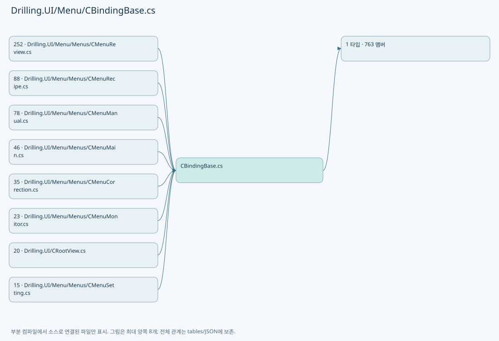
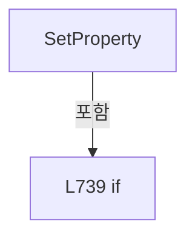
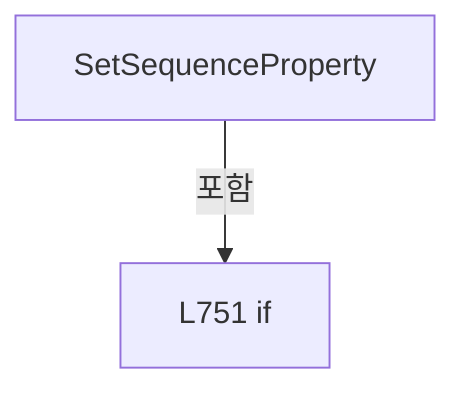
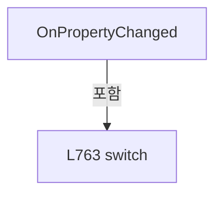

# Drilling.UI/Menu/CBindingBase.cs

| 항목 | 내용 |
| --- | --- |
| 원본 저장소 | https://github.com/kjuws10-rgb/A3Drilling.git |
| 원본 Commit | dfa5920e6301d9ec4b0eab1452ae59521aafc986 |
| 원본 SHA256 | a80149030260c0e2e9b0a7439c90565f1a875449d3b968ee83bb2a6e1b5ccc64 |
| 파일 분류 | code |
| 원본 크기/행 | 140,581 bytes / 2,960 physical lines |
| 인코딩 | utf-8-sig |
| 검토 범위 | 구문/부분 의미 분석에서 추출한 사실. 동작·물리 단위·실장비 합격을 보증하지 않습니다. |
| 원본 링크 | [고정 Commit 원본](https://github.com/kjuws10-rgb/A3Drilling/blob/dfa5920e6301d9ec4b0eab1452ae59521aafc986/Drilling.UI/Menu/CBindingBase.cs) |

## 파일의 역할과 읽는 순서

WPF 화면·사용자 명령·표시 상태를 구성합니다. XAML 이벤트와 코드 비하인드, RootView의 조립 경로를 함께 추적합니다.

## 네임스페이스·타입·상속

| 타입 | 구분 | 원본 범위 | 선언/상속 |
| --- | --- | --- | --- |
| CBindingBase | ClassDeclaration | 4–2960 | CBindingBase |

## 멤버 빠른 목록

| 이름 | 종류 | 범위 | 서명 |
| --- | --- | --- | --- |
| AbleBrushChanged | EventFieldDeclaration | L6–6 | System.EventHandler? Drilling.UI.Menu.CBindingBase.AbleBrushChanged |
| AccentBrushChanged | EventFieldDeclaration | L7–7 | System.EventHandler? Drilling.UI.Menu.CBindingBase.AccentBrushChanged |
| AccessChanged | EventFieldDeclaration | L8–8 | System.EventHandler? Drilling.UI.Menu.CBindingBase.AccessChanged |
| ActionsChanged | EventFieldDeclaration | L9–9 | System.EventHandler? Drilling.UI.Menu.CBindingBase.ActionsChanged |
| ActiveChanged | EventFieldDeclaration | L10–10 | System.EventHandler? Drilling.UI.Menu.CBindingBase.ActiveChanged |
| AddressChanged | EventFieldDeclaration | L11–11 | System.EventHandler? Drilling.UI.Menu.CBindingBase.AddressChanged |
| AfterBrushChanged | EventFieldDeclaration | L12–12 | System.EventHandler? Drilling.UI.Menu.CBindingBase.AfterBrushChanged |
| AkMarginXItemChanged | EventFieldDeclaration | L13–13 | System.EventHandler? Drilling.UI.Menu.CBindingBase.AkMarginXItemChanged |
| AkMarginYItemChanged | EventFieldDeclaration | L14–14 | System.EventHandler? Drilling.UI.Menu.CBindingBase.AkMarginYItemChanged |
| AlarmChanged | EventFieldDeclaration | L15–15 | System.EventHandler? Drilling.UI.Menu.CBindingBase.AlarmChanged |
| AlarmBrushChanged | EventFieldDeclaration | L16–16 | System.EventHandler? Drilling.UI.Menu.CBindingBase.AlarmBrushChanged |
| AlarmDetailChanged | EventFieldDeclaration | L17–17 | System.EventHandler? Drilling.UI.Menu.CBindingBase.AlarmDetailChanged |
| AlarmResetCommandChanged | EventFieldDeclaration | L18–18 | System.EventHandler? Drilling.UI.Menu.CBindingBase.AlarmResetCommandChanged |
| AllInterfaceRowsChanged | EventFieldDeclaration | L19–19 | System.EventHandler? Drilling.UI.Menu.CBindingBase.AllInterfaceRowsChanged |
| AllManagedItemsChanged | EventFieldDeclaration | L20–20 | System.EventHandler? Drilling.UI.Menu.CBindingBase.AllManagedItemsChanged |
| AllParameterRowsChanged | EventFieldDeclaration | L21–21 | System.EventHandler? Drilling.UI.Menu.CBindingBase.AllParameterRowsChanged |
| ApplyOneHoleReviewOffsetCommandChanged | EventFieldDeclaration | L22–22 | System.EventHandler? Drilling.UI.Menu.CBindingBase.ApplyOneHoleReviewOffsetCommandChanged |
| ApplyPreviewRowsChanged | EventFieldDeclaration | L23–23 | System.EventHandler? Drilling.UI.Menu.CBindingBase.ApplyPreviewRowsChanged |
| ApplyRowsChanged | EventFieldDeclaration | L24–24 | System.EventHandler? Drilling.UI.Menu.CBindingBase.ApplyRowsChanged |
| Arg1Changed | EventFieldDeclaration | L25–25 | System.EventHandler? Drilling.UI.Menu.CBindingBase.Arg1Changed |
| Arg2Changed | EventFieldDeclaration | L26–26 | System.EventHandler? Drilling.UI.Menu.CBindingBase.Arg2Changed |
| Arg3Changed | EventFieldDeclaration | L27–27 | System.EventHandler? Drilling.UI.Menu.CBindingBase.Arg3Changed |
| Arg4Changed | EventFieldDeclaration | L28–28 | System.EventHandler? Drilling.UI.Menu.CBindingBase.Arg4Changed |
| Arg5Changed | EventFieldDeclaration | L29–29 | System.EventHandler? Drilling.UI.Menu.CBindingBase.Arg5Changed |
| AttenuatorSettingItemsChanged | EventFieldDeclaration | L30–30 | System.EventHandler? Drilling.UI.Menu.CBindingBase.AttenuatorSettingItemsChanged |
| AttenuatorStateBrushChanged | EventFieldDeclaration | L31–31 | System.EventHandler? Drilling.UI.Menu.CBindingBase.AttenuatorStateBrushChanged |
| AttenuatorStatusItemsChanged | EventFieldDeclaration | L32–32 | System.EventHandler? Drilling.UI.Menu.CBindingBase.AttenuatorStatusItemsChanged |
| AttenuatorTextChanged | EventFieldDeclaration | L33–33 | System.EventHandler? Drilling.UI.Menu.CBindingBase.AttenuatorTextChanged |
| AutoConnectionChanged | EventFieldDeclaration | L34–34 | System.EventHandler? Drilling.UI.Menu.CBindingBase.AutoConnectionChanged |
| AutoConnectionOptionsChanged | EventFieldDeclaration | L35–35 | System.EventHandler? Drilling.UI.Menu.CBindingBase.AutoConnectionOptionsChanged |
| AutomationControllerStatusItemsChanged | EventFieldDeclaration | L36–36 | System.EventHandler? Drilling.UI.Menu.CBindingBase.AutomationControllerStatusItemsChanged |
| AxisChanged | EventFieldDeclaration | L37–37 | System.EventHandler? Drilling.UI.Menu.CBindingBase.AxisChanged |
| AxisIdChanged | EventFieldDeclaration | L38–38 | System.EventHandler? Drilling.UI.Menu.CBindingBase.AxisIdChanged |
| AxisRowsChanged | EventFieldDeclaration | L39–39 | System.EventHandler? Drilling.UI.Menu.CBindingBase.AxisRowsChanged |
| BackgroundBrushChanged | EventFieldDeclaration | L40–40 | System.EventHandler? Drilling.UI.Menu.CBindingBase.BackgroundBrushChanged |
| BackToCellPreviewCommandChanged | EventFieldDeclaration | L41–41 | System.EventHandler? Drilling.UI.Menu.CBindingBase.BackToCellPreviewCommandChanged |
| BackToCoordinateGlassPreviewCommandChanged | EventFieldDeclaration | L42–42 | System.EventHandler? Drilling.UI.Menu.CBindingBase.BackToCoordinateGlassPreviewCommandChanged |
| BackToOneHoleCellMapCommandChanged | EventFieldDeclaration | L43–43 | System.EventHandler? Drilling.UI.Menu.CBindingBase.BackToOneHoleCellMapCommandChanged |
| BackToOneHoleHoleMapCommandChanged | EventFieldDeclaration | L44–44 | System.EventHandler? Drilling.UI.Menu.CBindingBase.BackToOneHoleHoleMapCommandChanged |
| BackToRunGlassPreviewCommandChanged | EventFieldDeclaration | L45–45 | System.EventHandler? Drilling.UI.Menu.CBindingBase.BackToRunGlassPreviewCommandChanged |
| BackToRunShotMapCommandChanged | EventFieldDeclaration | L46–46 | System.EventHandler? Drilling.UI.Menu.CBindingBase.BackToRunShotMapCommandChanged |
| BackToSampleGlassPreviewCommandChanged | EventFieldDeclaration | L47–47 | System.EventHandler? Drilling.UI.Menu.CBindingBase.BackToSampleGlassPreviewCommandChanged |
| BaseCenterXChanged | EventFieldDeclaration | L48–48 | System.EventHandler? Drilling.UI.Menu.CBindingBase.BaseCenterXChanged |
| BaseCenterYChanged | EventFieldDeclaration | L49–49 | System.EventHandler? Drilling.UI.Menu.CBindingBase.BaseCenterYChanged |
| BeamOptionsChanged | EventFieldDeclaration | L50–50 | System.EventHandler? Drilling.UI.Menu.CBindingBase.BeamOptionsChanged |
| BeamSelectionSummaryChanged | EventFieldDeclaration | L51–51 | System.EventHandler? Drilling.UI.Menu.CBindingBase.BeamSelectionSummaryChanged |
| BetDivergenceTextChanged | EventFieldDeclaration | L52–52 | System.EventHandler? Drilling.UI.Menu.CBindingBase.BetDivergenceTextChanged |
| BetMagnificationTextChanged | EventFieldDeclaration | L53–53 | System.EventHandler? Drilling.UI.Menu.CBindingBase.BetMagnificationTextChanged |
| BetStateBrushChanged | EventFieldDeclaration | L54–54 | System.EventHandler? Drilling.UI.Menu.CBindingBase.BetStateBrushChanged |
| BetTableRowsChanged | EventFieldDeclaration | L55–55 | System.EventHandler? Drilling.UI.Menu.CBindingBase.BetTableRowsChanged |
| BlockedItemsChanged | EventFieldDeclaration | L56–56 | System.EventHandler? Drilling.UI.Menu.CBindingBase.BlockedItemsChanged |
| BorderBrushChanged | EventFieldDeclaration | L57–57 | System.EventHandler? Drilling.UI.Menu.CBindingBase.BorderBrushChanged |
| BuzzerOffCommandChanged | EventFieldDeclaration | L58–58 | System.EventHandler? Drilling.UI.Menu.CBindingBase.BuzzerOffCommandChanged |
| CalculatedOffsetRowsChanged | EventFieldDeclaration | L59–59 | System.EventHandler? Drilling.UI.Menu.CBindingBase.CalculatedOffsetRowsChanged |
| CanApplyOneHoleReviewOffsetChanged | EventFieldDeclaration | L60–60 | System.EventHandler? Drilling.UI.Menu.CBindingBase.CanApplyOneHoleReviewOffsetChanged |
| CancelCommandChanged | EventFieldDeclaration | L61–61 | System.EventHandler? Drilling.UI.Menu.CBindingBase.CancelCommandChanged |
| CandidateRowsChanged | EventFieldDeclaration | L62–62 | System.EventHandler? Drilling.UI.Menu.CBindingBase.CandidateRowsChanged |
| CanOperateSelectedInterfaceChanged | EventFieldDeclaration | L63–63 | System.EventHandler? Drilling.UI.Menu.CBindingBase.CanOperateSelectedInterfaceChanged |
| CanReadChanged | EventFieldDeclaration | L64–64 | System.EventHandler? Drilling.UI.Menu.CBindingBase.CanReadChanged |
| CanLoadBeamInspectionResultChanged | EventFieldDeclaration | L65–65 | System.EventHandler? Drilling.UI.Menu.CBindingBase.CanLoadBeamInspectionResultChanged |
| CanClearLoadedBeamInspectionResultChanged | EventFieldDeclaration | L66–66 | System.EventHandler? Drilling.UI.Menu.CBindingBase.CanClearLoadedBeamInspectionResultChanged |
| CanSelectBeamChanged | EventFieldDeclaration | L67–67 | System.EventHandler? Drilling.UI.Menu.CBindingBase.CanSelectBeamChanged |
| CanSelectInspectionMethodChanged | EventFieldDeclaration | L68–68 | System.EventHandler? Drilling.UI.Menu.CBindingBase.CanSelectInspectionMethodChanged |
| CanWriteChanged | EventFieldDeclaration | L69–69 | System.EventHandler? Drilling.UI.Menu.CBindingBase.CanWriteChanged |
| CAppStartupChanged | EventFieldDeclaration | L70–70 | System.EventHandler? Drilling.UI.Menu.CBindingBase.CAppStartupChanged |
| CategoryChanged | EventFieldDeclaration | L71–71 | System.EventHandler? Drilling.UI.Menu.CBindingBase.CategoryChanged |
| CButtonCommandBehaviorChanged | EventFieldDeclaration | L72–72 | System.EventHandler? Drilling.UI.Menu.CBindingBase.CButtonCommandBehaviorChanged |
| CellMapDesignHeightChanged | EventFieldDeclaration | L73–73 | System.EventHandler? Drilling.UI.Menu.CBindingBase.CellMapDesignHeightChanged |
| CellMapDesignWidthChanged | EventFieldDeclaration | L74–74 | System.EventHandler? Drilling.UI.Menu.CBindingBase.CellMapDesignWidthChanged |
| CellNoChanged | EventFieldDeclaration | L75–75 | System.EventHandler? Drilling.UI.Menu.CBindingBase.CellNoChanged |
| CellModelTypeCountItemChanged | EventFieldDeclaration | L76–76 | System.EventHandler? Drilling.UI.Menu.CBindingBase.CellModelTypeCountItemChanged |
| CellOverviewRowsChanged | EventFieldDeclaration | L77–77 | System.EventHandler? Drilling.UI.Menu.CBindingBase.CellOverviewRowsChanged |
| CellPreviewImageChanged | EventFieldDeclaration | L78–78 | System.EventHandler? Drilling.UI.Menu.CBindingBase.CellPreviewImageChanged |
| CellPreviewLabelsChanged | EventFieldDeclaration | L79–79 | System.EventHandler? Drilling.UI.Menu.CBindingBase.CellPreviewLabelsChanged |
| CellShotMapImageChanged | EventFieldDeclaration | L80–80 | System.EventHandler? Drilling.UI.Menu.CBindingBase.CellShotMapImageChanged |
| CenterMoveCommandChanged | EventFieldDeclaration | L81–81 | System.EventHandler? Drilling.UI.Menu.CBindingBase.CenterMoveCommandChanged |
| CenterOnCommandChanged | EventFieldDeclaration | L82–82 | System.EventHandler? Drilling.UI.Menu.CBindingBase.CenterOnCommandChanged |
| CenterXTextChanged | EventFieldDeclaration | L83–83 | System.EventHandler? Drilling.UI.Menu.CBindingBase.CenterXTextChanged |
| CenterYTextChanged | EventFieldDeclaration | L84–84 | System.EventHandler? Drilling.UI.Menu.CBindingBase.CenterYTextChanged |
| ChangeHistoryChanged | EventFieldDeclaration | L85–85 | System.EventHandler? Drilling.UI.Menu.CBindingBase.ChangeHistoryChanged |
| ChangeLimitChanged | EventFieldDeclaration | L86–86 | System.EventHandler? Drilling.UI.Menu.CBindingBase.ChangeLimitChanged |
| ChessItemChanged | EventFieldDeclaration | L87–87 | System.EventHandler? Drilling.UI.Menu.CBindingBase.ChessItemChanged |
| CInterfaceStatusRowChanged | EventFieldDeclaration | L88–88 | System.EventHandler? Drilling.UI.Menu.CBindingBase.CInterfaceStatusRowChanged |
| ColumnChanged | EventFieldDeclaration | L89–89 | System.EventHandler? Drilling.UI.Menu.CBindingBase.ColumnChanged |
| CommandBlueChanged | EventFieldDeclaration | L90–90 | System.EventHandler? Drilling.UI.Menu.CBindingBase.CommandBlueChanged |
| CommandBlueBorderChanged | EventFieldDeclaration | L91–91 | System.EventHandler? Drilling.UI.Menu.CBindingBase.CommandBlueBorderChanged |
| CommandDarkChanged | EventFieldDeclaration | L92–92 | System.EventHandler? Drilling.UI.Menu.CBindingBase.CommandDarkChanged |
| CommandDarkBorderChanged | EventFieldDeclaration | L93–93 | System.EventHandler? Drilling.UI.Menu.CBindingBase.CommandDarkBorderChanged |
| CommandGreenChanged | EventFieldDeclaration | L94–94 | System.EventHandler? Drilling.UI.Menu.CBindingBase.CommandGreenChanged |
| CommandGreenBorderChanged | EventFieldDeclaration | L95–95 | System.EventHandler? Drilling.UI.Menu.CBindingBase.CommandGreenBorderChanged |
| CommandHistoryRowsChanged | EventFieldDeclaration | L96–96 | System.EventHandler? Drilling.UI.Menu.CBindingBase.CommandHistoryRowsChanged |
| CommandLabelChanged | EventFieldDeclaration | L97–97 | System.EventHandler? Drilling.UI.Menu.CBindingBase.CommandLabelChanged |
| CommandOpacityChanged | EventFieldDeclaration | L98–98 | System.EventHandler? Drilling.UI.Menu.CBindingBase.CommandOpacityChanged |
| CommandPropertyChanged | EventFieldDeclaration | L99–99 | System.EventHandler? Drilling.UI.Menu.CBindingBase.CommandPropertyChanged |
| CommandRedChanged | EventFieldDeclaration | L100–100 | System.EventHandler? Drilling.UI.Menu.CBindingBase.CommandRedChanged |
| CommandRedBorderChanged | EventFieldDeclaration | L101–101 | System.EventHandler? Drilling.UI.Menu.CBindingBase.CommandRedBorderChanged |
| CommandStateItemsChanged | EventFieldDeclaration | L102–102 | System.EventHandler? Drilling.UI.Menu.CBindingBase.CommandStateItemsChanged |
| CommandStateRowsChanged | EventFieldDeclaration | L103–103 | System.EventHandler? Drilling.UI.Menu.CBindingBase.CommandStateRowsChanged |
| ConnectInterfaceCommandChanged | EventFieldDeclaration | L104–104 | System.EventHandler? Drilling.UI.Menu.CBindingBase.ConnectInterfaceCommandChanged |
| ContainerHeightPropertyChanged | EventFieldDeclaration | L105–105 | System.EventHandler? Drilling.UI.Menu.CBindingBase.ContainerHeightPropertyChanged |
| ContainerWidthPropertyChanged | EventFieldDeclaration | L106–106 | System.EventHandler? Drilling.UI.Menu.CBindingBase.ContainerWidthPropertyChanged |
| ControllerTaskTextChanged | EventFieldDeclaration | L107–107 | System.EventHandler? Drilling.UI.Menu.CBindingBase.ControllerTaskTextChanged |
| CoordinateBasisDescriptionChanged | EventFieldDeclaration | L108–108 | System.EventHandler? Drilling.UI.Menu.CBindingBase.CoordinateBasisDescriptionChanged |
| CoordinateBasisOptionsChanged | EventFieldDeclaration | L109–109 | System.EventHandler? Drilling.UI.Menu.CBindingBase.CoordinateBasisOptionsChanged |
| CoordinateCellPreviewLabelsChanged | EventFieldDeclaration | L110–110 | System.EventHandler? Drilling.UI.Menu.CBindingBase.CoordinateCellPreviewLabelsChanged |
| CoordinateGlassPreviewImageChanged | EventFieldDeclaration | L111–111 | System.EventHandler? Drilling.UI.Menu.CBindingBase.CoordinateGlassPreviewImageChanged |
| CoordinateGlassPreviewSummaryChanged | EventFieldDeclaration | L112–112 | System.EventHandler? Drilling.UI.Menu.CBindingBase.CoordinateGlassPreviewSummaryChanged |
| CoordinateIsCellDetailVisibleChanged | EventFieldDeclaration | L113–113 | System.EventHandler? Drilling.UI.Menu.CBindingBase.CoordinateIsCellDetailVisibleChanged |
| CoordinateIsGlassPreviewVisibleChanged | EventFieldDeclaration | L114–114 | System.EventHandler? Drilling.UI.Menu.CBindingBase.CoordinateIsGlassPreviewVisibleChanged |
| CoordinateSelectedBasisNameChanged | EventFieldDeclaration | L115–115 | System.EventHandler? Drilling.UI.Menu.CBindingBase.CoordinateSelectedBasisNameChanged |
| CoordinateSelectedCellNameChanged | EventFieldDeclaration | L116–116 | System.EventHandler? Drilling.UI.Menu.CBindingBase.CoordinateSelectedCellNameChanged |
| CoordinateSelectedRecipeNameChanged | EventFieldDeclaration | L117–117 | System.EventHandler? Drilling.UI.Menu.CBindingBase.CoordinateSelectedRecipeNameChanged |
| CoordinateSelectedShotNameChanged | EventFieldDeclaration | L118–118 | System.EventHandler? Drilling.UI.Menu.CBindingBase.CoordinateSelectedShotNameChanged |
| CoordinateShotMatrixRowsChanged | EventFieldDeclaration | L119–119 | System.EventHandler? Drilling.UI.Menu.CBindingBase.CoordinateShotMatrixRowsChanged |
| CoordinateValueRowsChanged | EventFieldDeclaration | L120–120 | System.EventHandler? Drilling.UI.Menu.CBindingBase.CoordinateValueRowsChanged |
| CorrectedCenterXChanged | EventFieldDeclaration | L121–121 | System.EventHandler? Drilling.UI.Menu.CBindingBase.CorrectedCenterXChanged |
| CorrectedCenterYChanged | EventFieldDeclaration | L122–122 | System.EventHandler? Drilling.UI.Menu.CBindingBase.CorrectedCenterYChanged |
| CorrectionChanged | EventFieldDeclaration | L123–123 | System.EventHandler? Drilling.UI.Menu.CBindingBase.CorrectionChanged |
| CPreviewCoordinateBehaviorChanged | EventFieldDeclaration | L124–124 | System.EventHandler? Drilling.UI.Menu.CBindingBase.CPreviewCoordinateBehaviorChanged |
| CreateCommandChanged | EventFieldDeclaration | L125–125 | System.EventHandler? Drilling.UI.Menu.CBindingBase.CreateCommandChanged |
| CThemeManagerChanged | EventFieldDeclaration | L126–126 | System.EventHandler? Drilling.UI.Menu.CBindingBase.CThemeManagerChanged |
| CurrentAlarmRowsChanged | EventFieldDeclaration | L127–127 | System.EventHandler? Drilling.UI.Menu.CBindingBase.CurrentAlarmRowsChanged |
| CurrentAlarmsChanged | EventFieldDeclaration | L128–128 | System.EventHandler? Drilling.UI.Menu.CBindingBase.CurrentAlarmsChanged |
| CurrentCellIndicatorTextChanged | EventFieldDeclaration | L129–129 | System.EventHandler? Drilling.UI.Menu.CBindingBase.CurrentCellIndicatorTextChanged |
| CurrentDateTextChanged | EventFieldDeclaration | L130–130 | System.EventHandler? Drilling.UI.Menu.CBindingBase.CurrentDateTextChanged |
| CurrentOffsetRowsChanged | EventFieldDeclaration | L131–131 | System.EventHandler? Drilling.UI.Menu.CBindingBase.CurrentOffsetRowsChanged |
| CurrentPositionChanged | EventFieldDeclaration | L132–132 | System.EventHandler? Drilling.UI.Menu.CBindingBase.CurrentPositionChanged |
| CurrentReviewOffsetRecipeNameChanged | EventFieldDeclaration | L133–133 | System.EventHandler? Drilling.UI.Menu.CBindingBase.CurrentReviewOffsetRecipeNameChanged |
| CurrentScreenChanged | EventFieldDeclaration | L134–134 | System.EventHandler? Drilling.UI.Menu.CBindingBase.CurrentScreenChanged |
| CurrentSettingStateChanged | EventFieldDeclaration | L135–135 | System.EventHandler? Drilling.UI.Menu.CBindingBase.CurrentSettingStateChanged |
| CurrentStepDetailsChanged | EventFieldDeclaration | L136–136 | System.EventHandler? Drilling.UI.Menu.CBindingBase.CurrentStepDetailsChanged |
| CurrentThemeChanged | EventFieldDeclaration | L137–137 | System.EventHandler? Drilling.UI.Menu.CBindingBase.CurrentThemeChanged |
| CurrentTimeTextChanged | EventFieldDeclaration | L138–138 | System.EventHandler? Drilling.UI.Menu.CBindingBase.CurrentTimeTextChanged |
| CurrentUserTextChanged | EventFieldDeclaration | L139–139 | System.EventHandler? Drilling.UI.Menu.CBindingBase.CurrentUserTextChanged |
| CurrentValueBrushChanged | EventFieldDeclaration | L140–140 | System.EventHandler? Drilling.UI.Menu.CBindingBase.CurrentValueBrushChanged |
| CycleItemsChanged | EventFieldDeclaration | L141–141 | System.EventHandler? Drilling.UI.Menu.CBindingBase.CycleItemsChanged |
| DataTypeChanged | EventFieldDeclaration | L142–142 | System.EventHandler? Drilling.UI.Menu.CBindingBase.DataTypeChanged |
| DefaultChanged | EventFieldDeclaration | L143–143 | System.EventHandler? Drilling.UI.Menu.CBindingBase.DefaultChanged |
| DefaultValueChanged | EventFieldDeclaration | L144–144 | System.EventHandler? Drilling.UI.Menu.CBindingBase.DefaultValueChanged |
| DeleteCommandChanged | EventFieldDeclaration | L145–145 | System.EventHandler? Drilling.UI.Menu.CBindingBase.DeleteCommandChanged |
| DescriptionChanged | EventFieldDeclaration | L146–146 | System.EventHandler? Drilling.UI.Menu.CBindingBase.DescriptionChanged |
| DesignHeightPropertyChanged | EventFieldDeclaration | L147–147 | System.EventHandler? Drilling.UI.Menu.CBindingBase.DesignHeightPropertyChanged |
| DesignWidthPropertyChanged | EventFieldDeclaration | L148–148 | System.EventHandler? Drilling.UI.Menu.CBindingBase.DesignWidthPropertyChanged |
| DetailChanged | EventFieldDeclaration | L149–149 | System.EventHandler? Drilling.UI.Menu.CBindingBase.DetailChanged |
| DetailBrushChanged | EventFieldDeclaration | L150–150 | System.EventHandler? Drilling.UI.Menu.CBindingBase.DetailBrushChanged |
| DetailItemsChanged | EventFieldDeclaration | L151–151 | System.EventHandler? Drilling.UI.Menu.CBindingBase.DetailItemsChanged |
| DetailRowsChanged | EventFieldDeclaration | L152–152 | System.EventHandler? Drilling.UI.Menu.CBindingBase.DetailRowsChanged |
| DetailTextChanged | EventFieldDeclaration | L153–153 | System.EventHandler? Drilling.UI.Menu.CBindingBase.DetailTextChanged |
| DeviceChanged | EventFieldDeclaration | L154–154 | System.EventHandler? Drilling.UI.Menu.CBindingBase.DeviceChanged |
| DeviceNoChanged | EventFieldDeclaration | L155–155 | System.EventHandler? Drilling.UI.Menu.CBindingBase.DeviceNoChanged |
| DeviceTabsChanged | EventFieldDeclaration | L156–156 | System.EventHandler? Drilling.UI.Menu.CBindingBase.DeviceTabsChanged |
| DioAddressChanged | EventFieldDeclaration | L157–157 | System.EventHandler? Drilling.UI.Menu.CBindingBase.DioAddressChanged |
| DioAxisNameChanged | EventFieldDeclaration | L158–158 | System.EventHandler? Drilling.UI.Menu.CBindingBase.DioAxisNameChanged |
| DioCurrentValueChanged | EventFieldDeclaration | L159–159 | System.EventHandler? Drilling.UI.Menu.CBindingBase.DioCurrentValueChanged |
| DioLastResultChanged | EventFieldDeclaration | L160–160 | System.EventHandler? Drilling.UI.Menu.CBindingBase.DioLastResultChanged |
| DioNoChanged | EventFieldDeclaration | L161–161 | System.EventHandler? Drilling.UI.Menu.CBindingBase.DioNoChanged |
| DioOffCommandChanged | EventFieldDeclaration | L162–162 | System.EventHandler? Drilling.UI.Menu.CBindingBase.DioOffCommandChanged |
| DioOnCommandChanged | EventFieldDeclaration | L163–163 | System.EventHandler? Drilling.UI.Menu.CBindingBase.DioOnCommandChanged |
| DioReadCommandChanged | EventFieldDeclaration | L164–164 | System.EventHandler? Drilling.UI.Menu.CBindingBase.DioReadCommandChanged |
| DirectionChanged | EventFieldDeclaration | L165–165 | System.EventHandler? Drilling.UI.Menu.CBindingBase.DirectionChanged |
| DisconnectInterfaceCommandChanged | EventFieldDeclaration | L166–166 | System.EventHandler? Drilling.UI.Menu.CBindingBase.DisconnectInterfaceCommandChanged |
| DisplayAxisChanged | EventFieldDeclaration | L167–167 | System.EventHandler? Drilling.UI.Menu.CBindingBase.DisplayAxisChanged |
| DisplayLabelChanged | EventFieldDeclaration | L168–168 | System.EventHandler? Drilling.UI.Menu.CBindingBase.DisplayLabelChanged |
| DisplayTextChanged | EventFieldDeclaration | L169–169 | System.EventHandler? Drilling.UI.Menu.CBindingBase.DisplayTextChanged |
| DistortionKeyItemsChanged | EventFieldDeclaration | L170–170 | System.EventHandler? Drilling.UI.Menu.CBindingBase.DistortionKeyItemsChanged |
| DivChanged | EventFieldDeclaration | L171–171 | System.EventHandler? Drilling.UI.Menu.CBindingBase.DivChanged |
| ElapsedTimeTextChanged | EventFieldDeclaration | L172–172 | System.EventHandler? Drilling.UI.Menu.CBindingBase.ElapsedTimeTextChanged |
| ElementHeightPropertyChanged | EventFieldDeclaration | L173–173 | System.EventHandler? Drilling.UI.Menu.CBindingBase.ElementHeightPropertyChanged |
| ElementWidthPropertyChanged | EventFieldDeclaration | L174–174 | System.EventHandler? Drilling.UI.Menu.CBindingBase.ElementWidthPropertyChanged |
| EmptyChanged | EventFieldDeclaration | L175–175 | System.EventHandler? Drilling.UI.Menu.CBindingBase.EmptyChanged |
| EN_MENUChanged | EventFieldDeclaration | L176–176 | System.EventHandler? Drilling.UI.Menu.CBindingBase.EN_MENUChanged |
| EN_UI_THEMEChanged | EventFieldDeclaration | L177–177 | System.EventHandler? Drilling.UI.Menu.CBindingBase.EN_UI_THEMEChanged |
| EndpointChanged | EventFieldDeclaration | L178–178 | System.EventHandler? Drilling.UI.Menu.CBindingBase.EndpointChanged |
| ErrorBrushChanged | EventFieldDeclaration | L179–179 | System.EventHandler? Drilling.UI.Menu.CBindingBase.ErrorBrushChanged |
| ErrorXChanged | EventFieldDeclaration | L180–180 | System.EventHandler? Drilling.UI.Menu.CBindingBase.ErrorXChanged |
| ErrorYChanged | EventFieldDeclaration | L181–181 | System.EventHandler? Drilling.UI.Menu.CBindingBase.ErrorYChanged |
| EstimatedTimeTextChanged | EventFieldDeclaration | L182–182 | System.EventHandler? Drilling.UI.Menu.CBindingBase.EstimatedTimeTextChanged |
| EvenHeadPreviewsChanged | EventFieldDeclaration | L183–183 | System.EventHandler? Drilling.UI.Menu.CBindingBase.EvenHeadPreviewsChanged |
| ExecuteCommandChanged | EventFieldDeclaration | L184–184 | System.EventHandler? Drilling.UI.Menu.CBindingBase.ExecuteCommandChanged |
| ExecuteOperationCommandChanged | EventFieldDeclaration | L185–185 | System.EventHandler? Drilling.UI.Menu.CBindingBase.ExecuteOperationCommandChanged |
| ExtraChanged | EventFieldDeclaration | L186–186 | System.EventHandler? Drilling.UI.Menu.CBindingBase.ExtraChanged |
| FileTextChanged | EventFieldDeclaration | L187–187 | System.EventHandler? Drilling.UI.Menu.CBindingBase.FileTextChanged |
| FirstXChanged | EventFieldDeclaration | L188–188 | System.EventHandler? Drilling.UI.Menu.CBindingBase.FirstXChanged |
| FirstYChanged | EventFieldDeclaration | L189–189 | System.EventHandler? Drilling.UI.Menu.CBindingBase.FirstYChanged |
| FooterStatusItemsChanged | EventFieldDeclaration | L190–190 | System.EventHandler? Drilling.UI.Menu.CBindingBase.FooterStatusItemsChanged |
| GlassFrameChanged | EventFieldDeclaration | L191–191 | System.EventHandler? Drilling.UI.Menu.CBindingBase.GlassFrameChanged |
| GlassPreviewSummaryChanged | EventFieldDeclaration | L192–192 | System.EventHandler? Drilling.UI.Menu.CBindingBase.GlassPreviewSummaryChanged |
| GlassSizeXItemChanged | EventFieldDeclaration | L193–193 | System.EventHandler? Drilling.UI.Menu.CBindingBase.GlassSizeXItemChanged |
| GlassSizeYItemChanged | EventFieldDeclaration | L194–194 | System.EventHandler? Drilling.UI.Menu.CBindingBase.GlassSizeYItemChanged |
| GridColLinesChanged | EventFieldDeclaration | L195–195 | System.EventHandler? Drilling.UI.Menu.CBindingBase.GridColLinesChanged |
| GridRowLinesChanged | EventFieldDeclaration | L196–196 | System.EventHandler? Drilling.UI.Menu.CBindingBase.GridRowLinesChanged |
| GroupChanged | EventFieldDeclaration | L197–197 | System.EventHandler? Drilling.UI.Menu.CBindingBase.GroupChanged |
| GroupItemsChanged | EventFieldDeclaration | L198–198 | System.EventHandler? Drilling.UI.Menu.CBindingBase.GroupItemsChanged |
| GroupTabsChanged | EventFieldDeclaration | L199–199 | System.EventHandler? Drilling.UI.Menu.CBindingBase.GroupTabsChanged |
| HasCommandChanged | EventFieldDeclaration | L200–200 | System.EventHandler? Drilling.UI.Menu.CBindingBase.HasCommandChanged |
| HeadAssignmentAreasChanged | EventFieldDeclaration | L201–201 | System.EventHandler? Drilling.UI.Menu.CBindingBase.HeadAssignmentAreasChanged |
| HeadCardsChanged | EventFieldDeclaration | L202–202 | System.EventHandler? Drilling.UI.Menu.CBindingBase.HeadCardsChanged |
| HeadGroupsChanged | EventFieldDeclaration | L203–203 | System.EventHandler? Drilling.UI.Menu.CBindingBase.HeadGroupsChanged |
| HeadDeviceSelectorTitleChanged | EventFieldDeclaration | L204–204 | System.EventHandler? Drilling.UI.Menu.CBindingBase.HeadDeviceSelectorTitleChanged |
| HeaderStatusItemsChanged | EventFieldDeclaration | L205–205 | System.EventHandler? Drilling.UI.Menu.CBindingBase.HeaderStatusItemsChanged |
| HeadParametersChanged | EventFieldDeclaration | L206–206 | System.EventHandler? Drilling.UI.Menu.CBindingBase.HeadParametersChanged |
| HeadParameterVisibilityChanged | EventFieldDeclaration | L207–207 | System.EventHandler? Drilling.UI.Menu.CBindingBase.HeadParameterVisibilityChanged |
| HeadPreviewImageChanged | EventFieldDeclaration | L208–208 | System.EventHandler? Drilling.UI.Menu.CBindingBase.HeadPreviewImageChanged |
| HeadPreviewLabelsChanged | EventFieldDeclaration | L209–209 | System.EventHandler? Drilling.UI.Menu.CBindingBase.HeadPreviewLabelsChanged |
| HeadPreviewsChanged | EventFieldDeclaration | L210–210 | System.EventHandler? Drilling.UI.Menu.CBindingBase.HeadPreviewsChanged |
| HeadPreviewSummaryTextChanged | EventFieldDeclaration | L211–211 | System.EventHandler? Drilling.UI.Menu.CBindingBase.HeadPreviewSummaryTextChanged |
| HeadSelectRowsChanged | EventFieldDeclaration | L212–212 | System.EventHandler? Drilling.UI.Menu.CBindingBase.HeadSelectRowsChanged |
| HeightChanged | EventFieldDeclaration | L213–213 | System.EventHandler? Drilling.UI.Menu.CBindingBase.HeightChanged |
| HistoryChanged | EventFieldDeclaration | L214–214 | System.EventHandler? Drilling.UI.Menu.CBindingBase.HistoryChanged |
| HistoryPanelTitleChanged | EventFieldDeclaration | L215–215 | System.EventHandler? Drilling.UI.Menu.CBindingBase.HistoryPanelTitleChanged |
| HistoryRowsChanged | EventFieldDeclaration | L216–216 | System.EventHandler? Drilling.UI.Menu.CBindingBase.HistoryRowsChanged |
| HomeBrushChanged | EventFieldDeclaration | L217–217 | System.EventHandler? Drilling.UI.Menu.CBindingBase.HomeBrushChanged |
| IconGeometryChanged | EventFieldDeclaration | L218–218 | System.EventHandler? Drilling.UI.Menu.CBindingBase.IconGeometryChanged |
| IdChanged | EventFieldDeclaration | L219–219 | System.EventHandler? Drilling.UI.Menu.CBindingBase.IdChanged |
| InspectionModeTextChanged | EventFieldDeclaration | L220–220 | System.EventHandler? Drilling.UI.Menu.CBindingBase.InspectionModeTextChanged |
| InspectionMethodItemsChanged | EventFieldDeclaration | L221–221 | System.EventHandler? Drilling.UI.Menu.CBindingBase.InspectionMethodItemsChanged |
| InspectionRuleTextChanged | EventFieldDeclaration | L222–222 | System.EventHandler? Drilling.UI.Menu.CBindingBase.InspectionRuleTextChanged |
| InspectionRuleVisibilityChanged | EventFieldDeclaration | L223–223 | System.EventHandler? Drilling.UI.Menu.CBindingBase.InspectionRuleVisibilityChanged |
| InspectionStatusItemsChanged | EventFieldDeclaration | L224–224 | System.EventHandler? Drilling.UI.Menu.CBindingBase.InspectionStatusItemsChanged |
| InspectionSummaryChanged | EventFieldDeclaration | L225–225 | System.EventHandler? Drilling.UI.Menu.CBindingBase.InspectionSummaryChanged |
| InterfaceRowsChanged | EventFieldDeclaration | L226–226 | System.EventHandler? Drilling.UI.Menu.CBindingBase.InterfaceRowsChanged |
| InterfaceTypeChanged | EventFieldDeclaration | L227–227 | System.EventHandler? Drilling.UI.Menu.CBindingBase.InterfaceTypeChanged |
| InterlockItemsChanged | EventFieldDeclaration | L228–228 | System.EventHandler? Drilling.UI.Menu.CBindingBase.InterlockItemsChanged |
| IsAlarmLayoutChanged | EventFieldDeclaration | L229–229 | System.EventHandler? Drilling.UI.Menu.CBindingBase.IsAlarmLayoutChanged |
| IsAttenuatorChanged | EventFieldDeclaration | L230–230 | System.EventHandler? Drilling.UI.Menu.CBindingBase.IsAttenuatorChanged |
| IsBetChanged | EventFieldDeclaration | L231–231 | System.EventHandler? Drilling.UI.Menu.CBindingBase.IsBetChanged |
| IsBooleanChanged | EventFieldDeclaration | L232–232 | System.EventHandler? Drilling.UI.Menu.CBindingBase.IsBooleanChanged |
| IsCellCategoryChanged | EventFieldDeclaration | L233–233 | System.EventHandler? Drilling.UI.Menu.CBindingBase.IsCellCategoryChanged |
| IsCellDetailVisibleChanged | EventFieldDeclaration | L234–234 | System.EventHandler? Drilling.UI.Menu.CBindingBase.IsCellDetailVisibleChanged |
| IsCellPreviewVisibleChanged | EventFieldDeclaration | L235–235 | System.EventHandler? Drilling.UI.Menu.CBindingBase.IsCellPreviewVisibleChanged |
| IsControlDeviceChanged | EventFieldDeclaration | L236–236 | System.EventHandler? Drilling.UI.Menu.CBindingBase.IsControlDeviceChanged |
| IsCoordinateViewerChanged | EventFieldDeclaration | L237–237 | System.EventHandler? Drilling.UI.Menu.CBindingBase.IsCoordinateViewerChanged |
| IsLogViewerChanged | EventFieldDeclaration | L238–238 | System.EventHandler? Drilling.UI.Menu.CBindingBase.IsLogViewerChanged |
| IsCorrectionLayoutChanged | EventFieldDeclaration | L239–239 | System.EventHandler? Drilling.UI.Menu.CBindingBase.IsCorrectionLayoutChanged |
| IsAlignDistortionTabChanged | EventFieldDeclaration | L240–240 | System.EventHandler? Drilling.UI.Menu.CBindingBase.IsAlignDistortionTabChanged |
| IsCorrectionCommandsVisibleChanged | EventFieldDeclaration | L241–241 | System.EventHandler? Drilling.UI.Menu.CBindingBase.IsCorrectionCommandsVisibleChanged |
| IsOutputHistoryTabChanged | EventFieldDeclaration | L242–242 | System.EventHandler? Drilling.UI.Menu.CBindingBase.IsOutputHistoryTabChanged |
| IsCurrentChanged | EventFieldDeclaration | L243–243 | System.EventHandler? Drilling.UI.Menu.CBindingBase.IsCurrentChanged |
| IsDioControlBusyChanged | EventFieldDeclaration | L244–244 | System.EventHandler? Drilling.UI.Menu.CBindingBase.IsDioControlBusyChanged |
| IsDioControlEnabledChanged | EventFieldDeclaration | L245–245 | System.EventHandler? Drilling.UI.Menu.CBindingBase.IsDioControlEnabledChanged |
| IsDioOffChanged | EventFieldDeclaration | L246–246 | System.EventHandler? Drilling.UI.Menu.CBindingBase.IsDioOffChanged |
| IsDioOnChanged | EventFieldDeclaration | L247–247 | System.EventHandler? Drilling.UI.Menu.CBindingBase.IsDioOnChanged |
| IsDioTargetReadyChanged | EventFieldDeclaration | L248–248 | System.EventHandler? Drilling.UI.Menu.CBindingBase.IsDioTargetReadyChanged |
| IsEditableChanged | EventFieldDeclaration | L249–249 | System.EventHandler? Drilling.UI.Menu.CBindingBase.IsEditableChanged |
| IsEditedChanged | EventFieldDeclaration | L250–250 | System.EventHandler? Drilling.UI.Menu.CBindingBase.IsEditedChanged |
| IsEnabledChanged | EventFieldDeclaration | L251–251 | System.EventHandler? Drilling.UI.Menu.CBindingBase.IsEnabledChanged |
| IsGenericDeviceChanged | EventFieldDeclaration | L252–252 | System.EventHandler? Drilling.UI.Menu.CBindingBase.IsGenericDeviceChanged |
| IsGenericLayoutChanged | EventFieldDeclaration | L253–253 | System.EventHandler? Drilling.UI.Menu.CBindingBase.IsGenericLayoutChanged |
| IsHeadCategoryChanged | EventFieldDeclaration | L254–254 | System.EventHandler? Drilling.UI.Menu.CBindingBase.IsHeadCategoryChanged |
| IsInsideGlassChanged | EventFieldDeclaration | L255–255 | System.EventHandler? Drilling.UI.Menu.CBindingBase.IsInsideGlassChanged |
| IsInterfaceTabChanged | EventFieldDeclaration | L256–256 | System.EventHandler? Drilling.UI.Menu.CBindingBase.IsInterfaceTabChanged |
| IsLaserChanged | EventFieldDeclaration | L257–257 | System.EventHandler? Drilling.UI.Menu.CBindingBase.IsLaserChanged |
| IsLaserCountModeChanged | EventFieldDeclaration | L258–258 | System.EventHandler? Drilling.UI.Menu.CBindingBase.IsLaserCountModeChanged |
| IsLaserTimeModeChanged | EventFieldDeclaration | L259–259 | System.EventHandler? Drilling.UI.Menu.CBindingBase.IsLaserTimeModeChanged |
| IsMainLayoutChanged | EventFieldDeclaration | L260–260 | System.EventHandler? Drilling.UI.Menu.CBindingBase.IsMainLayoutChanged |
| IsManualLayoutChanged | EventFieldDeclaration | L261–261 | System.EventHandler? Drilling.UI.Menu.CBindingBase.IsManualLayoutChanged |
| IsManualShiftOffsetVisibleChanged | EventFieldDeclaration | L262–262 | System.EventHandler? Drilling.UI.Menu.CBindingBase.IsManualShiftOffsetVisibleChanged |
| IsMelsecChanged | EventFieldDeclaration | L263–263 | System.EventHandler? Drilling.UI.Menu.CBindingBase.IsMelsecChanged |
| IsMelsecWriteLockVisibleChanged | EventFieldDeclaration | L264–264 | System.EventHandler? Drilling.UI.Menu.CBindingBase.IsMelsecWriteLockVisibleChanged |
| IsMelsecWriteUnlockedChanged | EventFieldDeclaration | L265–265 | System.EventHandler? Drilling.UI.Menu.CBindingBase.IsMelsecWriteUnlockedChanged |
| IsModifiedChanged | EventFieldDeclaration | L266–266 | System.EventHandler? Drilling.UI.Menu.CBindingBase.IsModifiedChanged |
| IsMonitorLayoutChanged | EventFieldDeclaration | L267–267 | System.EventHandler? Drilling.UI.Menu.CBindingBase.IsMonitorLayoutChanged |
| IsMotorChanged | EventFieldDeclaration | L268–268 | System.EventHandler? Drilling.UI.Menu.CBindingBase.IsMotorChanged |
| IsOneHoleBeamMapChanged | EventFieldDeclaration | L269–269 | System.EventHandler? Drilling.UI.Menu.CBindingBase.IsOneHoleBeamMapChanged |
| IsOneHoleCellMapChanged | EventFieldDeclaration | L270–270 | System.EventHandler? Drilling.UI.Menu.CBindingBase.IsOneHoleCellMapChanged |
| IsOneHoleDetailMapChanged | EventFieldDeclaration | L271–271 | System.EventHandler? Drilling.UI.Menu.CBindingBase.IsOneHoleDetailMapChanged |
| IsOneHoleHoleMapChanged | EventFieldDeclaration | L272–272 | System.EventHandler? Drilling.UI.Menu.CBindingBase.IsOneHoleHoleMapChanged |
| IsOneHoleTabChanged | EventFieldDeclaration | L273–273 | System.EventHandler? Drilling.UI.Menu.CBindingBase.IsOneHoleTabChanged |
| IsOtherCorrectionTabChanged | EventFieldDeclaration | L274–274 | System.EventHandler? Drilling.UI.Menu.CBindingBase.IsOtherCorrectionTabChanged |
| IsParameterTabChanged | EventFieldDeclaration | L275–275 | System.EventHandler? Drilling.UI.Menu.CBindingBase.IsParameterTabChanged |
| IsPicoMotorChanged | EventFieldDeclaration | L276–276 | System.EventHandler? Drilling.UI.Menu.CBindingBase.IsPicoMotorChanged |
| IsPmLayoutChanged | EventFieldDeclaration | L277–277 | System.EventHandler? Drilling.UI.Menu.CBindingBase.IsPmLayoutChanged |
| IsPowerMeterChanged | EventFieldDeclaration | L278–278 | System.EventHandler? Drilling.UI.Menu.CBindingBase.IsPowerMeterChanged |
| IsProductChanged | EventFieldDeclaration | L279–279 | System.EventHandler? Drilling.UI.Menu.CBindingBase.IsProductChanged |
| IsReadOnlyChanged | EventFieldDeclaration | L280–280 | System.EventHandler? Drilling.UI.Menu.CBindingBase.IsReadOnlyChanged |
| IsRecipeLayoutChanged | EventFieldDeclaration | L281–281 | System.EventHandler? Drilling.UI.Menu.CBindingBase.IsRecipeLayoutChanged |
| IsReviewLayoutChanged | EventFieldDeclaration | L282–282 | System.EventHandler? Drilling.UI.Menu.CBindingBase.IsReviewLayoutChanged |
| IsAllShotReviewModeChanged | EventFieldDeclaration | L283–283 | System.EventHandler? Drilling.UI.Menu.CBindingBase.IsAllShotReviewModeChanged |
| IsAllShotStyleReviewModeChanged | EventFieldDeclaration | L284–284 | System.EventHandler? Drilling.UI.Menu.CBindingBase.IsAllShotStyleReviewModeChanged |
| IsRuleReviewModeChanged | EventFieldDeclaration | L285–285 | System.EventHandler? Drilling.UI.Menu.CBindingBase.IsRuleReviewModeChanged |
| IsBeamInspectionModeChanged | EventFieldDeclaration | L286–286 | System.EventHandler? Drilling.UI.Menu.CBindingBase.IsBeamInspectionModeChanged |
| IsBeamSelectionVisibleChanged | EventFieldDeclaration | L287–287 | System.EventHandler? Drilling.UI.Menu.CBindingBase.IsBeamSelectionVisibleChanged |
| IsLastMeasurementVisibleChanged | EventFieldDeclaration | L288–288 | System.EventHandler? Drilling.UI.Menu.CBindingBase.IsLastMeasurementVisibleChanged |
| IsRunBeamDetailVisibleChanged | EventFieldDeclaration | L289–289 | System.EventHandler? Drilling.UI.Menu.CBindingBase.IsRunBeamDetailVisibleChanged |
| IsRunCellDetailVisibleChanged | EventFieldDeclaration | L290–290 | System.EventHandler? Drilling.UI.Menu.CBindingBase.IsRunCellDetailVisibleChanged |
| IsRunGlassPreviewVisibleChanged | EventFieldDeclaration | L291–291 | System.EventHandler? Drilling.UI.Menu.CBindingBase.IsRunGlassPreviewVisibleChanged |
| IsRunShotMapVisibleChanged | EventFieldDeclaration | L292–292 | System.EventHandler? Drilling.UI.Menu.CBindingBase.IsRunShotMapVisibleChanged |
| IsZPositionMoveEnabledChanged | EventFieldDeclaration | L293–293 | System.EventHandler? Drilling.UI.Menu.CBindingBase.IsZPositionMoveEnabledChanged |
| IsRunTabChanged | EventFieldDeclaration | L294–294 | System.EventHandler? Drilling.UI.Menu.CBindingBase.IsRunTabChanged |
| IsEdgeSampleRuleUiChanged | EventFieldDeclaration | L295–295 | System.EventHandler? Drilling.UI.Menu.CBindingBase.IsEdgeSampleRuleUiChanged |
| IsFineFiveLineChanged | EventFieldDeclaration | L296–296 | System.EventHandler? Drilling.UI.Menu.CBindingBase.IsFineFiveLineChanged |
| IsFineOneLineChanged | EventFieldDeclaration | L297–297 | System.EventHandler? Drilling.UI.Menu.CBindingBase.IsFineOneLineChanged |
| IsFineSampleRuleUiChanged | EventFieldDeclaration | L298–298 | System.EventHandler? Drilling.UI.Menu.CBindingBase.IsFineSampleRuleUiChanged |
| IsFineSevenLineChanged | EventFieldDeclaration | L299–299 | System.EventHandler? Drilling.UI.Menu.CBindingBase.IsFineSevenLineChanged |
| IsFineThreeLineChanged | EventFieldDeclaration | L300–300 | System.EventHandler? Drilling.UI.Menu.CBindingBase.IsFineThreeLineChanged |
| IsRoughCenterChanged | EventFieldDeclaration | L301–301 | System.EventHandler? Drilling.UI.Menu.CBindingBase.IsRoughCenterChanged |
| IsRoughFirstChanged | EventFieldDeclaration | L302–302 | System.EventHandler? Drilling.UI.Menu.CBindingBase.IsRoughFirstChanged |
| IsRoughLastChanged | EventFieldDeclaration | L303–303 | System.EventHandler? Drilling.UI.Menu.CBindingBase.IsRoughLastChanged |
| IsRoughSampleRuleUiChanged | EventFieldDeclaration | L304–304 | System.EventHandler? Drilling.UI.Menu.CBindingBase.IsRoughSampleRuleUiChanged |
| IsSampleCellDetailVisibleChanged | EventFieldDeclaration | L305–305 | System.EventHandler? Drilling.UI.Menu.CBindingBase.IsSampleCellDetailVisibleChanged |
| IsSampleGlassPreviewVisibleChanged | EventFieldDeclaration | L306–306 | System.EventHandler? Drilling.UI.Menu.CBindingBase.IsSampleGlassPreviewVisibleChanged |
| IsSampleScopeHeadChanged | EventFieldDeclaration | L307–307 | System.EventHandler? Drilling.UI.Menu.CBindingBase.IsSampleScopeHeadChanged |
| IsSampleScopeHeadCellChanged | EventFieldDeclaration | L308–308 | System.EventHandler? Drilling.UI.Menu.CBindingBase.IsSampleScopeHeadCellChanged |
| IsSampleScopeVisibleChanged | EventFieldDeclaration | L309–309 | System.EventHandler? Drilling.UI.Menu.CBindingBase.IsSampleScopeVisibleChanged |
| IsSampleSelectTabChanged | EventFieldDeclaration | L310–310 | System.EventHandler? Drilling.UI.Menu.CBindingBase.IsSampleSelectTabChanged |
| IsSimpleSampleRuleUiChanged | EventFieldDeclaration | L311–311 | System.EventHandler? Drilling.UI.Menu.CBindingBase.IsSimpleSampleRuleUiChanged |
| IsScannerStatusSelectedChanged | EventFieldDeclaration | L312–312 | System.EventHandler? Drilling.UI.Menu.CBindingBase.IsScannerStatusSelectedChanged |
| IsScannerWorkspaceChanged | EventFieldDeclaration | L313–313 | System.EventHandler? Drilling.UI.Menu.CBindingBase.IsScannerWorkspaceChanged |
| IsManualMofTabChanged | EventFieldDeclaration | L314–314 | System.EventHandler? Drilling.UI.Menu.CBindingBase.IsManualMofTabChanged |
| IsManualControllerTabChanged | EventFieldDeclaration | L315–315 | System.EventHandler? Drilling.UI.Menu.CBindingBase.IsManualControllerTabChanged |
| ManualControllerHeadsChanged | EventFieldDeclaration | L316–316 | System.EventHandler? Drilling.UI.Menu.CBindingBase.ManualControllerHeadsChanged |
| IsManualMotionTabChanged | EventFieldDeclaration | L317–317 | System.EventHandler? Drilling.UI.Menu.CBindingBase.IsManualMotionTabChanged |
| IsManualScanTabChanged | EventFieldDeclaration | L318–318 | System.EventHandler? Drilling.UI.Menu.CBindingBase.IsManualScanTabChanged |
| IsManualPowerMeasureTabChanged | EventFieldDeclaration | L319–319 | System.EventHandler? Drilling.UI.Menu.CBindingBase.IsManualPowerMeasureTabChanged |
| IsManualStageReviewTabChanged | EventFieldDeclaration | L320–320 | System.EventHandler? Drilling.UI.Menu.CBindingBase.IsManualStageReviewTabChanged |
| IsSelectedChanged | EventFieldDeclaration | L321–321 | System.EventHandler? Drilling.UI.Menu.CBindingBase.IsSelectedChanged |
| IsSettingLayoutChanged | EventFieldDeclaration | L322–322 | System.EventHandler? Drilling.UI.Menu.CBindingBase.IsSettingLayoutChanged |
| IsSignChanged | EventFieldDeclaration | L323–323 | System.EventHandler? Drilling.UI.Menu.CBindingBase.IsSignChanged |
| IsSimulationChanged | EventFieldDeclaration | L324–324 | System.EventHandler? Drilling.UI.Menu.CBindingBase.IsSimulationChanged |
| IsStageVisionWorkspaceChanged | EventFieldDeclaration | L325–325 | System.EventHandler? Drilling.UI.Menu.CBindingBase.IsStageVisionWorkspaceChanged |
| IsVisionProtocolBusyChanged | EventFieldDeclaration | L326–326 | System.EventHandler? Drilling.UI.Menu.CBindingBase.IsVisionProtocolBusyChanged |
| IsVisionFlipOptionChanged | EventFieldDeclaration | L327–327 | System.EventHandler? Drilling.UI.Menu.CBindingBase.IsVisionFlipOptionChanged |
| ItemChanged | EventFieldDeclaration | L328–328 | System.EventHandler? Drilling.UI.Menu.CBindingBase.ItemChanged |
| ItemTabsChanged | EventFieldDeclaration | L329–329 | System.EventHandler? Drilling.UI.Menu.CBindingBase.ItemTabsChanged |
| JudgeBrushChanged | EventFieldDeclaration | L330–330 | System.EventHandler? Drilling.UI.Menu.CBindingBase.JudgeBrushChanged |
| KeyChanged | EventFieldDeclaration | L331–331 | System.EventHandler? Drilling.UI.Menu.CBindingBase.KeyChanged |
| LabelCanvasTopChanged | EventFieldDeclaration | L332–332 | System.EventHandler? Drilling.UI.Menu.CBindingBase.LabelCanvasTopChanged |
| LaserControlRowsChanged | EventFieldDeclaration | L333–333 | System.EventHandler? Drilling.UI.Menu.CBindingBase.LaserControlRowsChanged |
| LaserGateBrushChanged | EventFieldDeclaration | L334–334 | System.EventHandler? Drilling.UI.Menu.CBindingBase.LaserGateBrushChanged |
| LaserGateTextChanged | EventFieldDeclaration | L335–335 | System.EventHandler? Drilling.UI.Menu.CBindingBase.LaserGateTextChanged |
| LaserOffCommandChanged | EventFieldDeclaration | L336–336 | System.EventHandler? Drilling.UI.Menu.CBindingBase.LaserOffCommandChanged |
| LaserOnCommandChanged | EventFieldDeclaration | L337–337 | System.EventHandler? Drilling.UI.Menu.CBindingBase.LaserOnCommandChanged |
| LaserOnModeChanged | EventFieldDeclaration | L338–338 | System.EventHandler? Drilling.UI.Menu.CBindingBase.LaserOnModeChanged |
| LaserOnSegmentsTextChanged | EventFieldDeclaration | L339–339 | System.EventHandler? Drilling.UI.Menu.CBindingBase.LaserOnSegmentsTextChanged |
| LaserOnTimeMsecChanged | EventFieldDeclaration | L340–340 | System.EventHandler? Drilling.UI.Menu.CBindingBase.LaserOnTimeMsecChanged |
| LaserPowerBrushChanged | EventFieldDeclaration | L341–341 | System.EventHandler? Drilling.UI.Menu.CBindingBase.LaserPowerBrushChanged |
| LaserPowerTextChanged | EventFieldDeclaration | L342–342 | System.EventHandler? Drilling.UI.Menu.CBindingBase.LaserPowerTextChanged |
| LaserShotCountChanged | EventFieldDeclaration | L343–343 | System.EventHandler? Drilling.UI.Menu.CBindingBase.LaserShotCountChanged |
| LaserShutterBrushChanged | EventFieldDeclaration | L344–344 | System.EventHandler? Drilling.UI.Menu.CBindingBase.LaserShutterBrushChanged |
| LaserShutterTextChanged | EventFieldDeclaration | L345–345 | System.EventHandler? Drilling.UI.Menu.CBindingBase.LaserShutterTextChanged |
| LaserStateBrushChanged | EventFieldDeclaration | L346–346 | System.EventHandler? Drilling.UI.Menu.CBindingBase.LaserStateBrushChanged |
| LastChangedTextChanged | EventFieldDeclaration | L347–347 | System.EventHandler? Drilling.UI.Menu.CBindingBase.LastChangedTextChanged |
| LengthChanged | EventFieldDeclaration | L348–348 | System.EventHandler? Drilling.UI.Menu.CBindingBase.LengthChanged |
| LevelBrushChanged | EventFieldDeclaration | L349–349 | System.EventHandler? Drilling.UI.Menu.CBindingBase.LevelBrushChanged |
| LifecycleItemsChanged | EventFieldDeclaration | L350–350 | System.EventHandler? Drilling.UI.Menu.CBindingBase.LifecycleItemsChanged |
| LimitMinusBrushChanged | EventFieldDeclaration | L351–351 | System.EventHandler? Drilling.UI.Menu.CBindingBase.LimitMinusBrushChanged |
| LimitPlusBrushChanged | EventFieldDeclaration | L352–352 | System.EventHandler? Drilling.UI.Menu.CBindingBase.LimitPlusBrushChanged |
| LoadedReviewFileNameChanged | EventFieldDeclaration | L353–353 | System.EventHandler? Drilling.UI.Menu.CBindingBase.LoadedReviewFileNameChanged |
| LoadedSettingNameChanged | EventFieldDeclaration | L354–354 | System.EventHandler? Drilling.UI.Menu.CBindingBase.LoadedSettingNameChanged |
| LoadedSettingPathChanged | EventFieldDeclaration | L355–355 | System.EventHandler? Drilling.UI.Menu.CBindingBase.LoadedSettingPathChanged |
| LockItemsChanged | EventFieldDeclaration | L356–356 | System.EventHandler? Drilling.UI.Menu.CBindingBase.LockItemsChanged |
| MagChanged | EventFieldDeclaration | L357–357 | System.EventHandler? Drilling.UI.Menu.CBindingBase.MagChanged |
| MainOperatingChanged | EventFieldDeclaration | L358–358 | System.EventHandler? Drilling.UI.Menu.CBindingBase.MainOperatingChanged |
| ManagedItemsChanged | EventFieldDeclaration | L359–359 | System.EventHandler? Drilling.UI.Menu.CBindingBase.ManagedItemsChanged |
| ManualChanged | EventFieldDeclaration | L360–360 | System.EventHandler? Drilling.UI.Menu.CBindingBase.ManualChanged |
| ManualSettingsChanged | EventFieldDeclaration | L361–361 | System.EventHandler? Drilling.UI.Menu.CBindingBase.ManualSettingsChanged |
| MatrixPointNameChanged | EventFieldDeclaration | L362–362 | System.EventHandler? Drilling.UI.Menu.CBindingBase.MatrixPointNameChanged |
| MaxChanged | EventFieldDeclaration | L363–363 | System.EventHandler? Drilling.UI.Menu.CBindingBase.MaxChanged |
| MaxCellNumberItemChanged | EventFieldDeclaration | L364–364 | System.EventHandler? Drilling.UI.Menu.CBindingBase.MaxCellNumberItemChanged |
| MelsecGroupsChanged | EventFieldDeclaration | L365–365 | System.EventHandler? Drilling.UI.Menu.CBindingBase.MelsecGroupsChanged |
| MelsecReadRowsChanged | EventFieldDeclaration | L366–366 | System.EventHandler? Drilling.UI.Menu.CBindingBase.MelsecReadRowsChanged |
| MelsecRowsChanged | EventFieldDeclaration | L367–367 | System.EventHandler? Drilling.UI.Menu.CBindingBase.MelsecRowsChanged |
| MelsecWriteRowsChanged | EventFieldDeclaration | L368–368 | System.EventHandler? Drilling.UI.Menu.CBindingBase.MelsecWriteRowsChanged |
| MelsecWriteLockTextChanged | EventFieldDeclaration | L369–369 | System.EventHandler? Drilling.UI.Menu.CBindingBase.MelsecWriteLockTextChanged |
| MenuChanged | EventFieldDeclaration | L370–370 | System.EventHandler? Drilling.UI.Menu.CBindingBase.MenuChanged |
| MenusChanged | EventFieldDeclaration | L371–371 | System.EventHandler? Drilling.UI.Menu.CBindingBase.MenusChanged |
| MetricsChanged | EventFieldDeclaration | L372–372 | System.EventHandler? Drilling.UI.Menu.CBindingBase.MetricsChanged |
| MinChanged | EventFieldDeclaration | L373–373 | System.EventHandler? Drilling.UI.Menu.CBindingBase.MinChanged |
| ModesChanged | EventFieldDeclaration | L374–374 | System.EventHandler? Drilling.UI.Menu.CBindingBase.ModesChanged |
| ModelOptionsChanged | EventFieldDeclaration | L375–375 | System.EventHandler? Drilling.UI.Menu.CBindingBase.ModelOptionsChanged |
| ModelTypeChanged | EventFieldDeclaration | L376–376 | System.EventHandler? Drilling.UI.Menu.CBindingBase.ModelTypeChanged |
| ModifiedBrushChanged | EventFieldDeclaration | L377–377 | System.EventHandler? Drilling.UI.Menu.CBindingBase.ModifiedBrushChanged |
| ModifiedTextChanged | EventFieldDeclaration | L378–378 | System.EventHandler? Drilling.UI.Menu.CBindingBase.ModifiedTextChanged |
| ModifyCommandChanged | EventFieldDeclaration | L379–379 | System.EventHandler? Drilling.UI.Menu.CBindingBase.ModifyCommandChanged |
| MonitorChanged | EventFieldDeclaration | L380–380 | System.EventHandler? Drilling.UI.Menu.CBindingBase.MonitorChanged |
| MoveCommandLabelChanged | EventFieldDeclaration | L381–381 | System.EventHandler? Drilling.UI.Menu.CBindingBase.MoveCommandLabelChanged |
| MoveCountTextChanged | EventFieldDeclaration | L382–382 | System.EventHandler? Drilling.UI.Menu.CBindingBase.MoveCountTextChanged |
| MoveStopCommandChanged | EventFieldDeclaration | L383–383 | System.EventHandler? Drilling.UI.Menu.CBindingBase.MoveStopCommandChanged |
| MultiMoveAxisRowsChanged | EventFieldDeclaration | L384–384 | System.EventHandler? Drilling.UI.Menu.CBindingBase.MultiMoveAxisRowsChanged |
| MutedChanged | EventFieldDeclaration | L385–385 | System.EventHandler? Drilling.UI.Menu.CBindingBase.MutedChanged |
| NameChanged | EventFieldDeclaration | L386–386 | System.EventHandler? Drilling.UI.Menu.CBindingBase.NameChanged |
| NavigateShotGroupCommandChanged | EventFieldDeclaration | L387–387 | System.EventHandler? Drilling.UI.Menu.CBindingBase.NavigateShotGroupCommandChanged |
| NextChanged | EventFieldDeclaration | L388–388 | System.EventHandler? Drilling.UI.Menu.CBindingBase.NextChanged |
| NextCellCommandChanged | EventFieldDeclaration | L389–389 | System.EventHandler? Drilling.UI.Menu.CBindingBase.NextCellCommandChanged |
| NickNameChanged | EventFieldDeclaration | L390–390 | System.EventHandler? Drilling.UI.Menu.CBindingBase.NickNameChanged |
| NoChanged | EventFieldDeclaration | L391–391 | System.EventHandler? Drilling.UI.Menu.CBindingBase.NoChanged |
| NoOpChanged | EventFieldDeclaration | L392–392 | System.EventHandler? Drilling.UI.Menu.CBindingBase.NoOpChanged |
| NumberChanged | EventFieldDeclaration | L393–393 | System.EventHandler? Drilling.UI.Menu.CBindingBase.NumberChanged |
| OddHeadPreviewsChanged | EventFieldDeclaration | L394–394 | System.EventHandler? Drilling.UI.Menu.CBindingBase.OddHeadPreviewsChanged |
| OfflineChanged | EventFieldDeclaration | L395–395 | System.EventHandler? Drilling.UI.Menu.CBindingBase.OfflineChanged |
| OffsetCoordinateTextChanged | EventFieldDeclaration | L396–396 | System.EventHandler? Drilling.UI.Menu.CBindingBase.OffsetCoordinateTextChanged |
| OffsetValueBrushChanged | EventFieldDeclaration | L397–397 | System.EventHandler? Drilling.UI.Menu.CBindingBase.OffsetValueBrushChanged |
| OffsetXChanged | EventFieldDeclaration | L398–398 | System.EventHandler? Drilling.UI.Menu.CBindingBase.OffsetXChanged |
| OffsetYChanged | EventFieldDeclaration | L399–399 | System.EventHandler? Drilling.UI.Menu.CBindingBase.OffsetYChanged |
| OneHoleBeamRowsChanged | EventFieldDeclaration | L400–400 | System.EventHandler? Drilling.UI.Menu.CBindingBase.OneHoleBeamRowsChanged |
| OneHoleCellHoleMatrixRowsChanged | EventFieldDeclaration | L401–401 | System.EventHandler? Drilling.UI.Menu.CBindingBase.OneHoleCellHoleMatrixRowsChanged |
| OneHoleCellHoleRowsChanged | EventFieldDeclaration | L402–402 | System.EventHandler? Drilling.UI.Menu.CBindingBase.OneHoleCellHoleRowsChanged |
| OneHoleCellPreviewLabelsChanged | EventFieldDeclaration | L403–403 | System.EventHandler? Drilling.UI.Menu.CBindingBase.OneHoleCellPreviewLabelsChanged |
| OneHoleCurrentHoleMarkersChanged | EventFieldDeclaration | L404–404 | System.EventHandler? Drilling.UI.Menu.CBindingBase.OneHoleCurrentHoleMarkersChanged |
| OneHoleGlassPreviewImageChanged | EventFieldDeclaration | L405–405 | System.EventHandler? Drilling.UI.Menu.CBindingBase.OneHoleGlassPreviewImageChanged |
| OneHoleGlassPreviewSummaryChanged | EventFieldDeclaration | L406–406 | System.EventHandler? Drilling.UI.Menu.CBindingBase.OneHoleGlassPreviewSummaryChanged |
| OneHoleWorkspaceSummaryChanged | EventFieldDeclaration | L407–407 | System.EventHandler? Drilling.UI.Menu.CBindingBase.OneHoleWorkspaceSummaryChanged |
| OneHoleWorkspaceTitleChanged | EventFieldDeclaration | L408–408 | System.EventHandler? Drilling.UI.Menu.CBindingBase.OneHoleWorkspaceTitleChanged |
| OnlineChanged | EventFieldDeclaration | L409–409 | System.EventHandler? Drilling.UI.Menu.CBindingBase.OnlineChanged |
| OpenChanged | EventFieldDeclaration | L410–410 | System.EventHandler? Drilling.UI.Menu.CBindingBase.OpenChanged |
| OperationButtonsChanged | EventFieldDeclaration | L411–411 | System.EventHandler? Drilling.UI.Menu.CBindingBase.OperationButtonsChanged |
| OperationFieldsChanged | EventFieldDeclaration | L412–412 | System.EventHandler? Drilling.UI.Menu.CBindingBase.OperationFieldsChanged |
| OperationPanelTitleChanged | EventFieldDeclaration | L413–413 | System.EventHandler? Drilling.UI.Menu.CBindingBase.OperationPanelTitleChanged |
| OpticAttenuatorVisibilityChanged | EventFieldDeclaration | L414–414 | System.EventHandler? Drilling.UI.Menu.CBindingBase.OpticAttenuatorVisibilityChanged |
| OpticBetVisibilityChanged | EventFieldDeclaration | L415–415 | System.EventHandler? Drilling.UI.Menu.CBindingBase.OpticBetVisibilityChanged |
| OpticHeadParametersChanged | EventFieldDeclaration | L416–416 | System.EventHandler? Drilling.UI.Menu.CBindingBase.OpticHeadParametersChanged |
| OpticLaserVisibilityChanged | EventFieldDeclaration | L417–417 | System.EventHandler? Drilling.UI.Menu.CBindingBase.OpticLaserVisibilityChanged |
| OpticParameterGroupsChanged | EventFieldDeclaration | L418–418 | System.EventHandler? Drilling.UI.Menu.CBindingBase.OpticParameterGroupsChanged |
| OpticParameterVisibilityChanged | EventFieldDeclaration | L419–419 | System.EventHandler? Drilling.UI.Menu.CBindingBase.OpticParameterVisibilityChanged |
| OpticStatusTabsChanged | EventFieldDeclaration | L420–420 | System.EventHandler? Drilling.UI.Menu.CBindingBase.OpticStatusTabsChanged |
| OptionBorderBrushChanged | EventFieldDeclaration | L421–421 | System.EventHandler? Drilling.UI.Menu.CBindingBase.OptionBorderBrushChanged |
| OptionBrushChanged | EventFieldDeclaration | L422–422 | System.EventHandler? Drilling.UI.Menu.CBindingBase.OptionBrushChanged |
| OptionOpacityChanged | EventFieldDeclaration | L423–423 | System.EventHandler? Drilling.UI.Menu.CBindingBase.OptionOpacityChanged |
| OptionTextChanged | EventFieldDeclaration | L424–424 | System.EventHandler? Drilling.UI.Menu.CBindingBase.OptionTextChanged |
| OptionVisibilityChanged | EventFieldDeclaration | L425–425 | System.EventHandler? Drilling.UI.Menu.CBindingBase.OptionVisibilityChanged |
| OriginalValueChanged | EventFieldDeclaration | L426–426 | System.EventHandler? Drilling.UI.Menu.CBindingBase.OriginalValueChanged |
| ParameterChanged | EventFieldDeclaration | L427–427 | System.EventHandler? Drilling.UI.Menu.CBindingBase.ParameterChanged |
| ParameterPanelTitleChanged | EventFieldDeclaration | L428–428 | System.EventHandler? Drilling.UI.Menu.CBindingBase.ParameterPanelTitleChanged |
| ParameterRowsChanged | EventFieldDeclaration | L429–429 | System.EventHandler? Drilling.UI.Menu.CBindingBase.ParameterRowsChanged |
| ParametersChanged | EventFieldDeclaration | L430–430 | System.EventHandler? Drilling.UI.Menu.CBindingBase.ParametersChanged |
| ParameterTabsChanged | EventFieldDeclaration | L431–431 | System.EventHandler? Drilling.UI.Menu.CBindingBase.ParameterTabsChanged |
| PicoAllMotorCommandButtonsChanged | EventFieldDeclaration | L432–432 | System.EventHandler? Drilling.UI.Menu.CBindingBase.PicoAllMotorCommandButtonsChanged |
| PicoAllMotorSelectButtonsChanged | EventFieldDeclaration | L433–433 | System.EventHandler? Drilling.UI.Menu.CBindingBase.PicoAllMotorSelectButtonsChanged |
| PicoConnectionButtonsChanged | EventFieldDeclaration | L434–434 | System.EventHandler? Drilling.UI.Menu.CBindingBase.PicoConnectionButtonsChanged |
| PicoErrorRowsChanged | EventFieldDeclaration | L435–435 | System.EventHandler? Drilling.UI.Menu.CBindingBase.PicoErrorRowsChanged |
| PicoJogStartCommandChanged | EventFieldDeclaration | L436–436 | System.EventHandler? Drilling.UI.Menu.CBindingBase.PicoJogStartCommandChanged |
| PicoJogStopCommandChanged | EventFieldDeclaration | L437–437 | System.EventHandler? Drilling.UI.Menu.CBindingBase.PicoJogStopCommandChanged |
| PicoMotionJogButtonsChanged | EventFieldDeclaration | L438–438 | System.EventHandler? Drilling.UI.Menu.CBindingBase.PicoMotionJogButtonsChanged |
| PicoMotionMoveButtonsChanged | EventFieldDeclaration | L439–439 | System.EventHandler? Drilling.UI.Menu.CBindingBase.PicoMotionMoveButtonsChanged |
| PicoMotionRelButtonsChanged | EventFieldDeclaration | L440–440 | System.EventHandler? Drilling.UI.Menu.CBindingBase.PicoMotionRelButtonsChanged |
| PicoMotionStopButtonsChanged | EventFieldDeclaration | L441–441 | System.EventHandler? Drilling.UI.Menu.CBindingBase.PicoMotionStopButtonsChanged |
| PicoMotorSelectButtonsChanged | EventFieldDeclaration | L442–442 | System.EventHandler? Drilling.UI.Menu.CBindingBase.PicoMotorSelectButtonsChanged |
| PixelCountXItemChanged | EventFieldDeclaration | L443–443 | System.EventHandler? Drilling.UI.Menu.CBindingBase.PixelCountXItemChanged |
| PixelCountYItemChanged | EventFieldDeclaration | L444–444 | System.EventHandler? Drilling.UI.Menu.CBindingBase.PixelCountYItemChanged |
| PixelSizeItemChanged | EventFieldDeclaration | L445–445 | System.EventHandler? Drilling.UI.Menu.CBindingBase.PixelSizeItemChanged |
| PlacementStateChanged | EventFieldDeclaration | L446–446 | System.EventHandler? Drilling.UI.Menu.CBindingBase.PlacementStateChanged |
| PlanSummaryChanged | EventFieldDeclaration | L447–447 | System.EventHandler? Drilling.UI.Menu.CBindingBase.PlanSummaryChanged |
| PmChanged | EventFieldDeclaration | L448–448 | System.EventHandler? Drilling.UI.Menu.CBindingBase.PmChanged |
| PointSelectRowsChanged | EventFieldDeclaration | L449–449 | System.EventHandler? Drilling.UI.Menu.CBindingBase.PointSelectRowsChanged |
| PollMsChanged | EventFieldDeclaration | L450–450 | System.EventHandler? Drilling.UI.Menu.CBindingBase.PollMsChanged |
| PositionMoveCommandChanged | EventFieldDeclaration | L451–451 | System.EventHandler? Drilling.UI.Menu.CBindingBase.PositionMoveCommandChanged |
| PositionMoveItemsChanged | EventFieldDeclaration | L452–452 | System.EventHandler? Drilling.UI.Menu.CBindingBase.PositionMoveItemsChanged |
| PositionRowsChanged | EventFieldDeclaration | L453–453 | System.EventHandler? Drilling.UI.Menu.CBindingBase.PositionRowsChanged |
| PositionXPropertyChanged | EventFieldDeclaration | L454–454 | System.EventHandler? Drilling.UI.Menu.CBindingBase.PositionXPropertyChanged |
| PositionYPropertyChanged | EventFieldDeclaration | L455–455 | System.EventHandler? Drilling.UI.Menu.CBindingBase.PositionYPropertyChanged |
| PowerBrushChanged | EventFieldDeclaration | L456–456 | System.EventHandler? Drilling.UI.Menu.CBindingBase.PowerBrushChanged |
| PowerMeterGraphLineChanged | EventFieldDeclaration | L457–457 | System.EventHandler? Drilling.UI.Menu.CBindingBase.PowerMeterGraphLineChanged |
| PowerMeterGraphMaxTextChanged | EventFieldDeclaration | L458–458 | System.EventHandler? Drilling.UI.Menu.CBindingBase.PowerMeterGraphMaxTextChanged |
| PowerMeterGraphMinTextChanged | EventFieldDeclaration | L459–459 | System.EventHandler? Drilling.UI.Menu.CBindingBase.PowerMeterGraphMinTextChanged |
| PowerMeterGraphTargetTextChanged | EventFieldDeclaration | L460–460 | System.EventHandler? Drilling.UI.Menu.CBindingBase.PowerMeterGraphTargetTextChanged |
| PowerMeterTargetLineYChanged | EventFieldDeclaration | L461–461 | System.EventHandler? Drilling.UI.Menu.CBindingBase.PowerMeterTargetLineYChanged |
| PowerMeterTuneMessageChanged | EventFieldDeclaration | L462–462 | System.EventHandler? Drilling.UI.Menu.CBindingBase.PowerMeterTuneMessageChanged |
| PowerMeterTuneRowsChanged | EventFieldDeclaration | L463–463 | System.EventHandler? Drilling.UI.Menu.CBindingBase.PowerMeterTuneRowsChanged |
| PowerMeterTuneStateChanged | EventFieldDeclaration | L464–464 | System.EventHandler? Drilling.UI.Menu.CBindingBase.PowerMeterTuneStateChanged |
| PreviousChanged | EventFieldDeclaration | L465–465 | System.EventHandler? Drilling.UI.Menu.CBindingBase.PreviousChanged |
| PreviousCellCommandChanged | EventFieldDeclaration | L466–466 | System.EventHandler? Drilling.UI.Menu.CBindingBase.PreviousCellCommandChanged |
| PrimaryTextChanged | EventFieldDeclaration | L467–467 | System.EventHandler? Drilling.UI.Menu.CBindingBase.PrimaryTextChanged |
| ProcessPitchItemChanged | EventFieldDeclaration | L468–468 | System.EventHandler? Drilling.UI.Menu.CBindingBase.ProcessPitchItemChanged |
| ProcessResultBrushChanged | EventFieldDeclaration | L469–469 | System.EventHandler? Drilling.UI.Menu.CBindingBase.ProcessResultBrushChanged |
| ProcessResultValueChanged | EventFieldDeclaration | L470–470 | System.EventHandler? Drilling.UI.Menu.CBindingBase.ProcessResultValueChanged |
| ProcessSequenceItemsChanged | EventFieldDeclaration | L471–471 | System.EventHandler? Drilling.UI.Menu.CBindingBase.ProcessSequenceItemsChanged |
| ProcessStepChanged | EventFieldDeclaration | L472–472 | System.EventHandler? Drilling.UI.Menu.CBindingBase.ProcessStepChanged |
| ProcessSummaryItemsChanged | EventFieldDeclaration | L473–473 | System.EventHandler? Drilling.UI.Menu.CBindingBase.ProcessSummaryItemsChanged |
| ProductAlignItemsChanged | EventFieldDeclaration | L474–474 | System.EventHandler? Drilling.UI.Menu.CBindingBase.ProductAlignItemsChanged |
| ProductDistortionItemsChanged | EventFieldDeclaration | L475–475 | System.EventHandler? Drilling.UI.Menu.CBindingBase.ProductDistortionItemsChanged |
| ProductGlassItemsChanged | EventFieldDeclaration | L476–476 | System.EventHandler? Drilling.UI.Menu.CBindingBase.ProductGlassItemsChanged |
| ProductHistoryRowsChanged | EventFieldDeclaration | L477–477 | System.EventHandler? Drilling.UI.Menu.CBindingBase.ProductHistoryRowsChanged |
| ProductItemsChanged | EventFieldDeclaration | L478–478 | System.EventHandler? Drilling.UI.Menu.CBindingBase.ProductItemsChanged |
| ProductProcessItemsChanged | EventFieldDeclaration | L479–479 | System.EventHandler? Drilling.UI.Menu.CBindingBase.ProductProcessItemsChanged |
| ProductRecipeItemsChanged | EventFieldDeclaration | L480–480 | System.EventHandler? Drilling.UI.Menu.CBindingBase.ProductRecipeItemsChanged |
| ProductReviewItemsChanged | EventFieldDeclaration | L481–481 | System.EventHandler? Drilling.UI.Menu.CBindingBase.ProductReviewItemsChanged |
| ProductReviewRowsChanged | EventFieldDeclaration | L482–482 | System.EventHandler? Drilling.UI.Menu.CBindingBase.ProductReviewRowsChanged |
| ProgressPercentChanged | EventFieldDeclaration | L483–483 | System.EventHandler? Drilling.UI.Menu.CBindingBase.ProgressPercentChanged |
| ProgressPercentTextChanged | EventFieldDeclaration | L484–484 | System.EventHandler? Drilling.UI.Menu.CBindingBase.ProgressPercentTextChanged |
| ProgressTextChanged | EventFieldDeclaration | L485–485 | System.EventHandler? Drilling.UI.Menu.CBindingBase.ProgressTextChanged |
| PwmDeviceRowsChanged | EventFieldDeclaration | L486–486 | System.EventHandler? Drilling.UI.Menu.CBindingBase.PwmDeviceRowsChanged |
| PwmRunButtonsChanged | EventFieldDeclaration | L487–487 | System.EventHandler? Drilling.UI.Menu.CBindingBase.PwmRunButtonsChanged |
| PwmSettingRowsChanged | EventFieldDeclaration | L488–488 | System.EventHandler? Drilling.UI.Menu.CBindingBase.PwmSettingRowsChanged |
| QuickSelectCommandChanged | EventFieldDeclaration | L489–489 | System.EventHandler? Drilling.UI.Menu.CBindingBase.QuickSelectCommandChanged |
| RangeVisibilityChanged | EventFieldDeclaration | L490–490 | System.EventHandler? Drilling.UI.Menu.CBindingBase.RangeVisibilityChanged |
| ReadValueChanged | EventFieldDeclaration | L491–491 | System.EventHandler? Drilling.UI.Menu.CBindingBase.ReadValueChanged |
| RecipeChanged | EventFieldDeclaration | L492–492 | System.EventHandler? Drilling.UI.Menu.CBindingBase.RecipeChanged |
| RecipeFilesChanged | EventFieldDeclaration | L493–493 | System.EventHandler? Drilling.UI.Menu.CBindingBase.RecipeFilesChanged |
| RecipeFilesPageTextChanged | EventFieldDeclaration | L494–494 | System.EventHandler? Drilling.UI.Menu.CBindingBase.RecipeFilesPageTextChanged |
| RecipeListChanged | EventFieldDeclaration | L495–495 | System.EventHandler? Drilling.UI.Menu.CBindingBase.RecipeListChanged |
| RecipeNameChanged | EventFieldDeclaration | L496–496 | System.EventHandler? Drilling.UI.Menu.CBindingBase.RecipeNameChanged |
| RecipePreviewImageChanged | EventFieldDeclaration | L497–497 | System.EventHandler? Drilling.UI.Menu.CBindingBase.RecipePreviewImageChanged |
| RecoveryCommandsChanged | EventFieldDeclaration | L498–498 | System.EventHandler? Drilling.UI.Menu.CBindingBase.RecoveryCommandsChanged |
| ReloadCommandChanged | EventFieldDeclaration | L499–499 | System.EventHandler? Drilling.UI.Menu.CBindingBase.ReloadCommandChanged |
| RenameCommandChanged | EventFieldDeclaration | L500–500 | System.EventHandler? Drilling.UI.Menu.CBindingBase.RenameCommandChanged |
| ResultBrushChanged | EventFieldDeclaration | L501–501 | System.EventHandler? Drilling.UI.Menu.CBindingBase.ResultBrushChanged |
| ResultItemsChanged | EventFieldDeclaration | L502–502 | System.EventHandler? Drilling.UI.Menu.CBindingBase.ResultItemsChanged |
| ResultMessageChanged | EventFieldDeclaration | L503–503 | System.EventHandler? Drilling.UI.Menu.CBindingBase.ResultMessageChanged |
| ResultMatrixChanged | EventFieldDeclaration | L504–504 | System.EventHandler? Drilling.UI.Menu.CBindingBase.ResultMatrixChanged |
| IsReviewResultDeferredChanged | EventFieldDeclaration | L505–505 | System.EventHandler? Drilling.UI.Menu.CBindingBase.IsReviewResultDeferredChanged |
| ResultPasswordChanged | EventFieldDeclaration | L506–506 | System.EventHandler? Drilling.UI.Menu.CBindingBase.ResultPasswordChanged |
| ResultRowsChanged | EventFieldDeclaration | L507–507 | System.EventHandler? Drilling.UI.Menu.CBindingBase.ResultRowsChanged |
| ResultValueChanged | EventFieldDeclaration | L508–508 | System.EventHandler? Drilling.UI.Menu.CBindingBase.ResultValueChanged |
| RetryCommandChanged | EventFieldDeclaration | L509–509 | System.EventHandler? Drilling.UI.Menu.CBindingBase.RetryCommandChanged |
| ReviewChanged | EventFieldDeclaration | L510–510 | System.EventHandler? Drilling.UI.Menu.CBindingBase.ReviewChanged |
| ReviewLoadStatusChanged | EventFieldDeclaration | L511–511 | System.EventHandler? Drilling.UI.Menu.CBindingBase.ReviewLoadStatusChanged |
| ReviewLoadStatusBrushChanged | EventFieldDeclaration | L512–512 | System.EventHandler? Drilling.UI.Menu.CBindingBase.ReviewLoadStatusBrushChanged |
| ReviewResultRowsChanged | EventFieldDeclaration | L513–513 | System.EventHandler? Drilling.UI.Menu.CBindingBase.ReviewResultRowsChanged |
| ReviewSetsChanged | EventFieldDeclaration | L514–514 | System.EventHandler? Drilling.UI.Menu.CBindingBase.ReviewSetsChanged |
| RotationChanged | EventFieldDeclaration | L515–515 | System.EventHandler? Drilling.UI.Menu.CBindingBase.RotationChanged |
| RowChanged | EventFieldDeclaration | L516–516 | System.EventHandler? Drilling.UI.Menu.CBindingBase.RowChanged |
| RowBrushChanged | EventFieldDeclaration | L517–517 | System.EventHandler? Drilling.UI.Menu.CBindingBase.RowBrushChanged |
| RunBeamRowsChanged | EventFieldDeclaration | L518–518 | System.EventHandler? Drilling.UI.Menu.CBindingBase.RunBeamRowsChanged |
| RunCellShotMatrixRowsChanged | EventFieldDeclaration | L519–519 | System.EventHandler? Drilling.UI.Menu.CBindingBase.RunCellShotMatrixRowsChanged |
| RunCellShotRowsChanged | EventFieldDeclaration | L520–520 | System.EventHandler? Drilling.UI.Menu.CBindingBase.RunCellShotRowsChanged |
| RunCellPreviewLabelsChanged | EventFieldDeclaration | L521–521 | System.EventHandler? Drilling.UI.Menu.CBindingBase.RunCellPreviewLabelsChanged |
| InspectionHeadRowsChanged | EventFieldDeclaration | L522–522 | System.EventHandler? Drilling.UI.Menu.CBindingBase.InspectionHeadRowsChanged |
| IsOneShotReviewModeChanged | EventFieldDeclaration | L523–523 | System.EventHandler? Drilling.UI.Menu.CBindingBase.IsOneShotReviewModeChanged |
| IsOneLineReviewModeChanged | EventFieldDeclaration | L524–524 | System.EventHandler? Drilling.UI.Menu.CBindingBase.IsOneLineReviewModeChanged |
| IsShotSelectionModeChanged | EventFieldDeclaration | L525–525 | System.EventHandler? Drilling.UI.Menu.CBindingBase.IsShotSelectionModeChanged |
| IsRunCommandsVisibleChanged | EventFieldDeclaration | L526–526 | System.EventHandler? Drilling.UI.Menu.CBindingBase.IsRunCommandsVisibleChanged |
| OneShotSelectionChanged | EventFieldDeclaration | L527–527 | System.EventHandler? Drilling.UI.Menu.CBindingBase.OneShotSelectionChanged |
| OneShotStatusChanged | EventFieldDeclaration | L528–528 | System.EventHandler? Drilling.UI.Menu.CBindingBase.OneShotStatusChanged |
| OneShotResultTextChanged | EventFieldDeclaration | L529–529 | System.EventHandler? Drilling.UI.Menu.CBindingBase.OneShotResultTextChanged |
| SelectedOneShotMethodChanged | EventFieldDeclaration | L530–530 | System.EventHandler? Drilling.UI.Menu.CBindingBase.SelectedOneShotMethodChanged |
| InspectionShotSummaryChanged | EventFieldDeclaration | L531–531 | System.EventHandler? Drilling.UI.Menu.CBindingBase.InspectionShotSummaryChanged |
| InspectionProgressTextChanged | EventFieldDeclaration | L532–532 | System.EventHandler? Drilling.UI.Menu.CBindingBase.InspectionProgressTextChanged |
| IsInspectionExecutionViewVisibleChanged | EventFieldDeclaration | L533–533 | System.EventHandler? Drilling.UI.Menu.CBindingBase.IsInspectionExecutionViewVisibleChanged |
| IsInspectionSelectionControlsVisibleChanged | EventFieldDeclaration | L534–534 | System.EventHandler? Drilling.UI.Menu.CBindingBase.IsInspectionSelectionControlsVisibleChanged |
| RunCurrentHoleMarkersChanged | EventFieldDeclaration | L535–535 | System.EventHandler? Drilling.UI.Menu.CBindingBase.RunCurrentHoleMarkersChanged |
| RunGlassPreviewImageChanged | EventFieldDeclaration | L536–536 | System.EventHandler? Drilling.UI.Menu.CBindingBase.RunGlassPreviewImageChanged |
| RunGlassPreviewInspectionOverlayImageChanged | EventFieldDeclaration | L537–537 | System.EventHandler? Drilling.UI.Menu.CBindingBase.RunGlassPreviewInspectionOverlayImageChanged |
| RunGlassPreviewSummaryChanged | EventFieldDeclaration | L538–538 | System.EventHandler? Drilling.UI.Menu.CBindingBase.RunGlassPreviewSummaryChanged |
| RunWorkspaceSummaryChanged | EventFieldDeclaration | L539–539 | System.EventHandler? Drilling.UI.Menu.CBindingBase.RunWorkspaceSummaryChanged |
| RunWorkspaceTitleChanged | EventFieldDeclaration | L540–540 | System.EventHandler? Drilling.UI.Menu.CBindingBase.RunWorkspaceTitleChanged |
| SampleCorrectionTargetChanged | EventFieldDeclaration | L541–541 | System.EventHandler? Drilling.UI.Menu.CBindingBase.SampleCorrectionTargetChanged |
| SampleCorrectionTitleChanged | EventFieldDeclaration | L542–542 | System.EventHandler? Drilling.UI.Menu.CBindingBase.SampleCorrectionTitleChanged |
| SampleCellShotMatrixRowsChanged | EventFieldDeclaration | L543–543 | System.EventHandler? Drilling.UI.Menu.CBindingBase.SampleCellShotMatrixRowsChanged |
| SampleCellShotRowsChanged | EventFieldDeclaration | L544–544 | System.EventHandler? Drilling.UI.Menu.CBindingBase.SampleCellShotRowsChanged |
| SampleCellOptionsChanged | EventFieldDeclaration | L545–545 | System.EventHandler? Drilling.UI.Menu.CBindingBase.SampleCellOptionsChanged |
| SampleCellPreviewLabelsChanged | EventFieldDeclaration | L546–546 | System.EventHandler? Drilling.UI.Menu.CBindingBase.SampleCellPreviewLabelsChanged |
| SampleGlassPreviewImageChanged | EventFieldDeclaration | L547–547 | System.EventHandler? Drilling.UI.Menu.CBindingBase.SampleGlassPreviewImageChanged |
| SampleGlassPreviewInspectionOverlayImageChanged | EventFieldDeclaration | L548–548 | System.EventHandler? Drilling.UI.Menu.CBindingBase.SampleGlassPreviewInspectionOverlayImageChanged |
| SampleGlassPreviewSummaryChanged | EventFieldDeclaration | L549–549 | System.EventHandler? Drilling.UI.Menu.CBindingBase.SampleGlassPreviewSummaryChanged |
| SampleHeadOptionsChanged | EventFieldDeclaration | L550–550 | System.EventHandler? Drilling.UI.Menu.CBindingBase.SampleHeadOptionsChanged |
| SampleInspectionShotCountChanged | EventFieldDeclaration | L551–551 | System.EventHandler? Drilling.UI.Menu.CBindingBase.SampleInspectionShotCountChanged |
| SampleMapColumnCountChanged | EventFieldDeclaration | L552–552 | System.EventHandler? Drilling.UI.Menu.CBindingBase.SampleMapColumnCountChanged |
| SampleOffsetApplyCountChanged | EventFieldDeclaration | L553–553 | System.EventHandler? Drilling.UI.Menu.CBindingBase.SampleOffsetApplyCountChanged |
| SamplePlanStatusChanged | EventFieldDeclaration | L554–554 | System.EventHandler? Drilling.UI.Menu.CBindingBase.SamplePlanStatusChanged |
| SampleReferenceCellChanged | EventFieldDeclaration | L555–555 | System.EventHandler? Drilling.UI.Menu.CBindingBase.SampleReferenceCellChanged |
| SampleReferenceHeadChanged | EventFieldDeclaration | L556–556 | System.EventHandler? Drilling.UI.Menu.CBindingBase.SampleReferenceHeadChanged |
| SampleReferenceShotChanged | EventFieldDeclaration | L557–557 | System.EventHandler? Drilling.UI.Menu.CBindingBase.SampleReferenceShotChanged |
| SampleRuleDescriptionChanged | EventFieldDeclaration | L558–558 | System.EventHandler? Drilling.UI.Menu.CBindingBase.SampleRuleDescriptionChanged |
| SampleRuleNameChanged | EventFieldDeclaration | L559–559 | System.EventHandler? Drilling.UI.Menu.CBindingBase.SampleRuleNameChanged |
| SampleRuleSelectionSummaryChanged | EventFieldDeclaration | L560–560 | System.EventHandler? Drilling.UI.Menu.CBindingBase.SampleRuleSelectionSummaryChanged |
| SampleReferenceShotMarkersChanged | EventFieldDeclaration | L561–561 | System.EventHandler? Drilling.UI.Menu.CBindingBase.SampleReferenceShotMarkersChanged |
| SampleReferenceThirdLabelChanged | EventFieldDeclaration | L562–562 | System.EventHandler? Drilling.UI.Menu.CBindingBase.SampleReferenceThirdLabelChanged |
| SampleTargetSectionTitleChanged | EventFieldDeclaration | L563–563 | System.EventHandler? Drilling.UI.Menu.CBindingBase.SampleTargetSectionTitleChanged |
| SampleWorkspaceSummaryChanged | EventFieldDeclaration | L564–564 | System.EventHandler? Drilling.UI.Menu.CBindingBase.SampleWorkspaceSummaryChanged |
| SampleWorkspaceTitleChanged | EventFieldDeclaration | L565–565 | System.EventHandler? Drilling.UI.Menu.CBindingBase.SampleWorkspaceTitleChanged |
| SaveCommandChanged | EventFieldDeclaration | L566–566 | System.EventHandler? Drilling.UI.Menu.CBindingBase.SaveCommandChanged |
| ScaleChanged | EventFieldDeclaration | L567–567 | System.EventHandler? Drilling.UI.Menu.CBindingBase.ScaleChanged |
| ScannerAxesChanged | EventFieldDeclaration | L568–568 | System.EventHandler? Drilling.UI.Menu.CBindingBase.ScannerAxesChanged |
| ScannerStatusItemsChanged | EventFieldDeclaration | L569–569 | System.EventHandler? Drilling.UI.Menu.CBindingBase.ScannerStatusItemsChanged |
| ScannerStatusHeadTabsChanged | EventFieldDeclaration | L570–570 | System.EventHandler? Drilling.UI.Menu.CBindingBase.ScannerStatusHeadTabsChanged |
| ScannerStatusVisibilityChanged | EventFieldDeclaration | L571–571 | System.EventHandler? Drilling.UI.Menu.CBindingBase.ScannerStatusVisibilityChanged |
| ScriptStatusChanged | EventFieldDeclaration | L572–572 | System.EventHandler? Drilling.UI.Menu.CBindingBase.ScriptStatusChanged |
| ScriptStatusTextChanged | EventFieldDeclaration | L573–573 | System.EventHandler? Drilling.UI.Menu.CBindingBase.ScriptStatusTextChanged |
| ScriptTaskStatusItemsChanged | EventFieldDeclaration | L574–574 | System.EventHandler? Drilling.UI.Menu.CBindingBase.ScriptTaskStatusItemsChanged |
| SectionsChanged | EventFieldDeclaration | L575–575 | System.EventHandler? Drilling.UI.Menu.CBindingBase.SectionsChanged |
| SelectCategoryCommandChanged | EventFieldDeclaration | L576–576 | System.EventHandler? Drilling.UI.Menu.CBindingBase.SelectCategoryCommandChanged |
| SelectCellCommandChanged | EventFieldDeclaration | L577–577 | System.EventHandler? Drilling.UI.Menu.CBindingBase.SelectCellCommandChanged |
| SelectCommandChanged | EventFieldDeclaration | L578–578 | System.EventHandler? Drilling.UI.Menu.CBindingBase.SelectCommandChanged |
| SelectCoordinateBasisCommandChanged | EventFieldDeclaration | L579–579 | System.EventHandler? Drilling.UI.Menu.CBindingBase.SelectCoordinateBasisCommandChanged |
| SelectCoordinateCellCommandChanged | EventFieldDeclaration | L580–580 | System.EventHandler? Drilling.UI.Menu.CBindingBase.SelectCoordinateCellCommandChanged |
| SelectCoordinateShotCommandChanged | EventFieldDeclaration | L581–581 | System.EventHandler? Drilling.UI.Menu.CBindingBase.SelectCoordinateShotCommandChanged |
| SelectedAxisIdChanged | EventFieldDeclaration | L582–582 | System.EventHandler? Drilling.UI.Menu.CBindingBase.SelectedAxisIdChanged |
| SelectedAxisRowChanged | EventFieldDeclaration | L583–583 | System.EventHandler? Drilling.UI.Menu.CBindingBase.SelectedAxisRowChanged |
| SelectedBeamChanged | EventFieldDeclaration | L584–584 | System.EventHandler? Drilling.UI.Menu.CBindingBase.SelectedBeamChanged |
| SelectedInspectionMethodChanged | EventFieldDeclaration | L585–585 | System.EventHandler? Drilling.UI.Menu.CBindingBase.SelectedInspectionMethodChanged |
| SelectedCellExcludedTargetTextChanged | EventFieldDeclaration | L586–586 | System.EventHandler? Drilling.UI.Menu.CBindingBase.SelectedCellExcludedTargetTextChanged |
| SelectedCellHasExcludedTargetsChanged | EventFieldDeclaration | L587–587 | System.EventHandler? Drilling.UI.Menu.CBindingBase.SelectedCellHasExcludedTargetsChanged |
| SelectedCellNavigationTextChanged | EventFieldDeclaration | L588–588 | System.EventHandler? Drilling.UI.Menu.CBindingBase.SelectedCellNavigationTextChanged |
| SelectedCellShotGroupTitleChanged | EventFieldDeclaration | L589–589 | System.EventHandler? Drilling.UI.Menu.CBindingBase.SelectedCellShotGroupTitleChanged |
| SelectedGroupChanged | EventFieldDeclaration | L590–590 | System.EventHandler? Drilling.UI.Menu.CBindingBase.SelectedGroupChanged |
| SelectedHeadChanged | EventFieldDeclaration | L591–591 | System.EventHandler? Drilling.UI.Menu.CBindingBase.SelectedHeadChanged |
| SelectedHeadDeviceNameChanged | EventFieldDeclaration | L592–592 | System.EventHandler? Drilling.UI.Menu.CBindingBase.SelectedHeadDeviceNameChanged |
| SelectedHeadItemsChanged | EventFieldDeclaration | L593–593 | System.EventHandler? Drilling.UI.Menu.CBindingBase.SelectedHeadItemsChanged |
| SelectedInterfaceRowChanged | EventFieldDeclaration | L594–594 | System.EventHandler? Drilling.UI.Menu.CBindingBase.SelectedInterfaceRowChanged |
| SelectedLaserNameChanged | EventFieldDeclaration | L595–595 | System.EventHandler? Drilling.UI.Menu.CBindingBase.SelectedLaserNameChanged |
| SelectedLaserNumberChanged | EventFieldDeclaration | L596–596 | System.EventHandler? Drilling.UI.Menu.CBindingBase.SelectedLaserNumberChanged |
| SelectedMenuChanged | EventFieldDeclaration | L597–597 | System.EventHandler? Drilling.UI.Menu.CBindingBase.SelectedMenuChanged |
| SelectedPointItemsChanged | EventFieldDeclaration | L598–598 | System.EventHandler? Drilling.UI.Menu.CBindingBase.SelectedPointItemsChanged |
| SelectedRecipeFileChanged | EventFieldDeclaration | L599–599 | System.EventHandler? Drilling.UI.Menu.CBindingBase.SelectedRecipeFileChanged |
| SelectedRunShotNameChanged | EventFieldDeclaration | L600–600 | System.EventHandler? Drilling.UI.Menu.CBindingBase.SelectedRunShotNameChanged |
| SelectedSampleRuleUiChanged | EventFieldDeclaration | L601–601 | System.EventHandler? Drilling.UI.Menu.CBindingBase.SelectedSampleRuleUiChanged |
| SelectedSampleCellChanged | EventFieldDeclaration | L602–602 | System.EventHandler? Drilling.UI.Menu.CBindingBase.SelectedSampleCellChanged |
| SelectedSampleHeadChanged | EventFieldDeclaration | L603–603 | System.EventHandler? Drilling.UI.Menu.CBindingBase.SelectedSampleHeadChanged |
| SelectedShotDetailImageChanged | EventFieldDeclaration | L604–604 | System.EventHandler? Drilling.UI.Menu.CBindingBase.SelectedShotDetailImageChanged |
| SelectedShotGroupChanged | EventFieldDeclaration | L605–605 | System.EventHandler? Drilling.UI.Menu.CBindingBase.SelectedShotGroupChanged |
| SelectedShotGroupBeamTextChanged | EventFieldDeclaration | L606–606 | System.EventHandler? Drilling.UI.Menu.CBindingBase.SelectedShotGroupBeamTextChanged |
| SelectedShotGroupCenterTextChanged | EventFieldDeclaration | L607–607 | System.EventHandler? Drilling.UI.Menu.CBindingBase.SelectedShotGroupCenterTextChanged |
| SelectedShotGroupGridTextChanged | EventFieldDeclaration | L608–608 | System.EventHandler? Drilling.UI.Menu.CBindingBase.SelectedShotGroupGridTextChanged |
| SelectedShotGroupIndicatorTextChanged | EventFieldDeclaration | L609–609 | System.EventHandler? Drilling.UI.Menu.CBindingBase.SelectedShotGroupIndicatorTextChanged |
| SelectedShotGroupPitchTextChanged | EventFieldDeclaration | L610–610 | System.EventHandler? Drilling.UI.Menu.CBindingBase.SelectedShotGroupPitchTextChanged |
| SelectedShotGroupPixelWindowTextChanged | EventFieldDeclaration | L611–611 | System.EventHandler? Drilling.UI.Menu.CBindingBase.SelectedShotGroupPixelWindowTextChanged |
| SelectedShotGroupStateTextChanged | EventFieldDeclaration | L612–612 | System.EventHandler? Drilling.UI.Menu.CBindingBase.SelectedShotGroupStateTextChanged |
| SelectedTabChanged | EventFieldDeclaration | L613–613 | System.EventHandler? Drilling.UI.Menu.CBindingBase.SelectedTabChanged |
| SelectedReviewTabIndexChanged | EventFieldDeclaration | L614–614 | System.EventHandler? Drilling.UI.Menu.CBindingBase.SelectedReviewTabIndexChanged |
| SelectedVisionProtocolCommandChanged | EventFieldDeclaration | L615–615 | System.EventHandler? Drilling.UI.Menu.CBindingBase.SelectedVisionProtocolCommandChanged |
| SelectGroupCommandChanged | EventFieldDeclaration | L616–616 | System.EventHandler? Drilling.UI.Menu.CBindingBase.SelectGroupCommandChanged |
| SelectHeadCommandChanged | EventFieldDeclaration | L617–617 | System.EventHandler? Drilling.UI.Menu.CBindingBase.SelectHeadCommandChanged |
| SelectHeadDeviceCommandChanged | EventFieldDeclaration | L618–618 | System.EventHandler? Drilling.UI.Menu.CBindingBase.SelectHeadDeviceCommandChanged |
| SelectionSummaryItemsChanged | EventFieldDeclaration | L619–619 | System.EventHandler? Drilling.UI.Menu.CBindingBase.SelectionSummaryItemsChanged |
| SelectManualWorkspaceCommandChanged | EventFieldDeclaration | L620–620 | System.EventHandler? Drilling.UI.Menu.CBindingBase.SelectManualWorkspaceCommandChanged |
| SelectMelsecGroupCommandChanged | EventFieldDeclaration | L621–621 | System.EventHandler? Drilling.UI.Menu.CBindingBase.SelectMelsecGroupCommandChanged |
| SelectModeCommandChanged | EventFieldDeclaration | L622–622 | System.EventHandler? Drilling.UI.Menu.CBindingBase.SelectModeCommandChanged |
| SelectOneHoleCellCommandChanged | EventFieldDeclaration | L623–623 | System.EventHandler? Drilling.UI.Menu.CBindingBase.SelectOneHoleCellCommandChanged |
| SelectOneHoleCommandChanged | EventFieldDeclaration | L624–624 | System.EventHandler? Drilling.UI.Menu.CBindingBase.SelectOneHoleCommandChanged |
| SelectParameterTabCommandChanged | EventFieldDeclaration | L625–625 | System.EventHandler? Drilling.UI.Menu.CBindingBase.SelectParameterTabCommandChanged |
| SelectPreviewCellCommandChanged | EventFieldDeclaration | L626–626 | System.EventHandler? Drilling.UI.Menu.CBindingBase.SelectPreviewCellCommandChanged |
| SelectRunBeamCommandChanged | EventFieldDeclaration | L627–627 | System.EventHandler? Drilling.UI.Menu.CBindingBase.SelectRunBeamCommandChanged |
| SelectRunCellCommandChanged | EventFieldDeclaration | L628–628 | System.EventHandler? Drilling.UI.Menu.CBindingBase.SelectRunCellCommandChanged |
| SelectRunShotCommandChanged | EventFieldDeclaration | L629–629 | System.EventHandler? Drilling.UI.Menu.CBindingBase.SelectRunShotCommandChanged |
| SelectSampleCellCommandChanged | EventFieldDeclaration | L630–630 | System.EventHandler? Drilling.UI.Menu.CBindingBase.SelectSampleCellCommandChanged |
| SelectSettingCommandChanged | EventFieldDeclaration | L631–631 | System.EventHandler? Drilling.UI.Menu.CBindingBase.SelectSettingCommandChanged |
| SelectShapeCommandChanged | EventFieldDeclaration | L632–632 | System.EventHandler? Drilling.UI.Menu.CBindingBase.SelectShapeCommandChanged |
| SelectTabCommandChanged | EventFieldDeclaration | L633–633 | System.EventHandler? Drilling.UI.Menu.CBindingBase.SelectTabCommandChanged |
| ServoBrushChanged | EventFieldDeclaration | L634–634 | System.EventHandler? Drilling.UI.Menu.CBindingBase.ServoBrushChanged |
| SetSampleHoleSelectionCommandChanged | EventFieldDeclaration | L635–635 | System.EventHandler? Drilling.UI.Menu.CBindingBase.SetSampleHoleSelectionCommandChanged |
| SettingChanged | EventFieldDeclaration | L636–636 | System.EventHandler? Drilling.UI.Menu.CBindingBase.SettingChanged |
| SettingFilesChanged | EventFieldDeclaration | L637–637 | System.EventHandler? Drilling.UI.Menu.CBindingBase.SettingFilesChanged |
| SettingFilesPageTextChanged | EventFieldDeclaration | L638–638 | System.EventHandler? Drilling.UI.Menu.CBindingBase.SettingFilesPageTextChanged |
| SettingParametersChanged | EventFieldDeclaration | L639–639 | System.EventHandler? Drilling.UI.Menu.CBindingBase.SettingParametersChanged |
| ShapeDirectionChanged | EventFieldDeclaration | L640–640 | System.EventHandler? Drilling.UI.Menu.CBindingBase.ShapeDirectionChanged |
| ShapeNameChanged | EventFieldDeclaration | L641–641 | System.EventHandler? Drilling.UI.Menu.CBindingBase.ShapeNameChanged |
| ShapeOffsetXChanged | EventFieldDeclaration | L642–642 | System.EventHandler? Drilling.UI.Menu.CBindingBase.ShapeOffsetXChanged |
| ShapeOffsetYChanged | EventFieldDeclaration | L643–643 | System.EventHandler? Drilling.UI.Menu.CBindingBase.ShapeOffsetYChanged |
| ShapeScanItemsChanged | EventFieldDeclaration | L644–644 | System.EventHandler? Drilling.UI.Menu.CBindingBase.ShapeScanItemsChanged |
| ShapeSizeChanged | EventFieldDeclaration | L645–645 | System.EventHandler? Drilling.UI.Menu.CBindingBase.ShapeSizeChanged |
| ShapeStartCommandChanged | EventFieldDeclaration | L646–646 | System.EventHandler? Drilling.UI.Menu.CBindingBase.ShapeStartCommandChanged |
| ShapeStopCommandChanged | EventFieldDeclaration | L647–647 | System.EventHandler? Drilling.UI.Menu.CBindingBase.ShapeStopCommandChanged |
| ShiftOffsetXChanged | EventFieldDeclaration | L648–648 | System.EventHandler? Drilling.UI.Menu.CBindingBase.ShiftOffsetXChanged |
| ShiftOffsetYChanged | EventFieldDeclaration | L649–649 | System.EventHandler? Drilling.UI.Menu.CBindingBase.ShiftOffsetYChanged |
| ShotCentersChanged | EventFieldDeclaration | L650–650 | System.EventHandler? Drilling.UI.Menu.CBindingBase.ShotCentersChanged |
| ShotDetailDesignHeightChanged | EventFieldDeclaration | L651–651 | System.EventHandler? Drilling.UI.Menu.CBindingBase.ShotDetailDesignHeightChanged |
| ShotDetailDesignWidthChanged | EventFieldDeclaration | L652–652 | System.EventHandler? Drilling.UI.Menu.CBindingBase.ShotDetailDesignWidthChanged |
| CellShotNoChanged | EventFieldDeclaration | L653–653 | System.EventHandler? Drilling.UI.Menu.CBindingBase.CellShotNoChanged |
| ShotGroupPatternSummaryChanged | EventFieldDeclaration | L654–654 | System.EventHandler? Drilling.UI.Menu.CBindingBase.ShotGroupPatternSummaryChanged |
| ShotGroupRowsChanged | EventFieldDeclaration | L655–655 | System.EventHandler? Drilling.UI.Menu.CBindingBase.ShotGroupRowsChanged |
| ShotTextChanged | EventFieldDeclaration | L656–656 | System.EventHandler? Drilling.UI.Menu.CBindingBase.ShotTextChanged |
| ShowCycleControlsChanged | EventFieldDeclaration | L657–657 | System.EventHandler? Drilling.UI.Menu.CBindingBase.ShowCycleControlsChanged |
| SimulChanged | EventFieldDeclaration | L658–658 | System.EventHandler? Drilling.UI.Menu.CBindingBase.SimulChanged |
| SimulBrushChanged | EventFieldDeclaration | L659–659 | System.EventHandler? Drilling.UI.Menu.CBindingBase.SimulBrushChanged |
| SourceGroupChanged | EventFieldDeclaration | L660–660 | System.EventHandler? Drilling.UI.Menu.CBindingBase.SourceGroupChanged |
| SourceRowsChanged | EventFieldDeclaration | L661–661 | System.EventHandler? Drilling.UI.Menu.CBindingBase.SourceRowsChanged |
| SplitBeamCountItemChanged | EventFieldDeclaration | L662–662 | System.EventHandler? Drilling.UI.Menu.CBindingBase.SplitBeamCountItemChanged |
| SpotSizeChanged | EventFieldDeclaration | L663–663 | System.EventHandler? Drilling.UI.Menu.CBindingBase.SpotSizeChanged |
| ST_MONITOR_MELSEC_ROWChanged | EventFieldDeclaration | L664–664 | System.EventHandler? Drilling.UI.Menu.CBindingBase.ST_MONITOR_MELSEC_ROWChanged |
| ST_MONITOR_PARAMETER_ROWChanged | EventFieldDeclaration | L665–665 | System.EventHandler? Drilling.UI.Menu.CBindingBase.ST_MONITOR_PARAMETER_ROWChanged |
| StageAxesChanged | EventFieldDeclaration | L666–666 | System.EventHandler? Drilling.UI.Menu.CBindingBase.StageAxesChanged |
| StageHomeCommandChanged | EventFieldDeclaration | L667–667 | System.EventHandler? Drilling.UI.Menu.CBindingBase.StageHomeCommandChanged |
| StageMoveCommandChanged | EventFieldDeclaration | L668–668 | System.EventHandler? Drilling.UI.Menu.CBindingBase.StageMoveCommandChanged |
| StageStopCommandChanged | EventFieldDeclaration | L669–669 | System.EventHandler? Drilling.UI.Menu.CBindingBase.StageStopCommandChanged |
| StartCommandChanged | EventFieldDeclaration | L670–670 | System.EventHandler? Drilling.UI.Menu.CBindingBase.StartCommandChanged |
| StartTimeChanged | EventFieldDeclaration | L671–671 | System.EventHandler? Drilling.UI.Menu.CBindingBase.StartTimeChanged |
| StateChanged | EventFieldDeclaration | L672–672 | System.EventHandler? Drilling.UI.Menu.CBindingBase.StateChanged |
| StateBrushChanged | EventFieldDeclaration | L673–673 | System.EventHandler? Drilling.UI.Menu.CBindingBase.StateBrushChanged |
| StateRowsChanged | EventFieldDeclaration | L674–674 | System.EventHandler? Drilling.UI.Menu.CBindingBase.StateRowsChanged |
| StateTextChanged | EventFieldDeclaration | L675–675 | System.EventHandler? Drilling.UI.Menu.CBindingBase.StateTextChanged |
| StatusBrushChanged | EventFieldDeclaration | L676–676 | System.EventHandler? Drilling.UI.Menu.CBindingBase.StatusBrushChanged |
| StatusMessageChanged | EventFieldDeclaration | L677–677 | System.EventHandler? Drilling.UI.Menu.CBindingBase.StatusMessageChanged |
| StatusPanelTitleChanged | EventFieldDeclaration | L678–678 | System.EventHandler? Drilling.UI.Menu.CBindingBase.StatusPanelTitleChanged |
| StatusRowsChanged | EventFieldDeclaration | L679–679 | System.EventHandler? Drilling.UI.Menu.CBindingBase.StatusRowsChanged |
| StopCommandChanged | EventFieldDeclaration | L680–680 | System.EventHandler? Drilling.UI.Menu.CBindingBase.StopCommandChanged |
| SubtitleChanged | EventFieldDeclaration | L681–681 | System.EventHandler? Drilling.UI.Menu.CBindingBase.SubtitleChanged |
| SummaryItemsChanged | EventFieldDeclaration | L682–682 | System.EventHandler? Drilling.UI.Menu.CBindingBase.SummaryItemsChanged |
| SummaryRowsChanged | EventFieldDeclaration | L683–683 | System.EventHandler? Drilling.UI.Menu.CBindingBase.SummaryRowsChanged |
| SystemSectionChanged | EventFieldDeclaration | L684–684 | System.EventHandler? Drilling.UI.Menu.CBindingBase.SystemSectionChanged |
| TabItemsChanged | EventFieldDeclaration | L685–685 | System.EventHandler? Drilling.UI.Menu.CBindingBase.TabItemsChanged |
| TabsChanged | EventFieldDeclaration | L686–686 | System.EventHandler? Drilling.UI.Menu.CBindingBase.TabsChanged |
| TargetGxChanged | EventFieldDeclaration | L687–687 | System.EventHandler? Drilling.UI.Menu.CBindingBase.TargetGxChanged |
| TargetGyChanged | EventFieldDeclaration | L688–688 | System.EventHandler? Drilling.UI.Menu.CBindingBase.TargetGyChanged |
| TargetGzChanged | EventFieldDeclaration | L689–689 | System.EventHandler? Drilling.UI.Menu.CBindingBase.TargetGzChanged |
| TargetItemsChanged | EventFieldDeclaration | L690–690 | System.EventHandler? Drilling.UI.Menu.CBindingBase.TargetItemsChanged |
| TargetPositionChanged | EventFieldDeclaration | L691–691 | System.EventHandler? Drilling.UI.Menu.CBindingBase.TargetPositionChanged |
| TextBrushChanged | EventFieldDeclaration | L692–692 | System.EventHandler? Drilling.UI.Menu.CBindingBase.TextBrushChanged |
| ThemeModeTextChanged | EventFieldDeclaration | L693–693 | System.EventHandler? Drilling.UI.Menu.CBindingBase.ThemeModeTextChanged |
| ThemeToggleTextChanged | EventFieldDeclaration | L694–694 | System.EventHandler? Drilling.UI.Menu.CBindingBase.ThemeToggleTextChanged |
| TitleChanged | EventFieldDeclaration | L695–695 | System.EventHandler? Drilling.UI.Menu.CBindingBase.TitleChanged |
| ToggleOperationModeCommandChanged | EventFieldDeclaration | L696–696 | System.EventHandler? Drilling.UI.Menu.CBindingBase.ToggleOperationModeCommandChanged |
| ToggleMelsecWriteLockCommandChanged | EventFieldDeclaration | L697–697 | System.EventHandler? Drilling.UI.Menu.CBindingBase.ToggleMelsecWriteLockCommandChanged |
| TogglePointCommandChanged | EventFieldDeclaration | L698–698 | System.EventHandler? Drilling.UI.Menu.CBindingBase.TogglePointCommandChanged |
| TogglePreviewHeadCommandChanged | EventFieldDeclaration | L699–699 | System.EventHandler? Drilling.UI.Menu.CBindingBase.TogglePreviewHeadCommandChanged |
| ToggleThemeCommandChanged | EventFieldDeclaration | L700–700 | System.EventHandler? Drilling.UI.Menu.CBindingBase.ToggleThemeCommandChanged |
| TotalShotsTextChanged | EventFieldDeclaration | L701–701 | System.EventHandler? Drilling.UI.Menu.CBindingBase.TotalShotsTextChanged |
| TrendChanged | EventFieldDeclaration | L702–702 | System.EventHandler? Drilling.UI.Menu.CBindingBase.TrendChanged |
| TrendBarsChanged | EventFieldDeclaration | L703–703 | System.EventHandler? Drilling.UI.Menu.CBindingBase.TrendBarsChanged |
| TrendPanelTitleChanged | EventFieldDeclaration | L704–704 | System.EventHandler? Drilling.UI.Menu.CBindingBase.TrendPanelTitleChanged |
| TrendPointsChanged | EventFieldDeclaration | L705–705 | System.EventHandler? Drilling.UI.Menu.CBindingBase.TrendPointsChanged |
| TypeChanged | EventFieldDeclaration | L706–706 | System.EventHandler? Drilling.UI.Menu.CBindingBase.TypeChanged |
| TypeBrushChanged | EventFieldDeclaration | L707–707 | System.EventHandler? Drilling.UI.Menu.CBindingBase.TypeBrushChanged |
| TypeOptionsChanged | EventFieldDeclaration | L708–708 | System.EventHandler? Drilling.UI.Menu.CBindingBase.TypeOptionsChanged |
| UnitChanged | EventFieldDeclaration | L709–709 | System.EventHandler? Drilling.UI.Menu.CBindingBase.UnitChanged |
| UseBrushChanged | EventFieldDeclaration | L710–710 | System.EventHandler? Drilling.UI.Menu.CBindingBase.UseBrushChanged |
| UsesSelectionEditorChanged | EventFieldDeclaration | L711–711 | System.EventHandler? Drilling.UI.Menu.CBindingBase.UsesSelectionEditorChanged |
| UseStretchScalePropertyChanged | EventFieldDeclaration | L712–712 | System.EventHandler? Drilling.UI.Menu.CBindingBase.UseStretchScalePropertyChanged |
| UsesWriteSelectionChanged | EventFieldDeclaration | L713–713 | System.EventHandler? Drilling.UI.Menu.CBindingBase.UsesWriteSelectionChanged |
| UseTextChanged | EventFieldDeclaration | L714–714 | System.EventHandler? Drilling.UI.Menu.CBindingBase.UseTextChanged |
| ValueChanged | EventFieldDeclaration | L715–715 | System.EventHandler? Drilling.UI.Menu.CBindingBase.ValueChanged |
| ValueBrushChanged | EventFieldDeclaration | L716–716 | System.EventHandler? Drilling.UI.Menu.CBindingBase.ValueBrushChanged |
| ValueOptionsChanged | EventFieldDeclaration | L717–717 | System.EventHandler? Drilling.UI.Menu.CBindingBase.ValueOptionsChanged |
| ValueStateChanged | EventFieldDeclaration | L718–718 | System.EventHandler? Drilling.UI.Menu.CBindingBase.ValueStateChanged |
| VisionProtocolCommandDescriptionChanged | EventFieldDeclaration | L719–719 | System.EventHandler? Drilling.UI.Menu.CBindingBase.VisionProtocolCommandDescriptionChanged |
| VisionProtocolEndpointChanged | EventFieldDeclaration | L720–720 | System.EventHandler? Drilling.UI.Menu.CBindingBase.VisionProtocolEndpointChanged |
| VisionProtocolHasNoArgumentsChanged | EventFieldDeclaration | L721–721 | System.EventHandler? Drilling.UI.Menu.CBindingBase.VisionProtocolHasNoArgumentsChanged |
| VisionProtocolInspectionTypeChanged | EventFieldDeclaration | L722–722 | System.EventHandler? Drilling.UI.Menu.CBindingBase.VisionProtocolInspectionTypeChanged |
| VisionProtocolIsFlyingReadyChanged | EventFieldDeclaration | L723–723 | System.EventHandler? Drilling.UI.Menu.CBindingBase.VisionProtocolIsFlyingReadyChanged |
| VisionProtocolKeepAliveChanged | EventFieldDeclaration | L724–724 | System.EventHandler? Drilling.UI.Menu.CBindingBase.VisionProtocolKeepAliveChanged |
| VisionProtocolMarkRowCountTextChanged | EventFieldDeclaration | L725–725 | System.EventHandler? Drilling.UI.Menu.CBindingBase.VisionProtocolMarkRowCountTextChanged |
| VisionProtocolRequestPreviewChanged | EventFieldDeclaration | L726–726 | System.EventHandler? Drilling.UI.Menu.CBindingBase.VisionProtocolRequestPreviewChanged |
| VisionProtocolStatusChanged | EventFieldDeclaration | L727–727 | System.EventHandler? Drilling.UI.Menu.CBindingBase.VisionProtocolStatusChanged |
| VisionProtocolUsesMarkRowsChanged | EventFieldDeclaration | L728–728 | System.EventHandler? Drilling.UI.Menu.CBindingBase.VisionProtocolUsesMarkRowsChanged |
| ZPositionMoveCommandChanged | EventFieldDeclaration | L729–729 | System.EventHandler? Drilling.UI.Menu.CBindingBase.ZPositionMoveCommandChanged |
| WaitChanged | EventFieldDeclaration | L730–730 | System.EventHandler? Drilling.UI.Menu.CBindingBase.WaitChanged |
| WriteInputTypeChanged | EventFieldDeclaration | L731–731 | System.EventHandler? Drilling.UI.Menu.CBindingBase.WriteInputTypeChanged |
| WriteMelsecCommandChanged | EventFieldDeclaration | L732–732 | System.EventHandler? Drilling.UI.Menu.CBindingBase.WriteMelsecCommandChanged |
| WriteValueChanged | EventFieldDeclaration | L733–733 | System.EventHandler? Drilling.UI.Menu.CBindingBase.WriteValueChanged |
| WriteValueOptionsChanged | EventFieldDeclaration | L734–734 | System.EventHandler? Drilling.UI.Menu.CBindingBase.WriteValueOptionsChanged |
| XLabelChanged | EventFieldDeclaration | L735–735 | System.EventHandler? Drilling.UI.Menu.CBindingBase.XLabelChanged |
| YLabelChanged | EventFieldDeclaration | L736–736 | System.EventHandler? Drilling.UI.Menu.CBindingBase.YLabelChanged |
| SetProperty | MethodDeclaration | L737–747 | bool Drilling.UI.Menu.CBindingBase.SetProperty<T>(ref T, T, string?) |
| SetSequenceProperty | MethodDeclaration | L749–759 | bool Drilling.UI.Menu.CBindingBase.SetSequenceProperty<T>(ref System.Collections.Generic.IReadOnlyList<T>, System.Collections.Generic.IReadOnlyList<T>, string?) |
| OnPropertyChanged | MethodDeclaration | L761–2959 | void Drilling.UI.Menu.CBindingBase.OnPropertyChanged(string?) |

## 멤버별 상세 계약·호출·처리 해설

### EventFieldDeclaration `AbleBrushChanged` · L6–6

[Drilling.UI/Menu/CBindingBase.cs:6–6](https://github.com/kjuws10-rgb/A3Drilling/blob/dfa5920e6301d9ec4b0eab1452ae59521aafc986/Drilling.UI/Menu/CBindingBase.cs#L6-L6)

| 항목 | 실제 추출 값 |
| --- | --- |
| 서명 | System.EventHandler? Drilling.UI.Menu.CBindingBase.AbleBrushChanged |
| 접근/수식자 | Public / public, event |
| 반환/값 타입 | System.EventHandler? |
| 소속 타입 | NamedType:Drilling.UI.Menu.CBindingBase |

현재 부분 분석에서 직접 연결된 호출자는 없습니다. XAML/이벤트/인터페이스·델리게이트·외부 진입을 추가 확인해야 하며, 미사용으로 판정한 것이 아닙니다.

변경 전 점검: 입력/반환 타입, 위 호출자, 예외/취소 경로, 공유 상태와 저장·전송 소비자를 함께 확인합니다. 값의 단위나 물리 방향을 이름만으로 확정하지 않습니다.

### EventFieldDeclaration `AccentBrushChanged` · L7–7

[Drilling.UI/Menu/CBindingBase.cs:7–7](https://github.com/kjuws10-rgb/A3Drilling/blob/dfa5920e6301d9ec4b0eab1452ae59521aafc986/Drilling.UI/Menu/CBindingBase.cs#L7-L7)

| 항목 | 실제 추출 값 |
| --- | --- |
| 서명 | System.EventHandler? Drilling.UI.Menu.CBindingBase.AccentBrushChanged |
| 접근/수식자 | Public / public, event |
| 반환/값 타입 | System.EventHandler? |
| 소속 타입 | NamedType:Drilling.UI.Menu.CBindingBase |

현재 부분 분석에서 직접 연결된 호출자는 없습니다. XAML/이벤트/인터페이스·델리게이트·외부 진입을 추가 확인해야 하며, 미사용으로 판정한 것이 아닙니다.

변경 전 점검: 입력/반환 타입, 위 호출자, 예외/취소 경로, 공유 상태와 저장·전송 소비자를 함께 확인합니다. 값의 단위나 물리 방향을 이름만으로 확정하지 않습니다.

### EventFieldDeclaration `AccessChanged` · L8–8

[Drilling.UI/Menu/CBindingBase.cs:8–8](https://github.com/kjuws10-rgb/A3Drilling/blob/dfa5920e6301d9ec4b0eab1452ae59521aafc986/Drilling.UI/Menu/CBindingBase.cs#L8-L8)

| 항목 | 실제 추출 값 |
| --- | --- |
| 서명 | System.EventHandler? Drilling.UI.Menu.CBindingBase.AccessChanged |
| 접근/수식자 | Public / public, event |
| 반환/값 타입 | System.EventHandler? |
| 소속 타입 | NamedType:Drilling.UI.Menu.CBindingBase |

현재 부분 분석에서 직접 연결된 호출자는 없습니다. XAML/이벤트/인터페이스·델리게이트·외부 진입을 추가 확인해야 하며, 미사용으로 판정한 것이 아닙니다.

변경 전 점검: 입력/반환 타입, 위 호출자, 예외/취소 경로, 공유 상태와 저장·전송 소비자를 함께 확인합니다. 값의 단위나 물리 방향을 이름만으로 확정하지 않습니다.

### EventFieldDeclaration `ActionsChanged` · L9–9

[Drilling.UI/Menu/CBindingBase.cs:9–9](https://github.com/kjuws10-rgb/A3Drilling/blob/dfa5920e6301d9ec4b0eab1452ae59521aafc986/Drilling.UI/Menu/CBindingBase.cs#L9-L9)

| 항목 | 실제 추출 값 |
| --- | --- |
| 서명 | System.EventHandler? Drilling.UI.Menu.CBindingBase.ActionsChanged |
| 접근/수식자 | Public / public, event |
| 반환/값 타입 | System.EventHandler? |
| 소속 타입 | NamedType:Drilling.UI.Menu.CBindingBase |

현재 부분 분석에서 직접 연결된 호출자는 없습니다. XAML/이벤트/인터페이스·델리게이트·외부 진입을 추가 확인해야 하며, 미사용으로 판정한 것이 아닙니다.

변경 전 점검: 입력/반환 타입, 위 호출자, 예외/취소 경로, 공유 상태와 저장·전송 소비자를 함께 확인합니다. 값의 단위나 물리 방향을 이름만으로 확정하지 않습니다.

### EventFieldDeclaration `ActiveChanged` · L10–10

[Drilling.UI/Menu/CBindingBase.cs:10–10](https://github.com/kjuws10-rgb/A3Drilling/blob/dfa5920e6301d9ec4b0eab1452ae59521aafc986/Drilling.UI/Menu/CBindingBase.cs#L10-L10)

| 항목 | 실제 추출 값 |
| --- | --- |
| 서명 | System.EventHandler? Drilling.UI.Menu.CBindingBase.ActiveChanged |
| 접근/수식자 | Public / public, event |
| 반환/값 타입 | System.EventHandler? |
| 소속 타입 | NamedType:Drilling.UI.Menu.CBindingBase |

현재 부분 분석에서 직접 연결된 호출자는 없습니다. XAML/이벤트/인터페이스·델리게이트·외부 진입을 추가 확인해야 하며, 미사용으로 판정한 것이 아닙니다.

변경 전 점검: 입력/반환 타입, 위 호출자, 예외/취소 경로, 공유 상태와 저장·전송 소비자를 함께 확인합니다. 값의 단위나 물리 방향을 이름만으로 확정하지 않습니다.

### EventFieldDeclaration `AddressChanged` · L11–11

[Drilling.UI/Menu/CBindingBase.cs:11–11](https://github.com/kjuws10-rgb/A3Drilling/blob/dfa5920e6301d9ec4b0eab1452ae59521aafc986/Drilling.UI/Menu/CBindingBase.cs#L11-L11)

| 항목 | 실제 추출 값 |
| --- | --- |
| 서명 | System.EventHandler? Drilling.UI.Menu.CBindingBase.AddressChanged |
| 접근/수식자 | Public / public, event |
| 반환/값 타입 | System.EventHandler? |
| 소속 타입 | NamedType:Drilling.UI.Menu.CBindingBase |

현재 부분 분석에서 직접 연결된 호출자는 없습니다. XAML/이벤트/인터페이스·델리게이트·외부 진입을 추가 확인해야 하며, 미사용으로 판정한 것이 아닙니다.

변경 전 점검: 입력/반환 타입, 위 호출자, 예외/취소 경로, 공유 상태와 저장·전송 소비자를 함께 확인합니다. 값의 단위나 물리 방향을 이름만으로 확정하지 않습니다.

### EventFieldDeclaration `AfterBrushChanged` · L12–12

[Drilling.UI/Menu/CBindingBase.cs:12–12](https://github.com/kjuws10-rgb/A3Drilling/blob/dfa5920e6301d9ec4b0eab1452ae59521aafc986/Drilling.UI/Menu/CBindingBase.cs#L12-L12)

| 항목 | 실제 추출 값 |
| --- | --- |
| 서명 | System.EventHandler? Drilling.UI.Menu.CBindingBase.AfterBrushChanged |
| 접근/수식자 | Public / public, event |
| 반환/값 타입 | System.EventHandler? |
| 소속 타입 | NamedType:Drilling.UI.Menu.CBindingBase |

현재 부분 분석에서 직접 연결된 호출자는 없습니다. XAML/이벤트/인터페이스·델리게이트·외부 진입을 추가 확인해야 하며, 미사용으로 판정한 것이 아닙니다.

변경 전 점검: 입력/반환 타입, 위 호출자, 예외/취소 경로, 공유 상태와 저장·전송 소비자를 함께 확인합니다. 값의 단위나 물리 방향을 이름만으로 확정하지 않습니다.

### EventFieldDeclaration `AkMarginXItemChanged` · L13–13

[Drilling.UI/Menu/CBindingBase.cs:13–13](https://github.com/kjuws10-rgb/A3Drilling/blob/dfa5920e6301d9ec4b0eab1452ae59521aafc986/Drilling.UI/Menu/CBindingBase.cs#L13-L13)

| 항목 | 실제 추출 값 |
| --- | --- |
| 서명 | System.EventHandler? Drilling.UI.Menu.CBindingBase.AkMarginXItemChanged |
| 접근/수식자 | Public / public, event |
| 반환/값 타입 | System.EventHandler? |
| 소속 타입 | NamedType:Drilling.UI.Menu.CBindingBase |

현재 부분 분석에서 직접 연결된 호출자는 없습니다. XAML/이벤트/인터페이스·델리게이트·외부 진입을 추가 확인해야 하며, 미사용으로 판정한 것이 아닙니다.

변경 전 점검: 입력/반환 타입, 위 호출자, 예외/취소 경로, 공유 상태와 저장·전송 소비자를 함께 확인합니다. 값의 단위나 물리 방향을 이름만으로 확정하지 않습니다.

### EventFieldDeclaration `AkMarginYItemChanged` · L14–14

[Drilling.UI/Menu/CBindingBase.cs:14–14](https://github.com/kjuws10-rgb/A3Drilling/blob/dfa5920e6301d9ec4b0eab1452ae59521aafc986/Drilling.UI/Menu/CBindingBase.cs#L14-L14)

| 항목 | 실제 추출 값 |
| --- | --- |
| 서명 | System.EventHandler? Drilling.UI.Menu.CBindingBase.AkMarginYItemChanged |
| 접근/수식자 | Public / public, event |
| 반환/값 타입 | System.EventHandler? |
| 소속 타입 | NamedType:Drilling.UI.Menu.CBindingBase |

현재 부분 분석에서 직접 연결된 호출자는 없습니다. XAML/이벤트/인터페이스·델리게이트·외부 진입을 추가 확인해야 하며, 미사용으로 판정한 것이 아닙니다.

변경 전 점검: 입력/반환 타입, 위 호출자, 예외/취소 경로, 공유 상태와 저장·전송 소비자를 함께 확인합니다. 값의 단위나 물리 방향을 이름만으로 확정하지 않습니다.

### EventFieldDeclaration `AlarmChanged` · L15–15

[Drilling.UI/Menu/CBindingBase.cs:15–15](https://github.com/kjuws10-rgb/A3Drilling/blob/dfa5920e6301d9ec4b0eab1452ae59521aafc986/Drilling.UI/Menu/CBindingBase.cs#L15-L15)

| 항목 | 실제 추출 값 |
| --- | --- |
| 서명 | System.EventHandler? Drilling.UI.Menu.CBindingBase.AlarmChanged |
| 접근/수식자 | Public / public, event |
| 반환/값 타입 | System.EventHandler? |
| 소속 타입 | NamedType:Drilling.UI.Menu.CBindingBase |

현재 부분 분석에서 직접 연결된 호출자는 없습니다. XAML/이벤트/인터페이스·델리게이트·외부 진입을 추가 확인해야 하며, 미사용으로 판정한 것이 아닙니다.

변경 전 점검: 입력/반환 타입, 위 호출자, 예외/취소 경로, 공유 상태와 저장·전송 소비자를 함께 확인합니다. 값의 단위나 물리 방향을 이름만으로 확정하지 않습니다.

### EventFieldDeclaration `AlarmBrushChanged` · L16–16

[Drilling.UI/Menu/CBindingBase.cs:16–16](https://github.com/kjuws10-rgb/A3Drilling/blob/dfa5920e6301d9ec4b0eab1452ae59521aafc986/Drilling.UI/Menu/CBindingBase.cs#L16-L16)

| 항목 | 실제 추출 값 |
| --- | --- |
| 서명 | System.EventHandler? Drilling.UI.Menu.CBindingBase.AlarmBrushChanged |
| 접근/수식자 | Public / public, event |
| 반환/값 타입 | System.EventHandler? |
| 소속 타입 | NamedType:Drilling.UI.Menu.CBindingBase |

현재 부분 분석에서 직접 연결된 호출자는 없습니다. XAML/이벤트/인터페이스·델리게이트·외부 진입을 추가 확인해야 하며, 미사용으로 판정한 것이 아닙니다.

변경 전 점검: 입력/반환 타입, 위 호출자, 예외/취소 경로, 공유 상태와 저장·전송 소비자를 함께 확인합니다. 값의 단위나 물리 방향을 이름만으로 확정하지 않습니다.

### EventFieldDeclaration `AlarmDetailChanged` · L17–17

[Drilling.UI/Menu/CBindingBase.cs:17–17](https://github.com/kjuws10-rgb/A3Drilling/blob/dfa5920e6301d9ec4b0eab1452ae59521aafc986/Drilling.UI/Menu/CBindingBase.cs#L17-L17)

| 항목 | 실제 추출 값 |
| --- | --- |
| 서명 | System.EventHandler? Drilling.UI.Menu.CBindingBase.AlarmDetailChanged |
| 접근/수식자 | Public / public, event |
| 반환/값 타입 | System.EventHandler? |
| 소속 타입 | NamedType:Drilling.UI.Menu.CBindingBase |

현재 부분 분석에서 직접 연결된 호출자는 없습니다. XAML/이벤트/인터페이스·델리게이트·외부 진입을 추가 확인해야 하며, 미사용으로 판정한 것이 아닙니다.

변경 전 점검: 입력/반환 타입, 위 호출자, 예외/취소 경로, 공유 상태와 저장·전송 소비자를 함께 확인합니다. 값의 단위나 물리 방향을 이름만으로 확정하지 않습니다.

### EventFieldDeclaration `AlarmResetCommandChanged` · L18–18

[Drilling.UI/Menu/CBindingBase.cs:18–18](https://github.com/kjuws10-rgb/A3Drilling/blob/dfa5920e6301d9ec4b0eab1452ae59521aafc986/Drilling.UI/Menu/CBindingBase.cs#L18-L18)

| 항목 | 실제 추출 값 |
| --- | --- |
| 서명 | System.EventHandler? Drilling.UI.Menu.CBindingBase.AlarmResetCommandChanged |
| 접근/수식자 | Public / public, event |
| 반환/값 타입 | System.EventHandler? |
| 소속 타입 | NamedType:Drilling.UI.Menu.CBindingBase |

현재 부분 분석에서 직접 연결된 호출자는 없습니다. XAML/이벤트/인터페이스·델리게이트·외부 진입을 추가 확인해야 하며, 미사용으로 판정한 것이 아닙니다.

변경 전 점검: 입력/반환 타입, 위 호출자, 예외/취소 경로, 공유 상태와 저장·전송 소비자를 함께 확인합니다. 값의 단위나 물리 방향을 이름만으로 확정하지 않습니다.

### EventFieldDeclaration `AllInterfaceRowsChanged` · L19–19

[Drilling.UI/Menu/CBindingBase.cs:19–19](https://github.com/kjuws10-rgb/A3Drilling/blob/dfa5920e6301d9ec4b0eab1452ae59521aafc986/Drilling.UI/Menu/CBindingBase.cs#L19-L19)

| 항목 | 실제 추출 값 |
| --- | --- |
| 서명 | System.EventHandler? Drilling.UI.Menu.CBindingBase.AllInterfaceRowsChanged |
| 접근/수식자 | Public / public, event |
| 반환/값 타입 | System.EventHandler? |
| 소속 타입 | NamedType:Drilling.UI.Menu.CBindingBase |

현재 부분 분석에서 직접 연결된 호출자는 없습니다. XAML/이벤트/인터페이스·델리게이트·외부 진입을 추가 확인해야 하며, 미사용으로 판정한 것이 아닙니다.

변경 전 점검: 입력/반환 타입, 위 호출자, 예외/취소 경로, 공유 상태와 저장·전송 소비자를 함께 확인합니다. 값의 단위나 물리 방향을 이름만으로 확정하지 않습니다.

### EventFieldDeclaration `AllManagedItemsChanged` · L20–20

[Drilling.UI/Menu/CBindingBase.cs:20–20](https://github.com/kjuws10-rgb/A3Drilling/blob/dfa5920e6301d9ec4b0eab1452ae59521aafc986/Drilling.UI/Menu/CBindingBase.cs#L20-L20)

| 항목 | 실제 추출 값 |
| --- | --- |
| 서명 | System.EventHandler? Drilling.UI.Menu.CBindingBase.AllManagedItemsChanged |
| 접근/수식자 | Public / public, event |
| 반환/값 타입 | System.EventHandler? |
| 소속 타입 | NamedType:Drilling.UI.Menu.CBindingBase |

현재 부분 분석에서 직접 연결된 호출자는 없습니다. XAML/이벤트/인터페이스·델리게이트·외부 진입을 추가 확인해야 하며, 미사용으로 판정한 것이 아닙니다.

변경 전 점검: 입력/반환 타입, 위 호출자, 예외/취소 경로, 공유 상태와 저장·전송 소비자를 함께 확인합니다. 값의 단위나 물리 방향을 이름만으로 확정하지 않습니다.

### EventFieldDeclaration `AllParameterRowsChanged` · L21–21

[Drilling.UI/Menu/CBindingBase.cs:21–21](https://github.com/kjuws10-rgb/A3Drilling/blob/dfa5920e6301d9ec4b0eab1452ae59521aafc986/Drilling.UI/Menu/CBindingBase.cs#L21-L21)

| 항목 | 실제 추출 값 |
| --- | --- |
| 서명 | System.EventHandler? Drilling.UI.Menu.CBindingBase.AllParameterRowsChanged |
| 접근/수식자 | Public / public, event |
| 반환/값 타입 | System.EventHandler? |
| 소속 타입 | NamedType:Drilling.UI.Menu.CBindingBase |

현재 부분 분석에서 직접 연결된 호출자는 없습니다. XAML/이벤트/인터페이스·델리게이트·외부 진입을 추가 확인해야 하며, 미사용으로 판정한 것이 아닙니다.

변경 전 점검: 입력/반환 타입, 위 호출자, 예외/취소 경로, 공유 상태와 저장·전송 소비자를 함께 확인합니다. 값의 단위나 물리 방향을 이름만으로 확정하지 않습니다.

### EventFieldDeclaration `ApplyOneHoleReviewOffsetCommandChanged` · L22–22

[Drilling.UI/Menu/CBindingBase.cs:22–22](https://github.com/kjuws10-rgb/A3Drilling/blob/dfa5920e6301d9ec4b0eab1452ae59521aafc986/Drilling.UI/Menu/CBindingBase.cs#L22-L22)

| 항목 | 실제 추출 값 |
| --- | --- |
| 서명 | System.EventHandler? Drilling.UI.Menu.CBindingBase.ApplyOneHoleReviewOffsetCommandChanged |
| 접근/수식자 | Public / public, event |
| 반환/값 타입 | System.EventHandler? |
| 소속 타입 | NamedType:Drilling.UI.Menu.CBindingBase |

현재 부분 분석에서 직접 연결된 호출자는 없습니다. XAML/이벤트/인터페이스·델리게이트·외부 진입을 추가 확인해야 하며, 미사용으로 판정한 것이 아닙니다.

변경 전 점검: 입력/반환 타입, 위 호출자, 예외/취소 경로, 공유 상태와 저장·전송 소비자를 함께 확인합니다. 값의 단위나 물리 방향을 이름만으로 확정하지 않습니다.

### EventFieldDeclaration `ApplyPreviewRowsChanged` · L23–23

[Drilling.UI/Menu/CBindingBase.cs:23–23](https://github.com/kjuws10-rgb/A3Drilling/blob/dfa5920e6301d9ec4b0eab1452ae59521aafc986/Drilling.UI/Menu/CBindingBase.cs#L23-L23)

| 항목 | 실제 추출 값 |
| --- | --- |
| 서명 | System.EventHandler? Drilling.UI.Menu.CBindingBase.ApplyPreviewRowsChanged |
| 접근/수식자 | Public / public, event |
| 반환/값 타입 | System.EventHandler? |
| 소속 타입 | NamedType:Drilling.UI.Menu.CBindingBase |

현재 부분 분석에서 직접 연결된 호출자는 없습니다. XAML/이벤트/인터페이스·델리게이트·외부 진입을 추가 확인해야 하며, 미사용으로 판정한 것이 아닙니다.

변경 전 점검: 입력/반환 타입, 위 호출자, 예외/취소 경로, 공유 상태와 저장·전송 소비자를 함께 확인합니다. 값의 단위나 물리 방향을 이름만으로 확정하지 않습니다.

### EventFieldDeclaration `ApplyRowsChanged` · L24–24

[Drilling.UI/Menu/CBindingBase.cs:24–24](https://github.com/kjuws10-rgb/A3Drilling/blob/dfa5920e6301d9ec4b0eab1452ae59521aafc986/Drilling.UI/Menu/CBindingBase.cs#L24-L24)

| 항목 | 실제 추출 값 |
| --- | --- |
| 서명 | System.EventHandler? Drilling.UI.Menu.CBindingBase.ApplyRowsChanged |
| 접근/수식자 | Public / public, event |
| 반환/값 타입 | System.EventHandler? |
| 소속 타입 | NamedType:Drilling.UI.Menu.CBindingBase |

현재 부분 분석에서 직접 연결된 호출자는 없습니다. XAML/이벤트/인터페이스·델리게이트·외부 진입을 추가 확인해야 하며, 미사용으로 판정한 것이 아닙니다.

변경 전 점검: 입력/반환 타입, 위 호출자, 예외/취소 경로, 공유 상태와 저장·전송 소비자를 함께 확인합니다. 값의 단위나 물리 방향을 이름만으로 확정하지 않습니다.

### EventFieldDeclaration `Arg1Changed` · L25–25

[Drilling.UI/Menu/CBindingBase.cs:25–25](https://github.com/kjuws10-rgb/A3Drilling/blob/dfa5920e6301d9ec4b0eab1452ae59521aafc986/Drilling.UI/Menu/CBindingBase.cs#L25-L25)

| 항목 | 실제 추출 값 |
| --- | --- |
| 서명 | System.EventHandler? Drilling.UI.Menu.CBindingBase.Arg1Changed |
| 접근/수식자 | Public / public, event |
| 반환/값 타입 | System.EventHandler? |
| 소속 타입 | NamedType:Drilling.UI.Menu.CBindingBase |

현재 부분 분석에서 직접 연결된 호출자는 없습니다. XAML/이벤트/인터페이스·델리게이트·외부 진입을 추가 확인해야 하며, 미사용으로 판정한 것이 아닙니다.

변경 전 점검: 입력/반환 타입, 위 호출자, 예외/취소 경로, 공유 상태와 저장·전송 소비자를 함께 확인합니다. 값의 단위나 물리 방향을 이름만으로 확정하지 않습니다.

### EventFieldDeclaration `Arg2Changed` · L26–26

[Drilling.UI/Menu/CBindingBase.cs:26–26](https://github.com/kjuws10-rgb/A3Drilling/blob/dfa5920e6301d9ec4b0eab1452ae59521aafc986/Drilling.UI/Menu/CBindingBase.cs#L26-L26)

| 항목 | 실제 추출 값 |
| --- | --- |
| 서명 | System.EventHandler? Drilling.UI.Menu.CBindingBase.Arg2Changed |
| 접근/수식자 | Public / public, event |
| 반환/값 타입 | System.EventHandler? |
| 소속 타입 | NamedType:Drilling.UI.Menu.CBindingBase |

현재 부분 분석에서 직접 연결된 호출자는 없습니다. XAML/이벤트/인터페이스·델리게이트·외부 진입을 추가 확인해야 하며, 미사용으로 판정한 것이 아닙니다.

변경 전 점검: 입력/반환 타입, 위 호출자, 예외/취소 경로, 공유 상태와 저장·전송 소비자를 함께 확인합니다. 값의 단위나 물리 방향을 이름만으로 확정하지 않습니다.

### EventFieldDeclaration `Arg3Changed` · L27–27

[Drilling.UI/Menu/CBindingBase.cs:27–27](https://github.com/kjuws10-rgb/A3Drilling/blob/dfa5920e6301d9ec4b0eab1452ae59521aafc986/Drilling.UI/Menu/CBindingBase.cs#L27-L27)

| 항목 | 실제 추출 값 |
| --- | --- |
| 서명 | System.EventHandler? Drilling.UI.Menu.CBindingBase.Arg3Changed |
| 접근/수식자 | Public / public, event |
| 반환/값 타입 | System.EventHandler? |
| 소속 타입 | NamedType:Drilling.UI.Menu.CBindingBase |

현재 부분 분석에서 직접 연결된 호출자는 없습니다. XAML/이벤트/인터페이스·델리게이트·외부 진입을 추가 확인해야 하며, 미사용으로 판정한 것이 아닙니다.

변경 전 점검: 입력/반환 타입, 위 호출자, 예외/취소 경로, 공유 상태와 저장·전송 소비자를 함께 확인합니다. 값의 단위나 물리 방향을 이름만으로 확정하지 않습니다.

### EventFieldDeclaration `Arg4Changed` · L28–28

[Drilling.UI/Menu/CBindingBase.cs:28–28](https://github.com/kjuws10-rgb/A3Drilling/blob/dfa5920e6301d9ec4b0eab1452ae59521aafc986/Drilling.UI/Menu/CBindingBase.cs#L28-L28)

| 항목 | 실제 추출 값 |
| --- | --- |
| 서명 | System.EventHandler? Drilling.UI.Menu.CBindingBase.Arg4Changed |
| 접근/수식자 | Public / public, event |
| 반환/값 타입 | System.EventHandler? |
| 소속 타입 | NamedType:Drilling.UI.Menu.CBindingBase |

현재 부분 분석에서 직접 연결된 호출자는 없습니다. XAML/이벤트/인터페이스·델리게이트·외부 진입을 추가 확인해야 하며, 미사용으로 판정한 것이 아닙니다.

변경 전 점검: 입력/반환 타입, 위 호출자, 예외/취소 경로, 공유 상태와 저장·전송 소비자를 함께 확인합니다. 값의 단위나 물리 방향을 이름만으로 확정하지 않습니다.

### EventFieldDeclaration `Arg5Changed` · L29–29

[Drilling.UI/Menu/CBindingBase.cs:29–29](https://github.com/kjuws10-rgb/A3Drilling/blob/dfa5920e6301d9ec4b0eab1452ae59521aafc986/Drilling.UI/Menu/CBindingBase.cs#L29-L29)

| 항목 | 실제 추출 값 |
| --- | --- |
| 서명 | System.EventHandler? Drilling.UI.Menu.CBindingBase.Arg5Changed |
| 접근/수식자 | Public / public, event |
| 반환/값 타입 | System.EventHandler? |
| 소속 타입 | NamedType:Drilling.UI.Menu.CBindingBase |

현재 부분 분석에서 직접 연결된 호출자는 없습니다. XAML/이벤트/인터페이스·델리게이트·외부 진입을 추가 확인해야 하며, 미사용으로 판정한 것이 아닙니다.

변경 전 점검: 입력/반환 타입, 위 호출자, 예외/취소 경로, 공유 상태와 저장·전송 소비자를 함께 확인합니다. 값의 단위나 물리 방향을 이름만으로 확정하지 않습니다.

### EventFieldDeclaration `AttenuatorSettingItemsChanged` · L30–30

[Drilling.UI/Menu/CBindingBase.cs:30–30](https://github.com/kjuws10-rgb/A3Drilling/blob/dfa5920e6301d9ec4b0eab1452ae59521aafc986/Drilling.UI/Menu/CBindingBase.cs#L30-L30)

| 항목 | 실제 추출 값 |
| --- | --- |
| 서명 | System.EventHandler? Drilling.UI.Menu.CBindingBase.AttenuatorSettingItemsChanged |
| 접근/수식자 | Public / public, event |
| 반환/값 타입 | System.EventHandler? |
| 소속 타입 | NamedType:Drilling.UI.Menu.CBindingBase |

현재 부분 분석에서 직접 연결된 호출자는 없습니다. XAML/이벤트/인터페이스·델리게이트·외부 진입을 추가 확인해야 하며, 미사용으로 판정한 것이 아닙니다.

변경 전 점검: 입력/반환 타입, 위 호출자, 예외/취소 경로, 공유 상태와 저장·전송 소비자를 함께 확인합니다. 값의 단위나 물리 방향을 이름만으로 확정하지 않습니다.

### EventFieldDeclaration `AttenuatorStateBrushChanged` · L31–31

[Drilling.UI/Menu/CBindingBase.cs:31–31](https://github.com/kjuws10-rgb/A3Drilling/blob/dfa5920e6301d9ec4b0eab1452ae59521aafc986/Drilling.UI/Menu/CBindingBase.cs#L31-L31)

| 항목 | 실제 추출 값 |
| --- | --- |
| 서명 | System.EventHandler? Drilling.UI.Menu.CBindingBase.AttenuatorStateBrushChanged |
| 접근/수식자 | Public / public, event |
| 반환/값 타입 | System.EventHandler? |
| 소속 타입 | NamedType:Drilling.UI.Menu.CBindingBase |

현재 부분 분석에서 직접 연결된 호출자는 없습니다. XAML/이벤트/인터페이스·델리게이트·외부 진입을 추가 확인해야 하며, 미사용으로 판정한 것이 아닙니다.

변경 전 점검: 입력/반환 타입, 위 호출자, 예외/취소 경로, 공유 상태와 저장·전송 소비자를 함께 확인합니다. 값의 단위나 물리 방향을 이름만으로 확정하지 않습니다.

### EventFieldDeclaration `AttenuatorStatusItemsChanged` · L32–32

[Drilling.UI/Menu/CBindingBase.cs:32–32](https://github.com/kjuws10-rgb/A3Drilling/blob/dfa5920e6301d9ec4b0eab1452ae59521aafc986/Drilling.UI/Menu/CBindingBase.cs#L32-L32)

| 항목 | 실제 추출 값 |
| --- | --- |
| 서명 | System.EventHandler? Drilling.UI.Menu.CBindingBase.AttenuatorStatusItemsChanged |
| 접근/수식자 | Public / public, event |
| 반환/값 타입 | System.EventHandler? |
| 소속 타입 | NamedType:Drilling.UI.Menu.CBindingBase |

현재 부분 분석에서 직접 연결된 호출자는 없습니다. XAML/이벤트/인터페이스·델리게이트·외부 진입을 추가 확인해야 하며, 미사용으로 판정한 것이 아닙니다.

변경 전 점검: 입력/반환 타입, 위 호출자, 예외/취소 경로, 공유 상태와 저장·전송 소비자를 함께 확인합니다. 값의 단위나 물리 방향을 이름만으로 확정하지 않습니다.

### EventFieldDeclaration `AttenuatorTextChanged` · L33–33

[Drilling.UI/Menu/CBindingBase.cs:33–33](https://github.com/kjuws10-rgb/A3Drilling/blob/dfa5920e6301d9ec4b0eab1452ae59521aafc986/Drilling.UI/Menu/CBindingBase.cs#L33-L33)

| 항목 | 실제 추출 값 |
| --- | --- |
| 서명 | System.EventHandler? Drilling.UI.Menu.CBindingBase.AttenuatorTextChanged |
| 접근/수식자 | Public / public, event |
| 반환/값 타입 | System.EventHandler? |
| 소속 타입 | NamedType:Drilling.UI.Menu.CBindingBase |

현재 부분 분석에서 직접 연결된 호출자는 없습니다. XAML/이벤트/인터페이스·델리게이트·외부 진입을 추가 확인해야 하며, 미사용으로 판정한 것이 아닙니다.

변경 전 점검: 입력/반환 타입, 위 호출자, 예외/취소 경로, 공유 상태와 저장·전송 소비자를 함께 확인합니다. 값의 단위나 물리 방향을 이름만으로 확정하지 않습니다.

### EventFieldDeclaration `AutoConnectionChanged` · L34–34

[Drilling.UI/Menu/CBindingBase.cs:34–34](https://github.com/kjuws10-rgb/A3Drilling/blob/dfa5920e6301d9ec4b0eab1452ae59521aafc986/Drilling.UI/Menu/CBindingBase.cs#L34-L34)

| 항목 | 실제 추출 값 |
| --- | --- |
| 서명 | System.EventHandler? Drilling.UI.Menu.CBindingBase.AutoConnectionChanged |
| 접근/수식자 | Public / public, event |
| 반환/값 타입 | System.EventHandler? |
| 소속 타입 | NamedType:Drilling.UI.Menu.CBindingBase |

현재 부분 분석에서 직접 연결된 호출자는 없습니다. XAML/이벤트/인터페이스·델리게이트·외부 진입을 추가 확인해야 하며, 미사용으로 판정한 것이 아닙니다.

변경 전 점검: 입력/반환 타입, 위 호출자, 예외/취소 경로, 공유 상태와 저장·전송 소비자를 함께 확인합니다. 값의 단위나 물리 방향을 이름만으로 확정하지 않습니다.

### EventFieldDeclaration `AutoConnectionOptionsChanged` · L35–35

[Drilling.UI/Menu/CBindingBase.cs:35–35](https://github.com/kjuws10-rgb/A3Drilling/blob/dfa5920e6301d9ec4b0eab1452ae59521aafc986/Drilling.UI/Menu/CBindingBase.cs#L35-L35)

| 항목 | 실제 추출 값 |
| --- | --- |
| 서명 | System.EventHandler? Drilling.UI.Menu.CBindingBase.AutoConnectionOptionsChanged |
| 접근/수식자 | Public / public, event |
| 반환/값 타입 | System.EventHandler? |
| 소속 타입 | NamedType:Drilling.UI.Menu.CBindingBase |

현재 부분 분석에서 직접 연결된 호출자는 없습니다. XAML/이벤트/인터페이스·델리게이트·외부 진입을 추가 확인해야 하며, 미사용으로 판정한 것이 아닙니다.

변경 전 점검: 입력/반환 타입, 위 호출자, 예외/취소 경로, 공유 상태와 저장·전송 소비자를 함께 확인합니다. 값의 단위나 물리 방향을 이름만으로 확정하지 않습니다.

### EventFieldDeclaration `AutomationControllerStatusItemsChanged` · L36–36

[Drilling.UI/Menu/CBindingBase.cs:36–36](https://github.com/kjuws10-rgb/A3Drilling/blob/dfa5920e6301d9ec4b0eab1452ae59521aafc986/Drilling.UI/Menu/CBindingBase.cs#L36-L36)

| 항목 | 실제 추출 값 |
| --- | --- |
| 서명 | System.EventHandler? Drilling.UI.Menu.CBindingBase.AutomationControllerStatusItemsChanged |
| 접근/수식자 | Public / public, event |
| 반환/값 타입 | System.EventHandler? |
| 소속 타입 | NamedType:Drilling.UI.Menu.CBindingBase |

현재 부분 분석에서 직접 연결된 호출자는 없습니다. XAML/이벤트/인터페이스·델리게이트·외부 진입을 추가 확인해야 하며, 미사용으로 판정한 것이 아닙니다.

변경 전 점검: 입력/반환 타입, 위 호출자, 예외/취소 경로, 공유 상태와 저장·전송 소비자를 함께 확인합니다. 값의 단위나 물리 방향을 이름만으로 확정하지 않습니다.

### EventFieldDeclaration `AxisChanged` · L37–37

[Drilling.UI/Menu/CBindingBase.cs:37–37](https://github.com/kjuws10-rgb/A3Drilling/blob/dfa5920e6301d9ec4b0eab1452ae59521aafc986/Drilling.UI/Menu/CBindingBase.cs#L37-L37)

| 항목 | 실제 추출 값 |
| --- | --- |
| 서명 | System.EventHandler? Drilling.UI.Menu.CBindingBase.AxisChanged |
| 접근/수식자 | Public / public, event |
| 반환/값 타입 | System.EventHandler? |
| 소속 타입 | NamedType:Drilling.UI.Menu.CBindingBase |

현재 부분 분석에서 직접 연결된 호출자는 없습니다. XAML/이벤트/인터페이스·델리게이트·외부 진입을 추가 확인해야 하며, 미사용으로 판정한 것이 아닙니다.

변경 전 점검: 입력/반환 타입, 위 호출자, 예외/취소 경로, 공유 상태와 저장·전송 소비자를 함께 확인합니다. 값의 단위나 물리 방향을 이름만으로 확정하지 않습니다.

### EventFieldDeclaration `AxisIdChanged` · L38–38

[Drilling.UI/Menu/CBindingBase.cs:38–38](https://github.com/kjuws10-rgb/A3Drilling/blob/dfa5920e6301d9ec4b0eab1452ae59521aafc986/Drilling.UI/Menu/CBindingBase.cs#L38-L38)

| 항목 | 실제 추출 값 |
| --- | --- |
| 서명 | System.EventHandler? Drilling.UI.Menu.CBindingBase.AxisIdChanged |
| 접근/수식자 | Public / public, event |
| 반환/값 타입 | System.EventHandler? |
| 소속 타입 | NamedType:Drilling.UI.Menu.CBindingBase |

현재 부분 분석에서 직접 연결된 호출자는 없습니다. XAML/이벤트/인터페이스·델리게이트·외부 진입을 추가 확인해야 하며, 미사용으로 판정한 것이 아닙니다.

변경 전 점검: 입력/반환 타입, 위 호출자, 예외/취소 경로, 공유 상태와 저장·전송 소비자를 함께 확인합니다. 값의 단위나 물리 방향을 이름만으로 확정하지 않습니다.

### EventFieldDeclaration `AxisRowsChanged` · L39–39

[Drilling.UI/Menu/CBindingBase.cs:39–39](https://github.com/kjuws10-rgb/A3Drilling/blob/dfa5920e6301d9ec4b0eab1452ae59521aafc986/Drilling.UI/Menu/CBindingBase.cs#L39-L39)

| 항목 | 실제 추출 값 |
| --- | --- |
| 서명 | System.EventHandler? Drilling.UI.Menu.CBindingBase.AxisRowsChanged |
| 접근/수식자 | Public / public, event |
| 반환/값 타입 | System.EventHandler? |
| 소속 타입 | NamedType:Drilling.UI.Menu.CBindingBase |

현재 부분 분석에서 직접 연결된 호출자는 없습니다. XAML/이벤트/인터페이스·델리게이트·외부 진입을 추가 확인해야 하며, 미사용으로 판정한 것이 아닙니다.

변경 전 점검: 입력/반환 타입, 위 호출자, 예외/취소 경로, 공유 상태와 저장·전송 소비자를 함께 확인합니다. 값의 단위나 물리 방향을 이름만으로 확정하지 않습니다.

### EventFieldDeclaration `BackgroundBrushChanged` · L40–40

[Drilling.UI/Menu/CBindingBase.cs:40–40](https://github.com/kjuws10-rgb/A3Drilling/blob/dfa5920e6301d9ec4b0eab1452ae59521aafc986/Drilling.UI/Menu/CBindingBase.cs#L40-L40)

| 항목 | 실제 추출 값 |
| --- | --- |
| 서명 | System.EventHandler? Drilling.UI.Menu.CBindingBase.BackgroundBrushChanged |
| 접근/수식자 | Public / public, event |
| 반환/값 타입 | System.EventHandler? |
| 소속 타입 | NamedType:Drilling.UI.Menu.CBindingBase |

현재 부분 분석에서 직접 연결된 호출자는 없습니다. XAML/이벤트/인터페이스·델리게이트·외부 진입을 추가 확인해야 하며, 미사용으로 판정한 것이 아닙니다.

변경 전 점검: 입력/반환 타입, 위 호출자, 예외/취소 경로, 공유 상태와 저장·전송 소비자를 함께 확인합니다. 값의 단위나 물리 방향을 이름만으로 확정하지 않습니다.

### EventFieldDeclaration `BackToCellPreviewCommandChanged` · L41–41

[Drilling.UI/Menu/CBindingBase.cs:41–41](https://github.com/kjuws10-rgb/A3Drilling/blob/dfa5920e6301d9ec4b0eab1452ae59521aafc986/Drilling.UI/Menu/CBindingBase.cs#L41-L41)

| 항목 | 실제 추출 값 |
| --- | --- |
| 서명 | System.EventHandler? Drilling.UI.Menu.CBindingBase.BackToCellPreviewCommandChanged |
| 접근/수식자 | Public / public, event |
| 반환/값 타입 | System.EventHandler? |
| 소속 타입 | NamedType:Drilling.UI.Menu.CBindingBase |

현재 부분 분석에서 직접 연결된 호출자는 없습니다. XAML/이벤트/인터페이스·델리게이트·외부 진입을 추가 확인해야 하며, 미사용으로 판정한 것이 아닙니다.

변경 전 점검: 입력/반환 타입, 위 호출자, 예외/취소 경로, 공유 상태와 저장·전송 소비자를 함께 확인합니다. 값의 단위나 물리 방향을 이름만으로 확정하지 않습니다.

### EventFieldDeclaration `BackToCoordinateGlassPreviewCommandChanged` · L42–42

[Drilling.UI/Menu/CBindingBase.cs:42–42](https://github.com/kjuws10-rgb/A3Drilling/blob/dfa5920e6301d9ec4b0eab1452ae59521aafc986/Drilling.UI/Menu/CBindingBase.cs#L42-L42)

| 항목 | 실제 추출 값 |
| --- | --- |
| 서명 | System.EventHandler? Drilling.UI.Menu.CBindingBase.BackToCoordinateGlassPreviewCommandChanged |
| 접근/수식자 | Public / public, event |
| 반환/값 타입 | System.EventHandler? |
| 소속 타입 | NamedType:Drilling.UI.Menu.CBindingBase |

현재 부분 분석에서 직접 연결된 호출자는 없습니다. XAML/이벤트/인터페이스·델리게이트·외부 진입을 추가 확인해야 하며, 미사용으로 판정한 것이 아닙니다.

변경 전 점검: 입력/반환 타입, 위 호출자, 예외/취소 경로, 공유 상태와 저장·전송 소비자를 함께 확인합니다. 값의 단위나 물리 방향을 이름만으로 확정하지 않습니다.

### EventFieldDeclaration `BackToOneHoleCellMapCommandChanged` · L43–43

[Drilling.UI/Menu/CBindingBase.cs:43–43](https://github.com/kjuws10-rgb/A3Drilling/blob/dfa5920e6301d9ec4b0eab1452ae59521aafc986/Drilling.UI/Menu/CBindingBase.cs#L43-L43)

| 항목 | 실제 추출 값 |
| --- | --- |
| 서명 | System.EventHandler? Drilling.UI.Menu.CBindingBase.BackToOneHoleCellMapCommandChanged |
| 접근/수식자 | Public / public, event |
| 반환/값 타입 | System.EventHandler? |
| 소속 타입 | NamedType:Drilling.UI.Menu.CBindingBase |

현재 부분 분석에서 직접 연결된 호출자는 없습니다. XAML/이벤트/인터페이스·델리게이트·외부 진입을 추가 확인해야 하며, 미사용으로 판정한 것이 아닙니다.

변경 전 점검: 입력/반환 타입, 위 호출자, 예외/취소 경로, 공유 상태와 저장·전송 소비자를 함께 확인합니다. 값의 단위나 물리 방향을 이름만으로 확정하지 않습니다.

### EventFieldDeclaration `BackToOneHoleHoleMapCommandChanged` · L44–44

[Drilling.UI/Menu/CBindingBase.cs:44–44](https://github.com/kjuws10-rgb/A3Drilling/blob/dfa5920e6301d9ec4b0eab1452ae59521aafc986/Drilling.UI/Menu/CBindingBase.cs#L44-L44)

| 항목 | 실제 추출 값 |
| --- | --- |
| 서명 | System.EventHandler? Drilling.UI.Menu.CBindingBase.BackToOneHoleHoleMapCommandChanged |
| 접근/수식자 | Public / public, event |
| 반환/값 타입 | System.EventHandler? |
| 소속 타입 | NamedType:Drilling.UI.Menu.CBindingBase |

현재 부분 분석에서 직접 연결된 호출자는 없습니다. XAML/이벤트/인터페이스·델리게이트·외부 진입을 추가 확인해야 하며, 미사용으로 판정한 것이 아닙니다.

변경 전 점검: 입력/반환 타입, 위 호출자, 예외/취소 경로, 공유 상태와 저장·전송 소비자를 함께 확인합니다. 값의 단위나 물리 방향을 이름만으로 확정하지 않습니다.

### EventFieldDeclaration `BackToRunGlassPreviewCommandChanged` · L45–45

[Drilling.UI/Menu/CBindingBase.cs:45–45](https://github.com/kjuws10-rgb/A3Drilling/blob/dfa5920e6301d9ec4b0eab1452ae59521aafc986/Drilling.UI/Menu/CBindingBase.cs#L45-L45)

| 항목 | 실제 추출 값 |
| --- | --- |
| 서명 | System.EventHandler? Drilling.UI.Menu.CBindingBase.BackToRunGlassPreviewCommandChanged |
| 접근/수식자 | Public / public, event |
| 반환/값 타입 | System.EventHandler? |
| 소속 타입 | NamedType:Drilling.UI.Menu.CBindingBase |

현재 부분 분석에서 직접 연결된 호출자는 없습니다. XAML/이벤트/인터페이스·델리게이트·외부 진입을 추가 확인해야 하며, 미사용으로 판정한 것이 아닙니다.

변경 전 점검: 입력/반환 타입, 위 호출자, 예외/취소 경로, 공유 상태와 저장·전송 소비자를 함께 확인합니다. 값의 단위나 물리 방향을 이름만으로 확정하지 않습니다.

### EventFieldDeclaration `BackToRunShotMapCommandChanged` · L46–46

[Drilling.UI/Menu/CBindingBase.cs:46–46](https://github.com/kjuws10-rgb/A3Drilling/blob/dfa5920e6301d9ec4b0eab1452ae59521aafc986/Drilling.UI/Menu/CBindingBase.cs#L46-L46)

| 항목 | 실제 추출 값 |
| --- | --- |
| 서명 | System.EventHandler? Drilling.UI.Menu.CBindingBase.BackToRunShotMapCommandChanged |
| 접근/수식자 | Public / public, event |
| 반환/값 타입 | System.EventHandler? |
| 소속 타입 | NamedType:Drilling.UI.Menu.CBindingBase |

현재 부분 분석에서 직접 연결된 호출자는 없습니다. XAML/이벤트/인터페이스·델리게이트·외부 진입을 추가 확인해야 하며, 미사용으로 판정한 것이 아닙니다.

변경 전 점검: 입력/반환 타입, 위 호출자, 예외/취소 경로, 공유 상태와 저장·전송 소비자를 함께 확인합니다. 값의 단위나 물리 방향을 이름만으로 확정하지 않습니다.

### EventFieldDeclaration `BackToSampleGlassPreviewCommandChanged` · L47–47

[Drilling.UI/Menu/CBindingBase.cs:47–47](https://github.com/kjuws10-rgb/A3Drilling/blob/dfa5920e6301d9ec4b0eab1452ae59521aafc986/Drilling.UI/Menu/CBindingBase.cs#L47-L47)

| 항목 | 실제 추출 값 |
| --- | --- |
| 서명 | System.EventHandler? Drilling.UI.Menu.CBindingBase.BackToSampleGlassPreviewCommandChanged |
| 접근/수식자 | Public / public, event |
| 반환/값 타입 | System.EventHandler? |
| 소속 타입 | NamedType:Drilling.UI.Menu.CBindingBase |

현재 부분 분석에서 직접 연결된 호출자는 없습니다. XAML/이벤트/인터페이스·델리게이트·외부 진입을 추가 확인해야 하며, 미사용으로 판정한 것이 아닙니다.

변경 전 점검: 입력/반환 타입, 위 호출자, 예외/취소 경로, 공유 상태와 저장·전송 소비자를 함께 확인합니다. 값의 단위나 물리 방향을 이름만으로 확정하지 않습니다.

### EventFieldDeclaration `BaseCenterXChanged` · L48–48

[Drilling.UI/Menu/CBindingBase.cs:48–48](https://github.com/kjuws10-rgb/A3Drilling/blob/dfa5920e6301d9ec4b0eab1452ae59521aafc986/Drilling.UI/Menu/CBindingBase.cs#L48-L48)

| 항목 | 실제 추출 값 |
| --- | --- |
| 서명 | System.EventHandler? Drilling.UI.Menu.CBindingBase.BaseCenterXChanged |
| 접근/수식자 | Public / public, event |
| 반환/값 타입 | System.EventHandler? |
| 소속 타입 | NamedType:Drilling.UI.Menu.CBindingBase |

현재 부분 분석에서 직접 연결된 호출자는 없습니다. XAML/이벤트/인터페이스·델리게이트·외부 진입을 추가 확인해야 하며, 미사용으로 판정한 것이 아닙니다.

변경 전 점검: 입력/반환 타입, 위 호출자, 예외/취소 경로, 공유 상태와 저장·전송 소비자를 함께 확인합니다. 값의 단위나 물리 방향을 이름만으로 확정하지 않습니다.

### EventFieldDeclaration `BaseCenterYChanged` · L49–49

[Drilling.UI/Menu/CBindingBase.cs:49–49](https://github.com/kjuws10-rgb/A3Drilling/blob/dfa5920e6301d9ec4b0eab1452ae59521aafc986/Drilling.UI/Menu/CBindingBase.cs#L49-L49)

| 항목 | 실제 추출 값 |
| --- | --- |
| 서명 | System.EventHandler? Drilling.UI.Menu.CBindingBase.BaseCenterYChanged |
| 접근/수식자 | Public / public, event |
| 반환/값 타입 | System.EventHandler? |
| 소속 타입 | NamedType:Drilling.UI.Menu.CBindingBase |

현재 부분 분석에서 직접 연결된 호출자는 없습니다. XAML/이벤트/인터페이스·델리게이트·외부 진입을 추가 확인해야 하며, 미사용으로 판정한 것이 아닙니다.

변경 전 점검: 입력/반환 타입, 위 호출자, 예외/취소 경로, 공유 상태와 저장·전송 소비자를 함께 확인합니다. 값의 단위나 물리 방향을 이름만으로 확정하지 않습니다.

### EventFieldDeclaration `BeamOptionsChanged` · L50–50

[Drilling.UI/Menu/CBindingBase.cs:50–50](https://github.com/kjuws10-rgb/A3Drilling/blob/dfa5920e6301d9ec4b0eab1452ae59521aafc986/Drilling.UI/Menu/CBindingBase.cs#L50-L50)

| 항목 | 실제 추출 값 |
| --- | --- |
| 서명 | System.EventHandler? Drilling.UI.Menu.CBindingBase.BeamOptionsChanged |
| 접근/수식자 | Public / public, event |
| 반환/값 타입 | System.EventHandler? |
| 소속 타입 | NamedType:Drilling.UI.Menu.CBindingBase |

현재 부분 분석에서 직접 연결된 호출자는 없습니다. XAML/이벤트/인터페이스·델리게이트·외부 진입을 추가 확인해야 하며, 미사용으로 판정한 것이 아닙니다.

변경 전 점검: 입력/반환 타입, 위 호출자, 예외/취소 경로, 공유 상태와 저장·전송 소비자를 함께 확인합니다. 값의 단위나 물리 방향을 이름만으로 확정하지 않습니다.

### EventFieldDeclaration `BeamSelectionSummaryChanged` · L51–51

[Drilling.UI/Menu/CBindingBase.cs:51–51](https://github.com/kjuws10-rgb/A3Drilling/blob/dfa5920e6301d9ec4b0eab1452ae59521aafc986/Drilling.UI/Menu/CBindingBase.cs#L51-L51)

| 항목 | 실제 추출 값 |
| --- | --- |
| 서명 | System.EventHandler? Drilling.UI.Menu.CBindingBase.BeamSelectionSummaryChanged |
| 접근/수식자 | Public / public, event |
| 반환/값 타입 | System.EventHandler? |
| 소속 타입 | NamedType:Drilling.UI.Menu.CBindingBase |

현재 부분 분석에서 직접 연결된 호출자는 없습니다. XAML/이벤트/인터페이스·델리게이트·외부 진입을 추가 확인해야 하며, 미사용으로 판정한 것이 아닙니다.

변경 전 점검: 입력/반환 타입, 위 호출자, 예외/취소 경로, 공유 상태와 저장·전송 소비자를 함께 확인합니다. 값의 단위나 물리 방향을 이름만으로 확정하지 않습니다.

### EventFieldDeclaration `BetDivergenceTextChanged` · L52–52

[Drilling.UI/Menu/CBindingBase.cs:52–52](https://github.com/kjuws10-rgb/A3Drilling/blob/dfa5920e6301d9ec4b0eab1452ae59521aafc986/Drilling.UI/Menu/CBindingBase.cs#L52-L52)

| 항목 | 실제 추출 값 |
| --- | --- |
| 서명 | System.EventHandler? Drilling.UI.Menu.CBindingBase.BetDivergenceTextChanged |
| 접근/수식자 | Public / public, event |
| 반환/값 타입 | System.EventHandler? |
| 소속 타입 | NamedType:Drilling.UI.Menu.CBindingBase |

현재 부분 분석에서 직접 연결된 호출자는 없습니다. XAML/이벤트/인터페이스·델리게이트·외부 진입을 추가 확인해야 하며, 미사용으로 판정한 것이 아닙니다.

변경 전 점검: 입력/반환 타입, 위 호출자, 예외/취소 경로, 공유 상태와 저장·전송 소비자를 함께 확인합니다. 값의 단위나 물리 방향을 이름만으로 확정하지 않습니다.

### EventFieldDeclaration `BetMagnificationTextChanged` · L53–53

[Drilling.UI/Menu/CBindingBase.cs:53–53](https://github.com/kjuws10-rgb/A3Drilling/blob/dfa5920e6301d9ec4b0eab1452ae59521aafc986/Drilling.UI/Menu/CBindingBase.cs#L53-L53)

| 항목 | 실제 추출 값 |
| --- | --- |
| 서명 | System.EventHandler? Drilling.UI.Menu.CBindingBase.BetMagnificationTextChanged |
| 접근/수식자 | Public / public, event |
| 반환/값 타입 | System.EventHandler? |
| 소속 타입 | NamedType:Drilling.UI.Menu.CBindingBase |

현재 부분 분석에서 직접 연결된 호출자는 없습니다. XAML/이벤트/인터페이스·델리게이트·외부 진입을 추가 확인해야 하며, 미사용으로 판정한 것이 아닙니다.

변경 전 점검: 입력/반환 타입, 위 호출자, 예외/취소 경로, 공유 상태와 저장·전송 소비자를 함께 확인합니다. 값의 단위나 물리 방향을 이름만으로 확정하지 않습니다.

### EventFieldDeclaration `BetStateBrushChanged` · L54–54

[Drilling.UI/Menu/CBindingBase.cs:54–54](https://github.com/kjuws10-rgb/A3Drilling/blob/dfa5920e6301d9ec4b0eab1452ae59521aafc986/Drilling.UI/Menu/CBindingBase.cs#L54-L54)

| 항목 | 실제 추출 값 |
| --- | --- |
| 서명 | System.EventHandler? Drilling.UI.Menu.CBindingBase.BetStateBrushChanged |
| 접근/수식자 | Public / public, event |
| 반환/값 타입 | System.EventHandler? |
| 소속 타입 | NamedType:Drilling.UI.Menu.CBindingBase |

현재 부분 분석에서 직접 연결된 호출자는 없습니다. XAML/이벤트/인터페이스·델리게이트·외부 진입을 추가 확인해야 하며, 미사용으로 판정한 것이 아닙니다.

변경 전 점검: 입력/반환 타입, 위 호출자, 예외/취소 경로, 공유 상태와 저장·전송 소비자를 함께 확인합니다. 값의 단위나 물리 방향을 이름만으로 확정하지 않습니다.

### EventFieldDeclaration `BetTableRowsChanged` · L55–55

[Drilling.UI/Menu/CBindingBase.cs:55–55](https://github.com/kjuws10-rgb/A3Drilling/blob/dfa5920e6301d9ec4b0eab1452ae59521aafc986/Drilling.UI/Menu/CBindingBase.cs#L55-L55)

| 항목 | 실제 추출 값 |
| --- | --- |
| 서명 | System.EventHandler? Drilling.UI.Menu.CBindingBase.BetTableRowsChanged |
| 접근/수식자 | Public / public, event |
| 반환/값 타입 | System.EventHandler? |
| 소속 타입 | NamedType:Drilling.UI.Menu.CBindingBase |

현재 부분 분석에서 직접 연결된 호출자는 없습니다. XAML/이벤트/인터페이스·델리게이트·외부 진입을 추가 확인해야 하며, 미사용으로 판정한 것이 아닙니다.

변경 전 점검: 입력/반환 타입, 위 호출자, 예외/취소 경로, 공유 상태와 저장·전송 소비자를 함께 확인합니다. 값의 단위나 물리 방향을 이름만으로 확정하지 않습니다.

### EventFieldDeclaration `BlockedItemsChanged` · L56–56

[Drilling.UI/Menu/CBindingBase.cs:56–56](https://github.com/kjuws10-rgb/A3Drilling/blob/dfa5920e6301d9ec4b0eab1452ae59521aafc986/Drilling.UI/Menu/CBindingBase.cs#L56-L56)

| 항목 | 실제 추출 값 |
| --- | --- |
| 서명 | System.EventHandler? Drilling.UI.Menu.CBindingBase.BlockedItemsChanged |
| 접근/수식자 | Public / public, event |
| 반환/값 타입 | System.EventHandler? |
| 소속 타입 | NamedType:Drilling.UI.Menu.CBindingBase |

현재 부분 분석에서 직접 연결된 호출자는 없습니다. XAML/이벤트/인터페이스·델리게이트·외부 진입을 추가 확인해야 하며, 미사용으로 판정한 것이 아닙니다.

변경 전 점검: 입력/반환 타입, 위 호출자, 예외/취소 경로, 공유 상태와 저장·전송 소비자를 함께 확인합니다. 값의 단위나 물리 방향을 이름만으로 확정하지 않습니다.

### EventFieldDeclaration `BorderBrushChanged` · L57–57

[Drilling.UI/Menu/CBindingBase.cs:57–57](https://github.com/kjuws10-rgb/A3Drilling/blob/dfa5920e6301d9ec4b0eab1452ae59521aafc986/Drilling.UI/Menu/CBindingBase.cs#L57-L57)

| 항목 | 실제 추출 값 |
| --- | --- |
| 서명 | System.EventHandler? Drilling.UI.Menu.CBindingBase.BorderBrushChanged |
| 접근/수식자 | Public / public, event |
| 반환/값 타입 | System.EventHandler? |
| 소속 타입 | NamedType:Drilling.UI.Menu.CBindingBase |

현재 부분 분석에서 직접 연결된 호출자는 없습니다. XAML/이벤트/인터페이스·델리게이트·외부 진입을 추가 확인해야 하며, 미사용으로 판정한 것이 아닙니다.

변경 전 점검: 입력/반환 타입, 위 호출자, 예외/취소 경로, 공유 상태와 저장·전송 소비자를 함께 확인합니다. 값의 단위나 물리 방향을 이름만으로 확정하지 않습니다.

### EventFieldDeclaration `BuzzerOffCommandChanged` · L58–58

[Drilling.UI/Menu/CBindingBase.cs:58–58](https://github.com/kjuws10-rgb/A3Drilling/blob/dfa5920e6301d9ec4b0eab1452ae59521aafc986/Drilling.UI/Menu/CBindingBase.cs#L58-L58)

| 항목 | 실제 추출 값 |
| --- | --- |
| 서명 | System.EventHandler? Drilling.UI.Menu.CBindingBase.BuzzerOffCommandChanged |
| 접근/수식자 | Public / public, event |
| 반환/값 타입 | System.EventHandler? |
| 소속 타입 | NamedType:Drilling.UI.Menu.CBindingBase |

현재 부분 분석에서 직접 연결된 호출자는 없습니다. XAML/이벤트/인터페이스·델리게이트·외부 진입을 추가 확인해야 하며, 미사용으로 판정한 것이 아닙니다.

변경 전 점검: 입력/반환 타입, 위 호출자, 예외/취소 경로, 공유 상태와 저장·전송 소비자를 함께 확인합니다. 값의 단위나 물리 방향을 이름만으로 확정하지 않습니다.

### EventFieldDeclaration `CalculatedOffsetRowsChanged` · L59–59

[Drilling.UI/Menu/CBindingBase.cs:59–59](https://github.com/kjuws10-rgb/A3Drilling/blob/dfa5920e6301d9ec4b0eab1452ae59521aafc986/Drilling.UI/Menu/CBindingBase.cs#L59-L59)

| 항목 | 실제 추출 값 |
| --- | --- |
| 서명 | System.EventHandler? Drilling.UI.Menu.CBindingBase.CalculatedOffsetRowsChanged |
| 접근/수식자 | Public / public, event |
| 반환/값 타입 | System.EventHandler? |
| 소속 타입 | NamedType:Drilling.UI.Menu.CBindingBase |

현재 부분 분석에서 직접 연결된 호출자는 없습니다. XAML/이벤트/인터페이스·델리게이트·외부 진입을 추가 확인해야 하며, 미사용으로 판정한 것이 아닙니다.

변경 전 점검: 입력/반환 타입, 위 호출자, 예외/취소 경로, 공유 상태와 저장·전송 소비자를 함께 확인합니다. 값의 단위나 물리 방향을 이름만으로 확정하지 않습니다.

### EventFieldDeclaration `CanApplyOneHoleReviewOffsetChanged` · L60–60

[Drilling.UI/Menu/CBindingBase.cs:60–60](https://github.com/kjuws10-rgb/A3Drilling/blob/dfa5920e6301d9ec4b0eab1452ae59521aafc986/Drilling.UI/Menu/CBindingBase.cs#L60-L60)

| 항목 | 실제 추출 값 |
| --- | --- |
| 서명 | System.EventHandler? Drilling.UI.Menu.CBindingBase.CanApplyOneHoleReviewOffsetChanged |
| 접근/수식자 | Public / public, event |
| 반환/값 타입 | System.EventHandler? |
| 소속 타입 | NamedType:Drilling.UI.Menu.CBindingBase |

현재 부분 분석에서 직접 연결된 호출자는 없습니다. XAML/이벤트/인터페이스·델리게이트·외부 진입을 추가 확인해야 하며, 미사용으로 판정한 것이 아닙니다.

변경 전 점검: 입력/반환 타입, 위 호출자, 예외/취소 경로, 공유 상태와 저장·전송 소비자를 함께 확인합니다. 값의 단위나 물리 방향을 이름만으로 확정하지 않습니다.

### EventFieldDeclaration `CancelCommandChanged` · L61–61

[Drilling.UI/Menu/CBindingBase.cs:61–61](https://github.com/kjuws10-rgb/A3Drilling/blob/dfa5920e6301d9ec4b0eab1452ae59521aafc986/Drilling.UI/Menu/CBindingBase.cs#L61-L61)

| 항목 | 실제 추출 값 |
| --- | --- |
| 서명 | System.EventHandler? Drilling.UI.Menu.CBindingBase.CancelCommandChanged |
| 접근/수식자 | Public / public, event |
| 반환/값 타입 | System.EventHandler? |
| 소속 타입 | NamedType:Drilling.UI.Menu.CBindingBase |

현재 부분 분석에서 직접 연결된 호출자는 없습니다. XAML/이벤트/인터페이스·델리게이트·외부 진입을 추가 확인해야 하며, 미사용으로 판정한 것이 아닙니다.

변경 전 점검: 입력/반환 타입, 위 호출자, 예외/취소 경로, 공유 상태와 저장·전송 소비자를 함께 확인합니다. 값의 단위나 물리 방향을 이름만으로 확정하지 않습니다.

### EventFieldDeclaration `CandidateRowsChanged` · L62–62

[Drilling.UI/Menu/CBindingBase.cs:62–62](https://github.com/kjuws10-rgb/A3Drilling/blob/dfa5920e6301d9ec4b0eab1452ae59521aafc986/Drilling.UI/Menu/CBindingBase.cs#L62-L62)

| 항목 | 실제 추출 값 |
| --- | --- |
| 서명 | System.EventHandler? Drilling.UI.Menu.CBindingBase.CandidateRowsChanged |
| 접근/수식자 | Public / public, event |
| 반환/값 타입 | System.EventHandler? |
| 소속 타입 | NamedType:Drilling.UI.Menu.CBindingBase |

현재 부분 분석에서 직접 연결된 호출자는 없습니다. XAML/이벤트/인터페이스·델리게이트·외부 진입을 추가 확인해야 하며, 미사용으로 판정한 것이 아닙니다.

변경 전 점검: 입력/반환 타입, 위 호출자, 예외/취소 경로, 공유 상태와 저장·전송 소비자를 함께 확인합니다. 값의 단위나 물리 방향을 이름만으로 확정하지 않습니다.

### EventFieldDeclaration `CanOperateSelectedInterfaceChanged` · L63–63

[Drilling.UI/Menu/CBindingBase.cs:63–63](https://github.com/kjuws10-rgb/A3Drilling/blob/dfa5920e6301d9ec4b0eab1452ae59521aafc986/Drilling.UI/Menu/CBindingBase.cs#L63-L63)

| 항목 | 실제 추출 값 |
| --- | --- |
| 서명 | System.EventHandler? Drilling.UI.Menu.CBindingBase.CanOperateSelectedInterfaceChanged |
| 접근/수식자 | Public / public, event |
| 반환/값 타입 | System.EventHandler? |
| 소속 타입 | NamedType:Drilling.UI.Menu.CBindingBase |

현재 부분 분석에서 직접 연결된 호출자는 없습니다. XAML/이벤트/인터페이스·델리게이트·외부 진입을 추가 확인해야 하며, 미사용으로 판정한 것이 아닙니다.

변경 전 점검: 입력/반환 타입, 위 호출자, 예외/취소 경로, 공유 상태와 저장·전송 소비자를 함께 확인합니다. 값의 단위나 물리 방향을 이름만으로 확정하지 않습니다.

### EventFieldDeclaration `CanReadChanged` · L64–64

[Drilling.UI/Menu/CBindingBase.cs:64–64](https://github.com/kjuws10-rgb/A3Drilling/blob/dfa5920e6301d9ec4b0eab1452ae59521aafc986/Drilling.UI/Menu/CBindingBase.cs#L64-L64)

| 항목 | 실제 추출 값 |
| --- | --- |
| 서명 | System.EventHandler? Drilling.UI.Menu.CBindingBase.CanReadChanged |
| 접근/수식자 | Public / public, event |
| 반환/값 타입 | System.EventHandler? |
| 소속 타입 | NamedType:Drilling.UI.Menu.CBindingBase |

현재 부분 분석에서 직접 연결된 호출자는 없습니다. XAML/이벤트/인터페이스·델리게이트·외부 진입을 추가 확인해야 하며, 미사용으로 판정한 것이 아닙니다.

변경 전 점검: 입력/반환 타입, 위 호출자, 예외/취소 경로, 공유 상태와 저장·전송 소비자를 함께 확인합니다. 값의 단위나 물리 방향을 이름만으로 확정하지 않습니다.

### EventFieldDeclaration `CanLoadBeamInspectionResultChanged` · L65–65

[Drilling.UI/Menu/CBindingBase.cs:65–65](https://github.com/kjuws10-rgb/A3Drilling/blob/dfa5920e6301d9ec4b0eab1452ae59521aafc986/Drilling.UI/Menu/CBindingBase.cs#L65-L65)

| 항목 | 실제 추출 값 |
| --- | --- |
| 서명 | System.EventHandler? Drilling.UI.Menu.CBindingBase.CanLoadBeamInspectionResultChanged |
| 접근/수식자 | Public / public, event |
| 반환/값 타입 | System.EventHandler? |
| 소속 타입 | NamedType:Drilling.UI.Menu.CBindingBase |

현재 부분 분석에서 직접 연결된 호출자는 없습니다. XAML/이벤트/인터페이스·델리게이트·외부 진입을 추가 확인해야 하며, 미사용으로 판정한 것이 아닙니다.

변경 전 점검: 입력/반환 타입, 위 호출자, 예외/취소 경로, 공유 상태와 저장·전송 소비자를 함께 확인합니다. 값의 단위나 물리 방향을 이름만으로 확정하지 않습니다.

### EventFieldDeclaration `CanClearLoadedBeamInspectionResultChanged` · L66–66

[Drilling.UI/Menu/CBindingBase.cs:66–66](https://github.com/kjuws10-rgb/A3Drilling/blob/dfa5920e6301d9ec4b0eab1452ae59521aafc986/Drilling.UI/Menu/CBindingBase.cs#L66-L66)

| 항목 | 실제 추출 값 |
| --- | --- |
| 서명 | System.EventHandler? Drilling.UI.Menu.CBindingBase.CanClearLoadedBeamInspectionResultChanged |
| 접근/수식자 | Public / public, event |
| 반환/값 타입 | System.EventHandler? |
| 소속 타입 | NamedType:Drilling.UI.Menu.CBindingBase |

현재 부분 분석에서 직접 연결된 호출자는 없습니다. XAML/이벤트/인터페이스·델리게이트·외부 진입을 추가 확인해야 하며, 미사용으로 판정한 것이 아닙니다.

변경 전 점검: 입력/반환 타입, 위 호출자, 예외/취소 경로, 공유 상태와 저장·전송 소비자를 함께 확인합니다. 값의 단위나 물리 방향을 이름만으로 확정하지 않습니다.

### EventFieldDeclaration `CanSelectBeamChanged` · L67–67

[Drilling.UI/Menu/CBindingBase.cs:67–67](https://github.com/kjuws10-rgb/A3Drilling/blob/dfa5920e6301d9ec4b0eab1452ae59521aafc986/Drilling.UI/Menu/CBindingBase.cs#L67-L67)

| 항목 | 실제 추출 값 |
| --- | --- |
| 서명 | System.EventHandler? Drilling.UI.Menu.CBindingBase.CanSelectBeamChanged |
| 접근/수식자 | Public / public, event |
| 반환/값 타입 | System.EventHandler? |
| 소속 타입 | NamedType:Drilling.UI.Menu.CBindingBase |

현재 부분 분석에서 직접 연결된 호출자는 없습니다. XAML/이벤트/인터페이스·델리게이트·외부 진입을 추가 확인해야 하며, 미사용으로 판정한 것이 아닙니다.

변경 전 점검: 입력/반환 타입, 위 호출자, 예외/취소 경로, 공유 상태와 저장·전송 소비자를 함께 확인합니다. 값의 단위나 물리 방향을 이름만으로 확정하지 않습니다.

### EventFieldDeclaration `CanSelectInspectionMethodChanged` · L68–68

[Drilling.UI/Menu/CBindingBase.cs:68–68](https://github.com/kjuws10-rgb/A3Drilling/blob/dfa5920e6301d9ec4b0eab1452ae59521aafc986/Drilling.UI/Menu/CBindingBase.cs#L68-L68)

| 항목 | 실제 추출 값 |
| --- | --- |
| 서명 | System.EventHandler? Drilling.UI.Menu.CBindingBase.CanSelectInspectionMethodChanged |
| 접근/수식자 | Public / public, event |
| 반환/값 타입 | System.EventHandler? |
| 소속 타입 | NamedType:Drilling.UI.Menu.CBindingBase |

현재 부분 분석에서 직접 연결된 호출자는 없습니다. XAML/이벤트/인터페이스·델리게이트·외부 진입을 추가 확인해야 하며, 미사용으로 판정한 것이 아닙니다.

변경 전 점검: 입력/반환 타입, 위 호출자, 예외/취소 경로, 공유 상태와 저장·전송 소비자를 함께 확인합니다. 값의 단위나 물리 방향을 이름만으로 확정하지 않습니다.

### EventFieldDeclaration `CanWriteChanged` · L69–69

[Drilling.UI/Menu/CBindingBase.cs:69–69](https://github.com/kjuws10-rgb/A3Drilling/blob/dfa5920e6301d9ec4b0eab1452ae59521aafc986/Drilling.UI/Menu/CBindingBase.cs#L69-L69)

| 항목 | 실제 추출 값 |
| --- | --- |
| 서명 | System.EventHandler? Drilling.UI.Menu.CBindingBase.CanWriteChanged |
| 접근/수식자 | Public / public, event |
| 반환/값 타입 | System.EventHandler? |
| 소속 타입 | NamedType:Drilling.UI.Menu.CBindingBase |

현재 부분 분석에서 직접 연결된 호출자는 없습니다. XAML/이벤트/인터페이스·델리게이트·외부 진입을 추가 확인해야 하며, 미사용으로 판정한 것이 아닙니다.

변경 전 점검: 입력/반환 타입, 위 호출자, 예외/취소 경로, 공유 상태와 저장·전송 소비자를 함께 확인합니다. 값의 단위나 물리 방향을 이름만으로 확정하지 않습니다.

### EventFieldDeclaration `CAppStartupChanged` · L70–70

[Drilling.UI/Menu/CBindingBase.cs:70–70](https://github.com/kjuws10-rgb/A3Drilling/blob/dfa5920e6301d9ec4b0eab1452ae59521aafc986/Drilling.UI/Menu/CBindingBase.cs#L70-L70)

| 항목 | 실제 추출 값 |
| --- | --- |
| 서명 | System.EventHandler? Drilling.UI.Menu.CBindingBase.CAppStartupChanged |
| 접근/수식자 | Public / public, event |
| 반환/값 타입 | System.EventHandler? |
| 소속 타입 | NamedType:Drilling.UI.Menu.CBindingBase |

현재 부분 분석에서 직접 연결된 호출자는 없습니다. XAML/이벤트/인터페이스·델리게이트·외부 진입을 추가 확인해야 하며, 미사용으로 판정한 것이 아닙니다.

변경 전 점검: 입력/반환 타입, 위 호출자, 예외/취소 경로, 공유 상태와 저장·전송 소비자를 함께 확인합니다. 값의 단위나 물리 방향을 이름만으로 확정하지 않습니다.

### EventFieldDeclaration `CategoryChanged` · L71–71

[Drilling.UI/Menu/CBindingBase.cs:71–71](https://github.com/kjuws10-rgb/A3Drilling/blob/dfa5920e6301d9ec4b0eab1452ae59521aafc986/Drilling.UI/Menu/CBindingBase.cs#L71-L71)

| 항목 | 실제 추출 값 |
| --- | --- |
| 서명 | System.EventHandler? Drilling.UI.Menu.CBindingBase.CategoryChanged |
| 접근/수식자 | Public / public, event |
| 반환/값 타입 | System.EventHandler? |
| 소속 타입 | NamedType:Drilling.UI.Menu.CBindingBase |

현재 부분 분석에서 직접 연결된 호출자는 없습니다. XAML/이벤트/인터페이스·델리게이트·외부 진입을 추가 확인해야 하며, 미사용으로 판정한 것이 아닙니다.

변경 전 점검: 입력/반환 타입, 위 호출자, 예외/취소 경로, 공유 상태와 저장·전송 소비자를 함께 확인합니다. 값의 단위나 물리 방향을 이름만으로 확정하지 않습니다.

### EventFieldDeclaration `CButtonCommandBehaviorChanged` · L72–72

[Drilling.UI/Menu/CBindingBase.cs:72–72](https://github.com/kjuws10-rgb/A3Drilling/blob/dfa5920e6301d9ec4b0eab1452ae59521aafc986/Drilling.UI/Menu/CBindingBase.cs#L72-L72)

| 항목 | 실제 추출 값 |
| --- | --- |
| 서명 | System.EventHandler? Drilling.UI.Menu.CBindingBase.CButtonCommandBehaviorChanged |
| 접근/수식자 | Public / public, event |
| 반환/값 타입 | System.EventHandler? |
| 소속 타입 | NamedType:Drilling.UI.Menu.CBindingBase |

현재 부분 분석에서 직접 연결된 호출자는 없습니다. XAML/이벤트/인터페이스·델리게이트·외부 진입을 추가 확인해야 하며, 미사용으로 판정한 것이 아닙니다.

변경 전 점검: 입력/반환 타입, 위 호출자, 예외/취소 경로, 공유 상태와 저장·전송 소비자를 함께 확인합니다. 값의 단위나 물리 방향을 이름만으로 확정하지 않습니다.

### EventFieldDeclaration `CellMapDesignHeightChanged` · L73–73

[Drilling.UI/Menu/CBindingBase.cs:73–73](https://github.com/kjuws10-rgb/A3Drilling/blob/dfa5920e6301d9ec4b0eab1452ae59521aafc986/Drilling.UI/Menu/CBindingBase.cs#L73-L73)

| 항목 | 실제 추출 값 |
| --- | --- |
| 서명 | System.EventHandler? Drilling.UI.Menu.CBindingBase.CellMapDesignHeightChanged |
| 접근/수식자 | Public / public, event |
| 반환/값 타입 | System.EventHandler? |
| 소속 타입 | NamedType:Drilling.UI.Menu.CBindingBase |

현재 부분 분석에서 직접 연결된 호출자는 없습니다. XAML/이벤트/인터페이스·델리게이트·외부 진입을 추가 확인해야 하며, 미사용으로 판정한 것이 아닙니다.

변경 전 점검: 입력/반환 타입, 위 호출자, 예외/취소 경로, 공유 상태와 저장·전송 소비자를 함께 확인합니다. 값의 단위나 물리 방향을 이름만으로 확정하지 않습니다.

### EventFieldDeclaration `CellMapDesignWidthChanged` · L74–74

[Drilling.UI/Menu/CBindingBase.cs:74–74](https://github.com/kjuws10-rgb/A3Drilling/blob/dfa5920e6301d9ec4b0eab1452ae59521aafc986/Drilling.UI/Menu/CBindingBase.cs#L74-L74)

| 항목 | 실제 추출 값 |
| --- | --- |
| 서명 | System.EventHandler? Drilling.UI.Menu.CBindingBase.CellMapDesignWidthChanged |
| 접근/수식자 | Public / public, event |
| 반환/값 타입 | System.EventHandler? |
| 소속 타입 | NamedType:Drilling.UI.Menu.CBindingBase |

현재 부분 분석에서 직접 연결된 호출자는 없습니다. XAML/이벤트/인터페이스·델리게이트·외부 진입을 추가 확인해야 하며, 미사용으로 판정한 것이 아닙니다.

변경 전 점검: 입력/반환 타입, 위 호출자, 예외/취소 경로, 공유 상태와 저장·전송 소비자를 함께 확인합니다. 값의 단위나 물리 방향을 이름만으로 확정하지 않습니다.

### EventFieldDeclaration `CellNoChanged` · L75–75

[Drilling.UI/Menu/CBindingBase.cs:75–75](https://github.com/kjuws10-rgb/A3Drilling/blob/dfa5920e6301d9ec4b0eab1452ae59521aafc986/Drilling.UI/Menu/CBindingBase.cs#L75-L75)

| 항목 | 실제 추출 값 |
| --- | --- |
| 서명 | System.EventHandler? Drilling.UI.Menu.CBindingBase.CellNoChanged |
| 접근/수식자 | Public / public, event |
| 반환/값 타입 | System.EventHandler? |
| 소속 타입 | NamedType:Drilling.UI.Menu.CBindingBase |

현재 부분 분석에서 직접 연결된 호출자는 없습니다. XAML/이벤트/인터페이스·델리게이트·외부 진입을 추가 확인해야 하며, 미사용으로 판정한 것이 아닙니다.

변경 전 점검: 입력/반환 타입, 위 호출자, 예외/취소 경로, 공유 상태와 저장·전송 소비자를 함께 확인합니다. 값의 단위나 물리 방향을 이름만으로 확정하지 않습니다.

### EventFieldDeclaration `CellModelTypeCountItemChanged` · L76–76

[Drilling.UI/Menu/CBindingBase.cs:76–76](https://github.com/kjuws10-rgb/A3Drilling/blob/dfa5920e6301d9ec4b0eab1452ae59521aafc986/Drilling.UI/Menu/CBindingBase.cs#L76-L76)

| 항목 | 실제 추출 값 |
| --- | --- |
| 서명 | System.EventHandler? Drilling.UI.Menu.CBindingBase.CellModelTypeCountItemChanged |
| 접근/수식자 | Public / public, event |
| 반환/값 타입 | System.EventHandler? |
| 소속 타입 | NamedType:Drilling.UI.Menu.CBindingBase |

현재 부분 분석에서 직접 연결된 호출자는 없습니다. XAML/이벤트/인터페이스·델리게이트·외부 진입을 추가 확인해야 하며, 미사용으로 판정한 것이 아닙니다.

변경 전 점검: 입력/반환 타입, 위 호출자, 예외/취소 경로, 공유 상태와 저장·전송 소비자를 함께 확인합니다. 값의 단위나 물리 방향을 이름만으로 확정하지 않습니다.

### EventFieldDeclaration `CellOverviewRowsChanged` · L77–77

[Drilling.UI/Menu/CBindingBase.cs:77–77](https://github.com/kjuws10-rgb/A3Drilling/blob/dfa5920e6301d9ec4b0eab1452ae59521aafc986/Drilling.UI/Menu/CBindingBase.cs#L77-L77)

| 항목 | 실제 추출 값 |
| --- | --- |
| 서명 | System.EventHandler? Drilling.UI.Menu.CBindingBase.CellOverviewRowsChanged |
| 접근/수식자 | Public / public, event |
| 반환/값 타입 | System.EventHandler? |
| 소속 타입 | NamedType:Drilling.UI.Menu.CBindingBase |

현재 부분 분석에서 직접 연결된 호출자는 없습니다. XAML/이벤트/인터페이스·델리게이트·외부 진입을 추가 확인해야 하며, 미사용으로 판정한 것이 아닙니다.

변경 전 점검: 입력/반환 타입, 위 호출자, 예외/취소 경로, 공유 상태와 저장·전송 소비자를 함께 확인합니다. 값의 단위나 물리 방향을 이름만으로 확정하지 않습니다.

### EventFieldDeclaration `CellPreviewImageChanged` · L78–78

[Drilling.UI/Menu/CBindingBase.cs:78–78](https://github.com/kjuws10-rgb/A3Drilling/blob/dfa5920e6301d9ec4b0eab1452ae59521aafc986/Drilling.UI/Menu/CBindingBase.cs#L78-L78)

| 항목 | 실제 추출 값 |
| --- | --- |
| 서명 | System.EventHandler? Drilling.UI.Menu.CBindingBase.CellPreviewImageChanged |
| 접근/수식자 | Public / public, event |
| 반환/값 타입 | System.EventHandler? |
| 소속 타입 | NamedType:Drilling.UI.Menu.CBindingBase |

현재 부분 분석에서 직접 연결된 호출자는 없습니다. XAML/이벤트/인터페이스·델리게이트·외부 진입을 추가 확인해야 하며, 미사용으로 판정한 것이 아닙니다.

변경 전 점검: 입력/반환 타입, 위 호출자, 예외/취소 경로, 공유 상태와 저장·전송 소비자를 함께 확인합니다. 값의 단위나 물리 방향을 이름만으로 확정하지 않습니다.

### EventFieldDeclaration `CellPreviewLabelsChanged` · L79–79

[Drilling.UI/Menu/CBindingBase.cs:79–79](https://github.com/kjuws10-rgb/A3Drilling/blob/dfa5920e6301d9ec4b0eab1452ae59521aafc986/Drilling.UI/Menu/CBindingBase.cs#L79-L79)

| 항목 | 실제 추출 값 |
| --- | --- |
| 서명 | System.EventHandler? Drilling.UI.Menu.CBindingBase.CellPreviewLabelsChanged |
| 접근/수식자 | Public / public, event |
| 반환/값 타입 | System.EventHandler? |
| 소속 타입 | NamedType:Drilling.UI.Menu.CBindingBase |

현재 부분 분석에서 직접 연결된 호출자는 없습니다. XAML/이벤트/인터페이스·델리게이트·외부 진입을 추가 확인해야 하며, 미사용으로 판정한 것이 아닙니다.

변경 전 점검: 입력/반환 타입, 위 호출자, 예외/취소 경로, 공유 상태와 저장·전송 소비자를 함께 확인합니다. 값의 단위나 물리 방향을 이름만으로 확정하지 않습니다.

### EventFieldDeclaration `CellShotMapImageChanged` · L80–80

[Drilling.UI/Menu/CBindingBase.cs:80–80](https://github.com/kjuws10-rgb/A3Drilling/blob/dfa5920e6301d9ec4b0eab1452ae59521aafc986/Drilling.UI/Menu/CBindingBase.cs#L80-L80)

| 항목 | 실제 추출 값 |
| --- | --- |
| 서명 | System.EventHandler? Drilling.UI.Menu.CBindingBase.CellShotMapImageChanged |
| 접근/수식자 | Public / public, event |
| 반환/값 타입 | System.EventHandler? |
| 소속 타입 | NamedType:Drilling.UI.Menu.CBindingBase |

현재 부분 분석에서 직접 연결된 호출자는 없습니다. XAML/이벤트/인터페이스·델리게이트·외부 진입을 추가 확인해야 하며, 미사용으로 판정한 것이 아닙니다.

변경 전 점검: 입력/반환 타입, 위 호출자, 예외/취소 경로, 공유 상태와 저장·전송 소비자를 함께 확인합니다. 값의 단위나 물리 방향을 이름만으로 확정하지 않습니다.

### EventFieldDeclaration `CenterMoveCommandChanged` · L81–81

[Drilling.UI/Menu/CBindingBase.cs:81–81](https://github.com/kjuws10-rgb/A3Drilling/blob/dfa5920e6301d9ec4b0eab1452ae59521aafc986/Drilling.UI/Menu/CBindingBase.cs#L81-L81)

| 항목 | 실제 추출 값 |
| --- | --- |
| 서명 | System.EventHandler? Drilling.UI.Menu.CBindingBase.CenterMoveCommandChanged |
| 접근/수식자 | Public / public, event |
| 반환/값 타입 | System.EventHandler? |
| 소속 타입 | NamedType:Drilling.UI.Menu.CBindingBase |

현재 부분 분석에서 직접 연결된 호출자는 없습니다. XAML/이벤트/인터페이스·델리게이트·외부 진입을 추가 확인해야 하며, 미사용으로 판정한 것이 아닙니다.

변경 전 점검: 입력/반환 타입, 위 호출자, 예외/취소 경로, 공유 상태와 저장·전송 소비자를 함께 확인합니다. 값의 단위나 물리 방향을 이름만으로 확정하지 않습니다.

### EventFieldDeclaration `CenterOnCommandChanged` · L82–82

[Drilling.UI/Menu/CBindingBase.cs:82–82](https://github.com/kjuws10-rgb/A3Drilling/blob/dfa5920e6301d9ec4b0eab1452ae59521aafc986/Drilling.UI/Menu/CBindingBase.cs#L82-L82)

| 항목 | 실제 추출 값 |
| --- | --- |
| 서명 | System.EventHandler? Drilling.UI.Menu.CBindingBase.CenterOnCommandChanged |
| 접근/수식자 | Public / public, event |
| 반환/값 타입 | System.EventHandler? |
| 소속 타입 | NamedType:Drilling.UI.Menu.CBindingBase |

현재 부분 분석에서 직접 연결된 호출자는 없습니다. XAML/이벤트/인터페이스·델리게이트·외부 진입을 추가 확인해야 하며, 미사용으로 판정한 것이 아닙니다.

변경 전 점검: 입력/반환 타입, 위 호출자, 예외/취소 경로, 공유 상태와 저장·전송 소비자를 함께 확인합니다. 값의 단위나 물리 방향을 이름만으로 확정하지 않습니다.

### EventFieldDeclaration `CenterXTextChanged` · L83–83

[Drilling.UI/Menu/CBindingBase.cs:83–83](https://github.com/kjuws10-rgb/A3Drilling/blob/dfa5920e6301d9ec4b0eab1452ae59521aafc986/Drilling.UI/Menu/CBindingBase.cs#L83-L83)

| 항목 | 실제 추출 값 |
| --- | --- |
| 서명 | System.EventHandler? Drilling.UI.Menu.CBindingBase.CenterXTextChanged |
| 접근/수식자 | Public / public, event |
| 반환/값 타입 | System.EventHandler? |
| 소속 타입 | NamedType:Drilling.UI.Menu.CBindingBase |

현재 부분 분석에서 직접 연결된 호출자는 없습니다. XAML/이벤트/인터페이스·델리게이트·외부 진입을 추가 확인해야 하며, 미사용으로 판정한 것이 아닙니다.

변경 전 점검: 입력/반환 타입, 위 호출자, 예외/취소 경로, 공유 상태와 저장·전송 소비자를 함께 확인합니다. 값의 단위나 물리 방향을 이름만으로 확정하지 않습니다.

### EventFieldDeclaration `CenterYTextChanged` · L84–84

[Drilling.UI/Menu/CBindingBase.cs:84–84](https://github.com/kjuws10-rgb/A3Drilling/blob/dfa5920e6301d9ec4b0eab1452ae59521aafc986/Drilling.UI/Menu/CBindingBase.cs#L84-L84)

| 항목 | 실제 추출 값 |
| --- | --- |
| 서명 | System.EventHandler? Drilling.UI.Menu.CBindingBase.CenterYTextChanged |
| 접근/수식자 | Public / public, event |
| 반환/값 타입 | System.EventHandler? |
| 소속 타입 | NamedType:Drilling.UI.Menu.CBindingBase |

현재 부분 분석에서 직접 연결된 호출자는 없습니다. XAML/이벤트/인터페이스·델리게이트·외부 진입을 추가 확인해야 하며, 미사용으로 판정한 것이 아닙니다.

변경 전 점검: 입력/반환 타입, 위 호출자, 예외/취소 경로, 공유 상태와 저장·전송 소비자를 함께 확인합니다. 값의 단위나 물리 방향을 이름만으로 확정하지 않습니다.

### EventFieldDeclaration `ChangeHistoryChanged` · L85–85

[Drilling.UI/Menu/CBindingBase.cs:85–85](https://github.com/kjuws10-rgb/A3Drilling/blob/dfa5920e6301d9ec4b0eab1452ae59521aafc986/Drilling.UI/Menu/CBindingBase.cs#L85-L85)

| 항목 | 실제 추출 값 |
| --- | --- |
| 서명 | System.EventHandler? Drilling.UI.Menu.CBindingBase.ChangeHistoryChanged |
| 접근/수식자 | Public / public, event |
| 반환/값 타입 | System.EventHandler? |
| 소속 타입 | NamedType:Drilling.UI.Menu.CBindingBase |

현재 부분 분석에서 직접 연결된 호출자는 없습니다. XAML/이벤트/인터페이스·델리게이트·외부 진입을 추가 확인해야 하며, 미사용으로 판정한 것이 아닙니다.

변경 전 점검: 입력/반환 타입, 위 호출자, 예외/취소 경로, 공유 상태와 저장·전송 소비자를 함께 확인합니다. 값의 단위나 물리 방향을 이름만으로 확정하지 않습니다.

### EventFieldDeclaration `ChangeLimitChanged` · L86–86

[Drilling.UI/Menu/CBindingBase.cs:86–86](https://github.com/kjuws10-rgb/A3Drilling/blob/dfa5920e6301d9ec4b0eab1452ae59521aafc986/Drilling.UI/Menu/CBindingBase.cs#L86-L86)

| 항목 | 실제 추출 값 |
| --- | --- |
| 서명 | System.EventHandler? Drilling.UI.Menu.CBindingBase.ChangeLimitChanged |
| 접근/수식자 | Public / public, event |
| 반환/값 타입 | System.EventHandler? |
| 소속 타입 | NamedType:Drilling.UI.Menu.CBindingBase |

현재 부분 분석에서 직접 연결된 호출자는 없습니다. XAML/이벤트/인터페이스·델리게이트·외부 진입을 추가 확인해야 하며, 미사용으로 판정한 것이 아닙니다.

변경 전 점검: 입력/반환 타입, 위 호출자, 예외/취소 경로, 공유 상태와 저장·전송 소비자를 함께 확인합니다. 값의 단위나 물리 방향을 이름만으로 확정하지 않습니다.

### EventFieldDeclaration `ChessItemChanged` · L87–87

[Drilling.UI/Menu/CBindingBase.cs:87–87](https://github.com/kjuws10-rgb/A3Drilling/blob/dfa5920e6301d9ec4b0eab1452ae59521aafc986/Drilling.UI/Menu/CBindingBase.cs#L87-L87)

| 항목 | 실제 추출 값 |
| --- | --- |
| 서명 | System.EventHandler? Drilling.UI.Menu.CBindingBase.ChessItemChanged |
| 접근/수식자 | Public / public, event |
| 반환/값 타입 | System.EventHandler? |
| 소속 타입 | NamedType:Drilling.UI.Menu.CBindingBase |

현재 부분 분석에서 직접 연결된 호출자는 없습니다. XAML/이벤트/인터페이스·델리게이트·외부 진입을 추가 확인해야 하며, 미사용으로 판정한 것이 아닙니다.

변경 전 점검: 입력/반환 타입, 위 호출자, 예외/취소 경로, 공유 상태와 저장·전송 소비자를 함께 확인합니다. 값의 단위나 물리 방향을 이름만으로 확정하지 않습니다.

### EventFieldDeclaration `CInterfaceStatusRowChanged` · L88–88

[Drilling.UI/Menu/CBindingBase.cs:88–88](https://github.com/kjuws10-rgb/A3Drilling/blob/dfa5920e6301d9ec4b0eab1452ae59521aafc986/Drilling.UI/Menu/CBindingBase.cs#L88-L88)

| 항목 | 실제 추출 값 |
| --- | --- |
| 서명 | System.EventHandler? Drilling.UI.Menu.CBindingBase.CInterfaceStatusRowChanged |
| 접근/수식자 | Public / public, event |
| 반환/값 타입 | System.EventHandler? |
| 소속 타입 | NamedType:Drilling.UI.Menu.CBindingBase |

현재 부분 분석에서 직접 연결된 호출자는 없습니다. XAML/이벤트/인터페이스·델리게이트·외부 진입을 추가 확인해야 하며, 미사용으로 판정한 것이 아닙니다.

변경 전 점검: 입력/반환 타입, 위 호출자, 예외/취소 경로, 공유 상태와 저장·전송 소비자를 함께 확인합니다. 값의 단위나 물리 방향을 이름만으로 확정하지 않습니다.

### EventFieldDeclaration `ColumnChanged` · L89–89

[Drilling.UI/Menu/CBindingBase.cs:89–89](https://github.com/kjuws10-rgb/A3Drilling/blob/dfa5920e6301d9ec4b0eab1452ae59521aafc986/Drilling.UI/Menu/CBindingBase.cs#L89-L89)

| 항목 | 실제 추출 값 |
| --- | --- |
| 서명 | System.EventHandler? Drilling.UI.Menu.CBindingBase.ColumnChanged |
| 접근/수식자 | Public / public, event |
| 반환/값 타입 | System.EventHandler? |
| 소속 타입 | NamedType:Drilling.UI.Menu.CBindingBase |

현재 부분 분석에서 직접 연결된 호출자는 없습니다. XAML/이벤트/인터페이스·델리게이트·외부 진입을 추가 확인해야 하며, 미사용으로 판정한 것이 아닙니다.

변경 전 점검: 입력/반환 타입, 위 호출자, 예외/취소 경로, 공유 상태와 저장·전송 소비자를 함께 확인합니다. 값의 단위나 물리 방향을 이름만으로 확정하지 않습니다.

### EventFieldDeclaration `CommandBlueChanged` · L90–90

[Drilling.UI/Menu/CBindingBase.cs:90–90](https://github.com/kjuws10-rgb/A3Drilling/blob/dfa5920e6301d9ec4b0eab1452ae59521aafc986/Drilling.UI/Menu/CBindingBase.cs#L90-L90)

| 항목 | 실제 추출 값 |
| --- | --- |
| 서명 | System.EventHandler? Drilling.UI.Menu.CBindingBase.CommandBlueChanged |
| 접근/수식자 | Public / public, event |
| 반환/값 타입 | System.EventHandler? |
| 소속 타입 | NamedType:Drilling.UI.Menu.CBindingBase |

현재 부분 분석에서 직접 연결된 호출자는 없습니다. XAML/이벤트/인터페이스·델리게이트·외부 진입을 추가 확인해야 하며, 미사용으로 판정한 것이 아닙니다.

변경 전 점검: 입력/반환 타입, 위 호출자, 예외/취소 경로, 공유 상태와 저장·전송 소비자를 함께 확인합니다. 값의 단위나 물리 방향을 이름만으로 확정하지 않습니다.

### EventFieldDeclaration `CommandBlueBorderChanged` · L91–91

[Drilling.UI/Menu/CBindingBase.cs:91–91](https://github.com/kjuws10-rgb/A3Drilling/blob/dfa5920e6301d9ec4b0eab1452ae59521aafc986/Drilling.UI/Menu/CBindingBase.cs#L91-L91)

| 항목 | 실제 추출 값 |
| --- | --- |
| 서명 | System.EventHandler? Drilling.UI.Menu.CBindingBase.CommandBlueBorderChanged |
| 접근/수식자 | Public / public, event |
| 반환/값 타입 | System.EventHandler? |
| 소속 타입 | NamedType:Drilling.UI.Menu.CBindingBase |

현재 부분 분석에서 직접 연결된 호출자는 없습니다. XAML/이벤트/인터페이스·델리게이트·외부 진입을 추가 확인해야 하며, 미사용으로 판정한 것이 아닙니다.

변경 전 점검: 입력/반환 타입, 위 호출자, 예외/취소 경로, 공유 상태와 저장·전송 소비자를 함께 확인합니다. 값의 단위나 물리 방향을 이름만으로 확정하지 않습니다.

### EventFieldDeclaration `CommandDarkChanged` · L92–92

[Drilling.UI/Menu/CBindingBase.cs:92–92](https://github.com/kjuws10-rgb/A3Drilling/blob/dfa5920e6301d9ec4b0eab1452ae59521aafc986/Drilling.UI/Menu/CBindingBase.cs#L92-L92)

| 항목 | 실제 추출 값 |
| --- | --- |
| 서명 | System.EventHandler? Drilling.UI.Menu.CBindingBase.CommandDarkChanged |
| 접근/수식자 | Public / public, event |
| 반환/값 타입 | System.EventHandler? |
| 소속 타입 | NamedType:Drilling.UI.Menu.CBindingBase |

현재 부분 분석에서 직접 연결된 호출자는 없습니다. XAML/이벤트/인터페이스·델리게이트·외부 진입을 추가 확인해야 하며, 미사용으로 판정한 것이 아닙니다.

변경 전 점검: 입력/반환 타입, 위 호출자, 예외/취소 경로, 공유 상태와 저장·전송 소비자를 함께 확인합니다. 값의 단위나 물리 방향을 이름만으로 확정하지 않습니다.

### EventFieldDeclaration `CommandDarkBorderChanged` · L93–93

[Drilling.UI/Menu/CBindingBase.cs:93–93](https://github.com/kjuws10-rgb/A3Drilling/blob/dfa5920e6301d9ec4b0eab1452ae59521aafc986/Drilling.UI/Menu/CBindingBase.cs#L93-L93)

| 항목 | 실제 추출 값 |
| --- | --- |
| 서명 | System.EventHandler? Drilling.UI.Menu.CBindingBase.CommandDarkBorderChanged |
| 접근/수식자 | Public / public, event |
| 반환/값 타입 | System.EventHandler? |
| 소속 타입 | NamedType:Drilling.UI.Menu.CBindingBase |

현재 부분 분석에서 직접 연결된 호출자는 없습니다. XAML/이벤트/인터페이스·델리게이트·외부 진입을 추가 확인해야 하며, 미사용으로 판정한 것이 아닙니다.

변경 전 점검: 입력/반환 타입, 위 호출자, 예외/취소 경로, 공유 상태와 저장·전송 소비자를 함께 확인합니다. 값의 단위나 물리 방향을 이름만으로 확정하지 않습니다.

### EventFieldDeclaration `CommandGreenChanged` · L94–94

[Drilling.UI/Menu/CBindingBase.cs:94–94](https://github.com/kjuws10-rgb/A3Drilling/blob/dfa5920e6301d9ec4b0eab1452ae59521aafc986/Drilling.UI/Menu/CBindingBase.cs#L94-L94)

| 항목 | 실제 추출 값 |
| --- | --- |
| 서명 | System.EventHandler? Drilling.UI.Menu.CBindingBase.CommandGreenChanged |
| 접근/수식자 | Public / public, event |
| 반환/값 타입 | System.EventHandler? |
| 소속 타입 | NamedType:Drilling.UI.Menu.CBindingBase |

현재 부분 분석에서 직접 연결된 호출자는 없습니다. XAML/이벤트/인터페이스·델리게이트·외부 진입을 추가 확인해야 하며, 미사용으로 판정한 것이 아닙니다.

변경 전 점검: 입력/반환 타입, 위 호출자, 예외/취소 경로, 공유 상태와 저장·전송 소비자를 함께 확인합니다. 값의 단위나 물리 방향을 이름만으로 확정하지 않습니다.

### EventFieldDeclaration `CommandGreenBorderChanged` · L95–95

[Drilling.UI/Menu/CBindingBase.cs:95–95](https://github.com/kjuws10-rgb/A3Drilling/blob/dfa5920e6301d9ec4b0eab1452ae59521aafc986/Drilling.UI/Menu/CBindingBase.cs#L95-L95)

| 항목 | 실제 추출 값 |
| --- | --- |
| 서명 | System.EventHandler? Drilling.UI.Menu.CBindingBase.CommandGreenBorderChanged |
| 접근/수식자 | Public / public, event |
| 반환/값 타입 | System.EventHandler? |
| 소속 타입 | NamedType:Drilling.UI.Menu.CBindingBase |

현재 부분 분석에서 직접 연결된 호출자는 없습니다. XAML/이벤트/인터페이스·델리게이트·외부 진입을 추가 확인해야 하며, 미사용으로 판정한 것이 아닙니다.

변경 전 점검: 입력/반환 타입, 위 호출자, 예외/취소 경로, 공유 상태와 저장·전송 소비자를 함께 확인합니다. 값의 단위나 물리 방향을 이름만으로 확정하지 않습니다.

### EventFieldDeclaration `CommandHistoryRowsChanged` · L96–96

[Drilling.UI/Menu/CBindingBase.cs:96–96](https://github.com/kjuws10-rgb/A3Drilling/blob/dfa5920e6301d9ec4b0eab1452ae59521aafc986/Drilling.UI/Menu/CBindingBase.cs#L96-L96)

| 항목 | 실제 추출 값 |
| --- | --- |
| 서명 | System.EventHandler? Drilling.UI.Menu.CBindingBase.CommandHistoryRowsChanged |
| 접근/수식자 | Public / public, event |
| 반환/값 타입 | System.EventHandler? |
| 소속 타입 | NamedType:Drilling.UI.Menu.CBindingBase |

현재 부분 분석에서 직접 연결된 호출자는 없습니다. XAML/이벤트/인터페이스·델리게이트·외부 진입을 추가 확인해야 하며, 미사용으로 판정한 것이 아닙니다.

변경 전 점검: 입력/반환 타입, 위 호출자, 예외/취소 경로, 공유 상태와 저장·전송 소비자를 함께 확인합니다. 값의 단위나 물리 방향을 이름만으로 확정하지 않습니다.

### EventFieldDeclaration `CommandLabelChanged` · L97–97

[Drilling.UI/Menu/CBindingBase.cs:97–97](https://github.com/kjuws10-rgb/A3Drilling/blob/dfa5920e6301d9ec4b0eab1452ae59521aafc986/Drilling.UI/Menu/CBindingBase.cs#L97-L97)

| 항목 | 실제 추출 값 |
| --- | --- |
| 서명 | System.EventHandler? Drilling.UI.Menu.CBindingBase.CommandLabelChanged |
| 접근/수식자 | Public / public, event |
| 반환/값 타입 | System.EventHandler? |
| 소속 타입 | NamedType:Drilling.UI.Menu.CBindingBase |

현재 부분 분석에서 직접 연결된 호출자는 없습니다. XAML/이벤트/인터페이스·델리게이트·외부 진입을 추가 확인해야 하며, 미사용으로 판정한 것이 아닙니다.

변경 전 점검: 입력/반환 타입, 위 호출자, 예외/취소 경로, 공유 상태와 저장·전송 소비자를 함께 확인합니다. 값의 단위나 물리 방향을 이름만으로 확정하지 않습니다.

### EventFieldDeclaration `CommandOpacityChanged` · L98–98

[Drilling.UI/Menu/CBindingBase.cs:98–98](https://github.com/kjuws10-rgb/A3Drilling/blob/dfa5920e6301d9ec4b0eab1452ae59521aafc986/Drilling.UI/Menu/CBindingBase.cs#L98-L98)

| 항목 | 실제 추출 값 |
| --- | --- |
| 서명 | System.EventHandler? Drilling.UI.Menu.CBindingBase.CommandOpacityChanged |
| 접근/수식자 | Public / public, event |
| 반환/값 타입 | System.EventHandler? |
| 소속 타입 | NamedType:Drilling.UI.Menu.CBindingBase |

현재 부분 분석에서 직접 연결된 호출자는 없습니다. XAML/이벤트/인터페이스·델리게이트·외부 진입을 추가 확인해야 하며, 미사용으로 판정한 것이 아닙니다.

변경 전 점검: 입력/반환 타입, 위 호출자, 예외/취소 경로, 공유 상태와 저장·전송 소비자를 함께 확인합니다. 값의 단위나 물리 방향을 이름만으로 확정하지 않습니다.

### EventFieldDeclaration `CommandPropertyChanged` · L99–99

[Drilling.UI/Menu/CBindingBase.cs:99–99](https://github.com/kjuws10-rgb/A3Drilling/blob/dfa5920e6301d9ec4b0eab1452ae59521aafc986/Drilling.UI/Menu/CBindingBase.cs#L99-L99)

| 항목 | 실제 추출 값 |
| --- | --- |
| 서명 | System.EventHandler? Drilling.UI.Menu.CBindingBase.CommandPropertyChanged |
| 접근/수식자 | Public / public, event |
| 반환/값 타입 | System.EventHandler? |
| 소속 타입 | NamedType:Drilling.UI.Menu.CBindingBase |

현재 부분 분석에서 직접 연결된 호출자는 없습니다. XAML/이벤트/인터페이스·델리게이트·외부 진입을 추가 확인해야 하며, 미사용으로 판정한 것이 아닙니다.

변경 전 점검: 입력/반환 타입, 위 호출자, 예외/취소 경로, 공유 상태와 저장·전송 소비자를 함께 확인합니다. 값의 단위나 물리 방향을 이름만으로 확정하지 않습니다.

### EventFieldDeclaration `CommandRedChanged` · L100–100

[Drilling.UI/Menu/CBindingBase.cs:100–100](https://github.com/kjuws10-rgb/A3Drilling/blob/dfa5920e6301d9ec4b0eab1452ae59521aafc986/Drilling.UI/Menu/CBindingBase.cs#L100-L100)

| 항목 | 실제 추출 값 |
| --- | --- |
| 서명 | System.EventHandler? Drilling.UI.Menu.CBindingBase.CommandRedChanged |
| 접근/수식자 | Public / public, event |
| 반환/값 타입 | System.EventHandler? |
| 소속 타입 | NamedType:Drilling.UI.Menu.CBindingBase |

현재 부분 분석에서 직접 연결된 호출자는 없습니다. XAML/이벤트/인터페이스·델리게이트·외부 진입을 추가 확인해야 하며, 미사용으로 판정한 것이 아닙니다.

변경 전 점검: 입력/반환 타입, 위 호출자, 예외/취소 경로, 공유 상태와 저장·전송 소비자를 함께 확인합니다. 값의 단위나 물리 방향을 이름만으로 확정하지 않습니다.

### EventFieldDeclaration `CommandRedBorderChanged` · L101–101

[Drilling.UI/Menu/CBindingBase.cs:101–101](https://github.com/kjuws10-rgb/A3Drilling/blob/dfa5920e6301d9ec4b0eab1452ae59521aafc986/Drilling.UI/Menu/CBindingBase.cs#L101-L101)

| 항목 | 실제 추출 값 |
| --- | --- |
| 서명 | System.EventHandler? Drilling.UI.Menu.CBindingBase.CommandRedBorderChanged |
| 접근/수식자 | Public / public, event |
| 반환/값 타입 | System.EventHandler? |
| 소속 타입 | NamedType:Drilling.UI.Menu.CBindingBase |

현재 부분 분석에서 직접 연결된 호출자는 없습니다. XAML/이벤트/인터페이스·델리게이트·외부 진입을 추가 확인해야 하며, 미사용으로 판정한 것이 아닙니다.

변경 전 점검: 입력/반환 타입, 위 호출자, 예외/취소 경로, 공유 상태와 저장·전송 소비자를 함께 확인합니다. 값의 단위나 물리 방향을 이름만으로 확정하지 않습니다.

### EventFieldDeclaration `CommandStateItemsChanged` · L102–102

[Drilling.UI/Menu/CBindingBase.cs:102–102](https://github.com/kjuws10-rgb/A3Drilling/blob/dfa5920e6301d9ec4b0eab1452ae59521aafc986/Drilling.UI/Menu/CBindingBase.cs#L102-L102)

| 항목 | 실제 추출 값 |
| --- | --- |
| 서명 | System.EventHandler? Drilling.UI.Menu.CBindingBase.CommandStateItemsChanged |
| 접근/수식자 | Public / public, event |
| 반환/값 타입 | System.EventHandler? |
| 소속 타입 | NamedType:Drilling.UI.Menu.CBindingBase |

현재 부분 분석에서 직접 연결된 호출자는 없습니다. XAML/이벤트/인터페이스·델리게이트·외부 진입을 추가 확인해야 하며, 미사용으로 판정한 것이 아닙니다.

변경 전 점검: 입력/반환 타입, 위 호출자, 예외/취소 경로, 공유 상태와 저장·전송 소비자를 함께 확인합니다. 값의 단위나 물리 방향을 이름만으로 확정하지 않습니다.

### EventFieldDeclaration `CommandStateRowsChanged` · L103–103

[Drilling.UI/Menu/CBindingBase.cs:103–103](https://github.com/kjuws10-rgb/A3Drilling/blob/dfa5920e6301d9ec4b0eab1452ae59521aafc986/Drilling.UI/Menu/CBindingBase.cs#L103-L103)

| 항목 | 실제 추출 값 |
| --- | --- |
| 서명 | System.EventHandler? Drilling.UI.Menu.CBindingBase.CommandStateRowsChanged |
| 접근/수식자 | Public / public, event |
| 반환/값 타입 | System.EventHandler? |
| 소속 타입 | NamedType:Drilling.UI.Menu.CBindingBase |

현재 부분 분석에서 직접 연결된 호출자는 없습니다. XAML/이벤트/인터페이스·델리게이트·외부 진입을 추가 확인해야 하며, 미사용으로 판정한 것이 아닙니다.

변경 전 점검: 입력/반환 타입, 위 호출자, 예외/취소 경로, 공유 상태와 저장·전송 소비자를 함께 확인합니다. 값의 단위나 물리 방향을 이름만으로 확정하지 않습니다.

### EventFieldDeclaration `ConnectInterfaceCommandChanged` · L104–104

[Drilling.UI/Menu/CBindingBase.cs:104–104](https://github.com/kjuws10-rgb/A3Drilling/blob/dfa5920e6301d9ec4b0eab1452ae59521aafc986/Drilling.UI/Menu/CBindingBase.cs#L104-L104)

| 항목 | 실제 추출 값 |
| --- | --- |
| 서명 | System.EventHandler? Drilling.UI.Menu.CBindingBase.ConnectInterfaceCommandChanged |
| 접근/수식자 | Public / public, event |
| 반환/값 타입 | System.EventHandler? |
| 소속 타입 | NamedType:Drilling.UI.Menu.CBindingBase |

현재 부분 분석에서 직접 연결된 호출자는 없습니다. XAML/이벤트/인터페이스·델리게이트·외부 진입을 추가 확인해야 하며, 미사용으로 판정한 것이 아닙니다.

변경 전 점검: 입력/반환 타입, 위 호출자, 예외/취소 경로, 공유 상태와 저장·전송 소비자를 함께 확인합니다. 값의 단위나 물리 방향을 이름만으로 확정하지 않습니다.

### EventFieldDeclaration `ContainerHeightPropertyChanged` · L105–105

[Drilling.UI/Menu/CBindingBase.cs:105–105](https://github.com/kjuws10-rgb/A3Drilling/blob/dfa5920e6301d9ec4b0eab1452ae59521aafc986/Drilling.UI/Menu/CBindingBase.cs#L105-L105)

| 항목 | 실제 추출 값 |
| --- | --- |
| 서명 | System.EventHandler? Drilling.UI.Menu.CBindingBase.ContainerHeightPropertyChanged |
| 접근/수식자 | Public / public, event |
| 반환/값 타입 | System.EventHandler? |
| 소속 타입 | NamedType:Drilling.UI.Menu.CBindingBase |

현재 부분 분석에서 직접 연결된 호출자는 없습니다. XAML/이벤트/인터페이스·델리게이트·외부 진입을 추가 확인해야 하며, 미사용으로 판정한 것이 아닙니다.

변경 전 점검: 입력/반환 타입, 위 호출자, 예외/취소 경로, 공유 상태와 저장·전송 소비자를 함께 확인합니다. 값의 단위나 물리 방향을 이름만으로 확정하지 않습니다.

### EventFieldDeclaration `ContainerWidthPropertyChanged` · L106–106

[Drilling.UI/Menu/CBindingBase.cs:106–106](https://github.com/kjuws10-rgb/A3Drilling/blob/dfa5920e6301d9ec4b0eab1452ae59521aafc986/Drilling.UI/Menu/CBindingBase.cs#L106-L106)

| 항목 | 실제 추출 값 |
| --- | --- |
| 서명 | System.EventHandler? Drilling.UI.Menu.CBindingBase.ContainerWidthPropertyChanged |
| 접근/수식자 | Public / public, event |
| 반환/값 타입 | System.EventHandler? |
| 소속 타입 | NamedType:Drilling.UI.Menu.CBindingBase |

현재 부분 분석에서 직접 연결된 호출자는 없습니다. XAML/이벤트/인터페이스·델리게이트·외부 진입을 추가 확인해야 하며, 미사용으로 판정한 것이 아닙니다.

변경 전 점검: 입력/반환 타입, 위 호출자, 예외/취소 경로, 공유 상태와 저장·전송 소비자를 함께 확인합니다. 값의 단위나 물리 방향을 이름만으로 확정하지 않습니다.

### EventFieldDeclaration `ControllerTaskTextChanged` · L107–107

[Drilling.UI/Menu/CBindingBase.cs:107–107](https://github.com/kjuws10-rgb/A3Drilling/blob/dfa5920e6301d9ec4b0eab1452ae59521aafc986/Drilling.UI/Menu/CBindingBase.cs#L107-L107)

| 항목 | 실제 추출 값 |
| --- | --- |
| 서명 | System.EventHandler? Drilling.UI.Menu.CBindingBase.ControllerTaskTextChanged |
| 접근/수식자 | Public / public, event |
| 반환/값 타입 | System.EventHandler? |
| 소속 타입 | NamedType:Drilling.UI.Menu.CBindingBase |

현재 부분 분석에서 직접 연결된 호출자는 없습니다. XAML/이벤트/인터페이스·델리게이트·외부 진입을 추가 확인해야 하며, 미사용으로 판정한 것이 아닙니다.

변경 전 점검: 입력/반환 타입, 위 호출자, 예외/취소 경로, 공유 상태와 저장·전송 소비자를 함께 확인합니다. 값의 단위나 물리 방향을 이름만으로 확정하지 않습니다.

### EventFieldDeclaration `CoordinateBasisDescriptionChanged` · L108–108

[Drilling.UI/Menu/CBindingBase.cs:108–108](https://github.com/kjuws10-rgb/A3Drilling/blob/dfa5920e6301d9ec4b0eab1452ae59521aafc986/Drilling.UI/Menu/CBindingBase.cs#L108-L108)

| 항목 | 실제 추출 값 |
| --- | --- |
| 서명 | System.EventHandler? Drilling.UI.Menu.CBindingBase.CoordinateBasisDescriptionChanged |
| 접근/수식자 | Public / public, event |
| 반환/값 타입 | System.EventHandler? |
| 소속 타입 | NamedType:Drilling.UI.Menu.CBindingBase |

현재 부분 분석에서 직접 연결된 호출자는 없습니다. XAML/이벤트/인터페이스·델리게이트·외부 진입을 추가 확인해야 하며, 미사용으로 판정한 것이 아닙니다.

변경 전 점검: 입력/반환 타입, 위 호출자, 예외/취소 경로, 공유 상태와 저장·전송 소비자를 함께 확인합니다. 값의 단위나 물리 방향을 이름만으로 확정하지 않습니다.

### EventFieldDeclaration `CoordinateBasisOptionsChanged` · L109–109

[Drilling.UI/Menu/CBindingBase.cs:109–109](https://github.com/kjuws10-rgb/A3Drilling/blob/dfa5920e6301d9ec4b0eab1452ae59521aafc986/Drilling.UI/Menu/CBindingBase.cs#L109-L109)

| 항목 | 실제 추출 값 |
| --- | --- |
| 서명 | System.EventHandler? Drilling.UI.Menu.CBindingBase.CoordinateBasisOptionsChanged |
| 접근/수식자 | Public / public, event |
| 반환/값 타입 | System.EventHandler? |
| 소속 타입 | NamedType:Drilling.UI.Menu.CBindingBase |

현재 부분 분석에서 직접 연결된 호출자는 없습니다. XAML/이벤트/인터페이스·델리게이트·외부 진입을 추가 확인해야 하며, 미사용으로 판정한 것이 아닙니다.

변경 전 점검: 입력/반환 타입, 위 호출자, 예외/취소 경로, 공유 상태와 저장·전송 소비자를 함께 확인합니다. 값의 단위나 물리 방향을 이름만으로 확정하지 않습니다.

### EventFieldDeclaration `CoordinateCellPreviewLabelsChanged` · L110–110

[Drilling.UI/Menu/CBindingBase.cs:110–110](https://github.com/kjuws10-rgb/A3Drilling/blob/dfa5920e6301d9ec4b0eab1452ae59521aafc986/Drilling.UI/Menu/CBindingBase.cs#L110-L110)

| 항목 | 실제 추출 값 |
| --- | --- |
| 서명 | System.EventHandler? Drilling.UI.Menu.CBindingBase.CoordinateCellPreviewLabelsChanged |
| 접근/수식자 | Public / public, event |
| 반환/값 타입 | System.EventHandler? |
| 소속 타입 | NamedType:Drilling.UI.Menu.CBindingBase |

현재 부분 분석에서 직접 연결된 호출자는 없습니다. XAML/이벤트/인터페이스·델리게이트·외부 진입을 추가 확인해야 하며, 미사용으로 판정한 것이 아닙니다.

변경 전 점검: 입력/반환 타입, 위 호출자, 예외/취소 경로, 공유 상태와 저장·전송 소비자를 함께 확인합니다. 값의 단위나 물리 방향을 이름만으로 확정하지 않습니다.

### EventFieldDeclaration `CoordinateGlassPreviewImageChanged` · L111–111

[Drilling.UI/Menu/CBindingBase.cs:111–111](https://github.com/kjuws10-rgb/A3Drilling/blob/dfa5920e6301d9ec4b0eab1452ae59521aafc986/Drilling.UI/Menu/CBindingBase.cs#L111-L111)

| 항목 | 실제 추출 값 |
| --- | --- |
| 서명 | System.EventHandler? Drilling.UI.Menu.CBindingBase.CoordinateGlassPreviewImageChanged |
| 접근/수식자 | Public / public, event |
| 반환/값 타입 | System.EventHandler? |
| 소속 타입 | NamedType:Drilling.UI.Menu.CBindingBase |

현재 부분 분석에서 직접 연결된 호출자는 없습니다. XAML/이벤트/인터페이스·델리게이트·외부 진입을 추가 확인해야 하며, 미사용으로 판정한 것이 아닙니다.

변경 전 점검: 입력/반환 타입, 위 호출자, 예외/취소 경로, 공유 상태와 저장·전송 소비자를 함께 확인합니다. 값의 단위나 물리 방향을 이름만으로 확정하지 않습니다.

### EventFieldDeclaration `CoordinateGlassPreviewSummaryChanged` · L112–112

[Drilling.UI/Menu/CBindingBase.cs:112–112](https://github.com/kjuws10-rgb/A3Drilling/blob/dfa5920e6301d9ec4b0eab1452ae59521aafc986/Drilling.UI/Menu/CBindingBase.cs#L112-L112)

| 항목 | 실제 추출 값 |
| --- | --- |
| 서명 | System.EventHandler? Drilling.UI.Menu.CBindingBase.CoordinateGlassPreviewSummaryChanged |
| 접근/수식자 | Public / public, event |
| 반환/값 타입 | System.EventHandler? |
| 소속 타입 | NamedType:Drilling.UI.Menu.CBindingBase |

현재 부분 분석에서 직접 연결된 호출자는 없습니다. XAML/이벤트/인터페이스·델리게이트·외부 진입을 추가 확인해야 하며, 미사용으로 판정한 것이 아닙니다.

변경 전 점검: 입력/반환 타입, 위 호출자, 예외/취소 경로, 공유 상태와 저장·전송 소비자를 함께 확인합니다. 값의 단위나 물리 방향을 이름만으로 확정하지 않습니다.

### EventFieldDeclaration `CoordinateIsCellDetailVisibleChanged` · L113–113

[Drilling.UI/Menu/CBindingBase.cs:113–113](https://github.com/kjuws10-rgb/A3Drilling/blob/dfa5920e6301d9ec4b0eab1452ae59521aafc986/Drilling.UI/Menu/CBindingBase.cs#L113-L113)

| 항목 | 실제 추출 값 |
| --- | --- |
| 서명 | System.EventHandler? Drilling.UI.Menu.CBindingBase.CoordinateIsCellDetailVisibleChanged |
| 접근/수식자 | Public / public, event |
| 반환/값 타입 | System.EventHandler? |
| 소속 타입 | NamedType:Drilling.UI.Menu.CBindingBase |

현재 부분 분석에서 직접 연결된 호출자는 없습니다. XAML/이벤트/인터페이스·델리게이트·외부 진입을 추가 확인해야 하며, 미사용으로 판정한 것이 아닙니다.

변경 전 점검: 입력/반환 타입, 위 호출자, 예외/취소 경로, 공유 상태와 저장·전송 소비자를 함께 확인합니다. 값의 단위나 물리 방향을 이름만으로 확정하지 않습니다.

### EventFieldDeclaration `CoordinateIsGlassPreviewVisibleChanged` · L114–114

[Drilling.UI/Menu/CBindingBase.cs:114–114](https://github.com/kjuws10-rgb/A3Drilling/blob/dfa5920e6301d9ec4b0eab1452ae59521aafc986/Drilling.UI/Menu/CBindingBase.cs#L114-L114)

| 항목 | 실제 추출 값 |
| --- | --- |
| 서명 | System.EventHandler? Drilling.UI.Menu.CBindingBase.CoordinateIsGlassPreviewVisibleChanged |
| 접근/수식자 | Public / public, event |
| 반환/값 타입 | System.EventHandler? |
| 소속 타입 | NamedType:Drilling.UI.Menu.CBindingBase |

현재 부분 분석에서 직접 연결된 호출자는 없습니다. XAML/이벤트/인터페이스·델리게이트·외부 진입을 추가 확인해야 하며, 미사용으로 판정한 것이 아닙니다.

변경 전 점검: 입력/반환 타입, 위 호출자, 예외/취소 경로, 공유 상태와 저장·전송 소비자를 함께 확인합니다. 값의 단위나 물리 방향을 이름만으로 확정하지 않습니다.

### EventFieldDeclaration `CoordinateSelectedBasisNameChanged` · L115–115

[Drilling.UI/Menu/CBindingBase.cs:115–115](https://github.com/kjuws10-rgb/A3Drilling/blob/dfa5920e6301d9ec4b0eab1452ae59521aafc986/Drilling.UI/Menu/CBindingBase.cs#L115-L115)

| 항목 | 실제 추출 값 |
| --- | --- |
| 서명 | System.EventHandler? Drilling.UI.Menu.CBindingBase.CoordinateSelectedBasisNameChanged |
| 접근/수식자 | Public / public, event |
| 반환/값 타입 | System.EventHandler? |
| 소속 타입 | NamedType:Drilling.UI.Menu.CBindingBase |

현재 부분 분석에서 직접 연결된 호출자는 없습니다. XAML/이벤트/인터페이스·델리게이트·외부 진입을 추가 확인해야 하며, 미사용으로 판정한 것이 아닙니다.

변경 전 점검: 입력/반환 타입, 위 호출자, 예외/취소 경로, 공유 상태와 저장·전송 소비자를 함께 확인합니다. 값의 단위나 물리 방향을 이름만으로 확정하지 않습니다.

### EventFieldDeclaration `CoordinateSelectedCellNameChanged` · L116–116

[Drilling.UI/Menu/CBindingBase.cs:116–116](https://github.com/kjuws10-rgb/A3Drilling/blob/dfa5920e6301d9ec4b0eab1452ae59521aafc986/Drilling.UI/Menu/CBindingBase.cs#L116-L116)

| 항목 | 실제 추출 값 |
| --- | --- |
| 서명 | System.EventHandler? Drilling.UI.Menu.CBindingBase.CoordinateSelectedCellNameChanged |
| 접근/수식자 | Public / public, event |
| 반환/값 타입 | System.EventHandler? |
| 소속 타입 | NamedType:Drilling.UI.Menu.CBindingBase |

현재 부분 분석에서 직접 연결된 호출자는 없습니다. XAML/이벤트/인터페이스·델리게이트·외부 진입을 추가 확인해야 하며, 미사용으로 판정한 것이 아닙니다.

변경 전 점검: 입력/반환 타입, 위 호출자, 예외/취소 경로, 공유 상태와 저장·전송 소비자를 함께 확인합니다. 값의 단위나 물리 방향을 이름만으로 확정하지 않습니다.

### EventFieldDeclaration `CoordinateSelectedRecipeNameChanged` · L117–117

[Drilling.UI/Menu/CBindingBase.cs:117–117](https://github.com/kjuws10-rgb/A3Drilling/blob/dfa5920e6301d9ec4b0eab1452ae59521aafc986/Drilling.UI/Menu/CBindingBase.cs#L117-L117)

| 항목 | 실제 추출 값 |
| --- | --- |
| 서명 | System.EventHandler? Drilling.UI.Menu.CBindingBase.CoordinateSelectedRecipeNameChanged |
| 접근/수식자 | Public / public, event |
| 반환/값 타입 | System.EventHandler? |
| 소속 타입 | NamedType:Drilling.UI.Menu.CBindingBase |

현재 부분 분석에서 직접 연결된 호출자는 없습니다. XAML/이벤트/인터페이스·델리게이트·외부 진입을 추가 확인해야 하며, 미사용으로 판정한 것이 아닙니다.

변경 전 점검: 입력/반환 타입, 위 호출자, 예외/취소 경로, 공유 상태와 저장·전송 소비자를 함께 확인합니다. 값의 단위나 물리 방향을 이름만으로 확정하지 않습니다.

### EventFieldDeclaration `CoordinateSelectedShotNameChanged` · L118–118

[Drilling.UI/Menu/CBindingBase.cs:118–118](https://github.com/kjuws10-rgb/A3Drilling/blob/dfa5920e6301d9ec4b0eab1452ae59521aafc986/Drilling.UI/Menu/CBindingBase.cs#L118-L118)

| 항목 | 실제 추출 값 |
| --- | --- |
| 서명 | System.EventHandler? Drilling.UI.Menu.CBindingBase.CoordinateSelectedShotNameChanged |
| 접근/수식자 | Public / public, event |
| 반환/값 타입 | System.EventHandler? |
| 소속 타입 | NamedType:Drilling.UI.Menu.CBindingBase |

현재 부분 분석에서 직접 연결된 호출자는 없습니다. XAML/이벤트/인터페이스·델리게이트·외부 진입을 추가 확인해야 하며, 미사용으로 판정한 것이 아닙니다.

변경 전 점검: 입력/반환 타입, 위 호출자, 예외/취소 경로, 공유 상태와 저장·전송 소비자를 함께 확인합니다. 값의 단위나 물리 방향을 이름만으로 확정하지 않습니다.

### EventFieldDeclaration `CoordinateShotMatrixRowsChanged` · L119–119

[Drilling.UI/Menu/CBindingBase.cs:119–119](https://github.com/kjuws10-rgb/A3Drilling/blob/dfa5920e6301d9ec4b0eab1452ae59521aafc986/Drilling.UI/Menu/CBindingBase.cs#L119-L119)

| 항목 | 실제 추출 값 |
| --- | --- |
| 서명 | System.EventHandler? Drilling.UI.Menu.CBindingBase.CoordinateShotMatrixRowsChanged |
| 접근/수식자 | Public / public, event |
| 반환/값 타입 | System.EventHandler? |
| 소속 타입 | NamedType:Drilling.UI.Menu.CBindingBase |

현재 부분 분석에서 직접 연결된 호출자는 없습니다. XAML/이벤트/인터페이스·델리게이트·외부 진입을 추가 확인해야 하며, 미사용으로 판정한 것이 아닙니다.

변경 전 점검: 입력/반환 타입, 위 호출자, 예외/취소 경로, 공유 상태와 저장·전송 소비자를 함께 확인합니다. 값의 단위나 물리 방향을 이름만으로 확정하지 않습니다.

### EventFieldDeclaration `CoordinateValueRowsChanged` · L120–120

[Drilling.UI/Menu/CBindingBase.cs:120–120](https://github.com/kjuws10-rgb/A3Drilling/blob/dfa5920e6301d9ec4b0eab1452ae59521aafc986/Drilling.UI/Menu/CBindingBase.cs#L120-L120)

| 항목 | 실제 추출 값 |
| --- | --- |
| 서명 | System.EventHandler? Drilling.UI.Menu.CBindingBase.CoordinateValueRowsChanged |
| 접근/수식자 | Public / public, event |
| 반환/값 타입 | System.EventHandler? |
| 소속 타입 | NamedType:Drilling.UI.Menu.CBindingBase |

현재 부분 분석에서 직접 연결된 호출자는 없습니다. XAML/이벤트/인터페이스·델리게이트·외부 진입을 추가 확인해야 하며, 미사용으로 판정한 것이 아닙니다.

변경 전 점검: 입력/반환 타입, 위 호출자, 예외/취소 경로, 공유 상태와 저장·전송 소비자를 함께 확인합니다. 값의 단위나 물리 방향을 이름만으로 확정하지 않습니다.

### EventFieldDeclaration `CorrectedCenterXChanged` · L121–121

[Drilling.UI/Menu/CBindingBase.cs:121–121](https://github.com/kjuws10-rgb/A3Drilling/blob/dfa5920e6301d9ec4b0eab1452ae59521aafc986/Drilling.UI/Menu/CBindingBase.cs#L121-L121)

| 항목 | 실제 추출 값 |
| --- | --- |
| 서명 | System.EventHandler? Drilling.UI.Menu.CBindingBase.CorrectedCenterXChanged |
| 접근/수식자 | Public / public, event |
| 반환/값 타입 | System.EventHandler? |
| 소속 타입 | NamedType:Drilling.UI.Menu.CBindingBase |

현재 부분 분석에서 직접 연결된 호출자는 없습니다. XAML/이벤트/인터페이스·델리게이트·외부 진입을 추가 확인해야 하며, 미사용으로 판정한 것이 아닙니다.

변경 전 점검: 입력/반환 타입, 위 호출자, 예외/취소 경로, 공유 상태와 저장·전송 소비자를 함께 확인합니다. 값의 단위나 물리 방향을 이름만으로 확정하지 않습니다.

### EventFieldDeclaration `CorrectedCenterYChanged` · L122–122

[Drilling.UI/Menu/CBindingBase.cs:122–122](https://github.com/kjuws10-rgb/A3Drilling/blob/dfa5920e6301d9ec4b0eab1452ae59521aafc986/Drilling.UI/Menu/CBindingBase.cs#L122-L122)

| 항목 | 실제 추출 값 |
| --- | --- |
| 서명 | System.EventHandler? Drilling.UI.Menu.CBindingBase.CorrectedCenterYChanged |
| 접근/수식자 | Public / public, event |
| 반환/값 타입 | System.EventHandler? |
| 소속 타입 | NamedType:Drilling.UI.Menu.CBindingBase |

현재 부분 분석에서 직접 연결된 호출자는 없습니다. XAML/이벤트/인터페이스·델리게이트·외부 진입을 추가 확인해야 하며, 미사용으로 판정한 것이 아닙니다.

변경 전 점검: 입력/반환 타입, 위 호출자, 예외/취소 경로, 공유 상태와 저장·전송 소비자를 함께 확인합니다. 값의 단위나 물리 방향을 이름만으로 확정하지 않습니다.

### EventFieldDeclaration `CorrectionChanged` · L123–123

[Drilling.UI/Menu/CBindingBase.cs:123–123](https://github.com/kjuws10-rgb/A3Drilling/blob/dfa5920e6301d9ec4b0eab1452ae59521aafc986/Drilling.UI/Menu/CBindingBase.cs#L123-L123)

| 항목 | 실제 추출 값 |
| --- | --- |
| 서명 | System.EventHandler? Drilling.UI.Menu.CBindingBase.CorrectionChanged |
| 접근/수식자 | Public / public, event |
| 반환/값 타입 | System.EventHandler? |
| 소속 타입 | NamedType:Drilling.UI.Menu.CBindingBase |

현재 부분 분석에서 직접 연결된 호출자는 없습니다. XAML/이벤트/인터페이스·델리게이트·외부 진입을 추가 확인해야 하며, 미사용으로 판정한 것이 아닙니다.

변경 전 점검: 입력/반환 타입, 위 호출자, 예외/취소 경로, 공유 상태와 저장·전송 소비자를 함께 확인합니다. 값의 단위나 물리 방향을 이름만으로 확정하지 않습니다.

### EventFieldDeclaration `CPreviewCoordinateBehaviorChanged` · L124–124

[Drilling.UI/Menu/CBindingBase.cs:124–124](https://github.com/kjuws10-rgb/A3Drilling/blob/dfa5920e6301d9ec4b0eab1452ae59521aafc986/Drilling.UI/Menu/CBindingBase.cs#L124-L124)

| 항목 | 실제 추출 값 |
| --- | --- |
| 서명 | System.EventHandler? Drilling.UI.Menu.CBindingBase.CPreviewCoordinateBehaviorChanged |
| 접근/수식자 | Public / public, event |
| 반환/값 타입 | System.EventHandler? |
| 소속 타입 | NamedType:Drilling.UI.Menu.CBindingBase |

현재 부분 분석에서 직접 연결된 호출자는 없습니다. XAML/이벤트/인터페이스·델리게이트·외부 진입을 추가 확인해야 하며, 미사용으로 판정한 것이 아닙니다.

변경 전 점검: 입력/반환 타입, 위 호출자, 예외/취소 경로, 공유 상태와 저장·전송 소비자를 함께 확인합니다. 값의 단위나 물리 방향을 이름만으로 확정하지 않습니다.

### EventFieldDeclaration `CreateCommandChanged` · L125–125

[Drilling.UI/Menu/CBindingBase.cs:125–125](https://github.com/kjuws10-rgb/A3Drilling/blob/dfa5920e6301d9ec4b0eab1452ae59521aafc986/Drilling.UI/Menu/CBindingBase.cs#L125-L125)

| 항목 | 실제 추출 값 |
| --- | --- |
| 서명 | System.EventHandler? Drilling.UI.Menu.CBindingBase.CreateCommandChanged |
| 접근/수식자 | Public / public, event |
| 반환/값 타입 | System.EventHandler? |
| 소속 타입 | NamedType:Drilling.UI.Menu.CBindingBase |

현재 부분 분석에서 직접 연결된 호출자는 없습니다. XAML/이벤트/인터페이스·델리게이트·외부 진입을 추가 확인해야 하며, 미사용으로 판정한 것이 아닙니다.

변경 전 점검: 입력/반환 타입, 위 호출자, 예외/취소 경로, 공유 상태와 저장·전송 소비자를 함께 확인합니다. 값의 단위나 물리 방향을 이름만으로 확정하지 않습니다.

### EventFieldDeclaration `CThemeManagerChanged` · L126–126

[Drilling.UI/Menu/CBindingBase.cs:126–126](https://github.com/kjuws10-rgb/A3Drilling/blob/dfa5920e6301d9ec4b0eab1452ae59521aafc986/Drilling.UI/Menu/CBindingBase.cs#L126-L126)

| 항목 | 실제 추출 값 |
| --- | --- |
| 서명 | System.EventHandler? Drilling.UI.Menu.CBindingBase.CThemeManagerChanged |
| 접근/수식자 | Public / public, event |
| 반환/값 타입 | System.EventHandler? |
| 소속 타입 | NamedType:Drilling.UI.Menu.CBindingBase |

현재 부분 분석에서 직접 연결된 호출자는 없습니다. XAML/이벤트/인터페이스·델리게이트·외부 진입을 추가 확인해야 하며, 미사용으로 판정한 것이 아닙니다.

변경 전 점검: 입력/반환 타입, 위 호출자, 예외/취소 경로, 공유 상태와 저장·전송 소비자를 함께 확인합니다. 값의 단위나 물리 방향을 이름만으로 확정하지 않습니다.

### EventFieldDeclaration `CurrentAlarmRowsChanged` · L127–127

[Drilling.UI/Menu/CBindingBase.cs:127–127](https://github.com/kjuws10-rgb/A3Drilling/blob/dfa5920e6301d9ec4b0eab1452ae59521aafc986/Drilling.UI/Menu/CBindingBase.cs#L127-L127)

| 항목 | 실제 추출 값 |
| --- | --- |
| 서명 | System.EventHandler? Drilling.UI.Menu.CBindingBase.CurrentAlarmRowsChanged |
| 접근/수식자 | Public / public, event |
| 반환/값 타입 | System.EventHandler? |
| 소속 타입 | NamedType:Drilling.UI.Menu.CBindingBase |

현재 부분 분석에서 직접 연결된 호출자는 없습니다. XAML/이벤트/인터페이스·델리게이트·외부 진입을 추가 확인해야 하며, 미사용으로 판정한 것이 아닙니다.

변경 전 점검: 입력/반환 타입, 위 호출자, 예외/취소 경로, 공유 상태와 저장·전송 소비자를 함께 확인합니다. 값의 단위나 물리 방향을 이름만으로 확정하지 않습니다.

### EventFieldDeclaration `CurrentAlarmsChanged` · L128–128

[Drilling.UI/Menu/CBindingBase.cs:128–128](https://github.com/kjuws10-rgb/A3Drilling/blob/dfa5920e6301d9ec4b0eab1452ae59521aafc986/Drilling.UI/Menu/CBindingBase.cs#L128-L128)

| 항목 | 실제 추출 값 |
| --- | --- |
| 서명 | System.EventHandler? Drilling.UI.Menu.CBindingBase.CurrentAlarmsChanged |
| 접근/수식자 | Public / public, event |
| 반환/값 타입 | System.EventHandler? |
| 소속 타입 | NamedType:Drilling.UI.Menu.CBindingBase |

현재 부분 분석에서 직접 연결된 호출자는 없습니다. XAML/이벤트/인터페이스·델리게이트·외부 진입을 추가 확인해야 하며, 미사용으로 판정한 것이 아닙니다.

변경 전 점검: 입력/반환 타입, 위 호출자, 예외/취소 경로, 공유 상태와 저장·전송 소비자를 함께 확인합니다. 값의 단위나 물리 방향을 이름만으로 확정하지 않습니다.

### EventFieldDeclaration `CurrentCellIndicatorTextChanged` · L129–129

[Drilling.UI/Menu/CBindingBase.cs:129–129](https://github.com/kjuws10-rgb/A3Drilling/blob/dfa5920e6301d9ec4b0eab1452ae59521aafc986/Drilling.UI/Menu/CBindingBase.cs#L129-L129)

| 항목 | 실제 추출 값 |
| --- | --- |
| 서명 | System.EventHandler? Drilling.UI.Menu.CBindingBase.CurrentCellIndicatorTextChanged |
| 접근/수식자 | Public / public, event |
| 반환/값 타입 | System.EventHandler? |
| 소속 타입 | NamedType:Drilling.UI.Menu.CBindingBase |

현재 부분 분석에서 직접 연결된 호출자는 없습니다. XAML/이벤트/인터페이스·델리게이트·외부 진입을 추가 확인해야 하며, 미사용으로 판정한 것이 아닙니다.

변경 전 점검: 입력/반환 타입, 위 호출자, 예외/취소 경로, 공유 상태와 저장·전송 소비자를 함께 확인합니다. 값의 단위나 물리 방향을 이름만으로 확정하지 않습니다.

### EventFieldDeclaration `CurrentDateTextChanged` · L130–130

[Drilling.UI/Menu/CBindingBase.cs:130–130](https://github.com/kjuws10-rgb/A3Drilling/blob/dfa5920e6301d9ec4b0eab1452ae59521aafc986/Drilling.UI/Menu/CBindingBase.cs#L130-L130)

| 항목 | 실제 추출 값 |
| --- | --- |
| 서명 | System.EventHandler? Drilling.UI.Menu.CBindingBase.CurrentDateTextChanged |
| 접근/수식자 | Public / public, event |
| 반환/값 타입 | System.EventHandler? |
| 소속 타입 | NamedType:Drilling.UI.Menu.CBindingBase |

현재 부분 분석에서 직접 연결된 호출자는 없습니다. XAML/이벤트/인터페이스·델리게이트·외부 진입을 추가 확인해야 하며, 미사용으로 판정한 것이 아닙니다.

변경 전 점검: 입력/반환 타입, 위 호출자, 예외/취소 경로, 공유 상태와 저장·전송 소비자를 함께 확인합니다. 값의 단위나 물리 방향을 이름만으로 확정하지 않습니다.

### EventFieldDeclaration `CurrentOffsetRowsChanged` · L131–131

[Drilling.UI/Menu/CBindingBase.cs:131–131](https://github.com/kjuws10-rgb/A3Drilling/blob/dfa5920e6301d9ec4b0eab1452ae59521aafc986/Drilling.UI/Menu/CBindingBase.cs#L131-L131)

| 항목 | 실제 추출 값 |
| --- | --- |
| 서명 | System.EventHandler? Drilling.UI.Menu.CBindingBase.CurrentOffsetRowsChanged |
| 접근/수식자 | Public / public, event |
| 반환/값 타입 | System.EventHandler? |
| 소속 타입 | NamedType:Drilling.UI.Menu.CBindingBase |

현재 부분 분석에서 직접 연결된 호출자는 없습니다. XAML/이벤트/인터페이스·델리게이트·외부 진입을 추가 확인해야 하며, 미사용으로 판정한 것이 아닙니다.

변경 전 점검: 입력/반환 타입, 위 호출자, 예외/취소 경로, 공유 상태와 저장·전송 소비자를 함께 확인합니다. 값의 단위나 물리 방향을 이름만으로 확정하지 않습니다.

### EventFieldDeclaration `CurrentPositionChanged` · L132–132

[Drilling.UI/Menu/CBindingBase.cs:132–132](https://github.com/kjuws10-rgb/A3Drilling/blob/dfa5920e6301d9ec4b0eab1452ae59521aafc986/Drilling.UI/Menu/CBindingBase.cs#L132-L132)

| 항목 | 실제 추출 값 |
| --- | --- |
| 서명 | System.EventHandler? Drilling.UI.Menu.CBindingBase.CurrentPositionChanged |
| 접근/수식자 | Public / public, event |
| 반환/값 타입 | System.EventHandler? |
| 소속 타입 | NamedType:Drilling.UI.Menu.CBindingBase |

현재 부분 분석에서 직접 연결된 호출자는 없습니다. XAML/이벤트/인터페이스·델리게이트·외부 진입을 추가 확인해야 하며, 미사용으로 판정한 것이 아닙니다.

변경 전 점검: 입력/반환 타입, 위 호출자, 예외/취소 경로, 공유 상태와 저장·전송 소비자를 함께 확인합니다. 값의 단위나 물리 방향을 이름만으로 확정하지 않습니다.

### EventFieldDeclaration `CurrentReviewOffsetRecipeNameChanged` · L133–133

[Drilling.UI/Menu/CBindingBase.cs:133–133](https://github.com/kjuws10-rgb/A3Drilling/blob/dfa5920e6301d9ec4b0eab1452ae59521aafc986/Drilling.UI/Menu/CBindingBase.cs#L133-L133)

| 항목 | 실제 추출 값 |
| --- | --- |
| 서명 | System.EventHandler? Drilling.UI.Menu.CBindingBase.CurrentReviewOffsetRecipeNameChanged |
| 접근/수식자 | Public / public, event |
| 반환/값 타입 | System.EventHandler? |
| 소속 타입 | NamedType:Drilling.UI.Menu.CBindingBase |

현재 부분 분석에서 직접 연결된 호출자는 없습니다. XAML/이벤트/인터페이스·델리게이트·외부 진입을 추가 확인해야 하며, 미사용으로 판정한 것이 아닙니다.

변경 전 점검: 입력/반환 타입, 위 호출자, 예외/취소 경로, 공유 상태와 저장·전송 소비자를 함께 확인합니다. 값의 단위나 물리 방향을 이름만으로 확정하지 않습니다.

### EventFieldDeclaration `CurrentScreenChanged` · L134–134

[Drilling.UI/Menu/CBindingBase.cs:134–134](https://github.com/kjuws10-rgb/A3Drilling/blob/dfa5920e6301d9ec4b0eab1452ae59521aafc986/Drilling.UI/Menu/CBindingBase.cs#L134-L134)

| 항목 | 실제 추출 값 |
| --- | --- |
| 서명 | System.EventHandler? Drilling.UI.Menu.CBindingBase.CurrentScreenChanged |
| 접근/수식자 | Public / public, event |
| 반환/값 타입 | System.EventHandler? |
| 소속 타입 | NamedType:Drilling.UI.Menu.CBindingBase |

현재 부분 분석에서 직접 연결된 호출자는 없습니다. XAML/이벤트/인터페이스·델리게이트·외부 진입을 추가 확인해야 하며, 미사용으로 판정한 것이 아닙니다.

변경 전 점검: 입력/반환 타입, 위 호출자, 예외/취소 경로, 공유 상태와 저장·전송 소비자를 함께 확인합니다. 값의 단위나 물리 방향을 이름만으로 확정하지 않습니다.

### EventFieldDeclaration `CurrentSettingStateChanged` · L135–135

[Drilling.UI/Menu/CBindingBase.cs:135–135](https://github.com/kjuws10-rgb/A3Drilling/blob/dfa5920e6301d9ec4b0eab1452ae59521aafc986/Drilling.UI/Menu/CBindingBase.cs#L135-L135)

| 항목 | 실제 추출 값 |
| --- | --- |
| 서명 | System.EventHandler? Drilling.UI.Menu.CBindingBase.CurrentSettingStateChanged |
| 접근/수식자 | Public / public, event |
| 반환/값 타입 | System.EventHandler? |
| 소속 타입 | NamedType:Drilling.UI.Menu.CBindingBase |

현재 부분 분석에서 직접 연결된 호출자는 없습니다. XAML/이벤트/인터페이스·델리게이트·외부 진입을 추가 확인해야 하며, 미사용으로 판정한 것이 아닙니다.

변경 전 점검: 입력/반환 타입, 위 호출자, 예외/취소 경로, 공유 상태와 저장·전송 소비자를 함께 확인합니다. 값의 단위나 물리 방향을 이름만으로 확정하지 않습니다.

### EventFieldDeclaration `CurrentStepDetailsChanged` · L136–136

[Drilling.UI/Menu/CBindingBase.cs:136–136](https://github.com/kjuws10-rgb/A3Drilling/blob/dfa5920e6301d9ec4b0eab1452ae59521aafc986/Drilling.UI/Menu/CBindingBase.cs#L136-L136)

| 항목 | 실제 추출 값 |
| --- | --- |
| 서명 | System.EventHandler? Drilling.UI.Menu.CBindingBase.CurrentStepDetailsChanged |
| 접근/수식자 | Public / public, event |
| 반환/값 타입 | System.EventHandler? |
| 소속 타입 | NamedType:Drilling.UI.Menu.CBindingBase |

현재 부분 분석에서 직접 연결된 호출자는 없습니다. XAML/이벤트/인터페이스·델리게이트·외부 진입을 추가 확인해야 하며, 미사용으로 판정한 것이 아닙니다.

변경 전 점검: 입력/반환 타입, 위 호출자, 예외/취소 경로, 공유 상태와 저장·전송 소비자를 함께 확인합니다. 값의 단위나 물리 방향을 이름만으로 확정하지 않습니다.

### EventFieldDeclaration `CurrentThemeChanged` · L137–137

[Drilling.UI/Menu/CBindingBase.cs:137–137](https://github.com/kjuws10-rgb/A3Drilling/blob/dfa5920e6301d9ec4b0eab1452ae59521aafc986/Drilling.UI/Menu/CBindingBase.cs#L137-L137)

| 항목 | 실제 추출 값 |
| --- | --- |
| 서명 | System.EventHandler? Drilling.UI.Menu.CBindingBase.CurrentThemeChanged |
| 접근/수식자 | Public / public, event |
| 반환/값 타입 | System.EventHandler? |
| 소속 타입 | NamedType:Drilling.UI.Menu.CBindingBase |

현재 부분 분석에서 직접 연결된 호출자는 없습니다. XAML/이벤트/인터페이스·델리게이트·외부 진입을 추가 확인해야 하며, 미사용으로 판정한 것이 아닙니다.

변경 전 점검: 입력/반환 타입, 위 호출자, 예외/취소 경로, 공유 상태와 저장·전송 소비자를 함께 확인합니다. 값의 단위나 물리 방향을 이름만으로 확정하지 않습니다.

### EventFieldDeclaration `CurrentTimeTextChanged` · L138–138

[Drilling.UI/Menu/CBindingBase.cs:138–138](https://github.com/kjuws10-rgb/A3Drilling/blob/dfa5920e6301d9ec4b0eab1452ae59521aafc986/Drilling.UI/Menu/CBindingBase.cs#L138-L138)

| 항목 | 실제 추출 값 |
| --- | --- |
| 서명 | System.EventHandler? Drilling.UI.Menu.CBindingBase.CurrentTimeTextChanged |
| 접근/수식자 | Public / public, event |
| 반환/값 타입 | System.EventHandler? |
| 소속 타입 | NamedType:Drilling.UI.Menu.CBindingBase |

현재 부분 분석에서 직접 연결된 호출자는 없습니다. XAML/이벤트/인터페이스·델리게이트·외부 진입을 추가 확인해야 하며, 미사용으로 판정한 것이 아닙니다.

변경 전 점검: 입력/반환 타입, 위 호출자, 예외/취소 경로, 공유 상태와 저장·전송 소비자를 함께 확인합니다. 값의 단위나 물리 방향을 이름만으로 확정하지 않습니다.

### EventFieldDeclaration `CurrentUserTextChanged` · L139–139

[Drilling.UI/Menu/CBindingBase.cs:139–139](https://github.com/kjuws10-rgb/A3Drilling/blob/dfa5920e6301d9ec4b0eab1452ae59521aafc986/Drilling.UI/Menu/CBindingBase.cs#L139-L139)

| 항목 | 실제 추출 값 |
| --- | --- |
| 서명 | System.EventHandler? Drilling.UI.Menu.CBindingBase.CurrentUserTextChanged |
| 접근/수식자 | Public / public, event |
| 반환/값 타입 | System.EventHandler? |
| 소속 타입 | NamedType:Drilling.UI.Menu.CBindingBase |

현재 부분 분석에서 직접 연결된 호출자는 없습니다. XAML/이벤트/인터페이스·델리게이트·외부 진입을 추가 확인해야 하며, 미사용으로 판정한 것이 아닙니다.

변경 전 점검: 입력/반환 타입, 위 호출자, 예외/취소 경로, 공유 상태와 저장·전송 소비자를 함께 확인합니다. 값의 단위나 물리 방향을 이름만으로 확정하지 않습니다.

### EventFieldDeclaration `CurrentValueBrushChanged` · L140–140

[Drilling.UI/Menu/CBindingBase.cs:140–140](https://github.com/kjuws10-rgb/A3Drilling/blob/dfa5920e6301d9ec4b0eab1452ae59521aafc986/Drilling.UI/Menu/CBindingBase.cs#L140-L140)

| 항목 | 실제 추출 값 |
| --- | --- |
| 서명 | System.EventHandler? Drilling.UI.Menu.CBindingBase.CurrentValueBrushChanged |
| 접근/수식자 | Public / public, event |
| 반환/값 타입 | System.EventHandler? |
| 소속 타입 | NamedType:Drilling.UI.Menu.CBindingBase |

현재 부분 분석에서 직접 연결된 호출자는 없습니다. XAML/이벤트/인터페이스·델리게이트·외부 진입을 추가 확인해야 하며, 미사용으로 판정한 것이 아닙니다.

변경 전 점검: 입력/반환 타입, 위 호출자, 예외/취소 경로, 공유 상태와 저장·전송 소비자를 함께 확인합니다. 값의 단위나 물리 방향을 이름만으로 확정하지 않습니다.

### EventFieldDeclaration `CycleItemsChanged` · L141–141

[Drilling.UI/Menu/CBindingBase.cs:141–141](https://github.com/kjuws10-rgb/A3Drilling/blob/dfa5920e6301d9ec4b0eab1452ae59521aafc986/Drilling.UI/Menu/CBindingBase.cs#L141-L141)

| 항목 | 실제 추출 값 |
| --- | --- |
| 서명 | System.EventHandler? Drilling.UI.Menu.CBindingBase.CycleItemsChanged |
| 접근/수식자 | Public / public, event |
| 반환/값 타입 | System.EventHandler? |
| 소속 타입 | NamedType:Drilling.UI.Menu.CBindingBase |

현재 부분 분석에서 직접 연결된 호출자는 없습니다. XAML/이벤트/인터페이스·델리게이트·외부 진입을 추가 확인해야 하며, 미사용으로 판정한 것이 아닙니다.

변경 전 점검: 입력/반환 타입, 위 호출자, 예외/취소 경로, 공유 상태와 저장·전송 소비자를 함께 확인합니다. 값의 단위나 물리 방향을 이름만으로 확정하지 않습니다.

### EventFieldDeclaration `DataTypeChanged` · L142–142

[Drilling.UI/Menu/CBindingBase.cs:142–142](https://github.com/kjuws10-rgb/A3Drilling/blob/dfa5920e6301d9ec4b0eab1452ae59521aafc986/Drilling.UI/Menu/CBindingBase.cs#L142-L142)

| 항목 | 실제 추출 값 |
| --- | --- |
| 서명 | System.EventHandler? Drilling.UI.Menu.CBindingBase.DataTypeChanged |
| 접근/수식자 | Public / public, event |
| 반환/값 타입 | System.EventHandler? |
| 소속 타입 | NamedType:Drilling.UI.Menu.CBindingBase |

현재 부분 분석에서 직접 연결된 호출자는 없습니다. XAML/이벤트/인터페이스·델리게이트·외부 진입을 추가 확인해야 하며, 미사용으로 판정한 것이 아닙니다.

변경 전 점검: 입력/반환 타입, 위 호출자, 예외/취소 경로, 공유 상태와 저장·전송 소비자를 함께 확인합니다. 값의 단위나 물리 방향을 이름만으로 확정하지 않습니다.

### EventFieldDeclaration `DefaultChanged` · L143–143

[Drilling.UI/Menu/CBindingBase.cs:143–143](https://github.com/kjuws10-rgb/A3Drilling/blob/dfa5920e6301d9ec4b0eab1452ae59521aafc986/Drilling.UI/Menu/CBindingBase.cs#L143-L143)

| 항목 | 실제 추출 값 |
| --- | --- |
| 서명 | System.EventHandler? Drilling.UI.Menu.CBindingBase.DefaultChanged |
| 접근/수식자 | Public / public, event |
| 반환/값 타입 | System.EventHandler? |
| 소속 타입 | NamedType:Drilling.UI.Menu.CBindingBase |

현재 부분 분석에서 직접 연결된 호출자는 없습니다. XAML/이벤트/인터페이스·델리게이트·외부 진입을 추가 확인해야 하며, 미사용으로 판정한 것이 아닙니다.

변경 전 점검: 입력/반환 타입, 위 호출자, 예외/취소 경로, 공유 상태와 저장·전송 소비자를 함께 확인합니다. 값의 단위나 물리 방향을 이름만으로 확정하지 않습니다.

### EventFieldDeclaration `DefaultValueChanged` · L144–144

[Drilling.UI/Menu/CBindingBase.cs:144–144](https://github.com/kjuws10-rgb/A3Drilling/blob/dfa5920e6301d9ec4b0eab1452ae59521aafc986/Drilling.UI/Menu/CBindingBase.cs#L144-L144)

| 항목 | 실제 추출 값 |
| --- | --- |
| 서명 | System.EventHandler? Drilling.UI.Menu.CBindingBase.DefaultValueChanged |
| 접근/수식자 | Public / public, event |
| 반환/값 타입 | System.EventHandler? |
| 소속 타입 | NamedType:Drilling.UI.Menu.CBindingBase |

현재 부분 분석에서 직접 연결된 호출자는 없습니다. XAML/이벤트/인터페이스·델리게이트·외부 진입을 추가 확인해야 하며, 미사용으로 판정한 것이 아닙니다.

변경 전 점검: 입력/반환 타입, 위 호출자, 예외/취소 경로, 공유 상태와 저장·전송 소비자를 함께 확인합니다. 값의 단위나 물리 방향을 이름만으로 확정하지 않습니다.

### EventFieldDeclaration `DeleteCommandChanged` · L145–145

[Drilling.UI/Menu/CBindingBase.cs:145–145](https://github.com/kjuws10-rgb/A3Drilling/blob/dfa5920e6301d9ec4b0eab1452ae59521aafc986/Drilling.UI/Menu/CBindingBase.cs#L145-L145)

| 항목 | 실제 추출 값 |
| --- | --- |
| 서명 | System.EventHandler? Drilling.UI.Menu.CBindingBase.DeleteCommandChanged |
| 접근/수식자 | Public / public, event |
| 반환/값 타입 | System.EventHandler? |
| 소속 타입 | NamedType:Drilling.UI.Menu.CBindingBase |

현재 부분 분석에서 직접 연결된 호출자는 없습니다. XAML/이벤트/인터페이스·델리게이트·외부 진입을 추가 확인해야 하며, 미사용으로 판정한 것이 아닙니다.

변경 전 점검: 입력/반환 타입, 위 호출자, 예외/취소 경로, 공유 상태와 저장·전송 소비자를 함께 확인합니다. 값의 단위나 물리 방향을 이름만으로 확정하지 않습니다.

### EventFieldDeclaration `DescriptionChanged` · L146–146

[Drilling.UI/Menu/CBindingBase.cs:146–146](https://github.com/kjuws10-rgb/A3Drilling/blob/dfa5920e6301d9ec4b0eab1452ae59521aafc986/Drilling.UI/Menu/CBindingBase.cs#L146-L146)

| 항목 | 실제 추출 값 |
| --- | --- |
| 서명 | System.EventHandler? Drilling.UI.Menu.CBindingBase.DescriptionChanged |
| 접근/수식자 | Public / public, event |
| 반환/값 타입 | System.EventHandler? |
| 소속 타입 | NamedType:Drilling.UI.Menu.CBindingBase |

현재 부분 분석에서 직접 연결된 호출자는 없습니다. XAML/이벤트/인터페이스·델리게이트·외부 진입을 추가 확인해야 하며, 미사용으로 판정한 것이 아닙니다.

변경 전 점검: 입력/반환 타입, 위 호출자, 예외/취소 경로, 공유 상태와 저장·전송 소비자를 함께 확인합니다. 값의 단위나 물리 방향을 이름만으로 확정하지 않습니다.

### EventFieldDeclaration `DesignHeightPropertyChanged` · L147–147

[Drilling.UI/Menu/CBindingBase.cs:147–147](https://github.com/kjuws10-rgb/A3Drilling/blob/dfa5920e6301d9ec4b0eab1452ae59521aafc986/Drilling.UI/Menu/CBindingBase.cs#L147-L147)

| 항목 | 실제 추출 값 |
| --- | --- |
| 서명 | System.EventHandler? Drilling.UI.Menu.CBindingBase.DesignHeightPropertyChanged |
| 접근/수식자 | Public / public, event |
| 반환/값 타입 | System.EventHandler? |
| 소속 타입 | NamedType:Drilling.UI.Menu.CBindingBase |

현재 부분 분석에서 직접 연결된 호출자는 없습니다. XAML/이벤트/인터페이스·델리게이트·외부 진입을 추가 확인해야 하며, 미사용으로 판정한 것이 아닙니다.

변경 전 점검: 입력/반환 타입, 위 호출자, 예외/취소 경로, 공유 상태와 저장·전송 소비자를 함께 확인합니다. 값의 단위나 물리 방향을 이름만으로 확정하지 않습니다.

### EventFieldDeclaration `DesignWidthPropertyChanged` · L148–148

[Drilling.UI/Menu/CBindingBase.cs:148–148](https://github.com/kjuws10-rgb/A3Drilling/blob/dfa5920e6301d9ec4b0eab1452ae59521aafc986/Drilling.UI/Menu/CBindingBase.cs#L148-L148)

| 항목 | 실제 추출 값 |
| --- | --- |
| 서명 | System.EventHandler? Drilling.UI.Menu.CBindingBase.DesignWidthPropertyChanged |
| 접근/수식자 | Public / public, event |
| 반환/값 타입 | System.EventHandler? |
| 소속 타입 | NamedType:Drilling.UI.Menu.CBindingBase |

현재 부분 분석에서 직접 연결된 호출자는 없습니다. XAML/이벤트/인터페이스·델리게이트·외부 진입을 추가 확인해야 하며, 미사용으로 판정한 것이 아닙니다.

변경 전 점검: 입력/반환 타입, 위 호출자, 예외/취소 경로, 공유 상태와 저장·전송 소비자를 함께 확인합니다. 값의 단위나 물리 방향을 이름만으로 확정하지 않습니다.

### EventFieldDeclaration `DetailChanged` · L149–149

[Drilling.UI/Menu/CBindingBase.cs:149–149](https://github.com/kjuws10-rgb/A3Drilling/blob/dfa5920e6301d9ec4b0eab1452ae59521aafc986/Drilling.UI/Menu/CBindingBase.cs#L149-L149)

| 항목 | 실제 추출 값 |
| --- | --- |
| 서명 | System.EventHandler? Drilling.UI.Menu.CBindingBase.DetailChanged |
| 접근/수식자 | Public / public, event |
| 반환/값 타입 | System.EventHandler? |
| 소속 타입 | NamedType:Drilling.UI.Menu.CBindingBase |

현재 부분 분석에서 직접 연결된 호출자는 없습니다. XAML/이벤트/인터페이스·델리게이트·외부 진입을 추가 확인해야 하며, 미사용으로 판정한 것이 아닙니다.

변경 전 점검: 입력/반환 타입, 위 호출자, 예외/취소 경로, 공유 상태와 저장·전송 소비자를 함께 확인합니다. 값의 단위나 물리 방향을 이름만으로 확정하지 않습니다.

### EventFieldDeclaration `DetailBrushChanged` · L150–150

[Drilling.UI/Menu/CBindingBase.cs:150–150](https://github.com/kjuws10-rgb/A3Drilling/blob/dfa5920e6301d9ec4b0eab1452ae59521aafc986/Drilling.UI/Menu/CBindingBase.cs#L150-L150)

| 항목 | 실제 추출 값 |
| --- | --- |
| 서명 | System.EventHandler? Drilling.UI.Menu.CBindingBase.DetailBrushChanged |
| 접근/수식자 | Public / public, event |
| 반환/값 타입 | System.EventHandler? |
| 소속 타입 | NamedType:Drilling.UI.Menu.CBindingBase |

현재 부분 분석에서 직접 연결된 호출자는 없습니다. XAML/이벤트/인터페이스·델리게이트·외부 진입을 추가 확인해야 하며, 미사용으로 판정한 것이 아닙니다.

변경 전 점검: 입력/반환 타입, 위 호출자, 예외/취소 경로, 공유 상태와 저장·전송 소비자를 함께 확인합니다. 값의 단위나 물리 방향을 이름만으로 확정하지 않습니다.

### EventFieldDeclaration `DetailItemsChanged` · L151–151

[Drilling.UI/Menu/CBindingBase.cs:151–151](https://github.com/kjuws10-rgb/A3Drilling/blob/dfa5920e6301d9ec4b0eab1452ae59521aafc986/Drilling.UI/Menu/CBindingBase.cs#L151-L151)

| 항목 | 실제 추출 값 |
| --- | --- |
| 서명 | System.EventHandler? Drilling.UI.Menu.CBindingBase.DetailItemsChanged |
| 접근/수식자 | Public / public, event |
| 반환/값 타입 | System.EventHandler? |
| 소속 타입 | NamedType:Drilling.UI.Menu.CBindingBase |

현재 부분 분석에서 직접 연결된 호출자는 없습니다. XAML/이벤트/인터페이스·델리게이트·외부 진입을 추가 확인해야 하며, 미사용으로 판정한 것이 아닙니다.

변경 전 점검: 입력/반환 타입, 위 호출자, 예외/취소 경로, 공유 상태와 저장·전송 소비자를 함께 확인합니다. 값의 단위나 물리 방향을 이름만으로 확정하지 않습니다.

### EventFieldDeclaration `DetailRowsChanged` · L152–152

[Drilling.UI/Menu/CBindingBase.cs:152–152](https://github.com/kjuws10-rgb/A3Drilling/blob/dfa5920e6301d9ec4b0eab1452ae59521aafc986/Drilling.UI/Menu/CBindingBase.cs#L152-L152)

| 항목 | 실제 추출 값 |
| --- | --- |
| 서명 | System.EventHandler? Drilling.UI.Menu.CBindingBase.DetailRowsChanged |
| 접근/수식자 | Public / public, event |
| 반환/값 타입 | System.EventHandler? |
| 소속 타입 | NamedType:Drilling.UI.Menu.CBindingBase |

현재 부분 분석에서 직접 연결된 호출자는 없습니다. XAML/이벤트/인터페이스·델리게이트·외부 진입을 추가 확인해야 하며, 미사용으로 판정한 것이 아닙니다.

변경 전 점검: 입력/반환 타입, 위 호출자, 예외/취소 경로, 공유 상태와 저장·전송 소비자를 함께 확인합니다. 값의 단위나 물리 방향을 이름만으로 확정하지 않습니다.

### EventFieldDeclaration `DetailTextChanged` · L153–153

[Drilling.UI/Menu/CBindingBase.cs:153–153](https://github.com/kjuws10-rgb/A3Drilling/blob/dfa5920e6301d9ec4b0eab1452ae59521aafc986/Drilling.UI/Menu/CBindingBase.cs#L153-L153)

| 항목 | 실제 추출 값 |
| --- | --- |
| 서명 | System.EventHandler? Drilling.UI.Menu.CBindingBase.DetailTextChanged |
| 접근/수식자 | Public / public, event |
| 반환/값 타입 | System.EventHandler? |
| 소속 타입 | NamedType:Drilling.UI.Menu.CBindingBase |

현재 부분 분석에서 직접 연결된 호출자는 없습니다. XAML/이벤트/인터페이스·델리게이트·외부 진입을 추가 확인해야 하며, 미사용으로 판정한 것이 아닙니다.

변경 전 점검: 입력/반환 타입, 위 호출자, 예외/취소 경로, 공유 상태와 저장·전송 소비자를 함께 확인합니다. 값의 단위나 물리 방향을 이름만으로 확정하지 않습니다.

### EventFieldDeclaration `DeviceChanged` · L154–154

[Drilling.UI/Menu/CBindingBase.cs:154–154](https://github.com/kjuws10-rgb/A3Drilling/blob/dfa5920e6301d9ec4b0eab1452ae59521aafc986/Drilling.UI/Menu/CBindingBase.cs#L154-L154)

| 항목 | 실제 추출 값 |
| --- | --- |
| 서명 | System.EventHandler? Drilling.UI.Menu.CBindingBase.DeviceChanged |
| 접근/수식자 | Public / public, event |
| 반환/값 타입 | System.EventHandler? |
| 소속 타입 | NamedType:Drilling.UI.Menu.CBindingBase |

현재 부분 분석에서 직접 연결된 호출자는 없습니다. XAML/이벤트/인터페이스·델리게이트·외부 진입을 추가 확인해야 하며, 미사용으로 판정한 것이 아닙니다.

변경 전 점검: 입력/반환 타입, 위 호출자, 예외/취소 경로, 공유 상태와 저장·전송 소비자를 함께 확인합니다. 값의 단위나 물리 방향을 이름만으로 확정하지 않습니다.

### EventFieldDeclaration `DeviceNoChanged` · L155–155

[Drilling.UI/Menu/CBindingBase.cs:155–155](https://github.com/kjuws10-rgb/A3Drilling/blob/dfa5920e6301d9ec4b0eab1452ae59521aafc986/Drilling.UI/Menu/CBindingBase.cs#L155-L155)

| 항목 | 실제 추출 값 |
| --- | --- |
| 서명 | System.EventHandler? Drilling.UI.Menu.CBindingBase.DeviceNoChanged |
| 접근/수식자 | Public / public, event |
| 반환/값 타입 | System.EventHandler? |
| 소속 타입 | NamedType:Drilling.UI.Menu.CBindingBase |

현재 부분 분석에서 직접 연결된 호출자는 없습니다. XAML/이벤트/인터페이스·델리게이트·외부 진입을 추가 확인해야 하며, 미사용으로 판정한 것이 아닙니다.

변경 전 점검: 입력/반환 타입, 위 호출자, 예외/취소 경로, 공유 상태와 저장·전송 소비자를 함께 확인합니다. 값의 단위나 물리 방향을 이름만으로 확정하지 않습니다.

### EventFieldDeclaration `DeviceTabsChanged` · L156–156

[Drilling.UI/Menu/CBindingBase.cs:156–156](https://github.com/kjuws10-rgb/A3Drilling/blob/dfa5920e6301d9ec4b0eab1452ae59521aafc986/Drilling.UI/Menu/CBindingBase.cs#L156-L156)

| 항목 | 실제 추출 값 |
| --- | --- |
| 서명 | System.EventHandler? Drilling.UI.Menu.CBindingBase.DeviceTabsChanged |
| 접근/수식자 | Public / public, event |
| 반환/값 타입 | System.EventHandler? |
| 소속 타입 | NamedType:Drilling.UI.Menu.CBindingBase |

현재 부분 분석에서 직접 연결된 호출자는 없습니다. XAML/이벤트/인터페이스·델리게이트·외부 진입을 추가 확인해야 하며, 미사용으로 판정한 것이 아닙니다.

변경 전 점검: 입력/반환 타입, 위 호출자, 예외/취소 경로, 공유 상태와 저장·전송 소비자를 함께 확인합니다. 값의 단위나 물리 방향을 이름만으로 확정하지 않습니다.

### EventFieldDeclaration `DioAddressChanged` · L157–157

[Drilling.UI/Menu/CBindingBase.cs:157–157](https://github.com/kjuws10-rgb/A3Drilling/blob/dfa5920e6301d9ec4b0eab1452ae59521aafc986/Drilling.UI/Menu/CBindingBase.cs#L157-L157)

| 항목 | 실제 추출 값 |
| --- | --- |
| 서명 | System.EventHandler? Drilling.UI.Menu.CBindingBase.DioAddressChanged |
| 접근/수식자 | Public / public, event |
| 반환/값 타입 | System.EventHandler? |
| 소속 타입 | NamedType:Drilling.UI.Menu.CBindingBase |

현재 부분 분석에서 직접 연결된 호출자는 없습니다. XAML/이벤트/인터페이스·델리게이트·외부 진입을 추가 확인해야 하며, 미사용으로 판정한 것이 아닙니다.

변경 전 점검: 입력/반환 타입, 위 호출자, 예외/취소 경로, 공유 상태와 저장·전송 소비자를 함께 확인합니다. 값의 단위나 물리 방향을 이름만으로 확정하지 않습니다.

### EventFieldDeclaration `DioAxisNameChanged` · L158–158

[Drilling.UI/Menu/CBindingBase.cs:158–158](https://github.com/kjuws10-rgb/A3Drilling/blob/dfa5920e6301d9ec4b0eab1452ae59521aafc986/Drilling.UI/Menu/CBindingBase.cs#L158-L158)

| 항목 | 실제 추출 값 |
| --- | --- |
| 서명 | System.EventHandler? Drilling.UI.Menu.CBindingBase.DioAxisNameChanged |
| 접근/수식자 | Public / public, event |
| 반환/값 타입 | System.EventHandler? |
| 소속 타입 | NamedType:Drilling.UI.Menu.CBindingBase |

현재 부분 분석에서 직접 연결된 호출자는 없습니다. XAML/이벤트/인터페이스·델리게이트·외부 진입을 추가 확인해야 하며, 미사용으로 판정한 것이 아닙니다.

변경 전 점검: 입력/반환 타입, 위 호출자, 예외/취소 경로, 공유 상태와 저장·전송 소비자를 함께 확인합니다. 값의 단위나 물리 방향을 이름만으로 확정하지 않습니다.

### EventFieldDeclaration `DioCurrentValueChanged` · L159–159

[Drilling.UI/Menu/CBindingBase.cs:159–159](https://github.com/kjuws10-rgb/A3Drilling/blob/dfa5920e6301d9ec4b0eab1452ae59521aafc986/Drilling.UI/Menu/CBindingBase.cs#L159-L159)

| 항목 | 실제 추출 값 |
| --- | --- |
| 서명 | System.EventHandler? Drilling.UI.Menu.CBindingBase.DioCurrentValueChanged |
| 접근/수식자 | Public / public, event |
| 반환/값 타입 | System.EventHandler? |
| 소속 타입 | NamedType:Drilling.UI.Menu.CBindingBase |

현재 부분 분석에서 직접 연결된 호출자는 없습니다. XAML/이벤트/인터페이스·델리게이트·외부 진입을 추가 확인해야 하며, 미사용으로 판정한 것이 아닙니다.

변경 전 점검: 입력/반환 타입, 위 호출자, 예외/취소 경로, 공유 상태와 저장·전송 소비자를 함께 확인합니다. 값의 단위나 물리 방향을 이름만으로 확정하지 않습니다.

### EventFieldDeclaration `DioLastResultChanged` · L160–160

[Drilling.UI/Menu/CBindingBase.cs:160–160](https://github.com/kjuws10-rgb/A3Drilling/blob/dfa5920e6301d9ec4b0eab1452ae59521aafc986/Drilling.UI/Menu/CBindingBase.cs#L160-L160)

| 항목 | 실제 추출 값 |
| --- | --- |
| 서명 | System.EventHandler? Drilling.UI.Menu.CBindingBase.DioLastResultChanged |
| 접근/수식자 | Public / public, event |
| 반환/값 타입 | System.EventHandler? |
| 소속 타입 | NamedType:Drilling.UI.Menu.CBindingBase |

현재 부분 분석에서 직접 연결된 호출자는 없습니다. XAML/이벤트/인터페이스·델리게이트·외부 진입을 추가 확인해야 하며, 미사용으로 판정한 것이 아닙니다.

변경 전 점검: 입력/반환 타입, 위 호출자, 예외/취소 경로, 공유 상태와 저장·전송 소비자를 함께 확인합니다. 값의 단위나 물리 방향을 이름만으로 확정하지 않습니다.

### EventFieldDeclaration `DioNoChanged` · L161–161

[Drilling.UI/Menu/CBindingBase.cs:161–161](https://github.com/kjuws10-rgb/A3Drilling/blob/dfa5920e6301d9ec4b0eab1452ae59521aafc986/Drilling.UI/Menu/CBindingBase.cs#L161-L161)

| 항목 | 실제 추출 값 |
| --- | --- |
| 서명 | System.EventHandler? Drilling.UI.Menu.CBindingBase.DioNoChanged |
| 접근/수식자 | Public / public, event |
| 반환/값 타입 | System.EventHandler? |
| 소속 타입 | NamedType:Drilling.UI.Menu.CBindingBase |

현재 부분 분석에서 직접 연결된 호출자는 없습니다. XAML/이벤트/인터페이스·델리게이트·외부 진입을 추가 확인해야 하며, 미사용으로 판정한 것이 아닙니다.

변경 전 점검: 입력/반환 타입, 위 호출자, 예외/취소 경로, 공유 상태와 저장·전송 소비자를 함께 확인합니다. 값의 단위나 물리 방향을 이름만으로 확정하지 않습니다.

### EventFieldDeclaration `DioOffCommandChanged` · L162–162

[Drilling.UI/Menu/CBindingBase.cs:162–162](https://github.com/kjuws10-rgb/A3Drilling/blob/dfa5920e6301d9ec4b0eab1452ae59521aafc986/Drilling.UI/Menu/CBindingBase.cs#L162-L162)

| 항목 | 실제 추출 값 |
| --- | --- |
| 서명 | System.EventHandler? Drilling.UI.Menu.CBindingBase.DioOffCommandChanged |
| 접근/수식자 | Public / public, event |
| 반환/값 타입 | System.EventHandler? |
| 소속 타입 | NamedType:Drilling.UI.Menu.CBindingBase |

현재 부분 분석에서 직접 연결된 호출자는 없습니다. XAML/이벤트/인터페이스·델리게이트·외부 진입을 추가 확인해야 하며, 미사용으로 판정한 것이 아닙니다.

변경 전 점검: 입력/반환 타입, 위 호출자, 예외/취소 경로, 공유 상태와 저장·전송 소비자를 함께 확인합니다. 값의 단위나 물리 방향을 이름만으로 확정하지 않습니다.

### EventFieldDeclaration `DioOnCommandChanged` · L163–163

[Drilling.UI/Menu/CBindingBase.cs:163–163](https://github.com/kjuws10-rgb/A3Drilling/blob/dfa5920e6301d9ec4b0eab1452ae59521aafc986/Drilling.UI/Menu/CBindingBase.cs#L163-L163)

| 항목 | 실제 추출 값 |
| --- | --- |
| 서명 | System.EventHandler? Drilling.UI.Menu.CBindingBase.DioOnCommandChanged |
| 접근/수식자 | Public / public, event |
| 반환/값 타입 | System.EventHandler? |
| 소속 타입 | NamedType:Drilling.UI.Menu.CBindingBase |

현재 부분 분석에서 직접 연결된 호출자는 없습니다. XAML/이벤트/인터페이스·델리게이트·외부 진입을 추가 확인해야 하며, 미사용으로 판정한 것이 아닙니다.

변경 전 점검: 입력/반환 타입, 위 호출자, 예외/취소 경로, 공유 상태와 저장·전송 소비자를 함께 확인합니다. 값의 단위나 물리 방향을 이름만으로 확정하지 않습니다.

### EventFieldDeclaration `DioReadCommandChanged` · L164–164

[Drilling.UI/Menu/CBindingBase.cs:164–164](https://github.com/kjuws10-rgb/A3Drilling/blob/dfa5920e6301d9ec4b0eab1452ae59521aafc986/Drilling.UI/Menu/CBindingBase.cs#L164-L164)

| 항목 | 실제 추출 값 |
| --- | --- |
| 서명 | System.EventHandler? Drilling.UI.Menu.CBindingBase.DioReadCommandChanged |
| 접근/수식자 | Public / public, event |
| 반환/값 타입 | System.EventHandler? |
| 소속 타입 | NamedType:Drilling.UI.Menu.CBindingBase |

현재 부분 분석에서 직접 연결된 호출자는 없습니다. XAML/이벤트/인터페이스·델리게이트·외부 진입을 추가 확인해야 하며, 미사용으로 판정한 것이 아닙니다.

변경 전 점검: 입력/반환 타입, 위 호출자, 예외/취소 경로, 공유 상태와 저장·전송 소비자를 함께 확인합니다. 값의 단위나 물리 방향을 이름만으로 확정하지 않습니다.

### EventFieldDeclaration `DirectionChanged` · L165–165

[Drilling.UI/Menu/CBindingBase.cs:165–165](https://github.com/kjuws10-rgb/A3Drilling/blob/dfa5920e6301d9ec4b0eab1452ae59521aafc986/Drilling.UI/Menu/CBindingBase.cs#L165-L165)

| 항목 | 실제 추출 값 |
| --- | --- |
| 서명 | System.EventHandler? Drilling.UI.Menu.CBindingBase.DirectionChanged |
| 접근/수식자 | Public / public, event |
| 반환/값 타입 | System.EventHandler? |
| 소속 타입 | NamedType:Drilling.UI.Menu.CBindingBase |

현재 부분 분석에서 직접 연결된 호출자는 없습니다. XAML/이벤트/인터페이스·델리게이트·외부 진입을 추가 확인해야 하며, 미사용으로 판정한 것이 아닙니다.

변경 전 점검: 입력/반환 타입, 위 호출자, 예외/취소 경로, 공유 상태와 저장·전송 소비자를 함께 확인합니다. 값의 단위나 물리 방향을 이름만으로 확정하지 않습니다.

### EventFieldDeclaration `DisconnectInterfaceCommandChanged` · L166–166

[Drilling.UI/Menu/CBindingBase.cs:166–166](https://github.com/kjuws10-rgb/A3Drilling/blob/dfa5920e6301d9ec4b0eab1452ae59521aafc986/Drilling.UI/Menu/CBindingBase.cs#L166-L166)

| 항목 | 실제 추출 값 |
| --- | --- |
| 서명 | System.EventHandler? Drilling.UI.Menu.CBindingBase.DisconnectInterfaceCommandChanged |
| 접근/수식자 | Public / public, event |
| 반환/값 타입 | System.EventHandler? |
| 소속 타입 | NamedType:Drilling.UI.Menu.CBindingBase |

현재 부분 분석에서 직접 연결된 호출자는 없습니다. XAML/이벤트/인터페이스·델리게이트·외부 진입을 추가 확인해야 하며, 미사용으로 판정한 것이 아닙니다.

변경 전 점검: 입력/반환 타입, 위 호출자, 예외/취소 경로, 공유 상태와 저장·전송 소비자를 함께 확인합니다. 값의 단위나 물리 방향을 이름만으로 확정하지 않습니다.

### EventFieldDeclaration `DisplayAxisChanged` · L167–167

[Drilling.UI/Menu/CBindingBase.cs:167–167](https://github.com/kjuws10-rgb/A3Drilling/blob/dfa5920e6301d9ec4b0eab1452ae59521aafc986/Drilling.UI/Menu/CBindingBase.cs#L167-L167)

| 항목 | 실제 추출 값 |
| --- | --- |
| 서명 | System.EventHandler? Drilling.UI.Menu.CBindingBase.DisplayAxisChanged |
| 접근/수식자 | Public / public, event |
| 반환/값 타입 | System.EventHandler? |
| 소속 타입 | NamedType:Drilling.UI.Menu.CBindingBase |

현재 부분 분석에서 직접 연결된 호출자는 없습니다. XAML/이벤트/인터페이스·델리게이트·외부 진입을 추가 확인해야 하며, 미사용으로 판정한 것이 아닙니다.

변경 전 점검: 입력/반환 타입, 위 호출자, 예외/취소 경로, 공유 상태와 저장·전송 소비자를 함께 확인합니다. 값의 단위나 물리 방향을 이름만으로 확정하지 않습니다.

### EventFieldDeclaration `DisplayLabelChanged` · L168–168

[Drilling.UI/Menu/CBindingBase.cs:168–168](https://github.com/kjuws10-rgb/A3Drilling/blob/dfa5920e6301d9ec4b0eab1452ae59521aafc986/Drilling.UI/Menu/CBindingBase.cs#L168-L168)

| 항목 | 실제 추출 값 |
| --- | --- |
| 서명 | System.EventHandler? Drilling.UI.Menu.CBindingBase.DisplayLabelChanged |
| 접근/수식자 | Public / public, event |
| 반환/값 타입 | System.EventHandler? |
| 소속 타입 | NamedType:Drilling.UI.Menu.CBindingBase |

현재 부분 분석에서 직접 연결된 호출자는 없습니다. XAML/이벤트/인터페이스·델리게이트·외부 진입을 추가 확인해야 하며, 미사용으로 판정한 것이 아닙니다.

변경 전 점검: 입력/반환 타입, 위 호출자, 예외/취소 경로, 공유 상태와 저장·전송 소비자를 함께 확인합니다. 값의 단위나 물리 방향을 이름만으로 확정하지 않습니다.

### EventFieldDeclaration `DisplayTextChanged` · L169–169

[Drilling.UI/Menu/CBindingBase.cs:169–169](https://github.com/kjuws10-rgb/A3Drilling/blob/dfa5920e6301d9ec4b0eab1452ae59521aafc986/Drilling.UI/Menu/CBindingBase.cs#L169-L169)

| 항목 | 실제 추출 값 |
| --- | --- |
| 서명 | System.EventHandler? Drilling.UI.Menu.CBindingBase.DisplayTextChanged |
| 접근/수식자 | Public / public, event |
| 반환/값 타입 | System.EventHandler? |
| 소속 타입 | NamedType:Drilling.UI.Menu.CBindingBase |

현재 부분 분석에서 직접 연결된 호출자는 없습니다. XAML/이벤트/인터페이스·델리게이트·외부 진입을 추가 확인해야 하며, 미사용으로 판정한 것이 아닙니다.

변경 전 점검: 입력/반환 타입, 위 호출자, 예외/취소 경로, 공유 상태와 저장·전송 소비자를 함께 확인합니다. 값의 단위나 물리 방향을 이름만으로 확정하지 않습니다.

### EventFieldDeclaration `DistortionKeyItemsChanged` · L170–170

[Drilling.UI/Menu/CBindingBase.cs:170–170](https://github.com/kjuws10-rgb/A3Drilling/blob/dfa5920e6301d9ec4b0eab1452ae59521aafc986/Drilling.UI/Menu/CBindingBase.cs#L170-L170)

| 항목 | 실제 추출 값 |
| --- | --- |
| 서명 | System.EventHandler? Drilling.UI.Menu.CBindingBase.DistortionKeyItemsChanged |
| 접근/수식자 | Public / public, event |
| 반환/값 타입 | System.EventHandler? |
| 소속 타입 | NamedType:Drilling.UI.Menu.CBindingBase |

현재 부분 분석에서 직접 연결된 호출자는 없습니다. XAML/이벤트/인터페이스·델리게이트·외부 진입을 추가 확인해야 하며, 미사용으로 판정한 것이 아닙니다.

변경 전 점검: 입력/반환 타입, 위 호출자, 예외/취소 경로, 공유 상태와 저장·전송 소비자를 함께 확인합니다. 값의 단위나 물리 방향을 이름만으로 확정하지 않습니다.

### EventFieldDeclaration `DivChanged` · L171–171

[Drilling.UI/Menu/CBindingBase.cs:171–171](https://github.com/kjuws10-rgb/A3Drilling/blob/dfa5920e6301d9ec4b0eab1452ae59521aafc986/Drilling.UI/Menu/CBindingBase.cs#L171-L171)

| 항목 | 실제 추출 값 |
| --- | --- |
| 서명 | System.EventHandler? Drilling.UI.Menu.CBindingBase.DivChanged |
| 접근/수식자 | Public / public, event |
| 반환/값 타입 | System.EventHandler? |
| 소속 타입 | NamedType:Drilling.UI.Menu.CBindingBase |

현재 부분 분석에서 직접 연결된 호출자는 없습니다. XAML/이벤트/인터페이스·델리게이트·외부 진입을 추가 확인해야 하며, 미사용으로 판정한 것이 아닙니다.

변경 전 점검: 입력/반환 타입, 위 호출자, 예외/취소 경로, 공유 상태와 저장·전송 소비자를 함께 확인합니다. 값의 단위나 물리 방향을 이름만으로 확정하지 않습니다.

### EventFieldDeclaration `ElapsedTimeTextChanged` · L172–172

[Drilling.UI/Menu/CBindingBase.cs:172–172](https://github.com/kjuws10-rgb/A3Drilling/blob/dfa5920e6301d9ec4b0eab1452ae59521aafc986/Drilling.UI/Menu/CBindingBase.cs#L172-L172)

| 항목 | 실제 추출 값 |
| --- | --- |
| 서명 | System.EventHandler? Drilling.UI.Menu.CBindingBase.ElapsedTimeTextChanged |
| 접근/수식자 | Public / public, event |
| 반환/값 타입 | System.EventHandler? |
| 소속 타입 | NamedType:Drilling.UI.Menu.CBindingBase |

현재 부분 분석에서 직접 연결된 호출자는 없습니다. XAML/이벤트/인터페이스·델리게이트·외부 진입을 추가 확인해야 하며, 미사용으로 판정한 것이 아닙니다.

변경 전 점검: 입력/반환 타입, 위 호출자, 예외/취소 경로, 공유 상태와 저장·전송 소비자를 함께 확인합니다. 값의 단위나 물리 방향을 이름만으로 확정하지 않습니다.

### EventFieldDeclaration `ElementHeightPropertyChanged` · L173–173

[Drilling.UI/Menu/CBindingBase.cs:173–173](https://github.com/kjuws10-rgb/A3Drilling/blob/dfa5920e6301d9ec4b0eab1452ae59521aafc986/Drilling.UI/Menu/CBindingBase.cs#L173-L173)

| 항목 | 실제 추출 값 |
| --- | --- |
| 서명 | System.EventHandler? Drilling.UI.Menu.CBindingBase.ElementHeightPropertyChanged |
| 접근/수식자 | Public / public, event |
| 반환/값 타입 | System.EventHandler? |
| 소속 타입 | NamedType:Drilling.UI.Menu.CBindingBase |

현재 부분 분석에서 직접 연결된 호출자는 없습니다. XAML/이벤트/인터페이스·델리게이트·외부 진입을 추가 확인해야 하며, 미사용으로 판정한 것이 아닙니다.

변경 전 점검: 입력/반환 타입, 위 호출자, 예외/취소 경로, 공유 상태와 저장·전송 소비자를 함께 확인합니다. 값의 단위나 물리 방향을 이름만으로 확정하지 않습니다.

### EventFieldDeclaration `ElementWidthPropertyChanged` · L174–174

[Drilling.UI/Menu/CBindingBase.cs:174–174](https://github.com/kjuws10-rgb/A3Drilling/blob/dfa5920e6301d9ec4b0eab1452ae59521aafc986/Drilling.UI/Menu/CBindingBase.cs#L174-L174)

| 항목 | 실제 추출 값 |
| --- | --- |
| 서명 | System.EventHandler? Drilling.UI.Menu.CBindingBase.ElementWidthPropertyChanged |
| 접근/수식자 | Public / public, event |
| 반환/값 타입 | System.EventHandler? |
| 소속 타입 | NamedType:Drilling.UI.Menu.CBindingBase |

현재 부분 분석에서 직접 연결된 호출자는 없습니다. XAML/이벤트/인터페이스·델리게이트·외부 진입을 추가 확인해야 하며, 미사용으로 판정한 것이 아닙니다.

변경 전 점검: 입력/반환 타입, 위 호출자, 예외/취소 경로, 공유 상태와 저장·전송 소비자를 함께 확인합니다. 값의 단위나 물리 방향을 이름만으로 확정하지 않습니다.

### EventFieldDeclaration `EmptyChanged` · L175–175

[Drilling.UI/Menu/CBindingBase.cs:175–175](https://github.com/kjuws10-rgb/A3Drilling/blob/dfa5920e6301d9ec4b0eab1452ae59521aafc986/Drilling.UI/Menu/CBindingBase.cs#L175-L175)

| 항목 | 실제 추출 값 |
| --- | --- |
| 서명 | System.EventHandler? Drilling.UI.Menu.CBindingBase.EmptyChanged |
| 접근/수식자 | Public / public, event |
| 반환/값 타입 | System.EventHandler? |
| 소속 타입 | NamedType:Drilling.UI.Menu.CBindingBase |

현재 부분 분석에서 직접 연결된 호출자는 없습니다. XAML/이벤트/인터페이스·델리게이트·외부 진입을 추가 확인해야 하며, 미사용으로 판정한 것이 아닙니다.

변경 전 점검: 입력/반환 타입, 위 호출자, 예외/취소 경로, 공유 상태와 저장·전송 소비자를 함께 확인합니다. 값의 단위나 물리 방향을 이름만으로 확정하지 않습니다.

### EventFieldDeclaration `EN_MENUChanged` · L176–176

[Drilling.UI/Menu/CBindingBase.cs:176–176](https://github.com/kjuws10-rgb/A3Drilling/blob/dfa5920e6301d9ec4b0eab1452ae59521aafc986/Drilling.UI/Menu/CBindingBase.cs#L176-L176)

| 항목 | 실제 추출 값 |
| --- | --- |
| 서명 | System.EventHandler? Drilling.UI.Menu.CBindingBase.EN_MENUChanged |
| 접근/수식자 | Public / public, event |
| 반환/값 타입 | System.EventHandler? |
| 소속 타입 | NamedType:Drilling.UI.Menu.CBindingBase |

현재 부분 분석에서 직접 연결된 호출자는 없습니다. XAML/이벤트/인터페이스·델리게이트·외부 진입을 추가 확인해야 하며, 미사용으로 판정한 것이 아닙니다.

변경 전 점검: 입력/반환 타입, 위 호출자, 예외/취소 경로, 공유 상태와 저장·전송 소비자를 함께 확인합니다. 값의 단위나 물리 방향을 이름만으로 확정하지 않습니다.

### EventFieldDeclaration `EN_UI_THEMEChanged` · L177–177

[Drilling.UI/Menu/CBindingBase.cs:177–177](https://github.com/kjuws10-rgb/A3Drilling/blob/dfa5920e6301d9ec4b0eab1452ae59521aafc986/Drilling.UI/Menu/CBindingBase.cs#L177-L177)

| 항목 | 실제 추출 값 |
| --- | --- |
| 서명 | System.EventHandler? Drilling.UI.Menu.CBindingBase.EN_UI_THEMEChanged |
| 접근/수식자 | Public / public, event |
| 반환/값 타입 | System.EventHandler? |
| 소속 타입 | NamedType:Drilling.UI.Menu.CBindingBase |

현재 부분 분석에서 직접 연결된 호출자는 없습니다. XAML/이벤트/인터페이스·델리게이트·외부 진입을 추가 확인해야 하며, 미사용으로 판정한 것이 아닙니다.

변경 전 점검: 입력/반환 타입, 위 호출자, 예외/취소 경로, 공유 상태와 저장·전송 소비자를 함께 확인합니다. 값의 단위나 물리 방향을 이름만으로 확정하지 않습니다.

### EventFieldDeclaration `EndpointChanged` · L178–178

[Drilling.UI/Menu/CBindingBase.cs:178–178](https://github.com/kjuws10-rgb/A3Drilling/blob/dfa5920e6301d9ec4b0eab1452ae59521aafc986/Drilling.UI/Menu/CBindingBase.cs#L178-L178)

| 항목 | 실제 추출 값 |
| --- | --- |
| 서명 | System.EventHandler? Drilling.UI.Menu.CBindingBase.EndpointChanged |
| 접근/수식자 | Public / public, event |
| 반환/값 타입 | System.EventHandler? |
| 소속 타입 | NamedType:Drilling.UI.Menu.CBindingBase |

현재 부분 분석에서 직접 연결된 호출자는 없습니다. XAML/이벤트/인터페이스·델리게이트·외부 진입을 추가 확인해야 하며, 미사용으로 판정한 것이 아닙니다.

변경 전 점검: 입력/반환 타입, 위 호출자, 예외/취소 경로, 공유 상태와 저장·전송 소비자를 함께 확인합니다. 값의 단위나 물리 방향을 이름만으로 확정하지 않습니다.

### EventFieldDeclaration `ErrorBrushChanged` · L179–179

[Drilling.UI/Menu/CBindingBase.cs:179–179](https://github.com/kjuws10-rgb/A3Drilling/blob/dfa5920e6301d9ec4b0eab1452ae59521aafc986/Drilling.UI/Menu/CBindingBase.cs#L179-L179)

| 항목 | 실제 추출 값 |
| --- | --- |
| 서명 | System.EventHandler? Drilling.UI.Menu.CBindingBase.ErrorBrushChanged |
| 접근/수식자 | Public / public, event |
| 반환/값 타입 | System.EventHandler? |
| 소속 타입 | NamedType:Drilling.UI.Menu.CBindingBase |

현재 부분 분석에서 직접 연결된 호출자는 없습니다. XAML/이벤트/인터페이스·델리게이트·외부 진입을 추가 확인해야 하며, 미사용으로 판정한 것이 아닙니다.

변경 전 점검: 입력/반환 타입, 위 호출자, 예외/취소 경로, 공유 상태와 저장·전송 소비자를 함께 확인합니다. 값의 단위나 물리 방향을 이름만으로 확정하지 않습니다.

### EventFieldDeclaration `ErrorXChanged` · L180–180

[Drilling.UI/Menu/CBindingBase.cs:180–180](https://github.com/kjuws10-rgb/A3Drilling/blob/dfa5920e6301d9ec4b0eab1452ae59521aafc986/Drilling.UI/Menu/CBindingBase.cs#L180-L180)

| 항목 | 실제 추출 값 |
| --- | --- |
| 서명 | System.EventHandler? Drilling.UI.Menu.CBindingBase.ErrorXChanged |
| 접근/수식자 | Public / public, event |
| 반환/값 타입 | System.EventHandler? |
| 소속 타입 | NamedType:Drilling.UI.Menu.CBindingBase |

현재 부분 분석에서 직접 연결된 호출자는 없습니다. XAML/이벤트/인터페이스·델리게이트·외부 진입을 추가 확인해야 하며, 미사용으로 판정한 것이 아닙니다.

변경 전 점검: 입력/반환 타입, 위 호출자, 예외/취소 경로, 공유 상태와 저장·전송 소비자를 함께 확인합니다. 값의 단위나 물리 방향을 이름만으로 확정하지 않습니다.

### EventFieldDeclaration `ErrorYChanged` · L181–181

[Drilling.UI/Menu/CBindingBase.cs:181–181](https://github.com/kjuws10-rgb/A3Drilling/blob/dfa5920e6301d9ec4b0eab1452ae59521aafc986/Drilling.UI/Menu/CBindingBase.cs#L181-L181)

| 항목 | 실제 추출 값 |
| --- | --- |
| 서명 | System.EventHandler? Drilling.UI.Menu.CBindingBase.ErrorYChanged |
| 접근/수식자 | Public / public, event |
| 반환/값 타입 | System.EventHandler? |
| 소속 타입 | NamedType:Drilling.UI.Menu.CBindingBase |

현재 부분 분석에서 직접 연결된 호출자는 없습니다. XAML/이벤트/인터페이스·델리게이트·외부 진입을 추가 확인해야 하며, 미사용으로 판정한 것이 아닙니다.

변경 전 점검: 입력/반환 타입, 위 호출자, 예외/취소 경로, 공유 상태와 저장·전송 소비자를 함께 확인합니다. 값의 단위나 물리 방향을 이름만으로 확정하지 않습니다.

### EventFieldDeclaration `EstimatedTimeTextChanged` · L182–182

[Drilling.UI/Menu/CBindingBase.cs:182–182](https://github.com/kjuws10-rgb/A3Drilling/blob/dfa5920e6301d9ec4b0eab1452ae59521aafc986/Drilling.UI/Menu/CBindingBase.cs#L182-L182)

| 항목 | 실제 추출 값 |
| --- | --- |
| 서명 | System.EventHandler? Drilling.UI.Menu.CBindingBase.EstimatedTimeTextChanged |
| 접근/수식자 | Public / public, event |
| 반환/값 타입 | System.EventHandler? |
| 소속 타입 | NamedType:Drilling.UI.Menu.CBindingBase |

현재 부분 분석에서 직접 연결된 호출자는 없습니다. XAML/이벤트/인터페이스·델리게이트·외부 진입을 추가 확인해야 하며, 미사용으로 판정한 것이 아닙니다.

변경 전 점검: 입력/반환 타입, 위 호출자, 예외/취소 경로, 공유 상태와 저장·전송 소비자를 함께 확인합니다. 값의 단위나 물리 방향을 이름만으로 확정하지 않습니다.

### EventFieldDeclaration `EvenHeadPreviewsChanged` · L183–183

[Drilling.UI/Menu/CBindingBase.cs:183–183](https://github.com/kjuws10-rgb/A3Drilling/blob/dfa5920e6301d9ec4b0eab1452ae59521aafc986/Drilling.UI/Menu/CBindingBase.cs#L183-L183)

| 항목 | 실제 추출 값 |
| --- | --- |
| 서명 | System.EventHandler? Drilling.UI.Menu.CBindingBase.EvenHeadPreviewsChanged |
| 접근/수식자 | Public / public, event |
| 반환/값 타입 | System.EventHandler? |
| 소속 타입 | NamedType:Drilling.UI.Menu.CBindingBase |

현재 부분 분석에서 직접 연결된 호출자는 없습니다. XAML/이벤트/인터페이스·델리게이트·외부 진입을 추가 확인해야 하며, 미사용으로 판정한 것이 아닙니다.

변경 전 점검: 입력/반환 타입, 위 호출자, 예외/취소 경로, 공유 상태와 저장·전송 소비자를 함께 확인합니다. 값의 단위나 물리 방향을 이름만으로 확정하지 않습니다.

### EventFieldDeclaration `ExecuteCommandChanged` · L184–184

[Drilling.UI/Menu/CBindingBase.cs:184–184](https://github.com/kjuws10-rgb/A3Drilling/blob/dfa5920e6301d9ec4b0eab1452ae59521aafc986/Drilling.UI/Menu/CBindingBase.cs#L184-L184)

| 항목 | 실제 추출 값 |
| --- | --- |
| 서명 | System.EventHandler? Drilling.UI.Menu.CBindingBase.ExecuteCommandChanged |
| 접근/수식자 | Public / public, event |
| 반환/값 타입 | System.EventHandler? |
| 소속 타입 | NamedType:Drilling.UI.Menu.CBindingBase |

현재 부분 분석에서 직접 연결된 호출자는 없습니다. XAML/이벤트/인터페이스·델리게이트·외부 진입을 추가 확인해야 하며, 미사용으로 판정한 것이 아닙니다.

변경 전 점검: 입력/반환 타입, 위 호출자, 예외/취소 경로, 공유 상태와 저장·전송 소비자를 함께 확인합니다. 값의 단위나 물리 방향을 이름만으로 확정하지 않습니다.

### EventFieldDeclaration `ExecuteOperationCommandChanged` · L185–185

[Drilling.UI/Menu/CBindingBase.cs:185–185](https://github.com/kjuws10-rgb/A3Drilling/blob/dfa5920e6301d9ec4b0eab1452ae59521aafc986/Drilling.UI/Menu/CBindingBase.cs#L185-L185)

| 항목 | 실제 추출 값 |
| --- | --- |
| 서명 | System.EventHandler? Drilling.UI.Menu.CBindingBase.ExecuteOperationCommandChanged |
| 접근/수식자 | Public / public, event |
| 반환/값 타입 | System.EventHandler? |
| 소속 타입 | NamedType:Drilling.UI.Menu.CBindingBase |

현재 부분 분석에서 직접 연결된 호출자는 없습니다. XAML/이벤트/인터페이스·델리게이트·외부 진입을 추가 확인해야 하며, 미사용으로 판정한 것이 아닙니다.

변경 전 점검: 입력/반환 타입, 위 호출자, 예외/취소 경로, 공유 상태와 저장·전송 소비자를 함께 확인합니다. 값의 단위나 물리 방향을 이름만으로 확정하지 않습니다.

### EventFieldDeclaration `ExtraChanged` · L186–186

[Drilling.UI/Menu/CBindingBase.cs:186–186](https://github.com/kjuws10-rgb/A3Drilling/blob/dfa5920e6301d9ec4b0eab1452ae59521aafc986/Drilling.UI/Menu/CBindingBase.cs#L186-L186)

| 항목 | 실제 추출 값 |
| --- | --- |
| 서명 | System.EventHandler? Drilling.UI.Menu.CBindingBase.ExtraChanged |
| 접근/수식자 | Public / public, event |
| 반환/값 타입 | System.EventHandler? |
| 소속 타입 | NamedType:Drilling.UI.Menu.CBindingBase |

현재 부분 분석에서 직접 연결된 호출자는 없습니다. XAML/이벤트/인터페이스·델리게이트·외부 진입을 추가 확인해야 하며, 미사용으로 판정한 것이 아닙니다.

변경 전 점검: 입력/반환 타입, 위 호출자, 예외/취소 경로, 공유 상태와 저장·전송 소비자를 함께 확인합니다. 값의 단위나 물리 방향을 이름만으로 확정하지 않습니다.

### EventFieldDeclaration `FileTextChanged` · L187–187

[Drilling.UI/Menu/CBindingBase.cs:187–187](https://github.com/kjuws10-rgb/A3Drilling/blob/dfa5920e6301d9ec4b0eab1452ae59521aafc986/Drilling.UI/Menu/CBindingBase.cs#L187-L187)

| 항목 | 실제 추출 값 |
| --- | --- |
| 서명 | System.EventHandler? Drilling.UI.Menu.CBindingBase.FileTextChanged |
| 접근/수식자 | Public / public, event |
| 반환/값 타입 | System.EventHandler? |
| 소속 타입 | NamedType:Drilling.UI.Menu.CBindingBase |

현재 부분 분석에서 직접 연결된 호출자는 없습니다. XAML/이벤트/인터페이스·델리게이트·외부 진입을 추가 확인해야 하며, 미사용으로 판정한 것이 아닙니다.

변경 전 점검: 입력/반환 타입, 위 호출자, 예외/취소 경로, 공유 상태와 저장·전송 소비자를 함께 확인합니다. 값의 단위나 물리 방향을 이름만으로 확정하지 않습니다.

### EventFieldDeclaration `FirstXChanged` · L188–188

[Drilling.UI/Menu/CBindingBase.cs:188–188](https://github.com/kjuws10-rgb/A3Drilling/blob/dfa5920e6301d9ec4b0eab1452ae59521aafc986/Drilling.UI/Menu/CBindingBase.cs#L188-L188)

| 항목 | 실제 추출 값 |
| --- | --- |
| 서명 | System.EventHandler? Drilling.UI.Menu.CBindingBase.FirstXChanged |
| 접근/수식자 | Public / public, event |
| 반환/값 타입 | System.EventHandler? |
| 소속 타입 | NamedType:Drilling.UI.Menu.CBindingBase |

현재 부분 분석에서 직접 연결된 호출자는 없습니다. XAML/이벤트/인터페이스·델리게이트·외부 진입을 추가 확인해야 하며, 미사용으로 판정한 것이 아닙니다.

변경 전 점검: 입력/반환 타입, 위 호출자, 예외/취소 경로, 공유 상태와 저장·전송 소비자를 함께 확인합니다. 값의 단위나 물리 방향을 이름만으로 확정하지 않습니다.

### EventFieldDeclaration `FirstYChanged` · L189–189

[Drilling.UI/Menu/CBindingBase.cs:189–189](https://github.com/kjuws10-rgb/A3Drilling/blob/dfa5920e6301d9ec4b0eab1452ae59521aafc986/Drilling.UI/Menu/CBindingBase.cs#L189-L189)

| 항목 | 실제 추출 값 |
| --- | --- |
| 서명 | System.EventHandler? Drilling.UI.Menu.CBindingBase.FirstYChanged |
| 접근/수식자 | Public / public, event |
| 반환/값 타입 | System.EventHandler? |
| 소속 타입 | NamedType:Drilling.UI.Menu.CBindingBase |

현재 부분 분석에서 직접 연결된 호출자는 없습니다. XAML/이벤트/인터페이스·델리게이트·외부 진입을 추가 확인해야 하며, 미사용으로 판정한 것이 아닙니다.

변경 전 점검: 입력/반환 타입, 위 호출자, 예외/취소 경로, 공유 상태와 저장·전송 소비자를 함께 확인합니다. 값의 단위나 물리 방향을 이름만으로 확정하지 않습니다.

### EventFieldDeclaration `FooterStatusItemsChanged` · L190–190

[Drilling.UI/Menu/CBindingBase.cs:190–190](https://github.com/kjuws10-rgb/A3Drilling/blob/dfa5920e6301d9ec4b0eab1452ae59521aafc986/Drilling.UI/Menu/CBindingBase.cs#L190-L190)

| 항목 | 실제 추출 값 |
| --- | --- |
| 서명 | System.EventHandler? Drilling.UI.Menu.CBindingBase.FooterStatusItemsChanged |
| 접근/수식자 | Public / public, event |
| 반환/값 타입 | System.EventHandler? |
| 소속 타입 | NamedType:Drilling.UI.Menu.CBindingBase |

현재 부분 분석에서 직접 연결된 호출자는 없습니다. XAML/이벤트/인터페이스·델리게이트·외부 진입을 추가 확인해야 하며, 미사용으로 판정한 것이 아닙니다.

변경 전 점검: 입력/반환 타입, 위 호출자, 예외/취소 경로, 공유 상태와 저장·전송 소비자를 함께 확인합니다. 값의 단위나 물리 방향을 이름만으로 확정하지 않습니다.

### EventFieldDeclaration `GlassFrameChanged` · L191–191

[Drilling.UI/Menu/CBindingBase.cs:191–191](https://github.com/kjuws10-rgb/A3Drilling/blob/dfa5920e6301d9ec4b0eab1452ae59521aafc986/Drilling.UI/Menu/CBindingBase.cs#L191-L191)

| 항목 | 실제 추출 값 |
| --- | --- |
| 서명 | System.EventHandler? Drilling.UI.Menu.CBindingBase.GlassFrameChanged |
| 접근/수식자 | Public / public, event |
| 반환/값 타입 | System.EventHandler? |
| 소속 타입 | NamedType:Drilling.UI.Menu.CBindingBase |

현재 부분 분석에서 직접 연결된 호출자는 없습니다. XAML/이벤트/인터페이스·델리게이트·외부 진입을 추가 확인해야 하며, 미사용으로 판정한 것이 아닙니다.

변경 전 점검: 입력/반환 타입, 위 호출자, 예외/취소 경로, 공유 상태와 저장·전송 소비자를 함께 확인합니다. 값의 단위나 물리 방향을 이름만으로 확정하지 않습니다.

### EventFieldDeclaration `GlassPreviewSummaryChanged` · L192–192

[Drilling.UI/Menu/CBindingBase.cs:192–192](https://github.com/kjuws10-rgb/A3Drilling/blob/dfa5920e6301d9ec4b0eab1452ae59521aafc986/Drilling.UI/Menu/CBindingBase.cs#L192-L192)

| 항목 | 실제 추출 값 |
| --- | --- |
| 서명 | System.EventHandler? Drilling.UI.Menu.CBindingBase.GlassPreviewSummaryChanged |
| 접근/수식자 | Public / public, event |
| 반환/값 타입 | System.EventHandler? |
| 소속 타입 | NamedType:Drilling.UI.Menu.CBindingBase |

현재 부분 분석에서 직접 연결된 호출자는 없습니다. XAML/이벤트/인터페이스·델리게이트·외부 진입을 추가 확인해야 하며, 미사용으로 판정한 것이 아닙니다.

변경 전 점검: 입력/반환 타입, 위 호출자, 예외/취소 경로, 공유 상태와 저장·전송 소비자를 함께 확인합니다. 값의 단위나 물리 방향을 이름만으로 확정하지 않습니다.

### EventFieldDeclaration `GlassSizeXItemChanged` · L193–193

[Drilling.UI/Menu/CBindingBase.cs:193–193](https://github.com/kjuws10-rgb/A3Drilling/blob/dfa5920e6301d9ec4b0eab1452ae59521aafc986/Drilling.UI/Menu/CBindingBase.cs#L193-L193)

| 항목 | 실제 추출 값 |
| --- | --- |
| 서명 | System.EventHandler? Drilling.UI.Menu.CBindingBase.GlassSizeXItemChanged |
| 접근/수식자 | Public / public, event |
| 반환/값 타입 | System.EventHandler? |
| 소속 타입 | NamedType:Drilling.UI.Menu.CBindingBase |

현재 부분 분석에서 직접 연결된 호출자는 없습니다. XAML/이벤트/인터페이스·델리게이트·외부 진입을 추가 확인해야 하며, 미사용으로 판정한 것이 아닙니다.

변경 전 점검: 입력/반환 타입, 위 호출자, 예외/취소 경로, 공유 상태와 저장·전송 소비자를 함께 확인합니다. 값의 단위나 물리 방향을 이름만으로 확정하지 않습니다.

### EventFieldDeclaration `GlassSizeYItemChanged` · L194–194

[Drilling.UI/Menu/CBindingBase.cs:194–194](https://github.com/kjuws10-rgb/A3Drilling/blob/dfa5920e6301d9ec4b0eab1452ae59521aafc986/Drilling.UI/Menu/CBindingBase.cs#L194-L194)

| 항목 | 실제 추출 값 |
| --- | --- |
| 서명 | System.EventHandler? Drilling.UI.Menu.CBindingBase.GlassSizeYItemChanged |
| 접근/수식자 | Public / public, event |
| 반환/값 타입 | System.EventHandler? |
| 소속 타입 | NamedType:Drilling.UI.Menu.CBindingBase |

현재 부분 분석에서 직접 연결된 호출자는 없습니다. XAML/이벤트/인터페이스·델리게이트·외부 진입을 추가 확인해야 하며, 미사용으로 판정한 것이 아닙니다.

변경 전 점검: 입력/반환 타입, 위 호출자, 예외/취소 경로, 공유 상태와 저장·전송 소비자를 함께 확인합니다. 값의 단위나 물리 방향을 이름만으로 확정하지 않습니다.

### EventFieldDeclaration `GridColLinesChanged` · L195–195

[Drilling.UI/Menu/CBindingBase.cs:195–195](https://github.com/kjuws10-rgb/A3Drilling/blob/dfa5920e6301d9ec4b0eab1452ae59521aafc986/Drilling.UI/Menu/CBindingBase.cs#L195-L195)

| 항목 | 실제 추출 값 |
| --- | --- |
| 서명 | System.EventHandler? Drilling.UI.Menu.CBindingBase.GridColLinesChanged |
| 접근/수식자 | Public / public, event |
| 반환/값 타입 | System.EventHandler? |
| 소속 타입 | NamedType:Drilling.UI.Menu.CBindingBase |

현재 부분 분석에서 직접 연결된 호출자는 없습니다. XAML/이벤트/인터페이스·델리게이트·외부 진입을 추가 확인해야 하며, 미사용으로 판정한 것이 아닙니다.

변경 전 점검: 입력/반환 타입, 위 호출자, 예외/취소 경로, 공유 상태와 저장·전송 소비자를 함께 확인합니다. 값의 단위나 물리 방향을 이름만으로 확정하지 않습니다.

### EventFieldDeclaration `GridRowLinesChanged` · L196–196

[Drilling.UI/Menu/CBindingBase.cs:196–196](https://github.com/kjuws10-rgb/A3Drilling/blob/dfa5920e6301d9ec4b0eab1452ae59521aafc986/Drilling.UI/Menu/CBindingBase.cs#L196-L196)

| 항목 | 실제 추출 값 |
| --- | --- |
| 서명 | System.EventHandler? Drilling.UI.Menu.CBindingBase.GridRowLinesChanged |
| 접근/수식자 | Public / public, event |
| 반환/값 타입 | System.EventHandler? |
| 소속 타입 | NamedType:Drilling.UI.Menu.CBindingBase |

현재 부분 분석에서 직접 연결된 호출자는 없습니다. XAML/이벤트/인터페이스·델리게이트·외부 진입을 추가 확인해야 하며, 미사용으로 판정한 것이 아닙니다.

변경 전 점검: 입력/반환 타입, 위 호출자, 예외/취소 경로, 공유 상태와 저장·전송 소비자를 함께 확인합니다. 값의 단위나 물리 방향을 이름만으로 확정하지 않습니다.

### EventFieldDeclaration `GroupChanged` · L197–197

[Drilling.UI/Menu/CBindingBase.cs:197–197](https://github.com/kjuws10-rgb/A3Drilling/blob/dfa5920e6301d9ec4b0eab1452ae59521aafc986/Drilling.UI/Menu/CBindingBase.cs#L197-L197)

| 항목 | 실제 추출 값 |
| --- | --- |
| 서명 | System.EventHandler? Drilling.UI.Menu.CBindingBase.GroupChanged |
| 접근/수식자 | Public / public, event |
| 반환/값 타입 | System.EventHandler? |
| 소속 타입 | NamedType:Drilling.UI.Menu.CBindingBase |

현재 부분 분석에서 직접 연결된 호출자는 없습니다. XAML/이벤트/인터페이스·델리게이트·외부 진입을 추가 확인해야 하며, 미사용으로 판정한 것이 아닙니다.

변경 전 점검: 입력/반환 타입, 위 호출자, 예외/취소 경로, 공유 상태와 저장·전송 소비자를 함께 확인합니다. 값의 단위나 물리 방향을 이름만으로 확정하지 않습니다.

### EventFieldDeclaration `GroupItemsChanged` · L198–198

[Drilling.UI/Menu/CBindingBase.cs:198–198](https://github.com/kjuws10-rgb/A3Drilling/blob/dfa5920e6301d9ec4b0eab1452ae59521aafc986/Drilling.UI/Menu/CBindingBase.cs#L198-L198)

| 항목 | 실제 추출 값 |
| --- | --- |
| 서명 | System.EventHandler? Drilling.UI.Menu.CBindingBase.GroupItemsChanged |
| 접근/수식자 | Public / public, event |
| 반환/값 타입 | System.EventHandler? |
| 소속 타입 | NamedType:Drilling.UI.Menu.CBindingBase |

현재 부분 분석에서 직접 연결된 호출자는 없습니다. XAML/이벤트/인터페이스·델리게이트·외부 진입을 추가 확인해야 하며, 미사용으로 판정한 것이 아닙니다.

변경 전 점검: 입력/반환 타입, 위 호출자, 예외/취소 경로, 공유 상태와 저장·전송 소비자를 함께 확인합니다. 값의 단위나 물리 방향을 이름만으로 확정하지 않습니다.

### EventFieldDeclaration `GroupTabsChanged` · L199–199

[Drilling.UI/Menu/CBindingBase.cs:199–199](https://github.com/kjuws10-rgb/A3Drilling/blob/dfa5920e6301d9ec4b0eab1452ae59521aafc986/Drilling.UI/Menu/CBindingBase.cs#L199-L199)

| 항목 | 실제 추출 값 |
| --- | --- |
| 서명 | System.EventHandler? Drilling.UI.Menu.CBindingBase.GroupTabsChanged |
| 접근/수식자 | Public / public, event |
| 반환/값 타입 | System.EventHandler? |
| 소속 타입 | NamedType:Drilling.UI.Menu.CBindingBase |

현재 부분 분석에서 직접 연결된 호출자는 없습니다. XAML/이벤트/인터페이스·델리게이트·외부 진입을 추가 확인해야 하며, 미사용으로 판정한 것이 아닙니다.

변경 전 점검: 입력/반환 타입, 위 호출자, 예외/취소 경로, 공유 상태와 저장·전송 소비자를 함께 확인합니다. 값의 단위나 물리 방향을 이름만으로 확정하지 않습니다.

### EventFieldDeclaration `HasCommandChanged` · L200–200

[Drilling.UI/Menu/CBindingBase.cs:200–200](https://github.com/kjuws10-rgb/A3Drilling/blob/dfa5920e6301d9ec4b0eab1452ae59521aafc986/Drilling.UI/Menu/CBindingBase.cs#L200-L200)

| 항목 | 실제 추출 값 |
| --- | --- |
| 서명 | System.EventHandler? Drilling.UI.Menu.CBindingBase.HasCommandChanged |
| 접근/수식자 | Public / public, event |
| 반환/값 타입 | System.EventHandler? |
| 소속 타입 | NamedType:Drilling.UI.Menu.CBindingBase |

현재 부분 분석에서 직접 연결된 호출자는 없습니다. XAML/이벤트/인터페이스·델리게이트·외부 진입을 추가 확인해야 하며, 미사용으로 판정한 것이 아닙니다.

변경 전 점검: 입력/반환 타입, 위 호출자, 예외/취소 경로, 공유 상태와 저장·전송 소비자를 함께 확인합니다. 값의 단위나 물리 방향을 이름만으로 확정하지 않습니다.

### EventFieldDeclaration `HeadAssignmentAreasChanged` · L201–201

[Drilling.UI/Menu/CBindingBase.cs:201–201](https://github.com/kjuws10-rgb/A3Drilling/blob/dfa5920e6301d9ec4b0eab1452ae59521aafc986/Drilling.UI/Menu/CBindingBase.cs#L201-L201)

| 항목 | 실제 추출 값 |
| --- | --- |
| 서명 | System.EventHandler? Drilling.UI.Menu.CBindingBase.HeadAssignmentAreasChanged |
| 접근/수식자 | Public / public, event |
| 반환/값 타입 | System.EventHandler? |
| 소속 타입 | NamedType:Drilling.UI.Menu.CBindingBase |

현재 부분 분석에서 직접 연결된 호출자는 없습니다. XAML/이벤트/인터페이스·델리게이트·외부 진입을 추가 확인해야 하며, 미사용으로 판정한 것이 아닙니다.

변경 전 점검: 입력/반환 타입, 위 호출자, 예외/취소 경로, 공유 상태와 저장·전송 소비자를 함께 확인합니다. 값의 단위나 물리 방향을 이름만으로 확정하지 않습니다.

### EventFieldDeclaration `HeadCardsChanged` · L202–202

[Drilling.UI/Menu/CBindingBase.cs:202–202](https://github.com/kjuws10-rgb/A3Drilling/blob/dfa5920e6301d9ec4b0eab1452ae59521aafc986/Drilling.UI/Menu/CBindingBase.cs#L202-L202)

| 항목 | 실제 추출 값 |
| --- | --- |
| 서명 | System.EventHandler? Drilling.UI.Menu.CBindingBase.HeadCardsChanged |
| 접근/수식자 | Public / public, event |
| 반환/값 타입 | System.EventHandler? |
| 소속 타입 | NamedType:Drilling.UI.Menu.CBindingBase |

현재 부분 분석에서 직접 연결된 호출자는 없습니다. XAML/이벤트/인터페이스·델리게이트·외부 진입을 추가 확인해야 하며, 미사용으로 판정한 것이 아닙니다.

변경 전 점검: 입력/반환 타입, 위 호출자, 예외/취소 경로, 공유 상태와 저장·전송 소비자를 함께 확인합니다. 값의 단위나 물리 방향을 이름만으로 확정하지 않습니다.

### EventFieldDeclaration `HeadGroupsChanged` · L203–203

[Drilling.UI/Menu/CBindingBase.cs:203–203](https://github.com/kjuws10-rgb/A3Drilling/blob/dfa5920e6301d9ec4b0eab1452ae59521aafc986/Drilling.UI/Menu/CBindingBase.cs#L203-L203)

| 항목 | 실제 추출 값 |
| --- | --- |
| 서명 | System.EventHandler? Drilling.UI.Menu.CBindingBase.HeadGroupsChanged |
| 접근/수식자 | Public / public, event |
| 반환/값 타입 | System.EventHandler? |
| 소속 타입 | NamedType:Drilling.UI.Menu.CBindingBase |

현재 부분 분석에서 직접 연결된 호출자는 없습니다. XAML/이벤트/인터페이스·델리게이트·외부 진입을 추가 확인해야 하며, 미사용으로 판정한 것이 아닙니다.

변경 전 점검: 입력/반환 타입, 위 호출자, 예외/취소 경로, 공유 상태와 저장·전송 소비자를 함께 확인합니다. 값의 단위나 물리 방향을 이름만으로 확정하지 않습니다.

### EventFieldDeclaration `HeadDeviceSelectorTitleChanged` · L204–204

[Drilling.UI/Menu/CBindingBase.cs:204–204](https://github.com/kjuws10-rgb/A3Drilling/blob/dfa5920e6301d9ec4b0eab1452ae59521aafc986/Drilling.UI/Menu/CBindingBase.cs#L204-L204)

| 항목 | 실제 추출 값 |
| --- | --- |
| 서명 | System.EventHandler? Drilling.UI.Menu.CBindingBase.HeadDeviceSelectorTitleChanged |
| 접근/수식자 | Public / public, event |
| 반환/값 타입 | System.EventHandler? |
| 소속 타입 | NamedType:Drilling.UI.Menu.CBindingBase |

현재 부분 분석에서 직접 연결된 호출자는 없습니다. XAML/이벤트/인터페이스·델리게이트·외부 진입을 추가 확인해야 하며, 미사용으로 판정한 것이 아닙니다.

변경 전 점검: 입력/반환 타입, 위 호출자, 예외/취소 경로, 공유 상태와 저장·전송 소비자를 함께 확인합니다. 값의 단위나 물리 방향을 이름만으로 확정하지 않습니다.

### EventFieldDeclaration `HeaderStatusItemsChanged` · L205–205

[Drilling.UI/Menu/CBindingBase.cs:205–205](https://github.com/kjuws10-rgb/A3Drilling/blob/dfa5920e6301d9ec4b0eab1452ae59521aafc986/Drilling.UI/Menu/CBindingBase.cs#L205-L205)

| 항목 | 실제 추출 값 |
| --- | --- |
| 서명 | System.EventHandler? Drilling.UI.Menu.CBindingBase.HeaderStatusItemsChanged |
| 접근/수식자 | Public / public, event |
| 반환/값 타입 | System.EventHandler? |
| 소속 타입 | NamedType:Drilling.UI.Menu.CBindingBase |

현재 부분 분석에서 직접 연결된 호출자는 없습니다. XAML/이벤트/인터페이스·델리게이트·외부 진입을 추가 확인해야 하며, 미사용으로 판정한 것이 아닙니다.

변경 전 점검: 입력/반환 타입, 위 호출자, 예외/취소 경로, 공유 상태와 저장·전송 소비자를 함께 확인합니다. 값의 단위나 물리 방향을 이름만으로 확정하지 않습니다.

### EventFieldDeclaration `HeadParametersChanged` · L206–206

[Drilling.UI/Menu/CBindingBase.cs:206–206](https://github.com/kjuws10-rgb/A3Drilling/blob/dfa5920e6301d9ec4b0eab1452ae59521aafc986/Drilling.UI/Menu/CBindingBase.cs#L206-L206)

| 항목 | 실제 추출 값 |
| --- | --- |
| 서명 | System.EventHandler? Drilling.UI.Menu.CBindingBase.HeadParametersChanged |
| 접근/수식자 | Public / public, event |
| 반환/값 타입 | System.EventHandler? |
| 소속 타입 | NamedType:Drilling.UI.Menu.CBindingBase |

현재 부분 분석에서 직접 연결된 호출자는 없습니다. XAML/이벤트/인터페이스·델리게이트·외부 진입을 추가 확인해야 하며, 미사용으로 판정한 것이 아닙니다.

변경 전 점검: 입력/반환 타입, 위 호출자, 예외/취소 경로, 공유 상태와 저장·전송 소비자를 함께 확인합니다. 값의 단위나 물리 방향을 이름만으로 확정하지 않습니다.

### EventFieldDeclaration `HeadParameterVisibilityChanged` · L207–207

[Drilling.UI/Menu/CBindingBase.cs:207–207](https://github.com/kjuws10-rgb/A3Drilling/blob/dfa5920e6301d9ec4b0eab1452ae59521aafc986/Drilling.UI/Menu/CBindingBase.cs#L207-L207)

| 항목 | 실제 추출 값 |
| --- | --- |
| 서명 | System.EventHandler? Drilling.UI.Menu.CBindingBase.HeadParameterVisibilityChanged |
| 접근/수식자 | Public / public, event |
| 반환/값 타입 | System.EventHandler? |
| 소속 타입 | NamedType:Drilling.UI.Menu.CBindingBase |

현재 부분 분석에서 직접 연결된 호출자는 없습니다. XAML/이벤트/인터페이스·델리게이트·외부 진입을 추가 확인해야 하며, 미사용으로 판정한 것이 아닙니다.

변경 전 점검: 입력/반환 타입, 위 호출자, 예외/취소 경로, 공유 상태와 저장·전송 소비자를 함께 확인합니다. 값의 단위나 물리 방향을 이름만으로 확정하지 않습니다.

### EventFieldDeclaration `HeadPreviewImageChanged` · L208–208

[Drilling.UI/Menu/CBindingBase.cs:208–208](https://github.com/kjuws10-rgb/A3Drilling/blob/dfa5920e6301d9ec4b0eab1452ae59521aafc986/Drilling.UI/Menu/CBindingBase.cs#L208-L208)

| 항목 | 실제 추출 값 |
| --- | --- |
| 서명 | System.EventHandler? Drilling.UI.Menu.CBindingBase.HeadPreviewImageChanged |
| 접근/수식자 | Public / public, event |
| 반환/값 타입 | System.EventHandler? |
| 소속 타입 | NamedType:Drilling.UI.Menu.CBindingBase |

현재 부분 분석에서 직접 연결된 호출자는 없습니다. XAML/이벤트/인터페이스·델리게이트·외부 진입을 추가 확인해야 하며, 미사용으로 판정한 것이 아닙니다.

변경 전 점검: 입력/반환 타입, 위 호출자, 예외/취소 경로, 공유 상태와 저장·전송 소비자를 함께 확인합니다. 값의 단위나 물리 방향을 이름만으로 확정하지 않습니다.

### EventFieldDeclaration `HeadPreviewLabelsChanged` · L209–209

[Drilling.UI/Menu/CBindingBase.cs:209–209](https://github.com/kjuws10-rgb/A3Drilling/blob/dfa5920e6301d9ec4b0eab1452ae59521aafc986/Drilling.UI/Menu/CBindingBase.cs#L209-L209)

| 항목 | 실제 추출 값 |
| --- | --- |
| 서명 | System.EventHandler? Drilling.UI.Menu.CBindingBase.HeadPreviewLabelsChanged |
| 접근/수식자 | Public / public, event |
| 반환/값 타입 | System.EventHandler? |
| 소속 타입 | NamedType:Drilling.UI.Menu.CBindingBase |

현재 부분 분석에서 직접 연결된 호출자는 없습니다. XAML/이벤트/인터페이스·델리게이트·외부 진입을 추가 확인해야 하며, 미사용으로 판정한 것이 아닙니다.

변경 전 점검: 입력/반환 타입, 위 호출자, 예외/취소 경로, 공유 상태와 저장·전송 소비자를 함께 확인합니다. 값의 단위나 물리 방향을 이름만으로 확정하지 않습니다.

### EventFieldDeclaration `HeadPreviewsChanged` · L210–210

[Drilling.UI/Menu/CBindingBase.cs:210–210](https://github.com/kjuws10-rgb/A3Drilling/blob/dfa5920e6301d9ec4b0eab1452ae59521aafc986/Drilling.UI/Menu/CBindingBase.cs#L210-L210)

| 항목 | 실제 추출 값 |
| --- | --- |
| 서명 | System.EventHandler? Drilling.UI.Menu.CBindingBase.HeadPreviewsChanged |
| 접근/수식자 | Public / public, event |
| 반환/값 타입 | System.EventHandler? |
| 소속 타입 | NamedType:Drilling.UI.Menu.CBindingBase |

현재 부분 분석에서 직접 연결된 호출자는 없습니다. XAML/이벤트/인터페이스·델리게이트·외부 진입을 추가 확인해야 하며, 미사용으로 판정한 것이 아닙니다.

변경 전 점검: 입력/반환 타입, 위 호출자, 예외/취소 경로, 공유 상태와 저장·전송 소비자를 함께 확인합니다. 값의 단위나 물리 방향을 이름만으로 확정하지 않습니다.

### EventFieldDeclaration `HeadPreviewSummaryTextChanged` · L211–211

[Drilling.UI/Menu/CBindingBase.cs:211–211](https://github.com/kjuws10-rgb/A3Drilling/blob/dfa5920e6301d9ec4b0eab1452ae59521aafc986/Drilling.UI/Menu/CBindingBase.cs#L211-L211)

| 항목 | 실제 추출 값 |
| --- | --- |
| 서명 | System.EventHandler? Drilling.UI.Menu.CBindingBase.HeadPreviewSummaryTextChanged |
| 접근/수식자 | Public / public, event |
| 반환/값 타입 | System.EventHandler? |
| 소속 타입 | NamedType:Drilling.UI.Menu.CBindingBase |

현재 부분 분석에서 직접 연결된 호출자는 없습니다. XAML/이벤트/인터페이스·델리게이트·외부 진입을 추가 확인해야 하며, 미사용으로 판정한 것이 아닙니다.

변경 전 점검: 입력/반환 타입, 위 호출자, 예외/취소 경로, 공유 상태와 저장·전송 소비자를 함께 확인합니다. 값의 단위나 물리 방향을 이름만으로 확정하지 않습니다.

### EventFieldDeclaration `HeadSelectRowsChanged` · L212–212

[Drilling.UI/Menu/CBindingBase.cs:212–212](https://github.com/kjuws10-rgb/A3Drilling/blob/dfa5920e6301d9ec4b0eab1452ae59521aafc986/Drilling.UI/Menu/CBindingBase.cs#L212-L212)

| 항목 | 실제 추출 값 |
| --- | --- |
| 서명 | System.EventHandler? Drilling.UI.Menu.CBindingBase.HeadSelectRowsChanged |
| 접근/수식자 | Public / public, event |
| 반환/값 타입 | System.EventHandler? |
| 소속 타입 | NamedType:Drilling.UI.Menu.CBindingBase |

현재 부분 분석에서 직접 연결된 호출자는 없습니다. XAML/이벤트/인터페이스·델리게이트·외부 진입을 추가 확인해야 하며, 미사용으로 판정한 것이 아닙니다.

변경 전 점검: 입력/반환 타입, 위 호출자, 예외/취소 경로, 공유 상태와 저장·전송 소비자를 함께 확인합니다. 값의 단위나 물리 방향을 이름만으로 확정하지 않습니다.

### EventFieldDeclaration `HeightChanged` · L213–213

[Drilling.UI/Menu/CBindingBase.cs:213–213](https://github.com/kjuws10-rgb/A3Drilling/blob/dfa5920e6301d9ec4b0eab1452ae59521aafc986/Drilling.UI/Menu/CBindingBase.cs#L213-L213)

| 항목 | 실제 추출 값 |
| --- | --- |
| 서명 | System.EventHandler? Drilling.UI.Menu.CBindingBase.HeightChanged |
| 접근/수식자 | Public / public, event |
| 반환/값 타입 | System.EventHandler? |
| 소속 타입 | NamedType:Drilling.UI.Menu.CBindingBase |

현재 부분 분석에서 직접 연결된 호출자는 없습니다. XAML/이벤트/인터페이스·델리게이트·외부 진입을 추가 확인해야 하며, 미사용으로 판정한 것이 아닙니다.

변경 전 점검: 입력/반환 타입, 위 호출자, 예외/취소 경로, 공유 상태와 저장·전송 소비자를 함께 확인합니다. 값의 단위나 물리 방향을 이름만으로 확정하지 않습니다.

### EventFieldDeclaration `HistoryChanged` · L214–214

[Drilling.UI/Menu/CBindingBase.cs:214–214](https://github.com/kjuws10-rgb/A3Drilling/blob/dfa5920e6301d9ec4b0eab1452ae59521aafc986/Drilling.UI/Menu/CBindingBase.cs#L214-L214)

| 항목 | 실제 추출 값 |
| --- | --- |
| 서명 | System.EventHandler? Drilling.UI.Menu.CBindingBase.HistoryChanged |
| 접근/수식자 | Public / public, event |
| 반환/값 타입 | System.EventHandler? |
| 소속 타입 | NamedType:Drilling.UI.Menu.CBindingBase |

현재 부분 분석에서 직접 연결된 호출자는 없습니다. XAML/이벤트/인터페이스·델리게이트·외부 진입을 추가 확인해야 하며, 미사용으로 판정한 것이 아닙니다.

변경 전 점검: 입력/반환 타입, 위 호출자, 예외/취소 경로, 공유 상태와 저장·전송 소비자를 함께 확인합니다. 값의 단위나 물리 방향을 이름만으로 확정하지 않습니다.

### EventFieldDeclaration `HistoryPanelTitleChanged` · L215–215

[Drilling.UI/Menu/CBindingBase.cs:215–215](https://github.com/kjuws10-rgb/A3Drilling/blob/dfa5920e6301d9ec4b0eab1452ae59521aafc986/Drilling.UI/Menu/CBindingBase.cs#L215-L215)

| 항목 | 실제 추출 값 |
| --- | --- |
| 서명 | System.EventHandler? Drilling.UI.Menu.CBindingBase.HistoryPanelTitleChanged |
| 접근/수식자 | Public / public, event |
| 반환/값 타입 | System.EventHandler? |
| 소속 타입 | NamedType:Drilling.UI.Menu.CBindingBase |

현재 부분 분석에서 직접 연결된 호출자는 없습니다. XAML/이벤트/인터페이스·델리게이트·외부 진입을 추가 확인해야 하며, 미사용으로 판정한 것이 아닙니다.

변경 전 점검: 입력/반환 타입, 위 호출자, 예외/취소 경로, 공유 상태와 저장·전송 소비자를 함께 확인합니다. 값의 단위나 물리 방향을 이름만으로 확정하지 않습니다.

### EventFieldDeclaration `HistoryRowsChanged` · L216–216

[Drilling.UI/Menu/CBindingBase.cs:216–216](https://github.com/kjuws10-rgb/A3Drilling/blob/dfa5920e6301d9ec4b0eab1452ae59521aafc986/Drilling.UI/Menu/CBindingBase.cs#L216-L216)

| 항목 | 실제 추출 값 |
| --- | --- |
| 서명 | System.EventHandler? Drilling.UI.Menu.CBindingBase.HistoryRowsChanged |
| 접근/수식자 | Public / public, event |
| 반환/값 타입 | System.EventHandler? |
| 소속 타입 | NamedType:Drilling.UI.Menu.CBindingBase |

현재 부분 분석에서 직접 연결된 호출자는 없습니다. XAML/이벤트/인터페이스·델리게이트·외부 진입을 추가 확인해야 하며, 미사용으로 판정한 것이 아닙니다.

변경 전 점검: 입력/반환 타입, 위 호출자, 예외/취소 경로, 공유 상태와 저장·전송 소비자를 함께 확인합니다. 값의 단위나 물리 방향을 이름만으로 확정하지 않습니다.

### EventFieldDeclaration `HomeBrushChanged` · L217–217

[Drilling.UI/Menu/CBindingBase.cs:217–217](https://github.com/kjuws10-rgb/A3Drilling/blob/dfa5920e6301d9ec4b0eab1452ae59521aafc986/Drilling.UI/Menu/CBindingBase.cs#L217-L217)

| 항목 | 실제 추출 값 |
| --- | --- |
| 서명 | System.EventHandler? Drilling.UI.Menu.CBindingBase.HomeBrushChanged |
| 접근/수식자 | Public / public, event |
| 반환/값 타입 | System.EventHandler? |
| 소속 타입 | NamedType:Drilling.UI.Menu.CBindingBase |

현재 부분 분석에서 직접 연결된 호출자는 없습니다. XAML/이벤트/인터페이스·델리게이트·외부 진입을 추가 확인해야 하며, 미사용으로 판정한 것이 아닙니다.

변경 전 점검: 입력/반환 타입, 위 호출자, 예외/취소 경로, 공유 상태와 저장·전송 소비자를 함께 확인합니다. 값의 단위나 물리 방향을 이름만으로 확정하지 않습니다.

### EventFieldDeclaration `IconGeometryChanged` · L218–218

[Drilling.UI/Menu/CBindingBase.cs:218–218](https://github.com/kjuws10-rgb/A3Drilling/blob/dfa5920e6301d9ec4b0eab1452ae59521aafc986/Drilling.UI/Menu/CBindingBase.cs#L218-L218)

| 항목 | 실제 추출 값 |
| --- | --- |
| 서명 | System.EventHandler? Drilling.UI.Menu.CBindingBase.IconGeometryChanged |
| 접근/수식자 | Public / public, event |
| 반환/값 타입 | System.EventHandler? |
| 소속 타입 | NamedType:Drilling.UI.Menu.CBindingBase |

현재 부분 분석에서 직접 연결된 호출자는 없습니다. XAML/이벤트/인터페이스·델리게이트·외부 진입을 추가 확인해야 하며, 미사용으로 판정한 것이 아닙니다.

변경 전 점검: 입력/반환 타입, 위 호출자, 예외/취소 경로, 공유 상태와 저장·전송 소비자를 함께 확인합니다. 값의 단위나 물리 방향을 이름만으로 확정하지 않습니다.

### EventFieldDeclaration `IdChanged` · L219–219

[Drilling.UI/Menu/CBindingBase.cs:219–219](https://github.com/kjuws10-rgb/A3Drilling/blob/dfa5920e6301d9ec4b0eab1452ae59521aafc986/Drilling.UI/Menu/CBindingBase.cs#L219-L219)

| 항목 | 실제 추출 값 |
| --- | --- |
| 서명 | System.EventHandler? Drilling.UI.Menu.CBindingBase.IdChanged |
| 접근/수식자 | Public / public, event |
| 반환/값 타입 | System.EventHandler? |
| 소속 타입 | NamedType:Drilling.UI.Menu.CBindingBase |

현재 부분 분석에서 직접 연결된 호출자는 없습니다. XAML/이벤트/인터페이스·델리게이트·외부 진입을 추가 확인해야 하며, 미사용으로 판정한 것이 아닙니다.

변경 전 점검: 입력/반환 타입, 위 호출자, 예외/취소 경로, 공유 상태와 저장·전송 소비자를 함께 확인합니다. 값의 단위나 물리 방향을 이름만으로 확정하지 않습니다.

### EventFieldDeclaration `InspectionModeTextChanged` · L220–220

[Drilling.UI/Menu/CBindingBase.cs:220–220](https://github.com/kjuws10-rgb/A3Drilling/blob/dfa5920e6301d9ec4b0eab1452ae59521aafc986/Drilling.UI/Menu/CBindingBase.cs#L220-L220)

| 항목 | 실제 추출 값 |
| --- | --- |
| 서명 | System.EventHandler? Drilling.UI.Menu.CBindingBase.InspectionModeTextChanged |
| 접근/수식자 | Public / public, event |
| 반환/값 타입 | System.EventHandler? |
| 소속 타입 | NamedType:Drilling.UI.Menu.CBindingBase |

현재 부분 분석에서 직접 연결된 호출자는 없습니다. XAML/이벤트/인터페이스·델리게이트·외부 진입을 추가 확인해야 하며, 미사용으로 판정한 것이 아닙니다.

변경 전 점검: 입력/반환 타입, 위 호출자, 예외/취소 경로, 공유 상태와 저장·전송 소비자를 함께 확인합니다. 값의 단위나 물리 방향을 이름만으로 확정하지 않습니다.

### EventFieldDeclaration `InspectionMethodItemsChanged` · L221–221

[Drilling.UI/Menu/CBindingBase.cs:221–221](https://github.com/kjuws10-rgb/A3Drilling/blob/dfa5920e6301d9ec4b0eab1452ae59521aafc986/Drilling.UI/Menu/CBindingBase.cs#L221-L221)

| 항목 | 실제 추출 값 |
| --- | --- |
| 서명 | System.EventHandler? Drilling.UI.Menu.CBindingBase.InspectionMethodItemsChanged |
| 접근/수식자 | Public / public, event |
| 반환/값 타입 | System.EventHandler? |
| 소속 타입 | NamedType:Drilling.UI.Menu.CBindingBase |

현재 부분 분석에서 직접 연결된 호출자는 없습니다. XAML/이벤트/인터페이스·델리게이트·외부 진입을 추가 확인해야 하며, 미사용으로 판정한 것이 아닙니다.

변경 전 점검: 입력/반환 타입, 위 호출자, 예외/취소 경로, 공유 상태와 저장·전송 소비자를 함께 확인합니다. 값의 단위나 물리 방향을 이름만으로 확정하지 않습니다.

### EventFieldDeclaration `InspectionRuleTextChanged` · L222–222

[Drilling.UI/Menu/CBindingBase.cs:222–222](https://github.com/kjuws10-rgb/A3Drilling/blob/dfa5920e6301d9ec4b0eab1452ae59521aafc986/Drilling.UI/Menu/CBindingBase.cs#L222-L222)

| 항목 | 실제 추출 값 |
| --- | --- |
| 서명 | System.EventHandler? Drilling.UI.Menu.CBindingBase.InspectionRuleTextChanged |
| 접근/수식자 | Public / public, event |
| 반환/값 타입 | System.EventHandler? |
| 소속 타입 | NamedType:Drilling.UI.Menu.CBindingBase |

현재 부분 분석에서 직접 연결된 호출자는 없습니다. XAML/이벤트/인터페이스·델리게이트·외부 진입을 추가 확인해야 하며, 미사용으로 판정한 것이 아닙니다.

변경 전 점검: 입력/반환 타입, 위 호출자, 예외/취소 경로, 공유 상태와 저장·전송 소비자를 함께 확인합니다. 값의 단위나 물리 방향을 이름만으로 확정하지 않습니다.

### EventFieldDeclaration `InspectionRuleVisibilityChanged` · L223–223

[Drilling.UI/Menu/CBindingBase.cs:223–223](https://github.com/kjuws10-rgb/A3Drilling/blob/dfa5920e6301d9ec4b0eab1452ae59521aafc986/Drilling.UI/Menu/CBindingBase.cs#L223-L223)

| 항목 | 실제 추출 값 |
| --- | --- |
| 서명 | System.EventHandler? Drilling.UI.Menu.CBindingBase.InspectionRuleVisibilityChanged |
| 접근/수식자 | Public / public, event |
| 반환/값 타입 | System.EventHandler? |
| 소속 타입 | NamedType:Drilling.UI.Menu.CBindingBase |

현재 부분 분석에서 직접 연결된 호출자는 없습니다. XAML/이벤트/인터페이스·델리게이트·외부 진입을 추가 확인해야 하며, 미사용으로 판정한 것이 아닙니다.

변경 전 점검: 입력/반환 타입, 위 호출자, 예외/취소 경로, 공유 상태와 저장·전송 소비자를 함께 확인합니다. 값의 단위나 물리 방향을 이름만으로 확정하지 않습니다.

### EventFieldDeclaration `InspectionStatusItemsChanged` · L224–224

[Drilling.UI/Menu/CBindingBase.cs:224–224](https://github.com/kjuws10-rgb/A3Drilling/blob/dfa5920e6301d9ec4b0eab1452ae59521aafc986/Drilling.UI/Menu/CBindingBase.cs#L224-L224)

| 항목 | 실제 추출 값 |
| --- | --- |
| 서명 | System.EventHandler? Drilling.UI.Menu.CBindingBase.InspectionStatusItemsChanged |
| 접근/수식자 | Public / public, event |
| 반환/값 타입 | System.EventHandler? |
| 소속 타입 | NamedType:Drilling.UI.Menu.CBindingBase |

현재 부분 분석에서 직접 연결된 호출자는 없습니다. XAML/이벤트/인터페이스·델리게이트·외부 진입을 추가 확인해야 하며, 미사용으로 판정한 것이 아닙니다.

변경 전 점검: 입력/반환 타입, 위 호출자, 예외/취소 경로, 공유 상태와 저장·전송 소비자를 함께 확인합니다. 값의 단위나 물리 방향을 이름만으로 확정하지 않습니다.

### EventFieldDeclaration `InspectionSummaryChanged` · L225–225

[Drilling.UI/Menu/CBindingBase.cs:225–225](https://github.com/kjuws10-rgb/A3Drilling/blob/dfa5920e6301d9ec4b0eab1452ae59521aafc986/Drilling.UI/Menu/CBindingBase.cs#L225-L225)

| 항목 | 실제 추출 값 |
| --- | --- |
| 서명 | System.EventHandler? Drilling.UI.Menu.CBindingBase.InspectionSummaryChanged |
| 접근/수식자 | Public / public, event |
| 반환/값 타입 | System.EventHandler? |
| 소속 타입 | NamedType:Drilling.UI.Menu.CBindingBase |

현재 부분 분석에서 직접 연결된 호출자는 없습니다. XAML/이벤트/인터페이스·델리게이트·외부 진입을 추가 확인해야 하며, 미사용으로 판정한 것이 아닙니다.

변경 전 점검: 입력/반환 타입, 위 호출자, 예외/취소 경로, 공유 상태와 저장·전송 소비자를 함께 확인합니다. 값의 단위나 물리 방향을 이름만으로 확정하지 않습니다.

### EventFieldDeclaration `InterfaceRowsChanged` · L226–226

[Drilling.UI/Menu/CBindingBase.cs:226–226](https://github.com/kjuws10-rgb/A3Drilling/blob/dfa5920e6301d9ec4b0eab1452ae59521aafc986/Drilling.UI/Menu/CBindingBase.cs#L226-L226)

| 항목 | 실제 추출 값 |
| --- | --- |
| 서명 | System.EventHandler? Drilling.UI.Menu.CBindingBase.InterfaceRowsChanged |
| 접근/수식자 | Public / public, event |
| 반환/값 타입 | System.EventHandler? |
| 소속 타입 | NamedType:Drilling.UI.Menu.CBindingBase |

현재 부분 분석에서 직접 연결된 호출자는 없습니다. XAML/이벤트/인터페이스·델리게이트·외부 진입을 추가 확인해야 하며, 미사용으로 판정한 것이 아닙니다.

변경 전 점검: 입력/반환 타입, 위 호출자, 예외/취소 경로, 공유 상태와 저장·전송 소비자를 함께 확인합니다. 값의 단위나 물리 방향을 이름만으로 확정하지 않습니다.

### EventFieldDeclaration `InterfaceTypeChanged` · L227–227

[Drilling.UI/Menu/CBindingBase.cs:227–227](https://github.com/kjuws10-rgb/A3Drilling/blob/dfa5920e6301d9ec4b0eab1452ae59521aafc986/Drilling.UI/Menu/CBindingBase.cs#L227-L227)

| 항목 | 실제 추출 값 |
| --- | --- |
| 서명 | System.EventHandler? Drilling.UI.Menu.CBindingBase.InterfaceTypeChanged |
| 접근/수식자 | Public / public, event |
| 반환/값 타입 | System.EventHandler? |
| 소속 타입 | NamedType:Drilling.UI.Menu.CBindingBase |

현재 부분 분석에서 직접 연결된 호출자는 없습니다. XAML/이벤트/인터페이스·델리게이트·외부 진입을 추가 확인해야 하며, 미사용으로 판정한 것이 아닙니다.

변경 전 점검: 입력/반환 타입, 위 호출자, 예외/취소 경로, 공유 상태와 저장·전송 소비자를 함께 확인합니다. 값의 단위나 물리 방향을 이름만으로 확정하지 않습니다.

### EventFieldDeclaration `InterlockItemsChanged` · L228–228

[Drilling.UI/Menu/CBindingBase.cs:228–228](https://github.com/kjuws10-rgb/A3Drilling/blob/dfa5920e6301d9ec4b0eab1452ae59521aafc986/Drilling.UI/Menu/CBindingBase.cs#L228-L228)

| 항목 | 실제 추출 값 |
| --- | --- |
| 서명 | System.EventHandler? Drilling.UI.Menu.CBindingBase.InterlockItemsChanged |
| 접근/수식자 | Public / public, event |
| 반환/값 타입 | System.EventHandler? |
| 소속 타입 | NamedType:Drilling.UI.Menu.CBindingBase |

현재 부분 분석에서 직접 연결된 호출자는 없습니다. XAML/이벤트/인터페이스·델리게이트·외부 진입을 추가 확인해야 하며, 미사용으로 판정한 것이 아닙니다.

변경 전 점검: 입력/반환 타입, 위 호출자, 예외/취소 경로, 공유 상태와 저장·전송 소비자를 함께 확인합니다. 값의 단위나 물리 방향을 이름만으로 확정하지 않습니다.

### EventFieldDeclaration `IsAlarmLayoutChanged` · L229–229

[Drilling.UI/Menu/CBindingBase.cs:229–229](https://github.com/kjuws10-rgb/A3Drilling/blob/dfa5920e6301d9ec4b0eab1452ae59521aafc986/Drilling.UI/Menu/CBindingBase.cs#L229-L229)

| 항목 | 실제 추출 값 |
| --- | --- |
| 서명 | System.EventHandler? Drilling.UI.Menu.CBindingBase.IsAlarmLayoutChanged |
| 접근/수식자 | Public / public, event |
| 반환/값 타입 | System.EventHandler? |
| 소속 타입 | NamedType:Drilling.UI.Menu.CBindingBase |

현재 부분 분석에서 직접 연결된 호출자는 없습니다. XAML/이벤트/인터페이스·델리게이트·외부 진입을 추가 확인해야 하며, 미사용으로 판정한 것이 아닙니다.

변경 전 점검: 입력/반환 타입, 위 호출자, 예외/취소 경로, 공유 상태와 저장·전송 소비자를 함께 확인합니다. 값의 단위나 물리 방향을 이름만으로 확정하지 않습니다.

### EventFieldDeclaration `IsAttenuatorChanged` · L230–230

[Drilling.UI/Menu/CBindingBase.cs:230–230](https://github.com/kjuws10-rgb/A3Drilling/blob/dfa5920e6301d9ec4b0eab1452ae59521aafc986/Drilling.UI/Menu/CBindingBase.cs#L230-L230)

| 항목 | 실제 추출 값 |
| --- | --- |
| 서명 | System.EventHandler? Drilling.UI.Menu.CBindingBase.IsAttenuatorChanged |
| 접근/수식자 | Public / public, event |
| 반환/값 타입 | System.EventHandler? |
| 소속 타입 | NamedType:Drilling.UI.Menu.CBindingBase |

현재 부분 분석에서 직접 연결된 호출자는 없습니다. XAML/이벤트/인터페이스·델리게이트·외부 진입을 추가 확인해야 하며, 미사용으로 판정한 것이 아닙니다.

변경 전 점검: 입력/반환 타입, 위 호출자, 예외/취소 경로, 공유 상태와 저장·전송 소비자를 함께 확인합니다. 값의 단위나 물리 방향을 이름만으로 확정하지 않습니다.

### EventFieldDeclaration `IsBetChanged` · L231–231

[Drilling.UI/Menu/CBindingBase.cs:231–231](https://github.com/kjuws10-rgb/A3Drilling/blob/dfa5920e6301d9ec4b0eab1452ae59521aafc986/Drilling.UI/Menu/CBindingBase.cs#L231-L231)

| 항목 | 실제 추출 값 |
| --- | --- |
| 서명 | System.EventHandler? Drilling.UI.Menu.CBindingBase.IsBetChanged |
| 접근/수식자 | Public / public, event |
| 반환/값 타입 | System.EventHandler? |
| 소속 타입 | NamedType:Drilling.UI.Menu.CBindingBase |

현재 부분 분석에서 직접 연결된 호출자는 없습니다. XAML/이벤트/인터페이스·델리게이트·외부 진입을 추가 확인해야 하며, 미사용으로 판정한 것이 아닙니다.

변경 전 점검: 입력/반환 타입, 위 호출자, 예외/취소 경로, 공유 상태와 저장·전송 소비자를 함께 확인합니다. 값의 단위나 물리 방향을 이름만으로 확정하지 않습니다.

### EventFieldDeclaration `IsBooleanChanged` · L232–232

[Drilling.UI/Menu/CBindingBase.cs:232–232](https://github.com/kjuws10-rgb/A3Drilling/blob/dfa5920e6301d9ec4b0eab1452ae59521aafc986/Drilling.UI/Menu/CBindingBase.cs#L232-L232)

| 항목 | 실제 추출 값 |
| --- | --- |
| 서명 | System.EventHandler? Drilling.UI.Menu.CBindingBase.IsBooleanChanged |
| 접근/수식자 | Public / public, event |
| 반환/값 타입 | System.EventHandler? |
| 소속 타입 | NamedType:Drilling.UI.Menu.CBindingBase |

현재 부분 분석에서 직접 연결된 호출자는 없습니다. XAML/이벤트/인터페이스·델리게이트·외부 진입을 추가 확인해야 하며, 미사용으로 판정한 것이 아닙니다.

변경 전 점검: 입력/반환 타입, 위 호출자, 예외/취소 경로, 공유 상태와 저장·전송 소비자를 함께 확인합니다. 값의 단위나 물리 방향을 이름만으로 확정하지 않습니다.

### EventFieldDeclaration `IsCellCategoryChanged` · L233–233

[Drilling.UI/Menu/CBindingBase.cs:233–233](https://github.com/kjuws10-rgb/A3Drilling/blob/dfa5920e6301d9ec4b0eab1452ae59521aafc986/Drilling.UI/Menu/CBindingBase.cs#L233-L233)

| 항목 | 실제 추출 값 |
| --- | --- |
| 서명 | System.EventHandler? Drilling.UI.Menu.CBindingBase.IsCellCategoryChanged |
| 접근/수식자 | Public / public, event |
| 반환/값 타입 | System.EventHandler? |
| 소속 타입 | NamedType:Drilling.UI.Menu.CBindingBase |

현재 부분 분석에서 직접 연결된 호출자는 없습니다. XAML/이벤트/인터페이스·델리게이트·외부 진입을 추가 확인해야 하며, 미사용으로 판정한 것이 아닙니다.

변경 전 점검: 입력/반환 타입, 위 호출자, 예외/취소 경로, 공유 상태와 저장·전송 소비자를 함께 확인합니다. 값의 단위나 물리 방향을 이름만으로 확정하지 않습니다.

### EventFieldDeclaration `IsCellDetailVisibleChanged` · L234–234

[Drilling.UI/Menu/CBindingBase.cs:234–234](https://github.com/kjuws10-rgb/A3Drilling/blob/dfa5920e6301d9ec4b0eab1452ae59521aafc986/Drilling.UI/Menu/CBindingBase.cs#L234-L234)

| 항목 | 실제 추출 값 |
| --- | --- |
| 서명 | System.EventHandler? Drilling.UI.Menu.CBindingBase.IsCellDetailVisibleChanged |
| 접근/수식자 | Public / public, event |
| 반환/값 타입 | System.EventHandler? |
| 소속 타입 | NamedType:Drilling.UI.Menu.CBindingBase |

현재 부분 분석에서 직접 연결된 호출자는 없습니다. XAML/이벤트/인터페이스·델리게이트·외부 진입을 추가 확인해야 하며, 미사용으로 판정한 것이 아닙니다.

변경 전 점검: 입력/반환 타입, 위 호출자, 예외/취소 경로, 공유 상태와 저장·전송 소비자를 함께 확인합니다. 값의 단위나 물리 방향을 이름만으로 확정하지 않습니다.

### EventFieldDeclaration `IsCellPreviewVisibleChanged` · L235–235

[Drilling.UI/Menu/CBindingBase.cs:235–235](https://github.com/kjuws10-rgb/A3Drilling/blob/dfa5920e6301d9ec4b0eab1452ae59521aafc986/Drilling.UI/Menu/CBindingBase.cs#L235-L235)

| 항목 | 실제 추출 값 |
| --- | --- |
| 서명 | System.EventHandler? Drilling.UI.Menu.CBindingBase.IsCellPreviewVisibleChanged |
| 접근/수식자 | Public / public, event |
| 반환/값 타입 | System.EventHandler? |
| 소속 타입 | NamedType:Drilling.UI.Menu.CBindingBase |

현재 부분 분석에서 직접 연결된 호출자는 없습니다. XAML/이벤트/인터페이스·델리게이트·외부 진입을 추가 확인해야 하며, 미사용으로 판정한 것이 아닙니다.

변경 전 점검: 입력/반환 타입, 위 호출자, 예외/취소 경로, 공유 상태와 저장·전송 소비자를 함께 확인합니다. 값의 단위나 물리 방향을 이름만으로 확정하지 않습니다.

### EventFieldDeclaration `IsControlDeviceChanged` · L236–236

[Drilling.UI/Menu/CBindingBase.cs:236–236](https://github.com/kjuws10-rgb/A3Drilling/blob/dfa5920e6301d9ec4b0eab1452ae59521aafc986/Drilling.UI/Menu/CBindingBase.cs#L236-L236)

| 항목 | 실제 추출 값 |
| --- | --- |
| 서명 | System.EventHandler? Drilling.UI.Menu.CBindingBase.IsControlDeviceChanged |
| 접근/수식자 | Public / public, event |
| 반환/값 타입 | System.EventHandler? |
| 소속 타입 | NamedType:Drilling.UI.Menu.CBindingBase |

현재 부분 분석에서 직접 연결된 호출자는 없습니다. XAML/이벤트/인터페이스·델리게이트·외부 진입을 추가 확인해야 하며, 미사용으로 판정한 것이 아닙니다.

변경 전 점검: 입력/반환 타입, 위 호출자, 예외/취소 경로, 공유 상태와 저장·전송 소비자를 함께 확인합니다. 값의 단위나 물리 방향을 이름만으로 확정하지 않습니다.

### EventFieldDeclaration `IsCoordinateViewerChanged` · L237–237

[Drilling.UI/Menu/CBindingBase.cs:237–237](https://github.com/kjuws10-rgb/A3Drilling/blob/dfa5920e6301d9ec4b0eab1452ae59521aafc986/Drilling.UI/Menu/CBindingBase.cs#L237-L237)

| 항목 | 실제 추출 값 |
| --- | --- |
| 서명 | System.EventHandler? Drilling.UI.Menu.CBindingBase.IsCoordinateViewerChanged |
| 접근/수식자 | Public / public, event |
| 반환/값 타입 | System.EventHandler? |
| 소속 타입 | NamedType:Drilling.UI.Menu.CBindingBase |

현재 부분 분석에서 직접 연결된 호출자는 없습니다. XAML/이벤트/인터페이스·델리게이트·외부 진입을 추가 확인해야 하며, 미사용으로 판정한 것이 아닙니다.

변경 전 점검: 입력/반환 타입, 위 호출자, 예외/취소 경로, 공유 상태와 저장·전송 소비자를 함께 확인합니다. 값의 단위나 물리 방향을 이름만으로 확정하지 않습니다.

### EventFieldDeclaration `IsLogViewerChanged` · L238–238

[Drilling.UI/Menu/CBindingBase.cs:238–238](https://github.com/kjuws10-rgb/A3Drilling/blob/dfa5920e6301d9ec4b0eab1452ae59521aafc986/Drilling.UI/Menu/CBindingBase.cs#L238-L238)

| 항목 | 실제 추출 값 |
| --- | --- |
| 서명 | System.EventHandler? Drilling.UI.Menu.CBindingBase.IsLogViewerChanged |
| 접근/수식자 | Public / public, event |
| 반환/값 타입 | System.EventHandler? |
| 소속 타입 | NamedType:Drilling.UI.Menu.CBindingBase |

현재 부분 분석에서 직접 연결된 호출자는 없습니다. XAML/이벤트/인터페이스·델리게이트·외부 진입을 추가 확인해야 하며, 미사용으로 판정한 것이 아닙니다.

변경 전 점검: 입력/반환 타입, 위 호출자, 예외/취소 경로, 공유 상태와 저장·전송 소비자를 함께 확인합니다. 값의 단위나 물리 방향을 이름만으로 확정하지 않습니다.

### EventFieldDeclaration `IsCorrectionLayoutChanged` · L239–239

[Drilling.UI/Menu/CBindingBase.cs:239–239](https://github.com/kjuws10-rgb/A3Drilling/blob/dfa5920e6301d9ec4b0eab1452ae59521aafc986/Drilling.UI/Menu/CBindingBase.cs#L239-L239)

| 항목 | 실제 추출 값 |
| --- | --- |
| 서명 | System.EventHandler? Drilling.UI.Menu.CBindingBase.IsCorrectionLayoutChanged |
| 접근/수식자 | Public / public, event |
| 반환/값 타입 | System.EventHandler? |
| 소속 타입 | NamedType:Drilling.UI.Menu.CBindingBase |

현재 부분 분석에서 직접 연결된 호출자는 없습니다. XAML/이벤트/인터페이스·델리게이트·외부 진입을 추가 확인해야 하며, 미사용으로 판정한 것이 아닙니다.

변경 전 점검: 입력/반환 타입, 위 호출자, 예외/취소 경로, 공유 상태와 저장·전송 소비자를 함께 확인합니다. 값의 단위나 물리 방향을 이름만으로 확정하지 않습니다.

### EventFieldDeclaration `IsAlignDistortionTabChanged` · L240–240

[Drilling.UI/Menu/CBindingBase.cs:240–240](https://github.com/kjuws10-rgb/A3Drilling/blob/dfa5920e6301d9ec4b0eab1452ae59521aafc986/Drilling.UI/Menu/CBindingBase.cs#L240-L240)

| 항목 | 실제 추출 값 |
| --- | --- |
| 서명 | System.EventHandler? Drilling.UI.Menu.CBindingBase.IsAlignDistortionTabChanged |
| 접근/수식자 | Public / public, event |
| 반환/값 타입 | System.EventHandler? |
| 소속 타입 | NamedType:Drilling.UI.Menu.CBindingBase |

현재 부분 분석에서 직접 연결된 호출자는 없습니다. XAML/이벤트/인터페이스·델리게이트·외부 진입을 추가 확인해야 하며, 미사용으로 판정한 것이 아닙니다.

변경 전 점검: 입력/반환 타입, 위 호출자, 예외/취소 경로, 공유 상태와 저장·전송 소비자를 함께 확인합니다. 값의 단위나 물리 방향을 이름만으로 확정하지 않습니다.

### EventFieldDeclaration `IsCorrectionCommandsVisibleChanged` · L241–241

[Drilling.UI/Menu/CBindingBase.cs:241–241](https://github.com/kjuws10-rgb/A3Drilling/blob/dfa5920e6301d9ec4b0eab1452ae59521aafc986/Drilling.UI/Menu/CBindingBase.cs#L241-L241)

| 항목 | 실제 추출 값 |
| --- | --- |
| 서명 | System.EventHandler? Drilling.UI.Menu.CBindingBase.IsCorrectionCommandsVisibleChanged |
| 접근/수식자 | Public / public, event |
| 반환/값 타입 | System.EventHandler? |
| 소속 타입 | NamedType:Drilling.UI.Menu.CBindingBase |

현재 부분 분석에서 직접 연결된 호출자는 없습니다. XAML/이벤트/인터페이스·델리게이트·외부 진입을 추가 확인해야 하며, 미사용으로 판정한 것이 아닙니다.

변경 전 점검: 입력/반환 타입, 위 호출자, 예외/취소 경로, 공유 상태와 저장·전송 소비자를 함께 확인합니다. 값의 단위나 물리 방향을 이름만으로 확정하지 않습니다.

### EventFieldDeclaration `IsOutputHistoryTabChanged` · L242–242

[Drilling.UI/Menu/CBindingBase.cs:242–242](https://github.com/kjuws10-rgb/A3Drilling/blob/dfa5920e6301d9ec4b0eab1452ae59521aafc986/Drilling.UI/Menu/CBindingBase.cs#L242-L242)

| 항목 | 실제 추출 값 |
| --- | --- |
| 서명 | System.EventHandler? Drilling.UI.Menu.CBindingBase.IsOutputHistoryTabChanged |
| 접근/수식자 | Public / public, event |
| 반환/값 타입 | System.EventHandler? |
| 소속 타입 | NamedType:Drilling.UI.Menu.CBindingBase |

현재 부분 분석에서 직접 연결된 호출자는 없습니다. XAML/이벤트/인터페이스·델리게이트·외부 진입을 추가 확인해야 하며, 미사용으로 판정한 것이 아닙니다.

변경 전 점검: 입력/반환 타입, 위 호출자, 예외/취소 경로, 공유 상태와 저장·전송 소비자를 함께 확인합니다. 값의 단위나 물리 방향을 이름만으로 확정하지 않습니다.

### EventFieldDeclaration `IsCurrentChanged` · L243–243

[Drilling.UI/Menu/CBindingBase.cs:243–243](https://github.com/kjuws10-rgb/A3Drilling/blob/dfa5920e6301d9ec4b0eab1452ae59521aafc986/Drilling.UI/Menu/CBindingBase.cs#L243-L243)

| 항목 | 실제 추출 값 |
| --- | --- |
| 서명 | System.EventHandler? Drilling.UI.Menu.CBindingBase.IsCurrentChanged |
| 접근/수식자 | Public / public, event |
| 반환/값 타입 | System.EventHandler? |
| 소속 타입 | NamedType:Drilling.UI.Menu.CBindingBase |

현재 부분 분석에서 직접 연결된 호출자는 없습니다. XAML/이벤트/인터페이스·델리게이트·외부 진입을 추가 확인해야 하며, 미사용으로 판정한 것이 아닙니다.

변경 전 점검: 입력/반환 타입, 위 호출자, 예외/취소 경로, 공유 상태와 저장·전송 소비자를 함께 확인합니다. 값의 단위나 물리 방향을 이름만으로 확정하지 않습니다.

### EventFieldDeclaration `IsDioControlBusyChanged` · L244–244

[Drilling.UI/Menu/CBindingBase.cs:244–244](https://github.com/kjuws10-rgb/A3Drilling/blob/dfa5920e6301d9ec4b0eab1452ae59521aafc986/Drilling.UI/Menu/CBindingBase.cs#L244-L244)

| 항목 | 실제 추출 값 |
| --- | --- |
| 서명 | System.EventHandler? Drilling.UI.Menu.CBindingBase.IsDioControlBusyChanged |
| 접근/수식자 | Public / public, event |
| 반환/값 타입 | System.EventHandler? |
| 소속 타입 | NamedType:Drilling.UI.Menu.CBindingBase |

현재 부분 분석에서 직접 연결된 호출자는 없습니다. XAML/이벤트/인터페이스·델리게이트·외부 진입을 추가 확인해야 하며, 미사용으로 판정한 것이 아닙니다.

변경 전 점검: 입력/반환 타입, 위 호출자, 예외/취소 경로, 공유 상태와 저장·전송 소비자를 함께 확인합니다. 값의 단위나 물리 방향을 이름만으로 확정하지 않습니다.

### EventFieldDeclaration `IsDioControlEnabledChanged` · L245–245

[Drilling.UI/Menu/CBindingBase.cs:245–245](https://github.com/kjuws10-rgb/A3Drilling/blob/dfa5920e6301d9ec4b0eab1452ae59521aafc986/Drilling.UI/Menu/CBindingBase.cs#L245-L245)

| 항목 | 실제 추출 값 |
| --- | --- |
| 서명 | System.EventHandler? Drilling.UI.Menu.CBindingBase.IsDioControlEnabledChanged |
| 접근/수식자 | Public / public, event |
| 반환/값 타입 | System.EventHandler? |
| 소속 타입 | NamedType:Drilling.UI.Menu.CBindingBase |

현재 부분 분석에서 직접 연결된 호출자는 없습니다. XAML/이벤트/인터페이스·델리게이트·외부 진입을 추가 확인해야 하며, 미사용으로 판정한 것이 아닙니다.

변경 전 점검: 입력/반환 타입, 위 호출자, 예외/취소 경로, 공유 상태와 저장·전송 소비자를 함께 확인합니다. 값의 단위나 물리 방향을 이름만으로 확정하지 않습니다.

### EventFieldDeclaration `IsDioOffChanged` · L246–246

[Drilling.UI/Menu/CBindingBase.cs:246–246](https://github.com/kjuws10-rgb/A3Drilling/blob/dfa5920e6301d9ec4b0eab1452ae59521aafc986/Drilling.UI/Menu/CBindingBase.cs#L246-L246)

| 항목 | 실제 추출 값 |
| --- | --- |
| 서명 | System.EventHandler? Drilling.UI.Menu.CBindingBase.IsDioOffChanged |
| 접근/수식자 | Public / public, event |
| 반환/값 타입 | System.EventHandler? |
| 소속 타입 | NamedType:Drilling.UI.Menu.CBindingBase |

현재 부분 분석에서 직접 연결된 호출자는 없습니다. XAML/이벤트/인터페이스·델리게이트·외부 진입을 추가 확인해야 하며, 미사용으로 판정한 것이 아닙니다.

변경 전 점검: 입력/반환 타입, 위 호출자, 예외/취소 경로, 공유 상태와 저장·전송 소비자를 함께 확인합니다. 값의 단위나 물리 방향을 이름만으로 확정하지 않습니다.

### EventFieldDeclaration `IsDioOnChanged` · L247–247

[Drilling.UI/Menu/CBindingBase.cs:247–247](https://github.com/kjuws10-rgb/A3Drilling/blob/dfa5920e6301d9ec4b0eab1452ae59521aafc986/Drilling.UI/Menu/CBindingBase.cs#L247-L247)

| 항목 | 실제 추출 값 |
| --- | --- |
| 서명 | System.EventHandler? Drilling.UI.Menu.CBindingBase.IsDioOnChanged |
| 접근/수식자 | Public / public, event |
| 반환/값 타입 | System.EventHandler? |
| 소속 타입 | NamedType:Drilling.UI.Menu.CBindingBase |

현재 부분 분석에서 직접 연결된 호출자는 없습니다. XAML/이벤트/인터페이스·델리게이트·외부 진입을 추가 확인해야 하며, 미사용으로 판정한 것이 아닙니다.

변경 전 점검: 입력/반환 타입, 위 호출자, 예외/취소 경로, 공유 상태와 저장·전송 소비자를 함께 확인합니다. 값의 단위나 물리 방향을 이름만으로 확정하지 않습니다.

### EventFieldDeclaration `IsDioTargetReadyChanged` · L248–248

[Drilling.UI/Menu/CBindingBase.cs:248–248](https://github.com/kjuws10-rgb/A3Drilling/blob/dfa5920e6301d9ec4b0eab1452ae59521aafc986/Drilling.UI/Menu/CBindingBase.cs#L248-L248)

| 항목 | 실제 추출 값 |
| --- | --- |
| 서명 | System.EventHandler? Drilling.UI.Menu.CBindingBase.IsDioTargetReadyChanged |
| 접근/수식자 | Public / public, event |
| 반환/값 타입 | System.EventHandler? |
| 소속 타입 | NamedType:Drilling.UI.Menu.CBindingBase |

현재 부분 분석에서 직접 연결된 호출자는 없습니다. XAML/이벤트/인터페이스·델리게이트·외부 진입을 추가 확인해야 하며, 미사용으로 판정한 것이 아닙니다.

변경 전 점검: 입력/반환 타입, 위 호출자, 예외/취소 경로, 공유 상태와 저장·전송 소비자를 함께 확인합니다. 값의 단위나 물리 방향을 이름만으로 확정하지 않습니다.

### EventFieldDeclaration `IsEditableChanged` · L249–249

[Drilling.UI/Menu/CBindingBase.cs:249–249](https://github.com/kjuws10-rgb/A3Drilling/blob/dfa5920e6301d9ec4b0eab1452ae59521aafc986/Drilling.UI/Menu/CBindingBase.cs#L249-L249)

| 항목 | 실제 추출 값 |
| --- | --- |
| 서명 | System.EventHandler? Drilling.UI.Menu.CBindingBase.IsEditableChanged |
| 접근/수식자 | Public / public, event |
| 반환/값 타입 | System.EventHandler? |
| 소속 타입 | NamedType:Drilling.UI.Menu.CBindingBase |

현재 부분 분석에서 직접 연결된 호출자는 없습니다. XAML/이벤트/인터페이스·델리게이트·외부 진입을 추가 확인해야 하며, 미사용으로 판정한 것이 아닙니다.

변경 전 점검: 입력/반환 타입, 위 호출자, 예외/취소 경로, 공유 상태와 저장·전송 소비자를 함께 확인합니다. 값의 단위나 물리 방향을 이름만으로 확정하지 않습니다.

### EventFieldDeclaration `IsEditedChanged` · L250–250

[Drilling.UI/Menu/CBindingBase.cs:250–250](https://github.com/kjuws10-rgb/A3Drilling/blob/dfa5920e6301d9ec4b0eab1452ae59521aafc986/Drilling.UI/Menu/CBindingBase.cs#L250-L250)

| 항목 | 실제 추출 값 |
| --- | --- |
| 서명 | System.EventHandler? Drilling.UI.Menu.CBindingBase.IsEditedChanged |
| 접근/수식자 | Public / public, event |
| 반환/값 타입 | System.EventHandler? |
| 소속 타입 | NamedType:Drilling.UI.Menu.CBindingBase |

현재 부분 분석에서 직접 연결된 호출자는 없습니다. XAML/이벤트/인터페이스·델리게이트·외부 진입을 추가 확인해야 하며, 미사용으로 판정한 것이 아닙니다.

변경 전 점검: 입력/반환 타입, 위 호출자, 예외/취소 경로, 공유 상태와 저장·전송 소비자를 함께 확인합니다. 값의 단위나 물리 방향을 이름만으로 확정하지 않습니다.

### EventFieldDeclaration `IsEnabledChanged` · L251–251

[Drilling.UI/Menu/CBindingBase.cs:251–251](https://github.com/kjuws10-rgb/A3Drilling/blob/dfa5920e6301d9ec4b0eab1452ae59521aafc986/Drilling.UI/Menu/CBindingBase.cs#L251-L251)

| 항목 | 실제 추출 값 |
| --- | --- |
| 서명 | System.EventHandler? Drilling.UI.Menu.CBindingBase.IsEnabledChanged |
| 접근/수식자 | Public / public, event |
| 반환/값 타입 | System.EventHandler? |
| 소속 타입 | NamedType:Drilling.UI.Menu.CBindingBase |

현재 부분 분석에서 직접 연결된 호출자는 없습니다. XAML/이벤트/인터페이스·델리게이트·외부 진입을 추가 확인해야 하며, 미사용으로 판정한 것이 아닙니다.

변경 전 점검: 입력/반환 타입, 위 호출자, 예외/취소 경로, 공유 상태와 저장·전송 소비자를 함께 확인합니다. 값의 단위나 물리 방향을 이름만으로 확정하지 않습니다.

### EventFieldDeclaration `IsGenericDeviceChanged` · L252–252

[Drilling.UI/Menu/CBindingBase.cs:252–252](https://github.com/kjuws10-rgb/A3Drilling/blob/dfa5920e6301d9ec4b0eab1452ae59521aafc986/Drilling.UI/Menu/CBindingBase.cs#L252-L252)

| 항목 | 실제 추출 값 |
| --- | --- |
| 서명 | System.EventHandler? Drilling.UI.Menu.CBindingBase.IsGenericDeviceChanged |
| 접근/수식자 | Public / public, event |
| 반환/값 타입 | System.EventHandler? |
| 소속 타입 | NamedType:Drilling.UI.Menu.CBindingBase |

현재 부분 분석에서 직접 연결된 호출자는 없습니다. XAML/이벤트/인터페이스·델리게이트·외부 진입을 추가 확인해야 하며, 미사용으로 판정한 것이 아닙니다.

변경 전 점검: 입력/반환 타입, 위 호출자, 예외/취소 경로, 공유 상태와 저장·전송 소비자를 함께 확인합니다. 값의 단위나 물리 방향을 이름만으로 확정하지 않습니다.

### EventFieldDeclaration `IsGenericLayoutChanged` · L253–253

[Drilling.UI/Menu/CBindingBase.cs:253–253](https://github.com/kjuws10-rgb/A3Drilling/blob/dfa5920e6301d9ec4b0eab1452ae59521aafc986/Drilling.UI/Menu/CBindingBase.cs#L253-L253)

| 항목 | 실제 추출 값 |
| --- | --- |
| 서명 | System.EventHandler? Drilling.UI.Menu.CBindingBase.IsGenericLayoutChanged |
| 접근/수식자 | Public / public, event |
| 반환/값 타입 | System.EventHandler? |
| 소속 타입 | NamedType:Drilling.UI.Menu.CBindingBase |

현재 부분 분석에서 직접 연결된 호출자는 없습니다. XAML/이벤트/인터페이스·델리게이트·외부 진입을 추가 확인해야 하며, 미사용으로 판정한 것이 아닙니다.

변경 전 점검: 입력/반환 타입, 위 호출자, 예외/취소 경로, 공유 상태와 저장·전송 소비자를 함께 확인합니다. 값의 단위나 물리 방향을 이름만으로 확정하지 않습니다.

### EventFieldDeclaration `IsHeadCategoryChanged` · L254–254

[Drilling.UI/Menu/CBindingBase.cs:254–254](https://github.com/kjuws10-rgb/A3Drilling/blob/dfa5920e6301d9ec4b0eab1452ae59521aafc986/Drilling.UI/Menu/CBindingBase.cs#L254-L254)

| 항목 | 실제 추출 값 |
| --- | --- |
| 서명 | System.EventHandler? Drilling.UI.Menu.CBindingBase.IsHeadCategoryChanged |
| 접근/수식자 | Public / public, event |
| 반환/값 타입 | System.EventHandler? |
| 소속 타입 | NamedType:Drilling.UI.Menu.CBindingBase |

현재 부분 분석에서 직접 연결된 호출자는 없습니다. XAML/이벤트/인터페이스·델리게이트·외부 진입을 추가 확인해야 하며, 미사용으로 판정한 것이 아닙니다.

변경 전 점검: 입력/반환 타입, 위 호출자, 예외/취소 경로, 공유 상태와 저장·전송 소비자를 함께 확인합니다. 값의 단위나 물리 방향을 이름만으로 확정하지 않습니다.

### EventFieldDeclaration `IsInsideGlassChanged` · L255–255

[Drilling.UI/Menu/CBindingBase.cs:255–255](https://github.com/kjuws10-rgb/A3Drilling/blob/dfa5920e6301d9ec4b0eab1452ae59521aafc986/Drilling.UI/Menu/CBindingBase.cs#L255-L255)

| 항목 | 실제 추출 값 |
| --- | --- |
| 서명 | System.EventHandler? Drilling.UI.Menu.CBindingBase.IsInsideGlassChanged |
| 접근/수식자 | Public / public, event |
| 반환/값 타입 | System.EventHandler? |
| 소속 타입 | NamedType:Drilling.UI.Menu.CBindingBase |

현재 부분 분석에서 직접 연결된 호출자는 없습니다. XAML/이벤트/인터페이스·델리게이트·외부 진입을 추가 확인해야 하며, 미사용으로 판정한 것이 아닙니다.

변경 전 점검: 입력/반환 타입, 위 호출자, 예외/취소 경로, 공유 상태와 저장·전송 소비자를 함께 확인합니다. 값의 단위나 물리 방향을 이름만으로 확정하지 않습니다.

### EventFieldDeclaration `IsInterfaceTabChanged` · L256–256

[Drilling.UI/Menu/CBindingBase.cs:256–256](https://github.com/kjuws10-rgb/A3Drilling/blob/dfa5920e6301d9ec4b0eab1452ae59521aafc986/Drilling.UI/Menu/CBindingBase.cs#L256-L256)

| 항목 | 실제 추출 값 |
| --- | --- |
| 서명 | System.EventHandler? Drilling.UI.Menu.CBindingBase.IsInterfaceTabChanged |
| 접근/수식자 | Public / public, event |
| 반환/값 타입 | System.EventHandler? |
| 소속 타입 | NamedType:Drilling.UI.Menu.CBindingBase |

현재 부분 분석에서 직접 연결된 호출자는 없습니다. XAML/이벤트/인터페이스·델리게이트·외부 진입을 추가 확인해야 하며, 미사용으로 판정한 것이 아닙니다.

변경 전 점검: 입력/반환 타입, 위 호출자, 예외/취소 경로, 공유 상태와 저장·전송 소비자를 함께 확인합니다. 값의 단위나 물리 방향을 이름만으로 확정하지 않습니다.

### EventFieldDeclaration `IsLaserChanged` · L257–257

[Drilling.UI/Menu/CBindingBase.cs:257–257](https://github.com/kjuws10-rgb/A3Drilling/blob/dfa5920e6301d9ec4b0eab1452ae59521aafc986/Drilling.UI/Menu/CBindingBase.cs#L257-L257)

| 항목 | 실제 추출 값 |
| --- | --- |
| 서명 | System.EventHandler? Drilling.UI.Menu.CBindingBase.IsLaserChanged |
| 접근/수식자 | Public / public, event |
| 반환/값 타입 | System.EventHandler? |
| 소속 타입 | NamedType:Drilling.UI.Menu.CBindingBase |

현재 부분 분석에서 직접 연결된 호출자는 없습니다. XAML/이벤트/인터페이스·델리게이트·외부 진입을 추가 확인해야 하며, 미사용으로 판정한 것이 아닙니다.

변경 전 점검: 입력/반환 타입, 위 호출자, 예외/취소 경로, 공유 상태와 저장·전송 소비자를 함께 확인합니다. 값의 단위나 물리 방향을 이름만으로 확정하지 않습니다.

### EventFieldDeclaration `IsLaserCountModeChanged` · L258–258

[Drilling.UI/Menu/CBindingBase.cs:258–258](https://github.com/kjuws10-rgb/A3Drilling/blob/dfa5920e6301d9ec4b0eab1452ae59521aafc986/Drilling.UI/Menu/CBindingBase.cs#L258-L258)

| 항목 | 실제 추출 값 |
| --- | --- |
| 서명 | System.EventHandler? Drilling.UI.Menu.CBindingBase.IsLaserCountModeChanged |
| 접근/수식자 | Public / public, event |
| 반환/값 타입 | System.EventHandler? |
| 소속 타입 | NamedType:Drilling.UI.Menu.CBindingBase |

현재 부분 분석에서 직접 연결된 호출자는 없습니다. XAML/이벤트/인터페이스·델리게이트·외부 진입을 추가 확인해야 하며, 미사용으로 판정한 것이 아닙니다.

변경 전 점검: 입력/반환 타입, 위 호출자, 예외/취소 경로, 공유 상태와 저장·전송 소비자를 함께 확인합니다. 값의 단위나 물리 방향을 이름만으로 확정하지 않습니다.

### EventFieldDeclaration `IsLaserTimeModeChanged` · L259–259

[Drilling.UI/Menu/CBindingBase.cs:259–259](https://github.com/kjuws10-rgb/A3Drilling/blob/dfa5920e6301d9ec4b0eab1452ae59521aafc986/Drilling.UI/Menu/CBindingBase.cs#L259-L259)

| 항목 | 실제 추출 값 |
| --- | --- |
| 서명 | System.EventHandler? Drilling.UI.Menu.CBindingBase.IsLaserTimeModeChanged |
| 접근/수식자 | Public / public, event |
| 반환/값 타입 | System.EventHandler? |
| 소속 타입 | NamedType:Drilling.UI.Menu.CBindingBase |

현재 부분 분석에서 직접 연결된 호출자는 없습니다. XAML/이벤트/인터페이스·델리게이트·외부 진입을 추가 확인해야 하며, 미사용으로 판정한 것이 아닙니다.

변경 전 점검: 입력/반환 타입, 위 호출자, 예외/취소 경로, 공유 상태와 저장·전송 소비자를 함께 확인합니다. 값의 단위나 물리 방향을 이름만으로 확정하지 않습니다.

### EventFieldDeclaration `IsMainLayoutChanged` · L260–260

[Drilling.UI/Menu/CBindingBase.cs:260–260](https://github.com/kjuws10-rgb/A3Drilling/blob/dfa5920e6301d9ec4b0eab1452ae59521aafc986/Drilling.UI/Menu/CBindingBase.cs#L260-L260)

| 항목 | 실제 추출 값 |
| --- | --- |
| 서명 | System.EventHandler? Drilling.UI.Menu.CBindingBase.IsMainLayoutChanged |
| 접근/수식자 | Public / public, event |
| 반환/값 타입 | System.EventHandler? |
| 소속 타입 | NamedType:Drilling.UI.Menu.CBindingBase |

현재 부분 분석에서 직접 연결된 호출자는 없습니다. XAML/이벤트/인터페이스·델리게이트·외부 진입을 추가 확인해야 하며, 미사용으로 판정한 것이 아닙니다.

변경 전 점검: 입력/반환 타입, 위 호출자, 예외/취소 경로, 공유 상태와 저장·전송 소비자를 함께 확인합니다. 값의 단위나 물리 방향을 이름만으로 확정하지 않습니다.

### EventFieldDeclaration `IsManualLayoutChanged` · L261–261

[Drilling.UI/Menu/CBindingBase.cs:261–261](https://github.com/kjuws10-rgb/A3Drilling/blob/dfa5920e6301d9ec4b0eab1452ae59521aafc986/Drilling.UI/Menu/CBindingBase.cs#L261-L261)

| 항목 | 실제 추출 값 |
| --- | --- |
| 서명 | System.EventHandler? Drilling.UI.Menu.CBindingBase.IsManualLayoutChanged |
| 접근/수식자 | Public / public, event |
| 반환/값 타입 | System.EventHandler? |
| 소속 타입 | NamedType:Drilling.UI.Menu.CBindingBase |

현재 부분 분석에서 직접 연결된 호출자는 없습니다. XAML/이벤트/인터페이스·델리게이트·외부 진입을 추가 확인해야 하며, 미사용으로 판정한 것이 아닙니다.

변경 전 점검: 입력/반환 타입, 위 호출자, 예외/취소 경로, 공유 상태와 저장·전송 소비자를 함께 확인합니다. 값의 단위나 물리 방향을 이름만으로 확정하지 않습니다.

### EventFieldDeclaration `IsManualShiftOffsetVisibleChanged` · L262–262

[Drilling.UI/Menu/CBindingBase.cs:262–262](https://github.com/kjuws10-rgb/A3Drilling/blob/dfa5920e6301d9ec4b0eab1452ae59521aafc986/Drilling.UI/Menu/CBindingBase.cs#L262-L262)

| 항목 | 실제 추출 값 |
| --- | --- |
| 서명 | System.EventHandler? Drilling.UI.Menu.CBindingBase.IsManualShiftOffsetVisibleChanged |
| 접근/수식자 | Public / public, event |
| 반환/값 타입 | System.EventHandler? |
| 소속 타입 | NamedType:Drilling.UI.Menu.CBindingBase |

현재 부분 분석에서 직접 연결된 호출자는 없습니다. XAML/이벤트/인터페이스·델리게이트·외부 진입을 추가 확인해야 하며, 미사용으로 판정한 것이 아닙니다.

변경 전 점검: 입력/반환 타입, 위 호출자, 예외/취소 경로, 공유 상태와 저장·전송 소비자를 함께 확인합니다. 값의 단위나 물리 방향을 이름만으로 확정하지 않습니다.

### EventFieldDeclaration `IsMelsecChanged` · L263–263

[Drilling.UI/Menu/CBindingBase.cs:263–263](https://github.com/kjuws10-rgb/A3Drilling/blob/dfa5920e6301d9ec4b0eab1452ae59521aafc986/Drilling.UI/Menu/CBindingBase.cs#L263-L263)

| 항목 | 실제 추출 값 |
| --- | --- |
| 서명 | System.EventHandler? Drilling.UI.Menu.CBindingBase.IsMelsecChanged |
| 접근/수식자 | Public / public, event |
| 반환/값 타입 | System.EventHandler? |
| 소속 타입 | NamedType:Drilling.UI.Menu.CBindingBase |

현재 부분 분석에서 직접 연결된 호출자는 없습니다. XAML/이벤트/인터페이스·델리게이트·외부 진입을 추가 확인해야 하며, 미사용으로 판정한 것이 아닙니다.

변경 전 점검: 입력/반환 타입, 위 호출자, 예외/취소 경로, 공유 상태와 저장·전송 소비자를 함께 확인합니다. 값의 단위나 물리 방향을 이름만으로 확정하지 않습니다.

### EventFieldDeclaration `IsMelsecWriteLockVisibleChanged` · L264–264

[Drilling.UI/Menu/CBindingBase.cs:264–264](https://github.com/kjuws10-rgb/A3Drilling/blob/dfa5920e6301d9ec4b0eab1452ae59521aafc986/Drilling.UI/Menu/CBindingBase.cs#L264-L264)

| 항목 | 실제 추출 값 |
| --- | --- |
| 서명 | System.EventHandler? Drilling.UI.Menu.CBindingBase.IsMelsecWriteLockVisibleChanged |
| 접근/수식자 | Public / public, event |
| 반환/값 타입 | System.EventHandler? |
| 소속 타입 | NamedType:Drilling.UI.Menu.CBindingBase |

현재 부분 분석에서 직접 연결된 호출자는 없습니다. XAML/이벤트/인터페이스·델리게이트·외부 진입을 추가 확인해야 하며, 미사용으로 판정한 것이 아닙니다.

변경 전 점검: 입력/반환 타입, 위 호출자, 예외/취소 경로, 공유 상태와 저장·전송 소비자를 함께 확인합니다. 값의 단위나 물리 방향을 이름만으로 확정하지 않습니다.

### EventFieldDeclaration `IsMelsecWriteUnlockedChanged` · L265–265

[Drilling.UI/Menu/CBindingBase.cs:265–265](https://github.com/kjuws10-rgb/A3Drilling/blob/dfa5920e6301d9ec4b0eab1452ae59521aafc986/Drilling.UI/Menu/CBindingBase.cs#L265-L265)

| 항목 | 실제 추출 값 |
| --- | --- |
| 서명 | System.EventHandler? Drilling.UI.Menu.CBindingBase.IsMelsecWriteUnlockedChanged |
| 접근/수식자 | Public / public, event |
| 반환/값 타입 | System.EventHandler? |
| 소속 타입 | NamedType:Drilling.UI.Menu.CBindingBase |

현재 부분 분석에서 직접 연결된 호출자는 없습니다. XAML/이벤트/인터페이스·델리게이트·외부 진입을 추가 확인해야 하며, 미사용으로 판정한 것이 아닙니다.

변경 전 점검: 입력/반환 타입, 위 호출자, 예외/취소 경로, 공유 상태와 저장·전송 소비자를 함께 확인합니다. 값의 단위나 물리 방향을 이름만으로 확정하지 않습니다.

### EventFieldDeclaration `IsModifiedChanged` · L266–266

[Drilling.UI/Menu/CBindingBase.cs:266–266](https://github.com/kjuws10-rgb/A3Drilling/blob/dfa5920e6301d9ec4b0eab1452ae59521aafc986/Drilling.UI/Menu/CBindingBase.cs#L266-L266)

| 항목 | 실제 추출 값 |
| --- | --- |
| 서명 | System.EventHandler? Drilling.UI.Menu.CBindingBase.IsModifiedChanged |
| 접근/수식자 | Public / public, event |
| 반환/값 타입 | System.EventHandler? |
| 소속 타입 | NamedType:Drilling.UI.Menu.CBindingBase |

현재 부분 분석에서 직접 연결된 호출자는 없습니다. XAML/이벤트/인터페이스·델리게이트·외부 진입을 추가 확인해야 하며, 미사용으로 판정한 것이 아닙니다.

변경 전 점검: 입력/반환 타입, 위 호출자, 예외/취소 경로, 공유 상태와 저장·전송 소비자를 함께 확인합니다. 값의 단위나 물리 방향을 이름만으로 확정하지 않습니다.

### EventFieldDeclaration `IsMonitorLayoutChanged` · L267–267

[Drilling.UI/Menu/CBindingBase.cs:267–267](https://github.com/kjuws10-rgb/A3Drilling/blob/dfa5920e6301d9ec4b0eab1452ae59521aafc986/Drilling.UI/Menu/CBindingBase.cs#L267-L267)

| 항목 | 실제 추출 값 |
| --- | --- |
| 서명 | System.EventHandler? Drilling.UI.Menu.CBindingBase.IsMonitorLayoutChanged |
| 접근/수식자 | Public / public, event |
| 반환/값 타입 | System.EventHandler? |
| 소속 타입 | NamedType:Drilling.UI.Menu.CBindingBase |

현재 부분 분석에서 직접 연결된 호출자는 없습니다. XAML/이벤트/인터페이스·델리게이트·외부 진입을 추가 확인해야 하며, 미사용으로 판정한 것이 아닙니다.

변경 전 점검: 입력/반환 타입, 위 호출자, 예외/취소 경로, 공유 상태와 저장·전송 소비자를 함께 확인합니다. 값의 단위나 물리 방향을 이름만으로 확정하지 않습니다.

### EventFieldDeclaration `IsMotorChanged` · L268–268

[Drilling.UI/Menu/CBindingBase.cs:268–268](https://github.com/kjuws10-rgb/A3Drilling/blob/dfa5920e6301d9ec4b0eab1452ae59521aafc986/Drilling.UI/Menu/CBindingBase.cs#L268-L268)

| 항목 | 실제 추출 값 |
| --- | --- |
| 서명 | System.EventHandler? Drilling.UI.Menu.CBindingBase.IsMotorChanged |
| 접근/수식자 | Public / public, event |
| 반환/값 타입 | System.EventHandler? |
| 소속 타입 | NamedType:Drilling.UI.Menu.CBindingBase |

현재 부분 분석에서 직접 연결된 호출자는 없습니다. XAML/이벤트/인터페이스·델리게이트·외부 진입을 추가 확인해야 하며, 미사용으로 판정한 것이 아닙니다.

변경 전 점검: 입력/반환 타입, 위 호출자, 예외/취소 경로, 공유 상태와 저장·전송 소비자를 함께 확인합니다. 값의 단위나 물리 방향을 이름만으로 확정하지 않습니다.

### EventFieldDeclaration `IsOneHoleBeamMapChanged` · L269–269

[Drilling.UI/Menu/CBindingBase.cs:269–269](https://github.com/kjuws10-rgb/A3Drilling/blob/dfa5920e6301d9ec4b0eab1452ae59521aafc986/Drilling.UI/Menu/CBindingBase.cs#L269-L269)

| 항목 | 실제 추출 값 |
| --- | --- |
| 서명 | System.EventHandler? Drilling.UI.Menu.CBindingBase.IsOneHoleBeamMapChanged |
| 접근/수식자 | Public / public, event |
| 반환/값 타입 | System.EventHandler? |
| 소속 타입 | NamedType:Drilling.UI.Menu.CBindingBase |

현재 부분 분석에서 직접 연결된 호출자는 없습니다. XAML/이벤트/인터페이스·델리게이트·외부 진입을 추가 확인해야 하며, 미사용으로 판정한 것이 아닙니다.

변경 전 점검: 입력/반환 타입, 위 호출자, 예외/취소 경로, 공유 상태와 저장·전송 소비자를 함께 확인합니다. 값의 단위나 물리 방향을 이름만으로 확정하지 않습니다.

### EventFieldDeclaration `IsOneHoleCellMapChanged` · L270–270

[Drilling.UI/Menu/CBindingBase.cs:270–270](https://github.com/kjuws10-rgb/A3Drilling/blob/dfa5920e6301d9ec4b0eab1452ae59521aafc986/Drilling.UI/Menu/CBindingBase.cs#L270-L270)

| 항목 | 실제 추출 값 |
| --- | --- |
| 서명 | System.EventHandler? Drilling.UI.Menu.CBindingBase.IsOneHoleCellMapChanged |
| 접근/수식자 | Public / public, event |
| 반환/값 타입 | System.EventHandler? |
| 소속 타입 | NamedType:Drilling.UI.Menu.CBindingBase |

현재 부분 분석에서 직접 연결된 호출자는 없습니다. XAML/이벤트/인터페이스·델리게이트·외부 진입을 추가 확인해야 하며, 미사용으로 판정한 것이 아닙니다.

변경 전 점검: 입력/반환 타입, 위 호출자, 예외/취소 경로, 공유 상태와 저장·전송 소비자를 함께 확인합니다. 값의 단위나 물리 방향을 이름만으로 확정하지 않습니다.

### EventFieldDeclaration `IsOneHoleDetailMapChanged` · L271–271

[Drilling.UI/Menu/CBindingBase.cs:271–271](https://github.com/kjuws10-rgb/A3Drilling/blob/dfa5920e6301d9ec4b0eab1452ae59521aafc986/Drilling.UI/Menu/CBindingBase.cs#L271-L271)

| 항목 | 실제 추출 값 |
| --- | --- |
| 서명 | System.EventHandler? Drilling.UI.Menu.CBindingBase.IsOneHoleDetailMapChanged |
| 접근/수식자 | Public / public, event |
| 반환/값 타입 | System.EventHandler? |
| 소속 타입 | NamedType:Drilling.UI.Menu.CBindingBase |

현재 부분 분석에서 직접 연결된 호출자는 없습니다. XAML/이벤트/인터페이스·델리게이트·외부 진입을 추가 확인해야 하며, 미사용으로 판정한 것이 아닙니다.

변경 전 점검: 입력/반환 타입, 위 호출자, 예외/취소 경로, 공유 상태와 저장·전송 소비자를 함께 확인합니다. 값의 단위나 물리 방향을 이름만으로 확정하지 않습니다.

### EventFieldDeclaration `IsOneHoleHoleMapChanged` · L272–272

[Drilling.UI/Menu/CBindingBase.cs:272–272](https://github.com/kjuws10-rgb/A3Drilling/blob/dfa5920e6301d9ec4b0eab1452ae59521aafc986/Drilling.UI/Menu/CBindingBase.cs#L272-L272)

| 항목 | 실제 추출 값 |
| --- | --- |
| 서명 | System.EventHandler? Drilling.UI.Menu.CBindingBase.IsOneHoleHoleMapChanged |
| 접근/수식자 | Public / public, event |
| 반환/값 타입 | System.EventHandler? |
| 소속 타입 | NamedType:Drilling.UI.Menu.CBindingBase |

현재 부분 분석에서 직접 연결된 호출자는 없습니다. XAML/이벤트/인터페이스·델리게이트·외부 진입을 추가 확인해야 하며, 미사용으로 판정한 것이 아닙니다.

변경 전 점검: 입력/반환 타입, 위 호출자, 예외/취소 경로, 공유 상태와 저장·전송 소비자를 함께 확인합니다. 값의 단위나 물리 방향을 이름만으로 확정하지 않습니다.

### EventFieldDeclaration `IsOneHoleTabChanged` · L273–273

[Drilling.UI/Menu/CBindingBase.cs:273–273](https://github.com/kjuws10-rgb/A3Drilling/blob/dfa5920e6301d9ec4b0eab1452ae59521aafc986/Drilling.UI/Menu/CBindingBase.cs#L273-L273)

| 항목 | 실제 추출 값 |
| --- | --- |
| 서명 | System.EventHandler? Drilling.UI.Menu.CBindingBase.IsOneHoleTabChanged |
| 접근/수식자 | Public / public, event |
| 반환/값 타입 | System.EventHandler? |
| 소속 타입 | NamedType:Drilling.UI.Menu.CBindingBase |

현재 부분 분석에서 직접 연결된 호출자는 없습니다. XAML/이벤트/인터페이스·델리게이트·외부 진입을 추가 확인해야 하며, 미사용으로 판정한 것이 아닙니다.

변경 전 점검: 입력/반환 타입, 위 호출자, 예외/취소 경로, 공유 상태와 저장·전송 소비자를 함께 확인합니다. 값의 단위나 물리 방향을 이름만으로 확정하지 않습니다.

### EventFieldDeclaration `IsOtherCorrectionTabChanged` · L274–274

[Drilling.UI/Menu/CBindingBase.cs:274–274](https://github.com/kjuws10-rgb/A3Drilling/blob/dfa5920e6301d9ec4b0eab1452ae59521aafc986/Drilling.UI/Menu/CBindingBase.cs#L274-L274)

| 항목 | 실제 추출 값 |
| --- | --- |
| 서명 | System.EventHandler? Drilling.UI.Menu.CBindingBase.IsOtherCorrectionTabChanged |
| 접근/수식자 | Public / public, event |
| 반환/값 타입 | System.EventHandler? |
| 소속 타입 | NamedType:Drilling.UI.Menu.CBindingBase |

현재 부분 분석에서 직접 연결된 호출자는 없습니다. XAML/이벤트/인터페이스·델리게이트·외부 진입을 추가 확인해야 하며, 미사용으로 판정한 것이 아닙니다.

변경 전 점검: 입력/반환 타입, 위 호출자, 예외/취소 경로, 공유 상태와 저장·전송 소비자를 함께 확인합니다. 값의 단위나 물리 방향을 이름만으로 확정하지 않습니다.

### EventFieldDeclaration `IsParameterTabChanged` · L275–275

[Drilling.UI/Menu/CBindingBase.cs:275–275](https://github.com/kjuws10-rgb/A3Drilling/blob/dfa5920e6301d9ec4b0eab1452ae59521aafc986/Drilling.UI/Menu/CBindingBase.cs#L275-L275)

| 항목 | 실제 추출 값 |
| --- | --- |
| 서명 | System.EventHandler? Drilling.UI.Menu.CBindingBase.IsParameterTabChanged |
| 접근/수식자 | Public / public, event |
| 반환/값 타입 | System.EventHandler? |
| 소속 타입 | NamedType:Drilling.UI.Menu.CBindingBase |

현재 부분 분석에서 직접 연결된 호출자는 없습니다. XAML/이벤트/인터페이스·델리게이트·외부 진입을 추가 확인해야 하며, 미사용으로 판정한 것이 아닙니다.

변경 전 점검: 입력/반환 타입, 위 호출자, 예외/취소 경로, 공유 상태와 저장·전송 소비자를 함께 확인합니다. 값의 단위나 물리 방향을 이름만으로 확정하지 않습니다.

### EventFieldDeclaration `IsPicoMotorChanged` · L276–276

[Drilling.UI/Menu/CBindingBase.cs:276–276](https://github.com/kjuws10-rgb/A3Drilling/blob/dfa5920e6301d9ec4b0eab1452ae59521aafc986/Drilling.UI/Menu/CBindingBase.cs#L276-L276)

| 항목 | 실제 추출 값 |
| --- | --- |
| 서명 | System.EventHandler? Drilling.UI.Menu.CBindingBase.IsPicoMotorChanged |
| 접근/수식자 | Public / public, event |
| 반환/값 타입 | System.EventHandler? |
| 소속 타입 | NamedType:Drilling.UI.Menu.CBindingBase |

현재 부분 분석에서 직접 연결된 호출자는 없습니다. XAML/이벤트/인터페이스·델리게이트·외부 진입을 추가 확인해야 하며, 미사용으로 판정한 것이 아닙니다.

변경 전 점검: 입력/반환 타입, 위 호출자, 예외/취소 경로, 공유 상태와 저장·전송 소비자를 함께 확인합니다. 값의 단위나 물리 방향을 이름만으로 확정하지 않습니다.

### EventFieldDeclaration `IsPmLayoutChanged` · L277–277

[Drilling.UI/Menu/CBindingBase.cs:277–277](https://github.com/kjuws10-rgb/A3Drilling/blob/dfa5920e6301d9ec4b0eab1452ae59521aafc986/Drilling.UI/Menu/CBindingBase.cs#L277-L277)

| 항목 | 실제 추출 값 |
| --- | --- |
| 서명 | System.EventHandler? Drilling.UI.Menu.CBindingBase.IsPmLayoutChanged |
| 접근/수식자 | Public / public, event |
| 반환/값 타입 | System.EventHandler? |
| 소속 타입 | NamedType:Drilling.UI.Menu.CBindingBase |

현재 부분 분석에서 직접 연결된 호출자는 없습니다. XAML/이벤트/인터페이스·델리게이트·외부 진입을 추가 확인해야 하며, 미사용으로 판정한 것이 아닙니다.

변경 전 점검: 입력/반환 타입, 위 호출자, 예외/취소 경로, 공유 상태와 저장·전송 소비자를 함께 확인합니다. 값의 단위나 물리 방향을 이름만으로 확정하지 않습니다.

### EventFieldDeclaration `IsPowerMeterChanged` · L278–278

[Drilling.UI/Menu/CBindingBase.cs:278–278](https://github.com/kjuws10-rgb/A3Drilling/blob/dfa5920e6301d9ec4b0eab1452ae59521aafc986/Drilling.UI/Menu/CBindingBase.cs#L278-L278)

| 항목 | 실제 추출 값 |
| --- | --- |
| 서명 | System.EventHandler? Drilling.UI.Menu.CBindingBase.IsPowerMeterChanged |
| 접근/수식자 | Public / public, event |
| 반환/값 타입 | System.EventHandler? |
| 소속 타입 | NamedType:Drilling.UI.Menu.CBindingBase |

현재 부분 분석에서 직접 연결된 호출자는 없습니다. XAML/이벤트/인터페이스·델리게이트·외부 진입을 추가 확인해야 하며, 미사용으로 판정한 것이 아닙니다.

변경 전 점검: 입력/반환 타입, 위 호출자, 예외/취소 경로, 공유 상태와 저장·전송 소비자를 함께 확인합니다. 값의 단위나 물리 방향을 이름만으로 확정하지 않습니다.

### EventFieldDeclaration `IsProductChanged` · L279–279

[Drilling.UI/Menu/CBindingBase.cs:279–279](https://github.com/kjuws10-rgb/A3Drilling/blob/dfa5920e6301d9ec4b0eab1452ae59521aafc986/Drilling.UI/Menu/CBindingBase.cs#L279-L279)

| 항목 | 실제 추출 값 |
| --- | --- |
| 서명 | System.EventHandler? Drilling.UI.Menu.CBindingBase.IsProductChanged |
| 접근/수식자 | Public / public, event |
| 반환/값 타입 | System.EventHandler? |
| 소속 타입 | NamedType:Drilling.UI.Menu.CBindingBase |

현재 부분 분석에서 직접 연결된 호출자는 없습니다. XAML/이벤트/인터페이스·델리게이트·외부 진입을 추가 확인해야 하며, 미사용으로 판정한 것이 아닙니다.

변경 전 점검: 입력/반환 타입, 위 호출자, 예외/취소 경로, 공유 상태와 저장·전송 소비자를 함께 확인합니다. 값의 단위나 물리 방향을 이름만으로 확정하지 않습니다.

### EventFieldDeclaration `IsReadOnlyChanged` · L280–280

[Drilling.UI/Menu/CBindingBase.cs:280–280](https://github.com/kjuws10-rgb/A3Drilling/blob/dfa5920e6301d9ec4b0eab1452ae59521aafc986/Drilling.UI/Menu/CBindingBase.cs#L280-L280)

| 항목 | 실제 추출 값 |
| --- | --- |
| 서명 | System.EventHandler? Drilling.UI.Menu.CBindingBase.IsReadOnlyChanged |
| 접근/수식자 | Public / public, event |
| 반환/값 타입 | System.EventHandler? |
| 소속 타입 | NamedType:Drilling.UI.Menu.CBindingBase |

현재 부분 분석에서 직접 연결된 호출자는 없습니다. XAML/이벤트/인터페이스·델리게이트·외부 진입을 추가 확인해야 하며, 미사용으로 판정한 것이 아닙니다.

변경 전 점검: 입력/반환 타입, 위 호출자, 예외/취소 경로, 공유 상태와 저장·전송 소비자를 함께 확인합니다. 값의 단위나 물리 방향을 이름만으로 확정하지 않습니다.

### EventFieldDeclaration `IsRecipeLayoutChanged` · L281–281

[Drilling.UI/Menu/CBindingBase.cs:281–281](https://github.com/kjuws10-rgb/A3Drilling/blob/dfa5920e6301d9ec4b0eab1452ae59521aafc986/Drilling.UI/Menu/CBindingBase.cs#L281-L281)

| 항목 | 실제 추출 값 |
| --- | --- |
| 서명 | System.EventHandler? Drilling.UI.Menu.CBindingBase.IsRecipeLayoutChanged |
| 접근/수식자 | Public / public, event |
| 반환/값 타입 | System.EventHandler? |
| 소속 타입 | NamedType:Drilling.UI.Menu.CBindingBase |

현재 부분 분석에서 직접 연결된 호출자는 없습니다. XAML/이벤트/인터페이스·델리게이트·외부 진입을 추가 확인해야 하며, 미사용으로 판정한 것이 아닙니다.

변경 전 점검: 입력/반환 타입, 위 호출자, 예외/취소 경로, 공유 상태와 저장·전송 소비자를 함께 확인합니다. 값의 단위나 물리 방향을 이름만으로 확정하지 않습니다.

### EventFieldDeclaration `IsReviewLayoutChanged` · L282–282

[Drilling.UI/Menu/CBindingBase.cs:282–282](https://github.com/kjuws10-rgb/A3Drilling/blob/dfa5920e6301d9ec4b0eab1452ae59521aafc986/Drilling.UI/Menu/CBindingBase.cs#L282-L282)

| 항목 | 실제 추출 값 |
| --- | --- |
| 서명 | System.EventHandler? Drilling.UI.Menu.CBindingBase.IsReviewLayoutChanged |
| 접근/수식자 | Public / public, event |
| 반환/값 타입 | System.EventHandler? |
| 소속 타입 | NamedType:Drilling.UI.Menu.CBindingBase |

현재 부분 분석에서 직접 연결된 호출자는 없습니다. XAML/이벤트/인터페이스·델리게이트·외부 진입을 추가 확인해야 하며, 미사용으로 판정한 것이 아닙니다.

변경 전 점검: 입력/반환 타입, 위 호출자, 예외/취소 경로, 공유 상태와 저장·전송 소비자를 함께 확인합니다. 값의 단위나 물리 방향을 이름만으로 확정하지 않습니다.

### EventFieldDeclaration `IsAllShotReviewModeChanged` · L283–283

[Drilling.UI/Menu/CBindingBase.cs:283–283](https://github.com/kjuws10-rgb/A3Drilling/blob/dfa5920e6301d9ec4b0eab1452ae59521aafc986/Drilling.UI/Menu/CBindingBase.cs#L283-L283)

| 항목 | 실제 추출 값 |
| --- | --- |
| 서명 | System.EventHandler? Drilling.UI.Menu.CBindingBase.IsAllShotReviewModeChanged |
| 접근/수식자 | Public / public, event |
| 반환/값 타입 | System.EventHandler? |
| 소속 타입 | NamedType:Drilling.UI.Menu.CBindingBase |

현재 부분 분석에서 직접 연결된 호출자는 없습니다. XAML/이벤트/인터페이스·델리게이트·외부 진입을 추가 확인해야 하며, 미사용으로 판정한 것이 아닙니다.

변경 전 점검: 입력/반환 타입, 위 호출자, 예외/취소 경로, 공유 상태와 저장·전송 소비자를 함께 확인합니다. 값의 단위나 물리 방향을 이름만으로 확정하지 않습니다.

### EventFieldDeclaration `IsAllShotStyleReviewModeChanged` · L284–284

[Drilling.UI/Menu/CBindingBase.cs:284–284](https://github.com/kjuws10-rgb/A3Drilling/blob/dfa5920e6301d9ec4b0eab1452ae59521aafc986/Drilling.UI/Menu/CBindingBase.cs#L284-L284)

| 항목 | 실제 추출 값 |
| --- | --- |
| 서명 | System.EventHandler? Drilling.UI.Menu.CBindingBase.IsAllShotStyleReviewModeChanged |
| 접근/수식자 | Public / public, event |
| 반환/값 타입 | System.EventHandler? |
| 소속 타입 | NamedType:Drilling.UI.Menu.CBindingBase |

현재 부분 분석에서 직접 연결된 호출자는 없습니다. XAML/이벤트/인터페이스·델리게이트·외부 진입을 추가 확인해야 하며, 미사용으로 판정한 것이 아닙니다.

변경 전 점검: 입력/반환 타입, 위 호출자, 예외/취소 경로, 공유 상태와 저장·전송 소비자를 함께 확인합니다. 값의 단위나 물리 방향을 이름만으로 확정하지 않습니다.

### EventFieldDeclaration `IsRuleReviewModeChanged` · L285–285

[Drilling.UI/Menu/CBindingBase.cs:285–285](https://github.com/kjuws10-rgb/A3Drilling/blob/dfa5920e6301d9ec4b0eab1452ae59521aafc986/Drilling.UI/Menu/CBindingBase.cs#L285-L285)

| 항목 | 실제 추출 값 |
| --- | --- |
| 서명 | System.EventHandler? Drilling.UI.Menu.CBindingBase.IsRuleReviewModeChanged |
| 접근/수식자 | Public / public, event |
| 반환/값 타입 | System.EventHandler? |
| 소속 타입 | NamedType:Drilling.UI.Menu.CBindingBase |

현재 부분 분석에서 직접 연결된 호출자는 없습니다. XAML/이벤트/인터페이스·델리게이트·외부 진입을 추가 확인해야 하며, 미사용으로 판정한 것이 아닙니다.

변경 전 점검: 입력/반환 타입, 위 호출자, 예외/취소 경로, 공유 상태와 저장·전송 소비자를 함께 확인합니다. 값의 단위나 물리 방향을 이름만으로 확정하지 않습니다.

### EventFieldDeclaration `IsBeamInspectionModeChanged` · L286–286

[Drilling.UI/Menu/CBindingBase.cs:286–286](https://github.com/kjuws10-rgb/A3Drilling/blob/dfa5920e6301d9ec4b0eab1452ae59521aafc986/Drilling.UI/Menu/CBindingBase.cs#L286-L286)

| 항목 | 실제 추출 값 |
| --- | --- |
| 서명 | System.EventHandler? Drilling.UI.Menu.CBindingBase.IsBeamInspectionModeChanged |
| 접근/수식자 | Public / public, event |
| 반환/값 타입 | System.EventHandler? |
| 소속 타입 | NamedType:Drilling.UI.Menu.CBindingBase |

현재 부분 분석에서 직접 연결된 호출자는 없습니다. XAML/이벤트/인터페이스·델리게이트·외부 진입을 추가 확인해야 하며, 미사용으로 판정한 것이 아닙니다.

변경 전 점검: 입력/반환 타입, 위 호출자, 예외/취소 경로, 공유 상태와 저장·전송 소비자를 함께 확인합니다. 값의 단위나 물리 방향을 이름만으로 확정하지 않습니다.

### EventFieldDeclaration `IsBeamSelectionVisibleChanged` · L287–287

[Drilling.UI/Menu/CBindingBase.cs:287–287](https://github.com/kjuws10-rgb/A3Drilling/blob/dfa5920e6301d9ec4b0eab1452ae59521aafc986/Drilling.UI/Menu/CBindingBase.cs#L287-L287)

| 항목 | 실제 추출 값 |
| --- | --- |
| 서명 | System.EventHandler? Drilling.UI.Menu.CBindingBase.IsBeamSelectionVisibleChanged |
| 접근/수식자 | Public / public, event |
| 반환/값 타입 | System.EventHandler? |
| 소속 타입 | NamedType:Drilling.UI.Menu.CBindingBase |

현재 부분 분석에서 직접 연결된 호출자는 없습니다. XAML/이벤트/인터페이스·델리게이트·외부 진입을 추가 확인해야 하며, 미사용으로 판정한 것이 아닙니다.

변경 전 점검: 입력/반환 타입, 위 호출자, 예외/취소 경로, 공유 상태와 저장·전송 소비자를 함께 확인합니다. 값의 단위나 물리 방향을 이름만으로 확정하지 않습니다.

### EventFieldDeclaration `IsLastMeasurementVisibleChanged` · L288–288

[Drilling.UI/Menu/CBindingBase.cs:288–288](https://github.com/kjuws10-rgb/A3Drilling/blob/dfa5920e6301d9ec4b0eab1452ae59521aafc986/Drilling.UI/Menu/CBindingBase.cs#L288-L288)

| 항목 | 실제 추출 값 |
| --- | --- |
| 서명 | System.EventHandler? Drilling.UI.Menu.CBindingBase.IsLastMeasurementVisibleChanged |
| 접근/수식자 | Public / public, event |
| 반환/값 타입 | System.EventHandler? |
| 소속 타입 | NamedType:Drilling.UI.Menu.CBindingBase |

현재 부분 분석에서 직접 연결된 호출자는 없습니다. XAML/이벤트/인터페이스·델리게이트·외부 진입을 추가 확인해야 하며, 미사용으로 판정한 것이 아닙니다.

변경 전 점검: 입력/반환 타입, 위 호출자, 예외/취소 경로, 공유 상태와 저장·전송 소비자를 함께 확인합니다. 값의 단위나 물리 방향을 이름만으로 확정하지 않습니다.

### EventFieldDeclaration `IsRunBeamDetailVisibleChanged` · L289–289

[Drilling.UI/Menu/CBindingBase.cs:289–289](https://github.com/kjuws10-rgb/A3Drilling/blob/dfa5920e6301d9ec4b0eab1452ae59521aafc986/Drilling.UI/Menu/CBindingBase.cs#L289-L289)

| 항목 | 실제 추출 값 |
| --- | --- |
| 서명 | System.EventHandler? Drilling.UI.Menu.CBindingBase.IsRunBeamDetailVisibleChanged |
| 접근/수식자 | Public / public, event |
| 반환/값 타입 | System.EventHandler? |
| 소속 타입 | NamedType:Drilling.UI.Menu.CBindingBase |

현재 부분 분석에서 직접 연결된 호출자는 없습니다. XAML/이벤트/인터페이스·델리게이트·외부 진입을 추가 확인해야 하며, 미사용으로 판정한 것이 아닙니다.

변경 전 점검: 입력/반환 타입, 위 호출자, 예외/취소 경로, 공유 상태와 저장·전송 소비자를 함께 확인합니다. 값의 단위나 물리 방향을 이름만으로 확정하지 않습니다.

### EventFieldDeclaration `IsRunCellDetailVisibleChanged` · L290–290

[Drilling.UI/Menu/CBindingBase.cs:290–290](https://github.com/kjuws10-rgb/A3Drilling/blob/dfa5920e6301d9ec4b0eab1452ae59521aafc986/Drilling.UI/Menu/CBindingBase.cs#L290-L290)

| 항목 | 실제 추출 값 |
| --- | --- |
| 서명 | System.EventHandler? Drilling.UI.Menu.CBindingBase.IsRunCellDetailVisibleChanged |
| 접근/수식자 | Public / public, event |
| 반환/값 타입 | System.EventHandler? |
| 소속 타입 | NamedType:Drilling.UI.Menu.CBindingBase |

현재 부분 분석에서 직접 연결된 호출자는 없습니다. XAML/이벤트/인터페이스·델리게이트·외부 진입을 추가 확인해야 하며, 미사용으로 판정한 것이 아닙니다.

변경 전 점검: 입력/반환 타입, 위 호출자, 예외/취소 경로, 공유 상태와 저장·전송 소비자를 함께 확인합니다. 값의 단위나 물리 방향을 이름만으로 확정하지 않습니다.

### EventFieldDeclaration `IsRunGlassPreviewVisibleChanged` · L291–291

[Drilling.UI/Menu/CBindingBase.cs:291–291](https://github.com/kjuws10-rgb/A3Drilling/blob/dfa5920e6301d9ec4b0eab1452ae59521aafc986/Drilling.UI/Menu/CBindingBase.cs#L291-L291)

| 항목 | 실제 추출 값 |
| --- | --- |
| 서명 | System.EventHandler? Drilling.UI.Menu.CBindingBase.IsRunGlassPreviewVisibleChanged |
| 접근/수식자 | Public / public, event |
| 반환/값 타입 | System.EventHandler? |
| 소속 타입 | NamedType:Drilling.UI.Menu.CBindingBase |

현재 부분 분석에서 직접 연결된 호출자는 없습니다. XAML/이벤트/인터페이스·델리게이트·외부 진입을 추가 확인해야 하며, 미사용으로 판정한 것이 아닙니다.

변경 전 점검: 입력/반환 타입, 위 호출자, 예외/취소 경로, 공유 상태와 저장·전송 소비자를 함께 확인합니다. 값의 단위나 물리 방향을 이름만으로 확정하지 않습니다.

### EventFieldDeclaration `IsRunShotMapVisibleChanged` · L292–292

[Drilling.UI/Menu/CBindingBase.cs:292–292](https://github.com/kjuws10-rgb/A3Drilling/blob/dfa5920e6301d9ec4b0eab1452ae59521aafc986/Drilling.UI/Menu/CBindingBase.cs#L292-L292)

| 항목 | 실제 추출 값 |
| --- | --- |
| 서명 | System.EventHandler? Drilling.UI.Menu.CBindingBase.IsRunShotMapVisibleChanged |
| 접근/수식자 | Public / public, event |
| 반환/값 타입 | System.EventHandler? |
| 소속 타입 | NamedType:Drilling.UI.Menu.CBindingBase |

현재 부분 분석에서 직접 연결된 호출자는 없습니다. XAML/이벤트/인터페이스·델리게이트·외부 진입을 추가 확인해야 하며, 미사용으로 판정한 것이 아닙니다.

변경 전 점검: 입력/반환 타입, 위 호출자, 예외/취소 경로, 공유 상태와 저장·전송 소비자를 함께 확인합니다. 값의 단위나 물리 방향을 이름만으로 확정하지 않습니다.

### EventFieldDeclaration `IsZPositionMoveEnabledChanged` · L293–293

[Drilling.UI/Menu/CBindingBase.cs:293–293](https://github.com/kjuws10-rgb/A3Drilling/blob/dfa5920e6301d9ec4b0eab1452ae59521aafc986/Drilling.UI/Menu/CBindingBase.cs#L293-L293)

| 항목 | 실제 추출 값 |
| --- | --- |
| 서명 | System.EventHandler? Drilling.UI.Menu.CBindingBase.IsZPositionMoveEnabledChanged |
| 접근/수식자 | Public / public, event |
| 반환/값 타입 | System.EventHandler? |
| 소속 타입 | NamedType:Drilling.UI.Menu.CBindingBase |

현재 부분 분석에서 직접 연결된 호출자는 없습니다. XAML/이벤트/인터페이스·델리게이트·외부 진입을 추가 확인해야 하며, 미사용으로 판정한 것이 아닙니다.

변경 전 점검: 입력/반환 타입, 위 호출자, 예외/취소 경로, 공유 상태와 저장·전송 소비자를 함께 확인합니다. 값의 단위나 물리 방향을 이름만으로 확정하지 않습니다.

### EventFieldDeclaration `IsRunTabChanged` · L294–294

[Drilling.UI/Menu/CBindingBase.cs:294–294](https://github.com/kjuws10-rgb/A3Drilling/blob/dfa5920e6301d9ec4b0eab1452ae59521aafc986/Drilling.UI/Menu/CBindingBase.cs#L294-L294)

| 항목 | 실제 추출 값 |
| --- | --- |
| 서명 | System.EventHandler? Drilling.UI.Menu.CBindingBase.IsRunTabChanged |
| 접근/수식자 | Public / public, event |
| 반환/값 타입 | System.EventHandler? |
| 소속 타입 | NamedType:Drilling.UI.Menu.CBindingBase |

현재 부분 분석에서 직접 연결된 호출자는 없습니다. XAML/이벤트/인터페이스·델리게이트·외부 진입을 추가 확인해야 하며, 미사용으로 판정한 것이 아닙니다.

변경 전 점검: 입력/반환 타입, 위 호출자, 예외/취소 경로, 공유 상태와 저장·전송 소비자를 함께 확인합니다. 값의 단위나 물리 방향을 이름만으로 확정하지 않습니다.

### EventFieldDeclaration `IsEdgeSampleRuleUiChanged` · L295–295

[Drilling.UI/Menu/CBindingBase.cs:295–295](https://github.com/kjuws10-rgb/A3Drilling/blob/dfa5920e6301d9ec4b0eab1452ae59521aafc986/Drilling.UI/Menu/CBindingBase.cs#L295-L295)

| 항목 | 실제 추출 값 |
| --- | --- |
| 서명 | System.EventHandler? Drilling.UI.Menu.CBindingBase.IsEdgeSampleRuleUiChanged |
| 접근/수식자 | Public / public, event |
| 반환/값 타입 | System.EventHandler? |
| 소속 타입 | NamedType:Drilling.UI.Menu.CBindingBase |

현재 부분 분석에서 직접 연결된 호출자는 없습니다. XAML/이벤트/인터페이스·델리게이트·외부 진입을 추가 확인해야 하며, 미사용으로 판정한 것이 아닙니다.

변경 전 점검: 입력/반환 타입, 위 호출자, 예외/취소 경로, 공유 상태와 저장·전송 소비자를 함께 확인합니다. 값의 단위나 물리 방향을 이름만으로 확정하지 않습니다.

### EventFieldDeclaration `IsFineFiveLineChanged` · L296–296

[Drilling.UI/Menu/CBindingBase.cs:296–296](https://github.com/kjuws10-rgb/A3Drilling/blob/dfa5920e6301d9ec4b0eab1452ae59521aafc986/Drilling.UI/Menu/CBindingBase.cs#L296-L296)

| 항목 | 실제 추출 값 |
| --- | --- |
| 서명 | System.EventHandler? Drilling.UI.Menu.CBindingBase.IsFineFiveLineChanged |
| 접근/수식자 | Public / public, event |
| 반환/값 타입 | System.EventHandler? |
| 소속 타입 | NamedType:Drilling.UI.Menu.CBindingBase |

현재 부분 분석에서 직접 연결된 호출자는 없습니다. XAML/이벤트/인터페이스·델리게이트·외부 진입을 추가 확인해야 하며, 미사용으로 판정한 것이 아닙니다.

변경 전 점검: 입력/반환 타입, 위 호출자, 예외/취소 경로, 공유 상태와 저장·전송 소비자를 함께 확인합니다. 값의 단위나 물리 방향을 이름만으로 확정하지 않습니다.

### EventFieldDeclaration `IsFineOneLineChanged` · L297–297

[Drilling.UI/Menu/CBindingBase.cs:297–297](https://github.com/kjuws10-rgb/A3Drilling/blob/dfa5920e6301d9ec4b0eab1452ae59521aafc986/Drilling.UI/Menu/CBindingBase.cs#L297-L297)

| 항목 | 실제 추출 값 |
| --- | --- |
| 서명 | System.EventHandler? Drilling.UI.Menu.CBindingBase.IsFineOneLineChanged |
| 접근/수식자 | Public / public, event |
| 반환/값 타입 | System.EventHandler? |
| 소속 타입 | NamedType:Drilling.UI.Menu.CBindingBase |

현재 부분 분석에서 직접 연결된 호출자는 없습니다. XAML/이벤트/인터페이스·델리게이트·외부 진입을 추가 확인해야 하며, 미사용으로 판정한 것이 아닙니다.

변경 전 점검: 입력/반환 타입, 위 호출자, 예외/취소 경로, 공유 상태와 저장·전송 소비자를 함께 확인합니다. 값의 단위나 물리 방향을 이름만으로 확정하지 않습니다.

### EventFieldDeclaration `IsFineSampleRuleUiChanged` · L298–298

[Drilling.UI/Menu/CBindingBase.cs:298–298](https://github.com/kjuws10-rgb/A3Drilling/blob/dfa5920e6301d9ec4b0eab1452ae59521aafc986/Drilling.UI/Menu/CBindingBase.cs#L298-L298)

| 항목 | 실제 추출 값 |
| --- | --- |
| 서명 | System.EventHandler? Drilling.UI.Menu.CBindingBase.IsFineSampleRuleUiChanged |
| 접근/수식자 | Public / public, event |
| 반환/값 타입 | System.EventHandler? |
| 소속 타입 | NamedType:Drilling.UI.Menu.CBindingBase |

현재 부분 분석에서 직접 연결된 호출자는 없습니다. XAML/이벤트/인터페이스·델리게이트·외부 진입을 추가 확인해야 하며, 미사용으로 판정한 것이 아닙니다.

변경 전 점검: 입력/반환 타입, 위 호출자, 예외/취소 경로, 공유 상태와 저장·전송 소비자를 함께 확인합니다. 값의 단위나 물리 방향을 이름만으로 확정하지 않습니다.

### EventFieldDeclaration `IsFineSevenLineChanged` · L299–299

[Drilling.UI/Menu/CBindingBase.cs:299–299](https://github.com/kjuws10-rgb/A3Drilling/blob/dfa5920e6301d9ec4b0eab1452ae59521aafc986/Drilling.UI/Menu/CBindingBase.cs#L299-L299)

| 항목 | 실제 추출 값 |
| --- | --- |
| 서명 | System.EventHandler? Drilling.UI.Menu.CBindingBase.IsFineSevenLineChanged |
| 접근/수식자 | Public / public, event |
| 반환/값 타입 | System.EventHandler? |
| 소속 타입 | NamedType:Drilling.UI.Menu.CBindingBase |

현재 부분 분석에서 직접 연결된 호출자는 없습니다. XAML/이벤트/인터페이스·델리게이트·외부 진입을 추가 확인해야 하며, 미사용으로 판정한 것이 아닙니다.

변경 전 점검: 입력/반환 타입, 위 호출자, 예외/취소 경로, 공유 상태와 저장·전송 소비자를 함께 확인합니다. 값의 단위나 물리 방향을 이름만으로 확정하지 않습니다.

### EventFieldDeclaration `IsFineThreeLineChanged` · L300–300

[Drilling.UI/Menu/CBindingBase.cs:300–300](https://github.com/kjuws10-rgb/A3Drilling/blob/dfa5920e6301d9ec4b0eab1452ae59521aafc986/Drilling.UI/Menu/CBindingBase.cs#L300-L300)

| 항목 | 실제 추출 값 |
| --- | --- |
| 서명 | System.EventHandler? Drilling.UI.Menu.CBindingBase.IsFineThreeLineChanged |
| 접근/수식자 | Public / public, event |
| 반환/값 타입 | System.EventHandler? |
| 소속 타입 | NamedType:Drilling.UI.Menu.CBindingBase |

현재 부분 분석에서 직접 연결된 호출자는 없습니다. XAML/이벤트/인터페이스·델리게이트·외부 진입을 추가 확인해야 하며, 미사용으로 판정한 것이 아닙니다.

변경 전 점검: 입력/반환 타입, 위 호출자, 예외/취소 경로, 공유 상태와 저장·전송 소비자를 함께 확인합니다. 값의 단위나 물리 방향을 이름만으로 확정하지 않습니다.

### EventFieldDeclaration `IsRoughCenterChanged` · L301–301

[Drilling.UI/Menu/CBindingBase.cs:301–301](https://github.com/kjuws10-rgb/A3Drilling/blob/dfa5920e6301d9ec4b0eab1452ae59521aafc986/Drilling.UI/Menu/CBindingBase.cs#L301-L301)

| 항목 | 실제 추출 값 |
| --- | --- |
| 서명 | System.EventHandler? Drilling.UI.Menu.CBindingBase.IsRoughCenterChanged |
| 접근/수식자 | Public / public, event |
| 반환/값 타입 | System.EventHandler? |
| 소속 타입 | NamedType:Drilling.UI.Menu.CBindingBase |

현재 부분 분석에서 직접 연결된 호출자는 없습니다. XAML/이벤트/인터페이스·델리게이트·외부 진입을 추가 확인해야 하며, 미사용으로 판정한 것이 아닙니다.

변경 전 점검: 입력/반환 타입, 위 호출자, 예외/취소 경로, 공유 상태와 저장·전송 소비자를 함께 확인합니다. 값의 단위나 물리 방향을 이름만으로 확정하지 않습니다.

### EventFieldDeclaration `IsRoughFirstChanged` · L302–302

[Drilling.UI/Menu/CBindingBase.cs:302–302](https://github.com/kjuws10-rgb/A3Drilling/blob/dfa5920e6301d9ec4b0eab1452ae59521aafc986/Drilling.UI/Menu/CBindingBase.cs#L302-L302)

| 항목 | 실제 추출 값 |
| --- | --- |
| 서명 | System.EventHandler? Drilling.UI.Menu.CBindingBase.IsRoughFirstChanged |
| 접근/수식자 | Public / public, event |
| 반환/값 타입 | System.EventHandler? |
| 소속 타입 | NamedType:Drilling.UI.Menu.CBindingBase |

현재 부분 분석에서 직접 연결된 호출자는 없습니다. XAML/이벤트/인터페이스·델리게이트·외부 진입을 추가 확인해야 하며, 미사용으로 판정한 것이 아닙니다.

변경 전 점검: 입력/반환 타입, 위 호출자, 예외/취소 경로, 공유 상태와 저장·전송 소비자를 함께 확인합니다. 값의 단위나 물리 방향을 이름만으로 확정하지 않습니다.

### EventFieldDeclaration `IsRoughLastChanged` · L303–303

[Drilling.UI/Menu/CBindingBase.cs:303–303](https://github.com/kjuws10-rgb/A3Drilling/blob/dfa5920e6301d9ec4b0eab1452ae59521aafc986/Drilling.UI/Menu/CBindingBase.cs#L303-L303)

| 항목 | 실제 추출 값 |
| --- | --- |
| 서명 | System.EventHandler? Drilling.UI.Menu.CBindingBase.IsRoughLastChanged |
| 접근/수식자 | Public / public, event |
| 반환/값 타입 | System.EventHandler? |
| 소속 타입 | NamedType:Drilling.UI.Menu.CBindingBase |

현재 부분 분석에서 직접 연결된 호출자는 없습니다. XAML/이벤트/인터페이스·델리게이트·외부 진입을 추가 확인해야 하며, 미사용으로 판정한 것이 아닙니다.

변경 전 점검: 입력/반환 타입, 위 호출자, 예외/취소 경로, 공유 상태와 저장·전송 소비자를 함께 확인합니다. 값의 단위나 물리 방향을 이름만으로 확정하지 않습니다.

### EventFieldDeclaration `IsRoughSampleRuleUiChanged` · L304–304

[Drilling.UI/Menu/CBindingBase.cs:304–304](https://github.com/kjuws10-rgb/A3Drilling/blob/dfa5920e6301d9ec4b0eab1452ae59521aafc986/Drilling.UI/Menu/CBindingBase.cs#L304-L304)

| 항목 | 실제 추출 값 |
| --- | --- |
| 서명 | System.EventHandler? Drilling.UI.Menu.CBindingBase.IsRoughSampleRuleUiChanged |
| 접근/수식자 | Public / public, event |
| 반환/값 타입 | System.EventHandler? |
| 소속 타입 | NamedType:Drilling.UI.Menu.CBindingBase |

현재 부분 분석에서 직접 연결된 호출자는 없습니다. XAML/이벤트/인터페이스·델리게이트·외부 진입을 추가 확인해야 하며, 미사용으로 판정한 것이 아닙니다.

변경 전 점검: 입력/반환 타입, 위 호출자, 예외/취소 경로, 공유 상태와 저장·전송 소비자를 함께 확인합니다. 값의 단위나 물리 방향을 이름만으로 확정하지 않습니다.

### EventFieldDeclaration `IsSampleCellDetailVisibleChanged` · L305–305

[Drilling.UI/Menu/CBindingBase.cs:305–305](https://github.com/kjuws10-rgb/A3Drilling/blob/dfa5920e6301d9ec4b0eab1452ae59521aafc986/Drilling.UI/Menu/CBindingBase.cs#L305-L305)

| 항목 | 실제 추출 값 |
| --- | --- |
| 서명 | System.EventHandler? Drilling.UI.Menu.CBindingBase.IsSampleCellDetailVisibleChanged |
| 접근/수식자 | Public / public, event |
| 반환/값 타입 | System.EventHandler? |
| 소속 타입 | NamedType:Drilling.UI.Menu.CBindingBase |

현재 부분 분석에서 직접 연결된 호출자는 없습니다. XAML/이벤트/인터페이스·델리게이트·외부 진입을 추가 확인해야 하며, 미사용으로 판정한 것이 아닙니다.

변경 전 점검: 입력/반환 타입, 위 호출자, 예외/취소 경로, 공유 상태와 저장·전송 소비자를 함께 확인합니다. 값의 단위나 물리 방향을 이름만으로 확정하지 않습니다.

### EventFieldDeclaration `IsSampleGlassPreviewVisibleChanged` · L306–306

[Drilling.UI/Menu/CBindingBase.cs:306–306](https://github.com/kjuws10-rgb/A3Drilling/blob/dfa5920e6301d9ec4b0eab1452ae59521aafc986/Drilling.UI/Menu/CBindingBase.cs#L306-L306)

| 항목 | 실제 추출 값 |
| --- | --- |
| 서명 | System.EventHandler? Drilling.UI.Menu.CBindingBase.IsSampleGlassPreviewVisibleChanged |
| 접근/수식자 | Public / public, event |
| 반환/값 타입 | System.EventHandler? |
| 소속 타입 | NamedType:Drilling.UI.Menu.CBindingBase |

현재 부분 분석에서 직접 연결된 호출자는 없습니다. XAML/이벤트/인터페이스·델리게이트·외부 진입을 추가 확인해야 하며, 미사용으로 판정한 것이 아닙니다.

변경 전 점검: 입력/반환 타입, 위 호출자, 예외/취소 경로, 공유 상태와 저장·전송 소비자를 함께 확인합니다. 값의 단위나 물리 방향을 이름만으로 확정하지 않습니다.

### EventFieldDeclaration `IsSampleScopeHeadChanged` · L307–307

[Drilling.UI/Menu/CBindingBase.cs:307–307](https://github.com/kjuws10-rgb/A3Drilling/blob/dfa5920e6301d9ec4b0eab1452ae59521aafc986/Drilling.UI/Menu/CBindingBase.cs#L307-L307)

| 항목 | 실제 추출 값 |
| --- | --- |
| 서명 | System.EventHandler? Drilling.UI.Menu.CBindingBase.IsSampleScopeHeadChanged |
| 접근/수식자 | Public / public, event |
| 반환/값 타입 | System.EventHandler? |
| 소속 타입 | NamedType:Drilling.UI.Menu.CBindingBase |

현재 부분 분석에서 직접 연결된 호출자는 없습니다. XAML/이벤트/인터페이스·델리게이트·외부 진입을 추가 확인해야 하며, 미사용으로 판정한 것이 아닙니다.

변경 전 점검: 입력/반환 타입, 위 호출자, 예외/취소 경로, 공유 상태와 저장·전송 소비자를 함께 확인합니다. 값의 단위나 물리 방향을 이름만으로 확정하지 않습니다.

### EventFieldDeclaration `IsSampleScopeHeadCellChanged` · L308–308

[Drilling.UI/Menu/CBindingBase.cs:308–308](https://github.com/kjuws10-rgb/A3Drilling/blob/dfa5920e6301d9ec4b0eab1452ae59521aafc986/Drilling.UI/Menu/CBindingBase.cs#L308-L308)

| 항목 | 실제 추출 값 |
| --- | --- |
| 서명 | System.EventHandler? Drilling.UI.Menu.CBindingBase.IsSampleScopeHeadCellChanged |
| 접근/수식자 | Public / public, event |
| 반환/값 타입 | System.EventHandler? |
| 소속 타입 | NamedType:Drilling.UI.Menu.CBindingBase |

현재 부분 분석에서 직접 연결된 호출자는 없습니다. XAML/이벤트/인터페이스·델리게이트·외부 진입을 추가 확인해야 하며, 미사용으로 판정한 것이 아닙니다.

변경 전 점검: 입력/반환 타입, 위 호출자, 예외/취소 경로, 공유 상태와 저장·전송 소비자를 함께 확인합니다. 값의 단위나 물리 방향을 이름만으로 확정하지 않습니다.

### EventFieldDeclaration `IsSampleScopeVisibleChanged` · L309–309

[Drilling.UI/Menu/CBindingBase.cs:309–309](https://github.com/kjuws10-rgb/A3Drilling/blob/dfa5920e6301d9ec4b0eab1452ae59521aafc986/Drilling.UI/Menu/CBindingBase.cs#L309-L309)

| 항목 | 실제 추출 값 |
| --- | --- |
| 서명 | System.EventHandler? Drilling.UI.Menu.CBindingBase.IsSampleScopeVisibleChanged |
| 접근/수식자 | Public / public, event |
| 반환/값 타입 | System.EventHandler? |
| 소속 타입 | NamedType:Drilling.UI.Menu.CBindingBase |

현재 부분 분석에서 직접 연결된 호출자는 없습니다. XAML/이벤트/인터페이스·델리게이트·외부 진입을 추가 확인해야 하며, 미사용으로 판정한 것이 아닙니다.

변경 전 점검: 입력/반환 타입, 위 호출자, 예외/취소 경로, 공유 상태와 저장·전송 소비자를 함께 확인합니다. 값의 단위나 물리 방향을 이름만으로 확정하지 않습니다.

### EventFieldDeclaration `IsSampleSelectTabChanged` · L310–310

[Drilling.UI/Menu/CBindingBase.cs:310–310](https://github.com/kjuws10-rgb/A3Drilling/blob/dfa5920e6301d9ec4b0eab1452ae59521aafc986/Drilling.UI/Menu/CBindingBase.cs#L310-L310)

| 항목 | 실제 추출 값 |
| --- | --- |
| 서명 | System.EventHandler? Drilling.UI.Menu.CBindingBase.IsSampleSelectTabChanged |
| 접근/수식자 | Public / public, event |
| 반환/값 타입 | System.EventHandler? |
| 소속 타입 | NamedType:Drilling.UI.Menu.CBindingBase |

현재 부분 분석에서 직접 연결된 호출자는 없습니다. XAML/이벤트/인터페이스·델리게이트·외부 진입을 추가 확인해야 하며, 미사용으로 판정한 것이 아닙니다.

변경 전 점검: 입력/반환 타입, 위 호출자, 예외/취소 경로, 공유 상태와 저장·전송 소비자를 함께 확인합니다. 값의 단위나 물리 방향을 이름만으로 확정하지 않습니다.

### EventFieldDeclaration `IsSimpleSampleRuleUiChanged` · L311–311

[Drilling.UI/Menu/CBindingBase.cs:311–311](https://github.com/kjuws10-rgb/A3Drilling/blob/dfa5920e6301d9ec4b0eab1452ae59521aafc986/Drilling.UI/Menu/CBindingBase.cs#L311-L311)

| 항목 | 실제 추출 값 |
| --- | --- |
| 서명 | System.EventHandler? Drilling.UI.Menu.CBindingBase.IsSimpleSampleRuleUiChanged |
| 접근/수식자 | Public / public, event |
| 반환/값 타입 | System.EventHandler? |
| 소속 타입 | NamedType:Drilling.UI.Menu.CBindingBase |

현재 부분 분석에서 직접 연결된 호출자는 없습니다. XAML/이벤트/인터페이스·델리게이트·외부 진입을 추가 확인해야 하며, 미사용으로 판정한 것이 아닙니다.

변경 전 점검: 입력/반환 타입, 위 호출자, 예외/취소 경로, 공유 상태와 저장·전송 소비자를 함께 확인합니다. 값의 단위나 물리 방향을 이름만으로 확정하지 않습니다.

### EventFieldDeclaration `IsScannerStatusSelectedChanged` · L312–312

[Drilling.UI/Menu/CBindingBase.cs:312–312](https://github.com/kjuws10-rgb/A3Drilling/blob/dfa5920e6301d9ec4b0eab1452ae59521aafc986/Drilling.UI/Menu/CBindingBase.cs#L312-L312)

| 항목 | 실제 추출 값 |
| --- | --- |
| 서명 | System.EventHandler? Drilling.UI.Menu.CBindingBase.IsScannerStatusSelectedChanged |
| 접근/수식자 | Public / public, event |
| 반환/값 타입 | System.EventHandler? |
| 소속 타입 | NamedType:Drilling.UI.Menu.CBindingBase |

현재 부분 분석에서 직접 연결된 호출자는 없습니다. XAML/이벤트/인터페이스·델리게이트·외부 진입을 추가 확인해야 하며, 미사용으로 판정한 것이 아닙니다.

변경 전 점검: 입력/반환 타입, 위 호출자, 예외/취소 경로, 공유 상태와 저장·전송 소비자를 함께 확인합니다. 값의 단위나 물리 방향을 이름만으로 확정하지 않습니다.

### EventFieldDeclaration `IsScannerWorkspaceChanged` · L313–313

[Drilling.UI/Menu/CBindingBase.cs:313–313](https://github.com/kjuws10-rgb/A3Drilling/blob/dfa5920e6301d9ec4b0eab1452ae59521aafc986/Drilling.UI/Menu/CBindingBase.cs#L313-L313)

| 항목 | 실제 추출 값 |
| --- | --- |
| 서명 | System.EventHandler? Drilling.UI.Menu.CBindingBase.IsScannerWorkspaceChanged |
| 접근/수식자 | Public / public, event |
| 반환/값 타입 | System.EventHandler? |
| 소속 타입 | NamedType:Drilling.UI.Menu.CBindingBase |

현재 부분 분석에서 직접 연결된 호출자는 없습니다. XAML/이벤트/인터페이스·델리게이트·외부 진입을 추가 확인해야 하며, 미사용으로 판정한 것이 아닙니다.

변경 전 점검: 입력/반환 타입, 위 호출자, 예외/취소 경로, 공유 상태와 저장·전송 소비자를 함께 확인합니다. 값의 단위나 물리 방향을 이름만으로 확정하지 않습니다.

### EventFieldDeclaration `IsManualMofTabChanged` · L314–314

[Drilling.UI/Menu/CBindingBase.cs:314–314](https://github.com/kjuws10-rgb/A3Drilling/blob/dfa5920e6301d9ec4b0eab1452ae59521aafc986/Drilling.UI/Menu/CBindingBase.cs#L314-L314)

| 항목 | 실제 추출 값 |
| --- | --- |
| 서명 | System.EventHandler? Drilling.UI.Menu.CBindingBase.IsManualMofTabChanged |
| 접근/수식자 | Public / public, event |
| 반환/값 타입 | System.EventHandler? |
| 소속 타입 | NamedType:Drilling.UI.Menu.CBindingBase |

현재 부분 분석에서 직접 연결된 호출자는 없습니다. XAML/이벤트/인터페이스·델리게이트·외부 진입을 추가 확인해야 하며, 미사용으로 판정한 것이 아닙니다.

변경 전 점검: 입력/반환 타입, 위 호출자, 예외/취소 경로, 공유 상태와 저장·전송 소비자를 함께 확인합니다. 값의 단위나 물리 방향을 이름만으로 확정하지 않습니다.

### EventFieldDeclaration `IsManualControllerTabChanged` · L315–315

[Drilling.UI/Menu/CBindingBase.cs:315–315](https://github.com/kjuws10-rgb/A3Drilling/blob/dfa5920e6301d9ec4b0eab1452ae59521aafc986/Drilling.UI/Menu/CBindingBase.cs#L315-L315)

| 항목 | 실제 추출 값 |
| --- | --- |
| 서명 | System.EventHandler? Drilling.UI.Menu.CBindingBase.IsManualControllerTabChanged |
| 접근/수식자 | Public / public, event |
| 반환/값 타입 | System.EventHandler? |
| 소속 타입 | NamedType:Drilling.UI.Menu.CBindingBase |

현재 부분 분석에서 직접 연결된 호출자는 없습니다. XAML/이벤트/인터페이스·델리게이트·외부 진입을 추가 확인해야 하며, 미사용으로 판정한 것이 아닙니다.

변경 전 점검: 입력/반환 타입, 위 호출자, 예외/취소 경로, 공유 상태와 저장·전송 소비자를 함께 확인합니다. 값의 단위나 물리 방향을 이름만으로 확정하지 않습니다.

### EventFieldDeclaration `ManualControllerHeadsChanged` · L316–316

[Drilling.UI/Menu/CBindingBase.cs:316–316](https://github.com/kjuws10-rgb/A3Drilling/blob/dfa5920e6301d9ec4b0eab1452ae59521aafc986/Drilling.UI/Menu/CBindingBase.cs#L316-L316)

| 항목 | 실제 추출 값 |
| --- | --- |
| 서명 | System.EventHandler? Drilling.UI.Menu.CBindingBase.ManualControllerHeadsChanged |
| 접근/수식자 | Public / public, event |
| 반환/값 타입 | System.EventHandler? |
| 소속 타입 | NamedType:Drilling.UI.Menu.CBindingBase |

현재 부분 분석에서 직접 연결된 호출자는 없습니다. XAML/이벤트/인터페이스·델리게이트·외부 진입을 추가 확인해야 하며, 미사용으로 판정한 것이 아닙니다.

변경 전 점검: 입력/반환 타입, 위 호출자, 예외/취소 경로, 공유 상태와 저장·전송 소비자를 함께 확인합니다. 값의 단위나 물리 방향을 이름만으로 확정하지 않습니다.

### EventFieldDeclaration `IsManualMotionTabChanged` · L317–317

[Drilling.UI/Menu/CBindingBase.cs:317–317](https://github.com/kjuws10-rgb/A3Drilling/blob/dfa5920e6301d9ec4b0eab1452ae59521aafc986/Drilling.UI/Menu/CBindingBase.cs#L317-L317)

| 항목 | 실제 추출 값 |
| --- | --- |
| 서명 | System.EventHandler? Drilling.UI.Menu.CBindingBase.IsManualMotionTabChanged |
| 접근/수식자 | Public / public, event |
| 반환/값 타입 | System.EventHandler? |
| 소속 타입 | NamedType:Drilling.UI.Menu.CBindingBase |

현재 부분 분석에서 직접 연결된 호출자는 없습니다. XAML/이벤트/인터페이스·델리게이트·외부 진입을 추가 확인해야 하며, 미사용으로 판정한 것이 아닙니다.

변경 전 점검: 입력/반환 타입, 위 호출자, 예외/취소 경로, 공유 상태와 저장·전송 소비자를 함께 확인합니다. 값의 단위나 물리 방향을 이름만으로 확정하지 않습니다.

### EventFieldDeclaration `IsManualScanTabChanged` · L318–318

[Drilling.UI/Menu/CBindingBase.cs:318–318](https://github.com/kjuws10-rgb/A3Drilling/blob/dfa5920e6301d9ec4b0eab1452ae59521aafc986/Drilling.UI/Menu/CBindingBase.cs#L318-L318)

| 항목 | 실제 추출 값 |
| --- | --- |
| 서명 | System.EventHandler? Drilling.UI.Menu.CBindingBase.IsManualScanTabChanged |
| 접근/수식자 | Public / public, event |
| 반환/값 타입 | System.EventHandler? |
| 소속 타입 | NamedType:Drilling.UI.Menu.CBindingBase |

현재 부분 분석에서 직접 연결된 호출자는 없습니다. XAML/이벤트/인터페이스·델리게이트·외부 진입을 추가 확인해야 하며, 미사용으로 판정한 것이 아닙니다.

변경 전 점검: 입력/반환 타입, 위 호출자, 예외/취소 경로, 공유 상태와 저장·전송 소비자를 함께 확인합니다. 값의 단위나 물리 방향을 이름만으로 확정하지 않습니다.

### EventFieldDeclaration `IsManualPowerMeasureTabChanged` · L319–319

[Drilling.UI/Menu/CBindingBase.cs:319–319](https://github.com/kjuws10-rgb/A3Drilling/blob/dfa5920e6301d9ec4b0eab1452ae59521aafc986/Drilling.UI/Menu/CBindingBase.cs#L319-L319)

| 항목 | 실제 추출 값 |
| --- | --- |
| 서명 | System.EventHandler? Drilling.UI.Menu.CBindingBase.IsManualPowerMeasureTabChanged |
| 접근/수식자 | Public / public, event |
| 반환/값 타입 | System.EventHandler? |
| 소속 타입 | NamedType:Drilling.UI.Menu.CBindingBase |

현재 부분 분석에서 직접 연결된 호출자는 없습니다. XAML/이벤트/인터페이스·델리게이트·외부 진입을 추가 확인해야 하며, 미사용으로 판정한 것이 아닙니다.

변경 전 점검: 입력/반환 타입, 위 호출자, 예외/취소 경로, 공유 상태와 저장·전송 소비자를 함께 확인합니다. 값의 단위나 물리 방향을 이름만으로 확정하지 않습니다.

### EventFieldDeclaration `IsManualStageReviewTabChanged` · L320–320

[Drilling.UI/Menu/CBindingBase.cs:320–320](https://github.com/kjuws10-rgb/A3Drilling/blob/dfa5920e6301d9ec4b0eab1452ae59521aafc986/Drilling.UI/Menu/CBindingBase.cs#L320-L320)

| 항목 | 실제 추출 값 |
| --- | --- |
| 서명 | System.EventHandler? Drilling.UI.Menu.CBindingBase.IsManualStageReviewTabChanged |
| 접근/수식자 | Public / public, event |
| 반환/값 타입 | System.EventHandler? |
| 소속 타입 | NamedType:Drilling.UI.Menu.CBindingBase |

현재 부분 분석에서 직접 연결된 호출자는 없습니다. XAML/이벤트/인터페이스·델리게이트·외부 진입을 추가 확인해야 하며, 미사용으로 판정한 것이 아닙니다.

변경 전 점검: 입력/반환 타입, 위 호출자, 예외/취소 경로, 공유 상태와 저장·전송 소비자를 함께 확인합니다. 값의 단위나 물리 방향을 이름만으로 확정하지 않습니다.

### EventFieldDeclaration `IsSelectedChanged` · L321–321

[Drilling.UI/Menu/CBindingBase.cs:321–321](https://github.com/kjuws10-rgb/A3Drilling/blob/dfa5920e6301d9ec4b0eab1452ae59521aafc986/Drilling.UI/Menu/CBindingBase.cs#L321-L321)

| 항목 | 실제 추출 값 |
| --- | --- |
| 서명 | System.EventHandler? Drilling.UI.Menu.CBindingBase.IsSelectedChanged |
| 접근/수식자 | Public / public, event |
| 반환/값 타입 | System.EventHandler? |
| 소속 타입 | NamedType:Drilling.UI.Menu.CBindingBase |

현재 부분 분석에서 직접 연결된 호출자는 없습니다. XAML/이벤트/인터페이스·델리게이트·외부 진입을 추가 확인해야 하며, 미사용으로 판정한 것이 아닙니다.

변경 전 점검: 입력/반환 타입, 위 호출자, 예외/취소 경로, 공유 상태와 저장·전송 소비자를 함께 확인합니다. 값의 단위나 물리 방향을 이름만으로 확정하지 않습니다.

### EventFieldDeclaration `IsSettingLayoutChanged` · L322–322

[Drilling.UI/Menu/CBindingBase.cs:322–322](https://github.com/kjuws10-rgb/A3Drilling/blob/dfa5920e6301d9ec4b0eab1452ae59521aafc986/Drilling.UI/Menu/CBindingBase.cs#L322-L322)

| 항목 | 실제 추출 값 |
| --- | --- |
| 서명 | System.EventHandler? Drilling.UI.Menu.CBindingBase.IsSettingLayoutChanged |
| 접근/수식자 | Public / public, event |
| 반환/값 타입 | System.EventHandler? |
| 소속 타입 | NamedType:Drilling.UI.Menu.CBindingBase |

현재 부분 분석에서 직접 연결된 호출자는 없습니다. XAML/이벤트/인터페이스·델리게이트·외부 진입을 추가 확인해야 하며, 미사용으로 판정한 것이 아닙니다.

변경 전 점검: 입력/반환 타입, 위 호출자, 예외/취소 경로, 공유 상태와 저장·전송 소비자를 함께 확인합니다. 값의 단위나 물리 방향을 이름만으로 확정하지 않습니다.

### EventFieldDeclaration `IsSignChanged` · L323–323

[Drilling.UI/Menu/CBindingBase.cs:323–323](https://github.com/kjuws10-rgb/A3Drilling/blob/dfa5920e6301d9ec4b0eab1452ae59521aafc986/Drilling.UI/Menu/CBindingBase.cs#L323-L323)

| 항목 | 실제 추출 값 |
| --- | --- |
| 서명 | System.EventHandler? Drilling.UI.Menu.CBindingBase.IsSignChanged |
| 접근/수식자 | Public / public, event |
| 반환/값 타입 | System.EventHandler? |
| 소속 타입 | NamedType:Drilling.UI.Menu.CBindingBase |

현재 부분 분석에서 직접 연결된 호출자는 없습니다. XAML/이벤트/인터페이스·델리게이트·외부 진입을 추가 확인해야 하며, 미사용으로 판정한 것이 아닙니다.

변경 전 점검: 입력/반환 타입, 위 호출자, 예외/취소 경로, 공유 상태와 저장·전송 소비자를 함께 확인합니다. 값의 단위나 물리 방향을 이름만으로 확정하지 않습니다.

### EventFieldDeclaration `IsSimulationChanged` · L324–324

[Drilling.UI/Menu/CBindingBase.cs:324–324](https://github.com/kjuws10-rgb/A3Drilling/blob/dfa5920e6301d9ec4b0eab1452ae59521aafc986/Drilling.UI/Menu/CBindingBase.cs#L324-L324)

| 항목 | 실제 추출 값 |
| --- | --- |
| 서명 | System.EventHandler? Drilling.UI.Menu.CBindingBase.IsSimulationChanged |
| 접근/수식자 | Public / public, event |
| 반환/값 타입 | System.EventHandler? |
| 소속 타입 | NamedType:Drilling.UI.Menu.CBindingBase |

현재 부분 분석에서 직접 연결된 호출자는 없습니다. XAML/이벤트/인터페이스·델리게이트·외부 진입을 추가 확인해야 하며, 미사용으로 판정한 것이 아닙니다.

변경 전 점검: 입력/반환 타입, 위 호출자, 예외/취소 경로, 공유 상태와 저장·전송 소비자를 함께 확인합니다. 값의 단위나 물리 방향을 이름만으로 확정하지 않습니다.

### EventFieldDeclaration `IsStageVisionWorkspaceChanged` · L325–325

[Drilling.UI/Menu/CBindingBase.cs:325–325](https://github.com/kjuws10-rgb/A3Drilling/blob/dfa5920e6301d9ec4b0eab1452ae59521aafc986/Drilling.UI/Menu/CBindingBase.cs#L325-L325)

| 항목 | 실제 추출 값 |
| --- | --- |
| 서명 | System.EventHandler? Drilling.UI.Menu.CBindingBase.IsStageVisionWorkspaceChanged |
| 접근/수식자 | Public / public, event |
| 반환/값 타입 | System.EventHandler? |
| 소속 타입 | NamedType:Drilling.UI.Menu.CBindingBase |

현재 부분 분석에서 직접 연결된 호출자는 없습니다. XAML/이벤트/인터페이스·델리게이트·외부 진입을 추가 확인해야 하며, 미사용으로 판정한 것이 아닙니다.

변경 전 점검: 입력/반환 타입, 위 호출자, 예외/취소 경로, 공유 상태와 저장·전송 소비자를 함께 확인합니다. 값의 단위나 물리 방향을 이름만으로 확정하지 않습니다.

### EventFieldDeclaration `IsVisionProtocolBusyChanged` · L326–326

[Drilling.UI/Menu/CBindingBase.cs:326–326](https://github.com/kjuws10-rgb/A3Drilling/blob/dfa5920e6301d9ec4b0eab1452ae59521aafc986/Drilling.UI/Menu/CBindingBase.cs#L326-L326)

| 항목 | 실제 추출 값 |
| --- | --- |
| 서명 | System.EventHandler? Drilling.UI.Menu.CBindingBase.IsVisionProtocolBusyChanged |
| 접근/수식자 | Public / public, event |
| 반환/값 타입 | System.EventHandler? |
| 소속 타입 | NamedType:Drilling.UI.Menu.CBindingBase |

현재 부분 분석에서 직접 연결된 호출자는 없습니다. XAML/이벤트/인터페이스·델리게이트·외부 진입을 추가 확인해야 하며, 미사용으로 판정한 것이 아닙니다.

변경 전 점검: 입력/반환 타입, 위 호출자, 예외/취소 경로, 공유 상태와 저장·전송 소비자를 함께 확인합니다. 값의 단위나 물리 방향을 이름만으로 확정하지 않습니다.

### EventFieldDeclaration `IsVisionFlipOptionChanged` · L327–327

[Drilling.UI/Menu/CBindingBase.cs:327–327](https://github.com/kjuws10-rgb/A3Drilling/blob/dfa5920e6301d9ec4b0eab1452ae59521aafc986/Drilling.UI/Menu/CBindingBase.cs#L327-L327)

| 항목 | 실제 추출 값 |
| --- | --- |
| 서명 | System.EventHandler? Drilling.UI.Menu.CBindingBase.IsVisionFlipOptionChanged |
| 접근/수식자 | Public / public, event |
| 반환/값 타입 | System.EventHandler? |
| 소속 타입 | NamedType:Drilling.UI.Menu.CBindingBase |

현재 부분 분석에서 직접 연결된 호출자는 없습니다. XAML/이벤트/인터페이스·델리게이트·외부 진입을 추가 확인해야 하며, 미사용으로 판정한 것이 아닙니다.

변경 전 점검: 입력/반환 타입, 위 호출자, 예외/취소 경로, 공유 상태와 저장·전송 소비자를 함께 확인합니다. 값의 단위나 물리 방향을 이름만으로 확정하지 않습니다.

### EventFieldDeclaration `ItemChanged` · L328–328

[Drilling.UI/Menu/CBindingBase.cs:328–328](https://github.com/kjuws10-rgb/A3Drilling/blob/dfa5920e6301d9ec4b0eab1452ae59521aafc986/Drilling.UI/Menu/CBindingBase.cs#L328-L328)

| 항목 | 실제 추출 값 |
| --- | --- |
| 서명 | System.EventHandler? Drilling.UI.Menu.CBindingBase.ItemChanged |
| 접근/수식자 | Public / public, event |
| 반환/값 타입 | System.EventHandler? |
| 소속 타입 | NamedType:Drilling.UI.Menu.CBindingBase |

현재 부분 분석에서 직접 연결된 호출자는 없습니다. XAML/이벤트/인터페이스·델리게이트·외부 진입을 추가 확인해야 하며, 미사용으로 판정한 것이 아닙니다.

변경 전 점검: 입력/반환 타입, 위 호출자, 예외/취소 경로, 공유 상태와 저장·전송 소비자를 함께 확인합니다. 값의 단위나 물리 방향을 이름만으로 확정하지 않습니다.

### EventFieldDeclaration `ItemTabsChanged` · L329–329

[Drilling.UI/Menu/CBindingBase.cs:329–329](https://github.com/kjuws10-rgb/A3Drilling/blob/dfa5920e6301d9ec4b0eab1452ae59521aafc986/Drilling.UI/Menu/CBindingBase.cs#L329-L329)

| 항목 | 실제 추출 값 |
| --- | --- |
| 서명 | System.EventHandler? Drilling.UI.Menu.CBindingBase.ItemTabsChanged |
| 접근/수식자 | Public / public, event |
| 반환/값 타입 | System.EventHandler? |
| 소속 타입 | NamedType:Drilling.UI.Menu.CBindingBase |

현재 부분 분석에서 직접 연결된 호출자는 없습니다. XAML/이벤트/인터페이스·델리게이트·외부 진입을 추가 확인해야 하며, 미사용으로 판정한 것이 아닙니다.

변경 전 점검: 입력/반환 타입, 위 호출자, 예외/취소 경로, 공유 상태와 저장·전송 소비자를 함께 확인합니다. 값의 단위나 물리 방향을 이름만으로 확정하지 않습니다.

### EventFieldDeclaration `JudgeBrushChanged` · L330–330

[Drilling.UI/Menu/CBindingBase.cs:330–330](https://github.com/kjuws10-rgb/A3Drilling/blob/dfa5920e6301d9ec4b0eab1452ae59521aafc986/Drilling.UI/Menu/CBindingBase.cs#L330-L330)

| 항목 | 실제 추출 값 |
| --- | --- |
| 서명 | System.EventHandler? Drilling.UI.Menu.CBindingBase.JudgeBrushChanged |
| 접근/수식자 | Public / public, event |
| 반환/값 타입 | System.EventHandler? |
| 소속 타입 | NamedType:Drilling.UI.Menu.CBindingBase |

현재 부분 분석에서 직접 연결된 호출자는 없습니다. XAML/이벤트/인터페이스·델리게이트·외부 진입을 추가 확인해야 하며, 미사용으로 판정한 것이 아닙니다.

변경 전 점검: 입력/반환 타입, 위 호출자, 예외/취소 경로, 공유 상태와 저장·전송 소비자를 함께 확인합니다. 값의 단위나 물리 방향을 이름만으로 확정하지 않습니다.

### EventFieldDeclaration `KeyChanged` · L331–331

[Drilling.UI/Menu/CBindingBase.cs:331–331](https://github.com/kjuws10-rgb/A3Drilling/blob/dfa5920e6301d9ec4b0eab1452ae59521aafc986/Drilling.UI/Menu/CBindingBase.cs#L331-L331)

| 항목 | 실제 추출 값 |
| --- | --- |
| 서명 | System.EventHandler? Drilling.UI.Menu.CBindingBase.KeyChanged |
| 접근/수식자 | Public / public, event |
| 반환/값 타입 | System.EventHandler? |
| 소속 타입 | NamedType:Drilling.UI.Menu.CBindingBase |

현재 부분 분석에서 직접 연결된 호출자는 없습니다. XAML/이벤트/인터페이스·델리게이트·외부 진입을 추가 확인해야 하며, 미사용으로 판정한 것이 아닙니다.

변경 전 점검: 입력/반환 타입, 위 호출자, 예외/취소 경로, 공유 상태와 저장·전송 소비자를 함께 확인합니다. 값의 단위나 물리 방향을 이름만으로 확정하지 않습니다.

### EventFieldDeclaration `LabelCanvasTopChanged` · L332–332

[Drilling.UI/Menu/CBindingBase.cs:332–332](https://github.com/kjuws10-rgb/A3Drilling/blob/dfa5920e6301d9ec4b0eab1452ae59521aafc986/Drilling.UI/Menu/CBindingBase.cs#L332-L332)

| 항목 | 실제 추출 값 |
| --- | --- |
| 서명 | System.EventHandler? Drilling.UI.Menu.CBindingBase.LabelCanvasTopChanged |
| 접근/수식자 | Public / public, event |
| 반환/값 타입 | System.EventHandler? |
| 소속 타입 | NamedType:Drilling.UI.Menu.CBindingBase |

현재 부분 분석에서 직접 연결된 호출자는 없습니다. XAML/이벤트/인터페이스·델리게이트·외부 진입을 추가 확인해야 하며, 미사용으로 판정한 것이 아닙니다.

변경 전 점검: 입력/반환 타입, 위 호출자, 예외/취소 경로, 공유 상태와 저장·전송 소비자를 함께 확인합니다. 값의 단위나 물리 방향을 이름만으로 확정하지 않습니다.

### EventFieldDeclaration `LaserControlRowsChanged` · L333–333

[Drilling.UI/Menu/CBindingBase.cs:333–333](https://github.com/kjuws10-rgb/A3Drilling/blob/dfa5920e6301d9ec4b0eab1452ae59521aafc986/Drilling.UI/Menu/CBindingBase.cs#L333-L333)

| 항목 | 실제 추출 값 |
| --- | --- |
| 서명 | System.EventHandler? Drilling.UI.Menu.CBindingBase.LaserControlRowsChanged |
| 접근/수식자 | Public / public, event |
| 반환/값 타입 | System.EventHandler? |
| 소속 타입 | NamedType:Drilling.UI.Menu.CBindingBase |

현재 부분 분석에서 직접 연결된 호출자는 없습니다. XAML/이벤트/인터페이스·델리게이트·외부 진입을 추가 확인해야 하며, 미사용으로 판정한 것이 아닙니다.

변경 전 점검: 입력/반환 타입, 위 호출자, 예외/취소 경로, 공유 상태와 저장·전송 소비자를 함께 확인합니다. 값의 단위나 물리 방향을 이름만으로 확정하지 않습니다.

### EventFieldDeclaration `LaserGateBrushChanged` · L334–334

[Drilling.UI/Menu/CBindingBase.cs:334–334](https://github.com/kjuws10-rgb/A3Drilling/blob/dfa5920e6301d9ec4b0eab1452ae59521aafc986/Drilling.UI/Menu/CBindingBase.cs#L334-L334)

| 항목 | 실제 추출 값 |
| --- | --- |
| 서명 | System.EventHandler? Drilling.UI.Menu.CBindingBase.LaserGateBrushChanged |
| 접근/수식자 | Public / public, event |
| 반환/값 타입 | System.EventHandler? |
| 소속 타입 | NamedType:Drilling.UI.Menu.CBindingBase |

현재 부분 분석에서 직접 연결된 호출자는 없습니다. XAML/이벤트/인터페이스·델리게이트·외부 진입을 추가 확인해야 하며, 미사용으로 판정한 것이 아닙니다.

변경 전 점검: 입력/반환 타입, 위 호출자, 예외/취소 경로, 공유 상태와 저장·전송 소비자를 함께 확인합니다. 값의 단위나 물리 방향을 이름만으로 확정하지 않습니다.

### EventFieldDeclaration `LaserGateTextChanged` · L335–335

[Drilling.UI/Menu/CBindingBase.cs:335–335](https://github.com/kjuws10-rgb/A3Drilling/blob/dfa5920e6301d9ec4b0eab1452ae59521aafc986/Drilling.UI/Menu/CBindingBase.cs#L335-L335)

| 항목 | 실제 추출 값 |
| --- | --- |
| 서명 | System.EventHandler? Drilling.UI.Menu.CBindingBase.LaserGateTextChanged |
| 접근/수식자 | Public / public, event |
| 반환/값 타입 | System.EventHandler? |
| 소속 타입 | NamedType:Drilling.UI.Menu.CBindingBase |

현재 부분 분석에서 직접 연결된 호출자는 없습니다. XAML/이벤트/인터페이스·델리게이트·외부 진입을 추가 확인해야 하며, 미사용으로 판정한 것이 아닙니다.

변경 전 점검: 입력/반환 타입, 위 호출자, 예외/취소 경로, 공유 상태와 저장·전송 소비자를 함께 확인합니다. 값의 단위나 물리 방향을 이름만으로 확정하지 않습니다.

### EventFieldDeclaration `LaserOffCommandChanged` · L336–336

[Drilling.UI/Menu/CBindingBase.cs:336–336](https://github.com/kjuws10-rgb/A3Drilling/blob/dfa5920e6301d9ec4b0eab1452ae59521aafc986/Drilling.UI/Menu/CBindingBase.cs#L336-L336)

| 항목 | 실제 추출 값 |
| --- | --- |
| 서명 | System.EventHandler? Drilling.UI.Menu.CBindingBase.LaserOffCommandChanged |
| 접근/수식자 | Public / public, event |
| 반환/값 타입 | System.EventHandler? |
| 소속 타입 | NamedType:Drilling.UI.Menu.CBindingBase |

현재 부분 분석에서 직접 연결된 호출자는 없습니다. XAML/이벤트/인터페이스·델리게이트·외부 진입을 추가 확인해야 하며, 미사용으로 판정한 것이 아닙니다.

변경 전 점검: 입력/반환 타입, 위 호출자, 예외/취소 경로, 공유 상태와 저장·전송 소비자를 함께 확인합니다. 값의 단위나 물리 방향을 이름만으로 확정하지 않습니다.

### EventFieldDeclaration `LaserOnCommandChanged` · L337–337

[Drilling.UI/Menu/CBindingBase.cs:337–337](https://github.com/kjuws10-rgb/A3Drilling/blob/dfa5920e6301d9ec4b0eab1452ae59521aafc986/Drilling.UI/Menu/CBindingBase.cs#L337-L337)

| 항목 | 실제 추출 값 |
| --- | --- |
| 서명 | System.EventHandler? Drilling.UI.Menu.CBindingBase.LaserOnCommandChanged |
| 접근/수식자 | Public / public, event |
| 반환/값 타입 | System.EventHandler? |
| 소속 타입 | NamedType:Drilling.UI.Menu.CBindingBase |

현재 부분 분석에서 직접 연결된 호출자는 없습니다. XAML/이벤트/인터페이스·델리게이트·외부 진입을 추가 확인해야 하며, 미사용으로 판정한 것이 아닙니다.

변경 전 점검: 입력/반환 타입, 위 호출자, 예외/취소 경로, 공유 상태와 저장·전송 소비자를 함께 확인합니다. 값의 단위나 물리 방향을 이름만으로 확정하지 않습니다.

### EventFieldDeclaration `LaserOnModeChanged` · L338–338

[Drilling.UI/Menu/CBindingBase.cs:338–338](https://github.com/kjuws10-rgb/A3Drilling/blob/dfa5920e6301d9ec4b0eab1452ae59521aafc986/Drilling.UI/Menu/CBindingBase.cs#L338-L338)

| 항목 | 실제 추출 값 |
| --- | --- |
| 서명 | System.EventHandler? Drilling.UI.Menu.CBindingBase.LaserOnModeChanged |
| 접근/수식자 | Public / public, event |
| 반환/값 타입 | System.EventHandler? |
| 소속 타입 | NamedType:Drilling.UI.Menu.CBindingBase |

현재 부분 분석에서 직접 연결된 호출자는 없습니다. XAML/이벤트/인터페이스·델리게이트·외부 진입을 추가 확인해야 하며, 미사용으로 판정한 것이 아닙니다.

변경 전 점검: 입력/반환 타입, 위 호출자, 예외/취소 경로, 공유 상태와 저장·전송 소비자를 함께 확인합니다. 값의 단위나 물리 방향을 이름만으로 확정하지 않습니다.

### EventFieldDeclaration `LaserOnSegmentsTextChanged` · L339–339

[Drilling.UI/Menu/CBindingBase.cs:339–339](https://github.com/kjuws10-rgb/A3Drilling/blob/dfa5920e6301d9ec4b0eab1452ae59521aafc986/Drilling.UI/Menu/CBindingBase.cs#L339-L339)

| 항목 | 실제 추출 값 |
| --- | --- |
| 서명 | System.EventHandler? Drilling.UI.Menu.CBindingBase.LaserOnSegmentsTextChanged |
| 접근/수식자 | Public / public, event |
| 반환/값 타입 | System.EventHandler? |
| 소속 타입 | NamedType:Drilling.UI.Menu.CBindingBase |

현재 부분 분석에서 직접 연결된 호출자는 없습니다. XAML/이벤트/인터페이스·델리게이트·외부 진입을 추가 확인해야 하며, 미사용으로 판정한 것이 아닙니다.

변경 전 점검: 입력/반환 타입, 위 호출자, 예외/취소 경로, 공유 상태와 저장·전송 소비자를 함께 확인합니다. 값의 단위나 물리 방향을 이름만으로 확정하지 않습니다.

### EventFieldDeclaration `LaserOnTimeMsecChanged` · L340–340

[Drilling.UI/Menu/CBindingBase.cs:340–340](https://github.com/kjuws10-rgb/A3Drilling/blob/dfa5920e6301d9ec4b0eab1452ae59521aafc986/Drilling.UI/Menu/CBindingBase.cs#L340-L340)

| 항목 | 실제 추출 값 |
| --- | --- |
| 서명 | System.EventHandler? Drilling.UI.Menu.CBindingBase.LaserOnTimeMsecChanged |
| 접근/수식자 | Public / public, event |
| 반환/값 타입 | System.EventHandler? |
| 소속 타입 | NamedType:Drilling.UI.Menu.CBindingBase |

현재 부분 분석에서 직접 연결된 호출자는 없습니다. XAML/이벤트/인터페이스·델리게이트·외부 진입을 추가 확인해야 하며, 미사용으로 판정한 것이 아닙니다.

변경 전 점검: 입력/반환 타입, 위 호출자, 예외/취소 경로, 공유 상태와 저장·전송 소비자를 함께 확인합니다. 값의 단위나 물리 방향을 이름만으로 확정하지 않습니다.

### EventFieldDeclaration `LaserPowerBrushChanged` · L341–341

[Drilling.UI/Menu/CBindingBase.cs:341–341](https://github.com/kjuws10-rgb/A3Drilling/blob/dfa5920e6301d9ec4b0eab1452ae59521aafc986/Drilling.UI/Menu/CBindingBase.cs#L341-L341)

| 항목 | 실제 추출 값 |
| --- | --- |
| 서명 | System.EventHandler? Drilling.UI.Menu.CBindingBase.LaserPowerBrushChanged |
| 접근/수식자 | Public / public, event |
| 반환/값 타입 | System.EventHandler? |
| 소속 타입 | NamedType:Drilling.UI.Menu.CBindingBase |

현재 부분 분석에서 직접 연결된 호출자는 없습니다. XAML/이벤트/인터페이스·델리게이트·외부 진입을 추가 확인해야 하며, 미사용으로 판정한 것이 아닙니다.

변경 전 점검: 입력/반환 타입, 위 호출자, 예외/취소 경로, 공유 상태와 저장·전송 소비자를 함께 확인합니다. 값의 단위나 물리 방향을 이름만으로 확정하지 않습니다.

### EventFieldDeclaration `LaserPowerTextChanged` · L342–342

[Drilling.UI/Menu/CBindingBase.cs:342–342](https://github.com/kjuws10-rgb/A3Drilling/blob/dfa5920e6301d9ec4b0eab1452ae59521aafc986/Drilling.UI/Menu/CBindingBase.cs#L342-L342)

| 항목 | 실제 추출 값 |
| --- | --- |
| 서명 | System.EventHandler? Drilling.UI.Menu.CBindingBase.LaserPowerTextChanged |
| 접근/수식자 | Public / public, event |
| 반환/값 타입 | System.EventHandler? |
| 소속 타입 | NamedType:Drilling.UI.Menu.CBindingBase |

현재 부분 분석에서 직접 연결된 호출자는 없습니다. XAML/이벤트/인터페이스·델리게이트·외부 진입을 추가 확인해야 하며, 미사용으로 판정한 것이 아닙니다.

변경 전 점검: 입력/반환 타입, 위 호출자, 예외/취소 경로, 공유 상태와 저장·전송 소비자를 함께 확인합니다. 값의 단위나 물리 방향을 이름만으로 확정하지 않습니다.

### EventFieldDeclaration `LaserShotCountChanged` · L343–343

[Drilling.UI/Menu/CBindingBase.cs:343–343](https://github.com/kjuws10-rgb/A3Drilling/blob/dfa5920e6301d9ec4b0eab1452ae59521aafc986/Drilling.UI/Menu/CBindingBase.cs#L343-L343)

| 항목 | 실제 추출 값 |
| --- | --- |
| 서명 | System.EventHandler? Drilling.UI.Menu.CBindingBase.LaserShotCountChanged |
| 접근/수식자 | Public / public, event |
| 반환/값 타입 | System.EventHandler? |
| 소속 타입 | NamedType:Drilling.UI.Menu.CBindingBase |

현재 부분 분석에서 직접 연결된 호출자는 없습니다. XAML/이벤트/인터페이스·델리게이트·외부 진입을 추가 확인해야 하며, 미사용으로 판정한 것이 아닙니다.

변경 전 점검: 입력/반환 타입, 위 호출자, 예외/취소 경로, 공유 상태와 저장·전송 소비자를 함께 확인합니다. 값의 단위나 물리 방향을 이름만으로 확정하지 않습니다.

### EventFieldDeclaration `LaserShutterBrushChanged` · L344–344

[Drilling.UI/Menu/CBindingBase.cs:344–344](https://github.com/kjuws10-rgb/A3Drilling/blob/dfa5920e6301d9ec4b0eab1452ae59521aafc986/Drilling.UI/Menu/CBindingBase.cs#L344-L344)

| 항목 | 실제 추출 값 |
| --- | --- |
| 서명 | System.EventHandler? Drilling.UI.Menu.CBindingBase.LaserShutterBrushChanged |
| 접근/수식자 | Public / public, event |
| 반환/값 타입 | System.EventHandler? |
| 소속 타입 | NamedType:Drilling.UI.Menu.CBindingBase |

현재 부분 분석에서 직접 연결된 호출자는 없습니다. XAML/이벤트/인터페이스·델리게이트·외부 진입을 추가 확인해야 하며, 미사용으로 판정한 것이 아닙니다.

변경 전 점검: 입력/반환 타입, 위 호출자, 예외/취소 경로, 공유 상태와 저장·전송 소비자를 함께 확인합니다. 값의 단위나 물리 방향을 이름만으로 확정하지 않습니다.

### EventFieldDeclaration `LaserShutterTextChanged` · L345–345

[Drilling.UI/Menu/CBindingBase.cs:345–345](https://github.com/kjuws10-rgb/A3Drilling/blob/dfa5920e6301d9ec4b0eab1452ae59521aafc986/Drilling.UI/Menu/CBindingBase.cs#L345-L345)

| 항목 | 실제 추출 값 |
| --- | --- |
| 서명 | System.EventHandler? Drilling.UI.Menu.CBindingBase.LaserShutterTextChanged |
| 접근/수식자 | Public / public, event |
| 반환/값 타입 | System.EventHandler? |
| 소속 타입 | NamedType:Drilling.UI.Menu.CBindingBase |

현재 부분 분석에서 직접 연결된 호출자는 없습니다. XAML/이벤트/인터페이스·델리게이트·외부 진입을 추가 확인해야 하며, 미사용으로 판정한 것이 아닙니다.

변경 전 점검: 입력/반환 타입, 위 호출자, 예외/취소 경로, 공유 상태와 저장·전송 소비자를 함께 확인합니다. 값의 단위나 물리 방향을 이름만으로 확정하지 않습니다.

### EventFieldDeclaration `LaserStateBrushChanged` · L346–346

[Drilling.UI/Menu/CBindingBase.cs:346–346](https://github.com/kjuws10-rgb/A3Drilling/blob/dfa5920e6301d9ec4b0eab1452ae59521aafc986/Drilling.UI/Menu/CBindingBase.cs#L346-L346)

| 항목 | 실제 추출 값 |
| --- | --- |
| 서명 | System.EventHandler? Drilling.UI.Menu.CBindingBase.LaserStateBrushChanged |
| 접근/수식자 | Public / public, event |
| 반환/값 타입 | System.EventHandler? |
| 소속 타입 | NamedType:Drilling.UI.Menu.CBindingBase |

현재 부분 분석에서 직접 연결된 호출자는 없습니다. XAML/이벤트/인터페이스·델리게이트·외부 진입을 추가 확인해야 하며, 미사용으로 판정한 것이 아닙니다.

변경 전 점검: 입력/반환 타입, 위 호출자, 예외/취소 경로, 공유 상태와 저장·전송 소비자를 함께 확인합니다. 값의 단위나 물리 방향을 이름만으로 확정하지 않습니다.

### EventFieldDeclaration `LastChangedTextChanged` · L347–347

[Drilling.UI/Menu/CBindingBase.cs:347–347](https://github.com/kjuws10-rgb/A3Drilling/blob/dfa5920e6301d9ec4b0eab1452ae59521aafc986/Drilling.UI/Menu/CBindingBase.cs#L347-L347)

| 항목 | 실제 추출 값 |
| --- | --- |
| 서명 | System.EventHandler? Drilling.UI.Menu.CBindingBase.LastChangedTextChanged |
| 접근/수식자 | Public / public, event |
| 반환/값 타입 | System.EventHandler? |
| 소속 타입 | NamedType:Drilling.UI.Menu.CBindingBase |

현재 부분 분석에서 직접 연결된 호출자는 없습니다. XAML/이벤트/인터페이스·델리게이트·외부 진입을 추가 확인해야 하며, 미사용으로 판정한 것이 아닙니다.

변경 전 점검: 입력/반환 타입, 위 호출자, 예외/취소 경로, 공유 상태와 저장·전송 소비자를 함께 확인합니다. 값의 단위나 물리 방향을 이름만으로 확정하지 않습니다.

### EventFieldDeclaration `LengthChanged` · L348–348

[Drilling.UI/Menu/CBindingBase.cs:348–348](https://github.com/kjuws10-rgb/A3Drilling/blob/dfa5920e6301d9ec4b0eab1452ae59521aafc986/Drilling.UI/Menu/CBindingBase.cs#L348-L348)

| 항목 | 실제 추출 값 |
| --- | --- |
| 서명 | System.EventHandler? Drilling.UI.Menu.CBindingBase.LengthChanged |
| 접근/수식자 | Public / public, event |
| 반환/값 타입 | System.EventHandler? |
| 소속 타입 | NamedType:Drilling.UI.Menu.CBindingBase |

현재 부분 분석에서 직접 연결된 호출자는 없습니다. XAML/이벤트/인터페이스·델리게이트·외부 진입을 추가 확인해야 하며, 미사용으로 판정한 것이 아닙니다.

변경 전 점검: 입력/반환 타입, 위 호출자, 예외/취소 경로, 공유 상태와 저장·전송 소비자를 함께 확인합니다. 값의 단위나 물리 방향을 이름만으로 확정하지 않습니다.

### EventFieldDeclaration `LevelBrushChanged` · L349–349

[Drilling.UI/Menu/CBindingBase.cs:349–349](https://github.com/kjuws10-rgb/A3Drilling/blob/dfa5920e6301d9ec4b0eab1452ae59521aafc986/Drilling.UI/Menu/CBindingBase.cs#L349-L349)

| 항목 | 실제 추출 값 |
| --- | --- |
| 서명 | System.EventHandler? Drilling.UI.Menu.CBindingBase.LevelBrushChanged |
| 접근/수식자 | Public / public, event |
| 반환/값 타입 | System.EventHandler? |
| 소속 타입 | NamedType:Drilling.UI.Menu.CBindingBase |

현재 부분 분석에서 직접 연결된 호출자는 없습니다. XAML/이벤트/인터페이스·델리게이트·외부 진입을 추가 확인해야 하며, 미사용으로 판정한 것이 아닙니다.

변경 전 점검: 입력/반환 타입, 위 호출자, 예외/취소 경로, 공유 상태와 저장·전송 소비자를 함께 확인합니다. 값의 단위나 물리 방향을 이름만으로 확정하지 않습니다.

### EventFieldDeclaration `LifecycleItemsChanged` · L350–350

[Drilling.UI/Menu/CBindingBase.cs:350–350](https://github.com/kjuws10-rgb/A3Drilling/blob/dfa5920e6301d9ec4b0eab1452ae59521aafc986/Drilling.UI/Menu/CBindingBase.cs#L350-L350)

| 항목 | 실제 추출 값 |
| --- | --- |
| 서명 | System.EventHandler? Drilling.UI.Menu.CBindingBase.LifecycleItemsChanged |
| 접근/수식자 | Public / public, event |
| 반환/값 타입 | System.EventHandler? |
| 소속 타입 | NamedType:Drilling.UI.Menu.CBindingBase |

현재 부분 분석에서 직접 연결된 호출자는 없습니다. XAML/이벤트/인터페이스·델리게이트·외부 진입을 추가 확인해야 하며, 미사용으로 판정한 것이 아닙니다.

변경 전 점검: 입력/반환 타입, 위 호출자, 예외/취소 경로, 공유 상태와 저장·전송 소비자를 함께 확인합니다. 값의 단위나 물리 방향을 이름만으로 확정하지 않습니다.

### EventFieldDeclaration `LimitMinusBrushChanged` · L351–351

[Drilling.UI/Menu/CBindingBase.cs:351–351](https://github.com/kjuws10-rgb/A3Drilling/blob/dfa5920e6301d9ec4b0eab1452ae59521aafc986/Drilling.UI/Menu/CBindingBase.cs#L351-L351)

| 항목 | 실제 추출 값 |
| --- | --- |
| 서명 | System.EventHandler? Drilling.UI.Menu.CBindingBase.LimitMinusBrushChanged |
| 접근/수식자 | Public / public, event |
| 반환/값 타입 | System.EventHandler? |
| 소속 타입 | NamedType:Drilling.UI.Menu.CBindingBase |

현재 부분 분석에서 직접 연결된 호출자는 없습니다. XAML/이벤트/인터페이스·델리게이트·외부 진입을 추가 확인해야 하며, 미사용으로 판정한 것이 아닙니다.

변경 전 점검: 입력/반환 타입, 위 호출자, 예외/취소 경로, 공유 상태와 저장·전송 소비자를 함께 확인합니다. 값의 단위나 물리 방향을 이름만으로 확정하지 않습니다.

### EventFieldDeclaration `LimitPlusBrushChanged` · L352–352

[Drilling.UI/Menu/CBindingBase.cs:352–352](https://github.com/kjuws10-rgb/A3Drilling/blob/dfa5920e6301d9ec4b0eab1452ae59521aafc986/Drilling.UI/Menu/CBindingBase.cs#L352-L352)

| 항목 | 실제 추출 값 |
| --- | --- |
| 서명 | System.EventHandler? Drilling.UI.Menu.CBindingBase.LimitPlusBrushChanged |
| 접근/수식자 | Public / public, event |
| 반환/값 타입 | System.EventHandler? |
| 소속 타입 | NamedType:Drilling.UI.Menu.CBindingBase |

현재 부분 분석에서 직접 연결된 호출자는 없습니다. XAML/이벤트/인터페이스·델리게이트·외부 진입을 추가 확인해야 하며, 미사용으로 판정한 것이 아닙니다.

변경 전 점검: 입력/반환 타입, 위 호출자, 예외/취소 경로, 공유 상태와 저장·전송 소비자를 함께 확인합니다. 값의 단위나 물리 방향을 이름만으로 확정하지 않습니다.

### EventFieldDeclaration `LoadedReviewFileNameChanged` · L353–353

[Drilling.UI/Menu/CBindingBase.cs:353–353](https://github.com/kjuws10-rgb/A3Drilling/blob/dfa5920e6301d9ec4b0eab1452ae59521aafc986/Drilling.UI/Menu/CBindingBase.cs#L353-L353)

| 항목 | 실제 추출 값 |
| --- | --- |
| 서명 | System.EventHandler? Drilling.UI.Menu.CBindingBase.LoadedReviewFileNameChanged |
| 접근/수식자 | Public / public, event |
| 반환/값 타입 | System.EventHandler? |
| 소속 타입 | NamedType:Drilling.UI.Menu.CBindingBase |

현재 부분 분석에서 직접 연결된 호출자는 없습니다. XAML/이벤트/인터페이스·델리게이트·외부 진입을 추가 확인해야 하며, 미사용으로 판정한 것이 아닙니다.

변경 전 점검: 입력/반환 타입, 위 호출자, 예외/취소 경로, 공유 상태와 저장·전송 소비자를 함께 확인합니다. 값의 단위나 물리 방향을 이름만으로 확정하지 않습니다.

### EventFieldDeclaration `LoadedSettingNameChanged` · L354–354

[Drilling.UI/Menu/CBindingBase.cs:354–354](https://github.com/kjuws10-rgb/A3Drilling/blob/dfa5920e6301d9ec4b0eab1452ae59521aafc986/Drilling.UI/Menu/CBindingBase.cs#L354-L354)

| 항목 | 실제 추출 값 |
| --- | --- |
| 서명 | System.EventHandler? Drilling.UI.Menu.CBindingBase.LoadedSettingNameChanged |
| 접근/수식자 | Public / public, event |
| 반환/값 타입 | System.EventHandler? |
| 소속 타입 | NamedType:Drilling.UI.Menu.CBindingBase |

현재 부분 분석에서 직접 연결된 호출자는 없습니다. XAML/이벤트/인터페이스·델리게이트·외부 진입을 추가 확인해야 하며, 미사용으로 판정한 것이 아닙니다.

변경 전 점검: 입력/반환 타입, 위 호출자, 예외/취소 경로, 공유 상태와 저장·전송 소비자를 함께 확인합니다. 값의 단위나 물리 방향을 이름만으로 확정하지 않습니다.

### EventFieldDeclaration `LoadedSettingPathChanged` · L355–355

[Drilling.UI/Menu/CBindingBase.cs:355–355](https://github.com/kjuws10-rgb/A3Drilling/blob/dfa5920e6301d9ec4b0eab1452ae59521aafc986/Drilling.UI/Menu/CBindingBase.cs#L355-L355)

| 항목 | 실제 추출 값 |
| --- | --- |
| 서명 | System.EventHandler? Drilling.UI.Menu.CBindingBase.LoadedSettingPathChanged |
| 접근/수식자 | Public / public, event |
| 반환/값 타입 | System.EventHandler? |
| 소속 타입 | NamedType:Drilling.UI.Menu.CBindingBase |

현재 부분 분석에서 직접 연결된 호출자는 없습니다. XAML/이벤트/인터페이스·델리게이트·외부 진입을 추가 확인해야 하며, 미사용으로 판정한 것이 아닙니다.

변경 전 점검: 입력/반환 타입, 위 호출자, 예외/취소 경로, 공유 상태와 저장·전송 소비자를 함께 확인합니다. 값의 단위나 물리 방향을 이름만으로 확정하지 않습니다.

### EventFieldDeclaration `LockItemsChanged` · L356–356

[Drilling.UI/Menu/CBindingBase.cs:356–356](https://github.com/kjuws10-rgb/A3Drilling/blob/dfa5920e6301d9ec4b0eab1452ae59521aafc986/Drilling.UI/Menu/CBindingBase.cs#L356-L356)

| 항목 | 실제 추출 값 |
| --- | --- |
| 서명 | System.EventHandler? Drilling.UI.Menu.CBindingBase.LockItemsChanged |
| 접근/수식자 | Public / public, event |
| 반환/값 타입 | System.EventHandler? |
| 소속 타입 | NamedType:Drilling.UI.Menu.CBindingBase |

현재 부분 분석에서 직접 연결된 호출자는 없습니다. XAML/이벤트/인터페이스·델리게이트·외부 진입을 추가 확인해야 하며, 미사용으로 판정한 것이 아닙니다.

변경 전 점검: 입력/반환 타입, 위 호출자, 예외/취소 경로, 공유 상태와 저장·전송 소비자를 함께 확인합니다. 값의 단위나 물리 방향을 이름만으로 확정하지 않습니다.

### EventFieldDeclaration `MagChanged` · L357–357

[Drilling.UI/Menu/CBindingBase.cs:357–357](https://github.com/kjuws10-rgb/A3Drilling/blob/dfa5920e6301d9ec4b0eab1452ae59521aafc986/Drilling.UI/Menu/CBindingBase.cs#L357-L357)

| 항목 | 실제 추출 값 |
| --- | --- |
| 서명 | System.EventHandler? Drilling.UI.Menu.CBindingBase.MagChanged |
| 접근/수식자 | Public / public, event |
| 반환/값 타입 | System.EventHandler? |
| 소속 타입 | NamedType:Drilling.UI.Menu.CBindingBase |

현재 부분 분석에서 직접 연결된 호출자는 없습니다. XAML/이벤트/인터페이스·델리게이트·외부 진입을 추가 확인해야 하며, 미사용으로 판정한 것이 아닙니다.

변경 전 점검: 입력/반환 타입, 위 호출자, 예외/취소 경로, 공유 상태와 저장·전송 소비자를 함께 확인합니다. 값의 단위나 물리 방향을 이름만으로 확정하지 않습니다.

### EventFieldDeclaration `MainOperatingChanged` · L358–358

[Drilling.UI/Menu/CBindingBase.cs:358–358](https://github.com/kjuws10-rgb/A3Drilling/blob/dfa5920e6301d9ec4b0eab1452ae59521aafc986/Drilling.UI/Menu/CBindingBase.cs#L358-L358)

| 항목 | 실제 추출 값 |
| --- | --- |
| 서명 | System.EventHandler? Drilling.UI.Menu.CBindingBase.MainOperatingChanged |
| 접근/수식자 | Public / public, event |
| 반환/값 타입 | System.EventHandler? |
| 소속 타입 | NamedType:Drilling.UI.Menu.CBindingBase |

현재 부분 분석에서 직접 연결된 호출자는 없습니다. XAML/이벤트/인터페이스·델리게이트·외부 진입을 추가 확인해야 하며, 미사용으로 판정한 것이 아닙니다.

변경 전 점검: 입력/반환 타입, 위 호출자, 예외/취소 경로, 공유 상태와 저장·전송 소비자를 함께 확인합니다. 값의 단위나 물리 방향을 이름만으로 확정하지 않습니다.

### EventFieldDeclaration `ManagedItemsChanged` · L359–359

[Drilling.UI/Menu/CBindingBase.cs:359–359](https://github.com/kjuws10-rgb/A3Drilling/blob/dfa5920e6301d9ec4b0eab1452ae59521aafc986/Drilling.UI/Menu/CBindingBase.cs#L359-L359)

| 항목 | 실제 추출 값 |
| --- | --- |
| 서명 | System.EventHandler? Drilling.UI.Menu.CBindingBase.ManagedItemsChanged |
| 접근/수식자 | Public / public, event |
| 반환/값 타입 | System.EventHandler? |
| 소속 타입 | NamedType:Drilling.UI.Menu.CBindingBase |

현재 부분 분석에서 직접 연결된 호출자는 없습니다. XAML/이벤트/인터페이스·델리게이트·외부 진입을 추가 확인해야 하며, 미사용으로 판정한 것이 아닙니다.

변경 전 점검: 입력/반환 타입, 위 호출자, 예외/취소 경로, 공유 상태와 저장·전송 소비자를 함께 확인합니다. 값의 단위나 물리 방향을 이름만으로 확정하지 않습니다.

### EventFieldDeclaration `ManualChanged` · L360–360

[Drilling.UI/Menu/CBindingBase.cs:360–360](https://github.com/kjuws10-rgb/A3Drilling/blob/dfa5920e6301d9ec4b0eab1452ae59521aafc986/Drilling.UI/Menu/CBindingBase.cs#L360-L360)

| 항목 | 실제 추출 값 |
| --- | --- |
| 서명 | System.EventHandler? Drilling.UI.Menu.CBindingBase.ManualChanged |
| 접근/수식자 | Public / public, event |
| 반환/값 타입 | System.EventHandler? |
| 소속 타입 | NamedType:Drilling.UI.Menu.CBindingBase |

현재 부분 분석에서 직접 연결된 호출자는 없습니다. XAML/이벤트/인터페이스·델리게이트·외부 진입을 추가 확인해야 하며, 미사용으로 판정한 것이 아닙니다.

변경 전 점검: 입력/반환 타입, 위 호출자, 예외/취소 경로, 공유 상태와 저장·전송 소비자를 함께 확인합니다. 값의 단위나 물리 방향을 이름만으로 확정하지 않습니다.

### EventFieldDeclaration `ManualSettingsChanged` · L361–361

[Drilling.UI/Menu/CBindingBase.cs:361–361](https://github.com/kjuws10-rgb/A3Drilling/blob/dfa5920e6301d9ec4b0eab1452ae59521aafc986/Drilling.UI/Menu/CBindingBase.cs#L361-L361)

| 항목 | 실제 추출 값 |
| --- | --- |
| 서명 | System.EventHandler? Drilling.UI.Menu.CBindingBase.ManualSettingsChanged |
| 접근/수식자 | Public / public, event |
| 반환/값 타입 | System.EventHandler? |
| 소속 타입 | NamedType:Drilling.UI.Menu.CBindingBase |

현재 부분 분석에서 직접 연결된 호출자는 없습니다. XAML/이벤트/인터페이스·델리게이트·외부 진입을 추가 확인해야 하며, 미사용으로 판정한 것이 아닙니다.

변경 전 점검: 입력/반환 타입, 위 호출자, 예외/취소 경로, 공유 상태와 저장·전송 소비자를 함께 확인합니다. 값의 단위나 물리 방향을 이름만으로 확정하지 않습니다.

### EventFieldDeclaration `MatrixPointNameChanged` · L362–362

[Drilling.UI/Menu/CBindingBase.cs:362–362](https://github.com/kjuws10-rgb/A3Drilling/blob/dfa5920e6301d9ec4b0eab1452ae59521aafc986/Drilling.UI/Menu/CBindingBase.cs#L362-L362)

| 항목 | 실제 추출 값 |
| --- | --- |
| 서명 | System.EventHandler? Drilling.UI.Menu.CBindingBase.MatrixPointNameChanged |
| 접근/수식자 | Public / public, event |
| 반환/값 타입 | System.EventHandler? |
| 소속 타입 | NamedType:Drilling.UI.Menu.CBindingBase |

현재 부분 분석에서 직접 연결된 호출자는 없습니다. XAML/이벤트/인터페이스·델리게이트·외부 진입을 추가 확인해야 하며, 미사용으로 판정한 것이 아닙니다.

변경 전 점검: 입력/반환 타입, 위 호출자, 예외/취소 경로, 공유 상태와 저장·전송 소비자를 함께 확인합니다. 값의 단위나 물리 방향을 이름만으로 확정하지 않습니다.

### EventFieldDeclaration `MaxChanged` · L363–363

[Drilling.UI/Menu/CBindingBase.cs:363–363](https://github.com/kjuws10-rgb/A3Drilling/blob/dfa5920e6301d9ec4b0eab1452ae59521aafc986/Drilling.UI/Menu/CBindingBase.cs#L363-L363)

| 항목 | 실제 추출 값 |
| --- | --- |
| 서명 | System.EventHandler? Drilling.UI.Menu.CBindingBase.MaxChanged |
| 접근/수식자 | Public / public, event |
| 반환/값 타입 | System.EventHandler? |
| 소속 타입 | NamedType:Drilling.UI.Menu.CBindingBase |

현재 부분 분석에서 직접 연결된 호출자는 없습니다. XAML/이벤트/인터페이스·델리게이트·외부 진입을 추가 확인해야 하며, 미사용으로 판정한 것이 아닙니다.

변경 전 점검: 입력/반환 타입, 위 호출자, 예외/취소 경로, 공유 상태와 저장·전송 소비자를 함께 확인합니다. 값의 단위나 물리 방향을 이름만으로 확정하지 않습니다.

### EventFieldDeclaration `MaxCellNumberItemChanged` · L364–364

[Drilling.UI/Menu/CBindingBase.cs:364–364](https://github.com/kjuws10-rgb/A3Drilling/blob/dfa5920e6301d9ec4b0eab1452ae59521aafc986/Drilling.UI/Menu/CBindingBase.cs#L364-L364)

| 항목 | 실제 추출 값 |
| --- | --- |
| 서명 | System.EventHandler? Drilling.UI.Menu.CBindingBase.MaxCellNumberItemChanged |
| 접근/수식자 | Public / public, event |
| 반환/값 타입 | System.EventHandler? |
| 소속 타입 | NamedType:Drilling.UI.Menu.CBindingBase |

현재 부분 분석에서 직접 연결된 호출자는 없습니다. XAML/이벤트/인터페이스·델리게이트·외부 진입을 추가 확인해야 하며, 미사용으로 판정한 것이 아닙니다.

변경 전 점검: 입력/반환 타입, 위 호출자, 예외/취소 경로, 공유 상태와 저장·전송 소비자를 함께 확인합니다. 값의 단위나 물리 방향을 이름만으로 확정하지 않습니다.

### EventFieldDeclaration `MelsecGroupsChanged` · L365–365

[Drilling.UI/Menu/CBindingBase.cs:365–365](https://github.com/kjuws10-rgb/A3Drilling/blob/dfa5920e6301d9ec4b0eab1452ae59521aafc986/Drilling.UI/Menu/CBindingBase.cs#L365-L365)

| 항목 | 실제 추출 값 |
| --- | --- |
| 서명 | System.EventHandler? Drilling.UI.Menu.CBindingBase.MelsecGroupsChanged |
| 접근/수식자 | Public / public, event |
| 반환/값 타입 | System.EventHandler? |
| 소속 타입 | NamedType:Drilling.UI.Menu.CBindingBase |

현재 부분 분석에서 직접 연결된 호출자는 없습니다. XAML/이벤트/인터페이스·델리게이트·외부 진입을 추가 확인해야 하며, 미사용으로 판정한 것이 아닙니다.

변경 전 점검: 입력/반환 타입, 위 호출자, 예외/취소 경로, 공유 상태와 저장·전송 소비자를 함께 확인합니다. 값의 단위나 물리 방향을 이름만으로 확정하지 않습니다.

### EventFieldDeclaration `MelsecReadRowsChanged` · L366–366

[Drilling.UI/Menu/CBindingBase.cs:366–366](https://github.com/kjuws10-rgb/A3Drilling/blob/dfa5920e6301d9ec4b0eab1452ae59521aafc986/Drilling.UI/Menu/CBindingBase.cs#L366-L366)

| 항목 | 실제 추출 값 |
| --- | --- |
| 서명 | System.EventHandler? Drilling.UI.Menu.CBindingBase.MelsecReadRowsChanged |
| 접근/수식자 | Public / public, event |
| 반환/값 타입 | System.EventHandler? |
| 소속 타입 | NamedType:Drilling.UI.Menu.CBindingBase |

현재 부분 분석에서 직접 연결된 호출자는 없습니다. XAML/이벤트/인터페이스·델리게이트·외부 진입을 추가 확인해야 하며, 미사용으로 판정한 것이 아닙니다.

변경 전 점검: 입력/반환 타입, 위 호출자, 예외/취소 경로, 공유 상태와 저장·전송 소비자를 함께 확인합니다. 값의 단위나 물리 방향을 이름만으로 확정하지 않습니다.

### EventFieldDeclaration `MelsecRowsChanged` · L367–367

[Drilling.UI/Menu/CBindingBase.cs:367–367](https://github.com/kjuws10-rgb/A3Drilling/blob/dfa5920e6301d9ec4b0eab1452ae59521aafc986/Drilling.UI/Menu/CBindingBase.cs#L367-L367)

| 항목 | 실제 추출 값 |
| --- | --- |
| 서명 | System.EventHandler? Drilling.UI.Menu.CBindingBase.MelsecRowsChanged |
| 접근/수식자 | Public / public, event |
| 반환/값 타입 | System.EventHandler? |
| 소속 타입 | NamedType:Drilling.UI.Menu.CBindingBase |

현재 부분 분석에서 직접 연결된 호출자는 없습니다. XAML/이벤트/인터페이스·델리게이트·외부 진입을 추가 확인해야 하며, 미사용으로 판정한 것이 아닙니다.

변경 전 점검: 입력/반환 타입, 위 호출자, 예외/취소 경로, 공유 상태와 저장·전송 소비자를 함께 확인합니다. 값의 단위나 물리 방향을 이름만으로 확정하지 않습니다.

### EventFieldDeclaration `MelsecWriteRowsChanged` · L368–368

[Drilling.UI/Menu/CBindingBase.cs:368–368](https://github.com/kjuws10-rgb/A3Drilling/blob/dfa5920e6301d9ec4b0eab1452ae59521aafc986/Drilling.UI/Menu/CBindingBase.cs#L368-L368)

| 항목 | 실제 추출 값 |
| --- | --- |
| 서명 | System.EventHandler? Drilling.UI.Menu.CBindingBase.MelsecWriteRowsChanged |
| 접근/수식자 | Public / public, event |
| 반환/값 타입 | System.EventHandler? |
| 소속 타입 | NamedType:Drilling.UI.Menu.CBindingBase |

현재 부분 분석에서 직접 연결된 호출자는 없습니다. XAML/이벤트/인터페이스·델리게이트·외부 진입을 추가 확인해야 하며, 미사용으로 판정한 것이 아닙니다.

변경 전 점검: 입력/반환 타입, 위 호출자, 예외/취소 경로, 공유 상태와 저장·전송 소비자를 함께 확인합니다. 값의 단위나 물리 방향을 이름만으로 확정하지 않습니다.

### EventFieldDeclaration `MelsecWriteLockTextChanged` · L369–369

[Drilling.UI/Menu/CBindingBase.cs:369–369](https://github.com/kjuws10-rgb/A3Drilling/blob/dfa5920e6301d9ec4b0eab1452ae59521aafc986/Drilling.UI/Menu/CBindingBase.cs#L369-L369)

| 항목 | 실제 추출 값 |
| --- | --- |
| 서명 | System.EventHandler? Drilling.UI.Menu.CBindingBase.MelsecWriteLockTextChanged |
| 접근/수식자 | Public / public, event |
| 반환/값 타입 | System.EventHandler? |
| 소속 타입 | NamedType:Drilling.UI.Menu.CBindingBase |

현재 부분 분석에서 직접 연결된 호출자는 없습니다. XAML/이벤트/인터페이스·델리게이트·외부 진입을 추가 확인해야 하며, 미사용으로 판정한 것이 아닙니다.

변경 전 점검: 입력/반환 타입, 위 호출자, 예외/취소 경로, 공유 상태와 저장·전송 소비자를 함께 확인합니다. 값의 단위나 물리 방향을 이름만으로 확정하지 않습니다.

### EventFieldDeclaration `MenuChanged` · L370–370

[Drilling.UI/Menu/CBindingBase.cs:370–370](https://github.com/kjuws10-rgb/A3Drilling/blob/dfa5920e6301d9ec4b0eab1452ae59521aafc986/Drilling.UI/Menu/CBindingBase.cs#L370-L370)

| 항목 | 실제 추출 값 |
| --- | --- |
| 서명 | System.EventHandler? Drilling.UI.Menu.CBindingBase.MenuChanged |
| 접근/수식자 | Public / public, event |
| 반환/값 타입 | System.EventHandler? |
| 소속 타입 | NamedType:Drilling.UI.Menu.CBindingBase |

현재 부분 분석에서 직접 연결된 호출자는 없습니다. XAML/이벤트/인터페이스·델리게이트·외부 진입을 추가 확인해야 하며, 미사용으로 판정한 것이 아닙니다.

변경 전 점검: 입력/반환 타입, 위 호출자, 예외/취소 경로, 공유 상태와 저장·전송 소비자를 함께 확인합니다. 값의 단위나 물리 방향을 이름만으로 확정하지 않습니다.

### EventFieldDeclaration `MenusChanged` · L371–371

[Drilling.UI/Menu/CBindingBase.cs:371–371](https://github.com/kjuws10-rgb/A3Drilling/blob/dfa5920e6301d9ec4b0eab1452ae59521aafc986/Drilling.UI/Menu/CBindingBase.cs#L371-L371)

| 항목 | 실제 추출 값 |
| --- | --- |
| 서명 | System.EventHandler? Drilling.UI.Menu.CBindingBase.MenusChanged |
| 접근/수식자 | Public / public, event |
| 반환/값 타입 | System.EventHandler? |
| 소속 타입 | NamedType:Drilling.UI.Menu.CBindingBase |

현재 부분 분석에서 직접 연결된 호출자는 없습니다. XAML/이벤트/인터페이스·델리게이트·외부 진입을 추가 확인해야 하며, 미사용으로 판정한 것이 아닙니다.

변경 전 점검: 입력/반환 타입, 위 호출자, 예외/취소 경로, 공유 상태와 저장·전송 소비자를 함께 확인합니다. 값의 단위나 물리 방향을 이름만으로 확정하지 않습니다.

### EventFieldDeclaration `MetricsChanged` · L372–372

[Drilling.UI/Menu/CBindingBase.cs:372–372](https://github.com/kjuws10-rgb/A3Drilling/blob/dfa5920e6301d9ec4b0eab1452ae59521aafc986/Drilling.UI/Menu/CBindingBase.cs#L372-L372)

| 항목 | 실제 추출 값 |
| --- | --- |
| 서명 | System.EventHandler? Drilling.UI.Menu.CBindingBase.MetricsChanged |
| 접근/수식자 | Public / public, event |
| 반환/값 타입 | System.EventHandler? |
| 소속 타입 | NamedType:Drilling.UI.Menu.CBindingBase |

현재 부분 분석에서 직접 연결된 호출자는 없습니다. XAML/이벤트/인터페이스·델리게이트·외부 진입을 추가 확인해야 하며, 미사용으로 판정한 것이 아닙니다.

변경 전 점검: 입력/반환 타입, 위 호출자, 예외/취소 경로, 공유 상태와 저장·전송 소비자를 함께 확인합니다. 값의 단위나 물리 방향을 이름만으로 확정하지 않습니다.

### EventFieldDeclaration `MinChanged` · L373–373

[Drilling.UI/Menu/CBindingBase.cs:373–373](https://github.com/kjuws10-rgb/A3Drilling/blob/dfa5920e6301d9ec4b0eab1452ae59521aafc986/Drilling.UI/Menu/CBindingBase.cs#L373-L373)

| 항목 | 실제 추출 값 |
| --- | --- |
| 서명 | System.EventHandler? Drilling.UI.Menu.CBindingBase.MinChanged |
| 접근/수식자 | Public / public, event |
| 반환/값 타입 | System.EventHandler? |
| 소속 타입 | NamedType:Drilling.UI.Menu.CBindingBase |

현재 부분 분석에서 직접 연결된 호출자는 없습니다. XAML/이벤트/인터페이스·델리게이트·외부 진입을 추가 확인해야 하며, 미사용으로 판정한 것이 아닙니다.

변경 전 점검: 입력/반환 타입, 위 호출자, 예외/취소 경로, 공유 상태와 저장·전송 소비자를 함께 확인합니다. 값의 단위나 물리 방향을 이름만으로 확정하지 않습니다.

### EventFieldDeclaration `ModesChanged` · L374–374

[Drilling.UI/Menu/CBindingBase.cs:374–374](https://github.com/kjuws10-rgb/A3Drilling/blob/dfa5920e6301d9ec4b0eab1452ae59521aafc986/Drilling.UI/Menu/CBindingBase.cs#L374-L374)

| 항목 | 실제 추출 값 |
| --- | --- |
| 서명 | System.EventHandler? Drilling.UI.Menu.CBindingBase.ModesChanged |
| 접근/수식자 | Public / public, event |
| 반환/값 타입 | System.EventHandler? |
| 소속 타입 | NamedType:Drilling.UI.Menu.CBindingBase |

현재 부분 분석에서 직접 연결된 호출자는 없습니다. XAML/이벤트/인터페이스·델리게이트·외부 진입을 추가 확인해야 하며, 미사용으로 판정한 것이 아닙니다.

변경 전 점검: 입력/반환 타입, 위 호출자, 예외/취소 경로, 공유 상태와 저장·전송 소비자를 함께 확인합니다. 값의 단위나 물리 방향을 이름만으로 확정하지 않습니다.

### EventFieldDeclaration `ModelOptionsChanged` · L375–375

[Drilling.UI/Menu/CBindingBase.cs:375–375](https://github.com/kjuws10-rgb/A3Drilling/blob/dfa5920e6301d9ec4b0eab1452ae59521aafc986/Drilling.UI/Menu/CBindingBase.cs#L375-L375)

| 항목 | 실제 추출 값 |
| --- | --- |
| 서명 | System.EventHandler? Drilling.UI.Menu.CBindingBase.ModelOptionsChanged |
| 접근/수식자 | Public / public, event |
| 반환/값 타입 | System.EventHandler? |
| 소속 타입 | NamedType:Drilling.UI.Menu.CBindingBase |

현재 부분 분석에서 직접 연결된 호출자는 없습니다. XAML/이벤트/인터페이스·델리게이트·외부 진입을 추가 확인해야 하며, 미사용으로 판정한 것이 아닙니다.

변경 전 점검: 입력/반환 타입, 위 호출자, 예외/취소 경로, 공유 상태와 저장·전송 소비자를 함께 확인합니다. 값의 단위나 물리 방향을 이름만으로 확정하지 않습니다.

### EventFieldDeclaration `ModelTypeChanged` · L376–376

[Drilling.UI/Menu/CBindingBase.cs:376–376](https://github.com/kjuws10-rgb/A3Drilling/blob/dfa5920e6301d9ec4b0eab1452ae59521aafc986/Drilling.UI/Menu/CBindingBase.cs#L376-L376)

| 항목 | 실제 추출 값 |
| --- | --- |
| 서명 | System.EventHandler? Drilling.UI.Menu.CBindingBase.ModelTypeChanged |
| 접근/수식자 | Public / public, event |
| 반환/값 타입 | System.EventHandler? |
| 소속 타입 | NamedType:Drilling.UI.Menu.CBindingBase |

현재 부분 분석에서 직접 연결된 호출자는 없습니다. XAML/이벤트/인터페이스·델리게이트·외부 진입을 추가 확인해야 하며, 미사용으로 판정한 것이 아닙니다.

변경 전 점검: 입력/반환 타입, 위 호출자, 예외/취소 경로, 공유 상태와 저장·전송 소비자를 함께 확인합니다. 값의 단위나 물리 방향을 이름만으로 확정하지 않습니다.

### EventFieldDeclaration `ModifiedBrushChanged` · L377–377

[Drilling.UI/Menu/CBindingBase.cs:377–377](https://github.com/kjuws10-rgb/A3Drilling/blob/dfa5920e6301d9ec4b0eab1452ae59521aafc986/Drilling.UI/Menu/CBindingBase.cs#L377-L377)

| 항목 | 실제 추출 값 |
| --- | --- |
| 서명 | System.EventHandler? Drilling.UI.Menu.CBindingBase.ModifiedBrushChanged |
| 접근/수식자 | Public / public, event |
| 반환/값 타입 | System.EventHandler? |
| 소속 타입 | NamedType:Drilling.UI.Menu.CBindingBase |

현재 부분 분석에서 직접 연결된 호출자는 없습니다. XAML/이벤트/인터페이스·델리게이트·외부 진입을 추가 확인해야 하며, 미사용으로 판정한 것이 아닙니다.

변경 전 점검: 입력/반환 타입, 위 호출자, 예외/취소 경로, 공유 상태와 저장·전송 소비자를 함께 확인합니다. 값의 단위나 물리 방향을 이름만으로 확정하지 않습니다.

### EventFieldDeclaration `ModifiedTextChanged` · L378–378

[Drilling.UI/Menu/CBindingBase.cs:378–378](https://github.com/kjuws10-rgb/A3Drilling/blob/dfa5920e6301d9ec4b0eab1452ae59521aafc986/Drilling.UI/Menu/CBindingBase.cs#L378-L378)

| 항목 | 실제 추출 값 |
| --- | --- |
| 서명 | System.EventHandler? Drilling.UI.Menu.CBindingBase.ModifiedTextChanged |
| 접근/수식자 | Public / public, event |
| 반환/값 타입 | System.EventHandler? |
| 소속 타입 | NamedType:Drilling.UI.Menu.CBindingBase |

현재 부분 분석에서 직접 연결된 호출자는 없습니다. XAML/이벤트/인터페이스·델리게이트·외부 진입을 추가 확인해야 하며, 미사용으로 판정한 것이 아닙니다.

변경 전 점검: 입력/반환 타입, 위 호출자, 예외/취소 경로, 공유 상태와 저장·전송 소비자를 함께 확인합니다. 값의 단위나 물리 방향을 이름만으로 확정하지 않습니다.

### EventFieldDeclaration `ModifyCommandChanged` · L379–379

[Drilling.UI/Menu/CBindingBase.cs:379–379](https://github.com/kjuws10-rgb/A3Drilling/blob/dfa5920e6301d9ec4b0eab1452ae59521aafc986/Drilling.UI/Menu/CBindingBase.cs#L379-L379)

| 항목 | 실제 추출 값 |
| --- | --- |
| 서명 | System.EventHandler? Drilling.UI.Menu.CBindingBase.ModifyCommandChanged |
| 접근/수식자 | Public / public, event |
| 반환/값 타입 | System.EventHandler? |
| 소속 타입 | NamedType:Drilling.UI.Menu.CBindingBase |

현재 부분 분석에서 직접 연결된 호출자는 없습니다. XAML/이벤트/인터페이스·델리게이트·외부 진입을 추가 확인해야 하며, 미사용으로 판정한 것이 아닙니다.

변경 전 점검: 입력/반환 타입, 위 호출자, 예외/취소 경로, 공유 상태와 저장·전송 소비자를 함께 확인합니다. 값의 단위나 물리 방향을 이름만으로 확정하지 않습니다.

### EventFieldDeclaration `MonitorChanged` · L380–380

[Drilling.UI/Menu/CBindingBase.cs:380–380](https://github.com/kjuws10-rgb/A3Drilling/blob/dfa5920e6301d9ec4b0eab1452ae59521aafc986/Drilling.UI/Menu/CBindingBase.cs#L380-L380)

| 항목 | 실제 추출 값 |
| --- | --- |
| 서명 | System.EventHandler? Drilling.UI.Menu.CBindingBase.MonitorChanged |
| 접근/수식자 | Public / public, event |
| 반환/값 타입 | System.EventHandler? |
| 소속 타입 | NamedType:Drilling.UI.Menu.CBindingBase |

현재 부분 분석에서 직접 연결된 호출자는 없습니다. XAML/이벤트/인터페이스·델리게이트·외부 진입을 추가 확인해야 하며, 미사용으로 판정한 것이 아닙니다.

변경 전 점검: 입력/반환 타입, 위 호출자, 예외/취소 경로, 공유 상태와 저장·전송 소비자를 함께 확인합니다. 값의 단위나 물리 방향을 이름만으로 확정하지 않습니다.

### EventFieldDeclaration `MoveCommandLabelChanged` · L381–381

[Drilling.UI/Menu/CBindingBase.cs:381–381](https://github.com/kjuws10-rgb/A3Drilling/blob/dfa5920e6301d9ec4b0eab1452ae59521aafc986/Drilling.UI/Menu/CBindingBase.cs#L381-L381)

| 항목 | 실제 추출 값 |
| --- | --- |
| 서명 | System.EventHandler? Drilling.UI.Menu.CBindingBase.MoveCommandLabelChanged |
| 접근/수식자 | Public / public, event |
| 반환/값 타입 | System.EventHandler? |
| 소속 타입 | NamedType:Drilling.UI.Menu.CBindingBase |

현재 부분 분석에서 직접 연결된 호출자는 없습니다. XAML/이벤트/인터페이스·델리게이트·외부 진입을 추가 확인해야 하며, 미사용으로 판정한 것이 아닙니다.

변경 전 점검: 입력/반환 타입, 위 호출자, 예외/취소 경로, 공유 상태와 저장·전송 소비자를 함께 확인합니다. 값의 단위나 물리 방향을 이름만으로 확정하지 않습니다.

### EventFieldDeclaration `MoveCountTextChanged` · L382–382

[Drilling.UI/Menu/CBindingBase.cs:382–382](https://github.com/kjuws10-rgb/A3Drilling/blob/dfa5920e6301d9ec4b0eab1452ae59521aafc986/Drilling.UI/Menu/CBindingBase.cs#L382-L382)

| 항목 | 실제 추출 값 |
| --- | --- |
| 서명 | System.EventHandler? Drilling.UI.Menu.CBindingBase.MoveCountTextChanged |
| 접근/수식자 | Public / public, event |
| 반환/값 타입 | System.EventHandler? |
| 소속 타입 | NamedType:Drilling.UI.Menu.CBindingBase |

현재 부분 분석에서 직접 연결된 호출자는 없습니다. XAML/이벤트/인터페이스·델리게이트·외부 진입을 추가 확인해야 하며, 미사용으로 판정한 것이 아닙니다.

변경 전 점검: 입력/반환 타입, 위 호출자, 예외/취소 경로, 공유 상태와 저장·전송 소비자를 함께 확인합니다. 값의 단위나 물리 방향을 이름만으로 확정하지 않습니다.

### EventFieldDeclaration `MoveStopCommandChanged` · L383–383

[Drilling.UI/Menu/CBindingBase.cs:383–383](https://github.com/kjuws10-rgb/A3Drilling/blob/dfa5920e6301d9ec4b0eab1452ae59521aafc986/Drilling.UI/Menu/CBindingBase.cs#L383-L383)

| 항목 | 실제 추출 값 |
| --- | --- |
| 서명 | System.EventHandler? Drilling.UI.Menu.CBindingBase.MoveStopCommandChanged |
| 접근/수식자 | Public / public, event |
| 반환/값 타입 | System.EventHandler? |
| 소속 타입 | NamedType:Drilling.UI.Menu.CBindingBase |

현재 부분 분석에서 직접 연결된 호출자는 없습니다. XAML/이벤트/인터페이스·델리게이트·외부 진입을 추가 확인해야 하며, 미사용으로 판정한 것이 아닙니다.

변경 전 점검: 입력/반환 타입, 위 호출자, 예외/취소 경로, 공유 상태와 저장·전송 소비자를 함께 확인합니다. 값의 단위나 물리 방향을 이름만으로 확정하지 않습니다.

### EventFieldDeclaration `MultiMoveAxisRowsChanged` · L384–384

[Drilling.UI/Menu/CBindingBase.cs:384–384](https://github.com/kjuws10-rgb/A3Drilling/blob/dfa5920e6301d9ec4b0eab1452ae59521aafc986/Drilling.UI/Menu/CBindingBase.cs#L384-L384)

| 항목 | 실제 추출 값 |
| --- | --- |
| 서명 | System.EventHandler? Drilling.UI.Menu.CBindingBase.MultiMoveAxisRowsChanged |
| 접근/수식자 | Public / public, event |
| 반환/값 타입 | System.EventHandler? |
| 소속 타입 | NamedType:Drilling.UI.Menu.CBindingBase |

현재 부분 분석에서 직접 연결된 호출자는 없습니다. XAML/이벤트/인터페이스·델리게이트·외부 진입을 추가 확인해야 하며, 미사용으로 판정한 것이 아닙니다.

변경 전 점검: 입력/반환 타입, 위 호출자, 예외/취소 경로, 공유 상태와 저장·전송 소비자를 함께 확인합니다. 값의 단위나 물리 방향을 이름만으로 확정하지 않습니다.

### EventFieldDeclaration `MutedChanged` · L385–385

[Drilling.UI/Menu/CBindingBase.cs:385–385](https://github.com/kjuws10-rgb/A3Drilling/blob/dfa5920e6301d9ec4b0eab1452ae59521aafc986/Drilling.UI/Menu/CBindingBase.cs#L385-L385)

| 항목 | 실제 추출 값 |
| --- | --- |
| 서명 | System.EventHandler? Drilling.UI.Menu.CBindingBase.MutedChanged |
| 접근/수식자 | Public / public, event |
| 반환/값 타입 | System.EventHandler? |
| 소속 타입 | NamedType:Drilling.UI.Menu.CBindingBase |

현재 부분 분석에서 직접 연결된 호출자는 없습니다. XAML/이벤트/인터페이스·델리게이트·외부 진입을 추가 확인해야 하며, 미사용으로 판정한 것이 아닙니다.

변경 전 점검: 입력/반환 타입, 위 호출자, 예외/취소 경로, 공유 상태와 저장·전송 소비자를 함께 확인합니다. 값의 단위나 물리 방향을 이름만으로 확정하지 않습니다.

### EventFieldDeclaration `NameChanged` · L386–386

[Drilling.UI/Menu/CBindingBase.cs:386–386](https://github.com/kjuws10-rgb/A3Drilling/blob/dfa5920e6301d9ec4b0eab1452ae59521aafc986/Drilling.UI/Menu/CBindingBase.cs#L386-L386)

| 항목 | 실제 추출 값 |
| --- | --- |
| 서명 | System.EventHandler? Drilling.UI.Menu.CBindingBase.NameChanged |
| 접근/수식자 | Public / public, event |
| 반환/값 타입 | System.EventHandler? |
| 소속 타입 | NamedType:Drilling.UI.Menu.CBindingBase |

현재 부분 분석에서 직접 연결된 호출자는 없습니다. XAML/이벤트/인터페이스·델리게이트·외부 진입을 추가 확인해야 하며, 미사용으로 판정한 것이 아닙니다.

변경 전 점검: 입력/반환 타입, 위 호출자, 예외/취소 경로, 공유 상태와 저장·전송 소비자를 함께 확인합니다. 값의 단위나 물리 방향을 이름만으로 확정하지 않습니다.

### EventFieldDeclaration `NavigateShotGroupCommandChanged` · L387–387

[Drilling.UI/Menu/CBindingBase.cs:387–387](https://github.com/kjuws10-rgb/A3Drilling/blob/dfa5920e6301d9ec4b0eab1452ae59521aafc986/Drilling.UI/Menu/CBindingBase.cs#L387-L387)

| 항목 | 실제 추출 값 |
| --- | --- |
| 서명 | System.EventHandler? Drilling.UI.Menu.CBindingBase.NavigateShotGroupCommandChanged |
| 접근/수식자 | Public / public, event |
| 반환/값 타입 | System.EventHandler? |
| 소속 타입 | NamedType:Drilling.UI.Menu.CBindingBase |

현재 부분 분석에서 직접 연결된 호출자는 없습니다. XAML/이벤트/인터페이스·델리게이트·외부 진입을 추가 확인해야 하며, 미사용으로 판정한 것이 아닙니다.

변경 전 점검: 입력/반환 타입, 위 호출자, 예외/취소 경로, 공유 상태와 저장·전송 소비자를 함께 확인합니다. 값의 단위나 물리 방향을 이름만으로 확정하지 않습니다.

### EventFieldDeclaration `NextChanged` · L388–388

[Drilling.UI/Menu/CBindingBase.cs:388–388](https://github.com/kjuws10-rgb/A3Drilling/blob/dfa5920e6301d9ec4b0eab1452ae59521aafc986/Drilling.UI/Menu/CBindingBase.cs#L388-L388)

| 항목 | 실제 추출 값 |
| --- | --- |
| 서명 | System.EventHandler? Drilling.UI.Menu.CBindingBase.NextChanged |
| 접근/수식자 | Public / public, event |
| 반환/값 타입 | System.EventHandler? |
| 소속 타입 | NamedType:Drilling.UI.Menu.CBindingBase |

현재 부분 분석에서 직접 연결된 호출자는 없습니다. XAML/이벤트/인터페이스·델리게이트·외부 진입을 추가 확인해야 하며, 미사용으로 판정한 것이 아닙니다.

변경 전 점검: 입력/반환 타입, 위 호출자, 예외/취소 경로, 공유 상태와 저장·전송 소비자를 함께 확인합니다. 값의 단위나 물리 방향을 이름만으로 확정하지 않습니다.

### EventFieldDeclaration `NextCellCommandChanged` · L389–389

[Drilling.UI/Menu/CBindingBase.cs:389–389](https://github.com/kjuws10-rgb/A3Drilling/blob/dfa5920e6301d9ec4b0eab1452ae59521aafc986/Drilling.UI/Menu/CBindingBase.cs#L389-L389)

| 항목 | 실제 추출 값 |
| --- | --- |
| 서명 | System.EventHandler? Drilling.UI.Menu.CBindingBase.NextCellCommandChanged |
| 접근/수식자 | Public / public, event |
| 반환/값 타입 | System.EventHandler? |
| 소속 타입 | NamedType:Drilling.UI.Menu.CBindingBase |

현재 부분 분석에서 직접 연결된 호출자는 없습니다. XAML/이벤트/인터페이스·델리게이트·외부 진입을 추가 확인해야 하며, 미사용으로 판정한 것이 아닙니다.

변경 전 점검: 입력/반환 타입, 위 호출자, 예외/취소 경로, 공유 상태와 저장·전송 소비자를 함께 확인합니다. 값의 단위나 물리 방향을 이름만으로 확정하지 않습니다.

### EventFieldDeclaration `NickNameChanged` · L390–390

[Drilling.UI/Menu/CBindingBase.cs:390–390](https://github.com/kjuws10-rgb/A3Drilling/blob/dfa5920e6301d9ec4b0eab1452ae59521aafc986/Drilling.UI/Menu/CBindingBase.cs#L390-L390)

| 항목 | 실제 추출 값 |
| --- | --- |
| 서명 | System.EventHandler? Drilling.UI.Menu.CBindingBase.NickNameChanged |
| 접근/수식자 | Public / public, event |
| 반환/값 타입 | System.EventHandler? |
| 소속 타입 | NamedType:Drilling.UI.Menu.CBindingBase |

현재 부분 분석에서 직접 연결된 호출자는 없습니다. XAML/이벤트/인터페이스·델리게이트·외부 진입을 추가 확인해야 하며, 미사용으로 판정한 것이 아닙니다.

변경 전 점검: 입력/반환 타입, 위 호출자, 예외/취소 경로, 공유 상태와 저장·전송 소비자를 함께 확인합니다. 값의 단위나 물리 방향을 이름만으로 확정하지 않습니다.

### EventFieldDeclaration `NoChanged` · L391–391

[Drilling.UI/Menu/CBindingBase.cs:391–391](https://github.com/kjuws10-rgb/A3Drilling/blob/dfa5920e6301d9ec4b0eab1452ae59521aafc986/Drilling.UI/Menu/CBindingBase.cs#L391-L391)

| 항목 | 실제 추출 값 |
| --- | --- |
| 서명 | System.EventHandler? Drilling.UI.Menu.CBindingBase.NoChanged |
| 접근/수식자 | Public / public, event |
| 반환/값 타입 | System.EventHandler? |
| 소속 타입 | NamedType:Drilling.UI.Menu.CBindingBase |

현재 부분 분석에서 직접 연결된 호출자는 없습니다. XAML/이벤트/인터페이스·델리게이트·외부 진입을 추가 확인해야 하며, 미사용으로 판정한 것이 아닙니다.

변경 전 점검: 입력/반환 타입, 위 호출자, 예외/취소 경로, 공유 상태와 저장·전송 소비자를 함께 확인합니다. 값의 단위나 물리 방향을 이름만으로 확정하지 않습니다.

### EventFieldDeclaration `NoOpChanged` · L392–392

[Drilling.UI/Menu/CBindingBase.cs:392–392](https://github.com/kjuws10-rgb/A3Drilling/blob/dfa5920e6301d9ec4b0eab1452ae59521aafc986/Drilling.UI/Menu/CBindingBase.cs#L392-L392)

| 항목 | 실제 추출 값 |
| --- | --- |
| 서명 | System.EventHandler? Drilling.UI.Menu.CBindingBase.NoOpChanged |
| 접근/수식자 | Public / public, event |
| 반환/값 타입 | System.EventHandler? |
| 소속 타입 | NamedType:Drilling.UI.Menu.CBindingBase |

현재 부분 분석에서 직접 연결된 호출자는 없습니다. XAML/이벤트/인터페이스·델리게이트·외부 진입을 추가 확인해야 하며, 미사용으로 판정한 것이 아닙니다.

변경 전 점검: 입력/반환 타입, 위 호출자, 예외/취소 경로, 공유 상태와 저장·전송 소비자를 함께 확인합니다. 값의 단위나 물리 방향을 이름만으로 확정하지 않습니다.

### EventFieldDeclaration `NumberChanged` · L393–393

[Drilling.UI/Menu/CBindingBase.cs:393–393](https://github.com/kjuws10-rgb/A3Drilling/blob/dfa5920e6301d9ec4b0eab1452ae59521aafc986/Drilling.UI/Menu/CBindingBase.cs#L393-L393)

| 항목 | 실제 추출 값 |
| --- | --- |
| 서명 | System.EventHandler? Drilling.UI.Menu.CBindingBase.NumberChanged |
| 접근/수식자 | Public / public, event |
| 반환/값 타입 | System.EventHandler? |
| 소속 타입 | NamedType:Drilling.UI.Menu.CBindingBase |

현재 부분 분석에서 직접 연결된 호출자는 없습니다. XAML/이벤트/인터페이스·델리게이트·외부 진입을 추가 확인해야 하며, 미사용으로 판정한 것이 아닙니다.

변경 전 점검: 입력/반환 타입, 위 호출자, 예외/취소 경로, 공유 상태와 저장·전송 소비자를 함께 확인합니다. 값의 단위나 물리 방향을 이름만으로 확정하지 않습니다.

### EventFieldDeclaration `OddHeadPreviewsChanged` · L394–394

[Drilling.UI/Menu/CBindingBase.cs:394–394](https://github.com/kjuws10-rgb/A3Drilling/blob/dfa5920e6301d9ec4b0eab1452ae59521aafc986/Drilling.UI/Menu/CBindingBase.cs#L394-L394)

| 항목 | 실제 추출 값 |
| --- | --- |
| 서명 | System.EventHandler? Drilling.UI.Menu.CBindingBase.OddHeadPreviewsChanged |
| 접근/수식자 | Public / public, event |
| 반환/값 타입 | System.EventHandler? |
| 소속 타입 | NamedType:Drilling.UI.Menu.CBindingBase |

현재 부분 분석에서 직접 연결된 호출자는 없습니다. XAML/이벤트/인터페이스·델리게이트·외부 진입을 추가 확인해야 하며, 미사용으로 판정한 것이 아닙니다.

변경 전 점검: 입력/반환 타입, 위 호출자, 예외/취소 경로, 공유 상태와 저장·전송 소비자를 함께 확인합니다. 값의 단위나 물리 방향을 이름만으로 확정하지 않습니다.

### EventFieldDeclaration `OfflineChanged` · L395–395

[Drilling.UI/Menu/CBindingBase.cs:395–395](https://github.com/kjuws10-rgb/A3Drilling/blob/dfa5920e6301d9ec4b0eab1452ae59521aafc986/Drilling.UI/Menu/CBindingBase.cs#L395-L395)

| 항목 | 실제 추출 값 |
| --- | --- |
| 서명 | System.EventHandler? Drilling.UI.Menu.CBindingBase.OfflineChanged |
| 접근/수식자 | Public / public, event |
| 반환/값 타입 | System.EventHandler? |
| 소속 타입 | NamedType:Drilling.UI.Menu.CBindingBase |

현재 부분 분석에서 직접 연결된 호출자는 없습니다. XAML/이벤트/인터페이스·델리게이트·외부 진입을 추가 확인해야 하며, 미사용으로 판정한 것이 아닙니다.

변경 전 점검: 입력/반환 타입, 위 호출자, 예외/취소 경로, 공유 상태와 저장·전송 소비자를 함께 확인합니다. 값의 단위나 물리 방향을 이름만으로 확정하지 않습니다.

### EventFieldDeclaration `OffsetCoordinateTextChanged` · L396–396

[Drilling.UI/Menu/CBindingBase.cs:396–396](https://github.com/kjuws10-rgb/A3Drilling/blob/dfa5920e6301d9ec4b0eab1452ae59521aafc986/Drilling.UI/Menu/CBindingBase.cs#L396-L396)

| 항목 | 실제 추출 값 |
| --- | --- |
| 서명 | System.EventHandler? Drilling.UI.Menu.CBindingBase.OffsetCoordinateTextChanged |
| 접근/수식자 | Public / public, event |
| 반환/값 타입 | System.EventHandler? |
| 소속 타입 | NamedType:Drilling.UI.Menu.CBindingBase |

현재 부분 분석에서 직접 연결된 호출자는 없습니다. XAML/이벤트/인터페이스·델리게이트·외부 진입을 추가 확인해야 하며, 미사용으로 판정한 것이 아닙니다.

변경 전 점검: 입력/반환 타입, 위 호출자, 예외/취소 경로, 공유 상태와 저장·전송 소비자를 함께 확인합니다. 값의 단위나 물리 방향을 이름만으로 확정하지 않습니다.

### EventFieldDeclaration `OffsetValueBrushChanged` · L397–397

[Drilling.UI/Menu/CBindingBase.cs:397–397](https://github.com/kjuws10-rgb/A3Drilling/blob/dfa5920e6301d9ec4b0eab1452ae59521aafc986/Drilling.UI/Menu/CBindingBase.cs#L397-L397)

| 항목 | 실제 추출 값 |
| --- | --- |
| 서명 | System.EventHandler? Drilling.UI.Menu.CBindingBase.OffsetValueBrushChanged |
| 접근/수식자 | Public / public, event |
| 반환/값 타입 | System.EventHandler? |
| 소속 타입 | NamedType:Drilling.UI.Menu.CBindingBase |

현재 부분 분석에서 직접 연결된 호출자는 없습니다. XAML/이벤트/인터페이스·델리게이트·외부 진입을 추가 확인해야 하며, 미사용으로 판정한 것이 아닙니다.

변경 전 점검: 입력/반환 타입, 위 호출자, 예외/취소 경로, 공유 상태와 저장·전송 소비자를 함께 확인합니다. 값의 단위나 물리 방향을 이름만으로 확정하지 않습니다.

### EventFieldDeclaration `OffsetXChanged` · L398–398

[Drilling.UI/Menu/CBindingBase.cs:398–398](https://github.com/kjuws10-rgb/A3Drilling/blob/dfa5920e6301d9ec4b0eab1452ae59521aafc986/Drilling.UI/Menu/CBindingBase.cs#L398-L398)

| 항목 | 실제 추출 값 |
| --- | --- |
| 서명 | System.EventHandler? Drilling.UI.Menu.CBindingBase.OffsetXChanged |
| 접근/수식자 | Public / public, event |
| 반환/값 타입 | System.EventHandler? |
| 소속 타입 | NamedType:Drilling.UI.Menu.CBindingBase |

현재 부분 분석에서 직접 연결된 호출자는 없습니다. XAML/이벤트/인터페이스·델리게이트·외부 진입을 추가 확인해야 하며, 미사용으로 판정한 것이 아닙니다.

변경 전 점검: 입력/반환 타입, 위 호출자, 예외/취소 경로, 공유 상태와 저장·전송 소비자를 함께 확인합니다. 값의 단위나 물리 방향을 이름만으로 확정하지 않습니다.

### EventFieldDeclaration `OffsetYChanged` · L399–399

[Drilling.UI/Menu/CBindingBase.cs:399–399](https://github.com/kjuws10-rgb/A3Drilling/blob/dfa5920e6301d9ec4b0eab1452ae59521aafc986/Drilling.UI/Menu/CBindingBase.cs#L399-L399)

| 항목 | 실제 추출 값 |
| --- | --- |
| 서명 | System.EventHandler? Drilling.UI.Menu.CBindingBase.OffsetYChanged |
| 접근/수식자 | Public / public, event |
| 반환/값 타입 | System.EventHandler? |
| 소속 타입 | NamedType:Drilling.UI.Menu.CBindingBase |

현재 부분 분석에서 직접 연결된 호출자는 없습니다. XAML/이벤트/인터페이스·델리게이트·외부 진입을 추가 확인해야 하며, 미사용으로 판정한 것이 아닙니다.

변경 전 점검: 입력/반환 타입, 위 호출자, 예외/취소 경로, 공유 상태와 저장·전송 소비자를 함께 확인합니다. 값의 단위나 물리 방향을 이름만으로 확정하지 않습니다.

### EventFieldDeclaration `OneHoleBeamRowsChanged` · L400–400

[Drilling.UI/Menu/CBindingBase.cs:400–400](https://github.com/kjuws10-rgb/A3Drilling/blob/dfa5920e6301d9ec4b0eab1452ae59521aafc986/Drilling.UI/Menu/CBindingBase.cs#L400-L400)

| 항목 | 실제 추출 값 |
| --- | --- |
| 서명 | System.EventHandler? Drilling.UI.Menu.CBindingBase.OneHoleBeamRowsChanged |
| 접근/수식자 | Public / public, event |
| 반환/값 타입 | System.EventHandler? |
| 소속 타입 | NamedType:Drilling.UI.Menu.CBindingBase |

현재 부분 분석에서 직접 연결된 호출자는 없습니다. XAML/이벤트/인터페이스·델리게이트·외부 진입을 추가 확인해야 하며, 미사용으로 판정한 것이 아닙니다.

변경 전 점검: 입력/반환 타입, 위 호출자, 예외/취소 경로, 공유 상태와 저장·전송 소비자를 함께 확인합니다. 값의 단위나 물리 방향을 이름만으로 확정하지 않습니다.

### EventFieldDeclaration `OneHoleCellHoleMatrixRowsChanged` · L401–401

[Drilling.UI/Menu/CBindingBase.cs:401–401](https://github.com/kjuws10-rgb/A3Drilling/blob/dfa5920e6301d9ec4b0eab1452ae59521aafc986/Drilling.UI/Menu/CBindingBase.cs#L401-L401)

| 항목 | 실제 추출 값 |
| --- | --- |
| 서명 | System.EventHandler? Drilling.UI.Menu.CBindingBase.OneHoleCellHoleMatrixRowsChanged |
| 접근/수식자 | Public / public, event |
| 반환/값 타입 | System.EventHandler? |
| 소속 타입 | NamedType:Drilling.UI.Menu.CBindingBase |

현재 부분 분석에서 직접 연결된 호출자는 없습니다. XAML/이벤트/인터페이스·델리게이트·외부 진입을 추가 확인해야 하며, 미사용으로 판정한 것이 아닙니다.

변경 전 점검: 입력/반환 타입, 위 호출자, 예외/취소 경로, 공유 상태와 저장·전송 소비자를 함께 확인합니다. 값의 단위나 물리 방향을 이름만으로 확정하지 않습니다.

### EventFieldDeclaration `OneHoleCellHoleRowsChanged` · L402–402

[Drilling.UI/Menu/CBindingBase.cs:402–402](https://github.com/kjuws10-rgb/A3Drilling/blob/dfa5920e6301d9ec4b0eab1452ae59521aafc986/Drilling.UI/Menu/CBindingBase.cs#L402-L402)

| 항목 | 실제 추출 값 |
| --- | --- |
| 서명 | System.EventHandler? Drilling.UI.Menu.CBindingBase.OneHoleCellHoleRowsChanged |
| 접근/수식자 | Public / public, event |
| 반환/값 타입 | System.EventHandler? |
| 소속 타입 | NamedType:Drilling.UI.Menu.CBindingBase |

현재 부분 분석에서 직접 연결된 호출자는 없습니다. XAML/이벤트/인터페이스·델리게이트·외부 진입을 추가 확인해야 하며, 미사용으로 판정한 것이 아닙니다.

변경 전 점검: 입력/반환 타입, 위 호출자, 예외/취소 경로, 공유 상태와 저장·전송 소비자를 함께 확인합니다. 값의 단위나 물리 방향을 이름만으로 확정하지 않습니다.

### EventFieldDeclaration `OneHoleCellPreviewLabelsChanged` · L403–403

[Drilling.UI/Menu/CBindingBase.cs:403–403](https://github.com/kjuws10-rgb/A3Drilling/blob/dfa5920e6301d9ec4b0eab1452ae59521aafc986/Drilling.UI/Menu/CBindingBase.cs#L403-L403)

| 항목 | 실제 추출 값 |
| --- | --- |
| 서명 | System.EventHandler? Drilling.UI.Menu.CBindingBase.OneHoleCellPreviewLabelsChanged |
| 접근/수식자 | Public / public, event |
| 반환/값 타입 | System.EventHandler? |
| 소속 타입 | NamedType:Drilling.UI.Menu.CBindingBase |

현재 부분 분석에서 직접 연결된 호출자는 없습니다. XAML/이벤트/인터페이스·델리게이트·외부 진입을 추가 확인해야 하며, 미사용으로 판정한 것이 아닙니다.

변경 전 점검: 입력/반환 타입, 위 호출자, 예외/취소 경로, 공유 상태와 저장·전송 소비자를 함께 확인합니다. 값의 단위나 물리 방향을 이름만으로 확정하지 않습니다.

### EventFieldDeclaration `OneHoleCurrentHoleMarkersChanged` · L404–404

[Drilling.UI/Menu/CBindingBase.cs:404–404](https://github.com/kjuws10-rgb/A3Drilling/blob/dfa5920e6301d9ec4b0eab1452ae59521aafc986/Drilling.UI/Menu/CBindingBase.cs#L404-L404)

| 항목 | 실제 추출 값 |
| --- | --- |
| 서명 | System.EventHandler? Drilling.UI.Menu.CBindingBase.OneHoleCurrentHoleMarkersChanged |
| 접근/수식자 | Public / public, event |
| 반환/값 타입 | System.EventHandler? |
| 소속 타입 | NamedType:Drilling.UI.Menu.CBindingBase |

현재 부분 분석에서 직접 연결된 호출자는 없습니다. XAML/이벤트/인터페이스·델리게이트·외부 진입을 추가 확인해야 하며, 미사용으로 판정한 것이 아닙니다.

변경 전 점검: 입력/반환 타입, 위 호출자, 예외/취소 경로, 공유 상태와 저장·전송 소비자를 함께 확인합니다. 값의 단위나 물리 방향을 이름만으로 확정하지 않습니다.

### EventFieldDeclaration `OneHoleGlassPreviewImageChanged` · L405–405

[Drilling.UI/Menu/CBindingBase.cs:405–405](https://github.com/kjuws10-rgb/A3Drilling/blob/dfa5920e6301d9ec4b0eab1452ae59521aafc986/Drilling.UI/Menu/CBindingBase.cs#L405-L405)

| 항목 | 실제 추출 값 |
| --- | --- |
| 서명 | System.EventHandler? Drilling.UI.Menu.CBindingBase.OneHoleGlassPreviewImageChanged |
| 접근/수식자 | Public / public, event |
| 반환/값 타입 | System.EventHandler? |
| 소속 타입 | NamedType:Drilling.UI.Menu.CBindingBase |

현재 부분 분석에서 직접 연결된 호출자는 없습니다. XAML/이벤트/인터페이스·델리게이트·외부 진입을 추가 확인해야 하며, 미사용으로 판정한 것이 아닙니다.

변경 전 점검: 입력/반환 타입, 위 호출자, 예외/취소 경로, 공유 상태와 저장·전송 소비자를 함께 확인합니다. 값의 단위나 물리 방향을 이름만으로 확정하지 않습니다.

### EventFieldDeclaration `OneHoleGlassPreviewSummaryChanged` · L406–406

[Drilling.UI/Menu/CBindingBase.cs:406–406](https://github.com/kjuws10-rgb/A3Drilling/blob/dfa5920e6301d9ec4b0eab1452ae59521aafc986/Drilling.UI/Menu/CBindingBase.cs#L406-L406)

| 항목 | 실제 추출 값 |
| --- | --- |
| 서명 | System.EventHandler? Drilling.UI.Menu.CBindingBase.OneHoleGlassPreviewSummaryChanged |
| 접근/수식자 | Public / public, event |
| 반환/값 타입 | System.EventHandler? |
| 소속 타입 | NamedType:Drilling.UI.Menu.CBindingBase |

현재 부분 분석에서 직접 연결된 호출자는 없습니다. XAML/이벤트/인터페이스·델리게이트·외부 진입을 추가 확인해야 하며, 미사용으로 판정한 것이 아닙니다.

변경 전 점검: 입력/반환 타입, 위 호출자, 예외/취소 경로, 공유 상태와 저장·전송 소비자를 함께 확인합니다. 값의 단위나 물리 방향을 이름만으로 확정하지 않습니다.

### EventFieldDeclaration `OneHoleWorkspaceSummaryChanged` · L407–407

[Drilling.UI/Menu/CBindingBase.cs:407–407](https://github.com/kjuws10-rgb/A3Drilling/blob/dfa5920e6301d9ec4b0eab1452ae59521aafc986/Drilling.UI/Menu/CBindingBase.cs#L407-L407)

| 항목 | 실제 추출 값 |
| --- | --- |
| 서명 | System.EventHandler? Drilling.UI.Menu.CBindingBase.OneHoleWorkspaceSummaryChanged |
| 접근/수식자 | Public / public, event |
| 반환/값 타입 | System.EventHandler? |
| 소속 타입 | NamedType:Drilling.UI.Menu.CBindingBase |

현재 부분 분석에서 직접 연결된 호출자는 없습니다. XAML/이벤트/인터페이스·델리게이트·외부 진입을 추가 확인해야 하며, 미사용으로 판정한 것이 아닙니다.

변경 전 점검: 입력/반환 타입, 위 호출자, 예외/취소 경로, 공유 상태와 저장·전송 소비자를 함께 확인합니다. 값의 단위나 물리 방향을 이름만으로 확정하지 않습니다.

### EventFieldDeclaration `OneHoleWorkspaceTitleChanged` · L408–408

[Drilling.UI/Menu/CBindingBase.cs:408–408](https://github.com/kjuws10-rgb/A3Drilling/blob/dfa5920e6301d9ec4b0eab1452ae59521aafc986/Drilling.UI/Menu/CBindingBase.cs#L408-L408)

| 항목 | 실제 추출 값 |
| --- | --- |
| 서명 | System.EventHandler? Drilling.UI.Menu.CBindingBase.OneHoleWorkspaceTitleChanged |
| 접근/수식자 | Public / public, event |
| 반환/값 타입 | System.EventHandler? |
| 소속 타입 | NamedType:Drilling.UI.Menu.CBindingBase |

현재 부분 분석에서 직접 연결된 호출자는 없습니다. XAML/이벤트/인터페이스·델리게이트·외부 진입을 추가 확인해야 하며, 미사용으로 판정한 것이 아닙니다.

변경 전 점검: 입력/반환 타입, 위 호출자, 예외/취소 경로, 공유 상태와 저장·전송 소비자를 함께 확인합니다. 값의 단위나 물리 방향을 이름만으로 확정하지 않습니다.

### EventFieldDeclaration `OnlineChanged` · L409–409

[Drilling.UI/Menu/CBindingBase.cs:409–409](https://github.com/kjuws10-rgb/A3Drilling/blob/dfa5920e6301d9ec4b0eab1452ae59521aafc986/Drilling.UI/Menu/CBindingBase.cs#L409-L409)

| 항목 | 실제 추출 값 |
| --- | --- |
| 서명 | System.EventHandler? Drilling.UI.Menu.CBindingBase.OnlineChanged |
| 접근/수식자 | Public / public, event |
| 반환/값 타입 | System.EventHandler? |
| 소속 타입 | NamedType:Drilling.UI.Menu.CBindingBase |

현재 부분 분석에서 직접 연결된 호출자는 없습니다. XAML/이벤트/인터페이스·델리게이트·외부 진입을 추가 확인해야 하며, 미사용으로 판정한 것이 아닙니다.

변경 전 점검: 입력/반환 타입, 위 호출자, 예외/취소 경로, 공유 상태와 저장·전송 소비자를 함께 확인합니다. 값의 단위나 물리 방향을 이름만으로 확정하지 않습니다.

### EventFieldDeclaration `OpenChanged` · L410–410

[Drilling.UI/Menu/CBindingBase.cs:410–410](https://github.com/kjuws10-rgb/A3Drilling/blob/dfa5920e6301d9ec4b0eab1452ae59521aafc986/Drilling.UI/Menu/CBindingBase.cs#L410-L410)

| 항목 | 실제 추출 값 |
| --- | --- |
| 서명 | System.EventHandler? Drilling.UI.Menu.CBindingBase.OpenChanged |
| 접근/수식자 | Public / public, event |
| 반환/값 타입 | System.EventHandler? |
| 소속 타입 | NamedType:Drilling.UI.Menu.CBindingBase |

현재 부분 분석에서 직접 연결된 호출자는 없습니다. XAML/이벤트/인터페이스·델리게이트·외부 진입을 추가 확인해야 하며, 미사용으로 판정한 것이 아닙니다.

변경 전 점검: 입력/반환 타입, 위 호출자, 예외/취소 경로, 공유 상태와 저장·전송 소비자를 함께 확인합니다. 값의 단위나 물리 방향을 이름만으로 확정하지 않습니다.

### EventFieldDeclaration `OperationButtonsChanged` · L411–411

[Drilling.UI/Menu/CBindingBase.cs:411–411](https://github.com/kjuws10-rgb/A3Drilling/blob/dfa5920e6301d9ec4b0eab1452ae59521aafc986/Drilling.UI/Menu/CBindingBase.cs#L411-L411)

| 항목 | 실제 추출 값 |
| --- | --- |
| 서명 | System.EventHandler? Drilling.UI.Menu.CBindingBase.OperationButtonsChanged |
| 접근/수식자 | Public / public, event |
| 반환/값 타입 | System.EventHandler? |
| 소속 타입 | NamedType:Drilling.UI.Menu.CBindingBase |

현재 부분 분석에서 직접 연결된 호출자는 없습니다. XAML/이벤트/인터페이스·델리게이트·외부 진입을 추가 확인해야 하며, 미사용으로 판정한 것이 아닙니다.

변경 전 점검: 입력/반환 타입, 위 호출자, 예외/취소 경로, 공유 상태와 저장·전송 소비자를 함께 확인합니다. 값의 단위나 물리 방향을 이름만으로 확정하지 않습니다.

### EventFieldDeclaration `OperationFieldsChanged` · L412–412

[Drilling.UI/Menu/CBindingBase.cs:412–412](https://github.com/kjuws10-rgb/A3Drilling/blob/dfa5920e6301d9ec4b0eab1452ae59521aafc986/Drilling.UI/Menu/CBindingBase.cs#L412-L412)

| 항목 | 실제 추출 값 |
| --- | --- |
| 서명 | System.EventHandler? Drilling.UI.Menu.CBindingBase.OperationFieldsChanged |
| 접근/수식자 | Public / public, event |
| 반환/값 타입 | System.EventHandler? |
| 소속 타입 | NamedType:Drilling.UI.Menu.CBindingBase |

현재 부분 분석에서 직접 연결된 호출자는 없습니다. XAML/이벤트/인터페이스·델리게이트·외부 진입을 추가 확인해야 하며, 미사용으로 판정한 것이 아닙니다.

변경 전 점검: 입력/반환 타입, 위 호출자, 예외/취소 경로, 공유 상태와 저장·전송 소비자를 함께 확인합니다. 값의 단위나 물리 방향을 이름만으로 확정하지 않습니다.

### EventFieldDeclaration `OperationPanelTitleChanged` · L413–413

[Drilling.UI/Menu/CBindingBase.cs:413–413](https://github.com/kjuws10-rgb/A3Drilling/blob/dfa5920e6301d9ec4b0eab1452ae59521aafc986/Drilling.UI/Menu/CBindingBase.cs#L413-L413)

| 항목 | 실제 추출 값 |
| --- | --- |
| 서명 | System.EventHandler? Drilling.UI.Menu.CBindingBase.OperationPanelTitleChanged |
| 접근/수식자 | Public / public, event |
| 반환/값 타입 | System.EventHandler? |
| 소속 타입 | NamedType:Drilling.UI.Menu.CBindingBase |

현재 부분 분석에서 직접 연결된 호출자는 없습니다. XAML/이벤트/인터페이스·델리게이트·외부 진입을 추가 확인해야 하며, 미사용으로 판정한 것이 아닙니다.

변경 전 점검: 입력/반환 타입, 위 호출자, 예외/취소 경로, 공유 상태와 저장·전송 소비자를 함께 확인합니다. 값의 단위나 물리 방향을 이름만으로 확정하지 않습니다.

### EventFieldDeclaration `OpticAttenuatorVisibilityChanged` · L414–414

[Drilling.UI/Menu/CBindingBase.cs:414–414](https://github.com/kjuws10-rgb/A3Drilling/blob/dfa5920e6301d9ec4b0eab1452ae59521aafc986/Drilling.UI/Menu/CBindingBase.cs#L414-L414)

| 항목 | 실제 추출 값 |
| --- | --- |
| 서명 | System.EventHandler? Drilling.UI.Menu.CBindingBase.OpticAttenuatorVisibilityChanged |
| 접근/수식자 | Public / public, event |
| 반환/값 타입 | System.EventHandler? |
| 소속 타입 | NamedType:Drilling.UI.Menu.CBindingBase |

현재 부분 분석에서 직접 연결된 호출자는 없습니다. XAML/이벤트/인터페이스·델리게이트·외부 진입을 추가 확인해야 하며, 미사용으로 판정한 것이 아닙니다.

변경 전 점검: 입력/반환 타입, 위 호출자, 예외/취소 경로, 공유 상태와 저장·전송 소비자를 함께 확인합니다. 값의 단위나 물리 방향을 이름만으로 확정하지 않습니다.

### EventFieldDeclaration `OpticBetVisibilityChanged` · L415–415

[Drilling.UI/Menu/CBindingBase.cs:415–415](https://github.com/kjuws10-rgb/A3Drilling/blob/dfa5920e6301d9ec4b0eab1452ae59521aafc986/Drilling.UI/Menu/CBindingBase.cs#L415-L415)

| 항목 | 실제 추출 값 |
| --- | --- |
| 서명 | System.EventHandler? Drilling.UI.Menu.CBindingBase.OpticBetVisibilityChanged |
| 접근/수식자 | Public / public, event |
| 반환/값 타입 | System.EventHandler? |
| 소속 타입 | NamedType:Drilling.UI.Menu.CBindingBase |

현재 부분 분석에서 직접 연결된 호출자는 없습니다. XAML/이벤트/인터페이스·델리게이트·외부 진입을 추가 확인해야 하며, 미사용으로 판정한 것이 아닙니다.

변경 전 점검: 입력/반환 타입, 위 호출자, 예외/취소 경로, 공유 상태와 저장·전송 소비자를 함께 확인합니다. 값의 단위나 물리 방향을 이름만으로 확정하지 않습니다.

### EventFieldDeclaration `OpticHeadParametersChanged` · L416–416

[Drilling.UI/Menu/CBindingBase.cs:416–416](https://github.com/kjuws10-rgb/A3Drilling/blob/dfa5920e6301d9ec4b0eab1452ae59521aafc986/Drilling.UI/Menu/CBindingBase.cs#L416-L416)

| 항목 | 실제 추출 값 |
| --- | --- |
| 서명 | System.EventHandler? Drilling.UI.Menu.CBindingBase.OpticHeadParametersChanged |
| 접근/수식자 | Public / public, event |
| 반환/값 타입 | System.EventHandler? |
| 소속 타입 | NamedType:Drilling.UI.Menu.CBindingBase |

현재 부분 분석에서 직접 연결된 호출자는 없습니다. XAML/이벤트/인터페이스·델리게이트·외부 진입을 추가 확인해야 하며, 미사용으로 판정한 것이 아닙니다.

변경 전 점검: 입력/반환 타입, 위 호출자, 예외/취소 경로, 공유 상태와 저장·전송 소비자를 함께 확인합니다. 값의 단위나 물리 방향을 이름만으로 확정하지 않습니다.

### EventFieldDeclaration `OpticLaserVisibilityChanged` · L417–417

[Drilling.UI/Menu/CBindingBase.cs:417–417](https://github.com/kjuws10-rgb/A3Drilling/blob/dfa5920e6301d9ec4b0eab1452ae59521aafc986/Drilling.UI/Menu/CBindingBase.cs#L417-L417)

| 항목 | 실제 추출 값 |
| --- | --- |
| 서명 | System.EventHandler? Drilling.UI.Menu.CBindingBase.OpticLaserVisibilityChanged |
| 접근/수식자 | Public / public, event |
| 반환/값 타입 | System.EventHandler? |
| 소속 타입 | NamedType:Drilling.UI.Menu.CBindingBase |

현재 부분 분석에서 직접 연결된 호출자는 없습니다. XAML/이벤트/인터페이스·델리게이트·외부 진입을 추가 확인해야 하며, 미사용으로 판정한 것이 아닙니다.

변경 전 점검: 입력/반환 타입, 위 호출자, 예외/취소 경로, 공유 상태와 저장·전송 소비자를 함께 확인합니다. 값의 단위나 물리 방향을 이름만으로 확정하지 않습니다.

### EventFieldDeclaration `OpticParameterGroupsChanged` · L418–418

[Drilling.UI/Menu/CBindingBase.cs:418–418](https://github.com/kjuws10-rgb/A3Drilling/blob/dfa5920e6301d9ec4b0eab1452ae59521aafc986/Drilling.UI/Menu/CBindingBase.cs#L418-L418)

| 항목 | 실제 추출 값 |
| --- | --- |
| 서명 | System.EventHandler? Drilling.UI.Menu.CBindingBase.OpticParameterGroupsChanged |
| 접근/수식자 | Public / public, event |
| 반환/값 타입 | System.EventHandler? |
| 소속 타입 | NamedType:Drilling.UI.Menu.CBindingBase |

현재 부분 분석에서 직접 연결된 호출자는 없습니다. XAML/이벤트/인터페이스·델리게이트·외부 진입을 추가 확인해야 하며, 미사용으로 판정한 것이 아닙니다.

변경 전 점검: 입력/반환 타입, 위 호출자, 예외/취소 경로, 공유 상태와 저장·전송 소비자를 함께 확인합니다. 값의 단위나 물리 방향을 이름만으로 확정하지 않습니다.

### EventFieldDeclaration `OpticParameterVisibilityChanged` · L419–419

[Drilling.UI/Menu/CBindingBase.cs:419–419](https://github.com/kjuws10-rgb/A3Drilling/blob/dfa5920e6301d9ec4b0eab1452ae59521aafc986/Drilling.UI/Menu/CBindingBase.cs#L419-L419)

| 항목 | 실제 추출 값 |
| --- | --- |
| 서명 | System.EventHandler? Drilling.UI.Menu.CBindingBase.OpticParameterVisibilityChanged |
| 접근/수식자 | Public / public, event |
| 반환/값 타입 | System.EventHandler? |
| 소속 타입 | NamedType:Drilling.UI.Menu.CBindingBase |

현재 부분 분석에서 직접 연결된 호출자는 없습니다. XAML/이벤트/인터페이스·델리게이트·외부 진입을 추가 확인해야 하며, 미사용으로 판정한 것이 아닙니다.

변경 전 점검: 입력/반환 타입, 위 호출자, 예외/취소 경로, 공유 상태와 저장·전송 소비자를 함께 확인합니다. 값의 단위나 물리 방향을 이름만으로 확정하지 않습니다.

### EventFieldDeclaration `OpticStatusTabsChanged` · L420–420

[Drilling.UI/Menu/CBindingBase.cs:420–420](https://github.com/kjuws10-rgb/A3Drilling/blob/dfa5920e6301d9ec4b0eab1452ae59521aafc986/Drilling.UI/Menu/CBindingBase.cs#L420-L420)

| 항목 | 실제 추출 값 |
| --- | --- |
| 서명 | System.EventHandler? Drilling.UI.Menu.CBindingBase.OpticStatusTabsChanged |
| 접근/수식자 | Public / public, event |
| 반환/값 타입 | System.EventHandler? |
| 소속 타입 | NamedType:Drilling.UI.Menu.CBindingBase |

현재 부분 분석에서 직접 연결된 호출자는 없습니다. XAML/이벤트/인터페이스·델리게이트·외부 진입을 추가 확인해야 하며, 미사용으로 판정한 것이 아닙니다.

변경 전 점검: 입력/반환 타입, 위 호출자, 예외/취소 경로, 공유 상태와 저장·전송 소비자를 함께 확인합니다. 값의 단위나 물리 방향을 이름만으로 확정하지 않습니다.

### EventFieldDeclaration `OptionBorderBrushChanged` · L421–421

[Drilling.UI/Menu/CBindingBase.cs:421–421](https://github.com/kjuws10-rgb/A3Drilling/blob/dfa5920e6301d9ec4b0eab1452ae59521aafc986/Drilling.UI/Menu/CBindingBase.cs#L421-L421)

| 항목 | 실제 추출 값 |
| --- | --- |
| 서명 | System.EventHandler? Drilling.UI.Menu.CBindingBase.OptionBorderBrushChanged |
| 접근/수식자 | Public / public, event |
| 반환/값 타입 | System.EventHandler? |
| 소속 타입 | NamedType:Drilling.UI.Menu.CBindingBase |

현재 부분 분석에서 직접 연결된 호출자는 없습니다. XAML/이벤트/인터페이스·델리게이트·외부 진입을 추가 확인해야 하며, 미사용으로 판정한 것이 아닙니다.

변경 전 점검: 입력/반환 타입, 위 호출자, 예외/취소 경로, 공유 상태와 저장·전송 소비자를 함께 확인합니다. 값의 단위나 물리 방향을 이름만으로 확정하지 않습니다.

### EventFieldDeclaration `OptionBrushChanged` · L422–422

[Drilling.UI/Menu/CBindingBase.cs:422–422](https://github.com/kjuws10-rgb/A3Drilling/blob/dfa5920e6301d9ec4b0eab1452ae59521aafc986/Drilling.UI/Menu/CBindingBase.cs#L422-L422)

| 항목 | 실제 추출 값 |
| --- | --- |
| 서명 | System.EventHandler? Drilling.UI.Menu.CBindingBase.OptionBrushChanged |
| 접근/수식자 | Public / public, event |
| 반환/값 타입 | System.EventHandler? |
| 소속 타입 | NamedType:Drilling.UI.Menu.CBindingBase |

현재 부분 분석에서 직접 연결된 호출자는 없습니다. XAML/이벤트/인터페이스·델리게이트·외부 진입을 추가 확인해야 하며, 미사용으로 판정한 것이 아닙니다.

변경 전 점검: 입력/반환 타입, 위 호출자, 예외/취소 경로, 공유 상태와 저장·전송 소비자를 함께 확인합니다. 값의 단위나 물리 방향을 이름만으로 확정하지 않습니다.

### EventFieldDeclaration `OptionOpacityChanged` · L423–423

[Drilling.UI/Menu/CBindingBase.cs:423–423](https://github.com/kjuws10-rgb/A3Drilling/blob/dfa5920e6301d9ec4b0eab1452ae59521aafc986/Drilling.UI/Menu/CBindingBase.cs#L423-L423)

| 항목 | 실제 추출 값 |
| --- | --- |
| 서명 | System.EventHandler? Drilling.UI.Menu.CBindingBase.OptionOpacityChanged |
| 접근/수식자 | Public / public, event |
| 반환/값 타입 | System.EventHandler? |
| 소속 타입 | NamedType:Drilling.UI.Menu.CBindingBase |

현재 부분 분석에서 직접 연결된 호출자는 없습니다. XAML/이벤트/인터페이스·델리게이트·외부 진입을 추가 확인해야 하며, 미사용으로 판정한 것이 아닙니다.

변경 전 점검: 입력/반환 타입, 위 호출자, 예외/취소 경로, 공유 상태와 저장·전송 소비자를 함께 확인합니다. 값의 단위나 물리 방향을 이름만으로 확정하지 않습니다.

### EventFieldDeclaration `OptionTextChanged` · L424–424

[Drilling.UI/Menu/CBindingBase.cs:424–424](https://github.com/kjuws10-rgb/A3Drilling/blob/dfa5920e6301d9ec4b0eab1452ae59521aafc986/Drilling.UI/Menu/CBindingBase.cs#L424-L424)

| 항목 | 실제 추출 값 |
| --- | --- |
| 서명 | System.EventHandler? Drilling.UI.Menu.CBindingBase.OptionTextChanged |
| 접근/수식자 | Public / public, event |
| 반환/값 타입 | System.EventHandler? |
| 소속 타입 | NamedType:Drilling.UI.Menu.CBindingBase |

현재 부분 분석에서 직접 연결된 호출자는 없습니다. XAML/이벤트/인터페이스·델리게이트·외부 진입을 추가 확인해야 하며, 미사용으로 판정한 것이 아닙니다.

변경 전 점검: 입력/반환 타입, 위 호출자, 예외/취소 경로, 공유 상태와 저장·전송 소비자를 함께 확인합니다. 값의 단위나 물리 방향을 이름만으로 확정하지 않습니다.

### EventFieldDeclaration `OptionVisibilityChanged` · L425–425

[Drilling.UI/Menu/CBindingBase.cs:425–425](https://github.com/kjuws10-rgb/A3Drilling/blob/dfa5920e6301d9ec4b0eab1452ae59521aafc986/Drilling.UI/Menu/CBindingBase.cs#L425-L425)

| 항목 | 실제 추출 값 |
| --- | --- |
| 서명 | System.EventHandler? Drilling.UI.Menu.CBindingBase.OptionVisibilityChanged |
| 접근/수식자 | Public / public, event |
| 반환/값 타입 | System.EventHandler? |
| 소속 타입 | NamedType:Drilling.UI.Menu.CBindingBase |

현재 부분 분석에서 직접 연결된 호출자는 없습니다. XAML/이벤트/인터페이스·델리게이트·외부 진입을 추가 확인해야 하며, 미사용으로 판정한 것이 아닙니다.

변경 전 점검: 입력/반환 타입, 위 호출자, 예외/취소 경로, 공유 상태와 저장·전송 소비자를 함께 확인합니다. 값의 단위나 물리 방향을 이름만으로 확정하지 않습니다.

### EventFieldDeclaration `OriginalValueChanged` · L426–426

[Drilling.UI/Menu/CBindingBase.cs:426–426](https://github.com/kjuws10-rgb/A3Drilling/blob/dfa5920e6301d9ec4b0eab1452ae59521aafc986/Drilling.UI/Menu/CBindingBase.cs#L426-L426)

| 항목 | 실제 추출 값 |
| --- | --- |
| 서명 | System.EventHandler? Drilling.UI.Menu.CBindingBase.OriginalValueChanged |
| 접근/수식자 | Public / public, event |
| 반환/값 타입 | System.EventHandler? |
| 소속 타입 | NamedType:Drilling.UI.Menu.CBindingBase |

현재 부분 분석에서 직접 연결된 호출자는 없습니다. XAML/이벤트/인터페이스·델리게이트·외부 진입을 추가 확인해야 하며, 미사용으로 판정한 것이 아닙니다.

변경 전 점검: 입력/반환 타입, 위 호출자, 예외/취소 경로, 공유 상태와 저장·전송 소비자를 함께 확인합니다. 값의 단위나 물리 방향을 이름만으로 확정하지 않습니다.

### EventFieldDeclaration `ParameterChanged` · L427–427

[Drilling.UI/Menu/CBindingBase.cs:427–427](https://github.com/kjuws10-rgb/A3Drilling/blob/dfa5920e6301d9ec4b0eab1452ae59521aafc986/Drilling.UI/Menu/CBindingBase.cs#L427-L427)

| 항목 | 실제 추출 값 |
| --- | --- |
| 서명 | System.EventHandler? Drilling.UI.Menu.CBindingBase.ParameterChanged |
| 접근/수식자 | Public / public, event |
| 반환/값 타입 | System.EventHandler? |
| 소속 타입 | NamedType:Drilling.UI.Menu.CBindingBase |

현재 부분 분석에서 직접 연결된 호출자는 없습니다. XAML/이벤트/인터페이스·델리게이트·외부 진입을 추가 확인해야 하며, 미사용으로 판정한 것이 아닙니다.

변경 전 점검: 입력/반환 타입, 위 호출자, 예외/취소 경로, 공유 상태와 저장·전송 소비자를 함께 확인합니다. 값의 단위나 물리 방향을 이름만으로 확정하지 않습니다.

### EventFieldDeclaration `ParameterPanelTitleChanged` · L428–428

[Drilling.UI/Menu/CBindingBase.cs:428–428](https://github.com/kjuws10-rgb/A3Drilling/blob/dfa5920e6301d9ec4b0eab1452ae59521aafc986/Drilling.UI/Menu/CBindingBase.cs#L428-L428)

| 항목 | 실제 추출 값 |
| --- | --- |
| 서명 | System.EventHandler? Drilling.UI.Menu.CBindingBase.ParameterPanelTitleChanged |
| 접근/수식자 | Public / public, event |
| 반환/값 타입 | System.EventHandler? |
| 소속 타입 | NamedType:Drilling.UI.Menu.CBindingBase |

현재 부분 분석에서 직접 연결된 호출자는 없습니다. XAML/이벤트/인터페이스·델리게이트·외부 진입을 추가 확인해야 하며, 미사용으로 판정한 것이 아닙니다.

변경 전 점검: 입력/반환 타입, 위 호출자, 예외/취소 경로, 공유 상태와 저장·전송 소비자를 함께 확인합니다. 값의 단위나 물리 방향을 이름만으로 확정하지 않습니다.

### EventFieldDeclaration `ParameterRowsChanged` · L429–429

[Drilling.UI/Menu/CBindingBase.cs:429–429](https://github.com/kjuws10-rgb/A3Drilling/blob/dfa5920e6301d9ec4b0eab1452ae59521aafc986/Drilling.UI/Menu/CBindingBase.cs#L429-L429)

| 항목 | 실제 추출 값 |
| --- | --- |
| 서명 | System.EventHandler? Drilling.UI.Menu.CBindingBase.ParameterRowsChanged |
| 접근/수식자 | Public / public, event |
| 반환/값 타입 | System.EventHandler? |
| 소속 타입 | NamedType:Drilling.UI.Menu.CBindingBase |

현재 부분 분석에서 직접 연결된 호출자는 없습니다. XAML/이벤트/인터페이스·델리게이트·외부 진입을 추가 확인해야 하며, 미사용으로 판정한 것이 아닙니다.

변경 전 점검: 입력/반환 타입, 위 호출자, 예외/취소 경로, 공유 상태와 저장·전송 소비자를 함께 확인합니다. 값의 단위나 물리 방향을 이름만으로 확정하지 않습니다.

### EventFieldDeclaration `ParametersChanged` · L430–430

[Drilling.UI/Menu/CBindingBase.cs:430–430](https://github.com/kjuws10-rgb/A3Drilling/blob/dfa5920e6301d9ec4b0eab1452ae59521aafc986/Drilling.UI/Menu/CBindingBase.cs#L430-L430)

| 항목 | 실제 추출 값 |
| --- | --- |
| 서명 | System.EventHandler? Drilling.UI.Menu.CBindingBase.ParametersChanged |
| 접근/수식자 | Public / public, event |
| 반환/값 타입 | System.EventHandler? |
| 소속 타입 | NamedType:Drilling.UI.Menu.CBindingBase |

현재 부분 분석에서 직접 연결된 호출자는 없습니다. XAML/이벤트/인터페이스·델리게이트·외부 진입을 추가 확인해야 하며, 미사용으로 판정한 것이 아닙니다.

변경 전 점검: 입력/반환 타입, 위 호출자, 예외/취소 경로, 공유 상태와 저장·전송 소비자를 함께 확인합니다. 값의 단위나 물리 방향을 이름만으로 확정하지 않습니다.

### EventFieldDeclaration `ParameterTabsChanged` · L431–431

[Drilling.UI/Menu/CBindingBase.cs:431–431](https://github.com/kjuws10-rgb/A3Drilling/blob/dfa5920e6301d9ec4b0eab1452ae59521aafc986/Drilling.UI/Menu/CBindingBase.cs#L431-L431)

| 항목 | 실제 추출 값 |
| --- | --- |
| 서명 | System.EventHandler? Drilling.UI.Menu.CBindingBase.ParameterTabsChanged |
| 접근/수식자 | Public / public, event |
| 반환/값 타입 | System.EventHandler? |
| 소속 타입 | NamedType:Drilling.UI.Menu.CBindingBase |

현재 부분 분석에서 직접 연결된 호출자는 없습니다. XAML/이벤트/인터페이스·델리게이트·외부 진입을 추가 확인해야 하며, 미사용으로 판정한 것이 아닙니다.

변경 전 점검: 입력/반환 타입, 위 호출자, 예외/취소 경로, 공유 상태와 저장·전송 소비자를 함께 확인합니다. 값의 단위나 물리 방향을 이름만으로 확정하지 않습니다.

### EventFieldDeclaration `PicoAllMotorCommandButtonsChanged` · L432–432

[Drilling.UI/Menu/CBindingBase.cs:432–432](https://github.com/kjuws10-rgb/A3Drilling/blob/dfa5920e6301d9ec4b0eab1452ae59521aafc986/Drilling.UI/Menu/CBindingBase.cs#L432-L432)

| 항목 | 실제 추출 값 |
| --- | --- |
| 서명 | System.EventHandler? Drilling.UI.Menu.CBindingBase.PicoAllMotorCommandButtonsChanged |
| 접근/수식자 | Public / public, event |
| 반환/값 타입 | System.EventHandler? |
| 소속 타입 | NamedType:Drilling.UI.Menu.CBindingBase |

현재 부분 분석에서 직접 연결된 호출자는 없습니다. XAML/이벤트/인터페이스·델리게이트·외부 진입을 추가 확인해야 하며, 미사용으로 판정한 것이 아닙니다.

변경 전 점검: 입력/반환 타입, 위 호출자, 예외/취소 경로, 공유 상태와 저장·전송 소비자를 함께 확인합니다. 값의 단위나 물리 방향을 이름만으로 확정하지 않습니다.

### EventFieldDeclaration `PicoAllMotorSelectButtonsChanged` · L433–433

[Drilling.UI/Menu/CBindingBase.cs:433–433](https://github.com/kjuws10-rgb/A3Drilling/blob/dfa5920e6301d9ec4b0eab1452ae59521aafc986/Drilling.UI/Menu/CBindingBase.cs#L433-L433)

| 항목 | 실제 추출 값 |
| --- | --- |
| 서명 | System.EventHandler? Drilling.UI.Menu.CBindingBase.PicoAllMotorSelectButtonsChanged |
| 접근/수식자 | Public / public, event |
| 반환/값 타입 | System.EventHandler? |
| 소속 타입 | NamedType:Drilling.UI.Menu.CBindingBase |

현재 부분 분석에서 직접 연결된 호출자는 없습니다. XAML/이벤트/인터페이스·델리게이트·외부 진입을 추가 확인해야 하며, 미사용으로 판정한 것이 아닙니다.

변경 전 점검: 입력/반환 타입, 위 호출자, 예외/취소 경로, 공유 상태와 저장·전송 소비자를 함께 확인합니다. 값의 단위나 물리 방향을 이름만으로 확정하지 않습니다.

### EventFieldDeclaration `PicoConnectionButtonsChanged` · L434–434

[Drilling.UI/Menu/CBindingBase.cs:434–434](https://github.com/kjuws10-rgb/A3Drilling/blob/dfa5920e6301d9ec4b0eab1452ae59521aafc986/Drilling.UI/Menu/CBindingBase.cs#L434-L434)

| 항목 | 실제 추출 값 |
| --- | --- |
| 서명 | System.EventHandler? Drilling.UI.Menu.CBindingBase.PicoConnectionButtonsChanged |
| 접근/수식자 | Public / public, event |
| 반환/값 타입 | System.EventHandler? |
| 소속 타입 | NamedType:Drilling.UI.Menu.CBindingBase |

현재 부분 분석에서 직접 연결된 호출자는 없습니다. XAML/이벤트/인터페이스·델리게이트·외부 진입을 추가 확인해야 하며, 미사용으로 판정한 것이 아닙니다.

변경 전 점검: 입력/반환 타입, 위 호출자, 예외/취소 경로, 공유 상태와 저장·전송 소비자를 함께 확인합니다. 값의 단위나 물리 방향을 이름만으로 확정하지 않습니다.

### EventFieldDeclaration `PicoErrorRowsChanged` · L435–435

[Drilling.UI/Menu/CBindingBase.cs:435–435](https://github.com/kjuws10-rgb/A3Drilling/blob/dfa5920e6301d9ec4b0eab1452ae59521aafc986/Drilling.UI/Menu/CBindingBase.cs#L435-L435)

| 항목 | 실제 추출 값 |
| --- | --- |
| 서명 | System.EventHandler? Drilling.UI.Menu.CBindingBase.PicoErrorRowsChanged |
| 접근/수식자 | Public / public, event |
| 반환/값 타입 | System.EventHandler? |
| 소속 타입 | NamedType:Drilling.UI.Menu.CBindingBase |

현재 부분 분석에서 직접 연결된 호출자는 없습니다. XAML/이벤트/인터페이스·델리게이트·외부 진입을 추가 확인해야 하며, 미사용으로 판정한 것이 아닙니다.

변경 전 점검: 입력/반환 타입, 위 호출자, 예외/취소 경로, 공유 상태와 저장·전송 소비자를 함께 확인합니다. 값의 단위나 물리 방향을 이름만으로 확정하지 않습니다.

### EventFieldDeclaration `PicoJogStartCommandChanged` · L436–436

[Drilling.UI/Menu/CBindingBase.cs:436–436](https://github.com/kjuws10-rgb/A3Drilling/blob/dfa5920e6301d9ec4b0eab1452ae59521aafc986/Drilling.UI/Menu/CBindingBase.cs#L436-L436)

| 항목 | 실제 추출 값 |
| --- | --- |
| 서명 | System.EventHandler? Drilling.UI.Menu.CBindingBase.PicoJogStartCommandChanged |
| 접근/수식자 | Public / public, event |
| 반환/값 타입 | System.EventHandler? |
| 소속 타입 | NamedType:Drilling.UI.Menu.CBindingBase |

현재 부분 분석에서 직접 연결된 호출자는 없습니다. XAML/이벤트/인터페이스·델리게이트·외부 진입을 추가 확인해야 하며, 미사용으로 판정한 것이 아닙니다.

변경 전 점검: 입력/반환 타입, 위 호출자, 예외/취소 경로, 공유 상태와 저장·전송 소비자를 함께 확인합니다. 값의 단위나 물리 방향을 이름만으로 확정하지 않습니다.

### EventFieldDeclaration `PicoJogStopCommandChanged` · L437–437

[Drilling.UI/Menu/CBindingBase.cs:437–437](https://github.com/kjuws10-rgb/A3Drilling/blob/dfa5920e6301d9ec4b0eab1452ae59521aafc986/Drilling.UI/Menu/CBindingBase.cs#L437-L437)

| 항목 | 실제 추출 값 |
| --- | --- |
| 서명 | System.EventHandler? Drilling.UI.Menu.CBindingBase.PicoJogStopCommandChanged |
| 접근/수식자 | Public / public, event |
| 반환/값 타입 | System.EventHandler? |
| 소속 타입 | NamedType:Drilling.UI.Menu.CBindingBase |

현재 부분 분석에서 직접 연결된 호출자는 없습니다. XAML/이벤트/인터페이스·델리게이트·외부 진입을 추가 확인해야 하며, 미사용으로 판정한 것이 아닙니다.

변경 전 점검: 입력/반환 타입, 위 호출자, 예외/취소 경로, 공유 상태와 저장·전송 소비자를 함께 확인합니다. 값의 단위나 물리 방향을 이름만으로 확정하지 않습니다.

### EventFieldDeclaration `PicoMotionJogButtonsChanged` · L438–438

[Drilling.UI/Menu/CBindingBase.cs:438–438](https://github.com/kjuws10-rgb/A3Drilling/blob/dfa5920e6301d9ec4b0eab1452ae59521aafc986/Drilling.UI/Menu/CBindingBase.cs#L438-L438)

| 항목 | 실제 추출 값 |
| --- | --- |
| 서명 | System.EventHandler? Drilling.UI.Menu.CBindingBase.PicoMotionJogButtonsChanged |
| 접근/수식자 | Public / public, event |
| 반환/값 타입 | System.EventHandler? |
| 소속 타입 | NamedType:Drilling.UI.Menu.CBindingBase |

현재 부분 분석에서 직접 연결된 호출자는 없습니다. XAML/이벤트/인터페이스·델리게이트·외부 진입을 추가 확인해야 하며, 미사용으로 판정한 것이 아닙니다.

변경 전 점검: 입력/반환 타입, 위 호출자, 예외/취소 경로, 공유 상태와 저장·전송 소비자를 함께 확인합니다. 값의 단위나 물리 방향을 이름만으로 확정하지 않습니다.

### EventFieldDeclaration `PicoMotionMoveButtonsChanged` · L439–439

[Drilling.UI/Menu/CBindingBase.cs:439–439](https://github.com/kjuws10-rgb/A3Drilling/blob/dfa5920e6301d9ec4b0eab1452ae59521aafc986/Drilling.UI/Menu/CBindingBase.cs#L439-L439)

| 항목 | 실제 추출 값 |
| --- | --- |
| 서명 | System.EventHandler? Drilling.UI.Menu.CBindingBase.PicoMotionMoveButtonsChanged |
| 접근/수식자 | Public / public, event |
| 반환/값 타입 | System.EventHandler? |
| 소속 타입 | NamedType:Drilling.UI.Menu.CBindingBase |

현재 부분 분석에서 직접 연결된 호출자는 없습니다. XAML/이벤트/인터페이스·델리게이트·외부 진입을 추가 확인해야 하며, 미사용으로 판정한 것이 아닙니다.

변경 전 점검: 입력/반환 타입, 위 호출자, 예외/취소 경로, 공유 상태와 저장·전송 소비자를 함께 확인합니다. 값의 단위나 물리 방향을 이름만으로 확정하지 않습니다.

### EventFieldDeclaration `PicoMotionRelButtonsChanged` · L440–440

[Drilling.UI/Menu/CBindingBase.cs:440–440](https://github.com/kjuws10-rgb/A3Drilling/blob/dfa5920e6301d9ec4b0eab1452ae59521aafc986/Drilling.UI/Menu/CBindingBase.cs#L440-L440)

| 항목 | 실제 추출 값 |
| --- | --- |
| 서명 | System.EventHandler? Drilling.UI.Menu.CBindingBase.PicoMotionRelButtonsChanged |
| 접근/수식자 | Public / public, event |
| 반환/값 타입 | System.EventHandler? |
| 소속 타입 | NamedType:Drilling.UI.Menu.CBindingBase |

현재 부분 분석에서 직접 연결된 호출자는 없습니다. XAML/이벤트/인터페이스·델리게이트·외부 진입을 추가 확인해야 하며, 미사용으로 판정한 것이 아닙니다.

변경 전 점검: 입력/반환 타입, 위 호출자, 예외/취소 경로, 공유 상태와 저장·전송 소비자를 함께 확인합니다. 값의 단위나 물리 방향을 이름만으로 확정하지 않습니다.

### EventFieldDeclaration `PicoMotionStopButtonsChanged` · L441–441

[Drilling.UI/Menu/CBindingBase.cs:441–441](https://github.com/kjuws10-rgb/A3Drilling/blob/dfa5920e6301d9ec4b0eab1452ae59521aafc986/Drilling.UI/Menu/CBindingBase.cs#L441-L441)

| 항목 | 실제 추출 값 |
| --- | --- |
| 서명 | System.EventHandler? Drilling.UI.Menu.CBindingBase.PicoMotionStopButtonsChanged |
| 접근/수식자 | Public / public, event |
| 반환/값 타입 | System.EventHandler? |
| 소속 타입 | NamedType:Drilling.UI.Menu.CBindingBase |

현재 부분 분석에서 직접 연결된 호출자는 없습니다. XAML/이벤트/인터페이스·델리게이트·외부 진입을 추가 확인해야 하며, 미사용으로 판정한 것이 아닙니다.

변경 전 점검: 입력/반환 타입, 위 호출자, 예외/취소 경로, 공유 상태와 저장·전송 소비자를 함께 확인합니다. 값의 단위나 물리 방향을 이름만으로 확정하지 않습니다.

### EventFieldDeclaration `PicoMotorSelectButtonsChanged` · L442–442

[Drilling.UI/Menu/CBindingBase.cs:442–442](https://github.com/kjuws10-rgb/A3Drilling/blob/dfa5920e6301d9ec4b0eab1452ae59521aafc986/Drilling.UI/Menu/CBindingBase.cs#L442-L442)

| 항목 | 실제 추출 값 |
| --- | --- |
| 서명 | System.EventHandler? Drilling.UI.Menu.CBindingBase.PicoMotorSelectButtonsChanged |
| 접근/수식자 | Public / public, event |
| 반환/값 타입 | System.EventHandler? |
| 소속 타입 | NamedType:Drilling.UI.Menu.CBindingBase |

현재 부분 분석에서 직접 연결된 호출자는 없습니다. XAML/이벤트/인터페이스·델리게이트·외부 진입을 추가 확인해야 하며, 미사용으로 판정한 것이 아닙니다.

변경 전 점검: 입력/반환 타입, 위 호출자, 예외/취소 경로, 공유 상태와 저장·전송 소비자를 함께 확인합니다. 값의 단위나 물리 방향을 이름만으로 확정하지 않습니다.

### EventFieldDeclaration `PixelCountXItemChanged` · L443–443

[Drilling.UI/Menu/CBindingBase.cs:443–443](https://github.com/kjuws10-rgb/A3Drilling/blob/dfa5920e6301d9ec4b0eab1452ae59521aafc986/Drilling.UI/Menu/CBindingBase.cs#L443-L443)

| 항목 | 실제 추출 값 |
| --- | --- |
| 서명 | System.EventHandler? Drilling.UI.Menu.CBindingBase.PixelCountXItemChanged |
| 접근/수식자 | Public / public, event |
| 반환/값 타입 | System.EventHandler? |
| 소속 타입 | NamedType:Drilling.UI.Menu.CBindingBase |

현재 부분 분석에서 직접 연결된 호출자는 없습니다. XAML/이벤트/인터페이스·델리게이트·외부 진입을 추가 확인해야 하며, 미사용으로 판정한 것이 아닙니다.

변경 전 점검: 입력/반환 타입, 위 호출자, 예외/취소 경로, 공유 상태와 저장·전송 소비자를 함께 확인합니다. 값의 단위나 물리 방향을 이름만으로 확정하지 않습니다.

### EventFieldDeclaration `PixelCountYItemChanged` · L444–444

[Drilling.UI/Menu/CBindingBase.cs:444–444](https://github.com/kjuws10-rgb/A3Drilling/blob/dfa5920e6301d9ec4b0eab1452ae59521aafc986/Drilling.UI/Menu/CBindingBase.cs#L444-L444)

| 항목 | 실제 추출 값 |
| --- | --- |
| 서명 | System.EventHandler? Drilling.UI.Menu.CBindingBase.PixelCountYItemChanged |
| 접근/수식자 | Public / public, event |
| 반환/값 타입 | System.EventHandler? |
| 소속 타입 | NamedType:Drilling.UI.Menu.CBindingBase |

현재 부분 분석에서 직접 연결된 호출자는 없습니다. XAML/이벤트/인터페이스·델리게이트·외부 진입을 추가 확인해야 하며, 미사용으로 판정한 것이 아닙니다.

변경 전 점검: 입력/반환 타입, 위 호출자, 예외/취소 경로, 공유 상태와 저장·전송 소비자를 함께 확인합니다. 값의 단위나 물리 방향을 이름만으로 확정하지 않습니다.

### EventFieldDeclaration `PixelSizeItemChanged` · L445–445

[Drilling.UI/Menu/CBindingBase.cs:445–445](https://github.com/kjuws10-rgb/A3Drilling/blob/dfa5920e6301d9ec4b0eab1452ae59521aafc986/Drilling.UI/Menu/CBindingBase.cs#L445-L445)

| 항목 | 실제 추출 값 |
| --- | --- |
| 서명 | System.EventHandler? Drilling.UI.Menu.CBindingBase.PixelSizeItemChanged |
| 접근/수식자 | Public / public, event |
| 반환/값 타입 | System.EventHandler? |
| 소속 타입 | NamedType:Drilling.UI.Menu.CBindingBase |

현재 부분 분석에서 직접 연결된 호출자는 없습니다. XAML/이벤트/인터페이스·델리게이트·외부 진입을 추가 확인해야 하며, 미사용으로 판정한 것이 아닙니다.

변경 전 점검: 입력/반환 타입, 위 호출자, 예외/취소 경로, 공유 상태와 저장·전송 소비자를 함께 확인합니다. 값의 단위나 물리 방향을 이름만으로 확정하지 않습니다.

### EventFieldDeclaration `PlacementStateChanged` · L446–446

[Drilling.UI/Menu/CBindingBase.cs:446–446](https://github.com/kjuws10-rgb/A3Drilling/blob/dfa5920e6301d9ec4b0eab1452ae59521aafc986/Drilling.UI/Menu/CBindingBase.cs#L446-L446)

| 항목 | 실제 추출 값 |
| --- | --- |
| 서명 | System.EventHandler? Drilling.UI.Menu.CBindingBase.PlacementStateChanged |
| 접근/수식자 | Public / public, event |
| 반환/값 타입 | System.EventHandler? |
| 소속 타입 | NamedType:Drilling.UI.Menu.CBindingBase |

현재 부분 분석에서 직접 연결된 호출자는 없습니다. XAML/이벤트/인터페이스·델리게이트·외부 진입을 추가 확인해야 하며, 미사용으로 판정한 것이 아닙니다.

변경 전 점검: 입력/반환 타입, 위 호출자, 예외/취소 경로, 공유 상태와 저장·전송 소비자를 함께 확인합니다. 값의 단위나 물리 방향을 이름만으로 확정하지 않습니다.

### EventFieldDeclaration `PlanSummaryChanged` · L447–447

[Drilling.UI/Menu/CBindingBase.cs:447–447](https://github.com/kjuws10-rgb/A3Drilling/blob/dfa5920e6301d9ec4b0eab1452ae59521aafc986/Drilling.UI/Menu/CBindingBase.cs#L447-L447)

| 항목 | 실제 추출 값 |
| --- | --- |
| 서명 | System.EventHandler? Drilling.UI.Menu.CBindingBase.PlanSummaryChanged |
| 접근/수식자 | Public / public, event |
| 반환/값 타입 | System.EventHandler? |
| 소속 타입 | NamedType:Drilling.UI.Menu.CBindingBase |

현재 부분 분석에서 직접 연결된 호출자는 없습니다. XAML/이벤트/인터페이스·델리게이트·외부 진입을 추가 확인해야 하며, 미사용으로 판정한 것이 아닙니다.

변경 전 점검: 입력/반환 타입, 위 호출자, 예외/취소 경로, 공유 상태와 저장·전송 소비자를 함께 확인합니다. 값의 단위나 물리 방향을 이름만으로 확정하지 않습니다.

### EventFieldDeclaration `PmChanged` · L448–448

[Drilling.UI/Menu/CBindingBase.cs:448–448](https://github.com/kjuws10-rgb/A3Drilling/blob/dfa5920e6301d9ec4b0eab1452ae59521aafc986/Drilling.UI/Menu/CBindingBase.cs#L448-L448)

| 항목 | 실제 추출 값 |
| --- | --- |
| 서명 | System.EventHandler? Drilling.UI.Menu.CBindingBase.PmChanged |
| 접근/수식자 | Public / public, event |
| 반환/값 타입 | System.EventHandler? |
| 소속 타입 | NamedType:Drilling.UI.Menu.CBindingBase |

현재 부분 분석에서 직접 연결된 호출자는 없습니다. XAML/이벤트/인터페이스·델리게이트·외부 진입을 추가 확인해야 하며, 미사용으로 판정한 것이 아닙니다.

변경 전 점검: 입력/반환 타입, 위 호출자, 예외/취소 경로, 공유 상태와 저장·전송 소비자를 함께 확인합니다. 값의 단위나 물리 방향을 이름만으로 확정하지 않습니다.

### EventFieldDeclaration `PointSelectRowsChanged` · L449–449

[Drilling.UI/Menu/CBindingBase.cs:449–449](https://github.com/kjuws10-rgb/A3Drilling/blob/dfa5920e6301d9ec4b0eab1452ae59521aafc986/Drilling.UI/Menu/CBindingBase.cs#L449-L449)

| 항목 | 실제 추출 값 |
| --- | --- |
| 서명 | System.EventHandler? Drilling.UI.Menu.CBindingBase.PointSelectRowsChanged |
| 접근/수식자 | Public / public, event |
| 반환/값 타입 | System.EventHandler? |
| 소속 타입 | NamedType:Drilling.UI.Menu.CBindingBase |

현재 부분 분석에서 직접 연결된 호출자는 없습니다. XAML/이벤트/인터페이스·델리게이트·외부 진입을 추가 확인해야 하며, 미사용으로 판정한 것이 아닙니다.

변경 전 점검: 입력/반환 타입, 위 호출자, 예외/취소 경로, 공유 상태와 저장·전송 소비자를 함께 확인합니다. 값의 단위나 물리 방향을 이름만으로 확정하지 않습니다.

### EventFieldDeclaration `PollMsChanged` · L450–450

[Drilling.UI/Menu/CBindingBase.cs:450–450](https://github.com/kjuws10-rgb/A3Drilling/blob/dfa5920e6301d9ec4b0eab1452ae59521aafc986/Drilling.UI/Menu/CBindingBase.cs#L450-L450)

| 항목 | 실제 추출 값 |
| --- | --- |
| 서명 | System.EventHandler? Drilling.UI.Menu.CBindingBase.PollMsChanged |
| 접근/수식자 | Public / public, event |
| 반환/값 타입 | System.EventHandler? |
| 소속 타입 | NamedType:Drilling.UI.Menu.CBindingBase |

현재 부분 분석에서 직접 연결된 호출자는 없습니다. XAML/이벤트/인터페이스·델리게이트·외부 진입을 추가 확인해야 하며, 미사용으로 판정한 것이 아닙니다.

변경 전 점검: 입력/반환 타입, 위 호출자, 예외/취소 경로, 공유 상태와 저장·전송 소비자를 함께 확인합니다. 값의 단위나 물리 방향을 이름만으로 확정하지 않습니다.

### EventFieldDeclaration `PositionMoveCommandChanged` · L451–451

[Drilling.UI/Menu/CBindingBase.cs:451–451](https://github.com/kjuws10-rgb/A3Drilling/blob/dfa5920e6301d9ec4b0eab1452ae59521aafc986/Drilling.UI/Menu/CBindingBase.cs#L451-L451)

| 항목 | 실제 추출 값 |
| --- | --- |
| 서명 | System.EventHandler? Drilling.UI.Menu.CBindingBase.PositionMoveCommandChanged |
| 접근/수식자 | Public / public, event |
| 반환/값 타입 | System.EventHandler? |
| 소속 타입 | NamedType:Drilling.UI.Menu.CBindingBase |

현재 부분 분석에서 직접 연결된 호출자는 없습니다. XAML/이벤트/인터페이스·델리게이트·외부 진입을 추가 확인해야 하며, 미사용으로 판정한 것이 아닙니다.

변경 전 점검: 입력/반환 타입, 위 호출자, 예외/취소 경로, 공유 상태와 저장·전송 소비자를 함께 확인합니다. 값의 단위나 물리 방향을 이름만으로 확정하지 않습니다.

### EventFieldDeclaration `PositionMoveItemsChanged` · L452–452

[Drilling.UI/Menu/CBindingBase.cs:452–452](https://github.com/kjuws10-rgb/A3Drilling/blob/dfa5920e6301d9ec4b0eab1452ae59521aafc986/Drilling.UI/Menu/CBindingBase.cs#L452-L452)

| 항목 | 실제 추출 값 |
| --- | --- |
| 서명 | System.EventHandler? Drilling.UI.Menu.CBindingBase.PositionMoveItemsChanged |
| 접근/수식자 | Public / public, event |
| 반환/값 타입 | System.EventHandler? |
| 소속 타입 | NamedType:Drilling.UI.Menu.CBindingBase |

현재 부분 분석에서 직접 연결된 호출자는 없습니다. XAML/이벤트/인터페이스·델리게이트·외부 진입을 추가 확인해야 하며, 미사용으로 판정한 것이 아닙니다.

변경 전 점검: 입력/반환 타입, 위 호출자, 예외/취소 경로, 공유 상태와 저장·전송 소비자를 함께 확인합니다. 값의 단위나 물리 방향을 이름만으로 확정하지 않습니다.

### EventFieldDeclaration `PositionRowsChanged` · L453–453

[Drilling.UI/Menu/CBindingBase.cs:453–453](https://github.com/kjuws10-rgb/A3Drilling/blob/dfa5920e6301d9ec4b0eab1452ae59521aafc986/Drilling.UI/Menu/CBindingBase.cs#L453-L453)

| 항목 | 실제 추출 값 |
| --- | --- |
| 서명 | System.EventHandler? Drilling.UI.Menu.CBindingBase.PositionRowsChanged |
| 접근/수식자 | Public / public, event |
| 반환/값 타입 | System.EventHandler? |
| 소속 타입 | NamedType:Drilling.UI.Menu.CBindingBase |

현재 부분 분석에서 직접 연결된 호출자는 없습니다. XAML/이벤트/인터페이스·델리게이트·외부 진입을 추가 확인해야 하며, 미사용으로 판정한 것이 아닙니다.

변경 전 점검: 입력/반환 타입, 위 호출자, 예외/취소 경로, 공유 상태와 저장·전송 소비자를 함께 확인합니다. 값의 단위나 물리 방향을 이름만으로 확정하지 않습니다.

### EventFieldDeclaration `PositionXPropertyChanged` · L454–454

[Drilling.UI/Menu/CBindingBase.cs:454–454](https://github.com/kjuws10-rgb/A3Drilling/blob/dfa5920e6301d9ec4b0eab1452ae59521aafc986/Drilling.UI/Menu/CBindingBase.cs#L454-L454)

| 항목 | 실제 추출 값 |
| --- | --- |
| 서명 | System.EventHandler? Drilling.UI.Menu.CBindingBase.PositionXPropertyChanged |
| 접근/수식자 | Public / public, event |
| 반환/값 타입 | System.EventHandler? |
| 소속 타입 | NamedType:Drilling.UI.Menu.CBindingBase |

현재 부분 분석에서 직접 연결된 호출자는 없습니다. XAML/이벤트/인터페이스·델리게이트·외부 진입을 추가 확인해야 하며, 미사용으로 판정한 것이 아닙니다.

변경 전 점검: 입력/반환 타입, 위 호출자, 예외/취소 경로, 공유 상태와 저장·전송 소비자를 함께 확인합니다. 값의 단위나 물리 방향을 이름만으로 확정하지 않습니다.

### EventFieldDeclaration `PositionYPropertyChanged` · L455–455

[Drilling.UI/Menu/CBindingBase.cs:455–455](https://github.com/kjuws10-rgb/A3Drilling/blob/dfa5920e6301d9ec4b0eab1452ae59521aafc986/Drilling.UI/Menu/CBindingBase.cs#L455-L455)

| 항목 | 실제 추출 값 |
| --- | --- |
| 서명 | System.EventHandler? Drilling.UI.Menu.CBindingBase.PositionYPropertyChanged |
| 접근/수식자 | Public / public, event |
| 반환/값 타입 | System.EventHandler? |
| 소속 타입 | NamedType:Drilling.UI.Menu.CBindingBase |

현재 부분 분석에서 직접 연결된 호출자는 없습니다. XAML/이벤트/인터페이스·델리게이트·외부 진입을 추가 확인해야 하며, 미사용으로 판정한 것이 아닙니다.

변경 전 점검: 입력/반환 타입, 위 호출자, 예외/취소 경로, 공유 상태와 저장·전송 소비자를 함께 확인합니다. 값의 단위나 물리 방향을 이름만으로 확정하지 않습니다.

### EventFieldDeclaration `PowerBrushChanged` · L456–456

[Drilling.UI/Menu/CBindingBase.cs:456–456](https://github.com/kjuws10-rgb/A3Drilling/blob/dfa5920e6301d9ec4b0eab1452ae59521aafc986/Drilling.UI/Menu/CBindingBase.cs#L456-L456)

| 항목 | 실제 추출 값 |
| --- | --- |
| 서명 | System.EventHandler? Drilling.UI.Menu.CBindingBase.PowerBrushChanged |
| 접근/수식자 | Public / public, event |
| 반환/값 타입 | System.EventHandler? |
| 소속 타입 | NamedType:Drilling.UI.Menu.CBindingBase |

현재 부분 분석에서 직접 연결된 호출자는 없습니다. XAML/이벤트/인터페이스·델리게이트·외부 진입을 추가 확인해야 하며, 미사용으로 판정한 것이 아닙니다.

변경 전 점검: 입력/반환 타입, 위 호출자, 예외/취소 경로, 공유 상태와 저장·전송 소비자를 함께 확인합니다. 값의 단위나 물리 방향을 이름만으로 확정하지 않습니다.

### EventFieldDeclaration `PowerMeterGraphLineChanged` · L457–457

[Drilling.UI/Menu/CBindingBase.cs:457–457](https://github.com/kjuws10-rgb/A3Drilling/blob/dfa5920e6301d9ec4b0eab1452ae59521aafc986/Drilling.UI/Menu/CBindingBase.cs#L457-L457)

| 항목 | 실제 추출 값 |
| --- | --- |
| 서명 | System.EventHandler? Drilling.UI.Menu.CBindingBase.PowerMeterGraphLineChanged |
| 접근/수식자 | Public / public, event |
| 반환/값 타입 | System.EventHandler? |
| 소속 타입 | NamedType:Drilling.UI.Menu.CBindingBase |

현재 부분 분석에서 직접 연결된 호출자는 없습니다. XAML/이벤트/인터페이스·델리게이트·외부 진입을 추가 확인해야 하며, 미사용으로 판정한 것이 아닙니다.

변경 전 점검: 입력/반환 타입, 위 호출자, 예외/취소 경로, 공유 상태와 저장·전송 소비자를 함께 확인합니다. 값의 단위나 물리 방향을 이름만으로 확정하지 않습니다.

### EventFieldDeclaration `PowerMeterGraphMaxTextChanged` · L458–458

[Drilling.UI/Menu/CBindingBase.cs:458–458](https://github.com/kjuws10-rgb/A3Drilling/blob/dfa5920e6301d9ec4b0eab1452ae59521aafc986/Drilling.UI/Menu/CBindingBase.cs#L458-L458)

| 항목 | 실제 추출 값 |
| --- | --- |
| 서명 | System.EventHandler? Drilling.UI.Menu.CBindingBase.PowerMeterGraphMaxTextChanged |
| 접근/수식자 | Public / public, event |
| 반환/값 타입 | System.EventHandler? |
| 소속 타입 | NamedType:Drilling.UI.Menu.CBindingBase |

현재 부분 분석에서 직접 연결된 호출자는 없습니다. XAML/이벤트/인터페이스·델리게이트·외부 진입을 추가 확인해야 하며, 미사용으로 판정한 것이 아닙니다.

변경 전 점검: 입력/반환 타입, 위 호출자, 예외/취소 경로, 공유 상태와 저장·전송 소비자를 함께 확인합니다. 값의 단위나 물리 방향을 이름만으로 확정하지 않습니다.

### EventFieldDeclaration `PowerMeterGraphMinTextChanged` · L459–459

[Drilling.UI/Menu/CBindingBase.cs:459–459](https://github.com/kjuws10-rgb/A3Drilling/blob/dfa5920e6301d9ec4b0eab1452ae59521aafc986/Drilling.UI/Menu/CBindingBase.cs#L459-L459)

| 항목 | 실제 추출 값 |
| --- | --- |
| 서명 | System.EventHandler? Drilling.UI.Menu.CBindingBase.PowerMeterGraphMinTextChanged |
| 접근/수식자 | Public / public, event |
| 반환/값 타입 | System.EventHandler? |
| 소속 타입 | NamedType:Drilling.UI.Menu.CBindingBase |

현재 부분 분석에서 직접 연결된 호출자는 없습니다. XAML/이벤트/인터페이스·델리게이트·외부 진입을 추가 확인해야 하며, 미사용으로 판정한 것이 아닙니다.

변경 전 점검: 입력/반환 타입, 위 호출자, 예외/취소 경로, 공유 상태와 저장·전송 소비자를 함께 확인합니다. 값의 단위나 물리 방향을 이름만으로 확정하지 않습니다.

### EventFieldDeclaration `PowerMeterGraphTargetTextChanged` · L460–460

[Drilling.UI/Menu/CBindingBase.cs:460–460](https://github.com/kjuws10-rgb/A3Drilling/blob/dfa5920e6301d9ec4b0eab1452ae59521aafc986/Drilling.UI/Menu/CBindingBase.cs#L460-L460)

| 항목 | 실제 추출 값 |
| --- | --- |
| 서명 | System.EventHandler? Drilling.UI.Menu.CBindingBase.PowerMeterGraphTargetTextChanged |
| 접근/수식자 | Public / public, event |
| 반환/값 타입 | System.EventHandler? |
| 소속 타입 | NamedType:Drilling.UI.Menu.CBindingBase |

현재 부분 분석에서 직접 연결된 호출자는 없습니다. XAML/이벤트/인터페이스·델리게이트·외부 진입을 추가 확인해야 하며, 미사용으로 판정한 것이 아닙니다.

변경 전 점검: 입력/반환 타입, 위 호출자, 예외/취소 경로, 공유 상태와 저장·전송 소비자를 함께 확인합니다. 값의 단위나 물리 방향을 이름만으로 확정하지 않습니다.

### EventFieldDeclaration `PowerMeterTargetLineYChanged` · L461–461

[Drilling.UI/Menu/CBindingBase.cs:461–461](https://github.com/kjuws10-rgb/A3Drilling/blob/dfa5920e6301d9ec4b0eab1452ae59521aafc986/Drilling.UI/Menu/CBindingBase.cs#L461-L461)

| 항목 | 실제 추출 값 |
| --- | --- |
| 서명 | System.EventHandler? Drilling.UI.Menu.CBindingBase.PowerMeterTargetLineYChanged |
| 접근/수식자 | Public / public, event |
| 반환/값 타입 | System.EventHandler? |
| 소속 타입 | NamedType:Drilling.UI.Menu.CBindingBase |

현재 부분 분석에서 직접 연결된 호출자는 없습니다. XAML/이벤트/인터페이스·델리게이트·외부 진입을 추가 확인해야 하며, 미사용으로 판정한 것이 아닙니다.

변경 전 점검: 입력/반환 타입, 위 호출자, 예외/취소 경로, 공유 상태와 저장·전송 소비자를 함께 확인합니다. 값의 단위나 물리 방향을 이름만으로 확정하지 않습니다.

### EventFieldDeclaration `PowerMeterTuneMessageChanged` · L462–462

[Drilling.UI/Menu/CBindingBase.cs:462–462](https://github.com/kjuws10-rgb/A3Drilling/blob/dfa5920e6301d9ec4b0eab1452ae59521aafc986/Drilling.UI/Menu/CBindingBase.cs#L462-L462)

| 항목 | 실제 추출 값 |
| --- | --- |
| 서명 | System.EventHandler? Drilling.UI.Menu.CBindingBase.PowerMeterTuneMessageChanged |
| 접근/수식자 | Public / public, event |
| 반환/값 타입 | System.EventHandler? |
| 소속 타입 | NamedType:Drilling.UI.Menu.CBindingBase |

현재 부분 분석에서 직접 연결된 호출자는 없습니다. XAML/이벤트/인터페이스·델리게이트·외부 진입을 추가 확인해야 하며, 미사용으로 판정한 것이 아닙니다.

변경 전 점검: 입력/반환 타입, 위 호출자, 예외/취소 경로, 공유 상태와 저장·전송 소비자를 함께 확인합니다. 값의 단위나 물리 방향을 이름만으로 확정하지 않습니다.

### EventFieldDeclaration `PowerMeterTuneRowsChanged` · L463–463

[Drilling.UI/Menu/CBindingBase.cs:463–463](https://github.com/kjuws10-rgb/A3Drilling/blob/dfa5920e6301d9ec4b0eab1452ae59521aafc986/Drilling.UI/Menu/CBindingBase.cs#L463-L463)

| 항목 | 실제 추출 값 |
| --- | --- |
| 서명 | System.EventHandler? Drilling.UI.Menu.CBindingBase.PowerMeterTuneRowsChanged |
| 접근/수식자 | Public / public, event |
| 반환/값 타입 | System.EventHandler? |
| 소속 타입 | NamedType:Drilling.UI.Menu.CBindingBase |

현재 부분 분석에서 직접 연결된 호출자는 없습니다. XAML/이벤트/인터페이스·델리게이트·외부 진입을 추가 확인해야 하며, 미사용으로 판정한 것이 아닙니다.

변경 전 점검: 입력/반환 타입, 위 호출자, 예외/취소 경로, 공유 상태와 저장·전송 소비자를 함께 확인합니다. 값의 단위나 물리 방향을 이름만으로 확정하지 않습니다.

### EventFieldDeclaration `PowerMeterTuneStateChanged` · L464–464

[Drilling.UI/Menu/CBindingBase.cs:464–464](https://github.com/kjuws10-rgb/A3Drilling/blob/dfa5920e6301d9ec4b0eab1452ae59521aafc986/Drilling.UI/Menu/CBindingBase.cs#L464-L464)

| 항목 | 실제 추출 값 |
| --- | --- |
| 서명 | System.EventHandler? Drilling.UI.Menu.CBindingBase.PowerMeterTuneStateChanged |
| 접근/수식자 | Public / public, event |
| 반환/값 타입 | System.EventHandler? |
| 소속 타입 | NamedType:Drilling.UI.Menu.CBindingBase |

현재 부분 분석에서 직접 연결된 호출자는 없습니다. XAML/이벤트/인터페이스·델리게이트·외부 진입을 추가 확인해야 하며, 미사용으로 판정한 것이 아닙니다.

변경 전 점검: 입력/반환 타입, 위 호출자, 예외/취소 경로, 공유 상태와 저장·전송 소비자를 함께 확인합니다. 값의 단위나 물리 방향을 이름만으로 확정하지 않습니다.

### EventFieldDeclaration `PreviousChanged` · L465–465

[Drilling.UI/Menu/CBindingBase.cs:465–465](https://github.com/kjuws10-rgb/A3Drilling/blob/dfa5920e6301d9ec4b0eab1452ae59521aafc986/Drilling.UI/Menu/CBindingBase.cs#L465-L465)

| 항목 | 실제 추출 값 |
| --- | --- |
| 서명 | System.EventHandler? Drilling.UI.Menu.CBindingBase.PreviousChanged |
| 접근/수식자 | Public / public, event |
| 반환/값 타입 | System.EventHandler? |
| 소속 타입 | NamedType:Drilling.UI.Menu.CBindingBase |

현재 부분 분석에서 직접 연결된 호출자는 없습니다. XAML/이벤트/인터페이스·델리게이트·외부 진입을 추가 확인해야 하며, 미사용으로 판정한 것이 아닙니다.

변경 전 점검: 입력/반환 타입, 위 호출자, 예외/취소 경로, 공유 상태와 저장·전송 소비자를 함께 확인합니다. 값의 단위나 물리 방향을 이름만으로 확정하지 않습니다.

### EventFieldDeclaration `PreviousCellCommandChanged` · L466–466

[Drilling.UI/Menu/CBindingBase.cs:466–466](https://github.com/kjuws10-rgb/A3Drilling/blob/dfa5920e6301d9ec4b0eab1452ae59521aafc986/Drilling.UI/Menu/CBindingBase.cs#L466-L466)

| 항목 | 실제 추출 값 |
| --- | --- |
| 서명 | System.EventHandler? Drilling.UI.Menu.CBindingBase.PreviousCellCommandChanged |
| 접근/수식자 | Public / public, event |
| 반환/값 타입 | System.EventHandler? |
| 소속 타입 | NamedType:Drilling.UI.Menu.CBindingBase |

현재 부분 분석에서 직접 연결된 호출자는 없습니다. XAML/이벤트/인터페이스·델리게이트·외부 진입을 추가 확인해야 하며, 미사용으로 판정한 것이 아닙니다.

변경 전 점검: 입력/반환 타입, 위 호출자, 예외/취소 경로, 공유 상태와 저장·전송 소비자를 함께 확인합니다. 값의 단위나 물리 방향을 이름만으로 확정하지 않습니다.

### EventFieldDeclaration `PrimaryTextChanged` · L467–467

[Drilling.UI/Menu/CBindingBase.cs:467–467](https://github.com/kjuws10-rgb/A3Drilling/blob/dfa5920e6301d9ec4b0eab1452ae59521aafc986/Drilling.UI/Menu/CBindingBase.cs#L467-L467)

| 항목 | 실제 추출 값 |
| --- | --- |
| 서명 | System.EventHandler? Drilling.UI.Menu.CBindingBase.PrimaryTextChanged |
| 접근/수식자 | Public / public, event |
| 반환/값 타입 | System.EventHandler? |
| 소속 타입 | NamedType:Drilling.UI.Menu.CBindingBase |

현재 부분 분석에서 직접 연결된 호출자는 없습니다. XAML/이벤트/인터페이스·델리게이트·외부 진입을 추가 확인해야 하며, 미사용으로 판정한 것이 아닙니다.

변경 전 점검: 입력/반환 타입, 위 호출자, 예외/취소 경로, 공유 상태와 저장·전송 소비자를 함께 확인합니다. 값의 단위나 물리 방향을 이름만으로 확정하지 않습니다.

### EventFieldDeclaration `ProcessPitchItemChanged` · L468–468

[Drilling.UI/Menu/CBindingBase.cs:468–468](https://github.com/kjuws10-rgb/A3Drilling/blob/dfa5920e6301d9ec4b0eab1452ae59521aafc986/Drilling.UI/Menu/CBindingBase.cs#L468-L468)

| 항목 | 실제 추출 값 |
| --- | --- |
| 서명 | System.EventHandler? Drilling.UI.Menu.CBindingBase.ProcessPitchItemChanged |
| 접근/수식자 | Public / public, event |
| 반환/값 타입 | System.EventHandler? |
| 소속 타입 | NamedType:Drilling.UI.Menu.CBindingBase |

현재 부분 분석에서 직접 연결된 호출자는 없습니다. XAML/이벤트/인터페이스·델리게이트·외부 진입을 추가 확인해야 하며, 미사용으로 판정한 것이 아닙니다.

변경 전 점검: 입력/반환 타입, 위 호출자, 예외/취소 경로, 공유 상태와 저장·전송 소비자를 함께 확인합니다. 값의 단위나 물리 방향을 이름만으로 확정하지 않습니다.

### EventFieldDeclaration `ProcessResultBrushChanged` · L469–469

[Drilling.UI/Menu/CBindingBase.cs:469–469](https://github.com/kjuws10-rgb/A3Drilling/blob/dfa5920e6301d9ec4b0eab1452ae59521aafc986/Drilling.UI/Menu/CBindingBase.cs#L469-L469)

| 항목 | 실제 추출 값 |
| --- | --- |
| 서명 | System.EventHandler? Drilling.UI.Menu.CBindingBase.ProcessResultBrushChanged |
| 접근/수식자 | Public / public, event |
| 반환/값 타입 | System.EventHandler? |
| 소속 타입 | NamedType:Drilling.UI.Menu.CBindingBase |

현재 부분 분석에서 직접 연결된 호출자는 없습니다. XAML/이벤트/인터페이스·델리게이트·외부 진입을 추가 확인해야 하며, 미사용으로 판정한 것이 아닙니다.

변경 전 점검: 입력/반환 타입, 위 호출자, 예외/취소 경로, 공유 상태와 저장·전송 소비자를 함께 확인합니다. 값의 단위나 물리 방향을 이름만으로 확정하지 않습니다.

### EventFieldDeclaration `ProcessResultValueChanged` · L470–470

[Drilling.UI/Menu/CBindingBase.cs:470–470](https://github.com/kjuws10-rgb/A3Drilling/blob/dfa5920e6301d9ec4b0eab1452ae59521aafc986/Drilling.UI/Menu/CBindingBase.cs#L470-L470)

| 항목 | 실제 추출 값 |
| --- | --- |
| 서명 | System.EventHandler? Drilling.UI.Menu.CBindingBase.ProcessResultValueChanged |
| 접근/수식자 | Public / public, event |
| 반환/값 타입 | System.EventHandler? |
| 소속 타입 | NamedType:Drilling.UI.Menu.CBindingBase |

현재 부분 분석에서 직접 연결된 호출자는 없습니다. XAML/이벤트/인터페이스·델리게이트·외부 진입을 추가 확인해야 하며, 미사용으로 판정한 것이 아닙니다.

변경 전 점검: 입력/반환 타입, 위 호출자, 예외/취소 경로, 공유 상태와 저장·전송 소비자를 함께 확인합니다. 값의 단위나 물리 방향을 이름만으로 확정하지 않습니다.

### EventFieldDeclaration `ProcessSequenceItemsChanged` · L471–471

[Drilling.UI/Menu/CBindingBase.cs:471–471](https://github.com/kjuws10-rgb/A3Drilling/blob/dfa5920e6301d9ec4b0eab1452ae59521aafc986/Drilling.UI/Menu/CBindingBase.cs#L471-L471)

| 항목 | 실제 추출 값 |
| --- | --- |
| 서명 | System.EventHandler? Drilling.UI.Menu.CBindingBase.ProcessSequenceItemsChanged |
| 접근/수식자 | Public / public, event |
| 반환/값 타입 | System.EventHandler? |
| 소속 타입 | NamedType:Drilling.UI.Menu.CBindingBase |

현재 부분 분석에서 직접 연결된 호출자는 없습니다. XAML/이벤트/인터페이스·델리게이트·외부 진입을 추가 확인해야 하며, 미사용으로 판정한 것이 아닙니다.

변경 전 점검: 입력/반환 타입, 위 호출자, 예외/취소 경로, 공유 상태와 저장·전송 소비자를 함께 확인합니다. 값의 단위나 물리 방향을 이름만으로 확정하지 않습니다.

### EventFieldDeclaration `ProcessStepChanged` · L472–472

[Drilling.UI/Menu/CBindingBase.cs:472–472](https://github.com/kjuws10-rgb/A3Drilling/blob/dfa5920e6301d9ec4b0eab1452ae59521aafc986/Drilling.UI/Menu/CBindingBase.cs#L472-L472)

| 항목 | 실제 추출 값 |
| --- | --- |
| 서명 | System.EventHandler? Drilling.UI.Menu.CBindingBase.ProcessStepChanged |
| 접근/수식자 | Public / public, event |
| 반환/값 타입 | System.EventHandler? |
| 소속 타입 | NamedType:Drilling.UI.Menu.CBindingBase |

현재 부분 분석에서 직접 연결된 호출자는 없습니다. XAML/이벤트/인터페이스·델리게이트·외부 진입을 추가 확인해야 하며, 미사용으로 판정한 것이 아닙니다.

변경 전 점검: 입력/반환 타입, 위 호출자, 예외/취소 경로, 공유 상태와 저장·전송 소비자를 함께 확인합니다. 값의 단위나 물리 방향을 이름만으로 확정하지 않습니다.

### EventFieldDeclaration `ProcessSummaryItemsChanged` · L473–473

[Drilling.UI/Menu/CBindingBase.cs:473–473](https://github.com/kjuws10-rgb/A3Drilling/blob/dfa5920e6301d9ec4b0eab1452ae59521aafc986/Drilling.UI/Menu/CBindingBase.cs#L473-L473)

| 항목 | 실제 추출 값 |
| --- | --- |
| 서명 | System.EventHandler? Drilling.UI.Menu.CBindingBase.ProcessSummaryItemsChanged |
| 접근/수식자 | Public / public, event |
| 반환/값 타입 | System.EventHandler? |
| 소속 타입 | NamedType:Drilling.UI.Menu.CBindingBase |

현재 부분 분석에서 직접 연결된 호출자는 없습니다. XAML/이벤트/인터페이스·델리게이트·외부 진입을 추가 확인해야 하며, 미사용으로 판정한 것이 아닙니다.

변경 전 점검: 입력/반환 타입, 위 호출자, 예외/취소 경로, 공유 상태와 저장·전송 소비자를 함께 확인합니다. 값의 단위나 물리 방향을 이름만으로 확정하지 않습니다.

### EventFieldDeclaration `ProductAlignItemsChanged` · L474–474

[Drilling.UI/Menu/CBindingBase.cs:474–474](https://github.com/kjuws10-rgb/A3Drilling/blob/dfa5920e6301d9ec4b0eab1452ae59521aafc986/Drilling.UI/Menu/CBindingBase.cs#L474-L474)

| 항목 | 실제 추출 값 |
| --- | --- |
| 서명 | System.EventHandler? Drilling.UI.Menu.CBindingBase.ProductAlignItemsChanged |
| 접근/수식자 | Public / public, event |
| 반환/값 타입 | System.EventHandler? |
| 소속 타입 | NamedType:Drilling.UI.Menu.CBindingBase |

현재 부분 분석에서 직접 연결된 호출자는 없습니다. XAML/이벤트/인터페이스·델리게이트·외부 진입을 추가 확인해야 하며, 미사용으로 판정한 것이 아닙니다.

변경 전 점검: 입력/반환 타입, 위 호출자, 예외/취소 경로, 공유 상태와 저장·전송 소비자를 함께 확인합니다. 값의 단위나 물리 방향을 이름만으로 확정하지 않습니다.

### EventFieldDeclaration `ProductDistortionItemsChanged` · L475–475

[Drilling.UI/Menu/CBindingBase.cs:475–475](https://github.com/kjuws10-rgb/A3Drilling/blob/dfa5920e6301d9ec4b0eab1452ae59521aafc986/Drilling.UI/Menu/CBindingBase.cs#L475-L475)

| 항목 | 실제 추출 값 |
| --- | --- |
| 서명 | System.EventHandler? Drilling.UI.Menu.CBindingBase.ProductDistortionItemsChanged |
| 접근/수식자 | Public / public, event |
| 반환/값 타입 | System.EventHandler? |
| 소속 타입 | NamedType:Drilling.UI.Menu.CBindingBase |

현재 부분 분석에서 직접 연결된 호출자는 없습니다. XAML/이벤트/인터페이스·델리게이트·외부 진입을 추가 확인해야 하며, 미사용으로 판정한 것이 아닙니다.

변경 전 점검: 입력/반환 타입, 위 호출자, 예외/취소 경로, 공유 상태와 저장·전송 소비자를 함께 확인합니다. 값의 단위나 물리 방향을 이름만으로 확정하지 않습니다.

### EventFieldDeclaration `ProductGlassItemsChanged` · L476–476

[Drilling.UI/Menu/CBindingBase.cs:476–476](https://github.com/kjuws10-rgb/A3Drilling/blob/dfa5920e6301d9ec4b0eab1452ae59521aafc986/Drilling.UI/Menu/CBindingBase.cs#L476-L476)

| 항목 | 실제 추출 값 |
| --- | --- |
| 서명 | System.EventHandler? Drilling.UI.Menu.CBindingBase.ProductGlassItemsChanged |
| 접근/수식자 | Public / public, event |
| 반환/값 타입 | System.EventHandler? |
| 소속 타입 | NamedType:Drilling.UI.Menu.CBindingBase |

현재 부분 분석에서 직접 연결된 호출자는 없습니다. XAML/이벤트/인터페이스·델리게이트·외부 진입을 추가 확인해야 하며, 미사용으로 판정한 것이 아닙니다.

변경 전 점검: 입력/반환 타입, 위 호출자, 예외/취소 경로, 공유 상태와 저장·전송 소비자를 함께 확인합니다. 값의 단위나 물리 방향을 이름만으로 확정하지 않습니다.

### EventFieldDeclaration `ProductHistoryRowsChanged` · L477–477

[Drilling.UI/Menu/CBindingBase.cs:477–477](https://github.com/kjuws10-rgb/A3Drilling/blob/dfa5920e6301d9ec4b0eab1452ae59521aafc986/Drilling.UI/Menu/CBindingBase.cs#L477-L477)

| 항목 | 실제 추출 값 |
| --- | --- |
| 서명 | System.EventHandler? Drilling.UI.Menu.CBindingBase.ProductHistoryRowsChanged |
| 접근/수식자 | Public / public, event |
| 반환/값 타입 | System.EventHandler? |
| 소속 타입 | NamedType:Drilling.UI.Menu.CBindingBase |

현재 부분 분석에서 직접 연결된 호출자는 없습니다. XAML/이벤트/인터페이스·델리게이트·외부 진입을 추가 확인해야 하며, 미사용으로 판정한 것이 아닙니다.

변경 전 점검: 입력/반환 타입, 위 호출자, 예외/취소 경로, 공유 상태와 저장·전송 소비자를 함께 확인합니다. 값의 단위나 물리 방향을 이름만으로 확정하지 않습니다.

### EventFieldDeclaration `ProductItemsChanged` · L478–478

[Drilling.UI/Menu/CBindingBase.cs:478–478](https://github.com/kjuws10-rgb/A3Drilling/blob/dfa5920e6301d9ec4b0eab1452ae59521aafc986/Drilling.UI/Menu/CBindingBase.cs#L478-L478)

| 항목 | 실제 추출 값 |
| --- | --- |
| 서명 | System.EventHandler? Drilling.UI.Menu.CBindingBase.ProductItemsChanged |
| 접근/수식자 | Public / public, event |
| 반환/값 타입 | System.EventHandler? |
| 소속 타입 | NamedType:Drilling.UI.Menu.CBindingBase |

현재 부분 분석에서 직접 연결된 호출자는 없습니다. XAML/이벤트/인터페이스·델리게이트·외부 진입을 추가 확인해야 하며, 미사용으로 판정한 것이 아닙니다.

변경 전 점검: 입력/반환 타입, 위 호출자, 예외/취소 경로, 공유 상태와 저장·전송 소비자를 함께 확인합니다. 값의 단위나 물리 방향을 이름만으로 확정하지 않습니다.

### EventFieldDeclaration `ProductProcessItemsChanged` · L479–479

[Drilling.UI/Menu/CBindingBase.cs:479–479](https://github.com/kjuws10-rgb/A3Drilling/blob/dfa5920e6301d9ec4b0eab1452ae59521aafc986/Drilling.UI/Menu/CBindingBase.cs#L479-L479)

| 항목 | 실제 추출 값 |
| --- | --- |
| 서명 | System.EventHandler? Drilling.UI.Menu.CBindingBase.ProductProcessItemsChanged |
| 접근/수식자 | Public / public, event |
| 반환/값 타입 | System.EventHandler? |
| 소속 타입 | NamedType:Drilling.UI.Menu.CBindingBase |

현재 부분 분석에서 직접 연결된 호출자는 없습니다. XAML/이벤트/인터페이스·델리게이트·외부 진입을 추가 확인해야 하며, 미사용으로 판정한 것이 아닙니다.

변경 전 점검: 입력/반환 타입, 위 호출자, 예외/취소 경로, 공유 상태와 저장·전송 소비자를 함께 확인합니다. 값의 단위나 물리 방향을 이름만으로 확정하지 않습니다.

### EventFieldDeclaration `ProductRecipeItemsChanged` · L480–480

[Drilling.UI/Menu/CBindingBase.cs:480–480](https://github.com/kjuws10-rgb/A3Drilling/blob/dfa5920e6301d9ec4b0eab1452ae59521aafc986/Drilling.UI/Menu/CBindingBase.cs#L480-L480)

| 항목 | 실제 추출 값 |
| --- | --- |
| 서명 | System.EventHandler? Drilling.UI.Menu.CBindingBase.ProductRecipeItemsChanged |
| 접근/수식자 | Public / public, event |
| 반환/값 타입 | System.EventHandler? |
| 소속 타입 | NamedType:Drilling.UI.Menu.CBindingBase |

현재 부분 분석에서 직접 연결된 호출자는 없습니다. XAML/이벤트/인터페이스·델리게이트·외부 진입을 추가 확인해야 하며, 미사용으로 판정한 것이 아닙니다.

변경 전 점검: 입력/반환 타입, 위 호출자, 예외/취소 경로, 공유 상태와 저장·전송 소비자를 함께 확인합니다. 값의 단위나 물리 방향을 이름만으로 확정하지 않습니다.

### EventFieldDeclaration `ProductReviewItemsChanged` · L481–481

[Drilling.UI/Menu/CBindingBase.cs:481–481](https://github.com/kjuws10-rgb/A3Drilling/blob/dfa5920e6301d9ec4b0eab1452ae59521aafc986/Drilling.UI/Menu/CBindingBase.cs#L481-L481)

| 항목 | 실제 추출 값 |
| --- | --- |
| 서명 | System.EventHandler? Drilling.UI.Menu.CBindingBase.ProductReviewItemsChanged |
| 접근/수식자 | Public / public, event |
| 반환/값 타입 | System.EventHandler? |
| 소속 타입 | NamedType:Drilling.UI.Menu.CBindingBase |

현재 부분 분석에서 직접 연결된 호출자는 없습니다. XAML/이벤트/인터페이스·델리게이트·외부 진입을 추가 확인해야 하며, 미사용으로 판정한 것이 아닙니다.

변경 전 점검: 입력/반환 타입, 위 호출자, 예외/취소 경로, 공유 상태와 저장·전송 소비자를 함께 확인합니다. 값의 단위나 물리 방향을 이름만으로 확정하지 않습니다.

### EventFieldDeclaration `ProductReviewRowsChanged` · L482–482

[Drilling.UI/Menu/CBindingBase.cs:482–482](https://github.com/kjuws10-rgb/A3Drilling/blob/dfa5920e6301d9ec4b0eab1452ae59521aafc986/Drilling.UI/Menu/CBindingBase.cs#L482-L482)

| 항목 | 실제 추출 값 |
| --- | --- |
| 서명 | System.EventHandler? Drilling.UI.Menu.CBindingBase.ProductReviewRowsChanged |
| 접근/수식자 | Public / public, event |
| 반환/값 타입 | System.EventHandler? |
| 소속 타입 | NamedType:Drilling.UI.Menu.CBindingBase |

현재 부분 분석에서 직접 연결된 호출자는 없습니다. XAML/이벤트/인터페이스·델리게이트·외부 진입을 추가 확인해야 하며, 미사용으로 판정한 것이 아닙니다.

변경 전 점검: 입력/반환 타입, 위 호출자, 예외/취소 경로, 공유 상태와 저장·전송 소비자를 함께 확인합니다. 값의 단위나 물리 방향을 이름만으로 확정하지 않습니다.

### EventFieldDeclaration `ProgressPercentChanged` · L483–483

[Drilling.UI/Menu/CBindingBase.cs:483–483](https://github.com/kjuws10-rgb/A3Drilling/blob/dfa5920e6301d9ec4b0eab1452ae59521aafc986/Drilling.UI/Menu/CBindingBase.cs#L483-L483)

| 항목 | 실제 추출 값 |
| --- | --- |
| 서명 | System.EventHandler? Drilling.UI.Menu.CBindingBase.ProgressPercentChanged |
| 접근/수식자 | Public / public, event |
| 반환/값 타입 | System.EventHandler? |
| 소속 타입 | NamedType:Drilling.UI.Menu.CBindingBase |

현재 부분 분석에서 직접 연결된 호출자는 없습니다. XAML/이벤트/인터페이스·델리게이트·외부 진입을 추가 확인해야 하며, 미사용으로 판정한 것이 아닙니다.

변경 전 점검: 입력/반환 타입, 위 호출자, 예외/취소 경로, 공유 상태와 저장·전송 소비자를 함께 확인합니다. 값의 단위나 물리 방향을 이름만으로 확정하지 않습니다.

### EventFieldDeclaration `ProgressPercentTextChanged` · L484–484

[Drilling.UI/Menu/CBindingBase.cs:484–484](https://github.com/kjuws10-rgb/A3Drilling/blob/dfa5920e6301d9ec4b0eab1452ae59521aafc986/Drilling.UI/Menu/CBindingBase.cs#L484-L484)

| 항목 | 실제 추출 값 |
| --- | --- |
| 서명 | System.EventHandler? Drilling.UI.Menu.CBindingBase.ProgressPercentTextChanged |
| 접근/수식자 | Public / public, event |
| 반환/값 타입 | System.EventHandler? |
| 소속 타입 | NamedType:Drilling.UI.Menu.CBindingBase |

현재 부분 분석에서 직접 연결된 호출자는 없습니다. XAML/이벤트/인터페이스·델리게이트·외부 진입을 추가 확인해야 하며, 미사용으로 판정한 것이 아닙니다.

변경 전 점검: 입력/반환 타입, 위 호출자, 예외/취소 경로, 공유 상태와 저장·전송 소비자를 함께 확인합니다. 값의 단위나 물리 방향을 이름만으로 확정하지 않습니다.

### EventFieldDeclaration `ProgressTextChanged` · L485–485

[Drilling.UI/Menu/CBindingBase.cs:485–485](https://github.com/kjuws10-rgb/A3Drilling/blob/dfa5920e6301d9ec4b0eab1452ae59521aafc986/Drilling.UI/Menu/CBindingBase.cs#L485-L485)

| 항목 | 실제 추출 값 |
| --- | --- |
| 서명 | System.EventHandler? Drilling.UI.Menu.CBindingBase.ProgressTextChanged |
| 접근/수식자 | Public / public, event |
| 반환/값 타입 | System.EventHandler? |
| 소속 타입 | NamedType:Drilling.UI.Menu.CBindingBase |

현재 부분 분석에서 직접 연결된 호출자는 없습니다. XAML/이벤트/인터페이스·델리게이트·외부 진입을 추가 확인해야 하며, 미사용으로 판정한 것이 아닙니다.

변경 전 점검: 입력/반환 타입, 위 호출자, 예외/취소 경로, 공유 상태와 저장·전송 소비자를 함께 확인합니다. 값의 단위나 물리 방향을 이름만으로 확정하지 않습니다.

### EventFieldDeclaration `PwmDeviceRowsChanged` · L486–486

[Drilling.UI/Menu/CBindingBase.cs:486–486](https://github.com/kjuws10-rgb/A3Drilling/blob/dfa5920e6301d9ec4b0eab1452ae59521aafc986/Drilling.UI/Menu/CBindingBase.cs#L486-L486)

| 항목 | 실제 추출 값 |
| --- | --- |
| 서명 | System.EventHandler? Drilling.UI.Menu.CBindingBase.PwmDeviceRowsChanged |
| 접근/수식자 | Public / public, event |
| 반환/값 타입 | System.EventHandler? |
| 소속 타입 | NamedType:Drilling.UI.Menu.CBindingBase |

현재 부분 분석에서 직접 연결된 호출자는 없습니다. XAML/이벤트/인터페이스·델리게이트·외부 진입을 추가 확인해야 하며, 미사용으로 판정한 것이 아닙니다.

변경 전 점검: 입력/반환 타입, 위 호출자, 예외/취소 경로, 공유 상태와 저장·전송 소비자를 함께 확인합니다. 값의 단위나 물리 방향을 이름만으로 확정하지 않습니다.

### EventFieldDeclaration `PwmRunButtonsChanged` · L487–487

[Drilling.UI/Menu/CBindingBase.cs:487–487](https://github.com/kjuws10-rgb/A3Drilling/blob/dfa5920e6301d9ec4b0eab1452ae59521aafc986/Drilling.UI/Menu/CBindingBase.cs#L487-L487)

| 항목 | 실제 추출 값 |
| --- | --- |
| 서명 | System.EventHandler? Drilling.UI.Menu.CBindingBase.PwmRunButtonsChanged |
| 접근/수식자 | Public / public, event |
| 반환/값 타입 | System.EventHandler? |
| 소속 타입 | NamedType:Drilling.UI.Menu.CBindingBase |

현재 부분 분석에서 직접 연결된 호출자는 없습니다. XAML/이벤트/인터페이스·델리게이트·외부 진입을 추가 확인해야 하며, 미사용으로 판정한 것이 아닙니다.

변경 전 점검: 입력/반환 타입, 위 호출자, 예외/취소 경로, 공유 상태와 저장·전송 소비자를 함께 확인합니다. 값의 단위나 물리 방향을 이름만으로 확정하지 않습니다.

### EventFieldDeclaration `PwmSettingRowsChanged` · L488–488

[Drilling.UI/Menu/CBindingBase.cs:488–488](https://github.com/kjuws10-rgb/A3Drilling/blob/dfa5920e6301d9ec4b0eab1452ae59521aafc986/Drilling.UI/Menu/CBindingBase.cs#L488-L488)

| 항목 | 실제 추출 값 |
| --- | --- |
| 서명 | System.EventHandler? Drilling.UI.Menu.CBindingBase.PwmSettingRowsChanged |
| 접근/수식자 | Public / public, event |
| 반환/값 타입 | System.EventHandler? |
| 소속 타입 | NamedType:Drilling.UI.Menu.CBindingBase |

현재 부분 분석에서 직접 연결된 호출자는 없습니다. XAML/이벤트/인터페이스·델리게이트·외부 진입을 추가 확인해야 하며, 미사용으로 판정한 것이 아닙니다.

변경 전 점검: 입력/반환 타입, 위 호출자, 예외/취소 경로, 공유 상태와 저장·전송 소비자를 함께 확인합니다. 값의 단위나 물리 방향을 이름만으로 확정하지 않습니다.

### EventFieldDeclaration `QuickSelectCommandChanged` · L489–489

[Drilling.UI/Menu/CBindingBase.cs:489–489](https://github.com/kjuws10-rgb/A3Drilling/blob/dfa5920e6301d9ec4b0eab1452ae59521aafc986/Drilling.UI/Menu/CBindingBase.cs#L489-L489)

| 항목 | 실제 추출 값 |
| --- | --- |
| 서명 | System.EventHandler? Drilling.UI.Menu.CBindingBase.QuickSelectCommandChanged |
| 접근/수식자 | Public / public, event |
| 반환/값 타입 | System.EventHandler? |
| 소속 타입 | NamedType:Drilling.UI.Menu.CBindingBase |

현재 부분 분석에서 직접 연결된 호출자는 없습니다. XAML/이벤트/인터페이스·델리게이트·외부 진입을 추가 확인해야 하며, 미사용으로 판정한 것이 아닙니다.

변경 전 점검: 입력/반환 타입, 위 호출자, 예외/취소 경로, 공유 상태와 저장·전송 소비자를 함께 확인합니다. 값의 단위나 물리 방향을 이름만으로 확정하지 않습니다.

### EventFieldDeclaration `RangeVisibilityChanged` · L490–490

[Drilling.UI/Menu/CBindingBase.cs:490–490](https://github.com/kjuws10-rgb/A3Drilling/blob/dfa5920e6301d9ec4b0eab1452ae59521aafc986/Drilling.UI/Menu/CBindingBase.cs#L490-L490)

| 항목 | 실제 추출 값 |
| --- | --- |
| 서명 | System.EventHandler? Drilling.UI.Menu.CBindingBase.RangeVisibilityChanged |
| 접근/수식자 | Public / public, event |
| 반환/값 타입 | System.EventHandler? |
| 소속 타입 | NamedType:Drilling.UI.Menu.CBindingBase |

현재 부분 분석에서 직접 연결된 호출자는 없습니다. XAML/이벤트/인터페이스·델리게이트·외부 진입을 추가 확인해야 하며, 미사용으로 판정한 것이 아닙니다.

변경 전 점검: 입력/반환 타입, 위 호출자, 예외/취소 경로, 공유 상태와 저장·전송 소비자를 함께 확인합니다. 값의 단위나 물리 방향을 이름만으로 확정하지 않습니다.

### EventFieldDeclaration `ReadValueChanged` · L491–491

[Drilling.UI/Menu/CBindingBase.cs:491–491](https://github.com/kjuws10-rgb/A3Drilling/blob/dfa5920e6301d9ec4b0eab1452ae59521aafc986/Drilling.UI/Menu/CBindingBase.cs#L491-L491)

| 항목 | 실제 추출 값 |
| --- | --- |
| 서명 | System.EventHandler? Drilling.UI.Menu.CBindingBase.ReadValueChanged |
| 접근/수식자 | Public / public, event |
| 반환/값 타입 | System.EventHandler? |
| 소속 타입 | NamedType:Drilling.UI.Menu.CBindingBase |

현재 부분 분석에서 직접 연결된 호출자는 없습니다. XAML/이벤트/인터페이스·델리게이트·외부 진입을 추가 확인해야 하며, 미사용으로 판정한 것이 아닙니다.

변경 전 점검: 입력/반환 타입, 위 호출자, 예외/취소 경로, 공유 상태와 저장·전송 소비자를 함께 확인합니다. 값의 단위나 물리 방향을 이름만으로 확정하지 않습니다.

### EventFieldDeclaration `RecipeChanged` · L492–492

[Drilling.UI/Menu/CBindingBase.cs:492–492](https://github.com/kjuws10-rgb/A3Drilling/blob/dfa5920e6301d9ec4b0eab1452ae59521aafc986/Drilling.UI/Menu/CBindingBase.cs#L492-L492)

| 항목 | 실제 추출 값 |
| --- | --- |
| 서명 | System.EventHandler? Drilling.UI.Menu.CBindingBase.RecipeChanged |
| 접근/수식자 | Public / public, event |
| 반환/값 타입 | System.EventHandler? |
| 소속 타입 | NamedType:Drilling.UI.Menu.CBindingBase |

현재 부분 분석에서 직접 연결된 호출자는 없습니다. XAML/이벤트/인터페이스·델리게이트·외부 진입을 추가 확인해야 하며, 미사용으로 판정한 것이 아닙니다.

변경 전 점검: 입력/반환 타입, 위 호출자, 예외/취소 경로, 공유 상태와 저장·전송 소비자를 함께 확인합니다. 값의 단위나 물리 방향을 이름만으로 확정하지 않습니다.

### EventFieldDeclaration `RecipeFilesChanged` · L493–493

[Drilling.UI/Menu/CBindingBase.cs:493–493](https://github.com/kjuws10-rgb/A3Drilling/blob/dfa5920e6301d9ec4b0eab1452ae59521aafc986/Drilling.UI/Menu/CBindingBase.cs#L493-L493)

| 항목 | 실제 추출 값 |
| --- | --- |
| 서명 | System.EventHandler? Drilling.UI.Menu.CBindingBase.RecipeFilesChanged |
| 접근/수식자 | Public / public, event |
| 반환/값 타입 | System.EventHandler? |
| 소속 타입 | NamedType:Drilling.UI.Menu.CBindingBase |

현재 부분 분석에서 직접 연결된 호출자는 없습니다. XAML/이벤트/인터페이스·델리게이트·외부 진입을 추가 확인해야 하며, 미사용으로 판정한 것이 아닙니다.

변경 전 점검: 입력/반환 타입, 위 호출자, 예외/취소 경로, 공유 상태와 저장·전송 소비자를 함께 확인합니다. 값의 단위나 물리 방향을 이름만으로 확정하지 않습니다.

### EventFieldDeclaration `RecipeFilesPageTextChanged` · L494–494

[Drilling.UI/Menu/CBindingBase.cs:494–494](https://github.com/kjuws10-rgb/A3Drilling/blob/dfa5920e6301d9ec4b0eab1452ae59521aafc986/Drilling.UI/Menu/CBindingBase.cs#L494-L494)

| 항목 | 실제 추출 값 |
| --- | --- |
| 서명 | System.EventHandler? Drilling.UI.Menu.CBindingBase.RecipeFilesPageTextChanged |
| 접근/수식자 | Public / public, event |
| 반환/값 타입 | System.EventHandler? |
| 소속 타입 | NamedType:Drilling.UI.Menu.CBindingBase |

현재 부분 분석에서 직접 연결된 호출자는 없습니다. XAML/이벤트/인터페이스·델리게이트·외부 진입을 추가 확인해야 하며, 미사용으로 판정한 것이 아닙니다.

변경 전 점검: 입력/반환 타입, 위 호출자, 예외/취소 경로, 공유 상태와 저장·전송 소비자를 함께 확인합니다. 값의 단위나 물리 방향을 이름만으로 확정하지 않습니다.

### EventFieldDeclaration `RecipeListChanged` · L495–495

[Drilling.UI/Menu/CBindingBase.cs:495–495](https://github.com/kjuws10-rgb/A3Drilling/blob/dfa5920e6301d9ec4b0eab1452ae59521aafc986/Drilling.UI/Menu/CBindingBase.cs#L495-L495)

| 항목 | 실제 추출 값 |
| --- | --- |
| 서명 | System.EventHandler? Drilling.UI.Menu.CBindingBase.RecipeListChanged |
| 접근/수식자 | Public / public, event |
| 반환/값 타입 | System.EventHandler? |
| 소속 타입 | NamedType:Drilling.UI.Menu.CBindingBase |

현재 부분 분석에서 직접 연결된 호출자는 없습니다. XAML/이벤트/인터페이스·델리게이트·외부 진입을 추가 확인해야 하며, 미사용으로 판정한 것이 아닙니다.

변경 전 점검: 입력/반환 타입, 위 호출자, 예외/취소 경로, 공유 상태와 저장·전송 소비자를 함께 확인합니다. 값의 단위나 물리 방향을 이름만으로 확정하지 않습니다.

### EventFieldDeclaration `RecipeNameChanged` · L496–496

[Drilling.UI/Menu/CBindingBase.cs:496–496](https://github.com/kjuws10-rgb/A3Drilling/blob/dfa5920e6301d9ec4b0eab1452ae59521aafc986/Drilling.UI/Menu/CBindingBase.cs#L496-L496)

| 항목 | 실제 추출 값 |
| --- | --- |
| 서명 | System.EventHandler? Drilling.UI.Menu.CBindingBase.RecipeNameChanged |
| 접근/수식자 | Public / public, event |
| 반환/값 타입 | System.EventHandler? |
| 소속 타입 | NamedType:Drilling.UI.Menu.CBindingBase |

현재 부분 분석에서 직접 연결된 호출자는 없습니다. XAML/이벤트/인터페이스·델리게이트·외부 진입을 추가 확인해야 하며, 미사용으로 판정한 것이 아닙니다.

변경 전 점검: 입력/반환 타입, 위 호출자, 예외/취소 경로, 공유 상태와 저장·전송 소비자를 함께 확인합니다. 값의 단위나 물리 방향을 이름만으로 확정하지 않습니다.

### EventFieldDeclaration `RecipePreviewImageChanged` · L497–497

[Drilling.UI/Menu/CBindingBase.cs:497–497](https://github.com/kjuws10-rgb/A3Drilling/blob/dfa5920e6301d9ec4b0eab1452ae59521aafc986/Drilling.UI/Menu/CBindingBase.cs#L497-L497)

| 항목 | 실제 추출 값 |
| --- | --- |
| 서명 | System.EventHandler? Drilling.UI.Menu.CBindingBase.RecipePreviewImageChanged |
| 접근/수식자 | Public / public, event |
| 반환/값 타입 | System.EventHandler? |
| 소속 타입 | NamedType:Drilling.UI.Menu.CBindingBase |

현재 부분 분석에서 직접 연결된 호출자는 없습니다. XAML/이벤트/인터페이스·델리게이트·외부 진입을 추가 확인해야 하며, 미사용으로 판정한 것이 아닙니다.

변경 전 점검: 입력/반환 타입, 위 호출자, 예외/취소 경로, 공유 상태와 저장·전송 소비자를 함께 확인합니다. 값의 단위나 물리 방향을 이름만으로 확정하지 않습니다.

### EventFieldDeclaration `RecoveryCommandsChanged` · L498–498

[Drilling.UI/Menu/CBindingBase.cs:498–498](https://github.com/kjuws10-rgb/A3Drilling/blob/dfa5920e6301d9ec4b0eab1452ae59521aafc986/Drilling.UI/Menu/CBindingBase.cs#L498-L498)

| 항목 | 실제 추출 값 |
| --- | --- |
| 서명 | System.EventHandler? Drilling.UI.Menu.CBindingBase.RecoveryCommandsChanged |
| 접근/수식자 | Public / public, event |
| 반환/값 타입 | System.EventHandler? |
| 소속 타입 | NamedType:Drilling.UI.Menu.CBindingBase |

현재 부분 분석에서 직접 연결된 호출자는 없습니다. XAML/이벤트/인터페이스·델리게이트·외부 진입을 추가 확인해야 하며, 미사용으로 판정한 것이 아닙니다.

변경 전 점검: 입력/반환 타입, 위 호출자, 예외/취소 경로, 공유 상태와 저장·전송 소비자를 함께 확인합니다. 값의 단위나 물리 방향을 이름만으로 확정하지 않습니다.

### EventFieldDeclaration `ReloadCommandChanged` · L499–499

[Drilling.UI/Menu/CBindingBase.cs:499–499](https://github.com/kjuws10-rgb/A3Drilling/blob/dfa5920e6301d9ec4b0eab1452ae59521aafc986/Drilling.UI/Menu/CBindingBase.cs#L499-L499)

| 항목 | 실제 추출 값 |
| --- | --- |
| 서명 | System.EventHandler? Drilling.UI.Menu.CBindingBase.ReloadCommandChanged |
| 접근/수식자 | Public / public, event |
| 반환/값 타입 | System.EventHandler? |
| 소속 타입 | NamedType:Drilling.UI.Menu.CBindingBase |

현재 부분 분석에서 직접 연결된 호출자는 없습니다. XAML/이벤트/인터페이스·델리게이트·외부 진입을 추가 확인해야 하며, 미사용으로 판정한 것이 아닙니다.

변경 전 점검: 입력/반환 타입, 위 호출자, 예외/취소 경로, 공유 상태와 저장·전송 소비자를 함께 확인합니다. 값의 단위나 물리 방향을 이름만으로 확정하지 않습니다.

### EventFieldDeclaration `RenameCommandChanged` · L500–500

[Drilling.UI/Menu/CBindingBase.cs:500–500](https://github.com/kjuws10-rgb/A3Drilling/blob/dfa5920e6301d9ec4b0eab1452ae59521aafc986/Drilling.UI/Menu/CBindingBase.cs#L500-L500)

| 항목 | 실제 추출 값 |
| --- | --- |
| 서명 | System.EventHandler? Drilling.UI.Menu.CBindingBase.RenameCommandChanged |
| 접근/수식자 | Public / public, event |
| 반환/값 타입 | System.EventHandler? |
| 소속 타입 | NamedType:Drilling.UI.Menu.CBindingBase |

현재 부분 분석에서 직접 연결된 호출자는 없습니다. XAML/이벤트/인터페이스·델리게이트·외부 진입을 추가 확인해야 하며, 미사용으로 판정한 것이 아닙니다.

변경 전 점검: 입력/반환 타입, 위 호출자, 예외/취소 경로, 공유 상태와 저장·전송 소비자를 함께 확인합니다. 값의 단위나 물리 방향을 이름만으로 확정하지 않습니다.

### EventFieldDeclaration `ResultBrushChanged` · L501–501

[Drilling.UI/Menu/CBindingBase.cs:501–501](https://github.com/kjuws10-rgb/A3Drilling/blob/dfa5920e6301d9ec4b0eab1452ae59521aafc986/Drilling.UI/Menu/CBindingBase.cs#L501-L501)

| 항목 | 실제 추출 값 |
| --- | --- |
| 서명 | System.EventHandler? Drilling.UI.Menu.CBindingBase.ResultBrushChanged |
| 접근/수식자 | Public / public, event |
| 반환/값 타입 | System.EventHandler? |
| 소속 타입 | NamedType:Drilling.UI.Menu.CBindingBase |

현재 부분 분석에서 직접 연결된 호출자는 없습니다. XAML/이벤트/인터페이스·델리게이트·외부 진입을 추가 확인해야 하며, 미사용으로 판정한 것이 아닙니다.

변경 전 점검: 입력/반환 타입, 위 호출자, 예외/취소 경로, 공유 상태와 저장·전송 소비자를 함께 확인합니다. 값의 단위나 물리 방향을 이름만으로 확정하지 않습니다.

### EventFieldDeclaration `ResultItemsChanged` · L502–502

[Drilling.UI/Menu/CBindingBase.cs:502–502](https://github.com/kjuws10-rgb/A3Drilling/blob/dfa5920e6301d9ec4b0eab1452ae59521aafc986/Drilling.UI/Menu/CBindingBase.cs#L502-L502)

| 항목 | 실제 추출 값 |
| --- | --- |
| 서명 | System.EventHandler? Drilling.UI.Menu.CBindingBase.ResultItemsChanged |
| 접근/수식자 | Public / public, event |
| 반환/값 타입 | System.EventHandler? |
| 소속 타입 | NamedType:Drilling.UI.Menu.CBindingBase |

현재 부분 분석에서 직접 연결된 호출자는 없습니다. XAML/이벤트/인터페이스·델리게이트·외부 진입을 추가 확인해야 하며, 미사용으로 판정한 것이 아닙니다.

변경 전 점검: 입력/반환 타입, 위 호출자, 예외/취소 경로, 공유 상태와 저장·전송 소비자를 함께 확인합니다. 값의 단위나 물리 방향을 이름만으로 확정하지 않습니다.

### EventFieldDeclaration `ResultMessageChanged` · L503–503

[Drilling.UI/Menu/CBindingBase.cs:503–503](https://github.com/kjuws10-rgb/A3Drilling/blob/dfa5920e6301d9ec4b0eab1452ae59521aafc986/Drilling.UI/Menu/CBindingBase.cs#L503-L503)

| 항목 | 실제 추출 값 |
| --- | --- |
| 서명 | System.EventHandler? Drilling.UI.Menu.CBindingBase.ResultMessageChanged |
| 접근/수식자 | Public / public, event |
| 반환/값 타입 | System.EventHandler? |
| 소속 타입 | NamedType:Drilling.UI.Menu.CBindingBase |

현재 부분 분석에서 직접 연결된 호출자는 없습니다. XAML/이벤트/인터페이스·델리게이트·외부 진입을 추가 확인해야 하며, 미사용으로 판정한 것이 아닙니다.

변경 전 점검: 입력/반환 타입, 위 호출자, 예외/취소 경로, 공유 상태와 저장·전송 소비자를 함께 확인합니다. 값의 단위나 물리 방향을 이름만으로 확정하지 않습니다.

### EventFieldDeclaration `ResultMatrixChanged` · L504–504

[Drilling.UI/Menu/CBindingBase.cs:504–504](https://github.com/kjuws10-rgb/A3Drilling/blob/dfa5920e6301d9ec4b0eab1452ae59521aafc986/Drilling.UI/Menu/CBindingBase.cs#L504-L504)

| 항목 | 실제 추출 값 |
| --- | --- |
| 서명 | System.EventHandler? Drilling.UI.Menu.CBindingBase.ResultMatrixChanged |
| 접근/수식자 | Public / public, event |
| 반환/값 타입 | System.EventHandler? |
| 소속 타입 | NamedType:Drilling.UI.Menu.CBindingBase |

현재 부분 분석에서 직접 연결된 호출자는 없습니다. XAML/이벤트/인터페이스·델리게이트·외부 진입을 추가 확인해야 하며, 미사용으로 판정한 것이 아닙니다.

변경 전 점검: 입력/반환 타입, 위 호출자, 예외/취소 경로, 공유 상태와 저장·전송 소비자를 함께 확인합니다. 값의 단위나 물리 방향을 이름만으로 확정하지 않습니다.

### EventFieldDeclaration `IsReviewResultDeferredChanged` · L505–505

[Drilling.UI/Menu/CBindingBase.cs:505–505](https://github.com/kjuws10-rgb/A3Drilling/blob/dfa5920e6301d9ec4b0eab1452ae59521aafc986/Drilling.UI/Menu/CBindingBase.cs#L505-L505)

| 항목 | 실제 추출 값 |
| --- | --- |
| 서명 | System.EventHandler? Drilling.UI.Menu.CBindingBase.IsReviewResultDeferredChanged |
| 접근/수식자 | Public / public, event |
| 반환/값 타입 | System.EventHandler? |
| 소속 타입 | NamedType:Drilling.UI.Menu.CBindingBase |

현재 부분 분석에서 직접 연결된 호출자는 없습니다. XAML/이벤트/인터페이스·델리게이트·외부 진입을 추가 확인해야 하며, 미사용으로 판정한 것이 아닙니다.

변경 전 점검: 입력/반환 타입, 위 호출자, 예외/취소 경로, 공유 상태와 저장·전송 소비자를 함께 확인합니다. 값의 단위나 물리 방향을 이름만으로 확정하지 않습니다.

### EventFieldDeclaration `ResultPasswordChanged` · L506–506

[Drilling.UI/Menu/CBindingBase.cs:506–506](https://github.com/kjuws10-rgb/A3Drilling/blob/dfa5920e6301d9ec4b0eab1452ae59521aafc986/Drilling.UI/Menu/CBindingBase.cs#L506-L506)

| 항목 | 실제 추출 값 |
| --- | --- |
| 서명 | System.EventHandler? Drilling.UI.Menu.CBindingBase.ResultPasswordChanged |
| 접근/수식자 | Public / public, event |
| 반환/값 타입 | System.EventHandler? |
| 소속 타입 | NamedType:Drilling.UI.Menu.CBindingBase |

현재 부분 분석에서 직접 연결된 호출자는 없습니다. XAML/이벤트/인터페이스·델리게이트·외부 진입을 추가 확인해야 하며, 미사용으로 판정한 것이 아닙니다.

변경 전 점검: 입력/반환 타입, 위 호출자, 예외/취소 경로, 공유 상태와 저장·전송 소비자를 함께 확인합니다. 값의 단위나 물리 방향을 이름만으로 확정하지 않습니다.

### EventFieldDeclaration `ResultRowsChanged` · L507–507

[Drilling.UI/Menu/CBindingBase.cs:507–507](https://github.com/kjuws10-rgb/A3Drilling/blob/dfa5920e6301d9ec4b0eab1452ae59521aafc986/Drilling.UI/Menu/CBindingBase.cs#L507-L507)

| 항목 | 실제 추출 값 |
| --- | --- |
| 서명 | System.EventHandler? Drilling.UI.Menu.CBindingBase.ResultRowsChanged |
| 접근/수식자 | Public / public, event |
| 반환/값 타입 | System.EventHandler? |
| 소속 타입 | NamedType:Drilling.UI.Menu.CBindingBase |

현재 부분 분석에서 직접 연결된 호출자는 없습니다. XAML/이벤트/인터페이스·델리게이트·외부 진입을 추가 확인해야 하며, 미사용으로 판정한 것이 아닙니다.

변경 전 점검: 입력/반환 타입, 위 호출자, 예외/취소 경로, 공유 상태와 저장·전송 소비자를 함께 확인합니다. 값의 단위나 물리 방향을 이름만으로 확정하지 않습니다.

### EventFieldDeclaration `ResultValueChanged` · L508–508

[Drilling.UI/Menu/CBindingBase.cs:508–508](https://github.com/kjuws10-rgb/A3Drilling/blob/dfa5920e6301d9ec4b0eab1452ae59521aafc986/Drilling.UI/Menu/CBindingBase.cs#L508-L508)

| 항목 | 실제 추출 값 |
| --- | --- |
| 서명 | System.EventHandler? Drilling.UI.Menu.CBindingBase.ResultValueChanged |
| 접근/수식자 | Public / public, event |
| 반환/값 타입 | System.EventHandler? |
| 소속 타입 | NamedType:Drilling.UI.Menu.CBindingBase |

현재 부분 분석에서 직접 연결된 호출자는 없습니다. XAML/이벤트/인터페이스·델리게이트·외부 진입을 추가 확인해야 하며, 미사용으로 판정한 것이 아닙니다.

변경 전 점검: 입력/반환 타입, 위 호출자, 예외/취소 경로, 공유 상태와 저장·전송 소비자를 함께 확인합니다. 값의 단위나 물리 방향을 이름만으로 확정하지 않습니다.

### EventFieldDeclaration `RetryCommandChanged` · L509–509

[Drilling.UI/Menu/CBindingBase.cs:509–509](https://github.com/kjuws10-rgb/A3Drilling/blob/dfa5920e6301d9ec4b0eab1452ae59521aafc986/Drilling.UI/Menu/CBindingBase.cs#L509-L509)

| 항목 | 실제 추출 값 |
| --- | --- |
| 서명 | System.EventHandler? Drilling.UI.Menu.CBindingBase.RetryCommandChanged |
| 접근/수식자 | Public / public, event |
| 반환/값 타입 | System.EventHandler? |
| 소속 타입 | NamedType:Drilling.UI.Menu.CBindingBase |

현재 부분 분석에서 직접 연결된 호출자는 없습니다. XAML/이벤트/인터페이스·델리게이트·외부 진입을 추가 확인해야 하며, 미사용으로 판정한 것이 아닙니다.

변경 전 점검: 입력/반환 타입, 위 호출자, 예외/취소 경로, 공유 상태와 저장·전송 소비자를 함께 확인합니다. 값의 단위나 물리 방향을 이름만으로 확정하지 않습니다.

### EventFieldDeclaration `ReviewChanged` · L510–510

[Drilling.UI/Menu/CBindingBase.cs:510–510](https://github.com/kjuws10-rgb/A3Drilling/blob/dfa5920e6301d9ec4b0eab1452ae59521aafc986/Drilling.UI/Menu/CBindingBase.cs#L510-L510)

| 항목 | 실제 추출 값 |
| --- | --- |
| 서명 | System.EventHandler? Drilling.UI.Menu.CBindingBase.ReviewChanged |
| 접근/수식자 | Public / public, event |
| 반환/값 타입 | System.EventHandler? |
| 소속 타입 | NamedType:Drilling.UI.Menu.CBindingBase |

현재 부분 분석에서 직접 연결된 호출자는 없습니다. XAML/이벤트/인터페이스·델리게이트·외부 진입을 추가 확인해야 하며, 미사용으로 판정한 것이 아닙니다.

변경 전 점검: 입력/반환 타입, 위 호출자, 예외/취소 경로, 공유 상태와 저장·전송 소비자를 함께 확인합니다. 값의 단위나 물리 방향을 이름만으로 확정하지 않습니다.

### EventFieldDeclaration `ReviewLoadStatusChanged` · L511–511

[Drilling.UI/Menu/CBindingBase.cs:511–511](https://github.com/kjuws10-rgb/A3Drilling/blob/dfa5920e6301d9ec4b0eab1452ae59521aafc986/Drilling.UI/Menu/CBindingBase.cs#L511-L511)

| 항목 | 실제 추출 값 |
| --- | --- |
| 서명 | System.EventHandler? Drilling.UI.Menu.CBindingBase.ReviewLoadStatusChanged |
| 접근/수식자 | Public / public, event |
| 반환/값 타입 | System.EventHandler? |
| 소속 타입 | NamedType:Drilling.UI.Menu.CBindingBase |

현재 부분 분석에서 직접 연결된 호출자는 없습니다. XAML/이벤트/인터페이스·델리게이트·외부 진입을 추가 확인해야 하며, 미사용으로 판정한 것이 아닙니다.

변경 전 점검: 입력/반환 타입, 위 호출자, 예외/취소 경로, 공유 상태와 저장·전송 소비자를 함께 확인합니다. 값의 단위나 물리 방향을 이름만으로 확정하지 않습니다.

### EventFieldDeclaration `ReviewLoadStatusBrushChanged` · L512–512

[Drilling.UI/Menu/CBindingBase.cs:512–512](https://github.com/kjuws10-rgb/A3Drilling/blob/dfa5920e6301d9ec4b0eab1452ae59521aafc986/Drilling.UI/Menu/CBindingBase.cs#L512-L512)

| 항목 | 실제 추출 값 |
| --- | --- |
| 서명 | System.EventHandler? Drilling.UI.Menu.CBindingBase.ReviewLoadStatusBrushChanged |
| 접근/수식자 | Public / public, event |
| 반환/값 타입 | System.EventHandler? |
| 소속 타입 | NamedType:Drilling.UI.Menu.CBindingBase |

현재 부분 분석에서 직접 연결된 호출자는 없습니다. XAML/이벤트/인터페이스·델리게이트·외부 진입을 추가 확인해야 하며, 미사용으로 판정한 것이 아닙니다.

변경 전 점검: 입력/반환 타입, 위 호출자, 예외/취소 경로, 공유 상태와 저장·전송 소비자를 함께 확인합니다. 값의 단위나 물리 방향을 이름만으로 확정하지 않습니다.

### EventFieldDeclaration `ReviewResultRowsChanged` · L513–513

[Drilling.UI/Menu/CBindingBase.cs:513–513](https://github.com/kjuws10-rgb/A3Drilling/blob/dfa5920e6301d9ec4b0eab1452ae59521aafc986/Drilling.UI/Menu/CBindingBase.cs#L513-L513)

| 항목 | 실제 추출 값 |
| --- | --- |
| 서명 | System.EventHandler? Drilling.UI.Menu.CBindingBase.ReviewResultRowsChanged |
| 접근/수식자 | Public / public, event |
| 반환/값 타입 | System.EventHandler? |
| 소속 타입 | NamedType:Drilling.UI.Menu.CBindingBase |

현재 부분 분석에서 직접 연결된 호출자는 없습니다. XAML/이벤트/인터페이스·델리게이트·외부 진입을 추가 확인해야 하며, 미사용으로 판정한 것이 아닙니다.

변경 전 점검: 입력/반환 타입, 위 호출자, 예외/취소 경로, 공유 상태와 저장·전송 소비자를 함께 확인합니다. 값의 단위나 물리 방향을 이름만으로 확정하지 않습니다.

### EventFieldDeclaration `ReviewSetsChanged` · L514–514

[Drilling.UI/Menu/CBindingBase.cs:514–514](https://github.com/kjuws10-rgb/A3Drilling/blob/dfa5920e6301d9ec4b0eab1452ae59521aafc986/Drilling.UI/Menu/CBindingBase.cs#L514-L514)

| 항목 | 실제 추출 값 |
| --- | --- |
| 서명 | System.EventHandler? Drilling.UI.Menu.CBindingBase.ReviewSetsChanged |
| 접근/수식자 | Public / public, event |
| 반환/값 타입 | System.EventHandler? |
| 소속 타입 | NamedType:Drilling.UI.Menu.CBindingBase |

현재 부분 분석에서 직접 연결된 호출자는 없습니다. XAML/이벤트/인터페이스·델리게이트·외부 진입을 추가 확인해야 하며, 미사용으로 판정한 것이 아닙니다.

변경 전 점검: 입력/반환 타입, 위 호출자, 예외/취소 경로, 공유 상태와 저장·전송 소비자를 함께 확인합니다. 값의 단위나 물리 방향을 이름만으로 확정하지 않습니다.

### EventFieldDeclaration `RotationChanged` · L515–515

[Drilling.UI/Menu/CBindingBase.cs:515–515](https://github.com/kjuws10-rgb/A3Drilling/blob/dfa5920e6301d9ec4b0eab1452ae59521aafc986/Drilling.UI/Menu/CBindingBase.cs#L515-L515)

| 항목 | 실제 추출 값 |
| --- | --- |
| 서명 | System.EventHandler? Drilling.UI.Menu.CBindingBase.RotationChanged |
| 접근/수식자 | Public / public, event |
| 반환/값 타입 | System.EventHandler? |
| 소속 타입 | NamedType:Drilling.UI.Menu.CBindingBase |

현재 부분 분석에서 직접 연결된 호출자는 없습니다. XAML/이벤트/인터페이스·델리게이트·외부 진입을 추가 확인해야 하며, 미사용으로 판정한 것이 아닙니다.

변경 전 점검: 입력/반환 타입, 위 호출자, 예외/취소 경로, 공유 상태와 저장·전송 소비자를 함께 확인합니다. 값의 단위나 물리 방향을 이름만으로 확정하지 않습니다.

### EventFieldDeclaration `RowChanged` · L516–516

[Drilling.UI/Menu/CBindingBase.cs:516–516](https://github.com/kjuws10-rgb/A3Drilling/blob/dfa5920e6301d9ec4b0eab1452ae59521aafc986/Drilling.UI/Menu/CBindingBase.cs#L516-L516)

| 항목 | 실제 추출 값 |
| --- | --- |
| 서명 | System.EventHandler? Drilling.UI.Menu.CBindingBase.RowChanged |
| 접근/수식자 | Public / public, event |
| 반환/값 타입 | System.EventHandler? |
| 소속 타입 | NamedType:Drilling.UI.Menu.CBindingBase |

현재 부분 분석에서 직접 연결된 호출자는 없습니다. XAML/이벤트/인터페이스·델리게이트·외부 진입을 추가 확인해야 하며, 미사용으로 판정한 것이 아닙니다.

변경 전 점검: 입력/반환 타입, 위 호출자, 예외/취소 경로, 공유 상태와 저장·전송 소비자를 함께 확인합니다. 값의 단위나 물리 방향을 이름만으로 확정하지 않습니다.

### EventFieldDeclaration `RowBrushChanged` · L517–517

[Drilling.UI/Menu/CBindingBase.cs:517–517](https://github.com/kjuws10-rgb/A3Drilling/blob/dfa5920e6301d9ec4b0eab1452ae59521aafc986/Drilling.UI/Menu/CBindingBase.cs#L517-L517)

| 항목 | 실제 추출 값 |
| --- | --- |
| 서명 | System.EventHandler? Drilling.UI.Menu.CBindingBase.RowBrushChanged |
| 접근/수식자 | Public / public, event |
| 반환/값 타입 | System.EventHandler? |
| 소속 타입 | NamedType:Drilling.UI.Menu.CBindingBase |

현재 부분 분석에서 직접 연결된 호출자는 없습니다. XAML/이벤트/인터페이스·델리게이트·외부 진입을 추가 확인해야 하며, 미사용으로 판정한 것이 아닙니다.

변경 전 점검: 입력/반환 타입, 위 호출자, 예외/취소 경로, 공유 상태와 저장·전송 소비자를 함께 확인합니다. 값의 단위나 물리 방향을 이름만으로 확정하지 않습니다.

### EventFieldDeclaration `RunBeamRowsChanged` · L518–518

[Drilling.UI/Menu/CBindingBase.cs:518–518](https://github.com/kjuws10-rgb/A3Drilling/blob/dfa5920e6301d9ec4b0eab1452ae59521aafc986/Drilling.UI/Menu/CBindingBase.cs#L518-L518)

| 항목 | 실제 추출 값 |
| --- | --- |
| 서명 | System.EventHandler? Drilling.UI.Menu.CBindingBase.RunBeamRowsChanged |
| 접근/수식자 | Public / public, event |
| 반환/값 타입 | System.EventHandler? |
| 소속 타입 | NamedType:Drilling.UI.Menu.CBindingBase |

현재 부분 분석에서 직접 연결된 호출자는 없습니다. XAML/이벤트/인터페이스·델리게이트·외부 진입을 추가 확인해야 하며, 미사용으로 판정한 것이 아닙니다.

변경 전 점검: 입력/반환 타입, 위 호출자, 예외/취소 경로, 공유 상태와 저장·전송 소비자를 함께 확인합니다. 값의 단위나 물리 방향을 이름만으로 확정하지 않습니다.

### EventFieldDeclaration `RunCellShotMatrixRowsChanged` · L519–519

[Drilling.UI/Menu/CBindingBase.cs:519–519](https://github.com/kjuws10-rgb/A3Drilling/blob/dfa5920e6301d9ec4b0eab1452ae59521aafc986/Drilling.UI/Menu/CBindingBase.cs#L519-L519)

| 항목 | 실제 추출 값 |
| --- | --- |
| 서명 | System.EventHandler? Drilling.UI.Menu.CBindingBase.RunCellShotMatrixRowsChanged |
| 접근/수식자 | Public / public, event |
| 반환/값 타입 | System.EventHandler? |
| 소속 타입 | NamedType:Drilling.UI.Menu.CBindingBase |

현재 부분 분석에서 직접 연결된 호출자는 없습니다. XAML/이벤트/인터페이스·델리게이트·외부 진입을 추가 확인해야 하며, 미사용으로 판정한 것이 아닙니다.

변경 전 점검: 입력/반환 타입, 위 호출자, 예외/취소 경로, 공유 상태와 저장·전송 소비자를 함께 확인합니다. 값의 단위나 물리 방향을 이름만으로 확정하지 않습니다.

### EventFieldDeclaration `RunCellShotRowsChanged` · L520–520

[Drilling.UI/Menu/CBindingBase.cs:520–520](https://github.com/kjuws10-rgb/A3Drilling/blob/dfa5920e6301d9ec4b0eab1452ae59521aafc986/Drilling.UI/Menu/CBindingBase.cs#L520-L520)

| 항목 | 실제 추출 값 |
| --- | --- |
| 서명 | System.EventHandler? Drilling.UI.Menu.CBindingBase.RunCellShotRowsChanged |
| 접근/수식자 | Public / public, event |
| 반환/값 타입 | System.EventHandler? |
| 소속 타입 | NamedType:Drilling.UI.Menu.CBindingBase |

현재 부분 분석에서 직접 연결된 호출자는 없습니다. XAML/이벤트/인터페이스·델리게이트·외부 진입을 추가 확인해야 하며, 미사용으로 판정한 것이 아닙니다.

변경 전 점검: 입력/반환 타입, 위 호출자, 예외/취소 경로, 공유 상태와 저장·전송 소비자를 함께 확인합니다. 값의 단위나 물리 방향을 이름만으로 확정하지 않습니다.

### EventFieldDeclaration `RunCellPreviewLabelsChanged` · L521–521

[Drilling.UI/Menu/CBindingBase.cs:521–521](https://github.com/kjuws10-rgb/A3Drilling/blob/dfa5920e6301d9ec4b0eab1452ae59521aafc986/Drilling.UI/Menu/CBindingBase.cs#L521-L521)

| 항목 | 실제 추출 값 |
| --- | --- |
| 서명 | System.EventHandler? Drilling.UI.Menu.CBindingBase.RunCellPreviewLabelsChanged |
| 접근/수식자 | Public / public, event |
| 반환/값 타입 | System.EventHandler? |
| 소속 타입 | NamedType:Drilling.UI.Menu.CBindingBase |

현재 부분 분석에서 직접 연결된 호출자는 없습니다. XAML/이벤트/인터페이스·델리게이트·외부 진입을 추가 확인해야 하며, 미사용으로 판정한 것이 아닙니다.

변경 전 점검: 입력/반환 타입, 위 호출자, 예외/취소 경로, 공유 상태와 저장·전송 소비자를 함께 확인합니다. 값의 단위나 물리 방향을 이름만으로 확정하지 않습니다.

### EventFieldDeclaration `InspectionHeadRowsChanged` · L522–522

[Drilling.UI/Menu/CBindingBase.cs:522–522](https://github.com/kjuws10-rgb/A3Drilling/blob/dfa5920e6301d9ec4b0eab1452ae59521aafc986/Drilling.UI/Menu/CBindingBase.cs#L522-L522)

| 항목 | 실제 추출 값 |
| --- | --- |
| 서명 | System.EventHandler? Drilling.UI.Menu.CBindingBase.InspectionHeadRowsChanged |
| 접근/수식자 | Public / public, event |
| 반환/값 타입 | System.EventHandler? |
| 소속 타입 | NamedType:Drilling.UI.Menu.CBindingBase |

현재 부분 분석에서 직접 연결된 호출자는 없습니다. XAML/이벤트/인터페이스·델리게이트·외부 진입을 추가 확인해야 하며, 미사용으로 판정한 것이 아닙니다.

변경 전 점검: 입력/반환 타입, 위 호출자, 예외/취소 경로, 공유 상태와 저장·전송 소비자를 함께 확인합니다. 값의 단위나 물리 방향을 이름만으로 확정하지 않습니다.

### EventFieldDeclaration `IsOneShotReviewModeChanged` · L523–523

[Drilling.UI/Menu/CBindingBase.cs:523–523](https://github.com/kjuws10-rgb/A3Drilling/blob/dfa5920e6301d9ec4b0eab1452ae59521aafc986/Drilling.UI/Menu/CBindingBase.cs#L523-L523)

| 항목 | 실제 추출 값 |
| --- | --- |
| 서명 | System.EventHandler? Drilling.UI.Menu.CBindingBase.IsOneShotReviewModeChanged |
| 접근/수식자 | Public / public, event |
| 반환/값 타입 | System.EventHandler? |
| 소속 타입 | NamedType:Drilling.UI.Menu.CBindingBase |

현재 부분 분석에서 직접 연결된 호출자는 없습니다. XAML/이벤트/인터페이스·델리게이트·외부 진입을 추가 확인해야 하며, 미사용으로 판정한 것이 아닙니다.

변경 전 점검: 입력/반환 타입, 위 호출자, 예외/취소 경로, 공유 상태와 저장·전송 소비자를 함께 확인합니다. 값의 단위나 물리 방향을 이름만으로 확정하지 않습니다.

### EventFieldDeclaration `IsOneLineReviewModeChanged` · L524–524

[Drilling.UI/Menu/CBindingBase.cs:524–524](https://github.com/kjuws10-rgb/A3Drilling/blob/dfa5920e6301d9ec4b0eab1452ae59521aafc986/Drilling.UI/Menu/CBindingBase.cs#L524-L524)

| 항목 | 실제 추출 값 |
| --- | --- |
| 서명 | System.EventHandler? Drilling.UI.Menu.CBindingBase.IsOneLineReviewModeChanged |
| 접근/수식자 | Public / public, event |
| 반환/값 타입 | System.EventHandler? |
| 소속 타입 | NamedType:Drilling.UI.Menu.CBindingBase |

현재 부분 분석에서 직접 연결된 호출자는 없습니다. XAML/이벤트/인터페이스·델리게이트·외부 진입을 추가 확인해야 하며, 미사용으로 판정한 것이 아닙니다.

변경 전 점검: 입력/반환 타입, 위 호출자, 예외/취소 경로, 공유 상태와 저장·전송 소비자를 함께 확인합니다. 값의 단위나 물리 방향을 이름만으로 확정하지 않습니다.

### EventFieldDeclaration `IsShotSelectionModeChanged` · L525–525

[Drilling.UI/Menu/CBindingBase.cs:525–525](https://github.com/kjuws10-rgb/A3Drilling/blob/dfa5920e6301d9ec4b0eab1452ae59521aafc986/Drilling.UI/Menu/CBindingBase.cs#L525-L525)

| 항목 | 실제 추출 값 |
| --- | --- |
| 서명 | System.EventHandler? Drilling.UI.Menu.CBindingBase.IsShotSelectionModeChanged |
| 접근/수식자 | Public / public, event |
| 반환/값 타입 | System.EventHandler? |
| 소속 타입 | NamedType:Drilling.UI.Menu.CBindingBase |

현재 부분 분석에서 직접 연결된 호출자는 없습니다. XAML/이벤트/인터페이스·델리게이트·외부 진입을 추가 확인해야 하며, 미사용으로 판정한 것이 아닙니다.

변경 전 점검: 입력/반환 타입, 위 호출자, 예외/취소 경로, 공유 상태와 저장·전송 소비자를 함께 확인합니다. 값의 단위나 물리 방향을 이름만으로 확정하지 않습니다.

### EventFieldDeclaration `IsRunCommandsVisibleChanged` · L526–526

[Drilling.UI/Menu/CBindingBase.cs:526–526](https://github.com/kjuws10-rgb/A3Drilling/blob/dfa5920e6301d9ec4b0eab1452ae59521aafc986/Drilling.UI/Menu/CBindingBase.cs#L526-L526)

| 항목 | 실제 추출 값 |
| --- | --- |
| 서명 | System.EventHandler? Drilling.UI.Menu.CBindingBase.IsRunCommandsVisibleChanged |
| 접근/수식자 | Public / public, event |
| 반환/값 타입 | System.EventHandler? |
| 소속 타입 | NamedType:Drilling.UI.Menu.CBindingBase |

현재 부분 분석에서 직접 연결된 호출자는 없습니다. XAML/이벤트/인터페이스·델리게이트·외부 진입을 추가 확인해야 하며, 미사용으로 판정한 것이 아닙니다.

변경 전 점검: 입력/반환 타입, 위 호출자, 예외/취소 경로, 공유 상태와 저장·전송 소비자를 함께 확인합니다. 값의 단위나 물리 방향을 이름만으로 확정하지 않습니다.

### EventFieldDeclaration `OneShotSelectionChanged` · L527–527

[Drilling.UI/Menu/CBindingBase.cs:527–527](https://github.com/kjuws10-rgb/A3Drilling/blob/dfa5920e6301d9ec4b0eab1452ae59521aafc986/Drilling.UI/Menu/CBindingBase.cs#L527-L527)

| 항목 | 실제 추출 값 |
| --- | --- |
| 서명 | System.EventHandler? Drilling.UI.Menu.CBindingBase.OneShotSelectionChanged |
| 접근/수식자 | Public / public, event |
| 반환/값 타입 | System.EventHandler? |
| 소속 타입 | NamedType:Drilling.UI.Menu.CBindingBase |

현재 부분 분석에서 직접 연결된 호출자는 없습니다. XAML/이벤트/인터페이스·델리게이트·외부 진입을 추가 확인해야 하며, 미사용으로 판정한 것이 아닙니다.

변경 전 점검: 입력/반환 타입, 위 호출자, 예외/취소 경로, 공유 상태와 저장·전송 소비자를 함께 확인합니다. 값의 단위나 물리 방향을 이름만으로 확정하지 않습니다.

### EventFieldDeclaration `OneShotStatusChanged` · L528–528

[Drilling.UI/Menu/CBindingBase.cs:528–528](https://github.com/kjuws10-rgb/A3Drilling/blob/dfa5920e6301d9ec4b0eab1452ae59521aafc986/Drilling.UI/Menu/CBindingBase.cs#L528-L528)

| 항목 | 실제 추출 값 |
| --- | --- |
| 서명 | System.EventHandler? Drilling.UI.Menu.CBindingBase.OneShotStatusChanged |
| 접근/수식자 | Public / public, event |
| 반환/값 타입 | System.EventHandler? |
| 소속 타입 | NamedType:Drilling.UI.Menu.CBindingBase |

현재 부분 분석에서 직접 연결된 호출자는 없습니다. XAML/이벤트/인터페이스·델리게이트·외부 진입을 추가 확인해야 하며, 미사용으로 판정한 것이 아닙니다.

변경 전 점검: 입력/반환 타입, 위 호출자, 예외/취소 경로, 공유 상태와 저장·전송 소비자를 함께 확인합니다. 값의 단위나 물리 방향을 이름만으로 확정하지 않습니다.

### EventFieldDeclaration `OneShotResultTextChanged` · L529–529

[Drilling.UI/Menu/CBindingBase.cs:529–529](https://github.com/kjuws10-rgb/A3Drilling/blob/dfa5920e6301d9ec4b0eab1452ae59521aafc986/Drilling.UI/Menu/CBindingBase.cs#L529-L529)

| 항목 | 실제 추출 값 |
| --- | --- |
| 서명 | System.EventHandler? Drilling.UI.Menu.CBindingBase.OneShotResultTextChanged |
| 접근/수식자 | Public / public, event |
| 반환/값 타입 | System.EventHandler? |
| 소속 타입 | NamedType:Drilling.UI.Menu.CBindingBase |

현재 부분 분석에서 직접 연결된 호출자는 없습니다. XAML/이벤트/인터페이스·델리게이트·외부 진입을 추가 확인해야 하며, 미사용으로 판정한 것이 아닙니다.

변경 전 점검: 입력/반환 타입, 위 호출자, 예외/취소 경로, 공유 상태와 저장·전송 소비자를 함께 확인합니다. 값의 단위나 물리 방향을 이름만으로 확정하지 않습니다.

### EventFieldDeclaration `SelectedOneShotMethodChanged` · L530–530

[Drilling.UI/Menu/CBindingBase.cs:530–530](https://github.com/kjuws10-rgb/A3Drilling/blob/dfa5920e6301d9ec4b0eab1452ae59521aafc986/Drilling.UI/Menu/CBindingBase.cs#L530-L530)

| 항목 | 실제 추출 값 |
| --- | --- |
| 서명 | System.EventHandler? Drilling.UI.Menu.CBindingBase.SelectedOneShotMethodChanged |
| 접근/수식자 | Public / public, event |
| 반환/값 타입 | System.EventHandler? |
| 소속 타입 | NamedType:Drilling.UI.Menu.CBindingBase |

현재 부분 분석에서 직접 연결된 호출자는 없습니다. XAML/이벤트/인터페이스·델리게이트·외부 진입을 추가 확인해야 하며, 미사용으로 판정한 것이 아닙니다.

변경 전 점검: 입력/반환 타입, 위 호출자, 예외/취소 경로, 공유 상태와 저장·전송 소비자를 함께 확인합니다. 값의 단위나 물리 방향을 이름만으로 확정하지 않습니다.

### EventFieldDeclaration `InspectionShotSummaryChanged` · L531–531

[Drilling.UI/Menu/CBindingBase.cs:531–531](https://github.com/kjuws10-rgb/A3Drilling/blob/dfa5920e6301d9ec4b0eab1452ae59521aafc986/Drilling.UI/Menu/CBindingBase.cs#L531-L531)

| 항목 | 실제 추출 값 |
| --- | --- |
| 서명 | System.EventHandler? Drilling.UI.Menu.CBindingBase.InspectionShotSummaryChanged |
| 접근/수식자 | Public / public, event |
| 반환/값 타입 | System.EventHandler? |
| 소속 타입 | NamedType:Drilling.UI.Menu.CBindingBase |

현재 부분 분석에서 직접 연결된 호출자는 없습니다. XAML/이벤트/인터페이스·델리게이트·외부 진입을 추가 확인해야 하며, 미사용으로 판정한 것이 아닙니다.

변경 전 점검: 입력/반환 타입, 위 호출자, 예외/취소 경로, 공유 상태와 저장·전송 소비자를 함께 확인합니다. 값의 단위나 물리 방향을 이름만으로 확정하지 않습니다.

### EventFieldDeclaration `InspectionProgressTextChanged` · L532–532

[Drilling.UI/Menu/CBindingBase.cs:532–532](https://github.com/kjuws10-rgb/A3Drilling/blob/dfa5920e6301d9ec4b0eab1452ae59521aafc986/Drilling.UI/Menu/CBindingBase.cs#L532-L532)

| 항목 | 실제 추출 값 |
| --- | --- |
| 서명 | System.EventHandler? Drilling.UI.Menu.CBindingBase.InspectionProgressTextChanged |
| 접근/수식자 | Public / public, event |
| 반환/값 타입 | System.EventHandler? |
| 소속 타입 | NamedType:Drilling.UI.Menu.CBindingBase |

현재 부분 분석에서 직접 연결된 호출자는 없습니다. XAML/이벤트/인터페이스·델리게이트·외부 진입을 추가 확인해야 하며, 미사용으로 판정한 것이 아닙니다.

변경 전 점검: 입력/반환 타입, 위 호출자, 예외/취소 경로, 공유 상태와 저장·전송 소비자를 함께 확인합니다. 값의 단위나 물리 방향을 이름만으로 확정하지 않습니다.

### EventFieldDeclaration `IsInspectionExecutionViewVisibleChanged` · L533–533

[Drilling.UI/Menu/CBindingBase.cs:533–533](https://github.com/kjuws10-rgb/A3Drilling/blob/dfa5920e6301d9ec4b0eab1452ae59521aafc986/Drilling.UI/Menu/CBindingBase.cs#L533-L533)

| 항목 | 실제 추출 값 |
| --- | --- |
| 서명 | System.EventHandler? Drilling.UI.Menu.CBindingBase.IsInspectionExecutionViewVisibleChanged |
| 접근/수식자 | Public / public, event |
| 반환/값 타입 | System.EventHandler? |
| 소속 타입 | NamedType:Drilling.UI.Menu.CBindingBase |

현재 부분 분석에서 직접 연결된 호출자는 없습니다. XAML/이벤트/인터페이스·델리게이트·외부 진입을 추가 확인해야 하며, 미사용으로 판정한 것이 아닙니다.

변경 전 점검: 입력/반환 타입, 위 호출자, 예외/취소 경로, 공유 상태와 저장·전송 소비자를 함께 확인합니다. 값의 단위나 물리 방향을 이름만으로 확정하지 않습니다.

### EventFieldDeclaration `IsInspectionSelectionControlsVisibleChanged` · L534–534

[Drilling.UI/Menu/CBindingBase.cs:534–534](https://github.com/kjuws10-rgb/A3Drilling/blob/dfa5920e6301d9ec4b0eab1452ae59521aafc986/Drilling.UI/Menu/CBindingBase.cs#L534-L534)

| 항목 | 실제 추출 값 |
| --- | --- |
| 서명 | System.EventHandler? Drilling.UI.Menu.CBindingBase.IsInspectionSelectionControlsVisibleChanged |
| 접근/수식자 | Public / public, event |
| 반환/값 타입 | System.EventHandler? |
| 소속 타입 | NamedType:Drilling.UI.Menu.CBindingBase |

현재 부분 분석에서 직접 연결된 호출자는 없습니다. XAML/이벤트/인터페이스·델리게이트·외부 진입을 추가 확인해야 하며, 미사용으로 판정한 것이 아닙니다.

변경 전 점검: 입력/반환 타입, 위 호출자, 예외/취소 경로, 공유 상태와 저장·전송 소비자를 함께 확인합니다. 값의 단위나 물리 방향을 이름만으로 확정하지 않습니다.

### EventFieldDeclaration `RunCurrentHoleMarkersChanged` · L535–535

[Drilling.UI/Menu/CBindingBase.cs:535–535](https://github.com/kjuws10-rgb/A3Drilling/blob/dfa5920e6301d9ec4b0eab1452ae59521aafc986/Drilling.UI/Menu/CBindingBase.cs#L535-L535)

| 항목 | 실제 추출 값 |
| --- | --- |
| 서명 | System.EventHandler? Drilling.UI.Menu.CBindingBase.RunCurrentHoleMarkersChanged |
| 접근/수식자 | Public / public, event |
| 반환/값 타입 | System.EventHandler? |
| 소속 타입 | NamedType:Drilling.UI.Menu.CBindingBase |

현재 부분 분석에서 직접 연결된 호출자는 없습니다. XAML/이벤트/인터페이스·델리게이트·외부 진입을 추가 확인해야 하며, 미사용으로 판정한 것이 아닙니다.

변경 전 점검: 입력/반환 타입, 위 호출자, 예외/취소 경로, 공유 상태와 저장·전송 소비자를 함께 확인합니다. 값의 단위나 물리 방향을 이름만으로 확정하지 않습니다.

### EventFieldDeclaration `RunGlassPreviewImageChanged` · L536–536

[Drilling.UI/Menu/CBindingBase.cs:536–536](https://github.com/kjuws10-rgb/A3Drilling/blob/dfa5920e6301d9ec4b0eab1452ae59521aafc986/Drilling.UI/Menu/CBindingBase.cs#L536-L536)

| 항목 | 실제 추출 값 |
| --- | --- |
| 서명 | System.EventHandler? Drilling.UI.Menu.CBindingBase.RunGlassPreviewImageChanged |
| 접근/수식자 | Public / public, event |
| 반환/값 타입 | System.EventHandler? |
| 소속 타입 | NamedType:Drilling.UI.Menu.CBindingBase |

현재 부분 분석에서 직접 연결된 호출자는 없습니다. XAML/이벤트/인터페이스·델리게이트·외부 진입을 추가 확인해야 하며, 미사용으로 판정한 것이 아닙니다.

변경 전 점검: 입력/반환 타입, 위 호출자, 예외/취소 경로, 공유 상태와 저장·전송 소비자를 함께 확인합니다. 값의 단위나 물리 방향을 이름만으로 확정하지 않습니다.

### EventFieldDeclaration `RunGlassPreviewInspectionOverlayImageChanged` · L537–537

[Drilling.UI/Menu/CBindingBase.cs:537–537](https://github.com/kjuws10-rgb/A3Drilling/blob/dfa5920e6301d9ec4b0eab1452ae59521aafc986/Drilling.UI/Menu/CBindingBase.cs#L537-L537)

| 항목 | 실제 추출 값 |
| --- | --- |
| 서명 | System.EventHandler? Drilling.UI.Menu.CBindingBase.RunGlassPreviewInspectionOverlayImageChanged |
| 접근/수식자 | Public / public, event |
| 반환/값 타입 | System.EventHandler? |
| 소속 타입 | NamedType:Drilling.UI.Menu.CBindingBase |

현재 부분 분석에서 직접 연결된 호출자는 없습니다. XAML/이벤트/인터페이스·델리게이트·외부 진입을 추가 확인해야 하며, 미사용으로 판정한 것이 아닙니다.

변경 전 점검: 입력/반환 타입, 위 호출자, 예외/취소 경로, 공유 상태와 저장·전송 소비자를 함께 확인합니다. 값의 단위나 물리 방향을 이름만으로 확정하지 않습니다.

### EventFieldDeclaration `RunGlassPreviewSummaryChanged` · L538–538

[Drilling.UI/Menu/CBindingBase.cs:538–538](https://github.com/kjuws10-rgb/A3Drilling/blob/dfa5920e6301d9ec4b0eab1452ae59521aafc986/Drilling.UI/Menu/CBindingBase.cs#L538-L538)

| 항목 | 실제 추출 값 |
| --- | --- |
| 서명 | System.EventHandler? Drilling.UI.Menu.CBindingBase.RunGlassPreviewSummaryChanged |
| 접근/수식자 | Public / public, event |
| 반환/값 타입 | System.EventHandler? |
| 소속 타입 | NamedType:Drilling.UI.Menu.CBindingBase |

현재 부분 분석에서 직접 연결된 호출자는 없습니다. XAML/이벤트/인터페이스·델리게이트·외부 진입을 추가 확인해야 하며, 미사용으로 판정한 것이 아닙니다.

변경 전 점검: 입력/반환 타입, 위 호출자, 예외/취소 경로, 공유 상태와 저장·전송 소비자를 함께 확인합니다. 값의 단위나 물리 방향을 이름만으로 확정하지 않습니다.

### EventFieldDeclaration `RunWorkspaceSummaryChanged` · L539–539

[Drilling.UI/Menu/CBindingBase.cs:539–539](https://github.com/kjuws10-rgb/A3Drilling/blob/dfa5920e6301d9ec4b0eab1452ae59521aafc986/Drilling.UI/Menu/CBindingBase.cs#L539-L539)

| 항목 | 실제 추출 값 |
| --- | --- |
| 서명 | System.EventHandler? Drilling.UI.Menu.CBindingBase.RunWorkspaceSummaryChanged |
| 접근/수식자 | Public / public, event |
| 반환/값 타입 | System.EventHandler? |
| 소속 타입 | NamedType:Drilling.UI.Menu.CBindingBase |

현재 부분 분석에서 직접 연결된 호출자는 없습니다. XAML/이벤트/인터페이스·델리게이트·외부 진입을 추가 확인해야 하며, 미사용으로 판정한 것이 아닙니다.

변경 전 점검: 입력/반환 타입, 위 호출자, 예외/취소 경로, 공유 상태와 저장·전송 소비자를 함께 확인합니다. 값의 단위나 물리 방향을 이름만으로 확정하지 않습니다.

### EventFieldDeclaration `RunWorkspaceTitleChanged` · L540–540

[Drilling.UI/Menu/CBindingBase.cs:540–540](https://github.com/kjuws10-rgb/A3Drilling/blob/dfa5920e6301d9ec4b0eab1452ae59521aafc986/Drilling.UI/Menu/CBindingBase.cs#L540-L540)

| 항목 | 실제 추출 값 |
| --- | --- |
| 서명 | System.EventHandler? Drilling.UI.Menu.CBindingBase.RunWorkspaceTitleChanged |
| 접근/수식자 | Public / public, event |
| 반환/값 타입 | System.EventHandler? |
| 소속 타입 | NamedType:Drilling.UI.Menu.CBindingBase |

현재 부분 분석에서 직접 연결된 호출자는 없습니다. XAML/이벤트/인터페이스·델리게이트·외부 진입을 추가 확인해야 하며, 미사용으로 판정한 것이 아닙니다.

변경 전 점검: 입력/반환 타입, 위 호출자, 예외/취소 경로, 공유 상태와 저장·전송 소비자를 함께 확인합니다. 값의 단위나 물리 방향을 이름만으로 확정하지 않습니다.

### EventFieldDeclaration `SampleCorrectionTargetChanged` · L541–541

[Drilling.UI/Menu/CBindingBase.cs:541–541](https://github.com/kjuws10-rgb/A3Drilling/blob/dfa5920e6301d9ec4b0eab1452ae59521aafc986/Drilling.UI/Menu/CBindingBase.cs#L541-L541)

| 항목 | 실제 추출 값 |
| --- | --- |
| 서명 | System.EventHandler? Drilling.UI.Menu.CBindingBase.SampleCorrectionTargetChanged |
| 접근/수식자 | Public / public, event |
| 반환/값 타입 | System.EventHandler? |
| 소속 타입 | NamedType:Drilling.UI.Menu.CBindingBase |

현재 부분 분석에서 직접 연결된 호출자는 없습니다. XAML/이벤트/인터페이스·델리게이트·외부 진입을 추가 확인해야 하며, 미사용으로 판정한 것이 아닙니다.

변경 전 점검: 입력/반환 타입, 위 호출자, 예외/취소 경로, 공유 상태와 저장·전송 소비자를 함께 확인합니다. 값의 단위나 물리 방향을 이름만으로 확정하지 않습니다.

### EventFieldDeclaration `SampleCorrectionTitleChanged` · L542–542

[Drilling.UI/Menu/CBindingBase.cs:542–542](https://github.com/kjuws10-rgb/A3Drilling/blob/dfa5920e6301d9ec4b0eab1452ae59521aafc986/Drilling.UI/Menu/CBindingBase.cs#L542-L542)

| 항목 | 실제 추출 값 |
| --- | --- |
| 서명 | System.EventHandler? Drilling.UI.Menu.CBindingBase.SampleCorrectionTitleChanged |
| 접근/수식자 | Public / public, event |
| 반환/값 타입 | System.EventHandler? |
| 소속 타입 | NamedType:Drilling.UI.Menu.CBindingBase |

현재 부분 분석에서 직접 연결된 호출자는 없습니다. XAML/이벤트/인터페이스·델리게이트·외부 진입을 추가 확인해야 하며, 미사용으로 판정한 것이 아닙니다.

변경 전 점검: 입력/반환 타입, 위 호출자, 예외/취소 경로, 공유 상태와 저장·전송 소비자를 함께 확인합니다. 값의 단위나 물리 방향을 이름만으로 확정하지 않습니다.

### EventFieldDeclaration `SampleCellShotMatrixRowsChanged` · L543–543

[Drilling.UI/Menu/CBindingBase.cs:543–543](https://github.com/kjuws10-rgb/A3Drilling/blob/dfa5920e6301d9ec4b0eab1452ae59521aafc986/Drilling.UI/Menu/CBindingBase.cs#L543-L543)

| 항목 | 실제 추출 값 |
| --- | --- |
| 서명 | System.EventHandler? Drilling.UI.Menu.CBindingBase.SampleCellShotMatrixRowsChanged |
| 접근/수식자 | Public / public, event |
| 반환/값 타입 | System.EventHandler? |
| 소속 타입 | NamedType:Drilling.UI.Menu.CBindingBase |

현재 부분 분석에서 직접 연결된 호출자는 없습니다. XAML/이벤트/인터페이스·델리게이트·외부 진입을 추가 확인해야 하며, 미사용으로 판정한 것이 아닙니다.

변경 전 점검: 입력/반환 타입, 위 호출자, 예외/취소 경로, 공유 상태와 저장·전송 소비자를 함께 확인합니다. 값의 단위나 물리 방향을 이름만으로 확정하지 않습니다.

### EventFieldDeclaration `SampleCellShotRowsChanged` · L544–544

[Drilling.UI/Menu/CBindingBase.cs:544–544](https://github.com/kjuws10-rgb/A3Drilling/blob/dfa5920e6301d9ec4b0eab1452ae59521aafc986/Drilling.UI/Menu/CBindingBase.cs#L544-L544)

| 항목 | 실제 추출 값 |
| --- | --- |
| 서명 | System.EventHandler? Drilling.UI.Menu.CBindingBase.SampleCellShotRowsChanged |
| 접근/수식자 | Public / public, event |
| 반환/값 타입 | System.EventHandler? |
| 소속 타입 | NamedType:Drilling.UI.Menu.CBindingBase |

현재 부분 분석에서 직접 연결된 호출자는 없습니다. XAML/이벤트/인터페이스·델리게이트·외부 진입을 추가 확인해야 하며, 미사용으로 판정한 것이 아닙니다.

변경 전 점검: 입력/반환 타입, 위 호출자, 예외/취소 경로, 공유 상태와 저장·전송 소비자를 함께 확인합니다. 값의 단위나 물리 방향을 이름만으로 확정하지 않습니다.

### EventFieldDeclaration `SampleCellOptionsChanged` · L545–545

[Drilling.UI/Menu/CBindingBase.cs:545–545](https://github.com/kjuws10-rgb/A3Drilling/blob/dfa5920e6301d9ec4b0eab1452ae59521aafc986/Drilling.UI/Menu/CBindingBase.cs#L545-L545)

| 항목 | 실제 추출 값 |
| --- | --- |
| 서명 | System.EventHandler? Drilling.UI.Menu.CBindingBase.SampleCellOptionsChanged |
| 접근/수식자 | Public / public, event |
| 반환/값 타입 | System.EventHandler? |
| 소속 타입 | NamedType:Drilling.UI.Menu.CBindingBase |

현재 부분 분석에서 직접 연결된 호출자는 없습니다. XAML/이벤트/인터페이스·델리게이트·외부 진입을 추가 확인해야 하며, 미사용으로 판정한 것이 아닙니다.

변경 전 점검: 입력/반환 타입, 위 호출자, 예외/취소 경로, 공유 상태와 저장·전송 소비자를 함께 확인합니다. 값의 단위나 물리 방향을 이름만으로 확정하지 않습니다.

### EventFieldDeclaration `SampleCellPreviewLabelsChanged` · L546–546

[Drilling.UI/Menu/CBindingBase.cs:546–546](https://github.com/kjuws10-rgb/A3Drilling/blob/dfa5920e6301d9ec4b0eab1452ae59521aafc986/Drilling.UI/Menu/CBindingBase.cs#L546-L546)

| 항목 | 실제 추출 값 |
| --- | --- |
| 서명 | System.EventHandler? Drilling.UI.Menu.CBindingBase.SampleCellPreviewLabelsChanged |
| 접근/수식자 | Public / public, event |
| 반환/값 타입 | System.EventHandler? |
| 소속 타입 | NamedType:Drilling.UI.Menu.CBindingBase |

현재 부분 분석에서 직접 연결된 호출자는 없습니다. XAML/이벤트/인터페이스·델리게이트·외부 진입을 추가 확인해야 하며, 미사용으로 판정한 것이 아닙니다.

변경 전 점검: 입력/반환 타입, 위 호출자, 예외/취소 경로, 공유 상태와 저장·전송 소비자를 함께 확인합니다. 값의 단위나 물리 방향을 이름만으로 확정하지 않습니다.

### EventFieldDeclaration `SampleGlassPreviewImageChanged` · L547–547

[Drilling.UI/Menu/CBindingBase.cs:547–547](https://github.com/kjuws10-rgb/A3Drilling/blob/dfa5920e6301d9ec4b0eab1452ae59521aafc986/Drilling.UI/Menu/CBindingBase.cs#L547-L547)

| 항목 | 실제 추출 값 |
| --- | --- |
| 서명 | System.EventHandler? Drilling.UI.Menu.CBindingBase.SampleGlassPreviewImageChanged |
| 접근/수식자 | Public / public, event |
| 반환/값 타입 | System.EventHandler? |
| 소속 타입 | NamedType:Drilling.UI.Menu.CBindingBase |

현재 부분 분석에서 직접 연결된 호출자는 없습니다. XAML/이벤트/인터페이스·델리게이트·외부 진입을 추가 확인해야 하며, 미사용으로 판정한 것이 아닙니다.

변경 전 점검: 입력/반환 타입, 위 호출자, 예외/취소 경로, 공유 상태와 저장·전송 소비자를 함께 확인합니다. 값의 단위나 물리 방향을 이름만으로 확정하지 않습니다.

### EventFieldDeclaration `SampleGlassPreviewInspectionOverlayImageChanged` · L548–548

[Drilling.UI/Menu/CBindingBase.cs:548–548](https://github.com/kjuws10-rgb/A3Drilling/blob/dfa5920e6301d9ec4b0eab1452ae59521aafc986/Drilling.UI/Menu/CBindingBase.cs#L548-L548)

| 항목 | 실제 추출 값 |
| --- | --- |
| 서명 | System.EventHandler? Drilling.UI.Menu.CBindingBase.SampleGlassPreviewInspectionOverlayImageChanged |
| 접근/수식자 | Public / public, event |
| 반환/값 타입 | System.EventHandler? |
| 소속 타입 | NamedType:Drilling.UI.Menu.CBindingBase |

현재 부분 분석에서 직접 연결된 호출자는 없습니다. XAML/이벤트/인터페이스·델리게이트·외부 진입을 추가 확인해야 하며, 미사용으로 판정한 것이 아닙니다.

변경 전 점검: 입력/반환 타입, 위 호출자, 예외/취소 경로, 공유 상태와 저장·전송 소비자를 함께 확인합니다. 값의 단위나 물리 방향을 이름만으로 확정하지 않습니다.

### EventFieldDeclaration `SampleGlassPreviewSummaryChanged` · L549–549

[Drilling.UI/Menu/CBindingBase.cs:549–549](https://github.com/kjuws10-rgb/A3Drilling/blob/dfa5920e6301d9ec4b0eab1452ae59521aafc986/Drilling.UI/Menu/CBindingBase.cs#L549-L549)

| 항목 | 실제 추출 값 |
| --- | --- |
| 서명 | System.EventHandler? Drilling.UI.Menu.CBindingBase.SampleGlassPreviewSummaryChanged |
| 접근/수식자 | Public / public, event |
| 반환/값 타입 | System.EventHandler? |
| 소속 타입 | NamedType:Drilling.UI.Menu.CBindingBase |

현재 부분 분석에서 직접 연결된 호출자는 없습니다. XAML/이벤트/인터페이스·델리게이트·외부 진입을 추가 확인해야 하며, 미사용으로 판정한 것이 아닙니다.

변경 전 점검: 입력/반환 타입, 위 호출자, 예외/취소 경로, 공유 상태와 저장·전송 소비자를 함께 확인합니다. 값의 단위나 물리 방향을 이름만으로 확정하지 않습니다.

### EventFieldDeclaration `SampleHeadOptionsChanged` · L550–550

[Drilling.UI/Menu/CBindingBase.cs:550–550](https://github.com/kjuws10-rgb/A3Drilling/blob/dfa5920e6301d9ec4b0eab1452ae59521aafc986/Drilling.UI/Menu/CBindingBase.cs#L550-L550)

| 항목 | 실제 추출 값 |
| --- | --- |
| 서명 | System.EventHandler? Drilling.UI.Menu.CBindingBase.SampleHeadOptionsChanged |
| 접근/수식자 | Public / public, event |
| 반환/값 타입 | System.EventHandler? |
| 소속 타입 | NamedType:Drilling.UI.Menu.CBindingBase |

현재 부분 분석에서 직접 연결된 호출자는 없습니다. XAML/이벤트/인터페이스·델리게이트·외부 진입을 추가 확인해야 하며, 미사용으로 판정한 것이 아닙니다.

변경 전 점검: 입력/반환 타입, 위 호출자, 예외/취소 경로, 공유 상태와 저장·전송 소비자를 함께 확인합니다. 값의 단위나 물리 방향을 이름만으로 확정하지 않습니다.

### EventFieldDeclaration `SampleInspectionShotCountChanged` · L551–551

[Drilling.UI/Menu/CBindingBase.cs:551–551](https://github.com/kjuws10-rgb/A3Drilling/blob/dfa5920e6301d9ec4b0eab1452ae59521aafc986/Drilling.UI/Menu/CBindingBase.cs#L551-L551)

| 항목 | 실제 추출 값 |
| --- | --- |
| 서명 | System.EventHandler? Drilling.UI.Menu.CBindingBase.SampleInspectionShotCountChanged |
| 접근/수식자 | Public / public, event |
| 반환/값 타입 | System.EventHandler? |
| 소속 타입 | NamedType:Drilling.UI.Menu.CBindingBase |

현재 부분 분석에서 직접 연결된 호출자는 없습니다. XAML/이벤트/인터페이스·델리게이트·외부 진입을 추가 확인해야 하며, 미사용으로 판정한 것이 아닙니다.

변경 전 점검: 입력/반환 타입, 위 호출자, 예외/취소 경로, 공유 상태와 저장·전송 소비자를 함께 확인합니다. 값의 단위나 물리 방향을 이름만으로 확정하지 않습니다.

### EventFieldDeclaration `SampleMapColumnCountChanged` · L552–552

[Drilling.UI/Menu/CBindingBase.cs:552–552](https://github.com/kjuws10-rgb/A3Drilling/blob/dfa5920e6301d9ec4b0eab1452ae59521aafc986/Drilling.UI/Menu/CBindingBase.cs#L552-L552)

| 항목 | 실제 추출 값 |
| --- | --- |
| 서명 | System.EventHandler? Drilling.UI.Menu.CBindingBase.SampleMapColumnCountChanged |
| 접근/수식자 | Public / public, event |
| 반환/값 타입 | System.EventHandler? |
| 소속 타입 | NamedType:Drilling.UI.Menu.CBindingBase |

현재 부분 분석에서 직접 연결된 호출자는 없습니다. XAML/이벤트/인터페이스·델리게이트·외부 진입을 추가 확인해야 하며, 미사용으로 판정한 것이 아닙니다.

변경 전 점검: 입력/반환 타입, 위 호출자, 예외/취소 경로, 공유 상태와 저장·전송 소비자를 함께 확인합니다. 값의 단위나 물리 방향을 이름만으로 확정하지 않습니다.

### EventFieldDeclaration `SampleOffsetApplyCountChanged` · L553–553

[Drilling.UI/Menu/CBindingBase.cs:553–553](https://github.com/kjuws10-rgb/A3Drilling/blob/dfa5920e6301d9ec4b0eab1452ae59521aafc986/Drilling.UI/Menu/CBindingBase.cs#L553-L553)

| 항목 | 실제 추출 값 |
| --- | --- |
| 서명 | System.EventHandler? Drilling.UI.Menu.CBindingBase.SampleOffsetApplyCountChanged |
| 접근/수식자 | Public / public, event |
| 반환/값 타입 | System.EventHandler? |
| 소속 타입 | NamedType:Drilling.UI.Menu.CBindingBase |

현재 부분 분석에서 직접 연결된 호출자는 없습니다. XAML/이벤트/인터페이스·델리게이트·외부 진입을 추가 확인해야 하며, 미사용으로 판정한 것이 아닙니다.

변경 전 점검: 입력/반환 타입, 위 호출자, 예외/취소 경로, 공유 상태와 저장·전송 소비자를 함께 확인합니다. 값의 단위나 물리 방향을 이름만으로 확정하지 않습니다.

### EventFieldDeclaration `SamplePlanStatusChanged` · L554–554

[Drilling.UI/Menu/CBindingBase.cs:554–554](https://github.com/kjuws10-rgb/A3Drilling/blob/dfa5920e6301d9ec4b0eab1452ae59521aafc986/Drilling.UI/Menu/CBindingBase.cs#L554-L554)

| 항목 | 실제 추출 값 |
| --- | --- |
| 서명 | System.EventHandler? Drilling.UI.Menu.CBindingBase.SamplePlanStatusChanged |
| 접근/수식자 | Public / public, event |
| 반환/값 타입 | System.EventHandler? |
| 소속 타입 | NamedType:Drilling.UI.Menu.CBindingBase |

현재 부분 분석에서 직접 연결된 호출자는 없습니다. XAML/이벤트/인터페이스·델리게이트·외부 진입을 추가 확인해야 하며, 미사용으로 판정한 것이 아닙니다.

변경 전 점검: 입력/반환 타입, 위 호출자, 예외/취소 경로, 공유 상태와 저장·전송 소비자를 함께 확인합니다. 값의 단위나 물리 방향을 이름만으로 확정하지 않습니다.

### EventFieldDeclaration `SampleReferenceCellChanged` · L555–555

[Drilling.UI/Menu/CBindingBase.cs:555–555](https://github.com/kjuws10-rgb/A3Drilling/blob/dfa5920e6301d9ec4b0eab1452ae59521aafc986/Drilling.UI/Menu/CBindingBase.cs#L555-L555)

| 항목 | 실제 추출 값 |
| --- | --- |
| 서명 | System.EventHandler? Drilling.UI.Menu.CBindingBase.SampleReferenceCellChanged |
| 접근/수식자 | Public / public, event |
| 반환/값 타입 | System.EventHandler? |
| 소속 타입 | NamedType:Drilling.UI.Menu.CBindingBase |

현재 부분 분석에서 직접 연결된 호출자는 없습니다. XAML/이벤트/인터페이스·델리게이트·외부 진입을 추가 확인해야 하며, 미사용으로 판정한 것이 아닙니다.

변경 전 점검: 입력/반환 타입, 위 호출자, 예외/취소 경로, 공유 상태와 저장·전송 소비자를 함께 확인합니다. 값의 단위나 물리 방향을 이름만으로 확정하지 않습니다.

### EventFieldDeclaration `SampleReferenceHeadChanged` · L556–556

[Drilling.UI/Menu/CBindingBase.cs:556–556](https://github.com/kjuws10-rgb/A3Drilling/blob/dfa5920e6301d9ec4b0eab1452ae59521aafc986/Drilling.UI/Menu/CBindingBase.cs#L556-L556)

| 항목 | 실제 추출 값 |
| --- | --- |
| 서명 | System.EventHandler? Drilling.UI.Menu.CBindingBase.SampleReferenceHeadChanged |
| 접근/수식자 | Public / public, event |
| 반환/값 타입 | System.EventHandler? |
| 소속 타입 | NamedType:Drilling.UI.Menu.CBindingBase |

현재 부분 분석에서 직접 연결된 호출자는 없습니다. XAML/이벤트/인터페이스·델리게이트·외부 진입을 추가 확인해야 하며, 미사용으로 판정한 것이 아닙니다.

변경 전 점검: 입력/반환 타입, 위 호출자, 예외/취소 경로, 공유 상태와 저장·전송 소비자를 함께 확인합니다. 값의 단위나 물리 방향을 이름만으로 확정하지 않습니다.

### EventFieldDeclaration `SampleReferenceShotChanged` · L557–557

[Drilling.UI/Menu/CBindingBase.cs:557–557](https://github.com/kjuws10-rgb/A3Drilling/blob/dfa5920e6301d9ec4b0eab1452ae59521aafc986/Drilling.UI/Menu/CBindingBase.cs#L557-L557)

| 항목 | 실제 추출 값 |
| --- | --- |
| 서명 | System.EventHandler? Drilling.UI.Menu.CBindingBase.SampleReferenceShotChanged |
| 접근/수식자 | Public / public, event |
| 반환/값 타입 | System.EventHandler? |
| 소속 타입 | NamedType:Drilling.UI.Menu.CBindingBase |

현재 부분 분석에서 직접 연결된 호출자는 없습니다. XAML/이벤트/인터페이스·델리게이트·외부 진입을 추가 확인해야 하며, 미사용으로 판정한 것이 아닙니다.

변경 전 점검: 입력/반환 타입, 위 호출자, 예외/취소 경로, 공유 상태와 저장·전송 소비자를 함께 확인합니다. 값의 단위나 물리 방향을 이름만으로 확정하지 않습니다.

### EventFieldDeclaration `SampleRuleDescriptionChanged` · L558–558

[Drilling.UI/Menu/CBindingBase.cs:558–558](https://github.com/kjuws10-rgb/A3Drilling/blob/dfa5920e6301d9ec4b0eab1452ae59521aafc986/Drilling.UI/Menu/CBindingBase.cs#L558-L558)

| 항목 | 실제 추출 값 |
| --- | --- |
| 서명 | System.EventHandler? Drilling.UI.Menu.CBindingBase.SampleRuleDescriptionChanged |
| 접근/수식자 | Public / public, event |
| 반환/값 타입 | System.EventHandler? |
| 소속 타입 | NamedType:Drilling.UI.Menu.CBindingBase |

현재 부분 분석에서 직접 연결된 호출자는 없습니다. XAML/이벤트/인터페이스·델리게이트·외부 진입을 추가 확인해야 하며, 미사용으로 판정한 것이 아닙니다.

변경 전 점검: 입력/반환 타입, 위 호출자, 예외/취소 경로, 공유 상태와 저장·전송 소비자를 함께 확인합니다. 값의 단위나 물리 방향을 이름만으로 확정하지 않습니다.

### EventFieldDeclaration `SampleRuleNameChanged` · L559–559

[Drilling.UI/Menu/CBindingBase.cs:559–559](https://github.com/kjuws10-rgb/A3Drilling/blob/dfa5920e6301d9ec4b0eab1452ae59521aafc986/Drilling.UI/Menu/CBindingBase.cs#L559-L559)

| 항목 | 실제 추출 값 |
| --- | --- |
| 서명 | System.EventHandler? Drilling.UI.Menu.CBindingBase.SampleRuleNameChanged |
| 접근/수식자 | Public / public, event |
| 반환/값 타입 | System.EventHandler? |
| 소속 타입 | NamedType:Drilling.UI.Menu.CBindingBase |

현재 부분 분석에서 직접 연결된 호출자는 없습니다. XAML/이벤트/인터페이스·델리게이트·외부 진입을 추가 확인해야 하며, 미사용으로 판정한 것이 아닙니다.

변경 전 점검: 입력/반환 타입, 위 호출자, 예외/취소 경로, 공유 상태와 저장·전송 소비자를 함께 확인합니다. 값의 단위나 물리 방향을 이름만으로 확정하지 않습니다.

### EventFieldDeclaration `SampleRuleSelectionSummaryChanged` · L560–560

[Drilling.UI/Menu/CBindingBase.cs:560–560](https://github.com/kjuws10-rgb/A3Drilling/blob/dfa5920e6301d9ec4b0eab1452ae59521aafc986/Drilling.UI/Menu/CBindingBase.cs#L560-L560)

| 항목 | 실제 추출 값 |
| --- | --- |
| 서명 | System.EventHandler? Drilling.UI.Menu.CBindingBase.SampleRuleSelectionSummaryChanged |
| 접근/수식자 | Public / public, event |
| 반환/값 타입 | System.EventHandler? |
| 소속 타입 | NamedType:Drilling.UI.Menu.CBindingBase |

현재 부분 분석에서 직접 연결된 호출자는 없습니다. XAML/이벤트/인터페이스·델리게이트·외부 진입을 추가 확인해야 하며, 미사용으로 판정한 것이 아닙니다.

변경 전 점검: 입력/반환 타입, 위 호출자, 예외/취소 경로, 공유 상태와 저장·전송 소비자를 함께 확인합니다. 값의 단위나 물리 방향을 이름만으로 확정하지 않습니다.

### EventFieldDeclaration `SampleReferenceShotMarkersChanged` · L561–561

[Drilling.UI/Menu/CBindingBase.cs:561–561](https://github.com/kjuws10-rgb/A3Drilling/blob/dfa5920e6301d9ec4b0eab1452ae59521aafc986/Drilling.UI/Menu/CBindingBase.cs#L561-L561)

| 항목 | 실제 추출 값 |
| --- | --- |
| 서명 | System.EventHandler? Drilling.UI.Menu.CBindingBase.SampleReferenceShotMarkersChanged |
| 접근/수식자 | Public / public, event |
| 반환/값 타입 | System.EventHandler? |
| 소속 타입 | NamedType:Drilling.UI.Menu.CBindingBase |

현재 부분 분석에서 직접 연결된 호출자는 없습니다. XAML/이벤트/인터페이스·델리게이트·외부 진입을 추가 확인해야 하며, 미사용으로 판정한 것이 아닙니다.

변경 전 점검: 입력/반환 타입, 위 호출자, 예외/취소 경로, 공유 상태와 저장·전송 소비자를 함께 확인합니다. 값의 단위나 물리 방향을 이름만으로 확정하지 않습니다.

### EventFieldDeclaration `SampleReferenceThirdLabelChanged` · L562–562

[Drilling.UI/Menu/CBindingBase.cs:562–562](https://github.com/kjuws10-rgb/A3Drilling/blob/dfa5920e6301d9ec4b0eab1452ae59521aafc986/Drilling.UI/Menu/CBindingBase.cs#L562-L562)

| 항목 | 실제 추출 값 |
| --- | --- |
| 서명 | System.EventHandler? Drilling.UI.Menu.CBindingBase.SampleReferenceThirdLabelChanged |
| 접근/수식자 | Public / public, event |
| 반환/값 타입 | System.EventHandler? |
| 소속 타입 | NamedType:Drilling.UI.Menu.CBindingBase |

현재 부분 분석에서 직접 연결된 호출자는 없습니다. XAML/이벤트/인터페이스·델리게이트·외부 진입을 추가 확인해야 하며, 미사용으로 판정한 것이 아닙니다.

변경 전 점검: 입력/반환 타입, 위 호출자, 예외/취소 경로, 공유 상태와 저장·전송 소비자를 함께 확인합니다. 값의 단위나 물리 방향을 이름만으로 확정하지 않습니다.

### EventFieldDeclaration `SampleTargetSectionTitleChanged` · L563–563

[Drilling.UI/Menu/CBindingBase.cs:563–563](https://github.com/kjuws10-rgb/A3Drilling/blob/dfa5920e6301d9ec4b0eab1452ae59521aafc986/Drilling.UI/Menu/CBindingBase.cs#L563-L563)

| 항목 | 실제 추출 값 |
| --- | --- |
| 서명 | System.EventHandler? Drilling.UI.Menu.CBindingBase.SampleTargetSectionTitleChanged |
| 접근/수식자 | Public / public, event |
| 반환/값 타입 | System.EventHandler? |
| 소속 타입 | NamedType:Drilling.UI.Menu.CBindingBase |

현재 부분 분석에서 직접 연결된 호출자는 없습니다. XAML/이벤트/인터페이스·델리게이트·외부 진입을 추가 확인해야 하며, 미사용으로 판정한 것이 아닙니다.

변경 전 점검: 입력/반환 타입, 위 호출자, 예외/취소 경로, 공유 상태와 저장·전송 소비자를 함께 확인합니다. 값의 단위나 물리 방향을 이름만으로 확정하지 않습니다.

### EventFieldDeclaration `SampleWorkspaceSummaryChanged` · L564–564

[Drilling.UI/Menu/CBindingBase.cs:564–564](https://github.com/kjuws10-rgb/A3Drilling/blob/dfa5920e6301d9ec4b0eab1452ae59521aafc986/Drilling.UI/Menu/CBindingBase.cs#L564-L564)

| 항목 | 실제 추출 값 |
| --- | --- |
| 서명 | System.EventHandler? Drilling.UI.Menu.CBindingBase.SampleWorkspaceSummaryChanged |
| 접근/수식자 | Public / public, event |
| 반환/값 타입 | System.EventHandler? |
| 소속 타입 | NamedType:Drilling.UI.Menu.CBindingBase |

현재 부분 분석에서 직접 연결된 호출자는 없습니다. XAML/이벤트/인터페이스·델리게이트·외부 진입을 추가 확인해야 하며, 미사용으로 판정한 것이 아닙니다.

변경 전 점검: 입력/반환 타입, 위 호출자, 예외/취소 경로, 공유 상태와 저장·전송 소비자를 함께 확인합니다. 값의 단위나 물리 방향을 이름만으로 확정하지 않습니다.

### EventFieldDeclaration `SampleWorkspaceTitleChanged` · L565–565

[Drilling.UI/Menu/CBindingBase.cs:565–565](https://github.com/kjuws10-rgb/A3Drilling/blob/dfa5920e6301d9ec4b0eab1452ae59521aafc986/Drilling.UI/Menu/CBindingBase.cs#L565-L565)

| 항목 | 실제 추출 값 |
| --- | --- |
| 서명 | System.EventHandler? Drilling.UI.Menu.CBindingBase.SampleWorkspaceTitleChanged |
| 접근/수식자 | Public / public, event |
| 반환/값 타입 | System.EventHandler? |
| 소속 타입 | NamedType:Drilling.UI.Menu.CBindingBase |

현재 부분 분석에서 직접 연결된 호출자는 없습니다. XAML/이벤트/인터페이스·델리게이트·외부 진입을 추가 확인해야 하며, 미사용으로 판정한 것이 아닙니다.

변경 전 점검: 입력/반환 타입, 위 호출자, 예외/취소 경로, 공유 상태와 저장·전송 소비자를 함께 확인합니다. 값의 단위나 물리 방향을 이름만으로 확정하지 않습니다.

### EventFieldDeclaration `SaveCommandChanged` · L566–566

[Drilling.UI/Menu/CBindingBase.cs:566–566](https://github.com/kjuws10-rgb/A3Drilling/blob/dfa5920e6301d9ec4b0eab1452ae59521aafc986/Drilling.UI/Menu/CBindingBase.cs#L566-L566)

| 항목 | 실제 추출 값 |
| --- | --- |
| 서명 | System.EventHandler? Drilling.UI.Menu.CBindingBase.SaveCommandChanged |
| 접근/수식자 | Public / public, event |
| 반환/값 타입 | System.EventHandler? |
| 소속 타입 | NamedType:Drilling.UI.Menu.CBindingBase |

현재 부분 분석에서 직접 연결된 호출자는 없습니다. XAML/이벤트/인터페이스·델리게이트·외부 진입을 추가 확인해야 하며, 미사용으로 판정한 것이 아닙니다.

변경 전 점검: 입력/반환 타입, 위 호출자, 예외/취소 경로, 공유 상태와 저장·전송 소비자를 함께 확인합니다. 값의 단위나 물리 방향을 이름만으로 확정하지 않습니다.

### EventFieldDeclaration `ScaleChanged` · L567–567

[Drilling.UI/Menu/CBindingBase.cs:567–567](https://github.com/kjuws10-rgb/A3Drilling/blob/dfa5920e6301d9ec4b0eab1452ae59521aafc986/Drilling.UI/Menu/CBindingBase.cs#L567-L567)

| 항목 | 실제 추출 값 |
| --- | --- |
| 서명 | System.EventHandler? Drilling.UI.Menu.CBindingBase.ScaleChanged |
| 접근/수식자 | Public / public, event |
| 반환/값 타입 | System.EventHandler? |
| 소속 타입 | NamedType:Drilling.UI.Menu.CBindingBase |

현재 부분 분석에서 직접 연결된 호출자는 없습니다. XAML/이벤트/인터페이스·델리게이트·외부 진입을 추가 확인해야 하며, 미사용으로 판정한 것이 아닙니다.

변경 전 점검: 입력/반환 타입, 위 호출자, 예외/취소 경로, 공유 상태와 저장·전송 소비자를 함께 확인합니다. 값의 단위나 물리 방향을 이름만으로 확정하지 않습니다.

### EventFieldDeclaration `ScannerAxesChanged` · L568–568

[Drilling.UI/Menu/CBindingBase.cs:568–568](https://github.com/kjuws10-rgb/A3Drilling/blob/dfa5920e6301d9ec4b0eab1452ae59521aafc986/Drilling.UI/Menu/CBindingBase.cs#L568-L568)

| 항목 | 실제 추출 값 |
| --- | --- |
| 서명 | System.EventHandler? Drilling.UI.Menu.CBindingBase.ScannerAxesChanged |
| 접근/수식자 | Public / public, event |
| 반환/값 타입 | System.EventHandler? |
| 소속 타입 | NamedType:Drilling.UI.Menu.CBindingBase |

현재 부분 분석에서 직접 연결된 호출자는 없습니다. XAML/이벤트/인터페이스·델리게이트·외부 진입을 추가 확인해야 하며, 미사용으로 판정한 것이 아닙니다.

변경 전 점검: 입력/반환 타입, 위 호출자, 예외/취소 경로, 공유 상태와 저장·전송 소비자를 함께 확인합니다. 값의 단위나 물리 방향을 이름만으로 확정하지 않습니다.

### EventFieldDeclaration `ScannerStatusItemsChanged` · L569–569

[Drilling.UI/Menu/CBindingBase.cs:569–569](https://github.com/kjuws10-rgb/A3Drilling/blob/dfa5920e6301d9ec4b0eab1452ae59521aafc986/Drilling.UI/Menu/CBindingBase.cs#L569-L569)

| 항목 | 실제 추출 값 |
| --- | --- |
| 서명 | System.EventHandler? Drilling.UI.Menu.CBindingBase.ScannerStatusItemsChanged |
| 접근/수식자 | Public / public, event |
| 반환/값 타입 | System.EventHandler? |
| 소속 타입 | NamedType:Drilling.UI.Menu.CBindingBase |

현재 부분 분석에서 직접 연결된 호출자는 없습니다. XAML/이벤트/인터페이스·델리게이트·외부 진입을 추가 확인해야 하며, 미사용으로 판정한 것이 아닙니다.

변경 전 점검: 입력/반환 타입, 위 호출자, 예외/취소 경로, 공유 상태와 저장·전송 소비자를 함께 확인합니다. 값의 단위나 물리 방향을 이름만으로 확정하지 않습니다.

### EventFieldDeclaration `ScannerStatusHeadTabsChanged` · L570–570

[Drilling.UI/Menu/CBindingBase.cs:570–570](https://github.com/kjuws10-rgb/A3Drilling/blob/dfa5920e6301d9ec4b0eab1452ae59521aafc986/Drilling.UI/Menu/CBindingBase.cs#L570-L570)

| 항목 | 실제 추출 값 |
| --- | --- |
| 서명 | System.EventHandler? Drilling.UI.Menu.CBindingBase.ScannerStatusHeadTabsChanged |
| 접근/수식자 | Public / public, event |
| 반환/값 타입 | System.EventHandler? |
| 소속 타입 | NamedType:Drilling.UI.Menu.CBindingBase |

현재 부분 분석에서 직접 연결된 호출자는 없습니다. XAML/이벤트/인터페이스·델리게이트·외부 진입을 추가 확인해야 하며, 미사용으로 판정한 것이 아닙니다.

변경 전 점검: 입력/반환 타입, 위 호출자, 예외/취소 경로, 공유 상태와 저장·전송 소비자를 함께 확인합니다. 값의 단위나 물리 방향을 이름만으로 확정하지 않습니다.

### EventFieldDeclaration `ScannerStatusVisibilityChanged` · L571–571

[Drilling.UI/Menu/CBindingBase.cs:571–571](https://github.com/kjuws10-rgb/A3Drilling/blob/dfa5920e6301d9ec4b0eab1452ae59521aafc986/Drilling.UI/Menu/CBindingBase.cs#L571-L571)

| 항목 | 실제 추출 값 |
| --- | --- |
| 서명 | System.EventHandler? Drilling.UI.Menu.CBindingBase.ScannerStatusVisibilityChanged |
| 접근/수식자 | Public / public, event |
| 반환/값 타입 | System.EventHandler? |
| 소속 타입 | NamedType:Drilling.UI.Menu.CBindingBase |

현재 부분 분석에서 직접 연결된 호출자는 없습니다. XAML/이벤트/인터페이스·델리게이트·외부 진입을 추가 확인해야 하며, 미사용으로 판정한 것이 아닙니다.

변경 전 점검: 입력/반환 타입, 위 호출자, 예외/취소 경로, 공유 상태와 저장·전송 소비자를 함께 확인합니다. 값의 단위나 물리 방향을 이름만으로 확정하지 않습니다.

### EventFieldDeclaration `ScriptStatusChanged` · L572–572

[Drilling.UI/Menu/CBindingBase.cs:572–572](https://github.com/kjuws10-rgb/A3Drilling/blob/dfa5920e6301d9ec4b0eab1452ae59521aafc986/Drilling.UI/Menu/CBindingBase.cs#L572-L572)

| 항목 | 실제 추출 값 |
| --- | --- |
| 서명 | System.EventHandler? Drilling.UI.Menu.CBindingBase.ScriptStatusChanged |
| 접근/수식자 | Public / public, event |
| 반환/값 타입 | System.EventHandler? |
| 소속 타입 | NamedType:Drilling.UI.Menu.CBindingBase |

현재 부분 분석에서 직접 연결된 호출자는 없습니다. XAML/이벤트/인터페이스·델리게이트·외부 진입을 추가 확인해야 하며, 미사용으로 판정한 것이 아닙니다.

변경 전 점검: 입력/반환 타입, 위 호출자, 예외/취소 경로, 공유 상태와 저장·전송 소비자를 함께 확인합니다. 값의 단위나 물리 방향을 이름만으로 확정하지 않습니다.

### EventFieldDeclaration `ScriptStatusTextChanged` · L573–573

[Drilling.UI/Menu/CBindingBase.cs:573–573](https://github.com/kjuws10-rgb/A3Drilling/blob/dfa5920e6301d9ec4b0eab1452ae59521aafc986/Drilling.UI/Menu/CBindingBase.cs#L573-L573)

| 항목 | 실제 추출 값 |
| --- | --- |
| 서명 | System.EventHandler? Drilling.UI.Menu.CBindingBase.ScriptStatusTextChanged |
| 접근/수식자 | Public / public, event |
| 반환/값 타입 | System.EventHandler? |
| 소속 타입 | NamedType:Drilling.UI.Menu.CBindingBase |

현재 부분 분석에서 직접 연결된 호출자는 없습니다. XAML/이벤트/인터페이스·델리게이트·외부 진입을 추가 확인해야 하며, 미사용으로 판정한 것이 아닙니다.

변경 전 점검: 입력/반환 타입, 위 호출자, 예외/취소 경로, 공유 상태와 저장·전송 소비자를 함께 확인합니다. 값의 단위나 물리 방향을 이름만으로 확정하지 않습니다.

### EventFieldDeclaration `ScriptTaskStatusItemsChanged` · L574–574

[Drilling.UI/Menu/CBindingBase.cs:574–574](https://github.com/kjuws10-rgb/A3Drilling/blob/dfa5920e6301d9ec4b0eab1452ae59521aafc986/Drilling.UI/Menu/CBindingBase.cs#L574-L574)

| 항목 | 실제 추출 값 |
| --- | --- |
| 서명 | System.EventHandler? Drilling.UI.Menu.CBindingBase.ScriptTaskStatusItemsChanged |
| 접근/수식자 | Public / public, event |
| 반환/값 타입 | System.EventHandler? |
| 소속 타입 | NamedType:Drilling.UI.Menu.CBindingBase |

현재 부분 분석에서 직접 연결된 호출자는 없습니다. XAML/이벤트/인터페이스·델리게이트·외부 진입을 추가 확인해야 하며, 미사용으로 판정한 것이 아닙니다.

변경 전 점검: 입력/반환 타입, 위 호출자, 예외/취소 경로, 공유 상태와 저장·전송 소비자를 함께 확인합니다. 값의 단위나 물리 방향을 이름만으로 확정하지 않습니다.

### EventFieldDeclaration `SectionsChanged` · L575–575

[Drilling.UI/Menu/CBindingBase.cs:575–575](https://github.com/kjuws10-rgb/A3Drilling/blob/dfa5920e6301d9ec4b0eab1452ae59521aafc986/Drilling.UI/Menu/CBindingBase.cs#L575-L575)

| 항목 | 실제 추출 값 |
| --- | --- |
| 서명 | System.EventHandler? Drilling.UI.Menu.CBindingBase.SectionsChanged |
| 접근/수식자 | Public / public, event |
| 반환/값 타입 | System.EventHandler? |
| 소속 타입 | NamedType:Drilling.UI.Menu.CBindingBase |

현재 부분 분석에서 직접 연결된 호출자는 없습니다. XAML/이벤트/인터페이스·델리게이트·외부 진입을 추가 확인해야 하며, 미사용으로 판정한 것이 아닙니다.

변경 전 점검: 입력/반환 타입, 위 호출자, 예외/취소 경로, 공유 상태와 저장·전송 소비자를 함께 확인합니다. 값의 단위나 물리 방향을 이름만으로 확정하지 않습니다.

### EventFieldDeclaration `SelectCategoryCommandChanged` · L576–576

[Drilling.UI/Menu/CBindingBase.cs:576–576](https://github.com/kjuws10-rgb/A3Drilling/blob/dfa5920e6301d9ec4b0eab1452ae59521aafc986/Drilling.UI/Menu/CBindingBase.cs#L576-L576)

| 항목 | 실제 추출 값 |
| --- | --- |
| 서명 | System.EventHandler? Drilling.UI.Menu.CBindingBase.SelectCategoryCommandChanged |
| 접근/수식자 | Public / public, event |
| 반환/값 타입 | System.EventHandler? |
| 소속 타입 | NamedType:Drilling.UI.Menu.CBindingBase |

현재 부분 분석에서 직접 연결된 호출자는 없습니다. XAML/이벤트/인터페이스·델리게이트·외부 진입을 추가 확인해야 하며, 미사용으로 판정한 것이 아닙니다.

변경 전 점검: 입력/반환 타입, 위 호출자, 예외/취소 경로, 공유 상태와 저장·전송 소비자를 함께 확인합니다. 값의 단위나 물리 방향을 이름만으로 확정하지 않습니다.

### EventFieldDeclaration `SelectCellCommandChanged` · L577–577

[Drilling.UI/Menu/CBindingBase.cs:577–577](https://github.com/kjuws10-rgb/A3Drilling/blob/dfa5920e6301d9ec4b0eab1452ae59521aafc986/Drilling.UI/Menu/CBindingBase.cs#L577-L577)

| 항목 | 실제 추출 값 |
| --- | --- |
| 서명 | System.EventHandler? Drilling.UI.Menu.CBindingBase.SelectCellCommandChanged |
| 접근/수식자 | Public / public, event |
| 반환/값 타입 | System.EventHandler? |
| 소속 타입 | NamedType:Drilling.UI.Menu.CBindingBase |

현재 부분 분석에서 직접 연결된 호출자는 없습니다. XAML/이벤트/인터페이스·델리게이트·외부 진입을 추가 확인해야 하며, 미사용으로 판정한 것이 아닙니다.

변경 전 점검: 입력/반환 타입, 위 호출자, 예외/취소 경로, 공유 상태와 저장·전송 소비자를 함께 확인합니다. 값의 단위나 물리 방향을 이름만으로 확정하지 않습니다.

### EventFieldDeclaration `SelectCommandChanged` · L578–578

[Drilling.UI/Menu/CBindingBase.cs:578–578](https://github.com/kjuws10-rgb/A3Drilling/blob/dfa5920e6301d9ec4b0eab1452ae59521aafc986/Drilling.UI/Menu/CBindingBase.cs#L578-L578)

| 항목 | 실제 추출 값 |
| --- | --- |
| 서명 | System.EventHandler? Drilling.UI.Menu.CBindingBase.SelectCommandChanged |
| 접근/수식자 | Public / public, event |
| 반환/값 타입 | System.EventHandler? |
| 소속 타입 | NamedType:Drilling.UI.Menu.CBindingBase |

현재 부분 분석에서 직접 연결된 호출자는 없습니다. XAML/이벤트/인터페이스·델리게이트·외부 진입을 추가 확인해야 하며, 미사용으로 판정한 것이 아닙니다.

변경 전 점검: 입력/반환 타입, 위 호출자, 예외/취소 경로, 공유 상태와 저장·전송 소비자를 함께 확인합니다. 값의 단위나 물리 방향을 이름만으로 확정하지 않습니다.

### EventFieldDeclaration `SelectCoordinateBasisCommandChanged` · L579–579

[Drilling.UI/Menu/CBindingBase.cs:579–579](https://github.com/kjuws10-rgb/A3Drilling/blob/dfa5920e6301d9ec4b0eab1452ae59521aafc986/Drilling.UI/Menu/CBindingBase.cs#L579-L579)

| 항목 | 실제 추출 값 |
| --- | --- |
| 서명 | System.EventHandler? Drilling.UI.Menu.CBindingBase.SelectCoordinateBasisCommandChanged |
| 접근/수식자 | Public / public, event |
| 반환/값 타입 | System.EventHandler? |
| 소속 타입 | NamedType:Drilling.UI.Menu.CBindingBase |

현재 부분 분석에서 직접 연결된 호출자는 없습니다. XAML/이벤트/인터페이스·델리게이트·외부 진입을 추가 확인해야 하며, 미사용으로 판정한 것이 아닙니다.

변경 전 점검: 입력/반환 타입, 위 호출자, 예외/취소 경로, 공유 상태와 저장·전송 소비자를 함께 확인합니다. 값의 단위나 물리 방향을 이름만으로 확정하지 않습니다.

### EventFieldDeclaration `SelectCoordinateCellCommandChanged` · L580–580

[Drilling.UI/Menu/CBindingBase.cs:580–580](https://github.com/kjuws10-rgb/A3Drilling/blob/dfa5920e6301d9ec4b0eab1452ae59521aafc986/Drilling.UI/Menu/CBindingBase.cs#L580-L580)

| 항목 | 실제 추출 값 |
| --- | --- |
| 서명 | System.EventHandler? Drilling.UI.Menu.CBindingBase.SelectCoordinateCellCommandChanged |
| 접근/수식자 | Public / public, event |
| 반환/값 타입 | System.EventHandler? |
| 소속 타입 | NamedType:Drilling.UI.Menu.CBindingBase |

현재 부분 분석에서 직접 연결된 호출자는 없습니다. XAML/이벤트/인터페이스·델리게이트·외부 진입을 추가 확인해야 하며, 미사용으로 판정한 것이 아닙니다.

변경 전 점검: 입력/반환 타입, 위 호출자, 예외/취소 경로, 공유 상태와 저장·전송 소비자를 함께 확인합니다. 값의 단위나 물리 방향을 이름만으로 확정하지 않습니다.

### EventFieldDeclaration `SelectCoordinateShotCommandChanged` · L581–581

[Drilling.UI/Menu/CBindingBase.cs:581–581](https://github.com/kjuws10-rgb/A3Drilling/blob/dfa5920e6301d9ec4b0eab1452ae59521aafc986/Drilling.UI/Menu/CBindingBase.cs#L581-L581)

| 항목 | 실제 추출 값 |
| --- | --- |
| 서명 | System.EventHandler? Drilling.UI.Menu.CBindingBase.SelectCoordinateShotCommandChanged |
| 접근/수식자 | Public / public, event |
| 반환/값 타입 | System.EventHandler? |
| 소속 타입 | NamedType:Drilling.UI.Menu.CBindingBase |

현재 부분 분석에서 직접 연결된 호출자는 없습니다. XAML/이벤트/인터페이스·델리게이트·외부 진입을 추가 확인해야 하며, 미사용으로 판정한 것이 아닙니다.

변경 전 점검: 입력/반환 타입, 위 호출자, 예외/취소 경로, 공유 상태와 저장·전송 소비자를 함께 확인합니다. 값의 단위나 물리 방향을 이름만으로 확정하지 않습니다.

### EventFieldDeclaration `SelectedAxisIdChanged` · L582–582

[Drilling.UI/Menu/CBindingBase.cs:582–582](https://github.com/kjuws10-rgb/A3Drilling/blob/dfa5920e6301d9ec4b0eab1452ae59521aafc986/Drilling.UI/Menu/CBindingBase.cs#L582-L582)

| 항목 | 실제 추출 값 |
| --- | --- |
| 서명 | System.EventHandler? Drilling.UI.Menu.CBindingBase.SelectedAxisIdChanged |
| 접근/수식자 | Public / public, event |
| 반환/값 타입 | System.EventHandler? |
| 소속 타입 | NamedType:Drilling.UI.Menu.CBindingBase |

현재 부분 분석에서 직접 연결된 호출자는 없습니다. XAML/이벤트/인터페이스·델리게이트·외부 진입을 추가 확인해야 하며, 미사용으로 판정한 것이 아닙니다.

변경 전 점검: 입력/반환 타입, 위 호출자, 예외/취소 경로, 공유 상태와 저장·전송 소비자를 함께 확인합니다. 값의 단위나 물리 방향을 이름만으로 확정하지 않습니다.

### EventFieldDeclaration `SelectedAxisRowChanged` · L583–583

[Drilling.UI/Menu/CBindingBase.cs:583–583](https://github.com/kjuws10-rgb/A3Drilling/blob/dfa5920e6301d9ec4b0eab1452ae59521aafc986/Drilling.UI/Menu/CBindingBase.cs#L583-L583)

| 항목 | 실제 추출 값 |
| --- | --- |
| 서명 | System.EventHandler? Drilling.UI.Menu.CBindingBase.SelectedAxisRowChanged |
| 접근/수식자 | Public / public, event |
| 반환/값 타입 | System.EventHandler? |
| 소속 타입 | NamedType:Drilling.UI.Menu.CBindingBase |

현재 부분 분석에서 직접 연결된 호출자는 없습니다. XAML/이벤트/인터페이스·델리게이트·외부 진입을 추가 확인해야 하며, 미사용으로 판정한 것이 아닙니다.

변경 전 점검: 입력/반환 타입, 위 호출자, 예외/취소 경로, 공유 상태와 저장·전송 소비자를 함께 확인합니다. 값의 단위나 물리 방향을 이름만으로 확정하지 않습니다.

### EventFieldDeclaration `SelectedBeamChanged` · L584–584

[Drilling.UI/Menu/CBindingBase.cs:584–584](https://github.com/kjuws10-rgb/A3Drilling/blob/dfa5920e6301d9ec4b0eab1452ae59521aafc986/Drilling.UI/Menu/CBindingBase.cs#L584-L584)

| 항목 | 실제 추출 값 |
| --- | --- |
| 서명 | System.EventHandler? Drilling.UI.Menu.CBindingBase.SelectedBeamChanged |
| 접근/수식자 | Public / public, event |
| 반환/값 타입 | System.EventHandler? |
| 소속 타입 | NamedType:Drilling.UI.Menu.CBindingBase |

현재 부분 분석에서 직접 연결된 호출자는 없습니다. XAML/이벤트/인터페이스·델리게이트·외부 진입을 추가 확인해야 하며, 미사용으로 판정한 것이 아닙니다.

변경 전 점검: 입력/반환 타입, 위 호출자, 예외/취소 경로, 공유 상태와 저장·전송 소비자를 함께 확인합니다. 값의 단위나 물리 방향을 이름만으로 확정하지 않습니다.

### EventFieldDeclaration `SelectedInspectionMethodChanged` · L585–585

[Drilling.UI/Menu/CBindingBase.cs:585–585](https://github.com/kjuws10-rgb/A3Drilling/blob/dfa5920e6301d9ec4b0eab1452ae59521aafc986/Drilling.UI/Menu/CBindingBase.cs#L585-L585)

| 항목 | 실제 추출 값 |
| --- | --- |
| 서명 | System.EventHandler? Drilling.UI.Menu.CBindingBase.SelectedInspectionMethodChanged |
| 접근/수식자 | Public / public, event |
| 반환/값 타입 | System.EventHandler? |
| 소속 타입 | NamedType:Drilling.UI.Menu.CBindingBase |

현재 부분 분석에서 직접 연결된 호출자는 없습니다. XAML/이벤트/인터페이스·델리게이트·외부 진입을 추가 확인해야 하며, 미사용으로 판정한 것이 아닙니다.

변경 전 점검: 입력/반환 타입, 위 호출자, 예외/취소 경로, 공유 상태와 저장·전송 소비자를 함께 확인합니다. 값의 단위나 물리 방향을 이름만으로 확정하지 않습니다.

### EventFieldDeclaration `SelectedCellExcludedTargetTextChanged` · L586–586

[Drilling.UI/Menu/CBindingBase.cs:586–586](https://github.com/kjuws10-rgb/A3Drilling/blob/dfa5920e6301d9ec4b0eab1452ae59521aafc986/Drilling.UI/Menu/CBindingBase.cs#L586-L586)

| 항목 | 실제 추출 값 |
| --- | --- |
| 서명 | System.EventHandler? Drilling.UI.Menu.CBindingBase.SelectedCellExcludedTargetTextChanged |
| 접근/수식자 | Public / public, event |
| 반환/값 타입 | System.EventHandler? |
| 소속 타입 | NamedType:Drilling.UI.Menu.CBindingBase |

현재 부분 분석에서 직접 연결된 호출자는 없습니다. XAML/이벤트/인터페이스·델리게이트·외부 진입을 추가 확인해야 하며, 미사용으로 판정한 것이 아닙니다.

변경 전 점검: 입력/반환 타입, 위 호출자, 예외/취소 경로, 공유 상태와 저장·전송 소비자를 함께 확인합니다. 값의 단위나 물리 방향을 이름만으로 확정하지 않습니다.

### EventFieldDeclaration `SelectedCellHasExcludedTargetsChanged` · L587–587

[Drilling.UI/Menu/CBindingBase.cs:587–587](https://github.com/kjuws10-rgb/A3Drilling/blob/dfa5920e6301d9ec4b0eab1452ae59521aafc986/Drilling.UI/Menu/CBindingBase.cs#L587-L587)

| 항목 | 실제 추출 값 |
| --- | --- |
| 서명 | System.EventHandler? Drilling.UI.Menu.CBindingBase.SelectedCellHasExcludedTargetsChanged |
| 접근/수식자 | Public / public, event |
| 반환/값 타입 | System.EventHandler? |
| 소속 타입 | NamedType:Drilling.UI.Menu.CBindingBase |

현재 부분 분석에서 직접 연결된 호출자는 없습니다. XAML/이벤트/인터페이스·델리게이트·외부 진입을 추가 확인해야 하며, 미사용으로 판정한 것이 아닙니다.

변경 전 점검: 입력/반환 타입, 위 호출자, 예외/취소 경로, 공유 상태와 저장·전송 소비자를 함께 확인합니다. 값의 단위나 물리 방향을 이름만으로 확정하지 않습니다.

### EventFieldDeclaration `SelectedCellNavigationTextChanged` · L588–588

[Drilling.UI/Menu/CBindingBase.cs:588–588](https://github.com/kjuws10-rgb/A3Drilling/blob/dfa5920e6301d9ec4b0eab1452ae59521aafc986/Drilling.UI/Menu/CBindingBase.cs#L588-L588)

| 항목 | 실제 추출 값 |
| --- | --- |
| 서명 | System.EventHandler? Drilling.UI.Menu.CBindingBase.SelectedCellNavigationTextChanged |
| 접근/수식자 | Public / public, event |
| 반환/값 타입 | System.EventHandler? |
| 소속 타입 | NamedType:Drilling.UI.Menu.CBindingBase |

현재 부분 분석에서 직접 연결된 호출자는 없습니다. XAML/이벤트/인터페이스·델리게이트·외부 진입을 추가 확인해야 하며, 미사용으로 판정한 것이 아닙니다.

변경 전 점검: 입력/반환 타입, 위 호출자, 예외/취소 경로, 공유 상태와 저장·전송 소비자를 함께 확인합니다. 값의 단위나 물리 방향을 이름만으로 확정하지 않습니다.

### EventFieldDeclaration `SelectedCellShotGroupTitleChanged` · L589–589

[Drilling.UI/Menu/CBindingBase.cs:589–589](https://github.com/kjuws10-rgb/A3Drilling/blob/dfa5920e6301d9ec4b0eab1452ae59521aafc986/Drilling.UI/Menu/CBindingBase.cs#L589-L589)

| 항목 | 실제 추출 값 |
| --- | --- |
| 서명 | System.EventHandler? Drilling.UI.Menu.CBindingBase.SelectedCellShotGroupTitleChanged |
| 접근/수식자 | Public / public, event |
| 반환/값 타입 | System.EventHandler? |
| 소속 타입 | NamedType:Drilling.UI.Menu.CBindingBase |

현재 부분 분석에서 직접 연결된 호출자는 없습니다. XAML/이벤트/인터페이스·델리게이트·외부 진입을 추가 확인해야 하며, 미사용으로 판정한 것이 아닙니다.

변경 전 점검: 입력/반환 타입, 위 호출자, 예외/취소 경로, 공유 상태와 저장·전송 소비자를 함께 확인합니다. 값의 단위나 물리 방향을 이름만으로 확정하지 않습니다.

### EventFieldDeclaration `SelectedGroupChanged` · L590–590

[Drilling.UI/Menu/CBindingBase.cs:590–590](https://github.com/kjuws10-rgb/A3Drilling/blob/dfa5920e6301d9ec4b0eab1452ae59521aafc986/Drilling.UI/Menu/CBindingBase.cs#L590-L590)

| 항목 | 실제 추출 값 |
| --- | --- |
| 서명 | System.EventHandler? Drilling.UI.Menu.CBindingBase.SelectedGroupChanged |
| 접근/수식자 | Public / public, event |
| 반환/값 타입 | System.EventHandler? |
| 소속 타입 | NamedType:Drilling.UI.Menu.CBindingBase |

현재 부분 분석에서 직접 연결된 호출자는 없습니다. XAML/이벤트/인터페이스·델리게이트·외부 진입을 추가 확인해야 하며, 미사용으로 판정한 것이 아닙니다.

변경 전 점검: 입력/반환 타입, 위 호출자, 예외/취소 경로, 공유 상태와 저장·전송 소비자를 함께 확인합니다. 값의 단위나 물리 방향을 이름만으로 확정하지 않습니다.

### EventFieldDeclaration `SelectedHeadChanged` · L591–591

[Drilling.UI/Menu/CBindingBase.cs:591–591](https://github.com/kjuws10-rgb/A3Drilling/blob/dfa5920e6301d9ec4b0eab1452ae59521aafc986/Drilling.UI/Menu/CBindingBase.cs#L591-L591)

| 항목 | 실제 추출 값 |
| --- | --- |
| 서명 | System.EventHandler? Drilling.UI.Menu.CBindingBase.SelectedHeadChanged |
| 접근/수식자 | Public / public, event |
| 반환/값 타입 | System.EventHandler? |
| 소속 타입 | NamedType:Drilling.UI.Menu.CBindingBase |

현재 부분 분석에서 직접 연결된 호출자는 없습니다. XAML/이벤트/인터페이스·델리게이트·외부 진입을 추가 확인해야 하며, 미사용으로 판정한 것이 아닙니다.

변경 전 점검: 입력/반환 타입, 위 호출자, 예외/취소 경로, 공유 상태와 저장·전송 소비자를 함께 확인합니다. 값의 단위나 물리 방향을 이름만으로 확정하지 않습니다.

### EventFieldDeclaration `SelectedHeadDeviceNameChanged` · L592–592

[Drilling.UI/Menu/CBindingBase.cs:592–592](https://github.com/kjuws10-rgb/A3Drilling/blob/dfa5920e6301d9ec4b0eab1452ae59521aafc986/Drilling.UI/Menu/CBindingBase.cs#L592-L592)

| 항목 | 실제 추출 값 |
| --- | --- |
| 서명 | System.EventHandler? Drilling.UI.Menu.CBindingBase.SelectedHeadDeviceNameChanged |
| 접근/수식자 | Public / public, event |
| 반환/값 타입 | System.EventHandler? |
| 소속 타입 | NamedType:Drilling.UI.Menu.CBindingBase |

현재 부분 분석에서 직접 연결된 호출자는 없습니다. XAML/이벤트/인터페이스·델리게이트·외부 진입을 추가 확인해야 하며, 미사용으로 판정한 것이 아닙니다.

변경 전 점검: 입력/반환 타입, 위 호출자, 예외/취소 경로, 공유 상태와 저장·전송 소비자를 함께 확인합니다. 값의 단위나 물리 방향을 이름만으로 확정하지 않습니다.

### EventFieldDeclaration `SelectedHeadItemsChanged` · L593–593

[Drilling.UI/Menu/CBindingBase.cs:593–593](https://github.com/kjuws10-rgb/A3Drilling/blob/dfa5920e6301d9ec4b0eab1452ae59521aafc986/Drilling.UI/Menu/CBindingBase.cs#L593-L593)

| 항목 | 실제 추출 값 |
| --- | --- |
| 서명 | System.EventHandler? Drilling.UI.Menu.CBindingBase.SelectedHeadItemsChanged |
| 접근/수식자 | Public / public, event |
| 반환/값 타입 | System.EventHandler? |
| 소속 타입 | NamedType:Drilling.UI.Menu.CBindingBase |

현재 부분 분석에서 직접 연결된 호출자는 없습니다. XAML/이벤트/인터페이스·델리게이트·외부 진입을 추가 확인해야 하며, 미사용으로 판정한 것이 아닙니다.

변경 전 점검: 입력/반환 타입, 위 호출자, 예외/취소 경로, 공유 상태와 저장·전송 소비자를 함께 확인합니다. 값의 단위나 물리 방향을 이름만으로 확정하지 않습니다.

### EventFieldDeclaration `SelectedInterfaceRowChanged` · L594–594

[Drilling.UI/Menu/CBindingBase.cs:594–594](https://github.com/kjuws10-rgb/A3Drilling/blob/dfa5920e6301d9ec4b0eab1452ae59521aafc986/Drilling.UI/Menu/CBindingBase.cs#L594-L594)

| 항목 | 실제 추출 값 |
| --- | --- |
| 서명 | System.EventHandler? Drilling.UI.Menu.CBindingBase.SelectedInterfaceRowChanged |
| 접근/수식자 | Public / public, event |
| 반환/값 타입 | System.EventHandler? |
| 소속 타입 | NamedType:Drilling.UI.Menu.CBindingBase |

현재 부분 분석에서 직접 연결된 호출자는 없습니다. XAML/이벤트/인터페이스·델리게이트·외부 진입을 추가 확인해야 하며, 미사용으로 판정한 것이 아닙니다.

변경 전 점검: 입력/반환 타입, 위 호출자, 예외/취소 경로, 공유 상태와 저장·전송 소비자를 함께 확인합니다. 값의 단위나 물리 방향을 이름만으로 확정하지 않습니다.

### EventFieldDeclaration `SelectedLaserNameChanged` · L595–595

[Drilling.UI/Menu/CBindingBase.cs:595–595](https://github.com/kjuws10-rgb/A3Drilling/blob/dfa5920e6301d9ec4b0eab1452ae59521aafc986/Drilling.UI/Menu/CBindingBase.cs#L595-L595)

| 항목 | 실제 추출 값 |
| --- | --- |
| 서명 | System.EventHandler? Drilling.UI.Menu.CBindingBase.SelectedLaserNameChanged |
| 접근/수식자 | Public / public, event |
| 반환/값 타입 | System.EventHandler? |
| 소속 타입 | NamedType:Drilling.UI.Menu.CBindingBase |

현재 부분 분석에서 직접 연결된 호출자는 없습니다. XAML/이벤트/인터페이스·델리게이트·외부 진입을 추가 확인해야 하며, 미사용으로 판정한 것이 아닙니다.

변경 전 점검: 입력/반환 타입, 위 호출자, 예외/취소 경로, 공유 상태와 저장·전송 소비자를 함께 확인합니다. 값의 단위나 물리 방향을 이름만으로 확정하지 않습니다.

### EventFieldDeclaration `SelectedLaserNumberChanged` · L596–596

[Drilling.UI/Menu/CBindingBase.cs:596–596](https://github.com/kjuws10-rgb/A3Drilling/blob/dfa5920e6301d9ec4b0eab1452ae59521aafc986/Drilling.UI/Menu/CBindingBase.cs#L596-L596)

| 항목 | 실제 추출 값 |
| --- | --- |
| 서명 | System.EventHandler? Drilling.UI.Menu.CBindingBase.SelectedLaserNumberChanged |
| 접근/수식자 | Public / public, event |
| 반환/값 타입 | System.EventHandler? |
| 소속 타입 | NamedType:Drilling.UI.Menu.CBindingBase |

현재 부분 분석에서 직접 연결된 호출자는 없습니다. XAML/이벤트/인터페이스·델리게이트·외부 진입을 추가 확인해야 하며, 미사용으로 판정한 것이 아닙니다.

변경 전 점검: 입력/반환 타입, 위 호출자, 예외/취소 경로, 공유 상태와 저장·전송 소비자를 함께 확인합니다. 값의 단위나 물리 방향을 이름만으로 확정하지 않습니다.

### EventFieldDeclaration `SelectedMenuChanged` · L597–597

[Drilling.UI/Menu/CBindingBase.cs:597–597](https://github.com/kjuws10-rgb/A3Drilling/blob/dfa5920e6301d9ec4b0eab1452ae59521aafc986/Drilling.UI/Menu/CBindingBase.cs#L597-L597)

| 항목 | 실제 추출 값 |
| --- | --- |
| 서명 | System.EventHandler? Drilling.UI.Menu.CBindingBase.SelectedMenuChanged |
| 접근/수식자 | Public / public, event |
| 반환/값 타입 | System.EventHandler? |
| 소속 타입 | NamedType:Drilling.UI.Menu.CBindingBase |

현재 부분 분석에서 직접 연결된 호출자는 없습니다. XAML/이벤트/인터페이스·델리게이트·외부 진입을 추가 확인해야 하며, 미사용으로 판정한 것이 아닙니다.

변경 전 점검: 입력/반환 타입, 위 호출자, 예외/취소 경로, 공유 상태와 저장·전송 소비자를 함께 확인합니다. 값의 단위나 물리 방향을 이름만으로 확정하지 않습니다.

### EventFieldDeclaration `SelectedPointItemsChanged` · L598–598

[Drilling.UI/Menu/CBindingBase.cs:598–598](https://github.com/kjuws10-rgb/A3Drilling/blob/dfa5920e6301d9ec4b0eab1452ae59521aafc986/Drilling.UI/Menu/CBindingBase.cs#L598-L598)

| 항목 | 실제 추출 값 |
| --- | --- |
| 서명 | System.EventHandler? Drilling.UI.Menu.CBindingBase.SelectedPointItemsChanged |
| 접근/수식자 | Public / public, event |
| 반환/값 타입 | System.EventHandler? |
| 소속 타입 | NamedType:Drilling.UI.Menu.CBindingBase |

현재 부분 분석에서 직접 연결된 호출자는 없습니다. XAML/이벤트/인터페이스·델리게이트·외부 진입을 추가 확인해야 하며, 미사용으로 판정한 것이 아닙니다.

변경 전 점검: 입력/반환 타입, 위 호출자, 예외/취소 경로, 공유 상태와 저장·전송 소비자를 함께 확인합니다. 값의 단위나 물리 방향을 이름만으로 확정하지 않습니다.

### EventFieldDeclaration `SelectedRecipeFileChanged` · L599–599

[Drilling.UI/Menu/CBindingBase.cs:599–599](https://github.com/kjuws10-rgb/A3Drilling/blob/dfa5920e6301d9ec4b0eab1452ae59521aafc986/Drilling.UI/Menu/CBindingBase.cs#L599-L599)

| 항목 | 실제 추출 값 |
| --- | --- |
| 서명 | System.EventHandler? Drilling.UI.Menu.CBindingBase.SelectedRecipeFileChanged |
| 접근/수식자 | Public / public, event |
| 반환/값 타입 | System.EventHandler? |
| 소속 타입 | NamedType:Drilling.UI.Menu.CBindingBase |

현재 부분 분석에서 직접 연결된 호출자는 없습니다. XAML/이벤트/인터페이스·델리게이트·외부 진입을 추가 확인해야 하며, 미사용으로 판정한 것이 아닙니다.

변경 전 점검: 입력/반환 타입, 위 호출자, 예외/취소 경로, 공유 상태와 저장·전송 소비자를 함께 확인합니다. 값의 단위나 물리 방향을 이름만으로 확정하지 않습니다.

### EventFieldDeclaration `SelectedRunShotNameChanged` · L600–600

[Drilling.UI/Menu/CBindingBase.cs:600–600](https://github.com/kjuws10-rgb/A3Drilling/blob/dfa5920e6301d9ec4b0eab1452ae59521aafc986/Drilling.UI/Menu/CBindingBase.cs#L600-L600)

| 항목 | 실제 추출 값 |
| --- | --- |
| 서명 | System.EventHandler? Drilling.UI.Menu.CBindingBase.SelectedRunShotNameChanged |
| 접근/수식자 | Public / public, event |
| 반환/값 타입 | System.EventHandler? |
| 소속 타입 | NamedType:Drilling.UI.Menu.CBindingBase |

현재 부분 분석에서 직접 연결된 호출자는 없습니다. XAML/이벤트/인터페이스·델리게이트·외부 진입을 추가 확인해야 하며, 미사용으로 판정한 것이 아닙니다.

변경 전 점검: 입력/반환 타입, 위 호출자, 예외/취소 경로, 공유 상태와 저장·전송 소비자를 함께 확인합니다. 값의 단위나 물리 방향을 이름만으로 확정하지 않습니다.

### EventFieldDeclaration `SelectedSampleRuleUiChanged` · L601–601

[Drilling.UI/Menu/CBindingBase.cs:601–601](https://github.com/kjuws10-rgb/A3Drilling/blob/dfa5920e6301d9ec4b0eab1452ae59521aafc986/Drilling.UI/Menu/CBindingBase.cs#L601-L601)

| 항목 | 실제 추출 값 |
| --- | --- |
| 서명 | System.EventHandler? Drilling.UI.Menu.CBindingBase.SelectedSampleRuleUiChanged |
| 접근/수식자 | Public / public, event |
| 반환/값 타입 | System.EventHandler? |
| 소속 타입 | NamedType:Drilling.UI.Menu.CBindingBase |

현재 부분 분석에서 직접 연결된 호출자는 없습니다. XAML/이벤트/인터페이스·델리게이트·외부 진입을 추가 확인해야 하며, 미사용으로 판정한 것이 아닙니다.

변경 전 점검: 입력/반환 타입, 위 호출자, 예외/취소 경로, 공유 상태와 저장·전송 소비자를 함께 확인합니다. 값의 단위나 물리 방향을 이름만으로 확정하지 않습니다.

### EventFieldDeclaration `SelectedSampleCellChanged` · L602–602

[Drilling.UI/Menu/CBindingBase.cs:602–602](https://github.com/kjuws10-rgb/A3Drilling/blob/dfa5920e6301d9ec4b0eab1452ae59521aafc986/Drilling.UI/Menu/CBindingBase.cs#L602-L602)

| 항목 | 실제 추출 값 |
| --- | --- |
| 서명 | System.EventHandler? Drilling.UI.Menu.CBindingBase.SelectedSampleCellChanged |
| 접근/수식자 | Public / public, event |
| 반환/값 타입 | System.EventHandler? |
| 소속 타입 | NamedType:Drilling.UI.Menu.CBindingBase |

현재 부분 분석에서 직접 연결된 호출자는 없습니다. XAML/이벤트/인터페이스·델리게이트·외부 진입을 추가 확인해야 하며, 미사용으로 판정한 것이 아닙니다.

변경 전 점검: 입력/반환 타입, 위 호출자, 예외/취소 경로, 공유 상태와 저장·전송 소비자를 함께 확인합니다. 값의 단위나 물리 방향을 이름만으로 확정하지 않습니다.

### EventFieldDeclaration `SelectedSampleHeadChanged` · L603–603

[Drilling.UI/Menu/CBindingBase.cs:603–603](https://github.com/kjuws10-rgb/A3Drilling/blob/dfa5920e6301d9ec4b0eab1452ae59521aafc986/Drilling.UI/Menu/CBindingBase.cs#L603-L603)

| 항목 | 실제 추출 값 |
| --- | --- |
| 서명 | System.EventHandler? Drilling.UI.Menu.CBindingBase.SelectedSampleHeadChanged |
| 접근/수식자 | Public / public, event |
| 반환/값 타입 | System.EventHandler? |
| 소속 타입 | NamedType:Drilling.UI.Menu.CBindingBase |

현재 부분 분석에서 직접 연결된 호출자는 없습니다. XAML/이벤트/인터페이스·델리게이트·외부 진입을 추가 확인해야 하며, 미사용으로 판정한 것이 아닙니다.

변경 전 점검: 입력/반환 타입, 위 호출자, 예외/취소 경로, 공유 상태와 저장·전송 소비자를 함께 확인합니다. 값의 단위나 물리 방향을 이름만으로 확정하지 않습니다.

### EventFieldDeclaration `SelectedShotDetailImageChanged` · L604–604

[Drilling.UI/Menu/CBindingBase.cs:604–604](https://github.com/kjuws10-rgb/A3Drilling/blob/dfa5920e6301d9ec4b0eab1452ae59521aafc986/Drilling.UI/Menu/CBindingBase.cs#L604-L604)

| 항목 | 실제 추출 값 |
| --- | --- |
| 서명 | System.EventHandler? Drilling.UI.Menu.CBindingBase.SelectedShotDetailImageChanged |
| 접근/수식자 | Public / public, event |
| 반환/값 타입 | System.EventHandler? |
| 소속 타입 | NamedType:Drilling.UI.Menu.CBindingBase |

현재 부분 분석에서 직접 연결된 호출자는 없습니다. XAML/이벤트/인터페이스·델리게이트·외부 진입을 추가 확인해야 하며, 미사용으로 판정한 것이 아닙니다.

변경 전 점검: 입력/반환 타입, 위 호출자, 예외/취소 경로, 공유 상태와 저장·전송 소비자를 함께 확인합니다. 값의 단위나 물리 방향을 이름만으로 확정하지 않습니다.

### EventFieldDeclaration `SelectedShotGroupChanged` · L605–605

[Drilling.UI/Menu/CBindingBase.cs:605–605](https://github.com/kjuws10-rgb/A3Drilling/blob/dfa5920e6301d9ec4b0eab1452ae59521aafc986/Drilling.UI/Menu/CBindingBase.cs#L605-L605)

| 항목 | 실제 추출 값 |
| --- | --- |
| 서명 | System.EventHandler? Drilling.UI.Menu.CBindingBase.SelectedShotGroupChanged |
| 접근/수식자 | Public / public, event |
| 반환/값 타입 | System.EventHandler? |
| 소속 타입 | NamedType:Drilling.UI.Menu.CBindingBase |

현재 부분 분석에서 직접 연결된 호출자는 없습니다. XAML/이벤트/인터페이스·델리게이트·외부 진입을 추가 확인해야 하며, 미사용으로 판정한 것이 아닙니다.

변경 전 점검: 입력/반환 타입, 위 호출자, 예외/취소 경로, 공유 상태와 저장·전송 소비자를 함께 확인합니다. 값의 단위나 물리 방향을 이름만으로 확정하지 않습니다.

### EventFieldDeclaration `SelectedShotGroupBeamTextChanged` · L606–606

[Drilling.UI/Menu/CBindingBase.cs:606–606](https://github.com/kjuws10-rgb/A3Drilling/blob/dfa5920e6301d9ec4b0eab1452ae59521aafc986/Drilling.UI/Menu/CBindingBase.cs#L606-L606)

| 항목 | 실제 추출 값 |
| --- | --- |
| 서명 | System.EventHandler? Drilling.UI.Menu.CBindingBase.SelectedShotGroupBeamTextChanged |
| 접근/수식자 | Public / public, event |
| 반환/값 타입 | System.EventHandler? |
| 소속 타입 | NamedType:Drilling.UI.Menu.CBindingBase |

현재 부분 분석에서 직접 연결된 호출자는 없습니다. XAML/이벤트/인터페이스·델리게이트·외부 진입을 추가 확인해야 하며, 미사용으로 판정한 것이 아닙니다.

변경 전 점검: 입력/반환 타입, 위 호출자, 예외/취소 경로, 공유 상태와 저장·전송 소비자를 함께 확인합니다. 값의 단위나 물리 방향을 이름만으로 확정하지 않습니다.

### EventFieldDeclaration `SelectedShotGroupCenterTextChanged` · L607–607

[Drilling.UI/Menu/CBindingBase.cs:607–607](https://github.com/kjuws10-rgb/A3Drilling/blob/dfa5920e6301d9ec4b0eab1452ae59521aafc986/Drilling.UI/Menu/CBindingBase.cs#L607-L607)

| 항목 | 실제 추출 값 |
| --- | --- |
| 서명 | System.EventHandler? Drilling.UI.Menu.CBindingBase.SelectedShotGroupCenterTextChanged |
| 접근/수식자 | Public / public, event |
| 반환/값 타입 | System.EventHandler? |
| 소속 타입 | NamedType:Drilling.UI.Menu.CBindingBase |

현재 부분 분석에서 직접 연결된 호출자는 없습니다. XAML/이벤트/인터페이스·델리게이트·외부 진입을 추가 확인해야 하며, 미사용으로 판정한 것이 아닙니다.

변경 전 점검: 입력/반환 타입, 위 호출자, 예외/취소 경로, 공유 상태와 저장·전송 소비자를 함께 확인합니다. 값의 단위나 물리 방향을 이름만으로 확정하지 않습니다.

### EventFieldDeclaration `SelectedShotGroupGridTextChanged` · L608–608

[Drilling.UI/Menu/CBindingBase.cs:608–608](https://github.com/kjuws10-rgb/A3Drilling/blob/dfa5920e6301d9ec4b0eab1452ae59521aafc986/Drilling.UI/Menu/CBindingBase.cs#L608-L608)

| 항목 | 실제 추출 값 |
| --- | --- |
| 서명 | System.EventHandler? Drilling.UI.Menu.CBindingBase.SelectedShotGroupGridTextChanged |
| 접근/수식자 | Public / public, event |
| 반환/값 타입 | System.EventHandler? |
| 소속 타입 | NamedType:Drilling.UI.Menu.CBindingBase |

현재 부분 분석에서 직접 연결된 호출자는 없습니다. XAML/이벤트/인터페이스·델리게이트·외부 진입을 추가 확인해야 하며, 미사용으로 판정한 것이 아닙니다.

변경 전 점검: 입력/반환 타입, 위 호출자, 예외/취소 경로, 공유 상태와 저장·전송 소비자를 함께 확인합니다. 값의 단위나 물리 방향을 이름만으로 확정하지 않습니다.

### EventFieldDeclaration `SelectedShotGroupIndicatorTextChanged` · L609–609

[Drilling.UI/Menu/CBindingBase.cs:609–609](https://github.com/kjuws10-rgb/A3Drilling/blob/dfa5920e6301d9ec4b0eab1452ae59521aafc986/Drilling.UI/Menu/CBindingBase.cs#L609-L609)

| 항목 | 실제 추출 값 |
| --- | --- |
| 서명 | System.EventHandler? Drilling.UI.Menu.CBindingBase.SelectedShotGroupIndicatorTextChanged |
| 접근/수식자 | Public / public, event |
| 반환/값 타입 | System.EventHandler? |
| 소속 타입 | NamedType:Drilling.UI.Menu.CBindingBase |

현재 부분 분석에서 직접 연결된 호출자는 없습니다. XAML/이벤트/인터페이스·델리게이트·외부 진입을 추가 확인해야 하며, 미사용으로 판정한 것이 아닙니다.

변경 전 점검: 입력/반환 타입, 위 호출자, 예외/취소 경로, 공유 상태와 저장·전송 소비자를 함께 확인합니다. 값의 단위나 물리 방향을 이름만으로 확정하지 않습니다.

### EventFieldDeclaration `SelectedShotGroupPitchTextChanged` · L610–610

[Drilling.UI/Menu/CBindingBase.cs:610–610](https://github.com/kjuws10-rgb/A3Drilling/blob/dfa5920e6301d9ec4b0eab1452ae59521aafc986/Drilling.UI/Menu/CBindingBase.cs#L610-L610)

| 항목 | 실제 추출 값 |
| --- | --- |
| 서명 | System.EventHandler? Drilling.UI.Menu.CBindingBase.SelectedShotGroupPitchTextChanged |
| 접근/수식자 | Public / public, event |
| 반환/값 타입 | System.EventHandler? |
| 소속 타입 | NamedType:Drilling.UI.Menu.CBindingBase |

현재 부분 분석에서 직접 연결된 호출자는 없습니다. XAML/이벤트/인터페이스·델리게이트·외부 진입을 추가 확인해야 하며, 미사용으로 판정한 것이 아닙니다.

변경 전 점검: 입력/반환 타입, 위 호출자, 예외/취소 경로, 공유 상태와 저장·전송 소비자를 함께 확인합니다. 값의 단위나 물리 방향을 이름만으로 확정하지 않습니다.

### EventFieldDeclaration `SelectedShotGroupPixelWindowTextChanged` · L611–611

[Drilling.UI/Menu/CBindingBase.cs:611–611](https://github.com/kjuws10-rgb/A3Drilling/blob/dfa5920e6301d9ec4b0eab1452ae59521aafc986/Drilling.UI/Menu/CBindingBase.cs#L611-L611)

| 항목 | 실제 추출 값 |
| --- | --- |
| 서명 | System.EventHandler? Drilling.UI.Menu.CBindingBase.SelectedShotGroupPixelWindowTextChanged |
| 접근/수식자 | Public / public, event |
| 반환/값 타입 | System.EventHandler? |
| 소속 타입 | NamedType:Drilling.UI.Menu.CBindingBase |

현재 부분 분석에서 직접 연결된 호출자는 없습니다. XAML/이벤트/인터페이스·델리게이트·외부 진입을 추가 확인해야 하며, 미사용으로 판정한 것이 아닙니다.

변경 전 점검: 입력/반환 타입, 위 호출자, 예외/취소 경로, 공유 상태와 저장·전송 소비자를 함께 확인합니다. 값의 단위나 물리 방향을 이름만으로 확정하지 않습니다.

### EventFieldDeclaration `SelectedShotGroupStateTextChanged` · L612–612

[Drilling.UI/Menu/CBindingBase.cs:612–612](https://github.com/kjuws10-rgb/A3Drilling/blob/dfa5920e6301d9ec4b0eab1452ae59521aafc986/Drilling.UI/Menu/CBindingBase.cs#L612-L612)

| 항목 | 실제 추출 값 |
| --- | --- |
| 서명 | System.EventHandler? Drilling.UI.Menu.CBindingBase.SelectedShotGroupStateTextChanged |
| 접근/수식자 | Public / public, event |
| 반환/값 타입 | System.EventHandler? |
| 소속 타입 | NamedType:Drilling.UI.Menu.CBindingBase |

현재 부분 분석에서 직접 연결된 호출자는 없습니다. XAML/이벤트/인터페이스·델리게이트·외부 진입을 추가 확인해야 하며, 미사용으로 판정한 것이 아닙니다.

변경 전 점검: 입력/반환 타입, 위 호출자, 예외/취소 경로, 공유 상태와 저장·전송 소비자를 함께 확인합니다. 값의 단위나 물리 방향을 이름만으로 확정하지 않습니다.

### EventFieldDeclaration `SelectedTabChanged` · L613–613

[Drilling.UI/Menu/CBindingBase.cs:613–613](https://github.com/kjuws10-rgb/A3Drilling/blob/dfa5920e6301d9ec4b0eab1452ae59521aafc986/Drilling.UI/Menu/CBindingBase.cs#L613-L613)

| 항목 | 실제 추출 값 |
| --- | --- |
| 서명 | System.EventHandler? Drilling.UI.Menu.CBindingBase.SelectedTabChanged |
| 접근/수식자 | Public / public, event |
| 반환/값 타입 | System.EventHandler? |
| 소속 타입 | NamedType:Drilling.UI.Menu.CBindingBase |

현재 부분 분석에서 직접 연결된 호출자는 없습니다. XAML/이벤트/인터페이스·델리게이트·외부 진입을 추가 확인해야 하며, 미사용으로 판정한 것이 아닙니다.

변경 전 점검: 입력/반환 타입, 위 호출자, 예외/취소 경로, 공유 상태와 저장·전송 소비자를 함께 확인합니다. 값의 단위나 물리 방향을 이름만으로 확정하지 않습니다.

### EventFieldDeclaration `SelectedReviewTabIndexChanged` · L614–614

[Drilling.UI/Menu/CBindingBase.cs:614–614](https://github.com/kjuws10-rgb/A3Drilling/blob/dfa5920e6301d9ec4b0eab1452ae59521aafc986/Drilling.UI/Menu/CBindingBase.cs#L614-L614)

| 항목 | 실제 추출 값 |
| --- | --- |
| 서명 | System.EventHandler? Drilling.UI.Menu.CBindingBase.SelectedReviewTabIndexChanged |
| 접근/수식자 | Public / public, event |
| 반환/값 타입 | System.EventHandler? |
| 소속 타입 | NamedType:Drilling.UI.Menu.CBindingBase |

현재 부분 분석에서 직접 연결된 호출자는 없습니다. XAML/이벤트/인터페이스·델리게이트·외부 진입을 추가 확인해야 하며, 미사용으로 판정한 것이 아닙니다.

변경 전 점검: 입력/반환 타입, 위 호출자, 예외/취소 경로, 공유 상태와 저장·전송 소비자를 함께 확인합니다. 값의 단위나 물리 방향을 이름만으로 확정하지 않습니다.

### EventFieldDeclaration `SelectedVisionProtocolCommandChanged` · L615–615

[Drilling.UI/Menu/CBindingBase.cs:615–615](https://github.com/kjuws10-rgb/A3Drilling/blob/dfa5920e6301d9ec4b0eab1452ae59521aafc986/Drilling.UI/Menu/CBindingBase.cs#L615-L615)

| 항목 | 실제 추출 값 |
| --- | --- |
| 서명 | System.EventHandler? Drilling.UI.Menu.CBindingBase.SelectedVisionProtocolCommandChanged |
| 접근/수식자 | Public / public, event |
| 반환/값 타입 | System.EventHandler? |
| 소속 타입 | NamedType:Drilling.UI.Menu.CBindingBase |

현재 부분 분석에서 직접 연결된 호출자는 없습니다. XAML/이벤트/인터페이스·델리게이트·외부 진입을 추가 확인해야 하며, 미사용으로 판정한 것이 아닙니다.

변경 전 점검: 입력/반환 타입, 위 호출자, 예외/취소 경로, 공유 상태와 저장·전송 소비자를 함께 확인합니다. 값의 단위나 물리 방향을 이름만으로 확정하지 않습니다.

### EventFieldDeclaration `SelectGroupCommandChanged` · L616–616

[Drilling.UI/Menu/CBindingBase.cs:616–616](https://github.com/kjuws10-rgb/A3Drilling/blob/dfa5920e6301d9ec4b0eab1452ae59521aafc986/Drilling.UI/Menu/CBindingBase.cs#L616-L616)

| 항목 | 실제 추출 값 |
| --- | --- |
| 서명 | System.EventHandler? Drilling.UI.Menu.CBindingBase.SelectGroupCommandChanged |
| 접근/수식자 | Public / public, event |
| 반환/값 타입 | System.EventHandler? |
| 소속 타입 | NamedType:Drilling.UI.Menu.CBindingBase |

현재 부분 분석에서 직접 연결된 호출자는 없습니다. XAML/이벤트/인터페이스·델리게이트·외부 진입을 추가 확인해야 하며, 미사용으로 판정한 것이 아닙니다.

변경 전 점검: 입력/반환 타입, 위 호출자, 예외/취소 경로, 공유 상태와 저장·전송 소비자를 함께 확인합니다. 값의 단위나 물리 방향을 이름만으로 확정하지 않습니다.

### EventFieldDeclaration `SelectHeadCommandChanged` · L617–617

[Drilling.UI/Menu/CBindingBase.cs:617–617](https://github.com/kjuws10-rgb/A3Drilling/blob/dfa5920e6301d9ec4b0eab1452ae59521aafc986/Drilling.UI/Menu/CBindingBase.cs#L617-L617)

| 항목 | 실제 추출 값 |
| --- | --- |
| 서명 | System.EventHandler? Drilling.UI.Menu.CBindingBase.SelectHeadCommandChanged |
| 접근/수식자 | Public / public, event |
| 반환/값 타입 | System.EventHandler? |
| 소속 타입 | NamedType:Drilling.UI.Menu.CBindingBase |

현재 부분 분석에서 직접 연결된 호출자는 없습니다. XAML/이벤트/인터페이스·델리게이트·외부 진입을 추가 확인해야 하며, 미사용으로 판정한 것이 아닙니다.

변경 전 점검: 입력/반환 타입, 위 호출자, 예외/취소 경로, 공유 상태와 저장·전송 소비자를 함께 확인합니다. 값의 단위나 물리 방향을 이름만으로 확정하지 않습니다.

### EventFieldDeclaration `SelectHeadDeviceCommandChanged` · L618–618

[Drilling.UI/Menu/CBindingBase.cs:618–618](https://github.com/kjuws10-rgb/A3Drilling/blob/dfa5920e6301d9ec4b0eab1452ae59521aafc986/Drilling.UI/Menu/CBindingBase.cs#L618-L618)

| 항목 | 실제 추출 값 |
| --- | --- |
| 서명 | System.EventHandler? Drilling.UI.Menu.CBindingBase.SelectHeadDeviceCommandChanged |
| 접근/수식자 | Public / public, event |
| 반환/값 타입 | System.EventHandler? |
| 소속 타입 | NamedType:Drilling.UI.Menu.CBindingBase |

현재 부분 분석에서 직접 연결된 호출자는 없습니다. XAML/이벤트/인터페이스·델리게이트·외부 진입을 추가 확인해야 하며, 미사용으로 판정한 것이 아닙니다.

변경 전 점검: 입력/반환 타입, 위 호출자, 예외/취소 경로, 공유 상태와 저장·전송 소비자를 함께 확인합니다. 값의 단위나 물리 방향을 이름만으로 확정하지 않습니다.

### EventFieldDeclaration `SelectionSummaryItemsChanged` · L619–619

[Drilling.UI/Menu/CBindingBase.cs:619–619](https://github.com/kjuws10-rgb/A3Drilling/blob/dfa5920e6301d9ec4b0eab1452ae59521aafc986/Drilling.UI/Menu/CBindingBase.cs#L619-L619)

| 항목 | 실제 추출 값 |
| --- | --- |
| 서명 | System.EventHandler? Drilling.UI.Menu.CBindingBase.SelectionSummaryItemsChanged |
| 접근/수식자 | Public / public, event |
| 반환/값 타입 | System.EventHandler? |
| 소속 타입 | NamedType:Drilling.UI.Menu.CBindingBase |

현재 부분 분석에서 직접 연결된 호출자는 없습니다. XAML/이벤트/인터페이스·델리게이트·외부 진입을 추가 확인해야 하며, 미사용으로 판정한 것이 아닙니다.

변경 전 점검: 입력/반환 타입, 위 호출자, 예외/취소 경로, 공유 상태와 저장·전송 소비자를 함께 확인합니다. 값의 단위나 물리 방향을 이름만으로 확정하지 않습니다.

### EventFieldDeclaration `SelectManualWorkspaceCommandChanged` · L620–620

[Drilling.UI/Menu/CBindingBase.cs:620–620](https://github.com/kjuws10-rgb/A3Drilling/blob/dfa5920e6301d9ec4b0eab1452ae59521aafc986/Drilling.UI/Menu/CBindingBase.cs#L620-L620)

| 항목 | 실제 추출 값 |
| --- | --- |
| 서명 | System.EventHandler? Drilling.UI.Menu.CBindingBase.SelectManualWorkspaceCommandChanged |
| 접근/수식자 | Public / public, event |
| 반환/값 타입 | System.EventHandler? |
| 소속 타입 | NamedType:Drilling.UI.Menu.CBindingBase |

현재 부분 분석에서 직접 연결된 호출자는 없습니다. XAML/이벤트/인터페이스·델리게이트·외부 진입을 추가 확인해야 하며, 미사용으로 판정한 것이 아닙니다.

변경 전 점검: 입력/반환 타입, 위 호출자, 예외/취소 경로, 공유 상태와 저장·전송 소비자를 함께 확인합니다. 값의 단위나 물리 방향을 이름만으로 확정하지 않습니다.

### EventFieldDeclaration `SelectMelsecGroupCommandChanged` · L621–621

[Drilling.UI/Menu/CBindingBase.cs:621–621](https://github.com/kjuws10-rgb/A3Drilling/blob/dfa5920e6301d9ec4b0eab1452ae59521aafc986/Drilling.UI/Menu/CBindingBase.cs#L621-L621)

| 항목 | 실제 추출 값 |
| --- | --- |
| 서명 | System.EventHandler? Drilling.UI.Menu.CBindingBase.SelectMelsecGroupCommandChanged |
| 접근/수식자 | Public / public, event |
| 반환/값 타입 | System.EventHandler? |
| 소속 타입 | NamedType:Drilling.UI.Menu.CBindingBase |

현재 부분 분석에서 직접 연결된 호출자는 없습니다. XAML/이벤트/인터페이스·델리게이트·외부 진입을 추가 확인해야 하며, 미사용으로 판정한 것이 아닙니다.

변경 전 점검: 입력/반환 타입, 위 호출자, 예외/취소 경로, 공유 상태와 저장·전송 소비자를 함께 확인합니다. 값의 단위나 물리 방향을 이름만으로 확정하지 않습니다.

### EventFieldDeclaration `SelectModeCommandChanged` · L622–622

[Drilling.UI/Menu/CBindingBase.cs:622–622](https://github.com/kjuws10-rgb/A3Drilling/blob/dfa5920e6301d9ec4b0eab1452ae59521aafc986/Drilling.UI/Menu/CBindingBase.cs#L622-L622)

| 항목 | 실제 추출 값 |
| --- | --- |
| 서명 | System.EventHandler? Drilling.UI.Menu.CBindingBase.SelectModeCommandChanged |
| 접근/수식자 | Public / public, event |
| 반환/값 타입 | System.EventHandler? |
| 소속 타입 | NamedType:Drilling.UI.Menu.CBindingBase |

현재 부분 분석에서 직접 연결된 호출자는 없습니다. XAML/이벤트/인터페이스·델리게이트·외부 진입을 추가 확인해야 하며, 미사용으로 판정한 것이 아닙니다.

변경 전 점검: 입력/반환 타입, 위 호출자, 예외/취소 경로, 공유 상태와 저장·전송 소비자를 함께 확인합니다. 값의 단위나 물리 방향을 이름만으로 확정하지 않습니다.

### EventFieldDeclaration `SelectOneHoleCellCommandChanged` · L623–623

[Drilling.UI/Menu/CBindingBase.cs:623–623](https://github.com/kjuws10-rgb/A3Drilling/blob/dfa5920e6301d9ec4b0eab1452ae59521aafc986/Drilling.UI/Menu/CBindingBase.cs#L623-L623)

| 항목 | 실제 추출 값 |
| --- | --- |
| 서명 | System.EventHandler? Drilling.UI.Menu.CBindingBase.SelectOneHoleCellCommandChanged |
| 접근/수식자 | Public / public, event |
| 반환/값 타입 | System.EventHandler? |
| 소속 타입 | NamedType:Drilling.UI.Menu.CBindingBase |

현재 부분 분석에서 직접 연결된 호출자는 없습니다. XAML/이벤트/인터페이스·델리게이트·외부 진입을 추가 확인해야 하며, 미사용으로 판정한 것이 아닙니다.

변경 전 점검: 입력/반환 타입, 위 호출자, 예외/취소 경로, 공유 상태와 저장·전송 소비자를 함께 확인합니다. 값의 단위나 물리 방향을 이름만으로 확정하지 않습니다.

### EventFieldDeclaration `SelectOneHoleCommandChanged` · L624–624

[Drilling.UI/Menu/CBindingBase.cs:624–624](https://github.com/kjuws10-rgb/A3Drilling/blob/dfa5920e6301d9ec4b0eab1452ae59521aafc986/Drilling.UI/Menu/CBindingBase.cs#L624-L624)

| 항목 | 실제 추출 값 |
| --- | --- |
| 서명 | System.EventHandler? Drilling.UI.Menu.CBindingBase.SelectOneHoleCommandChanged |
| 접근/수식자 | Public / public, event |
| 반환/값 타입 | System.EventHandler? |
| 소속 타입 | NamedType:Drilling.UI.Menu.CBindingBase |

현재 부분 분석에서 직접 연결된 호출자는 없습니다. XAML/이벤트/인터페이스·델리게이트·외부 진입을 추가 확인해야 하며, 미사용으로 판정한 것이 아닙니다.

변경 전 점검: 입력/반환 타입, 위 호출자, 예외/취소 경로, 공유 상태와 저장·전송 소비자를 함께 확인합니다. 값의 단위나 물리 방향을 이름만으로 확정하지 않습니다.

### EventFieldDeclaration `SelectParameterTabCommandChanged` · L625–625

[Drilling.UI/Menu/CBindingBase.cs:625–625](https://github.com/kjuws10-rgb/A3Drilling/blob/dfa5920e6301d9ec4b0eab1452ae59521aafc986/Drilling.UI/Menu/CBindingBase.cs#L625-L625)

| 항목 | 실제 추출 값 |
| --- | --- |
| 서명 | System.EventHandler? Drilling.UI.Menu.CBindingBase.SelectParameterTabCommandChanged |
| 접근/수식자 | Public / public, event |
| 반환/값 타입 | System.EventHandler? |
| 소속 타입 | NamedType:Drilling.UI.Menu.CBindingBase |

현재 부분 분석에서 직접 연결된 호출자는 없습니다. XAML/이벤트/인터페이스·델리게이트·외부 진입을 추가 확인해야 하며, 미사용으로 판정한 것이 아닙니다.

변경 전 점검: 입력/반환 타입, 위 호출자, 예외/취소 경로, 공유 상태와 저장·전송 소비자를 함께 확인합니다. 값의 단위나 물리 방향을 이름만으로 확정하지 않습니다.

### EventFieldDeclaration `SelectPreviewCellCommandChanged` · L626–626

[Drilling.UI/Menu/CBindingBase.cs:626–626](https://github.com/kjuws10-rgb/A3Drilling/blob/dfa5920e6301d9ec4b0eab1452ae59521aafc986/Drilling.UI/Menu/CBindingBase.cs#L626-L626)

| 항목 | 실제 추출 값 |
| --- | --- |
| 서명 | System.EventHandler? Drilling.UI.Menu.CBindingBase.SelectPreviewCellCommandChanged |
| 접근/수식자 | Public / public, event |
| 반환/값 타입 | System.EventHandler? |
| 소속 타입 | NamedType:Drilling.UI.Menu.CBindingBase |

현재 부분 분석에서 직접 연결된 호출자는 없습니다. XAML/이벤트/인터페이스·델리게이트·외부 진입을 추가 확인해야 하며, 미사용으로 판정한 것이 아닙니다.

변경 전 점검: 입력/반환 타입, 위 호출자, 예외/취소 경로, 공유 상태와 저장·전송 소비자를 함께 확인합니다. 값의 단위나 물리 방향을 이름만으로 확정하지 않습니다.

### EventFieldDeclaration `SelectRunBeamCommandChanged` · L627–627

[Drilling.UI/Menu/CBindingBase.cs:627–627](https://github.com/kjuws10-rgb/A3Drilling/blob/dfa5920e6301d9ec4b0eab1452ae59521aafc986/Drilling.UI/Menu/CBindingBase.cs#L627-L627)

| 항목 | 실제 추출 값 |
| --- | --- |
| 서명 | System.EventHandler? Drilling.UI.Menu.CBindingBase.SelectRunBeamCommandChanged |
| 접근/수식자 | Public / public, event |
| 반환/값 타입 | System.EventHandler? |
| 소속 타입 | NamedType:Drilling.UI.Menu.CBindingBase |

현재 부분 분석에서 직접 연결된 호출자는 없습니다. XAML/이벤트/인터페이스·델리게이트·외부 진입을 추가 확인해야 하며, 미사용으로 판정한 것이 아닙니다.

변경 전 점검: 입력/반환 타입, 위 호출자, 예외/취소 경로, 공유 상태와 저장·전송 소비자를 함께 확인합니다. 값의 단위나 물리 방향을 이름만으로 확정하지 않습니다.

### EventFieldDeclaration `SelectRunCellCommandChanged` · L628–628

[Drilling.UI/Menu/CBindingBase.cs:628–628](https://github.com/kjuws10-rgb/A3Drilling/blob/dfa5920e6301d9ec4b0eab1452ae59521aafc986/Drilling.UI/Menu/CBindingBase.cs#L628-L628)

| 항목 | 실제 추출 값 |
| --- | --- |
| 서명 | System.EventHandler? Drilling.UI.Menu.CBindingBase.SelectRunCellCommandChanged |
| 접근/수식자 | Public / public, event |
| 반환/값 타입 | System.EventHandler? |
| 소속 타입 | NamedType:Drilling.UI.Menu.CBindingBase |

현재 부분 분석에서 직접 연결된 호출자는 없습니다. XAML/이벤트/인터페이스·델리게이트·외부 진입을 추가 확인해야 하며, 미사용으로 판정한 것이 아닙니다.

변경 전 점검: 입력/반환 타입, 위 호출자, 예외/취소 경로, 공유 상태와 저장·전송 소비자를 함께 확인합니다. 값의 단위나 물리 방향을 이름만으로 확정하지 않습니다.

### EventFieldDeclaration `SelectRunShotCommandChanged` · L629–629

[Drilling.UI/Menu/CBindingBase.cs:629–629](https://github.com/kjuws10-rgb/A3Drilling/blob/dfa5920e6301d9ec4b0eab1452ae59521aafc986/Drilling.UI/Menu/CBindingBase.cs#L629-L629)

| 항목 | 실제 추출 값 |
| --- | --- |
| 서명 | System.EventHandler? Drilling.UI.Menu.CBindingBase.SelectRunShotCommandChanged |
| 접근/수식자 | Public / public, event |
| 반환/값 타입 | System.EventHandler? |
| 소속 타입 | NamedType:Drilling.UI.Menu.CBindingBase |

현재 부분 분석에서 직접 연결된 호출자는 없습니다. XAML/이벤트/인터페이스·델리게이트·외부 진입을 추가 확인해야 하며, 미사용으로 판정한 것이 아닙니다.

변경 전 점검: 입력/반환 타입, 위 호출자, 예외/취소 경로, 공유 상태와 저장·전송 소비자를 함께 확인합니다. 값의 단위나 물리 방향을 이름만으로 확정하지 않습니다.

### EventFieldDeclaration `SelectSampleCellCommandChanged` · L630–630

[Drilling.UI/Menu/CBindingBase.cs:630–630](https://github.com/kjuws10-rgb/A3Drilling/blob/dfa5920e6301d9ec4b0eab1452ae59521aafc986/Drilling.UI/Menu/CBindingBase.cs#L630-L630)

| 항목 | 실제 추출 값 |
| --- | --- |
| 서명 | System.EventHandler? Drilling.UI.Menu.CBindingBase.SelectSampleCellCommandChanged |
| 접근/수식자 | Public / public, event |
| 반환/값 타입 | System.EventHandler? |
| 소속 타입 | NamedType:Drilling.UI.Menu.CBindingBase |

현재 부분 분석에서 직접 연결된 호출자는 없습니다. XAML/이벤트/인터페이스·델리게이트·외부 진입을 추가 확인해야 하며, 미사용으로 판정한 것이 아닙니다.

변경 전 점검: 입력/반환 타입, 위 호출자, 예외/취소 경로, 공유 상태와 저장·전송 소비자를 함께 확인합니다. 값의 단위나 물리 방향을 이름만으로 확정하지 않습니다.

### EventFieldDeclaration `SelectSettingCommandChanged` · L631–631

[Drilling.UI/Menu/CBindingBase.cs:631–631](https://github.com/kjuws10-rgb/A3Drilling/blob/dfa5920e6301d9ec4b0eab1452ae59521aafc986/Drilling.UI/Menu/CBindingBase.cs#L631-L631)

| 항목 | 실제 추출 값 |
| --- | --- |
| 서명 | System.EventHandler? Drilling.UI.Menu.CBindingBase.SelectSettingCommandChanged |
| 접근/수식자 | Public / public, event |
| 반환/값 타입 | System.EventHandler? |
| 소속 타입 | NamedType:Drilling.UI.Menu.CBindingBase |

현재 부분 분석에서 직접 연결된 호출자는 없습니다. XAML/이벤트/인터페이스·델리게이트·외부 진입을 추가 확인해야 하며, 미사용으로 판정한 것이 아닙니다.

변경 전 점검: 입력/반환 타입, 위 호출자, 예외/취소 경로, 공유 상태와 저장·전송 소비자를 함께 확인합니다. 값의 단위나 물리 방향을 이름만으로 확정하지 않습니다.

### EventFieldDeclaration `SelectShapeCommandChanged` · L632–632

[Drilling.UI/Menu/CBindingBase.cs:632–632](https://github.com/kjuws10-rgb/A3Drilling/blob/dfa5920e6301d9ec4b0eab1452ae59521aafc986/Drilling.UI/Menu/CBindingBase.cs#L632-L632)

| 항목 | 실제 추출 값 |
| --- | --- |
| 서명 | System.EventHandler? Drilling.UI.Menu.CBindingBase.SelectShapeCommandChanged |
| 접근/수식자 | Public / public, event |
| 반환/값 타입 | System.EventHandler? |
| 소속 타입 | NamedType:Drilling.UI.Menu.CBindingBase |

현재 부분 분석에서 직접 연결된 호출자는 없습니다. XAML/이벤트/인터페이스·델리게이트·외부 진입을 추가 확인해야 하며, 미사용으로 판정한 것이 아닙니다.

변경 전 점검: 입력/반환 타입, 위 호출자, 예외/취소 경로, 공유 상태와 저장·전송 소비자를 함께 확인합니다. 값의 단위나 물리 방향을 이름만으로 확정하지 않습니다.

### EventFieldDeclaration `SelectTabCommandChanged` · L633–633

[Drilling.UI/Menu/CBindingBase.cs:633–633](https://github.com/kjuws10-rgb/A3Drilling/blob/dfa5920e6301d9ec4b0eab1452ae59521aafc986/Drilling.UI/Menu/CBindingBase.cs#L633-L633)

| 항목 | 실제 추출 값 |
| --- | --- |
| 서명 | System.EventHandler? Drilling.UI.Menu.CBindingBase.SelectTabCommandChanged |
| 접근/수식자 | Public / public, event |
| 반환/값 타입 | System.EventHandler? |
| 소속 타입 | NamedType:Drilling.UI.Menu.CBindingBase |

현재 부분 분석에서 직접 연결된 호출자는 없습니다. XAML/이벤트/인터페이스·델리게이트·외부 진입을 추가 확인해야 하며, 미사용으로 판정한 것이 아닙니다.

변경 전 점검: 입력/반환 타입, 위 호출자, 예외/취소 경로, 공유 상태와 저장·전송 소비자를 함께 확인합니다. 값의 단위나 물리 방향을 이름만으로 확정하지 않습니다.

### EventFieldDeclaration `ServoBrushChanged` · L634–634

[Drilling.UI/Menu/CBindingBase.cs:634–634](https://github.com/kjuws10-rgb/A3Drilling/blob/dfa5920e6301d9ec4b0eab1452ae59521aafc986/Drilling.UI/Menu/CBindingBase.cs#L634-L634)

| 항목 | 실제 추출 값 |
| --- | --- |
| 서명 | System.EventHandler? Drilling.UI.Menu.CBindingBase.ServoBrushChanged |
| 접근/수식자 | Public / public, event |
| 반환/값 타입 | System.EventHandler? |
| 소속 타입 | NamedType:Drilling.UI.Menu.CBindingBase |

현재 부분 분석에서 직접 연결된 호출자는 없습니다. XAML/이벤트/인터페이스·델리게이트·외부 진입을 추가 확인해야 하며, 미사용으로 판정한 것이 아닙니다.

변경 전 점검: 입력/반환 타입, 위 호출자, 예외/취소 경로, 공유 상태와 저장·전송 소비자를 함께 확인합니다. 값의 단위나 물리 방향을 이름만으로 확정하지 않습니다.

### EventFieldDeclaration `SetSampleHoleSelectionCommandChanged` · L635–635

[Drilling.UI/Menu/CBindingBase.cs:635–635](https://github.com/kjuws10-rgb/A3Drilling/blob/dfa5920e6301d9ec4b0eab1452ae59521aafc986/Drilling.UI/Menu/CBindingBase.cs#L635-L635)

| 항목 | 실제 추출 값 |
| --- | --- |
| 서명 | System.EventHandler? Drilling.UI.Menu.CBindingBase.SetSampleHoleSelectionCommandChanged |
| 접근/수식자 | Public / public, event |
| 반환/값 타입 | System.EventHandler? |
| 소속 타입 | NamedType:Drilling.UI.Menu.CBindingBase |

현재 부분 분석에서 직접 연결된 호출자는 없습니다. XAML/이벤트/인터페이스·델리게이트·외부 진입을 추가 확인해야 하며, 미사용으로 판정한 것이 아닙니다.

변경 전 점검: 입력/반환 타입, 위 호출자, 예외/취소 경로, 공유 상태와 저장·전송 소비자를 함께 확인합니다. 값의 단위나 물리 방향을 이름만으로 확정하지 않습니다.

### EventFieldDeclaration `SettingChanged` · L636–636

[Drilling.UI/Menu/CBindingBase.cs:636–636](https://github.com/kjuws10-rgb/A3Drilling/blob/dfa5920e6301d9ec4b0eab1452ae59521aafc986/Drilling.UI/Menu/CBindingBase.cs#L636-L636)

| 항목 | 실제 추출 값 |
| --- | --- |
| 서명 | System.EventHandler? Drilling.UI.Menu.CBindingBase.SettingChanged |
| 접근/수식자 | Public / public, event |
| 반환/값 타입 | System.EventHandler? |
| 소속 타입 | NamedType:Drilling.UI.Menu.CBindingBase |

현재 부분 분석에서 직접 연결된 호출자는 없습니다. XAML/이벤트/인터페이스·델리게이트·외부 진입을 추가 확인해야 하며, 미사용으로 판정한 것이 아닙니다.

변경 전 점검: 입력/반환 타입, 위 호출자, 예외/취소 경로, 공유 상태와 저장·전송 소비자를 함께 확인합니다. 값의 단위나 물리 방향을 이름만으로 확정하지 않습니다.

### EventFieldDeclaration `SettingFilesChanged` · L637–637

[Drilling.UI/Menu/CBindingBase.cs:637–637](https://github.com/kjuws10-rgb/A3Drilling/blob/dfa5920e6301d9ec4b0eab1452ae59521aafc986/Drilling.UI/Menu/CBindingBase.cs#L637-L637)

| 항목 | 실제 추출 값 |
| --- | --- |
| 서명 | System.EventHandler? Drilling.UI.Menu.CBindingBase.SettingFilesChanged |
| 접근/수식자 | Public / public, event |
| 반환/값 타입 | System.EventHandler? |
| 소속 타입 | NamedType:Drilling.UI.Menu.CBindingBase |

현재 부분 분석에서 직접 연결된 호출자는 없습니다. XAML/이벤트/인터페이스·델리게이트·외부 진입을 추가 확인해야 하며, 미사용으로 판정한 것이 아닙니다.

변경 전 점검: 입력/반환 타입, 위 호출자, 예외/취소 경로, 공유 상태와 저장·전송 소비자를 함께 확인합니다. 값의 단위나 물리 방향을 이름만으로 확정하지 않습니다.

### EventFieldDeclaration `SettingFilesPageTextChanged` · L638–638

[Drilling.UI/Menu/CBindingBase.cs:638–638](https://github.com/kjuws10-rgb/A3Drilling/blob/dfa5920e6301d9ec4b0eab1452ae59521aafc986/Drilling.UI/Menu/CBindingBase.cs#L638-L638)

| 항목 | 실제 추출 값 |
| --- | --- |
| 서명 | System.EventHandler? Drilling.UI.Menu.CBindingBase.SettingFilesPageTextChanged |
| 접근/수식자 | Public / public, event |
| 반환/값 타입 | System.EventHandler? |
| 소속 타입 | NamedType:Drilling.UI.Menu.CBindingBase |

현재 부분 분석에서 직접 연결된 호출자는 없습니다. XAML/이벤트/인터페이스·델리게이트·외부 진입을 추가 확인해야 하며, 미사용으로 판정한 것이 아닙니다.

변경 전 점검: 입력/반환 타입, 위 호출자, 예외/취소 경로, 공유 상태와 저장·전송 소비자를 함께 확인합니다. 값의 단위나 물리 방향을 이름만으로 확정하지 않습니다.

### EventFieldDeclaration `SettingParametersChanged` · L639–639

[Drilling.UI/Menu/CBindingBase.cs:639–639](https://github.com/kjuws10-rgb/A3Drilling/blob/dfa5920e6301d9ec4b0eab1452ae59521aafc986/Drilling.UI/Menu/CBindingBase.cs#L639-L639)

| 항목 | 실제 추출 값 |
| --- | --- |
| 서명 | System.EventHandler? Drilling.UI.Menu.CBindingBase.SettingParametersChanged |
| 접근/수식자 | Public / public, event |
| 반환/값 타입 | System.EventHandler? |
| 소속 타입 | NamedType:Drilling.UI.Menu.CBindingBase |

현재 부분 분석에서 직접 연결된 호출자는 없습니다. XAML/이벤트/인터페이스·델리게이트·외부 진입을 추가 확인해야 하며, 미사용으로 판정한 것이 아닙니다.

변경 전 점검: 입력/반환 타입, 위 호출자, 예외/취소 경로, 공유 상태와 저장·전송 소비자를 함께 확인합니다. 값의 단위나 물리 방향을 이름만으로 확정하지 않습니다.

### EventFieldDeclaration `ShapeDirectionChanged` · L640–640

[Drilling.UI/Menu/CBindingBase.cs:640–640](https://github.com/kjuws10-rgb/A3Drilling/blob/dfa5920e6301d9ec4b0eab1452ae59521aafc986/Drilling.UI/Menu/CBindingBase.cs#L640-L640)

| 항목 | 실제 추출 값 |
| --- | --- |
| 서명 | System.EventHandler? Drilling.UI.Menu.CBindingBase.ShapeDirectionChanged |
| 접근/수식자 | Public / public, event |
| 반환/값 타입 | System.EventHandler? |
| 소속 타입 | NamedType:Drilling.UI.Menu.CBindingBase |

현재 부분 분석에서 직접 연결된 호출자는 없습니다. XAML/이벤트/인터페이스·델리게이트·외부 진입을 추가 확인해야 하며, 미사용으로 판정한 것이 아닙니다.

변경 전 점검: 입력/반환 타입, 위 호출자, 예외/취소 경로, 공유 상태와 저장·전송 소비자를 함께 확인합니다. 값의 단위나 물리 방향을 이름만으로 확정하지 않습니다.

### EventFieldDeclaration `ShapeNameChanged` · L641–641

[Drilling.UI/Menu/CBindingBase.cs:641–641](https://github.com/kjuws10-rgb/A3Drilling/blob/dfa5920e6301d9ec4b0eab1452ae59521aafc986/Drilling.UI/Menu/CBindingBase.cs#L641-L641)

| 항목 | 실제 추출 값 |
| --- | --- |
| 서명 | System.EventHandler? Drilling.UI.Menu.CBindingBase.ShapeNameChanged |
| 접근/수식자 | Public / public, event |
| 반환/값 타입 | System.EventHandler? |
| 소속 타입 | NamedType:Drilling.UI.Menu.CBindingBase |

현재 부분 분석에서 직접 연결된 호출자는 없습니다. XAML/이벤트/인터페이스·델리게이트·외부 진입을 추가 확인해야 하며, 미사용으로 판정한 것이 아닙니다.

변경 전 점검: 입력/반환 타입, 위 호출자, 예외/취소 경로, 공유 상태와 저장·전송 소비자를 함께 확인합니다. 값의 단위나 물리 방향을 이름만으로 확정하지 않습니다.

### EventFieldDeclaration `ShapeOffsetXChanged` · L642–642

[Drilling.UI/Menu/CBindingBase.cs:642–642](https://github.com/kjuws10-rgb/A3Drilling/blob/dfa5920e6301d9ec4b0eab1452ae59521aafc986/Drilling.UI/Menu/CBindingBase.cs#L642-L642)

| 항목 | 실제 추출 값 |
| --- | --- |
| 서명 | System.EventHandler? Drilling.UI.Menu.CBindingBase.ShapeOffsetXChanged |
| 접근/수식자 | Public / public, event |
| 반환/값 타입 | System.EventHandler? |
| 소속 타입 | NamedType:Drilling.UI.Menu.CBindingBase |

현재 부분 분석에서 직접 연결된 호출자는 없습니다. XAML/이벤트/인터페이스·델리게이트·외부 진입을 추가 확인해야 하며, 미사용으로 판정한 것이 아닙니다.

변경 전 점검: 입력/반환 타입, 위 호출자, 예외/취소 경로, 공유 상태와 저장·전송 소비자를 함께 확인합니다. 값의 단위나 물리 방향을 이름만으로 확정하지 않습니다.

### EventFieldDeclaration `ShapeOffsetYChanged` · L643–643

[Drilling.UI/Menu/CBindingBase.cs:643–643](https://github.com/kjuws10-rgb/A3Drilling/blob/dfa5920e6301d9ec4b0eab1452ae59521aafc986/Drilling.UI/Menu/CBindingBase.cs#L643-L643)

| 항목 | 실제 추출 값 |
| --- | --- |
| 서명 | System.EventHandler? Drilling.UI.Menu.CBindingBase.ShapeOffsetYChanged |
| 접근/수식자 | Public / public, event |
| 반환/값 타입 | System.EventHandler? |
| 소속 타입 | NamedType:Drilling.UI.Menu.CBindingBase |

현재 부분 분석에서 직접 연결된 호출자는 없습니다. XAML/이벤트/인터페이스·델리게이트·외부 진입을 추가 확인해야 하며, 미사용으로 판정한 것이 아닙니다.

변경 전 점검: 입력/반환 타입, 위 호출자, 예외/취소 경로, 공유 상태와 저장·전송 소비자를 함께 확인합니다. 값의 단위나 물리 방향을 이름만으로 확정하지 않습니다.

### EventFieldDeclaration `ShapeScanItemsChanged` · L644–644

[Drilling.UI/Menu/CBindingBase.cs:644–644](https://github.com/kjuws10-rgb/A3Drilling/blob/dfa5920e6301d9ec4b0eab1452ae59521aafc986/Drilling.UI/Menu/CBindingBase.cs#L644-L644)

| 항목 | 실제 추출 값 |
| --- | --- |
| 서명 | System.EventHandler? Drilling.UI.Menu.CBindingBase.ShapeScanItemsChanged |
| 접근/수식자 | Public / public, event |
| 반환/값 타입 | System.EventHandler? |
| 소속 타입 | NamedType:Drilling.UI.Menu.CBindingBase |

현재 부분 분석에서 직접 연결된 호출자는 없습니다. XAML/이벤트/인터페이스·델리게이트·외부 진입을 추가 확인해야 하며, 미사용으로 판정한 것이 아닙니다.

변경 전 점검: 입력/반환 타입, 위 호출자, 예외/취소 경로, 공유 상태와 저장·전송 소비자를 함께 확인합니다. 값의 단위나 물리 방향을 이름만으로 확정하지 않습니다.

### EventFieldDeclaration `ShapeSizeChanged` · L645–645

[Drilling.UI/Menu/CBindingBase.cs:645–645](https://github.com/kjuws10-rgb/A3Drilling/blob/dfa5920e6301d9ec4b0eab1452ae59521aafc986/Drilling.UI/Menu/CBindingBase.cs#L645-L645)

| 항목 | 실제 추출 값 |
| --- | --- |
| 서명 | System.EventHandler? Drilling.UI.Menu.CBindingBase.ShapeSizeChanged |
| 접근/수식자 | Public / public, event |
| 반환/값 타입 | System.EventHandler? |
| 소속 타입 | NamedType:Drilling.UI.Menu.CBindingBase |

현재 부분 분석에서 직접 연결된 호출자는 없습니다. XAML/이벤트/인터페이스·델리게이트·외부 진입을 추가 확인해야 하며, 미사용으로 판정한 것이 아닙니다.

변경 전 점검: 입력/반환 타입, 위 호출자, 예외/취소 경로, 공유 상태와 저장·전송 소비자를 함께 확인합니다. 값의 단위나 물리 방향을 이름만으로 확정하지 않습니다.

### EventFieldDeclaration `ShapeStartCommandChanged` · L646–646

[Drilling.UI/Menu/CBindingBase.cs:646–646](https://github.com/kjuws10-rgb/A3Drilling/blob/dfa5920e6301d9ec4b0eab1452ae59521aafc986/Drilling.UI/Menu/CBindingBase.cs#L646-L646)

| 항목 | 실제 추출 값 |
| --- | --- |
| 서명 | System.EventHandler? Drilling.UI.Menu.CBindingBase.ShapeStartCommandChanged |
| 접근/수식자 | Public / public, event |
| 반환/값 타입 | System.EventHandler? |
| 소속 타입 | NamedType:Drilling.UI.Menu.CBindingBase |

현재 부분 분석에서 직접 연결된 호출자는 없습니다. XAML/이벤트/인터페이스·델리게이트·외부 진입을 추가 확인해야 하며, 미사용으로 판정한 것이 아닙니다.

변경 전 점검: 입력/반환 타입, 위 호출자, 예외/취소 경로, 공유 상태와 저장·전송 소비자를 함께 확인합니다. 값의 단위나 물리 방향을 이름만으로 확정하지 않습니다.

### EventFieldDeclaration `ShapeStopCommandChanged` · L647–647

[Drilling.UI/Menu/CBindingBase.cs:647–647](https://github.com/kjuws10-rgb/A3Drilling/blob/dfa5920e6301d9ec4b0eab1452ae59521aafc986/Drilling.UI/Menu/CBindingBase.cs#L647-L647)

| 항목 | 실제 추출 값 |
| --- | --- |
| 서명 | System.EventHandler? Drilling.UI.Menu.CBindingBase.ShapeStopCommandChanged |
| 접근/수식자 | Public / public, event |
| 반환/값 타입 | System.EventHandler? |
| 소속 타입 | NamedType:Drilling.UI.Menu.CBindingBase |

현재 부분 분석에서 직접 연결된 호출자는 없습니다. XAML/이벤트/인터페이스·델리게이트·외부 진입을 추가 확인해야 하며, 미사용으로 판정한 것이 아닙니다.

변경 전 점검: 입력/반환 타입, 위 호출자, 예외/취소 경로, 공유 상태와 저장·전송 소비자를 함께 확인합니다. 값의 단위나 물리 방향을 이름만으로 확정하지 않습니다.

### EventFieldDeclaration `ShiftOffsetXChanged` · L648–648

[Drilling.UI/Menu/CBindingBase.cs:648–648](https://github.com/kjuws10-rgb/A3Drilling/blob/dfa5920e6301d9ec4b0eab1452ae59521aafc986/Drilling.UI/Menu/CBindingBase.cs#L648-L648)

| 항목 | 실제 추출 값 |
| --- | --- |
| 서명 | System.EventHandler? Drilling.UI.Menu.CBindingBase.ShiftOffsetXChanged |
| 접근/수식자 | Public / public, event |
| 반환/값 타입 | System.EventHandler? |
| 소속 타입 | NamedType:Drilling.UI.Menu.CBindingBase |

현재 부분 분석에서 직접 연결된 호출자는 없습니다. XAML/이벤트/인터페이스·델리게이트·외부 진입을 추가 확인해야 하며, 미사용으로 판정한 것이 아닙니다.

변경 전 점검: 입력/반환 타입, 위 호출자, 예외/취소 경로, 공유 상태와 저장·전송 소비자를 함께 확인합니다. 값의 단위나 물리 방향을 이름만으로 확정하지 않습니다.

### EventFieldDeclaration `ShiftOffsetYChanged` · L649–649

[Drilling.UI/Menu/CBindingBase.cs:649–649](https://github.com/kjuws10-rgb/A3Drilling/blob/dfa5920e6301d9ec4b0eab1452ae59521aafc986/Drilling.UI/Menu/CBindingBase.cs#L649-L649)

| 항목 | 실제 추출 값 |
| --- | --- |
| 서명 | System.EventHandler? Drilling.UI.Menu.CBindingBase.ShiftOffsetYChanged |
| 접근/수식자 | Public / public, event |
| 반환/값 타입 | System.EventHandler? |
| 소속 타입 | NamedType:Drilling.UI.Menu.CBindingBase |

현재 부분 분석에서 직접 연결된 호출자는 없습니다. XAML/이벤트/인터페이스·델리게이트·외부 진입을 추가 확인해야 하며, 미사용으로 판정한 것이 아닙니다.

변경 전 점검: 입력/반환 타입, 위 호출자, 예외/취소 경로, 공유 상태와 저장·전송 소비자를 함께 확인합니다. 값의 단위나 물리 방향을 이름만으로 확정하지 않습니다.

### EventFieldDeclaration `ShotCentersChanged` · L650–650

[Drilling.UI/Menu/CBindingBase.cs:650–650](https://github.com/kjuws10-rgb/A3Drilling/blob/dfa5920e6301d9ec4b0eab1452ae59521aafc986/Drilling.UI/Menu/CBindingBase.cs#L650-L650)

| 항목 | 실제 추출 값 |
| --- | --- |
| 서명 | System.EventHandler? Drilling.UI.Menu.CBindingBase.ShotCentersChanged |
| 접근/수식자 | Public / public, event |
| 반환/값 타입 | System.EventHandler? |
| 소속 타입 | NamedType:Drilling.UI.Menu.CBindingBase |

현재 부분 분석에서 직접 연결된 호출자는 없습니다. XAML/이벤트/인터페이스·델리게이트·외부 진입을 추가 확인해야 하며, 미사용으로 판정한 것이 아닙니다.

변경 전 점검: 입력/반환 타입, 위 호출자, 예외/취소 경로, 공유 상태와 저장·전송 소비자를 함께 확인합니다. 값의 단위나 물리 방향을 이름만으로 확정하지 않습니다.

### EventFieldDeclaration `ShotDetailDesignHeightChanged` · L651–651

[Drilling.UI/Menu/CBindingBase.cs:651–651](https://github.com/kjuws10-rgb/A3Drilling/blob/dfa5920e6301d9ec4b0eab1452ae59521aafc986/Drilling.UI/Menu/CBindingBase.cs#L651-L651)

| 항목 | 실제 추출 값 |
| --- | --- |
| 서명 | System.EventHandler? Drilling.UI.Menu.CBindingBase.ShotDetailDesignHeightChanged |
| 접근/수식자 | Public / public, event |
| 반환/값 타입 | System.EventHandler? |
| 소속 타입 | NamedType:Drilling.UI.Menu.CBindingBase |

현재 부분 분석에서 직접 연결된 호출자는 없습니다. XAML/이벤트/인터페이스·델리게이트·외부 진입을 추가 확인해야 하며, 미사용으로 판정한 것이 아닙니다.

변경 전 점검: 입력/반환 타입, 위 호출자, 예외/취소 경로, 공유 상태와 저장·전송 소비자를 함께 확인합니다. 값의 단위나 물리 방향을 이름만으로 확정하지 않습니다.

### EventFieldDeclaration `ShotDetailDesignWidthChanged` · L652–652

[Drilling.UI/Menu/CBindingBase.cs:652–652](https://github.com/kjuws10-rgb/A3Drilling/blob/dfa5920e6301d9ec4b0eab1452ae59521aafc986/Drilling.UI/Menu/CBindingBase.cs#L652-L652)

| 항목 | 실제 추출 값 |
| --- | --- |
| 서명 | System.EventHandler? Drilling.UI.Menu.CBindingBase.ShotDetailDesignWidthChanged |
| 접근/수식자 | Public / public, event |
| 반환/값 타입 | System.EventHandler? |
| 소속 타입 | NamedType:Drilling.UI.Menu.CBindingBase |

현재 부분 분석에서 직접 연결된 호출자는 없습니다. XAML/이벤트/인터페이스·델리게이트·외부 진입을 추가 확인해야 하며, 미사용으로 판정한 것이 아닙니다.

변경 전 점검: 입력/반환 타입, 위 호출자, 예외/취소 경로, 공유 상태와 저장·전송 소비자를 함께 확인합니다. 값의 단위나 물리 방향을 이름만으로 확정하지 않습니다.

### EventFieldDeclaration `CellShotNoChanged` · L653–653

[Drilling.UI/Menu/CBindingBase.cs:653–653](https://github.com/kjuws10-rgb/A3Drilling/blob/dfa5920e6301d9ec4b0eab1452ae59521aafc986/Drilling.UI/Menu/CBindingBase.cs#L653-L653)

| 항목 | 실제 추출 값 |
| --- | --- |
| 서명 | System.EventHandler? Drilling.UI.Menu.CBindingBase.CellShotNoChanged |
| 접근/수식자 | Public / public, event |
| 반환/값 타입 | System.EventHandler? |
| 소속 타입 | NamedType:Drilling.UI.Menu.CBindingBase |

현재 부분 분석에서 직접 연결된 호출자는 없습니다. XAML/이벤트/인터페이스·델리게이트·외부 진입을 추가 확인해야 하며, 미사용으로 판정한 것이 아닙니다.

변경 전 점검: 입력/반환 타입, 위 호출자, 예외/취소 경로, 공유 상태와 저장·전송 소비자를 함께 확인합니다. 값의 단위나 물리 방향을 이름만으로 확정하지 않습니다.

### EventFieldDeclaration `ShotGroupPatternSummaryChanged` · L654–654

[Drilling.UI/Menu/CBindingBase.cs:654–654](https://github.com/kjuws10-rgb/A3Drilling/blob/dfa5920e6301d9ec4b0eab1452ae59521aafc986/Drilling.UI/Menu/CBindingBase.cs#L654-L654)

| 항목 | 실제 추출 값 |
| --- | --- |
| 서명 | System.EventHandler? Drilling.UI.Menu.CBindingBase.ShotGroupPatternSummaryChanged |
| 접근/수식자 | Public / public, event |
| 반환/값 타입 | System.EventHandler? |
| 소속 타입 | NamedType:Drilling.UI.Menu.CBindingBase |

현재 부분 분석에서 직접 연결된 호출자는 없습니다. XAML/이벤트/인터페이스·델리게이트·외부 진입을 추가 확인해야 하며, 미사용으로 판정한 것이 아닙니다.

변경 전 점검: 입력/반환 타입, 위 호출자, 예외/취소 경로, 공유 상태와 저장·전송 소비자를 함께 확인합니다. 값의 단위나 물리 방향을 이름만으로 확정하지 않습니다.

### EventFieldDeclaration `ShotGroupRowsChanged` · L655–655

[Drilling.UI/Menu/CBindingBase.cs:655–655](https://github.com/kjuws10-rgb/A3Drilling/blob/dfa5920e6301d9ec4b0eab1452ae59521aafc986/Drilling.UI/Menu/CBindingBase.cs#L655-L655)

| 항목 | 실제 추출 값 |
| --- | --- |
| 서명 | System.EventHandler? Drilling.UI.Menu.CBindingBase.ShotGroupRowsChanged |
| 접근/수식자 | Public / public, event |
| 반환/값 타입 | System.EventHandler? |
| 소속 타입 | NamedType:Drilling.UI.Menu.CBindingBase |

현재 부분 분석에서 직접 연결된 호출자는 없습니다. XAML/이벤트/인터페이스·델리게이트·외부 진입을 추가 확인해야 하며, 미사용으로 판정한 것이 아닙니다.

변경 전 점검: 입력/반환 타입, 위 호출자, 예외/취소 경로, 공유 상태와 저장·전송 소비자를 함께 확인합니다. 값의 단위나 물리 방향을 이름만으로 확정하지 않습니다.

### EventFieldDeclaration `ShotTextChanged` · L656–656

[Drilling.UI/Menu/CBindingBase.cs:656–656](https://github.com/kjuws10-rgb/A3Drilling/blob/dfa5920e6301d9ec4b0eab1452ae59521aafc986/Drilling.UI/Menu/CBindingBase.cs#L656-L656)

| 항목 | 실제 추출 값 |
| --- | --- |
| 서명 | System.EventHandler? Drilling.UI.Menu.CBindingBase.ShotTextChanged |
| 접근/수식자 | Public / public, event |
| 반환/값 타입 | System.EventHandler? |
| 소속 타입 | NamedType:Drilling.UI.Menu.CBindingBase |

현재 부분 분석에서 직접 연결된 호출자는 없습니다. XAML/이벤트/인터페이스·델리게이트·외부 진입을 추가 확인해야 하며, 미사용으로 판정한 것이 아닙니다.

변경 전 점검: 입력/반환 타입, 위 호출자, 예외/취소 경로, 공유 상태와 저장·전송 소비자를 함께 확인합니다. 값의 단위나 물리 방향을 이름만으로 확정하지 않습니다.

### EventFieldDeclaration `ShowCycleControlsChanged` · L657–657

[Drilling.UI/Menu/CBindingBase.cs:657–657](https://github.com/kjuws10-rgb/A3Drilling/blob/dfa5920e6301d9ec4b0eab1452ae59521aafc986/Drilling.UI/Menu/CBindingBase.cs#L657-L657)

| 항목 | 실제 추출 값 |
| --- | --- |
| 서명 | System.EventHandler? Drilling.UI.Menu.CBindingBase.ShowCycleControlsChanged |
| 접근/수식자 | Public / public, event |
| 반환/값 타입 | System.EventHandler? |
| 소속 타입 | NamedType:Drilling.UI.Menu.CBindingBase |

현재 부분 분석에서 직접 연결된 호출자는 없습니다. XAML/이벤트/인터페이스·델리게이트·외부 진입을 추가 확인해야 하며, 미사용으로 판정한 것이 아닙니다.

변경 전 점검: 입력/반환 타입, 위 호출자, 예외/취소 경로, 공유 상태와 저장·전송 소비자를 함께 확인합니다. 값의 단위나 물리 방향을 이름만으로 확정하지 않습니다.

### EventFieldDeclaration `SimulChanged` · L658–658

[Drilling.UI/Menu/CBindingBase.cs:658–658](https://github.com/kjuws10-rgb/A3Drilling/blob/dfa5920e6301d9ec4b0eab1452ae59521aafc986/Drilling.UI/Menu/CBindingBase.cs#L658-L658)

| 항목 | 실제 추출 값 |
| --- | --- |
| 서명 | System.EventHandler? Drilling.UI.Menu.CBindingBase.SimulChanged |
| 접근/수식자 | Public / public, event |
| 반환/값 타입 | System.EventHandler? |
| 소속 타입 | NamedType:Drilling.UI.Menu.CBindingBase |

현재 부분 분석에서 직접 연결된 호출자는 없습니다. XAML/이벤트/인터페이스·델리게이트·외부 진입을 추가 확인해야 하며, 미사용으로 판정한 것이 아닙니다.

변경 전 점검: 입력/반환 타입, 위 호출자, 예외/취소 경로, 공유 상태와 저장·전송 소비자를 함께 확인합니다. 값의 단위나 물리 방향을 이름만으로 확정하지 않습니다.

### EventFieldDeclaration `SimulBrushChanged` · L659–659

[Drilling.UI/Menu/CBindingBase.cs:659–659](https://github.com/kjuws10-rgb/A3Drilling/blob/dfa5920e6301d9ec4b0eab1452ae59521aafc986/Drilling.UI/Menu/CBindingBase.cs#L659-L659)

| 항목 | 실제 추출 값 |
| --- | --- |
| 서명 | System.EventHandler? Drilling.UI.Menu.CBindingBase.SimulBrushChanged |
| 접근/수식자 | Public / public, event |
| 반환/값 타입 | System.EventHandler? |
| 소속 타입 | NamedType:Drilling.UI.Menu.CBindingBase |

현재 부분 분석에서 직접 연결된 호출자는 없습니다. XAML/이벤트/인터페이스·델리게이트·외부 진입을 추가 확인해야 하며, 미사용으로 판정한 것이 아닙니다.

변경 전 점검: 입력/반환 타입, 위 호출자, 예외/취소 경로, 공유 상태와 저장·전송 소비자를 함께 확인합니다. 값의 단위나 물리 방향을 이름만으로 확정하지 않습니다.

### EventFieldDeclaration `SourceGroupChanged` · L660–660

[Drilling.UI/Menu/CBindingBase.cs:660–660](https://github.com/kjuws10-rgb/A3Drilling/blob/dfa5920e6301d9ec4b0eab1452ae59521aafc986/Drilling.UI/Menu/CBindingBase.cs#L660-L660)

| 항목 | 실제 추출 값 |
| --- | --- |
| 서명 | System.EventHandler? Drilling.UI.Menu.CBindingBase.SourceGroupChanged |
| 접근/수식자 | Public / public, event |
| 반환/값 타입 | System.EventHandler? |
| 소속 타입 | NamedType:Drilling.UI.Menu.CBindingBase |

현재 부분 분석에서 직접 연결된 호출자는 없습니다. XAML/이벤트/인터페이스·델리게이트·외부 진입을 추가 확인해야 하며, 미사용으로 판정한 것이 아닙니다.

변경 전 점검: 입력/반환 타입, 위 호출자, 예외/취소 경로, 공유 상태와 저장·전송 소비자를 함께 확인합니다. 값의 단위나 물리 방향을 이름만으로 확정하지 않습니다.

### EventFieldDeclaration `SourceRowsChanged` · L661–661

[Drilling.UI/Menu/CBindingBase.cs:661–661](https://github.com/kjuws10-rgb/A3Drilling/blob/dfa5920e6301d9ec4b0eab1452ae59521aafc986/Drilling.UI/Menu/CBindingBase.cs#L661-L661)

| 항목 | 실제 추출 값 |
| --- | --- |
| 서명 | System.EventHandler? Drilling.UI.Menu.CBindingBase.SourceRowsChanged |
| 접근/수식자 | Public / public, event |
| 반환/값 타입 | System.EventHandler? |
| 소속 타입 | NamedType:Drilling.UI.Menu.CBindingBase |

현재 부분 분석에서 직접 연결된 호출자는 없습니다. XAML/이벤트/인터페이스·델리게이트·외부 진입을 추가 확인해야 하며, 미사용으로 판정한 것이 아닙니다.

변경 전 점검: 입력/반환 타입, 위 호출자, 예외/취소 경로, 공유 상태와 저장·전송 소비자를 함께 확인합니다. 값의 단위나 물리 방향을 이름만으로 확정하지 않습니다.

### EventFieldDeclaration `SplitBeamCountItemChanged` · L662–662

[Drilling.UI/Menu/CBindingBase.cs:662–662](https://github.com/kjuws10-rgb/A3Drilling/blob/dfa5920e6301d9ec4b0eab1452ae59521aafc986/Drilling.UI/Menu/CBindingBase.cs#L662-L662)

| 항목 | 실제 추출 값 |
| --- | --- |
| 서명 | System.EventHandler? Drilling.UI.Menu.CBindingBase.SplitBeamCountItemChanged |
| 접근/수식자 | Public / public, event |
| 반환/값 타입 | System.EventHandler? |
| 소속 타입 | NamedType:Drilling.UI.Menu.CBindingBase |

현재 부분 분석에서 직접 연결된 호출자는 없습니다. XAML/이벤트/인터페이스·델리게이트·외부 진입을 추가 확인해야 하며, 미사용으로 판정한 것이 아닙니다.

변경 전 점검: 입력/반환 타입, 위 호출자, 예외/취소 경로, 공유 상태와 저장·전송 소비자를 함께 확인합니다. 값의 단위나 물리 방향을 이름만으로 확정하지 않습니다.

### EventFieldDeclaration `SpotSizeChanged` · L663–663

[Drilling.UI/Menu/CBindingBase.cs:663–663](https://github.com/kjuws10-rgb/A3Drilling/blob/dfa5920e6301d9ec4b0eab1452ae59521aafc986/Drilling.UI/Menu/CBindingBase.cs#L663-L663)

| 항목 | 실제 추출 값 |
| --- | --- |
| 서명 | System.EventHandler? Drilling.UI.Menu.CBindingBase.SpotSizeChanged |
| 접근/수식자 | Public / public, event |
| 반환/값 타입 | System.EventHandler? |
| 소속 타입 | NamedType:Drilling.UI.Menu.CBindingBase |

현재 부분 분석에서 직접 연결된 호출자는 없습니다. XAML/이벤트/인터페이스·델리게이트·외부 진입을 추가 확인해야 하며, 미사용으로 판정한 것이 아닙니다.

변경 전 점검: 입력/반환 타입, 위 호출자, 예외/취소 경로, 공유 상태와 저장·전송 소비자를 함께 확인합니다. 값의 단위나 물리 방향을 이름만으로 확정하지 않습니다.

### EventFieldDeclaration `ST_MONITOR_MELSEC_ROWChanged` · L664–664

[Drilling.UI/Menu/CBindingBase.cs:664–664](https://github.com/kjuws10-rgb/A3Drilling/blob/dfa5920e6301d9ec4b0eab1452ae59521aafc986/Drilling.UI/Menu/CBindingBase.cs#L664-L664)

| 항목 | 실제 추출 값 |
| --- | --- |
| 서명 | System.EventHandler? Drilling.UI.Menu.CBindingBase.ST_MONITOR_MELSEC_ROWChanged |
| 접근/수식자 | Public / public, event |
| 반환/값 타입 | System.EventHandler? |
| 소속 타입 | NamedType:Drilling.UI.Menu.CBindingBase |

현재 부분 분석에서 직접 연결된 호출자는 없습니다. XAML/이벤트/인터페이스·델리게이트·외부 진입을 추가 확인해야 하며, 미사용으로 판정한 것이 아닙니다.

변경 전 점검: 입력/반환 타입, 위 호출자, 예외/취소 경로, 공유 상태와 저장·전송 소비자를 함께 확인합니다. 값의 단위나 물리 방향을 이름만으로 확정하지 않습니다.

### EventFieldDeclaration `ST_MONITOR_PARAMETER_ROWChanged` · L665–665

[Drilling.UI/Menu/CBindingBase.cs:665–665](https://github.com/kjuws10-rgb/A3Drilling/blob/dfa5920e6301d9ec4b0eab1452ae59521aafc986/Drilling.UI/Menu/CBindingBase.cs#L665-L665)

| 항목 | 실제 추출 값 |
| --- | --- |
| 서명 | System.EventHandler? Drilling.UI.Menu.CBindingBase.ST_MONITOR_PARAMETER_ROWChanged |
| 접근/수식자 | Public / public, event |
| 반환/값 타입 | System.EventHandler? |
| 소속 타입 | NamedType:Drilling.UI.Menu.CBindingBase |

현재 부분 분석에서 직접 연결된 호출자는 없습니다. XAML/이벤트/인터페이스·델리게이트·외부 진입을 추가 확인해야 하며, 미사용으로 판정한 것이 아닙니다.

변경 전 점검: 입력/반환 타입, 위 호출자, 예외/취소 경로, 공유 상태와 저장·전송 소비자를 함께 확인합니다. 값의 단위나 물리 방향을 이름만으로 확정하지 않습니다.

### EventFieldDeclaration `StageAxesChanged` · L666–666

[Drilling.UI/Menu/CBindingBase.cs:666–666](https://github.com/kjuws10-rgb/A3Drilling/blob/dfa5920e6301d9ec4b0eab1452ae59521aafc986/Drilling.UI/Menu/CBindingBase.cs#L666-L666)

| 항목 | 실제 추출 값 |
| --- | --- |
| 서명 | System.EventHandler? Drilling.UI.Menu.CBindingBase.StageAxesChanged |
| 접근/수식자 | Public / public, event |
| 반환/값 타입 | System.EventHandler? |
| 소속 타입 | NamedType:Drilling.UI.Menu.CBindingBase |

현재 부분 분석에서 직접 연결된 호출자는 없습니다. XAML/이벤트/인터페이스·델리게이트·외부 진입을 추가 확인해야 하며, 미사용으로 판정한 것이 아닙니다.

변경 전 점검: 입력/반환 타입, 위 호출자, 예외/취소 경로, 공유 상태와 저장·전송 소비자를 함께 확인합니다. 값의 단위나 물리 방향을 이름만으로 확정하지 않습니다.

### EventFieldDeclaration `StageHomeCommandChanged` · L667–667

[Drilling.UI/Menu/CBindingBase.cs:667–667](https://github.com/kjuws10-rgb/A3Drilling/blob/dfa5920e6301d9ec4b0eab1452ae59521aafc986/Drilling.UI/Menu/CBindingBase.cs#L667-L667)

| 항목 | 실제 추출 값 |
| --- | --- |
| 서명 | System.EventHandler? Drilling.UI.Menu.CBindingBase.StageHomeCommandChanged |
| 접근/수식자 | Public / public, event |
| 반환/값 타입 | System.EventHandler? |
| 소속 타입 | NamedType:Drilling.UI.Menu.CBindingBase |

현재 부분 분석에서 직접 연결된 호출자는 없습니다. XAML/이벤트/인터페이스·델리게이트·외부 진입을 추가 확인해야 하며, 미사용으로 판정한 것이 아닙니다.

변경 전 점검: 입력/반환 타입, 위 호출자, 예외/취소 경로, 공유 상태와 저장·전송 소비자를 함께 확인합니다. 값의 단위나 물리 방향을 이름만으로 확정하지 않습니다.

### EventFieldDeclaration `StageMoveCommandChanged` · L668–668

[Drilling.UI/Menu/CBindingBase.cs:668–668](https://github.com/kjuws10-rgb/A3Drilling/blob/dfa5920e6301d9ec4b0eab1452ae59521aafc986/Drilling.UI/Menu/CBindingBase.cs#L668-L668)

| 항목 | 실제 추출 값 |
| --- | --- |
| 서명 | System.EventHandler? Drilling.UI.Menu.CBindingBase.StageMoveCommandChanged |
| 접근/수식자 | Public / public, event |
| 반환/값 타입 | System.EventHandler? |
| 소속 타입 | NamedType:Drilling.UI.Menu.CBindingBase |

현재 부분 분석에서 직접 연결된 호출자는 없습니다. XAML/이벤트/인터페이스·델리게이트·외부 진입을 추가 확인해야 하며, 미사용으로 판정한 것이 아닙니다.

변경 전 점검: 입력/반환 타입, 위 호출자, 예외/취소 경로, 공유 상태와 저장·전송 소비자를 함께 확인합니다. 값의 단위나 물리 방향을 이름만으로 확정하지 않습니다.

### EventFieldDeclaration `StageStopCommandChanged` · L669–669

[Drilling.UI/Menu/CBindingBase.cs:669–669](https://github.com/kjuws10-rgb/A3Drilling/blob/dfa5920e6301d9ec4b0eab1452ae59521aafc986/Drilling.UI/Menu/CBindingBase.cs#L669-L669)

| 항목 | 실제 추출 값 |
| --- | --- |
| 서명 | System.EventHandler? Drilling.UI.Menu.CBindingBase.StageStopCommandChanged |
| 접근/수식자 | Public / public, event |
| 반환/값 타입 | System.EventHandler? |
| 소속 타입 | NamedType:Drilling.UI.Menu.CBindingBase |

현재 부분 분석에서 직접 연결된 호출자는 없습니다. XAML/이벤트/인터페이스·델리게이트·외부 진입을 추가 확인해야 하며, 미사용으로 판정한 것이 아닙니다.

변경 전 점검: 입력/반환 타입, 위 호출자, 예외/취소 경로, 공유 상태와 저장·전송 소비자를 함께 확인합니다. 값의 단위나 물리 방향을 이름만으로 확정하지 않습니다.

### EventFieldDeclaration `StartCommandChanged` · L670–670

[Drilling.UI/Menu/CBindingBase.cs:670–670](https://github.com/kjuws10-rgb/A3Drilling/blob/dfa5920e6301d9ec4b0eab1452ae59521aafc986/Drilling.UI/Menu/CBindingBase.cs#L670-L670)

| 항목 | 실제 추출 값 |
| --- | --- |
| 서명 | System.EventHandler? Drilling.UI.Menu.CBindingBase.StartCommandChanged |
| 접근/수식자 | Public / public, event |
| 반환/값 타입 | System.EventHandler? |
| 소속 타입 | NamedType:Drilling.UI.Menu.CBindingBase |

현재 부분 분석에서 직접 연결된 호출자는 없습니다. XAML/이벤트/인터페이스·델리게이트·외부 진입을 추가 확인해야 하며, 미사용으로 판정한 것이 아닙니다.

변경 전 점검: 입력/반환 타입, 위 호출자, 예외/취소 경로, 공유 상태와 저장·전송 소비자를 함께 확인합니다. 값의 단위나 물리 방향을 이름만으로 확정하지 않습니다.

### EventFieldDeclaration `StartTimeChanged` · L671–671

[Drilling.UI/Menu/CBindingBase.cs:671–671](https://github.com/kjuws10-rgb/A3Drilling/blob/dfa5920e6301d9ec4b0eab1452ae59521aafc986/Drilling.UI/Menu/CBindingBase.cs#L671-L671)

| 항목 | 실제 추출 값 |
| --- | --- |
| 서명 | System.EventHandler? Drilling.UI.Menu.CBindingBase.StartTimeChanged |
| 접근/수식자 | Public / public, event |
| 반환/값 타입 | System.EventHandler? |
| 소속 타입 | NamedType:Drilling.UI.Menu.CBindingBase |

현재 부분 분석에서 직접 연결된 호출자는 없습니다. XAML/이벤트/인터페이스·델리게이트·외부 진입을 추가 확인해야 하며, 미사용으로 판정한 것이 아닙니다.

변경 전 점검: 입력/반환 타입, 위 호출자, 예외/취소 경로, 공유 상태와 저장·전송 소비자를 함께 확인합니다. 값의 단위나 물리 방향을 이름만으로 확정하지 않습니다.

### EventFieldDeclaration `StateChanged` · L672–672

[Drilling.UI/Menu/CBindingBase.cs:672–672](https://github.com/kjuws10-rgb/A3Drilling/blob/dfa5920e6301d9ec4b0eab1452ae59521aafc986/Drilling.UI/Menu/CBindingBase.cs#L672-L672)

| 항목 | 실제 추출 값 |
| --- | --- |
| 서명 | System.EventHandler? Drilling.UI.Menu.CBindingBase.StateChanged |
| 접근/수식자 | Public / public, event |
| 반환/값 타입 | System.EventHandler? |
| 소속 타입 | NamedType:Drilling.UI.Menu.CBindingBase |

현재 부분 분석에서 직접 연결된 호출자는 없습니다. XAML/이벤트/인터페이스·델리게이트·외부 진입을 추가 확인해야 하며, 미사용으로 판정한 것이 아닙니다.

변경 전 점검: 입력/반환 타입, 위 호출자, 예외/취소 경로, 공유 상태와 저장·전송 소비자를 함께 확인합니다. 값의 단위나 물리 방향을 이름만으로 확정하지 않습니다.

### EventFieldDeclaration `StateBrushChanged` · L673–673

[Drilling.UI/Menu/CBindingBase.cs:673–673](https://github.com/kjuws10-rgb/A3Drilling/blob/dfa5920e6301d9ec4b0eab1452ae59521aafc986/Drilling.UI/Menu/CBindingBase.cs#L673-L673)

| 항목 | 실제 추출 값 |
| --- | --- |
| 서명 | System.EventHandler? Drilling.UI.Menu.CBindingBase.StateBrushChanged |
| 접근/수식자 | Public / public, event |
| 반환/값 타입 | System.EventHandler? |
| 소속 타입 | NamedType:Drilling.UI.Menu.CBindingBase |

현재 부분 분석에서 직접 연결된 호출자는 없습니다. XAML/이벤트/인터페이스·델리게이트·외부 진입을 추가 확인해야 하며, 미사용으로 판정한 것이 아닙니다.

변경 전 점검: 입력/반환 타입, 위 호출자, 예외/취소 경로, 공유 상태와 저장·전송 소비자를 함께 확인합니다. 값의 단위나 물리 방향을 이름만으로 확정하지 않습니다.

### EventFieldDeclaration `StateRowsChanged` · L674–674

[Drilling.UI/Menu/CBindingBase.cs:674–674](https://github.com/kjuws10-rgb/A3Drilling/blob/dfa5920e6301d9ec4b0eab1452ae59521aafc986/Drilling.UI/Menu/CBindingBase.cs#L674-L674)

| 항목 | 실제 추출 값 |
| --- | --- |
| 서명 | System.EventHandler? Drilling.UI.Menu.CBindingBase.StateRowsChanged |
| 접근/수식자 | Public / public, event |
| 반환/값 타입 | System.EventHandler? |
| 소속 타입 | NamedType:Drilling.UI.Menu.CBindingBase |

현재 부분 분석에서 직접 연결된 호출자는 없습니다. XAML/이벤트/인터페이스·델리게이트·외부 진입을 추가 확인해야 하며, 미사용으로 판정한 것이 아닙니다.

변경 전 점검: 입력/반환 타입, 위 호출자, 예외/취소 경로, 공유 상태와 저장·전송 소비자를 함께 확인합니다. 값의 단위나 물리 방향을 이름만으로 확정하지 않습니다.

### EventFieldDeclaration `StateTextChanged` · L675–675

[Drilling.UI/Menu/CBindingBase.cs:675–675](https://github.com/kjuws10-rgb/A3Drilling/blob/dfa5920e6301d9ec4b0eab1452ae59521aafc986/Drilling.UI/Menu/CBindingBase.cs#L675-L675)

| 항목 | 실제 추출 값 |
| --- | --- |
| 서명 | System.EventHandler? Drilling.UI.Menu.CBindingBase.StateTextChanged |
| 접근/수식자 | Public / public, event |
| 반환/값 타입 | System.EventHandler? |
| 소속 타입 | NamedType:Drilling.UI.Menu.CBindingBase |

현재 부분 분석에서 직접 연결된 호출자는 없습니다. XAML/이벤트/인터페이스·델리게이트·외부 진입을 추가 확인해야 하며, 미사용으로 판정한 것이 아닙니다.

변경 전 점검: 입력/반환 타입, 위 호출자, 예외/취소 경로, 공유 상태와 저장·전송 소비자를 함께 확인합니다. 값의 단위나 물리 방향을 이름만으로 확정하지 않습니다.

### EventFieldDeclaration `StatusBrushChanged` · L676–676

[Drilling.UI/Menu/CBindingBase.cs:676–676](https://github.com/kjuws10-rgb/A3Drilling/blob/dfa5920e6301d9ec4b0eab1452ae59521aafc986/Drilling.UI/Menu/CBindingBase.cs#L676-L676)

| 항목 | 실제 추출 값 |
| --- | --- |
| 서명 | System.EventHandler? Drilling.UI.Menu.CBindingBase.StatusBrushChanged |
| 접근/수식자 | Public / public, event |
| 반환/값 타입 | System.EventHandler? |
| 소속 타입 | NamedType:Drilling.UI.Menu.CBindingBase |

현재 부분 분석에서 직접 연결된 호출자는 없습니다. XAML/이벤트/인터페이스·델리게이트·외부 진입을 추가 확인해야 하며, 미사용으로 판정한 것이 아닙니다.

변경 전 점검: 입력/반환 타입, 위 호출자, 예외/취소 경로, 공유 상태와 저장·전송 소비자를 함께 확인합니다. 값의 단위나 물리 방향을 이름만으로 확정하지 않습니다.

### EventFieldDeclaration `StatusMessageChanged` · L677–677

[Drilling.UI/Menu/CBindingBase.cs:677–677](https://github.com/kjuws10-rgb/A3Drilling/blob/dfa5920e6301d9ec4b0eab1452ae59521aafc986/Drilling.UI/Menu/CBindingBase.cs#L677-L677)

| 항목 | 실제 추출 값 |
| --- | --- |
| 서명 | System.EventHandler? Drilling.UI.Menu.CBindingBase.StatusMessageChanged |
| 접근/수식자 | Public / public, event |
| 반환/값 타입 | System.EventHandler? |
| 소속 타입 | NamedType:Drilling.UI.Menu.CBindingBase |

현재 부분 분석에서 직접 연결된 호출자는 없습니다. XAML/이벤트/인터페이스·델리게이트·외부 진입을 추가 확인해야 하며, 미사용으로 판정한 것이 아닙니다.

변경 전 점검: 입력/반환 타입, 위 호출자, 예외/취소 경로, 공유 상태와 저장·전송 소비자를 함께 확인합니다. 값의 단위나 물리 방향을 이름만으로 확정하지 않습니다.

### EventFieldDeclaration `StatusPanelTitleChanged` · L678–678

[Drilling.UI/Menu/CBindingBase.cs:678–678](https://github.com/kjuws10-rgb/A3Drilling/blob/dfa5920e6301d9ec4b0eab1452ae59521aafc986/Drilling.UI/Menu/CBindingBase.cs#L678-L678)

| 항목 | 실제 추출 값 |
| --- | --- |
| 서명 | System.EventHandler? Drilling.UI.Menu.CBindingBase.StatusPanelTitleChanged |
| 접근/수식자 | Public / public, event |
| 반환/값 타입 | System.EventHandler? |
| 소속 타입 | NamedType:Drilling.UI.Menu.CBindingBase |

현재 부분 분석에서 직접 연결된 호출자는 없습니다. XAML/이벤트/인터페이스·델리게이트·외부 진입을 추가 확인해야 하며, 미사용으로 판정한 것이 아닙니다.

변경 전 점검: 입력/반환 타입, 위 호출자, 예외/취소 경로, 공유 상태와 저장·전송 소비자를 함께 확인합니다. 값의 단위나 물리 방향을 이름만으로 확정하지 않습니다.

### EventFieldDeclaration `StatusRowsChanged` · L679–679

[Drilling.UI/Menu/CBindingBase.cs:679–679](https://github.com/kjuws10-rgb/A3Drilling/blob/dfa5920e6301d9ec4b0eab1452ae59521aafc986/Drilling.UI/Menu/CBindingBase.cs#L679-L679)

| 항목 | 실제 추출 값 |
| --- | --- |
| 서명 | System.EventHandler? Drilling.UI.Menu.CBindingBase.StatusRowsChanged |
| 접근/수식자 | Public / public, event |
| 반환/값 타입 | System.EventHandler? |
| 소속 타입 | NamedType:Drilling.UI.Menu.CBindingBase |

현재 부분 분석에서 직접 연결된 호출자는 없습니다. XAML/이벤트/인터페이스·델리게이트·외부 진입을 추가 확인해야 하며, 미사용으로 판정한 것이 아닙니다.

변경 전 점검: 입력/반환 타입, 위 호출자, 예외/취소 경로, 공유 상태와 저장·전송 소비자를 함께 확인합니다. 값의 단위나 물리 방향을 이름만으로 확정하지 않습니다.

### EventFieldDeclaration `StopCommandChanged` · L680–680

[Drilling.UI/Menu/CBindingBase.cs:680–680](https://github.com/kjuws10-rgb/A3Drilling/blob/dfa5920e6301d9ec4b0eab1452ae59521aafc986/Drilling.UI/Menu/CBindingBase.cs#L680-L680)

| 항목 | 실제 추출 값 |
| --- | --- |
| 서명 | System.EventHandler? Drilling.UI.Menu.CBindingBase.StopCommandChanged |
| 접근/수식자 | Public / public, event |
| 반환/값 타입 | System.EventHandler? |
| 소속 타입 | NamedType:Drilling.UI.Menu.CBindingBase |

현재 부분 분석에서 직접 연결된 호출자는 없습니다. XAML/이벤트/인터페이스·델리게이트·외부 진입을 추가 확인해야 하며, 미사용으로 판정한 것이 아닙니다.

변경 전 점검: 입력/반환 타입, 위 호출자, 예외/취소 경로, 공유 상태와 저장·전송 소비자를 함께 확인합니다. 값의 단위나 물리 방향을 이름만으로 확정하지 않습니다.

### EventFieldDeclaration `SubtitleChanged` · L681–681

[Drilling.UI/Menu/CBindingBase.cs:681–681](https://github.com/kjuws10-rgb/A3Drilling/blob/dfa5920e6301d9ec4b0eab1452ae59521aafc986/Drilling.UI/Menu/CBindingBase.cs#L681-L681)

| 항목 | 실제 추출 값 |
| --- | --- |
| 서명 | System.EventHandler? Drilling.UI.Menu.CBindingBase.SubtitleChanged |
| 접근/수식자 | Public / public, event |
| 반환/값 타입 | System.EventHandler? |
| 소속 타입 | NamedType:Drilling.UI.Menu.CBindingBase |

현재 부분 분석에서 직접 연결된 호출자는 없습니다. XAML/이벤트/인터페이스·델리게이트·외부 진입을 추가 확인해야 하며, 미사용으로 판정한 것이 아닙니다.

변경 전 점검: 입력/반환 타입, 위 호출자, 예외/취소 경로, 공유 상태와 저장·전송 소비자를 함께 확인합니다. 값의 단위나 물리 방향을 이름만으로 확정하지 않습니다.

### EventFieldDeclaration `SummaryItemsChanged` · L682–682

[Drilling.UI/Menu/CBindingBase.cs:682–682](https://github.com/kjuws10-rgb/A3Drilling/blob/dfa5920e6301d9ec4b0eab1452ae59521aafc986/Drilling.UI/Menu/CBindingBase.cs#L682-L682)

| 항목 | 실제 추출 값 |
| --- | --- |
| 서명 | System.EventHandler? Drilling.UI.Menu.CBindingBase.SummaryItemsChanged |
| 접근/수식자 | Public / public, event |
| 반환/값 타입 | System.EventHandler? |
| 소속 타입 | NamedType:Drilling.UI.Menu.CBindingBase |

현재 부분 분석에서 직접 연결된 호출자는 없습니다. XAML/이벤트/인터페이스·델리게이트·외부 진입을 추가 확인해야 하며, 미사용으로 판정한 것이 아닙니다.

변경 전 점검: 입력/반환 타입, 위 호출자, 예외/취소 경로, 공유 상태와 저장·전송 소비자를 함께 확인합니다. 값의 단위나 물리 방향을 이름만으로 확정하지 않습니다.

### EventFieldDeclaration `SummaryRowsChanged` · L683–683

[Drilling.UI/Menu/CBindingBase.cs:683–683](https://github.com/kjuws10-rgb/A3Drilling/blob/dfa5920e6301d9ec4b0eab1452ae59521aafc986/Drilling.UI/Menu/CBindingBase.cs#L683-L683)

| 항목 | 실제 추출 값 |
| --- | --- |
| 서명 | System.EventHandler? Drilling.UI.Menu.CBindingBase.SummaryRowsChanged |
| 접근/수식자 | Public / public, event |
| 반환/값 타입 | System.EventHandler? |
| 소속 타입 | NamedType:Drilling.UI.Menu.CBindingBase |

현재 부분 분석에서 직접 연결된 호출자는 없습니다. XAML/이벤트/인터페이스·델리게이트·외부 진입을 추가 확인해야 하며, 미사용으로 판정한 것이 아닙니다.

변경 전 점검: 입력/반환 타입, 위 호출자, 예외/취소 경로, 공유 상태와 저장·전송 소비자를 함께 확인합니다. 값의 단위나 물리 방향을 이름만으로 확정하지 않습니다.

### EventFieldDeclaration `SystemSectionChanged` · L684–684

[Drilling.UI/Menu/CBindingBase.cs:684–684](https://github.com/kjuws10-rgb/A3Drilling/blob/dfa5920e6301d9ec4b0eab1452ae59521aafc986/Drilling.UI/Menu/CBindingBase.cs#L684-L684)

| 항목 | 실제 추출 값 |
| --- | --- |
| 서명 | System.EventHandler? Drilling.UI.Menu.CBindingBase.SystemSectionChanged |
| 접근/수식자 | Public / public, event |
| 반환/값 타입 | System.EventHandler? |
| 소속 타입 | NamedType:Drilling.UI.Menu.CBindingBase |

현재 부분 분석에서 직접 연결된 호출자는 없습니다. XAML/이벤트/인터페이스·델리게이트·외부 진입을 추가 확인해야 하며, 미사용으로 판정한 것이 아닙니다.

변경 전 점검: 입력/반환 타입, 위 호출자, 예외/취소 경로, 공유 상태와 저장·전송 소비자를 함께 확인합니다. 값의 단위나 물리 방향을 이름만으로 확정하지 않습니다.

### EventFieldDeclaration `TabItemsChanged` · L685–685

[Drilling.UI/Menu/CBindingBase.cs:685–685](https://github.com/kjuws10-rgb/A3Drilling/blob/dfa5920e6301d9ec4b0eab1452ae59521aafc986/Drilling.UI/Menu/CBindingBase.cs#L685-L685)

| 항목 | 실제 추출 값 |
| --- | --- |
| 서명 | System.EventHandler? Drilling.UI.Menu.CBindingBase.TabItemsChanged |
| 접근/수식자 | Public / public, event |
| 반환/값 타입 | System.EventHandler? |
| 소속 타입 | NamedType:Drilling.UI.Menu.CBindingBase |

현재 부분 분석에서 직접 연결된 호출자는 없습니다. XAML/이벤트/인터페이스·델리게이트·외부 진입을 추가 확인해야 하며, 미사용으로 판정한 것이 아닙니다.

변경 전 점검: 입력/반환 타입, 위 호출자, 예외/취소 경로, 공유 상태와 저장·전송 소비자를 함께 확인합니다. 값의 단위나 물리 방향을 이름만으로 확정하지 않습니다.

### EventFieldDeclaration `TabsChanged` · L686–686

[Drilling.UI/Menu/CBindingBase.cs:686–686](https://github.com/kjuws10-rgb/A3Drilling/blob/dfa5920e6301d9ec4b0eab1452ae59521aafc986/Drilling.UI/Menu/CBindingBase.cs#L686-L686)

| 항목 | 실제 추출 값 |
| --- | --- |
| 서명 | System.EventHandler? Drilling.UI.Menu.CBindingBase.TabsChanged |
| 접근/수식자 | Public / public, event |
| 반환/값 타입 | System.EventHandler? |
| 소속 타입 | NamedType:Drilling.UI.Menu.CBindingBase |

현재 부분 분석에서 직접 연결된 호출자는 없습니다. XAML/이벤트/인터페이스·델리게이트·외부 진입을 추가 확인해야 하며, 미사용으로 판정한 것이 아닙니다.

변경 전 점검: 입력/반환 타입, 위 호출자, 예외/취소 경로, 공유 상태와 저장·전송 소비자를 함께 확인합니다. 값의 단위나 물리 방향을 이름만으로 확정하지 않습니다.

### EventFieldDeclaration `TargetGxChanged` · L687–687

[Drilling.UI/Menu/CBindingBase.cs:687–687](https://github.com/kjuws10-rgb/A3Drilling/blob/dfa5920e6301d9ec4b0eab1452ae59521aafc986/Drilling.UI/Menu/CBindingBase.cs#L687-L687)

| 항목 | 실제 추출 값 |
| --- | --- |
| 서명 | System.EventHandler? Drilling.UI.Menu.CBindingBase.TargetGxChanged |
| 접근/수식자 | Public / public, event |
| 반환/값 타입 | System.EventHandler? |
| 소속 타입 | NamedType:Drilling.UI.Menu.CBindingBase |

현재 부분 분석에서 직접 연결된 호출자는 없습니다. XAML/이벤트/인터페이스·델리게이트·외부 진입을 추가 확인해야 하며, 미사용으로 판정한 것이 아닙니다.

변경 전 점검: 입력/반환 타입, 위 호출자, 예외/취소 경로, 공유 상태와 저장·전송 소비자를 함께 확인합니다. 값의 단위나 물리 방향을 이름만으로 확정하지 않습니다.

### EventFieldDeclaration `TargetGyChanged` · L688–688

[Drilling.UI/Menu/CBindingBase.cs:688–688](https://github.com/kjuws10-rgb/A3Drilling/blob/dfa5920e6301d9ec4b0eab1452ae59521aafc986/Drilling.UI/Menu/CBindingBase.cs#L688-L688)

| 항목 | 실제 추출 값 |
| --- | --- |
| 서명 | System.EventHandler? Drilling.UI.Menu.CBindingBase.TargetGyChanged |
| 접근/수식자 | Public / public, event |
| 반환/값 타입 | System.EventHandler? |
| 소속 타입 | NamedType:Drilling.UI.Menu.CBindingBase |

현재 부분 분석에서 직접 연결된 호출자는 없습니다. XAML/이벤트/인터페이스·델리게이트·외부 진입을 추가 확인해야 하며, 미사용으로 판정한 것이 아닙니다.

변경 전 점검: 입력/반환 타입, 위 호출자, 예외/취소 경로, 공유 상태와 저장·전송 소비자를 함께 확인합니다. 값의 단위나 물리 방향을 이름만으로 확정하지 않습니다.

### EventFieldDeclaration `TargetGzChanged` · L689–689

[Drilling.UI/Menu/CBindingBase.cs:689–689](https://github.com/kjuws10-rgb/A3Drilling/blob/dfa5920e6301d9ec4b0eab1452ae59521aafc986/Drilling.UI/Menu/CBindingBase.cs#L689-L689)

| 항목 | 실제 추출 값 |
| --- | --- |
| 서명 | System.EventHandler? Drilling.UI.Menu.CBindingBase.TargetGzChanged |
| 접근/수식자 | Public / public, event |
| 반환/값 타입 | System.EventHandler? |
| 소속 타입 | NamedType:Drilling.UI.Menu.CBindingBase |

현재 부분 분석에서 직접 연결된 호출자는 없습니다. XAML/이벤트/인터페이스·델리게이트·외부 진입을 추가 확인해야 하며, 미사용으로 판정한 것이 아닙니다.

변경 전 점검: 입력/반환 타입, 위 호출자, 예외/취소 경로, 공유 상태와 저장·전송 소비자를 함께 확인합니다. 값의 단위나 물리 방향을 이름만으로 확정하지 않습니다.

### EventFieldDeclaration `TargetItemsChanged` · L690–690

[Drilling.UI/Menu/CBindingBase.cs:690–690](https://github.com/kjuws10-rgb/A3Drilling/blob/dfa5920e6301d9ec4b0eab1452ae59521aafc986/Drilling.UI/Menu/CBindingBase.cs#L690-L690)

| 항목 | 실제 추출 값 |
| --- | --- |
| 서명 | System.EventHandler? Drilling.UI.Menu.CBindingBase.TargetItemsChanged |
| 접근/수식자 | Public / public, event |
| 반환/값 타입 | System.EventHandler? |
| 소속 타입 | NamedType:Drilling.UI.Menu.CBindingBase |

현재 부분 분석에서 직접 연결된 호출자는 없습니다. XAML/이벤트/인터페이스·델리게이트·외부 진입을 추가 확인해야 하며, 미사용으로 판정한 것이 아닙니다.

변경 전 점검: 입력/반환 타입, 위 호출자, 예외/취소 경로, 공유 상태와 저장·전송 소비자를 함께 확인합니다. 값의 단위나 물리 방향을 이름만으로 확정하지 않습니다.

### EventFieldDeclaration `TargetPositionChanged` · L691–691

[Drilling.UI/Menu/CBindingBase.cs:691–691](https://github.com/kjuws10-rgb/A3Drilling/blob/dfa5920e6301d9ec4b0eab1452ae59521aafc986/Drilling.UI/Menu/CBindingBase.cs#L691-L691)

| 항목 | 실제 추출 값 |
| --- | --- |
| 서명 | System.EventHandler? Drilling.UI.Menu.CBindingBase.TargetPositionChanged |
| 접근/수식자 | Public / public, event |
| 반환/값 타입 | System.EventHandler? |
| 소속 타입 | NamedType:Drilling.UI.Menu.CBindingBase |

현재 부분 분석에서 직접 연결된 호출자는 없습니다. XAML/이벤트/인터페이스·델리게이트·외부 진입을 추가 확인해야 하며, 미사용으로 판정한 것이 아닙니다.

변경 전 점검: 입력/반환 타입, 위 호출자, 예외/취소 경로, 공유 상태와 저장·전송 소비자를 함께 확인합니다. 값의 단위나 물리 방향을 이름만으로 확정하지 않습니다.

### EventFieldDeclaration `TextBrushChanged` · L692–692

[Drilling.UI/Menu/CBindingBase.cs:692–692](https://github.com/kjuws10-rgb/A3Drilling/blob/dfa5920e6301d9ec4b0eab1452ae59521aafc986/Drilling.UI/Menu/CBindingBase.cs#L692-L692)

| 항목 | 실제 추출 값 |
| --- | --- |
| 서명 | System.EventHandler? Drilling.UI.Menu.CBindingBase.TextBrushChanged |
| 접근/수식자 | Public / public, event |
| 반환/값 타입 | System.EventHandler? |
| 소속 타입 | NamedType:Drilling.UI.Menu.CBindingBase |

현재 부분 분석에서 직접 연결된 호출자는 없습니다. XAML/이벤트/인터페이스·델리게이트·외부 진입을 추가 확인해야 하며, 미사용으로 판정한 것이 아닙니다.

변경 전 점검: 입력/반환 타입, 위 호출자, 예외/취소 경로, 공유 상태와 저장·전송 소비자를 함께 확인합니다. 값의 단위나 물리 방향을 이름만으로 확정하지 않습니다.

### EventFieldDeclaration `ThemeModeTextChanged` · L693–693

[Drilling.UI/Menu/CBindingBase.cs:693–693](https://github.com/kjuws10-rgb/A3Drilling/blob/dfa5920e6301d9ec4b0eab1452ae59521aafc986/Drilling.UI/Menu/CBindingBase.cs#L693-L693)

| 항목 | 실제 추출 값 |
| --- | --- |
| 서명 | System.EventHandler? Drilling.UI.Menu.CBindingBase.ThemeModeTextChanged |
| 접근/수식자 | Public / public, event |
| 반환/값 타입 | System.EventHandler? |
| 소속 타입 | NamedType:Drilling.UI.Menu.CBindingBase |

현재 부분 분석에서 직접 연결된 호출자는 없습니다. XAML/이벤트/인터페이스·델리게이트·외부 진입을 추가 확인해야 하며, 미사용으로 판정한 것이 아닙니다.

변경 전 점검: 입력/반환 타입, 위 호출자, 예외/취소 경로, 공유 상태와 저장·전송 소비자를 함께 확인합니다. 값의 단위나 물리 방향을 이름만으로 확정하지 않습니다.

### EventFieldDeclaration `ThemeToggleTextChanged` · L694–694

[Drilling.UI/Menu/CBindingBase.cs:694–694](https://github.com/kjuws10-rgb/A3Drilling/blob/dfa5920e6301d9ec4b0eab1452ae59521aafc986/Drilling.UI/Menu/CBindingBase.cs#L694-L694)

| 항목 | 실제 추출 값 |
| --- | --- |
| 서명 | System.EventHandler? Drilling.UI.Menu.CBindingBase.ThemeToggleTextChanged |
| 접근/수식자 | Public / public, event |
| 반환/값 타입 | System.EventHandler? |
| 소속 타입 | NamedType:Drilling.UI.Menu.CBindingBase |

현재 부분 분석에서 직접 연결된 호출자는 없습니다. XAML/이벤트/인터페이스·델리게이트·외부 진입을 추가 확인해야 하며, 미사용으로 판정한 것이 아닙니다.

변경 전 점검: 입력/반환 타입, 위 호출자, 예외/취소 경로, 공유 상태와 저장·전송 소비자를 함께 확인합니다. 값의 단위나 물리 방향을 이름만으로 확정하지 않습니다.

### EventFieldDeclaration `TitleChanged` · L695–695

[Drilling.UI/Menu/CBindingBase.cs:695–695](https://github.com/kjuws10-rgb/A3Drilling/blob/dfa5920e6301d9ec4b0eab1452ae59521aafc986/Drilling.UI/Menu/CBindingBase.cs#L695-L695)

| 항목 | 실제 추출 값 |
| --- | --- |
| 서명 | System.EventHandler? Drilling.UI.Menu.CBindingBase.TitleChanged |
| 접근/수식자 | Public / public, event |
| 반환/값 타입 | System.EventHandler? |
| 소속 타입 | NamedType:Drilling.UI.Menu.CBindingBase |

현재 부분 분석에서 직접 연결된 호출자는 없습니다. XAML/이벤트/인터페이스·델리게이트·외부 진입을 추가 확인해야 하며, 미사용으로 판정한 것이 아닙니다.

변경 전 점검: 입력/반환 타입, 위 호출자, 예외/취소 경로, 공유 상태와 저장·전송 소비자를 함께 확인합니다. 값의 단위나 물리 방향을 이름만으로 확정하지 않습니다.

### EventFieldDeclaration `ToggleOperationModeCommandChanged` · L696–696

[Drilling.UI/Menu/CBindingBase.cs:696–696](https://github.com/kjuws10-rgb/A3Drilling/blob/dfa5920e6301d9ec4b0eab1452ae59521aafc986/Drilling.UI/Menu/CBindingBase.cs#L696-L696)

| 항목 | 실제 추출 값 |
| --- | --- |
| 서명 | System.EventHandler? Drilling.UI.Menu.CBindingBase.ToggleOperationModeCommandChanged |
| 접근/수식자 | Public / public, event |
| 반환/값 타입 | System.EventHandler? |
| 소속 타입 | NamedType:Drilling.UI.Menu.CBindingBase |

현재 부분 분석에서 직접 연결된 호출자는 없습니다. XAML/이벤트/인터페이스·델리게이트·외부 진입을 추가 확인해야 하며, 미사용으로 판정한 것이 아닙니다.

변경 전 점검: 입력/반환 타입, 위 호출자, 예외/취소 경로, 공유 상태와 저장·전송 소비자를 함께 확인합니다. 값의 단위나 물리 방향을 이름만으로 확정하지 않습니다.

### EventFieldDeclaration `ToggleMelsecWriteLockCommandChanged` · L697–697

[Drilling.UI/Menu/CBindingBase.cs:697–697](https://github.com/kjuws10-rgb/A3Drilling/blob/dfa5920e6301d9ec4b0eab1452ae59521aafc986/Drilling.UI/Menu/CBindingBase.cs#L697-L697)

| 항목 | 실제 추출 값 |
| --- | --- |
| 서명 | System.EventHandler? Drilling.UI.Menu.CBindingBase.ToggleMelsecWriteLockCommandChanged |
| 접근/수식자 | Public / public, event |
| 반환/값 타입 | System.EventHandler? |
| 소속 타입 | NamedType:Drilling.UI.Menu.CBindingBase |

현재 부분 분석에서 직접 연결된 호출자는 없습니다. XAML/이벤트/인터페이스·델리게이트·외부 진입을 추가 확인해야 하며, 미사용으로 판정한 것이 아닙니다.

변경 전 점검: 입력/반환 타입, 위 호출자, 예외/취소 경로, 공유 상태와 저장·전송 소비자를 함께 확인합니다. 값의 단위나 물리 방향을 이름만으로 확정하지 않습니다.

### EventFieldDeclaration `TogglePointCommandChanged` · L698–698

[Drilling.UI/Menu/CBindingBase.cs:698–698](https://github.com/kjuws10-rgb/A3Drilling/blob/dfa5920e6301d9ec4b0eab1452ae59521aafc986/Drilling.UI/Menu/CBindingBase.cs#L698-L698)

| 항목 | 실제 추출 값 |
| --- | --- |
| 서명 | System.EventHandler? Drilling.UI.Menu.CBindingBase.TogglePointCommandChanged |
| 접근/수식자 | Public / public, event |
| 반환/값 타입 | System.EventHandler? |
| 소속 타입 | NamedType:Drilling.UI.Menu.CBindingBase |

현재 부분 분석에서 직접 연결된 호출자는 없습니다. XAML/이벤트/인터페이스·델리게이트·외부 진입을 추가 확인해야 하며, 미사용으로 판정한 것이 아닙니다.

변경 전 점검: 입력/반환 타입, 위 호출자, 예외/취소 경로, 공유 상태와 저장·전송 소비자를 함께 확인합니다. 값의 단위나 물리 방향을 이름만으로 확정하지 않습니다.

### EventFieldDeclaration `TogglePreviewHeadCommandChanged` · L699–699

[Drilling.UI/Menu/CBindingBase.cs:699–699](https://github.com/kjuws10-rgb/A3Drilling/blob/dfa5920e6301d9ec4b0eab1452ae59521aafc986/Drilling.UI/Menu/CBindingBase.cs#L699-L699)

| 항목 | 실제 추출 값 |
| --- | --- |
| 서명 | System.EventHandler? Drilling.UI.Menu.CBindingBase.TogglePreviewHeadCommandChanged |
| 접근/수식자 | Public / public, event |
| 반환/값 타입 | System.EventHandler? |
| 소속 타입 | NamedType:Drilling.UI.Menu.CBindingBase |

현재 부분 분석에서 직접 연결된 호출자는 없습니다. XAML/이벤트/인터페이스·델리게이트·외부 진입을 추가 확인해야 하며, 미사용으로 판정한 것이 아닙니다.

변경 전 점검: 입력/반환 타입, 위 호출자, 예외/취소 경로, 공유 상태와 저장·전송 소비자를 함께 확인합니다. 값의 단위나 물리 방향을 이름만으로 확정하지 않습니다.

### EventFieldDeclaration `ToggleThemeCommandChanged` · L700–700

[Drilling.UI/Menu/CBindingBase.cs:700–700](https://github.com/kjuws10-rgb/A3Drilling/blob/dfa5920e6301d9ec4b0eab1452ae59521aafc986/Drilling.UI/Menu/CBindingBase.cs#L700-L700)

| 항목 | 실제 추출 값 |
| --- | --- |
| 서명 | System.EventHandler? Drilling.UI.Menu.CBindingBase.ToggleThemeCommandChanged |
| 접근/수식자 | Public / public, event |
| 반환/값 타입 | System.EventHandler? |
| 소속 타입 | NamedType:Drilling.UI.Menu.CBindingBase |

현재 부분 분석에서 직접 연결된 호출자는 없습니다. XAML/이벤트/인터페이스·델리게이트·외부 진입을 추가 확인해야 하며, 미사용으로 판정한 것이 아닙니다.

변경 전 점검: 입력/반환 타입, 위 호출자, 예외/취소 경로, 공유 상태와 저장·전송 소비자를 함께 확인합니다. 값의 단위나 물리 방향을 이름만으로 확정하지 않습니다.

### EventFieldDeclaration `TotalShotsTextChanged` · L701–701

[Drilling.UI/Menu/CBindingBase.cs:701–701](https://github.com/kjuws10-rgb/A3Drilling/blob/dfa5920e6301d9ec4b0eab1452ae59521aafc986/Drilling.UI/Menu/CBindingBase.cs#L701-L701)

| 항목 | 실제 추출 값 |
| --- | --- |
| 서명 | System.EventHandler? Drilling.UI.Menu.CBindingBase.TotalShotsTextChanged |
| 접근/수식자 | Public / public, event |
| 반환/값 타입 | System.EventHandler? |
| 소속 타입 | NamedType:Drilling.UI.Menu.CBindingBase |

현재 부분 분석에서 직접 연결된 호출자는 없습니다. XAML/이벤트/인터페이스·델리게이트·외부 진입을 추가 확인해야 하며, 미사용으로 판정한 것이 아닙니다.

변경 전 점검: 입력/반환 타입, 위 호출자, 예외/취소 경로, 공유 상태와 저장·전송 소비자를 함께 확인합니다. 값의 단위나 물리 방향을 이름만으로 확정하지 않습니다.

### EventFieldDeclaration `TrendChanged` · L702–702

[Drilling.UI/Menu/CBindingBase.cs:702–702](https://github.com/kjuws10-rgb/A3Drilling/blob/dfa5920e6301d9ec4b0eab1452ae59521aafc986/Drilling.UI/Menu/CBindingBase.cs#L702-L702)

| 항목 | 실제 추출 값 |
| --- | --- |
| 서명 | System.EventHandler? Drilling.UI.Menu.CBindingBase.TrendChanged |
| 접근/수식자 | Public / public, event |
| 반환/값 타입 | System.EventHandler? |
| 소속 타입 | NamedType:Drilling.UI.Menu.CBindingBase |

현재 부분 분석에서 직접 연결된 호출자는 없습니다. XAML/이벤트/인터페이스·델리게이트·외부 진입을 추가 확인해야 하며, 미사용으로 판정한 것이 아닙니다.

변경 전 점검: 입력/반환 타입, 위 호출자, 예외/취소 경로, 공유 상태와 저장·전송 소비자를 함께 확인합니다. 값의 단위나 물리 방향을 이름만으로 확정하지 않습니다.

### EventFieldDeclaration `TrendBarsChanged` · L703–703

[Drilling.UI/Menu/CBindingBase.cs:703–703](https://github.com/kjuws10-rgb/A3Drilling/blob/dfa5920e6301d9ec4b0eab1452ae59521aafc986/Drilling.UI/Menu/CBindingBase.cs#L703-L703)

| 항목 | 실제 추출 값 |
| --- | --- |
| 서명 | System.EventHandler? Drilling.UI.Menu.CBindingBase.TrendBarsChanged |
| 접근/수식자 | Public / public, event |
| 반환/값 타입 | System.EventHandler? |
| 소속 타입 | NamedType:Drilling.UI.Menu.CBindingBase |

현재 부분 분석에서 직접 연결된 호출자는 없습니다. XAML/이벤트/인터페이스·델리게이트·외부 진입을 추가 확인해야 하며, 미사용으로 판정한 것이 아닙니다.

변경 전 점검: 입력/반환 타입, 위 호출자, 예외/취소 경로, 공유 상태와 저장·전송 소비자를 함께 확인합니다. 값의 단위나 물리 방향을 이름만으로 확정하지 않습니다.

### EventFieldDeclaration `TrendPanelTitleChanged` · L704–704

[Drilling.UI/Menu/CBindingBase.cs:704–704](https://github.com/kjuws10-rgb/A3Drilling/blob/dfa5920e6301d9ec4b0eab1452ae59521aafc986/Drilling.UI/Menu/CBindingBase.cs#L704-L704)

| 항목 | 실제 추출 값 |
| --- | --- |
| 서명 | System.EventHandler? Drilling.UI.Menu.CBindingBase.TrendPanelTitleChanged |
| 접근/수식자 | Public / public, event |
| 반환/값 타입 | System.EventHandler? |
| 소속 타입 | NamedType:Drilling.UI.Menu.CBindingBase |

현재 부분 분석에서 직접 연결된 호출자는 없습니다. XAML/이벤트/인터페이스·델리게이트·외부 진입을 추가 확인해야 하며, 미사용으로 판정한 것이 아닙니다.

변경 전 점검: 입력/반환 타입, 위 호출자, 예외/취소 경로, 공유 상태와 저장·전송 소비자를 함께 확인합니다. 값의 단위나 물리 방향을 이름만으로 확정하지 않습니다.

### EventFieldDeclaration `TrendPointsChanged` · L705–705

[Drilling.UI/Menu/CBindingBase.cs:705–705](https://github.com/kjuws10-rgb/A3Drilling/blob/dfa5920e6301d9ec4b0eab1452ae59521aafc986/Drilling.UI/Menu/CBindingBase.cs#L705-L705)

| 항목 | 실제 추출 값 |
| --- | --- |
| 서명 | System.EventHandler? Drilling.UI.Menu.CBindingBase.TrendPointsChanged |
| 접근/수식자 | Public / public, event |
| 반환/값 타입 | System.EventHandler? |
| 소속 타입 | NamedType:Drilling.UI.Menu.CBindingBase |

현재 부분 분석에서 직접 연결된 호출자는 없습니다. XAML/이벤트/인터페이스·델리게이트·외부 진입을 추가 확인해야 하며, 미사용으로 판정한 것이 아닙니다.

변경 전 점검: 입력/반환 타입, 위 호출자, 예외/취소 경로, 공유 상태와 저장·전송 소비자를 함께 확인합니다. 값의 단위나 물리 방향을 이름만으로 확정하지 않습니다.

### EventFieldDeclaration `TypeChanged` · L706–706

[Drilling.UI/Menu/CBindingBase.cs:706–706](https://github.com/kjuws10-rgb/A3Drilling/blob/dfa5920e6301d9ec4b0eab1452ae59521aafc986/Drilling.UI/Menu/CBindingBase.cs#L706-L706)

| 항목 | 실제 추출 값 |
| --- | --- |
| 서명 | System.EventHandler? Drilling.UI.Menu.CBindingBase.TypeChanged |
| 접근/수식자 | Public / public, event |
| 반환/값 타입 | System.EventHandler? |
| 소속 타입 | NamedType:Drilling.UI.Menu.CBindingBase |

현재 부분 분석에서 직접 연결된 호출자는 없습니다. XAML/이벤트/인터페이스·델리게이트·외부 진입을 추가 확인해야 하며, 미사용으로 판정한 것이 아닙니다.

변경 전 점검: 입력/반환 타입, 위 호출자, 예외/취소 경로, 공유 상태와 저장·전송 소비자를 함께 확인합니다. 값의 단위나 물리 방향을 이름만으로 확정하지 않습니다.

### EventFieldDeclaration `TypeBrushChanged` · L707–707

[Drilling.UI/Menu/CBindingBase.cs:707–707](https://github.com/kjuws10-rgb/A3Drilling/blob/dfa5920e6301d9ec4b0eab1452ae59521aafc986/Drilling.UI/Menu/CBindingBase.cs#L707-L707)

| 항목 | 실제 추출 값 |
| --- | --- |
| 서명 | System.EventHandler? Drilling.UI.Menu.CBindingBase.TypeBrushChanged |
| 접근/수식자 | Public / public, event |
| 반환/값 타입 | System.EventHandler? |
| 소속 타입 | NamedType:Drilling.UI.Menu.CBindingBase |

현재 부분 분석에서 직접 연결된 호출자는 없습니다. XAML/이벤트/인터페이스·델리게이트·외부 진입을 추가 확인해야 하며, 미사용으로 판정한 것이 아닙니다.

변경 전 점검: 입력/반환 타입, 위 호출자, 예외/취소 경로, 공유 상태와 저장·전송 소비자를 함께 확인합니다. 값의 단위나 물리 방향을 이름만으로 확정하지 않습니다.

### EventFieldDeclaration `TypeOptionsChanged` · L708–708

[Drilling.UI/Menu/CBindingBase.cs:708–708](https://github.com/kjuws10-rgb/A3Drilling/blob/dfa5920e6301d9ec4b0eab1452ae59521aafc986/Drilling.UI/Menu/CBindingBase.cs#L708-L708)

| 항목 | 실제 추출 값 |
| --- | --- |
| 서명 | System.EventHandler? Drilling.UI.Menu.CBindingBase.TypeOptionsChanged |
| 접근/수식자 | Public / public, event |
| 반환/값 타입 | System.EventHandler? |
| 소속 타입 | NamedType:Drilling.UI.Menu.CBindingBase |

현재 부분 분석에서 직접 연결된 호출자는 없습니다. XAML/이벤트/인터페이스·델리게이트·외부 진입을 추가 확인해야 하며, 미사용으로 판정한 것이 아닙니다.

변경 전 점검: 입력/반환 타입, 위 호출자, 예외/취소 경로, 공유 상태와 저장·전송 소비자를 함께 확인합니다. 값의 단위나 물리 방향을 이름만으로 확정하지 않습니다.

### EventFieldDeclaration `UnitChanged` · L709–709

[Drilling.UI/Menu/CBindingBase.cs:709–709](https://github.com/kjuws10-rgb/A3Drilling/blob/dfa5920e6301d9ec4b0eab1452ae59521aafc986/Drilling.UI/Menu/CBindingBase.cs#L709-L709)

| 항목 | 실제 추출 값 |
| --- | --- |
| 서명 | System.EventHandler? Drilling.UI.Menu.CBindingBase.UnitChanged |
| 접근/수식자 | Public / public, event |
| 반환/값 타입 | System.EventHandler? |
| 소속 타입 | NamedType:Drilling.UI.Menu.CBindingBase |

현재 부분 분석에서 직접 연결된 호출자는 없습니다. XAML/이벤트/인터페이스·델리게이트·외부 진입을 추가 확인해야 하며, 미사용으로 판정한 것이 아닙니다.

변경 전 점검: 입력/반환 타입, 위 호출자, 예외/취소 경로, 공유 상태와 저장·전송 소비자를 함께 확인합니다. 값의 단위나 물리 방향을 이름만으로 확정하지 않습니다.

### EventFieldDeclaration `UseBrushChanged` · L710–710

[Drilling.UI/Menu/CBindingBase.cs:710–710](https://github.com/kjuws10-rgb/A3Drilling/blob/dfa5920e6301d9ec4b0eab1452ae59521aafc986/Drilling.UI/Menu/CBindingBase.cs#L710-L710)

| 항목 | 실제 추출 값 |
| --- | --- |
| 서명 | System.EventHandler? Drilling.UI.Menu.CBindingBase.UseBrushChanged |
| 접근/수식자 | Public / public, event |
| 반환/값 타입 | System.EventHandler? |
| 소속 타입 | NamedType:Drilling.UI.Menu.CBindingBase |

현재 부분 분석에서 직접 연결된 호출자는 없습니다. XAML/이벤트/인터페이스·델리게이트·외부 진입을 추가 확인해야 하며, 미사용으로 판정한 것이 아닙니다.

변경 전 점검: 입력/반환 타입, 위 호출자, 예외/취소 경로, 공유 상태와 저장·전송 소비자를 함께 확인합니다. 값의 단위나 물리 방향을 이름만으로 확정하지 않습니다.

### EventFieldDeclaration `UsesSelectionEditorChanged` · L711–711

[Drilling.UI/Menu/CBindingBase.cs:711–711](https://github.com/kjuws10-rgb/A3Drilling/blob/dfa5920e6301d9ec4b0eab1452ae59521aafc986/Drilling.UI/Menu/CBindingBase.cs#L711-L711)

| 항목 | 실제 추출 값 |
| --- | --- |
| 서명 | System.EventHandler? Drilling.UI.Menu.CBindingBase.UsesSelectionEditorChanged |
| 접근/수식자 | Public / public, event |
| 반환/값 타입 | System.EventHandler? |
| 소속 타입 | NamedType:Drilling.UI.Menu.CBindingBase |

현재 부분 분석에서 직접 연결된 호출자는 없습니다. XAML/이벤트/인터페이스·델리게이트·외부 진입을 추가 확인해야 하며, 미사용으로 판정한 것이 아닙니다.

변경 전 점검: 입력/반환 타입, 위 호출자, 예외/취소 경로, 공유 상태와 저장·전송 소비자를 함께 확인합니다. 값의 단위나 물리 방향을 이름만으로 확정하지 않습니다.

### EventFieldDeclaration `UseStretchScalePropertyChanged` · L712–712

[Drilling.UI/Menu/CBindingBase.cs:712–712](https://github.com/kjuws10-rgb/A3Drilling/blob/dfa5920e6301d9ec4b0eab1452ae59521aafc986/Drilling.UI/Menu/CBindingBase.cs#L712-L712)

| 항목 | 실제 추출 값 |
| --- | --- |
| 서명 | System.EventHandler? Drilling.UI.Menu.CBindingBase.UseStretchScalePropertyChanged |
| 접근/수식자 | Public / public, event |
| 반환/값 타입 | System.EventHandler? |
| 소속 타입 | NamedType:Drilling.UI.Menu.CBindingBase |

현재 부분 분석에서 직접 연결된 호출자는 없습니다. XAML/이벤트/인터페이스·델리게이트·외부 진입을 추가 확인해야 하며, 미사용으로 판정한 것이 아닙니다.

변경 전 점검: 입력/반환 타입, 위 호출자, 예외/취소 경로, 공유 상태와 저장·전송 소비자를 함께 확인합니다. 값의 단위나 물리 방향을 이름만으로 확정하지 않습니다.

### EventFieldDeclaration `UsesWriteSelectionChanged` · L713–713

[Drilling.UI/Menu/CBindingBase.cs:713–713](https://github.com/kjuws10-rgb/A3Drilling/blob/dfa5920e6301d9ec4b0eab1452ae59521aafc986/Drilling.UI/Menu/CBindingBase.cs#L713-L713)

| 항목 | 실제 추출 값 |
| --- | --- |
| 서명 | System.EventHandler? Drilling.UI.Menu.CBindingBase.UsesWriteSelectionChanged |
| 접근/수식자 | Public / public, event |
| 반환/값 타입 | System.EventHandler? |
| 소속 타입 | NamedType:Drilling.UI.Menu.CBindingBase |

현재 부분 분석에서 직접 연결된 호출자는 없습니다. XAML/이벤트/인터페이스·델리게이트·외부 진입을 추가 확인해야 하며, 미사용으로 판정한 것이 아닙니다.

변경 전 점검: 입력/반환 타입, 위 호출자, 예외/취소 경로, 공유 상태와 저장·전송 소비자를 함께 확인합니다. 값의 단위나 물리 방향을 이름만으로 확정하지 않습니다.

### EventFieldDeclaration `UseTextChanged` · L714–714

[Drilling.UI/Menu/CBindingBase.cs:714–714](https://github.com/kjuws10-rgb/A3Drilling/blob/dfa5920e6301d9ec4b0eab1452ae59521aafc986/Drilling.UI/Menu/CBindingBase.cs#L714-L714)

| 항목 | 실제 추출 값 |
| --- | --- |
| 서명 | System.EventHandler? Drilling.UI.Menu.CBindingBase.UseTextChanged |
| 접근/수식자 | Public / public, event |
| 반환/값 타입 | System.EventHandler? |
| 소속 타입 | NamedType:Drilling.UI.Menu.CBindingBase |

현재 부분 분석에서 직접 연결된 호출자는 없습니다. XAML/이벤트/인터페이스·델리게이트·외부 진입을 추가 확인해야 하며, 미사용으로 판정한 것이 아닙니다.

변경 전 점검: 입력/반환 타입, 위 호출자, 예외/취소 경로, 공유 상태와 저장·전송 소비자를 함께 확인합니다. 값의 단위나 물리 방향을 이름만으로 확정하지 않습니다.

### EventFieldDeclaration `ValueChanged` · L715–715

[Drilling.UI/Menu/CBindingBase.cs:715–715](https://github.com/kjuws10-rgb/A3Drilling/blob/dfa5920e6301d9ec4b0eab1452ae59521aafc986/Drilling.UI/Menu/CBindingBase.cs#L715-L715)

| 항목 | 실제 추출 값 |
| --- | --- |
| 서명 | System.EventHandler? Drilling.UI.Menu.CBindingBase.ValueChanged |
| 접근/수식자 | Public / public, event |
| 반환/값 타입 | System.EventHandler? |
| 소속 타입 | NamedType:Drilling.UI.Menu.CBindingBase |

현재 부분 분석에서 직접 연결된 호출자는 없습니다. XAML/이벤트/인터페이스·델리게이트·외부 진입을 추가 확인해야 하며, 미사용으로 판정한 것이 아닙니다.

변경 전 점검: 입력/반환 타입, 위 호출자, 예외/취소 경로, 공유 상태와 저장·전송 소비자를 함께 확인합니다. 값의 단위나 물리 방향을 이름만으로 확정하지 않습니다.

### EventFieldDeclaration `ValueBrushChanged` · L716–716

[Drilling.UI/Menu/CBindingBase.cs:716–716](https://github.com/kjuws10-rgb/A3Drilling/blob/dfa5920e6301d9ec4b0eab1452ae59521aafc986/Drilling.UI/Menu/CBindingBase.cs#L716-L716)

| 항목 | 실제 추출 값 |
| --- | --- |
| 서명 | System.EventHandler? Drilling.UI.Menu.CBindingBase.ValueBrushChanged |
| 접근/수식자 | Public / public, event |
| 반환/값 타입 | System.EventHandler? |
| 소속 타입 | NamedType:Drilling.UI.Menu.CBindingBase |

현재 부분 분석에서 직접 연결된 호출자는 없습니다. XAML/이벤트/인터페이스·델리게이트·외부 진입을 추가 확인해야 하며, 미사용으로 판정한 것이 아닙니다.

변경 전 점검: 입력/반환 타입, 위 호출자, 예외/취소 경로, 공유 상태와 저장·전송 소비자를 함께 확인합니다. 값의 단위나 물리 방향을 이름만으로 확정하지 않습니다.

### EventFieldDeclaration `ValueOptionsChanged` · L717–717

[Drilling.UI/Menu/CBindingBase.cs:717–717](https://github.com/kjuws10-rgb/A3Drilling/blob/dfa5920e6301d9ec4b0eab1452ae59521aafc986/Drilling.UI/Menu/CBindingBase.cs#L717-L717)

| 항목 | 실제 추출 값 |
| --- | --- |
| 서명 | System.EventHandler? Drilling.UI.Menu.CBindingBase.ValueOptionsChanged |
| 접근/수식자 | Public / public, event |
| 반환/값 타입 | System.EventHandler? |
| 소속 타입 | NamedType:Drilling.UI.Menu.CBindingBase |

현재 부분 분석에서 직접 연결된 호출자는 없습니다. XAML/이벤트/인터페이스·델리게이트·외부 진입을 추가 확인해야 하며, 미사용으로 판정한 것이 아닙니다.

변경 전 점검: 입력/반환 타입, 위 호출자, 예외/취소 경로, 공유 상태와 저장·전송 소비자를 함께 확인합니다. 값의 단위나 물리 방향을 이름만으로 확정하지 않습니다.

### EventFieldDeclaration `ValueStateChanged` · L718–718

[Drilling.UI/Menu/CBindingBase.cs:718–718](https://github.com/kjuws10-rgb/A3Drilling/blob/dfa5920e6301d9ec4b0eab1452ae59521aafc986/Drilling.UI/Menu/CBindingBase.cs#L718-L718)

| 항목 | 실제 추출 값 |
| --- | --- |
| 서명 | System.EventHandler? Drilling.UI.Menu.CBindingBase.ValueStateChanged |
| 접근/수식자 | Public / public, event |
| 반환/값 타입 | System.EventHandler? |
| 소속 타입 | NamedType:Drilling.UI.Menu.CBindingBase |

현재 부분 분석에서 직접 연결된 호출자는 없습니다. XAML/이벤트/인터페이스·델리게이트·외부 진입을 추가 확인해야 하며, 미사용으로 판정한 것이 아닙니다.

변경 전 점검: 입력/반환 타입, 위 호출자, 예외/취소 경로, 공유 상태와 저장·전송 소비자를 함께 확인합니다. 값의 단위나 물리 방향을 이름만으로 확정하지 않습니다.

### EventFieldDeclaration `VisionProtocolCommandDescriptionChanged` · L719–719

[Drilling.UI/Menu/CBindingBase.cs:719–719](https://github.com/kjuws10-rgb/A3Drilling/blob/dfa5920e6301d9ec4b0eab1452ae59521aafc986/Drilling.UI/Menu/CBindingBase.cs#L719-L719)

| 항목 | 실제 추출 값 |
| --- | --- |
| 서명 | System.EventHandler? Drilling.UI.Menu.CBindingBase.VisionProtocolCommandDescriptionChanged |
| 접근/수식자 | Public / public, event |
| 반환/값 타입 | System.EventHandler? |
| 소속 타입 | NamedType:Drilling.UI.Menu.CBindingBase |

현재 부분 분석에서 직접 연결된 호출자는 없습니다. XAML/이벤트/인터페이스·델리게이트·외부 진입을 추가 확인해야 하며, 미사용으로 판정한 것이 아닙니다.

변경 전 점검: 입력/반환 타입, 위 호출자, 예외/취소 경로, 공유 상태와 저장·전송 소비자를 함께 확인합니다. 값의 단위나 물리 방향을 이름만으로 확정하지 않습니다.

### EventFieldDeclaration `VisionProtocolEndpointChanged` · L720–720

[Drilling.UI/Menu/CBindingBase.cs:720–720](https://github.com/kjuws10-rgb/A3Drilling/blob/dfa5920e6301d9ec4b0eab1452ae59521aafc986/Drilling.UI/Menu/CBindingBase.cs#L720-L720)

| 항목 | 실제 추출 값 |
| --- | --- |
| 서명 | System.EventHandler? Drilling.UI.Menu.CBindingBase.VisionProtocolEndpointChanged |
| 접근/수식자 | Public / public, event |
| 반환/값 타입 | System.EventHandler? |
| 소속 타입 | NamedType:Drilling.UI.Menu.CBindingBase |

현재 부분 분석에서 직접 연결된 호출자는 없습니다. XAML/이벤트/인터페이스·델리게이트·외부 진입을 추가 확인해야 하며, 미사용으로 판정한 것이 아닙니다.

변경 전 점검: 입력/반환 타입, 위 호출자, 예외/취소 경로, 공유 상태와 저장·전송 소비자를 함께 확인합니다. 값의 단위나 물리 방향을 이름만으로 확정하지 않습니다.

### EventFieldDeclaration `VisionProtocolHasNoArgumentsChanged` · L721–721

[Drilling.UI/Menu/CBindingBase.cs:721–721](https://github.com/kjuws10-rgb/A3Drilling/blob/dfa5920e6301d9ec4b0eab1452ae59521aafc986/Drilling.UI/Menu/CBindingBase.cs#L721-L721)

| 항목 | 실제 추출 값 |
| --- | --- |
| 서명 | System.EventHandler? Drilling.UI.Menu.CBindingBase.VisionProtocolHasNoArgumentsChanged |
| 접근/수식자 | Public / public, event |
| 반환/값 타입 | System.EventHandler? |
| 소속 타입 | NamedType:Drilling.UI.Menu.CBindingBase |

현재 부분 분석에서 직접 연결된 호출자는 없습니다. XAML/이벤트/인터페이스·델리게이트·외부 진입을 추가 확인해야 하며, 미사용으로 판정한 것이 아닙니다.

변경 전 점검: 입력/반환 타입, 위 호출자, 예외/취소 경로, 공유 상태와 저장·전송 소비자를 함께 확인합니다. 값의 단위나 물리 방향을 이름만으로 확정하지 않습니다.

### EventFieldDeclaration `VisionProtocolInspectionTypeChanged` · L722–722

[Drilling.UI/Menu/CBindingBase.cs:722–722](https://github.com/kjuws10-rgb/A3Drilling/blob/dfa5920e6301d9ec4b0eab1452ae59521aafc986/Drilling.UI/Menu/CBindingBase.cs#L722-L722)

| 항목 | 실제 추출 값 |
| --- | --- |
| 서명 | System.EventHandler? Drilling.UI.Menu.CBindingBase.VisionProtocolInspectionTypeChanged |
| 접근/수식자 | Public / public, event |
| 반환/값 타입 | System.EventHandler? |
| 소속 타입 | NamedType:Drilling.UI.Menu.CBindingBase |

현재 부분 분석에서 직접 연결된 호출자는 없습니다. XAML/이벤트/인터페이스·델리게이트·외부 진입을 추가 확인해야 하며, 미사용으로 판정한 것이 아닙니다.

변경 전 점검: 입력/반환 타입, 위 호출자, 예외/취소 경로, 공유 상태와 저장·전송 소비자를 함께 확인합니다. 값의 단위나 물리 방향을 이름만으로 확정하지 않습니다.

### EventFieldDeclaration `VisionProtocolIsFlyingReadyChanged` · L723–723

[Drilling.UI/Menu/CBindingBase.cs:723–723](https://github.com/kjuws10-rgb/A3Drilling/blob/dfa5920e6301d9ec4b0eab1452ae59521aafc986/Drilling.UI/Menu/CBindingBase.cs#L723-L723)

| 항목 | 실제 추출 값 |
| --- | --- |
| 서명 | System.EventHandler? Drilling.UI.Menu.CBindingBase.VisionProtocolIsFlyingReadyChanged |
| 접근/수식자 | Public / public, event |
| 반환/값 타입 | System.EventHandler? |
| 소속 타입 | NamedType:Drilling.UI.Menu.CBindingBase |

현재 부분 분석에서 직접 연결된 호출자는 없습니다. XAML/이벤트/인터페이스·델리게이트·외부 진입을 추가 확인해야 하며, 미사용으로 판정한 것이 아닙니다.

변경 전 점검: 입력/반환 타입, 위 호출자, 예외/취소 경로, 공유 상태와 저장·전송 소비자를 함께 확인합니다. 값의 단위나 물리 방향을 이름만으로 확정하지 않습니다.

### EventFieldDeclaration `VisionProtocolKeepAliveChanged` · L724–724

[Drilling.UI/Menu/CBindingBase.cs:724–724](https://github.com/kjuws10-rgb/A3Drilling/blob/dfa5920e6301d9ec4b0eab1452ae59521aafc986/Drilling.UI/Menu/CBindingBase.cs#L724-L724)

| 항목 | 실제 추출 값 |
| --- | --- |
| 서명 | System.EventHandler? Drilling.UI.Menu.CBindingBase.VisionProtocolKeepAliveChanged |
| 접근/수식자 | Public / public, event |
| 반환/값 타입 | System.EventHandler? |
| 소속 타입 | NamedType:Drilling.UI.Menu.CBindingBase |

현재 부분 분석에서 직접 연결된 호출자는 없습니다. XAML/이벤트/인터페이스·델리게이트·외부 진입을 추가 확인해야 하며, 미사용으로 판정한 것이 아닙니다.

변경 전 점검: 입력/반환 타입, 위 호출자, 예외/취소 경로, 공유 상태와 저장·전송 소비자를 함께 확인합니다. 값의 단위나 물리 방향을 이름만으로 확정하지 않습니다.

### EventFieldDeclaration `VisionProtocolMarkRowCountTextChanged` · L725–725

[Drilling.UI/Menu/CBindingBase.cs:725–725](https://github.com/kjuws10-rgb/A3Drilling/blob/dfa5920e6301d9ec4b0eab1452ae59521aafc986/Drilling.UI/Menu/CBindingBase.cs#L725-L725)

| 항목 | 실제 추출 값 |
| --- | --- |
| 서명 | System.EventHandler? Drilling.UI.Menu.CBindingBase.VisionProtocolMarkRowCountTextChanged |
| 접근/수식자 | Public / public, event |
| 반환/값 타입 | System.EventHandler? |
| 소속 타입 | NamedType:Drilling.UI.Menu.CBindingBase |

현재 부분 분석에서 직접 연결된 호출자는 없습니다. XAML/이벤트/인터페이스·델리게이트·외부 진입을 추가 확인해야 하며, 미사용으로 판정한 것이 아닙니다.

변경 전 점검: 입력/반환 타입, 위 호출자, 예외/취소 경로, 공유 상태와 저장·전송 소비자를 함께 확인합니다. 값의 단위나 물리 방향을 이름만으로 확정하지 않습니다.

### EventFieldDeclaration `VisionProtocolRequestPreviewChanged` · L726–726

[Drilling.UI/Menu/CBindingBase.cs:726–726](https://github.com/kjuws10-rgb/A3Drilling/blob/dfa5920e6301d9ec4b0eab1452ae59521aafc986/Drilling.UI/Menu/CBindingBase.cs#L726-L726)

| 항목 | 실제 추출 값 |
| --- | --- |
| 서명 | System.EventHandler? Drilling.UI.Menu.CBindingBase.VisionProtocolRequestPreviewChanged |
| 접근/수식자 | Public / public, event |
| 반환/값 타입 | System.EventHandler? |
| 소속 타입 | NamedType:Drilling.UI.Menu.CBindingBase |

현재 부분 분석에서 직접 연결된 호출자는 없습니다. XAML/이벤트/인터페이스·델리게이트·외부 진입을 추가 확인해야 하며, 미사용으로 판정한 것이 아닙니다.

변경 전 점검: 입력/반환 타입, 위 호출자, 예외/취소 경로, 공유 상태와 저장·전송 소비자를 함께 확인합니다. 값의 단위나 물리 방향을 이름만으로 확정하지 않습니다.

### EventFieldDeclaration `VisionProtocolStatusChanged` · L727–727

[Drilling.UI/Menu/CBindingBase.cs:727–727](https://github.com/kjuws10-rgb/A3Drilling/blob/dfa5920e6301d9ec4b0eab1452ae59521aafc986/Drilling.UI/Menu/CBindingBase.cs#L727-L727)

| 항목 | 실제 추출 값 |
| --- | --- |
| 서명 | System.EventHandler? Drilling.UI.Menu.CBindingBase.VisionProtocolStatusChanged |
| 접근/수식자 | Public / public, event |
| 반환/값 타입 | System.EventHandler? |
| 소속 타입 | NamedType:Drilling.UI.Menu.CBindingBase |

현재 부분 분석에서 직접 연결된 호출자는 없습니다. XAML/이벤트/인터페이스·델리게이트·외부 진입을 추가 확인해야 하며, 미사용으로 판정한 것이 아닙니다.

변경 전 점검: 입력/반환 타입, 위 호출자, 예외/취소 경로, 공유 상태와 저장·전송 소비자를 함께 확인합니다. 값의 단위나 물리 방향을 이름만으로 확정하지 않습니다.

### EventFieldDeclaration `VisionProtocolUsesMarkRowsChanged` · L728–728

[Drilling.UI/Menu/CBindingBase.cs:728–728](https://github.com/kjuws10-rgb/A3Drilling/blob/dfa5920e6301d9ec4b0eab1452ae59521aafc986/Drilling.UI/Menu/CBindingBase.cs#L728-L728)

| 항목 | 실제 추출 값 |
| --- | --- |
| 서명 | System.EventHandler? Drilling.UI.Menu.CBindingBase.VisionProtocolUsesMarkRowsChanged |
| 접근/수식자 | Public / public, event |
| 반환/값 타입 | System.EventHandler? |
| 소속 타입 | NamedType:Drilling.UI.Menu.CBindingBase |

현재 부분 분석에서 직접 연결된 호출자는 없습니다. XAML/이벤트/인터페이스·델리게이트·외부 진입을 추가 확인해야 하며, 미사용으로 판정한 것이 아닙니다.

변경 전 점검: 입력/반환 타입, 위 호출자, 예외/취소 경로, 공유 상태와 저장·전송 소비자를 함께 확인합니다. 값의 단위나 물리 방향을 이름만으로 확정하지 않습니다.

### EventFieldDeclaration `ZPositionMoveCommandChanged` · L729–729

[Drilling.UI/Menu/CBindingBase.cs:729–729](https://github.com/kjuws10-rgb/A3Drilling/blob/dfa5920e6301d9ec4b0eab1452ae59521aafc986/Drilling.UI/Menu/CBindingBase.cs#L729-L729)

| 항목 | 실제 추출 값 |
| --- | --- |
| 서명 | System.EventHandler? Drilling.UI.Menu.CBindingBase.ZPositionMoveCommandChanged |
| 접근/수식자 | Public / public, event |
| 반환/값 타입 | System.EventHandler? |
| 소속 타입 | NamedType:Drilling.UI.Menu.CBindingBase |

현재 부분 분석에서 직접 연결된 호출자는 없습니다. XAML/이벤트/인터페이스·델리게이트·외부 진입을 추가 확인해야 하며, 미사용으로 판정한 것이 아닙니다.

변경 전 점검: 입력/반환 타입, 위 호출자, 예외/취소 경로, 공유 상태와 저장·전송 소비자를 함께 확인합니다. 값의 단위나 물리 방향을 이름만으로 확정하지 않습니다.

### EventFieldDeclaration `WaitChanged` · L730–730

[Drilling.UI/Menu/CBindingBase.cs:730–730](https://github.com/kjuws10-rgb/A3Drilling/blob/dfa5920e6301d9ec4b0eab1452ae59521aafc986/Drilling.UI/Menu/CBindingBase.cs#L730-L730)

| 항목 | 실제 추출 값 |
| --- | --- |
| 서명 | System.EventHandler? Drilling.UI.Menu.CBindingBase.WaitChanged |
| 접근/수식자 | Public / public, event |
| 반환/값 타입 | System.EventHandler? |
| 소속 타입 | NamedType:Drilling.UI.Menu.CBindingBase |

현재 부분 분석에서 직접 연결된 호출자는 없습니다. XAML/이벤트/인터페이스·델리게이트·외부 진입을 추가 확인해야 하며, 미사용으로 판정한 것이 아닙니다.

변경 전 점검: 입력/반환 타입, 위 호출자, 예외/취소 경로, 공유 상태와 저장·전송 소비자를 함께 확인합니다. 값의 단위나 물리 방향을 이름만으로 확정하지 않습니다.

### EventFieldDeclaration `WriteInputTypeChanged` · L731–731

[Drilling.UI/Menu/CBindingBase.cs:731–731](https://github.com/kjuws10-rgb/A3Drilling/blob/dfa5920e6301d9ec4b0eab1452ae59521aafc986/Drilling.UI/Menu/CBindingBase.cs#L731-L731)

| 항목 | 실제 추출 값 |
| --- | --- |
| 서명 | System.EventHandler? Drilling.UI.Menu.CBindingBase.WriteInputTypeChanged |
| 접근/수식자 | Public / public, event |
| 반환/값 타입 | System.EventHandler? |
| 소속 타입 | NamedType:Drilling.UI.Menu.CBindingBase |

현재 부분 분석에서 직접 연결된 호출자는 없습니다. XAML/이벤트/인터페이스·델리게이트·외부 진입을 추가 확인해야 하며, 미사용으로 판정한 것이 아닙니다.

변경 전 점검: 입력/반환 타입, 위 호출자, 예외/취소 경로, 공유 상태와 저장·전송 소비자를 함께 확인합니다. 값의 단위나 물리 방향을 이름만으로 확정하지 않습니다.

### EventFieldDeclaration `WriteMelsecCommandChanged` · L732–732

[Drilling.UI/Menu/CBindingBase.cs:732–732](https://github.com/kjuws10-rgb/A3Drilling/blob/dfa5920e6301d9ec4b0eab1452ae59521aafc986/Drilling.UI/Menu/CBindingBase.cs#L732-L732)

| 항목 | 실제 추출 값 |
| --- | --- |
| 서명 | System.EventHandler? Drilling.UI.Menu.CBindingBase.WriteMelsecCommandChanged |
| 접근/수식자 | Public / public, event |
| 반환/값 타입 | System.EventHandler? |
| 소속 타입 | NamedType:Drilling.UI.Menu.CBindingBase |

현재 부분 분석에서 직접 연결된 호출자는 없습니다. XAML/이벤트/인터페이스·델리게이트·외부 진입을 추가 확인해야 하며, 미사용으로 판정한 것이 아닙니다.

변경 전 점검: 입력/반환 타입, 위 호출자, 예외/취소 경로, 공유 상태와 저장·전송 소비자를 함께 확인합니다. 값의 단위나 물리 방향을 이름만으로 확정하지 않습니다.

### EventFieldDeclaration `WriteValueChanged` · L733–733

[Drilling.UI/Menu/CBindingBase.cs:733–733](https://github.com/kjuws10-rgb/A3Drilling/blob/dfa5920e6301d9ec4b0eab1452ae59521aafc986/Drilling.UI/Menu/CBindingBase.cs#L733-L733)

| 항목 | 실제 추출 값 |
| --- | --- |
| 서명 | System.EventHandler? Drilling.UI.Menu.CBindingBase.WriteValueChanged |
| 접근/수식자 | Public / public, event |
| 반환/값 타입 | System.EventHandler? |
| 소속 타입 | NamedType:Drilling.UI.Menu.CBindingBase |

현재 부분 분석에서 직접 연결된 호출자는 없습니다. XAML/이벤트/인터페이스·델리게이트·외부 진입을 추가 확인해야 하며, 미사용으로 판정한 것이 아닙니다.

변경 전 점검: 입력/반환 타입, 위 호출자, 예외/취소 경로, 공유 상태와 저장·전송 소비자를 함께 확인합니다. 값의 단위나 물리 방향을 이름만으로 확정하지 않습니다.

### EventFieldDeclaration `WriteValueOptionsChanged` · L734–734

[Drilling.UI/Menu/CBindingBase.cs:734–734](https://github.com/kjuws10-rgb/A3Drilling/blob/dfa5920e6301d9ec4b0eab1452ae59521aafc986/Drilling.UI/Menu/CBindingBase.cs#L734-L734)

| 항목 | 실제 추출 값 |
| --- | --- |
| 서명 | System.EventHandler? Drilling.UI.Menu.CBindingBase.WriteValueOptionsChanged |
| 접근/수식자 | Public / public, event |
| 반환/값 타입 | System.EventHandler? |
| 소속 타입 | NamedType:Drilling.UI.Menu.CBindingBase |

현재 부분 분석에서 직접 연결된 호출자는 없습니다. XAML/이벤트/인터페이스·델리게이트·외부 진입을 추가 확인해야 하며, 미사용으로 판정한 것이 아닙니다.

변경 전 점검: 입력/반환 타입, 위 호출자, 예외/취소 경로, 공유 상태와 저장·전송 소비자를 함께 확인합니다. 값의 단위나 물리 방향을 이름만으로 확정하지 않습니다.

### EventFieldDeclaration `XLabelChanged` · L735–735

[Drilling.UI/Menu/CBindingBase.cs:735–735](https://github.com/kjuws10-rgb/A3Drilling/blob/dfa5920e6301d9ec4b0eab1452ae59521aafc986/Drilling.UI/Menu/CBindingBase.cs#L735-L735)

| 항목 | 실제 추출 값 |
| --- | --- |
| 서명 | System.EventHandler? Drilling.UI.Menu.CBindingBase.XLabelChanged |
| 접근/수식자 | Public / public, event |
| 반환/값 타입 | System.EventHandler? |
| 소속 타입 | NamedType:Drilling.UI.Menu.CBindingBase |

현재 부분 분석에서 직접 연결된 호출자는 없습니다. XAML/이벤트/인터페이스·델리게이트·외부 진입을 추가 확인해야 하며, 미사용으로 판정한 것이 아닙니다.

변경 전 점검: 입력/반환 타입, 위 호출자, 예외/취소 경로, 공유 상태와 저장·전송 소비자를 함께 확인합니다. 값의 단위나 물리 방향을 이름만으로 확정하지 않습니다.

### EventFieldDeclaration `YLabelChanged` · L736–736

[Drilling.UI/Menu/CBindingBase.cs:736–736](https://github.com/kjuws10-rgb/A3Drilling/blob/dfa5920e6301d9ec4b0eab1452ae59521aafc986/Drilling.UI/Menu/CBindingBase.cs#L736-L736)

| 항목 | 실제 추출 값 |
| --- | --- |
| 서명 | System.EventHandler? Drilling.UI.Menu.CBindingBase.YLabelChanged |
| 접근/수식자 | Public / public, event |
| 반환/값 타입 | System.EventHandler? |
| 소속 타입 | NamedType:Drilling.UI.Menu.CBindingBase |

현재 부분 분석에서 직접 연결된 호출자는 없습니다. XAML/이벤트/인터페이스·델리게이트·외부 진입을 추가 확인해야 하며, 미사용으로 판정한 것이 아닙니다.

변경 전 점검: 입력/반환 타입, 위 호출자, 예외/취소 경로, 공유 상태와 저장·전송 소비자를 함께 확인합니다. 값의 단위나 물리 방향을 이름만으로 확정하지 않습니다.

### MethodDeclaration `SetProperty` · L737–747

[Drilling.UI/Menu/CBindingBase.cs:737–747](https://github.com/kjuws10-rgb/A3Drilling/blob/dfa5920e6301d9ec4b0eab1452ae59521aafc986/Drilling.UI/Menu/CBindingBase.cs#L737-L747)

| 항목 | 실제 추출 값 |
| --- | --- |
| 서명 | bool Drilling.UI.Menu.CBindingBase.SetProperty<T>(ref T, T, string?) |
| 접근/수식자 | Protected / protected |
| 반환/값 타입 | bool |
| 소속 타입 | NamedType:Drilling.UI.Menu.CBindingBase |

입력 계약:

| 이름 | 타입 | 전달 | 선택/기본값 |
| --- | --- | --- | --- |
| field | T | Ref | False /  |
| value | T | None | False /  |
| propertyName | string? | None | True / null |

정적 호출자로 확인된 위치:

| 호출 파일/행 | 호출 표현식 | 런타임 분기 가능 |
| --- | --- | --- |
| [Drilling.UI/CRootView.cs:293–293](https://github.com/kjuws10-rgb/A3Drilling/blob/dfa5920e6301d9ec4b0eab1452ae59521aafc986/Drilling.UI/CRootView.cs#L293-L293) | SetProperty | False |
| [Drilling.UI/CRootView.cs:343–343](https://github.com/kjuws10-rgb/A3Drilling/blob/dfa5920e6301d9ec4b0eab1452ae59521aafc986/Drilling.UI/CRootView.cs#L343-L343) | SetProperty | False |
| [Drilling.UI/CRootView.cs:356–356](https://github.com/kjuws10-rgb/A3Drilling/blob/dfa5920e6301d9ec4b0eab1452ae59521aafc986/Drilling.UI/CRootView.cs#L356-L356) | SetProperty | False |
| [Drilling.UI/CRootView.cs:369–369](https://github.com/kjuws10-rgb/A3Drilling/blob/dfa5920e6301d9ec4b0eab1452ae59521aafc986/Drilling.UI/CRootView.cs#L369-L369) | SetProperty | False |
| [Drilling.UI/CRootView.cs:382–382](https://github.com/kjuws10-rgb/A3Drilling/blob/dfa5920e6301d9ec4b0eab1452ae59521aafc986/Drilling.UI/CRootView.cs#L382-L382) | SetProperty | False |
| [Drilling.UI/CRootView.cs:425–425](https://github.com/kjuws10-rgb/A3Drilling/blob/dfa5920e6301d9ec4b0eab1452ae59521aafc986/Drilling.UI/CRootView.cs#L425-L425) | SetProperty | False |
| [Drilling.UI/CRootView.cs:438–438](https://github.com/kjuws10-rgb/A3Drilling/blob/dfa5920e6301d9ec4b0eab1452ae59521aafc986/Drilling.UI/CRootView.cs#L438-L438) | SetProperty | False |
| [Drilling.UI/Menu/Menus/CMenuBase.cs:541–541](https://github.com/kjuws10-rgb/A3Drilling/blob/dfa5920e6301d9ec4b0eab1452ae59521aafc986/Drilling.UI/Menu/Menus/CMenuBase.cs#L541-L541) | SetProperty | False |
| [Drilling.UI/Menu/Menus/CMenuMain.cs:303–303](https://github.com/kjuws10-rgb/A3Drilling/blob/dfa5920e6301d9ec4b0eab1452ae59521aafc986/Drilling.UI/Menu/Menus/CMenuMain.cs#L303-L303) | SetProperty | False |
| [Drilling.UI/Menu/Menus/CMenuMain.cs:316–316](https://github.com/kjuws10-rgb/A3Drilling/blob/dfa5920e6301d9ec4b0eab1452ae59521aafc986/Drilling.UI/Menu/Menus/CMenuMain.cs#L316-L316) | SetProperty | False |
| [Drilling.UI/Menu/Menus/CMenuMain.cs:329–329](https://github.com/kjuws10-rgb/A3Drilling/blob/dfa5920e6301d9ec4b0eab1452ae59521aafc986/Drilling.UI/Menu/Menus/CMenuMain.cs#L329-L329) | SetProperty | False |
| [Drilling.UI/Menu/Menus/CMenuMain.cs:475–475](https://github.com/kjuws10-rgb/A3Drilling/blob/dfa5920e6301d9ec4b0eab1452ae59521aafc986/Drilling.UI/Menu/Menus/CMenuMain.cs#L475-L475) | SetProperty | False |
| [Drilling.UI/Menu/Menus/CMenuMain.cs:488–488](https://github.com/kjuws10-rgb/A3Drilling/blob/dfa5920e6301d9ec4b0eab1452ae59521aafc986/Drilling.UI/Menu/Menus/CMenuMain.cs#L488-L488) | SetProperty | False |
| [Drilling.UI/Menu/Menus/CMenuMain.cs:501–501](https://github.com/kjuws10-rgb/A3Drilling/blob/dfa5920e6301d9ec4b0eab1452ae59521aafc986/Drilling.UI/Menu/Menus/CMenuMain.cs#L501-L501) | SetProperty | False |
| [Drilling.UI/Menu/Menus/CMenuMain.cs:514–514](https://github.com/kjuws10-rgb/A3Drilling/blob/dfa5920e6301d9ec4b0eab1452ae59521aafc986/Drilling.UI/Menu/Menus/CMenuMain.cs#L514-L514) | SetProperty | False |
| [Drilling.UI/Menu/Menus/CMenuMain.cs:527–527](https://github.com/kjuws10-rgb/A3Drilling/blob/dfa5920e6301d9ec4b0eab1452ae59521aafc986/Drilling.UI/Menu/Menus/CMenuMain.cs#L527-L527) | SetProperty | False |
| [Drilling.UI/Menu/Menus/CMenuMain.cs:540–540](https://github.com/kjuws10-rgb/A3Drilling/blob/dfa5920e6301d9ec4b0eab1452ae59521aafc986/Drilling.UI/Menu/Menus/CMenuMain.cs#L540-L540) | SetProperty | False |
| [Drilling.UI/Menu/Menus/CMenuMain.cs:553–553](https://github.com/kjuws10-rgb/A3Drilling/blob/dfa5920e6301d9ec4b0eab1452ae59521aafc986/Drilling.UI/Menu/Menus/CMenuMain.cs#L553-L553) | SetProperty | False |
| [Drilling.UI/Menu/Menus/CMenuMain.cs:566–566](https://github.com/kjuws10-rgb/A3Drilling/blob/dfa5920e6301d9ec4b0eab1452ae59521aafc986/Drilling.UI/Menu/Menus/CMenuMain.cs#L566-L566) | SetProperty | False |
| [Drilling.UI/Menu/Menus/CMenuMain.cs:579–579](https://github.com/kjuws10-rgb/A3Drilling/blob/dfa5920e6301d9ec4b0eab1452ae59521aafc986/Drilling.UI/Menu/Menus/CMenuMain.cs#L579-L579) | SetProperty | False |
| [Drilling.UI/Menu/Menus/CMenuMain.cs:592–592](https://github.com/kjuws10-rgb/A3Drilling/blob/dfa5920e6301d9ec4b0eab1452ae59521aafc986/Drilling.UI/Menu/Menus/CMenuMain.cs#L592-L592) | SetProperty | False |
| [Drilling.UI/Menu/Menus/CMenuMain.cs:605–605](https://github.com/kjuws10-rgb/A3Drilling/blob/dfa5920e6301d9ec4b0eab1452ae59521aafc986/Drilling.UI/Menu/Menus/CMenuMain.cs#L605-L605) | SetProperty | False |
| [Drilling.UI/Menu/Menus/CMenuMain.cs:618–618](https://github.com/kjuws10-rgb/A3Drilling/blob/dfa5920e6301d9ec4b0eab1452ae59521aafc986/Drilling.UI/Menu/Menus/CMenuMain.cs#L618-L618) | SetProperty | False |
| [Drilling.UI/Menu/Menus/CMenuMain.cs:631–631](https://github.com/kjuws10-rgb/A3Drilling/blob/dfa5920e6301d9ec4b0eab1452ae59521aafc986/Drilling.UI/Menu/Menus/CMenuMain.cs#L631-L631) | SetProperty | False |
| [Drilling.UI/Menu/Menus/CMenuMain.cs:3437–3437](https://github.com/kjuws10-rgb/A3Drilling/blob/dfa5920e6301d9ec4b0eab1452ae59521aafc986/Drilling.UI/Menu/Menus/CMenuMain.cs#L3437-L3437) | SetProperty | False |
| [Drilling.UI/Menu/Menus/CMenuMain.cs:3444–3444](https://github.com/kjuws10-rgb/A3Drilling/blob/dfa5920e6301d9ec4b0eab1452ae59521aafc986/Drilling.UI/Menu/Menus/CMenuMain.cs#L3444-L3444) | SetProperty | False |
| [Drilling.UI/Menu/Menus/CMenuManual.cs:454–454](https://github.com/kjuws10-rgb/A3Drilling/blob/dfa5920e6301d9ec4b0eab1452ae59521aafc986/Drilling.UI/Menu/Menus/CMenuManual.cs#L454-L454) | SetProperty | False |
| [Drilling.UI/Menu/Menus/CMenuManual.cs:467–467](https://github.com/kjuws10-rgb/A3Drilling/blob/dfa5920e6301d9ec4b0eab1452ae59521aafc986/Drilling.UI/Menu/Menus/CMenuManual.cs#L467-L467) | SetProperty | False |
| [Drilling.UI/Menu/Menus/CMenuManual.cs:480–480](https://github.com/kjuws10-rgb/A3Drilling/blob/dfa5920e6301d9ec4b0eab1452ae59521aafc986/Drilling.UI/Menu/Menus/CMenuManual.cs#L480-L480) | SetProperty | False |
| [Drilling.UI/Menu/Menus/CMenuManual.cs:501–501](https://github.com/kjuws10-rgb/A3Drilling/blob/dfa5920e6301d9ec4b0eab1452ae59521aafc986/Drilling.UI/Menu/Menus/CMenuManual.cs#L501-L501) | SetProperty | False |
| [Drilling.UI/Menu/Menus/CMenuManual.cs:514–514](https://github.com/kjuws10-rgb/A3Drilling/blob/dfa5920e6301d9ec4b0eab1452ae59521aafc986/Drilling.UI/Menu/Menus/CMenuManual.cs#L514-L514) | SetProperty | False |
| [Drilling.UI/Menu/Menus/CMenuManual.cs:527–527](https://github.com/kjuws10-rgb/A3Drilling/blob/dfa5920e6301d9ec4b0eab1452ae59521aafc986/Drilling.UI/Menu/Menus/CMenuManual.cs#L527-L527) | SetProperty | False |
| [Drilling.UI/Menu/Menus/CMenuManual.cs:540–540](https://github.com/kjuws10-rgb/A3Drilling/blob/dfa5920e6301d9ec4b0eab1452ae59521aafc986/Drilling.UI/Menu/Menus/CMenuManual.cs#L540-L540) | SetProperty | False |
| [Drilling.UI/Menu/Menus/CMenuManual.cs:553–553](https://github.com/kjuws10-rgb/A3Drilling/blob/dfa5920e6301d9ec4b0eab1452ae59521aafc986/Drilling.UI/Menu/Menus/CMenuManual.cs#L553-L553) | SetProperty | False |
| [Drilling.UI/Menu/Menus/CMenuManual.cs:566–566](https://github.com/kjuws10-rgb/A3Drilling/blob/dfa5920e6301d9ec4b0eab1452ae59521aafc986/Drilling.UI/Menu/Menus/CMenuManual.cs#L566-L566) | SetProperty | False |
| [Drilling.UI/Menu/Menus/CMenuManual.cs:579–579](https://github.com/kjuws10-rgb/A3Drilling/blob/dfa5920e6301d9ec4b0eab1452ae59521aafc986/Drilling.UI/Menu/Menus/CMenuManual.cs#L579-L579) | SetProperty | False |
| [Drilling.UI/Menu/Menus/CMenuManual.cs:593–593](https://github.com/kjuws10-rgb/A3Drilling/blob/dfa5920e6301d9ec4b0eab1452ae59521aafc986/Drilling.UI/Menu/Menus/CMenuManual.cs#L593-L593) | SetProperty | False |
| [Drilling.UI/Menu/Menus/CMenuManual.cs:627–627](https://github.com/kjuws10-rgb/A3Drilling/blob/dfa5920e6301d9ec4b0eab1452ae59521aafc986/Drilling.UI/Menu/Menus/CMenuManual.cs#L627-L627) | SetProperty | False |
| [Drilling.UI/Menu/Menus/CMenuManual.cs:640–640](https://github.com/kjuws10-rgb/A3Drilling/blob/dfa5920e6301d9ec4b0eab1452ae59521aafc986/Drilling.UI/Menu/Menus/CMenuManual.cs#L640-L640) | SetProperty | False |
| [Drilling.UI/Menu/Menus/CMenuManual.cs:644–644](https://github.com/kjuws10-rgb/A3Drilling/blob/dfa5920e6301d9ec4b0eab1452ae59521aafc986/Drilling.UI/Menu/Menus/CMenuManual.cs#L644-L644) | SetProperty | False |
| [Drilling.UI/Menu/Menus/CMenuManual.cs:645–645](https://github.com/kjuws10-rgb/A3Drilling/blob/dfa5920e6301d9ec4b0eab1452ae59521aafc986/Drilling.UI/Menu/Menus/CMenuManual.cs#L645-L645) | SetProperty | False |
| [Drilling.UI/Menu/Menus/CMenuManual.cs:682–682](https://github.com/kjuws10-rgb/A3Drilling/blob/dfa5920e6301d9ec4b0eab1452ae59521aafc986/Drilling.UI/Menu/Menus/CMenuManual.cs#L682-L682) | SetProperty | False |
| [Drilling.UI/Menu/Menus/CMenuManual.cs:713–713](https://github.com/kjuws10-rgb/A3Drilling/blob/dfa5920e6301d9ec4b0eab1452ae59521aafc986/Drilling.UI/Menu/Menus/CMenuManual.cs#L713-L713) | SetProperty | False |
| [Drilling.UI/Menu/Menus/CMenuManual.cs:729–729](https://github.com/kjuws10-rgb/A3Drilling/blob/dfa5920e6301d9ec4b0eab1452ae59521aafc986/Drilling.UI/Menu/Menus/CMenuManual.cs#L729-L729) | SetProperty | False |
| [Drilling.UI/Menu/Menus/CMenuManual.cs:742–742](https://github.com/kjuws10-rgb/A3Drilling/blob/dfa5920e6301d9ec4b0eab1452ae59521aafc986/Drilling.UI/Menu/Menus/CMenuManual.cs#L742-L742) | SetProperty | False |
| [Drilling.UI/Menu/Menus/CMenuManual.cs:755–755](https://github.com/kjuws10-rgb/A3Drilling/blob/dfa5920e6301d9ec4b0eab1452ae59521aafc986/Drilling.UI/Menu/Menus/CMenuManual.cs#L755-L755) | SetProperty | False |
| [Drilling.UI/Menu/Menus/CMenuManual.cs:768–768](https://github.com/kjuws10-rgb/A3Drilling/blob/dfa5920e6301d9ec4b0eab1452ae59521aafc986/Drilling.UI/Menu/Menus/CMenuManual.cs#L768-L768) | SetProperty | False |
| [Drilling.UI/Menu/Menus/CMenuManual.cs:801–801](https://github.com/kjuws10-rgb/A3Drilling/blob/dfa5920e6301d9ec4b0eab1452ae59521aafc986/Drilling.UI/Menu/Menus/CMenuManual.cs#L801-L801) | SetProperty | False |
| [Drilling.UI/Menu/Menus/CMenuManual.cs:825–825](https://github.com/kjuws10-rgb/A3Drilling/blob/dfa5920e6301d9ec4b0eab1452ae59521aafc986/Drilling.UI/Menu/Menus/CMenuManual.cs#L825-L825) | SetProperty | False |
| [Drilling.UI/Menu/Menus/CMenuManual.cs:838–838](https://github.com/kjuws10-rgb/A3Drilling/blob/dfa5920e6301d9ec4b0eab1452ae59521aafc986/Drilling.UI/Menu/Menus/CMenuManual.cs#L838-L838) | SetProperty | False |
| [Drilling.UI/Menu/Menus/CMenuManual.cs:854–854](https://github.com/kjuws10-rgb/A3Drilling/blob/dfa5920e6301d9ec4b0eab1452ae59521aafc986/Drilling.UI/Menu/Menus/CMenuManual.cs#L854-L854) | SetProperty | False |
| [Drilling.UI/Menu/Menus/CMenuManual.cs:880–880](https://github.com/kjuws10-rgb/A3Drilling/blob/dfa5920e6301d9ec4b0eab1452ae59521aafc986/Drilling.UI/Menu/Menus/CMenuManual.cs#L880-L880) | SetProperty | False |
| [Drilling.UI/Menu/Menus/CMenuManual.cs:928–928](https://github.com/kjuws10-rgb/A3Drilling/blob/dfa5920e6301d9ec4b0eab1452ae59521aafc986/Drilling.UI/Menu/Menus/CMenuManual.cs#L928-L928) | SetProperty | False |
| [Drilling.UI/Menu/Menus/CMenuManual.cs:960–960](https://github.com/kjuws10-rgb/A3Drilling/blob/dfa5920e6301d9ec4b0eab1452ae59521aafc986/Drilling.UI/Menu/Menus/CMenuManual.cs#L960-L960) | SetProperty | False |
| [Drilling.UI/Menu/Menus/CMenuManual.cs:973–973](https://github.com/kjuws10-rgb/A3Drilling/blob/dfa5920e6301d9ec4b0eab1452ae59521aafc986/Drilling.UI/Menu/Menus/CMenuManual.cs#L973-L973) | SetProperty | False |
| [Drilling.UI/Menu/Menus/CMenuManual.cs:986–986](https://github.com/kjuws10-rgb/A3Drilling/blob/dfa5920e6301d9ec4b0eab1452ae59521aafc986/Drilling.UI/Menu/Menus/CMenuManual.cs#L986-L986) | SetProperty | False |
| [Drilling.UI/Menu/Menus/CMenuManual.cs:999–999](https://github.com/kjuws10-rgb/A3Drilling/blob/dfa5920e6301d9ec4b0eab1452ae59521aafc986/Drilling.UI/Menu/Menus/CMenuManual.cs#L999-L999) | SetProperty | False |
| [Drilling.UI/Menu/Menus/CMenuManual.cs:8316–8316](https://github.com/kjuws10-rgb/A3Drilling/blob/dfa5920e6301d9ec4b0eab1452ae59521aafc986/Drilling.UI/Menu/Menus/CMenuManual.cs#L8316-L8316) | SetProperty | False |
| [Drilling.UI/Menu/Menus/CMenuManual.cs:8448–8448](https://github.com/kjuws10-rgb/A3Drilling/blob/dfa5920e6301d9ec4b0eab1452ae59521aafc986/Drilling.UI/Menu/Menus/CMenuManual.cs#L8448-L8448) | SetProperty | False |
| [Drilling.UI/Menu/Menus/CMenuManual.cs:8461–8461](https://github.com/kjuws10-rgb/A3Drilling/blob/dfa5920e6301d9ec4b0eab1452ae59521aafc986/Drilling.UI/Menu/Menus/CMenuManual.cs#L8461-L8461) | SetProperty | False |
| [Drilling.UI/Menu/Menus/CMenuManual.cs:8474–8474](https://github.com/kjuws10-rgb/A3Drilling/blob/dfa5920e6301d9ec4b0eab1452ae59521aafc986/Drilling.UI/Menu/Menus/CMenuManual.cs#L8474-L8474) | SetProperty | False |
| [Drilling.UI/Menu/Menus/CMenuManual.cs:8487–8487](https://github.com/kjuws10-rgb/A3Drilling/blob/dfa5920e6301d9ec4b0eab1452ae59521aafc986/Drilling.UI/Menu/Menus/CMenuManual.cs#L8487-L8487) | SetProperty | False |
| [Drilling.UI/Menu/Menus/CMenuManual.cs:8500–8500](https://github.com/kjuws10-rgb/A3Drilling/blob/dfa5920e6301d9ec4b0eab1452ae59521aafc986/Drilling.UI/Menu/Menus/CMenuManual.cs#L8500-L8500) | SetProperty | False |
| [Drilling.UI/Menu/Menus/CMenuManual.cs:8513–8513](https://github.com/kjuws10-rgb/A3Drilling/blob/dfa5920e6301d9ec4b0eab1452ae59521aafc986/Drilling.UI/Menu/Menus/CMenuManual.cs#L8513-L8513) | SetProperty | False |
| [Drilling.UI/Menu/Menus/CMenuManual.cs:8526–8526](https://github.com/kjuws10-rgb/A3Drilling/blob/dfa5920e6301d9ec4b0eab1452ae59521aafc986/Drilling.UI/Menu/Menus/CMenuManual.cs#L8526-L8526) | SetProperty | False |
| [Drilling.UI/Menu/Menus/CMenuManual.cs:8561–8561](https://github.com/kjuws10-rgb/A3Drilling/blob/dfa5920e6301d9ec4b0eab1452ae59521aafc986/Drilling.UI/Menu/Menus/CMenuManual.cs#L8561-L8561) | SetProperty | False |
| [Drilling.UI/Menu/Menus/CMenuManual.cs:8621–8621](https://github.com/kjuws10-rgb/A3Drilling/blob/dfa5920e6301d9ec4b0eab1452ae59521aafc986/Drilling.UI/Menu/Menus/CMenuManual.cs#L8621-L8621) | SetProperty | False |
| [Drilling.UI/Menu/Menus/CMenuMonitor.cs:6979–6979](https://github.com/kjuws10-rgb/A3Drilling/blob/dfa5920e6301d9ec4b0eab1452ae59521aafc986/Drilling.UI/Menu/Menus/CMenuMonitor.cs#L6979-L6979) | SetProperty | False |
| [Drilling.UI/Menu/Menus/CMenuMonitor.cs:6983–6983](https://github.com/kjuws10-rgb/A3Drilling/blob/dfa5920e6301d9ec4b0eab1452ae59521aafc986/Drilling.UI/Menu/Menus/CMenuMonitor.cs#L6983-L6983) | SetProperty | False |
| [Drilling.UI/Menu/Menus/CMenuMonitor.cs:6984–6984](https://github.com/kjuws10-rgb/A3Drilling/blob/dfa5920e6301d9ec4b0eab1452ae59521aafc986/Drilling.UI/Menu/Menus/CMenuMonitor.cs#L6984-L6984) | SetProperty | False |
| [Drilling.UI/Menu/Menus/CMenuRecipe.cs:281–281](https://github.com/kjuws10-rgb/A3Drilling/blob/dfa5920e6301d9ec4b0eab1452ae59521aafc986/Drilling.UI/Menu/Menus/CMenuRecipe.cs#L281-L281) | SetProperty | False |
| [Drilling.UI/Menu/Menus/CMenuRecipe.cs:299–299](https://github.com/kjuws10-rgb/A3Drilling/blob/dfa5920e6301d9ec4b0eab1452ae59521aafc986/Drilling.UI/Menu/Menus/CMenuRecipe.cs#L299-L299) | SetProperty | False |
| [Drilling.UI/Menu/Menus/CMenuRecipe.cs:544–544](https://github.com/kjuws10-rgb/A3Drilling/blob/dfa5920e6301d9ec4b0eab1452ae59521aafc986/Drilling.UI/Menu/Menus/CMenuRecipe.cs#L544-L544) | SetProperty | False |
| [Drilling.UI/Menu/Menus/CMenuRecipe.cs:3800–3800](https://github.com/kjuws10-rgb/A3Drilling/blob/dfa5920e6301d9ec4b0eab1452ae59521aafc986/Drilling.UI/Menu/Menus/CMenuRecipe.cs#L3800-L3800) | SetProperty | False |
| [Drilling.UI/Menu/Menus/CMenuRecipe.cs:3832–3832](https://github.com/kjuws10-rgb/A3Drilling/blob/dfa5920e6301d9ec4b0eab1452ae59521aafc986/Drilling.UI/Menu/Menus/CMenuRecipe.cs#L3832-L3832) | SetProperty | False |
| [Drilling.UI/Menu/Menus/CMenuRecipe.cs:4051–4051](https://github.com/kjuws10-rgb/A3Drilling/blob/dfa5920e6301d9ec4b0eab1452ae59521aafc986/Drilling.UI/Menu/Menus/CMenuRecipe.cs#L4051-L4051) | SetProperty | False |
| [Drilling.UI/Menu/Menus/CMenuRecipe.cs:4145–4145](https://github.com/kjuws10-rgb/A3Drilling/blob/dfa5920e6301d9ec4b0eab1452ae59521aafc986/Drilling.UI/Menu/Menus/CMenuRecipe.cs#L4145-L4145) | SetProperty | False |
| [Drilling.UI/Menu/Menus/CMenuSetting.cs:183–183](https://github.com/kjuws10-rgb/A3Drilling/blob/dfa5920e6301d9ec4b0eab1452ae59521aafc986/Drilling.UI/Menu/Menus/CMenuSetting.cs#L183-L183) | SetProperty | False |
| [Drilling.UI/Menu/Menus/CMenuSetting.cs:1139–1139](https://github.com/kjuws10-rgb/A3Drilling/blob/dfa5920e6301d9ec4b0eab1452ae59521aafc986/Drilling.UI/Menu/Menus/CMenuSetting.cs#L1139-L1139) | SetProperty | False |
| [Drilling.UI/Menu/Menus/CMenuSetting.cs:1235–1235](https://github.com/kjuws10-rgb/A3Drilling/blob/dfa5920e6301d9ec4b0eab1452ae59521aafc986/Drilling.UI/Menu/Menus/CMenuSetting.cs#L1235-L1235) | SetProperty | False |
| [Drilling.UI/Menu/Menus/CMenuSetting.cs:1606–1606](https://github.com/kjuws10-rgb/A3Drilling/blob/dfa5920e6301d9ec4b0eab1452ae59521aafc986/Drilling.UI/Menu/Menus/CMenuSetting.cs#L1606-L1606) | SetProperty | False |

호출하는 대상과 해석 범위:

| 원본 행 | 표현식 | 분석 상태 | 대상/소스 위치 |
| --- | --- | --- | --- |
| 739 | EqualityComparer<T>.Default.Equals | resolved | bool System.Collections.Generic.EqualityComparer<T>.Equals(T?, T?) |
| 745 | OnPropertyChanged | resolved | void Drilling.UI.Menu.CBindingBase.OnPropertyChanged(string?) · Drilling.UI/Menu/CBindingBase.cs:761 |

본문의 실제 연산·분기·예외·반환 순서(원문 위치 순):

| 원본 행 | 종류 | 주석 해설 |
| --- | --- | --- |
| 739 | call | 함수·델리게이트 또는 객체 생성자를 호출합니다: EqualityComparer<T>.Default.Equals(field, value) |
| 739 | if | 조건에 따라 분기합니다: if (EqualityComparer<T>.Default.Equals(field, value)) |
| 741 | return | 호출자에게 값 또는 제어를 반환합니다: return false; |
| 744 | assignment | 값을 대상에 대입합니다: field = value |
| 745 | call | 함수·델리게이트 또는 객체 생성자를 호출합니다: OnPropertyChanged(propertyName) |
| 746 | return | 호출자에게 값 또는 제어를 반환합니다: return true; |

제어 구문의 포함 구조(실제 실행 순서/CFG가 아닌 구문 탐색 그림):

```mermaid
flowchart TD
 M["SetProperty"]
 N0["L739 if"]
 M -->|포함| N0
```

변경 전 점검: 입력/반환 타입, 위 호출자, 예외/취소 경로, 공유 상태와 저장·전송 소비자를 함께 확인합니다. 값의 단위나 물리 방향을 이름만으로 확정하지 않습니다.

### MethodDeclaration `SetSequenceProperty` · L749–759

[Drilling.UI/Menu/CBindingBase.cs:749–759](https://github.com/kjuws10-rgb/A3Drilling/blob/dfa5920e6301d9ec4b0eab1452ae59521aafc986/Drilling.UI/Menu/CBindingBase.cs#L749-L759)

| 항목 | 실제 추출 값 |
| --- | --- |
| 서명 | bool Drilling.UI.Menu.CBindingBase.SetSequenceProperty<T>(ref System.Collections.Generic.IReadOnlyList<T>, System.Collections.Generic.IReadOnlyList<T>, string?) |
| 접근/수식자 | Protected / protected |
| 반환/값 타입 | bool |
| 소속 타입 | NamedType:Drilling.UI.Menu.CBindingBase |

입력 계약:

| 이름 | 타입 | 전달 | 선택/기본값 |
| --- | --- | --- | --- |
| field | System.Collections.Generic.IReadOnlyList<T> | Ref | False /  |
| value | System.Collections.Generic.IReadOnlyList<T> | None | False /  |
| propertyName | string? | None | True / null |

정적 호출자로 확인된 위치:

| 호출 파일/행 | 호출 표현식 | 런타임 분기 가능 |
| --- | --- | --- |
| [Drilling.UI/Menu/Menus/CMenuMain.cs:154–154](https://github.com/kjuws10-rgb/A3Drilling/blob/dfa5920e6301d9ec4b0eab1452ae59521aafc986/Drilling.UI/Menu/Menus/CMenuMain.cs#L154-L154) | SetSequenceProperty | False |
| [Drilling.UI/Menu/Menus/CMenuMain.cs:173–173](https://github.com/kjuws10-rgb/A3Drilling/blob/dfa5920e6301d9ec4b0eab1452ae59521aafc986/Drilling.UI/Menu/Menus/CMenuMain.cs#L173-L173) | SetSequenceProperty | False |
| [Drilling.UI/Menu/Menus/CMenuMain.cs:174–174](https://github.com/kjuws10-rgb/A3Drilling/blob/dfa5920e6301d9ec4b0eab1452ae59521aafc986/Drilling.UI/Menu/Menus/CMenuMain.cs#L174-L174) | SetSequenceProperty | False |
| [Drilling.UI/Menu/Menus/CMenuMain.cs:175–175](https://github.com/kjuws10-rgb/A3Drilling/blob/dfa5920e6301d9ec4b0eab1452ae59521aafc986/Drilling.UI/Menu/Menus/CMenuMain.cs#L175-L175) | SetSequenceProperty | False |
| [Drilling.UI/Menu/Menus/CMenuMain.cs:186–186](https://github.com/kjuws10-rgb/A3Drilling/blob/dfa5920e6301d9ec4b0eab1452ae59521aafc986/Drilling.UI/Menu/Menus/CMenuMain.cs#L186-L186) | SetSequenceProperty | False |
| [Drilling.UI/Menu/Menus/CMenuMain.cs:199–199](https://github.com/kjuws10-rgb/A3Drilling/blob/dfa5920e6301d9ec4b0eab1452ae59521aafc986/Drilling.UI/Menu/Menus/CMenuMain.cs#L199-L199) | SetSequenceProperty | False |
| [Drilling.UI/Menu/Menus/CMenuMain.cs:212–212](https://github.com/kjuws10-rgb/A3Drilling/blob/dfa5920e6301d9ec4b0eab1452ae59521aafc986/Drilling.UI/Menu/Menus/CMenuMain.cs#L212-L212) | SetSequenceProperty | False |
| [Drilling.UI/Menu/Menus/CMenuMain.cs:225–225](https://github.com/kjuws10-rgb/A3Drilling/blob/dfa5920e6301d9ec4b0eab1452ae59521aafc986/Drilling.UI/Menu/Menus/CMenuMain.cs#L225-L225) | SetSequenceProperty | False |
| [Drilling.UI/Menu/Menus/CMenuMain.cs:238–238](https://github.com/kjuws10-rgb/A3Drilling/blob/dfa5920e6301d9ec4b0eab1452ae59521aafc986/Drilling.UI/Menu/Menus/CMenuMain.cs#L238-L238) | SetSequenceProperty | False |
| [Drilling.UI/Menu/Menus/CMenuMain.cs:251–251](https://github.com/kjuws10-rgb/A3Drilling/blob/dfa5920e6301d9ec4b0eab1452ae59521aafc986/Drilling.UI/Menu/Menus/CMenuMain.cs#L251-L251) | SetSequenceProperty | False |
| [Drilling.UI/Menu/Menus/CMenuMain.cs:264–264](https://github.com/kjuws10-rgb/A3Drilling/blob/dfa5920e6301d9ec4b0eab1452ae59521aafc986/Drilling.UI/Menu/Menus/CMenuMain.cs#L264-L264) | SetSequenceProperty | False |
| [Drilling.UI/Menu/Menus/CMenuMain.cs:277–277](https://github.com/kjuws10-rgb/A3Drilling/blob/dfa5920e6301d9ec4b0eab1452ae59521aafc986/Drilling.UI/Menu/Menus/CMenuMain.cs#L277-L277) | SetSequenceProperty | False |
| [Drilling.UI/Menu/Menus/CMenuMain.cs:290–290](https://github.com/kjuws10-rgb/A3Drilling/blob/dfa5920e6301d9ec4b0eab1452ae59521aafc986/Drilling.UI/Menu/Menus/CMenuMain.cs#L290-L290) | SetSequenceProperty | False |
| [Drilling.UI/Menu/Menus/CMenuMain.cs:357–357](https://github.com/kjuws10-rgb/A3Drilling/blob/dfa5920e6301d9ec4b0eab1452ae59521aafc986/Drilling.UI/Menu/Menus/CMenuMain.cs#L357-L357) | SetSequenceProperty | False |
| [Drilling.UI/Menu/Menus/CMenuMain.cs:370–370](https://github.com/kjuws10-rgb/A3Drilling/blob/dfa5920e6301d9ec4b0eab1452ae59521aafc986/Drilling.UI/Menu/Menus/CMenuMain.cs#L370-L370) | SetSequenceProperty | False |
| [Drilling.UI/Menu/Menus/CMenuMain.cs:383–383](https://github.com/kjuws10-rgb/A3Drilling/blob/dfa5920e6301d9ec4b0eab1452ae59521aafc986/Drilling.UI/Menu/Menus/CMenuMain.cs#L383-L383) | SetSequenceProperty | False |
| [Drilling.UI/Menu/Menus/CMenuMain.cs:396–396](https://github.com/kjuws10-rgb/A3Drilling/blob/dfa5920e6301d9ec4b0eab1452ae59521aafc986/Drilling.UI/Menu/Menus/CMenuMain.cs#L396-L396) | SetSequenceProperty | False |
| [Drilling.UI/Menu/Menus/CMenuMain.cs:409–409](https://github.com/kjuws10-rgb/A3Drilling/blob/dfa5920e6301d9ec4b0eab1452ae59521aafc986/Drilling.UI/Menu/Menus/CMenuMain.cs#L409-L409) | SetSequenceProperty | False |
| [Drilling.UI/Menu/Menus/CMenuMain.cs:422–422](https://github.com/kjuws10-rgb/A3Drilling/blob/dfa5920e6301d9ec4b0eab1452ae59521aafc986/Drilling.UI/Menu/Menus/CMenuMain.cs#L422-L422) | SetSequenceProperty | False |
| [Drilling.UI/Menu/Menus/CMenuManual.cs:656–656](https://github.com/kjuws10-rgb/A3Drilling/blob/dfa5920e6301d9ec4b0eab1452ae59521aafc986/Drilling.UI/Menu/Menus/CMenuManual.cs#L656-L656) | SetSequenceProperty | False |
| [Drilling.UI/Menu/Menus/CMenuManual.cs:669–669](https://github.com/kjuws10-rgb/A3Drilling/blob/dfa5920e6301d9ec4b0eab1452ae59521aafc986/Drilling.UI/Menu/Menus/CMenuManual.cs#L669-L669) | SetSequenceProperty | False |
| [Drilling.UI/Menu/Menus/CMenuManual.cs:695–695](https://github.com/kjuws10-rgb/A3Drilling/blob/dfa5920e6301d9ec4b0eab1452ae59521aafc986/Drilling.UI/Menu/Menus/CMenuManual.cs#L695-L695) | SetSequenceProperty | False |
| [Drilling.UI/Menu/Menus/CMenuRecipe.cs:268–268](https://github.com/kjuws10-rgb/A3Drilling/blob/dfa5920e6301d9ec4b0eab1452ae59521aafc986/Drilling.UI/Menu/Menus/CMenuRecipe.cs#L268-L268) | SetSequenceProperty | False |

호출하는 대상과 해석 범위:

| 원본 행 | 표현식 | 분석 상태 | 대상/소스 위치 |
| --- | --- | --- | --- |
| 751 | ReferenceEquals | resolved | bool object.ReferenceEquals(object?, object?) |
| 751 | field.SequenceEqual | resolved | bool System.Collections.Generic.IEnumerable<T>.SequenceEqual<T>(System.Collections.Generic.IEnumerable<T>) |
| 757 | OnPropertyChanged | resolved | void Drilling.UI.Menu.CBindingBase.OnPropertyChanged(string?) · Drilling.UI/Menu/CBindingBase.cs:761 |

본문의 실제 연산·분기·예외·반환 순서(원문 위치 순):

| 원본 행 | 종류 | 주석 해설 |
| --- | --- | --- |
| 751 | call | 함수·델리게이트 또는 객체 생성자를 호출합니다: ReferenceEquals(field, value) |
| 751 | call | 함수·델리게이트 또는 객체 생성자를 호출합니다: field.SequenceEqual(value) |
| 751 | if | 조건에 따라 분기합니다: if (ReferenceEquals(field, value) &#124;&#124; field.SequenceEqual(value)) |
| 753 | return | 호출자에게 값 또는 제어를 반환합니다: return false; |
| 756 | assignment | 값을 대상에 대입합니다: field = value |
| 757 | call | 함수·델리게이트 또는 객체 생성자를 호출합니다: OnPropertyChanged(propertyName) |
| 758 | return | 호출자에게 값 또는 제어를 반환합니다: return true; |

제어 구문의 포함 구조(실제 실행 순서/CFG가 아닌 구문 탐색 그림):

```mermaid
flowchart TD
 M["SetSequenceProperty"]
 N0["L751 if"]
 M -->|포함| N0
```

변경 전 점검: 입력/반환 타입, 위 호출자, 예외/취소 경로, 공유 상태와 저장·전송 소비자를 함께 확인합니다. 값의 단위나 물리 방향을 이름만으로 확정하지 않습니다.

### MethodDeclaration `OnPropertyChanged` · L761–2959

[Drilling.UI/Menu/CBindingBase.cs:761–2959](https://github.com/kjuws10-rgb/A3Drilling/blob/dfa5920e6301d9ec4b0eab1452ae59521aafc986/Drilling.UI/Menu/CBindingBase.cs#L761-L2959)

| 항목 | 실제 추출 값 |
| --- | --- |
| 서명 | void Drilling.UI.Menu.CBindingBase.OnPropertyChanged(string?) |
| 접근/수식자 | Protected / protected |
| 반환/값 타입 | void |
| 소속 타입 | NamedType:Drilling.UI.Menu.CBindingBase |

입력 계약:

| 이름 | 타입 | 전달 | 선택/기본값 |
| --- | --- | --- | --- |
| propertyName | string? | None | True / null |

정적 호출자로 확인된 위치:

| 호출 파일/행 | 호출 표현식 | 런타임 분기 가능 |
| --- | --- | --- |
| [Drilling.UI/CRootView.cs:228–228](https://github.com/kjuws10-rgb/A3Drilling/blob/dfa5920e6301d9ec4b0eab1452ae59521aafc986/Drilling.UI/CRootView.cs#L228-L228) | OnPropertyChanged | False |
| [Drilling.UI/CRootView.cs:275–275](https://github.com/kjuws10-rgb/A3Drilling/blob/dfa5920e6301d9ec4b0eab1452ae59521aafc986/Drilling.UI/CRootView.cs#L275-L275) | OnPropertyChanged | False |
| [Drilling.UI/CRootView.cs:288–288](https://github.com/kjuws10-rgb/A3Drilling/blob/dfa5920e6301d9ec4b0eab1452ae59521aafc986/Drilling.UI/CRootView.cs#L288-L288) | OnPropertyChanged | False |
| [Drilling.UI/CRootView.cs:577–577](https://github.com/kjuws10-rgb/A3Drilling/blob/dfa5920e6301d9ec4b0eab1452ae59521aafc986/Drilling.UI/CRootView.cs#L577-L577) | OnPropertyChanged | False |
| [Drilling.UI/CRootView.cs:578–578](https://github.com/kjuws10-rgb/A3Drilling/blob/dfa5920e6301d9ec4b0eab1452ae59521aafc986/Drilling.UI/CRootView.cs#L578-L578) | OnPropertyChanged | False |
| [Drilling.UI/CRootView.cs:639–639](https://github.com/kjuws10-rgb/A3Drilling/blob/dfa5920e6301d9ec4b0eab1452ae59521aafc986/Drilling.UI/CRootView.cs#L639-L639) | OnPropertyChanged | False |
| [Drilling.UI/CRootView.cs:731–731](https://github.com/kjuws10-rgb/A3Drilling/blob/dfa5920e6301d9ec4b0eab1452ae59521aafc986/Drilling.UI/CRootView.cs#L731-L731) | OnPropertyChanged | False |
| [Drilling.UI/CRootView.cs:746–746](https://github.com/kjuws10-rgb/A3Drilling/blob/dfa5920e6301d9ec4b0eab1452ae59521aafc986/Drilling.UI/CRootView.cs#L746-L746) | OnPropertyChanged | False |
| [Drilling.UI/CRootView.cs:2732–2732](https://github.com/kjuws10-rgb/A3Drilling/blob/dfa5920e6301d9ec4b0eab1452ae59521aafc986/Drilling.UI/CRootView.cs#L2732-L2732) | OnPropertyChanged | False |
| [Drilling.UI/Menu/CBindingBase.cs:745–745](https://github.com/kjuws10-rgb/A3Drilling/blob/dfa5920e6301d9ec4b0eab1452ae59521aafc986/Drilling.UI/Menu/CBindingBase.cs#L745-L745) | OnPropertyChanged | False |
| [Drilling.UI/Menu/CBindingBase.cs:757–757](https://github.com/kjuws10-rgb/A3Drilling/blob/dfa5920e6301d9ec4b0eab1452ae59521aafc986/Drilling.UI/Menu/CBindingBase.cs#L757-L757) | OnPropertyChanged | False |
| [Drilling.UI/Menu/Menus/CMenuAlarm.cs:114–114](https://github.com/kjuws10-rgb/A3Drilling/blob/dfa5920e6301d9ec4b0eab1452ae59521aafc986/Drilling.UI/Menu/Menus/CMenuAlarm.cs#L114-L114) | OnPropertyChanged | False |
| [Drilling.UI/Menu/Menus/CMenuCorrection.cs:258–258](https://github.com/kjuws10-rgb/A3Drilling/blob/dfa5920e6301d9ec4b0eab1452ae59521aafc986/Drilling.UI/Menu/Menus/CMenuCorrection.cs#L258-L258) | OnPropertyChanged | False |
| [Drilling.UI/Menu/Menus/CMenuCorrection.cs:1343–1343](https://github.com/kjuws10-rgb/A3Drilling/blob/dfa5920e6301d9ec4b0eab1452ae59521aafc986/Drilling.UI/Menu/Menus/CMenuCorrection.cs#L1343-L1343) | OnPropertyChanged | False |
| [Drilling.UI/Menu/Menus/CMenuCorrection.cs:1344–1344](https://github.com/kjuws10-rgb/A3Drilling/blob/dfa5920e6301d9ec4b0eab1452ae59521aafc986/Drilling.UI/Menu/Menus/CMenuCorrection.cs#L1344-L1344) | OnPropertyChanged | False |
| [Drilling.UI/Menu/Menus/CMenuCorrection.cs:1345–1345](https://github.com/kjuws10-rgb/A3Drilling/blob/dfa5920e6301d9ec4b0eab1452ae59521aafc986/Drilling.UI/Menu/Menus/CMenuCorrection.cs#L1345-L1345) | OnPropertyChanged | False |
| [Drilling.UI/Menu/Menus/CMenuCorrection.cs:1346–1346](https://github.com/kjuws10-rgb/A3Drilling/blob/dfa5920e6301d9ec4b0eab1452ae59521aafc986/Drilling.UI/Menu/Menus/CMenuCorrection.cs#L1346-L1346) | OnPropertyChanged | False |
| [Drilling.UI/Menu/Menus/CMenuCorrection.cs:1347–1347](https://github.com/kjuws10-rgb/A3Drilling/blob/dfa5920e6301d9ec4b0eab1452ae59521aafc986/Drilling.UI/Menu/Menus/CMenuCorrection.cs#L1347-L1347) | OnPropertyChanged | False |
| [Drilling.UI/Menu/Menus/CMenuCorrection.cs:1348–1348](https://github.com/kjuws10-rgb/A3Drilling/blob/dfa5920e6301d9ec4b0eab1452ae59521aafc986/Drilling.UI/Menu/Menus/CMenuCorrection.cs#L1348-L1348) | OnPropertyChanged | False |
| [Drilling.UI/Menu/Menus/CMenuCorrection.cs:1349–1349](https://github.com/kjuws10-rgb/A3Drilling/blob/dfa5920e6301d9ec4b0eab1452ae59521aafc986/Drilling.UI/Menu/Menus/CMenuCorrection.cs#L1349-L1349) | OnPropertyChanged | False |
| [Drilling.UI/Menu/Menus/CMenuCorrection.cs:1350–1350](https://github.com/kjuws10-rgb/A3Drilling/blob/dfa5920e6301d9ec4b0eab1452ae59521aafc986/Drilling.UI/Menu/Menus/CMenuCorrection.cs#L1350-L1350) | OnPropertyChanged | False |
| [Drilling.UI/Menu/Menus/CMenuCorrection.cs:1351–1351](https://github.com/kjuws10-rgb/A3Drilling/blob/dfa5920e6301d9ec4b0eab1452ae59521aafc986/Drilling.UI/Menu/Menus/CMenuCorrection.cs#L1351-L1351) | OnPropertyChanged | False |
| [Drilling.UI/Menu/Menus/CMenuCorrection.cs:1352–1352](https://github.com/kjuws10-rgb/A3Drilling/blob/dfa5920e6301d9ec4b0eab1452ae59521aafc986/Drilling.UI/Menu/Menus/CMenuCorrection.cs#L1352-L1352) | OnPropertyChanged | False |
| [Drilling.UI/Menu/Menus/CMenuCorrection.cs:1353–1353](https://github.com/kjuws10-rgb/A3Drilling/blob/dfa5920e6301d9ec4b0eab1452ae59521aafc986/Drilling.UI/Menu/Menus/CMenuCorrection.cs#L1353-L1353) | OnPropertyChanged | False |
| [Drilling.UI/Menu/Menus/CMenuCorrection.cs:1786–1786](https://github.com/kjuws10-rgb/A3Drilling/blob/dfa5920e6301d9ec4b0eab1452ae59521aafc986/Drilling.UI/Menu/Menus/CMenuCorrection.cs#L1786-L1786) | OnPropertyChanged | False |
| [Drilling.UI/Menu/Menus/CMenuCorrection.cs:1787–1787](https://github.com/kjuws10-rgb/A3Drilling/blob/dfa5920e6301d9ec4b0eab1452ae59521aafc986/Drilling.UI/Menu/Menus/CMenuCorrection.cs#L1787-L1787) | OnPropertyChanged | False |
| [Drilling.UI/Menu/Menus/CMenuCorrection.cs:1788–1788](https://github.com/kjuws10-rgb/A3Drilling/blob/dfa5920e6301d9ec4b0eab1452ae59521aafc986/Drilling.UI/Menu/Menus/CMenuCorrection.cs#L1788-L1788) | OnPropertyChanged | False |
| [Drilling.UI/Menu/Menus/CMenuCorrection.cs:1789–1789](https://github.com/kjuws10-rgb/A3Drilling/blob/dfa5920e6301d9ec4b0eab1452ae59521aafc986/Drilling.UI/Menu/Menus/CMenuCorrection.cs#L1789-L1789) | OnPropertyChanged | False |
| [Drilling.UI/Menu/Menus/CMenuCorrection.cs:1790–1790](https://github.com/kjuws10-rgb/A3Drilling/blob/dfa5920e6301d9ec4b0eab1452ae59521aafc986/Drilling.UI/Menu/Menus/CMenuCorrection.cs#L1790-L1790) | OnPropertyChanged | False |
| [Drilling.UI/Menu/Menus/CMenuCorrection.cs:1791–1791](https://github.com/kjuws10-rgb/A3Drilling/blob/dfa5920e6301d9ec4b0eab1452ae59521aafc986/Drilling.UI/Menu/Menus/CMenuCorrection.cs#L1791-L1791) | OnPropertyChanged | False |
| [Drilling.UI/Menu/Menus/CMenuCorrection.cs:1792–1792](https://github.com/kjuws10-rgb/A3Drilling/blob/dfa5920e6301d9ec4b0eab1452ae59521aafc986/Drilling.UI/Menu/Menus/CMenuCorrection.cs#L1792-L1792) | OnPropertyChanged | False |
| [Drilling.UI/Menu/Menus/CMenuCorrection.cs:1793–1793](https://github.com/kjuws10-rgb/A3Drilling/blob/dfa5920e6301d9ec4b0eab1452ae59521aafc986/Drilling.UI/Menu/Menus/CMenuCorrection.cs#L1793-L1793) | OnPropertyChanged | False |
| [Drilling.UI/Menu/Menus/CMenuCorrection.cs:1794–1794](https://github.com/kjuws10-rgb/A3Drilling/blob/dfa5920e6301d9ec4b0eab1452ae59521aafc986/Drilling.UI/Menu/Menus/CMenuCorrection.cs#L1794-L1794) | OnPropertyChanged | False |
| [Drilling.UI/Menu/Menus/CMenuCorrection.cs:1795–1795](https://github.com/kjuws10-rgb/A3Drilling/blob/dfa5920e6301d9ec4b0eab1452ae59521aafc986/Drilling.UI/Menu/Menus/CMenuCorrection.cs#L1795-L1795) | OnPropertyChanged | False |
| [Drilling.UI/Menu/Menus/CMenuCorrection.cs:1796–1796](https://github.com/kjuws10-rgb/A3Drilling/blob/dfa5920e6301d9ec4b0eab1452ae59521aafc986/Drilling.UI/Menu/Menus/CMenuCorrection.cs#L1796-L1796) | OnPropertyChanged | False |
| [Drilling.UI/Menu/Menus/CMenuCorrection.cs:1797–1797](https://github.com/kjuws10-rgb/A3Drilling/blob/dfa5920e6301d9ec4b0eab1452ae59521aafc986/Drilling.UI/Menu/Menus/CMenuCorrection.cs#L1797-L1797) | OnPropertyChanged | False |
| [Drilling.UI/Menu/Menus/CMenuCorrection.cs:1798–1798](https://github.com/kjuws10-rgb/A3Drilling/blob/dfa5920e6301d9ec4b0eab1452ae59521aafc986/Drilling.UI/Menu/Menus/CMenuCorrection.cs#L1798-L1798) | OnPropertyChanged | False |
| [Drilling.UI/Menu/Menus/CMenuCorrection.cs:1799–1799](https://github.com/kjuws10-rgb/A3Drilling/blob/dfa5920e6301d9ec4b0eab1452ae59521aafc986/Drilling.UI/Menu/Menus/CMenuCorrection.cs#L1799-L1799) | OnPropertyChanged | False |
| [Drilling.UI/Menu/Menus/CMenuCorrection.cs:1800–1800](https://github.com/kjuws10-rgb/A3Drilling/blob/dfa5920e6301d9ec4b0eab1452ae59521aafc986/Drilling.UI/Menu/Menus/CMenuCorrection.cs#L1800-L1800) | OnPropertyChanged | False |
| [Drilling.UI/Menu/Menus/CMenuCorrection.cs:1801–1801](https://github.com/kjuws10-rgb/A3Drilling/blob/dfa5920e6301d9ec4b0eab1452ae59521aafc986/Drilling.UI/Menu/Menus/CMenuCorrection.cs#L1801-L1801) | OnPropertyChanged | False |
| [Drilling.UI/Menu/Menus/CMenuCorrection.cs:1802–1802](https://github.com/kjuws10-rgb/A3Drilling/blob/dfa5920e6301d9ec4b0eab1452ae59521aafc986/Drilling.UI/Menu/Menus/CMenuCorrection.cs#L1802-L1802) | OnPropertyChanged | False |
| [Drilling.UI/Menu/Menus/CMenuCorrection.cs:1803–1803](https://github.com/kjuws10-rgb/A3Drilling/blob/dfa5920e6301d9ec4b0eab1452ae59521aafc986/Drilling.UI/Menu/Menus/CMenuCorrection.cs#L1803-L1803) | OnPropertyChanged | False |
| [Drilling.UI/Menu/Menus/CMenuCorrection.cs:1804–1804](https://github.com/kjuws10-rgb/A3Drilling/blob/dfa5920e6301d9ec4b0eab1452ae59521aafc986/Drilling.UI/Menu/Menus/CMenuCorrection.cs#L1804-L1804) | OnPropertyChanged | False |
| [Drilling.UI/Menu/Menus/CMenuCorrection.cs:1805–1805](https://github.com/kjuws10-rgb/A3Drilling/blob/dfa5920e6301d9ec4b0eab1452ae59521aafc986/Drilling.UI/Menu/Menus/CMenuCorrection.cs#L1805-L1805) | OnPropertyChanged | False |
| [Drilling.UI/Menu/Menus/CMenuCorrection.cs:1806–1806](https://github.com/kjuws10-rgb/A3Drilling/blob/dfa5920e6301d9ec4b0eab1452ae59521aafc986/Drilling.UI/Menu/Menus/CMenuCorrection.cs#L1806-L1806) | OnPropertyChanged | False |
| [Drilling.UI/Menu/Menus/CMenuCorrection.cs:1807–1807](https://github.com/kjuws10-rgb/A3Drilling/blob/dfa5920e6301d9ec4b0eab1452ae59521aafc986/Drilling.UI/Menu/Menus/CMenuCorrection.cs#L1807-L1807) | OnPropertyChanged | False |
| [Drilling.UI/Menu/Menus/CMenuCorrection.cs:1808–1808](https://github.com/kjuws10-rgb/A3Drilling/blob/dfa5920e6301d9ec4b0eab1452ae59521aafc986/Drilling.UI/Menu/Menus/CMenuCorrection.cs#L1808-L1808) | OnPropertyChanged | False |
| [Drilling.UI/Menu/Menus/CMenuMain.cs:1072–1072](https://github.com/kjuws10-rgb/A3Drilling/blob/dfa5920e6301d9ec4b0eab1452ae59521aafc986/Drilling.UI/Menu/Menus/CMenuMain.cs#L1072-L1072) | OnPropertyChanged | False |
| [Drilling.UI/Menu/Menus/CMenuMain.cs:1073–1073](https://github.com/kjuws10-rgb/A3Drilling/blob/dfa5920e6301d9ec4b0eab1452ae59521aafc986/Drilling.UI/Menu/Menus/CMenuMain.cs#L1073-L1073) | OnPropertyChanged | False |
| [Drilling.UI/Menu/Menus/CMenuMain.cs:1074–1074](https://github.com/kjuws10-rgb/A3Drilling/blob/dfa5920e6301d9ec4b0eab1452ae59521aafc986/Drilling.UI/Menu/Menus/CMenuMain.cs#L1074-L1074) | OnPropertyChanged | False |
| [Drilling.UI/Menu/Menus/CMenuMain.cs:3340–3340](https://github.com/kjuws10-rgb/A3Drilling/blob/dfa5920e6301d9ec4b0eab1452ae59521aafc986/Drilling.UI/Menu/Menus/CMenuMain.cs#L3340-L3340) | OnPropertyChanged | False |
| [Drilling.UI/Menu/Menus/CMenuMain.cs:3341–3341](https://github.com/kjuws10-rgb/A3Drilling/blob/dfa5920e6301d9ec4b0eab1452ae59521aafc986/Drilling.UI/Menu/Menus/CMenuMain.cs#L3341-L3341) | OnPropertyChanged | False |
| [Drilling.UI/Menu/Menus/CMenuMain.cs:3364–3364](https://github.com/kjuws10-rgb/A3Drilling/blob/dfa5920e6301d9ec4b0eab1452ae59521aafc986/Drilling.UI/Menu/Menus/CMenuMain.cs#L3364-L3364) | OnPropertyChanged | False |
| [Drilling.UI/Menu/Menus/CMenuMain.cs:3365–3365](https://github.com/kjuws10-rgb/A3Drilling/blob/dfa5920e6301d9ec4b0eab1452ae59521aafc986/Drilling.UI/Menu/Menus/CMenuMain.cs#L3365-L3365) | OnPropertyChanged | False |
| [Drilling.UI/Menu/Menus/CMenuMain.cs:3439–3439](https://github.com/kjuws10-rgb/A3Drilling/blob/dfa5920e6301d9ec4b0eab1452ae59521aafc986/Drilling.UI/Menu/Menus/CMenuMain.cs#L3439-L3439) | OnPropertyChanged | False |
| [Drilling.UI/Menu/Menus/CMenuMain.cs:3440–3440](https://github.com/kjuws10-rgb/A3Drilling/blob/dfa5920e6301d9ec4b0eab1452ae59521aafc986/Drilling.UI/Menu/Menus/CMenuMain.cs#L3440-L3440) | OnPropertyChanged | False |
| [Drilling.UI/Menu/Menus/CMenuManual.cs:595–595](https://github.com/kjuws10-rgb/A3Drilling/blob/dfa5920e6301d9ec4b0eab1452ae59521aafc986/Drilling.UI/Menu/Menus/CMenuManual.cs#L595-L595) | OnPropertyChanged | False |
| [Drilling.UI/Menu/Menus/CMenuManual.cs:596–596](https://github.com/kjuws10-rgb/A3Drilling/blob/dfa5920e6301d9ec4b0eab1452ae59521aafc986/Drilling.UI/Menu/Menus/CMenuManual.cs#L596-L596) | OnPropertyChanged | False |
| [Drilling.UI/Menu/Menus/CMenuManual.cs:697–697](https://github.com/kjuws10-rgb/A3Drilling/blob/dfa5920e6301d9ec4b0eab1452ae59521aafc986/Drilling.UI/Menu/Menus/CMenuManual.cs#L697-L697) | OnPropertyChanged | False |
| [Drilling.UI/Menu/Menus/CMenuManual.cs:770–770](https://github.com/kjuws10-rgb/A3Drilling/blob/dfa5920e6301d9ec4b0eab1452ae59521aafc986/Drilling.UI/Menu/Menus/CMenuManual.cs#L770-L770) | OnPropertyChanged | False |
| [Drilling.UI/Menu/Menus/CMenuManual.cs:771–771](https://github.com/kjuws10-rgb/A3Drilling/blob/dfa5920e6301d9ec4b0eab1452ae59521aafc986/Drilling.UI/Menu/Menus/CMenuManual.cs#L771-L771) | OnPropertyChanged | False |
| [Drilling.UI/Menu/Menus/CMenuManual.cs:803–803](https://github.com/kjuws10-rgb/A3Drilling/blob/dfa5920e6301d9ec4b0eab1452ae59521aafc986/Drilling.UI/Menu/Menus/CMenuManual.cs#L803-L803) | OnPropertyChanged | False |
| [Drilling.UI/Menu/Menus/CMenuManual.cs:840–840](https://github.com/kjuws10-rgb/A3Drilling/blob/dfa5920e6301d9ec4b0eab1452ae59521aafc986/Drilling.UI/Menu/Menus/CMenuManual.cs#L840-L840) | OnPropertyChanged | False |
| [Drilling.UI/Menu/Menus/CMenuManual.cs:856–856](https://github.com/kjuws10-rgb/A3Drilling/blob/dfa5920e6301d9ec4b0eab1452ae59521aafc986/Drilling.UI/Menu/Menus/CMenuManual.cs#L856-L856) | OnPropertyChanged | False |
| [Drilling.UI/Menu/Menus/CMenuManual.cs:930–930](https://github.com/kjuws10-rgb/A3Drilling/blob/dfa5920e6301d9ec4b0eab1452ae59521aafc986/Drilling.UI/Menu/Menus/CMenuManual.cs#L930-L930) | OnPropertyChanged | False |
| [Drilling.UI/Menu/Menus/CMenuManual.cs:1720–1720](https://github.com/kjuws10-rgb/A3Drilling/blob/dfa5920e6301d9ec4b0eab1452ae59521aafc986/Drilling.UI/Menu/Menus/CMenuManual.cs#L1720-L1720) | OnPropertyChanged | False |
| [Drilling.UI/Menu/Menus/CMenuManual.cs:1905–1905](https://github.com/kjuws10-rgb/A3Drilling/blob/dfa5920e6301d9ec4b0eab1452ae59521aafc986/Drilling.UI/Menu/Menus/CMenuManual.cs#L1905-L1905) | OnPropertyChanged | False |
| [Drilling.UI/Menu/Menus/CMenuManual.cs:2129–2129](https://github.com/kjuws10-rgb/A3Drilling/blob/dfa5920e6301d9ec4b0eab1452ae59521aafc986/Drilling.UI/Menu/Menus/CMenuManual.cs#L2129-L2129) | OnPropertyChanged | False |
| [Drilling.UI/Menu/Menus/CMenuManual.cs:2130–2130](https://github.com/kjuws10-rgb/A3Drilling/blob/dfa5920e6301d9ec4b0eab1452ae59521aafc986/Drilling.UI/Menu/Menus/CMenuManual.cs#L2130-L2130) | OnPropertyChanged | False |
| [Drilling.UI/Menu/Menus/CMenuManual.cs:2131–2131](https://github.com/kjuws10-rgb/A3Drilling/blob/dfa5920e6301d9ec4b0eab1452ae59521aafc986/Drilling.UI/Menu/Menus/CMenuManual.cs#L2131-L2131) | OnPropertyChanged | False |
| [Drilling.UI/Menu/Menus/CMenuManual.cs:2132–2132](https://github.com/kjuws10-rgb/A3Drilling/blob/dfa5920e6301d9ec4b0eab1452ae59521aafc986/Drilling.UI/Menu/Menus/CMenuManual.cs#L2132-L2132) | OnPropertyChanged | False |
| [Drilling.UI/Menu/Menus/CMenuManual.cs:2133–2133](https://github.com/kjuws10-rgb/A3Drilling/blob/dfa5920e6301d9ec4b0eab1452ae59521aafc986/Drilling.UI/Menu/Menus/CMenuManual.cs#L2133-L2133) | OnPropertyChanged | False |
| [Drilling.UI/Menu/Menus/CMenuManual.cs:5533–5533](https://github.com/kjuws10-rgb/A3Drilling/blob/dfa5920e6301d9ec4b0eab1452ae59521aafc986/Drilling.UI/Menu/Menus/CMenuManual.cs#L5533-L5533) | OnPropertyChanged | False |
| [Drilling.UI/Menu/Menus/CMenuManual.cs:5534–5534](https://github.com/kjuws10-rgb/A3Drilling/blob/dfa5920e6301d9ec4b0eab1452ae59521aafc986/Drilling.UI/Menu/Menus/CMenuManual.cs#L5534-L5534) | OnPropertyChanged | False |
| [Drilling.UI/Menu/Menus/CMenuManual.cs:6201–6201](https://github.com/kjuws10-rgb/A3Drilling/blob/dfa5920e6301d9ec4b0eab1452ae59521aafc986/Drilling.UI/Menu/Menus/CMenuManual.cs#L6201-L6201) | OnPropertyChanged | False |
| [Drilling.UI/Menu/Menus/CMenuManual.cs:6202–6202](https://github.com/kjuws10-rgb/A3Drilling/blob/dfa5920e6301d9ec4b0eab1452ae59521aafc986/Drilling.UI/Menu/Menus/CMenuManual.cs#L6202-L6202) | OnPropertyChanged | False |
| [Drilling.UI/Menu/Menus/CMenuManual.cs:6203–6203](https://github.com/kjuws10-rgb/A3Drilling/blob/dfa5920e6301d9ec4b0eab1452ae59521aafc986/Drilling.UI/Menu/Menus/CMenuManual.cs#L6203-L6203) | OnPropertyChanged | False |
| [Drilling.UI/Menu/Menus/CMenuManual.cs:6204–6204](https://github.com/kjuws10-rgb/A3Drilling/blob/dfa5920e6301d9ec4b0eab1452ae59521aafc986/Drilling.UI/Menu/Menus/CMenuManual.cs#L6204-L6204) | OnPropertyChanged | False |
| [Drilling.UI/Menu/Menus/CMenuManual.cs:6205–6205](https://github.com/kjuws10-rgb/A3Drilling/blob/dfa5920e6301d9ec4b0eab1452ae59521aafc986/Drilling.UI/Menu/Menus/CMenuManual.cs#L6205-L6205) | OnPropertyChanged | False |
| [Drilling.UI/Menu/Menus/CMenuManual.cs:6206–6206](https://github.com/kjuws10-rgb/A3Drilling/blob/dfa5920e6301d9ec4b0eab1452ae59521aafc986/Drilling.UI/Menu/Menus/CMenuManual.cs#L6206-L6206) | OnPropertyChanged | False |
| [Drilling.UI/Menu/Menus/CMenuManual.cs:6229–6229](https://github.com/kjuws10-rgb/A3Drilling/blob/dfa5920e6301d9ec4b0eab1452ae59521aafc986/Drilling.UI/Menu/Menus/CMenuManual.cs#L6229-L6229) | OnPropertyChanged | False |
| [Drilling.UI/Menu/Menus/CMenuManual.cs:6246–6246](https://github.com/kjuws10-rgb/A3Drilling/blob/dfa5920e6301d9ec4b0eab1452ae59521aafc986/Drilling.UI/Menu/Menus/CMenuManual.cs#L6246-L6246) | OnPropertyChanged | False |
| [Drilling.UI/Menu/Menus/CMenuManual.cs:6388–6388](https://github.com/kjuws10-rgb/A3Drilling/blob/dfa5920e6301d9ec4b0eab1452ae59521aafc986/Drilling.UI/Menu/Menus/CMenuManual.cs#L6388-L6388) | OnPropertyChanged | False |
| [Drilling.UI/Menu/Menus/CMenuManual.cs:6471–6471](https://github.com/kjuws10-rgb/A3Drilling/blob/dfa5920e6301d9ec4b0eab1452ae59521aafc986/Drilling.UI/Menu/Menus/CMenuManual.cs#L6471-L6471) | OnPropertyChanged | False |
| [Drilling.UI/Menu/Menus/CMenuManual.cs:6472–6472](https://github.com/kjuws10-rgb/A3Drilling/blob/dfa5920e6301d9ec4b0eab1452ae59521aafc986/Drilling.UI/Menu/Menus/CMenuManual.cs#L6472-L6472) | OnPropertyChanged | False |
| [Drilling.UI/Menu/Menus/CMenuManual.cs:6473–6473](https://github.com/kjuws10-rgb/A3Drilling/blob/dfa5920e6301d9ec4b0eab1452ae59521aafc986/Drilling.UI/Menu/Menus/CMenuManual.cs#L6473-L6473) | OnPropertyChanged | False |
| [Drilling.UI/Menu/Menus/CMenuManual.cs:6474–6474](https://github.com/kjuws10-rgb/A3Drilling/blob/dfa5920e6301d9ec4b0eab1452ae59521aafc986/Drilling.UI/Menu/Menus/CMenuManual.cs#L6474-L6474) | OnPropertyChanged | False |
| [Drilling.UI/Menu/Menus/CMenuManual.cs:6475–6475](https://github.com/kjuws10-rgb/A3Drilling/blob/dfa5920e6301d9ec4b0eab1452ae59521aafc986/Drilling.UI/Menu/Menus/CMenuManual.cs#L6475-L6475) | OnPropertyChanged | False |
| [Drilling.UI/Menu/Menus/CMenuManual.cs:6508–6508](https://github.com/kjuws10-rgb/A3Drilling/blob/dfa5920e6301d9ec4b0eab1452ae59521aafc986/Drilling.UI/Menu/Menus/CMenuManual.cs#L6508-L6508) | OnPropertyChanged | False |
| [Drilling.UI/Menu/Menus/CMenuManual.cs:6509–6509](https://github.com/kjuws10-rgb/A3Drilling/blob/dfa5920e6301d9ec4b0eab1452ae59521aafc986/Drilling.UI/Menu/Menus/CMenuManual.cs#L6509-L6509) | OnPropertyChanged | False |
| [Drilling.UI/Menu/Menus/CMenuMonitor.cs:494–494](https://github.com/kjuws10-rgb/A3Drilling/blob/dfa5920e6301d9ec4b0eab1452ae59521aafc986/Drilling.UI/Menu/Menus/CMenuMonitor.cs#L494-L494) | OnPropertyChanged | False |
| [Drilling.UI/Menu/Menus/CMenuMonitor.cs:495–495](https://github.com/kjuws10-rgb/A3Drilling/blob/dfa5920e6301d9ec4b0eab1452ae59521aafc986/Drilling.UI/Menu/Menus/CMenuMonitor.cs#L495-L495) | OnPropertyChanged | False |
| [Drilling.UI/Menu/Menus/CMenuMonitor.cs:969–969](https://github.com/kjuws10-rgb/A3Drilling/blob/dfa5920e6301d9ec4b0eab1452ae59521aafc986/Drilling.UI/Menu/Menus/CMenuMonitor.cs#L969-L969) | OnPropertyChanged | False |
| [Drilling.UI/Menu/Menus/CMenuMonitor.cs:970–970](https://github.com/kjuws10-rgb/A3Drilling/blob/dfa5920e6301d9ec4b0eab1452ae59521aafc986/Drilling.UI/Menu/Menus/CMenuMonitor.cs#L970-L970) | OnPropertyChanged | False |
| [Drilling.UI/Menu/Menus/CMenuMonitor.cs:1880–1880](https://github.com/kjuws10-rgb/A3Drilling/blob/dfa5920e6301d9ec4b0eab1452ae59521aafc986/Drilling.UI/Menu/Menus/CMenuMonitor.cs#L1880-L1880) | OnPropertyChanged | False |
| [Drilling.UI/Menu/Menus/CMenuMonitor.cs:2873–2873](https://github.com/kjuws10-rgb/A3Drilling/blob/dfa5920e6301d9ec4b0eab1452ae59521aafc986/Drilling.UI/Menu/Menus/CMenuMonitor.cs#L2873-L2873) | OnPropertyChanged | False |
| [Drilling.UI/Menu/Menus/CMenuMonitor.cs:2874–2874](https://github.com/kjuws10-rgb/A3Drilling/blob/dfa5920e6301d9ec4b0eab1452ae59521aafc986/Drilling.UI/Menu/Menus/CMenuMonitor.cs#L2874-L2874) | OnPropertyChanged | False |
| [Drilling.UI/Menu/Menus/CMenuMonitor.cs:2875–2875](https://github.com/kjuws10-rgb/A3Drilling/blob/dfa5920e6301d9ec4b0eab1452ae59521aafc986/Drilling.UI/Menu/Menus/CMenuMonitor.cs#L2875-L2875) | OnPropertyChanged | False |
| [Drilling.UI/Menu/Menus/CMenuMonitor.cs:5306–5306](https://github.com/kjuws10-rgb/A3Drilling/blob/dfa5920e6301d9ec4b0eab1452ae59521aafc986/Drilling.UI/Menu/Menus/CMenuMonitor.cs#L5306-L5306) | OnPropertyChanged | False |
| [Drilling.UI/Menu/Menus/CMenuMonitor.cs:5313–5313](https://github.com/kjuws10-rgb/A3Drilling/blob/dfa5920e6301d9ec4b0eab1452ae59521aafc986/Drilling.UI/Menu/Menus/CMenuMonitor.cs#L5313-L5313) | OnPropertyChanged | False |
| [Drilling.UI/Menu/Menus/CMenuMonitor.cs:6987–6987](https://github.com/kjuws10-rgb/A3Drilling/blob/dfa5920e6301d9ec4b0eab1452ae59521aafc986/Drilling.UI/Menu/Menus/CMenuMonitor.cs#L6987-L6987) | OnPropertyChanged | False |
| [Drilling.UI/Menu/Menus/CMenuMonitor.cs:6992–6992](https://github.com/kjuws10-rgb/A3Drilling/blob/dfa5920e6301d9ec4b0eab1452ae59521aafc986/Drilling.UI/Menu/Menus/CMenuMonitor.cs#L6992-L6992) | OnPropertyChanged | False |
| [Drilling.UI/Menu/Menus/CMenuMonitor.cs:7165–7165](https://github.com/kjuws10-rgb/A3Drilling/blob/dfa5920e6301d9ec4b0eab1452ae59521aafc986/Drilling.UI/Menu/Menus/CMenuMonitor.cs#L7165-L7165) | OnPropertyChanged | False |
| [Drilling.UI/Menu/Menus/CMenuMonitor.cs:7184–7184](https://github.com/kjuws10-rgb/A3Drilling/blob/dfa5920e6301d9ec4b0eab1452ae59521aafc986/Drilling.UI/Menu/Menus/CMenuMonitor.cs#L7184-L7184) | OnPropertyChanged | False |
| [Drilling.UI/Menu/Menus/CMenuMonitor.cs:7203–7203](https://github.com/kjuws10-rgb/A3Drilling/blob/dfa5920e6301d9ec4b0eab1452ae59521aafc986/Drilling.UI/Menu/Menus/CMenuMonitor.cs#L7203-L7203) | OnPropertyChanged | False |
| [Drilling.UI/Menu/Menus/CMenuMonitor.cs:7514–7514](https://github.com/kjuws10-rgb/A3Drilling/blob/dfa5920e6301d9ec4b0eab1452ae59521aafc986/Drilling.UI/Menu/Menus/CMenuMonitor.cs#L7514-L7514) | OnPropertyChanged | False |
| [Drilling.UI/Menu/Menus/CMenuMonitor.cs:7515–7515](https://github.com/kjuws10-rgb/A3Drilling/blob/dfa5920e6301d9ec4b0eab1452ae59521aafc986/Drilling.UI/Menu/Menus/CMenuMonitor.cs#L7515-L7515) | OnPropertyChanged | False |
| [Drilling.UI/Menu/Menus/CMenuMonitor.cs:7534–7534](https://github.com/kjuws10-rgb/A3Drilling/blob/dfa5920e6301d9ec4b0eab1452ae59521aafc986/Drilling.UI/Menu/Menus/CMenuMonitor.cs#L7534-L7534) | OnPropertyChanged | False |
| [Drilling.UI/Menu/Menus/CMenuMonitor.cs:7535–7535](https://github.com/kjuws10-rgb/A3Drilling/blob/dfa5920e6301d9ec4b0eab1452ae59521aafc986/Drilling.UI/Menu/Menus/CMenuMonitor.cs#L7535-L7535) | OnPropertyChanged | False |
| [Drilling.UI/Menu/Menus/CMenuMonitor.cs:7650–7650](https://github.com/kjuws10-rgb/A3Drilling/blob/dfa5920e6301d9ec4b0eab1452ae59521aafc986/Drilling.UI/Menu/Menus/CMenuMonitor.cs#L7650-L7650) | OnPropertyChanged | False |
| [Drilling.UI/Menu/Menus/CMenuRecipe.cs:314–314](https://github.com/kjuws10-rgb/A3Drilling/blob/dfa5920e6301d9ec4b0eab1452ae59521aafc986/Drilling.UI/Menu/Menus/CMenuRecipe.cs#L314-L314) | OnPropertyChanged | False |
| [Drilling.UI/Menu/Menus/CMenuRecipe.cs:599–599](https://github.com/kjuws10-rgb/A3Drilling/blob/dfa5920e6301d9ec4b0eab1452ae59521aafc986/Drilling.UI/Menu/Menus/CMenuRecipe.cs#L599-L599) | OnPropertyChanged | False |
| [Drilling.UI/Menu/Menus/CMenuRecipe.cs:817–817](https://github.com/kjuws10-rgb/A3Drilling/blob/dfa5920e6301d9ec4b0eab1452ae59521aafc986/Drilling.UI/Menu/Menus/CMenuRecipe.cs#L817-L817) | OnPropertyChanged | False |
| [Drilling.UI/Menu/Menus/CMenuRecipe.cs:818–818](https://github.com/kjuws10-rgb/A3Drilling/blob/dfa5920e6301d9ec4b0eab1452ae59521aafc986/Drilling.UI/Menu/Menus/CMenuRecipe.cs#L818-L818) | OnPropertyChanged | False |
| [Drilling.UI/Menu/Menus/CMenuRecipe.cs:819–819](https://github.com/kjuws10-rgb/A3Drilling/blob/dfa5920e6301d9ec4b0eab1452ae59521aafc986/Drilling.UI/Menu/Menus/CMenuRecipe.cs#L819-L819) | OnPropertyChanged | False |
| [Drilling.UI/Menu/Menus/CMenuRecipe.cs:932–932](https://github.com/kjuws10-rgb/A3Drilling/blob/dfa5920e6301d9ec4b0eab1452ae59521aafc986/Drilling.UI/Menu/Menus/CMenuRecipe.cs#L932-L932) | OnPropertyChanged | False |
| [Drilling.UI/Menu/Menus/CMenuRecipe.cs:933–933](https://github.com/kjuws10-rgb/A3Drilling/blob/dfa5920e6301d9ec4b0eab1452ae59521aafc986/Drilling.UI/Menu/Menus/CMenuRecipe.cs#L933-L933) | OnPropertyChanged | False |
| [Drilling.UI/Menu/Menus/CMenuRecipe.cs:939–939](https://github.com/kjuws10-rgb/A3Drilling/blob/dfa5920e6301d9ec4b0eab1452ae59521aafc986/Drilling.UI/Menu/Menus/CMenuRecipe.cs#L939-L939) | OnPropertyChanged | False |
| [Drilling.UI/Menu/Menus/CMenuRecipe.cs:940–940](https://github.com/kjuws10-rgb/A3Drilling/blob/dfa5920e6301d9ec4b0eab1452ae59521aafc986/Drilling.UI/Menu/Menus/CMenuRecipe.cs#L940-L940) | OnPropertyChanged | False |
| [Drilling.UI/Menu/Menus/CMenuRecipe.cs:1370–1370](https://github.com/kjuws10-rgb/A3Drilling/blob/dfa5920e6301d9ec4b0eab1452ae59521aafc986/Drilling.UI/Menu/Menus/CMenuRecipe.cs#L1370-L1370) | OnPropertyChanged | False |
| [Drilling.UI/Menu/Menus/CMenuRecipe.cs:1371–1371](https://github.com/kjuws10-rgb/A3Drilling/blob/dfa5920e6301d9ec4b0eab1452ae59521aafc986/Drilling.UI/Menu/Menus/CMenuRecipe.cs#L1371-L1371) | OnPropertyChanged | False |
| [Drilling.UI/Menu/Menus/CMenuRecipe.cs:1372–1372](https://github.com/kjuws10-rgb/A3Drilling/blob/dfa5920e6301d9ec4b0eab1452ae59521aafc986/Drilling.UI/Menu/Menus/CMenuRecipe.cs#L1372-L1372) | OnPropertyChanged | False |
| [Drilling.UI/Menu/Menus/CMenuRecipe.cs:1373–1373](https://github.com/kjuws10-rgb/A3Drilling/blob/dfa5920e6301d9ec4b0eab1452ae59521aafc986/Drilling.UI/Menu/Menus/CMenuRecipe.cs#L1373-L1373) | OnPropertyChanged | False |
| [Drilling.UI/Menu/Menus/CMenuRecipe.cs:1374–1374](https://github.com/kjuws10-rgb/A3Drilling/blob/dfa5920e6301d9ec4b0eab1452ae59521aafc986/Drilling.UI/Menu/Menus/CMenuRecipe.cs#L1374-L1374) | OnPropertyChanged | False |
| [Drilling.UI/Menu/Menus/CMenuRecipe.cs:1375–1375](https://github.com/kjuws10-rgb/A3Drilling/blob/dfa5920e6301d9ec4b0eab1452ae59521aafc986/Drilling.UI/Menu/Menus/CMenuRecipe.cs#L1375-L1375) | OnPropertyChanged | False |
| [Drilling.UI/Menu/Menus/CMenuRecipe.cs:1376–1376](https://github.com/kjuws10-rgb/A3Drilling/blob/dfa5920e6301d9ec4b0eab1452ae59521aafc986/Drilling.UI/Menu/Menus/CMenuRecipe.cs#L1376-L1376) | OnPropertyChanged | False |
| [Drilling.UI/Menu/Menus/CMenuRecipe.cs:1449–1449](https://github.com/kjuws10-rgb/A3Drilling/blob/dfa5920e6301d9ec4b0eab1452ae59521aafc986/Drilling.UI/Menu/Menus/CMenuRecipe.cs#L1449-L1449) | OnPropertyChanged | False |
| [Drilling.UI/Menu/Menus/CMenuRecipe.cs:1450–1450](https://github.com/kjuws10-rgb/A3Drilling/blob/dfa5920e6301d9ec4b0eab1452ae59521aafc986/Drilling.UI/Menu/Menus/CMenuRecipe.cs#L1450-L1450) | OnPropertyChanged | False |
| [Drilling.UI/Menu/Menus/CMenuRecipe.cs:1451–1451](https://github.com/kjuws10-rgb/A3Drilling/blob/dfa5920e6301d9ec4b0eab1452ae59521aafc986/Drilling.UI/Menu/Menus/CMenuRecipe.cs#L1451-L1451) | OnPropertyChanged | False |
| [Drilling.UI/Menu/Menus/CMenuRecipe.cs:1452–1452](https://github.com/kjuws10-rgb/A3Drilling/blob/dfa5920e6301d9ec4b0eab1452ae59521aafc986/Drilling.UI/Menu/Menus/CMenuRecipe.cs#L1452-L1452) | OnPropertyChanged | False |
| [Drilling.UI/Menu/Menus/CMenuRecipe.cs:1453–1453](https://github.com/kjuws10-rgb/A3Drilling/blob/dfa5920e6301d9ec4b0eab1452ae59521aafc986/Drilling.UI/Menu/Menus/CMenuRecipe.cs#L1453-L1453) | OnPropertyChanged | False |
| [Drilling.UI/Menu/Menus/CMenuRecipe.cs:1588–1588](https://github.com/kjuws10-rgb/A3Drilling/blob/dfa5920e6301d9ec4b0eab1452ae59521aafc986/Drilling.UI/Menu/Menus/CMenuRecipe.cs#L1588-L1588) | OnPropertyChanged | False |
| [Drilling.UI/Menu/Menus/CMenuRecipe.cs:1589–1589](https://github.com/kjuws10-rgb/A3Drilling/blob/dfa5920e6301d9ec4b0eab1452ae59521aafc986/Drilling.UI/Menu/Menus/CMenuRecipe.cs#L1589-L1589) | OnPropertyChanged | False |
| [Drilling.UI/Menu/Menus/CMenuRecipe.cs:1590–1590](https://github.com/kjuws10-rgb/A3Drilling/blob/dfa5920e6301d9ec4b0eab1452ae59521aafc986/Drilling.UI/Menu/Menus/CMenuRecipe.cs#L1590-L1590) | OnPropertyChanged | False |
| [Drilling.UI/Menu/Menus/CMenuRecipe.cs:1591–1591](https://github.com/kjuws10-rgb/A3Drilling/blob/dfa5920e6301d9ec4b0eab1452ae59521aafc986/Drilling.UI/Menu/Menus/CMenuRecipe.cs#L1591-L1591) | OnPropertyChanged | False |
| [Drilling.UI/Menu/Menus/CMenuRecipe.cs:1592–1592](https://github.com/kjuws10-rgb/A3Drilling/blob/dfa5920e6301d9ec4b0eab1452ae59521aafc986/Drilling.UI/Menu/Menus/CMenuRecipe.cs#L1592-L1592) | OnPropertyChanged | False |
| [Drilling.UI/Menu/Menus/CMenuRecipe.cs:1613–1613](https://github.com/kjuws10-rgb/A3Drilling/blob/dfa5920e6301d9ec4b0eab1452ae59521aafc986/Drilling.UI/Menu/Menus/CMenuRecipe.cs#L1613-L1613) | OnPropertyChanged | False |
| [Drilling.UI/Menu/Menus/CMenuRecipe.cs:1614–1614](https://github.com/kjuws10-rgb/A3Drilling/blob/dfa5920e6301d9ec4b0eab1452ae59521aafc986/Drilling.UI/Menu/Menus/CMenuRecipe.cs#L1614-L1614) | OnPropertyChanged | False |
| [Drilling.UI/Menu/Menus/CMenuRecipe.cs:1615–1615](https://github.com/kjuws10-rgb/A3Drilling/blob/dfa5920e6301d9ec4b0eab1452ae59521aafc986/Drilling.UI/Menu/Menus/CMenuRecipe.cs#L1615-L1615) | OnPropertyChanged | False |
| [Drilling.UI/Menu/Menus/CMenuRecipe.cs:2081–2081](https://github.com/kjuws10-rgb/A3Drilling/blob/dfa5920e6301d9ec4b0eab1452ae59521aafc986/Drilling.UI/Menu/Menus/CMenuRecipe.cs#L2081-L2081) | OnPropertyChanged | False |
| [Drilling.UI/Menu/Menus/CMenuRecipe.cs:2082–2082](https://github.com/kjuws10-rgb/A3Drilling/blob/dfa5920e6301d9ec4b0eab1452ae59521aafc986/Drilling.UI/Menu/Menus/CMenuRecipe.cs#L2082-L2082) | OnPropertyChanged | False |
| [Drilling.UI/Menu/Menus/CMenuRecipe.cs:2083–2083](https://github.com/kjuws10-rgb/A3Drilling/blob/dfa5920e6301d9ec4b0eab1452ae59521aafc986/Drilling.UI/Menu/Menus/CMenuRecipe.cs#L2083-L2083) | OnPropertyChanged | False |
| [Drilling.UI/Menu/Menus/CMenuRecipe.cs:2084–2084](https://github.com/kjuws10-rgb/A3Drilling/blob/dfa5920e6301d9ec4b0eab1452ae59521aafc986/Drilling.UI/Menu/Menus/CMenuRecipe.cs#L2084-L2084) | OnPropertyChanged | False |
| [Drilling.UI/Menu/Menus/CMenuRecipe.cs:2085–2085](https://github.com/kjuws10-rgb/A3Drilling/blob/dfa5920e6301d9ec4b0eab1452ae59521aafc986/Drilling.UI/Menu/Menus/CMenuRecipe.cs#L2085-L2085) | OnPropertyChanged | False |
| [Drilling.UI/Menu/Menus/CMenuRecipe.cs:2086–2086](https://github.com/kjuws10-rgb/A3Drilling/blob/dfa5920e6301d9ec4b0eab1452ae59521aafc986/Drilling.UI/Menu/Menus/CMenuRecipe.cs#L2086-L2086) | OnPropertyChanged | False |
| [Drilling.UI/Menu/Menus/CMenuRecipe.cs:2087–2087](https://github.com/kjuws10-rgb/A3Drilling/blob/dfa5920e6301d9ec4b0eab1452ae59521aafc986/Drilling.UI/Menu/Menus/CMenuRecipe.cs#L2087-L2087) | OnPropertyChanged | False |
| [Drilling.UI/Menu/Menus/CMenuRecipe.cs:2088–2088](https://github.com/kjuws10-rgb/A3Drilling/blob/dfa5920e6301d9ec4b0eab1452ae59521aafc986/Drilling.UI/Menu/Menus/CMenuRecipe.cs#L2088-L2088) | OnPropertyChanged | False |
| [Drilling.UI/Menu/Menus/CMenuRecipe.cs:2089–2089](https://github.com/kjuws10-rgb/A3Drilling/blob/dfa5920e6301d9ec4b0eab1452ae59521aafc986/Drilling.UI/Menu/Menus/CMenuRecipe.cs#L2089-L2089) | OnPropertyChanged | False |
| [Drilling.UI/Menu/Menus/CMenuRecipe.cs:2090–2090](https://github.com/kjuws10-rgb/A3Drilling/blob/dfa5920e6301d9ec4b0eab1452ae59521aafc986/Drilling.UI/Menu/Menus/CMenuRecipe.cs#L2090-L2090) | OnPropertyChanged | False |
| [Drilling.UI/Menu/Menus/CMenuRecipe.cs:2091–2091](https://github.com/kjuws10-rgb/A3Drilling/blob/dfa5920e6301d9ec4b0eab1452ae59521aafc986/Drilling.UI/Menu/Menus/CMenuRecipe.cs#L2091-L2091) | OnPropertyChanged | False |
| [Drilling.UI/Menu/Menus/CMenuRecipe.cs:2092–2092](https://github.com/kjuws10-rgb/A3Drilling/blob/dfa5920e6301d9ec4b0eab1452ae59521aafc986/Drilling.UI/Menu/Menus/CMenuRecipe.cs#L2092-L2092) | OnPropertyChanged | False |
| [Drilling.UI/Menu/Menus/CMenuRecipe.cs:2093–2093](https://github.com/kjuws10-rgb/A3Drilling/blob/dfa5920e6301d9ec4b0eab1452ae59521aafc986/Drilling.UI/Menu/Menus/CMenuRecipe.cs#L2093-L2093) | OnPropertyChanged | False |
| [Drilling.UI/Menu/Menus/CMenuRecipe.cs:2094–2094](https://github.com/kjuws10-rgb/A3Drilling/blob/dfa5920e6301d9ec4b0eab1452ae59521aafc986/Drilling.UI/Menu/Menus/CMenuRecipe.cs#L2094-L2094) | OnPropertyChanged | False |
| [Drilling.UI/Menu/Menus/CMenuRecipe.cs:2095–2095](https://github.com/kjuws10-rgb/A3Drilling/blob/dfa5920e6301d9ec4b0eab1452ae59521aafc986/Drilling.UI/Menu/Menus/CMenuRecipe.cs#L2095-L2095) | OnPropertyChanged | False |
| [Drilling.UI/Menu/Menus/CMenuRecipe.cs:2096–2096](https://github.com/kjuws10-rgb/A3Drilling/blob/dfa5920e6301d9ec4b0eab1452ae59521aafc986/Drilling.UI/Menu/Menus/CMenuRecipe.cs#L2096-L2096) | OnPropertyChanged | False |
| [Drilling.UI/Menu/Menus/CMenuRecipe.cs:2097–2097](https://github.com/kjuws10-rgb/A3Drilling/blob/dfa5920e6301d9ec4b0eab1452ae59521aafc986/Drilling.UI/Menu/Menus/CMenuRecipe.cs#L2097-L2097) | OnPropertyChanged | False |
| [Drilling.UI/Menu/Menus/CMenuRecipe.cs:2098–2098](https://github.com/kjuws10-rgb/A3Drilling/blob/dfa5920e6301d9ec4b0eab1452ae59521aafc986/Drilling.UI/Menu/Menus/CMenuRecipe.cs#L2098-L2098) | OnPropertyChanged | False |
| [Drilling.UI/Menu/Menus/CMenuRecipe.cs:2099–2099](https://github.com/kjuws10-rgb/A3Drilling/blob/dfa5920e6301d9ec4b0eab1452ae59521aafc986/Drilling.UI/Menu/Menus/CMenuRecipe.cs#L2099-L2099) | OnPropertyChanged | False |
| [Drilling.UI/Menu/Menus/CMenuRecipe.cs:2100–2100](https://github.com/kjuws10-rgb/A3Drilling/blob/dfa5920e6301d9ec4b0eab1452ae59521aafc986/Drilling.UI/Menu/Menus/CMenuRecipe.cs#L2100-L2100) | OnPropertyChanged | False |
| [Drilling.UI/Menu/Menus/CMenuRecipe.cs:2101–2101](https://github.com/kjuws10-rgb/A3Drilling/blob/dfa5920e6301d9ec4b0eab1452ae59521aafc986/Drilling.UI/Menu/Menus/CMenuRecipe.cs#L2101-L2101) | OnPropertyChanged | False |
| [Drilling.UI/Menu/Menus/CMenuRecipe.cs:2102–2102](https://github.com/kjuws10-rgb/A3Drilling/blob/dfa5920e6301d9ec4b0eab1452ae59521aafc986/Drilling.UI/Menu/Menus/CMenuRecipe.cs#L2102-L2102) | OnPropertyChanged | False |
| [Drilling.UI/Menu/Menus/CMenuRecipe.cs:2103–2103](https://github.com/kjuws10-rgb/A3Drilling/blob/dfa5920e6301d9ec4b0eab1452ae59521aafc986/Drilling.UI/Menu/Menus/CMenuRecipe.cs#L2103-L2103) | OnPropertyChanged | False |
| [Drilling.UI/Menu/Menus/CMenuRecipe.cs:2104–2104](https://github.com/kjuws10-rgb/A3Drilling/blob/dfa5920e6301d9ec4b0eab1452ae59521aafc986/Drilling.UI/Menu/Menus/CMenuRecipe.cs#L2104-L2104) | OnPropertyChanged | False |
| [Drilling.UI/Menu/Menus/CMenuRecipe.cs:2105–2105](https://github.com/kjuws10-rgb/A3Drilling/blob/dfa5920e6301d9ec4b0eab1452ae59521aafc986/Drilling.UI/Menu/Menus/CMenuRecipe.cs#L2105-L2105) | OnPropertyChanged | False |
| [Drilling.UI/Menu/Menus/CMenuRecipe.cs:2106–2106](https://github.com/kjuws10-rgb/A3Drilling/blob/dfa5920e6301d9ec4b0eab1452ae59521aafc986/Drilling.UI/Menu/Menus/CMenuRecipe.cs#L2106-L2106) | OnPropertyChanged | False |
| [Drilling.UI/Menu/Menus/CMenuRecipe.cs:2107–2107](https://github.com/kjuws10-rgb/A3Drilling/blob/dfa5920e6301d9ec4b0eab1452ae59521aafc986/Drilling.UI/Menu/Menus/CMenuRecipe.cs#L2107-L2107) | OnPropertyChanged | False |
| [Drilling.UI/Menu/Menus/CMenuRecipe.cs:2108–2108](https://github.com/kjuws10-rgb/A3Drilling/blob/dfa5920e6301d9ec4b0eab1452ae59521aafc986/Drilling.UI/Menu/Menus/CMenuRecipe.cs#L2108-L2108) | OnPropertyChanged | False |
| [Drilling.UI/Menu/Menus/CMenuRecipe.cs:2109–2109](https://github.com/kjuws10-rgb/A3Drilling/blob/dfa5920e6301d9ec4b0eab1452ae59521aafc986/Drilling.UI/Menu/Menus/CMenuRecipe.cs#L2109-L2109) | OnPropertyChanged | False |
| [Drilling.UI/Menu/Menus/CMenuRecipe.cs:2110–2110](https://github.com/kjuws10-rgb/A3Drilling/blob/dfa5920e6301d9ec4b0eab1452ae59521aafc986/Drilling.UI/Menu/Menus/CMenuRecipe.cs#L2110-L2110) | OnPropertyChanged | False |
| [Drilling.UI/Menu/Menus/CMenuRecipe.cs:2727–2727](https://github.com/kjuws10-rgb/A3Drilling/blob/dfa5920e6301d9ec4b0eab1452ae59521aafc986/Drilling.UI/Menu/Menus/CMenuRecipe.cs#L2727-L2727) | OnPropertyChanged | False |
| [Drilling.UI/Menu/Menus/CMenuRecipe.cs:2728–2728](https://github.com/kjuws10-rgb/A3Drilling/blob/dfa5920e6301d9ec4b0eab1452ae59521aafc986/Drilling.UI/Menu/Menus/CMenuRecipe.cs#L2728-L2728) | OnPropertyChanged | False |
| [Drilling.UI/Menu/Menus/CMenuRecipe.cs:2768–2768](https://github.com/kjuws10-rgb/A3Drilling/blob/dfa5920e6301d9ec4b0eab1452ae59521aafc986/Drilling.UI/Menu/Menus/CMenuRecipe.cs#L2768-L2768) | OnPropertyChanged | False |
| [Drilling.UI/Menu/Menus/CMenuRecipe.cs:3594–3601](https://github.com/kjuws10-rgb/A3Drilling/blob/dfa5920e6301d9ec4b0eab1452ae59521aafc986/Drilling.UI/Menu/Menus/CMenuRecipe.cs#L3594-L3601) | OnPropertyChanged | False |
| [Drilling.UI/Menu/Menus/CMenuRecipe.cs:3834–3834](https://github.com/kjuws10-rgb/A3Drilling/blob/dfa5920e6301d9ec4b0eab1452ae59521aafc986/Drilling.UI/Menu/Menus/CMenuRecipe.cs#L3834-L3834) | OnPropertyChanged | False |
| [Drilling.UI/Menu/Menus/CMenuRecipe.cs:3835–3835](https://github.com/kjuws10-rgb/A3Drilling/blob/dfa5920e6301d9ec4b0eab1452ae59521aafc986/Drilling.UI/Menu/Menus/CMenuRecipe.cs#L3835-L3835) | OnPropertyChanged | False |
| [Drilling.UI/Menu/Menus/CMenuRecipe.cs:3836–3836](https://github.com/kjuws10-rgb/A3Drilling/blob/dfa5920e6301d9ec4b0eab1452ae59521aafc986/Drilling.UI/Menu/Menus/CMenuRecipe.cs#L3836-L3836) | OnPropertyChanged | False |
| [Drilling.UI/Menu/Menus/CMenuRecipe.cs:3837–3837](https://github.com/kjuws10-rgb/A3Drilling/blob/dfa5920e6301d9ec4b0eab1452ae59521aafc986/Drilling.UI/Menu/Menus/CMenuRecipe.cs#L3837-L3837) | OnPropertyChanged | False |
| [Drilling.UI/Menu/Menus/CMenuRecipe.cs:3838–3838](https://github.com/kjuws10-rgb/A3Drilling/blob/dfa5920e6301d9ec4b0eab1452ae59521aafc986/Drilling.UI/Menu/Menus/CMenuRecipe.cs#L3838-L3838) | OnPropertyChanged | False |
| [Drilling.UI/Menu/Menus/CMenuRecipe.cs:3839–3839](https://github.com/kjuws10-rgb/A3Drilling/blob/dfa5920e6301d9ec4b0eab1452ae59521aafc986/Drilling.UI/Menu/Menus/CMenuRecipe.cs#L3839-L3839) | OnPropertyChanged | False |
| [Drilling.UI/Menu/Menus/CMenuRecipe.cs:3840–3840](https://github.com/kjuws10-rgb/A3Drilling/blob/dfa5920e6301d9ec4b0eab1452ae59521aafc986/Drilling.UI/Menu/Menus/CMenuRecipe.cs#L3840-L3840) | OnPropertyChanged | False |
| [Drilling.UI/Menu/Menus/CMenuRecipe.cs:3842–3842](https://github.com/kjuws10-rgb/A3Drilling/blob/dfa5920e6301d9ec4b0eab1452ae59521aafc986/Drilling.UI/Menu/Menus/CMenuRecipe.cs#L3842-L3842) | OnPropertyChanged | False |
| [Drilling.UI/Menu/Menus/CMenuRecipe.cs:3843–3843](https://github.com/kjuws10-rgb/A3Drilling/blob/dfa5920e6301d9ec4b0eab1452ae59521aafc986/Drilling.UI/Menu/Menus/CMenuRecipe.cs#L3843-L3843) | OnPropertyChanged | False |
| [Drilling.UI/Menu/Menus/CMenuRecipe.cs:3844–3844](https://github.com/kjuws10-rgb/A3Drilling/blob/dfa5920e6301d9ec4b0eab1452ae59521aafc986/Drilling.UI/Menu/Menus/CMenuRecipe.cs#L3844-L3844) | OnPropertyChanged | False |
| [Drilling.UI/Menu/Menus/CMenuRecipe.cs:3845–3845](https://github.com/kjuws10-rgb/A3Drilling/blob/dfa5920e6301d9ec4b0eab1452ae59521aafc986/Drilling.UI/Menu/Menus/CMenuRecipe.cs#L3845-L3845) | OnPropertyChanged | False |
| [Drilling.UI/Menu/Menus/CMenuRecipe.cs:4057–4057](https://github.com/kjuws10-rgb/A3Drilling/blob/dfa5920e6301d9ec4b0eab1452ae59521aafc986/Drilling.UI/Menu/Menus/CMenuRecipe.cs#L4057-L4057) | OnPropertyChanged | False |
| [Drilling.UI/Menu/Menus/CMenuRecipe.cs:4120–4120](https://github.com/kjuws10-rgb/A3Drilling/blob/dfa5920e6301d9ec4b0eab1452ae59521aafc986/Drilling.UI/Menu/Menus/CMenuRecipe.cs#L4120-L4120) | OnPropertyChanged | False |
| [Drilling.UI/Menu/Menus/CMenuRecipe.cs:4121–4121](https://github.com/kjuws10-rgb/A3Drilling/blob/dfa5920e6301d9ec4b0eab1452ae59521aafc986/Drilling.UI/Menu/Menus/CMenuRecipe.cs#L4121-L4121) | OnPropertyChanged | False |
| [Drilling.UI/Menu/Menus/CMenuRecipe.cs:4147–4147](https://github.com/kjuws10-rgb/A3Drilling/blob/dfa5920e6301d9ec4b0eab1452ae59521aafc986/Drilling.UI/Menu/Menus/CMenuRecipe.cs#L4147-L4147) | OnPropertyChanged | False |
| [Drilling.UI/Menu/Menus/CMenuReview.cs:700–700](https://github.com/kjuws10-rgb/A3Drilling/blob/dfa5920e6301d9ec4b0eab1452ae59521aafc986/Drilling.UI/Menu/Menus/CMenuReview.cs#L700-L700) | OnPropertyChanged | False |
| [Drilling.UI/Menu/Menus/CMenuReview.cs:701–701](https://github.com/kjuws10-rgb/A3Drilling/blob/dfa5920e6301d9ec4b0eab1452ae59521aafc986/Drilling.UI/Menu/Menus/CMenuReview.cs#L701-L701) | OnPropertyChanged | False |
| [Drilling.UI/Menu/Menus/CMenuReview.cs:702–702](https://github.com/kjuws10-rgb/A3Drilling/blob/dfa5920e6301d9ec4b0eab1452ae59521aafc986/Drilling.UI/Menu/Menus/CMenuReview.cs#L702-L702) | OnPropertyChanged | False |
| [Drilling.UI/Menu/Menus/CMenuReview.cs:704–704](https://github.com/kjuws10-rgb/A3Drilling/blob/dfa5920e6301d9ec4b0eab1452ae59521aafc986/Drilling.UI/Menu/Menus/CMenuReview.cs#L704-L704) | OnPropertyChanged | False |
| [Drilling.UI/Menu/Menus/CMenuReview.cs:705–705](https://github.com/kjuws10-rgb/A3Drilling/blob/dfa5920e6301d9ec4b0eab1452ae59521aafc986/Drilling.UI/Menu/Menus/CMenuReview.cs#L705-L705) | OnPropertyChanged | False |
| [Drilling.UI/Menu/Menus/CMenuReview.cs:706–706](https://github.com/kjuws10-rgb/A3Drilling/blob/dfa5920e6301d9ec4b0eab1452ae59521aafc986/Drilling.UI/Menu/Menus/CMenuReview.cs#L706-L706) | OnPropertyChanged | False |
| [Drilling.UI/Menu/Menus/CMenuReview.cs:707–707](https://github.com/kjuws10-rgb/A3Drilling/blob/dfa5920e6301d9ec4b0eab1452ae59521aafc986/Drilling.UI/Menu/Menus/CMenuReview.cs#L707-L707) | OnPropertyChanged | False |
| [Drilling.UI/Menu/Menus/CMenuReview.cs:708–708](https://github.com/kjuws10-rgb/A3Drilling/blob/dfa5920e6301d9ec4b0eab1452ae59521aafc986/Drilling.UI/Menu/Menus/CMenuReview.cs#L708-L708) | OnPropertyChanged | False |
| [Drilling.UI/Menu/Menus/CMenuReview.cs:709–709](https://github.com/kjuws10-rgb/A3Drilling/blob/dfa5920e6301d9ec4b0eab1452ae59521aafc986/Drilling.UI/Menu/Menus/CMenuReview.cs#L709-L709) | OnPropertyChanged | False |
| [Drilling.UI/Menu/Menus/CMenuReview.cs:710–710](https://github.com/kjuws10-rgb/A3Drilling/blob/dfa5920e6301d9ec4b0eab1452ae59521aafc986/Drilling.UI/Menu/Menus/CMenuReview.cs#L710-L710) | OnPropertyChanged | False |
| [Drilling.UI/Menu/Menus/CMenuReview.cs:711–711](https://github.com/kjuws10-rgb/A3Drilling/blob/dfa5920e6301d9ec4b0eab1452ae59521aafc986/Drilling.UI/Menu/Menus/CMenuReview.cs#L711-L711) | OnPropertyChanged | False |
| [Drilling.UI/Menu/Menus/CMenuReview.cs:712–712](https://github.com/kjuws10-rgb/A3Drilling/blob/dfa5920e6301d9ec4b0eab1452ae59521aafc986/Drilling.UI/Menu/Menus/CMenuReview.cs#L712-L712) | OnPropertyChanged | False |
| [Drilling.UI/Menu/Menus/CMenuReview.cs:713–713](https://github.com/kjuws10-rgb/A3Drilling/blob/dfa5920e6301d9ec4b0eab1452ae59521aafc986/Drilling.UI/Menu/Menus/CMenuReview.cs#L713-L713) | OnPropertyChanged | False |
| [Drilling.UI/Menu/Menus/CMenuReview.cs:714–714](https://github.com/kjuws10-rgb/A3Drilling/blob/dfa5920e6301d9ec4b0eab1452ae59521aafc986/Drilling.UI/Menu/Menus/CMenuReview.cs#L714-L714) | OnPropertyChanged | False |
| [Drilling.UI/Menu/Menus/CMenuReview.cs:816–816](https://github.com/kjuws10-rgb/A3Drilling/blob/dfa5920e6301d9ec4b0eab1452ae59521aafc986/Drilling.UI/Menu/Menus/CMenuReview.cs#L816-L816) | OnPropertyChanged | False |
| [Drilling.UI/Menu/Menus/CMenuReview.cs:817–817](https://github.com/kjuws10-rgb/A3Drilling/blob/dfa5920e6301d9ec4b0eab1452ae59521aafc986/Drilling.UI/Menu/Menus/CMenuReview.cs#L817-L817) | OnPropertyChanged | False |
| [Drilling.UI/Menu/Menus/CMenuReview.cs:818–818](https://github.com/kjuws10-rgb/A3Drilling/blob/dfa5920e6301d9ec4b0eab1452ae59521aafc986/Drilling.UI/Menu/Menus/CMenuReview.cs#L818-L818) | OnPropertyChanged | False |
| [Drilling.UI/Menu/Menus/CMenuReview.cs:819–819](https://github.com/kjuws10-rgb/A3Drilling/blob/dfa5920e6301d9ec4b0eab1452ae59521aafc986/Drilling.UI/Menu/Menus/CMenuReview.cs#L819-L819) | OnPropertyChanged | False |
| [Drilling.UI/Menu/Menus/CMenuReview.cs:820–820](https://github.com/kjuws10-rgb/A3Drilling/blob/dfa5920e6301d9ec4b0eab1452ae59521aafc986/Drilling.UI/Menu/Menus/CMenuReview.cs#L820-L820) | OnPropertyChanged | False |
| [Drilling.UI/Menu/Menus/CMenuReview.cs:821–821](https://github.com/kjuws10-rgb/A3Drilling/blob/dfa5920e6301d9ec4b0eab1452ae59521aafc986/Drilling.UI/Menu/Menus/CMenuReview.cs#L821-L821) | OnPropertyChanged | False |
| [Drilling.UI/Menu/Menus/CMenuReview.cs:822–822](https://github.com/kjuws10-rgb/A3Drilling/blob/dfa5920e6301d9ec4b0eab1452ae59521aafc986/Drilling.UI/Menu/Menus/CMenuReview.cs#L822-L822) | OnPropertyChanged | False |
| [Drilling.UI/Menu/Menus/CMenuReview.cs:823–823](https://github.com/kjuws10-rgb/A3Drilling/blob/dfa5920e6301d9ec4b0eab1452ae59521aafc986/Drilling.UI/Menu/Menus/CMenuReview.cs#L823-L823) | OnPropertyChanged | False |
| [Drilling.UI/Menu/Menus/CMenuReview.cs:824–824](https://github.com/kjuws10-rgb/A3Drilling/blob/dfa5920e6301d9ec4b0eab1452ae59521aafc986/Drilling.UI/Menu/Menus/CMenuReview.cs#L824-L824) | OnPropertyChanged | False |
| [Drilling.UI/Menu/Menus/CMenuReview.cs:825–825](https://github.com/kjuws10-rgb/A3Drilling/blob/dfa5920e6301d9ec4b0eab1452ae59521aafc986/Drilling.UI/Menu/Menus/CMenuReview.cs#L825-L825) | OnPropertyChanged | False |
| [Drilling.UI/Menu/Menus/CMenuReview.cs:826–826](https://github.com/kjuws10-rgb/A3Drilling/blob/dfa5920e6301d9ec4b0eab1452ae59521aafc986/Drilling.UI/Menu/Menus/CMenuReview.cs#L826-L826) | OnPropertyChanged | False |
| [Drilling.UI/Menu/Menus/CMenuReview.cs:858–858](https://github.com/kjuws10-rgb/A3Drilling/blob/dfa5920e6301d9ec4b0eab1452ae59521aafc986/Drilling.UI/Menu/Menus/CMenuReview.cs#L858-L858) | OnPropertyChanged | False |
| [Drilling.UI/Menu/Menus/CMenuReview.cs:859–859](https://github.com/kjuws10-rgb/A3Drilling/blob/dfa5920e6301d9ec4b0eab1452ae59521aafc986/Drilling.UI/Menu/Menus/CMenuReview.cs#L859-L859) | OnPropertyChanged | False |
| [Drilling.UI/Menu/Menus/CMenuReview.cs:860–860](https://github.com/kjuws10-rgb/A3Drilling/blob/dfa5920e6301d9ec4b0eab1452ae59521aafc986/Drilling.UI/Menu/Menus/CMenuReview.cs#L860-L860) | OnPropertyChanged | False |
| [Drilling.UI/Menu/Menus/CMenuReview.cs:861–861](https://github.com/kjuws10-rgb/A3Drilling/blob/dfa5920e6301d9ec4b0eab1452ae59521aafc986/Drilling.UI/Menu/Menus/CMenuReview.cs#L861-L861) | OnPropertyChanged | False |
| [Drilling.UI/Menu/Menus/CMenuReview.cs:862–862](https://github.com/kjuws10-rgb/A3Drilling/blob/dfa5920e6301d9ec4b0eab1452ae59521aafc986/Drilling.UI/Menu/Menus/CMenuReview.cs#L862-L862) | OnPropertyChanged | False |
| [Drilling.UI/Menu/Menus/CMenuReview.cs:863–863](https://github.com/kjuws10-rgb/A3Drilling/blob/dfa5920e6301d9ec4b0eab1452ae59521aafc986/Drilling.UI/Menu/Menus/CMenuReview.cs#L863-L863) | OnPropertyChanged | False |
| [Drilling.UI/Menu/Menus/CMenuReview.cs:864–864](https://github.com/kjuws10-rgb/A3Drilling/blob/dfa5920e6301d9ec4b0eab1452ae59521aafc986/Drilling.UI/Menu/Menus/CMenuReview.cs#L864-L864) | OnPropertyChanged | False |
| [Drilling.UI/Menu/Menus/CMenuReview.cs:865–865](https://github.com/kjuws10-rgb/A3Drilling/blob/dfa5920e6301d9ec4b0eab1452ae59521aafc986/Drilling.UI/Menu/Menus/CMenuReview.cs#L865-L865) | OnPropertyChanged | False |
| [Drilling.UI/Menu/Menus/CMenuReview.cs:866–866](https://github.com/kjuws10-rgb/A3Drilling/blob/dfa5920e6301d9ec4b0eab1452ae59521aafc986/Drilling.UI/Menu/Menus/CMenuReview.cs#L866-L866) | OnPropertyChanged | False |
| [Drilling.UI/Menu/Menus/CMenuReview.cs:867–867](https://github.com/kjuws10-rgb/A3Drilling/blob/dfa5920e6301d9ec4b0eab1452ae59521aafc986/Drilling.UI/Menu/Menus/CMenuReview.cs#L867-L867) | OnPropertyChanged | False |
| [Drilling.UI/Menu/Menus/CMenuReview.cs:868–868](https://github.com/kjuws10-rgb/A3Drilling/blob/dfa5920e6301d9ec4b0eab1452ae59521aafc986/Drilling.UI/Menu/Menus/CMenuReview.cs#L868-L868) | OnPropertyChanged | False |
| [Drilling.UI/Menu/Menus/CMenuReview.cs:869–869](https://github.com/kjuws10-rgb/A3Drilling/blob/dfa5920e6301d9ec4b0eab1452ae59521aafc986/Drilling.UI/Menu/Menus/CMenuReview.cs#L869-L869) | OnPropertyChanged | False |
| [Drilling.UI/Menu/Menus/CMenuReview.cs:870–870](https://github.com/kjuws10-rgb/A3Drilling/blob/dfa5920e6301d9ec4b0eab1452ae59521aafc986/Drilling.UI/Menu/Menus/CMenuReview.cs#L870-L870) | OnPropertyChanged | False |
| [Drilling.UI/Menu/Menus/CMenuReview.cs:871–871](https://github.com/kjuws10-rgb/A3Drilling/blob/dfa5920e6301d9ec4b0eab1452ae59521aafc986/Drilling.UI/Menu/Menus/CMenuReview.cs#L871-L871) | OnPropertyChanged | False |
| [Drilling.UI/Menu/Menus/CMenuReview.cs:872–872](https://github.com/kjuws10-rgb/A3Drilling/blob/dfa5920e6301d9ec4b0eab1452ae59521aafc986/Drilling.UI/Menu/Menus/CMenuReview.cs#L872-L872) | OnPropertyChanged | False |
| [Drilling.UI/Menu/Menus/CMenuReview.cs:873–873](https://github.com/kjuws10-rgb/A3Drilling/blob/dfa5920e6301d9ec4b0eab1452ae59521aafc986/Drilling.UI/Menu/Menus/CMenuReview.cs#L873-L873) | OnPropertyChanged | False |
| [Drilling.UI/Menu/Menus/CMenuReview.cs:874–874](https://github.com/kjuws10-rgb/A3Drilling/blob/dfa5920e6301d9ec4b0eab1452ae59521aafc986/Drilling.UI/Menu/Menus/CMenuReview.cs#L874-L874) | OnPropertyChanged | False |
| [Drilling.UI/Menu/Menus/CMenuReview.cs:875–875](https://github.com/kjuws10-rgb/A3Drilling/blob/dfa5920e6301d9ec4b0eab1452ae59521aafc986/Drilling.UI/Menu/Menus/CMenuReview.cs#L875-L875) | OnPropertyChanged | False |
| [Drilling.UI/Menu/Menus/CMenuReview.cs:876–876](https://github.com/kjuws10-rgb/A3Drilling/blob/dfa5920e6301d9ec4b0eab1452ae59521aafc986/Drilling.UI/Menu/Menus/CMenuReview.cs#L876-L876) | OnPropertyChanged | False |
| [Drilling.UI/Menu/Menus/CMenuReview.cs:877–877](https://github.com/kjuws10-rgb/A3Drilling/blob/dfa5920e6301d9ec4b0eab1452ae59521aafc986/Drilling.UI/Menu/Menus/CMenuReview.cs#L877-L877) | OnPropertyChanged | False |
| [Drilling.UI/Menu/Menus/CMenuReview.cs:878–878](https://github.com/kjuws10-rgb/A3Drilling/blob/dfa5920e6301d9ec4b0eab1452ae59521aafc986/Drilling.UI/Menu/Menus/CMenuReview.cs#L878-L878) | OnPropertyChanged | False |
| [Drilling.UI/Menu/Menus/CMenuReview.cs:879–879](https://github.com/kjuws10-rgb/A3Drilling/blob/dfa5920e6301d9ec4b0eab1452ae59521aafc986/Drilling.UI/Menu/Menus/CMenuReview.cs#L879-L879) | OnPropertyChanged | False |
| [Drilling.UI/Menu/Menus/CMenuReview.cs:880–880](https://github.com/kjuws10-rgb/A3Drilling/blob/dfa5920e6301d9ec4b0eab1452ae59521aafc986/Drilling.UI/Menu/Menus/CMenuReview.cs#L880-L880) | OnPropertyChanged | False |
| [Drilling.UI/Menu/Menus/CMenuReview.cs:881–881](https://github.com/kjuws10-rgb/A3Drilling/blob/dfa5920e6301d9ec4b0eab1452ae59521aafc986/Drilling.UI/Menu/Menus/CMenuReview.cs#L881-L881) | OnPropertyChanged | False |
| [Drilling.UI/Menu/Menus/CMenuReview.cs:882–882](https://github.com/kjuws10-rgb/A3Drilling/blob/dfa5920e6301d9ec4b0eab1452ae59521aafc986/Drilling.UI/Menu/Menus/CMenuReview.cs#L882-L882) | OnPropertyChanged | False |
| [Drilling.UI/Menu/Menus/CMenuReview.cs:883–883](https://github.com/kjuws10-rgb/A3Drilling/blob/dfa5920e6301d9ec4b0eab1452ae59521aafc986/Drilling.UI/Menu/Menus/CMenuReview.cs#L883-L883) | OnPropertyChanged | False |
| [Drilling.UI/Menu/Menus/CMenuReview.cs:1075–1075](https://github.com/kjuws10-rgb/A3Drilling/blob/dfa5920e6301d9ec4b0eab1452ae59521aafc986/Drilling.UI/Menu/Menus/CMenuReview.cs#L1075-L1075) | OnPropertyChanged | False |
| [Drilling.UI/Menu/Menus/CMenuReview.cs:1076–1076](https://github.com/kjuws10-rgb/A3Drilling/blob/dfa5920e6301d9ec4b0eab1452ae59521aafc986/Drilling.UI/Menu/Menus/CMenuReview.cs#L1076-L1076) | OnPropertyChanged | False |
| [Drilling.UI/Menu/Menus/CMenuReview.cs:1077–1077](https://github.com/kjuws10-rgb/A3Drilling/blob/dfa5920e6301d9ec4b0eab1452ae59521aafc986/Drilling.UI/Menu/Menus/CMenuReview.cs#L1077-L1077) | OnPropertyChanged | False |
| [Drilling.UI/Menu/Menus/CMenuReview.cs:1078–1078](https://github.com/kjuws10-rgb/A3Drilling/blob/dfa5920e6301d9ec4b0eab1452ae59521aafc986/Drilling.UI/Menu/Menus/CMenuReview.cs#L1078-L1078) | OnPropertyChanged | False |
| [Drilling.UI/Menu/Menus/CMenuReview.cs:1079–1079](https://github.com/kjuws10-rgb/A3Drilling/blob/dfa5920e6301d9ec4b0eab1452ae59521aafc986/Drilling.UI/Menu/Menus/CMenuReview.cs#L1079-L1079) | OnPropertyChanged | False |
| [Drilling.UI/Menu/Menus/CMenuReview.cs:1080–1080](https://github.com/kjuws10-rgb/A3Drilling/blob/dfa5920e6301d9ec4b0eab1452ae59521aafc986/Drilling.UI/Menu/Menus/CMenuReview.cs#L1080-L1080) | OnPropertyChanged | False |
| [Drilling.UI/Menu/Menus/CMenuReview.cs:1081–1081](https://github.com/kjuws10-rgb/A3Drilling/blob/dfa5920e6301d9ec4b0eab1452ae59521aafc986/Drilling.UI/Menu/Menus/CMenuReview.cs#L1081-L1081) | OnPropertyChanged | False |
| [Drilling.UI/Menu/Menus/CMenuReview.cs:1082–1082](https://github.com/kjuws10-rgb/A3Drilling/blob/dfa5920e6301d9ec4b0eab1452ae59521aafc986/Drilling.UI/Menu/Menus/CMenuReview.cs#L1082-L1082) | OnPropertyChanged | False |
| [Drilling.UI/Menu/Menus/CMenuReview.cs:1083–1083](https://github.com/kjuws10-rgb/A3Drilling/blob/dfa5920e6301d9ec4b0eab1452ae59521aafc986/Drilling.UI/Menu/Menus/CMenuReview.cs#L1083-L1083) | OnPropertyChanged | False |
| [Drilling.UI/Menu/Menus/CMenuReview.cs:1084–1084](https://github.com/kjuws10-rgb/A3Drilling/blob/dfa5920e6301d9ec4b0eab1452ae59521aafc986/Drilling.UI/Menu/Menus/CMenuReview.cs#L1084-L1084) | OnPropertyChanged | False |
| [Drilling.UI/Menu/Menus/CMenuReview.cs:1085–1085](https://github.com/kjuws10-rgb/A3Drilling/blob/dfa5920e6301d9ec4b0eab1452ae59521aafc986/Drilling.UI/Menu/Menus/CMenuReview.cs#L1085-L1085) | OnPropertyChanged | False |
| [Drilling.UI/Menu/Menus/CMenuReview.cs:1086–1086](https://github.com/kjuws10-rgb/A3Drilling/blob/dfa5920e6301d9ec4b0eab1452ae59521aafc986/Drilling.UI/Menu/Menus/CMenuReview.cs#L1086-L1086) | OnPropertyChanged | False |
| [Drilling.UI/Menu/Menus/CMenuReview.cs:1087–1087](https://github.com/kjuws10-rgb/A3Drilling/blob/dfa5920e6301d9ec4b0eab1452ae59521aafc986/Drilling.UI/Menu/Menus/CMenuReview.cs#L1087-L1087) | OnPropertyChanged | False |
| [Drilling.UI/Menu/Menus/CMenuReview.cs:1088–1088](https://github.com/kjuws10-rgb/A3Drilling/blob/dfa5920e6301d9ec4b0eab1452ae59521aafc986/Drilling.UI/Menu/Menus/CMenuReview.cs#L1088-L1088) | OnPropertyChanged | False |
| [Drilling.UI/Menu/Menus/CMenuReview.cs:1134–1134](https://github.com/kjuws10-rgb/A3Drilling/blob/dfa5920e6301d9ec4b0eab1452ae59521aafc986/Drilling.UI/Menu/Menus/CMenuReview.cs#L1134-L1134) | OnPropertyChanged | False |
| [Drilling.UI/Menu/Menus/CMenuReview.cs:1161–1161](https://github.com/kjuws10-rgb/A3Drilling/blob/dfa5920e6301d9ec4b0eab1452ae59521aafc986/Drilling.UI/Menu/Menus/CMenuReview.cs#L1161-L1161) | OnPropertyChanged | False |
| [Drilling.UI/Menu/Menus/CMenuReview.cs:1190–1190](https://github.com/kjuws10-rgb/A3Drilling/blob/dfa5920e6301d9ec4b0eab1452ae59521aafc986/Drilling.UI/Menu/Menus/CMenuReview.cs#L1190-L1190) | OnPropertyChanged | False |
| [Drilling.UI/Menu/Menus/CMenuReview.cs:1191–1191](https://github.com/kjuws10-rgb/A3Drilling/blob/dfa5920e6301d9ec4b0eab1452ae59521aafc986/Drilling.UI/Menu/Menus/CMenuReview.cs#L1191-L1191) | OnPropertyChanged | False |
| [Drilling.UI/Menu/Menus/CMenuReview.cs:1192–1192](https://github.com/kjuws10-rgb/A3Drilling/blob/dfa5920e6301d9ec4b0eab1452ae59521aafc986/Drilling.UI/Menu/Menus/CMenuReview.cs#L1192-L1192) | OnPropertyChanged | False |
| [Drilling.UI/Menu/Menus/CMenuReview.cs:1220–1220](https://github.com/kjuws10-rgb/A3Drilling/blob/dfa5920e6301d9ec4b0eab1452ae59521aafc986/Drilling.UI/Menu/Menus/CMenuReview.cs#L1220-L1220) | OnPropertyChanged | False |
| [Drilling.UI/Menu/Menus/CMenuReview.cs:1241–1241](https://github.com/kjuws10-rgb/A3Drilling/blob/dfa5920e6301d9ec4b0eab1452ae59521aafc986/Drilling.UI/Menu/Menus/CMenuReview.cs#L1241-L1241) | OnPropertyChanged | False |
| [Drilling.UI/Menu/Menus/CMenuReview.cs:1242–1242](https://github.com/kjuws10-rgb/A3Drilling/blob/dfa5920e6301d9ec4b0eab1452ae59521aafc986/Drilling.UI/Menu/Menus/CMenuReview.cs#L1242-L1242) | OnPropertyChanged | False |
| [Drilling.UI/Menu/Menus/CMenuReview.cs:1311–1311](https://github.com/kjuws10-rgb/A3Drilling/blob/dfa5920e6301d9ec4b0eab1452ae59521aafc986/Drilling.UI/Menu/Menus/CMenuReview.cs#L1311-L1311) | OnPropertyChanged | False |
| [Drilling.UI/Menu/Menus/CMenuReview.cs:1312–1312](https://github.com/kjuws10-rgb/A3Drilling/blob/dfa5920e6301d9ec4b0eab1452ae59521aafc986/Drilling.UI/Menu/Menus/CMenuReview.cs#L1312-L1312) | OnPropertyChanged | False |
| [Drilling.UI/Menu/Menus/CMenuReview.cs:1313–1313](https://github.com/kjuws10-rgb/A3Drilling/blob/dfa5920e6301d9ec4b0eab1452ae59521aafc986/Drilling.UI/Menu/Menus/CMenuReview.cs#L1313-L1313) | OnPropertyChanged | False |
| [Drilling.UI/Menu/Menus/CMenuReview.cs:1407–1407](https://github.com/kjuws10-rgb/A3Drilling/blob/dfa5920e6301d9ec4b0eab1452ae59521aafc986/Drilling.UI/Menu/Menus/CMenuReview.cs#L1407-L1407) | OnPropertyChanged | False |
| [Drilling.UI/Menu/Menus/CMenuReview.cs:1408–1408](https://github.com/kjuws10-rgb/A3Drilling/blob/dfa5920e6301d9ec4b0eab1452ae59521aafc986/Drilling.UI/Menu/Menus/CMenuReview.cs#L1408-L1408) | OnPropertyChanged | False |
| [Drilling.UI/Menu/Menus/CMenuReview.cs:1409–1409](https://github.com/kjuws10-rgb/A3Drilling/blob/dfa5920e6301d9ec4b0eab1452ae59521aafc986/Drilling.UI/Menu/Menus/CMenuReview.cs#L1409-L1409) | OnPropertyChanged | False |
| [Drilling.UI/Menu/Menus/CMenuReview.cs:1410–1410](https://github.com/kjuws10-rgb/A3Drilling/blob/dfa5920e6301d9ec4b0eab1452ae59521aafc986/Drilling.UI/Menu/Menus/CMenuReview.cs#L1410-L1410) | OnPropertyChanged | False |
| [Drilling.UI/Menu/Menus/CMenuReview.cs:1411–1411](https://github.com/kjuws10-rgb/A3Drilling/blob/dfa5920e6301d9ec4b0eab1452ae59521aafc986/Drilling.UI/Menu/Menus/CMenuReview.cs#L1411-L1411) | OnPropertyChanged | False |
| [Drilling.UI/Menu/Menus/CMenuReview.cs:1412–1412](https://github.com/kjuws10-rgb/A3Drilling/blob/dfa5920e6301d9ec4b0eab1452ae59521aafc986/Drilling.UI/Menu/Menus/CMenuReview.cs#L1412-L1412) | OnPropertyChanged | False |
| [Drilling.UI/Menu/Menus/CMenuReview.cs:1413–1413](https://github.com/kjuws10-rgb/A3Drilling/blob/dfa5920e6301d9ec4b0eab1452ae59521aafc986/Drilling.UI/Menu/Menus/CMenuReview.cs#L1413-L1413) | OnPropertyChanged | False |
| [Drilling.UI/Menu/Menus/CMenuReview.cs:1428–1428](https://github.com/kjuws10-rgb/A3Drilling/blob/dfa5920e6301d9ec4b0eab1452ae59521aafc986/Drilling.UI/Menu/Menus/CMenuReview.cs#L1428-L1428) | OnPropertyChanged | False |
| [Drilling.UI/Menu/Menus/CMenuReview.cs:1429–1429](https://github.com/kjuws10-rgb/A3Drilling/blob/dfa5920e6301d9ec4b0eab1452ae59521aafc986/Drilling.UI/Menu/Menus/CMenuReview.cs#L1429-L1429) | OnPropertyChanged | False |
| [Drilling.UI/Menu/Menus/CMenuReview.cs:1430–1430](https://github.com/kjuws10-rgb/A3Drilling/blob/dfa5920e6301d9ec4b0eab1452ae59521aafc986/Drilling.UI/Menu/Menus/CMenuReview.cs#L1430-L1430) | OnPropertyChanged | False |
| [Drilling.UI/Menu/Menus/CMenuReview.cs:1431–1431](https://github.com/kjuws10-rgb/A3Drilling/blob/dfa5920e6301d9ec4b0eab1452ae59521aafc986/Drilling.UI/Menu/Menus/CMenuReview.cs#L1431-L1431) | OnPropertyChanged | False |
| [Drilling.UI/Menu/Menus/CMenuReview.cs:1432–1432](https://github.com/kjuws10-rgb/A3Drilling/blob/dfa5920e6301d9ec4b0eab1452ae59521aafc986/Drilling.UI/Menu/Menus/CMenuReview.cs#L1432-L1432) | OnPropertyChanged | False |
| [Drilling.UI/Menu/Menus/CMenuReview.cs:1433–1433](https://github.com/kjuws10-rgb/A3Drilling/blob/dfa5920e6301d9ec4b0eab1452ae59521aafc986/Drilling.UI/Menu/Menus/CMenuReview.cs#L1433-L1433) | OnPropertyChanged | False |
| [Drilling.UI/Menu/Menus/CMenuReview.cs:1434–1434](https://github.com/kjuws10-rgb/A3Drilling/blob/dfa5920e6301d9ec4b0eab1452ae59521aafc986/Drilling.UI/Menu/Menus/CMenuReview.cs#L1434-L1434) | OnPropertyChanged | False |
| [Drilling.UI/Menu/Menus/CMenuReview.cs:1460–1460](https://github.com/kjuws10-rgb/A3Drilling/blob/dfa5920e6301d9ec4b0eab1452ae59521aafc986/Drilling.UI/Menu/Menus/CMenuReview.cs#L1460-L1460) | OnPropertyChanged | False |
| [Drilling.UI/Menu/Menus/CMenuReview.cs:1461–1461](https://github.com/kjuws10-rgb/A3Drilling/blob/dfa5920e6301d9ec4b0eab1452ae59521aafc986/Drilling.UI/Menu/Menus/CMenuReview.cs#L1461-L1461) | OnPropertyChanged | False |
| [Drilling.UI/Menu/Menus/CMenuReview.cs:1462–1462](https://github.com/kjuws10-rgb/A3Drilling/blob/dfa5920e6301d9ec4b0eab1452ae59521aafc986/Drilling.UI/Menu/Menus/CMenuReview.cs#L1462-L1462) | OnPropertyChanged | False |
| [Drilling.UI/Menu/Menus/CMenuReview.cs:1463–1463](https://github.com/kjuws10-rgb/A3Drilling/blob/dfa5920e6301d9ec4b0eab1452ae59521aafc986/Drilling.UI/Menu/Menus/CMenuReview.cs#L1463-L1463) | OnPropertyChanged | False |
| [Drilling.UI/Menu/Menus/CMenuReview.cs:1464–1464](https://github.com/kjuws10-rgb/A3Drilling/blob/dfa5920e6301d9ec4b0eab1452ae59521aafc986/Drilling.UI/Menu/Menus/CMenuReview.cs#L1464-L1464) | OnPropertyChanged | False |
| [Drilling.UI/Menu/Menus/CMenuReview.cs:1465–1465](https://github.com/kjuws10-rgb/A3Drilling/blob/dfa5920e6301d9ec4b0eab1452ae59521aafc986/Drilling.UI/Menu/Menus/CMenuReview.cs#L1465-L1465) | OnPropertyChanged | False |
| [Drilling.UI/Menu/Menus/CMenuReview.cs:2261–2261](https://github.com/kjuws10-rgb/A3Drilling/blob/dfa5920e6301d9ec4b0eab1452ae59521aafc986/Drilling.UI/Menu/Menus/CMenuReview.cs#L2261-L2261) | OnPropertyChanged | False |
| [Drilling.UI/Menu/Menus/CMenuReview.cs:2262–2262](https://github.com/kjuws10-rgb/A3Drilling/blob/dfa5920e6301d9ec4b0eab1452ae59521aafc986/Drilling.UI/Menu/Menus/CMenuReview.cs#L2262-L2262) | OnPropertyChanged | False |
| [Drilling.UI/Menu/Menus/CMenuReview.cs:2263–2263](https://github.com/kjuws10-rgb/A3Drilling/blob/dfa5920e6301d9ec4b0eab1452ae59521aafc986/Drilling.UI/Menu/Menus/CMenuReview.cs#L2263-L2263) | OnPropertyChanged | False |
| [Drilling.UI/Menu/Menus/CMenuReview.cs:2264–2264](https://github.com/kjuws10-rgb/A3Drilling/blob/dfa5920e6301d9ec4b0eab1452ae59521aafc986/Drilling.UI/Menu/Menus/CMenuReview.cs#L2264-L2264) | OnPropertyChanged | False |
| [Drilling.UI/Menu/Menus/CMenuReview.cs:2265–2265](https://github.com/kjuws10-rgb/A3Drilling/blob/dfa5920e6301d9ec4b0eab1452ae59521aafc986/Drilling.UI/Menu/Menus/CMenuReview.cs#L2265-L2265) | OnPropertyChanged | False |
| [Drilling.UI/Menu/Menus/CMenuReview.cs:2266–2266](https://github.com/kjuws10-rgb/A3Drilling/blob/dfa5920e6301d9ec4b0eab1452ae59521aafc986/Drilling.UI/Menu/Menus/CMenuReview.cs#L2266-L2266) | OnPropertyChanged | False |
| [Drilling.UI/Menu/Menus/CMenuReview.cs:2267–2267](https://github.com/kjuws10-rgb/A3Drilling/blob/dfa5920e6301d9ec4b0eab1452ae59521aafc986/Drilling.UI/Menu/Menus/CMenuReview.cs#L2267-L2267) | OnPropertyChanged | False |
| [Drilling.UI/Menu/Menus/CMenuReview.cs:2268–2268](https://github.com/kjuws10-rgb/A3Drilling/blob/dfa5920e6301d9ec4b0eab1452ae59521aafc986/Drilling.UI/Menu/Menus/CMenuReview.cs#L2268-L2268) | OnPropertyChanged | False |
| [Drilling.UI/Menu/Menus/CMenuReview.cs:2269–2269](https://github.com/kjuws10-rgb/A3Drilling/blob/dfa5920e6301d9ec4b0eab1452ae59521aafc986/Drilling.UI/Menu/Menus/CMenuReview.cs#L2269-L2269) | OnPropertyChanged | False |
| [Drilling.UI/Menu/Menus/CMenuReview.cs:2386–2386](https://github.com/kjuws10-rgb/A3Drilling/blob/dfa5920e6301d9ec4b0eab1452ae59521aafc986/Drilling.UI/Menu/Menus/CMenuReview.cs#L2386-L2386) | OnPropertyChanged | False |
| [Drilling.UI/Menu/Menus/CMenuReview.cs:2387–2387](https://github.com/kjuws10-rgb/A3Drilling/blob/dfa5920e6301d9ec4b0eab1452ae59521aafc986/Drilling.UI/Menu/Menus/CMenuReview.cs#L2387-L2387) | OnPropertyChanged | False |
| [Drilling.UI/Menu/Menus/CMenuReview.cs:2412–2412](https://github.com/kjuws10-rgb/A3Drilling/blob/dfa5920e6301d9ec4b0eab1452ae59521aafc986/Drilling.UI/Menu/Menus/CMenuReview.cs#L2412-L2412) | OnPropertyChanged | False |
| [Drilling.UI/Menu/Menus/CMenuReview.cs:2420–2420](https://github.com/kjuws10-rgb/A3Drilling/blob/dfa5920e6301d9ec4b0eab1452ae59521aafc986/Drilling.UI/Menu/Menus/CMenuReview.cs#L2420-L2420) | OnPropertyChanged | False |
| [Drilling.UI/Menu/Menus/CMenuReview.cs:2440–2440](https://github.com/kjuws10-rgb/A3Drilling/blob/dfa5920e6301d9ec4b0eab1452ae59521aafc986/Drilling.UI/Menu/Menus/CMenuReview.cs#L2440-L2440) | OnPropertyChanged | False |
| [Drilling.UI/Menu/Menus/CMenuReview.cs:2441–2441](https://github.com/kjuws10-rgb/A3Drilling/blob/dfa5920e6301d9ec4b0eab1452ae59521aafc986/Drilling.UI/Menu/Menus/CMenuReview.cs#L2441-L2441) | OnPropertyChanged | False |
| [Drilling.UI/Menu/Menus/CMenuReview.cs:2442–2442](https://github.com/kjuws10-rgb/A3Drilling/blob/dfa5920e6301d9ec4b0eab1452ae59521aafc986/Drilling.UI/Menu/Menus/CMenuReview.cs#L2442-L2442) | OnPropertyChanged | False |
| [Drilling.UI/Menu/Menus/CMenuReview.cs:2652–2652](https://github.com/kjuws10-rgb/A3Drilling/blob/dfa5920e6301d9ec4b0eab1452ae59521aafc986/Drilling.UI/Menu/Menus/CMenuReview.cs#L2652-L2652) | OnPropertyChanged | False |
| [Drilling.UI/Menu/Menus/CMenuReview.cs:2658–2658](https://github.com/kjuws10-rgb/A3Drilling/blob/dfa5920e6301d9ec4b0eab1452ae59521aafc986/Drilling.UI/Menu/Menus/CMenuReview.cs#L2658-L2658) | OnPropertyChanged | False |
| [Drilling.UI/Menu/Menus/CMenuReview.cs:2659–2659](https://github.com/kjuws10-rgb/A3Drilling/blob/dfa5920e6301d9ec4b0eab1452ae59521aafc986/Drilling.UI/Menu/Menus/CMenuReview.cs#L2659-L2659) | OnPropertyChanged | False |
| [Drilling.UI/Menu/Menus/CMenuReview.cs:2660–2660](https://github.com/kjuws10-rgb/A3Drilling/blob/dfa5920e6301d9ec4b0eab1452ae59521aafc986/Drilling.UI/Menu/Menus/CMenuReview.cs#L2660-L2660) | OnPropertyChanged | False |
| [Drilling.UI/Menu/Menus/CMenuReview.cs:2661–2661](https://github.com/kjuws10-rgb/A3Drilling/blob/dfa5920e6301d9ec4b0eab1452ae59521aafc986/Drilling.UI/Menu/Menus/CMenuReview.cs#L2661-L2661) | OnPropertyChanged | False |
| [Drilling.UI/Menu/Menus/CMenuReview.cs:2662–2662](https://github.com/kjuws10-rgb/A3Drilling/blob/dfa5920e6301d9ec4b0eab1452ae59521aafc986/Drilling.UI/Menu/Menus/CMenuReview.cs#L2662-L2662) | OnPropertyChanged | False |
| [Drilling.UI/Menu/Menus/CMenuReview.cs:2663–2663](https://github.com/kjuws10-rgb/A3Drilling/blob/dfa5920e6301d9ec4b0eab1452ae59521aafc986/Drilling.UI/Menu/Menus/CMenuReview.cs#L2663-L2663) | OnPropertyChanged | False |
| [Drilling.UI/Menu/Menus/CMenuReview.cs:2664–2664](https://github.com/kjuws10-rgb/A3Drilling/blob/dfa5920e6301d9ec4b0eab1452ae59521aafc986/Drilling.UI/Menu/Menus/CMenuReview.cs#L2664-L2664) | OnPropertyChanged | False |
| [Drilling.UI/Menu/Menus/CMenuReview.cs:2668–2668](https://github.com/kjuws10-rgb/A3Drilling/blob/dfa5920e6301d9ec4b0eab1452ae59521aafc986/Drilling.UI/Menu/Menus/CMenuReview.cs#L2668-L2668) | OnPropertyChanged | False |
| [Drilling.UI/Menu/Menus/CMenuReview.cs:2879–2879](https://github.com/kjuws10-rgb/A3Drilling/blob/dfa5920e6301d9ec4b0eab1452ae59521aafc986/Drilling.UI/Menu/Menus/CMenuReview.cs#L2879-L2879) | OnPropertyChanged | False |
| [Drilling.UI/Menu/Menus/CMenuReview.cs:2880–2880](https://github.com/kjuws10-rgb/A3Drilling/blob/dfa5920e6301d9ec4b0eab1452ae59521aafc986/Drilling.UI/Menu/Menus/CMenuReview.cs#L2880-L2880) | OnPropertyChanged | False |
| [Drilling.UI/Menu/Menus/CMenuReview.cs:2896–2896](https://github.com/kjuws10-rgb/A3Drilling/blob/dfa5920e6301d9ec4b0eab1452ae59521aafc986/Drilling.UI/Menu/Menus/CMenuReview.cs#L2896-L2896) | OnPropertyChanged | False |
| [Drilling.UI/Menu/Menus/CMenuReview.cs:2897–2897](https://github.com/kjuws10-rgb/A3Drilling/blob/dfa5920e6301d9ec4b0eab1452ae59521aafc986/Drilling.UI/Menu/Menus/CMenuReview.cs#L2897-L2897) | OnPropertyChanged | False |
| [Drilling.UI/Menu/Menus/CMenuReview.cs:2992–2992](https://github.com/kjuws10-rgb/A3Drilling/blob/dfa5920e6301d9ec4b0eab1452ae59521aafc986/Drilling.UI/Menu/Menus/CMenuReview.cs#L2992-L2992) | OnPropertyChanged | False |
| [Drilling.UI/Menu/Menus/CMenuReview.cs:2993–2993](https://github.com/kjuws10-rgb/A3Drilling/blob/dfa5920e6301d9ec4b0eab1452ae59521aafc986/Drilling.UI/Menu/Menus/CMenuReview.cs#L2993-L2993) | OnPropertyChanged | False |
| [Drilling.UI/Menu/Menus/CMenuReview.cs:3034–3034](https://github.com/kjuws10-rgb/A3Drilling/blob/dfa5920e6301d9ec4b0eab1452ae59521aafc986/Drilling.UI/Menu/Menus/CMenuReview.cs#L3034-L3034) | OnPropertyChanged | False |
| [Drilling.UI/Menu/Menus/CMenuReview.cs:3039–3039](https://github.com/kjuws10-rgb/A3Drilling/blob/dfa5920e6301d9ec4b0eab1452ae59521aafc986/Drilling.UI/Menu/Menus/CMenuReview.cs#L3039-L3039) | OnPropertyChanged | False |
| [Drilling.UI/Menu/Menus/CMenuReview.cs:3040–3040](https://github.com/kjuws10-rgb/A3Drilling/blob/dfa5920e6301d9ec4b0eab1452ae59521aafc986/Drilling.UI/Menu/Menus/CMenuReview.cs#L3040-L3040) | OnPropertyChanged | False |
| [Drilling.UI/Menu/Menus/CMenuReview.cs:3061–3061](https://github.com/kjuws10-rgb/A3Drilling/blob/dfa5920e6301d9ec4b0eab1452ae59521aafc986/Drilling.UI/Menu/Menus/CMenuReview.cs#L3061-L3061) | OnPropertyChanged | False |
| [Drilling.UI/Menu/Menus/CMenuReview.cs:3062–3062](https://github.com/kjuws10-rgb/A3Drilling/blob/dfa5920e6301d9ec4b0eab1452ae59521aafc986/Drilling.UI/Menu/Menus/CMenuReview.cs#L3062-L3062) | OnPropertyChanged | False |
| [Drilling.UI/Menu/Menus/CMenuReview.cs:3063–3063](https://github.com/kjuws10-rgb/A3Drilling/blob/dfa5920e6301d9ec4b0eab1452ae59521aafc986/Drilling.UI/Menu/Menus/CMenuReview.cs#L3063-L3063) | OnPropertyChanged | False |
| [Drilling.UI/Menu/Menus/CMenuReview.cs:3064–3064](https://github.com/kjuws10-rgb/A3Drilling/blob/dfa5920e6301d9ec4b0eab1452ae59521aafc986/Drilling.UI/Menu/Menus/CMenuReview.cs#L3064-L3064) | OnPropertyChanged | False |
| [Drilling.UI/Menu/Menus/CMenuReview.cs:3065–3065](https://github.com/kjuws10-rgb/A3Drilling/blob/dfa5920e6301d9ec4b0eab1452ae59521aafc986/Drilling.UI/Menu/Menus/CMenuReview.cs#L3065-L3065) | OnPropertyChanged | False |
| [Drilling.UI/Menu/Menus/CMenuReview.cs:3066–3066](https://github.com/kjuws10-rgb/A3Drilling/blob/dfa5920e6301d9ec4b0eab1452ae59521aafc986/Drilling.UI/Menu/Menus/CMenuReview.cs#L3066-L3066) | OnPropertyChanged | False |
| [Drilling.UI/Menu/Menus/CMenuReview.cs:3067–3067](https://github.com/kjuws10-rgb/A3Drilling/blob/dfa5920e6301d9ec4b0eab1452ae59521aafc986/Drilling.UI/Menu/Menus/CMenuReview.cs#L3067-L3067) | OnPropertyChanged | False |
| [Drilling.UI/Menu/Menus/CMenuReview.cs:3068–3068](https://github.com/kjuws10-rgb/A3Drilling/blob/dfa5920e6301d9ec4b0eab1452ae59521aafc986/Drilling.UI/Menu/Menus/CMenuReview.cs#L3068-L3068) | OnPropertyChanged | False |
| [Drilling.UI/Menu/Menus/CMenuReview.cs:3193–3193](https://github.com/kjuws10-rgb/A3Drilling/blob/dfa5920e6301d9ec4b0eab1452ae59521aafc986/Drilling.UI/Menu/Menus/CMenuReview.cs#L3193-L3193) | OnPropertyChanged | False |
| [Drilling.UI/Menu/Menus/CMenuReview.cs:3249–3249](https://github.com/kjuws10-rgb/A3Drilling/blob/dfa5920e6301d9ec4b0eab1452ae59521aafc986/Drilling.UI/Menu/Menus/CMenuReview.cs#L3249-L3249) | OnPropertyChanged | False |
| [Drilling.UI/Menu/Menus/CMenuReview.cs:3313–3313](https://github.com/kjuws10-rgb/A3Drilling/blob/dfa5920e6301d9ec4b0eab1452ae59521aafc986/Drilling.UI/Menu/Menus/CMenuReview.cs#L3313-L3313) | OnPropertyChanged | False |
| [Drilling.UI/Menu/Menus/CMenuReview.cs:3314–3314](https://github.com/kjuws10-rgb/A3Drilling/blob/dfa5920e6301d9ec4b0eab1452ae59521aafc986/Drilling.UI/Menu/Menus/CMenuReview.cs#L3314-L3314) | OnPropertyChanged | False |
| [Drilling.UI/Menu/Menus/CMenuReview.cs:3317–3317](https://github.com/kjuws10-rgb/A3Drilling/blob/dfa5920e6301d9ec4b0eab1452ae59521aafc986/Drilling.UI/Menu/Menus/CMenuReview.cs#L3317-L3317) | OnPropertyChanged | False |
| [Drilling.UI/Menu/Menus/CMenuReview.cs:3383–3383](https://github.com/kjuws10-rgb/A3Drilling/blob/dfa5920e6301d9ec4b0eab1452ae59521aafc986/Drilling.UI/Menu/Menus/CMenuReview.cs#L3383-L3383) | OnPropertyChanged | False |
| [Drilling.UI/Menu/Menus/CMenuReview.cs:3414–3414](https://github.com/kjuws10-rgb/A3Drilling/blob/dfa5920e6301d9ec4b0eab1452ae59521aafc986/Drilling.UI/Menu/Menus/CMenuReview.cs#L3414-L3414) | OnPropertyChanged | False |
| [Drilling.UI/Menu/Menus/CMenuReview.cs:3415–3415](https://github.com/kjuws10-rgb/A3Drilling/blob/dfa5920e6301d9ec4b0eab1452ae59521aafc986/Drilling.UI/Menu/Menus/CMenuReview.cs#L3415-L3415) | OnPropertyChanged | False |
| [Drilling.UI/Menu/Menus/CMenuReview.cs:3416–3416](https://github.com/kjuws10-rgb/A3Drilling/blob/dfa5920e6301d9ec4b0eab1452ae59521aafc986/Drilling.UI/Menu/Menus/CMenuReview.cs#L3416-L3416) | OnPropertyChanged | False |
| [Drilling.UI/Menu/Menus/CMenuReview.cs:3417–3417](https://github.com/kjuws10-rgb/A3Drilling/blob/dfa5920e6301d9ec4b0eab1452ae59521aafc986/Drilling.UI/Menu/Menus/CMenuReview.cs#L3417-L3417) | OnPropertyChanged | False |
| [Drilling.UI/Menu/Menus/CMenuReview.cs:3418–3418](https://github.com/kjuws10-rgb/A3Drilling/blob/dfa5920e6301d9ec4b0eab1452ae59521aafc986/Drilling.UI/Menu/Menus/CMenuReview.cs#L3418-L3418) | OnPropertyChanged | False |
| [Drilling.UI/Menu/Menus/CMenuReview.cs:3419–3419](https://github.com/kjuws10-rgb/A3Drilling/blob/dfa5920e6301d9ec4b0eab1452ae59521aafc986/Drilling.UI/Menu/Menus/CMenuReview.cs#L3419-L3419) | OnPropertyChanged | False |
| [Drilling.UI/Menu/Menus/CMenuReview.cs:3420–3420](https://github.com/kjuws10-rgb/A3Drilling/blob/dfa5920e6301d9ec4b0eab1452ae59521aafc986/Drilling.UI/Menu/Menus/CMenuReview.cs#L3420-L3420) | OnPropertyChanged | False |
| [Drilling.UI/Menu/Menus/CMenuReview.cs:3421–3421](https://github.com/kjuws10-rgb/A3Drilling/blob/dfa5920e6301d9ec4b0eab1452ae59521aafc986/Drilling.UI/Menu/Menus/CMenuReview.cs#L3421-L3421) | OnPropertyChanged | False |
| [Drilling.UI/Menu/Menus/CMenuReview.cs:3422–3422](https://github.com/kjuws10-rgb/A3Drilling/blob/dfa5920e6301d9ec4b0eab1452ae59521aafc986/Drilling.UI/Menu/Menus/CMenuReview.cs#L3422-L3422) | OnPropertyChanged | False |
| [Drilling.UI/Menu/Menus/CMenuReview.cs:3423–3423](https://github.com/kjuws10-rgb/A3Drilling/blob/dfa5920e6301d9ec4b0eab1452ae59521aafc986/Drilling.UI/Menu/Menus/CMenuReview.cs#L3423-L3423) | OnPropertyChanged | False |
| [Drilling.UI/Menu/Menus/CMenuReview.cs:3424–3424](https://github.com/kjuws10-rgb/A3Drilling/blob/dfa5920e6301d9ec4b0eab1452ae59521aafc986/Drilling.UI/Menu/Menus/CMenuReview.cs#L3424-L3424) | OnPropertyChanged | False |
| [Drilling.UI/Menu/Menus/CMenuReview.cs:3425–3425](https://github.com/kjuws10-rgb/A3Drilling/blob/dfa5920e6301d9ec4b0eab1452ae59521aafc986/Drilling.UI/Menu/Menus/CMenuReview.cs#L3425-L3425) | OnPropertyChanged | False |
| [Drilling.UI/Menu/Menus/CMenuReview.cs:3426–3426](https://github.com/kjuws10-rgb/A3Drilling/blob/dfa5920e6301d9ec4b0eab1452ae59521aafc986/Drilling.UI/Menu/Menus/CMenuReview.cs#L3426-L3426) | OnPropertyChanged | False |
| [Drilling.UI/Menu/Menus/CMenuReview.cs:3427–3427](https://github.com/kjuws10-rgb/A3Drilling/blob/dfa5920e6301d9ec4b0eab1452ae59521aafc986/Drilling.UI/Menu/Menus/CMenuReview.cs#L3427-L3427) | OnPropertyChanged | False |
| [Drilling.UI/Menu/Menus/CMenuReview.cs:3428–3428](https://github.com/kjuws10-rgb/A3Drilling/blob/dfa5920e6301d9ec4b0eab1452ae59521aafc986/Drilling.UI/Menu/Menus/CMenuReview.cs#L3428-L3428) | OnPropertyChanged | False |
| [Drilling.UI/Menu/Menus/CMenuReview.cs:3429–3429](https://github.com/kjuws10-rgb/A3Drilling/blob/dfa5920e6301d9ec4b0eab1452ae59521aafc986/Drilling.UI/Menu/Menus/CMenuReview.cs#L3429-L3429) | OnPropertyChanged | False |
| [Drilling.UI/Menu/Menus/CMenuReview.cs:3430–3430](https://github.com/kjuws10-rgb/A3Drilling/blob/dfa5920e6301d9ec4b0eab1452ae59521aafc986/Drilling.UI/Menu/Menus/CMenuReview.cs#L3430-L3430) | OnPropertyChanged | False |
| [Drilling.UI/Menu/Menus/CMenuReview.cs:3431–3431](https://github.com/kjuws10-rgb/A3Drilling/blob/dfa5920e6301d9ec4b0eab1452ae59521aafc986/Drilling.UI/Menu/Menus/CMenuReview.cs#L3431-L3431) | OnPropertyChanged | False |
| [Drilling.UI/Menu/Menus/CMenuReview.cs:3432–3432](https://github.com/kjuws10-rgb/A3Drilling/blob/dfa5920e6301d9ec4b0eab1452ae59521aafc986/Drilling.UI/Menu/Menus/CMenuReview.cs#L3432-L3432) | OnPropertyChanged | False |
| [Drilling.UI/Menu/Menus/CMenuReview.cs:3433–3433](https://github.com/kjuws10-rgb/A3Drilling/blob/dfa5920e6301d9ec4b0eab1452ae59521aafc986/Drilling.UI/Menu/Menus/CMenuReview.cs#L3433-L3433) | OnPropertyChanged | False |
| [Drilling.UI/Menu/Menus/CMenuReview.cs:3434–3434](https://github.com/kjuws10-rgb/A3Drilling/blob/dfa5920e6301d9ec4b0eab1452ae59521aafc986/Drilling.UI/Menu/Menus/CMenuReview.cs#L3434-L3434) | OnPropertyChanged | False |
| [Drilling.UI/Menu/Menus/CMenuReview.cs:3435–3435](https://github.com/kjuws10-rgb/A3Drilling/blob/dfa5920e6301d9ec4b0eab1452ae59521aafc986/Drilling.UI/Menu/Menus/CMenuReview.cs#L3435-L3435) | OnPropertyChanged | False |
| [Drilling.UI/Menu/Menus/CMenuReview.cs:3436–3436](https://github.com/kjuws10-rgb/A3Drilling/blob/dfa5920e6301d9ec4b0eab1452ae59521aafc986/Drilling.UI/Menu/Menus/CMenuReview.cs#L3436-L3436) | OnPropertyChanged | False |
| [Drilling.UI/Menu/Menus/CMenuReview.cs:3437–3437](https://github.com/kjuws10-rgb/A3Drilling/blob/dfa5920e6301d9ec4b0eab1452ae59521aafc986/Drilling.UI/Menu/Menus/CMenuReview.cs#L3437-L3437) | OnPropertyChanged | False |
| [Drilling.UI/Menu/Menus/CMenuReview.cs:3438–3438](https://github.com/kjuws10-rgb/A3Drilling/blob/dfa5920e6301d9ec4b0eab1452ae59521aafc986/Drilling.UI/Menu/Menus/CMenuReview.cs#L3438-L3438) | OnPropertyChanged | False |
| [Drilling.UI/Menu/Menus/CMenuReview.cs:3439–3439](https://github.com/kjuws10-rgb/A3Drilling/blob/dfa5920e6301d9ec4b0eab1452ae59521aafc986/Drilling.UI/Menu/Menus/CMenuReview.cs#L3439-L3439) | OnPropertyChanged | False |
| [Drilling.UI/Menu/Menus/CMenuReview.cs:3440–3440](https://github.com/kjuws10-rgb/A3Drilling/blob/dfa5920e6301d9ec4b0eab1452ae59521aafc986/Drilling.UI/Menu/Menus/CMenuReview.cs#L3440-L3440) | OnPropertyChanged | False |
| [Drilling.UI/Menu/Menus/CMenuReview.cs:3441–3441](https://github.com/kjuws10-rgb/A3Drilling/blob/dfa5920e6301d9ec4b0eab1452ae59521aafc986/Drilling.UI/Menu/Menus/CMenuReview.cs#L3441-L3441) | OnPropertyChanged | False |
| [Drilling.UI/Menu/Menus/CMenuReview.cs:3547–3547](https://github.com/kjuws10-rgb/A3Drilling/blob/dfa5920e6301d9ec4b0eab1452ae59521aafc986/Drilling.UI/Menu/Menus/CMenuReview.cs#L3547-L3547) | OnPropertyChanged | False |
| [Drilling.UI/Menu/Menus/CMenuReview.cs:3971–3971](https://github.com/kjuws10-rgb/A3Drilling/blob/dfa5920e6301d9ec4b0eab1452ae59521aafc986/Drilling.UI/Menu/Menus/CMenuReview.cs#L3971-L3971) | OnPropertyChanged | False |
| [Drilling.UI/Menu/Menus/CMenuReview.cs:3972–3972](https://github.com/kjuws10-rgb/A3Drilling/blob/dfa5920e6301d9ec4b0eab1452ae59521aafc986/Drilling.UI/Menu/Menus/CMenuReview.cs#L3972-L3972) | OnPropertyChanged | False |
| [Drilling.UI/Menu/Menus/CMenuReview.cs:3973–3973](https://github.com/kjuws10-rgb/A3Drilling/blob/dfa5920e6301d9ec4b0eab1452ae59521aafc986/Drilling.UI/Menu/Menus/CMenuReview.cs#L3973-L3973) | OnPropertyChanged | False |
| [Drilling.UI/Menu/Menus/CMenuReview.cs:3974–3974](https://github.com/kjuws10-rgb/A3Drilling/blob/dfa5920e6301d9ec4b0eab1452ae59521aafc986/Drilling.UI/Menu/Menus/CMenuReview.cs#L3974-L3974) | OnPropertyChanged | False |
| [Drilling.UI/Menu/Menus/CMenuReview.cs:3975–3975](https://github.com/kjuws10-rgb/A3Drilling/blob/dfa5920e6301d9ec4b0eab1452ae59521aafc986/Drilling.UI/Menu/Menus/CMenuReview.cs#L3975-L3975) | OnPropertyChanged | False |
| [Drilling.UI/Menu/Menus/CMenuReview.cs:3976–3976](https://github.com/kjuws10-rgb/A3Drilling/blob/dfa5920e6301d9ec4b0eab1452ae59521aafc986/Drilling.UI/Menu/Menus/CMenuReview.cs#L3976-L3976) | OnPropertyChanged | False |
| [Drilling.UI/Menu/Menus/CMenuReview.cs:3987–3987](https://github.com/kjuws10-rgb/A3Drilling/blob/dfa5920e6301d9ec4b0eab1452ae59521aafc986/Drilling.UI/Menu/Menus/CMenuReview.cs#L3987-L3987) | OnPropertyChanged | False |
| [Drilling.UI/Menu/Menus/CMenuReview.cs:3988–3988](https://github.com/kjuws10-rgb/A3Drilling/blob/dfa5920e6301d9ec4b0eab1452ae59521aafc986/Drilling.UI/Menu/Menus/CMenuReview.cs#L3988-L3988) | OnPropertyChanged | False |
| [Drilling.UI/Menu/Menus/CMenuReview.cs:3989–3989](https://github.com/kjuws10-rgb/A3Drilling/blob/dfa5920e6301d9ec4b0eab1452ae59521aafc986/Drilling.UI/Menu/Menus/CMenuReview.cs#L3989-L3989) | OnPropertyChanged | False |
| [Drilling.UI/Menu/Menus/CMenuReview.cs:4114–4114](https://github.com/kjuws10-rgb/A3Drilling/blob/dfa5920e6301d9ec4b0eab1452ae59521aafc986/Drilling.UI/Menu/Menus/CMenuReview.cs#L4114-L4114) | OnPropertyChanged | False |
| [Drilling.UI/Menu/Menus/CMenuReview.cs:4115–4115](https://github.com/kjuws10-rgb/A3Drilling/blob/dfa5920e6301d9ec4b0eab1452ae59521aafc986/Drilling.UI/Menu/Menus/CMenuReview.cs#L4115-L4115) | OnPropertyChanged | False |
| [Drilling.UI/Menu/Menus/CMenuReview.cs:4116–4116](https://github.com/kjuws10-rgb/A3Drilling/blob/dfa5920e6301d9ec4b0eab1452ae59521aafc986/Drilling.UI/Menu/Menus/CMenuReview.cs#L4116-L4116) | OnPropertyChanged | False |
| [Drilling.UI/Menu/Menus/CMenuReview.cs:4117–4117](https://github.com/kjuws10-rgb/A3Drilling/blob/dfa5920e6301d9ec4b0eab1452ae59521aafc986/Drilling.UI/Menu/Menus/CMenuReview.cs#L4117-L4117) | OnPropertyChanged | False |
| [Drilling.UI/Menu/Menus/CMenuReview.cs:4118–4118](https://github.com/kjuws10-rgb/A3Drilling/blob/dfa5920e6301d9ec4b0eab1452ae59521aafc986/Drilling.UI/Menu/Menus/CMenuReview.cs#L4118-L4118) | OnPropertyChanged | False |
| [Drilling.UI/Menu/Menus/CMenuReview.cs:4119–4119](https://github.com/kjuws10-rgb/A3Drilling/blob/dfa5920e6301d9ec4b0eab1452ae59521aafc986/Drilling.UI/Menu/Menus/CMenuReview.cs#L4119-L4119) | OnPropertyChanged | False |
| [Drilling.UI/Menu/Menus/CMenuReview.cs:4120–4120](https://github.com/kjuws10-rgb/A3Drilling/blob/dfa5920e6301d9ec4b0eab1452ae59521aafc986/Drilling.UI/Menu/Menus/CMenuReview.cs#L4120-L4120) | OnPropertyChanged | False |
| [Drilling.UI/Menu/Menus/CMenuSetting.cs:621–621](https://github.com/kjuws10-rgb/A3Drilling/blob/dfa5920e6301d9ec4b0eab1452ae59521aafc986/Drilling.UI/Menu/Menus/CMenuSetting.cs#L621-L621) | OnPropertyChanged | False |
| [Drilling.UI/Menu/Menus/CMenuSetting.cs:1145–1145](https://github.com/kjuws10-rgb/A3Drilling/blob/dfa5920e6301d9ec4b0eab1452ae59521aafc986/Drilling.UI/Menu/Menus/CMenuSetting.cs#L1145-L1145) | OnPropertyChanged | False |
| [Drilling.UI/Menu/Menus/CMenuSetting.cs:1146–1146](https://github.com/kjuws10-rgb/A3Drilling/blob/dfa5920e6301d9ec4b0eab1452ae59521aafc986/Drilling.UI/Menu/Menus/CMenuSetting.cs#L1146-L1146) | OnPropertyChanged | False |
| [Drilling.UI/Menu/Menus/CMenuSetting.cs:1147–1147](https://github.com/kjuws10-rgb/A3Drilling/blob/dfa5920e6301d9ec4b0eab1452ae59521aafc986/Drilling.UI/Menu/Menus/CMenuSetting.cs#L1147-L1147) | OnPropertyChanged | False |
| [Drilling.UI/Menu/Menus/CMenuSetting.cs:1237–1237](https://github.com/kjuws10-rgb/A3Drilling/blob/dfa5920e6301d9ec4b0eab1452ae59521aafc986/Drilling.UI/Menu/Menus/CMenuSetting.cs#L1237-L1237) | OnPropertyChanged | False |
| [Drilling.UI/Menu/Menus/CMenuSetting.cs:1611–1611](https://github.com/kjuws10-rgb/A3Drilling/blob/dfa5920e6301d9ec4b0eab1452ae59521aafc986/Drilling.UI/Menu/Menus/CMenuSetting.cs#L1611-L1611) | OnPropertyChanged | False |
| [Drilling.UI/Menu/Menus/CMenuSetting.cs:1612–1612](https://github.com/kjuws10-rgb/A3Drilling/blob/dfa5920e6301d9ec4b0eab1452ae59521aafc986/Drilling.UI/Menu/Menus/CMenuSetting.cs#L1612-L1612) | OnPropertyChanged | False |
| [Drilling.UI/Menu/Menus/CMenuSetting.cs:1613–1613](https://github.com/kjuws10-rgb/A3Drilling/blob/dfa5920e6301d9ec4b0eab1452ae59521aafc986/Drilling.UI/Menu/Menus/CMenuSetting.cs#L1613-L1613) | OnPropertyChanged | False |
| [Drilling.UI/Menu/Menus/CMenuSetting.cs:1614–1614](https://github.com/kjuws10-rgb/A3Drilling/blob/dfa5920e6301d9ec4b0eab1452ae59521aafc986/Drilling.UI/Menu/Menus/CMenuSetting.cs#L1614-L1614) | OnPropertyChanged | False |
| [Drilling.UI/Menu/Menus/CMenuSetting.cs:1615–1615](https://github.com/kjuws10-rgb/A3Drilling/blob/dfa5920e6301d9ec4b0eab1452ae59521aafc986/Drilling.UI/Menu/Menus/CMenuSetting.cs#L1615-L1615) | OnPropertyChanged | False |

호출하는 대상과 해석 범위:

| 원본 행 | 표현식 | 분석 상태 | 대상/소스 위치 |
| --- | --- | --- | --- |
| 766 | .Invoke | resolved · 동적 구현 선택 가능 | void System.EventHandler.Invoke(object?, System.EventArgs) |
| 769 | .Invoke | resolved · 동적 구현 선택 가능 | void System.EventHandler.Invoke(object?, System.EventArgs) |
| 772 | .Invoke | resolved · 동적 구현 선택 가능 | void System.EventHandler.Invoke(object?, System.EventArgs) |
| 775 | .Invoke | resolved · 동적 구현 선택 가능 | void System.EventHandler.Invoke(object?, System.EventArgs) |
| 778 | .Invoke | resolved · 동적 구현 선택 가능 | void System.EventHandler.Invoke(object?, System.EventArgs) |
| 781 | .Invoke | resolved · 동적 구현 선택 가능 | void System.EventHandler.Invoke(object?, System.EventArgs) |
| 784 | .Invoke | resolved · 동적 구현 선택 가능 | void System.EventHandler.Invoke(object?, System.EventArgs) |
| 787 | .Invoke | resolved · 동적 구현 선택 가능 | void System.EventHandler.Invoke(object?, System.EventArgs) |
| 790 | .Invoke | resolved · 동적 구현 선택 가능 | void System.EventHandler.Invoke(object?, System.EventArgs) |
| 793 | .Invoke | resolved · 동적 구현 선택 가능 | void System.EventHandler.Invoke(object?, System.EventArgs) |
| 796 | .Invoke | resolved · 동적 구현 선택 가능 | void System.EventHandler.Invoke(object?, System.EventArgs) |
| 799 | .Invoke | resolved · 동적 구현 선택 가능 | void System.EventHandler.Invoke(object?, System.EventArgs) |
| 802 | .Invoke | resolved · 동적 구현 선택 가능 | void System.EventHandler.Invoke(object?, System.EventArgs) |
| 805 | .Invoke | resolved · 동적 구현 선택 가능 | void System.EventHandler.Invoke(object?, System.EventArgs) |
| 808 | .Invoke | resolved · 동적 구현 선택 가능 | void System.EventHandler.Invoke(object?, System.EventArgs) |
| 811 | .Invoke | resolved · 동적 구현 선택 가능 | void System.EventHandler.Invoke(object?, System.EventArgs) |
| 814 | .Invoke | resolved · 동적 구현 선택 가능 | void System.EventHandler.Invoke(object?, System.EventArgs) |
| 817 | .Invoke | resolved · 동적 구현 선택 가능 | void System.EventHandler.Invoke(object?, System.EventArgs) |
| 820 | .Invoke | resolved · 동적 구현 선택 가능 | void System.EventHandler.Invoke(object?, System.EventArgs) |
| 823 | .Invoke | resolved · 동적 구현 선택 가능 | void System.EventHandler.Invoke(object?, System.EventArgs) |
| 826 | .Invoke | resolved · 동적 구현 선택 가능 | void System.EventHandler.Invoke(object?, System.EventArgs) |
| 829 | .Invoke | resolved · 동적 구현 선택 가능 | void System.EventHandler.Invoke(object?, System.EventArgs) |
| 832 | .Invoke | resolved · 동적 구현 선택 가능 | void System.EventHandler.Invoke(object?, System.EventArgs) |
| 835 | .Invoke | resolved · 동적 구현 선택 가능 | void System.EventHandler.Invoke(object?, System.EventArgs) |
| 838 | .Invoke | resolved · 동적 구현 선택 가능 | void System.EventHandler.Invoke(object?, System.EventArgs) |
| 841 | .Invoke | resolved · 동적 구현 선택 가능 | void System.EventHandler.Invoke(object?, System.EventArgs) |
| 844 | .Invoke | resolved · 동적 구현 선택 가능 | void System.EventHandler.Invoke(object?, System.EventArgs) |
| 847 | .Invoke | resolved · 동적 구현 선택 가능 | void System.EventHandler.Invoke(object?, System.EventArgs) |
| 850 | .Invoke | resolved · 동적 구현 선택 가능 | void System.EventHandler.Invoke(object?, System.EventArgs) |
| 853 | .Invoke | resolved · 동적 구현 선택 가능 | void System.EventHandler.Invoke(object?, System.EventArgs) |
| 856 | .Invoke | resolved · 동적 구현 선택 가능 | void System.EventHandler.Invoke(object?, System.EventArgs) |
| 859 | .Invoke | resolved · 동적 구현 선택 가능 | void System.EventHandler.Invoke(object?, System.EventArgs) |
| 862 | .Invoke | resolved · 동적 구현 선택 가능 | void System.EventHandler.Invoke(object?, System.EventArgs) |
| 865 | .Invoke | resolved · 동적 구현 선택 가능 | void System.EventHandler.Invoke(object?, System.EventArgs) |
| 868 | .Invoke | resolved · 동적 구현 선택 가능 | void System.EventHandler.Invoke(object?, System.EventArgs) |
| 871 | .Invoke | resolved · 동적 구현 선택 가능 | void System.EventHandler.Invoke(object?, System.EventArgs) |
| 874 | .Invoke | resolved · 동적 구현 선택 가능 | void System.EventHandler.Invoke(object?, System.EventArgs) |
| 877 | .Invoke | resolved · 동적 구현 선택 가능 | void System.EventHandler.Invoke(object?, System.EventArgs) |
| 880 | .Invoke | resolved · 동적 구현 선택 가능 | void System.EventHandler.Invoke(object?, System.EventArgs) |
| 883 | .Invoke | resolved · 동적 구현 선택 가능 | void System.EventHandler.Invoke(object?, System.EventArgs) |
| 886 | .Invoke | resolved · 동적 구현 선택 가능 | void System.EventHandler.Invoke(object?, System.EventArgs) |
| 889 | .Invoke | resolved · 동적 구현 선택 가능 | void System.EventHandler.Invoke(object?, System.EventArgs) |
| 892 | .Invoke | resolved · 동적 구현 선택 가능 | void System.EventHandler.Invoke(object?, System.EventArgs) |
| 895 | .Invoke | resolved · 동적 구현 선택 가능 | void System.EventHandler.Invoke(object?, System.EventArgs) |
| 898 | .Invoke | resolved · 동적 구현 선택 가능 | void System.EventHandler.Invoke(object?, System.EventArgs) |
| 901 | .Invoke | resolved · 동적 구현 선택 가능 | void System.EventHandler.Invoke(object?, System.EventArgs) |
| 904 | .Invoke | resolved · 동적 구현 선택 가능 | void System.EventHandler.Invoke(object?, System.EventArgs) |
| 907 | .Invoke | resolved · 동적 구현 선택 가능 | void System.EventHandler.Invoke(object?, System.EventArgs) |
| 910 | .Invoke | resolved · 동적 구현 선택 가능 | void System.EventHandler.Invoke(object?, System.EventArgs) |
| 913 | .Invoke | resolved · 동적 구현 선택 가능 | void System.EventHandler.Invoke(object?, System.EventArgs) |
| 916 | .Invoke | resolved · 동적 구현 선택 가능 | void System.EventHandler.Invoke(object?, System.EventArgs) |
| 919 | .Invoke | resolved · 동적 구현 선택 가능 | void System.EventHandler.Invoke(object?, System.EventArgs) |
| 922 | .Invoke | resolved · 동적 구현 선택 가능 | void System.EventHandler.Invoke(object?, System.EventArgs) |
| 925 | .Invoke | resolved · 동적 구현 선택 가능 | void System.EventHandler.Invoke(object?, System.EventArgs) |
| 928 | .Invoke | resolved · 동적 구현 선택 가능 | void System.EventHandler.Invoke(object?, System.EventArgs) |
| 931 | .Invoke | resolved · 동적 구현 선택 가능 | void System.EventHandler.Invoke(object?, System.EventArgs) |
| 934 | .Invoke | resolved · 동적 구현 선택 가능 | void System.EventHandler.Invoke(object?, System.EventArgs) |
| 937 | .Invoke | resolved · 동적 구현 선택 가능 | void System.EventHandler.Invoke(object?, System.EventArgs) |
| 940 | .Invoke | resolved · 동적 구현 선택 가능 | void System.EventHandler.Invoke(object?, System.EventArgs) |
| 943 | .Invoke | resolved · 동적 구현 선택 가능 | void System.EventHandler.Invoke(object?, System.EventArgs) |
| 946 | .Invoke | resolved · 동적 구현 선택 가능 | void System.EventHandler.Invoke(object?, System.EventArgs) |
| 949 | .Invoke | resolved · 동적 구현 선택 가능 | void System.EventHandler.Invoke(object?, System.EventArgs) |
| 952 | .Invoke | resolved · 동적 구현 선택 가능 | void System.EventHandler.Invoke(object?, System.EventArgs) |
| 955 | .Invoke | resolved · 동적 구현 선택 가능 | void System.EventHandler.Invoke(object?, System.EventArgs) |
| 958 | .Invoke | resolved · 동적 구현 선택 가능 | void System.EventHandler.Invoke(object?, System.EventArgs) |
| 961 | .Invoke | resolved · 동적 구현 선택 가능 | void System.EventHandler.Invoke(object?, System.EventArgs) |
| 964 | .Invoke | resolved · 동적 구현 선택 가능 | void System.EventHandler.Invoke(object?, System.EventArgs) |
| 967 | .Invoke | resolved · 동적 구현 선택 가능 | void System.EventHandler.Invoke(object?, System.EventArgs) |
| 970 | .Invoke | resolved · 동적 구현 선택 가능 | void System.EventHandler.Invoke(object?, System.EventArgs) |
| 973 | .Invoke | resolved · 동적 구현 선택 가능 | void System.EventHandler.Invoke(object?, System.EventArgs) |
| 976 | .Invoke | resolved · 동적 구현 선택 가능 | void System.EventHandler.Invoke(object?, System.EventArgs) |
| 979 | .Invoke | resolved · 동적 구현 선택 가능 | void System.EventHandler.Invoke(object?, System.EventArgs) |
| 982 | .Invoke | resolved · 동적 구현 선택 가능 | void System.EventHandler.Invoke(object?, System.EventArgs) |
| 985 | .Invoke | resolved · 동적 구현 선택 가능 | void System.EventHandler.Invoke(object?, System.EventArgs) |
| 988 | .Invoke | resolved · 동적 구현 선택 가능 | void System.EventHandler.Invoke(object?, System.EventArgs) |
| 991 | .Invoke | resolved · 동적 구현 선택 가능 | void System.EventHandler.Invoke(object?, System.EventArgs) |
| 994 | .Invoke | resolved · 동적 구현 선택 가능 | void System.EventHandler.Invoke(object?, System.EventArgs) |
| 997 | .Invoke | resolved · 동적 구현 선택 가능 | void System.EventHandler.Invoke(object?, System.EventArgs) |
| 1000 | .Invoke | resolved · 동적 구현 선택 가능 | void System.EventHandler.Invoke(object?, System.EventArgs) |
| 1003 | .Invoke | resolved · 동적 구현 선택 가능 | void System.EventHandler.Invoke(object?, System.EventArgs) |
| 1006 | .Invoke | resolved · 동적 구현 선택 가능 | void System.EventHandler.Invoke(object?, System.EventArgs) |
| 1009 | .Invoke | resolved · 동적 구현 선택 가능 | void System.EventHandler.Invoke(object?, System.EventArgs) |
| 1012 | .Invoke | resolved · 동적 구현 선택 가능 | void System.EventHandler.Invoke(object?, System.EventArgs) |
| 1015 | .Invoke | resolved · 동적 구현 선택 가능 | void System.EventHandler.Invoke(object?, System.EventArgs) |
| 1018 | .Invoke | resolved · 동적 구현 선택 가능 | void System.EventHandler.Invoke(object?, System.EventArgs) |
| 1021 | .Invoke | resolved · 동적 구현 선택 가능 | void System.EventHandler.Invoke(object?, System.EventArgs) |
| 1024 | .Invoke | resolved · 동적 구현 선택 가능 | void System.EventHandler.Invoke(object?, System.EventArgs) |
| 1027 | .Invoke | resolved · 동적 구현 선택 가능 | void System.EventHandler.Invoke(object?, System.EventArgs) |
| 1030 | .Invoke | resolved · 동적 구현 선택 가능 | void System.EventHandler.Invoke(object?, System.EventArgs) |
| 1033 | .Invoke | resolved · 동적 구현 선택 가능 | void System.EventHandler.Invoke(object?, System.EventArgs) |
| 1036 | .Invoke | resolved · 동적 구현 선택 가능 | void System.EventHandler.Invoke(object?, System.EventArgs) |
| 1039 | .Invoke | resolved · 동적 구현 선택 가능 | void System.EventHandler.Invoke(object?, System.EventArgs) |
| 1042 | .Invoke | resolved · 동적 구현 선택 가능 | void System.EventHandler.Invoke(object?, System.EventArgs) |
| 1045 | .Invoke | resolved · 동적 구현 선택 가능 | void System.EventHandler.Invoke(object?, System.EventArgs) |
| 1048 | .Invoke | resolved · 동적 구현 선택 가능 | void System.EventHandler.Invoke(object?, System.EventArgs) |
| 1051 | .Invoke | resolved · 동적 구현 선택 가능 | void System.EventHandler.Invoke(object?, System.EventArgs) |
| 1054 | .Invoke | resolved · 동적 구현 선택 가능 | void System.EventHandler.Invoke(object?, System.EventArgs) |
| 1057 | .Invoke | resolved · 동적 구현 선택 가능 | void System.EventHandler.Invoke(object?, System.EventArgs) |
| 1060 | .Invoke | resolved · 동적 구현 선택 가능 | void System.EventHandler.Invoke(object?, System.EventArgs) |
| 1063 | .Invoke | resolved · 동적 구현 선택 가능 | void System.EventHandler.Invoke(object?, System.EventArgs) |
| 1066 | .Invoke | resolved · 동적 구현 선택 가능 | void System.EventHandler.Invoke(object?, System.EventArgs) |
| 1069 | .Invoke | resolved · 동적 구현 선택 가능 | void System.EventHandler.Invoke(object?, System.EventArgs) |
| 1072 | .Invoke | resolved · 동적 구현 선택 가능 | void System.EventHandler.Invoke(object?, System.EventArgs) |
| 1075 | .Invoke | resolved · 동적 구현 선택 가능 | void System.EventHandler.Invoke(object?, System.EventArgs) |
| 1078 | .Invoke | resolved · 동적 구현 선택 가능 | void System.EventHandler.Invoke(object?, System.EventArgs) |
| 1081 | .Invoke | resolved · 동적 구현 선택 가능 | void System.EventHandler.Invoke(object?, System.EventArgs) |
| 1084 | .Invoke | resolved · 동적 구현 선택 가능 | void System.EventHandler.Invoke(object?, System.EventArgs) |
| 1087 | .Invoke | resolved · 동적 구현 선택 가능 | void System.EventHandler.Invoke(object?, System.EventArgs) |
| 1090 | .Invoke | resolved · 동적 구현 선택 가능 | void System.EventHandler.Invoke(object?, System.EventArgs) |
| 1093 | .Invoke | resolved · 동적 구현 선택 가능 | void System.EventHandler.Invoke(object?, System.EventArgs) |
| 1096 | .Invoke | resolved · 동적 구현 선택 가능 | void System.EventHandler.Invoke(object?, System.EventArgs) |
| 1099 | .Invoke | resolved · 동적 구현 선택 가능 | void System.EventHandler.Invoke(object?, System.EventArgs) |
| 1102 | .Invoke | resolved · 동적 구현 선택 가능 | void System.EventHandler.Invoke(object?, System.EventArgs) |
| 1105 | .Invoke | resolved · 동적 구현 선택 가능 | void System.EventHandler.Invoke(object?, System.EventArgs) |
| 1108 | .Invoke | resolved · 동적 구현 선택 가능 | void System.EventHandler.Invoke(object?, System.EventArgs) |
| 1111 | .Invoke | resolved · 동적 구현 선택 가능 | void System.EventHandler.Invoke(object?, System.EventArgs) |
| 1114 | .Invoke | resolved · 동적 구현 선택 가능 | void System.EventHandler.Invoke(object?, System.EventArgs) |
| 1117 | .Invoke | resolved · 동적 구현 선택 가능 | void System.EventHandler.Invoke(object?, System.EventArgs) |
| 1120 | .Invoke | resolved · 동적 구현 선택 가능 | void System.EventHandler.Invoke(object?, System.EventArgs) |
| 1123 | .Invoke | resolved · 동적 구현 선택 가능 | void System.EventHandler.Invoke(object?, System.EventArgs) |
| 1126 | .Invoke | resolved · 동적 구현 선택 가능 | void System.EventHandler.Invoke(object?, System.EventArgs) |
| 1129 | .Invoke | resolved · 동적 구현 선택 가능 | void System.EventHandler.Invoke(object?, System.EventArgs) |
| 1132 | .Invoke | resolved · 동적 구현 선택 가능 | void System.EventHandler.Invoke(object?, System.EventArgs) |
| 1135 | .Invoke | resolved · 동적 구현 선택 가능 | void System.EventHandler.Invoke(object?, System.EventArgs) |
| 1138 | .Invoke | resolved · 동적 구현 선택 가능 | void System.EventHandler.Invoke(object?, System.EventArgs) |
| 1141 | .Invoke | resolved · 동적 구현 선택 가능 | void System.EventHandler.Invoke(object?, System.EventArgs) |
| 1144 | .Invoke | resolved · 동적 구현 선택 가능 | void System.EventHandler.Invoke(object?, System.EventArgs) |
| 1147 | .Invoke | resolved · 동적 구현 선택 가능 | void System.EventHandler.Invoke(object?, System.EventArgs) |
| 1150 | .Invoke | resolved · 동적 구현 선택 가능 | void System.EventHandler.Invoke(object?, System.EventArgs) |
| 1153 | .Invoke | resolved · 동적 구현 선택 가능 | void System.EventHandler.Invoke(object?, System.EventArgs) |
| 1156 | .Invoke | resolved · 동적 구현 선택 가능 | void System.EventHandler.Invoke(object?, System.EventArgs) |
| 1159 | .Invoke | resolved · 동적 구현 선택 가능 | void System.EventHandler.Invoke(object?, System.EventArgs) |
| 1162 | .Invoke | resolved · 동적 구현 선택 가능 | void System.EventHandler.Invoke(object?, System.EventArgs) |
| 1165 | .Invoke | resolved · 동적 구현 선택 가능 | void System.EventHandler.Invoke(object?, System.EventArgs) |
| 1168 | .Invoke | resolved · 동적 구현 선택 가능 | void System.EventHandler.Invoke(object?, System.EventArgs) |
| 1171 | .Invoke | resolved · 동적 구현 선택 가능 | void System.EventHandler.Invoke(object?, System.EventArgs) |
| 1174 | .Invoke | resolved · 동적 구현 선택 가능 | void System.EventHandler.Invoke(object?, System.EventArgs) |
| 1177 | .Invoke | resolved · 동적 구현 선택 가능 | void System.EventHandler.Invoke(object?, System.EventArgs) |
| 1180 | .Invoke | resolved · 동적 구현 선택 가능 | void System.EventHandler.Invoke(object?, System.EventArgs) |
| 1183 | .Invoke | resolved · 동적 구현 선택 가능 | void System.EventHandler.Invoke(object?, System.EventArgs) |
| 1186 | .Invoke | resolved · 동적 구현 선택 가능 | void System.EventHandler.Invoke(object?, System.EventArgs) |
| 1189 | .Invoke | resolved · 동적 구현 선택 가능 | void System.EventHandler.Invoke(object?, System.EventArgs) |
| 1192 | .Invoke | resolved · 동적 구현 선택 가능 | void System.EventHandler.Invoke(object?, System.EventArgs) |
| 1195 | .Invoke | resolved · 동적 구현 선택 가능 | void System.EventHandler.Invoke(object?, System.EventArgs) |
| 1198 | .Invoke | resolved · 동적 구현 선택 가능 | void System.EventHandler.Invoke(object?, System.EventArgs) |
| 1201 | .Invoke | resolved · 동적 구현 선택 가능 | void System.EventHandler.Invoke(object?, System.EventArgs) |
| 1204 | .Invoke | resolved · 동적 구현 선택 가능 | void System.EventHandler.Invoke(object?, System.EventArgs) |
| 1207 | .Invoke | resolved · 동적 구현 선택 가능 | void System.EventHandler.Invoke(object?, System.EventArgs) |
| 1210 | .Invoke | resolved · 동적 구현 선택 가능 | void System.EventHandler.Invoke(object?, System.EventArgs) |
| 1213 | .Invoke | resolved · 동적 구현 선택 가능 | void System.EventHandler.Invoke(object?, System.EventArgs) |
| 1216 | .Invoke | resolved · 동적 구현 선택 가능 | void System.EventHandler.Invoke(object?, System.EventArgs) |
| 1219 | .Invoke | resolved · 동적 구현 선택 가능 | void System.EventHandler.Invoke(object?, System.EventArgs) |
| 1222 | .Invoke | resolved · 동적 구현 선택 가능 | void System.EventHandler.Invoke(object?, System.EventArgs) |
| 1225 | .Invoke | resolved · 동적 구현 선택 가능 | void System.EventHandler.Invoke(object?, System.EventArgs) |
| 1228 | .Invoke | resolved · 동적 구현 선택 가능 | void System.EventHandler.Invoke(object?, System.EventArgs) |
| 1231 | .Invoke | resolved · 동적 구현 선택 가능 | void System.EventHandler.Invoke(object?, System.EventArgs) |
| 1234 | .Invoke | resolved · 동적 구현 선택 가능 | void System.EventHandler.Invoke(object?, System.EventArgs) |
| 1237 | .Invoke | resolved · 동적 구현 선택 가능 | void System.EventHandler.Invoke(object?, System.EventArgs) |
| 1240 | .Invoke | resolved · 동적 구현 선택 가능 | void System.EventHandler.Invoke(object?, System.EventArgs) |
| 1243 | .Invoke | resolved · 동적 구현 선택 가능 | void System.EventHandler.Invoke(object?, System.EventArgs) |
| 1246 | .Invoke | resolved · 동적 구현 선택 가능 | void System.EventHandler.Invoke(object?, System.EventArgs) |
| 1249 | .Invoke | resolved · 동적 구현 선택 가능 | void System.EventHandler.Invoke(object?, System.EventArgs) |
| 1252 | .Invoke | resolved · 동적 구현 선택 가능 | void System.EventHandler.Invoke(object?, System.EventArgs) |
| 1255 | .Invoke | resolved · 동적 구현 선택 가능 | void System.EventHandler.Invoke(object?, System.EventArgs) |
| 1258 | .Invoke | resolved · 동적 구현 선택 가능 | void System.EventHandler.Invoke(object?, System.EventArgs) |
| 1261 | .Invoke | resolved · 동적 구현 선택 가능 | void System.EventHandler.Invoke(object?, System.EventArgs) |
| 1264 | .Invoke | resolved · 동적 구현 선택 가능 | void System.EventHandler.Invoke(object?, System.EventArgs) |
| 1267 | .Invoke | resolved · 동적 구현 선택 가능 | void System.EventHandler.Invoke(object?, System.EventArgs) |
| 1270 | .Invoke | resolved · 동적 구현 선택 가능 | void System.EventHandler.Invoke(object?, System.EventArgs) |
| 1273 | .Invoke | resolved · 동적 구현 선택 가능 | void System.EventHandler.Invoke(object?, System.EventArgs) |
| 1276 | .Invoke | resolved · 동적 구현 선택 가능 | void System.EventHandler.Invoke(object?, System.EventArgs) |
| 1279 | .Invoke | resolved · 동적 구현 선택 가능 | void System.EventHandler.Invoke(object?, System.EventArgs) |
| 1282 | .Invoke | resolved · 동적 구현 선택 가능 | void System.EventHandler.Invoke(object?, System.EventArgs) |
| 1285 | .Invoke | resolved · 동적 구현 선택 가능 | void System.EventHandler.Invoke(object?, System.EventArgs) |
| 1288 | .Invoke | resolved · 동적 구현 선택 가능 | void System.EventHandler.Invoke(object?, System.EventArgs) |
| 1291 | .Invoke | resolved · 동적 구현 선택 가능 | void System.EventHandler.Invoke(object?, System.EventArgs) |
| 1294 | .Invoke | resolved · 동적 구현 선택 가능 | void System.EventHandler.Invoke(object?, System.EventArgs) |
| 1297 | .Invoke | resolved · 동적 구현 선택 가능 | void System.EventHandler.Invoke(object?, System.EventArgs) |
| 1300 | .Invoke | resolved · 동적 구현 선택 가능 | void System.EventHandler.Invoke(object?, System.EventArgs) |
| 1303 | .Invoke | resolved · 동적 구현 선택 가능 | void System.EventHandler.Invoke(object?, System.EventArgs) |
| 1306 | .Invoke | resolved · 동적 구현 선택 가능 | void System.EventHandler.Invoke(object?, System.EventArgs) |
| 1309 | .Invoke | resolved · 동적 구현 선택 가능 | void System.EventHandler.Invoke(object?, System.EventArgs) |
| 1312 | .Invoke | resolved · 동적 구현 선택 가능 | void System.EventHandler.Invoke(object?, System.EventArgs) |
| 1315 | .Invoke | resolved · 동적 구현 선택 가능 | void System.EventHandler.Invoke(object?, System.EventArgs) |
| 1318 | .Invoke | resolved · 동적 구현 선택 가능 | void System.EventHandler.Invoke(object?, System.EventArgs) |
| 1321 | .Invoke | resolved · 동적 구현 선택 가능 | void System.EventHandler.Invoke(object?, System.EventArgs) |
| 1324 | .Invoke | resolved · 동적 구현 선택 가능 | void System.EventHandler.Invoke(object?, System.EventArgs) |
| 1327 | .Invoke | resolved · 동적 구현 선택 가능 | void System.EventHandler.Invoke(object?, System.EventArgs) |
| 1330 | .Invoke | resolved · 동적 구현 선택 가능 | void System.EventHandler.Invoke(object?, System.EventArgs) |
| 1333 | .Invoke | resolved · 동적 구현 선택 가능 | void System.EventHandler.Invoke(object?, System.EventArgs) |
| 1336 | .Invoke | resolved · 동적 구현 선택 가능 | void System.EventHandler.Invoke(object?, System.EventArgs) |
| 1339 | .Invoke | resolved · 동적 구현 선택 가능 | void System.EventHandler.Invoke(object?, System.EventArgs) |
| 1342 | .Invoke | resolved · 동적 구현 선택 가능 | void System.EventHandler.Invoke(object?, System.EventArgs) |
| 1345 | .Invoke | resolved · 동적 구현 선택 가능 | void System.EventHandler.Invoke(object?, System.EventArgs) |
| 1348 | .Invoke | resolved · 동적 구현 선택 가능 | void System.EventHandler.Invoke(object?, System.EventArgs) |
| 1351 | .Invoke | resolved · 동적 구현 선택 가능 | void System.EventHandler.Invoke(object?, System.EventArgs) |
| 1354 | .Invoke | resolved · 동적 구현 선택 가능 | void System.EventHandler.Invoke(object?, System.EventArgs) |
| 1357 | .Invoke | resolved · 동적 구현 선택 가능 | void System.EventHandler.Invoke(object?, System.EventArgs) |
| 1360 | .Invoke | resolved · 동적 구현 선택 가능 | void System.EventHandler.Invoke(object?, System.EventArgs) |
| 1363 | .Invoke | resolved · 동적 구현 선택 가능 | void System.EventHandler.Invoke(object?, System.EventArgs) |
| 1366 | .Invoke | resolved · 동적 구현 선택 가능 | void System.EventHandler.Invoke(object?, System.EventArgs) |
| 1369 | .Invoke | resolved · 동적 구현 선택 가능 | void System.EventHandler.Invoke(object?, System.EventArgs) |
| 1372 | .Invoke | resolved · 동적 구현 선택 가능 | void System.EventHandler.Invoke(object?, System.EventArgs) |
| 1375 | .Invoke | resolved · 동적 구현 선택 가능 | void System.EventHandler.Invoke(object?, System.EventArgs) |
| 1378 | .Invoke | resolved · 동적 구현 선택 가능 | void System.EventHandler.Invoke(object?, System.EventArgs) |
| 1381 | .Invoke | resolved · 동적 구현 선택 가능 | void System.EventHandler.Invoke(object?, System.EventArgs) |
| 1384 | .Invoke | resolved · 동적 구현 선택 가능 | void System.EventHandler.Invoke(object?, System.EventArgs) |
| 1387 | .Invoke | resolved · 동적 구현 선택 가능 | void System.EventHandler.Invoke(object?, System.EventArgs) |
| 1390 | .Invoke | resolved · 동적 구현 선택 가능 | void System.EventHandler.Invoke(object?, System.EventArgs) |
| 1393 | .Invoke | resolved · 동적 구현 선택 가능 | void System.EventHandler.Invoke(object?, System.EventArgs) |
| 1396 | .Invoke | resolved · 동적 구현 선택 가능 | void System.EventHandler.Invoke(object?, System.EventArgs) |
| 1399 | .Invoke | resolved · 동적 구현 선택 가능 | void System.EventHandler.Invoke(object?, System.EventArgs) |
| 1402 | .Invoke | resolved · 동적 구현 선택 가능 | void System.EventHandler.Invoke(object?, System.EventArgs) |
| 1405 | .Invoke | resolved · 동적 구현 선택 가능 | void System.EventHandler.Invoke(object?, System.EventArgs) |
| 1408 | .Invoke | resolved · 동적 구현 선택 가능 | void System.EventHandler.Invoke(object?, System.EventArgs) |
| 1411 | .Invoke | resolved · 동적 구현 선택 가능 | void System.EventHandler.Invoke(object?, System.EventArgs) |
| 1414 | .Invoke | resolved · 동적 구현 선택 가능 | void System.EventHandler.Invoke(object?, System.EventArgs) |
| 1417 | .Invoke | resolved · 동적 구현 선택 가능 | void System.EventHandler.Invoke(object?, System.EventArgs) |
| 1420 | .Invoke | resolved · 동적 구현 선택 가능 | void System.EventHandler.Invoke(object?, System.EventArgs) |
| 1423 | .Invoke | resolved · 동적 구현 선택 가능 | void System.EventHandler.Invoke(object?, System.EventArgs) |
| 1426 | .Invoke | resolved · 동적 구현 선택 가능 | void System.EventHandler.Invoke(object?, System.EventArgs) |
| 1429 | .Invoke | resolved · 동적 구현 선택 가능 | void System.EventHandler.Invoke(object?, System.EventArgs) |
| 1432 | .Invoke | resolved · 동적 구현 선택 가능 | void System.EventHandler.Invoke(object?, System.EventArgs) |
| 1435 | .Invoke | resolved · 동적 구현 선택 가능 | void System.EventHandler.Invoke(object?, System.EventArgs) |
| 1438 | .Invoke | resolved · 동적 구현 선택 가능 | void System.EventHandler.Invoke(object?, System.EventArgs) |
| 1441 | .Invoke | resolved · 동적 구현 선택 가능 | void System.EventHandler.Invoke(object?, System.EventArgs) |
| 1444 | .Invoke | resolved · 동적 구현 선택 가능 | void System.EventHandler.Invoke(object?, System.EventArgs) |
| 1447 | .Invoke | resolved · 동적 구현 선택 가능 | void System.EventHandler.Invoke(object?, System.EventArgs) |
| 1450 | .Invoke | resolved · 동적 구현 선택 가능 | void System.EventHandler.Invoke(object?, System.EventArgs) |
| 1453 | .Invoke | resolved · 동적 구현 선택 가능 | void System.EventHandler.Invoke(object?, System.EventArgs) |
| 1456 | .Invoke | resolved · 동적 구현 선택 가능 | void System.EventHandler.Invoke(object?, System.EventArgs) |
| 1459 | .Invoke | resolved · 동적 구현 선택 가능 | void System.EventHandler.Invoke(object?, System.EventArgs) |
| 1462 | .Invoke | resolved · 동적 구현 선택 가능 | void System.EventHandler.Invoke(object?, System.EventArgs) |
| 1465 | .Invoke | resolved · 동적 구현 선택 가능 | void System.EventHandler.Invoke(object?, System.EventArgs) |
| 1468 | .Invoke | resolved · 동적 구현 선택 가능 | void System.EventHandler.Invoke(object?, System.EventArgs) |
| 1471 | .Invoke | resolved · 동적 구현 선택 가능 | void System.EventHandler.Invoke(object?, System.EventArgs) |
| 1474 | .Invoke | resolved · 동적 구현 선택 가능 | void System.EventHandler.Invoke(object?, System.EventArgs) |
| 1477 | .Invoke | resolved · 동적 구현 선택 가능 | void System.EventHandler.Invoke(object?, System.EventArgs) |
| 1480 | .Invoke | resolved · 동적 구현 선택 가능 | void System.EventHandler.Invoke(object?, System.EventArgs) |
| 1483 | .Invoke | resolved · 동적 구현 선택 가능 | void System.EventHandler.Invoke(object?, System.EventArgs) |
| 1486 | .Invoke | resolved · 동적 구현 선택 가능 | void System.EventHandler.Invoke(object?, System.EventArgs) |
| 1489 | .Invoke | resolved · 동적 구현 선택 가능 | void System.EventHandler.Invoke(object?, System.EventArgs) |
| 1492 | .Invoke | resolved · 동적 구현 선택 가능 | void System.EventHandler.Invoke(object?, System.EventArgs) |
| 1495 | .Invoke | resolved · 동적 구현 선택 가능 | void System.EventHandler.Invoke(object?, System.EventArgs) |
| 1498 | .Invoke | resolved · 동적 구현 선택 가능 | void System.EventHandler.Invoke(object?, System.EventArgs) |
| 1501 | .Invoke | resolved · 동적 구현 선택 가능 | void System.EventHandler.Invoke(object?, System.EventArgs) |
| 1504 | .Invoke | resolved · 동적 구현 선택 가능 | void System.EventHandler.Invoke(object?, System.EventArgs) |
| 1507 | .Invoke | resolved · 동적 구현 선택 가능 | void System.EventHandler.Invoke(object?, System.EventArgs) |
| 1510 | .Invoke | resolved · 동적 구현 선택 가능 | void System.EventHandler.Invoke(object?, System.EventArgs) |
| 1513 | .Invoke | resolved · 동적 구현 선택 가능 | void System.EventHandler.Invoke(object?, System.EventArgs) |
| 1516 | .Invoke | resolved · 동적 구현 선택 가능 | void System.EventHandler.Invoke(object?, System.EventArgs) |
| 1519 | .Invoke | resolved · 동적 구현 선택 가능 | void System.EventHandler.Invoke(object?, System.EventArgs) |
| 1522 | .Invoke | resolved · 동적 구현 선택 가능 | void System.EventHandler.Invoke(object?, System.EventArgs) |
| 1525 | .Invoke | resolved · 동적 구현 선택 가능 | void System.EventHandler.Invoke(object?, System.EventArgs) |
| 1528 | .Invoke | resolved · 동적 구현 선택 가능 | void System.EventHandler.Invoke(object?, System.EventArgs) |
| 1531 | .Invoke | resolved · 동적 구현 선택 가능 | void System.EventHandler.Invoke(object?, System.EventArgs) |
| 1534 | .Invoke | resolved · 동적 구현 선택 가능 | void System.EventHandler.Invoke(object?, System.EventArgs) |
| 1537 | .Invoke | resolved · 동적 구현 선택 가능 | void System.EventHandler.Invoke(object?, System.EventArgs) |
| 1540 | .Invoke | resolved · 동적 구현 선택 가능 | void System.EventHandler.Invoke(object?, System.EventArgs) |
| 1543 | .Invoke | resolved · 동적 구현 선택 가능 | void System.EventHandler.Invoke(object?, System.EventArgs) |
| 1546 | .Invoke | resolved · 동적 구현 선택 가능 | void System.EventHandler.Invoke(object?, System.EventArgs) |
| 1549 | .Invoke | resolved · 동적 구현 선택 가능 | void System.EventHandler.Invoke(object?, System.EventArgs) |
| 1552 | .Invoke | resolved · 동적 구현 선택 가능 | void System.EventHandler.Invoke(object?, System.EventArgs) |
| 1555 | .Invoke | resolved · 동적 구현 선택 가능 | void System.EventHandler.Invoke(object?, System.EventArgs) |
| 1558 | .Invoke | resolved · 동적 구현 선택 가능 | void System.EventHandler.Invoke(object?, System.EventArgs) |
| 1561 | .Invoke | resolved · 동적 구현 선택 가능 | void System.EventHandler.Invoke(object?, System.EventArgs) |
| 1564 | .Invoke | resolved · 동적 구현 선택 가능 | void System.EventHandler.Invoke(object?, System.EventArgs) |
| 1567 | .Invoke | resolved · 동적 구현 선택 가능 | void System.EventHandler.Invoke(object?, System.EventArgs) |
| 1570 | .Invoke | resolved · 동적 구현 선택 가능 | void System.EventHandler.Invoke(object?, System.EventArgs) |
| 1573 | .Invoke | resolved · 동적 구현 선택 가능 | void System.EventHandler.Invoke(object?, System.EventArgs) |
| 1576 | .Invoke | resolved · 동적 구현 선택 가능 | void System.EventHandler.Invoke(object?, System.EventArgs) |
| 1579 | .Invoke | resolved · 동적 구현 선택 가능 | void System.EventHandler.Invoke(object?, System.EventArgs) |
| 1582 | .Invoke | resolved · 동적 구현 선택 가능 | void System.EventHandler.Invoke(object?, System.EventArgs) |
| 1585 | .Invoke | resolved · 동적 구현 선택 가능 | void System.EventHandler.Invoke(object?, System.EventArgs) |
| 1588 | .Invoke | resolved · 동적 구현 선택 가능 | void System.EventHandler.Invoke(object?, System.EventArgs) |
| 1591 | .Invoke | resolved · 동적 구현 선택 가능 | void System.EventHandler.Invoke(object?, System.EventArgs) |
| 1594 | .Invoke | resolved · 동적 구현 선택 가능 | void System.EventHandler.Invoke(object?, System.EventArgs) |
| 1597 | .Invoke | resolved · 동적 구현 선택 가능 | void System.EventHandler.Invoke(object?, System.EventArgs) |
| 1600 | .Invoke | resolved · 동적 구현 선택 가능 | void System.EventHandler.Invoke(object?, System.EventArgs) |
| 1603 | .Invoke | resolved · 동적 구현 선택 가능 | void System.EventHandler.Invoke(object?, System.EventArgs) |
| 1606 | .Invoke | resolved · 동적 구현 선택 가능 | void System.EventHandler.Invoke(object?, System.EventArgs) |
| 1609 | .Invoke | resolved · 동적 구현 선택 가능 | void System.EventHandler.Invoke(object?, System.EventArgs) |
| 1612 | .Invoke | resolved · 동적 구현 선택 가능 | void System.EventHandler.Invoke(object?, System.EventArgs) |
| 1615 | .Invoke | resolved · 동적 구현 선택 가능 | void System.EventHandler.Invoke(object?, System.EventArgs) |
| 1618 | .Invoke | resolved · 동적 구현 선택 가능 | void System.EventHandler.Invoke(object?, System.EventArgs) |
| 1621 | .Invoke | resolved · 동적 구현 선택 가능 | void System.EventHandler.Invoke(object?, System.EventArgs) |
| 1624 | .Invoke | resolved · 동적 구현 선택 가능 | void System.EventHandler.Invoke(object?, System.EventArgs) |
| 1627 | .Invoke | resolved · 동적 구현 선택 가능 | void System.EventHandler.Invoke(object?, System.EventArgs) |
| 1630 | .Invoke | resolved · 동적 구현 선택 가능 | void System.EventHandler.Invoke(object?, System.EventArgs) |
| 1633 | .Invoke | resolved · 동적 구현 선택 가능 | void System.EventHandler.Invoke(object?, System.EventArgs) |
| 1636 | .Invoke | resolved · 동적 구현 선택 가능 | void System.EventHandler.Invoke(object?, System.EventArgs) |
| 1639 | .Invoke | resolved · 동적 구현 선택 가능 | void System.EventHandler.Invoke(object?, System.EventArgs) |
| 1642 | .Invoke | resolved · 동적 구현 선택 가능 | void System.EventHandler.Invoke(object?, System.EventArgs) |
| 1645 | .Invoke | resolved · 동적 구현 선택 가능 | void System.EventHandler.Invoke(object?, System.EventArgs) |
| 1648 | .Invoke | resolved · 동적 구현 선택 가능 | void System.EventHandler.Invoke(object?, System.EventArgs) |
| 1651 | .Invoke | resolved · 동적 구현 선택 가능 | void System.EventHandler.Invoke(object?, System.EventArgs) |
| 1654 | .Invoke | resolved · 동적 구현 선택 가능 | void System.EventHandler.Invoke(object?, System.EventArgs) |
| 1657 | .Invoke | resolved · 동적 구현 선택 가능 | void System.EventHandler.Invoke(object?, System.EventArgs) |
| 1660 | .Invoke | resolved · 동적 구현 선택 가능 | void System.EventHandler.Invoke(object?, System.EventArgs) |
| 1663 | .Invoke | resolved · 동적 구현 선택 가능 | void System.EventHandler.Invoke(object?, System.EventArgs) |
| 1666 | .Invoke | resolved · 동적 구현 선택 가능 | void System.EventHandler.Invoke(object?, System.EventArgs) |
| 1669 | .Invoke | resolved · 동적 구현 선택 가능 | void System.EventHandler.Invoke(object?, System.EventArgs) |
| 1672 | .Invoke | resolved · 동적 구현 선택 가능 | void System.EventHandler.Invoke(object?, System.EventArgs) |
| 1675 | .Invoke | resolved · 동적 구현 선택 가능 | void System.EventHandler.Invoke(object?, System.EventArgs) |
| 1678 | .Invoke | resolved · 동적 구현 선택 가능 | void System.EventHandler.Invoke(object?, System.EventArgs) |
| 1681 | .Invoke | resolved · 동적 구현 선택 가능 | void System.EventHandler.Invoke(object?, System.EventArgs) |
| 1684 | .Invoke | resolved · 동적 구현 선택 가능 | void System.EventHandler.Invoke(object?, System.EventArgs) |
| 1687 | .Invoke | resolved · 동적 구현 선택 가능 | void System.EventHandler.Invoke(object?, System.EventArgs) |
| 1690 | .Invoke | resolved · 동적 구현 선택 가능 | void System.EventHandler.Invoke(object?, System.EventArgs) |
| 1693 | .Invoke | resolved · 동적 구현 선택 가능 | void System.EventHandler.Invoke(object?, System.EventArgs) |
| 1696 | .Invoke | resolved · 동적 구현 선택 가능 | void System.EventHandler.Invoke(object?, System.EventArgs) |
| 1699 | .Invoke | resolved · 동적 구현 선택 가능 | void System.EventHandler.Invoke(object?, System.EventArgs) |
| 1702 | .Invoke | resolved · 동적 구현 선택 가능 | void System.EventHandler.Invoke(object?, System.EventArgs) |
| 1705 | .Invoke | resolved · 동적 구현 선택 가능 | void System.EventHandler.Invoke(object?, System.EventArgs) |
| 1708 | .Invoke | resolved · 동적 구현 선택 가능 | void System.EventHandler.Invoke(object?, System.EventArgs) |
| 1711 | .Invoke | resolved · 동적 구현 선택 가능 | void System.EventHandler.Invoke(object?, System.EventArgs) |
| 1714 | .Invoke | resolved · 동적 구현 선택 가능 | void System.EventHandler.Invoke(object?, System.EventArgs) |
| 1717 | .Invoke | resolved · 동적 구현 선택 가능 | void System.EventHandler.Invoke(object?, System.EventArgs) |
| 1720 | .Invoke | resolved · 동적 구현 선택 가능 | void System.EventHandler.Invoke(object?, System.EventArgs) |
| 1723 | .Invoke | resolved · 동적 구현 선택 가능 | void System.EventHandler.Invoke(object?, System.EventArgs) |
| 1726 | .Invoke | resolved · 동적 구현 선택 가능 | void System.EventHandler.Invoke(object?, System.EventArgs) |
| 1729 | .Invoke | resolved · 동적 구현 선택 가능 | void System.EventHandler.Invoke(object?, System.EventArgs) |
| 1732 | .Invoke | resolved · 동적 구현 선택 가능 | void System.EventHandler.Invoke(object?, System.EventArgs) |
| 1735 | .Invoke | resolved · 동적 구현 선택 가능 | void System.EventHandler.Invoke(object?, System.EventArgs) |
| 1738 | .Invoke | resolved · 동적 구현 선택 가능 | void System.EventHandler.Invoke(object?, System.EventArgs) |
| 1741 | .Invoke | resolved · 동적 구현 선택 가능 | void System.EventHandler.Invoke(object?, System.EventArgs) |
| 1744 | .Invoke | resolved · 동적 구현 선택 가능 | void System.EventHandler.Invoke(object?, System.EventArgs) |
| 1747 | .Invoke | resolved · 동적 구현 선택 가능 | void System.EventHandler.Invoke(object?, System.EventArgs) |
| 1750 | .Invoke | resolved · 동적 구현 선택 가능 | void System.EventHandler.Invoke(object?, System.EventArgs) |
| 1753 | .Invoke | resolved · 동적 구현 선택 가능 | void System.EventHandler.Invoke(object?, System.EventArgs) |
| 1756 | .Invoke | resolved · 동적 구현 선택 가능 | void System.EventHandler.Invoke(object?, System.EventArgs) |
| 1759 | .Invoke | resolved · 동적 구현 선택 가능 | void System.EventHandler.Invoke(object?, System.EventArgs) |
| 1762 | .Invoke | resolved · 동적 구현 선택 가능 | void System.EventHandler.Invoke(object?, System.EventArgs) |
| 1765 | .Invoke | resolved · 동적 구현 선택 가능 | void System.EventHandler.Invoke(object?, System.EventArgs) |
| 1768 | .Invoke | resolved · 동적 구현 선택 가능 | void System.EventHandler.Invoke(object?, System.EventArgs) |
| 1771 | .Invoke | resolved · 동적 구현 선택 가능 | void System.EventHandler.Invoke(object?, System.EventArgs) |
| 1774 | .Invoke | resolved · 동적 구현 선택 가능 | void System.EventHandler.Invoke(object?, System.EventArgs) |
| 1777 | .Invoke | resolved · 동적 구현 선택 가능 | void System.EventHandler.Invoke(object?, System.EventArgs) |
| 1780 | .Invoke | resolved · 동적 구현 선택 가능 | void System.EventHandler.Invoke(object?, System.EventArgs) |
| 1783 | .Invoke | resolved · 동적 구현 선택 가능 | void System.EventHandler.Invoke(object?, System.EventArgs) |
| 1786 | .Invoke | resolved · 동적 구현 선택 가능 | void System.EventHandler.Invoke(object?, System.EventArgs) |
| 1789 | .Invoke | resolved · 동적 구현 선택 가능 | void System.EventHandler.Invoke(object?, System.EventArgs) |
| 1792 | .Invoke | resolved · 동적 구현 선택 가능 | void System.EventHandler.Invoke(object?, System.EventArgs) |
| 1795 | .Invoke | resolved · 동적 구현 선택 가능 | void System.EventHandler.Invoke(object?, System.EventArgs) |
| 1798 | .Invoke | resolved · 동적 구현 선택 가능 | void System.EventHandler.Invoke(object?, System.EventArgs) |
| 1801 | .Invoke | resolved · 동적 구현 선택 가능 | void System.EventHandler.Invoke(object?, System.EventArgs) |
| 1804 | .Invoke | resolved · 동적 구현 선택 가능 | void System.EventHandler.Invoke(object?, System.EventArgs) |
| 1807 | .Invoke | resolved · 동적 구현 선택 가능 | void System.EventHandler.Invoke(object?, System.EventArgs) |
| 1810 | .Invoke | resolved · 동적 구현 선택 가능 | void System.EventHandler.Invoke(object?, System.EventArgs) |
| 1813 | .Invoke | resolved · 동적 구현 선택 가능 | void System.EventHandler.Invoke(object?, System.EventArgs) |
| 1816 | .Invoke | resolved · 동적 구현 선택 가능 | void System.EventHandler.Invoke(object?, System.EventArgs) |
| 1819 | .Invoke | resolved · 동적 구현 선택 가능 | void System.EventHandler.Invoke(object?, System.EventArgs) |
| 1822 | .Invoke | resolved · 동적 구현 선택 가능 | void System.EventHandler.Invoke(object?, System.EventArgs) |
| 1825 | .Invoke | resolved · 동적 구현 선택 가능 | void System.EventHandler.Invoke(object?, System.EventArgs) |
| 1828 | .Invoke | resolved · 동적 구현 선택 가능 | void System.EventHandler.Invoke(object?, System.EventArgs) |
| 1831 | .Invoke | resolved · 동적 구현 선택 가능 | void System.EventHandler.Invoke(object?, System.EventArgs) |
| 1834 | .Invoke | resolved · 동적 구현 선택 가능 | void System.EventHandler.Invoke(object?, System.EventArgs) |
| 1837 | .Invoke | resolved · 동적 구현 선택 가능 | void System.EventHandler.Invoke(object?, System.EventArgs) |
| 1840 | .Invoke | resolved · 동적 구현 선택 가능 | void System.EventHandler.Invoke(object?, System.EventArgs) |
| 1843 | .Invoke | resolved · 동적 구현 선택 가능 | void System.EventHandler.Invoke(object?, System.EventArgs) |
| 1846 | .Invoke | resolved · 동적 구현 선택 가능 | void System.EventHandler.Invoke(object?, System.EventArgs) |
| 1849 | .Invoke | resolved · 동적 구현 선택 가능 | void System.EventHandler.Invoke(object?, System.EventArgs) |
| 1852 | .Invoke | resolved · 동적 구현 선택 가능 | void System.EventHandler.Invoke(object?, System.EventArgs) |
| 1855 | .Invoke | resolved · 동적 구현 선택 가능 | void System.EventHandler.Invoke(object?, System.EventArgs) |
| 1858 | .Invoke | resolved · 동적 구현 선택 가능 | void System.EventHandler.Invoke(object?, System.EventArgs) |
| 1861 | .Invoke | resolved · 동적 구현 선택 가능 | void System.EventHandler.Invoke(object?, System.EventArgs) |
| 1864 | .Invoke | resolved · 동적 구현 선택 가능 | void System.EventHandler.Invoke(object?, System.EventArgs) |
| 1867 | .Invoke | resolved · 동적 구현 선택 가능 | void System.EventHandler.Invoke(object?, System.EventArgs) |
| 1870 | .Invoke | resolved · 동적 구현 선택 가능 | void System.EventHandler.Invoke(object?, System.EventArgs) |
| 1873 | .Invoke | resolved · 동적 구현 선택 가능 | void System.EventHandler.Invoke(object?, System.EventArgs) |
| 1876 | .Invoke | resolved · 동적 구현 선택 가능 | void System.EventHandler.Invoke(object?, System.EventArgs) |
| 1879 | .Invoke | resolved · 동적 구현 선택 가능 | void System.EventHandler.Invoke(object?, System.EventArgs) |
| 1882 | .Invoke | resolved · 동적 구현 선택 가능 | void System.EventHandler.Invoke(object?, System.EventArgs) |
| 1885 | .Invoke | resolved · 동적 구현 선택 가능 | void System.EventHandler.Invoke(object?, System.EventArgs) |
| 1888 | .Invoke | resolved · 동적 구현 선택 가능 | void System.EventHandler.Invoke(object?, System.EventArgs) |
| 1891 | .Invoke | resolved · 동적 구현 선택 가능 | void System.EventHandler.Invoke(object?, System.EventArgs) |
| 1894 | .Invoke | resolved · 동적 구현 선택 가능 | void System.EventHandler.Invoke(object?, System.EventArgs) |
| 1897 | .Invoke | resolved · 동적 구현 선택 가능 | void System.EventHandler.Invoke(object?, System.EventArgs) |
| 1900 | .Invoke | resolved · 동적 구현 선택 가능 | void System.EventHandler.Invoke(object?, System.EventArgs) |
| 1903 | .Invoke | resolved · 동적 구현 선택 가능 | void System.EventHandler.Invoke(object?, System.EventArgs) |
| 1906 | .Invoke | resolved · 동적 구현 선택 가능 | void System.EventHandler.Invoke(object?, System.EventArgs) |
| 1909 | .Invoke | resolved · 동적 구현 선택 가능 | void System.EventHandler.Invoke(object?, System.EventArgs) |
| 1912 | .Invoke | resolved · 동적 구현 선택 가능 | void System.EventHandler.Invoke(object?, System.EventArgs) |
| 1915 | .Invoke | resolved · 동적 구현 선택 가능 | void System.EventHandler.Invoke(object?, System.EventArgs) |
| 1918 | .Invoke | resolved · 동적 구현 선택 가능 | void System.EventHandler.Invoke(object?, System.EventArgs) |
| 1921 | .Invoke | resolved · 동적 구현 선택 가능 | void System.EventHandler.Invoke(object?, System.EventArgs) |
| 1924 | .Invoke | resolved · 동적 구현 선택 가능 | void System.EventHandler.Invoke(object?, System.EventArgs) |
| 1927 | .Invoke | resolved · 동적 구현 선택 가능 | void System.EventHandler.Invoke(object?, System.EventArgs) |
| 1930 | .Invoke | resolved · 동적 구현 선택 가능 | void System.EventHandler.Invoke(object?, System.EventArgs) |
| 1933 | .Invoke | resolved · 동적 구현 선택 가능 | void System.EventHandler.Invoke(object?, System.EventArgs) |
| 1936 | .Invoke | resolved · 동적 구현 선택 가능 | void System.EventHandler.Invoke(object?, System.EventArgs) |
| 1939 | .Invoke | resolved · 동적 구현 선택 가능 | void System.EventHandler.Invoke(object?, System.EventArgs) |
| 1942 | .Invoke | resolved · 동적 구현 선택 가능 | void System.EventHandler.Invoke(object?, System.EventArgs) |
| 1945 | .Invoke | resolved · 동적 구현 선택 가능 | void System.EventHandler.Invoke(object?, System.EventArgs) |
| 1948 | .Invoke | resolved · 동적 구현 선택 가능 | void System.EventHandler.Invoke(object?, System.EventArgs) |
| 1951 | .Invoke | resolved · 동적 구현 선택 가능 | void System.EventHandler.Invoke(object?, System.EventArgs) |
| 1954 | .Invoke | resolved · 동적 구현 선택 가능 | void System.EventHandler.Invoke(object?, System.EventArgs) |
| 1957 | .Invoke | resolved · 동적 구현 선택 가능 | void System.EventHandler.Invoke(object?, System.EventArgs) |
| 1960 | .Invoke | resolved · 동적 구현 선택 가능 | void System.EventHandler.Invoke(object?, System.EventArgs) |
| 1963 | .Invoke | resolved · 동적 구현 선택 가능 | void System.EventHandler.Invoke(object?, System.EventArgs) |
| 1966 | .Invoke | resolved · 동적 구현 선택 가능 | void System.EventHandler.Invoke(object?, System.EventArgs) |
| 1969 | .Invoke | resolved · 동적 구현 선택 가능 | void System.EventHandler.Invoke(object?, System.EventArgs) |
| 1972 | .Invoke | resolved · 동적 구현 선택 가능 | void System.EventHandler.Invoke(object?, System.EventArgs) |
| 1975 | .Invoke | resolved · 동적 구현 선택 가능 | void System.EventHandler.Invoke(object?, System.EventArgs) |
| 1978 | .Invoke | resolved · 동적 구현 선택 가능 | void System.EventHandler.Invoke(object?, System.EventArgs) |
| 1981 | .Invoke | resolved · 동적 구현 선택 가능 | void System.EventHandler.Invoke(object?, System.EventArgs) |
| 1984 | .Invoke | resolved · 동적 구현 선택 가능 | void System.EventHandler.Invoke(object?, System.EventArgs) |
| 1987 | .Invoke | resolved · 동적 구현 선택 가능 | void System.EventHandler.Invoke(object?, System.EventArgs) |
| 1990 | .Invoke | resolved · 동적 구현 선택 가능 | void System.EventHandler.Invoke(object?, System.EventArgs) |
| 1993 | .Invoke | resolved · 동적 구현 선택 가능 | void System.EventHandler.Invoke(object?, System.EventArgs) |
| 1996 | .Invoke | resolved · 동적 구현 선택 가능 | void System.EventHandler.Invoke(object?, System.EventArgs) |
| 1999 | .Invoke | resolved · 동적 구현 선택 가능 | void System.EventHandler.Invoke(object?, System.EventArgs) |
| 2002 | .Invoke | resolved · 동적 구현 선택 가능 | void System.EventHandler.Invoke(object?, System.EventArgs) |
| 2005 | .Invoke | resolved · 동적 구현 선택 가능 | void System.EventHandler.Invoke(object?, System.EventArgs) |
| 2008 | .Invoke | resolved · 동적 구현 선택 가능 | void System.EventHandler.Invoke(object?, System.EventArgs) |
| 2011 | .Invoke | resolved · 동적 구현 선택 가능 | void System.EventHandler.Invoke(object?, System.EventArgs) |
| 2014 | .Invoke | resolved · 동적 구현 선택 가능 | void System.EventHandler.Invoke(object?, System.EventArgs) |
| 2017 | .Invoke | resolved · 동적 구현 선택 가능 | void System.EventHandler.Invoke(object?, System.EventArgs) |
| 2020 | .Invoke | resolved · 동적 구현 선택 가능 | void System.EventHandler.Invoke(object?, System.EventArgs) |
| 2023 | .Invoke | resolved · 동적 구현 선택 가능 | void System.EventHandler.Invoke(object?, System.EventArgs) |
| 2026 | .Invoke | resolved · 동적 구현 선택 가능 | void System.EventHandler.Invoke(object?, System.EventArgs) |
| 2029 | .Invoke | resolved · 동적 구현 선택 가능 | void System.EventHandler.Invoke(object?, System.EventArgs) |
| 2032 | .Invoke | resolved · 동적 구현 선택 가능 | void System.EventHandler.Invoke(object?, System.EventArgs) |
| 2035 | .Invoke | resolved · 동적 구현 선택 가능 | void System.EventHandler.Invoke(object?, System.EventArgs) |
| 2038 | .Invoke | resolved · 동적 구현 선택 가능 | void System.EventHandler.Invoke(object?, System.EventArgs) |
| 2041 | .Invoke | resolved · 동적 구현 선택 가능 | void System.EventHandler.Invoke(object?, System.EventArgs) |
| 2044 | .Invoke | resolved · 동적 구현 선택 가능 | void System.EventHandler.Invoke(object?, System.EventArgs) |
| 2047 | .Invoke | resolved · 동적 구현 선택 가능 | void System.EventHandler.Invoke(object?, System.EventArgs) |
| 2050 | .Invoke | resolved · 동적 구현 선택 가능 | void System.EventHandler.Invoke(object?, System.EventArgs) |
| 2053 | .Invoke | resolved · 동적 구현 선택 가능 | void System.EventHandler.Invoke(object?, System.EventArgs) |
| 2056 | .Invoke | resolved · 동적 구현 선택 가능 | void System.EventHandler.Invoke(object?, System.EventArgs) |
| 2059 | .Invoke | resolved · 동적 구현 선택 가능 | void System.EventHandler.Invoke(object?, System.EventArgs) |
| 2062 | .Invoke | resolved · 동적 구현 선택 가능 | void System.EventHandler.Invoke(object?, System.EventArgs) |
| 2065 | .Invoke | resolved · 동적 구현 선택 가능 | void System.EventHandler.Invoke(object?, System.EventArgs) |
| 2068 | .Invoke | resolved · 동적 구현 선택 가능 | void System.EventHandler.Invoke(object?, System.EventArgs) |
| 2071 | .Invoke | resolved · 동적 구현 선택 가능 | void System.EventHandler.Invoke(object?, System.EventArgs) |
| 2074 | .Invoke | resolved · 동적 구현 선택 가능 | void System.EventHandler.Invoke(object?, System.EventArgs) |
| 2077 | .Invoke | resolved · 동적 구현 선택 가능 | void System.EventHandler.Invoke(object?, System.EventArgs) |
| 2080 | .Invoke | resolved · 동적 구현 선택 가능 | void System.EventHandler.Invoke(object?, System.EventArgs) |
| 2083 | .Invoke | resolved · 동적 구현 선택 가능 | void System.EventHandler.Invoke(object?, System.EventArgs) |
| 2086 | .Invoke | resolved · 동적 구현 선택 가능 | void System.EventHandler.Invoke(object?, System.EventArgs) |
| 2089 | .Invoke | resolved · 동적 구현 선택 가능 | void System.EventHandler.Invoke(object?, System.EventArgs) |
| 2092 | .Invoke | resolved · 동적 구현 선택 가능 | void System.EventHandler.Invoke(object?, System.EventArgs) |
| 2095 | .Invoke | resolved · 동적 구현 선택 가능 | void System.EventHandler.Invoke(object?, System.EventArgs) |
| 2098 | .Invoke | resolved · 동적 구현 선택 가능 | void System.EventHandler.Invoke(object?, System.EventArgs) |
| 2101 | .Invoke | resolved · 동적 구현 선택 가능 | void System.EventHandler.Invoke(object?, System.EventArgs) |
| 2104 | .Invoke | resolved · 동적 구현 선택 가능 | void System.EventHandler.Invoke(object?, System.EventArgs) |
| 2107 | .Invoke | resolved · 동적 구현 선택 가능 | void System.EventHandler.Invoke(object?, System.EventArgs) |
| 2110 | .Invoke | resolved · 동적 구현 선택 가능 | void System.EventHandler.Invoke(object?, System.EventArgs) |
| 2113 | .Invoke | resolved · 동적 구현 선택 가능 | void System.EventHandler.Invoke(object?, System.EventArgs) |
| 2116 | .Invoke | resolved · 동적 구현 선택 가능 | void System.EventHandler.Invoke(object?, System.EventArgs) |
| 2119 | .Invoke | resolved · 동적 구현 선택 가능 | void System.EventHandler.Invoke(object?, System.EventArgs) |
| 2122 | .Invoke | resolved · 동적 구현 선택 가능 | void System.EventHandler.Invoke(object?, System.EventArgs) |
| 2125 | .Invoke | resolved · 동적 구현 선택 가능 | void System.EventHandler.Invoke(object?, System.EventArgs) |
| 2128 | .Invoke | resolved · 동적 구현 선택 가능 | void System.EventHandler.Invoke(object?, System.EventArgs) |
| 2131 | .Invoke | resolved · 동적 구현 선택 가능 | void System.EventHandler.Invoke(object?, System.EventArgs) |
| 2134 | .Invoke | resolved · 동적 구현 선택 가능 | void System.EventHandler.Invoke(object?, System.EventArgs) |
| 2137 | .Invoke | resolved · 동적 구현 선택 가능 | void System.EventHandler.Invoke(object?, System.EventArgs) |
| 2140 | .Invoke | resolved · 동적 구현 선택 가능 | void System.EventHandler.Invoke(object?, System.EventArgs) |
| 2143 | .Invoke | resolved · 동적 구현 선택 가능 | void System.EventHandler.Invoke(object?, System.EventArgs) |
| 2146 | .Invoke | resolved · 동적 구현 선택 가능 | void System.EventHandler.Invoke(object?, System.EventArgs) |
| 2149 | .Invoke | resolved · 동적 구현 선택 가능 | void System.EventHandler.Invoke(object?, System.EventArgs) |
| 2152 | .Invoke | resolved · 동적 구현 선택 가능 | void System.EventHandler.Invoke(object?, System.EventArgs) |
| 2155 | .Invoke | resolved · 동적 구현 선택 가능 | void System.EventHandler.Invoke(object?, System.EventArgs) |
| 2158 | .Invoke | resolved · 동적 구현 선택 가능 | void System.EventHandler.Invoke(object?, System.EventArgs) |
| 2161 | .Invoke | resolved · 동적 구현 선택 가능 | void System.EventHandler.Invoke(object?, System.EventArgs) |
| 2164 | .Invoke | resolved · 동적 구현 선택 가능 | void System.EventHandler.Invoke(object?, System.EventArgs) |
| 2167 | .Invoke | resolved · 동적 구현 선택 가능 | void System.EventHandler.Invoke(object?, System.EventArgs) |
| 2170 | .Invoke | resolved · 동적 구현 선택 가능 | void System.EventHandler.Invoke(object?, System.EventArgs) |
| 2173 | .Invoke | resolved · 동적 구현 선택 가능 | void System.EventHandler.Invoke(object?, System.EventArgs) |
| 2176 | .Invoke | resolved · 동적 구현 선택 가능 | void System.EventHandler.Invoke(object?, System.EventArgs) |
| 2179 | .Invoke | resolved · 동적 구현 선택 가능 | void System.EventHandler.Invoke(object?, System.EventArgs) |
| 2182 | .Invoke | resolved · 동적 구현 선택 가능 | void System.EventHandler.Invoke(object?, System.EventArgs) |
| 2185 | .Invoke | resolved · 동적 구현 선택 가능 | void System.EventHandler.Invoke(object?, System.EventArgs) |
| 2188 | .Invoke | resolved · 동적 구현 선택 가능 | void System.EventHandler.Invoke(object?, System.EventArgs) |
| 2191 | .Invoke | resolved · 동적 구현 선택 가능 | void System.EventHandler.Invoke(object?, System.EventArgs) |
| 2194 | .Invoke | resolved · 동적 구현 선택 가능 | void System.EventHandler.Invoke(object?, System.EventArgs) |
| 2197 | .Invoke | resolved · 동적 구현 선택 가능 | void System.EventHandler.Invoke(object?, System.EventArgs) |
| 2200 | .Invoke | resolved · 동적 구현 선택 가능 | void System.EventHandler.Invoke(object?, System.EventArgs) |
| 2203 | .Invoke | resolved · 동적 구현 선택 가능 | void System.EventHandler.Invoke(object?, System.EventArgs) |
| 2206 | .Invoke | resolved · 동적 구현 선택 가능 | void System.EventHandler.Invoke(object?, System.EventArgs) |
| 2209 | .Invoke | resolved · 동적 구현 선택 가능 | void System.EventHandler.Invoke(object?, System.EventArgs) |
| 2212 | .Invoke | resolved · 동적 구현 선택 가능 | void System.EventHandler.Invoke(object?, System.EventArgs) |
| 2215 | .Invoke | resolved · 동적 구현 선택 가능 | void System.EventHandler.Invoke(object?, System.EventArgs) |
| 2218 | .Invoke | resolved · 동적 구현 선택 가능 | void System.EventHandler.Invoke(object?, System.EventArgs) |
| 2221 | .Invoke | resolved · 동적 구현 선택 가능 | void System.EventHandler.Invoke(object?, System.EventArgs) |
| 2224 | .Invoke | resolved · 동적 구현 선택 가능 | void System.EventHandler.Invoke(object?, System.EventArgs) |
| 2227 | .Invoke | resolved · 동적 구현 선택 가능 | void System.EventHandler.Invoke(object?, System.EventArgs) |
| 2230 | .Invoke | resolved · 동적 구현 선택 가능 | void System.EventHandler.Invoke(object?, System.EventArgs) |
| 2233 | .Invoke | resolved · 동적 구현 선택 가능 | void System.EventHandler.Invoke(object?, System.EventArgs) |
| 2236 | .Invoke | resolved · 동적 구현 선택 가능 | void System.EventHandler.Invoke(object?, System.EventArgs) |
| 2239 | .Invoke | resolved · 동적 구현 선택 가능 | void System.EventHandler.Invoke(object?, System.EventArgs) |
| 2242 | .Invoke | resolved · 동적 구현 선택 가능 | void System.EventHandler.Invoke(object?, System.EventArgs) |
| 2245 | .Invoke | resolved · 동적 구현 선택 가능 | void System.EventHandler.Invoke(object?, System.EventArgs) |
| 2248 | .Invoke | resolved · 동적 구현 선택 가능 | void System.EventHandler.Invoke(object?, System.EventArgs) |
| 2251 | .Invoke | resolved · 동적 구현 선택 가능 | void System.EventHandler.Invoke(object?, System.EventArgs) |
| 2254 | .Invoke | resolved · 동적 구현 선택 가능 | void System.EventHandler.Invoke(object?, System.EventArgs) |
| 2257 | .Invoke | resolved · 동적 구현 선택 가능 | void System.EventHandler.Invoke(object?, System.EventArgs) |
| 2260 | .Invoke | resolved · 동적 구현 선택 가능 | void System.EventHandler.Invoke(object?, System.EventArgs) |
| 2263 | .Invoke | resolved · 동적 구현 선택 가능 | void System.EventHandler.Invoke(object?, System.EventArgs) |
| 2266 | .Invoke | resolved · 동적 구현 선택 가능 | void System.EventHandler.Invoke(object?, System.EventArgs) |
| 2269 | .Invoke | resolved · 동적 구현 선택 가능 | void System.EventHandler.Invoke(object?, System.EventArgs) |
| 2272 | .Invoke | resolved · 동적 구현 선택 가능 | void System.EventHandler.Invoke(object?, System.EventArgs) |
| 2275 | .Invoke | resolved · 동적 구현 선택 가능 | void System.EventHandler.Invoke(object?, System.EventArgs) |
| 2278 | .Invoke | resolved · 동적 구현 선택 가능 | void System.EventHandler.Invoke(object?, System.EventArgs) |
| 2281 | .Invoke | resolved · 동적 구현 선택 가능 | void System.EventHandler.Invoke(object?, System.EventArgs) |
| 2284 | .Invoke | resolved · 동적 구현 선택 가능 | void System.EventHandler.Invoke(object?, System.EventArgs) |
| 2287 | .Invoke | resolved · 동적 구현 선택 가능 | void System.EventHandler.Invoke(object?, System.EventArgs) |
| 2290 | .Invoke | resolved · 동적 구현 선택 가능 | void System.EventHandler.Invoke(object?, System.EventArgs) |
| 2293 | .Invoke | resolved · 동적 구현 선택 가능 | void System.EventHandler.Invoke(object?, System.EventArgs) |
| 2296 | .Invoke | resolved · 동적 구현 선택 가능 | void System.EventHandler.Invoke(object?, System.EventArgs) |
| 2299 | .Invoke | resolved · 동적 구현 선택 가능 | void System.EventHandler.Invoke(object?, System.EventArgs) |
| 2302 | .Invoke | resolved · 동적 구현 선택 가능 | void System.EventHandler.Invoke(object?, System.EventArgs) |
| 2305 | .Invoke | resolved · 동적 구현 선택 가능 | void System.EventHandler.Invoke(object?, System.EventArgs) |
| 2308 | .Invoke | resolved · 동적 구현 선택 가능 | void System.EventHandler.Invoke(object?, System.EventArgs) |
| 2311 | .Invoke | resolved · 동적 구현 선택 가능 | void System.EventHandler.Invoke(object?, System.EventArgs) |
| 2314 | .Invoke | resolved · 동적 구현 선택 가능 | void System.EventHandler.Invoke(object?, System.EventArgs) |
| 2317 | .Invoke | resolved · 동적 구현 선택 가능 | void System.EventHandler.Invoke(object?, System.EventArgs) |
| 2320 | .Invoke | resolved · 동적 구현 선택 가능 | void System.EventHandler.Invoke(object?, System.EventArgs) |
| 2323 | .Invoke | resolved · 동적 구현 선택 가능 | void System.EventHandler.Invoke(object?, System.EventArgs) |
| 2326 | .Invoke | resolved · 동적 구현 선택 가능 | void System.EventHandler.Invoke(object?, System.EventArgs) |
| 2329 | .Invoke | resolved · 동적 구현 선택 가능 | void System.EventHandler.Invoke(object?, System.EventArgs) |
| 2332 | .Invoke | resolved · 동적 구현 선택 가능 | void System.EventHandler.Invoke(object?, System.EventArgs) |
| 2335 | .Invoke | resolved · 동적 구현 선택 가능 | void System.EventHandler.Invoke(object?, System.EventArgs) |
| 2338 | .Invoke | resolved · 동적 구현 선택 가능 | void System.EventHandler.Invoke(object?, System.EventArgs) |
| 2341 | .Invoke | resolved · 동적 구현 선택 가능 | void System.EventHandler.Invoke(object?, System.EventArgs) |
| 2344 | .Invoke | resolved · 동적 구현 선택 가능 | void System.EventHandler.Invoke(object?, System.EventArgs) |
| 2347 | .Invoke | resolved · 동적 구현 선택 가능 | void System.EventHandler.Invoke(object?, System.EventArgs) |
| 2350 | .Invoke | resolved · 동적 구현 선택 가능 | void System.EventHandler.Invoke(object?, System.EventArgs) |
| 2353 | .Invoke | resolved · 동적 구현 선택 가능 | void System.EventHandler.Invoke(object?, System.EventArgs) |
| 2356 | .Invoke | resolved · 동적 구현 선택 가능 | void System.EventHandler.Invoke(object?, System.EventArgs) |
| 2359 | .Invoke | resolved · 동적 구현 선택 가능 | void System.EventHandler.Invoke(object?, System.EventArgs) |
| 2362 | .Invoke | resolved · 동적 구현 선택 가능 | void System.EventHandler.Invoke(object?, System.EventArgs) |
| 2365 | .Invoke | resolved · 동적 구현 선택 가능 | void System.EventHandler.Invoke(object?, System.EventArgs) |
| 2368 | .Invoke | resolved · 동적 구현 선택 가능 | void System.EventHandler.Invoke(object?, System.EventArgs) |
| 2371 | .Invoke | resolved · 동적 구현 선택 가능 | void System.EventHandler.Invoke(object?, System.EventArgs) |
| 2374 | .Invoke | resolved · 동적 구현 선택 가능 | void System.EventHandler.Invoke(object?, System.EventArgs) |
| 2377 | .Invoke | resolved · 동적 구현 선택 가능 | void System.EventHandler.Invoke(object?, System.EventArgs) |
| 2380 | .Invoke | resolved · 동적 구현 선택 가능 | void System.EventHandler.Invoke(object?, System.EventArgs) |
| 2383 | .Invoke | resolved · 동적 구현 선택 가능 | void System.EventHandler.Invoke(object?, System.EventArgs) |
| 2386 | .Invoke | resolved · 동적 구현 선택 가능 | void System.EventHandler.Invoke(object?, System.EventArgs) |
| 2389 | .Invoke | resolved · 동적 구현 선택 가능 | void System.EventHandler.Invoke(object?, System.EventArgs) |
| 2392 | .Invoke | resolved · 동적 구현 선택 가능 | void System.EventHandler.Invoke(object?, System.EventArgs) |
| 2395 | .Invoke | resolved · 동적 구현 선택 가능 | void System.EventHandler.Invoke(object?, System.EventArgs) |
| 2398 | .Invoke | resolved · 동적 구현 선택 가능 | void System.EventHandler.Invoke(object?, System.EventArgs) |
| 2401 | .Invoke | resolved · 동적 구현 선택 가능 | void System.EventHandler.Invoke(object?, System.EventArgs) |
| 2404 | .Invoke | resolved · 동적 구현 선택 가능 | void System.EventHandler.Invoke(object?, System.EventArgs) |
| 2407 | .Invoke | resolved · 동적 구현 선택 가능 | void System.EventHandler.Invoke(object?, System.EventArgs) |
| 2410 | .Invoke | resolved · 동적 구현 선택 가능 | void System.EventHandler.Invoke(object?, System.EventArgs) |
| 2413 | .Invoke | resolved · 동적 구현 선택 가능 | void System.EventHandler.Invoke(object?, System.EventArgs) |
| 2416 | .Invoke | resolved · 동적 구현 선택 가능 | void System.EventHandler.Invoke(object?, System.EventArgs) |
| 2419 | .Invoke | resolved · 동적 구현 선택 가능 | void System.EventHandler.Invoke(object?, System.EventArgs) |
| 2422 | .Invoke | resolved · 동적 구현 선택 가능 | void System.EventHandler.Invoke(object?, System.EventArgs) |
| 2425 | .Invoke | resolved · 동적 구현 선택 가능 | void System.EventHandler.Invoke(object?, System.EventArgs) |
| 2428 | .Invoke | resolved · 동적 구현 선택 가능 | void System.EventHandler.Invoke(object?, System.EventArgs) |
| 2431 | .Invoke | resolved · 동적 구현 선택 가능 | void System.EventHandler.Invoke(object?, System.EventArgs) |
| 2434 | .Invoke | resolved · 동적 구현 선택 가능 | void System.EventHandler.Invoke(object?, System.EventArgs) |
| 2437 | .Invoke | resolved · 동적 구현 선택 가능 | void System.EventHandler.Invoke(object?, System.EventArgs) |
| 2440 | .Invoke | resolved · 동적 구현 선택 가능 | void System.EventHandler.Invoke(object?, System.EventArgs) |
| 2443 | .Invoke | resolved · 동적 구현 선택 가능 | void System.EventHandler.Invoke(object?, System.EventArgs) |
| 2446 | .Invoke | resolved · 동적 구현 선택 가능 | void System.EventHandler.Invoke(object?, System.EventArgs) |
| 2449 | .Invoke | resolved · 동적 구현 선택 가능 | void System.EventHandler.Invoke(object?, System.EventArgs) |
| 2452 | .Invoke | resolved · 동적 구현 선택 가능 | void System.EventHandler.Invoke(object?, System.EventArgs) |
| 2455 | .Invoke | resolved · 동적 구현 선택 가능 | void System.EventHandler.Invoke(object?, System.EventArgs) |
| 2458 | .Invoke | resolved · 동적 구현 선택 가능 | void System.EventHandler.Invoke(object?, System.EventArgs) |
| 2461 | .Invoke | resolved · 동적 구현 선택 가능 | void System.EventHandler.Invoke(object?, System.EventArgs) |
| 2464 | .Invoke | resolved · 동적 구현 선택 가능 | void System.EventHandler.Invoke(object?, System.EventArgs) |
| 2467 | .Invoke | resolved · 동적 구현 선택 가능 | void System.EventHandler.Invoke(object?, System.EventArgs) |
| 2470 | .Invoke | resolved · 동적 구현 선택 가능 | void System.EventHandler.Invoke(object?, System.EventArgs) |
| 2473 | .Invoke | resolved · 동적 구현 선택 가능 | void System.EventHandler.Invoke(object?, System.EventArgs) |
| 2476 | .Invoke | resolved · 동적 구현 선택 가능 | void System.EventHandler.Invoke(object?, System.EventArgs) |
| 2479 | .Invoke | resolved · 동적 구현 선택 가능 | void System.EventHandler.Invoke(object?, System.EventArgs) |
| 2482 | .Invoke | resolved · 동적 구현 선택 가능 | void System.EventHandler.Invoke(object?, System.EventArgs) |
| 2485 | .Invoke | resolved · 동적 구현 선택 가능 | void System.EventHandler.Invoke(object?, System.EventArgs) |
| 2488 | .Invoke | resolved · 동적 구현 선택 가능 | void System.EventHandler.Invoke(object?, System.EventArgs) |
| 2491 | .Invoke | resolved · 동적 구현 선택 가능 | void System.EventHandler.Invoke(object?, System.EventArgs) |
| 2494 | .Invoke | resolved · 동적 구현 선택 가능 | void System.EventHandler.Invoke(object?, System.EventArgs) |
| 2497 | .Invoke | resolved · 동적 구현 선택 가능 | void System.EventHandler.Invoke(object?, System.EventArgs) |
| 2500 | .Invoke | resolved · 동적 구현 선택 가능 | void System.EventHandler.Invoke(object?, System.EventArgs) |
| 2503 | .Invoke | resolved · 동적 구현 선택 가능 | void System.EventHandler.Invoke(object?, System.EventArgs) |
| 2506 | .Invoke | resolved · 동적 구현 선택 가능 | void System.EventHandler.Invoke(object?, System.EventArgs) |
| 2509 | .Invoke | resolved · 동적 구현 선택 가능 | void System.EventHandler.Invoke(object?, System.EventArgs) |
| 2512 | .Invoke | resolved · 동적 구현 선택 가능 | void System.EventHandler.Invoke(object?, System.EventArgs) |
| 2515 | .Invoke | resolved · 동적 구현 선택 가능 | void System.EventHandler.Invoke(object?, System.EventArgs) |
| 2518 | .Invoke | resolved · 동적 구현 선택 가능 | void System.EventHandler.Invoke(object?, System.EventArgs) |
| 2521 | .Invoke | resolved · 동적 구현 선택 가능 | void System.EventHandler.Invoke(object?, System.EventArgs) |
| 2524 | .Invoke | resolved · 동적 구현 선택 가능 | void System.EventHandler.Invoke(object?, System.EventArgs) |
| 2527 | .Invoke | resolved · 동적 구현 선택 가능 | void System.EventHandler.Invoke(object?, System.EventArgs) |
| 2530 | .Invoke | resolved · 동적 구현 선택 가능 | void System.EventHandler.Invoke(object?, System.EventArgs) |
| 2533 | .Invoke | resolved · 동적 구현 선택 가능 | void System.EventHandler.Invoke(object?, System.EventArgs) |
| 2536 | .Invoke | resolved · 동적 구현 선택 가능 | void System.EventHandler.Invoke(object?, System.EventArgs) |
| 2539 | .Invoke | resolved · 동적 구현 선택 가능 | void System.EventHandler.Invoke(object?, System.EventArgs) |
| 2542 | .Invoke | resolved · 동적 구현 선택 가능 | void System.EventHandler.Invoke(object?, System.EventArgs) |
| 2545 | .Invoke | resolved · 동적 구현 선택 가능 | void System.EventHandler.Invoke(object?, System.EventArgs) |
| 2548 | .Invoke | resolved · 동적 구현 선택 가능 | void System.EventHandler.Invoke(object?, System.EventArgs) |
| 2551 | .Invoke | resolved · 동적 구현 선택 가능 | void System.EventHandler.Invoke(object?, System.EventArgs) |
| 2554 | .Invoke | resolved · 동적 구현 선택 가능 | void System.EventHandler.Invoke(object?, System.EventArgs) |
| 2557 | .Invoke | resolved · 동적 구현 선택 가능 | void System.EventHandler.Invoke(object?, System.EventArgs) |
| 2560 | .Invoke | resolved · 동적 구현 선택 가능 | void System.EventHandler.Invoke(object?, System.EventArgs) |
| 2563 | .Invoke | resolved · 동적 구현 선택 가능 | void System.EventHandler.Invoke(object?, System.EventArgs) |
| 2566 | .Invoke | resolved · 동적 구현 선택 가능 | void System.EventHandler.Invoke(object?, System.EventArgs) |
| 2569 | .Invoke | resolved · 동적 구현 선택 가능 | void System.EventHandler.Invoke(object?, System.EventArgs) |
| 2572 | .Invoke | resolved · 동적 구현 선택 가능 | void System.EventHandler.Invoke(object?, System.EventArgs) |
| 2575 | .Invoke | resolved · 동적 구현 선택 가능 | void System.EventHandler.Invoke(object?, System.EventArgs) |
| 2578 | .Invoke | resolved · 동적 구현 선택 가능 | void System.EventHandler.Invoke(object?, System.EventArgs) |
| 2581 | .Invoke | resolved · 동적 구현 선택 가능 | void System.EventHandler.Invoke(object?, System.EventArgs) |
| 2584 | .Invoke | resolved · 동적 구현 선택 가능 | void System.EventHandler.Invoke(object?, System.EventArgs) |
| 2587 | .Invoke | resolved · 동적 구현 선택 가능 | void System.EventHandler.Invoke(object?, System.EventArgs) |
| 2590 | .Invoke | resolved · 동적 구현 선택 가능 | void System.EventHandler.Invoke(object?, System.EventArgs) |
| 2593 | .Invoke | resolved · 동적 구현 선택 가능 | void System.EventHandler.Invoke(object?, System.EventArgs) |
| 2596 | .Invoke | resolved · 동적 구현 선택 가능 | void System.EventHandler.Invoke(object?, System.EventArgs) |
| 2599 | .Invoke | resolved · 동적 구현 선택 가능 | void System.EventHandler.Invoke(object?, System.EventArgs) |
| 2602 | .Invoke | resolved · 동적 구현 선택 가능 | void System.EventHandler.Invoke(object?, System.EventArgs) |
| 2605 | .Invoke | resolved · 동적 구현 선택 가능 | void System.EventHandler.Invoke(object?, System.EventArgs) |
| 2608 | .Invoke | resolved · 동적 구현 선택 가능 | void System.EventHandler.Invoke(object?, System.EventArgs) |
| 2611 | .Invoke | resolved · 동적 구현 선택 가능 | void System.EventHandler.Invoke(object?, System.EventArgs) |
| 2614 | .Invoke | resolved · 동적 구현 선택 가능 | void System.EventHandler.Invoke(object?, System.EventArgs) |
| 2617 | .Invoke | resolved · 동적 구현 선택 가능 | void System.EventHandler.Invoke(object?, System.EventArgs) |
| 2620 | .Invoke | resolved · 동적 구현 선택 가능 | void System.EventHandler.Invoke(object?, System.EventArgs) |
| 2623 | .Invoke | resolved · 동적 구현 선택 가능 | void System.EventHandler.Invoke(object?, System.EventArgs) |
| 2626 | .Invoke | resolved · 동적 구현 선택 가능 | void System.EventHandler.Invoke(object?, System.EventArgs) |
| 2629 | .Invoke | resolved · 동적 구현 선택 가능 | void System.EventHandler.Invoke(object?, System.EventArgs) |
| 2632 | .Invoke | resolved · 동적 구현 선택 가능 | void System.EventHandler.Invoke(object?, System.EventArgs) |
| 2635 | .Invoke | resolved · 동적 구현 선택 가능 | void System.EventHandler.Invoke(object?, System.EventArgs) |
| 2638 | .Invoke | resolved · 동적 구현 선택 가능 | void System.EventHandler.Invoke(object?, System.EventArgs) |
| 2641 | .Invoke | resolved · 동적 구현 선택 가능 | void System.EventHandler.Invoke(object?, System.EventArgs) |
| 2644 | .Invoke | resolved · 동적 구현 선택 가능 | void System.EventHandler.Invoke(object?, System.EventArgs) |
| 2647 | .Invoke | resolved · 동적 구현 선택 가능 | void System.EventHandler.Invoke(object?, System.EventArgs) |
| 2650 | .Invoke | resolved · 동적 구현 선택 가능 | void System.EventHandler.Invoke(object?, System.EventArgs) |
| 2653 | .Invoke | resolved · 동적 구현 선택 가능 | void System.EventHandler.Invoke(object?, System.EventArgs) |
| 2656 | .Invoke | resolved · 동적 구현 선택 가능 | void System.EventHandler.Invoke(object?, System.EventArgs) |
| 2659 | .Invoke | resolved · 동적 구현 선택 가능 | void System.EventHandler.Invoke(object?, System.EventArgs) |
| 2662 | .Invoke | resolved · 동적 구현 선택 가능 | void System.EventHandler.Invoke(object?, System.EventArgs) |
| 2665 | .Invoke | resolved · 동적 구현 선택 가능 | void System.EventHandler.Invoke(object?, System.EventArgs) |
| 2668 | .Invoke | resolved · 동적 구현 선택 가능 | void System.EventHandler.Invoke(object?, System.EventArgs) |
| 2671 | .Invoke | resolved · 동적 구현 선택 가능 | void System.EventHandler.Invoke(object?, System.EventArgs) |
| 2674 | .Invoke | resolved · 동적 구현 선택 가능 | void System.EventHandler.Invoke(object?, System.EventArgs) |
| 2677 | .Invoke | resolved · 동적 구현 선택 가능 | void System.EventHandler.Invoke(object?, System.EventArgs) |
| 2680 | .Invoke | resolved · 동적 구현 선택 가능 | void System.EventHandler.Invoke(object?, System.EventArgs) |
| 2683 | .Invoke | resolved · 동적 구현 선택 가능 | void System.EventHandler.Invoke(object?, System.EventArgs) |
| 2686 | .Invoke | resolved · 동적 구현 선택 가능 | void System.EventHandler.Invoke(object?, System.EventArgs) |
| 2689 | .Invoke | resolved · 동적 구현 선택 가능 | void System.EventHandler.Invoke(object?, System.EventArgs) |
| 2692 | .Invoke | resolved · 동적 구현 선택 가능 | void System.EventHandler.Invoke(object?, System.EventArgs) |
| 2695 | .Invoke | resolved · 동적 구현 선택 가능 | void System.EventHandler.Invoke(object?, System.EventArgs) |
| 2698 | .Invoke | resolved · 동적 구현 선택 가능 | void System.EventHandler.Invoke(object?, System.EventArgs) |
| 2701 | .Invoke | resolved · 동적 구현 선택 가능 | void System.EventHandler.Invoke(object?, System.EventArgs) |
| 2704 | .Invoke | resolved · 동적 구현 선택 가능 | void System.EventHandler.Invoke(object?, System.EventArgs) |
| 2707 | .Invoke | resolved · 동적 구현 선택 가능 | void System.EventHandler.Invoke(object?, System.EventArgs) |
| 2710 | .Invoke | resolved · 동적 구현 선택 가능 | void System.EventHandler.Invoke(object?, System.EventArgs) |
| 2713 | .Invoke | resolved · 동적 구현 선택 가능 | void System.EventHandler.Invoke(object?, System.EventArgs) |
| 2716 | .Invoke | resolved · 동적 구현 선택 가능 | void System.EventHandler.Invoke(object?, System.EventArgs) |
| 2719 | .Invoke | resolved · 동적 구현 선택 가능 | void System.EventHandler.Invoke(object?, System.EventArgs) |
| 2722 | .Invoke | resolved · 동적 구현 선택 가능 | void System.EventHandler.Invoke(object?, System.EventArgs) |
| 2725 | .Invoke | resolved · 동적 구현 선택 가능 | void System.EventHandler.Invoke(object?, System.EventArgs) |
| 2728 | .Invoke | resolved · 동적 구현 선택 가능 | void System.EventHandler.Invoke(object?, System.EventArgs) |
| 2731 | .Invoke | resolved · 동적 구현 선택 가능 | void System.EventHandler.Invoke(object?, System.EventArgs) |
| 2734 | .Invoke | resolved · 동적 구현 선택 가능 | void System.EventHandler.Invoke(object?, System.EventArgs) |
| 2737 | .Invoke | resolved · 동적 구현 선택 가능 | void System.EventHandler.Invoke(object?, System.EventArgs) |
| 2740 | .Invoke | resolved · 동적 구현 선택 가능 | void System.EventHandler.Invoke(object?, System.EventArgs) |
| 2743 | .Invoke | resolved · 동적 구현 선택 가능 | void System.EventHandler.Invoke(object?, System.EventArgs) |
| 2746 | .Invoke | resolved · 동적 구현 선택 가능 | void System.EventHandler.Invoke(object?, System.EventArgs) |
| 2749 | .Invoke | resolved · 동적 구현 선택 가능 | void System.EventHandler.Invoke(object?, System.EventArgs) |
| 2752 | .Invoke | resolved · 동적 구현 선택 가능 | void System.EventHandler.Invoke(object?, System.EventArgs) |
| 2755 | .Invoke | resolved · 동적 구현 선택 가능 | void System.EventHandler.Invoke(object?, System.EventArgs) |
| 2758 | .Invoke | resolved · 동적 구현 선택 가능 | void System.EventHandler.Invoke(object?, System.EventArgs) |
| 2761 | .Invoke | resolved · 동적 구현 선택 가능 | void System.EventHandler.Invoke(object?, System.EventArgs) |
| 2764 | .Invoke | resolved · 동적 구현 선택 가능 | void System.EventHandler.Invoke(object?, System.EventArgs) |
| 2767 | .Invoke | resolved · 동적 구현 선택 가능 | void System.EventHandler.Invoke(object?, System.EventArgs) |
| 2770 | .Invoke | resolved · 동적 구현 선택 가능 | void System.EventHandler.Invoke(object?, System.EventArgs) |
| 2773 | .Invoke | resolved · 동적 구현 선택 가능 | void System.EventHandler.Invoke(object?, System.EventArgs) |
| 2776 | .Invoke | resolved · 동적 구현 선택 가능 | void System.EventHandler.Invoke(object?, System.EventArgs) |
| 2779 | .Invoke | resolved · 동적 구현 선택 가능 | void System.EventHandler.Invoke(object?, System.EventArgs) |
| 2782 | .Invoke | resolved · 동적 구현 선택 가능 | void System.EventHandler.Invoke(object?, System.EventArgs) |
| 2785 | .Invoke | resolved · 동적 구현 선택 가능 | void System.EventHandler.Invoke(object?, System.EventArgs) |
| 2788 | .Invoke | resolved · 동적 구현 선택 가능 | void System.EventHandler.Invoke(object?, System.EventArgs) |
| 2791 | .Invoke | resolved · 동적 구현 선택 가능 | void System.EventHandler.Invoke(object?, System.EventArgs) |
| 2794 | .Invoke | resolved · 동적 구현 선택 가능 | void System.EventHandler.Invoke(object?, System.EventArgs) |
| 2797 | .Invoke | resolved · 동적 구현 선택 가능 | void System.EventHandler.Invoke(object?, System.EventArgs) |
| 2800 | .Invoke | resolved · 동적 구현 선택 가능 | void System.EventHandler.Invoke(object?, System.EventArgs) |
| 2803 | .Invoke | resolved · 동적 구현 선택 가능 | void System.EventHandler.Invoke(object?, System.EventArgs) |
| 2806 | .Invoke | resolved · 동적 구현 선택 가능 | void System.EventHandler.Invoke(object?, System.EventArgs) |
| 2809 | .Invoke | resolved · 동적 구현 선택 가능 | void System.EventHandler.Invoke(object?, System.EventArgs) |
| 2812 | .Invoke | resolved · 동적 구현 선택 가능 | void System.EventHandler.Invoke(object?, System.EventArgs) |
| 2815 | .Invoke | resolved · 동적 구현 선택 가능 | void System.EventHandler.Invoke(object?, System.EventArgs) |
| 2818 | .Invoke | resolved · 동적 구현 선택 가능 | void System.EventHandler.Invoke(object?, System.EventArgs) |
| 2821 | .Invoke | resolved · 동적 구현 선택 가능 | void System.EventHandler.Invoke(object?, System.EventArgs) |
| 2824 | .Invoke | resolved · 동적 구현 선택 가능 | void System.EventHandler.Invoke(object?, System.EventArgs) |
| 2827 | .Invoke | resolved · 동적 구현 선택 가능 | void System.EventHandler.Invoke(object?, System.EventArgs) |
| 2830 | .Invoke | resolved · 동적 구현 선택 가능 | void System.EventHandler.Invoke(object?, System.EventArgs) |
| 2833 | .Invoke | resolved · 동적 구현 선택 가능 | void System.EventHandler.Invoke(object?, System.EventArgs) |
| 2836 | .Invoke | resolved · 동적 구현 선택 가능 | void System.EventHandler.Invoke(object?, System.EventArgs) |
| 2839 | .Invoke | resolved · 동적 구현 선택 가능 | void System.EventHandler.Invoke(object?, System.EventArgs) |
| 2842 | .Invoke | resolved · 동적 구현 선택 가능 | void System.EventHandler.Invoke(object?, System.EventArgs) |
| 2845 | .Invoke | resolved · 동적 구현 선택 가능 | void System.EventHandler.Invoke(object?, System.EventArgs) |
| 2848 | .Invoke | resolved · 동적 구현 선택 가능 | void System.EventHandler.Invoke(object?, System.EventArgs) |
| 2851 | .Invoke | resolved · 동적 구현 선택 가능 | void System.EventHandler.Invoke(object?, System.EventArgs) |
| 2854 | .Invoke | resolved · 동적 구현 선택 가능 | void System.EventHandler.Invoke(object?, System.EventArgs) |
| 2857 | .Invoke | resolved · 동적 구현 선택 가능 | void System.EventHandler.Invoke(object?, System.EventArgs) |
| 2860 | .Invoke | resolved · 동적 구현 선택 가능 | void System.EventHandler.Invoke(object?, System.EventArgs) |
| 2863 | .Invoke | resolved · 동적 구현 선택 가능 | void System.EventHandler.Invoke(object?, System.EventArgs) |
| 2866 | .Invoke | resolved · 동적 구현 선택 가능 | void System.EventHandler.Invoke(object?, System.EventArgs) |
| 2869 | .Invoke | resolved · 동적 구현 선택 가능 | void System.EventHandler.Invoke(object?, System.EventArgs) |
| 2872 | .Invoke | resolved · 동적 구현 선택 가능 | void System.EventHandler.Invoke(object?, System.EventArgs) |
| 2875 | .Invoke | resolved · 동적 구현 선택 가능 | void System.EventHandler.Invoke(object?, System.EventArgs) |
| 2878 | .Invoke | resolved · 동적 구현 선택 가능 | void System.EventHandler.Invoke(object?, System.EventArgs) |
| 2881 | .Invoke | resolved · 동적 구현 선택 가능 | void System.EventHandler.Invoke(object?, System.EventArgs) |
| 2884 | .Invoke | resolved · 동적 구현 선택 가능 | void System.EventHandler.Invoke(object?, System.EventArgs) |
| 2887 | .Invoke | resolved · 동적 구현 선택 가능 | void System.EventHandler.Invoke(object?, System.EventArgs) |
| 2890 | .Invoke | resolved · 동적 구현 선택 가능 | void System.EventHandler.Invoke(object?, System.EventArgs) |
| 2893 | .Invoke | resolved · 동적 구현 선택 가능 | void System.EventHandler.Invoke(object?, System.EventArgs) |
| 2896 | .Invoke | resolved · 동적 구현 선택 가능 | void System.EventHandler.Invoke(object?, System.EventArgs) |
| 2899 | .Invoke | resolved · 동적 구현 선택 가능 | void System.EventHandler.Invoke(object?, System.EventArgs) |
| 2902 | .Invoke | resolved · 동적 구현 선택 가능 | void System.EventHandler.Invoke(object?, System.EventArgs) |
| 2905 | .Invoke | resolved · 동적 구현 선택 가능 | void System.EventHandler.Invoke(object?, System.EventArgs) |
| 2908 | .Invoke | resolved · 동적 구현 선택 가능 | void System.EventHandler.Invoke(object?, System.EventArgs) |
| 2911 | .Invoke | resolved · 동적 구현 선택 가능 | void System.EventHandler.Invoke(object?, System.EventArgs) |
| 2914 | .Invoke | resolved · 동적 구현 선택 가능 | void System.EventHandler.Invoke(object?, System.EventArgs) |
| 2917 | .Invoke | resolved · 동적 구현 선택 가능 | void System.EventHandler.Invoke(object?, System.EventArgs) |
| 2920 | .Invoke | resolved · 동적 구현 선택 가능 | void System.EventHandler.Invoke(object?, System.EventArgs) |
| 2923 | .Invoke | resolved · 동적 구현 선택 가능 | void System.EventHandler.Invoke(object?, System.EventArgs) |
| 2926 | .Invoke | resolved · 동적 구현 선택 가능 | void System.EventHandler.Invoke(object?, System.EventArgs) |
| 2929 | .Invoke | resolved · 동적 구현 선택 가능 | void System.EventHandler.Invoke(object?, System.EventArgs) |
| 2932 | .Invoke | resolved · 동적 구현 선택 가능 | void System.EventHandler.Invoke(object?, System.EventArgs) |
| 2935 | .Invoke | resolved · 동적 구현 선택 가능 | void System.EventHandler.Invoke(object?, System.EventArgs) |
| 2938 | .Invoke | resolved · 동적 구현 선택 가능 | void System.EventHandler.Invoke(object?, System.EventArgs) |
| 2941 | .Invoke | resolved · 동적 구현 선택 가능 | void System.EventHandler.Invoke(object?, System.EventArgs) |
| 2944 | .Invoke | resolved · 동적 구현 선택 가능 | void System.EventHandler.Invoke(object?, System.EventArgs) |
| 2947 | .Invoke | resolved · 동적 구현 선택 가능 | void System.EventHandler.Invoke(object?, System.EventArgs) |
| 2950 | .Invoke | resolved · 동적 구현 선택 가능 | void System.EventHandler.Invoke(object?, System.EventArgs) |
| 2953 | .Invoke | resolved · 동적 구현 선택 가능 | void System.EventHandler.Invoke(object?, System.EventArgs) |
| 2956 | .Invoke | resolved · 동적 구현 선택 가능 | void System.EventHandler.Invoke(object?, System.EventArgs) |

본문의 실제 연산·분기·예외·반환 순서(원문 위치 순):

| 원본 행 | 종류 | 주석 해설 |
| --- | --- | --- |
| 763 | switch | 값에 따라 분기합니다: switch (propertyName) |
| 765 | case | 분기값/패턴의 구간입니다: case "AbleBrush": |
| 766 | call | 함수·델리게이트 또는 객체 생성자를 호출합니다: .Invoke(this, EventArgs.Empty) |
| 767 | break | 해당 반복/분기 구간을 종료합니다: break; |
| 768 | case | 분기값/패턴의 구간입니다: case "AccentBrush": |
| 769 | call | 함수·델리게이트 또는 객체 생성자를 호출합니다: .Invoke(this, EventArgs.Empty) |
| 770 | break | 해당 반복/분기 구간을 종료합니다: break; |
| 771 | case | 분기값/패턴의 구간입니다: case "Access": |
| 772 | call | 함수·델리게이트 또는 객체 생성자를 호출합니다: .Invoke(this, EventArgs.Empty) |
| 773 | break | 해당 반복/분기 구간을 종료합니다: break; |
| 774 | case | 분기값/패턴의 구간입니다: case "Actions": |
| 775 | call | 함수·델리게이트 또는 객체 생성자를 호출합니다: .Invoke(this, EventArgs.Empty) |
| 776 | break | 해당 반복/분기 구간을 종료합니다: break; |
| 777 | case | 분기값/패턴의 구간입니다: case "Active": |
| 778 | call | 함수·델리게이트 또는 객체 생성자를 호출합니다: .Invoke(this, EventArgs.Empty) |
| 779 | break | 해당 반복/분기 구간을 종료합니다: break; |
| 780 | case | 분기값/패턴의 구간입니다: case "Address": |
| 781 | call | 함수·델리게이트 또는 객체 생성자를 호출합니다: .Invoke(this, EventArgs.Empty) |
| 782 | break | 해당 반복/분기 구간을 종료합니다: break; |
| 783 | case | 분기값/패턴의 구간입니다: case "AfterBrush": |
| 784 | call | 함수·델리게이트 또는 객체 생성자를 호출합니다: .Invoke(this, EventArgs.Empty) |
| 785 | break | 해당 반복/분기 구간을 종료합니다: break; |
| 786 | case | 분기값/패턴의 구간입니다: case "AkMarginXItem": |
| 787 | call | 함수·델리게이트 또는 객체 생성자를 호출합니다: .Invoke(this, EventArgs.Empty) |
| 788 | break | 해당 반복/분기 구간을 종료합니다: break; |
| 789 | case | 분기값/패턴의 구간입니다: case "AkMarginYItem": |
| 790 | call | 함수·델리게이트 또는 객체 생성자를 호출합니다: .Invoke(this, EventArgs.Empty) |
| 791 | break | 해당 반복/분기 구간을 종료합니다: break; |
| 792 | case | 분기값/패턴의 구간입니다: case "Alarm": |
| 793 | call | 함수·델리게이트 또는 객체 생성자를 호출합니다: .Invoke(this, EventArgs.Empty) |
| 794 | break | 해당 반복/분기 구간을 종료합니다: break; |
| 795 | case | 분기값/패턴의 구간입니다: case "AlarmBrush": |
| 796 | call | 함수·델리게이트 또는 객체 생성자를 호출합니다: .Invoke(this, EventArgs.Empty) |
| 797 | break | 해당 반복/분기 구간을 종료합니다: break; |
| 798 | case | 분기값/패턴의 구간입니다: case "AlarmDetail": |
| 799 | call | 함수·델리게이트 또는 객체 생성자를 호출합니다: .Invoke(this, EventArgs.Empty) |
| 800 | break | 해당 반복/분기 구간을 종료합니다: break; |
| 801 | case | 분기값/패턴의 구간입니다: case "AlarmResetCommand": |
| 802 | call | 함수·델리게이트 또는 객체 생성자를 호출합니다: .Invoke(this, EventArgs.Empty) |
| 803 | break | 해당 반복/분기 구간을 종료합니다: break; |
| 804 | case | 분기값/패턴의 구간입니다: case "AllInterfaceRows": |
| 805 | call | 함수·델리게이트 또는 객체 생성자를 호출합니다: .Invoke(this, EventArgs.Empty) |
| 806 | break | 해당 반복/분기 구간을 종료합니다: break; |
| 807 | case | 분기값/패턴의 구간입니다: case "AllManagedItems": |
| 808 | call | 함수·델리게이트 또는 객체 생성자를 호출합니다: .Invoke(this, EventArgs.Empty) |
| 809 | break | 해당 반복/분기 구간을 종료합니다: break; |
| 810 | case | 분기값/패턴의 구간입니다: case "AllParameterRows": |
| 811 | call | 함수·델리게이트 또는 객체 생성자를 호출합니다: .Invoke(this, EventArgs.Empty) |
| 812 | break | 해당 반복/분기 구간을 종료합니다: break; |
| 813 | case | 분기값/패턴의 구간입니다: case "ApplyOneHoleReviewOffsetCommand": |
| 814 | call | 함수·델리게이트 또는 객체 생성자를 호출합니다: .Invoke(this, EventArgs.Empty) |
| 815 | break | 해당 반복/분기 구간을 종료합니다: break; |
| 816 | case | 분기값/패턴의 구간입니다: case "ApplyPreviewRows": |
| 817 | call | 함수·델리게이트 또는 객체 생성자를 호출합니다: .Invoke(this, EventArgs.Empty) |
| 818 | break | 해당 반복/분기 구간을 종료합니다: break; |
| 819 | case | 분기값/패턴의 구간입니다: case "ApplyRows": |
| 820 | call | 함수·델리게이트 또는 객체 생성자를 호출합니다: .Invoke(this, EventArgs.Empty) |
| 821 | break | 해당 반복/분기 구간을 종료합니다: break; |
| 822 | case | 분기값/패턴의 구간입니다: case "Arg1": |
| 823 | call | 함수·델리게이트 또는 객체 생성자를 호출합니다: .Invoke(this, EventArgs.Empty) |
| 824 | break | 해당 반복/분기 구간을 종료합니다: break; |
| 825 | case | 분기값/패턴의 구간입니다: case "Arg2": |
| 826 | call | 함수·델리게이트 또는 객체 생성자를 호출합니다: .Invoke(this, EventArgs.Empty) |
| 827 | break | 해당 반복/분기 구간을 종료합니다: break; |
| 828 | case | 분기값/패턴의 구간입니다: case "Arg3": |
| 829 | call | 함수·델리게이트 또는 객체 생성자를 호출합니다: .Invoke(this, EventArgs.Empty) |
| 830 | break | 해당 반복/분기 구간을 종료합니다: break; |
| 831 | case | 분기값/패턴의 구간입니다: case "Arg4": |
| 832 | call | 함수·델리게이트 또는 객체 생성자를 호출합니다: .Invoke(this, EventArgs.Empty) |
| 833 | break | 해당 반복/분기 구간을 종료합니다: break; |
| 834 | case | 분기값/패턴의 구간입니다: case "Arg5": |
| 835 | call | 함수·델리게이트 또는 객체 생성자를 호출합니다: .Invoke(this, EventArgs.Empty) |
| 836 | break | 해당 반복/분기 구간을 종료합니다: break; |
| 837 | case | 분기값/패턴의 구간입니다: case "AttenuatorSettingItems": |
| 838 | call | 함수·델리게이트 또는 객체 생성자를 호출합니다: .Invoke(this, EventArgs.Empty) |
| 839 | break | 해당 반복/분기 구간을 종료합니다: break; |
| 840 | case | 분기값/패턴의 구간입니다: case "AttenuatorStateBrush": |
| 841 | call | 함수·델리게이트 또는 객체 생성자를 호출합니다: .Invoke(this, EventArgs.Empty) |
| 842 | break | 해당 반복/분기 구간을 종료합니다: break; |
| 843 | case | 분기값/패턴의 구간입니다: case "AttenuatorStatusItems": |
| 844 | call | 함수·델리게이트 또는 객체 생성자를 호출합니다: .Invoke(this, EventArgs.Empty) |
| 845 | break | 해당 반복/분기 구간을 종료합니다: break; |
| 846 | case | 분기값/패턴의 구간입니다: case "AttenuatorText": |
| 847 | call | 함수·델리게이트 또는 객체 생성자를 호출합니다: .Invoke(this, EventArgs.Empty) |
| 848 | break | 해당 반복/분기 구간을 종료합니다: break; |
| 849 | case | 분기값/패턴의 구간입니다: case "AutoConnection": |
| 850 | call | 함수·델리게이트 또는 객체 생성자를 호출합니다: .Invoke(this, EventArgs.Empty) |
| 851 | break | 해당 반복/분기 구간을 종료합니다: break; |
| 852 | case | 분기값/패턴의 구간입니다: case "AutoConnectionOptions": |
| 853 | call | 함수·델리게이트 또는 객체 생성자를 호출합니다: .Invoke(this, EventArgs.Empty) |
| 854 | break | 해당 반복/분기 구간을 종료합니다: break; |
| 855 | case | 분기값/패턴의 구간입니다: case "AutomationControllerStatusItems": |
| 856 | call | 함수·델리게이트 또는 객체 생성자를 호출합니다: .Invoke(this, EventArgs.Empty) |
| 857 | break | 해당 반복/분기 구간을 종료합니다: break; |
| 858 | case | 분기값/패턴의 구간입니다: case "Axis": |
| 859 | call | 함수·델리게이트 또는 객체 생성자를 호출합니다: .Invoke(this, EventArgs.Empty) |
| 860 | break | 해당 반복/분기 구간을 종료합니다: break; |
| 861 | case | 분기값/패턴의 구간입니다: case "AxisId": |
| 862 | call | 함수·델리게이트 또는 객체 생성자를 호출합니다: .Invoke(this, EventArgs.Empty) |
| 863 | break | 해당 반복/분기 구간을 종료합니다: break; |
| 864 | case | 분기값/패턴의 구간입니다: case "AxisRows": |
| 865 | call | 함수·델리게이트 또는 객체 생성자를 호출합니다: .Invoke(this, EventArgs.Empty) |
| 866 | break | 해당 반복/분기 구간을 종료합니다: break; |
| 867 | case | 분기값/패턴의 구간입니다: case "BackgroundBrush": |
| 868 | call | 함수·델리게이트 또는 객체 생성자를 호출합니다: .Invoke(this, EventArgs.Empty) |
| 869 | break | 해당 반복/분기 구간을 종료합니다: break; |
| 870 | case | 분기값/패턴의 구간입니다: case "BackToCellPreviewCommand": |
| 871 | call | 함수·델리게이트 또는 객체 생성자를 호출합니다: .Invoke(this, EventArgs.Empty) |
| 872 | break | 해당 반복/분기 구간을 종료합니다: break; |
| 873 | case | 분기값/패턴의 구간입니다: case "BackToCoordinateGlassPreviewCommand": |
| 874 | call | 함수·델리게이트 또는 객체 생성자를 호출합니다: .Invoke(this, EventArgs.Empty) |
| 875 | break | 해당 반복/분기 구간을 종료합니다: break; |
| 876 | case | 분기값/패턴의 구간입니다: case "BackToOneHoleCellMapCommand": |
| 877 | call | 함수·델리게이트 또는 객체 생성자를 호출합니다: .Invoke(this, EventArgs.Empty) |
| 878 | break | 해당 반복/분기 구간을 종료합니다: break; |
| 879 | case | 분기값/패턴의 구간입니다: case "BackToOneHoleHoleMapCommand": |
| 880 | call | 함수·델리게이트 또는 객체 생성자를 호출합니다: .Invoke(this, EventArgs.Empty) |
| 881 | break | 해당 반복/분기 구간을 종료합니다: break; |
| 882 | case | 분기값/패턴의 구간입니다: case "BackToRunGlassPreviewCommand": |
| 883 | call | 함수·델리게이트 또는 객체 생성자를 호출합니다: .Invoke(this, EventArgs.Empty) |
| 884 | break | 해당 반복/분기 구간을 종료합니다: break; |
| 885 | case | 분기값/패턴의 구간입니다: case "BackToRunShotMapCommand": |
| 886 | call | 함수·델리게이트 또는 객체 생성자를 호출합니다: .Invoke(this, EventArgs.Empty) |
| 887 | break | 해당 반복/분기 구간을 종료합니다: break; |
| 888 | case | 분기값/패턴의 구간입니다: case "BackToSampleGlassPreviewCommand": |
| 889 | call | 함수·델리게이트 또는 객체 생성자를 호출합니다: .Invoke(this, EventArgs.Empty) |
| 890 | break | 해당 반복/분기 구간을 종료합니다: break; |
| 891 | case | 분기값/패턴의 구간입니다: case "BaseCenterX": |
| 892 | call | 함수·델리게이트 또는 객체 생성자를 호출합니다: .Invoke(this, EventArgs.Empty) |
| 893 | break | 해당 반복/분기 구간을 종료합니다: break; |
| 894 | case | 분기값/패턴의 구간입니다: case "BaseCenterY": |
| 895 | call | 함수·델리게이트 또는 객체 생성자를 호출합니다: .Invoke(this, EventArgs.Empty) |
| 896 | break | 해당 반복/분기 구간을 종료합니다: break; |
| 897 | case | 분기값/패턴의 구간입니다: case "BeamOptions": |
| 898 | call | 함수·델리게이트 또는 객체 생성자를 호출합니다: .Invoke(this, EventArgs.Empty) |
| 899 | break | 해당 반복/분기 구간을 종료합니다: break; |
| 900 | case | 분기값/패턴의 구간입니다: case "BeamSelectionSummary": |
| 901 | call | 함수·델리게이트 또는 객체 생성자를 호출합니다: .Invoke(this, EventArgs.Empty) |
| 902 | break | 해당 반복/분기 구간을 종료합니다: break; |
| 903 | case | 분기값/패턴의 구간입니다: case "BetDivergenceText": |
| 904 | call | 함수·델리게이트 또는 객체 생성자를 호출합니다: .Invoke(this, EventArgs.Empty) |
| 905 | break | 해당 반복/분기 구간을 종료합니다: break; |
| 906 | case | 분기값/패턴의 구간입니다: case "BetMagnificationText": |
| 907 | call | 함수·델리게이트 또는 객체 생성자를 호출합니다: .Invoke(this, EventArgs.Empty) |
| 908 | break | 해당 반복/분기 구간을 종료합니다: break; |
| 909 | case | 분기값/패턴의 구간입니다: case "BetStateBrush": |
| 910 | call | 함수·델리게이트 또는 객체 생성자를 호출합니다: .Invoke(this, EventArgs.Empty) |
| 911 | break | 해당 반복/분기 구간을 종료합니다: break; |
| 912 | case | 분기값/패턴의 구간입니다: case "BetTableRows": |
| 913 | call | 함수·델리게이트 또는 객체 생성자를 호출합니다: .Invoke(this, EventArgs.Empty) |
| 914 | break | 해당 반복/분기 구간을 종료합니다: break; |
| 915 | case | 분기값/패턴의 구간입니다: case "BlockedItems": |
| 916 | call | 함수·델리게이트 또는 객체 생성자를 호출합니다: .Invoke(this, EventArgs.Empty) |
| 917 | break | 해당 반복/분기 구간을 종료합니다: break; |
| 918 | case | 분기값/패턴의 구간입니다: case "BorderBrush": |
| 919 | call | 함수·델리게이트 또는 객체 생성자를 호출합니다: .Invoke(this, EventArgs.Empty) |
| 920 | break | 해당 반복/분기 구간을 종료합니다: break; |
| 921 | case | 분기값/패턴의 구간입니다: case "BuzzerOffCommand": |
| 922 | call | 함수·델리게이트 또는 객체 생성자를 호출합니다: .Invoke(this, EventArgs.Empty) |
| 923 | break | 해당 반복/분기 구간을 종료합니다: break; |
| 924 | case | 분기값/패턴의 구간입니다: case "CalculatedOffsetRows": |
| 925 | call | 함수·델리게이트 또는 객체 생성자를 호출합니다: .Invoke(this, EventArgs.Empty) |
| 926 | break | 해당 반복/분기 구간을 종료합니다: break; |
| 927 | case | 분기값/패턴의 구간입니다: case "CanApplyOneHoleReviewOffset": |
| 928 | call | 함수·델리게이트 또는 객체 생성자를 호출합니다: .Invoke(this, EventArgs.Empty) |
| 929 | break | 해당 반복/분기 구간을 종료합니다: break; |
| 930 | case | 분기값/패턴의 구간입니다: case "CancelCommand": |
| 931 | call | 함수·델리게이트 또는 객체 생성자를 호출합니다: .Invoke(this, EventArgs.Empty) |
| 932 | break | 해당 반복/분기 구간을 종료합니다: break; |
| 933 | case | 분기값/패턴의 구간입니다: case "CandidateRows": |
| 934 | call | 함수·델리게이트 또는 객체 생성자를 호출합니다: .Invoke(this, EventArgs.Empty) |
| 935 | break | 해당 반복/분기 구간을 종료합니다: break; |
| 936 | case | 분기값/패턴의 구간입니다: case "CanOperateSelectedInterface": |
| 937 | call | 함수·델리게이트 또는 객체 생성자를 호출합니다: .Invoke(this, EventArgs.Empty) |
| 938 | break | 해당 반복/분기 구간을 종료합니다: break; |
| 939 | case | 분기값/패턴의 구간입니다: case "CanRead": |
| 940 | call | 함수·델리게이트 또는 객체 생성자를 호출합니다: .Invoke(this, EventArgs.Empty) |
| 941 | break | 해당 반복/분기 구간을 종료합니다: break; |
| 942 | case | 분기값/패턴의 구간입니다: case "CanLoadBeamInspectionResult": |
| 943 | call | 함수·델리게이트 또는 객체 생성자를 호출합니다: .Invoke(this, EventArgs.Empty) |
| 944 | break | 해당 반복/분기 구간을 종료합니다: break; |
| 945 | case | 분기값/패턴의 구간입니다: case "CanClearLoadedBeamInspectionResult": |
| 946 | call | 함수·델리게이트 또는 객체 생성자를 호출합니다: .Invoke(this, EventArgs.Empty) |
| 947 | break | 해당 반복/분기 구간을 종료합니다: break; |
| 948 | case | 분기값/패턴의 구간입니다: case "CanSelectBeam": |
| 949 | call | 함수·델리게이트 또는 객체 생성자를 호출합니다: .Invoke(this, EventArgs.Empty) |
| 950 | break | 해당 반복/분기 구간을 종료합니다: break; |
| 951 | case | 분기값/패턴의 구간입니다: case "CanSelectInspectionMethod": |
| 952 | call | 함수·델리게이트 또는 객체 생성자를 호출합니다: .Invoke(this, EventArgs.Empty) |
| 953 | break | 해당 반복/분기 구간을 종료합니다: break; |
| 954 | case | 분기값/패턴의 구간입니다: case "CanWrite": |
| 955 | call | 함수·델리게이트 또는 객체 생성자를 호출합니다: .Invoke(this, EventArgs.Empty) |
| 956 | break | 해당 반복/분기 구간을 종료합니다: break; |
| 957 | case | 분기값/패턴의 구간입니다: case "CAppStartup": |
| 958 | call | 함수·델리게이트 또는 객체 생성자를 호출합니다: .Invoke(this, EventArgs.Empty) |
| 959 | break | 해당 반복/분기 구간을 종료합니다: break; |
| 960 | case | 분기값/패턴의 구간입니다: case "Category": |
| 961 | call | 함수·델리게이트 또는 객체 생성자를 호출합니다: .Invoke(this, EventArgs.Empty) |
| 962 | break | 해당 반복/분기 구간을 종료합니다: break; |
| 963 | case | 분기값/패턴의 구간입니다: case "CButtonCommandBehavior": |
| 964 | call | 함수·델리게이트 또는 객체 생성자를 호출합니다: .Invoke(this, EventArgs.Empty) |
| 965 | break | 해당 반복/분기 구간을 종료합니다: break; |
| 966 | case | 분기값/패턴의 구간입니다: case "CellMapDesignHeight": |
| 967 | call | 함수·델리게이트 또는 객체 생성자를 호출합니다: .Invoke(this, EventArgs.Empty) |
| 968 | break | 해당 반복/분기 구간을 종료합니다: break; |
| 969 | case | 분기값/패턴의 구간입니다: case "CellMapDesignWidth": |
| 970 | call | 함수·델리게이트 또는 객체 생성자를 호출합니다: .Invoke(this, EventArgs.Empty) |
| 971 | break | 해당 반복/분기 구간을 종료합니다: break; |
| 972 | case | 분기값/패턴의 구간입니다: case "CellNo": |
| 973 | call | 함수·델리게이트 또는 객체 생성자를 호출합니다: .Invoke(this, EventArgs.Empty) |
| 974 | break | 해당 반복/분기 구간을 종료합니다: break; |
| 975 | case | 분기값/패턴의 구간입니다: case "CellModelTypeCountItem": |
| 976 | call | 함수·델리게이트 또는 객체 생성자를 호출합니다: .Invoke(this, EventArgs.Empty) |
| 977 | break | 해당 반복/분기 구간을 종료합니다: break; |
| 978 | case | 분기값/패턴의 구간입니다: case "CellOverviewRows": |
| 979 | call | 함수·델리게이트 또는 객체 생성자를 호출합니다: .Invoke(this, EventArgs.Empty) |
| 980 | break | 해당 반복/분기 구간을 종료합니다: break; |
| 981 | case | 분기값/패턴의 구간입니다: case "CellPreviewImage": |
| 982 | call | 함수·델리게이트 또는 객체 생성자를 호출합니다: .Invoke(this, EventArgs.Empty) |
| 983 | break | 해당 반복/분기 구간을 종료합니다: break; |
| 984 | case | 분기값/패턴의 구간입니다: case "CellPreviewLabels": |
| 985 | call | 함수·델리게이트 또는 객체 생성자를 호출합니다: .Invoke(this, EventArgs.Empty) |
| 986 | break | 해당 반복/분기 구간을 종료합니다: break; |
| 987 | case | 분기값/패턴의 구간입니다: case "CellShotMapImage": |
| 988 | call | 함수·델리게이트 또는 객체 생성자를 호출합니다: .Invoke(this, EventArgs.Empty) |
| 989 | break | 해당 반복/분기 구간을 종료합니다: break; |
| 990 | case | 분기값/패턴의 구간입니다: case "CenterMoveCommand": |
| 991 | call | 함수·델리게이트 또는 객체 생성자를 호출합니다: .Invoke(this, EventArgs.Empty) |
| 992 | break | 해당 반복/분기 구간을 종료합니다: break; |
| 993 | case | 분기값/패턴의 구간입니다: case "CenterOnCommand": |
| 994 | call | 함수·델리게이트 또는 객체 생성자를 호출합니다: .Invoke(this, EventArgs.Empty) |
| 995 | break | 해당 반복/분기 구간을 종료합니다: break; |
| 996 | case | 분기값/패턴의 구간입니다: case "CenterXText": |
| 997 | call | 함수·델리게이트 또는 객체 생성자를 호출합니다: .Invoke(this, EventArgs.Empty) |
| 998 | break | 해당 반복/분기 구간을 종료합니다: break; |
| 999 | case | 분기값/패턴의 구간입니다: case "CenterYText": |
| 1000 | call | 함수·델리게이트 또는 객체 생성자를 호출합니다: .Invoke(this, EventArgs.Empty) |
| 1001 | break | 해당 반복/분기 구간을 종료합니다: break; |
| 1002 | case | 분기값/패턴의 구간입니다: case "ChangeHistory": |
| 1003 | call | 함수·델리게이트 또는 객체 생성자를 호출합니다: .Invoke(this, EventArgs.Empty) |
| 1004 | break | 해당 반복/분기 구간을 종료합니다: break; |
| 1005 | case | 분기값/패턴의 구간입니다: case "ChangeLimit": |
| 1006 | call | 함수·델리게이트 또는 객체 생성자를 호출합니다: .Invoke(this, EventArgs.Empty) |
| 1007 | break | 해당 반복/분기 구간을 종료합니다: break; |
| 1008 | case | 분기값/패턴의 구간입니다: case "ChessItem": |
| 1009 | call | 함수·델리게이트 또는 객체 생성자를 호출합니다: .Invoke(this, EventArgs.Empty) |
| 1010 | break | 해당 반복/분기 구간을 종료합니다: break; |
| 1011 | case | 분기값/패턴의 구간입니다: case "CInterfaceStatusRow": |
| 1012 | call | 함수·델리게이트 또는 객체 생성자를 호출합니다: .Invoke(this, EventArgs.Empty) |
| 1013 | break | 해당 반복/분기 구간을 종료합니다: break; |
| 1014 | case | 분기값/패턴의 구간입니다: case "Column": |
| 1015 | call | 함수·델리게이트 또는 객체 생성자를 호출합니다: .Invoke(this, EventArgs.Empty) |
| 1016 | break | 해당 반복/분기 구간을 종료합니다: break; |
| 1017 | case | 분기값/패턴의 구간입니다: case "CommandBlue": |
| 1018 | call | 함수·델리게이트 또는 객체 생성자를 호출합니다: .Invoke(this, EventArgs.Empty) |
| 1019 | break | 해당 반복/분기 구간을 종료합니다: break; |
| 1020 | case | 분기값/패턴의 구간입니다: case "CommandBlueBorder": |
| 1021 | call | 함수·델리게이트 또는 객체 생성자를 호출합니다: .Invoke(this, EventArgs.Empty) |
| 1022 | break | 해당 반복/분기 구간을 종료합니다: break; |
| 1023 | case | 분기값/패턴의 구간입니다: case "CommandDark": |
| 1024 | call | 함수·델리게이트 또는 객체 생성자를 호출합니다: .Invoke(this, EventArgs.Empty) |
| 1025 | break | 해당 반복/분기 구간을 종료합니다: break; |
| 1026 | case | 분기값/패턴의 구간입니다: case "CommandDarkBorder": |
| 1027 | call | 함수·델리게이트 또는 객체 생성자를 호출합니다: .Invoke(this, EventArgs.Empty) |
| 1028 | break | 해당 반복/분기 구간을 종료합니다: break; |
| 1029 | case | 분기값/패턴의 구간입니다: case "CommandGreen": |
| 1030 | call | 함수·델리게이트 또는 객체 생성자를 호출합니다: .Invoke(this, EventArgs.Empty) |
| 1031 | break | 해당 반복/분기 구간을 종료합니다: break; |
| 1032 | case | 분기값/패턴의 구간입니다: case "CommandGreenBorder": |
| 1033 | call | 함수·델리게이트 또는 객체 생성자를 호출합니다: .Invoke(this, EventArgs.Empty) |
| 1034 | break | 해당 반복/분기 구간을 종료합니다: break; |
| 1035 | case | 분기값/패턴의 구간입니다: case "CommandHistoryRows": |
| 1036 | call | 함수·델리게이트 또는 객체 생성자를 호출합니다: .Invoke(this, EventArgs.Empty) |
| 1037 | break | 해당 반복/분기 구간을 종료합니다: break; |
| 1038 | case | 분기값/패턴의 구간입니다: case "CommandLabel": |
| 1039 | call | 함수·델리게이트 또는 객체 생성자를 호출합니다: .Invoke(this, EventArgs.Empty) |
| 1040 | break | 해당 반복/분기 구간을 종료합니다: break; |
| 1041 | case | 분기값/패턴의 구간입니다: case "CommandOpacity": |
| 1042 | call | 함수·델리게이트 또는 객체 생성자를 호출합니다: .Invoke(this, EventArgs.Empty) |
| 1043 | break | 해당 반복/분기 구간을 종료합니다: break; |
| 1044 | case | 분기값/패턴의 구간입니다: case "CommandProperty": |
| 1045 | call | 함수·델리게이트 또는 객체 생성자를 호출합니다: .Invoke(this, EventArgs.Empty) |
| 1046 | break | 해당 반복/분기 구간을 종료합니다: break; |
| 1047 | case | 분기값/패턴의 구간입니다: case "CommandRed": |
| 1048 | call | 함수·델리게이트 또는 객체 생성자를 호출합니다: .Invoke(this, EventArgs.Empty) |
| 1049 | break | 해당 반복/분기 구간을 종료합니다: break; |
| 1050 | case | 분기값/패턴의 구간입니다: case "CommandRedBorder": |
| 1051 | call | 함수·델리게이트 또는 객체 생성자를 호출합니다: .Invoke(this, EventArgs.Empty) |
| 1052 | break | 해당 반복/분기 구간을 종료합니다: break; |
| 1053 | case | 분기값/패턴의 구간입니다: case "CommandStateItems": |
| 1054 | call | 함수·델리게이트 또는 객체 생성자를 호출합니다: .Invoke(this, EventArgs.Empty) |
| 1055 | break | 해당 반복/분기 구간을 종료합니다: break; |
| 1056 | case | 분기값/패턴의 구간입니다: case "CommandStateRows": |
| 1057 | call | 함수·델리게이트 또는 객체 생성자를 호출합니다: .Invoke(this, EventArgs.Empty) |
| 1058 | break | 해당 반복/분기 구간을 종료합니다: break; |
| 1059 | case | 분기값/패턴의 구간입니다: case "ConnectInterfaceCommand": |
| 1060 | call | 함수·델리게이트 또는 객체 생성자를 호출합니다: .Invoke(this, EventArgs.Empty) |
| 1061 | break | 해당 반복/분기 구간을 종료합니다: break; |
| 1062 | case | 분기값/패턴의 구간입니다: case "ContainerHeightProperty": |
| 1063 | call | 함수·델리게이트 또는 객체 생성자를 호출합니다: .Invoke(this, EventArgs.Empty) |
| 1064 | break | 해당 반복/분기 구간을 종료합니다: break; |
| 1065 | case | 분기값/패턴의 구간입니다: case "ContainerWidthProperty": |
| 1066 | call | 함수·델리게이트 또는 객체 생성자를 호출합니다: .Invoke(this, EventArgs.Empty) |
| 1067 | break | 해당 반복/분기 구간을 종료합니다: break; |
| 1068 | case | 분기값/패턴의 구간입니다: case "ControllerTaskText": |
| 1069 | call | 함수·델리게이트 또는 객체 생성자를 호출합니다: .Invoke(this, EventArgs.Empty) |
| 1070 | break | 해당 반복/분기 구간을 종료합니다: break; |
| 1071 | case | 분기값/패턴의 구간입니다: case "CoordinateBasisDescription": |
| 1072 | call | 함수·델리게이트 또는 객체 생성자를 호출합니다: .Invoke(this, EventArgs.Empty) |
| 1073 | break | 해당 반복/분기 구간을 종료합니다: break; |
| 1074 | case | 분기값/패턴의 구간입니다: case "CoordinateBasisOptions": |
| 1075 | call | 함수·델리게이트 또는 객체 생성자를 호출합니다: .Invoke(this, EventArgs.Empty) |
| 1076 | break | 해당 반복/분기 구간을 종료합니다: break; |
| 1077 | case | 분기값/패턴의 구간입니다: case "CoordinateCellPreviewLabels": |
| 1078 | call | 함수·델리게이트 또는 객체 생성자를 호출합니다: .Invoke(this, EventArgs.Empty) |
| 1079 | break | 해당 반복/분기 구간을 종료합니다: break; |
| 1080 | case | 분기값/패턴의 구간입니다: case "CoordinateGlassPreviewImage": |
| 1081 | call | 함수·델리게이트 또는 객체 생성자를 호출합니다: .Invoke(this, EventArgs.Empty) |
| 1082 | break | 해당 반복/분기 구간을 종료합니다: break; |
| 1083 | case | 분기값/패턴의 구간입니다: case "CoordinateGlassPreviewSummary": |
| 1084 | call | 함수·델리게이트 또는 객체 생성자를 호출합니다: .Invoke(this, EventArgs.Empty) |
| 1085 | break | 해당 반복/분기 구간을 종료합니다: break; |
| 1086 | case | 분기값/패턴의 구간입니다: case "CoordinateIsCellDetailVisible": |
| 1087 | call | 함수·델리게이트 또는 객체 생성자를 호출합니다: .Invoke(this, EventArgs.Empty) |
| 1088 | break | 해당 반복/분기 구간을 종료합니다: break; |
| 1089 | case | 분기값/패턴의 구간입니다: case "CoordinateIsGlassPreviewVisible": |
| 1090 | call | 함수·델리게이트 또는 객체 생성자를 호출합니다: .Invoke(this, EventArgs.Empty) |
| 1091 | break | 해당 반복/분기 구간을 종료합니다: break; |
| 1092 | case | 분기값/패턴의 구간입니다: case "CoordinateSelectedBasisName": |
| 1093 | call | 함수·델리게이트 또는 객체 생성자를 호출합니다: .Invoke(this, EventArgs.Empty) |
| 1094 | break | 해당 반복/분기 구간을 종료합니다: break; |
| 1095 | case | 분기값/패턴의 구간입니다: case "CoordinateSelectedCellName": |
| 1096 | call | 함수·델리게이트 또는 객체 생성자를 호출합니다: .Invoke(this, EventArgs.Empty) |
| 1097 | break | 해당 반복/분기 구간을 종료합니다: break; |
| 1098 | case | 분기값/패턴의 구간입니다: case "CoordinateSelectedRecipeName": |
| 1099 | call | 함수·델리게이트 또는 객체 생성자를 호출합니다: .Invoke(this, EventArgs.Empty) |
| 1100 | break | 해당 반복/분기 구간을 종료합니다: break; |
| 1101 | case | 분기값/패턴의 구간입니다: case "CoordinateSelectedShotName": |
| 1102 | call | 함수·델리게이트 또는 객체 생성자를 호출합니다: .Invoke(this, EventArgs.Empty) |
| 1103 | break | 해당 반복/분기 구간을 종료합니다: break; |
| 1104 | case | 분기값/패턴의 구간입니다: case "CoordinateShotMatrixRows": |
| 1105 | call | 함수·델리게이트 또는 객체 생성자를 호출합니다: .Invoke(this, EventArgs.Empty) |
| 1106 | break | 해당 반복/분기 구간을 종료합니다: break; |
| 1107 | case | 분기값/패턴의 구간입니다: case "CoordinateValueRows": |
| 1108 | call | 함수·델리게이트 또는 객체 생성자를 호출합니다: .Invoke(this, EventArgs.Empty) |
| 1109 | break | 해당 반복/분기 구간을 종료합니다: break; |
| 1110 | case | 분기값/패턴의 구간입니다: case "CorrectedCenterX": |
| 1111 | call | 함수·델리게이트 또는 객체 생성자를 호출합니다: .Invoke(this, EventArgs.Empty) |
| 1112 | break | 해당 반복/분기 구간을 종료합니다: break; |
| 1113 | case | 분기값/패턴의 구간입니다: case "CorrectedCenterY": |
| 1114 | call | 함수·델리게이트 또는 객체 생성자를 호출합니다: .Invoke(this, EventArgs.Empty) |
| 1115 | break | 해당 반복/분기 구간을 종료합니다: break; |
| 1116 | case | 분기값/패턴의 구간입니다: case "Correction": |
| 1117 | call | 함수·델리게이트 또는 객체 생성자를 호출합니다: .Invoke(this, EventArgs.Empty) |
| 1118 | break | 해당 반복/분기 구간을 종료합니다: break; |
| 1119 | case | 분기값/패턴의 구간입니다: case "CPreviewCoordinateBehavior": |
| 1120 | call | 함수·델리게이트 또는 객체 생성자를 호출합니다: .Invoke(this, EventArgs.Empty) |
| 1121 | break | 해당 반복/분기 구간을 종료합니다: break; |
| 1122 | case | 분기값/패턴의 구간입니다: case "CreateCommand": |
| 1123 | call | 함수·델리게이트 또는 객체 생성자를 호출합니다: .Invoke(this, EventArgs.Empty) |
| 1124 | break | 해당 반복/분기 구간을 종료합니다: break; |
| 1125 | case | 분기값/패턴의 구간입니다: case "CThemeManager": |
| 1126 | call | 함수·델리게이트 또는 객체 생성자를 호출합니다: .Invoke(this, EventArgs.Empty) |
| 1127 | break | 해당 반복/분기 구간을 종료합니다: break; |
| 1128 | case | 분기값/패턴의 구간입니다: case "CurrentAlarmRows": |
| 1129 | call | 함수·델리게이트 또는 객체 생성자를 호출합니다: .Invoke(this, EventArgs.Empty) |
| 1130 | break | 해당 반복/분기 구간을 종료합니다: break; |
| 1131 | case | 분기값/패턴의 구간입니다: case "CurrentAlarms": |
| 1132 | call | 함수·델리게이트 또는 객체 생성자를 호출합니다: .Invoke(this, EventArgs.Empty) |
| 1133 | break | 해당 반복/분기 구간을 종료합니다: break; |
| 1134 | case | 분기값/패턴의 구간입니다: case "CurrentCellIndicatorText": |
| 1135 | call | 함수·델리게이트 또는 객체 생성자를 호출합니다: .Invoke(this, EventArgs.Empty) |
| 1136 | break | 해당 반복/분기 구간을 종료합니다: break; |
| 1137 | case | 분기값/패턴의 구간입니다: case "CurrentDateText": |
| 1138 | call | 함수·델리게이트 또는 객체 생성자를 호출합니다: .Invoke(this, EventArgs.Empty) |
| 1139 | break | 해당 반복/분기 구간을 종료합니다: break; |
| 1140 | case | 분기값/패턴의 구간입니다: case "CurrentOffsetRows": |
| 1141 | call | 함수·델리게이트 또는 객체 생성자를 호출합니다: .Invoke(this, EventArgs.Empty) |
| 1142 | break | 해당 반복/분기 구간을 종료합니다: break; |
| 1143 | case | 분기값/패턴의 구간입니다: case "CurrentPosition": |
| 1144 | call | 함수·델리게이트 또는 객체 생성자를 호출합니다: .Invoke(this, EventArgs.Empty) |
| 1145 | break | 해당 반복/분기 구간을 종료합니다: break; |
| 1146 | case | 분기값/패턴의 구간입니다: case "CurrentReviewOffsetRecipeName": |
| 1147 | call | 함수·델리게이트 또는 객체 생성자를 호출합니다: .Invoke(this, EventArgs.Empty) |
| 1148 | break | 해당 반복/분기 구간을 종료합니다: break; |
| 1149 | case | 분기값/패턴의 구간입니다: case "CurrentScreen": |
| 1150 | call | 함수·델리게이트 또는 객체 생성자를 호출합니다: .Invoke(this, EventArgs.Empty) |
| 1151 | break | 해당 반복/분기 구간을 종료합니다: break; |
| 1152 | case | 분기값/패턴의 구간입니다: case "CurrentSettingState": |
| 1153 | call | 함수·델리게이트 또는 객체 생성자를 호출합니다: .Invoke(this, EventArgs.Empty) |
| 1154 | break | 해당 반복/분기 구간을 종료합니다: break; |
| 1155 | case | 분기값/패턴의 구간입니다: case "CurrentStepDetails": |
| 1156 | call | 함수·델리게이트 또는 객체 생성자를 호출합니다: .Invoke(this, EventArgs.Empty) |
| 1157 | break | 해당 반복/분기 구간을 종료합니다: break; |
| 1158 | case | 분기값/패턴의 구간입니다: case "CurrentTheme": |
| 1159 | call | 함수·델리게이트 또는 객체 생성자를 호출합니다: .Invoke(this, EventArgs.Empty) |
| 1160 | break | 해당 반복/분기 구간을 종료합니다: break; |
| 1161 | case | 분기값/패턴의 구간입니다: case "CurrentTimeText": |
| 1162 | call | 함수·델리게이트 또는 객체 생성자를 호출합니다: .Invoke(this, EventArgs.Empty) |
| 1163 | break | 해당 반복/분기 구간을 종료합니다: break; |
| 1164 | case | 분기값/패턴의 구간입니다: case "CurrentUserText": |
| 1165 | call | 함수·델리게이트 또는 객체 생성자를 호출합니다: .Invoke(this, EventArgs.Empty) |
| 1166 | break | 해당 반복/분기 구간을 종료합니다: break; |
| 1167 | case | 분기값/패턴의 구간입니다: case "CurrentValueBrush": |
| 1168 | call | 함수·델리게이트 또는 객체 생성자를 호출합니다: .Invoke(this, EventArgs.Empty) |
| 1169 | break | 해당 반복/분기 구간을 종료합니다: break; |
| 1170 | case | 분기값/패턴의 구간입니다: case "CycleItems": |
| 1171 | call | 함수·델리게이트 또는 객체 생성자를 호출합니다: .Invoke(this, EventArgs.Empty) |
| 1172 | break | 해당 반복/분기 구간을 종료합니다: break; |
| 1173 | case | 분기값/패턴의 구간입니다: case "DataType": |
| 1174 | call | 함수·델리게이트 또는 객체 생성자를 호출합니다: .Invoke(this, EventArgs.Empty) |
| 1175 | break | 해당 반복/분기 구간을 종료합니다: break; |
| 1176 | case | 분기값/패턴의 구간입니다: case "Default": |
| 1177 | call | 함수·델리게이트 또는 객체 생성자를 호출합니다: .Invoke(this, EventArgs.Empty) |
| 1178 | break | 해당 반복/분기 구간을 종료합니다: break; |
| 1179 | case | 분기값/패턴의 구간입니다: case "DefaultValue": |
| 1180 | call | 함수·델리게이트 또는 객체 생성자를 호출합니다: .Invoke(this, EventArgs.Empty) |
| 1181 | break | 해당 반복/분기 구간을 종료합니다: break; |
| 1182 | case | 분기값/패턴의 구간입니다: case "DeleteCommand": |
| 1183 | call | 함수·델리게이트 또는 객체 생성자를 호출합니다: .Invoke(this, EventArgs.Empty) |
| 1184 | break | 해당 반복/분기 구간을 종료합니다: break; |
| 1185 | case | 분기값/패턴의 구간입니다: case "Description": |
| 1186 | call | 함수·델리게이트 또는 객체 생성자를 호출합니다: .Invoke(this, EventArgs.Empty) |
| 1187 | break | 해당 반복/분기 구간을 종료합니다: break; |
| 1188 | case | 분기값/패턴의 구간입니다: case "DesignHeightProperty": |
| 1189 | call | 함수·델리게이트 또는 객체 생성자를 호출합니다: .Invoke(this, EventArgs.Empty) |
| 1190 | break | 해당 반복/분기 구간을 종료합니다: break; |
| 1191 | case | 분기값/패턴의 구간입니다: case "DesignWidthProperty": |
| 1192 | call | 함수·델리게이트 또는 객체 생성자를 호출합니다: .Invoke(this, EventArgs.Empty) |
| 1193 | break | 해당 반복/분기 구간을 종료합니다: break; |
| 1194 | case | 분기값/패턴의 구간입니다: case "Detail": |
| 1195 | call | 함수·델리게이트 또는 객체 생성자를 호출합니다: .Invoke(this, EventArgs.Empty) |
| 1196 | break | 해당 반복/분기 구간을 종료합니다: break; |
| 1197 | case | 분기값/패턴의 구간입니다: case "DetailBrush": |
| 1198 | call | 함수·델리게이트 또는 객체 생성자를 호출합니다: .Invoke(this, EventArgs.Empty) |
| 1199 | break | 해당 반복/분기 구간을 종료합니다: break; |
| 1200 | case | 분기값/패턴의 구간입니다: case "DetailItems": |
| 1201 | call | 함수·델리게이트 또는 객체 생성자를 호출합니다: .Invoke(this, EventArgs.Empty) |
| 1202 | break | 해당 반복/분기 구간을 종료합니다: break; |
| 1203 | case | 분기값/패턴의 구간입니다: case "DetailRows": |
| 1204 | call | 함수·델리게이트 또는 객체 생성자를 호출합니다: .Invoke(this, EventArgs.Empty) |
| 1205 | break | 해당 반복/분기 구간을 종료합니다: break; |
| 1206 | case | 분기값/패턴의 구간입니다: case "DetailText": |
| 1207 | call | 함수·델리게이트 또는 객체 생성자를 호출합니다: .Invoke(this, EventArgs.Empty) |
| 1208 | break | 해당 반복/분기 구간을 종료합니다: break; |
| 1209 | case | 분기값/패턴의 구간입니다: case "Device": |
| 1210 | call | 함수·델리게이트 또는 객체 생성자를 호출합니다: .Invoke(this, EventArgs.Empty) |
| 1211 | break | 해당 반복/분기 구간을 종료합니다: break; |
| 1212 | case | 분기값/패턴의 구간입니다: case "DeviceNo": |
| 1213 | call | 함수·델리게이트 또는 객체 생성자를 호출합니다: .Invoke(this, EventArgs.Empty) |
| 1214 | break | 해당 반복/분기 구간을 종료합니다: break; |
| 1215 | case | 분기값/패턴의 구간입니다: case "DeviceTabs": |
| 1216 | call | 함수·델리게이트 또는 객체 생성자를 호출합니다: .Invoke(this, EventArgs.Empty) |
| 1217 | break | 해당 반복/분기 구간을 종료합니다: break; |
| 1218 | case | 분기값/패턴의 구간입니다: case "DioAddress": |
| 1219 | call | 함수·델리게이트 또는 객체 생성자를 호출합니다: .Invoke(this, EventArgs.Empty) |
| 1220 | break | 해당 반복/분기 구간을 종료합니다: break; |
| 1221 | case | 분기값/패턴의 구간입니다: case "DioAxisName": |
| 1222 | call | 함수·델리게이트 또는 객체 생성자를 호출합니다: .Invoke(this, EventArgs.Empty) |
| 1223 | break | 해당 반복/분기 구간을 종료합니다: break; |
| 1224 | case | 분기값/패턴의 구간입니다: case "DioCurrentValue": |
| 1225 | call | 함수·델리게이트 또는 객체 생성자를 호출합니다: .Invoke(this, EventArgs.Empty) |
| 1226 | break | 해당 반복/분기 구간을 종료합니다: break; |
| 1227 | case | 분기값/패턴의 구간입니다: case "DioLastResult": |
| 1228 | call | 함수·델리게이트 또는 객체 생성자를 호출합니다: .Invoke(this, EventArgs.Empty) |
| 1229 | break | 해당 반복/분기 구간을 종료합니다: break; |
| 1230 | case | 분기값/패턴의 구간입니다: case "DioNo": |
| 1231 | call | 함수·델리게이트 또는 객체 생성자를 호출합니다: .Invoke(this, EventArgs.Empty) |
| 1232 | break | 해당 반복/분기 구간을 종료합니다: break; |
| 1233 | case | 분기값/패턴의 구간입니다: case "DioOffCommand": |
| 1234 | call | 함수·델리게이트 또는 객체 생성자를 호출합니다: .Invoke(this, EventArgs.Empty) |
| 1235 | break | 해당 반복/분기 구간을 종료합니다: break; |
| 1236 | case | 분기값/패턴의 구간입니다: case "DioOnCommand": |
| 1237 | call | 함수·델리게이트 또는 객체 생성자를 호출합니다: .Invoke(this, EventArgs.Empty) |
| 1238 | break | 해당 반복/분기 구간을 종료합니다: break; |
| 1239 | case | 분기값/패턴의 구간입니다: case "DioReadCommand": |
| 1240 | call | 함수·델리게이트 또는 객체 생성자를 호출합니다: .Invoke(this, EventArgs.Empty) |
| 1241 | break | 해당 반복/분기 구간을 종료합니다: break; |
| 1242 | case | 분기값/패턴의 구간입니다: case "Direction": |
| 1243 | call | 함수·델리게이트 또는 객체 생성자를 호출합니다: .Invoke(this, EventArgs.Empty) |
| 1244 | break | 해당 반복/분기 구간을 종료합니다: break; |
| 1245 | case | 분기값/패턴의 구간입니다: case "DisconnectInterfaceCommand": |
| 1246 | call | 함수·델리게이트 또는 객체 생성자를 호출합니다: .Invoke(this, EventArgs.Empty) |
| 1247 | break | 해당 반복/분기 구간을 종료합니다: break; |
| 1248 | case | 분기값/패턴의 구간입니다: case "DisplayAxis": |
| 1249 | call | 함수·델리게이트 또는 객체 생성자를 호출합니다: .Invoke(this, EventArgs.Empty) |
| 1250 | break | 해당 반복/분기 구간을 종료합니다: break; |
| 1251 | case | 분기값/패턴의 구간입니다: case "DisplayLabel": |
| 1252 | call | 함수·델리게이트 또는 객체 생성자를 호출합니다: .Invoke(this, EventArgs.Empty) |
| 1253 | break | 해당 반복/분기 구간을 종료합니다: break; |
| 1254 | case | 분기값/패턴의 구간입니다: case "DisplayText": |
| 1255 | call | 함수·델리게이트 또는 객체 생성자를 호출합니다: .Invoke(this, EventArgs.Empty) |
| 1256 | break | 해당 반복/분기 구간을 종료합니다: break; |
| 1257 | case | 분기값/패턴의 구간입니다: case "DistortionKeyItems": |
| 1258 | call | 함수·델리게이트 또는 객체 생성자를 호출합니다: .Invoke(this, EventArgs.Empty) |
| 1259 | break | 해당 반복/분기 구간을 종료합니다: break; |
| 1260 | case | 분기값/패턴의 구간입니다: case "Div": |
| 1261 | call | 함수·델리게이트 또는 객체 생성자를 호출합니다: .Invoke(this, EventArgs.Empty) |
| 1262 | break | 해당 반복/분기 구간을 종료합니다: break; |
| 1263 | case | 분기값/패턴의 구간입니다: case "ElapsedTimeText": |
| 1264 | call | 함수·델리게이트 또는 객체 생성자를 호출합니다: .Invoke(this, EventArgs.Empty) |
| 1265 | break | 해당 반복/분기 구간을 종료합니다: break; |
| 1266 | case | 분기값/패턴의 구간입니다: case "ElementHeightProperty": |
| 1267 | call | 함수·델리게이트 또는 객체 생성자를 호출합니다: .Invoke(this, EventArgs.Empty) |
| 1268 | break | 해당 반복/분기 구간을 종료합니다: break; |
| 1269 | case | 분기값/패턴의 구간입니다: case "ElementWidthProperty": |
| 1270 | call | 함수·델리게이트 또는 객체 생성자를 호출합니다: .Invoke(this, EventArgs.Empty) |
| 1271 | break | 해당 반복/분기 구간을 종료합니다: break; |
| 1272 | case | 분기값/패턴의 구간입니다: case "Empty": |
| 1273 | call | 함수·델리게이트 또는 객체 생성자를 호출합니다: .Invoke(this, EventArgs.Empty) |
| 1274 | break | 해당 반복/분기 구간을 종료합니다: break; |
| 1275 | case | 분기값/패턴의 구간입니다: case "EN_MENU": |
| 1276 | call | 함수·델리게이트 또는 객체 생성자를 호출합니다: .Invoke(this, EventArgs.Empty) |
| 1277 | break | 해당 반복/분기 구간을 종료합니다: break; |
| 1278 | case | 분기값/패턴의 구간입니다: case "EN_UI_THEME": |
| 1279 | call | 함수·델리게이트 또는 객체 생성자를 호출합니다: .Invoke(this, EventArgs.Empty) |
| 1280 | break | 해당 반복/분기 구간을 종료합니다: break; |
| 1281 | case | 분기값/패턴의 구간입니다: case "Endpoint": |
| 1282 | call | 함수·델리게이트 또는 객체 생성자를 호출합니다: .Invoke(this, EventArgs.Empty) |
| 1283 | break | 해당 반복/분기 구간을 종료합니다: break; |
| 1284 | case | 분기값/패턴의 구간입니다: case "ErrorBrush": |
| 1285 | call | 함수·델리게이트 또는 객체 생성자를 호출합니다: .Invoke(this, EventArgs.Empty) |
| 1286 | break | 해당 반복/분기 구간을 종료합니다: break; |
| 1287 | case | 분기값/패턴의 구간입니다: case "ErrorX": |
| 1288 | call | 함수·델리게이트 또는 객체 생성자를 호출합니다: .Invoke(this, EventArgs.Empty) |
| 1289 | break | 해당 반복/분기 구간을 종료합니다: break; |
| 1290 | case | 분기값/패턴의 구간입니다: case "ErrorY": |
| 1291 | call | 함수·델리게이트 또는 객체 생성자를 호출합니다: .Invoke(this, EventArgs.Empty) |
| 1292 | break | 해당 반복/분기 구간을 종료합니다: break; |
| 1293 | case | 분기값/패턴의 구간입니다: case "EstimatedTimeText": |
| 1294 | call | 함수·델리게이트 또는 객체 생성자를 호출합니다: .Invoke(this, EventArgs.Empty) |
| 1295 | break | 해당 반복/분기 구간을 종료합니다: break; |
| 1296 | case | 분기값/패턴의 구간입니다: case "EvenHeadPreviews": |
| 1297 | call | 함수·델리게이트 또는 객체 생성자를 호출합니다: .Invoke(this, EventArgs.Empty) |
| 1298 | break | 해당 반복/분기 구간을 종료합니다: break; |
| 1299 | case | 분기값/패턴의 구간입니다: case "ExecuteCommand": |
| 1300 | call | 함수·델리게이트 또는 객체 생성자를 호출합니다: .Invoke(this, EventArgs.Empty) |
| 1301 | break | 해당 반복/분기 구간을 종료합니다: break; |
| 1302 | case | 분기값/패턴의 구간입니다: case "ExecuteOperationCommand": |
| 1303 | call | 함수·델리게이트 또는 객체 생성자를 호출합니다: .Invoke(this, EventArgs.Empty) |
| 1304 | break | 해당 반복/분기 구간을 종료합니다: break; |
| 1305 | case | 분기값/패턴의 구간입니다: case "Extra": |
| 1306 | call | 함수·델리게이트 또는 객체 생성자를 호출합니다: .Invoke(this, EventArgs.Empty) |
| 1307 | break | 해당 반복/분기 구간을 종료합니다: break; |
| 1308 | case | 분기값/패턴의 구간입니다: case "FileText": |
| 1309 | call | 함수·델리게이트 또는 객체 생성자를 호출합니다: .Invoke(this, EventArgs.Empty) |
| 1310 | break | 해당 반복/분기 구간을 종료합니다: break; |
| 1311 | case | 분기값/패턴의 구간입니다: case "FirstX": |
| 1312 | call | 함수·델리게이트 또는 객체 생성자를 호출합니다: .Invoke(this, EventArgs.Empty) |
| 1313 | break | 해당 반복/분기 구간을 종료합니다: break; |
| 1314 | case | 분기값/패턴의 구간입니다: case "FirstY": |
| 1315 | call | 함수·델리게이트 또는 객체 생성자를 호출합니다: .Invoke(this, EventArgs.Empty) |
| 1316 | break | 해당 반복/분기 구간을 종료합니다: break; |
| 1317 | case | 분기값/패턴의 구간입니다: case "FooterStatusItems": |
| 1318 | call | 함수·델리게이트 또는 객체 생성자를 호출합니다: .Invoke(this, EventArgs.Empty) |
| 1319 | break | 해당 반복/분기 구간을 종료합니다: break; |
| 1320 | case | 분기값/패턴의 구간입니다: case "GlassFrame": |
| 1321 | call | 함수·델리게이트 또는 객체 생성자를 호출합니다: .Invoke(this, EventArgs.Empty) |
| 1322 | break | 해당 반복/분기 구간을 종료합니다: break; |
| 1323 | case | 분기값/패턴의 구간입니다: case "GlassPreviewSummary": |
| 1324 | call | 함수·델리게이트 또는 객체 생성자를 호출합니다: .Invoke(this, EventArgs.Empty) |
| 1325 | break | 해당 반복/분기 구간을 종료합니다: break; |
| 1326 | case | 분기값/패턴의 구간입니다: case "GlassSizeXItem": |
| 1327 | call | 함수·델리게이트 또는 객체 생성자를 호출합니다: .Invoke(this, EventArgs.Empty) |
| 1328 | break | 해당 반복/분기 구간을 종료합니다: break; |
| 1329 | case | 분기값/패턴의 구간입니다: case "GlassSizeYItem": |
| 1330 | call | 함수·델리게이트 또는 객체 생성자를 호출합니다: .Invoke(this, EventArgs.Empty) |
| 1331 | break | 해당 반복/분기 구간을 종료합니다: break; |
| 1332 | case | 분기값/패턴의 구간입니다: case "GridColLines": |
| 1333 | call | 함수·델리게이트 또는 객체 생성자를 호출합니다: .Invoke(this, EventArgs.Empty) |
| 1334 | break | 해당 반복/분기 구간을 종료합니다: break; |
| 1335 | case | 분기값/패턴의 구간입니다: case "GridRowLines": |
| 1336 | call | 함수·델리게이트 또는 객체 생성자를 호출합니다: .Invoke(this, EventArgs.Empty) |
| 1337 | break | 해당 반복/분기 구간을 종료합니다: break; |
| 1338 | case | 분기값/패턴의 구간입니다: case "Group": |
| 1339 | call | 함수·델리게이트 또는 객체 생성자를 호출합니다: .Invoke(this, EventArgs.Empty) |
| 1340 | break | 해당 반복/분기 구간을 종료합니다: break; |
| 1341 | case | 분기값/패턴의 구간입니다: case "GroupItems": |
| 1342 | call | 함수·델리게이트 또는 객체 생성자를 호출합니다: .Invoke(this, EventArgs.Empty) |
| 1343 | break | 해당 반복/분기 구간을 종료합니다: break; |
| 1344 | case | 분기값/패턴의 구간입니다: case "GroupTabs": |
| 1345 | call | 함수·델리게이트 또는 객체 생성자를 호출합니다: .Invoke(this, EventArgs.Empty) |
| 1346 | break | 해당 반복/분기 구간을 종료합니다: break; |
| 1347 | case | 분기값/패턴의 구간입니다: case "HasCommand": |
| 1348 | call | 함수·델리게이트 또는 객체 생성자를 호출합니다: .Invoke(this, EventArgs.Empty) |
| 1349 | break | 해당 반복/분기 구간을 종료합니다: break; |
| 1350 | case | 분기값/패턴의 구간입니다: case "HeadAssignmentAreas": |
| 1351 | call | 함수·델리게이트 또는 객체 생성자를 호출합니다: .Invoke(this, EventArgs.Empty) |
| 1352 | break | 해당 반복/분기 구간을 종료합니다: break; |
| 1353 | case | 분기값/패턴의 구간입니다: case "HeadCards": |
| 1354 | call | 함수·델리게이트 또는 객체 생성자를 호출합니다: .Invoke(this, EventArgs.Empty) |
| 1355 | break | 해당 반복/분기 구간을 종료합니다: break; |
| 1356 | case | 분기값/패턴의 구간입니다: case "HeadGroups": |
| 1357 | call | 함수·델리게이트 또는 객체 생성자를 호출합니다: .Invoke(this, EventArgs.Empty) |
| 1358 | break | 해당 반복/분기 구간을 종료합니다: break; |
| 1359 | case | 분기값/패턴의 구간입니다: case "HeadDeviceSelectorTitle": |
| 1360 | call | 함수·델리게이트 또는 객체 생성자를 호출합니다: .Invoke(this, EventArgs.Empty) |
| 1361 | break | 해당 반복/분기 구간을 종료합니다: break; |
| 1362 | case | 분기값/패턴의 구간입니다: case "HeaderStatusItems": |
| 1363 | call | 함수·델리게이트 또는 객체 생성자를 호출합니다: .Invoke(this, EventArgs.Empty) |
| 1364 | break | 해당 반복/분기 구간을 종료합니다: break; |
| 1365 | case | 분기값/패턴의 구간입니다: case "HeadParameters": |
| 1366 | call | 함수·델리게이트 또는 객체 생성자를 호출합니다: .Invoke(this, EventArgs.Empty) |
| 1367 | break | 해당 반복/분기 구간을 종료합니다: break; |
| 1368 | case | 분기값/패턴의 구간입니다: case "HeadParameterVisibility": |
| 1369 | call | 함수·델리게이트 또는 객체 생성자를 호출합니다: .Invoke(this, EventArgs.Empty) |
| 1370 | break | 해당 반복/분기 구간을 종료합니다: break; |
| 1371 | case | 분기값/패턴의 구간입니다: case "HeadPreviewImage": |
| 1372 | call | 함수·델리게이트 또는 객체 생성자를 호출합니다: .Invoke(this, EventArgs.Empty) |
| 1373 | break | 해당 반복/분기 구간을 종료합니다: break; |
| 1374 | case | 분기값/패턴의 구간입니다: case "HeadPreviewLabels": |
| 1375 | call | 함수·델리게이트 또는 객체 생성자를 호출합니다: .Invoke(this, EventArgs.Empty) |
| 1376 | break | 해당 반복/분기 구간을 종료합니다: break; |
| 1377 | case | 분기값/패턴의 구간입니다: case "HeadPreviews": |
| 1378 | call | 함수·델리게이트 또는 객체 생성자를 호출합니다: .Invoke(this, EventArgs.Empty) |
| 1379 | break | 해당 반복/분기 구간을 종료합니다: break; |
| 1380 | case | 분기값/패턴의 구간입니다: case "HeadPreviewSummaryText": |
| 1381 | call | 함수·델리게이트 또는 객체 생성자를 호출합니다: .Invoke(this, EventArgs.Empty) |
| 1382 | break | 해당 반복/분기 구간을 종료합니다: break; |
| 1383 | case | 분기값/패턴의 구간입니다: case "HeadSelectRows": |
| 1384 | call | 함수·델리게이트 또는 객체 생성자를 호출합니다: .Invoke(this, EventArgs.Empty) |
| 1385 | break | 해당 반복/분기 구간을 종료합니다: break; |
| 1386 | case | 분기값/패턴의 구간입니다: case "Height": |
| 1387 | call | 함수·델리게이트 또는 객체 생성자를 호출합니다: .Invoke(this, EventArgs.Empty) |
| 1388 | break | 해당 반복/분기 구간을 종료합니다: break; |
| 1389 | case | 분기값/패턴의 구간입니다: case "History": |
| 1390 | call | 함수·델리게이트 또는 객체 생성자를 호출합니다: .Invoke(this, EventArgs.Empty) |
| 1391 | break | 해당 반복/분기 구간을 종료합니다: break; |
| 1392 | case | 분기값/패턴의 구간입니다: case "HistoryPanelTitle": |
| 1393 | call | 함수·델리게이트 또는 객체 생성자를 호출합니다: .Invoke(this, EventArgs.Empty) |
| 1394 | break | 해당 반복/분기 구간을 종료합니다: break; |
| 1395 | case | 분기값/패턴의 구간입니다: case "HistoryRows": |
| 1396 | call | 함수·델리게이트 또는 객체 생성자를 호출합니다: .Invoke(this, EventArgs.Empty) |
| 1397 | break | 해당 반복/분기 구간을 종료합니다: break; |
| 1398 | case | 분기값/패턴의 구간입니다: case "HomeBrush": |
| 1399 | call | 함수·델리게이트 또는 객체 생성자를 호출합니다: .Invoke(this, EventArgs.Empty) |
| 1400 | break | 해당 반복/분기 구간을 종료합니다: break; |
| 1401 | case | 분기값/패턴의 구간입니다: case "IconGeometry": |
| 1402 | call | 함수·델리게이트 또는 객체 생성자를 호출합니다: .Invoke(this, EventArgs.Empty) |
| 1403 | break | 해당 반복/분기 구간을 종료합니다: break; |
| 1404 | case | 분기값/패턴의 구간입니다: case "Id": |
| 1405 | call | 함수·델리게이트 또는 객체 생성자를 호출합니다: .Invoke(this, EventArgs.Empty) |
| 1406 | break | 해당 반복/분기 구간을 종료합니다: break; |
| 1407 | case | 분기값/패턴의 구간입니다: case "InspectionModeText": |
| 1408 | call | 함수·델리게이트 또는 객체 생성자를 호출합니다: .Invoke(this, EventArgs.Empty) |
| 1409 | break | 해당 반복/분기 구간을 종료합니다: break; |
| 1410 | case | 분기값/패턴의 구간입니다: case "InspectionMethodItems": |
| 1411 | call | 함수·델리게이트 또는 객체 생성자를 호출합니다: .Invoke(this, EventArgs.Empty) |
| 1412 | break | 해당 반복/분기 구간을 종료합니다: break; |
| 1413 | case | 분기값/패턴의 구간입니다: case "InspectionRuleText": |
| 1414 | call | 함수·델리게이트 또는 객체 생성자를 호출합니다: .Invoke(this, EventArgs.Empty) |
| 1415 | break | 해당 반복/분기 구간을 종료합니다: break; |
| 1416 | case | 분기값/패턴의 구간입니다: case "InspectionRuleVisibility": |
| 1417 | call | 함수·델리게이트 또는 객체 생성자를 호출합니다: .Invoke(this, EventArgs.Empty) |
| 1418 | break | 해당 반복/분기 구간을 종료합니다: break; |
| 1419 | case | 분기값/패턴의 구간입니다: case "InspectionStatusItems": |
| 1420 | call | 함수·델리게이트 또는 객체 생성자를 호출합니다: .Invoke(this, EventArgs.Empty) |
| 1421 | break | 해당 반복/분기 구간을 종료합니다: break; |
| 1422 | case | 분기값/패턴의 구간입니다: case "InspectionSummary": |
| 1423 | call | 함수·델리게이트 또는 객체 생성자를 호출합니다: .Invoke(this, EventArgs.Empty) |
| 1424 | break | 해당 반복/분기 구간을 종료합니다: break; |
| 1425 | case | 분기값/패턴의 구간입니다: case "InterfaceRows": |
| 1426 | call | 함수·델리게이트 또는 객체 생성자를 호출합니다: .Invoke(this, EventArgs.Empty) |
| 1427 | break | 해당 반복/분기 구간을 종료합니다: break; |
| 1428 | case | 분기값/패턴의 구간입니다: case "InterfaceType": |
| 1429 | call | 함수·델리게이트 또는 객체 생성자를 호출합니다: .Invoke(this, EventArgs.Empty) |
| 1430 | break | 해당 반복/분기 구간을 종료합니다: break; |
| 1431 | case | 분기값/패턴의 구간입니다: case "InterlockItems": |
| 1432 | call | 함수·델리게이트 또는 객체 생성자를 호출합니다: .Invoke(this, EventArgs.Empty) |
| 1433 | break | 해당 반복/분기 구간을 종료합니다: break; |
| 1434 | case | 분기값/패턴의 구간입니다: case "IsAlarmLayout": |
| 1435 | call | 함수·델리게이트 또는 객체 생성자를 호출합니다: .Invoke(this, EventArgs.Empty) |
| 1436 | break | 해당 반복/분기 구간을 종료합니다: break; |
| 1437 | case | 분기값/패턴의 구간입니다: case "IsAttenuator": |
| 1438 | call | 함수·델리게이트 또는 객체 생성자를 호출합니다: .Invoke(this, EventArgs.Empty) |
| 1439 | break | 해당 반복/분기 구간을 종료합니다: break; |
| 1440 | case | 분기값/패턴의 구간입니다: case "IsBet": |
| 1441 | call | 함수·델리게이트 또는 객체 생성자를 호출합니다: .Invoke(this, EventArgs.Empty) |
| 1442 | break | 해당 반복/분기 구간을 종료합니다: break; |
| 1443 | case | 분기값/패턴의 구간입니다: case "IsBoolean": |
| 1444 | call | 함수·델리게이트 또는 객체 생성자를 호출합니다: .Invoke(this, EventArgs.Empty) |
| 1445 | break | 해당 반복/분기 구간을 종료합니다: break; |
| 1446 | case | 분기값/패턴의 구간입니다: case "IsCellCategory": |
| 1447 | call | 함수·델리게이트 또는 객체 생성자를 호출합니다: .Invoke(this, EventArgs.Empty) |
| 1448 | break | 해당 반복/분기 구간을 종료합니다: break; |
| 1449 | case | 분기값/패턴의 구간입니다: case "IsCellDetailVisible": |
| 1450 | call | 함수·델리게이트 또는 객체 생성자를 호출합니다: .Invoke(this, EventArgs.Empty) |
| 1451 | break | 해당 반복/분기 구간을 종료합니다: break; |
| 1452 | case | 분기값/패턴의 구간입니다: case "IsCellPreviewVisible": |
| 1453 | call | 함수·델리게이트 또는 객체 생성자를 호출합니다: .Invoke(this, EventArgs.Empty) |
| 1454 | break | 해당 반복/분기 구간을 종료합니다: break; |
| 1455 | case | 분기값/패턴의 구간입니다: case "IsControlDevice": |
| 1456 | call | 함수·델리게이트 또는 객체 생성자를 호출합니다: .Invoke(this, EventArgs.Empty) |
| 1457 | break | 해당 반복/분기 구간을 종료합니다: break; |
| 1458 | case | 분기값/패턴의 구간입니다: case "IsLogViewer": |
| 1459 | call | 함수·델리게이트 또는 객체 생성자를 호출합니다: .Invoke(this, EventArgs.Empty) |
| 1460 | break | 해당 반복/분기 구간을 종료합니다: break; |
| 1461 | case | 분기값/패턴의 구간입니다: case "IsCoordinateViewer": |
| 1462 | call | 함수·델리게이트 또는 객체 생성자를 호출합니다: .Invoke(this, EventArgs.Empty) |
| 1463 | break | 해당 반복/분기 구간을 종료합니다: break; |
| 1464 | case | 분기값/패턴의 구간입니다: case "IsCorrectionLayout": |
| 1465 | call | 함수·델리게이트 또는 객체 생성자를 호출합니다: .Invoke(this, EventArgs.Empty) |
| 1466 | break | 해당 반복/분기 구간을 종료합니다: break; |
| 1467 | case | 분기값/패턴의 구간입니다: case "IsAlignDistortionTab": |
| 1468 | call | 함수·델리게이트 또는 객체 생성자를 호출합니다: .Invoke(this, EventArgs.Empty) |
| 1469 | break | 해당 반복/분기 구간을 종료합니다: break; |
| 1470 | case | 분기값/패턴의 구간입니다: case "IsCorrectionCommandsVisible": |
| 1471 | call | 함수·델리게이트 또는 객체 생성자를 호출합니다: .Invoke(this, EventArgs.Empty) |
| 1472 | break | 해당 반복/분기 구간을 종료합니다: break; |
| 1473 | case | 분기값/패턴의 구간입니다: case "IsOutputHistoryTab": |
| 1474 | call | 함수·델리게이트 또는 객체 생성자를 호출합니다: .Invoke(this, EventArgs.Empty) |
| 1475 | break | 해당 반복/분기 구간을 종료합니다: break; |
| 1476 | case | 분기값/패턴의 구간입니다: case "IsCurrent": |
| 1477 | call | 함수·델리게이트 또는 객체 생성자를 호출합니다: .Invoke(this, EventArgs.Empty) |
| 1478 | break | 해당 반복/분기 구간을 종료합니다: break; |
| 1479 | case | 분기값/패턴의 구간입니다: case "IsDioControlBusy": |
| 1480 | call | 함수·델리게이트 또는 객체 생성자를 호출합니다: .Invoke(this, EventArgs.Empty) |
| 1481 | break | 해당 반복/분기 구간을 종료합니다: break; |
| 1482 | case | 분기값/패턴의 구간입니다: case "IsDioControlEnabled": |
| 1483 | call | 함수·델리게이트 또는 객체 생성자를 호출합니다: .Invoke(this, EventArgs.Empty) |
| 1484 | break | 해당 반복/분기 구간을 종료합니다: break; |
| 1485 | case | 분기값/패턴의 구간입니다: case "IsDioOff": |
| 1486 | call | 함수·델리게이트 또는 객체 생성자를 호출합니다: .Invoke(this, EventArgs.Empty) |
| 1487 | break | 해당 반복/분기 구간을 종료합니다: break; |
| 1488 | case | 분기값/패턴의 구간입니다: case "IsDioOn": |
| 1489 | call | 함수·델리게이트 또는 객체 생성자를 호출합니다: .Invoke(this, EventArgs.Empty) |
| 1490 | break | 해당 반복/분기 구간을 종료합니다: break; |
| 1491 | case | 분기값/패턴의 구간입니다: case "IsDioTargetReady": |
| 1492 | call | 함수·델리게이트 또는 객체 생성자를 호출합니다: .Invoke(this, EventArgs.Empty) |
| 1493 | break | 해당 반복/분기 구간을 종료합니다: break; |
| 1494 | case | 분기값/패턴의 구간입니다: case "IsEditable": |
| 1495 | call | 함수·델리게이트 또는 객체 생성자를 호출합니다: .Invoke(this, EventArgs.Empty) |
| 1496 | break | 해당 반복/분기 구간을 종료합니다: break; |
| 1497 | case | 분기값/패턴의 구간입니다: case "IsEdited": |
| 1498 | call | 함수·델리게이트 또는 객체 생성자를 호출합니다: .Invoke(this, EventArgs.Empty) |
| 1499 | break | 해당 반복/분기 구간을 종료합니다: break; |
| 1500 | case | 분기값/패턴의 구간입니다: case "IsEnabled": |
| 1501 | call | 함수·델리게이트 또는 객체 생성자를 호출합니다: .Invoke(this, EventArgs.Empty) |
| 1502 | break | 해당 반복/분기 구간을 종료합니다: break; |
| 1503 | case | 분기값/패턴의 구간입니다: case "IsGenericDevice": |
| 1504 | call | 함수·델리게이트 또는 객체 생성자를 호출합니다: .Invoke(this, EventArgs.Empty) |
| 1505 | break | 해당 반복/분기 구간을 종료합니다: break; |
| 1506 | case | 분기값/패턴의 구간입니다: case "IsGenericLayout": |
| 1507 | call | 함수·델리게이트 또는 객체 생성자를 호출합니다: .Invoke(this, EventArgs.Empty) |
| 1508 | break | 해당 반복/분기 구간을 종료합니다: break; |
| 1509 | case | 분기값/패턴의 구간입니다: case "IsHeadCategory": |
| 1510 | call | 함수·델리게이트 또는 객체 생성자를 호출합니다: .Invoke(this, EventArgs.Empty) |
| 1511 | break | 해당 반복/분기 구간을 종료합니다: break; |
| 1512 | case | 분기값/패턴의 구간입니다: case "IsInsideGlass": |
| 1513 | call | 함수·델리게이트 또는 객체 생성자를 호출합니다: .Invoke(this, EventArgs.Empty) |
| 1514 | break | 해당 반복/분기 구간을 종료합니다: break; |
| 1515 | case | 분기값/패턴의 구간입니다: case "IsInterfaceTab": |
| 1516 | call | 함수·델리게이트 또는 객체 생성자를 호출합니다: .Invoke(this, EventArgs.Empty) |
| 1517 | break | 해당 반복/분기 구간을 종료합니다: break; |
| 1518 | case | 분기값/패턴의 구간입니다: case "IsLaser": |
| 1519 | call | 함수·델리게이트 또는 객체 생성자를 호출합니다: .Invoke(this, EventArgs.Empty) |
| 1520 | break | 해당 반복/분기 구간을 종료합니다: break; |
| 1521 | case | 분기값/패턴의 구간입니다: case "IsLaserCountMode": |
| 1522 | call | 함수·델리게이트 또는 객체 생성자를 호출합니다: .Invoke(this, EventArgs.Empty) |
| 1523 | break | 해당 반복/분기 구간을 종료합니다: break; |
| 1524 | case | 분기값/패턴의 구간입니다: case "IsLaserTimeMode": |
| 1525 | call | 함수·델리게이트 또는 객체 생성자를 호출합니다: .Invoke(this, EventArgs.Empty) |
| 1526 | break | 해당 반복/분기 구간을 종료합니다: break; |
| 1527 | case | 분기값/패턴의 구간입니다: case "IsMainLayout": |
| 1528 | call | 함수·델리게이트 또는 객체 생성자를 호출합니다: .Invoke(this, EventArgs.Empty) |
| 1529 | break | 해당 반복/분기 구간을 종료합니다: break; |
| 1530 | case | 분기값/패턴의 구간입니다: case "IsManualLayout": |
| 1531 | call | 함수·델리게이트 또는 객체 생성자를 호출합니다: .Invoke(this, EventArgs.Empty) |
| 1532 | break | 해당 반복/분기 구간을 종료합니다: break; |
| 1533 | case | 분기값/패턴의 구간입니다: case "IsManualShiftOffsetVisible": |
| 1534 | call | 함수·델리게이트 또는 객체 생성자를 호출합니다: .Invoke(this, EventArgs.Empty) |
| 1535 | break | 해당 반복/분기 구간을 종료합니다: break; |
| 1536 | case | 분기값/패턴의 구간입니다: case "IsMelsec": |
| 1537 | call | 함수·델리게이트 또는 객체 생성자를 호출합니다: .Invoke(this, EventArgs.Empty) |
| 1538 | break | 해당 반복/분기 구간을 종료합니다: break; |
| 1539 | case | 분기값/패턴의 구간입니다: case "IsMelsecWriteLockVisible": |
| 1540 | call | 함수·델리게이트 또는 객체 생성자를 호출합니다: .Invoke(this, EventArgs.Empty) |
| 1541 | break | 해당 반복/분기 구간을 종료합니다: break; |
| 1542 | case | 분기값/패턴의 구간입니다: case "IsMelsecWriteUnlocked": |
| 1543 | call | 함수·델리게이트 또는 객체 생성자를 호출합니다: .Invoke(this, EventArgs.Empty) |
| 1544 | break | 해당 반복/분기 구간을 종료합니다: break; |
| 1545 | case | 분기값/패턴의 구간입니다: case "IsModified": |
| 1546 | call | 함수·델리게이트 또는 객체 생성자를 호출합니다: .Invoke(this, EventArgs.Empty) |
| 1547 | break | 해당 반복/분기 구간을 종료합니다: break; |
| 1548 | case | 분기값/패턴의 구간입니다: case "IsMonitorLayout": |
| 1549 | call | 함수·델리게이트 또는 객체 생성자를 호출합니다: .Invoke(this, EventArgs.Empty) |
| 1550 | break | 해당 반복/분기 구간을 종료합니다: break; |
| 1551 | case | 분기값/패턴의 구간입니다: case "IsMotor": |
| 1552 | call | 함수·델리게이트 또는 객체 생성자를 호출합니다: .Invoke(this, EventArgs.Empty) |
| 1553 | break | 해당 반복/분기 구간을 종료합니다: break; |
| 1554 | case | 분기값/패턴의 구간입니다: case "IsOneHoleBeamMap": |
| 1555 | call | 함수·델리게이트 또는 객체 생성자를 호출합니다: .Invoke(this, EventArgs.Empty) |
| 1556 | break | 해당 반복/분기 구간을 종료합니다: break; |
| 1557 | case | 분기값/패턴의 구간입니다: case "IsOneHoleCellMap": |
| 1558 | call | 함수·델리게이트 또는 객체 생성자를 호출합니다: .Invoke(this, EventArgs.Empty) |
| 1559 | break | 해당 반복/분기 구간을 종료합니다: break; |
| 1560 | case | 분기값/패턴의 구간입니다: case "IsOneHoleDetailMap": |
| 1561 | call | 함수·델리게이트 또는 객체 생성자를 호출합니다: .Invoke(this, EventArgs.Empty) |
| 1562 | break | 해당 반복/분기 구간을 종료합니다: break; |
| 1563 | case | 분기값/패턴의 구간입니다: case "IsOneHoleHoleMap": |
| 1564 | call | 함수·델리게이트 또는 객체 생성자를 호출합니다: .Invoke(this, EventArgs.Empty) |
| 1565 | break | 해당 반복/분기 구간을 종료합니다: break; |
| 1566 | case | 분기값/패턴의 구간입니다: case "IsOneHoleTab": |
| 1567 | call | 함수·델리게이트 또는 객체 생성자를 호출합니다: .Invoke(this, EventArgs.Empty) |
| 1568 | break | 해당 반복/분기 구간을 종료합니다: break; |
| 1569 | case | 분기값/패턴의 구간입니다: case "IsOtherCorrectionTab": |
| 1570 | call | 함수·델리게이트 또는 객체 생성자를 호출합니다: .Invoke(this, EventArgs.Empty) |
| 1571 | break | 해당 반복/분기 구간을 종료합니다: break; |
| 1572 | case | 분기값/패턴의 구간입니다: case "IsParameterTab": |
| 1573 | call | 함수·델리게이트 또는 객체 생성자를 호출합니다: .Invoke(this, EventArgs.Empty) |
| 1574 | break | 해당 반복/분기 구간을 종료합니다: break; |
| 1575 | case | 분기값/패턴의 구간입니다: case "IsPicoMotor": |
| 1576 | call | 함수·델리게이트 또는 객체 생성자를 호출합니다: .Invoke(this, EventArgs.Empty) |
| 1577 | break | 해당 반복/분기 구간을 종료합니다: break; |
| 1578 | case | 분기값/패턴의 구간입니다: case "IsPmLayout": |
| 1579 | call | 함수·델리게이트 또는 객체 생성자를 호출합니다: .Invoke(this, EventArgs.Empty) |
| 1580 | break | 해당 반복/분기 구간을 종료합니다: break; |
| 1581 | case | 분기값/패턴의 구간입니다: case "IsPowerMeter": |
| 1582 | call | 함수·델리게이트 또는 객체 생성자를 호출합니다: .Invoke(this, EventArgs.Empty) |
| 1583 | break | 해당 반복/분기 구간을 종료합니다: break; |
| 1584 | case | 분기값/패턴의 구간입니다: case "IsProduct": |
| 1585 | call | 함수·델리게이트 또는 객체 생성자를 호출합니다: .Invoke(this, EventArgs.Empty) |
| 1586 | break | 해당 반복/분기 구간을 종료합니다: break; |
| 1587 | case | 분기값/패턴의 구간입니다: case "IsReadOnly": |
| 1588 | call | 함수·델리게이트 또는 객체 생성자를 호출합니다: .Invoke(this, EventArgs.Empty) |
| 1589 | break | 해당 반복/분기 구간을 종료합니다: break; |
| 1590 | case | 분기값/패턴의 구간입니다: case "IsRecipeLayout": |
| 1591 | call | 함수·델리게이트 또는 객체 생성자를 호출합니다: .Invoke(this, EventArgs.Empty) |
| 1592 | break | 해당 반복/분기 구간을 종료합니다: break; |
| 1593 | case | 분기값/패턴의 구간입니다: case "IsReviewLayout": |
| 1594 | call | 함수·델리게이트 또는 객체 생성자를 호출합니다: .Invoke(this, EventArgs.Empty) |
| 1595 | break | 해당 반복/분기 구간을 종료합니다: break; |
| 1596 | case | 분기값/패턴의 구간입니다: case "IsAllShotReviewMode": |
| 1597 | call | 함수·델리게이트 또는 객체 생성자를 호출합니다: .Invoke(this, EventArgs.Empty) |
| 1598 | break | 해당 반복/분기 구간을 종료합니다: break; |
| 1599 | case | 분기값/패턴의 구간입니다: case "IsAllShotStyleReviewMode": |
| 1600 | call | 함수·델리게이트 또는 객체 생성자를 호출합니다: .Invoke(this, EventArgs.Empty) |
| 1601 | break | 해당 반복/분기 구간을 종료합니다: break; |
| 1602 | case | 분기값/패턴의 구간입니다: case "IsRuleReviewMode": |
| 1603 | call | 함수·델리게이트 또는 객체 생성자를 호출합니다: .Invoke(this, EventArgs.Empty) |
| 1604 | break | 해당 반복/분기 구간을 종료합니다: break; |
| 1605 | case | 분기값/패턴의 구간입니다: case "IsBeamInspectionMode": |
| 1606 | call | 함수·델리게이트 또는 객체 생성자를 호출합니다: .Invoke(this, EventArgs.Empty) |
| 1607 | break | 해당 반복/분기 구간을 종료합니다: break; |
| 1608 | case | 분기값/패턴의 구간입니다: case "IsBeamSelectionVisible": |
| 1609 | call | 함수·델리게이트 또는 객체 생성자를 호출합니다: .Invoke(this, EventArgs.Empty) |
| 1610 | break | 해당 반복/분기 구간을 종료합니다: break; |
| 1611 | case | 분기값/패턴의 구간입니다: case "IsLastMeasurementVisible": |
| 1612 | call | 함수·델리게이트 또는 객체 생성자를 호출합니다: .Invoke(this, EventArgs.Empty) |
| 1613 | break | 해당 반복/분기 구간을 종료합니다: break; |
| 1614 | case | 분기값/패턴의 구간입니다: case "IsRunBeamDetailVisible": |
| 1615 | call | 함수·델리게이트 또는 객체 생성자를 호출합니다: .Invoke(this, EventArgs.Empty) |
| 1616 | break | 해당 반복/분기 구간을 종료합니다: break; |
| 1617 | case | 분기값/패턴의 구간입니다: case "IsRunCellDetailVisible": |
| 1618 | call | 함수·델리게이트 또는 객체 생성자를 호출합니다: .Invoke(this, EventArgs.Empty) |
| 1619 | break | 해당 반복/분기 구간을 종료합니다: break; |
| 1620 | case | 분기값/패턴의 구간입니다: case "IsRunGlassPreviewVisible": |
| 1621 | call | 함수·델리게이트 또는 객체 생성자를 호출합니다: .Invoke(this, EventArgs.Empty) |
| 1622 | break | 해당 반복/분기 구간을 종료합니다: break; |
| 1623 | case | 분기값/패턴의 구간입니다: case "IsRunShotMapVisible": |
| 1624 | call | 함수·델리게이트 또는 객체 생성자를 호출합니다: .Invoke(this, EventArgs.Empty) |
| 1625 | break | 해당 반복/분기 구간을 종료합니다: break; |
| 1626 | case | 분기값/패턴의 구간입니다: case "IsZPositionMoveEnabled": |
| 1627 | call | 함수·델리게이트 또는 객체 생성자를 호출합니다: .Invoke(this, EventArgs.Empty) |
| 1628 | break | 해당 반복/분기 구간을 종료합니다: break; |
| 1629 | case | 분기값/패턴의 구간입니다: case "IsRunTab": |
| 1630 | call | 함수·델리게이트 또는 객체 생성자를 호출합니다: .Invoke(this, EventArgs.Empty) |
| 1631 | break | 해당 반복/분기 구간을 종료합니다: break; |
| 1632 | case | 분기값/패턴의 구간입니다: case "IsEdgeSampleRuleUi": |
| 1633 | call | 함수·델리게이트 또는 객체 생성자를 호출합니다: .Invoke(this, EventArgs.Empty) |
| 1634 | break | 해당 반복/분기 구간을 종료합니다: break; |
| 1635 | case | 분기값/패턴의 구간입니다: case "IsFineFiveLine": |
| 1636 | call | 함수·델리게이트 또는 객체 생성자를 호출합니다: .Invoke(this, EventArgs.Empty) |
| 1637 | break | 해당 반복/분기 구간을 종료합니다: break; |
| 1638 | case | 분기값/패턴의 구간입니다: case "IsFineOneLine": |
| 1639 | call | 함수·델리게이트 또는 객체 생성자를 호출합니다: .Invoke(this, EventArgs.Empty) |
| 1640 | break | 해당 반복/분기 구간을 종료합니다: break; |
| 1641 | case | 분기값/패턴의 구간입니다: case "IsFineSampleRuleUi": |
| 1642 | call | 함수·델리게이트 또는 객체 생성자를 호출합니다: .Invoke(this, EventArgs.Empty) |
| 1643 | break | 해당 반복/분기 구간을 종료합니다: break; |
| 1644 | case | 분기값/패턴의 구간입니다: case "IsFineSevenLine": |
| 1645 | call | 함수·델리게이트 또는 객체 생성자를 호출합니다: .Invoke(this, EventArgs.Empty) |
| 1646 | break | 해당 반복/분기 구간을 종료합니다: break; |
| 1647 | case | 분기값/패턴의 구간입니다: case "IsFineThreeLine": |
| 1648 | call | 함수·델리게이트 또는 객체 생성자를 호출합니다: .Invoke(this, EventArgs.Empty) |
| 1649 | break | 해당 반복/분기 구간을 종료합니다: break; |
| 1650 | case | 분기값/패턴의 구간입니다: case "IsRoughCenter": |
| 1651 | call | 함수·델리게이트 또는 객체 생성자를 호출합니다: .Invoke(this, EventArgs.Empty) |
| 1652 | break | 해당 반복/분기 구간을 종료합니다: break; |
| 1653 | case | 분기값/패턴의 구간입니다: case "IsRoughFirst": |
| 1654 | call | 함수·델리게이트 또는 객체 생성자를 호출합니다: .Invoke(this, EventArgs.Empty) |
| 1655 | break | 해당 반복/분기 구간을 종료합니다: break; |
| 1656 | case | 분기값/패턴의 구간입니다: case "IsRoughLast": |
| 1657 | call | 함수·델리게이트 또는 객체 생성자를 호출합니다: .Invoke(this, EventArgs.Empty) |
| 1658 | break | 해당 반복/분기 구간을 종료합니다: break; |
| 1659 | case | 분기값/패턴의 구간입니다: case "IsRoughSampleRuleUi": |
| 1660 | call | 함수·델리게이트 또는 객체 생성자를 호출합니다: .Invoke(this, EventArgs.Empty) |
| 1661 | break | 해당 반복/분기 구간을 종료합니다: break; |
| 1662 | case | 분기값/패턴의 구간입니다: case "IsSampleCellDetailVisible": |
| 1663 | call | 함수·델리게이트 또는 객체 생성자를 호출합니다: .Invoke(this, EventArgs.Empty) |
| 1664 | break | 해당 반복/분기 구간을 종료합니다: break; |
| 1665 | case | 분기값/패턴의 구간입니다: case "IsSampleGlassPreviewVisible": |
| 1666 | call | 함수·델리게이트 또는 객체 생성자를 호출합니다: .Invoke(this, EventArgs.Empty) |
| 1667 | break | 해당 반복/분기 구간을 종료합니다: break; |
| 1668 | case | 분기값/패턴의 구간입니다: case "IsSampleScopeHead": |
| 1669 | call | 함수·델리게이트 또는 객체 생성자를 호출합니다: .Invoke(this, EventArgs.Empty) |
| 1670 | break | 해당 반복/분기 구간을 종료합니다: break; |
| 1671 | case | 분기값/패턴의 구간입니다: case "IsSampleScopeHeadCell": |
| 1672 | call | 함수·델리게이트 또는 객체 생성자를 호출합니다: .Invoke(this, EventArgs.Empty) |
| 1673 | break | 해당 반복/분기 구간을 종료합니다: break; |
| 1674 | case | 분기값/패턴의 구간입니다: case "IsSampleScopeVisible": |
| 1675 | call | 함수·델리게이트 또는 객체 생성자를 호출합니다: .Invoke(this, EventArgs.Empty) |
| 1676 | break | 해당 반복/분기 구간을 종료합니다: break; |
| 1677 | case | 분기값/패턴의 구간입니다: case "IsSampleSelectTab": |
| 1678 | call | 함수·델리게이트 또는 객체 생성자를 호출합니다: .Invoke(this, EventArgs.Empty) |
| 1679 | break | 해당 반복/분기 구간을 종료합니다: break; |
| 1680 | case | 분기값/패턴의 구간입니다: case "IsSimpleSampleRuleUi": |
| 1681 | call | 함수·델리게이트 또는 객체 생성자를 호출합니다: .Invoke(this, EventArgs.Empty) |
| 1682 | break | 해당 반복/분기 구간을 종료합니다: break; |
| 1683 | case | 분기값/패턴의 구간입니다: case "IsScannerStatusSelected": |
| 1684 | call | 함수·델리게이트 또는 객체 생성자를 호출합니다: .Invoke(this, EventArgs.Empty) |
| 1685 | break | 해당 반복/분기 구간을 종료합니다: break; |
| 1686 | case | 분기값/패턴의 구간입니다: case "IsScannerWorkspace": |
| 1687 | call | 함수·델리게이트 또는 객체 생성자를 호출합니다: .Invoke(this, EventArgs.Empty) |
| 1688 | break | 해당 반복/분기 구간을 종료합니다: break; |
| 1689 | case | 분기값/패턴의 구간입니다: case "IsManualMofTab": |
| 1690 | call | 함수·델리게이트 또는 객체 생성자를 호출합니다: .Invoke(this, EventArgs.Empty) |
| 1691 | break | 해당 반복/분기 구간을 종료합니다: break; |
| 1692 | case | 분기값/패턴의 구간입니다: case "IsManualControllerTab": |
| 1693 | call | 함수·델리게이트 또는 객체 생성자를 호출합니다: .Invoke(this, EventArgs.Empty) |
| 1694 | break | 해당 반복/분기 구간을 종료합니다: break; |
| 1695 | case | 분기값/패턴의 구간입니다: case "ManualControllerHeads": |
| 1696 | call | 함수·델리게이트 또는 객체 생성자를 호출합니다: .Invoke(this, EventArgs.Empty) |
| 1697 | break | 해당 반복/분기 구간을 종료합니다: break; |
| 1698 | case | 분기값/패턴의 구간입니다: case "IsManualMotionTab": |
| 1699 | call | 함수·델리게이트 또는 객체 생성자를 호출합니다: .Invoke(this, EventArgs.Empty) |
| 1700 | break | 해당 반복/분기 구간을 종료합니다: break; |
| 1701 | case | 분기값/패턴의 구간입니다: case "IsManualScanTab": |
| 1702 | call | 함수·델리게이트 또는 객체 생성자를 호출합니다: .Invoke(this, EventArgs.Empty) |
| 1703 | break | 해당 반복/분기 구간을 종료합니다: break; |
| 1704 | case | 분기값/패턴의 구간입니다: case "IsManualPowerMeasureTab": |
| 1705 | call | 함수·델리게이트 또는 객체 생성자를 호출합니다: .Invoke(this, EventArgs.Empty) |
| 1706 | break | 해당 반복/분기 구간을 종료합니다: break; |
| 1707 | case | 분기값/패턴의 구간입니다: case "IsManualStageReviewTab": |
| 1708 | call | 함수·델리게이트 또는 객체 생성자를 호출합니다: .Invoke(this, EventArgs.Empty) |
| 1709 | break | 해당 반복/분기 구간을 종료합니다: break; |
| 1710 | case | 분기값/패턴의 구간입니다: case "IsSelected": |
| 1711 | call | 함수·델리게이트 또는 객체 생성자를 호출합니다: .Invoke(this, EventArgs.Empty) |
| 1712 | break | 해당 반복/분기 구간을 종료합니다: break; |
| 1713 | case | 분기값/패턴의 구간입니다: case "IsSettingLayout": |
| 1714 | call | 함수·델리게이트 또는 객체 생성자를 호출합니다: .Invoke(this, EventArgs.Empty) |
| 1715 | break | 해당 반복/분기 구간을 종료합니다: break; |
| 1716 | case | 분기값/패턴의 구간입니다: case "IsSign": |
| 1717 | call | 함수·델리게이트 또는 객체 생성자를 호출합니다: .Invoke(this, EventArgs.Empty) |
| 1718 | break | 해당 반복/분기 구간을 종료합니다: break; |
| 1719 | case | 분기값/패턴의 구간입니다: case "IsSimulation": |
| 1720 | call | 함수·델리게이트 또는 객체 생성자를 호출합니다: .Invoke(this, EventArgs.Empty) |
| 1721 | break | 해당 반복/분기 구간을 종료합니다: break; |
| 1722 | case | 분기값/패턴의 구간입니다: case "IsStageVisionWorkspace": |
| 1723 | call | 함수·델리게이트 또는 객체 생성자를 호출합니다: .Invoke(this, EventArgs.Empty) |
| 1724 | break | 해당 반복/분기 구간을 종료합니다: break; |
| 1725 | case | 분기값/패턴의 구간입니다: case "IsVisionProtocolBusy": |
| 1726 | call | 함수·델리게이트 또는 객체 생성자를 호출합니다: .Invoke(this, EventArgs.Empty) |
| 1727 | break | 해당 반복/분기 구간을 종료합니다: break; |
| 1728 | case | 분기값/패턴의 구간입니다: case "IsVisionFlipOption": |
| 1729 | call | 함수·델리게이트 또는 객체 생성자를 호출합니다: .Invoke(this, EventArgs.Empty) |
| 1730 | break | 해당 반복/분기 구간을 종료합니다: break; |
| 1731 | case | 분기값/패턴의 구간입니다: case "Item": |
| 1732 | call | 함수·델리게이트 또는 객체 생성자를 호출합니다: .Invoke(this, EventArgs.Empty) |
| 1733 | break | 해당 반복/분기 구간을 종료합니다: break; |
| 1734 | case | 분기값/패턴의 구간입니다: case "ItemTabs": |
| 1735 | call | 함수·델리게이트 또는 객체 생성자를 호출합니다: .Invoke(this, EventArgs.Empty) |
| 1736 | break | 해당 반복/분기 구간을 종료합니다: break; |
| 1737 | case | 분기값/패턴의 구간입니다: case "JudgeBrush": |
| 1738 | call | 함수·델리게이트 또는 객체 생성자를 호출합니다: .Invoke(this, EventArgs.Empty) |
| 1739 | break | 해당 반복/분기 구간을 종료합니다: break; |
| 1740 | case | 분기값/패턴의 구간입니다: case "Key": |
| 1741 | call | 함수·델리게이트 또는 객체 생성자를 호출합니다: .Invoke(this, EventArgs.Empty) |
| 1742 | break | 해당 반복/분기 구간을 종료합니다: break; |
| 1743 | case | 분기값/패턴의 구간입니다: case "LabelCanvasTop": |
| 1744 | call | 함수·델리게이트 또는 객체 생성자를 호출합니다: .Invoke(this, EventArgs.Empty) |
| 1745 | break | 해당 반복/분기 구간을 종료합니다: break; |
| 1746 | case | 분기값/패턴의 구간입니다: case "LaserControlRows": |
| 1747 | call | 함수·델리게이트 또는 객체 생성자를 호출합니다: .Invoke(this, EventArgs.Empty) |
| 1748 | break | 해당 반복/분기 구간을 종료합니다: break; |
| 1749 | case | 분기값/패턴의 구간입니다: case "LaserGateBrush": |
| 1750 | call | 함수·델리게이트 또는 객체 생성자를 호출합니다: .Invoke(this, EventArgs.Empty) |
| 1751 | break | 해당 반복/분기 구간을 종료합니다: break; |
| 1752 | case | 분기값/패턴의 구간입니다: case "LaserGateText": |
| 1753 | call | 함수·델리게이트 또는 객체 생성자를 호출합니다: .Invoke(this, EventArgs.Empty) |
| 1754 | break | 해당 반복/분기 구간을 종료합니다: break; |
| 1755 | case | 분기값/패턴의 구간입니다: case "LaserOffCommand": |
| 1756 | call | 함수·델리게이트 또는 객체 생성자를 호출합니다: .Invoke(this, EventArgs.Empty) |
| 1757 | break | 해당 반복/분기 구간을 종료합니다: break; |
| 1758 | case | 분기값/패턴의 구간입니다: case "LaserOnCommand": |
| 1759 | call | 함수·델리게이트 또는 객체 생성자를 호출합니다: .Invoke(this, EventArgs.Empty) |
| 1760 | break | 해당 반복/분기 구간을 종료합니다: break; |
| 1761 | case | 분기값/패턴의 구간입니다: case "LaserOnMode": |
| 1762 | call | 함수·델리게이트 또는 객체 생성자를 호출합니다: .Invoke(this, EventArgs.Empty) |
| 1763 | break | 해당 반복/분기 구간을 종료합니다: break; |
| 1764 | case | 분기값/패턴의 구간입니다: case "LaserOnSegmentsText": |
| 1765 | call | 함수·델리게이트 또는 객체 생성자를 호출합니다: .Invoke(this, EventArgs.Empty) |
| 1766 | break | 해당 반복/분기 구간을 종료합니다: break; |
| 1767 | case | 분기값/패턴의 구간입니다: case "LaserOnTimeMsec": |
| 1768 | call | 함수·델리게이트 또는 객체 생성자를 호출합니다: .Invoke(this, EventArgs.Empty) |
| 1769 | break | 해당 반복/분기 구간을 종료합니다: break; |
| 1770 | case | 분기값/패턴의 구간입니다: case "LaserPowerBrush": |
| 1771 | call | 함수·델리게이트 또는 객체 생성자를 호출합니다: .Invoke(this, EventArgs.Empty) |
| 1772 | break | 해당 반복/분기 구간을 종료합니다: break; |
| 1773 | case | 분기값/패턴의 구간입니다: case "LaserPowerText": |
| 1774 | call | 함수·델리게이트 또는 객체 생성자를 호출합니다: .Invoke(this, EventArgs.Empty) |
| 1775 | break | 해당 반복/분기 구간을 종료합니다: break; |
| 1776 | case | 분기값/패턴의 구간입니다: case "LaserShotCount": |
| 1777 | call | 함수·델리게이트 또는 객체 생성자를 호출합니다: .Invoke(this, EventArgs.Empty) |
| 1778 | break | 해당 반복/분기 구간을 종료합니다: break; |
| 1779 | case | 분기값/패턴의 구간입니다: case "LaserShutterBrush": |
| 1780 | call | 함수·델리게이트 또는 객체 생성자를 호출합니다: .Invoke(this, EventArgs.Empty) |
| 1781 | break | 해당 반복/분기 구간을 종료합니다: break; |
| 1782 | case | 분기값/패턴의 구간입니다: case "LaserShutterText": |
| 1783 | call | 함수·델리게이트 또는 객체 생성자를 호출합니다: .Invoke(this, EventArgs.Empty) |
| 1784 | break | 해당 반복/분기 구간을 종료합니다: break; |
| 1785 | case | 분기값/패턴의 구간입니다: case "LaserStateBrush": |
| 1786 | call | 함수·델리게이트 또는 객체 생성자를 호출합니다: .Invoke(this, EventArgs.Empty) |
| 1787 | break | 해당 반복/분기 구간을 종료합니다: break; |
| 1788 | case | 분기값/패턴의 구간입니다: case "LastChangedText": |
| 1789 | call | 함수·델리게이트 또는 객체 생성자를 호출합니다: .Invoke(this, EventArgs.Empty) |
| 1790 | break | 해당 반복/분기 구간을 종료합니다: break; |
| 1791 | case | 분기값/패턴의 구간입니다: case "Length": |
| 1792 | call | 함수·델리게이트 또는 객체 생성자를 호출합니다: .Invoke(this, EventArgs.Empty) |
| 1793 | break | 해당 반복/분기 구간을 종료합니다: break; |
| 1794 | case | 분기값/패턴의 구간입니다: case "LevelBrush": |
| 1795 | call | 함수·델리게이트 또는 객체 생성자를 호출합니다: .Invoke(this, EventArgs.Empty) |
| 1796 | break | 해당 반복/분기 구간을 종료합니다: break; |
| 1797 | case | 분기값/패턴의 구간입니다: case "LifecycleItems": |
| 1798 | call | 함수·델리게이트 또는 객체 생성자를 호출합니다: .Invoke(this, EventArgs.Empty) |
| 1799 | break | 해당 반복/분기 구간을 종료합니다: break; |
| 1800 | case | 분기값/패턴의 구간입니다: case "LimitMinusBrush": |
| 1801 | call | 함수·델리게이트 또는 객체 생성자를 호출합니다: .Invoke(this, EventArgs.Empty) |
| 1802 | break | 해당 반복/분기 구간을 종료합니다: break; |
| 1803 | case | 분기값/패턴의 구간입니다: case "LimitPlusBrush": |
| 1804 | call | 함수·델리게이트 또는 객체 생성자를 호출합니다: .Invoke(this, EventArgs.Empty) |
| 1805 | break | 해당 반복/분기 구간을 종료합니다: break; |
| 1806 | case | 분기값/패턴의 구간입니다: case "LoadedReviewFileName": |
| 1807 | call | 함수·델리게이트 또는 객체 생성자를 호출합니다: .Invoke(this, EventArgs.Empty) |
| 1808 | break | 해당 반복/분기 구간을 종료합니다: break; |
| 1809 | case | 분기값/패턴의 구간입니다: case "LoadedSettingName": |
| 1810 | call | 함수·델리게이트 또는 객체 생성자를 호출합니다: .Invoke(this, EventArgs.Empty) |
| 1811 | break | 해당 반복/분기 구간을 종료합니다: break; |
| 1812 | case | 분기값/패턴의 구간입니다: case "LoadedSettingPath": |
| 1813 | call | 함수·델리게이트 또는 객체 생성자를 호출합니다: .Invoke(this, EventArgs.Empty) |
| 1814 | break | 해당 반복/분기 구간을 종료합니다: break; |
| 1815 | case | 분기값/패턴의 구간입니다: case "LockItems": |
| 1816 | call | 함수·델리게이트 또는 객체 생성자를 호출합니다: .Invoke(this, EventArgs.Empty) |
| 1817 | break | 해당 반복/분기 구간을 종료합니다: break; |
| 1818 | case | 분기값/패턴의 구간입니다: case "Mag": |
| 1819 | call | 함수·델리게이트 또는 객체 생성자를 호출합니다: .Invoke(this, EventArgs.Empty) |
| 1820 | break | 해당 반복/분기 구간을 종료합니다: break; |
| 1821 | case | 분기값/패턴의 구간입니다: case "MainOperating": |
| 1822 | call | 함수·델리게이트 또는 객체 생성자를 호출합니다: .Invoke(this, EventArgs.Empty) |
| 1823 | break | 해당 반복/분기 구간을 종료합니다: break; |
| 1824 | case | 분기값/패턴의 구간입니다: case "ManagedItems": |
| 1825 | call | 함수·델리게이트 또는 객체 생성자를 호출합니다: .Invoke(this, EventArgs.Empty) |
| 1826 | break | 해당 반복/분기 구간을 종료합니다: break; |
| 1827 | case | 분기값/패턴의 구간입니다: case "Manual": |
| 1828 | call | 함수·델리게이트 또는 객체 생성자를 호출합니다: .Invoke(this, EventArgs.Empty) |
| 1829 | break | 해당 반복/분기 구간을 종료합니다: break; |
| 1830 | case | 분기값/패턴의 구간입니다: case "ManualSettings": |
| 1831 | call | 함수·델리게이트 또는 객체 생성자를 호출합니다: .Invoke(this, EventArgs.Empty) |
| 1832 | break | 해당 반복/분기 구간을 종료합니다: break; |
| 1833 | case | 분기값/패턴의 구간입니다: case "MatrixPointName": |
| 1834 | call | 함수·델리게이트 또는 객체 생성자를 호출합니다: .Invoke(this, EventArgs.Empty) |
| 1835 | break | 해당 반복/분기 구간을 종료합니다: break; |
| 1836 | case | 분기값/패턴의 구간입니다: case "Max": |
| 1837 | call | 함수·델리게이트 또는 객체 생성자를 호출합니다: .Invoke(this, EventArgs.Empty) |
| 1838 | break | 해당 반복/분기 구간을 종료합니다: break; |
| 1839 | case | 분기값/패턴의 구간입니다: case "MaxCellNumberItem": |
| 1840 | call | 함수·델리게이트 또는 객체 생성자를 호출합니다: .Invoke(this, EventArgs.Empty) |
| 1841 | break | 해당 반복/분기 구간을 종료합니다: break; |
| 1842 | case | 분기값/패턴의 구간입니다: case "MelsecGroups": |
| 1843 | call | 함수·델리게이트 또는 객체 생성자를 호출합니다: .Invoke(this, EventArgs.Empty) |
| 1844 | break | 해당 반복/분기 구간을 종료합니다: break; |
| 1845 | case | 분기값/패턴의 구간입니다: case "MelsecReadRows": |
| 1846 | call | 함수·델리게이트 또는 객체 생성자를 호출합니다: .Invoke(this, EventArgs.Empty) |
| 1847 | break | 해당 반복/분기 구간을 종료합니다: break; |
| 1848 | case | 분기값/패턴의 구간입니다: case "MelsecRows": |
| 1849 | call | 함수·델리게이트 또는 객체 생성자를 호출합니다: .Invoke(this, EventArgs.Empty) |
| 1850 | break | 해당 반복/분기 구간을 종료합니다: break; |
| 1851 | case | 분기값/패턴의 구간입니다: case "MelsecWriteRows": |
| 1852 | call | 함수·델리게이트 또는 객체 생성자를 호출합니다: .Invoke(this, EventArgs.Empty) |
| 1853 | break | 해당 반복/분기 구간을 종료합니다: break; |
| 1854 | case | 분기값/패턴의 구간입니다: case "MelsecWriteLockText": |
| 1855 | call | 함수·델리게이트 또는 객체 생성자를 호출합니다: .Invoke(this, EventArgs.Empty) |
| 1856 | break | 해당 반복/분기 구간을 종료합니다: break; |
| 1857 | case | 분기값/패턴의 구간입니다: case "Menu": |
| 1858 | call | 함수·델리게이트 또는 객체 생성자를 호출합니다: .Invoke(this, EventArgs.Empty) |
| 1859 | break | 해당 반복/분기 구간을 종료합니다: break; |
| 1860 | case | 분기값/패턴의 구간입니다: case "Menus": |
| 1861 | call | 함수·델리게이트 또는 객체 생성자를 호출합니다: .Invoke(this, EventArgs.Empty) |
| 1862 | break | 해당 반복/분기 구간을 종료합니다: break; |
| 1863 | case | 분기값/패턴의 구간입니다: case "Metrics": |
| 1864 | call | 함수·델리게이트 또는 객체 생성자를 호출합니다: .Invoke(this, EventArgs.Empty) |
| 1865 | break | 해당 반복/분기 구간을 종료합니다: break; |
| 1866 | case | 분기값/패턴의 구간입니다: case "Min": |
| 1867 | call | 함수·델리게이트 또는 객체 생성자를 호출합니다: .Invoke(this, EventArgs.Empty) |
| 1868 | break | 해당 반복/분기 구간을 종료합니다: break; |
| 1869 | case | 분기값/패턴의 구간입니다: case "Modes": |
| 1870 | call | 함수·델리게이트 또는 객체 생성자를 호출합니다: .Invoke(this, EventArgs.Empty) |
| 1871 | break | 해당 반복/분기 구간을 종료합니다: break; |
| 1872 | case | 분기값/패턴의 구간입니다: case "ModelOptions": |
| 1873 | call | 함수·델리게이트 또는 객체 생성자를 호출합니다: .Invoke(this, EventArgs.Empty) |
| 1874 | break | 해당 반복/분기 구간을 종료합니다: break; |
| 1875 | case | 분기값/패턴의 구간입니다: case "ModelType": |
| 1876 | call | 함수·델리게이트 또는 객체 생성자를 호출합니다: .Invoke(this, EventArgs.Empty) |
| 1877 | break | 해당 반복/분기 구간을 종료합니다: break; |
| 1878 | case | 분기값/패턴의 구간입니다: case "ModifiedBrush": |
| 1879 | call | 함수·델리게이트 또는 객체 생성자를 호출합니다: .Invoke(this, EventArgs.Empty) |
| 1880 | break | 해당 반복/분기 구간을 종료합니다: break; |
| 1881 | case | 분기값/패턴의 구간입니다: case "ModifiedText": |
| 1882 | call | 함수·델리게이트 또는 객체 생성자를 호출합니다: .Invoke(this, EventArgs.Empty) |
| 1883 | break | 해당 반복/분기 구간을 종료합니다: break; |
| 1884 | case | 분기값/패턴의 구간입니다: case "ModifyCommand": |
| 1885 | call | 함수·델리게이트 또는 객체 생성자를 호출합니다: .Invoke(this, EventArgs.Empty) |
| 1886 | break | 해당 반복/분기 구간을 종료합니다: break; |
| 1887 | case | 분기값/패턴의 구간입니다: case "Monitor": |
| 1888 | call | 함수·델리게이트 또는 객체 생성자를 호출합니다: .Invoke(this, EventArgs.Empty) |
| 1889 | break | 해당 반복/분기 구간을 종료합니다: break; |
| 1890 | case | 분기값/패턴의 구간입니다: case "MoveCommandLabel": |
| 1891 | call | 함수·델리게이트 또는 객체 생성자를 호출합니다: .Invoke(this, EventArgs.Empty) |
| 1892 | break | 해당 반복/분기 구간을 종료합니다: break; |
| 1893 | case | 분기값/패턴의 구간입니다: case "MoveCountText": |
| 1894 | call | 함수·델리게이트 또는 객체 생성자를 호출합니다: .Invoke(this, EventArgs.Empty) |
| 1895 | break | 해당 반복/분기 구간을 종료합니다: break; |
| 1896 | case | 분기값/패턴의 구간입니다: case "MoveStopCommand": |
| 1897 | call | 함수·델리게이트 또는 객체 생성자를 호출합니다: .Invoke(this, EventArgs.Empty) |
| 1898 | break | 해당 반복/분기 구간을 종료합니다: break; |
| 1899 | case | 분기값/패턴의 구간입니다: case "MultiMoveAxisRows": |
| 1900 | call | 함수·델리게이트 또는 객체 생성자를 호출합니다: .Invoke(this, EventArgs.Empty) |
| 1901 | break | 해당 반복/분기 구간을 종료합니다: break; |
| 1902 | case | 분기값/패턴의 구간입니다: case "Muted": |
| 1903 | call | 함수·델리게이트 또는 객체 생성자를 호출합니다: .Invoke(this, EventArgs.Empty) |
| 1904 | break | 해당 반복/분기 구간을 종료합니다: break; |
| 1905 | case | 분기값/패턴의 구간입니다: case "Name": |
| 1906 | call | 함수·델리게이트 또는 객체 생성자를 호출합니다: .Invoke(this, EventArgs.Empty) |
| 1907 | break | 해당 반복/분기 구간을 종료합니다: break; |
| 1908 | case | 분기값/패턴의 구간입니다: case "NavigateShotGroupCommand": |
| 1909 | call | 함수·델리게이트 또는 객체 생성자를 호출합니다: .Invoke(this, EventArgs.Empty) |
| 1910 | break | 해당 반복/분기 구간을 종료합니다: break; |
| 1911 | case | 분기값/패턴의 구간입니다: case "Next": |
| 1912 | call | 함수·델리게이트 또는 객체 생성자를 호출합니다: .Invoke(this, EventArgs.Empty) |
| 1913 | break | 해당 반복/분기 구간을 종료합니다: break; |
| 1914 | case | 분기값/패턴의 구간입니다: case "NextCellCommand": |
| 1915 | call | 함수·델리게이트 또는 객체 생성자를 호출합니다: .Invoke(this, EventArgs.Empty) |
| 1916 | break | 해당 반복/분기 구간을 종료합니다: break; |
| 1917 | case | 분기값/패턴의 구간입니다: case "NickName": |
| 1918 | call | 함수·델리게이트 또는 객체 생성자를 호출합니다: .Invoke(this, EventArgs.Empty) |
| 1919 | break | 해당 반복/분기 구간을 종료합니다: break; |
| 1920 | case | 분기값/패턴의 구간입니다: case "No": |
| 1921 | call | 함수·델리게이트 또는 객체 생성자를 호출합니다: .Invoke(this, EventArgs.Empty) |
| 1922 | break | 해당 반복/분기 구간을 종료합니다: break; |
| 1923 | case | 분기값/패턴의 구간입니다: case "NoOp": |
| 1924 | call | 함수·델리게이트 또는 객체 생성자를 호출합니다: .Invoke(this, EventArgs.Empty) |
| 1925 | break | 해당 반복/분기 구간을 종료합니다: break; |
| 1926 | case | 분기값/패턴의 구간입니다: case "Number": |
| 1927 | call | 함수·델리게이트 또는 객체 생성자를 호출합니다: .Invoke(this, EventArgs.Empty) |
| 1928 | break | 해당 반복/분기 구간을 종료합니다: break; |
| 1929 | case | 분기값/패턴의 구간입니다: case "OddHeadPreviews": |
| 1930 | call | 함수·델리게이트 또는 객체 생성자를 호출합니다: .Invoke(this, EventArgs.Empty) |
| 1931 | break | 해당 반복/분기 구간을 종료합니다: break; |
| 1932 | case | 분기값/패턴의 구간입니다: case "Offline": |
| 1933 | call | 함수·델리게이트 또는 객체 생성자를 호출합니다: .Invoke(this, EventArgs.Empty) |
| 1934 | break | 해당 반복/분기 구간을 종료합니다: break; |
| 1935 | case | 분기값/패턴의 구간입니다: case "OffsetCoordinateText": |
| 1936 | call | 함수·델리게이트 또는 객체 생성자를 호출합니다: .Invoke(this, EventArgs.Empty) |
| 1937 | break | 해당 반복/분기 구간을 종료합니다: break; |
| 1938 | case | 분기값/패턴의 구간입니다: case "OffsetValueBrush": |
| 1939 | call | 함수·델리게이트 또는 객체 생성자를 호출합니다: .Invoke(this, EventArgs.Empty) |
| 1940 | break | 해당 반복/분기 구간을 종료합니다: break; |
| 1941 | case | 분기값/패턴의 구간입니다: case "OffsetX": |
| 1942 | call | 함수·델리게이트 또는 객체 생성자를 호출합니다: .Invoke(this, EventArgs.Empty) |
| 1943 | break | 해당 반복/분기 구간을 종료합니다: break; |
| 1944 | case | 분기값/패턴의 구간입니다: case "OffsetY": |
| 1945 | call | 함수·델리게이트 또는 객체 생성자를 호출합니다: .Invoke(this, EventArgs.Empty) |
| 1946 | break | 해당 반복/분기 구간을 종료합니다: break; |
| 1947 | case | 분기값/패턴의 구간입니다: case "OneHoleBeamRows": |
| 1948 | call | 함수·델리게이트 또는 객체 생성자를 호출합니다: .Invoke(this, EventArgs.Empty) |
| 1949 | break | 해당 반복/분기 구간을 종료합니다: break; |
| 1950 | case | 분기값/패턴의 구간입니다: case "OneHoleCellHoleMatrixRows": |
| 1951 | call | 함수·델리게이트 또는 객체 생성자를 호출합니다: .Invoke(this, EventArgs.Empty) |
| 1952 | break | 해당 반복/분기 구간을 종료합니다: break; |
| 1953 | case | 분기값/패턴의 구간입니다: case "OneHoleCellHoleRows": |
| 1954 | call | 함수·델리게이트 또는 객체 생성자를 호출합니다: .Invoke(this, EventArgs.Empty) |
| 1955 | break | 해당 반복/분기 구간을 종료합니다: break; |
| 1956 | case | 분기값/패턴의 구간입니다: case "OneHoleCellPreviewLabels": |
| 1957 | call | 함수·델리게이트 또는 객체 생성자를 호출합니다: .Invoke(this, EventArgs.Empty) |
| 1958 | break | 해당 반복/분기 구간을 종료합니다: break; |
| 1959 | case | 분기값/패턴의 구간입니다: case "OneHoleCurrentHoleMarkers": |
| 1960 | call | 함수·델리게이트 또는 객체 생성자를 호출합니다: .Invoke(this, EventArgs.Empty) |
| 1961 | break | 해당 반복/분기 구간을 종료합니다: break; |
| 1962 | case | 분기값/패턴의 구간입니다: case "OneHoleGlassPreviewImage": |
| 1963 | call | 함수·델리게이트 또는 객체 생성자를 호출합니다: .Invoke(this, EventArgs.Empty) |
| 1964 | break | 해당 반복/분기 구간을 종료합니다: break; |
| 1965 | case | 분기값/패턴의 구간입니다: case "OneHoleGlassPreviewSummary": |
| 1966 | call | 함수·델리게이트 또는 객체 생성자를 호출합니다: .Invoke(this, EventArgs.Empty) |
| 1967 | break | 해당 반복/분기 구간을 종료합니다: break; |
| 1968 | case | 분기값/패턴의 구간입니다: case "OneHoleWorkspaceSummary": |
| 1969 | call | 함수·델리게이트 또는 객체 생성자를 호출합니다: .Invoke(this, EventArgs.Empty) |
| 1970 | break | 해당 반복/분기 구간을 종료합니다: break; |
| 1971 | case | 분기값/패턴의 구간입니다: case "OneHoleWorkspaceTitle": |
| 1972 | call | 함수·델리게이트 또는 객체 생성자를 호출합니다: .Invoke(this, EventArgs.Empty) |
| 1973 | break | 해당 반복/분기 구간을 종료합니다: break; |
| 1974 | case | 분기값/패턴의 구간입니다: case "Online": |
| 1975 | call | 함수·델리게이트 또는 객체 생성자를 호출합니다: .Invoke(this, EventArgs.Empty) |
| 1976 | break | 해당 반복/분기 구간을 종료합니다: break; |
| 1977 | case | 분기값/패턴의 구간입니다: case "Open": |
| 1978 | call | 함수·델리게이트 또는 객체 생성자를 호출합니다: .Invoke(this, EventArgs.Empty) |
| 1979 | break | 해당 반복/분기 구간을 종료합니다: break; |
| 1980 | case | 분기값/패턴의 구간입니다: case "OperationButtons": |
| 1981 | call | 함수·델리게이트 또는 객체 생성자를 호출합니다: .Invoke(this, EventArgs.Empty) |
| 1982 | break | 해당 반복/분기 구간을 종료합니다: break; |
| 1983 | case | 분기값/패턴의 구간입니다: case "OperationFields": |
| 1984 | call | 함수·델리게이트 또는 객체 생성자를 호출합니다: .Invoke(this, EventArgs.Empty) |
| 1985 | break | 해당 반복/분기 구간을 종료합니다: break; |
| 1986 | case | 분기값/패턴의 구간입니다: case "OperationPanelTitle": |
| 1987 | call | 함수·델리게이트 또는 객체 생성자를 호출합니다: .Invoke(this, EventArgs.Empty) |
| 1988 | break | 해당 반복/분기 구간을 종료합니다: break; |
| 1989 | case | 분기값/패턴의 구간입니다: case "OpticAttenuatorVisibility": |
| 1990 | call | 함수·델리게이트 또는 객체 생성자를 호출합니다: .Invoke(this, EventArgs.Empty) |
| 1991 | break | 해당 반복/분기 구간을 종료합니다: break; |
| 1992 | case | 분기값/패턴의 구간입니다: case "OpticBetVisibility": |
| 1993 | call | 함수·델리게이트 또는 객체 생성자를 호출합니다: .Invoke(this, EventArgs.Empty) |
| 1994 | break | 해당 반복/분기 구간을 종료합니다: break; |
| 1995 | case | 분기값/패턴의 구간입니다: case "OpticHeadParameters": |
| 1996 | call | 함수·델리게이트 또는 객체 생성자를 호출합니다: .Invoke(this, EventArgs.Empty) |
| 1997 | break | 해당 반복/분기 구간을 종료합니다: break; |
| 1998 | case | 분기값/패턴의 구간입니다: case "OpticLaserVisibility": |
| 1999 | call | 함수·델리게이트 또는 객체 생성자를 호출합니다: .Invoke(this, EventArgs.Empty) |
| 2000 | break | 해당 반복/분기 구간을 종료합니다: break; |
| 2001 | case | 분기값/패턴의 구간입니다: case "OpticParameterGroups": |
| 2002 | call | 함수·델리게이트 또는 객체 생성자를 호출합니다: .Invoke(this, EventArgs.Empty) |
| 2003 | break | 해당 반복/분기 구간을 종료합니다: break; |
| 2004 | case | 분기값/패턴의 구간입니다: case "OpticParameterVisibility": |
| 2005 | call | 함수·델리게이트 또는 객체 생성자를 호출합니다: .Invoke(this, EventArgs.Empty) |
| 2006 | break | 해당 반복/분기 구간을 종료합니다: break; |
| 2007 | case | 분기값/패턴의 구간입니다: case "OpticStatusTabs": |
| 2008 | call | 함수·델리게이트 또는 객체 생성자를 호출합니다: .Invoke(this, EventArgs.Empty) |
| 2009 | break | 해당 반복/분기 구간을 종료합니다: break; |
| 2010 | case | 분기값/패턴의 구간입니다: case "OptionBorderBrush": |
| 2011 | call | 함수·델리게이트 또는 객체 생성자를 호출합니다: .Invoke(this, EventArgs.Empty) |
| 2012 | break | 해당 반복/분기 구간을 종료합니다: break; |
| 2013 | case | 분기값/패턴의 구간입니다: case "OptionBrush": |
| 2014 | call | 함수·델리게이트 또는 객체 생성자를 호출합니다: .Invoke(this, EventArgs.Empty) |
| 2015 | break | 해당 반복/분기 구간을 종료합니다: break; |
| 2016 | case | 분기값/패턴의 구간입니다: case "OptionOpacity": |
| 2017 | call | 함수·델리게이트 또는 객체 생성자를 호출합니다: .Invoke(this, EventArgs.Empty) |
| 2018 | break | 해당 반복/분기 구간을 종료합니다: break; |
| 2019 | case | 분기값/패턴의 구간입니다: case "OptionText": |
| 2020 | call | 함수·델리게이트 또는 객체 생성자를 호출합니다: .Invoke(this, EventArgs.Empty) |
| 2021 | break | 해당 반복/분기 구간을 종료합니다: break; |
| 2022 | case | 분기값/패턴의 구간입니다: case "OptionVisibility": |
| 2023 | call | 함수·델리게이트 또는 객체 생성자를 호출합니다: .Invoke(this, EventArgs.Empty) |
| 2024 | break | 해당 반복/분기 구간을 종료합니다: break; |
| 2025 | case | 분기값/패턴의 구간입니다: case "OriginalValue": |
| 2026 | call | 함수·델리게이트 또는 객체 생성자를 호출합니다: .Invoke(this, EventArgs.Empty) |
| 2027 | break | 해당 반복/분기 구간을 종료합니다: break; |
| 2028 | case | 분기값/패턴의 구간입니다: case "Parameter": |
| 2029 | call | 함수·델리게이트 또는 객체 생성자를 호출합니다: .Invoke(this, EventArgs.Empty) |
| 2030 | break | 해당 반복/분기 구간을 종료합니다: break; |
| 2031 | case | 분기값/패턴의 구간입니다: case "ParameterPanelTitle": |
| 2032 | call | 함수·델리게이트 또는 객체 생성자를 호출합니다: .Invoke(this, EventArgs.Empty) |
| 2033 | break | 해당 반복/분기 구간을 종료합니다: break; |
| 2034 | case | 분기값/패턴의 구간입니다: case "ParameterRows": |
| 2035 | call | 함수·델리게이트 또는 객체 생성자를 호출합니다: .Invoke(this, EventArgs.Empty) |
| 2036 | break | 해당 반복/분기 구간을 종료합니다: break; |
| 2037 | case | 분기값/패턴의 구간입니다: case "Parameters": |
| 2038 | call | 함수·델리게이트 또는 객체 생성자를 호출합니다: .Invoke(this, EventArgs.Empty) |
| 2039 | break | 해당 반복/분기 구간을 종료합니다: break; |
| 2040 | case | 분기값/패턴의 구간입니다: case "ParameterTabs": |
| 2041 | call | 함수·델리게이트 또는 객체 생성자를 호출합니다: .Invoke(this, EventArgs.Empty) |
| 2042 | break | 해당 반복/분기 구간을 종료합니다: break; |
| 2043 | case | 분기값/패턴의 구간입니다: case "PicoAllMotorCommandButtons": |
| 2044 | call | 함수·델리게이트 또는 객체 생성자를 호출합니다: .Invoke(this, EventArgs.Empty) |
| 2045 | break | 해당 반복/분기 구간을 종료합니다: break; |
| 2046 | case | 분기값/패턴의 구간입니다: case "PicoAllMotorSelectButtons": |
| 2047 | call | 함수·델리게이트 또는 객체 생성자를 호출합니다: .Invoke(this, EventArgs.Empty) |
| 2048 | break | 해당 반복/분기 구간을 종료합니다: break; |
| 2049 | case | 분기값/패턴의 구간입니다: case "PicoConnectionButtons": |
| 2050 | call | 함수·델리게이트 또는 객체 생성자를 호출합니다: .Invoke(this, EventArgs.Empty) |
| 2051 | break | 해당 반복/분기 구간을 종료합니다: break; |
| 2052 | case | 분기값/패턴의 구간입니다: case "PicoErrorRows": |
| 2053 | call | 함수·델리게이트 또는 객체 생성자를 호출합니다: .Invoke(this, EventArgs.Empty) |
| 2054 | break | 해당 반복/분기 구간을 종료합니다: break; |
| 2055 | case | 분기값/패턴의 구간입니다: case "PicoJogStartCommand": |
| 2056 | call | 함수·델리게이트 또는 객체 생성자를 호출합니다: .Invoke(this, EventArgs.Empty) |
| 2057 | break | 해당 반복/분기 구간을 종료합니다: break; |
| 2058 | case | 분기값/패턴의 구간입니다: case "PicoJogStopCommand": |
| 2059 | call | 함수·델리게이트 또는 객체 생성자를 호출합니다: .Invoke(this, EventArgs.Empty) |
| 2060 | break | 해당 반복/분기 구간을 종료합니다: break; |
| 2061 | case | 분기값/패턴의 구간입니다: case "PicoMotionJogButtons": |
| 2062 | call | 함수·델리게이트 또는 객체 생성자를 호출합니다: .Invoke(this, EventArgs.Empty) |
| 2063 | break | 해당 반복/분기 구간을 종료합니다: break; |
| 2064 | case | 분기값/패턴의 구간입니다: case "PicoMotionMoveButtons": |
| 2065 | call | 함수·델리게이트 또는 객체 생성자를 호출합니다: .Invoke(this, EventArgs.Empty) |
| 2066 | break | 해당 반복/분기 구간을 종료합니다: break; |
| 2067 | case | 분기값/패턴의 구간입니다: case "PicoMotionRelButtons": |
| 2068 | call | 함수·델리게이트 또는 객체 생성자를 호출합니다: .Invoke(this, EventArgs.Empty) |
| 2069 | break | 해당 반복/분기 구간을 종료합니다: break; |
| 2070 | case | 분기값/패턴의 구간입니다: case "PicoMotionStopButtons": |
| 2071 | call | 함수·델리게이트 또는 객체 생성자를 호출합니다: .Invoke(this, EventArgs.Empty) |
| 2072 | break | 해당 반복/분기 구간을 종료합니다: break; |
| 2073 | case | 분기값/패턴의 구간입니다: case "PicoMotorSelectButtons": |
| 2074 | call | 함수·델리게이트 또는 객체 생성자를 호출합니다: .Invoke(this, EventArgs.Empty) |
| 2075 | break | 해당 반복/분기 구간을 종료합니다: break; |
| 2076 | case | 분기값/패턴의 구간입니다: case "PixelCountXItem": |
| 2077 | call | 함수·델리게이트 또는 객체 생성자를 호출합니다: .Invoke(this, EventArgs.Empty) |
| 2078 | break | 해당 반복/분기 구간을 종료합니다: break; |
| 2079 | case | 분기값/패턴의 구간입니다: case "PixelCountYItem": |
| 2080 | call | 함수·델리게이트 또는 객체 생성자를 호출합니다: .Invoke(this, EventArgs.Empty) |
| 2081 | break | 해당 반복/분기 구간을 종료합니다: break; |
| 2082 | case | 분기값/패턴의 구간입니다: case "PixelSizeItem": |
| 2083 | call | 함수·델리게이트 또는 객체 생성자를 호출합니다: .Invoke(this, EventArgs.Empty) |
| 2084 | break | 해당 반복/분기 구간을 종료합니다: break; |
| 2085 | case | 분기값/패턴의 구간입니다: case "PlacementState": |
| 2086 | call | 함수·델리게이트 또는 객체 생성자를 호출합니다: .Invoke(this, EventArgs.Empty) |
| 2087 | break | 해당 반복/분기 구간을 종료합니다: break; |
| 2088 | case | 분기값/패턴의 구간입니다: case "PlanSummary": |
| 2089 | call | 함수·델리게이트 또는 객체 생성자를 호출합니다: .Invoke(this, EventArgs.Empty) |
| 2090 | break | 해당 반복/분기 구간을 종료합니다: break; |
| 2091 | case | 분기값/패턴의 구간입니다: case "Pm": |
| 2092 | call | 함수·델리게이트 또는 객체 생성자를 호출합니다: .Invoke(this, EventArgs.Empty) |
| 2093 | break | 해당 반복/분기 구간을 종료합니다: break; |
| 2094 | case | 분기값/패턴의 구간입니다: case "PointSelectRows": |
| 2095 | call | 함수·델리게이트 또는 객체 생성자를 호출합니다: .Invoke(this, EventArgs.Empty) |
| 2096 | break | 해당 반복/분기 구간을 종료합니다: break; |
| 2097 | case | 분기값/패턴의 구간입니다: case "PollMs": |
| 2098 | call | 함수·델리게이트 또는 객체 생성자를 호출합니다: .Invoke(this, EventArgs.Empty) |
| 2099 | break | 해당 반복/분기 구간을 종료합니다: break; |
| 2100 | case | 분기값/패턴의 구간입니다: case "PositionMoveCommand": |
| 2101 | call | 함수·델리게이트 또는 객체 생성자를 호출합니다: .Invoke(this, EventArgs.Empty) |
| 2102 | break | 해당 반복/분기 구간을 종료합니다: break; |
| 2103 | case | 분기값/패턴의 구간입니다: case "PositionMoveItems": |
| 2104 | call | 함수·델리게이트 또는 객체 생성자를 호출합니다: .Invoke(this, EventArgs.Empty) |
| 2105 | break | 해당 반복/분기 구간을 종료합니다: break; |
| 2106 | case | 분기값/패턴의 구간입니다: case "PositionRows": |
| 2107 | call | 함수·델리게이트 또는 객체 생성자를 호출합니다: .Invoke(this, EventArgs.Empty) |
| 2108 | break | 해당 반복/분기 구간을 종료합니다: break; |
| 2109 | case | 분기값/패턴의 구간입니다: case "PositionXProperty": |
| 2110 | call | 함수·델리게이트 또는 객체 생성자를 호출합니다: .Invoke(this, EventArgs.Empty) |
| 2111 | break | 해당 반복/분기 구간을 종료합니다: break; |
| 2112 | case | 분기값/패턴의 구간입니다: case "PositionYProperty": |
| 2113 | call | 함수·델리게이트 또는 객체 생성자를 호출합니다: .Invoke(this, EventArgs.Empty) |
| 2114 | break | 해당 반복/분기 구간을 종료합니다: break; |
| 2115 | case | 분기값/패턴의 구간입니다: case "PowerBrush": |
| 2116 | call | 함수·델리게이트 또는 객체 생성자를 호출합니다: .Invoke(this, EventArgs.Empty) |
| 2117 | break | 해당 반복/분기 구간을 종료합니다: break; |
| 2118 | case | 분기값/패턴의 구간입니다: case "PowerMeterGraphLine": |
| 2119 | call | 함수·델리게이트 또는 객체 생성자를 호출합니다: .Invoke(this, EventArgs.Empty) |
| 2120 | break | 해당 반복/분기 구간을 종료합니다: break; |
| 2121 | case | 분기값/패턴의 구간입니다: case "PowerMeterGraphMaxText": |
| 2122 | call | 함수·델리게이트 또는 객체 생성자를 호출합니다: .Invoke(this, EventArgs.Empty) |
| 2123 | break | 해당 반복/분기 구간을 종료합니다: break; |
| 2124 | case | 분기값/패턴의 구간입니다: case "PowerMeterGraphMinText": |
| 2125 | call | 함수·델리게이트 또는 객체 생성자를 호출합니다: .Invoke(this, EventArgs.Empty) |
| 2126 | break | 해당 반복/분기 구간을 종료합니다: break; |
| 2127 | case | 분기값/패턴의 구간입니다: case "PowerMeterGraphTargetText": |
| 2128 | call | 함수·델리게이트 또는 객체 생성자를 호출합니다: .Invoke(this, EventArgs.Empty) |
| 2129 | break | 해당 반복/분기 구간을 종료합니다: break; |
| 2130 | case | 분기값/패턴의 구간입니다: case "PowerMeterTargetLineY": |
| 2131 | call | 함수·델리게이트 또는 객체 생성자를 호출합니다: .Invoke(this, EventArgs.Empty) |
| 2132 | break | 해당 반복/분기 구간을 종료합니다: break; |
| 2133 | case | 분기값/패턴의 구간입니다: case "PowerMeterTuneMessage": |
| 2134 | call | 함수·델리게이트 또는 객체 생성자를 호출합니다: .Invoke(this, EventArgs.Empty) |
| 2135 | break | 해당 반복/분기 구간을 종료합니다: break; |
| 2136 | case | 분기값/패턴의 구간입니다: case "PowerMeterTuneRows": |
| 2137 | call | 함수·델리게이트 또는 객체 생성자를 호출합니다: .Invoke(this, EventArgs.Empty) |
| 2138 | break | 해당 반복/분기 구간을 종료합니다: break; |
| 2139 | case | 분기값/패턴의 구간입니다: case "PowerMeterTuneState": |
| 2140 | call | 함수·델리게이트 또는 객체 생성자를 호출합니다: .Invoke(this, EventArgs.Empty) |
| 2141 | break | 해당 반복/분기 구간을 종료합니다: break; |
| 2142 | case | 분기값/패턴의 구간입니다: case "Previous": |
| 2143 | call | 함수·델리게이트 또는 객체 생성자를 호출합니다: .Invoke(this, EventArgs.Empty) |
| 2144 | break | 해당 반복/분기 구간을 종료합니다: break; |
| 2145 | case | 분기값/패턴의 구간입니다: case "PreviousCellCommand": |
| 2146 | call | 함수·델리게이트 또는 객체 생성자를 호출합니다: .Invoke(this, EventArgs.Empty) |
| 2147 | break | 해당 반복/분기 구간을 종료합니다: break; |
| 2148 | case | 분기값/패턴의 구간입니다: case "PrimaryText": |
| 2149 | call | 함수·델리게이트 또는 객체 생성자를 호출합니다: .Invoke(this, EventArgs.Empty) |
| 2150 | break | 해당 반복/분기 구간을 종료합니다: break; |
| 2151 | case | 분기값/패턴의 구간입니다: case "ProcessPitchItem": |
| 2152 | call | 함수·델리게이트 또는 객체 생성자를 호출합니다: .Invoke(this, EventArgs.Empty) |
| 2153 | break | 해당 반복/분기 구간을 종료합니다: break; |
| 2154 | case | 분기값/패턴의 구간입니다: case "ProcessResultBrush": |
| 2155 | call | 함수·델리게이트 또는 객체 생성자를 호출합니다: .Invoke(this, EventArgs.Empty) |
| 2156 | break | 해당 반복/분기 구간을 종료합니다: break; |
| 2157 | case | 분기값/패턴의 구간입니다: case "ProcessResultValue": |
| 2158 | call | 함수·델리게이트 또는 객체 생성자를 호출합니다: .Invoke(this, EventArgs.Empty) |
| 2159 | break | 해당 반복/분기 구간을 종료합니다: break; |
| 2160 | case | 분기값/패턴의 구간입니다: case "ProcessSequenceItems": |
| 2161 | call | 함수·델리게이트 또는 객체 생성자를 호출합니다: .Invoke(this, EventArgs.Empty) |
| 2162 | break | 해당 반복/분기 구간을 종료합니다: break; |
| 2163 | case | 분기값/패턴의 구간입니다: case "ProcessStep": |
| 2164 | call | 함수·델리게이트 또는 객체 생성자를 호출합니다: .Invoke(this, EventArgs.Empty) |
| 2165 | break | 해당 반복/분기 구간을 종료합니다: break; |
| 2166 | case | 분기값/패턴의 구간입니다: case "ProcessSummaryItems": |
| 2167 | call | 함수·델리게이트 또는 객체 생성자를 호출합니다: .Invoke(this, EventArgs.Empty) |
| 2168 | break | 해당 반복/분기 구간을 종료합니다: break; |
| 2169 | case | 분기값/패턴의 구간입니다: case "ProductAlignItems": |
| 2170 | call | 함수·델리게이트 또는 객체 생성자를 호출합니다: .Invoke(this, EventArgs.Empty) |
| 2171 | break | 해당 반복/분기 구간을 종료합니다: break; |
| 2172 | case | 분기값/패턴의 구간입니다: case "ProductDistortionItems": |
| 2173 | call | 함수·델리게이트 또는 객체 생성자를 호출합니다: .Invoke(this, EventArgs.Empty) |
| 2174 | break | 해당 반복/분기 구간을 종료합니다: break; |
| 2175 | case | 분기값/패턴의 구간입니다: case "ProductGlassItems": |
| 2176 | call | 함수·델리게이트 또는 객체 생성자를 호출합니다: .Invoke(this, EventArgs.Empty) |
| 2177 | break | 해당 반복/분기 구간을 종료합니다: break; |
| 2178 | case | 분기값/패턴의 구간입니다: case "ProductHistoryRows": |
| 2179 | call | 함수·델리게이트 또는 객체 생성자를 호출합니다: .Invoke(this, EventArgs.Empty) |
| 2180 | break | 해당 반복/분기 구간을 종료합니다: break; |
| 2181 | case | 분기값/패턴의 구간입니다: case "ProductItems": |
| 2182 | call | 함수·델리게이트 또는 객체 생성자를 호출합니다: .Invoke(this, EventArgs.Empty) |
| 2183 | break | 해당 반복/분기 구간을 종료합니다: break; |
| 2184 | case | 분기값/패턴의 구간입니다: case "ProductProcessItems": |
| 2185 | call | 함수·델리게이트 또는 객체 생성자를 호출합니다: .Invoke(this, EventArgs.Empty) |
| 2186 | break | 해당 반복/분기 구간을 종료합니다: break; |
| 2187 | case | 분기값/패턴의 구간입니다: case "ProductRecipeItems": |
| 2188 | call | 함수·델리게이트 또는 객체 생성자를 호출합니다: .Invoke(this, EventArgs.Empty) |
| 2189 | break | 해당 반복/분기 구간을 종료합니다: break; |
| 2190 | case | 분기값/패턴의 구간입니다: case "ProductReviewItems": |
| 2191 | call | 함수·델리게이트 또는 객체 생성자를 호출합니다: .Invoke(this, EventArgs.Empty) |
| 2192 | break | 해당 반복/분기 구간을 종료합니다: break; |
| 2193 | case | 분기값/패턴의 구간입니다: case "ProductReviewRows": |
| 2194 | call | 함수·델리게이트 또는 객체 생성자를 호출합니다: .Invoke(this, EventArgs.Empty) |
| 2195 | break | 해당 반복/분기 구간을 종료합니다: break; |
| 2196 | case | 분기값/패턴의 구간입니다: case "ProgressPercent": |
| 2197 | call | 함수·델리게이트 또는 객체 생성자를 호출합니다: .Invoke(this, EventArgs.Empty) |
| 2198 | break | 해당 반복/분기 구간을 종료합니다: break; |
| 2199 | case | 분기값/패턴의 구간입니다: case "ProgressPercentText": |
| 2200 | call | 함수·델리게이트 또는 객체 생성자를 호출합니다: .Invoke(this, EventArgs.Empty) |
| 2201 | break | 해당 반복/분기 구간을 종료합니다: break; |
| 2202 | case | 분기값/패턴의 구간입니다: case "ProgressText": |
| 2203 | call | 함수·델리게이트 또는 객체 생성자를 호출합니다: .Invoke(this, EventArgs.Empty) |
| 2204 | break | 해당 반복/분기 구간을 종료합니다: break; |
| 2205 | case | 분기값/패턴의 구간입니다: case "PwmDeviceRows": |
| 2206 | call | 함수·델리게이트 또는 객체 생성자를 호출합니다: .Invoke(this, EventArgs.Empty) |
| 2207 | break | 해당 반복/분기 구간을 종료합니다: break; |
| 2208 | case | 분기값/패턴의 구간입니다: case "PwmRunButtons": |
| 2209 | call | 함수·델리게이트 또는 객체 생성자를 호출합니다: .Invoke(this, EventArgs.Empty) |
| 2210 | break | 해당 반복/분기 구간을 종료합니다: break; |
| 2211 | case | 분기값/패턴의 구간입니다: case "PwmSettingRows": |
| 2212 | call | 함수·델리게이트 또는 객체 생성자를 호출합니다: .Invoke(this, EventArgs.Empty) |
| 2213 | break | 해당 반복/분기 구간을 종료합니다: break; |
| 2214 | case | 분기값/패턴의 구간입니다: case "QuickSelectCommand": |
| 2215 | call | 함수·델리게이트 또는 객체 생성자를 호출합니다: .Invoke(this, EventArgs.Empty) |
| 2216 | break | 해당 반복/분기 구간을 종료합니다: break; |
| 2217 | case | 분기값/패턴의 구간입니다: case "RangeVisibility": |
| 2218 | call | 함수·델리게이트 또는 객체 생성자를 호출합니다: .Invoke(this, EventArgs.Empty) |
| 2219 | break | 해당 반복/분기 구간을 종료합니다: break; |
| 2220 | case | 분기값/패턴의 구간입니다: case "ReadValue": |
| 2221 | call | 함수·델리게이트 또는 객체 생성자를 호출합니다: .Invoke(this, EventArgs.Empty) |
| 2222 | break | 해당 반복/분기 구간을 종료합니다: break; |
| 2223 | case | 분기값/패턴의 구간입니다: case "Recipe": |
| 2224 | call | 함수·델리게이트 또는 객체 생성자를 호출합니다: .Invoke(this, EventArgs.Empty) |
| 2225 | break | 해당 반복/분기 구간을 종료합니다: break; |
| 2226 | case | 분기값/패턴의 구간입니다: case "RecipeFiles": |
| 2227 | call | 함수·델리게이트 또는 객체 생성자를 호출합니다: .Invoke(this, EventArgs.Empty) |
| 2228 | break | 해당 반복/분기 구간을 종료합니다: break; |
| 2229 | case | 분기값/패턴의 구간입니다: case "RecipeFilesPageText": |
| 2230 | call | 함수·델리게이트 또는 객체 생성자를 호출합니다: .Invoke(this, EventArgs.Empty) |
| 2231 | break | 해당 반복/분기 구간을 종료합니다: break; |
| 2232 | case | 분기값/패턴의 구간입니다: case "RecipeList": |
| 2233 | call | 함수·델리게이트 또는 객체 생성자를 호출합니다: .Invoke(this, EventArgs.Empty) |
| 2234 | break | 해당 반복/분기 구간을 종료합니다: break; |
| 2235 | case | 분기값/패턴의 구간입니다: case "RecipeName": |
| 2236 | call | 함수·델리게이트 또는 객체 생성자를 호출합니다: .Invoke(this, EventArgs.Empty) |
| 2237 | break | 해당 반복/분기 구간을 종료합니다: break; |
| 2238 | case | 분기값/패턴의 구간입니다: case "RecipePreviewImage": |
| 2239 | call | 함수·델리게이트 또는 객체 생성자를 호출합니다: .Invoke(this, EventArgs.Empty) |
| 2240 | break | 해당 반복/분기 구간을 종료합니다: break; |
| 2241 | case | 분기값/패턴의 구간입니다: case "RecoveryCommands": |
| 2242 | call | 함수·델리게이트 또는 객체 생성자를 호출합니다: .Invoke(this, EventArgs.Empty) |
| 2243 | break | 해당 반복/분기 구간을 종료합니다: break; |
| 2244 | case | 분기값/패턴의 구간입니다: case "ReloadCommand": |
| 2245 | call | 함수·델리게이트 또는 객체 생성자를 호출합니다: .Invoke(this, EventArgs.Empty) |
| 2246 | break | 해당 반복/분기 구간을 종료합니다: break; |
| 2247 | case | 분기값/패턴의 구간입니다: case "RenameCommand": |
| 2248 | call | 함수·델리게이트 또는 객체 생성자를 호출합니다: .Invoke(this, EventArgs.Empty) |
| 2249 | break | 해당 반복/분기 구간을 종료합니다: break; |
| 2250 | case | 분기값/패턴의 구간입니다: case "ResultBrush": |
| 2251 | call | 함수·델리게이트 또는 객체 생성자를 호출합니다: .Invoke(this, EventArgs.Empty) |
| 2252 | break | 해당 반복/분기 구간을 종료합니다: break; |
| 2253 | case | 분기값/패턴의 구간입니다: case "ResultItems": |
| 2254 | call | 함수·델리게이트 또는 객체 생성자를 호출합니다: .Invoke(this, EventArgs.Empty) |
| 2255 | break | 해당 반복/분기 구간을 종료합니다: break; |
| 2256 | case | 분기값/패턴의 구간입니다: case "ResultMessage": |
| 2257 | call | 함수·델리게이트 또는 객체 생성자를 호출합니다: .Invoke(this, EventArgs.Empty) |
| 2258 | break | 해당 반복/분기 구간을 종료합니다: break; |
| 2259 | case | 분기값/패턴의 구간입니다: case "ResultMatrix": |
| 2260 | call | 함수·델리게이트 또는 객체 생성자를 호출합니다: .Invoke(this, EventArgs.Empty) |
| 2261 | break | 해당 반복/분기 구간을 종료합니다: break; |
| 2262 | case | 분기값/패턴의 구간입니다: case "IsReviewResultDeferred": |
| 2263 | call | 함수·델리게이트 또는 객체 생성자를 호출합니다: .Invoke(this, EventArgs.Empty) |
| 2264 | break | 해당 반복/분기 구간을 종료합니다: break; |
| 2265 | case | 분기값/패턴의 구간입니다: case "ResultPassword": |
| 2266 | call | 함수·델리게이트 또는 객체 생성자를 호출합니다: .Invoke(this, EventArgs.Empty) |
| 2267 | break | 해당 반복/분기 구간을 종료합니다: break; |
| 2268 | case | 분기값/패턴의 구간입니다: case "ResultRows": |
| 2269 | call | 함수·델리게이트 또는 객체 생성자를 호출합니다: .Invoke(this, EventArgs.Empty) |
| 2270 | break | 해당 반복/분기 구간을 종료합니다: break; |
| 2271 | case | 분기값/패턴의 구간입니다: case "ResultValue": |
| 2272 | call | 함수·델리게이트 또는 객체 생성자를 호출합니다: .Invoke(this, EventArgs.Empty) |
| 2273 | break | 해당 반복/분기 구간을 종료합니다: break; |
| 2274 | case | 분기값/패턴의 구간입니다: case "RetryCommand": |
| 2275 | call | 함수·델리게이트 또는 객체 생성자를 호출합니다: .Invoke(this, EventArgs.Empty) |
| 2276 | break | 해당 반복/분기 구간을 종료합니다: break; |
| 2277 | case | 분기값/패턴의 구간입니다: case "Review": |
| 2278 | call | 함수·델리게이트 또는 객체 생성자를 호출합니다: .Invoke(this, EventArgs.Empty) |
| 2279 | break | 해당 반복/분기 구간을 종료합니다: break; |
| 2280 | case | 분기값/패턴의 구간입니다: case "ReviewLoadStatus": |
| 2281 | call | 함수·델리게이트 또는 객체 생성자를 호출합니다: .Invoke(this, EventArgs.Empty) |
| 2282 | break | 해당 반복/분기 구간을 종료합니다: break; |
| 2283 | case | 분기값/패턴의 구간입니다: case "ReviewLoadStatusBrush": |
| 2284 | call | 함수·델리게이트 또는 객체 생성자를 호출합니다: .Invoke(this, EventArgs.Empty) |
| 2285 | break | 해당 반복/분기 구간을 종료합니다: break; |
| 2286 | case | 분기값/패턴의 구간입니다: case "ReviewResultRows": |
| 2287 | call | 함수·델리게이트 또는 객체 생성자를 호출합니다: .Invoke(this, EventArgs.Empty) |
| 2288 | break | 해당 반복/분기 구간을 종료합니다: break; |
| 2289 | case | 분기값/패턴의 구간입니다: case "ReviewSets": |
| 2290 | call | 함수·델리게이트 또는 객체 생성자를 호출합니다: .Invoke(this, EventArgs.Empty) |
| 2291 | break | 해당 반복/분기 구간을 종료합니다: break; |
| 2292 | case | 분기값/패턴의 구간입니다: case "Rotation": |
| 2293 | call | 함수·델리게이트 또는 객체 생성자를 호출합니다: .Invoke(this, EventArgs.Empty) |
| 2294 | break | 해당 반복/분기 구간을 종료합니다: break; |
| 2295 | case | 분기값/패턴의 구간입니다: case "Row": |
| 2296 | call | 함수·델리게이트 또는 객체 생성자를 호출합니다: .Invoke(this, EventArgs.Empty) |
| 2297 | break | 해당 반복/분기 구간을 종료합니다: break; |
| 2298 | case | 분기값/패턴의 구간입니다: case "RowBrush": |
| 2299 | call | 함수·델리게이트 또는 객체 생성자를 호출합니다: .Invoke(this, EventArgs.Empty) |
| 2300 | break | 해당 반복/분기 구간을 종료합니다: break; |
| 2301 | case | 분기값/패턴의 구간입니다: case "RunBeamRows": |
| 2302 | call | 함수·델리게이트 또는 객체 생성자를 호출합니다: .Invoke(this, EventArgs.Empty) |
| 2303 | break | 해당 반복/분기 구간을 종료합니다: break; |
| 2304 | case | 분기값/패턴의 구간입니다: case "RunCellShotMatrixRows": |
| 2305 | call | 함수·델리게이트 또는 객체 생성자를 호출합니다: .Invoke(this, EventArgs.Empty) |
| 2306 | break | 해당 반복/분기 구간을 종료합니다: break; |
| 2307 | case | 분기값/패턴의 구간입니다: case "RunCellShotRows": |
| 2308 | call | 함수·델리게이트 또는 객체 생성자를 호출합니다: .Invoke(this, EventArgs.Empty) |
| 2309 | break | 해당 반복/분기 구간을 종료합니다: break; |
| 2310 | case | 분기값/패턴의 구간입니다: case "RunCellPreviewLabels": |
| 2311 | call | 함수·델리게이트 또는 객체 생성자를 호출합니다: .Invoke(this, EventArgs.Empty) |
| 2312 | break | 해당 반복/분기 구간을 종료합니다: break; |
| 2313 | case | 분기값/패턴의 구간입니다: case "IsOneShotReviewMode": |
| 2314 | call | 함수·델리게이트 또는 객체 생성자를 호출합니다: .Invoke(this, EventArgs.Empty) |
| 2315 | break | 해당 반복/분기 구간을 종료합니다: break; |
| 2316 | case | 분기값/패턴의 구간입니다: case "IsOneLineReviewMode": |
| 2317 | call | 함수·델리게이트 또는 객체 생성자를 호출합니다: .Invoke(this, EventArgs.Empty) |
| 2318 | break | 해당 반복/분기 구간을 종료합니다: break; |
| 2319 | case | 분기값/패턴의 구간입니다: case "IsShotSelectionMode": |
| 2320 | call | 함수·델리게이트 또는 객체 생성자를 호출합니다: .Invoke(this, EventArgs.Empty) |
| 2321 | break | 해당 반복/분기 구간을 종료합니다: break; |
| 2322 | case | 분기값/패턴의 구간입니다: case "IsRunCommandsVisible": |
| 2323 | call | 함수·델리게이트 또는 객체 생성자를 호출합니다: .Invoke(this, EventArgs.Empty) |
| 2324 | break | 해당 반복/분기 구간을 종료합니다: break; |
| 2325 | case | 분기값/패턴의 구간입니다: case "OneShotSelection": |
| 2326 | call | 함수·델리게이트 또는 객체 생성자를 호출합니다: .Invoke(this, EventArgs.Empty) |
| 2327 | break | 해당 반복/분기 구간을 종료합니다: break; |
| 2328 | case | 분기값/패턴의 구간입니다: case "OneShotStatus": |
| 2329 | call | 함수·델리게이트 또는 객체 생성자를 호출합니다: .Invoke(this, EventArgs.Empty) |
| 2330 | break | 해당 반복/분기 구간을 종료합니다: break; |
| 2331 | case | 분기값/패턴의 구간입니다: case "OneShotResultText": |
| 2332 | call | 함수·델리게이트 또는 객체 생성자를 호출합니다: .Invoke(this, EventArgs.Empty) |
| 2333 | break | 해당 반복/분기 구간을 종료합니다: break; |
| 2334 | case | 분기값/패턴의 구간입니다: case "SelectedOneShotMethod": |
| 2335 | call | 함수·델리게이트 또는 객체 생성자를 호출합니다: .Invoke(this, EventArgs.Empty) |
| 2336 | break | 해당 반복/분기 구간을 종료합니다: break; |
| 2337 | case | 분기값/패턴의 구간입니다: case "InspectionHeadRows": |
| 2338 | call | 함수·델리게이트 또는 객체 생성자를 호출합니다: .Invoke(this, EventArgs.Empty) |
| 2339 | break | 해당 반복/분기 구간을 종료합니다: break; |
| 2340 | case | 분기값/패턴의 구간입니다: case "InspectionShotSummary": |
| 2341 | call | 함수·델리게이트 또는 객체 생성자를 호출합니다: .Invoke(this, EventArgs.Empty) |
| 2342 | break | 해당 반복/분기 구간을 종료합니다: break; |
| 2343 | case | 분기값/패턴의 구간입니다: case "InspectionProgressText": |
| 2344 | call | 함수·델리게이트 또는 객체 생성자를 호출합니다: .Invoke(this, EventArgs.Empty) |
| 2345 | break | 해당 반복/분기 구간을 종료합니다: break; |
| 2346 | case | 분기값/패턴의 구간입니다: case "IsInspectionExecutionViewVisible": |
| 2347 | call | 함수·델리게이트 또는 객체 생성자를 호출합니다: .Invoke(this, EventArgs.Empty) |
| 2348 | break | 해당 반복/분기 구간을 종료합니다: break; |
| 2349 | case | 분기값/패턴의 구간입니다: case "IsInspectionSelectionControlsVisible": |
| 2350 | call | 함수·델리게이트 또는 객체 생성자를 호출합니다: .Invoke(this, EventArgs.Empty) |
| 2351 | break | 해당 반복/분기 구간을 종료합니다: break; |
| 2352 | case | 분기값/패턴의 구간입니다: case "RunCurrentHoleMarkers": |
| 2353 | call | 함수·델리게이트 또는 객체 생성자를 호출합니다: .Invoke(this, EventArgs.Empty) |
| 2354 | break | 해당 반복/분기 구간을 종료합니다: break; |
| 2355 | case | 분기값/패턴의 구간입니다: case "RunGlassPreviewImage": |
| 2356 | call | 함수·델리게이트 또는 객체 생성자를 호출합니다: .Invoke(this, EventArgs.Empty) |
| 2357 | break | 해당 반복/분기 구간을 종료합니다: break; |
| 2358 | case | 분기값/패턴의 구간입니다: case "RunGlassPreviewInspectionOverlayImage": |
| 2359 | call | 함수·델리게이트 또는 객체 생성자를 호출합니다: .Invoke(this, EventArgs.Empty) |
| 2360 | break | 해당 반복/분기 구간을 종료합니다: break; |
| 2361 | case | 분기값/패턴의 구간입니다: case "RunGlassPreviewSummary": |
| 2362 | call | 함수·델리게이트 또는 객체 생성자를 호출합니다: .Invoke(this, EventArgs.Empty) |
| 2363 | break | 해당 반복/분기 구간을 종료합니다: break; |
| 2364 | case | 분기값/패턴의 구간입니다: case "RunWorkspaceSummary": |
| 2365 | call | 함수·델리게이트 또는 객체 생성자를 호출합니다: .Invoke(this, EventArgs.Empty) |
| 2366 | break | 해당 반복/분기 구간을 종료합니다: break; |
| 2367 | case | 분기값/패턴의 구간입니다: case "RunWorkspaceTitle": |
| 2368 | call | 함수·델리게이트 또는 객체 생성자를 호출합니다: .Invoke(this, EventArgs.Empty) |
| 2369 | break | 해당 반복/분기 구간을 종료합니다: break; |
| 2370 | case | 분기값/패턴의 구간입니다: case "SampleCorrectionTarget": |
| 2371 | call | 함수·델리게이트 또는 객체 생성자를 호출합니다: .Invoke(this, EventArgs.Empty) |
| 2372 | break | 해당 반복/분기 구간을 종료합니다: break; |
| 2373 | case | 분기값/패턴의 구간입니다: case "SampleCorrectionTitle": |
| 2374 | call | 함수·델리게이트 또는 객체 생성자를 호출합니다: .Invoke(this, EventArgs.Empty) |
| 2375 | break | 해당 반복/분기 구간을 종료합니다: break; |
| 2376 | case | 분기값/패턴의 구간입니다: case "SampleCellShotMatrixRows": |
| 2377 | call | 함수·델리게이트 또는 객체 생성자를 호출합니다: .Invoke(this, EventArgs.Empty) |
| 2378 | break | 해당 반복/분기 구간을 종료합니다: break; |
| 2379 | case | 분기값/패턴의 구간입니다: case "SampleCellShotRows": |
| 2380 | call | 함수·델리게이트 또는 객체 생성자를 호출합니다: .Invoke(this, EventArgs.Empty) |
| 2381 | break | 해당 반복/분기 구간을 종료합니다: break; |
| 2382 | case | 분기값/패턴의 구간입니다: case "SampleCellOptions": |
| 2383 | call | 함수·델리게이트 또는 객체 생성자를 호출합니다: .Invoke(this, EventArgs.Empty) |
| 2384 | break | 해당 반복/분기 구간을 종료합니다: break; |
| 2385 | case | 분기값/패턴의 구간입니다: case "SampleCellPreviewLabels": |
| 2386 | call | 함수·델리게이트 또는 객체 생성자를 호출합니다: .Invoke(this, EventArgs.Empty) |
| 2387 | break | 해당 반복/분기 구간을 종료합니다: break; |
| 2388 | case | 분기값/패턴의 구간입니다: case "SampleGlassPreviewImage": |
| 2389 | call | 함수·델리게이트 또는 객체 생성자를 호출합니다: .Invoke(this, EventArgs.Empty) |
| 2390 | break | 해당 반복/분기 구간을 종료합니다: break; |
| 2391 | case | 분기값/패턴의 구간입니다: case "SampleGlassPreviewInspectionOverlayImage": |
| 2392 | call | 함수·델리게이트 또는 객체 생성자를 호출합니다: .Invoke(this, EventArgs.Empty) |
| 2393 | break | 해당 반복/분기 구간을 종료합니다: break; |
| 2394 | case | 분기값/패턴의 구간입니다: case "SampleGlassPreviewSummary": |
| 2395 | call | 함수·델리게이트 또는 객체 생성자를 호출합니다: .Invoke(this, EventArgs.Empty) |
| 2396 | break | 해당 반복/분기 구간을 종료합니다: break; |
| 2397 | case | 분기값/패턴의 구간입니다: case "SampleHeadOptions": |
| 2398 | call | 함수·델리게이트 또는 객체 생성자를 호출합니다: .Invoke(this, EventArgs.Empty) |
| 2399 | break | 해당 반복/분기 구간을 종료합니다: break; |
| 2400 | case | 분기값/패턴의 구간입니다: case "SampleInspectionShotCount": |
| 2401 | call | 함수·델리게이트 또는 객체 생성자를 호출합니다: .Invoke(this, EventArgs.Empty) |
| 2402 | break | 해당 반복/분기 구간을 종료합니다: break; |
| 2403 | case | 분기값/패턴의 구간입니다: case "SampleMapColumnCount": |
| 2404 | call | 함수·델리게이트 또는 객체 생성자를 호출합니다: .Invoke(this, EventArgs.Empty) |
| 2405 | break | 해당 반복/분기 구간을 종료합니다: break; |
| 2406 | case | 분기값/패턴의 구간입니다: case "SampleOffsetApplyCount": |
| 2407 | call | 함수·델리게이트 또는 객체 생성자를 호출합니다: .Invoke(this, EventArgs.Empty) |
| 2408 | break | 해당 반복/분기 구간을 종료합니다: break; |
| 2409 | case | 분기값/패턴의 구간입니다: case "SamplePlanStatus": |
| 2410 | call | 함수·델리게이트 또는 객체 생성자를 호출합니다: .Invoke(this, EventArgs.Empty) |
| 2411 | break | 해당 반복/분기 구간을 종료합니다: break; |
| 2412 | case | 분기값/패턴의 구간입니다: case "SampleReferenceCell": |
| 2413 | call | 함수·델리게이트 또는 객체 생성자를 호출합니다: .Invoke(this, EventArgs.Empty) |
| 2414 | break | 해당 반복/분기 구간을 종료합니다: break; |
| 2415 | case | 분기값/패턴의 구간입니다: case "SampleReferenceHead": |
| 2416 | call | 함수·델리게이트 또는 객체 생성자를 호출합니다: .Invoke(this, EventArgs.Empty) |
| 2417 | break | 해당 반복/분기 구간을 종료합니다: break; |
| 2418 | case | 분기값/패턴의 구간입니다: case "SampleReferenceShot": |
| 2419 | call | 함수·델리게이트 또는 객체 생성자를 호출합니다: .Invoke(this, EventArgs.Empty) |
| 2420 | break | 해당 반복/분기 구간을 종료합니다: break; |
| 2421 | case | 분기값/패턴의 구간입니다: case "SampleRuleDescription": |
| 2422 | call | 함수·델리게이트 또는 객체 생성자를 호출합니다: .Invoke(this, EventArgs.Empty) |
| 2423 | break | 해당 반복/분기 구간을 종료합니다: break; |
| 2424 | case | 분기값/패턴의 구간입니다: case "SampleRuleName": |
| 2425 | call | 함수·델리게이트 또는 객체 생성자를 호출합니다: .Invoke(this, EventArgs.Empty) |
| 2426 | break | 해당 반복/분기 구간을 종료합니다: break; |
| 2427 | case | 분기값/패턴의 구간입니다: case "SampleRuleSelectionSummary": |
| 2428 | call | 함수·델리게이트 또는 객체 생성자를 호출합니다: .Invoke(this, EventArgs.Empty) |
| 2429 | break | 해당 반복/분기 구간을 종료합니다: break; |
| 2430 | case | 분기값/패턴의 구간입니다: case "SampleReferenceShotMarkers": |
| 2431 | call | 함수·델리게이트 또는 객체 생성자를 호출합니다: .Invoke(this, EventArgs.Empty) |
| 2432 | break | 해당 반복/분기 구간을 종료합니다: break; |
| 2433 | case | 분기값/패턴의 구간입니다: case "SampleReferenceThirdLabel": |
| 2434 | call | 함수·델리게이트 또는 객체 생성자를 호출합니다: .Invoke(this, EventArgs.Empty) |
| 2435 | break | 해당 반복/분기 구간을 종료합니다: break; |
| 2436 | case | 분기값/패턴의 구간입니다: case "SampleTargetSectionTitle": |
| 2437 | call | 함수·델리게이트 또는 객체 생성자를 호출합니다: .Invoke(this, EventArgs.Empty) |
| 2438 | break | 해당 반복/분기 구간을 종료합니다: break; |
| 2439 | case | 분기값/패턴의 구간입니다: case "SampleWorkspaceSummary": |
| 2440 | call | 함수·델리게이트 또는 객체 생성자를 호출합니다: .Invoke(this, EventArgs.Empty) |
| 2441 | break | 해당 반복/분기 구간을 종료합니다: break; |
| 2442 | case | 분기값/패턴의 구간입니다: case "SampleWorkspaceTitle": |
| 2443 | call | 함수·델리게이트 또는 객체 생성자를 호출합니다: .Invoke(this, EventArgs.Empty) |
| 2444 | break | 해당 반복/분기 구간을 종료합니다: break; |
| 2445 | case | 분기값/패턴의 구간입니다: case "SaveCommand": |
| 2446 | call | 함수·델리게이트 또는 객체 생성자를 호출합니다: .Invoke(this, EventArgs.Empty) |
| 2447 | break | 해당 반복/분기 구간을 종료합니다: break; |
| 2448 | case | 분기값/패턴의 구간입니다: case "Scale": |
| 2449 | call | 함수·델리게이트 또는 객체 생성자를 호출합니다: .Invoke(this, EventArgs.Empty) |
| 2450 | break | 해당 반복/분기 구간을 종료합니다: break; |
| 2451 | case | 분기값/패턴의 구간입니다: case "ScannerAxes": |
| 2452 | call | 함수·델리게이트 또는 객체 생성자를 호출합니다: .Invoke(this, EventArgs.Empty) |
| 2453 | break | 해당 반복/분기 구간을 종료합니다: break; |
| 2454 | case | 분기값/패턴의 구간입니다: case "ScannerStatusItems": |
| 2455 | call | 함수·델리게이트 또는 객체 생성자를 호출합니다: .Invoke(this, EventArgs.Empty) |
| 2456 | break | 해당 반복/분기 구간을 종료합니다: break; |
| 2457 | case | 분기값/패턴의 구간입니다: case "ScannerStatusHeadTabs": |
| 2458 | call | 함수·델리게이트 또는 객체 생성자를 호출합니다: .Invoke(this, EventArgs.Empty) |
| 2459 | break | 해당 반복/분기 구간을 종료합니다: break; |
| 2460 | case | 분기값/패턴의 구간입니다: case "ScannerStatusVisibility": |
| 2461 | call | 함수·델리게이트 또는 객체 생성자를 호출합니다: .Invoke(this, EventArgs.Empty) |
| 2462 | break | 해당 반복/분기 구간을 종료합니다: break; |
| 2463 | case | 분기값/패턴의 구간입니다: case "ScriptStatus": |
| 2464 | call | 함수·델리게이트 또는 객체 생성자를 호출합니다: .Invoke(this, EventArgs.Empty) |
| 2465 | break | 해당 반복/분기 구간을 종료합니다: break; |
| 2466 | case | 분기값/패턴의 구간입니다: case "ScriptStatusText": |
| 2467 | call | 함수·델리게이트 또는 객체 생성자를 호출합니다: .Invoke(this, EventArgs.Empty) |
| 2468 | break | 해당 반복/분기 구간을 종료합니다: break; |
| 2469 | case | 분기값/패턴의 구간입니다: case "ScriptTaskStatusItems": |
| 2470 | call | 함수·델리게이트 또는 객체 생성자를 호출합니다: .Invoke(this, EventArgs.Empty) |
| 2471 | break | 해당 반복/분기 구간을 종료합니다: break; |
| 2472 | case | 분기값/패턴의 구간입니다: case "Sections": |
| 2473 | call | 함수·델리게이트 또는 객체 생성자를 호출합니다: .Invoke(this, EventArgs.Empty) |
| 2474 | break | 해당 반복/분기 구간을 종료합니다: break; |
| 2475 | case | 분기값/패턴의 구간입니다: case "SelectCategoryCommand": |
| 2476 | call | 함수·델리게이트 또는 객체 생성자를 호출합니다: .Invoke(this, EventArgs.Empty) |
| 2477 | break | 해당 반복/분기 구간을 종료합니다: break; |
| 2478 | case | 분기값/패턴의 구간입니다: case "SelectCellCommand": |
| 2479 | call | 함수·델리게이트 또는 객체 생성자를 호출합니다: .Invoke(this, EventArgs.Empty) |
| 2480 | break | 해당 반복/분기 구간을 종료합니다: break; |
| 2481 | case | 분기값/패턴의 구간입니다: case "SelectCommand": |
| 2482 | call | 함수·델리게이트 또는 객체 생성자를 호출합니다: .Invoke(this, EventArgs.Empty) |
| 2483 | break | 해당 반복/분기 구간을 종료합니다: break; |
| 2484 | case | 분기값/패턴의 구간입니다: case "SelectCoordinateBasisCommand": |
| 2485 | call | 함수·델리게이트 또는 객체 생성자를 호출합니다: .Invoke(this, EventArgs.Empty) |
| 2486 | break | 해당 반복/분기 구간을 종료합니다: break; |
| 2487 | case | 분기값/패턴의 구간입니다: case "SelectCoordinateCellCommand": |
| 2488 | call | 함수·델리게이트 또는 객체 생성자를 호출합니다: .Invoke(this, EventArgs.Empty) |
| 2489 | break | 해당 반복/분기 구간을 종료합니다: break; |
| 2490 | case | 분기값/패턴의 구간입니다: case "SelectCoordinateShotCommand": |
| 2491 | call | 함수·델리게이트 또는 객체 생성자를 호출합니다: .Invoke(this, EventArgs.Empty) |
| 2492 | break | 해당 반복/분기 구간을 종료합니다: break; |
| 2493 | case | 분기값/패턴의 구간입니다: case "SelectedAxisId": |
| 2494 | call | 함수·델리게이트 또는 객체 생성자를 호출합니다: .Invoke(this, EventArgs.Empty) |
| 2495 | break | 해당 반복/분기 구간을 종료합니다: break; |
| 2496 | case | 분기값/패턴의 구간입니다: case "SelectedAxisRow": |
| 2497 | call | 함수·델리게이트 또는 객체 생성자를 호출합니다: .Invoke(this, EventArgs.Empty) |
| 2498 | break | 해당 반복/분기 구간을 종료합니다: break; |
| 2499 | case | 분기값/패턴의 구간입니다: case "SelectedBeam": |
| 2500 | call | 함수·델리게이트 또는 객체 생성자를 호출합니다: .Invoke(this, EventArgs.Empty) |
| 2501 | break | 해당 반복/분기 구간을 종료합니다: break; |
| 2502 | case | 분기값/패턴의 구간입니다: case "SelectedInspectionMethod": |
| 2503 | call | 함수·델리게이트 또는 객체 생성자를 호출합니다: .Invoke(this, EventArgs.Empty) |
| 2504 | break | 해당 반복/분기 구간을 종료합니다: break; |
| 2505 | case | 분기값/패턴의 구간입니다: case "SelectedCellExcludedTargetText": |
| 2506 | call | 함수·델리게이트 또는 객체 생성자를 호출합니다: .Invoke(this, EventArgs.Empty) |
| 2507 | break | 해당 반복/분기 구간을 종료합니다: break; |
| 2508 | case | 분기값/패턴의 구간입니다: case "SelectedCellHasExcludedTargets": |
| 2509 | call | 함수·델리게이트 또는 객체 생성자를 호출합니다: .Invoke(this, EventArgs.Empty) |
| 2510 | break | 해당 반복/분기 구간을 종료합니다: break; |
| 2511 | case | 분기값/패턴의 구간입니다: case "SelectedCellNavigationText": |
| 2512 | call | 함수·델리게이트 또는 객체 생성자를 호출합니다: .Invoke(this, EventArgs.Empty) |
| 2513 | break | 해당 반복/분기 구간을 종료합니다: break; |
| 2514 | case | 분기값/패턴의 구간입니다: case "SelectedCellShotGroupTitle": |
| 2515 | call | 함수·델리게이트 또는 객체 생성자를 호출합니다: .Invoke(this, EventArgs.Empty) |
| 2516 | break | 해당 반복/분기 구간을 종료합니다: break; |
| 2517 | case | 분기값/패턴의 구간입니다: case "SelectedGroup": |
| 2518 | call | 함수·델리게이트 또는 객체 생성자를 호출합니다: .Invoke(this, EventArgs.Empty) |
| 2519 | break | 해당 반복/분기 구간을 종료합니다: break; |
| 2520 | case | 분기값/패턴의 구간입니다: case "SelectedHead": |
| 2521 | call | 함수·델리게이트 또는 객체 생성자를 호출합니다: .Invoke(this, EventArgs.Empty) |
| 2522 | break | 해당 반복/분기 구간을 종료합니다: break; |
| 2523 | case | 분기값/패턴의 구간입니다: case "SelectedHeadDeviceName": |
| 2524 | call | 함수·델리게이트 또는 객체 생성자를 호출합니다: .Invoke(this, EventArgs.Empty) |
| 2525 | break | 해당 반복/분기 구간을 종료합니다: break; |
| 2526 | case | 분기값/패턴의 구간입니다: case "SelectedHeadItems": |
| 2527 | call | 함수·델리게이트 또는 객체 생성자를 호출합니다: .Invoke(this, EventArgs.Empty) |
| 2528 | break | 해당 반복/분기 구간을 종료합니다: break; |
| 2529 | case | 분기값/패턴의 구간입니다: case "SelectedInterfaceRow": |
| 2530 | call | 함수·델리게이트 또는 객체 생성자를 호출합니다: .Invoke(this, EventArgs.Empty) |
| 2531 | break | 해당 반복/분기 구간을 종료합니다: break; |
| 2532 | case | 분기값/패턴의 구간입니다: case "SelectedLaserName": |
| 2533 | call | 함수·델리게이트 또는 객체 생성자를 호출합니다: .Invoke(this, EventArgs.Empty) |
| 2534 | break | 해당 반복/분기 구간을 종료합니다: break; |
| 2535 | case | 분기값/패턴의 구간입니다: case "SelectedLaserNumber": |
| 2536 | call | 함수·델리게이트 또는 객체 생성자를 호출합니다: .Invoke(this, EventArgs.Empty) |
| 2537 | break | 해당 반복/분기 구간을 종료합니다: break; |
| 2538 | case | 분기값/패턴의 구간입니다: case "SelectedMenu": |
| 2539 | call | 함수·델리게이트 또는 객체 생성자를 호출합니다: .Invoke(this, EventArgs.Empty) |
| 2540 | break | 해당 반복/분기 구간을 종료합니다: break; |
| 2541 | case | 분기값/패턴의 구간입니다: case "SelectedPointItems": |
| 2542 | call | 함수·델리게이트 또는 객체 생성자를 호출합니다: .Invoke(this, EventArgs.Empty) |
| 2543 | break | 해당 반복/분기 구간을 종료합니다: break; |
| 2544 | case | 분기값/패턴의 구간입니다: case "SelectedRecipeFile": |
| 2545 | call | 함수·델리게이트 또는 객체 생성자를 호출합니다: .Invoke(this, EventArgs.Empty) |
| 2546 | break | 해당 반복/분기 구간을 종료합니다: break; |
| 2547 | case | 분기값/패턴의 구간입니다: case "SelectedRunShotName": |
| 2548 | call | 함수·델리게이트 또는 객체 생성자를 호출합니다: .Invoke(this, EventArgs.Empty) |
| 2549 | break | 해당 반복/분기 구간을 종료합니다: break; |
| 2550 | case | 분기값/패턴의 구간입니다: case "SelectedSampleRuleUi": |
| 2551 | call | 함수·델리게이트 또는 객체 생성자를 호출합니다: .Invoke(this, EventArgs.Empty) |
| 2552 | break | 해당 반복/분기 구간을 종료합니다: break; |
| 2553 | case | 분기값/패턴의 구간입니다: case "SelectedSampleCell": |
| 2554 | call | 함수·델리게이트 또는 객체 생성자를 호출합니다: .Invoke(this, EventArgs.Empty) |
| 2555 | break | 해당 반복/분기 구간을 종료합니다: break; |
| 2556 | case | 분기값/패턴의 구간입니다: case "SelectedSampleHead": |
| 2557 | call | 함수·델리게이트 또는 객체 생성자를 호출합니다: .Invoke(this, EventArgs.Empty) |
| 2558 | break | 해당 반복/분기 구간을 종료합니다: break; |
| 2559 | case | 분기값/패턴의 구간입니다: case "SelectedShotDetailImage": |
| 2560 | call | 함수·델리게이트 또는 객체 생성자를 호출합니다: .Invoke(this, EventArgs.Empty) |
| 2561 | break | 해당 반복/분기 구간을 종료합니다: break; |
| 2562 | case | 분기값/패턴의 구간입니다: case "SelectedShotGroup": |
| 2563 | call | 함수·델리게이트 또는 객체 생성자를 호출합니다: .Invoke(this, EventArgs.Empty) |
| 2564 | break | 해당 반복/분기 구간을 종료합니다: break; |
| 2565 | case | 분기값/패턴의 구간입니다: case "SelectedShotGroupBeamText": |
| 2566 | call | 함수·델리게이트 또는 객체 생성자를 호출합니다: .Invoke(this, EventArgs.Empty) |
| 2567 | break | 해당 반복/분기 구간을 종료합니다: break; |
| 2568 | case | 분기값/패턴의 구간입니다: case "SelectedShotGroupCenterText": |
| 2569 | call | 함수·델리게이트 또는 객체 생성자를 호출합니다: .Invoke(this, EventArgs.Empty) |
| 2570 | break | 해당 반복/분기 구간을 종료합니다: break; |
| 2571 | case | 분기값/패턴의 구간입니다: case "SelectedShotGroupGridText": |
| 2572 | call | 함수·델리게이트 또는 객체 생성자를 호출합니다: .Invoke(this, EventArgs.Empty) |
| 2573 | break | 해당 반복/분기 구간을 종료합니다: break; |
| 2574 | case | 분기값/패턴의 구간입니다: case "SelectedShotGroupIndicatorText": |
| 2575 | call | 함수·델리게이트 또는 객체 생성자를 호출합니다: .Invoke(this, EventArgs.Empty) |
| 2576 | break | 해당 반복/분기 구간을 종료합니다: break; |
| 2577 | case | 분기값/패턴의 구간입니다: case "SelectedShotGroupPitchText": |
| 2578 | call | 함수·델리게이트 또는 객체 생성자를 호출합니다: .Invoke(this, EventArgs.Empty) |
| 2579 | break | 해당 반복/분기 구간을 종료합니다: break; |
| 2580 | case | 분기값/패턴의 구간입니다: case "SelectedShotGroupPixelWindowText": |
| 2581 | call | 함수·델리게이트 또는 객체 생성자를 호출합니다: .Invoke(this, EventArgs.Empty) |
| 2582 | break | 해당 반복/분기 구간을 종료합니다: break; |
| 2583 | case | 분기값/패턴의 구간입니다: case "SelectedShotGroupStateText": |
| 2584 | call | 함수·델리게이트 또는 객체 생성자를 호출합니다: .Invoke(this, EventArgs.Empty) |
| 2585 | break | 해당 반복/분기 구간을 종료합니다: break; |
| 2586 | case | 분기값/패턴의 구간입니다: case "SelectedTab": |
| 2587 | call | 함수·델리게이트 또는 객체 생성자를 호출합니다: .Invoke(this, EventArgs.Empty) |
| 2588 | break | 해당 반복/분기 구간을 종료합니다: break; |
| 2589 | case | 분기값/패턴의 구간입니다: case "SelectedReviewTabIndex": |
| 2590 | call | 함수·델리게이트 또는 객체 생성자를 호출합니다: .Invoke(this, EventArgs.Empty) |
| 2591 | break | 해당 반복/분기 구간을 종료합니다: break; |
| 2592 | case | 분기값/패턴의 구간입니다: case "SelectedVisionProtocolCommand": |
| 2593 | call | 함수·델리게이트 또는 객체 생성자를 호출합니다: .Invoke(this, EventArgs.Empty) |
| 2594 | break | 해당 반복/분기 구간을 종료합니다: break; |
| 2595 | case | 분기값/패턴의 구간입니다: case "SelectGroupCommand": |
| 2596 | call | 함수·델리게이트 또는 객체 생성자를 호출합니다: .Invoke(this, EventArgs.Empty) |
| 2597 | break | 해당 반복/분기 구간을 종료합니다: break; |
| 2598 | case | 분기값/패턴의 구간입니다: case "SelectHeadCommand": |
| 2599 | call | 함수·델리게이트 또는 객체 생성자를 호출합니다: .Invoke(this, EventArgs.Empty) |
| 2600 | break | 해당 반복/분기 구간을 종료합니다: break; |
| 2601 | case | 분기값/패턴의 구간입니다: case "SelectHeadDeviceCommand": |
| 2602 | call | 함수·델리게이트 또는 객체 생성자를 호출합니다: .Invoke(this, EventArgs.Empty) |
| 2603 | break | 해당 반복/분기 구간을 종료합니다: break; |
| 2604 | case | 분기값/패턴의 구간입니다: case "SelectionSummaryItems": |
| 2605 | call | 함수·델리게이트 또는 객체 생성자를 호출합니다: .Invoke(this, EventArgs.Empty) |
| 2606 | break | 해당 반복/분기 구간을 종료합니다: break; |
| 2607 | case | 분기값/패턴의 구간입니다: case "SelectManualWorkspaceCommand": |
| 2608 | call | 함수·델리게이트 또는 객체 생성자를 호출합니다: .Invoke(this, EventArgs.Empty) |
| 2609 | break | 해당 반복/분기 구간을 종료합니다: break; |
| 2610 | case | 분기값/패턴의 구간입니다: case "SelectMelsecGroupCommand": |
| 2611 | call | 함수·델리게이트 또는 객체 생성자를 호출합니다: .Invoke(this, EventArgs.Empty) |
| 2612 | break | 해당 반복/분기 구간을 종료합니다: break; |
| 2613 | case | 분기값/패턴의 구간입니다: case "SelectModeCommand": |
| 2614 | call | 함수·델리게이트 또는 객체 생성자를 호출합니다: .Invoke(this, EventArgs.Empty) |
| 2615 | break | 해당 반복/분기 구간을 종료합니다: break; |
| 2616 | case | 분기값/패턴의 구간입니다: case "SelectOneHoleCellCommand": |
| 2617 | call | 함수·델리게이트 또는 객체 생성자를 호출합니다: .Invoke(this, EventArgs.Empty) |
| 2618 | break | 해당 반복/분기 구간을 종료합니다: break; |
| 2619 | case | 분기값/패턴의 구간입니다: case "SelectOneHoleCommand": |
| 2620 | call | 함수·델리게이트 또는 객체 생성자를 호출합니다: .Invoke(this, EventArgs.Empty) |
| 2621 | break | 해당 반복/분기 구간을 종료합니다: break; |
| 2622 | case | 분기값/패턴의 구간입니다: case "SelectParameterTabCommand": |
| 2623 | call | 함수·델리게이트 또는 객체 생성자를 호출합니다: .Invoke(this, EventArgs.Empty) |
| 2624 | break | 해당 반복/분기 구간을 종료합니다: break; |
| 2625 | case | 분기값/패턴의 구간입니다: case "SelectPreviewCellCommand": |
| 2626 | call | 함수·델리게이트 또는 객체 생성자를 호출합니다: .Invoke(this, EventArgs.Empty) |
| 2627 | break | 해당 반복/분기 구간을 종료합니다: break; |
| 2628 | case | 분기값/패턴의 구간입니다: case "SelectRunBeamCommand": |
| 2629 | call | 함수·델리게이트 또는 객체 생성자를 호출합니다: .Invoke(this, EventArgs.Empty) |
| 2630 | break | 해당 반복/분기 구간을 종료합니다: break; |
| 2631 | case | 분기값/패턴의 구간입니다: case "SelectRunCellCommand": |
| 2632 | call | 함수·델리게이트 또는 객체 생성자를 호출합니다: .Invoke(this, EventArgs.Empty) |
| 2633 | break | 해당 반복/분기 구간을 종료합니다: break; |
| 2634 | case | 분기값/패턴의 구간입니다: case "SelectRunShotCommand": |
| 2635 | call | 함수·델리게이트 또는 객체 생성자를 호출합니다: .Invoke(this, EventArgs.Empty) |
| 2636 | break | 해당 반복/분기 구간을 종료합니다: break; |
| 2637 | case | 분기값/패턴의 구간입니다: case "SelectSampleCellCommand": |
| 2638 | call | 함수·델리게이트 또는 객체 생성자를 호출합니다: .Invoke(this, EventArgs.Empty) |
| 2639 | break | 해당 반복/분기 구간을 종료합니다: break; |
| 2640 | case | 분기값/패턴의 구간입니다: case "SelectSettingCommand": |
| 2641 | call | 함수·델리게이트 또는 객체 생성자를 호출합니다: .Invoke(this, EventArgs.Empty) |
| 2642 | break | 해당 반복/분기 구간을 종료합니다: break; |
| 2643 | case | 분기값/패턴의 구간입니다: case "SelectShapeCommand": |
| 2644 | call | 함수·델리게이트 또는 객체 생성자를 호출합니다: .Invoke(this, EventArgs.Empty) |
| 2645 | break | 해당 반복/분기 구간을 종료합니다: break; |
| 2646 | case | 분기값/패턴의 구간입니다: case "SelectTabCommand": |
| 2647 | call | 함수·델리게이트 또는 객체 생성자를 호출합니다: .Invoke(this, EventArgs.Empty) |
| 2648 | break | 해당 반복/분기 구간을 종료합니다: break; |
| 2649 | case | 분기값/패턴의 구간입니다: case "ServoBrush": |
| 2650 | call | 함수·델리게이트 또는 객체 생성자를 호출합니다: .Invoke(this, EventArgs.Empty) |
| 2651 | break | 해당 반복/분기 구간을 종료합니다: break; |
| 2652 | case | 분기값/패턴의 구간입니다: case "SetSampleHoleSelectionCommand": |
| 2653 | call | 함수·델리게이트 또는 객체 생성자를 호출합니다: .Invoke(this, EventArgs.Empty) |
| 2654 | break | 해당 반복/분기 구간을 종료합니다: break; |
| 2655 | case | 분기값/패턴의 구간입니다: case "Setting": |
| 2656 | call | 함수·델리게이트 또는 객체 생성자를 호출합니다: .Invoke(this, EventArgs.Empty) |
| 2657 | break | 해당 반복/분기 구간을 종료합니다: break; |
| 2658 | case | 분기값/패턴의 구간입니다: case "SettingFiles": |
| 2659 | call | 함수·델리게이트 또는 객체 생성자를 호출합니다: .Invoke(this, EventArgs.Empty) |
| 2660 | break | 해당 반복/분기 구간을 종료합니다: break; |
| 2661 | case | 분기값/패턴의 구간입니다: case "SettingFilesPageText": |
| 2662 | call | 함수·델리게이트 또는 객체 생성자를 호출합니다: .Invoke(this, EventArgs.Empty) |
| 2663 | break | 해당 반복/분기 구간을 종료합니다: break; |
| 2664 | case | 분기값/패턴의 구간입니다: case "SettingParameters": |
| 2665 | call | 함수·델리게이트 또는 객체 생성자를 호출합니다: .Invoke(this, EventArgs.Empty) |
| 2666 | break | 해당 반복/분기 구간을 종료합니다: break; |
| 2667 | case | 분기값/패턴의 구간입니다: case "ShapeDirection": |
| 2668 | call | 함수·델리게이트 또는 객체 생성자를 호출합니다: .Invoke(this, EventArgs.Empty) |
| 2669 | break | 해당 반복/분기 구간을 종료합니다: break; |
| 2670 | case | 분기값/패턴의 구간입니다: case "ShapeName": |
| 2671 | call | 함수·델리게이트 또는 객체 생성자를 호출합니다: .Invoke(this, EventArgs.Empty) |
| 2672 | break | 해당 반복/분기 구간을 종료합니다: break; |
| 2673 | case | 분기값/패턴의 구간입니다: case "ShapeOffsetX": |
| 2674 | call | 함수·델리게이트 또는 객체 생성자를 호출합니다: .Invoke(this, EventArgs.Empty) |
| 2675 | break | 해당 반복/분기 구간을 종료합니다: break; |
| 2676 | case | 분기값/패턴의 구간입니다: case "ShapeOffsetY": |
| 2677 | call | 함수·델리게이트 또는 객체 생성자를 호출합니다: .Invoke(this, EventArgs.Empty) |
| 2678 | break | 해당 반복/분기 구간을 종료합니다: break; |
| 2679 | case | 분기값/패턴의 구간입니다: case "ShapeScanItems": |
| 2680 | call | 함수·델리게이트 또는 객체 생성자를 호출합니다: .Invoke(this, EventArgs.Empty) |
| 2681 | break | 해당 반복/분기 구간을 종료합니다: break; |
| 2682 | case | 분기값/패턴의 구간입니다: case "ShapeSize": |
| 2683 | call | 함수·델리게이트 또는 객체 생성자를 호출합니다: .Invoke(this, EventArgs.Empty) |
| 2684 | break | 해당 반복/분기 구간을 종료합니다: break; |
| 2685 | case | 분기값/패턴의 구간입니다: case "ShapeStartCommand": |
| 2686 | call | 함수·델리게이트 또는 객체 생성자를 호출합니다: .Invoke(this, EventArgs.Empty) |
| 2687 | break | 해당 반복/분기 구간을 종료합니다: break; |
| 2688 | case | 분기값/패턴의 구간입니다: case "ShapeStopCommand": |
| 2689 | call | 함수·델리게이트 또는 객체 생성자를 호출합니다: .Invoke(this, EventArgs.Empty) |
| 2690 | break | 해당 반복/분기 구간을 종료합니다: break; |
| 2691 | case | 분기값/패턴의 구간입니다: case "ShiftOffsetX": |
| 2692 | call | 함수·델리게이트 또는 객체 생성자를 호출합니다: .Invoke(this, EventArgs.Empty) |
| 2693 | break | 해당 반복/분기 구간을 종료합니다: break; |
| 2694 | case | 분기값/패턴의 구간입니다: case "ShiftOffsetY": |
| 2695 | call | 함수·델리게이트 또는 객체 생성자를 호출합니다: .Invoke(this, EventArgs.Empty) |
| 2696 | break | 해당 반복/분기 구간을 종료합니다: break; |
| 2697 | case | 분기값/패턴의 구간입니다: case "ShotCenters": |
| 2698 | call | 함수·델리게이트 또는 객체 생성자를 호출합니다: .Invoke(this, EventArgs.Empty) |
| 2699 | break | 해당 반복/분기 구간을 종료합니다: break; |
| 2700 | case | 분기값/패턴의 구간입니다: case "ShotDetailDesignHeight": |
| 2701 | call | 함수·델리게이트 또는 객체 생성자를 호출합니다: .Invoke(this, EventArgs.Empty) |
| 2702 | break | 해당 반복/분기 구간을 종료합니다: break; |
| 2703 | case | 분기값/패턴의 구간입니다: case "ShotDetailDesignWidth": |
| 2704 | call | 함수·델리게이트 또는 객체 생성자를 호출합니다: .Invoke(this, EventArgs.Empty) |
| 2705 | break | 해당 반복/분기 구간을 종료합니다: break; |
| 2706 | case | 분기값/패턴의 구간입니다: case "CellShotNo": |
| 2707 | call | 함수·델리게이트 또는 객체 생성자를 호출합니다: .Invoke(this, EventArgs.Empty) |
| 2708 | break | 해당 반복/분기 구간을 종료합니다: break; |
| 2709 | case | 분기값/패턴의 구간입니다: case "ShotGroupPatternSummary": |
| 2710 | call | 함수·델리게이트 또는 객체 생성자를 호출합니다: .Invoke(this, EventArgs.Empty) |
| 2711 | break | 해당 반복/분기 구간을 종료합니다: break; |
| 2712 | case | 분기값/패턴의 구간입니다: case "ShotGroupRows": |
| 2713 | call | 함수·델리게이트 또는 객체 생성자를 호출합니다: .Invoke(this, EventArgs.Empty) |
| 2714 | break | 해당 반복/분기 구간을 종료합니다: break; |
| 2715 | case | 분기값/패턴의 구간입니다: case "ShotText": |
| 2716 | call | 함수·델리게이트 또는 객체 생성자를 호출합니다: .Invoke(this, EventArgs.Empty) |
| 2717 | break | 해당 반복/분기 구간을 종료합니다: break; |
| 2718 | case | 분기값/패턴의 구간입니다: case "ShowCycleControls": |
| 2719 | call | 함수·델리게이트 또는 객체 생성자를 호출합니다: .Invoke(this, EventArgs.Empty) |
| 2720 | break | 해당 반복/분기 구간을 종료합니다: break; |
| 2721 | case | 분기값/패턴의 구간입니다: case "Simul": |
| 2722 | call | 함수·델리게이트 또는 객체 생성자를 호출합니다: .Invoke(this, EventArgs.Empty) |
| 2723 | break | 해당 반복/분기 구간을 종료합니다: break; |
| 2724 | case | 분기값/패턴의 구간입니다: case "SimulBrush": |
| 2725 | call | 함수·델리게이트 또는 객체 생성자를 호출합니다: .Invoke(this, EventArgs.Empty) |
| 2726 | break | 해당 반복/분기 구간을 종료합니다: break; |
| 2727 | case | 분기값/패턴의 구간입니다: case "SourceGroup": |
| 2728 | call | 함수·델리게이트 또는 객체 생성자를 호출합니다: .Invoke(this, EventArgs.Empty) |
| 2729 | break | 해당 반복/분기 구간을 종료합니다: break; |
| 2730 | case | 분기값/패턴의 구간입니다: case "SourceRows": |
| 2731 | call | 함수·델리게이트 또는 객체 생성자를 호출합니다: .Invoke(this, EventArgs.Empty) |
| 2732 | break | 해당 반복/분기 구간을 종료합니다: break; |
| 2733 | case | 분기값/패턴의 구간입니다: case "SplitBeamCountItem": |
| 2734 | call | 함수·델리게이트 또는 객체 생성자를 호출합니다: .Invoke(this, EventArgs.Empty) |
| 2735 | break | 해당 반복/분기 구간을 종료합니다: break; |
| 2736 | case | 분기값/패턴의 구간입니다: case "SpotSize": |
| 2737 | call | 함수·델리게이트 또는 객체 생성자를 호출합니다: .Invoke(this, EventArgs.Empty) |
| 2738 | break | 해당 반복/분기 구간을 종료합니다: break; |
| 2739 | case | 분기값/패턴의 구간입니다: case "ST_MONITOR_MELSEC_ROW": |
| 2740 | call | 함수·델리게이트 또는 객체 생성자를 호출합니다: .Invoke(this, EventArgs.Empty) |
| 2741 | break | 해당 반복/분기 구간을 종료합니다: break; |
| 2742 | case | 분기값/패턴의 구간입니다: case "ST_MONITOR_PARAMETER_ROW": |
| 2743 | call | 함수·델리게이트 또는 객체 생성자를 호출합니다: .Invoke(this, EventArgs.Empty) |
| 2744 | break | 해당 반복/분기 구간을 종료합니다: break; |
| 2745 | case | 분기값/패턴의 구간입니다: case "StageAxes": |
| 2746 | call | 함수·델리게이트 또는 객체 생성자를 호출합니다: .Invoke(this, EventArgs.Empty) |
| 2747 | break | 해당 반복/분기 구간을 종료합니다: break; |
| 2748 | case | 분기값/패턴의 구간입니다: case "StageHomeCommand": |
| 2749 | call | 함수·델리게이트 또는 객체 생성자를 호출합니다: .Invoke(this, EventArgs.Empty) |
| 2750 | break | 해당 반복/분기 구간을 종료합니다: break; |
| 2751 | case | 분기값/패턴의 구간입니다: case "StageMoveCommand": |
| 2752 | call | 함수·델리게이트 또는 객체 생성자를 호출합니다: .Invoke(this, EventArgs.Empty) |
| 2753 | break | 해당 반복/분기 구간을 종료합니다: break; |
| 2754 | case | 분기값/패턴의 구간입니다: case "StageStopCommand": |
| 2755 | call | 함수·델리게이트 또는 객체 생성자를 호출합니다: .Invoke(this, EventArgs.Empty) |
| 2756 | break | 해당 반복/분기 구간을 종료합니다: break; |
| 2757 | case | 분기값/패턴의 구간입니다: case "StartCommand": |
| 2758 | call | 함수·델리게이트 또는 객체 생성자를 호출합니다: .Invoke(this, EventArgs.Empty) |
| 2759 | break | 해당 반복/분기 구간을 종료합니다: break; |
| 2760 | case | 분기값/패턴의 구간입니다: case "StartTime": |
| 2761 | call | 함수·델리게이트 또는 객체 생성자를 호출합니다: .Invoke(this, EventArgs.Empty) |
| 2762 | break | 해당 반복/분기 구간을 종료합니다: break; |
| 2763 | case | 분기값/패턴의 구간입니다: case "State": |
| 2764 | call | 함수·델리게이트 또는 객체 생성자를 호출합니다: .Invoke(this, EventArgs.Empty) |
| 2765 | break | 해당 반복/분기 구간을 종료합니다: break; |
| 2766 | case | 분기값/패턴의 구간입니다: case "StateBrush": |
| 2767 | call | 함수·델리게이트 또는 객체 생성자를 호출합니다: .Invoke(this, EventArgs.Empty) |
| 2768 | break | 해당 반복/분기 구간을 종료합니다: break; |
| 2769 | case | 분기값/패턴의 구간입니다: case "StateRows": |
| 2770 | call | 함수·델리게이트 또는 객체 생성자를 호출합니다: .Invoke(this, EventArgs.Empty) |
| 2771 | break | 해당 반복/분기 구간을 종료합니다: break; |
| 2772 | case | 분기값/패턴의 구간입니다: case "StateText": |
| 2773 | call | 함수·델리게이트 또는 객체 생성자를 호출합니다: .Invoke(this, EventArgs.Empty) |
| 2774 | break | 해당 반복/분기 구간을 종료합니다: break; |
| 2775 | case | 분기값/패턴의 구간입니다: case "StatusBrush": |
| 2776 | call | 함수·델리게이트 또는 객체 생성자를 호출합니다: .Invoke(this, EventArgs.Empty) |
| 2777 | break | 해당 반복/분기 구간을 종료합니다: break; |
| 2778 | case | 분기값/패턴의 구간입니다: case "StatusMessage": |
| 2779 | call | 함수·델리게이트 또는 객체 생성자를 호출합니다: .Invoke(this, EventArgs.Empty) |
| 2780 | break | 해당 반복/분기 구간을 종료합니다: break; |
| 2781 | case | 분기값/패턴의 구간입니다: case "StatusPanelTitle": |
| 2782 | call | 함수·델리게이트 또는 객체 생성자를 호출합니다: .Invoke(this, EventArgs.Empty) |
| 2783 | break | 해당 반복/분기 구간을 종료합니다: break; |
| 2784 | case | 분기값/패턴의 구간입니다: case "StatusRows": |
| 2785 | call | 함수·델리게이트 또는 객체 생성자를 호출합니다: .Invoke(this, EventArgs.Empty) |
| 2786 | break | 해당 반복/분기 구간을 종료합니다: break; |
| 2787 | case | 분기값/패턴의 구간입니다: case "StopCommand": |
| 2788 | call | 함수·델리게이트 또는 객체 생성자를 호출합니다: .Invoke(this, EventArgs.Empty) |
| 2789 | break | 해당 반복/분기 구간을 종료합니다: break; |
| 2790 | case | 분기값/패턴의 구간입니다: case "Subtitle": |
| 2791 | call | 함수·델리게이트 또는 객체 생성자를 호출합니다: .Invoke(this, EventArgs.Empty) |
| 2792 | break | 해당 반복/분기 구간을 종료합니다: break; |
| 2793 | case | 분기값/패턴의 구간입니다: case "SummaryItems": |
| 2794 | call | 함수·델리게이트 또는 객체 생성자를 호출합니다: .Invoke(this, EventArgs.Empty) |
| 2795 | break | 해당 반복/분기 구간을 종료합니다: break; |
| 2796 | case | 분기값/패턴의 구간입니다: case "SummaryRows": |
| 2797 | call | 함수·델리게이트 또는 객체 생성자를 호출합니다: .Invoke(this, EventArgs.Empty) |
| 2798 | break | 해당 반복/분기 구간을 종료합니다: break; |
| 2799 | case | 분기값/패턴의 구간입니다: case "SystemSection": |
| 2800 | call | 함수·델리게이트 또는 객체 생성자를 호출합니다: .Invoke(this, EventArgs.Empty) |
| 2801 | break | 해당 반복/분기 구간을 종료합니다: break; |
| 2802 | case | 분기값/패턴의 구간입니다: case "TabItems": |
| 2803 | call | 함수·델리게이트 또는 객체 생성자를 호출합니다: .Invoke(this, EventArgs.Empty) |
| 2804 | break | 해당 반복/분기 구간을 종료합니다: break; |
| 2805 | case | 분기값/패턴의 구간입니다: case "Tabs": |
| 2806 | call | 함수·델리게이트 또는 객체 생성자를 호출합니다: .Invoke(this, EventArgs.Empty) |
| 2807 | break | 해당 반복/분기 구간을 종료합니다: break; |
| 2808 | case | 분기값/패턴의 구간입니다: case "TargetGx": |
| 2809 | call | 함수·델리게이트 또는 객체 생성자를 호출합니다: .Invoke(this, EventArgs.Empty) |
| 2810 | break | 해당 반복/분기 구간을 종료합니다: break; |
| 2811 | case | 분기값/패턴의 구간입니다: case "TargetGy": |
| 2812 | call | 함수·델리게이트 또는 객체 생성자를 호출합니다: .Invoke(this, EventArgs.Empty) |
| 2813 | break | 해당 반복/분기 구간을 종료합니다: break; |
| 2814 | case | 분기값/패턴의 구간입니다: case "TargetGz": |
| 2815 | call | 함수·델리게이트 또는 객체 생성자를 호출합니다: .Invoke(this, EventArgs.Empty) |
| 2816 | break | 해당 반복/분기 구간을 종료합니다: break; |
| 2817 | case | 분기값/패턴의 구간입니다: case "TargetItems": |
| 2818 | call | 함수·델리게이트 또는 객체 생성자를 호출합니다: .Invoke(this, EventArgs.Empty) |
| 2819 | break | 해당 반복/분기 구간을 종료합니다: break; |
| 2820 | case | 분기값/패턴의 구간입니다: case "TargetPosition": |
| 2821 | call | 함수·델리게이트 또는 객체 생성자를 호출합니다: .Invoke(this, EventArgs.Empty) |
| 2822 | break | 해당 반복/분기 구간을 종료합니다: break; |
| 2823 | case | 분기값/패턴의 구간입니다: case "TextBrush": |
| 2824 | call | 함수·델리게이트 또는 객체 생성자를 호출합니다: .Invoke(this, EventArgs.Empty) |
| 2825 | break | 해당 반복/분기 구간을 종료합니다: break; |
| 2826 | case | 분기값/패턴의 구간입니다: case "ThemeModeText": |
| 2827 | call | 함수·델리게이트 또는 객체 생성자를 호출합니다: .Invoke(this, EventArgs.Empty) |
| 2828 | break | 해당 반복/분기 구간을 종료합니다: break; |
| 2829 | case | 분기값/패턴의 구간입니다: case "ThemeToggleText": |
| 2830 | call | 함수·델리게이트 또는 객체 생성자를 호출합니다: .Invoke(this, EventArgs.Empty) |
| 2831 | break | 해당 반복/분기 구간을 종료합니다: break; |
| 2832 | case | 분기값/패턴의 구간입니다: case "Title": |
| 2833 | call | 함수·델리게이트 또는 객체 생성자를 호출합니다: .Invoke(this, EventArgs.Empty) |
| 2834 | break | 해당 반복/분기 구간을 종료합니다: break; |
| 2835 | case | 분기값/패턴의 구간입니다: case "ToggleOperationModeCommand": |
| 2836 | call | 함수·델리게이트 또는 객체 생성자를 호출합니다: .Invoke(this, EventArgs.Empty) |
| 2837 | break | 해당 반복/분기 구간을 종료합니다: break; |
| 2838 | case | 분기값/패턴의 구간입니다: case "ToggleMelsecWriteLockCommand": |
| 2839 | call | 함수·델리게이트 또는 객체 생성자를 호출합니다: .Invoke(this, EventArgs.Empty) |
| 2840 | break | 해당 반복/분기 구간을 종료합니다: break; |
| 2841 | case | 분기값/패턴의 구간입니다: case "TogglePointCommand": |
| 2842 | call | 함수·델리게이트 또는 객체 생성자를 호출합니다: .Invoke(this, EventArgs.Empty) |
| 2843 | break | 해당 반복/분기 구간을 종료합니다: break; |
| 2844 | case | 분기값/패턴의 구간입니다: case "TogglePreviewHeadCommand": |
| 2845 | call | 함수·델리게이트 또는 객체 생성자를 호출합니다: .Invoke(this, EventArgs.Empty) |
| 2846 | break | 해당 반복/분기 구간을 종료합니다: break; |
| 2847 | case | 분기값/패턴의 구간입니다: case "ToggleThemeCommand": |
| 2848 | call | 함수·델리게이트 또는 객체 생성자를 호출합니다: .Invoke(this, EventArgs.Empty) |
| 2849 | break | 해당 반복/분기 구간을 종료합니다: break; |
| 2850 | case | 분기값/패턴의 구간입니다: case "TotalShotsText": |
| 2851 | call | 함수·델리게이트 또는 객체 생성자를 호출합니다: .Invoke(this, EventArgs.Empty) |
| 2852 | break | 해당 반복/분기 구간을 종료합니다: break; |
| 2853 | case | 분기값/패턴의 구간입니다: case "Trend": |
| 2854 | call | 함수·델리게이트 또는 객체 생성자를 호출합니다: .Invoke(this, EventArgs.Empty) |
| 2855 | break | 해당 반복/분기 구간을 종료합니다: break; |
| 2856 | case | 분기값/패턴의 구간입니다: case "TrendBars": |
| 2857 | call | 함수·델리게이트 또는 객체 생성자를 호출합니다: .Invoke(this, EventArgs.Empty) |
| 2858 | break | 해당 반복/분기 구간을 종료합니다: break; |
| 2859 | case | 분기값/패턴의 구간입니다: case "TrendPanelTitle": |
| 2860 | call | 함수·델리게이트 또는 객체 생성자를 호출합니다: .Invoke(this, EventArgs.Empty) |
| 2861 | break | 해당 반복/분기 구간을 종료합니다: break; |
| 2862 | case | 분기값/패턴의 구간입니다: case "TrendPoints": |
| 2863 | call | 함수·델리게이트 또는 객체 생성자를 호출합니다: .Invoke(this, EventArgs.Empty) |
| 2864 | break | 해당 반복/분기 구간을 종료합니다: break; |
| 2865 | case | 분기값/패턴의 구간입니다: case "Type": |
| 2866 | call | 함수·델리게이트 또는 객체 생성자를 호출합니다: .Invoke(this, EventArgs.Empty) |
| 2867 | break | 해당 반복/분기 구간을 종료합니다: break; |
| 2868 | case | 분기값/패턴의 구간입니다: case "TypeBrush": |
| 2869 | call | 함수·델리게이트 또는 객체 생성자를 호출합니다: .Invoke(this, EventArgs.Empty) |
| 2870 | break | 해당 반복/분기 구간을 종료합니다: break; |
| 2871 | case | 분기값/패턴의 구간입니다: case "TypeOptions": |
| 2872 | call | 함수·델리게이트 또는 객체 생성자를 호출합니다: .Invoke(this, EventArgs.Empty) |
| 2873 | break | 해당 반복/분기 구간을 종료합니다: break; |
| 2874 | case | 분기값/패턴의 구간입니다: case "Unit": |
| 2875 | call | 함수·델리게이트 또는 객체 생성자를 호출합니다: .Invoke(this, EventArgs.Empty) |
| 2876 | break | 해당 반복/분기 구간을 종료합니다: break; |
| 2877 | case | 분기값/패턴의 구간입니다: case "UseBrush": |
| 2878 | call | 함수·델리게이트 또는 객체 생성자를 호출합니다: .Invoke(this, EventArgs.Empty) |
| 2879 | break | 해당 반복/분기 구간을 종료합니다: break; |
| 2880 | case | 분기값/패턴의 구간입니다: case "UsesSelectionEditor": |
| 2881 | call | 함수·델리게이트 또는 객체 생성자를 호출합니다: .Invoke(this, EventArgs.Empty) |
| 2882 | break | 해당 반복/분기 구간을 종료합니다: break; |
| 2883 | case | 분기값/패턴의 구간입니다: case "UseStretchScaleProperty": |
| 2884 | call | 함수·델리게이트 또는 객체 생성자를 호출합니다: .Invoke(this, EventArgs.Empty) |
| 2885 | break | 해당 반복/분기 구간을 종료합니다: break; |
| 2886 | case | 분기값/패턴의 구간입니다: case "UsesWriteSelection": |
| 2887 | call | 함수·델리게이트 또는 객체 생성자를 호출합니다: .Invoke(this, EventArgs.Empty) |
| 2888 | break | 해당 반복/분기 구간을 종료합니다: break; |
| 2889 | case | 분기값/패턴의 구간입니다: case "UseText": |
| 2890 | call | 함수·델리게이트 또는 객체 생성자를 호출합니다: .Invoke(this, EventArgs.Empty) |
| 2891 | break | 해당 반복/분기 구간을 종료합니다: break; |
| 2892 | case | 분기값/패턴의 구간입니다: case "Value": |
| 2893 | call | 함수·델리게이트 또는 객체 생성자를 호출합니다: .Invoke(this, EventArgs.Empty) |
| 2894 | break | 해당 반복/분기 구간을 종료합니다: break; |
| 2895 | case | 분기값/패턴의 구간입니다: case "ValueBrush": |
| 2896 | call | 함수·델리게이트 또는 객체 생성자를 호출합니다: .Invoke(this, EventArgs.Empty) |
| 2897 | break | 해당 반복/분기 구간을 종료합니다: break; |
| 2898 | case | 분기값/패턴의 구간입니다: case "ValueOptions": |
| 2899 | call | 함수·델리게이트 또는 객체 생성자를 호출합니다: .Invoke(this, EventArgs.Empty) |
| 2900 | break | 해당 반복/분기 구간을 종료합니다: break; |
| 2901 | case | 분기값/패턴의 구간입니다: case "ValueState": |
| 2902 | call | 함수·델리게이트 또는 객체 생성자를 호출합니다: .Invoke(this, EventArgs.Empty) |
| 2903 | break | 해당 반복/분기 구간을 종료합니다: break; |
| 2904 | case | 분기값/패턴의 구간입니다: case "VisionProtocolCommandDescription": |
| 2905 | call | 함수·델리게이트 또는 객체 생성자를 호출합니다: .Invoke(this, EventArgs.Empty) |
| 2906 | break | 해당 반복/분기 구간을 종료합니다: break; |
| 2907 | case | 분기값/패턴의 구간입니다: case "VisionProtocolEndpoint": |
| 2908 | call | 함수·델리게이트 또는 객체 생성자를 호출합니다: .Invoke(this, EventArgs.Empty) |
| 2909 | break | 해당 반복/분기 구간을 종료합니다: break; |
| 2910 | case | 분기값/패턴의 구간입니다: case "VisionProtocolHasNoArguments": |
| 2911 | call | 함수·델리게이트 또는 객체 생성자를 호출합니다: .Invoke(this, EventArgs.Empty) |
| 2912 | break | 해당 반복/분기 구간을 종료합니다: break; |
| 2913 | case | 분기값/패턴의 구간입니다: case "VisionProtocolInspectionType": |
| 2914 | call | 함수·델리게이트 또는 객체 생성자를 호출합니다: .Invoke(this, EventArgs.Empty) |
| 2915 | break | 해당 반복/분기 구간을 종료합니다: break; |
| 2916 | case | 분기값/패턴의 구간입니다: case "VisionProtocolIsFlyingReady": |
| 2917 | call | 함수·델리게이트 또는 객체 생성자를 호출합니다: .Invoke(this, EventArgs.Empty) |
| 2918 | break | 해당 반복/분기 구간을 종료합니다: break; |
| 2919 | case | 분기값/패턴의 구간입니다: case "VisionProtocolKeepAlive": |
| 2920 | call | 함수·델리게이트 또는 객체 생성자를 호출합니다: .Invoke(this, EventArgs.Empty) |
| 2921 | break | 해당 반복/분기 구간을 종료합니다: break; |
| 2922 | case | 분기값/패턴의 구간입니다: case "VisionProtocolMarkRowCountText": |
| 2923 | call | 함수·델리게이트 또는 객체 생성자를 호출합니다: .Invoke(this, EventArgs.Empty) |
| 2924 | break | 해당 반복/분기 구간을 종료합니다: break; |
| 2925 | case | 분기값/패턴의 구간입니다: case "VisionProtocolRequestPreview": |
| 2926 | call | 함수·델리게이트 또는 객체 생성자를 호출합니다: .Invoke(this, EventArgs.Empty) |
| 2927 | break | 해당 반복/분기 구간을 종료합니다: break; |
| 2928 | case | 분기값/패턴의 구간입니다: case "VisionProtocolStatus": |
| 2929 | call | 함수·델리게이트 또는 객체 생성자를 호출합니다: .Invoke(this, EventArgs.Empty) |
| 2930 | break | 해당 반복/분기 구간을 종료합니다: break; |
| 2931 | case | 분기값/패턴의 구간입니다: case "VisionProtocolUsesMarkRows": |
| 2932 | call | 함수·델리게이트 또는 객체 생성자를 호출합니다: .Invoke(this, EventArgs.Empty) |
| 2933 | break | 해당 반복/분기 구간을 종료합니다: break; |
| 2934 | case | 분기값/패턴의 구간입니다: case "ZPositionMoveCommand": |
| 2935 | call | 함수·델리게이트 또는 객체 생성자를 호출합니다: .Invoke(this, EventArgs.Empty) |
| 2936 | break | 해당 반복/분기 구간을 종료합니다: break; |
| 2937 | case | 분기값/패턴의 구간입니다: case "Wait": |
| 2938 | call | 함수·델리게이트 또는 객체 생성자를 호출합니다: .Invoke(this, EventArgs.Empty) |
| 2939 | break | 해당 반복/분기 구간을 종료합니다: break; |
| 2940 | case | 분기값/패턴의 구간입니다: case "WriteInputType": |
| 2941 | call | 함수·델리게이트 또는 객체 생성자를 호출합니다: .Invoke(this, EventArgs.Empty) |
| 2942 | break | 해당 반복/분기 구간을 종료합니다: break; |
| 2943 | case | 분기값/패턴의 구간입니다: case "WriteMelsecCommand": |
| 2944 | call | 함수·델리게이트 또는 객체 생성자를 호출합니다: .Invoke(this, EventArgs.Empty) |
| 2945 | break | 해당 반복/분기 구간을 종료합니다: break; |
| 2946 | case | 분기값/패턴의 구간입니다: case "WriteValue": |
| 2947 | call | 함수·델리게이트 또는 객체 생성자를 호출합니다: .Invoke(this, EventArgs.Empty) |
| 2948 | break | 해당 반복/분기 구간을 종료합니다: break; |
| 2949 | case | 분기값/패턴의 구간입니다: case "WriteValueOptions": |
| 2950 | call | 함수·델리게이트 또는 객체 생성자를 호출합니다: .Invoke(this, EventArgs.Empty) |
| 2951 | break | 해당 반복/분기 구간을 종료합니다: break; |
| 2952 | case | 분기값/패턴의 구간입니다: case "XLabel": |
| 2953 | call | 함수·델리게이트 또는 객체 생성자를 호출합니다: .Invoke(this, EventArgs.Empty) |
| 2954 | break | 해당 반복/분기 구간을 종료합니다: break; |
| 2955 | case | 분기값/패턴의 구간입니다: case "YLabel": |
| 2956 | call | 함수·델리게이트 또는 객체 생성자를 호출합니다: .Invoke(this, EventArgs.Empty) |
| 2957 | break | 해당 반복/분기 구간을 종료합니다: break; |

제어 구문의 포함 구조(실제 실행 순서/CFG가 아닌 구문 탐색 그림):

```mermaid
flowchart TD
 M["OnPropertyChanged"]
 N0["L763 switch"]
 M -->|포함| N0
```

변경 전 점검: 입력/반환 타입, 위 호출자, 예외/취소 경로, 공유 상태와 저장·전송 소비자를 함께 확인합니다. 값의 단위나 물리 방향을 이름만으로 확정하지 않습니다.

## 구문·바인딩 한계

전체 WPF/벤더 SDK/프로젝트별 빌드 조건을 로드한 정식 빌드가 아닙니다. `resolved`는 이 부분 컴파일에서의 심볼 연결이며 virtual/interface/delegate/이벤트/Reflection/XAML의 실제 런타임 구현을 확정하지 않습니다. `candidate`와 `unresolved`는 후속 확인 대상으로 남깁니다.

## 원문 전체 주석 해설본

[원본 모든 행과 행별 해설 보기](../../../annotated/Drilling.UI/Menu/CBindingBase.cs.annotated.txt)

원본을 빠뜨리거나 임의로 줄이지 않았습니다. `L000001 |` 표시는 원본 행 번호, `// 해설`은 별도 설명입니다. 실행용 소스가 아닌 문서입니다.

## 수정·재검증 체크

- 원본 Commit과 현재 작업 파일 SHA가 같은지 먼저 확인합니다. 다르면 이 문서를 과거 버전 자료로 취급합니다.
- 선언·직접 호출·이벤트/인터페이스 경계·설정 소비를 함께 확인합니다. 정적 연결의 빈 곳을 정상 경로로 추정하지 않습니다.
- 저장 형식/단위/식별자·재시도·취소·예외·롤백에 영향을 주는 변경은 상세 해설장과 호출자를 다시 검토합니다.
- 도구의 구문 추출과 별도 정적 추적 해설, 실제 빌드·시뮬레이션·실장비 검증 결과를 분리합니다.
