# Drilling.UI/Views/CReviewDataView.xaml.cs

| 항목 | 내용 |
| --- | --- |
| 원본 저장소 | https://github.com/kjuws10-rgb/A3Drilling.git |
| 원본 Commit | 28764c91d521777b8ee068dd7aaf2d3902ce9fe2 |
| 원본 SHA256 | cda913ec08362b88f72e77af2cf827694ff81e3c0de244ab4ef70b87e457653a |
| 파일 분류 | code |
| 원본 크기/행 | 13,846 bytes / 366 physical lines |
| 인코딩 | utf-8-sig |
| 검토 범위 | 구문/부분 의미 분석에서 추출한 사실. 동작·물리 단위·실장비 합격을 보증하지 않습니다. |
| 원본 링크 | [고정 Commit 원본](https://github.com/kjuws10-rgb/A3Drilling/blob/28764c91d521777b8ee068dd7aaf2d3902ce9fe2/Drilling.UI/Views/CReviewDataView.xaml.cs) |

## 파일의 역할과 읽는 순서

WPF 화면·사용자 명령·표시 상태를 구성합니다. XAML 이벤트와 코드 비하인드, RootView의 조립 경로를 함께 추적합니다.

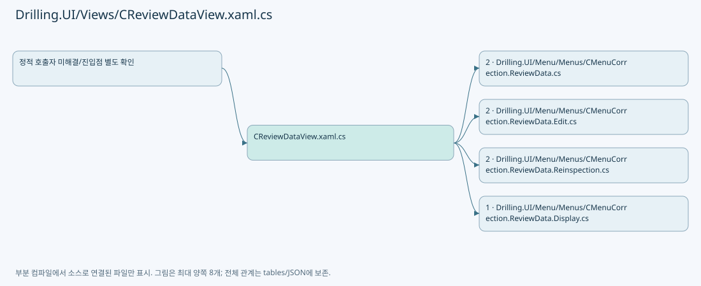

## 네임스페이스·타입·상속

| 타입 | 구분 | 원본 범위 | 선언/상속 |
| --- | --- | --- | --- |
| CBindingProxy | ClassDeclaration | 11–28 | CBindingProxy: Freezable |
| CReviewDataView | ClassDeclaration | 30–365 | CReviewDataView: UserControl |

## 멤버 빠른 목록

| 이름 | 종류 | 범위 | 서명 |
| --- | --- | --- | --- |
| DataProperty | FieldDeclaration | L13–16 | DependencyProperty Drilling.UI.Views.CBindingProxy.DataProperty |
| Data | PropertyDeclaration | L18–22 | object? Drilling.UI.Views.CBindingProxy.Data |
| get_Data | GetAccessorDeclaration | L20–20 | object? Drilling.UI.Views.CBindingProxy.Data.get |
| set_Data | SetAccessorDeclaration | L21–21 | void Drilling.UI.Views.CBindingProxy.Data.set |
| CreateInstanceCore | MethodDeclaration | L24–27 | Freezable Drilling.UI.Views.CBindingProxy.CreateInstanceCore() |
| IsInspectionModeProperty | FieldDeclaration | L32–36 | DependencyProperty Drilling.UI.Views.CReviewDataView.IsInspectionModeProperty |
| _resultEditDragSurface | FieldDeclaration | L38–38 | FrameworkElement? Drilling.UI.Views.CReviewDataView._resultEditDragSurface |
| _resultEditDragRectangle | FieldDeclaration | L39–39 | Rectangle? Drilling.UI.Views.CReviewDataView._resultEditDragRectangle |
| _resultEditDragStart | FieldDeclaration | L40–40 | Point Drilling.UI.Views.CReviewDataView._resultEditDragStart |
| _resultEditDragIsScatter | FieldDeclaration | L41–41 | bool Drilling.UI.Views.CReviewDataView._resultEditDragIsScatter |
| .ctor | ConstructorDeclaration | L43–46 | Drilling.UI.Views.CReviewDataView.CReviewDataView() |
| IsInspectionMode | PropertyDeclaration | L48–52 | bool Drilling.UI.Views.CReviewDataView.IsInspectionMode |
| get_IsInspectionMode | GetAccessorDeclaration | L50–50 | bool Drilling.UI.Views.CReviewDataView.IsInspectionMode.get |
| set_IsInspectionMode | SetAccessorDeclaration | L51–51 | void Drilling.UI.Views.CReviewDataView.IsInspectionMode.set |
| ReviewDataView_IsVisibleChanged | MethodDeclaration | L54–67 | void Drilling.UI.Views.CReviewDataView.ReviewDataView_IsVisibleChanged(object, DependencyPropertyChangedEventArgs) |
| ReviewResultsTree_SelectedItemChanged | MethodDeclaration | L69–82 | void Drilling.UI.Views.CReviewDataView.ReviewResultsTree_SelectedItemChanged(object, RoutedPropertyChangedEventArgs<object>) |
| ReviewDataShotMap_MouseLeftButtonDown | MethodDeclaration | L84–100 | void Drilling.UI.Views.CReviewDataView.ReviewDataShotMap_MouseLeftButtonDown(object, MouseButtonEventArgs) |
| ReviewDataScatterPlot_MouseLeftButtonDown | MethodDeclaration | L102–123 | void Drilling.UI.Views.CReviewDataView.ReviewDataScatterPlot_MouseLeftButtonDown(object, MouseButtonEventArgs) |
| BeginResultEditDrag | MethodDeclaration | L125–147 | void Drilling.UI.Views.CReviewDataView.BeginResultEditDrag(FrameworkElement, Rectangle, bool, MouseButtonEventArgs) |
| ReviewDataEditSurface_MouseMove | MethodDeclaration | L149–166 | void Drilling.UI.Views.CReviewDataView.ReviewDataEditSurface_MouseMove(object, MouseEventArgs) |
| ReviewDataEditSurface_MouseLeftButtonUp | MethodDeclaration | L168–219 | void Drilling.UI.Views.CReviewDataView.ReviewDataEditSurface_MouseLeftButtonUp(object, MouseButtonEventArgs) |
| ReviewDataEditSurface_LostMouseCapture | MethodDeclaration | L221–227 | void Drilling.UI.Views.CReviewDataView.ReviewDataEditSurface_LostMouseCapture(object, MouseEventArgs) |
| UpdateResultEditDragRectangle | MethodDeclaration | L229–242 | void Drilling.UI.Views.CReviewDataView.UpdateResultEditDragRectangle(Point) |
| CancelResultEditDrag | MethodDeclaration | L244–258 | void Drilling.UI.Views.CReviewDataView.CancelResultEditDrag() |
| ReviewDataResultGrid_SelectionChanged | MethodDeclaration | L260–275 | void Drilling.UI.Views.CReviewDataView.ReviewDataResultGrid_SelectionChanged(object, SelectionChangedEventArgs) |
| ReviewDataResultGrid_LoadingRow | MethodDeclaration | L277–285 | void Drilling.UI.Views.CReviewDataView.ReviewDataResultGrid_LoadingRow(object, DataGridRowEventArgs) |
| ReviewDataReinspectionGrid_SelectionChanged | MethodDeclaration | L287–299 | void Drilling.UI.Views.CReviewDataView.ReviewDataReinspectionGrid_SelectionChanged(object, SelectionChangedEventArgs) |
| ReviewDataReinspectionCheckBox_Changed | MethodDeclaration | L301–312 | void Drilling.UI.Views.CReviewDataView.ReviewDataReinspectionCheckBox_Changed(object, RoutedEventArgs) |
| ReviewDataResultEditCheckBox_Changed | MethodDeclaration | L314–325 | void Drilling.UI.Views.CReviewDataView.ReviewDataResultEditCheckBox_Changed(object, RoutedEventArgs) |
| ReviewDataResultEditKeyInGrid_SelectionChanged | MethodDeclaration | L327–334 | void Drilling.UI.Views.CReviewDataView.ReviewDataResultEditKeyInGrid_SelectionChanged(object, SelectionChangedEventArgs) |
| ReviewDataResultEditCopyGrid_SelectionChanged | MethodDeclaration | L336–343 | void Drilling.UI.Views.CReviewDataView.ReviewDataResultEditCopyGrid_SelectionChanged(object, SelectionChangedEventArgs) |
| FindVisualChild | MethodDeclaration | L345–364 | T? Drilling.UI.Views.CReviewDataView.FindVisualChild<T>(DependencyObject) |

## 멤버별 상세 계약·호출·처리 해설

### FieldDeclaration `DataProperty` · L13–16

[Drilling.UI/Views/CReviewDataView.xaml.cs:13–16](https://github.com/kjuws10-rgb/A3Drilling/blob/28764c91d521777b8ee068dd7aaf2d3902ce9fe2/Drilling.UI/Views/CReviewDataView.xaml.cs#L13-L16)

| 항목 | 실제 추출 값 |
| --- | --- |
| 서명 | DependencyProperty Drilling.UI.Views.CBindingProxy.DataProperty |
| 접근/수식자 | Public / public, static, readonly |
| 반환/값 타입 | DependencyProperty |
| 소속 타입 | NamedType:Drilling.UI.Views.CBindingProxy |

현재 부분 분석에서 직접 연결된 호출자는 없습니다. XAML/이벤트/인터페이스·델리게이트·외부 진입을 추가 확인해야 하며, 미사용으로 판정한 것이 아닙니다.

호출하는 대상과 해석 범위:

| 원본 행 | 표현식 | 분석 상태 | 대상/소스 위치 |
| --- | --- | --- | --- |
| 13 | DependencyProperty.Register | unresolved | None |
| 14 | nameof | unresolved | None |

본문의 실제 연산·분기·예외·반환 순서(원문 위치 순):

| 원본 행 | 종류 | 주석 해설 |
| --- | --- | --- |
| 13 | call | 함수·델리게이트 또는 객체 생성자를 호출합니다: DependencyProperty.Register( nameof(Data), typeof(object), typeof(CBindingProxy)) |
| 13 | variable-initializer | 변수의 초기값을 지정합니다: DataProperty = DependencyProperty.Register( nameof(Data), typeof(object), typeof(CBindingProxy)) |
| 14 | call | 함수·델리게이트 또는 객체 생성자를 호출합니다: nameof(Data) |

변경 전 점검: 입력/반환 타입, 위 호출자, 예외/취소 경로, 공유 상태와 저장·전송 소비자를 함께 확인합니다. 값의 단위나 물리 방향을 이름만으로 확정하지 않습니다.

### PropertyDeclaration `Data` · L18–22

[Drilling.UI/Views/CReviewDataView.xaml.cs:18–22](https://github.com/kjuws10-rgb/A3Drilling/blob/28764c91d521777b8ee068dd7aaf2d3902ce9fe2/Drilling.UI/Views/CReviewDataView.xaml.cs#L18-L22)

| 항목 | 실제 추출 값 |
| --- | --- |
| 서명 | object? Drilling.UI.Views.CBindingProxy.Data |
| 접근/수식자 | Public / public |
| 반환/값 타입 | object? |
| 소속 타입 | NamedType:Drilling.UI.Views.CBindingProxy |

현재 부분 분석에서 직접 연결된 호출자는 없습니다. XAML/이벤트/인터페이스·델리게이트·외부 진입을 추가 확인해야 하며, 미사용으로 판정한 것이 아닙니다.

변경 전 점검: 입력/반환 타입, 위 호출자, 예외/취소 경로, 공유 상태와 저장·전송 소비자를 함께 확인합니다. 값의 단위나 물리 방향을 이름만으로 확정하지 않습니다.

### GetAccessorDeclaration `get_Data` · L20–20

[Drilling.UI/Views/CReviewDataView.xaml.cs:20–20](https://github.com/kjuws10-rgb/A3Drilling/blob/28764c91d521777b8ee068dd7aaf2d3902ce9fe2/Drilling.UI/Views/CReviewDataView.xaml.cs#L20-L20)

| 항목 | 실제 추출 값 |
| --- | --- |
| 서명 | object? Drilling.UI.Views.CBindingProxy.Data.get |
| 접근/수식자 | Public / get |
| 반환/값 타입 | object? |
| 소속 타입 | NamedType:Drilling.UI.Views.CBindingProxy |

현재 부분 분석에서 직접 연결된 호출자는 없습니다. XAML/이벤트/인터페이스·델리게이트·외부 진입을 추가 확인해야 하며, 미사용으로 판정한 것이 아닙니다.

호출하는 대상과 해석 범위:

| 원본 행 | 표현식 | 분석 상태 | 대상/소스 위치 |
| --- | --- | --- | --- |
| 20 | GetValue | unresolved | None |

본문의 실제 연산·분기·예외·반환 순서(원문 위치 순):

| 원본 행 | 종류 | 주석 해설 |
| --- | --- | --- |
| 20 | call | 함수·델리게이트 또는 객체 생성자를 호출합니다: GetValue(DataProperty) |

변경 전 점검: 입력/반환 타입, 위 호출자, 예외/취소 경로, 공유 상태와 저장·전송 소비자를 함께 확인합니다. 값의 단위나 물리 방향을 이름만으로 확정하지 않습니다.

### SetAccessorDeclaration `set_Data` · L21–21

[Drilling.UI/Views/CReviewDataView.xaml.cs:21–21](https://github.com/kjuws10-rgb/A3Drilling/blob/28764c91d521777b8ee068dd7aaf2d3902ce9fe2/Drilling.UI/Views/CReviewDataView.xaml.cs#L21-L21)

| 항목 | 실제 추출 값 |
| --- | --- |
| 서명 | void Drilling.UI.Views.CBindingProxy.Data.set |
| 접근/수식자 | Public / set |
| 반환/값 타입 | void |
| 소속 타입 | NamedType:Drilling.UI.Views.CBindingProxy |

입력 계약:

| 이름 | 타입 | 전달 | 선택/기본값 |
| --- | --- | --- | --- |
| value | object? | None | False /  |

현재 부분 분석에서 직접 연결된 호출자는 없습니다. XAML/이벤트/인터페이스·델리게이트·외부 진입을 추가 확인해야 하며, 미사용으로 판정한 것이 아닙니다.

호출하는 대상과 해석 범위:

| 원본 행 | 표현식 | 분석 상태 | 대상/소스 위치 |
| --- | --- | --- | --- |
| 21 | SetValue | unresolved | None |

본문의 실제 연산·분기·예외·반환 순서(원문 위치 순):

| 원본 행 | 종류 | 주석 해설 |
| --- | --- | --- |
| 21 | call | 함수·델리게이트 또는 객체 생성자를 호출합니다: SetValue(DataProperty, value) |

변경 전 점검: 입력/반환 타입, 위 호출자, 예외/취소 경로, 공유 상태와 저장·전송 소비자를 함께 확인합니다. 값의 단위나 물리 방향을 이름만으로 확정하지 않습니다.

### MethodDeclaration `CreateInstanceCore` · L24–27

[Drilling.UI/Views/CReviewDataView.xaml.cs:24–27](https://github.com/kjuws10-rgb/A3Drilling/blob/28764c91d521777b8ee068dd7aaf2d3902ce9fe2/Drilling.UI/Views/CReviewDataView.xaml.cs#L24-L27)

| 항목 | 실제 추출 값 |
| --- | --- |
| 서명 | Freezable Drilling.UI.Views.CBindingProxy.CreateInstanceCore() |
| 접근/수식자 | Protected / protected, override |
| 반환/값 타입 | Freezable |
| 소속 타입 | NamedType:Drilling.UI.Views.CBindingProxy |

현재 부분 분석에서 직접 연결된 호출자는 없습니다. XAML/이벤트/인터페이스·델리게이트·외부 진입을 추가 확인해야 하며, 미사용으로 판정한 것이 아닙니다.

호출하는 대상과 해석 범위:

| 원본 행 | 표현식 | 분석 상태 | 대상/소스 위치 |
| --- | --- | --- | --- |
| 26 | new CBindingProxy | resolved | Drilling.UI.Views.CBindingProxy.CBindingProxy() · Drilling.UI/Views/CReviewDataView.xaml.cs:11 |

본문의 실제 연산·분기·예외·반환 순서(원문 위치 순):

| 원본 행 | 종류 | 주석 해설 |
| --- | --- | --- |
| 26 | call | 함수·델리게이트 또는 객체 생성자를 호출합니다: new CBindingProxy() |
| 26 | return | 호출자에게 값 또는 제어를 반환합니다: return new CBindingProxy(); |

변경 전 점검: 입력/반환 타입, 위 호출자, 예외/취소 경로, 공유 상태와 저장·전송 소비자를 함께 확인합니다. 값의 단위나 물리 방향을 이름만으로 확정하지 않습니다.

### FieldDeclaration `IsInspectionModeProperty` · L32–36

[Drilling.UI/Views/CReviewDataView.xaml.cs:32–36](https://github.com/kjuws10-rgb/A3Drilling/blob/28764c91d521777b8ee068dd7aaf2d3902ce9fe2/Drilling.UI/Views/CReviewDataView.xaml.cs#L32-L36)

| 항목 | 실제 추출 값 |
| --- | --- |
| 서명 | DependencyProperty Drilling.UI.Views.CReviewDataView.IsInspectionModeProperty |
| 접근/수식자 | Public / public, static, readonly |
| 반환/값 타입 | DependencyProperty |
| 소속 타입 | NamedType:Drilling.UI.Views.CReviewDataView |

현재 부분 분석에서 직접 연결된 호출자는 없습니다. XAML/이벤트/인터페이스·델리게이트·외부 진입을 추가 확인해야 하며, 미사용으로 판정한 것이 아닙니다.

호출하는 대상과 해석 범위:

| 원본 행 | 표현식 | 분석 상태 | 대상/소스 위치 |
| --- | --- | --- | --- |
| 32 | DependencyProperty.Register | unresolved | None |
| 33 | nameof | unresolved | None |
| 36 | new PropertyMetadata | unresolved | None |

본문의 실제 연산·분기·예외·반환 순서(원문 위치 순):

| 원본 행 | 종류 | 주석 해설 |
| --- | --- | --- |
| 32 | call | 함수·델리게이트 또는 객체 생성자를 호출합니다: DependencyProperty.Register( nameof(IsInspectionMode), typeof(bool), typeof(CReviewDataView), new PropertyMetadata(false)) |
| 32 | variable-initializer | 변수의 초기값을 지정합니다: IsInspectionModeProperty = DependencyProperty.Register( nameof(IsInspectionMode), typeof(bool), typeof(CReviewDataView), new PropertyMetadata(false)) |
| 33 | call | 함수·델리게이트 또는 객체 생성자를 호출합니다: nameof(IsInspectionMode) |
| 36 | call | 함수·델리게이트 또는 객체 생성자를 호출합니다: new PropertyMetadata(false) |

변경 전 점검: 입력/반환 타입, 위 호출자, 예외/취소 경로, 공유 상태와 저장·전송 소비자를 함께 확인합니다. 값의 단위나 물리 방향을 이름만으로 확정하지 않습니다.

### FieldDeclaration `_resultEditDragSurface` · L38–38

[Drilling.UI/Views/CReviewDataView.xaml.cs:38–38](https://github.com/kjuws10-rgb/A3Drilling/blob/28764c91d521777b8ee068dd7aaf2d3902ce9fe2/Drilling.UI/Views/CReviewDataView.xaml.cs#L38-L38)

| 항목 | 실제 추출 값 |
| --- | --- |
| 서명 | FrameworkElement? Drilling.UI.Views.CReviewDataView._resultEditDragSurface |
| 접근/수식자 | Private / private |
| 반환/값 타입 | FrameworkElement? |
| 소속 타입 | NamedType:Drilling.UI.Views.CReviewDataView |

현재 부분 분석에서 직접 연결된 호출자는 없습니다. XAML/이벤트/인터페이스·델리게이트·외부 진입을 추가 확인해야 하며, 미사용으로 판정한 것이 아닙니다.

변경 전 점검: 입력/반환 타입, 위 호출자, 예외/취소 경로, 공유 상태와 저장·전송 소비자를 함께 확인합니다. 값의 단위나 물리 방향을 이름만으로 확정하지 않습니다.

### FieldDeclaration `_resultEditDragRectangle` · L39–39

[Drilling.UI/Views/CReviewDataView.xaml.cs:39–39](https://github.com/kjuws10-rgb/A3Drilling/blob/28764c91d521777b8ee068dd7aaf2d3902ce9fe2/Drilling.UI/Views/CReviewDataView.xaml.cs#L39-L39)

| 항목 | 실제 추출 값 |
| --- | --- |
| 서명 | Rectangle? Drilling.UI.Views.CReviewDataView._resultEditDragRectangle |
| 접근/수식자 | Private / private |
| 반환/값 타입 | Rectangle? |
| 소속 타입 | NamedType:Drilling.UI.Views.CReviewDataView |

현재 부분 분석에서 직접 연결된 호출자는 없습니다. XAML/이벤트/인터페이스·델리게이트·외부 진입을 추가 확인해야 하며, 미사용으로 판정한 것이 아닙니다.

변경 전 점검: 입력/반환 타입, 위 호출자, 예외/취소 경로, 공유 상태와 저장·전송 소비자를 함께 확인합니다. 값의 단위나 물리 방향을 이름만으로 확정하지 않습니다.

### FieldDeclaration `_resultEditDragStart` · L40–40

[Drilling.UI/Views/CReviewDataView.xaml.cs:40–40](https://github.com/kjuws10-rgb/A3Drilling/blob/28764c91d521777b8ee068dd7aaf2d3902ce9fe2/Drilling.UI/Views/CReviewDataView.xaml.cs#L40-L40)

| 항목 | 실제 추출 값 |
| --- | --- |
| 서명 | Point Drilling.UI.Views.CReviewDataView._resultEditDragStart |
| 접근/수식자 | Private / private |
| 반환/값 타입 | Point |
| 소속 타입 | NamedType:Drilling.UI.Views.CReviewDataView |

현재 부분 분석에서 직접 연결된 호출자는 없습니다. XAML/이벤트/인터페이스·델리게이트·외부 진입을 추가 확인해야 하며, 미사용으로 판정한 것이 아닙니다.

변경 전 점검: 입력/반환 타입, 위 호출자, 예외/취소 경로, 공유 상태와 저장·전송 소비자를 함께 확인합니다. 값의 단위나 물리 방향을 이름만으로 확정하지 않습니다.

### FieldDeclaration `_resultEditDragIsScatter` · L41–41

[Drilling.UI/Views/CReviewDataView.xaml.cs:41–41](https://github.com/kjuws10-rgb/A3Drilling/blob/28764c91d521777b8ee068dd7aaf2d3902ce9fe2/Drilling.UI/Views/CReviewDataView.xaml.cs#L41-L41)

| 항목 | 실제 추출 값 |
| --- | --- |
| 서명 | bool Drilling.UI.Views.CReviewDataView._resultEditDragIsScatter |
| 접근/수식자 | Private / private |
| 반환/값 타입 | bool |
| 소속 타입 | NamedType:Drilling.UI.Views.CReviewDataView |

현재 부분 분석에서 직접 연결된 호출자는 없습니다. XAML/이벤트/인터페이스·델리게이트·외부 진입을 추가 확인해야 하며, 미사용으로 판정한 것이 아닙니다.

변경 전 점검: 입력/반환 타입, 위 호출자, 예외/취소 경로, 공유 상태와 저장·전송 소비자를 함께 확인합니다. 값의 단위나 물리 방향을 이름만으로 확정하지 않습니다.

### ConstructorDeclaration `.ctor` · L43–46

[Drilling.UI/Views/CReviewDataView.xaml.cs:43–46](https://github.com/kjuws10-rgb/A3Drilling/blob/28764c91d521777b8ee068dd7aaf2d3902ce9fe2/Drilling.UI/Views/CReviewDataView.xaml.cs#L43-L46)

| 항목 | 실제 추출 값 |
| --- | --- |
| 서명 | Drilling.UI.Views.CReviewDataView.CReviewDataView() |
| 접근/수식자 | Public / public |
| 반환/값 타입 | void |
| 소속 타입 | NamedType:Drilling.UI.Views.CReviewDataView |

현재 부분 분석에서 직접 연결된 호출자는 없습니다. XAML/이벤트/인터페이스·델리게이트·외부 진입을 추가 확인해야 하며, 미사용으로 판정한 것이 아닙니다.

호출하는 대상과 해석 범위:

| 원본 행 | 표현식 | 분석 상태 | 대상/소스 위치 |
| --- | --- | --- | --- |
| 45 | InitializeComponent | unresolved | None |

본문의 실제 연산·분기·예외·반환 순서(원문 위치 순):

| 원본 행 | 종류 | 주석 해설 |
| --- | --- | --- |
| 45 | call | 함수·델리게이트 또는 객체 생성자를 호출합니다: InitializeComponent() |

변경 전 점검: 입력/반환 타입, 위 호출자, 예외/취소 경로, 공유 상태와 저장·전송 소비자를 함께 확인합니다. 값의 단위나 물리 방향을 이름만으로 확정하지 않습니다.

### PropertyDeclaration `IsInspectionMode` · L48–52

[Drilling.UI/Views/CReviewDataView.xaml.cs:48–52](https://github.com/kjuws10-rgb/A3Drilling/blob/28764c91d521777b8ee068dd7aaf2d3902ce9fe2/Drilling.UI/Views/CReviewDataView.xaml.cs#L48-L52)

| 항목 | 실제 추출 값 |
| --- | --- |
| 서명 | bool Drilling.UI.Views.CReviewDataView.IsInspectionMode |
| 접근/수식자 | Public / public |
| 반환/값 타입 | bool |
| 소속 타입 | NamedType:Drilling.UI.Views.CReviewDataView |

현재 부분 분석에서 직접 연결된 호출자는 없습니다. XAML/이벤트/인터페이스·델리게이트·외부 진입을 추가 확인해야 하며, 미사용으로 판정한 것이 아닙니다.

변경 전 점검: 입력/반환 타입, 위 호출자, 예외/취소 경로, 공유 상태와 저장·전송 소비자를 함께 확인합니다. 값의 단위나 물리 방향을 이름만으로 확정하지 않습니다.

### GetAccessorDeclaration `get_IsInspectionMode` · L50–50

[Drilling.UI/Views/CReviewDataView.xaml.cs:50–50](https://github.com/kjuws10-rgb/A3Drilling/blob/28764c91d521777b8ee068dd7aaf2d3902ce9fe2/Drilling.UI/Views/CReviewDataView.xaml.cs#L50-L50)

| 항목 | 실제 추출 값 |
| --- | --- |
| 서명 | bool Drilling.UI.Views.CReviewDataView.IsInspectionMode.get |
| 접근/수식자 | Public / get |
| 반환/값 타입 | bool |
| 소속 타입 | NamedType:Drilling.UI.Views.CReviewDataView |

현재 부분 분석에서 직접 연결된 호출자는 없습니다. XAML/이벤트/인터페이스·델리게이트·외부 진입을 추가 확인해야 하며, 미사용으로 판정한 것이 아닙니다.

호출하는 대상과 해석 범위:

| 원본 행 | 표현식 | 분석 상태 | 대상/소스 위치 |
| --- | --- | --- | --- |
| 50 | GetValue | unresolved | None |

본문의 실제 연산·분기·예외·반환 순서(원문 위치 순):

| 원본 행 | 종류 | 주석 해설 |
| --- | --- | --- |
| 50 | call | 함수·델리게이트 또는 객체 생성자를 호출합니다: GetValue(IsInspectionModeProperty) |

변경 전 점검: 입력/반환 타입, 위 호출자, 예외/취소 경로, 공유 상태와 저장·전송 소비자를 함께 확인합니다. 값의 단위나 물리 방향을 이름만으로 확정하지 않습니다.

### SetAccessorDeclaration `set_IsInspectionMode` · L51–51

[Drilling.UI/Views/CReviewDataView.xaml.cs:51–51](https://github.com/kjuws10-rgb/A3Drilling/blob/28764c91d521777b8ee068dd7aaf2d3902ce9fe2/Drilling.UI/Views/CReviewDataView.xaml.cs#L51-L51)

| 항목 | 실제 추출 값 |
| --- | --- |
| 서명 | void Drilling.UI.Views.CReviewDataView.IsInspectionMode.set |
| 접근/수식자 | Public / set |
| 반환/값 타입 | void |
| 소속 타입 | NamedType:Drilling.UI.Views.CReviewDataView |

입력 계약:

| 이름 | 타입 | 전달 | 선택/기본값 |
| --- | --- | --- | --- |
| value | bool | None | False /  |

현재 부분 분석에서 직접 연결된 호출자는 없습니다. XAML/이벤트/인터페이스·델리게이트·외부 진입을 추가 확인해야 하며, 미사용으로 판정한 것이 아닙니다.

호출하는 대상과 해석 범위:

| 원본 행 | 표현식 | 분석 상태 | 대상/소스 위치 |
| --- | --- | --- | --- |
| 51 | SetValue | unresolved | None |

본문의 실제 연산·분기·예외·반환 순서(원문 위치 순):

| 원본 행 | 종류 | 주석 해설 |
| --- | --- | --- |
| 51 | call | 함수·델리게이트 또는 객체 생성자를 호출합니다: SetValue(IsInspectionModeProperty, value) |

변경 전 점검: 입력/반환 타입, 위 호출자, 예외/취소 경로, 공유 상태와 저장·전송 소비자를 함께 확인합니다. 값의 단위나 물리 방향을 이름만으로 확정하지 않습니다.

### MethodDeclaration `ReviewDataView_IsVisibleChanged` · L54–67

[Drilling.UI/Views/CReviewDataView.xaml.cs:54–67](https://github.com/kjuws10-rgb/A3Drilling/blob/28764c91d521777b8ee068dd7aaf2d3902ce9fe2/Drilling.UI/Views/CReviewDataView.xaml.cs#L54-L67)

| 항목 | 실제 추출 값 |
| --- | --- |
| 서명 | void Drilling.UI.Views.CReviewDataView.ReviewDataView_IsVisibleChanged(object, DependencyPropertyChangedEventArgs) |
| 접근/수식자 | Private / private, async |
| 반환/값 타입 | void |
| 소속 타입 | NamedType:Drilling.UI.Views.CReviewDataView |

입력 계약:

| 이름 | 타입 | 전달 | 선택/기본값 |
| --- | --- | --- | --- |
| sender | object | None | False /  |
| eventArgs | DependencyPropertyChangedEventArgs | None | False /  |

현재 부분 분석에서 직접 연결된 호출자는 없습니다. XAML/이벤트/인터페이스·델리게이트·외부 진입을 추가 확인해야 하며, 미사용으로 판정한 것이 아닙니다.

호출하는 대상과 해석 범위:

| 원본 행 | 표현식 | 분석 상태 | 대상/소스 위치 |
| --- | --- | --- | --- |
| 65 | panel.ReloadWhenVisible | resolved | System.Threading.Tasks.Task Drilling.UI.Menu.Menus.CMenuCorrection.CReviewDataPanel.ReloadWhenVisible(System.Threading.CancellationToken) · Drilling.UI/Menu/Menus/CMenuCorrection.ReviewData.cs:179 |

본문의 실제 연산·분기·예외·반환 순서(원문 위치 순):

| 원본 행 | 종류 | 주석 해설 |
| --- | --- | --- |
| 58 | if | 조건에 따라 분기합니다: if (IsVisible && DataContext is CMenuCorrection.CReviewDataPanel panel) |
| 60 | if | 조건에 따라 분기합니다: if (IsInspectionMode) |
| 62 | return | 호출자에게 값 또는 제어를 반환합니다: return; |
| 65 | await | 비동기 완료를 기다립니다: await panel.ReloadWhenVisible() |
| 65 | call | 함수·델리게이트 또는 객체 생성자를 호출합니다: panel.ReloadWhenVisible() |

제어 구문의 포함 구조(실제 실행 순서/CFG가 아닌 구문 탐색 그림):

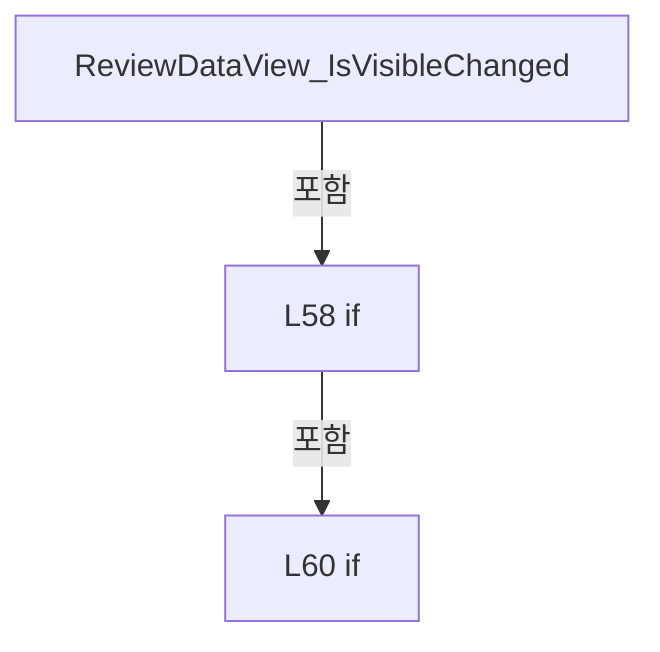
```mermaid
flowchart TD
 M["ReviewDataView_IsVisibleChanged"]
 N0["L58 if"]
 M -->|포함| N0
 N1["L60 if"]
 N0 -->|포함| N1
```

변경 전 점검: 입력/반환 타입, 위 호출자, 예외/취소 경로, 공유 상태와 저장·전송 소비자를 함께 확인합니다. 값의 단위나 물리 방향을 이름만으로 확정하지 않습니다.

### MethodDeclaration `ReviewResultsTree_SelectedItemChanged` · L69–82

[Drilling.UI/Views/CReviewDataView.xaml.cs:69–82](https://github.com/kjuws10-rgb/A3Drilling/blob/28764c91d521777b8ee068dd7aaf2d3902ce9fe2/Drilling.UI/Views/CReviewDataView.xaml.cs#L69-L82)

| 항목 | 실제 추출 값 |
| --- | --- |
| 서명 | void Drilling.UI.Views.CReviewDataView.ReviewResultsTree_SelectedItemChanged(object, RoutedPropertyChangedEventArgs<object>) |
| 접근/수식자 | Private / private |
| 반환/값 타입 | void |
| 소속 타입 | NamedType:Drilling.UI.Views.CReviewDataView |

입력 계약:

| 이름 | 타입 | 전달 | 선택/기본값 |
| --- | --- | --- | --- |
| sender | object | None | False /  |
| eventArgs | RoutedPropertyChangedEventArgs<object> | None | False /  |

현재 부분 분석에서 직접 연결된 호출자는 없습니다. XAML/이벤트/인터페이스·델리게이트·외부 진입을 추가 확인해야 하며, 미사용으로 판정한 것이 아닙니다.

호출하는 대상과 해석 범위:

| 원본 행 | 표현식 | 분석 상태 | 대상/소스 위치 |
| --- | --- | --- | --- |
| 76 | panel.Select | resolved | void Drilling.UI.Menu.Menus.CMenuCorrection.CReviewDataPanel.Select(Drilling.UI.Menu.Menus.CMenuCorrection.ST_REVIEW_RESULT_TREE_NODE) · Drilling.UI/Menu/Menus/CMenuCorrection.ReviewData.cs:209 |
| 79 | ReviewResultsTree.Dispatcher.BeginInvoke | unresolved | None |
| 81 | new Action | unresolved | None |
| 81 | FindVisualChild<ScrollViewer> | candidate | OverloadResolutionFailure |
| 81 | .ScrollToLeftEnd | unresolved | None |

본문의 실제 연산·분기·예외·반환 순서(원문 위치 순):

| 원본 행 | 종류 | 주석 해설 |
| --- | --- | --- |
| 73 | if | 조건에 따라 분기합니다: if (DataContext is CMenuCorrection.CReviewDataPanel panel && eventArgs.NewValue is CMenuCorrection.ST_REVIEW_RESULT_TREE_NODE node) |
| 76 | call | 함수·델리게이트 또는 객체 생성자를 호출합니다: panel.Select(node) |
| 79 | call | 함수·델리게이트 또는 객체 생성자를 호출합니다: ReviewResultsTree.Dispatcher.BeginInvoke( DispatcherPriority.ContextIdle, new Action(() => FindVisualChild<ScrollViewer>(ReviewResultsTree)?.ScrollToLeftEnd())) |
| 81 | call | 함수·델리게이트 또는 객체 생성자를 호출합니다: new Action(() => FindVisualChild<ScrollViewer>(ReviewResultsTree)?.ScrollToLeftEnd()) |
| 81 | call | 함수·델리게이트 또는 객체 생성자를 호출합니다: FindVisualChild<ScrollViewer>(ReviewResultsTree) |
| 81 | call | 함수·델리게이트 또는 객체 생성자를 호출합니다: .ScrollToLeftEnd() |

제어 구문의 포함 구조(실제 실행 순서/CFG가 아닌 구문 탐색 그림):

```mermaid
flowchart TD
 M["ReviewResultsTree_SelectedItemChanged"]
 N0["L73 if"]
 M -->|포함| N0
```

변경 전 점검: 입력/반환 타입, 위 호출자, 예외/취소 경로, 공유 상태와 저장·전송 소비자를 함께 확인합니다. 값의 단위나 물리 방향을 이름만으로 확정하지 않습니다.

### MethodDeclaration `ReviewDataShotMap_MouseLeftButtonDown` · L84–100

[Drilling.UI/Views/CReviewDataView.xaml.cs:84–100](https://github.com/kjuws10-rgb/A3Drilling/blob/28764c91d521777b8ee068dd7aaf2d3902ce9fe2/Drilling.UI/Views/CReviewDataView.xaml.cs#L84-L100)

| 항목 | 실제 추출 값 |
| --- | --- |
| 서명 | void Drilling.UI.Views.CReviewDataView.ReviewDataShotMap_MouseLeftButtonDown(object, MouseButtonEventArgs) |
| 접근/수식자 | Private / private |
| 반환/값 타입 | void |
| 소속 타입 | NamedType:Drilling.UI.Views.CReviewDataView |

입력 계약:

| 이름 | 타입 | 전달 | 선택/기본값 |
| --- | --- | --- | --- |
| sender | object | None | False /  |
| eventArgs | MouseButtonEventArgs | None | False /  |

현재 부분 분석에서 직접 연결된 호출자는 없습니다. XAML/이벤트/인터페이스·델리게이트·외부 진입을 추가 확인해야 하며, 미사용으로 판정한 것이 아닙니다.

호출하는 대상과 해석 범위:

| 원본 행 | 표현식 | 분석 상태 | 대상/소스 위치 |
| --- | --- | --- | --- |
| 93 | BeginResultEditDrag | candidate | OverloadResolutionFailure |
| 97 | eventArgs.GetPosition | unresolved | None |
| 98 | panel.SelectShotAt | candidate | OverloadResolutionFailure |

본문의 실제 연산·분기·예외·반환 순서(원문 위치 순):

| 원본 행 | 종류 | 주석 해설 |
| --- | --- | --- |
| 86 | if | 조건에 따라 분기합니다: if (sender is not FrameworkElement map &#124;&#124; DataContext is not CMenuCorrection.CReviewDataPanel panel) |
| 88 | return | 호출자에게 값 또는 제어를 반환합니다: return; |
| 91 | if | 조건에 따라 분기합니다: if (panel.IsResultEditMode) |
| 93 | call | 함수·델리게이트 또는 객체 생성자를 호출합니다: BeginResultEditDrag(map, ShotMapEditSelectionRectangle, isScatter: false, eventArgs) |
| 94 | return | 호출자에게 값 또는 제어를 반환합니다: return; |
| 97 | call | 함수·델리게이트 또는 객체 생성자를 호출합니다: eventArgs.GetPosition(map) |
| 97 | local-declaration | 지역 변수를 선언합니다: var point = eventArgs.GetPosition(map); |
| 97 | variable-initializer | 변수의 초기값을 지정합니다: point = eventArgs.GetPosition(map) |
| 98 | call | 함수·델리게이트 또는 객체 생성자를 호출합니다: panel.SelectShotAt(point.X, point.Y) |
| 99 | assignment | 값을 대상에 대입합니다: eventArgs.Handled = true |

제어 구문의 포함 구조(실제 실행 순서/CFG가 아닌 구문 탐색 그림):

```mermaid
flowchart TD
 M["ReviewDataShotMap_MouseLeftButtonDown"]
 N0["L86 if"]
 M -->|포함| N0
 N1["L91 if"]
 M -->|포함| N1
```

변경 전 점검: 입력/반환 타입, 위 호출자, 예외/취소 경로, 공유 상태와 저장·전송 소비자를 함께 확인합니다. 값의 단위나 물리 방향을 이름만으로 확정하지 않습니다.

### MethodDeclaration `ReviewDataScatterPlot_MouseLeftButtonDown` · L102–123

[Drilling.UI/Views/CReviewDataView.xaml.cs:102–123](https://github.com/kjuws10-rgb/A3Drilling/blob/28764c91d521777b8ee068dd7aaf2d3902ce9fe2/Drilling.UI/Views/CReviewDataView.xaml.cs#L102-L123)

| 항목 | 실제 추출 값 |
| --- | --- |
| 서명 | void Drilling.UI.Views.CReviewDataView.ReviewDataScatterPlot_MouseLeftButtonDown(object, MouseButtonEventArgs) |
| 접근/수식자 | Private / private |
| 반환/값 타입 | void |
| 소속 타입 | NamedType:Drilling.UI.Views.CReviewDataView |

입력 계약:

| 이름 | 타입 | 전달 | 선택/기본값 |
| --- | --- | --- | --- |
| sender | object | None | False /  |
| eventArgs | MouseButtonEventArgs | None | False /  |

현재 부분 분석에서 직접 연결된 호출자는 없습니다. XAML/이벤트/인터페이스·델리게이트·외부 진입을 추가 확인해야 하며, 미사용으로 판정한 것이 아닙니다.

호출하는 대상과 해석 범위:

| 원본 행 | 표현식 | 분석 상태 | 대상/소스 위치 |
| --- | --- | --- | --- |
| 114 | BeginResultEditDrag | candidate | OverloadResolutionFailure |
| 118 | eventArgs.GetPosition | unresolved | None |
| 119 | panel.SelectScatterPointAt | candidate | OverloadResolutionFailure |

본문의 실제 연산·분기·예외·반환 순서(원문 위치 순):

| 원본 행 | 종류 | 주석 해설 |
| --- | --- | --- |
| 104 | if | 조건에 따라 분기합니다: if (sender is not FrameworkElement plot &#124;&#124; plot.ActualWidth <= 0.0 &#124;&#124; plot.ActualHeight <= 0.0 &#124;&#124; DataContext is not CMenuCorrection.CReviewDataPanel panel) |
| 109 | return | 호출자에게 값 또는 제어를 반환합니다: return; |
| 112 | if | 조건에 따라 분기합니다: if (panel.IsResultEditMode) |
| 114 | call | 함수·델리게이트 또는 객체 생성자를 호출합니다: BeginResultEditDrag(plot, ScatterEditSelectionRectangle, isScatter: true, eventArgs) |
| 115 | return | 호출자에게 값 또는 제어를 반환합니다: return; |
| 118 | call | 함수·델리게이트 또는 객체 생성자를 호출합니다: eventArgs.GetPosition(plot) |
| 118 | local-declaration | 지역 변수를 선언합니다: var point = eventArgs.GetPosition(plot); |
| 118 | variable-initializer | 변수의 초기값을 지정합니다: point = eventArgs.GetPosition(plot) |
| 119 | call | 함수·델리게이트 또는 객체 생성자를 호출합니다: panel.SelectScatterPointAt( point.X * panel.ScatterPlotSurfaceWidth / plot.ActualWidth, point.Y * panel.ScatterPlotSurfaceHeight / plot.ActualHeight) |
| 122 | assignment | 값을 대상에 대입합니다: eventArgs.Handled = true |

제어 구문의 포함 구조(실제 실행 순서/CFG가 아닌 구문 탐색 그림):

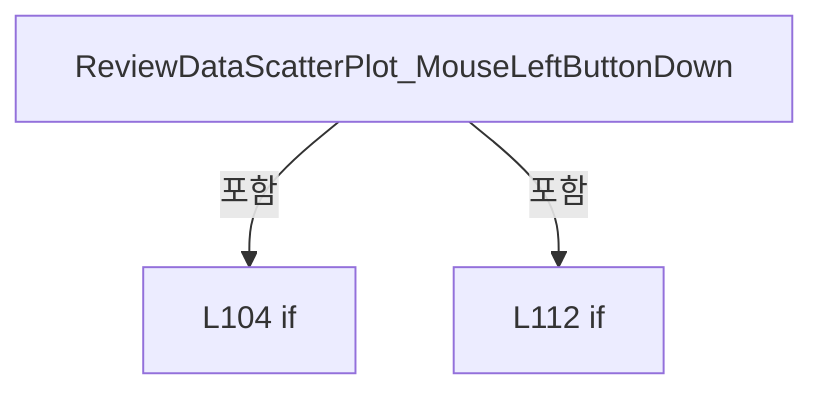
```mermaid
flowchart TD
 M["ReviewDataScatterPlot_MouseLeftButtonDown"]
 N0["L104 if"]
 M -->|포함| N0
 N1["L112 if"]
 M -->|포함| N1
```

변경 전 점검: 입력/반환 타입, 위 호출자, 예외/취소 경로, 공유 상태와 저장·전송 소비자를 함께 확인합니다. 값의 단위나 물리 방향을 이름만으로 확정하지 않습니다.

### MethodDeclaration `BeginResultEditDrag` · L125–147

[Drilling.UI/Views/CReviewDataView.xaml.cs:125–147](https://github.com/kjuws10-rgb/A3Drilling/blob/28764c91d521777b8ee068dd7aaf2d3902ce9fe2/Drilling.UI/Views/CReviewDataView.xaml.cs#L125-L147)

| 항목 | 실제 추출 값 |
| --- | --- |
| 서명 | void Drilling.UI.Views.CReviewDataView.BeginResultEditDrag(FrameworkElement, Rectangle, bool, MouseButtonEventArgs) |
| 접근/수식자 | Private / private |
| 반환/값 타입 | void |
| 소속 타입 | NamedType:Drilling.UI.Views.CReviewDataView |

입력 계약:

| 이름 | 타입 | 전달 | 선택/기본값 |
| --- | --- | --- | --- |
| surface | FrameworkElement | None | False /  |
| rectangle | Rectangle | None | False /  |
| isScatter | bool | None | False /  |
| eventArgs | MouseButtonEventArgs | None | False /  |

현재 부분 분석에서 직접 연결된 호출자는 없습니다. XAML/이벤트/인터페이스·델리게이트·외부 진입을 추가 확인해야 하며, 미사용으로 판정한 것이 아닙니다.

호출하는 대상과 해석 범위:

| 원본 행 | 표현식 | 분석 상태 | 대상/소스 위치 |
| --- | --- | --- | --- |
| 139 | eventArgs.GetPosition | unresolved | None |
| 142 | Canvas.SetLeft | unresolved | None |
| 143 | Canvas.SetTop | unresolved | None |
| 145 | surface.CaptureMouse | unresolved | None |

본문의 실제 연산·분기·예외·반환 순서(원문 위치 순):

| 원본 행 | 종류 | 주석 해설 |
| --- | --- | --- |
| 131 | if | 조건에 따라 분기합니다: if (eventArgs.ChangedButton != MouseButton.Left) |
| 133 | return | 호출자에게 값 또는 제어를 반환합니다: return; |
| 136 | assignment | 값을 대상에 대입합니다: _resultEditDragSurface = surface |
| 137 | assignment | 값을 대상에 대입합니다: _resultEditDragRectangle = rectangle |
| 138 | assignment | 값을 대상에 대입합니다: _resultEditDragIsScatter = isScatter |
| 139 | assignment | 값을 대상에 대입합니다: _resultEditDragStart = eventArgs.GetPosition(surface) |
| 139 | call | 함수·델리게이트 또는 객체 생성자를 호출합니다: eventArgs.GetPosition(surface) |
| 140 | assignment | 값을 대상에 대입합니다: rectangle.Width = 0.0 |
| 141 | assignment | 값을 대상에 대입합니다: rectangle.Height = 0.0 |
| 142 | call | 함수·델리게이트 또는 객체 생성자를 호출합니다: Canvas.SetLeft(rectangle, _resultEditDragStart.X) |
| 143 | call | 함수·델리게이트 또는 객체 생성자를 호출합니다: Canvas.SetTop(rectangle, _resultEditDragStart.Y) |
| 144 | assignment | 값을 대상에 대입합니다: rectangle.Visibility = Visibility.Visible |
| 145 | call | 함수·델리게이트 또는 객체 생성자를 호출합니다: surface.CaptureMouse() |
| 146 | assignment | 값을 대상에 대입합니다: eventArgs.Handled = true |

제어 구문의 포함 구조(실제 실행 순서/CFG가 아닌 구문 탐색 그림):

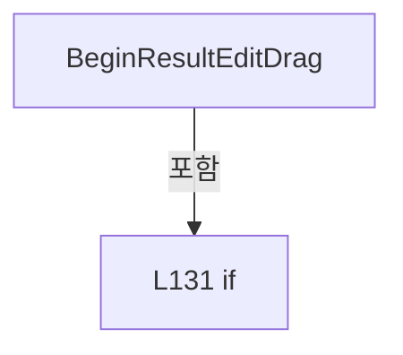
```mermaid
flowchart TD
 M["BeginResultEditDrag"]
 N0["L131 if"]
 M -->|포함| N0
```

변경 전 점검: 입력/반환 타입, 위 호출자, 예외/취소 경로, 공유 상태와 저장·전송 소비자를 함께 확인합니다. 값의 단위나 물리 방향을 이름만으로 확정하지 않습니다.

### MethodDeclaration `ReviewDataEditSurface_MouseMove` · L149–166

[Drilling.UI/Views/CReviewDataView.xaml.cs:149–166](https://github.com/kjuws10-rgb/A3Drilling/blob/28764c91d521777b8ee068dd7aaf2d3902ce9fe2/Drilling.UI/Views/CReviewDataView.xaml.cs#L149-L166)

| 항목 | 실제 추출 값 |
| --- | --- |
| 서명 | void Drilling.UI.Views.CReviewDataView.ReviewDataEditSurface_MouseMove(object, MouseEventArgs) |
| 접근/수식자 | Private / private |
| 반환/값 타입 | void |
| 소속 타입 | NamedType:Drilling.UI.Views.CReviewDataView |

입력 계약:

| 이름 | 타입 | 전달 | 선택/기본값 |
| --- | --- | --- | --- |
| sender | object | None | False /  |
| eventArgs | MouseEventArgs | None | False /  |

현재 부분 분석에서 직접 연결된 호출자는 없습니다. XAML/이벤트/인터페이스·델리게이트·외부 진입을 추가 확인해야 하며, 미사용으로 판정한 것이 아닙니다.

호출하는 대상과 해석 범위:

| 원본 행 | 표현식 | 분석 상태 | 대상/소스 위치 |
| --- | --- | --- | --- |
| 151 | ReferenceEquals | candidate | OverloadResolutionFailure |
| 160 | CancelResultEditDrag | resolved | void Drilling.UI.Views.CReviewDataView.CancelResultEditDrag() · Drilling.UI/Views/CReviewDataView.xaml.cs:244 |
| 164 | UpdateResultEditDragRectangle | candidate | OverloadResolutionFailure |
| 164 | eventArgs.GetPosition | unresolved | None |

본문의 실제 연산·분기·예외·반환 순서(원문 위치 순):

| 원본 행 | 종류 | 주석 해설 |
| --- | --- | --- |
| 151 | call | 함수·델리게이트 또는 객체 생성자를 호출합니다: ReferenceEquals(sender, _resultEditDragSurface) |
| 151 | if | 조건에 따라 분기합니다: if (!ReferenceEquals(sender, _resultEditDragSurface) &#124;&#124; _resultEditDragSurface is null &#124;&#124; _resultEditDragRectangle is null) |
| 155 | return | 호출자에게 값 또는 제어를 반환합니다: return; |
| 158 | if | 조건에 따라 분기합니다: if (eventArgs.LeftButton != MouseButtonState.Pressed) |
| 160 | call | 함수·델리게이트 또는 객체 생성자를 호출합니다: CancelResultEditDrag() |
| 161 | return | 호출자에게 값 또는 제어를 반환합니다: return; |
| 164 | call | 함수·델리게이트 또는 객체 생성자를 호출합니다: UpdateResultEditDragRectangle(eventArgs.GetPosition(_resultEditDragSurface)) |
| 164 | call | 함수·델리게이트 또는 객체 생성자를 호출합니다: eventArgs.GetPosition(_resultEditDragSurface) |
| 165 | assignment | 값을 대상에 대입합니다: eventArgs.Handled = true |

제어 구문의 포함 구조(실제 실행 순서/CFG가 아닌 구문 탐색 그림):

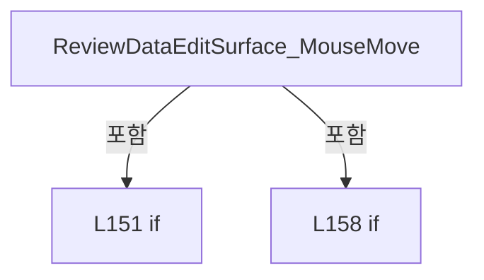
```mermaid
flowchart TD
 M["ReviewDataEditSurface_MouseMove"]
 N0["L151 if"]
 M -->|포함| N0
 N1["L158 if"]
 M -->|포함| N1
```

변경 전 점검: 입력/반환 타입, 위 호출자, 예외/취소 경로, 공유 상태와 저장·전송 소비자를 함께 확인합니다. 값의 단위나 물리 방향을 이름만으로 확정하지 않습니다.

### MethodDeclaration `ReviewDataEditSurface_MouseLeftButtonUp` · L168–219

[Drilling.UI/Views/CReviewDataView.xaml.cs:168–219](https://github.com/kjuws10-rgb/A3Drilling/blob/28764c91d521777b8ee068dd7aaf2d3902ce9fe2/Drilling.UI/Views/CReviewDataView.xaml.cs#L168-L219)

| 항목 | 실제 추출 값 |
| --- | --- |
| 서명 | void Drilling.UI.Views.CReviewDataView.ReviewDataEditSurface_MouseLeftButtonUp(object, MouseButtonEventArgs) |
| 접근/수식자 | Private / private |
| 반환/값 타입 | void |
| 소속 타입 | NamedType:Drilling.UI.Views.CReviewDataView |

입력 계약:

| 이름 | 타입 | 전달 | 선택/기본값 |
| --- | --- | --- | --- |
| sender | object | None | False /  |
| eventArgs | MouseButtonEventArgs | None | False /  |

현재 부분 분석에서 직접 연결된 호출자는 없습니다. XAML/이벤트/인터페이스·델리게이트·외부 진입을 추가 확인해야 하며, 미사용으로 판정한 것이 아닙니다.

호출하는 대상과 해석 범위:

| 원본 행 | 표현식 | 분석 상태 | 대상/소스 위치 |
| --- | --- | --- | --- |
| 170 | ReferenceEquals | candidate | OverloadResolutionFailure |
| 179 | eventArgs.GetPosition | unresolved | None |
| 180 | UpdateResultEditDragRectangle | candidate | OverloadResolutionFailure |
| 181 | Math.Abs | candidate | OverloadResolutionFailure |
| 182 | Math.Abs | candidate | OverloadResolutionFailure |
| 187 | panel.SelectScatterPointAt | candidate | OverloadResolutionFailure |
| 188 | Math.Max | candidate | OverloadResolutionFailure |
| 189 | Math.Max | candidate | OverloadResolutionFailure |
| 193 | panel.SelectShotAt | candidate | OverloadResolutionFailure |
| 194 | Math.Max | candidate | OverloadResolutionFailure |
| 195 | Math.Max | candidate | OverloadResolutionFailure |
| 198 | panel.SelectCurrentShotForResultEdit | resolved | void Drilling.UI.Menu.Menus.CMenuCorrection.CReviewDataPanel.SelectCurrentShotForResultEdit() · Drilling.UI/Menu/Menus/CMenuCorrection.ReviewData.Edit.cs:146 |
| 202 | panel.SelectResultEditShotsInScatter | candidate | OverloadResolutionFailure |
| 203 | Math.Max | candidate | OverloadResolutionFailure |
| 204 | Math.Max | candidate | OverloadResolutionFailure |
| 205 | Math.Max | candidate | OverloadResolutionFailure |
| 206 | Math.Max | candidate | OverloadResolutionFailure |
| 210 | panel.SelectResultEditShotsInMap | candidate | OverloadResolutionFailure |
| 211 | Math.Max | candidate | OverloadResolutionFailure |
| 212 | Math.Max | candidate | OverloadResolutionFailure |
| 213 | Math.Max | candidate | OverloadResolutionFailure |
| 214 | Math.Max | candidate | OverloadResolutionFailure |
| 217 | CancelResultEditDrag | resolved | void Drilling.UI.Views.CReviewDataView.CancelResultEditDrag() · Drilling.UI/Views/CReviewDataView.xaml.cs:244 |

본문의 실제 연산·분기·예외·반환 순서(원문 위치 순):

| 원본 행 | 종류 | 주석 해설 |
| --- | --- | --- |
| 170 | call | 함수·델리게이트 또는 객체 생성자를 호출합니다: ReferenceEquals(sender, _resultEditDragSurface) |
| 170 | if | 조건에 따라 분기합니다: if (!ReferenceEquals(sender, _resultEditDragSurface) &#124;&#124; _resultEditDragSurface is null &#124;&#124; _resultEditDragRectangle is null &#124;&#124; DataContext is not CMenuCorrection.CReviewDataPanel panel) |
| 175 | return | 호출자에게 값 또는 제어를 반환합니다: return; |
| 178 | local-declaration | 지역 변수를 선언합니다: var surface = _resultEditDragSurface; |
| 178 | variable-initializer | 변수의 초기값을 지정합니다: surface = _resultEditDragSurface |
| 179 | call | 함수·델리게이트 또는 객체 생성자를 호출합니다: eventArgs.GetPosition(surface) |
| 179 | local-declaration | 지역 변수를 선언합니다: var end = eventArgs.GetPosition(surface); |
| 179 | variable-initializer | 변수의 초기값을 지정합니다: end = eventArgs.GetPosition(surface) |
| 180 | call | 함수·델리게이트 또는 객체 생성자를 호출합니다: UpdateResultEditDragRectangle(end) |
| 181 | call | 함수·델리게이트 또는 객체 생성자를 호출합니다: Math.Abs(end.X - _resultEditDragStart.X) |
| 181 | local-declaration | 지역 변수를 선언합니다: var deltaX = Math.Abs(end.X - _resultEditDragStart.X); |
| 181 | variable-initializer | 변수의 초기값을 지정합니다: deltaX = Math.Abs(end.X - _resultEditDragStart.X) |
| 182 | call | 함수·델리게이트 또는 객체 생성자를 호출합니다: Math.Abs(end.Y - _resultEditDragStart.Y) |
| 182 | local-declaration | 지역 변수를 선언합니다: var deltaY = Math.Abs(end.Y - _resultEditDragStart.Y); |
| 182 | variable-initializer | 변수의 초기값을 지정합니다: deltaY = Math.Abs(end.Y - _resultEditDragStart.Y) |
| 183 | if | 조건에 따라 분기합니다: if (deltaX < 5.0 && deltaY < 5.0) |
| 185 | if | 조건에 따라 분기합니다: if (_resultEditDragIsScatter) |
| 187 | call | 함수·델리게이트 또는 객체 생성자를 호출합니다: panel.SelectScatterPointAt( end.X * panel.ScatterPlotSurfaceWidth / Math.Max(1.0, surface.ActualWidth), end.Y * panel.ScatterPlotSurfaceHeight / Math.Max(1.0, surface.ActualHeight)) |
| 188 | call | 함수·델리게이트 또는 객체 생성자를 호출합니다: Math.Max(1.0, surface.ActualWidth) |
| 189 | call | 함수·델리게이트 또는 객체 생성자를 호출합니다: Math.Max(1.0, surface.ActualHeight) |
| 191 | else | 앞 조건이 거짓인 경로입니다: else |
| 193 | call | 함수·델리게이트 또는 객체 생성자를 호출합니다: panel.SelectShotAt( end.X * panel.ShotMapSurfaceWidth / Math.Max(1.0, surface.ActualWidth), end.Y * panel.ShotMapSurfaceHeight / Math.Max(1.0, surface.ActualHeight)) |
| 194 | call | 함수·델리게이트 또는 객체 생성자를 호출합니다: Math.Max(1.0, surface.ActualWidth) |
| 195 | call | 함수·델리게이트 또는 객체 생성자를 호출합니다: Math.Max(1.0, surface.ActualHeight) |
| 198 | call | 함수·델리게이트 또는 객체 생성자를 호출합니다: panel.SelectCurrentShotForResultEdit() |
| 200 | else | 앞 조건이 거짓인 경로입니다: else |
| 200 | if | 조건에 따라 분기합니다: if (_resultEditDragIsScatter) |
| 202 | call | 함수·델리게이트 또는 객체 생성자를 호출합니다: panel.SelectResultEditShotsInScatter( _resultEditDragStart.X * panel.ScatterPlotSurfaceWidth / Math.Max(1.0, surface.ActualWidth), _resultEditDragStart.Y * panel.ScatterPlotSurfaceHeight / Math.Max(1.0, surface.ActualHei… |
| 203 | call | 함수·델리게이트 또는 객체 생성자를 호출합니다: Math.Max(1.0, surface.ActualWidth) |
| 204 | call | 함수·델리게이트 또는 객체 생성자를 호출합니다: Math.Max(1.0, surface.ActualHeight) |
| 205 | call | 함수·델리게이트 또는 객체 생성자를 호출합니다: Math.Max(1.0, surface.ActualWidth) |
| 206 | call | 함수·델리게이트 또는 객체 생성자를 호출합니다: Math.Max(1.0, surface.ActualHeight) |
| 208 | else | 앞 조건이 거짓인 경로입니다: else |
| 210 | call | 함수·델리게이트 또는 객체 생성자를 호출합니다: panel.SelectResultEditShotsInMap( _resultEditDragStart.X * panel.ShotMapSurfaceWidth / Math.Max(1.0, surface.ActualWidth), _resultEditDragStart.Y * panel.ShotMapSurfaceHeight / Math.Max(1.0, surface.ActualHeight), end.X … |
| 211 | call | 함수·델리게이트 또는 객체 생성자를 호출합니다: Math.Max(1.0, surface.ActualWidth) |
| 212 | call | 함수·델리게이트 또는 객체 생성자를 호출합니다: Math.Max(1.0, surface.ActualHeight) |
| 213 | call | 함수·델리게이트 또는 객체 생성자를 호출합니다: Math.Max(1.0, surface.ActualWidth) |
| 214 | call | 함수·델리게이트 또는 객체 생성자를 호출합니다: Math.Max(1.0, surface.ActualHeight) |
| 217 | call | 함수·델리게이트 또는 객체 생성자를 호출합니다: CancelResultEditDrag() |
| 218 | assignment | 값을 대상에 대입합니다: eventArgs.Handled = true |

제어 구문의 포함 구조(실제 실행 순서/CFG가 아닌 구문 탐색 그림):

```mermaid
flowchart TD
 M["ReviewDataEditSurface_MouseLeftButtonUp"]
 N0["L170 if"]
 M -->|포함| N0
 N1["L183 if"]
 M -->|포함| N1
 N2["L185 if"]
 N1 -->|포함| N2
 N3["L191 else"]
 N2 -->|포함| N3
 N4["L200 else"]
 N1 -->|포함| N4
 N5["L200 if"]
 N1 -->|포함| N5
 N6["L208 else"]
 N4 -->|포함| N6
```

변경 전 점검: 입력/반환 타입, 위 호출자, 예외/취소 경로, 공유 상태와 저장·전송 소비자를 함께 확인합니다. 값의 단위나 물리 방향을 이름만으로 확정하지 않습니다.

### MethodDeclaration `ReviewDataEditSurface_LostMouseCapture` · L221–227

[Drilling.UI/Views/CReviewDataView.xaml.cs:221–227](https://github.com/kjuws10-rgb/A3Drilling/blob/28764c91d521777b8ee068dd7aaf2d3902ce9fe2/Drilling.UI/Views/CReviewDataView.xaml.cs#L221-L227)

| 항목 | 실제 추출 값 |
| --- | --- |
| 서명 | void Drilling.UI.Views.CReviewDataView.ReviewDataEditSurface_LostMouseCapture(object, MouseEventArgs) |
| 접근/수식자 | Private / private |
| 반환/값 타입 | void |
| 소속 타입 | NamedType:Drilling.UI.Views.CReviewDataView |

입력 계약:

| 이름 | 타입 | 전달 | 선택/기본값 |
| --- | --- | --- | --- |
| sender | object | None | False /  |
| eventArgs | MouseEventArgs | None | False /  |

현재 부분 분석에서 직접 연결된 호출자는 없습니다. XAML/이벤트/인터페이스·델리게이트·외부 진입을 추가 확인해야 하며, 미사용으로 판정한 것이 아닙니다.

호출하는 대상과 해석 범위:

| 원본 행 | 표현식 | 분석 상태 | 대상/소스 위치 |
| --- | --- | --- | --- |
| 223 | ReferenceEquals | candidate | OverloadResolutionFailure |
| 225 | CancelResultEditDrag | resolved | void Drilling.UI.Views.CReviewDataView.CancelResultEditDrag() · Drilling.UI/Views/CReviewDataView.xaml.cs:244 |

본문의 실제 연산·분기·예외·반환 순서(원문 위치 순):

| 원본 행 | 종류 | 주석 해설 |
| --- | --- | --- |
| 223 | call | 함수·델리게이트 또는 객체 생성자를 호출합니다: ReferenceEquals(sender, _resultEditDragSurface) |
| 223 | if | 조건에 따라 분기합니다: if (ReferenceEquals(sender, _resultEditDragSurface)) |
| 225 | call | 함수·델리게이트 또는 객체 생성자를 호출합니다: CancelResultEditDrag() |

제어 구문의 포함 구조(실제 실행 순서/CFG가 아닌 구문 탐색 그림):

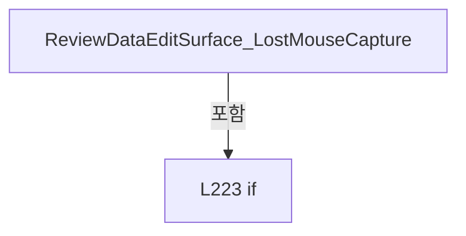
```mermaid
flowchart TD
 M["ReviewDataEditSurface_LostMouseCapture"]
 N0["L223 if"]
 M -->|포함| N0
```

변경 전 점검: 입력/반환 타입, 위 호출자, 예외/취소 경로, 공유 상태와 저장·전송 소비자를 함께 확인합니다. 값의 단위나 물리 방향을 이름만으로 확정하지 않습니다.

### MethodDeclaration `UpdateResultEditDragRectangle` · L229–242

[Drilling.UI/Views/CReviewDataView.xaml.cs:229–242](https://github.com/kjuws10-rgb/A3Drilling/blob/28764c91d521777b8ee068dd7aaf2d3902ce9fe2/Drilling.UI/Views/CReviewDataView.xaml.cs#L229-L242)

| 항목 | 실제 추출 값 |
| --- | --- |
| 서명 | void Drilling.UI.Views.CReviewDataView.UpdateResultEditDragRectangle(Point) |
| 접근/수식자 | Private / private |
| 반환/값 타입 | void |
| 소속 타입 | NamedType:Drilling.UI.Views.CReviewDataView |

입력 계약:

| 이름 | 타입 | 전달 | 선택/기본값 |
| --- | --- | --- | --- |
| end | Point | None | False /  |

현재 부분 분석에서 직접 연결된 호출자는 없습니다. XAML/이벤트/인터페이스·델리게이트·외부 진입을 추가 확인해야 하며, 미사용으로 판정한 것이 아닙니다.

호출하는 대상과 해석 범위:

| 원본 행 | 표현식 | 분석 상태 | 대상/소스 위치 |
| --- | --- | --- | --- |
| 236 | Math.Min | candidate | OverloadResolutionFailure |
| 237 | Math.Min | candidate | OverloadResolutionFailure |
| 238 | Canvas.SetLeft | unresolved | None |
| 239 | Canvas.SetTop | unresolved | None |
| 240 | Math.Abs | candidate | OverloadResolutionFailure |
| 241 | Math.Abs | candidate | OverloadResolutionFailure |

본문의 실제 연산·분기·예외·반환 순서(원문 위치 순):

| 원본 행 | 종류 | 주석 해설 |
| --- | --- | --- |
| 231 | if | 조건에 따라 분기합니다: if (_resultEditDragRectangle is null) |
| 233 | return | 호출자에게 값 또는 제어를 반환합니다: return; |
| 236 | call | 함수·델리게이트 또는 객체 생성자를 호출합니다: Math.Min(_resultEditDragStart.X, end.X) |
| 236 | local-declaration | 지역 변수를 선언합니다: var left = Math.Min(_resultEditDragStart.X, end.X); |
| 236 | variable-initializer | 변수의 초기값을 지정합니다: left = Math.Min(_resultEditDragStart.X, end.X) |
| 237 | call | 함수·델리게이트 또는 객체 생성자를 호출합니다: Math.Min(_resultEditDragStart.Y, end.Y) |
| 237 | local-declaration | 지역 변수를 선언합니다: var top = Math.Min(_resultEditDragStart.Y, end.Y); |
| 237 | variable-initializer | 변수의 초기값을 지정합니다: top = Math.Min(_resultEditDragStart.Y, end.Y) |
| 238 | call | 함수·델리게이트 또는 객체 생성자를 호출합니다: Canvas.SetLeft(_resultEditDragRectangle, left) |
| 239 | call | 함수·델리게이트 또는 객체 생성자를 호출합니다: Canvas.SetTop(_resultEditDragRectangle, top) |
| 240 | assignment | 값을 대상에 대입합니다: _resultEditDragRectangle.Width = Math.Abs(end.X - _resultEditDragStart.X) |
| 240 | call | 함수·델리게이트 또는 객체 생성자를 호출합니다: Math.Abs(end.X - _resultEditDragStart.X) |
| 241 | assignment | 값을 대상에 대입합니다: _resultEditDragRectangle.Height = Math.Abs(end.Y - _resultEditDragStart.Y) |
| 241 | call | 함수·델리게이트 또는 객체 생성자를 호출합니다: Math.Abs(end.Y - _resultEditDragStart.Y) |

제어 구문의 포함 구조(실제 실행 순서/CFG가 아닌 구문 탐색 그림):

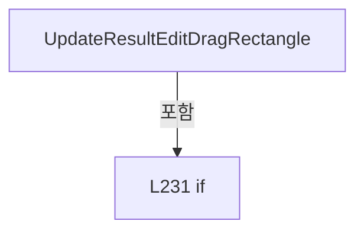
```mermaid
flowchart TD
 M["UpdateResultEditDragRectangle"]
 N0["L231 if"]
 M -->|포함| N0
```

변경 전 점검: 입력/반환 타입, 위 호출자, 예외/취소 경로, 공유 상태와 저장·전송 소비자를 함께 확인합니다. 값의 단위나 물리 방향을 이름만으로 확정하지 않습니다.

### MethodDeclaration `CancelResultEditDrag` · L244–258

[Drilling.UI/Views/CReviewDataView.xaml.cs:244–258](https://github.com/kjuws10-rgb/A3Drilling/blob/28764c91d521777b8ee068dd7aaf2d3902ce9fe2/Drilling.UI/Views/CReviewDataView.xaml.cs#L244-L258)

| 항목 | 실제 추출 값 |
| --- | --- |
| 서명 | void Drilling.UI.Views.CReviewDataView.CancelResultEditDrag() |
| 접근/수식자 | Private / private |
| 반환/값 타입 | void |
| 소속 타입 | NamedType:Drilling.UI.Views.CReviewDataView |

정적 호출자로 확인된 위치:

| 호출 파일/행 | 호출 표현식 | 런타임 분기 가능 |
| --- | --- | --- |
| [Drilling.UI/Views/CReviewDataView.xaml.cs:160–160](https://github.com/kjuws10-rgb/A3Drilling/blob/28764c91d521777b8ee068dd7aaf2d3902ce9fe2/Drilling.UI/Views/CReviewDataView.xaml.cs#L160-L160) | CancelResultEditDrag | False |
| [Drilling.UI/Views/CReviewDataView.xaml.cs:217–217](https://github.com/kjuws10-rgb/A3Drilling/blob/28764c91d521777b8ee068dd7aaf2d3902ce9fe2/Drilling.UI/Views/CReviewDataView.xaml.cs#L217-L217) | CancelResultEditDrag | False |
| [Drilling.UI/Views/CReviewDataView.xaml.cs:225–225](https://github.com/kjuws10-rgb/A3Drilling/blob/28764c91d521777b8ee068dd7aaf2d3902ce9fe2/Drilling.UI/Views/CReviewDataView.xaml.cs#L225-L225) | CancelResultEditDrag | False |

호출하는 대상과 해석 범위:

| 원본 행 | 표현식 | 분석 상태 | 대상/소스 위치 |
| --- | --- | --- | --- |
| 253 | _resultEditDragSurface.ReleaseMouseCapture | unresolved | None |

본문의 실제 연산·분기·예외·반환 순서(원문 위치 순):

| 원본 행 | 종류 | 주석 해설 |
| --- | --- | --- |
| 246 | if | 조건에 따라 분기합니다: if (_resultEditDragRectangle is not null) |
| 248 | assignment | 값을 대상에 대입합니다: _resultEditDragRectangle.Visibility = Visibility.Collapsed |
| 251 | if | 조건에 따라 분기합니다: if (_resultEditDragSurface?.IsMouseCaptured == true) |
| 253 | call | 함수·델리게이트 또는 객체 생성자를 호출합니다: _resultEditDragSurface.ReleaseMouseCapture() |
| 256 | assignment | 값을 대상에 대입합니다: _resultEditDragSurface = null |
| 257 | assignment | 값을 대상에 대입합니다: _resultEditDragRectangle = null |

제어 구문의 포함 구조(실제 실행 순서/CFG가 아닌 구문 탐색 그림):

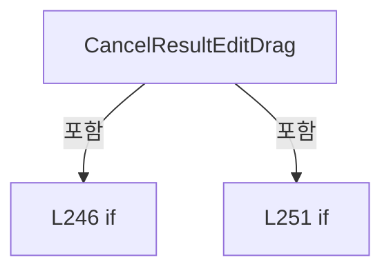
```mermaid
flowchart TD
 M["CancelResultEditDrag"]
 N0["L246 if"]
 M -->|포함| N0
 N1["L251 if"]
 M -->|포함| N1
```

변경 전 점검: 입력/반환 타입, 위 호출자, 예외/취소 경로, 공유 상태와 저장·전송 소비자를 함께 확인합니다. 값의 단위나 물리 방향을 이름만으로 확정하지 않습니다.

### MethodDeclaration `ReviewDataResultGrid_SelectionChanged` · L260–275

[Drilling.UI/Views/CReviewDataView.xaml.cs:260–275](https://github.com/kjuws10-rgb/A3Drilling/blob/28764c91d521777b8ee068dd7aaf2d3902ce9fe2/Drilling.UI/Views/CReviewDataView.xaml.cs#L260-L275)

| 항목 | 실제 추출 값 |
| --- | --- |
| 서명 | void Drilling.UI.Views.CReviewDataView.ReviewDataResultGrid_SelectionChanged(object, SelectionChangedEventArgs) |
| 접근/수식자 | Private / private |
| 반환/값 타입 | void |
| 소속 타입 | NamedType:Drilling.UI.Views.CReviewDataView |

입력 계약:

| 이름 | 타입 | 전달 | 선택/기본값 |
| --- | --- | --- | --- |
| sender | object | None | False /  |
| eventArgs | SelectionChangedEventArgs | None | False /  |

현재 부분 분석에서 직접 연결된 호출자는 없습니다. XAML/이벤트/인터페이스·델리게이트·외부 진입을 추가 확인해야 하며, 미사용으로 판정한 것이 아닙니다.

호출하는 대상과 해석 범위:

| 원본 행 | 표현식 | 분석 상태 | 대상/소스 위치 |
| --- | --- | --- | --- |
| 268 | panel.SelectRow | resolved | void Drilling.UI.Menu.Menus.CMenuCorrection.CReviewDataPanel.SelectRow(Drilling.UI.Menu.Menus.CMenuCorrection.ST_REVIEW_DATA_GRID_ROW) · Drilling.UI/Menu/Menus/CMenuCorrection.ReviewData.Display.cs:609 |
| 271 | ReviewDataResultGrid.Dispatcher.BeginInvoke | unresolved | None |
| 273 | new Action | unresolved | None |
| 273 | ReviewDataResultGrid.ScrollIntoView | unresolved | None |

본문의 실제 연산·분기·예외·반환 순서(원문 위치 순):

| 원본 행 | 종류 | 주석 해설 |
| --- | --- | --- |
| 262 | if | 조건에 따라 분기합니다: if (sender is not DataGrid { SelectedItem: CMenuCorrection.ST_REVIEW_DATA_GRID_ROW row } &#124;&#124; DataContext is not CMenuCorrection.CReviewDataPanel panel) |
| 265 | return | 호출자에게 값 또는 제어를 반환합니다: return; |
| 268 | call | 함수·델리게이트 또는 객체 생성자를 호출합니다: panel.SelectRow(row) |
| 269 | if | 조건에 따라 분기합니다: if (panel.SelectedRow is { } selectedRow) |
| 271 | call | 함수·델리게이트 또는 객체 생성자를 호출합니다: ReviewDataResultGrid.Dispatcher.BeginInvoke( DispatcherPriority.Background, new Action(() => ReviewDataResultGrid.ScrollIntoView(selectedRow))) |
| 273 | call | 함수·델리게이트 또는 객체 생성자를 호출합니다: new Action(() => ReviewDataResultGrid.ScrollIntoView(selectedRow)) |
| 273 | call | 함수·델리게이트 또는 객체 생성자를 호출합니다: ReviewDataResultGrid.ScrollIntoView(selectedRow) |

제어 구문의 포함 구조(실제 실행 순서/CFG가 아닌 구문 탐색 그림):

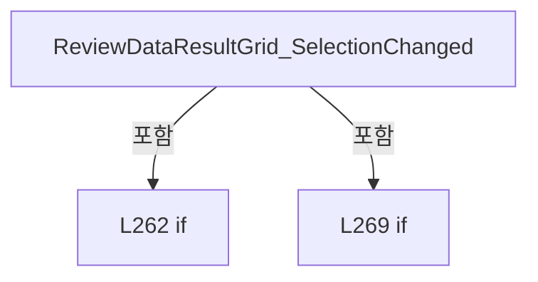
```mermaid
flowchart TD
 M["ReviewDataResultGrid_SelectionChanged"]
 N0["L262 if"]
 M -->|포함| N0
 N1["L269 if"]
 M -->|포함| N1
```

변경 전 점검: 입력/반환 타입, 위 호출자, 예외/취소 경로, 공유 상태와 저장·전송 소비자를 함께 확인합니다. 값의 단위나 물리 방향을 이름만으로 확정하지 않습니다.

### MethodDeclaration `ReviewDataResultGrid_LoadingRow` · L277–285

[Drilling.UI/Views/CReviewDataView.xaml.cs:277–285](https://github.com/kjuws10-rgb/A3Drilling/blob/28764c91d521777b8ee068dd7aaf2d3902ce9fe2/Drilling.UI/Views/CReviewDataView.xaml.cs#L277-L285)

| 항목 | 실제 추출 값 |
| --- | --- |
| 서명 | void Drilling.UI.Views.CReviewDataView.ReviewDataResultGrid_LoadingRow(object, DataGridRowEventArgs) |
| 접근/수식자 | Private / private |
| 반환/값 타입 | void |
| 소속 타입 | NamedType:Drilling.UI.Views.CReviewDataView |

입력 계약:

| 이름 | 타입 | 전달 | 선택/기본값 |
| --- | --- | --- | --- |
| sender | object | None | False /  |
| eventArgs | DataGridRowEventArgs | None | False /  |

현재 부분 분석에서 직접 연결된 호출자는 없습니다. XAML/이벤트/인터페이스·델리게이트·외부 진입을 추가 확인해야 하며, 미사용으로 판정한 것이 아닙니다.

호출하는 대상과 해석 범위:

| 원본 행 | 표현식 | 분석 상태 | 대상/소스 위치 |
| --- | --- | --- | --- |
| 281 | eventArgs.Row.SetCurrentValue | unresolved | None |
| 283 | ReferenceEquals | candidate | OverloadResolutionFailure |

본문의 실제 연산·분기·예외·반환 순서(원문 위치 순):

| 원본 행 | 종류 | 주석 해설 |
| --- | --- | --- |
| 279 | if | 조건에 따라 분기합니다: if (DataContext is CMenuCorrection.CReviewDataPanel panel) |
| 281 | call | 함수·델리게이트 또는 객체 생성자를 호출합니다: eventArgs.Row.SetCurrentValue( DataGridRow.IsSelectedProperty, ReferenceEquals(eventArgs.Row.Item, panel.SelectedRow)) |
| 283 | call | 함수·델리게이트 또는 객체 생성자를 호출합니다: ReferenceEquals(eventArgs.Row.Item, panel.SelectedRow) |

제어 구문의 포함 구조(실제 실행 순서/CFG가 아닌 구문 탐색 그림):

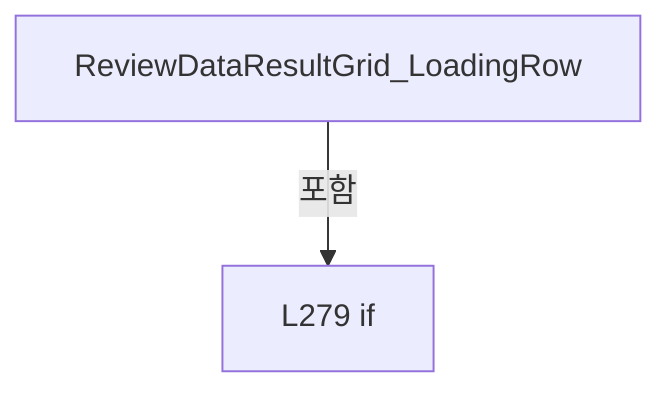
```mermaid
flowchart TD
 M["ReviewDataResultGrid_LoadingRow"]
 N0["L279 if"]
 M -->|포함| N0
```

변경 전 점검: 입력/반환 타입, 위 호출자, 예외/취소 경로, 공유 상태와 저장·전송 소비자를 함께 확인합니다. 값의 단위나 물리 방향을 이름만으로 확정하지 않습니다.

### MethodDeclaration `ReviewDataReinspectionGrid_SelectionChanged` · L287–299

[Drilling.UI/Views/CReviewDataView.xaml.cs:287–299](https://github.com/kjuws10-rgb/A3Drilling/blob/28764c91d521777b8ee068dd7aaf2d3902ce9fe2/Drilling.UI/Views/CReviewDataView.xaml.cs#L287-L299)

| 항목 | 실제 추출 값 |
| --- | --- |
| 서명 | void Drilling.UI.Views.CReviewDataView.ReviewDataReinspectionGrid_SelectionChanged(object, SelectionChangedEventArgs) |
| 접근/수식자 | Private / private |
| 반환/값 타입 | void |
| 소속 타입 | NamedType:Drilling.UI.Views.CReviewDataView |

입력 계약:

| 이름 | 타입 | 전달 | 선택/기본값 |
| --- | --- | --- | --- |
| sender | object | None | False /  |
| eventArgs | SelectionChangedEventArgs | None | False /  |

현재 부분 분석에서 직접 연결된 호출자는 없습니다. XAML/이벤트/인터페이스·델리게이트·외부 진입을 추가 확인해야 하며, 미사용으로 판정한 것이 아닙니다.

호출하는 대상과 해석 범위:

| 원본 행 | 표현식 | 분석 상태 | 대상/소스 위치 |
| --- | --- | --- | --- |
| 297 | panel.SelectReinspectionShot | resolved | void Drilling.UI.Menu.Menus.CMenuCorrection.CReviewDataPanel.SelectReinspectionShot(Drilling.UI.Menu.Menus.CMenuCorrection.ST_REVIEW_DATA_REINSPECTION_ITEM) · Drilling.UI/Menu/Menus/CMenuCorrection.ReviewData.Reinspection.cs:628 |

본문의 실제 연산·분기·예외·반환 순서(원문 위치 순):

| 원본 행 | 종류 | 주석 해설 |
| --- | --- | --- |
| 291 | if | 조건에 따라 분기합니다: if (sender is DataGrid { SelectedItem: CMenuCorrection.ST_REVIEW_DATA_REINSPECTION_ITEM item } && DataContext is CMenuCorrection.CReviewDataPanel panel) |
| 297 | call | 함수·델리게이트 또는 객체 생성자를 호출합니다: panel.SelectReinspectionShot(item) |

제어 구문의 포함 구조(실제 실행 순서/CFG가 아닌 구문 탐색 그림):

```mermaid
flowchart TD
 M["ReviewDataReinspectionGrid_SelectionChanged"]
 N0["L291 if"]
 M -->|포함| N0
```

변경 전 점검: 입력/반환 타입, 위 호출자, 예외/취소 경로, 공유 상태와 저장·전송 소비자를 함께 확인합니다. 값의 단위나 물리 방향을 이름만으로 확정하지 않습니다.

### MethodDeclaration `ReviewDataReinspectionCheckBox_Changed` · L301–312

[Drilling.UI/Views/CReviewDataView.xaml.cs:301–312](https://github.com/kjuws10-rgb/A3Drilling/blob/28764c91d521777b8ee068dd7aaf2d3902ce9fe2/Drilling.UI/Views/CReviewDataView.xaml.cs#L301-L312)

| 항목 | 실제 추출 값 |
| --- | --- |
| 서명 | void Drilling.UI.Views.CReviewDataView.ReviewDataReinspectionCheckBox_Changed(object, RoutedEventArgs) |
| 접근/수식자 | Private / private |
| 반환/값 타입 | void |
| 소속 타입 | NamedType:Drilling.UI.Views.CReviewDataView |

입력 계약:

| 이름 | 타입 | 전달 | 선택/기본값 |
| --- | --- | --- | --- |
| sender | object | None | False /  |
| eventArgs | RoutedEventArgs | None | False /  |

현재 부분 분석에서 직접 연결된 호출자는 없습니다. XAML/이벤트/인터페이스·델리게이트·외부 진입을 추가 확인해야 하며, 미사용으로 판정한 것이 아닙니다.

호출하는 대상과 해석 범위:

| 원본 행 | 표현식 | 분석 상태 | 대상/소스 위치 |
| --- | --- | --- | --- |
| 310 | panel.SetReinspectionRowSelection | resolved | void Drilling.UI.Menu.Menus.CMenuCorrection.CReviewDataPanel.SetReinspectionRowSelection(Drilling.UI.Menu.Menus.CMenuCorrection.ST_REVIEW_DATA_GRID_ROW, bool) · Drilling.UI/Menu/Menus/CMenuCorrection.ReviewData.Reinspection.cs:622 |

본문의 실제 연산·분기·예외·반환 순서(원문 위치 순):

| 원본 행 | 종류 | 주석 해설 |
| --- | --- | --- |
| 303 | if | 조건에 따라 분기합니다: if (sender is CheckBox { DataContext: CMenuCorrection.ST_REVIEW_DATA_GRID_ROW row, IsChecked: var isChecked } && DataContext is CMenuCorrection.CReviewDataPanel panel) |
| 310 | call | 함수·델리게이트 또는 객체 생성자를 호출합니다: panel.SetReinspectionRowSelection(row, isChecked == true) |

제어 구문의 포함 구조(실제 실행 순서/CFG가 아닌 구문 탐색 그림):

```mermaid
flowchart TD
 M["ReviewDataReinspectionCheckBox_Changed"]
 N0["L303 if"]
 M -->|포함| N0
```

변경 전 점검: 입력/반환 타입, 위 호출자, 예외/취소 경로, 공유 상태와 저장·전송 소비자를 함께 확인합니다. 값의 단위나 물리 방향을 이름만으로 확정하지 않습니다.

### MethodDeclaration `ReviewDataResultEditCheckBox_Changed` · L314–325

[Drilling.UI/Views/CReviewDataView.xaml.cs:314–325](https://github.com/kjuws10-rgb/A3Drilling/blob/28764c91d521777b8ee068dd7aaf2d3902ce9fe2/Drilling.UI/Views/CReviewDataView.xaml.cs#L314-L325)

| 항목 | 실제 추출 값 |
| --- | --- |
| 서명 | void Drilling.UI.Views.CReviewDataView.ReviewDataResultEditCheckBox_Changed(object, RoutedEventArgs) |
| 접근/수식자 | Private / private |
| 반환/값 타입 | void |
| 소속 타입 | NamedType:Drilling.UI.Views.CReviewDataView |

입력 계약:

| 이름 | 타입 | 전달 | 선택/기본값 |
| --- | --- | --- | --- |
| sender | object | None | False /  |
| eventArgs | RoutedEventArgs | None | False /  |

현재 부분 분석에서 직접 연결된 호출자는 없습니다. XAML/이벤트/인터페이스·델리게이트·외부 진입을 추가 확인해야 하며, 미사용으로 판정한 것이 아닙니다.

호출하는 대상과 해석 범위:

| 원본 행 | 표현식 | 분석 상태 | 대상/소스 위치 |
| --- | --- | --- | --- |
| 323 | panel.SetResultEditRowSelection | resolved | void Drilling.UI.Menu.Menus.CMenuCorrection.CReviewDataPanel.SetResultEditRowSelection(Drilling.UI.Menu.Menus.CMenuCorrection.ST_REVIEW_DATA_GRID_ROW, bool) · Drilling.UI/Menu/Menus/CMenuCorrection.ReviewData.Edit.cs:135 |

본문의 실제 연산·분기·예외·반환 순서(원문 위치 순):

| 원본 행 | 종류 | 주석 해설 |
| --- | --- | --- |
| 316 | if | 조건에 따라 분기합니다: if (sender is CheckBox { DataContext: CMenuCorrection.ST_REVIEW_DATA_GRID_ROW row, IsChecked: var isChecked } && DataContext is CMenuCorrection.CReviewDataPanel panel) |
| 323 | call | 함수·델리게이트 또는 객체 생성자를 호출합니다: panel.SetResultEditRowSelection(row, isChecked == true) |

제어 구문의 포함 구조(실제 실행 순서/CFG가 아닌 구문 탐색 그림):

```mermaid
flowchart TD
 M["ReviewDataResultEditCheckBox_Changed"]
 N0["L316 if"]
 M -->|포함| N0
```

변경 전 점검: 입력/반환 타입, 위 호출자, 예외/취소 경로, 공유 상태와 저장·전송 소비자를 함께 확인합니다. 값의 단위나 물리 방향을 이름만으로 확정하지 않습니다.

### MethodDeclaration `ReviewDataResultEditKeyInGrid_SelectionChanged` · L327–334

[Drilling.UI/Views/CReviewDataView.xaml.cs:327–334](https://github.com/kjuws10-rgb/A3Drilling/blob/28764c91d521777b8ee068dd7aaf2d3902ce9fe2/Drilling.UI/Views/CReviewDataView.xaml.cs#L327-L334)

| 항목 | 실제 추출 값 |
| --- | --- |
| 서명 | void Drilling.UI.Views.CReviewDataView.ReviewDataResultEditKeyInGrid_SelectionChanged(object, SelectionChangedEventArgs) |
| 접근/수식자 | Private / private |
| 반환/값 타입 | void |
| 소속 타입 | NamedType:Drilling.UI.Views.CReviewDataView |

입력 계약:

| 이름 | 타입 | 전달 | 선택/기본값 |
| --- | --- | --- | --- |
| sender | object | None | False /  |
| eventArgs | SelectionChangedEventArgs | None | False /  |

현재 부분 분석에서 직접 연결된 호출자는 없습니다. XAML/이벤트/인터페이스·델리게이트·외부 진입을 추가 확인해야 하며, 미사용으로 판정한 것이 아닙니다.

본문의 실제 연산·분기·예외·반환 순서(원문 위치 순):

| 원본 행 | 종류 | 주석 해설 |
| --- | --- | --- |
| 329 | if | 조건에 따라 분기합니다: if (sender is DataGrid { SelectedItem: CMenuCorrection.ST_REVIEW_DATA_EDIT_ITEM item } && DataContext is CMenuCorrection.CReviewDataPanel panel) |
| 332 | assignment | 값을 대상에 대입합니다: panel.SelectedResultEditKeyInItem = item |

제어 구문의 포함 구조(실제 실행 순서/CFG가 아닌 구문 탐색 그림):

```mermaid
flowchart TD
 M["ReviewDataResultEditKeyInGrid_SelectionChanged"]
 N0["L329 if"]
 M -->|포함| N0
```

변경 전 점검: 입력/반환 타입, 위 호출자, 예외/취소 경로, 공유 상태와 저장·전송 소비자를 함께 확인합니다. 값의 단위나 물리 방향을 이름만으로 확정하지 않습니다.

### MethodDeclaration `ReviewDataResultEditCopyGrid_SelectionChanged` · L336–343

[Drilling.UI/Views/CReviewDataView.xaml.cs:336–343](https://github.com/kjuws10-rgb/A3Drilling/blob/28764c91d521777b8ee068dd7aaf2d3902ce9fe2/Drilling.UI/Views/CReviewDataView.xaml.cs#L336-L343)

| 항목 | 실제 추출 값 |
| --- | --- |
| 서명 | void Drilling.UI.Views.CReviewDataView.ReviewDataResultEditCopyGrid_SelectionChanged(object, SelectionChangedEventArgs) |
| 접근/수식자 | Private / private |
| 반환/값 타입 | void |
| 소속 타입 | NamedType:Drilling.UI.Views.CReviewDataView |

입력 계약:

| 이름 | 타입 | 전달 | 선택/기본값 |
| --- | --- | --- | --- |
| sender | object | None | False /  |
| eventArgs | SelectionChangedEventArgs | None | False /  |

현재 부분 분석에서 직접 연결된 호출자는 없습니다. XAML/이벤트/인터페이스·델리게이트·외부 진입을 추가 확인해야 하며, 미사용으로 판정한 것이 아닙니다.

본문의 실제 연산·분기·예외·반환 순서(원문 위치 순):

| 원본 행 | 종류 | 주석 해설 |
| --- | --- | --- |
| 338 | if | 조건에 따라 분기합니다: if (sender is DataGrid { SelectedItem: CMenuCorrection.ST_REVIEW_DATA_EDIT_ITEM item } && DataContext is CMenuCorrection.CReviewDataPanel panel) |
| 341 | assignment | 값을 대상에 대입합니다: panel.SelectedResultEditCopyTarget = item |

제어 구문의 포함 구조(실제 실행 순서/CFG가 아닌 구문 탐색 그림):

```mermaid
flowchart TD
 M["ReviewDataResultEditCopyGrid_SelectionChanged"]
 N0["L338 if"]
 M -->|포함| N0
```

변경 전 점검: 입력/반환 타입, 위 호출자, 예외/취소 경로, 공유 상태와 저장·전송 소비자를 함께 확인합니다. 값의 단위나 물리 방향을 이름만으로 확정하지 않습니다.

### MethodDeclaration `FindVisualChild` · L345–364

[Drilling.UI/Views/CReviewDataView.xaml.cs:345–364](https://github.com/kjuws10-rgb/A3Drilling/blob/28764c91d521777b8ee068dd7aaf2d3902ce9fe2/Drilling.UI/Views/CReviewDataView.xaml.cs#L345-L364)

| 항목 | 실제 추출 값 |
| --- | --- |
| 서명 | T? Drilling.UI.Views.CReviewDataView.FindVisualChild<T>(DependencyObject) |
| 접근/수식자 | Private / private, static |
| 반환/값 타입 | T? |
| 소속 타입 | NamedType:Drilling.UI.Views.CReviewDataView |

입력 계약:

| 이름 | 타입 | 전달 | 선택/기본값 |
| --- | --- | --- | --- |
| parent | DependencyObject | None | False /  |

현재 부분 분석에서 직접 연결된 호출자는 없습니다. XAML/이벤트/인터페이스·델리게이트·외부 진입을 추가 확인해야 하며, 미사용으로 판정한 것이 아닙니다.

호출하는 대상과 해석 범위:

| 원본 행 | 표현식 | 분석 상태 | 대상/소스 위치 |
| --- | --- | --- | --- |
| 348 | VisualTreeHelper.GetChildrenCount | unresolved | None |
| 350 | VisualTreeHelper.GetChild | unresolved | None |
| 356 | FindVisualChild<T> | candidate | OverloadResolutionFailure |

본문의 실제 연산·분기·예외·반환 순서(원문 위치 순):

| 원본 행 | 종류 | 주석 해설 |
| --- | --- | --- |
| 348 | call | 함수·델리게이트 또는 객체 생성자를 호출합니다: VisualTreeHelper.GetChildrenCount(parent) |
| 348 | variable-initializer | 변수의 초기값을 지정합니다: index = 0 |
| 348 | for | 초기화·조건·증감이 있는 반복입니다: for (var index = 0; index < VisualTreeHelper.GetChildrenCount(parent); index++) |
| 350 | call | 함수·델리게이트 또는 객체 생성자를 호출합니다: VisualTreeHelper.GetChild(parent, index) |
| 350 | local-declaration | 지역 변수를 선언합니다: var child = VisualTreeHelper.GetChild(parent, index); |
| 350 | variable-initializer | 변수의 초기값을 지정합니다: child = VisualTreeHelper.GetChild(parent, index) |
| 351 | if | 조건에 따라 분기합니다: if (child is T match) |
| 353 | return | 호출자에게 값 또는 제어를 반환합니다: return match; |
| 356 | call | 함수·델리게이트 또는 객체 생성자를 호출합니다: FindVisualChild<T>(child) |
| 356 | local-declaration | 지역 변수를 선언합니다: var descendant = FindVisualChild<T>(child); |
| 356 | variable-initializer | 변수의 초기값을 지정합니다: descendant = FindVisualChild<T>(child) |
| 357 | if | 조건에 따라 분기합니다: if (descendant is not null) |
| 359 | return | 호출자에게 값 또는 제어를 반환합니다: return descendant; |
| 363 | return | 호출자에게 값 또는 제어를 반환합니다: return null; |

제어 구문의 포함 구조(실제 실행 순서/CFG가 아닌 구문 탐색 그림):

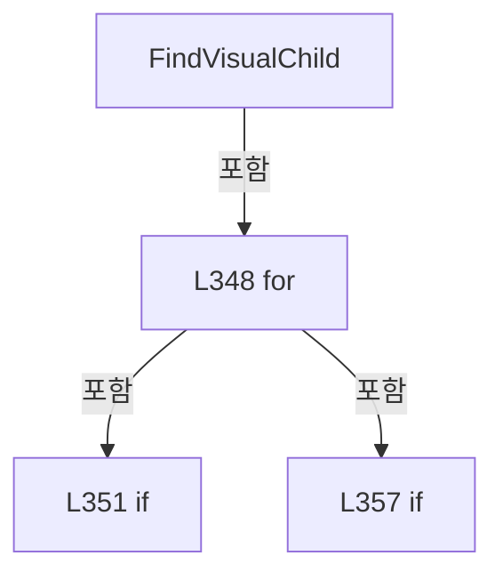
```mermaid
flowchart TD
 M["FindVisualChild"]
 N0["L348 for"]
 M -->|포함| N0
 N1["L351 if"]
 N0 -->|포함| N1
 N2["L357 if"]
 N0 -->|포함| N2
```

변경 전 점검: 입력/반환 타입, 위 호출자, 예외/취소 경로, 공유 상태와 저장·전송 소비자를 함께 확인합니다. 값의 단위나 물리 방향을 이름만으로 확정하지 않습니다.

## 구문·바인딩 한계

전체 WPF/벤더 SDK/프로젝트별 빌드 조건을 로드한 정식 빌드가 아닙니다. `resolved`는 이 부분 컴파일에서의 심볼 연결이며 virtual/interface/delegate/이벤트/Reflection/XAML의 실제 런타임 구현을 확정하지 않습니다. `candidate`와 `unresolved`는 후속 확인 대상으로 남깁니다.

## 원문 전체 주석 해설본

[원본 모든 행과 행별 해설 보기](../../../annotated/Drilling.UI/Views/CReviewDataView.xaml.cs.annotated.txt)

원본을 빠뜨리거나 임의로 줄이지 않았습니다. `L000001 |` 표시는 원본 행 번호, `// 해설`은 별도 설명입니다. 실행용 소스가 아닌 문서입니다.

## 수정·재검증 체크

- 원본 Commit과 현재 작업 파일 SHA가 같은지 먼저 확인합니다. 다르면 이 문서를 과거 버전 자료로 취급합니다.
- 선언·직접 호출·이벤트/인터페이스 경계·설정 소비를 함께 확인합니다. 정적 연결의 빈 곳을 정상 경로로 추정하지 않습니다.
- 저장 형식/단위/식별자·재시도·취소·예외·롤백에 영향을 주는 변경은 상세 해설장과 호출자를 다시 검토합니다.
- 도구의 구문 추출과 별도 정적 추적 해설, 실제 빌드·시뮬레이션·실장비 검증 결과를 분리합니다.
