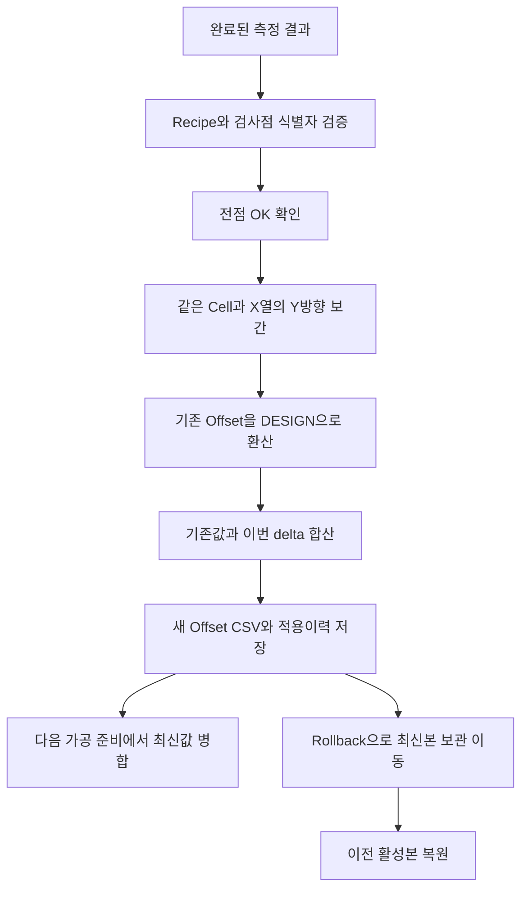

# Review Offset: 누적 보정·좌표계 태그·중복 방지·원복


원본: `kjuws10-rgb/A3Drilling` · `master` · `28764c91d521777b8ee068dd7aaf2d3902ce9fe2`

현재 재검토: **11.19.0 / 2026-11-20**, 비교 기준 11.17.0(`96e22cd027c84bf302b23f2949b98985d7f301bb`). 11.18/11.19 두 Commit의 변경과 이전부터 남아 있는 경계를 함께 확인했습니다. 아래 변경 항목과 기존 잔건을 구분합니다. 파일·함수·호출 경계의 정적 확인이며 장비 실행 시험 결과가 아닙니다.

이 장의 **코드 확인**은 해당 Commit의 실제 함수 본문을 정적으로 추적한 사실입니다. **해설**은 그 구조를 이해하기 위한 설명이며, **검증 과제**는 앞으로 실행할 시험입니다. 실장비의 부호·광학 상태·통신 타이밍·정밀도가 검증되었다는 뜻은 아닙니다. 예시 숫자는 설명용 가상값입니다.

## 1. 측정 결과와 적용된 Offset을 분리해서 이해하기

Review 측정 결과는 “지금 어떤 오차가 관찰되었는가”이고, Review Offset은 “다음 가공 좌표에 어떤 값을 더할 것인가”입니다. AUTO Fine은 측정·검증·저장을 별도 단계로 실행합니다. 저장 성공 시 outcome에도 **다음 Glass에 적용**한다고 남깁니다. 결과 CSV를 열었다고 보정값이 자동으로 적용된 것은 아닙니다. [CAutoFineReviewCoordinator.cs:29–76](https://github.com/kjuws10-rgb/A3Drilling/blob/28764c91d521777b8ee068dd7aaf2d3902ce9fe2/Drilling.Common/Review/CAutoFineReviewCoordinator.cs#L29-L76) [CAutoFineReviewCoordinator.cs:165–168](https://github.com/kjuws10-rgb/A3Drilling/blob/28764c91d521777b8ee068dd7aaf2d3902ce9fe2/Drilling.Common/Review/CAutoFineReviewCoordinator.cs#L165-L168)


```mermaid
flowchart TD
 R[완료된 측정 결과] --> V[Recipe와 검사점 식별자 검증]
 V --> G[전점 OK 확인]
 G --> I[같은 Cell과 X열의 Y방향 보간]
 I --> C[기존 Offset을 DESIGN으로 환산]
 C --> A[기존값과 이번 delta 합산]
 A --> N[새 Offset CSV와 적용이력 저장]
 N --> P[다음 가공 준비에서 최신값 병합]
 N --> B[Rollback으로 최신본 보관 이동]
 B --> O[이전 활성본 복원]
```

## 2. AUTO 저장은 어디서 차단되는가

`Save`는 semaphore를 얻은 뒤 `_saved`를 다시 확인합니다. 이는 동시에 들어온 저장 호출 중 먼저 기다리던 호출이 중복 파일을 만들지 못하게 하는 경계입니다. `SaveCore`는 Prepared/Result 존재, Completed 상태, 결과 파일 저장 성공, 점 식별자 정합성, 전체 OK를 다시 검사합니다. 측정 완료 때 한 번 검사했다는 이유로 저장 검증을 생략하지 않습니다. [CAutoFineReviewCoordinator.cs:79–122](https://github.com/kjuws10-rgb/A3Drilling/blob/28764c91d521777b8ee068dd7aaf2d3902ce9fe2/Drilling.Common/Review/CAutoFineReviewCoordinator.cs#L79-L122)

ZeroLine Follow-up은 검사 이력만 남기고 현재 Review Offset을 load하지도 않는 분기가 있습니다. 따라서 “모든 Review 완료는 Offset을 갱신한다”는 설명은 틀립니다. 일반 AUTO Fine과 진단용 후속 검사는 목적이 다릅니다. [CAutoFineReviewCoordinator.cs:103–121](https://github.com/kjuws10-rgb/A3Drilling/blob/28764c91d521777b8ee068dd7aaf2d3902ce9fe2/Drilling.Common/Review/CAutoFineReviewCoordinator.cs#L103-L121)

## 3. FINE 보간의 실제 차원

`CalculateFineOffsets`는 측정점이 비어 있거나 NG, 미완료, 중복 ShotKey, 비유한 좌표를 포함하면 전체 적용을 거부합니다. 측정점을 `(CellNo, Round(DesignX,6))`로 묶고 각 열에서 DesignY 순으로 anchor를 만듭니다. 대상 Shot도 같은 키로 묶습니다. **Cell별 같은 설계 X열의 Y방향 보간입니다. HeadNo는 그룹 키에 없으므로 같은 Cell/X열에 여러 Head가 속하면 anchor가 함께 묶일 수 있습니다. X방향 표면 보간은 아닙니다.** [CReviewManager.cs:3616–3656](https://github.com/kjuws10-rgb/A3Drilling/blob/28764c91d521777b8ee068dd7aaf2d3902ce9fe2/Drilling.Common/Review/CReviewManager.cs#L3616-L3656)

| 경우 | 코드 동작 | 의미 |
|---|---|---|
| 한 열에 anchor 1개 | 해당 값을 반환 | 그 열 전체에 동일 delta를 준다. |
| anchor 여러 개 | Y를 정규화하고 Lagrange basis 계산 | 최대 7개 anchor라는 주석이 있다. |
| 대상 Y가 anchor Y와 사실상 같음 | 해당 anchor 값을 직접 반환 | 불필요한 수치 오차를 줄인다. |
| 같은 열에 같은 Y anchor 중복 | 예외 | 보간 분모가 0이 되는 모호한 입력을 차단한다. |
| 제외 때문에 anchor가 없는 열 | 그 열을 건너뜀 | 기존 저장값을 보존하려는 주석이 있다. |

표는 실제 함수 분기를 풀어쓴 것입니다. anchor 바깥 Y에 대한 계산식도 같은 다항식이므로, “언제나 보간 범위 안에서만 평가한다”는 보장은 함수 자체에 없습니다. 외삽의 물리적 적절성과 overshoot 제한은 별도 검토가 필요합니다. [CReviewManager.cs:3631–3682](https://github.com/kjuws10-rgb/A3Drilling/blob/28764c91d521777b8ee068dd7aaf2d3902ce9fe2/Drilling.Common/Review/CReviewManager.cs#L3631-L3682)

## 4. 보정 방향과 누적식

AUTO는 raw 측정 오차를 Plan의 VisionFlip으로 변환해 delta를 구합니다. 기존 파일의 각 Shot 값을 `CReviewOffsetData.ToDesign`으로 변환한 뒤 **기존 design 값 + 이번 delta**를 계산하고 `IsDesignCoordinate=true`로 저장합니다. 기존값을 이번 delta로 단순 대체하지 않으며, Legacy scanner 좌표를 design이라고 가정하지 않습니다. [CAutoFineReviewCoordinator.cs:123–151](https://github.com/kjuws10-rgb/A3Drilling/blob/28764c91d521777b8ee068dd7aaf2d3902ce9fe2/Drilling.Common/Review/CAutoFineReviewCoordinator.cs#L123-L151)

```text
currentDesign = ToDesign(parameters, HeadNo, oldX, oldY, old.IsDesignCoordinate)
finalDesignX  = Round(currentDesign.X + delta.X)
finalDesignY  = Round(currentDesign.Y + delta.Y)
savedSpace    = DESIGN
```

UI 수동 적용도 `Current / Delta / Final`을 구성하고 같은 누적식을 사용합니다. 적용 대상은 현재 Recipe에서 Head가 배정되어 있고 `Use`인 Shot입니다. ALL_SHOT/ONE_SHOT, ROUGH, FINE/AUTO는 각각 별도 delta builder를 사용합니다. FINE/AUTO 결과에 NG가 있으면 전체 적용을 거부합니다. [CMenuCorrection.ReviewData.Offset.cs:260–347](https://github.com/kjuws10-rgb/A3Drilling/blob/28764c91d521777b8ee068dd7aaf2d3902ce9fe2/Drilling.UI/Menu/Menus/CMenuCorrection.ReviewData.Offset.cs#L260-L347) [CMenuCorrection.ReviewData.Offset.cs:443–468](https://github.com/kjuws10-rgb/A3Drilling/blob/28764c91d521777b8ee068dd7aaf2d3902ce9fe2/Drilling.UI/Menu/Menus/CMenuCorrection.ReviewData.Offset.cs#L443-L468)

**해설:** “오차가 +X이므로 Offset에도 무조건 −X를 입력한다”는 구두 규칙으로 이 함수를 바꾸면 안 됩니다. raw 오차가 Target−Hole인지, VisionFlip이 어느 방향으로 변환하는지, 저장 좌표가 DESIGN인지 SCANNER인지, 최종 Scanner builder가 어떻게 적용하는지까지 연결해 시험해야 합니다. [CReviewManager.cs:2375–2386](https://github.com/kjuws10-rgb/A3Drilling/blob/28764c91d521777b8ee068dd7aaf2d3902ce9fe2/Drilling.Common/Review/CReviewManager.cs#L2375-L2386) [CReviewManager.cs:3687–3715](https://github.com/kjuws10-rgb/A3Drilling/blob/28764c91d521777b8ee068dd7aaf2d3902ce9fe2/Drilling.Common/Review/CReviewManager.cs#L3687-L3715) [CShotCoordinatePlanBuilder.cs:141–156](https://github.com/kjuws10-rgb/A3Drilling/blob/28764c91d521777b8ee068dd7aaf2d3902ce9fe2/Drilling.Common/Recipe/CShotCoordinatePlanBuilder.cs#L141-L156)

## 5. CSV 저장 구조와 Legacy 호환

| 열 | 자료 의미 | 파서 검증 |
|---|---|---|
| `CELLID` | 1 이상 Cell 식별자 | 정수, 유효 범위 |
| `SHOTID` | Cell 내 Shot 이름 | trim·대문자 및 구분자 정규화, 중복 금지 |
| `REVIEWOFFSETX` | 보정 X | 유한 double |
| `REVIEWOFFSETY` | 보정 Y | 유한 double |
| `COORDINATE_SPACE` | DESIGN 또는 SCANNER | 빈 값은 Legacy SCANNER, 그 외 알 수 없는 값은 오류 |

저장 파일은 Recipe별 `recipeId_reviewoffset` 폴더 아래 timestamp `_reviewoffset.csv`로 만들어집니다. 현재 loader는 required header와 실제 CSV 행 번호를 포함해 오류를 보고합니다. 새 값을 적용하기 전 **전체 행을 먼저 검증**한 다음 기존 parameter key를 제거합니다. 입력 중 한 행이 잘못되었다고 정상 기존값을 먼저 지우지 않도록 한 순서입니다. [CReviewOffsetFile.cs:704–777](https://github.com/kjuws10-rgb/A3Drilling/blob/28764c91d521777b8ee068dd7aaf2d3902ce9fe2/Drilling.File/ReviewOffset/CReviewOffsetFile.cs#L704-L777) [CShotCoordinatePlanBuilder.cs:1163–1216](https://github.com/kjuws10-rgb/A3Drilling/blob/28764c91d521777b8ee068dd7aaf2d3902ce9fe2/Drilling.Common/Recipe/CShotCoordinatePlanBuilder.cs#L1163-L1216)

Parameter 병합 시에는 `CELL{cell}_{shot}_REVIEW_OFFSET_X/Y/SPACE`로 저장됩니다. 과거 공통 `REVIEW_OFFSET_X/Y`도 제거합니다. DESIGN이면 최종 Scanner 좌표를 만드는 시점에 Head와 Stage 방향으로 변환하고, SCANNER면 이미 변환된 값으로 취급합니다. [CShotCoordinatePlanBuilder.cs:1137–1161](https://github.com/kjuws10-rgb/A3Drilling/blob/28764c91d521777b8ee068dd7aaf2d3902ce9fe2/Drilling.Common/Recipe/CShotCoordinatePlanBuilder.cs#L1137-L1161) [CShotCoordinatePlanBuilder.cs:1190–1216](https://github.com/kjuws10-rgb/A3Drilling/blob/28764c91d521777b8ee068dd7aaf2d3902ce9fe2/Drilling.Common/Recipe/CShotCoordinatePlanBuilder.cs#L1190-L1216)

## 6. 새 파일과 적용 이력을 함께 남기는 순서

`SaveNewCore`는 검증된 행을 임시 파일에 쓴 후 고유 timestamp 파일명으로 이동합니다. 파일명이 겹치면 millisecond를 증가시킵니다. 기존 활성 파일을 덮어쓰는 저장 방식이 아닙니다. 임시 파일은 finally에서 정리합니다. [CReviewOffsetFile.cs:224–268](https://github.com/kjuws10-rgb/A3Drilling/blob/28764c91d521777b8ee068dd7aaf2d3902ce9fe2/Drilling.File/ReviewOffset/CReviewOffsetFile.cs#L224-L268)

`SaveNewFromSource`는 source result 파일의 identity를 만들고 해당 시점의 history에서 기존 적용을 찾습니다. duplicate가 있고 allowDuplicate가 false면 예외입니다. 새 Offset을 만든 뒤 history append가 실패하면 방금 만든 Offset 파일을 제거하려고 합니다. 이 제거마저 실패하면 원래 오류와 cleanup 오류를 함께 올립니다. 파일 생성만 성공한 상태를 조용히 정상 처리하지 않으려는 보상 동작입니다. [CReviewOffsetFile.cs:150–221](https://github.com/kjuws10-rgb/A3Drilling/blob/28764c91d521777b8ee068dd7aaf2d3902ce9fe2/Drilling.File/ReviewOffset/CReviewOffsetFile.cs#L150-L221)

### 중복 방지의 범위를 과장하지 않기

이 history 경로는 `appliedAt.ToLocalTime()`의 년/월/일 하위 파일입니다. source identity는 application root 내부라면 상대 경로, 외부라면 full path를 `/` 구분자로 정규화한 값입니다. **content hash 기반의 영구 전역 중복 제거가 아닙니다.** 현재는 Recipe의 모든 날짜별 이력을 검색하므로 같은 경로를 다음 날 다시 적용해도 차단합니다. 같은 내용을 다른 경로로 복사한 경우는 별도 identity라 허용될 수 있습니다. [CReviewOffsetFile.cs:633–677](https://github.com/kjuws10-rgb/A3Drilling/blob/28764c91d521777b8ee068dd7aaf2d3902ce9fe2/Drilling.File/ReviewOffset/CReviewOffsetFile.cs#L633-L677)

| 보호 수단 | 막는 문제 | 단독으로 입증할 수 없는 것 |
|---|---|---|
| coordinator `_saved`와 gate | 같은 coordinator 저장의 동시·반복 실행 | 앱 재시작 이후 모든 중복 |
| source application history | Recipe 전체 날짜의 같은 source identity | 다른 경로·내용 복제의 완전 차단 |
| Recipe ID 검사 | 다른 Recipe Offset과 합산 | Recipe 내용 revision 전체 동일성 |
| UI 최신 파일 재확인 | dialog를 연 사이 최신 Offset이 바뀜 | 다른 프로세스와 모든 filesystem race 해소 |

UI는 확인 대화상자 후 latest 파일을 다시 읽고 `SameOffsetSource`를 비교한 뒤 저장합니다. 사용자에게 보인 Current와 실제 저장 대상이 달라지는 것을 막으려는 경계입니다. [CMenuCorrection.ReviewData.Offset.cs:84–124](https://github.com/kjuws10-rgb/A3Drilling/blob/28764c91d521777b8ee068dd7aaf2d3902ce9fe2/Drilling.UI/Menu/Menus/CMenuCorrection.ReviewData.Offset.cs#L84-L124)

## 7. Rollback은 무엇을 원복하는가

`RollbackLatest`는 현재 활성 파일 목록을 읽고 `expectedLatestFilePath`가 최신 파일과 다르면 중단합니다. 그 후 최신 파일을 `Rollback` 하위 보관 경로로 이동하고 이전 활성 파일을 현재값으로 삼습니다. 제거한 Offset 파일에 해당하는 적용 history도 조정합니다. 이 동작은 **최신 활성 snapshot 한 단계 원복**이며 임의 날짜의 모든 Recipe/Setting/측정 결과를 함께 되돌리는 전체 프로젝트 복원은 아닙니다. [CReviewOffsetFile.cs:271–362](https://github.com/kjuws10-rgb/A3Drilling/blob/28764c91d521777b8ee068dd7aaf2d3902ce9fe2/Drilling.File/ReviewOffset/CReviewOffsetFile.cs#L271-L362)

원복 중 history 쓰기나 현재값 확인이 실패하면 이동한 파일과 history를 되살리는 cleanup 경로가 있습니다. 실제 실패 주입 테스트에서는 파일 이동 실패, history 쓰기 실패, 원복 cleanup 실패를 따로 검증해야 합니다. source 코드에 복구 분기가 있다는 사실만으로 파일시스템 장애에 대한 원복 성공을 보장하지 않습니다. [CReviewOffsetFile.cs:319–390](https://github.com/kjuws10-rgb/A3Drilling/blob/28764c91d521777b8ee068dd7aaf2d3902ce9fe2/Drilling.File/ReviewOffset/CReviewOffsetFile.cs#L319-L390)

## 8. 다음 가공에서 값이 사용되는 경계

`CStationProcess.MergeLatestReviewOffsets`는 가공 준비 parameter를 구성하면서 해당 Recipe의 latest Offset을 load하고 파일 경로·저장 시각을 준비 상태에 보관한 뒤 parameter에 병합합니다. 최종 `CShotCoordinatePlanBuilder`는 이 값을 `ToScanner`로 옮겨 다른 offset 성분과 합칩니다. 따라서 지금 저장한 Offset이 이미 진행 중인 Glass의 명령을 소급 변경한다고 설명해서는 안 됩니다. [CStationProcess.cs:1545–1564](https://github.com/kjuws10-rgb/A3Drilling/blob/28764c91d521777b8ee068dd7aaf2d3902ce9fe2/Drilling.Common/Station/CStationProcess.cs#L1545-L1564) [CShotCoordinatePlanBuilder.cs:141–156](https://github.com/kjuws10-rgb/A3Drilling/blob/28764c91d521777b8ee068dd7aaf2d3902ce9fe2/Drilling.Common/Recipe/CShotCoordinatePlanBuilder.cs#L141-L156)

## 9. 개발자용 검증 과제

| 시험 | 준비 | 기대 결과 |
|---|---|---|
| 전체 NG 차단 | 한 anchor만 NG | 새 Offset 파일 없음, 기존 활성값 유지 |
| 한 anchor | 같은 Cell/X 열 여러 Y 대상 | 같은 delta를 받음 |
| 없는 anchor 열 | 해당 열 측정점 전부 제외 | 기존값 보존, 임의 0 보간 금지 |
| Legacy 변환 | SCANNER 이전 파일 + 비정상 Head flip 조합 | design으로 역변환 후 누적·재변환이 일관됨 |
| CSV 한 행 NaN | 나머지 행 정상 | 전체 적용 거부, 기존 parameter 제거 전 실패 |
| 동시 Save | 동일 coordinator 두 호출 | 정상 snapshot 한 번만 저장 |
| 날짜/경로 중복 | 같은 source를 다음 날짜 또는 다른 경로로 지정 | 현재 정책의 한계를 정확히 확인·명세화 |
| rollback stale UI | dialog 후 다른 snapshot 추가 | expectedLatest 불일치로 중단 |
| history failure | append 쓰기만 실패 주입 | 새 Offset cleanup 및 오류 확인 |
| rollback 후 재적용 | 최신본 보관 이동 뒤 같은 source 지정 | history 변경과 duplicate 정책이 일관됨 |

위 항목은 권장 자동시험이며 본 문서 작성 시 실행한 장비 시험 결과가 아닙니다.

## 10. 결과 COPY, 보정값 복사, 보정율을 구별한다

11.13.0의 COPY MODE가 직접 복제하는 것은 **Review 결과 X/Y 또는 JUDGE**입니다. 이미 적용된 ReviewOffset snapshot이나 Head Default를 다른 Shot에 복사하는 함수가 아닙니다. COPY X·COPY Y·COPY JUDGE·COPY ALL은 메모리상의 편집 후보를 채우고, RESULT SAVE가 별도 _EDIT_ 파일을 만듭니다. OFFSET APPLY는 여전히 독립 동작입니다. [CMenuCorrection.ReviewData.Edit.cs:304–345](https://github.com/kjuws10-rgb/A3Drilling/blob/28764c91d521777b8ee068dd7aaf2d3902ce9fe2/Drilling.UI/Menu/Menus/CMenuCorrection.ReviewData.Edit.cs#L304-L345) [CMenuCorrection.ReviewData.Edit.cs:371–416](https://github.com/kjuws10-rgb/A3Drilling/blob/28764c91d521777b8ee068dd7aaf2d3902ce9fe2/Drilling.UI/Menu/Menus/CMenuCorrection.ReviewData.Edit.cs#L371-L416) [CReviewResultFile.cs:157–183](https://github.com/kjuws10-rgb/A3Drilling/blob/28764c91d521777b8ee068dd7aaf2d3902ce9fe2/Drilling.File/ReviewResult/CReviewResultFile.cs#L157-L183)

| 동작 | 바뀌는 자료 | 실측/가공에 대한 의미 |
|---|---|---|
| COPY X / COPY Y | 대상 결과의 해당 축 편집 후보 | 반대축·판정은 자동 변경하지 않고 대상 Shot을 새로 측정하지 않음 |
| COPY JUDGE / ALL | 대상 편집 판정, 또는 좌표+판정 | 복사된 OK는 새 측정 합격 증거가 아님 |
| RESULT SAVE | 새 EDIT Revision | 현재 Offset/Recipe/Product를 함께 적용하지 않음 |
| OFFSET APPLY | Current+Delta인 새 ReviewOffset와 적용 이력 | 다음 가공 준비에 사용하는 별도 저장 |
| REVIEW_OFFSET_SCALE / ALIGN_OFFSET_SCALE | 현재 가공 기여값에 곱하는 비율 | 원래 저장 Offset을 축소 저장하거나 반복 곱하지 않음 |
| Default APPLY | Recipe의 Head별 기본값 | Review 결과 수정·ReviewOffset 원복과 다른 수명 |

보정 레벨을 비율(%)이라는 뜻으로 쓸 때, ReadOffsetScale은 키가 없으면100%, 있으면0 이상 정수만 허용하고 percent/100을 반환합니다. 소스에 100% 상한은 없습니다. 두 비율은 각각 Align/Review의 Scanner 변환 후 기여값에 한 번 곱합니다. Default·FirstBeam·RecipeOffset에는 이 곱셈이 적용되지 않습니다. 0%도 저장 이력 삭제가 아니라 이번 가공 기여를0으로 만드는 선택입니다. [CShotCoordinatePlanBuilder.cs:33–37](https://github.com/kjuws10-rgb/A3Drilling/blob/28764c91d521777b8ee068dd7aaf2d3902ce9fe2/Drilling.Common/Recipe/CShotCoordinatePlanBuilder.cs#L33-L37) [CShotCoordinatePlanBuilder.cs:141–156](https://github.com/kjuws10-rgb/A3Drilling/blob/28764c91d521777b8ee068dd7aaf2d3902ce9fe2/Drilling.Common/Recipe/CShotCoordinatePlanBuilder.cs#L141-L156) [CShotCoordinatePlanBuilder.cs:204–210](https://github.com/kjuws10-rgb/A3Drilling/blob/28764c91d521777b8ee068dd7aaf2d3902ce9fe2/Drilling.Common/Recipe/CShotCoordinatePlanBuilder.cs#L204-L210)

### EDIT 결과가 Offset으로 들어가는지는 결과 형식에 따라 다르다

MeasuredRows는 RESULT_SOURCE가 한 행이라도 있으면 MEASURED·RETAINED·EDITED를 사용합니다. UNMEASURED·ERROR 및 보간행은 제외합니다. Direct·ROUGH는 이 후보 중 OK만 사용하고 FINE/AUTO는 후보 중 비OK가 하나라도 있으면 전체를 차단합니다. 반면 RESULT_SOURCE가 전혀 없는 파일은 OK/NG 판정 행으로 fallback합니다. 새 ONE SHOT writer도 그 열을 만들지 않으므로, 그 파일을 EDIT해 OK로 저장하면 수정값이 fallback 적용 후보가 될 수 있습니다. “편집 결과는 언제나 보정에 적용된다” 또는 “언제나 적용에서 제외된다”는 설명은 둘 다 현재 코드와 맞지 않습니다. [CMenuCorrection.ReviewData.Offset.cs:385–415](https://github.com/kjuws10-rgb/A3Drilling/blob/28764c91d521777b8ee068dd7aaf2d3902ce9fe2/Drilling.UI/Menu/Menus/CMenuCorrection.ReviewData.Offset.cs#L385-L415) [CMenuCorrection.ReviewData.Offset.cs:443–480](https://github.com/kjuws10-rgb/A3Drilling/blob/28764c91d521777b8ee068dd7aaf2d3902ce9fe2/Drilling.UI/Menu/Menus/CMenuCorrection.ReviewData.Offset.cs#L443-L480) [CReviewResultFile.cs:399–403](https://github.com/kjuws10-rgb/A3Drilling/blob/28764c91d521777b8ee068dd7aaf2d3902ce9fe2/Drilling.File/ReviewResult/CReviewResultFile.cs#L399-L403) [CReviewResultFile.cs:1031–1040](https://github.com/kjuws10-rgb/A3Drilling/blob/28764c91d521777b8ee068dd7aaf2d3902ce9fe2/Drilling.File/ReviewResult/CReviewResultFile.cs#L1031-L1040)

FINE에서는 이제 EDITED도 anchor 후보입니다. NG를 EDITED/OK로 바꾸면 그 수정값이 계산에 사용될 수 있으나 새 실측 합격을 의미하지 않습니다. EDITED/NG는 후보에서 사라지지 않아 전체 적용을 차단합니다. 따라서 편집 후에는 숫자와 판정·출처·적용 범위를 함께 검토해야 합니다. [CMenuCorrection.ReviewData.Offset.cs:294–297](https://github.com/kjuws10-rgb/A3Drilling/blob/28764c91d521777b8ee068dd7aaf2d3902ce9fe2/Drilling.UI/Menu/Menus/CMenuCorrection.ReviewData.Offset.cs#L294-L297) [CMenuCorrection.ReviewData.Offset.cs:443–480](https://github.com/kjuws10-rgb/A3Drilling/blob/28764c91d521777b8ee068dd7aaf2d3902ce9fe2/Drilling.UI/Menu/Menus/CMenuCorrection.ReviewData.Offset.cs#L443-L480)

### 중복 적용과 원복 경계

EDIT/REINSP 파일은 BASE와 다른 경로입니다. source identity가 경로 기준인 history에서 새 Revision을 과거 BASE와 같은 측정 계보로 묶어 중복 차단한다는 근거는 없습니다. 먼저 BASE를 적용한 뒤 부분 EDIT 또는 REINSP Revision을 다시 적용하면, 아직 MEASURED로 남은 다른 행의 delta가 재누적되는 경로를 시험해야 합니다. 파일명에 Revision이 있다고 기준 OffsetRevision·부모 결과 해시·적용 소비 ID가 자동 기록되는 것은 아닙니다. [CReviewResultFile.cs:229–268](https://github.com/kjuws10-rgb/A3Drilling/blob/28764c91d521777b8ee068dd7aaf2d3902ce9fe2/Drilling.File/ReviewResult/CReviewResultFile.cs#L229-L268) [CReviewOffsetFile.cs:633–677](https://github.com/kjuws10-rgb/A3Drilling/blob/28764c91d521777b8ee068dd7aaf2d3902ce9fe2/Drilling.File/ReviewOffset/CReviewOffsetFile.cs#L633-L677)

검증할 조합은 (1) BASE 적용 후 일부 EDIT, (2) BASE 적용 후 일부 REINSP, (3) 다음 날짜 같은 경로, (4) 다른 경로 복제, (5) Offset Rollback 후 같은 결과 재적용입니다. 기대 관찰값은 실제 후보 키·Current/Delta/Final·새 snapshot·history source identity입니다. ReviewOffset Rollback은 결과 EDIT/REINSP 파일이나 판정을 되돌리지 않으며, Default의 실패 쌍 복원과도 다릅니다.


## 11. 화면 색·산포도 축·보정율·품질 판정의 차이

11.13.0의 산포도는 Judge 색, ShotMap은 결과존재 색이었습니다. **11.17.0은 L1~L4 임계색으로 변경**되어 산포도는 행 LevelBrush, Shot은 같은 Shot의 최대 Level, Cell은 포함 행의 최대 Level을 씁니다. 기본0.010/0.020/0.030mm는 품질 tolerance가 아닌 표시값입니다. 이전 색 설명을 대체합니다. [CMenuCorrection.ReviewData.Display.cs:315–332](https://github.com/kjuws10-rgb/A3Drilling/blob/28764c91d521777b8ee068dd7aaf2d3902ce9fe2/Drilling.UI/Menu/Menus/CMenuCorrection.ReviewData.Display.cs#L315-L332) [CMenuCorrection.ReviewData.Display.cs:789–814](https://github.com/kjuws10-rgb/A3Drilling/blob/28764c91d521777b8ee068dd7aaf2d3902ce9fe2/Drilling.UI/Menu/Menus/CMenuCorrection.ReviewData.Display.cs#L789-L814) [CMenuCorrection.ReviewData.Display.cs:1178–1195](https://github.com/kjuws10-rgb/A3Drilling/blob/28764c91d521777b8ee068dd7aaf2d3902ce9fe2/Drilling.UI/Menu/Menus/CMenuCorrection.ReviewData.Display.cs#L1178-L1195)

산포도 MIN/MAX/UNIT는 mm 그리기 범위입니다. 점 선택·축 확대·색 편집은 ReviewOffset이나 Judge를 재저장하지 않습니다. Offset scale(%)는 저장된 값의 현재 가공 기여율이며 L1~L4와 별개입니다. [CMenuCorrection.ReviewData.Display.cs:713–746](https://github.com/kjuws10-rgb/A3Drilling/blob/28764c91d521777b8ee068dd7aaf2d3902ce9fe2/Drilling.UI/Menu/Menus/CMenuCorrection.ReviewData.Display.cs#L713-L746) [CShotCoordinatePlanBuilder.cs:141–156](https://github.com/kjuws10-rgb/A3Drilling/blob/28764c91d521777b8ee068dd7aaf2d3902ce9fe2/Drilling.Common/Recipe/CShotCoordinatePlanBuilder.cs#L141-L156)

## 12. Fine 보간의 유지 사항과 재개 파일 필터 개선

같은 X열에서 세 줄을 측정했다고 실제 보정이 구간 선형인 것은 아닙니다. AUTO SaveCore, 수동 FINE APPLY, 파일 FINE/AUTO APPLY는 모두 CalculateFineOffsets를 사용합니다. anchor가1개면 상수,2개면 직선,3개면2차 Lagrange이며 n개면 n−1차입니다. 모든 anchor를 한꺼번에 사용하고 범위 밖을 고정하지 않습니다. 함수 본문은 이번 diff에서 바뀌지 않은 **기존 요구 정합성 잔건**입니다. [CReviewManager.cs:3616–3683](https://github.com/kjuws10-rgb/A3Drilling/blob/28764c91d521777b8ee068dd7aaf2d3902ce9fe2/Drilling.Common/Review/CReviewManager.cs#L3616-L3683) [CAutoFineReviewCoordinator.cs:123–151](https://github.com/kjuws10-rgb/A3Drilling/blob/28764c91d521777b8ee068dd7aaf2d3902ce9fe2/Drilling.Common/Review/CAutoFineReviewCoordinator.cs#L123-L151) [CMenuCorrection.cs:3176–3219](https://github.com/kjuws10-rgb/A3Drilling/blob/28764c91d521777b8ee068dd7aaf2d3902ce9fe2/Drilling.UI/Menu/Menus/CMenuCorrection.cs#L3176-L3219) [CMenuCorrection.ReviewData.Offset.cs:443–480](https://github.com/kjuws10-rgb/A3Drilling/blob/28764c91d521777b8ee068dd7aaf2d3902ce9fe2/Drilling.UI/Menu/Menus/CMenuCorrection.ReviewData.Offset.cs#L443-L480)

별도 ProjectFineResultRows에는 인접 Y 선형 확장과 양 끝 고정 코드가 남아 있습니다. 현재 ReviewData Offset의 ProjectCorrectionRows 호출은 ROUGH 경로이며 별도 Fine projection을 활성 Fine UI가 호출한다고 확정한 근거는 없습니다. “화면은 선형인데 저장은 Lagrange”라고 일반화하지 않습니다. [CReviewManager.cs:794–907](https://github.com/kjuws10-rgb/A3Drilling/blob/28764c91d521777b8ee068dd7aaf2d3902ce9fe2/Drilling.Common/Review/CReviewManager.cs#L794-L907) [CMenuCorrection.ReviewData.Offset.cs:418–466](https://github.com/kjuws10-rgb/A3Drilling/blob/28764c91d521777b8ee068dd7aaf2d3902ce9fe2/Drilling.UI/Menu/Menus/CMenuCorrection.ReviewData.Offset.cs#L418-L466)

| 기존 조건 | 확인된 경계 | 후속 시험 |
|---|---|---|
| anchor0/10/0µm, Y0/50/100mm | Y25 Lagrange7.5µm / 구간선형5µm | 고객 구간 선형 요구와 합의 |
| 처음/마지막 유효 anchor 바깥 | 같은 다항식 외삽 | masked 끝 row·overshoot 제한 |
| 재개 전 완료 row | live 보존 / CSV RETAINED | live APPLY와 재LOAD APPLY 비교 |
| 파일 MeasuredRows | source 있으면 MEASURED/RETAINED/EDITED | 보존점 포함 live/파일 anchor 일치와 수정값 소비 검증 |
| 수동 FINE 대상 | HeadNo>0 전체, Use 필터 없음 | AUTO/REVIEW DATA의 Use=true 비교 |
| 같은 Cell/X 여러 Head | 그룹 키 HeadNo 없음 | 혼합 구성·동일Y 예외 |

[CReviewManager.cs:2731–2774](https://github.com/kjuws10-rgb/A3Drilling/blob/28764c91d521777b8ee068dd7aaf2d3902ce9fe2/Drilling.Common/Review/CReviewManager.cs#L2731-L2774) [CReviewResultFile.cs:1188–1206](https://github.com/kjuws10-rgb/A3Drilling/blob/28764c91d521777b8ee068dd7aaf2d3902ce9fe2/Drilling.File/ReviewResult/CReviewResultFile.cs#L1188-L1206) [CMenuCorrection.cs:6769–6778](https://github.com/kjuws10-rgb/A3Drilling/blob/28764c91d521777b8ee068dd7aaf2d3902ce9fe2/Drilling.UI/Menu/Menus/CMenuCorrection.cs#L6769-L6778) [CMenuCorrection.ReviewData.Offset.cs:443–480](https://github.com/kjuws10-rgb/A3Drilling/blob/28764c91d521777b8ee068dd7aaf2d3902ce9fe2/Drilling.UI/Menu/Menus/CMenuCorrection.ReviewData.Offset.cs#L443-L480)

이전 필터의 가상 반례는 Y0의0µm RETAINED와 Y50/100의10/0µm MEASURED에서 live의 Y25=7.5µm, 파일=15µm였습니다. 현재 필터는 RETAINED를 포함하므로 같은 원본 함수를 복사한 회귀에서 live/파일 모두7.5µm로 일치했습니다. 다항식 자체는 그대로이며 실제 장비의 정확도를 검증한 결과는 아닙니다.

## 13. 11.19 저장·중복 방지의 확인 범위

| 항목 | 현재 실행 경로 | 이번 검증과 한계 |
|---|---|---|
| 날짜 중복 | `FindSourceApplicationAcrossHistory`가 Recipe의 `_apply/**/AppliedSources.csv`를 한 번 색인 | 같은/새 인스턴스 모두 익일 동일경로 차단 재현 |
| 명시적 재적용 | UI가 기존 이력을 보여 주고 재적용을 확인한 경우 `allowDuplicate=true` | 사용자 선택으로 재누적 가능; 자동 무조건 차단이 아님 |
| 원복 | 최신본 이동·해당 이력 제거 후 Recipe cache 무효화 | 이전 이력이 남으면 계속 중복 차단, 전부 원복하면 재적용 가능 |
| 경로/계보 | identity는 파일 경로 | 다른 경로 복제·새 Revision을 같은 측정계보로 묶지는 않음 |
| 외부 변경 | 같은 writer 내부 저장/원복은 cache 갱신 | 별도 writer/프로세스가 history를 바꿀 때 cache 자동 재색인은 없음 |

[CReviewOffsetFile.cs:131–202](https://github.com/kjuws10-rgb/A3Drilling/blob/28764c91d521777b8ee068dd7aaf2d3902ce9fe2/Drilling.File/ReviewOffset/CReviewOffsetFile.cs#L131-L202) [CReviewOffsetFile.cs:409–472](https://github.com/kjuws10-rgb/A3Drilling/blob/28764c91d521777b8ee068dd7aaf2d3902ce9fe2/Drilling.File/ReviewOffset/CReviewOffsetFile.cs#L409-L472) [CReviewOffsetFile.cs:306–385](https://github.com/kjuws10-rgb/A3Drilling/blob/28764c91d521777b8ee068dd7aaf2d3902ce9fe2/Drilling.File/ReviewOffset/CReviewOffsetFile.cs#L306-L385) [CMenuCorrection.cs:2414–2447](https://github.com/kjuws10-rgb/A3Drilling/blob/28764c91d521777b8ee068dd7aaf2d3902ce9fe2/Drilling.UI/Menu/Menus/CMenuCorrection.cs#L2414-L2447)

별도 writer 두 개로 cache를 먼저 만든 뒤 다른 writer가 저장하는 합성 시험에서는 첫 writer가 외부 새 이력을 보지 못하는 한계를 재현했습니다. 실제 앱의 다중 인스턴스 운전이나 외부 이력 수정이 일어났다는 뜻은 아닙니다. 단일 writer 소유 계약을 명시하거나 파일 변경/프로세스 간 잠금을 별도 설계할 때 참고할 근거입니다.

현재 보정 적격 형식은 ALL_SHOT/ONE_SHOT/ONE_LINE/ROUGH/FINE/AUTO입니다. BEAM_INSPECTION은 UI와 적용형식 switch 모두 보정 대상에서 제외됩니다. 완료 여부, 현재 Recipe 대상키·최신 Offset·같은 source 재적용 확인은 각각 별도 가드입니다. [CMenuCorrection.ReviewData.Offset.cs:264–302](https://github.com/kjuws10-rgb/A3Drilling/blob/28764c91d521777b8ee068dd7aaf2d3902ce9fe2/Drilling.UI/Menu/Menus/CMenuCorrection.ReviewData.Offset.cs#L264-L302) [CMenuCorrection.ReviewData.Offset.cs:515–531](https://github.com/kjuws10-rgb/A3Drilling/blob/28764c91d521777b8ee068dd7aaf2d3902ce9fe2/Drilling.UI/Menu/Menus/CMenuCorrection.ReviewData.Offset.cs#L515-L531)
