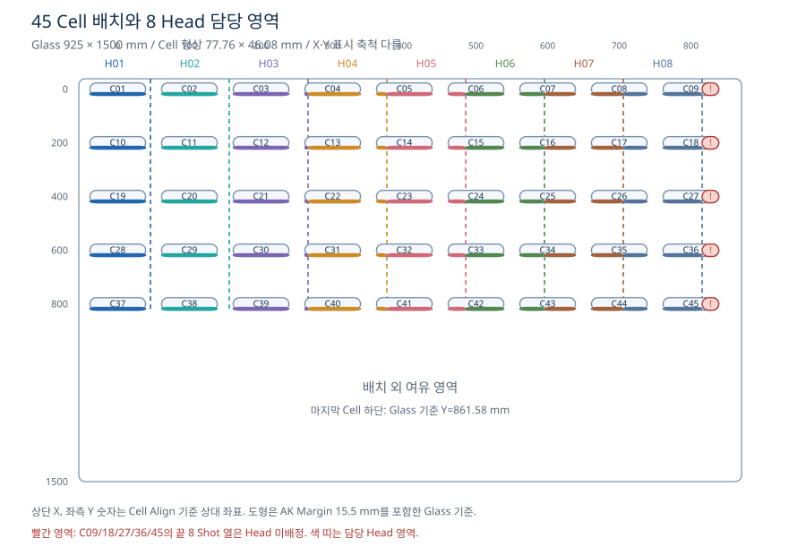
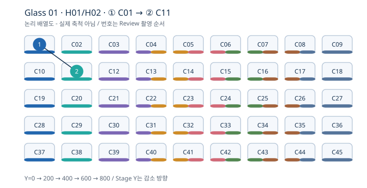
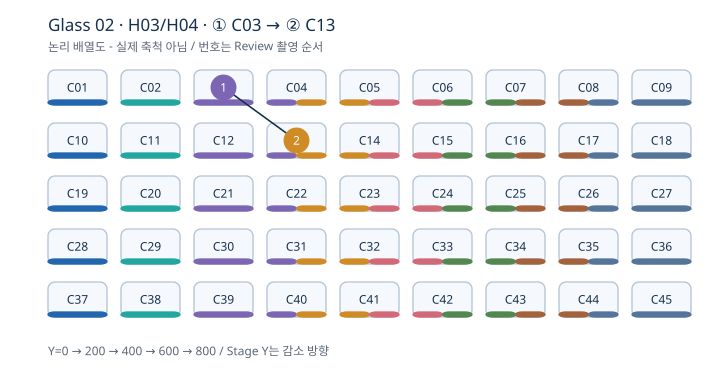
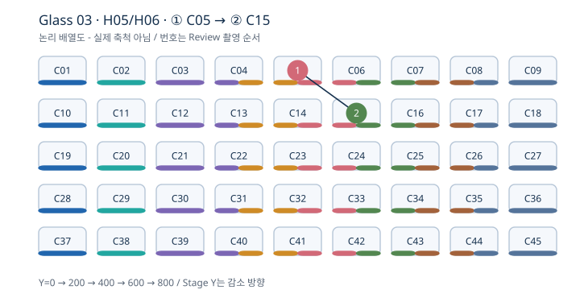
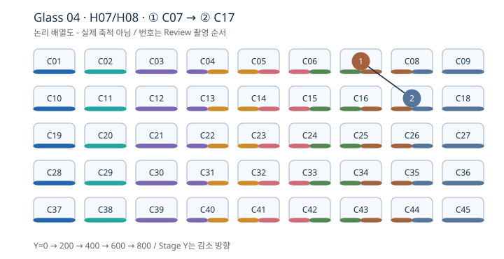
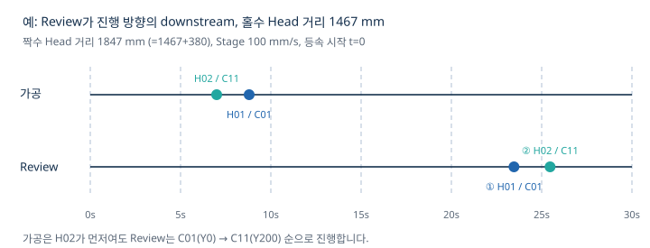
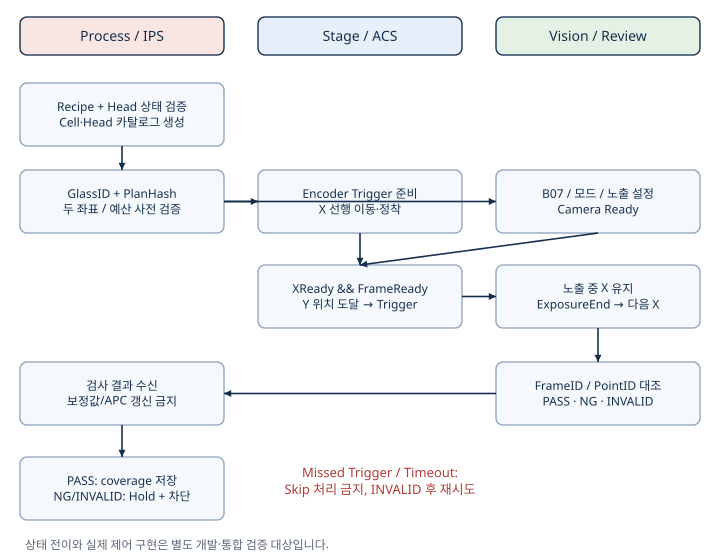

# test0929 · 45 Cell / 8 Head 0선방어 Review

코드 분석 기준: `6b19d7aaf0de81271468ab7dac0fa15493172f38`. 작성: 2026-09-30. **이 폴더는 설계·산출 제안이며 장비 코드/레시피를 수정하지 않습니다.**

- [PDF 통합 보고서](report.pdf)
- [HTML 보고서와 35 Glass 선택 시뮬레이션](report.html) - 파일을 내려받아 브라우저에서 실행합니다. 외부 의존성 없이 동작합니다.
- [70개 고정 Review 좌표](review_catalog_70.csv), [35 Glass 검사 일정](glass_schedule_35.csv), [45 Cell·Head 배정](cell_head_map_45.csv), [산출 집계와 가정](summary.json)
- 데이터 검증: `python3 validate_deliverables.py` (표준 라이브러리만 사용)
- [기존 보고서 PDF](previous/previous_review_report.pdf), [기존 HTML](previous/previous_review_report.html) - 이전 900 mm 등 수치는 예시이며 test0929 결과는 새 보고서가 우선합니다.

## 결론

| 목표 | Glass 수 | 150초 Tact 기준 | 의미 |
| --- | ---: | ---: | --- |
| 8 Head 대표 점 각 1회 | 4 | 10분 | 첫 4 Glass의 8개 포인트 |
| 모든 Cell·Head의 고정 대표 점 | 35 | 87.5분 | 70조합을 Glass당 2점씩 순환 |
| Cell만 1점씩 보는 수학적 하한 | 23 | 57.5분 | 45/2 올림. 제안 35매 계획과 다르며 Head 경계 양쪽 커버 보장 없음 |
| 전체 가공 Shot/홀의 전수 | 확정 불가 | - | 본 고정 대표 카탈로그로는 불가 |

현재 설정은 **H01만 ON / AUTO_INSPECTION_USE=OFF / ZERO_DEFENCE_REVIEW_POINT=0 / Review~H01 설정 gap=0**입니다. 물리 거리 1467 mm 및 8 Head 운전과 다릅니다. ZERO_DEFENCE_REVIEW_POINT 값의 소비/예산 집행 코드는 검토한 핵심 경로와 저장소 검색에서 찾지 못했습니다. 단순히 이 값을 2로 바꿔 자동 실행이 된다고 주장하지 않습니다.

## 실제 배치

9열(X=0~800, 100 pitch) × 5행(Y=0~800, 200 pitch). 전 Cell Model1/Rotation0. Cell 크기 77.76×46.08 mm, Shot 28×17, Shot pitch 2.7 mm, DOE 4×4/B07 선택. AK Margin 15.5 mm를 포함한 Glass 도형이며 X/Y 표시 축척은 다릅니다.

Head는 scannerReferenceX=RecipeDesignX+10 기준입니다. H01~H08 field는 [0,110]~[770,880]. C04~C08 등은 두 Head에 걸칩니다. C09/18/27/36/45의 끝 8 Shot 열은 미배정입니다. 후보680 / 유효 Laser675 Shot이 전체8 Head ON이어도 누락됩니다.

## 첫 4 Glass의 촬영 순서

**같은 material Y의 X가 다른 두 점은 Camera에서 동시 통과합니다.** 따라서 다른 Cell 행을 짝지어 ΔY=200/800 mm를 확보했습니다. 두 번째 Head 목록을 한 행 이동하여 순환합니다. Wrap 시 Head 순서가 뒤집혀도 반드시 ReviewStageY 내림차순으로 촬영합니다.

## 전체 35 Glass 순서

S번호는 Cell 로컬 Shot 번호. 전 좌표 DOE B07, Shot Row1이며, Mask 제외 후 각 Head 소유 첫 유효 열입니다. Fixed Recipe에서 좌표는 고정, 선택만 순환합니다.

`CELL1_A1_RECIPE_OFFSET`는 Cell1의 Shot 열A/행1 보정입니다. `S001=A1`, `S002=B1`, `S029=A2`. 코드 ShotKey는 `CELL001_SHOT0002` 형식입니다. `ZD-H01-C01-S002-B07`은 본 운영안 추적용 ID이며 native ShotKey/MatrixName도 좌표 CSV에 포함했습니다.

| Glass | 그룹 | ① 먼저 촬영 | ② 나중 촬영 | ΔY mm |
| --- | --- | --- | --- | ---: |
| 1 | H01/H02 | H01 / C01 / S002 | H02 / C11 / S002 | 200 |
| 2 | H03/H04 | H03 / C03 / S002 | H04 / C13 / S003 | 200 |
| 3 | H05/H06 | H05 / C05 / S006 | H06 / C15 / S010 | 200 |
| 4 | H07/H08 | H07 / C07 / S014 | H08 / C17 / S018 | 200 |
| 5 | H01/H02 | H01 / C10 / S002 | H02 / C20 / S002 | 200 |
| 6 | H03/H04 | H03 / C04 / S002 | H04 / C14 / S002 | 200 |
| 7 | H05/H06 | H05 / C06 / S002 | H06 / C16 / S002 | 200 |
| 8 | H07/H08 | H07 / C08 / S002 | H08 / C18 / S002 | 200 |
| 9 | H01/H02 | H01 / C19 / S002 | H02 / C29 / S002 | 200 |
| 10 | H03/H04 | H03 / C12 / S002 | H04 / C22 / S003 | 200 |
| 11 | H05/H06 | H05 / C14 / S006 | H06 / C24 / S010 | 200 |
| 12 | H07/H08 | H07 / C16 / S014 | H08 / C26 / S018 | 200 |
| 13 | H01/H02 | H01 / C28 / S002 | H02 / C38 / S002 | 200 |
| 14 | H03/H04 | H03 / C13 / S002 | H04 / C23 / S002 | 200 |
| 15 | H05/H06 | H05 / C15 / S002 | H06 / C25 / S002 | 200 |
| 16 | H07/H08 | H07 / C17 / S002 | H08 / C27 / S002 | 200 |
| 17 | H01/H02 | H02 / C02 / S002 | H01 / C37 / S002 | 800 |
| 18 | H03/H04 | H03 / C21 / S002 | H04 / C31 / S003 | 200 |
| 19 | H05/H06 | H05 / C23 / S006 | H06 / C33 / S010 | 200 |
| 20 | H07/H08 | H07 / C25 / S014 | H08 / C35 / S018 | 200 |
| 21 | H03/H04 | H03 / C22 / S002 | H04 / C32 / S002 | 200 |
| 22 | H05/H06 | H05 / C24 / S002 | H06 / C34 / S002 | 200 |
| 23 | H07/H08 | H07 / C26 / S002 | H08 / C36 / S002 | 200 |
| 24 | H03/H04 | H03 / C30 / S002 | H04 / C40 / S003 | 200 |
| 25 | H05/H06 | H05 / C32 / S006 | H06 / C42 / S010 | 200 |
| 26 | H07/H08 | H07 / C34 / S014 | H08 / C44 / S018 | 200 |
| 27 | H03/H04 | H03 / C31 / S002 | H04 / C41 / S002 | 200 |
| 28 | H05/H06 | H05 / C33 / S002 | H06 / C43 / S002 | 200 |
| 29 | H07/H08 | H07 / C35 / S002 | H08 / C45 / S002 | 200 |
| 30 | H03/H04 | H04 / C04 / S003 | H03 / C39 / S002 | 800 |
| 31 | H05/H06 | H06 / C06 / S010 | H05 / C41 / S006 | 800 |
| 32 | H07/H08 | H08 / C08 / S018 | H07 / C43 / S014 | 800 |
| 33 | H03/H04 | H04 / C05 / S002 | H03 / C40 / S002 | 800 |
| 34 | H05/H06 | H06 / C07 / S002 | H05 / C42 / S002 | 800 |
| 35 | H07/H08 | H08 / C09 / S002 | H07 / C44 / S002 | 800 |

## 속도와 Tact

Review X200 mm/s, 가속1000 mm/s², 정착50ms, Guard20ms, 노출10µs, 유효23Hz는 계산 가정입니다. 일정의 최대ΔX110.8 mm, 최소ΔY200 mm에서 필요 간격0.82401 s, Stage100의 도착 간격2 s, 최소 여유1.17599 s입니다. 실제 FrameReady/ExposureEnd/정착을 실측하여 승인합니다. 권장2점과 장비 최대 가능점은 다릅니다.

- 첫→마지막 가공 위치 거리1223.2 mm: 30초 등속 속도40.7733 mm/s.
- 선행500 mm 포함1723.2 mm: 30초 등속 속도57.44 mm/s.
- 현재100 mm/s: 기하학적 가공12.232초 + 선행5초. Scanner/Queue/가감속 미포함.
- downstream 홀수Head1467/짝수1847 mm 가정 시 마지막 대표 Review까지 약31.467초@100. tail1초 포함, 기타 공정은117.533초 이하여야150초 Tact에 들어옵니다. 현 설정gap0으로 이 값을 적용하지 않습니다.

Review 결과가 메인 가공 이후 도착한다면 현재 Glass의 이미 완료된 가공을 예방하지 못합니다. 배출 Hold/후속Glass 차단이 가능합니다. 선방어라면 0선→검사→메인 재진입의 별도 설계가 필요합니다.

## 운영 및 알람

ReviewBudget=2와 특수0선 가공Budget을 분리합니다. 세 번째 **특수 0선 가공**은 해당 예산이 승인된 경우 Gate 이전 차단합니다. 전체 메인 가공/DOE 분기 수를 2와 비교하면 안 됩니다. 마스킹 제외한 기존 첫Row에서 두 점을 Review할 때는 별도 특수 가공 이벤트를 만들지 않습니다.

PASS만 coverage 완료. NG/INVALID는 Hold 및 재시도 목록. PointID/GlassID/PlanHash/FrameID/TriggerEncoder/ExposureEnd/Judge/Reason 기록. 0선에서 Offset/APC 보정 생략. Gate ON만으로 실제 광 출사를 단독 입증하지 않으며 홀/전극 판정 기준은 기준 샘플로 검증합니다.

## 집계

Recipe21,420 후보 / Mask 제외20,205 유효 Shot. 8 Head ON 가정20,740배정 / 유효19,530. 현재 H01만 ON2,380후보 / 유효2,245. 70개 대표점은 모든 가공 Shot 또는 한 Glass의 전체 홀을 전수 검증하는 의미가 아닙니다.

## 재현 근거

- [Cell 형상·Pitch·DOE - Drilling.Common/Recipe/CCellPatternCalculator.cs](https://github.com/kjuws10-rgb/A3_LD_Process_SW_IPS/blob/6b19d7aaf0de81271468ab7dac0fa15493172f38/Drilling.Common/Recipe/CCellPatternCalculator.cs): `Calculate / ShotCenters`
- [Head 배정·Stage·순서 - Drilling.Common/Recipe/CShotCoordinatePlanBuilder.cs](https://github.com/kjuws10-rgb/A3_LD_Process_SW_IPS/blob/6b19d7aaf0de81271468ab7dac0fa15493172f38/Drilling.Common/Recipe/CShotCoordinatePlanBuilder.cs): `Build / AssignHeadNo / OrderShots / ReadHeadCenterY`
- [Masking / Chess - Drilling.Common/Recipe/CRecipeShotMaskingPlan.cs](https://github.com/kjuws10-rgb/A3_LD_Process_SW_IPS/blob/6b19d7aaf0de81271468ab7dac0fa15493172f38/Drilling.Common/Recipe/CRecipeShotMaskingPlan.cs): `EvaluateShot / ShouldSkipLaser / Intersects`
- [Review B07 좌표 - Drilling.Common/Review/CReviewManager.cs](https://github.com/kjuws10-rgb/A3_LD_Process_SW_IPS/blob/6b19d7aaf0de81271468ab7dac0fa15493172f38/Drilling.Common/Review/CReviewManager.cs): `CreatePlanCore / BuildShotPoints / CalculateBeamOffset / CalculateReviewTarget`
- [현재 Review Rule - Drilling.Common/Review/CReviewRulePlanBuilder.cs](https://github.com/kjuws10-rgb/A3_LD_Process_SW_IPS/blob/6b19d7aaf0de81271468ab7dac0fa15493172f38/Drilling.Common/Review/CReviewRulePlanBuilder.cs): `BuildRough / ResolveReferenceY`
- [Process Enable / 시작 위치 - Drilling.Common/Station/CStationProcess.cs](https://github.com/kjuws10-rgb/A3_LD_Process_SW_IPS/blob/6b19d7aaf0de81271468ab7dac0fa15493172f38/Drilling.Common/Station/CStationProcess.cs): `RunOptionalSequenceStep / BuildProcessModel / Prepare stage moves`
- [Laser Skip / 지연 / Encoder - Drilling.File/Script/CAutomation1ScriptFile.cs](https://github.com/kjuws10-rgb/A3_LD_Process_SW_IPS/blob/6b19d7aaf0de81271468ab7dac0fa15493172f38/Drilling.File/Script/CAutomation1ScriptFile.cs): `AppendEncoderWait / GalvoLaser.On / EvaluateShot`

검토 Recipe: `Config/RECIPE/test0929.csv`; Option: `Config/Setting/Setting.csv`; Review: `Config/ReviewSetting/test0929/reviewsettingsample.review`. Source 접근 권한 필요. 원본 소스와 장비 IP 등 내부 접속 설정은 이 공유 폴더에 복사하지 않았습니다. 코드는 이번 작업에서 수정하지 않았습니다.
